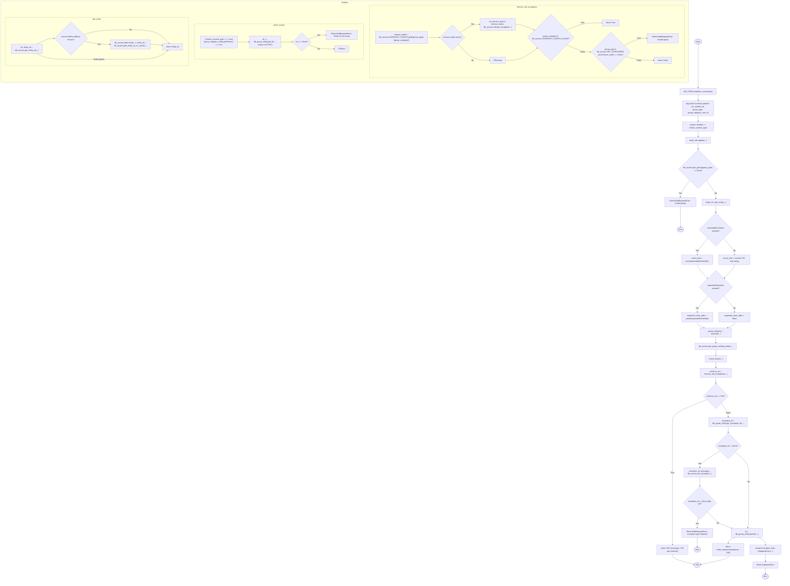

# Diagram: entity_core/entity_service/entity_service/entity/group/add_group_entity.py

> Auto-generated by Obscura crawlers

## Mermaid

### SVG

<svg id="container" width="6442.38330078125" xmlns="http://www.w3.org/2000/svg" class="flowchart" height="4809.953125" viewBox="0 0 6442.38330078125 4809.953125" role="graphics-document document" aria-roledescription="flowchart-v2"><g><marker id="container_flowchart-v2-pointEnd" class="marker flowchart-v2" viewBox="0 0 10 10" refX="5" refY="5" markerUnits="userSpaceOnUse" markerWidth="8" markerHeight="8" orient="auto"><path d="M 0 0 L 10 5 L 0 10 z" class="arrowMarkerPath" style="stroke-width: 1; stroke-dasharray: 1, 0;"></path></marker><marker id="container_flowchart-v2-pointStart" class="marker flowchart-v2" viewBox="0 0 10 10" refX="4.5" refY="5" markerUnits="userSpaceOnUse" markerWidth="8" markerHeight="8" orient="auto"><path d="M 0 5 L 10 10 L 10 0 z" class="arrowMarkerPath" style="stroke-width: 1; stroke-dasharray: 1, 0;"></path></marker><marker id="container_flowchart-v2-circleEnd" class="marker flowchart-v2" viewBox="0 0 10 10" refX="11" refY="5" markerUnits="userSpaceOnUse" markerWidth="11" markerHeight="11" orient="auto"><circle cx="5" cy="5" r="5" class="arrowMarkerPath" style="stroke-width: 1; stroke-dasharray: 1, 0;"></circle></marker><marker id="container_flowchart-v2-circleStart" class="marker flowchart-v2" viewBox="0 0 10 10" refX="-1" refY="5" markerUnits="userSpaceOnUse" markerWidth="11" markerHeight="11" orient="auto"><circle cx="5" cy="5" r="5" class="arrowMarkerPath" style="stroke-width: 1; stroke-dasharray: 1, 0;"></circle></marker><marker id="container_flowchart-v2-crossEnd" class="marker cross flowchart-v2" viewBox="0 0 11 11" refX="12" refY="5.2" markerUnits="userSpaceOnUse" markerWidth="11" markerHeight="11" orient="auto"><path d="M 1,1 l 9,9 M 10,1 l -9,9" class="arrowMarkerPath" style="stroke-width: 2; stroke-dasharray: 1, 0;"></path></marker><marker id="container_flowchart-v2-crossStart" class="marker cross flowchart-v2" viewBox="0 0 11 11" refX="-1" refY="5.2" markerUnits="userSpaceOnUse" markerWidth="11" markerHeight="11" orient="auto"><path d="M 1,1 l 9,9 M 10,1 l -9,9" class="arrowMarkerPath" style="stroke-width: 2; stroke-dasharray: 1, 0;"></path></marker><g class="root"><g class="clusters"></g><g class="edgePaths"><path d="M5743.17,355.063L5743.086,410.406C5743.003,465.75,5742.836,576.438,5742.753,635.281C5742.67,694.125,5742.67,701.125,5742.67,704.625L5742.67,708.125" id="L_Start_Establish_0" class="edge-thickness-normal edge-pattern-solid edge-thickness-normal edge-pattern-solid flowchart-link" style=";" data-edge="true" data-et="edge" data-id="L_Start_Establish_0" data-points="W3sieCI6NTc0My4xNjk2NjgxOTc2MzIsInkiOjM1NS4wNjI1fSx7IngiOjU3NDIuNjY5NjY4MTk3NjMyLCJ5Ijo2ODcuMTI1fSx7IngiOjU3NDIuNjY5NjY4MTk3NjMyLCJ5Ijo3MTIuMTI1fV0=" marker-end="url(#container_flowchart-v2-pointEnd)"></path><path d="M5742.67,766.125L5742.67,770.292C5742.67,774.458,5742.67,782.792,5742.67,790.458C5742.67,798.125,5742.67,805.125,5742.67,808.625L5742.67,812.125" id="L_Establish_LogEvent_0" class="edge-thickness-normal edge-pattern-solid edge-thickness-normal edge-pattern-solid flowchart-link" style=";" data-edge="true" data-et="edge" data-id="L_Establish_LogEvent_0" data-points="W3sieCI6NTc0Mi42Njk2NjgxOTc2MzIsInkiOjc2Ni4xMjV9LHsieCI6NTc0Mi42Njk2NjgxOTc2MzIsInkiOjc5MS4xMjV9LHsieCI6NTc0Mi42Njk2NjgxOTc2MzIsInkiOjgxNi4xMjV9XQ==" marker-end="url(#container_flowchart-v2-pointEnd)"></path><path d="M5742.67,942.125L5742.67,946.292C5742.67,950.458,5742.67,958.792,5742.67,966.458C5742.67,974.125,5742.67,981.125,5742.67,984.625L5742.67,988.125" id="L_LogEvent_Headers_0" class="edge-thickness-normal edge-pattern-solid edge-thickness-normal edge-pattern-solid flowchart-link" style=";" data-edge="true" data-et="edge" data-id="L_LogEvent_Headers_0" data-points="W3sieCI6NTc0Mi42Njk2NjgxOTc2MzIsInkiOjk0Mi4xMjV9LHsieCI6NTc0Mi42Njk2NjgxOTc2MzIsInkiOjk2Ny4xMjV9LHsieCI6NTc0Mi42Njk2NjgxOTc2MzIsInkiOjk5Mi4xMjV9XQ==" marker-end="url(#container_flowchart-v2-pointEnd)"></path><path d="M5742.67,1070.125L5742.67,1074.292C5742.67,1078.458,5742.67,1086.792,5742.67,1094.458C5742.67,1102.125,5742.67,1109.125,5742.67,1112.625L5742.67,1116.125" id="L_Headers_Audit_0" class="edge-thickness-normal edge-pattern-solid edge-thickness-normal edge-pattern-solid flowchart-link" style=";" data-edge="true" data-et="edge" data-id="L_Headers_Audit_0" data-points="W3sieCI6NTc0Mi42Njk2NjgxOTc2MzIsInkiOjEwNzAuMTI1fSx7IngiOjU3NDIuNjY5NjY4MTk3NjMyLCJ5IjoxMDk1LjEyNX0seyJ4Ijo1NzQyLjY2OTY2ODE5NzYzMiwieSI6MTEyMC4xMjV9XQ==" marker-end="url(#container_flowchart-v2-pointEnd)"></path><path d="M5742.67,1174.125L5742.67,1178.292C5742.67,1182.458,5742.67,1190.792,5742.67,1198.458C5742.67,1206.125,5742.67,1213.125,5742.67,1216.625L5742.67,1220.125" id="L_Audit_ValidateGroup_0" class="edge-thickness-normal edge-pattern-solid edge-thickness-normal edge-pattern-solid flowchart-link" style=";" data-edge="true" data-et="edge" data-id="L_Audit_ValidateGroup_0" data-points="W3sieCI6NTc0Mi42Njk2NjgxOTc2MzIsInkiOjExNzQuMTI1fSx7IngiOjU3NDIuNjY5NjY4MTk3NjMyLCJ5IjoxMTk5LjEyNX0seyJ4Ijo1NzQyLjY2OTY2ODE5NzYzMiwieSI6MTIyNC4xMjV9XQ==" marker-end="url(#container_flowchart-v2-pointEnd)"></path><path d="M5673.302,1479.523L5660.082,1497.251C5646.861,1514.979,5620.42,1550.435,5607.199,1573.663C5593.978,1596.891,5593.978,1607.891,5593.978,1613.391L5593.978,1618.891" id="L_ValidateGroup_ErrorInvalidGroup_0" class="edge-thickness-normal edge-pattern-solid edge-thickness-normal edge-pattern-solid flowchart-link" style=";" data-edge="true" data-et="edge" data-id="L_ValidateGroup_ErrorInvalidGroup_0" data-points="W3sieCI6NTY3My4zMDI0ODMxNTI1NDUsInkiOjE0NzkuNTIzNDM5OTU0OTEzOH0seyJ4Ijo1NTkzLjk3ODI2MTk0NzYzMiwieSI6MTU4NS44OTA2MjV9LHsieCI6NTU5My45NzgyNjE5NDc2MzIsInkiOjE2MjIuODkwNjI1fV0=" marker-end="url(#container_flowchart-v2-pointEnd)"></path><path d="M5812.037,1479.523L5825.258,1497.251C5838.478,1514.979,5864.92,1550.435,5878.14,1575.663C5891.361,1600.891,5891.361,1615.891,5891.361,1623.391L5891.361,1630.891" id="L_ValidateGroup_GetEntity_0" class="edge-thickness-normal edge-pattern-solid edge-thickness-normal edge-pattern-solid flowchart-link" style=";" data-edge="true" data-et="edge" data-id="L_ValidateGroup_GetEntity_0" data-points="W3sieCI6NTgxMi4wMzY4NTMyNDI3MTksInkiOjE0NzkuNTIzNDM5OTU0OTEzOH0seyJ4Ijo1ODkxLjM2MTA3NDQ0NzYzMiwieSI6MTU4NS44OTA2MjV9LHsieCI6NTg5MS4zNjEwNzQ0NDc2MzIsInkiOjE2MzQuODkwNjI1fV0=" marker-end="url(#container_flowchart-v2-pointEnd)"></path><path d="M5891.361,1688.891L5891.361,1695.057C5891.361,1701.224,5891.361,1713.557,5891.361,1723.224C5891.361,1732.891,5891.361,1739.891,5891.361,1743.391L5891.361,1746.891" id="L_GetEntity_ParseActivated_0" class="edge-thickness-normal edge-pattern-solid edge-thickness-normal edge-pattern-solid flowchart-link" style=";" data-edge="true" data-et="edge" data-id="L_GetEntity_ParseActivated_0" data-points="W3sieCI6NTg5MS4zNjEwNzQ0NDc2MzIsInkiOjE2ODguODkwNjI1fSx7IngiOjU4OTEuMzYxMDc0NDQ3NjMyLCJ5IjoxNzI1Ljg5MDYyNX0seyJ4Ijo1ODkxLjM2MTA3NDQ0NzYzMiwieSI6MTc1MC44OTA2MjV9XQ==" marker-end="url(#container_flowchart-v2-pointEnd)"></path><path d="M5826.27,1963.8L5811.286,1980.815C5796.301,1997.83,5766.331,2031.86,5751.346,2054.376C5736.361,2076.891,5736.361,2087.891,5736.361,2093.391L5736.361,2098.891" id="L_ParseActivated_ParseActivatedOK_0" class="edge-thickness-normal edge-pattern-solid edge-thickness-normal edge-pattern-solid flowchart-link" style=";" data-edge="true" data-et="edge" data-id="L_ParseActivated_ParseActivatedOK_0" data-points="W3sieCI6NTgyNi4yNzA0NDAwMDY1NDQsInkiOjE5NjMuNzk5OTkwNTU4OTEyNH0seyJ4Ijo1NzM2LjM2MTA3NDQ0NzYzMiwieSI6MjA2NS44OTA2MjV9LHsieCI6NTczNi4zNjEwNzQ0NDc2MzIsInkiOjIxMDIuODkwNjI1fV0=" marker-end="url(#container_flowchart-v2-pointEnd)"></path><path d="M5956.452,1963.8L5971.437,1980.815C5986.421,1997.83,6016.391,2031.86,6031.376,2054.376C6046.361,2076.891,6046.361,2087.891,6046.361,2093.391L6046.361,2098.891" id="L_ParseActivated_ParseActivatedNow_0" class="edge-thickness-normal edge-pattern-solid edge-thickness-normal edge-pattern-solid flowchart-link" style=";" data-edge="true" data-et="edge" data-id="L_ParseActivated_ParseActivatedNow_0" data-points="W3sieCI6NTk1Ni40NTE3MDg4ODg3MiwieSI6MTk2My43OTk5OTA1NTg5MTI0fSx7IngiOjYwNDYuMzYxMDc0NDQ3NjMyLCJ5IjoyMDY1Ljg5MDYyNX0seyJ4Ijo2MDQ2LjM2MTA3NDQ0NzYzMiwieSI6MjEwMi44OTA2MjV9XQ==" marker-end="url(#container_flowchart-v2-pointEnd)"></path><path d="M5736.361,2180.891L5736.361,2185.057C5736.361,2189.224,5736.361,2197.557,5750.48,2216.663C5764.599,2235.768,5792.837,2265.645,5806.955,2280.584L5821.074,2295.523" id="L_ParseActivatedOK_ParseExpected_0" class="edge-thickness-normal edge-pattern-solid edge-thickness-normal edge-pattern-solid flowchart-link" style=";" data-edge="true" data-et="edge" data-id="L_ParseActivatedOK_ParseExpected_0" data-points="W3sieCI6NTczNi4zNjEwNzQ0NDc2MzIsInkiOjIxODAuODkwNjI1fSx7IngiOjU3MzYuMzYxMDc0NDQ3NjMyLCJ5IjoyMjA1Ljg5MDYyNX0seyJ4Ijo1ODIzLjgyMTg4OTQ5NDY1NCwieSI6MjI5OC40Mjk4MDk5NTI5Nzh9XQ==" marker-end="url(#container_flowchart-v2-pointEnd)"></path><path d="M6046.361,2180.891L6046.361,2185.057C6046.361,2189.224,6046.361,2197.557,6032.242,2216.663C6018.123,2235.768,5989.886,2265.645,5975.767,2280.584L5961.648,2295.523" id="L_ParseActivatedNow_ParseExpected_0" class="edge-thickness-normal edge-pattern-solid edge-thickness-normal edge-pattern-solid flowchart-link" style=";" data-edge="true" data-et="edge" data-id="L_ParseActivatedNow_ParseExpected_0" data-points="W3sieCI6NjA0Ni4zNjEwNzQ0NDc2MzIsInkiOjIxODAuODkwNjI1fSx7IngiOjYwNDYuMzYxMDc0NDQ3NjMyLCJ5IjoyMjA1Ljg5MDYyNX0seyJ4Ijo1OTU4LjkwMDI1OTQwMDYxLCJ5IjoyMjk4LjQyOTgwOTk1Mjk3OH1d" marker-end="url(#container_flowchart-v2-pointEnd)"></path><path d="M5826.27,2443.8L5811.286,2460.815C5796.301,2477.83,5766.331,2511.86,5751.346,2534.376C5736.361,2556.891,5736.361,2567.891,5736.361,2573.391L5736.361,2578.891" id="L_ParseExpected_ParseExpectedOK_0" class="edge-thickness-normal edge-pattern-solid edge-thickness-normal edge-pattern-solid flowchart-link" style=";" data-edge="true" data-et="edge" data-id="L_ParseExpected_ParseExpectedOK_0" data-points="W3sieCI6NTgyNi4yNzA0NDAwMDY1NDQsInkiOjI0NDMuNzk5OTkwNTU4OTEyfSx7IngiOjU3MzYuMzYxMDc0NDQ3NjMyLCJ5IjoyNTQ1Ljg5MDYyNX0seyJ4Ijo1NzM2LjM2MTA3NDQ0NzYzMiwieSI6MjU4Mi44OTA2MjV9XQ==" marker-end="url(#container_flowchart-v2-pointEnd)"></path><path d="M5956.452,2443.8L5971.437,2460.815C5986.421,2477.83,6016.391,2511.86,6031.376,2534.376C6046.361,2556.891,6046.361,2567.891,6046.361,2573.391L6046.361,2578.891" id="L_ParseExpected_ParseExpectedNone_0" class="edge-thickness-normal edge-pattern-solid edge-thickness-normal edge-pattern-solid flowchart-link" style=";" data-edge="true" data-et="edge" data-id="L_ParseExpected_ParseExpectedNone_0" data-points="W3sieCI6NTk1Ni40NTE3MDg4ODg3MiwieSI6MjQ0My43OTk5OTA1NTg5MTJ9LHsieCI6NjA0Ni4zNjEwNzQ0NDc2MzIsInkiOjI1NDUuODkwNjI1fSx7IngiOjYwNDYuMzYxMDc0NDQ3NjMyLCJ5IjoyNTgyLjg5MDYyNX1d" marker-end="url(#container_flowchart-v2-pointEnd)"></path><path d="M5736.361,2660.891L5736.361,2665.057C5736.361,2669.224,5736.361,2677.557,5745.836,2685.636C5755.311,2693.715,5774.261,2701.54,5783.736,2705.452L5793.211,2709.364" id="L_ParseExpectedOK_Category_0" class="edge-thickness-normal edge-pattern-solid edge-thickness-normal edge-pattern-solid flowchart-link" style=";" data-edge="true" data-et="edge" data-id="L_ParseExpectedOK_Category_0" data-points="W3sieCI6NTczNi4zNjEwNzQ0NDc2MzIsInkiOjI2NjAuODkwNjI1fSx7IngiOjU3MzYuMzYxMDc0NDQ3NjMyLCJ5IjoyNjg1Ljg5MDYyNX0seyJ4Ijo1Nzk2LjkwNzk0OTQ0NzYzMiwieSI6MjcxMC44OTA2MjV9XQ==" marker-end="url(#container_flowchart-v2-pointEnd)"></path><path d="M6046.361,2660.891L6046.361,2665.057C6046.361,2669.224,6046.361,2677.557,6036.886,2685.636C6027.411,2693.715,6008.461,2701.54,5998.986,2705.452L5989.511,2709.364" id="L_ParseExpectedNone_Category_0" class="edge-thickness-normal edge-pattern-solid edge-thickness-normal edge-pattern-solid flowchart-link" style=";" data-edge="true" data-et="edge" data-id="L_ParseExpectedNone_Category_0" data-points="W3sieCI6NjA0Ni4zNjEwNzQ0NDc2MzIsInkiOjI2NjAuODkwNjI1fSx7IngiOjYwNDYuMzYxMDc0NDQ3NjMyLCJ5IjoyNjg1Ljg5MDYyNX0seyJ4Ijo1OTg1LjgxNDE5OTQ0NzYzMiwieSI6MjcxMC44OTA2MjV9XQ==" marker-end="url(#container_flowchart-v2-pointEnd)"></path><path d="M5891.361,2788.891L5891.361,2793.057C5891.361,2797.224,5891.361,2805.557,5891.361,2813.224C5891.361,2820.891,5891.361,2827.891,5891.361,2831.391L5891.361,2834.891" id="L_Category_GetCategoryEntity_0" class="edge-thickness-normal edge-pattern-solid edge-thickness-normal edge-pattern-solid flowchart-link" style=";" data-edge="true" data-et="edge" data-id="L_Category_GetCategoryEntity_0" data-points="W3sieCI6NTg5MS4zNjEwNzQ0NDc2MzIsInkiOjI3ODguODkwNjI1fSx7IngiOjU4OTEuMzYxMDc0NDQ3NjMyLCJ5IjoyODEzLjg5MDYyNX0seyJ4Ijo1ODkxLjM2MTA3NDQ0NzYzMiwieSI6MjgzOC44OTA2MjV9XQ==" marker-end="url(#container_flowchart-v2-pointEnd)"></path><path d="M5891.361,2892.891L5891.361,2897.057C5891.361,2901.224,5891.361,2909.557,5891.361,2917.224C5891.361,2924.891,5891.361,2931.891,5891.361,2935.391L5891.361,2938.891" id="L_GetCategoryEntity_CheckFrozenCall_0" class="edge-thickness-normal edge-pattern-solid edge-thickness-normal edge-pattern-solid flowchart-link" style=";" data-edge="true" data-et="edge" data-id="L_GetCategoryEntity_CheckFrozenCall_0" data-points="W3sieCI6NTg5MS4zNjEwNzQ0NDc2MzIsInkiOjI4OTIuODkwNjI1fSx7IngiOjU4OTEuMzYxMDc0NDQ3NjMyLCJ5IjoyOTE3Ljg5MDYyNX0seyJ4Ijo1ODkxLjM2MTA3NDQ0NzYzMiwieSI6Mjk0Mi44OTA2MjV9XQ==" marker-end="url(#container_flowchart-v2-pointEnd)"></path><path d="M5891.361,2996.891L5891.361,3001.057C5891.361,3005.224,5891.361,3013.557,5891.361,3021.224C5891.361,3028.891,5891.361,3035.891,5891.361,3039.391L5891.361,3042.891" id="L_CheckFrozenCall_RemoveOld_0" class="edge-thickness-normal edge-pattern-solid edge-thickness-normal edge-pattern-solid flowchart-link" style=";" data-edge="true" data-et="edge" data-id="L_CheckFrozenCall_RemoveOld_0" data-points="W3sieCI6NTg5MS4zNjEwNzQ0NDc2MzIsInkiOjI5OTYuODkwNjI1fSx7IngiOjU4OTEuMzYxMDc0NDQ3NjMyLCJ5IjozMDIxLjg5MDYyNX0seyJ4Ijo1ODkxLjM2MTA3NDQ0NzYzMiwieSI6MzA0Ni44OTA2MjV9XQ==" marker-end="url(#container_flowchart-v2-pointEnd)"></path><path d="M5891.361,3124.891L5891.361,3129.057C5891.361,3133.224,5891.361,3141.557,5891.361,3149.224C5891.361,3156.891,5891.361,3163.891,5891.361,3167.391L5891.361,3170.891" id="L_RemoveOld_Cleared?_0" class="edge-thickness-normal edge-pattern-solid edge-thickness-normal edge-pattern-solid flowchart-link" style=";" data-edge="true" data-et="edge" data-id="L_RemoveOld_Cleared?_0" data-points="W3sieCI6NTg5MS4zNjEwNzQ0NDc2MzIsInkiOjMxMjQuODkwNjI1fSx7IngiOjU4OTEuMzYxMDc0NDQ3NjMyLCJ5IjozMTQ5Ljg5MDYyNX0seyJ4Ijo1ODkxLjM2MTA3NDQ0NzYzMiwieSI6MzE3NC44OTA2MjV9XQ==" marker-end="url(#container_flowchart-v2-pointEnd)"></path><path d="M5816.757,3307.63L5769.017,3326.231C5721.277,3344.832,5625.797,3382.033,5578.056,3413.3C5530.316,3444.568,5530.316,3469.901,5530.316,3493.234C5530.316,3516.568,5530.316,3537.901,5530.316,3570.794C5530.316,3603.688,5530.316,3648.141,5530.316,3694.594C5530.316,3741.047,5530.316,3789.5,5530.316,3826.393C5530.316,3863.286,5530.316,3888.62,5530.316,3913.953C5530.316,3939.286,5530.316,3964.62,5530.316,4006.62C5530.316,4048.62,5530.316,4107.286,5530.316,4165.953C5530.316,4224.62,5530.316,4283.286,5530.316,4325.286C5530.316,4367.286,5530.316,4392.62,5530.316,4415.953C5530.316,4439.286,5530.316,4460.62,5530.316,4476.786C5530.316,4492.953,5530.316,4503.953,5530.316,4509.453L5530.316,4514.953" id="L_Cleared?_ReturnCleared_0" class="edge-thickness-normal edge-pattern-solid edge-thickness-normal edge-pattern-solid flowchart-link" style=";" data-edge="true" data-et="edge" data-id="L_Cleared?_ReturnCleared_0" data-points="W3sieCI6NTgxNi43NTY4NDE4MDIxNTQsInkiOjMzMDcuNjMwMTQyMzU0NTIyfSx7IngiOjU1MzAuMzE2NDA2MjUsInkiOjM0MTkuMjM0Mzc1fSx7IngiOjU1MzAuMzE2NDA2MjUsInkiOjM0OTUuMjM0Mzc1fSx7IngiOjU1MzAuMzE2NDA2MjUsInkiOjM1NTkuMjM0Mzc1fSx7IngiOjU1MzAuMzE2NDA2MjUsInkiOjM2OTIuNTkzNzV9LHsieCI6NTUzMC4zMTY0MDYyNSwieSI6MzgzNy45NTMxMjV9LHsieCI6NTUzMC4zMTY0MDYyNSwieSI6MzkxMy45NTMxMjV9LHsieCI6NTUzMC4zMTY0MDYyNSwieSI6Mzk4OS45NTMxMjV9LHsieCI6NTUzMC4zMTY0MDYyNSwieSI6NDE2NS45NTMxMjV9LHsieCI6NTUzMC4zMTY0MDYyNSwieSI6NDM0MS45NTMxMjV9LHsieCI6NTUzMC4zMTY0MDYyNSwieSI6NDQxNy45NTMxMjV9LHsieCI6NTUzMC4zMTY0MDYyNSwieSI6NDQ4MS45NTMxMjV9LHsieCI6NTUzMC4zMTY0MDYyNSwieSI6NDUxOC45NTMxMjV9XQ==" marker-end="url(#container_flowchart-v2-pointEnd)"></path><path d="M5935.189,3338.407L5945.054,3351.878C5954.92,3365.349,5974.652,3392.292,5984.518,3411.263C5994.383,3430.234,5994.383,3441.234,5994.383,3446.734L5994.383,3452.234" id="L_Cleared?_CheckExceptionId_0" class="edge-thickness-normal edge-pattern-solid edge-thickness-normal edge-pattern-solid flowchart-link" style=";" data-edge="true" data-et="edge" data-id="L_Cleared?_CheckExceptionId_0" data-points="W3sieCI6NTkzNS4xODg2MTc5MTg1OTYsInkiOjMzMzguNDA2ODMxNTI5MDM1Nn0seyJ4Ijo1OTk0LjM4MzQwODU0NjQ0OCwieSI6MzQxOS4yMzQzNzV9LHsieCI6NTk5NC4zODM0MDg1NDY0NDgsInkiOjM0NTYuMjM0Mzc1fV0=" marker-end="url(#container_flowchart-v2-pointEnd)"></path><path d="M5994.383,3534.234L5994.383,3538.401C5994.383,3542.568,5994.383,3550.901,5994.383,3558.568C5994.383,3566.234,5994.383,3573.234,5994.383,3576.734L5994.383,3580.234" id="L_CheckExceptionId_IsExceptionNull_0" class="edge-thickness-normal edge-pattern-solid edge-thickness-normal edge-pattern-solid flowchart-link" style=";" data-edge="true" data-et="edge" data-id="L_CheckExceptionId_IsExceptionNull_0" data-points="W3sieCI6NTk5NC4zODM0MDg1NDY0NDgsInkiOjM1MzQuMjM0Mzc1fSx7IngiOjU5OTQuMzgzNDA4NTQ2NDQ4LCJ5IjozNTU5LjIzNDM3NX0seyJ4Ijo1OTk0LjM4MzQwODU0NjQ0OCwieSI6MzU4NC4yMzQzNzV9XQ==" marker-end="url(#container_flowchart-v2-pointEnd)"></path><path d="M5927.225,3733.795L5898.929,3751.155C5870.633,3768.514,5814.04,3803.234,5785.743,3826.093C5757.447,3848.953,5757.447,3859.953,5757.447,3865.453L5757.447,3870.953" id="L_IsExceptionNull_SetException_0" class="edge-thickness-normal edge-pattern-solid edge-thickness-normal edge-pattern-solid flowchart-link" style=";" data-edge="true" data-et="edge" data-id="L_IsExceptionNull_SetException_0" data-points="W3sieCI6NTkyNy4yMjUyNTA0OTgyMjYsInkiOjM3MzMuNzk0OTY2OTUxNzc5fSx7IngiOjU3NTcuNDQ3MDExOTQ3NjMyLCJ5IjozODM3Ljk1MzEyNX0seyJ4Ijo1NzU3LjQ0NzAxMTk0NzYzMiwieSI6Mzg3NC45NTMxMjV9XQ==" marker-end="url(#container_flowchart-v2-pointEnd)"></path><path d="M5757.447,3952.953L5757.447,3959.12C5757.447,3965.286,5757.447,3977.62,5757.447,3989.286C5757.447,4000.953,5757.447,4011.953,5757.447,4017.453L5757.447,4022.953" id="L_SetException_CheckSetResult_0" class="edge-thickness-normal edge-pattern-solid edge-thickness-normal edge-pattern-solid flowchart-link" style=";" data-edge="true" data-et="edge" data-id="L_SetException_CheckSetResult_0" data-points="W3sieCI6NTc1Ny40NDcwMTE5NDc2MzIsInkiOjM5NTIuOTUzMTI1fSx7IngiOjU3NTcuNDQ3MDExOTQ3NjMyLCJ5IjozOTg5Ljk1MzEyNX0seyJ4Ijo1NzU3LjQ0NzAxMTk0NzYzMiwieSI6NDAyNi45NTMxMjV9XQ==" marker-end="url(#container_flowchart-v2-pointEnd)"></path><path d="M5742.576,4290.082L5741.54,4298.727C5740.504,4307.372,5738.433,4324.663,5737.397,4338.808C5736.361,4352.953,5736.361,4363.953,5736.361,4369.453L5736.361,4374.953" id="L_CheckSetResult_ErrorMissingType_0" class="edge-thickness-normal edge-pattern-solid edge-thickness-normal edge-pattern-solid flowchart-link" style=";" data-edge="true" data-et="edge" data-id="L_CheckSetResult_ErrorMissingType_0" data-points="W3sieCI6NTc0Mi41NzU2MDQzMjg4MTEsInkiOjQyOTAuMDgxNzE3MzgxMTc5fSx7IngiOjU3MzYuMzYxMDc0NDQ3NjMyLCJ5Ijo0MzQxLjk1MzEyNX0seyJ4Ijo1NzM2LjM2MTA3NDQ0NzYzMiwieSI6NDM3OC45NTMxMjV9XQ==" marker-end="url(#container_flowchart-v2-pointEnd)"></path><path d="M5822.538,4239.862L5837.523,4256.878C5852.507,4273.893,5882.477,4307.923,5916.052,4330.901C5949.628,4353.879,5986.808,4365.805,6005.398,4371.768L6023.989,4377.731" id="L_CheckSetResult_PersistTry_0" class="edge-thickness-normal edge-pattern-solid edge-thickness-normal edge-pattern-solid flowchart-link" style=";" data-edge="true" data-et="edge" data-id="L_CheckSetResult_PersistTry_0" data-points="W3sieCI6NTgyMi41Mzc2NDYzODg3MiwieSI6NDIzOS44NjI0OTA1NTg5MTJ9LHsieCI6NTkxMi40NDcwMTE5NDc2MzIsInkiOjQzNDEuOTUzMTI1fSx7IngiOjYwMjcuNzk3NjI2MDgxMjY2LCJ5Ijo0Mzc4Ljk1MzEyNX1d" marker-end="url(#container_flowchart-v2-pointEnd)"></path><path d="M6052.808,3742.529L6071.415,3758.433C6090.023,3774.337,6127.238,3806.145,6145.846,3834.716C6164.454,3863.286,6164.454,3888.62,6164.454,3913.953C6164.454,3939.286,6164.454,3964.62,6164.454,4006.62C6164.454,4048.62,6164.454,4107.286,6164.454,4165.953C6164.454,4224.62,6164.454,4283.286,6163.361,4318.133C6162.267,4352.979,6160.081,4364.004,6158.988,4369.517L6157.895,4375.03" id="L_IsExceptionNull_PersistTry_0" class="edge-thickness-normal edge-pattern-solid edge-thickness-normal edge-pattern-solid flowchart-link" style=";" data-edge="true" data-et="edge" data-id="L_IsExceptionNull_PersistTry_0" data-points="W3sieCI6NjA1Mi44MDc1NjI5NTgyMTMsInkiOjM3NDIuNTI4OTcwNTg4MjM1Nn0seyJ4Ijo2MTY0LjQ1MzcyMTA0NjQ0OCwieSI6MzgzNy45NTMxMjV9LHsieCI6NjE2NC40NTM3MjEwNDY0NDgsInkiOjM5MTMuOTUzMTI1fSx7IngiOjYxNjQuNDUzNzIxMDQ2NDQ4LCJ5IjozOTg5Ljk1MzEyNX0seyJ4Ijo2MTY0LjQ1MzcyMTA0NjQ0OCwieSI6NDE2NS45NTMxMjV9LHsieCI6NjE2NC40NTM3MjEwNDY0NDgsInkiOjQzNDEuOTUzMTI1fSx7IngiOjYxNTcuMTE2ODU4MzgxOTc0LCJ5Ijo0Mzc4Ljk1MzEyNX1d" marker-end="url(#container_flowchart-v2-pointEnd)"></path><path d="M6054.93,4456.953L6044.839,4461.12C6034.748,4465.286,6014.566,4473.62,6004.475,4481.286C5994.383,4488.953,5994.383,4495.953,5994.383,4499.453L5994.383,4502.953" id="L_PersistTry_PersistOK_0" class="edge-thickness-normal edge-pattern-solid edge-thickness-normal edge-pattern-solid flowchart-link" style=";" data-edge="true" data-et="edge" data-id="L_PersistTry_PersistOK_0" data-points="W3sieCI6NjA1NC45MzAyODM1NDY0NDgsInkiOjQ0NTYuOTUzMTI1fSx7IngiOjU5OTQuMzgzNDA4NTQ2NDQ4LCJ5Ijo0NDgxLjk1MzEyNX0seyJ4Ijo1OTk0LjM4MzQwODU0NjQ0OCwieSI6NDUwNi45NTMxMjV9XQ==" marker-end="url(#container_flowchart-v2-pointEnd)"></path><path d="M6243.837,4456.953L6253.928,4461.12C6264.019,4465.286,6284.201,4473.62,6294.292,4483.286C6304.383,4492.953,6304.383,4503.953,6304.383,4509.453L6304.383,4514.953" id="L_PersistTry_PersistExcept_0" class="edge-thickness-normal edge-pattern-solid edge-thickness-normal edge-pattern-solid flowchart-link" style=";" data-edge="true" data-et="edge" data-id="L_PersistTry_PersistExcept_0" data-points="W3sieCI6NjI0My44MzY1MzM1NDY0NDgsInkiOjQ0NTYuOTUzMTI1fSx7IngiOjYzMDQuMzgzNDA4NTQ2NDQ4LCJ5Ijo0NDgxLjk1MzEyNX0seyJ4Ijo2MzA0LjM4MzQwODU0NjQ0OCwieSI6NDUxOC45NTMxMjV9XQ==" marker-end="url(#container_flowchart-v2-pointEnd)"></path><path d="M6304.383,4596.953L6304.383,4603.12C6304.383,4609.286,6304.383,4621.62,6304.383,4631.286C6304.383,4640.953,6304.383,4647.953,6304.383,4651.453L6304.383,4654.953" id="L_PersistExcept_ErrorDB_0" class="edge-thickness-normal edge-pattern-solid edge-thickness-normal edge-pattern-solid flowchart-link" style=";" data-edge="true" data-et="edge" data-id="L_PersistExcept_ErrorDB_0" data-points="W3sieCI6NjMwNC4zODM0MDg1NDY0NDgsInkiOjQ1OTYuOTUzMTI1fSx7IngiOjYzMDQuMzgzNDA4NTQ2NDQ4LCJ5Ijo0NjMzLjk1MzEyNX0seyJ4Ijo2MzA0LjM4MzQwODU0NjQ0OCwieSI6NDY1OC45NTMxMjV9XQ==" marker-end="url(#container_flowchart-v2-pointEnd)"></path><path d="M5593.978,1700.891L5593.978,1705.057C5593.978,1709.224,5593.978,1717.557,5594.059,1745.224C5594.14,1772.891,5594.302,1819.891,5594.383,1843.391L5594.464,1866.891" id="L_ErrorInvalidGroup_EndError1_0" class="edge-thickness-normal edge-pattern-solid edge-thickness-normal edge-pattern-solid flowchart-link" style=";" data-edge="true" data-et="edge" data-id="L_ErrorInvalidGroup_EndError1_0" data-points="W3sieCI6NTU5My45NzgyNjE5NDc2MzIsInkiOjE3MDAuODkwNjI1fSx7IngiOjU1OTMuOTc4MjYxOTQ3NjMyLCJ5IjoxNzI1Ljg5MDYyNX0seyJ4Ijo1NTk0LjQ3ODI2MTk0NzYzMiwieSI6MTg3MC44OTA2MjV9XQ==" marker-end="url(#container_flowchart-v2-pointEnd)"></path><path d="M5736.361,4456.953L5736.361,4461.12C5736.361,4465.286,5736.361,4473.62,5736.439,4486.62C5736.516,4499.62,5736.671,4517.287,5736.749,4526.12L5736.826,4534.953" id="L_ErrorMissingType_EndError2_0" class="edge-thickness-normal edge-pattern-solid edge-thickness-normal edge-pattern-solid flowchart-link" style=";" data-edge="true" data-et="edge" data-id="L_ErrorMissingType_EndError2_0" data-points="W3sieCI6NTczNi4zNjEwNzQ0NDc2MzIsInkiOjQ0NTYuOTUzMTI1fSx7IngiOjU3MzYuMzYxMDc0NDQ3NjMyLCJ5Ijo0NDgxLjk1MzEyNX0seyJ4Ijo1NzM2Ljg2MTA3NDQ0NzYzMiwieSI6NDUzOC45NTMxMjV9XQ==" marker-end="url(#container_flowchart-v2-pointEnd)"></path><path d="M6304.383,4712.953L6304.383,4717.12C6304.383,4721.286,6304.383,4729.62,6304.454,4737.37C6304.524,4745.12,6304.664,4752.287,6304.735,4755.87L6304.805,4759.454" id="L_ErrorDB_EndError3_0" class="edge-thickness-normal edge-pattern-solid edge-thickness-normal edge-pattern-solid flowchart-link" style=";" data-edge="true" data-et="edge" data-id="L_ErrorDB_EndError3_0" data-points="W3sieCI6NjMwNC4zODM0MDg1NDY0NDgsInkiOjQ3MTIuOTUzMTI1fSx7IngiOjYzMDQuMzgzNDA4NTQ2NDQ4LCJ5Ijo0NzM3Ljk1MzEyNX0seyJ4Ijo2MzA0Ljg4MzQwODU0NjQ0OCwieSI6NDc2My40NTMxMjV9XQ==" marker-end="url(#container_flowchart-v2-pointEnd)"></path><path d="M5530.316,4596.953L5530.316,4603.12C5530.316,4609.286,5530.316,4621.62,5559.928,4635.321C5589.54,4649.022,5648.764,4664.09,5678.376,4671.624L5707.988,4679.158" id="L_ReturnCleared_EndSuccess_0" class="edge-thickness-normal edge-pattern-solid edge-thickness-normal edge-pattern-solid flowchart-link" style=";" data-edge="true" data-et="edge" data-id="L_ReturnCleared_EndSuccess_0" data-points="W3sieCI6NTUzMC4zMTY0MDYyNSwieSI6NDU5Ni45NTMxMjV9LHsieCI6NTUzMC4zMTY0MDYyNSwieSI6NDYzMy45NTMxMjV9LHsieCI6NTcxMS44NjQ3MzQ4NTUxMzUsInkiOjQ2ODAuMTQ0NzM3MjU5NzF9XQ==" marker-end="url(#container_flowchart-v2-pointEnd)"></path><path d="M5994.383,4608.953L5994.383,4613.12C5994.383,4617.286,5994.383,4625.62,5956.343,4637.551C5918.303,4649.483,5842.223,4665.012,5804.183,4672.777L5766.144,4680.542" id="L_PersistOK_EndSuccess_0" class="edge-thickness-normal edge-pattern-solid edge-thickness-normal edge-pattern-solid flowchart-link" style=";" data-edge="true" data-et="edge" data-id="L_PersistOK_EndSuccess_0" data-points="W3sieCI6NTk5NC4zODM0MDg1NDY0NDgsInkiOjQ2MDguOTUzMTI1fSx7IngiOjU5OTQuMzgzNDA4NTQ2NDQ4LCJ5Ijo0NjMzLjk1MzEyNX0seyJ4Ijo1NzYyLjIyNDMxNzI5ODk5NiwieSI6NDY4MS4zNDE1OTYwNTg2MTJ9XQ==" marker-end="url(#container_flowchart-v2-pointEnd)"></path></g><g class="edgeLabels"><g class="edgeLabel"><g class="label" data-id="L_Start_Establish_0" transform="translate(0, 0)"><foreignObject width="0" height="0">

</foreignObject></g></g><g class="edgeLabel"><g class="label" data-id="L_Establish_LogEvent_0" transform="translate(0, 0)"><foreignObject width="0" height="0">

</foreignObject></g></g><g class="edgeLabel"><g class="label" data-id="L_LogEvent_Headers_0" transform="translate(0, 0)"><foreignObject width="0" height="0">

</foreignObject></g></g><g class="edgeLabel"><g class="label" data-id="L_Headers_Audit_0" transform="translate(0, 0)"><foreignObject width="0" height="0">

</foreignObject></g></g><g class="edgeLabel"><g class="label" data-id="L_Audit_ValidateGroup_0" transform="translate(0, 0)"><foreignObject width="0" height="0">

</foreignObject></g></g><g class="edgeLabel" transform="translate(5593.978261947632, 1585.890625)"><g class="label" data-id="L_ValidateGroup_ErrorInvalidGroup_0" transform="translate(-12.03125, -12)"><foreignObject width="24.0625" height="24">

Yes

</foreignObject></g></g><g class="edgeLabel" transform="translate(5891.361074447632, 1585.890625)"><g class="label" data-id="L_ValidateGroup_GetEntity_0" transform="translate(-10.140625, -12)"><foreignObject width="20.28125" height="24">

No

</foreignObject></g></g><g class="edgeLabel"><g class="label" data-id="L_GetEntity_ParseActivated_0" transform="translate(0, 0)"><foreignObject width="0" height="0">

</foreignObject></g></g><g class="edgeLabel" transform="translate(5736.361074447632, 2065.890625)"><g class="label" data-id="L_ParseActivated_ParseActivatedOK_0" transform="translate(-12.03125, -12)"><foreignObject width="24.0625" height="24">

Yes

</foreignObject></g></g><g class="edgeLabel" transform="translate(6046.361074447632, 2065.890625)"><g class="label" data-id="L_ParseActivated_ParseActivatedNow_0" transform="translate(-10.140625, -12)"><foreignObject width="20.28125" height="24">

No

</foreignObject></g></g><g class="edgeLabel"><g class="label" data-id="L_ParseActivatedOK_ParseExpected_0" transform="translate(0, 0)"><foreignObject width="0" height="0">

</foreignObject></g></g><g class="edgeLabel"><g class="label" data-id="L_ParseActivatedNow_ParseExpected_0" transform="translate(0, 0)"><foreignObject width="0" height="0">

</foreignObject></g></g><g class="edgeLabel" transform="translate(5736.361074447632, 2545.890625)"><g class="label" data-id="L_ParseExpected_ParseExpectedOK_0" transform="translate(-12.03125, -12)"><foreignObject width="24.0625" height="24">

Yes

</foreignObject></g></g><g class="edgeLabel" transform="translate(6046.361074447632, 2545.890625)"><g class="label" data-id="L_ParseExpected_ParseExpectedNone_0" transform="translate(-10.140625, -12)"><foreignObject width="20.28125" height="24">

No

</foreignObject></g></g><g class="edgeLabel"><g class="label" data-id="L_ParseExpectedOK_Category_0" transform="translate(0, 0)"><foreignObject width="0" height="0">

</foreignObject></g></g><g class="edgeLabel"><g class="label" data-id="L_ParseExpectedNone_Category_0" transform="translate(0, 0)"><foreignObject width="0" height="0">

</foreignObject></g></g><g class="edgeLabel"><g class="label" data-id="L_Category_GetCategoryEntity_0" transform="translate(0, 0)"><foreignObject width="0" height="0">

</foreignObject></g></g><g class="edgeLabel"><g class="label" data-id="L_GetCategoryEntity_CheckFrozenCall_0" transform="translate(0, 0)"><foreignObject width="0" height="0">

</foreignObject></g></g><g class="edgeLabel"><g class="label" data-id="L_CheckFrozenCall_RemoveOld_0" transform="translate(0, 0)"><foreignObject width="0" height="0">

</foreignObject></g></g><g class="edgeLabel"><g class="label" data-id="L_RemoveOld_Cleared?_0" transform="translate(0, 0)"><foreignObject width="0" height="0">

</foreignObject></g></g><g class="edgeLabel" transform="translate(5530.31640625, 3913.953125)"><g class="label" data-id="L_Cleared?_ReturnCleared_0" transform="translate(-16.0078125, -12)"><foreignObject width="32.015625" height="24">

True

</foreignObject></g></g><g class="edgeLabel" transform="translate(5994.383408546448, 3419.234375)"><g class="label" data-id="L_Cleared?_CheckExceptionId_0" transform="translate(-18.1640625, -12)"><foreignObject width="36.328125" height="24">

False

</foreignObject></g></g><g class="edgeLabel"><g class="label" data-id="L_CheckExceptionId_IsExceptionNull_0" transform="translate(0, 0)"><foreignObject width="0" height="0">

</foreignObject></g></g><g class="edgeLabel" transform="translate(5757.447011947632, 3837.953125)"><g class="label" data-id="L_IsExceptionNull_SetException_0" transform="translate(-12.03125, -12)"><foreignObject width="24.0625" height="24">

Yes

</foreignObject></g></g><g class="edgeLabel"><g class="label" data-id="L_SetException_CheckSetResult_0" transform="translate(0, 0)"><foreignObject width="0" height="0">

</foreignObject></g></g><g class="edgeLabel" transform="translate(5736.361074447632, 4341.953125)"><g class="label" data-id="L_CheckSetResult_ErrorMissingType_0" transform="translate(-12.03125, -12)"><foreignObject width="24.0625" height="24">

Yes

</foreignObject></g></g><g class="edgeLabel" transform="translate(5907.52384, 4336.36294)"><g class="label" data-id="L_CheckSetResult_PersistTry_0" transform="translate(-10.140625, -12)"><foreignObject width="20.28125" height="24">

No

</foreignObject></g></g><g class="edgeLabel" transform="translate(6164.453721046448, 3989.953125)"><g class="label" data-id="L_IsExceptionNull_PersistTry_0" transform="translate(-10.140625, -12)"><foreignObject width="20.28125" height="24">

No

</foreignObject></g></g><g class="edgeLabel"><g class="label" data-id="L_PersistTry_PersistOK_0" transform="translate(0, 0)"><foreignObject width="0" height="0">

</foreignObject></g></g><g class="edgeLabel"><g class="label" data-id="L_PersistTry_PersistExcept_0" transform="translate(0, 0)"><foreignObject width="0" height="0">

</foreignObject></g></g><g class="edgeLabel"><g class="label" data-id="L_PersistExcept_ErrorDB_0" transform="translate(0, 0)"><foreignObject width="0" height="0">

</foreignObject></g></g><g class="edgeLabel"><g class="label" data-id="L_ErrorInvalidGroup_EndError1_0" transform="translate(0, 0)"><foreignObject width="0" height="0">

</foreignObject></g></g><g class="edgeLabel"><g class="label" data-id="L_ErrorMissingType_EndError2_0" transform="translate(0, 0)"><foreignObject width="0" height="0">

</foreignObject></g></g><g class="edgeLabel"><g class="label" data-id="L_ErrorDB_EndError3_0" transform="translate(0, 0)"><foreignObject width="0" height="0">

</foreignObject></g></g><g class="edgeLabel"><g class="label" data-id="L_ReturnCleared_EndSuccess_0" transform="translate(0, 0)"><foreignObject width="0" height="0">

</foreignObject></g></g><g class="edgeLabel"><g class="label" data-id="L_PersistOK_EndSuccess_0" transform="translate(0, 0)"><foreignObject width="0" height="0">

</foreignObject></g></g></g><g class="nodes"><g class="root" transform="translate(0, 0)"><g class="clusters"><g class="cluster" id="Helpers" data-look="classic"><rect style="" x="8" y="8" width="5654.78125" height="654.125"></rect><g class="cluster-label" transform="translate(2807.4296875, 8)"><foreignObject width="55.921875" height="24">

Helpers

</foreignObject></g></g></g><g class="edgePaths"></g><g class="edgeLabels"></g><g class="nodes"><g class="root" transform="translate(35, 126.5625)"><g class="clusters"><g class="cluster" id="get_entity" data-look="classic"><rect style="" x="8" y="8" width="1532.453125" height="401"></rect><g class="cluster-label" transform="translate(737.96875, 8)"><foreignObject width="72.515625" height="24">

get_entity

</foreignObject></g></g></g><g class="edgePaths"><path d="M268.69,230L285.241,222C301.793,214,334.897,198,359.115,190C383.333,182,398.667,182,406.333,182L414,182" id="L_GTry_GExcept_0" class="edge-thickness-normal edge-pattern-solid edge-thickness-normal edge-pattern-solid flowchart-link" style=";" data-edge="true" data-et="edge" data-id="L_GTry_GExcept_0" data-points="W3sieCI6MjY4LjY4OTY1NTE3MjQxMzgsInkiOjIzMH0seyJ4IjozNjgsInkiOjE4Mn0seyJ4Ijo0MTgsInkiOjE4Mn1d" marker-end="url(#container_flowchart-v2-pointEnd)"></path><path d="M671.572,206.428L691.561,210.69C711.551,214.952,751.529,223.476,786.77,227.738C822.01,232,852.513,232,867.764,232L883.016,232" id="L_GExcept_GAdd_0" class="edge-thickness-normal edge-pattern-solid edge-thickness-normal edge-pattern-solid flowchart-link" style=";" data-edge="true" data-et="edge" data-id="L_GExcept_GAdd_0" data-points="W3sieCI6NjcxLjU3MTg0ODMxMjYwMTIsInkiOjIwNi40MjgxNTE2ODczOTg3NX0seyJ4Ijo3OTEuNTA3ODEyNSwieSI6MjMyfSx7IngiOjg4Ny4wMTU2MjUsInkiOjIzMn1d" marker-end="url(#container_flowchart-v2-pointEnd)"></path><path d="M663.696,149.696L684.998,143.247C706.3,136.798,748.904,123.899,813.646,117.449C878.388,111,965.268,111,1044.564,111C1123.859,111,1195.57,111,1249.4,129.686C1303.229,148.372,1339.176,185.745,1357.15,204.431L1375.124,223.117" id="L_GExcept_GReturn_0" class="edge-thickness-normal edge-pattern-solid edge-thickness-normal edge-pattern-solid flowchart-link" style=";" data-edge="true" data-et="edge" data-id="L_GExcept_GReturn_0" data-points="W3sieCI6NjYzLjY5NjQwNzEwOTA2NTQsInkiOjE0OS42OTY0MDcxMDkwNjUzNX0seyJ4Ijo3OTEuNTA3ODEyNSwieSI6MTExfSx7IngiOjEwNTIuMTQ4NDM3NSwieSI6MTExfSx7IngiOjEyNjcuMjgxMjUsInkiOjExMX0seyJ4IjoxMzc3Ljg5NjYyMTkxOTAxNCwieSI6MjI2fV0=" marker-end="url(#container_flowchart-v2-pointEnd)"></path><path d="M1217.281,232L1225.615,232C1233.948,232,1250.615,232,1266.622,233.18C1282.63,234.36,1297.979,236.72,1305.653,237.9L1313.328,239.08" id="L_GAdd_GReturn_0" class="edge-thickness-normal edge-pattern-solid edge-thickness-normal edge-pattern-solid flowchart-link" style=";" data-edge="true" data-et="edge" data-id="L_GAdd_GReturn_0" data-points="W3sieCI6MTIxNy4yODEyNSwieSI6MjMyfSx7IngiOjEyNjcuMjgxMjUsInkiOjIzMn0seyJ4IjoxMzE3LjI4MTI1LCJ5IjoyMzkuNjg3NDY3ODI1ODg4fV0=" marker-end="url(#container_flowchart-v2-pointEnd)"></path><path d="M268.69,308L285.241,316C301.793,324,334.897,340,382.948,348C431,356,494,356,564.585,356C635.169,356,713.339,356,795.863,356C878.388,356,965.268,356,1044.564,356C1123.859,356,1195.57,356,1247.69,343.735C1299.811,331.469,1332.34,306.939,1348.605,294.674L1364.869,282.408" id="L_GTry_GReturn_0" class="edge-thickness-normal edge-pattern-solid edge-thickness-normal edge-pattern-solid flowchart-link" style=";" data-edge="true" data-et="edge" data-id="L_GTry_GReturn_0" data-points="W3sieCI6MjY4LjY4OTY1NTE3MjQxMzgsInkiOjMwOH0seyJ4IjozNjgsInkiOjM1Nn0seyJ4Ijo1NTcsInkiOjM1Nn0seyJ4Ijo3OTEuNTA3ODEyNSwieSI6MzU2fSx7IngiOjEwNTIuMTQ4NDM3NSwieSI6MzU2fSx7IngiOjEyNjcuMjgxMjUsInkiOjM1Nn0seyJ4IjoxMzY4LjA2MzEwNjc5NjExNjUsInkiOjI4MH1d" marker-end="url(#container_flowchart-v2-pointEnd)"></path></g><g class="edgeLabels"><g class="edgeLabel"><g class="label" data-id="L_GTry_GExcept_0" transform="translate(0, 0)"><foreignObject width="0" height="0">

</foreignObject></g></g><g class="edgeLabel" transform="translate(791.5078125, 232)"><g class="label" data-id="L_GExcept_GAdd_0" transform="translate(-12.03125, -12)"><foreignObject width="24.0625" height="24">

Yes

</foreignObject></g></g><g class="edgeLabel" transform="translate(1052.1484375, 111)"><g class="label" data-id="L_GExcept_GReturn_0" transform="translate(-10.140625, -12)"><foreignObject width="20.28125" height="24">

No

</foreignObject></g></g><g class="edgeLabel"><g class="label" data-id="L_GAdd_GReturn_0" transform="translate(0, 0)"><foreignObject width="0" height="0">

</foreignObject></g></g><g class="edgeLabel" transform="translate(791.5078125, 356)"><g class="label" data-id="L_GTry_GReturn_0" transform="translate(-45.5078125, -12)"><foreignObject width="91.015625" height="24">

NoException

</foreignObject></g></g></g><g class="nodes"><g class="node default" id="flowchart-GTry-100" transform="translate(188, 269)"><rect class="basic label-container" style="" x="-130" y="-39" width="260" height="78"></rect><g class="label" style="" transform="translate(-100, -24)"><rect></rect><foreignObject width="200" height="48">

try: entity_id = db_access.get_entity_id(...)

</foreignObject></g></g><g class="node default" id="flowchart-GExcept-102" transform="translate(557, 182)"><polygon points="139,0 278,-139 139,-278 0,-139" class="label-container" transform="translate(-138.5, 139)"></polygon><g class="label" style="" transform="translate(-100, -24)"><rect></rect><foreignObject width="200" height="48">

fv.error.NotFoundError thrown?

</foreignObject></g></g><g class="node default" id="flowchart-GAdd-104" transform="translate(1052.1484375, 232)"><rect class="basic label-container" style="" x="-165.1328125" y="-39" width="330.265625" height="78"></rect><g class="label" style="" transform="translate(-135.1328125, -24)"><rect></rect><foreignObject width="270.265625" height="48">

db_access.add_entity(...); entity_id = db_access.get_entity_id_no_cache(...)

</foreignObject></g></g><g class="node default" id="flowchart-GReturn-106" transform="translate(1403.8671875, 253)"><rect class="basic label-container" style="" x="-86.5859375" y="-27" width="173.171875" height="54"></rect><g class="label" style="" transform="translate(-56.5859375, -12)"><rect></rect><foreignObject width="113.171875" height="24">

return entity_id

</foreignObject></g></g></g></g><g class="root" transform="translate(1617.453125, 179.9453125)"><g class="clusters"><g class="cluster" id="check_frozen" data-look="classic"><rect style="" x="8" y="8" width="1408.09375" height="294.234375"></rect><g class="cluster-label" transform="translate(664.6171875, 8)"><foreignObject width="94.859375" height="24">

check_frozen

</foreignObject></g></g></g><g class="edgePaths"><path d="M371.563,158.117L379.896,158.117C388.229,158.117,404.896,158.117,420.896,158.117C436.896,158.117,452.229,158.117,459.896,158.117L467.563,158.117" id="L_CStart_CGetId_0" class="edge-thickness-normal edge-pattern-solid edge-thickness-normal edge-pattern-solid flowchart-link" style=";" data-edge="true" data-et="edge" data-id="L_CStart_CGetId_0" data-points="W3sieCI6MzcxLjU2MjUsInkiOjE1OC4xMTcxODc1fSx7IngiOjQyMS41NjI1LCJ5IjoxNTguMTE3MTg3NX0seyJ4Ijo0NzEuNTYyNSwieSI6MTU4LjExNzE4NzV9XQ==" marker-end="url(#container_flowchart-v2-pointEnd)"></path><path d="M731.563,158.117L739.896,158.117C748.229,158.117,764.896,158.117,780.896,158.117C796.896,158.117,812.229,158.117,819.896,158.117L827.563,158.117" id="L_CGetId_CIfNone_0" class="edge-thickness-normal edge-pattern-solid edge-thickness-normal edge-pattern-solid flowchart-link" style=";" data-edge="true" data-et="edge" data-id="L_CGetId_CIfNone_0" data-points="W3sieCI6NzMxLjU2MjUsInkiOjE1OC4xMTcxODc1fSx7IngiOjc4MS41NjI1LCJ5IjoxNTguMTE3MTg3NX0seyJ4Ijo4MzEuNTYyNSwieSI6MTU4LjExNzE4NzV9XQ==" marker-end="url(#container_flowchart-v2-pointEnd)"></path><path d="M959.684,135.77L973.747,129.828C987.81,123.886,1015.936,112.002,1039.671,106.059C1063.406,100.117,1082.75,100.117,1092.422,100.117L1102.094,100.117" id="L_CIfNone_CRaise_0" class="edge-thickness-normal edge-pattern-solid edge-thickness-normal edge-pattern-solid flowchart-link" style=";" data-edge="true" data-et="edge" data-id="L_CIfNone_CRaise_0" data-points="W3sieCI6OTU5LjY4NDI4NjcyODgxNDksInkiOjEzNS43NzAyMjQyMjg4MTQ5M30seyJ4IjoxMDQ0LjA2MjUsInkiOjEwMC4xMTcxODc1fSx7IngiOjExMDYuMDkzNzUsInkiOjEwMC4xMTcxODc1fV0=" marker-end="url(#container_flowchart-v2-pointEnd)"></path><path d="M959.684,180.464L973.747,186.406C987.81,192.348,1015.936,204.233,1051.524,210.175C1087.112,216.117,1130.161,216.117,1151.686,216.117L1173.211,216.117" id="L_CIfNone_CReturn_0" class="edge-thickness-normal edge-pattern-solid edge-thickness-normal edge-pattern-solid flowchart-link" style=";" data-edge="true" data-et="edge" data-id="L_CIfNone_CReturn_0" data-points="W3sieCI6OTU5LjY4NDI4NjcyODgxNDksInkiOjE4MC40NjQxNTA3NzExODUwN30seyJ4IjoxMDQ0LjA2MjUsInkiOjIxNi4xMTcxODc1fSx7IngiOjExNzcuMjEwOTM3NSwieSI6MjE2LjExNzE4NzV9XQ==" marker-end="url(#container_flowchart-v2-pointEnd)"></path></g><g class="edgeLabels"><g class="edgeLabel"><g class="label" data-id="L_CStart_CGetId_0" transform="translate(0, 0)"><foreignObject width="0" height="0">

</foreignObject></g></g><g class="edgeLabel"><g class="label" data-id="L_CGetId_CIfNone_0" transform="translate(0, 0)"><foreignObject width="0" height="0">

</foreignObject></g></g><g class="edgeLabel" transform="translate(1044.0625, 100.1171875)"><g class="label" data-id="L_CIfNone_CRaise_0" transform="translate(-12.03125, -12)"><foreignObject width="24.0625" height="24">

Yes

</foreignObject></g></g><g class="edgeLabel" transform="translate(1044.0625, 216.1171875)"><g class="label" data-id="L_CIfNone_CReturn_0" transform="translate(-10.140625, -12)"><foreignObject width="20.28125" height="24">

No

</foreignObject></g></g></g><g class="nodes"><g class="node default" id="flowchart-CStart-91" transform="translate(214.78125, 158.1171875)"><rect class="basic label-container" style="" x="-156.78125" y="-51" width="313.5625" height="102"></rect><g class="label" style="" transform="translate(-126.78125, -36)"><rect></rect><foreignObject width="253.5625" height="72">

if freeze_content_type == -1 and group_category_entity.get('frozen') == 'true'

</foreignObject></g></g><g class="node default" id="flowchart-CGetId-93" transform="translate(601.5625, 158.1171875)"><rect class="basic label-container" style="" x="-130" y="-51" width="260" height="102"></rect><g class="label" style="" transform="translate(-100, -36)"><rect></rect><foreignObject width="200" height="72">

id_i = db_group_entity.get_id(..., status='ACTIVE')

</foreignObject></g></g><g class="node default" id="flowchart-CIfNone-95" transform="translate(906.796875, 158.1171875)"><polygon points="75.234375,0 150.46875,-75.234375 75.234375,-150.46875 0,-75.234375" class="label-container" transform="translate(-74.734375, 75.234375)"></polygon><g class="label" style="" transform="translate(-48.234375, -12)"><rect></rect><foreignObject width="96.46875" height="24">

id_i == None?

</foreignObject></g></g><g class="node default" id="flowchart-CRaise-97" transform="translate(1236.09375, 100.1171875)"><rect class="basic label-container" style="" x="-130" y="-39" width="260" height="78"></rect><g class="label" style="" transform="translate(-100, -24)"><rect></rect><foreignObject width="200" height="48">

Raise BadRequestError: Entity ID not found

</foreignObject></g></g><g class="node default" id="flowchart-CReturn-99" transform="translate(1236.09375, 216.1171875)"><rect class="basic label-container" style="" x="-58.8828125" y="-27" width="117.765625" height="54"></rect><g class="label" style="" transform="translate(-28.8828125, -12)"><rect></rect><foreignObject width="57.765625" height="24">

CReturn

</foreignObject></g></g></g></g><g class="root" transform="translate(3075.546875, 37.5)"><g class="clusters"><g class="cluster" id="remove_old_exceptions" data-look="classic"><rect style="" x="8" y="8" width="2544.234375" height="579.125"></rect><g class="cluster-label" transform="translate(1194.4296875, 8)"><foreignObject width="171.375" height="24">

remove_old_exceptions

</foreignObject></g></g></g><g class="edgePaths"><path d="M467.859,263.465L476.193,263.465C484.526,263.465,501.193,263.465,517.193,263.465C533.193,263.465,548.526,263.465,556.193,263.465L563.859,263.465" id="L_RStart_RIfRemove_0" class="edge-thickness-normal edge-pattern-solid edge-thickness-normal edge-pattern-solid flowchart-link" style=";" data-edge="true" data-et="edge" data-id="L_RStart_RIfRemove_0" data-points="W3sieCI6NDY3Ljg1OTM3NSwieSI6MjYzLjQ2NDg0Mzc1fSx7IngiOjUxNy44NTkzNzUsInkiOjI2My40NjQ4NDM3NX0seyJ4Ijo1NjcuODU5Mzc1LCJ5IjoyNjMuNDY0ODQzNzV9XQ==" marker-end="url(#container_flowchart-v2-pointEnd)"></path><path d="M739.838,221.741L757.131,210.662C774.424,199.584,809.009,177.427,835.973,166.348C862.938,155.27,882.281,155.27,891.953,155.27L901.625,155.27" id="L_RIfRemove_RLoop_0" class="edge-thickness-normal edge-pattern-solid edge-thickness-normal edge-pattern-solid flowchart-link" style=";" data-edge="true" data-et="edge" data-id="L_RIfRemove_RLoop_0" data-points="W3sieCI6NzM5LjgzODM4OTg5Mjc4NDcsInkiOjIyMS43NDA3MzM2NDI3ODQ2NX0seyJ4Ijo4NDMuNTkzNzUsInkiOjE1NS4yNjk1MzEyNX0seyJ4Ijo5MDUuNjI1LCJ5IjoxNTUuMjY5NTMxMjV9XQ==" marker-end="url(#container_flowchart-v2-pointEnd)"></path><path d="M725.22,319.808L744.949,341.816C764.678,363.824,804.136,407.84,847.235,429.848C890.333,451.855,937.073,451.855,960.443,451.855L983.813,451.855" id="L_RIfRemove_RNoLoop_0" class="edge-thickness-normal edge-pattern-solid edge-thickness-normal edge-pattern-solid flowchart-link" style=";" data-edge="true" data-et="edge" data-id="L_RIfRemove_RNoLoop_0" data-points="W3sieCI6NzI1LjIxOTU2ODk4NzY2NywieSI6MzE5LjgwNzc3NDc2MjMzM30seyJ4Ijo4NDMuNTkzNzUsInkiOjQ1MS44NTU0Njg3NX0seyJ4Ijo5ODcuODEyNSwieSI6NDUxLjg1NTQ2ODc1fV0=" marker-end="url(#container_flowchart-v2-pointEnd)"></path><path d="M1195.719,155.27L1204.052,155.27C1212.385,155.27,1229.052,155.27,1254.552,163.578C1280.052,171.887,1314.385,188.505,1331.552,196.814L1348.718,205.122" id="L_RLoop_RCheckClear_0" class="edge-thickness-normal edge-pattern-solid edge-thickness-normal edge-pattern-solid flowchart-link" style=";" data-edge="true" data-et="edge" data-id="L_RLoop_RCheckClear_0" data-points="W3sieCI6MTE5NS43MTg3NSwieSI6MTU1LjI2OTUzMTI1fSx7IngiOjEyNDUuNzE4NzUsInkiOjE1NS4yNjk1MzEyNX0seyJ4IjoxMzUyLjMxODU5MTY1OTg5NiwieSI6MjA2Ljg2NTAwMjA5MDEwNDF9XQ==" marker-end="url(#container_flowchart-v2-pointEnd)"></path><path d="M1113.531,451.855L1135.563,451.855C1157.594,451.855,1201.656,451.855,1244.739,434.114C1287.821,416.373,1329.924,380.891,1350.975,363.15L1372.026,345.408" id="L_RNoLoop_RCheckClear_0" class="edge-thickness-normal edge-pattern-solid edge-thickness-normal edge-pattern-solid flowchart-link" style=";" data-edge="true" data-et="edge" data-id="L_RNoLoop_RCheckClear_0" data-points="W3sieCI6MTExMy41MzEyNSwieSI6NDUxLjg1NTQ2ODc1fSx7IngiOjEyNDUuNzE4NzUsInkiOjQ1MS44NTU0Njg3NX0seyJ4IjoxMzc1LjA4NDU1Nzg5OTY1MywieSI6MzQyLjgzMDY1MTY0OTY1Mjl9XQ==" marker-end="url(#container_flowchart-v2-pointEnd)"></path><path d="M1585.16,205.828L1606.127,195.402C1627.094,184.975,1669.027,164.122,1716.145,153.696C1763.263,143.27,1815.565,143.27,1841.716,143.27L1867.867,143.27" id="L_RCheckClear_RReturnTrue_0" class="edge-thickness-normal edge-pattern-solid edge-thickness-normal edge-pattern-solid flowchart-link" style=";" data-edge="true" data-et="edge" data-id="L_RCheckClear_RReturnTrue_0" data-points="W3sieCI6MTU4NS4xNjAzMTI2NzUzOTksInkiOjIwNS44MjgyODE0MjUzOTg4NH0seyJ4IjoxNzEwLjk2MDkzNzUsInkiOjE0My4yNjk1MzEyNX0seyJ4IjoxODcxLjg2NzE4NzUsInkiOjE0My4yNjk1MzEyNX1d" marker-end="url(#container_flowchart-v2-pointEnd)"></path><path d="M1585.16,321.101L1606.127,331.528C1627.094,341.954,1669.027,362.807,1700.688,373.234C1732.349,383.66,1753.737,383.66,1764.431,383.66L1775.125,383.66" id="L_RCheckClear_RCheckSet_0" class="edge-thickness-normal edge-pattern-solid edge-thickness-normal edge-pattern-solid flowchart-link" style=";" data-edge="true" data-et="edge" data-id="L_RCheckClear_RCheckSet_0" data-points="W3sieCI6MTU4NS4xNjAzMTI2NzUzOTksInkiOjMyMS4xMDE0MDYwNzQ2MDEyfSx7IngiOjE3MTAuOTYwOTM3NSwieSI6MzgzLjY2MDE1NjI1fSx7IngiOjE3NzkuMTI1LCJ5IjozODMuNjYwMTU2MjV9XQ==" marker-end="url(#container_flowchart-v2-pointEnd)"></path><path d="M2051.941,329.695L2072.296,319.657C2092.651,309.618,2133.361,289.542,2164.409,279.503C2195.458,269.465,2216.846,269.465,2227.54,269.465L2238.234,269.465" id="L_RCheckSet_RRaise_0" class="edge-thickness-normal edge-pattern-solid edge-thickness-normal edge-pattern-solid flowchart-link" style=";" data-edge="true" data-et="edge" data-id="L_RCheckSet_RRaise_0" data-points="W3sieCI6MjA1MS45NDExMjA2MjQ4ODcsInkiOjMyOS42OTUwMjY4NzQ4ODcwNX0seyJ4IjoyMTc0LjA3MDMxMjUsInkiOjI2OS40NjQ4NDM3NX0seyJ4IjoyMjQyLjIzNDM3NSwieSI6MjY5LjQ2NDg0Mzc1fV0=" marker-end="url(#container_flowchart-v2-pointEnd)"></path><path d="M2068.734,420.833L2086.29,426.003C2103.846,431.174,2138.958,441.515,2176.739,446.685C2214.521,451.855,2254.971,451.855,2275.197,451.855L2295.422,451.855" id="L_RCheckSet_RReturnFalse_0" class="edge-thickness-normal edge-pattern-solid edge-thickness-normal edge-pattern-solid flowchart-link" style=";" data-edge="true" data-et="edge" data-id="L_RCheckSet_RReturnFalse_0" data-points="W3sieCI6MjA2OC43MzM2OTA0Mjg4NzMsInkiOjQyMC44MzI3MTU4MjExMjY5NX0seyJ4IjoyMTc0LjA3MDMxMjUsInkiOjQ1MS44NTU0Njg3NX0seyJ4IjoyMjk5LjQyMTg3NSwieSI6NDUxLjg1NTQ2ODc1fV0=" marker-end="url(#container_flowchart-v2-pointEnd)"></path></g><g class="edgeLabels"><g class="edgeLabel"><g class="label" data-id="L_RStart_RIfRemove_0" transform="translate(0, 0)"><foreignObject width="0" height="0">

</foreignObject></g></g><g class="edgeLabel" transform="translate(843.59375, 155.26953125)"><g class="label" data-id="L_RIfRemove_RLoop_0" transform="translate(-12.03125, -12)"><foreignObject width="24.0625" height="24">

Yes

</foreignObject></g></g><g class="edgeLabel" transform="translate(843.59375, 451.85546875)"><g class="label" data-id="L_RIfRemove_RNoLoop_0" transform="translate(-10.140625, -12)"><foreignObject width="20.28125" height="24">

No

</foreignObject></g></g><g class="edgeLabel"><g class="label" data-id="L_RLoop_RCheckClear_0" transform="translate(0, 0)"><foreignObject width="0" height="0">

</foreignObject></g></g><g class="edgeLabel"><g class="label" data-id="L_RNoLoop_RCheckClear_0" transform="translate(0, 0)"><foreignObject width="0" height="0">

</foreignObject></g></g><g class="edgeLabel" transform="translate(1710.9609375, 143.26953125)"><g class="label" data-id="L_RCheckClear_RReturnTrue_0" transform="translate(-16.0078125, -12)"><foreignObject width="32.015625" height="24">

True

</foreignObject></g></g><g class="edgeLabel" transform="translate(1710.9609375, 383.66015625)"><g class="label" data-id="L_RCheckClear_RCheckSet_0" transform="translate(-18.1640625, -12)"><foreignObject width="36.328125" height="24">

False

</foreignObject></g></g><g class="edgeLabel" transform="translate(2174.0703125, 269.46484375)"><g class="label" data-id="L_RCheckSet_RRaise_0" transform="translate(-16.0078125, -12)"><foreignObject width="32.015625" height="24">

True

</foreignObject></g></g><g class="edgeLabel" transform="translate(2174.0703125, 451.85546875)"><g class="label" data-id="L_RCheckSet_RReturnFalse_0" transform="translate(-18.1640625, -12)"><foreignObject width="36.328125" height="24">

False

</foreignObject></g></g></g><g class="nodes"><g class="node default" id="flowchart-RStart-72" transform="translate(262.9296875, 263.46484375)"><rect class="basic label-container" style="" x="-204.9296875" y="-51" width="409.859375" height="102"></rect><g class="label" style="" transform="translate(-174.9296875, -36)"><rect></rect><foreignObject width="349.859375" height="72">

remove_stales = db_access.CATEGORY_CONFIG.get(f'{group_type}-{group_category}')

</foreignObject></g></g><g class="node default" id="flowchart-RIfRemove-74" transform="translate(674.7109375, 263.46484375)"><polygon points="106.8515625,0 213.703125,-106.8515625 106.8515625,-213.703125 0,-106.8515625" class="label-container" transform="translate(-106.3515625, 106.8515625)"></polygon><g class="label" style="" transform="translate(-79.8515625, -12)"><rect></rect><foreignObject width="159.703125" height="24">

remove_stales truthy?

</foreignObject></g></g><g class="node default" id="flowchart-RLoop-76" transform="translate(1050.671875, 155.26953125)"><rect class="basic label-container" style="" x="-145.046875" y="-51" width="290.09375" height="102"></rect><g class="label" style="" transform="translate(-115.046875, -36)"><rect></rect><foreignObject width="230.09375" height="72">

for remove_stale in remove_stales: db_access.release_exception(...)

</foreignObject></g></g><g class="node default" id="flowchart-RNoLoop-78" transform="translate(1050.671875, 451.85546875)"><rect class="basic label-container" style="" x="-62.859375" y="-27" width="125.71875" height="54"></rect><g class="label" style="" transform="translate(-32.859375, -12)"><rect></rect><foreignObject width="65.71875" height="24">

RNoLoop

</foreignObject></g></g><g class="node default" id="flowchart-RCheckClear-80" transform="translate(1469.2578125, 263.46484375)"><polygon points="173.5390625,0 347.078125,-173.5390625 173.5390625,-347.078125 0,-173.5390625" class="label-container" transform="translate(-173.0390625, 173.5390625)"></polygon><g class="label" style="" transform="translate(-134.5390625, -24)"><rect></rect><foreignObject width="269.078125" height="48">

group_category in db_access.CATEGORY_CONFIG_CLEAR?

</foreignObject></g></g><g class="node default" id="flowchart-RReturnTrue-84" transform="translate(1942.515625, 143.26953125)"><rect class="basic label-container" style="" x="-70.6484375" y="-27" width="141.296875" height="54"></rect><g class="label" style="" transform="translate(-40.6484375, -12)"><rect></rect><foreignObject width="81.296875" height="24">

return True

</foreignObject></g></g><g class="node default" id="flowchart-RCheckSet-86" transform="translate(1942.515625, 383.66015625)"><polygon points="163.390625,0 326.78125,-163.390625 163.390625,-326.78125 0,-163.390625" class="label-container" transform="translate(-162.890625, 163.390625)"></polygon><g class="label" style="" transform="translate(-100.390625, -48)"><rect></rect><foreignObject width="200.78125" height="96">

group_type in db_access.SET_CATEGORIES and remove_stales == None?

</foreignObject></g></g><g class="node default" id="flowchart-RRaise-88" transform="translate(2372.234375, 269.46484375)"><rect class="basic label-container" style="" x="-130" y="-39" width="260" height="78"></rect><g class="label" style="" transform="translate(-100, -24)"><rect></rect><foreignObject width="200" height="48">

Raise BadRequestError: Invalid group

</foreignObject></g></g><g class="node default" id="flowchart-RReturnFalse-90" transform="translate(2372.234375, 451.85546875)"><rect class="basic label-container" style="" x="-72.8125" y="-27" width="145.625" height="54"></rect><g class="label" style="" transform="translate(-42.8125, -12)"><rect></rect><foreignObject width="85.625" height="24">

return False

</foreignObject></g></g></g></g></g></g><g class="node default" id="flowchart-Start-0" transform="translate(5742.669668197632, 335.0625)"><g class="basic label-container outer-path"><path d="M-10.3984375 -19.5 C-3.963864025202869 -19.5, 2.4707094495942616 -19.5, 10.3984375 -19.5 C10.3984375 -19.5, 10.398437499999998 -19.5, 10.398437499999998 -19.5 C10.754620531534435 -19.488577903446902, 11.11080356306887 -19.47715580689381, 11.6478067896239 -19.45993515863156 C11.9001681800293 -19.435590158808125, 12.152529570434702 -19.411245158984695, 12.892042152847864 -19.3399052695533 C13.151520340320499 -19.29795484848612, 13.410998527793133 -19.256004427418944, 14.126030759676757 -19.140403561325776 C14.46393364144878 -19.063279433583684, 14.801836523220802 -18.986155305841596, 15.34470188623539 -18.862249829261074 C15.729030864988086 -18.74818300575125, 16.11335984374078 -18.634116182241428, 16.543047751460602 -18.50658706670804 C16.834599508801166 -18.39929332493181, 17.126151266141733 -18.291999583155583, 17.716144095147794 -18.074876768247425 C18.147339800670675 -17.883999220378588, 18.578535506193553 -17.693121672509747, 18.85917041279238 -17.568892924097174 C19.167094555399395 -17.408249096133922, 19.475018698006412 -17.24760526817067, 19.967429764076783 -16.990714730406097 C20.38068973920752 -16.74019410489666, 20.793949714338257 -16.489673479387225, 21.036368073605697 -16.342718045390892 C21.272326182819295 -16.178123882865407, 21.508284292032894 -16.01352972033992, 22.061592844578712 -15.627565626425154 C22.296632705414897 -15.440127592081673, 22.53167256625108 -15.252689557738194, 23.03889120850187 -14.848196188198123 C23.32544432070617 -14.587956233474062, 23.611997432910464 -14.327716278749998, 23.964247236767985 -14.007812326905688 C24.176786848666463 -13.788347727793848, 24.389326460564945 -13.568883128682009, 24.833858442968648 -13.10986736009568 C25.03745389118939 -12.870712561706409, 25.241049339410132 -12.631557763317135, 25.644151408126582 -12.158051136245305 C25.803998388436487 -11.943870744989516, 25.96384536874639 -11.729690353733726, 26.391796464640635 -11.156274872382312 C26.56965933361154 -10.883029742775252, 26.747522202582445 -10.609784613168191, 27.073721378604247 -10.108655082055241 C27.293169737678525 -9.719002298962879, 27.512618096752806 -9.329349515870518, 27.6871239742735 -9.019496659696287 C27.825136160379063 -8.732911402260365, 27.963148346484623 -8.446326144824443, 28.22948364880834 -7.893275190886684 C28.401732595287044 -7.467816962877463, 28.573981541765743 -7.042358734868242, 28.698571729970325 -6.734618561215508 C28.79766306805354 -6.436171238969527, 28.896754406136754 -6.137723916723545, 29.09246063421488 -5.548287939305138 C29.181484616799995 -5.208800910469978, 29.27050859938511 -4.869313881634818, 29.40953178754556 -4.339158212148133 C29.476766431951035 -3.993922523173145, 29.544001076356512 -3.648686834198157, 29.648482276581777 -3.1121979531509023 C29.709435364432746 -2.6394578403274034, 29.77038845228372 -2.166717727503904, 29.808330202509367 -1.872449005199798 C29.828918402308453 -1.5517711748332645, 29.84950660210754 -1.2310933444667311, 29.888418715913414 -0.6250057626472757 C29.888418715913414 -0.206133973139832, 29.888418715913414 0.2127378163676117, 29.888418715913414 0.625005762647271 C29.85847293940568 1.0914354035509681, 29.828527162897945 1.5578650444546653, 29.808330202509367 1.8724490051997846 C29.761803717514628 2.2332992351253194, 29.715277232519888 2.5941494650508536, 29.648482276581777 3.1121979531508885 C29.56760006859433 3.5275109967057117, 29.486717860606888 3.942824040260535, 29.40953178754556 4.339158212148129 C29.3304935014229 4.640565452543731, 29.25145521530024 4.941972692939333, 29.092460634214884 5.548287939305125 C28.972907992321137 5.908361448562392, 28.85335535042739 6.268434957819657, 28.69857172997033 6.734618561215495 C28.58168966326864 7.023319525729691, 28.464807596566956 7.312020490243887, 28.229483648808344 7.893275190886679 C28.04626121801936 8.273740488751997, 27.863038787230376 8.654205786617315, 27.687123974273504 9.019496659696284 C27.449308913549686 9.441761381397619, 27.211493852825864 9.864026103098954, 27.07372137860425 10.108655082055236 C26.920808323203307 10.343570598055809, 26.767895267802363 10.578486114056384, 26.39179646464064 11.156274872382301 C26.1905046535675 11.425987561159072, 25.98921284249436 11.695700249935841, 25.644151408126582 12.158051136245302 C25.39709636223592 12.448256050978827, 25.150041316345256 12.738460965712353, 24.83385844296866 13.10986736009567 C24.518358950615013 13.435646488940863, 24.202859458261365 13.761425617786054, 23.96424723676799 14.007812326905684 C23.62512017131759 14.31579855493728, 23.285993105867195 14.623784782968874, 23.038891208501887 14.848196188198111 C22.764922653246405 15.066678820404917, 22.490954097990922 15.285161452611723, 22.061592844578715 15.627565626425152 C21.733769484017266 15.856241011508263, 21.405946123455816 16.084916396591375, 21.036368073605708 16.34271804539089 C20.794855416623584 16.489124437339363, 20.553342759641456 16.635530829287838, 19.967429764076787 16.990714730406093 C19.57436191319571 17.195777976438777, 19.18129406231463 17.40084122247146, 18.859170412792388 17.56889292409717 C18.443131957449644 17.753060806935114, 18.027093502106897 17.937228689773058, 17.716144095147804 18.07487676824742 C17.443686150113848 18.17514381059355, 17.171228205079895 18.275410852939682, 16.543047751460616 18.506587066708033 C16.08208380296718 18.643398746971744, 15.621119854473747 18.780210427235456, 15.344701886235413 18.86224982926107 C14.884529839954986 18.96728109592134, 14.42435779367456 19.07231236258161, 14.126030759676766 19.140403561325773 C13.851437365955604 19.184797691719037, 13.57684397223444 19.229191822112302, 12.892042152847878 19.3399052695533 C12.444153534856717 19.383112545866034, 11.996264916865558 19.42631982217877, 11.6478067896239 19.45993515863156 C11.165944325990695 19.47538754995189, 10.68408186235749 19.490839941272217, 10.398437500000004 19.5 C10.398437500000002 19.5, 10.3984375 19.5, 10.3984375 19.5 C5.677813360328224 19.5, 0.9571892206564474 19.5, -10.398437499999996 19.5 C-10.7683828016631 19.488136574230513, -11.138328103326202 19.476273148461022, -11.647806789623893 19.45993515863156 C-12.144247774129168 19.412044093913973, -12.640688758634443 19.364153029196384, -12.892042152847871 19.3399052695533 C-13.174680395087064 19.29421051044037, -13.457318637326255 19.248515751327442, -14.126030759676759 19.140403561325773 C-14.534139172252335 19.047255479311676, -14.942247584827912 18.954107397297577, -15.344701886235388 18.862249829261074 C-15.632601974673682 18.776802594230993, -15.920502063111975 18.69135535920091, -16.54304775146059 18.506587066708043 C-16.908253389629866 18.372188015937837, -17.27345902779914 18.23778896516763, -17.716144095147797 18.074876768247425 C-18.130085322358074 17.891637266091664, -18.544026549568347 17.7083977639359, -18.85917041279238 17.568892924097174 C-19.30137158414624 17.338196856245233, -19.743572755500097 17.107500788393295, -19.96742976407678 16.990714730406097 C-20.221846991863515 16.83648551180019, -20.476264219650254 16.682256293194285, -21.036368073605686 16.3427180453909 C-21.300589878104887 16.158408352549827, -21.564811682604084 15.974098659708757, -22.061592844578712 15.627565626425156 C-22.269489613400864 15.46177348565485, -22.47738638222302 15.295981344884547, -23.03889120850187 14.848196188198125 C-23.227069448532806 14.677297689525423, -23.415247688563742 14.50639919085272, -23.964247236767974 14.007812326905697 C-24.262131977387337 13.700221875424168, -24.5600167180067 13.392631423942639, -24.833858442968655 13.109867360095677 C-25.09713423236285 12.800608637056449, -25.360410021757048 12.491349914017219, -25.64415140812658 12.158051136245307 C-25.918925126338184 11.789879386242449, -26.193698844549793 11.42170763623959, -26.391796464640635 11.156274872382316 C-26.623369551208583 10.800516425333331, -26.85494263777653 10.444757978284349, -27.073721378604244 10.108655082055249 C-27.299379512396644 9.70797621514299, -27.52503764618904 9.307297348230732, -27.6871239742735 9.019496659696289 C-27.886658823674768 8.60515827555272, -28.086193673076036 8.19081989140915, -28.22948364880834 7.893275190886686 C-28.38401716272395 7.511574423812891, -28.53855067663956 7.129873656739095, -28.698571729970325 6.73461856121551 C-28.798198421019443 6.434558841133144, -28.89782511206856 6.134499121050776, -29.09246063421488 5.5482879393051325 C-29.196508689877767 5.151507608349962, -29.300556745540657 4.754727277394792, -29.409531787545557 4.339158212148136 C-29.460001421290887 4.080007309626746, -29.510471055036213 3.8208564071053566, -29.648482276581777 3.112197953150904 C-29.68084785221936 2.861176939811617, -29.713213427856946 2.6101559264723297, -29.808330202509364 1.872449005199809 C-29.8362710154069 1.437248290902426, -29.864211828304438 1.002047576605043, -29.888418715913414 0.6250057626472781 C-29.888418715913414 0.15427253673443514, -29.888418715913414 -0.31646068917840786, -29.888418715913414 -0.6250057626472687 C-29.858169673194404 -1.0961590195836677, -29.827920630475393 -1.5673122765200667, -29.808330202509367 -1.8724490051997822 C-29.764091134450467 -2.215558481072514, -29.719852066391567 -2.558667956945246, -29.648482276581777 -3.112197953150895 C-29.58207969931645 -3.4531611532186925, -29.515677122051116 -3.79412435328649, -29.40953178754556 -4.339158212148126 C-29.312922657984405 -4.707570693826419, -29.216313528423253 -5.075983175504713, -29.092460634214884 -5.548287939305123 C-28.941646068692602 -6.002517381620427, -28.79083150317032 -6.456746823935732, -28.698571729970332 -6.734618561215485 C-28.573438052173408 -7.043701164668965, -28.448304374376484 -7.352783768122444, -28.229483648808344 -7.893275190886676 C-28.080493408923992 -8.20265661188698, -27.93150316903964 -8.512038032887281, -27.687123974273504 -9.019496659696282 C-27.47104312006035 -9.403170096910868, -27.2549622658472 -9.786843534125456, -27.073721378604247 -10.108655082055243 C-26.90338831535315 -10.370332408040731, -26.733055252102055 -10.63200973402622, -26.39179646464064 -11.156274872382308 C-26.144461001644377 -11.487681860073083, -25.897125538648112 -11.819088847763858, -25.644151408126586 -12.158051136245302 C-25.392588672633618 -12.453551039680496, -25.141025937140654 -12.749050943115693, -24.833858442968662 -13.10986736009567 C-24.59194896371037 -13.359658758567472, -24.350039484452076 -13.609450157039275, -23.964247236767996 -14.007812326905677 C-23.652084505601508 -14.291310259977815, -23.33992177443502 -14.574808193049952, -23.038891208501887 -14.848196188198107 C-22.82220062956651 -15.021001158520594, -22.605510050631132 -15.193806128843079, -22.06159284457872 -15.627565626425149 C-21.843519254502553 -15.77968432260872, -21.625445664426383 -15.93180301879229, -21.03636807360571 -16.342718045390885 C-20.7534093545323 -16.514249283743194, -20.47045063545889 -16.685780522095502, -19.96742976407679 -16.99071473040609 C-19.54392523384779 -17.21165677255896, -19.12042070361879 -17.432598814711834, -18.859170412792388 -17.56889292409717 C-18.422097741657982 -17.76237203030824, -17.985025070523577 -17.95585113651931, -17.716144095147804 -18.07487676824742 C-17.3034760762536 -18.22674241386184, -16.890808057359394 -18.378608059476257, -16.54304775146062 -18.506587066708033 C-16.163440367059422 -18.619252545798485, -15.783832982658222 -18.73191802488894, -15.344701886235413 -18.862249829261067 C-14.913647680732291 -18.960635138775586, -14.482593475229168 -19.059020448290106, -14.126030759676768 -19.140403561325773 C-13.66189201148007 -19.215441914684465, -13.19775326328337 -19.290480268043158, -12.89204215284788 -19.3399052695533 C-12.437352472450955 -19.383768636176843, -11.982662792054033 -19.427632002800387, -11.647806789623903 -19.45993515863156 C-11.386927746053562 -19.468301041788607, -11.126048702483223 -19.476666924945654, -10.398437500000005 -19.5 C-10.398437500000004 -19.5, -10.398437500000004 -19.5, -10.3984375 -19.5" stroke="none" stroke-width="0" fill="#ECECFF" style=""></path><path d="M-10.3984375 -19.5 C-3.614554668106326 -19.5, 3.1693281637873483 -19.5, 10.3984375 -19.5 M-10.3984375 -19.5 C-3.225587336696898 -19.5, 3.947262826606204 -19.5, 10.3984375 -19.5 M10.3984375 -19.5 C10.3984375 -19.5, 10.398437499999998 -19.5, 10.398437499999998 -19.5 M10.3984375 -19.5 C10.3984375 -19.5, 10.398437499999998 -19.5, 10.398437499999998 -19.5 M10.398437499999998 -19.5 C10.798692816492816 -19.487164591049787, 11.198948132985633 -19.474329182099574, 11.6478067896239 -19.45993515863156 M10.398437499999998 -19.5 C10.758722317028036 -19.488446367169765, 11.119007134056073 -19.47689273433953, 11.6478067896239 -19.45993515863156 M11.6478067896239 -19.45993515863156 C11.988600127855053 -19.427059235156353, 12.329393466086206 -19.39418331168115, 12.892042152847864 -19.3399052695533 M11.6478067896239 -19.45993515863156 C11.973811634807694 -19.428485863294867, 12.299816479991488 -19.397036567958175, 12.892042152847864 -19.3399052695533 M12.892042152847864 -19.3399052695533 C13.176988643760541 -19.293837330695577, 13.461935134673217 -19.247769391837856, 14.126030759676757 -19.140403561325776 M12.892042152847864 -19.3399052695533 C13.326797604441197 -19.26961737971857, 13.761553056034527 -19.199329489883844, 14.126030759676757 -19.140403561325776 M14.126030759676757 -19.140403561325776 C14.541108214931118 -19.0456648407975, 14.95618567018548 -18.95092612026922, 15.34470188623539 -18.862249829261074 M14.126030759676757 -19.140403561325776 C14.569551392854828 -19.039172871045494, 15.013072026032898 -18.937942180765212, 15.34470188623539 -18.862249829261074 M15.34470188623539 -18.862249829261074 C15.794480457776062 -18.728757910163704, 16.244259029316737 -18.59526599106633, 16.543047751460602 -18.50658706670804 M15.34470188623539 -18.862249829261074 C15.71533880657252 -18.75224673681791, 16.085975726909652 -18.642243644374744, 16.543047751460602 -18.50658706670804 M16.543047751460602 -18.50658706670804 C16.917340229058215 -18.368843975030384, 17.29163270665583 -18.231100883352727, 17.716144095147794 -18.074876768247425 M16.543047751460602 -18.50658706670804 C16.826967021332944 -18.402102150874057, 17.110886291205286 -18.297617235040075, 17.716144095147794 -18.074876768247425 M17.716144095147794 -18.074876768247425 C17.997964084112578 -17.95012341902566, 18.279784073077362 -17.825370069803895, 18.85917041279238 -17.568892924097174 M17.716144095147794 -18.074876768247425 C18.12218190384569 -17.895135875020515, 18.52821971254358 -17.7153949817936, 18.85917041279238 -17.568892924097174 M18.85917041279238 -17.568892924097174 C19.232422218616712 -17.374167696077812, 19.605674024441043 -17.17944246805845, 19.967429764076783 -16.990714730406097 M18.85917041279238 -17.568892924097174 C19.083486300347406 -17.451867469240902, 19.307802187902432 -17.334842014384627, 19.967429764076783 -16.990714730406097 M19.967429764076783 -16.990714730406097 C20.364799702878408 -16.749826738299586, 20.762169641680032 -16.508938746193078, 21.036368073605697 -16.342718045390892 M19.967429764076783 -16.990714730406097 C20.334099007469764 -16.768437680273617, 20.700768250862748 -16.54616063014114, 21.036368073605697 -16.342718045390892 M21.036368073605697 -16.342718045390892 C21.349701370693158 -16.124150301322498, 21.663034667780618 -15.905582557254105, 22.061592844578712 -15.627565626425154 M21.036368073605697 -16.342718045390892 C21.310134818228004 -16.15175021551374, 21.58390156285031 -15.960782385636584, 22.061592844578712 -15.627565626425154 M22.061592844578712 -15.627565626425154 C22.428728175579405 -15.334784969833569, 22.795863506580098 -15.042004313241982, 23.03889120850187 -14.848196188198123 M22.061592844578712 -15.627565626425154 C22.26927700356168 -15.461943036343815, 22.476961162544647 -15.296320446262476, 23.03889120850187 -14.848196188198123 M23.03889120850187 -14.848196188198123 C23.25171517050965 -14.65491509691612, 23.464539132517434 -14.461634005634119, 23.964247236767985 -14.007812326905688 M23.03889120850187 -14.848196188198123 C23.225366496103245 -14.678844265864297, 23.41184178370462 -14.50949234353047, 23.964247236767985 -14.007812326905688 M23.964247236767985 -14.007812326905688 C24.292565607711165 -13.668796653467297, 24.620883978654344 -13.329780980028906, 24.833858442968648 -13.10986736009568 M23.964247236767985 -14.007812326905688 C24.14657470851188 -13.819544242966291, 24.32890218025578 -13.631276159026893, 24.833858442968648 -13.10986736009568 M24.833858442968648 -13.10986736009568 C25.039944566636834 -12.867786872602393, 25.246030690305023 -12.625706385109103, 25.644151408126582 -12.158051136245305 M24.833858442968648 -13.10986736009568 C25.066609879328333 -12.836464279015683, 25.299361315688017 -12.563061197935685, 25.644151408126582 -12.158051136245305 M25.644151408126582 -12.158051136245305 C25.892416026977525 -11.825399164357101, 26.140680645828468 -11.492747192468897, 26.391796464640635 -11.156274872382312 M25.644151408126582 -12.158051136245305 C25.840067096181976 -11.895541962537434, 26.035982784237365 -11.633032788829563, 26.391796464640635 -11.156274872382312 M26.391796464640635 -11.156274872382312 C26.57935196959352 -10.868139251069733, 26.76690747454641 -10.580003629757156, 27.073721378604247 -10.108655082055241 M26.391796464640635 -11.156274872382312 C26.549785569674995 -10.913561181034629, 26.70777467470936 -10.670847489686945, 27.073721378604247 -10.108655082055241 M27.073721378604247 -10.108655082055241 C27.28144257407971 -9.739825065436664, 27.48916376955517 -9.370995048818086, 27.6871239742735 -9.019496659696287 M27.073721378604247 -10.108655082055241 C27.24625923443477 -9.802296647675716, 27.418797090265294 -9.495938213296188, 27.6871239742735 -9.019496659696287 M27.6871239742735 -9.019496659696287 C27.826053146966064 -8.731007259992083, 27.96498231965863 -8.442517860287879, 28.22948364880834 -7.893275190886684 M27.6871239742735 -9.019496659696287 C27.806637879532893 -8.77132347823724, 27.926151784792285 -8.523150296778194, 28.22948364880834 -7.893275190886684 M28.22948364880834 -7.893275190886684 C28.38360153433773 -7.512601033962483, 28.53771941986712 -7.131926877038281, 28.698571729970325 -6.734618561215508 M28.22948364880834 -7.893275190886684 C28.391733659362632 -7.492514527927028, 28.553983669916928 -7.091753864967372, 28.698571729970325 -6.734618561215508 M28.698571729970325 -6.734618561215508 C28.85494604023872 -6.263644053549944, 29.011320350507113 -5.792669545884381, 29.09246063421488 -5.548287939305138 M28.698571729970325 -6.734618561215508 C28.85239938458806 -6.271314174615249, 29.006227039205797 -5.808009788014989, 29.09246063421488 -5.548287939305138 M29.09246063421488 -5.548287939305138 C29.16023429315927 -5.289837604460588, 29.22800795210366 -5.031387269616037, 29.40953178754556 -4.339158212148133 M29.09246063421488 -5.548287939305138 C29.16655569307347 -5.265731366875694, 29.24065075193206 -4.98317479444625, 29.40953178754556 -4.339158212148133 M29.40953178754556 -4.339158212148133 C29.490448327609972 -3.923668880634181, 29.571364867674383 -3.508179549120229, 29.648482276581777 -3.1121979531509023 M29.40953178754556 -4.339158212148133 C29.467196923586993 -4.043059926106205, 29.524862059628422 -3.746961640064276, 29.648482276581777 -3.1121979531509023 M29.648482276581777 -3.1121979531509023 C29.694625168278183 -2.75432279709818, 29.740768059974588 -2.396447641045458, 29.808330202509367 -1.872449005199798 M29.648482276581777 -3.1121979531509023 C29.712328668615967 -2.6170179444298975, 29.776175060650154 -2.1218379357088923, 29.808330202509367 -1.872449005199798 M29.808330202509367 -1.872449005199798 C29.82815412613866 -1.5636753930904372, 29.84797804976795 -1.2549017809810765, 29.888418715913414 -0.6250057626472757 M29.808330202509367 -1.872449005199798 C29.831893904619083 -1.5054253245629758, 29.8554576067288 -1.138401643926154, 29.888418715913414 -0.6250057626472757 M29.888418715913414 -0.6250057626472757 C29.888418715913414 -0.16894220304638635, 29.888418715913414 0.287121356554503, 29.888418715913414 0.625005762647271 M29.888418715913414 -0.6250057626472757 C29.888418715913414 -0.18186510578728338, 29.888418715913414 0.26127555107270894, 29.888418715913414 0.625005762647271 M29.888418715913414 0.625005762647271 C29.868649624803844 0.9329253140019398, 29.848880533694278 1.2408448653566084, 29.808330202509367 1.8724490051997846 M29.888418715913414 0.625005762647271 C29.85673530240785 1.1185005023875043, 29.825051888902287 1.6119952421277377, 29.808330202509367 1.8724490051997846 M29.808330202509367 1.8724490051997846 C29.754799865708925 2.287619726663389, 29.70126952890848 2.7027904481269927, 29.648482276581777 3.1121979531508885 M29.808330202509367 1.8724490051997846 C29.7521593918671 2.3080987203600407, 29.69598858122483 2.7437484355202972, 29.648482276581777 3.1121979531508885 M29.648482276581777 3.1121979531508885 C29.576456683512195 3.482034150948717, 29.504431090442612 3.8518703487465453, 29.40953178754556 4.339158212148129 M29.648482276581777 3.1121979531508885 C29.59633314795155 3.379972706944863, 29.544184019321325 3.647747460738838, 29.40953178754556 4.339158212148129 M29.40953178754556 4.339158212148129 C29.288214594855685 4.80179324707854, 29.16689740216581 5.26442828200895, 29.092460634214884 5.548287939305125 M29.40953178754556 4.339158212148129 C29.294331887296313 4.778465359751113, 29.17913198704706 5.217772507354097, 29.092460634214884 5.548287939305125 M29.092460634214884 5.548287939305125 C28.937539960442923 6.014884325448964, 28.782619286670958 6.481480711592804, 28.69857172997033 6.734618561215495 M29.092460634214884 5.548287939305125 C28.954624175985835 5.963429390233797, 28.81678771775679 6.3785708411624675, 28.69857172997033 6.734618561215495 M28.69857172997033 6.734618561215495 C28.535512882973688 7.137377065825545, 28.372454035977043 7.540135570435595, 28.229483648808344 7.893275190886679 M28.69857172997033 6.734618561215495 C28.51202138504615 7.195401519883775, 28.325471040121972 7.6561844785520545, 28.229483648808344 7.893275190886679 M28.229483648808344 7.893275190886679 C28.048753384931302 8.26856545083552, 27.86802312105426 8.643855710784363, 27.687123974273504 9.019496659696284 M28.229483648808344 7.893275190886679 C28.10124448904203 8.159566550019887, 27.97300532927572 8.425857909153097, 27.687123974273504 9.019496659696284 M27.687123974273504 9.019496659696284 C27.49719362199396 9.356737232702283, 27.30726326971442 9.693977805708283, 27.07372137860425 10.108655082055236 M27.687123974273504 9.019496659696284 C27.502623854778623 9.347095304522423, 27.31812373528374 9.67469394934856, 27.07372137860425 10.108655082055236 M27.07372137860425 10.108655082055236 C26.81796944732771 10.501558727505518, 26.56221751605117 10.8944623729558, 26.39179646464064 11.156274872382301 M27.07372137860425 10.108655082055236 C26.861139116071747 10.435238523635492, 26.648556853539244 10.761821965215747, 26.39179646464064 11.156274872382301 M26.39179646464064 11.156274872382301 C26.104610573358958 11.541077803526836, 25.817424682077274 11.92588073467137, 25.644151408126582 12.158051136245302 M26.39179646464064 11.156274872382301 C26.2331870274301 11.368797068627444, 26.074577590219555 11.581319264872587, 25.644151408126582 12.158051136245302 M25.644151408126582 12.158051136245302 C25.42468509797974 12.415848752130602, 25.205218787832894 12.6736463680159, 24.83385844296866 13.10986736009567 M25.644151408126582 12.158051136245302 C25.462727673353154 12.371161778413123, 25.28130393857973 12.584272420580946, 24.83385844296866 13.10986736009567 M24.83385844296866 13.10986736009567 C24.63814196905095 13.311960688037049, 24.44242549513324 13.514054015978427, 23.96424723676799 14.007812326905684 M24.83385844296866 13.10986736009567 C24.506809290751605 13.447572460994543, 24.179760138534547 13.785277561893414, 23.96424723676799 14.007812326905684 M23.96424723676799 14.007812326905684 C23.710188496774514 14.238541752541853, 23.456129756781042 14.469271178178023, 23.038891208501887 14.848196188198111 M23.96424723676799 14.007812326905684 C23.742868943012567 14.208862235945679, 23.521490649257146 14.409912144985674, 23.038891208501887 14.848196188198111 M23.038891208501887 14.848196188198111 C22.838801956250677 15.007762042269828, 22.63871270399947 15.167327896341547, 22.061592844578715 15.627565626425152 M23.038891208501887 14.848196188198111 C22.673599352627654 15.139506722433278, 22.30830749675342 15.430817256668446, 22.061592844578715 15.627565626425152 M22.061592844578715 15.627565626425152 C21.736828998677563 15.854106826525495, 21.412065152776414 16.080648026625838, 21.036368073605708 16.34271804539089 M22.061592844578715 15.627565626425152 C21.726967593526354 15.860985715865631, 21.392342342473988 16.09440580530611, 21.036368073605708 16.34271804539089 M21.036368073605708 16.34271804539089 C20.610441603484645 16.600917174600045, 20.184515133363583 16.859116303809202, 19.967429764076787 16.990714730406093 M21.036368073605708 16.34271804539089 C20.701373695473556 16.54579360606008, 20.366379317341405 16.748869166729275, 19.967429764076787 16.990714730406093 M19.967429764076787 16.990714730406093 C19.588977009788717 17.18815328990762, 19.21052425550065 17.38559184940915, 18.859170412792388 17.56889292409717 M19.967429764076787 16.990714730406093 C19.710262768291116 17.124878587384156, 19.453095772505446 17.25904244436222, 18.859170412792388 17.56889292409717 M18.859170412792388 17.56889292409717 C18.592268129933213 17.68704264734401, 18.32536584707404 17.805192370590852, 17.716144095147804 18.07487676824742 M18.859170412792388 17.56889292409717 C18.616504517037896 17.676313917719646, 18.3738386212834 17.783734911342126, 17.716144095147804 18.07487676824742 M17.716144095147804 18.07487676824742 C17.256444736010845 18.244050381824113, 16.79674537687389 18.413223995400806, 16.543047751460616 18.506587066708033 M17.716144095147804 18.07487676824742 C17.47004150722675 18.165444795549753, 17.223938919305695 18.256012822852085, 16.543047751460616 18.506587066708033 M16.543047751460616 18.506587066708033 C16.266454630701585 18.588678453082395, 15.989861509942557 18.67076983945676, 15.344701886235413 18.86224982926107 M16.543047751460616 18.506587066708033 C16.166370919620462 18.618382773181153, 15.789694087780306 18.730178479654274, 15.344701886235413 18.86224982926107 M15.344701886235413 18.86224982926107 C15.09643593309358 18.918914912978945, 14.84816997995175 18.97557999669682, 14.126030759676766 19.140403561325773 M15.344701886235413 18.86224982926107 C15.060472942462725 18.92712323090999, 14.77624399869004 18.991996632558912, 14.126030759676766 19.140403561325773 M14.126030759676766 19.140403561325773 C13.652415027620572 19.21697407993976, 13.178799295564378 19.29354459855375, 12.892042152847878 19.3399052695533 M14.126030759676766 19.140403561325773 C13.658612929111348 19.215972051292177, 13.19119509854593 19.29154054125858, 12.892042152847878 19.3399052695533 M12.892042152847878 19.3399052695533 C12.395983498901929 19.387759451301648, 11.89992484495598 19.435613633049996, 11.6478067896239 19.45993515863156 M12.892042152847878 19.3399052695533 C12.39717914897613 19.387644108376968, 11.902316145104383 19.43538294720064, 11.6478067896239 19.45993515863156 M11.6478067896239 19.45993515863156 C11.321094751080484 19.47041217780124, 10.994382712537067 19.480889196970924, 10.398437500000004 19.5 M11.6478067896239 19.45993515863156 C11.376980036172915 19.468620045482435, 11.106153282721928 19.47730493233331, 10.398437500000004 19.5 M10.398437500000004 19.5 C10.398437500000004 19.5, 10.398437500000002 19.5, 10.3984375 19.5 M10.398437500000004 19.5 C10.398437500000002 19.5, 10.398437500000002 19.5, 10.3984375 19.5 M10.3984375 19.5 C4.688396684440048 19.5, -1.0216441311199045 19.5, -10.398437499999996 19.5 M10.3984375 19.5 C2.0920893927016095 19.5, -6.214258714596781 19.5, -10.398437499999996 19.5 M-10.398437499999996 19.5 C-10.819718241233936 19.486490346601848, -11.240998982467877 19.47298069320369, -11.647806789623893 19.45993515863156 M-10.398437499999996 19.5 C-10.755452169084554 19.488551234449357, -11.112466838169112 19.47710246889871, -11.647806789623893 19.45993515863156 M-11.647806789623893 19.45993515863156 C-12.123633058927537 19.41403277069665, -12.599459328231179 19.36813038276174, -12.892042152847871 19.3399052695533 M-11.647806789623893 19.45993515863156 C-11.9418152638126 19.4315725147235, -12.235823738001308 19.403209870815438, -12.892042152847871 19.3399052695533 M-12.892042152847871 19.3399052695533 C-13.291482788498012 19.275326805289776, -13.690923424148153 19.210748341026257, -14.126030759676759 19.140403561325773 M-12.892042152847871 19.3399052695533 C-13.204557468796459 19.2893802168632, -13.517072784745046 19.238855164173106, -14.126030759676759 19.140403561325773 M-14.126030759676759 19.140403561325773 C-14.532348697761018 19.04766414343038, -14.938666635845276 18.954924725534987, -15.344701886235388 18.862249829261074 M-14.126030759676759 19.140403561325773 C-14.478572969820824 19.05993810241331, -14.83111517996489 18.979472643500845, -15.344701886235388 18.862249829261074 M-15.344701886235388 18.862249829261074 C-15.807019218526898 18.725036471790155, -16.26933655081841 18.58782311431923, -16.54304775146059 18.506587066708043 M-15.344701886235388 18.862249829261074 C-15.759564334597583 18.739120832244605, -16.174426782959777 18.615991835228137, -16.54304775146059 18.506587066708043 M-16.54304775146059 18.506587066708043 C-16.7895735498554 18.415863294039255, -17.03609934825021 18.325139521370463, -17.716144095147797 18.074876768247425 M-16.54304775146059 18.506587066708043 C-16.964165491318813 18.351611845670504, -17.385283231177034 18.196636624632966, -17.716144095147797 18.074876768247425 M-17.716144095147797 18.074876768247425 C-18.122409669260094 17.89503505002798, -18.52867524337239 17.715193331808532, -18.85917041279238 17.568892924097174 M-17.716144095147797 18.074876768247425 C-17.968153816161028 17.96331954035763, -18.220163537174262 17.85176231246784, -18.85917041279238 17.568892924097174 M-18.85917041279238 17.568892924097174 C-19.28019173006512 17.34924637255301, -19.701213047337855 17.12959982100885, -19.96742976407678 16.990714730406097 M-18.85917041279238 17.568892924097174 C-19.105494208766647 17.44038595751532, -19.351818004740917 17.311878990933465, -19.96742976407678 16.990714730406097 M-19.96742976407678 16.990714730406097 C-20.239868185723992 16.825560958177682, -20.5123066073712 16.660407185949264, -21.036368073605686 16.3427180453909 M-19.96742976407678 16.990714730406097 C-20.30827196421157 16.78409418567329, -20.649114164346358 16.577473640940482, -21.036368073605686 16.3427180453909 M-21.036368073605686 16.3427180453909 C-21.42723855045888 16.070063721248346, -21.818109027312072 15.797409397105792, -22.061592844578712 15.627565626425156 M-21.036368073605686 16.3427180453909 C-21.327344920450038 16.139745193216964, -21.618321767294393 15.93677234104303, -22.061592844578712 15.627565626425156 M-22.061592844578712 15.627565626425156 C-22.285480053588326 15.449021535128836, -22.50936726259794 15.270477443832515, -23.03889120850187 14.848196188198125 M-22.061592844578712 15.627565626425156 C-22.435891520784022 15.32907239265751, -22.81019019698933 15.030579158889864, -23.03889120850187 14.848196188198125 M-23.03889120850187 14.848196188198125 C-23.293492695486762 14.61697385410465, -23.54809418247165 14.385751520011175, -23.964247236767974 14.007812326905697 M-23.03889120850187 14.848196188198125 C-23.25943215831523 14.647906732771402, -23.479973108128593 14.44761727734468, -23.964247236767974 14.007812326905697 M-23.964247236767974 14.007812326905697 C-24.183847137987012 13.781057399409848, -24.40344703920605 13.554302471914, -24.833858442968655 13.109867360095677 M-23.964247236767974 14.007812326905697 C-24.223100724429354 13.740524848628747, -24.481954212090738 13.473237370351796, -24.833858442968655 13.109867360095677 M-24.833858442968655 13.109867360095677 C-24.995956635649883 12.919457599323849, -25.15805482833111 12.729047838552022, -25.64415140812658 12.158051136245307 M-24.833858442968655 13.109867360095677 C-25.005389702483093 12.908376982264851, -25.17692096199753 12.706886604434027, -25.64415140812658 12.158051136245307 M-25.64415140812658 12.158051136245307 C-25.923172116861743 11.784188805849679, -26.202192825596907 11.410326475454049, -26.391796464640635 11.156274872382316 M-25.64415140812658 12.158051136245307 C-25.90257500116715 11.811787064444589, -26.160998594207726 11.465522992643871, -26.391796464640635 11.156274872382316 M-26.391796464640635 11.156274872382316 C-26.60756984416769 10.824789018163534, -26.823343223694746 10.493303163944752, -27.073721378604244 10.108655082055249 M-26.391796464640635 11.156274872382316 C-26.568342455195882 10.885052821653074, -26.744888445751126 10.613830770923833, -27.073721378604244 10.108655082055249 M-27.073721378604244 10.108655082055249 C-27.281452904204315 9.739806723254388, -27.489184429804386 9.370958364453527, -27.6871239742735 9.019496659696289 M-27.073721378604244 10.108655082055249 C-27.26116470662941 9.775830472451409, -27.448608034654576 9.443005862847567, -27.6871239742735 9.019496659696289 M-27.6871239742735 9.019496659696289 C-27.88219483237192 8.614427849007194, -28.07726569047034 8.2093590383181, -28.22948364880834 7.893275190886686 M-27.6871239742735 9.019496659696289 C-27.878400348092796 8.622307176801757, -28.06967672191209 8.225117693907222, -28.22948364880834 7.893275190886686 M-28.22948364880834 7.893275190886686 C-28.337199761502955 7.627214309981625, -28.44491587419757 7.361153429076564, -28.698571729970325 6.73461856121551 M-28.22948364880834 7.893275190886686 C-28.380794667487248 7.519534049350253, -28.532105686166155 7.14579290781382, -28.698571729970325 6.73461856121551 M-28.698571729970325 6.73461856121551 C-28.791501029341244 6.45473031778342, -28.884430328712167 6.174842074351329, -29.09246063421488 5.5482879393051325 M-28.698571729970325 6.73461856121551 C-28.811333644857147 6.3949976397476895, -28.924095559743964 6.05537671827987, -29.09246063421488 5.5482879393051325 M-29.09246063421488 5.5482879393051325 C-29.18201468951474 5.206779513473676, -29.2715687448146 4.8652710876422205, -29.409531787545557 4.339158212148136 M-29.09246063421488 5.5482879393051325 C-29.216790748970183 5.074163326730564, -29.34112086372549 4.600038714155995, -29.409531787545557 4.339158212148136 M-29.409531787545557 4.339158212148136 C-29.500869352458913 3.8701591205192463, -29.592206917372266 3.4011600288903567, -29.648482276581777 3.112197953150904 M-29.409531787545557 4.339158212148136 C-29.457378959172054 4.093473098349375, -29.505226130798555 3.8477879845506155, -29.648482276581777 3.112197953150904 M-29.648482276581777 3.112197953150904 C-29.711399108604745 2.6242274283145406, -29.77431594062771 2.1362569034781766, -29.808330202509364 1.872449005199809 M-29.648482276581777 3.112197953150904 C-29.693799695979166 2.760724997241409, -29.739117115376555 2.4092520413319143, -29.808330202509364 1.872449005199809 M-29.808330202509364 1.872449005199809 C-29.838089202182225 1.4089285642627911, -29.86784820185509 0.9454081233257731, -29.888418715913414 0.6250057626472781 M-29.808330202509364 1.872449005199809 C-29.837201523549687 1.4227548754858717, -29.86607284459001 0.9730607457719344, -29.888418715913414 0.6250057626472781 M-29.888418715913414 0.6250057626472781 C-29.888418715913414 0.27778867701323084, -29.888418715913414 -0.06942840862081645, -29.888418715913414 -0.6250057626472687 M-29.888418715913414 0.6250057626472781 C-29.888418715913414 0.2353833967897221, -29.888418715913414 -0.15423896906783396, -29.888418715913414 -0.6250057626472687 M-29.888418715913414 -0.6250057626472687 C-29.867696540792473 -0.9477703667946362, -29.84697436567153 -1.2705349709420037, -29.808330202509367 -1.8724490051997822 M-29.888418715913414 -0.6250057626472687 C-29.86042897051968 -1.060968640070491, -29.83243922512595 -1.4969315174937132, -29.808330202509367 -1.8724490051997822 M-29.808330202509367 -1.8724490051997822 C-29.75713785500347 -2.2694867433830974, -29.70594550749757 -2.6665244815664124, -29.648482276581777 -3.112197953150895 M-29.808330202509367 -1.8724490051997822 C-29.75329542081245 -2.2992879041941943, -29.69826063911553 -2.7261268031886066, -29.648482276581777 -3.112197953150895 M-29.648482276581777 -3.112197953150895 C-29.56967377580496 -3.516862948457312, -29.490865275028145 -3.9215279437637283, -29.40953178754556 -4.339158212148126 M-29.648482276581777 -3.112197953150895 C-29.588000099888884 -3.42276114755633, -29.52751792319599 -3.7333243419617648, -29.40953178754556 -4.339158212148126 M-29.40953178754556 -4.339158212148126 C-29.34589927028255 -4.581816578979412, -29.282266753019545 -4.824474945810698, -29.092460634214884 -5.548287939305123 M-29.40953178754556 -4.339158212148126 C-29.306489152749577 -4.732104437585626, -29.203446517953598 -5.125050663023126, -29.092460634214884 -5.548287939305123 M-29.092460634214884 -5.548287939305123 C-28.97114169746627 -5.913681247244386, -28.849822760717654 -6.279074555183651, -28.698571729970332 -6.734618561215485 M-29.092460634214884 -5.548287939305123 C-28.935284180976577 -6.0216783737919455, -28.77810772773827 -6.495068808278768, -28.698571729970332 -6.734618561215485 M-28.698571729970332 -6.734618561215485 C-28.60290825208313 -6.9709092011244, -28.507244774195925 -7.207199841033314, -28.229483648808344 -7.893275190886676 M-28.698571729970332 -6.734618561215485 C-28.601987408663827 -6.973183702173369, -28.505403087357326 -7.211748843131253, -28.229483648808344 -7.893275190886676 M-28.229483648808344 -7.893275190886676 C-28.073280204976918 -8.217634984220918, -27.91707676114549 -8.54199477755516, -27.687123974273504 -9.019496659696282 M-28.229483648808344 -7.893275190886676 C-28.020658193287975 -8.326905717423687, -27.811832737767606 -8.760536243960697, -27.687123974273504 -9.019496659696282 M-27.687123974273504 -9.019496659696282 C-27.554180613356184 -9.255551058980041, -27.421237252438864 -9.491605458263802, -27.073721378604247 -10.108655082055243 M-27.687123974273504 -9.019496659696282 C-27.457110123430247 -9.427909543296517, -27.227096272586994 -9.83632242689675, -27.073721378604247 -10.108655082055243 M-27.073721378604247 -10.108655082055243 C-26.93353034263533 -10.324026159867675, -26.79333930666641 -10.539397237680108, -26.39179646464064 -11.156274872382308 M-27.073721378604247 -10.108655082055243 C-26.88409733185781 -10.399968539043961, -26.694473285111375 -10.691281996032679, -26.39179646464064 -11.156274872382308 M-26.39179646464064 -11.156274872382308 C-26.118417805789758 -11.522577369934321, -25.845039146938873 -11.888879867486336, -25.644151408126586 -12.158051136245302 M-26.39179646464064 -11.156274872382308 C-26.194877227433476 -11.420128710528346, -25.99795799022631 -11.683982548674384, -25.644151408126586 -12.158051136245302 M-25.644151408126586 -12.158051136245302 C-25.335586368894052 -12.52050918917596, -25.02702132966152 -12.88296724210662, -24.833858442968662 -13.10986736009567 M-25.644151408126586 -12.158051136245302 C-25.379855914410513 -12.468507662003825, -25.11556042069444 -12.778964187762348, -24.833858442968662 -13.10986736009567 M-24.833858442968662 -13.10986736009567 C-24.522817834910818 -13.431042324824238, -24.211777226852973 -13.752217289552805, -23.964247236767996 -14.007812326905677 M-24.833858442968662 -13.10986736009567 C-24.586624805100495 -13.365156389453718, -24.339391167232325 -13.620445418811768, -23.964247236767996 -14.007812326905677 M-23.964247236767996 -14.007812326905677 C-23.663573290117103 -14.280876449857331, -23.36289934346621 -14.553940572808987, -23.038891208501887 -14.848196188198107 M-23.964247236767996 -14.007812326905677 C-23.599611388553992 -14.33896495651777, -23.23497554033999 -14.670117586129864, -23.038891208501887 -14.848196188198107 M-23.038891208501887 -14.848196188198107 C-22.66518634719731 -15.1462158703845, -22.291481485892728 -15.444235552570893, -22.06159284457872 -15.627565626425149 M-23.038891208501887 -14.848196188198107 C-22.83173871610226 -15.013394788327473, -22.62458622370264 -15.17859338845684, -22.06159284457872 -15.627565626425149 M-22.06159284457872 -15.627565626425149 C-21.723065679487892 -15.863707522187724, -21.384538514397065 -16.0998494179503, -21.03636807360571 -16.342718045390885 M-22.06159284457872 -15.627565626425149 C-21.71724762300204 -15.867765946532646, -21.372902401425367 -16.107966266640144, -21.03636807360571 -16.342718045390885 M-21.03636807360571 -16.342718045390885 C-20.62274895610343 -16.593456385116507, -20.209129838601143 -16.84419472484213, -19.96742976407679 -16.99071473040609 M-21.03636807360571 -16.342718045390885 C-20.762796153950788 -16.50855895077275, -20.489224234295868 -16.674399856154615, -19.96742976407679 -16.99071473040609 M-19.96742976407679 -16.99071473040609 C-19.67215418287442 -17.14475981198633, -19.37687860167205 -17.298804893566572, -18.859170412792388 -17.56889292409717 M-19.96742976407679 -16.99071473040609 C-19.578314851597572 -17.193715731006503, -19.18919993911835 -17.396716731606915, -18.859170412792388 -17.56889292409717 M-18.859170412792388 -17.56889292409717 C-18.62825831289961 -17.671110860955633, -18.39734621300683 -17.773328797814095, -17.716144095147804 -18.07487676824742 M-18.859170412792388 -17.56889292409717 C-18.45941069051802 -17.745854694697204, -18.059650968243655 -17.922816465297235, -17.716144095147804 -18.07487676824742 M-17.716144095147804 -18.07487676824742 C-17.38146552278523 -18.198041576611658, -17.04678695042266 -18.32120638497589, -16.54304775146062 -18.506587066708033 M-17.716144095147804 -18.07487676824742 C-17.28013872612189 -18.235330774438406, -16.84413335709598 -18.39578478062939, -16.54304775146062 -18.506587066708033 M-16.54304775146062 -18.506587066708033 C-16.09947419321782 -18.638237370429376, -15.655900634975023 -18.769887674150716, -15.344701886235413 -18.862249829261067 M-16.54304775146062 -18.506587066708033 C-16.29304843414528 -18.580785551814028, -16.043049116829945 -18.654984036920027, -15.344701886235413 -18.862249829261067 M-15.344701886235413 -18.862249829261067 C-14.948523277527817 -18.952675011391545, -14.552344668820222 -19.043100193522022, -14.126030759676768 -19.140403561325773 M-15.344701886235413 -18.862249829261067 C-15.057868725424564 -18.927717626454843, -14.771035564613717 -18.993185423648622, -14.126030759676768 -19.140403561325773 M-14.126030759676768 -19.140403561325773 C-13.65762250187178 -19.21613217588739, -13.189214244066793 -19.29186079044901, -12.89204215284788 -19.3399052695533 M-14.126030759676768 -19.140403561325773 C-13.646776568511568 -19.217885662281603, -13.167522377346367 -19.29536776323743, -12.89204215284788 -19.3399052695533 M-12.89204215284788 -19.3399052695533 C-12.591313197919877 -19.36891623015572, -12.290584242991876 -19.39792719075814, -11.647806789623903 -19.45993515863156 M-12.89204215284788 -19.3399052695533 C-12.415530685202672 -19.385873757748147, -11.939019217557464 -19.431842245942995, -11.647806789623903 -19.45993515863156 M-11.647806789623903 -19.45993515863156 C-11.20534309921674 -19.474124107979588, -10.762879408809578 -19.48831305732762, -10.398437500000005 -19.5 M-11.647806789623903 -19.45993515863156 C-11.38878634329734 -19.46824144019254, -11.12976589697078 -19.476547721753516, -10.398437500000005 -19.5 M-10.398437500000005 -19.5 C-10.398437500000004 -19.5, -10.398437500000002 -19.5, -10.3984375 -19.5 M-10.398437500000005 -19.5 C-10.398437500000004 -19.5, -10.398437500000002 -19.5, -10.3984375 -19.5" stroke="#9370DB" stroke-width="1.3" fill="none" stroke-dasharray="0 0" style=""></path></g><g class="label" style="" transform="translate(-17.5234375, -12)"><rect></rect><foreignObject width="35.046875" height="24">

Start

</foreignObject></g></g><g class="node default" id="flowchart-Establish-1" transform="translate(5742.669668197632, 739.125)"><rect class="basic label-container" style="" x="-148.9609375" y="-27" width="297.921875" height="54"></rect><g class="label" style="" transform="translate(-118.9609375, -12)"><rect></rect><foreignObject width="237.921875" height="24">

DB_CONN.establish_connection()

</foreignObject></g></g><g class="node default" id="flowchart-LogEvent-3" transform="translate(5742.669668197632, 879.125)"><rect class="basic label-container" style="" x="-130" y="-63" width="260" height="126"></rect><g class="label" style="" transform="translate(-100, -48)"><rect></rect><foreignObject width="200" height="96">

log event &amp; extract params: vin, solution_id, group_type, group_category, user_id

</foreignObject></g></g><g class="node default" id="flowchart-Headers-5" transform="translate(5742.669668197632, 1031.125)"><rect class="basic label-container" style="" x="-130" y="-39" width="260" height="78"></rect><g class="label" style="" transform="translate(-100, -24)"><rect></rect><foreignObject width="200" height="48">

inspect headers -&gt; freeze_content_type

</foreignObject></g></g><g class="node default" id="flowchart-Audit-7" transform="translate(5742.669668197632, 1147.125)"><rect class="basic label-container" style="" x="-105.140625" y="-27" width="210.28125" height="54"></rect><g class="label" style="" transform="translate(-75.140625, -12)"><rect></rect><foreignObject width="150.28125" height="24">

audit_refs.update(...)

</foreignObject></g></g><g class="node default" id="flowchart-ValidateGroup-9" transform="translate(5742.669668197632, 1386.5078125)"><polygon points="162.3828125,0 324.765625,-162.3828125 162.3828125,-324.765625 0,-162.3828125" class="label-container" transform="translate(-161.8828125, 162.3828125)"></polygon><g class="label" style="" transform="translate(-123.3828125, -24)"><rect></rect><foreignObject width="246.765625" height="48">

db_access.get_group(group_type) == None?

</foreignObject></g></g><g class="node default" id="flowchart-ErrorInvalidGroup-11" transform="translate(5593.978261947632, 1661.890625)"><rect class="basic label-container" style="" x="-130" y="-39" width="260" height="78"></rect><g class="label" style="" transform="translate(-100, -24)"><rect></rect><foreignObject width="200" height="48">

Raise BadRequestError: Invalid group

</foreignObject></g></g><g class="node default" id="flowchart-GetEntity-13" transform="translate(5891.361074447632, 1661.890625)"><rect class="basic label-container" style="" x="-117.3828125" y="-27" width="234.765625" height="54"></rect><g class="label" style="" transform="translate(-87.3828125, -12)"><rect></rect><foreignObject width="174.765625" height="24">

entity_id = get_entity(...)

</foreignObject></g></g><g class="node default" id="flowchart-ParseActivated-15" transform="translate(5891.361074447632, 1889.890625)"><polygon points="139,0 278,-139 139,-278 0,-139" class="label-container" transform="translate(-138.5, 139)"></polygon><g class="label" style="" transform="translate(-100, -24)"><rect></rect><foreignObject width="200" height="48">

activatedEventDate present?

</foreignObject></g></g><g class="node default" id="flowchart-ParseActivatedOK-17" transform="translate(5736.361074447632, 2141.890625)"><rect class="basic label-container" style="" x="-130" y="-39" width="260" height="78"></rect><g class="label" style="" transform="translate(-100, -24)"><rect></rect><foreignObject width="200" height="48">

event_time = parse(activatedEventDate)

</foreignObject></g></g><g class="node default" id="flowchart-ParseActivatedNow-19" transform="translate(6046.361074447632, 2141.890625)"><rect class="basic label-container" style="" x="-130" y="-39" width="260" height="78"></rect><g class="label" style="" transform="translate(-100, -24)"><rect></rect><foreignObject width="200" height="48">

event_time = current UTC time string

</foreignObject></g></g><g class="node default" id="flowchart-ParseExpected-21" transform="translate(5891.361074447632, 2369.890625)"><polygon points="139,0 278,-139 139,-278 0,-139" class="label-container" transform="translate(-138.5, 139)"></polygon><g class="label" style="" transform="translate(-100, -24)"><rect></rect><foreignObject width="200" height="48">

expectedClearDate present?

</foreignObject></g></g><g class="node default" id="flowchart-ParseExpectedOK-25" transform="translate(5736.361074447632, 2621.890625)"><rect class="basic label-container" style="" x="-130" y="-39" width="260" height="78"></rect><g class="label" style="" transform="translate(-100, -24)"><rect></rect><foreignObject width="200" height="48">

expected_clear_date = parse(expectedClearDate)

</foreignObject></g></g><g class="node default" id="flowchart-ParseExpectedNone-27" transform="translate(6046.361074447632, 2621.890625)"><rect class="basic label-container" style="" x="-130" y="-39" width="260" height="78"></rect><g class="label" style="" transform="translate(-100, -24)"><rect></rect><foreignObject width="200" height="48">

expected_clear_date = None

</foreignObject></g></g><g class="node default" id="flowchart-Category-29" transform="translate(5891.361074447632, 2749.890625)"><rect class="basic label-container" style="" x="-130" y="-39" width="260" height="78"></rect><g class="label" style="" transform="translate(-100, -24)"><rect></rect><foreignObject width="200" height="48">

group_category = unquote(...)

</foreignObject></g></g><g class="node default" id="flowchart-GetCategoryEntity-33" transform="translate(5891.361074447632, 2865.890625)"><rect class="basic label-container" style="" x="-171.40625" y="-27" width="342.8125" height="54"></rect><g class="label" style="" transform="translate(-141.40625, -12)"><rect></rect><foreignObject width="282.8125" height="24">

db_access.get_group_catelog_entity(...)

</foreignObject></g></g><g class="node default" id="flowchart-CheckFrozenCall-35" transform="translate(5891.361074447632, 2969.890625)"><rect class="basic label-container" style="" x="-88.375" y="-27" width="176.75" height="54"></rect><g class="label" style="" transform="translate(-58.375, -12)"><rect></rect><foreignObject width="116.75" height="24">

check_frozen(...)

</foreignObject></g></g><g class="node default" id="flowchart-RemoveOld-37" transform="translate(5891.361074447632, 3085.890625)"><rect class="basic label-container" style="" x="-130" y="-39" width="260" height="78"></rect><g class="label" style="" transform="translate(-100, -24)"><rect></rect><foreignObject width="200" height="48">

continue_on = remove_old_exceptions(...)

</foreignObject></g></g><g class="node default" id="flowchart-Cleared?-39" transform="translate(5891.361074447632, 3278.5625)"><polygon points="103.671875,0 207.34375,-103.671875 103.671875,-207.34375 0,-103.671875" class="label-container" transform="translate(-103.171875, 103.671875)"></polygon><g class="label" style="" transform="translate(-76.671875, -12)"><rect></rect><foreignObject width="153.34375" height="24">

continue_on == True?

</foreignObject></g></g><g class="node default" id="flowchart-ReturnCleared-41" transform="translate(5530.31640625, 4557.953125)"><rect class="basic label-container" style="" x="-130" y="-39" width="260" height="78"></rect><g class="label" style="" transform="translate(-100, -24)"><rect></rect><foreignObject width="200" height="48">

return 200: {message: 'VIN was cleared'}

</foreignObject></g></g><g class="node default" id="flowchart-CheckExceptionId-43" transform="translate(5994.383408546448, 3495.234375)"><rect class="basic label-container" style="" x="-163.828125" y="-39" width="327.65625" height="78"></rect><g class="label" style="" transform="translate(-133.828125, -24)"><rect></rect><foreignObject width="267.65625" height="48">

exception_id = db_group_entity.get_exception_id(...)

</foreignObject></g></g><g class="node default" id="flowchart-IsExceptionNull-45" transform="translate(5994.383408546448, 3692.59375)"><polygon points="108.359375,0 216.71875,-108.359375 108.359375,-216.71875 0,-108.359375" class="label-container" transform="translate(-107.859375, 108.359375)"></polygon><g class="label" style="" transform="translate(-81.359375, -12)"><rect></rect><foreignObject width="162.71875" height="24">

exception_id == None?

</foreignObject></g></g><g class="node default" id="flowchart-SetException-47" transform="translate(5757.447011947632, 3913.953125)"><rect class="basic label-container" style="" x="-130.0625" y="-39" width="260.125" height="78"></rect><g class="label" style="" transform="translate(-100.0625, -24)"><rect></rect><foreignObject width="200.125" height="48">

exception_id, message = db_access.set_exception(...)

</foreignObject></g></g><g class="node default" id="flowchart-CheckSetResult-49" transform="translate(5757.447011947632, 4165.953125)"><polygon points="139,0 278,-139 139,-278 0,-139" class="label-container" transform="translate(-138.5, 139)"></polygon><g class="label" style="" transform="translate(-100, -24)"><rect></rect><foreignObject width="200" height="48">

exception_id == None after set?

</foreignObject></g></g><g class="node default" id="flowchart-ErrorMissingType-51" transform="translate(5736.361074447632, 4417.953125)"><rect class="basic label-container" style="" x="-130" y="-39" width="260" height="78"></rect><g class="label" style="" transform="translate(-100, -24)"><rect></rect><foreignObject width="200" height="48">

Raise BadRequestError: exception type required

</foreignObject></g></g><g class="node default" id="flowchart-PersistTry-53" transform="translate(6149.383408546448, 4417.953125)"><rect class="basic label-container" style="" x="-130" y="-39" width="260" height="78"></rect><g class="label" style="" transform="translate(-100, -24)"><rect></rect><foreignObject width="200" height="48">

try: db_group_entity.persist(...)

</foreignObject></g></g><g class="node default" id="flowchart-PersistOK-57" transform="translate(5994.383408546448, 4557.953125)"><rect class="basic label-container" style="" x="-130" y="-51" width="260" height="102"></rect><g class="label" style="" transform="translate(-100, -36)"><rect></rect><foreignObject width="200" height="72">

return make_response(response, 200)

</foreignObject></g></g><g class="node default" id="flowchart-PersistExcept-59" transform="translate(6304.383408546448, 4557.953125)"><rect class="basic label-container" style="" x="-130" y="-39" width="260" height="78"></rect><g class="label" style="" transform="translate(-100, -24)"><rect></rect><foreignObject width="200" height="48">

except Exception: raise DatabaseError(...)

</foreignObject></g></g><g class="node default" id="flowchart-ErrorDB-61" transform="translate(6304.383408546448, 4685.953125)"><rect class="basic label-container" style="" x="-103.1328125" y="-27" width="206.265625" height="54"></rect><g class="label" style="" transform="translate(-73.1328125, -12)"><rect></rect><foreignObject width="146.265625" height="24">

Raise DatabaseError

</foreignObject></g></g><g class="node default" id="flowchart-EndError1-63" transform="translate(5593.978261947632, 1889.890625)"><g class="basic label-container outer-path"><path d="M-6.5546875 -19.5 C-1.7591145703551874 -19.5, 3.0364583592896253 -19.5, 6.5546875 -19.5 C6.5546875 -19.5, 6.554687499999999 -19.5, 6.554687499999999 -19.5 C7.029939874882457 -19.48475958136015, 7.505192249764914 -19.4695191627203, 7.8040567896239 -19.45993515863156 C8.088110643396815 -19.432532824982825, 8.372164497169733 -19.40513049133409, 9.048292152847864 -19.3399052695533 C9.416880902214652 -19.28031469900412, 9.78546965158144 -19.22072412845494, 10.282280759676757 -19.140403561325776 C10.602263702021213 -19.067369542819495, 10.922246644365671 -18.99433552431321, 11.50095188623539 -18.862249829261074 C11.830172578090904 -18.764538856033035, 12.159393269946419 -18.666827882804995, 12.699297751460602 -18.50658706670804 C13.020701090234555 -18.38830766701933, 13.342104429008508 -18.27002826733062, 13.872394095147794 -18.074876768247425 C14.15187913318938 -17.9511570325355, 14.43136417123097 -17.82743729682358, 15.015420412792382 -17.568892924097174 C15.363005696270527 -17.387557904345627, 15.710590979748671 -17.206222884594077, 16.123679764076783 -16.990714730406097 C16.37608783566803 -16.837703474093008, 16.62849590725928 -16.68469221777992, 17.192618073605697 -16.342718045390892 C17.541077481834282 -16.099647846775294, 17.88953689006287 -15.856577648159693, 18.217842844578712 -15.627565626425154 C18.420987404828217 -15.465563245529953, 18.624131965077726 -15.303560864634754, 19.19514120850187 -14.848196188198123 C19.463792947985702 -14.60421378653442, 19.73244468746954 -14.360231384870714, 20.120497236767985 -14.007812326905688 C20.35769488018812 -13.7628862857857, 20.594892523608255 -13.517960244665714, 20.990108442968648 -13.10986736009568 C21.220070292635224 -12.839741086277387, 21.4500321423018 -12.569614812459093, 21.800401408126582 -12.158051136245305 C22.094043858465117 -11.76459700416922, 22.38768630880365 -11.371142872093134, 22.548046464640635 -11.156274872382312 C22.742218641344394 -10.85797426643525, 22.936390818048157 -10.559673660488185, 23.229971378604247 -10.108655082055241 C23.451092018039546 -9.716032995845138, 23.672212657474848 -9.323410909635035, 23.8433739742735 -9.019496659696287 C23.975795538246295 -8.744520448739205, 24.10821710221909 -8.469544237782124, 24.38573364880834 -7.893275190886684 C24.50472019534153 -7.599376120501326, 24.62370674187472 -7.305477050115967, 24.854821729970325 -6.734618561215508 C24.969504734493768 -6.389211623846253, 25.084187739017207 -6.0438046864769985, 25.24871063421488 -5.548287939305138 C25.327895554100998 -5.246321520817999, 25.40708047398712 -4.944355102330861, 25.56578178754556 -4.339158212148133 C25.615442170177413 -4.084162643059151, 25.66510255280927 -3.8291670739701695, 25.804732276581777 -3.1121979531509023 C25.85456481364344 -2.725706636248133, 25.904397350705104 -2.3392153193453633, 25.964580202509367 -1.872449005199798 C25.986986342136433 -1.5234552945978792, 26.009392481763495 -1.1744615839959605, 26.044668715913414 -0.6250057626472757 C26.044668715913414 -0.32692896064713417, 26.044668715913414 -0.028852158646992643, 26.044668715913414 0.625005762647271 C26.01682085448689 1.058758682754555, 25.988972993060365 1.492511602861839, 25.964580202509367 1.8724490051997846 C25.91138269935415 2.285038334636451, 25.85818519619893 2.697627664073117, 25.804732276581777 3.1121979531508885 C25.712113633537058 3.5877751102283812, 25.619494990492342 4.063352267305874, 25.56578178754556 4.339158212148129 C25.473187562131862 4.692260124241705, 25.380593336718167 5.045362036335281, 25.248710634214884 5.548287939305125 C25.111697475790347 5.960949742397622, 24.97468431736581 6.373611545490117, 24.85482172997033 6.734618561215495 C24.678291939804108 7.17065055589737, 24.50176214963789 7.6066825505792455, 24.385733648808344 7.893275190886679 C24.251570066069235 8.171868741085241, 24.11740648333013 8.450462291283802, 23.843373974273504 9.019496659696284 C23.637341794571626 9.38532765777747, 23.43130961486975 9.751158655858656, 23.22997137860425 10.108655082055236 C23.007954498316515 10.449732630057124, 22.785937618028782 10.79081017805901, 22.54804646464064 11.156274872382301 C22.308231089494118 11.477605627448519, 22.068415714347594 11.798936382514736, 21.800401408126582 12.158051136245302 C21.60381774752797 12.388969489911606, 21.407234086929353 12.61988784357791, 20.99010844296866 13.10986736009567 C20.774094179686983 13.332919822034842, 20.558079916405312 13.555972283974013, 20.12049723676799 14.007812326905684 C19.91922123436075 14.19060586682074, 19.717945231953518 14.373399406735794, 19.195141208501887 14.848196188198111 C18.878024043395396 15.101088688528366, 18.560906878288904 15.35398118885862, 18.217842844578715 15.627565626425152 C17.89766102628898 15.850910602416551, 17.577479207999243 16.07425557840795, 17.192618073605708 16.34271804539089 C16.779757903152433 16.59299630695533, 16.36689773269916 16.843274568519774, 16.123679764076787 16.990714730406093 C15.877056268430952 17.119378050114637, 15.630432772785117 17.24804136982318, 15.015420412792386 17.56889292409717 C14.592084637611874 17.756291113959993, 14.168748862431364 17.943689303822815, 13.872394095147804 18.07487676824742 C13.561903589519227 18.189140144461508, 13.251413083890649 18.303403520675595, 12.699297751460616 18.506587066708033 C12.353312320949236 18.609273726369228, 12.007326890437856 18.71196038603042, 11.500951886235413 18.86224982926107 C11.094390555092815 18.95504480003374, 10.687829223950217 19.047839770806412, 10.282280759676766 19.140403561325773 C9.852683311232203 19.20985754521232, 9.42308586278764 19.27931152909887, 9.048292152847878 19.3399052695533 C8.596747967238136 19.383465194077736, 8.145203781628393 19.42702511860217, 7.804056789623901 19.45993515863156 C7.551495396844502 19.468034310917066, 7.298934004065105 19.476133463202572, 6.5546875000000036 19.5 C6.554687500000003 19.5, 6.554687500000001 19.5, 6.5546875 19.5 C3.7545077386242975 19.5, 0.9543279772485951 19.5, -6.5546874999999964 19.5 C-6.981299655736635 19.486319378515713, -7.407911811473273 19.472638757031426, -7.8040567896238935 19.45993515863156 C-8.208617018262578 19.420907719929644, -8.613177246901262 19.381880281227733, -9.048292152847871 19.3399052695533 C-9.488264877119109 19.26877389153256, -9.928237601390345 19.19764251351182, -10.282280759676759 19.140403561325773 C-10.675983478378575 19.050543484932422, -11.069686197080392 18.960683408539072, -11.500951886235388 18.862249829261074 C-11.877000225435792 18.75064065610441, -12.253048564636195 18.639031482947743, -12.699297751460593 18.506587066708043 C-13.100684059991103 18.35887319479445, -13.502070368521613 18.211159322880864, -13.872394095147797 18.074876768247425 C-14.225405674999887 17.91860901356336, -14.578417254851978 17.762341258879296, -15.01542041279238 17.568892924097174 C-15.287338915049766 17.427033215641607, -15.559257417307153 17.285173507186045, -16.12367976407678 16.990714730406097 C-16.501629221271266 16.761599548377255, -16.87957867846575 16.53248436634841, -17.192618073605686 16.3427180453909 C-17.480482998789185 16.141915935054662, -17.76834792397268 15.941113824718421, -18.217842844578712 15.627565626425156 C-18.430154095792172 15.458253053422093, -18.642465347005633 15.288940480419031, -19.19514120850187 14.848196188198125 C-19.531992954879193 14.542276344747053, -19.868844701256513 14.236356501295981, -20.120497236767974 14.007812326905697 C-20.462118781144827 13.655060034686187, -20.803740325521684 13.30230774246668, -20.990108442968655 13.109867360095677 C-21.307637136782294 12.73688008844766, -21.62516583059593 12.363892816799641, -21.80040140812658 12.158051136245307 C-22.097132729473476 11.76045819841996, -22.39386405082037 11.36286526059461, -22.548046464640635 11.156274872382316 C-22.705481104156778 10.914412988965454, -22.86291574367292 10.67255110554859, -23.229971378604244 10.108655082055249 C-23.37684633443341 9.847863725278549, -23.523721290262575 9.587072368501849, -23.8433739742735 9.019496659696289 C-23.968956085997807 8.75872271767403, -24.094538197722112 8.497948775651768, -24.38573364880834 7.893275190886686 C-24.561472402553672 7.459197071458058, -24.737211156299004 7.025118952029429, -24.854821729970325 6.73461856121551 C-24.987722714810797 6.334341969772334, -25.12062369965127 5.934065378329158, -25.24871063421488 5.5482879393051325 C-25.35833884707715 5.130228050493286, -25.467967059939422 4.712168161681439, -25.565781787545557 4.339158212148136 C-25.631761183230747 4.000367960054904, -25.697740578915937 3.661577707961672, -25.804732276581777 3.112197953150904 C-25.85833892092397 2.6964354054621196, -25.911945565266162 2.2806728577733346, -25.964580202509364 1.872449005199809 C-25.988221894618064 1.5042105673764268, -26.01186358672676 1.1359721295530443, -26.044668715913414 0.6250057626472781 C-26.044668715913414 0.1301103904711977, -26.044668715913414 -0.3647849817048827, -26.044668715913414 -0.6250057626472687 C-26.028307197007663 -0.8798496263846721, -26.011945678101917 -1.1346934901220755, -25.964580202509367 -1.8724490051997822 C-25.931521283623248 -2.128847451858603, -25.898462364737128 -2.3852458985174234, -25.804732276581777 -3.112197953150895 C-25.74141996440715 -3.4372932951056985, -25.67810765223252 -3.7623886370605018, -25.56578178754556 -4.339158212148126 C-25.476682205122792 -4.678933535929434, -25.387582622700027 -5.018708859710742, -25.248710634214884 -5.548287939305123 C-25.14840381073407 -5.8503961099073765, -25.048096987253256 -6.152504280509629, -24.854821729970332 -6.734618561215485 C-24.753629486403337 -6.984565359244898, -24.652437242836342 -7.2345121572743105, -24.385733648808344 -7.893275190886676 C-24.27597113208798 -8.12119940539814, -24.166208615367616 -8.349123619909605, -23.843373974273504 -9.019496659696282 C-23.652482614498332 -9.35844359882333, -23.461591254723164 -9.69739053795038, -23.229971378604247 -10.108655082055243 C-23.03911273990038 -10.401865203824933, -22.848254101196513 -10.695075325594624, -22.54804646464064 -11.156274872382308 C-22.37139959357531 -11.392965586748842, -22.19475272250997 -11.629656301115373, -21.800401408126586 -12.158051136245302 C-21.528592594058015 -12.477333235609906, -21.256783779989448 -12.796615334974513, -20.990108442968662 -13.10986736009567 C-20.709488552996564 -13.3996304358133, -20.428868663024467 -13.689393511530929, -20.120497236767996 -14.007812326905677 C-19.81962295763625 -14.281058386515939, -19.518748678504497 -14.5543044461262, -19.195141208501887 -14.848196188198107 C-18.87606845270938 -15.102648220060008, -18.55699569691687 -15.35710025192191, -18.21784284457872 -15.627565626425149 C-17.84893560138783 -15.884899349537944, -17.48002835819694 -16.14223307265074, -17.19261807360571 -16.342718045390885 C-16.948683471392254 -16.490592634771524, -16.704748869178793 -16.638467224152162, -16.12367976407679 -16.99071473040609 C-15.728956288498166 -17.196641714783006, -15.334232812919542 -17.40256869915992, -15.01542041279239 -17.56889292409717 C-14.776122262026542 -17.674823116913778, -14.536824111260696 -17.78075330973039, -13.872394095147806 -18.07487676824742 C-13.580099360264114 -18.18244393262753, -13.287804625380423 -18.29001109700764, -12.699297751460618 -18.506587066708033 C-12.40933256428139 -18.5926472122045, -12.119367377102163 -18.67870735770097, -11.500951886235413 -18.862249829261067 C-11.18037056603768 -18.935420423607578, -10.859789245839949 -19.008591017954092, -10.282280759676768 -19.140403561325773 C-9.861870850034162 -19.208372175189247, -9.441460940391558 -19.27634078905272, -9.04829215284788 -19.3399052695533 C-8.576805126837382 -19.385389055906423, -8.105318100826883 -19.430872842259543, -7.804056789623903 -19.45993515863156 C-7.49622929657377 -19.46980658718381, -7.188401803523636 -19.47967801573606, -6.554687500000006 -19.5 C-6.554687500000004 -19.5, -6.5546875000000036 -19.5, -6.5546875 -19.5" stroke="none" stroke-width="0" fill="#ECECFF" style=""></path><path d="M-6.5546875 -19.5 C-1.5959100895911966 -19.5, 3.3628673208176068 -19.5, 6.5546875 -19.5 M-6.5546875 -19.5 C-3.5110259466817166 -19.5, -0.4673643933634333 -19.5, 6.5546875 -19.5 M6.5546875 -19.5 C6.5546875 -19.5, 6.554687499999999 -19.5, 6.554687499999999 -19.5 M6.5546875 -19.5 C6.5546875 -19.5, 6.554687499999999 -19.5, 6.554687499999999 -19.5 M6.554687499999999 -19.5 C6.936694229057185 -19.487749787730127, 7.31870095811437 -19.475499575460255, 7.8040567896239 -19.45993515863156 M6.554687499999999 -19.5 C6.99130091887216 -19.485998657473235, 7.427914337744322 -19.47199731494647, 7.8040567896239 -19.45993515863156 M7.8040567896239 -19.45993515863156 C8.294957068693186 -19.412578599103707, 8.785857347762473 -19.365222039575855, 9.048292152847864 -19.3399052695533 M7.8040567896239 -19.45993515863156 C8.161049767294124 -19.425496475422584, 8.518042744964346 -19.39105779221361, 9.048292152847864 -19.3399052695533 M9.048292152847864 -19.3399052695533 C9.476797166412258 -19.27062790206622, 9.90530217997665 -19.20135053457914, 10.282280759676757 -19.140403561325776 M9.048292152847864 -19.3399052695533 C9.40182007171341 -19.282749617281077, 9.755347990578953 -19.22559396500885, 10.282280759676757 -19.140403561325776 M10.282280759676757 -19.140403561325776 C10.660147022556165 -19.054158052631358, 11.038013285435575 -18.96791254393694, 11.50095188623539 -18.862249829261074 M10.282280759676757 -19.140403561325776 C10.661807145951409 -19.05377914029971, 11.041333532226062 -18.967154719273644, 11.50095188623539 -18.862249829261074 M11.50095188623539 -18.862249829261074 C11.827938120104443 -18.765202031434505, 12.154924353973499 -18.668154233607936, 12.699297751460602 -18.50658706670804 M11.50095188623539 -18.862249829261074 C11.80343234323222 -18.772475217376734, 12.105912800229051 -18.682700605492393, 12.699297751460602 -18.50658706670804 M12.699297751460602 -18.50658706670804 C13.069261506055852 -18.370436985109528, 13.439225260651101 -18.23428690351102, 13.872394095147794 -18.074876768247425 M12.699297751460602 -18.50658706670804 C12.945838689238247 -18.415857722606418, 13.192379627015894 -18.3251283785048, 13.872394095147794 -18.074876768247425 M13.872394095147794 -18.074876768247425 C14.155408629723363 -17.949594629118703, 14.438423164298932 -17.82431248998998, 15.015420412792382 -17.568892924097174 M13.872394095147794 -18.074876768247425 C14.124998029645807 -17.963056499674636, 14.377601964143821 -17.851236231101847, 15.015420412792382 -17.568892924097174 M15.015420412792382 -17.568892924097174 C15.305172131936919 -17.417729637814304, 15.594923851081456 -17.266566351531434, 16.123679764076783 -16.990714730406097 M15.015420412792382 -17.568892924097174 C15.330124227812073 -17.404712145378817, 15.644828042831765 -17.240531366660456, 16.123679764076783 -16.990714730406097 M16.123679764076783 -16.990714730406097 C16.3416593899094 -16.858574200235896, 16.559639015742015 -16.726433670065695, 17.192618073605697 -16.342718045390892 M16.123679764076783 -16.990714730406097 C16.450149742069232 -16.792806711196526, 16.776619720061685 -16.594898691986955, 17.192618073605697 -16.342718045390892 M17.192618073605697 -16.342718045390892 C17.59804247853115 -16.059911531054524, 18.003466883456596 -15.777105016718155, 18.217842844578712 -15.627565626425154 M17.192618073605697 -16.342718045390892 C17.571174818032897 -16.078653247935826, 17.949731562460094 -15.814588450480759, 18.217842844578712 -15.627565626425154 M18.217842844578712 -15.627565626425154 C18.497863161143204 -15.404256875618543, 18.7778834777077 -15.180948124811932, 19.19514120850187 -14.848196188198123 M18.217842844578712 -15.627565626425154 C18.453205722035044 -15.43986999492294, 18.688568599491372 -15.252174363420725, 19.19514120850187 -14.848196188198123 M19.19514120850187 -14.848196188198123 C19.504788493002096 -14.566982717233214, 19.81443577750232 -14.285769246268305, 20.120497236767985 -14.007812326905688 M19.19514120850187 -14.848196188198123 C19.438442713950916 -14.627236198354376, 19.68174421939996 -14.40627620851063, 20.120497236767985 -14.007812326905688 M20.120497236767985 -14.007812326905688 C20.39222816717628 -13.727227831734833, 20.66395909758458 -13.446643336563978, 20.990108442968648 -13.10986736009568 M20.120497236767985 -14.007812326905688 C20.3970472711145 -13.722251711262832, 20.673597305461016 -13.436691095619976, 20.990108442968648 -13.10986736009568 M20.990108442968648 -13.10986736009568 C21.25654756077981 -12.796892811499397, 21.52298667859098 -12.483918262903114, 21.800401408126582 -12.158051136245305 M20.990108442968648 -13.10986736009568 C21.158874991031606 -12.911624569652302, 21.327641539094564 -12.713381779208923, 21.800401408126582 -12.158051136245305 M21.800401408126582 -12.158051136245305 C21.988199200240786 -11.906419203543093, 22.17599699235499 -11.654787270840881, 22.548046464640635 -11.156274872382312 M21.800401408126582 -12.158051136245305 C22.085452628952076 -11.776108469039583, 22.370503849777574 -11.39416580183386, 22.548046464640635 -11.156274872382312 M22.548046464640635 -11.156274872382312 C22.757217166990365 -10.834932503374977, 22.966387869340096 -10.513590134367643, 23.229971378604247 -10.108655082055241 M22.548046464640635 -11.156274872382312 C22.820235508038945 -10.738119408730375, 23.09242455143725 -10.319963945078438, 23.229971378604247 -10.108655082055241 M23.229971378604247 -10.108655082055241 C23.439414456024156 -9.736767689684843, 23.648857533444065 -9.364880297314444, 23.8433739742735 -9.019496659696287 M23.229971378604247 -10.108655082055241 C23.417645091948206 -9.775421399988838, 23.605318805292168 -9.442187717922437, 23.8433739742735 -9.019496659696287 M23.8433739742735 -9.019496659696287 C23.989239032445912 -8.716604745389004, 24.135104090618327 -8.41371283108172, 24.38573364880834 -7.893275190886684 M23.8433739742735 -9.019496659696287 C24.046029672483865 -8.598677766225162, 24.248685370694226 -8.177858872754037, 24.38573364880834 -7.893275190886684 M24.38573364880834 -7.893275190886684 C24.52718391392287 -7.543890301298964, 24.6686341790374 -7.194505411711243, 24.854821729970325 -6.734618561215508 M24.38573364880834 -7.893275190886684 C24.5268949476921 -7.5446040534757515, 24.66805624657586 -7.195932916064819, 24.854821729970325 -6.734618561215508 M24.854821729970325 -6.734618561215508 C25.00575612350397 -6.2800282160219725, 25.156690517037617 -5.825437870828437, 25.24871063421488 -5.548287939305138 M24.854821729970325 -6.734618561215508 C24.935408802600293 -6.491903138260389, 25.01599587523026 -6.249187715305269, 25.24871063421488 -5.548287939305138 M25.24871063421488 -5.548287939305138 C25.338844350140665 -5.204569016280541, 25.428978066066446 -4.860850093255943, 25.56578178754556 -4.339158212148133 M25.24871063421488 -5.548287939305138 C25.333974437152268 -5.223140105138926, 25.41923824008966 -4.897992270972714, 25.56578178754556 -4.339158212148133 M25.56578178754556 -4.339158212148133 C25.628756248471387 -4.015797664951048, 25.691730709397213 -3.6924371177539625, 25.804732276581777 -3.1121979531509023 M25.56578178754556 -4.339158212148133 C25.636426831206794 -3.9764108437829604, 25.707071874868028 -3.6136634754177877, 25.804732276581777 -3.1121979531509023 M25.804732276581777 -3.1121979531509023 C25.85143100846428 -2.750011810377863, 25.898129740346786 -2.3878256676048233, 25.964580202509367 -1.872449005199798 M25.804732276581777 -3.1121979531509023 C25.861845037842155 -2.669242655005779, 25.918957799102532 -2.2262873568606554, 25.964580202509367 -1.872449005199798 M25.964580202509367 -1.872449005199798 C25.994967473870055 -1.3991427255931201, 26.02535474523074 -0.9258364459864422, 26.044668715913414 -0.6250057626472757 M25.964580202509367 -1.872449005199798 C25.98583534690493 -1.5413829743951353, 26.007090491300495 -1.2103169435904726, 26.044668715913414 -0.6250057626472757 M26.044668715913414 -0.6250057626472757 C26.044668715913414 -0.3268417190496667, 26.044668715913414 -0.028677675452057683, 26.044668715913414 0.625005762647271 M26.044668715913414 -0.6250057626472757 C26.044668715913414 -0.1345820567828908, 26.044668715913414 0.35584164908149407, 26.044668715913414 0.625005762647271 M26.044668715913414 0.625005762647271 C26.022291149531394 0.9735544218937071, 25.999913583149375 1.322103081140143, 25.964580202509367 1.8724490051997846 M26.044668715913414 0.625005762647271 C26.024552184995787 0.9383369694608245, 26.004435654078158 1.2516681762743778, 25.964580202509367 1.8724490051997846 M25.964580202509367 1.8724490051997846 C25.923256771370845 2.1929453768756977, 25.881933340232322 2.513441748551611, 25.804732276581777 3.1121979531508885 M25.964580202509367 1.8724490051997846 C25.924343068382736 2.1845202717650887, 25.8841059342561 2.4965915383303923, 25.804732276581777 3.1121979531508885 M25.804732276581777 3.1121979531508885 C25.70986475575047 3.5993226223620254, 25.614997234919162 4.086447291573162, 25.56578178754556 4.339158212148129 M25.804732276581777 3.1121979531508885 C25.750143215813157 3.3925012427956815, 25.695554155044533 3.672804532440475, 25.56578178754556 4.339158212148129 M25.56578178754556 4.339158212148129 C25.462129773642566 4.734428264227236, 25.358477759739575 5.129698316306343, 25.248710634214884 5.548287939305125 M25.56578178754556 4.339158212148129 C25.49860050319812 4.595349565917745, 25.431419218850674 4.851540919687362, 25.248710634214884 5.548287939305125 M25.248710634214884 5.548287939305125 C25.158102404537587 5.821185490632257, 25.06749417486029 6.094083041959389, 24.85482172997033 6.734618561215495 M25.248710634214884 5.548287939305125 C25.160225910752672 5.8147898282471875, 25.07174118729046 6.081291717189249, 24.85482172997033 6.734618561215495 M24.85482172997033 6.734618561215495 C24.68373881965638 7.1571966573540005, 24.512655909342435 7.579774753492505, 24.385733648808344 7.893275190886679 M24.85482172997033 6.734618561215495 C24.67382215015063 7.181691022758967, 24.492822570330933 7.628763484302439, 24.385733648808344 7.893275190886679 M24.385733648808344 7.893275190886679 C24.187850088565543 8.304184637760764, 23.989966528322746 8.715094084634849, 23.843373974273504 9.019496659696284 M24.385733648808344 7.893275190886679 C24.21855644468468 8.24042223226861, 24.051379240561015 8.58756927365054, 23.843373974273504 9.019496659696284 M23.843373974273504 9.019496659696284 C23.645378206854048 9.371058193995044, 23.44738243943459 9.722619728293804, 23.22997137860425 10.108655082055236 M23.843373974273504 9.019496659696284 C23.62292964199724 9.410917894061992, 23.402485309720976 9.802339128427702, 23.22997137860425 10.108655082055236 M23.22997137860425 10.108655082055236 C23.090575077442296 10.322805233787996, 22.95117877628034 10.536955385520756, 22.54804646464064 11.156274872382301 M23.22997137860425 10.108655082055236 C23.070617580620766 10.353465308244138, 22.911263782637285 10.59827553443304, 22.54804646464064 11.156274872382301 M22.54804646464064 11.156274872382301 C22.397721523716804 11.357696598336396, 22.247396582792966 11.559118324290491, 21.800401408126582 12.158051136245302 M22.54804646464064 11.156274872382301 C22.31791877229359 11.464625015063286, 22.087791079946538 11.77297515774427, 21.800401408126582 12.158051136245302 M21.800401408126582 12.158051136245302 C21.47974580351657 12.534711455241007, 21.159090198906558 12.911371774236711, 20.99010844296866 13.10986736009567 M21.800401408126582 12.158051136245302 C21.595149813103575 12.39915133890594, 21.389898218080567 12.640251541566576, 20.99010844296866 13.10986736009567 M20.99010844296866 13.10986736009567 C20.730974919191276 13.377443998653785, 20.471841395413893 13.6450206372119, 20.12049723676799 14.007812326905684 M20.99010844296866 13.10986736009567 C20.650213855252325 13.460836427777416, 20.31031926753599 13.81180549545916, 20.12049723676799 14.007812326905684 M20.12049723676799 14.007812326905684 C19.757165612707514 14.337780494649426, 19.39383398864704 14.667748662393166, 19.195141208501887 14.848196188198111 M20.12049723676799 14.007812326905684 C19.810551531287032 14.289296815909509, 19.500605825806073 14.570781304913334, 19.195141208501887 14.848196188198111 M19.195141208501887 14.848196188198111 C18.863074417331728 15.113010617487884, 18.531007626161568 15.377825046777657, 18.217842844578715 15.627565626425152 M19.195141208501887 14.848196188198111 C18.89128352805172 15.090514602364655, 18.587425847601548 15.332833016531199, 18.217842844578715 15.627565626425152 M18.217842844578715 15.627565626425152 C17.856615989747095 15.879541843097176, 17.49538913491547 16.1315180597692, 17.192618073605708 16.34271804539089 M18.217842844578715 15.627565626425152 C17.922469648535827 15.833605181485098, 17.62709645249294 16.039644736545043, 17.192618073605708 16.34271804539089 M17.192618073605708 16.34271804539089 C16.886567506488916 16.528247697729856, 16.580516939372124 16.713777350068824, 16.123679764076787 16.990714730406093 M17.192618073605708 16.34271804539089 C16.867667056496344 16.539705261586725, 16.54271603938698 16.736692477782565, 16.123679764076787 16.990714730406093 M16.123679764076787 16.990714730406093 C15.790134931452032 17.164724855940765, 15.456590098827277 17.33873498147544, 15.015420412792386 17.56889292409717 M16.123679764076787 16.990714730406093 C15.85013324574887 17.13342377380286, 15.576586727420953 17.276132817199628, 15.015420412792386 17.56889292409717 M15.015420412792386 17.56889292409717 C14.626542304692958 17.741037726893573, 14.237664196593528 17.913182529689976, 13.872394095147804 18.07487676824742 M15.015420412792386 17.56889292409717 C14.646414887194306 17.732240724119443, 14.277409361596225 17.89558852414171, 13.872394095147804 18.07487676824742 M13.872394095147804 18.07487676824742 C13.631384315883896 18.163570594886515, 13.390374536619985 18.252264421525613, 12.699297751460616 18.506587066708033 M13.872394095147804 18.07487676824742 C13.525175441703205 18.20265644236908, 13.177956788258605 18.33043611649074, 12.699297751460616 18.506587066708033 M12.699297751460616 18.506587066708033 C12.280377947981592 18.630920265425686, 11.861458144502567 18.755253464143344, 11.500951886235413 18.86224982926107 M12.699297751460616 18.506587066708033 C12.297499843890362 18.62583857659463, 11.895701936320108 18.745090086481227, 11.500951886235413 18.86224982926107 M11.500951886235413 18.86224982926107 C11.03104893781909 18.969502110833787, 10.561145989402767 19.076754392406503, 10.282280759676766 19.140403561325773 M11.500951886235413 18.86224982926107 C11.17715454045329 18.936154460460692, 10.853357194671169 19.01005909166031, 10.282280759676766 19.140403561325773 M10.282280759676766 19.140403561325773 C9.963027708986049 19.192017918717063, 9.643774658295333 19.243632276108354, 9.048292152847878 19.3399052695533 M10.282280759676766 19.140403561325773 C9.795348777669577 19.219126947962778, 9.308416795662387 19.297850334599783, 9.048292152847878 19.3399052695533 M9.048292152847878 19.3399052695533 C8.634726395785812 19.379801460751484, 8.221160638723743 19.41969765194967, 7.804056789623901 19.45993515863156 M9.048292152847878 19.3399052695533 C8.566257745422757 19.386406549106407, 8.084223337997635 19.432907828659516, 7.804056789623901 19.45993515863156 M7.804056789623901 19.45993515863156 C7.350802183911735 19.47447015163018, 6.897547578199568 19.4890051446288, 6.5546875000000036 19.5 M7.804056789623901 19.45993515863156 C7.4615820167103495 19.47091765801219, 7.119107243796798 19.481900157392822, 6.5546875000000036 19.5 M6.5546875000000036 19.5 C6.554687500000003 19.5, 6.554687500000002 19.5, 6.5546875 19.5 M6.5546875000000036 19.5 C6.554687500000003 19.5, 6.554687500000002 19.5, 6.5546875 19.5 M6.5546875 19.5 C1.7420614025808074 19.5, -3.070564694838385 19.5, -6.5546874999999964 19.5 M6.5546875 19.5 C2.3333424023996097 19.5, -1.8880026952007807 19.5, -6.5546874999999964 19.5 M-6.5546874999999964 19.5 C-6.954074183860962 19.4871924464076, -7.353460867721927 19.4743848928152, -7.8040567896238935 19.45993515863156 M-6.5546874999999964 19.5 C-7.038534516318495 19.484483967937752, -7.522381532636993 19.4689679358755, -7.8040567896238935 19.45993515863156 M-7.8040567896238935 19.45993515863156 C-8.069691061872117 19.434309739859724, -8.33532533412034 19.408684321087893, -9.048292152847871 19.3399052695533 M-7.8040567896238935 19.45993515863156 C-8.176126351351744 19.42404205549079, -8.548195913079596 19.388148952350022, -9.048292152847871 19.3399052695533 M-9.048292152847871 19.3399052695533 C-9.435648444728988 19.277280508274867, -9.823004736610107 19.214655746996435, -10.282280759676759 19.140403561325773 M-9.048292152847871 19.3399052695533 C-9.53712873985972 19.260873961149574, -10.02596532687157 19.181842652745846, -10.282280759676759 19.140403561325773 M-10.282280759676759 19.140403561325773 C-10.569747835426972 19.074791077183768, -10.857214911177184 19.009178593041764, -11.500951886235388 18.862249829261074 M-10.282280759676759 19.140403561325773 C-10.570462063413403 19.074628059306637, -10.858643367150048 19.008852557287504, -11.500951886235388 18.862249829261074 M-11.500951886235388 18.862249829261074 C-11.928785403609268 18.735271087048467, -12.35661892098315 18.60829234483586, -12.699297751460593 18.506587066708043 M-11.500951886235388 18.862249829261074 C-11.958170244640133 18.726549820474684, -12.41538860304488 18.590849811688294, -12.699297751460593 18.506587066708043 M-12.699297751460593 18.506587066708043 C-12.993173100976342 18.398438221532295, -13.287048450492092 18.290289376356547, -13.872394095147797 18.074876768247425 M-12.699297751460593 18.506587066708043 C-13.000475947597403 18.39575070646897, -13.301654143734213 18.2849143462299, -13.872394095147797 18.074876768247425 M-13.872394095147797 18.074876768247425 C-14.225868676174537 17.918404056677783, -14.579343257201277 17.761931345108145, -15.01542041279238 17.568892924097174 M-13.872394095147797 18.074876768247425 C-14.184938980449697 17.936522418838884, -14.497483865751597 17.798168069430346, -15.01542041279238 17.568892924097174 M-15.01542041279238 17.568892924097174 C-15.322152214771716 17.40887113947565, -15.628884016751051 17.248849354854126, -16.12367976407678 16.990714730406097 M-15.01542041279238 17.568892924097174 C-15.264833339482578 17.438774359999503, -15.514246266172776 17.308655795901828, -16.12367976407678 16.990714730406097 M-16.12367976407678 16.990714730406097 C-16.493148185790254 16.766740801925938, -16.862616607503732 16.54276687344578, -17.192618073605686 16.3427180453909 M-16.12367976407678 16.990714730406097 C-16.506368377647824 16.758726643931407, -16.889056991218872 16.52673855745672, -17.192618073605686 16.3427180453909 M-17.192618073605686 16.3427180453909 C-17.538759867674774 16.101264514085067, -17.884901661743864 15.859810982779234, -18.217842844578712 15.627565626425156 M-17.192618073605686 16.3427180453909 C-17.442255593592794 16.168581718081963, -17.6918931135799 15.994445390773024, -18.217842844578712 15.627565626425156 M-18.217842844578712 15.627565626425156 C-18.57028954833146 15.346498759183019, -18.92273625208421 15.06543189194088, -19.19514120850187 14.848196188198125 M-18.217842844578712 15.627565626425156 C-18.45041600420281 15.442094720656637, -18.68298916382691 15.256623814888119, -19.19514120850187 14.848196188198125 M-19.19514120850187 14.848196188198125 C-19.40645980081659 14.65628223384146, -19.617778393131317 14.464368279484791, -20.120497236767974 14.007812326905697 M-19.19514120850187 14.848196188198125 C-19.564240961762305 14.512989558131316, -19.93334071502274 14.17778292806451, -20.120497236767974 14.007812326905697 M-20.120497236767974 14.007812326905697 C-20.42123016682728 13.697280885986727, -20.72196309688658 13.386749445067759, -20.990108442968655 13.109867360095677 M-20.120497236767974 14.007812326905697 C-20.403475469841222 13.715614068312561, -20.686453702914466 13.423415809719426, -20.990108442968655 13.109867360095677 M-20.990108442968655 13.109867360095677 C-21.189009510005214 12.876226848963201, -21.387910577041772 12.642586337830727, -21.80040140812658 12.158051136245307 M-20.990108442968655 13.109867360095677 C-21.243143590077924 12.812637878193378, -21.496178737187194 12.515408396291077, -21.80040140812658 12.158051136245307 M-21.80040140812658 12.158051136245307 C-22.01146973153766 11.875238811594295, -22.22253805494874 11.592426486943284, -22.548046464640635 11.156274872382316 M-21.80040140812658 12.158051136245307 C-21.996429133536456 11.89539184268924, -22.192456858946336 11.63273254913317, -22.548046464640635 11.156274872382316 M-22.548046464640635 11.156274872382316 C-22.713328498910638 10.902357283302981, -22.87861053318064 10.648439694223647, -23.229971378604244 10.108655082055249 M-22.548046464640635 11.156274872382316 C-22.807760095031846 10.757284993226731, -23.06747372542306 10.358295114071145, -23.229971378604244 10.108655082055249 M-23.229971378604244 10.108655082055249 C-23.44560074310063 9.725783310551073, -23.661230107597014 9.342911539046897, -23.8433739742735 9.019496659696289 M-23.229971378604244 10.108655082055249 C-23.38912939266333 9.826053911596803, -23.548287406722416 9.54345274113836, -23.8433739742735 9.019496659696289 M-23.8433739742735 9.019496659696289 C-24.04885228226097 8.592816556628827, -24.25433059024844 8.166136453561368, -24.38573364880834 7.893275190886686 M-23.8433739742735 9.019496659696289 C-24.0570653538533 8.575761937735777, -24.270756733433096 8.132027215775267, -24.38573364880834 7.893275190886686 M-24.38573364880834 7.893275190886686 C-24.558090908298162 7.467549427645912, -24.730448167787983 7.041823664405137, -24.854821729970325 6.73461856121551 M-24.38573364880834 7.893275190886686 C-24.562627517782392 7.456343914510489, -24.73952138675644 7.019412638134291, -24.854821729970325 6.73461856121551 M-24.854821729970325 6.73461856121551 C-24.988454830425827 6.3321369541866455, -25.122087930881328 5.929655347157781, -25.24871063421488 5.5482879393051325 M-24.854821729970325 6.73461856121551 C-24.976659410978993 6.367662878215641, -25.09849709198766 6.000707195215772, -25.24871063421488 5.5482879393051325 M-25.24871063421488 5.5482879393051325 C-25.33770976273934 5.208895689775061, -25.426708891263804 4.869503440244989, -25.565781787545557 4.339158212148136 M-25.24871063421488 5.5482879393051325 C-25.330913208613914 5.234813896300513, -25.413115783012945 4.921339853295893, -25.565781787545557 4.339158212148136 M-25.565781787545557 4.339158212148136 C-25.649476983134786 3.9094010717833125, -25.73317217872401 3.4796439314184897, -25.804732276581777 3.112197953150904 M-25.565781787545557 4.339158212148136 C-25.659418585250272 3.8583530460786273, -25.75305538295499 3.3775478800091188, -25.804732276581777 3.112197953150904 M-25.804732276581777 3.112197953150904 C-25.862419157461183 2.66478989661334, -25.920106038340588 2.2173818400757757, -25.964580202509364 1.872449005199809 M-25.804732276581777 3.112197953150904 C-25.83803927981413 2.8538754132925135, -25.871346283046478 2.5955528734341224, -25.964580202509364 1.872449005199809 M-25.964580202509364 1.872449005199809 C-25.98074728842017 1.6206335923021333, -25.996914374330977 1.3688181794044578, -26.044668715913414 0.6250057626472781 M-25.964580202509364 1.872449005199809 C-25.986235818159432 1.5351453113516704, -26.0078914338095 1.1978416175035318, -26.044668715913414 0.6250057626472781 M-26.044668715913414 0.6250057626472781 C-26.044668715913414 0.36218730493988255, -26.044668715913414 0.09936884723248696, -26.044668715913414 -0.6250057626472687 M-26.044668715913414 0.6250057626472781 C-26.044668715913414 0.3237919596417861, -26.044668715913414 0.022578156636294033, -26.044668715913414 -0.6250057626472687 M-26.044668715913414 -0.6250057626472687 C-26.01582410881995 -1.0742838010757447, -25.986979501726488 -1.5235618395042205, -25.964580202509367 -1.8724490051997822 M-26.044668715913414 -0.6250057626472687 C-26.021047148500298 -0.9929307420925948, -25.99742558108718 -1.360855721537921, -25.964580202509367 -1.8724490051997822 M-25.964580202509367 -1.8724490051997822 C-25.920419159412834 -2.214953334872161, -25.876258116316304 -2.55745766454454, -25.804732276581777 -3.112197953150895 M-25.964580202509367 -1.8724490051997822 C-25.92011786094197 -2.2172901463140597, -25.87565551937458 -2.562131287428338, -25.804732276581777 -3.112197953150895 M-25.804732276581777 -3.112197953150895 C-25.72118498347918 -3.5411956455060802, -25.637637690376582 -3.9701933378612653, -25.56578178754556 -4.339158212148126 M-25.804732276581777 -3.112197953150895 C-25.7480840600477 -3.4030745724485847, -25.69143584351362 -3.6939511917462746, -25.56578178754556 -4.339158212148126 M-25.56578178754556 -4.339158212148126 C-25.45324726668098 -4.7683011129746475, -25.340712745816393 -5.197444013801169, -25.248710634214884 -5.548287939305123 M-25.56578178754556 -4.339158212148126 C-25.44429530343344 -4.802438828642925, -25.322808819321317 -5.265719445137725, -25.248710634214884 -5.548287939305123 M-25.248710634214884 -5.548287939305123 C-25.12039520924423 -5.934753555030151, -24.992079784273578 -6.321219170755179, -24.854821729970332 -6.734618561215485 M-25.248710634214884 -5.548287939305123 C-25.107317229173493 -5.974142347310059, -24.9659238241321 -6.399996755314996, -24.854821729970332 -6.734618561215485 M-24.854821729970332 -6.734618561215485 C-24.742830382150412 -7.011239355536104, -24.63083903433049 -7.287860149856723, -24.385733648808344 -7.893275190886676 M-24.854821729970332 -6.734618561215485 C-24.716030761618107 -7.0774349363863065, -24.577239793265885 -7.420251311557127, -24.385733648808344 -7.893275190886676 M-24.385733648808344 -7.893275190886676 C-24.179286514494812 -8.321967082549767, -23.97283938018128 -8.750658974212858, -23.843373974273504 -9.019496659696282 M-24.385733648808344 -7.893275190886676 C-24.208190469989898 -8.261947400518649, -24.03064729117145 -8.630619610150621, -23.843373974273504 -9.019496659696282 M-23.843373974273504 -9.019496659696282 C-23.66590985012817 -9.334602182307517, -23.48844572598283 -9.64970770491875, -23.229971378604247 -10.108655082055243 M-23.843373974273504 -9.019496659696282 C-23.70225927378321 -9.270060099829717, -23.561144573292914 -9.520623539963154, -23.229971378604247 -10.108655082055243 M-23.229971378604247 -10.108655082055243 C-23.052817540550475 -10.380810949772128, -22.875663702496706 -10.65296681748901, -22.54804646464064 -11.156274872382308 M-23.229971378604247 -10.108655082055243 C-23.003512542092153 -10.456556667650007, -22.77705370558006 -10.80445825324477, -22.54804646464064 -11.156274872382308 M-22.54804646464064 -11.156274872382308 C-22.363429251686178 -11.40364511876719, -22.178812038731714 -11.651015365152073, -21.800401408126586 -12.158051136245302 M-22.54804646464064 -11.156274872382308 C-22.322021057054226 -11.459128327209871, -22.09599564946781 -11.761981782037433, -21.800401408126586 -12.158051136245302 M-21.800401408126586 -12.158051136245302 C-21.58258570131337 -12.413909859532932, -21.364769994500154 -12.669768582820561, -20.990108442968662 -13.10986736009567 M-21.800401408126586 -12.158051136245302 C-21.599562778851844 -12.393967618233162, -21.398724149577102 -12.629884100221023, -20.990108442968662 -13.10986736009567 M-20.990108442968662 -13.10986736009567 C-20.75928130179308 -13.348215334620194, -20.528454160617496 -13.586563309144719, -20.120497236767996 -14.007812326905677 M-20.990108442968662 -13.10986736009567 C-20.810556777415908 -13.295269196244785, -20.63100511186315 -13.4806710323939, -20.120497236767996 -14.007812326905677 M-20.120497236767996 -14.007812326905677 C-19.80212100734347 -14.29695319469561, -19.483744777918943 -14.586094062485543, -19.195141208501887 -14.848196188198107 M-20.120497236767996 -14.007812326905677 C-19.79210310685216 -14.306051186862696, -19.46370897693632 -14.604290046819715, -19.195141208501887 -14.848196188198107 M-19.195141208501887 -14.848196188198107 C-18.930560990783285 -15.059191871053407, -18.66598077306468 -15.270187553908709, -18.21784284457872 -15.627565626425149 M-19.195141208501887 -14.848196188198107 C-18.984947556306185 -15.015820032336183, -18.774753904110483 -15.18344387647426, -18.21784284457872 -15.627565626425149 M-18.21784284457872 -15.627565626425149 C-17.977759629902852 -15.795037283948176, -17.737676415226986 -15.962508941471203, -17.19261807360571 -16.342718045390885 M-18.21784284457872 -15.627565626425149 C-17.88164923144592 -15.86207973735964, -17.545455618313124 -16.09659384829413, -17.19261807360571 -16.342718045390885 M-17.19261807360571 -16.342718045390885 C-16.817602029746993 -16.570054975016937, -16.442585985888275 -16.797391904642986, -16.12367976407679 -16.99071473040609 M-17.19261807360571 -16.342718045390885 C-16.826874822499995 -16.56443375355709, -16.461131571394276 -16.78614946172329, -16.12367976407679 -16.99071473040609 M-16.12367976407679 -16.99071473040609 C-15.883252325897647 -17.116145570903026, -15.642824887718504 -17.24157641139996, -15.01542041279239 -17.56889292409717 M-16.12367976407679 -16.99071473040609 C-15.895954520851722 -17.109518843931628, -15.668229277626656 -17.228322957457166, -15.01542041279239 -17.56889292409717 M-15.01542041279239 -17.56889292409717 C-14.559948387311495 -17.770516878679977, -14.1044763618306 -17.972140833262785, -13.872394095147806 -18.07487676824742 M-15.01542041279239 -17.56889292409717 C-14.726726407181706 -17.696689196577616, -14.438032401571025 -17.82448546905806, -13.872394095147806 -18.07487676824742 M-13.872394095147806 -18.07487676824742 C-13.463494481347185 -18.225355605952643, -13.054594867546562 -18.37583444365787, -12.699297751460618 -18.506587066708033 M-13.872394095147806 -18.07487676824742 C-13.54394656829939 -18.19574849426329, -13.215499041450974 -18.316620220279166, -12.699297751460618 -18.506587066708033 M-12.699297751460618 -18.506587066708033 C-12.409817962302206 -18.59250314861983, -12.120338173143796 -18.678419230531624, -11.500951886235413 -18.862249829261067 M-12.699297751460618 -18.506587066708033 C-12.30473864651034 -18.62369013797427, -11.910179541560066 -18.740793209240508, -11.500951886235413 -18.862249829261067 M-11.500951886235413 -18.862249829261067 C-11.111324573929375 -18.951179720739095, -10.721697261623339 -19.04010961221712, -10.282280759676768 -19.140403561325773 M-11.500951886235413 -18.862249829261067 C-11.04731404414422 -18.96578970645481, -10.593676202053029 -19.069329583648557, -10.282280759676768 -19.140403561325773 M-10.282280759676768 -19.140403561325773 C-9.851160511673571 -19.210103739635475, -9.420040263670375 -19.279803917945173, -9.04829215284788 -19.3399052695533 M-10.282280759676768 -19.140403561325773 C-9.802381658787288 -19.217989926284474, -9.322482557897809 -19.295576291243176, -9.04829215284788 -19.3399052695533 M-9.04829215284788 -19.3399052695533 C-8.79497579073008 -19.364342394349304, -8.541659428612281 -19.38877951914531, -7.804056789623903 -19.45993515863156 M-9.04829215284788 -19.3399052695533 C-8.709908821433167 -19.37254870256938, -8.371525490018453 -19.40519213558546, -7.804056789623903 -19.45993515863156 M-7.804056789623903 -19.45993515863156 C-7.3392816048857785 -19.474839594176093, -6.874506420147654 -19.48974402972063, -6.554687500000006 -19.5 M-7.804056789623903 -19.45993515863156 C-7.304823505024959 -19.47594459837001, -6.805590220426015 -19.491954038108457, -6.554687500000006 -19.5 M-6.554687500000006 -19.5 C-6.554687500000004 -19.5, -6.554687500000003 -19.5, -6.5546875 -19.5 M-6.554687500000006 -19.5 C-6.554687500000005 -19.5, -6.5546875000000036 -19.5, -6.5546875 -19.5" stroke="#9370DB" stroke-width="1.3" fill="none" stroke-dasharray="0 0" style=""></path></g><g class="label" style="" transform="translate(-13.6796875, -12)"><rect></rect><foreignObject width="27.359375" height="24">

End

</foreignObject></g></g><g class="node default" id="flowchart-EndError2-65" transform="translate(5736.361074447632, 4557.953125)"><g class="basic label-container outer-path"><path d="M-6.5546875 -19.5 C-3.2898040114300175 -19.5, -0.0249205228600351 -19.5, 6.5546875 -19.5 C6.5546875 -19.5, 6.554687499999999 -19.5, 6.554687499999999 -19.5 C6.853081295294309 -19.4904310917732, 7.15147509058862 -19.4808621835464, 7.8040567896239 -19.45993515863156 C8.19491767448422 -19.422229279148073, 8.585778559344542 -19.384523399664587, 9.048292152847864 -19.3399052695533 C9.507679228568502 -19.265635129750766, 9.967066304289142 -19.191364989948234, 10.282280759676757 -19.140403561325776 C10.699274299928113 -19.045227506900556, 11.116267840179468 -18.95005145247534, 11.50095188623539 -18.862249829261074 C11.886577914210793 -18.7477980483503, 12.272203942186197 -18.63334626743953, 12.699297751460602 -18.50658706670804 C13.070256983032989 -18.370070640379854, 13.441216214605374 -18.23355421405167, 13.872394095147794 -18.074876768247425 C14.279006832485132 -17.894881371166484, 14.685619569822471 -17.714885974085544, 15.015420412792382 -17.568892924097174 C15.371051964272741 -17.383360171482753, 15.726683515753098 -17.19782741886833, 16.123679764076783 -16.990714730406097 C16.537939305634126 -16.739588161854748, 16.952198847191468 -16.4884615933034, 17.192618073605697 -16.342718045390892 C17.568833180410664 -16.080286672973237, 17.945048287215627 -15.817855300555582, 18.217842844578712 -15.627565626425154 C18.509654141151113 -15.394853882833393, 18.80146543772351 -15.162142139241633, 19.19514120850187 -14.848196188198123 C19.403738020897336 -14.658754082349775, 19.612334833292806 -14.469311976501427, 20.120497236767985 -14.007812326905688 C20.328722837329686 -13.79280229868599, 20.536948437891386 -13.577792270466293, 20.990108442968648 -13.10986736009568 C21.245674896364726 -12.809664461793492, 21.5012413497608 -12.509461563491303, 21.800401408126582 -12.158051136245305 C22.01296793368547 -11.87323135720525, 22.22553445924436 -11.588411578165198, 22.548046464640635 -11.156274872382312 C22.752085194736164 -10.842816590884938, 22.95612392483169 -10.529358309387563, 23.229971378604247 -10.108655082055241 C23.383241281583476 -9.836508849054987, 23.536511184562702 -9.564362616054732, 23.8433739742735 -9.019496659696287 C23.99738998316683 -8.699679121814613, 24.15140599206016 -8.37986158393294, 24.38573364880834 -7.893275190886684 C24.505073922366922 -7.598502407909767, 24.6244141959255 -7.303729624932851, 24.854821729970325 -6.734618561215508 C24.96249928650866 -6.410310917010838, 25.070176843046994 -6.086003272806168, 25.24871063421488 -5.548287939305138 C25.318890247221105 -5.280662658875725, 25.38906986022733 -5.013037378446313, 25.56578178754556 -4.339158212148133 C25.647872060365362 -3.917642011003762, 25.72996233318516 -3.4961258098593913, 25.804732276581777 -3.1121979531509023 C25.858865354763143 -2.6923524885616024, 25.912998432944512 -2.2725070239723024, 25.964580202509367 -1.872449005199798 C25.993190927067534 -1.4268138760451363, 26.0218016516257 -0.9811787468904748, 26.044668715913414 -0.6250057626472757 C26.044668715913414 -0.3516813396056863, 26.044668715913414 -0.07835691656409693, 26.044668715913414 0.625005762647271 C26.014297577277816 1.0980607620385836, 25.983926438642218 1.5711157614298963, 25.964580202509367 1.8724490051997846 C25.919565663373543 2.2215728816110487, 25.87455112423772 2.5706967580223132, 25.804732276581777 3.1121979531508885 C25.7555114056951 3.36493672231924, 25.70629053480842 3.617675491487592, 25.56578178754556 4.339158212148129 C25.49265236274507 4.618032403405605, 25.419522937944574 4.896906594663083, 25.248710634214884 5.548287939305125 C25.16492802937725 5.800627796130816, 25.08114542453962 6.052967652956507, 24.85482172997033 6.734618561215495 C24.679556730624856 7.167526498117054, 24.504291731279388 7.600434435018613, 24.385733648808344 7.893275190886679 C24.209009737955014 8.26024617305956, 24.032285827101685 8.627217155232442, 23.843373974273504 9.019496659696284 C23.6529047082581 9.357694128611243, 23.46243544224269 9.695891597526202, 23.22997137860425 10.108655082055236 C23.01819476367256 10.434000832573968, 22.80641814874087 10.7593465830927, 22.54804646464064 11.156274872382301 C22.36440115882923 11.402342851738057, 22.180755853017818 11.648410831093813, 21.800401408126582 12.158051136245302 C21.597203927685737 12.396738459035301, 21.394006447244887 12.635425781825303, 20.99010844296866 13.10986736009567 C20.772441158406146 13.334626702222879, 20.554773873843637 13.559386044350086, 20.12049723676799 14.007812326905684 C19.822905752369007 14.278077039197639, 19.52531426797002 14.548341751489591, 19.195141208501887 14.848196188198111 C18.892856831811727 15.089259934483417, 18.59057245512157 15.330323680768723, 18.217842844578715 15.627565626425152 C17.9763396726764 15.796027784640394, 17.73483650077408 15.964489942855637, 17.192618073605708 16.34271804539089 C16.808385482593152 16.57564210006404, 16.424152891580597 16.80856615473719, 16.123679764076787 16.990714730406093 C15.822701480449844 17.14773490818848, 15.521723196822899 17.304755085970864, 15.015420412792386 17.56889292409717 C14.777179492731761 17.67435511224221, 14.538938572671137 17.779817300387254, 13.872394095147804 18.07487676824742 C13.42158689140986 18.240777986439095, 12.970779687671913 18.406679204630766, 12.699297751460616 18.506587066708033 C12.23497163277945 18.64439662143507, 11.770645514098286 18.78220617616211, 11.500951886235413 18.86224982926107 C11.023949324737497 18.971122551190355, 10.546946763239584 19.07999527311964, 10.282280759676766 19.140403561325773 C9.932583301266657 19.196939934457227, 9.58288584285655 19.25347630758868, 9.048292152847878 19.3399052695533 C8.638090893786737 19.379476891675736, 8.227889634725596 19.41904851379817, 7.804056789623901 19.45993515863156 C7.464277159364235 19.470831230033056, 7.124497529104569 19.481727301434557, 6.5546875000000036 19.5 C6.554687500000002 19.5, 6.554687500000001 19.5, 6.5546875 19.5 C3.17031350470299 19.5, -0.21406049059402044 19.5, -6.5546874999999964 19.5 C-6.897521835353449 19.489005970151766, -7.240356170706901 19.478011940303535, -7.8040567896238935 19.45993515863156 C-8.25678844885618 19.416260679954902, -8.709520108088466 19.372586201278246, -9.048292152847871 19.3399052695533 C-9.353439891315178 19.29057134965396, -9.658587629782485 19.24123742975462, -10.282280759676759 19.140403561325773 C-10.721403570845075 19.040176645220747, -11.16052638201339 18.93994972911572, -11.500951886235388 18.862249829261074 C-11.824448295416612 18.76623779308339, -12.147944704597837 18.670225756905708, -12.699297751460593 18.506587066708043 C-12.969680062335755 18.4070838769193, -13.240062373210918 18.307580687130557, -13.872394095147797 18.074876768247425 C-14.316118410348917 17.87845317652203, -14.759842725550035 17.682029584796638, -15.01542041279238 17.568892924097174 C-15.453662176541918 17.340262476656285, -15.891903940291456 17.1116320292154, -16.12367976407678 16.990714730406097 C-16.361446755344417 16.84657898302572, -16.599213746612058 16.70244323564534, -17.192618073605686 16.3427180453909 C-17.52070741057582 16.113857126679022, -17.848796747545958 15.884996207967147, -18.217842844578712 15.627565626425156 C-18.58900008139832 15.331577606970392, -18.960157318217934 15.035589587515627, -19.19514120850187 14.848196188198125 C-19.490902271226666 14.579593816440367, -19.78666333395146 14.310991444682609, -20.120497236767974 14.007812326905697 C-20.424168858165686 13.694246445908774, -20.727840479563397 13.38068056491185, -20.990108442968655 13.109867360095677 C-21.283241793826843 12.765536246417469, -21.57637514468503 12.42120513273926, -21.80040140812658 12.158051136245307 C-21.96237420876621 11.9410223394139, -22.12434700940584 11.723993542582491, -22.548046464640635 11.156274872382316 C-22.763383539281545 10.825459299632922, -22.97872061392245 10.494643726883528, -23.229971378604244 10.108655082055249 C-23.46271129541023 9.695401792294076, -23.695451212216216 9.282148502532904, -23.8433739742735 9.019496659696289 C-23.984903207351827 8.725608178968669, -24.126432440430158 8.431719698241048, -24.38573364880834 7.893275190886686 C-24.533343135065174 7.528676905997037, -24.680952621322007 7.164078621107388, -24.854821729970325 6.73461856121551 C-24.946859654464397 6.457414996891189, -25.03889757895847 6.180211432566868, -25.24871063421488 5.5482879393051325 C-25.332316873701316 5.229461112969945, -25.415923113187752 4.9106342866347585, -25.565781787545557 4.339158212148136 C-25.630160262368953 4.0085883503254784, -25.694538737192346 3.67801848850282, -25.804732276581777 3.112197953150904 C-25.86301659405571 2.6601562963633727, -25.921300911529645 2.2081146395758413, -25.964580202509364 1.872449005199809 C-25.984122655498105 1.5680595255160417, -26.003665108486846 1.2636700458322743, -26.044668715913414 0.6250057626472781 C-26.044668715913414 0.3108761858727503, -26.044668715913414 -0.003253390901777564, -26.044668715913414 -0.6250057626472687 C-26.027511289202923 -0.8922465328887201, -26.010353862492433 -1.1594873031301716, -25.964580202509367 -1.8724490051997822 C-25.914681222040937 -2.2594556440447113, -25.864782241572506 -2.6464622828896407, -25.804732276581777 -3.112197953150895 C-25.748120926895215 -3.402885268978396, -25.691509577208656 -3.6935725848058967, -25.56578178754556 -4.339158212148126 C-25.452292942561765 -4.771940364447892, -25.33880409757797 -5.204722516747657, -25.248710634214884 -5.548287939305123 C-25.103246051992837 -5.9864040843241995, -24.95778146977079 -6.424520229343277, -24.854821729970332 -6.734618561215485 C-24.68121303796006 -7.163435386976582, -24.507604345949787 -7.592252212737678, -24.385733648808344 -7.893275190886676 C-24.273998861382697 -8.125294867717496, -24.16226407395705 -8.357314544548315, -23.843373974273504 -9.019496659696282 C-23.64977947260896 -9.36324330097071, -23.456184970944417 -9.70698994224514, -23.229971378604247 -10.108655082055243 C-23.089640606644387 -10.32424083187413, -22.949309834684527 -10.539826581693017, -22.54804646464064 -11.156274872382308 C-22.333324927858417 -11.44398217013607, -22.118603391076192 -11.731689467889831, -21.800401408126586 -12.158051136245302 C-21.621460380611868 -12.368245449197, -21.44251935309715 -12.578439762148697, -20.990108442968662 -13.10986736009567 C-20.791891736013113 -13.314542383921568, -20.593675029057565 -13.519217407747465, -20.120497236767996 -14.007812326905677 C-19.754034494301923 -14.340624093540528, -19.387571751835846 -14.673435860175381, -19.195141208501887 -14.848196188198107 C-18.87306342373492 -15.10504465069996, -18.550985638967955 -15.36189311320181, -18.21784284457872 -15.627565626425149 C-17.871129779124956 -15.869417651918992, -17.524416713671197 -16.111269677412835, -17.19261807360571 -16.342718045390885 C-16.861002657216513 -16.543745259594516, -16.529387240827315 -16.744772473798147, -16.12367976407679 -16.99071473040609 C-15.726653879063026 -17.197842880310557, -15.329627994049261 -17.40497103021502, -15.01542041279239 -17.56889292409717 C-14.628164265315696 -17.74031973303964, -14.240908117839002 -17.91174654198211, -13.872394095147806 -18.07487676824742 C-13.63033734818556 -18.163955888677567, -13.388280601223311 -18.253035009107716, -12.699297751460618 -18.506587066708033 C-12.415446143196217 -18.59083273407341, -12.131594534931814 -18.67507840143879, -11.500951886235413 -18.862249829261067 C-11.02725181747138 -18.970368778774624, -10.553551748707344 -19.07848772828818, -10.282280759676768 -19.140403561325773 C-9.898610375709007 -19.202432413597414, -9.514939991741246 -19.26446126586906, -9.04829215284788 -19.3399052695533 C-8.796732320142667 -19.36417294406941, -8.545172487437455 -19.388440618585516, -7.804056789623903 -19.45993515863156 C-7.530113953209824 -19.468719972197974, -7.256171116795745 -19.47750478576439, -6.554687500000006 -19.5 C-6.554687500000004 -19.5, -6.554687500000002 -19.5, -6.5546875 -19.5" stroke="none" stroke-width="0" fill="#ECECFF" style=""></path><path d="M-6.5546875 -19.5 C-2.848641063604939 -19.5, 0.8574053727901223 -19.5, 6.5546875 -19.5 M-6.5546875 -19.5 C-1.3658716249765286 -19.5, 3.822944250046943 -19.5, 6.5546875 -19.5 M6.5546875 -19.5 C6.5546875 -19.5, 6.554687499999999 -19.5, 6.554687499999999 -19.5 M6.5546875 -19.5 C6.5546875 -19.5, 6.554687499999999 -19.5, 6.554687499999999 -19.5 M6.554687499999999 -19.5 C6.887324017506874 -19.48933299432126, 7.2199605350137475 -19.47866598864252, 7.8040567896239 -19.45993515863156 M6.554687499999999 -19.5 C6.958685861357764 -19.487044558886364, 7.362684222715529 -19.474089117772728, 7.8040567896239 -19.45993515863156 M7.8040567896239 -19.45993515863156 C8.18526083717515 -19.42316086262923, 8.5664648847264 -19.386386566626907, 9.048292152847864 -19.3399052695533 M7.8040567896239 -19.45993515863156 C8.263429944183876 -19.415619982888206, 8.722803098743853 -19.371304807144853, 9.048292152847864 -19.3399052695533 M9.048292152847864 -19.3399052695533 C9.506144365498857 -19.265883274508827, 9.963996578149851 -19.191861279464355, 10.282280759676757 -19.140403561325776 M9.048292152847864 -19.3399052695533 C9.441052288240918 -19.27640685676329, 9.833812423633972 -19.212908443973284, 10.282280759676757 -19.140403561325776 M10.282280759676757 -19.140403561325776 C10.60488373744664 -19.06677153683097, 10.927486715216524 -18.993139512336164, 11.50095188623539 -18.862249829261074 M10.282280759676757 -19.140403561325776 C10.606427953172526 -19.066419079668485, 10.930575146668295 -18.992434598011194, 11.50095188623539 -18.862249829261074 M11.50095188623539 -18.862249829261074 C11.927088481381004 -18.73577472465849, 12.35322507652662 -18.609299620055904, 12.699297751460602 -18.50658706670804 M11.50095188623539 -18.862249829261074 C11.949444117823576 -18.729139689109466, 12.397936349411763 -18.596029548957855, 12.699297751460602 -18.50658706670804 M12.699297751460602 -18.50658706670804 C13.120157332070054 -18.351706850660445, 13.541016912679508 -18.19682663461285, 13.872394095147794 -18.074876768247425 M12.699297751460602 -18.50658706670804 C12.965728999467085 -18.408537904578196, 13.232160247473571 -18.31048874244835, 13.872394095147794 -18.074876768247425 M13.872394095147794 -18.074876768247425 C14.224554725481413 -17.918985703672668, 14.576715355815033 -17.763094639097908, 15.015420412792382 -17.568892924097174 M13.872394095147794 -18.074876768247425 C14.266194118644213 -17.900553179508208, 14.659994142140635 -17.726229590768988, 15.015420412792382 -17.568892924097174 M15.015420412792382 -17.568892924097174 C15.427261668313939 -17.35403560488849, 15.839102923835496 -17.13917828567981, 16.123679764076783 -16.990714730406097 M15.015420412792382 -17.568892924097174 C15.421344651567665 -17.357122508734992, 15.82726889034295 -17.14535209337281, 16.123679764076783 -16.990714730406097 M16.123679764076783 -16.990714730406097 C16.486873115532244 -16.77054478639275, 16.850066466987705 -16.550374842379405, 17.192618073605697 -16.342718045390892 M16.123679764076783 -16.990714730406097 C16.508602023902615 -16.757372594445393, 16.89352428372845 -16.524030458484688, 17.192618073605697 -16.342718045390892 M17.192618073605697 -16.342718045390892 C17.409767445518305 -16.191244043789464, 17.626916817430914 -16.03977004218803, 18.217842844578712 -15.627565626425154 M17.192618073605697 -16.342718045390892 C17.56854224727874 -16.080489615331775, 17.944466420951777 -15.81826118527266, 18.217842844578712 -15.627565626425154 M18.217842844578712 -15.627565626425154 C18.607830141493857 -15.316561135133144, 18.997817438409 -15.005556643841135, 19.19514120850187 -14.848196188198123 M18.217842844578712 -15.627565626425154 C18.582641866015397 -15.336648114539056, 18.947440887452082 -15.045730602652958, 19.19514120850187 -14.848196188198123 M19.19514120850187 -14.848196188198123 C19.501526464478903 -14.569945205229432, 19.807911720455934 -14.291694222260741, 20.120497236767985 -14.007812326905688 M19.19514120850187 -14.848196188198123 C19.541865200818663 -14.533310632190139, 19.88858919313546 -14.218425076182154, 20.120497236767985 -14.007812326905688 M20.120497236767985 -14.007812326905688 C20.302138947406924 -13.820252347609195, 20.483780658045863 -13.6326923683127, 20.990108442968648 -13.10986736009568 M20.120497236767985 -14.007812326905688 C20.40532432618996 -13.71370497233856, 20.690151415611933 -13.419597617771434, 20.990108442968648 -13.10986736009568 M20.990108442968648 -13.10986736009568 C21.229836714427957 -12.828268891514501, 21.469564985887267 -12.546670422933323, 21.800401408126582 -12.158051136245305 M20.990108442968648 -13.10986736009568 C21.210369001698616 -12.851136774630618, 21.43062956042859 -12.592406189165555, 21.800401408126582 -12.158051136245305 M21.800401408126582 -12.158051136245305 C22.030788381212624 -11.849353580995036, 22.261175354298665 -11.540656025744765, 22.548046464640635 -11.156274872382312 M21.800401408126582 -12.158051136245305 C22.068413876991144 -11.798938844404997, 22.336426345855706 -11.43982655256469, 22.548046464640635 -11.156274872382312 M22.548046464640635 -11.156274872382312 C22.710488619862463 -10.906720100135276, 22.872930775084292 -10.65716532788824, 23.229971378604247 -10.108655082055241 M22.548046464640635 -11.156274872382312 C22.71688206385626 -10.896898053280703, 22.885717663071887 -10.637521234179093, 23.229971378604247 -10.108655082055241 M23.229971378604247 -10.108655082055241 C23.433827423865083 -9.746688031031631, 23.637683469125918 -9.384720980008021, 23.8433739742735 -9.019496659696287 M23.229971378604247 -10.108655082055241 C23.434683662045472 -9.745167693438834, 23.639395945486697 -9.381680304822426, 23.8433739742735 -9.019496659696287 M23.8433739742735 -9.019496659696287 C24.029959024552728 -8.632048810510947, 24.216544074831955 -8.244600961325606, 24.38573364880834 -7.893275190886684 M23.8433739742735 -9.019496659696287 C23.99690208232987 -8.700692258341961, 24.150430190386245 -8.381887856987637, 24.38573364880834 -7.893275190886684 M24.38573364880834 -7.893275190886684 C24.51293648026128 -7.579081737898484, 24.64013931171422 -7.264888284910284, 24.854821729970325 -6.734618561215508 M24.38573364880834 -7.893275190886684 C24.529410218206138 -7.5383912866766325, 24.673086787603932 -7.183507382466581, 24.854821729970325 -6.734618561215508 M24.854821729970325 -6.734618561215508 C24.999021325349318 -6.300312355019427, 25.14322092072831 -5.866006148823347, 25.24871063421488 -5.548287939305138 M24.854821729970325 -6.734618561215508 C25.00616013963335 -6.278811383811514, 25.157498549296374 -5.823004206407521, 25.24871063421488 -5.548287939305138 M25.24871063421488 -5.548287939305138 C25.357516520808204 -5.133363936955251, 25.466322407401528 -4.718439934605364, 25.56578178754556 -4.339158212148133 M25.24871063421488 -5.548287939305138 C25.341364952435164 -5.194956867295669, 25.434019270655444 -4.841625795286201, 25.56578178754556 -4.339158212148133 M25.56578178754556 -4.339158212148133 C25.62416583715759 -4.039368456863605, 25.682549886769625 -3.739578701579077, 25.804732276581777 -3.1121979531509023 M25.56578178754556 -4.339158212148133 C25.62007567732429 -4.06037056315202, 25.67436956710302 -3.7815829141559063, 25.804732276581777 -3.1121979531509023 M25.804732276581777 -3.1121979531509023 C25.840612082167365 -2.8339212662981126, 25.876491887752948 -2.555644579445323, 25.964580202509367 -1.872449005199798 M25.804732276581777 -3.1121979531509023 C25.85822973526137 -2.697282227900077, 25.91172719394097 -2.282366502649252, 25.964580202509367 -1.872449005199798 M25.964580202509367 -1.872449005199798 C25.9833422559408 -1.5802148785482657, 26.002104309372235 -1.2879807518967334, 26.044668715913414 -0.6250057626472757 M25.964580202509367 -1.872449005199798 C25.987953839562618 -1.508385741235153, 26.011327476615868 -1.1443224772705078, 26.044668715913414 -0.6250057626472757 M26.044668715913414 -0.6250057626472757 C26.044668715913414 -0.35891357963647297, 26.044668715913414 -0.09282139662567024, 26.044668715913414 0.625005762647271 M26.044668715913414 -0.6250057626472757 C26.044668715913414 -0.32788954378636614, 26.044668715913414 -0.03077332492545659, 26.044668715913414 0.625005762647271 M26.044668715913414 0.625005762647271 C26.01970051344678 1.0139056700354239, 25.99473231098014 1.4028055774235766, 25.964580202509367 1.8724490051997846 M26.044668715913414 0.625005762647271 C26.014971728857187 1.0875603070245146, 25.98527474180096 1.5501148514017582, 25.964580202509367 1.8724490051997846 M25.964580202509367 1.8724490051997846 C25.922562792961877 2.1983277363741065, 25.88054538341439 2.524206467548429, 25.804732276581777 3.1121979531508885 M25.964580202509367 1.8724490051997846 C25.921331107217103 2.207880447786711, 25.878082011924842 2.5433118903736376, 25.804732276581777 3.1121979531508885 M25.804732276581777 3.1121979531508885 C25.709249176696087 3.602483490703605, 25.613766076810396 4.092769028256322, 25.56578178754556 4.339158212148129 M25.804732276581777 3.1121979531508885 C25.715413126022046 3.5708329136659587, 25.626093975462314 4.029467874181028, 25.56578178754556 4.339158212148129 M25.56578178754556 4.339158212148129 C25.447612423899376 4.789789210657201, 25.329443060253194 5.240420209166273, 25.248710634214884 5.548287939305125 M25.56578178754556 4.339158212148129 C25.476003531607756 4.681521612181237, 25.38622527566995 5.023885012214345, 25.248710634214884 5.548287939305125 M25.248710634214884 5.548287939305125 C25.150474029525544 5.84416094075203, 25.052237424836203 6.140033942198934, 24.85482172997033 6.734618561215495 M25.248710634214884 5.548287939305125 C25.167276334478004 5.793555075318956, 25.085842034741123 6.0388222113327865, 24.85482172997033 6.734618561215495 M24.85482172997033 6.734618561215495 C24.73335199256022 7.034651161076077, 24.611882255150107 7.33468376093666, 24.385733648808344 7.893275190886679 M24.85482172997033 6.734618561215495 C24.73590883340364 7.028335714759665, 24.616995936836958 7.322052868303836, 24.385733648808344 7.893275190886679 M24.385733648808344 7.893275190886679 C24.186097523077404 8.307823877495785, 23.98646139734646 8.722372564104893, 23.843373974273504 9.019496659696284 M24.385733648808344 7.893275190886679 C24.24840729450785 8.178436303904926, 24.11108094020736 8.463597416923173, 23.843373974273504 9.019496659696284 M23.843373974273504 9.019496659696284 C23.62688307476891 9.403898173847415, 23.410392175264313 9.788299687998547, 23.22997137860425 10.108655082055236 M23.843373974273504 9.019496659696284 C23.66718253733483 9.33234239729853, 23.490991100396162 9.645188134900778, 23.22997137860425 10.108655082055236 M23.22997137860425 10.108655082055236 C23.081782982611816 10.336312252455645, 22.93359458661938 10.563969422856054, 22.54804646464064 11.156274872382301 M23.22997137860425 10.108655082055236 C23.091770028329925 10.320969468335353, 22.953568678055603 10.533283854615469, 22.54804646464064 11.156274872382301 M22.54804646464064 11.156274872382301 C22.314453429672948 11.469268258475738, 22.080860394705255 11.782261644569177, 21.800401408126582 12.158051136245302 M22.54804646464064 11.156274872382301 C22.308592622070908 11.477121206731915, 22.069138779501177 11.797967541081528, 21.800401408126582 12.158051136245302 M21.800401408126582 12.158051136245302 C21.521203459363004 12.486012933676337, 21.24200551059943 12.813974731107374, 20.99010844296866 13.10986736009567 M21.800401408126582 12.158051136245302 C21.590329447304626 12.40481361485997, 21.380257486482666 12.651576093474638, 20.99010844296866 13.10986736009567 M20.99010844296866 13.10986736009567 C20.79684768206712 13.309424962730064, 20.603586921165583 13.508982565364459, 20.12049723676799 14.007812326905684 M20.99010844296866 13.10986736009567 C20.72651673108607 13.382047443896463, 20.462925019203478 13.654227527697255, 20.12049723676799 14.007812326905684 M20.12049723676799 14.007812326905684 C19.81886821244853 14.281743826125961, 19.517239188129068 14.55567532534624, 19.195141208501887 14.848196188198111 M20.12049723676799 14.007812326905684 C19.866663365963344 14.23833753229427, 19.6128294951587 14.468862737682858, 19.195141208501887 14.848196188198111 M19.195141208501887 14.848196188198111 C18.836574266865 15.134143782286477, 18.478007325228116 15.420091376374845, 18.217842844578715 15.627565626425152 M19.195141208501887 14.848196188198111 C18.864933240602145 15.11152825539509, 18.534725272702403 15.37486032259207, 18.217842844578715 15.627565626425152 M18.217842844578715 15.627565626425152 C17.876144706776127 15.865919455482254, 17.534446568973543 16.104273284539357, 17.192618073605708 16.34271804539089 M18.217842844578715 15.627565626425152 C17.977734175035973 15.79505504016139, 17.737625505493227 15.962544453897628, 17.192618073605708 16.34271804539089 M17.192618073605708 16.34271804539089 C16.91570463983127 16.51058459626892, 16.638791206056826 16.678451147146955, 16.123679764076787 16.990714730406093 M17.192618073605708 16.34271804539089 C16.863807648283498 16.542044857525756, 16.534997222961284 16.741371669660623, 16.123679764076787 16.990714730406093 M16.123679764076787 16.990714730406093 C15.870597222367612 17.122747730308664, 15.61751468065844 17.254780730211234, 15.015420412792386 17.56889292409717 M16.123679764076787 16.990714730406093 C15.704443620532105 17.209429957959788, 15.285207476987424 17.428145185513483, 15.015420412792386 17.56889292409717 M15.015420412792386 17.56889292409717 C14.726006294226286 17.697007969221588, 14.436592175660186 17.825123014346005, 13.872394095147804 18.07487676824742 M15.015420412792386 17.56889292409717 C14.579088086792414 17.762044301478785, 14.142755760792443 17.9551956788604, 13.872394095147804 18.07487676824742 M13.872394095147804 18.07487676824742 C13.481113557828342 18.21887162293862, 13.089833020508879 18.36286647762982, 12.699297751460616 18.506587066708033 M13.872394095147804 18.07487676824742 C13.413561107231963 18.243731549206096, 12.954728119316123 18.41258633016477, 12.699297751460616 18.506587066708033 M12.699297751460616 18.506587066708033 C12.341030229375408 18.612918986678324, 11.982762707290197 18.719250906648618, 11.500951886235413 18.86224982926107 M12.699297751460616 18.506587066708033 C12.275237384238022 18.63244595776141, 11.851177017015427 18.758304848814788, 11.500951886235413 18.86224982926107 M11.500951886235413 18.86224982926107 C11.235298952403783 18.92288337786074, 10.969646018572153 18.983516926460407, 10.282280759676766 19.140403561325773 M11.500951886235413 18.86224982926107 C11.217985649900754 18.926835026177198, 10.935019413566096 18.991420223093325, 10.282280759676766 19.140403561325773 M10.282280759676766 19.140403561325773 C10.017535716547144 19.183205486770497, 9.752790673417522 19.22600741221522, 9.048292152847878 19.3399052695533 M10.282280759676766 19.140403561325773 C9.820833952255715 19.215006702576172, 9.359387144834663 19.289609843826568, 9.048292152847878 19.3399052695533 M9.048292152847878 19.3399052695533 C8.756812041937327 19.368024005296718, 8.465331931026775 19.396142741040137, 7.804056789623901 19.45993515863156 M9.048292152847878 19.3399052695533 C8.60700301802301 19.382475901662023, 8.165713883198142 19.425046533770743, 7.804056789623901 19.45993515863156 M7.804056789623901 19.45993515863156 C7.313210395101319 19.47567564712935, 6.822364000578738 19.49141613562714, 6.5546875000000036 19.5 M7.804056789623901 19.45993515863156 C7.5503569604216185 19.468070818357315, 7.296657131219336 19.47620647808307, 6.5546875000000036 19.5 M6.5546875000000036 19.5 C6.554687500000003 19.5, 6.554687500000001 19.5, 6.5546875 19.5 M6.5546875000000036 19.5 C6.554687500000003 19.5, 6.554687500000002 19.5, 6.5546875 19.5 M6.5546875 19.5 C3.65839743180802 19.5, 0.7621073636160398 19.5, -6.5546874999999964 19.5 M6.5546875 19.5 C1.7491088228854208 19.5, -3.0564698542291584 19.5, -6.5546874999999964 19.5 M-6.5546874999999964 19.5 C-7.044825827796425 19.48428221782395, -7.534964155592854 19.468564435647895, -7.8040567896238935 19.45993515863156 M-6.5546874999999964 19.5 C-6.922675815774486 19.488199330958917, -7.290664131548977 19.476398661917834, -7.8040567896238935 19.45993515863156 M-7.8040567896238935 19.45993515863156 C-8.288669211256014 19.413185181148418, -8.773281632888136 19.366435203665276, -9.048292152847871 19.3399052695533 M-7.8040567896238935 19.45993515863156 C-8.187000826394069 19.422993007961928, -8.569944863164245 19.386050857292293, -9.048292152847871 19.3399052695533 M-9.048292152847871 19.3399052695533 C-9.525998020957292 19.262673489461704, -10.003703889066713 19.185441709370107, -10.282280759676759 19.140403561325773 M-9.048292152847871 19.3399052695533 C-9.326983770664036 19.294848570070556, -9.605675388480199 19.249791870587813, -10.282280759676759 19.140403561325773 M-10.282280759676759 19.140403561325773 C-10.540518455854746 19.0814624923316, -10.798756152032732 19.02252142333743, -11.500951886235388 18.862249829261074 M-10.282280759676759 19.140403561325773 C-10.708816369588565 19.04304959176838, -11.135351979500369 18.94569562221099, -11.500951886235388 18.862249829261074 M-11.500951886235388 18.862249829261074 C-11.936570319156527 18.732960564977898, -12.372188752077667 18.603671300694717, -12.699297751460593 18.506587066708043 M-11.500951886235388 18.862249829261074 C-11.806454586757086 18.771578231362636, -12.111957287278784 18.680906633464193, -12.699297751460593 18.506587066708043 M-12.699297751460593 18.506587066708043 C-12.93476715902412 18.41993214806932, -13.170236566587647 18.333277229430603, -13.872394095147797 18.074876768247425 M-12.699297751460593 18.506587066708043 C-13.092987794872982 18.361705491501418, -13.48667783828537 18.21682391629479, -13.872394095147797 18.074876768247425 M-13.872394095147797 18.074876768247425 C-14.304700652138644 17.883507479385955, -14.73700720912949 17.692138190524485, -15.01542041279238 17.568892924097174 M-13.872394095147797 18.074876768247425 C-14.126485921306267 17.96239785417329, -14.380577747464738 17.849918940099155, -15.01542041279238 17.568892924097174 M-15.01542041279238 17.568892924097174 C-15.25816268906226 17.442254434051026, -15.50090496533214 17.31561594400488, -16.12367976407678 16.990714730406097 M-15.01542041279238 17.568892924097174 C-15.24841110379749 17.44734182983747, -15.481401794802599 17.325790735577762, -16.12367976407678 16.990714730406097 M-16.12367976407678 16.990714730406097 C-16.467751854698356 16.782136207079255, -16.811823945319933 16.573557683752412, -17.192618073605686 16.3427180453909 M-16.12367976407678 16.990714730406097 C-16.35192398992943 16.852351739382268, -16.580168215782074 16.71398874835844, -17.192618073605686 16.3427180453909 M-17.192618073605686 16.3427180453909 C-17.425279890081626 16.180423233984992, -17.657941706557562 16.018128422579085, -18.217842844578712 15.627565626425156 M-17.192618073605686 16.3427180453909 C-17.469059458694566 16.149884502107586, -17.745500843783446 15.95705095882427, -18.217842844578712 15.627565626425156 M-18.217842844578712 15.627565626425156 C-18.60005529000777 15.322761372295814, -18.982267735436828 15.017957118166471, -19.19514120850187 14.848196188198125 M-18.217842844578712 15.627565626425156 C-18.597652505551462 15.324677528958938, -18.977462166524212 15.02178943149272, -19.19514120850187 14.848196188198125 M-19.19514120850187 14.848196188198125 C-19.483097826054244 14.586681607051656, -19.771054443606616 14.325167025905188, -20.120497236767974 14.007812326905697 M-19.19514120850187 14.848196188198125 C-19.410165983848103 14.652916376472469, -19.62519075919434 14.457636564746814, -20.120497236767974 14.007812326905697 M-20.120497236767974 14.007812326905697 C-20.355288854796722 13.765370704540677, -20.59008047282547 13.522929082175658, -20.990108442968655 13.109867360095677 M-20.120497236767974 14.007812326905697 C-20.389013808034253 13.73054692145277, -20.657530379300535 13.453281515999844, -20.990108442968655 13.109867360095677 M-20.990108442968655 13.109867360095677 C-21.28563473611984 12.762725360237841, -21.581161029271023 12.415583360380007, -21.80040140812658 12.158051136245307 M-20.990108442968655 13.109867360095677 C-21.284111857779468 12.764514219790673, -21.57811527259028 12.419161079485669, -21.80040140812658 12.158051136245307 M-21.80040140812658 12.158051136245307 C-22.052946515405164 11.81966369982458, -22.30549162268375 11.481276263403855, -22.548046464640635 11.156274872382316 M-21.80040140812658 12.158051136245307 C-22.01238586825116 11.874011271859976, -22.22437032837574 11.589971407474643, -22.548046464640635 11.156274872382316 M-22.548046464640635 11.156274872382316 C-22.703913364950072 10.916821457383875, -22.85978026525951 10.677368042385437, -23.229971378604244 10.108655082055249 M-22.548046464640635 11.156274872382316 C-22.808410387342363 10.75628596960984, -23.068774310044095 10.356297066837364, -23.229971378604244 10.108655082055249 M-23.229971378604244 10.108655082055249 C-23.35580820462637 9.885219055092593, -23.481645030648497 9.661783028129936, -23.8433739742735 9.019496659696289 M-23.229971378604244 10.108655082055249 C-23.38596565858128 9.831671441822301, -23.541959938558314 9.554687801589353, -23.8433739742735 9.019496659696289 M-23.8433739742735 9.019496659696289 C-24.054909750614613 8.580238093983429, -24.266445526955724 8.140979528270568, -24.38573364880834 7.893275190886686 M-23.8433739742735 9.019496659696289 C-24.017789725797144 8.657318619758204, -24.192205477320783 8.295140579820119, -24.38573364880834 7.893275190886686 M-24.38573364880834 7.893275190886686 C-24.563296050924656 7.454692624723887, -24.740858453040968 7.016110058561089, -24.854821729970325 6.73461856121551 M-24.38573364880834 7.893275190886686 C-24.518199519465327 7.566081929310548, -24.650665390122313 7.23888866773441, -24.854821729970325 6.73461856121551 M-24.854821729970325 6.73461856121551 C-24.990112667913483 6.327143811814363, -25.125403605856636 5.919669062413216, -25.24871063421488 5.5482879393051325 M-24.854821729970325 6.73461856121551 C-24.943477913093123 6.467600263094152, -25.03213409621592 6.200581964972795, -25.24871063421488 5.5482879393051325 M-25.24871063421488 5.5482879393051325 C-25.346939263596372 5.173699602916231, -25.445167892977864 4.799111266527328, -25.565781787545557 4.339158212148136 M-25.24871063421488 5.5482879393051325 C-25.34787378642345 5.170135862351837, -25.447036938632014 4.791983785398543, -25.565781787545557 4.339158212148136 M-25.565781787545557 4.339158212148136 C-25.65738355349001 3.86880250406346, -25.748985319434464 3.398446795978784, -25.804732276581777 3.112197953150904 M-25.565781787545557 4.339158212148136 C-25.64995408874269 3.9069512353230302, -25.73412638993982 3.4747442584979247, -25.804732276581777 3.112197953150904 M-25.804732276581777 3.112197953150904 C-25.868648097551294 2.6164794673177894, -25.932563918520806 2.1207609814846746, -25.964580202509364 1.872449005199809 M-25.804732276581777 3.112197953150904 C-25.856810111974486 2.7082925457768523, -25.90888794736719 2.3043871384028005, -25.964580202509364 1.872449005199809 M-25.964580202509364 1.872449005199809 C-25.992864419125546 1.4318995007940392, -26.021148635741728 0.9913499963882695, -26.044668715913414 0.6250057626472781 M-25.964580202509364 1.872449005199809 C-25.983787721055457 1.5732763998144792, -26.002995239601553 1.2741037944291493, -26.044668715913414 0.6250057626472781 M-26.044668715913414 0.6250057626472781 C-26.044668715913414 0.3373153812058, -26.044668715913414 0.04962499976432189, -26.044668715913414 -0.6250057626472687 M-26.044668715913414 0.6250057626472781 C-26.044668715913414 0.3168810733664428, -26.044668715913414 0.008756384085607416, -26.044668715913414 -0.6250057626472687 M-26.044668715913414 -0.6250057626472687 C-26.019391923390305 -1.0187122092544085, -25.994115130867193 -1.4124186558615484, -25.964580202509367 -1.8724490051997822 M-26.044668715913414 -0.6250057626472687 C-26.015905978194102 -1.0730086194895945, -25.987143240474786 -1.5210114763319205, -25.964580202509367 -1.8724490051997822 M-25.964580202509367 -1.8724490051997822 C-25.908693443231467 -2.3058956740702987, -25.852806683953567 -2.739342342940815, -25.804732276581777 -3.112197953150895 M-25.964580202509367 -1.8724490051997822 C-25.930917140402354 -2.1335330673782713, -25.897254078295344 -2.39461712955676, -25.804732276581777 -3.112197953150895 M-25.804732276581777 -3.112197953150895 C-25.744177543191956 -3.423133710860199, -25.68362280980213 -3.734069468569503, -25.56578178754556 -4.339158212148126 M-25.804732276581777 -3.112197953150895 C-25.71546100212756 -3.5705870799827584, -25.626189727673346 -4.0289762068146215, -25.56578178754556 -4.339158212148126 M-25.56578178754556 -4.339158212148126 C-25.45249592839797 -4.771166291479826, -25.339210069250377 -5.203174370811526, -25.248710634214884 -5.548287939305123 M-25.56578178754556 -4.339158212148126 C-25.477442937635445 -4.676032533155131, -25.389104087725332 -5.012906854162135, -25.248710634214884 -5.548287939305123 M-25.248710634214884 -5.548287939305123 C-25.140630702075264 -5.8738074747110245, -25.032550769935643 -6.199327010116925, -24.854821729970332 -6.734618561215485 M-25.248710634214884 -5.548287939305123 C-25.107110711415686 -5.974764345892437, -24.965510788616488 -6.401240752479752, -24.854821729970332 -6.734618561215485 M-24.854821729970332 -6.734618561215485 C-24.66829128546889 -7.195352365454863, -24.481760840967443 -7.65608616969424, -24.385733648808344 -7.893275190886676 M-24.854821729970332 -6.734618561215485 C-24.712850897471533 -7.085289262306835, -24.570880064972737 -7.435959963398185, -24.385733648808344 -7.893275190886676 M-24.385733648808344 -7.893275190886676 C-24.20959794801569 -8.259024742282886, -24.03346224722304 -8.624774293679094, -23.843373974273504 -9.019496659696282 M-24.385733648808344 -7.893275190886676 C-24.244294096460475 -8.186977447658641, -24.102854544112606 -8.480679704430607, -23.843373974273504 -9.019496659696282 M-23.843373974273504 -9.019496659696282 C-23.671645117318604 -9.324418634652117, -23.499916260363705 -9.629340609607954, -23.229971378604247 -10.108655082055243 M-23.843373974273504 -9.019496659696282 C-23.62921094739004 -9.399764800285935, -23.415047920506574 -9.780032940875586, -23.229971378604247 -10.108655082055243 M-23.229971378604247 -10.108655082055243 C-23.084955266496326 -10.331438772531545, -22.939939154388405 -10.554222463007846, -22.54804646464064 -11.156274872382308 M-23.229971378604247 -10.108655082055243 C-22.996881130773154 -10.46674429621926, -22.763790882942065 -10.824833510383277, -22.54804646464064 -11.156274872382308 M-22.54804646464064 -11.156274872382308 C-22.27939556605038 -11.516242601892909, -22.010744667460116 -11.87621033140351, -21.800401408126586 -12.158051136245302 M-22.54804646464064 -11.156274872382308 C-22.299280437603088 -11.489598685561344, -22.050514410565537 -11.822922498740379, -21.800401408126586 -12.158051136245302 M-21.800401408126586 -12.158051136245302 C-21.51775696115263 -12.49006138658555, -21.235112514178677 -12.822071636925799, -20.990108442968662 -13.10986736009567 M-21.800401408126586 -12.158051136245302 C-21.56658567658856 -12.432704399001892, -21.332769945050533 -12.707357661758483, -20.990108442968662 -13.10986736009567 M-20.990108442968662 -13.10986736009567 C-20.73795018043731 -13.37024146873766, -20.485791917905956 -13.630615577379652, -20.120497236767996 -14.007812326905677 M-20.990108442968662 -13.10986736009567 C-20.740729877721108 -13.367371203074748, -20.49135131247355 -13.624875046053827, -20.120497236767996 -14.007812326905677 M-20.120497236767996 -14.007812326905677 C-19.812887040100954 -14.28717576859888, -19.50527684343391 -14.566539210292081, -19.195141208501887 -14.848196188198107 M-20.120497236767996 -14.007812326905677 C-19.802236067459656 -14.296848700142412, -19.48397489815132 -14.585885073379146, -19.195141208501887 -14.848196188198107 M-19.195141208501887 -14.848196188198107 C-18.92476655985741 -15.063812775520507, -18.654391911212937 -15.279429362842908, -18.21784284457872 -15.627565626425149 M-19.195141208501887 -14.848196188198107 C-18.843164926178485 -15.128887906868782, -18.491188643855082 -15.409579625539457, -18.21784284457872 -15.627565626425149 M-18.21784284457872 -15.627565626425149 C-17.897595473656374 -15.850956329095327, -17.577348102734028 -16.074347031765505, -17.19261807360571 -16.342718045390885 M-18.21784284457872 -15.627565626425149 C-17.9804019394136 -15.793194123217216, -17.74296103424848 -15.95882262000928, -17.19261807360571 -16.342718045390885 M-17.19261807360571 -16.342718045390885 C-16.959613384605632 -16.483966857150275, -16.726608695605552 -16.625215668909664, -16.12367976407679 -16.99071473040609 M-17.19261807360571 -16.342718045390885 C-16.825753958710532 -16.565113227773185, -16.458889843815353 -16.78750841015549, -16.12367976407679 -16.99071473040609 M-16.12367976407679 -16.99071473040609 C-15.89237813291499 -17.111384643227435, -15.66107650175319 -17.232054556048784, -15.01542041279239 -17.56889292409717 M-16.12367976407679 -16.99071473040609 C-15.778080186941917 -17.17101380843026, -15.432480609807044 -17.35131288645443, -15.01542041279239 -17.56889292409717 M-15.01542041279239 -17.56889292409717 C-14.560676722533868 -17.77019446628233, -14.105933032275345 -17.971496008467486, -13.872394095147806 -18.07487676824742 M-15.01542041279239 -17.56889292409717 C-14.60083143039436 -17.752419168259575, -14.186242447996332 -17.935945412421983, -13.872394095147806 -18.07487676824742 M-13.872394095147806 -18.07487676824742 C-13.529808918190458 -18.200951280190385, -13.18722374123311 -18.327025792133348, -12.699297751460618 -18.506587066708033 M-13.872394095147806 -18.07487676824742 C-13.534658255595536 -18.199166679198534, -13.196922416043266 -18.323456590149643, -12.699297751460618 -18.506587066708033 M-12.699297751460618 -18.506587066708033 C-12.30588093204809 -18.623351113622647, -11.912464112635561 -18.740115160537258, -11.500951886235413 -18.862249829261067 M-12.699297751460618 -18.506587066708033 C-12.337763679720101 -18.61388848146955, -11.976229607979583 -18.721189896231067, -11.500951886235413 -18.862249829261067 M-11.500951886235413 -18.862249829261067 C-11.084592479479575 -18.957281146854044, -10.668233072723739 -19.052312464447017, -10.282280759676768 -19.140403561325773 M-11.500951886235413 -18.862249829261067 C-11.210718662738945 -18.928493668575353, -10.920485439242476 -18.994737507889642, -10.282280759676768 -19.140403561325773 M-10.282280759676768 -19.140403561325773 C-9.956414736065723 -19.19308705289445, -9.63054871245468 -19.245770544463127, -9.04829215284788 -19.3399052695533 M-10.282280759676768 -19.140403561325773 C-10.00764808637933 -19.184804042136314, -9.733015413081894 -19.22920452294685, -9.04829215284788 -19.3399052695533 M-9.04829215284788 -19.3399052695533 C-8.771786950032107 -19.366579393922777, -8.495281747216332 -19.393253518292255, -7.804056789623903 -19.45993515863156 M-9.04829215284788 -19.3399052695533 C-8.769020191994015 -19.366846299743198, -8.489748231140148 -19.393787329933097, -7.804056789623903 -19.45993515863156 M-7.804056789623903 -19.45993515863156 C-7.543078806500946 -19.468304214587484, -7.2821008233779905 -19.476673270543408, -6.554687500000006 -19.5 M-7.804056789623903 -19.45993515863156 C-7.502562982064064 -19.469603478217905, -7.201069174504225 -19.479271797804255, -6.554687500000006 -19.5 M-6.554687500000006 -19.5 C-6.554687500000004 -19.5, -6.554687500000003 -19.5, -6.5546875 -19.5 M-6.554687500000006 -19.5 C-6.554687500000004 -19.5, -6.5546875000000036 -19.5, -6.5546875 -19.5" stroke="#9370DB" stroke-width="1.3" fill="none" stroke-dasharray="0 0" style=""></path></g><g class="label" style="" transform="translate(-13.6796875, -12)"><rect></rect><foreignObject width="27.359375" height="24">

End

</foreignObject></g></g><g class="node default" id="flowchart-EndError3-67" transform="translate(6304.383408546448, 4782.453125)"><g class="basic label-container outer-path"><path d="M-6.5546875 -19.5 C-2.395910176896506 -19.5, 1.7628671462069878 -19.5, 6.5546875 -19.5 C6.5546875 -19.5, 6.554687499999999 -19.5, 6.554687499999999 -19.5 C7.002922627190297 -19.485625971907755, 7.451157754380594 -19.47125194381551, 7.8040567896239 -19.45993515863156 C8.246771916494945 -19.417226962785147, 8.68948704336599 -19.37451876693874, 9.048292152847864 -19.3399052695533 C9.51916145058202 -19.26377877314158, 9.990030748316174 -19.187652276729867, 10.282280759676757 -19.140403561325776 C10.592489752412694 -19.069600383036658, 10.902698745148633 -18.998797204747536, 11.50095188623539 -18.862249829261074 C11.95132675468104 -18.72858093237233, 12.401701623126689 -18.594912035483592, 12.699297751460602 -18.50658706670804 C13.008677316389454 -18.392732526940875, 13.318056881318306 -18.278877987173708, 13.872394095147794 -18.074876768247425 C14.173890053533054 -17.94141345103011, 14.475386011918314 -17.807950133812795, 15.015420412792382 -17.568892924097174 C15.249734109877743 -17.446651618412826, 15.484047806963105 -17.32441031272848, 16.123679764076783 -16.990714730406097 C16.509918125762567 -16.756574765763617, 16.89615648744835 -16.52243480112114, 17.192618073605697 -16.342718045390892 C17.514733501019226 -16.11802426737933, 17.83684892843275 -15.893330489367765, 18.217842844578712 -15.627565626425154 C18.60657466467758 -15.317562344484484, 18.99530648477645 -15.007559062543814, 19.19514120850187 -14.848196188198123 C19.452520866957943 -14.614450792280909, 19.70990052541402 -14.380705396363695, 20.120497236767985 -14.007812326905688 C20.460045695924265 -13.657200665379882, 20.799594155080545 -13.306589003854077, 20.990108442968648 -13.10986736009568 C21.22819528947721 -12.830197002661377, 21.466282135985768 -12.550526645227071, 21.800401408126582 -12.158051136245305 C21.99956696465855 -11.891187434847932, 22.198732521190518 -11.624323733450561, 22.548046464640635 -11.156274872382312 C22.795757507184234 -10.775724191306782, 23.04346854972783 -10.395173510231254, 23.229971378604247 -10.108655082055241 C23.458376013047737 -9.703099525123625, 23.686780647491226 -9.297543968192006, 23.8433739742735 -9.019496659696287 C23.968021274090866 -8.760663874600558, 24.092668573908234 -8.50183108950483, 24.38573364880834 -7.893275190886684 C24.48750584449684 -7.641895899904542, 24.58927804018534 -7.390516608922399, 24.854821729970325 -6.734618561215508 C24.94608284505048 -6.459754623078129, 25.037343960130638 -6.18489068494075, 25.24871063421488 -5.548287939305138 C25.353561111640904 -5.148447626395338, 25.45841158906693 -4.748607313485538, 25.56578178754556 -4.339158212148133 C25.61557886707148 -4.083460733399021, 25.6653759465974 -3.8277632546499096, 25.804732276581777 -3.1121979531509023 C25.837679026940087 -2.8566694634436054, 25.870625777298393 -2.601140973736308, 25.964580202509367 -1.872449005199798 C25.98456519461141 -1.5611666216152207, 26.00455018671345 -1.2498842380306434, 26.044668715913414 -0.6250057626472757 C26.044668715913414 -0.2226402746668048, 26.044668715913414 0.1797252133136661, 26.044668715913414 0.625005762647271 C26.017913312305456 1.0417427704143143, 25.991157908697495 1.4584797781813577, 25.964580202509367 1.8724490051997846 C25.906865077536906 2.320076117345647, 25.84914995256445 2.7677032294915085, 25.804732276581777 3.1121979531508885 C25.724888726465846 3.522177708055901, 25.645045176349917 3.9321574629609133, 25.56578178754556 4.339158212148129 C25.480783143161254 4.66329488183099, 25.39578449877695 4.987431551513851, 25.248710634214884 5.548287939305125 C25.147035670314562 5.854516730867359, 25.045360706414243 6.160745522429592, 24.85482172997033 6.734618561215495 C24.725625505668024 7.053735733081264, 24.596429281365715 7.372852904947033, 24.385733648808344 7.893275190886679 C24.173231809226333 8.334539807589705, 23.960729969644326 8.77580442429273, 23.843373974273504 9.019496659696284 C23.663132226949287 9.339534133526465, 23.482890479625073 9.659571607356646, 23.22997137860425 10.108655082055236 C22.96840997249615 10.510483640909216, 22.70684856638805 10.912312199763194, 22.54804646464064 11.156274872382301 C22.342435689460714 11.431774579596444, 22.136824914280783 11.707274286810586, 21.800401408126582 12.158051136245302 C21.588895164413888 12.406498405156437, 21.377388920701193 12.654945674067575, 20.99010844296866 13.10986736009567 C20.805265773795064 13.30073259188278, 20.62042310462147 13.491597823669887, 20.12049723676799 14.007812326905684 C19.88978311412571 14.217340788728226, 19.65906899148343 14.426869250550768, 19.195141208501887 14.848196188198111 C18.992446093464103 15.0098401484972, 18.78975097842632 15.171484108796292, 18.217842844578715 15.627565626425152 C17.93558451486639 15.824456818466308, 17.65332618515407 16.021348010507463, 17.192618073605708 16.34271804539089 C16.95600748270897 16.486152776070664, 16.71939689181223 16.62958750675044, 16.123679764076787 16.990714730406093 C15.689014549491409 17.217479294438927, 15.254349334906031 17.44424385847176, 15.015420412792386 17.56889292409717 C14.663388305847377 17.724727095180302, 14.311356198902367 17.880561266263435, 13.872394095147804 18.07487676824742 C13.50796179860706 18.208991222149635, 13.143529502066315 18.34310567605185, 12.699297751460616 18.506587066708033 C12.284256840297964 18.62976903054691, 11.869215929135311 18.752950994385788, 11.500951886235413 18.86224982926107 C11.061293016396135 18.962599097259634, 10.621634146556858 19.062948365258197, 10.282280759676766 19.140403561325773 C10.006437451058158 19.184999768266422, 9.730594142439548 19.229595975207072, 9.048292152847878 19.3399052695533 C8.557262834972429 19.38727427729959, 8.066233517096977 19.43464328504588, 7.804056789623901 19.45993515863156 C7.510623839335266 19.469344982214725, 7.217190889046631 19.478754805797895, 6.5546875000000036 19.5 C6.554687500000003 19.5, 6.554687500000001 19.5, 6.5546875 19.5 C3.7088843411106964 19.5, 0.8630811822213929 19.5, -6.5546874999999964 19.5 C-6.857867416914651 19.490277610168455, -7.161047333829306 19.48055522033691, -7.8040567896238935 19.45993515863156 C-8.140855287664268 19.42744461258506, -8.477653785704643 19.39495406653856, -9.048292152847871 19.3399052695533 C-9.328526023003366 19.294599230672677, -9.608759893158862 19.24929319179206, -10.282280759676759 19.140403561325773 C-10.704105915091043 19.04412472226885, -11.12593107050533 18.94784588321193, -11.500951886235388 18.862249829261074 C-11.746565475214018 18.789353005304253, -11.99217906419265 18.716456181347436, -12.699297751460593 18.506587066708043 C-13.085917712402564 18.364307347205656, -13.472537673344535 18.22202762770327, -13.872394095147797 18.074876768247425 C-14.294115351316234 17.888193278058242, -14.71583660748467 17.701509787869064, -15.01542041279238 17.568892924097174 C-15.342902802069545 17.398045571373757, -15.67038519134671 17.227198218650344, -16.12367976407678 16.990714730406097 C-16.506478894476025 16.758659647980686, -16.889278024875274 16.52660456555527, -17.192618073605686 16.3427180453909 C-17.512199059457018 16.119792184098916, -17.83178004530835 15.896866322806936, -18.217842844578712 15.627565626425156 C-18.45319582979472 15.439877883721357, -18.688548815010723 15.252190141017557, -19.19514120850187 14.848196188198125 C-19.42314584304629 14.641128411776933, -19.651150477590708 14.434060635355742, -20.120497236767974 14.007812326905697 C-20.377698077327974 13.742231342445773, -20.634898917887973 13.476650357985852, -20.990108442968655 13.109867360095677 C-21.22501011172649 12.83393849368912, -21.45991178048433 12.55800962728256, -21.80040140812658 12.158051136245307 C-22.080626248828683 11.782575378712657, -22.360851089530787 11.407099621180008, -22.548046464640635 11.156274872382316 C-22.79776832914048 10.772635028800687, -23.04749019364033 10.388995185219057, -23.229971378604244 10.108655082055249 C-23.466643551660727 9.688419673137194, -23.70331572471721 9.26818426421914, -23.8433739742735 9.019496659696289 C-24.043770735803125 8.603368496576222, -24.24416749733275 8.187240333456153, -24.38573364880834 7.893275190886686 C-24.51272591662532 7.579601834150277, -24.639718184442298 7.265928477413868, -24.854821729970325 6.73461856121551 C-24.994929923645813 6.3126350050740445, -25.135038117321304 5.890651448932578, -25.24871063421488 5.5482879393051325 C-25.351466368206875 5.15643579097683, -25.454222102198873 4.764583642648526, -25.565781787545557 4.339158212148136 C-25.635840443651823 3.9794218199446822, -25.70589909975809 3.6196854277412283, -25.804732276581777 3.112197953150904 C-25.847931502123256 2.777153290503158, -25.891130727664734 2.442108627855412, -25.964580202509364 1.872449005199809 C-25.99173985236964 1.4494155357512084, -26.018899502229917 1.026382066302608, -26.044668715913414 0.6250057626472781 C-26.044668715913414 0.14198302637250082, -26.044668715913414 -0.3410397099022765, -26.044668715913414 -0.6250057626472687 C-26.015422384860656 -1.0805409760074862, -25.9861760538079 -1.5360761893677037, -25.964580202509367 -1.8724490051997822 C-25.920749416081318 -2.2123919293679633, -25.876918629653268 -2.552334853536144, -25.804732276581777 -3.112197953150895 C-25.74181538088624 -3.4352629150568625, -25.678898485190704 -3.7583278769628294, -25.56578178754556 -4.339158212148126 C-25.44022625012179 -4.8179558924591115, -25.314670712698014 -5.296753572770096, -25.248710634214884 -5.548287939305123 C-25.164920832128484 -5.800649473097372, -25.081131030042087 -6.053011006889622, -24.854821729970332 -6.734618561215485 C-24.681055572669262 -7.1638243292892305, -24.507289415368195 -7.593030097362976, -24.385733648808344 -7.893275190886676 C-24.26107088018237 -8.152140097294456, -24.1364081115564 -8.411005003702234, -23.843373974273504 -9.019496659696282 C-23.63324685219651 -9.392598642622366, -23.42311973011952 -9.76570062554845, -23.229971378604247 -10.108655082055243 C-22.976416139141573 -10.498184018985082, -22.7228608996789 -10.887712955914923, -22.54804646464064 -11.156274872382308 C-22.279515366083444 -11.516082080762612, -22.010984267526243 -11.875889289142913, -21.800401408126586 -12.158051136245302 C-21.61573552279911 -12.374970192937502, -21.431069637471637 -12.5918892496297, -20.990108442968662 -13.10986736009567 C-20.6498598030795 -13.461202015714083, -20.30961116319034 -13.812536671332495, -20.120497236767996 -14.007812326905677 C-19.904437674274376 -14.20403190493962, -19.688378111780754 -14.400251482973566, -19.195141208501887 -14.848196188198107 C-18.96596420853716 -15.030958747013882, -18.736787208572434 -15.213721305829656, -18.21784284457872 -15.627565626425149 C-17.853055874015368 -15.8820252257167, -17.488268903452017 -16.13648482500825, -17.19261807360571 -16.342718045390885 C-16.90089557846253 -16.519561936298352, -16.60917308331935 -16.69640582720582, -16.12367976407679 -16.99071473040609 C-15.814398885796995 -17.1520663665008, -15.5051180075172 -17.313418002595515, -15.01542041279239 -17.56889292409717 C-14.652575212107191 -17.729513731020056, -14.289730011421995 -17.890134537942938, -13.872394095147806 -18.07487676824742 C-13.483444609058871 -18.218013774537784, -13.094495122969938 -18.361150780828147, -12.699297751460618 -18.506587066708033 C-12.344634693528658 -18.611849200637856, -11.9899716355967 -18.717111334567683, -11.500951886235413 -18.862249829261067 C-11.10078063394918 -18.953586306233934, -10.700609381662947 -19.044922783206804, -10.282280759676768 -19.140403561325773 C-9.80457109537837 -19.21763595515576, -9.32686143107997 -19.29486834898575, -9.04829215284788 -19.3399052695533 C-8.796131767538066 -19.364230878656905, -8.543971382228252 -19.388556487760507, -7.804056789623903 -19.45993515863156 C-7.379354177824973 -19.473554544758464, -6.954651566026041 -19.487173930885373, -6.554687500000006 -19.5 C-6.554687500000005 -19.5, -6.5546875000000036 -19.5, -6.5546875 -19.5" stroke="none" stroke-width="0" fill="#ECECFF" style=""></path><path d="M-6.5546875 -19.5 C-3.3837402617438195 -19.5, -0.21279302348763895 -19.5, 6.5546875 -19.5 M-6.5546875 -19.5 C-2.222668468127809 -19.5, 2.109350563744382 -19.5, 6.5546875 -19.5 M6.5546875 -19.5 C6.5546875 -19.5, 6.554687499999999 -19.5, 6.554687499999999 -19.5 M6.5546875 -19.5 C6.5546875 -19.5, 6.554687499999999 -19.5, 6.554687499999999 -19.5 M6.554687499999999 -19.5 C7.046301581238475 -19.484234893283443, 7.537915662476951 -19.468469786566885, 7.8040567896239 -19.45993515863156 M6.554687499999999 -19.5 C6.80855171331666 -19.491859068795648, 7.062415926633322 -19.4837181375913, 7.8040567896239 -19.45993515863156 M7.8040567896239 -19.45993515863156 C8.178540315799703 -19.423809183243712, 8.553023841975504 -19.387683207855865, 9.048292152847864 -19.3399052695533 M7.8040567896239 -19.45993515863156 C8.08959488666412 -19.432389641819892, 8.37513298370434 -19.40484412500823, 9.048292152847864 -19.3399052695533 M9.048292152847864 -19.3399052695533 C9.379832557694384 -19.286304388031954, 9.711372962540903 -19.23270350651061, 10.282280759676757 -19.140403561325776 M9.048292152847864 -19.3399052695533 C9.416354560126779 -19.280399793911045, 9.784416967405694 -19.220894318268787, 10.282280759676757 -19.140403561325776 M10.282280759676757 -19.140403561325776 C10.745664618861246 -19.034639219329193, 11.209048478045737 -18.928874877332607, 11.50095188623539 -18.862249829261074 M10.282280759676757 -19.140403561325776 C10.709204017519468 -19.042961113657793, 11.136127275362181 -18.94551866598981, 11.50095188623539 -18.862249829261074 M11.50095188623539 -18.862249829261074 C11.788921403770267 -18.776781988039566, 12.076890921305145 -18.69131414681806, 12.699297751460602 -18.50658706670804 M11.50095188623539 -18.862249829261074 C11.869956580621883 -18.75273117291233, 12.238961275008375 -18.643212516563587, 12.699297751460602 -18.50658706670804 M12.699297751460602 -18.50658706670804 C13.155057344378399 -18.338863323518797, 13.610816937296198 -18.17113958032955, 13.872394095147794 -18.074876768247425 M12.699297751460602 -18.50658706670804 C13.120137323126066 -18.35171421413679, 13.540976894791532 -18.196841361565546, 13.872394095147794 -18.074876768247425 M13.872394095147794 -18.074876768247425 C14.25574392262815 -17.905179171290467, 14.639093750108508 -17.73548157433351, 15.015420412792382 -17.568892924097174 M13.872394095147794 -18.074876768247425 C14.26216665005324 -17.90233602038282, 14.651939204958689 -17.729795272518214, 15.015420412792382 -17.568892924097174 M15.015420412792382 -17.568892924097174 C15.424303928329278 -17.355578655943965, 15.833187443866175 -17.14226438779076, 16.123679764076783 -16.990714730406097 M15.015420412792382 -17.568892924097174 C15.427907485600853 -17.353698682423573, 15.840394558409324 -17.138504440749976, 16.123679764076783 -16.990714730406097 M16.123679764076783 -16.990714730406097 C16.41626866839259 -16.813345617166597, 16.708857572708396 -16.635976503927097, 17.192618073605697 -16.342718045390892 M16.123679764076783 -16.990714730406097 C16.412470106056244 -16.81564832797772, 16.701260448035708 -16.64058192554934, 17.192618073605697 -16.342718045390892 M17.192618073605697 -16.342718045390892 C17.548188587285935 -16.094687447447015, 17.903759100966177 -15.846656849503134, 18.217842844578712 -15.627565626425154 M17.192618073605697 -16.342718045390892 C17.54188675322023 -16.09908333408925, 17.891155432834758 -15.85544862278761, 18.217842844578712 -15.627565626425154 M18.217842844578712 -15.627565626425154 C18.591976522132757 -15.329203974691092, 18.966110199686803 -15.03084232295703, 19.19514120850187 -14.848196188198123 M18.217842844578712 -15.627565626425154 C18.57343440806687 -15.34399081723226, 18.929025971555024 -15.060416008039368, 19.19514120850187 -14.848196188198123 M19.19514120850187 -14.848196188198123 C19.537374701802086 -14.537388784584902, 19.8796081951023 -14.22658138097168, 20.120497236767985 -14.007812326905688 M19.19514120850187 -14.848196188198123 C19.432369541550862 -14.632751692840767, 19.669597874599855 -14.417307197483412, 20.120497236767985 -14.007812326905688 M20.120497236767985 -14.007812326905688 C20.390394364818025 -13.729121383227708, 20.660291492868065 -13.450430439549727, 20.990108442968648 -13.10986736009568 M20.120497236767985 -14.007812326905688 C20.299172017035502 -13.823315946807202, 20.477846797303016 -13.638819566708717, 20.990108442968648 -13.10986736009568 M20.990108442968648 -13.10986736009568 C21.251689290571584 -12.80259961212939, 21.51327013817452 -12.495331864163097, 21.800401408126582 -12.158051136245305 M20.990108442968648 -13.10986736009568 C21.24068774018331 -12.815522659221404, 21.491267037397975 -12.521177958347128, 21.800401408126582 -12.158051136245305 M21.800401408126582 -12.158051136245305 C22.001513522260282 -11.888579224996656, 22.202625636393982 -11.619107313748005, 22.548046464640635 -11.156274872382312 M21.800401408126582 -12.158051136245305 C21.989227711772322 -11.90504109179016, 22.178054015418066 -11.652031047335015, 22.548046464640635 -11.156274872382312 M22.548046464640635 -11.156274872382312 C22.808559914722323 -10.7560562554005, 23.06907336480401 -10.355837638418686, 23.229971378604247 -10.108655082055241 M22.548046464640635 -11.156274872382312 C22.763773348277443 -10.824860448336846, 22.97950023191425 -10.49344602429138, 23.229971378604247 -10.108655082055241 M23.229971378604247 -10.108655082055241 C23.46729520187464 -9.687262602195647, 23.70461902514504 -9.265870122336052, 23.8433739742735 -9.019496659696287 M23.229971378604247 -10.108655082055241 C23.368665472529415 -9.862389673991187, 23.50735956645458 -9.616124265927134, 23.8433739742735 -9.019496659696287 M23.8433739742735 -9.019496659696287 C24.029791906955737 -8.632395833776846, 24.21620983963797 -8.245295007857404, 24.38573364880834 -7.893275190886684 M23.8433739742735 -9.019496659696287 C24.019105113852323 -8.654587188316825, 24.194836253431145 -8.289677716937362, 24.38573364880834 -7.893275190886684 M24.38573364880834 -7.893275190886684 C24.480160776149333 -7.660038360730126, 24.574587903490322 -7.426801530573567, 24.854821729970325 -6.734618561215508 M24.38573364880834 -7.893275190886684 C24.54936732665575 -7.489096842961644, 24.71300100450316 -7.084918495036602, 24.854821729970325 -6.734618561215508 M24.854821729970325 -6.734618561215508 C24.948466200953757 -6.452576334833659, 25.042110671937188 -6.170534108451809, 25.24871063421488 -5.548287939305138 M24.854821729970325 -6.734618561215508 C24.982258226705984 -6.350800137296094, 25.10969472344164 -5.966981713376679, 25.24871063421488 -5.548287939305138 M25.24871063421488 -5.548287939305138 C25.348841020888734 -5.166447378133633, 25.44897140756259 -4.784606816962127, 25.56578178754556 -4.339158212148133 M25.24871063421488 -5.548287939305138 C25.31879118375682 -5.281040430799425, 25.388871733298757 -5.013792922293712, 25.56578178754556 -4.339158212148133 M25.56578178754556 -4.339158212148133 C25.639287256410174 -3.961723164914687, 25.712792725274788 -3.5842881176812402, 25.804732276581777 -3.1121979531509023 M25.56578178754556 -4.339158212148133 C25.637155703000175 -3.9726682411710534, 25.708529618454794 -3.6061782701939737, 25.804732276581777 -3.1121979531509023 M25.804732276581777 -3.1121979531509023 C25.85969636951837 -2.6859073022224904, 25.914660462454965 -2.2596166512940785, 25.964580202509367 -1.872449005199798 M25.804732276581777 -3.1121979531509023 C25.852868359762972 -2.738863997542339, 25.901004442944163 -2.3655300419337757, 25.964580202509367 -1.872449005199798 M25.964580202509367 -1.872449005199798 C25.984896527428557 -1.556005845541127, 26.005212852347743 -1.239562685882456, 26.044668715913414 -0.6250057626472757 M25.964580202509367 -1.872449005199798 C25.98903940241018 -1.4914772236337723, 26.013498602311 -1.1105054420677467, 26.044668715913414 -0.6250057626472757 M26.044668715913414 -0.6250057626472757 C26.044668715913414 -0.2778276751933081, 26.044668715913414 0.06935041226065952, 26.044668715913414 0.625005762647271 M26.044668715913414 -0.6250057626472757 C26.044668715913414 -0.1342206897554019, 26.044668715913414 0.3565643831364719, 26.044668715913414 0.625005762647271 M26.044668715913414 0.625005762647271 C26.020004406144963 1.0091722959633942, 25.995340096376516 1.3933388292795175, 25.964580202509367 1.8724490051997846 M26.044668715913414 0.625005762647271 C26.01831209918791 1.0355313428250934, 25.99195548246241 1.4460569230029154, 25.964580202509367 1.8724490051997846 M25.964580202509367 1.8724490051997846 C25.90720557033597 2.3174353224340183, 25.849830938162576 2.7624216396682515, 25.804732276581777 3.1121979531508885 M25.964580202509367 1.8724490051997846 C25.919763610964687 2.2200376391833294, 25.874947019420002 2.5676262731668746, 25.804732276581777 3.1121979531508885 M25.804732276581777 3.1121979531508885 C25.744366419412312 3.422163871387656, 25.68400056224285 3.7321297896244237, 25.56578178754556 4.339158212148129 M25.804732276581777 3.1121979531508885 C25.73792093888073 3.4552600516645504, 25.67110960117968 3.7983221501782123, 25.56578178754556 4.339158212148129 M25.56578178754556 4.339158212148129 C25.468115804479723 4.711600934282985, 25.370449821413885 5.084043656417842, 25.248710634214884 5.548287939305125 M25.56578178754556 4.339158212148129 C25.47265113979221 4.6943057351097135, 25.37952049203886 5.049453258071298, 25.248710634214884 5.548287939305125 M25.248710634214884 5.548287939305125 C25.10900277237754 5.969065759734311, 24.969294910540196 6.389843580163497, 24.85482172997033 6.734618561215495 M25.248710634214884 5.548287939305125 C25.104487439011073 5.982665224413439, 24.96026424380726 6.417042509521752, 24.85482172997033 6.734618561215495 M24.85482172997033 6.734618561215495 C24.6810446423976 7.163851327271563, 24.50726755482487 7.593084093327631, 24.385733648808344 7.893275190886679 M24.85482172997033 6.734618561215495 C24.751127106746036 6.990746285378656, 24.64743248352174 7.246874009541817, 24.385733648808344 7.893275190886679 M24.385733648808344 7.893275190886679 C24.221819157780086 8.233647138715124, 24.057904666751824 8.574019086543569, 23.843373974273504 9.019496659696284 M24.385733648808344 7.893275190886679 C24.186094619892962 8.307829906020393, 23.98645559097758 8.722384621154108, 23.843373974273504 9.019496659696284 M23.843373974273504 9.019496659696284 C23.624538904352818 9.40806048579418, 23.40570383443213 9.796624311892078, 23.22997137860425 10.108655082055236 M23.843373974273504 9.019496659696284 C23.717320938865466 9.243316588317196, 23.59126790345743 9.467136516938108, 23.22997137860425 10.108655082055236 M23.22997137860425 10.108655082055236 C22.96574052537074 10.514584628540767, 22.70150967213723 10.920514175026296, 22.54804646464064 11.156274872382301 M23.22997137860425 10.108655082055236 C23.037853333180053 10.403799990745409, 22.845735287755858 10.698944899435581, 22.54804646464064 11.156274872382301 M22.54804646464064 11.156274872382301 C22.335723355130487 11.440768496092712, 22.123400245620328 11.725262119803121, 21.800401408126582 12.158051136245302 M22.54804646464064 11.156274872382301 C22.3703909607415 11.394317062857795, 22.192735456842357 11.632359253333288, 21.800401408126582 12.158051136245302 M21.800401408126582 12.158051136245302 C21.58399035256102 12.412259876250518, 21.36757929699546 12.666468616255735, 20.99010844296866 13.10986736009567 M21.800401408126582 12.158051136245302 C21.507199662709972 12.502462590063592, 21.213997917293362 12.846874043881883, 20.99010844296866 13.10986736009567 M20.99010844296866 13.10986736009567 C20.757358221140837 13.350201073281488, 20.52460799931302 13.590534786467307, 20.12049723676799 14.007812326905684 M20.99010844296866 13.10986736009567 C20.80929806457637 13.296568920593847, 20.628487686184087 13.483270481092024, 20.12049723676799 14.007812326905684 M20.12049723676799 14.007812326905684 C19.829300865790934 14.27226916639327, 19.53810449481388 14.536726005880858, 19.195141208501887 14.848196188198111 M20.12049723676799 14.007812326905684 C19.864830321448142 14.240002254823278, 19.609163406128296 14.472192182740871, 19.195141208501887 14.848196188198111 M19.195141208501887 14.848196188198111 C18.9875127208212 15.013774381897358, 18.779884233140514 15.179352575596605, 18.217842844578715 15.627565626425152 M19.195141208501887 14.848196188198111 C18.92692573662178 15.062090889509035, 18.65871026474167 15.275985590819959, 18.217842844578715 15.627565626425152 M18.217842844578715 15.627565626425152 C17.868063537007533 15.871556529684627, 17.518284229436347 16.1155474329441, 17.192618073605708 16.34271804539089 M18.217842844578715 15.627565626425152 C17.944858691045617 15.817987554636296, 17.67187453751252 16.00840948284744, 17.192618073605708 16.34271804539089 M17.192618073605708 16.34271804539089 C16.95320205772618 16.487853441181738, 16.71378604184665 16.63298883697259, 16.123679764076787 16.990714730406093 M17.192618073605708 16.34271804539089 C16.9381876718766 16.496955250118077, 16.683757270147495 16.651192454845265, 16.123679764076787 16.990714730406093 M16.123679764076787 16.990714730406093 C15.78005563159323 17.169983220221003, 15.436431499109673 17.34925171003591, 15.015420412792386 17.56889292409717 M16.123679764076787 16.990714730406093 C15.800735166633242 17.159194720036503, 15.477790569189695 17.327674709666915, 15.015420412792386 17.56889292409717 M15.015420412792386 17.56889292409717 C14.728618543517324 17.695851603950068, 14.441816674242263 17.822810283802962, 13.872394095147804 18.07487676824742 M15.015420412792386 17.56889292409717 C14.604959263040888 17.750591899194763, 14.194498113289391 17.932290874292352, 13.872394095147804 18.07487676824742 M13.872394095147804 18.07487676824742 C13.432209047576725 18.23686893477955, 12.992024000005648 18.398861101311685, 12.699297751460616 18.506587066708033 M13.872394095147804 18.07487676824742 C13.406929316462113 18.246172109513, 12.941464537776422 18.417467450778584, 12.699297751460616 18.506587066708033 M12.699297751460616 18.506587066708033 C12.254409016599817 18.638627707946096, 11.809520281739019 18.77066834918416, 11.500951886235413 18.86224982926107 M12.699297751460616 18.506587066708033 C12.345192403623264 18.61168367520926, 11.991087055785911 18.716780283710488, 11.500951886235413 18.86224982926107 M11.500951886235413 18.86224982926107 C11.16182006363677 18.939654454727247, 10.822688241038126 19.017059080193427, 10.282280759676766 19.140403561325773 M11.500951886235413 18.86224982926107 C11.060878335437126 18.962693745482483, 10.620804784638839 19.06313766170389, 10.282280759676766 19.140403561325773 M10.282280759676766 19.140403561325773 C9.943026194980694 19.19525160838739, 9.603771630284625 19.25009965544901, 9.048292152847878 19.3399052695533 M10.282280759676766 19.140403561325773 C9.890136731141277 19.20380236673703, 9.49799270260579 19.267201172148287, 9.048292152847878 19.3399052695533 M9.048292152847878 19.3399052695533 C8.619656825663924 19.381255204057332, 8.19102149847997 19.422605138561366, 7.804056789623901 19.45993515863156 M9.048292152847878 19.3399052695533 C8.662358664286835 19.377135809041853, 8.276425175725791 19.41436634853041, 7.804056789623901 19.45993515863156 M7.804056789623901 19.45993515863156 C7.324482364600743 19.47531417700706, 6.844907939577586 19.490693195382562, 6.5546875000000036 19.5 M7.804056789623901 19.45993515863156 C7.531776371474017 19.468666661679944, 7.259495953324134 19.477398164728328, 6.5546875000000036 19.5 M6.5546875000000036 19.5 C6.554687500000003 19.5, 6.554687500000002 19.5, 6.5546875 19.5 M6.5546875000000036 19.5 C6.554687500000003 19.5, 6.554687500000002 19.5, 6.5546875 19.5 M6.5546875 19.5 C2.695440494625782 19.5, -1.1638065107484357 19.5, -6.5546874999999964 19.5 M6.5546875 19.5 C2.2876743117541745 19.5, -1.979338876491651 19.5, -6.5546874999999964 19.5 M-6.5546874999999964 19.5 C-6.847807002464488 19.490600228078463, -7.140926504928978 19.481200456156927, -7.8040567896238935 19.45993515863156 M-6.5546874999999964 19.5 C-6.910984720621658 19.48857424162513, -7.267281941243319 19.477148483250264, -7.8040567896238935 19.45993515863156 M-7.8040567896238935 19.45993515863156 C-8.112467350510546 19.43018316274079, -8.420877911397197 19.400431166850023, -9.048292152847871 19.3399052695533 M-7.8040567896238935 19.45993515863156 C-8.113897891130561 19.430045160207655, -8.42373899263723 19.40015516178375, -9.048292152847871 19.3399052695533 M-9.048292152847871 19.3399052695533 C-9.539404163065685 19.260506088371802, -10.030516173283498 19.18110690719031, -10.282280759676759 19.140403561325773 M-9.048292152847871 19.3399052695533 C-9.475594742938505 19.270822300568522, -9.902897333029136 19.201739331583745, -10.282280759676759 19.140403561325773 M-10.282280759676759 19.140403561325773 C-10.701184796261245 19.044791448579673, -11.120088832845731 18.94917933583357, -11.500951886235388 18.862249829261074 M-10.282280759676759 19.140403561325773 C-10.684603251334915 19.048576078004412, -11.086925742993072 18.956748594683052, -11.500951886235388 18.862249829261074 M-11.500951886235388 18.862249829261074 C-11.798139160292038 18.774046206288897, -12.09532643434869 18.685842583316717, -12.699297751460593 18.506587066708043 M-11.500951886235388 18.862249829261074 C-11.767319308794969 18.783193376436525, -12.033686731354548 18.704136923611976, -12.699297751460593 18.506587066708043 M-12.699297751460593 18.506587066708043 C-12.970914350679399 18.406629647399203, -13.242530949898205 18.306672228090363, -13.872394095147797 18.074876768247425 M-12.699297751460593 18.506587066708043 C-13.007033287210973 18.393337544875795, -13.314768822961355 18.280088023043547, -13.872394095147797 18.074876768247425 M-13.872394095147797 18.074876768247425 C-14.26778293282468 17.899849858601012, -14.663171770501561 17.724822948954603, -15.01542041279238 17.568892924097174 M-13.872394095147797 18.074876768247425 C-14.230344277414495 17.91642284077285, -14.588294459681194 17.75796891329827, -15.01542041279238 17.568892924097174 M-15.01542041279238 17.568892924097174 C-15.45146316359804 17.341409700300574, -15.8875059144037 17.113926476503973, -16.12367976407678 16.990714730406097 M-15.01542041279238 17.568892924097174 C-15.409471672840343 17.36331663413203, -15.803522932888308 17.157740344166886, -16.12367976407678 16.990714730406097 M-16.12367976407678 16.990714730406097 C-16.40687128731647 16.81904236480008, -16.69006281055616 16.647369999194066, -17.192618073605686 16.3427180453909 M-16.12367976407678 16.990714730406097 C-16.38505873612133 16.832265261519353, -16.64643770816588 16.67381579263261, -17.192618073605686 16.3427180453909 M-17.192618073605686 16.3427180453909 C-17.57461106919988 16.076256267874655, -17.95660406479407 15.809794490358408, -18.217842844578712 15.627565626425156 M-17.192618073605686 16.3427180453909 C-17.46213703256772 16.154713286906674, -17.731655991529756 15.96670852842245, -18.217842844578712 15.627565626425156 M-18.217842844578712 15.627565626425156 C-18.469347430602056 15.426997411889653, -18.720852016625404 15.226429197354149, -19.19514120850187 14.848196188198125 M-18.217842844578712 15.627565626425156 C-18.513965978673383 15.391415307152199, -18.810089112768058 15.15526498787924, -19.19514120850187 14.848196188198125 M-19.19514120850187 14.848196188198125 C-19.454722058934312 14.61245172796832, -19.714302909366754 14.376707267738515, -20.120497236767974 14.007812326905697 M-19.19514120850187 14.848196188198125 C-19.408977666676073 14.653995574686958, -19.62281412485028 14.45979496117579, -20.120497236767974 14.007812326905697 M-20.120497236767974 14.007812326905697 C-20.451180650669343 13.66635455243934, -20.781864064570712 13.324896777972985, -20.990108442968655 13.109867360095677 M-20.120497236767974 14.007812326905697 C-20.327581179634446 13.793981153988163, -20.53466512250092 13.58014998107063, -20.990108442968655 13.109867360095677 M-20.990108442968655 13.109867360095677 C-21.26389970263194 12.78825656733117, -21.537690962295223 12.466645774566663, -21.80040140812658 12.158051136245307 M-20.990108442968655 13.109867360095677 C-21.229899783737636 12.82819480671461, -21.469691124506618 12.546522253333542, -21.80040140812658 12.158051136245307 M-21.80040140812658 12.158051136245307 C-22.041260934737128 11.835321313341451, -22.282120461347677 11.512591490437593, -22.548046464640635 11.156274872382316 M-21.80040140812658 12.158051136245307 C-22.02071635493953 11.86284917862051, -22.241031301752482 11.567647220995712, -22.548046464640635 11.156274872382316 M-22.548046464640635 11.156274872382316 C-22.68582864998398 10.944604435997729, -22.823610835327322 10.732933999613142, -23.229971378604244 10.108655082055249 M-22.548046464640635 11.156274872382316 C-22.6953275002217 10.930011651234151, -22.84260853580277 10.703748430085987, -23.229971378604244 10.108655082055249 M-23.229971378604244 10.108655082055249 C-23.44947169301933 9.718910046994237, -23.668972007434416 9.329165011933226, -23.8433739742735 9.019496659696289 M-23.229971378604244 10.108655082055249 C-23.474460567096582 9.674539770672189, -23.71894975558892 9.240424459289127, -23.8433739742735 9.019496659696289 M-23.8433739742735 9.019496659696289 C-24.024972785851823 8.642402841861797, -24.206571597430145 8.265309024027305, -24.38573364880834 7.893275190886686 M-23.8433739742735 9.019496659696289 C-24.030914991886004 8.630063723888977, -24.218456009498507 8.240630788081665, -24.38573364880834 7.893275190886686 M-24.38573364880834 7.893275190886686 C-24.479574169897344 7.6614872895138015, -24.573414690986343 7.429699388140917, -24.854821729970325 6.73461856121551 M-24.38573364880834 7.893275190886686 C-24.562702700661607 7.456158211345266, -24.73967175251487 7.019041231803846, -24.854821729970325 6.73461856121551 M-24.854821729970325 6.73461856121551 C-24.972666628769154 6.379688502068223, -25.090511527567983 6.024758442920936, -25.24871063421488 5.5482879393051325 M-24.854821729970325 6.73461856121551 C-24.964232273738638 6.405091435588155, -25.073642817506954 6.0755643099608, -25.24871063421488 5.5482879393051325 M-25.24871063421488 5.5482879393051325 C-25.36967810910352 5.086986529919486, -25.490645583992162 4.625685120533839, -25.565781787545557 4.339158212148136 M-25.24871063421488 5.5482879393051325 C-25.36116806680887 5.119439009464662, -25.473625499402857 4.690590079624191, -25.565781787545557 4.339158212148136 M-25.565781787545557 4.339158212148136 C-25.61692679178899 4.076539424858585, -25.668071796032425 3.8139206375690344, -25.804732276581777 3.112197953150904 M-25.565781787545557 4.339158212148136 C-25.648895062760264 3.912389109917561, -25.73200833797497 3.485620007686986, -25.804732276581777 3.112197953150904 M-25.804732276581777 3.112197953150904 C-25.843259312825726 2.813389868066662, -25.881786349069674 2.5145817829824204, -25.964580202509364 1.872449005199809 M-25.804732276581777 3.112197953150904 C-25.859665575281227 2.686146136244777, -25.914598873980673 2.2600943193386502, -25.964580202509364 1.872449005199809 M-25.964580202509364 1.872449005199809 C-25.99395635417872 1.414891730946731, -26.023332505848078 0.9573344566936528, -26.044668715913414 0.6250057626472781 M-25.964580202509364 1.872449005199809 C-25.99182288716671 1.4481222017623756, -26.019065571824058 1.0237953983249422, -26.044668715913414 0.6250057626472781 M-26.044668715913414 0.6250057626472781 C-26.044668715913414 0.22512796374102484, -26.044668715913414 -0.17474983516522846, -26.044668715913414 -0.6250057626472687 M-26.044668715913414 0.6250057626472781 C-26.044668715913414 0.27315953828020273, -26.044668715913414 -0.07868668608687268, -26.044668715913414 -0.6250057626472687 M-26.044668715913414 -0.6250057626472687 C-26.02372015230703 -0.9512965501929234, -26.002771588700643 -1.277587337738578, -25.964580202509367 -1.8724490051997822 M-26.044668715913414 -0.6250057626472687 C-26.01691170710262 -1.0573435799296502, -25.989154698291824 -1.4896813972120317, -25.964580202509367 -1.8724490051997822 M-25.964580202509367 -1.8724490051997822 C-25.928259610545815 -2.1541443441569688, -25.891939018582264 -2.4358396831141556, -25.804732276581777 -3.112197953150895 M-25.964580202509367 -1.8724490051997822 C-25.910058021322495 -2.2953122758626976, -25.855535840135623 -2.7181755465256128, -25.804732276581777 -3.112197953150895 M-25.804732276581777 -3.112197953150895 C-25.729789918778508 -3.4970111213977564, -25.654847560975238 -3.8818242896446176, -25.56578178754556 -4.339158212148126 M-25.804732276581777 -3.112197953150895 C-25.732579972344205 -3.4826847860159322, -25.66042766810663 -3.8531716188809693, -25.56578178754556 -4.339158212148126 M-25.56578178754556 -4.339158212148126 C-25.483145511507427 -4.654286147470114, -25.400509235469293 -4.969414082792103, -25.248710634214884 -5.548287939305123 M-25.56578178754556 -4.339158212148126 C-25.482238274147438 -4.657745836722912, -25.39869476074932 -4.976333461297697, -25.248710634214884 -5.548287939305123 M-25.248710634214884 -5.548287939305123 C-25.096951594054264 -6.005361988749506, -24.945192553893644 -6.462436038193889, -24.854821729970332 -6.734618561215485 M-25.248710634214884 -5.548287939305123 C-25.13449735688152 -5.8922801332187325, -25.020284079548155 -6.236272327132342, -24.854821729970332 -6.734618561215485 M-24.854821729970332 -6.734618561215485 C-24.6815100472615 -7.1627017682597325, -24.508198364552673 -7.59078497530398, -24.385733648808344 -7.893275190886676 M-24.854821729970332 -6.734618561215485 C-24.713528279403334 -7.083616115839002, -24.572234828836336 -7.432613670462518, -24.385733648808344 -7.893275190886676 M-24.385733648808344 -7.893275190886676 C-24.223459318352507 -8.230241310192675, -24.061184987896667 -8.567207429498673, -23.843373974273504 -9.019496659696282 M-24.385733648808344 -7.893275190886676 C-24.230147360213373 -8.216353448167418, -24.074561071618398 -8.539431705448157, -23.843373974273504 -9.019496659696282 M-23.843373974273504 -9.019496659696282 C-23.71814165678165 -9.241859320550311, -23.592909339289797 -9.464221981404341, -23.229971378604247 -10.108655082055243 M-23.843373974273504 -9.019496659696282 C-23.69694108328338 -9.279503085587342, -23.55050819229326 -9.539509511478403, -23.229971378604247 -10.108655082055243 M-23.229971378604247 -10.108655082055243 C-23.048463540536275 -10.38749986300665, -22.866955702468303 -10.666344643958054, -22.54804646464064 -11.156274872382308 M-23.229971378604247 -10.108655082055243 C-23.060436126347913 -10.36910675611053, -22.890900874091578 -10.629558430165815, -22.54804646464064 -11.156274872382308 M-22.54804646464064 -11.156274872382308 C-22.396357216046987 -11.35952464632297, -22.24466796745333 -11.562774420263635, -21.800401408126586 -12.158051136245302 M-22.54804646464064 -11.156274872382308 C-22.359468189428053 -11.408952581332883, -22.170889914215465 -11.661630290283458, -21.800401408126586 -12.158051136245302 M-21.800401408126586 -12.158051136245302 C-21.49774185127173 -12.513572273543675, -21.19508229441687 -12.869093410842048, -20.990108442968662 -13.10986736009567 M-21.800401408126586 -12.158051136245302 C-21.534750675780007 -12.470099602414482, -21.269099943433424 -12.78214806858366, -20.990108442968662 -13.10986736009567 M-20.990108442968662 -13.10986736009567 C-20.657662981086222 -13.453144593769313, -20.325217519203786 -13.796421827442954, -20.120497236767996 -14.007812326905677 M-20.990108442968662 -13.10986736009567 C-20.707635478332065 -13.401543887544655, -20.42516251369547 -13.693220414993638, -20.120497236767996 -14.007812326905677 M-20.120497236767996 -14.007812326905677 C-19.82497252992753 -14.276200046502924, -19.529447823087057 -14.544587766100172, -19.195141208501887 -14.848196188198107 M-20.120497236767996 -14.007812326905677 C-19.79481115507574 -14.30359180911707, -19.469125073383484 -14.59937129132846, -19.195141208501887 -14.848196188198107 M-19.195141208501887 -14.848196188198107 C-18.822792292754155 -15.145134539886142, -18.450443377006422 -15.442072891574178, -18.21784284457872 -15.627565626425149 M-19.195141208501887 -14.848196188198107 C-18.91522481158592 -15.071422065850438, -18.63530841466995 -15.294647943502767, -18.21784284457872 -15.627565626425149 M-18.21784284457872 -15.627565626425149 C-17.964372076324004 -15.804375861786927, -17.710901308069293 -15.981186097148704, -17.19261807360571 -16.342718045390885 M-18.21784284457872 -15.627565626425149 C-18.00472403759055 -15.776228080415635, -17.79160523060238 -15.92489053440612, -17.19261807360571 -16.342718045390885 M-17.19261807360571 -16.342718045390885 C-16.910310413486066 -16.513854607979372, -16.62800275336642 -16.684991170567862, -16.12367976407679 -16.99071473040609 M-17.19261807360571 -16.342718045390885 C-16.777399791487134 -16.59442580810464, -16.362181509368558 -16.84613357081839, -16.12367976407679 -16.99071473040609 M-16.12367976407679 -16.99071473040609 C-15.766555242066714 -17.177026364789572, -15.409430720056637 -17.36333799917306, -15.01542041279239 -17.56889292409717 M-16.12367976407679 -16.99071473040609 C-15.714066366546932 -17.204409777527513, -15.304452969017076 -17.41810482464894, -15.01542041279239 -17.56889292409717 M-15.01542041279239 -17.56889292409717 C-14.631247654402998 -17.73895480815618, -14.247074896013606 -17.90901669221519, -13.872394095147806 -18.07487676824742 M-15.01542041279239 -17.56889292409717 C-14.589836661694044 -17.75728622621498, -14.164252910595698 -17.945679528332793, -13.872394095147806 -18.07487676824742 M-13.872394095147806 -18.07487676824742 C-13.50475682054314 -18.21017068370365, -13.137119545938473 -18.34546459915988, -12.699297751460618 -18.506587066708033 M-13.872394095147806 -18.07487676824742 C-13.57952728745204 -18.182654460710555, -13.286660479756275 -18.29043215317369, -12.699297751460618 -18.506587066708033 M-12.699297751460618 -18.506587066708033 C-12.268478656374505 -18.634451912714013, -11.83765956128839 -18.762316758719997, -11.500951886235413 -18.862249829261067 M-12.699297751460618 -18.506587066708033 C-12.343633453550613 -18.612146363407724, -11.987969155640606 -18.71770566010742, -11.500951886235413 -18.862249829261067 M-11.500951886235413 -18.862249829261067 C-11.155922540125445 -18.941000525983767, -10.810893194015478 -19.01975122270647, -10.282280759676768 -19.140403561325773 M-11.500951886235413 -18.862249829261067 C-11.01988799118934 -18.97204952407004, -10.538824096143266 -19.081849218879018, -10.282280759676768 -19.140403561325773 M-10.282280759676768 -19.140403561325773 C-9.980371657146446 -19.189213883682818, -9.678462554616125 -19.238024206039864, -9.04829215284788 -19.3399052695533 M-10.282280759676768 -19.140403561325773 C-10.034686511821404 -19.180432679196958, -9.787092263966041 -19.220461797068147, -9.04829215284788 -19.3399052695533 M-9.04829215284788 -19.3399052695533 C-8.599904706501134 -19.38316066723757, -8.151517260154387 -19.42641606492184, -7.804056789623903 -19.45993515863156 M-9.04829215284788 -19.3399052695533 C-8.71756531986408 -19.371810089374037, -8.38683848688028 -19.403714909194772, -7.804056789623903 -19.45993515863156 M-7.804056789623903 -19.45993515863156 C-7.370639272673248 -19.473834014804147, -6.937221755722593 -19.487732870976735, -6.554687500000006 -19.5 M-7.804056789623903 -19.45993515863156 C-7.543891222090822 -19.46827816200079, -7.283725654557741 -19.476621165370016, -6.554687500000006 -19.5 M-6.554687500000006 -19.5 C-6.554687500000004 -19.5, -6.554687500000003 -19.5, -6.5546875 -19.5 M-6.554687500000006 -19.5 C-6.554687500000004 -19.5, -6.554687500000002 -19.5, -6.5546875 -19.5" stroke="#9370DB" stroke-width="1.3" fill="none" stroke-dasharray="0 0" style=""></path></g><g class="label" style="" transform="translate(-13.6796875, -12)"><rect></rect><foreignObject width="27.359375" height="24">

End

</foreignObject></g></g><g class="node default" id="flowchart-EndSuccess-69" transform="translate(5736.361074447632, 4685.953125)"><g class="basic label-container outer-path"><path d="M-6.5546875 -19.5 C-1.4872861443185226 -19.5, 3.580115211362955 -19.5, 6.5546875 -19.5 C6.5546875 -19.5, 6.554687499999999 -19.5, 6.554687499999999 -19.5 C6.8753916958542485 -19.489715640651802, 7.196095891708498 -19.479431281303604, 7.8040567896239 -19.45993515863156 C8.25748489172635 -19.41619349494881, 8.710912993828797 -19.372451831266066, 9.048292152847864 -19.3399052695533 C9.33609841403197 -19.293374985215944, 9.623904675216073 -19.246844700878587, 10.282280759676757 -19.140403561325776 C10.646553293984407 -19.057260732470493, 11.01082582829206 -18.97411790361521, 11.50095188623539 -18.862249829261074 C11.917214342195653 -18.738705317338287, 12.333476798155914 -18.615160805415503, 12.699297751460602 -18.50658706670804 C12.962765398831031 -18.40962853700749, 13.226233046201461 -18.312670007306934, 13.872394095147794 -18.074876768247425 C14.22877619268744 -17.917116985365933, 14.585158290227085 -17.759357202484445, 15.015420412792382 -17.568892924097174 C15.303478884352415 -17.41861300399456, 15.591537355912447 -17.26833308389195, 16.123679764076783 -16.990714730406097 C16.36792487809501 -16.842651906944635, 16.61216999211324 -16.694589083483173, 17.192618073605697 -16.342718045390892 C17.524590088284278 -16.111148738788014, 17.856562102962855 -15.879579432185135, 18.217842844578712 -15.627565626425154 C18.46813063876041 -15.427967771003173, 18.71841843294211 -15.228369915581192, 19.19514120850187 -14.848196188198123 C19.45694034986044 -14.610437134841973, 19.718739491219008 -14.372678081485823, 20.120497236767985 -14.007812326905688 C20.337563311182745 -13.783673783616305, 20.554629385597504 -13.559535240326923, 20.990108442968648 -13.10986736009568 C21.167183428506068 -12.901865006231315, 21.344258414043487 -12.693862652366949, 21.800401408126582 -12.158051136245305 C21.986677519341722 -11.908458117319858, 22.17295363055686 -11.65886509839441, 22.548046464640635 -11.156274872382312 C22.808809188228572 -10.755673304355588, 23.069571911816514 -10.355071736328862, 23.229971378604247 -10.108655082055241 C23.438637528290162 -9.738147203549016, 23.647303677976076 -9.36763932504279, 23.8433739742735 -9.019496659696287 C23.995633667899984 -8.703326148045345, 24.147893361526467 -8.387155636394404, 24.38573364880834 -7.893275190886684 C24.56923356937699 -7.440026839352507, 24.75273348994564 -6.986778487818329, 24.854821729970325 -6.734618561215508 C24.970941021282062 -6.384885756881133, 25.087060312593795 -6.035152952546757, 25.24871063421488 -5.548287939305138 C25.330894252194874 -5.234886185342083, 25.413077870174867 -4.921484431379029, 25.56578178754556 -4.339158212148133 C25.619473713056223 -4.063461522443354, 25.673165638566886 -3.787764832738574, 25.804732276581777 -3.1121979531509023 C25.85611958839896 -2.713648110269302, 25.90750690021615 -2.3150982673877016, 25.964580202509367 -1.872449005199798 C25.987115206776743 -1.5214481238073971, 26.009650211044114 -1.170447242414996, 26.044668715913414 -0.6250057626472757 C26.044668715913414 -0.19275349457132335, 26.044668715913414 0.239498773504629, 26.044668715913414 0.625005762647271 C26.016779635437942 1.0594007027133128, 25.988890554962474 1.4937956427793544, 25.964580202509367 1.8724490051997846 C25.91096802110578 2.288254497243325, 25.857355839702194 2.704059989286865, 25.804732276581777 3.1121979531508885 C25.735918763738944 3.4655407978577535, 25.66710525089611 3.818883642564619, 25.56578178754556 4.339158212148129 C25.439835532171212 4.819445869342893, 25.31388927679686 5.299733526537656, 25.248710634214884 5.548287939305125 C25.15995190688025 5.815615084254341, 25.071193179545613 6.082942229203556, 24.85482172997033 6.734618561215495 C24.73563743575915 7.029006072188681, 24.616453141547968 7.323393583161867, 24.385733648808344 7.893275190886679 C24.27053559280781 8.132486419015327, 24.155337536807277 8.371697647143975, 23.843373974273504 9.019496659696284 C23.638377217281697 9.383489159907818, 23.433380460289893 9.747481660119353, 23.22997137860425 10.108655082055236 C23.061856569324906 10.366924574255519, 22.893741760045557 10.625194066455803, 22.54804646464064 11.156274872382301 C22.39086266513307 11.366886843983727, 22.2336788656255 11.577498815585153, 21.800401408126582 12.158051136245302 C21.56126250458691 12.438957299732094, 21.322123601047238 12.719863463218886, 20.99010844296866 13.10986736009567 C20.742428486299918 13.365617250258765, 20.494748529631178 13.62136714042186, 20.12049723676799 14.007812326905684 C19.805516097231415 14.293869863888535, 19.490534957694845 14.579927400871386, 19.195141208501887 14.848196188198111 C18.95377757521847 15.040677262785607, 18.712413941935054 15.233158337373103, 18.217842844578715 15.627565626425152 C17.974506806432696 15.7973063127885, 17.731170768286674 15.967046999151849, 17.192618073605708 16.34271804539089 C16.880079007505994 16.532181063943955, 16.567539941406277 16.721644082497026, 16.123679764076787 16.990714730406093 C15.787815927480263 17.165934678827444, 15.451952090883742 17.341154627248795, 15.015420412792386 17.56889292409717 C14.756997529475491 17.683289068699093, 14.498574646158595 17.79768521330102, 13.872394095147804 18.07487676824742 C13.439382174446454 18.234229157783833, 13.006370253745104 18.39358154732025, 12.699297751460616 18.506587066708033 C12.227528078414897 18.64660582929846, 11.755758405369177 18.78662459188888, 11.500951886235413 18.86224982926107 C11.217973582713174 18.926837780434017, 10.934995279190938 18.991425731606963, 10.282280759676766 19.140403561325773 C9.87386902387531 19.20643240348984, 9.465457288073855 19.272461245653904, 9.048292152847878 19.3399052695533 C8.710153159674391 19.372525131553108, 8.372014166500906 19.405144993552916, 7.804056789623901 19.45993515863156 C7.491319928889478 19.46996402104994, 7.1785830681550555 19.47999288346832, 6.5546875000000036 19.5 C6.554687500000002 19.5, 6.554687500000001 19.5, 6.5546875 19.5 C2.791114079883206 19.5, -0.9724593402335877 19.5, -6.5546874999999964 19.5 C-7.036075320212943 19.484562829570322, -7.517463140425888 19.46912565914064, -7.8040567896238935 19.45993515863156 C-8.298161327086467 19.41226948815019, -8.79226586454904 19.364603817668826, -9.048292152847871 19.3399052695533 C-9.364981650368943 19.288705367557824, -9.681671147890015 19.23750546556235, -10.282280759676759 19.140403561325773 C-10.598882196968015 19.0681413492815, -10.91548363425927 18.99587913723723, -11.500951886235388 18.862249829261074 C-11.774551441174719 18.78104691750845, -12.048150996114048 18.69984400575583, -12.699297751460593 18.506587066708043 C-12.968891879287096 18.40737393556709, -13.238486007113599 18.30816080442614, -13.872394095147797 18.074876768247425 C-14.180707237357662 17.93839568597553, -14.48902037956753 17.801914603703636, -15.01542041279238 17.568892924097174 C-15.296464757897072 17.422272269273552, -15.577509103001763 17.275651614449927, -16.12367976407678 16.990714730406097 C-16.517198922542324 16.752161103969016, -16.910718081007865 16.513607477531938, -17.192618073605686 16.3427180453909 C-17.578248615459337 16.073718873070895, -17.963879157312988 15.804719700750894, -18.217842844578712 15.627565626425156 C-18.54037362750978 15.370355909942221, -18.862904410440848 15.113146193459286, -19.19514120850187 14.848196188198125 C-19.481261803150964 14.588349034473909, -19.76738239780006 14.328501880749693, -20.120497236767974 14.007812326905697 C-20.313766397118652 13.808246051150459, -20.507035557469333 13.608679775395219, -20.990108442968655 13.109867360095677 C-21.27228699593421 12.778404375367815, -21.55446554889976 12.446941390639955, -21.80040140812658 12.158051136245307 C-22.048367715024145 11.825798875197853, -22.29633402192171 11.493546614150397, -22.548046464640635 11.156274872382316 C-22.80765978880818 10.757439090522274, -23.067273112975727 10.358603308662232, -23.229971378604244 10.108655082055249 C-23.462239849571908 9.696238892119082, -23.694508320539573 9.283822702182915, -23.8433739742735 9.019496659696289 C-23.96079076938989 8.775678172320152, -24.078207564506283 8.531859684944015, -24.38573364880834 7.893275190886686 C-24.505325886423233 7.5978800518192875, -24.62491812403812 7.302484912751889, -24.854821729970325 6.73461856121551 C-25.0015375589703 6.292733860260415, -25.14825338797027 5.85084915930532, -25.24871063421488 5.5482879393051325 C-25.369414254076162 5.087992723494308, -25.49011787393744 4.627697507683484, -25.565781787545557 4.339158212148136 C-25.647922727908316 3.9173818438792756, -25.73006366827107 3.4956054756104153, -25.804732276581777 3.112197953150904 C-25.83937440995915 2.843520407538986, -25.874016543336523 2.5748428619270674, -25.964580202509364 1.872449005199809 C-25.98215178487793 1.5987574262833695, -25.9997233672465 1.32506584736693, -26.044668715913414 0.6250057626472781 C-26.044668715913414 0.2841806767786056, -26.044668715913414 -0.05664440909006696, -26.044668715913414 -0.6250057626472687 C-26.024182702204 -0.9440919621840289, -26.003696688494585 -1.2631781617207891, -25.964580202509367 -1.8724490051997822 C-25.91656197781902 -2.2448688736271554, -25.868543753128666 -2.6172887420545288, -25.804732276581777 -3.112197953150895 C-25.714680372071957 -3.5745954503320583, -25.62462846756214 -4.036992947513221, -25.56578178754556 -4.339158212148126 C-25.47377285058666 -4.69002816569795, -25.381763913627754 -5.040898119247775, -25.248710634214884 -5.548287939305123 C-25.15366245829251 -5.834557901313059, -25.058614282370137 -6.120827863320995, -24.854821729970332 -6.734618561215485 C-24.678414314402 -7.170348288274619, -24.502006898833674 -7.606078015333754, -24.385733648808344 -7.893275190886676 C-24.233018944371942 -8.21039054222009, -24.080304239935536 -8.527505893553501, -23.843373974273504 -9.019496659696282 C-23.67544720896868 -9.317667635923877, -23.50752044366386 -9.615838612151475, -23.229971378604247 -10.108655082055243 C-22.97588500859148 -10.498999978138547, -22.721798638578715 -10.88934487422185, -22.54804646464064 -11.156274872382308 C-22.282440503877442 -11.512162662604185, -22.016834543114246 -11.868050452826061, -21.800401408126586 -12.158051136245302 C-21.53272436746873 -12.472479819457115, -21.265047326810873 -12.786908502668929, -20.990108442968662 -13.10986736009567 C-20.707135404803086 -13.402060254520126, -20.42416236663751 -13.694253148944581, -20.120497236767996 -14.007812326905677 C-19.874342893351873 -14.23136318870917, -19.628188549935746 -14.454914050512661, -19.195141208501887 -14.848196188198107 C-18.897412706141623 -15.085626745942232, -18.599684203781358 -15.323057303686356, -18.21784284457872 -15.627565626425149 C-17.94224955406551 -15.8198075756459, -17.666656263552298 -16.01204952486665, -17.19261807360571 -16.342718045390885 C-16.829595073318508 -16.562784721524938, -16.466572073031305 -16.782851397658987, -16.12367976407679 -16.99071473040609 C-15.84201260873019 -17.137660304933988, -15.560345453383592 -17.284605879461886, -15.01542041279239 -17.56889292409717 C-14.582298307080134 -17.760623232185214, -14.149176201367878 -17.952353540273258, -13.872394095147806 -18.07487676824742 C-13.586638824041543 -18.180037349507295, -13.300883552935282 -18.28519793076717, -12.699297751460618 -18.506587066708033 C-12.332168173621355 -18.615549198308248, -11.96503859578209 -18.724511329908463, -11.500951886235413 -18.862249829261067 C-11.218925366569403 -18.9266205419798, -10.936898846903395 -18.99099125469853, -10.282280759676768 -19.140403561325773 C-9.887869591066536 -19.20416890036238, -9.493458422456305 -19.26793423939899, -9.04829215284788 -19.3399052695533 C-8.642307440328768 -19.379070126501965, -8.236322727809657 -19.41823498345063, -7.804056789623903 -19.45993515863156 C-7.407957052771691 -19.472637306231043, -7.011857315919478 -19.485339453830527, -6.554687500000006 -19.5 C-6.554687500000004 -19.5, -6.554687500000002 -19.5, -6.5546875 -19.5" stroke="none" stroke-width="0" fill="#ECECFF" style=""></path><path d="M-6.5546875 -19.5 C-1.7989605913486137 -19.5, 2.9567663173027725 -19.5, 6.5546875 -19.5 M-6.5546875 -19.5 C-2.568940691334334 -19.5, 1.4168061173313324 -19.5, 6.5546875 -19.5 M6.5546875 -19.5 C6.5546875 -19.5, 6.554687499999999 -19.5, 6.554687499999999 -19.5 M6.5546875 -19.5 C6.5546875 -19.5, 6.5546875 -19.5, 6.554687499999999 -19.5 M6.554687499999999 -19.5 C6.873370844433506 -19.489780445423516, 7.192054188867013 -19.479560890847036, 7.8040567896239 -19.45993515863156 M6.554687499999999 -19.5 C6.918327140606745 -19.488338784507363, 7.281966781213489 -19.47667756901473, 7.8040567896239 -19.45993515863156 M7.8040567896239 -19.45993515863156 C8.064370674833063 -19.434822991198683, 8.324684560042225 -19.409710823765806, 9.048292152847864 -19.3399052695533 M7.8040567896239 -19.45993515863156 C8.297195015898069 -19.41236270702838, 8.790333242172236 -19.3647902554252, 9.048292152847864 -19.3399052695533 M9.048292152847864 -19.3399052695533 C9.385432026557897 -19.28539910933063, 9.72257190026793 -19.23089294910796, 10.282280759676757 -19.140403561325776 M9.048292152847864 -19.3399052695533 C9.442756027046563 -19.276131409485885, 9.837219901245263 -19.212357549418474, 10.282280759676757 -19.140403561325776 M10.282280759676757 -19.140403561325776 C10.658258079829555 -19.054589191482204, 11.034235399982352 -18.968774821638632, 11.50095188623539 -18.862249829261074 M10.282280759676757 -19.140403561325776 C10.594341864888646 -19.069177650450182, 10.906402970100535 -18.997951739574592, 11.50095188623539 -18.862249829261074 M11.50095188623539 -18.862249829261074 C11.742416871004924 -18.790584289257048, 11.98388185577446 -18.718918749253017, 12.699297751460602 -18.50658706670804 M11.50095188623539 -18.862249829261074 C11.829370949855958 -18.764776775085334, 12.157790013476527 -18.667303720909594, 12.699297751460602 -18.50658706670804 M12.699297751460602 -18.50658706670804 C13.158069331923489 -18.337754884259695, 13.616840912386374 -18.16892270181135, 13.872394095147794 -18.074876768247425 M12.699297751460602 -18.50658706670804 C13.026910630557579 -18.386022498780097, 13.354523509654555 -18.26545793085215, 13.872394095147794 -18.074876768247425 M13.872394095147794 -18.074876768247425 C14.157841167277182 -17.94851781690229, 14.443288239406572 -17.822158865557153, 15.015420412792382 -17.568892924097174 M13.872394095147794 -18.074876768247425 C14.201029861760427 -17.92939946300166, 14.52966562837306 -17.783922157755896, 15.015420412792382 -17.568892924097174 M15.015420412792382 -17.568892924097174 C15.27058055824566 -17.435776039652072, 15.525740703698936 -17.30265915520697, 16.123679764076783 -16.990714730406097 M15.015420412792382 -17.568892924097174 C15.392603507906633 -17.372116744973372, 15.769786603020886 -17.17534056584957, 16.123679764076783 -16.990714730406097 M16.123679764076783 -16.990714730406097 C16.343321245710285 -16.85756677348325, 16.562962727343788 -16.7244188165604, 17.192618073605697 -16.342718045390892 M16.123679764076783 -16.990714730406097 C16.34946754564011 -16.853840850346124, 16.575255327203433 -16.716966970286148, 17.192618073605697 -16.342718045390892 M17.192618073605697 -16.342718045390892 C17.54149389489612 -16.099357375049586, 17.890369716186548 -15.855996704708279, 18.217842844578712 -15.627565626425154 M17.192618073605697 -16.342718045390892 C17.590271739302587 -16.06533206235049, 17.987925404999473 -15.787946079310084, 18.217842844578712 -15.627565626425154 M18.217842844578712 -15.627565626425154 C18.47859094077765 -15.419625958504753, 18.739339036976588 -15.21168629058435, 19.19514120850187 -14.848196188198123 M18.217842844578712 -15.627565626425154 C18.479764494339584 -15.418690080768682, 18.741686144100452 -15.20981453511221, 19.19514120850187 -14.848196188198123 M19.19514120850187 -14.848196188198123 C19.496033218006655 -14.574934026332189, 19.796925227511444 -14.301671864466256, 20.120497236767985 -14.007812326905688 M19.19514120850187 -14.848196188198123 C19.39779115480519 -14.664154868789206, 19.600441101108515 -14.48011354938029, 20.120497236767985 -14.007812326905688 M20.120497236767985 -14.007812326905688 C20.464554525630568 -13.652544928526321, 20.808611814493148 -13.297277530146955, 20.990108442968648 -13.10986736009568 M20.120497236767985 -14.007812326905688 C20.356742725388724 -13.76386946378944, 20.592988214009463 -13.519926600673193, 20.990108442968648 -13.10986736009568 M20.990108442968648 -13.10986736009568 C21.226220383716992 -12.832516839342649, 21.462332324465333 -12.555166318589617, 21.800401408126582 -12.158051136245305 M20.990108442968648 -13.10986736009568 C21.223769707715867 -12.835395542820985, 21.457430972463087 -12.560923725546289, 21.800401408126582 -12.158051136245305 M21.800401408126582 -12.158051136245305 C21.974354356646007 -11.924970032668895, 22.148307305165435 -11.691888929092485, 22.548046464640635 -11.156274872382312 M21.800401408126582 -12.158051136245305 C22.09198429612254 -11.767356630078286, 22.383567184118494 -11.376662123911268, 22.548046464640635 -11.156274872382312 M22.548046464640635 -11.156274872382312 C22.78326778969248 -10.79491175133286, 23.018489114744327 -10.43354863028341, 23.229971378604247 -10.108655082055241 M22.548046464640635 -11.156274872382312 C22.77225567630584 -10.811829314661226, 22.996464887971044 -10.46738375694014, 23.229971378604247 -10.108655082055241 M23.229971378604247 -10.108655082055241 C23.379480946856113 -9.8431857041386, 23.528990515107978 -9.57771632622196, 23.8433739742735 -9.019496659696287 M23.229971378604247 -10.108655082055241 C23.456058143853465 -9.707215136587758, 23.682144909102686 -9.305775191120272, 23.8433739742735 -9.019496659696287 M23.8433739742735 -9.019496659696287 C24.014146467724956 -8.66488392309833, 24.18491896117641 -8.310271186500373, 24.38573364880834 -7.893275190886684 M23.8433739742735 -9.019496659696287 C24.032050624145324 -8.627705559203857, 24.22072727401715 -8.235914458711427, 24.38573364880834 -7.893275190886684 M24.38573364880834 -7.893275190886684 C24.532179437780446 -7.531551260788869, 24.67862522675255 -7.169827330691053, 24.854821729970325 -6.734618561215508 M24.38573364880834 -7.893275190886684 C24.51579784476977 -7.572014112241788, 24.645862040731206 -7.25075303359689, 24.854821729970325 -6.734618561215508 M24.854821729970325 -6.734618561215508 C24.955655408415335 -6.430923587404035, 25.05648908686035 -6.12722861359256, 25.24871063421488 -5.548287939305138 M24.854821729970325 -6.734618561215508 C24.949727680383162 -6.448776959781744, 25.044633630795996 -6.162935358347981, 25.24871063421488 -5.548287939305138 M25.24871063421488 -5.548287939305138 C25.361934484740864 -5.116516325722337, 25.475158335266848 -4.684744712139535, 25.56578178754556 -4.339158212148133 M25.24871063421488 -5.548287939305138 C25.37336940968315 -5.0729100009895856, 25.498028185151416 -4.597532062674034, 25.56578178754556 -4.339158212148133 M25.56578178754556 -4.339158212148133 C25.632058624789124 -3.99884066051694, 25.69833546203269 -3.6585231088857473, 25.804732276581777 -3.1121979531509023 M25.56578178754556 -4.339158212148133 C25.617453599296564 -4.073834379648015, 25.669125411047567 -3.808510547147897, 25.804732276581777 -3.1121979531509023 M25.804732276581777 -3.1121979531509023 C25.854585320374476 -2.725547590091737, 25.904438364167174 -2.3388972270325716, 25.964580202509367 -1.872449005199798 M25.804732276581777 -3.1121979531509023 C25.866286153485113 -2.6347982390764644, 25.92784003038845 -2.1573985250020264, 25.964580202509367 -1.872449005199798 M25.964580202509367 -1.872449005199798 C25.985042611313972 -1.5537304711089908, 26.005505020118573 -1.2350119370181836, 26.044668715913414 -0.6250057626472757 M25.964580202509367 -1.872449005199798 C25.995466500583934 -1.3913699817173444, 26.0263527986585 -0.9102909582348906, 26.044668715913414 -0.6250057626472757 M26.044668715913414 -0.6250057626472757 C26.044668715913414 -0.14535669031824822, 26.044668715913414 0.33429238201077927, 26.044668715913414 0.625005762647271 M26.044668715913414 -0.6250057626472757 C26.044668715913414 -0.16595218069982237, 26.044668715913414 0.29310140124763095, 26.044668715913414 0.625005762647271 M26.044668715913414 0.625005762647271 C26.019142201979154 1.0226018218045796, 25.99361568804489 1.420197880961888, 25.964580202509367 1.8724490051997846 M26.044668715913414 0.625005762647271 C26.02400161094578 0.9469126047050309, 26.00333450597815 1.2688194467627907, 25.964580202509367 1.8724490051997846 M25.964580202509367 1.8724490051997846 C25.903978279571966 2.342465552299003, 25.843376356634565 2.8124820993982222, 25.804732276581777 3.1121979531508885 M25.964580202509367 1.8724490051997846 C25.90780460470669 2.312789330147444, 25.851029006904014 2.753129655095104, 25.804732276581777 3.1121979531508885 M25.804732276581777 3.1121979531508885 C25.715618061007035 3.5697806158310708, 25.62650384543229 4.0273632785112525, 25.56578178754556 4.339158212148129 M25.804732276581777 3.1121979531508885 C25.754941855040673 3.3678612445551326, 25.705151433499573 3.623524535959377, 25.56578178754556 4.339158212148129 M25.56578178754556 4.339158212148129 C25.461607836513696 4.736418636708603, 25.357433885481832 5.133679061269078, 25.248710634214884 5.548287939305125 M25.56578178754556 4.339158212148129 C25.46874039844987 4.70921908677408, 25.371699009354177 5.079279961400031, 25.248710634214884 5.548287939305125 M25.248710634214884 5.548287939305125 C25.152590783931885 5.837785613739141, 25.05647093364889 6.127283288173156, 24.85482172997033 6.734618561215495 M25.248710634214884 5.548287939305125 C25.15936429279333 5.817384884260547, 25.070017951371774 6.086481829215969, 24.85482172997033 6.734618561215495 M24.85482172997033 6.734618561215495 C24.689252823889262 7.143576960292761, 24.5236839178082 7.552535359370029, 24.385733648808344 7.893275190886679 M24.85482172997033 6.734618561215495 C24.701655235243265 7.1129427644640675, 24.5484887405162 7.491266967712639, 24.385733648808344 7.893275190886679 M24.385733648808344 7.893275190886679 C24.253309783302917 8.168256181025512, 24.120885917797494 8.443237171164347, 23.843373974273504 9.019496659696284 M24.385733648808344 7.893275190886679 C24.24834099313462 8.178573980125067, 24.11094833746089 8.463872769363457, 23.843373974273504 9.019496659696284 M23.843373974273504 9.019496659696284 C23.705341251564292 9.264587736195312, 23.567308528855083 9.50967881269434, 23.22997137860425 10.108655082055236 M23.843373974273504 9.019496659696284 C23.64837316396727 9.365740344368222, 23.45337235366104 9.711984029040158, 23.22997137860425 10.108655082055236 M23.22997137860425 10.108655082055236 C23.019208266749985 10.432443819683362, 22.80844515489572 10.75623255731149, 22.54804646464064 11.156274872382301 M23.22997137860425 10.108655082055236 C22.988120427262988 10.480203089389157, 22.746269475921725 10.85175109672308, 22.54804646464064 11.156274872382301 M22.54804646464064 11.156274872382301 C22.30660923676785 11.479778762347895, 22.06517200889506 11.803282652313488, 21.800401408126582 12.158051136245302 M22.54804646464064 11.156274872382301 C22.33496594324875 11.441783359012593, 22.121885421856863 11.727291845642885, 21.800401408126582 12.158051136245302 M21.800401408126582 12.158051136245302 C21.50912906298429 12.500196206715394, 21.217856717841997 12.842341277185488, 20.99010844296866 13.10986736009567 M21.800401408126582 12.158051136245302 C21.58876220597039 12.40665458570972, 21.377123003814194 12.65525803517414, 20.99010844296866 13.10986736009567 M20.99010844296866 13.10986736009567 C20.665413268938554 13.44514178525131, 20.34071809490845 13.780416210406951, 20.12049723676799 14.007812326905684 M20.99010844296866 13.10986736009567 C20.717455410792006 13.391404001048313, 20.444802378615357 13.672940642000956, 20.12049723676799 14.007812326905684 M20.12049723676799 14.007812326905684 C19.796249876136105 14.30228520071652, 19.472002515504222 14.596758074527356, 19.195141208501887 14.848196188198111 M20.12049723676799 14.007812326905684 C19.915738011451673 14.19376923770574, 19.710978786135357 14.379726148505794, 19.195141208501887 14.848196188198111 M19.195141208501887 14.848196188198111 C18.813190878625534 15.15279141214936, 18.431240548749177 15.45738663610061, 18.217842844578715 15.627565626425152 M19.195141208501887 14.848196188198111 C18.91255223252619 15.073553376530262, 18.62996325655049 15.29891056486241, 18.217842844578715 15.627565626425152 M18.217842844578715 15.627565626425152 C17.86094065494466 15.876525143867092, 17.504038465310604 16.12548466130903, 17.192618073605708 16.34271804539089 M18.217842844578715 15.627565626425152 C17.914647385814305 15.839061653339336, 17.611451927049895 16.05055768025352, 17.192618073605708 16.34271804539089 M17.192618073605708 16.34271804539089 C16.90865488281751 16.514858200399633, 16.62469169202931 16.686998355408377, 16.123679764076787 16.990714730406093 M17.192618073605708 16.34271804539089 C16.832407186638267 16.56108000190469, 16.472196299670827 16.779441958418488, 16.123679764076787 16.990714730406093 M16.123679764076787 16.990714730406093 C15.697539357320734 17.213031907654766, 15.271398950564683 17.435349084903443, 15.015420412792386 17.56889292409717 M16.123679764076787 16.990714730406093 C15.736855633168586 17.19252063172822, 15.350031502260386 17.394326533050346, 15.015420412792386 17.56889292409717 M15.015420412792386 17.56889292409717 C14.687370546694314 17.71411086856526, 14.359320680596245 17.85932881303335, 13.872394095147804 18.07487676824742 M15.015420412792386 17.56889292409717 C14.607574654062622 17.74943414317226, 14.199728895332859 17.929975362247347, 13.872394095147804 18.07487676824742 M13.872394095147804 18.07487676824742 C13.489546969568027 18.215768049460813, 13.106699843988247 18.356659330674205, 12.699297751460616 18.506587066708033 M13.872394095147804 18.07487676824742 C13.625117634334597 18.165876791625227, 13.37784117352139 18.256876815003036, 12.699297751460616 18.506587066708033 M12.699297751460616 18.506587066708033 C12.250524572741453 18.639780590493398, 11.80175139402229 18.77297411427876, 11.500951886235413 18.86224982926107 M12.699297751460616 18.506587066708033 C12.226957475562179 18.646775181229987, 11.754617199663741 18.786963295751942, 11.500951886235413 18.86224982926107 M11.500951886235413 18.86224982926107 C11.193033738744917 18.932530137072078, 10.885115591254422 19.00281044488309, 10.282280759676766 19.140403561325773 M11.500951886235413 18.86224982926107 C11.197785374671879 18.93144560717907, 10.894618863108343 19.000641385097076, 10.282280759676766 19.140403561325773 M10.282280759676766 19.140403561325773 C9.895513239214205 19.202933134607242, 9.508745718751644 19.265462707888712, 9.048292152847878 19.3399052695533 M10.282280759676766 19.140403561325773 C9.805328894200423 19.217513440119028, 9.328377028724082 19.294623318912286, 9.048292152847878 19.3399052695533 M9.048292152847878 19.3399052695533 C8.771344253033648 19.366622100369796, 8.494396353219416 19.393338931186296, 7.804056789623901 19.45993515863156 M9.048292152847878 19.3399052695533 C8.574901001237713 19.385572744612976, 8.101509849627549 19.431240219672652, 7.804056789623901 19.45993515863156 M7.804056789623901 19.45993515863156 C7.44869098538132 19.471331048296044, 7.093325181138739 19.482726937960525, 6.5546875000000036 19.5 M7.804056789623901 19.45993515863156 C7.338170745742319 19.474875217266668, 6.872284701860737 19.48981527590178, 6.5546875000000036 19.5 M6.5546875000000036 19.5 C6.554687500000003 19.5, 6.554687500000002 19.5, 6.5546875 19.5 M6.5546875000000036 19.5 C6.554687500000003 19.5, 6.554687500000002 19.5, 6.5546875 19.5 M6.5546875 19.5 C3.2816481249101823 19.5, 0.008608749820364636 19.5, -6.5546874999999964 19.5 M6.5546875 19.5 C3.8304521860021055 19.5, 1.106216872004211 19.5, -6.5546874999999964 19.5 M-6.5546874999999964 19.5 C-6.95478535209786 19.487169640626448, -7.354883204195724 19.474339281252895, -7.8040567896238935 19.45993515863156 M-6.5546874999999964 19.5 C-7.043415215008558 19.484327453430463, -7.532142930017119 19.468654906860927, -7.8040567896238935 19.45993515863156 M-7.8040567896238935 19.45993515863156 C-8.076017575128585 19.43369942873462, -8.347978360633276 19.40746369883768, -9.048292152847871 19.3399052695533 M-7.8040567896238935 19.45993515863156 C-8.116723223983929 19.42977260374525, -8.429389658343963 19.39961004885894, -9.048292152847871 19.3399052695533 M-9.048292152847871 19.3399052695533 C-9.534263279758253 19.261337226516805, -10.020234406668635 19.182769183480307, -10.282280759676759 19.140403561325773 M-9.048292152847871 19.3399052695533 C-9.340379360290225 19.29268287502414, -9.632466567732578 19.245460480494987, -10.282280759676759 19.140403561325773 M-10.282280759676759 19.140403561325773 C-10.558508606198943 19.07735635791224, -10.834736452721126 19.014309154498708, -11.500951886235388 18.862249829261074 M-10.282280759676759 19.140403561325773 C-10.707551990822434 19.04333817797091, -11.132823221968108 18.946272794616043, -11.500951886235388 18.862249829261074 M-11.500951886235388 18.862249829261074 C-11.771826805273887 18.781855575141915, -12.042701724312387 18.70146132102275, -12.699297751460593 18.506587066708043 M-11.500951886235388 18.862249829261074 C-11.978195067006338 18.720606558308834, -12.455438247777286 18.578963287356594, -12.699297751460593 18.506587066708043 M-12.699297751460593 18.506587066708043 C-12.992926266415584 18.39852905893237, -13.286554781370574 18.290471051156693, -13.872394095147797 18.074876768247425 M-12.699297751460593 18.506587066708043 C-13.070105398171634 18.37012642501007, -13.440913044882675 18.233665783312095, -13.872394095147797 18.074876768247425 M-13.872394095147797 18.074876768247425 C-14.328126489403322 17.873137556131653, -14.783858883658848 17.671398344015884, -15.01542041279238 17.568892924097174 M-13.872394095147797 18.074876768247425 C-14.222880187976468 17.919726971752716, -14.573366280805141 17.764577175258008, -15.01542041279238 17.568892924097174 M-15.01542041279238 17.568892924097174 C-15.383539557920251 17.37684540187553, -15.751658703048122 17.184797879653885, -16.12367976407678 16.990714730406097 M-15.01542041279238 17.568892924097174 C-15.423080015522295 17.356217170471414, -15.830739618252212 17.143541416845657, -16.12367976407678 16.990714730406097 M-16.12367976407678 16.990714730406097 C-16.384311655463712 16.832718146204336, -16.644943546850648 16.67472156200257, -17.192618073605686 16.3427180453909 M-16.12367976407678 16.990714730406097 C-16.469350674170492 16.781166993319538, -16.81502158426421 16.57161925623298, -17.192618073605686 16.3427180453909 M-17.192618073605686 16.3427180453909 C-17.509270076044793 16.121835316133637, -17.8259220784839 15.900952586876373, -18.217842844578712 15.627565626425156 M-17.192618073605686 16.3427180453909 C-17.580459919169797 16.07217636332827, -17.968301764733912 15.801634681265647, -18.217842844578712 15.627565626425156 M-18.217842844578712 15.627565626425156 C-18.435295963482066 15.454152550770251, -18.652749082385416 15.280739475115347, -19.19514120850187 14.848196188198125 M-18.217842844578712 15.627565626425156 C-18.41956595254243 15.466696815901436, -18.621289060506154 15.305828005377718, -19.19514120850187 14.848196188198125 M-19.19514120850187 14.848196188198125 C-19.406067261791172 14.656638727398331, -19.616993315080475 14.465081266598538, -20.120497236767974 14.007812326905697 M-19.19514120850187 14.848196188198125 C-19.534084854646068 14.540376536727411, -19.87302850079027 14.232556885256695, -20.120497236767974 14.007812326905697 M-20.120497236767974 14.007812326905697 C-20.448116785568065 13.669518244704413, -20.775736334368155 13.33122416250313, -20.990108442968655 13.109867360095677 M-20.120497236767974 14.007812326905697 C-20.307340865431716 13.814880940163183, -20.494184494095457 13.621949553420672, -20.990108442968655 13.109867360095677 M-20.990108442968655 13.109867360095677 C-21.258793056227834 12.794255124773846, -21.52747766948701 12.478642889452013, -21.80040140812658 12.158051136245307 M-20.990108442968655 13.109867360095677 C-21.268010071885374 12.783428293719448, -21.545911700802094 12.456989227343218, -21.80040140812658 12.158051136245307 M-21.80040140812658 12.158051136245307 C-22.011014852357096 11.875848308255902, -22.221628296587614 11.593645480266499, -22.548046464640635 11.156274872382316 M-21.80040140812658 12.158051136245307 C-21.97193130826608 11.92821669675375, -22.14346120840558 11.698382257262194, -22.548046464640635 11.156274872382316 M-22.548046464640635 11.156274872382316 C-22.68759361772343 10.94189297158973, -22.827140770806228 10.727511070797146, -23.229971378604244 10.108655082055249 M-22.548046464640635 11.156274872382316 C-22.774468464261748 10.80842987814419, -23.00089046388286 10.460584883906067, -23.229971378604244 10.108655082055249 M-23.229971378604244 10.108655082055249 C-23.37180601556514 9.856813321816785, -23.51364065252604 9.604971561578322, -23.8433739742735 9.019496659696289 M-23.229971378604244 10.108655082055249 C-23.425132375957155 9.762126969061232, -23.62029337331007 9.415598856067215, -23.8433739742735 9.019496659696289 M-23.8433739742735 9.019496659696289 C-23.99923592745187 8.695845979009846, -24.155097880630244 8.372195298323403, -24.38573364880834 7.893275190886686 M-23.8433739742735 9.019496659696289 C-23.991742696636507 8.711405833127406, -24.140111418999513 8.403315006558525, -24.38573364880834 7.893275190886686 M-24.38573364880834 7.893275190886686 C-24.539467436197324 7.513549763795316, -24.69320122358631 7.133824336703946, -24.854821729970325 6.73461856121551 M-24.38573364880834 7.893275190886686 C-24.5652380977418 7.449895731538612, -24.744742546675266 7.006516272190536, -24.854821729970325 6.73461856121551 M-24.854821729970325 6.73461856121551 C-24.99362786460796 6.31655659944113, -25.132433999245592 5.898494637666749, -25.24871063421488 5.5482879393051325 M-24.854821729970325 6.73461856121551 C-24.992160750438792 6.32097531356576, -25.12949977090726 5.907332065916011, -25.24871063421488 5.5482879393051325 M-25.24871063421488 5.5482879393051325 C-25.364706060091457 5.105947107702154, -25.480701485968037 4.663606276099177, -25.565781787545557 4.339158212148136 M-25.24871063421488 5.5482879393051325 C-25.323490538064124 5.263119756112621, -25.39827044191337 4.9779515729201105, -25.565781787545557 4.339158212148136 M-25.565781787545557 4.339158212148136 C-25.624628041467698 4.036995135418118, -25.68347429538984 3.7348320586880996, -25.804732276581777 3.112197953150904 M-25.565781787545557 4.339158212148136 C-25.653402554872915 3.8892440905778964, -25.74102332220027 3.439329969007657, -25.804732276581777 3.112197953150904 M-25.804732276581777 3.112197953150904 C-25.86389241147517 2.6533636294077674, -25.92305254636856 2.194529305664631, -25.964580202509364 1.872449005199809 M-25.804732276581777 3.112197953150904 C-25.847306020330308 2.7820044037739264, -25.889879764078835 2.451810854396949, -25.964580202509364 1.872449005199809 M-25.964580202509364 1.872449005199809 C-25.989891799549408 1.4782004501477273, -26.015203396589452 1.0839518950956457, -26.044668715913414 0.6250057626472781 M-25.964580202509364 1.872449005199809 C-25.9900679660555 1.4754565146163272, -26.015555729601633 1.0784640240328451, -26.044668715913414 0.6250057626472781 M-26.044668715913414 0.6250057626472781 C-26.044668715913414 0.342315082803374, -26.044668715913414 0.05962440295946991, -26.044668715913414 -0.6250057626472687 M-26.044668715913414 0.6250057626472781 C-26.044668715913414 0.16925464854802003, -26.044668715913414 -0.2864964655512381, -26.044668715913414 -0.6250057626472687 M-26.044668715913414 -0.6250057626472687 C-26.020800188126525 -0.9967773492569062, -25.996931660339637 -1.3685489358665437, -25.964580202509367 -1.8724490051997822 M-26.044668715913414 -0.6250057626472687 C-26.017821204446815 -1.0431774246607866, -25.990973692980212 -1.4613490866743042, -25.964580202509367 -1.8724490051997822 M-25.964580202509367 -1.8724490051997822 C-25.9168379376859 -2.242728583394034, -25.86909567286244 -2.6130081615882856, -25.804732276581777 -3.112197953150895 M-25.964580202509367 -1.8724490051997822 C-25.90093562613177 -2.366063771541287, -25.83729104975417 -2.8596785378827914, -25.804732276581777 -3.112197953150895 M-25.804732276581777 -3.112197953150895 C-25.72757523979259 -3.508383029917872, -25.6504182030034 -3.904568106684849, -25.56578178754556 -4.339158212148126 M-25.804732276581777 -3.112197953150895 C-25.73850745283316 -3.4522484264785813, -25.672282629084545 -3.7922988998062674, -25.56578178754556 -4.339158212148126 M-25.56578178754556 -4.339158212148126 C-25.48769408254742 -4.636940474731467, -25.409606377549277 -4.934722737314807, -25.248710634214884 -5.548287939305123 M-25.56578178754556 -4.339158212148126 C-25.477840760788194 -4.674515461056066, -25.389899734030823 -5.009872709964005, -25.248710634214884 -5.548287939305123 M-25.248710634214884 -5.548287939305123 C-25.12441264038699 -5.922653692518888, -25.000114646559094 -6.297019445732654, -24.854821729970332 -6.734618561215485 M-25.248710634214884 -5.548287939305123 C-25.101091655267354 -5.992892784004855, -24.953472676319823 -6.4374976287045875, -24.854821729970332 -6.734618561215485 M-24.854821729970332 -6.734618561215485 C-24.703148631078903 -7.109254047877197, -24.55147553218747 -7.483889534538909, -24.385733648808344 -7.893275190886676 M-24.854821729970332 -6.734618561215485 C-24.716323373747258 -7.076712178770036, -24.577825017524184 -7.418805796324586, -24.385733648808344 -7.893275190886676 M-24.385733648808344 -7.893275190886676 C-24.19564388117311 -8.288000660650704, -24.005554113537876 -8.682726130414734, -23.843373974273504 -9.019496659696282 M-24.385733648808344 -7.893275190886676 C-24.263630180267132 -8.146825655908199, -24.141526711725923 -8.40037612092972, -23.843373974273504 -9.019496659696282 M-23.843373974273504 -9.019496659696282 C-23.662681226628205 -9.340334930265282, -23.481988478982906 -9.661173200834284, -23.229971378604247 -10.108655082055243 M-23.843373974273504 -9.019496659696282 C-23.622637308782704 -9.411436961286347, -23.401900643291903 -9.803377262876413, -23.229971378604247 -10.108655082055243 M-23.229971378604247 -10.108655082055243 C-22.992323338633827 -10.473746288883826, -22.754675298663408 -10.838837495712406, -22.54804646464064 -11.156274872382308 M-23.229971378604247 -10.108655082055243 C-23.091191537378048 -10.32185818578401, -22.952411696151852 -10.535061289512775, -22.54804646464064 -11.156274872382308 M-22.54804646464064 -11.156274872382308 C-22.341368474525158 -11.433204550384811, -22.134690484409678 -11.710134228387314, -21.800401408126586 -12.158051136245302 M-22.54804646464064 -11.156274872382308 C-22.28434073367426 -11.509616527790948, -22.020635002707877 -11.862958183199588, -21.800401408126586 -12.158051136245302 M-21.800401408126586 -12.158051136245302 C-21.602609259234406 -12.390389049026158, -21.40481711034223 -12.622726961807016, -20.990108442968662 -13.10986736009567 M-21.800401408126586 -12.158051136245302 C-21.6007746993425 -12.392544027464607, -21.401147990558414 -12.627036918683913, -20.990108442968662 -13.10986736009567 M-20.990108442968662 -13.10986736009567 C-20.78703348906147 -13.319558922768632, -20.583958535154277 -13.529250485441594, -20.120497236767996 -14.007812326905677 M-20.990108442968662 -13.10986736009567 C-20.784355713930797 -13.322323945440479, -20.57860298489293 -13.534780530785287, -20.120497236767996 -14.007812326905677 M-20.120497236767996 -14.007812326905677 C-19.885424106524873 -14.221299524098285, -19.65035097628175 -14.434786721290891, -19.195141208501887 -14.848196188198107 M-20.120497236767996 -14.007812326905677 C-19.934576438497096 -14.17666067670055, -19.748655640226197 -14.345509026495423, -19.195141208501887 -14.848196188198107 M-19.195141208501887 -14.848196188198107 C-18.847087275435943 -15.125759937714058, -18.499033342369998 -15.403323687230007, -18.21784284457872 -15.627565626425149 M-19.195141208501887 -14.848196188198107 C-18.88343097182939 -15.096776806986659, -18.571720735156898 -15.34535742577521, -18.21784284457872 -15.627565626425149 M-18.21784284457872 -15.627565626425149 C-18.006894034703592 -15.774714384367236, -17.79594522482847 -15.921863142309324, -17.19261807360571 -16.342718045390885 M-18.21784284457872 -15.627565626425149 C-17.82426780781198 -15.902106534484881, -17.430692771045244 -16.176647442544613, -17.19261807360571 -16.342718045390885 M-17.19261807360571 -16.342718045390885 C-16.968935508844503 -16.478315730653787, -16.745252944083294 -16.61391341591669, -16.12367976407679 -16.99071473040609 M-17.19261807360571 -16.342718045390885 C-16.919732925900338 -16.508142625581012, -16.64684777819496 -16.673567205771143, -16.12367976407679 -16.99071473040609 M-16.12367976407679 -16.99071473040609 C-15.735745465651645 -17.19309980541071, -15.3478111672265 -17.395484880415335, -15.01542041279239 -17.56889292409717 M-16.12367976407679 -16.99071473040609 C-15.780135412358225 -17.169941598647007, -15.436591060639659 -17.349168466887924, -15.01542041279239 -17.56889292409717 M-15.01542041279239 -17.56889292409717 C-14.703734194674654 -17.706867167014735, -14.392047976556919 -17.844841409932304, -13.872394095147806 -18.07487676824742 M-15.01542041279239 -17.56889292409717 C-14.697309597205273 -17.70971114573552, -14.379198781618154 -17.85052936737387, -13.872394095147806 -18.07487676824742 M-13.872394095147806 -18.07487676824742 C-13.541036381834887 -18.196819469783698, -13.209678668521969 -18.318762171319978, -12.699297751460618 -18.506587066708033 M-13.872394095147806 -18.07487676824742 C-13.556607369261581 -18.191089202474046, -13.240820643375356 -18.30730163670067, -12.699297751460618 -18.506587066708033 M-12.699297751460618 -18.506587066708033 C-12.258608930947712 -18.63738119541344, -11.817920110434807 -18.768175324118847, -11.500951886235413 -18.862249829261067 M-12.699297751460618 -18.506587066708033 C-12.39661118528925 -18.596422850713488, -12.093924619117884 -18.68625863471894, -11.500951886235413 -18.862249829261067 M-11.500951886235413 -18.862249829261067 C-11.074871428151987 -18.959499913383777, -10.648790970068559 -19.056749997506486, -10.282280759676768 -19.140403561325773 M-11.500951886235413 -18.862249829261067 C-11.119359112429626 -18.949345889756675, -10.737766338623839 -19.036441950252282, -10.282280759676768 -19.140403561325773 M-10.282280759676768 -19.140403561325773 C-10.022158726435588 -19.18245807438371, -9.762036693194407 -19.224512587441648, -9.04829215284788 -19.3399052695533 M-10.282280759676768 -19.140403561325773 C-9.86106951706031 -19.20850172849003, -9.43985827444385 -19.276599895654286, -9.04829215284788 -19.3399052695533 M-9.04829215284788 -19.3399052695533 C-8.671257924865793 -19.37627730807673, -8.294223696883707 -19.412649346600162, -7.804056789623903 -19.45993515863156 M-9.04829215284788 -19.3399052695533 C-8.698609901267513 -19.37363869580882, -8.348927649687148 -19.40737212206434, -7.804056789623903 -19.45993515863156 M-7.804056789623903 -19.45993515863156 C-7.365838850649215 -19.473987954995003, -6.927620911674528 -19.488040751358447, -6.554687500000006 -19.5 M-7.804056789623903 -19.45993515863156 C-7.474446569405638 -19.470505116846585, -7.144836349187372 -19.48107507506161, -6.554687500000006 -19.5 M-6.554687500000006 -19.5 C-6.554687500000004 -19.5, -6.554687500000003 -19.5, -6.5546875 -19.5 M-6.554687500000006 -19.5 C-6.5546875000000036 -19.5, -6.554687500000002 -19.5, -6.5546875 -19.5" stroke="#9370DB" stroke-width="1.3" fill="none" stroke-dasharray="0 0" style=""></path></g><g class="label" style="" transform="translate(-13.6796875, -12)"><rect></rect><foreignObject width="27.359375" height="24">

End

</foreignObject></g></g></g></g></g></svg>
