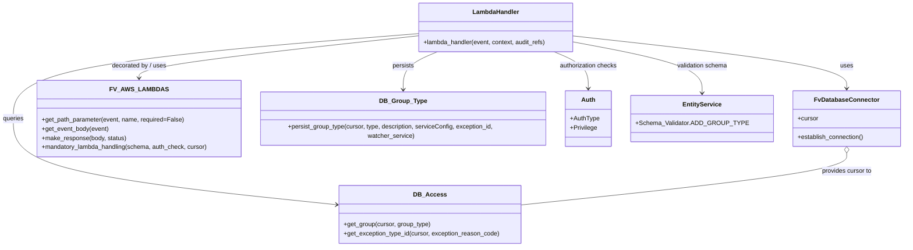

# Diagram: entity_core/entity_service/entity_service/entity/group/add_group_type.py


> Auto-generated by Obscura crawlers

## Diagram 1

```mermaid
flowchart TD
Start([Start]) --> EstablishDB[DB_CONN.establish_connection()]
EstablishDB --> GetMethod{event.httpMethod == "POST"?}
GetMethod -- Yes --> SetHttpPutFalse[http_put = False]
GetMethod -- No --> SetHttpPutTrue[http_put = True<br/>group_type = path param]
SetHttpPutFalse --> GetBody[body = fv.aws.lambdas.get_event_body(event)]
SetHttpPutTrue --> GetBody
GetBody --> CheckHttpPut{http_put?}
CheckHttpPut -- Yes --> GetGroupId[group_id = db_access.get_group(cursor, group_type)]
GetGroupId --> GroupExists{group_id == None?}
GroupExists -- True --> BadRequest1[/"Raise BadRequestError: Invalid group"/]
GroupExists -- False --> AfterGroupCheck[continue]
CheckHttpPut -- No --> BodyHasType{body contains "type"?}
BodyHasType -- Yes --> SetGroupType[group_type = body.type]
BodyHasType -- No --> AfterGroupCheck
AfterGroupCheck --> CheckGroupTypeNone{group_type == None?}
CheckGroupTypeNone -- True --> BadRequest2[/"Raise BadRequestError: Group Type not found"/]
CheckGroupTypeNone -- False --> UpdateAudit[audit_refs.update({Searchable_Ids.GROUP_TYPE: group_type})]
UpdateAudit --> GetExceptionType[exception_type_id = db_access.get_exception_type_id(...)]
GetExceptionType --> SetWatcher[watcher_service = body.watcherService if present else "None"]
SetWatcher --> TryPersist{Try persist_group_type()}
TryPersist -- Success --> MakeResponse[return fv.aws.lambdas.make_response(response, 200)]
TryPersist -- Exception --> Traceback[print_exc() and raise DatabaseError with traceback]
Traceback --> End([End])
```

> SVG rendering failed for this diagram.

## Diagram 2



### SVG

<svg id="container" width="2303.1171875" xmlns="http://www.w3.org/2000/svg" class="classDiagram" height="638" viewBox="0 0 2303.1171875 638" role="graphics-document document" aria-roledescription="class"><style>#container{font-family:"trebuchet ms",verdana,arial,sans-serif;font-size:16px;fill:#333;}@keyframes edge-animation-frame{from{stroke-dashoffset:0;}}@keyframes dash{to{stroke-dashoffset:0;}}#container .edge-animation-slow{stroke-dasharray:9,5!important;stroke-dashoffset:900;animation:dash 50s linear infinite;stroke-linecap:round;}#container .edge-animation-fast{stroke-dasharray:9,5!important;stroke-dashoffset:900;animation:dash 20s linear infinite;stroke-linecap:round;}#container .error-icon{fill:#552222;}#container .error-text{fill:#552222;stroke:#552222;}#container .edge-thickness-normal{stroke-width:1px;}#container .edge-thickness-thick{stroke-width:3.5px;}#container .edge-pattern-solid{stroke-dasharray:0;}#container .edge-thickness-invisible{stroke-width:0;fill:none;}#container .edge-pattern-dashed{stroke-dasharray:3;}#container .edge-pattern-dotted{stroke-dasharray:2;}#container .marker{fill:#333333;stroke:#333333;}#container .marker.cross{stroke:#333333;}#container svg{font-family:"trebuchet ms",verdana,arial,sans-serif;font-size:16px;}#container p{margin:0;}#container g.classGroup text{fill:#9370DB;stroke:none;font-family:"trebuchet ms",verdana,arial,sans-serif;font-size:10px;}#container g.classGroup text .title{font-weight:bolder;}#container .nodeLabel,#container .edgeLabel{color:#131300;}#container .edgeLabel .label rect{fill:#ECECFF;}#container .label text{fill:#131300;}#container .labelBkg{background:#ECECFF;}#container .edgeLabel .label span{background:#ECECFF;}#container .classTitle{font-weight:bolder;}#container .node rect,#container .node circle,#container .node ellipse,#container .node polygon,#container .node path{fill:#ECECFF;stroke:#9370DB;stroke-width:1px;}#container .divider{stroke:#9370DB;stroke-width:1;}#container g.clickable{cursor:pointer;}#container g.classGroup rect{fill:#ECECFF;stroke:#9370DB;}#container g.classGroup line{stroke:#9370DB;stroke-width:1;}#container .classLabel .box{stroke:none;stroke-width:0;fill:#ECECFF;opacity:0.5;}#container .classLabel .label{fill:#9370DB;font-size:10px;}#container .relation{stroke:#333333;stroke-width:1;fill:none;}#container .dashed-line{stroke-dasharray:3;}#container .dotted-line{stroke-dasharray:1 2;}#container #compositionStart,#container .composition{fill:#333333!important;stroke:#333333!important;stroke-width:1;}#container #compositionEnd,#container .composition{fill:#333333!important;stroke:#333333!important;stroke-width:1;}#container #dependencyStart,#container .dependency{fill:#333333!important;stroke:#333333!important;stroke-width:1;}#container #dependencyStart,#container .dependency{fill:#333333!important;stroke:#333333!important;stroke-width:1;}#container #extensionStart,#container .extension{fill:transparent!important;stroke:#333333!important;stroke-width:1;}#container #extensionEnd,#container .extension{fill:transparent!important;stroke:#333333!important;stroke-width:1;}#container #aggregationStart,#container .aggregation{fill:transparent!important;stroke:#333333!important;stroke-width:1;}#container #aggregationEnd,#container .aggregation{fill:transparent!important;stroke:#333333!important;stroke-width:1;}#container #lollipopStart,#container .lollipop{fill:#ECECFF!important;stroke:#333333!important;stroke-width:1;}#container #lollipopEnd,#container .lollipop{fill:#ECECFF!important;stroke:#333333!important;stroke-width:1;}#container .edgeTerminals{font-size:11px;line-height:initial;}#container .classTitleText{text-anchor:middle;font-size:18px;fill:#333;}#container .label-icon{display:inline-block;height:1em;overflow:visible;vertical-align:-0.125em;}#container .node .label-icon path{fill:currentColor;stroke:revert;stroke-width:revert;}#container :root{--mermaid-font-family:"trebuchet ms",verdana,arial,sans-serif;}</style><g><defs><marker id="container_class-aggregationStart" class="marker aggregation class" refX="18" refY="7" markerWidth="190" markerHeight="240" orient="auto"><path d="M 18,7 L9,13 L1,7 L9,1 Z"></path></marker></defs><defs><marker id="container_class-aggregationEnd" class="marker aggregation class" refX="1" refY="7" markerWidth="20" markerHeight="28" orient="auto"><path d="M 18,7 L9,13 L1,7 L9,1 Z"></path></marker></defs><defs><marker id="container_class-extensionStart" class="marker extension class" refX="18" refY="7" markerWidth="190" markerHeight="240" orient="auto"><path d="M 1,7 L18,13 V 1 Z"></path></marker></defs><defs><marker id="container_class-extensionEnd" class="marker extension class" refX="1" refY="7" markerWidth="20" markerHeight="28" orient="auto"><path d="M 1,1 V 13 L18,7 Z"></path></marker></defs><defs><marker id="container_class-compositionStart" class="marker composition class" refX="18" refY="7" markerWidth="190" markerHeight="240" orient="auto"><path d="M 18,7 L9,13 L1,7 L9,1 Z"></path></marker></defs><defs><marker id="container_class-compositionEnd" class="marker composition class" refX="1" refY="7" markerWidth="20" markerHeight="28" orient="auto"><path d="M 18,7 L9,13 L1,7 L9,1 Z"></path></marker></defs><defs><marker id="container_class-dependencyStart" class="marker dependency class" refX="6" refY="7" markerWidth="190" markerHeight="240" orient="auto"><path d="M 5,7 L9,13 L1,7 L9,1 Z"></path></marker></defs><defs><marker id="container_class-dependencyEnd" class="marker dependency class" refX="13" refY="7" markerWidth="20" markerHeight="28" orient="auto"><path d="M 18,7 L9,13 L14,7 L9,1 Z"></path></marker></defs><defs><marker id="container_class-lollipopStart" class="marker lollipop class" refX="13" refY="7" markerWidth="190" markerHeight="240" orient="auto"><circle stroke="black" fill="transparent" cx="7" cy="7" r="6"></circle></marker></defs><defs><marker id="container_class-lollipopEnd" class="marker lollipop class" refX="1" refY="7" markerWidth="190" markerHeight="240" orient="auto"><circle stroke="black" fill="transparent" cx="7" cy="7" r="6"></circle></marker></defs><g class="root"><g class="clusters"></g><g class="edgePaths"><path d="M1482.977,94.059L1595.286,106.883C1707.595,119.706,1932.214,145.353,2044.523,167.843C2156.832,190.333,2156.832,209.667,2156.832,219.333L2156.832,229" id="id_LambdaHandler_FvDatabaseConnector_1" class="edge-thickness-normal edge-pattern-solid relation" style=";;;" data-edge="true" data-et="edge" data-id="id_LambdaHandler_FvDatabaseConnector_1" data-points="W3sieCI6MTQ4Mi45NzY1NjI1LCJ5Ijo5NC4wNTkwNDgxMTE3ODk1NX0seyJ4IjoyMTU2LjgzMjAzMTI1LCJ5IjoxNzF9LHsieCI6MjE1Ni44MzIwMzEyNSwieSI6MjM1fV0=" marker-end="url(#container_class-dependencyEnd)"></path><path d="M1079.07,92.903L959.057,105.919C839.043,118.935,599.016,144.968,479.002,163.15C358.988,181.333,358.988,191.667,358.988,196.833L358.988,202" id="id_LambdaHandler_FV_AWS_LAMBDAS_2" class="edge-thickness-normal edge-pattern-solid relation" style=";;;" data-edge="true" data-et="edge" data-id="id_LambdaHandler_FV_AWS_LAMBDAS_2" data-points="W3sieCI6MTA3OS4wNzAzMTI1LCJ5Ijo5Mi45MDI5NzQ0ODMyNDY1NX0seyJ4IjozNTguOTg4MjgxMjUsInkiOjE3MX0seyJ4IjozNTguOTg4MjgxMjUsInkiOjIwOH1d" marker-end="url(#container_class-dependencyEnd)"></path><path d="M1079.07,87.211L905.099,101.176C731.128,115.141,383.185,143.07,209.214,179.702C35.242,216.333,35.242,261.667,35.242,307C35.242,352.333,35.242,397.667,172.098,434.783C308.953,471.899,582.664,500.797,719.519,515.247L856.375,529.696" id="id_LambdaHandler_DB_Access_3" class="edge-thickness-normal edge-pattern-solid relation" style=";;;" data-edge="true" data-et="edge" data-id="id_LambdaHandler_DB_Access_3" data-points="W3sieCI6MTA3OS4wNzAzMTI1LCJ5Ijo4Ny4yMTA5NjE5OTY3Mzl9LHsieCI6MzUuMjQyMTg3NSwieSI6MTcxfSx7IngiOjM1LjI0MjE4NzUsInkiOjMwN30seyJ4IjozNS4yNDIxODc1LCJ5Ijo0NDN9LHsieCI6ODYyLjM0MTc5Njg3NSwieSI6NTMwLjMyNjE2ODY0OTMyMTR9XQ==" marker-end="url(#container_class-dependencyEnd)"></path><path d="M1130.111,134L1115.34,140.167C1100.568,146.333,1071.024,158.667,1056.252,176C1041.48,193.333,1041.48,215.667,1041.48,226.833L1041.48,238" id="id_LambdaHandler_DB_Group_Type_4" class="edge-thickness-normal edge-pattern-solid relation" style=";;;" data-edge="true" data-et="edge" data-id="id_LambdaHandler_DB_Group_Type_4" data-points="W3sieCI6MTEzMC4xMTEzNjcxODc1LCJ5IjoxMzR9LHsieCI6MTA0MS40ODA0Njg3NSwieSI6MTcxfSx7IngiOjEwNDEuNDgwNDY4NzUsInkiOjI0NH1d" marker-end="url(#container_class-dependencyEnd)"></path><path d="M1431.936,134L1446.707,140.167C1461.479,146.333,1491.023,158.667,1505.795,174.5C1520.566,190.333,1520.566,209.667,1520.566,219.333L1520.566,229" id="id_LambdaHandler_Auth_5" class="edge-thickness-normal edge-pattern-solid relation" style=";;;" data-edge="true" data-et="edge" data-id="id_LambdaHandler_Auth_5" data-points="W3sieCI6MTQzMS45MzU1MDc4MTI1LCJ5IjoxMzR9LHsieCI6MTUyMC41NjY0MDYyNSwieSI6MTcxfSx7IngiOjE1MjAuNTY2NDA2MjUsInkiOjIzNX1d" marker-end="url(#container_class-dependencyEnd)"></path><path d="M1482.977,110.019L1535.581,120.182C1588.186,130.346,1693.396,150.673,1746.001,172.503C1798.605,194.333,1798.605,217.667,1798.605,229.333L1798.605,241" id="id_LambdaHandler_EntityService_6" class="edge-thickness-normal edge-pattern-solid relation" style=";;;" data-edge="true" data-et="edge" data-id="id_LambdaHandler_EntityService_6" data-points="W3sieCI6MTQ4Mi45NzY1NjI1LCJ5IjoxMTAuMDE4NTczNDQ0NzI4NzJ9LHsieCI6MTc5OC42MDU0Njg3NSwieSI6MTcxfSx7IngiOjE3OTguNjA1NDY4NzUsInkiOjI0N31d" marker-end="url(#container_class-dependencyEnd)"></path><path d="M2156.832,396.25L2156.832,404.042C2156.832,411.833,2156.832,427.417,2018.982,449.763C1881.132,472.109,1605.432,501.217,1467.582,515.772L1329.732,530.326" id="id_FvDatabaseConnector_DB_Access_7" class="edge-thickness-normal edge-pattern-solid relation" style=";;;" data-edge="true" data-et="edge" data-id="id_FvDatabaseConnector_DB_Access_7" data-points="W3sieCI6MjE1Ni44MzIwMzEyNSwieSI6Mzc5fSx7IngiOjIxNTYuODMyMDMxMjUsInkiOjQ0M30seyJ4IjoxMzI5LjczMjQyMTg3NSwieSI6NTMwLjMyNjE2ODY0OTMyMTR9XQ==" marker-start="url(#container_class-aggregationStart)"></path></g><g class="edgeLabels"><g class="edgeLabel" transform="translate(2156.83203125, 171)"><g class="label" data-id="id_LambdaHandler_FvDatabaseConnector_1" transform="translate(-16.4921875, -12)"><foreignObject width="32.984375" height="24"><div xmlns="http://www.w3.org/1999/xhtml" class="labelBkg" style="display: table-cell; white-space: nowrap; line-height: 1.5; max-width: 200px; text-align: center;"><span class="edgeLabel"><p>uses</p></span></div></foreignObject></g></g><g class="edgeLabel" transform="translate(358.98828125, 171)"><g class="label" data-id="id_LambdaHandler_FV_AWS_LAMBDAS_2" transform="translate(-72.21875, -12)"><foreignObject width="144.4375" height="24"><div xmlns="http://www.w3.org/1999/xhtml" class="labelBkg" style="display: table-cell; white-space: nowrap; line-height: 1.5; max-width: 200px; text-align: center;"><span class="edgeLabel"><p>decorated by / uses</p></span></div></foreignObject></g></g><g class="edgeLabel" transform="translate(35.2421875, 307)"><g class="label" data-id="id_LambdaHandler_DB_Access_3" transform="translate(-27.2421875, -12)"><foreignObject width="54.484375" height="24"><div xmlns="http://www.w3.org/1999/xhtml" class="labelBkg" style="display: table-cell; white-space: nowrap; line-height: 1.5; max-width: 200px; text-align: center;"><span class="edgeLabel"><p>queries</p></span></div></foreignObject></g></g><g class="edgeLabel" transform="translate(1041.48046875, 171)"><g class="label" data-id="id_LambdaHandler_DB_Group_Type_4" transform="translate(-28.4375, -12)"><foreignObject width="56.875" height="24"><div xmlns="http://www.w3.org/1999/xhtml" class="labelBkg" style="display: table-cell; white-space: nowrap; line-height: 1.5; max-width: 200px; text-align: center;"><span class="edgeLabel"><p>persists</p></span></div></foreignObject></g></g><g class="edgeLabel" transform="translate(1520.56640625, 171)"><g class="label" data-id="id_LambdaHandler_Auth_5" transform="translate(-75.4453125, -12)"><foreignObject width="150.890625" height="24"><div xmlns="http://www.w3.org/1999/xhtml" class="labelBkg" style="display: table-cell; white-space: nowrap; line-height: 1.5; max-width: 200px; text-align: center;"><span class="edgeLabel"><p>authorization checks</p></span></div></foreignObject></g></g><g class="edgeLabel" transform="translate(1798.60546875, 171)"><g class="label" data-id="id_LambdaHandler_EntityService_6" transform="translate(-66.2578125, -12)"><foreignObject width="132.515625" height="24"><div xmlns="http://www.w3.org/1999/xhtml" class="labelBkg" style="display: table-cell; white-space: nowrap; line-height: 1.5; max-width: 200px; text-align: center;"><span class="edgeLabel"><p>validation schema</p></span></div></foreignObject></g></g><g class="edgeLabel" transform="translate(2156.83203125, 443)"><g class="label" data-id="id_FvDatabaseConnector_DB_Access_7" transform="translate(-65.859375, -12)"><foreignObject width="131.71875" height="24"><div xmlns="http://www.w3.org/1999/xhtml" class="labelBkg" style="display: table-cell; white-space: nowrap; line-height: 1.5; max-width: 200px; text-align: center;"><span class="edgeLabel"><p>provides cursor to</p></span></div></foreignObject></g></g></g><g class="nodes"><g class="node default" id="classId-LambdaHandler-0" transform="translate(1281.0234375, 71)"><g class="basic label-container"><path d="M-201.953125 -63 L201.953125 -63 L201.953125 63 L-201.953125 63" stroke="none" stroke-width="0" fill="#ECECFF" style=""></path><path d="M-201.953125 -63 C-67.62183391814528 -63, 66.70945716370943 -63, 201.953125 -63 M-201.953125 -63 C-58.27704893230339 -63, 85.39902713539323 -63, 201.953125 -63 M201.953125 -63 C201.953125 -21.692906727085756, 201.953125 19.61418654582849, 201.953125 63 M201.953125 -63 C201.953125 -21.693752828853036, 201.953125 19.612494342293928, 201.953125 63 M201.953125 63 C105.36243667475836 63, 8.771748349516713 63, -201.953125 63 M201.953125 63 C95.6123648288197 63, -10.728395342360614 63, -201.953125 63 M-201.953125 63 C-201.953125 19.521140025692993, -201.953125 -23.957719948614013, -201.953125 -63 M-201.953125 63 C-201.953125 36.373539264403135, -201.953125 9.747078528806263, -201.953125 -63" stroke="#9370DB" stroke-width="1.3" fill="none" stroke-dasharray="0 0" style=""></path></g><g class="annotation-group text" transform="translate(0, -39)"></g><g class="label-group text" transform="translate(-58.21875, -39)"><g class="label" style="font-weight: bolder" transform="translate(0,-12)"><foreignObject width="116.4375" height="24"><div xmlns="http://www.w3.org/1999/xhtml" style="display: table-cell; white-space: nowrap; line-height: 1.5; max-width: 167px; text-align: center;"><span class="nodeLabel markdown-node-label" style=""><p>LambdaHandler</p></span></div></foreignObject></g></g><g class="members-group text" transform="translate(-189.953125, 9)"></g><g class="methods-group text" transform="translate(-189.953125, 39)"><g class="label" style="" transform="translate(0,-12)"><foreignObject width="321.6875" height="24"><div xmlns="http://www.w3.org/1999/xhtml" style="display: table-cell; white-space: nowrap; line-height: 1.5; max-width: 379px; text-align: center;"><span class="nodeLabel markdown-node-label" style=""><p>+lambda_handler(event, context, audit_refs)</p></span></div></foreignObject></g></g><g class="divider" style=""><path d="M-201.953125 -15 C-41.54406967183476 -15, 118.86498565633048 -15, 201.953125 -15 M-201.953125 -15 C-63.404151869172125 -15, 75.14482126165575 -15, 201.953125 -15" stroke="#9370DB" stroke-width="1.3" fill="none" stroke-dasharray="0 0" style=""></path></g><g class="divider" style=""><path d="M-201.953125 9 C-78.10482708316894 9, 45.743470833662116 9, 201.953125 9 M-201.953125 9 C-86.22870920958712 9, 29.495706580825754 9, 201.953125 9" stroke="#9370DB" stroke-width="1.3" fill="none" stroke-dasharray="0 0" style=""></path></g></g><g class="node default" id="classId-FvDatabaseConnector-1" transform="translate(2156.83203125, 307)"><g class="basic label-container"><path d="M-138.28515625 -72 L138.28515625 -72 L138.28515625 72 L-138.28515625 72" stroke="none" stroke-width="0" fill="#ECECFF" style=""></path><path d="M-138.28515625 -72 C-43.956684320755585 -72, 50.37178760848883 -72, 138.28515625 -72 M-138.28515625 -72 C-81.96171078533568 -72, -25.638265320671366 -72, 138.28515625 -72 M138.28515625 -72 C138.28515625 -17.83344282273864, 138.28515625 36.33311435452272, 138.28515625 72 M138.28515625 -72 C138.28515625 -39.41219327710264, 138.28515625 -6.824386554205276, 138.28515625 72 M138.28515625 72 C78.12424681370862 72, 17.963337377417247 72, -138.28515625 72 M138.28515625 72 C52.55751526189108 72, -33.17012572621783 72, -138.28515625 72 M-138.28515625 72 C-138.28515625 35.41729578532314, -138.28515625 -1.1654084293537181, -138.28515625 -72 M-138.28515625 72 C-138.28515625 27.532312148315782, -138.28515625 -16.935375703368436, -138.28515625 -72" stroke="#9370DB" stroke-width="1.3" fill="none" stroke-dasharray="0 0" style=""></path></g><g class="annotation-group text" transform="translate(0, -48)"></g><g class="label-group text" transform="translate(-79.3046875, -48)"><g class="label" style="font-weight: bolder" transform="translate(0,-12)"><foreignObject width="158.609375" height="24"><div xmlns="http://www.w3.org/1999/xhtml" style="display: table-cell; white-space: nowrap; line-height: 1.5; max-width: 207px; text-align: center;"><span class="nodeLabel markdown-node-label" style=""><p>FvDatabaseConnector</p></span></div></foreignObject></g></g><g class="members-group text" transform="translate(-126.28515625, 0)"><g class="label" style="" transform="translate(0,-12)"><foreignObject width="53.71875" height="24"><div xmlns="http://www.w3.org/1999/xhtml" style="display: table-cell; white-space: nowrap; line-height: 1.5; max-width: 112px; text-align: center;"><span class="nodeLabel markdown-node-label" style=""><p>+cursor</p></span></div></foreignObject></g></g><g class="methods-group text" transform="translate(-126.28515625, 48)"><g class="label" style="" transform="translate(0,-12)"><foreignObject width="173.265625" height="24"><div xmlns="http://www.w3.org/1999/xhtml" style="display: table-cell; white-space: nowrap; line-height: 1.5; max-width: 231px; text-align: center;"><span class="nodeLabel markdown-node-label" style=""><p>+establish_connection()</p></span></div></foreignObject></g></g><g class="divider" style=""><path d="M-138.28515625 -24 C-67.60821329047941 -24, 3.0687296690411756 -24, 138.28515625 -24 M-138.28515625 -24 C-41.57764326316703 -24, 55.129869723665934 -24, 138.28515625 -24" stroke="#9370DB" stroke-width="1.3" fill="none" stroke-dasharray="0 0" style=""></path></g><g class="divider" style=""><path d="M-138.28515625 24 C-77.75803778464865 24, -17.230919319297314 24, 138.28515625 24 M-138.28515625 24 C-66.07365857920064 24, 6.137839091598721 24, 138.28515625 24" stroke="#9370DB" stroke-width="1.3" fill="none" stroke-dasharray="0 0" style=""></path></g></g><g class="node default" id="classId-FV_AWS_LAMBDAS-2" transform="translate(358.98828125, 307)"><g class="basic label-container"><path d="M-261.50390625 -99 L261.50390625 -99 L261.50390625 99 L-261.50390625 99" stroke="none" stroke-width="0" fill="#ECECFF" style=""></path><path d="M-261.50390625 -99 C-147.3584266480501 -99, -33.2129470461002 -99, 261.50390625 -99 M-261.50390625 -99 C-84.50818507700217 -99, 92.48753609599567 -99, 261.50390625 -99 M261.50390625 -99 C261.50390625 -54.57045202140386, 261.50390625 -10.140904042807719, 261.50390625 99 M261.50390625 -99 C261.50390625 -57.74676485259678, 261.50390625 -16.493529705193566, 261.50390625 99 M261.50390625 99 C68.10517804883716 99, -125.29355015232568 99, -261.50390625 99 M261.50390625 99 C154.64991160888053 99, 47.79591696776109 99, -261.50390625 99 M-261.50390625 99 C-261.50390625 33.20290890654536, -261.50390625 -32.59418218690928, -261.50390625 -99 M-261.50390625 99 C-261.50390625 25.993465498661408, -261.50390625 -47.013069002677184, -261.50390625 -99" stroke="#9370DB" stroke-width="1.3" fill="none" stroke-dasharray="0 0" style=""></path></g><g class="annotation-group text" transform="translate(0, -75)"></g><g class="label-group text" transform="translate(-66.6015625, -75)"><g class="label" style="font-weight: bolder" transform="translate(0,-12)"><foreignObject width="133.203125" height="24"><div xmlns="http://www.w3.org/1999/xhtml" style="display: table-cell; white-space: nowrap; line-height: 1.5; max-width: 181px; text-align: center;"><span class="nodeLabel markdown-node-label" style=""><p>FV_AWS_LAMBDAS</p></span></div></foreignObject></g></g><g class="members-group text" transform="translate(-249.50390625, -27)"></g><g class="methods-group text" transform="translate(-249.50390625, 3)"><g class="label" style="" transform="translate(0,-12)"><foreignObject width="369.015625" height="24"><div xmlns="http://www.w3.org/1999/xhtml" style="display: table-cell; white-space: nowrap; line-height: 1.5; max-width: 426px; text-align: center;"><span class="nodeLabel markdown-node-label" style=""><p>+get_path_parameter(event, name, required=False)</p></span></div></foreignObject></g><g class="label" style="" transform="translate(0,12)"><foreignObject width="174.203125" height="24"><div xmlns="http://www.w3.org/1999/xhtml" style="display: table-cell; white-space: nowrap; line-height: 1.5; max-width: 232px; text-align: center;"><span class="nodeLabel markdown-node-label" style=""><p>+get_event_body(event)</p></span></div></foreignObject></g><g class="label" style="" transform="translate(0,36)"><foreignObject width="219.96875" height="24"><div xmlns="http://www.w3.org/1999/xhtml" style="display: table-cell; white-space: nowrap; line-height: 1.5; max-width: 277px; text-align: center;"><span class="nodeLabel markdown-node-label" style=""><p>+make_response(body, status)</p></span></div></foreignObject></g><g class="label" style="" transform="translate(0,60)"><foreignObject width="432.40625" height="24"><div xmlns="http://www.w3.org/1999/xhtml" style="display: table-cell; white-space: nowrap; line-height: 1.5; max-width: 490px; text-align: center;"><span class="nodeLabel markdown-node-label" style=""><p>+mandatory_lambda_handling(schema, auth_check, cursor)</p></span></div></foreignObject></g></g><g class="divider" style=""><path d="M-261.50390625 -51 C-63.73157113890406 -51, 134.04076397219188 -51, 261.50390625 -51 M-261.50390625 -51 C-86.77817249930342 -51, 87.94756125139315 -51, 261.50390625 -51" stroke="#9370DB" stroke-width="1.3" fill="none" stroke-dasharray="0 0" style=""></path></g><g class="divider" style=""><path d="M-261.50390625 -27 C-75.75659033804357 -27, 109.99072557391287 -27, 261.50390625 -27 M-261.50390625 -27 C-88.56109112812908 -27, 84.38172399374184 -27, 261.50390625 -27" stroke="#9370DB" stroke-width="1.3" fill="none" stroke-dasharray="0 0" style=""></path></g></g><g class="node default" id="classId-DB_Access-3" transform="translate(1096.037109375, 555)"><g class="basic label-container"><path d="M-233.6953125 -75 L233.6953125 -75 L233.6953125 75 L-233.6953125 75" stroke="none" stroke-width="0" fill="#ECECFF" style=""></path><path d="M-233.6953125 -75 C-97.2658832266612 -75, 39.163546046677595 -75, 233.6953125 -75 M-233.6953125 -75 C-120.44169167233268 -75, -7.188070844665361 -75, 233.6953125 -75 M233.6953125 -75 C233.6953125 -38.021188298967814, 233.6953125 -1.042376597935629, 233.6953125 75 M233.6953125 -75 C233.6953125 -25.831622552834645, 233.6953125 23.33675489433071, 233.6953125 75 M233.6953125 75 C101.73280289243473 75, -30.229706715130533 75, -233.6953125 75 M233.6953125 75 C88.72982604412769 75, -56.23566041174462 75, -233.6953125 75 M-233.6953125 75 C-233.6953125 41.7937182301317, -233.6953125 8.587436460263405, -233.6953125 -75 M-233.6953125 75 C-233.6953125 29.300598379627715, -233.6953125 -16.39880324074457, -233.6953125 -75" stroke="#9370DB" stroke-width="1.3" fill="none" stroke-dasharray="0 0" style=""></path></g><g class="annotation-group text" transform="translate(0, -51)"></g><g class="label-group text" transform="translate(-38.296875, -51)"><g class="label" style="font-weight: bolder" transform="translate(0,-12)"><foreignObject width="76.59375" height="24"><div xmlns="http://www.w3.org/1999/xhtml" style="display: table-cell; white-space: nowrap; line-height: 1.5; max-width: 125px; text-align: center;"><span class="nodeLabel markdown-node-label" style=""><p>DB_Access</p></span></div></foreignObject></g></g><g class="members-group text" transform="translate(-221.6953125, -3)"></g><g class="methods-group text" transform="translate(-221.6953125, 27)"><g class="label" style="" transform="translate(0,-12)"><foreignObject width="225.734375" height="24"><div xmlns="http://www.w3.org/1999/xhtml" style="display: table-cell; white-space: nowrap; line-height: 1.5; max-width: 283px; text-align: center;"><span class="nodeLabel markdown-node-label" style=""><p>+get_group(cursor, group_type)</p></span></div></foreignObject></g><g class="label" style="" transform="translate(0,12)"><foreignObject width="405.09375" height="24"><div xmlns="http://www.w3.org/1999/xhtml" style="display: table-cell; white-space: nowrap; line-height: 1.5; max-width: 462px; text-align: center;"><span class="nodeLabel markdown-node-label" style=""><p>+get_exception_type_id(cursor, exception_reason_code)</p></span></div></foreignObject></g></g><g class="divider" style=""><path d="M-233.6953125 -27 C-105.54388121794912 -27, 22.60755006410176 -27, 233.6953125 -27 M-233.6953125 -27 C-129.5481856073148 -27, -25.401058714629613 -27, 233.6953125 -27" stroke="#9370DB" stroke-width="1.3" fill="none" stroke-dasharray="0 0" style=""></path></g><g class="divider" style=""><path d="M-233.6953125 -3 C-83.75327526481007 -3, 66.18876197037986 -3, 233.6953125 -3 M-233.6953125 -3 C-48.19888165008183 -3, 137.29754919983634 -3, 233.6953125 -3" stroke="#9370DB" stroke-width="1.3" fill="none" stroke-dasharray="0 0" style=""></path></g></g><g class="node default" id="classId-DB_Group_Type-4" transform="translate(1041.48046875, 307)"><g class="basic label-container"><path d="M-370.98828125 -63 L370.98828125 -63 L370.98828125 63 L-370.98828125 63" stroke="none" stroke-width="0" fill="#ECECFF" style=""></path><path d="M-370.98828125 -63 C-155.00833922130937 -63, 60.97160280738126 -63, 370.98828125 -63 M-370.98828125 -63 C-119.13077437350782 -63, 132.72673250298436 -63, 370.98828125 -63 M370.98828125 -63 C370.98828125 -28.82290344844686, 370.98828125 5.354193103106283, 370.98828125 63 M370.98828125 -63 C370.98828125 -37.39117489053146, 370.98828125 -11.782349781062926, 370.98828125 63 M370.98828125 63 C102.54506111848627 63, -165.89815901302745 63, -370.98828125 63 M370.98828125 63 C89.28351334063626 63, -192.42125456872748 63, -370.98828125 63 M-370.98828125 63 C-370.98828125 25.62145125524915, -370.98828125 -11.757097489501703, -370.98828125 -63 M-370.98828125 63 C-370.98828125 18.3930005675577, -370.98828125 -26.2139988648846, -370.98828125 -63" stroke="#9370DB" stroke-width="1.3" fill="none" stroke-dasharray="0 0" style=""></path></g><g class="annotation-group text" transform="translate(0, -39)"></g><g class="label-group text" transform="translate(-56.9140625, -39)"><g class="label" style="font-weight: bolder" transform="translate(0,-12)"><foreignObject width="113.828125" height="24"><div xmlns="http://www.w3.org/1999/xhtml" style="display: table-cell; white-space: nowrap; line-height: 1.5; max-width: 162px; text-align: center;"><span class="nodeLabel markdown-node-label" style=""><p>DB_Group_Type</p></span></div></foreignObject></g></g><g class="members-group text" transform="translate(-358.98828125, 9)"></g><g class="methods-group text" transform="translate(-358.98828125, 39)"><g class="label" style="" transform="translate(0,-12)"><foreignObject width="661.0625" height="24"><div xmlns="http://www.w3.org/1999/xhtml" style="display: table-cell; white-space: nowrap; line-height: 1.5; max-width: 718px; text-align: center;"><span class="nodeLabel markdown-node-label" style=""><p>+persist_group_type(cursor, type, description, serviceConfig, exception_id, watcher_service)</p></span></div></foreignObject></g></g><g class="divider" style=""><path d="M-370.98828125 -15 C-202.37601012785953 -15, -33.76373900571906 -15, 370.98828125 -15 M-370.98828125 -15 C-114.63239412575774 -15, 141.72349299848452 -15, 370.98828125 -15" stroke="#9370DB" stroke-width="1.3" fill="none" stroke-dasharray="0 0" style=""></path></g><g class="divider" style=""><path d="M-370.98828125 9 C-141.84543412650947 9, 87.29741299698105 9, 370.98828125 9 M-370.98828125 9 C-85.6221604187698 9, 199.7439604124604 9, 370.98828125 9" stroke="#9370DB" stroke-width="1.3" fill="none" stroke-dasharray="0 0" style=""></path></g></g><g class="node default" id="classId-Auth-5" transform="translate(1520.56640625, 307)"><g class="basic label-container"><path d="M-58.09765625 -72 L58.09765625 -72 L58.09765625 72 L-58.09765625 72" stroke="none" stroke-width="0" fill="#ECECFF" style=""></path><path d="M-58.09765625 -72 C-13.84621207441021 -72, 30.40523210117958 -72, 58.09765625 -72 M-58.09765625 -72 C-32.28424613177375 -72, -6.470836013547498 -72, 58.09765625 -72 M58.09765625 -72 C58.09765625 -39.91174589773588, 58.09765625 -7.823491795471753, 58.09765625 72 M58.09765625 -72 C58.09765625 -32.392261353060945, 58.09765625 7.215477293878109, 58.09765625 72 M58.09765625 72 C32.08060952293026 72, 6.063562795860513 72, -58.09765625 72 M58.09765625 72 C17.80475362076821 72, -22.48814900846358 72, -58.09765625 72 M-58.09765625 72 C-58.09765625 39.60654585483283, -58.09765625 7.213091709665662, -58.09765625 -72 M-58.09765625 72 C-58.09765625 30.225712937467158, -58.09765625 -11.548574125065684, -58.09765625 -72" stroke="#9370DB" stroke-width="1.3" fill="none" stroke-dasharray="0 0" style=""></path></g><g class="annotation-group text" transform="translate(0, -48)"></g><g class="label-group text" transform="translate(-17.0078125, -48)"><g class="label" style="font-weight: bolder" transform="translate(0,-12)"><foreignObject width="34.015625" height="24"><div xmlns="http://www.w3.org/1999/xhtml" style="display: table-cell; white-space: nowrap; line-height: 1.5; max-width: 84px; text-align: center;"><span class="nodeLabel markdown-node-label" style=""><p>Auth</p></span></div></foreignObject></g></g><g class="members-group text" transform="translate(-46.09765625, 0)"><g class="label" style="" transform="translate(0,-12)"><foreignObject width="75.1875" height="24"><div xmlns="http://www.w3.org/1999/xhtml" style="display: table-cell; white-space: nowrap; line-height: 1.5; max-width: 133px; text-align: center;"><span class="nodeLabel markdown-node-label" style=""><p>+AuthType</p></span></div></foreignObject></g><g class="label" style="" transform="translate(0,12)"><foreignObject width="70.15625" height="24"><div xmlns="http://www.w3.org/1999/xhtml" style="display: table-cell; white-space: nowrap; line-height: 1.5; max-width: 128px; text-align: center;"><span class="nodeLabel markdown-node-label" style=""><p>+Privilege</p></span></div></foreignObject></g></g><g class="methods-group text" transform="translate(-46.09765625, 72)"></g><g class="divider" style=""><path d="M-58.09765625 -24 C-21.60334582063212 -24, 14.890964608735757 -24, 58.09765625 -24 M-58.09765625 -24 C-24.048681974536535 -24, 10.00029230092693 -24, 58.09765625 -24" stroke="#9370DB" stroke-width="1.3" fill="none" stroke-dasharray="0 0" style=""></path></g><g class="divider" style=""><path d="M-58.09765625 48 C-19.297406427180363 48, 19.502843395639275 48, 58.09765625 48 M-58.09765625 48 C-30.44747207228715 48, -2.7972878945743034 48, 58.09765625 48" stroke="#9370DB" stroke-width="1.3" fill="none" stroke-dasharray="0 0" style=""></path></g></g><g class="node default" id="classId-EntityService-6" transform="translate(1798.60546875, 307)"><g class="basic label-container"><path d="M-169.94140625 -60 L169.94140625 -60 L169.94140625 60 L-169.94140625 60" stroke="none" stroke-width="0" fill="#ECECFF" style=""></path><path d="M-169.94140625 -60 C-44.385848329440364 -60, 81.16970959111927 -60, 169.94140625 -60 M-169.94140625 -60 C-36.57140932849862 -60, 96.79858759300276 -60, 169.94140625 -60 M169.94140625 -60 C169.94140625 -35.69612864596792, 169.94140625 -11.392257291935834, 169.94140625 60 M169.94140625 -60 C169.94140625 -17.644064066772394, 169.94140625 24.711871866455212, 169.94140625 60 M169.94140625 60 C46.82008364305051 60, -76.30123896389898 60, -169.94140625 60 M169.94140625 60 C40.389154276958294 60, -89.16309769608341 60, -169.94140625 60 M-169.94140625 60 C-169.94140625 19.414235474974525, -169.94140625 -21.17152905005095, -169.94140625 -60 M-169.94140625 60 C-169.94140625 31.31832065170962, -169.94140625 2.636641303419239, -169.94140625 -60" stroke="#9370DB" stroke-width="1.3" fill="none" stroke-dasharray="0 0" style=""></path></g><g class="annotation-group text" transform="translate(0, -36)"></g><g class="label-group text" transform="translate(-47.9296875, -36)"><g class="label" style="font-weight: bolder" transform="translate(0,-12)"><foreignObject width="95.859375" height="24"><div xmlns="http://www.w3.org/1999/xhtml" style="display: table-cell; white-space: nowrap; line-height: 1.5; max-width: 144px; text-align: center;"><span class="nodeLabel markdown-node-label" style=""><p>EntityService</p></span></div></foreignObject></g></g><g class="members-group text" transform="translate(-157.94140625, 12)"><g class="label" style="" transform="translate(0,-12)"><foreignObject width="267.953125" height="24"><div xmlns="http://www.w3.org/1999/xhtml" style="display: table-cell; white-space: nowrap; line-height: 1.5; max-width: 325px; text-align: center;"><span class="nodeLabel markdown-node-label" style=""><p>+Schema_Validator.ADD_GROUP_TYPE</p></span></div></foreignObject></g></g><g class="methods-group text" transform="translate(-157.94140625, 60)"></g><g class="divider" style=""><path d="M-169.94140625 -12 C-61.26081567873433 -12, 47.419774892531336 -12, 169.94140625 -12 M-169.94140625 -12 C-34.837673179627956 -12, 100.26605989074409 -12, 169.94140625 -12" stroke="#9370DB" stroke-width="1.3" fill="none" stroke-dasharray="0 0" style=""></path></g><g class="divider" style=""><path d="M-169.94140625 36 C-65.94087952921808 36, 38.05964719156384 36, 169.94140625 36 M-169.94140625 36 C-60.10977413164835 36, 49.7218579867033 36, 169.94140625 36" stroke="#9370DB" stroke-width="1.3" fill="none" stroke-dasharray="0 0" style=""></path></g></g></g></g></g></svg>
