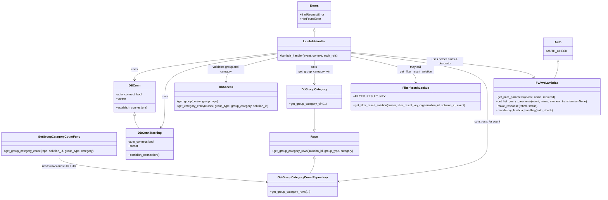

# Diagram: entity_core/entity_service/entity_service/entity/group/get_group_category.py


> Auto-generated by Obscura crawlers

## Diagram 1

```mermaid
flowchart TD
  Start((Start)) --> Parse[Parse path parameters: group_type, group_category]
  Parse --> ValidateGroup{group_entity exists?}
  ValidateGroup -- No --> BadGroup[BadRequestError: Invalid group] --> EndError((End/Error))
  ValidateGroup -- Yes --> VinCheck{path contains "/vin"?}
  VinCheck -- Yes --> Pagination[Set pagination: page_offset, page_number, page_size]
  Pagination --> GetParams[Get solution_id, internal_entity_ids, external_entity_ids]
  GetParams --> ExternalCheck{external_entity_ids present AND solution_id missing?}
  ExternalCheck -- Yes --> BadVinFilter[BadRequestError: Solution id is required when filtering by VIN] --> EndError
  ExternalCheck -- No --> GetStatuses[Call db_group_category.get_group_category_vin(...)]
  GetStatuses --> StatusesNull{statuses is None?}
  StatusesNull -- Yes --> SetEmpty[Set statuses={}, total_pages=0]
  StatusesNull -- No --> ComputePages[Compute total_pages = ceil(active_count / page_size)]
  SetEmpty --> BuildVinRetval[Build retval with meta and data]
  ComputePages --> BuildVinRetval
  BuildVinRetval --> AfterBranch
  VinCheck -- No --> RequireSolution[Get required solution_id and update audit_refs]
  RequireSolution --> ValidateCategory{group_category_entity exists?}
  ValidateCategory -- No --> BadCategory[BadRequestError: Invalid group category] --> EndError
  ValidateCategory -- Yes --> SetupTracking[DB_CONN_TRACKING.establish_connection; set cursor_tracking, organization_id]
  SetupTracking --> HasStoredDataCheck{group_type == "ITSS" or "SB"?}
  HasStoredDataCheck -- ITSS --> LookupITSS[Call get_filter_result_solution with FIN_VEHICLE_ITSS_COUNT]
  HasStoredDataCheck -- SB --> LookupSB[Call get_filter_result_solution with FIN_VEHICLE_SB_COUNT]
  HasStoredDataCheck -- Other --> SkipLookup[Skip stored-data lookup]
  LookupITSS --> CheckStoredITSS{has_stored_data == True?}
  LookupSB --> CheckStoredSB{has_stored_data == True?}
  CheckStoredITSS -- Yes --> ReturnStoredITSS[Return make_response(retval,200)] --> EndSuccess((End/Success))
  CheckStoredSB -- Yes --> ReturnStoredSB[Return make_response(retval,200)] --> EndSuccess
  CheckStoredITSS -- No --> CallCountFromRepo[Call get_group_category_count(GetGroupCategoryCountRepository(cursor), solution_id, group_type, category)]
  CheckStoredSB -- No --> CallCountFromRepo
  SkipLookup --> CallCountFromRepo
  CallCountFromRepo --> AfterBranch
  AfterBranch --> RetvalNone{retval == None?}
  RetvalNone -- Yes --> NotFound[NotFoundError: No such Group Type/Category] --> EndError
  RetvalNone -- No --> ReturnOK[Return make_response(retval,200)] --> EndSuccess
```

> SVG rendering failed for this diagram.

## Diagram 2



### SVG

<svg id="container" width="3273.587890625" xmlns="http://www.w3.org/2000/svg" class="classDiagram" height="1074" viewBox="0 0 3273.587890625 1074" role="graphics-document document" aria-roledescription="class"><style>#container{font-family:"trebuchet ms",verdana,arial,sans-serif;font-size:16px;fill:#333;}@keyframes edge-animation-frame{from{stroke-dashoffset:0;}}@keyframes dash{to{stroke-dashoffset:0;}}#container .edge-animation-slow{stroke-dasharray:9,5!important;stroke-dashoffset:900;animation:dash 50s linear infinite;stroke-linecap:round;}#container .edge-animation-fast{stroke-dasharray:9,5!important;stroke-dashoffset:900;animation:dash 20s linear infinite;stroke-linecap:round;}#container .error-icon{fill:#552222;}#container .error-text{fill:#552222;stroke:#552222;}#container .edge-thickness-normal{stroke-width:1px;}#container .edge-thickness-thick{stroke-width:3.5px;}#container .edge-pattern-solid{stroke-dasharray:0;}#container .edge-thickness-invisible{stroke-width:0;fill:none;}#container .edge-pattern-dashed{stroke-dasharray:3;}#container .edge-pattern-dotted{stroke-dasharray:2;}#container .marker{fill:#333333;stroke:#333333;}#container .marker.cross{stroke:#333333;}#container svg{font-family:"trebuchet ms",verdana,arial,sans-serif;font-size:16px;}#container p{margin:0;}#container g.classGroup text{fill:#9370DB;stroke:none;font-family:"trebuchet ms",verdana,arial,sans-serif;font-size:10px;}#container g.classGroup text .title{font-weight:bolder;}#container .nodeLabel,#container .edgeLabel{color:#131300;}#container .edgeLabel .label rect{fill:#ECECFF;}#container .label text{fill:#131300;}#container .labelBkg{background:#ECECFF;}#container .edgeLabel .label span{background:#ECECFF;}#container .classTitle{font-weight:bolder;}#container .node rect,#container .node circle,#container .node ellipse,#container .node polygon,#container .node path{fill:#ECECFF;stroke:#9370DB;stroke-width:1px;}#container .divider{stroke:#9370DB;stroke-width:1;}#container g.clickable{cursor:pointer;}#container g.classGroup rect{fill:#ECECFF;stroke:#9370DB;}#container g.classGroup line{stroke:#9370DB;stroke-width:1;}#container .classLabel .box{stroke:none;stroke-width:0;fill:#ECECFF;opacity:0.5;}#container .classLabel .label{fill:#9370DB;font-size:10px;}#container .relation{stroke:#333333;stroke-width:1;fill:none;}#container .dashed-line{stroke-dasharray:3;}#container .dotted-line{stroke-dasharray:1 2;}#container #compositionStart,#container .composition{fill:#333333!important;stroke:#333333!important;stroke-width:1;}#container #compositionEnd,#container .composition{fill:#333333!important;stroke:#333333!important;stroke-width:1;}#container #dependencyStart,#container .dependency{fill:#333333!important;stroke:#333333!important;stroke-width:1;}#container #dependencyStart,#container .dependency{fill:#333333!important;stroke:#333333!important;stroke-width:1;}#container #extensionStart,#container .extension{fill:transparent!important;stroke:#333333!important;stroke-width:1;}#container #extensionEnd,#container .extension{fill:transparent!important;stroke:#333333!important;stroke-width:1;}#container #aggregationStart,#container .aggregation{fill:transparent!important;stroke:#333333!important;stroke-width:1;}#container #aggregationEnd,#container .aggregation{fill:transparent!important;stroke:#333333!important;stroke-width:1;}#container #lollipopStart,#container .lollipop{fill:#ECECFF!important;stroke:#333333!important;stroke-width:1;}#container #lollipopEnd,#container .lollipop{fill:#ECECFF!important;stroke:#333333!important;stroke-width:1;}#container .edgeTerminals{font-size:11px;line-height:initial;}#container .classTitleText{text-anchor:middle;font-size:18px;fill:#333;}#container .label-icon{display:inline-block;height:1em;overflow:visible;vertical-align:-0.125em;}#container .node .label-icon path{fill:currentColor;stroke:revert;stroke-width:revert;}#container :root{--mermaid-font-family:"trebuchet ms",verdana,arial,sans-serif;}</style><g><defs><marker id="container_class-aggregationStart" class="marker aggregation class" refX="18" refY="7" markerWidth="190" markerHeight="240" orient="auto"><path d="M 18,7 L9,13 L1,7 L9,1 Z"></path></marker></defs><defs><marker id="container_class-aggregationEnd" class="marker aggregation class" refX="1" refY="7" markerWidth="20" markerHeight="28" orient="auto"><path d="M 18,7 L9,13 L1,7 L9,1 Z"></path></marker></defs><defs><marker id="container_class-extensionStart" class="marker extension class" refX="18" refY="7" markerWidth="190" markerHeight="240" orient="auto"><path d="M 1,7 L18,13 V 1 Z"></path></marker></defs><defs><marker id="container_class-extensionEnd" class="marker extension class" refX="1" refY="7" markerWidth="20" markerHeight="28" orient="auto"><path d="M 1,1 V 13 L18,7 Z"></path></marker></defs><defs><marker id="container_class-compositionStart" class="marker composition class" refX="18" refY="7" markerWidth="190" markerHeight="240" orient="auto"><path d="M 18,7 L9,13 L1,7 L9,1 Z"></path></marker></defs><defs><marker id="container_class-compositionEnd" class="marker composition class" refX="1" refY="7" markerWidth="20" markerHeight="28" orient="auto"><path d="M 18,7 L9,13 L1,7 L9,1 Z"></path></marker></defs><defs><marker id="container_class-dependencyStart" class="marker dependency class" refX="6" refY="7" markerWidth="190" markerHeight="240" orient="auto"><path d="M 5,7 L9,13 L1,7 L9,1 Z"></path></marker></defs><defs><marker id="container_class-dependencyEnd" class="marker dependency class" refX="13" refY="7" markerWidth="20" markerHeight="28" orient="auto"><path d="M 18,7 L9,13 L14,7 L9,1 Z"></path></marker></defs><defs><marker id="container_class-lollipopStart" class="marker lollipop class" refX="13" refY="7" markerWidth="190" markerHeight="240" orient="auto"><circle stroke="black" fill="transparent" cx="7" cy="7" r="6"></circle></marker></defs><defs><marker id="container_class-lollipopEnd" class="marker lollipop class" refX="1" refY="7" markerWidth="190" markerHeight="240" orient="auto"><circle stroke="black" fill="transparent" cx="7" cy="7" r="6"></circle></marker></defs><g class="root"><g class="clusters"></g><g class="edgePaths"><path d="M1497.369,288.246L1368.855,303.038C1240.342,317.83,983.314,347.415,854.801,371.874C726.287,396.333,726.287,415.667,726.287,425.333L726.287,435" id="id_LambdaHandler_DBConn_1" class="edge-thickness-normal edge-pattern-solid relation" style=";;;" data-edge="true" data-et="edge" data-id="id_LambdaHandler_DBConn_1" data-points="W3sieCI6MTQ5Ny4zNjkxNDA2MjUsInkiOjI4OC4yNDU1NjI5NzM0NjAxNX0seyJ4Ijo3MjYuMjg3MTA5Mzc1LCJ5IjozNzd9LHsieCI6NzI2LjI4NzEwOTM3NSwieSI6NDQxfV0=" marker-end="url(#container_class-dependencyEnd)"></path><path d="M1497.369,292.971L1396.251,306.975C1295.132,320.98,1092.895,348.99,991.777,387.662C890.658,426.333,890.658,475.667,890.658,523C890.658,570.333,890.658,615.667,887.032,643.673C883.405,671.679,876.152,682.358,872.525,687.697L868.898,693.037" id="id_LambdaHandler_DBConnTracking_2" class="edge-thickness-normal edge-pattern-solid relation" style=";;;" data-edge="true" data-et="edge" data-id="id_LambdaHandler_DBConnTracking_2" data-points="W3sieCI6MTQ5Ny4zNjkxNDA2MjUsInkiOjI5Mi45NzA1MTQ2NDEyMzg5NH0seyJ4Ijo4OTAuNjU4MjAzMTI1LCJ5IjozNzd9LHsieCI6ODkwLjY1ODIwMzEyNSwieSI6NTI1fSx7IngiOjg5MC42NTgyMDMxMjUsInkiOjY2MX0seyJ4Ijo4NjUuNTI3MDg1NDg1NTM3MiwieSI6Njk4fV0=" marker-end="url(#container_class-dependencyEnd)"></path><path d="M1497.369,312.499L1451.662,323.249C1405.955,333.999,1314.541,355.5,1268.834,377.416C1223.127,399.333,1223.127,421.667,1223.127,432.833L1223.127,444" id="id_LambdaHandler_DbAccess_3" class="edge-thickness-normal edge-pattern-solid relation" style=";;;" data-edge="true" data-et="edge" data-id="id_LambdaHandler_DbAccess_3" data-points="W3sieCI6MTQ5Ny4zNjkxNDA2MjUsInkiOjMxMi40OTg4OTI1ODkzNzIxM30seyJ4IjoxMjIzLjEyNjk1MzEyNSwieSI6Mzc3fSx7IngiOjEyMjMuMTI2OTUzMTI1LCJ5Ijo0NTB9XQ==" marker-end="url(#container_class-dependencyEnd)"></path><path d="M1699.322,328L1699.322,336.167C1699.322,344.333,1699.322,360.667,1699.322,382C1699.322,403.333,1699.322,429.667,1699.322,442.833L1699.322,456" id="id_LambdaHandler_DbGroupCategory_4" class="edge-thickness-normal edge-pattern-solid relation" style=";;;" data-edge="true" data-et="edge" data-id="id_LambdaHandler_DbGroupCategory_4" data-points="W3sieCI6MTY5OS4zMjIyNjU2MjUsInkiOjMyOH0seyJ4IjoxNjk5LjMyMjI2NTYyNSwieSI6Mzc3fSx7IngiOjE2OTkuMzIyMjY1NjI1LCJ5Ijo0NjJ9XQ==" marker-end="url(#container_class-dependencyEnd)"></path><path d="M1901.275,305.724L1960.186,317.603C2019.097,329.483,2136.919,353.241,2195.829,376.787C2254.74,400.333,2254.74,423.667,2254.74,435.333L2254.74,447" id="id_LambdaHandler_FilterResultLookup_5" class="edge-thickness-normal edge-pattern-solid relation" style=";;;" data-edge="true" data-et="edge" data-id="id_LambdaHandler_FilterResultLookup_5" data-points="W3sieCI6MTkwMS4yNzUzOTA2MjUsInkiOjMwNS43MjM4MzU1MTIzODg2M30seyJ4IjoyMjU0Ljc0MDIzNDM3NSwieSI6Mzc3fSx7IngiOjIyNTQuNzQwMjM0Mzc1LCJ5Ijo0NTN9XQ==" marker-end="url(#container_class-dependencyEnd)"></path><path d="M1901.275,288.794L2026.053,303.495C2150.83,318.196,2400.385,347.598,2525.162,386.966C2649.939,426.333,2649.939,475.667,2649.939,523C2649.939,570.333,2649.939,615.667,2649.939,658.5C2649.939,701.333,2649.939,741.667,2649.939,782C2649.939,822.333,2649.939,862.667,2513.284,896.372C2376.628,930.077,2103.316,957.153,1966.66,970.692L1830.004,984.23" id="id_LambdaHandler_GetGroupCategoryCountRepository_6" class="edge-thickness-normal edge-pattern-solid relation" style=";;;" data-edge="true" data-et="edge" data-id="id_LambdaHandler_GetGroupCategoryCountRepository_6" data-points="W3sieCI6MTkwMS4yNzUzOTA2MjUsInkiOjI4OC43OTM3NTI0MTQxMzg4NX0seyJ4IjoyNjQ5LjkzOTQ1MzEyNSwieSI6Mzc3fSx7IngiOjI2NDkuOTM5NDUzMTI1LCJ5Ijo1MjV9LHsieCI6MjY0OS45Mzk0NTMxMjUsInkiOjY2MX0seyJ4IjoyNjQ5LjkzOTQ1MzEyNSwieSI6NzgyfSx7IngiOjI2NDkuOTM5NDUzMTI1LCJ5Ijo5MDN9LHsieCI6MTgyNC4wMzMyMDMxMjUsInkiOjk4NC44MjE2Mjk1Mjg3MjYxfV0=" marker-end="url(#container_class-dependencyEnd)"></path><path d="M1901.275,284.278L2063.163,299.732C2225.051,315.185,2548.826,346.093,2715.809,368.891C2882.791,391.69,2892.981,406.38,2898.076,413.725L2903.171,421.07" id="id_LambdaHandler_FvAwsLambdas_7" class="edge-thickness-normal edge-pattern-solid relation" style=";;;" data-edge="true" data-et="edge" data-id="id_LambdaHandler_FvAwsLambdas_7" data-points="W3sieCI6MTkwMS4yNzUzOTA2MjUsInkiOjI4NC4yNzgyMzE1ODU4MTYzNH0seyJ4IjoyODcyLjYwMTU2MjUsInkiOjM3N30seyJ4IjoyOTA2LjU5MTA0NDY1NzkzOSwieSI6NDI2fV0=" marker-end="url(#container_class-dependencyEnd)"></path><path d="M319.066,845L319.066,854.667C319.066,864.333,319.066,883.667,507.733,907.61C696.4,931.554,1073.733,960.108,1262.399,974.385L1451.066,988.662" id="id_GetGroupCategoryCountFunc_GetGroupCategoryCountRepository_8" class="edge-thickness-normal edge-pattern-solid relation" style=";;;" data-edge="true" data-et="edge" data-id="id_GetGroupCategoryCountFunc_GetGroupCategoryCountRepository_8" data-points="W3sieCI6MzE5LjA2NjQwNjI1LCJ5Ijo4NDV9LHsieCI6MzE5LjA2NjQwNjI1LCJ5Ijo5MDN9LHsieCI6MTQ1Ny4wNDg4MjgxMjUsInkiOjk4OS4xMTQ1ODg0OTA4OTkzfV0=" marker-end="url(#container_class-dependencyEnd)"></path><path d="M726.287,626.25L726.287,632.042C726.287,637.833,726.287,649.417,730.476,661.375C734.664,673.333,743.041,685.667,747.23,691.833L751.418,698" id="id_DBConn_DBConnTracking_9" class="edge-thickness-normal edge-pattern-solid relation" style=";;;" data-edge="true" data-et="edge" data-id="id_DBConn_DBConnTracking_9" data-points="W3sieCI6NzI2LjI4NzEwOTM3NSwieSI6NjA5fSx7IngiOjcyNi4yODcxMDkzNzUsInkiOjY2MX0seyJ4Ijo3NTEuNDE4MjI3MDE0NDYyOCwieSI6Njk4fV0=" marker-start="url(#container_class-extensionStart)"></path><path d="M1699.322,862.25L1699.322,869.042C1699.322,875.833,1699.322,889.417,1695.697,902.375C1692.073,915.333,1684.823,927.667,1681.198,933.833L1677.573,940" id="id_Repo_GetGroupCategoryCountRepository_10" class="edge-thickness-normal edge-pattern-solid relation" style=";;;" data-edge="true" data-et="edge" data-id="id_Repo_GetGroupCategoryCountRepository_10" data-points="W3sieCI6MTY5OS4zMjIyNjU2MjUsInkiOjg0NX0seyJ4IjoxNjk5LjMyMjI2NTYyNSwieSI6OTAzfSx7IngiOjE2NzcuNTczMjAzMTI1LCJ5Ijo5NDB9XQ==" marker-start="url(#container_class-extensionStart)"></path><path d="M1699.322,588L1699.322,600.167C1699.322,612.333,1699.322,636.667,1699.322,655.625C1699.322,674.583,1699.322,688.167,1699.322,694.958L1699.322,701.75" id="id_DbGroupCategory_Repo_11" class="edge-thickness-normal edge-pattern-solid relation" style=";;;" data-edge="true" data-et="edge" data-id="id_DbGroupCategory_Repo_11" data-points="W3sieCI6MTY5OS4zMjIyNjU2MjUsInkiOjU4OH0seyJ4IjoxNjk5LjMyMjI2NTYyNSwieSI6NjYxfSx7IngiOjE2OTkuMzIyMjY1NjI1LCJ5Ijo3MTl9XQ==" marker-end="url(#container_class-extensionEnd)"></path><path d="M1699.322,169.25L1699.322,170.542C1699.322,171.833,1699.322,174.417,1699.322,179.875C1699.322,185.333,1699.322,193.667,1699.322,197.833L1699.322,202" id="id_Errors_LambdaHandler_12" class="edge-thickness-normal edge-pattern-solid relation" style=";;;" data-edge="true" data-et="edge" data-id="id_Errors_LambdaHandler_12" data-points="W3sieCI6MTY5OS4zMjIyNjU2MjUsInkiOjE1Mn0seyJ4IjoxNjk5LjMyMjI2NTYyNSwieSI6MTc3fSx7IngiOjE2OTkuMzIyMjY1NjI1LCJ5IjoyMDJ9XQ==" marker-start="url(#container_class-extensionStart)"></path><path d="M3035.264,342.25L3035.264,348.042C3035.264,353.833,3035.264,365.417,3031.953,379.375C3028.642,393.333,3022.02,409.667,3018.71,417.833L3015.399,426" id="id_Auth_FvAwsLambdas_13" class="edge-thickness-normal edge-pattern-solid relation" style=";;;" data-edge="true" data-et="edge" data-id="id_Auth_FvAwsLambdas_13" data-points="W3sieCI6MzAzNS4yNjM2NzE4NzUsInkiOjMyNX0seyJ4IjozMDM1LjI2MzY3MTg3NSwieSI6Mzc3fSx7IngiOjMwMTUuMzk4ODA3MDEwMTM1LCJ5Ijo0MjZ9XQ==" marker-start="url(#container_class-extensionStart)"></path></g><g class="edgeLabels"><g class="edgeLabel" transform="translate(726.287109375, 377)"><g class="label" data-id="id_LambdaHandler_DBConn_1" transform="translate(-16.4921875, -12)"><foreignObject width="32.984375" height="24"><div xmlns="http://www.w3.org/1999/xhtml" class="labelBkg" style="display: table-cell; white-space: nowrap; line-height: 1.5; max-width: 200px; text-align: center;"><span class="edgeLabel"><p>uses</p></span></div></foreignObject></g></g><g class="edgeLabel" transform="translate(890.658203125, 525)"><g class="label" data-id="id_LambdaHandler_DBConnTracking_2" transform="translate(-16.4921875, -12)"><foreignObject width="32.984375" height="24"><div xmlns="http://www.w3.org/1999/xhtml" class="labelBkg" style="display: table-cell; white-space: nowrap; line-height: 1.5; max-width: 200px; text-align: center;"><span class="edgeLabel"><p>uses</p></span></div></foreignObject></g></g><g class="edgeLabel" transform="translate(1223.126953125, 377)"><g class="label" data-id="id_LambdaHandler_DbAccess_3" transform="translate(-100, -24)"><foreignObject width="200" height="48"><div xmlns="http://www.w3.org/1999/xhtml" class="labelBkg" style="display: table; white-space: break-spaces; line-height: 1.5; max-width: 200px; text-align: center; width: 200px;"><span class="edgeLabel"><p>validates group and category</p></span></div></foreignObject></g></g><g class="edgeLabel" transform="translate(1699.322265625, 377)"><g class="label" data-id="id_LambdaHandler_DbGroupCategory_4" transform="translate(-100, -24)"><foreignObject width="200" height="48"><div xmlns="http://www.w3.org/1999/xhtml" class="labelBkg" style="display: table; white-space: break-spaces; line-height: 1.5; max-width: 200px; text-align: center; width: 200px;"><span class="edgeLabel"><p>calls get_group_category_vin</p></span></div></foreignObject></g></g><g class="edgeLabel" transform="translate(2254.740234375, 377)"><g class="label" data-id="id_LambdaHandler_FilterResultLookup_5" transform="translate(-100, -24)"><foreignObject width="200" height="48"><div xmlns="http://www.w3.org/1999/xhtml" class="labelBkg" style="display: table; white-space: break-spaces; line-height: 1.5; max-width: 200px; text-align: center; width: 200px;"><span class="edgeLabel"><p>may call get_filter_result_solution</p></span></div></foreignObject></g></g><g class="edgeLabel" transform="translate(2649.939453125, 661)"><g class="label" data-id="id_LambdaHandler_GetGroupCategoryCountRepository_6" transform="translate(-73.015625, -12)"><foreignObject width="146.03125" height="24"><div xmlns="http://www.w3.org/1999/xhtml" class="labelBkg" style="display: table-cell; white-space: nowrap; line-height: 1.5; max-width: 200px; text-align: center;"><span class="edgeLabel"><p>constructs for count</p></span></div></foreignObject></g></g><g class="edgeLabel" transform="translate(2416.62084, 333.47256)"><g class="label" data-id="id_LambdaHandler_FvAwsLambdas_7" transform="translate(-100, -24)"><foreignObject width="200" height="48"><div xmlns="http://www.w3.org/1999/xhtml" class="labelBkg" style="display: table; white-space: break-spaces; line-height: 1.5; max-width: 200px; text-align: center; width: 200px;"><span class="edgeLabel"><p>uses helper funcs &amp; decorator</p></span></div></foreignObject></g></g><g class="edgeLabel" transform="translate(319.06640625, 903)"><g class="label" data-id="id_GetGroupCategoryCountFunc_GetGroupCategoryCountRepository_8" transform="translate(-93.890625, -12)"><foreignObject width="187.78125" height="24"><div xmlns="http://www.w3.org/1999/xhtml" class="labelBkg" style="display: table-cell; white-space: nowrap; line-height: 1.5; max-width: 200px; text-align: center;"><span class="edgeLabel"><p>reads rows and culls nulls</p></span></div></foreignObject></g></g><g class="edgeLabel"><g class="label" data-id="id_DBConn_DBConnTracking_9" transform="translate(0, 0)"><foreignObject width="0" height="0"><div xmlns="http://www.w3.org/1999/xhtml" class="labelBkg" style="display: table-cell; white-space: nowrap; line-height: 1.5; max-width: 200px; text-align: center;"><span class="edgeLabel"></span></div></foreignObject></g></g><g class="edgeLabel"><g class="label" data-id="id_Repo_GetGroupCategoryCountRepository_10" transform="translate(0, 0)"><foreignObject width="0" height="0"><div xmlns="http://www.w3.org/1999/xhtml" class="labelBkg" style="display: table-cell; white-space: nowrap; line-height: 1.5; max-width: 200px; text-align: center;"><span class="edgeLabel"></span></div></foreignObject></g></g><g class="edgeLabel"><g class="label" data-id="id_DbGroupCategory_Repo_11" transform="translate(0, 0)"><foreignObject width="0" height="0"><div xmlns="http://www.w3.org/1999/xhtml" class="labelBkg" style="display: table-cell; white-space: nowrap; line-height: 1.5; max-width: 200px; text-align: center;"><span class="edgeLabel"></span></div></foreignObject></g></g><g class="edgeLabel"><g class="label" data-id="id_Errors_LambdaHandler_12" transform="translate(0, 0)"><foreignObject width="0" height="0"><div xmlns="http://www.w3.org/1999/xhtml" class="labelBkg" style="display: table-cell; white-space: nowrap; line-height: 1.5; max-width: 200px; text-align: center;"><span class="edgeLabel"></span></div></foreignObject></g></g><g class="edgeLabel"><g class="label" data-id="id_Auth_FvAwsLambdas_13" transform="translate(0, 0)"><foreignObject width="0" height="0"><div xmlns="http://www.w3.org/1999/xhtml" class="labelBkg" style="display: table-cell; white-space: nowrap; line-height: 1.5; max-width: 200px; text-align: center;"><span class="edgeLabel"></span></div></foreignObject></g></g></g><g class="nodes"><g class="node default" id="classId-LambdaHandler-0" transform="translate(1699.322265625, 265)"><g class="basic label-container"><path d="M-201.953125 -63 L201.953125 -63 L201.953125 63 L-201.953125 63" stroke="none" stroke-width="0" fill="#ECECFF" style=""></path><path d="M-201.953125 -63 C-77.1381778939454 -63, 47.67676921210921 -63, 201.953125 -63 M-201.953125 -63 C-117.15002494627139 -63, -32.34692489254277 -63, 201.953125 -63 M201.953125 -63 C201.953125 -24.482467168407673, 201.953125 14.035065663184653, 201.953125 63 M201.953125 -63 C201.953125 -22.888370677781005, 201.953125 17.22325864443799, 201.953125 63 M201.953125 63 C61.61049468675833 63, -78.73213562648334 63, -201.953125 63 M201.953125 63 C53.60468713963138 63, -94.74375072073724 63, -201.953125 63 M-201.953125 63 C-201.953125 15.362272436282232, -201.953125 -32.275455127435535, -201.953125 -63 M-201.953125 63 C-201.953125 23.02565024266881, -201.953125 -16.94869951466238, -201.953125 -63" stroke="#9370DB" stroke-width="1.3" fill="none" stroke-dasharray="0 0" style=""></path></g><g class="annotation-group text" transform="translate(0, -39)"></g><g class="label-group text" transform="translate(-58.21875, -39)"><g class="label" style="font-weight: bolder" transform="translate(0,-12)"><foreignObject width="116.4375" height="24"><div xmlns="http://www.w3.org/1999/xhtml" style="display: table-cell; white-space: nowrap; line-height: 1.5; max-width: 167px; text-align: center;"><span class="nodeLabel markdown-node-label" style=""><p>LambdaHandler</p></span></div></foreignObject></g></g><g class="members-group text" transform="translate(-189.953125, 9)"></g><g class="methods-group text" transform="translate(-189.953125, 39)"><g class="label" style="" transform="translate(0,-12)"><foreignObject width="321.6875" height="24"><div xmlns="http://www.w3.org/1999/xhtml" style="display: table-cell; white-space: nowrap; line-height: 1.5; max-width: 379px; text-align: center;"><span class="nodeLabel markdown-node-label" style=""><p>+lambda_handler(event, context, audit_refs)</p></span></div></foreignObject></g></g><g class="divider" style=""><path d="M-201.953125 -15 C-54.15524962341192 -15, 93.64262575317616 -15, 201.953125 -15 M-201.953125 -15 C-119.08244509128757 -15, -36.211765182575135 -15, 201.953125 -15" stroke="#9370DB" stroke-width="1.3" fill="none" stroke-dasharray="0 0" style=""></path></g><g class="divider" style=""><path d="M-201.953125 9 C-92.62726254493501 9, 16.698599910129985 9, 201.953125 9 M-201.953125 9 C-67.86913242847845 9, 66.2148601430431 9, 201.953125 9" stroke="#9370DB" stroke-width="1.3" fill="none" stroke-dasharray="0 0" style=""></path></g></g><g class="node default" id="classId-GetGroupCategoryCountFunc-1" transform="translate(319.06640625, 782)"><g class="basic label-container"><path d="M-311.06640625 -63 L311.06640625 -63 L311.06640625 63 L-311.06640625 63" stroke="none" stroke-width="0" fill="#ECECFF" style=""></path><path d="M-311.06640625 -63 C-149.60034026637683 -63, 11.865725717246335 -63, 311.06640625 -63 M-311.06640625 -63 C-95.96039043448073 -63, 119.14562538103854 -63, 311.06640625 -63 M311.06640625 -63 C311.06640625 -14.629942185377018, 311.06640625 33.74011562924596, 311.06640625 63 M311.06640625 -63 C311.06640625 -29.820315033121346, 311.06640625 3.359369933757307, 311.06640625 63 M311.06640625 63 C98.51716078898761 63, -114.03208467202478 63, -311.06640625 63 M311.06640625 63 C154.7543229402354 63, -1.5577603695292055 63, -311.06640625 63 M-311.06640625 63 C-311.06640625 33.67210524143872, -311.06640625 4.344210482877443, -311.06640625 -63 M-311.06640625 63 C-311.06640625 15.474421915625925, -311.06640625 -32.05115616874815, -311.06640625 -63" stroke="#9370DB" stroke-width="1.3" fill="none" stroke-dasharray="0 0" style=""></path></g><g class="annotation-group text" transform="translate(0, -39)"></g><g class="label-group text" transform="translate(-105.3671875, -39)"><g class="label" style="font-weight: bolder" transform="translate(0,-12)"><foreignObject width="210.734375" height="24"><div xmlns="http://www.w3.org/1999/xhtml" style="display: table-cell; white-space: nowrap; line-height: 1.5; max-width: 258px; text-align: center;"><span class="nodeLabel markdown-node-label" style=""><p>GetGroupCategoryCountFunc</p></span></div></foreignObject></g></g><g class="members-group text" transform="translate(-299.06640625, 9)"></g><g class="methods-group text" transform="translate(-299.06640625, 39)"><g class="label" style="" transform="translate(0,-12)"><foreignObject width="492.765625" height="24"><div xmlns="http://www.w3.org/1999/xhtml" style="display: table-cell; white-space: nowrap; line-height: 1.5; max-width: 550px; text-align: center;"><span class="nodeLabel markdown-node-label" style=""><p>+get_group_category_count(repo, solution_id, group_type, category)</p></span></div></foreignObject></g></g><g class="divider" style=""><path d="M-311.06640625 -15 C-80.88870278982395 -15, 149.2890006703521 -15, 311.06640625 -15 M-311.06640625 -15 C-145.92758698201004 -15, 19.211232285979918 -15, 311.06640625 -15" stroke="#9370DB" stroke-width="1.3" fill="none" stroke-dasharray="0 0" style=""></path></g><g class="divider" style=""><path d="M-311.06640625 9 C-98.439811732413 9, 114.18678278517399 9, 311.06640625 9 M-311.06640625 9 C-172.69264710352243 9, -34.318887957044865 9, 311.06640625 9" stroke="#9370DB" stroke-width="1.3" fill="none" stroke-dasharray="0 0" style=""></path></g></g><g class="node default" id="classId-DBConn-2" transform="translate(726.287109375, 525)"><g class="basic label-container"><path d="M-112.87890625 -84 L112.87890625 -84 L112.87890625 84 L-112.87890625 84" stroke="none" stroke-width="0" fill="#ECECFF" style=""></path><path d="M-112.87890625 -84 C-54.39086666537358 -84, 4.097172919252841 -84, 112.87890625 -84 M-112.87890625 -84 C-49.854050852300816 -84, 13.170804545398369 -84, 112.87890625 -84 M112.87890625 -84 C112.87890625 -45.931238444375644, 112.87890625 -7.862476888751289, 112.87890625 84 M112.87890625 -84 C112.87890625 -24.36476080143025, 112.87890625 35.2704783971395, 112.87890625 84 M112.87890625 84 C43.45705063339801 84, -25.964804983203976 84, -112.87890625 84 M112.87890625 84 C50.47376763918539 84, -11.931370971629221 84, -112.87890625 84 M-112.87890625 84 C-112.87890625 32.420887389574425, -112.87890625 -19.15822522085115, -112.87890625 -84 M-112.87890625 84 C-112.87890625 19.871989230519972, -112.87890625 -44.256021538960056, -112.87890625 -84" stroke="#9370DB" stroke-width="1.3" fill="none" stroke-dasharray="0 0" style=""></path></g><g class="annotation-group text" transform="translate(0, -60)"></g><g class="label-group text" transform="translate(-28.4921875, -60)"><g class="label" style="font-weight: bolder" transform="translate(0,-12)"><foreignObject width="56.984375" height="24"><div xmlns="http://www.w3.org/1999/xhtml" style="display: table-cell; white-space: nowrap; line-height: 1.5; max-width: 107px; text-align: center;"><span class="nodeLabel markdown-node-label" style=""><p>DBConn</p></span></div></foreignObject></g></g><g class="members-group text" transform="translate(-100.87890625, -12)"><g class="label" style="" transform="translate(0,-12)"><foreignObject width="145.390625" height="24"><div xmlns="http://www.w3.org/1999/xhtml" style="display: table-cell; white-space: nowrap; line-height: 1.5; max-width: 203px; text-align: center;"><span class="nodeLabel markdown-node-label" style=""><p>-auto_connect: bool</p></span></div></foreignObject></g><g class="label" style="" transform="translate(0,12)"><foreignObject width="53.71875" height="24"><div xmlns="http://www.w3.org/1999/xhtml" style="display: table-cell; white-space: nowrap; line-height: 1.5; max-width: 112px; text-align: center;"><span class="nodeLabel markdown-node-label" style=""><p>+cursor</p></span></div></foreignObject></g></g><g class="methods-group text" transform="translate(-100.87890625, 60)"><g class="label" style="" transform="translate(0,-12)"><foreignObject width="173.265625" height="24"><div xmlns="http://www.w3.org/1999/xhtml" style="display: table-cell; white-space: nowrap; line-height: 1.5; max-width: 231px; text-align: center;"><span class="nodeLabel markdown-node-label" style=""><p>+establish_connection()</p></span></div></foreignObject></g></g><g class="divider" style=""><path d="M-112.87890625 -36 C-23.544988392127777 -36, 65.78892946574445 -36, 112.87890625 -36 M-112.87890625 -36 C-39.14835660950149 -36, 34.58219303099702 -36, 112.87890625 -36" stroke="#9370DB" stroke-width="1.3" fill="none" stroke-dasharray="0 0" style=""></path></g><g class="divider" style=""><path d="M-112.87890625 36 C-43.7574682976565 36, 25.363969654686997 36, 112.87890625 36 M-112.87890625 36 C-67.6072353134171 36, -22.335564376834228 36, 112.87890625 36" stroke="#9370DB" stroke-width="1.3" fill="none" stroke-dasharray="0 0" style=""></path></g></g><g class="node default" id="classId-DBConnTracking-3" transform="translate(808.47265625, 782)"><g class="basic label-container"><path d="M-128.33984375 -84 L128.33984375 -84 L128.33984375 84 L-128.33984375 84" stroke="none" stroke-width="0" fill="#ECECFF" style=""></path><path d="M-128.33984375 -84 C-50.19878788303369 -84, 27.942267983932624 -84, 128.33984375 -84 M-128.33984375 -84 C-61.00044238380244 -84, 6.338958982395127 -84, 128.33984375 -84 M128.33984375 -84 C128.33984375 -39.20095979470041, 128.33984375 5.598080410599181, 128.33984375 84 M128.33984375 -84 C128.33984375 -24.195639533096937, 128.33984375 35.608720933806126, 128.33984375 84 M128.33984375 84 C49.6997512095175 84, -28.940341330964998 84, -128.33984375 84 M128.33984375 84 C53.666562075096294 84, -21.00671959980741 84, -128.33984375 84 M-128.33984375 84 C-128.33984375 31.581774867382826, -128.33984375 -20.836450265234348, -128.33984375 -84 M-128.33984375 84 C-128.33984375 30.682601489740023, -128.33984375 -22.634797020519954, -128.33984375 -84" stroke="#9370DB" stroke-width="1.3" fill="none" stroke-dasharray="0 0" style=""></path></g><g class="annotation-group text" transform="translate(0, -60)"></g><g class="label-group text" transform="translate(-59.4140625, -60)"><g class="label" style="font-weight: bolder" transform="translate(0,-12)"><foreignObject width="118.828125" height="24"><div xmlns="http://www.w3.org/1999/xhtml" style="display: table-cell; white-space: nowrap; line-height: 1.5; max-width: 168px; text-align: center;"><span class="nodeLabel markdown-node-label" style=""><p>DBConnTracking</p></span></div></foreignObject></g></g><g class="members-group text" transform="translate(-116.33984375, -12)"><g class="label" style="" transform="translate(0,-12)"><foreignObject width="145.390625" height="24"><div xmlns="http://www.w3.org/1999/xhtml" style="display: table-cell; white-space: nowrap; line-height: 1.5; max-width: 203px; text-align: center;"><span class="nodeLabel markdown-node-label" style=""><p>-auto_connect: bool</p></span></div></foreignObject></g><g class="label" style="" transform="translate(0,12)"><foreignObject width="53.71875" height="24"><div xmlns="http://www.w3.org/1999/xhtml" style="display: table-cell; white-space: nowrap; line-height: 1.5; max-width: 112px; text-align: center;"><span class="nodeLabel markdown-node-label" style=""><p>+cursor</p></span></div></foreignObject></g></g><g class="methods-group text" transform="translate(-116.33984375, 60)"><g class="label" style="" transform="translate(0,-12)"><foreignObject width="173.265625" height="24"><div xmlns="http://www.w3.org/1999/xhtml" style="display: table-cell; white-space: nowrap; line-height: 1.5; max-width: 231px; text-align: center;"><span class="nodeLabel markdown-node-label" style=""><p>+establish_connection()</p></span></div></foreignObject></g></g><g class="divider" style=""><path d="M-128.33984375 -36 C-32.685311320471826 -36, 62.96922110905635 -36, 128.33984375 -36 M-128.33984375 -36 C-45.75218824729683 -36, 36.83546725540634 -36, 128.33984375 -36" stroke="#9370DB" stroke-width="1.3" fill="none" stroke-dasharray="0 0" style=""></path></g><g class="divider" style=""><path d="M-128.33984375 36 C-51.42766723579676 36, 25.484509278406478 36, 128.33984375 36 M-128.33984375 36 C-26.184939734194316 36, 75.96996428161137 36, 128.33984375 36" stroke="#9370DB" stroke-width="1.3" fill="none" stroke-dasharray="0 0" style=""></path></g></g><g class="node default" id="classId-Auth-4" transform="translate(3035.263671875, 265)"><g class="basic label-container"><path d="M-70.93359375 -60 L70.93359375 -60 L70.93359375 60 L-70.93359375 60" stroke="none" stroke-width="0" fill="#ECECFF" style=""></path><path d="M-70.93359375 -60 C-26.30344234133711 -60, 18.32670906732578 -60, 70.93359375 -60 M-70.93359375 -60 C-27.139965194724184 -60, 16.653663360551633 -60, 70.93359375 -60 M70.93359375 -60 C70.93359375 -12.450281942016034, 70.93359375 35.09943611596793, 70.93359375 60 M70.93359375 -60 C70.93359375 -14.62907836978603, 70.93359375 30.74184326042794, 70.93359375 60 M70.93359375 60 C33.61580656900623 60, -3.701980611987537 60, -70.93359375 60 M70.93359375 60 C20.376235898386938 60, -30.181121953226125 60, -70.93359375 60 M-70.93359375 60 C-70.93359375 12.200529594125655, -70.93359375 -35.59894081174869, -70.93359375 -60 M-70.93359375 60 C-70.93359375 20.449856846589356, -70.93359375 -19.10028630682129, -70.93359375 -60" stroke="#9370DB" stroke-width="1.3" fill="none" stroke-dasharray="0 0" style=""></path></g><g class="annotation-group text" transform="translate(0, -36)"></g><g class="label-group text" transform="translate(-17.0078125, -36)"><g class="label" style="font-weight: bolder" transform="translate(0,-12)"><foreignObject width="34.015625" height="24"><div xmlns="http://www.w3.org/1999/xhtml" style="display: table-cell; white-space: nowrap; line-height: 1.5; max-width: 84px; text-align: center;"><span class="nodeLabel markdown-node-label" style=""><p>Auth</p></span></div></foreignObject></g></g><g class="members-group text" transform="translate(-58.93359375, 12)"><g class="label" style="" transform="translate(0,-12)"><foreignObject width="100.859375" height="24"><div xmlns="http://www.w3.org/1999/xhtml" style="display: table-cell; white-space: nowrap; line-height: 1.5; max-width: 159px; text-align: center;"><span class="nodeLabel markdown-node-label" style=""><p>+AUTH_CHECK</p></span></div></foreignObject></g></g><g class="methods-group text" transform="translate(-58.93359375, 60)"></g><g class="divider" style=""><path d="M-70.93359375 -12 C-41.65465786373746 -12, -12.375721977474925 -12, 70.93359375 -12 M-70.93359375 -12 C-27.84362806375954 -12, 15.246337622480922 -12, 70.93359375 -12" stroke="#9370DB" stroke-width="1.3" fill="none" stroke-dasharray="0 0" style=""></path></g><g class="divider" style=""><path d="M-70.93359375 36 C-24.611146078553105 36, 21.71130159289379 36, 70.93359375 36 M-70.93359375 36 C-39.06646347872518 36, -7.199333207450358 36, 70.93359375 36" stroke="#9370DB" stroke-width="1.3" fill="none" stroke-dasharray="0 0" style=""></path></g></g><g class="node default" id="classId-Repo-5" transform="translate(1699.322265625, 782)"><g class="basic label-container"><path d="M-243.71875 -63 L243.71875 -63 L243.71875 63 L-243.71875 63" stroke="none" stroke-width="0" fill="#ECECFF" style=""></path><path d="M-243.71875 -63 C-103.34380696473357 -63, 37.03113607053285 -63, 243.71875 -63 M-243.71875 -63 C-61.3226431797392 -63, 121.0734636405216 -63, 243.71875 -63 M243.71875 -63 C243.71875 -30.235307210063723, 243.71875 2.529385579872553, 243.71875 63 M243.71875 -63 C243.71875 -25.51867831657008, 243.71875 11.962643366859837, 243.71875 63 M243.71875 63 C60.459381047088044 63, -122.79998790582391 63, -243.71875 63 M243.71875 63 C57.624395894065316 63, -128.46995821186937 63, -243.71875 63 M-243.71875 63 C-243.71875 14.228151546018466, -243.71875 -34.54369690796307, -243.71875 -63 M-243.71875 63 C-243.71875 29.92852122549001, -243.71875 -3.1429575490199824, -243.71875 -63" stroke="#9370DB" stroke-width="1.3" fill="none" stroke-dasharray="0 0" style=""></path></g><g class="annotation-group text" transform="translate(0, -39)"></g><g class="label-group text" transform="translate(-18.6875, -39)"><g class="label" style="font-weight: bolder" transform="translate(0,-12)"><foreignObject width="37.375" height="24"><div xmlns="http://www.w3.org/1999/xhtml" style="display: table-cell; white-space: nowrap; line-height: 1.5; max-width: 87px; text-align: center;"><span class="nodeLabel markdown-node-label" style=""><p>Repo</p></span></div></foreignObject></g></g><g class="members-group text" transform="translate(-231.71875, 9)"></g><g class="methods-group text" transform="translate(-231.71875, 39)"><g class="label" style="" transform="translate(0,-12)"><foreignObject width="444.75" height="24"><div xmlns="http://www.w3.org/1999/xhtml" style="display: table-cell; white-space: nowrap; line-height: 1.5; max-width: 502px; text-align: center;"><span class="nodeLabel markdown-node-label" style=""><p>+get_group_category_rows(solution_id, group_type, category)</p></span></div></foreignObject></g></g><g class="divider" style=""><path d="M-243.71875 -15 C-97.83186443257458 -15, 48.05502113485085 -15, 243.71875 -15 M-243.71875 -15 C-60.16694800013386 -15, 123.38485399973229 -15, 243.71875 -15" stroke="#9370DB" stroke-width="1.3" fill="none" stroke-dasharray="0 0" style=""></path></g><g class="divider" style=""><path d="M-243.71875 9 C-115.4715030391441 9, 12.775743921711808 9, 243.71875 9 M-243.71875 9 C-127.64151707688151 9, -11.564284153763026 9, 243.71875 9" stroke="#9370DB" stroke-width="1.3" fill="none" stroke-dasharray="0 0" style=""></path></g></g><g class="node default" id="classId-GetGroupCategoryCountRepository-6" transform="translate(1640.541015625, 1003)"><g class="basic label-container"><path d="M-183.4921875 -63 L183.4921875 -63 L183.4921875 63 L-183.4921875 63" stroke="none" stroke-width="0" fill="#ECECFF" style=""></path><path d="M-183.4921875 -63 C-82.55188817726719 -63, 18.388411145465625 -63, 183.4921875 -63 M-183.4921875 -63 C-96.89095241126884 -63, -10.289717322537683 -63, 183.4921875 -63 M183.4921875 -63 C183.4921875 -23.407860874289653, 183.4921875 16.184278251420693, 183.4921875 63 M183.4921875 -63 C183.4921875 -34.568399097707456, 183.4921875 -6.136798195414919, 183.4921875 63 M183.4921875 63 C47.719391695487644 63, -88.05340410902471 63, -183.4921875 63 M183.4921875 63 C80.60069712066098 63, -22.290793258678036 63, -183.4921875 63 M-183.4921875 63 C-183.4921875 32.61492590308917, -183.4921875 2.2298518061783454, -183.4921875 -63 M-183.4921875 63 C-183.4921875 34.263858878584145, -183.4921875 5.52771775716829, -183.4921875 -63" stroke="#9370DB" stroke-width="1.3" fill="none" stroke-dasharray="0 0" style=""></path></g><g class="annotation-group text" transform="translate(0, -39)"></g><g class="label-group text" transform="translate(-128.5, -39)"><g class="label" style="font-weight: bolder" transform="translate(0,-12)"><foreignObject width="257" height="24"><div xmlns="http://www.w3.org/1999/xhtml" style="display: table-cell; white-space: nowrap; line-height: 1.5; max-width: 302px; text-align: center;"><span class="nodeLabel markdown-node-label" style=""><p>GetGroupCategoryCountRepository</p></span></div></foreignObject></g></g><g class="members-group text" transform="translate(-171.4921875, 9)"></g><g class="methods-group text" transform="translate(-171.4921875, 39)"><g class="label" style="" transform="translate(0,-12)"><foreignObject width="214.484375" height="24"><div xmlns="http://www.w3.org/1999/xhtml" style="display: table-cell; white-space: nowrap; line-height: 1.5; max-width: 272px; text-align: center;"><span class="nodeLabel markdown-node-label" style=""><p>+get_group_category_rows(...)</p></span></div></foreignObject></g></g><g class="divider" style=""><path d="M-183.4921875 -15 C-56.85134846822281 -15, 69.78949056355438 -15, 183.4921875 -15 M-183.4921875 -15 C-38.43220646851776 -15, 106.62777456296448 -15, 183.4921875 -15" stroke="#9370DB" stroke-width="1.3" fill="none" stroke-dasharray="0 0" style=""></path></g><g class="divider" style=""><path d="M-183.4921875 9 C-54.20516423808826 9, 75.08185902382348 9, 183.4921875 9 M-183.4921875 9 C-82.64028070920735 9, 18.211626081585308 9, 183.4921875 9" stroke="#9370DB" stroke-width="1.3" fill="none" stroke-dasharray="0 0" style=""></path></g></g><g class="node default" id="classId-DbAccess-7" transform="translate(1223.126953125, 525)"><g class="basic label-container"><path d="M-280.9765625 -75 L280.9765625 -75 L280.9765625 75 L-280.9765625 75" stroke="none" stroke-width="0" fill="#ECECFF" style=""></path><path d="M-280.9765625 -75 C-157.62890917205164 -75, -34.2812558441033 -75, 280.9765625 -75 M-280.9765625 -75 C-166.67236212534675 -75, -52.36816175069353 -75, 280.9765625 -75 M280.9765625 -75 C280.9765625 -20.414648503270982, 280.9765625 34.170702993458036, 280.9765625 75 M280.9765625 -75 C280.9765625 -19.337591632961512, 280.9765625 36.324816734076975, 280.9765625 75 M280.9765625 75 C77.7102181865313 75, -125.55612612693739 75, -280.9765625 75 M280.9765625 75 C74.95092076006966 75, -131.07472097986067 75, -280.9765625 75 M-280.9765625 75 C-280.9765625 35.90336687242747, -280.9765625 -3.193266255145062, -280.9765625 -75 M-280.9765625 75 C-280.9765625 17.324845485698837, -280.9765625 -40.350309028602325, -280.9765625 -75" stroke="#9370DB" stroke-width="1.3" fill="none" stroke-dasharray="0 0" style=""></path></g><g class="annotation-group text" transform="translate(0, -51)"></g><g class="label-group text" transform="translate(-34.140625, -51)"><g class="label" style="font-weight: bolder" transform="translate(0,-12)"><foreignObject width="68.28125" height="24"><div xmlns="http://www.w3.org/1999/xhtml" style="display: table-cell; white-space: nowrap; line-height: 1.5; max-width: 117px; text-align: center;"><span class="nodeLabel markdown-node-label" style=""><p>DbAccess</p></span></div></foreignObject></g></g><g class="members-group text" transform="translate(-268.9765625, -3)"></g><g class="methods-group text" transform="translate(-268.9765625, 27)"><g class="label" style="" transform="translate(0,-12)"><foreignObject width="225.734375" height="24"><div xmlns="http://www.w3.org/1999/xhtml" style="display: table-cell; white-space: nowrap; line-height: 1.5; max-width: 283px; text-align: center;"><span class="nodeLabel markdown-node-label" style=""><p>+get_group(cursor, group_type)</p></span></div></foreignObject></g><g class="label" style="" transform="translate(0,12)"><foreignObject width="503.8125" height="24"><div xmlns="http://www.w3.org/1999/xhtml" style="display: table-cell; white-space: nowrap; line-height: 1.5; max-width: 561px; text-align: center;"><span class="nodeLabel markdown-node-label" style=""><p>+get_category_entity(cursor, group_type, group_category, solution_id)</p></span></div></foreignObject></g></g><g class="divider" style=""><path d="M-280.9765625 -27 C-91.11437174785007 -27, 98.74781900429986 -27, 280.9765625 -27 M-280.9765625 -27 C-114.69579889457418 -27, 51.58496471085164 -27, 280.9765625 -27" stroke="#9370DB" stroke-width="1.3" fill="none" stroke-dasharray="0 0" style=""></path></g><g class="divider" style=""><path d="M-280.9765625 -3 C-61.65572899372748 -3, 157.66510451254504 -3, 280.9765625 -3 M-280.9765625 -3 C-153.8356330170304 -3, -26.694703534060807 -3, 280.9765625 -3" stroke="#9370DB" stroke-width="1.3" fill="none" stroke-dasharray="0 0" style=""></path></g></g><g class="node default" id="classId-DbGroupCategory-8" transform="translate(1699.322265625, 525)"><g class="basic label-container"><path d="M-145.21875 -63 L145.21875 -63 L145.21875 63 L-145.21875 63" stroke="none" stroke-width="0" fill="#ECECFF" style=""></path><path d="M-145.21875 -63 C-54.4884305432071 -63, 36.2418889135858 -63, 145.21875 -63 M-145.21875 -63 C-43.99079176159083 -63, 57.237166476818345 -63, 145.21875 -63 M145.21875 -63 C145.21875 -25.770102698742654, 145.21875 11.459794602514691, 145.21875 63 M145.21875 -63 C145.21875 -21.93208403775796, 145.21875 19.13583192448408, 145.21875 63 M145.21875 63 C54.474039448230315 63, -36.27067110353937 63, -145.21875 63 M145.21875 63 C32.64656080310927 63, -79.92562839378147 63, -145.21875 63 M-145.21875 63 C-145.21875 20.87089833504932, -145.21875 -21.258203329901363, -145.21875 -63 M-145.21875 63 C-145.21875 22.796190222480675, -145.21875 -17.40761955503865, -145.21875 -63" stroke="#9370DB" stroke-width="1.3" fill="none" stroke-dasharray="0 0" style=""></path></g><g class="annotation-group text" transform="translate(0, -39)"></g><g class="label-group text" transform="translate(-64.65625, -39)"><g class="label" style="font-weight: bolder" transform="translate(0,-12)"><foreignObject width="129.3125" height="24"><div xmlns="http://www.w3.org/1999/xhtml" style="display: table-cell; white-space: nowrap; line-height: 1.5; max-width: 177px; text-align: center;"><span class="nodeLabel markdown-node-label" style=""><p>DbGroupCategory</p></span></div></foreignObject></g></g><g class="members-group text" transform="translate(-133.21875, 9)"></g><g class="methods-group text" transform="translate(-133.21875, 39)"><g class="label" style="" transform="translate(0,-12)"><foreignObject width="201.78125" height="24"><div xmlns="http://www.w3.org/1999/xhtml" style="display: table-cell; white-space: nowrap; line-height: 1.5; max-width: 259px; text-align: center;"><span class="nodeLabel markdown-node-label" style=""><p>+get_group_category_vin(...)</p></span></div></foreignObject></g></g><g class="divider" style=""><path d="M-145.21875 -15 C-62.90911207878327 -15, 19.400525842433467 -15, 145.21875 -15 M-145.21875 -15 C-35.76268324784634 -15, 73.69338350430732 -15, 145.21875 -15" stroke="#9370DB" stroke-width="1.3" fill="none" stroke-dasharray="0 0" style=""></path></g><g class="divider" style=""><path d="M-145.21875 9 C-59.684278468192545 9, 25.85019306361491 9, 145.21875 9 M-145.21875 9 C-34.6665631217443 9, 75.8856237565114 9, 145.21875 9" stroke="#9370DB" stroke-width="1.3" fill="none" stroke-dasharray="0 0" style=""></path></g></g><g class="node default" id="classId-FilterResultLookup-9" transform="translate(2254.740234375, 525)"><g class="basic label-container"><path d="M-360.19921875 -72 L360.19921875 -72 L360.19921875 72 L-360.19921875 72" stroke="none" stroke-width="0" fill="#ECECFF" style=""></path><path d="M-360.19921875 -72 C-135.18801686544842 -72, 89.82318501910316 -72, 360.19921875 -72 M-360.19921875 -72 C-115.62136602318978 -72, 128.95648670362044 -72, 360.19921875 -72 M360.19921875 -72 C360.19921875 -27.010422038788697, 360.19921875 17.979155922422606, 360.19921875 72 M360.19921875 -72 C360.19921875 -16.28019701090483, 360.19921875 39.43960597819034, 360.19921875 72 M360.19921875 72 C92.19294799511533 72, -175.81332275976933 72, -360.19921875 72 M360.19921875 72 C118.41664982610254 72, -123.36591909779492 72, -360.19921875 72 M-360.19921875 72 C-360.19921875 42.75839376881632, -360.19921875 13.516787537632645, -360.19921875 -72 M-360.19921875 72 C-360.19921875 20.154706138686308, -360.19921875 -31.690587722627384, -360.19921875 -72" stroke="#9370DB" stroke-width="1.3" fill="none" stroke-dasharray="0 0" style=""></path></g><g class="annotation-group text" transform="translate(0, -48)"></g><g class="label-group text" transform="translate(-68.9453125, -48)"><g class="label" style="font-weight: bolder" transform="translate(0,-12)"><foreignObject width="137.890625" height="24"><div xmlns="http://www.w3.org/1999/xhtml" style="display: table-cell; white-space: nowrap; line-height: 1.5; max-width: 186px; text-align: center;"><span class="nodeLabel markdown-node-label" style=""><p>FilterResultLookup</p></span></div></foreignObject></g></g><g class="members-group text" transform="translate(-348.19921875, 0)"><g class="label" style="" transform="translate(0,-12)"><foreignObject width="148.5625" height="24"><div xmlns="http://www.w3.org/1999/xhtml" style="display: table-cell; white-space: nowrap; line-height: 1.5; max-width: 206px; text-align: center;"><span class="nodeLabel markdown-node-label" style=""><p>+FILTER_RESULT_KEY</p></span></div></foreignObject></g></g><g class="methods-group text" transform="translate(-348.19921875, 48)"><g class="label" style="" transform="translate(0,-12)"><foreignObject width="627.453125" height="24"><div xmlns="http://www.w3.org/1999/xhtml" style="display: table-cell; white-space: nowrap; line-height: 1.5; max-width: 685px; text-align: center;"><span class="nodeLabel markdown-node-label" style=""><p>+get_filter_result_solution(cursor, filter_result_key, organization_id, solution_id, event)</p></span></div></foreignObject></g></g><g class="divider" style=""><path d="M-360.19921875 -24 C-201.764105429373 -24, -43.32899210874598 -24, 360.19921875 -24 M-360.19921875 -24 C-120.79595285956 -24, 118.60731303088 -24, 360.19921875 -24" stroke="#9370DB" stroke-width="1.3" fill="none" stroke-dasharray="0 0" style=""></path></g><g class="divider" style=""><path d="M-360.19921875 24 C-112.8487908479917 24, 134.5016370540166 24, 360.19921875 24 M-360.19921875 24 C-79.18012496250446 24, 201.83896882499107 24, 360.19921875 24" stroke="#9370DB" stroke-width="1.3" fill="none" stroke-dasharray="0 0" style=""></path></g></g><g class="node default" id="classId-FvAwsLambdas-10" transform="translate(2975.263671875, 525)"><g class="basic label-container"><path d="M-290.32421875 -99 L290.32421875 -99 L290.32421875 99 L-290.32421875 99" stroke="none" stroke-width="0" fill="#ECECFF" style=""></path><path d="M-290.32421875 -99 C-90.22329769000123 -99, 109.87762336999754 -99, 290.32421875 -99 M-290.32421875 -99 C-143.79404249090848 -99, 2.7361337681830378 -99, 290.32421875 -99 M290.32421875 -99 C290.32421875 -56.95673053106362, 290.32421875 -14.91346106212724, 290.32421875 99 M290.32421875 -99 C290.32421875 -49.255202516068316, 290.32421875 0.4895949678633684, 290.32421875 99 M290.32421875 99 C140.94514160466085 99, -8.433935540678306 99, -290.32421875 99 M290.32421875 99 C124.52520556749033 99, -41.27380761501934 99, -290.32421875 99 M-290.32421875 99 C-290.32421875 46.28977103082712, -290.32421875 -6.420457938345763, -290.32421875 -99 M-290.32421875 99 C-290.32421875 33.89807974533869, -290.32421875 -31.203840509322617, -290.32421875 -99" stroke="#9370DB" stroke-width="1.3" fill="none" stroke-dasharray="0 0" style=""></path></g><g class="annotation-group text" transform="translate(0, -75)"></g><g class="label-group text" transform="translate(-55.2109375, -75)"><g class="label" style="font-weight: bolder" transform="translate(0,-12)"><foreignObject width="110.421875" height="24"><div xmlns="http://www.w3.org/1999/xhtml" style="display: table-cell; white-space: nowrap; line-height: 1.5; max-width: 159px; text-align: center;"><span class="nodeLabel markdown-node-label" style=""><p>FvAwsLambdas</p></span></div></foreignObject></g></g><g class="members-group text" transform="translate(-278.32421875, -27)"></g><g class="methods-group text" transform="translate(-278.32421875, 3)"><g class="label" style="" transform="translate(0,-12)"><foreignObject width="324.703125" height="24"><div xmlns="http://www.w3.org/1999/xhtml" style="display: table-cell; white-space: nowrap; line-height: 1.5; max-width: 382px; text-align: center;"><span class="nodeLabel markdown-node-label" style=""><p>+get_path_parameter(event, name, required)</p></span></div></foreignObject></g><g class="label" style="" transform="translate(0,12)"><foreignObject width="501.4375" height="24"><div xmlns="http://www.w3.org/1999/xhtml" style="display: table-cell; white-space: nowrap; line-height: 1.5; max-width: 559px; text-align: center;"><span class="nodeLabel markdown-node-label" style=""><p>+get_list_query_parameter(event, name, element_transformer=None)</p></span></div></foreignObject></g><g class="label" style="" transform="translate(0,36)"><foreignObject width="225.359375" height="24"><div xmlns="http://www.w3.org/1999/xhtml" style="display: table-cell; white-space: nowrap; line-height: 1.5; max-width: 283px; text-align: center;"><span class="nodeLabel markdown-node-label" style=""><p>+make_response(retval, status)</p></span></div></foreignObject></g><g class="label" style="" transform="translate(0,60)"><foreignObject width="314.828125" height="24"><div xmlns="http://www.w3.org/1999/xhtml" style="display: table-cell; white-space: nowrap; line-height: 1.5; max-width: 372px; text-align: center;"><span class="nodeLabel markdown-node-label" style=""><p>+mandatory_lambda_handling(auth_check)</p></span></div></foreignObject></g></g><g class="divider" style=""><path d="M-290.32421875 -51 C-136.01336777219717 -51, 18.29748320560566 -51, 290.32421875 -51 M-290.32421875 -51 C-142.63322541981395 -51, 5.0577679103720925 -51, 290.32421875 -51" stroke="#9370DB" stroke-width="1.3" fill="none" stroke-dasharray="0 0" style=""></path></g><g class="divider" style=""><path d="M-290.32421875 -27 C-140.3753341845625 -27, 9.57355038087502 -27, 290.32421875 -27 M-290.32421875 -27 C-83.93013071848677 -27, 122.46395731302647 -27, 290.32421875 -27" stroke="#9370DB" stroke-width="1.3" fill="none" stroke-dasharray="0 0" style=""></path></g></g><g class="node default" id="classId-Errors-11" transform="translate(1699.322265625, 80)"><g class="basic label-container"><path d="M-88.375 -72 L88.375 -72 L88.375 72 L-88.375 72" stroke="none" stroke-width="0" fill="#ECECFF" style=""></path><path d="M-88.375 -72 C-45.085759133809624 -72, -1.7965182676192484 -72, 88.375 -72 M-88.375 -72 C-47.869064670068376 -72, -7.3631293401367515 -72, 88.375 -72 M88.375 -72 C88.375 -24.43223236504509, 88.375 23.135535269909823, 88.375 72 M88.375 -72 C88.375 -40.92388339351015, 88.375 -9.847766787020298, 88.375 72 M88.375 72 C36.21557567853004 72, -15.943848642939926 72, -88.375 72 M88.375 72 C18.808065200357035 72, -50.75886959928593 72, -88.375 72 M-88.375 72 C-88.375 30.514710279935585, -88.375 -10.97057944012883, -88.375 -72 M-88.375 72 C-88.375 41.71685648231818, -88.375 11.433712964636356, -88.375 -72" stroke="#9370DB" stroke-width="1.3" fill="none" stroke-dasharray="0 0" style=""></path></g><g class="annotation-group text" transform="translate(0, -48)"></g><g class="label-group text" transform="translate(-21.953125, -48)"><g class="label" style="font-weight: bolder" transform="translate(0,-12)"><foreignObject width="43.90625" height="24"><div xmlns="http://www.w3.org/1999/xhtml" style="display: table-cell; white-space: nowrap; line-height: 1.5; max-width: 93px; text-align: center;"><span class="nodeLabel markdown-node-label" style=""><p>Errors</p></span></div></foreignObject></g></g><g class="members-group text" transform="translate(-76.375, 0)"><g class="label" style="" transform="translate(0,-12)"><foreignObject width="130.796875" height="24"><div xmlns="http://www.w3.org/1999/xhtml" style="display: table-cell; white-space: nowrap; line-height: 1.5; max-width: 189px; text-align: center;"><span class="nodeLabel markdown-node-label" style=""><p>+BadRequestError</p></span></div></foreignObject></g><g class="label" style="" transform="translate(0,12)"><foreignObject width="114.734375" height="24"><div xmlns="http://www.w3.org/1999/xhtml" style="display: table-cell; white-space: nowrap; line-height: 1.5; max-width: 173px; text-align: center;"><span class="nodeLabel markdown-node-label" style=""><p>+NotFoundError</p></span></div></foreignObject></g></g><g class="methods-group text" transform="translate(-76.375, 72)"></g><g class="divider" style=""><path d="M-88.375 -24 C-21.147358037046487 -24, 46.080283925907025 -24, 88.375 -24 M-88.375 -24 C-30.869126499518806 -24, 26.636747000962387 -24, 88.375 -24" stroke="#9370DB" stroke-width="1.3" fill="none" stroke-dasharray="0 0" style=""></path></g><g class="divider" style=""><path d="M-88.375 48 C-48.19335298321813 48, -8.011705966436267 48, 88.375 48 M-88.375 48 C-24.312911305169735 48, 39.74917738966053 48, 88.375 48" stroke="#9370DB" stroke-width="1.3" fill="none" stroke-dasharray="0 0" style=""></path></g></g></g></g></g></svg>
