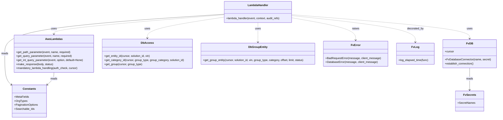

# Diagram: entity_core/entity_service/entity_service/entity/group/get_group_entity.py


> Auto-generated by Obscura crawlers

## Diagram 1

```mermaid
flowchart TD
  Start([Start]) --> ParseQS[/"Read query params: pageSize, pageNumber, status"/]
  ParseQS --> ComputeOffset{"page_size provided?"}
  ComputeOffset -- No --> SetDefault[/"offset = 0\npage_size = 100"/]
  ComputeOffset -- Yes --> SetFromPage[/"page_size = 100\noffset = pageNumber * page_size"/]
  SetDefault --> LogEvent["Log event JSON"]
  SetFromPage --> LogEvent
  LogEvent --> GetPath{/"Get path params:\nvin, solution_id, group_type, group_category"/}
  GetPath --> UpdateAudit["Update audit_refs with ENTITY_ID,SOLUTION_ID,GROUP_TYPE,GROUP_CATEGORY"]
  UpdateAudit --> DBConnect["DB_CONN.establish_connection()"]
  DBConnect --> GetEntityId["db_access.get_entity_id(cursor, solution_id, vin)"]
  GetEntityId --> EntityExists{"entity_id is not None?"}
  EntityExists -- No --> RaiseInvalidVIN[/BadRequestError: Invalid VIN/]
  EntityExists -- Yes --> CheckCategory{"group_category provided?"}
  CheckCategory -- Yes --> DecodeCategory["unquote group_category"]
  DecodeCategory --> GetCategoryId["db_access.get_category_id(cursor, group_type, group_category, solution_id)"]
  GetCategoryId --> CategoryExists{"group_category_id is not None?"}
  CategoryExists -- No --> RaiseInvalidCategory[/BadRequestError: Invalid group category/]
  CategoryExists -- Yes --> StatusValidation
  CheckCategory -- No --> GetGroup["db_access.get_group(cursor, group_type)"]
  GetGroup --> GroupExists{"group_entity is not None?"}
  GroupExists -- No --> RaiseInvalidGroup[/BadRequestError: Invalid group/]
  GroupExists -- Yes --> StatusValidation
  StatusValidation{"status is None or in {ACTIVE,INACTIVE,ALL}?"}
  StatusValidation -- No --> RaiseInvalidStatus[/BadRequestError: Invalid status value/]
  StatusValidation -- Yes --> TryDBCall["try: db_group_entity.get_group_entity(...)"]
  TryDBCall --> GotResults{"result_set_count > 0?"}
  GotResults -- Yes --> ComputePages["compute total_pages = ceil(count / page_size)"]
  ComputePages --> BuildResponseData["response.meta: total_pages,current_page,total_count\nresponse.data = vin_data"]
  GotResults -- No --> BuildEmptyResponse["response.meta zeros\nresponse.data = []"]
  BuildResponseData --> ReturnResponse["fv.aws.lambdas.make_response(response,200)"]
  BuildEmptyResponse --> ReturnResponse
  ReturnResponse --> End([End])
  TryDBCall -->|exception| DBErrorRaise[/raise fv.error.DatabaseError/]
  DBErrorRaise --> End
```

> SVG rendering failed for this diagram.

## Diagram 2



### SVG

<svg id="container" width="2942.3671875" xmlns="http://www.w3.org/2000/svg" class="classDiagram" height="704" viewBox="0 0 2942.3671875 704" role="graphics-document document" aria-roledescription="class"><style>#container{font-family:"trebuchet ms",verdana,arial,sans-serif;font-size:16px;fill:#333;}@keyframes edge-animation-frame{from{stroke-dashoffset:0;}}@keyframes dash{to{stroke-dashoffset:0;}}#container .edge-animation-slow{stroke-dasharray:9,5!important;stroke-dashoffset:900;animation:dash 50s linear infinite;stroke-linecap:round;}#container .edge-animation-fast{stroke-dasharray:9,5!important;stroke-dashoffset:900;animation:dash 20s linear infinite;stroke-linecap:round;}#container .error-icon{fill:#552222;}#container .error-text{fill:#552222;stroke:#552222;}#container .edge-thickness-normal{stroke-width:1px;}#container .edge-thickness-thick{stroke-width:3.5px;}#container .edge-pattern-solid{stroke-dasharray:0;}#container .edge-thickness-invisible{stroke-width:0;fill:none;}#container .edge-pattern-dashed{stroke-dasharray:3;}#container .edge-pattern-dotted{stroke-dasharray:2;}#container .marker{fill:#333333;stroke:#333333;}#container .marker.cross{stroke:#333333;}#container svg{font-family:"trebuchet ms",verdana,arial,sans-serif;font-size:16px;}#container p{margin:0;}#container g.classGroup text{fill:#9370DB;stroke:none;font-family:"trebuchet ms",verdana,arial,sans-serif;font-size:10px;}#container g.classGroup text .title{font-weight:bolder;}#container .nodeLabel,#container .edgeLabel{color:#131300;}#container .edgeLabel .label rect{fill:#ECECFF;}#container .label text{fill:#131300;}#container .labelBkg{background:#ECECFF;}#container .edgeLabel .label span{background:#ECECFF;}#container .classTitle{font-weight:bolder;}#container .node rect,#container .node circle,#container .node ellipse,#container .node polygon,#container .node path{fill:#ECECFF;stroke:#9370DB;stroke-width:1px;}#container .divider{stroke:#9370DB;stroke-width:1;}#container g.clickable{cursor:pointer;}#container g.classGroup rect{fill:#ECECFF;stroke:#9370DB;}#container g.classGroup line{stroke:#9370DB;stroke-width:1;}#container .classLabel .box{stroke:none;stroke-width:0;fill:#ECECFF;opacity:0.5;}#container .classLabel .label{fill:#9370DB;font-size:10px;}#container .relation{stroke:#333333;stroke-width:1;fill:none;}#container .dashed-line{stroke-dasharray:3;}#container .dotted-line{stroke-dasharray:1 2;}#container #compositionStart,#container .composition{fill:#333333!important;stroke:#333333!important;stroke-width:1;}#container #compositionEnd,#container .composition{fill:#333333!important;stroke:#333333!important;stroke-width:1;}#container #dependencyStart,#container .dependency{fill:#333333!important;stroke:#333333!important;stroke-width:1;}#container #dependencyStart,#container .dependency{fill:#333333!important;stroke:#333333!important;stroke-width:1;}#container #extensionStart,#container .extension{fill:transparent!important;stroke:#333333!important;stroke-width:1;}#container #extensionEnd,#container .extension{fill:transparent!important;stroke:#333333!important;stroke-width:1;}#container #aggregationStart,#container .aggregation{fill:transparent!important;stroke:#333333!important;stroke-width:1;}#container #aggregationEnd,#container .aggregation{fill:transparent!important;stroke:#333333!important;stroke-width:1;}#container #lollipopStart,#container .lollipop{fill:#ECECFF!important;stroke:#333333!important;stroke-width:1;}#container #lollipopEnd,#container .lollipop{fill:#ECECFF!important;stroke:#333333!important;stroke-width:1;}#container .edgeTerminals{font-size:11px;line-height:initial;}#container .classTitleText{text-anchor:middle;font-size:18px;fill:#333;}#container .label-icon{display:inline-block;height:1em;overflow:visible;vertical-align:-0.125em;}#container .node .label-icon path{fill:currentColor;stroke:revert;stroke-width:revert;}#container :root{--mermaid-font-family:"trebuchet ms",verdana,arial,sans-serif;}</style><g><defs><marker id="container_class-aggregationStart" class="marker aggregation class" refX="18" refY="7" markerWidth="190" markerHeight="240" orient="auto"><path d="M 18,7 L9,13 L1,7 L9,1 Z"></path></marker></defs><defs><marker id="container_class-aggregationEnd" class="marker aggregation class" refX="1" refY="7" markerWidth="20" markerHeight="28" orient="auto"><path d="M 18,7 L9,13 L1,7 L9,1 Z"></path></marker></defs><defs><marker id="container_class-extensionStart" class="marker extension class" refX="18" refY="7" markerWidth="190" markerHeight="240" orient="auto"><path d="M 1,7 L18,13 V 1 Z"></path></marker></defs><defs><marker id="container_class-extensionEnd" class="marker extension class" refX="1" refY="7" markerWidth="20" markerHeight="28" orient="auto"><path d="M 1,1 V 13 L18,7 Z"></path></marker></defs><defs><marker id="container_class-compositionStart" class="marker composition class" refX="18" refY="7" markerWidth="190" markerHeight="240" orient="auto"><path d="M 18,7 L9,13 L1,7 L9,1 Z"></path></marker></defs><defs><marker id="container_class-compositionEnd" class="marker composition class" refX="1" refY="7" markerWidth="20" markerHeight="28" orient="auto"><path d="M 18,7 L9,13 L1,7 L9,1 Z"></path></marker></defs><defs><marker id="container_class-dependencyStart" class="marker dependency class" refX="6" refY="7" markerWidth="190" markerHeight="240" orient="auto"><path d="M 5,7 L9,13 L1,7 L9,1 Z"></path></marker></defs><defs><marker id="container_class-dependencyEnd" class="marker dependency class" refX="13" refY="7" markerWidth="20" markerHeight="28" orient="auto"><path d="M 18,7 L9,13 L14,7 L9,1 Z"></path></marker></defs><defs><marker id="container_class-lollipopStart" class="marker lollipop class" refX="13" refY="7" markerWidth="190" markerHeight="240" orient="auto"><circle stroke="black" fill="transparent" cx="7" cy="7" r="6"></circle></marker></defs><defs><marker id="container_class-lollipopEnd" class="marker lollipop class" refX="1" refY="7" markerWidth="190" markerHeight="240" orient="auto"><circle stroke="black" fill="transparent" cx="7" cy="7" r="6"></circle></marker></defs><g class="root"><g class="clusters"></g><g class="edgePaths"><path d="M1334.164,87.618L1165.279,101.515C996.395,115.412,658.625,143.206,489.74,162.27C320.855,181.333,320.855,191.667,320.855,196.833L320.855,202" id="id_LambdaHandler_AwsLambdas_1" class="edge-thickness-normal edge-pattern-dashed relation" style=";;;" data-edge="true" data-et="edge" data-id="id_LambdaHandler_AwsLambdas_1" data-points="W3sieCI6MTMzNC4xNjQwNjI1LCJ5Ijo4Ny42MTgwNzY3Mzg4NzEyfSx7IngiOjMyMC44NTU0Njg3NSwieSI6MTcxfSx7IngiOjMyMC44NTU0Njg3NSwieSI6MjA4fV0=" marker-end="url(#container_class-dependencyEnd)"></path><path d="M1738.07,87.24L1911.676,101.2C2085.283,115.16,2432.495,143.08,2606.101,166.707C2779.707,190.333,2779.707,209.667,2779.707,219.333L2779.707,229" id="id_LambdaHandler_FvDB_2" class="edge-thickness-normal edge-pattern-dashed relation" style=";;;" data-edge="true" data-et="edge" data-id="id_LambdaHandler_FvDB_2" data-points="W3sieCI6MTczOC4wNzAzMTI1LCJ5Ijo4Ny4yMzk1MjgzMzEyMjM1NX0seyJ4IjoyNzc5LjcwNzAzMTI1LCJ5IjoxNzF9LHsieCI6Mjc3OS43MDcwMzEyNSwieSI6MjM1fV0=" marker-end="url(#container_class-dependencyEnd)"></path><path d="M1334.164,101.589L1257.786,113.157C1181.409,124.726,1028.654,147.863,952.276,168.598C875.898,189.333,875.898,207.667,875.898,216.833L875.898,226" id="id_LambdaHandler_DbAccess_3" class="edge-thickness-normal edge-pattern-dashed relation" style=";;;" data-edge="true" data-et="edge" data-id="id_LambdaHandler_DbAccess_3" data-points="W3sieCI6MTMzNC4xNjQwNjI1LCJ5IjoxMDEuNTg4ODE5OTkzMzczNH0seyJ4Ijo4NzUuODk4NDM3NSwieSI6MTcxfSx7IngiOjg3NS44OTg0Mzc1LCJ5IjoyMzJ9XQ==" marker-end="url(#container_class-dependencyEnd)"></path><path d="M1536.117,134L1536.117,140.167C1536.117,146.333,1536.117,158.667,1536.117,178C1536.117,197.333,1536.117,223.667,1536.117,236.833L1536.117,250" id="id_LambdaHandler_DbGroupEntity_4" class="edge-thickness-normal edge-pattern-dashed relation" style=";;;" data-edge="true" data-et="edge" data-id="id_LambdaHandler_DbGroupEntity_4" data-points="W3sieCI6MTUzNi4xMTcxODc1LCJ5IjoxMzR9LHsieCI6MTUzNi4xMTcxODc1LCJ5IjoxNzF9LHsieCI6MTUzNi4xMTcxODc1LCJ5IjoyNTZ9XQ==" marker-end="url(#container_class-dependencyEnd)"></path><path d="M1738.07,105.855L1800.98,116.712C1863.891,127.57,1989.711,149.285,2052.621,171.309C2115.531,193.333,2115.531,215.667,2115.531,226.833L2115.531,238" id="id_LambdaHandler_FvError_5" class="edge-thickness-normal edge-pattern-dashed relation" style=";;;" data-edge="true" data-et="edge" data-id="id_LambdaHandler_FvError_5" data-points="W3sieCI6MTczOC4wNzAzMTI1LCJ5IjoxMDUuODU0NzE1ODM2MzEwOTN9LHsieCI6MjExNS41MzEyNSwieSI6MTcxfSx7IngiOjIxMTUuNTMxMjUsInkiOjI0NH1d" marker-end="url(#container_class-dependencyEnd)"></path><path d="M1738.07,92.777L1858.973,105.814C1979.876,118.851,2221.682,144.926,2342.585,171.129C2463.488,197.333,2463.488,223.667,2463.488,236.833L2463.488,250" id="id_LambdaHandler_FvLog_6" class="edge-thickness-normal edge-pattern-dashed relation" style=";;;" data-edge="true" data-et="edge" data-id="id_LambdaHandler_FvLog_6" data-points="W3sieCI6MTczOC4wNzAzMTI1LCJ5Ijo5Mi43NzY5NDg0NDcxODE0M30seyJ4IjoyNDYzLjQ4ODI4MTI1LCJ5IjoxNzF9LHsieCI6MjQ2My40ODgyODEyNSwieSI6MjU2fV0=" marker-end="url(#container_class-dependencyEnd)"></path><path d="M2779.707,403L2779.707,413.667C2779.707,424.333,2779.707,445.667,2779.707,467.5C2779.707,489.333,2779.707,511.667,2779.707,522.833L2779.707,534" id="id_FvDB_FvSecrets_7" class="edge-thickness-normal edge-pattern-solid relation" style=";;;" data-edge="true" data-et="edge" data-id="id_FvDB_FvSecrets_7" data-points="W3sieCI6Mjc3OS43MDcwMzEyNSwieSI6NDAzfSx7IngiOjI3NzkuNzA3MDMxMjUsInkiOjQ2N30seyJ4IjoyNzc5LjcwNzAzMTI1LCJ5Ijo1NDB9XQ==" marker-end="url(#container_class-dependencyEnd)"></path><path d="M1334.164,84.391L1116.471,98.826C898.779,113.261,463.393,142.13,245.701,181.232C28.008,220.333,28.008,269.667,28.008,319C28.008,368.333,28.008,417.667,34.8,448.503C41.592,479.339,55.176,491.677,61.968,497.847L68.76,504.016" id="id_LambdaHandler_Constants_8" class="edge-thickness-normal edge-pattern-solid relation" style=";;;" data-edge="true" data-et="edge" data-id="id_LambdaHandler_Constants_8" data-points="W3sieCI6MTMzNC4xNjQwNjI1LCJ5Ijo4NC4zOTExNDU3ODQ3Njc3Nn0seyJ4IjoyOC4wMDc4MTI1LCJ5IjoxNzF9LHsieCI6MjguMDA3ODEyNSwieSI6MzE5fSx7IngiOjI4LjAwNzgxMjUsInkiOjQ2N30seyJ4Ijo3My4yMDExNzE4NzUsInkiOjUwOC4wNTAxMjczODU5ODYyM31d" marker-end="url(#container_class-dependencyEnd)"></path><path d="M320.855,430L320.855,436.167C320.855,442.333,320.855,454.667,314.063,467.003C307.271,479.339,293.687,491.677,286.895,497.847L280.103,504.016" id="id_AwsLambdas_Constants_9" class="edge-thickness-normal edge-pattern-solid relation" style=";;;" data-edge="true" data-et="edge" data-id="id_AwsLambdas_Constants_9" data-points="W3sieCI6MzIwLjg1NTQ2ODc1LCJ5Ijo0MzB9LHsieCI6MzIwLjg1NTQ2ODc1LCJ5Ijo0Njd9LHsieCI6Mjc1LjY2MjEwOTM3NSwieSI6NTA4LjA1MDEyNzM4NTk4NjIzfV0=" marker-end="url(#container_class-dependencyEnd)"></path></g><g class="edgeLabels"><g class="edgeLabel" transform="translate(320.85546875, 171)"><g class="label" data-id="id_LambdaHandler_AwsLambdas_1" transform="translate(-16.4921875, -12)"><foreignObject width="32.984375" height="24"><div xmlns="http://www.w3.org/1999/xhtml" class="labelBkg" style="display: table-cell; white-space: nowrap; line-height: 1.5; max-width: 200px; text-align: center;"><span class="edgeLabel"><p>uses</p></span></div></foreignObject></g></g><g class="edgeLabel" transform="translate(2779.70703125, 171)"><g class="label" data-id="id_LambdaHandler_FvDB_2" transform="translate(-16.4921875, -12)"><foreignObject width="32.984375" height="24"><div xmlns="http://www.w3.org/1999/xhtml" class="labelBkg" style="display: table-cell; white-space: nowrap; line-height: 1.5; max-width: 200px; text-align: center;"><span class="edgeLabel"><p>uses</p></span></div></foreignObject></g></g><g class="edgeLabel" transform="translate(875.8984375, 171)"><g class="label" data-id="id_LambdaHandler_DbAccess_3" transform="translate(-16.4921875, -12)"><foreignObject width="32.984375" height="24"><div xmlns="http://www.w3.org/1999/xhtml" class="labelBkg" style="display: table-cell; white-space: nowrap; line-height: 1.5; max-width: 200px; text-align: center;"><span class="edgeLabel"><p>uses</p></span></div></foreignObject></g></g><g class="edgeLabel" transform="translate(1536.1171875, 171)"><g class="label" data-id="id_LambdaHandler_DbGroupEntity_4" transform="translate(-16.4921875, -12)"><foreignObject width="32.984375" height="24"><div xmlns="http://www.w3.org/1999/xhtml" class="labelBkg" style="display: table-cell; white-space: nowrap; line-height: 1.5; max-width: 200px; text-align: center;"><span class="edgeLabel"><p>uses</p></span></div></foreignObject></g></g><g class="edgeLabel" transform="translate(2115.53125, 171)"><g class="label" data-id="id_LambdaHandler_FvError_5" transform="translate(-21.25, -12)"><foreignObject width="42.5" height="24"><div xmlns="http://www.w3.org/1999/xhtml" class="labelBkg" style="display: table-cell; white-space: nowrap; line-height: 1.5; max-width: 200px; text-align: center;"><span class="edgeLabel"><p>raises</p></span></div></foreignObject></g></g><g class="edgeLabel" transform="translate(2463.48828125, 171)"><g class="label" data-id="id_LambdaHandler_FvLog_6" transform="translate(-49.375, -12)"><foreignObject width="98.75" height="24"><div xmlns="http://www.w3.org/1999/xhtml" class="labelBkg" style="display: table-cell; white-space: nowrap; line-height: 1.5; max-width: 200px; text-align: center;"><span class="edgeLabel"><p>decorated_by</p></span></div></foreignObject></g></g><g class="edgeLabel" transform="translate(2779.70703125, 467)"><g class="label" data-id="id_FvDB_FvSecrets_7" transform="translate(-20.0078125, -12)"><foreignObject width="40.015625" height="24"><div xmlns="http://www.w3.org/1999/xhtml" class="labelBkg" style="display: table-cell; white-space: nowrap; line-height: 1.5; max-width: 200px; text-align: center;"><span class="edgeLabel"><p>reads</p></span></div></foreignObject></g></g><g class="edgeLabel" transform="translate(28.0078125, 319)"><g class="label" data-id="id_LambdaHandler_Constants_8" transform="translate(-20.0078125, -12)"><foreignObject width="40.015625" height="24"><div xmlns="http://www.w3.org/1999/xhtml" class="labelBkg" style="display: table-cell; white-space: nowrap; line-height: 1.5; max-width: 200px; text-align: center;"><span class="edgeLabel"><p>reads</p></span></div></foreignObject></g></g><g class="edgeLabel" transform="translate(320.85546875, 467)"><g class="label" data-id="id_AwsLambdas_Constants_9" transform="translate(-20.0078125, -12)"><foreignObject width="40.015625" height="24"><div xmlns="http://www.w3.org/1999/xhtml" class="labelBkg" style="display: table-cell; white-space: nowrap; line-height: 1.5; max-width: 200px; text-align: center;"><span class="edgeLabel"><p>reads</p></span></div></foreignObject></g></g></g><g class="nodes"><g class="node default" id="classId-LambdaHandler-0" transform="translate(1536.1171875, 71)"><g class="basic label-container"><path d="M-201.953125 -63 L201.953125 -63 L201.953125 63 L-201.953125 63" stroke="none" stroke-width="0" fill="#ECECFF" style=""></path><path d="M-201.953125 -63 C-93.65387583882212 -63, 14.645373322355766 -63, 201.953125 -63 M-201.953125 -63 C-119.4726742879507 -63, -36.99222357590139 -63, 201.953125 -63 M201.953125 -63 C201.953125 -36.073518922274275, 201.953125 -9.147037844548542, 201.953125 63 M201.953125 -63 C201.953125 -18.332050322114654, 201.953125 26.335899355770692, 201.953125 63 M201.953125 63 C110.77840515616514 63, 19.60368531233027 63, -201.953125 63 M201.953125 63 C55.54231606153232 63, -90.86849287693536 63, -201.953125 63 M-201.953125 63 C-201.953125 14.304982606032688, -201.953125 -34.390034787934624, -201.953125 -63 M-201.953125 63 C-201.953125 22.604507073866188, -201.953125 -17.790985852267625, -201.953125 -63" stroke="#9370DB" stroke-width="1.3" fill="none" stroke-dasharray="0 0" style=""></path></g><g class="annotation-group text" transform="translate(0, -39)"></g><g class="label-group text" transform="translate(-58.21875, -39)"><g class="label" style="font-weight: bolder" transform="translate(0,-12)"><foreignObject width="116.4375" height="24"><div xmlns="http://www.w3.org/1999/xhtml" style="display: table-cell; white-space: nowrap; line-height: 1.5; max-width: 167px; text-align: center;"><span class="nodeLabel markdown-node-label" style=""><p>LambdaHandler</p></span></div></foreignObject></g></g><g class="members-group text" transform="translate(-189.953125, 9)"></g><g class="methods-group text" transform="translate(-189.953125, 39)"><g class="label" style="" transform="translate(0,-12)"><foreignObject width="321.6875" height="24"><div xmlns="http://www.w3.org/1999/xhtml" style="display: table-cell; white-space: nowrap; line-height: 1.5; max-width: 379px; text-align: center;"><span class="nodeLabel markdown-node-label" style=""><p>+lambda_handler(event, context, audit_refs)</p></span></div></foreignObject></g></g><g class="divider" style=""><path d="M-201.953125 -15 C-58.67304285208499 -15, 84.60703929583002 -15, 201.953125 -15 M-201.953125 -15 C-60.684999951024764 -15, 80.58312509795047 -15, 201.953125 -15" stroke="#9370DB" stroke-width="1.3" fill="none" stroke-dasharray="0 0" style=""></path></g><g class="divider" style=""><path d="M-201.953125 9 C-110.69215284330635 9, -19.43118068661269 9, 201.953125 9 M-201.953125 9 C-85.68632221384887 9, 30.580480572302264 9, 201.953125 9" stroke="#9370DB" stroke-width="1.3" fill="none" stroke-dasharray="0 0" style=""></path></g></g><g class="node default" id="classId-AwsLambdas-1" transform="translate(320.85546875, 319)"><g class="basic label-container"><path d="M-237.83984375 -111 L237.83984375 -111 L237.83984375 111 L-237.83984375 111" stroke="none" stroke-width="0" fill="#ECECFF" style=""></path><path d="M-237.83984375 -111 C-95.96230165250728 -111, 45.91524044498544 -111, 237.83984375 -111 M-237.83984375 -111 C-59.03898469179421 -111, 119.76187436641158 -111, 237.83984375 -111 M237.83984375 -111 C237.83984375 -56.558556521605276, 237.83984375 -2.1171130432105514, 237.83984375 111 M237.83984375 -111 C237.83984375 -64.74171708825199, 237.83984375 -18.48343417650399, 237.83984375 111 M237.83984375 111 C96.87387160059089 111, -44.09210054881822 111, -237.83984375 111 M237.83984375 111 C101.84966608302199 111, -34.14051158395603 111, -237.83984375 111 M-237.83984375 111 C-237.83984375 47.03740960720394, -237.83984375 -16.92518078559212, -237.83984375 -111 M-237.83984375 111 C-237.83984375 28.658838171017294, -237.83984375 -53.68232365796541, -237.83984375 -111" stroke="#9370DB" stroke-width="1.3" fill="none" stroke-dasharray="0 0" style=""></path></g><g class="annotation-group text" transform="translate(0, -87)"></g><g class="label-group text" transform="translate(-47.4921875, -87)"><g class="label" style="font-weight: bolder" transform="translate(0,-12)"><foreignObject width="94.984375" height="24"><div xmlns="http://www.w3.org/1999/xhtml" style="display: table-cell; white-space: nowrap; line-height: 1.5; max-width: 143px; text-align: center;"><span class="nodeLabel markdown-node-label" style=""><p>AwsLambdas</p></span></div></foreignObject></g></g><g class="members-group text" transform="translate(-225.83984375, -39)"></g><g class="methods-group text" transform="translate(-225.83984375, -9)"><g class="label" style="" transform="translate(0,-12)"><foreignObject width="324.703125" height="24"><div xmlns="http://www.w3.org/1999/xhtml" style="display: table-cell; white-space: nowrap; line-height: 1.5; max-width: 382px; text-align: center;"><span class="nodeLabel markdown-node-label" style=""><p>+get_path_parameter(event, name, required)</p></span></div></foreignObject></g><g class="label" style="" transform="translate(0,12)"><foreignObject width="332.34375" height="24"><div xmlns="http://www.w3.org/1999/xhtml" style="display: table-cell; white-space: nowrap; line-height: 1.5; max-width: 390px; text-align: center;"><span class="nodeLabel markdown-node-label" style=""><p>+get_query_parameter(event, name, required)</p></span></div></foreignObject></g><g class="label" style="" transform="translate(0,36)"><foreignObject width="404.1875" height="24"><div xmlns="http://www.w3.org/1999/xhtml" style="display: table-cell; white-space: nowrap; line-height: 1.5; max-width: 462px; text-align: center;"><span class="nodeLabel markdown-node-label" style=""><p>+get_int_query_parameter(event, option, default=None)</p></span></div></foreignObject></g><g class="label" style="" transform="translate(0,60)"><foreignObject width="219.96875" height="24"><div xmlns="http://www.w3.org/1999/xhtml" style="display: table-cell; white-space: nowrap; line-height: 1.5; max-width: 277px; text-align: center;"><span class="nodeLabel markdown-node-label" style=""><p>+make_response(body, status)</p></span></div></foreignObject></g><g class="label" style="" transform="translate(0,84)"><foreignObject width="368.703125" height="24"><div xmlns="http://www.w3.org/1999/xhtml" style="display: table-cell; white-space: nowrap; line-height: 1.5; max-width: 426px; text-align: center;"><span class="nodeLabel markdown-node-label" style=""><p>+mandatory_lambda_handling(auth_check, cursor)</p></span></div></foreignObject></g></g><g class="divider" style=""><path d="M-237.83984375 -63 C-72.46190859420918 -63, 92.91602656158165 -63, 237.83984375 -63 M-237.83984375 -63 C-140.7184916752169 -63, -43.59713960043385 -63, 237.83984375 -63" stroke="#9370DB" stroke-width="1.3" fill="none" stroke-dasharray="0 0" style=""></path></g><g class="divider" style=""><path d="M-237.83984375 -39 C-107.481972221099 -39, 22.875899307802 -39, 237.83984375 -39 M-237.83984375 -39 C-123.84640695150188 -39, -9.852970153003753 -39, 237.83984375 -39" stroke="#9370DB" stroke-width="1.3" fill="none" stroke-dasharray="0 0" style=""></path></g></g><g class="node default" id="classId-FvDB-2" transform="translate(2779.70703125, 319)"><g class="basic label-container"><path d="M-154.66015625 -84 L154.66015625 -84 L154.66015625 84 L-154.66015625 84" stroke="none" stroke-width="0" fill="#ECECFF" style=""></path><path d="M-154.66015625 -84 C-83.42464867601878 -84, -12.189141102037553 -84, 154.66015625 -84 M-154.66015625 -84 C-58.168406007846386 -84, 38.32334423430723 -84, 154.66015625 -84 M154.66015625 -84 C154.66015625 -26.705531777063264, 154.66015625 30.588936445873472, 154.66015625 84 M154.66015625 -84 C154.66015625 -39.88566855646781, 154.66015625 4.228662887064374, 154.66015625 84 M154.66015625 84 C69.12717447791896 84, -16.405807294162088 84, -154.66015625 84 M154.66015625 84 C43.04270822836746 84, -68.57473979326508 84, -154.66015625 84 M-154.66015625 84 C-154.66015625 35.98416352214857, -154.66015625 -12.03167295570286, -154.66015625 -84 M-154.66015625 84 C-154.66015625 42.207277614251154, -154.66015625 0.41455522850230864, -154.66015625 -84" stroke="#9370DB" stroke-width="1.3" fill="none" stroke-dasharray="0 0" style=""></path></g><g class="annotation-group text" transform="translate(0, -60)"></g><g class="label-group text" transform="translate(-17.8671875, -60)"><g class="label" style="font-weight: bolder" transform="translate(0,-12)"><foreignObject width="35.734375" height="24"><div xmlns="http://www.w3.org/1999/xhtml" style="display: table-cell; white-space: nowrap; line-height: 1.5; max-width: 85px; text-align: center;"><span class="nodeLabel markdown-node-label" style=""><p>FvDB</p></span></div></foreignObject></g></g><g class="members-group text" transform="translate(-142.66015625, -12)"><g class="label" style="" transform="translate(0,-12)"><foreignObject width="53.71875" height="24"><div xmlns="http://www.w3.org/1999/xhtml" style="display: table-cell; white-space: nowrap; line-height: 1.5; max-width: 112px; text-align: center;"><span class="nodeLabel markdown-node-label" style=""><p>+cursor</p></span></div></foreignObject></g></g><g class="methods-group text" transform="translate(-142.66015625, 36)"><g class="label" style="" transform="translate(0,-12)"><foreignObject width="267.453125" height="24"><div xmlns="http://www.w3.org/1999/xhtml" style="display: table-cell; white-space: nowrap; line-height: 1.5; max-width: 325px; text-align: center;"><span class="nodeLabel markdown-node-label" style=""><p>+FvDatabaseConnector(name, secret)</p></span></div></foreignObject></g><g class="label" style="" transform="translate(0,12)"><foreignObject width="173.265625" height="24"><div xmlns="http://www.w3.org/1999/xhtml" style="display: table-cell; white-space: nowrap; line-height: 1.5; max-width: 231px; text-align: center;"><span class="nodeLabel markdown-node-label" style=""><p>+establish_connection()</p></span></div></foreignObject></g></g><g class="divider" style=""><path d="M-154.66015625 -36 C-64.29236516338187 -36, 26.075425923236253 -36, 154.66015625 -36 M-154.66015625 -36 C-68.47817394726204 -36, 17.70380835547593 -36, 154.66015625 -36" stroke="#9370DB" stroke-width="1.3" fill="none" stroke-dasharray="0 0" style=""></path></g><g class="divider" style=""><path d="M-154.66015625 12 C-87.13012923522308 12, -19.60010222044616 12, 154.66015625 12 M-154.66015625 12 C-42.803472472823515 12, 69.05321130435297 12, 154.66015625 12" stroke="#9370DB" stroke-width="1.3" fill="none" stroke-dasharray="0 0" style=""></path></g></g><g class="node default" id="classId-DbAccess-3" transform="translate(875.8984375, 319)"><g class="basic label-container"><path d="M-267.203125 -87 L267.203125 -87 L267.203125 87 L-267.203125 87" stroke="none" stroke-width="0" fill="#ECECFF" style=""></path><path d="M-267.203125 -87 C-100.18127567609366 -87, 66.84057364781268 -87, 267.203125 -87 M-267.203125 -87 C-158.05456285802984 -87, -48.90600071605965 -87, 267.203125 -87 M267.203125 -87 C267.203125 -17.421282580575493, 267.203125 52.157434838849014, 267.203125 87 M267.203125 -87 C267.203125 -31.498020174243095, 267.203125 24.00395965151381, 267.203125 87 M267.203125 87 C63.17418785940882 87, -140.85474928118236 87, -267.203125 87 M267.203125 87 C113.00906921978347 87, -41.18498656043306 87, -267.203125 87 M-267.203125 87 C-267.203125 17.999290759539846, -267.203125 -51.00141848092031, -267.203125 -87 M-267.203125 87 C-267.203125 20.54085841542728, -267.203125 -45.91828316914544, -267.203125 -87" stroke="#9370DB" stroke-width="1.3" fill="none" stroke-dasharray="0 0" style=""></path></g><g class="annotation-group text" transform="translate(0, -63)"></g><g class="label-group text" transform="translate(-34.140625, -63)"><g class="label" style="font-weight: bolder" transform="translate(0,-12)"><foreignObject width="68.28125" height="24"><div xmlns="http://www.w3.org/1999/xhtml" style="display: table-cell; white-space: nowrap; line-height: 1.5; max-width: 117px; text-align: center;"><span class="nodeLabel markdown-node-label" style=""><p>DbAccess</p></span></div></foreignObject></g></g><g class="members-group text" transform="translate(-255.203125, -15)"></g><g class="methods-group text" transform="translate(-255.203125, 15)"><g class="label" style="" transform="translate(0,-12)"><foreignObject width="277.390625" height="24"><div xmlns="http://www.w3.org/1999/xhtml" style="display: table-cell; white-space: nowrap; line-height: 1.5; max-width: 335px; text-align: center;"><span class="nodeLabel markdown-node-label" style=""><p>+get_entity_id(cursor, solution_id, vin)</p></span></div></foreignObject></g><g class="label" style="" transform="translate(0,12)"><foreignObject width="476.265625" height="24"><div xmlns="http://www.w3.org/1999/xhtml" style="display: table-cell; white-space: nowrap; line-height: 1.5; max-width: 534px; text-align: center;"><span class="nodeLabel markdown-node-label" style=""><p>+get_category_id(cursor, group_type, group_category, solution_id)</p></span></div></foreignObject></g><g class="label" style="" transform="translate(0,36)"><foreignObject width="225.734375" height="24"><div xmlns="http://www.w3.org/1999/xhtml" style="display: table-cell; white-space: nowrap; line-height: 1.5; max-width: 283px; text-align: center;"><span class="nodeLabel markdown-node-label" style=""><p>+get_group(cursor, group_type)</p></span></div></foreignObject></g></g><g class="divider" style=""><path d="M-267.203125 -39 C-81.8347639904436 -39, 103.53359701911279 -39, 267.203125 -39 M-267.203125 -39 C-139.87995681860684 -39, -12.556788637213657 -39, 267.203125 -39" stroke="#9370DB" stroke-width="1.3" fill="none" stroke-dasharray="0 0" style=""></path></g><g class="divider" style=""><path d="M-267.203125 -15 C-115.07632544219999 -15, 37.050474115600025 -15, 267.203125 -15 M-267.203125 -15 C-66.06662878762396 -15, 135.0698674247521 -15, 267.203125 -15" stroke="#9370DB" stroke-width="1.3" fill="none" stroke-dasharray="0 0" style=""></path></g></g><g class="node default" id="classId-DbGroupEntity-4" transform="translate(1536.1171875, 319)"><g class="basic label-container"><path d="M-343.015625 -63 L343.015625 -63 L343.015625 63 L-343.015625 63" stroke="none" stroke-width="0" fill="#ECECFF" style=""></path><path d="M-343.015625 -63 C-88.43476355024242 -63, 166.14609789951515 -63, 343.015625 -63 M-343.015625 -63 C-176.8390911066098 -63, -10.6625572132196 -63, 343.015625 -63 M343.015625 -63 C343.015625 -18.248650012156034, 343.015625 26.502699975687932, 343.015625 63 M343.015625 -63 C343.015625 -21.557499619536266, 343.015625 19.88500076092747, 343.015625 63 M343.015625 63 C193.17553809144874 63, 43.335451182897486 63, -343.015625 63 M343.015625 63 C82.48917556874255 63, -178.0372738625149 63, -343.015625 63 M-343.015625 63 C-343.015625 13.383455940574542, -343.015625 -36.233088118850915, -343.015625 -63 M-343.015625 63 C-343.015625 30.24146739790919, -343.015625 -2.5170652041816197, -343.015625 -63" stroke="#9370DB" stroke-width="1.3" fill="none" stroke-dasharray="0 0" style=""></path></g><g class="annotation-group text" transform="translate(0, -39)"></g><g class="label-group text" transform="translate(-53.421875, -39)"><g class="label" style="font-weight: bolder" transform="translate(0,-12)"><foreignObject width="106.84375" height="24"><div xmlns="http://www.w3.org/1999/xhtml" style="display: table-cell; white-space: nowrap; line-height: 1.5; max-width: 156px; text-align: center;"><span class="nodeLabel markdown-node-label" style=""><p>DbGroupEntity</p></span></div></foreignObject></g></g><g class="members-group text" transform="translate(-331.015625, 9)"></g><g class="methods-group text" transform="translate(-331.015625, 39)"><g class="label" style="" transform="translate(0,-12)"><foreignObject width="608.609375" height="24"><div xmlns="http://www.w3.org/1999/xhtml" style="display: table-cell; white-space: nowrap; line-height: 1.5; max-width: 666px; text-align: center;"><span class="nodeLabel markdown-node-label" style=""><p>+get_group_entity(cursor, solution_id, vin, group_type, category, offset, limit, status)</p></span></div></foreignObject></g></g><g class="divider" style=""><path d="M-343.015625 -15 C-88.29869824248135 -15, 166.4182285150373 -15, 343.015625 -15 M-343.015625 -15 C-162.2324045367674 -15, 18.55081592646519 -15, 343.015625 -15" stroke="#9370DB" stroke-width="1.3" fill="none" stroke-dasharray="0 0" style=""></path></g><g class="divider" style=""><path d="M-343.015625 9 C-204.59832461988586 9, -66.18102423977172 9, 343.015625 9 M-343.015625 9 C-197.0299731448675 9, -51.044321289735024 9, 343.015625 9" stroke="#9370DB" stroke-width="1.3" fill="none" stroke-dasharray="0 0" style=""></path></g></g><g class="node default" id="classId-FvError-5" transform="translate(2115.53125, 319)"><g class="basic label-container"><path d="M-186.3984375 -75 L186.3984375 -75 L186.3984375 75 L-186.3984375 75" stroke="none" stroke-width="0" fill="#ECECFF" style=""></path><path d="M-186.3984375 -75 C-86.00140614151344 -75, 14.395625216973116 -75, 186.3984375 -75 M-186.3984375 -75 C-62.5416786619344 -75, 61.315080176131204 -75, 186.3984375 -75 M186.3984375 -75 C186.3984375 -20.46390651475837, 186.3984375 34.07218697048326, 186.3984375 75 M186.3984375 -75 C186.3984375 -32.6084391975348, 186.3984375 9.7831216049304, 186.3984375 75 M186.3984375 75 C100.53097864329888 75, 14.66351978659776 75, -186.3984375 75 M186.3984375 75 C96.75268142212852 75, 7.106925344257036 75, -186.3984375 75 M-186.3984375 75 C-186.3984375 23.97850736275506, -186.3984375 -27.04298527448988, -186.3984375 -75 M-186.3984375 75 C-186.3984375 36.78409601260262, -186.3984375 -1.431807974794765, -186.3984375 -75" stroke="#9370DB" stroke-width="1.3" fill="none" stroke-dasharray="0 0" style=""></path></g><g class="annotation-group text" transform="translate(0, -51)"></g><g class="label-group text" transform="translate(-25.90625, -51)"><g class="label" style="font-weight: bolder" transform="translate(0,-12)"><foreignObject width="51.8125" height="24"><div xmlns="http://www.w3.org/1999/xhtml" style="display: table-cell; white-space: nowrap; line-height: 1.5; max-width: 102px; text-align: center;"><span class="nodeLabel markdown-node-label" style=""><p>FvError</p></span></div></foreignObject></g></g><g class="members-group text" transform="translate(-174.3984375, -3)"></g><g class="methods-group text" transform="translate(-174.3984375, 27)"><g class="label" style="" transform="translate(0,-12)"><foreignObject width="322.890625" height="24"><div xmlns="http://www.w3.org/1999/xhtml" style="display: table-cell; white-space: nowrap; line-height: 1.5; max-width: 380px; text-align: center;"><span class="nodeLabel markdown-node-label" style=""><p>+BadRequestError(message, client_message)</p></span></div></foreignObject></g><g class="label" style="" transform="translate(0,12)"><foreignObject width="303.171875" height="24"><div xmlns="http://www.w3.org/1999/xhtml" style="display: table-cell; white-space: nowrap; line-height: 1.5; max-width: 361px; text-align: center;"><span class="nodeLabel markdown-node-label" style=""><p>+DatabaseError(message, client_message)</p></span></div></foreignObject></g></g><g class="divider" style=""><path d="M-186.3984375 -27 C-96.01026165549811 -27, -5.622085810996225 -27, 186.3984375 -27 M-186.3984375 -27 C-87.28995396546277 -27, 11.818529569074457 -27, 186.3984375 -27" stroke="#9370DB" stroke-width="1.3" fill="none" stroke-dasharray="0 0" style=""></path></g><g class="divider" style=""><path d="M-186.3984375 -3 C-46.310892684500686 -3, 93.77665213099863 -3, 186.3984375 -3 M-186.3984375 -3 C-54.24714997267742 -3, 77.90413755464516 -3, 186.3984375 -3" stroke="#9370DB" stroke-width="1.3" fill="none" stroke-dasharray="0 0" style=""></path></g></g><g class="node default" id="classId-FvLog-6" transform="translate(2463.48828125, 319)"><g class="basic label-container"><path d="M-111.55859375 -63 L111.55859375 -63 L111.55859375 63 L-111.55859375 63" stroke="none" stroke-width="0" fill="#ECECFF" style=""></path><path d="M-111.55859375 -63 C-34.13191926557819 -63, 43.29475521884362 -63, 111.55859375 -63 M-111.55859375 -63 C-31.664707405846954 -63, 48.22917893830609 -63, 111.55859375 -63 M111.55859375 -63 C111.55859375 -23.176422483060797, 111.55859375 16.647155033878406, 111.55859375 63 M111.55859375 -63 C111.55859375 -25.028985524804945, 111.55859375 12.94202895039011, 111.55859375 63 M111.55859375 63 C29.378216402369844 63, -52.80216094526031 63, -111.55859375 63 M111.55859375 63 C54.22708659818469 63, -3.104420553630618 63, -111.55859375 63 M-111.55859375 63 C-111.55859375 12.629413875483941, -111.55859375 -37.74117224903212, -111.55859375 -63 M-111.55859375 63 C-111.55859375 25.584653616501477, -111.55859375 -11.830692766997046, -111.55859375 -63" stroke="#9370DB" stroke-width="1.3" fill="none" stroke-dasharray="0 0" style=""></path></g><g class="annotation-group text" transform="translate(0, -39)"></g><g class="label-group text" transform="translate(-20.7109375, -39)"><g class="label" style="font-weight: bolder" transform="translate(0,-12)"><foreignObject width="41.421875" height="24"><div xmlns="http://www.w3.org/1999/xhtml" style="display: table-cell; white-space: nowrap; line-height: 1.5; max-width: 91px; text-align: center;"><span class="nodeLabel markdown-node-label" style=""><p>FvLog</p></span></div></foreignObject></g></g><g class="members-group text" transform="translate(-99.55859375, 9)"></g><g class="methods-group text" transform="translate(-99.55859375, 39)"><g class="label" style="" transform="translate(0,-12)"><foreignObject width="178.40625" height="24"><div xmlns="http://www.w3.org/1999/xhtml" style="display: table-cell; white-space: nowrap; line-height: 1.5; max-width: 236px; text-align: center;"><span class="nodeLabel markdown-node-label" style=""><p>+log_elapsed_time(func)</p></span></div></foreignObject></g></g><g class="divider" style=""><path d="M-111.55859375 -15 C-27.02950658639591 -15, 57.49958057720818 -15, 111.55859375 -15 M-111.55859375 -15 C-22.74959326927039 -15, 66.05940721145922 -15, 111.55859375 -15" stroke="#9370DB" stroke-width="1.3" fill="none" stroke-dasharray="0 0" style=""></path></g><g class="divider" style=""><path d="M-111.55859375 9 C-56.809162950302856 9, -2.0597321506057114 9, 111.55859375 9 M-111.55859375 9 C-43.6568989111293 9, 24.244795927741393 9, 111.55859375 9" stroke="#9370DB" stroke-width="1.3" fill="none" stroke-dasharray="0 0" style=""></path></g></g><g class="node default" id="classId-FvSecrets-7" transform="translate(2779.70703125, 600)"><g class="basic label-container"><path d="M-80.52734375 -60 L80.52734375 -60 L80.52734375 60 L-80.52734375 60" stroke="none" stroke-width="0" fill="#ECECFF" style=""></path><path d="M-80.52734375 -60 C-39.404993293652126 -60, 1.7173571626957482 -60, 80.52734375 -60 M-80.52734375 -60 C-40.370217033691404 -60, -0.21309031738280737 -60, 80.52734375 -60 M80.52734375 -60 C80.52734375 -23.914281579254762, 80.52734375 12.171436841490475, 80.52734375 60 M80.52734375 -60 C80.52734375 -17.694616736053817, 80.52734375 24.610766527892366, 80.52734375 60 M80.52734375 60 C28.020342736668063 60, -24.486658276663874 60, -80.52734375 60 M80.52734375 60 C31.074187402922817 60, -18.378968944154366 60, -80.52734375 60 M-80.52734375 60 C-80.52734375 14.189890111424141, -80.52734375 -31.620219777151718, -80.52734375 -60 M-80.52734375 60 C-80.52734375 23.288035177674054, -80.52734375 -13.423929644651892, -80.52734375 -60" stroke="#9370DB" stroke-width="1.3" fill="none" stroke-dasharray="0 0" style=""></path></g><g class="annotation-group text" transform="translate(0, -36)"></g><g class="label-group text" transform="translate(-34.8828125, -36)"><g class="label" style="font-weight: bolder" transform="translate(0,-12)"><foreignObject width="69.765625" height="24"><div xmlns="http://www.w3.org/1999/xhtml" style="display: table-cell; white-space: nowrap; line-height: 1.5; max-width: 118px; text-align: center;"><span class="nodeLabel markdown-node-label" style=""><p>FvSecrets</p></span></div></foreignObject></g></g><g class="members-group text" transform="translate(-68.52734375, 12)"><g class="label" style="" transform="translate(0,-12)"><foreignObject width="102.171875" height="24"><div xmlns="http://www.w3.org/1999/xhtml" style="display: table-cell; white-space: nowrap; line-height: 1.5; max-width: 160px; text-align: center;"><span class="nodeLabel markdown-node-label" style=""><p>+SecretNames</p></span></div></foreignObject></g></g><g class="methods-group text" transform="translate(-68.52734375, 60)"></g><g class="divider" style=""><path d="M-80.52734375 -12 C-32.3464620014696 -12, 15.834419747060807 -12, 80.52734375 -12 M-80.52734375 -12 C-39.39389226232911 -12, 1.7395592253417789 -12, 80.52734375 -12" stroke="#9370DB" stroke-width="1.3" fill="none" stroke-dasharray="0 0" style=""></path></g><g class="divider" style=""><path d="M-80.52734375 36 C-44.39063723358912 36, -8.253930717178235 36, 80.52734375 36 M-80.52734375 36 C-40.86353329833868 36, -1.1997228466773606 36, 80.52734375 36" stroke="#9370DB" stroke-width="1.3" fill="none" stroke-dasharray="0 0" style=""></path></g></g><g class="node default" id="classId-Constants-8" transform="translate(174.431640625, 600)"><g class="basic label-container"><path d="M-101.23046875 -96 L101.23046875 -96 L101.23046875 96 L-101.23046875 96" stroke="none" stroke-width="0" fill="#ECECFF" style=""></path><path d="M-101.23046875 -96 C-31.48632334716872 -96, 38.25782205566256 -96, 101.23046875 -96 M-101.23046875 -96 C-37.03977407949702 -96, 27.150920591005956 -96, 101.23046875 -96 M101.23046875 -96 C101.23046875 -37.814694840385386, 101.23046875 20.37061031922923, 101.23046875 96 M101.23046875 -96 C101.23046875 -24.650680817447608, 101.23046875 46.698638365104784, 101.23046875 96 M101.23046875 96 C60.14595802782066 96, 19.061447305641323 96, -101.23046875 96 M101.23046875 96 C49.27982255335232 96, -2.670823643295364 96, -101.23046875 96 M-101.23046875 96 C-101.23046875 52.002909721043, -101.23046875 8.005819442085993, -101.23046875 -96 M-101.23046875 96 C-101.23046875 43.86703724288398, -101.23046875 -8.265925514232038, -101.23046875 -96" stroke="#9370DB" stroke-width="1.3" fill="none" stroke-dasharray="0 0" style=""></path></g><g class="annotation-group text" transform="translate(0, -72)"></g><g class="label-group text" transform="translate(-36.5390625, -72)"><g class="label" style="font-weight: bolder" transform="translate(0,-12)"><foreignObject width="73.078125" height="24"><div xmlns="http://www.w3.org/1999/xhtml" style="display: table-cell; white-space: nowrap; line-height: 1.5; max-width: 122px; text-align: center;"><span class="nodeLabel markdown-node-label" style=""><p>Constants</p></span></div></foreignObject></g></g><g class="members-group text" transform="translate(-89.23046875, -24)"><g class="label" style="" transform="translate(0,-12)"><foreignObject width="85.703125" height="24"><div xmlns="http://www.w3.org/1999/xhtml" style="display: table-cell; white-space: nowrap; line-height: 1.5; max-width: 143px; text-align: center;"><span class="nodeLabel markdown-node-label" style=""><p>+MetaFields</p></span></div></foreignObject></g><g class="label" style="" transform="translate(0,12)"><foreignObject width="74.515625" height="24"><div xmlns="http://www.w3.org/1999/xhtml" style="display: table-cell; white-space: nowrap; line-height: 1.5; max-width: 132px; text-align: center;"><span class="nodeLabel markdown-node-label" style=""><p>+OrgTypes</p></span></div></foreignObject></g><g class="label" style="" transform="translate(0,36)"><foreignObject width="141.921875" height="24"><div xmlns="http://www.w3.org/1999/xhtml" style="display: table-cell; white-space: nowrap; line-height: 1.5; max-width: 199px; text-align: center;"><span class="nodeLabel markdown-node-label" style=""><p>+PaginationOptions</p></span></div></foreignObject></g><g class="label" style="" transform="translate(0,60)"><foreignObject width="117.359375" height="24"><div xmlns="http://www.w3.org/1999/xhtml" style="display: table-cell; white-space: nowrap; line-height: 1.5; max-width: 175px; text-align: center;"><span class="nodeLabel markdown-node-label" style=""><p>+Searchable_Ids</p></span></div></foreignObject></g></g><g class="methods-group text" transform="translate(-89.23046875, 96)"></g><g class="divider" style=""><path d="M-101.23046875 -48 C-56.180633005322065 -48, -11.13079726064413 -48, 101.23046875 -48 M-101.23046875 -48 C-37.03876499610216 -48, 27.15293875779568 -48, 101.23046875 -48" stroke="#9370DB" stroke-width="1.3" fill="none" stroke-dasharray="0 0" style=""></path></g><g class="divider" style=""><path d="M-101.23046875 72 C-31.002737234139374 72, 39.22499428172125 72, 101.23046875 72 M-101.23046875 72 C-36.488987310841665 72, 28.25249412831667 72, 101.23046875 72" stroke="#9370DB" stroke-width="1.3" fill="none" stroke-dasharray="0 0" style=""></path></g></g></g></g></g></svg>
