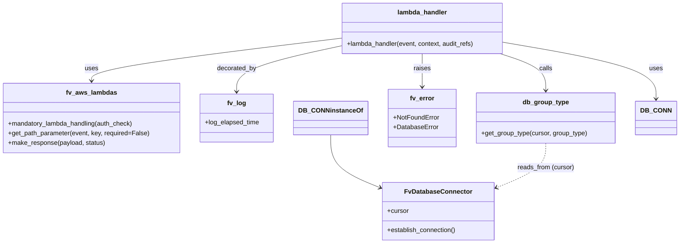

# Diagram: entity_core/entity_service/entity_service/entity/group/get_group_type.py


> Auto-generated by Obscura crawlers

## Diagram 1

```mermaid
flowchart TD
  Start([Start]) --> Decorators[[Decorators<br/>mandatory_lambda_handling & log_elapsed_time]]
  Decorators --> EstablishDB[DB_CONN.establish_connection()]
  EstablishDB --> CursorSet[Set cursor = DB_CONN.cursor]
  CursorSet --> LogInfo[logging.info("get_group_type", event)]
  LogInfo --> GetPath[get_path_parameter(event, "group_type")]
  GetPath --> AuditUpdate[audit_refs.update(Searchable_Ids.GROUP_TYPE: group_type)]
  AuditUpdate --> CallDB[db_group_type.get_group_type(cursor, group_type)]
  CallDB --> Decision{retval == None?}
  Decision -- Yes --> RaiseNotFound[raise fv.error.NotFoundError("No such Group Type")]
  RaiseNotFound --> NotFoundExcept[except fv.error.NotFoundError]
  NotFoundExcept --> ReRaise[re-raise NotFoundError with traceback]
  Decision -- No --> MakeResp[fv.aws.lambdas.make_response(retval, 200)]
  CallDB -.-> DBError{psycopg2.Error raised?}
  DBError -- Yes --> DBExcept[except psycopg2.Error]
  DBExcept --> RaiseDB[fv.error.DatabaseError raised with traceback]
  MakeResp --> End([End])
  ReRaise --> End
  RaiseDB --> End
```

> SVG rendering failed for this diagram.

## Diagram 2



### SVG

<svg id="container" width="1661.6640625" xmlns="http://www.w3.org/2000/svg" class="classDiagram" height="608" viewBox="0 0 1661.6640625 608" role="graphics-document document" aria-roledescription="class"><style>#container{font-family:"trebuchet ms",verdana,arial,sans-serif;font-size:16px;fill:#333;}@keyframes edge-animation-frame{from{stroke-dashoffset:0;}}@keyframes dash{to{stroke-dashoffset:0;}}#container .edge-animation-slow{stroke-dasharray:9,5!important;stroke-dashoffset:900;animation:dash 50s linear infinite;stroke-linecap:round;}#container .edge-animation-fast{stroke-dasharray:9,5!important;stroke-dashoffset:900;animation:dash 20s linear infinite;stroke-linecap:round;}#container .error-icon{fill:#552222;}#container .error-text{fill:#552222;stroke:#552222;}#container .edge-thickness-normal{stroke-width:1px;}#container .edge-thickness-thick{stroke-width:3.5px;}#container .edge-pattern-solid{stroke-dasharray:0;}#container .edge-thickness-invisible{stroke-width:0;fill:none;}#container .edge-pattern-dashed{stroke-dasharray:3;}#container .edge-pattern-dotted{stroke-dasharray:2;}#container .marker{fill:#333333;stroke:#333333;}#container .marker.cross{stroke:#333333;}#container svg{font-family:"trebuchet ms",verdana,arial,sans-serif;font-size:16px;}#container p{margin:0;}#container g.classGroup text{fill:#9370DB;stroke:none;font-family:"trebuchet ms",verdana,arial,sans-serif;font-size:10px;}#container g.classGroup text .title{font-weight:bolder;}#container .nodeLabel,#container .edgeLabel{color:#131300;}#container .edgeLabel .label rect{fill:#ECECFF;}#container .label text{fill:#131300;}#container .labelBkg{background:#ECECFF;}#container .edgeLabel .label span{background:#ECECFF;}#container .classTitle{font-weight:bolder;}#container .node rect,#container .node circle,#container .node ellipse,#container .node polygon,#container .node path{fill:#ECECFF;stroke:#9370DB;stroke-width:1px;}#container .divider{stroke:#9370DB;stroke-width:1;}#container g.clickable{cursor:pointer;}#container g.classGroup rect{fill:#ECECFF;stroke:#9370DB;}#container g.classGroup line{stroke:#9370DB;stroke-width:1;}#container .classLabel .box{stroke:none;stroke-width:0;fill:#ECECFF;opacity:0.5;}#container .classLabel .label{fill:#9370DB;font-size:10px;}#container .relation{stroke:#333333;stroke-width:1;fill:none;}#container .dashed-line{stroke-dasharray:3;}#container .dotted-line{stroke-dasharray:1 2;}#container #compositionStart,#container .composition{fill:#333333!important;stroke:#333333!important;stroke-width:1;}#container #compositionEnd,#container .composition{fill:#333333!important;stroke:#333333!important;stroke-width:1;}#container #dependencyStart,#container .dependency{fill:#333333!important;stroke:#333333!important;stroke-width:1;}#container #dependencyStart,#container .dependency{fill:#333333!important;stroke:#333333!important;stroke-width:1;}#container #extensionStart,#container .extension{fill:transparent!important;stroke:#333333!important;stroke-width:1;}#container #extensionEnd,#container .extension{fill:transparent!important;stroke:#333333!important;stroke-width:1;}#container #aggregationStart,#container .aggregation{fill:transparent!important;stroke:#333333!important;stroke-width:1;}#container #aggregationEnd,#container .aggregation{fill:transparent!important;stroke:#333333!important;stroke-width:1;}#container #lollipopStart,#container .lollipop{fill:#ECECFF!important;stroke:#333333!important;stroke-width:1;}#container #lollipopEnd,#container .lollipop{fill:#ECECFF!important;stroke:#333333!important;stroke-width:1;}#container .edgeTerminals{font-size:11px;line-height:initial;}#container .classTitleText{text-anchor:middle;font-size:18px;fill:#333;}#container .label-icon{display:inline-block;height:1em;overflow:visible;vertical-align:-0.125em;}#container .node .label-icon path{fill:currentColor;stroke:revert;stroke-width:revert;}#container :root{--mermaid-font-family:"trebuchet ms",verdana,arial,sans-serif;}</style><g><defs><marker id="container_class-aggregationStart" class="marker aggregation class" refX="18" refY="7" markerWidth="190" markerHeight="240" orient="auto"><path d="M 18,7 L9,13 L1,7 L9,1 Z"></path></marker></defs><defs><marker id="container_class-aggregationEnd" class="marker aggregation class" refX="1" refY="7" markerWidth="20" markerHeight="28" orient="auto"><path d="M 18,7 L9,13 L1,7 L9,1 Z"></path></marker></defs><defs><marker id="container_class-extensionStart" class="marker extension class" refX="18" refY="7" markerWidth="190" markerHeight="240" orient="auto"><path d="M 1,7 L18,13 V 1 Z"></path></marker></defs><defs><marker id="container_class-extensionEnd" class="marker extension class" refX="1" refY="7" markerWidth="20" markerHeight="28" orient="auto"><path d="M 1,1 V 13 L18,7 Z"></path></marker></defs><defs><marker id="container_class-compositionStart" class="marker composition class" refX="18" refY="7" markerWidth="190" markerHeight="240" orient="auto"><path d="M 18,7 L9,13 L1,7 L9,1 Z"></path></marker></defs><defs><marker id="container_class-compositionEnd" class="marker composition class" refX="1" refY="7" markerWidth="20" markerHeight="28" orient="auto"><path d="M 18,7 L9,13 L1,7 L9,1 Z"></path></marker></defs><defs><marker id="container_class-dependencyStart" class="marker dependency class" refX="6" refY="7" markerWidth="190" markerHeight="240" orient="auto"><path d="M 5,7 L9,13 L1,7 L9,1 Z"></path></marker></defs><defs><marker id="container_class-dependencyEnd" class="marker dependency class" refX="13" refY="7" markerWidth="20" markerHeight="28" orient="auto"><path d="M 18,7 L9,13 L14,7 L9,1 Z"></path></marker></defs><defs><marker id="container_class-lollipopStart" class="marker lollipop class" refX="13" refY="7" markerWidth="190" markerHeight="240" orient="auto"><circle stroke="black" fill="transparent" cx="7" cy="7" r="6"></circle></marker></defs><defs><marker id="container_class-lollipopEnd" class="marker lollipop class" refX="1" refY="7" markerWidth="190" markerHeight="240" orient="auto"><circle stroke="black" fill="transparent" cx="7" cy="7" r="6"></circle></marker></defs><g class="root"><g class="clusters"></g><g class="edgePaths"><path d="M812.805,337L812.805,350.667C812.805,364.333,812.805,391.667,832.649,413.561C852.492,435.455,892.18,451.911,912.024,460.138L931.868,468.366" id="id_DB_CONNinstanceOf_FvDatabaseConnector_1" class="edge-thickness-normal edge-pattern-solid relation" style=";;;" data-edge="true" data-et="edge" data-id="id_DB_CONNinstanceOf_FvDatabaseConnector_1" data-points="W3sieCI6ODEyLjgwNDY4NzUsInkiOjMzN30seyJ4Ijo4MTIuODA0Njg3NSwieSI6NDE5fSx7IngiOjkzNy40MTAxNTYyNSwieSI6NDcwLjY2NDA1NjQ2MzU5NTg0fV0=" marker-end="url(#container_class-dependencyEnd)"></path><path d="M829.527,96.164L728.994,108.637C628.461,121.11,427.395,146.055,326.861,163.694C226.328,181.333,226.328,191.667,226.328,196.833L226.328,202" id="id_lambda_handler_fv_aws_lambdas_2" class="edge-thickness-normal edge-pattern-solid relation" style=";;;" data-edge="true" data-et="edge" data-id="id_lambda_handler_fv_aws_lambdas_2" data-points="W3sieCI6ODI5LjUyNzM0Mzc1LCJ5Ijo5Ni4xNjQyODg3NjA1MTY0M30seyJ4IjoyMjYuMzI4MTI1LCJ5IjoxNzF9LHsieCI6MjI2LjMyODEyNSwieSI6MjA4fV0=" marker-end="url(#container_class-dependencyEnd)"></path><path d="M829.527,116.435L788.928,125.529C748.329,134.623,667.132,152.812,626.533,171.572C585.934,190.333,585.934,209.667,585.934,219.333L585.934,229" id="id_lambda_handler_fv_log_3" class="edge-thickness-normal edge-pattern-solid relation" style=";;;" data-edge="true" data-et="edge" data-id="id_lambda_handler_fv_log_3" data-points="W3sieCI6ODI5LjUyNzM0Mzc1LCJ5IjoxMTYuNDM0NjU4OTY2NjE4NTR9LHsieCI6NTg1LjkzMzU5Mzc1LCJ5IjoxNzF9LHsieCI6NTg1LjkzMzU5Mzc1LCJ5IjoyMzV9XQ==" marker-end="url(#container_class-dependencyEnd)"></path><path d="M1235.191,106.281L1297.202,117.068C1359.214,127.854,1483.236,149.427,1545.247,172.88C1607.258,196.333,1607.258,221.667,1607.258,234.333L1607.258,247" id="id_lambda_handler_DB_CONN_4" class="edge-thickness-normal edge-pattern-solid relation" style=";;;" data-edge="true" data-et="edge" data-id="id_lambda_handler_DB_CONN_4" data-points="W3sieCI6MTIzNS4xOTE0MDYyNSwieSI6MTA2LjI4MTM2NzYzMjg2OTk0fSx7IngiOjE2MDcuMjU3ODEyNSwieSI6MTcxfSx7IngiOjE2MDcuMjU3ODEyNSwieSI6MjUzfV0=" marker-end="url(#container_class-dependencyEnd)"></path><path d="M1225.282,134L1244.166,140.167C1263.05,146.333,1300.818,158.667,1319.702,174C1338.586,189.333,1338.586,207.667,1338.586,216.833L1338.586,226" id="id_lambda_handler_db_group_type_5" class="edge-thickness-normal edge-pattern-solid relation" style=";;;" data-edge="true" data-et="edge" data-id="id_lambda_handler_db_group_type_5" data-points="W3sieCI6MTIyNS4yODIxMDkzNzUsInkiOjEzNH0seyJ4IjoxMzM4LjU4NTkzNzUsInkiOjE3MX0seyJ4IjoxMzM4LjU4NTkzNzUsInkiOjIzMn1d" marker-end="url(#container_class-dependencyEnd)"></path><path d="M1032.359,134L1032.359,140.167C1032.359,146.333,1032.359,158.667,1032.359,172.5C1032.359,186.333,1032.359,201.667,1032.359,209.333L1032.359,217" id="id_lambda_handler_fv_error_6" class="edge-thickness-normal edge-pattern-solid relation" style=";;;" data-edge="true" data-et="edge" data-id="id_lambda_handler_fv_error_6" data-points="W3sieCI6MTAzMi4zNTkzNzUsInkiOjEzNH0seyJ4IjoxMDMyLjM1OTM3NSwieSI6MTcxfSx7IngiOjEwMzIuMzU5Mzc1LCJ5IjoyMjN9XQ==" marker-end="url(#container_class-dependencyEnd)"></path><path d="M1338.586,358L1338.586,368.167C1338.586,378.333,1338.586,398.667,1318.742,417.061C1298.898,435.455,1259.211,451.911,1239.367,460.138L1219.523,468.366" id="id_db_group_type_FvDatabaseConnector_7" class="edge-thickness-normal edge-pattern-dashed relation" style=";;;" data-edge="true" data-et="edge" data-id="id_db_group_type_FvDatabaseConnector_7" data-points="W3sieCI6MTMzOC41ODU5Mzc1LCJ5IjozNTh9LHsieCI6MTMzOC41ODU5Mzc1LCJ5Ijo0MTl9LHsieCI6MTIxMy45ODA0Njg3NSwieSI6NDcwLjY2NDA1NjQ2MzU5NTg0fV0=" marker-end="url(#container_class-dependencyEnd)"></path></g><g class="edgeLabels"><g class="edgeLabel"><g class="label" data-id="id_DB_CONNinstanceOf_FvDatabaseConnector_1" transform="translate(0, 0)"><foreignObject width="0" height="0"><div xmlns="http://www.w3.org/1999/xhtml" class="labelBkg" style="display: table-cell; white-space: nowrap; line-height: 1.5; max-width: 200px; text-align: center;"><span class="edgeLabel"></span></div></foreignObject></g></g><g class="edgeLabel" transform="translate(226.328125, 171)"><g class="label" data-id="id_lambda_handler_fv_aws_lambdas_2" transform="translate(-16.4921875, -12)"><foreignObject width="32.984375" height="24"><div xmlns="http://www.w3.org/1999/xhtml" class="labelBkg" style="display: table-cell; white-space: nowrap; line-height: 1.5; max-width: 200px; text-align: center;"><span class="edgeLabel"><p>uses</p></span></div></foreignObject></g></g><g class="edgeLabel" transform="translate(585.93359375, 171)"><g class="label" data-id="id_lambda_handler_fv_log_3" transform="translate(-49.375, -12)"><foreignObject width="98.75" height="24"><div xmlns="http://www.w3.org/1999/xhtml" class="labelBkg" style="display: table-cell; white-space: nowrap; line-height: 1.5; max-width: 200px; text-align: center;"><span class="edgeLabel"><p>decorated_by</p></span></div></foreignObject></g></g><g class="edgeLabel" transform="translate(1607.2578125, 171)"><g class="label" data-id="id_lambda_handler_DB_CONN_4" transform="translate(-16.4921875, -12)"><foreignObject width="32.984375" height="24"><div xmlns="http://www.w3.org/1999/xhtml" class="labelBkg" style="display: table-cell; white-space: nowrap; line-height: 1.5; max-width: 200px; text-align: center;"><span class="edgeLabel"><p>uses</p></span></div></foreignObject></g></g><g class="edgeLabel" transform="translate(1338.5859375, 171)"><g class="label" data-id="id_lambda_handler_db_group_type_5" transform="translate(-16.4453125, -12)"><foreignObject width="32.890625" height="24"><div xmlns="http://www.w3.org/1999/xhtml" class="labelBkg" style="display: table-cell; white-space: nowrap; line-height: 1.5; max-width: 200px; text-align: center;"><span class="edgeLabel"><p>calls</p></span></div></foreignObject></g></g><g class="edgeLabel" transform="translate(1032.359375, 171)"><g class="label" data-id="id_lambda_handler_fv_error_6" transform="translate(-21.25, -12)"><foreignObject width="42.5" height="24"><div xmlns="http://www.w3.org/1999/xhtml" class="labelBkg" style="display: table-cell; white-space: nowrap; line-height: 1.5; max-width: 200px; text-align: center;"><span class="edgeLabel"><p>raises</p></span></div></foreignObject></g></g><g class="edgeLabel" transform="translate(1338.5859375, 419)"><g class="label" data-id="id_db_group_type_FvDatabaseConnector_7" transform="translate(-71.0703125, -12)"><foreignObject width="142.140625" height="24"><div xmlns="http://www.w3.org/1999/xhtml" class="labelBkg" style="display: table-cell; white-space: nowrap; line-height: 1.5; max-width: 200px; text-align: center;"><span class="edgeLabel"><p>reads_from (cursor)</p></span></div></foreignObject></g></g></g><g class="nodes"><g class="node default" id="classId-fv_aws_lambdas-0" transform="translate(226.328125, 295)"><g class="basic label-container"><path d="M-218.328125 -87 L218.328125 -87 L218.328125 87 L-218.328125 87" stroke="none" stroke-width="0" fill="#ECECFF" style=""></path><path d="M-218.328125 -87 C-72.76886858584885 -87, 72.7903878283023 -87, 218.328125 -87 M-218.328125 -87 C-66.42589496603068 -87, 85.47633506793863 -87, 218.328125 -87 M218.328125 -87 C218.328125 -20.82889634748004, 218.328125 45.34220730503992, 218.328125 87 M218.328125 -87 C218.328125 -42.00506751945657, 218.328125 2.989864961086866, 218.328125 87 M218.328125 87 C125.19576221346817 87, 32.06339942693634 87, -218.328125 87 M218.328125 87 C119.63380612820592 87, 20.939487256411837 87, -218.328125 87 M-218.328125 87 C-218.328125 22.06161751503413, -218.328125 -42.87676496993174, -218.328125 -87 M-218.328125 87 C-218.328125 47.73164911077135, -218.328125 8.4632982215427, -218.328125 -87" stroke="#9370DB" stroke-width="1.3" fill="none" stroke-dasharray="0 0" style=""></path></g><g class="annotation-group text" transform="translate(0, -63)"></g><g class="label-group text" transform="translate(-60.0625, -63)"><g class="label" style="font-weight: bolder" transform="translate(0,-12)"><foreignObject width="120.125" height="24"><div xmlns="http://www.w3.org/1999/xhtml" style="display: table-cell; white-space: nowrap; line-height: 1.5; max-width: 168px; text-align: center;"><span class="nodeLabel markdown-node-label" style=""><p>fv_aws_lambdas</p></span></div></foreignObject></g></g><g class="members-group text" transform="translate(-206.328125, -15)"></g><g class="methods-group text" transform="translate(-206.328125, 15)"><g class="label" style="" transform="translate(0,-12)"><foreignObject width="314.828125" height="24"><div xmlns="http://www.w3.org/1999/xhtml" style="display: table-cell; white-space: nowrap; line-height: 1.5; max-width: 372px; text-align: center;"><span class="nodeLabel markdown-node-label" style=""><p>+mandatory_lambda_handling(auth_check)</p></span></div></foreignObject></g><g class="label" style="" transform="translate(0,12)"><foreignObject width="352.59375" height="24"><div xmlns="http://www.w3.org/1999/xhtml" style="display: table-cell; white-space: nowrap; line-height: 1.5; max-width: 410px; text-align: center;"><span class="nodeLabel markdown-node-label" style=""><p>+get_path_parameter(event, key, required=False)</p></span></div></foreignObject></g><g class="label" style="" transform="translate(0,36)"><foreignObject width="242.078125" height="24"><div xmlns="http://www.w3.org/1999/xhtml" style="display: table-cell; white-space: nowrap; line-height: 1.5; max-width: 299px; text-align: center;"><span class="nodeLabel markdown-node-label" style=""><p>+make_response(payload, status)</p></span></div></foreignObject></g></g><g class="divider" style=""><path d="M-218.328125 -39 C-46.03061666211542 -39, 126.26689167576916 -39, 218.328125 -39 M-218.328125 -39 C-78.88898867757561 -39, 60.55014764484878 -39, 218.328125 -39" stroke="#9370DB" stroke-width="1.3" fill="none" stroke-dasharray="0 0" style=""></path></g><g class="divider" style=""><path d="M-218.328125 -15 C-121.45626991538938 -15, -24.58441483077877 -15, 218.328125 -15 M-218.328125 -15 C-115.52276997109162 -15, -12.71741494218324 -15, 218.328125 -15" stroke="#9370DB" stroke-width="1.3" fill="none" stroke-dasharray="0 0" style=""></path></g></g><g class="node default" id="classId-fv_log-1" transform="translate(585.93359375, 295)"><g class="basic label-container"><path d="M-91.27734375 -60 L91.27734375 -60 L91.27734375 60 L-91.27734375 60" stroke="none" stroke-width="0" fill="#ECECFF" style=""></path><path d="M-91.27734375 -60 C-40.68354729091341 -60, 9.91024916817318 -60, 91.27734375 -60 M-91.27734375 -60 C-31.59668310263617 -60, 28.08397754472766 -60, 91.27734375 -60 M91.27734375 -60 C91.27734375 -15.780713693083833, 91.27734375 28.438572613832335, 91.27734375 60 M91.27734375 -60 C91.27734375 -26.12297192130744, 91.27734375 7.754056157385122, 91.27734375 60 M91.27734375 60 C39.09498206062692 60, -13.087379628746163 60, -91.27734375 60 M91.27734375 60 C40.29845276435949 60, -10.680438221281022 60, -91.27734375 60 M-91.27734375 60 C-91.27734375 35.28929696171399, -91.27734375 10.57859392342798, -91.27734375 -60 M-91.27734375 60 C-91.27734375 29.157701732243908, -91.27734375 -1.6845965355121848, -91.27734375 -60" stroke="#9370DB" stroke-width="1.3" fill="none" stroke-dasharray="0 0" style=""></path></g><g class="annotation-group text" transform="translate(0, -36)"></g><g class="label-group text" transform="translate(-22.2109375, -36)"><g class="label" style="font-weight: bolder" transform="translate(0,-12)"><foreignObject width="44.421875" height="24"><div xmlns="http://www.w3.org/1999/xhtml" style="display: table-cell; white-space: nowrap; line-height: 1.5; max-width: 94px; text-align: center;"><span class="nodeLabel markdown-node-label" style=""><p>fv_log</p></span></div></foreignObject></g></g><g class="members-group text" transform="translate(-79.27734375, 12)"><g class="label" style="" transform="translate(0,-12)"><foreignObject width="136.34375" height="24"><div xmlns="http://www.w3.org/1999/xhtml" style="display: table-cell; white-space: nowrap; line-height: 1.5; max-width: 194px; text-align: center;"><span class="nodeLabel markdown-node-label" style=""><p>+log_elapsed_time</p></span></div></foreignObject></g></g><g class="methods-group text" transform="translate(-79.27734375, 60)"></g><g class="divider" style=""><path d="M-91.27734375 -12 C-47.91164467433697 -12, -4.5459455986739385 -12, 91.27734375 -12 M-91.27734375 -12 C-44.73512658550262 -12, 1.8070905789947602 -12, 91.27734375 -12" stroke="#9370DB" stroke-width="1.3" fill="none" stroke-dasharray="0 0" style=""></path></g><g class="divider" style=""><path d="M-91.27734375 36 C-46.955884918849 36, -2.634426087698003 36, 91.27734375 36 M-91.27734375 36 C-42.3886080297796 36, 6.500127690440806 36, 91.27734375 36" stroke="#9370DB" stroke-width="1.3" fill="none" stroke-dasharray="0 0" style=""></path></g></g><g class="node default" id="classId-FvDatabaseConnector-2" transform="translate(1075.6953125, 528)"><g class="basic label-container"><path d="M-138.28515625 -72 L138.28515625 -72 L138.28515625 72 L-138.28515625 72" stroke="none" stroke-width="0" fill="#ECECFF" style=""></path><path d="M-138.28515625 -72 C-51.73044752967162 -72, 34.824261190656756 -72, 138.28515625 -72 M-138.28515625 -72 C-61.64973594466049 -72, 14.985684360679016 -72, 138.28515625 -72 M138.28515625 -72 C138.28515625 -19.047200429513254, 138.28515625 33.90559914097349, 138.28515625 72 M138.28515625 -72 C138.28515625 -19.51931978162964, 138.28515625 32.96136043674072, 138.28515625 72 M138.28515625 72 C77.89219745017198 72, 17.499238650343955 72, -138.28515625 72 M138.28515625 72 C66.3115232237317 72, -5.662109802536605 72, -138.28515625 72 M-138.28515625 72 C-138.28515625 35.02035638657801, -138.28515625 -1.9592872268439834, -138.28515625 -72 M-138.28515625 72 C-138.28515625 31.19497347086397, -138.28515625 -9.610053058272058, -138.28515625 -72" stroke="#9370DB" stroke-width="1.3" fill="none" stroke-dasharray="0 0" style=""></path></g><g class="annotation-group text" transform="translate(0, -48)"></g><g class="label-group text" transform="translate(-79.3046875, -48)"><g class="label" style="font-weight: bolder" transform="translate(0,-12)"><foreignObject width="158.609375" height="24"><div xmlns="http://www.w3.org/1999/xhtml" style="display: table-cell; white-space: nowrap; line-height: 1.5; max-width: 207px; text-align: center;"><span class="nodeLabel markdown-node-label" style=""><p>FvDatabaseConnector</p></span></div></foreignObject></g></g><g class="members-group text" transform="translate(-126.28515625, 0)"><g class="label" style="" transform="translate(0,-12)"><foreignObject width="53.71875" height="24"><div xmlns="http://www.w3.org/1999/xhtml" style="display: table-cell; white-space: nowrap; line-height: 1.5; max-width: 112px; text-align: center;"><span class="nodeLabel markdown-node-label" style=""><p>+cursor</p></span></div></foreignObject></g></g><g class="methods-group text" transform="translate(-126.28515625, 48)"><g class="label" style="" transform="translate(0,-12)"><foreignObject width="173.265625" height="24"><div xmlns="http://www.w3.org/1999/xhtml" style="display: table-cell; white-space: nowrap; line-height: 1.5; max-width: 231px; text-align: center;"><span class="nodeLabel markdown-node-label" style=""><p>+establish_connection()</p></span></div></foreignObject></g></g><g class="divider" style=""><path d="M-138.28515625 -24 C-52.81379970703439 -24, 32.65755683593122 -24, 138.28515625 -24 M-138.28515625 -24 C-45.99014066393232 -24, 46.304874922135355 -24, 138.28515625 -24" stroke="#9370DB" stroke-width="1.3" fill="none" stroke-dasharray="0 0" style=""></path></g><g class="divider" style=""><path d="M-138.28515625 24 C-38.93531086616704 24, 60.41453451766591 24, 138.28515625 24 M-138.28515625 24 C-41.231230963277966 24, 55.82269432344407 24, 138.28515625 24" stroke="#9370DB" stroke-width="1.3" fill="none" stroke-dasharray="0 0" style=""></path></g></g><g class="node default" id="classId-db_group_type-3" transform="translate(1338.5859375, 295)"><g class="basic label-container"><path d="M-172.265625 -63 L172.265625 -63 L172.265625 63 L-172.265625 63" stroke="none" stroke-width="0" fill="#ECECFF" style=""></path><path d="M-172.265625 -63 C-56.10892391912333 -63, 60.047777161753345 -63, 172.265625 -63 M-172.265625 -63 C-80.71444611697885 -63, 10.836732766042303 -63, 172.265625 -63 M172.265625 -63 C172.265625 -34.49490749382417, 172.265625 -5.989814987648337, 172.265625 63 M172.265625 -63 C172.265625 -35.97717814639354, 172.265625 -8.954356292787075, 172.265625 63 M172.265625 63 C61.765316526857276 63, -48.73499194628545 63, -172.265625 63 M172.265625 63 C73.78838429617716 63, -24.688856407645687 63, -172.265625 63 M-172.265625 63 C-172.265625 20.480250256763647, -172.265625 -22.039499486472707, -172.265625 -63 M-172.265625 63 C-172.265625 31.46793858994411, -172.265625 -0.06412282011177695, -172.265625 -63" stroke="#9370DB" stroke-width="1.3" fill="none" stroke-dasharray="0 0" style=""></path></g><g class="annotation-group text" transform="translate(0, -39)"></g><g class="label-group text" transform="translate(-55.328125, -39)"><g class="label" style="font-weight: bolder" transform="translate(0,-12)"><foreignObject width="110.65625" height="24"><div xmlns="http://www.w3.org/1999/xhtml" style="display: table-cell; white-space: nowrap; line-height: 1.5; max-width: 159px; text-align: center;"><span class="nodeLabel markdown-node-label" style=""><p>db_group_type</p></span></div></foreignObject></g></g><g class="members-group text" transform="translate(-160.265625, 9)"></g><g class="methods-group text" transform="translate(-160.265625, 39)"><g class="label" style="" transform="translate(0,-12)"><foreignObject width="265.203125" height="24"><div xmlns="http://www.w3.org/1999/xhtml" style="display: table-cell; white-space: nowrap; line-height: 1.5; max-width: 323px; text-align: center;"><span class="nodeLabel markdown-node-label" style=""><p>+get_group_type(cursor, group_type)</p></span></div></foreignObject></g></g><g class="divider" style=""><path d="M-172.265625 -15 C-73.71535472940492 -15, 24.834915541190156 -15, 172.265625 -15 M-172.265625 -15 C-35.19395414393921 -15, 101.87771671212158 -15, 172.265625 -15" stroke="#9370DB" stroke-width="1.3" fill="none" stroke-dasharray="0 0" style=""></path></g><g class="divider" style=""><path d="M-172.265625 9 C-73.54356479573903 9, 25.17849540852194 9, 172.265625 9 M-172.265625 9 C-66.08120458610449 9, 40.10321582779102 9, 172.265625 9" stroke="#9370DB" stroke-width="1.3" fill="none" stroke-dasharray="0 0" style=""></path></g></g><g class="node default" id="classId-fv_error-4" transform="translate(1032.359375, 295)"><g class="basic label-container"><path d="M-83.9609375 -72 L83.9609375 -72 L83.9609375 72 L-83.9609375 72" stroke="none" stroke-width="0" fill="#ECECFF" style=""></path><path d="M-83.9609375 -72 C-28.64542530211103 -72, 26.670086895777942 -72, 83.9609375 -72 M-83.9609375 -72 C-17.358350406135173 -72, 49.244236687729654 -72, 83.9609375 -72 M83.9609375 -72 C83.9609375 -31.811423343239625, 83.9609375 8.37715331352075, 83.9609375 72 M83.9609375 -72 C83.9609375 -15.462067968645997, 83.9609375 41.07586406270801, 83.9609375 72 M83.9609375 72 C46.36309134047421 72, 8.765245180948426 72, -83.9609375 72 M83.9609375 72 C34.96548324668699 72, -14.029971006626013 72, -83.9609375 72 M-83.9609375 72 C-83.9609375 18.618981243456176, -83.9609375 -34.76203751308765, -83.9609375 -72 M-83.9609375 72 C-83.9609375 42.041345353493234, -83.9609375 12.082690706986469, -83.9609375 -72" stroke="#9370DB" stroke-width="1.3" fill="none" stroke-dasharray="0 0" style=""></path></g><g class="annotation-group text" transform="translate(0, -48)"></g><g class="label-group text" transform="translate(-29.1875, -48)"><g class="label" style="font-weight: bolder" transform="translate(0,-12)"><foreignObject width="58.375" height="24"><div xmlns="http://www.w3.org/1999/xhtml" style="display: table-cell; white-space: nowrap; line-height: 1.5; max-width: 108px; text-align: center;"><span class="nodeLabel markdown-node-label" style=""><p>fv_error</p></span></div></foreignObject></g></g><g class="members-group text" transform="translate(-71.9609375, 0)"><g class="label" style="" transform="translate(0,-12)"><foreignObject width="114.734375" height="24"><div xmlns="http://www.w3.org/1999/xhtml" style="display: table-cell; white-space: nowrap; line-height: 1.5; max-width: 173px; text-align: center;"><span class="nodeLabel markdown-node-label" style=""><p>+NotFoundError</p></span></div></foreignObject></g><g class="label" style="" transform="translate(0,12)"><foreignObject width="111.078125" height="24"><div xmlns="http://www.w3.org/1999/xhtml" style="display: table-cell; white-space: nowrap; line-height: 1.5; max-width: 169px; text-align: center;"><span class="nodeLabel markdown-node-label" style=""><p>+DatabaseError</p></span></div></foreignObject></g></g><g class="methods-group text" transform="translate(-71.9609375, 72)"></g><g class="divider" style=""><path d="M-83.9609375 -24 C-30.03405604764184 -24, 23.89282540471632 -24, 83.9609375 -24 M-83.9609375 -24 C-29.404526175703367 -24, 25.151885148593266 -24, 83.9609375 -24" stroke="#9370DB" stroke-width="1.3" fill="none" stroke-dasharray="0 0" style=""></path></g><g class="divider" style=""><path d="M-83.9609375 48 C-17.813060441984533 48, 48.334816616030935 48, 83.9609375 48 M-83.9609375 48 C-16.914221130118705 48, 50.13249523976259 48, 83.9609375 48" stroke="#9370DB" stroke-width="1.3" fill="none" stroke-dasharray="0 0" style=""></path></g></g><g class="node default" id="classId-lambda_handler-5" transform="translate(1032.359375, 71)"><g class="basic label-container"><path d="M-202.83203125 -63 L202.83203125 -63 L202.83203125 63 L-202.83203125 63" stroke="none" stroke-width="0" fill="#ECECFF" style=""></path><path d="M-202.83203125 -63 C-90.47218064777842 -63, 21.88766995444317 -63, 202.83203125 -63 M-202.83203125 -63 C-47.92925781473596 -63, 106.97351562052808 -63, 202.83203125 -63 M202.83203125 -63 C202.83203125 -36.45556418825865, 202.83203125 -9.911128376517297, 202.83203125 63 M202.83203125 -63 C202.83203125 -17.844837217742324, 202.83203125 27.310325564515352, 202.83203125 63 M202.83203125 63 C115.1197547574331 63, 27.4074782648662 63, -202.83203125 63 M202.83203125 63 C40.756356732153165 63, -121.31931778569367 63, -202.83203125 63 M-202.83203125 63 C-202.83203125 18.668047427159443, -202.83203125 -25.663905145681113, -202.83203125 -63 M-202.83203125 63 C-202.83203125 19.566590402363346, -202.83203125 -23.866819195273308, -202.83203125 -63" stroke="#9370DB" stroke-width="1.3" fill="none" stroke-dasharray="0 0" style=""></path></g><g class="annotation-group text" transform="translate(0, -39)"></g><g class="label-group text" transform="translate(-59.9765625, -39)"><g class="label" style="font-weight: bolder" transform="translate(0,-12)"><foreignObject width="119.953125" height="24"><div xmlns="http://www.w3.org/1999/xhtml" style="display: table-cell; white-space: nowrap; line-height: 1.5; max-width: 170px; text-align: center;"><span class="nodeLabel markdown-node-label" style=""><p>lambda_handler</p></span></div></foreignObject></g></g><g class="members-group text" transform="translate(-190.83203125, 9)"></g><g class="methods-group text" transform="translate(-190.83203125, 39)"><g class="label" style="" transform="translate(0,-12)"><foreignObject width="321.6875" height="24"><div xmlns="http://www.w3.org/1999/xhtml" style="display: table-cell; white-space: nowrap; line-height: 1.5; max-width: 379px; text-align: center;"><span class="nodeLabel markdown-node-label" style=""><p>+lambda_handler(event, context, audit_refs)</p></span></div></foreignObject></g></g><g class="divider" style=""><path d="M-202.83203125 -15 C-80.53456085908932 -15, 41.76290953182135 -15, 202.83203125 -15 M-202.83203125 -15 C-64.3058668225668 -15, 74.2202976048664 -15, 202.83203125 -15" stroke="#9370DB" stroke-width="1.3" fill="none" stroke-dasharray="0 0" style=""></path></g><g class="divider" style=""><path d="M-202.83203125 9 C-76.30955765969769 9, 50.21291593060462 9, 202.83203125 9 M-202.83203125 9 C-44.81528828410052 9, 113.20145468179896 9, 202.83203125 9" stroke="#9370DB" stroke-width="1.3" fill="none" stroke-dasharray="0 0" style=""></path></g></g><g class="node default" id="classId-DB_CONNinstanceOf-6" transform="translate(812.8046875, 295)"><g class="basic label-container"><path d="M-85.59375 -42 L85.59375 -42 L85.59375 42 L-85.59375 42" stroke="none" stroke-width="0" fill="#ECECFF" style=""></path><path d="M-85.59375 -42 C-30.61190820835985 -42, 24.3699335832803 -42, 85.59375 -42 M-85.59375 -42 C-44.256096859548215 -42, -2.9184437190964303 -42, 85.59375 -42 M85.59375 -42 C85.59375 -9.638011523844469, 85.59375 22.723976952311062, 85.59375 42 M85.59375 -42 C85.59375 -15.770991135720283, 85.59375 10.458017728559433, 85.59375 42 M85.59375 42 C43.36765302945185 42, 1.1415560589037028 42, -85.59375 42 M85.59375 42 C31.919003809672823 42, -21.755742380654354 42, -85.59375 42 M-85.59375 42 C-85.59375 12.560825492461966, -85.59375 -16.87834901507607, -85.59375 -42 M-85.59375 42 C-85.59375 22.12013800320167, -85.59375 2.2402760064033416, -85.59375 -42" stroke="#9370DB" stroke-width="1.3" fill="none" stroke-dasharray="0 0" style=""></path></g><g class="annotation-group text" transform="translate(0, -18)"></g><g class="label-group text" transform="translate(-73.59375, -18)"><g class="label" style="font-weight: bolder" transform="translate(0,-12)"><foreignObject width="147.1875" height="24"><div xmlns="http://www.w3.org/1999/xhtml" style="display: table-cell; white-space: nowrap; line-height: 1.5; max-width: 198px; text-align: center;"><span class="nodeLabel markdown-node-label" style=""><p>DB_CONNinstanceOf</p></span></div></foreignObject></g></g><g class="members-group text" transform="translate(-73.59375, 30)"></g><g class="methods-group text" transform="translate(-73.59375, 60)"></g><g class="divider" style=""><path d="M-85.59375 6 C-49.37999062022879 6, -13.166231240457577 6, 85.59375 6 M-85.59375 6 C-25.88000987608816 6, 33.83373024782368 6, 85.59375 6" stroke="#9370DB" stroke-width="1.3" fill="none" stroke-dasharray="0 0" style=""></path></g><g class="divider" style=""><path d="M-85.59375 24 C-49.84736656762292 24, -14.10098313524584 24, 85.59375 24 M-85.59375 24 C-40.110194766172405 24, 5.373360467655189 24, 85.59375 24" stroke="#9370DB" stroke-width="1.3" fill="none" stroke-dasharray="0 0" style=""></path></g></g><g class="node default" id="classId-DB_CONN-7" transform="translate(1607.2578125, 295)"><g class="basic label-container"><path d="M-46.40625 -42 L46.40625 -42 L46.40625 42 L-46.40625 42" stroke="none" stroke-width="0" fill="#ECECFF" style=""></path><path d="M-46.40625 -42 C-24.165974103261966 -42, -1.9256982065239328 -42, 46.40625 -42 M-46.40625 -42 C-10.148595554678032 -42, 26.109058890643936 -42, 46.40625 -42 M46.40625 -42 C46.40625 -16.430586556572397, 46.40625 9.138826886855206, 46.40625 42 M46.40625 -42 C46.40625 -24.2472077300905, 46.40625 -6.494415460181003, 46.40625 42 M46.40625 42 C18.4432343544362 42, -9.5197812911276 42, -46.40625 42 M46.40625 42 C13.336351987359855 42, -19.73354602528029 42, -46.40625 42 M-46.40625 42 C-46.40625 22.356003346607263, -46.40625 2.7120066932145264, -46.40625 -42 M-46.40625 42 C-46.40625 16.621540555988105, -46.40625 -8.75691888802379, -46.40625 -42" stroke="#9370DB" stroke-width="1.3" fill="none" stroke-dasharray="0 0" style=""></path></g><g class="annotation-group text" transform="translate(0, -18)"></g><g class="label-group text" transform="translate(-34.40625, -18)"><g class="label" style="font-weight: bolder" transform="translate(0,-12)"><foreignObject width="68.8125" height="24"><div xmlns="http://www.w3.org/1999/xhtml" style="display: table-cell; white-space: nowrap; line-height: 1.5; max-width: 119px; text-align: center;"><span class="nodeLabel markdown-node-label" style=""><p>DB_CONN</p></span></div></foreignObject></g></g><g class="members-group text" transform="translate(-34.40625, 30)"></g><g class="methods-group text" transform="translate(-34.40625, 60)"></g><g class="divider" style=""><path d="M-46.40625 6 C-25.514218758501258 6, -4.622187517002516 6, 46.40625 6 M-46.40625 6 C-26.297407949808214 6, -6.188565899616428 6, 46.40625 6" stroke="#9370DB" stroke-width="1.3" fill="none" stroke-dasharray="0 0" style=""></path></g><g class="divider" style=""><path d="M-46.40625 24 C-20.71613362661019 24, 4.973982746779619 24, 46.40625 24 M-46.40625 24 C-18.163726613070054 24, 10.078796773859892 24, 46.40625 24" stroke="#9370DB" stroke-width="1.3" fill="none" stroke-dasharray="0 0" style=""></path></g></g></g></g></g></svg>
