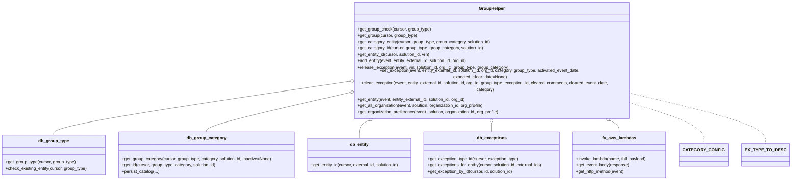
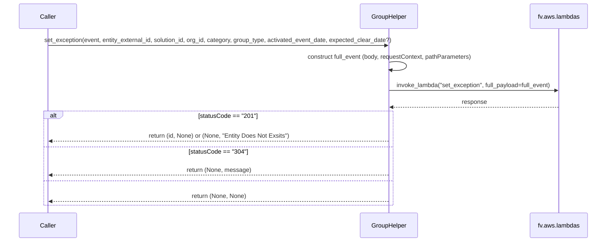

# Diagram: entity_core/entity_service/entity_service/entity/group/group_helper.py


> Auto-generated by Obscura crawlers

## Diagram 1

```mermaid
flowchart LR
    subgraph GroupHelper
      GGCheck[get_group_check()]
      GGet[get_group()]
      GCatEnt[get_category_entity()]
      GCatId[get_category_id()]
      GEntId[get_entity_id()]
      AddEntity[add_entity()]
      Release[release_exception()]
      SetEx[set_exception()]
      ClearEx[clear_exception()]
      GetEnt[get_entity()]
      GetAllOrg[get_all_organization()]
      GetOrgPref[get_organization_preference()]
      GetException[get_exception()]
    end
    DBGT[db_group_type] -->|get_group_type / check_existing_entity| GGet
    DBGT -->|check_existing_entity| GGCheck
    DBGC[db_group_category] -->|get_group_category / get_id / persist_catelog| GCatEnt
    DBGC --> GCatId
    DBE[db_entity] -->|get_entity_id| GEntId
    DBEX[db_exceptions] -->|get_exception_type_id / get_exceptions_for_entity / get_exception_by_id| GetException
    FV_AWS[fv.aws.lambdas] -->|invoke_lambda / get_event_body / get_http_method| AddEntity
    FV_AWS --> Release
    FV_AWS --> SetEx
    FV_AWS --> ClearEx
    FV_AWS --> GetEnt
    FV_AWS --> GetAllOrg
    FV_AWS --> GetOrgPref
    Cache[cached TTLCache decorators] -.->|wraps| GGCheck
    Cache -.->|wraps| GGet
    Cache -.->|wraps| GCatEnt
    Cache -.->|wraps| GCatId
    Cache -.->|wraps| GEntId
    Cache -.->|wraps| GetEnt
    Cache -.->|wraps| GetAllOrg
    Cache -.->|wraps| GetOrgPref
    CATEGORY_CONFIG["CATEGORY_CONFIG\nSET_CATEGORIES\nCATEGORY_CONFIG_CLEAR"] -->|used by| SetEx
    EXC_CONST[EX_TYPE_TO_DESC] -->|used by| SetEx
```

> SVG rendering failed for this diagram.

## Diagram 2



### SVG

<svg id="container" width="2941.2734375" xmlns="http://www.w3.org/2000/svg" class="classDiagram" height="630" viewBox="0 0 2941.2734375 630" role="graphics-document document" aria-roledescription="class"><style>#container{font-family:"trebuchet ms",verdana,arial,sans-serif;font-size:16px;fill:#333;}@keyframes edge-animation-frame{from{stroke-dashoffset:0;}}@keyframes dash{to{stroke-dashoffset:0;}}#container .edge-animation-slow{stroke-dasharray:9,5!important;stroke-dashoffset:900;animation:dash 50s linear infinite;stroke-linecap:round;}#container .edge-animation-fast{stroke-dasharray:9,5!important;stroke-dashoffset:900;animation:dash 20s linear infinite;stroke-linecap:round;}#container .error-icon{fill:#552222;}#container .error-text{fill:#552222;stroke:#552222;}#container .edge-thickness-normal{stroke-width:1px;}#container .edge-thickness-thick{stroke-width:3.5px;}#container .edge-pattern-solid{stroke-dasharray:0;}#container .edge-thickness-invisible{stroke-width:0;fill:none;}#container .edge-pattern-dashed{stroke-dasharray:3;}#container .edge-pattern-dotted{stroke-dasharray:2;}#container .marker{fill:#333333;stroke:#333333;}#container .marker.cross{stroke:#333333;}#container svg{font-family:"trebuchet ms",verdana,arial,sans-serif;font-size:16px;}#container p{margin:0;}#container g.classGroup text{fill:#9370DB;stroke:none;font-family:"trebuchet ms",verdana,arial,sans-serif;font-size:10px;}#container g.classGroup text .title{font-weight:bolder;}#container .nodeLabel,#container .edgeLabel{color:#131300;}#container .edgeLabel .label rect{fill:#ECECFF;}#container .label text{fill:#131300;}#container .labelBkg{background:#ECECFF;}#container .edgeLabel .label span{background:#ECECFF;}#container .classTitle{font-weight:bolder;}#container .node rect,#container .node circle,#container .node ellipse,#container .node polygon,#container .node path{fill:#ECECFF;stroke:#9370DB;stroke-width:1px;}#container .divider{stroke:#9370DB;stroke-width:1;}#container g.clickable{cursor:pointer;}#container g.classGroup rect{fill:#ECECFF;stroke:#9370DB;}#container g.classGroup line{stroke:#9370DB;stroke-width:1;}#container .classLabel .box{stroke:none;stroke-width:0;fill:#ECECFF;opacity:0.5;}#container .classLabel .label{fill:#9370DB;font-size:10px;}#container .relation{stroke:#333333;stroke-width:1;fill:none;}#container .dashed-line{stroke-dasharray:3;}#container .dotted-line{stroke-dasharray:1 2;}#container #compositionStart,#container .composition{fill:#333333!important;stroke:#333333!important;stroke-width:1;}#container #compositionEnd,#container .composition{fill:#333333!important;stroke:#333333!important;stroke-width:1;}#container #dependencyStart,#container .dependency{fill:#333333!important;stroke:#333333!important;stroke-width:1;}#container #dependencyStart,#container .dependency{fill:#333333!important;stroke:#333333!important;stroke-width:1;}#container #extensionStart,#container .extension{fill:transparent!important;stroke:#333333!important;stroke-width:1;}#container #extensionEnd,#container .extension{fill:transparent!important;stroke:#333333!important;stroke-width:1;}#container #aggregationStart,#container .aggregation{fill:transparent!important;stroke:#333333!important;stroke-width:1;}#container #aggregationEnd,#container .aggregation{fill:transparent!important;stroke:#333333!important;stroke-width:1;}#container #lollipopStart,#container .lollipop{fill:#ECECFF!important;stroke:#333333!important;stroke-width:1;}#container #lollipopEnd,#container .lollipop{fill:#ECECFF!important;stroke:#333333!important;stroke-width:1;}#container .edgeTerminals{font-size:11px;line-height:initial;}#container .classTitleText{text-anchor:middle;font-size:18px;fill:#333;}#container .label-icon{display:inline-block;height:1em;overflow:visible;vertical-align:-0.125em;}#container .node .label-icon path{fill:currentColor;stroke:revert;stroke-width:revert;}#container :root{--mermaid-font-family:"trebuchet ms",verdana,arial,sans-serif;}</style><g><defs><marker id="container_class-aggregationStart" class="marker aggregation class" refX="18" refY="7" markerWidth="190" markerHeight="240" orient="auto"><path d="M 18,7 L9,13 L1,7 L9,1 Z"></path></marker></defs><defs><marker id="container_class-aggregationEnd" class="marker aggregation class" refX="1" refY="7" markerWidth="20" markerHeight="28" orient="auto"><path d="M 18,7 L9,13 L1,7 L9,1 Z"></path></marker></defs><defs><marker id="container_class-extensionStart" class="marker extension class" refX="18" refY="7" markerWidth="190" markerHeight="240" orient="auto"><path d="M 1,7 L18,13 V 1 Z"></path></marker></defs><defs><marker id="container_class-extensionEnd" class="marker extension class" refX="1" refY="7" markerWidth="20" markerHeight="28" orient="auto"><path d="M 1,1 V 13 L18,7 Z"></path></marker></defs><defs><marker id="container_class-compositionStart" class="marker composition class" refX="18" refY="7" markerWidth="190" markerHeight="240" orient="auto"><path d="M 18,7 L9,13 L1,7 L9,1 Z"></path></marker></defs><defs><marker id="container_class-compositionEnd" class="marker composition class" refX="1" refY="7" markerWidth="20" markerHeight="28" orient="auto"><path d="M 18,7 L9,13 L1,7 L9,1 Z"></path></marker></defs><defs><marker id="container_class-dependencyStart" class="marker dependency class" refX="6" refY="7" markerWidth="190" markerHeight="240" orient="auto"><path d="M 5,7 L9,13 L1,7 L9,1 Z"></path></marker></defs><defs><marker id="container_class-dependencyEnd" class="marker dependency class" refX="13" refY="7" markerWidth="20" markerHeight="28" orient="auto"><path d="M 18,7 L9,13 L14,7 L9,1 Z"></path></marker></defs><defs><marker id="container_class-lollipopStart" class="marker lollipop class" refX="13" refY="7" markerWidth="190" markerHeight="240" orient="auto"><circle stroke="black" fill="transparent" cx="7" cy="7" r="6"></circle></marker></defs><defs><marker id="container_class-lollipopEnd" class="marker lollipop class" refX="1" refY="7" markerWidth="190" markerHeight="240" orient="auto"><circle stroke="black" fill="transparent" cx="7" cy="7" r="6"></circle></marker></defs><g class="root"><g class="clusters"></g><g class="edgePaths"><path d="M1301.525,277.087L1118.251,301.406C934.978,325.725,568.43,374.362,385.156,404.848C201.883,435.333,201.883,447.667,201.883,453.833L201.883,460" id="id_GroupHelper_db_group_type_1" class="edge-thickness-normal edge-pattern-solid relation" style=";;;" data-edge="true" data-et="edge" data-id="id_GroupHelper_db_group_type_1" data-points="W3sieCI6MTMxOC42MjUsInkiOjI3NC44MTc3NDcwMjM3NDY0fSx7IngiOjIwMS44ODI4MTI1LCJ5Ijo0MjN9LHsieCI6MjAxLjg4MjgxMjUsInkiOjQ2MH1d" marker-start="url(#container_class-aggregationStart)"></path><path d="M1301.72,316.319L1214.145,334.099C1126.571,351.879,951.422,387.44,863.848,409.387C776.273,431.333,776.273,439.667,776.273,443.833L776.273,448" id="id_GroupHelper_db_group_category_2" class="edge-thickness-normal edge-pattern-solid relation" style=";;;" data-edge="true" data-et="edge" data-id="id_GroupHelper_db_group_category_2" data-points="W3sieCI6MTMxOC42MjUsInkiOjMxMi44ODY5ODU4OTM5NjV9LHsieCI6Nzc2LjI3MzQzNzUsInkiOjQyM30seyJ4Ijo3NzYuMjczNDM3NSwieSI6NDQ4fV0=" marker-start="url(#container_class-aggregationStart)"></path><path d="M1396.536,404.891L1389.61,407.909C1382.683,410.927,1368.83,416.964,1361.903,428.148C1354.977,439.333,1354.977,455.667,1354.977,463.833L1354.977,472" id="id_GroupHelper_db_entity_3" class="edge-thickness-normal edge-pattern-solid relation" style=";;;" data-edge="true" data-et="edge" data-id="id_GroupHelper_db_entity_3" data-points="W3sieCI6MTQxMi4zNTAwNTMyNjcwNDU1LCJ5IjozOTh9LHsieCI6MTM1NC45NzY1NjI1LCJ5Ijo0MjN9LHsieCI6MTM1NC45NzY1NjI1LCJ5Ijo0NzJ9XQ==" marker-start="url(#container_class-aggregationStart)"></path><path d="M1859.863,415.25L1859.863,416.542C1859.863,417.833,1859.863,420.417,1859.863,425.875C1859.863,431.333,1859.863,439.667,1859.863,443.833L1859.863,448" id="id_GroupHelper_db_exceptions_4" class="edge-thickness-normal edge-pattern-solid relation" style=";;;" data-edge="true" data-et="edge" data-id="id_GroupHelper_db_exceptions_4" data-points="W3sieCI6MTg1OS44NjMyODEyNSwieSI6Mzk4fSx7IngiOjE4NTkuODYzMjgxMjUsInkiOjQyM30seyJ4IjoxODU5Ljg2MzI4MTI1LCJ5Ijo0NDh9XQ==" marker-start="url(#container_class-aggregationStart)"></path><path d="M2303.086,405.158L2309.606,408.132C2316.125,411.106,2329.164,417.053,2335.684,424.193C2342.203,431.333,2342.203,439.667,2342.203,443.833L2342.203,448" id="id_GroupHelper_fv_aws_lambdas_5" class="edge-thickness-normal edge-pattern-solid relation" style=";;;" data-edge="true" data-et="edge" data-id="id_GroupHelper_fv_aws_lambdas_5" data-points="W3sieCI6MjI4Ny4zOTE3NzkxMTkzMTgsInkiOjM5OH0seyJ4IjoyMzQyLjIwMzEyNSwieSI6NDIzfSx7IngiOjIzNDIuMjAzMTI1LCJ5Ijo0NDh9XQ==" marker-start="url(#container_class-aggregationStart)"></path><path d="M2401.102,354.238L2442.115,365.699C2483.128,377.159,2565.154,400.079,2606.167,423.206C2647.18,446.333,2647.18,469.667,2647.18,481.333L2647.18,493" id="id_GroupHelper_CATEGORY_CONFIG_6" class="edge-thickness-normal edge-pattern-dashed relation" style=";;;" data-edge="true" data-et="edge" data-id="id_GroupHelper_CATEGORY_CONFIG_6" data-points="W3sieCI6MjQwMS4xMDE1NjI1LCJ5IjozNTQuMjM4MzM0MzMzODk3M30seyJ4IjoyNjQ3LjE3OTY4NzUsInkiOjQyM30seyJ4IjoyNjQ3LjE3OTY4NzUsInkiOjQ5M31d"></path><path d="M2401.102,322.667L2476.733,339.39C2552.365,356.112,2703.628,389.556,2779.259,417.945C2854.891,446.333,2854.891,469.667,2854.891,481.333L2854.891,493" id="id_GroupHelper_EX_TYPE_TO_DESC_7" class="edge-thickness-normal edge-pattern-dashed relation" style=";;;" data-edge="true" data-et="edge" data-id="id_GroupHelper_EX_TYPE_TO_DESC_7" data-points="W3sieCI6MjQwMS4xMDE1NjI1LCJ5IjozMjIuNjY3NDg3MTUyOTEyN30seyJ4IjoyODU0Ljg5MDYyNSwieSI6NDIzfSx7IngiOjI4NTQuODkwNjI1LCJ5Ijo0OTN9XQ=="></path></g><g class="edgeLabels"><g class="edgeLabel"><g class="label" data-id="id_GroupHelper_db_group_type_1" transform="translate(0, 0)"><foreignObject width="0" height="0"><div xmlns="http://www.w3.org/1999/xhtml" class="labelBkg" style="display: table-cell; white-space: nowrap; line-height: 1.5; max-width: 200px; text-align: center;"><span class="edgeLabel"></span></div></foreignObject></g></g><g class="edgeLabel"><g class="label" data-id="id_GroupHelper_db_group_category_2" transform="translate(0, 0)"><foreignObject width="0" height="0"><div xmlns="http://www.w3.org/1999/xhtml" class="labelBkg" style="display: table-cell; white-space: nowrap; line-height: 1.5; max-width: 200px; text-align: center;"><span class="edgeLabel"></span></div></foreignObject></g></g><g class="edgeLabel"><g class="label" data-id="id_GroupHelper_db_entity_3" transform="translate(0, 0)"><foreignObject width="0" height="0"><div xmlns="http://www.w3.org/1999/xhtml" class="labelBkg" style="display: table-cell; white-space: nowrap; line-height: 1.5; max-width: 200px; text-align: center;"><span class="edgeLabel"></span></div></foreignObject></g></g><g class="edgeLabel"><g class="label" data-id="id_GroupHelper_db_exceptions_4" transform="translate(0, 0)"><foreignObject width="0" height="0"><div xmlns="http://www.w3.org/1999/xhtml" class="labelBkg" style="display: table-cell; white-space: nowrap; line-height: 1.5; max-width: 200px; text-align: center;"><span class="edgeLabel"></span></div></foreignObject></g></g><g class="edgeLabel"><g class="label" data-id="id_GroupHelper_fv_aws_lambdas_5" transform="translate(0, 0)"><foreignObject width="0" height="0"><div xmlns="http://www.w3.org/1999/xhtml" class="labelBkg" style="display: table-cell; white-space: nowrap; line-height: 1.5; max-width: 200px; text-align: center;"><span class="edgeLabel"></span></div></foreignObject></g></g><g class="edgeLabel"><g class="label" data-id="id_GroupHelper_CATEGORY_CONFIG_6" transform="translate(0, 0)"><foreignObject width="0" height="0"><div xmlns="http://www.w3.org/1999/xhtml" class="labelBkg" style="display: table-cell; white-space: nowrap; line-height: 1.5; max-width: 200px; text-align: center;"><span class="edgeLabel"></span></div></foreignObject></g></g><g class="edgeLabel"><g class="label" data-id="id_GroupHelper_EX_TYPE_TO_DESC_7" transform="translate(0, 0)"><foreignObject width="0" height="0"><div xmlns="http://www.w3.org/1999/xhtml" class="labelBkg" style="display: table-cell; white-space: nowrap; line-height: 1.5; max-width: 200px; text-align: center;"><span class="edgeLabel"></span></div></foreignObject></g></g></g><g class="nodes"><g class="node default" id="classId-GroupHelper-0" transform="translate(1859.86328125, 203)"><g class="basic label-container"><path d="M-541.23828125 -195 L541.23828125 -195 L541.23828125 195 L-541.23828125 195" stroke="none" stroke-width="0" fill="#ECECFF" style=""></path><path d="M-541.23828125 -195 C-158.6196686859164 -195, 223.9989438781672 -195, 541.23828125 -195 M-541.23828125 -195 C-160.39272202454174 -195, 220.45283720091652 -195, 541.23828125 -195 M541.23828125 -195 C541.23828125 -96.97389588262477, 541.23828125 1.0522082347504522, 541.23828125 195 M541.23828125 -195 C541.23828125 -116.0961637351428, 541.23828125 -37.19232747028559, 541.23828125 195 M541.23828125 195 C134.31553702724625 195, -272.6072071955075 195, -541.23828125 195 M541.23828125 195 C203.04877862951724 195, -135.1407239909655 195, -541.23828125 195 M-541.23828125 195 C-541.23828125 101.46551339816031, -541.23828125 7.931026796320623, -541.23828125 -195 M-541.23828125 195 C-541.23828125 73.3203043496753, -541.23828125 -48.359391300649406, -541.23828125 -195" stroke="#9370DB" stroke-width="1.3" fill="none" stroke-dasharray="0 0" style=""></path></g><g class="annotation-group text" transform="translate(0, -171)"></g><g class="label-group text" transform="translate(-46.6796875, -171)"><g class="label" style="font-weight: bolder" transform="translate(0,-12)"><foreignObject width="93.359375" height="24"><div xmlns="http://www.w3.org/1999/xhtml" style="display: table-cell; white-space: nowrap; line-height: 1.5; max-width: 143px; text-align: center;"><span class="nodeLabel markdown-node-label" style=""><p>GroupHelper</p></span></div></foreignObject></g></g><g class="members-group text" transform="translate(-529.23828125, -123)"></g><g class="methods-group text" transform="translate(-529.23828125, -93)"><g class="label" style="" transform="translate(0,-12)"><foreignObject width="275" height="24"><div xmlns="http://www.w3.org/1999/xhtml" style="display: table-cell; white-space: nowrap; line-height: 1.5; max-width: 332px; text-align: center;"><span class="nodeLabel markdown-node-label" style=""><p>+get_group_check(cursor, group_type)</p></span></div></foreignObject></g><g class="label" style="" transform="translate(0,12)"><foreignObject width="225.734375" height="24"><div xmlns="http://www.w3.org/1999/xhtml" style="display: table-cell; white-space: nowrap; line-height: 1.5; max-width: 283px; text-align: center;"><span class="nodeLabel markdown-node-label" style=""><p>+get_group(cursor, group_type)</p></span></div></foreignObject></g><g class="label" style="" transform="translate(0,36)"><foreignObject width="503.8125" height="24"><div xmlns="http://www.w3.org/1999/xhtml" style="display: table-cell; white-space: nowrap; line-height: 1.5; max-width: 561px; text-align: center;"><span class="nodeLabel markdown-node-label" style=""><p>+get_category_entity(cursor, group_type, group_category, solution_id)</p></span></div></foreignObject></g><g class="label" style="" transform="translate(0,60)"><foreignObject width="476.265625" height="24"><div xmlns="http://www.w3.org/1999/xhtml" style="display: table-cell; white-space: nowrap; line-height: 1.5; max-width: 534px; text-align: center;"><span class="nodeLabel markdown-node-label" style=""><p>+get_category_id(cursor, group_type, group_category, solution_id)</p></span></div></foreignObject></g><g class="label" style="" transform="translate(0,84)"><foreignObject width="277.390625" height="24"><div xmlns="http://www.w3.org/1999/xhtml" style="display: table-cell; white-space: nowrap; line-height: 1.5; max-width: 335px; text-align: center;"><span class="nodeLabel markdown-node-label" style=""><p>+get_entity_id(cursor, solution_id, vin)</p></span></div></foreignObject></g><g class="label" style="" transform="translate(0,108)"><foreignObject width="420.09375" height="24"><div xmlns="http://www.w3.org/1999/xhtml" style="display: table-cell; white-space: nowrap; line-height: 1.5; max-width: 477px; text-align: center;"><span class="nodeLabel markdown-node-label" style=""><p>+add_entity(event, entity_external_id, solution_id, org_id)</p></span></div></foreignObject></g><g class="label" style="" transform="translate(0,132)"><foreignObject width="573.203125" height="24"><div xmlns="http://www.w3.org/1999/xhtml" style="display: table-cell; white-space: nowrap; line-height: 1.5; max-width: 631px; text-align: center;"><span class="nodeLabel markdown-node-label" style=""><p>+release_exception(event, vin, solution_id, org_id, group_type, group_category)</p></span></div></foreignObject></g><g class="label" style="" transform="translate(0,156)"><foreignObject width="969.15625" height="24"><div xmlns="http://www.w3.org/1999/xhtml" style="display: table-cell; white-space: nowrap; line-height: 1.5; max-width: 1027px; text-align: center;"><span class="nodeLabel markdown-node-label" style=""><p>+set_exception(event, entity_external_id, solution_id, org_id, category, group_type, activated_event_date, expected_clear_date=None)</p></span></div></foreignObject></g><g class="label" style="" transform="translate(0,180)"><foreignObject width="1011.796875" height="24"><div xmlns="http://www.w3.org/1999/xhtml" style="display: table-cell; white-space: nowrap; line-height: 1.5; max-width: 1069px; text-align: center;"><span class="nodeLabel markdown-node-label" style=""><p>+clear_exception(event, entity_external_id, solution_id, org_id, group_type, exception_id, cleared_comments, cleared_event_date, category)</p></span></div></foreignObject></g><g class="label" style="" transform="translate(0,204)"><foreignObject width="415.046875" height="24"><div xmlns="http://www.w3.org/1999/xhtml" style="display: table-cell; white-space: nowrap; line-height: 1.5; max-width: 472px; text-align: center;"><span class="nodeLabel markdown-node-label" style=""><p>+get_entity(event, entity_external_id, solution_id, org_id)</p></span></div></foreignObject></g><g class="label" style="" transform="translate(0,228)"><foreignObject width="481.46875" height="24"><div xmlns="http://www.w3.org/1999/xhtml" style="display: table-cell; white-space: nowrap; line-height: 1.5; max-width: 539px; text-align: center;"><span class="nodeLabel markdown-node-label" style=""><p>+get_all_organization(event, solution, organization_id, org_profile)</p></span></div></foreignObject></g><g class="label" style="" transform="translate(0,252)"><foreignObject width="541.546875" height="24"><div xmlns="http://www.w3.org/1999/xhtml" style="display: table-cell; white-space: nowrap; line-height: 1.5; max-width: 599px; text-align: center;"><span class="nodeLabel markdown-node-label" style=""><p>+get_organization_preference(event, solution, organization_id, org_profile)</p></span></div></foreignObject></g></g><g class="divider" style=""><path d="M-541.23828125 -147 C-254.2426297186924 -147, 32.7530218126152 -147, 541.23828125 -147 M-541.23828125 -147 C-255.520023869155 -147, 30.198233511689978 -147, 541.23828125 -147" stroke="#9370DB" stroke-width="1.3" fill="none" stroke-dasharray="0 0" style=""></path></g><g class="divider" style=""><path d="M-541.23828125 -123 C-143.77891578711512 -123, 253.68044967576975 -123, 541.23828125 -123 M-541.23828125 -123 C-235.57936885387858 -123, 70.07954354224285 -123, 541.23828125 -123" stroke="#9370DB" stroke-width="1.3" fill="none" stroke-dasharray="0 0" style=""></path></g></g><g class="node default" id="classId-db_group_type-1" transform="translate(201.8828125, 535)"><g class="basic label-container"><path d="M-193.8828125 -75 L193.8828125 -75 L193.8828125 75 L-193.8828125 75" stroke="none" stroke-width="0" fill="#ECECFF" style=""></path><path d="M-193.8828125 -75 C-49.82169347883129 -75, 94.23942554233741 -75, 193.8828125 -75 M-193.8828125 -75 C-70.0778055140786 -75, 53.72720147184279 -75, 193.8828125 -75 M193.8828125 -75 C193.8828125 -16.429890783329817, 193.8828125 42.140218433340365, 193.8828125 75 M193.8828125 -75 C193.8828125 -20.72687171175901, 193.8828125 33.54625657648198, 193.8828125 75 M193.8828125 75 C93.56219517002711 75, -6.7584221599457805 75, -193.8828125 75 M193.8828125 75 C60.17021752409377 75, -73.54237745181246 75, -193.8828125 75 M-193.8828125 75 C-193.8828125 41.80553452109755, -193.8828125 8.611069042195098, -193.8828125 -75 M-193.8828125 75 C-193.8828125 41.677233318830936, -193.8828125 8.354466637661872, -193.8828125 -75" stroke="#9370DB" stroke-width="1.3" fill="none" stroke-dasharray="0 0" style=""></path></g><g class="annotation-group text" transform="translate(0, -51)"></g><g class="label-group text" transform="translate(-55.328125, -51)"><g class="label" style="font-weight: bolder" transform="translate(0,-12)"><foreignObject width="110.65625" height="24"><div xmlns="http://www.w3.org/1999/xhtml" style="display: table-cell; white-space: nowrap; line-height: 1.5; max-width: 159px; text-align: center;"><span class="nodeLabel markdown-node-label" style=""><p>db_group_type</p></span></div></foreignObject></g></g><g class="members-group text" transform="translate(-181.8828125, -3)"></g><g class="methods-group text" transform="translate(-181.8828125, 27)"><g class="label" style="" transform="translate(0,-12)"><foreignObject width="265.203125" height="24"><div xmlns="http://www.w3.org/1999/xhtml" style="display: table-cell; white-space: nowrap; line-height: 1.5; max-width: 323px; text-align: center;"><span class="nodeLabel markdown-node-label" style=""><p>+get_group_type(cursor, group_type)</p></span></div></foreignObject></g><g class="label" style="" transform="translate(0,12)"><foreignObject width="308.4375" height="24"><div xmlns="http://www.w3.org/1999/xhtml" style="display: table-cell; white-space: nowrap; line-height: 1.5; max-width: 366px; text-align: center;"><span class="nodeLabel markdown-node-label" style=""><p>+check_existing_entity(cursor, group_type)</p></span></div></foreignObject></g></g><g class="divider" style=""><path d="M-193.8828125 -27 C-46.141490364867394 -27, 101.59983177026521 -27, 193.8828125 -27 M-193.8828125 -27 C-82.04643375348155 -27, 29.789944993036897 -27, 193.8828125 -27" stroke="#9370DB" stroke-width="1.3" fill="none" stroke-dasharray="0 0" style=""></path></g><g class="divider" style=""><path d="M-193.8828125 -3 C-79.66897703174931 -3, 34.544858436501386 -3, 193.8828125 -3 M-193.8828125 -3 C-110.70405010783723 -3, -27.525287715674466 -3, 193.8828125 -3" stroke="#9370DB" stroke-width="1.3" fill="none" stroke-dasharray="0 0" style=""></path></g></g><g class="node default" id="classId-db_group_category-2" transform="translate(776.2734375, 535)"><g class="basic label-container"><path d="M-330.5078125 -87 L330.5078125 -87 L330.5078125 87 L-330.5078125 87" stroke="none" stroke-width="0" fill="#ECECFF" style=""></path><path d="M-330.5078125 -87 C-103.91628166384262 -87, 122.67524917231475 -87, 330.5078125 -87 M-330.5078125 -87 C-179.25111029552022 -87, -27.99440809104044 -87, 330.5078125 -87 M330.5078125 -87 C330.5078125 -51.48521437315581, 330.5078125 -15.970428746311626, 330.5078125 87 M330.5078125 -87 C330.5078125 -44.85643578140053, 330.5078125 -2.7128715628010553, 330.5078125 87 M330.5078125 87 C134.3660542865 87, -61.775703926999995 87, -330.5078125 87 M330.5078125 87 C183.6688001486476 87, 36.82978779729518 87, -330.5078125 87 M-330.5078125 87 C-330.5078125 37.82813503681527, -330.5078125 -11.343729926369463, -330.5078125 -87 M-330.5078125 87 C-330.5078125 27.579462867891664, -330.5078125 -31.841074264216672, -330.5078125 -87" stroke="#9370DB" stroke-width="1.3" fill="none" stroke-dasharray="0 0" style=""></path></g><g class="annotation-group text" transform="translate(0, -63)"></g><g class="label-group text" transform="translate(-70.703125, -63)"><g class="label" style="font-weight: bolder" transform="translate(0,-12)"><foreignObject width="141.40625" height="24"><div xmlns="http://www.w3.org/1999/xhtml" style="display: table-cell; white-space: nowrap; line-height: 1.5; max-width: 189px; text-align: center;"><span class="nodeLabel markdown-node-label" style=""><p>db_group_category</p></span></div></foreignObject></g></g><g class="members-group text" transform="translate(-318.5078125, -15)"></g><g class="methods-group text" transform="translate(-318.5078125, 15)"><g class="label" style="" transform="translate(0,-12)"><foreignObject width="566.3125" height="24"><div xmlns="http://www.w3.org/1999/xhtml" style="display: table-cell; white-space: nowrap; line-height: 1.5; max-width: 624px; text-align: center;"><span class="nodeLabel markdown-node-label" style=""><p>+get_group_category(cursor, group_type, category, solution_id, inactive=None)</p></span></div></foreignObject></g><g class="label" style="" transform="translate(0,12)"><foreignObject width="356.984375" height="24"><div xmlns="http://www.w3.org/1999/xhtml" style="display: table-cell; white-space: nowrap; line-height: 1.5; max-width: 414px; text-align: center;"><span class="nodeLabel markdown-node-label" style=""><p>+get_id(cursor, group_type, category, solution_id)</p></span></div></foreignObject></g><g class="label" style="" transform="translate(0,36)"><foreignObject width="139.984375" height="24"><div xmlns="http://www.w3.org/1999/xhtml" style="display: table-cell; white-space: nowrap; line-height: 1.5; max-width: 197px; text-align: center;"><span class="nodeLabel markdown-node-label" style=""><p>+persist_catelog(...)</p></span></div></foreignObject></g></g><g class="divider" style=""><path d="M-330.5078125 -39 C-152.82723999107944 -39, 24.853332517841125 -39, 330.5078125 -39 M-330.5078125 -39 C-174.63076097461683 -39, -18.753709449233668 -39, 330.5078125 -39" stroke="#9370DB" stroke-width="1.3" fill="none" stroke-dasharray="0 0" style=""></path></g><g class="divider" style=""><path d="M-330.5078125 -15 C-140.2526540673338 -15, 50.00250436533241 -15, 330.5078125 -15 M-330.5078125 -15 C-190.19644795018783 -15, -49.88508340037566 -15, 330.5078125 -15" stroke="#9370DB" stroke-width="1.3" fill="none" stroke-dasharray="0 0" style=""></path></g></g><g class="node default" id="classId-db_entity-3" transform="translate(1354.9765625, 535)"><g class="basic label-container"><path d="M-198.1953125 -63 L198.1953125 -63 L198.1953125 63 L-198.1953125 63" stroke="none" stroke-width="0" fill="#ECECFF" style=""></path><path d="M-198.1953125 -63 C-65.53807886042085 -63, 67.1191547791583 -63, 198.1953125 -63 M-198.1953125 -63 C-96.97914858757012 -63, 4.237015324859755 -63, 198.1953125 -63 M198.1953125 -63 C198.1953125 -36.46941430301756, 198.1953125 -9.938828606035123, 198.1953125 63 M198.1953125 -63 C198.1953125 -26.167265701016227, 198.1953125 10.665468597967546, 198.1953125 63 M198.1953125 63 C82.9681500905038 63, -32.259012318992404 63, -198.1953125 63 M198.1953125 63 C116.85948605894305 63, 35.523659617886096 63, -198.1953125 63 M-198.1953125 63 C-198.1953125 22.210517303549487, -198.1953125 -18.578965392901026, -198.1953125 -63 M-198.1953125 63 C-198.1953125 27.844366287376246, -198.1953125 -7.311267425247507, -198.1953125 -63" stroke="#9370DB" stroke-width="1.3" fill="none" stroke-dasharray="0 0" style=""></path></g><g class="annotation-group text" transform="translate(0, -39)"></g><g class="label-group text" transform="translate(-34.984375, -39)"><g class="label" style="font-weight: bolder" transform="translate(0,-12)"><foreignObject width="69.96875" height="24"><div xmlns="http://www.w3.org/1999/xhtml" style="display: table-cell; white-space: nowrap; line-height: 1.5; max-width: 119px; text-align: center;"><span class="nodeLabel markdown-node-label" style=""><p>db_entity</p></span></div></foreignObject></g></g><g class="members-group text" transform="translate(-186.1953125, 9)"></g><g class="methods-group text" transform="translate(-186.1953125, 39)"><g class="label" style="" transform="translate(0,-12)"><foreignObject width="337.40625" height="24"><div xmlns="http://www.w3.org/1999/xhtml" style="display: table-cell; white-space: nowrap; line-height: 1.5; max-width: 395px; text-align: center;"><span class="nodeLabel markdown-node-label" style=""><p>+get_entity_id(cursor, external_id, solution_id)</p></span></div></foreignObject></g></g><g class="divider" style=""><path d="M-198.1953125 -15 C-59.46757702197024 -15, 79.26015845605951 -15, 198.1953125 -15 M-198.1953125 -15 C-64.4933903927859 -15, 69.2085317144282 -15, 198.1953125 -15" stroke="#9370DB" stroke-width="1.3" fill="none" stroke-dasharray="0 0" style=""></path></g><g class="divider" style=""><path d="M-198.1953125 9 C-47.62178489004663 9, 102.95174271990675 9, 198.1953125 9 M-198.1953125 9 C-56.682784666140236 9, 84.82974316771953 9, 198.1953125 9" stroke="#9370DB" stroke-width="1.3" fill="none" stroke-dasharray="0 0" style=""></path></g></g><g class="node default" id="classId-db_exceptions-4" transform="translate(1859.86328125, 535)"><g class="basic label-container"><path d="M-256.69140625 -87 L256.69140625 -87 L256.69140625 87 L-256.69140625 87" stroke="none" stroke-width="0" fill="#ECECFF" style=""></path><path d="M-256.69140625 -87 C-92.99547171185284 -87, 70.70046282629431 -87, 256.69140625 -87 M-256.69140625 -87 C-56.97142495414647 -87, 142.74855634170706 -87, 256.69140625 -87 M256.69140625 -87 C256.69140625 -45.05666484310892, 256.69140625 -3.1133296862178383, 256.69140625 87 M256.69140625 -87 C256.69140625 -30.594807256295667, 256.69140625 25.810385487408666, 256.69140625 87 M256.69140625 87 C88.18778626311337 87, -80.31583372377327 87, -256.69140625 87 M256.69140625 87 C77.49640068946081 87, -101.69860487107837 87, -256.69140625 87 M-256.69140625 87 C-256.69140625 43.23918767096628, -256.69140625 -0.521624658067438, -256.69140625 -87 M-256.69140625 87 C-256.69140625 23.81344057393371, -256.69140625 -39.37311885213258, -256.69140625 -87" stroke="#9370DB" stroke-width="1.3" fill="none" stroke-dasharray="0 0" style=""></path></g><g class="annotation-group text" transform="translate(0, -63)"></g><g class="label-group text" transform="translate(-53.0859375, -63)"><g class="label" style="font-weight: bolder" transform="translate(0,-12)"><foreignObject width="106.171875" height="24"><div xmlns="http://www.w3.org/1999/xhtml" style="display: table-cell; white-space: nowrap; line-height: 1.5; max-width: 155px; text-align: center;"><span class="nodeLabel markdown-node-label" style=""><p>db_exceptions</p></span></div></foreignObject></g></g><g class="members-group text" transform="translate(-244.69140625, -15)"></g><g class="methods-group text" transform="translate(-244.69140625, 15)"><g class="label" style="" transform="translate(0,-12)"><foreignObject width="344.609375" height="24"><div xmlns="http://www.w3.org/1999/xhtml" style="display: table-cell; white-space: nowrap; line-height: 1.5; max-width: 402px; text-align: center;"><span class="nodeLabel markdown-node-label" style=""><p>+get_exception_type_id(cursor, exception_type)</p></span></div></foreignObject></g><g class="label" style="" transform="translate(0,12)"><foreignObject width="436.296875" height="24"><div xmlns="http://www.w3.org/1999/xhtml" style="display: table-cell; white-space: nowrap; line-height: 1.5; max-width: 494px; text-align: center;"><span class="nodeLabel markdown-node-label" style=""><p>+get_exceptions_for_entity(cursor, solution_id, external_ids)</p></span></div></foreignObject></g><g class="label" style="" transform="translate(0,36)"><foreignObject width="324.140625" height="24"><div xmlns="http://www.w3.org/1999/xhtml" style="display: table-cell; white-space: nowrap; line-height: 1.5; max-width: 382px; text-align: center;"><span class="nodeLabel markdown-node-label" style=""><p>+get_exception_by_id(cursor, id, solution_id)</p></span></div></foreignObject></g></g><g class="divider" style=""><path d="M-256.69140625 -39 C-60.0521870687341 -39, 136.5870321125318 -39, 256.69140625 -39 M-256.69140625 -39 C-113.74526290280886 -39, 29.20088044438228 -39, 256.69140625 -39" stroke="#9370DB" stroke-width="1.3" fill="none" stroke-dasharray="0 0" style=""></path></g><g class="divider" style=""><path d="M-256.69140625 -15 C-108.80001393967095 -15, 39.091378370658106 -15, 256.69140625 -15 M-256.69140625 -15 C-121.13404309087565 -15, 14.4233200682487 -15, 256.69140625 -15" stroke="#9370DB" stroke-width="1.3" fill="none" stroke-dasharray="0 0" style=""></path></g></g><g class="node default" id="classId-fv_aws_lambdas-5" transform="translate(2342.203125, 535)"><g class="basic label-container"><path d="M-175.6484375 -87 L175.6484375 -87 L175.6484375 87 L-175.6484375 87" stroke="none" stroke-width="0" fill="#ECECFF" style=""></path><path d="M-175.6484375 -87 C-89.08348846489706 -87, -2.5185394297941173 -87, 175.6484375 -87 M-175.6484375 -87 C-61.48899399592891 -87, 52.670449508142184 -87, 175.6484375 -87 M175.6484375 -87 C175.6484375 -42.642276223858275, 175.6484375 1.7154475522834502, 175.6484375 87 M175.6484375 -87 C175.6484375 -40.59451426657947, 175.6484375 5.810971466841053, 175.6484375 87 M175.6484375 87 C36.30957192211619 87, -103.02929365576762 87, -175.6484375 87 M175.6484375 87 C103.62863089031823 87, 31.60882428063647 87, -175.6484375 87 M-175.6484375 87 C-175.6484375 42.56285362505394, -175.6484375 -1.8742927498921205, -175.6484375 -87 M-175.6484375 87 C-175.6484375 20.89973827978241, -175.6484375 -45.20052344043518, -175.6484375 -87" stroke="#9370DB" stroke-width="1.3" fill="none" stroke-dasharray="0 0" style=""></path></g><g class="annotation-group text" transform="translate(0, -63)"></g><g class="label-group text" transform="translate(-60.0625, -63)"><g class="label" style="font-weight: bolder" transform="translate(0,-12)"><foreignObject width="120.125" height="24"><div xmlns="http://www.w3.org/1999/xhtml" style="display: table-cell; white-space: nowrap; line-height: 1.5; max-width: 168px; text-align: center;"><span class="nodeLabel markdown-node-label" style=""><p>fv_aws_lambdas</p></span></div></foreignObject></g></g><g class="members-group text" transform="translate(-163.6484375, -15)"></g><g class="methods-group text" transform="translate(-163.6484375, 15)"><g class="label" style="" transform="translate(0,-12)"><foreignObject width="267.234375" height="24"><div xmlns="http://www.w3.org/1999/xhtml" style="display: table-cell; white-space: nowrap; line-height: 1.5; max-width: 325px; text-align: center;"><span class="nodeLabel markdown-node-label" style=""><p>+invoke_lambda(name, full_payload)</p></span></div></foreignObject></g><g class="label" style="" transform="translate(0,12)"><foreignObject width="200.171875" height="24"><div xmlns="http://www.w3.org/1999/xhtml" style="display: table-cell; white-space: nowrap; line-height: 1.5; max-width: 258px; text-align: center;"><span class="nodeLabel markdown-node-label" style=""><p>+get_event_body(response)</p></span></div></foreignObject></g><g class="label" style="" transform="translate(0,36)"><foreignObject width="184.5" height="24"><div xmlns="http://www.w3.org/1999/xhtml" style="display: table-cell; white-space: nowrap; line-height: 1.5; max-width: 242px; text-align: center;"><span class="nodeLabel markdown-node-label" style=""><p>+get_http_method(event)</p></span></div></foreignObject></g></g><g class="divider" style=""><path d="M-175.6484375 -39 C-99.82891065194367 -39, -24.009383803887346 -39, 175.6484375 -39 M-175.6484375 -39 C-94.63109702208821 -39, -13.613756544176425 -39, 175.6484375 -39" stroke="#9370DB" stroke-width="1.3" fill="none" stroke-dasharray="0 0" style=""></path></g><g class="divider" style=""><path d="M-175.6484375 -15 C-39.390285649853894 -15, 96.86786620029221 -15, 175.6484375 -15 M-175.6484375 -15 C-35.975264819973205 -15, 103.69790786005359 -15, 175.6484375 -15" stroke="#9370DB" stroke-width="1.3" fill="none" stroke-dasharray="0 0" style=""></path></g></g><g class="node default" id="classId-CATEGORY_CONFIG-6" transform="translate(2647.1796875, 535)"><g class="basic label-container"><path d="M-79.328125 -42 L79.328125 -42 L79.328125 42 L-79.328125 42" stroke="none" stroke-width="0" fill="#ECECFF" style=""></path><path d="M-79.328125 -42 C-43.74432776135241 -42, -8.160530522704818 -42, 79.328125 -42 M-79.328125 -42 C-40.10457159934343 -42, -0.8810181986868599 -42, 79.328125 -42 M79.328125 -42 C79.328125 -14.657466459092557, 79.328125 12.685067081814886, 79.328125 42 M79.328125 -42 C79.328125 -21.461765556761538, 79.328125 -0.9235311135230759, 79.328125 42 M79.328125 42 C44.83907743385269 42, 10.350029867705373 42, -79.328125 42 M79.328125 42 C29.417314904456354 42, -20.49349519108729 42, -79.328125 42 M-79.328125 42 C-79.328125 13.589377811383898, -79.328125 -14.821244377232205, -79.328125 -42 M-79.328125 42 C-79.328125 11.064585497382375, -79.328125 -19.87082900523525, -79.328125 -42" stroke="#9370DB" stroke-width="1.3" fill="none" stroke-dasharray="0 0" style=""></path></g><g class="annotation-group text" transform="translate(0, -18)"></g><g class="label-group text" transform="translate(-67.328125, -18)"><g class="label" style="font-weight: bolder" transform="translate(0,-12)"><foreignObject width="134.65625" height="24"><div xmlns="http://www.w3.org/1999/xhtml" style="display: table-cell; white-space: nowrap; line-height: 1.5; max-width: 183px; text-align: center;"><span class="nodeLabel markdown-node-label" style=""><p>CATEGORY_CONFIG</p></span></div></foreignObject></g></g><g class="members-group text" transform="translate(-67.328125, 30)"></g><g class="methods-group text" transform="translate(-67.328125, 60)"></g><g class="divider" style=""><path d="M-79.328125 6 C-21.72347393150688 6, 35.88117713698624 6, 79.328125 6 M-79.328125 6 C-22.39932652400966 6, 34.52947195198068 6, 79.328125 6" stroke="#9370DB" stroke-width="1.3" fill="none" stroke-dasharray="0 0" style=""></path></g><g class="divider" style=""><path d="M-79.328125 24 C-27.7529649086338 24, 23.8221951827324 24, 79.328125 24 M-79.328125 24 C-41.6104381141722 24, -3.8927512283443946 24, 79.328125 24" stroke="#9370DB" stroke-width="1.3" fill="none" stroke-dasharray="0 0" style=""></path></g></g><g class="node default" id="classId-EX_TYPE_TO_DESC-7" transform="translate(2854.890625, 535)"><g class="basic label-container"><path d="M-78.3828125 -42 L78.3828125 -42 L78.3828125 42 L-78.3828125 42" stroke="none" stroke-width="0" fill="#ECECFF" style=""></path><path d="M-78.3828125 -42 C-36.40329343713666 -42, 5.5762256257266785 -42, 78.3828125 -42 M-78.3828125 -42 C-19.289475820335056 -42, 39.80386085932989 -42, 78.3828125 -42 M78.3828125 -42 C78.3828125 -16.475898869880353, 78.3828125 9.048202260239293, 78.3828125 42 M78.3828125 -42 C78.3828125 -15.39686582682808, 78.3828125 11.20626834634384, 78.3828125 42 M78.3828125 42 C39.56896220629673 42, 0.7551119125934633 42, -78.3828125 42 M78.3828125 42 C31.383585341202348 42, -15.615641817595304 42, -78.3828125 42 M-78.3828125 42 C-78.3828125 18.997942446129844, -78.3828125 -4.004115107740311, -78.3828125 -42 M-78.3828125 42 C-78.3828125 8.511112818978724, -78.3828125 -24.977774362042553, -78.3828125 -42" stroke="#9370DB" stroke-width="1.3" fill="none" stroke-dasharray="0 0" style=""></path></g><g class="annotation-group text" transform="translate(0, -18)"></g><g class="label-group text" transform="translate(-66.3828125, -18)"><g class="label" style="font-weight: bolder" transform="translate(0,-12)"><foreignObject width="132.765625" height="24"><div xmlns="http://www.w3.org/1999/xhtml" style="display: table-cell; white-space: nowrap; line-height: 1.5; max-width: 180px; text-align: center;"><span class="nodeLabel markdown-node-label" style=""><p>EX_TYPE_TO_DESC</p></span></div></foreignObject></g></g><g class="members-group text" transform="translate(-66.3828125, 30)"></g><g class="methods-group text" transform="translate(-66.3828125, 60)"></g><g class="divider" style=""><path d="M-78.3828125 6 C-36.33486960390668 6, 5.713073292186635 6, 78.3828125 6 M-78.3828125 6 C-34.28440544887034 6, 9.814001602259324 6, 78.3828125 6" stroke="#9370DB" stroke-width="1.3" fill="none" stroke-dasharray="0 0" style=""></path></g><g class="divider" style=""><path d="M-78.3828125 24 C-28.53187294588679 24, 21.31906660822642 24, 78.3828125 24 M-78.3828125 24 C-16.0050813701531 24, 46.3726497596938 24, 78.3828125 24" stroke="#9370DB" stroke-width="1.3" fill="none" stroke-dasharray="0 0" style=""></path></g></g></g></g></g></svg>

## Diagram 3



### SVG

<svg id="container" width="1723" xmlns="http://www.w3.org/2000/svg" height="662" viewBox="-50 -10 1723 662" role="graphics-document document" aria-roledescription="sequence"><g><rect x="1473" y="576" fill="#eaeaea" stroke="#666" width="150" height="65" name="AWS_Lambda" rx="3" ry="3" class="actor actor-bottom"></rect><text x="1548" y="608.5" dominant-baseline="central" alignment-baseline="central" class="actor actor-box" style="text-anchor: middle; font-size: 16px; font-weight: 400;"><tspan x="1548" dy="0">fv.aws.lambdas</tspan></text></g><g><rect x="992" y="576" fill="#eaeaea" stroke="#666" width="150" height="65" name="GroupHelper" rx="3" ry="3" class="actor actor-bottom"></rect><text x="1067" y="608.5" dominant-baseline="central" alignment-baseline="central" class="actor actor-box" style="text-anchor: middle; font-size: 16px; font-weight: 400;"><tspan x="1067" dy="0">GroupHelper</tspan></text></g><g><rect x="0" y="576" fill="#eaeaea" stroke="#666" width="150" height="65" name="Caller" rx="3" ry="3" class="actor actor-bottom"></rect><text x="75" y="608.5" dominant-baseline="central" alignment-baseline="central" class="actor actor-box" style="text-anchor: middle; font-size: 16px; font-weight: 400;"><tspan x="75" dy="0">Caller</tspan></text></g><g><line id="actor2" x1="1548" y1="65" x2="1548" y2="576" class="actor-line 200" stroke-width="0.5px" stroke="#999" name="AWS_Lambda"></line><g id="root-2"><rect x="1473" y="0" fill="#eaeaea" stroke="#666" width="150" height="65" name="AWS_Lambda" rx="3" ry="3" class="actor actor-top"></rect><text x="1548" y="32.5" dominant-baseline="central" alignment-baseline="central" class="actor actor-box" style="text-anchor: middle; font-size: 16px; font-weight: 400;"><tspan x="1548" dy="0">fv.aws.lambdas</tspan></text></g></g><g><line id="actor1" x1="1067" y1="65" x2="1067" y2="576" class="actor-line 200" stroke-width="0.5px" stroke="#999" name="GroupHelper"></line><g id="root-1"><rect x="992" y="0" fill="#eaeaea" stroke="#666" width="150" height="65" name="GroupHelper" rx="3" ry="3" class="actor actor-top"></rect><text x="1067" y="32.5" dominant-baseline="central" alignment-baseline="central" class="actor actor-box" style="text-anchor: middle; font-size: 16px; font-weight: 400;"><tspan x="1067" dy="0">GroupHelper</tspan></text></g></g><g><line id="actor0" x1="75" y1="65" x2="75" y2="576" class="actor-line 200" stroke-width="0.5px" stroke="#999" name="Caller"></line><g id="root-0"><rect x="0" y="0" fill="#eaeaea" stroke="#666" width="150" height="65" name="Caller" rx="3" ry="3" class="actor actor-top"></rect><text x="75" y="32.5" dominant-baseline="central" alignment-baseline="central" class="actor actor-box" style="text-anchor: middle; font-size: 16px; font-weight: 400;"><tspan x="75" dy="0">Caller</tspan></text></g></g><style>#container{font-family:"trebuchet ms",verdana,arial,sans-serif;font-size:16px;fill:#333;}@keyframes edge-animation-frame{from{stroke-dashoffset:0;}}@keyframes dash{to{stroke-dashoffset:0;}}#container .edge-animation-slow{stroke-dasharray:9,5!important;stroke-dashoffset:900;animation:dash 50s linear infinite;stroke-linecap:round;}#container .edge-animation-fast{stroke-dasharray:9,5!important;stroke-dashoffset:900;animation:dash 20s linear infinite;stroke-linecap:round;}#container .error-icon{fill:#552222;}#container .error-text{fill:#552222;stroke:#552222;}#container .edge-thickness-normal{stroke-width:1px;}#container .edge-thickness-thick{stroke-width:3.5px;}#container .edge-pattern-solid{stroke-dasharray:0;}#container .edge-thickness-invisible{stroke-width:0;fill:none;}#container .edge-pattern-dashed{stroke-dasharray:3;}#container .edge-pattern-dotted{stroke-dasharray:2;}#container .marker{fill:#333333;stroke:#333333;}#container .marker.cross{stroke:#333333;}#container svg{font-family:"trebuchet ms",verdana,arial,sans-serif;font-size:16px;}#container p{margin:0;}#container .actor{stroke:hsl(259.6261682243, 59.7765363128%, 87.9019607843%);fill:#ECECFF;}#container text.actor&gt;tspan{fill:black;stroke:none;}#container .actor-line{stroke:hsl(259.6261682243, 59.7765363128%, 87.9019607843%);}#container .innerArc{stroke-width:1.5;stroke-dasharray:none;}#container .messageLine0{stroke-width:1.5;stroke-dasharray:none;stroke:#333;}#container .messageLine1{stroke-width:1.5;stroke-dasharray:2,2;stroke:#333;}#container #arrowhead path{fill:#333;stroke:#333;}#container .sequenceNumber{fill:white;}#container #sequencenumber{fill:#333;}#container #crosshead path{fill:#333;stroke:#333;}#container .messageText{fill:#333;stroke:none;}#container .labelBox{stroke:hsl(259.6261682243, 59.7765363128%, 87.9019607843%);fill:#ECECFF;}#container .labelText,#container .labelText&gt;tspan{fill:black;stroke:none;}#container .loopText,#container .loopText&gt;tspan{fill:black;stroke:none;}#container .loopLine{stroke-width:2px;stroke-dasharray:2,2;stroke:hsl(259.6261682243, 59.7765363128%, 87.9019607843%);fill:hsl(259.6261682243, 59.7765363128%, 87.9019607843%);}#container .note{stroke:#aaaa33;fill:#fff5ad;}#container .noteText,#container .noteText&gt;tspan{fill:black;stroke:none;}#container .activation0{fill:#f4f4f4;stroke:#666;}#container .activation1{fill:#f4f4f4;stroke:#666;}#container .activation2{fill:#f4f4f4;stroke:#666;}#container .actorPopupMenu{position:absolute;}#container .actorPopupMenuPanel{position:absolute;fill:#ECECFF;box-shadow:0px 8px 16px 0px rgba(0,0,0,0.2);filter:drop-shadow(3px 5px 2px rgb(0 0 0 / 0.4));}#container .actor-man line{stroke:hsl(259.6261682243, 59.7765363128%, 87.9019607843%);fill:#ECECFF;}#container .actor-man circle,#container line{stroke:hsl(259.6261682243, 59.7765363128%, 87.9019607843%);fill:#ECECFF;stroke-width:2px;}#container :root{--mermaid-font-family:"trebuchet ms",verdana,arial,sans-serif;}</style><g></g><defs><symbol id="computer" width="24" height="24"><path transform="scale(.5)" d="M2 2v13h20v-13h-20zm18 11h-16v-9h16v9zm-10.228 6l.466-1h3.524l.467 1h-4.457zm14.228 3h-24l2-6h2.104l-1.33 4h18.45l-1.297-4h2.073l2 6zm-5-10h-14v-7h14v7z"></path></symbol></defs><defs><symbol id="database" fill-rule="evenodd" clip-rule="evenodd"><path transform="scale(.5)" d="M12.258.001l.256.004.255.005.253.008.251.01.249.012.247.015.246.016.242.019.241.02.239.023.236.024.233.027.231.028.229.031.225.032.223.034.22.036.217.038.214.04.211.041.208.043.205.045.201.046.198.048.194.05.191.051.187.053.183.054.18.056.175.057.172.059.168.06.163.061.16.063.155.064.15.066.074.033.073.033.071.034.07.034.069.035.068.035.067.035.066.035.064.036.064.036.062.036.06.036.06.037.058.037.058.037.055.038.055.038.053.038.052.038.051.039.05.039.048.039.047.039.045.04.044.04.043.04.041.04.04.041.039.041.037.041.036.041.034.041.033.042.032.042.03.042.029.042.027.042.026.043.024.043.023.043.021.043.02.043.018.044.017.043.015.044.013.044.012.044.011.045.009.044.007.045.006.045.004.045.002.045.001.045v17l-.001.045-.002.045-.004.045-.006.045-.007.045-.009.044-.011.045-.012.044-.013.044-.015.044-.017.043-.018.044-.02.043-.021.043-.023.043-.024.043-.026.043-.027.042-.029.042-.03.042-.032.042-.033.042-.034.041-.036.041-.037.041-.039.041-.04.041-.041.04-.043.04-.044.04-.045.04-.047.039-.048.039-.05.039-.051.039-.052.038-.053.038-.055.038-.055.038-.058.037-.058.037-.06.037-.06.036-.062.036-.064.036-.064.036-.066.035-.067.035-.068.035-.069.035-.07.034-.071.034-.073.033-.074.033-.15.066-.155.064-.16.063-.163.061-.168.06-.172.059-.175.057-.18.056-.183.054-.187.053-.191.051-.194.05-.198.048-.201.046-.205.045-.208.043-.211.041-.214.04-.217.038-.22.036-.223.034-.225.032-.229.031-.231.028-.233.027-.236.024-.239.023-.241.02-.242.019-.246.016-.247.015-.249.012-.251.01-.253.008-.255.005-.256.004-.258.001-.258-.001-.256-.004-.255-.005-.253-.008-.251-.01-.249-.012-.247-.015-.245-.016-.243-.019-.241-.02-.238-.023-.236-.024-.234-.027-.231-.028-.228-.031-.226-.032-.223-.034-.22-.036-.217-.038-.214-.04-.211-.041-.208-.043-.204-.045-.201-.046-.198-.048-.195-.05-.19-.051-.187-.053-.184-.054-.179-.056-.176-.057-.172-.059-.167-.06-.164-.061-.159-.063-.155-.064-.151-.066-.074-.033-.072-.033-.072-.034-.07-.034-.069-.035-.068-.035-.067-.035-.066-.035-.064-.036-.063-.036-.062-.036-.061-.036-.06-.037-.058-.037-.057-.037-.056-.038-.055-.038-.053-.038-.052-.038-.051-.039-.049-.039-.049-.039-.046-.039-.046-.04-.044-.04-.043-.04-.041-.04-.04-.041-.039-.041-.037-.041-.036-.041-.034-.041-.033-.042-.032-.042-.03-.042-.029-.042-.027-.042-.026-.043-.024-.043-.023-.043-.021-.043-.02-.043-.018-.044-.017-.043-.015-.044-.013-.044-.012-.044-.011-.045-.009-.044-.007-.045-.006-.045-.004-.045-.002-.045-.001-.045v-17l.001-.045.002-.045.004-.045.006-.045.007-.045.009-.044.011-.045.012-.044.013-.044.015-.044.017-.043.018-.044.02-.043.021-.043.023-.043.024-.043.026-.043.027-.042.029-.042.03-.042.032-.042.033-.042.034-.041.036-.041.037-.041.039-.041.04-.041.041-.04.043-.04.044-.04.046-.04.046-.039.049-.039.049-.039.051-.039.052-.038.053-.038.055-.038.056-.038.057-.037.058-.037.06-.037.061-.036.062-.036.063-.036.064-.036.066-.035.067-.035.068-.035.069-.035.07-.034.072-.034.072-.033.074-.033.151-.066.155-.064.159-.063.164-.061.167-.06.172-.059.176-.057.179-.056.184-.054.187-.053.19-.051.195-.05.198-.048.201-.046.204-.045.208-.043.211-.041.214-.04.217-.038.22-.036.223-.034.226-.032.228-.031.231-.028.234-.027.236-.024.238-.023.241-.02.243-.019.245-.016.247-.015.249-.012.251-.01.253-.008.255-.005.256-.004.258-.001.258.001zm-9.258 20.499v.01l.001.021.003.021.004.022.005.021.006.022.007.022.009.023.01.022.011.023.012.023.013.023.015.023.016.024.017.023.018.024.019.024.021.024.022.025.023.024.024.025.052.049.056.05.061.051.066.051.07.051.075.051.079.052.084.052.088.052.092.052.097.052.102.051.105.052.11.052.114.051.119.051.123.051.127.05.131.05.135.05.139.048.144.049.147.047.152.047.155.047.16.045.163.045.167.043.171.043.176.041.178.041.183.039.187.039.19.037.194.035.197.035.202.033.204.031.209.03.212.029.216.027.219.025.222.024.226.021.23.02.233.018.236.016.24.015.243.012.246.01.249.008.253.005.256.004.259.001.26-.001.257-.004.254-.005.25-.008.247-.011.244-.012.241-.014.237-.016.233-.018.231-.021.226-.021.224-.024.22-.026.216-.027.212-.028.21-.031.205-.031.202-.034.198-.034.194-.036.191-.037.187-.039.183-.04.179-.04.175-.042.172-.043.168-.044.163-.045.16-.046.155-.046.152-.047.148-.048.143-.049.139-.049.136-.05.131-.05.126-.05.123-.051.118-.052.114-.051.11-.052.106-.052.101-.052.096-.052.092-.052.088-.053.083-.051.079-.052.074-.052.07-.051.065-.051.06-.051.056-.05.051-.05.023-.024.023-.025.021-.024.02-.024.019-.024.018-.024.017-.024.015-.023.014-.024.013-.023.012-.023.01-.023.01-.022.008-.022.006-.022.006-.022.004-.022.004-.021.001-.021.001-.021v-4.127l-.077.055-.08.053-.083.054-.085.053-.087.052-.09.052-.093.051-.095.05-.097.05-.1.049-.102.049-.105.048-.106.047-.109.047-.111.046-.114.045-.115.045-.118.044-.12.043-.122.042-.124.042-.126.041-.128.04-.13.04-.132.038-.134.038-.135.037-.138.037-.139.035-.142.035-.143.034-.144.033-.147.032-.148.031-.15.03-.151.03-.153.029-.154.027-.156.027-.158.026-.159.025-.161.024-.162.023-.163.022-.165.021-.166.02-.167.019-.169.018-.169.017-.171.016-.173.015-.173.014-.175.013-.175.012-.177.011-.178.01-.179.008-.179.008-.181.006-.182.005-.182.004-.184.003-.184.002h-.37l-.184-.002-.184-.003-.182-.004-.182-.005-.181-.006-.179-.008-.179-.008-.178-.01-.176-.011-.176-.012-.175-.013-.173-.014-.172-.015-.171-.016-.17-.017-.169-.018-.167-.019-.166-.02-.165-.021-.163-.022-.162-.023-.161-.024-.159-.025-.157-.026-.156-.027-.155-.027-.153-.029-.151-.03-.15-.03-.148-.031-.146-.032-.145-.033-.143-.034-.141-.035-.14-.035-.137-.037-.136-.037-.134-.038-.132-.038-.13-.04-.128-.04-.126-.041-.124-.042-.122-.042-.12-.044-.117-.043-.116-.045-.113-.045-.112-.046-.109-.047-.106-.047-.105-.048-.102-.049-.1-.049-.097-.05-.095-.05-.093-.052-.09-.051-.087-.052-.085-.053-.083-.054-.08-.054-.077-.054v4.127zm0-5.654v.011l.001.021.003.021.004.021.005.022.006.022.007.022.009.022.01.022.011.023.012.023.013.023.015.024.016.023.017.024.018.024.019.024.021.024.022.024.023.025.024.024.052.05.056.05.061.05.066.051.07.051.075.052.079.051.084.052.088.052.092.052.097.052.102.052.105.052.11.051.114.051.119.052.123.05.127.051.131.05.135.049.139.049.144.048.147.048.152.047.155.046.16.045.163.045.167.044.171.042.176.042.178.04.183.04.187.038.19.037.194.036.197.034.202.033.204.032.209.03.212.028.216.027.219.025.222.024.226.022.23.02.233.018.236.016.24.014.243.012.246.01.249.008.253.006.256.003.259.001.26-.001.257-.003.254-.006.25-.008.247-.01.244-.012.241-.015.237-.016.233-.018.231-.02.226-.022.224-.024.22-.025.216-.027.212-.029.21-.03.205-.032.202-.033.198-.035.194-.036.191-.037.187-.039.183-.039.179-.041.175-.042.172-.043.168-.044.163-.045.16-.045.155-.047.152-.047.148-.048.143-.048.139-.05.136-.049.131-.05.126-.051.123-.051.118-.051.114-.052.11-.052.106-.052.101-.052.096-.052.092-.052.088-.052.083-.052.079-.052.074-.051.07-.052.065-.051.06-.05.056-.051.051-.049.023-.025.023-.024.021-.025.02-.024.019-.024.018-.024.017-.024.015-.023.014-.023.013-.024.012-.022.01-.023.01-.023.008-.022.006-.022.006-.022.004-.021.004-.022.001-.021.001-.021v-4.139l-.077.054-.08.054-.083.054-.085.052-.087.053-.09.051-.093.051-.095.051-.097.05-.1.049-.102.049-.105.048-.106.047-.109.047-.111.046-.114.045-.115.044-.118.044-.12.044-.122.042-.124.042-.126.041-.128.04-.13.039-.132.039-.134.038-.135.037-.138.036-.139.036-.142.035-.143.033-.144.033-.147.033-.148.031-.15.03-.151.03-.153.028-.154.028-.156.027-.158.026-.159.025-.161.024-.162.023-.163.022-.165.021-.166.02-.167.019-.169.018-.169.017-.171.016-.173.015-.173.014-.175.013-.175.012-.177.011-.178.009-.179.009-.179.007-.181.007-.182.005-.182.004-.184.003-.184.002h-.37l-.184-.002-.184-.003-.182-.004-.182-.005-.181-.007-.179-.007-.179-.009-.178-.009-.176-.011-.176-.012-.175-.013-.173-.014-.172-.015-.171-.016-.17-.017-.169-.018-.167-.019-.166-.02-.165-.021-.163-.022-.162-.023-.161-.024-.159-.025-.157-.026-.156-.027-.155-.028-.153-.028-.151-.03-.15-.03-.148-.031-.146-.033-.145-.033-.143-.033-.141-.035-.14-.036-.137-.036-.136-.037-.134-.038-.132-.039-.13-.039-.128-.04-.126-.041-.124-.042-.122-.043-.12-.043-.117-.044-.116-.044-.113-.046-.112-.046-.109-.046-.106-.047-.105-.048-.102-.049-.1-.049-.097-.05-.095-.051-.093-.051-.09-.051-.087-.053-.085-.052-.083-.054-.08-.054-.077-.054v4.139zm0-5.666v.011l.001.02.003.022.004.021.005.022.006.021.007.022.009.023.01.022.011.023.012.023.013.023.015.023.016.024.017.024.018.023.019.024.021.025.022.024.023.024.024.025.052.05.056.05.061.05.066.051.07.051.075.052.079.051.084.052.088.052.092.052.097.052.102.052.105.051.11.052.114.051.119.051.123.051.127.05.131.05.135.05.139.049.144.048.147.048.152.047.155.046.16.045.163.045.167.043.171.043.176.042.178.04.183.04.187.038.19.037.194.036.197.034.202.033.204.032.209.03.212.028.216.027.219.025.222.024.226.021.23.02.233.018.236.017.24.014.243.012.246.01.249.008.253.006.256.003.259.001.26-.001.257-.003.254-.006.25-.008.247-.01.244-.013.241-.014.237-.016.233-.018.231-.02.226-.022.224-.024.22-.025.216-.027.212-.029.21-.03.205-.032.202-.033.198-.035.194-.036.191-.037.187-.039.183-.039.179-.041.175-.042.172-.043.168-.044.163-.045.16-.045.155-.047.152-.047.148-.048.143-.049.139-.049.136-.049.131-.051.126-.05.123-.051.118-.052.114-.051.11-.052.106-.052.101-.052.096-.052.092-.052.088-.052.083-.052.079-.052.074-.052.07-.051.065-.051.06-.051.056-.05.051-.049.023-.025.023-.025.021-.024.02-.024.019-.024.018-.024.017-.024.015-.023.014-.024.013-.023.012-.023.01-.022.01-.023.008-.022.006-.022.006-.022.004-.022.004-.021.001-.021.001-.021v-4.153l-.077.054-.08.054-.083.053-.085.053-.087.053-.09.051-.093.051-.095.051-.097.05-.1.049-.102.048-.105.048-.106.048-.109.046-.111.046-.114.046-.115.044-.118.044-.12.043-.122.043-.124.042-.126.041-.128.04-.13.039-.132.039-.134.038-.135.037-.138.036-.139.036-.142.034-.143.034-.144.033-.147.032-.148.032-.15.03-.151.03-.153.028-.154.028-.156.027-.158.026-.159.024-.161.024-.162.023-.163.023-.165.021-.166.02-.167.019-.169.018-.169.017-.171.016-.173.015-.173.014-.175.013-.175.012-.177.01-.178.01-.179.009-.179.007-.181.006-.182.006-.182.004-.184.003-.184.001-.185.001-.185-.001-.184-.001-.184-.003-.182-.004-.182-.006-.181-.006-.179-.007-.179-.009-.178-.01-.176-.01-.176-.012-.175-.013-.173-.014-.172-.015-.171-.016-.17-.017-.169-.018-.167-.019-.166-.02-.165-.021-.163-.023-.162-.023-.161-.024-.159-.024-.157-.026-.156-.027-.155-.028-.153-.028-.151-.03-.15-.03-.148-.032-.146-.032-.145-.033-.143-.034-.141-.034-.14-.036-.137-.036-.136-.037-.134-.038-.132-.039-.13-.039-.128-.041-.126-.041-.124-.041-.122-.043-.12-.043-.117-.044-.116-.044-.113-.046-.112-.046-.109-.046-.106-.048-.105-.048-.102-.048-.1-.05-.097-.049-.095-.051-.093-.051-.09-.052-.087-.052-.085-.053-.083-.053-.08-.054-.077-.054v4.153zm8.74-8.179l-.257.004-.254.005-.25.008-.247.011-.244.012-.241.014-.237.016-.233.018-.231.021-.226.022-.224.023-.22.026-.216.027-.212.028-.21.031-.205.032-.202.033-.198.034-.194.036-.191.038-.187.038-.183.04-.179.041-.175.042-.172.043-.168.043-.163.045-.16.046-.155.046-.152.048-.148.048-.143.048-.139.049-.136.05-.131.05-.126.051-.123.051-.118.051-.114.052-.11.052-.106.052-.101.052-.096.052-.092.052-.088.052-.083.052-.079.052-.074.051-.07.052-.065.051-.06.05-.056.05-.051.05-.023.025-.023.024-.021.024-.02.025-.019.024-.018.024-.017.023-.015.024-.014.023-.013.023-.012.023-.01.023-.01.022-.008.022-.006.023-.006.021-.004.022-.004.021-.001.021-.001.021.001.021.001.021.004.021.004.022.006.021.006.023.008.022.01.022.01.023.012.023.013.023.014.023.015.024.017.023.018.024.019.024.02.025.021.024.023.024.023.025.051.05.056.05.06.05.065.051.07.052.074.051.079.052.083.052.088.052.092.052.096.052.101.052.106.052.11.052.114.052.118.051.123.051.126.051.131.05.136.05.139.049.143.048.148.048.152.048.155.046.16.046.163.045.168.043.172.043.175.042.179.041.183.04.187.038.191.038.194.036.198.034.202.033.205.032.21.031.212.028.216.027.22.026.224.023.226.022.231.021.233.018.237.016.241.014.244.012.247.011.25.008.254.005.257.004.26.001.26-.001.257-.004.254-.005.25-.008.247-.011.244-.012.241-.014.237-.016.233-.018.231-.021.226-.022.224-.023.22-.026.216-.027.212-.028.21-.031.205-.032.202-.033.198-.034.194-.036.191-.038.187-.038.183-.04.179-.041.175-.042.172-.043.168-.043.163-.045.16-.046.155-.046.152-.048.148-.048.143-.048.139-.049.136-.05.131-.05.126-.051.123-.051.118-.051.114-.052.11-.052.106-.052.101-.052.096-.052.092-.052.088-.052.083-.052.079-.052.074-.051.07-.052.065-.051.06-.05.056-.05.051-.05.023-.025.023-.024.021-.024.02-.025.019-.024.018-.024.017-.023.015-.024.014-.023.013-.023.012-.023.01-.023.01-.022.008-.022.006-.023.006-.021.004-.022.004-.021.001-.021.001-.021-.001-.021-.001-.021-.004-.021-.004-.022-.006-.021-.006-.023-.008-.022-.01-.022-.01-.023-.012-.023-.013-.023-.014-.023-.015-.024-.017-.023-.018-.024-.019-.024-.02-.025-.021-.024-.023-.024-.023-.025-.051-.05-.056-.05-.06-.05-.065-.051-.07-.052-.074-.051-.079-.052-.083-.052-.088-.052-.092-.052-.096-.052-.101-.052-.106-.052-.11-.052-.114-.052-.118-.051-.123-.051-.126-.051-.131-.05-.136-.05-.139-.049-.143-.048-.148-.048-.152-.048-.155-.046-.16-.046-.163-.045-.168-.043-.172-.043-.175-.042-.179-.041-.183-.04-.187-.038-.191-.038-.194-.036-.198-.034-.202-.033-.205-.032-.21-.031-.212-.028-.216-.027-.22-.026-.224-.023-.226-.022-.231-.021-.233-.018-.237-.016-.241-.014-.244-.012-.247-.011-.25-.008-.254-.005-.257-.004-.26-.001-.26.001z"></path></symbol></defs><defs><symbol id="clock" width="24" height="24"><path transform="scale(.5)" d="M12 2c5.514 0 10 4.486 10 10s-4.486 10-10 10-10-4.486-10-10 4.486-10 10-10zm0-2c-6.627 0-12 5.373-12 12s5.373 12 12 12 12-5.373 12-12-5.373-12-12-12zm5.848 12.459c.202.038.202.333.001.372-1.907.361-6.045 1.111-6.547 1.111-.719 0-1.301-.582-1.301-1.301 0-.512.77-5.447 1.125-7.445.034-.192.312-.181.343.014l.985 6.238 5.394 1.011z"></path></symbol></defs><defs><marker id="arrowhead" refX="7.9" refY="5" markerUnits="userSpaceOnUse" markerWidth="12" markerHeight="12" orient="auto-start-reverse"><path d="M -1 0 L 10 5 L 0 10 z"></path></marker></defs><defs><marker id="crosshead" markerWidth="15" markerHeight="8" orient="auto" refX="4" refY="4.5"><path fill="none" stroke="#000000" stroke-width="1pt" d="M 1,2 L 6,7 M 6,2 L 1,7" style="stroke-dasharray: 0, 0;"></path></marker></defs><defs><marker id="filled-head" refX="15.5" refY="7" markerWidth="20" markerHeight="28" orient="auto"><path d="M 18,7 L9,13 L14,7 L9,1 Z"></path></marker></defs><defs><marker id="sequencenumber" refX="15" refY="15" markerWidth="60" markerHeight="40" orient="auto"><circle cx="15" cy="15" r="6"></circle></marker></defs><g><line x1="64" y1="297" x2="1078" y2="297" class="loopLine"></line><line x1="1078" y1="297" x2="1078" y2="556" class="loopLine"></line><line x1="64" y1="556" x2="1078" y2="556" class="loopLine"></line><line x1="64" y1="297" x2="64" y2="556" class="loopLine"></line><line x1="64" y1="395" x2="1078" y2="395" class="loopLine" style="stroke-dasharray: 3, 3;"></line><line x1="64" y1="488" x2="1078" y2="488" class="loopLine" style="stroke-dasharray: 3, 3;"></line><polygon points="64,297 114,297 114,310 105.6,317 64,317" class="labelBox"></polygon><text x="89" y="310" text-anchor="middle" dominant-baseline="middle" alignment-baseline="middle" class="labelText" style="font-size: 16px; font-weight: 400;">alt</text><text x="596" y="315" text-anchor="middle" class="loopText" style="font-size: 16px; font-weight: 400;"><tspan x="596">[statusCode == "201"]</tspan></text><text x="571" y="413" text-anchor="middle" class="loopText" style="font-size: 16px; font-weight: 400;">[statusCode == "304"]</text></g><text x="570" y="80" text-anchor="middle" dominant-baseline="middle" alignment-baseline="middle" class="messageText" dy="1em" style="font-size: 16px; font-weight: 400;">set_exception(event, entity_external_id, solution_id, org_id, category, group_type, activated_event_date, expected_clear_date?)</text><line x1="76" y1="113" x2="1063" y2="113" class="messageLine0" stroke-width="2" stroke="none" marker-end="url(#arrowhead)" style="fill: none;"></line><text x="1068" y="128" text-anchor="middle" dominant-baseline="middle" alignment-baseline="middle" class="messageText" dy="1em" style="font-size: 16px; font-weight: 400;">construct full_event (body, requestContext, pathParameters)</text><path d="M 1068,161 C 1128,151 1128,191 1068,181" class="messageLine0" stroke-width="2" stroke="none" marker-end="url(#arrowhead)" style="fill: none;"></path><text x="1306" y="206" text-anchor="middle" dominant-baseline="middle" alignment-baseline="middle" class="messageText" dy="1em" style="font-size: 16px; font-weight: 400;">invoke_lambda("set_exception", full_payload=full_event)</text><line x1="1068" y1="239" x2="1544" y2="239" class="messageLine0" stroke-width="2" stroke="none" marker-end="url(#arrowhead)" style="fill: none;"></line><text x="1309" y="254" text-anchor="middle" dominant-baseline="middle" alignment-baseline="middle" class="messageText" dy="1em" style="font-size: 16px; font-weight: 400;">response</text><line x1="1547" y1="287" x2="1071" y2="287" class="messageLine1" stroke-width="2" stroke="none" marker-end="url(#arrowhead)" style="stroke-dasharray: 3, 3; fill: none;"></line><text x="573" y="347" text-anchor="middle" dominant-baseline="middle" alignment-baseline="middle" class="messageText" dy="1em" style="font-size: 16px; font-weight: 400;">return (id, None) or (None, "Entity Does Not Exsits")</text><line x1="1066" y1="380" x2="79" y2="380" class="messageLine1" stroke-width="2" stroke="none" marker-end="url(#arrowhead)" style="stroke-dasharray: 3, 3; fill: none;"></line><text x="573" y="440" text-anchor="middle" dominant-baseline="middle" alignment-baseline="middle" class="messageText" dy="1em" style="font-size: 16px; font-weight: 400;">return (None, message)</text><line x1="1066" y1="473" x2="79" y2="473" class="messageLine1" stroke-width="2" stroke="none" marker-end="url(#arrowhead)" style="stroke-dasharray: 3, 3; fill: none;"></line><text x="573" y="513" text-anchor="middle" dominant-baseline="middle" alignment-baseline="middle" class="messageText" dy="1em" style="font-size: 16px; font-weight: 400;">return (None, None)</text><line x1="1066" y1="546" x2="79" y2="546" class="messageLine1" stroke-width="2" stroke="none" marker-end="url(#arrowhead)" style="stroke-dasharray: 3, 3; fill: none;"></line></svg>
