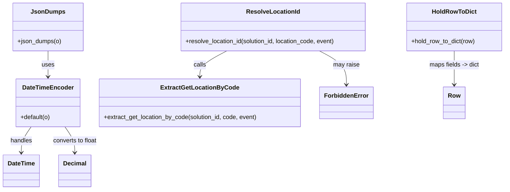

# Diagram: entity_core/entity_service/entity_service/entity/hold/__init__.py


> Auto-generated by Obscura crawlers

## Diagram 1



### SVG

<svg id="container" width="1319.689453125" xmlns="http://www.w3.org/2000/svg" class="classDiagram" height="500" viewBox="0 0 1319.689453125 500" role="graphics-document document" aria-roledescription="class"><style>#container{font-family:"trebuchet ms",verdana,arial,sans-serif;font-size:16px;fill:#333;}@keyframes edge-animation-frame{from{stroke-dashoffset:0;}}@keyframes dash{to{stroke-dashoffset:0;}}#container .edge-animation-slow{stroke-dasharray:9,5!important;stroke-dashoffset:900;animation:dash 50s linear infinite;stroke-linecap:round;}#container .edge-animation-fast{stroke-dasharray:9,5!important;stroke-dashoffset:900;animation:dash 20s linear infinite;stroke-linecap:round;}#container .error-icon{fill:#552222;}#container .error-text{fill:#552222;stroke:#552222;}#container .edge-thickness-normal{stroke-width:1px;}#container .edge-thickness-thick{stroke-width:3.5px;}#container .edge-pattern-solid{stroke-dasharray:0;}#container .edge-thickness-invisible{stroke-width:0;fill:none;}#container .edge-pattern-dashed{stroke-dasharray:3;}#container .edge-pattern-dotted{stroke-dasharray:2;}#container .marker{fill:#333333;stroke:#333333;}#container .marker.cross{stroke:#333333;}#container svg{font-family:"trebuchet ms",verdana,arial,sans-serif;font-size:16px;}#container p{margin:0;}#container g.classGroup text{fill:#9370DB;stroke:none;font-family:"trebuchet ms",verdana,arial,sans-serif;font-size:10px;}#container g.classGroup text .title{font-weight:bolder;}#container .nodeLabel,#container .edgeLabel{color:#131300;}#container .edgeLabel .label rect{fill:#ECECFF;}#container .label text{fill:#131300;}#container .labelBkg{background:#ECECFF;}#container .edgeLabel .label span{background:#ECECFF;}#container .classTitle{font-weight:bolder;}#container .node rect,#container .node circle,#container .node ellipse,#container .node polygon,#container .node path{fill:#ECECFF;stroke:#9370DB;stroke-width:1px;}#container .divider{stroke:#9370DB;stroke-width:1;}#container g.clickable{cursor:pointer;}#container g.classGroup rect{fill:#ECECFF;stroke:#9370DB;}#container g.classGroup line{stroke:#9370DB;stroke-width:1;}#container .classLabel .box{stroke:none;stroke-width:0;fill:#ECECFF;opacity:0.5;}#container .classLabel .label{fill:#9370DB;font-size:10px;}#container .relation{stroke:#333333;stroke-width:1;fill:none;}#container .dashed-line{stroke-dasharray:3;}#container .dotted-line{stroke-dasharray:1 2;}#container #compositionStart,#container .composition{fill:#333333!important;stroke:#333333!important;stroke-width:1;}#container #compositionEnd,#container .composition{fill:#333333!important;stroke:#333333!important;stroke-width:1;}#container #dependencyStart,#container .dependency{fill:#333333!important;stroke:#333333!important;stroke-width:1;}#container #dependencyStart,#container .dependency{fill:#333333!important;stroke:#333333!important;stroke-width:1;}#container #extensionStart,#container .extension{fill:transparent!important;stroke:#333333!important;stroke-width:1;}#container #extensionEnd,#container .extension{fill:transparent!important;stroke:#333333!important;stroke-width:1;}#container #aggregationStart,#container .aggregation{fill:transparent!important;stroke:#333333!important;stroke-width:1;}#container #aggregationEnd,#container .aggregation{fill:transparent!important;stroke:#333333!important;stroke-width:1;}#container #lollipopStart,#container .lollipop{fill:#ECECFF!important;stroke:#333333!important;stroke-width:1;}#container #lollipopEnd,#container .lollipop{fill:#ECECFF!important;stroke:#333333!important;stroke-width:1;}#container .edgeTerminals{font-size:11px;line-height:initial;}#container .classTitleText{text-anchor:middle;font-size:18px;fill:#333;}#container .label-icon{display:inline-block;height:1em;overflow:visible;vertical-align:-0.125em;}#container .node .label-icon path{fill:currentColor;stroke:revert;stroke-width:revert;}#container :root{--mermaid-font-family:"trebuchet ms",verdana,arial,sans-serif;}</style><g><defs><marker id="container_class-aggregationStart" class="marker aggregation class" refX="18" refY="7" markerWidth="190" markerHeight="240" orient="auto"><path d="M 18,7 L9,13 L1,7 L9,1 Z"></path></marker></defs><defs><marker id="container_class-aggregationEnd" class="marker aggregation class" refX="1" refY="7" markerWidth="20" markerHeight="28" orient="auto"><path d="M 18,7 L9,13 L1,7 L9,1 Z"></path></marker></defs><defs><marker id="container_class-extensionStart" class="marker extension class" refX="18" refY="7" markerWidth="190" markerHeight="240" orient="auto"><path d="M 1,7 L18,13 V 1 Z"></path></marker></defs><defs><marker id="container_class-extensionEnd" class="marker extension class" refX="1" refY="7" markerWidth="20" markerHeight="28" orient="auto"><path d="M 1,1 V 13 L18,7 Z"></path></marker></defs><defs><marker id="container_class-compositionStart" class="marker composition class" refX="18" refY="7" markerWidth="190" markerHeight="240" orient="auto"><path d="M 18,7 L9,13 L1,7 L9,1 Z"></path></marker></defs><defs><marker id="container_class-compositionEnd" class="marker composition class" refX="1" refY="7" markerWidth="20" markerHeight="28" orient="auto"><path d="M 18,7 L9,13 L1,7 L9,1 Z"></path></marker></defs><defs><marker id="container_class-dependencyStart" class="marker dependency class" refX="6" refY="7" markerWidth="190" markerHeight="240" orient="auto"><path d="M 5,7 L9,13 L1,7 L9,1 Z"></path></marker></defs><defs><marker id="container_class-dependencyEnd" class="marker dependency class" refX="13" refY="7" markerWidth="20" markerHeight="28" orient="auto"><path d="M 18,7 L9,13 L14,7 L9,1 Z"></path></marker></defs><defs><marker id="container_class-lollipopStart" class="marker lollipop class" refX="13" refY="7" markerWidth="190" markerHeight="240" orient="auto"><circle stroke="black" fill="transparent" cx="7" cy="7" r="6"></circle></marker></defs><defs><marker id="container_class-lollipopEnd" class="marker lollipop class" refX="1" refY="7" markerWidth="190" markerHeight="240" orient="auto"><circle stroke="black" fill="transparent" cx="7" cy="7" r="6"></circle></marker></defs><g class="root"><g class="clusters"></g><g class="edgePaths"><path d="M123.516,134L123.516,140.167C123.516,146.333,123.516,158.667,123.516,170C123.516,181.333,123.516,191.667,123.516,196.833L123.516,202" id="id_JsonDumps_DateTimeEncoder_1" class="edge-thickness-normal edge-pattern-solid relation" style=";;;" data-edge="true" data-et="edge" data-id="id_JsonDumps_DateTimeEncoder_1" data-points="W3sieCI6MTIzLjUxNTYyNSwieSI6MTM0fSx7IngiOjEyMy41MTU2MjUsInkiOjE3MX0seyJ4IjoxMjMuNTE1NjI1LCJ5IjoyMDh9XQ==" marker-end="url(#container_class-dependencyEnd)"></path><path d="M80.115,334L75.866,340.167C71.618,346.333,63.122,358.667,58.873,370C54.625,381.333,54.625,391.667,54.625,396.833L54.625,402" id="id_DateTimeEncoder_DateTime_2" class="edge-thickness-normal edge-pattern-solid relation" style=";;;" data-edge="true" data-et="edge" data-id="id_DateTimeEncoder_DateTime_2" data-points="W3sieCI6ODAuMTE0NTMxMjUsInkiOjMzNH0seyJ4Ijo1NC42MjUsInkiOjM3MX0seyJ4Ijo1NC42MjUsInkiOjQwOH1d" marker-end="url(#container_class-dependencyEnd)"></path><path d="M166.917,334L171.165,340.167C175.413,346.333,183.91,358.667,188.158,370C192.406,381.333,192.406,391.667,192.406,396.833L192.406,402" id="id_DateTimeEncoder_Decimal_3" class="edge-thickness-normal edge-pattern-solid relation" style=";;;" data-edge="true" data-et="edge" data-id="id_DateTimeEncoder_Decimal_3" data-points="W3sieCI6MTY2LjkxNjcxODc1LCJ5IjozMzR9LHsieCI6MTkyLjQwNjI1LCJ5IjozNzF9LHsieCI6MTkyLjQwNjI1LCJ5Ijo0MDh9XQ==" marker-end="url(#container_class-dependencyEnd)"></path><path d="M1186.74,134L1186.74,140.167C1186.74,146.333,1186.74,158.667,1186.74,173.5C1186.74,188.333,1186.74,205.667,1186.74,214.333L1186.74,223" id="id_HoldRowToDict_Row_4" class="edge-thickness-normal edge-pattern-solid relation" style=";;;" data-edge="true" data-et="edge" data-id="id_HoldRowToDict_Row_4" data-points="W3sieCI6MTE4Ni43NDAyMzQzNzUsInkiOjEzNH0seyJ4IjoxMTg2Ljc0MDIzNDM3NSwieSI6MTcxfSx7IngiOjExODYuNzQwMjM0Mzc1LCJ5IjoyMjl9XQ==" marker-end="url(#container_class-dependencyEnd)"></path><path d="M592.61,134L580.832,140.167C569.055,146.333,545.5,158.667,533.723,170C521.945,181.333,521.945,191.667,521.945,196.833L521.945,202" id="id_ResolveLocationId_ExtractGetLocationByCode_5" class="edge-thickness-normal edge-pattern-solid relation" style=";;;" data-edge="true" data-et="edge" data-id="id_ResolveLocationId_ExtractGetLocationByCode_5" data-points="W3sieCI6NTkyLjYwOTUzMTI1LCJ5IjoxMzR9LHsieCI6NTIxLjk0NTMxMjUsInkiOjE3MX0seyJ4Ijo1MjEuOTQ1MzEyNSwieSI6MjA4fV0=" marker-end="url(#container_class-dependencyEnd)"></path><path d="M833.25,134L845.027,140.167C856.805,146.333,880.359,158.667,892.137,173.5C903.914,188.333,903.914,205.667,903.914,214.333L903.914,223" id="id_ResolveLocationId_ForbiddenError_6" class="edge-thickness-normal edge-pattern-solid relation" style=";;;" data-edge="true" data-et="edge" data-id="id_ResolveLocationId_ForbiddenError_6" data-points="W3sieCI6ODMzLjI0OTg0Mzc1LCJ5IjoxMzR9LHsieCI6OTAzLjkxNDA2MjUsInkiOjE3MX0seyJ4Ijo5MDMuOTE0MDYyNSwieSI6MjI5fV0=" marker-end="url(#container_class-dependencyEnd)"></path></g><g class="edgeLabels"><g class="edgeLabel" transform="translate(123.515625, 171)"><g class="label" data-id="id_JsonDumps_DateTimeEncoder_1" transform="translate(-16.4921875, -12)"><foreignObject width="32.984375" height="24"><div xmlns="http://www.w3.org/1999/xhtml" class="labelBkg" style="display: table-cell; white-space: nowrap; line-height: 1.5; max-width: 200px; text-align: center;"><span class="edgeLabel"><p>uses</p></span></div></foreignObject></g></g><g class="edgeLabel" transform="translate(54.625, 371)"><g class="label" data-id="id_DateTimeEncoder_DateTime_2" transform="translate(-28.9140625, -12)"><foreignObject width="57.828125" height="24"><div xmlns="http://www.w3.org/1999/xhtml" class="labelBkg" style="display: table-cell; white-space: nowrap; line-height: 1.5; max-width: 200px; text-align: center;"><span class="edgeLabel"><p>handles</p></span></div></foreignObject></g></g><g class="edgeLabel" transform="translate(192.40625, 371)"><g class="label" data-id="id_DateTimeEncoder_Decimal_3" transform="translate(-59.15625, -12)"><foreignObject width="118.3125" height="24"><div xmlns="http://www.w3.org/1999/xhtml" class="labelBkg" style="display: table-cell; white-space: nowrap; line-height: 1.5; max-width: 200px; text-align: center;"><span class="edgeLabel"><p>converts to float</p></span></div></foreignObject></g></g><g class="edgeLabel" transform="translate(1186.740234375, 171)"><g class="label" data-id="id_HoldRowToDict_Row_4" transform="translate(-66.8203125, -12)"><foreignObject width="133.640625" height="24"><div xmlns="http://www.w3.org/1999/xhtml" class="labelBkg" style="display: table-cell; white-space: nowrap; line-height: 1.5; max-width: 200px; text-align: center;"><span class="edgeLabel"><p>maps fields -&gt; dict</p></span></div></foreignObject></g></g><g class="edgeLabel" transform="translate(521.9453125, 171)"><g class="label" data-id="id_ResolveLocationId_ExtractGetLocationByCode_5" transform="translate(-16.4453125, -12)"><foreignObject width="32.890625" height="24"><div xmlns="http://www.w3.org/1999/xhtml" class="labelBkg" style="display: table-cell; white-space: nowrap; line-height: 1.5; max-width: 200px; text-align: center;"><span class="edgeLabel"><p>calls</p></span></div></foreignObject></g></g><g class="edgeLabel" transform="translate(903.9140625, 171)"><g class="label" data-id="id_ResolveLocationId_ForbiddenError_6" transform="translate(-34.65625, -12)"><foreignObject width="69.3125" height="24"><div xmlns="http://www.w3.org/1999/xhtml" class="labelBkg" style="display: table-cell; white-space: nowrap; line-height: 1.5; max-width: 200px; text-align: center;"><span class="edgeLabel"><p>may raise</p></span></div></foreignObject></g></g></g><g class="nodes"><g class="node default" id="classId-DateTimeEncoder-0" transform="translate(123.515625, 271)"><g class="basic label-container"><path d="M-83.8125 -63 L83.8125 -63 L83.8125 63 L-83.8125 63" stroke="none" stroke-width="0" fill="#ECECFF" style=""></path><path d="M-83.8125 -63 C-22.68608315266929 -63, 38.44033369466142 -63, 83.8125 -63 M-83.8125 -63 C-49.790251846027644 -63, -15.768003692055288 -63, 83.8125 -63 M83.8125 -63 C83.8125 -12.93878536047719, 83.8125 37.12242927904562, 83.8125 63 M83.8125 -63 C83.8125 -20.458320468256893, 83.8125 22.083359063486213, 83.8125 63 M83.8125 63 C46.942617256044336 63, 10.072734512088672 63, -83.8125 63 M83.8125 63 C38.18578237321241 63, -7.4409352535751765 63, -83.8125 63 M-83.8125 63 C-83.8125 35.30508677197682, -83.8125 7.610173543953628, -83.8125 -63 M-83.8125 63 C-83.8125 14.705512841781115, -83.8125 -33.58897431643777, -83.8125 -63" stroke="#9370DB" stroke-width="1.3" fill="none" stroke-dasharray="0 0" style=""></path></g><g class="annotation-group text" transform="translate(0, -39)"></g><g class="label-group text" transform="translate(-64.140625, -39)"><g class="label" style="font-weight: bolder" transform="translate(0,-12)"><foreignObject width="128.28125" height="24"><div xmlns="http://www.w3.org/1999/xhtml" style="display: table-cell; white-space: nowrap; line-height: 1.5; max-width: 178px; text-align: center;"><span class="nodeLabel markdown-node-label" style=""><p>DateTimeEncoder</p></span></div></foreignObject></g></g><g class="members-group text" transform="translate(-71.8125, 9)"></g><g class="methods-group text" transform="translate(-71.8125, 39)"><g class="label" style="" transform="translate(0,-12)"><foreignObject width="79.484375" height="24"><div xmlns="http://www.w3.org/1999/xhtml" style="display: table-cell; white-space: nowrap; line-height: 1.5; max-width: 137px; text-align: center;"><span class="nodeLabel markdown-node-label" style=""><p>+default(o)</p></span></div></foreignObject></g></g><g class="divider" style=""><path d="M-83.8125 -15 C-44.95524097292813 -15, -6.097981945856262 -15, 83.8125 -15 M-83.8125 -15 C-47.1277261484393 -15, -10.442952296878602 -15, 83.8125 -15" stroke="#9370DB" stroke-width="1.3" fill="none" stroke-dasharray="0 0" style=""></path></g><g class="divider" style=""><path d="M-83.8125 9 C-39.578419006661306 9, 4.655661986677387 9, 83.8125 9 M-83.8125 9 C-30.45969539238179 9, 22.89310921523642 9, 83.8125 9" stroke="#9370DB" stroke-width="1.3" fill="none" stroke-dasharray="0 0" style=""></path></g></g><g class="node default" id="classId-DateTime-1" transform="translate(54.625, 450)"><g class="basic label-container"><path d="M-46.625 -42 L46.625 -42 L46.625 42 L-46.625 42" stroke="none" stroke-width="0" fill="#ECECFF" style=""></path><path d="M-46.625 -42 C-13.026534120661779 -42, 20.571931758676442 -42, 46.625 -42 M-46.625 -42 C-12.906178047581129 -42, 20.812643904837742 -42, 46.625 -42 M46.625 -42 C46.625 -14.67932789286182, 46.625 12.641344214276359, 46.625 42 M46.625 -42 C46.625 -12.091204561652031, 46.625 17.817590876695938, 46.625 42 M46.625 42 C26.325570638714545 42, 6.02614127742909 42, -46.625 42 M46.625 42 C19.809055073653518 42, -7.006889852692964 42, -46.625 42 M-46.625 42 C-46.625 18.391095379008952, -46.625 -5.217809241982096, -46.625 -42 M-46.625 42 C-46.625 14.239830531682486, -46.625 -13.520338936635028, -46.625 -42" stroke="#9370DB" stroke-width="1.3" fill="none" stroke-dasharray="0 0" style=""></path></g><g class="annotation-group text" transform="translate(0, -18)"></g><g class="label-group text" transform="translate(-34.625, -18)"><g class="label" style="font-weight: bolder" transform="translate(0,-12)"><foreignObject width="69.25" height="24"><div xmlns="http://www.w3.org/1999/xhtml" style="display: table-cell; white-space: nowrap; line-height: 1.5; max-width: 118px; text-align: center;"><span class="nodeLabel markdown-node-label" style=""><p>DateTime</p></span></div></foreignObject></g></g><g class="members-group text" transform="translate(-34.625, 30)"></g><g class="methods-group text" transform="translate(-34.625, 60)"></g><g class="divider" style=""><path d="M-46.625 6 C-24.854035703704756 6, -3.0830714074095127 6, 46.625 6 M-46.625 6 C-13.486968160164054 6, 19.651063679671893 6, 46.625 6" stroke="#9370DB" stroke-width="1.3" fill="none" stroke-dasharray="0 0" style=""></path></g><g class="divider" style=""><path d="M-46.625 24 C-11.556817102999943 24, 23.511365794000113 24, 46.625 24 M-46.625 24 C-17.2959681200684 24, 12.033063759863197 24, 46.625 24" stroke="#9370DB" stroke-width="1.3" fill="none" stroke-dasharray="0 0" style=""></path></g></g><g class="node default" id="classId-Decimal-2" transform="translate(192.40625, 450)"><g class="basic label-container"><path d="M-41.15625 -42 L41.15625 -42 L41.15625 42 L-41.15625 42" stroke="none" stroke-width="0" fill="#ECECFF" style=""></path><path d="M-41.15625 -42 C-19.590780896365835 -42, 1.9746882072683292 -42, 41.15625 -42 M-41.15625 -42 C-19.325833395307683 -42, 2.5045832093846343 -42, 41.15625 -42 M41.15625 -42 C41.15625 -17.02107234164043, 41.15625 7.95785531671914, 41.15625 42 M41.15625 -42 C41.15625 -22.724523182899905, 41.15625 -3.449046365799809, 41.15625 42 M41.15625 42 C22.864765806162193 42, 4.5732816123243865 42, -41.15625 42 M41.15625 42 C17.415285213887852 42, -6.3256795722242956 42, -41.15625 42 M-41.15625 42 C-41.15625 24.66672478518545, -41.15625 7.333449570370902, -41.15625 -42 M-41.15625 42 C-41.15625 15.794090191827515, -41.15625 -10.411819616344971, -41.15625 -42" stroke="#9370DB" stroke-width="1.3" fill="none" stroke-dasharray="0 0" style=""></path></g><g class="annotation-group text" transform="translate(0, -18)"></g><g class="label-group text" transform="translate(-29.15625, -18)"><g class="label" style="font-weight: bolder" transform="translate(0,-12)"><foreignObject width="58.3125" height="24"><div xmlns="http://www.w3.org/1999/xhtml" style="display: table-cell; white-space: nowrap; line-height: 1.5; max-width: 108px; text-align: center;"><span class="nodeLabel markdown-node-label" style=""><p>Decimal</p></span></div></foreignObject></g></g><g class="members-group text" transform="translate(-29.15625, 30)"></g><g class="methods-group text" transform="translate(-29.15625, 60)"></g><g class="divider" style=""><path d="M-41.15625 6 C-20.631162935145205 6, -0.10607587029041099 6, 41.15625 6 M-41.15625 6 C-20.931142944854617 6, -0.7060358897092343 6, 41.15625 6" stroke="#9370DB" stroke-width="1.3" fill="none" stroke-dasharray="0 0" style=""></path></g><g class="divider" style=""><path d="M-41.15625 24 C-20.80908098287336 24, -0.46191196574672233 24, 41.15625 24 M-41.15625 24 C-23.53537923261093 24, -5.914508465221857 24, 41.15625 24" stroke="#9370DB" stroke-width="1.3" fill="none" stroke-dasharray="0 0" style=""></path></g></g><g class="node default" id="classId-JsonDumps-3" transform="translate(123.515625, 71)"><g class="basic label-container"><path d="M-90.328125 -63 L90.328125 -63 L90.328125 63 L-90.328125 63" stroke="none" stroke-width="0" fill="#ECECFF" style=""></path><path d="M-90.328125 -63 C-22.470324563280897 -63, 45.387475873438206 -63, 90.328125 -63 M-90.328125 -63 C-52.62364602735029 -63, -14.91916705470058 -63, 90.328125 -63 M90.328125 -63 C90.328125 -35.693985714485535, 90.328125 -8.387971428971063, 90.328125 63 M90.328125 -63 C90.328125 -25.59583919693946, 90.328125 11.808321606121083, 90.328125 63 M90.328125 63 C18.81179530116887 63, -52.70453439766226 63, -90.328125 63 M90.328125 63 C46.249779744985304 63, 2.1714344899706077 63, -90.328125 63 M-90.328125 63 C-90.328125 30.62169350875992, -90.328125 -1.7566129824801635, -90.328125 -63 M-90.328125 63 C-90.328125 36.00425697174202, -90.328125 9.008513943484054, -90.328125 -63" stroke="#9370DB" stroke-width="1.3" fill="none" stroke-dasharray="0 0" style=""></path></g><g class="annotation-group text" transform="translate(0, -39)"></g><g class="label-group text" transform="translate(-40.875, -39)"><g class="label" style="font-weight: bolder" transform="translate(0,-12)"><foreignObject width="81.75" height="24"><div xmlns="http://www.w3.org/1999/xhtml" style="display: table-cell; white-space: nowrap; line-height: 1.5; max-width: 131px; text-align: center;"><span class="nodeLabel markdown-node-label" style=""><p>JsonDumps</p></span></div></foreignObject></g></g><g class="members-group text" transform="translate(-78.328125, 9)"></g><g class="methods-group text" transform="translate(-78.328125, 39)"><g class="label" style="" transform="translate(0,-12)"><foreignObject width="115.78125" height="24"><div xmlns="http://www.w3.org/1999/xhtml" style="display: table-cell; white-space: nowrap; line-height: 1.5; max-width: 173px; text-align: center;"><span class="nodeLabel markdown-node-label" style=""><p>+json_dumps(o)</p></span></div></foreignObject></g></g><g class="divider" style=""><path d="M-90.328125 -15 C-34.29429961628713 -15, 21.739525767425746 -15, 90.328125 -15 M-90.328125 -15 C-37.097805670119264 -15, 16.13251365976147 -15, 90.328125 -15" stroke="#9370DB" stroke-width="1.3" fill="none" stroke-dasharray="0 0" style=""></path></g><g class="divider" style=""><path d="M-90.328125 9 C-51.21157379026194 9, -12.095022580523874 9, 90.328125 9 M-90.328125 9 C-21.914967638686306 9, 46.49818972262739 9, 90.328125 9" stroke="#9370DB" stroke-width="1.3" fill="none" stroke-dasharray="0 0" style=""></path></g></g><g class="node default" id="classId-HoldRowToDict-4" transform="translate(1186.740234375, 71)"><g class="basic label-container"><path d="M-124.94921875 -63 L124.94921875 -63 L124.94921875 63 L-124.94921875 63" stroke="none" stroke-width="0" fill="#ECECFF" style=""></path><path d="M-124.94921875 -63 C-36.21244474425164 -63, 52.52432926149672 -63, 124.94921875 -63 M-124.94921875 -63 C-36.42849382381867 -63, 52.09223110236266 -63, 124.94921875 -63 M124.94921875 -63 C124.94921875 -32.77728761222902, 124.94921875 -2.5545752244580413, 124.94921875 63 M124.94921875 -63 C124.94921875 -25.21536435343996, 124.94921875 12.569271293120082, 124.94921875 63 M124.94921875 63 C64.2950825335159 63, 3.6409463170317906 63, -124.94921875 63 M124.94921875 63 C57.26192341621484 63, -10.425371917570317 63, -124.94921875 63 M-124.94921875 63 C-124.94921875 21.787254644722083, -124.94921875 -19.425490710555835, -124.94921875 -63 M-124.94921875 63 C-124.94921875 34.16560115253461, -124.94921875 5.331202305069226, -124.94921875 -63" stroke="#9370DB" stroke-width="1.3" fill="none" stroke-dasharray="0 0" style=""></path></g><g class="annotation-group text" transform="translate(0, -39)"></g><g class="label-group text" transform="translate(-55.5546875, -39)"><g class="label" style="font-weight: bolder" transform="translate(0,-12)"><foreignObject width="111.109375" height="24"><div xmlns="http://www.w3.org/1999/xhtml" style="display: table-cell; white-space: nowrap; line-height: 1.5; max-width: 160px; text-align: center;"><span class="nodeLabel markdown-node-label" style=""><p>HoldRowToDict</p></span></div></foreignObject></g></g><g class="members-group text" transform="translate(-112.94921875, 9)"></g><g class="methods-group text" transform="translate(-112.94921875, 39)"><g class="label" style="" transform="translate(0,-12)"><foreignObject width="170.34375" height="24"><div xmlns="http://www.w3.org/1999/xhtml" style="display: table-cell; white-space: nowrap; line-height: 1.5; max-width: 228px; text-align: center;"><span class="nodeLabel markdown-node-label" style=""><p>+hold_row_to_dict(row)</p></span></div></foreignObject></g></g><g class="divider" style=""><path d="M-124.94921875 -15 C-41.494953656952916 -15, 41.95931143609417 -15, 124.94921875 -15 M-124.94921875 -15 C-62.92160716413887 -15, -0.8939955782777389 -15, 124.94921875 -15" stroke="#9370DB" stroke-width="1.3" fill="none" stroke-dasharray="0 0" style=""></path></g><g class="divider" style=""><path d="M-124.94921875 9 C-40.91221602231036 9, 43.12478670537928 9, 124.94921875 9 M-124.94921875 9 C-74.57109601177396 9, -24.192973273547935 9, 124.94921875 9" stroke="#9370DB" stroke-width="1.3" fill="none" stroke-dasharray="0 0" style=""></path></g></g><g class="node default" id="classId-ResolveLocationId-5" transform="translate(712.9296875, 71)"><g class="basic label-container"><path d="M-245.8671875 -63 L245.8671875 -63 L245.8671875 63 L-245.8671875 63" stroke="none" stroke-width="0" fill="#ECECFF" style=""></path><path d="M-245.8671875 -63 C-87.76648578861318 -63, 70.33421592277364 -63, 245.8671875 -63 M-245.8671875 -63 C-134.87579419335322 -63, -23.88440088670646 -63, 245.8671875 -63 M245.8671875 -63 C245.8671875 -14.951970831940194, 245.8671875 33.09605833611961, 245.8671875 63 M245.8671875 -63 C245.8671875 -23.11115523495748, 245.8671875 16.77768953008504, 245.8671875 63 M245.8671875 63 C125.20185572249642 63, 4.536523944992837 63, -245.8671875 63 M245.8671875 63 C63.82937309222328 63, -118.20844131555344 63, -245.8671875 63 M-245.8671875 63 C-245.8671875 35.72012466769033, -245.8671875 8.440249335380656, -245.8671875 -63 M-245.8671875 63 C-245.8671875 15.673976610340674, -245.8671875 -31.652046779318653, -245.8671875 -63" stroke="#9370DB" stroke-width="1.3" fill="none" stroke-dasharray="0 0" style=""></path></g><g class="annotation-group text" transform="translate(0, -39)"></g><g class="label-group text" transform="translate(-67.015625, -39)"><g class="label" style="font-weight: bolder" transform="translate(0,-12)"><foreignObject width="134.03125" height="24"><div xmlns="http://www.w3.org/1999/xhtml" style="display: table-cell; white-space: nowrap; line-height: 1.5; max-width: 182px; text-align: center;"><span class="nodeLabel markdown-node-label" style=""><p>ResolveLocationId</p></span></div></foreignObject></g></g><g class="members-group text" transform="translate(-233.8671875, 9)"></g><g class="methods-group text" transform="translate(-233.8671875, 39)"><g class="label" style="" transform="translate(0,-12)"><foreignObject width="400.71875" height="24"><div xmlns="http://www.w3.org/1999/xhtml" style="display: table-cell; white-space: nowrap; line-height: 1.5; max-width: 458px; text-align: center;"><span class="nodeLabel markdown-node-label" style=""><p>+resolve_location_id(solution_id, location_code, event)</p></span></div></foreignObject></g></g><g class="divider" style=""><path d="M-245.8671875 -15 C-49.957688569794726 -15, 145.95181036041055 -15, 245.8671875 -15 M-245.8671875 -15 C-134.23679784838697 -15, -22.60640819677397 -15, 245.8671875 -15" stroke="#9370DB" stroke-width="1.3" fill="none" stroke-dasharray="0 0" style=""></path></g><g class="divider" style=""><path d="M-245.8671875 9 C-96.56245415723077 9, 52.74227918553845 9, 245.8671875 9 M-245.8671875 9 C-96.67853813181452 9, 52.51011123637096 9, 245.8671875 9" stroke="#9370DB" stroke-width="1.3" fill="none" stroke-dasharray="0 0" style=""></path></g></g><g class="node default" id="classId-ExtractGetLocationByCode-6" transform="translate(521.9453125, 271)"><g class="basic label-container"><path d="M-264.6171875 -63 L264.6171875 -63 L264.6171875 63 L-264.6171875 63" stroke="none" stroke-width="0" fill="#ECECFF" style=""></path><path d="M-264.6171875 -63 C-61.05122438296857 -63, 142.51473873406286 -63, 264.6171875 -63 M-264.6171875 -63 C-136.34840911343443 -63, -8.079630726868857 -63, 264.6171875 -63 M264.6171875 -63 C264.6171875 -33.6050806868166, 264.6171875 -4.210161373633198, 264.6171875 63 M264.6171875 -63 C264.6171875 -35.40613262641284, 264.6171875 -7.812265252825675, 264.6171875 63 M264.6171875 63 C87.69407998945749 63, -89.22902752108502 63, -264.6171875 63 M264.6171875 63 C144.5057611796703 63, 24.394334859340603 63, -264.6171875 63 M-264.6171875 63 C-264.6171875 25.94714344492933, -264.6171875 -11.105713110141338, -264.6171875 -63 M-264.6171875 63 C-264.6171875 19.010230550682593, -264.6171875 -24.979538898634814, -264.6171875 -63" stroke="#9370DB" stroke-width="1.3" fill="none" stroke-dasharray="0 0" style=""></path></g><g class="annotation-group text" transform="translate(0, -39)"></g><g class="label-group text" transform="translate(-97.046875, -39)"><g class="label" style="font-weight: bolder" transform="translate(0,-12)"><foreignObject width="194.09375" height="24"><div xmlns="http://www.w3.org/1999/xhtml" style="display: table-cell; white-space: nowrap; line-height: 1.5; max-width: 240px; text-align: center;"><span class="nodeLabel markdown-node-label" style=""><p>ExtractGetLocationByCode</p></span></div></foreignObject></g></g><g class="members-group text" transform="translate(-252.6171875, 9)"></g><g class="methods-group text" transform="translate(-252.6171875, 39)"><g class="label" style="" transform="translate(0,-12)"><foreignObject width="408.1875" height="24"><div xmlns="http://www.w3.org/1999/xhtml" style="display: table-cell; white-space: nowrap; line-height: 1.5; max-width: 466px; text-align: center;"><span class="nodeLabel markdown-node-label" style=""><p>+extract_get_location_by_code(solution_id, code, event)</p></span></div></foreignObject></g></g><g class="divider" style=""><path d="M-264.6171875 -15 C-80.24638938925415 -15, 104.1244087214917 -15, 264.6171875 -15 M-264.6171875 -15 C-85.28790692869171 -15, 94.04137364261658 -15, 264.6171875 -15" stroke="#9370DB" stroke-width="1.3" fill="none" stroke-dasharray="0 0" style=""></path></g><g class="divider" style=""><path d="M-264.6171875 9 C-97.79968091664355 9, 69.0178256667129 9, 264.6171875 9 M-264.6171875 9 C-116.04106634943312 9, 32.535054801133754 9, 264.6171875 9" stroke="#9370DB" stroke-width="1.3" fill="none" stroke-dasharray="0 0" style=""></path></g></g><g class="node default" id="classId-ForbiddenError-7" transform="translate(903.9140625, 271)"><g class="basic label-container"><path d="M-67.3515625 -42 L67.3515625 -42 L67.3515625 42 L-67.3515625 42" stroke="none" stroke-width="0" fill="#ECECFF" style=""></path><path d="M-67.3515625 -42 C-39.116113859283786 -42, -10.880665218567572 -42, 67.3515625 -42 M-67.3515625 -42 C-24.546357663792435 -42, 18.25884717241513 -42, 67.3515625 -42 M67.3515625 -42 C67.3515625 -10.379757152803705, 67.3515625 21.24048569439259, 67.3515625 42 M67.3515625 -42 C67.3515625 -11.29602843965759, 67.3515625 19.40794312068482, 67.3515625 42 M67.3515625 42 C22.327495826811877 42, -22.696570846376247 42, -67.3515625 42 M67.3515625 42 C29.587289334221744 42, -8.176983831556512 42, -67.3515625 42 M-67.3515625 42 C-67.3515625 15.533378282466785, -67.3515625 -10.93324343506643, -67.3515625 -42 M-67.3515625 42 C-67.3515625 10.107976393715223, -67.3515625 -21.784047212569554, -67.3515625 -42" stroke="#9370DB" stroke-width="1.3" fill="none" stroke-dasharray="0 0" style=""></path></g><g class="annotation-group text" transform="translate(0, -18)"></g><g class="label-group text" transform="translate(-55.3515625, -18)"><g class="label" style="font-weight: bolder" transform="translate(0,-12)"><foreignObject width="110.703125" height="24"><div xmlns="http://www.w3.org/1999/xhtml" style="display: table-cell; white-space: nowrap; line-height: 1.5; max-width: 161px; text-align: center;"><span class="nodeLabel markdown-node-label" style=""><p>ForbiddenError</p></span></div></foreignObject></g></g><g class="members-group text" transform="translate(-55.3515625, 30)"></g><g class="methods-group text" transform="translate(-55.3515625, 60)"></g><g class="divider" style=""><path d="M-67.3515625 6 C-34.607992517788105 6, -1.8644225355762103 6, 67.3515625 6 M-67.3515625 6 C-30.18866105963663 6, 6.974240380726741 6, 67.3515625 6" stroke="#9370DB" stroke-width="1.3" fill="none" stroke-dasharray="0 0" style=""></path></g><g class="divider" style=""><path d="M-67.3515625 24 C-25.95262025142619 24, 15.44632199714762 24, 67.3515625 24 M-67.3515625 24 C-36.859661749736176 24, -6.367760999472345 24, 67.3515625 24" stroke="#9370DB" stroke-width="1.3" fill="none" stroke-dasharray="0 0" style=""></path></g></g><g class="node default" id="classId-Row-8" transform="translate(1186.740234375, 271)"><g class="basic label-container"><path d="M-27.484375 -42 L27.484375 -42 L27.484375 42 L-27.484375 42" stroke="none" stroke-width="0" fill="#ECECFF" style=""></path><path d="M-27.484375 -42 C-12.230972987727352 -42, 3.0224290245452963 -42, 27.484375 -42 M-27.484375 -42 C-11.211502887904317 -42, 5.061369224191367 -42, 27.484375 -42 M27.484375 -42 C27.484375 -20.904043135576735, 27.484375 0.19191372884652935, 27.484375 42 M27.484375 -42 C27.484375 -11.081888278787613, 27.484375 19.836223442424775, 27.484375 42 M27.484375 42 C9.289199497582764 42, -8.905976004834471 42, -27.484375 42 M27.484375 42 C8.667638183737509 42, -10.149098632524982 42, -27.484375 42 M-27.484375 42 C-27.484375 10.977553052320879, -27.484375 -20.044893895358243, -27.484375 -42 M-27.484375 42 C-27.484375 20.734481373662167, -27.484375 -0.5310372526756666, -27.484375 -42" stroke="#9370DB" stroke-width="1.3" fill="none" stroke-dasharray="0 0" style=""></path></g><g class="annotation-group text" transform="translate(0, -18)"></g><g class="label-group text" transform="translate(-15.484375, -18)"><g class="label" style="font-weight: bolder" transform="translate(0,-12)"><foreignObject width="30.96875" height="24"><div xmlns="http://www.w3.org/1999/xhtml" style="display: table-cell; white-space: nowrap; line-height: 1.5; max-width: 81px; text-align: center;"><span class="nodeLabel markdown-node-label" style=""><p>Row</p></span></div></foreignObject></g></g><g class="members-group text" transform="translate(-15.484375, 30)"></g><g class="methods-group text" transform="translate(-15.484375, 60)"></g><g class="divider" style=""><path d="M-27.484375 6 C-9.762727569282944 6, 7.9589198614341115 6, 27.484375 6 M-27.484375 6 C-16.430314977416614 6, -5.376254954833225 6, 27.484375 6" stroke="#9370DB" stroke-width="1.3" fill="none" stroke-dasharray="0 0" style=""></path></g><g class="divider" style=""><path d="M-27.484375 24 C-5.710655474476056 24, 16.06306405104789 24, 27.484375 24 M-27.484375 24 C-12.160012873553825 24, 3.1643492528923503 24, 27.484375 24" stroke="#9370DB" stroke-width="1.3" fill="none" stroke-dasharray="0 0" style=""></path></g></g></g></g></g></svg>

## Diagram 2

```mermaid
flowchart TD
    A[Inputs: solution_id, location_code, event] --> B[Call extract_get_location_by_code(solution_id, code, event)]
    B --> C{location_info exists and has "id"?}
    C -- Yes --> D[Return location_info.id]
    C -- No --> E[Raise fv.error.ForbiddenError with client_message and details]
    E --> F[Error propagated to caller]
```

> SVG rendering failed for this diagram.
