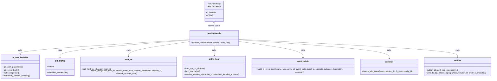
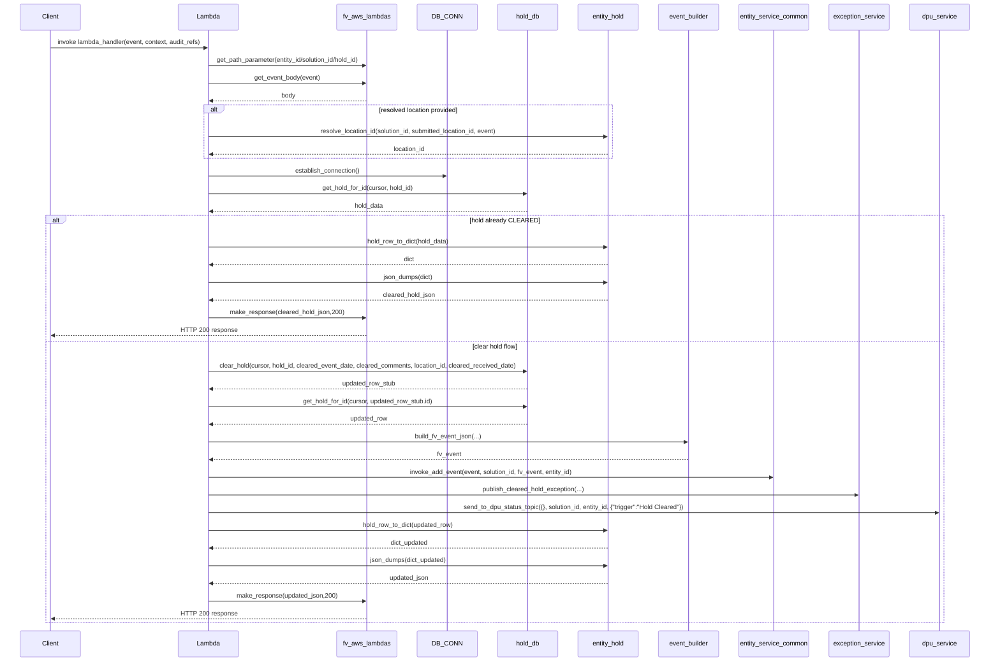

# Diagram: entity_core/entity_service/entity_service/entity/hold/clear_hold.py


> Auto-generated by Obscura crawlers

## Diagram 1



### SVG

<svg id="container" width="4103.9140625" xmlns="http://www.w3.org/2000/svg" class="classDiagram" height="656" viewBox="0 0 4103.9140625 656" role="graphics-document document" aria-roledescription="class"><style>#container{font-family:"trebuchet ms",verdana,arial,sans-serif;font-size:16px;fill:#333;}@keyframes edge-animation-frame{from{stroke-dashoffset:0;}}@keyframes dash{to{stroke-dashoffset:0;}}#container .edge-animation-slow{stroke-dasharray:9,5!important;stroke-dashoffset:900;animation:dash 50s linear infinite;stroke-linecap:round;}#container .edge-animation-fast{stroke-dasharray:9,5!important;stroke-dashoffset:900;animation:dash 20s linear infinite;stroke-linecap:round;}#container .error-icon{fill:#552222;}#container .error-text{fill:#552222;stroke:#552222;}#container .edge-thickness-normal{stroke-width:1px;}#container .edge-thickness-thick{stroke-width:3.5px;}#container .edge-pattern-solid{stroke-dasharray:0;}#container .edge-thickness-invisible{stroke-width:0;fill:none;}#container .edge-pattern-dashed{stroke-dasharray:3;}#container .edge-pattern-dotted{stroke-dasharray:2;}#container .marker{fill:#333333;stroke:#333333;}#container .marker.cross{stroke:#333333;}#container svg{font-family:"trebuchet ms",verdana,arial,sans-serif;font-size:16px;}#container p{margin:0;}#container g.classGroup text{fill:#9370DB;stroke:none;font-family:"trebuchet ms",verdana,arial,sans-serif;font-size:10px;}#container g.classGroup text .title{font-weight:bolder;}#container .nodeLabel,#container .edgeLabel{color:#131300;}#container .edgeLabel .label rect{fill:#ECECFF;}#container .label text{fill:#131300;}#container .labelBkg{background:#ECECFF;}#container .edgeLabel .label span{background:#ECECFF;}#container .classTitle{font-weight:bolder;}#container .node rect,#container .node circle,#container .node ellipse,#container .node polygon,#container .node path{fill:#ECECFF;stroke:#9370DB;stroke-width:1px;}#container .divider{stroke:#9370DB;stroke-width:1;}#container g.clickable{cursor:pointer;}#container g.classGroup rect{fill:#ECECFF;stroke:#9370DB;}#container g.classGroup line{stroke:#9370DB;stroke-width:1;}#container .classLabel .box{stroke:none;stroke-width:0;fill:#ECECFF;opacity:0.5;}#container .classLabel .label{fill:#9370DB;font-size:10px;}#container .relation{stroke:#333333;stroke-width:1;fill:none;}#container .dashed-line{stroke-dasharray:3;}#container .dotted-line{stroke-dasharray:1 2;}#container #compositionStart,#container .composition{fill:#333333!important;stroke:#333333!important;stroke-width:1;}#container #compositionEnd,#container .composition{fill:#333333!important;stroke:#333333!important;stroke-width:1;}#container #dependencyStart,#container .dependency{fill:#333333!important;stroke:#333333!important;stroke-width:1;}#container #dependencyStart,#container .dependency{fill:#333333!important;stroke:#333333!important;stroke-width:1;}#container #extensionStart,#container .extension{fill:transparent!important;stroke:#333333!important;stroke-width:1;}#container #extensionEnd,#container .extension{fill:transparent!important;stroke:#333333!important;stroke-width:1;}#container #aggregationStart,#container .aggregation{fill:transparent!important;stroke:#333333!important;stroke-width:1;}#container #aggregationEnd,#container .aggregation{fill:transparent!important;stroke:#333333!important;stroke-width:1;}#container #lollipopStart,#container .lollipop{fill:#ECECFF!important;stroke:#333333!important;stroke-width:1;}#container #lollipopEnd,#container .lollipop{fill:#ECECFF!important;stroke:#333333!important;stroke-width:1;}#container .edgeTerminals{font-size:11px;line-height:initial;}#container .classTitleText{text-anchor:middle;font-size:18px;fill:#333;}#container .label-icon{display:inline-block;height:1em;overflow:visible;vertical-align:-0.125em;}#container .node .label-icon path{fill:currentColor;stroke:revert;stroke-width:revert;}#container :root{--mermaid-font-family:"trebuchet ms",verdana,arial,sans-serif;}</style><g><defs><marker id="container_class-aggregationStart" class="marker aggregation class" refX="18" refY="7" markerWidth="190" markerHeight="240" orient="auto"><path d="M 18,7 L9,13 L1,7 L9,1 Z"></path></marker></defs><defs><marker id="container_class-aggregationEnd" class="marker aggregation class" refX="1" refY="7" markerWidth="20" markerHeight="28" orient="auto"><path d="M 18,7 L9,13 L1,7 L9,1 Z"></path></marker></defs><defs><marker id="container_class-extensionStart" class="marker extension class" refX="18" refY="7" markerWidth="190" markerHeight="240" orient="auto"><path d="M 1,7 L18,13 V 1 Z"></path></marker></defs><defs><marker id="container_class-extensionEnd" class="marker extension class" refX="1" refY="7" markerWidth="20" markerHeight="28" orient="auto"><path d="M 1,1 V 13 L18,7 Z"></path></marker></defs><defs><marker id="container_class-compositionStart" class="marker composition class" refX="18" refY="7" markerWidth="190" markerHeight="240" orient="auto"><path d="M 18,7 L9,13 L1,7 L9,1 Z"></path></marker></defs><defs><marker id="container_class-compositionEnd" class="marker composition class" refX="1" refY="7" markerWidth="20" markerHeight="28" orient="auto"><path d="M 18,7 L9,13 L1,7 L9,1 Z"></path></marker></defs><defs><marker id="container_class-dependencyStart" class="marker dependency class" refX="6" refY="7" markerWidth="190" markerHeight="240" orient="auto"><path d="M 5,7 L9,13 L1,7 L9,1 Z"></path></marker></defs><defs><marker id="container_class-dependencyEnd" class="marker dependency class" refX="13" refY="7" markerWidth="20" markerHeight="28" orient="auto"><path d="M 18,7 L9,13 L14,7 L9,1 Z"></path></marker></defs><defs><marker id="container_class-lollipopStart" class="marker lollipop class" refX="13" refY="7" markerWidth="190" markerHeight="240" orient="auto"><circle stroke="black" fill="transparent" cx="7" cy="7" r="6"></circle></marker></defs><defs><marker id="container_class-lollipopEnd" class="marker lollipop class" refX="1" refY="7" markerWidth="190" markerHeight="240" orient="auto"><circle stroke="black" fill="transparent" cx="7" cy="7" r="6"></circle></marker></defs><g class="root"><g class="clusters"></g><g class="edgePaths"><path d="M1580.379,325.495L1344.661,340.079C1108.943,354.663,637.507,383.832,401.788,403.583C166.07,423.333,166.07,433.667,166.07,438.833L166.07,444" id="id_LambdaHandler_fv_aws_lambdas_1" class="edge-thickness-normal edge-pattern-solid relation" style=";;;" data-edge="true" data-et="edge" data-id="id_LambdaHandler_fv_aws_lambdas_1" data-points="W3sieCI6MTU4MC4zNzg5MDYyNSwieSI6MzI1LjQ5NTA3NTY4MzQyMjZ9LHsieCI6MTY2LjA3MDMxMjUsInkiOjQxM30seyJ4IjoxNjYuMDcwMzEyNSwieSI6NDUwfV0=" marker-end="url(#container_class-dependencyEnd)"></path><path d="M1580.379,328.627L1398.645,342.689C1216.911,356.751,853.444,384.876,671.71,408.604C489.977,432.333,489.977,451.667,489.977,461.333L489.977,471" id="id_LambdaHandler_DB_CONN_2" class="edge-thickness-normal edge-pattern-solid relation" style=";;;" data-edge="true" data-et="edge" data-id="id_LambdaHandler_DB_CONN_2" data-points="W3sieCI6MTU4MC4zNzg5MDYyNSwieSI6MzI4LjYyNjc0NzQzMDA0OTkzfSx7IngiOjQ4OS45NzY1NjI1LCJ5Ijo0MTN9LHsieCI6NDg5Ljk3NjU2MjUsInkiOjQ3N31d" marker-end="url(#container_class-dependencyEnd)"></path><path d="M1580.379,341.034L1493.974,353.028C1407.569,365.023,1234.759,389.011,1148.354,410.172C1061.949,431.333,1061.949,449.667,1061.949,458.833L1061.949,468" id="id_LambdaHandler_hold_db_3" class="edge-thickness-normal edge-pattern-solid relation" style=";;;" data-edge="true" data-et="edge" data-id="id_LambdaHandler_hold_db_3" data-points="W3sieCI6MTU4MC4zNzg5MDYyNSwieSI6MzQxLjAzNDEzOTgzNDUwNjR9LHsieCI6MTA2MS45NDkyMTg3NSwieSI6NDEzfSx7IngiOjEwNjEuOTQ5MjE4NzUsInkiOjQ3NH1d" marker-end="url(#container_class-dependencyEnd)"></path><path d="M1782.332,376L1782.332,382.167C1782.332,388.333,1782.332,400.667,1782.332,414C1782.332,427.333,1782.332,441.667,1782.332,448.833L1782.332,456" id="id_LambdaHandler_entity_hold_4" class="edge-thickness-normal edge-pattern-solid relation" style=";;;" data-edge="true" data-et="edge" data-id="id_LambdaHandler_entity_hold_4" data-points="W3sieCI6MTc4Mi4zMzIwMzEyNSwieSI6Mzc2fSx7IngiOjE3ODIuMzMyMDMxMjUsInkiOjQxM30seyJ4IjoxNzgyLjMzMjAzMTI1LCJ5Ijo0NjJ9XQ==" marker-end="url(#container_class-dependencyEnd)"></path><path d="M1984.285,340.055L2075.036,352.212C2165.786,364.37,2347.288,388.685,2438.038,412.009C2528.789,435.333,2528.789,457.667,2528.789,468.833L2528.789,480" id="id_LambdaHandler_event_builder_5" class="edge-thickness-normal edge-pattern-solid relation" style=";;;" data-edge="true" data-et="edge" data-id="id_LambdaHandler_event_builder_5" data-points="W3sieCI6MTk4NC4yODUxNTYyNSwieSI6MzQwLjA1NDg4OTUwNDA2MzQ1fSx7IngiOjI1MjguNzg5MDYyNSwieSI6NDEzfSx7IngiOjI1MjguNzg5MDYyNSwieSI6NDg2fV0=" marker-end="url(#container_class-dependencyEnd)"></path><path d="M1984.285,326.765L2195.15,341.138C2406.016,355.51,2827.746,384.255,3038.611,409.794C3249.477,435.333,3249.477,457.667,3249.477,468.833L3249.477,480" id="id_LambdaHandler_common_6" class="edge-thickness-normal edge-pattern-solid relation" style=";;;" data-edge="true" data-et="edge" data-id="id_LambdaHandler_common_6" data-points="W3sieCI6MTk4NC4yODUxNTYyNSwieSI6MzI2Ljc2NTA0NjM2NzE3MjZ9LHsieCI6MzI0OS40NzY1NjI1LCJ5Ijo0MTN9LHsieCI6MzI0OS40NzY1NjI1LCJ5Ijo0ODZ9XQ==" marker-end="url(#container_class-dependencyEnd)"></path><path d="M1984.285,322.926L2289.727,337.938C2595.168,352.951,3206.051,382.975,3511.492,407.154C3816.934,431.333,3816.934,449.667,3816.934,458.833L3816.934,468" id="id_LambdaHandler_notifier_7" class="edge-thickness-normal edge-pattern-solid relation" style=";;;" data-edge="true" data-et="edge" data-id="id_LambdaHandler_notifier_7" data-points="W3sieCI6MTk4NC4yODUxNTYyNSwieSI6MzIyLjkyNTkyOTkwNzk1OTZ9LHsieCI6MzgxNi45MzM1OTM3NSwieSI6NDEzfSx7IngiOjM4MTYuOTMzNTkzNzUsInkiOjQ3NH1d" marker-end="url(#container_class-dependencyEnd)"></path><path d="M1782.332,182L1782.332,187.167C1782.332,192.333,1782.332,202.667,1782.332,214C1782.332,225.333,1782.332,237.667,1782.332,243.833L1782.332,250" id="id_HOLDSTATUS_LambdaHandler_8" class="edge-thickness-normal edge-pattern-solid relation" style=";;;" data-edge="true" data-et="edge" data-id="id_HOLDSTATUS_LambdaHandler_8" data-points="W3sieCI6MTc4Mi4zMzIwMzEyNSwieSI6MTc2fSx7IngiOjE3ODIuMzMyMDMxMjUsInkiOjIxM30seyJ4IjoxNzgyLjMzMjAzMTI1LCJ5IjoyNTB9XQ==" marker-start="url(#container_class-dependencyStart)"></path></g><g class="edgeLabels"><g class="edgeLabel" transform="translate(166.0703125, 413)"><g class="label" data-id="id_LambdaHandler_fv_aws_lambdas_1" transform="translate(-16.4453125, -12)"><foreignObject width="32.890625" height="24"><div xmlns="http://www.w3.org/1999/xhtml" class="labelBkg" style="display: table-cell; white-space: nowrap; line-height: 1.5; max-width: 200px; text-align: center;"><span class="edgeLabel"><p>calls</p></span></div></foreignObject></g></g><g class="edgeLabel" transform="translate(489.9765625, 413)"><g class="label" data-id="id_LambdaHandler_DB_CONN_2" transform="translate(-16.4921875, -12)"><foreignObject width="32.984375" height="24"><div xmlns="http://www.w3.org/1999/xhtml" class="labelBkg" style="display: table-cell; white-space: nowrap; line-height: 1.5; max-width: 200px; text-align: center;"><span class="edgeLabel"><p>uses</p></span></div></foreignObject></g></g><g class="edgeLabel" transform="translate(1061.94921875, 413)"><g class="label" data-id="id_LambdaHandler_hold_db_3" transform="translate(-16.4453125, -12)"><foreignObject width="32.890625" height="24"><div xmlns="http://www.w3.org/1999/xhtml" class="labelBkg" style="display: table-cell; white-space: nowrap; line-height: 1.5; max-width: 200px; text-align: center;"><span class="edgeLabel"><p>calls</p></span></div></foreignObject></g></g><g class="edgeLabel" transform="translate(1782.33203125, 413)"><g class="label" data-id="id_LambdaHandler_entity_hold_4" transform="translate(-16.4453125, -12)"><foreignObject width="32.890625" height="24"><div xmlns="http://www.w3.org/1999/xhtml" class="labelBkg" style="display: table-cell; white-space: nowrap; line-height: 1.5; max-width: 200px; text-align: center;"><span class="edgeLabel"><p>calls</p></span></div></foreignObject></g></g><g class="edgeLabel" transform="translate(2528.7890625, 413)"><g class="label" data-id="id_LambdaHandler_event_builder_5" transform="translate(-16.4453125, -12)"><foreignObject width="32.890625" height="24"><div xmlns="http://www.w3.org/1999/xhtml" class="labelBkg" style="display: table-cell; white-space: nowrap; line-height: 1.5; max-width: 200px; text-align: center;"><span class="edgeLabel"><p>calls</p></span></div></foreignObject></g></g><g class="edgeLabel" transform="translate(3249.4765625, 413)"><g class="label" data-id="id_LambdaHandler_common_6" transform="translate(-16.4453125, -12)"><foreignObject width="32.890625" height="24"><div xmlns="http://www.w3.org/1999/xhtml" class="labelBkg" style="display: table-cell; white-space: nowrap; line-height: 1.5; max-width: 200px; text-align: center;"><span class="edgeLabel"><p>calls</p></span></div></foreignObject></g></g><g class="edgeLabel" transform="translate(3816.93359375, 413)"><g class="label" data-id="id_LambdaHandler_notifier_7" transform="translate(-16.4453125, -12)"><foreignObject width="32.890625" height="24"><div xmlns="http://www.w3.org/1999/xhtml" class="labelBkg" style="display: table-cell; white-space: nowrap; line-height: 1.5; max-width: 200px; text-align: center;"><span class="edgeLabel"><p>calls</p></span></div></foreignObject></g></g><g class="edgeLabel" transform="translate(1782.33203125, 213)"><g class="label" data-id="id_HOLDSTATUS_LambdaHandler_8" transform="translate(-48.8125, -12)"><foreignObject width="97.625" height="24"><div xmlns="http://www.w3.org/1999/xhtml" class="labelBkg" style="display: table-cell; white-space: nowrap; line-height: 1.5; max-width: 200px; text-align: center;"><span class="edgeLabel"><p>checks status</p></span></div></foreignObject></g></g></g><g class="nodes"><g class="node default" id="classId-HOLDSTATUS-0" transform="translate(1782.33203125, 92)"><g class="basic label-container"><path d="M-71.37890625 -84 L71.37890625 -84 L71.37890625 84 L-71.37890625 84" stroke="none" stroke-width="0" fill="#ECECFF" style=""></path><path d="M-71.37890625 -84 C-28.325271640425953 -84, 14.728362969148094 -84, 71.37890625 -84 M-71.37890625 -84 C-21.036126596966767 -84, 29.306653056066466 -84, 71.37890625 -84 M71.37890625 -84 C71.37890625 -21.095589811065786, 71.37890625 41.80882037786843, 71.37890625 84 M71.37890625 -84 C71.37890625 -24.93031895233505, 71.37890625 34.1393620953299, 71.37890625 84 M71.37890625 84 C21.996824036907 84, -27.385258176186 84, -71.37890625 84 M71.37890625 84 C29.51979818562193 84, -12.33930987875614 84, -71.37890625 84 M-71.37890625 84 C-71.37890625 19.250226637220294, -71.37890625 -45.49954672555941, -71.37890625 -84 M-71.37890625 84 C-71.37890625 36.99629474970674, -71.37890625 -10.007410500586516, -71.37890625 -84" stroke="#9370DB" stroke-width="1.3" fill="none" stroke-dasharray="0 0" style=""></path></g><g class="annotation-group text" transform="translate(-55.5546875, -60)"><g class="label" style="" transform="translate(0,-12)"><foreignObject width="111.109375" height="24"><div xmlns="http://www.w3.org/1999/xhtml" style="display: table-cell; white-space: nowrap; line-height: 1.5; max-width: 161px; text-align: center;"><span class="nodeLabel markdown-node-label" style=""><p>«enumeration»</p></span></div></foreignObject></g></g><g class="label-group text" transform="translate(-46.875, -36)"><g class="label" style="font-weight: bolder" transform="translate(0,-12)"><foreignObject width="93.75" height="24"><div xmlns="http://www.w3.org/1999/xhtml" style="display: table-cell; white-space: nowrap; line-height: 1.5; max-width: 142px; text-align: center;"><span class="nodeLabel markdown-node-label" style=""><p>HOLDSTATUS</p></span></div></foreignObject></g></g><g class="members-group text" transform="translate(-59.37890625, 12)"><g class="label" style="" transform="translate(0,-12)"><foreignObject width="63.203125" height="24"><div xmlns="http://www.w3.org/1999/xhtml" style="display: table-cell; white-space: nowrap; line-height: 1.5; max-width: 113px; text-align: center;"><span class="nodeLabel markdown-node-label" style=""><p>CLEARED</p></span></div></foreignObject></g><g class="label" style="" transform="translate(0,12)"><foreignObject width="48.265625" height="24"><div xmlns="http://www.w3.org/1999/xhtml" style="display: table-cell; white-space: nowrap; line-height: 1.5; max-width: 98px; text-align: center;"><span class="nodeLabel markdown-node-label" style=""><p>ACTIVE</p></span></div></foreignObject></g></g><g class="methods-group text" transform="translate(-59.37890625, 84)"></g><g class="divider" style=""><path d="M-71.37890625 -12 C-30.75177306393409 -12, 9.875360122131823 -12, 71.37890625 -12 M-71.37890625 -12 C-16.132694293182666 -12, 39.11351766363467 -12, 71.37890625 -12" stroke="#9370DB" stroke-width="1.3" fill="none" stroke-dasharray="0 0" style=""></path></g><g class="divider" style=""><path d="M-71.37890625 60 C-20.93987138529196 60, 29.499163479416083 60, 71.37890625 60 M-71.37890625 60 C-18.38124183688643 60, 34.61642257622714 60, 71.37890625 60" stroke="#9370DB" stroke-width="1.3" fill="none" stroke-dasharray="0 0" style=""></path></g></g><g class="node default" id="classId-DB_CONN-1" transform="translate(489.9765625, 549)"><g class="basic label-container"><path d="M-115.8359375 -72 L115.8359375 -72 L115.8359375 72 L-115.8359375 72" stroke="none" stroke-width="0" fill="#ECECFF" style=""></path><path d="M-115.8359375 -72 C-38.60680345984757 -72, 38.62233058030486 -72, 115.8359375 -72 M-115.8359375 -72 C-32.01738349544465 -72, 51.801170509110705 -72, 115.8359375 -72 M115.8359375 -72 C115.8359375 -30.08053358881694, 115.8359375 11.838932822366118, 115.8359375 72 M115.8359375 -72 C115.8359375 -37.94905185687733, 115.8359375 -3.898103713754665, 115.8359375 72 M115.8359375 72 C32.65070970752683 72, -50.53451808494634 72, -115.8359375 72 M115.8359375 72 C39.26372936876875 72, -37.3084787624625 72, -115.8359375 72 M-115.8359375 72 C-115.8359375 32.25654110643605, -115.8359375 -7.486917787127894, -115.8359375 -72 M-115.8359375 72 C-115.8359375 42.057361084493344, -115.8359375 12.114722168986688, -115.8359375 -72" stroke="#9370DB" stroke-width="1.3" fill="none" stroke-dasharray="0 0" style=""></path></g><g class="annotation-group text" transform="translate(0, -48)"></g><g class="label-group text" transform="translate(-34.40625, -48)"><g class="label" style="font-weight: bolder" transform="translate(0,-12)"><foreignObject width="68.8125" height="24"><div xmlns="http://www.w3.org/1999/xhtml" style="display: table-cell; white-space: nowrap; line-height: 1.5; max-width: 119px; text-align: center;"><span class="nodeLabel markdown-node-label" style=""><p>DB_CONN</p></span></div></foreignObject></g></g><g class="members-group text" transform="translate(-103.8359375, 0)"><g class="label" style="" transform="translate(0,-12)"><foreignObject width="53.71875" height="24"><div xmlns="http://www.w3.org/1999/xhtml" style="display: table-cell; white-space: nowrap; line-height: 1.5; max-width: 112px; text-align: center;"><span class="nodeLabel markdown-node-label" style=""><p>+cursor</p></span></div></foreignObject></g></g><g class="methods-group text" transform="translate(-103.8359375, 48)"><g class="label" style="" transform="translate(0,-12)"><foreignObject width="173.265625" height="24"><div xmlns="http://www.w3.org/1999/xhtml" style="display: table-cell; white-space: nowrap; line-height: 1.5; max-width: 231px; text-align: center;"><span class="nodeLabel markdown-node-label" style=""><p>+establish_connection()</p></span></div></foreignObject></g></g><g class="divider" style=""><path d="M-115.8359375 -24 C-31.893486729467696 -24, 52.04896404106461 -24, 115.8359375 -24 M-115.8359375 -24 C-66.12203129369041 -24, -16.408125087380824 -24, 115.8359375 -24" stroke="#9370DB" stroke-width="1.3" fill="none" stroke-dasharray="0 0" style=""></path></g><g class="divider" style=""><path d="M-115.8359375 24 C-48.84370116709975 24, 18.148535165800496 24, 115.8359375 24 M-115.8359375 24 C-37.750466281853434 24, 40.33500493629313 24, 115.8359375 24" stroke="#9370DB" stroke-width="1.3" fill="none" stroke-dasharray="0 0" style=""></path></g></g><g class="node default" id="classId-LambdaHandler-2" transform="translate(1782.33203125, 313)"><g class="basic label-container"><path d="M-201.953125 -63 L201.953125 -63 L201.953125 63 L-201.953125 63" stroke="none" stroke-width="0" fill="#ECECFF" style=""></path><path d="M-201.953125 -63 C-49.34558149123524 -63, 103.26196201752953 -63, 201.953125 -63 M-201.953125 -63 C-74.01099070673658 -63, 53.931143586526844 -63, 201.953125 -63 M201.953125 -63 C201.953125 -13.983375417376706, 201.953125 35.03324916524659, 201.953125 63 M201.953125 -63 C201.953125 -16.5501233322557, 201.953125 29.899753335488597, 201.953125 63 M201.953125 63 C120.2162905717281 63, 38.47945614345619 63, -201.953125 63 M201.953125 63 C48.89785338185072 63, -104.15741823629855 63, -201.953125 63 M-201.953125 63 C-201.953125 18.104443039656992, -201.953125 -26.791113920686016, -201.953125 -63 M-201.953125 63 C-201.953125 20.695488624927634, -201.953125 -21.60902275014473, -201.953125 -63" stroke="#9370DB" stroke-width="1.3" fill="none" stroke-dasharray="0 0" style=""></path></g><g class="annotation-group text" transform="translate(0, -39)"></g><g class="label-group text" transform="translate(-58.21875, -39)"><g class="label" style="font-weight: bolder" transform="translate(0,-12)"><foreignObject width="116.4375" height="24"><div xmlns="http://www.w3.org/1999/xhtml" style="display: table-cell; white-space: nowrap; line-height: 1.5; max-width: 167px; text-align: center;"><span class="nodeLabel markdown-node-label" style=""><p>LambdaHandler</p></span></div></foreignObject></g></g><g class="members-group text" transform="translate(-189.953125, 9)"></g><g class="methods-group text" transform="translate(-189.953125, 39)"><g class="label" style="" transform="translate(0,-12)"><foreignObject width="321.6875" height="24"><div xmlns="http://www.w3.org/1999/xhtml" style="display: table-cell; white-space: nowrap; line-height: 1.5; max-width: 379px; text-align: center;"><span class="nodeLabel markdown-node-label" style=""><p>+lambda_handler(event, context, audit_refs)</p></span></div></foreignObject></g></g><g class="divider" style=""><path d="M-201.953125 -15 C-95.3501250782833 -15, 11.252874843433403 -15, 201.953125 -15 M-201.953125 -15 C-88.44415246398098 -15, 25.06482007203803 -15, 201.953125 -15" stroke="#9370DB" stroke-width="1.3" fill="none" stroke-dasharray="0 0" style=""></path></g><g class="divider" style=""><path d="M-201.953125 9 C-92.9312005724342 9, 16.090723855131614 9, 201.953125 9 M-201.953125 9 C-80.6937461119318 9, 40.5656327761364 9, 201.953125 9" stroke="#9370DB" stroke-width="1.3" fill="none" stroke-dasharray="0 0" style=""></path></g></g><g class="node default" id="classId-fv_aws_lambdas-3" transform="translate(166.0703125, 549)"><g class="basic label-container"><path d="M-158.0703125 -99 L158.0703125 -99 L158.0703125 99 L-158.0703125 99" stroke="none" stroke-width="0" fill="#ECECFF" style=""></path><path d="M-158.0703125 -99 C-60.2020774459172 -99, 37.666157608165605 -99, 158.0703125 -99 M-158.0703125 -99 C-59.67483170295003 -99, 38.72064909409994 -99, 158.0703125 -99 M158.0703125 -99 C158.0703125 -29.65265785742305, 158.0703125 39.6946842851539, 158.0703125 99 M158.0703125 -99 C158.0703125 -22.654147514399682, 158.0703125 53.691704971200636, 158.0703125 99 M158.0703125 99 C54.012680842017375 99, -50.04495081596525 99, -158.0703125 99 M158.0703125 99 C44.874404397585835 99, -68.32150370482833 99, -158.0703125 99 M-158.0703125 99 C-158.0703125 30.947212864544625, -158.0703125 -37.10557427091075, -158.0703125 -99 M-158.0703125 99 C-158.0703125 46.633957958656445, -158.0703125 -5.732084082687109, -158.0703125 -99" stroke="#9370DB" stroke-width="1.3" fill="none" stroke-dasharray="0 0" style=""></path></g><g class="annotation-group text" transform="translate(0, -75)"></g><g class="label-group text" transform="translate(-60.0625, -75)"><g class="label" style="font-weight: bolder" transform="translate(0,-12)"><foreignObject width="120.125" height="24"><div xmlns="http://www.w3.org/1999/xhtml" style="display: table-cell; white-space: nowrap; line-height: 1.5; max-width: 168px; text-align: center;"><span class="nodeLabel markdown-node-label" style=""><p>fv_aws_lambdas</p></span></div></foreignObject></g></g><g class="members-group text" transform="translate(-146.0703125, -27)"></g><g class="methods-group text" transform="translate(-146.0703125, 3)"><g class="label" style="" transform="translate(0,-12)"><foreignObject width="165.984375" height="24"><div xmlns="http://www.w3.org/1999/xhtml" style="display: table-cell; white-space: nowrap; line-height: 1.5; max-width: 223px; text-align: center;"><span class="nodeLabel markdown-node-label" style=""><p>+get_path_parameter()</p></span></div></foreignObject></g><g class="label" style="" transform="translate(0,12)"><foreignObject width="133.859375" height="24"><div xmlns="http://www.w3.org/1999/xhtml" style="display: table-cell; white-space: nowrap; line-height: 1.5; max-width: 191px; text-align: center;"><span class="nodeLabel markdown-node-label" style=""><p>+get_event_body()</p></span></div></foreignObject></g><g class="label" style="" transform="translate(0,36)"><foreignObject width="131.84375" height="24"><div xmlns="http://www.w3.org/1999/xhtml" style="display: table-cell; white-space: nowrap; line-height: 1.5; max-width: 189px; text-align: center;"><span class="nodeLabel markdown-node-label" style=""><p>+make_response()</p></span></div></foreignObject></g><g class="label" style="" transform="translate(0,60)"><foreignObject width="232.078125" height="24"><div xmlns="http://www.w3.org/1999/xhtml" style="display: table-cell; white-space: nowrap; line-height: 1.5; max-width: 289px; text-align: center;"><span class="nodeLabel markdown-node-label" style=""><p>+mandatory_lambda_handling()</p></span></div></foreignObject></g></g><g class="divider" style=""><path d="M-158.0703125 -51 C-72.38957541772251 -51, 13.291161664554977 -51, 158.0703125 -51 M-158.0703125 -51 C-64.23596367125279 -51, 29.59838515749442 -51, 158.0703125 -51" stroke="#9370DB" stroke-width="1.3" fill="none" stroke-dasharray="0 0" style=""></path></g><g class="divider" style=""><path d="M-158.0703125 -27 C-50.12097542294276 -27, 57.828361654114474 -27, 158.0703125 -27 M-158.0703125 -27 C-44.90072994122889 -27, 68.26885261754222 -27, 158.0703125 -27" stroke="#9370DB" stroke-width="1.3" fill="none" stroke-dasharray="0 0" style=""></path></g></g><g class="node default" id="classId-hold_db-4" transform="translate(1061.94921875, 549)"><g class="basic label-container"><path d="M-406.13671875 -75 L406.13671875 -75 L406.13671875 75 L-406.13671875 75" stroke="none" stroke-width="0" fill="#ECECFF" style=""></path><path d="M-406.13671875 -75 C-228.3998546581325 -75, -50.66299056626502 -75, 406.13671875 -75 M-406.13671875 -75 C-154.01734844450812 -75, 98.10202186098377 -75, 406.13671875 -75 M406.13671875 -75 C406.13671875 -20.752701945809363, 406.13671875 33.49459610838127, 406.13671875 75 M406.13671875 -75 C406.13671875 -29.794187914214504, 406.13671875 15.411624171570992, 406.13671875 75 M406.13671875 75 C141.20120288179112 75, -123.73431298641776 75, -406.13671875 75 M406.13671875 75 C93.76610612856729 75, -218.60450649286543 75, -406.13671875 75 M-406.13671875 75 C-406.13671875 36.25712974677524, -406.13671875 -2.485740506449517, -406.13671875 -75 M-406.13671875 75 C-406.13671875 26.64640065476219, -406.13671875 -21.70719869047562, -406.13671875 -75" stroke="#9370DB" stroke-width="1.3" fill="none" stroke-dasharray="0 0" style=""></path></g><g class="annotation-group text" transform="translate(0, -51)"></g><g class="label-group text" transform="translate(-30.0078125, -51)"><g class="label" style="font-weight: bolder" transform="translate(0,-12)"><foreignObject width="60.015625" height="24"><div xmlns="http://www.w3.org/1999/xhtml" style="display: table-cell; white-space: nowrap; line-height: 1.5; max-width: 110px; text-align: center;"><span class="nodeLabel markdown-node-label" style=""><p>hold_db</p></span></div></foreignObject></g></g><g class="members-group text" transform="translate(-394.13671875, -3)"></g><g class="methods-group text" transform="translate(-394.13671875, 27)"><g class="label" style="" transform="translate(0,-12)"><foreignObject width="239.796875" height="24"><div xmlns="http://www.w3.org/1999/xhtml" style="display: table-cell; white-space: nowrap; line-height: 1.5; max-width: 297px; text-align: center;"><span class="nodeLabel markdown-node-label" style=""><p>+get_hold_for_id(cursor, hold_id)</p></span></div></foreignObject></g><g class="label" style="" transform="translate(0,12)"><foreignObject width="758.265625" height="24"><div xmlns="http://www.w3.org/1999/xhtml" style="display: table-cell; white-space: nowrap; line-height: 1.5; max-width: 816px; text-align: center;"><span class="nodeLabel markdown-node-label" style=""><p>+clear_hold(cursor, hold_id, cleared_event_date, cleared_comments, location_id, cleared_received_date)</p></span></div></foreignObject></g></g><g class="divider" style=""><path d="M-406.13671875 -27 C-188.4287410028555 -27, 29.279236744288994 -27, 406.13671875 -27 M-406.13671875 -27 C-146.50642911317487 -27, 113.12386052365025 -27, 406.13671875 -27" stroke="#9370DB" stroke-width="1.3" fill="none" stroke-dasharray="0 0" style=""></path></g><g class="divider" style=""><path d="M-406.13671875 -3 C-115.33984873990966 -3, 175.4570212701807 -3, 406.13671875 -3 M-406.13671875 -3 C-229.28525519963458 -3, -52.43379164926915 -3, 406.13671875 -3" stroke="#9370DB" stroke-width="1.3" fill="none" stroke-dasharray="0 0" style=""></path></g></g><g class="node default" id="classId-entity_hold-5" transform="translate(1782.33203125, 549)"><g class="basic label-container"><path d="M-264.24609375 -87 L264.24609375 -87 L264.24609375 87 L-264.24609375 87" stroke="none" stroke-width="0" fill="#ECECFF" style=""></path><path d="M-264.24609375 -87 C-67.66106116212174 -87, 128.92397142575652 -87, 264.24609375 -87 M-264.24609375 -87 C-69.54480323902922 -87, 125.15648727194156 -87, 264.24609375 -87 M264.24609375 -87 C264.24609375 -19.462843932269394, 264.24609375 48.07431213546121, 264.24609375 87 M264.24609375 -87 C264.24609375 -41.55830251028907, 264.24609375 3.8833949794218654, 264.24609375 87 M264.24609375 87 C116.81098970603293 87, -30.624114337934145 87, -264.24609375 87 M264.24609375 87 C113.73783873760019 87, -36.77041627479963 87, -264.24609375 87 M-264.24609375 87 C-264.24609375 20.367618210839908, -264.24609375 -46.264763578320185, -264.24609375 -87 M-264.24609375 87 C-264.24609375 42.800508393234665, -264.24609375 -1.39898321353067, -264.24609375 -87" stroke="#9370DB" stroke-width="1.3" fill="none" stroke-dasharray="0 0" style=""></path></g><g class="annotation-group text" transform="translate(0, -63)"></g><g class="label-group text" transform="translate(-41.9140625, -63)"><g class="label" style="font-weight: bolder" transform="translate(0,-12)"><foreignObject width="83.828125" height="24"><div xmlns="http://www.w3.org/1999/xhtml" style="display: table-cell; white-space: nowrap; line-height: 1.5; max-width: 133px; text-align: center;"><span class="nodeLabel markdown-node-label" style=""><p>entity_hold</p></span></div></foreignObject></g></g><g class="members-group text" transform="translate(-252.24609375, -15)"></g><g class="methods-group text" transform="translate(-252.24609375, 15)"><g class="label" style="" transform="translate(0,-12)"><foreignObject width="170.34375" height="24"><div xmlns="http://www.w3.org/1999/xhtml" style="display: table-cell; white-space: nowrap; line-height: 1.5; max-width: 228px; text-align: center;"><span class="nodeLabel markdown-node-label" style=""><p>+hold_row_to_dict(row)</p></span></div></foreignObject></g><g class="label" style="" transform="translate(0,12)"><foreignObject width="129.765625" height="24"><div xmlns="http://www.w3.org/1999/xhtml" style="display: table-cell; white-space: nowrap; line-height: 1.5; max-width: 187px; text-align: center;"><span class="nodeLabel markdown-node-label" style=""><p>+json_dumps(obj)</p></span></div></foreignObject></g><g class="label" style="" transform="translate(0,36)"><foreignObject width="462.578125" height="24"><div xmlns="http://www.w3.org/1999/xhtml" style="display: table-cell; white-space: nowrap; line-height: 1.5; max-width: 520px; text-align: center;"><span class="nodeLabel markdown-node-label" style=""><p>+resolve_location_id(solution_id, submitted_location_id, event)</p></span></div></foreignObject></g></g><g class="divider" style=""><path d="M-264.24609375 -39 C-119.49169600909491 -39, 25.262701731810182 -39, 264.24609375 -39 M-264.24609375 -39 C-150.21929627772772 -39, -36.19249880545547 -39, 264.24609375 -39" stroke="#9370DB" stroke-width="1.3" fill="none" stroke-dasharray="0 0" style=""></path></g><g class="divider" style=""><path d="M-264.24609375 -15 C-116.23097063918402 -15, 31.784152471631955 -15, 264.24609375 -15 M-264.24609375 -15 C-147.1570015689012 -15, -30.06790938780236 -15, 264.24609375 -15" stroke="#9370DB" stroke-width="1.3" fill="none" stroke-dasharray="0 0" style=""></path></g></g><g class="node default" id="classId-event_builder-6" transform="translate(2528.7890625, 549)"><g class="basic label-container"><path d="M-432.2109375 -63 L432.2109375 -63 L432.2109375 63 L-432.2109375 63" stroke="none" stroke-width="0" fill="#ECECFF" style=""></path><path d="M-432.2109375 -63 C-195.0330614196263 -63, 42.144814660747386 -63, 432.2109375 -63 M-432.2109375 -63 C-122.00704219472658 -63, 188.19685311054684 -63, 432.2109375 -63 M432.2109375 -63 C432.2109375 -14.50019987601118, 432.2109375 33.99960024797764, 432.2109375 63 M432.2109375 -63 C432.2109375 -19.935271251769862, 432.2109375 23.129457496460276, 432.2109375 63 M432.2109375 63 C225.63703576695076 63, 19.06313403390152 63, -432.2109375 63 M432.2109375 63 C114.79502919793168 63, -202.62087910413663 63, -432.2109375 63 M-432.2109375 63 C-432.2109375 20.424890253957173, -432.2109375 -22.150219492085654, -432.2109375 -63 M-432.2109375 63 C-432.2109375 27.427556386767385, -432.2109375 -8.14488722646523, -432.2109375 -63" stroke="#9370DB" stroke-width="1.3" fill="none" stroke-dasharray="0 0" style=""></path></g><g class="annotation-group text" transform="translate(0, -39)"></g><g class="label-group text" transform="translate(-51.046875, -39)"><g class="label" style="font-weight: bolder" transform="translate(0,-12)"><foreignObject width="102.09375" height="24"><div xmlns="http://www.w3.org/1999/xhtml" style="display: table-cell; white-space: nowrap; line-height: 1.5; max-width: 152px; text-align: center;"><span class="nodeLabel markdown-node-label" style=""><p>event_builder</p></span></div></foreignObject></g></g><g class="members-group text" transform="translate(-420.2109375, 9)"></g><g class="methods-group text" transform="translate(-420.2109375, 39)"><g class="label" style="" transform="translate(0,-12)"><foreignObject width="789.375" height="24"><div xmlns="http://www.w3.org/1999/xhtml" style="display: table-cell; white-space: nowrap; line-height: 1.5; max-width: 847px; text-align: center;"><span class="nodeLabel markdown-node-label" style=""><p>+build_fv_event_json(source_type, entity_id, event_code, event_ts, subcode, subcode_description, comment)</p></span></div></foreignObject></g></g><g class="divider" style=""><path d="M-432.2109375 -15 C-214.44265139429237 -15, 3.325634711415262 -15, 432.2109375 -15 M-432.2109375 -15 C-172.60166893356217 -15, 87.00759963287567 -15, 432.2109375 -15" stroke="#9370DB" stroke-width="1.3" fill="none" stroke-dasharray="0 0" style=""></path></g><g class="divider" style=""><path d="M-432.2109375 9 C-231.3997744611398 9, -30.588611422279598 9, 432.2109375 9 M-432.2109375 9 C-179.0388787787934 9, 74.13317994241322 9, 432.2109375 9" stroke="#9370DB" stroke-width="1.3" fill="none" stroke-dasharray="0 0" style=""></path></g></g><g class="node default" id="classId-common-7" transform="translate(3249.4765625, 549)"><g class="basic label-container"><path d="M-238.4765625 -63 L238.4765625 -63 L238.4765625 63 L-238.4765625 63" stroke="none" stroke-width="0" fill="#ECECFF" style=""></path><path d="M-238.4765625 -63 C-121.46572954926565 -63, -4.454896598531292 -63, 238.4765625 -63 M-238.4765625 -63 C-92.68854913623304 -63, 53.09946422753393 -63, 238.4765625 -63 M238.4765625 -63 C238.4765625 -14.822010481933205, 238.4765625 33.35597903613359, 238.4765625 63 M238.4765625 -63 C238.4765625 -30.243339132499614, 238.4765625 2.5133217350007726, 238.4765625 63 M238.4765625 63 C76.89253398265828 63, -84.69149453468344 63, -238.4765625 63 M238.4765625 63 C75.25138904828597 63, -87.97378440342806 63, -238.4765625 63 M-238.4765625 63 C-238.4765625 17.748700678604777, -238.4765625 -27.502598642790446, -238.4765625 -63 M-238.4765625 63 C-238.4765625 33.64947153604176, -238.4765625 4.298943072083524, -238.4765625 -63" stroke="#9370DB" stroke-width="1.3" fill="none" stroke-dasharray="0 0" style=""></path></g><g class="annotation-group text" transform="translate(0, -39)"></g><g class="label-group text" transform="translate(-31.15625, -39)"><g class="label" style="font-weight: bolder" transform="translate(0,-12)"><foreignObject width="62.3125" height="24"><div xmlns="http://www.w3.org/1999/xhtml" style="display: table-cell; white-space: nowrap; line-height: 1.5; max-width: 113px; text-align: center;"><span class="nodeLabel markdown-node-label" style=""><p>common</p></span></div></foreignObject></g></g><g class="members-group text" transform="translate(-226.4765625, 9)"></g><g class="methods-group text" transform="translate(-226.4765625, 39)"><g class="label" style="" transform="translate(0,-12)"><foreignObject width="421.796875" height="24"><div xmlns="http://www.w3.org/1999/xhtml" style="display: table-cell; white-space: nowrap; line-height: 1.5; max-width: 479px; text-align: center;"><span class="nodeLabel markdown-node-label" style=""><p>+invoke_add_event(event, solution_id, fv_event, entity_id)</p></span></div></foreignObject></g></g><g class="divider" style=""><path d="M-238.4765625 -15 C-97.78608218727933 -15, 42.90439812544133 -15, 238.4765625 -15 M-238.4765625 -15 C-56.09370893783051 -15, 126.28914462433897 -15, 238.4765625 -15" stroke="#9370DB" stroke-width="1.3" fill="none" stroke-dasharray="0 0" style=""></path></g><g class="divider" style=""><path d="M-238.4765625 9 C-120.72979262902952 9, -2.983022758059036 9, 238.4765625 9 M-238.4765625 9 C-116.51254657408668 9, 5.451469351826631 9, 238.4765625 9" stroke="#9370DB" stroke-width="1.3" fill="none" stroke-dasharray="0 0" style=""></path></g></g><g class="node default" id="classId-notifier-8" transform="translate(3816.93359375, 549)"><g class="basic label-container"><path d="M-278.98046875 -75 L278.98046875 -75 L278.98046875 75 L-278.98046875 75" stroke="none" stroke-width="0" fill="#ECECFF" style=""></path><path d="M-278.98046875 -75 C-100.77981714500922 -75, 77.42083445998156 -75, 278.98046875 -75 M-278.98046875 -75 C-149.0199399572989 -75, -19.059411164597805 -75, 278.98046875 -75 M278.98046875 -75 C278.98046875 -41.82214187720309, 278.98046875 -8.644283754406175, 278.98046875 75 M278.98046875 -75 C278.98046875 -34.995010372003826, 278.98046875 5.009979255992349, 278.98046875 75 M278.98046875 75 C92.03165482325272 75, -94.91715910349455 75, -278.98046875 75 M278.98046875 75 C113.30557420731066 75, -52.36932033537869 75, -278.98046875 75 M-278.98046875 75 C-278.98046875 42.76562882309932, -278.98046875 10.53125764619864, -278.98046875 -75 M-278.98046875 75 C-278.98046875 43.667569636805275, -278.98046875 12.335139273610551, -278.98046875 -75" stroke="#9370DB" stroke-width="1.3" fill="none" stroke-dasharray="0 0" style=""></path></g><g class="annotation-group text" transform="translate(0, -51)"></g><g class="label-group text" transform="translate(-27.0546875, -51)"><g class="label" style="font-weight: bolder" transform="translate(0,-12)"><foreignObject width="54.109375" height="24"><div xmlns="http://www.w3.org/1999/xhtml" style="display: table-cell; white-space: nowrap; line-height: 1.5; max-width: 104px; text-align: center;"><span class="nodeLabel markdown-node-label" style=""><p>notifier</p></span></div></foreignObject></g></g><g class="members-group text" transform="translate(-266.98046875, -3)"></g><g class="methods-group text" transform="translate(-266.98046875, 27)"><g class="label" style="" transform="translate(0,-12)"><foreignObject width="265.71875" height="24"><div xmlns="http://www.w3.org/1999/xhtml" style="display: table-cell; white-space: nowrap; line-height: 1.5; max-width: 323px; text-align: center;"><span class="nodeLabel markdown-node-label" style=""><p>+publish_cleared_hold_exception(...)</p></span></div></foreignObject></g><g class="label" style="" transform="translate(0,12)"><foreignObject width="506.90625" height="24"><div xmlns="http://www.w3.org/1999/xhtml" style="display: table-cell; white-space: nowrap; line-height: 1.5; max-width: 564px; text-align: center;"><span class="nodeLabel markdown-node-label" style=""><p>+send_to_dpu_status_topic(payload, solution_id, entity_id, metadata)</p></span></div></foreignObject></g></g><g class="divider" style=""><path d="M-278.98046875 -27 C-118.44256621797473 -27, 42.09533631405054 -27, 278.98046875 -27 M-278.98046875 -27 C-121.58577681135014 -27, 35.80891512729971 -27, 278.98046875 -27" stroke="#9370DB" stroke-width="1.3" fill="none" stroke-dasharray="0 0" style=""></path></g><g class="divider" style=""><path d="M-278.98046875 -3 C-163.17749362190995 -3, -47.37451849381992 -3, 278.98046875 -3 M-278.98046875 -3 C-57.256340433829536 -3, 164.46778788234093 -3, 278.98046875 -3" stroke="#9370DB" stroke-width="1.3" fill="none" stroke-dasharray="0 0" style=""></path></g></g></g></g></g></svg>

## Diagram 2

```mermaid
flowchart TD
Start([Start]) --> Params[Get path params: entity_id, solution_id, hold_id]
Params --> Body[Parse body via get_event_body]
Body --> ParseDate{clearedEventDate present?}
ParseDate -->|yes| DateParsed[parse clearedEventDate]
ParseDate -->|no| DefaultDate[cleared_event_date = now; cleared_comments="CLEARED"]
Body --> ResolveLoc{clearedLocationId present?}
ResolveLoc -->|yes| LocResolved[location_id = resolve_location_id(...)]
ResolveLoc -->|no| LocNone[location_id = None]
DateParsed --> Connect[DB_CONN.establish_connection()]
DefaultDate --> Connect
LocResolved --> Connect
LocNone --> Connect
Connect --> GetHold[get_hold_for_id(cursor, hold_id)]
GetHold --> IsCleared{hold_data exists and status == CLEARED?}
IsCleared -->|yes| ClearedReturn[return make_response(json_dumps(hold_row_to_dict(hold_data)),200)]
IsCleared -->|no| DateCheck{cleared_event_date < activated_event_date?}
DateCheck -->|yes| RaiseErr[raise BadRequestError("Cleared Event Date can not be prior...")]
DateCheck -->|no| ClearOp[updated_row_stub = clear_hold(...)]
ClearOp --> UpdatedRow[get_hold_for_id(cursor, updated_row_stub.id)]
UpdatedRow --> BuildEvent[build_fv_event_json(...)]
BuildEvent --> AddEvent[entity_service.common.invoke_add_event(event, solution_id, fv_event, entity_id)]
AddEvent --> Publish[publish_cleared_hold_exception(...)]
Publish --> DPU[send_to_dpu_status_topic({}, solution_id, entity_id, {"trigger":"Hold Cleared"})]
DPU --> FinalJson[updated_json = json_dumps(hold_row_to_dict(updated_row))]
FinalJson --> Return[return make_response(updated_json,200)]
Return --> End([End])
```

> SVG rendering failed for this diagram.

## Diagram 3



### SVG

<svg id="container" width="2573" xmlns="http://www.w3.org/2000/svg" height="1766" viewBox="-50 -10 2573 1766" role="graphics-document document" aria-roledescription="sequence"><g><rect x="2323" y="1680" fill="#eaeaea" stroke="#666" width="150" height="65" name="DPU" rx="3" ry="3" class="actor actor-bottom"></rect><text x="2398" y="1712.5" dominant-baseline="central" alignment-baseline="central" class="actor actor-box" style="text-anchor: middle; font-size: 16px; font-weight: 400;"><tspan x="2398" dy="0">dpu_service</tspan></text></g><g><rect x="2123" y="1680" fill="#eaeaea" stroke="#666" width="150" height="65" name="ExceptionSvc" rx="3" ry="3" class="actor actor-bottom"></rect><text x="2198" y="1712.5" dominant-baseline="central" alignment-baseline="central" class="actor actor-box" style="text-anchor: middle; font-size: 16px; font-weight: 400;"><tspan x="2198" dy="0">exception_service</tspan></text></g><g><rect x="1882" y="1680" fill="#eaeaea" stroke="#666" width="191" height="65" name="Common" rx="3" ry="3" class="actor actor-bottom"></rect><text x="1977.5" y="1712.5" dominant-baseline="central" alignment-baseline="central" class="actor actor-box" style="text-anchor: middle; font-size: 16px; font-weight: 400;"><tspan x="1977.5" dy="0">entity_service_common</tspan></text></g><g><rect x="1682" y="1680" fill="#eaeaea" stroke="#666" width="150" height="65" name="Builder" rx="3" ry="3" class="actor actor-bottom"></rect><text x="1757" y="1712.5" dominant-baseline="central" alignment-baseline="central" class="actor actor-box" style="text-anchor: middle; font-size: 16px; font-weight: 400;"><tspan x="1757" dy="0">event_builder</tspan></text></g><g><rect x="1482" y="1680" fill="#eaeaea" stroke="#666" width="150" height="65" name="EntityHold" rx="3" ry="3" class="actor actor-bottom"></rect><text x="1557" y="1712.5" dominant-baseline="central" alignment-baseline="central" class="actor actor-box" style="text-anchor: middle; font-size: 16px; font-weight: 400;"><tspan x="1557" dy="0">entity_hold</tspan></text></g><g><rect x="1282" y="1680" fill="#eaeaea" stroke="#666" width="150" height="65" name="HoldDB" rx="3" ry="3" class="actor actor-bottom"></rect><text x="1357" y="1712.5" dominant-baseline="central" alignment-baseline="central" class="actor actor-box" style="text-anchor: middle; font-size: 16px; font-weight: 400;"><tspan x="1357" dy="0">hold_db</tspan></text></g><g><rect x="1082" y="1680" fill="#eaeaea" stroke="#666" width="150" height="65" name="DB" rx="3" ry="3" class="actor actor-bottom"></rect><text x="1157" y="1712.5" dominant-baseline="central" alignment-baseline="central" class="actor actor-box" style="text-anchor: middle; font-size: 16px; font-weight: 400;"><tspan x="1157" dy="0">DB_CONN</tspan></text></g><g><rect x="882" y="1680" fill="#eaeaea" stroke="#666" width="150" height="65" name="AWS" rx="3" ry="3" class="actor actor-bottom"></rect><text x="957" y="1712.5" dominant-baseline="central" alignment-baseline="central" class="actor actor-box" style="text-anchor: middle; font-size: 16px; font-weight: 400;"><tspan x="957" dy="0">fv_aws_lambdas</tspan></text></g><g><rect x="436" y="1680" fill="#eaeaea" stroke="#666" width="150" height="65" name="Lambda" rx="3" ry="3" class="actor actor-bottom"></rect><text x="511" y="1712.5" dominant-baseline="central" alignment-baseline="central" class="actor actor-box" style="text-anchor: middle; font-size: 16px; font-weight: 400;"><tspan x="511" dy="0">Lambda</tspan></text></g><g><rect x="0" y="1680" fill="#eaeaea" stroke="#666" width="150" height="65" name="Client" rx="3" ry="3" class="actor actor-bottom"></rect><text x="75" y="1712.5" dominant-baseline="central" alignment-baseline="central" class="actor actor-box" style="text-anchor: middle; font-size: 16px; font-weight: 400;"><tspan x="75" dy="0">Client</tspan></text></g><g><line id="actor9" x1="2398" y1="65" x2="2398" y2="1680" class="actor-line 200" stroke-width="0.5px" stroke="#999" name="DPU"></line><g id="root-9"><rect x="2323" y="0" fill="#eaeaea" stroke="#666" width="150" height="65" name="DPU" rx="3" ry="3" class="actor actor-top"></rect><text x="2398" y="32.5" dominant-baseline="central" alignment-baseline="central" class="actor actor-box" style="text-anchor: middle; font-size: 16px; font-weight: 400;"><tspan x="2398" dy="0">dpu_service</tspan></text></g></g><g><line id="actor8" x1="2198" y1="65" x2="2198" y2="1680" class="actor-line 200" stroke-width="0.5px" stroke="#999" name="ExceptionSvc"></line><g id="root-8"><rect x="2123" y="0" fill="#eaeaea" stroke="#666" width="150" height="65" name="ExceptionSvc" rx="3" ry="3" class="actor actor-top"></rect><text x="2198" y="32.5" dominant-baseline="central" alignment-baseline="central" class="actor actor-box" style="text-anchor: middle; font-size: 16px; font-weight: 400;"><tspan x="2198" dy="0">exception_service</tspan></text></g></g><g><line id="actor7" x1="1977.5" y1="65" x2="1977.5" y2="1680" class="actor-line 200" stroke-width="0.5px" stroke="#999" name="Common"></line><g id="root-7"><rect x="1882" y="0" fill="#eaeaea" stroke="#666" width="191" height="65" name="Common" rx="3" ry="3" class="actor actor-top"></rect><text x="1977.5" y="32.5" dominant-baseline="central" alignment-baseline="central" class="actor actor-box" style="text-anchor: middle; font-size: 16px; font-weight: 400;"><tspan x="1977.5" dy="0">entity_service_common</tspan></text></g></g><g><line id="actor6" x1="1757" y1="65" x2="1757" y2="1680" class="actor-line 200" stroke-width="0.5px" stroke="#999" name="Builder"></line><g id="root-6"><rect x="1682" y="0" fill="#eaeaea" stroke="#666" width="150" height="65" name="Builder" rx="3" ry="3" class="actor actor-top"></rect><text x="1757" y="32.5" dominant-baseline="central" alignment-baseline="central" class="actor actor-box" style="text-anchor: middle; font-size: 16px; font-weight: 400;"><tspan x="1757" dy="0">event_builder</tspan></text></g></g><g><line id="actor5" x1="1557" y1="65" x2="1557" y2="1680" class="actor-line 200" stroke-width="0.5px" stroke="#999" name="EntityHold"></line><g id="root-5"><rect x="1482" y="0" fill="#eaeaea" stroke="#666" width="150" height="65" name="EntityHold" rx="3" ry="3" class="actor actor-top"></rect><text x="1557" y="32.5" dominant-baseline="central" alignment-baseline="central" class="actor actor-box" style="text-anchor: middle; font-size: 16px; font-weight: 400;"><tspan x="1557" dy="0">entity_hold</tspan></text></g></g><g><line id="actor4" x1="1357" y1="65" x2="1357" y2="1680" class="actor-line 200" stroke-width="0.5px" stroke="#999" name="HoldDB"></line><g id="root-4"><rect x="1282" y="0" fill="#eaeaea" stroke="#666" width="150" height="65" name="HoldDB" rx="3" ry="3" class="actor actor-top"></rect><text x="1357" y="32.5" dominant-baseline="central" alignment-baseline="central" class="actor actor-box" style="text-anchor: middle; font-size: 16px; font-weight: 400;"><tspan x="1357" dy="0">hold_db</tspan></text></g></g><g><line id="actor3" x1="1157" y1="65" x2="1157" y2="1680" class="actor-line 200" stroke-width="0.5px" stroke="#999" name="DB"></line><g id="root-3"><rect x="1082" y="0" fill="#eaeaea" stroke="#666" width="150" height="65" name="DB" rx="3" ry="3" class="actor actor-top"></rect><text x="1157" y="32.5" dominant-baseline="central" alignment-baseline="central" class="actor actor-box" style="text-anchor: middle; font-size: 16px; font-weight: 400;"><tspan x="1157" dy="0">DB_CONN</tspan></text></g></g><g><line id="actor2" x1="957" y1="65" x2="957" y2="1680" class="actor-line 200" stroke-width="0.5px" stroke="#999" name="AWS"></line><g id="root-2"><rect x="882" y="0" fill="#eaeaea" stroke="#666" width="150" height="65" name="AWS" rx="3" ry="3" class="actor actor-top"></rect><text x="957" y="32.5" dominant-baseline="central" alignment-baseline="central" class="actor actor-box" style="text-anchor: middle; font-size: 16px; font-weight: 400;"><tspan x="957" dy="0">fv_aws_lambdas</tspan></text></g></g><g><line id="actor1" x1="511" y1="65" x2="511" y2="1680" class="actor-line 200" stroke-width="0.5px" stroke="#999" name="Lambda"></line><g id="root-1"><rect x="436" y="0" fill="#eaeaea" stroke="#666" width="150" height="65" name="Lambda" rx="3" ry="3" class="actor actor-top"></rect><text x="511" y="32.5" dominant-baseline="central" alignment-baseline="central" class="actor actor-box" style="text-anchor: middle; font-size: 16px; font-weight: 400;"><tspan x="511" dy="0">Lambda</tspan></text></g></g><g><line id="actor0" x1="75" y1="65" x2="75" y2="1680" class="actor-line 200" stroke-width="0.5px" stroke="#999" name="Client"></line><g id="root-0"><rect x="0" y="0" fill="#eaeaea" stroke="#666" width="150" height="65" name="Client" rx="3" ry="3" class="actor actor-top"></rect><text x="75" y="32.5" dominant-baseline="central" alignment-baseline="central" class="actor actor-box" style="text-anchor: middle; font-size: 16px; font-weight: 400;"><tspan x="75" dy="0">Client</tspan></text></g></g><style>#container{font-family:"trebuchet ms",verdana,arial,sans-serif;font-size:16px;fill:#333;}@keyframes edge-animation-frame{from{stroke-dashoffset:0;}}@keyframes dash{to{stroke-dashoffset:0;}}#container .edge-animation-slow{stroke-dasharray:9,5!important;stroke-dashoffset:900;animation:dash 50s linear infinite;stroke-linecap:round;}#container .edge-animation-fast{stroke-dasharray:9,5!important;stroke-dashoffset:900;animation:dash 20s linear infinite;stroke-linecap:round;}#container .error-icon{fill:#552222;}#container .error-text{fill:#552222;stroke:#552222;}#container .edge-thickness-normal{stroke-width:1px;}#container .edge-thickness-thick{stroke-width:3.5px;}#container .edge-pattern-solid{stroke-dasharray:0;}#container .edge-thickness-invisible{stroke-width:0;fill:none;}#container .edge-pattern-dashed{stroke-dasharray:3;}#container .edge-pattern-dotted{stroke-dasharray:2;}#container .marker{fill:#333333;stroke:#333333;}#container .marker.cross{stroke:#333333;}#container svg{font-family:"trebuchet ms",verdana,arial,sans-serif;font-size:16px;}#container p{margin:0;}#container .actor{stroke:hsl(259.6261682243, 59.7765363128%, 87.9019607843%);fill:#ECECFF;}#container text.actor&gt;tspan{fill:black;stroke:none;}#container .actor-line{stroke:hsl(259.6261682243, 59.7765363128%, 87.9019607843%);}#container .innerArc{stroke-width:1.5;stroke-dasharray:none;}#container .messageLine0{stroke-width:1.5;stroke-dasharray:none;stroke:#333;}#container .messageLine1{stroke-width:1.5;stroke-dasharray:2,2;stroke:#333;}#container #arrowhead path{fill:#333;stroke:#333;}#container .sequenceNumber{fill:white;}#container #sequencenumber{fill:#333;}#container #crosshead path{fill:#333;stroke:#333;}#container .messageText{fill:#333;stroke:none;}#container .labelBox{stroke:hsl(259.6261682243, 59.7765363128%, 87.9019607843%);fill:#ECECFF;}#container .labelText,#container .labelText&gt;tspan{fill:black;stroke:none;}#container .loopText,#container .loopText&gt;tspan{fill:black;stroke:none;}#container .loopLine{stroke-width:2px;stroke-dasharray:2,2;stroke:hsl(259.6261682243, 59.7765363128%, 87.9019607843%);fill:hsl(259.6261682243, 59.7765363128%, 87.9019607843%);}#container .note{stroke:#aaaa33;fill:#fff5ad;}#container .noteText,#container .noteText&gt;tspan{fill:black;stroke:none;}#container .activation0{fill:#f4f4f4;stroke:#666;}#container .activation1{fill:#f4f4f4;stroke:#666;}#container .activation2{fill:#f4f4f4;stroke:#666;}#container .actorPopupMenu{position:absolute;}#container .actorPopupMenuPanel{position:absolute;fill:#ECECFF;box-shadow:0px 8px 16px 0px rgba(0,0,0,0.2);filter:drop-shadow(3px 5px 2px rgb(0 0 0 / 0.4));}#container .actor-man line{stroke:hsl(259.6261682243, 59.7765363128%, 87.9019607843%);fill:#ECECFF;}#container .actor-man circle,#container line{stroke:hsl(259.6261682243, 59.7765363128%, 87.9019607843%);fill:#ECECFF;stroke-width:2px;}#container :root{--mermaid-font-family:"trebuchet ms",verdana,arial,sans-serif;}</style><g></g><defs><symbol id="computer" width="24" height="24"><path transform="scale(.5)" d="M2 2v13h20v-13h-20zm18 11h-16v-9h16v9zm-10.228 6l.466-1h3.524l.467 1h-4.457zm14.228 3h-24l2-6h2.104l-1.33 4h18.45l-1.297-4h2.073l2 6zm-5-10h-14v-7h14v7z"></path></symbol></defs><defs><symbol id="database" fill-rule="evenodd" clip-rule="evenodd"><path transform="scale(.5)" d="M12.258.001l.256.004.255.005.253.008.251.01.249.012.247.015.246.016.242.019.241.02.239.023.236.024.233.027.231.028.229.031.225.032.223.034.22.036.217.038.214.04.211.041.208.043.205.045.201.046.198.048.194.05.191.051.187.053.183.054.18.056.175.057.172.059.168.06.163.061.16.063.155.064.15.066.074.033.073.033.071.034.07.034.069.035.068.035.067.035.066.035.064.036.064.036.062.036.06.036.06.037.058.037.058.037.055.038.055.038.053.038.052.038.051.039.05.039.048.039.047.039.045.04.044.04.043.04.041.04.04.041.039.041.037.041.036.041.034.041.033.042.032.042.03.042.029.042.027.042.026.043.024.043.023.043.021.043.02.043.018.044.017.043.015.044.013.044.012.044.011.045.009.044.007.045.006.045.004.045.002.045.001.045v17l-.001.045-.002.045-.004.045-.006.045-.007.045-.009.044-.011.045-.012.044-.013.044-.015.044-.017.043-.018.044-.02.043-.021.043-.023.043-.024.043-.026.043-.027.042-.029.042-.03.042-.032.042-.033.042-.034.041-.036.041-.037.041-.039.041-.04.041-.041.04-.043.04-.044.04-.045.04-.047.039-.048.039-.05.039-.051.039-.052.038-.053.038-.055.038-.055.038-.058.037-.058.037-.06.037-.06.036-.062.036-.064.036-.064.036-.066.035-.067.035-.068.035-.069.035-.07.034-.071.034-.073.033-.074.033-.15.066-.155.064-.16.063-.163.061-.168.06-.172.059-.175.057-.18.056-.183.054-.187.053-.191.051-.194.05-.198.048-.201.046-.205.045-.208.043-.211.041-.214.04-.217.038-.22.036-.223.034-.225.032-.229.031-.231.028-.233.027-.236.024-.239.023-.241.02-.242.019-.246.016-.247.015-.249.012-.251.01-.253.008-.255.005-.256.004-.258.001-.258-.001-.256-.004-.255-.005-.253-.008-.251-.01-.249-.012-.247-.015-.245-.016-.243-.019-.241-.02-.238-.023-.236-.024-.234-.027-.231-.028-.228-.031-.226-.032-.223-.034-.22-.036-.217-.038-.214-.04-.211-.041-.208-.043-.204-.045-.201-.046-.198-.048-.195-.05-.19-.051-.187-.053-.184-.054-.179-.056-.176-.057-.172-.059-.167-.06-.164-.061-.159-.063-.155-.064-.151-.066-.074-.033-.072-.033-.072-.034-.07-.034-.069-.035-.068-.035-.067-.035-.066-.035-.064-.036-.063-.036-.062-.036-.061-.036-.06-.037-.058-.037-.057-.037-.056-.038-.055-.038-.053-.038-.052-.038-.051-.039-.049-.039-.049-.039-.046-.039-.046-.04-.044-.04-.043-.04-.041-.04-.04-.041-.039-.041-.037-.041-.036-.041-.034-.041-.033-.042-.032-.042-.03-.042-.029-.042-.027-.042-.026-.043-.024-.043-.023-.043-.021-.043-.02-.043-.018-.044-.017-.043-.015-.044-.013-.044-.012-.044-.011-.045-.009-.044-.007-.045-.006-.045-.004-.045-.002-.045-.001-.045v-17l.001-.045.002-.045.004-.045.006-.045.007-.045.009-.044.011-.045.012-.044.013-.044.015-.044.017-.043.018-.044.02-.043.021-.043.023-.043.024-.043.026-.043.027-.042.029-.042.03-.042.032-.042.033-.042.034-.041.036-.041.037-.041.039-.041.04-.041.041-.04.043-.04.044-.04.046-.04.046-.039.049-.039.049-.039.051-.039.052-.038.053-.038.055-.038.056-.038.057-.037.058-.037.06-.037.061-.036.062-.036.063-.036.064-.036.066-.035.067-.035.068-.035.069-.035.07-.034.072-.034.072-.033.074-.033.151-.066.155-.064.159-.063.164-.061.167-.06.172-.059.176-.057.179-.056.184-.054.187-.053.19-.051.195-.05.198-.048.201-.046.204-.045.208-.043.211-.041.214-.04.217-.038.22-.036.223-.034.226-.032.228-.031.231-.028.234-.027.236-.024.238-.023.241-.02.243-.019.245-.016.247-.015.249-.012.251-.01.253-.008.255-.005.256-.004.258-.001.258.001zm-9.258 20.499v.01l.001.021.003.021.004.022.005.021.006.022.007.022.009.023.01.022.011.023.012.023.013.023.015.023.016.024.017.023.018.024.019.024.021.024.022.025.023.024.024.025.052.049.056.05.061.051.066.051.07.051.075.051.079.052.084.052.088.052.092.052.097.052.102.051.105.052.11.052.114.051.119.051.123.051.127.05.131.05.135.05.139.048.144.049.147.047.152.047.155.047.16.045.163.045.167.043.171.043.176.041.178.041.183.039.187.039.19.037.194.035.197.035.202.033.204.031.209.03.212.029.216.027.219.025.222.024.226.021.23.02.233.018.236.016.24.015.243.012.246.01.249.008.253.005.256.004.259.001.26-.001.257-.004.254-.005.25-.008.247-.011.244-.012.241-.014.237-.016.233-.018.231-.021.226-.021.224-.024.22-.026.216-.027.212-.028.21-.031.205-.031.202-.034.198-.034.194-.036.191-.037.187-.039.183-.04.179-.04.175-.042.172-.043.168-.044.163-.045.16-.046.155-.046.152-.047.148-.048.143-.049.139-.049.136-.05.131-.05.126-.05.123-.051.118-.052.114-.051.11-.052.106-.052.101-.052.096-.052.092-.052.088-.053.083-.051.079-.052.074-.052.07-.051.065-.051.06-.051.056-.05.051-.05.023-.024.023-.025.021-.024.02-.024.019-.024.018-.024.017-.024.015-.023.014-.024.013-.023.012-.023.01-.023.01-.022.008-.022.006-.022.006-.022.004-.022.004-.021.001-.021.001-.021v-4.127l-.077.055-.08.053-.083.054-.085.053-.087.052-.09.052-.093.051-.095.05-.097.05-.1.049-.102.049-.105.048-.106.047-.109.047-.111.046-.114.045-.115.045-.118.044-.12.043-.122.042-.124.042-.126.041-.128.04-.13.04-.132.038-.134.038-.135.037-.138.037-.139.035-.142.035-.143.034-.144.033-.147.032-.148.031-.15.03-.151.03-.153.029-.154.027-.156.027-.158.026-.159.025-.161.024-.162.023-.163.022-.165.021-.166.02-.167.019-.169.018-.169.017-.171.016-.173.015-.173.014-.175.013-.175.012-.177.011-.178.01-.179.008-.179.008-.181.006-.182.005-.182.004-.184.003-.184.002h-.37l-.184-.002-.184-.003-.182-.004-.182-.005-.181-.006-.179-.008-.179-.008-.178-.01-.176-.011-.176-.012-.175-.013-.173-.014-.172-.015-.171-.016-.17-.017-.169-.018-.167-.019-.166-.02-.165-.021-.163-.022-.162-.023-.161-.024-.159-.025-.157-.026-.156-.027-.155-.027-.153-.029-.151-.03-.15-.03-.148-.031-.146-.032-.145-.033-.143-.034-.141-.035-.14-.035-.137-.037-.136-.037-.134-.038-.132-.038-.13-.04-.128-.04-.126-.041-.124-.042-.122-.042-.12-.044-.117-.043-.116-.045-.113-.045-.112-.046-.109-.047-.106-.047-.105-.048-.102-.049-.1-.049-.097-.05-.095-.05-.093-.052-.09-.051-.087-.052-.085-.053-.083-.054-.08-.054-.077-.054v4.127zm0-5.654v.011l.001.021.003.021.004.021.005.022.006.022.007.022.009.022.01.022.011.023.012.023.013.023.015.024.016.023.017.024.018.024.019.024.021.024.022.024.023.025.024.024.052.05.056.05.061.05.066.051.07.051.075.052.079.051.084.052.088.052.092.052.097.052.102.052.105.052.11.051.114.051.119.052.123.05.127.051.131.05.135.049.139.049.144.048.147.048.152.047.155.046.16.045.163.045.167.044.171.042.176.042.178.04.183.04.187.038.19.037.194.036.197.034.202.033.204.032.209.03.212.028.216.027.219.025.222.024.226.022.23.02.233.018.236.016.24.014.243.012.246.01.249.008.253.006.256.003.259.001.26-.001.257-.003.254-.006.25-.008.247-.01.244-.012.241-.015.237-.016.233-.018.231-.02.226-.022.224-.024.22-.025.216-.027.212-.029.21-.03.205-.032.202-.033.198-.035.194-.036.191-.037.187-.039.183-.039.179-.041.175-.042.172-.043.168-.044.163-.045.16-.045.155-.047.152-.047.148-.048.143-.048.139-.05.136-.049.131-.05.126-.051.123-.051.118-.051.114-.052.11-.052.106-.052.101-.052.096-.052.092-.052.088-.052.083-.052.079-.052.074-.051.07-.052.065-.051.06-.05.056-.051.051-.049.023-.025.023-.024.021-.025.02-.024.019-.024.018-.024.017-.024.015-.023.014-.023.013-.024.012-.022.01-.023.01-.023.008-.022.006-.022.006-.022.004-.021.004-.022.001-.021.001-.021v-4.139l-.077.054-.08.054-.083.054-.085.052-.087.053-.09.051-.093.051-.095.051-.097.05-.1.049-.102.049-.105.048-.106.047-.109.047-.111.046-.114.045-.115.044-.118.044-.12.044-.122.042-.124.042-.126.041-.128.04-.13.039-.132.039-.134.038-.135.037-.138.036-.139.036-.142.035-.143.033-.144.033-.147.033-.148.031-.15.03-.151.03-.153.028-.154.028-.156.027-.158.026-.159.025-.161.024-.162.023-.163.022-.165.021-.166.02-.167.019-.169.018-.169.017-.171.016-.173.015-.173.014-.175.013-.175.012-.177.011-.178.009-.179.009-.179.007-.181.007-.182.005-.182.004-.184.003-.184.002h-.37l-.184-.002-.184-.003-.182-.004-.182-.005-.181-.007-.179-.007-.179-.009-.178-.009-.176-.011-.176-.012-.175-.013-.173-.014-.172-.015-.171-.016-.17-.017-.169-.018-.167-.019-.166-.02-.165-.021-.163-.022-.162-.023-.161-.024-.159-.025-.157-.026-.156-.027-.155-.028-.153-.028-.151-.03-.15-.03-.148-.031-.146-.033-.145-.033-.143-.033-.141-.035-.14-.036-.137-.036-.136-.037-.134-.038-.132-.039-.13-.039-.128-.04-.126-.041-.124-.042-.122-.043-.12-.043-.117-.044-.116-.044-.113-.046-.112-.046-.109-.046-.106-.047-.105-.048-.102-.049-.1-.049-.097-.05-.095-.051-.093-.051-.09-.051-.087-.053-.085-.052-.083-.054-.08-.054-.077-.054v4.139zm0-5.666v.011l.001.02.003.022.004.021.005.022.006.021.007.022.009.023.01.022.011.023.012.023.013.023.015.023.016.024.017.024.018.023.019.024.021.025.022.024.023.024.024.025.052.05.056.05.061.05.066.051.07.051.075.052.079.051.084.052.088.052.092.052.097.052.102.052.105.051.11.052.114.051.119.051.123.051.127.05.131.05.135.05.139.049.144.048.147.048.152.047.155.046.16.045.163.045.167.043.171.043.176.042.178.04.183.04.187.038.19.037.194.036.197.034.202.033.204.032.209.03.212.028.216.027.219.025.222.024.226.021.23.02.233.018.236.017.24.014.243.012.246.01.249.008.253.006.256.003.259.001.26-.001.257-.003.254-.006.25-.008.247-.01.244-.013.241-.014.237-.016.233-.018.231-.02.226-.022.224-.024.22-.025.216-.027.212-.029.21-.03.205-.032.202-.033.198-.035.194-.036.191-.037.187-.039.183-.039.179-.041.175-.042.172-.043.168-.044.163-.045.16-.045.155-.047.152-.047.148-.048.143-.049.139-.049.136-.049.131-.051.126-.05.123-.051.118-.052.114-.051.11-.052.106-.052.101-.052.096-.052.092-.052.088-.052.083-.052.079-.052.074-.052.07-.051.065-.051.06-.051.056-.05.051-.049.023-.025.023-.025.021-.024.02-.024.019-.024.018-.024.017-.024.015-.023.014-.024.013-.023.012-.023.01-.022.01-.023.008-.022.006-.022.006-.022.004-.022.004-.021.001-.021.001-.021v-4.153l-.077.054-.08.054-.083.053-.085.053-.087.053-.09.051-.093.051-.095.051-.097.05-.1.049-.102.048-.105.048-.106.048-.109.046-.111.046-.114.046-.115.044-.118.044-.12.043-.122.043-.124.042-.126.041-.128.04-.13.039-.132.039-.134.038-.135.037-.138.036-.139.036-.142.034-.143.034-.144.033-.147.032-.148.032-.15.03-.151.03-.153.028-.154.028-.156.027-.158.026-.159.024-.161.024-.162.023-.163.023-.165.021-.166.02-.167.019-.169.018-.169.017-.171.016-.173.015-.173.014-.175.013-.175.012-.177.01-.178.01-.179.009-.179.007-.181.006-.182.006-.182.004-.184.003-.184.001-.185.001-.185-.001-.184-.001-.184-.003-.182-.004-.182-.006-.181-.006-.179-.007-.179-.009-.178-.01-.176-.01-.176-.012-.175-.013-.173-.014-.172-.015-.171-.016-.17-.017-.169-.018-.167-.019-.166-.02-.165-.021-.163-.023-.162-.023-.161-.024-.159-.024-.157-.026-.156-.027-.155-.028-.153-.028-.151-.03-.15-.03-.148-.032-.146-.032-.145-.033-.143-.034-.141-.034-.14-.036-.137-.036-.136-.037-.134-.038-.132-.039-.13-.039-.128-.041-.126-.041-.124-.041-.122-.043-.12-.043-.117-.044-.116-.044-.113-.046-.112-.046-.109-.046-.106-.048-.105-.048-.102-.048-.1-.05-.097-.049-.095-.051-.093-.051-.09-.052-.087-.052-.085-.053-.083-.053-.08-.054-.077-.054v4.153zm8.74-8.179l-.257.004-.254.005-.25.008-.247.011-.244.012-.241.014-.237.016-.233.018-.231.021-.226.022-.224.023-.22.026-.216.027-.212.028-.21.031-.205.032-.202.033-.198.034-.194.036-.191.038-.187.038-.183.04-.179.041-.175.042-.172.043-.168.043-.163.045-.16.046-.155.046-.152.048-.148.048-.143.048-.139.049-.136.05-.131.05-.126.051-.123.051-.118.051-.114.052-.11.052-.106.052-.101.052-.096.052-.092.052-.088.052-.083.052-.079.052-.074.051-.07.052-.065.051-.06.05-.056.05-.051.05-.023.025-.023.024-.021.024-.02.025-.019.024-.018.024-.017.023-.015.024-.014.023-.013.023-.012.023-.01.023-.01.022-.008.022-.006.023-.006.021-.004.022-.004.021-.001.021-.001.021.001.021.001.021.004.021.004.022.006.021.006.023.008.022.01.022.01.023.012.023.013.023.014.023.015.024.017.023.018.024.019.024.02.025.021.024.023.024.023.025.051.05.056.05.06.05.065.051.07.052.074.051.079.052.083.052.088.052.092.052.096.052.101.052.106.052.11.052.114.052.118.051.123.051.126.051.131.05.136.05.139.049.143.048.148.048.152.048.155.046.16.046.163.045.168.043.172.043.175.042.179.041.183.04.187.038.191.038.194.036.198.034.202.033.205.032.21.031.212.028.216.027.22.026.224.023.226.022.231.021.233.018.237.016.241.014.244.012.247.011.25.008.254.005.257.004.26.001.26-.001.257-.004.254-.005.25-.008.247-.011.244-.012.241-.014.237-.016.233-.018.231-.021.226-.022.224-.023.22-.026.216-.027.212-.028.21-.031.205-.032.202-.033.198-.034.194-.036.191-.038.187-.038.183-.04.179-.041.175-.042.172-.043.168-.043.163-.045.16-.046.155-.046.152-.048.148-.048.143-.048.139-.049.136-.05.131-.05.126-.051.123-.051.118-.051.114-.052.11-.052.106-.052.101-.052.096-.052.092-.052.088-.052.083-.052.079-.052.074-.051.07-.052.065-.051.06-.05.056-.05.051-.05.023-.025.023-.024.021-.024.02-.025.019-.024.018-.024.017-.023.015-.024.014-.023.013-.023.012-.023.01-.023.01-.022.008-.022.006-.023.006-.021.004-.022.004-.021.001-.021.001-.021-.001-.021-.001-.021-.004-.021-.004-.022-.006-.021-.006-.023-.008-.022-.01-.022-.01-.023-.012-.023-.013-.023-.014-.023-.015-.024-.017-.023-.018-.024-.019-.024-.02-.025-.021-.024-.023-.024-.023-.025-.051-.05-.056-.05-.06-.05-.065-.051-.07-.052-.074-.051-.079-.052-.083-.052-.088-.052-.092-.052-.096-.052-.101-.052-.106-.052-.11-.052-.114-.052-.118-.051-.123-.051-.126-.051-.131-.05-.136-.05-.139-.049-.143-.048-.148-.048-.152-.048-.155-.046-.16-.046-.163-.045-.168-.043-.172-.043-.175-.042-.179-.041-.183-.04-.187-.038-.191-.038-.194-.036-.198-.034-.202-.033-.205-.032-.21-.031-.212-.028-.216-.027-.22-.026-.224-.023-.226-.022-.231-.021-.233-.018-.237-.016-.241-.014-.244-.012-.247-.011-.25-.008-.254-.005-.257-.004-.26-.001-.26.001z"></path></symbol></defs><defs><symbol id="clock" width="24" height="24"><path transform="scale(.5)" d="M12 2c5.514 0 10 4.486 10 10s-4.486 10-10 10-10-4.486-10-10 4.486-10 10-10zm0-2c-6.627 0-12 5.373-12 12s5.373 12 12 12 12-5.373 12-12-5.373-12-12-12zm5.848 12.459c.202.038.202.333.001.372-1.907.361-6.045 1.111-6.547 1.111-.719 0-1.301-.582-1.301-1.301 0-.512.77-5.447 1.125-7.445.034-.192.312-.181.343.014l.985 6.238 5.394 1.011z"></path></symbol></defs><defs><marker id="arrowhead" refX="7.9" refY="5" markerUnits="userSpaceOnUse" markerWidth="12" markerHeight="12" orient="auto-start-reverse"><path d="M -1 0 L 10 5 L 0 10 z"></path></marker></defs><defs><marker id="crosshead" markerWidth="15" markerHeight="8" orient="auto" refX="4" refY="4.5"><path fill="none" stroke="#000000" stroke-width="1pt" d="M 1,2 L 6,7 M 6,2 L 1,7" style="stroke-dasharray: 0, 0;"></path></marker></defs><defs><marker id="filled-head" refX="15.5" refY="7" markerWidth="20" markerHeight="28" orient="auto"><path d="M 18,7 L9,13 L14,7 L9,1 Z"></path></marker></defs><defs><marker id="sequencenumber" refX="15" refY="15" markerWidth="60" markerHeight="40" orient="auto"><circle cx="15" cy="15" r="6"></circle></marker></defs><g><line x1="500" y1="267" x2="1568" y2="267" class="loopLine"></line><line x1="1568" y1="267" x2="1568" y2="408" class="loopLine"></line><line x1="500" y1="408" x2="1568" y2="408" class="loopLine"></line><line x1="500" y1="267" x2="500" y2="408" class="loopLine"></line><polygon points="500,267 550,267 550,280 541.6,287 500,287" class="labelBox"></polygon><text x="525" y="280" text-anchor="middle" dominant-baseline="middle" alignment-baseline="middle" class="labelText" style="font-size: 16px; font-weight: 400;">alt</text><text x="1059" y="285" text-anchor="middle" class="loopText" style="font-size: 16px; font-weight: 400;"><tspan x="1059">[resolved location provided]</tspan></text></g><g><line x1="64" y1="562" x2="2409" y2="562" class="loopLine"></line><line x1="2409" y1="562" x2="2409" y2="1660" class="loopLine"></line><line x1="64" y1="1660" x2="2409" y2="1660" class="loopLine"></line><line x1="64" y1="562" x2="64" y2="1660" class="loopLine"></line><line x1="64" y1="900" x2="2409" y2="900" class="loopLine" style="stroke-dasharray: 3, 3;"></line><polygon points="64,562 114,562 114,575 105.6,582 64,582" class="labelBox"></polygon><text x="89" y="575" text-anchor="middle" dominant-baseline="middle" alignment-baseline="middle" class="labelText" style="font-size: 16px; font-weight: 400;">alt</text><text x="1261.5" y="580" text-anchor="middle" class="loopText" style="font-size: 16px; font-weight: 400;"><tspan x="1261.5">[hold already CLEARED]</tspan></text><text x="1236.5" y="918" text-anchor="middle" class="loopText" style="font-size: 16px; font-weight: 400;">[clear hold flow]</text></g><text x="292" y="80" text-anchor="middle" dominant-baseline="middle" alignment-baseline="middle" class="messageText" dy="1em" style="font-size: 16px; font-weight: 400;">invoke lambda_handler(event, context, audit_refs)</text><line x1="76" y1="113" x2="507" y2="113" class="messageLine0" stroke-width="2" stroke="none" marker-end="url(#arrowhead)" style="fill: none;"></line><text x="733" y="128" text-anchor="middle" dominant-baseline="middle" alignment-baseline="middle" class="messageText" dy="1em" style="font-size: 16px; font-weight: 400;">get_path_parameter(entity_id/solution_id/hold_id)</text><line x1="512" y1="161" x2="953" y2="161" class="messageLine0" stroke-width="2" stroke="none" marker-end="url(#arrowhead)" style="fill: none;"></line><text x="733" y="176" text-anchor="middle" dominant-baseline="middle" alignment-baseline="middle" class="messageText" dy="1em" style="font-size: 16px; font-weight: 400;">get_event_body(event)</text><line x1="512" y1="209" x2="953" y2="209" class="messageLine0" stroke-width="2" stroke="none" marker-end="url(#arrowhead)" style="fill: none;"></line><text x="736" y="224" text-anchor="middle" dominant-baseline="middle" alignment-baseline="middle" class="messageText" dy="1em" style="font-size: 16px; font-weight: 400;">body</text><line x1="956" y1="257" x2="515" y2="257" class="messageLine1" stroke-width="2" stroke="none" marker-end="url(#arrowhead)" style="stroke-dasharray: 3, 3; fill: none;"></line><text x="1033" y="317" text-anchor="middle" dominant-baseline="middle" alignment-baseline="middle" class="messageText" dy="1em" style="font-size: 16px; font-weight: 400;">resolve_location_id(solution_id, submitted_location_id, event)</text><line x1="512" y1="350" x2="1553" y2="350" class="messageLine0" stroke-width="2" stroke="none" marker-end="url(#arrowhead)" style="fill: none;"></line><text x="1036" y="365" text-anchor="middle" dominant-baseline="middle" alignment-baseline="middle" class="messageText" dy="1em" style="font-size: 16px; font-weight: 400;">location_id</text><line x1="1556" y1="398" x2="515" y2="398" class="messageLine1" stroke-width="2" stroke="none" marker-end="url(#arrowhead)" style="stroke-dasharray: 3, 3; fill: none;"></line><text x="833" y="423" text-anchor="middle" dominant-baseline="middle" alignment-baseline="middle" class="messageText" dy="1em" style="font-size: 16px; font-weight: 400;">establish_connection()</text><line x1="512" y1="456" x2="1153" y2="456" class="messageLine0" stroke-width="2" stroke="none" marker-end="url(#arrowhead)" style="fill: none;"></line><text x="933" y="471" text-anchor="middle" dominant-baseline="middle" alignment-baseline="middle" class="messageText" dy="1em" style="font-size: 16px; font-weight: 400;">get_hold_for_id(cursor, hold_id)</text><line x1="512" y1="504" x2="1353" y2="504" class="messageLine0" stroke-width="2" stroke="none" marker-end="url(#arrowhead)" style="fill: none;"></line><text x="936" y="519" text-anchor="middle" dominant-baseline="middle" alignment-baseline="middle" class="messageText" dy="1em" style="font-size: 16px; font-weight: 400;">hold_data</text><line x1="1356" y1="552" x2="515" y2="552" class="messageLine1" stroke-width="2" stroke="none" marker-end="url(#arrowhead)" style="stroke-dasharray: 3, 3; fill: none;"></line><text x="1033" y="612" text-anchor="middle" dominant-baseline="middle" alignment-baseline="middle" class="messageText" dy="1em" style="font-size: 16px; font-weight: 400;">hold_row_to_dict(hold_data)</text><line x1="512" y1="645" x2="1553" y2="645" class="messageLine0" stroke-width="2" stroke="none" marker-end="url(#arrowhead)" style="fill: none;"></line><text x="1036" y="660" text-anchor="middle" dominant-baseline="middle" alignment-baseline="middle" class="messageText" dy="1em" style="font-size: 16px; font-weight: 400;">dict</text><line x1="1556" y1="693" x2="515" y2="693" class="messageLine1" stroke-width="2" stroke="none" marker-end="url(#arrowhead)" style="stroke-dasharray: 3, 3; fill: none;"></line><text x="1033" y="708" text-anchor="middle" dominant-baseline="middle" alignment-baseline="middle" class="messageText" dy="1em" style="font-size: 16px; font-weight: 400;">json_dumps(dict)</text><line x1="512" y1="741" x2="1553" y2="741" class="messageLine0" stroke-width="2" stroke="none" marker-end="url(#arrowhead)" style="fill: none;"></line><text x="1036" y="756" text-anchor="middle" dominant-baseline="middle" alignment-baseline="middle" class="messageText" dy="1em" style="font-size: 16px; font-weight: 400;">cleared_hold_json</text><line x1="1556" y1="789" x2="515" y2="789" class="messageLine1" stroke-width="2" stroke="none" marker-end="url(#arrowhead)" style="stroke-dasharray: 3, 3; fill: none;"></line><text x="733" y="804" text-anchor="middle" dominant-baseline="middle" alignment-baseline="middle" class="messageText" dy="1em" style="font-size: 16px; font-weight: 400;">make_response(cleared_hold_json,200)</text><line x1="512" y1="837" x2="953" y2="837" class="messageLine0" stroke-width="2" stroke="none" marker-end="url(#arrowhead)" style="fill: none;"></line><text x="518" y="852" text-anchor="middle" dominant-baseline="middle" alignment-baseline="middle" class="messageText" dy="1em" style="font-size: 16px; font-weight: 400;">HTTP 200 response</text><line x1="956" y1="885" x2="79" y2="885" class="messageLine1" stroke-width="2" stroke="none" marker-end="url(#arrowhead)" style="stroke-dasharray: 3, 3; fill: none;"></line><text x="933" y="945" text-anchor="middle" dominant-baseline="middle" alignment-baseline="middle" class="messageText" dy="1em" style="font-size: 16px; font-weight: 400;">clear_hold(cursor, hold_id, cleared_event_date, cleared_comments, location_id, cleared_received_date)</text><line x1="512" y1="978" x2="1353" y2="978" class="messageLine0" stroke-width="2" stroke="none" marker-end="url(#arrowhead)" style="fill: none;"></line><text x="936" y="993" text-anchor="middle" dominant-baseline="middle" alignment-baseline="middle" class="messageText" dy="1em" style="font-size: 16px; font-weight: 400;">updated_row_stub</text><line x1="1356" y1="1026" x2="515" y2="1026" class="messageLine1" stroke-width="2" stroke="none" marker-end="url(#arrowhead)" style="stroke-dasharray: 3, 3; fill: none;"></line><text x="933" y="1041" text-anchor="middle" dominant-baseline="middle" alignment-baseline="middle" class="messageText" dy="1em" style="font-size: 16px; font-weight: 400;">get_hold_for_id(cursor, updated_row_stub.id)</text><line x1="512" y1="1074" x2="1353" y2="1074" class="messageLine0" stroke-width="2" stroke="none" marker-end="url(#arrowhead)" style="fill: none;"></line><text x="936" y="1089" text-anchor="middle" dominant-baseline="middle" alignment-baseline="middle" class="messageText" dy="1em" style="font-size: 16px; font-weight: 400;">updated_row</text><line x1="1356" y1="1122" x2="515" y2="1122" class="messageLine1" stroke-width="2" stroke="none" marker-end="url(#arrowhead)" style="stroke-dasharray: 3, 3; fill: none;"></line><text x="1133" y="1137" text-anchor="middle" dominant-baseline="middle" alignment-baseline="middle" class="messageText" dy="1em" style="font-size: 16px; font-weight: 400;">build_fv_event_json(...)</text><line x1="512" y1="1170" x2="1753" y2="1170" class="messageLine0" stroke-width="2" stroke="none" marker-end="url(#arrowhead)" style="fill: none;"></line><text x="1136" y="1185" text-anchor="middle" dominant-baseline="middle" alignment-baseline="middle" class="messageText" dy="1em" style="font-size: 16px; font-weight: 400;">fv_event</text><line x1="1756" y1="1218" x2="515" y2="1218" class="messageLine1" stroke-width="2" stroke="none" marker-end="url(#arrowhead)" style="stroke-dasharray: 3, 3; fill: none;"></line><text x="1243" y="1233" text-anchor="middle" dominant-baseline="middle" alignment-baseline="middle" class="messageText" dy="1em" style="font-size: 16px; font-weight: 400;">invoke_add_event(event, solution_id, fv_event, entity_id)</text><line x1="512" y1="1266" x2="1973.5" y2="1266" class="messageLine0" stroke-width="2" stroke="none" marker-end="url(#arrowhead)" style="fill: none;"></line><text x="1353" y="1281" text-anchor="middle" dominant-baseline="middle" alignment-baseline="middle" class="messageText" dy="1em" style="font-size: 16px; font-weight: 400;">publish_cleared_hold_exception(...)</text><line x1="512" y1="1314" x2="2194" y2="1314" class="messageLine0" stroke-width="2" stroke="none" marker-end="url(#arrowhead)" style="fill: none;"></line><text x="1453" y="1329" text-anchor="middle" dominant-baseline="middle" alignment-baseline="middle" class="messageText" dy="1em" style="font-size: 16px; font-weight: 400;">send_to_dpu_status_topic({}, solution_id, entity_id, {"trigger":"Hold Cleared"})</text><line x1="512" y1="1362" x2="2394" y2="1362" class="messageLine0" stroke-width="2" stroke="none" marker-end="url(#arrowhead)" style="fill: none;"></line><text x="1033" y="1377" text-anchor="middle" dominant-baseline="middle" alignment-baseline="middle" class="messageText" dy="1em" style="font-size: 16px; font-weight: 400;">hold_row_to_dict(updated_row)</text><line x1="512" y1="1410" x2="1553" y2="1410" class="messageLine0" stroke-width="2" stroke="none" marker-end="url(#arrowhead)" style="fill: none;"></line><text x="1036" y="1425" text-anchor="middle" dominant-baseline="middle" alignment-baseline="middle" class="messageText" dy="1em" style="font-size: 16px; font-weight: 400;">dict_updated</text><line x1="1556" y1="1458" x2="515" y2="1458" class="messageLine1" stroke-width="2" stroke="none" marker-end="url(#arrowhead)" style="stroke-dasharray: 3, 3; fill: none;"></line><text x="1033" y="1473" text-anchor="middle" dominant-baseline="middle" alignment-baseline="middle" class="messageText" dy="1em" style="font-size: 16px; font-weight: 400;">json_dumps(dict_updated)</text><line x1="512" y1="1506" x2="1553" y2="1506" class="messageLine0" stroke-width="2" stroke="none" marker-end="url(#arrowhead)" style="fill: none;"></line><text x="1036" y="1521" text-anchor="middle" dominant-baseline="middle" alignment-baseline="middle" class="messageText" dy="1em" style="font-size: 16px; font-weight: 400;">updated_json</text><line x1="1556" y1="1554" x2="515" y2="1554" class="messageLine1" stroke-width="2" stroke="none" marker-end="url(#arrowhead)" style="stroke-dasharray: 3, 3; fill: none;"></line><text x="733" y="1569" text-anchor="middle" dominant-baseline="middle" alignment-baseline="middle" class="messageText" dy="1em" style="font-size: 16px; font-weight: 400;">make_response(updated_json,200)</text><line x1="512" y1="1602" x2="953" y2="1602" class="messageLine0" stroke-width="2" stroke="none" marker-end="url(#arrowhead)" style="fill: none;"></line><text x="518" y="1617" text-anchor="middle" dominant-baseline="middle" alignment-baseline="middle" class="messageText" dy="1em" style="font-size: 16px; font-weight: 400;">HTTP 200 response</text><line x1="956" y1="1650" x2="79" y2="1650" class="messageLine1" stroke-width="2" stroke="none" marker-end="url(#arrowhead)" style="stroke-dasharray: 3, 3; fill: none;"></line></svg>
