# Diagram: entity_core/entity_service/entity_service/entity/hold/get_hold.py


> Auto-generated by Obscura crawlers

## Diagram 1

```mermaid
classDiagram
    class LambdaHandler {
        +lambda_handler(event, context, audit_refs)
    }
    class DBConnector {
        +establish_connection()
        +cursor
    }
    class Auth {
        +get_user_org_types(event)
        +get_int_path_parameter(event, name)
        +get_path_parameter(event, name, required=False)
    }
    class SchemaValidator {
        +HOLD_TYPE_STATUS(qsparams)
    }
    class FilterResult {
        +get_filter_result_solution(cursor, filter_result_key, organization_id, solution_id, event)
    }
    class HoldDB {
        +get_hold_counts(cursor, solution_id, hold_status, life_cycle_state)
        +get_all_holds_for_entity(cursor, entity_id, solution_id, hold_type, hold_status)
        +get_hold_for_id(cursor, hold_id)
        +check_hold_type(cursor, hold_type, solution_id)
    }
    class Serializer {
        +hold_row_to_dict(row)
        +json_dumps(obj)
    }
    class Response {
        +make_response(body)
    }
    class Errors {
        +MissingHoldError
        +DatabaseError
        +NotFoundError
        +BadRequestError
    }

    LambdaHandler --> DBConnector : uses DB_CONN / DB_CONN_TRACKING
    LambdaHandler --> Auth : uses auth helpers
    LambdaHandler --> SchemaValidator : validates query params
    LambdaHandler --> FilterResult : optional cached lookup
    LambdaHandler --> HoldDB : read/write hold data
    LambdaHandler --> Serializer : convert rows to JSON
    LambdaHandler --> Response : return HTTP responses
    LambdaHandler --> Errors : raises and maps exceptions
```



### SVG

<svg id="container" width="3301.2421875" xmlns="http://www.w3.org/2000/svg" class="classDiagram" height="438" viewBox="0 0 3301.2421875 438" role="graphics-document document" aria-roledescription="class"><style>#container{font-family:"trebuchet ms",verdana,arial,sans-serif;font-size:16px;fill:#333;}@keyframes edge-animation-frame{from{stroke-dashoffset:0;}}@keyframes dash{to{stroke-dashoffset:0;}}#container .edge-animation-slow{stroke-dasharray:9,5!important;stroke-dashoffset:900;animation:dash 50s linear infinite;stroke-linecap:round;}#container .edge-animation-fast{stroke-dasharray:9,5!important;stroke-dashoffset:900;animation:dash 20s linear infinite;stroke-linecap:round;}#container .error-icon{fill:#552222;}#container .error-text{fill:#552222;stroke:#552222;}#container .edge-thickness-normal{stroke-width:1px;}#container .edge-thickness-thick{stroke-width:3.5px;}#container .edge-pattern-solid{stroke-dasharray:0;}#container .edge-thickness-invisible{stroke-width:0;fill:none;}#container .edge-pattern-dashed{stroke-dasharray:3;}#container .edge-pattern-dotted{stroke-dasharray:2;}#container .marker{fill:#333333;stroke:#333333;}#container .marker.cross{stroke:#333333;}#container svg{font-family:"trebuchet ms",verdana,arial,sans-serif;font-size:16px;}#container p{margin:0;}#container g.classGroup text{fill:#9370DB;stroke:none;font-family:"trebuchet ms",verdana,arial,sans-serif;font-size:10px;}#container g.classGroup text .title{font-weight:bolder;}#container .nodeLabel,#container .edgeLabel{color:#131300;}#container .edgeLabel .label rect{fill:#ECECFF;}#container .label text{fill:#131300;}#container .labelBkg{background:#ECECFF;}#container .edgeLabel .label span{background:#ECECFF;}#container .classTitle{font-weight:bolder;}#container .node rect,#container .node circle,#container .node ellipse,#container .node polygon,#container .node path{fill:#ECECFF;stroke:#9370DB;stroke-width:1px;}#container .divider{stroke:#9370DB;stroke-width:1;}#container g.clickable{cursor:pointer;}#container g.classGroup rect{fill:#ECECFF;stroke:#9370DB;}#container g.classGroup line{stroke:#9370DB;stroke-width:1;}#container .classLabel .box{stroke:none;stroke-width:0;fill:#ECECFF;opacity:0.5;}#container .classLabel .label{fill:#9370DB;font-size:10px;}#container .relation{stroke:#333333;stroke-width:1;fill:none;}#container .dashed-line{stroke-dasharray:3;}#container .dotted-line{stroke-dasharray:1 2;}#container #compositionStart,#container .composition{fill:#333333!important;stroke:#333333!important;stroke-width:1;}#container #compositionEnd,#container .composition{fill:#333333!important;stroke:#333333!important;stroke-width:1;}#container #dependencyStart,#container .dependency{fill:#333333!important;stroke:#333333!important;stroke-width:1;}#container #dependencyStart,#container .dependency{fill:#333333!important;stroke:#333333!important;stroke-width:1;}#container #extensionStart,#container .extension{fill:transparent!important;stroke:#333333!important;stroke-width:1;}#container #extensionEnd,#container .extension{fill:transparent!important;stroke:#333333!important;stroke-width:1;}#container #aggregationStart,#container .aggregation{fill:transparent!important;stroke:#333333!important;stroke-width:1;}#container #aggregationEnd,#container .aggregation{fill:transparent!important;stroke:#333333!important;stroke-width:1;}#container #lollipopStart,#container .lollipop{fill:#ECECFF!important;stroke:#333333!important;stroke-width:1;}#container #lollipopEnd,#container .lollipop{fill:#ECECFF!important;stroke:#333333!important;stroke-width:1;}#container .edgeTerminals{font-size:11px;line-height:initial;}#container .classTitleText{text-anchor:middle;font-size:18px;fill:#333;}#container .label-icon{display:inline-block;height:1em;overflow:visible;vertical-align:-0.125em;}#container .node .label-icon path{fill:currentColor;stroke:revert;stroke-width:revert;}#container :root{--mermaid-font-family:"trebuchet ms",verdana,arial,sans-serif;}</style><g><defs><marker id="container_class-aggregationStart" class="marker aggregation class" refX="18" refY="7" markerWidth="190" markerHeight="240" orient="auto"><path d="M 18,7 L9,13 L1,7 L9,1 Z"></path></marker></defs><defs><marker id="container_class-aggregationEnd" class="marker aggregation class" refX="1" refY="7" markerWidth="20" markerHeight="28" orient="auto"><path d="M 18,7 L9,13 L1,7 L9,1 Z"></path></marker></defs><defs><marker id="container_class-extensionStart" class="marker extension class" refX="18" refY="7" markerWidth="190" markerHeight="240" orient="auto"><path d="M 1,7 L18,13 V 1 Z"></path></marker></defs><defs><marker id="container_class-extensionEnd" class="marker extension class" refX="1" refY="7" markerWidth="20" markerHeight="28" orient="auto"><path d="M 1,1 V 13 L18,7 Z"></path></marker></defs><defs><marker id="container_class-compositionStart" class="marker composition class" refX="18" refY="7" markerWidth="190" markerHeight="240" orient="auto"><path d="M 18,7 L9,13 L1,7 L9,1 Z"></path></marker></defs><defs><marker id="container_class-compositionEnd" class="marker composition class" refX="1" refY="7" markerWidth="20" markerHeight="28" orient="auto"><path d="M 18,7 L9,13 L1,7 L9,1 Z"></path></marker></defs><defs><marker id="container_class-dependencyStart" class="marker dependency class" refX="6" refY="7" markerWidth="190" markerHeight="240" orient="auto"><path d="M 5,7 L9,13 L1,7 L9,1 Z"></path></marker></defs><defs><marker id="container_class-dependencyEnd" class="marker dependency class" refX="13" refY="7" markerWidth="20" markerHeight="28" orient="auto"><path d="M 18,7 L9,13 L14,7 L9,1 Z"></path></marker></defs><defs><marker id="container_class-lollipopStart" class="marker lollipop class" refX="13" refY="7" markerWidth="190" markerHeight="240" orient="auto"><circle stroke="black" fill="transparent" cx="7" cy="7" r="6"></circle></marker></defs><defs><marker id="container_class-lollipopEnd" class="marker lollipop class" refX="1" refY="7" markerWidth="190" markerHeight="240" orient="auto"><circle stroke="black" fill="transparent" cx="7" cy="7" r="6"></circle></marker></defs><g class="root"><g class="clusters"></g><g class="edgePaths"><path d="M1628.662,84.304L1378.954,100.753C1129.246,117.202,629.83,150.101,380.122,178.217C130.414,206.333,130.414,229.667,130.414,241.333L130.414,253" id="id_LambdaHandler_DBConnector_1" class="edge-thickness-normal edge-pattern-solid relation" style=";;;" data-edge="true" data-et="edge" data-id="id_LambdaHandler_DBConnector_1" data-points="W3sieCI6MTYyOC42NjIxMDkzNzUsInkiOjg0LjMwMzU3Mjc2MTk1NDg3fSx7IngiOjEzMC40MTQwNjI1LCJ5IjoxODN9LHsieCI6MTMwLjQxNDA2MjUsInkiOjI1OX1d" marker-end="url(#container_class-dependencyEnd)"></path><path d="M1628.662,88.099L1441.858,103.916C1255.055,119.733,881.447,151.366,694.644,176.35C507.84,201.333,507.84,219.667,507.84,228.833L507.84,238" id="id_LambdaHandler_Auth_2" class="edge-thickness-normal edge-pattern-solid relation" style=";;;" data-edge="true" data-et="edge" data-id="id_LambdaHandler_Auth_2" data-points="W3sieCI6MTYyOC42NjIxMDkzNzUsInkiOjg4LjA5OTQ2Mzg2OTkxMTN9LHsieCI6NTA3LjgzOTg0Mzc1LCJ5IjoxODN9LHsieCI6NTA3LjgzOTg0Mzc1LCJ5IjoyNDR9XQ==" marker-end="url(#container_class-dependencyEnd)"></path><path d="M1628.662,95.868L1510.731,110.39C1392.799,124.912,1156.937,153.956,1039.006,181.645C921.074,209.333,921.074,235.667,921.074,248.833L921.074,262" id="id_LambdaHandler_SchemaValidator_3" class="edge-thickness-normal edge-pattern-solid relation" style=";;;" data-edge="true" data-et="edge" data-id="id_LambdaHandler_SchemaValidator_3" data-points="W3sieCI6MTYyOC42NjIxMDkzNzUsInkiOjk1Ljg2ODMxMjI3MTE3MDQyfSx7IngiOjkyMS4wNzQyMTg3NSwieSI6MTgzfSx7IngiOjkyMS4wNzQyMTg3NSwieSI6MjY4fV0=" marker-end="url(#container_class-dependencyEnd)"></path><path d="M1631.16,134L1605.304,142.167C1579.449,150.333,1527.738,166.667,1501.883,188C1476.027,209.333,1476.027,235.667,1476.027,248.833L1476.027,262" id="id_LambdaHandler_FilterResult_4" class="edge-thickness-normal edge-pattern-solid relation" style=";;;" data-edge="true" data-et="edge" data-id="id_LambdaHandler_FilterResult_4" data-points="W3sieCI6MTYzMS4xNTk1NDU4OTg0Mzc1LCJ5IjoxMzR9LHsieCI6MTQ3Ni4wMjczNDM3NSwieSI6MTgzfSx7IngiOjE0NzYuMDI3MzQzNzUsInkiOjI2OH1d" marker-end="url(#container_class-dependencyEnd)"></path><path d="M2030.071,134L2055.926,142.167C2081.782,150.333,2133.492,166.667,2159.348,182C2185.203,197.333,2185.203,211.667,2185.203,218.833L2185.203,226" id="id_LambdaHandler_HoldDB_5" class="edge-thickness-normal edge-pattern-solid relation" style=";;;" data-edge="true" data-et="edge" data-id="id_LambdaHandler_HoldDB_5" data-points="W3sieCI6MjAzMC4wNzA5MjI4NTE1NjI1LCJ5IjoxMzR9LHsieCI6MjE4NS4yMDMxMjUsInkiOjE4M30seyJ4IjoyMTg1LjIwMzEyNSwieSI6MjMyfV0=" marker-end="url(#container_class-dependencyEnd)"></path><path d="M2032.568,98.202L2137.495,112.335C2242.422,126.468,2452.275,154.734,2557.202,180.034C2662.129,205.333,2662.129,227.667,2662.129,238.833L2662.129,250" id="id_LambdaHandler_Serializer_6" class="edge-thickness-normal edge-pattern-solid relation" style=";;;" data-edge="true" data-et="edge" data-id="id_LambdaHandler_Serializer_6" data-points="W3sieCI6MjAzMi41NjgzNTkzNzUsInkiOjk4LjIwMTg5Nzg5NDIyOTk3fSx7IngiOjI2NjIuMTI4OTA2MjUsInkiOjE4M30seyJ4IjoyNjYyLjEyODkwNjI1LCJ5IjoyNTZ9XQ==" marker-end="url(#container_class-dependencyEnd)"></path><path d="M2032.568,91.381L2183.874,106.651C2335.18,121.921,2637.791,152.46,2789.097,180.897C2940.402,209.333,2940.402,235.667,2940.402,248.833L2940.402,262" id="id_LambdaHandler_Response_7" class="edge-thickness-normal edge-pattern-solid relation" style=";;;" data-edge="true" data-et="edge" data-id="id_LambdaHandler_Response_7" data-points="W3sieCI6MjAzMi41NjgzNTkzNzUsInkiOjkxLjM4MTE2MTIyMzU1OTU2fSx7IngiOjI5NDAuNDAyMzQzNzUsInkiOjE4M30seyJ4IjoyOTQwLjQwMjM0Mzc1LCJ5IjoyNjh9XQ==" marker-end="url(#container_class-dependencyEnd)"></path><path d="M2032.568,87.599L2226.014,103.499C2419.46,119.4,2806.351,151.2,2999.797,174.767C3193.242,198.333,3193.242,213.667,3193.242,221.333L3193.242,229" id="id_LambdaHandler_Errors_8" class="edge-thickness-normal edge-pattern-solid relation" style=";;;" data-edge="true" data-et="edge" data-id="id_LambdaHandler_Errors_8" data-points="W3sieCI6MjAzMi41NjgzNTkzNzUsInkiOjg3LjU5OTM3MDc1ODE3MTl9LHsieCI6MzE5My4yNDIxODc1LCJ5IjoxODN9LHsieCI6MzE5My4yNDIxODc1LCJ5IjoyMzV9XQ==" marker-end="url(#container_class-dependencyEnd)"></path></g><g class="edgeLabels"><g class="edgeLabel" transform="translate(130.4140625, 183)"><g class="label" data-id="id_LambdaHandler_DBConnector_1" transform="translate(-100, -24)"><foreignObject width="200" height="48"><div xmlns="http://www.w3.org/1999/xhtml" class="labelBkg" style="display: table; white-space: break-spaces; line-height: 1.5; max-width: 200px; text-align: center; width: 200px;"><span class="edgeLabel"><p>uses DB_CONN / DB_CONN_TRACKING</p></span></div></foreignObject></g></g><g class="edgeLabel" transform="translate(507.83984375, 183)"><g class="label" data-id="id_LambdaHandler_Auth_2" transform="translate(-64.5234375, -12)"><foreignObject width="129.046875" height="24"><div xmlns="http://www.w3.org/1999/xhtml" class="labelBkg" style="display: table-cell; white-space: nowrap; line-height: 1.5; max-width: 200px; text-align: center;"><span class="edgeLabel"><p>uses auth helpers</p></span></div></foreignObject></g></g><g class="edgeLabel" transform="translate(921.07421875, 183)"><g class="label" data-id="id_LambdaHandler_SchemaValidator_3" transform="translate(-84.5234375, -12)"><foreignObject width="169.046875" height="24"><div xmlns="http://www.w3.org/1999/xhtml" class="labelBkg" style="display: table-cell; white-space: nowrap; line-height: 1.5; max-width: 200px; text-align: center;"><span class="edgeLabel"><p>validates query params</p></span></div></foreignObject></g></g><g class="edgeLabel" transform="translate(1476.02734375, 183)"><g class="label" data-id="id_LambdaHandler_FilterResult_4" transform="translate(-85.6328125, -12)"><foreignObject width="171.265625" height="24"><div xmlns="http://www.w3.org/1999/xhtml" class="labelBkg" style="display: table-cell; white-space: nowrap; line-height: 1.5; max-width: 200px; text-align: center;"><span class="edgeLabel"><p>optional cached lookup</p></span></div></foreignObject></g></g><g class="edgeLabel" transform="translate(2185.203125, 183)"><g class="label" data-id="id_LambdaHandler_HoldDB_5" transform="translate(-75.484375, -12)"><foreignObject width="150.96875" height="24"><div xmlns="http://www.w3.org/1999/xhtml" class="labelBkg" style="display: table-cell; white-space: nowrap; line-height: 1.5; max-width: 200px; text-align: center;"><span class="edgeLabel"><p>read/write hold data</p></span></div></foreignObject></g></g><g class="edgeLabel" transform="translate(2662.12890625, 183)"><g class="label" data-id="id_LambdaHandler_Serializer_6" transform="translate(-75.8046875, -12)"><foreignObject width="151.609375" height="24"><div xmlns="http://www.w3.org/1999/xhtml" class="labelBkg" style="display: table-cell; white-space: nowrap; line-height: 1.5; max-width: 200px; text-align: center;"><span class="edgeLabel"><p>convert rows to JSON</p></span></div></foreignObject></g></g><g class="edgeLabel" transform="translate(2940.40234375, 183)"><g class="label" data-id="id_LambdaHandler_Response_7" transform="translate(-82.0234375, -12)"><foreignObject width="164.046875" height="24"><div xmlns="http://www.w3.org/1999/xhtml" class="labelBkg" style="display: table-cell; white-space: nowrap; line-height: 1.5; max-width: 200px; text-align: center;"><span class="edgeLabel"><p>return HTTP responses</p></span></div></foreignObject></g></g><g class="edgeLabel" transform="translate(3193.2421875, 183)"><g class="label" data-id="id_LambdaHandler_Errors_8" transform="translate(-100, -24)"><foreignObject width="200" height="48"><div xmlns="http://www.w3.org/1999/xhtml" class="labelBkg" style="display: table; white-space: break-spaces; line-height: 1.5; max-width: 200px; text-align: center; width: 200px;"><span class="edgeLabel"><p>raises and maps exceptions</p></span></div></foreignObject></g></g></g><g class="nodes"><g class="node default" id="classId-LambdaHandler-0" transform="translate(1830.615234375, 71)"><g class="basic label-container"><path d="M-201.953125 -63 L201.953125 -63 L201.953125 63 L-201.953125 63" stroke="none" stroke-width="0" fill="#ECECFF" style=""></path><path d="M-201.953125 -63 C-86.27790699032295 -63, 29.397311019354106 -63, 201.953125 -63 M-201.953125 -63 C-74.1340131662329 -63, 53.68509866753419 -63, 201.953125 -63 M201.953125 -63 C201.953125 -22.391273963514834, 201.953125 18.21745207297033, 201.953125 63 M201.953125 -63 C201.953125 -15.896576734026688, 201.953125 31.206846531946624, 201.953125 63 M201.953125 63 C120.31581030848855 63, 38.6784956169771 63, -201.953125 63 M201.953125 63 C109.69060618305413 63, 17.428087366108258 63, -201.953125 63 M-201.953125 63 C-201.953125 15.517399543542105, -201.953125 -31.96520091291579, -201.953125 -63 M-201.953125 63 C-201.953125 16.68336299402972, -201.953125 -29.633274011940557, -201.953125 -63" stroke="#9370DB" stroke-width="1.3" fill="none" stroke-dasharray="0 0" style=""></path></g><g class="annotation-group text" transform="translate(0, -39)"></g><g class="label-group text" transform="translate(-58.21875, -39)"><g class="label" style="font-weight: bolder" transform="translate(0,-12)"><foreignObject width="116.4375" height="24"><div xmlns="http://www.w3.org/1999/xhtml" style="display: table-cell; white-space: nowrap; line-height: 1.5; max-width: 167px; text-align: center;"><span class="nodeLabel markdown-node-label" style=""><p>LambdaHandler</p></span></div></foreignObject></g></g><g class="members-group text" transform="translate(-189.953125, 9)"></g><g class="methods-group text" transform="translate(-189.953125, 39)"><g class="label" style="" transform="translate(0,-12)"><foreignObject width="321.6875" height="24"><div xmlns="http://www.w3.org/1999/xhtml" style="display: table-cell; white-space: nowrap; line-height: 1.5; max-width: 379px; text-align: center;"><span class="nodeLabel markdown-node-label" style=""><p>+lambda_handler(event, context, audit_refs)</p></span></div></foreignObject></g></g><g class="divider" style=""><path d="M-201.953125 -15 C-83.61596390138286 -15, 34.72119719723429 -15, 201.953125 -15 M-201.953125 -15 C-66.83058503633018 -15, 68.29195492733965 -15, 201.953125 -15" stroke="#9370DB" stroke-width="1.3" fill="none" stroke-dasharray="0 0" style=""></path></g><g class="divider" style=""><path d="M-201.953125 9 C-50.059020119276795 9, 101.83508476144641 9, 201.953125 9 M-201.953125 9 C-66.59215661014744 9, 68.76881177970512 9, 201.953125 9" stroke="#9370DB" stroke-width="1.3" fill="none" stroke-dasharray="0 0" style=""></path></g></g><g class="node default" id="classId-DBConnector-1" transform="translate(130.4140625, 331)"><g class="basic label-container"><path d="M-122.4140625 -72 L122.4140625 -72 L122.4140625 72 L-122.4140625 72" stroke="none" stroke-width="0" fill="#ECECFF" style=""></path><path d="M-122.4140625 -72 C-28.86889426240964 -72, 64.67627397518072 -72, 122.4140625 -72 M-122.4140625 -72 C-47.98790154593702 -72, 26.43825940812596 -72, 122.4140625 -72 M122.4140625 -72 C122.4140625 -42.33050769826389, 122.4140625 -12.661015396527773, 122.4140625 72 M122.4140625 -72 C122.4140625 -35.8436290899479, 122.4140625 0.3127418201041934, 122.4140625 72 M122.4140625 72 C38.62858859719391 72, -45.15688530561218 72, -122.4140625 72 M122.4140625 72 C51.403455934874145 72, -19.60715063025171 72, -122.4140625 72 M-122.4140625 72 C-122.4140625 24.168015280861084, -122.4140625 -23.66396943827783, -122.4140625 -72 M-122.4140625 72 C-122.4140625 15.007670539132086, -122.4140625 -41.98465892173583, -122.4140625 -72" stroke="#9370DB" stroke-width="1.3" fill="none" stroke-dasharray="0 0" style=""></path></g><g class="annotation-group text" transform="translate(0, -48)"></g><g class="label-group text" transform="translate(-47.5625, -48)"><g class="label" style="font-weight: bolder" transform="translate(0,-12)"><foreignObject width="95.125" height="24"><div xmlns="http://www.w3.org/1999/xhtml" style="display: table-cell; white-space: nowrap; line-height: 1.5; max-width: 145px; text-align: center;"><span class="nodeLabel markdown-node-label" style=""><p>DBConnector</p></span></div></foreignObject></g></g><g class="members-group text" transform="translate(-110.4140625, 0)"><g class="label" style="" transform="translate(0,-12)"><foreignObject width="53.71875" height="24"><div xmlns="http://www.w3.org/1999/xhtml" style="display: table-cell; white-space: nowrap; line-height: 1.5; max-width: 112px; text-align: center;"><span class="nodeLabel markdown-node-label" style=""><p>+cursor</p></span></div></foreignObject></g></g><g class="methods-group text" transform="translate(-110.4140625, 48)"><g class="label" style="" transform="translate(0,-12)"><foreignObject width="173.265625" height="24"><div xmlns="http://www.w3.org/1999/xhtml" style="display: table-cell; white-space: nowrap; line-height: 1.5; max-width: 231px; text-align: center;"><span class="nodeLabel markdown-node-label" style=""><p>+establish_connection()</p></span></div></foreignObject></g></g><g class="divider" style=""><path d="M-122.4140625 -24 C-32.34525721686467 -24, 57.723548066270666 -24, 122.4140625 -24 M-122.4140625 -24 C-48.525755659920264 -24, 25.36255118015947 -24, 122.4140625 -24" stroke="#9370DB" stroke-width="1.3" fill="none" stroke-dasharray="0 0" style=""></path></g><g class="divider" style=""><path d="M-122.4140625 24 C-72.88766969341538 24, -23.361276886830737 24, 122.4140625 24 M-122.4140625 24 C-40.96830686023952 24, 40.477448779520955 24, 122.4140625 24" stroke="#9370DB" stroke-width="1.3" fill="none" stroke-dasharray="0 0" style=""></path></g></g><g class="node default" id="classId-Auth-2" transform="translate(507.83984375, 331)"><g class="basic label-container"><path d="M-205.01171875 -87 L205.01171875 -87 L205.01171875 87 L-205.01171875 87" stroke="none" stroke-width="0" fill="#ECECFF" style=""></path><path d="M-205.01171875 -87 C-113.08582712797448 -87, -21.159935505948965 -87, 205.01171875 -87 M-205.01171875 -87 C-57.22499081819652 -87, 90.56173711360697 -87, 205.01171875 -87 M205.01171875 -87 C205.01171875 -32.048099319779546, 205.01171875 22.90380136044091, 205.01171875 87 M205.01171875 -87 C205.01171875 -22.81227777332431, 205.01171875 41.37544445335138, 205.01171875 87 M205.01171875 87 C116.16108843008817 87, 27.31045811017634 87, -205.01171875 87 M205.01171875 87 C120.72468533988895 87, 36.4376519297779 87, -205.01171875 87 M-205.01171875 87 C-205.01171875 43.08279105478932, -205.01171875 -0.8344178904213635, -205.01171875 -87 M-205.01171875 87 C-205.01171875 31.501058557362406, -205.01171875 -23.99788288527519, -205.01171875 -87" stroke="#9370DB" stroke-width="1.3" fill="none" stroke-dasharray="0 0" style=""></path></g><g class="annotation-group text" transform="translate(0, -63)"></g><g class="label-group text" transform="translate(-17.0078125, -63)"><g class="label" style="font-weight: bolder" transform="translate(0,-12)"><foreignObject width="34.015625" height="24"><div xmlns="http://www.w3.org/1999/xhtml" style="display: table-cell; white-space: nowrap; line-height: 1.5; max-width: 84px; text-align: center;"><span class="nodeLabel markdown-node-label" style=""><p>Auth</p></span></div></foreignObject></g></g><g class="members-group text" transform="translate(-193.01171875, -15)"></g><g class="methods-group text" transform="translate(-193.01171875, 15)"><g class="label" style="" transform="translate(0,-12)"><foreignObject width="198.578125" height="24"><div xmlns="http://www.w3.org/1999/xhtml" style="display: table-cell; white-space: nowrap; line-height: 1.5; max-width: 256px; text-align: center;"><span class="nodeLabel markdown-node-label" style=""><p>+get_user_org_types(event)</p></span></div></foreignObject></g><g class="label" style="" transform="translate(0,12)"><foreignObject width="282.96875" height="24"><div xmlns="http://www.w3.org/1999/xhtml" style="display: table-cell; white-space: nowrap; line-height: 1.5; max-width: 340px; text-align: center;"><span class="nodeLabel markdown-node-label" style=""><p>+get_int_path_parameter(event, name)</p></span></div></foreignObject></g><g class="label" style="" transform="translate(0,36)"><foreignObject width="369.015625" height="24"><div xmlns="http://www.w3.org/1999/xhtml" style="display: table-cell; white-space: nowrap; line-height: 1.5; max-width: 426px; text-align: center;"><span class="nodeLabel markdown-node-label" style=""><p>+get_path_parameter(event, name, required=False)</p></span></div></foreignObject></g></g><g class="divider" style=""><path d="M-205.01171875 -39 C-83.00674544510183 -39, 38.998227859796344 -39, 205.01171875 -39 M-205.01171875 -39 C-84.60961876938886 -39, 35.79248121122228 -39, 205.01171875 -39" stroke="#9370DB" stroke-width="1.3" fill="none" stroke-dasharray="0 0" style=""></path></g><g class="divider" style=""><path d="M-205.01171875 -15 C-70.4135433560767 -15, 64.1846320378466 -15, 205.01171875 -15 M-205.01171875 -15 C-85.41091288594589 -15, 34.18989297810822 -15, 205.01171875 -15" stroke="#9370DB" stroke-width="1.3" fill="none" stroke-dasharray="0 0" style=""></path></g></g><g class="node default" id="classId-SchemaValidator-3" transform="translate(921.07421875, 331)"><g class="basic label-container"><path d="M-158.22265625 -63 L158.22265625 -63 L158.22265625 63 L-158.22265625 63" stroke="none" stroke-width="0" fill="#ECECFF" style=""></path><path d="M-158.22265625 -63 C-69.10622635550595 -63, 20.010203538988094 -63, 158.22265625 -63 M-158.22265625 -63 C-55.99035078532596 -63, 46.24195467934808 -63, 158.22265625 -63 M158.22265625 -63 C158.22265625 -16.7555908764937, 158.22265625 29.488818247012603, 158.22265625 63 M158.22265625 -63 C158.22265625 -18.47756047720071, 158.22265625 26.044879045598577, 158.22265625 63 M158.22265625 63 C41.87142732251023 63, -74.47980160497954 63, -158.22265625 63 M158.22265625 63 C78.19052520239606 63, -1.84160584520788 63, -158.22265625 63 M-158.22265625 63 C-158.22265625 12.750711117342014, -158.22265625 -37.49857776531597, -158.22265625 -63 M-158.22265625 63 C-158.22265625 25.424272407707896, -158.22265625 -12.151455184584208, -158.22265625 -63" stroke="#9370DB" stroke-width="1.3" fill="none" stroke-dasharray="0 0" style=""></path></g><g class="annotation-group text" transform="translate(0, -39)"></g><g class="label-group text" transform="translate(-61.7734375, -39)"><g class="label" style="font-weight: bolder" transform="translate(0,-12)"><foreignObject width="123.546875" height="24"><div xmlns="http://www.w3.org/1999/xhtml" style="display: table-cell; white-space: nowrap; line-height: 1.5; max-width: 173px; text-align: center;"><span class="nodeLabel markdown-node-label" style=""><p>SchemaValidator</p></span></div></foreignObject></g></g><g class="members-group text" transform="translate(-146.22265625, 9)"></g><g class="methods-group text" transform="translate(-146.22265625, 39)"><g class="label" style="" transform="translate(0,-12)"><foreignObject width="230.671875" height="24"><div xmlns="http://www.w3.org/1999/xhtml" style="display: table-cell; white-space: nowrap; line-height: 1.5; max-width: 288px; text-align: center;"><span class="nodeLabel markdown-node-label" style=""><p>+HOLD_TYPE_STATUS(qsparams)</p></span></div></foreignObject></g></g><g class="divider" style=""><path d="M-158.22265625 -15 C-81.99842334612093 -15, -5.77419044224186 -15, 158.22265625 -15 M-158.22265625 -15 C-40.385043336209435 -15, 77.45256957758113 -15, 158.22265625 -15" stroke="#9370DB" stroke-width="1.3" fill="none" stroke-dasharray="0 0" style=""></path></g><g class="divider" style=""><path d="M-158.22265625 9 C-56.0494587192898 9, 46.123738811420395 9, 158.22265625 9 M-158.22265625 9 C-52.86328731271021 9, 52.496081624579574 9, 158.22265625 9" stroke="#9370DB" stroke-width="1.3" fill="none" stroke-dasharray="0 0" style=""></path></g></g><g class="node default" id="classId-FilterResult-4" transform="translate(1476.02734375, 331)"><g class="basic label-container"><path d="M-346.73046875 -63 L346.73046875 -63 L346.73046875 63 L-346.73046875 63" stroke="none" stroke-width="0" fill="#ECECFF" style=""></path><path d="M-346.73046875 -63 C-71.97211022137503 -63, 202.78624830724993 -63, 346.73046875 -63 M-346.73046875 -63 C-149.31850514332405 -63, 48.09345846335191 -63, 346.73046875 -63 M346.73046875 -63 C346.73046875 -26.54715142005672, 346.73046875 9.905697159886557, 346.73046875 63 M346.73046875 -63 C346.73046875 -18.049196940158538, 346.73046875 26.901606119682924, 346.73046875 63 M346.73046875 63 C97.0087821395808 63, -152.7129044708384 63, -346.73046875 63 M346.73046875 63 C120.64839775942696 63, -105.43367323114609 63, -346.73046875 63 M-346.73046875 63 C-346.73046875 28.38821563691595, -346.73046875 -6.2235687261680965, -346.73046875 -63 M-346.73046875 63 C-346.73046875 16.29315747817357, -346.73046875 -30.413685043652862, -346.73046875 -63" stroke="#9370DB" stroke-width="1.3" fill="none" stroke-dasharray="0 0" style=""></path></g><g class="annotation-group text" transform="translate(0, -39)"></g><g class="label-group text" transform="translate(-42.0078125, -39)"><g class="label" style="font-weight: bolder" transform="translate(0,-12)"><foreignObject width="84.015625" height="24"><div xmlns="http://www.w3.org/1999/xhtml" style="display: table-cell; white-space: nowrap; line-height: 1.5; max-width: 133px; text-align: center;"><span class="nodeLabel markdown-node-label" style=""><p>FilterResult</p></span></div></foreignObject></g></g><g class="members-group text" transform="translate(-334.73046875, 9)"></g><g class="methods-group text" transform="translate(-334.73046875, 39)"><g class="label" style="" transform="translate(0,-12)"><foreignObject width="627.453125" height="24"><div xmlns="http://www.w3.org/1999/xhtml" style="display: table-cell; white-space: nowrap; line-height: 1.5; max-width: 685px; text-align: center;"><span class="nodeLabel markdown-node-label" style=""><p>+get_filter_result_solution(cursor, filter_result_key, organization_id, solution_id, event)</p></span></div></foreignObject></g></g><g class="divider" style=""><path d="M-346.73046875 -15 C-118.99633197327043 -15, 108.73780480345914 -15, 346.73046875 -15 M-346.73046875 -15 C-127.57989866157487 -15, 91.57067142685025 -15, 346.73046875 -15" stroke="#9370DB" stroke-width="1.3" fill="none" stroke-dasharray="0 0" style=""></path></g><g class="divider" style=""><path d="M-346.73046875 9 C-177.8238158784201 9, -8.917163006840212 9, 346.73046875 9 M-346.73046875 9 C-150.78419081571718 9, 45.16208711856564 9, 346.73046875 9" stroke="#9370DB" stroke-width="1.3" fill="none" stroke-dasharray="0 0" style=""></path></g></g><g class="node default" id="classId-HoldDB-5" transform="translate(2185.203125, 331)"><g class="basic label-container"><path d="M-312.4453125 -99 L312.4453125 -99 L312.4453125 99 L-312.4453125 99" stroke="none" stroke-width="0" fill="#ECECFF" style=""></path><path d="M-312.4453125 -99 C-174.5546648206508 -99, -36.6640171413016 -99, 312.4453125 -99 M-312.4453125 -99 C-136.6570335737998 -99, 39.13124535240041 -99, 312.4453125 -99 M312.4453125 -99 C312.4453125 -24.65327459218875, 312.4453125 49.6934508156225, 312.4453125 99 M312.4453125 -99 C312.4453125 -33.15122287004624, 312.4453125 32.69755425990752, 312.4453125 99 M312.4453125 99 C167.31701626834973 99, 22.188720036699465 99, -312.4453125 99 M312.4453125 99 C162.3018828868897 99, 12.1584532737794 99, -312.4453125 99 M-312.4453125 99 C-312.4453125 38.2497095910144, -312.4453125 -22.500580817971198, -312.4453125 -99 M-312.4453125 99 C-312.4453125 35.170394962216896, -312.4453125 -28.659210075566207, -312.4453125 -99" stroke="#9370DB" stroke-width="1.3" fill="none" stroke-dasharray="0 0" style=""></path></g><g class="annotation-group text" transform="translate(0, -75)"></g><g class="label-group text" transform="translate(-27.28125, -75)"><g class="label" style="font-weight: bolder" transform="translate(0,-12)"><foreignObject width="54.5625" height="24"><div xmlns="http://www.w3.org/1999/xhtml" style="display: table-cell; white-space: nowrap; line-height: 1.5; max-width: 105px; text-align: center;"><span class="nodeLabel markdown-node-label" style=""><p>HoldDB</p></span></div></foreignObject></g></g><g class="members-group text" transform="translate(-300.4453125, -27)"></g><g class="methods-group text" transform="translate(-300.4453125, 3)"><g class="label" style="" transform="translate(0,-12)"><foreignObject width="486.59375" height="24"><div xmlns="http://www.w3.org/1999/xhtml" style="display: table-cell; white-space: nowrap; line-height: 1.5; max-width: 544px; text-align: center;"><span class="nodeLabel markdown-node-label" style=""><p>+get_hold_counts(cursor, solution_id, hold_status, life_cycle_state)</p></span></div></foreignObject></g><g class="label" style="" transform="translate(0,12)"><foreignObject width="573.609375" height="24"><div xmlns="http://www.w3.org/1999/xhtml" style="display: table-cell; white-space: nowrap; line-height: 1.5; max-width: 631px; text-align: center;"><span class="nodeLabel markdown-node-label" style=""><p>+get_all_holds_for_entity(cursor, entity_id, solution_id, hold_type, hold_status)</p></span></div></foreignObject></g><g class="label" style="" transform="translate(0,36)"><foreignObject width="239.796875" height="24"><div xmlns="http://www.w3.org/1999/xhtml" style="display: table-cell; white-space: nowrap; line-height: 1.5; max-width: 297px; text-align: center;"><span class="nodeLabel markdown-node-label" style=""><p>+get_hold_for_id(cursor, hold_id)</p></span></div></foreignObject></g><g class="label" style="" transform="translate(0,60)"><foreignObject width="356.3125" height="24"><div xmlns="http://www.w3.org/1999/xhtml" style="display: table-cell; white-space: nowrap; line-height: 1.5; max-width: 414px; text-align: center;"><span class="nodeLabel markdown-node-label" style=""><p>+check_hold_type(cursor, hold_type, solution_id)</p></span></div></foreignObject></g></g><g class="divider" style=""><path d="M-312.4453125 -51 C-145.1394062428673 -51, 22.16650001426541 -51, 312.4453125 -51 M-312.4453125 -51 C-183.3247244883566 -51, -54.20413647671319 -51, 312.4453125 -51" stroke="#9370DB" stroke-width="1.3" fill="none" stroke-dasharray="0 0" style=""></path></g><g class="divider" style=""><path d="M-312.4453125 -27 C-85.76278228858791 -27, 140.91974792282417 -27, 312.4453125 -27 M-312.4453125 -27 C-179.4130923789419 -27, -46.38087225788382 -27, 312.4453125 -27" stroke="#9370DB" stroke-width="1.3" fill="none" stroke-dasharray="0 0" style=""></path></g></g><g class="node default" id="classId-Serializer-6" transform="translate(2662.12890625, 331)"><g class="basic label-container"><path d="M-114.48046875 -75 L114.48046875 -75 L114.48046875 75 L-114.48046875 75" stroke="none" stroke-width="0" fill="#ECECFF" style=""></path><path d="M-114.48046875 -75 C-41.881093661521916 -75, 30.718281426956167 -75, 114.48046875 -75 M-114.48046875 -75 C-44.24530850270848 -75, 25.989851744583035 -75, 114.48046875 -75 M114.48046875 -75 C114.48046875 -34.44877510425154, 114.48046875 6.102449791496923, 114.48046875 75 M114.48046875 -75 C114.48046875 -24.829523848206534, 114.48046875 25.34095230358693, 114.48046875 75 M114.48046875 75 C40.758270266861615 75, -32.96392821627677 75, -114.48046875 75 M114.48046875 75 C64.04950178439 75, 13.618534818780006 75, -114.48046875 75 M-114.48046875 75 C-114.48046875 22.168836320403408, -114.48046875 -30.662327359193185, -114.48046875 -75 M-114.48046875 75 C-114.48046875 22.69434805271107, -114.48046875 -29.61130389457786, -114.48046875 -75" stroke="#9370DB" stroke-width="1.3" fill="none" stroke-dasharray="0 0" style=""></path></g><g class="annotation-group text" transform="translate(0, -51)"></g><g class="label-group text" transform="translate(-34.6171875, -51)"><g class="label" style="font-weight: bolder" transform="translate(0,-12)"><foreignObject width="69.234375" height="24"><div xmlns="http://www.w3.org/1999/xhtml" style="display: table-cell; white-space: nowrap; line-height: 1.5; max-width: 118px; text-align: center;"><span class="nodeLabel markdown-node-label" style=""><p>Serializer</p></span></div></foreignObject></g></g><g class="members-group text" transform="translate(-102.48046875, -3)"></g><g class="methods-group text" transform="translate(-102.48046875, 27)"><g class="label" style="" transform="translate(0,-12)"><foreignObject width="170.34375" height="24"><div xmlns="http://www.w3.org/1999/xhtml" style="display: table-cell; white-space: nowrap; line-height: 1.5; max-width: 228px; text-align: center;"><span class="nodeLabel markdown-node-label" style=""><p>+hold_row_to_dict(row)</p></span></div></foreignObject></g><g class="label" style="" transform="translate(0,12)"><foreignObject width="129.765625" height="24"><div xmlns="http://www.w3.org/1999/xhtml" style="display: table-cell; white-space: nowrap; line-height: 1.5; max-width: 187px; text-align: center;"><span class="nodeLabel markdown-node-label" style=""><p>+json_dumps(obj)</p></span></div></foreignObject></g></g><g class="divider" style=""><path d="M-114.48046875 -27 C-61.203737510900375 -27, -7.9270062718007495 -27, 114.48046875 -27 M-114.48046875 -27 C-67.30625816960841 -27, -20.13204758921684 -27, 114.48046875 -27" stroke="#9370DB" stroke-width="1.3" fill="none" stroke-dasharray="0 0" style=""></path></g><g class="divider" style=""><path d="M-114.48046875 -3 C-61.21567656812445 -3, -7.950884386248902 -3, 114.48046875 -3 M-114.48046875 -3 C-58.15079514641054 -3, -1.821121542821075 -3, 114.48046875 -3" stroke="#9370DB" stroke-width="1.3" fill="none" stroke-dasharray="0 0" style=""></path></g></g><g class="node default" id="classId-Response-7" transform="translate(2940.40234375, 331)"><g class="basic label-container"><path d="M-113.79296875 -63 L113.79296875 -63 L113.79296875 63 L-113.79296875 63" stroke="none" stroke-width="0" fill="#ECECFF" style=""></path><path d="M-113.79296875 -63 C-40.34880618296387 -63, 33.09535638407226 -63, 113.79296875 -63 M-113.79296875 -63 C-28.237072990652422 -63, 57.318822768695156 -63, 113.79296875 -63 M113.79296875 -63 C113.79296875 -25.561142022620864, 113.79296875 11.877715954758273, 113.79296875 63 M113.79296875 -63 C113.79296875 -17.946178270330122, 113.79296875 27.107643459339755, 113.79296875 63 M113.79296875 63 C46.69607518955887 63, -20.400818370882263 63, -113.79296875 63 M113.79296875 63 C45.05355870473328 63, -23.685851340533446 63, -113.79296875 63 M-113.79296875 63 C-113.79296875 20.6775197515731, -113.79296875 -21.6449604968538, -113.79296875 -63 M-113.79296875 63 C-113.79296875 15.69293988229576, -113.79296875 -31.61412023540848, -113.79296875 -63" stroke="#9370DB" stroke-width="1.3" fill="none" stroke-dasharray="0 0" style=""></path></g><g class="annotation-group text" transform="translate(0, -39)"></g><g class="label-group text" transform="translate(-35.4453125, -39)"><g class="label" style="font-weight: bolder" transform="translate(0,-12)"><foreignObject width="70.890625" height="24"><div xmlns="http://www.w3.org/1999/xhtml" style="display: table-cell; white-space: nowrap; line-height: 1.5; max-width: 120px; text-align: center;"><span class="nodeLabel markdown-node-label" style=""><p>Response</p></span></div></foreignObject></g></g><g class="members-group text" transform="translate(-101.79296875, 9)"></g><g class="methods-group text" transform="translate(-101.79296875, 39)"><g class="label" style="" transform="translate(0,-12)"><foreignObject width="168.140625" height="24"><div xmlns="http://www.w3.org/1999/xhtml" style="display: table-cell; white-space: nowrap; line-height: 1.5; max-width: 226px; text-align: center;"><span class="nodeLabel markdown-node-label" style=""><p>+make_response(body)</p></span></div></foreignObject></g></g><g class="divider" style=""><path d="M-113.79296875 -15 C-35.386651362088514 -15, 43.01966602582297 -15, 113.79296875 -15 M-113.79296875 -15 C-53.18564662139406 -15, 7.421675507211873 -15, 113.79296875 -15" stroke="#9370DB" stroke-width="1.3" fill="none" stroke-dasharray="0 0" style=""></path></g><g class="divider" style=""><path d="M-113.79296875 9 C-27.133162160075088 9, 59.526644429849824 9, 113.79296875 9 M-113.79296875 9 C-63.087541147162355 9, -12.38211354432471 9, 113.79296875 9" stroke="#9370DB" stroke-width="1.3" fill="none" stroke-dasharray="0 0" style=""></path></g></g><g class="node default" id="classId-Errors-8" transform="translate(3193.2421875, 331)"><g class="basic label-container"><path d="M-89.046875 -96 L89.046875 -96 L89.046875 96 L-89.046875 96" stroke="none" stroke-width="0" fill="#ECECFF" style=""></path><path d="M-89.046875 -96 C-47.993654242678424 -96, -6.940433485356849 -96, 89.046875 -96 M-89.046875 -96 C-37.54677916790651 -96, 13.953316664186985 -96, 89.046875 -96 M89.046875 -96 C89.046875 -43.18146482647508, 89.046875 9.637070347049843, 89.046875 96 M89.046875 -96 C89.046875 -20.17763803967513, 89.046875 55.64472392064974, 89.046875 96 M89.046875 96 C46.70332974121292 96, 4.359784482425837 96, -89.046875 96 M89.046875 96 C51.22045980026959 96, 13.394044600539175 96, -89.046875 96 M-89.046875 96 C-89.046875 57.01344245654219, -89.046875 18.026884913084373, -89.046875 -96 M-89.046875 96 C-89.046875 29.60498662556644, -89.046875 -36.79002674886712, -89.046875 -96" stroke="#9370DB" stroke-width="1.3" fill="none" stroke-dasharray="0 0" style=""></path></g><g class="annotation-group text" transform="translate(0, -72)"></g><g class="label-group text" transform="translate(-21.953125, -72)"><g class="label" style="font-weight: bolder" transform="translate(0,-12)"><foreignObject width="43.90625" height="24"><div xmlns="http://www.w3.org/1999/xhtml" style="display: table-cell; white-space: nowrap; line-height: 1.5; max-width: 93px; text-align: center;"><span class="nodeLabel markdown-node-label" style=""><p>Errors</p></span></div></foreignObject></g></g><g class="members-group text" transform="translate(-77.046875, -24)"><g class="label" style="" transform="translate(0,-12)"><foreignObject width="132.140625" height="24"><div xmlns="http://www.w3.org/1999/xhtml" style="display: table-cell; white-space: nowrap; line-height: 1.5; max-width: 190px; text-align: center;"><span class="nodeLabel markdown-node-label" style=""><p>+MissingHoldError</p></span></div></foreignObject></g><g class="label" style="" transform="translate(0,12)"><foreignObject width="111.078125" height="24"><div xmlns="http://www.w3.org/1999/xhtml" style="display: table-cell; white-space: nowrap; line-height: 1.5; max-width: 169px; text-align: center;"><span class="nodeLabel markdown-node-label" style=""><p>+DatabaseError</p></span></div></foreignObject></g><g class="label" style="" transform="translate(0,36)"><foreignObject width="114.734375" height="24"><div xmlns="http://www.w3.org/1999/xhtml" style="display: table-cell; white-space: nowrap; line-height: 1.5; max-width: 173px; text-align: center;"><span class="nodeLabel markdown-node-label" style=""><p>+NotFoundError</p></span></div></foreignObject></g><g class="label" style="" transform="translate(0,60)"><foreignObject width="130.796875" height="24"><div xmlns="http://www.w3.org/1999/xhtml" style="display: table-cell; white-space: nowrap; line-height: 1.5; max-width: 189px; text-align: center;"><span class="nodeLabel markdown-node-label" style=""><p>+BadRequestError</p></span></div></foreignObject></g></g><g class="methods-group text" transform="translate(-77.046875, 96)"></g><g class="divider" style=""><path d="M-89.046875 -48 C-41.759121254326615 -48, 5.5286324913467695 -48, 89.046875 -48 M-89.046875 -48 C-19.806254348131176 -48, 49.43436630373765 -48, 89.046875 -48" stroke="#9370DB" stroke-width="1.3" fill="none" stroke-dasharray="0 0" style=""></path></g><g class="divider" style=""><path d="M-89.046875 72 C-24.347980710554125 72, 40.35091357889175 72, 89.046875 72 M-89.046875 72 C-39.91626498279298 72, 9.214345034414038 72, 89.046875 72" stroke="#9370DB" stroke-width="1.3" fill="none" stroke-dasharray="0 0" style=""></path></g></g></g></g></g></svg>

## Diagram 2

```mermaid
flowchart TD
    Start([Start]) --> EstablishDB[Establish DB_CONN connection]
    EstablishDB --> GetOrg[Get organization_type via auth.get_user_org_types(event)]
    GetOrg --> GetInternalId[internal_entity_id = get_int_path_parameter(event, "internal_entity_id")]
    GetInternalId --> AuthBranch{OrgTypes.DEALER in organization_type?}
    AuthBranch -->|yes| DealerAuth[entity_dealer_authorization(event, cursor) -> entity_id, solution_id]
    AuthBranch -->|no| CarrierPartnerCheck{(CARRIER or PARTNER) in organization_type and internal_entity_id?}
    CarrierPartnerCheck -->|yes| CarrierAuth[entity_carrier_authorization(event, cursor, internal_entity_id) -> entity_id, solution_id]
    CarrierPartnerCheck -->|no| PathParams[solution_id = path.solution_id; entity_id = path.entity_id]
    DealerAuth --> AfterAuth
    CarrierAuth --> AfterAuth
    PathParams --> AfterAuth

    AfterAuth --> GetHoldId[hold_id = get_path_parameter(event, "hold_id")]
    AfterAuth --> CheckEntity{entity_id is None?}
    CheckEntity -->|yes| HandleCount[Handle count path]
    HandleCount --> UpdateAuditCount[Update audit_refs with SOLUTION_ID]
    HandleCount --> ParseQSCount[qsparams = event.queryStringParameters or {}]
    ParseQSCount --> ValidateCountSchema[Schema_Validator.HOLD_TYPE_STATUS(qsparams)]
    ValidateCountSchema --> NonDealerCarrierCheck{no DEALER and no CARRIER in organization_type?}
    NonDealerCarrierCheck -->|yes| TrackingConn[Establish DB_CONN_TRACKING; organization_id from requestContext]
    TrackingConn --> LookupFilter[fv.filterresult.lookup.get_filter_result_solution(...)]
    LookupFilter --> HasStored{has_stored_data == True?}
    HasStored -->|true| ReturnStored[return make_response(json_dumps(resp))]
    HasStored -->|false| CountQuery[get_hold_counts(cursor, solution_id, hold_status, life_cycle_state)]
    NonDealerCarrierCheck -->|no| CountQuery
    CountQuery --> FormatCounts[resp = [dict(name, reason_code, count) for r in rows]]
    FormatCounts --> ReturnCounts[return make_response(json_dumps(resp))]
    ReturnCounts --> End([End])

    CheckEntity -->|no| HandleEntity[Handle entity-specific path]
    HandleEntity --> UpdateAuditEntity[Update audit_refs with SOLUTION_ID, ENTITY_ID, HOLD_ID]
    HandleEntity --> HoldIdCheck{hold_id present?}
    HoldIdCheck -->|yes| GetHold[get_hold_for_id(cursor, hold_id)]
    GetHold --> HoldMissing{hold_row is None?}
    HoldMissing -->|yes| RaiseMissing[raise MissingHoldError -> NotFoundError]
    HoldMissing -->|no| ReturnHold[make_response(json_dumps(hold_row_to_dict(hold_row)))]
    ReturnHold --> End

    HoldIdCheck -->|no| ListFlow[Validate params; check_hold_type; get_all_holds_for_entity]
    ListFlow --> ValidateListSchema[Schema_Validator.HOLD_TYPE_STATUS(qsparams)]
    ValidateListSchema --> ExtractTypes[hold_type, hold_status from qsparams]
    ExtractTypes --> CheckHoldType[check_hold_type(cursor, hold_type, solution_id)]
    CheckHoldType --> QueryHolds[get_all_holds_for_entity(cursor, entity_id, solution_id, hold_type, hold_status)]
    QueryHolds --> MapHolds[holds = [hold_row_to_dict(row) for row in hold_rows]]
    MapHolds --> ReturnHolds[make_response(json_dumps(holds))]
    ReturnHolds --> End

    %% Error handling paths
    CountQuery -->|psycopg2.Error| DBErrorCount[raise DatabaseError]
    GetHold -->|psycopg2.Error| DBErrorGet[raise DatabaseError]
    QueryHolds -->|psycopg2.Error| DBErrorList[raise DatabaseError]
```

> SVG rendering failed for this diagram.
