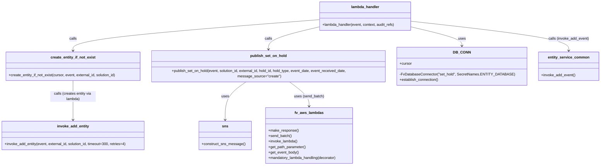

# Diagram: entity_core/entity_service/entity_service/entity/hold/set_hold.py


> Auto-generated by Obscura crawlers

## Diagram 1

```mermaid
graph TD
LH[lambda_handler(event, context, audit_refs)] --> GETIDS[Extract entity_id & solution_id]
GETIDS --> PARSE[Parse body & validate Schema_Validator.HOLD_SET]
PARSE --> DATECHK{activatedEventDate present?}
DATECHK -->|yes| DATE[parse activatedEventDate]
DATECHK -->|no| DATE2[activated_event_date = now]
DATE --> LOCCHK{activatedLocationId present?}
DATE2 --> LOCCHK
LOCKH_CHECK{{dummy}} -->|dummy| LOCKH_CHECK
LOCCHK -->|yes| RESOLVE[resolve_location_id(solution_id, submitted_location_id, event)]
LOCCHK -->|no| NOLOC[location_id = None]
RESOLVE --> DB[DB_CONN.establish_connection -> cursor]
NOLOC --> DB
DB --> CREATE[create_entity_if_not_exist(cursor, event, entity_id, solution_id)]
CREATE --> CHECKTYPE[check_hold_type(cursor, body.type, solution_id) & check_no_existing_hold_of_type(cursor, body.type, entity_id)]
CHECKTYPE --> EXISTCHECK[get_existing_cleared_hold_id(cursor, entity_id, solution_id, hold_payload)]
EXISTCHECK -->|exists| RETURN_EXIST[get_hold_for_id(cursor, hold_id) -> json_dumps -> make_response(existing,201)]
EXISTCHECK -->|not exists| INSERT[set_hold_for_entity(cursor, entity_id, solution_id, hold_payload, event_received_date) -> inserted_row_stub]
INSERT --> HOLDID[hold_id = inserted_row_stub.id]
HOLDID --> GETDESC[get_hold_description(cursor, solution_id, hold_type) & build_fv_event_json(...)]
GETDESC --> ADD_EVENT[entity_service.common.invoke_add_event(event, solution_id, fv_event, entity_id)]
ADD_EVENT --> PUBLISH[publish_set_on_hold(event, solution_id, entity_id, hold_id, hold_type, activated_event_date, event_received_date)]
PUBLISH --> DTCHK{hold_type == "DT"?}
DTCHK -->|yes| DDA[invoke_lambda("dda_override", full_payload=event_copy, invoke_type="Event")]
DTCHK -->|no| DPU[invoke_lambda("dpu_process_exception_and_hold", full_payload=event_copy, invoke_type="Event")]
DDA --> FINAL[get_hold_for_id(cursor, hold_id) -> json_dumps -> make_response(inserted_json,201)]
DPU --> FINAL
```

> SVG rendering failed for this diagram.

## Diagram 2



### SVG

<svg id="container" width="2657.23046875" xmlns="http://www.w3.org/2000/svg" class="classDiagram" height="728" viewBox="0 0 2657.23046875 728" role="graphics-document document" aria-roledescription="class"><style>#container{font-family:"trebuchet ms",verdana,arial,sans-serif;font-size:16px;fill:#333;}@keyframes edge-animation-frame{from{stroke-dashoffset:0;}}@keyframes dash{to{stroke-dashoffset:0;}}#container .edge-animation-slow{stroke-dasharray:9,5!important;stroke-dashoffset:900;animation:dash 50s linear infinite;stroke-linecap:round;}#container .edge-animation-fast{stroke-dasharray:9,5!important;stroke-dashoffset:900;animation:dash 20s linear infinite;stroke-linecap:round;}#container .error-icon{fill:#552222;}#container .error-text{fill:#552222;stroke:#552222;}#container .edge-thickness-normal{stroke-width:1px;}#container .edge-thickness-thick{stroke-width:3.5px;}#container .edge-pattern-solid{stroke-dasharray:0;}#container .edge-thickness-invisible{stroke-width:0;fill:none;}#container .edge-pattern-dashed{stroke-dasharray:3;}#container .edge-pattern-dotted{stroke-dasharray:2;}#container .marker{fill:#333333;stroke:#333333;}#container .marker.cross{stroke:#333333;}#container svg{font-family:"trebuchet ms",verdana,arial,sans-serif;font-size:16px;}#container p{margin:0;}#container g.classGroup text{fill:#9370DB;stroke:none;font-family:"trebuchet ms",verdana,arial,sans-serif;font-size:10px;}#container g.classGroup text .title{font-weight:bolder;}#container .nodeLabel,#container .edgeLabel{color:#131300;}#container .edgeLabel .label rect{fill:#ECECFF;}#container .label text{fill:#131300;}#container .labelBkg{background:#ECECFF;}#container .edgeLabel .label span{background:#ECECFF;}#container .classTitle{font-weight:bolder;}#container .node rect,#container .node circle,#container .node ellipse,#container .node polygon,#container .node path{fill:#ECECFF;stroke:#9370DB;stroke-width:1px;}#container .divider{stroke:#9370DB;stroke-width:1;}#container g.clickable{cursor:pointer;}#container g.classGroup rect{fill:#ECECFF;stroke:#9370DB;}#container g.classGroup line{stroke:#9370DB;stroke-width:1;}#container .classLabel .box{stroke:none;stroke-width:0;fill:#ECECFF;opacity:0.5;}#container .classLabel .label{fill:#9370DB;font-size:10px;}#container .relation{stroke:#333333;stroke-width:1;fill:none;}#container .dashed-line{stroke-dasharray:3;}#container .dotted-line{stroke-dasharray:1 2;}#container #compositionStart,#container .composition{fill:#333333!important;stroke:#333333!important;stroke-width:1;}#container #compositionEnd,#container .composition{fill:#333333!important;stroke:#333333!important;stroke-width:1;}#container #dependencyStart,#container .dependency{fill:#333333!important;stroke:#333333!important;stroke-width:1;}#container #dependencyStart,#container .dependency{fill:#333333!important;stroke:#333333!important;stroke-width:1;}#container #extensionStart,#container .extension{fill:transparent!important;stroke:#333333!important;stroke-width:1;}#container #extensionEnd,#container .extension{fill:transparent!important;stroke:#333333!important;stroke-width:1;}#container #aggregationStart,#container .aggregation{fill:transparent!important;stroke:#333333!important;stroke-width:1;}#container #aggregationEnd,#container .aggregation{fill:transparent!important;stroke:#333333!important;stroke-width:1;}#container #lollipopStart,#container .lollipop{fill:#ECECFF!important;stroke:#333333!important;stroke-width:1;}#container #lollipopEnd,#container .lollipop{fill:#ECECFF!important;stroke:#333333!important;stroke-width:1;}#container .edgeTerminals{font-size:11px;line-height:initial;}#container .classTitleText{text-anchor:middle;font-size:18px;fill:#333;}#container .label-icon{display:inline-block;height:1em;overflow:visible;vertical-align:-0.125em;}#container .node .label-icon path{fill:currentColor;stroke:revert;stroke-width:revert;}#container :root{--mermaid-font-family:"trebuchet ms",verdana,arial,sans-serif;}</style><g><defs><marker id="container_class-aggregationStart" class="marker aggregation class" refX="18" refY="7" markerWidth="190" markerHeight="240" orient="auto"><path d="M 18,7 L9,13 L1,7 L9,1 Z"></path></marker></defs><defs><marker id="container_class-aggregationEnd" class="marker aggregation class" refX="1" refY="7" markerWidth="20" markerHeight="28" orient="auto"><path d="M 18,7 L9,13 L1,7 L9,1 Z"></path></marker></defs><defs><marker id="container_class-extensionStart" class="marker extension class" refX="18" refY="7" markerWidth="190" markerHeight="240" orient="auto"><path d="M 1,7 L18,13 V 1 Z"></path></marker></defs><defs><marker id="container_class-extensionEnd" class="marker extension class" refX="1" refY="7" markerWidth="20" markerHeight="28" orient="auto"><path d="M 1,1 V 13 L18,7 Z"></path></marker></defs><defs><marker id="container_class-compositionStart" class="marker composition class" refX="18" refY="7" markerWidth="190" markerHeight="240" orient="auto"><path d="M 18,7 L9,13 L1,7 L9,1 Z"></path></marker></defs><defs><marker id="container_class-compositionEnd" class="marker composition class" refX="1" refY="7" markerWidth="20" markerHeight="28" orient="auto"><path d="M 18,7 L9,13 L1,7 L9,1 Z"></path></marker></defs><defs><marker id="container_class-dependencyStart" class="marker dependency class" refX="6" refY="7" markerWidth="190" markerHeight="240" orient="auto"><path d="M 5,7 L9,13 L1,7 L9,1 Z"></path></marker></defs><defs><marker id="container_class-dependencyEnd" class="marker dependency class" refX="13" refY="7" markerWidth="20" markerHeight="28" orient="auto"><path d="M 18,7 L9,13 L14,7 L9,1 Z"></path></marker></defs><defs><marker id="container_class-lollipopStart" class="marker lollipop class" refX="13" refY="7" markerWidth="190" markerHeight="240" orient="auto"><circle stroke="black" fill="transparent" cx="7" cy="7" r="6"></circle></marker></defs><defs><marker id="container_class-lollipopEnd" class="marker lollipop class" refX="1" refY="7" markerWidth="190" markerHeight="240" orient="auto"><circle stroke="black" fill="transparent" cx="7" cy="7" r="6"></circle></marker></defs><g class="root"><g class="clusters"></g><g class="edgePaths"><path d="M1842.578,118.297L1880.247,127.081C1917.915,135.865,1993.253,153.432,2030.921,167.383C2068.59,181.333,2068.59,191.667,2068.59,196.833L2068.59,202" id="id_lambda_handler_DB_CONN_1" class="edge-thickness-normal edge-pattern-solid relation" style=";;;" data-edge="true" data-et="edge" data-id="id_lambda_handler_DB_CONN_1" data-points="W3sieCI6MTg0Mi41NzgxMjUsInkiOjExOC4yOTc0MjAzODkxMjc3NX0seyJ4IjoyMDY4LjU4OTg0Mzc1LCJ5IjoxNzF9LHsieCI6MjA2OC41ODk4NDM3NSwieSI6MjA4fV0=" marker-end="url(#container_class-dependencyEnd)"></path><path d="M1436.914,86.426L1251.573,100.522C1066.232,114.617,695.549,142.809,510.208,165.571C324.867,188.333,324.867,205.667,324.867,214.333L324.867,223" id="id_lambda_handler_create_entity_if_not_exist_2" class="edge-thickness-normal edge-pattern-solid relation" style=";;;" data-edge="true" data-et="edge" data-id="id_lambda_handler_create_entity_if_not_exist_2" data-points="W3sieCI6MTQzNi45MTQwNjI1LCJ5Ijo4Ni40MjU5MDk1ODY0OTM1M30seyJ4IjozMjQuODY3MTg3NSwieSI6MTcxfSx7IngiOjMyNC44NjcxODc1LCJ5IjoyMjl9XQ==" marker-end="url(#container_class-dependencyEnd)"></path><path d="M324.867,355L324.867,366.667C324.867,378.333,324.867,401.667,324.867,430.5C324.867,459.333,324.867,493.667,324.867,510.833L324.867,528" id="id_create_entity_if_not_exist_invoke_add_entity_3" class="edge-thickness-normal edge-pattern-solid relation" style=";;;" data-edge="true" data-et="edge" data-id="id_create_entity_if_not_exist_invoke_add_entity_3" data-points="W3sieCI6MzI0Ljg2NzE4NzUsInkiOjM1NX0seyJ4IjozMjQuODY3MTg3NSwieSI6NDI1fSx7IngiOjMyNC44NjcxODc1LCJ5Ijo1MzR9XQ==" marker-end="url(#container_class-dependencyEnd)"></path><path d="M1436.914,118.297L1399.245,127.081C1361.577,135.865,1286.24,153.432,1248.571,170.883C1210.902,188.333,1210.902,205.667,1210.902,214.333L1210.902,223" id="id_lambda_handler_publish_set_on_hold_4" class="edge-thickness-normal edge-pattern-solid relation" style=";;;" data-edge="true" data-et="edge" data-id="id_lambda_handler_publish_set_on_hold_4" data-points="W3sieCI6MTQzNi45MTQwNjI1LCJ5IjoxMTguMjk3NDIwMzg5MTI3NzV9LHsieCI6MTIxMC45MDIzNDM3NSwieSI6MTcxfSx7IngiOjEyMTAuOTAyMzQzNzUsInkiOjIyOX1d" marker-end="url(#container_class-dependencyEnd)"></path><path d="M1114.698,355L1096.883,366.667C1079.067,378.333,1043.436,401.667,1025.62,430.5C1007.805,459.333,1007.805,493.667,1007.805,510.833L1007.805,528" id="id_publish_set_on_hold_sns_5" class="edge-thickness-normal edge-pattern-solid relation" style=";;;" data-edge="true" data-et="edge" data-id="id_publish_set_on_hold_sns_5" data-points="W3sieCI6MTExNC42OTgxOTA3ODk0NzM4LCJ5IjozNTV9LHsieCI6MTAwNy44MDQ2ODc1LCJ5Ijo0MjV9LHsieCI6MTAwNy44MDQ2ODc1LCJ5Ijo1MzR9XQ==" marker-end="url(#container_class-dependencyEnd)"></path><path d="M1295.267,355L1310.89,366.667C1326.513,378.333,1357.76,401.667,1373.383,420.5C1389.006,439.333,1389.006,453.667,1389.006,460.833L1389.006,468" id="id_publish_set_on_hold_fv_aws_lambdas_6" class="edge-thickness-normal edge-pattern-solid relation" style=";;;" data-edge="true" data-et="edge" data-id="id_publish_set_on_hold_fv_aws_lambdas_6" data-points="W3sieCI6MTI5NS4yNjcxNjY5NDA3ODk2LCJ5IjozNTV9LHsieCI6MTM4OS4wMDU4NTkzNzUsInkiOjQyNX0seyJ4IjoxMzg5LjAwNTg1OTM3NSwieSI6NDc0fV0=" marker-end="url(#container_class-dependencyEnd)"></path><path d="M1842.578,94.067L1955.326,106.889C2068.074,119.711,2293.57,145.356,2406.318,166.844C2519.066,188.333,2519.066,205.667,2519.066,214.333L2519.066,223" id="id_lambda_handler_entity_service_common_7" class="edge-thickness-normal edge-pattern-solid relation" style=";;;" data-edge="true" data-et="edge" data-id="id_lambda_handler_entity_service_common_7" data-points="W3sieCI6MTg0Mi41NzgxMjUsInkiOjk0LjA2NjkxMDY5OTg0ODA4fSx7IngiOjI1MTkuMDY2NDA2MjUsInkiOjE3MX0seyJ4IjoyNTE5LjA2NjQwNjI1LCJ5IjoyMjl9XQ==" marker-end="url(#container_class-dependencyEnd)"></path></g><g class="edgeLabels"><g class="edgeLabel" transform="translate(2068.58984375, 171)"><g class="label" data-id="id_lambda_handler_DB_CONN_1" transform="translate(-16.4921875, -12)"><foreignObject width="32.984375" height="24"><div xmlns="http://www.w3.org/1999/xhtml" class="labelBkg" style="display: table-cell; white-space: nowrap; line-height: 1.5; max-width: 200px; text-align: center;"><span class="edgeLabel"><p>uses</p></span></div></foreignObject></g></g><g class="edgeLabel" transform="translate(324.8671875, 171)"><g class="label" data-id="id_lambda_handler_create_entity_if_not_exist_2" transform="translate(-16.4453125, -12)"><foreignObject width="32.890625" height="24"><div xmlns="http://www.w3.org/1999/xhtml" class="labelBkg" style="display: table-cell; white-space: nowrap; line-height: 1.5; max-width: 200px; text-align: center;"><span class="edgeLabel"><p>calls</p></span></div></foreignObject></g></g><g class="edgeLabel" transform="translate(324.8671875, 425)"><g class="label" data-id="id_create_entity_if_not_exist_invoke_add_entity_3" transform="translate(-100, -24)"><foreignObject width="200" height="48"><div xmlns="http://www.w3.org/1999/xhtml" class="labelBkg" style="display: table; white-space: break-spaces; line-height: 1.5; max-width: 200px; text-align: center; width: 200px;"><span class="edgeLabel"><p>calls (creates entity via lambda)</p></span></div></foreignObject></g></g><g class="edgeLabel" transform="translate(1210.90234375, 171)"><g class="label" data-id="id_lambda_handler_publish_set_on_hold_4" transform="translate(-16.4453125, -12)"><foreignObject width="32.890625" height="24"><div xmlns="http://www.w3.org/1999/xhtml" class="labelBkg" style="display: table-cell; white-space: nowrap; line-height: 1.5; max-width: 200px; text-align: center;"><span class="edgeLabel"><p>calls</p></span></div></foreignObject></g></g><g class="edgeLabel" transform="translate(1007.8046875, 425)"><g class="label" data-id="id_publish_set_on_hold_sns_5" transform="translate(-16.4921875, -12)"><foreignObject width="32.984375" height="24"><div xmlns="http://www.w3.org/1999/xhtml" class="labelBkg" style="display: table-cell; white-space: nowrap; line-height: 1.5; max-width: 200px; text-align: center;"><span class="edgeLabel"><p>uses</p></span></div></foreignObject></g></g><g class="edgeLabel" transform="translate(1389.005859375, 425)"><g class="label" data-id="id_publish_set_on_hold_fv_aws_lambdas_6" transform="translate(-65.828125, -12)"><foreignObject width="131.65625" height="24"><div xmlns="http://www.w3.org/1999/xhtml" class="labelBkg" style="display: table-cell; white-space: nowrap; line-height: 1.5; max-width: 200px; text-align: center;"><span class="edgeLabel"><p>uses (send_batch)</p></span></div></foreignObject></g></g><g class="edgeLabel" transform="translate(2519.06640625, 171)"><g class="label" data-id="id_lambda_handler_entity_service_common_7" transform="translate(-89.5234375, -12)"><foreignObject width="179.046875" height="24"><div xmlns="http://www.w3.org/1999/xhtml" class="labelBkg" style="display: table-cell; white-space: nowrap; line-height: 1.5; max-width: 200px; text-align: center;"><span class="edgeLabel"><p>calls (invoke_add_event)</p></span></div></foreignObject></g></g></g><g class="nodes"><g class="node default" id="classId-lambda_handler-0" transform="translate(1639.74609375, 71)"><g class="basic label-container"><path d="M-202.83203125 -63 L202.83203125 -63 L202.83203125 63 L-202.83203125 63" stroke="none" stroke-width="0" fill="#ECECFF" style=""></path><path d="M-202.83203125 -63 C-72.2830705697483 -63, 58.26589011050339 -63, 202.83203125 -63 M-202.83203125 -63 C-100.05345926313768 -63, 2.725112723724635 -63, 202.83203125 -63 M202.83203125 -63 C202.83203125 -33.36131200565117, 202.83203125 -3.7226240113023366, 202.83203125 63 M202.83203125 -63 C202.83203125 -31.794859824459884, 202.83203125 -0.5897196489197682, 202.83203125 63 M202.83203125 63 C117.92543170721531 63, 33.01883216443062 63, -202.83203125 63 M202.83203125 63 C107.24666496344275 63, 11.661298676885508 63, -202.83203125 63 M-202.83203125 63 C-202.83203125 20.062609372899004, -202.83203125 -22.87478125420199, -202.83203125 -63 M-202.83203125 63 C-202.83203125 17.94675330416117, -202.83203125 -27.10649339167766, -202.83203125 -63" stroke="#9370DB" stroke-width="1.3" fill="none" stroke-dasharray="0 0" style=""></path></g><g class="annotation-group text" transform="translate(0, -39)"></g><g class="label-group text" transform="translate(-59.9765625, -39)"><g class="label" style="font-weight: bolder" transform="translate(0,-12)"><foreignObject width="119.953125" height="24"><div xmlns="http://www.w3.org/1999/xhtml" style="display: table-cell; white-space: nowrap; line-height: 1.5; max-width: 170px; text-align: center;"><span class="nodeLabel markdown-node-label" style=""><p>lambda_handler</p></span></div></foreignObject></g></g><g class="members-group text" transform="translate(-190.83203125, 9)"></g><g class="methods-group text" transform="translate(-190.83203125, 39)"><g class="label" style="" transform="translate(0,-12)"><foreignObject width="321.6875" height="24"><div xmlns="http://www.w3.org/1999/xhtml" style="display: table-cell; white-space: nowrap; line-height: 1.5; max-width: 379px; text-align: center;"><span class="nodeLabel markdown-node-label" style=""><p>+lambda_handler(event, context, audit_refs)</p></span></div></foreignObject></g></g><g class="divider" style=""><path d="M-202.83203125 -15 C-54.676292195443665 -15, 93.47944685911267 -15, 202.83203125 -15 M-202.83203125 -15 C-119.25317661166419 -15, -35.674321973328375 -15, 202.83203125 -15" stroke="#9370DB" stroke-width="1.3" fill="none" stroke-dasharray="0 0" style=""></path></g><g class="divider" style=""><path d="M-202.83203125 9 C-42.32142626076558 9, 118.18917872846885 9, 202.83203125 9 M-202.83203125 9 C-47.68806330581813 9, 107.45590463836373 9, 202.83203125 9" stroke="#9370DB" stroke-width="1.3" fill="none" stroke-dasharray="0 0" style=""></path></g></g><g class="node default" id="classId-create_entity_if_not_exist-1" transform="translate(324.8671875, 292)"><g class="basic label-container"><path d="M-298.66015625 -63 L298.66015625 -63 L298.66015625 63 L-298.66015625 63" stroke="none" stroke-width="0" fill="#ECECFF" style=""></path><path d="M-298.66015625 -63 C-172.103498955156 -63, -45.546841660312 -63, 298.66015625 -63 M-298.66015625 -63 C-87.58536685560006 -63, 123.48942253879989 -63, 298.66015625 -63 M298.66015625 -63 C298.66015625 -36.36028228575428, 298.66015625 -9.720564571508568, 298.66015625 63 M298.66015625 -63 C298.66015625 -22.234324206869715, 298.66015625 18.53135158626057, 298.66015625 63 M298.66015625 63 C152.46158590589917 63, 6.2630155617983405 63, -298.66015625 63 M298.66015625 63 C61.03252653596377 63, -176.59510317807246 63, -298.66015625 63 M-298.66015625 63 C-298.66015625 15.560420441362126, -298.66015625 -31.879159117275748, -298.66015625 -63 M-298.66015625 63 C-298.66015625 30.86019901836898, -298.66015625 -1.2796019632620386, -298.66015625 -63" stroke="#9370DB" stroke-width="1.3" fill="none" stroke-dasharray="0 0" style=""></path></g><g class="annotation-group text" transform="translate(0, -39)"></g><g class="label-group text" transform="translate(-95.2265625, -39)"><g class="label" style="font-weight: bolder" transform="translate(0,-12)"><foreignObject width="190.453125" height="24"><div xmlns="http://www.w3.org/1999/xhtml" style="display: table-cell; white-space: nowrap; line-height: 1.5; max-width: 237px; text-align: center;"><span class="nodeLabel markdown-node-label" style=""><p>create_entity_if_not_exist</p></span></div></foreignObject></g></g><g class="members-group text" transform="translate(-286.66015625, 9)"></g><g class="methods-group text" transform="translate(-286.66015625, 39)"><g class="label" style="" transform="translate(0,-12)"><foreignObject width="478.09375" height="24"><div xmlns="http://www.w3.org/1999/xhtml" style="display: table-cell; white-space: nowrap; line-height: 1.5; max-width: 535px; text-align: center;"><span class="nodeLabel markdown-node-label" style=""><p>+create_entity_if_not_exist(cursor, event, external_id, solution_id)</p></span></div></foreignObject></g></g><g class="divider" style=""><path d="M-298.66015625 -15 C-122.82905412410364 -15, 53.00204800179273 -15, 298.66015625 -15 M-298.66015625 -15 C-155.00281608938 -15, -11.345475928759981 -15, 298.66015625 -15" stroke="#9370DB" stroke-width="1.3" fill="none" stroke-dasharray="0 0" style=""></path></g><g class="divider" style=""><path d="M-298.66015625 9 C-154.604815420497 9, -10.54947459099401 9, 298.66015625 9 M-298.66015625 9 C-94.73782922912505 9, 109.18449779174989 9, 298.66015625 9" stroke="#9370DB" stroke-width="1.3" fill="none" stroke-dasharray="0 0" style=""></path></g></g><g class="node default" id="classId-invoke_add_entity-2" transform="translate(324.8671875, 597)"><g class="basic label-container"><path d="M-316.8671875 -63 L316.8671875 -63 L316.8671875 63 L-316.8671875 63" stroke="none" stroke-width="0" fill="#ECECFF" style=""></path><path d="M-316.8671875 -63 C-187.0381086249576 -63, -57.2090297499152 -63, 316.8671875 -63 M-316.8671875 -63 C-153.40781319006732 -63, 10.051561119865369 -63, 316.8671875 -63 M316.8671875 -63 C316.8671875 -36.4999753647178, 316.8671875 -9.99995072943559, 316.8671875 63 M316.8671875 -63 C316.8671875 -37.285458682739105, 316.8671875 -11.570917365478202, 316.8671875 63 M316.8671875 63 C120.60725155636374 63, -75.65268438727253 63, -316.8671875 63 M316.8671875 63 C167.88236419074076 63, 18.89754088148152 63, -316.8671875 63 M-316.8671875 63 C-316.8671875 27.031375988482353, -316.8671875 -8.937248023035295, -316.8671875 -63 M-316.8671875 63 C-316.8671875 30.939382609668954, -316.8671875 -1.1212347806620926, -316.8671875 -63" stroke="#9370DB" stroke-width="1.3" fill="none" stroke-dasharray="0 0" style=""></path></g><g class="annotation-group text" transform="translate(0, -39)"></g><g class="label-group text" transform="translate(-67.65625, -39)"><g class="label" style="font-weight: bolder" transform="translate(0,-12)"><foreignObject width="135.3125" height="24"><div xmlns="http://www.w3.org/1999/xhtml" style="display: table-cell; white-space: nowrap; line-height: 1.5; max-width: 183px; text-align: center;"><span class="nodeLabel markdown-node-label" style=""><p>invoke_add_entity</p></span></div></foreignObject></g></g><g class="members-group text" transform="translate(-304.8671875, 9)"></g><g class="methods-group text" transform="translate(-304.8671875, 39)"><g class="label" style="" transform="translate(0,-12)"><foreignObject width="542.078125" height="24"><div xmlns="http://www.w3.org/1999/xhtml" style="display: table-cell; white-space: nowrap; line-height: 1.5; max-width: 599px; text-align: center;"><span class="nodeLabel markdown-node-label" style=""><p>+invoke_add_entity(event, external_id, solution_id, timeout=300, retries=4)</p></span></div></foreignObject></g></g><g class="divider" style=""><path d="M-316.8671875 -15 C-129.66627298452812 -15, 57.53464153094376 -15, 316.8671875 -15 M-316.8671875 -15 C-145.98345838215982 -15, 24.90027073568035 -15, 316.8671875 -15" stroke="#9370DB" stroke-width="1.3" fill="none" stroke-dasharray="0 0" style=""></path></g><g class="divider" style=""><path d="M-316.8671875 9 C-182.8308801557654 9, -48.79457281153083 9, 316.8671875 9 M-316.8671875 9 C-91.74637607752305 9, 133.3744353449539 9, 316.8671875 9" stroke="#9370DB" stroke-width="1.3" fill="none" stroke-dasharray="0 0" style=""></path></g></g><g class="node default" id="classId-publish_set_on_hold-3" transform="translate(1210.90234375, 292)"><g class="basic label-container"><path d="M-537.375 -63 L537.375 -63 L537.375 63 L-537.375 63" stroke="none" stroke-width="0" fill="#ECECFF" style=""></path><path d="M-537.375 -63 C-241.93266792581431 -63, 53.50966414837137 -63, 537.375 -63 M-537.375 -63 C-292.8627874423943 -63, -48.3505748847885 -63, 537.375 -63 M537.375 -63 C537.375 -19.05878222811048, 537.375 24.88243554377904, 537.375 63 M537.375 -63 C537.375 -22.421587785570203, 537.375 18.156824428859593, 537.375 63 M537.375 63 C214.13687558304918 63, -109.10124883390165 63, -537.375 63 M537.375 63 C296.07056460369927 63, 54.766129207398535 63, -537.375 63 M-537.375 63 C-537.375 20.194958619783613, -537.375 -22.610082760432775, -537.375 -63 M-537.375 63 C-537.375 32.50928185768623, -537.375 2.0185637153724727, -537.375 -63" stroke="#9370DB" stroke-width="1.3" fill="none" stroke-dasharray="0 0" style=""></path></g><g class="annotation-group text" transform="translate(0, -39)"></g><g class="label-group text" transform="translate(-76.640625, -39)"><g class="label" style="font-weight: bolder" transform="translate(0,-12)"><foreignObject width="153.28125" height="24"><div xmlns="http://www.w3.org/1999/xhtml" style="display: table-cell; white-space: nowrap; line-height: 1.5; max-width: 203px; text-align: center;"><span class="nodeLabel markdown-node-label" style=""><p>publish_set_on_hold</p></span></div></foreignObject></g></g><g class="members-group text" transform="translate(-525.375, 9)"></g><g class="methods-group text" transform="translate(-525.375, 39)"><g class="label" style="" transform="translate(0,-12)"><foreignObject width="974.109375" height="24"><div xmlns="http://www.w3.org/1999/xhtml" style="display: table-cell; white-space: nowrap; line-height: 1.5; max-width: 1031px; text-align: center;"><span class="nodeLabel markdown-node-label" style=""><p>+publish_set_on_hold(event, solution_id, external_id, hold_id, hold_type, event_date, event_received_date, message_source="create")</p></span></div></foreignObject></g></g><g class="divider" style=""><path d="M-537.375 -15 C-164.05147140603628 -15, 209.27205718792743 -15, 537.375 -15 M-537.375 -15 C-155.2818101978275 -15, 226.811379604345 -15, 537.375 -15" stroke="#9370DB" stroke-width="1.3" fill="none" stroke-dasharray="0 0" style=""></path></g><g class="divider" style=""><path d="M-537.375 9 C-302.8099659019535 9, -68.24493180390698 9, 537.375 9 M-537.375 9 C-202.81090738123737 9, 131.75318523752526 9, 537.375 9" stroke="#9370DB" stroke-width="1.3" fill="none" stroke-dasharray="0 0" style=""></path></g></g><g class="node default" id="classId-DB_CONN-4" transform="translate(2068.58984375, 292)"><g class="basic label-container"><path d="M-270.3125 -84 L270.3125 -84 L270.3125 84 L-270.3125 84" stroke="none" stroke-width="0" fill="#ECECFF" style=""></path><path d="M-270.3125 -84 C-159.5177929239668 -84, -48.72308584793359 -84, 270.3125 -84 M-270.3125 -84 C-159.02242595714134 -84, -47.732351914282674 -84, 270.3125 -84 M270.3125 -84 C270.3125 -35.00248030055695, 270.3125 13.995039398886107, 270.3125 84 M270.3125 -84 C270.3125 -44.29509646441864, 270.3125 -4.590192928837283, 270.3125 84 M270.3125 84 C141.9482001103736 84, 13.583900220747182 84, -270.3125 84 M270.3125 84 C66.09350718576724 84, -138.12548562846553 84, -270.3125 84 M-270.3125 84 C-270.3125 33.44603062330524, -270.3125 -17.10793875338952, -270.3125 -84 M-270.3125 84 C-270.3125 32.27738840404208, -270.3125 -19.445223191915844, -270.3125 -84" stroke="#9370DB" stroke-width="1.3" fill="none" stroke-dasharray="0 0" style=""></path></g><g class="annotation-group text" transform="translate(0, -60)"></g><g class="label-group text" transform="translate(-34.40625, -60)"><g class="label" style="font-weight: bolder" transform="translate(0,-12)"><foreignObject width="68.8125" height="24"><div xmlns="http://www.w3.org/1999/xhtml" style="display: table-cell; white-space: nowrap; line-height: 1.5; max-width: 119px; text-align: center;"><span class="nodeLabel markdown-node-label" style=""><p>DB_CONN</p></span></div></foreignObject></g></g><g class="members-group text" transform="translate(-258.3125, -12)"><g class="label" style="" transform="translate(0,-12)"><foreignObject width="53.71875" height="24"><div xmlns="http://www.w3.org/1999/xhtml" style="display: table-cell; white-space: nowrap; line-height: 1.5; max-width: 112px; text-align: center;"><span class="nodeLabel markdown-node-label" style=""><p>+cursor</p></span></div></foreignObject></g></g><g class="methods-group text" transform="translate(-258.3125, 36)"><g class="label" style="" transform="translate(0,-12)"><foreignObject width="482.21875" height="24"><div xmlns="http://www.w3.org/1999/xhtml" style="display: table-cell; white-space: nowrap; line-height: 1.5; max-width: 540px; text-align: center;"><span class="nodeLabel markdown-node-label" style=""><p>-FvDatabaseConnector("set_hold", SecretNames.ENTITY_DATABASE)</p></span></div></foreignObject></g><g class="label" style="" transform="translate(0,12)"><foreignObject width="173.265625" height="24"><div xmlns="http://www.w3.org/1999/xhtml" style="display: table-cell; white-space: nowrap; line-height: 1.5; max-width: 231px; text-align: center;"><span class="nodeLabel markdown-node-label" style=""><p>+establish_connection()</p></span></div></foreignObject></g></g><g class="divider" style=""><path d="M-270.3125 -36 C-99.08393340114083 -36, 72.14463319771835 -36, 270.3125 -36 M-270.3125 -36 C-154.798059690811 -36, -39.283619381622 -36, 270.3125 -36" stroke="#9370DB" stroke-width="1.3" fill="none" stroke-dasharray="0 0" style=""></path></g><g class="divider" style=""><path d="M-270.3125 12 C-152.10930102161512 12, -33.90610204323025 12, 270.3125 12 M-270.3125 12 C-97.78694812149672 12, 74.73860375700656 12, 270.3125 12" stroke="#9370DB" stroke-width="1.3" fill="none" stroke-dasharray="0 0" style=""></path></g></g><g class="node default" id="classId-fv_aws_lambdas-5" transform="translate(1389.005859375, 597)"><g class="basic label-container"><path d="M-193.234375 -123 L193.234375 -123 L193.234375 123 L-193.234375 123" stroke="none" stroke-width="0" fill="#ECECFF" style=""></path><path d="M-193.234375 -123 C-58.63258799180713 -123, 75.96919901638574 -123, 193.234375 -123 M-193.234375 -123 C-108.13296717072461 -123, -23.031559341449224 -123, 193.234375 -123 M193.234375 -123 C193.234375 -27.99556525825416, 193.234375 67.00886948349168, 193.234375 123 M193.234375 -123 C193.234375 -31.034044383242133, 193.234375 60.931911233515734, 193.234375 123 M193.234375 123 C42.19791479277555 123, -108.8385454144489 123, -193.234375 123 M193.234375 123 C105.6101405213735 123, 17.98590604274699 123, -193.234375 123 M-193.234375 123 C-193.234375 43.48220700687003, -193.234375 -36.035585986259946, -193.234375 -123 M-193.234375 123 C-193.234375 38.874639364049884, -193.234375 -45.25072127190023, -193.234375 -123" stroke="#9370DB" stroke-width="1.3" fill="none" stroke-dasharray="0 0" style=""></path></g><g class="annotation-group text" transform="translate(0, -99)"></g><g class="label-group text" transform="translate(-60.0625, -99)"><g class="label" style="font-weight: bolder" transform="translate(0,-12)"><foreignObject width="120.125" height="24"><div xmlns="http://www.w3.org/1999/xhtml" style="display: table-cell; white-space: nowrap; line-height: 1.5; max-width: 168px; text-align: center;"><span class="nodeLabel markdown-node-label" style=""><p>fv_aws_lambdas</p></span></div></foreignObject></g></g><g class="members-group text" transform="translate(-181.234375, -51)"></g><g class="methods-group text" transform="translate(-181.234375, -21)"><g class="label" style="" transform="translate(0,-12)"><foreignObject width="131.84375" height="24"><div xmlns="http://www.w3.org/1999/xhtml" style="display: table-cell; white-space: nowrap; line-height: 1.5; max-width: 189px; text-align: center;"><span class="nodeLabel markdown-node-label" style=""><p>+make_response()</p></span></div></foreignObject></g><g class="label" style="" transform="translate(0,12)"><foreignObject width="102.421875" height="24"><div xmlns="http://www.w3.org/1999/xhtml" style="display: table-cell; white-space: nowrap; line-height: 1.5; max-width: 160px; text-align: center;"><span class="nodeLabel markdown-node-label" style=""><p>+send_batch()</p></span></div></foreignObject></g><g class="label" style="" transform="translate(0,36)"><foreignObject width="128.703125" height="24"><div xmlns="http://www.w3.org/1999/xhtml" style="display: table-cell; white-space: nowrap; line-height: 1.5; max-width: 186px; text-align: center;"><span class="nodeLabel markdown-node-label" style=""><p>+invoke_lambda()</p></span></div></foreignObject></g><g class="label" style="" transform="translate(0,60)"><foreignObject width="165.984375" height="24"><div xmlns="http://www.w3.org/1999/xhtml" style="display: table-cell; white-space: nowrap; line-height: 1.5; max-width: 223px; text-align: center;"><span class="nodeLabel markdown-node-label" style=""><p>+get_path_parameter()</p></span></div></foreignObject></g><g class="label" style="" transform="translate(0,84)"><foreignObject width="133.859375" height="24"><div xmlns="http://www.w3.org/1999/xhtml" style="display: table-cell; white-space: nowrap; line-height: 1.5; max-width: 191px; text-align: center;"><span class="nodeLabel markdown-node-label" style=""><p>+get_event_body()</p></span></div></foreignObject></g><g class="label" style="" transform="translate(0,108)"><foreignObject width="302.40625" height="24"><div xmlns="http://www.w3.org/1999/xhtml" style="display: table-cell; white-space: nowrap; line-height: 1.5; max-width: 360px; text-align: center;"><span class="nodeLabel markdown-node-label" style=""><p>+mandatory_lambda_handling(decorator)</p></span></div></foreignObject></g></g><g class="divider" style=""><path d="M-193.234375 -75 C-97.35857050630857 -75, -1.4827660126171338 -75, 193.234375 -75 M-193.234375 -75 C-45.415646732055365 -75, 102.40308153588927 -75, 193.234375 -75" stroke="#9370DB" stroke-width="1.3" fill="none" stroke-dasharray="0 0" style=""></path></g><g class="divider" style=""><path d="M-193.234375 -51 C-84.39805910588414 -51, 24.438256788231712 -51, 193.234375 -51 M-193.234375 -51 C-76.02556699166196 -51, 41.18324101667608 -51, 193.234375 -51" stroke="#9370DB" stroke-width="1.3" fill="none" stroke-dasharray="0 0" style=""></path></g></g><g class="node default" id="classId-entity_service_common-6" transform="translate(2519.06640625, 292)"><g class="basic label-container"><path d="M-130.1640625 -63 L130.1640625 -63 L130.1640625 63 L-130.1640625 63" stroke="none" stroke-width="0" fill="#ECECFF" style=""></path><path d="M-130.1640625 -63 C-42.54348167100211 -63, 45.077099157995775 -63, 130.1640625 -63 M-130.1640625 -63 C-59.831534644389734 -63, 10.500993211220532 -63, 130.1640625 -63 M130.1640625 -63 C130.1640625 -16.531683734569377, 130.1640625 29.936632530861246, 130.1640625 63 M130.1640625 -63 C130.1640625 -28.393084948387667, 130.1640625 6.213830103224666, 130.1640625 63 M130.1640625 63 C28.163235288587543 63, -73.83759192282491 63, -130.1640625 63 M130.1640625 63 C73.65614350320118 63, 17.14822450640237 63, -130.1640625 63 M-130.1640625 63 C-130.1640625 33.82654560221473, -130.1640625 4.653091204429458, -130.1640625 -63 M-130.1640625 63 C-130.1640625 18.40124341100293, -130.1640625 -26.19751317799414, -130.1640625 -63" stroke="#9370DB" stroke-width="1.3" fill="none" stroke-dasharray="0 0" style=""></path></g><g class="annotation-group text" transform="translate(0, -39)"></g><g class="label-group text" transform="translate(-86.421875, -39)"><g class="label" style="font-weight: bolder" transform="translate(0,-12)"><foreignObject width="172.84375" height="24"><div xmlns="http://www.w3.org/1999/xhtml" style="display: table-cell; white-space: nowrap; line-height: 1.5; max-width: 221px; text-align: center;"><span class="nodeLabel markdown-node-label" style=""><p>entity_service_common</p></span></div></foreignObject></g></g><g class="members-group text" transform="translate(-118.1640625, 9)"></g><g class="methods-group text" transform="translate(-118.1640625, 39)"><g class="label" style="" transform="translate(0,-12)"><foreignObject width="149.90625" height="24"><div xmlns="http://www.w3.org/1999/xhtml" style="display: table-cell; white-space: nowrap; line-height: 1.5; max-width: 207px; text-align: center;"><span class="nodeLabel markdown-node-label" style=""><p>+invoke_add_event()</p></span></div></foreignObject></g></g><g class="divider" style=""><path d="M-130.1640625 -15 C-66.51056102201625 -15, -2.857059544032481 -15, 130.1640625 -15 M-130.1640625 -15 C-56.446625699274676 -15, 17.270811101450647 -15, 130.1640625 -15" stroke="#9370DB" stroke-width="1.3" fill="none" stroke-dasharray="0 0" style=""></path></g><g class="divider" style=""><path d="M-130.1640625 9 C-32.52281178242805 9, 65.1184389351439 9, 130.1640625 9 M-130.1640625 9 C-30.402160720608535 9, 69.35974105878293 9, 130.1640625 9" stroke="#9370DB" stroke-width="1.3" fill="none" stroke-dasharray="0 0" style=""></path></g></g><g class="node default" id="classId-sns-7" transform="translate(1007.8046875, 597)"><g class="basic label-container"><path d="M-112.97265625 -63 L112.97265625 -63 L112.97265625 63 L-112.97265625 63" stroke="none" stroke-width="0" fill="#ECECFF" style=""></path><path d="M-112.97265625 -63 C-26.10726912104157 -63, 60.75811800791686 -63, 112.97265625 -63 M-112.97265625 -63 C-65.55564218187011 -63, -18.138628113740225 -63, 112.97265625 -63 M112.97265625 -63 C112.97265625 -31.06081407063919, 112.97265625 0.8783718587216214, 112.97265625 63 M112.97265625 -63 C112.97265625 -21.984166954489275, 112.97265625 19.03166609102145, 112.97265625 63 M112.97265625 63 C35.91850565313982 63, -41.135644943720365 63, -112.97265625 63 M112.97265625 63 C52.20215789794766 63, -8.568340454104685 63, -112.97265625 63 M-112.97265625 63 C-112.97265625 34.168257347092556, -112.97265625 5.336514694185112, -112.97265625 -63 M-112.97265625 63 C-112.97265625 19.174582126737604, -112.97265625 -24.65083574652479, -112.97265625 -63" stroke="#9370DB" stroke-width="1.3" fill="none" stroke-dasharray="0 0" style=""></path></g><g class="annotation-group text" transform="translate(0, -39)"></g><g class="label-group text" transform="translate(-12.3515625, -39)"><g class="label" style="font-weight: bolder" transform="translate(0,-12)"><foreignObject width="24.703125" height="24"><div xmlns="http://www.w3.org/1999/xhtml" style="display: table-cell; white-space: nowrap; line-height: 1.5; max-width: 74px; text-align: center;"><span class="nodeLabel markdown-node-label" style=""><p>sns</p></span></div></foreignObject></g></g><g class="members-group text" transform="translate(-100.97265625, 9)"></g><g class="methods-group text" transform="translate(-100.97265625, 39)"><g class="label" style="" transform="translate(0,-12)"><foreignObject width="189.59375" height="24"><div xmlns="http://www.w3.org/1999/xhtml" style="display: table-cell; white-space: nowrap; line-height: 1.5; max-width: 247px; text-align: center;"><span class="nodeLabel markdown-node-label" style=""><p>+construct_sns_message()</p></span></div></foreignObject></g></g><g class="divider" style=""><path d="M-112.97265625 -15 C-29.76784180565484 -15, 53.43697263869032 -15, 112.97265625 -15 M-112.97265625 -15 C-42.37815473850894 -15, 28.21634677298212 -15, 112.97265625 -15" stroke="#9370DB" stroke-width="1.3" fill="none" stroke-dasharray="0 0" style=""></path></g><g class="divider" style=""><path d="M-112.97265625 9 C-24.145067853319276 9, 64.68252054336145 9, 112.97265625 9 M-112.97265625 9 C-37.036538642194486 9, 38.89957896561103 9, 112.97265625 9" stroke="#9370DB" stroke-width="1.3" fill="none" stroke-dasharray="0 0" style=""></path></g></g></g></g></g></svg>
