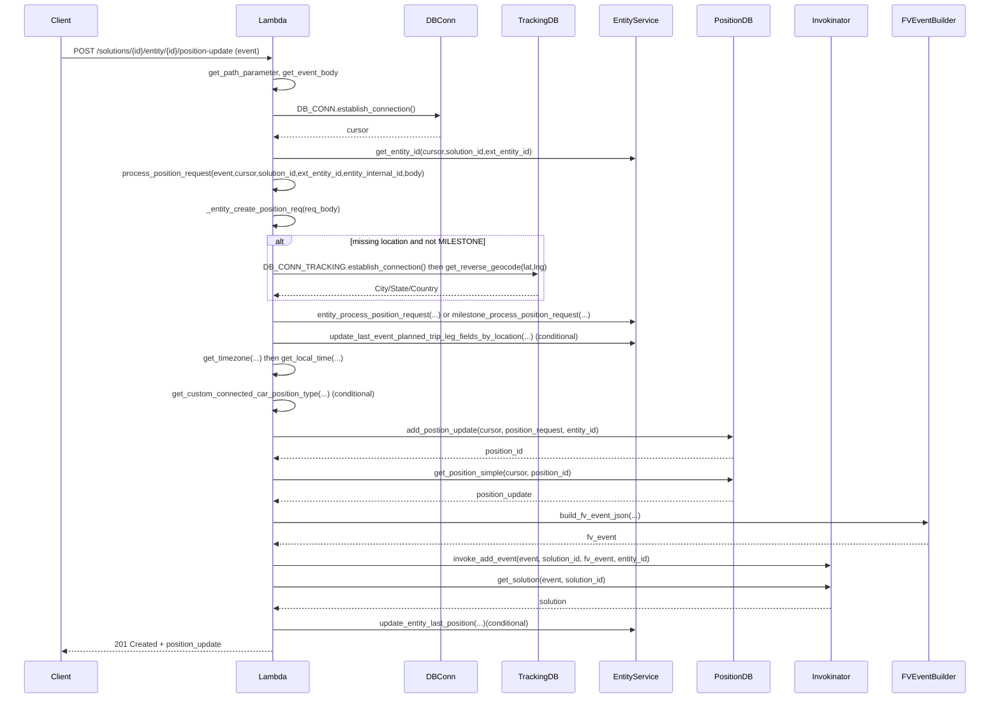

# Diagram: entity_core/entity_service/entity_service/entity/position_update/add_position_update.py


> Auto-generated by Obscura crawlers

## Diagram 1

```mermaid
flowchart TD
  Event[Incoming HTTP Event] --> Lambda[lambda_handler]
  Lambda --> GetPath[get_path_parameter & get_event_body]
  Lambda --> DBConnEstablish[DB_CONN.establish_connection()]
  Lambda --> Cursor[DB_CONN.cursor]
  Lambda --> EntityId[entity_service.db.entity.get_entity_id(...)]
  Lambda --> Process[process_position_request(...)]
  Process --> CreateReq[_entity_create_position_req(req_body)]
  CreateReq --> CheckLoc{city/state/country missing?}
  CheckLoc -->|yes & not MILESTONE| TrackingConn[DB_CONN_TRACKING.establish_connection()]
  TrackingConn --> GetReverse[get_reverse_geocode(lat,lng,need_full=False,cursor=tracking_cursor)]
  GetReverse --> UpdateLoc[position_req.update(city,state,country)]
  CheckLoc -->|no| Continue[continue]
  Process --> Choice{PositionUpdate.SourceType}
  Choice -->|DEFAULT or TAG| EntityProc[entity_process_position_request(...)]
  Choice -->|MILESTONE| MilestoneProc[milestone_process_position_request(...)]
  Choice -->|other| BadReq[BadRequestError]
  Lambda --> UpdateLastEvent[update_last_event_planned_trip_leg_fields_by_location(...) ] 
  Lambda --> GetTZ[get_timezone(city,state,longitude,latitude,event)]
  GetTZ --> GetLocal[get_local_time(datetime, timezone)]
  GetLocal --> SetLocal[position_request["position_update_ts_local"] = local_datetime.strftime(...)]
  Lambda --> MaybeCustom[get_custom_connected_car_position_type(cursor, position_type, solution_id)]
  Lambda --> AddPos[add_postion_update(cursor, position_request, entity_id)]
  AddPos -->|success| GetPos[get_position_simple(cursor, position_id)]
  GetPos --> BuildEvent[build_fv_event_json(...)]
  BuildEvent --> InvokeEvent[invoke_add_event(event, solution_id, fv_event, entity_id)]
  InvokeEvent --> Invokinator[invokinator.get_solution(event, solution_id)]
  Invokinator --> Scrub[scrub_position_pre_entity_update(position_update)]
  Scrub --> CondUpdate{feature_name in UPDATE_ON_ENTITY?}
  CondUpdate -->|yes| UpdateEntity[update_entity_last_position(...)]
  CondUpdate -->|no| SkipUpdate[skip update]
  Lambda --> Response[make_response(json_dumps(position_update), status_code=201)]
  AddPos -.->|psycopg2.Error| DBError[DatabaseError raised]
```

> SVG rendering failed for this diagram.

## Diagram 2



### SVG

<svg id="container" width="2113" xmlns="http://www.w3.org/2000/svg" height="1528" viewBox="-50 -10 2113 1528" role="graphics-document document" aria-roledescription="sequence"><g><rect x="1863" y="1442" fill="#eaeaea" stroke="#666" width="150" height="65" name="FVEventBuilder" rx="3" ry="3" class="actor actor-bottom"></rect><text x="1938" y="1474.5" dominant-baseline="central" alignment-baseline="central" class="actor actor-box" style="text-anchor: middle; font-size: 16px; font-weight: 400;"><tspan x="1938" dy="0">FVEventBuilder</tspan></text></g><g><rect x="1663" y="1442" fill="#eaeaea" stroke="#666" width="150" height="65" name="Invokinator" rx="3" ry="3" class="actor actor-bottom"></rect><text x="1738" y="1474.5" dominant-baseline="central" alignment-baseline="central" class="actor actor-box" style="text-anchor: middle; font-size: 16px; font-weight: 400;"><tspan x="1738" dy="0">Invokinator</tspan></text></g><g><rect x="1463" y="1442" fill="#eaeaea" stroke="#666" width="150" height="65" name="PositionDB" rx="3" ry="3" class="actor actor-bottom"></rect><text x="1538" y="1474.5" dominant-baseline="central" alignment-baseline="central" class="actor actor-box" style="text-anchor: middle; font-size: 16px; font-weight: 400;"><tspan x="1538" dy="0">PositionDB</tspan></text></g><g><rect x="1263" y="1442" fill="#eaeaea" stroke="#666" width="150" height="65" name="EntityService" rx="3" ry="3" class="actor actor-bottom"></rect><text x="1338" y="1474.5" dominant-baseline="central" alignment-baseline="central" class="actor actor-box" style="text-anchor: middle; font-size: 16px; font-weight: 400;"><tspan x="1338" dy="0">EntityService</tspan></text></g><g><rect x="1063" y="1442" fill="#eaeaea" stroke="#666" width="150" height="65" name="TrackingDB" rx="3" ry="3" class="actor actor-bottom"></rect><text x="1138" y="1474.5" dominant-baseline="central" alignment-baseline="central" class="actor actor-box" style="text-anchor: middle; font-size: 16px; font-weight: 400;"><tspan x="1138" dy="0">TrackingDB</tspan></text></g><g><rect x="863" y="1442" fill="#eaeaea" stroke="#666" width="150" height="65" name="DBConn" rx="3" ry="3" class="actor actor-bottom"></rect><text x="938" y="1474.5" dominant-baseline="central" alignment-baseline="central" class="actor actor-box" style="text-anchor: middle; font-size: 16px; font-weight: 400;"><tspan x="938" dy="0">DBConn</tspan></text></g><g><rect x="482" y="1442" fill="#eaeaea" stroke="#666" width="150" height="65" name="Lambda" rx="3" ry="3" class="actor actor-bottom"></rect><text x="557" y="1474.5" dominant-baseline="central" alignment-baseline="central" class="actor actor-box" style="text-anchor: middle; font-size: 16px; font-weight: 400;"><tspan x="557" dy="0">Lambda</tspan></text></g><g><rect x="0" y="1442" fill="#eaeaea" stroke="#666" width="150" height="65" name="Client" rx="3" ry="3" class="actor actor-bottom"></rect><text x="75" y="1474.5" dominant-baseline="central" alignment-baseline="central" class="actor actor-box" style="text-anchor: middle; font-size: 16px; font-weight: 400;"><tspan x="75" dy="0">Client</tspan></text></g><g><line id="actor7" x1="1938" y1="65" x2="1938" y2="1442" class="actor-line 200" stroke-width="0.5px" stroke="#999" name="FVEventBuilder"></line><g id="root-7"><rect x="1863" y="0" fill="#eaeaea" stroke="#666" width="150" height="65" name="FVEventBuilder" rx="3" ry="3" class="actor actor-top"></rect><text x="1938" y="32.5" dominant-baseline="central" alignment-baseline="central" class="actor actor-box" style="text-anchor: middle; font-size: 16px; font-weight: 400;"><tspan x="1938" dy="0">FVEventBuilder</tspan></text></g></g><g><line id="actor6" x1="1738" y1="65" x2="1738" y2="1442" class="actor-line 200" stroke-width="0.5px" stroke="#999" name="Invokinator"></line><g id="root-6"><rect x="1663" y="0" fill="#eaeaea" stroke="#666" width="150" height="65" name="Invokinator" rx="3" ry="3" class="actor actor-top"></rect><text x="1738" y="32.5" dominant-baseline="central" alignment-baseline="central" class="actor actor-box" style="text-anchor: middle; font-size: 16px; font-weight: 400;"><tspan x="1738" dy="0">Invokinator</tspan></text></g></g><g><line id="actor5" x1="1538" y1="65" x2="1538" y2="1442" class="actor-line 200" stroke-width="0.5px" stroke="#999" name="PositionDB"></line><g id="root-5"><rect x="1463" y="0" fill="#eaeaea" stroke="#666" width="150" height="65" name="PositionDB" rx="3" ry="3" class="actor actor-top"></rect><text x="1538" y="32.5" dominant-baseline="central" alignment-baseline="central" class="actor actor-box" style="text-anchor: middle; font-size: 16px; font-weight: 400;"><tspan x="1538" dy="0">PositionDB</tspan></text></g></g><g><line id="actor4" x1="1338" y1="65" x2="1338" y2="1442" class="actor-line 200" stroke-width="0.5px" stroke="#999" name="EntityService"></line><g id="root-4"><rect x="1263" y="0" fill="#eaeaea" stroke="#666" width="150" height="65" name="EntityService" rx="3" ry="3" class="actor actor-top"></rect><text x="1338" y="32.5" dominant-baseline="central" alignment-baseline="central" class="actor actor-box" style="text-anchor: middle; font-size: 16px; font-weight: 400;"><tspan x="1338" dy="0">EntityService</tspan></text></g></g><g><line id="actor3" x1="1138" y1="65" x2="1138" y2="1442" class="actor-line 200" stroke-width="0.5px" stroke="#999" name="TrackingDB"></line><g id="root-3"><rect x="1063" y="0" fill="#eaeaea" stroke="#666" width="150" height="65" name="TrackingDB" rx="3" ry="3" class="actor actor-top"></rect><text x="1138" y="32.5" dominant-baseline="central" alignment-baseline="central" class="actor actor-box" style="text-anchor: middle; font-size: 16px; font-weight: 400;"><tspan x="1138" dy="0">TrackingDB</tspan></text></g></g><g><line id="actor2" x1="938" y1="65" x2="938" y2="1442" class="actor-line 200" stroke-width="0.5px" stroke="#999" name="DBConn"></line><g id="root-2"><rect x="863" y="0" fill="#eaeaea" stroke="#666" width="150" height="65" name="DBConn" rx="3" ry="3" class="actor actor-top"></rect><text x="938" y="32.5" dominant-baseline="central" alignment-baseline="central" class="actor actor-box" style="text-anchor: middle; font-size: 16px; font-weight: 400;"><tspan x="938" dy="0">DBConn</tspan></text></g></g><g><line id="actor1" x1="557" y1="65" x2="557" y2="1442" class="actor-line 200" stroke-width="0.5px" stroke="#999" name="Lambda"></line><g id="root-1"><rect x="482" y="0" fill="#eaeaea" stroke="#666" width="150" height="65" name="Lambda" rx="3" ry="3" class="actor actor-top"></rect><text x="557" y="32.5" dominant-baseline="central" alignment-baseline="central" class="actor actor-box" style="text-anchor: middle; font-size: 16px; font-weight: 400;"><tspan x="557" dy="0">Lambda</tspan></text></g></g><g><line id="actor0" x1="75" y1="65" x2="75" y2="1442" class="actor-line 200" stroke-width="0.5px" stroke="#999" name="Client"></line><g id="root-0"><rect x="0" y="0" fill="#eaeaea" stroke="#666" width="150" height="65" name="Client" rx="3" ry="3" class="actor actor-top"></rect><text x="75" y="32.5" dominant-baseline="central" alignment-baseline="central" class="actor actor-box" style="text-anchor: middle; font-size: 16px; font-weight: 400;"><tspan x="75" dy="0">Client</tspan></text></g></g><style>#container{font-family:"trebuchet ms",verdana,arial,sans-serif;font-size:16px;fill:#333;}@keyframes edge-animation-frame{from{stroke-dashoffset:0;}}@keyframes dash{to{stroke-dashoffset:0;}}#container .edge-animation-slow{stroke-dasharray:9,5!important;stroke-dashoffset:900;animation:dash 50s linear infinite;stroke-linecap:round;}#container .edge-animation-fast{stroke-dasharray:9,5!important;stroke-dashoffset:900;animation:dash 20s linear infinite;stroke-linecap:round;}#container .error-icon{fill:#552222;}#container .error-text{fill:#552222;stroke:#552222;}#container .edge-thickness-normal{stroke-width:1px;}#container .edge-thickness-thick{stroke-width:3.5px;}#container .edge-pattern-solid{stroke-dasharray:0;}#container .edge-thickness-invisible{stroke-width:0;fill:none;}#container .edge-pattern-dashed{stroke-dasharray:3;}#container .edge-pattern-dotted{stroke-dasharray:2;}#container .marker{fill:#333333;stroke:#333333;}#container .marker.cross{stroke:#333333;}#container svg{font-family:"trebuchet ms",verdana,arial,sans-serif;font-size:16px;}#container p{margin:0;}#container .actor{stroke:hsl(259.6261682243, 59.7765363128%, 87.9019607843%);fill:#ECECFF;}#container text.actor&gt;tspan{fill:black;stroke:none;}#container .actor-line{stroke:hsl(259.6261682243, 59.7765363128%, 87.9019607843%);}#container .innerArc{stroke-width:1.5;stroke-dasharray:none;}#container .messageLine0{stroke-width:1.5;stroke-dasharray:none;stroke:#333;}#container .messageLine1{stroke-width:1.5;stroke-dasharray:2,2;stroke:#333;}#container #arrowhead path{fill:#333;stroke:#333;}#container .sequenceNumber{fill:white;}#container #sequencenumber{fill:#333;}#container #crosshead path{fill:#333;stroke:#333;}#container .messageText{fill:#333;stroke:none;}#container .labelBox{stroke:hsl(259.6261682243, 59.7765363128%, 87.9019607843%);fill:#ECECFF;}#container .labelText,#container .labelText&gt;tspan{fill:black;stroke:none;}#container .loopText,#container .loopText&gt;tspan{fill:black;stroke:none;}#container .loopLine{stroke-width:2px;stroke-dasharray:2,2;stroke:hsl(259.6261682243, 59.7765363128%, 87.9019607843%);fill:hsl(259.6261682243, 59.7765363128%, 87.9019607843%);}#container .note{stroke:#aaaa33;fill:#fff5ad;}#container .noteText,#container .noteText&gt;tspan{fill:black;stroke:none;}#container .activation0{fill:#f4f4f4;stroke:#666;}#container .activation1{fill:#f4f4f4;stroke:#666;}#container .activation2{fill:#f4f4f4;stroke:#666;}#container .actorPopupMenu{position:absolute;}#container .actorPopupMenuPanel{position:absolute;fill:#ECECFF;box-shadow:0px 8px 16px 0px rgba(0,0,0,0.2);filter:drop-shadow(3px 5px 2px rgb(0 0 0 / 0.4));}#container .actor-man line{stroke:hsl(259.6261682243, 59.7765363128%, 87.9019607843%);fill:#ECECFF;}#container .actor-man circle,#container line{stroke:hsl(259.6261682243, 59.7765363128%, 87.9019607843%);fill:#ECECFF;stroke-width:2px;}#container :root{--mermaid-font-family:"trebuchet ms",verdana,arial,sans-serif;}</style><g></g><defs><symbol id="computer" width="24" height="24"><path transform="scale(.5)" d="M2 2v13h20v-13h-20zm18 11h-16v-9h16v9zm-10.228 6l.466-1h3.524l.467 1h-4.457zm14.228 3h-24l2-6h2.104l-1.33 4h18.45l-1.297-4h2.073l2 6zm-5-10h-14v-7h14v7z"></path></symbol></defs><defs><symbol id="database" fill-rule="evenodd" clip-rule="evenodd"><path transform="scale(.5)" d="M12.258.001l.256.004.255.005.253.008.251.01.249.012.247.015.246.016.242.019.241.02.239.023.236.024.233.027.231.028.229.031.225.032.223.034.22.036.217.038.214.04.211.041.208.043.205.045.201.046.198.048.194.05.191.051.187.053.183.054.18.056.175.057.172.059.168.06.163.061.16.063.155.064.15.066.074.033.073.033.071.034.07.034.069.035.068.035.067.035.066.035.064.036.064.036.062.036.06.036.06.037.058.037.058.037.055.038.055.038.053.038.052.038.051.039.05.039.048.039.047.039.045.04.044.04.043.04.041.04.04.041.039.041.037.041.036.041.034.041.033.042.032.042.03.042.029.042.027.042.026.043.024.043.023.043.021.043.02.043.018.044.017.043.015.044.013.044.012.044.011.045.009.044.007.045.006.045.004.045.002.045.001.045v17l-.001.045-.002.045-.004.045-.006.045-.007.045-.009.044-.011.045-.012.044-.013.044-.015.044-.017.043-.018.044-.02.043-.021.043-.023.043-.024.043-.026.043-.027.042-.029.042-.03.042-.032.042-.033.042-.034.041-.036.041-.037.041-.039.041-.04.041-.041.04-.043.04-.044.04-.045.04-.047.039-.048.039-.05.039-.051.039-.052.038-.053.038-.055.038-.055.038-.058.037-.058.037-.06.037-.06.036-.062.036-.064.036-.064.036-.066.035-.067.035-.068.035-.069.035-.07.034-.071.034-.073.033-.074.033-.15.066-.155.064-.16.063-.163.061-.168.06-.172.059-.175.057-.18.056-.183.054-.187.053-.191.051-.194.05-.198.048-.201.046-.205.045-.208.043-.211.041-.214.04-.217.038-.22.036-.223.034-.225.032-.229.031-.231.028-.233.027-.236.024-.239.023-.241.02-.242.019-.246.016-.247.015-.249.012-.251.01-.253.008-.255.005-.256.004-.258.001-.258-.001-.256-.004-.255-.005-.253-.008-.251-.01-.249-.012-.247-.015-.245-.016-.243-.019-.241-.02-.238-.023-.236-.024-.234-.027-.231-.028-.228-.031-.226-.032-.223-.034-.22-.036-.217-.038-.214-.04-.211-.041-.208-.043-.204-.045-.201-.046-.198-.048-.195-.05-.19-.051-.187-.053-.184-.054-.179-.056-.176-.057-.172-.059-.167-.06-.164-.061-.159-.063-.155-.064-.151-.066-.074-.033-.072-.033-.072-.034-.07-.034-.069-.035-.068-.035-.067-.035-.066-.035-.064-.036-.063-.036-.062-.036-.061-.036-.06-.037-.058-.037-.057-.037-.056-.038-.055-.038-.053-.038-.052-.038-.051-.039-.049-.039-.049-.039-.046-.039-.046-.04-.044-.04-.043-.04-.041-.04-.04-.041-.039-.041-.037-.041-.036-.041-.034-.041-.033-.042-.032-.042-.03-.042-.029-.042-.027-.042-.026-.043-.024-.043-.023-.043-.021-.043-.02-.043-.018-.044-.017-.043-.015-.044-.013-.044-.012-.044-.011-.045-.009-.044-.007-.045-.006-.045-.004-.045-.002-.045-.001-.045v-17l.001-.045.002-.045.004-.045.006-.045.007-.045.009-.044.011-.045.012-.044.013-.044.015-.044.017-.043.018-.044.02-.043.021-.043.023-.043.024-.043.026-.043.027-.042.029-.042.03-.042.032-.042.033-.042.034-.041.036-.041.037-.041.039-.041.04-.041.041-.04.043-.04.044-.04.046-.04.046-.039.049-.039.049-.039.051-.039.052-.038.053-.038.055-.038.056-.038.057-.037.058-.037.06-.037.061-.036.062-.036.063-.036.064-.036.066-.035.067-.035.068-.035.069-.035.07-.034.072-.034.072-.033.074-.033.151-.066.155-.064.159-.063.164-.061.167-.06.172-.059.176-.057.179-.056.184-.054.187-.053.19-.051.195-.05.198-.048.201-.046.204-.045.208-.043.211-.041.214-.04.217-.038.22-.036.223-.034.226-.032.228-.031.231-.028.234-.027.236-.024.238-.023.241-.02.243-.019.245-.016.247-.015.249-.012.251-.01.253-.008.255-.005.256-.004.258-.001.258.001zm-9.258 20.499v.01l.001.021.003.021.004.022.005.021.006.022.007.022.009.023.01.022.011.023.012.023.013.023.015.023.016.024.017.023.018.024.019.024.021.024.022.025.023.024.024.025.052.049.056.05.061.051.066.051.07.051.075.051.079.052.084.052.088.052.092.052.097.052.102.051.105.052.11.052.114.051.119.051.123.051.127.05.131.05.135.05.139.048.144.049.147.047.152.047.155.047.16.045.163.045.167.043.171.043.176.041.178.041.183.039.187.039.19.037.194.035.197.035.202.033.204.031.209.03.212.029.216.027.219.025.222.024.226.021.23.02.233.018.236.016.24.015.243.012.246.01.249.008.253.005.256.004.259.001.26-.001.257-.004.254-.005.25-.008.247-.011.244-.012.241-.014.237-.016.233-.018.231-.021.226-.021.224-.024.22-.026.216-.027.212-.028.21-.031.205-.031.202-.034.198-.034.194-.036.191-.037.187-.039.183-.04.179-.04.175-.042.172-.043.168-.044.163-.045.16-.046.155-.046.152-.047.148-.048.143-.049.139-.049.136-.05.131-.05.126-.05.123-.051.118-.052.114-.051.11-.052.106-.052.101-.052.096-.052.092-.052.088-.053.083-.051.079-.052.074-.052.07-.051.065-.051.06-.051.056-.05.051-.05.023-.024.023-.025.021-.024.02-.024.019-.024.018-.024.017-.024.015-.023.014-.024.013-.023.012-.023.01-.023.01-.022.008-.022.006-.022.006-.022.004-.022.004-.021.001-.021.001-.021v-4.127l-.077.055-.08.053-.083.054-.085.053-.087.052-.09.052-.093.051-.095.05-.097.05-.1.049-.102.049-.105.048-.106.047-.109.047-.111.046-.114.045-.115.045-.118.044-.12.043-.122.042-.124.042-.126.041-.128.04-.13.04-.132.038-.134.038-.135.037-.138.037-.139.035-.142.035-.143.034-.144.033-.147.032-.148.031-.15.03-.151.03-.153.029-.154.027-.156.027-.158.026-.159.025-.161.024-.162.023-.163.022-.165.021-.166.02-.167.019-.169.018-.169.017-.171.016-.173.015-.173.014-.175.013-.175.012-.177.011-.178.01-.179.008-.179.008-.181.006-.182.005-.182.004-.184.003-.184.002h-.37l-.184-.002-.184-.003-.182-.004-.182-.005-.181-.006-.179-.008-.179-.008-.178-.01-.176-.011-.176-.012-.175-.013-.173-.014-.172-.015-.171-.016-.17-.017-.169-.018-.167-.019-.166-.02-.165-.021-.163-.022-.162-.023-.161-.024-.159-.025-.157-.026-.156-.027-.155-.027-.153-.029-.151-.03-.15-.03-.148-.031-.146-.032-.145-.033-.143-.034-.141-.035-.14-.035-.137-.037-.136-.037-.134-.038-.132-.038-.13-.04-.128-.04-.126-.041-.124-.042-.122-.042-.12-.044-.117-.043-.116-.045-.113-.045-.112-.046-.109-.047-.106-.047-.105-.048-.102-.049-.1-.049-.097-.05-.095-.05-.093-.052-.09-.051-.087-.052-.085-.053-.083-.054-.08-.054-.077-.054v4.127zm0-5.654v.011l.001.021.003.021.004.021.005.022.006.022.007.022.009.022.01.022.011.023.012.023.013.023.015.024.016.023.017.024.018.024.019.024.021.024.022.024.023.025.024.024.052.05.056.05.061.05.066.051.07.051.075.052.079.051.084.052.088.052.092.052.097.052.102.052.105.052.11.051.114.051.119.052.123.05.127.051.131.05.135.049.139.049.144.048.147.048.152.047.155.046.16.045.163.045.167.044.171.042.176.042.178.04.183.04.187.038.19.037.194.036.197.034.202.033.204.032.209.03.212.028.216.027.219.025.222.024.226.022.23.02.233.018.236.016.24.014.243.012.246.01.249.008.253.006.256.003.259.001.26-.001.257-.003.254-.006.25-.008.247-.01.244-.012.241-.015.237-.016.233-.018.231-.02.226-.022.224-.024.22-.025.216-.027.212-.029.21-.03.205-.032.202-.033.198-.035.194-.036.191-.037.187-.039.183-.039.179-.041.175-.042.172-.043.168-.044.163-.045.16-.045.155-.047.152-.047.148-.048.143-.048.139-.05.136-.049.131-.05.126-.051.123-.051.118-.051.114-.052.11-.052.106-.052.101-.052.096-.052.092-.052.088-.052.083-.052.079-.052.074-.051.07-.052.065-.051.06-.05.056-.051.051-.049.023-.025.023-.024.021-.025.02-.024.019-.024.018-.024.017-.024.015-.023.014-.023.013-.024.012-.022.01-.023.01-.023.008-.022.006-.022.006-.022.004-.021.004-.022.001-.021.001-.021v-4.139l-.077.054-.08.054-.083.054-.085.052-.087.053-.09.051-.093.051-.095.051-.097.05-.1.049-.102.049-.105.048-.106.047-.109.047-.111.046-.114.045-.115.044-.118.044-.12.044-.122.042-.124.042-.126.041-.128.04-.13.039-.132.039-.134.038-.135.037-.138.036-.139.036-.142.035-.143.033-.144.033-.147.033-.148.031-.15.03-.151.03-.153.028-.154.028-.156.027-.158.026-.159.025-.161.024-.162.023-.163.022-.165.021-.166.02-.167.019-.169.018-.169.017-.171.016-.173.015-.173.014-.175.013-.175.012-.177.011-.178.009-.179.009-.179.007-.181.007-.182.005-.182.004-.184.003-.184.002h-.37l-.184-.002-.184-.003-.182-.004-.182-.005-.181-.007-.179-.007-.179-.009-.178-.009-.176-.011-.176-.012-.175-.013-.173-.014-.172-.015-.171-.016-.17-.017-.169-.018-.167-.019-.166-.02-.165-.021-.163-.022-.162-.023-.161-.024-.159-.025-.157-.026-.156-.027-.155-.028-.153-.028-.151-.03-.15-.03-.148-.031-.146-.033-.145-.033-.143-.033-.141-.035-.14-.036-.137-.036-.136-.037-.134-.038-.132-.039-.13-.039-.128-.04-.126-.041-.124-.042-.122-.043-.12-.043-.117-.044-.116-.044-.113-.046-.112-.046-.109-.046-.106-.047-.105-.048-.102-.049-.1-.049-.097-.05-.095-.051-.093-.051-.09-.051-.087-.053-.085-.052-.083-.054-.08-.054-.077-.054v4.139zm0-5.666v.011l.001.02.003.022.004.021.005.022.006.021.007.022.009.023.01.022.011.023.012.023.013.023.015.023.016.024.017.024.018.023.019.024.021.025.022.024.023.024.024.025.052.05.056.05.061.05.066.051.07.051.075.052.079.051.084.052.088.052.092.052.097.052.102.052.105.051.11.052.114.051.119.051.123.051.127.05.131.05.135.05.139.049.144.048.147.048.152.047.155.046.16.045.163.045.167.043.171.043.176.042.178.04.183.04.187.038.19.037.194.036.197.034.202.033.204.032.209.03.212.028.216.027.219.025.222.024.226.021.23.02.233.018.236.017.24.014.243.012.246.01.249.008.253.006.256.003.259.001.26-.001.257-.003.254-.006.25-.008.247-.01.244-.013.241-.014.237-.016.233-.018.231-.02.226-.022.224-.024.22-.025.216-.027.212-.029.21-.03.205-.032.202-.033.198-.035.194-.036.191-.037.187-.039.183-.039.179-.041.175-.042.172-.043.168-.044.163-.045.16-.045.155-.047.152-.047.148-.048.143-.049.139-.049.136-.049.131-.051.126-.05.123-.051.118-.052.114-.051.11-.052.106-.052.101-.052.096-.052.092-.052.088-.052.083-.052.079-.052.074-.052.07-.051.065-.051.06-.051.056-.05.051-.049.023-.025.023-.025.021-.024.02-.024.019-.024.018-.024.017-.024.015-.023.014-.024.013-.023.012-.023.01-.022.01-.023.008-.022.006-.022.006-.022.004-.022.004-.021.001-.021.001-.021v-4.153l-.077.054-.08.054-.083.053-.085.053-.087.053-.09.051-.093.051-.095.051-.097.05-.1.049-.102.048-.105.048-.106.048-.109.046-.111.046-.114.046-.115.044-.118.044-.12.043-.122.043-.124.042-.126.041-.128.04-.13.039-.132.039-.134.038-.135.037-.138.036-.139.036-.142.034-.143.034-.144.033-.147.032-.148.032-.15.03-.151.03-.153.028-.154.028-.156.027-.158.026-.159.024-.161.024-.162.023-.163.023-.165.021-.166.02-.167.019-.169.018-.169.017-.171.016-.173.015-.173.014-.175.013-.175.012-.177.01-.178.01-.179.009-.179.007-.181.006-.182.006-.182.004-.184.003-.184.001-.185.001-.185-.001-.184-.001-.184-.003-.182-.004-.182-.006-.181-.006-.179-.007-.179-.009-.178-.01-.176-.01-.176-.012-.175-.013-.173-.014-.172-.015-.171-.016-.17-.017-.169-.018-.167-.019-.166-.02-.165-.021-.163-.023-.162-.023-.161-.024-.159-.024-.157-.026-.156-.027-.155-.028-.153-.028-.151-.03-.15-.03-.148-.032-.146-.032-.145-.033-.143-.034-.141-.034-.14-.036-.137-.036-.136-.037-.134-.038-.132-.039-.13-.039-.128-.041-.126-.041-.124-.041-.122-.043-.12-.043-.117-.044-.116-.044-.113-.046-.112-.046-.109-.046-.106-.048-.105-.048-.102-.048-.1-.05-.097-.049-.095-.051-.093-.051-.09-.052-.087-.052-.085-.053-.083-.053-.08-.054-.077-.054v4.153zm8.74-8.179l-.257.004-.254.005-.25.008-.247.011-.244.012-.241.014-.237.016-.233.018-.231.021-.226.022-.224.023-.22.026-.216.027-.212.028-.21.031-.205.032-.202.033-.198.034-.194.036-.191.038-.187.038-.183.04-.179.041-.175.042-.172.043-.168.043-.163.045-.16.046-.155.046-.152.048-.148.048-.143.048-.139.049-.136.05-.131.05-.126.051-.123.051-.118.051-.114.052-.11.052-.106.052-.101.052-.096.052-.092.052-.088.052-.083.052-.079.052-.074.051-.07.052-.065.051-.06.05-.056.05-.051.05-.023.025-.023.024-.021.024-.02.025-.019.024-.018.024-.017.023-.015.024-.014.023-.013.023-.012.023-.01.023-.01.022-.008.022-.006.023-.006.021-.004.022-.004.021-.001.021-.001.021.001.021.001.021.004.021.004.022.006.021.006.023.008.022.01.022.01.023.012.023.013.023.014.023.015.024.017.023.018.024.019.024.02.025.021.024.023.024.023.025.051.05.056.05.06.05.065.051.07.052.074.051.079.052.083.052.088.052.092.052.096.052.101.052.106.052.11.052.114.052.118.051.123.051.126.051.131.05.136.05.139.049.143.048.148.048.152.048.155.046.16.046.163.045.168.043.172.043.175.042.179.041.183.04.187.038.191.038.194.036.198.034.202.033.205.032.21.031.212.028.216.027.22.026.224.023.226.022.231.021.233.018.237.016.241.014.244.012.247.011.25.008.254.005.257.004.26.001.26-.001.257-.004.254-.005.25-.008.247-.011.244-.012.241-.014.237-.016.233-.018.231-.021.226-.022.224-.023.22-.026.216-.027.212-.028.21-.031.205-.032.202-.033.198-.034.194-.036.191-.038.187-.038.183-.04.179-.041.175-.042.172-.043.168-.043.163-.045.16-.046.155-.046.152-.048.148-.048.143-.048.139-.049.136-.05.131-.05.126-.051.123-.051.118-.051.114-.052.11-.052.106-.052.101-.052.096-.052.092-.052.088-.052.083-.052.079-.052.074-.051.07-.052.065-.051.06-.05.056-.05.051-.05.023-.025.023-.024.021-.024.02-.025.019-.024.018-.024.017-.023.015-.024.014-.023.013-.023.012-.023.01-.023.01-.022.008-.022.006-.023.006-.021.004-.022.004-.021.001-.021.001-.021-.001-.021-.001-.021-.004-.021-.004-.022-.006-.021-.006-.023-.008-.022-.01-.022-.01-.023-.012-.023-.013-.023-.014-.023-.015-.024-.017-.023-.018-.024-.019-.024-.02-.025-.021-.024-.023-.024-.023-.025-.051-.05-.056-.05-.06-.05-.065-.051-.07-.052-.074-.051-.079-.052-.083-.052-.088-.052-.092-.052-.096-.052-.101-.052-.106-.052-.11-.052-.114-.052-.118-.051-.123-.051-.126-.051-.131-.05-.136-.05-.139-.049-.143-.048-.148-.048-.152-.048-.155-.046-.16-.046-.163-.045-.168-.043-.172-.043-.175-.042-.179-.041-.183-.04-.187-.038-.191-.038-.194-.036-.198-.034-.202-.033-.205-.032-.21-.031-.212-.028-.216-.027-.22-.026-.224-.023-.226-.022-.231-.021-.233-.018-.237-.016-.241-.014-.244-.012-.247-.011-.25-.008-.254-.005-.257-.004-.26-.001-.26.001z"></path></symbol></defs><defs><symbol id="clock" width="24" height="24"><path transform="scale(.5)" d="M12 2c5.514 0 10 4.486 10 10s-4.486 10-10 10-10-4.486-10-10 4.486-10 10-10zm0-2c-6.627 0-12 5.373-12 12s5.373 12 12 12 12-5.373 12-12-5.373-12-12-12zm5.848 12.459c.202.038.202.333.001.372-1.907.361-6.045 1.111-6.547 1.111-.719 0-1.301-.582-1.301-1.301 0-.512.77-5.447 1.125-7.445.034-.192.312-.181.343.014l.985 6.238 5.394 1.011z"></path></symbol></defs><defs><marker id="arrowhead" refX="7.9" refY="5" markerUnits="userSpaceOnUse" markerWidth="12" markerHeight="12" orient="auto-start-reverse"><path d="M -1 0 L 10 5 L 0 10 z"></path></marker></defs><defs><marker id="crosshead" markerWidth="15" markerHeight="8" orient="auto" refX="4" refY="4.5"><path fill="none" stroke="#000000" stroke-width="1pt" d="M 1,2 L 6,7 M 6,2 L 1,7" style="stroke-dasharray: 0, 0;"></path></marker></defs><defs><marker id="filled-head" refX="15.5" refY="7" markerWidth="20" markerHeight="28" orient="auto"><path d="M 18,7 L9,13 L14,7 L9,1 Z"></path></marker></defs><defs><marker id="sequencenumber" refX="15" refY="15" markerWidth="60" markerHeight="40" orient="auto"><circle cx="15" cy="15" r="6"></circle></marker></defs><g><line x1="546" y1="501" x2="1149" y2="501" class="loopLine"></line><line x1="1149" y1="501" x2="1149" y2="642" class="loopLine"></line><line x1="546" y1="642" x2="1149" y2="642" class="loopLine"></line><line x1="546" y1="501" x2="546" y2="642" class="loopLine"></line><polygon points="546,501 596,501 596,514 587.6,521 546,521" class="labelBox"></polygon><text x="571" y="514" text-anchor="middle" dominant-baseline="middle" alignment-baseline="middle" class="labelText" style="font-size: 16px; font-weight: 400;">alt</text><text x="872.5" y="519" text-anchor="middle" class="loopText" style="font-size: 16px; font-weight: 400;"><tspan x="872.5">[missing location and not MILESTONE]</tspan></text></g><text x="315" y="80" text-anchor="middle" dominant-baseline="middle" alignment-baseline="middle" class="messageText" dy="1em" style="font-size: 16px; font-weight: 400;">POST /solutions/{id}/entity/{id}/position-update (event)</text><line x1="76" y1="113" x2="553" y2="113" class="messageLine0" stroke-width="2" stroke="none" marker-end="url(#arrowhead)" style="fill: none;"></line><text x="558" y="128" text-anchor="middle" dominant-baseline="middle" alignment-baseline="middle" class="messageText" dy="1em" style="font-size: 16px; font-weight: 400;">get_path_parameter, get_event_body</text><path d="M 558,161 C 618,151 618,191 558,181" class="messageLine0" stroke-width="2" stroke="none" marker-end="url(#arrowhead)" style="fill: none;"></path><text x="746" y="206" text-anchor="middle" dominant-baseline="middle" alignment-baseline="middle" class="messageText" dy="1em" style="font-size: 16px; font-weight: 400;">DB_CONN.establish_connection()</text><line x1="558" y1="239" x2="934" y2="239" class="messageLine0" stroke-width="2" stroke="none" marker-end="url(#arrowhead)" style="fill: none;"></line><text x="749" y="254" text-anchor="middle" dominant-baseline="middle" alignment-baseline="middle" class="messageText" dy="1em" style="font-size: 16px; font-weight: 400;">cursor</text><line x1="937" y1="287" x2="561" y2="287" class="messageLine1" stroke-width="2" stroke="none" marker-end="url(#arrowhead)" style="stroke-dasharray: 3, 3; fill: none;"></line><text x="946" y="302" text-anchor="middle" dominant-baseline="middle" alignment-baseline="middle" class="messageText" dy="1em" style="font-size: 16px; font-weight: 400;">get_entity_id(cursor,solution_id,ext_entity_id)</text><line x1="558" y1="335" x2="1334" y2="335" class="messageLine0" stroke-width="2" stroke="none" marker-end="url(#arrowhead)" style="fill: none;"></line><text x="558" y="350" text-anchor="middle" dominant-baseline="middle" alignment-baseline="middle" class="messageText" dy="1em" style="font-size: 16px; font-weight: 400;">process_position_request(event,cursor,solution_id,ext_entity_id,entity_internal_id,body)</text><path d="M 558,383 C 618,373 618,413 558,403" class="messageLine0" stroke-width="2" stroke="none" marker-end="url(#arrowhead)" style="fill: none;"></path><text x="558" y="428" text-anchor="middle" dominant-baseline="middle" alignment-baseline="middle" class="messageText" dy="1em" style="font-size: 16px; font-weight: 400;">_entity_create_position_req(req_body)</text><path d="M 558,461 C 618,451 618,491 558,481" class="messageLine0" stroke-width="2" stroke="none" marker-end="url(#arrowhead)" style="fill: none;"></path><text x="846" y="551" text-anchor="middle" dominant-baseline="middle" alignment-baseline="middle" class="messageText" dy="1em" style="font-size: 16px; font-weight: 400;">DB_CONN_TRACKING.establish_connection() then get_reverse_geocode(lat,lng)</text><line x1="558" y1="584" x2="1134" y2="584" class="messageLine0" stroke-width="2" stroke="none" marker-end="url(#arrowhead)" style="fill: none;"></line><text x="849" y="599" text-anchor="middle" dominant-baseline="middle" alignment-baseline="middle" class="messageText" dy="1em" style="font-size: 16px; font-weight: 400;">City/State/Country</text><line x1="1137" y1="632" x2="561" y2="632" class="messageLine1" stroke-width="2" stroke="none" marker-end="url(#arrowhead)" style="stroke-dasharray: 3, 3; fill: none;"></line><text x="946" y="657" text-anchor="middle" dominant-baseline="middle" alignment-baseline="middle" class="messageText" dy="1em" style="font-size: 16px; font-weight: 400;">entity_process_position_request(...) or milestone_process_position_request(...)</text><line x1="558" y1="690" x2="1334" y2="690" class="messageLine0" stroke-width="2" stroke="none" marker-end="url(#arrowhead)" style="fill: none;"></line><text x="946" y="705" text-anchor="middle" dominant-baseline="middle" alignment-baseline="middle" class="messageText" dy="1em" style="font-size: 16px; font-weight: 400;">update_last_event_planned_trip_leg_fields_by_location(...) (conditional)</text><line x1="558" y1="738" x2="1334" y2="738" class="messageLine0" stroke-width="2" stroke="none" marker-end="url(#arrowhead)" style="fill: none;"></line><text x="558" y="753" text-anchor="middle" dominant-baseline="middle" alignment-baseline="middle" class="messageText" dy="1em" style="font-size: 16px; font-weight: 400;">get_timezone(...) then get_local_time(...)</text><path d="M 558,786 C 618,776 618,816 558,806" class="messageLine0" stroke-width="2" stroke="none" marker-end="url(#arrowhead)" style="fill: none;"></path><text x="558" y="831" text-anchor="middle" dominant-baseline="middle" alignment-baseline="middle" class="messageText" dy="1em" style="font-size: 16px; font-weight: 400;">get_custom_connected_car_position_type(...) (conditional)</text><path d="M 558,864 C 618,854 618,894 558,884" class="messageLine0" stroke-width="2" stroke="none" marker-end="url(#arrowhead)" style="fill: none;"></path><text x="1046" y="909" text-anchor="middle" dominant-baseline="middle" alignment-baseline="middle" class="messageText" dy="1em" style="font-size: 16px; font-weight: 400;">add_postion_update(cursor, position_request, entity_id)</text><line x1="558" y1="942" x2="1534" y2="942" class="messageLine0" stroke-width="2" stroke="none" marker-end="url(#arrowhead)" style="fill: none;"></line><text x="1049" y="957" text-anchor="middle" dominant-baseline="middle" alignment-baseline="middle" class="messageText" dy="1em" style="font-size: 16px; font-weight: 400;">position_id</text><line x1="1537" y1="990" x2="561" y2="990" class="messageLine1" stroke-width="2" stroke="none" marker-end="url(#arrowhead)" style="stroke-dasharray: 3, 3; fill: none;"></line><text x="1046" y="1005" text-anchor="middle" dominant-baseline="middle" alignment-baseline="middle" class="messageText" dy="1em" style="font-size: 16px; font-weight: 400;">get_position_simple(cursor, position_id)</text><line x1="558" y1="1038" x2="1534" y2="1038" class="messageLine0" stroke-width="2" stroke="none" marker-end="url(#arrowhead)" style="fill: none;"></line><text x="1049" y="1053" text-anchor="middle" dominant-baseline="middle" alignment-baseline="middle" class="messageText" dy="1em" style="font-size: 16px; font-weight: 400;">position_update</text><line x1="1537" y1="1086" x2="561" y2="1086" class="messageLine1" stroke-width="2" stroke="none" marker-end="url(#arrowhead)" style="stroke-dasharray: 3, 3; fill: none;"></line><text x="1246" y="1101" text-anchor="middle" dominant-baseline="middle" alignment-baseline="middle" class="messageText" dy="1em" style="font-size: 16px; font-weight: 400;">build_fv_event_json(...)</text><line x1="558" y1="1134" x2="1934" y2="1134" class="messageLine0" stroke-width="2" stroke="none" marker-end="url(#arrowhead)" style="fill: none;"></line><text x="1249" y="1149" text-anchor="middle" dominant-baseline="middle" alignment-baseline="middle" class="messageText" dy="1em" style="font-size: 16px; font-weight: 400;">fv_event</text><line x1="1937" y1="1182" x2="561" y2="1182" class="messageLine1" stroke-width="2" stroke="none" marker-end="url(#arrowhead)" style="stroke-dasharray: 3, 3; fill: none;"></line><text x="1146" y="1197" text-anchor="middle" dominant-baseline="middle" alignment-baseline="middle" class="messageText" dy="1em" style="font-size: 16px; font-weight: 400;">invoke_add_event(event, solution_id, fv_event, entity_id)</text><line x1="558" y1="1230" x2="1734" y2="1230" class="messageLine0" stroke-width="2" stroke="none" marker-end="url(#arrowhead)" style="fill: none;"></line><text x="1146" y="1245" text-anchor="middle" dominant-baseline="middle" alignment-baseline="middle" class="messageText" dy="1em" style="font-size: 16px; font-weight: 400;">get_solution(event, solution_id)</text><line x1="558" y1="1278" x2="1734" y2="1278" class="messageLine0" stroke-width="2" stroke="none" marker-end="url(#arrowhead)" style="fill: none;"></line><text x="1149" y="1293" text-anchor="middle" dominant-baseline="middle" alignment-baseline="middle" class="messageText" dy="1em" style="font-size: 16px; font-weight: 400;">solution</text><line x1="1737" y1="1326" x2="561" y2="1326" class="messageLine1" stroke-width="2" stroke="none" marker-end="url(#arrowhead)" style="stroke-dasharray: 3, 3; fill: none;"></line><text x="946" y="1341" text-anchor="middle" dominant-baseline="middle" alignment-baseline="middle" class="messageText" dy="1em" style="font-size: 16px; font-weight: 400;">update_entity_last_position(...)(conditional)</text><line x1="558" y1="1374" x2="1334" y2="1374" class="messageLine0" stroke-width="2" stroke="none" marker-end="url(#arrowhead)" style="fill: none;"></line><text x="318" y="1389" text-anchor="middle" dominant-baseline="middle" alignment-baseline="middle" class="messageText" dy="1em" style="font-size: 16px; font-weight: 400;">201 Created + position_update</text><line x1="556" y1="1422" x2="79" y2="1422" class="messageLine1" stroke-width="2" stroke="none" marker-end="url(#arrowhead)" style="stroke-dasharray: 3, 3; fill: none;"></line></svg>

## Diagram 3

```mermaid
classDiagram
  class LambdaHandler {
    +lambda_handler(event, context, audit_refs)
  }
  class PositionProcessor {
    +process_position_request(event,cursor,solution_id,ext_entity_id,entity_internal_id,body)
    +_entity_create_position_req(req_body)
    +handle_defaults(position_req)
    +source_is_milestone_or_connected_car(event_body)
  }
  class DBConnector {
    +establish_connection()
    +cursor
  }
  class TrackingConnector {
    +establish_connection()
    +cursor
  }
  class EntityDB {
    +get_entity_id(cursor, solution_id, ext_entity_id)
    +update_last_event_planned_trip_leg_fields_by_location(cursor, entity_internal_id, location_code, datetime)
    +update_entity_last_position(cursor, ids, solution_id, position_update_dict, event=None)
  }
  class PositionDB {
    +add_postion_update(cursor, position_request, entity_id)
    +get_position_simple(cursor, position_id)
  }
  class Geo {
    +get_reverse_geocode(lat,lng,need_full, cursor)
  }
  class TimeUtils {
    +get_timezone(city,state,longitude,latitude,event)
    +get_local_time(datetime, timezone)
  }
  class EventBuilder {
    +build_fv_event_json(...)
    +invoke_add_event(event, solution_id, fv_event, entity_id)
  }
  class Invokinator {
    +get_solution(event, solution_id)
  }
  class Utils {
    +get_custom_connected_car_position_type(cursor, position_type, solution_id)
    +scrub_position_pre_entity_update(position_update)
  }
  LambdaHandler --> PositionProcessor
  LambdaHandler --> DBConnector
  PositionProcessor --> Geo
  PositionProcessor --> TrackingConnector
  LambdaHandler --> EntityDB
  LambdaHandler --> PositionDB
  LambdaHandler --> TimeUtils
  LambdaHandler --> EventBuilder
  LambdaHandler --> Invokinator
  LambdaHandler --> Utils
```



### SVG

<svg id="container" width="4504.70703125" xmlns="http://www.w3.org/2000/svg" class="classDiagram" height="584" viewBox="0 0 4504.70703125 584" role="graphics-document document" aria-roledescription="class"><style>#container{font-family:"trebuchet ms",verdana,arial,sans-serif;font-size:16px;fill:#333;}@keyframes edge-animation-frame{from{stroke-dashoffset:0;}}@keyframes dash{to{stroke-dashoffset:0;}}#container .edge-animation-slow{stroke-dasharray:9,5!important;stroke-dashoffset:900;animation:dash 50s linear infinite;stroke-linecap:round;}#container .edge-animation-fast{stroke-dasharray:9,5!important;stroke-dashoffset:900;animation:dash 20s linear infinite;stroke-linecap:round;}#container .error-icon{fill:#552222;}#container .error-text{fill:#552222;stroke:#552222;}#container .edge-thickness-normal{stroke-width:1px;}#container .edge-thickness-thick{stroke-width:3.5px;}#container .edge-pattern-solid{stroke-dasharray:0;}#container .edge-thickness-invisible{stroke-width:0;fill:none;}#container .edge-pattern-dashed{stroke-dasharray:3;}#container .edge-pattern-dotted{stroke-dasharray:2;}#container .marker{fill:#333333;stroke:#333333;}#container .marker.cross{stroke:#333333;}#container svg{font-family:"trebuchet ms",verdana,arial,sans-serif;font-size:16px;}#container p{margin:0;}#container g.classGroup text{fill:#9370DB;stroke:none;font-family:"trebuchet ms",verdana,arial,sans-serif;font-size:10px;}#container g.classGroup text .title{font-weight:bolder;}#container .nodeLabel,#container .edgeLabel{color:#131300;}#container .edgeLabel .label rect{fill:#ECECFF;}#container .label text{fill:#131300;}#container .labelBkg{background:#ECECFF;}#container .edgeLabel .label span{background:#ECECFF;}#container .classTitle{font-weight:bolder;}#container .node rect,#container .node circle,#container .node ellipse,#container .node polygon,#container .node path{fill:#ECECFF;stroke:#9370DB;stroke-width:1px;}#container .divider{stroke:#9370DB;stroke-width:1;}#container g.clickable{cursor:pointer;}#container g.classGroup rect{fill:#ECECFF;stroke:#9370DB;}#container g.classGroup line{stroke:#9370DB;stroke-width:1;}#container .classLabel .box{stroke:none;stroke-width:0;fill:#ECECFF;opacity:0.5;}#container .classLabel .label{fill:#9370DB;font-size:10px;}#container .relation{stroke:#333333;stroke-width:1;fill:none;}#container .dashed-line{stroke-dasharray:3;}#container .dotted-line{stroke-dasharray:1 2;}#container #compositionStart,#container .composition{fill:#333333!important;stroke:#333333!important;stroke-width:1;}#container #compositionEnd,#container .composition{fill:#333333!important;stroke:#333333!important;stroke-width:1;}#container #dependencyStart,#container .dependency{fill:#333333!important;stroke:#333333!important;stroke-width:1;}#container #dependencyStart,#container .dependency{fill:#333333!important;stroke:#333333!important;stroke-width:1;}#container #extensionStart,#container .extension{fill:transparent!important;stroke:#333333!important;stroke-width:1;}#container #extensionEnd,#container .extension{fill:transparent!important;stroke:#333333!important;stroke-width:1;}#container #aggregationStart,#container .aggregation{fill:transparent!important;stroke:#333333!important;stroke-width:1;}#container #aggregationEnd,#container .aggregation{fill:transparent!important;stroke:#333333!important;stroke-width:1;}#container #lollipopStart,#container .lollipop{fill:#ECECFF!important;stroke:#333333!important;stroke-width:1;}#container #lollipopEnd,#container .lollipop{fill:#ECECFF!important;stroke:#333333!important;stroke-width:1;}#container .edgeTerminals{font-size:11px;line-height:initial;}#container .classTitleText{text-anchor:middle;font-size:18px;fill:#333;}#container .label-icon{display:inline-block;height:1em;overflow:visible;vertical-align:-0.125em;}#container .node .label-icon path{fill:currentColor;stroke:revert;stroke-width:revert;}#container :root{--mermaid-font-family:"trebuchet ms",verdana,arial,sans-serif;}</style><g><defs><marker id="container_class-aggregationStart" class="marker aggregation class" refX="18" refY="7" markerWidth="190" markerHeight="240" orient="auto"><path d="M 18,7 L9,13 L1,7 L9,1 Z"></path></marker></defs><defs><marker id="container_class-aggregationEnd" class="marker aggregation class" refX="1" refY="7" markerWidth="20" markerHeight="28" orient="auto"><path d="M 18,7 L9,13 L1,7 L9,1 Z"></path></marker></defs><defs><marker id="container_class-extensionStart" class="marker extension class" refX="18" refY="7" markerWidth="190" markerHeight="240" orient="auto"><path d="M 1,7 L18,13 V 1 Z"></path></marker></defs><defs><marker id="container_class-extensionEnd" class="marker extension class" refX="1" refY="7" markerWidth="20" markerHeight="28" orient="auto"><path d="M 1,1 V 13 L18,7 Z"></path></marker></defs><defs><marker id="container_class-compositionStart" class="marker composition class" refX="18" refY="7" markerWidth="190" markerHeight="240" orient="auto"><path d="M 18,7 L9,13 L1,7 L9,1 Z"></path></marker></defs><defs><marker id="container_class-compositionEnd" class="marker composition class" refX="1" refY="7" markerWidth="20" markerHeight="28" orient="auto"><path d="M 18,7 L9,13 L1,7 L9,1 Z"></path></marker></defs><defs><marker id="container_class-dependencyStart" class="marker dependency class" refX="6" refY="7" markerWidth="190" markerHeight="240" orient="auto"><path d="M 5,7 L9,13 L1,7 L9,1 Z"></path></marker></defs><defs><marker id="container_class-dependencyEnd" class="marker dependency class" refX="13" refY="7" markerWidth="20" markerHeight="28" orient="auto"><path d="M 18,7 L9,13 L14,7 L9,1 Z"></path></marker></defs><defs><marker id="container_class-lollipopStart" class="marker lollipop class" refX="13" refY="7" markerWidth="190" markerHeight="240" orient="auto"><circle stroke="black" fill="transparent" cx="7" cy="7" r="6"></circle></marker></defs><defs><marker id="container_class-lollipopEnd" class="marker lollipop class" refX="1" refY="7" markerWidth="190" markerHeight="240" orient="auto"><circle stroke="black" fill="transparent" cx="7" cy="7" r="6"></circle></marker></defs><g class="root"><g class="clusters"></g><g class="edgePaths"><path d="M2282.6,79.466L1966.39,92.722C1650.18,105.977,1017.76,132.489,701.55,148.911C385.34,165.333,385.34,171.667,385.34,174.833L385.34,178" id="id_LambdaHandler_PositionProcessor_1" class="edge-thickness-normal edge-pattern-solid relation" style=";;;" data-edge="true" data-et="edge" data-id="id_LambdaHandler_PositionProcessor_1" data-points="W3sieCI6MjI4Mi41OTk2MDkzNzUsInkiOjc5LjQ2NTk3MDc4MzMyMDAyfSx7IngiOjM4NS4zMzk4NDM3NSwieSI6MTU5fSx7IngiOjM4NS4zMzk4NDM3NSwieSI6MTg0fV0=" marker-end="url(#container_class-dependencyEnd)"></path><path d="M2282.6,82.417L2056.818,95.181C1831.036,107.945,1379.473,133.472,1153.692,153.903C927.91,174.333,927.91,189.667,927.91,197.333L927.91,205" id="id_LambdaHandler_DBConnector_2" class="edge-thickness-normal edge-pattern-solid relation" style=";;;" data-edge="true" data-et="edge" data-id="id_LambdaHandler_DBConnector_2" data-points="W3sieCI6MjI4Mi41OTk2MDkzNzUsInkiOjgyLjQxNjc5ODcyNDIxNzQxfSx7IngiOjkyNy45MTAxNTYyNSwieSI6MTU5fSx7IngiOjkyNy45MTAxNTYyNSwieSI6MjExfV0=" marker-end="url(#container_class-dependencyEnd)"></path><path d="M236.269,382L229.995,386.167C223.721,390.333,211.173,398.667,204.899,407.5C198.625,416.333,198.625,425.667,198.625,430.333L198.625,435" id="id_PositionProcessor_Geo_3" class="edge-thickness-normal edge-pattern-solid relation" style=";;;" data-edge="true" data-et="edge" data-id="id_PositionProcessor_Geo_3" data-points="W3sieCI6MjM2LjI2OTEyMTcyMzc5MDMzLCJ5IjozODJ9LHsieCI6MTk4LjYyNSwieSI6NDA3fSx7IngiOjE5OC42MjUsInkiOjQ0MX1d" marker-end="url(#container_class-dependencyEnd)"></path><path d="M534.411,382L540.685,386.167C546.959,390.333,559.507,398.667,565.781,406C572.055,413.333,572.055,419.667,572.055,422.833L572.055,426" id="id_PositionProcessor_TrackingConnector_4" class="edge-thickness-normal edge-pattern-solid relation" style=";;;" data-edge="true" data-et="edge" data-id="id_PositionProcessor_TrackingConnector_4" data-points="W3sieCI6NTM0LjQxMDU2NTc3NjIwOTYsInkiOjM4Mn0seyJ4Ijo1NzIuMDU0Njg3NSwieSI6NDA3fSx7IngiOjU3Mi4wNTQ2ODc1LCJ5Ijo0MzJ9XQ==" marker-end="url(#container_class-dependencyEnd)"></path><path d="M2282.6,89.471L2155.898,101.059C2029.197,112.647,1775.794,135.824,1649.092,152.578C1522.391,169.333,1522.391,179.667,1522.391,184.833L1522.391,190" id="id_LambdaHandler_EntityDB_5" class="edge-thickness-normal edge-pattern-solid relation" style=";;;" data-edge="true" data-et="edge" data-id="id_LambdaHandler_EntityDB_5" data-points="W3sieCI6MjI4Mi41OTk2MDkzNzUsInkiOjg5LjQ3MDc2OTk3NDAzNzE1fSx7IngiOjE1MjIuMzkwNjI1LCJ5IjoxNTl9LHsieCI6MTUyMi4zOTA2MjUsInkiOjE5Nn1d" marker-end="url(#container_class-dependencyEnd)"></path><path d="M2305.884,134L2294.068,138.167C2282.251,142.333,2258.618,150.667,2246.801,162C2234.984,173.333,2234.984,187.667,2234.984,194.833L2234.984,202" id="id_LambdaHandler_PositionDB_6" class="edge-thickness-normal edge-pattern-solid relation" style=";;;" data-edge="true" data-et="edge" data-id="id_LambdaHandler_PositionDB_6" data-points="W3sieCI6MjMwNS44ODQ0NzcwOTUxNzA1LCJ5IjoxMzR9LHsieCI6MjIzNC45ODQzNzUsInkiOjE1OX0seyJ4IjoyMjM0Ljk4NDM3NSwieSI6MjA4fV0=" marker-end="url(#container_class-dependencyEnd)"></path><path d="M2663.221,134L2675.038,138.167C2686.854,142.333,2710.488,150.667,2722.304,162C2734.121,173.333,2734.121,187.667,2734.121,194.833L2734.121,202" id="id_LambdaHandler_TimeUtils_7" class="edge-thickness-normal edge-pattern-solid relation" style=";;;" data-edge="true" data-et="edge" data-id="id_LambdaHandler_TimeUtils_7" data-points="W3sieCI6MjY2My4yMjA5OTE2NTQ4Mjk1LCJ5IjoxMzR9LHsieCI6MjczNC4xMjEwOTM3NSwieSI6MTU5fSx7IngiOjI3MzQuMTIxMDkzNzUsInkiOjIwOH1d" marker-end="url(#container_class-dependencyEnd)"></path><path d="M2686.506,94.556L2778.588,105.297C2870.671,116.037,3054.835,137.519,3146.918,155.426C3239,173.333,3239,187.667,3239,194.833L3239,202" id="id_LambdaHandler_EventBuilder_8" class="edge-thickness-normal edge-pattern-solid relation" style=";;;" data-edge="true" data-et="edge" data-id="id_LambdaHandler_EventBuilder_8" data-points="W3sieCI6MjY4Ni41MDU4NTkzNzUsInkiOjk0LjU1NjE1MjcwOTA2NjN9LHsieCI6MzIzOSwieSI6MTU5fSx7IngiOjMyMzksInkiOjIwOH1d" marker-end="url(#container_class-dependencyEnd)"></path><path d="M2686.506,85.765L2853.457,97.971C3020.409,110.177,3354.312,134.588,3521.263,155.961C3688.215,177.333,3688.215,195.667,3688.215,204.833L3688.215,214" id="id_LambdaHandler_Invokinator_9" class="edge-thickness-normal edge-pattern-solid relation" style=";;;" data-edge="true" data-et="edge" data-id="id_LambdaHandler_Invokinator_9" data-points="W3sieCI6MjY4Ni41MDU4NTkzNzUsInkiOjg1Ljc2NDgzNzEyNjI4MjkxfSx7IngiOjM2ODguMjE0ODQzNzUsInkiOjE1OX0seyJ4IjozNjg4LjIxNDg0Mzc1LCJ5IjoyMjB9XQ==" marker-end="url(#container_class-dependencyEnd)"></path><path d="M2686.506,81.397L2937.744,94.331C3188.982,107.264,3691.458,133.132,3942.696,153.233C4193.934,173.333,4193.934,187.667,4193.934,194.833L4193.934,202" id="id_LambdaHandler_Utils_10" class="edge-thickness-normal edge-pattern-solid relation" style=";;;" data-edge="true" data-et="edge" data-id="id_LambdaHandler_Utils_10" data-points="W3sieCI6MjY4Ni41MDU4NTkzNzUsInkiOjgxLjM5NjY3MzY4NTk5MDU2fSx7IngiOjQxOTMuOTMzNTkzNzUsInkiOjE1OX0seyJ4Ijo0MTkzLjkzMzU5Mzc1LCJ5IjoyMDh9XQ==" marker-end="url(#container_class-dependencyEnd)"></path></g><g class="edgeLabels"><g class="edgeLabel"><g class="label" data-id="id_LambdaHandler_PositionProcessor_1" transform="translate(0, 0)"><foreignObject width="0" height="0"><div xmlns="http://www.w3.org/1999/xhtml" class="labelBkg" style="display: table-cell; white-space: nowrap; line-height: 1.5; max-width: 200px; text-align: center;"><span class="edgeLabel"></span></div></foreignObject></g></g><g class="edgeLabel"><g class="label" data-id="id_LambdaHandler_DBConnector_2" transform="translate(0, 0)"><foreignObject width="0" height="0"><div xmlns="http://www.w3.org/1999/xhtml" class="labelBkg" style="display: table-cell; white-space: nowrap; line-height: 1.5; max-width: 200px; text-align: center;"><span class="edgeLabel"></span></div></foreignObject></g></g><g class="edgeLabel"><g class="label" data-id="id_PositionProcessor_Geo_3" transform="translate(0, 0)"><foreignObject width="0" height="0"><div xmlns="http://www.w3.org/1999/xhtml" class="labelBkg" style="display: table-cell; white-space: nowrap; line-height: 1.5; max-width: 200px; text-align: center;"><span class="edgeLabel"></span></div></foreignObject></g></g><g class="edgeLabel"><g class="label" data-id="id_PositionProcessor_TrackingConnector_4" transform="translate(0, 0)"><foreignObject width="0" height="0"><div xmlns="http://www.w3.org/1999/xhtml" class="labelBkg" style="display: table-cell; white-space: nowrap; line-height: 1.5; max-width: 200px; text-align: center;"><span class="edgeLabel"></span></div></foreignObject></g></g><g class="edgeLabel"><g class="label" data-id="id_LambdaHandler_EntityDB_5" transform="translate(0, 0)"><foreignObject width="0" height="0"><div xmlns="http://www.w3.org/1999/xhtml" class="labelBkg" style="display: table-cell; white-space: nowrap; line-height: 1.5; max-width: 200px; text-align: center;"><span class="edgeLabel"></span></div></foreignObject></g></g><g class="edgeLabel"><g class="label" data-id="id_LambdaHandler_PositionDB_6" transform="translate(0, 0)"><foreignObject width="0" height="0"><div xmlns="http://www.w3.org/1999/xhtml" class="labelBkg" style="display: table-cell; white-space: nowrap; line-height: 1.5; max-width: 200px; text-align: center;"><span class="edgeLabel"></span></div></foreignObject></g></g><g class="edgeLabel"><g class="label" data-id="id_LambdaHandler_TimeUtils_7" transform="translate(0, 0)"><foreignObject width="0" height="0"><div xmlns="http://www.w3.org/1999/xhtml" class="labelBkg" style="display: table-cell; white-space: nowrap; line-height: 1.5; max-width: 200px; text-align: center;"><span class="edgeLabel"></span></div></foreignObject></g></g><g class="edgeLabel"><g class="label" data-id="id_LambdaHandler_EventBuilder_8" transform="translate(0, 0)"><foreignObject width="0" height="0"><div xmlns="http://www.w3.org/1999/xhtml" class="labelBkg" style="display: table-cell; white-space: nowrap; line-height: 1.5; max-width: 200px; text-align: center;"><span class="edgeLabel"></span></div></foreignObject></g></g><g class="edgeLabel"><g class="label" data-id="id_LambdaHandler_Invokinator_9" transform="translate(0, 0)"><foreignObject width="0" height="0"><div xmlns="http://www.w3.org/1999/xhtml" class="labelBkg" style="display: table-cell; white-space: nowrap; line-height: 1.5; max-width: 200px; text-align: center;"><span class="edgeLabel"></span></div></foreignObject></g></g><g class="edgeLabel"><g class="label" data-id="id_LambdaHandler_Utils_10" transform="translate(0, 0)"><foreignObject width="0" height="0"><div xmlns="http://www.w3.org/1999/xhtml" class="labelBkg" style="display: table-cell; white-space: nowrap; line-height: 1.5; max-width: 200px; text-align: center;"><span class="edgeLabel"></span></div></foreignObject></g></g></g><g class="nodes"><g class="node default" id="classId-LambdaHandler-0" transform="translate(2484.552734375, 71)"><g class="basic label-container"><path d="M-201.953125 -63 L201.953125 -63 L201.953125 63 L-201.953125 63" stroke="none" stroke-width="0" fill="#ECECFF" style=""></path><path d="M-201.953125 -63 C-114.50743005295391 -63, -27.061735105907815 -63, 201.953125 -63 M-201.953125 -63 C-115.73498508747224 -63, -29.51684517494448 -63, 201.953125 -63 M201.953125 -63 C201.953125 -26.40504218542425, 201.953125 10.1899156291515, 201.953125 63 M201.953125 -63 C201.953125 -17.055118927746946, 201.953125 28.889762144506108, 201.953125 63 M201.953125 63 C106.74304820688 63, 11.53297141376001 63, -201.953125 63 M201.953125 63 C103.24617202286124 63, 4.53921904572249 63, -201.953125 63 M-201.953125 63 C-201.953125 14.627993450183858, -201.953125 -33.744013099632284, -201.953125 -63 M-201.953125 63 C-201.953125 20.910394974063664, -201.953125 -21.179210051872673, -201.953125 -63" stroke="#9370DB" stroke-width="1.3" fill="none" stroke-dasharray="0 0" style=""></path></g><g class="annotation-group text" transform="translate(0, -39)"></g><g class="label-group text" transform="translate(-58.21875, -39)"><g class="label" style="font-weight: bolder" transform="translate(0,-12)"><foreignObject width="116.4375" height="24"><div xmlns="http://www.w3.org/1999/xhtml" style="display: table-cell; white-space: nowrap; line-height: 1.5; max-width: 167px; text-align: center;"><span class="nodeLabel markdown-node-label" style=""><p>LambdaHandler</p></span></div></foreignObject></g></g><g class="members-group text" transform="translate(-189.953125, 9)"></g><g class="methods-group text" transform="translate(-189.953125, 39)"><g class="label" style="" transform="translate(0,-12)"><foreignObject width="321.6875" height="24"><div xmlns="http://www.w3.org/1999/xhtml" style="display: table-cell; white-space: nowrap; line-height: 1.5; max-width: 379px; text-align: center;"><span class="nodeLabel markdown-node-label" style=""><p>+lambda_handler(event, context, audit_refs)</p></span></div></foreignObject></g></g><g class="divider" style=""><path d="M-201.953125 -15 C-91.48087861338576 -15, 18.99136777322849 -15, 201.953125 -15 M-201.953125 -15 C-98.90594818844538 -15, 4.141228623109242 -15, 201.953125 -15" stroke="#9370DB" stroke-width="1.3" fill="none" stroke-dasharray="0 0" style=""></path></g><g class="divider" style=""><path d="M-201.953125 9 C-99.20830902895209 9, 3.5365069420958264 9, 201.953125 9 M-201.953125 9 C-48.69074751065784 9, 104.57162997868431 9, 201.953125 9" stroke="#9370DB" stroke-width="1.3" fill="none" stroke-dasharray="0 0" style=""></path></g></g><g class="node default" id="classId-PositionProcessor-1" transform="translate(385.33984375, 283)"><g class="basic label-container"><path d="M-370.15625 -99 L370.15625 -99 L370.15625 99 L-370.15625 99" stroke="none" stroke-width="0" fill="#ECECFF" style=""></path><path d="M-370.15625 -99 C-177.84993655083414 -99, 14.456376898331712 -99, 370.15625 -99 M-370.15625 -99 C-119.1532738488045 -99, 131.849702302391 -99, 370.15625 -99 M370.15625 -99 C370.15625 -24.736741205726332, 370.15625 49.526517588547335, 370.15625 99 M370.15625 -99 C370.15625 -51.50892524230289, 370.15625 -4.017850484605773, 370.15625 99 M370.15625 99 C90.92270393592997 99, -188.31084212814005 99, -370.15625 99 M370.15625 99 C99.15250227729177 99, -171.85124544541645 99, -370.15625 99 M-370.15625 99 C-370.15625 22.940407879653648, -370.15625 -53.119184240692704, -370.15625 -99 M-370.15625 99 C-370.15625 50.763666633971276, -370.15625 2.527333267942552, -370.15625 -99" stroke="#9370DB" stroke-width="1.3" fill="none" stroke-dasharray="0 0" style=""></path></g><g class="annotation-group text" transform="translate(0, -75)"></g><g class="label-group text" transform="translate(-65.90625, -75)"><g class="label" style="font-weight: bolder" transform="translate(0,-12)"><foreignObject width="131.8125" height="24"><div xmlns="http://www.w3.org/1999/xhtml" style="display: table-cell; white-space: nowrap; line-height: 1.5; max-width: 180px; text-align: center;"><span class="nodeLabel markdown-node-label" style=""><p>PositionProcessor</p></span></div></foreignObject></g></g><g class="members-group text" transform="translate(-358.15625, -27)"></g><g class="methods-group text" transform="translate(-358.15625, 3)"><g class="label" style="" transform="translate(0,-12)"><foreignObject width="650.40625" height="24"><div xmlns="http://www.w3.org/1999/xhtml" style="display: table-cell; white-space: nowrap; line-height: 1.5; max-width: 708px; text-align: center;"><span class="nodeLabel markdown-node-label" style=""><p>+process_position_request(event,cursor,solution_id,ext_entity_id,entity_internal_id,body)</p></span></div></foreignObject></g><g class="label" style="" transform="translate(0,12)"><foreignObject width="288.15625" height="24"><div xmlns="http://www.w3.org/1999/xhtml" style="display: table-cell; white-space: nowrap; line-height: 1.5; max-width: 346px; text-align: center;"><span class="nodeLabel markdown-node-label" style=""><p>+_entity_create_position_req(req_body)</p></span></div></foreignObject></g><g class="label" style="" transform="translate(0,36)"><foreignObject width="227.78125" height="24"><div xmlns="http://www.w3.org/1999/xhtml" style="display: table-cell; white-space: nowrap; line-height: 1.5; max-width: 285px; text-align: center;"><span class="nodeLabel markdown-node-label" style=""><p>+handle_defaults(position_req)</p></span></div></foreignObject></g><g class="label" style="" transform="translate(0,60)"><foreignObject width="387.0625" height="24"><div xmlns="http://www.w3.org/1999/xhtml" style="display: table-cell; white-space: nowrap; line-height: 1.5; max-width: 444px; text-align: center;"><span class="nodeLabel markdown-node-label" style=""><p>+source_is_milestone_or_connected_car(event_body)</p></span></div></foreignObject></g></g><g class="divider" style=""><path d="M-370.15625 -51 C-126.19621980243119 -51, 117.76381039513763 -51, 370.15625 -51 M-370.15625 -51 C-105.68034562352653 -51, 158.79555875294693 -51, 370.15625 -51" stroke="#9370DB" stroke-width="1.3" fill="none" stroke-dasharray="0 0" style=""></path></g><g class="divider" style=""><path d="M-370.15625 -27 C-105.43112258421394 -27, 159.29400483157212 -27, 370.15625 -27 M-370.15625 -27 C-86.80896785743903 -27, 196.53831428512194 -27, 370.15625 -27" stroke="#9370DB" stroke-width="1.3" fill="none" stroke-dasharray="0 0" style=""></path></g></g><g class="node default" id="classId-DBConnector-2" transform="translate(927.91015625, 283)"><g class="basic label-container"><path d="M-122.4140625 -72 L122.4140625 -72 L122.4140625 72 L-122.4140625 72" stroke="none" stroke-width="0" fill="#ECECFF" style=""></path><path d="M-122.4140625 -72 C-25.98019178223973 -72, 70.45367893552054 -72, 122.4140625 -72 M-122.4140625 -72 C-59.41470868944975 -72, 3.5846451211004933 -72, 122.4140625 -72 M122.4140625 -72 C122.4140625 -38.2842558407762, 122.4140625 -4.568511681552394, 122.4140625 72 M122.4140625 -72 C122.4140625 -14.953371432461353, 122.4140625 42.093257135077295, 122.4140625 72 M122.4140625 72 C34.29120082925634 72, -53.83166084148732 72, -122.4140625 72 M122.4140625 72 C47.806471582029204 72, -26.801119335941593 72, -122.4140625 72 M-122.4140625 72 C-122.4140625 28.591589831664834, -122.4140625 -14.816820336670332, -122.4140625 -72 M-122.4140625 72 C-122.4140625 26.879531418929503, -122.4140625 -18.240937162140995, -122.4140625 -72" stroke="#9370DB" stroke-width="1.3" fill="none" stroke-dasharray="0 0" style=""></path></g><g class="annotation-group text" transform="translate(0, -48)"></g><g class="label-group text" transform="translate(-47.5625, -48)"><g class="label" style="font-weight: bolder" transform="translate(0,-12)"><foreignObject width="95.125" height="24"><div xmlns="http://www.w3.org/1999/xhtml" style="display: table-cell; white-space: nowrap; line-height: 1.5; max-width: 145px; text-align: center;"><span class="nodeLabel markdown-node-label" style=""><p>DBConnector</p></span></div></foreignObject></g></g><g class="members-group text" transform="translate(-110.4140625, 0)"><g class="label" style="" transform="translate(0,-12)"><foreignObject width="53.71875" height="24"><div xmlns="http://www.w3.org/1999/xhtml" style="display: table-cell; white-space: nowrap; line-height: 1.5; max-width: 112px; text-align: center;"><span class="nodeLabel markdown-node-label" style=""><p>+cursor</p></span></div></foreignObject></g></g><g class="methods-group text" transform="translate(-110.4140625, 48)"><g class="label" style="" transform="translate(0,-12)"><foreignObject width="173.265625" height="24"><div xmlns="http://www.w3.org/1999/xhtml" style="display: table-cell; white-space: nowrap; line-height: 1.5; max-width: 231px; text-align: center;"><span class="nodeLabel markdown-node-label" style=""><p>+establish_connection()</p></span></div></foreignObject></g></g><g class="divider" style=""><path d="M-122.4140625 -24 C-48.91914751842346 -24, 24.575767463153085 -24, 122.4140625 -24 M-122.4140625 -24 C-39.12378156444095 -24, 44.16649937111811 -24, 122.4140625 -24" stroke="#9370DB" stroke-width="1.3" fill="none" stroke-dasharray="0 0" style=""></path></g><g class="divider" style=""><path d="M-122.4140625 24 C-62.494689796725154 24, -2.575317093450309 24, 122.4140625 24 M-122.4140625 24 C-57.375612923378355 24, 7.662836653243289 24, 122.4140625 24" stroke="#9370DB" stroke-width="1.3" fill="none" stroke-dasharray="0 0" style=""></path></g></g><g class="node default" id="classId-TrackingConnector-3" transform="translate(572.0546875, 504)"><g class="basic label-container"><path d="M-132.8046875 -72 L132.8046875 -72 L132.8046875 72 L-132.8046875 72" stroke="none" stroke-width="0" fill="#ECECFF" style=""></path><path d="M-132.8046875 -72 C-32.462191900807284 -72, 67.88030369838543 -72, 132.8046875 -72 M-132.8046875 -72 C-57.26093456621811 -72, 18.282818367563777 -72, 132.8046875 -72 M132.8046875 -72 C132.8046875 -21.764907891592955, 132.8046875 28.47018421681409, 132.8046875 72 M132.8046875 -72 C132.8046875 -18.25174499263243, 132.8046875 35.49651001473514, 132.8046875 72 M132.8046875 72 C50.49418753693959 72, -31.816312426120817 72, -132.8046875 72 M132.8046875 72 C49.86346394101568 72, -33.07775961796864 72, -132.8046875 72 M-132.8046875 72 C-132.8046875 25.856771746603542, -132.8046875 -20.286456506792916, -132.8046875 -72 M-132.8046875 72 C-132.8046875 29.87527904164402, -132.8046875 -12.249441916711959, -132.8046875 -72" stroke="#9370DB" stroke-width="1.3" fill="none" stroke-dasharray="0 0" style=""></path></g><g class="annotation-group text" transform="translate(0, -48)"></g><g class="label-group text" transform="translate(-68.34375, -48)"><g class="label" style="font-weight: bolder" transform="translate(0,-12)"><foreignObject width="136.6875" height="24"><div xmlns="http://www.w3.org/1999/xhtml" style="display: table-cell; white-space: nowrap; line-height: 1.5; max-width: 185px; text-align: center;"><span class="nodeLabel markdown-node-label" style=""><p>TrackingConnector</p></span></div></foreignObject></g></g><g class="members-group text" transform="translate(-120.8046875, 0)"><g class="label" style="" transform="translate(0,-12)"><foreignObject width="53.71875" height="24"><div xmlns="http://www.w3.org/1999/xhtml" style="display: table-cell; white-space: nowrap; line-height: 1.5; max-width: 112px; text-align: center;"><span class="nodeLabel markdown-node-label" style=""><p>+cursor</p></span></div></foreignObject></g></g><g class="methods-group text" transform="translate(-120.8046875, 48)"><g class="label" style="" transform="translate(0,-12)"><foreignObject width="173.265625" height="24"><div xmlns="http://www.w3.org/1999/xhtml" style="display: table-cell; white-space: nowrap; line-height: 1.5; max-width: 231px; text-align: center;"><span class="nodeLabel markdown-node-label" style=""><p>+establish_connection()</p></span></div></foreignObject></g></g><g class="divider" style=""><path d="M-132.8046875 -24 C-64.27668817279003 -24, 4.251311154419938 -24, 132.8046875 -24 M-132.8046875 -24 C-70.74882346429922 -24, -8.692959428598442 -24, 132.8046875 -24" stroke="#9370DB" stroke-width="1.3" fill="none" stroke-dasharray="0 0" style=""></path></g><g class="divider" style=""><path d="M-132.8046875 24 C-70.90559993211916 24, -9.006512364238318 24, 132.8046875 24 M-132.8046875 24 C-46.983263505939235 24, 38.83816048812153 24, 132.8046875 24" stroke="#9370DB" stroke-width="1.3" fill="none" stroke-dasharray="0 0" style=""></path></g></g><g class="node default" id="classId-EntityDB-4" transform="translate(1522.390625, 283)"><g class="basic label-container"><path d="M-422.06640625 -87 L422.06640625 -87 L422.06640625 87 L-422.06640625 87" stroke="none" stroke-width="0" fill="#ECECFF" style=""></path><path d="M-422.06640625 -87 C-238.56438022716418 -87, -55.06235420432836 -87, 422.06640625 -87 M-422.06640625 -87 C-161.14921604928253 -87, 99.76797415143494 -87, 422.06640625 -87 M422.06640625 -87 C422.06640625 -47.15513330691042, 422.06640625 -7.310266613820843, 422.06640625 87 M422.06640625 -87 C422.06640625 -43.23476550984766, 422.06640625 0.5304689803046756, 422.06640625 87 M422.06640625 87 C89.63814144560519 87, -242.79012335878963 87, -422.06640625 87 M422.06640625 87 C171.5946731194215 87, -78.87706001115703 87, -422.06640625 87 M-422.06640625 87 C-422.06640625 45.47387876041642, -422.06640625 3.9477575208328375, -422.06640625 -87 M-422.06640625 87 C-422.06640625 35.041056260407494, -422.06640625 -16.917887479185012, -422.06640625 -87" stroke="#9370DB" stroke-width="1.3" fill="none" stroke-dasharray="0 0" style=""></path></g><g class="annotation-group text" transform="translate(0, -63)"></g><g class="label-group text" transform="translate(-31.4296875, -63)"><g class="label" style="font-weight: bolder" transform="translate(0,-12)"><foreignObject width="62.859375" height="24"><div xmlns="http://www.w3.org/1999/xhtml" style="display: table-cell; white-space: nowrap; line-height: 1.5; max-width: 112px; text-align: center;"><span class="nodeLabel markdown-node-label" style=""><p>EntityDB</p></span></div></foreignObject></g></g><g class="members-group text" transform="translate(-410.06640625, -15)"></g><g class="methods-group text" transform="translate(-410.06640625, 15)"><g class="label" style="" transform="translate(0,-12)"><foreignObject width="349.609375" height="24"><div xmlns="http://www.w3.org/1999/xhtml" style="display: table-cell; white-space: nowrap; line-height: 1.5; max-width: 407px; text-align: center;"><span class="nodeLabel markdown-node-label" style=""><p>+get_entity_id(cursor, solution_id, ext_entity_id)</p></span></div></foreignObject></g><g class="label" style="" transform="translate(0,12)"><foreignObject width="788.703125" height="24"><div xmlns="http://www.w3.org/1999/xhtml" style="display: table-cell; white-space: nowrap; line-height: 1.5; max-width: 846px; text-align: center;"><span class="nodeLabel markdown-node-label" style=""><p>+update_last_event_planned_trip_leg_fields_by_location(cursor, entity_internal_id, location_code, datetime)</p></span></div></foreignObject></g><g class="label" style="" transform="translate(0,36)"><foreignObject width="643.25" height="24"><div xmlns="http://www.w3.org/1999/xhtml" style="display: table-cell; white-space: nowrap; line-height: 1.5; max-width: 701px; text-align: center;"><span class="nodeLabel markdown-node-label" style=""><p>+update_entity_last_position(cursor, ids, solution_id, position_update_dict, event=None)</p></span></div></foreignObject></g></g><g class="divider" style=""><path d="M-422.06640625 -39 C-207.48903624300792 -39, 7.088333763984167 -39, 422.06640625 -39 M-422.06640625 -39 C-119.77440742123207 -39, 182.51759140753586 -39, 422.06640625 -39" stroke="#9370DB" stroke-width="1.3" fill="none" stroke-dasharray="0 0" style=""></path></g><g class="divider" style=""><path d="M-422.06640625 -15 C-94.25942376742614 -15, 233.54755871514772 -15, 422.06640625 -15 M-422.06640625 -15 C-185.1921223292807 -15, 51.682161591438614 -15, 422.06640625 -15" stroke="#9370DB" stroke-width="1.3" fill="none" stroke-dasharray="0 0" style=""></path></g></g><g class="node default" id="classId-PositionDB-5" transform="translate(2234.984375, 283)"><g class="basic label-container"><path d="M-240.52734375 -75 L240.52734375 -75 L240.52734375 75 L-240.52734375 75" stroke="none" stroke-width="0" fill="#ECECFF" style=""></path><path d="M-240.52734375 -75 C-143.87086342798318 -75, -47.214383105966334 -75, 240.52734375 -75 M-240.52734375 -75 C-68.88237166519863 -75, 102.76260041960273 -75, 240.52734375 -75 M240.52734375 -75 C240.52734375 -26.011624285325773, 240.52734375 22.976751429348454, 240.52734375 75 M240.52734375 -75 C240.52734375 -41.51040471662348, 240.52734375 -8.020809433246967, 240.52734375 75 M240.52734375 75 C130.93986146365216 75, 21.3523791773043 75, -240.52734375 75 M240.52734375 75 C61.65691103458002 75, -117.21352168083996 75, -240.52734375 75 M-240.52734375 75 C-240.52734375 40.599892424548365, -240.52734375 6.19978484909673, -240.52734375 -75 M-240.52734375 75 C-240.52734375 38.433511502028004, -240.52734375 1.8670230040560085, -240.52734375 -75" stroke="#9370DB" stroke-width="1.3" fill="none" stroke-dasharray="0 0" style=""></path></g><g class="annotation-group text" transform="translate(0, -51)"></g><g class="label-group text" transform="translate(-40.1328125, -51)"><g class="label" style="font-weight: bolder" transform="translate(0,-12)"><foreignObject width="80.265625" height="24"><div xmlns="http://www.w3.org/1999/xhtml" style="display: table-cell; white-space: nowrap; line-height: 1.5; max-width: 129px; text-align: center;"><span class="nodeLabel markdown-node-label" style=""><p>PositionDB</p></span></div></foreignObject></g></g><g class="members-group text" transform="translate(-228.52734375, -3)"></g><g class="methods-group text" transform="translate(-228.52734375, 27)"><g class="label" style="" transform="translate(0,-12)"><foreignObject width="416.921875" height="24"><div xmlns="http://www.w3.org/1999/xhtml" style="display: table-cell; white-space: nowrap; line-height: 1.5; max-width: 474px; text-align: center;"><span class="nodeLabel markdown-node-label" style=""><p>+add_postion_update(cursor, position_request, entity_id)</p></span></div></foreignObject></g><g class="label" style="" transform="translate(0,12)"><foreignObject width="300.703125" height="24"><div xmlns="http://www.w3.org/1999/xhtml" style="display: table-cell; white-space: nowrap; line-height: 1.5; max-width: 358px; text-align: center;"><span class="nodeLabel markdown-node-label" style=""><p>+get_position_simple(cursor, position_id)</p></span></div></foreignObject></g></g><g class="divider" style=""><path d="M-240.52734375 -27 C-105.38710216532039 -27, 29.75313941935923 -27, 240.52734375 -27 M-240.52734375 -27 C-89.1685189301682 -27, 62.19030588966359 -27, 240.52734375 -27" stroke="#9370DB" stroke-width="1.3" fill="none" stroke-dasharray="0 0" style=""></path></g><g class="divider" style=""><path d="M-240.52734375 -3 C-141.51078382045014 -3, -42.49422389090029 -3, 240.52734375 -3 M-240.52734375 -3 C-78.98316976714293 -3, 82.56100421571415 -3, 240.52734375 -3" stroke="#9370DB" stroke-width="1.3" fill="none" stroke-dasharray="0 0" style=""></path></g></g><g class="node default" id="classId-Geo-6" transform="translate(198.625, 504)"><g class="basic label-container"><path d="M-190.625 -63 L190.625 -63 L190.625 63 L-190.625 63" stroke="none" stroke-width="0" fill="#ECECFF" style=""></path><path d="M-190.625 -63 C-70.88761728386365 -63, 48.849765432272704 -63, 190.625 -63 M-190.625 -63 C-83.62207149606883 -63, 23.380857007862346 -63, 190.625 -63 M190.625 -63 C190.625 -26.231130448930024, 190.625 10.537739102139952, 190.625 63 M190.625 -63 C190.625 -13.925398922132167, 190.625 35.149202155735665, 190.625 63 M190.625 63 C80.22805575101832 63, -30.168888497963366 63, -190.625 63 M190.625 63 C38.37648290825655 63, -113.8720341834869 63, -190.625 63 M-190.625 63 C-190.625 37.639517359753754, -190.625 12.2790347195075, -190.625 -63 M-190.625 63 C-190.625 32.116615325743695, -190.625 1.233230651487382, -190.625 -63" stroke="#9370DB" stroke-width="1.3" fill="none" stroke-dasharray="0 0" style=""></path></g><g class="annotation-group text" transform="translate(0, -39)"></g><g class="label-group text" transform="translate(-14.25, -39)"><g class="label" style="font-weight: bolder" transform="translate(0,-12)"><foreignObject width="28.5" height="24"><div xmlns="http://www.w3.org/1999/xhtml" style="display: table-cell; white-space: nowrap; line-height: 1.5; max-width: 78px; text-align: center;"><span class="nodeLabel markdown-node-label" style=""><p>Geo</p></span></div></foreignObject></g></g><g class="members-group text" transform="translate(-178.625, 9)"></g><g class="methods-group text" transform="translate(-178.625, 39)"><g class="label" style="" transform="translate(0,-12)"><foreignObject width="343" height="24"><div xmlns="http://www.w3.org/1999/xhtml" style="display: table-cell; white-space: nowrap; line-height: 1.5; max-width: 400px; text-align: center;"><span class="nodeLabel markdown-node-label" style=""><p>+get_reverse_geocode(lat,lng,need_full, cursor)</p></span></div></foreignObject></g></g><g class="divider" style=""><path d="M-190.625 -15 C-91.74481934956378 -15, 7.135361300872432 -15, 190.625 -15 M-190.625 -15 C-75.92756788955435 -15, 38.76986422089129 -15, 190.625 -15" stroke="#9370DB" stroke-width="1.3" fill="none" stroke-dasharray="0 0" style=""></path></g><g class="divider" style=""><path d="M-190.625 9 C-74.05245473765524 9, 42.52009052468952 9, 190.625 9 M-190.625 9 C-48.44711167787975 9, 93.7307766442405 9, 190.625 9" stroke="#9370DB" stroke-width="1.3" fill="none" stroke-dasharray="0 0" style=""></path></g></g><g class="node default" id="classId-TimeUtils-7" transform="translate(2734.12109375, 283)"><g class="basic label-container"><path d="M-208.609375 -75 L208.609375 -75 L208.609375 75 L-208.609375 75" stroke="none" stroke-width="0" fill="#ECECFF" style=""></path><path d="M-208.609375 -75 C-70.94936398703771 -75, 66.71064702592457 -75, 208.609375 -75 M-208.609375 -75 C-67.65355887067116 -75, 73.30225725865768 -75, 208.609375 -75 M208.609375 -75 C208.609375 -38.63072446354429, 208.609375 -2.26144892708858, 208.609375 75 M208.609375 -75 C208.609375 -20.001971207990117, 208.609375 34.996057584019766, 208.609375 75 M208.609375 75 C61.65486255498561 75, -85.29964989002877 75, -208.609375 75 M208.609375 75 C46.525770183946065 75, -115.55783463210787 75, -208.609375 75 M-208.609375 75 C-208.609375 34.469475291941635, -208.609375 -6.061049416116731, -208.609375 -75 M-208.609375 75 C-208.609375 44.96263797041967, -208.609375 14.925275940839342, -208.609375 -75" stroke="#9370DB" stroke-width="1.3" fill="none" stroke-dasharray="0 0" style=""></path></g><g class="annotation-group text" transform="translate(0, -51)"></g><g class="label-group text" transform="translate(-34.546875, -51)"><g class="label" style="font-weight: bolder" transform="translate(0,-12)"><foreignObject width="69.09375" height="24"><div xmlns="http://www.w3.org/1999/xhtml" style="display: table-cell; white-space: nowrap; line-height: 1.5; max-width: 118px; text-align: center;"><span class="nodeLabel markdown-node-label" style=""><p>TimeUtils</p></span></div></foreignObject></g></g><g class="members-group text" transform="translate(-196.609375, -3)"></g><g class="methods-group text" transform="translate(-196.609375, 27)"><g class="label" style="" transform="translate(0,-12)"><foreignObject width="358.671875" height="24"><div xmlns="http://www.w3.org/1999/xhtml" style="display: table-cell; white-space: nowrap; line-height: 1.5; max-width: 416px; text-align: center;"><span class="nodeLabel markdown-node-label" style=""><p>+get_timezone(city,state,longitude,latitude,event)</p></span></div></foreignObject></g><g class="label" style="" transform="translate(0,12)"><foreignObject width="264.5625" height="24"><div xmlns="http://www.w3.org/1999/xhtml" style="display: table-cell; white-space: nowrap; line-height: 1.5; max-width: 322px; text-align: center;"><span class="nodeLabel markdown-node-label" style=""><p>+get_local_time(datetime, timezone)</p></span></div></foreignObject></g></g><g class="divider" style=""><path d="M-208.609375 -27 C-84.26531297159451 -27, 40.07874905681098 -27, 208.609375 -27 M-208.609375 -27 C-90.61217890079911 -27, 27.385017198401783 -27, 208.609375 -27" stroke="#9370DB" stroke-width="1.3" fill="none" stroke-dasharray="0 0" style=""></path></g><g class="divider" style=""><path d="M-208.609375 -3 C-71.97132491311481 -3, 64.66672517377037 -3, 208.609375 -3 M-208.609375 -3 C-92.08637171881975 -3, 24.436631562360503 -3, 208.609375 -3" stroke="#9370DB" stroke-width="1.3" fill="none" stroke-dasharray="0 0" style=""></path></g></g><g class="node default" id="classId-EventBuilder-8" transform="translate(3239, 283)"><g class="basic label-container"><path d="M-246.26953125 -75 L246.26953125 -75 L246.26953125 75 L-246.26953125 75" stroke="none" stroke-width="0" fill="#ECECFF" style=""></path><path d="M-246.26953125 -75 C-88.87698168888892 -75, 68.51556787222216 -75, 246.26953125 -75 M-246.26953125 -75 C-79.25380684189054 -75, 87.76191756621893 -75, 246.26953125 -75 M246.26953125 -75 C246.26953125 -18.188245040748534, 246.26953125 38.62350991850293, 246.26953125 75 M246.26953125 -75 C246.26953125 -16.349408206382705, 246.26953125 42.30118358723459, 246.26953125 75 M246.26953125 75 C61.38799459146037 75, -123.49354206707926 75, -246.26953125 75 M246.26953125 75 C49.595955627186015 75, -147.07761999562797 75, -246.26953125 75 M-246.26953125 75 C-246.26953125 33.27478338205701, -246.26953125 -8.450433235885981, -246.26953125 -75 M-246.26953125 75 C-246.26953125 27.913957272395933, -246.26953125 -19.172085455208133, -246.26953125 -75" stroke="#9370DB" stroke-width="1.3" fill="none" stroke-dasharray="0 0" style=""></path></g><g class="annotation-group text" transform="translate(0, -51)"></g><g class="label-group text" transform="translate(-46.7421875, -51)"><g class="label" style="font-weight: bolder" transform="translate(0,-12)"><foreignObject width="93.484375" height="24"><div xmlns="http://www.w3.org/1999/xhtml" style="display: table-cell; white-space: nowrap; line-height: 1.5; max-width: 143px; text-align: center;"><span class="nodeLabel markdown-node-label" style=""><p>EventBuilder</p></span></div></foreignObject></g></g><g class="members-group text" transform="translate(-234.26953125, -3)"></g><g class="methods-group text" transform="translate(-234.26953125, 27)"><g class="label" style="" transform="translate(0,-12)"><foreignObject width="176.046875" height="24"><div xmlns="http://www.w3.org/1999/xhtml" style="display: table-cell; white-space: nowrap; line-height: 1.5; max-width: 233px; text-align: center;"><span class="nodeLabel markdown-node-label" style=""><p>+build_fv_event_json(...)</p></span></div></foreignObject></g><g class="label" style="" transform="translate(0,12)"><foreignObject width="421.796875" height="24"><div xmlns="http://www.w3.org/1999/xhtml" style="display: table-cell; white-space: nowrap; line-height: 1.5; max-width: 479px; text-align: center;"><span class="nodeLabel markdown-node-label" style=""><p>+invoke_add_event(event, solution_id, fv_event, entity_id)</p></span></div></foreignObject></g></g><g class="divider" style=""><path d="M-246.26953125 -27 C-56.1206792412855 -27, 134.028172767429 -27, 246.26953125 -27 M-246.26953125 -27 C-73.56316131760121 -27, 99.14320861479757 -27, 246.26953125 -27" stroke="#9370DB" stroke-width="1.3" fill="none" stroke-dasharray="0 0" style=""></path></g><g class="divider" style=""><path d="M-246.26953125 -3 C-140.99940320354898 -3, -35.72927515709793 -3, 246.26953125 -3 M-246.26953125 -3 C-98.45122652028354 -3, 49.36707820943292 -3, 246.26953125 -3" stroke="#9370DB" stroke-width="1.3" fill="none" stroke-dasharray="0 0" style=""></path></g></g><g class="node default" id="classId-Invokinator-9" transform="translate(3688.21484375, 283)"><g class="basic label-container"><path d="M-152.9453125 -63 L152.9453125 -63 L152.9453125 63 L-152.9453125 63" stroke="none" stroke-width="0" fill="#ECECFF" style=""></path><path d="M-152.9453125 -63 C-56.97146149836655 -63, 39.0023895032669 -63, 152.9453125 -63 M-152.9453125 -63 C-89.51871873512945 -63, -26.092124970258922 -63, 152.9453125 -63 M152.9453125 -63 C152.9453125 -21.636805243766446, 152.9453125 19.726389512467108, 152.9453125 63 M152.9453125 -63 C152.9453125 -25.265967724557967, 152.9453125 12.468064550884066, 152.9453125 63 M152.9453125 63 C34.71918360537825 63, -83.5069452892435 63, -152.9453125 63 M152.9453125 63 C88.28942041074679 63, 23.63352832149357 63, -152.9453125 63 M-152.9453125 63 C-152.9453125 37.104379502529014, -152.9453125 11.208759005058035, -152.9453125 -63 M-152.9453125 63 C-152.9453125 23.405767108998816, -152.9453125 -16.188465782002368, -152.9453125 -63" stroke="#9370DB" stroke-width="1.3" fill="none" stroke-dasharray="0 0" style=""></path></g><g class="annotation-group text" transform="translate(0, -39)"></g><g class="label-group text" transform="translate(-42.125, -39)"><g class="label" style="font-weight: bolder" transform="translate(0,-12)"><foreignObject width="84.25" height="24"><div xmlns="http://www.w3.org/1999/xhtml" style="display: table-cell; white-space: nowrap; line-height: 1.5; max-width: 134px; text-align: center;"><span class="nodeLabel markdown-node-label" style=""><p>Invokinator</p></span></div></foreignObject></g></g><g class="members-group text" transform="translate(-140.9453125, 9)"></g><g class="methods-group text" transform="translate(-140.9453125, 39)"><g class="label" style="" transform="translate(0,-12)"><foreignObject width="239.765625" height="24"><div xmlns="http://www.w3.org/1999/xhtml" style="display: table-cell; white-space: nowrap; line-height: 1.5; max-width: 297px; text-align: center;"><span class="nodeLabel markdown-node-label" style=""><p>+get_solution(event, solution_id)</p></span></div></foreignObject></g></g><g class="divider" style=""><path d="M-152.9453125 -15 C-84.82081746423282 -15, -16.696322428465635 -15, 152.9453125 -15 M-152.9453125 -15 C-42.98555814750743 -15, 66.97419620498513 -15, 152.9453125 -15" stroke="#9370DB" stroke-width="1.3" fill="none" stroke-dasharray="0 0" style=""></path></g><g class="divider" style=""><path d="M-152.9453125 9 C-66.41783486703658 9, 20.10964276592685 9, 152.9453125 9 M-152.9453125 9 C-40.580126913074224 9, 71.78505867385155 9, 152.9453125 9" stroke="#9370DB" stroke-width="1.3" fill="none" stroke-dasharray="0 0" style=""></path></g></g><g class="node default" id="classId-Utils-10" transform="translate(4193.93359375, 283)"><g class="basic label-container"><path d="M-302.7734375 -75 L302.7734375 -75 L302.7734375 75 L-302.7734375 75" stroke="none" stroke-width="0" fill="#ECECFF" style=""></path><path d="M-302.7734375 -75 C-77.17774336167102 -75, 148.41795077665796 -75, 302.7734375 -75 M-302.7734375 -75 C-128.33581323768615 -75, 46.10181102462769 -75, 302.7734375 -75 M302.7734375 -75 C302.7734375 -18.368826240866873, 302.7734375 38.26234751826625, 302.7734375 75 M302.7734375 -75 C302.7734375 -19.627490939331786, 302.7734375 35.74501812133643, 302.7734375 75 M302.7734375 75 C93.91467334948493 75, -114.94409080103014 75, -302.7734375 75 M302.7734375 75 C135.67001277419504 75, -31.433411951609912 75, -302.7734375 75 M-302.7734375 75 C-302.7734375 44.147521388448645, -302.7734375 13.29504277689729, -302.7734375 -75 M-302.7734375 75 C-302.7734375 18.53629741443155, -302.7734375 -37.9274051711369, -302.7734375 -75" stroke="#9370DB" stroke-width="1.3" fill="none" stroke-dasharray="0 0" style=""></path></g><g class="annotation-group text" transform="translate(0, -51)"></g><g class="label-group text" transform="translate(-16.796875, -51)"><g class="label" style="font-weight: bolder" transform="translate(0,-12)"><foreignObject width="33.59375" height="24"><div xmlns="http://www.w3.org/1999/xhtml" style="display: table-cell; white-space: nowrap; line-height: 1.5; max-width: 83px; text-align: center;"><span class="nodeLabel markdown-node-label" style=""><p>Utils</p></span></div></foreignObject></g></g><g class="members-group text" transform="translate(-290.7734375, -3)"></g><g class="methods-group text" transform="translate(-290.7734375, 27)"><g class="label" style="" transform="translate(0,-12)"><foreignObject width="564.75" height="24"><div xmlns="http://www.w3.org/1999/xhtml" style="display: table-cell; white-space: nowrap; line-height: 1.5; max-width: 622px; text-align: center;"><span class="nodeLabel markdown-node-label" style=""><p>+get_custom_connected_car_position_type(cursor, position_type, solution_id)</p></span></div></foreignObject></g><g class="label" style="" transform="translate(0,12)"><foreignObject width="386.234375" height="24"><div xmlns="http://www.w3.org/1999/xhtml" style="display: table-cell; white-space: nowrap; line-height: 1.5; max-width: 444px; text-align: center;"><span class="nodeLabel markdown-node-label" style=""><p>+scrub_position_pre_entity_update(position_update)</p></span></div></foreignObject></g></g><g class="divider" style=""><path d="M-302.7734375 -27 C-83.37143626664556 -27, 136.03056496670888 -27, 302.7734375 -27 M-302.7734375 -27 C-139.1288856135157 -27, 24.515666272968588 -27, 302.7734375 -27" stroke="#9370DB" stroke-width="1.3" fill="none" stroke-dasharray="0 0" style=""></path></g><g class="divider" style=""><path d="M-302.7734375 -3 C-113.71342636968203 -3, 75.34658476063595 -3, 302.7734375 -3 M-302.7734375 -3 C-156.2104371650867 -3, -9.647436830173376 -3, 302.7734375 -3" stroke="#9370DB" stroke-width="1.3" fill="none" stroke-dasharray="0 0" style=""></path></g></g></g></g></g></svg>
