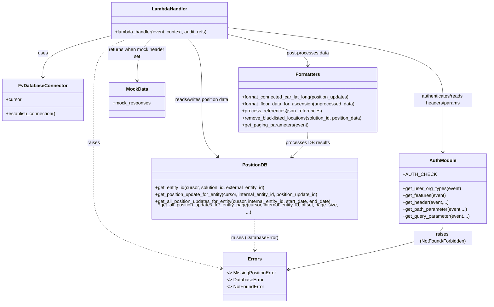

# Diagram: entity_core/entity_service/entity_service/entity/position_update/get_position_update.py


> Auto-generated by Obscura crawlers

## Diagram 1



### SVG

<svg id="container" width="1694.060546875" xmlns="http://www.w3.org/2000/svg" class="classDiagram" height="1042" viewBox="0 0 1694.060546875 1042" role="graphics-document document" aria-roledescription="class"><style>#container{font-family:"trebuchet ms",verdana,arial,sans-serif;font-size:16px;fill:#333;}@keyframes edge-animation-frame{from{stroke-dashoffset:0;}}@keyframes dash{to{stroke-dashoffset:0;}}#container .edge-animation-slow{stroke-dasharray:9,5!important;stroke-dashoffset:900;animation:dash 50s linear infinite;stroke-linecap:round;}#container .edge-animation-fast{stroke-dasharray:9,5!important;stroke-dashoffset:900;animation:dash 20s linear infinite;stroke-linecap:round;}#container .error-icon{fill:#552222;}#container .error-text{fill:#552222;stroke:#552222;}#container .edge-thickness-normal{stroke-width:1px;}#container .edge-thickness-thick{stroke-width:3.5px;}#container .edge-pattern-solid{stroke-dasharray:0;}#container .edge-thickness-invisible{stroke-width:0;fill:none;}#container .edge-pattern-dashed{stroke-dasharray:3;}#container .edge-pattern-dotted{stroke-dasharray:2;}#container .marker{fill:#333333;stroke:#333333;}#container .marker.cross{stroke:#333333;}#container svg{font-family:"trebuchet ms",verdana,arial,sans-serif;font-size:16px;}#container p{margin:0;}#container g.classGroup text{fill:#9370DB;stroke:none;font-family:"trebuchet ms",verdana,arial,sans-serif;font-size:10px;}#container g.classGroup text .title{font-weight:bolder;}#container .nodeLabel,#container .edgeLabel{color:#131300;}#container .edgeLabel .label rect{fill:#ECECFF;}#container .label text{fill:#131300;}#container .labelBkg{background:#ECECFF;}#container .edgeLabel .label span{background:#ECECFF;}#container .classTitle{font-weight:bolder;}#container .node rect,#container .node circle,#container .node ellipse,#container .node polygon,#container .node path{fill:#ECECFF;stroke:#9370DB;stroke-width:1px;}#container .divider{stroke:#9370DB;stroke-width:1;}#container g.clickable{cursor:pointer;}#container g.classGroup rect{fill:#ECECFF;stroke:#9370DB;}#container g.classGroup line{stroke:#9370DB;stroke-width:1;}#container .classLabel .box{stroke:none;stroke-width:0;fill:#ECECFF;opacity:0.5;}#container .classLabel .label{fill:#9370DB;font-size:10px;}#container .relation{stroke:#333333;stroke-width:1;fill:none;}#container .dashed-line{stroke-dasharray:3;}#container .dotted-line{stroke-dasharray:1 2;}#container #compositionStart,#container .composition{fill:#333333!important;stroke:#333333!important;stroke-width:1;}#container #compositionEnd,#container .composition{fill:#333333!important;stroke:#333333!important;stroke-width:1;}#container #dependencyStart,#container .dependency{fill:#333333!important;stroke:#333333!important;stroke-width:1;}#container #dependencyStart,#container .dependency{fill:#333333!important;stroke:#333333!important;stroke-width:1;}#container #extensionStart,#container .extension{fill:transparent!important;stroke:#333333!important;stroke-width:1;}#container #extensionEnd,#container .extension{fill:transparent!important;stroke:#333333!important;stroke-width:1;}#container #aggregationStart,#container .aggregation{fill:transparent!important;stroke:#333333!important;stroke-width:1;}#container #aggregationEnd,#container .aggregation{fill:transparent!important;stroke:#333333!important;stroke-width:1;}#container #lollipopStart,#container .lollipop{fill:#ECECFF!important;stroke:#333333!important;stroke-width:1;}#container #lollipopEnd,#container .lollipop{fill:#ECECFF!important;stroke:#333333!important;stroke-width:1;}#container .edgeTerminals{font-size:11px;line-height:initial;}#container .classTitleText{text-anchor:middle;font-size:18px;fill:#333;}#container .label-icon{display:inline-block;height:1em;overflow:visible;vertical-align:-0.125em;}#container .node .label-icon path{fill:currentColor;stroke:revert;stroke-width:revert;}#container :root{--mermaid-font-family:"trebuchet ms",verdana,arial,sans-serif;}</style><g><defs><marker id="container_class-aggregationStart" class="marker aggregation class" refX="18" refY="7" markerWidth="190" markerHeight="240" orient="auto"><path d="M 18,7 L9,13 L1,7 L9,1 Z"></path></marker></defs><defs><marker id="container_class-aggregationEnd" class="marker aggregation class" refX="1" refY="7" markerWidth="20" markerHeight="28" orient="auto"><path d="M 18,7 L9,13 L1,7 L9,1 Z"></path></marker></defs><defs><marker id="container_class-extensionStart" class="marker extension class" refX="18" refY="7" markerWidth="190" markerHeight="240" orient="auto"><path d="M 1,7 L18,13 V 1 Z"></path></marker></defs><defs><marker id="container_class-extensionEnd" class="marker extension class" refX="1" refY="7" markerWidth="20" markerHeight="28" orient="auto"><path d="M 1,1 V 13 L18,7 Z"></path></marker></defs><defs><marker id="container_class-compositionStart" class="marker composition class" refX="18" refY="7" markerWidth="190" markerHeight="240" orient="auto"><path d="M 18,7 L9,13 L1,7 L9,1 Z"></path></marker></defs><defs><marker id="container_class-compositionEnd" class="marker composition class" refX="1" refY="7" markerWidth="20" markerHeight="28" orient="auto"><path d="M 18,7 L9,13 L1,7 L9,1 Z"></path></marker></defs><defs><marker id="container_class-dependencyStart" class="marker dependency class" refX="6" refY="7" markerWidth="190" markerHeight="240" orient="auto"><path d="M 5,7 L9,13 L1,7 L9,1 Z"></path></marker></defs><defs><marker id="container_class-dependencyEnd" class="marker dependency class" refX="13" refY="7" markerWidth="20" markerHeight="28" orient="auto"><path d="M 18,7 L9,13 L14,7 L9,1 Z"></path></marker></defs><defs><marker id="container_class-lollipopStart" class="marker lollipop class" refX="13" refY="7" markerWidth="190" markerHeight="240" orient="auto"><circle stroke="black" fill="transparent" cx="7" cy="7" r="6"></circle></marker></defs><defs><marker id="container_class-lollipopEnd" class="marker lollipop class" refX="1" refY="7" markerWidth="190" markerHeight="240" orient="auto"><circle stroke="black" fill="transparent" cx="7" cy="7" r="6"></circle></marker></defs><g class="root"><g class="clusters"></g><g class="edgePaths"><path d="M378.57,123.088L339.856,133.074C301.142,143.059,223.714,163.029,184.999,186.681C146.285,210.333,146.285,237.667,146.285,251.333L146.285,265" id="id_LambdaHandler_FvDatabaseConnector_1" class="edge-thickness-normal edge-pattern-solid relation" style=";;;" data-edge="true" data-et="edge" data-id="id_LambdaHandler_FvDatabaseConnector_1" data-points="W3sieCI6Mzc4LjU3MDMxMjUsInkiOjEyMy4wODgzMzcxNTY0NzkxfSx7IngiOjE0Ni4yODUxNTYyNSwieSI6MTgzfSx7IngiOjE0Ni4yODUxNTYyNSwieSI6MjcxfV0=" marker-end="url(#container_class-dependencyEnd)"></path><path d="M782.477,94.64L908.282,109.367C1034.088,124.094,1285.699,153.547,1411.505,194.94C1537.311,236.333,1537.311,289.667,1537.311,341C1537.311,392.333,1537.311,441.667,1537.311,471.5C1537.311,501.333,1537.311,511.667,1537.311,516.833L1537.311,522" id="id_LambdaHandler_AuthModule_2" class="edge-thickness-normal edge-pattern-solid relation" style=";;;" data-edge="true" data-et="edge" data-id="id_LambdaHandler_AuthModule_2" data-points="W3sieCI6NzgyLjQ3NjU2MjUsInkiOjk0LjY0MDMxNjQwNzI0Njc0fSx7IngiOjE1MzcuMzEwNTQ2ODc1LCJ5IjoxODN9LHsieCI6MTUzNy4zMTA1NDY4NzUsInkiOjM0M30seyJ4IjoxNTM3LjMxMDU0Njg3NSwieSI6NDkxfSx7IngiOjE1MzcuMzEwNTQ2ODc1LCJ5Ijo1Mjh9XQ==" marker-end="url(#container_class-dependencyEnd)"></path><path d="M644.078,134L652.317,142.167C660.555,150.333,677.033,166.667,685.271,201.5C693.51,236.333,693.51,289.667,693.51,341C693.51,392.333,693.51,441.667,704.317,475.359C715.124,509.051,736.738,527.103,747.545,536.128L758.352,545.154" id="id_LambdaHandler_PositionDB_3" class="edge-thickness-normal edge-pattern-solid relation" style=";;;" data-edge="true" data-et="edge" data-id="id_LambdaHandler_PositionDB_3" data-points="W3sieCI6NjQ0LjA3ODI0NzA3MDMxMjUsInkiOjEzNH0seyJ4Ijo2OTMuNTA5NzY1NjI1LCJ5IjoxODN9LHsieCI6NjkzLjUwOTc2NTYyNSwieSI6MzQzfSx7IngiOjY5My41MDk3NjU2MjUsInkiOjQ5MX0seyJ4Ijo3NjIuOTU2OTQ0MTY3OTkzNiwieSI6NTQ5fV0=" marker-end="url(#container_class-dependencyEnd)"></path><path d="M782.477,117.259L830.311,128.216C878.145,139.173,973.814,161.086,1021.648,179.21C1069.482,197.333,1069.482,211.667,1069.482,218.833L1069.482,226" id="id_LambdaHandler_Formatters_4" class="edge-thickness-normal edge-pattern-solid relation" style=";;;" data-edge="true" data-et="edge" data-id="id_LambdaHandler_Formatters_4" data-points="W3sieCI6NzgyLjQ3NjU2MjUsInkiOjExNy4yNTg5OTI1MTgzODQ0N30seyJ4IjoxMDY5LjQ4MjQyMTg3NSwieSI6MTgzfSx7IngiOjEwNjkuNDgyNDIxODc1LCJ5IjoyMzJ9XQ==" marker-end="url(#container_class-dependencyEnd)"></path><path d="M516.969,134L508.73,142.167C500.491,150.333,484.014,166.667,475.776,190.5C467.537,214.333,467.537,245.667,467.537,261.333L467.537,277" id="id_LambdaHandler_MockData_5" class="edge-thickness-normal edge-pattern-solid relation" style=";;;" data-edge="true" data-et="edge" data-id="id_LambdaHandler_MockData_5" data-points="W3sieCI6NTE2Ljk2ODYyNzkyOTY4NzUsInkiOjEzNH0seyJ4Ijo0NjcuNTM3MTA5Mzc1LCJ5IjoxODN9LHsieCI6NDY3LjUzNzEwOTM3NSwieSI6MjgzfV0=" marker-end="url(#container_class-dependencyEnd)"></path><path d="M433.737,134L414.709,142.167C395.682,150.333,357.626,166.667,338.598,201.5C319.57,236.333,319.57,289.667,319.57,341C319.57,392.333,319.57,441.667,319.57,492.5C319.57,543.333,319.57,595.667,319.57,650C319.57,704.333,319.57,760.667,394.327,806.527C469.084,852.388,618.597,887.775,693.354,905.469L768.111,923.163" id="id_LambdaHandler_Errors_6" class="edge-thickness-normal edge-pattern-dashed relation" style=";;;" data-edge="true" data-et="edge" data-id="id_LambdaHandler_Errors_6" data-points="W3sieCI6NDMzLjczNzMwNDY4NzUsInkiOjEzNH0seyJ4IjozMTkuNTcwMzEyNSwieSI6MTgzfSx7IngiOjMxOS41NzAzMTI1LCJ5IjozNDN9LHsieCI6MzE5LjU3MDMxMjUsInkiOjQ5MX0seyJ4IjozMTkuNTcwMzEyNSwieSI6NjQ4fSx7IngiOjMxOS41NzAzMTI1LCJ5Ijo4MTd9LHsieCI6NzczLjk0OTIxODc1LCJ5Ijo5MjQuNTQ1MTUzNzMzMzI1fV0=" marker-end="url(#container_class-dependencyEnd)"></path><path d="M881.496,747L881.496,758.667C881.496,770.333,881.496,793.667,881.496,812.5C881.496,831.333,881.496,845.667,881.496,852.833L881.496,860" id="id_PositionDB_Errors_7" class="edge-thickness-normal edge-pattern-dashed relation" style=";;;" data-edge="true" data-et="edge" data-id="id_PositionDB_Errors_7" data-points="W3sieCI6ODgxLjQ5NjA5Mzc1LCJ5Ijo3NDd9LHsieCI6ODgxLjQ5NjA5Mzc1LCJ5Ijo4MTd9LHsieCI6ODgxLjQ5NjA5Mzc1LCJ5Ijo4NjZ9XQ==" marker-end="url(#container_class-dependencyEnd)"></path><path d="M1069.482,454L1069.482,460.167C1069.482,466.333,1069.482,478.667,1058.675,493.859C1047.868,509.051,1026.254,527.103,1015.447,536.128L1004.64,545.154" id="id_Formatters_PositionDB_8" class="edge-thickness-normal edge-pattern-solid relation" style=";;;" data-edge="true" data-et="edge" data-id="id_Formatters_PositionDB_8" data-points="W3sieCI6MTA2OS40ODI0MjE4NzUsInkiOjQ1NH0seyJ4IjoxMDY5LjQ4MjQyMTg3NSwieSI6NDkxfSx7IngiOjEwMDAuMDM1MjQzMzMyMDA2NCwieSI6NTQ5fV0=" marker-end="url(#container_class-dependencyEnd)"></path><path d="M1537.311,768L1537.311,776.167C1537.311,784.333,1537.311,800.667,1446.913,827.166C1356.515,853.666,1175.719,890.331,1085.321,908.664L994.923,926.997" id="id_AuthModule_Errors_9" class="edge-thickness-normal edge-pattern-solid relation" style=";;;" data-edge="true" data-et="edge" data-id="id_AuthModule_Errors_9" data-points="W3sieCI6MTUzNy4zMTA1NDY4NzUsInkiOjc2OH0seyJ4IjoxNTM3LjMxMDU0Njg3NSwieSI6ODE3fSx7IngiOjk4OS4wNDI5Njg3NSwieSI6OTI4LjE4OTM1NzgxNzgzNzR9XQ==" marker-end="url(#container_class-dependencyEnd)"></path></g><g class="edgeLabels"><g class="edgeLabel" transform="translate(146.28515625, 183)"><g class="label" data-id="id_LambdaHandler_FvDatabaseConnector_1" transform="translate(-16.4921875, -12)"><foreignObject width="32.984375" height="24"><div xmlns="http://www.w3.org/1999/xhtml" class="labelBkg" style="display: table-cell; white-space: nowrap; line-height: 1.5; max-width: 200px; text-align: center;"><span class="edgeLabel"><p>uses</p></span></div></foreignObject></g></g><g class="edgeLabel" transform="translate(1537.310546875, 343)"><g class="label" data-id="id_LambdaHandler_AuthModule_2" transform="translate(-100, -24)"><foreignObject width="200" height="48"><div xmlns="http://www.w3.org/1999/xhtml" class="labelBkg" style="display: table; white-space: break-spaces; line-height: 1.5; max-width: 200px; text-align: center; width: 200px;"><span class="edgeLabel"><p>authenticates/reads headers/params</p></span></div></foreignObject></g></g><g class="edgeLabel" transform="translate(693.509765625, 343)"><g class="label" data-id="id_LambdaHandler_PositionDB_3" transform="translate(-96.4296875, -12)"><foreignObject width="192.859375" height="24"><div xmlns="http://www.w3.org/1999/xhtml" class="labelBkg" style="display: table-cell; white-space: nowrap; line-height: 1.5; max-width: 200px; text-align: center;"><span class="edgeLabel"><p>reads/writes position data</p></span></div></foreignObject></g></g><g class="edgeLabel" transform="translate(1069.482421875, 183)"><g class="label" data-id="id_LambdaHandler_Formatters_4" transform="translate(-73.1796875, -12)"><foreignObject width="146.359375" height="24"><div xmlns="http://www.w3.org/1999/xhtml" class="labelBkg" style="display: table-cell; white-space: nowrap; line-height: 1.5; max-width: 200px; text-align: center;"><span class="edgeLabel"><p>post-processes data</p></span></div></foreignObject></g></g><g class="edgeLabel" transform="translate(467.537109375, 183)"><g class="label" data-id="id_LambdaHandler_MockData_5" transform="translate(-100, -24)"><foreignObject width="200" height="48"><div xmlns="http://www.w3.org/1999/xhtml" class="labelBkg" style="display: table; white-space: break-spaces; line-height: 1.5; max-width: 200px; text-align: center; width: 200px;"><span class="edgeLabel"><p>returns when mock header set</p></span></div></foreignObject></g></g><g class="edgeLabel" transform="translate(319.5703125, 491)"><g class="label" data-id="id_LambdaHandler_Errors_6" transform="translate(-21.25, -12)"><foreignObject width="42.5" height="24"><div xmlns="http://www.w3.org/1999/xhtml" class="labelBkg" style="display: table-cell; white-space: nowrap; line-height: 1.5; max-width: 200px; text-align: center;"><span class="edgeLabel"><p>raises</p></span></div></foreignObject></g></g><g class="edgeLabel" transform="translate(881.49609375, 817)"><g class="label" data-id="id_PositionDB_Errors_7" transform="translate(-80.1015625, -12)"><foreignObject width="160.203125" height="24"><div xmlns="http://www.w3.org/1999/xhtml" class="labelBkg" style="display: table-cell; white-space: nowrap; line-height: 1.5; max-width: 200px; text-align: center;"><span class="edgeLabel"><p>raises (DatabaseError)</p></span></div></foreignObject></g></g><g class="edgeLabel" transform="translate(1069.482421875, 491)"><g class="label" data-id="id_Formatters_PositionDB_8" transform="translate(-74.609375, -12)"><foreignObject width="149.21875" height="24"><div xmlns="http://www.w3.org/1999/xhtml" class="labelBkg" style="display: table-cell; white-space: nowrap; line-height: 1.5; max-width: 200px; text-align: center;"><span class="edgeLabel"><p>processes DB results</p></span></div></foreignObject></g></g><g class="edgeLabel" transform="translate(1537.310546875, 817)"><g class="label" data-id="id_AuthModule_Errors_9" transform="translate(-100, -24)"><foreignObject width="200" height="48"><div xmlns="http://www.w3.org/1999/xhtml" class="labelBkg" style="display: table; white-space: break-spaces; line-height: 1.5; max-width: 200px; text-align: center; width: 200px;"><span class="edgeLabel"><p>raises (NotFound/Forbidden)</p></span></div></foreignObject></g></g></g><g class="nodes"><g class="node default" id="classId-LambdaHandler-0" transform="translate(580.5234375, 71)"><g class="basic label-container"><path d="M-201.953125 -63 L201.953125 -63 L201.953125 63 L-201.953125 63" stroke="none" stroke-width="0" fill="#ECECFF" style=""></path><path d="M-201.953125 -63 C-116.7037517449434 -63, -31.454378489886807 -63, 201.953125 -63 M-201.953125 -63 C-71.03357703174211 -63, 59.885970936515776 -63, 201.953125 -63 M201.953125 -63 C201.953125 -26.660491791872857, 201.953125 9.679016416254285, 201.953125 63 M201.953125 -63 C201.953125 -31.719738455076964, 201.953125 -0.4394769101539282, 201.953125 63 M201.953125 63 C68.03274946101601 63, -65.88762607796798 63, -201.953125 63 M201.953125 63 C73.42532999589088 63, -55.102465008218246 63, -201.953125 63 M-201.953125 63 C-201.953125 30.929549330643766, -201.953125 -1.1409013387124673, -201.953125 -63 M-201.953125 63 C-201.953125 22.63516001003537, -201.953125 -17.72967997992926, -201.953125 -63" stroke="#9370DB" stroke-width="1.3" fill="none" stroke-dasharray="0 0" style=""></path></g><g class="annotation-group text" transform="translate(0, -39)"></g><g class="label-group text" transform="translate(-58.21875, -39)"><g class="label" style="font-weight: bolder" transform="translate(0,-12)"><foreignObject width="116.4375" height="24"><div xmlns="http://www.w3.org/1999/xhtml" style="display: table-cell; white-space: nowrap; line-height: 1.5; max-width: 167px; text-align: center;"><span class="nodeLabel markdown-node-label" style=""><p>LambdaHandler</p></span></div></foreignObject></g></g><g class="members-group text" transform="translate(-189.953125, 9)"></g><g class="methods-group text" transform="translate(-189.953125, 39)"><g class="label" style="" transform="translate(0,-12)"><foreignObject width="321.6875" height="24"><div xmlns="http://www.w3.org/1999/xhtml" style="display: table-cell; white-space: nowrap; line-height: 1.5; max-width: 379px; text-align: center;"><span class="nodeLabel markdown-node-label" style=""><p>+lambda_handler(event, context, audit_refs)</p></span></div></foreignObject></g></g><g class="divider" style=""><path d="M-201.953125 -15 C-54.32490614104512 -15, 93.30331271790976 -15, 201.953125 -15 M-201.953125 -15 C-117.27086967263259 -15, -32.58861434526517 -15, 201.953125 -15" stroke="#9370DB" stroke-width="1.3" fill="none" stroke-dasharray="0 0" style=""></path></g><g class="divider" style=""><path d="M-201.953125 9 C-68.36614649225879 9, 65.22083201548242 9, 201.953125 9 M-201.953125 9 C-103.87698305387396 9, -5.800841107747914 9, 201.953125 9" stroke="#9370DB" stroke-width="1.3" fill="none" stroke-dasharray="0 0" style=""></path></g></g><g class="node default" id="classId-FvDatabaseConnector-1" transform="translate(146.28515625, 343)"><g class="basic label-container"><path d="M-138.28515625 -72 L138.28515625 -72 L138.28515625 72 L-138.28515625 72" stroke="none" stroke-width="0" fill="#ECECFF" style=""></path><path d="M-138.28515625 -72 C-75.22330338141727 -72, -12.161450512834534 -72, 138.28515625 -72 M-138.28515625 -72 C-58.354829865388 -72, 21.575496519224004 -72, 138.28515625 -72 M138.28515625 -72 C138.28515625 -16.740666091603998, 138.28515625 38.518667816792004, 138.28515625 72 M138.28515625 -72 C138.28515625 -28.92120642541461, 138.28515625 14.15758714917078, 138.28515625 72 M138.28515625 72 C57.92569987052521 72, -22.433756508949585 72, -138.28515625 72 M138.28515625 72 C33.69524980365634 72, -70.89465664268732 72, -138.28515625 72 M-138.28515625 72 C-138.28515625 33.160240316670134, -138.28515625 -5.679519366659733, -138.28515625 -72 M-138.28515625 72 C-138.28515625 20.23426930560681, -138.28515625 -31.531461388786383, -138.28515625 -72" stroke="#9370DB" stroke-width="1.3" fill="none" stroke-dasharray="0 0" style=""></path></g><g class="annotation-group text" transform="translate(0, -48)"></g><g class="label-group text" transform="translate(-79.3046875, -48)"><g class="label" style="font-weight: bolder" transform="translate(0,-12)"><foreignObject width="158.609375" height="24"><div xmlns="http://www.w3.org/1999/xhtml" style="display: table-cell; white-space: nowrap; line-height: 1.5; max-width: 207px; text-align: center;"><span class="nodeLabel markdown-node-label" style=""><p>FvDatabaseConnector</p></span></div></foreignObject></g></g><g class="members-group text" transform="translate(-126.28515625, 0)"><g class="label" style="" transform="translate(0,-12)"><foreignObject width="53.71875" height="24"><div xmlns="http://www.w3.org/1999/xhtml" style="display: table-cell; white-space: nowrap; line-height: 1.5; max-width: 112px; text-align: center;"><span class="nodeLabel markdown-node-label" style=""><p>+cursor</p></span></div></foreignObject></g></g><g class="methods-group text" transform="translate(-126.28515625, 48)"><g class="label" style="" transform="translate(0,-12)"><foreignObject width="173.265625" height="24"><div xmlns="http://www.w3.org/1999/xhtml" style="display: table-cell; white-space: nowrap; line-height: 1.5; max-width: 231px; text-align: center;"><span class="nodeLabel markdown-node-label" style=""><p>+establish_connection()</p></span></div></foreignObject></g></g><g class="divider" style=""><path d="M-138.28515625 -24 C-34.67902987476383 -24, 68.92709650047235 -24, 138.28515625 -24 M-138.28515625 -24 C-65.5196361250438 -24, 7.245883999912394 -24, 138.28515625 -24" stroke="#9370DB" stroke-width="1.3" fill="none" stroke-dasharray="0 0" style=""></path></g><g class="divider" style=""><path d="M-138.28515625 24 C-48.6787076057426 24, 40.927741038514796 24, 138.28515625 24 M-138.28515625 24 C-30.65885191126216 24, 76.96745242747568 24, 138.28515625 24" stroke="#9370DB" stroke-width="1.3" fill="none" stroke-dasharray="0 0" style=""></path></g></g><g class="node default" id="classId-AuthModule-2" transform="translate(1537.310546875, 648)"><g class="basic label-container"><path d="M-148.75 -120 L148.75 -120 L148.75 120 L-148.75 120" stroke="none" stroke-width="0" fill="#ECECFF" style=""></path><path d="M-148.75 -120 C-43.71922030546094 -120, 61.31155938907813 -120, 148.75 -120 M-148.75 -120 C-37.25572997640576 -120, 74.23854004718848 -120, 148.75 -120 M148.75 -120 C148.75 -38.57662653038423, 148.75 42.84674693923154, 148.75 120 M148.75 -120 C148.75 -62.44092738598907, 148.75 -4.881854771978141, 148.75 120 M148.75 120 C84.25986140967281 120, 19.769722819345617 120, -148.75 120 M148.75 120 C45.453547531673934 120, -57.84290493665213 120, -148.75 120 M-148.75 120 C-148.75 54.35192845729654, -148.75 -11.296143085406925, -148.75 -120 M-148.75 120 C-148.75 51.939178942385425, -148.75 -16.12164211522915, -148.75 -120" stroke="#9370DB" stroke-width="1.3" fill="none" stroke-dasharray="0 0" style=""></path></g><g class="annotation-group text" transform="translate(0, -96)"></g><g class="label-group text" transform="translate(-44.09375, -96)"><g class="label" style="font-weight: bolder" transform="translate(0,-12)"><foreignObject width="88.1875" height="24"><div xmlns="http://www.w3.org/1999/xhtml" style="display: table-cell; white-space: nowrap; line-height: 1.5; max-width: 138px; text-align: center;"><span class="nodeLabel markdown-node-label" style=""><p>AuthModule</p></span></div></foreignObject></g></g><g class="members-group text" transform="translate(-136.75, -48)"><g class="label" style="" transform="translate(0,-12)"><foreignObject width="100.859375" height="24"><div xmlns="http://www.w3.org/1999/xhtml" style="display: table-cell; white-space: nowrap; line-height: 1.5; max-width: 159px; text-align: center;"><span class="nodeLabel markdown-node-label" style=""><p>+AUTH_CHECK</p></span></div></foreignObject></g></g><g class="methods-group text" transform="translate(-136.75, 0)"><g class="label" style="" transform="translate(0,-12)"><foreignObject width="198.578125" height="24"><div xmlns="http://www.w3.org/1999/xhtml" style="display: table-cell; white-space: nowrap; line-height: 1.5; max-width: 256px; text-align: center;"><span class="nodeLabel markdown-node-label" style=""><p>+get_user_org_types(event)</p></span></div></foreignObject></g><g class="label" style="" transform="translate(0,12)"><foreignObject width="148.703125" height="24"><div xmlns="http://www.w3.org/1999/xhtml" style="display: table-cell; white-space: nowrap; line-height: 1.5; max-width: 206px; text-align: center;"><span class="nodeLabel markdown-node-label" style=""><p>+get_features(event)</p></span></div></foreignObject></g><g class="label" style="" transform="translate(0,36)"><foreignObject width="156.109375" height="24"><div xmlns="http://www.w3.org/1999/xhtml" style="display: table-cell; white-space: nowrap; line-height: 1.5; max-width: 213px; text-align: center;"><span class="nodeLabel markdown-node-label" style=""><p>+get_header(event,...)</p></span></div></foreignObject></g><g class="label" style="" transform="translate(0,60)"><foreignObject width="221.75" height="24"><div xmlns="http://www.w3.org/1999/xhtml" style="display: table-cell; white-space: nowrap; line-height: 1.5; max-width: 279px; text-align: center;"><span class="nodeLabel markdown-node-label" style=""><p>+get_path_parameter(event,...)</p></span></div></foreignObject></g><g class="label" style="" transform="translate(0,84)"><foreignObject width="229.40625" height="24"><div xmlns="http://www.w3.org/1999/xhtml" style="display: table-cell; white-space: nowrap; line-height: 1.5; max-width: 287px; text-align: center;"><span class="nodeLabel markdown-node-label" style=""><p>+get_query_parameter(event,...)</p></span></div></foreignObject></g></g><g class="divider" style=""><path d="M-148.75 -72 C-53.25862005737875 -72, 42.2327598852425 -72, 148.75 -72 M-148.75 -72 C-74.53294243023856 -72, -0.3158848604771265 -72, 148.75 -72" stroke="#9370DB" stroke-width="1.3" fill="none" stroke-dasharray="0 0" style=""></path></g><g class="divider" style=""><path d="M-148.75 -24 C-45.47813329846754 -24, 57.79373340306492 -24, 148.75 -24 M-148.75 -24 C-76.8685847445104 -24, -4.9871694890208005 -24, 148.75 -24" stroke="#9370DB" stroke-width="1.3" fill="none" stroke-dasharray="0 0" style=""></path></g></g><g class="node default" id="classId-PositionDB-3" transform="translate(881.49609375, 648)"><g class="basic label-container"><path d="M-357.36328125 -99 L357.36328125 -99 L357.36328125 99 L-357.36328125 99" stroke="none" stroke-width="0" fill="#ECECFF" style=""></path><path d="M-357.36328125 -99 C-103.5619029136609 -99, 150.2394754226782 -99, 357.36328125 -99 M-357.36328125 -99 C-145.2277524725014 -99, 66.90777630499718 -99, 357.36328125 -99 M357.36328125 -99 C357.36328125 -53.677524376218194, 357.36328125 -8.355048752436389, 357.36328125 99 M357.36328125 -99 C357.36328125 -35.87957998821055, 357.36328125 27.240840023578897, 357.36328125 99 M357.36328125 99 C124.20528368407724 99, -108.95271388184551 99, -357.36328125 99 M357.36328125 99 C97.75179174123139 99, -161.85969776753723 99, -357.36328125 99 M-357.36328125 99 C-357.36328125 50.297041905719304, -357.36328125 1.5940838114386082, -357.36328125 -99 M-357.36328125 99 C-357.36328125 37.299198115085005, -357.36328125 -24.40160376982999, -357.36328125 -99" stroke="#9370DB" stroke-width="1.3" fill="none" stroke-dasharray="0 0" style=""></path></g><g class="annotation-group text" transform="translate(0, -75)"></g><g class="label-group text" transform="translate(-40.1328125, -75)"><g class="label" style="font-weight: bolder" transform="translate(0,-12)"><foreignObject width="80.265625" height="24"><div xmlns="http://www.w3.org/1999/xhtml" style="display: table-cell; white-space: nowrap; line-height: 1.5; max-width: 129px; text-align: center;"><span class="nodeLabel markdown-node-label" style=""><p>PositionDB</p></span></div></foreignObject></g></g><g class="members-group text" transform="translate(-345.36328125, -27)"></g><g class="methods-group text" transform="translate(-345.36328125, 3)"><g class="label" style="" transform="translate(0,-12)"><foreignObject width="386.875" height="24"><div xmlns="http://www.w3.org/1999/xhtml" style="display: table-cell; white-space: nowrap; line-height: 1.5; max-width: 444px; text-align: center;"><span class="nodeLabel markdown-node-label" style=""><p>+get_entity_id(cursor, solution_id, external_entity_id)</p></span></div></foreignObject></g><g class="label" style="" transform="translate(0,12)"><foreignObject width="576.171875" height="24"><div xmlns="http://www.w3.org/1999/xhtml" style="display: table-cell; white-space: nowrap; line-height: 1.5; max-width: 634px; text-align: center;"><span class="nodeLabel markdown-node-label" style=""><p>+get_position_update_for_entity(cursor, internal_entity_id, position_update_id)</p></span></div></foreignObject></g><g class="label" style="" transform="translate(0,36)"><foreignObject width="618.734375" height="24"><div xmlns="http://www.w3.org/1999/xhtml" style="display: table-cell; white-space: nowrap; line-height: 1.5; max-width: 676px; text-align: center;"><span class="nodeLabel markdown-node-label" style=""><p>+get_all_position_updates_for_entity(cursor, internal_entity_id, start_date, end_date)</p></span></div></foreignObject></g><g class="label" style="" transform="translate(0,60)"><foreignObject width="650.59375" height="24"><div xmlns="http://www.w3.org/1999/xhtml" style="display: table-cell; white-space: nowrap; line-height: 1.5; max-width: 708px; text-align: center;"><span class="nodeLabel markdown-node-label" style=""><p>+get_all_position_updates_for_entity_page(cursor, internal_entity_id, offset, page_size, ...)</p></span></div></foreignObject></g></g><g class="divider" style=""><path d="M-357.36328125 -51 C-115.06399957060927 -51, 127.23528210878146 -51, 357.36328125 -51 M-357.36328125 -51 C-159.45139790739333 -51, 38.46048543521334 -51, 357.36328125 -51" stroke="#9370DB" stroke-width="1.3" fill="none" stroke-dasharray="0 0" style=""></path></g><g class="divider" style=""><path d="M-357.36328125 -27 C-93.21526190431177 -27, 170.93275744137645 -27, 357.36328125 -27 M-357.36328125 -27 C-114.02625104068639 -27, 129.31077916862722 -27, 357.36328125 -27" stroke="#9370DB" stroke-width="1.3" fill="none" stroke-dasharray="0 0" style=""></path></g></g><g class="node default" id="classId-Formatters-4" transform="translate(1069.482421875, 343)"><g class="basic label-container"><path d="M-244.54296875 -111 L244.54296875 -111 L244.54296875 111 L-244.54296875 111" stroke="none" stroke-width="0" fill="#ECECFF" style=""></path><path d="M-244.54296875 -111 C-114.72285586410828 -111, 15.097257021783435 -111, 244.54296875 -111 M-244.54296875 -111 C-87.8442365396204 -111, 68.8544956707592 -111, 244.54296875 -111 M244.54296875 -111 C244.54296875 -42.12317509394215, 244.54296875 26.753649812115697, 244.54296875 111 M244.54296875 -111 C244.54296875 -32.86923982710654, 244.54296875 45.26152034578692, 244.54296875 111 M244.54296875 111 C140.9439662562957 111, 37.34496376259145 111, -244.54296875 111 M244.54296875 111 C63.77224816036917 111, -116.99847242926165 111, -244.54296875 111 M-244.54296875 111 C-244.54296875 27.670793380132906, -244.54296875 -55.65841323973419, -244.54296875 -111 M-244.54296875 111 C-244.54296875 37.822823020838314, -244.54296875 -35.35435395832337, -244.54296875 -111" stroke="#9370DB" stroke-width="1.3" fill="none" stroke-dasharray="0 0" style=""></path></g><g class="annotation-group text" transform="translate(0, -87)"></g><g class="label-group text" transform="translate(-40.0703125, -87)"><g class="label" style="font-weight: bolder" transform="translate(0,-12)"><foreignObject width="80.140625" height="24"><div xmlns="http://www.w3.org/1999/xhtml" style="display: table-cell; white-space: nowrap; line-height: 1.5; max-width: 129px; text-align: center;"><span class="nodeLabel markdown-node-label" style=""><p>Formatters</p></span></div></foreignObject></g></g><g class="members-group text" transform="translate(-232.54296875, -39)"></g><g class="methods-group text" transform="translate(-232.54296875, -9)"><g class="label" style="" transform="translate(0,-12)"><foreignObject width="373.453125" height="24"><div xmlns="http://www.w3.org/1999/xhtml" style="display: table-cell; white-space: nowrap; line-height: 1.5; max-width: 431px; text-align: center;"><span class="nodeLabel markdown-node-label" style=""><p>+format_connected_car_lat_long(position_updates)</p></span></div></foreignObject></g><g class="label" style="" transform="translate(0,12)"><foreignObject width="389.21875" height="24"><div xmlns="http://www.w3.org/1999/xhtml" style="display: table-cell; white-space: nowrap; line-height: 1.5; max-width: 447px; text-align: center;"><span class="nodeLabel markdown-node-label" style=""><p>+format_floor_data_for_ascension(unprocessed_data)</p></span></div></foreignObject></g><g class="label" style="" transform="translate(0,36)"><foreignObject width="272.59375" height="24"><div xmlns="http://www.w3.org/1999/xhtml" style="display: table-cell; white-space: nowrap; line-height: 1.5; max-width: 330px; text-align: center;"><span class="nodeLabel markdown-node-label" style=""><p>+process_references(json_references)</p></span></div></foreignObject></g><g class="label" style="" transform="translate(0,60)"><foreignObject width="425.015625" height="24"><div xmlns="http://www.w3.org/1999/xhtml" style="display: table-cell; white-space: nowrap; line-height: 1.5; max-width: 482px; text-align: center;"><span class="nodeLabel markdown-node-label" style=""><p>+remove_blacklisted_locations(solution_id, position_data)</p></span></div></foreignObject></g><g class="label" style="" transform="translate(0,84)"><foreignObject width="228.84375" height="24"><div xmlns="http://www.w3.org/1999/xhtml" style="display: table-cell; white-space: nowrap; line-height: 1.5; max-width: 286px; text-align: center;"><span class="nodeLabel markdown-node-label" style=""><p>+get_paging_parameters(event)</p></span></div></foreignObject></g></g><g class="divider" style=""><path d="M-244.54296875 -63 C-133.04498832539906 -63, -21.54700790079812 -63, 244.54296875 -63 M-244.54296875 -63 C-132.56734093295205 -63, -20.5917131159041 -63, 244.54296875 -63" stroke="#9370DB" stroke-width="1.3" fill="none" stroke-dasharray="0 0" style=""></path></g><g class="divider" style=""><path d="M-244.54296875 -39 C-63.45656198140858 -39, 117.62984478718283 -39, 244.54296875 -39 M-244.54296875 -39 C-109.85185314221258 -39, 24.839262465574848 -39, 244.54296875 -39" stroke="#9370DB" stroke-width="1.3" fill="none" stroke-dasharray="0 0" style=""></path></g></g><g class="node default" id="classId-Errors-5" transform="translate(881.49609375, 950)"><g class="basic label-container"><path d="M-107.546875 -84 L107.546875 -84 L107.546875 84 L-107.546875 84" stroke="none" stroke-width="0" fill="#ECECFF" style=""></path><path d="M-107.546875 -84 C-61.61641632541817 -84, -15.685957650836343 -84, 107.546875 -84 M-107.546875 -84 C-46.90067031779393 -84, 13.745534364412137 -84, 107.546875 -84 M107.546875 -84 C107.546875 -24.597062480635202, 107.546875 34.805875038729596, 107.546875 84 M107.546875 -84 C107.546875 -41.094862218348204, 107.546875 1.8102755633035912, 107.546875 84 M107.546875 84 C36.66392350259041 84, -34.219027994819186 84, -107.546875 84 M107.546875 84 C33.64976216399508 84, -40.247350672009844 84, -107.546875 84 M-107.546875 84 C-107.546875 34.43266843423541, -107.546875 -15.13466313152918, -107.546875 -84 M-107.546875 84 C-107.546875 18.89007270274945, -107.546875 -46.2198545945011, -107.546875 -84" stroke="#9370DB" stroke-width="1.3" fill="none" stroke-dasharray="0 0" style=""></path></g><g class="annotation-group text" transform="translate(0, -60)"></g><g class="label-group text" transform="translate(-21.953125, -60)"><g class="label" style="font-weight: bolder" transform="translate(0,-12)"><foreignObject width="43.90625" height="24"><div xmlns="http://www.w3.org/1999/xhtml" style="display: table-cell; white-space: nowrap; line-height: 1.5; max-width: 93px; text-align: center;"><span class="nodeLabel markdown-node-label" style=""><p>Errors</p></span></div></foreignObject></g></g><g class="members-group text" transform="translate(-95.546875, -12)"><g class="label" style="" transform="translate(0,-12)"><foreignObject width="169.140625" height="24"><div xmlns="http://www.w3.org/1999/xhtml" style="display: table-cell; white-space: nowrap; line-height: 1.5; max-width: 260px; text-align: center;"><span class="nodeLabel markdown-node-label" style=""><p>&lt;&gt; MissingPositionError</p></span></div></foreignObject></g><g class="label" style="" transform="translate(0,12)"><foreignObject width="123.34375" height="24"><div xmlns="http://www.w3.org/1999/xhtml" style="display: table-cell; white-space: nowrap; line-height: 1.5; max-width: 214px; text-align: center;"><span class="nodeLabel markdown-node-label" style=""><p>&lt;&gt; DatabaseError</p></span></div></foreignObject></g><g class="label" style="" transform="translate(0,36)"><foreignObject width="126.984375" height="24"><div xmlns="http://www.w3.org/1999/xhtml" style="display: table-cell; white-space: nowrap; line-height: 1.5; max-width: 217px; text-align: center;"><span class="nodeLabel markdown-node-label" style=""><p>&lt;&gt; NotFoundError</p></span></div></foreignObject></g></g><g class="methods-group text" transform="translate(-95.546875, 84)"></g><g class="divider" style=""><path d="M-107.546875 -36 C-48.549036662192194 -36, 10.448801675615613 -36, 107.546875 -36 M-107.546875 -36 C-31.06868961914148 -36, 45.40949576171704 -36, 107.546875 -36" stroke="#9370DB" stroke-width="1.3" fill="none" stroke-dasharray="0 0" style=""></path></g><g class="divider" style=""><path d="M-107.546875 60 C-22.15541241678868 60, 63.23605016642264 60, 107.546875 60 M-107.546875 60 C-48.66698314706558 60, 10.212908705868841 60, 107.546875 60" stroke="#9370DB" stroke-width="1.3" fill="none" stroke-dasharray="0 0" style=""></path></g></g><g class="node default" id="classId-MockData-6" transform="translate(467.537109375, 343)"><g class="basic label-container"><path d="M-94.54296875 -60 L94.54296875 -60 L94.54296875 60 L-94.54296875 60" stroke="none" stroke-width="0" fill="#ECECFF" style=""></path><path d="M-94.54296875 -60 C-35.79681641878635 -60, 22.9493359124273 -60, 94.54296875 -60 M-94.54296875 -60 C-39.86302418618495 -60, 14.816920377630098 -60, 94.54296875 -60 M94.54296875 -60 C94.54296875 -16.525208836124285, 94.54296875 26.94958232775143, 94.54296875 60 M94.54296875 -60 C94.54296875 -34.53533465237403, 94.54296875 -9.070669304748066, 94.54296875 60 M94.54296875 60 C19.701686888469155 60, -55.13959497306169 60, -94.54296875 60 M94.54296875 60 C33.653615977496976 60, -27.235736795006048 60, -94.54296875 60 M-94.54296875 60 C-94.54296875 23.747500037489402, -94.54296875 -12.504999925021195, -94.54296875 -60 M-94.54296875 60 C-94.54296875 28.047807325562864, -94.54296875 -3.9043853488742712, -94.54296875 -60" stroke="#9370DB" stroke-width="1.3" fill="none" stroke-dasharray="0 0" style=""></path></g><g class="annotation-group text" transform="translate(0, -36)"></g><g class="label-group text" transform="translate(-36.1015625, -36)"><g class="label" style="font-weight: bolder" transform="translate(0,-12)"><foreignObject width="72.203125" height="24"><div xmlns="http://www.w3.org/1999/xhtml" style="display: table-cell; white-space: nowrap; line-height: 1.5; max-width: 121px; text-align: center;"><span class="nodeLabel markdown-node-label" style=""><p>MockData</p></span></div></foreignObject></g></g><g class="members-group text" transform="translate(-82.54296875, 12)"><g class="label" style="" transform="translate(0,-12)"><foreignObject width="128.984375" height="24"><div xmlns="http://www.w3.org/1999/xhtml" style="display: table-cell; white-space: nowrap; line-height: 1.5; max-width: 186px; text-align: center;"><span class="nodeLabel markdown-node-label" style=""><p>+mock_responses</p></span></div></foreignObject></g></g><g class="methods-group text" transform="translate(-82.54296875, 60)"></g><g class="divider" style=""><path d="M-94.54296875 -12 C-50.55250192672873 -12, -6.562035103457461 -12, 94.54296875 -12 M-94.54296875 -12 C-55.785773151046136 -12, -17.028577552092273 -12, 94.54296875 -12" stroke="#9370DB" stroke-width="1.3" fill="none" stroke-dasharray="0 0" style=""></path></g><g class="divider" style=""><path d="M-94.54296875 36 C-26.02006566824403 36, 42.50283741351194 36, 94.54296875 36 M-94.54296875 36 C-38.30039966507846 36, 17.942169419843083 36, 94.54296875 36" stroke="#9370DB" stroke-width="1.3" fill="none" stroke-dasharray="0 0" style=""></path></g></g></g></g></g></svg>

## Diagram 2

```mermaid
flowchart TD
Start([lambda_handler])
Start --> DB[Establish DB connection]
DB --> GetHeaders[Read headers, path & query parameters]
GetHeaders --> IsMock{is_mock?}
IsMock -->|Yes| MockChoice{position_update_id?}
MockChoice -->|Yes| MockSingle[return mock_responses["single_position"]]
MockChoice -->|No| MockAll[return mock_responses["all"]]
IsMock -->|No| OrgType[Determine organization_type and entity IDs]
OrgType --> AuthBranches{OrgType branch}
AuthBranches -->|DEALER or dealerOrgId| DealerAuth[entity_dealer_authorization -> internal_entity_id, solution_id]
AuthBranches -->|CARRIER or PARTNER| CarrierAuth[entity_carrier_authorization -> internal_entity_id, solution_id]
AuthBranches -->|OTHER| ExternalAuth[get_path_parameter entity_id & solution_id -> get_entity_id]
DealerAuth --> Audit[Update audit_refs]
CarrierAuth --> Audit
ExternalAuth --> Audit
Audit --> ProcessChoice{position_update_id?}
ProcessChoice -->|Yes| SingleDB[get_position_update_for_entity]
SingleDB --> SingleCheck{retval is None?}
SingleCheck -->|Yes| RaiseMissing[raise MissingPositionError -> NotFoundError]
SingleCheck -->|No| AscensionCheck1{solution_id == "ASCENSION"?}
AscensionCheck1 -->|Yes| ProcRefs1[process_references(retval.references)]
ProcRefs1 --> RespondSingle[make_response(json_dumps(retval))]
AscensionCheck1 -->|No| RespondSingle
ProcessChoice -->|No| Paging[get_paging_parameters(event)]
Paging --> PaginateCheck{paginate?}
PaginateCheck -->|Yes| PageQuery[get_all_position_updates_for_entity_page(...)]
PageQuery --> FormatLatLong1[format_connected_car_lat_long(data)]
FormatLatLong1 --> AscensionCheck2{solution_id == "ASCENSION"?}
AscensionCheck2 -->|Yes| FormatFloor1[format_floor_data_for_ascension(data)]
AscensionCheck2 -->|No| Skip1[skip]
FormatFloor1 --> DealerCheck1{OrgTypes.DEALER or dealerOrgId?}
Skip1 --> DealerCheck1
DealerCheck1 -->|Yes| RemoveBlacklist1[remove_blacklisted_locations(solution_id, data)]
DealerCheck1 -->|No| Skip2
RemoveBlacklist1 --> SetRetvalPage[retval = {"meta": None, "data": data}]
Skip2 --> SetRetvalPage
SetRetvalPage --> RespondPage[make_response(json_dumps(retval))]
PaginateCheck -->|No| AllDB[get_all_position_updates_for_entity(...)]
AllDB --> FormatLatLong2[format_connected_car_lat_long(retval)]
FormatLatLong2 --> AscensionCheck3{solution_id == "ASCENSION"?}
AscensionCheck3 -->|Yes| FormatFloor2[format_floor_data_for_ascension(retval)]
AscensionCheck3 -->|No| Skip3
FormatFloor2 --> DealerCheck2{OrgTypes.DEALER or dealerOrgId?}
Skip3 --> DealerCheck2
DealerCheck2 -->|Yes| RemoveBlacklist2[remove_blacklisted_locations(solution_id, retval)]
DealerCheck2 -->|No| Skip4
RemoveBlacklist2 --> RespondAll[make_response(json_dumps(retval))]
Skip4 --> RespondAll
RespondSingle --> End([return response])
RespondPage --> End
RespondAll --> End
subgraph ErrorsHandling
  DBError[psycopg2.Error -> raise DatabaseError]
  MissingPos[MissingPositionError -> raise NotFoundError]
end
DB --> DBError
SingleCheck --> MissingPos
```

> SVG rendering failed for this diagram.
