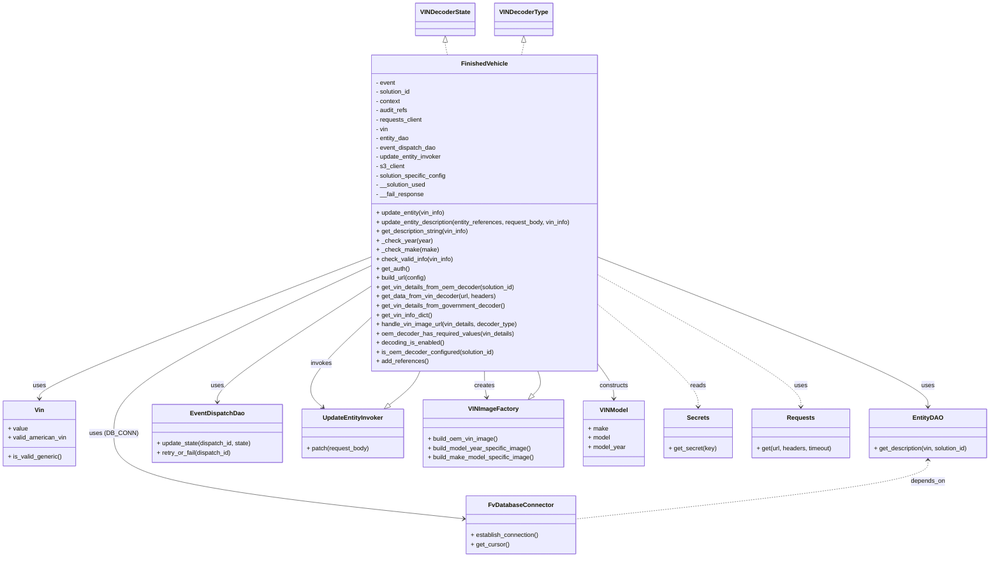

# Diagram: entity_core/entity_service/entity_service/entity/references/add_finished_vehicle_references.py


> Auto-generated by Obscura crawlers

## Diagram 1



### SVG

<svg id="container" width="2543.9609375" xmlns="http://www.w3.org/2000/svg" class="classDiagram" height="1438" viewBox="0 0 2543.9609375 1438" role="graphics-document document" aria-roledescription="class"><style>#container{font-family:"trebuchet ms",verdana,arial,sans-serif;font-size:16px;fill:#333;}@keyframes edge-animation-frame{from{stroke-dashoffset:0;}}@keyframes dash{to{stroke-dashoffset:0;}}#container .edge-animation-slow{stroke-dasharray:9,5!important;stroke-dashoffset:900;animation:dash 50s linear infinite;stroke-linecap:round;}#container .edge-animation-fast{stroke-dasharray:9,5!important;stroke-dashoffset:900;animation:dash 20s linear infinite;stroke-linecap:round;}#container .error-icon{fill:#552222;}#container .error-text{fill:#552222;stroke:#552222;}#container .edge-thickness-normal{stroke-width:1px;}#container .edge-thickness-thick{stroke-width:3.5px;}#container .edge-pattern-solid{stroke-dasharray:0;}#container .edge-thickness-invisible{stroke-width:0;fill:none;}#container .edge-pattern-dashed{stroke-dasharray:3;}#container .edge-pattern-dotted{stroke-dasharray:2;}#container .marker{fill:#333333;stroke:#333333;}#container .marker.cross{stroke:#333333;}#container svg{font-family:"trebuchet ms",verdana,arial,sans-serif;font-size:16px;}#container p{margin:0;}#container g.classGroup text{fill:#9370DB;stroke:none;font-family:"trebuchet ms",verdana,arial,sans-serif;font-size:10px;}#container g.classGroup text .title{font-weight:bolder;}#container .nodeLabel,#container .edgeLabel{color:#131300;}#container .edgeLabel .label rect{fill:#ECECFF;}#container .label text{fill:#131300;}#container .labelBkg{background:#ECECFF;}#container .edgeLabel .label span{background:#ECECFF;}#container .classTitle{font-weight:bolder;}#container .node rect,#container .node circle,#container .node ellipse,#container .node polygon,#container .node path{fill:#ECECFF;stroke:#9370DB;stroke-width:1px;}#container .divider{stroke:#9370DB;stroke-width:1;}#container g.clickable{cursor:pointer;}#container g.classGroup rect{fill:#ECECFF;stroke:#9370DB;}#container g.classGroup line{stroke:#9370DB;stroke-width:1;}#container .classLabel .box{stroke:none;stroke-width:0;fill:#ECECFF;opacity:0.5;}#container .classLabel .label{fill:#9370DB;font-size:10px;}#container .relation{stroke:#333333;stroke-width:1;fill:none;}#container .dashed-line{stroke-dasharray:3;}#container .dotted-line{stroke-dasharray:1 2;}#container #compositionStart,#container .composition{fill:#333333!important;stroke:#333333!important;stroke-width:1;}#container #compositionEnd,#container .composition{fill:#333333!important;stroke:#333333!important;stroke-width:1;}#container #dependencyStart,#container .dependency{fill:#333333!important;stroke:#333333!important;stroke-width:1;}#container #dependencyStart,#container .dependency{fill:#333333!important;stroke:#333333!important;stroke-width:1;}#container #extensionStart,#container .extension{fill:transparent!important;stroke:#333333!important;stroke-width:1;}#container #extensionEnd,#container .extension{fill:transparent!important;stroke:#333333!important;stroke-width:1;}#container #aggregationStart,#container .aggregation{fill:transparent!important;stroke:#333333!important;stroke-width:1;}#container #aggregationEnd,#container .aggregation{fill:transparent!important;stroke:#333333!important;stroke-width:1;}#container #lollipopStart,#container .lollipop{fill:#ECECFF!important;stroke:#333333!important;stroke-width:1;}#container #lollipopEnd,#container .lollipop{fill:#ECECFF!important;stroke:#333333!important;stroke-width:1;}#container .edgeTerminals{font-size:11px;line-height:initial;}#container .classTitleText{text-anchor:middle;font-size:18px;fill:#333;}#container .label-icon{display:inline-block;height:1em;overflow:visible;vertical-align:-0.125em;}#container .node .label-icon path{fill:currentColor;stroke:revert;stroke-width:revert;}#container :root{--mermaid-font-family:"trebuchet ms",verdana,arial,sans-serif;}</style><g><defs><marker id="container_class-aggregationStart" class="marker aggregation class" refX="18" refY="7" markerWidth="190" markerHeight="240" orient="auto"><path d="M 18,7 L9,13 L1,7 L9,1 Z"></path></marker></defs><defs><marker id="container_class-aggregationEnd" class="marker aggregation class" refX="1" refY="7" markerWidth="20" markerHeight="28" orient="auto"><path d="M 18,7 L9,13 L1,7 L9,1 Z"></path></marker></defs><defs><marker id="container_class-extensionStart" class="marker extension class" refX="18" refY="7" markerWidth="190" markerHeight="240" orient="auto"><path d="M 1,7 L18,13 V 1 Z"></path></marker></defs><defs><marker id="container_class-extensionEnd" class="marker extension class" refX="1" refY="7" markerWidth="20" markerHeight="28" orient="auto"><path d="M 1,1 V 13 L18,7 Z"></path></marker></defs><defs><marker id="container_class-compositionStart" class="marker composition class" refX="18" refY="7" markerWidth="190" markerHeight="240" orient="auto"><path d="M 18,7 L9,13 L1,7 L9,1 Z"></path></marker></defs><defs><marker id="container_class-compositionEnd" class="marker composition class" refX="1" refY="7" markerWidth="20" markerHeight="28" orient="auto"><path d="M 18,7 L9,13 L1,7 L9,1 Z"></path></marker></defs><defs><marker id="container_class-dependencyStart" class="marker dependency class" refX="6" refY="7" markerWidth="190" markerHeight="240" orient="auto"><path d="M 5,7 L9,13 L1,7 L9,1 Z"></path></marker></defs><defs><marker id="container_class-dependencyEnd" class="marker dependency class" refX="13" refY="7" markerWidth="20" markerHeight="28" orient="auto"><path d="M 18,7 L9,13 L14,7 L9,1 Z"></path></marker></defs><defs><marker id="container_class-lollipopStart" class="marker lollipop class" refX="13" refY="7" markerWidth="190" markerHeight="240" orient="auto"><circle stroke="black" fill="transparent" cx="7" cy="7" r="6"></circle></marker></defs><defs><marker id="container_class-lollipopEnd" class="marker lollipop class" refX="1" refY="7" markerWidth="190" markerHeight="240" orient="auto"><circle stroke="black" fill="transparent" cx="7" cy="7" r="6"></circle></marker></defs><g class="root"><g class="clusters"></g><g class="edgePaths"><path d="M942.297,666.156L802.214,720.964C662.13,775.771,381.964,885.385,241.88,945.859C101.797,1006.333,101.797,1017.667,101.797,1023.333L101.797,1029" id="id_FinishedVehicle_Vin_1" class="edge-thickness-normal edge-pattern-solid relation" style=";;;" data-edge="true" data-et="edge" data-id="id_FinishedVehicle_Vin_1" data-points="W3sieCI6OTQyLjI5Njg3NSwieSI6NjY2LjE1NjI2MjEyNzc1M30seyJ4IjoxMDEuNzk2ODc1LCJ5Ijo5OTV9LHsieCI6MTAxLjc5Njg3NSwieSI6MTAzNX1d" marker-end="url(#container_class-dependencyEnd)"></path><path d="M1536.07,665.629L1677.018,720.524C1817.966,775.419,2099.862,885.21,2240.81,949.271C2381.758,1013.333,2381.758,1031.667,2381.758,1040.833L2381.758,1050" id="id_FinishedVehicle_EntityDAO_2" class="edge-thickness-normal edge-pattern-solid relation" style=";;;" data-edge="true" data-et="edge" data-id="id_FinishedVehicle_EntityDAO_2" data-points="W3sieCI6MTUzNi4wNzAzMTI1LCJ5Ijo2NjUuNjI4ODkxMDM4OTQzN30seyJ4IjoyMzgxLjc1NzgxMjUsInkiOjk5NX0seyJ4IjoyMzgxLjc1NzgxMjUsInkiOjEwNTZ9XQ==" marker-end="url(#container_class-dependencyEnd)"></path><path d="M942.297,741.872L877.019,784.06C811.741,826.248,681.185,910.624,615.907,959.979C550.629,1009.333,550.629,1023.667,550.629,1030.833L550.629,1038" id="id_FinishedVehicle_EventDispatchDao_3" class="edge-thickness-normal edge-pattern-solid relation" style=";;;" data-edge="true" data-et="edge" data-id="id_FinishedVehicle_EventDispatchDao_3" data-points="W3sieCI6OTQyLjI5Njg3NSwieSI6NzQxLjg3MjMyNjU0NDUwNTV9LHsieCI6NTUwLjYyODkwNjI1LCJ5Ijo5OTV9LHsieCI6NTUwLjYyODkwNjI1LCJ5IjoxMDQ0fV0=" marker-end="url(#container_class-dependencyEnd)"></path><path d="M942.297,824.291L911.502,852.743C880.706,881.194,819.116,938.097,799.275,976.06C779.434,1014.022,801.343,1033.044,812.298,1042.555L823.252,1052.066" id="id_FinishedVehicle_UpdateEntityInvoker_4" class="edge-thickness-normal edge-pattern-solid relation" style=";;;" data-edge="true" data-et="edge" data-id="id_FinishedVehicle_UpdateEntityInvoker_4" data-points="W3sieCI6OTQyLjI5Njg3NSwieSI6ODI0LjI5MTE2NTM2NzAzODV9LHsieCI6NzU3LjUyNTM5MDYyNSwieSI6OTk1fSx7IngiOjgyNy43ODI4MDkzNDk3OTg0LCJ5IjoxMDU2fV0=" marker-end="url(#container_class-dependencyEnd)"></path><path d="M1239.184,958L1239.184,964.167C1239.184,970.333,1239.184,982.667,1240.149,994.017C1241.114,1005.367,1243.044,1015.734,1244.009,1020.918L1244.974,1026.101" id="id_FinishedVehicle_VINImageFactory_5" class="edge-thickness-normal edge-pattern-solid relation" style=";;;" data-edge="true" data-et="edge" data-id="id_FinishedVehicle_VINImageFactory_5" data-points="W3sieCI6MTIzOS4xODM1OTM3NSwieSI6OTU4fSx7IngiOjEyMzkuMTgzNTkzNzUsInkiOjk5NX0seyJ4IjoxMjQ2LjA3MjEzOTYxNjkzNTQsInkiOjEwMzJ9XQ==" marker-end="url(#container_class-dependencyEnd)"></path><path d="M1536.07,947.931L1541.923,955.776C1547.776,963.621,1559.482,979.31,1565.335,992.822C1571.188,1006.333,1571.188,1017.667,1571.188,1023.333L1571.188,1029" id="id_FinishedVehicle_VINModel_6" class="edge-thickness-normal edge-pattern-solid relation" style=";;;" data-edge="true" data-et="edge" data-id="id_FinishedVehicle_VINModel_6" data-points="W3sieCI6MTUzNi4wNzAzMTI1LCJ5Ijo5NDcuOTMwODI5NTk3NzMxNn0seyJ4IjoxNTcxLjE4NzUsInkiOjk5NX0seyJ4IjoxNTcxLjE4NzUsInkiOjEwMzV9XQ==" marker-end="url(#container_class-dependencyEnd)"></path><path d="M942.297,689.022L833.392,740.018C724.487,791.014,506.677,893.007,397.772,964.67C288.867,1036.333,288.867,1077.667,288.867,1119C288.867,1160.333,288.867,1201.667,438.879,1238.389C588.89,1275.111,888.913,1307.222,1038.925,1323.278L1188.936,1339.334" id="id_FinishedVehicle_FvDatabaseConnector_7" class="edge-thickness-normal edge-pattern-solid relation" style=";;;" data-edge="true" data-et="edge" data-id="id_FinishedVehicle_FvDatabaseConnector_7" data-points="W3sieCI6OTQyLjI5Njg3NSwieSI6Njg5LjAyMTY4Njg1NTk0MDN9LHsieCI6Mjg4Ljg2NzE4NzUsInkiOjk5NX0seyJ4IjoyODguODY3MTg3NSwieSI6MTExOX0seyJ4IjoyODguODY3MTg3NSwieSI6MTI0M30seyJ4IjoxMTk0LjkwMjM0Mzc1LCJ5IjoxMzM5Ljk3MjA0MDc2Mjk5OTh9XQ==" marker-end="url(#container_class-dependencyEnd)"></path><path d="M1536.07,791.591L1577.731,825.493C1619.392,859.394,1702.714,927.197,1744.374,970.265C1786.035,1013.333,1786.035,1031.667,1786.035,1040.833L1786.035,1050" id="id_FinishedVehicle_Secrets_8" class="edge-thickness-normal edge-pattern-dashed relation" style=";;;" data-edge="true" data-et="edge" data-id="id_FinishedVehicle_Secrets_8" data-points="W3sieCI6MTUzNi4wNzAzMTI1LCJ5Ijo3OTEuNTkxMzE4MTk5MzUxNX0seyJ4IjoxNzg2LjAzNTE1NjI1LCJ5Ijo5OTV9LHsieCI6MTc4Ni4wMzUxNTYyNSwieSI6MTA1Nn1d" marker-end="url(#container_class-dependencyEnd)"></path><path d="M1536.07,712.918L1621.743,759.932C1707.417,806.945,1878.763,900.973,1964.436,957.153C2050.109,1013.333,2050.109,1031.667,2050.109,1040.833L2050.109,1050" id="id_FinishedVehicle_Requests_9" class="edge-thickness-normal edge-pattern-dashed relation" style=";;;" data-edge="true" data-et="edge" data-id="id_FinishedVehicle_Requests_9" data-points="W3sieCI6MTUzNi4wNzAzMTI1LCJ5Ijo3MTIuOTE4MjI2MTc4NjA1N30seyJ4IjoyMDUwLjEwOTM3NSwieSI6OTk1fSx7IngiOjIwNTAuMTA5Mzc1LCJ5IjoxMDU2fV0=" marker-end="url(#container_class-dependencyEnd)"></path><path d="M2381.758,1188L2381.758,1197.167C2381.758,1206.333,2381.758,1224.667,2230.752,1249.995C2079.746,1275.324,1777.734,1307.648,1626.729,1323.81L1475.723,1339.972" id="id_EntityDAO_FvDatabaseConnector_10" class="edge-thickness-normal edge-pattern-dashed relation" style=";;;" data-edge="true" data-et="edge" data-id="id_EntityDAO_FvDatabaseConnector_10" data-points="W3sieCI6MjM4MS43NTc4MTI1LCJ5IjoxMTgyfSx7IngiOjIzODEuNzU3ODEyNSwieSI6MTI0M30seyJ4IjoxNDc1LjcyMjY1NjI1LCJ5IjoxMzM5Ljk3MjA0MDc2Mjk5OTh9XQ==" marker-start="url(#container_class-dependencyStart)"></path><path d="M994.121,1045.345L1004.805,1036.954C1015.488,1028.563,1036.854,1011.782,1050.045,997.224C1063.236,982.667,1068.252,970.333,1070.759,964.167L1073.267,958" id="id_UpdateEntityInvoker_FinishedVehicle_11" class="edge-thickness-normal edge-pattern-solid relation" style=";;;" data-edge="true" data-et="edge" data-id="id_UpdateEntityInvoker_FinishedVehicle_11" data-points="W3sieCI6OTgwLjU1NTQyNzc5NzM3OSwieSI6MTA1Nn0seyJ4IjoxMDU4LjIyMDcwMzEyNSwieSI6OTk1fSx7IngiOjEwNzMuMjY3MDU1ODI4NjUxOCwieSI6OTU4fV0=" marker-start="url(#container_class-extensionStart)"></path><path d="M1362.62,1019.878L1366.818,1015.731C1371.016,1011.585,1379.411,1003.293,1381.549,992.98C1383.688,982.667,1379.568,970.333,1377.509,964.167L1375.449,958" id="id_VINImageFactory_FinishedVehicle_12" class="edge-thickness-normal edge-pattern-solid relation" style=";;;" data-edge="true" data-et="edge" data-id="id_VINImageFactory_FinishedVehicle_12" data-points="W3sieCI6MTM1MC4zNDc5ODcwMjExNjkzLCJ5IjoxMDMyfSx7IngiOjEzODcuODA2NjQwNjI1LCJ5Ijo5OTV9LHsieCI6MTM3NS40NDkyMTg3NSwieSI6OTU4fV0=" marker-start="url(#container_class-extensionStart)"></path><path d="M1141.258,109.25L1141.258,110.542C1141.258,111.833,1141.258,114.417,1142.2,119.875C1143.142,125.333,1145.027,133.667,1145.969,137.833L1146.912,142" id="id_VINDecoderState_FinishedVehicle_13" class="edge-thickness-normal edge-pattern-dashed relation" style=";;;" data-edge="true" data-et="edge" data-id="id_VINDecoderState_FinishedVehicle_13" data-points="W3sieCI6MTE0MS4yNTc4MTI1LCJ5Ijo5Mn0seyJ4IjoxMTQxLjI1NzgxMjUsInkiOjExN30seyJ4IjoxMTQ2LjkxMTcyNTk2NzA5LCJ5IjoxNDJ9XQ==" marker-start="url(#container_class-extensionStart)"></path><path d="M1337.109,109.25L1337.109,110.542C1337.109,111.833,1337.109,114.417,1336.167,119.875C1335.225,125.333,1333.34,133.667,1332.398,137.833L1331.455,142" id="id_VINDecoderType_FinishedVehicle_14" class="edge-thickness-normal edge-pattern-dashed relation" style=";;;" data-edge="true" data-et="edge" data-id="id_VINDecoderType_FinishedVehicle_14" data-points="W3sieCI6MTMzNy4xMDkzNzUsInkiOjkyfSx7IngiOjEzMzcuMTA5Mzc1LCJ5IjoxMTd9LHsieCI6MTMzMS40NTU0NjE1MzI5MSwieSI6MTQyfV0=" marker-start="url(#container_class-extensionStart)"></path></g><g class="edgeLabels"><g class="edgeLabel" transform="translate(101.796875, 995)"><g class="label" data-id="id_FinishedVehicle_Vin_1" transform="translate(-16.4921875, -12)"><foreignObject width="32.984375" height="24"><div xmlns="http://www.w3.org/1999/xhtml" class="labelBkg" style="display: table-cell; white-space: nowrap; line-height: 1.5; max-width: 200px; text-align: center;"><span class="edgeLabel"><p>uses</p></span></div></foreignObject></g></g><g class="edgeLabel" transform="translate(2381.7578125, 995)"><g class="label" data-id="id_FinishedVehicle_EntityDAO_2" transform="translate(-16.4921875, -12)"><foreignObject width="32.984375" height="24"><div xmlns="http://www.w3.org/1999/xhtml" class="labelBkg" style="display: table-cell; white-space: nowrap; line-height: 1.5; max-width: 200px; text-align: center;"><span class="edgeLabel"><p>uses</p></span></div></foreignObject></g></g><g class="edgeLabel" transform="translate(550.62890625, 995)"><g class="label" data-id="id_FinishedVehicle_EventDispatchDao_3" transform="translate(-16.4921875, -12)"><foreignObject width="32.984375" height="24"><div xmlns="http://www.w3.org/1999/xhtml" class="labelBkg" style="display: table-cell; white-space: nowrap; line-height: 1.5; max-width: 200px; text-align: center;"><span class="edgeLabel"><p>uses</p></span></div></foreignObject></g></g><g class="edgeLabel" transform="translate(815.74065, 941.21541)"><g class="label" data-id="id_FinishedVehicle_UpdateEntityInvoker_4" transform="translate(-27.5859375, -12)"><foreignObject width="55.171875" height="24"><div xmlns="http://www.w3.org/1999/xhtml" class="labelBkg" style="display: table-cell; white-space: nowrap; line-height: 1.5; max-width: 200px; text-align: center;"><span class="edgeLabel"><p>invokes</p></span></div></foreignObject></g></g><g class="edgeLabel" transform="translate(1239.18359375, 995)"><g class="label" data-id="id_FinishedVehicle_VINImageFactory_5" transform="translate(-26.171875, -12)"><foreignObject width="52.34375" height="24"><div xmlns="http://www.w3.org/1999/xhtml" class="labelBkg" style="display: table-cell; white-space: nowrap; line-height: 1.5; max-width: 200px; text-align: center;"><span class="edgeLabel"><p>creates</p></span></div></foreignObject></g></g><g class="edgeLabel" transform="translate(1571.1875, 995)"><g class="label" data-id="id_FinishedVehicle_VINModel_6" transform="translate(-37.84375, -12)"><foreignObject width="75.6875" height="24"><div xmlns="http://www.w3.org/1999/xhtml" class="labelBkg" style="display: table-cell; white-space: nowrap; line-height: 1.5; max-width: 200px; text-align: center;"><span class="edgeLabel"><p>constructs</p></span></div></foreignObject></g></g><g class="edgeLabel" transform="translate(288.8671875, 1119)"><g class="label" data-id="id_FinishedVehicle_FvDatabaseConnector_7" transform="translate(-58.2734375, -12)"><foreignObject width="116.546875" height="24"><div xmlns="http://www.w3.org/1999/xhtml" class="labelBkg" style="display: table-cell; white-space: nowrap; line-height: 1.5; max-width: 200px; text-align: center;"><span class="edgeLabel"><p>uses (DB_CONN)</p></span></div></foreignObject></g></g><g class="edgeLabel" transform="translate(1786.03515625, 995)"><g class="label" data-id="id_FinishedVehicle_Secrets_8" transform="translate(-20.0078125, -12)"><foreignObject width="40.015625" height="24"><div xmlns="http://www.w3.org/1999/xhtml" class="labelBkg" style="display: table-cell; white-space: nowrap; line-height: 1.5; max-width: 200px; text-align: center;"><span class="edgeLabel"><p>reads</p></span></div></foreignObject></g></g><g class="edgeLabel" transform="translate(2050.109375, 995)"><g class="label" data-id="id_FinishedVehicle_Requests_9" transform="translate(-16.4921875, -12)"><foreignObject width="32.984375" height="24"><div xmlns="http://www.w3.org/1999/xhtml" class="labelBkg" style="display: table-cell; white-space: nowrap; line-height: 1.5; max-width: 200px; text-align: center;"><span class="edgeLabel"><p>uses</p></span></div></foreignObject></g></g><g class="edgeLabel" transform="translate(2381.7578125, 1243)"><g class="label" data-id="id_EntityDAO_FvDatabaseConnector_10" transform="translate(-44.671875, -12)"><foreignObject width="89.34375" height="24"><div xmlns="http://www.w3.org/1999/xhtml" class="labelBkg" style="display: table-cell; white-space: nowrap; line-height: 1.5; max-width: 200px; text-align: center;"><span class="edgeLabel"><p>depends_on</p></span></div></foreignObject></g></g><g class="edgeLabel"><g class="label" data-id="id_UpdateEntityInvoker_FinishedVehicle_11" transform="translate(0, 0)"><foreignObject width="0" height="0"><div xmlns="http://www.w3.org/1999/xhtml" class="labelBkg" style="display: table-cell; white-space: nowrap; line-height: 1.5; max-width: 200px; text-align: center;"><span class="edgeLabel"></span></div></foreignObject></g></g><g class="edgeLabel"><g class="label" data-id="id_VINImageFactory_FinishedVehicle_12" transform="translate(0, 0)"><foreignObject width="0" height="0"><div xmlns="http://www.w3.org/1999/xhtml" class="labelBkg" style="display: table-cell; white-space: nowrap; line-height: 1.5; max-width: 200px; text-align: center;"><span class="edgeLabel"></span></div></foreignObject></g></g><g class="edgeLabel"><g class="label" data-id="id_VINDecoderState_FinishedVehicle_13" transform="translate(0, 0)"><foreignObject width="0" height="0"><div xmlns="http://www.w3.org/1999/xhtml" class="labelBkg" style="display: table-cell; white-space: nowrap; line-height: 1.5; max-width: 200px; text-align: center;"><span class="edgeLabel"></span></div></foreignObject></g></g><g class="edgeLabel"><g class="label" data-id="id_VINDecoderType_FinishedVehicle_14" transform="translate(0, 0)"><foreignObject width="0" height="0"><div xmlns="http://www.w3.org/1999/xhtml" class="labelBkg" style="display: table-cell; white-space: nowrap; line-height: 1.5; max-width: 200px; text-align: center;"><span class="edgeLabel"></span></div></foreignObject></g></g></g><g class="nodes"><g class="node default" id="classId-FinishedVehicle-0" transform="translate(1239.18359375, 550)"><g class="basic label-container"><path d="M-296.88671875 -408 L296.88671875 -408 L296.88671875 408 L-296.88671875 408" stroke="none" stroke-width="0" fill="#ECECFF" style=""></path><path d="M-296.88671875 -408 C-91.32022291942923 -408, 114.24627291114155 -408, 296.88671875 -408 M-296.88671875 -408 C-98.09725631582921 -408, 100.69220611834157 -408, 296.88671875 -408 M296.88671875 -408 C296.88671875 -144.69669941349878, 296.88671875 118.60660117300245, 296.88671875 408 M296.88671875 -408 C296.88671875 -83.3756032522474, 296.88671875 241.2487934955052, 296.88671875 408 M296.88671875 408 C172.3468396823498 408, 47.80696061469965 408, -296.88671875 408 M296.88671875 408 C84.91585103797058 408, -127.05501667405883 408, -296.88671875 408 M-296.88671875 408 C-296.88671875 143.29101245021099, -296.88671875 -121.41797509957803, -296.88671875 -408 M-296.88671875 408 C-296.88671875 116.66008354050501, -296.88671875 -174.67983291898997, -296.88671875 -408" stroke="#9370DB" stroke-width="1.3" fill="none" stroke-dasharray="0 0" style=""></path></g><g class="annotation-group text" transform="translate(0, -384)"></g><g class="label-group text" transform="translate(-56.7265625, -384)"><g class="label" style="font-weight: bolder" transform="translate(0,-12)"><foreignObject width="113.453125" height="24"><div xmlns="http://www.w3.org/1999/xhtml" style="display: table-cell; white-space: nowrap; line-height: 1.5; max-width: 163px; text-align: center;"><span class="nodeLabel markdown-node-label" style=""><p>FinishedVehicle</p></span></div></foreignObject></g></g><g class="members-group text" transform="translate(-284.88671875, -336)"><g class="label" style="" transform="translate(0,-12)"><foreignObject width="51.03125" height="24"><div xmlns="http://www.w3.org/1999/xhtml" style="display: table-cell; white-space: nowrap; line-height: 1.5; max-width: 109px; text-align: center;"><span class="nodeLabel markdown-node-label" style=""><p>- event</p></span></div></foreignObject></g><g class="label" style="" transform="translate(0,12)"><foreignObject width="92.921875" height="24"><div xmlns="http://www.w3.org/1999/xhtml" style="display: table-cell; white-space: nowrap; line-height: 1.5; max-width: 150px; text-align: center;"><span class="nodeLabel markdown-node-label" style=""><p>- solution_id</p></span></div></foreignObject></g><g class="label" style="" transform="translate(0,36)"><foreignObject width="64.390625" height="24"><div xmlns="http://www.w3.org/1999/xhtml" style="display: table-cell; white-space: nowrap; line-height: 1.5; max-width: 122px; text-align: center;"><span class="nodeLabel markdown-node-label" style=""><p>- context</p></span></div></foreignObject></g><g class="label" style="" transform="translate(0,60)"><foreignObject width="84.0625" height="24"><div xmlns="http://www.w3.org/1999/xhtml" style="display: table-cell; white-space: nowrap; line-height: 1.5; max-width: 141px; text-align: center;"><span class="nodeLabel markdown-node-label" style=""><p>- audit_refs</p></span></div></foreignObject></g><g class="label" style="" transform="translate(0,84)"><foreignObject width="121.828125" height="24"><div xmlns="http://www.w3.org/1999/xhtml" style="display: table-cell; white-space: nowrap; line-height: 1.5; max-width: 179px; text-align: center;"><span class="nodeLabel markdown-node-label" style=""><p>- requests_client</p></span></div></foreignObject></g><g class="label" style="" transform="translate(0,108)"><foreignObject width="32.453125" height="24"><div xmlns="http://www.w3.org/1999/xhtml" style="display: table-cell; white-space: nowrap; line-height: 1.5; max-width: 90px; text-align: center;"><span class="nodeLabel markdown-node-label" style=""><p>- vin</p></span></div></foreignObject></g><g class="label" style="" transform="translate(0,132)"><foreignObject width="87.78125" height="24"><div xmlns="http://www.w3.org/1999/xhtml" style="display: table-cell; white-space: nowrap; line-height: 1.5; max-width: 145px; text-align: center;"><span class="nodeLabel markdown-node-label" style=""><p>- entity_dao</p></span></div></foreignObject></g><g class="label" style="" transform="translate(0,156)"><foreignObject width="156.8125" height="24"><div xmlns="http://www.w3.org/1999/xhtml" style="display: table-cell; white-space: nowrap; line-height: 1.5; max-width: 214px; text-align: center;"><span class="nodeLabel markdown-node-label" style=""><p>- event_dispatch_dao</p></span></div></foreignObject></g><g class="label" style="" transform="translate(0,180)"><foreignObject width="173.390625" height="24"><div xmlns="http://www.w3.org/1999/xhtml" style="display: table-cell; white-space: nowrap; line-height: 1.5; max-width: 232px; text-align: center;"><span class="nodeLabel markdown-node-label" style=""><p>- update_entity_invoker</p></span></div></foreignObject></g><g class="label" style="" transform="translate(0,204)"><foreignObject width="74.546875" height="24"><div xmlns="http://www.w3.org/1999/xhtml" style="display: table-cell; white-space: nowrap; line-height: 1.5; max-width: 132px; text-align: center;"><span class="nodeLabel markdown-node-label" style=""><p>- s3_client</p></span></div></foreignObject></g><g class="label" style="" transform="translate(0,228)"><foreignObject width="185.109375" height="24"><div xmlns="http://www.w3.org/1999/xhtml" style="display: table-cell; white-space: nowrap; line-height: 1.5; max-width: 243px; text-align: center;"><span class="nodeLabel markdown-node-label" style=""><p>- solution_specific_config</p></span></div></foreignObject></g><g class="label" style="" transform="translate(0,252)"><foreignObject width="130.078125" height="24"><div xmlns="http://www.w3.org/1999/xhtml" style="display: table-cell; white-space: nowrap; line-height: 1.5; max-width: 187px; text-align: center;"><span class="nodeLabel markdown-node-label" style=""><p>- __solution_used</p></span></div></foreignObject></g><g class="label" style="" transform="translate(0,276)"><foreignObject width="124.390625" height="24"><div xmlns="http://www.w3.org/1999/xhtml" style="display: table-cell; white-space: nowrap; line-height: 1.5; max-width: 182px; text-align: center;"><span class="nodeLabel markdown-node-label" style=""><p>- __fail_response</p></span></div></foreignObject></g></g><g class="methods-group text" transform="translate(-284.88671875, 0)"><g class="label" style="" transform="translate(0,-12)"><foreignObject width="182.09375" height="24"><div xmlns="http://www.w3.org/1999/xhtml" style="display: table-cell; white-space: nowrap; line-height: 1.5; max-width: 239px; text-align: center;"><span class="nodeLabel markdown-node-label" style=""><p>+ update_entity(vin_info)</p></span></div></foreignObject></g><g class="label" style="" transform="translate(0,12)"><foreignObject width="513.046875" height="24"><div xmlns="http://www.w3.org/1999/xhtml" style="display: table-cell; white-space: nowrap; line-height: 1.5; max-width: 570px; text-align: center;"><span class="nodeLabel markdown-node-label" style=""><p>+ update_entity_description(entity_references, request_body, vin_info)</p></span></div></foreignObject></g><g class="label" style="" transform="translate(0,36)"><foreignObject width="244.234375" height="24"><div xmlns="http://www.w3.org/1999/xhtml" style="display: table-cell; white-space: nowrap; line-height: 1.5; max-width: 302px; text-align: center;"><span class="nodeLabel markdown-node-label" style=""><p>+ get_description_string(vin_info)</p></span></div></foreignObject></g><g class="label" style="" transform="translate(0,60)"><foreignObject width="142.84375" height="24"><div xmlns="http://www.w3.org/1999/xhtml" style="display: table-cell; white-space: nowrap; line-height: 1.5; max-width: 200px; text-align: center;"><span class="nodeLabel markdown-node-label" style=""><p>+ _check_year(year)</p></span></div></foreignObject></g><g class="label" style="" transform="translate(0,84)"><foreignObject width="158.875" height="24"><div xmlns="http://www.w3.org/1999/xhtml" style="display: table-cell; white-space: nowrap; line-height: 1.5; max-width: 216px; text-align: center;"><span class="nodeLabel markdown-node-label" style=""><p>+ _check_make(make)</p></span></div></foreignObject></g><g class="label" style="" transform="translate(0,108)"><foreignObject width="202.21875" height="24"><div xmlns="http://www.w3.org/1999/xhtml" style="display: table-cell; white-space: nowrap; line-height: 1.5; max-width: 260px; text-align: center;"><span class="nodeLabel markdown-node-label" style=""><p>+ check_valid_info(vin_info)</p></span></div></foreignObject></g><g class="label" style="" transform="translate(0,132)"><foreignObject width="86.328125" height="24"><div xmlns="http://www.w3.org/1999/xhtml" style="display: table-cell; white-space: nowrap; line-height: 1.5; max-width: 144px; text-align: center;"><span class="nodeLabel markdown-node-label" style=""><p>+ get_auth()</p></span></div></foreignObject></g><g class="label" style="" transform="translate(0,156)"><foreignObject width="131.84375" height="24"><div xmlns="http://www.w3.org/1999/xhtml" style="display: table-cell; white-space: nowrap; line-height: 1.5; max-width: 189px; text-align: center;"><span class="nodeLabel markdown-node-label" style=""><p>+ build_url(config)</p></span></div></foreignObject></g><g class="label" style="" transform="translate(0,180)"><foreignObject width="363.296875" height="24"><div xmlns="http://www.w3.org/1999/xhtml" style="display: table-cell; white-space: nowrap; line-height: 1.5; max-width: 421px; text-align: center;"><span class="nodeLabel markdown-node-label" style=""><p>+ get_vin_details_from_oem_decoder(solution_id)</p></span></div></foreignObject></g><g class="label" style="" transform="translate(0,204)"><foreignObject width="311.59375" height="24"><div xmlns="http://www.w3.org/1999/xhtml" style="display: table-cell; white-space: nowrap; line-height: 1.5; max-width: 369px; text-align: center;"><span class="nodeLabel markdown-node-label" style=""><p>+ get_data_from_vin_decoder(url, headers)</p></span></div></foreignObject></g><g class="label" style="" transform="translate(0,228)"><foreignObject width="336.78125" height="24"><div xmlns="http://www.w3.org/1999/xhtml" style="display: table-cell; white-space: nowrap; line-height: 1.5; max-width: 394px; text-align: center;"><span class="nodeLabel markdown-node-label" style=""><p>+ get_vin_details_from_government_decoder()</p></span></div></foreignObject></g><g class="label" style="" transform="translate(0,252)"><foreignObject width="146.703125" height="24"><div xmlns="http://www.w3.org/1999/xhtml" style="display: table-cell; white-space: nowrap; line-height: 1.5; max-width: 204px; text-align: center;"><span class="nodeLabel markdown-node-label" style=""><p>+ get_vin_info_dict()</p></span></div></foreignObject></g><g class="label" style="" transform="translate(0,276)"><foreignObject width="367.0625" height="24"><div xmlns="http://www.w3.org/1999/xhtml" style="display: table-cell; white-space: nowrap; line-height: 1.5; max-width: 424px; text-align: center;"><span class="nodeLabel markdown-node-label" style=""><p>+ handle_vin_image_url(vin_details, decoder_type)</p></span></div></foreignObject></g><g class="label" style="" transform="translate(0,300)"><foreignObject width="357.296875" height="24"><div xmlns="http://www.w3.org/1999/xhtml" style="display: table-cell; white-space: nowrap; line-height: 1.5; max-width: 415px; text-align: center;"><span class="nodeLabel markdown-node-label" style=""><p>+ oem_decoder_has_required_values(vin_details)</p></span></div></foreignObject></g><g class="label" style="" transform="translate(0,324)"><foreignObject width="176.578125" height="24"><div xmlns="http://www.w3.org/1999/xhtml" style="display: table-cell; white-space: nowrap; line-height: 1.5; max-width: 234px; text-align: center;"><span class="nodeLabel markdown-node-label" style=""><p>+ decoding_is_enabled()</p></span></div></foreignObject></g><g class="label" style="" transform="translate(0,348)"><foreignObject width="307.109375" height="24"><div xmlns="http://www.w3.org/1999/xhtml" style="display: table-cell; white-space: nowrap; line-height: 1.5; max-width: 364px; text-align: center;"><span class="nodeLabel markdown-node-label" style=""><p>+ is_oem_decoder_configured(solution_id)</p></span></div></foreignObject></g><g class="label" style="" transform="translate(0,372)"><foreignObject width="134.40625" height="24"><div xmlns="http://www.w3.org/1999/xhtml" style="display: table-cell; white-space: nowrap; line-height: 1.5; max-width: 192px; text-align: center;"><span class="nodeLabel markdown-node-label" style=""><p>+ add_references()</p></span></div></foreignObject></g></g><g class="divider" style=""><path d="M-296.88671875 -360 C-132.59612086257957 -360, 31.694477024840864 -360, 296.88671875 -360 M-296.88671875 -360 C-84.87329057762949 -360, 127.14013759474102 -360, 296.88671875 -360" stroke="#9370DB" stroke-width="1.3" fill="none" stroke-dasharray="0 0" style=""></path></g><g class="divider" style=""><path d="M-296.88671875 -24 C-114.39031340561021 -24, 68.10609193877957 -24, 296.88671875 -24 M-296.88671875 -24 C-145.99999654356753 -24, 4.886725662864933 -24, 296.88671875 -24" stroke="#9370DB" stroke-width="1.3" fill="none" stroke-dasharray="0 0" style=""></path></g></g><g class="node default" id="classId-Vin-1" transform="translate(101.796875, 1119)"><g class="basic label-container"><path d="M-93.796875 -84 L93.796875 -84 L93.796875 84 L-93.796875 84" stroke="none" stroke-width="0" fill="#ECECFF" style=""></path><path d="M-93.796875 -84 C-27.492672879972005 -84, 38.81152924005599 -84, 93.796875 -84 M-93.796875 -84 C-24.34058397315603 -84, 45.11570705368794 -84, 93.796875 -84 M93.796875 -84 C93.796875 -20.245987674345635, 93.796875 43.50802465130873, 93.796875 84 M93.796875 -84 C93.796875 -46.47093573867693, 93.796875 -8.941871477353857, 93.796875 84 M93.796875 84 C42.70604982745633 84, -8.384775345087334 84, -93.796875 84 M93.796875 84 C21.791317045067856 84, -50.21424090986429 84, -93.796875 84 M-93.796875 84 C-93.796875 29.308996979257657, -93.796875 -25.382006041484686, -93.796875 -84 M-93.796875 84 C-93.796875 43.84278237497943, -93.796875 3.685564749958857, -93.796875 -84" stroke="#9370DB" stroke-width="1.3" fill="none" stroke-dasharray="0 0" style=""></path></g><g class="annotation-group text" transform="translate(0, -60)"></g><g class="label-group text" transform="translate(-11.4375, -60)"><g class="label" style="font-weight: bolder" transform="translate(0,-12)"><foreignObject width="22.875" height="24"><div xmlns="http://www.w3.org/1999/xhtml" style="display: table-cell; white-space: nowrap; line-height: 1.5; max-width: 73px; text-align: center;"><span class="nodeLabel markdown-node-label" style=""><p>Vin</p></span></div></foreignObject></g></g><g class="members-group text" transform="translate(-81.796875, -12)"><g class="label" style="" transform="translate(0,-12)"><foreignObject width="51.109375" height="24"><div xmlns="http://www.w3.org/1999/xhtml" style="display: table-cell; white-space: nowrap; line-height: 1.5; max-width: 108px; text-align: center;"><span class="nodeLabel markdown-node-label" style=""><p>+ value</p></span></div></foreignObject></g><g class="label" style="" transform="translate(0,12)"><foreignObject width="152.15625" height="24"><div xmlns="http://www.w3.org/1999/xhtml" style="display: table-cell; white-space: nowrap; line-height: 1.5; max-width: 210px; text-align: center;"><span class="nodeLabel markdown-node-label" style=""><p>+ valid_american_vin</p></span></div></foreignObject></g></g><g class="methods-group text" transform="translate(-81.796875, 60)"><g class="label" style="" transform="translate(0,-12)"><foreignObject width="138.71875" height="24"><div xmlns="http://www.w3.org/1999/xhtml" style="display: table-cell; white-space: nowrap; line-height: 1.5; max-width: 196px; text-align: center;"><span class="nodeLabel markdown-node-label" style=""><p>+ is_valid_generic()</p></span></div></foreignObject></g></g><g class="divider" style=""><path d="M-93.796875 -36 C-31.8073354608905 -36, 30.182204078219 -36, 93.796875 -36 M-93.796875 -36 C-51.567032585166714 -36, -9.337190170333429 -36, 93.796875 -36" stroke="#9370DB" stroke-width="1.3" fill="none" stroke-dasharray="0 0" style=""></path></g><g class="divider" style=""><path d="M-93.796875 36 C-52.42238341268118 36, -11.047891825362356 36, 93.796875 36 M-93.796875 36 C-31.309009551552357 36, 31.178855896895286 36, 93.796875 36" stroke="#9370DB" stroke-width="1.3" fill="none" stroke-dasharray="0 0" style=""></path></g></g><g class="node default" id="classId-EntityDAO-2" transform="translate(2381.7578125, 1119)"><g class="basic label-container"><path d="M-154.203125 -63 L154.203125 -63 L154.203125 63 L-154.203125 63" stroke="none" stroke-width="0" fill="#ECECFF" style=""></path><path d="M-154.203125 -63 C-51.103763245427615 -63, 51.99559850914477 -63, 154.203125 -63 M-154.203125 -63 C-46.048731399057644 -63, 62.10566220188471 -63, 154.203125 -63 M154.203125 -63 C154.203125 -22.389494556346527, 154.203125 18.221010887306946, 154.203125 63 M154.203125 -63 C154.203125 -27.143474428715507, 154.203125 8.713051142568986, 154.203125 63 M154.203125 63 C69.65211249802638 63, -14.898900003947233 63, -154.203125 63 M154.203125 63 C79.46765233509018 63, 4.732179670180358 63, -154.203125 63 M-154.203125 63 C-154.203125 15.308001828140306, -154.203125 -32.38399634371939, -154.203125 -63 M-154.203125 63 C-154.203125 13.941596560354036, -154.203125 -35.11680687929193, -154.203125 -63" stroke="#9370DB" stroke-width="1.3" fill="none" stroke-dasharray="0 0" style=""></path></g><g class="annotation-group text" transform="translate(0, -39)"></g><g class="label-group text" transform="translate(-36.578125, -39)"><g class="label" style="font-weight: bolder" transform="translate(0,-12)"><foreignObject width="73.15625" height="24"><div xmlns="http://www.w3.org/1999/xhtml" style="display: table-cell; white-space: nowrap; line-height: 1.5; max-width: 122px; text-align: center;"><span class="nodeLabel markdown-node-label" style=""><p>EntityDAO</p></span></div></foreignObject></g></g><g class="members-group text" transform="translate(-142.203125, 9)"></g><g class="methods-group text" transform="translate(-142.203125, 39)"><g class="label" style="" transform="translate(0,-12)"><foreignObject width="247.828125" height="24"><div xmlns="http://www.w3.org/1999/xhtml" style="display: table-cell; white-space: nowrap; line-height: 1.5; max-width: 305px; text-align: center;"><span class="nodeLabel markdown-node-label" style=""><p>+ get_description(vin, solution_id)</p></span></div></foreignObject></g></g><g class="divider" style=""><path d="M-154.203125 -15 C-84.52786900469998 -15, -14.85261300939996 -15, 154.203125 -15 M-154.203125 -15 C-50.035727683058994 -15, 54.13166963388201 -15, 154.203125 -15" stroke="#9370DB" stroke-width="1.3" fill="none" stroke-dasharray="0 0" style=""></path></g><g class="divider" style=""><path d="M-154.203125 9 C-63.23852530421031 9, 27.726074391579374 9, 154.203125 9 M-154.203125 9 C-80.05990795583307 9, -5.916690911666137 9, 154.203125 9" stroke="#9370DB" stroke-width="1.3" fill="none" stroke-dasharray="0 0" style=""></path></g></g><g class="node default" id="classId-EventDispatchDao-3" transform="translate(550.62890625, 1119)"><g class="basic label-container"><path d="M-168.48828125 -75 L168.48828125 -75 L168.48828125 75 L-168.48828125 75" stroke="none" stroke-width="0" fill="#ECECFF" style=""></path><path d="M-168.48828125 -75 C-70.25243010921464 -75, 27.983421031570714 -75, 168.48828125 -75 M-168.48828125 -75 C-98.08564403084276 -75, -27.683006811685516 -75, 168.48828125 -75 M168.48828125 -75 C168.48828125 -41.424046492604624, 168.48828125 -7.848092985209249, 168.48828125 75 M168.48828125 -75 C168.48828125 -38.88968269709889, 168.48828125 -2.7793653941977823, 168.48828125 75 M168.48828125 75 C65.81654350930883 75, -36.85519423138234 75, -168.48828125 75 M168.48828125 75 C95.29280599747082 75, 22.097330744941644 75, -168.48828125 75 M-168.48828125 75 C-168.48828125 39.092505131543135, -168.48828125 3.1850102630862693, -168.48828125 -75 M-168.48828125 75 C-168.48828125 37.20996203299689, -168.48828125 -0.5800759340062172, -168.48828125 -75" stroke="#9370DB" stroke-width="1.3" fill="none" stroke-dasharray="0 0" style=""></path></g><g class="annotation-group text" transform="translate(0, -51)"></g><g class="label-group text" transform="translate(-66.1953125, -51)"><g class="label" style="font-weight: bolder" transform="translate(0,-12)"><foreignObject width="132.390625" height="24"><div xmlns="http://www.w3.org/1999/xhtml" style="display: table-cell; white-space: nowrap; line-height: 1.5; max-width: 181px; text-align: center;"><span class="nodeLabel markdown-node-label" style=""><p>EventDispatchDao</p></span></div></foreignObject></g></g><g class="members-group text" transform="translate(-156.48828125, -3)"></g><g class="methods-group text" transform="translate(-156.48828125, 27)"><g class="label" style="" transform="translate(0,-12)"><foreignObject width="246.78125" height="24"><div xmlns="http://www.w3.org/1999/xhtml" style="display: table-cell; white-space: nowrap; line-height: 1.5; max-width: 304px; text-align: center;"><span class="nodeLabel markdown-node-label" style=""><p>+ update_state(dispatch_id, state)</p></span></div></foreignObject></g><g class="label" style="" transform="translate(0,12)"><foreignObject width="194.078125" height="24"><div xmlns="http://www.w3.org/1999/xhtml" style="display: table-cell; white-space: nowrap; line-height: 1.5; max-width: 251px; text-align: center;"><span class="nodeLabel markdown-node-label" style=""><p>+ retry_or_fail(dispatch_id)</p></span></div></foreignObject></g></g><g class="divider" style=""><path d="M-168.48828125 -27 C-54.83089641940859 -27, 58.82648841118282 -27, 168.48828125 -27 M-168.48828125 -27 C-76.68043332938169 -27, 15.12741459123663 -27, 168.48828125 -27" stroke="#9370DB" stroke-width="1.3" fill="none" stroke-dasharray="0 0" style=""></path></g><g class="divider" style=""><path d="M-168.48828125 -3 C-97.62035777272831 -3, -26.752434295456624 -3, 168.48828125 -3 M-168.48828125 -3 C-60.52767980955687 -3, 47.432921630886256 -3, 168.48828125 -3" stroke="#9370DB" stroke-width="1.3" fill="none" stroke-dasharray="0 0" style=""></path></g></g><g class="node default" id="classId-UpdateEntityInvoker-4" transform="translate(900.34375, 1119)"><g class="basic label-container"><path d="M-131.2265625 -63 L131.2265625 -63 L131.2265625 63 L-131.2265625 63" stroke="none" stroke-width="0" fill="#ECECFF" style=""></path><path d="M-131.2265625 -63 C-55.933403205593834 -63, 19.359756088812333 -63, 131.2265625 -63 M-131.2265625 -63 C-44.7045172621834 -63, 41.8175279756332 -63, 131.2265625 -63 M131.2265625 -63 C131.2265625 -24.124150027069298, 131.2265625 14.751699945861404, 131.2265625 63 M131.2265625 -63 C131.2265625 -19.13062113345395, 131.2265625 24.7387577330921, 131.2265625 63 M131.2265625 63 C53.06931478477692 63, -25.087932930446158 63, -131.2265625 63 M131.2265625 63 C51.0926998047877 63, -29.0411628904246 63, -131.2265625 63 M-131.2265625 63 C-131.2265625 26.354768004539594, -131.2265625 -10.290463990920813, -131.2265625 -63 M-131.2265625 63 C-131.2265625 33.68530544011243, -131.2265625 4.370610880224859, -131.2265625 -63" stroke="#9370DB" stroke-width="1.3" fill="none" stroke-dasharray="0 0" style=""></path></g><g class="annotation-group text" transform="translate(0, -39)"></g><g class="label-group text" transform="translate(-75.375, -39)"><g class="label" style="font-weight: bolder" transform="translate(0,-12)"><foreignObject width="150.75" height="24"><div xmlns="http://www.w3.org/1999/xhtml" style="display: table-cell; white-space: nowrap; line-height: 1.5; max-width: 199px; text-align: center;"><span class="nodeLabel markdown-node-label" style=""><p>UpdateEntityInvoker</p></span></div></foreignObject></g></g><g class="members-group text" transform="translate(-119.2265625, 9)"></g><g class="methods-group text" transform="translate(-119.2265625, 39)"><g class="label" style="" transform="translate(0,-12)"><foreignObject width="163.078125" height="24"><div xmlns="http://www.w3.org/1999/xhtml" style="display: table-cell; white-space: nowrap; line-height: 1.5; max-width: 220px; text-align: center;"><span class="nodeLabel markdown-node-label" style=""><p>+ patch(request_body)</p></span></div></foreignObject></g></g><g class="divider" style=""><path d="M-131.2265625 -15 C-75.86609467401865 -15, -20.50562684803731 -15, 131.2265625 -15 M-131.2265625 -15 C-38.53909385099362 -15, 54.14837479801275 -15, 131.2265625 -15" stroke="#9370DB" stroke-width="1.3" fill="none" stroke-dasharray="0 0" style=""></path></g><g class="divider" style=""><path d="M-131.2265625 9 C-70.61300832939449 9, -9.999454158788964 9, 131.2265625 9 M-131.2265625 9 C-40.71659801669732 9, 49.79336646660536 9, 131.2265625 9" stroke="#9370DB" stroke-width="1.3" fill="none" stroke-dasharray="0 0" style=""></path></g></g><g class="node default" id="classId-VINImageFactory-5" transform="translate(1262.26953125, 1119)"><g class="basic label-container"><path d="M-180.69921875 -87 L180.69921875 -87 L180.69921875 87 L-180.69921875 87" stroke="none" stroke-width="0" fill="#ECECFF" style=""></path><path d="M-180.69921875 -87 C-61.68124587984853 -87, 57.336726990302935 -87, 180.69921875 -87 M-180.69921875 -87 C-55.86116667100087 -87, 68.97688540799825 -87, 180.69921875 -87 M180.69921875 -87 C180.69921875 -51.24308470743945, 180.69921875 -15.486169414878901, 180.69921875 87 M180.69921875 -87 C180.69921875 -40.167705181763985, 180.69921875 6.66458963647203, 180.69921875 87 M180.69921875 87 C70.99178629998958 87, -38.71564615002083 87, -180.69921875 87 M180.69921875 87 C81.36755702413762 87, -17.96410470172475 87, -180.69921875 87 M-180.69921875 87 C-180.69921875 27.288987273838018, -180.69921875 -32.422025452323965, -180.69921875 -87 M-180.69921875 87 C-180.69921875 22.536399870309197, -180.69921875 -41.92720025938161, -180.69921875 -87" stroke="#9370DB" stroke-width="1.3" fill="none" stroke-dasharray="0 0" style=""></path></g><g class="annotation-group text" transform="translate(0, -63)"></g><g class="label-group text" transform="translate(-60.8671875, -63)"><g class="label" style="font-weight: bolder" transform="translate(0,-12)"><foreignObject width="121.734375" height="24"><div xmlns="http://www.w3.org/1999/xhtml" style="display: table-cell; white-space: nowrap; line-height: 1.5; max-width: 171px; text-align: center;"><span class="nodeLabel markdown-node-label" style=""><p>VINImageFactory</p></span></div></foreignObject></g></g><g class="members-group text" transform="translate(-168.69921875, -15)"></g><g class="methods-group text" transform="translate(-168.69921875, 15)"><g class="label" style="" transform="translate(0,-12)"><foreignObject width="181.359375" height="24"><div xmlns="http://www.w3.org/1999/xhtml" style="display: table-cell; white-space: nowrap; line-height: 1.5; max-width: 239px; text-align: center;"><span class="nodeLabel markdown-node-label" style=""><p>+ build_oem_vin_image()</p></span></div></foreignObject></g><g class="label" style="" transform="translate(0,12)"><foreignObject width="267.484375" height="24"><div xmlns="http://www.w3.org/1999/xhtml" style="display: table-cell; white-space: nowrap; line-height: 1.5; max-width: 325px; text-align: center;"><span class="nodeLabel markdown-node-label" style=""><p>+ build_model_year_specific_image()</p></span></div></foreignObject></g><g class="label" style="" transform="translate(0,36)"><foreignObject width="276.53125" height="24"><div xmlns="http://www.w3.org/1999/xhtml" style="display: table-cell; white-space: nowrap; line-height: 1.5; max-width: 334px; text-align: center;"><span class="nodeLabel markdown-node-label" style=""><p>+ build_make_model_specific_image()</p></span></div></foreignObject></g></g><g class="divider" style=""><path d="M-180.69921875 -39 C-85.47193208199336 -39, 9.755354586013283 -39, 180.69921875 -39 M-180.69921875 -39 C-78.86780892667511 -39, 22.96360089664978 -39, 180.69921875 -39" stroke="#9370DB" stroke-width="1.3" fill="none" stroke-dasharray="0 0" style=""></path></g><g class="divider" style=""><path d="M-180.69921875 -15 C-90.16261229716477 -15, 0.37399415567045935 -15, 180.69921875 -15 M-180.69921875 -15 C-72.04836554268465 -15, 36.6024876646307 -15, 180.69921875 -15" stroke="#9370DB" stroke-width="1.3" fill="none" stroke-dasharray="0 0" style=""></path></g></g><g class="node default" id="classId-VINModel-6" transform="translate(1571.1875, 1119)"><g class="basic label-container"><path d="M-78.21875 -84 L78.21875 -84 L78.21875 84 L-78.21875 84" stroke="none" stroke-width="0" fill="#ECECFF" style=""></path><path d="M-78.21875 -84 C-38.6969918062108 -84, 0.824766387578407 -84, 78.21875 -84 M-78.21875 -84 C-19.041672208917127 -84, 40.135405582165745 -84, 78.21875 -84 M78.21875 -84 C78.21875 -32.92669004890859, 78.21875 18.14661990218282, 78.21875 84 M78.21875 -84 C78.21875 -36.17142821908109, 78.21875 11.657143561837813, 78.21875 84 M78.21875 84 C16.200900743936202 84, -45.816948512127595 84, -78.21875 84 M78.21875 84 C42.24214507593477 84, 6.265540151869544 84, -78.21875 84 M-78.21875 84 C-78.21875 30.84625493893354, -78.21875 -22.30749012213292, -78.21875 -84 M-78.21875 84 C-78.21875 34.711078131076974, -78.21875 -14.577843737846052, -78.21875 -84" stroke="#9370DB" stroke-width="1.3" fill="none" stroke-dasharray="0 0" style=""></path></g><g class="annotation-group text" transform="translate(0, -60)"></g><g class="label-group text" transform="translate(-34.765625, -60)"><g class="label" style="font-weight: bolder" transform="translate(0,-12)"><foreignObject width="69.53125" height="24"><div xmlns="http://www.w3.org/1999/xhtml" style="display: table-cell; white-space: nowrap; line-height: 1.5; max-width: 120px; text-align: center;"><span class="nodeLabel markdown-node-label" style=""><p>VINModel</p></span></div></foreignObject></g></g><g class="members-group text" transform="translate(-66.21875, -12)"><g class="label" style="" transform="translate(0,-12)"><foreignObject width="51.421875" height="24"><div xmlns="http://www.w3.org/1999/xhtml" style="display: table-cell; white-space: nowrap; line-height: 1.5; max-width: 109px; text-align: center;"><span class="nodeLabel markdown-node-label" style=""><p>+ make</p></span></div></foreignObject></g><g class="label" style="" transform="translate(0,12)"><foreignObject width="58.265625" height="24"><div xmlns="http://www.w3.org/1999/xhtml" style="display: table-cell; white-space: nowrap; line-height: 1.5; max-width: 116px; text-align: center;"><span class="nodeLabel markdown-node-label" style=""><p>+ model</p></span></div></foreignObject></g><g class="label" style="" transform="translate(0,36)"><foreignObject width="97.671875" height="24"><div xmlns="http://www.w3.org/1999/xhtml" style="display: table-cell; white-space: nowrap; line-height: 1.5; max-width: 156px; text-align: center;"><span class="nodeLabel markdown-node-label" style=""><p>+ model_year</p></span></div></foreignObject></g></g><g class="methods-group text" transform="translate(-66.21875, 84)"></g><g class="divider" style=""><path d="M-78.21875 -36 C-18.03738592409467 -36, 42.14397815181066 -36, 78.21875 -36 M-78.21875 -36 C-24.037630284465493 -36, 30.143489431069014 -36, 78.21875 -36" stroke="#9370DB" stroke-width="1.3" fill="none" stroke-dasharray="0 0" style=""></path></g><g class="divider" style=""><path d="M-78.21875 60 C-35.44529858633275 60, 7.328152827334506 60, 78.21875 60 M-78.21875 60 C-28.447265376122004 60, 21.32421924775599 60, 78.21875 60" stroke="#9370DB" stroke-width="1.3" fill="none" stroke-dasharray="0 0" style=""></path></g></g><g class="node default" id="classId-FvDatabaseConnector-7" transform="translate(1335.3125, 1355)"><g class="basic label-container"><path d="M-140.41015625 -75 L140.41015625 -75 L140.41015625 75 L-140.41015625 75" stroke="none" stroke-width="0" fill="#ECECFF" style=""></path><path d="M-140.41015625 -75 C-41.33112712370327 -75, 57.74790200259346 -75, 140.41015625 -75 M-140.41015625 -75 C-43.6622780451863 -75, 53.085600159627404 -75, 140.41015625 -75 M140.41015625 -75 C140.41015625 -24.749593234944314, 140.41015625 25.500813530111373, 140.41015625 75 M140.41015625 -75 C140.41015625 -33.013200311053225, 140.41015625 8.97359937789355, 140.41015625 75 M140.41015625 75 C33.920213868282545 75, -72.56972851343491 75, -140.41015625 75 M140.41015625 75 C53.49098427035936 75, -33.428187709281275 75, -140.41015625 75 M-140.41015625 75 C-140.41015625 32.51376192330124, -140.41015625 -9.972476153397523, -140.41015625 -75 M-140.41015625 75 C-140.41015625 42.921865641463185, -140.41015625 10.84373128292637, -140.41015625 -75" stroke="#9370DB" stroke-width="1.3" fill="none" stroke-dasharray="0 0" style=""></path></g><g class="annotation-group text" transform="translate(0, -51)"></g><g class="label-group text" transform="translate(-79.3046875, -51)"><g class="label" style="font-weight: bolder" transform="translate(0,-12)"><foreignObject width="158.609375" height="24"><div xmlns="http://www.w3.org/1999/xhtml" style="display: table-cell; white-space: nowrap; line-height: 1.5; max-width: 207px; text-align: center;"><span class="nodeLabel markdown-node-label" style=""><p>FvDatabaseConnector</p></span></div></foreignObject></g></g><g class="members-group text" transform="translate(-128.41015625, -3)"></g><g class="methods-group text" transform="translate(-128.41015625, 27)"><g class="label" style="" transform="translate(0,-12)"><foreignObject width="177.515625" height="24"><div xmlns="http://www.w3.org/1999/xhtml" style="display: table-cell; white-space: nowrap; line-height: 1.5; max-width: 235px; text-align: center;"><span class="nodeLabel markdown-node-label" style=""><p>+ establish_connection()</p></span></div></foreignObject></g><g class="label" style="" transform="translate(0,12)"><foreignObject width="98.890625" height="24"><div xmlns="http://www.w3.org/1999/xhtml" style="display: table-cell; white-space: nowrap; line-height: 1.5; max-width: 156px; text-align: center;"><span class="nodeLabel markdown-node-label" style=""><p>+ get_cursor()</p></span></div></foreignObject></g></g><g class="divider" style=""><path d="M-140.41015625 -27 C-83.85463833003087 -27, -27.299120410061732 -27, 140.41015625 -27 M-140.41015625 -27 C-73.8875208655712 -27, -7.364885481142409 -27, 140.41015625 -27" stroke="#9370DB" stroke-width="1.3" fill="none" stroke-dasharray="0 0" style=""></path></g><g class="divider" style=""><path d="M-140.41015625 -3 C-50.8007463567084 -3, 38.8086635365832 -3, 140.41015625 -3 M-140.41015625 -3 C-63.12694812229667 -3, 14.156260005406665 -3, 140.41015625 -3" stroke="#9370DB" stroke-width="1.3" fill="none" stroke-dasharray="0 0" style=""></path></g></g><g class="node default" id="classId-Secrets-8" transform="translate(1786.03515625, 1119)"><g class="basic label-container"><path d="M-86.62890625 -63 L86.62890625 -63 L86.62890625 63 L-86.62890625 63" stroke="none" stroke-width="0" fill="#ECECFF" style=""></path><path d="M-86.62890625 -63 C-36.555706938180684 -63, 13.517492373638632 -63, 86.62890625 -63 M-86.62890625 -63 C-35.459064357173865 -63, 15.71077753565227 -63, 86.62890625 -63 M86.62890625 -63 C86.62890625 -24.062871851454283, 86.62890625 14.874256297091435, 86.62890625 63 M86.62890625 -63 C86.62890625 -34.042835881624114, 86.62890625 -5.085671763248229, 86.62890625 63 M86.62890625 63 C35.38722515646236 63, -15.854455937075286 63, -86.62890625 63 M86.62890625 63 C48.60348788560544 63, 10.578069521210878 63, -86.62890625 63 M-86.62890625 63 C-86.62890625 26.87914214966159, -86.62890625 -9.24171570067682, -86.62890625 -63 M-86.62890625 63 C-86.62890625 12.892491022634474, -86.62890625 -37.21501795473105, -86.62890625 -63" stroke="#9370DB" stroke-width="1.3" fill="none" stroke-dasharray="0 0" style=""></path></g><g class="annotation-group text" transform="translate(0, -39)"></g><g class="label-group text" transform="translate(-27.1640625, -39)"><g class="label" style="font-weight: bolder" transform="translate(0,-12)"><foreignObject width="54.328125" height="24"><div xmlns="http://www.w3.org/1999/xhtml" style="display: table-cell; white-space: nowrap; line-height: 1.5; max-width: 103px; text-align: center;"><span class="nodeLabel markdown-node-label" style=""><p>Secrets</p></span></div></foreignObject></g></g><g class="members-group text" transform="translate(-74.62890625, 9)"></g><g class="methods-group text" transform="translate(-74.62890625, 39)"><g class="label" style="" transform="translate(0,-12)"><foreignObject width="122.09375" height="24"><div xmlns="http://www.w3.org/1999/xhtml" style="display: table-cell; white-space: nowrap; line-height: 1.5; max-width: 179px; text-align: center;"><span class="nodeLabel markdown-node-label" style=""><p>+ get_secret(key)</p></span></div></foreignObject></g></g><g class="divider" style=""><path d="M-86.62890625 -15 C-41.549561387933835 -15, 3.52978347413233 -15, 86.62890625 -15 M-86.62890625 -15 C-19.54850104257443 -15, 47.53190416485114 -15, 86.62890625 -15" stroke="#9370DB" stroke-width="1.3" fill="none" stroke-dasharray="0 0" style=""></path></g><g class="divider" style=""><path d="M-86.62890625 9 C-29.65296693258759 9, 27.322972384824823 9, 86.62890625 9 M-86.62890625 9 C-48.822400369214755 9, -11.01589448842951 9, 86.62890625 9" stroke="#9370DB" stroke-width="1.3" fill="none" stroke-dasharray="0 0" style=""></path></g></g><g class="node default" id="classId-VINDecoderState-9" transform="translate(1141.2578125, 50)"><g class="basic label-container"><path d="M-73.9140625 -42 L73.9140625 -42 L73.9140625 42 L-73.9140625 42" stroke="none" stroke-width="0" fill="#ECECFF" style=""></path><path d="M-73.9140625 -42 C-44.13931302892898 -42, -14.364563557857956 -42, 73.9140625 -42 M-73.9140625 -42 C-30.09440769364631 -42, 13.725247112707379 -42, 73.9140625 -42 M73.9140625 -42 C73.9140625 -19.213241685680625, 73.9140625 3.5735166286387496, 73.9140625 42 M73.9140625 -42 C73.9140625 -23.74921370069789, 73.9140625 -5.49842740139578, 73.9140625 42 M73.9140625 42 C16.427970249591894 42, -41.05812200081621 42, -73.9140625 42 M73.9140625 42 C30.89323942057036 42, -12.12758365885928 42, -73.9140625 42 M-73.9140625 42 C-73.9140625 20.63723858290933, -73.9140625 -0.7255228341813407, -73.9140625 -42 M-73.9140625 42 C-73.9140625 19.93806969152412, -73.9140625 -2.1238606169517595, -73.9140625 -42" stroke="#9370DB" stroke-width="1.3" fill="none" stroke-dasharray="0 0" style=""></path></g><g class="annotation-group text" transform="translate(0, -18)"></g><g class="label-group text" transform="translate(-61.9140625, -18)"><g class="label" style="font-weight: bolder" transform="translate(0,-12)"><foreignObject width="123.828125" height="24"><div xmlns="http://www.w3.org/1999/xhtml" style="display: table-cell; white-space: nowrap; line-height: 1.5; max-width: 172px; text-align: center;"><span class="nodeLabel markdown-node-label" style=""><p>VINDecoderState</p></span></div></foreignObject></g></g><g class="members-group text" transform="translate(-61.9140625, 30)"></g><g class="methods-group text" transform="translate(-61.9140625, 60)"></g><g class="divider" style=""><path d="M-73.9140625 6 C-43.64571213744716 6, -13.377361774894325 6, 73.9140625 6 M-73.9140625 6 C-37.84306975720608 6, -1.7720770144121616 6, 73.9140625 6" stroke="#9370DB" stroke-width="1.3" fill="none" stroke-dasharray="0 0" style=""></path></g><g class="divider" style=""><path d="M-73.9140625 24 C-20.51930392901953 24, 32.87545464196094 24, 73.9140625 24 M-73.9140625 24 C-29.32535561680816 24, 15.26335126638368 24, 73.9140625 24" stroke="#9370DB" stroke-width="1.3" fill="none" stroke-dasharray="0 0" style=""></path></g></g><g class="node default" id="classId-VINDecoderType-10" transform="translate(1337.109375, 50)"><g class="basic label-container"><path d="M-71.9375 -42 L71.9375 -42 L71.9375 42 L-71.9375 42" stroke="none" stroke-width="0" fill="#ECECFF" style=""></path><path d="M-71.9375 -42 C-25.040632815550936 -42, 21.85623436889813 -42, 71.9375 -42 M-71.9375 -42 C-25.879813361820815 -42, 20.17787327635837 -42, 71.9375 -42 M71.9375 -42 C71.9375 -21.195090563499754, 71.9375 -0.3901811269995079, 71.9375 42 M71.9375 -42 C71.9375 -13.254208873575578, 71.9375 15.491582252848843, 71.9375 42 M71.9375 42 C26.716026410808894 42, -18.505447178382212 42, -71.9375 42 M71.9375 42 C36.8054626486391 42, 1.6734252972782002 42, -71.9375 42 M-71.9375 42 C-71.9375 8.820130030685782, -71.9375 -24.359739938628437, -71.9375 -42 M-71.9375 42 C-71.9375 8.565523080748875, -71.9375 -24.86895383850225, -71.9375 -42" stroke="#9370DB" stroke-width="1.3" fill="none" stroke-dasharray="0 0" style=""></path></g><g class="annotation-group text" transform="translate(0, -18)"></g><g class="label-group text" transform="translate(-59.9375, -18)"><g class="label" style="font-weight: bolder" transform="translate(0,-12)"><foreignObject width="119.875" height="24"><div xmlns="http://www.w3.org/1999/xhtml" style="display: table-cell; white-space: nowrap; line-height: 1.5; max-width: 168px; text-align: center;"><span class="nodeLabel markdown-node-label" style=""><p>VINDecoderType</p></span></div></foreignObject></g></g><g class="members-group text" transform="translate(-59.9375, 30)"></g><g class="methods-group text" transform="translate(-59.9375, 60)"></g><g class="divider" style=""><path d="M-71.9375 6 C-14.693270306478198 6, 42.550959387043605 6, 71.9375 6 M-71.9375 6 C-17.77633876593731 6, 36.38482246812538 6, 71.9375 6" stroke="#9370DB" stroke-width="1.3" fill="none" stroke-dasharray="0 0" style=""></path></g><g class="divider" style=""><path d="M-71.9375 24 C-37.70343592457678 24, -3.4693718491535606 24, 71.9375 24 M-71.9375 24 C-27.095337864431905 24, 17.74682427113619 24, 71.9375 24" stroke="#9370DB" stroke-width="1.3" fill="none" stroke-dasharray="0 0" style=""></path></g></g><g class="node default" id="classId-Requests-11" transform="translate(2050.109375, 1119)"><g class="basic label-container"><path d="M-127.4453125 -63 L127.4453125 -63 L127.4453125 63 L-127.4453125 63" stroke="none" stroke-width="0" fill="#ECECFF" style=""></path><path d="M-127.4453125 -63 C-29.64239614461438 -63, 68.16052021077124 -63, 127.4453125 -63 M-127.4453125 -63 C-64.32219186030686 -63, -1.1990712206137175 -63, 127.4453125 -63 M127.4453125 -63 C127.4453125 -22.17597750562677, 127.4453125 18.648044988746463, 127.4453125 63 M127.4453125 -63 C127.4453125 -16.341892788615894, 127.4453125 30.316214422768212, 127.4453125 63 M127.4453125 63 C67.69830248980796 63, 7.95129247961593 63, -127.4453125 63 M127.4453125 63 C38.716779467751266 63, -50.01175356449747 63, -127.4453125 63 M-127.4453125 63 C-127.4453125 26.840164680480996, -127.4453125 -9.319670639038009, -127.4453125 -63 M-127.4453125 63 C-127.4453125 34.73270912682682, -127.4453125 6.465418253653638, -127.4453125 -63" stroke="#9370DB" stroke-width="1.3" fill="none" stroke-dasharray="0 0" style=""></path></g><g class="annotation-group text" transform="translate(0, -39)"></g><g class="label-group text" transform="translate(-33.84375, -39)"><g class="label" style="font-weight: bolder" transform="translate(0,-12)"><foreignObject width="67.6875" height="24"><div xmlns="http://www.w3.org/1999/xhtml" style="display: table-cell; white-space: nowrap; line-height: 1.5; max-width: 116px; text-align: center;"><span class="nodeLabel markdown-node-label" style=""><p>Requests</p></span></div></foreignObject></g></g><g class="members-group text" transform="translate(-115.4453125, 9)"></g><g class="methods-group text" transform="translate(-115.4453125, 39)"><g class="label" style="" transform="translate(0,-12)"><foreignObject width="197.046875" height="24"><div xmlns="http://www.w3.org/1999/xhtml" style="display: table-cell; white-space: nowrap; line-height: 1.5; max-width: 254px; text-align: center;"><span class="nodeLabel markdown-node-label" style=""><p>+ get(url, headers, timeout)</p></span></div></foreignObject></g></g><g class="divider" style=""><path d="M-127.4453125 -15 C-72.07927669259776 -15, -16.713240885195518 -15, 127.4453125 -15 M-127.4453125 -15 C-63.996597313140406 -15, -0.5478821262808111 -15, 127.4453125 -15" stroke="#9370DB" stroke-width="1.3" fill="none" stroke-dasharray="0 0" style=""></path></g><g class="divider" style=""><path d="M-127.4453125 9 C-72.18542029689009 9, -16.925528093780173 9, 127.4453125 9 M-127.4453125 9 C-32.326072354823594 9, 62.79316779035281 9, 127.4453125 9" stroke="#9370DB" stroke-width="1.3" fill="none" stroke-dasharray="0 0" style=""></path></g></g></g></g></g></svg>

## Diagram 2

```mermaid
flowchart TD
Start([Add References])
A{VIN valid generic?}
Start --> A
A -- No --> Invalid[update_state(INVALID_CHAR) and log warning]
Invalid --> Done([Return 200])
A -- Yes --> B{Decoding enabled?}
B -- No --> NoAction[update_state(NO_ACTION)]
NoAction --> Done
B -- Yes --> C[get_vin_info_dict()]
C --> C_try{Got VIN info or exceptions}
C_try -- exception --> Exception[retry_or_fail(dispatch_id) and return error response]
C_try -- ok --> D{check_valid_info(vin_info)}
D -- yes --> E[update_entity(vin_info)]
E --> E_try{patch response status}
E_try -- 409 --> Conflict[update_state(FAILURE) and raise ConflictError]
E_try -- >=400 --> Unhandled[retry_or_fail(dispatch_id) and raise]
E_try -- success --> F{decoder_state == COMPLETE?}
F -- yes --> UpdateComplete[update_state(COMPLETE)]
F -- no --> UpdateUnavailable[update_state(UNAVAILABLE)]
UpdateComplete --> Done
UpdateUnavailable --> Done
D -- no --> RetryLater[log warning and update_state(UNAVAILABLE)]
RetryLater --> Done
```

> SVG rendering failed for this diagram.
