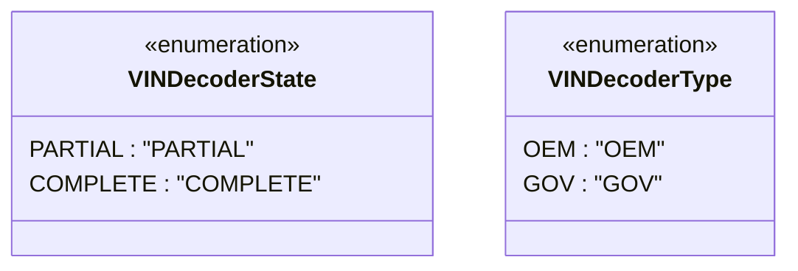

# Diagram: entity_core/entity_service/entity_service/entity/references/constants.py

> Auto-generated by Obscura crawlers

## Mermaid

```mermaid
classDiagram
class VINDecoderState <<enumeration>> {
  PARTIAL : "PARTIAL"
  COMPLETE : "COMPLETE"
}
class VINDecoderType <<enumeration>> {
  OEM : "OEM"
  GOV : "GOV"
}
```

> SVG rendering failed for this diagram.
