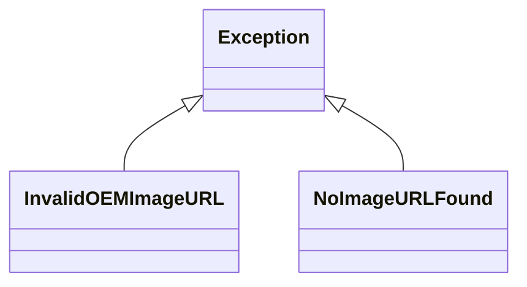

# Diagram: entity_core/entity_service/entity_service/entity/references/exceptions.py

> Auto-generated by Obscura crawlers

## Mermaid

### SVG

<svg id="container" width="404.9375" xmlns="http://www.w3.org/2000/svg" class="classDiagram" height="234" viewBox="0 0 404.9375 234" role="graphics-document document" aria-roledescription="class"><g><defs><marker id="container_class-aggregationStart" class="marker aggregation class" refX="18" refY="7" markerWidth="190" markerHeight="240" orient="auto"><path d="M 18,7 L9,13 L1,7 L9,1 Z"></path></marker></defs><defs><marker id="container_class-aggregationEnd" class="marker aggregation class" refX="1" refY="7" markerWidth="20" markerHeight="28" orient="auto"><path d="M 18,7 L9,13 L1,7 L9,1 Z"></path></marker></defs><defs><marker id="container_class-extensionStart" class="marker extension class" refX="18" refY="7" markerWidth="190" markerHeight="240" orient="auto"><path d="M 1,7 L18,13 V 1 Z"></path></marker></defs><defs><marker id="container_class-extensionEnd" class="marker extension class" refX="1" refY="7" markerWidth="20" markerHeight="28" orient="auto"><path d="M 1,1 V 13 L18,7 Z"></path></marker></defs><defs><marker id="container_class-compositionStart" class="marker composition class" refX="18" refY="7" markerWidth="190" markerHeight="240" orient="auto"><path d="M 18,7 L9,13 L1,7 L9,1 Z"></path></marker></defs><defs><marker id="container_class-compositionEnd" class="marker composition class" refX="1" refY="7" markerWidth="20" markerHeight="28" orient="auto"><path d="M 18,7 L9,13 L1,7 L9,1 Z"></path></marker></defs><defs><marker id="container_class-dependencyStart" class="marker dependency class" refX="6" refY="7" markerWidth="190" markerHeight="240" orient="auto"><path d="M 5,7 L9,13 L1,7 L9,1 Z"></path></marker></defs><defs><marker id="container_class-dependencyEnd" class="marker dependency class" refX="13" refY="7" markerWidth="20" markerHeight="28" orient="auto"><path d="M 18,7 L9,13 L14,7 L9,1 Z"></path></marker></defs><defs><marker id="container_class-lollipopStart" class="marker lollipop class" refX="13" refY="7" markerWidth="190" markerHeight="240" orient="auto"><circle stroke="black" fill="transparent" cx="7" cy="7" r="6"></circle></marker></defs><defs><marker id="container_class-lollipopEnd" class="marker lollipop class" refX="1" refY="7" markerWidth="190" markerHeight="240" orient="auto"><circle stroke="black" fill="transparent" cx="7" cy="7" r="6"></circle></marker></defs><g class="root"><g class="clusters"></g><g class="edgePaths"><path d="M144.215,88.115L136.33,92.929C128.445,97.743,112.676,107.372,104.791,116.353C96.906,125.333,96.906,133.667,96.906,137.833L96.906,142" id="id_Exception_InvalidOEMImageURL_1" class="edge-thickness-normal edge-pattern-solid relation" style=";;;" data-edge="true" data-et="edge" data-id="id_Exception_InvalidOEMImageURL_1" data-points="W3sieCI6MTU4LjkzNzUsInkiOjc5LjEyNTg3MjEzNDQxNTQ5fSx7IngiOjk2LjkwNjI1LCJ5IjoxMTd9LHsieCI6OTYuOTA2MjUsInkiOjE0Mn1d" marker-start="url(#container_class-extensionStart)"></path><path d="M269.066,88.115L276.951,92.929C284.836,97.743,300.605,107.372,308.49,116.353C316.375,125.333,316.375,133.667,316.375,137.833L316.375,142" id="id_Exception_NoImageURLFound_2" class="edge-thickness-normal edge-pattern-solid relation" style=";;;" data-edge="true" data-et="edge" data-id="id_Exception_NoImageURLFound_2" data-points="W3sieCI6MjU0LjM0Mzc1LCJ5Ijo3OS4xMjU4NzIxMzQ0MTU0OX0seyJ4IjozMTYuMzc1LCJ5IjoxMTd9LHsieCI6MzE2LjM3NSwieSI6MTQyfV0=" marker-start="url(#container_class-extensionStart)"></path></g><g class="edgeLabels"><g class="edgeLabel"><g class="label" data-id="id_Exception_InvalidOEMImageURL_1" transform="translate(0, 0)"><foreignObject width="0" height="0">

</foreignObject></g></g><g class="edgeLabel"><g class="label" data-id="id_Exception_NoImageURLFound_2" transform="translate(0, 0)"><foreignObject width="0" height="0">

</foreignObject></g></g></g><g class="nodes"><g class="node default" id="classId-Exception-0" transform="translate(206.640625, 50)"><g class="basic label-container"><path d="M-47.703125 -42 L47.703125 -42 L47.703125 42 L-47.703125 42" stroke="none" stroke-width="0" fill="#ECECFF" style=""></path><path d="M-47.703125 -42 C-21.816029107495236 -42, 4.071066785009528 -42, 47.703125 -42 M-47.703125 -42 C-10.841356277549146 -42, 26.02041244490171 -42, 47.703125 -42 M47.703125 -42 C47.703125 -20.216308313210032, 47.703125 1.5673833735799363, 47.703125 42 M47.703125 -42 C47.703125 -19.46278658568784, 47.703125 3.0744268286243184, 47.703125 42 M47.703125 42 C11.25261337275974 42, -25.19789825448052 42, -47.703125 42 M47.703125 42 C21.179167075782946 42, -5.3447908484341085 42, -47.703125 42 M-47.703125 42 C-47.703125 16.135345388826334, -47.703125 -9.729309222347332, -47.703125 -42 M-47.703125 42 C-47.703125 11.449191765175438, -47.703125 -19.101616469649123, -47.703125 -42" stroke="#9370DB" stroke-width="1.3" fill="none" stroke-dasharray="0 0" style=""></path></g><g class="annotation-group text" transform="translate(0, -18)"></g><g class="label-group text" transform="translate(-35.703125, -18)"><g class="label" style="font-weight: bolder" transform="translate(0,-12)"><foreignObject width="71.40625" height="24">

Exception

</foreignObject></g></g><g class="members-group text" transform="translate(-35.703125, 30)"></g><g class="methods-group text" transform="translate(-35.703125, 60)"></g><g class="divider" style=""><path d="M-47.703125 6 C-15.556667406714098 6, 16.589790186571804 6, 47.703125 6 M-47.703125 6 C-14.443243830626756 6, 18.81663733874649 6, 47.703125 6" stroke="#9370DB" stroke-width="1.3" fill="none" stroke-dasharray="0 0" style=""></path></g><g class="divider" style=""><path d="M-47.703125 24 C-11.078565615549039 24, 25.545993768901923 24, 47.703125 24 M-47.703125 24 C-18.350522698531506 24, 11.002079602936988 24, 47.703125 24" stroke="#9370DB" stroke-width="1.3" fill="none" stroke-dasharray="0 0" style=""></path></g></g><g class="node default" id="classId-InvalidOEMImageURL-1" transform="translate(96.90625, 184)"><g class="basic label-container"><path d="M-88.90625 -42 L88.90625 -42 L88.90625 42 L-88.90625 42" stroke="none" stroke-width="0" fill="#ECECFF" style=""></path><path d="M-88.90625 -42 C-34.602254951569506 -42, 19.701740096860988 -42, 88.90625 -42 M-88.90625 -42 C-32.3458054137786 -42, 24.2146391724428 -42, 88.90625 -42 M88.90625 -42 C88.90625 -12.498786577032888, 88.90625 17.002426845934224, 88.90625 42 M88.90625 -42 C88.90625 -18.048087935123164, 88.90625 5.903824129753673, 88.90625 42 M88.90625 42 C29.34044067469798 42, -30.22536865060404 42, -88.90625 42 M88.90625 42 C49.16049426118361 42, 9.414738522367216 42, -88.90625 42 M-88.90625 42 C-88.90625 19.222180347783063, -88.90625 -3.5556393044338748, -88.90625 -42 M-88.90625 42 C-88.90625 20.391131464012425, -88.90625 -1.2177370719751508, -88.90625 -42" stroke="#9370DB" stroke-width="1.3" fill="none" stroke-dasharray="0 0" style=""></path></g><g class="annotation-group text" transform="translate(0, -18)"></g><g class="label-group text" transform="translate(-76.90625, -18)"><g class="label" style="font-weight: bolder" transform="translate(0,-12)"><foreignObject width="153.8125" height="24">

InvalidOEMImageURL

</foreignObject></g></g><g class="members-group text" transform="translate(-76.90625, 30)"></g><g class="methods-group text" transform="translate(-76.90625, 60)"></g><g class="divider" style=""><path d="M-88.90625 6 C-44.97784464525188 6, -1.0494392905037557 6, 88.90625 6 M-88.90625 6 C-46.2278645970163 6, -3.5494791940325996 6, 88.90625 6" stroke="#9370DB" stroke-width="1.3" fill="none" stroke-dasharray="0 0" style=""></path></g><g class="divider" style=""><path d="M-88.90625 24 C-25.349573746787918 24, 38.207102506424164 24, 88.90625 24 M-88.90625 24 C-39.97265306317891 24, 8.96094387364218 24, 88.90625 24" stroke="#9370DB" stroke-width="1.3" fill="none" stroke-dasharray="0 0" style=""></path></g></g><g class="node default" id="classId-NoImageURLFound-2" transform="translate(316.375, 184)"><g class="basic label-container"><path d="M-80.5625 -42 L80.5625 -42 L80.5625 42 L-80.5625 42" stroke="none" stroke-width="0" fill="#ECECFF" style=""></path><path d="M-80.5625 -42 C-41.677120845314874 -42, -2.791741690629749 -42, 80.5625 -42 M-80.5625 -42 C-43.03810262719617 -42, -5.513705254392335 -42, 80.5625 -42 M80.5625 -42 C80.5625 -13.477851827939183, 80.5625 15.044296344121634, 80.5625 42 M80.5625 -42 C80.5625 -17.299056005429673, 80.5625 7.401887989140654, 80.5625 42 M80.5625 42 C30.080094320939864 42, -20.402311358120272 42, -80.5625 42 M80.5625 42 C32.71189136361926 42, -15.138717272761482 42, -80.5625 42 M-80.5625 42 C-80.5625 22.986277544887415, -80.5625 3.972555089774829, -80.5625 -42 M-80.5625 42 C-80.5625 12.887651695525118, -80.5625 -16.224696608949763, -80.5625 -42" stroke="#9370DB" stroke-width="1.3" fill="none" stroke-dasharray="0 0" style=""></path></g><g class="annotation-group text" transform="translate(0, -18)"></g><g class="label-group text" transform="translate(-68.5625, -18)"><g class="label" style="font-weight: bolder" transform="translate(0,-12)"><foreignObject width="137.125" height="24">

NoImageURLFound

</foreignObject></g></g><g class="members-group text" transform="translate(-68.5625, 30)"></g><g class="methods-group text" transform="translate(-68.5625, 60)"></g><g class="divider" style=""><path d="M-80.5625 6 C-19.15261812139066 6, 42.25726375721868 6, 80.5625 6 M-80.5625 6 C-24.937901493310633 6, 30.686697013378733 6, 80.5625 6" stroke="#9370DB" stroke-width="1.3" fill="none" stroke-dasharray="0 0" style=""></path></g><g class="divider" style=""><path d="M-80.5625 24 C-27.10677778039404 24, 26.34894443921192 24, 80.5625 24 M-80.5625 24 C-25.761167557750483 24, 29.040164884499035 24, 80.5625 24" stroke="#9370DB" stroke-width="1.3" fill="none" stroke-dasharray="0 0" style=""></path></g></g></g></g></g></svg>
