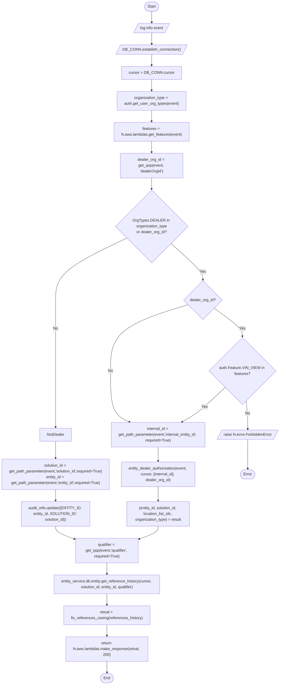
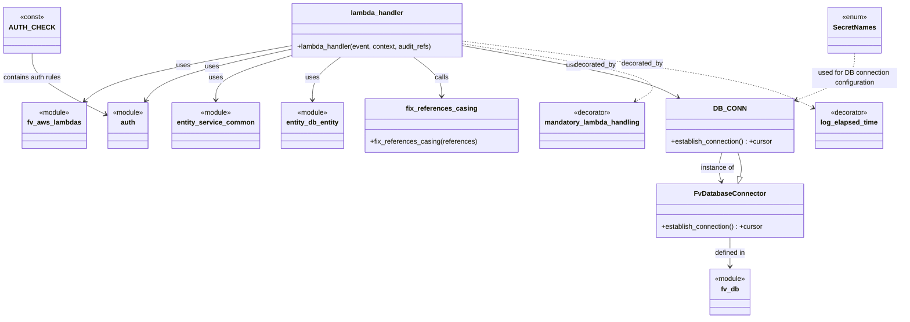

# Diagram: entity_core/entity_service/entity_service/entity/references/get_reference_history.py

> Auto-generated by Obscura crawlers

## Diagram 1

### SVG

<svg id="container" width="1203.4609375" xmlns="http://www.w3.org/2000/svg" class="flowchart" height="2836.3125" viewBox="0 0 1203.4609375 2836.3125" role="graphics-document document" aria-roledescription="flowchart-v2"><g><marker id="container_flowchart-v2-pointEnd" class="marker flowchart-v2" viewBox="0 0 10 10" refX="5" refY="5" markerUnits="userSpaceOnUse" markerWidth="8" markerHeight="8" orient="auto"><path d="M 0 0 L 10 5 L 0 10 z" class="arrowMarkerPath" style="stroke-width: 1; stroke-dasharray: 1, 0;"></path></marker><marker id="container_flowchart-v2-pointStart" class="marker flowchart-v2" viewBox="0 0 10 10" refX="4.5" refY="5" markerUnits="userSpaceOnUse" markerWidth="8" markerHeight="8" orient="auto"><path d="M 0 5 L 10 10 L 10 0 z" class="arrowMarkerPath" style="stroke-width: 1; stroke-dasharray: 1, 0;"></path></marker><marker id="container_flowchart-v2-circleEnd" class="marker flowchart-v2" viewBox="0 0 10 10" refX="11" refY="5" markerUnits="userSpaceOnUse" markerWidth="11" markerHeight="11" orient="auto"><circle cx="5" cy="5" r="5" class="arrowMarkerPath" style="stroke-width: 1; stroke-dasharray: 1, 0;"></circle></marker><marker id="container_flowchart-v2-circleStart" class="marker flowchart-v2" viewBox="0 0 10 10" refX="-1" refY="5" markerUnits="userSpaceOnUse" markerWidth="11" markerHeight="11" orient="auto"><circle cx="5" cy="5" r="5" class="arrowMarkerPath" style="stroke-width: 1; stroke-dasharray: 1, 0;"></circle></marker><marker id="container_flowchart-v2-crossEnd" class="marker cross flowchart-v2" viewBox="0 0 11 11" refX="12" refY="5.2" markerUnits="userSpaceOnUse" markerWidth="11" markerHeight="11" orient="auto"><path d="M 1,1 l 9,9 M 10,1 l -9,9" class="arrowMarkerPath" style="stroke-width: 2; stroke-dasharray: 1, 0;"></path></marker><marker id="container_flowchart-v2-crossStart" class="marker cross flowchart-v2" viewBox="0 0 11 11" refX="-1" refY="5.2" markerUnits="userSpaceOnUse" markerWidth="11" markerHeight="11" orient="auto"><path d="M 1,1 l 9,9 M 10,1 l -9,9" class="arrowMarkerPath" style="stroke-width: 2; stroke-dasharray: 1, 0;"></path></marker><g class="root"><g class="clusters"></g><g class="edgePaths"><path d="M646.164,47.5L646.081,51.583C645.997,55.667,645.831,63.833,645.818,71.5C645.805,79.167,645.945,86.334,646.015,89.917L646.086,93.501" id="L_Start_Log_0" class="edge-thickness-normal edge-pattern-solid edge-thickness-normal edge-pattern-solid flowchart-link" style=";" data-edge="true" data-et="edge" data-id="L_Start_Log_0" data-points="W3sieCI6NjQ2LjE2NDA2MjUsInkiOjQ3LjV9LHsieCI6NjQ1LjY2NDA2MjUsInkiOjcyfSx7IngiOjY0Ni4xNjQwNjI1LCJ5Ijo5Ny41fV0=" marker-end="url(#container_flowchart-v2-pointEnd)"></path><path d="M646.164,136.5L646.081,140.583C645.997,144.667,645.831,152.833,645.818,160.5C645.805,168.167,645.945,175.334,646.015,178.917L646.086,182.501" id="L_Log_DB_CONN_Establish_0" class="edge-thickness-normal edge-pattern-solid edge-thickness-normal edge-pattern-solid flowchart-link" style=";" data-edge="true" data-et="edge" data-id="L_Log_DB_CONN_Establish_0" data-points="W3sieCI6NjQ2LjE2NDA2MjUsInkiOjEzNi41fSx7IngiOjY0NS42NjQwNjI1LCJ5IjoxNjF9LHsieCI6NjQ2LjE2NDA2MjUsInkiOjE4Ni41fV0=" marker-end="url(#container_flowchart-v2-pointEnd)"></path><path d="M646.164,225.5L646.081,229.583C645.997,233.667,645.831,241.833,645.747,249.417C645.664,257,645.664,264,645.664,267.5L645.664,271" id="L_DB_CONN_Establish_Cursor_0" class="edge-thickness-normal edge-pattern-solid edge-thickness-normal edge-pattern-solid flowchart-link" style=";" data-edge="true" data-et="edge" data-id="L_DB_CONN_Establish_Cursor_0" data-points="W3sieCI6NjQ2LjE2NDA2MjUsInkiOjIyNS41fSx7IngiOjY0NS42NjQwNjI1LCJ5IjoyNTB9LHsieCI6NjQ1LjY2NDA2MjUsInkiOjI3NX1d" marker-end="url(#container_flowchart-v2-pointEnd)"></path><path d="M645.664,329L645.664,333.167C645.664,337.333,645.664,345.667,645.664,353.333C645.664,361,645.664,368,645.664,371.5L645.664,375" id="L_Cursor_OrgType_0" class="edge-thickness-normal edge-pattern-solid edge-thickness-normal edge-pattern-solid flowchart-link" style=";" data-edge="true" data-et="edge" data-id="L_Cursor_OrgType_0" data-points="W3sieCI6NjQ1LjY2NDA2MjUsInkiOjMyOX0seyJ4Ijo2NDUuNjY0MDYyNSwieSI6MzU0fSx7IngiOjY0NS42NjQwNjI1LCJ5IjozNzl9XQ==" marker-end="url(#container_flowchart-v2-pointEnd)"></path><path d="M645.664,457L645.664,461.167C645.664,465.333,645.664,473.667,645.664,481.333C645.664,489,645.664,496,645.664,499.5L645.664,503" id="L_OrgType_Features_0" class="edge-thickness-normal edge-pattern-solid edge-thickness-normal edge-pattern-solid flowchart-link" style=";" data-edge="true" data-et="edge" data-id="L_OrgType_Features_0" data-points="W3sieCI6NjQ1LjY2NDA2MjUsInkiOjQ1N30seyJ4Ijo2NDUuNjY0MDYyNSwieSI6NDgyfSx7IngiOjY0NS42NjQwNjI1LCJ5Ijo1MDd9XQ==" marker-end="url(#container_flowchart-v2-pointEnd)"></path><path d="M645.664,585L645.664,589.167C645.664,593.333,645.664,601.667,645.664,609.333C645.664,617,645.664,624,645.664,627.5L645.664,631" id="L_Features_DealerOrg_0" class="edge-thickness-normal edge-pattern-solid edge-thickness-normal edge-pattern-solid flowchart-link" style=";" data-edge="true" data-et="edge" data-id="L_Features_DealerOrg_0" data-points="W3sieCI6NjQ1LjY2NDA2MjUsInkiOjU4NX0seyJ4Ijo2NDUuNjY0MDYyNSwieSI6NjEwfSx7IngiOjY0NS42NjQwNjI1LCJ5Ijo2MzV9XQ==" marker-end="url(#container_flowchart-v2-pointEnd)"></path><path d="M645.664,737L645.664,741.167C645.664,745.333,645.664,753.667,645.664,761.333C645.664,769,645.664,776,645.664,779.5L645.664,783" id="L_DealerOrg_DealerCheck_0" class="edge-thickness-normal edge-pattern-solid edge-thickness-normal edge-pattern-solid flowchart-link" style=";" data-edge="true" data-et="edge" data-id="L_DealerOrg_DealerCheck_0" data-points="W3sieCI6NjQ1LjY2NDA2MjUsInkiOjczN30seyJ4Ijo2NDUuNjY0MDYyNSwieSI6NzYyfSx7IngiOjY0NS42NjQwNjI1LCJ5Ijo3ODd9XQ==" marker-end="url(#container_flowchart-v2-pointEnd)"></path><path d="M726.546,1008.118L749.209,1027.765C771.872,1047.412,817.198,1086.706,839.861,1111.853C862.523,1137,862.523,1148,862.523,1153.5L862.523,1159" id="L_DealerCheck_DealerIdCheck_0" class="edge-thickness-normal edge-pattern-solid edge-thickness-normal edge-pattern-solid flowchart-link" style=";" data-edge="true" data-et="edge" data-id="L_DealerCheck_DealerIdCheck_0" data-points="W3sieCI6NzI2LjU0NTg4ODc1MTM5OSwieSI6MTAwOC4xMTgxNzM3NDg2MDF9LHsieCI6ODYyLjUyMzQzNzUsInkiOjExMjZ9LHsieCI6ODYyLjUyMzQzNzUsInkiOjExNjN9XQ==" marker-end="url(#container_flowchart-v2-pointEnd)"></path><path d="M542.072,985.408L490.872,1008.84C439.671,1032.272,337.269,1079.136,286.068,1122.094C234.867,1165.052,234.867,1204.104,234.867,1243.156C234.867,1282.208,234.867,1321.26,234.867,1370.12C234.867,1418.979,234.867,1477.646,234.867,1536.313C234.867,1594.979,234.867,1653.646,234.867,1692.479C234.867,1731.313,234.867,1750.313,234.867,1759.813L234.867,1769.313" id="L_DealerCheck_NotDealer_0" class="edge-thickness-normal edge-pattern-solid edge-thickness-normal edge-pattern-solid flowchart-link" style=";" data-edge="true" data-et="edge" data-id="L_DealerCheck_NotDealer_0" data-points="W3sieCI6NTQyLjA3MjQ1OTU0NjE2MDMsInkiOjk4NS40MDgzOTcwNDYxNjAzfSx7IngiOjIzNC44NjcxODc1LCJ5IjoxMTI2fSx7IngiOjIzNC44NjcxODc1LCJ5IjoxMjQzLjE1NjI1fSx7IngiOjIzNC44NjcxODc1LCJ5IjoxMzYwLjMxMjV9LHsieCI6MjM0Ljg2NzE4NzUsInkiOjE1MzYuMzEyNX0seyJ4IjoyMzQuODY3MTg3NSwieSI6MTcxMi4zMTI1fSx7IngiOjIzNC44NjcxODc1LCJ5IjoxNzczLjMxMjV9XQ==" marker-end="url(#container_flowchart-v2-pointEnd)"></path><path d="M910.298,1275.537L931.145,1289.667C951.991,1303.796,993.683,1332.054,1014.529,1351.683C1035.375,1371.313,1035.375,1382.313,1035.375,1387.813L1035.375,1393.313" id="L_DealerIdCheck_FeatureCheck_0" class="edge-thickness-normal edge-pattern-solid edge-thickness-normal edge-pattern-solid flowchart-link" style=";" data-edge="true" data-et="edge" data-id="L_DealerIdCheck_FeatureCheck_0" data-points="W3sieCI6OTEwLjI5ODQ3MTM0MjAzMDEsInkiOjEyNzUuNTM3NDY2MTU3OTd9LHsieCI6MTAzNS4zNzUsInkiOjEzNjAuMzEyNX0seyJ4IjoxMDM1LjM3NSwieSI6MTM5Ny4zMTI1fV0=" marker-end="url(#container_flowchart-v2-pointEnd)"></path><path d="M800.677,1261.466L745.03,1277.94C689.384,1294.415,578.09,1327.364,522.444,1373.171C466.797,1418.979,466.797,1477.646,466.797,1536.313C466.797,1594.979,466.797,1653.646,480.326,1688.879C493.856,1724.113,520.915,1735.913,534.444,1741.813L547.973,1747.714" id="L_DealerIdCheck_GetInternalId_0" class="edge-thickness-normal edge-pattern-solid edge-thickness-normal edge-pattern-solid flowchart-link" style=";" data-edge="true" data-et="edge" data-id="L_DealerIdCheck_GetInternalId_0" data-points="W3sieCI6ODAwLjY3NzAzNDE4NDY0MSwieSI6MTI2MS40NjYwOTY2ODQ2NDExfSx7IngiOjQ2Ni43OTY4NzUsInkiOjEzNjAuMzEyNX0seyJ4Ijo0NjYuNzk2ODc1LCJ5IjoxNTM2LjMxMjV9LHsieCI6NDY2Ljc5Njg3NSwieSI6MTcxMi4zMTI1fSx7IngiOjU1MS42NDAwMDM1NTExMzY0LCJ5IjoxNzQ5LjMxMjV9XQ==" marker-end="url(#container_flowchart-v2-pointEnd)"></path><path d="M1050.246,1660.441L1051.282,1669.086C1052.318,1677.732,1054.389,1695.022,1055.503,1712.501C1056.616,1729.979,1056.771,1747.646,1056.848,1756.479L1056.926,1765.313" id="L_FeatureCheck_Forbidden_0" class="edge-thickness-normal edge-pattern-solid edge-thickness-normal edge-pattern-solid flowchart-link" style=";" data-edge="true" data-et="edge" data-id="L_FeatureCheck_Forbidden_0" data-points="W3sieCI6MTA1MC4yNDY0MDc2MTg4MjEyLCJ5IjoxNjYwLjQ0MTA5MjM4MTE3ODh9LHsieCI6MTA1Ni40NjA5Mzc1LCJ5IjoxNzEyLjMxMjV9LHsieCI6MTA1Ni45NjA5Mzc1LCJ5IjoxNzY5LjMxMjV9XQ==" marker-end="url(#container_flowchart-v2-pointEnd)"></path><path d="M962.505,1602.443L942.327,1620.754C922.149,1639.066,881.793,1675.689,850.097,1699.865C818.4,1724.041,795.363,1735.769,783.845,1741.634L772.326,1747.498" id="L_FeatureCheck_GetInternalId_0" class="edge-thickness-normal edge-pattern-solid edge-thickness-normal edge-pattern-solid flowchart-link" style=";" data-edge="true" data-et="edge" data-id="L_FeatureCheck_GetInternalId_0" data-points="W3sieCI6OTYyLjUwNTA4OTU0MjE1MjQsInkiOjE2MDIuNDQyNTg5NTQyMTUyM30seyJ4Ijo4NDEuNDM3NSwieSI6MTcxMi4zMTI1fSx7IngiOjc2OC43NjEyNzQ4NTc5NTQ1LCJ5IjoxNzQ5LjMxMjV9XQ==" marker-end="url(#container_flowchart-v2-pointEnd)"></path><path d="M668.586,1851.313L668.586,1855.479C668.586,1859.646,668.586,1867.979,668.586,1877.646C668.586,1887.313,668.586,1898.313,668.586,1903.813L668.586,1909.313" id="L_GetInternalId_EntityAuth_0" class="edge-thickness-normal edge-pattern-solid edge-thickness-normal edge-pattern-solid flowchart-link" style=";" data-edge="true" data-et="edge" data-id="L_GetInternalId_EntityAuth_0" data-points="W3sieCI6NjY4LjU4NTkzNzUsInkiOjE4NTEuMzEyNX0seyJ4Ijo2NjguNTg1OTM3NSwieSI6MTg3Ni4zMTI1fSx7IngiOjY2OC41ODU5Mzc1LCJ5IjoxOTEzLjMxMjV9XQ==" marker-end="url(#container_flowchart-v2-pointEnd)"></path><path d="M668.586,2015.313L668.586,2021.479C668.586,2027.646,668.586,2039.979,668.586,2049.646C668.586,2059.313,668.586,2066.313,668.586,2069.813L668.586,2073.313" id="L_EntityAuth_AssignDealerVars_0" class="edge-thickness-normal edge-pattern-solid edge-thickness-normal edge-pattern-solid flowchart-link" style=";" data-edge="true" data-et="edge" data-id="L_EntityAuth_AssignDealerVars_0" data-points="W3sieCI6NjY4LjU4NTkzNzUsInkiOjIwMTUuMzEyNX0seyJ4Ijo2NjguNTg1OTM3NSwieSI6MjA1Mi4zMTI1fSx7IngiOjY2OC41ODU5Mzc1LCJ5IjoyMDc3LjMxMjV9XQ==" marker-end="url(#container_flowchart-v2-pointEnd)"></path><path d="M234.867,1827.313L234.867,1835.479C234.867,1843.646,234.867,1859.979,234.867,1871.646C234.867,1883.313,234.867,1890.313,234.867,1893.813L234.867,1897.313" id="L_NotDealer_GetSolutionEntity_0" class="edge-thickness-normal edge-pattern-solid edge-thickness-normal edge-pattern-solid flowchart-link" style=";" data-edge="true" data-et="edge" data-id="L_NotDealer_GetSolutionEntity_0" data-points="W3sieCI6MjM0Ljg2NzE4NzUsInkiOjE4MjcuMzEyNX0seyJ4IjoyMzQuODY3MTg3NSwieSI6MTg3Ni4zMTI1fSx7IngiOjIzNC44NjcxODc1LCJ5IjoxOTAxLjMxMjV9XQ==" marker-end="url(#container_flowchart-v2-pointEnd)"></path><path d="M234.867,2027.313L234.867,2031.479C234.867,2035.646,234.867,2043.979,234.867,2051.646C234.867,2059.313,234.867,2066.313,234.867,2069.813L234.867,2073.313" id="L_GetSolutionEntity_AuditUpdate_0" class="edge-thickness-normal edge-pattern-solid edge-thickness-normal edge-pattern-solid flowchart-link" style=";" data-edge="true" data-et="edge" data-id="L_GetSolutionEntity_AuditUpdate_0" data-points="W3sieCI6MjM0Ljg2NzE4NzUsInkiOjIwMjcuMzEyNX0seyJ4IjoyMzQuODY3MTg3NSwieSI6MjA1Mi4zMTI1fSx7IngiOjIzNC44NjcxODc1LCJ5IjoyMDc3LjMxMjV9XQ==" marker-end="url(#container_flowchart-v2-pointEnd)"></path><path d="M234.867,2179.313L234.867,2183.479C234.867,2187.646,234.867,2195.979,248.715,2204.999C262.562,2214.018,290.257,2223.724,304.104,2228.577L317.952,2233.43" id="L_AuditUpdate_Qualifier_0" class="edge-thickness-normal edge-pattern-solid edge-thickness-normal edge-pattern-solid flowchart-link" style=";" data-edge="true" data-et="edge" data-id="L_AuditUpdate_Qualifier_0" data-points="W3sieCI6MjM0Ljg2NzE4NzUsInkiOjIxNzkuMzEyNX0seyJ4IjoyMzQuODY3MTg3NSwieSI6MjIwNC4zMTI1fSx7IngiOjMyMS43MjY1NjI1LCJ5IjoyMjM0Ljc1MzAyMTY1MTQxNn1d" marker-end="url(#container_flowchart-v2-pointEnd)"></path><path d="M668.586,2179.313L668.586,2183.479C668.586,2187.646,668.586,2195.979,654.739,2204.999C640.891,2214.018,613.196,2223.724,599.349,2228.577L585.501,2233.43" id="L_AssignDealerVars_Qualifier_0" class="edge-thickness-normal edge-pattern-solid edge-thickness-normal edge-pattern-solid flowchart-link" style=";" data-edge="true" data-et="edge" data-id="L_AssignDealerVars_Qualifier_0" data-points="W3sieCI6NjY4LjU4NTkzNzUsInkiOjIxNzkuMzEyNX0seyJ4Ijo2NjguNTg1OTM3NSwieSI6MjIwNC4zMTI1fSx7IngiOjU4MS43MjY1NjI1LCJ5IjoyMjM0Ljc1MzAyMTY1MTQxNn1d" marker-end="url(#container_flowchart-v2-pointEnd)"></path><path d="M1056.961,1832.313L1056.878,1839.646C1056.794,1846.979,1056.628,1861.646,1056.623,1879.813C1056.618,1897.979,1056.775,1919.646,1056.853,1930.479L1056.932,1941.313" id="L_Forbidden_EndFail_0" class="edge-thickness-normal edge-pattern-solid edge-thickness-normal edge-pattern-solid flowchart-link" style=";" data-edge="true" data-et="edge" data-id="L_Forbidden_EndFail_0" data-points="W3sieCI6MTA1Ni45NjA5Mzc1LCJ5IjoxODMyLjMxMjV9LHsieCI6MTA1Ni40NjA5Mzc1LCJ5IjoxODc2LjMxMjV9LHsieCI6MTA1Ni45NjA5Mzc1LCJ5IjoxOTQ1LjMxMjV9XQ==" marker-end="url(#container_flowchart-v2-pointEnd)"></path><path d="M451.727,2331.313L451.727,2335.479C451.727,2339.646,451.727,2347.979,451.727,2355.646C451.727,2363.313,451.727,2370.313,451.727,2373.813L451.727,2377.313" id="L_Qualifier_GetHistory_0" class="edge-thickness-normal edge-pattern-solid edge-thickness-normal edge-pattern-solid flowchart-link" style=";" data-edge="true" data-et="edge" data-id="L_Qualifier_GetHistory_0" data-points="W3sieCI6NDUxLjcyNjU2MjUsInkiOjIzMzEuMzEyNX0seyJ4Ijo0NTEuNzI2NTYyNSwieSI6MjM1Ni4zMTI1fSx7IngiOjQ1MS43MjY1NjI1LCJ5IjoyMzgxLjMxMjV9XQ==" marker-end="url(#container_flowchart-v2-pointEnd)"></path><path d="M451.727,2459.313L451.727,2463.479C451.727,2467.646,451.727,2475.979,451.727,2483.646C451.727,2491.313,451.727,2498.313,451.727,2501.813L451.727,2505.313" id="L_GetHistory_FixCase_0" class="edge-thickness-normal edge-pattern-solid edge-thickness-normal edge-pattern-solid flowchart-link" style=";" data-edge="true" data-et="edge" data-id="L_GetHistory_FixCase_0" data-points="W3sieCI6NDUxLjcyNjU2MjUsInkiOjI0NTkuMzEyNX0seyJ4Ijo0NTEuNzI2NTYyNSwieSI6MjQ4NC4zMTI1fSx7IngiOjQ1MS43MjY1NjI1LCJ5IjoyNTA5LjMxMjV9XQ==" marker-end="url(#container_flowchart-v2-pointEnd)"></path><path d="M451.727,2587.313L451.727,2591.479C451.727,2595.646,451.727,2603.979,451.727,2611.646C451.727,2619.313,451.727,2626.313,451.727,2629.813L451.727,2633.313" id="L_FixCase_Response_0" class="edge-thickness-normal edge-pattern-solid edge-thickness-normal edge-pattern-solid flowchart-link" style=";" data-edge="true" data-et="edge" data-id="L_FixCase_Response_0" data-points="W3sieCI6NDUxLjcyNjU2MjUsInkiOjI1ODcuMzEyNX0seyJ4Ijo0NTEuNzI2NTYyNSwieSI6MjYxMi4zMTI1fSx7IngiOjQ1MS43MjY1NjI1LCJ5IjoyNjM3LjMxMjV9XQ==" marker-end="url(#container_flowchart-v2-pointEnd)"></path><path d="M451.727,2739.313L451.727,2743.479C451.727,2747.646,451.727,2755.979,451.797,2763.729C451.867,2771.479,452.008,2778.646,452.078,2782.23L452.148,2785.813" id="L_Response_End_0" class="edge-thickness-normal edge-pattern-solid edge-thickness-normal edge-pattern-solid flowchart-link" style=";" data-edge="true" data-et="edge" data-id="L_Response_End_0" data-points="W3sieCI6NDUxLjcyNjU2MjUsInkiOjI3MzkuMzEyNX0seyJ4Ijo0NTEuNzI2NTYyNSwieSI6Mjc2NC4zMTI1fSx7IngiOjQ1Mi4yMjY1NjI1LCJ5IjoyNzg5LjgxMjV9XQ==" marker-end="url(#container_flowchart-v2-pointEnd)"></path></g><g class="edgeLabels"><g class="edgeLabel"><g class="label" data-id="L_Start_Log_0" transform="translate(0, 0)"><foreignObject width="0" height="0">

</foreignObject></g></g><g class="edgeLabel"><g class="label" data-id="L_Log_DB_CONN_Establish_0" transform="translate(0, 0)"><foreignObject width="0" height="0">

</foreignObject></g></g><g class="edgeLabel"><g class="label" data-id="L_DB_CONN_Establish_Cursor_0" transform="translate(0, 0)"><foreignObject width="0" height="0">

</foreignObject></g></g><g class="edgeLabel"><g class="label" data-id="L_Cursor_OrgType_0" transform="translate(0, 0)"><foreignObject width="0" height="0">

</foreignObject></g></g><g class="edgeLabel"><g class="label" data-id="L_OrgType_Features_0" transform="translate(0, 0)"><foreignObject width="0" height="0">

</foreignObject></g></g><g class="edgeLabel"><g class="label" data-id="L_Features_DealerOrg_0" transform="translate(0, 0)"><foreignObject width="0" height="0">

</foreignObject></g></g><g class="edgeLabel"><g class="label" data-id="L_DealerOrg_DealerCheck_0" transform="translate(0, 0)"><foreignObject width="0" height="0">

</foreignObject></g></g><g class="edgeLabel" transform="translate(862.5234375, 1126)"><g class="label" data-id="L_DealerCheck_DealerIdCheck_0" transform="translate(-12.03125, -12)"><foreignObject width="24.0625" height="24">

Yes

</foreignObject></g></g><g class="edgeLabel" transform="translate(234.8671875, 1360.3125)"><g class="label" data-id="L_DealerCheck_NotDealer_0" transform="translate(-10.140625, -12)"><foreignObject width="20.28125" height="24">

No

</foreignObject></g></g><g class="edgeLabel" transform="translate(1035.375, 1360.3125)"><g class="label" data-id="L_DealerIdCheck_FeatureCheck_0" transform="translate(-12.03125, -12)"><foreignObject width="24.0625" height="24">

Yes

</foreignObject></g></g><g class="edgeLabel" transform="translate(466.796875, 1536.3125)"><g class="label" data-id="L_DealerIdCheck_GetInternalId_0" transform="translate(-10.140625, -12)"><foreignObject width="20.28125" height="24">

No

</foreignObject></g></g><g class="edgeLabel" transform="translate(1056.4609375, 1712.3125)"><g class="label" data-id="L_FeatureCheck_Forbidden_0" transform="translate(-10.140625, -12)"><foreignObject width="20.28125" height="24">

No

</foreignObject></g></g><g class="edgeLabel" transform="translate(871.77549, 1684.7805)"><g class="label" data-id="L_FeatureCheck_GetInternalId_0" transform="translate(-12.03125, -12)"><foreignObject width="24.0625" height="24">

Yes

</foreignObject></g></g><g class="edgeLabel"><g class="label" data-id="L_GetInternalId_EntityAuth_0" transform="translate(0, 0)"><foreignObject width="0" height="0">

</foreignObject></g></g><g class="edgeLabel"><g class="label" data-id="L_EntityAuth_AssignDealerVars_0" transform="translate(0, 0)"><foreignObject width="0" height="0">

</foreignObject></g></g><g class="edgeLabel"><g class="label" data-id="L_NotDealer_GetSolutionEntity_0" transform="translate(0, 0)"><foreignObject width="0" height="0">

</foreignObject></g></g><g class="edgeLabel"><g class="label" data-id="L_GetSolutionEntity_AuditUpdate_0" transform="translate(0, 0)"><foreignObject width="0" height="0">

</foreignObject></g></g><g class="edgeLabel"><g class="label" data-id="L_AuditUpdate_Qualifier_0" transform="translate(0, 0)"><foreignObject width="0" height="0">

</foreignObject></g></g><g class="edgeLabel"><g class="label" data-id="L_AssignDealerVars_Qualifier_0" transform="translate(0, 0)"><foreignObject width="0" height="0">

</foreignObject></g></g><g class="edgeLabel"><g class="label" data-id="L_Forbidden_EndFail_0" transform="translate(0, 0)"><foreignObject width="0" height="0">

</foreignObject></g></g><g class="edgeLabel"><g class="label" data-id="L_Qualifier_GetHistory_0" transform="translate(0, 0)"><foreignObject width="0" height="0">

</foreignObject></g></g><g class="edgeLabel"><g class="label" data-id="L_GetHistory_FixCase_0" transform="translate(0, 0)"><foreignObject width="0" height="0">

</foreignObject></g></g><g class="edgeLabel"><g class="label" data-id="L_FixCase_Response_0" transform="translate(0, 0)"><foreignObject width="0" height="0">

</foreignObject></g></g><g class="edgeLabel"><g class="label" data-id="L_Response_End_0" transform="translate(0, 0)"><foreignObject width="0" height="0">

</foreignObject></g></g></g><g class="nodes"><g class="node default" id="flowchart-Start-0" transform="translate(645.6640625, 27.5)"><g class="basic label-container outer-path"><path d="M-10.3984375 -19.5 C-5.7270705144333105 -19.5, -1.055703528866621 -19.5, 10.3984375 -19.5 C10.3984375 -19.5, 10.398437499999998 -19.5, 10.398437499999998 -19.5 C10.759752353551788 -19.488413335903292, 11.121067207103577 -19.476826671806585, 11.6478067896239 -19.45993515863156 C12.088503762754945 -19.41742165164926, 12.52920073588599 -19.374908144666964, 12.892042152847864 -19.3399052695533 C13.192801391478254 -19.29128084827427, 13.493560630108645 -19.24265642699524, 14.126030759676757 -19.140403561325776 C14.568716374384968 -19.039363458562235, 15.011401989093178 -18.938323355798694, 15.34470188623539 -18.862249829261074 C15.653688226331369 -18.770544305422984, 15.962674566427348 -18.678838781584894, 16.543047751460602 -18.50658706670804 C16.89979570126004 -18.37530052343995, 17.256543651059474 -18.244013980171857, 17.716144095147794 -18.074876768247425 C18.13182037552983 -17.890869209521046, 18.547496655911868 -17.70686165079467, 18.85917041279238 -17.568892924097174 C19.2085384422774 -17.386627846895742, 19.557906471762422 -17.20436276969431, 19.967429764076783 -16.990714730406097 C20.23962539168056 -16.825708141353626, 20.511821019284334 -16.66070155230116, 21.036368073605697 -16.342718045390892 C21.27973371851564 -16.17295670663069, 21.523099363425583 -16.003195367870486, 22.061592844578712 -15.627565626425154 C22.315832457716112 -15.424816300548319, 22.570072070853517 -15.222066974671483, 23.03889120850187 -14.848196188198123 C23.347665693040256 -14.567775371065535, 23.65644017757864 -14.287354553932946, 23.964247236767985 -14.007812326905688 C24.151099000282418 -13.814872540261948, 24.337950763796854 -13.62193275361821, 24.833858442968648 -13.10986736009568 C25.0167108371707 -12.895078533269972, 25.19956323137275 -12.680289706444265, 25.644151408126582 -12.158051136245305 C25.831837772590223 -11.906568506443577, 26.019524137053867 -11.655085876641849, 26.391796464640635 -11.156274872382312 C26.655837923876927 -10.75063628593592, 26.919879383113216 -10.344997699489529, 27.073721378604247 -10.108655082055241 C27.30775511410175 -9.693104486193931, 27.541788849599254 -9.277553890332621, 27.6871239742735 -9.019496659696287 C27.804608142373713 -8.775538270877696, 27.922092310473925 -8.531579882059106, 28.22948364880834 -7.893275190886684 C28.412775251000255 -7.440541389770601, 28.596066853192173 -6.987807588654519, 28.698571729970325 -6.734618561215508 C28.7956976718847 -6.442090699086725, 28.89282361379907 -6.149562836957941, 29.09246063421488 -5.548287939305138 C29.15604686202271 -5.305806094228428, 29.219633089830538 -5.063324249151719, 29.40953178754556 -4.339158212148133 C29.485213123046496 -3.950550549606761, 29.560894458547427 -3.5619428870653893, 29.648482276581777 -3.1121979531509023 C29.68263233644737 -2.8473368325254502, 29.71678239631296 -2.582475711899998, 29.808330202509367 -1.872449005199798 C29.83653034614561 -1.433209005319027, 29.864730489781856 -0.9939690054382561, 29.888418715913414 -0.6250057626472757 C29.888418715913414 -0.2766359846589342, 29.888418715913414 0.07173379332940732, 29.888418715913414 0.625005762647271 C29.868748190635426 0.9313900716141772, 29.849077665357434 1.2377743805810832, 29.808330202509367 1.8724490051997846 C29.751213727560806 2.315433105977115, 29.694097252612245 2.7584172067544457, 29.648482276581777 3.1121979531508885 C29.565822767377476 3.5366370628215305, 29.48316325817317 3.9610761724921724, 29.40953178754556 4.339158212148129 C29.343094760810857 4.592511389077079, 29.276657734076156 4.84586456600603, 29.092460634214884 5.548287939305125 C28.973312561827424 5.907142949668853, 28.854164489439963 6.265997960032582, 28.69857172997033 6.734618561215495 C28.524310421605126 7.165047361990747, 28.350049113239923 7.595476162766, 28.229483648808344 7.893275190886679 C28.094014213362343 8.174580372171876, 27.95854477791634 8.455885553457072, 27.687123974273504 9.019496659696284 C27.52200965049267 9.312673861207454, 27.356895326711832 9.605851062718626, 27.07372137860425 10.108655082055236 C26.863161203134872 10.432132054900125, 26.652601027665497 10.755609027745011, 26.39179646464064 11.156274872382301 C26.165585789023503 11.459376569492768, 25.939375113406363 11.762478266603235, 25.644151408126582 12.158051136245302 C25.456651477936706 12.378299223294599, 25.26915154774683 12.598547310343895, 24.83385844296866 13.10986736009567 C24.498690903231928 13.455955362640616, 24.1635233634952 13.802043365185561, 23.96424723676799 14.007812326905684 C23.69213202091592 14.254940166168456, 23.420016805063852 14.50206800543123, 23.038891208501887 14.848196188198111 C22.836022145364396 15.009978867477765, 22.633153082226904 15.171761546757418, 22.061592844578715 15.627565626425152 C21.844889696256203 15.77872836176684, 21.628186547933694 15.929891097108527, 21.036368073605708 16.34271804539089 C20.65416388966125 16.574412467779116, 20.27195970571679 16.806106890167342, 19.967429764076787 16.990714730406093 C19.59752132947336 17.18369572380104, 19.227612894869928 17.37667671719599, 18.859170412792388 17.56889292409717 C18.42829949515307 17.759626698004446, 17.99742857751375 17.950360471911722, 17.716144095147804 18.07487676824742 C17.39742691752553 18.19216763580171, 17.078709739903257 18.309458503356, 16.543047751460616 18.506587066708033 C16.143864531332067 18.625062551086707, 15.744681311203518 18.74353803546538, 15.344701886235413 18.86224982926107 C14.895210503641051 18.964843304132838, 14.44571912104669 19.06743677900461, 14.126030759676766 19.140403561325773 C13.870073649587418 19.181784721907984, 13.614116539498072 19.223165882490196, 12.892042152847878 19.3399052695533 C12.601708886508185 19.36791337058025, 12.31137562016849 19.395921471607203, 11.6478067896239 19.45993515863156 C11.265537390252913 19.472193794227138, 10.883267990881926 19.484452429822717, 10.398437500000004 19.5 C10.398437500000002 19.5, 10.398437500000002 19.5, 10.3984375 19.5 C5.882454508306383 19.5, 1.3664715166127657 19.5, -10.398437499999996 19.5 C-10.854208221157458 19.48538432007637, -11.30997894231492 19.470768640152745, -11.647806789623893 19.45993515863156 C-11.956551130239813 19.430150963411737, -12.265295470855733 19.400366768191915, -12.892042152847871 19.3399052695533 C-13.243794933052943 19.283036607933294, -13.595547713258014 19.22616794631329, -14.126030759676759 19.140403561325773 C-14.540304474627565 19.045848289276886, -14.954578189578369 18.951293017228, -15.344701886235388 18.862249829261074 C-15.637049543293658 18.775482579210347, -15.929397200351927 18.68871532915962, -16.54304775146059 18.506587066708043 C-16.85536982548064 18.39164965639506, -17.167691899500692 18.27671224608208, -17.716144095147797 18.074876768247425 C-18.13299714617971 17.890348288062007, -18.54985019721163 17.70581980787659, -18.85917041279238 17.568892924097174 C-19.28551955252081 17.34646685099051, -19.711868692249244 17.124040777883845, -19.96742976407678 16.990714730406097 C-20.246785563239758 16.821367603276602, -20.526141362402733 16.652020476147104, -21.036368073605686 16.3427180453909 C-21.26064735049741 16.18627053072465, -21.484926627389136 16.0298230160584, -22.061592844578712 15.627565626425156 C-22.272947454379594 15.459015949491327, -22.484302064180476 15.290466272557499, -23.03889120850187 14.848196188198125 C-23.395078776541144 14.524716063111475, -23.751266344580422 14.201235938024823, -23.964247236767974 14.007812326905697 C-24.287551616948182 13.673974010586374, -24.61085599712839 13.340135694267053, -24.833858442968655 13.109867360095677 C-25.001170961651997 12.91333255529821, -25.168483480335343 12.71679775050074, -25.64415140812658 12.158051136245307 C-25.870421471236025 11.85486986530546, -26.096691534345474 11.551688594365611, -26.391796464640635 11.156274872382316 C-26.606532574159182 10.8263825434426, -26.82126868367773 10.496490214502883, -27.073721378604244 10.108655082055249 C-27.237240882900743 9.818309644031501, -27.40076038719724 9.527964206007754, -27.6871239742735 9.019496659696289 C-27.88390046589587 8.610886064500004, -28.080676957518236 8.202275469303721, -28.22948364880834 7.893275190886686 C-28.35828353685918 7.575136977224684, -28.48708342491002 7.256998763562682, -28.698571729970325 6.73461856121551 C-28.81995700905842 6.369025440719945, -28.94134228814652 6.0034323202243804, -29.09246063421488 5.5482879393051325 C-29.202214919401833 5.129747282079189, -29.31196920458878 4.711206624853245, -29.409531787545557 4.339158212148136 C-29.482397987776622 3.9650056742384927, -29.555264188007687 3.5908531363288496, -29.648482276581777 3.112197953150904 C-29.708731190394488 2.6449192751132475, -29.7689801042072 2.177640597075591, -29.808330202509364 1.872449005199809 C-29.82920485196997 1.547309490137119, -29.850079501430574 1.2221699750744288, -29.888418715913414 0.6250057626472781 C-29.888418715913414 0.3687192340208782, -29.888418715913414 0.11243270539447825, -29.888418715913414 -0.6250057626472687 C-29.868827213322906 -0.9301592294707202, -29.849235710732394 -1.2353126962941716, -29.808330202509367 -1.8724490051997822 C-29.761036615745937 -2.239248724961924, -29.713743028982503 -2.6060484447240664, -29.648482276581777 -3.112197953150895 C-29.560109363842873 -3.5659741824434468, -29.47173645110397 -4.019750411735998, -29.40953178754556 -4.339158212148126 C-29.332793678777122 -4.6317938793889075, -29.256055570008684 -4.92442954662969, -29.092460634214884 -5.548287939305123 C-28.982111693416375 -5.880641367274162, -28.871762752617865 -6.212994795243202, -28.698571729970332 -6.734618561215485 C-28.560648257638995 -7.07529220444282, -28.422724785307658 -7.415965847670156, -28.229483648808344 -7.893275190886676 C-28.08778112554955 -8.187523512381853, -27.946078602290754 -8.48177183387703, -27.687123974273504 -9.019496659696282 C-27.531881239235855 -9.29514585578717, -27.37663850419821 -9.57079505187806, -27.073721378604247 -10.108655082055243 C-26.824326577286744 -10.49179246876003, -26.574931775969244 -10.874929855464817, -26.39179646464064 -11.156274872382308 C-26.154220253703624 -11.474605351399846, -25.916644042766602 -11.792935830417385, -25.644151408126586 -12.158051136245302 C-25.422831033164265 -12.418026642162136, -25.201510658201947 -12.67800214807897, -24.833858442968662 -13.10986736009567 C-24.582108801600324 -13.369819533838427, -24.330359160231986 -13.629771707581185, -23.964247236767996 -14.007812326905677 C-23.628520322030543 -14.312710628022835, -23.292793407293086 -14.61760892913999, -23.038891208501887 -14.848196188198107 C-22.70734803793556 -15.112593043990456, -22.37580486736923 -15.376989899782805, -22.06159284457872 -15.627565626425149 C-21.72188005960929 -15.864534559290378, -21.382167274639862 -16.101503492155608, -21.03636807360571 -16.342718045390885 C-20.700872801101806 -16.546097251171815, -20.365377528597904 -16.749476456952745, -19.96742976407679 -16.99071473040609 C-19.59390124821001 -17.185584317877357, -19.220372732343225 -17.380453905348624, -18.859170412792388 -17.56889292409717 C-18.582419483620445 -17.69140235091696, -18.305668554448502 -17.813911777736752, -17.716144095147804 -18.07487676824742 C-17.328446844310132 -18.217552940389783, -16.94074959347246 -18.36022911253215, -16.54304775146062 -18.506587066708033 C-16.255161507479897 -18.59203019277578, -15.967275263499175 -18.677473318843525, -15.344701886235413 -18.862249829261067 C-14.944811920971585 -18.95352210430664, -14.544921955707759 -19.044794379352215, -14.126030759676768 -19.140403561325773 C-13.645083655842194 -19.21815935927325, -13.16413655200762 -19.295915157220733, -12.89204215284788 -19.3399052695533 C-12.561309576936578 -19.371810643387345, -12.230577001025276 -19.40371601722139, -11.647806789623903 -19.45993515863156 C-11.371877838095976 -19.468783663043936, -11.095948886568047 -19.477632167456314, -10.398437500000005 -19.5 C-10.398437500000004 -19.5, -10.398437500000004 -19.5, -10.3984375 -19.5" stroke="none" stroke-width="0" fill="#ECECFF" style=""></path><path d="M-10.3984375 -19.5 C-6.002566218749509 -19.5, -1.606694937499018 -19.5, 10.3984375 -19.5 M-10.3984375 -19.5 C-2.5549067584567995 -19.5, 5.288623983086401 -19.5, 10.3984375 -19.5 M10.3984375 -19.5 C10.3984375 -19.5, 10.398437499999998 -19.5, 10.398437499999998 -19.5 M10.3984375 -19.5 C10.3984375 -19.5, 10.398437499999998 -19.5, 10.398437499999998 -19.5 M10.398437499999998 -19.5 C10.811738921256328 -19.486746227862724, 11.22504034251266 -19.47349245572545, 11.6478067896239 -19.45993515863156 M10.398437499999998 -19.5 C10.753543748143619 -19.488612433794415, 11.108649996287237 -19.47722486758883, 11.6478067896239 -19.45993515863156 M11.6478067896239 -19.45993515863156 C11.930855185534837 -19.43262982029353, 12.213903581445773 -19.405324481955503, 12.892042152847864 -19.3399052695533 M11.6478067896239 -19.45993515863156 C12.030434080540829 -19.423023564053445, 12.41306137145776 -19.386111969475333, 12.892042152847864 -19.3399052695533 M12.892042152847864 -19.3399052695533 C13.382508593771254 -19.260610459008863, 13.872975034694642 -19.181315648464427, 14.126030759676757 -19.140403561325776 M12.892042152847864 -19.3399052695533 C13.32195994315598 -19.270399495278543, 13.751877733464093 -19.200893721003784, 14.126030759676757 -19.140403561325776 M14.126030759676757 -19.140403561325776 C14.607343242926067 -19.0305471278816, 15.088655726175379 -18.92069069443743, 15.34470188623539 -18.862249829261074 M14.126030759676757 -19.140403561325776 C14.479723874775472 -19.05967541586777, 14.833416989874186 -18.978947270409765, 15.34470188623539 -18.862249829261074 M15.34470188623539 -18.862249829261074 C15.628749521438078 -18.77794598212938, 15.912797156640764 -18.693642134997685, 16.543047751460602 -18.50658706670804 M15.34470188623539 -18.862249829261074 C15.599616242293855 -18.786592586455683, 15.854530598352323 -18.710935343650288, 16.543047751460602 -18.50658706670804 M16.543047751460602 -18.50658706670804 C16.907753486177604 -18.37237198502933, 17.272459220894604 -18.238156903350617, 17.716144095147794 -18.074876768247425 M16.543047751460602 -18.50658706670804 C16.888293713168952 -18.37953336138068, 17.233539674877303 -18.252479656053325, 17.716144095147794 -18.074876768247425 M17.716144095147794 -18.074876768247425 C18.008013756070895 -17.94567472736264, 18.299883416993993 -17.816472686477855, 18.85917041279238 -17.568892924097174 M17.716144095147794 -18.074876768247425 C17.946075874871003 -17.973092790047865, 18.176007654594212 -17.87130881184831, 18.85917041279238 -17.568892924097174 M18.85917041279238 -17.568892924097174 C19.293045788644825 -17.342540418425397, 19.72692116449727 -17.11618791275362, 19.967429764076783 -16.990714730406097 M18.85917041279238 -17.568892924097174 C19.128011992747947 -17.428638444035606, 19.39685357270351 -17.288383963974038, 19.967429764076783 -16.990714730406097 M19.967429764076783 -16.990714730406097 C20.267685771522963 -16.808697774192066, 20.567941778969143 -16.626680817978034, 21.036368073605697 -16.342718045390892 M19.967429764076783 -16.990714730406097 C20.215421781506173 -16.84038051207754, 20.463413798935562 -16.690046293748985, 21.036368073605697 -16.342718045390892 M21.036368073605697 -16.342718045390892 C21.353690395971153 -16.12136772997069, 21.67101271833661 -15.900017414550486, 22.061592844578712 -15.627565626425154 M21.036368073605697 -16.342718045390892 C21.40888097239508 -16.082869173018906, 21.781393871184463 -15.823020300646919, 22.061592844578712 -15.627565626425154 M22.061592844578712 -15.627565626425154 C22.37044391191473 -15.381265119096751, 22.67929497925075 -15.134964611768348, 23.03889120850187 -14.848196188198123 M22.061592844578712 -15.627565626425154 C22.299206610382853 -15.438074971364216, 22.536820376186995 -15.248584316303278, 23.03889120850187 -14.848196188198123 M23.03889120850187 -14.848196188198123 C23.24765744130459 -14.658600219218528, 23.45642367410731 -14.46900425023893, 23.964247236767985 -14.007812326905688 M23.03889120850187 -14.848196188198123 C23.243922960547433 -14.661991775833231, 23.448954712592993 -14.475787363468338, 23.964247236767985 -14.007812326905688 M23.964247236767985 -14.007812326905688 C24.25872175006964 -13.70374321511456, 24.553196263371294 -13.39967410332343, 24.833858442968648 -13.10986736009568 M23.964247236767985 -14.007812326905688 C24.25584151916768 -13.706717289992188, 24.547435801567374 -13.405622253078688, 24.833858442968648 -13.10986736009568 M24.833858442968648 -13.10986736009568 C25.05971164839633 -12.844567333588875, 25.28556485382401 -12.579267307082068, 25.644151408126582 -12.158051136245305 M24.833858442968648 -13.10986736009568 C25.12223906163618 -12.771119076086741, 25.410619680303714 -12.432370792077801, 25.644151408126582 -12.158051136245305 M25.644151408126582 -12.158051136245305 C25.94115874922893 -11.760088357093569, 26.238166090331273 -11.36212557794183, 26.391796464640635 -11.156274872382312 M25.644151408126582 -12.158051136245305 C25.867540620593054 -11.85872994271615, 26.090929833059526 -11.559408749186995, 26.391796464640635 -11.156274872382312 M26.391796464640635 -11.156274872382312 C26.62656352339595 -10.79560962635191, 26.86133058215127 -10.434944380321507, 27.073721378604247 -10.108655082055241 M26.391796464640635 -11.156274872382312 C26.59211206126309 -10.848536323700902, 26.792427657885543 -10.54079777501949, 27.073721378604247 -10.108655082055241 M27.073721378604247 -10.108655082055241 C27.26541503091021 -9.768283591298845, 27.45710868321617 -9.42791210054245, 27.6871239742735 -9.019496659696287 M27.073721378604247 -10.108655082055241 C27.267795088898968 -9.7640575573328, 27.461868799193688 -9.419460032610358, 27.6871239742735 -9.019496659696287 M27.6871239742735 -9.019496659696287 C27.830350743885617 -8.722083208034789, 27.973577513497734 -8.424669756373293, 28.22948364880834 -7.893275190886684 M27.6871239742735 -9.019496659696287 C27.86158591870512 -8.657222699196417, 28.036047863136737 -8.294948738696547, 28.22948364880834 -7.893275190886684 M28.22948364880834 -7.893275190886684 C28.397063332643793 -7.479350131880343, 28.564643016479245 -7.065425072874002, 28.698571729970325 -6.734618561215508 M28.22948364880834 -7.893275190886684 C28.361516232890228 -7.567152155528065, 28.493548816972115 -7.241029120169447, 28.698571729970325 -6.734618561215508 M28.698571729970325 -6.734618561215508 C28.837293190964104 -6.31681162296551, 28.976014651957883 -5.8990046847155115, 29.09246063421488 -5.548287939305138 M28.698571729970325 -6.734618561215508 C28.779158736018772 -6.491903338793321, 28.85974574206722 -6.249188116371134, 29.09246063421488 -5.548287939305138 M29.09246063421488 -5.548287939305138 C29.184866118361448 -5.195905779464106, 29.27727160250802 -4.843523619623074, 29.40953178754556 -4.339158212148133 M29.09246063421488 -5.548287939305138 C29.17549111939442 -5.2316567136756476, 29.258521604573957 -4.915025488046157, 29.40953178754556 -4.339158212148133 M29.40953178754556 -4.339158212148133 C29.48059063234606 -3.974286062389739, 29.551649477146558 -3.6094139126313447, 29.648482276581777 -3.1121979531509023 M29.40953178754556 -4.339158212148133 C29.469322688510008 -4.032144572507082, 29.52911358947446 -3.7251309328660325, 29.648482276581777 -3.1121979531509023 M29.648482276581777 -3.1121979531509023 C29.686836626135296 -2.814729191936788, 29.725190975688818 -2.517260430722674, 29.808330202509367 -1.872449005199798 M29.648482276581777 -3.1121979531509023 C29.696967504337223 -2.7361561011708218, 29.745452732092673 -2.360114249190741, 29.808330202509367 -1.872449005199798 M29.808330202509367 -1.872449005199798 C29.833433036244493 -1.4814521071324998, 29.858535869979622 -1.0904552090652013, 29.888418715913414 -0.6250057626472757 M29.808330202509367 -1.872449005199798 C29.834997041354008 -1.457091465109645, 29.861663880198645 -1.041733925019492, 29.888418715913414 -0.6250057626472757 M29.888418715913414 -0.6250057626472757 C29.888418715913414 -0.20481874322300786, 29.888418715913414 0.21536827620125998, 29.888418715913414 0.625005762647271 M29.888418715913414 -0.6250057626472757 C29.888418715913414 -0.17992160527260964, 29.888418715913414 0.2651625521020564, 29.888418715913414 0.625005762647271 M29.888418715913414 0.625005762647271 C29.871036257048136 0.8957515903422438, 29.853653798182858 1.1664974180372165, 29.808330202509367 1.8724490051997846 M29.888418715913414 0.625005762647271 C29.86272981967195 1.0251310573118533, 29.837040923430493 1.4252563519764356, 29.808330202509367 1.8724490051997846 M29.808330202509367 1.8724490051997846 C29.746993579543155 2.34816374063952, 29.685656956576945 2.8238784760792552, 29.648482276581777 3.1121979531508885 M29.808330202509367 1.8724490051997846 C29.76699096440992 2.1930679725431794, 29.725651726310478 2.5136869398865738, 29.648482276581777 3.1121979531508885 M29.648482276581777 3.1121979531508885 C29.58319534586296 3.447432543994324, 29.51790841514414 3.782667134837759, 29.40953178754556 4.339158212148129 M29.648482276581777 3.1121979531508885 C29.566538647021105 3.5329611721527043, 29.484595017460432 3.9537243911545197, 29.40953178754556 4.339158212148129 M29.40953178754556 4.339158212148129 C29.293158342735865 4.782940593777528, 29.17678489792617 5.2267229754069255, 29.092460634214884 5.548287939305125 M29.40953178754556 4.339158212148129 C29.33025515984985 4.6414743522596495, 29.250978532154146 4.9437904923711695, 29.092460634214884 5.548287939305125 M29.092460634214884 5.548287939305125 C28.97321454323824 5.907438166042338, 28.853968452261594 6.26658839277955, 28.69857172997033 6.734618561215495 M29.092460634214884 5.548287939305125 C28.96381121690259 5.935759486748719, 28.8351617995903 6.323231034192311, 28.69857172997033 6.734618561215495 M28.69857172997033 6.734618561215495 C28.5183025462457 7.179886930282895, 28.338033362521074 7.625155299350295, 28.229483648808344 7.893275190886679 M28.69857172997033 6.734618561215495 C28.534852014589184 7.13900942351229, 28.37113229920804 7.543400285809084, 28.229483648808344 7.893275190886679 M28.229483648808344 7.893275190886679 C28.110550977664136 8.140241427269132, 27.991618306519925 8.387207663651584, 27.687123974273504 9.019496659696284 M28.229483648808344 7.893275190886679 C28.095767882516533 8.170938840650688, 27.962052116224726 8.448602490414697, 27.687123974273504 9.019496659696284 M27.687123974273504 9.019496659696284 C27.52375269429245 9.309578910438619, 27.360381414311398 9.599661161180952, 27.07372137860425 10.108655082055236 M27.687123974273504 9.019496659696284 C27.509983505682037 9.334027499097946, 27.33284303709057 9.64855833849961, 27.07372137860425 10.108655082055236 M27.07372137860425 10.108655082055236 C26.845401611432088 10.459415556873717, 26.61708184425992 10.810176031692196, 26.39179646464064 11.156274872382301 M27.07372137860425 10.108655082055236 C26.80482976067879 10.52174481469816, 26.53593814275333 10.934834547341085, 26.39179646464064 11.156274872382301 M26.39179646464064 11.156274872382301 C26.12825198530432 11.509400465296986, 25.864707505968 11.86252605821167, 25.644151408126582 12.158051136245302 M26.39179646464064 11.156274872382301 C26.147102809337273 11.484142078438229, 25.9024091540339 11.812009284494156, 25.644151408126582 12.158051136245302 M25.644151408126582 12.158051136245302 C25.479275814851338 12.351723389793431, 25.314400221576093 12.545395643341562, 24.83385844296866 13.10986736009567 M25.644151408126582 12.158051136245302 C25.34431628711148 12.51025453049135, 25.04448116609637 12.862457924737399, 24.83385844296866 13.10986736009567 M24.83385844296866 13.10986736009567 C24.501218127587066 13.45334579600496, 24.168577812205474 13.79682423191425, 23.96424723676799 14.007812326905684 M24.83385844296866 13.10986736009567 C24.59117552219261 13.360457400435285, 24.34849260141656 13.611047440774898, 23.96424723676799 14.007812326905684 M23.96424723676799 14.007812326905684 C23.64483237627925 14.297896451947464, 23.325417515790512 14.587980576989244, 23.038891208501887 14.848196188198111 M23.96424723676799 14.007812326905684 C23.661495620143814 14.282763334754938, 23.358744003519643 14.557714342604193, 23.038891208501887 14.848196188198111 M23.038891208501887 14.848196188198111 C22.803732629194894 15.035728897362832, 22.568574049887896 15.223261606527553, 22.061592844578715 15.627565626425152 M23.038891208501887 14.848196188198111 C22.78210558830454 15.05297588695316, 22.52531996810719 15.25775558570821, 22.061592844578715 15.627565626425152 M22.061592844578715 15.627565626425152 C21.78601468105606 15.81979702371213, 21.510436517533403 16.01202842099911, 21.036368073605708 16.34271804539089 M22.061592844578715 15.627565626425152 C21.830435199562046 15.788811192935606, 21.599277554545377 15.950056759446062, 21.036368073605708 16.34271804539089 M21.036368073605708 16.34271804539089 C20.817498879940686 16.475397836808774, 20.598629686275665 16.60807762822666, 19.967429764076787 16.990714730406093 M21.036368073605708 16.34271804539089 C20.703145181572243 16.544719720776648, 20.36992228953878 16.74672139616241, 19.967429764076787 16.990714730406093 M19.967429764076787 16.990714730406093 C19.643141676441118 17.159895618009188, 19.31885358880545 17.32907650561228, 18.859170412792388 17.56889292409717 M19.967429764076787 16.990714730406093 C19.656984712177703 17.1526737151323, 19.346539660278623 17.314632699858503, 18.859170412792388 17.56889292409717 M18.859170412792388 17.56889292409717 C18.528441087505897 17.71529698566464, 18.197711762219406 17.861701047232113, 17.716144095147804 18.07487676824742 M18.859170412792388 17.56889292409717 C18.53465496634714 17.712546285829788, 18.210139519901894 17.85619964756241, 17.716144095147804 18.07487676824742 M17.716144095147804 18.07487676824742 C17.35754049049329 18.206846209655666, 16.99893688583877 18.33881565106391, 16.543047751460616 18.506587066708033 M17.716144095147804 18.07487676824742 C17.342530806433512 18.21236991213766, 16.96891751771922 18.349863056027903, 16.543047751460616 18.506587066708033 M16.543047751460616 18.506587066708033 C16.124665914938827 18.630760599656625, 15.706284078417042 18.754934132605218, 15.344701886235413 18.86224982926107 M16.543047751460616 18.506587066708033 C16.236561172442556 18.59755067457971, 15.930074593424498 18.68851428245139, 15.344701886235413 18.86224982926107 M15.344701886235413 18.86224982926107 C14.875988301694427 18.969230646290566, 14.407274717153442 19.07621146332006, 14.126030759676766 19.140403561325773 M15.344701886235413 18.86224982926107 C14.965307493384543 18.948844123649494, 14.585913100533672 19.035438418037916, 14.126030759676766 19.140403561325773 M14.126030759676766 19.140403561325773 C13.862614972676873 19.182990582947976, 13.59919918567698 19.225577604570184, 12.892042152847878 19.3399052695533 M14.126030759676766 19.140403561325773 C13.85643978943656 19.18398893868501, 13.586848819196357 19.227574316044247, 12.892042152847878 19.3399052695533 M12.892042152847878 19.3399052695533 C12.577376190546065 19.370260716495366, 12.262710228244252 19.400616163437437, 11.6478067896239 19.45993515863156 M12.892042152847878 19.3399052695533 C12.41868347668178 19.385569611745943, 11.945324800515682 19.431233953938587, 11.6478067896239 19.45993515863156 M11.6478067896239 19.45993515863156 C11.17122221174717 19.47521829842846, 10.694637633870439 19.490501438225362, 10.398437500000004 19.5 M11.6478067896239 19.45993515863156 C11.285322818031814 19.47155931406827, 10.922838846439728 19.48318346950498, 10.398437500000004 19.5 M10.398437500000004 19.5 C10.398437500000002 19.5, 10.398437500000002 19.5, 10.3984375 19.5 M10.398437500000004 19.5 C10.398437500000004 19.5, 10.398437500000002 19.5, 10.3984375 19.5 M10.3984375 19.5 C4.556955486911139 19.5, -1.2845265261777215 19.5, -10.398437499999996 19.5 M10.3984375 19.5 C4.206968455867517 19.5, -1.9845005882649662 19.5, -10.398437499999996 19.5 M-10.398437499999996 19.5 C-10.669924552535187 19.491293938642688, -10.94141160507038 19.482587877285376, -11.647806789623893 19.45993515863156 M-10.398437499999996 19.5 C-10.823304403953587 19.48637534534347, -11.248171307907178 19.472750690686937, -11.647806789623893 19.45993515863156 M-11.647806789623893 19.45993515863156 C-11.986712971781776 19.427241286833105, -12.325619153939657 19.39454741503465, -12.892042152847871 19.3399052695533 M-11.647806789623893 19.45993515863156 C-12.07366503226138 19.41885312613379, -12.499523274898864 19.37777109363602, -12.892042152847871 19.3399052695533 M-12.892042152847871 19.3399052695533 C-13.165611759905286 19.295676657048244, -13.4391813669627 19.25144804454319, -14.126030759676759 19.140403561325773 M-12.892042152847871 19.3399052695533 C-13.29044510523626 19.275494569872183, -13.688848057624648 19.211083870191068, -14.126030759676759 19.140403561325773 M-14.126030759676759 19.140403561325773 C-14.379659811473351 19.08251438533744, -14.633288863269943 19.024625209349107, -15.344701886235388 18.862249829261074 M-14.126030759676759 19.140403561325773 C-14.571333410624066 19.038766137118415, -15.016636061571374 18.937128712911058, -15.344701886235388 18.862249829261074 M-15.344701886235388 18.862249829261074 C-15.649793948600008 18.77170010661217, -15.95488601096463 18.681150383963267, -16.54304775146059 18.506587066708043 M-15.344701886235388 18.862249829261074 C-15.748676653196224 18.742352238933922, -16.15265142015706 18.62245464860677, -16.54304775146059 18.506587066708043 M-16.54304775146059 18.506587066708043 C-16.85011216024848 18.39358452580182, -17.15717656903637 18.280581984895598, -17.716144095147797 18.074876768247425 M-16.54304775146059 18.506587066708043 C-16.893711713963604 18.3775394870048, -17.244375676466618 18.248491907301556, -17.716144095147797 18.074876768247425 M-17.716144095147797 18.074876768247425 C-17.97096500817558 17.962075109043838, -18.225785921203364 17.84927344984025, -18.85917041279238 17.568892924097174 M-17.716144095147797 18.074876768247425 C-18.019156924641397 17.94074197718683, -18.322169754135 17.806607186126236, -18.85917041279238 17.568892924097174 M-18.85917041279238 17.568892924097174 C-19.294891880480357 17.341577313497275, -19.730613348168333 17.11426170289738, -19.96742976407678 16.990714730406097 M-18.85917041279238 17.568892924097174 C-19.263693477815764 17.357853500183865, -19.668216542839147 17.146814076270555, -19.96742976407678 16.990714730406097 M-19.96742976407678 16.990714730406097 C-20.18161041025282 16.860877164028995, -20.395791056428855 16.731039597651893, -21.036368073605686 16.3427180453909 M-19.96742976407678 16.990714730406097 C-20.241363766906932 16.82465432807557, -20.515297769737085 16.658593925745045, -21.036368073605686 16.3427180453909 M-21.036368073605686 16.3427180453909 C-21.31702261869255 16.146945584077745, -21.59767716377942 15.951173122764594, -22.061592844578712 15.627565626425156 M-21.036368073605686 16.3427180453909 C-21.423766486493836 16.072485682767134, -21.81116489938199 15.802253320143366, -22.061592844578712 15.627565626425156 M-22.061592844578712 15.627565626425156 C-22.447989029213783 15.319424951612994, -22.834385213848854 15.011284276800833, -23.03889120850187 14.848196188198125 M-22.061592844578712 15.627565626425156 C-22.285484561294638 15.449017940353007, -22.50937627801056 15.27047025428086, -23.03889120850187 14.848196188198125 M-23.03889120850187 14.848196188198125 C-23.35585025573578 14.560342367777123, -23.67280930296969 14.272488547356122, -23.964247236767974 14.007812326905697 M-23.03889120850187 14.848196188198125 C-23.24834606760805 14.65797482702978, -23.457800926714228 14.467753465861433, -23.964247236767974 14.007812326905697 M-23.964247236767974 14.007812326905697 C-24.208480013300857 13.755621933251629, -24.45271278983374 13.503431539597562, -24.833858442968655 13.109867360095677 M-23.964247236767974 14.007812326905697 C-24.164116939695177 13.801430449025574, -24.36398664262238 13.59504857114545, -24.833858442968655 13.109867360095677 M-24.833858442968655 13.109867360095677 C-25.040758599482146 12.86683066330251, -25.24765875599564 12.623793966509341, -25.64415140812658 12.158051136245307 M-24.833858442968655 13.109867360095677 C-25.001258881263205 12.913229279920118, -25.168659319557754 12.71659119974456, -25.64415140812658 12.158051136245307 M-25.64415140812658 12.158051136245307 C-25.88005378296545 11.841963445109682, -26.115956157804323 11.525875753974058, -26.391796464640635 11.156274872382316 M-25.64415140812658 12.158051136245307 C-25.87569585815501 11.847802667340556, -26.10724030818344 11.537554198435807, -26.391796464640635 11.156274872382316 M-26.391796464640635 11.156274872382316 C-26.56360912536179 10.892324487355268, -26.735421786082945 10.62837410232822, -27.073721378604244 10.108655082055249 M-26.391796464640635 11.156274872382316 C-26.63463493104878 10.783209776720737, -26.877473397456924 10.41014468105916, -27.073721378604244 10.108655082055249 M-27.073721378604244 10.108655082055249 C-27.201380077824155 9.881984134745261, -27.329038777044065 9.655313187435272, -27.6871239742735 9.019496659696289 M-27.073721378604244 10.108655082055249 C-27.268255552117328 9.763239958261646, -27.462789725630408 9.417824834468044, -27.6871239742735 9.019496659696289 M-27.6871239742735 9.019496659696289 C-27.872108769333312 8.635371774714045, -28.05709356439312 8.251246889731801, -28.22948364880834 7.893275190886686 M-27.6871239742735 9.019496659696289 C-27.84058780536627 8.700825730832193, -27.994051636459037 8.382154801968097, -28.22948364880834 7.893275190886686 M-28.22948364880834 7.893275190886686 C-28.40265851214949 7.46552993032584, -28.575833375490635 7.037784669764994, -28.698571729970325 6.73461856121551 M-28.22948364880834 7.893275190886686 C-28.415177584647317 7.434607579216402, -28.600871520486294 6.9759399675461164, -28.698571729970325 6.73461856121551 M-28.698571729970325 6.73461856121551 C-28.784516783983666 6.475765752012068, -28.87046183799701 6.2169129428086265, -29.09246063421488 5.5482879393051325 M-28.698571729970325 6.73461856121551 C-28.82573219500679 6.351631500794383, -28.952892660043254 5.968644440373256, -29.09246063421488 5.5482879393051325 M-29.09246063421488 5.5482879393051325 C-29.21790621041255 5.069909588806779, -29.343351786610217 4.591531238308426, -29.409531787545557 4.339158212148136 M-29.09246063421488 5.5482879393051325 C-29.209566298728788 5.101713286597543, -29.3266719632427 4.655138633889953, -29.409531787545557 4.339158212148136 M-29.409531787545557 4.339158212148136 C-29.462937896333877 4.064929130905201, -29.5163440051222 3.7907000496622665, -29.648482276581777 3.112197953150904 M-29.409531787545557 4.339158212148136 C-29.483132059098065 3.9612363731489184, -29.556732330650572 3.5833145341497006, -29.648482276581777 3.112197953150904 M-29.648482276581777 3.112197953150904 C-29.684278615607678 2.8345686164527053, -29.720074954633574 2.5569392797545065, -29.808330202509364 1.872449005199809 M-29.648482276581777 3.112197953150904 C-29.71186637032712 2.620603438667076, -29.775250464072457 2.129008924183248, -29.808330202509364 1.872449005199809 M-29.808330202509364 1.872449005199809 C-29.82978709626446 1.538240565271286, -29.851243990019555 1.204032125342763, -29.888418715913414 0.6250057626472781 M-29.808330202509364 1.872449005199809 C-29.827650125930706 1.5715256031508817, -29.846970049352052 1.2706022011019544, -29.888418715913414 0.6250057626472781 M-29.888418715913414 0.6250057626472781 C-29.888418715913414 0.27182846777469133, -29.888418715913414 -0.08134882709789548, -29.888418715913414 -0.6250057626472687 M-29.888418715913414 0.6250057626472781 C-29.888418715913414 0.37181176087842505, -29.888418715913414 0.11861775910957195, -29.888418715913414 -0.6250057626472687 M-29.888418715913414 -0.6250057626472687 C-29.861016379328177 -1.0518192737303378, -29.833614042742937 -1.4786327848134069, -29.808330202509367 -1.8724490051997822 M-29.888418715913414 -0.6250057626472687 C-29.857920910463278 -1.1000336999186273, -29.827423105013143 -1.575061637189986, -29.808330202509367 -1.8724490051997822 M-29.808330202509367 -1.8724490051997822 C-29.754036394809777 -2.2935410561927925, -29.699742587110187 -2.714633107185803, -29.648482276581777 -3.112197953150895 M-29.808330202509367 -1.8724490051997822 C-29.76901134373925 -2.1773983094339147, -29.72969248496914 -2.482347613668047, -29.648482276581777 -3.112197953150895 M-29.648482276581777 -3.112197953150895 C-29.593028665836727 -3.396940524201948, -29.537575055091676 -3.6816830952530006, -29.40953178754556 -4.339158212148126 M-29.648482276581777 -3.112197953150895 C-29.59021318900584 -3.4113974026773133, -29.531944101429904 -3.7105968522037314, -29.40953178754556 -4.339158212148126 M-29.40953178754556 -4.339158212148126 C-29.30090823720897 -4.7533868873260605, -29.19228468687238 -5.167615562503995, -29.092460634214884 -5.548287939305123 M-29.40953178754556 -4.339158212148126 C-29.32234316272926 -4.671646226361708, -29.235154537912962 -5.004134240575289, -29.092460634214884 -5.548287939305123 M-29.092460634214884 -5.548287939305123 C-28.95197277354805 -5.971414991932798, -28.811484912881216 -6.394542044560474, -28.698571729970332 -6.734618561215485 M-29.092460634214884 -5.548287939305123 C-29.008117372043795 -5.802316406690568, -28.923774109872706 -6.056344874076013, -28.698571729970332 -6.734618561215485 M-28.698571729970332 -6.734618561215485 C-28.547904148019025 -7.106770401594748, -28.397236566067715 -7.4789222419740105, -28.229483648808344 -7.893275190886676 M-28.698571729970332 -6.734618561215485 C-28.52673637129191 -7.159055219361841, -28.35490101261349 -7.583491877508196, -28.229483648808344 -7.893275190886676 M-28.229483648808344 -7.893275190886676 C-28.066878345048323 -8.230928583340507, -27.9042730412883 -8.56858197579434, -27.687123974273504 -9.019496659696282 M-28.229483648808344 -7.893275190886676 C-28.072478303611764 -8.219300149563603, -27.915472958415183 -8.54532510824053, -27.687123974273504 -9.019496659696282 M-27.687123974273504 -9.019496659696282 C-27.553094406082074 -9.25747972998564, -27.419064837890645 -9.495462800274996, -27.073721378604247 -10.108655082055243 M-27.687123974273504 -9.019496659696282 C-27.453399502660012 -9.434498126215166, -27.21967503104652 -9.84949959273405, -27.073721378604247 -10.108655082055243 M-27.073721378604247 -10.108655082055243 C-26.85513084527184 -10.444468841030762, -26.636540311939438 -10.78028260000628, -26.39179646464064 -11.156274872382308 M-27.073721378604247 -10.108655082055243 C-26.823305130392022 -10.49336168548722, -26.5728888821798 -10.878068288919193, -26.39179646464064 -11.156274872382308 M-26.39179646464064 -11.156274872382308 C-26.204172698985026 -11.407673625484147, -26.01654893332941 -11.659072378585988, -25.644151408126586 -12.158051136245302 M-26.39179646464064 -11.156274872382308 C-26.13710580288073 -11.497537156343977, -25.88241514112082 -11.838799440305646, -25.644151408126586 -12.158051136245302 M-25.644151408126586 -12.158051136245302 C-25.32233162763736 -12.536078962472212, -25.00051184714814 -12.91410678869912, -24.833858442968662 -13.10986736009567 M-25.644151408126586 -12.158051136245302 C-25.338424216446427 -12.517175691962839, -25.03269702476627 -12.876300247680376, -24.833858442968662 -13.10986736009567 M-24.833858442968662 -13.10986736009567 C-24.517990922102214 -13.436026508596033, -24.202123401235763 -13.762185657096396, -23.964247236767996 -14.007812326905677 M-24.833858442968662 -13.10986736009567 C-24.611091333931086 -13.33989268969676, -24.388324224893505 -13.569918019297848, -23.964247236767996 -14.007812326905677 M-23.964247236767996 -14.007812326905677 C-23.669985219742095 -14.275053305022276, -23.375723202716195 -14.542294283138874, -23.038891208501887 -14.848196188198107 M-23.964247236767996 -14.007812326905677 C-23.658518269044503 -14.28546728624694, -23.352789301321007 -14.563122245588202, -23.038891208501887 -14.848196188198107 M-23.038891208501887 -14.848196188198107 C-22.740136164655283 -15.086445385460172, -22.441381120808675 -15.324694582722238, -22.06159284457872 -15.627565626425149 M-23.038891208501887 -14.848196188198107 C-22.725636332449877 -15.098008615787244, -22.412381456397863 -15.34782104337638, -22.06159284457872 -15.627565626425149 M-22.06159284457872 -15.627565626425149 C-21.82550624554272 -15.792249417888508, -21.58941964650672 -15.956933209351869, -21.03636807360571 -16.342718045390885 M-22.06159284457872 -15.627565626425149 C-21.65707529747707 -15.909739556000877, -21.252557750375423 -16.191913485576606, -21.03636807360571 -16.342718045390885 M-21.03636807360571 -16.342718045390885 C-20.77019369554459 -16.504074517585806, -20.504019317483472 -16.665430989780727, -19.96742976407679 -16.99071473040609 M-21.03636807360571 -16.342718045390885 C-20.82059162974531 -16.473522993702197, -20.604815185884906 -16.604327942013505, -19.96742976407679 -16.99071473040609 M-19.96742976407679 -16.99071473040609 C-19.56691114862371 -17.199665035543546, -19.166392533170633 -17.408615340681, -18.859170412792388 -17.56889292409717 M-19.96742976407679 -16.99071473040609 C-19.643828323875876 -17.159537394482292, -19.32022688367496 -17.328360058558495, -18.859170412792388 -17.56889292409717 M-18.859170412792388 -17.56889292409717 C-18.421137763499257 -17.762796984162367, -17.983105114206126 -17.956701044227565, -17.716144095147804 -18.07487676824742 M-18.859170412792388 -17.56889292409717 C-18.462465228620314 -17.74450254128897, -18.06576004444824 -17.920112158480773, -17.716144095147804 -18.07487676824742 M-17.716144095147804 -18.07487676824742 C-17.36540382519597 -18.203952429797212, -17.01466355524413 -18.333028091347, -16.54304775146062 -18.506587066708033 M-17.716144095147804 -18.07487676824742 C-17.35874521596067 -18.20640285954731, -17.001346336773537 -18.337928950847196, -16.54304775146062 -18.506587066708033 M-16.54304775146062 -18.506587066708033 C-16.232084388907655 -18.598879360433756, -15.921121026354687 -18.691171654159476, -15.344701886235413 -18.862249829261067 M-16.54304775146062 -18.506587066708033 C-16.276254009708353 -18.58577004883118, -16.009460267956086 -18.664953030954322, -15.344701886235413 -18.862249829261067 M-15.344701886235413 -18.862249829261067 C-15.033197474917356 -18.93334867838816, -14.721693063599302 -19.00444752751525, -14.126030759676768 -19.140403561325773 M-15.344701886235413 -18.862249829261067 C-14.92581151298812 -18.957858823439615, -14.50692113974083 -19.053467817618166, -14.126030759676768 -19.140403561325773 M-14.126030759676768 -19.140403561325773 C-13.828126226949308 -19.188566455892992, -13.530221694221847 -19.236729350460212, -12.89204215284788 -19.3399052695533 M-14.126030759676768 -19.140403561325773 C-13.775906650777744 -19.19700891199955, -13.425782541878718 -19.253614262673327, -12.89204215284788 -19.3399052695533 M-12.89204215284788 -19.3399052695533 C-12.51922030460677 -19.375870944869245, -12.14639845636566 -19.41183662018519, -11.647806789623903 -19.45993515863156 M-12.89204215284788 -19.3399052695533 C-12.487731775271559 -19.378908605423717, -12.083421397695236 -19.417911941294133, -11.647806789623903 -19.45993515863156 M-11.647806789623903 -19.45993515863156 C-11.27932224140782 -19.471751740881185, -10.910837693191738 -19.483568323130815, -10.398437500000005 -19.5 M-11.647806789623903 -19.45993515863156 C-11.179481100598043 -19.474953451937964, -10.71115541157218 -19.489971745244368, -10.398437500000005 -19.5 M-10.398437500000005 -19.5 C-10.398437500000004 -19.5, -10.398437500000002 -19.5, -10.3984375 -19.5 M-10.398437500000005 -19.5 C-10.398437500000004 -19.5, -10.398437500000002 -19.5, -10.3984375 -19.5" stroke="#9370DB" stroke-width="1.3" fill="none" stroke-dasharray="0 0" style=""></path></g><g class="label" style="" transform="translate(-17.5234375, -12)"><rect></rect><foreignObject width="35.046875" height="24">

Start

</foreignObject></g></g><g class="node default" id="flowchart-Log-1" transform="translate(645.6640625, 116.5)"><polygon points="-19.5,0 114.53125,0 134.03125,-39 0,-39" class="label-container" transform="translate(-57.265625,19.5)"></polygon><g class="label" style="" transform="translate(-49.765625, -12)"><rect></rect><foreignObject width="99.53125" height="24">

log info event

</foreignObject></g></g><g class="node default" id="flowchart-DB_CONN_Establish-3" transform="translate(645.6640625, 205.5)"><polygon points="-19.5,0 252.921875,0 272.421875,-39 0,-39" class="label-container" transform="translate(-126.4609375,19.5)"></polygon><g class="label" style="" transform="translate(-118.9609375, -12)"><rect></rect><foreignObject width="237.921875" height="24">

DB_CONN.establish_connection()

</foreignObject></g></g><g class="node default" id="flowchart-Cursor-5" transform="translate(645.6640625, 302)"><rect class="basic label-container" style="" x="-120.2890625" y="-27" width="240.578125" height="54"></rect><g class="label" style="" transform="translate(-90.2890625, -12)"><rect></rect><foreignObject width="180.578125" height="24">

cursor = DB_CONN.cursor

</foreignObject></g></g><g class="node default" id="flowchart-OrgType-7" transform="translate(645.6640625, 418)"><rect class="basic label-container" style="" x="-143.7265625" y="-39" width="287.453125" height="78"></rect><g class="label" style="" transform="translate(-113.7265625, -24)"><rect></rect><foreignObject width="227.453125" height="48">

organization_type = auth.get_user_org_types(event)

</foreignObject></g></g><g class="node default" id="flowchart-Features-9" transform="translate(645.6640625, 546)"><rect class="basic label-container" style="" x="-157.171875" y="-39" width="314.34375" height="78"></rect><g class="label" style="" transform="translate(-127.171875, -24)"><rect></rect><foreignObject width="254.34375" height="48">

features = fv.aws.lambdas.get_features(event)

</foreignObject></g></g><g class="node default" id="flowchart-DealerOrg-11" transform="translate(645.6640625, 686)"><rect class="basic label-container" style="" x="-130" y="-51" width="260" height="102"></rect><g class="label" style="" transform="translate(-100, -36)"><rect></rect><foreignObject width="200" height="72">

dealer_org_id = get_qsp(event, 'dealerOrgId')

</foreignObject></g></g><g class="node default" id="flowchart-DealerCheck-13" transform="translate(645.6640625, 938)"><polygon points="151,0 302,-151 151,-302 0,-151" class="label-container" transform="translate(-150.5, 151)"></polygon><g class="label" style="" transform="translate(-100, -36)"><rect></rect><foreignObject width="200" height="72">

OrgTypes.DEALER in organization_type or dealer_org_id?

</foreignObject></g></g><g class="node default" id="flowchart-DealerIdCheck-15" transform="translate(862.5234375, 1243.15625)"><polygon points="80.15625,0 160.3125,-80.15625 80.15625,-160.3125 0,-80.15625" class="label-container" transform="translate(-79.65625, 80.15625)"></polygon><g class="label" style="" transform="translate(-53.15625, -12)"><rect></rect><foreignObject width="106.3125" height="24">

dealer_org_id?

</foreignObject></g></g><g class="node default" id="flowchart-NotDealer-17" transform="translate(234.8671875, 1800.3125)"><rect class="basic label-container" style="" x="-66.484375" y="-27" width="132.96875" height="54"></rect><g class="label" style="" transform="translate(-36.484375, -12)"><rect></rect><foreignObject width="72.96875" height="24">

NotDealer

</foreignObject></g></g><g class="node default" id="flowchart-FeatureCheck-19" transform="translate(1035.375, 1536.3125)"><polygon points="139,0 278,-139 139,-278 0,-139" class="label-container" transform="translate(-138.5, 139)"></polygon><g class="label" style="" transform="translate(-100, -24)"><rect></rect><foreignObject width="200" height="48">

auth.Feature.VIN_VIEW in features?

</foreignObject></g></g><g class="node default" id="flowchart-GetInternalId-21" transform="translate(668.5859375, 1800.3125)"><rect class="basic label-container" style="" x="-198.875" y="-51" width="397.75" height="102"></rect><g class="label" style="" transform="translate(-168.875, -36)"><rect></rect><foreignObject width="337.75" height="72">

internal_id = get_path_parameter(event,'internal_entity_id', required=True)

</foreignObject></g></g><g class="node default" id="flowchart-Forbidden-23" transform="translate(1056.4609375, 1800.3125)"><polygon points="-31.5,0 215,0 246.5,-63 0,-63" class="label-container" transform="translate(-107.5,31.5)"></polygon><g class="label" style="" transform="translate(-100, -24)"><rect></rect><foreignObject width="200" height="48">

raise fv.error.ForbiddenError

</foreignObject></g></g><g class="node default" id="flowchart-EntityAuth-27" transform="translate(668.5859375, 1964.3125)"><rect class="basic label-container" style="" x="-156.8515625" y="-51" width="313.703125" height="102"></rect><g class="label" style="" transform="translate(-126.8515625, -36)"><rect></rect><foreignObject width="253.703125" height="72">

entity_dealer_authorization(event, cursor, [internal_id], dealer_org_id)

</foreignObject></g></g><g class="node default" id="flowchart-AssignDealerVars-29" transform="translate(668.5859375, 2128.3125)"><rect class="basic label-container" style="" x="-130" y="-51" width="260" height="102"></rect><g class="label" style="" transform="translate(-100, -36)"><rect></rect><foreignObject width="200" height="72">

(entity_id, solution_id, location_list_ids, organization_type) = result

</foreignObject></g></g><g class="node default" id="flowchart-GetSolutionEntity-31" transform="translate(234.8671875, 1964.3125)"><rect class="basic label-container" style="" x="-226.8671875" y="-63" width="453.734375" height="126"></rect><g class="label" style="" transform="translate(-196.8671875, -48)"><rect></rect><foreignObject width="393.734375" height="96">

solution_id = get_path_parameter(event,'solution_id',required=True) entity_id = get_path_parameter(event,'entity_id',required=True)

</foreignObject></g></g><g class="node default" id="flowchart-AuditUpdate-33" transform="translate(234.8671875, 2128.3125)"><rect class="basic label-container" style="" x="-139.2109375" y="-51" width="278.421875" height="102"></rect><g class="label" style="" transform="translate(-109.2109375, -36)"><rect></rect><foreignObject width="218.421875" height="72">

audit_refs.update({ENTITY_ID: entity_id, SOLUTION_ID: solution_id})

</foreignObject></g></g><g class="node default" id="flowchart-Qualifier-35" transform="translate(451.7265625, 2280.3125)"><rect class="basic label-container" style="" x="-130" y="-51" width="260" height="102"></rect><g class="label" style="" transform="translate(-100, -36)"><rect></rect><foreignObject width="200" height="72">

qualifier = get_qsp(event,'qualifier', required=True)

</foreignObject></g></g><g class="node default" id="flowchart-EndFail-39" transform="translate(1056.4609375, 1964.3125)"><g class="basic label-container outer-path"><path d="M-10.7734375 -19.5 C-3.002193347190013 -19.5, 4.769050805619974 -19.5, 10.7734375 -19.5 C10.7734375 -19.5, 10.773437499999998 -19.5, 10.773437499999998 -19.5 C11.165461702483263 -19.48742854685518, 11.557485904966526 -19.474857093710362, 12.0228067896239 -19.45993515863156 C12.36357231337663 -19.427061918385636, 12.704337837129364 -19.394188678139713, 13.267042152847864 -19.3399052695533 C13.75459349044184 -19.261081750308197, 14.242144828035814 -19.1822582310631, 14.501030759676757 -19.140403561325776 C14.818218013173713 -19.06800764055536, 15.135405266670668 -18.995611719784947, 15.71970188623539 -18.862249829261074 C16.08300892080223 -18.754422208439177, 16.44631595536907 -18.64659458761728, 16.918047751460602 -18.50658706670804 C17.320414755973534 -18.358512289607464, 17.722781760486466 -18.21043751250689, 18.091144095147794 -18.074876768247425 C18.493464554635224 -17.89678143524474, 18.89578501412265 -17.718686102242057, 19.23417041279238 -17.568892924097174 C19.45978526630146 -17.4511897995347, 19.685400119810538 -17.33348667497222, 20.342429764076783 -16.990714730406097 C20.718886537570018 -16.762504422008934, 21.095343311063253 -16.53429411361177, 21.411368073605697 -16.342718045390892 C21.724410864537116 -16.124352945841146, 22.037453655468532 -15.905987846291398, 22.436592844578712 -15.627565626425154 C22.676084427700307 -15.436577462024365, 22.915576010821898 -15.245589297623575, 23.41389120850187 -14.848196188198123 C23.67254184067808 -14.613296527576404, 23.931192472854292 -14.378396866954683, 24.339247236767985 -14.007812326905688 C24.679682993515367 -13.656284457768582, 25.02011875026275 -13.304756588631475, 25.208858442968648 -13.10986736009568 C25.484275871464636 -12.786346376888654, 25.759693299960624 -12.462825393681628, 26.019151408126582 -12.158051136245305 C26.252194219956706 -11.84579499902985, 26.48523703178683 -11.533538861814396, 26.766796464640635 -11.156274872382312 C26.988083253115647 -10.81631894146187, 27.20937004159066 -10.476363010541426, 27.448721378604247 -10.108655082055241 C27.67888232290753 -9.699981019121903, 27.909043267210812 -9.291306956188565, 28.0621239742735 -9.019496659696287 C28.250865822022774 -8.627570174416325, 28.439607669772045 -8.235643689136364, 28.60448364880834 -7.893275190886684 C28.733426540240778 -7.574783756107351, 28.862369431673216 -7.256292321328019, 29.073571729970325 -6.734618561215508 C29.209782426946525 -6.324373644150541, 29.34599312392272 -5.914128727085575, 29.46746063421488 -5.548287939305138 C29.58595448775798 -5.09641952018432, 29.704448341301077 -4.644551101063502, 29.78453178754556 -4.339158212148133 C29.864509711673577 -3.928488475091028, 29.94448763580159 -3.517818738033923, 30.023482276581777 -3.1121979531509023 C30.064614009714006 -2.793188353356736, 30.10574574284624 -2.47417875356257, 30.183330202509367 -1.872449005199798 C30.20099578392093 -1.597293315314016, 30.218661365332494 -1.3221376254282342, 30.263418715913414 -0.6250057626472757 C30.263418715913414 -0.3122669705014472, 30.263418715913414 0.00047182164438130947, 30.263418715913414 0.625005762647271 C30.244295156480113 0.9228706370802848, 30.22517159704681 1.2207355115132985, 30.183330202509367 1.8724490051997846 C30.122645792957204 2.343105302194256, 30.061961383405045 2.8137615991887266, 30.023482276581777 3.1121979531508885 C29.93283089521957 3.5776736372695908, 29.842179513857364 4.0431493213882925, 29.78453178754556 4.339158212148129 C29.66191865295115 4.806735235225306, 29.539305518356738 5.274312258302482, 29.467460634214884 5.548287939305125 C29.32884471710338 5.965776996197848, 29.190228799991875 6.383266053090569, 29.07357172997033 6.734618561215495 C28.939025555765372 7.06695021277505, 28.80447938156042 7.399281864334606, 28.604483648808344 7.893275190886679 C28.485799343774453 8.139725689726873, 28.36711503874056 8.386176188567068, 28.062123974273504 9.019496659696284 C27.87455636506881 9.352541943119212, 27.686988755864114 9.685587226542141, 27.44872137860425 10.108655082055236 C27.216410607518412 10.465546810619728, 26.984099836432573 10.82243853918422, 26.76679646464064 11.156274872382301 C26.488427806352803 11.529263514581533, 26.210059148064964 11.902252156780767, 26.019151408126582 12.158051136245302 C25.722647381140202 12.506341637900588, 25.426143354153822 12.854632139555875, 25.20885844296866 13.10986736009567 C24.934579370641984 13.39308302100359, 24.66030029831531 13.676298681911511, 24.33924723676799 14.007812326905684 C24.066586942203223 14.255435192233337, 23.793926647638457 14.50305805756099, 23.413891208501887 14.848196188198111 C23.106726836062467 15.093151601231312, 22.799562463623047 15.338107014264514, 22.436592844578715 15.627565626425152 C22.087370593946467 15.87116795087863, 21.738148343314222 16.11477027533211, 21.411368073605708 16.34271804539089 C21.015592102574786 16.582639764867604, 20.619816131543864 16.822561484344316, 20.342429764076787 16.990714730406093 C19.947591759272008 17.19670146460693, 19.552753754467233 17.402688198807773, 19.234170412792388 17.56889292409717 C18.95580905039443 17.692115241934314, 18.67744768799647 17.815337559771457, 18.091144095147804 18.07487676824742 C17.78977487187525 18.18578342823828, 17.48840564860269 18.296690088229145, 16.918047751460616 18.506587066708033 C16.66161060296248 18.58269626631622, 16.405173454464343 18.658805465924406, 15.719701886235413 18.86224982926107 C15.26526435554803 18.96597223015844, 14.81082682486065 19.069694631055807, 14.501030759676766 19.140403561325773 C14.08169986598868 19.208197728257613, 13.662368972300596 19.275991895189456, 13.267042152847878 19.3399052695533 C13.016506786532263 19.364074115028906, 12.765971420216646 19.38824296050451, 12.0228067896239 19.45993515863156 C11.729894646502977 19.46932828094255, 11.436982503382055 19.478721403253537, 10.773437500000004 19.5 C10.773437500000002 19.5, 10.7734375 19.5, 10.7734375 19.5 C3.0432012827435573 19.5, -4.687034934512885 19.5, -10.773437499999996 19.5 C-11.179082192222603 19.486991764259916, -11.58472688444521 19.47398352851983, -12.022806789623893 19.45993515863156 C-12.475312000764857 19.41628252512993, -12.927817211905822 19.372629891628296, -13.267042152847871 19.3399052695533 C-13.55457039111941 19.293419933804348, -13.84209862939095 19.246934598055393, -14.501030759676759 19.140403561325773 C-14.771073764559542 19.07876800765657, -15.041116769442327 19.01713245398737, -15.719701886235388 18.862249829261074 C-16.17216043652637 18.72796250653811, -16.624618986817346 18.59367518381514, -16.91804775146059 18.506587066708043 C-17.30384052631428 18.36461175933257, -17.689633301167966 18.222636451957094, -18.091144095147797 18.074876768247425 C-18.535068451023115 17.87836462444956, -18.97899280689843 17.681852480651695, -19.23417041279238 17.568892924097174 C-19.630528964513985 17.36211292154378, -20.026887516235593 17.15533291899039, -20.34242976407678 16.990714730406097 C-20.700768826140827 16.7734874851488, -21.059107888204874 16.5562602398915, -21.411368073605686 16.3427180453909 C-21.620874010727277 16.196575773020722, -21.830379947848872 16.050433500650545, -22.436592844578712 15.627565626425156 C-22.665568429185498 15.444963690997453, -22.894544013792284 15.262361755569748, -23.41389120850187 14.848196188198125 C-23.654765646031173 14.629440397222389, -23.895640083560476 14.410684606246653, -24.339247236767974 14.007812326905697 C-24.554402163023298 13.785647200999117, -24.769557089278617 13.563482075092535, -25.208858442968655 13.109867360095677 C-25.46685854732338 12.806805756898797, -25.724858651678105 12.503744153701914, -26.01915140812658 12.158051136245307 C-26.221520281538787 11.886895282056583, -26.423889154950995 11.615739427867862, -26.766796464640635 11.156274872382316 C-27.032348068594715 10.748316298118766, -27.29789967254879 10.340357723855215, -27.448721378604244 10.108655082055249 C-27.605747804168743 9.829838762815683, -27.762774229733246 9.551022443576118, -28.0621239742735 9.019496659696289 C-28.211036780115368 8.710276032142026, -28.35994958595724 8.401055404587765, -28.60448364880834 7.893275190886686 C-28.770375059831274 7.483520198367799, -28.936266470854207 7.073765205848911, -29.073571729970325 6.73461856121551 C-29.198696366904 6.357763090674833, -29.32382100383767 5.980907620134156, -29.46746063421488 5.5482879393051325 C-29.576040301492952 5.134226609248367, -29.684619968771024 4.720165279191602, -29.784531787545557 4.339158212148136 C-29.83481356624607 4.0809719055787, -29.88509534494658 3.822785599009263, -30.023482276581777 3.112197953150904 C-30.082288394715768 2.6561093134851665, -30.141094512849758 2.2000206738194286, -30.183330202509364 1.872449005199809 C-30.206988149274896 1.5039573879757269, -30.230646096040427 1.135465770751645, -30.263418715913414 0.6250057626472781 C-30.263418715913414 0.2526576484209704, -30.263418715913414 -0.11969046580533738, -30.263418715913414 -0.6250057626472687 C-30.238349742962743 -1.0154752516647148, -30.213280770012073 -1.405944740682161, -30.183330202509367 -1.8724490051997822 C-30.136044048369314 -2.2391910790027296, -30.08875789422926 -2.6059331528056773, -30.023482276581777 -3.112197953150895 C-29.93234641311666 -3.580161350472707, -29.841210549651542 -4.048124747794518, -29.78453178754556 -4.339158212148126 C-29.672399969836416 -4.766765431310311, -29.560268152127268 -5.194372650472497, -29.467460634214884 -5.548287939305123 C-29.352426764607273 -5.894751626405145, -29.237392894999658 -6.241215313505167, -29.073571729970332 -6.734618561215485 C-28.9258977361108 -7.099376181130968, -28.77822374225127 -7.464133801046451, -28.604483648808344 -7.893275190886676 C-28.419693135886813 -8.276996644851808, -28.234902622965286 -8.660718098816941, -28.062123974273504 -9.019496659696282 C-27.828103233570463 -9.435024181984163, -27.594082492867418 -9.850551704272045, -27.448721378604247 -10.108655082055243 C-27.273502286286355 -10.377838660769843, -27.098283193968463 -10.647022239484444, -26.76679646464064 -11.156274872382308 C-26.576970654761123 -11.410624164133823, -26.387144844881604 -11.664973455885336, -26.019151408126586 -12.158051136245302 C-25.727424565824997 -12.500730084940324, -25.435697723523408 -12.843409033635348, -25.208858442968662 -13.10986736009567 C-24.951459372147855 -13.375653033574885, -24.69406030132705 -13.6414387070541, -24.339247236767996 -14.007812326905677 C-24.00676064254837 -14.309767854662725, -23.674274048328744 -14.611723382419772, -23.413891208501887 -14.848196188198107 C-23.16363013190637 -15.047772737056095, -22.913369055310852 -15.247349285914082, -22.43659284457872 -15.627565626425149 C-22.22344622185936 -15.776247483465589, -22.01029959914 -15.92492934050603, -21.41136807360571 -16.342718045390885 C-21.036767558786725 -16.569803078871132, -20.662167043967735 -16.79688811235138, -20.34242976407679 -16.99071473040609 C-19.913534218426776 -17.214469261850994, -19.48463867277676 -17.438223793295897, -19.234170412792388 -17.56889292409717 C-18.824767851497086 -17.750123293487114, -18.415365290201784 -17.931353662877058, -18.091144095147804 -18.07487676824742 C-17.824059836037208 -18.17316624449995, -17.556975576926607 -18.271455720752474, -16.91804775146062 -18.506587066708033 C-16.523904653480578 -18.62356666928917, -16.129761555500536 -18.740546271870308, -15.719701886235413 -18.862249829261067 C-15.26857307623771 -18.965217036252437, -14.817444266240004 -19.06818424324381, -14.501030759676768 -19.140403561325773 C-14.091267646769467 -19.206650883660224, -13.681504533862167 -19.27289820599468, -13.26704215284788 -19.3399052695533 C-12.910501681111862 -19.37430030005902, -12.553961209375844 -19.40869533056474, -12.022806789623903 -19.45993515863156 C-11.606589586012051 -19.473282434233752, -11.190372382400199 -19.486629709835942, -10.773437500000005 -19.5 C-10.773437500000004 -19.5, -10.773437500000002 -19.5, -10.7734375 -19.5" stroke="none" stroke-width="0" fill="#ECECFF" style=""></path><path d="M-10.7734375 -19.5 C-4.818610156556343 -19.5, 1.1362171868873148 -19.5, 10.7734375 -19.5 M-10.7734375 -19.5 C-3.9612130223552944 -19.5, 2.8510114552894112 -19.5, 10.7734375 -19.5 M10.7734375 -19.5 C10.7734375 -19.5, 10.7734375 -19.5, 10.773437499999998 -19.5 M10.7734375 -19.5 C10.7734375 -19.5, 10.773437499999998 -19.5, 10.773437499999998 -19.5 M10.773437499999998 -19.5 C11.208731318047105 -19.486040974503247, 11.644025136094212 -19.472081949006494, 12.0228067896239 -19.45993515863156 M10.773437499999998 -19.5 C11.046405549820669 -19.491246445942327, 11.319373599641342 -19.482492891884657, 12.0228067896239 -19.45993515863156 M12.0228067896239 -19.45993515863156 C12.277247469461003 -19.43538957225736, 12.531688149298104 -19.410843985883165, 13.267042152847864 -19.3399052695533 M12.0228067896239 -19.45993515863156 C12.330347560757533 -19.43026707031219, 12.637888331891164 -19.400598981992818, 13.267042152847864 -19.3399052695533 M13.267042152847864 -19.3399052695533 C13.753994184963657 -19.26117864137023, 14.24094621707945 -19.182452013187156, 14.501030759676757 -19.140403561325776 M13.267042152847864 -19.3399052695533 C13.708713783890627 -19.26849922546096, 14.150385414933389 -19.197093181368622, 14.501030759676757 -19.140403561325776 M14.501030759676757 -19.140403561325776 C14.985958191764778 -19.029722039398912, 15.4708856238528 -18.919040517472048, 15.71970188623539 -18.862249829261074 M14.501030759676757 -19.140403561325776 C14.954762583128433 -19.036842233499787, 15.40849440658011 -18.933280905673797, 15.71970188623539 -18.862249829261074 M15.71970188623539 -18.862249829261074 C16.167102781630273 -18.729463591963096, 16.61450367702516 -18.59667735466512, 16.918047751460602 -18.50658706670804 M15.71970188623539 -18.862249829261074 C16.196449701875167 -18.720753580079542, 16.673197517514943 -18.579257330898006, 16.918047751460602 -18.50658706670804 M16.918047751460602 -18.50658706670804 C17.185227528402862 -18.408262439010503, 17.45240730534512 -18.30993781131297, 18.091144095147794 -18.074876768247425 M16.918047751460602 -18.50658706670804 C17.226174663485793 -18.393193514788816, 17.534301575510984 -18.279799962869596, 18.091144095147794 -18.074876768247425 M18.091144095147794 -18.074876768247425 C18.516293922397896 -17.886675551345338, 18.941443749647995 -17.698474334443254, 19.23417041279238 -17.568892924097174 M18.091144095147794 -18.074876768247425 C18.4860461919576 -17.900065324344215, 18.880948288767403 -17.725253880441006, 19.23417041279238 -17.568892924097174 M19.23417041279238 -17.568892924097174 C19.650208648459902 -17.351846043034637, 20.066246884127427 -17.134799161972097, 20.342429764076783 -16.990714730406097 M19.23417041279238 -17.568892924097174 C19.6432078002297 -17.355498381072074, 20.05224518766702 -17.142103838046978, 20.342429764076783 -16.990714730406097 M20.342429764076783 -16.990714730406097 C20.670265788059513 -16.79197860608944, 20.998101812042243 -16.593242481772783, 21.411368073605697 -16.342718045390892 M20.342429764076783 -16.990714730406097 C20.71413644603626 -16.765383955411334, 21.085843127995737 -16.54005318041657, 21.411368073605697 -16.342718045390892 M21.411368073605697 -16.342718045390892 C21.75462034041824 -16.103280123213608, 22.097872607230777 -15.863842201036324, 22.436592844578712 -15.627565626425154 M21.411368073605697 -16.342718045390892 C21.700685014150704 -16.140903071995197, 21.99000195469571 -15.939088098599498, 22.436592844578712 -15.627565626425154 M22.436592844578712 -15.627565626425154 C22.784300965494953 -15.350277652896146, 23.132009086411195 -15.072989679367138, 23.41389120850187 -14.848196188198123 M22.436592844578712 -15.627565626425154 C22.790607510409053 -15.345248351151358, 23.144622176239398 -15.062931075877563, 23.41389120850187 -14.848196188198123 M23.41389120850187 -14.848196188198123 C23.737463052907845 -14.554336800350477, 24.061034897313824 -14.260477412502832, 24.339247236767985 -14.007812326905688 M23.41389120850187 -14.848196188198123 C23.753649912422663 -14.539636322819955, 24.093408616343456 -14.231076457441787, 24.339247236767985 -14.007812326905688 M24.339247236767985 -14.007812326905688 C24.607353120331467 -13.730970990223986, 24.875459003894953 -13.454129653542282, 25.208858442968648 -13.10986736009568 M24.339247236767985 -14.007812326905688 C24.654687377314474 -13.68209448367426, 24.97012751786096 -13.356376640442834, 25.208858442968648 -13.10986736009568 M25.208858442968648 -13.10986736009568 C25.472890354324157 -12.799720453176137, 25.736922265679667 -12.489573546256594, 26.019151408126582 -12.158051136245305 M25.208858442968648 -13.10986736009568 C25.43523524658964 -12.843952285357428, 25.661612050210636 -12.578037210619174, 26.019151408126582 -12.158051136245305 M26.019151408126582 -12.158051136245305 C26.269116820968264 -11.82312025535503, 26.519082233809947 -11.488189374464756, 26.766796464640635 -11.156274872382312 M26.019151408126582 -12.158051136245305 C26.272944327354026 -11.817991745491113, 26.526737246581472 -11.477932354736922, 26.766796464640635 -11.156274872382312 M26.766796464640635 -11.156274872382312 C26.980093443549304 -10.828593434520046, 27.193390422457973 -10.500911996657782, 27.448721378604247 -10.108655082055241 M26.766796464640635 -11.156274872382312 C26.940517038856697 -10.889393419880575, 27.114237613072763 -10.622511967378838, 27.448721378604247 -10.108655082055241 M27.448721378604247 -10.108655082055241 C27.575914059031746 -9.882811598300703, 27.703106739459244 -9.656968114546165, 28.0621239742735 -9.019496659696287 M27.448721378604247 -10.108655082055241 C27.620271551102533 -9.804050379445885, 27.791821723600822 -9.499445676836528, 28.0621239742735 -9.019496659696287 M28.0621239742735 -9.019496659696287 C28.27250768363339 -8.58263038572022, 28.48289139299328 -8.145764111744153, 28.60448364880834 -7.893275190886684 M28.0621239742735 -9.019496659696287 C28.172735464044546 -8.78980953447997, 28.28334695381559 -8.560122409263652, 28.60448364880834 -7.893275190886684 M28.60448364880834 -7.893275190886684 C28.745323664256265 -7.545397629773855, 28.88616367970419 -7.197520068661025, 29.073571729970325 -6.734618561215508 M28.60448364880834 -7.893275190886684 C28.725064178174605 -7.595438952086073, 28.845644707540867 -7.297602713285461, 29.073571729970325 -6.734618561215508 M29.073571729970325 -6.734618561215508 C29.193267007991945 -6.374115454667073, 29.312962286013562 -6.013612348118636, 29.46746063421488 -5.548287939305138 M29.073571729970325 -6.734618561215508 C29.230834544158878 -6.260968021306294, 29.388097358347434 -5.787317481397079, 29.46746063421488 -5.548287939305138 M29.46746063421488 -5.548287939305138 C29.558146103766347 -5.202464940574272, 29.648831573317814 -4.856641941843406, 29.78453178754556 -4.339158212148133 M29.46746063421488 -5.548287939305138 C29.570355706005717 -5.155904435560472, 29.673250777796554 -4.763520931815806, 29.78453178754556 -4.339158212148133 M29.78453178754556 -4.339158212148133 C29.84024722831784 -4.053071199245062, 29.895962669090117 -3.766984186341991, 30.023482276581777 -3.1121979531509023 M29.78453178754556 -4.339158212148133 C29.84688943637071 -4.018964864724738, 29.909247085195858 -3.6987715173013425, 30.023482276581777 -3.1121979531509023 M30.023482276581777 -3.1121979531509023 C30.060259359418446 -2.826962161126155, 30.097036442255114 -2.5417263691014074, 30.183330202509367 -1.872449005199798 M30.023482276581777 -3.1121979531509023 C30.075343904348912 -2.7099694094257685, 30.127205532116047 -2.3077408657006346, 30.183330202509367 -1.872449005199798 M30.183330202509367 -1.872449005199798 C30.204961690669617 -1.5355211164809504, 30.226593178829862 -1.198593227762103, 30.263418715913414 -0.6250057626472757 M30.183330202509367 -1.872449005199798 C30.20878518914715 -1.4759670414208992, 30.234240175784937 -1.0794850776420004, 30.263418715913414 -0.6250057626472757 M30.263418715913414 -0.6250057626472757 C30.263418715913414 -0.15082074995188505, 30.263418715913414 0.3233642627435056, 30.263418715913414 0.625005762647271 M30.263418715913414 -0.6250057626472757 C30.263418715913414 -0.25517111920740304, 30.263418715913414 0.11466352423246962, 30.263418715913414 0.625005762647271 M30.263418715913414 0.625005762647271 C30.235073565380315 1.0665043619940078, 30.206728414847216 1.5080029613407446, 30.183330202509367 1.8724490051997846 M30.263418715913414 0.625005762647271 C30.243348871114712 0.9376097954742078, 30.22327902631601 1.2502138283011444, 30.183330202509367 1.8724490051997846 M30.183330202509367 1.8724490051997846 C30.134591405395206 2.2504574910531288, 30.08585260828104 2.628465976906473, 30.023482276581777 3.1121979531508885 M30.183330202509367 1.8724490051997846 C30.13254246611424 2.266348659507456, 30.081754729719115 2.660248313815128, 30.023482276581777 3.1121979531508885 M30.023482276581777 3.1121979531508885 C29.96544907599178 3.4101861728592313, 29.907415875401785 3.708174392567574, 29.78453178754556 4.339158212148129 M30.023482276581777 3.1121979531508885 C29.97053653131418 3.384063165012767, 29.91759078604659 3.6559283768746456, 29.78453178754556 4.339158212148129 M29.78453178754556 4.339158212148129 C29.6710556875722 4.771891762199386, 29.557579587598838 5.204625312250643, 29.467460634214884 5.548287939305125 M29.78453178754556 4.339158212148129 C29.678748638548907 4.742555205979158, 29.572965489552253 5.1459521998101865, 29.467460634214884 5.548287939305125 M29.467460634214884 5.548287939305125 C29.341151790879447 5.928710050850245, 29.214842947544014 6.309132162395365, 29.07357172997033 6.734618561215495 M29.467460634214884 5.548287939305125 C29.349255375506843 5.904303345083399, 29.231050116798805 6.260318750861672, 29.07357172997033 6.734618561215495 M29.07357172997033 6.734618561215495 C28.97783604594589 6.971087551679395, 28.88210036192145 7.207556542143295, 28.604483648808344 7.893275190886679 M29.07357172997033 6.734618561215495 C28.97686222312398 6.97349291287709, 28.880152716277635 7.212367264538686, 28.604483648808344 7.893275190886679 M28.604483648808344 7.893275190886679 C28.3973360946462 8.323421519352003, 28.19018854048405 8.753567847817326, 28.062123974273504 9.019496659696284 M28.604483648808344 7.893275190886679 C28.400337462873242 8.317189114009555, 28.196191276938137 8.741103037132433, 28.062123974273504 9.019496659696284 M28.062123974273504 9.019496659696284 C27.895143330384983 9.315987701544056, 27.72816268649646 9.61247874339183, 27.44872137860425 10.108655082055236 M28.062123974273504 9.019496659696284 C27.84624521667057 9.402811253914924, 27.63036645906764 9.786125848133564, 27.44872137860425 10.108655082055236 M27.44872137860425 10.108655082055236 C27.294566213159083 10.345478812636989, 27.14041104771391 10.582302543218741, 26.76679646464064 11.156274872382301 M27.44872137860425 10.108655082055236 C27.210716082089437 10.474295130872818, 26.972710785574623 10.8399351796904, 26.76679646464064 11.156274872382301 M26.76679646464064 11.156274872382301 C26.52353250048461 11.482226422548338, 26.280268536328578 11.808177972714375, 26.019151408126582 12.158051136245302 M26.76679646464064 11.156274872382301 C26.569518664795886 11.420609151796983, 26.37224086495113 11.684943431211662, 26.019151408126582 12.158051136245302 M26.019151408126582 12.158051136245302 C25.82771015268435 12.382928928203777, 25.636268897242115 12.607806720162253, 25.20885844296866 13.10986736009567 M26.019151408126582 12.158051136245302 C25.785446417287446 12.43257431667565, 25.551741426448313 12.707097497105998, 25.20885844296866 13.10986736009567 M25.20885844296866 13.10986736009567 C25.027721279596506 13.296906352915105, 24.846584116224356 13.48394534573454, 24.33924723676799 14.007812326905684 M25.20885844296866 13.10986736009567 C24.977555781375482 13.348706348492312, 24.746253119782306 13.587545336888954, 24.33924723676799 14.007812326905684 M24.33924723676799 14.007812326905684 C24.11251809057589 14.213721738552872, 23.88578894438379 14.419631150200061, 23.413891208501887 14.848196188198111 M24.33924723676799 14.007812326905684 C24.1140372862701 14.212342045219103, 23.888827335772216 14.416871763532523, 23.413891208501887 14.848196188198111 M23.413891208501887 14.848196188198111 C23.0276436223409 15.156218359681562, 22.641396036179916 15.46424053116501, 22.436592844578715 15.627565626425152 M23.413891208501887 14.848196188198111 C23.02560397099414 15.157844927353203, 22.63731673348639 15.467493666508293, 22.436592844578715 15.627565626425152 M22.436592844578715 15.627565626425152 C22.1184036603547 15.84952062715204, 21.80021447613069 16.07147562787893, 21.411368073605708 16.34271804539089 M22.436592844578715 15.627565626425152 C22.063960299541463 15.88749795884025, 21.691327754504215 16.147430291255347, 21.411368073605708 16.34271804539089 M21.411368073605708 16.34271804539089 C21.0656163427063 16.552314776524813, 20.71986461180689 16.76191150765874, 20.342429764076787 16.990714730406093 M21.411368073605708 16.34271804539089 C21.032626422951207 16.57231345975064, 20.653884772296706 16.80190887411039, 20.342429764076787 16.990714730406093 M20.342429764076787 16.990714730406093 C20.041576675510676 17.147669594005432, 19.740723586944565 17.304624457604774, 19.234170412792388 17.56889292409717 M20.342429764076787 16.990714730406093 C20.01349175261499 17.16232148029086, 19.684553741153195 17.333928230175626, 19.234170412792388 17.56889292409717 M19.234170412792388 17.56889292409717 C18.96450379267751 17.68826633744596, 18.694837172562632 17.80763975079475, 18.091144095147804 18.07487676824742 M19.234170412792388 17.56889292409717 C18.909348980197166 17.712681736821626, 18.584527547601944 17.856470549546085, 18.091144095147804 18.07487676824742 M18.091144095147804 18.07487676824742 C17.78626069934816 18.187076676212907, 17.48137730354851 18.299276584178394, 16.918047751460616 18.506587066708033 M18.091144095147804 18.07487676824742 C17.84700604022136 18.164721829247792, 17.602867985294914 18.254566890248164, 16.918047751460616 18.506587066708033 M16.918047751460616 18.506587066708033 C16.52244379224688 18.624000245235116, 16.12683983303314 18.741413423762197, 15.719701886235413 18.86224982926107 M16.918047751460616 18.506587066708033 C16.593539967070747 18.602899273738828, 16.269032182680874 18.699211480769623, 15.719701886235413 18.86224982926107 M15.719701886235413 18.86224982926107 C15.29388939550814 18.959438751583384, 14.86807690478087 19.0566276739057, 14.501030759676766 19.140403561325773 M15.719701886235413 18.86224982926107 C15.324977025665268 18.95234320286577, 14.930252165095121 19.042436576470465, 14.501030759676766 19.140403561325773 M14.501030759676766 19.140403561325773 C14.053887857450176 19.21269415811277, 13.606744955223586 19.28498475489977, 13.267042152847878 19.3399052695533 M14.501030759676766 19.140403561325773 C14.131229661513023 19.20019013502654, 13.761428563349282 19.259976708727304, 13.267042152847878 19.3399052695533 M13.267042152847878 19.3399052695533 C12.843714025058171 19.38074322491461, 12.420385897268464 19.421581180275922, 12.0228067896239 19.45993515863156 M13.267042152847878 19.3399052695533 C12.851613366129218 19.379981184981833, 12.436184579410556 19.420057100410368, 12.0228067896239 19.45993515863156 M12.0228067896239 19.45993515863156 C11.574278512014986 19.474318587487147, 11.125750234406075 19.488702016342735, 10.773437500000004 19.5 M12.0228067896239 19.45993515863156 C11.668560137669267 19.471295159260464, 11.314313485714633 19.482655159889372, 10.773437500000004 19.5 M10.773437500000004 19.5 C10.773437500000004 19.5, 10.773437500000002 19.5, 10.7734375 19.5 M10.773437500000004 19.5 C10.773437500000002 19.5, 10.773437500000002 19.5, 10.7734375 19.5 M10.7734375 19.5 C6.051487822602434 19.5, 1.329538145204868 19.5, -10.773437499999996 19.5 M10.7734375 19.5 C3.607110629718232 19.5, -3.5592162405635364 19.5, -10.773437499999996 19.5 M-10.773437499999996 19.5 C-11.161736617126959 19.48754800309212, -11.550035734253921 19.475096006184238, -12.022806789623893 19.45993515863156 M-10.773437499999996 19.5 C-11.027449693822645 19.49185432334885, -11.281461887645293 19.4837086466977, -12.022806789623893 19.45993515863156 M-12.022806789623893 19.45993515863156 C-12.399216957441384 19.423623322441664, -12.775627125258877 19.38731148625177, -13.267042152847871 19.3399052695533 M-12.022806789623893 19.45993515863156 C-12.284447811931571 19.434694963878904, -12.54608883423925 19.40945476912625, -13.267042152847871 19.3399052695533 M-13.267042152847871 19.3399052695533 C-13.668054566991957 19.275072692332202, -14.069066981136041 19.2102401151111, -14.501030759676759 19.140403561325773 M-13.267042152847871 19.3399052695533 C-13.576927544305468 19.289805402659535, -13.886812935763063 19.239705535765776, -14.501030759676759 19.140403561325773 M-14.501030759676759 19.140403561325773 C-14.757368706815766 19.081896097652727, -15.013706653954776 19.023388633979682, -15.719701886235388 18.862249829261074 M-14.501030759676759 19.140403561325773 C-14.765832876167106 19.07996420623215, -15.030634992657454 19.019524851138527, -15.719701886235388 18.862249829261074 M-15.719701886235388 18.862249829261074 C-16.079747244603205 18.75539025681416, -16.439792602971025 18.648530684367245, -16.91804775146059 18.506587066708043 M-15.719701886235388 18.862249829261074 C-16.100497854771273 18.74923158463845, -16.481293823307155 18.636213340015832, -16.91804775146059 18.506587066708043 M-16.91804775146059 18.506587066708043 C-17.248131149926532 18.38511332481509, -17.578214548392474 18.26363958292214, -18.091144095147797 18.074876768247425 M-16.91804775146059 18.506587066708043 C-17.3498179107684 18.34769165684317, -17.781588070076207 18.188796246978296, -18.091144095147797 18.074876768247425 M-18.091144095147797 18.074876768247425 C-18.41603496189564 17.931057219083293, -18.740925828643483 17.787237669919165, -19.23417041279238 17.568892924097174 M-18.091144095147797 18.074876768247425 C-18.491034572608307 17.897857116205202, -18.890925050068816 17.72083746416298, -19.23417041279238 17.568892924097174 M-19.23417041279238 17.568892924097174 C-19.612693263513023 17.371417795331674, -19.991216114233666 17.17394266656617, -20.34242976407678 16.990714730406097 M-19.23417041279238 17.568892924097174 C-19.670957808661505 17.34102121944793, -20.107745204530634 17.113149514798685, -20.34242976407678 16.990714730406097 M-20.34242976407678 16.990714730406097 C-20.660655499157965 16.797804419697886, -20.97888123423915 16.604894108989672, -21.411368073605686 16.3427180453909 M-20.34242976407678 16.990714730406097 C-20.701749850382537 16.772892782488334, -21.0610699366883 16.55507083457057, -21.411368073605686 16.3427180453909 M-21.411368073605686 16.3427180453909 C-21.813969995308437 16.06188037316736, -22.216571917011187 15.781042700943814, -22.436592844578712 15.627565626425156 M-21.411368073605686 16.3427180453909 C-21.746442687156406 16.10898450012416, -22.081517300707123 15.875250954857417, -22.436592844578712 15.627565626425156 M-22.436592844578712 15.627565626425156 C-22.719521497712567 15.401937554598565, -23.002450150846425 15.176309482771975, -23.41389120850187 14.848196188198125 M-22.436592844578712 15.627565626425156 C-22.797676009149445 15.339611411506551, -23.158759173720174 15.051657196587946, -23.41389120850187 14.848196188198125 M-23.41389120850187 14.848196188198125 C-23.724338239498827 14.566256408625016, -24.034785270495785 14.284316629051908, -24.339247236767974 14.007812326905697 M-23.41389120850187 14.848196188198125 C-23.637122374889287 14.645463549258077, -23.8603535412767 14.442730910318028, -24.339247236767974 14.007812326905697 M-24.339247236767974 14.007812326905697 C-24.59045373471407 13.748420993339307, -24.84166023266017 13.48902965977292, -25.208858442968655 13.109867360095677 M-24.339247236767974 14.007812326905697 C-24.520573269483013 13.820578310983272, -24.70189930219805 13.633344295060848, -25.208858442968655 13.109867360095677 M-25.208858442968655 13.109867360095677 C-25.48398352578126 12.78668978276329, -25.759108608593866 12.463512205430902, -26.01915140812658 12.158051136245307 M-25.208858442968655 13.109867360095677 C-25.50896716408919 12.757342579597506, -25.80907588520972 12.404817799099336, -26.01915140812658 12.158051136245307 M-26.01915140812658 12.158051136245307 C-26.26243742862889 11.832070032584634, -26.505723449131196 11.50608892892396, -26.766796464640635 11.156274872382316 M-26.01915140812658 12.158051136245307 C-26.17989083312376 11.94267495041195, -26.340630258120942 11.727298764578594, -26.766796464640635 11.156274872382316 M-26.766796464640635 11.156274872382316 C-27.008662219567928 10.78470412276493, -27.25052797449522 10.413133373147547, -27.448721378604244 10.108655082055249 M-26.766796464640635 11.156274872382316 C-26.9182153775516 10.923654760479787, -27.069634290462563 10.691034648577258, -27.448721378604244 10.108655082055249 M-27.448721378604244 10.108655082055249 C-27.61919282621055 9.805965764724343, -27.789664273816857 9.503276447393437, -28.0621239742735 9.019496659696289 M-27.448721378604244 10.108655082055249 C-27.625191185850053 9.795315069784627, -27.801660993095865 9.481975057514004, -28.0621239742735 9.019496659696289 M-28.0621239742735 9.019496659696289 C-28.271228300311385 8.585287052562784, -28.48033262634927 8.151077445429278, -28.60448364880834 7.893275190886686 M-28.0621239742735 9.019496659696289 C-28.211892524475484 8.70849906066825, -28.361661074677468 8.397501461640212, -28.60448364880834 7.893275190886686 M-28.60448364880834 7.893275190886686 C-28.7404945505618 7.557325633963746, -28.87650545231526 7.221376077040805, -29.073571729970325 6.73461856121551 M-28.60448364880834 7.893275190886686 C-28.713267467550217 7.6245770554021925, -28.822051286292094 7.355878919917699, -29.073571729970325 6.73461856121551 M-29.073571729970325 6.73461856121551 C-29.215156258404935 6.308188520001575, -29.356740786839545 5.88175847878764, -29.46746063421488 5.5482879393051325 M-29.073571729970325 6.73461856121551 C-29.160832020123745 6.471804470312576, -29.248092310277162 6.2089903794096415, -29.46746063421488 5.5482879393051325 M-29.46746063421488 5.5482879393051325 C-29.581888564172452 5.111924648998353, -29.696316494130027 4.675561358691573, -29.784531787545557 4.339158212148136 M-29.46746063421488 5.5482879393051325 C-29.53323803233805 5.297450212156807, -29.59901543046122 5.046612485008483, -29.784531787545557 4.339158212148136 M-29.784531787545557 4.339158212148136 C-29.876634743548024 3.8662289990421206, -29.96873769955049 3.3932997859361054, -30.023482276581777 3.112197953150904 M-29.784531787545557 4.339158212148136 C-29.84957270808598 4.005186831576499, -29.9146136286264 3.671215451004863, -30.023482276581777 3.112197953150904 M-30.023482276581777 3.112197953150904 C-30.081737326817926 2.66038328728015, -30.139992377054078 2.2085686214093956, -30.183330202509364 1.872449005199809 M-30.023482276581777 3.112197953150904 C-30.065264119969378 2.7881462265948866, -30.107045963356974 2.4640945000388697, -30.183330202509364 1.872449005199809 M-30.183330202509364 1.872449005199809 C-30.20459839220915 1.5411797832519074, -30.225866581908935 1.2099105613040058, -30.263418715913414 0.6250057626472781 M-30.183330202509364 1.872449005199809 C-30.2092028963608 1.4694609144011115, -30.235075590212237 1.0664728236024137, -30.263418715913414 0.6250057626472781 M-30.263418715913414 0.6250057626472781 C-30.263418715913414 0.18249931380287931, -30.263418715913414 -0.2600071350415195, -30.263418715913414 -0.6250057626472687 M-30.263418715913414 0.6250057626472781 C-30.263418715913414 0.16888457972427862, -30.263418715913414 -0.2872366031987209, -30.263418715913414 -0.6250057626472687 M-30.263418715913414 -0.6250057626472687 C-30.237192069381088 -1.0335069521563014, -30.210965422848762 -1.442008141665334, -30.183330202509367 -1.8724490051997822 M-30.263418715913414 -0.6250057626472687 C-30.245254431806217 -0.9079291495630739, -30.227090147699023 -1.1908525364788791, -30.183330202509367 -1.8724490051997822 M-30.183330202509367 -1.8724490051997822 C-30.122045508241822 -2.347760991907144, -30.060760813974277 -2.8230729786145057, -30.023482276581777 -3.112197953150895 M-30.183330202509367 -1.8724490051997822 C-30.14242755886999 -2.189681832126214, -30.101524915230616 -2.506914659052646, -30.023482276581777 -3.112197953150895 M-30.023482276581777 -3.112197953150895 C-29.968043894155635 -3.396862330002864, -29.912605511729492 -3.6815267068548336, -29.78453178754556 -4.339158212148126 M-30.023482276581777 -3.112197953150895 C-29.971415867887842 -3.3795479575548844, -29.919349459193903 -3.6468979619588735, -29.78453178754556 -4.339158212148126 M-29.78453178754556 -4.339158212148126 C-29.69449032895394 -4.682525317972988, -29.60444887036232 -5.025892423797852, -29.467460634214884 -5.548287939305123 M-29.78453178754556 -4.339158212148126 C-29.70937131860723 -4.625777654963279, -29.634210849668897 -4.912397097778433, -29.467460634214884 -5.548287939305123 M-29.467460634214884 -5.548287939305123 C-29.362665142609465 -5.863915263126544, -29.257869651004043 -6.179542586947966, -29.073571729970332 -6.734618561215485 M-29.467460634214884 -5.548287939305123 C-29.324523192674576 -5.978792739235991, -29.181585751134268 -6.409297539166859, -29.073571729970332 -6.734618561215485 M-29.073571729970332 -6.734618561215485 C-28.963936409194023 -7.005419923187695, -28.854301088417717 -7.276221285159904, -28.604483648808344 -7.893275190886676 M-29.073571729970332 -6.734618561215485 C-28.923398285027208 -7.105549873631041, -28.773224840084087 -7.4764811860465965, -28.604483648808344 -7.893275190886676 M-28.604483648808344 -7.893275190886676 C-28.399454461745904 -8.319022684743663, -28.194425274683468 -8.744770178600648, -28.062123974273504 -9.019496659696282 M-28.604483648808344 -7.893275190886676 C-28.41914051540599 -8.278144173104431, -28.233797382003633 -8.663013155322185, -28.062123974273504 -9.019496659696282 M-28.062123974273504 -9.019496659696282 C-27.8642085755593 -9.370915491220654, -27.666293176845098 -9.722334322745024, -27.448721378604247 -10.108655082055243 M-28.062123974273504 -9.019496659696282 C-27.83769997920129 -9.417984188340759, -27.61327598412907 -9.816471716985237, -27.448721378604247 -10.108655082055243 M-27.448721378604247 -10.108655082055243 C-27.309456188708868 -10.32260381167424, -27.170190998813485 -10.536552541293238, -26.76679646464064 -11.156274872382308 M-27.448721378604247 -10.108655082055243 C-27.29396417808752 -10.346403700175962, -27.13920697757079 -10.584152318296683, -26.76679646464064 -11.156274872382308 M-26.76679646464064 -11.156274872382308 C-26.528073129227778 -11.47614239369229, -26.28934979381491 -11.796009915002273, -26.019151408126586 -12.158051136245302 M-26.76679646464064 -11.156274872382308 C-26.50795701968447 -11.503096147865044, -26.249117574728295 -11.84991742334778, -26.019151408126586 -12.158051136245302 M-26.019151408126586 -12.158051136245302 C-25.77497677333001 -12.444872556207676, -25.53080213853344 -12.731693976170048, -25.208858442968662 -13.10986736009567 M-26.019151408126586 -12.158051136245302 C-25.742253326687973 -12.483311378650276, -25.465355245249363 -12.808571621055249, -25.208858442968662 -13.10986736009567 M-25.208858442968662 -13.10986736009567 C-25.008631889119467 -13.316617715850755, -24.808405335270276 -13.523368071605839, -24.339247236767996 -14.007812326905677 M-25.208858442968662 -13.10986736009567 C-25.0024818514636 -13.32296813465792, -24.79610525995854 -13.53606890922017, -24.339247236767996 -14.007812326905677 M-24.339247236767996 -14.007812326905677 C-23.988516190173467 -14.326336983587856, -23.637785143578935 -14.644861640270035, -23.413891208501887 -14.848196188198107 M-24.339247236767996 -14.007812326905677 C-24.11290329312161 -14.213371907792746, -23.886559349475228 -14.418931488679817, -23.413891208501887 -14.848196188198107 M-23.413891208501887 -14.848196188198107 C-23.105481627990976 -15.094144621531946, -22.79707204748006 -15.340093054865786, -22.43659284457872 -15.627565626425149 M-23.413891208501887 -14.848196188198107 C-23.15258869532798 -15.056577988902392, -22.891286182154076 -15.264959789606674, -22.43659284457872 -15.627565626425149 M-22.43659284457872 -15.627565626425149 C-22.153193249440182 -15.825252915823047, -21.869793654301645 -16.022940205220944, -21.41136807360571 -16.342718045390885 M-22.43659284457872 -15.627565626425149 C-22.139018738684918 -15.83514044092124, -21.841444632791113 -16.04271525541733, -21.41136807360571 -16.342718045390885 M-21.41136807360571 -16.342718045390885 C-21.06997620168761 -16.549671804388968, -20.728584329769504 -16.75662556338705, -20.34242976407679 -16.99071473040609 M-21.41136807360571 -16.342718045390885 C-21.055395128347136 -16.55851093673586, -20.699422183088558 -16.774303828080836, -20.34242976407679 -16.99071473040609 M-20.34242976407679 -16.99071473040609 C-20.05736218893186 -17.1394343017647, -19.772294613786933 -17.288153873123317, -19.234170412792388 -17.56889292409717 M-20.34242976407679 -16.99071473040609 C-19.932651618423368 -17.20449572651805, -19.522873472769945 -17.418276722630015, -19.234170412792388 -17.56889292409717 M-19.234170412792388 -17.56889292409717 C-18.85140755424164 -17.738330687320804, -18.46864469569089 -17.90776845054444, -18.091144095147804 -18.07487676824742 M-19.234170412792388 -17.56889292409717 C-18.788483238584522 -17.766185415278706, -18.342796064376653 -17.963477906460245, -18.091144095147804 -18.07487676824742 M-18.091144095147804 -18.07487676824742 C-17.850697415270325 -18.163363369107078, -17.610250735392846 -18.25184996996673, -16.91804775146062 -18.506587066708033 M-18.091144095147804 -18.07487676824742 C-17.820923109157672 -18.1743205889872, -17.550702123167543 -18.273764409726983, -16.91804775146062 -18.506587066708033 M-16.91804775146062 -18.506587066708033 C-16.64609682751862 -18.587300673434488, -16.37414590357662 -18.668014280160946, -15.719701886235413 -18.862249829261067 M-16.91804775146062 -18.506587066708033 C-16.576007673572523 -18.608102766420213, -16.23396759568443 -18.709618466132394, -15.719701886235413 -18.862249829261067 M-15.719701886235413 -18.862249829261067 C-15.432511313316907 -18.927799203436084, -15.145320740398398 -18.993348577611105, -14.501030759676768 -19.140403561325773 M-15.719701886235413 -18.862249829261067 C-15.372084116572633 -18.941591316768655, -15.024466346909852 -19.020932804276242, -14.501030759676768 -19.140403561325773 M-14.501030759676768 -19.140403561325773 C-14.082860360838955 -19.208010108449994, -13.664689962001141 -19.275616655574215, -13.26704215284788 -19.3399052695533 M-14.501030759676768 -19.140403561325773 C-14.221835686901619 -19.185541655501932, -13.94264061412647 -19.230679749678092, -13.26704215284788 -19.3399052695533 M-13.26704215284788 -19.3399052695533 C-12.964920198911685 -19.369050611094714, -12.662798244975491 -19.39819595263613, -12.022806789623903 -19.45993515863156 M-13.26704215284788 -19.3399052695533 C-13.016921198968571 -19.364034137159578, -12.766800245089263 -19.388163004765858, -12.022806789623903 -19.45993515863156 M-12.022806789623903 -19.45993515863156 C-11.711720627219865 -19.469911086367375, -11.400634464815827 -19.47988701410319, -10.773437500000005 -19.5 M-12.022806789623903 -19.45993515863156 C-11.647336261483957 -19.47197576765996, -11.271865733344011 -19.48401637668836, -10.773437500000005 -19.5 M-10.773437500000005 -19.5 C-10.773437500000004 -19.5, -10.773437500000002 -19.5, -10.7734375 -19.5 M-10.773437500000005 -19.5 C-10.773437500000004 -19.5, -10.773437500000002 -19.5, -10.7734375 -19.5" stroke="#9370DB" stroke-width="1.3" fill="none" stroke-dasharray="0 0" style=""></path></g><g class="label" style="" transform="translate(-17.8984375, -12)"><rect></rect><foreignObject width="35.796875" height="24">

Error

</foreignObject></g></g><g class="node default" id="flowchart-GetHistory-41" transform="translate(451.7265625, 2420.3125)"><rect class="basic label-container" style="" x="-223.3828125" y="-39" width="446.765625" height="78"></rect><g class="label" style="" transform="translate(-193.3828125, -24)"><rect></rect><foreignObject width="386.765625" height="48">

entity_service.db.entity.get_reference_history(cursor, solution_id, entity_id, qualifier)

</foreignObject></g></g><g class="node default" id="flowchart-FixCase-43" transform="translate(451.7265625, 2548.3125)"><rect class="basic label-container" style="" x="-179.3125" y="-39" width="358.625" height="78"></rect><g class="label" style="" transform="translate(-149.3125, -24)"><rect></rect><foreignObject width="298.625" height="48">

retval = fix_references_casing(references_history)

</foreignObject></g></g><g class="node default" id="flowchart-Response-45" transform="translate(451.7265625, 2688.3125)"><rect class="basic label-container" style="" x="-170.7890625" y="-51" width="341.578125" height="102"></rect><g class="label" style="" transform="translate(-140.7890625, -36)"><rect></rect><foreignObject width="281.578125" height="72">

return fv.aws.lambdas.make_response(retval, 200)

</foreignObject></g></g><g class="node default" id="flowchart-End-47" transform="translate(451.7265625, 2808.8125)"><g class="basic label-container outer-path"><path d="M-6.5546875 -19.5 C-1.6893028861777122 -19.5, 3.1760817276445756 -19.5, 6.5546875 -19.5 C6.5546875 -19.5, 6.554687499999999 -19.5, 6.554687499999999 -19.5 C7.008152519118658 -19.48545825945298, 7.461617538237317 -19.47091651890596, 7.8040567896239 -19.45993515863156 C8.140820388796495 -19.427447979236863, 8.477583987969089 -19.394960799842167, 9.048292152847864 -19.3399052695533 C9.302505469046475 -19.29880603204402, 9.556718785245085 -19.257706794534737, 10.282280759676757 -19.140403561325776 C10.545477112800473 -19.080330711242002, 10.808673465924189 -19.02025786115823, 11.50095188623539 -18.862249829261074 C11.894457869146935 -18.74545931908798, 12.28796385205848 -18.62866880891489, 12.699297751460602 -18.50658706670804 C13.058611397366283 -18.374356323555816, 13.417925043271964 -18.24212558040359, 13.872394095147794 -18.074876768247425 C14.109076761205138 -17.97010437292567, 14.345759427262482 -17.865331977603923, 15.015420412792382 -17.568892924097174 C15.308611820376067 -17.415935154558827, 15.60180322795975 -17.262977385020477, 16.123679764076783 -16.990714730406097 C16.38903364107704 -16.829855650776068, 16.6543875180773 -16.66899657114604, 17.192618073605697 -16.342718045390892 C17.495492137918394 -16.131446209333284, 17.79836620223109 -15.920174373275678, 18.217842844578712 -15.627565626425154 C18.53791066291926 -15.372320058660918, 18.85797848125981 -15.117074490896684, 19.19514120850187 -14.848196188198123 C19.41862263459653 -14.645236270013466, 19.64210406069119 -14.442276351828808, 20.120497236767985 -14.007812326905688 C20.33077866031378 -13.790679492668705, 20.541060083859577 -13.573546658431724, 20.990108442968648 -13.10986736009568 C21.185880240464986 -12.879902667025632, 21.381652037961324 -12.649937973955582, 21.800401408126582 -12.158051136245305 C22.03184645388017 -11.847935860012925, 22.26329149963376 -11.537820583780542, 22.548046464640635 -11.156274872382312 C22.692878653796903 -10.933773736949979, 22.83771084295317 -10.711272601517644, 23.229971378604247 -10.108655082055241 C23.428788625630684 -9.755634927530457, 23.62760587265712 -9.40261477300567, 23.8433739742735 -9.019496659696287 C23.978067462453293 -8.739802749511982, 24.11276095063309 -8.460108839327678, 24.38573364880834 -7.893275190886684 C24.531594535418304 -7.532995980931675, 24.67745542202827 -7.172716770976667, 24.854821729970325 -6.734618561215508 C24.971191810506383 -6.38413041969531, 25.08756189104244 -6.033642278175112, 25.24871063421488 -5.548287939305138 C25.375057947601615 -5.066470874089504, 25.501405260988353 -4.58465380887387, 25.56578178754556 -4.339158212148133 C25.617802427557653 -4.0720432202522066, 25.66982306756974 -3.8049282283562795, 25.804732276581777 -3.1121979531509023 C25.85723184644962 -2.705021656468609, 25.90973141631746 -2.2978453597863164, 25.964580202509367 -1.872449005199798 C25.994817072902947 -1.401485342057272, 26.02505394329653 -0.9305216789147461, 26.044668715913414 -0.6250057626472757 C26.044668715913414 -0.12730217274855105, 26.044668715913414 0.3704014171501736, 26.044668715913414 0.625005762647271 C26.024841950608764 0.9338236361441186, 26.005015185304114 1.242641509640966, 25.964580202509367 1.8724490051997846 C25.904027863096267 2.342080992275893, 25.843475523683168 2.8117129793520017, 25.804732276581777 3.1121979531508885 C25.738213406035833 3.453758294636055, 25.671694535489884 3.7953186361212214, 25.56578178754556 4.339158212148129 C25.48706065297303 4.639356016228725, 25.408339518400503 4.939553820309322, 25.248710634214884 5.548287939305125 C25.152913569866097 5.83681343393425, 25.05711650551731 6.125338928563373, 24.85482172997033 6.734618561215495 C24.673702399526242 7.181986809116427, 24.492583069082155 7.629355057017361, 24.385733648808344 7.893275190886679 C24.248817253840354 8.17758501457926, 24.111900858872364 8.46189483827184, 23.843373974273504 9.019496659696284 C23.615083208032157 9.42485003210459, 23.386792441790814 9.830203404512897, 23.22997137860425 10.108655082055236 C23.011227362996948 10.444704631020755, 22.79248334738965 10.780754179986275, 22.54804646464064 11.156274872382301 C22.37841725027294 11.383562566095684, 22.20878803590524 11.610850259809066, 21.800401408126582 12.158051136245302 C21.48286184211168 12.531051178999569, 21.165322276096784 12.904051221753834, 20.99010844296866 13.10986736009567 C20.666446191547287 13.44407520785327, 20.34278394012592 13.77828305561087, 20.12049723676799 14.007812326905684 C19.820354884028188 14.28039367033249, 19.520212531288387 14.552975013759298, 19.195141208501887 14.848196188198111 C18.828784800844765 15.140355674151222, 18.46242839318764 15.432515160104332, 18.217842844578715 15.627565626425152 C17.983430233318774 15.791081716481697, 17.749017622058833 15.95459780653824, 17.192618073605708 16.34271804539089 C16.95881421760642 16.484451316881625, 16.725010361607133 16.62618458837236, 16.123679764076787 16.990714730406093 C15.798254905446896 17.160488670708737, 15.472830046817005 17.33026261101138, 15.015420412792386 17.56889292409717 C14.756490192041875 17.683513651931325, 14.497559971291365 17.798134379765482, 13.872394095147804 18.07487676824742 C13.487830759494143 18.216399630632473, 13.10326742384048 18.357922493017526, 12.699297751460616 18.506587066708033 C12.310656531052008 18.621933740905913, 11.9220153106434 18.737280415103797, 11.500951886235413 18.86224982926107 C11.216584801018817 18.927154760793105, 10.93221771580222 18.992059692325142, 10.282280759676766 19.140403561325773 C10.007911808334484 19.1847614056158, 9.733542856992202 19.22911924990582, 9.048292152847878 19.3399052695533 C8.589312487065696 19.3841824859075, 8.130332821283513 19.428459702261694, 7.804056789623901 19.45993515863156 C7.508083069602505 19.469426459754747, 7.21210934958111 19.478917760877938, 6.5546875000000036 19.5 C6.554687500000003 19.5, 6.554687500000001 19.5, 6.5546875 19.5 C2.308959287458759 19.5, -1.9367689250824824 19.5, -6.5546874999999964 19.5 C-6.94496704024646 19.487484494777338, -7.335246580492923 19.474968989554675, -7.8040567896238935 19.45993515863156 C-8.211409342889896 19.42063834773111, -8.618761896155899 19.38134153683066, -9.048292152847871 19.3399052695533 C-9.502775936555732 19.266427855977792, -9.957259720263592 19.19295044240229, -10.282280759676759 19.140403561325773 C-10.633311924625554 19.06028298861864, -10.98434308957435 18.980162415911504, -11.500951886235388 18.862249829261074 C-11.880916833527001 18.749478227381633, -12.260881780818615 18.63670662550219, -12.699297751460593 18.506587066708043 C-13.157029295130686 18.338137627413442, -13.614760838800779 18.169688188118844, -13.872394095147797 18.074876768247425 C-14.303640133637357 17.88397693946731, -14.734886172126917 17.6930771106872, -15.01542041279238 17.568892924097174 C-15.37786580012051 17.379805397685438, -15.74031118744864 17.190717871273705, -16.12367976407678 16.990714730406097 C-16.428124509355957 16.806158536701947, -16.73256925463513 16.6216023429978, -17.192618073605686 16.3427180453909 C-17.55243118026778 16.09172799824177, -17.912244286929877 15.840737951092638, -18.217842844578712 15.627565626425156 C-18.477629457144943 15.420392716115684, -18.737416069711173 15.213219805806212, -19.19514120850187 14.848196188198125 C-19.43793850777777 14.627694105060263, -19.68073580705367 14.407192021922402, -20.120497236767974 14.007812326905697 C-20.43775588940164 13.68021672064164, -20.75501454203531 13.352621114377584, -20.990108442968655 13.109867360095677 C-21.24259029806715 12.813287806472442, -21.495072153165644 12.516708252849206, -21.80040140812658 12.158051136245307 C-22.071582537444073 11.794693128068976, -22.34276366676157 11.431335119892646, -22.548046464640635 11.156274872382316 C-22.777604246630197 10.803612474350784, -23.00716202861976 10.450950076319252, -23.229971378604244 10.108655082055249 C-23.397289807712998 9.811564268344494, -23.564608236821748 9.51447345463374, -23.8433739742735 9.019496659696289 C-23.966663876457858 8.763482539829159, -24.089953778642215 8.507468419962029, -24.38573364880834 7.893275190886686 C-24.48009843711212 7.66019233935729, -24.574463225415894 7.427109487827895, -24.854821729970325 6.73461856121551 C-24.9753465929174 6.371616877048005, -25.095871455864476 6.008615192880501, -25.24871063421488 5.5482879393051325 C-25.33964039546567 5.201533350448064, -25.430570156716456 4.854778761590994, -25.565781787545557 4.339158212148136 C-25.658513314475655 3.863001420177246, -25.751244841405754 3.3868446282063562, -25.804732276581777 3.112197953150904 C-25.86174915381577 2.6699863125799705, -25.918766031049763 2.227774672009037, -25.964580202509364 1.872449005199809 C-25.995821604904695 1.3858389452863833, -26.02706300730003 0.8992288853729575, -26.044668715913414 0.6250057626472781 C-26.044668715913414 0.2798896275367199, -26.044668715913414 -0.0652265075738383, -26.044668715913414 -0.6250057626472687 C-26.02009322455831 -1.0077888774826338, -25.9955177332032 -1.390571992317999, -25.964580202509367 -1.8724490051997822 C-25.905729524669034 -2.3288832411486022, -25.8468788468287 -2.785317477097422, -25.804732276581777 -3.112197953150895 C-25.739510336018505 -3.44709883328129, -25.67428839545523 -3.7819997134116847, -25.56578178754556 -4.339158212148126 C-25.467165348804034 -4.715225433704475, -25.36854891006251 -5.091292655260824, -25.248710634214884 -5.548287939305123 C-25.15384652360562 -5.834003525916799, -25.058982412996354 -6.119719112528475, -24.854821729970332 -6.734618561215485 C-24.72434266325974 -7.056904378631787, -24.593863596549152 -7.379190196048088, -24.385733648808344 -7.893275190886676 C-24.172143283518583 -8.336800154512567, -23.958552918228822 -8.780325118138455, -23.843373974273504 -9.019496659696282 C-23.6661968105867 -9.334092654955496, -23.489019646899894 -9.648688650214712, -23.229971378604247 -10.108655082055243 C-23.06845591299286 -10.356786210209643, -22.90694044738147 -10.604917338364043, -22.54804646464064 -11.156274872382308 C-22.39303276896575 -11.363979102548472, -22.238019073290857 -11.571683332714635, -21.800401408126586 -12.158051136245302 C-21.507727186918466 -12.501842930111323, -21.215052965710345 -12.845634723977344, -20.990108442968662 -13.10986736009567 C-20.77096346882037 -13.336152538040768, -20.551818494672077 -13.562437715985864, -20.120497236767996 -14.007812326905677 C-19.800437756747325 -14.298481878350659, -19.480378276726654 -14.58915142979564, -19.195141208501887 -14.848196188198107 C-18.809036912811216 -15.156104089344602, -18.422932617120544 -15.464011990491096, -18.21784284457872 -15.627565626425149 C-17.932582003810968 -15.826551240201962, -17.647321163043216 -16.025536853978775, -17.19261807360571 -16.342718045390885 C-16.83207488842581 -16.561281443033877, -16.471531703245912 -16.77984484067687, -16.12367976407679 -16.99071473040609 C-15.691211259143396 -17.216333272420545, -15.258742754210003 -17.441951814435, -15.01542041279239 -17.56889292409717 C-14.711590756207318 -17.703389300280843, -14.407761099622245 -17.837885676464516, -13.872394095147806 -18.07487676824742 C-13.52624879943483 -18.202261436801834, -13.180103503721854 -18.329646105356247, -12.699297751460618 -18.506587066708033 C-12.235725511702759 -18.644172874127822, -11.7721532719449 -18.781758681547615, -11.500951886235413 -18.862249829261067 C-11.207851028078455 -18.929148187473547, -10.914750169921497 -18.996046545686024, -10.282280759676768 -19.140403561325773 C-9.877074251727352 -19.205914207107632, -9.471867743777937 -19.271424852889496, -9.04829215284788 -19.3399052695533 C-8.784352057656118 -19.36536725310204, -8.520411962464356 -19.390829236650784, -7.804056789623903 -19.45993515863156 C-7.5171975058571645 -19.469134177524236, -7.230338222090425 -19.478333196416912, -6.554687500000006 -19.5 C-6.554687500000004 -19.5, -6.554687500000002 -19.5, -6.5546875 -19.5" stroke="none" stroke-width="0" fill="#ECECFF" style=""></path><path d="M-6.5546875 -19.5 C-2.4689652570224467 -19.5, 1.6167569859551065 -19.5, 6.5546875 -19.5 M-6.5546875 -19.5 C-2.6064614498183736 -19.5, 1.3417646003632528 -19.5, 6.5546875 -19.5 M6.5546875 -19.5 C6.5546875 -19.5, 6.554687499999999 -19.5, 6.554687499999999 -19.5 M6.5546875 -19.5 C6.5546875 -19.5, 6.554687499999999 -19.5, 6.554687499999999 -19.5 M6.554687499999999 -19.5 C6.892923036570103 -19.48915344467773, 7.231158573140207 -19.47830688935546, 7.8040567896239 -19.45993515863156 M6.554687499999999 -19.5 C7.040015441756169 -19.48443647754141, 7.525343383512339 -19.468872955082823, 7.8040567896239 -19.45993515863156 M7.8040567896239 -19.45993515863156 C8.278546369056212 -19.414161719560934, 8.753035948488526 -19.368388280490308, 9.048292152847864 -19.3399052695533 M7.8040567896239 -19.45993515863156 C8.211087392333479 -19.420669405914087, 8.618117995043056 -19.38140365319661, 9.048292152847864 -19.3399052695533 M9.048292152847864 -19.3399052695533 C9.498945493132231 -19.267047132364972, 9.9495988334166 -19.19418899517665, 10.282280759676757 -19.140403561325776 M9.048292152847864 -19.3399052695533 C9.459893335174614 -19.27336078240955, 9.871494517501365 -19.206816295265806, 10.282280759676757 -19.140403561325776 M10.282280759676757 -19.140403561325776 C10.691763121127428 -19.04694188444679, 11.101245482578097 -18.953480207567807, 11.50095188623539 -18.862249829261074 M10.282280759676757 -19.140403561325776 C10.649615626097754 -19.056561775149206, 11.016950492518749 -18.972719988972635, 11.50095188623539 -18.862249829261074 M11.50095188623539 -18.862249829261074 C11.838117754573858 -18.762180769357975, 12.175283622912328 -18.662111709454877, 12.699297751460602 -18.50658706670804 M11.50095188623539 -18.862249829261074 C11.777120346951982 -18.780284479758222, 12.053288807668574 -18.69831913025537, 12.699297751460602 -18.50658706670804 M12.699297751460602 -18.50658706670804 C13.116368193693152 -18.353101288609555, 13.533438635925702 -18.199615510511073, 13.872394095147794 -18.074876768247425 M12.699297751460602 -18.50658706670804 C13.122726013113589 -18.350761552291797, 13.546154274766574 -18.194936037875554, 13.872394095147794 -18.074876768247425 M13.872394095147794 -18.074876768247425 C14.288688643946953 -17.89059552043307, 14.704983192746111 -17.706314272618712, 15.015420412792382 -17.568892924097174 M13.872394095147794 -18.074876768247425 C14.185429985407316 -17.93630506550929, 14.498465875666836 -17.797733362771158, 15.015420412792382 -17.568892924097174 M15.015420412792382 -17.568892924097174 C15.43601721136012 -17.349467843689492, 15.856614009927856 -17.13004276328181, 16.123679764076783 -16.990714730406097 M15.015420412792382 -17.568892924097174 C15.419084310418222 -17.35830172726484, 15.822748208044061 -17.147710530432505, 16.123679764076783 -16.990714730406097 M16.123679764076783 -16.990714730406097 C16.483144780045432 -16.772804925274986, 16.842609796014084 -16.55489512014388, 17.192618073605697 -16.342718045390892 M16.123679764076783 -16.990714730406097 C16.512646806711118 -16.754920623337096, 16.901613849345456 -16.519126516268095, 17.192618073605697 -16.342718045390892 M17.192618073605697 -16.342718045390892 C17.560421457606733 -16.086154326663646, 17.92822484160777 -15.829590607936403, 18.217842844578712 -15.627565626425154 M17.192618073605697 -16.342718045390892 C17.421126247682693 -16.183320635114203, 17.649634421759693 -16.023923224837517, 18.217842844578712 -15.627565626425154 M18.217842844578712 -15.627565626425154 C18.503977933661393 -15.39938050725622, 18.790113022744073 -15.171195388087284, 19.19514120850187 -14.848196188198123 M18.217842844578712 -15.627565626425154 C18.53734734525994 -15.372769289503715, 18.856851845941165 -15.117972952582278, 19.19514120850187 -14.848196188198123 M19.19514120850187 -14.848196188198123 C19.41305794989531 -14.650289969425623, 19.630974691288753 -14.452383750653125, 20.120497236767985 -14.007812326905688 M19.19514120850187 -14.848196188198123 C19.549507539427037 -14.526370062471214, 19.903873870352204 -14.204543936744303, 20.120497236767985 -14.007812326905688 M20.120497236767985 -14.007812326905688 C20.380229561668386 -13.739617377025569, 20.639961886568788 -13.47142242714545, 20.990108442968648 -13.10986736009568 M20.120497236767985 -14.007812326905688 C20.368691315535774 -13.751531563465116, 20.61688539430356 -13.495250800024547, 20.990108442968648 -13.10986736009568 M20.990108442968648 -13.10986736009568 C21.240332167957625 -12.81594033459033, 21.4905558929466 -12.52201330908498, 21.800401408126582 -12.158051136245305 M20.990108442968648 -13.10986736009568 C21.195371996763722 -12.868753109980902, 21.400635550558796 -12.627638859866124, 21.800401408126582 -12.158051136245305 M21.800401408126582 -12.158051136245305 C21.965874313788913 -11.936332517549605, 22.131347219451246 -11.714613898853905, 22.548046464640635 -11.156274872382312 M21.800401408126582 -12.158051136245305 C22.060369526340118 -11.809717541421952, 22.320337644553653 -11.461383946598598, 22.548046464640635 -11.156274872382312 M22.548046464640635 -11.156274872382312 C22.78800377926548 -10.78763599955746, 23.02796109389033 -10.41899712673261, 23.229971378604247 -10.108655082055241 M22.548046464640635 -11.156274872382312 C22.75098918338669 -10.844500358637983, 22.953931902132744 -10.532725844893656, 23.229971378604247 -10.108655082055241 M23.229971378604247 -10.108655082055241 C23.397324230907923 -9.811503146476172, 23.564677083211603 -9.514351210897102, 23.8433739742735 -9.019496659696287 M23.229971378604247 -10.108655082055241 C23.395207262010462 -9.815262039119961, 23.560443145416677 -9.521868996184683, 23.8433739742735 -9.019496659696287 M23.8433739742735 -9.019496659696287 C24.05011068251198 -8.59020346158215, 24.256847390750462 -8.160910263468013, 24.38573364880834 -7.893275190886684 M23.8433739742735 -9.019496659696287 C24.007800059026174 -8.678062376552742, 24.17222614377885 -8.336628093409196, 24.38573364880834 -7.893275190886684 M24.38573364880834 -7.893275190886684 C24.563981359333358 -7.452999899704856, 24.74222906985837 -7.012724608523027, 24.854821729970325 -6.734618561215508 M24.38573364880834 -7.893275190886684 C24.48276556078467 -7.6536044923207545, 24.579797472761 -7.413933793754825, 24.854821729970325 -6.734618561215508 M24.854821729970325 -6.734618561215508 C24.995235318754585 -6.3117152036645345, 25.135648907538844 -5.88881184611356, 25.24871063421488 -5.548287939305138 M24.854821729970325 -6.734618561215508 C25.006155050071083 -6.278826712762155, 25.157488370171837 -5.823034864308801, 25.24871063421488 -5.548287939305138 M25.24871063421488 -5.548287939305138 C25.31654067245148 -5.289622605784447, 25.38437071068808 -5.030957272263756, 25.56578178754556 -4.339158212148133 M25.24871063421488 -5.548287939305138 C25.341747941355532 -5.193496364553858, 25.43478524849618 -4.838704789802578, 25.56578178754556 -4.339158212148133 M25.56578178754556 -4.339158212148133 C25.650100962543576 -3.9061970693972654, 25.734420137541594 -3.473235926646398, 25.804732276581777 -3.1121979531509023 M25.56578178754556 -4.339158212148133 C25.654131241876907 -3.8855024368204463, 25.742480696208258 -3.4318466614927594, 25.804732276581777 -3.1121979531509023 M25.804732276581777 -3.1121979531509023 C25.842320863179655 -2.820668298203748, 25.879909449777536 -2.5291386432565934, 25.964580202509367 -1.872449005199798 M25.804732276581777 -3.1121979531509023 C25.84119598571001 -2.8293926257261393, 25.877659694838243 -2.546587298301376, 25.964580202509367 -1.872449005199798 M25.964580202509367 -1.872449005199798 C25.992549419749658 -1.4368058703364788, 26.020518636989944 -1.0011627354731596, 26.044668715913414 -0.6250057626472757 M25.964580202509367 -1.872449005199798 C25.994816523469567 -1.4014938999256707, 26.02505284442977 -0.9305387946515435, 26.044668715913414 -0.6250057626472757 M26.044668715913414 -0.6250057626472757 C26.044668715913414 -0.3164379357960039, 26.044668715913414 -0.007870108944732057, 26.044668715913414 0.625005762647271 M26.044668715913414 -0.6250057626472757 C26.044668715913414 -0.12984507471657608, 26.044668715913414 0.36531561321412354, 26.044668715913414 0.625005762647271 M26.044668715913414 0.625005762647271 C26.022260920248915 0.974025267368948, 25.99985312458442 1.3230447720906249, 25.964580202509367 1.8724490051997846 M26.044668715913414 0.625005762647271 C26.014918153707416 1.0883947832272984, 25.985167591501416 1.5517838038073257, 25.964580202509367 1.8724490051997846 M25.964580202509367 1.8724490051997846 C25.901709842683733 2.360059100850602, 25.8388394828581 2.84766919650142, 25.804732276581777 3.1121979531508885 M25.964580202509367 1.8724490051997846 C25.932093707844768 2.124407842634448, 25.899607213180165 2.376366680069112, 25.804732276581777 3.1121979531508885 M25.804732276581777 3.1121979531508885 C25.746956390810716 3.4088649156475146, 25.68918050503965 3.70553187814414, 25.56578178754556 4.339158212148129 M25.804732276581777 3.1121979531508885 C25.72404351980141 3.5265176656432926, 25.643354763021044 3.940837378135697, 25.56578178754556 4.339158212148129 M25.56578178754556 4.339158212148129 C25.4782596517366 4.672918048321304, 25.39073751592764 5.00667788449448, 25.248710634214884 5.548287939305125 M25.56578178754556 4.339158212148129 C25.476905793740382 4.678080895626644, 25.388029799935207 5.017003579105159, 25.248710634214884 5.548287939305125 M25.248710634214884 5.548287939305125 C25.16580855152175 5.797975803723738, 25.082906468828615 6.047663668142351, 24.85482172997033 6.734618561215495 M25.248710634214884 5.548287939305125 C25.11708444456342 5.944725050750041, 24.985458254911954 6.341162162194957, 24.85482172997033 6.734618561215495 M24.85482172997033 6.734618561215495 C24.741434248857622 7.014687831761694, 24.628046767744916 7.2947571023078925, 24.385733648808344 7.893275190886679 M24.85482172997033 6.734618561215495 C24.70357250221964 7.108207077964587, 24.55232327446895 7.481795594713679, 24.385733648808344 7.893275190886679 M24.385733648808344 7.893275190886679 C24.192026699914354 8.29551181492979, 23.998319751020368 8.697748438972903, 23.843373974273504 9.019496659696284 M24.385733648808344 7.893275190886679 C24.199022052067857 8.28098581650649, 24.012310455327366 8.6686964421263, 23.843373974273504 9.019496659696284 M23.843373974273504 9.019496659696284 C23.69132999281833 9.289466144892568, 23.539286011363153 9.559435630088855, 23.22997137860425 10.108655082055236 M23.843373974273504 9.019496659696284 C23.697094848771293 9.279230059393115, 23.550815723269082 9.538963459089944, 23.22997137860425 10.108655082055236 M23.22997137860425 10.108655082055236 C23.013550548488595 10.441135594242935, 22.79712971837294 10.773616106430632, 22.54804646464064 11.156274872382301 M23.22997137860425 10.108655082055236 C23.02606647905286 10.42190776389828, 22.822161579501472 10.735160445741325, 22.54804646464064 11.156274872382301 M22.54804646464064 11.156274872382301 C22.307948026336888 11.477984906291626, 22.06784958803313 11.79969494020095, 21.800401408126582 12.158051136245302 M22.54804646464064 11.156274872382301 C22.329368835224574 11.449282973857962, 22.110691205808504 11.742291075333622, 21.800401408126582 12.158051136245302 M21.800401408126582 12.158051136245302 C21.574724591996567 12.423143965846235, 21.349047775866552 12.688236795447168, 20.99010844296866 13.10986736009567 M21.800401408126582 12.158051136245302 C21.600416048550862 12.392965319092268, 21.400430688975142 12.627879501939235, 20.99010844296866 13.10986736009567 M20.99010844296866 13.10986736009567 C20.70812579015801 13.401037600329015, 20.42614313734736 13.692207840562359, 20.12049723676799 14.007812326905684 M20.99010844296866 13.10986736009567 C20.643509429350917 13.467759297964221, 20.29691041573318 13.82565123583277, 20.12049723676799 14.007812326905684 M20.12049723676799 14.007812326905684 C19.75125195799689 14.343151119390885, 19.38200667922579 14.678489911876087, 19.195141208501887 14.848196188198111 M20.12049723676799 14.007812326905684 C19.772495457852386 14.323858334894327, 19.424493678936784 14.639904342882971, 19.195141208501887 14.848196188198111 M19.195141208501887 14.848196188198111 C18.879267243594285 15.100097269452698, 18.563393278686682 15.351998350707287, 18.217842844578715 15.627565626425152 M19.195141208501887 14.848196188198111 C18.948480198727484 15.04490177956806, 18.701819188953085 15.241607370938008, 18.217842844578715 15.627565626425152 M18.217842844578715 15.627565626425152 C17.863996838813918 15.874393282299966, 17.510150833049117 16.12122093817478, 17.192618073605708 16.34271804539089 M18.217842844578715 15.627565626425152 C17.86040524671161 15.876898621473018, 17.502967648844507 16.126231616520883, 17.192618073605708 16.34271804539089 M17.192618073605708 16.34271804539089 C16.77889673710514 16.59351835087398, 16.36517540060457 16.844318656357064, 16.123679764076787 16.990714730406093 M17.192618073605708 16.34271804539089 C16.935512495927114 16.498576957499736, 16.67840691824852 16.654435869608584, 16.123679764076787 16.990714730406093 M16.123679764076787 16.990714730406093 C15.711193429451225 17.205908586970143, 15.29870709482566 17.421102443534192, 15.015420412792386 17.56889292409717 M16.123679764076787 16.990714730406093 C15.876587251258162 17.11962273607326, 15.629494738439538 17.24853074174043, 15.015420412792386 17.56889292409717 M15.015420412792386 17.56889292409717 C14.712221464992007 17.703110104211174, 14.409022517191627 17.837327284325173, 13.872394095147804 18.07487676824742 M15.015420412792386 17.56889292409717 C14.632076008896659 17.7385881201941, 14.248731605000932 17.908283316291026, 13.872394095147804 18.07487676824742 M13.872394095147804 18.07487676824742 C13.583817495273838 18.181075624573886, 13.295240895399871 18.287274480900354, 12.699297751460616 18.506587066708033 M13.872394095147804 18.07487676824742 C13.634622069747078 18.162379071535398, 13.396850044346351 18.249881374823374, 12.699297751460616 18.506587066708033 M12.699297751460616 18.506587066708033 C12.281994881787108 18.630440367959668, 11.864692012113602 18.754293669211304, 11.500951886235413 18.86224982926107 M12.699297751460616 18.506587066708033 C12.362404366819295 18.606575254880116, 12.025510982177972 18.7065634430522, 11.500951886235413 18.86224982926107 M11.500951886235413 18.86224982926107 C11.052395923799821 18.964629800585787, 10.60383996136423 19.067009771910502, 10.282280759676766 19.140403561325773 M11.500951886235413 18.86224982926107 C11.095531189788842 18.95478445760771, 10.69011049334227 19.04731908595435, 10.282280759676766 19.140403561325773 M10.282280759676766 19.140403561325773 C9.822630188437445 19.21471630104033, 9.362979617198123 19.289029040754883, 9.048292152847878 19.3399052695533 M10.282280759676766 19.140403561325773 C9.95065959416743 19.194017499604776, 9.619038428658094 19.247631437883776, 9.048292152847878 19.3399052695533 M9.048292152847878 19.3399052695533 C8.779400589041979 19.365844915324235, 8.51050902523608 19.39178456109517, 7.804056789623901 19.45993515863156 M9.048292152847878 19.3399052695533 C8.599856407954801 19.383165326540244, 8.151420663061725 19.426425383527192, 7.804056789623901 19.45993515863156 M7.804056789623901 19.45993515863156 C7.532884143245327 19.468631137595384, 7.261711496866753 19.47732711655921, 6.5546875000000036 19.5 M7.804056789623901 19.45993515863156 C7.468251733350854 19.470703773181345, 7.132446677077807 19.48147238773113, 6.5546875000000036 19.5 M6.5546875000000036 19.5 C6.554687500000003 19.5, 6.554687500000001 19.5, 6.5546875 19.5 M6.5546875000000036 19.5 C6.554687500000003 19.5, 6.554687500000002 19.5, 6.5546875 19.5 M6.5546875 19.5 C3.235203365647397 19.5, -0.08428076870520584 19.5, -6.5546874999999964 19.5 M6.5546875 19.5 C1.4660911592889212 19.5, -3.6225051814221576 19.5, -6.5546874999999964 19.5 M-6.5546874999999964 19.5 C-7.040282736551776 19.484427905917574, -7.525877973103557 19.468855811835148, -7.8040567896238935 19.45993515863156 M-6.5546874999999964 19.5 C-6.981748974225794 19.48630496974631, -7.40881044845159 19.47260993949262, -7.8040567896238935 19.45993515863156 M-7.8040567896238935 19.45993515863156 C-8.077029734682373 19.433601786919766, -8.350002679740852 19.407268415207973, -9.048292152847871 19.3399052695533 M-7.8040567896238935 19.45993515863156 C-8.197116975694842 19.422017115205332, -8.59017716176579 19.3840990717791, -9.048292152847871 19.3399052695533 M-9.048292152847871 19.3399052695533 C-9.518454122732207 19.263893128422932, -9.988616092616542 19.187880987292562, -10.282280759676759 19.140403561325773 M-9.048292152847871 19.3399052695533 C-9.48556064972005 19.269211090046845, -9.922829146592226 19.198516910540388, -10.282280759676759 19.140403561325773 M-10.282280759676759 19.140403561325773 C-10.651023033840355 19.05624054351615, -11.019765308003953 18.972077525706524, -11.500951886235388 18.862249829261074 M-10.282280759676759 19.140403561325773 C-10.579159248391145 19.072642983589905, -10.87603773710553 19.004882405854037, -11.500951886235388 18.862249829261074 M-11.500951886235388 18.862249829261074 C-11.815480233837116 18.76889946668587, -12.130008581438844 18.675549104110665, -12.699297751460593 18.506587066708043 M-11.500951886235388 18.862249829261074 C-11.924332144737642 18.736592790905934, -12.347712403239894 18.610935752550795, -12.699297751460593 18.506587066708043 M-12.699297751460593 18.506587066708043 C-13.097417542488419 18.360075303430797, -13.495537333516245 18.21356354015355, -13.872394095147797 18.074876768247425 M-12.699297751460593 18.506587066708043 C-13.061496080669134 18.373294733434648, -13.423694409877674 18.240002400161252, -13.872394095147797 18.074876768247425 M-13.872394095147797 18.074876768247425 C-14.1880043445938 17.935165473063087, -14.503614594039801 17.795454177878753, -15.01542041279238 17.568892924097174 M-13.872394095147797 18.074876768247425 C-14.317068745216329 17.87803249146691, -14.761743395284862 17.681188214686394, -15.01542041279238 17.568892924097174 M-15.01542041279238 17.568892924097174 C-15.432372432511578 17.351369322480185, -15.849324452230777 17.133845720863192, -16.12367976407678 16.990714730406097 M-15.01542041279238 17.568892924097174 C-15.249337739385547 17.44685840464472, -15.483255065978714 17.32482388519226, -16.12367976407678 16.990714730406097 M-16.12367976407678 16.990714730406097 C-16.40235264143118 16.821781594490254, -16.681025518785574 16.652848458574415, -17.192618073605686 16.3427180453909 M-16.12367976407678 16.990714730406097 C-16.352776206849505 16.851835120477134, -16.581872649622234 16.71295551054817, -17.192618073605686 16.3427180453909 M-17.192618073605686 16.3427180453909 C-17.602148808872172 16.0570471327688, -18.01167954413866 15.771376220146701, -18.217842844578712 15.627565626425156 M-17.192618073605686 16.3427180453909 C-17.579939432263583 16.072539432462534, -17.967260790921475 15.80236081953417, -18.217842844578712 15.627565626425156 M-18.217842844578712 15.627565626425156 C-18.571489442326822 15.345541875652238, -18.925136040074932 15.06351812487932, -19.19514120850187 14.848196188198125 M-18.217842844578712 15.627565626425156 C-18.598187862702982 15.324250595877054, -18.978532880827252 15.020935565328951, -19.19514120850187 14.848196188198125 M-19.19514120850187 14.848196188198125 C-19.40734172512669 14.655481293517465, -19.619542241751514 14.462766398836804, -20.120497236767974 14.007812326905697 M-19.19514120850187 14.848196188198125 C-19.465064520628797 14.603058977903931, -19.734987832755724 14.357921767609735, -20.120497236767974 14.007812326905697 M-20.120497236767974 14.007812326905697 C-20.37609439756103 13.743887273469701, -20.631691558354085 13.479962220033704, -20.990108442968655 13.109867360095677 M-20.120497236767974 14.007812326905697 C-20.319609127570573 13.802212952261758, -20.518721018373174 13.59661357761782, -20.990108442968655 13.109867360095677 M-20.990108442968655 13.109867360095677 C-21.27730200273576 12.772513463016741, -21.564495562502866 12.435159565937806, -21.80040140812658 12.158051136245307 M-20.990108442968655 13.109867360095677 C-21.27083795879987 12.780106496838355, -21.55156747463109 12.450345633581035, -21.80040140812658 12.158051136245307 M-21.80040140812658 12.158051136245307 C-21.964513093623417 11.93815642856166, -22.12862477912026 11.718261720878013, -22.548046464640635 11.156274872382316 M-21.80040140812658 12.158051136245307 C-21.96073183137861 11.943222975489627, -22.121062254630637 11.72839481473395, -22.548046464640635 11.156274872382316 M-22.548046464640635 11.156274872382316 C-22.716991117161545 10.896730518118881, -22.88593576968245 10.637186163855445, -23.229971378604244 10.108655082055249 M-22.548046464640635 11.156274872382316 C-22.799372747586748 10.770170211220544, -23.050699030532865 10.384065550058772, -23.229971378604244 10.108655082055249 M-23.229971378604244 10.108655082055249 C-23.39515334728474 9.815357770174943, -23.560335315965233 9.522060458294638, -23.8433739742735 9.019496659696289 M-23.229971378604244 10.108655082055249 C-23.407666283204552 9.793139785377159, -23.585361187804857 9.47762448869907, -23.8433739742735 9.019496659696289 M-23.8433739742735 9.019496659696289 C-24.055322364744914 8.579381291913329, -24.26727075521633 8.139265924130367, -24.38573364880834 7.893275190886686 M-23.8433739742735 9.019496659696289 C-23.984188212971375 8.72709288009811, -24.125002451669246 8.434689100499932, -24.38573364880834 7.893275190886686 M-24.38573364880834 7.893275190886686 C-24.526310616008466 7.546047364031613, -24.66688758320859 7.198819537176539, -24.854821729970325 6.73461856121551 M-24.38573364880834 7.893275190886686 C-24.553642296187032 7.478537585568466, -24.721550943565724 7.063799980250245, -24.854821729970325 6.73461856121551 M-24.854821729970325 6.73461856121551 C-24.999946855049657 6.297524807025133, -25.145071980128993 5.860431052834755, -25.24871063421488 5.5482879393051325 M-24.854821729970325 6.73461856121551 C-24.935812684801363 6.490686709420659, -25.0168036396324 6.246754857625808, -25.24871063421488 5.5482879393051325 M-25.24871063421488 5.5482879393051325 C-25.32732993826716 5.248478459131875, -25.405949242319437 4.948668978958619, -25.565781787545557 4.339158212148136 M-25.24871063421488 5.5482879393051325 C-25.326197178249785 5.25279816401942, -25.40368372228469 4.957308388733706, -25.565781787545557 4.339158212148136 M-25.565781787545557 4.339158212148136 C-25.614739450666523 4.087770959227743, -25.66369711378749 3.8363837063073514, -25.804732276581777 3.112197953150904 M-25.565781787545557 4.339158212148136 C-25.638163162303698 3.967495150574067, -25.710544537061836 3.5958320889999986, -25.804732276581777 3.112197953150904 M-25.804732276581777 3.112197953150904 C-25.850678712119617 2.755846472269352, -25.896625147657456 2.3994949913878, -25.964580202509364 1.872449005199809 M-25.804732276581777 3.112197953150904 C-25.85576585599243 2.716391588961986, -25.906799435403087 2.320585224773068, -25.964580202509364 1.872449005199809 M-25.964580202509364 1.872449005199809 C-25.988222979759257 1.504193665426404, -26.01186575700915 1.1359383256529991, -26.044668715913414 0.6250057626472781 M-25.964580202509364 1.872449005199809 C-25.982008963788807 1.6009819800295546, -25.999437725068255 1.3295149548593002, -26.044668715913414 0.6250057626472781 M-26.044668715913414 0.6250057626472781 C-26.044668715913414 0.23933247951733572, -26.044668715913414 -0.1463408036126067, -26.044668715913414 -0.6250057626472687 M-26.044668715913414 0.6250057626472781 C-26.044668715913414 0.28003602178510445, -26.044668715913414 -0.06493371907706924, -26.044668715913414 -0.6250057626472687 M-26.044668715913414 -0.6250057626472687 C-26.02643867192826 -0.9089534127426737, -26.00820862794311 -1.1929010628380787, -25.964580202509367 -1.8724490051997822 M-26.044668715913414 -0.6250057626472687 C-26.024363315380672 -0.941278766169023, -26.00405791484793 -1.2575517696907772, -25.964580202509367 -1.8724490051997822 M-25.964580202509367 -1.8724490051997822 C-25.905453932827854 -2.3310206770470265, -25.84632766314634 -2.7895923488942707, -25.804732276581777 -3.112197953150895 M-25.964580202509367 -1.8724490051997822 C-25.910462026949993 -2.292178887995757, -25.85634385139062 -2.7119087707917324, -25.804732276581777 -3.112197953150895 M-25.804732276581777 -3.112197953150895 C-25.738842836864833 -3.450526300359384, -25.67295339714789 -3.788854647567873, -25.56578178754556 -4.339158212148126 M-25.804732276581777 -3.112197953150895 C-25.724272296870545 -3.5253429437453323, -25.643812317159316 -3.9384879343397694, -25.56578178754556 -4.339158212148126 M-25.56578178754556 -4.339158212148126 C-25.480158404602488 -4.665677280718977, -25.394535021659415 -4.992196349289826, -25.248710634214884 -5.548287939305123 M-25.56578178754556 -4.339158212148126 C-25.485018888829877 -4.647142147812742, -25.404255990114198 -4.955126083477359, -25.248710634214884 -5.548287939305123 M-25.248710634214884 -5.548287939305123 C-25.128150807068554 -5.911394930069997, -25.007590979922224 -6.2745019208348705, -24.854821729970332 -6.734618561215485 M-25.248710634214884 -5.548287939305123 C-25.16502490426449 -5.800336024405367, -25.0813391743141 -6.052384109505611, -24.854821729970332 -6.734618561215485 M-24.854821729970332 -6.734618561215485 C-24.696401316781337 -7.125920044642626, -24.537980903592345 -7.517221528069768, -24.385733648808344 -7.893275190886676 M-24.854821729970332 -6.734618561215485 C-24.731316254538967 -7.0396794733468875, -24.6078107791076 -7.34474038547829, -24.385733648808344 -7.893275190886676 M-24.385733648808344 -7.893275190886676 C-24.21043334637146 -8.257290019722472, -24.03513304393457 -8.621304848558268, -23.843373974273504 -9.019496659696282 M-24.385733648808344 -7.893275190886676 C-24.192932822247982 -8.293630232516099, -24.00013199568762 -8.693985274145524, -23.843373974273504 -9.019496659696282 M-23.843373974273504 -9.019496659696282 C-23.611194120467342 -9.43175550088874, -23.37901426666118 -9.844014342081199, -23.229971378604247 -10.108655082055243 M-23.843373974273504 -9.019496659696282 C-23.696710703717482 -9.27991214783506, -23.55004743316146 -9.540327635973837, -23.229971378604247 -10.108655082055243 M-23.229971378604247 -10.108655082055243 C-22.96623354986124 -10.513827210527749, -22.702495721118233 -10.918999339000257, -22.54804646464064 -11.156274872382308 M-23.229971378604247 -10.108655082055243 C-22.983681903354352 -10.487021854023379, -22.737392428104457 -10.865388625991514, -22.54804646464064 -11.156274872382308 M-22.54804646464064 -11.156274872382308 C-22.28383880264255 -11.51028906964658, -22.019631140644456 -11.864303266910852, -21.800401408126586 -12.158051136245302 M-22.54804646464064 -11.156274872382308 C-22.34666509830879 -11.426107557047098, -22.145283731976942 -11.695940241711886, -21.800401408126586 -12.158051136245302 M-21.800401408126586 -12.158051136245302 C-21.509704807016426 -12.499519905014488, -21.219008205906267 -12.840988673783672, -20.990108442968662 -13.10986736009567 M-21.800401408126586 -12.158051136245302 C-21.5765366642382 -12.421015402681386, -21.352671920349813 -12.68397966911747, -20.990108442968662 -13.10986736009567 M-20.990108442968662 -13.10986736009567 C-20.6957187577581 -13.413848879918227, -20.40132907254754 -13.717830399740786, -20.120497236767996 -14.007812326905677 M-20.990108442968662 -13.10986736009567 C-20.721081531117623 -13.387659734102101, -20.452054619266587 -13.665452108108532, -20.120497236767996 -14.007812326905677 M-20.120497236767996 -14.007812326905677 C-19.86504451884435 -14.239807726415393, -19.609591800920704 -14.471803125925108, -19.195141208501887 -14.848196188198107 M-20.120497236767996 -14.007812326905677 C-19.89005827172985 -14.217090897872415, -19.659619306691702 -14.426369468839155, -19.195141208501887 -14.848196188198107 M-19.195141208501887 -14.848196188198107 C-18.841620473441598 -15.130119566826837, -18.488099738381308 -15.412042945455566, -18.21784284457872 -15.627565626425149 M-19.195141208501887 -14.848196188198107 C-18.892483399389317 -15.089557736902835, -18.589825590276742 -15.330919285607564, -18.21784284457872 -15.627565626425149 M-18.21784284457872 -15.627565626425149 C-17.98830827931413 -15.787679002762543, -17.758773714049543 -15.947792379099935, -17.19261807360571 -16.342718045390885 M-18.21784284457872 -15.627565626425149 C-18.005243846719768 -15.775865484069268, -17.792644848860814 -15.924165341713387, -17.19261807360571 -16.342718045390885 M-17.19261807360571 -16.342718045390885 C-16.819307158182017 -16.569021316139178, -16.445996242758326 -16.795324586887467, -16.12367976407679 -16.99071473040609 M-17.19261807360571 -16.342718045390885 C-16.792409180587242 -16.58532702822719, -16.392200287568773 -16.827936011063496, -16.12367976407679 -16.99071473040609 M-16.12367976407679 -16.99071473040609 C-15.689485631233776 -17.217233531395674, -15.255291498390763 -17.443752332385262, -15.01542041279239 -17.56889292409717 M-16.12367976407679 -16.99071473040609 C-15.81934856598621 -17.14948412151651, -15.51501736789563 -17.30825351262693, -15.01542041279239 -17.56889292409717 M-15.01542041279239 -17.56889292409717 C-14.611578895111649 -17.747661584441445, -14.20773737743091 -17.92643024478572, -13.872394095147806 -18.07487676824742 M-15.01542041279239 -17.56889292409717 C-14.614973979783665 -17.74615868116875, -14.21452754677494 -17.923424438240335, -13.872394095147806 -18.07487676824742 M-13.872394095147806 -18.07487676824742 C-13.515580357876487 -18.206187521913296, -13.158766620605169 -18.337498275579172, -12.699297751460618 -18.506587066708033 M-13.872394095147806 -18.07487676824742 C-13.60218695716074 -18.174315492794065, -13.331979819173673 -18.273754217340706, -12.699297751460618 -18.506587066708033 M-12.699297751460618 -18.506587066708033 C-12.311787210449058 -18.621598161195926, -11.924276669437496 -18.73660925568382, -11.500951886235413 -18.862249829261067 M-12.699297751460618 -18.506587066708033 C-12.356585653326201 -18.608302218501816, -12.013873555191784 -18.7100173702956, -11.500951886235413 -18.862249829261067 M-11.500951886235413 -18.862249829261067 C-11.074099731146031 -18.959676048189593, -10.64724757605665 -19.057102267118115, -10.282280759676768 -19.140403561325773 M-11.500951886235413 -18.862249829261067 C-11.134559854029257 -18.94587641968067, -10.768167821823104 -19.02950301010027, -10.282280759676768 -19.140403561325773 M-10.282280759676768 -19.140403561325773 C-9.852856215344255 -19.209829591416376, -9.423431671011745 -19.279255621506977, -9.04829215284788 -19.3399052695533 M-10.282280759676768 -19.140403561325773 C-9.798537244084986 -19.21861146143966, -9.314793728493207 -19.29681936155355, -9.04829215284788 -19.3399052695533 M-9.04829215284788 -19.3399052695533 C-8.77609974579428 -19.366163343702496, -8.503907338740678 -19.392421417851693, -7.804056789623903 -19.45993515863156 M-9.04829215284788 -19.3399052695533 C-8.654356694665587 -19.37790774942744, -8.260421236483294 -19.41591022930158, -7.804056789623903 -19.45993515863156 M-7.804056789623903 -19.45993515863156 C-7.485388676348448 -19.470154224774447, -7.166720563072992 -19.48037329091734, -6.554687500000006 -19.5 M-7.804056789623903 -19.45993515863156 C-7.4377595469126945 -19.471681598250978, -7.071462304201485 -19.483428037870393, -6.554687500000006 -19.5 M-6.554687500000006 -19.5 C-6.5546875000000036 -19.5, -6.554687500000001 -19.5, -6.5546875 -19.5 M-6.554687500000006 -19.5 C-6.554687500000004 -19.5, -6.5546875000000036 -19.5, -6.5546875 -19.5" stroke="#9370DB" stroke-width="1.3" fill="none" stroke-dasharray="0 0" style=""></path></g><g class="label" style="" transform="translate(-13.6796875, -12)"><rect></rect><foreignObject width="27.359375" height="24">

End

</foreignObject></g></g></g></g></g></svg>

## Diagram 2

### SVG

<svg id="container" width="2082.037109375" xmlns="http://www.w3.org/2000/svg" class="classDiagram" height="748" viewBox="0 0 2082.037109375 748" role="graphics-document document" aria-roledescription="class"><g><defs><marker id="container_class-aggregationStart" class="marker aggregation class" refX="18" refY="7" markerWidth="190" markerHeight="240" orient="auto"><path d="M 18,7 L9,13 L1,7 L9,1 Z"></path></marker></defs><defs><marker id="container_class-aggregationEnd" class="marker aggregation class" refX="1" refY="7" markerWidth="20" markerHeight="28" orient="auto"><path d="M 18,7 L9,13 L1,7 L9,1 Z"></path></marker></defs><defs><marker id="container_class-extensionStart" class="marker extension class" refX="18" refY="7" markerWidth="190" markerHeight="240" orient="auto"><path d="M 1,7 L18,13 V 1 Z"></path></marker></defs><defs><marker id="container_class-extensionEnd" class="marker extension class" refX="1" refY="7" markerWidth="20" markerHeight="28" orient="auto"><path d="M 1,1 V 13 L18,7 Z"></path></marker></defs><defs><marker id="container_class-compositionStart" class="marker composition class" refX="18" refY="7" markerWidth="190" markerHeight="240" orient="auto"><path d="M 18,7 L9,13 L1,7 L9,1 Z"></path></marker></defs><defs><marker id="container_class-compositionEnd" class="marker composition class" refX="1" refY="7" markerWidth="20" markerHeight="28" orient="auto"><path d="M 18,7 L9,13 L1,7 L9,1 Z"></path></marker></defs><defs><marker id="container_class-dependencyStart" class="marker dependency class" refX="6" refY="7" markerWidth="190" markerHeight="240" orient="auto"><path d="M 5,7 L9,13 L1,7 L9,1 Z"></path></marker></defs><defs><marker id="container_class-dependencyEnd" class="marker dependency class" refX="13" refY="7" markerWidth="20" markerHeight="28" orient="auto"><path d="M 18,7 L9,13 L14,7 L9,1 Z"></path></marker></defs><defs><marker id="container_class-lollipopStart" class="marker lollipop class" refX="13" refY="7" markerWidth="190" markerHeight="240" orient="auto"><circle stroke="black" fill="transparent" cx="7" cy="7" r="6"></circle></marker></defs><defs><marker id="container_class-lollipopEnd" class="marker lollipop class" refX="1" refY="7" markerWidth="190" markerHeight="240" orient="auto"><circle stroke="black" fill="transparent" cx="7" cy="7" r="6"></circle></marker></defs><g class="root"><g class="clusters"></g><g class="edgePaths"><path d="M1668.915,358L1667.063,364.167C1665.211,370.333,1661.508,382.667,1661.22,394.042C1660.933,405.418,1664.061,415.836,1665.625,421.045L1667.189,426.253" id="id_DB_CONN_FvDatabaseConnector_1" class="edge-thickness-normal edge-pattern-solid relation" style=";;;" data-edge="true" data-et="edge" data-id="id_DB_CONN_FvDatabaseConnector_1" data-points="W3sieCI6MTY2OC45MTQ4MDQ2ODc1LCJ5IjozNTh9LHsieCI6MTY1Ny44MDQ2ODc1LCJ5IjozOTV9LHsieCI6MTY2OC45MTQ4MDQ2ODc1LCJ5Ijo0MzJ9XQ==" marker-end="url(#container_class-dependencyEnd)"></path><path d="M1687.832,558L1687.832,564.167C1687.832,570.333,1687.832,582.667,1687.832,594C1687.832,605.333,1687.832,615.667,1687.832,620.833L1687.832,626" id="id_FvDatabaseConnector_fv_db_2" class="edge-thickness-normal edge-pattern-solid relation" style=";;;" data-edge="true" data-et="edge" data-id="id_FvDatabaseConnector_fv_db_2" data-points="W3sieCI6MTY4Ny44MzIwMzEyNSwieSI6NTU4fSx7IngiOjE2ODcuODMyMDMxMjUsInkiOjU5NX0seyJ4IjoxNjg3LjgzMjAzMTI1LCJ5Ijo2MzJ9XQ==" marker-end="url(#container_class-dependencyEnd)"></path><path d="M1706.749,358L1708.601,364.167C1710.453,370.333,1714.156,382.667,1714.983,392.246C1715.81,401.826,1713.76,408.652,1712.735,412.066L1711.71,415.479" id="id_DB_CONN_FvDatabaseConnector_3" class="edge-thickness-normal edge-pattern-solid relation" style=";;;" data-edge="true" data-et="edge" data-id="id_DB_CONN_FvDatabaseConnector_3" data-points="W3sieCI6MTcwNi43NDkyNTc4MTI1LCJ5IjozNTh9LHsieCI6MTcxNy44NTkzNzUsInkiOjM5NX0seyJ4IjoxNzA2Ljc0OTI1NzgxMjUsInkiOjQzMn1d" marker-end="url(#container_class-extensionEnd)"></path><path d="M673.105,108.463L605.845,120.886C538.585,133.308,404.064,158.154,325.626,179.615C247.189,201.076,224.835,219.152,213.658,228.189L202.481,237.227" id="id_lambda_handler_fv_aws_lambdas_4" class="edge-thickness-normal edge-pattern-solid relation" style=";;;" data-edge="true" data-et="edge" data-id="id_lambda_handler_fv_aws_lambdas_4" data-points="W3sieCI6NjczLjEwNTQ2ODc1LCJ5IjoxMDguNDYyNzE4Mjk1MjUxNzh9LHsieCI6MjY5LjU0Mjk2ODc1LCJ5IjoxODN9LHsieCI6MTk3LjgxNTcwODcwNTM1NzE0LCJ5IjoyNDF9XQ==" marker-end="url(#container_class-dependencyEnd)"></path><path d="M673.105,116.933L624.482,127.944C575.859,138.955,478.613,160.978,423.694,180.841C368.774,200.704,356.181,218.407,349.885,227.259L343.588,236.111" id="id_lambda_handler_auth_5" class="edge-thickness-normal edge-pattern-solid relation" style=";;;" data-edge="true" data-et="edge" data-id="id_lambda_handler_auth_5" data-points="W3sieCI6NjczLjEwNTQ2ODc1LCJ5IjoxMTYuOTMzMTgwNjMzNDQxMjh9LHsieCI6MzgxLjM2NzE4NzUsInkiOjE4M30seyJ4IjozNDAuMTEwNTYwODI1ODkyODMsInkiOjI0MX1d" marker-end="url(#container_class-dependencyEnd)"></path><path d="M673.105,132.47L645.316,140.892C617.527,149.313,561.949,166.157,534.16,183.245C506.371,200.333,506.371,217.667,506.371,226.333L506.371,235" id="id_lambda_handler_entity_service_common_6" class="edge-thickness-normal edge-pattern-solid relation" style=";;;" data-edge="true" data-et="edge" data-id="id_lambda_handler_entity_service_common_6" data-points="W3sieCI6NjczLjEwNTQ2ODc1LCJ5IjoxMzIuNDY5ODM5MDIxNjU3NTV9LHsieCI6NTA2LjM3MTA5Mzc1LCJ5IjoxODN9LHsieCI6NTA2LjM3MTA5Mzc1LCJ5IjoyNDF9XQ==" marker-end="url(#container_class-dependencyEnd)"></path><path d="M792.219,134L781.367,142.167C770.515,150.333,748.81,166.667,737.958,183.5C727.105,200.333,727.105,217.667,727.105,226.333L727.105,235" id="id_lambda_handler_entity_db_entity_7" class="edge-thickness-normal edge-pattern-solid relation" style=";;;" data-edge="true" data-et="edge" data-id="id_lambda_handler_entity_db_entity_7" data-points="W3sieCI6NzkyLjIxOTQ4MjQyMTg3NSwieSI6MTM0fSx7IngiOjcyNy4xMDU0Njg3NSwieSI6MTgzfSx7IngiOjcyNy4xMDU0Njg3NSwieSI6MjQxfV0=" marker-end="url(#container_class-dependencyEnd)"></path><path d="M959.656,134L970.508,142.167C981.36,150.333,1003.065,166.667,1013.917,182C1024.77,197.333,1024.77,211.667,1024.77,218.833L1024.77,226" id="id_lambda_handler_fix_references_casing_8" class="edge-thickness-normal edge-pattern-solid relation" style=";;;" data-edge="true" data-et="edge" data-id="id_lambda_handler_fix_references_casing_8" data-points="W3sieCI6OTU5LjY1NTUxNzU3ODEyNSwieSI6MTM0fSx7IngiOjEwMjQuNzY5NTMxMjUsInkiOjE4M30seyJ4IjoxMDI0Ljc2OTUzMTI1LCJ5IjoyMzJ9XQ==" marker-end="url(#container_class-dependencyEnd)"></path><path d="M1078.77,108.757L1145.243,121.131C1211.716,133.505,1344.663,158.252,1425.582,178.323C1506.502,198.393,1535.394,213.786,1549.84,221.482L1564.286,229.179" id="id_lambda_handler_DB_CONN_9" class="edge-thickness-normal edge-pattern-solid relation" style=";;;" data-edge="true" data-et="edge" data-id="id_lambda_handler_DB_CONN_9" data-points="W3sieCI6MTA3OC43Njk1MzEyNSwieSI6MTA4Ljc1Njc3MTQ5NjA5MTYyfSx7IngiOjE0NzcuNjA5Mzc1LCJ5IjoxODN9LHsieCI6MTU2OS41ODE3ODcxMDkzNzUsInkiOjIzMn1d" marker-end="url(#container_class-dependencyEnd)"></path><path d="M1078.77,104.041L1159.554,117.201C1240.339,130.361,1401.908,156.68,1466.82,179.007C1531.733,201.333,1499.99,219.666,1484.118,228.833L1468.246,237.999" id="id_lambda_handler_mandatory_lambda_handling_10" class="edge-thickness-normal edge-pattern-dashed relation" style=";;;" data-edge="true" data-et="edge" data-id="id_lambda_handler_mandatory_lambda_handling_10" data-points="W3sieCI6MTA3OC43Njk1MzEyNSwieSI6MTA0LjA0MTMwNDQ3MTMzNjg2fSx7IngiOjE1NjMuNDc2NTYyNSwieSI6MTgzfSx7IngiOjE0NjMuMDUwNzExNDk1NTM1OCwieSI6MjQxfV0=" marker-end="url(#container_class-dependencyEnd)"></path><path d="M1078.77,97.508L1187.794,111.757C1296.819,126.006,1514.868,154.503,1648.621,180.753C1782.374,207.004,1831.83,231.008,1856.558,243.01L1881.286,255.011" id="id_lambda_handler_log_elapsed_time_11" class="edge-thickness-normal edge-pattern-dashed relation" style=";;;" data-edge="true" data-et="edge" data-id="id_lambda_handler_log_elapsed_time_11" data-points="W3sieCI6MTA3OC43Njk1MzEyNSwieSI6OTcuNTA4NDA3NTE3MzA5NTl9LHsieCI6MTczMi45MTc5Njg3NSwieSI6MTgzfSx7IngiOjE4ODYuNjgzNTkzNzUsInkiOjI1Ny42MzEyNzYwMjY2Nzg0fV0=" marker-end="url(#container_class-dependencyEnd)"></path><path d="M77.859,125L77.859,134.667C77.859,144.333,77.859,163.667,106.171,187.5C134.484,211.332,191.108,239.665,219.42,253.831L247.732,267.997" id="id_AUTH_CHECK_auth_12" class="edge-thickness-normal edge-pattern-solid relation" style=";;;" data-edge="true" data-et="edge" data-id="id_AUTH_CHECK_auth_12" data-points="W3sieCI6NzcuODU5Mzc1LCJ5IjoxMjV9LHsieCI6NzcuODU5Mzc1LCJ5IjoxODN9LHsieCI6MjUzLjA5NzY1NjI1LCJ5IjoyNzAuNjgxODMxNjY2NzUzOX1d" marker-end="url(#container_class-dependencyEnd)"></path><path d="M1974.037,125L1974.037,134.667C1974.037,144.333,1974.037,163.667,1952.076,181.927C1930.115,200.188,1886.193,217.376,1864.232,225.97L1842.271,234.564" id="id_SecretNames_DB_CONN_13" class="edge-thickness-normal edge-pattern-dashed relation" style=";;;" data-edge="true" data-et="edge" data-id="id_SecretNames_DB_CONN_13" data-points="W3sieCI6MTk3NC4wMzcxMDkzNzUsInkiOjEyNX0seyJ4IjoxOTc0LjAzNzEwOTM3NSwieSI6MTgzfSx7IngiOjE4MzYuNjgzNTkzNzUsInkiOjIzNi43NTAyNDczNzc3OTUzOH1d" marker-end="url(#container_class-dependencyEnd)"></path></g><g class="edgeLabels"><g class="edgeLabel" transform="translate(1657.8046875, 395)"><g class="label" data-id="id_DB_CONN_FvDatabaseConnector_1" transform="translate(-40.0546875, -12)"><foreignObject width="80.109375" height="24">

instance of

</foreignObject></g></g><g class="edgeLabel" transform="translate(1687.83203125, 595)"><g class="label" data-id="id_FvDatabaseConnector_fv_db_2" transform="translate(-36.640625, -12)"><foreignObject width="73.28125" height="24">

defined in

</foreignObject></g></g><g class="edgeLabel"><g class="label" data-id="id_DB_CONN_FvDatabaseConnector_3" transform="translate(0, 0)"><foreignObject width="0" height="0">

</foreignObject></g></g><g class="edgeLabel" transform="translate(425.96975, 154.10825)"><g class="label" data-id="id_lambda_handler_fv_aws_lambdas_4" transform="translate(-16.4921875, -12)"><foreignObject width="32.984375" height="24">

uses

</foreignObject></g></g><g class="edgeLabel" transform="translate(492.52691, 157.82686)"><g class="label" data-id="id_lambda_handler_auth_5" transform="translate(-16.4921875, -12)"><foreignObject width="32.984375" height="24">

uses

</foreignObject></g></g><g class="edgeLabel" transform="translate(506.37109375, 183)"><g class="label" data-id="id_lambda_handler_entity_service_common_6" transform="translate(-16.4921875, -12)"><foreignObject width="32.984375" height="24">

uses

</foreignObject></g></g><g class="edgeLabel" transform="translate(727.10546875, 183)"><g class="label" data-id="id_lambda_handler_entity_db_entity_7" transform="translate(-16.4921875, -12)"><foreignObject width="32.984375" height="24">

uses

</foreignObject></g></g><g class="edgeLabel" transform="translate(1024.76953125, 183)"><g class="label" data-id="id_lambda_handler_fix_references_casing_8" transform="translate(-16.4453125, -12)"><foreignObject width="32.890625" height="24">

calls

</foreignObject></g></g><g class="edgeLabel" transform="translate(1329.41498, 155.41391)"><g class="label" data-id="id_lambda_handler_DB_CONN_9" transform="translate(-16.4921875, -12)"><foreignObject width="32.984375" height="24">

uses

</foreignObject></g></g><g class="edgeLabel" transform="translate(1378.35433, 152.84362)"><g class="label" data-id="id_lambda_handler_mandatory_lambda_handling_10" transform="translate(-49.375, -12)"><foreignObject width="98.75" height="24">

decorated_by

</foreignObject></g></g><g class="edgeLabel" transform="translate(1732.91796875, 183)"><g class="label" data-id="id_lambda_handler_log_elapsed_time_11" transform="translate(-49.375, -12)"><foreignObject width="98.75" height="24">

decorated_by

</foreignObject></g></g><g class="edgeLabel" transform="translate(77.859375, 183)"><g class="label" data-id="id_AUTH_CHECK_auth_12" transform="translate(-69.859375, -12)"><foreignObject width="139.71875" height="24">

contains auth rules

</foreignObject></g></g><g class="edgeLabel" transform="translate(1974.037109375, 183)"><g class="label" data-id="id_SecretNames_DB_CONN_13" transform="translate(-100, -24)"><foreignObject width="200" height="48">

used for DB connection configuration

</foreignObject></g></g></g><g class="nodes"><g class="node default" id="classId-fv_aws_lambdas-0" transform="translate(131.03515625, 295)"><g class="basic label-container"><path d="M-72.0625 -54 L72.0625 -54 L72.0625 54 L-72.0625 54" stroke="none" stroke-width="0" fill="#ECECFF" style=""></path><path d="M-72.0625 -54 C-18.5022706946368 -54, 35.0579586107264 -54, 72.0625 -54 M-72.0625 -54 C-26.421228245912502 -54, 19.220043508174996 -54, 72.0625 -54 M72.0625 -54 C72.0625 -22.562153663964978, 72.0625 8.875692672070045, 72.0625 54 M72.0625 -54 C72.0625 -28.041442693270312, 72.0625 -2.0828853865406245, 72.0625 54 M72.0625 54 C41.17280423429759 54, 10.283108468595174 54, -72.0625 54 M72.0625 54 C17.41251769861293 54, -37.23746460277414 54, -72.0625 54 M-72.0625 54 C-72.0625 18.18368730088197, -72.0625 -17.63262539823606, -72.0625 -54 M-72.0625 54 C-72.0625 18.837070913015104, -72.0625 -16.32585817396979, -72.0625 -54" stroke="#9370DB" stroke-width="1.3" fill="none" stroke-dasharray="0 0" style=""></path></g><g class="annotation-group text" transform="translate(-36.6015625, -30)"><g class="label" style="" transform="translate(0,-12)"><foreignObject width="73.203125" height="24">

«module»

</foreignObject></g></g><g class="label-group text" transform="translate(-60.0625, -6)"><g class="label" style="font-weight: bolder" transform="translate(0,-12)"><foreignObject width="120.125" height="24">

fv_aws_lambdas

</foreignObject></g></g><g class="members-group text" transform="translate(-60.0625, 42)"></g><g class="methods-group text" transform="translate(-60.0625, 72)"></g><g class="divider" style=""><path d="M-72.0625 18 C-27.241791653045503 18, 17.578916693908994 18, 72.0625 18 M-72.0625 18 C-14.987557169107347 18, 42.087385661785305 18, 72.0625 18" stroke="#9370DB" stroke-width="1.3" fill="none" stroke-dasharray="0 0" style=""></path></g><g class="divider" style=""><path d="M-72.0625 36 C-37.40643705427398 36, -2.750374108547959 36, 72.0625 36 M-72.0625 36 C-23.6372894436483 36, 24.7879211127034 36, 72.0625 36" stroke="#9370DB" stroke-width="1.3" fill="none" stroke-dasharray="0 0" style=""></path></g></g><g class="node default" id="classId-auth-1" transform="translate(301.69921875, 295)"><g class="basic label-container"><path d="M-48.6015625 -54 L48.6015625 -54 L48.6015625 54 L-48.6015625 54" stroke="none" stroke-width="0" fill="#ECECFF" style=""></path><path d="M-48.6015625 -54 C-14.466562318727078 -54, 19.668437862545844 -54, 48.6015625 -54 M-48.6015625 -54 C-20.510725808927056 -54, 7.580110882145888 -54, 48.6015625 -54 M48.6015625 -54 C48.6015625 -19.106336125792318, 48.6015625 15.787327748415365, 48.6015625 54 M48.6015625 -54 C48.6015625 -29.122931389269986, 48.6015625 -4.245862778539973, 48.6015625 54 M48.6015625 54 C24.172069746941162 54, -0.2574230061176763 54, -48.6015625 54 M48.6015625 54 C20.141653821167463 54, -8.318254857665075 54, -48.6015625 54 M-48.6015625 54 C-48.6015625 23.29137091086237, -48.6015625 -7.417258178275262, -48.6015625 -54 M-48.6015625 54 C-48.6015625 14.793379567003967, -48.6015625 -24.413240865992066, -48.6015625 -54" stroke="#9370DB" stroke-width="1.3" fill="none" stroke-dasharray="0 0" style=""></path></g><g class="annotation-group text" transform="translate(-36.6015625, -30)"><g class="label" style="" transform="translate(0,-12)"><foreignObject width="73.203125" height="24">

«module»

</foreignObject></g></g><g class="label-group text" transform="translate(-16.6640625, -6)"><g class="label" style="font-weight: bolder" transform="translate(0,-12)"><foreignObject width="33.328125" height="24">

auth

</foreignObject></g></g><g class="members-group text" transform="translate(-36.6015625, 42)"></g><g class="methods-group text" transform="translate(-36.6015625, 72)"></g><g class="divider" style=""><path d="M-48.6015625 18 C-11.126819706725968 18, 26.347923086548064 18, 48.6015625 18 M-48.6015625 18 C-13.023327974743758 18, 22.554906550512484 18, 48.6015625 18" stroke="#9370DB" stroke-width="1.3" fill="none" stroke-dasharray="0 0" style=""></path></g><g class="divider" style=""><path d="M-48.6015625 36 C-24.434250305767748 36, -0.2669381115354952 36, 48.6015625 36 M-48.6015625 36 C-14.939639251645254 36, 18.722283996709493 36, 48.6015625 36" stroke="#9370DB" stroke-width="1.3" fill="none" stroke-dasharray="0 0" style=""></path></g></g><g class="node default" id="classId-fv_db-2" transform="translate(1687.83203125, 686)"><g class="basic label-container"><path d="M-48.6015625 -54 L48.6015625 -54 L48.6015625 54 L-48.6015625 54" stroke="none" stroke-width="0" fill="#ECECFF" style=""></path><path d="M-48.6015625 -54 C-21.858806188679402 -54, 4.883950122641195 -54, 48.6015625 -54 M-48.6015625 -54 C-26.223297246408066 -54, -3.845031992816132 -54, 48.6015625 -54 M48.6015625 -54 C48.6015625 -11.023410413805081, 48.6015625 31.953179172389838, 48.6015625 54 M48.6015625 -54 C48.6015625 -23.05144156348362, 48.6015625 7.897116873032758, 48.6015625 54 M48.6015625 54 C28.50212296931393 54, 8.40268343862786 54, -48.6015625 54 M48.6015625 54 C22.887458529825082 54, -2.826645440349836 54, -48.6015625 54 M-48.6015625 54 C-48.6015625 27.938022732380546, -48.6015625 1.8760454647610914, -48.6015625 -54 M-48.6015625 54 C-48.6015625 12.087886098044194, -48.6015625 -29.82422780391161, -48.6015625 -54" stroke="#9370DB" stroke-width="1.3" fill="none" stroke-dasharray="0 0" style=""></path></g><g class="annotation-group text" transform="translate(-36.6015625, -30)"><g class="label" style="" transform="translate(0,-12)"><foreignObject width="73.203125" height="24">

«module»

</foreignObject></g></g><g class="label-group text" transform="translate(-20.2890625, -6)"><g class="label" style="font-weight: bolder" transform="translate(0,-12)"><foreignObject width="40.578125" height="24">

fv_db

</foreignObject></g></g><g class="members-group text" transform="translate(-36.6015625, 42)"></g><g class="methods-group text" transform="translate(-36.6015625, 72)"></g><g class="divider" style=""><path d="M-48.6015625 18 C-26.7521967306367 18, -4.902830961273402 18, 48.6015625 18 M-48.6015625 18 C-23.45880264894334 18, 1.6839572021133193 18, 48.6015625 18" stroke="#9370DB" stroke-width="1.3" fill="none" stroke-dasharray="0 0" style=""></path></g><g class="divider" style=""><path d="M-48.6015625 36 C-20.35224699661056 36, 7.897068506778879 36, 48.6015625 36 M-48.6015625 36 C-17.04738867074923 36, 14.506785158501543 36, 48.6015625 36" stroke="#9370DB" stroke-width="1.3" fill="none" stroke-dasharray="0 0" style=""></path></g></g><g class="node default" id="classId-entity_service_common-3" transform="translate(506.37109375, 295)"><g class="basic label-container"><path d="M-98.421875 -54 L98.421875 -54 L98.421875 54 L-98.421875 54" stroke="none" stroke-width="0" fill="#ECECFF" style=""></path><path d="M-98.421875 -54 C-48.34753089049398 -54, 1.726813219012044 -54, 98.421875 -54 M-98.421875 -54 C-50.16275823556083 -54, -1.9036414711216594 -54, 98.421875 -54 M98.421875 -54 C98.421875 -24.972270064024435, 98.421875 4.055459871951129, 98.421875 54 M98.421875 -54 C98.421875 -15.241987201130158, 98.421875 23.516025597739684, 98.421875 54 M98.421875 54 C58.96756131958917 54, 19.513247639178346 54, -98.421875 54 M98.421875 54 C23.299355574293756 54, -51.82316385141249 54, -98.421875 54 M-98.421875 54 C-98.421875 18.18736465676058, -98.421875 -17.625270686478842, -98.421875 -54 M-98.421875 54 C-98.421875 27.88927945045748, -98.421875 1.778558900914959, -98.421875 -54" stroke="#9370DB" stroke-width="1.3" fill="none" stroke-dasharray="0 0" style=""></path></g><g class="annotation-group text" transform="translate(-36.6015625, -30)"><g class="label" style="" transform="translate(0,-12)"><foreignObject width="73.203125" height="24">

«module»

</foreignObject></g></g><g class="label-group text" transform="translate(-86.421875, -6)"><g class="label" style="font-weight: bolder" transform="translate(0,-12)"><foreignObject width="172.84375" height="24">

entity_service_common

</foreignObject></g></g><g class="members-group text" transform="translate(-86.421875, 42)"></g><g class="methods-group text" transform="translate(-86.421875, 72)"></g><g class="divider" style=""><path d="M-98.421875 18 C-55.15556532695943 18, -11.889255653918866 18, 98.421875 18 M-98.421875 18 C-36.39745703194162 18, 25.62696093611676 18, 98.421875 18" stroke="#9370DB" stroke-width="1.3" fill="none" stroke-dasharray="0 0" style=""></path></g><g class="divider" style=""><path d="M-98.421875 36 C-51.14711643537587 36, -3.872357870751742 36, 98.421875 36 M-98.421875 36 C-45.86855110909476 36, 6.68477278181048 36, 98.421875 36" stroke="#9370DB" stroke-width="1.3" fill="none" stroke-dasharray="0 0" style=""></path></g></g><g class="node default" id="classId-entity_db_entity-4" transform="translate(727.10546875, 295)"><g class="basic label-container"><path d="M-72.3125 -54 L72.3125 -54 L72.3125 54 L-72.3125 54" stroke="none" stroke-width="0" fill="#ECECFF" style=""></path><path d="M-72.3125 -54 C-17.221812304594472 -54, 37.868875390811056 -54, 72.3125 -54 M-72.3125 -54 C-24.58297087662592 -54, 23.146558246748157 -54, 72.3125 -54 M72.3125 -54 C72.3125 -12.082764668494697, 72.3125 29.834470663010606, 72.3125 54 M72.3125 -54 C72.3125 -30.984654546890813, 72.3125 -7.969309093781625, 72.3125 54 M72.3125 54 C26.080125175027433 54, -20.152249649945134 54, -72.3125 54 M72.3125 54 C26.543966698758688 54, -19.224566602482625 54, -72.3125 54 M-72.3125 54 C-72.3125 29.240398927149474, -72.3125 4.480797854298949, -72.3125 -54 M-72.3125 54 C-72.3125 18.577723497042534, -72.3125 -16.844553005914932, -72.3125 -54" stroke="#9370DB" stroke-width="1.3" fill="none" stroke-dasharray="0 0" style=""></path></g><g class="annotation-group text" transform="translate(-36.6015625, -30)"><g class="label" style="" transform="translate(0,-12)"><foreignObject width="73.203125" height="24">

«module»

</foreignObject></g></g><g class="label-group text" transform="translate(-60.3125, -6)"><g class="label" style="font-weight: bolder" transform="translate(0,-12)"><foreignObject width="120.625" height="24">

entity_db_entity

</foreignObject></g></g><g class="members-group text" transform="translate(-60.3125, 42)"></g><g class="methods-group text" transform="translate(-60.3125, 72)"></g><g class="divider" style=""><path d="M-72.3125 18 C-15.115970750095556 18, 42.08055849980889 18, 72.3125 18 M-72.3125 18 C-16.654852937975825 18, 39.00279412404835 18, 72.3125 18" stroke="#9370DB" stroke-width="1.3" fill="none" stroke-dasharray="0 0" style=""></path></g><g class="divider" style=""><path d="M-72.3125 36 C-32.744718179886355 36, 6.823063640227289 36, 72.3125 36 M-72.3125 36 C-42.92256177490556 36, -13.532623549811127 36, 72.3125 36" stroke="#9370DB" stroke-width="1.3" fill="none" stroke-dasharray="0 0" style=""></path></g></g><g class="node default" id="classId-SecretNames-5" transform="translate(1974.037109375, 71)"><g class="basic label-container"><path d="M-60.03125 -54 L60.03125 -54 L60.03125 54 L-60.03125 54" stroke="none" stroke-width="0" fill="#ECECFF" style=""></path><path d="M-60.03125 -54 C-15.741848315848777 -54, 28.547553368302445 -54, 60.03125 -54 M-60.03125 -54 C-24.79495930730849 -54, 10.441331385383023 -54, 60.03125 -54 M60.03125 -54 C60.03125 -15.043927797980139, 60.03125 23.912144404039722, 60.03125 54 M60.03125 -54 C60.03125 -29.08626599944671, 60.03125 -4.172531998893419, 60.03125 54 M60.03125 54 C16.249046373106573 54, -27.533157253786854 54, -60.03125 54 M60.03125 54 C18.124219941348137 54, -23.782810117303725 54, -60.03125 54 M-60.03125 54 C-60.03125 24.177809726289258, -60.03125 -5.644380547421484, -60.03125 -54 M-60.03125 54 C-60.03125 11.372313544921688, -60.03125 -31.255372910156623, -60.03125 -54" stroke="#9370DB" stroke-width="1.3" fill="none" stroke-dasharray="0 0" style=""></path></g><g class="annotation-group text" transform="translate(-29.53125, -30)"><g class="label" style="" transform="translate(0,-12)"><foreignObject width="59.0625" height="24">

«enum»

</foreignObject></g></g><g class="label-group text" transform="translate(-48.03125, -6)"><g class="label" style="font-weight: bolder" transform="translate(0,-12)"><foreignObject width="96.0625" height="24">

SecretNames

</foreignObject></g></g><g class="members-group text" transform="translate(-48.03125, 42)"></g><g class="methods-group text" transform="translate(-48.03125, 72)"></g><g class="divider" style=""><path d="M-60.03125 18 C-34.63183949450793 18, -9.232428989015858 18, 60.03125 18 M-60.03125 18 C-13.316008607665054 18, 33.39923278466989 18, 60.03125 18" stroke="#9370DB" stroke-width="1.3" fill="none" stroke-dasharray="0 0" style=""></path></g><g class="divider" style=""><path d="M-60.03125 36 C-13.802280946262023 36, 32.426688107475954 36, 60.03125 36 M-60.03125 36 C-24.113503905761256 36, 11.804242188477488 36, 60.03125 36" stroke="#9370DB" stroke-width="1.3" fill="none" stroke-dasharray="0 0" style=""></path></g></g><g class="node default" id="classId-FvDatabaseConnector-6" transform="translate(1687.83203125, 495)"><g class="basic label-container"><path d="M-171.30078125 -63 L171.30078125 -63 L171.30078125 63 L-171.30078125 63" stroke="none" stroke-width="0" fill="#ECECFF" style=""></path><path d="M-171.30078125 -63 C-74.11153939843604 -63, 23.077702453127927 -63, 171.30078125 -63 M-171.30078125 -63 C-66.97107736403744 -63, 37.35862652192512 -63, 171.30078125 -63 M171.30078125 -63 C171.30078125 -32.05623231045354, 171.30078125 -1.1124646209070832, 171.30078125 63 M171.30078125 -63 C171.30078125 -36.318058675414164, 171.30078125 -9.636117350828329, 171.30078125 63 M171.30078125 63 C52.47450385249117 63, -66.35177354501766 63, -171.30078125 63 M171.30078125 63 C64.28519094309468 63, -42.73039936381065 63, -171.30078125 63 M-171.30078125 63 C-171.30078125 25.56704936520066, -171.30078125 -11.86590126959868, -171.30078125 -63 M-171.30078125 63 C-171.30078125 31.508110308558944, -171.30078125 0.016220617117888025, -171.30078125 -63" stroke="#9370DB" stroke-width="1.3" fill="none" stroke-dasharray="0 0" style=""></path></g><g class="annotation-group text" transform="translate(0, -39)"></g><g class="label-group text" transform="translate(-79.3046875, -39)"><g class="label" style="font-weight: bolder" transform="translate(0,-12)"><foreignObject width="158.609375" height="24">

FvDatabaseConnector

</foreignObject></g></g><g class="members-group text" transform="translate(-159.30078125, 9)"></g><g class="methods-group text" transform="translate(-159.30078125, 39)"><g class="label" style="" transform="translate(0,-12)"><foreignObject width="239.296875" height="24">

+establish_connection() : +cursor

</foreignObject></g></g><g class="divider" style=""><path d="M-171.30078125 -15 C-75.06212660577512 -15, 21.17652803844976 -15, 171.30078125 -15 M-171.30078125 -15 C-42.62606571680686 -15, 86.04864981638627 -15, 171.30078125 -15" stroke="#9370DB" stroke-width="1.3" fill="none" stroke-dasharray="0 0" style=""></path></g><g class="divider" style=""><path d="M-171.30078125 9 C-51.49699472937003 9, 68.30679179125994 9, 171.30078125 9 M-171.30078125 9 C-60.57699388440432 9, 50.14679348119137 9, 171.30078125 9" stroke="#9370DB" stroke-width="1.3" fill="none" stroke-dasharray="0 0" style=""></path></g></g><g class="node default" id="classId-DB_CONN-7" transform="translate(1687.83203125, 295)"><g class="basic label-container"><path d="M-148.8515625 -63 L148.8515625 -63 L148.8515625 63 L-148.8515625 63" stroke="none" stroke-width="0" fill="#ECECFF" style=""></path><path d="M-148.8515625 -63 C-60.29865255572379 -63, 28.254257388552418 -63, 148.8515625 -63 M-148.8515625 -63 C-31.05258790290587 -63, 86.74638669418826 -63, 148.8515625 -63 M148.8515625 -63 C148.8515625 -32.79084415498144, 148.8515625 -2.5816883099628853, 148.8515625 63 M148.8515625 -63 C148.8515625 -13.28731567601956, 148.8515625 36.42536864796088, 148.8515625 63 M148.8515625 63 C47.61472256269802 63, -53.62211737460396 63, -148.8515625 63 M148.8515625 63 C37.57472918753771 63, -73.70210412492457 63, -148.8515625 63 M-148.8515625 63 C-148.8515625 23.239446295761958, -148.8515625 -16.521107408476084, -148.8515625 -63 M-148.8515625 63 C-148.8515625 30.05828366967345, -148.8515625 -2.8834326606530993, -148.8515625 -63" stroke="#9370DB" stroke-width="1.3" fill="none" stroke-dasharray="0 0" style=""></path></g><g class="annotation-group text" transform="translate(0, -39)"></g><g class="label-group text" transform="translate(-34.40625, -39)"><g class="label" style="font-weight: bolder" transform="translate(0,-12)"><foreignObject width="68.8125" height="24">

DB_CONN

</foreignObject></g></g><g class="members-group text" transform="translate(-136.8515625, 9)"></g><g class="methods-group text" transform="translate(-136.8515625, 39)"><g class="label" style="" transform="translate(0,-12)"><foreignObject width="239.296875" height="24">

+establish_connection() : +cursor

</foreignObject></g></g><g class="divider" style=""><path d="M-148.8515625 -15 C-72.64624725283542 -15, 3.5590679943291548 -15, 148.8515625 -15 M-148.8515625 -15 C-79.53659398958284 -15, -10.22162547916568 -15, 148.8515625 -15" stroke="#9370DB" stroke-width="1.3" fill="none" stroke-dasharray="0 0" style=""></path></g><g class="divider" style=""><path d="M-148.8515625 9 C-32.37300348207414 9, 84.10555553585172 9, 148.8515625 9 M-148.8515625 9 C-33.013427283676776 9, 82.82470793264645 9, 148.8515625 9" stroke="#9370DB" stroke-width="1.3" fill="none" stroke-dasharray="0 0" style=""></path></g></g><g class="node default" id="classId-AUTH_CHECK-8" transform="translate(77.859375, 71)"><g class="basic label-container"><path d="M-59.03125 -54 L59.03125 -54 L59.03125 54 L-59.03125 54" stroke="none" stroke-width="0" fill="#ECECFF" style=""></path><path d="M-59.03125 -54 C-31.218302541087713 -54, -3.4053550821754257 -54, 59.03125 -54 M-59.03125 -54 C-12.603119977770291 -54, 33.82501004445942 -54, 59.03125 -54 M59.03125 -54 C59.03125 -23.523812425717782, 59.03125 6.952375148564435, 59.03125 54 M59.03125 -54 C59.03125 -24.55632176934132, 59.03125 4.88735646131736, 59.03125 54 M59.03125 54 C34.465677172413635 54, 9.900104344827277 54, -59.03125 54 M59.03125 54 C16.33832356736383 54, -26.35460286527234 54, -59.03125 54 M-59.03125 54 C-59.03125 28.706950006618527, -59.03125 3.413900013237054, -59.03125 -54 M-59.03125 54 C-59.03125 32.05074120168743, -59.03125 10.10148240337486, -59.03125 -54" stroke="#9370DB" stroke-width="1.3" fill="none" stroke-dasharray="0 0" style=""></path></g><g class="annotation-group text" transform="translate(-28.6171875, -30)"><g class="label" style="" transform="translate(0,-12)"><foreignObject width="57.234375" height="24">

«const»

</foreignObject></g></g><g class="label-group text" transform="translate(-47.03125, -6)"><g class="label" style="font-weight: bolder" transform="translate(0,-12)"><foreignObject width="94.0625" height="24">

AUTH_CHECK

</foreignObject></g></g><g class="members-group text" transform="translate(-47.03125, 42)"></g><g class="methods-group text" transform="translate(-47.03125, 72)"></g><g class="divider" style=""><path d="M-59.03125 18 C-24.770729785510007 18, 9.489790428979987 18, 59.03125 18 M-59.03125 18 C-19.828399588074255 18, 19.37445082385149 18, 59.03125 18" stroke="#9370DB" stroke-width="1.3" fill="none" stroke-dasharray="0 0" style=""></path></g><g class="divider" style=""><path d="M-59.03125 36 C-24.977415313394268 36, 9.076419373211465 36, 59.03125 36 M-59.03125 36 C-23.131773210007317 36, 12.767703579985366 36, 59.03125 36" stroke="#9370DB" stroke-width="1.3" fill="none" stroke-dasharray="0 0" style=""></path></g></g><g class="node default" id="classId-lambda_handler-9" transform="translate(875.9375, 71)"><g class="basic label-container"><path d="M-202.83203125 -63 L202.83203125 -63 L202.83203125 63 L-202.83203125 63" stroke="none" stroke-width="0" fill="#ECECFF" style=""></path><path d="M-202.83203125 -63 C-92.72157135353329 -63, 17.388888542933415 -63, 202.83203125 -63 M-202.83203125 -63 C-77.00471103723675 -63, 48.82260917552651 -63, 202.83203125 -63 M202.83203125 -63 C202.83203125 -36.11941033435404, 202.83203125 -9.238820668708087, 202.83203125 63 M202.83203125 -63 C202.83203125 -29.25628150410381, 202.83203125 4.487436991792379, 202.83203125 63 M202.83203125 63 C118.175140048336 63, 33.51824884667201 63, -202.83203125 63 M202.83203125 63 C118.668393248487 63, 34.504755246974014 63, -202.83203125 63 M-202.83203125 63 C-202.83203125 36.59299276485628, -202.83203125 10.18598552971256, -202.83203125 -63 M-202.83203125 63 C-202.83203125 23.330880333416886, -202.83203125 -16.33823933316623, -202.83203125 -63" stroke="#9370DB" stroke-width="1.3" fill="none" stroke-dasharray="0 0" style=""></path></g><g class="annotation-group text" transform="translate(0, -39)"></g><g class="label-group text" transform="translate(-59.9765625, -39)"><g class="label" style="font-weight: bolder" transform="translate(0,-12)"><foreignObject width="119.953125" height="24">

lambda_handler

</foreignObject></g></g><g class="members-group text" transform="translate(-190.83203125, 9)"></g><g class="methods-group text" transform="translate(-190.83203125, 39)"><g class="label" style="" transform="translate(0,-12)"><foreignObject width="321.6875" height="24">

+lambda_handler(event, context, audit_refs)

</foreignObject></g></g><g class="divider" style=""><path d="M-202.83203125 -15 C-50.69595158356782 -15, 101.44012808286436 -15, 202.83203125 -15 M-202.83203125 -15 C-76.27787332965887 -15, 50.27628459068225 -15, 202.83203125 -15" stroke="#9370DB" stroke-width="1.3" fill="none" stroke-dasharray="0 0" style=""></path></g><g class="divider" style=""><path d="M-202.83203125 9 C-102.31997032225449 9, -1.8079093945089824 9, 202.83203125 9 M-202.83203125 9 C-41.88897298029818 9, 119.05408528940364 9, 202.83203125 9" stroke="#9370DB" stroke-width="1.3" fill="none" stroke-dasharray="0 0" style=""></path></g></g><g class="node default" id="classId-fix_references_casing-10" transform="translate(1024.76953125, 295)"><g class="basic label-container"><path d="M-175.3515625 -63 L175.3515625 -63 L175.3515625 63 L-175.3515625 63" stroke="none" stroke-width="0" fill="#ECECFF" style=""></path><path d="M-175.3515625 -63 C-78.72381406742754 -63, 17.90393436514492 -63, 175.3515625 -63 M-175.3515625 -63 C-58.82580679223361 -63, 57.69994891553279 -63, 175.3515625 -63 M175.3515625 -63 C175.3515625 -29.742394964386953, 175.3515625 3.515210071226093, 175.3515625 63 M175.3515625 -63 C175.3515625 -32.55182885220617, 175.3515625 -2.103657704412349, 175.3515625 63 M175.3515625 63 C38.332629378102666 63, -98.68630374379467 63, -175.3515625 63 M175.3515625 63 C57.214477289631034 63, -60.92260792073793 63, -175.3515625 63 M-175.3515625 63 C-175.3515625 19.637243643924243, -175.3515625 -23.725512712151513, -175.3515625 -63 M-175.3515625 63 C-175.3515625 22.18829351193598, -175.3515625 -18.623412976128037, -175.3515625 -63" stroke="#9370DB" stroke-width="1.3" fill="none" stroke-dasharray="0 0" style=""></path></g><g class="annotation-group text" transform="translate(0, -39)"></g><g class="label-group text" transform="translate(-78.609375, -39)"><g class="label" style="font-weight: bolder" transform="translate(0,-12)"><foreignObject width="157.21875" height="24">

fix_references_casing

</foreignObject></g></g><g class="members-group text" transform="translate(-163.3515625, 9)"></g><g class="methods-group text" transform="translate(-163.3515625, 39)"><g class="label" style="" transform="translate(0,-12)"><foreignObject width="248.09375" height="24">

+fix_references_casing(references)

</foreignObject></g></g><g class="divider" style=""><path d="M-175.3515625 -15 C-55.39162733954274 -15, 64.56830782091453 -15, 175.3515625 -15 M-175.3515625 -15 C-60.56070467068869 -15, 54.23015315862261 -15, 175.3515625 -15" stroke="#9370DB" stroke-width="1.3" fill="none" stroke-dasharray="0 0" style=""></path></g><g class="divider" style=""><path d="M-175.3515625 9 C-93.73091503305994 9, -12.110267566119887 9, 175.3515625 9 M-175.3515625 9 C-103.71435408737571 9, -32.07714567475142 9, 175.3515625 9" stroke="#9370DB" stroke-width="1.3" fill="none" stroke-dasharray="0 0" style=""></path></g></g><g class="node default" id="classId-mandatory_lambda_handling-11" transform="translate(1369.55078125, 295)"><g class="basic label-container"><path d="M-119.4296875 -54 L119.4296875 -54 L119.4296875 54 L-119.4296875 54" stroke="none" stroke-width="0" fill="#ECECFF" style=""></path><path d="M-119.4296875 -54 C-55.45417567545322 -54, 8.521336149093557 -54, 119.4296875 -54 M-119.4296875 -54 C-34.70259130571483 -54, 50.024504888570334 -54, 119.4296875 -54 M119.4296875 -54 C119.4296875 -12.296948753632442, 119.4296875 29.406102492735116, 119.4296875 54 M119.4296875 -54 C119.4296875 -14.747038534277365, 119.4296875 24.50592293144527, 119.4296875 54 M119.4296875 54 C54.070329384025484 54, -11.289028731949031 54, -119.4296875 54 M119.4296875 54 C64.92819471988969 54, 10.426701939779363 54, -119.4296875 54 M-119.4296875 54 C-119.4296875 13.337677116375723, -119.4296875 -27.324645767248555, -119.4296875 -54 M-119.4296875 54 C-119.4296875 13.385705810595958, -119.4296875 -27.228588378808084, -119.4296875 -54" stroke="#9370DB" stroke-width="1.3" fill="none" stroke-dasharray="0 0" style=""></path></g><g class="annotation-group text" transform="translate(-44.0625, -30)"><g class="label" style="" transform="translate(0,-12)"><foreignObject width="88.125" height="24">

«decorator»

</foreignObject></g></g><g class="label-group text" transform="translate(-107.4296875, -6)"><g class="label" style="font-weight: bolder" transform="translate(0,-12)"><foreignObject width="214.859375" height="24">

mandatory_lambda_handling

</foreignObject></g></g><g class="members-group text" transform="translate(-107.4296875, 42)"></g><g class="methods-group text" transform="translate(-107.4296875, 72)"></g><g class="divider" style=""><path d="M-119.4296875 18 C-63.9152922464841 18, -8.4008969929682 18, 119.4296875 18 M-119.4296875 18 C-46.85662651075769 18, 25.716434478484615 18, 119.4296875 18" stroke="#9370DB" stroke-width="1.3" fill="none" stroke-dasharray="0 0" style=""></path></g><g class="divider" style=""><path d="M-119.4296875 36 C-51.81523416323661 36, 15.79921917352678 36, 119.4296875 36 M-119.4296875 36 C-44.34575769286262 36, 30.73817211427476 36, 119.4296875 36" stroke="#9370DB" stroke-width="1.3" fill="none" stroke-dasharray="0 0" style=""></path></g></g><g class="node default" id="classId-log_elapsed_time-12" transform="translate(1963.67578125, 295)"><g class="basic label-container"><path d="M-76.9921875 -54 L76.9921875 -54 L76.9921875 54 L-76.9921875 54" stroke="none" stroke-width="0" fill="#ECECFF" style=""></path><path d="M-76.9921875 -54 C-43.40897133279111 -54, -9.825755165582223 -54, 76.9921875 -54 M-76.9921875 -54 C-44.83314877490208 -54, -12.674110049804156 -54, 76.9921875 -54 M76.9921875 -54 C76.9921875 -20.640844241555385, 76.9921875 12.71831151688923, 76.9921875 54 M76.9921875 -54 C76.9921875 -13.114799680623804, 76.9921875 27.770400638752392, 76.9921875 54 M76.9921875 54 C32.883951794254216 54, -11.224283911491568 54, -76.9921875 54 M76.9921875 54 C20.77890651216279 54, -35.43437447567442 54, -76.9921875 54 M-76.9921875 54 C-76.9921875 11.867480402293083, -76.9921875 -30.265039195413834, -76.9921875 -54 M-76.9921875 54 C-76.9921875 11.027687225573182, -76.9921875 -31.944625548853637, -76.9921875 -54" stroke="#9370DB" stroke-width="1.3" fill="none" stroke-dasharray="0 0" style=""></path></g><g class="annotation-group text" transform="translate(-44.0625, -30)"><g class="label" style="" transform="translate(0,-12)"><foreignObject width="88.125" height="24">

«decorator»

</foreignObject></g></g><g class="label-group text" transform="translate(-64.9921875, -6)"><g class="label" style="font-weight: bolder" transform="translate(0,-12)"><foreignObject width="129.984375" height="24">

log_elapsed_time

</foreignObject></g></g><g class="members-group text" transform="translate(-64.9921875, 42)"></g><g class="methods-group text" transform="translate(-64.9921875, 72)"></g><g class="divider" style=""><path d="M-76.9921875 18 C-45.58631521388953 18, -14.180442927779055 18, 76.9921875 18 M-76.9921875 18 C-25.308812869102375 18, 26.37456176179525 18, 76.9921875 18" stroke="#9370DB" stroke-width="1.3" fill="none" stroke-dasharray="0 0" style=""></path></g><g class="divider" style=""><path d="M-76.9921875 36 C-30.851483779386733 36, 15.289219941226534 36, 76.9921875 36 M-76.9921875 36 C-28.20084489609154 36, 20.590497707816922 36, 76.9921875 36" stroke="#9370DB" stroke-width="1.3" fill="none" stroke-dasharray="0 0" style=""></path></g></g></g></g></g></svg>
