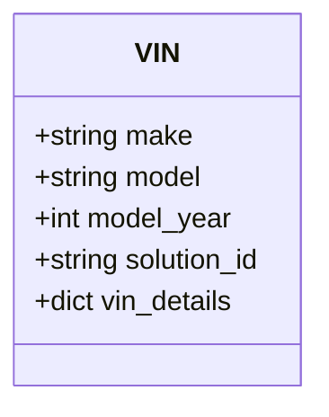

# Diagram: entity_core/entity_service/entity_service/entity/references/models.py

> Auto-generated by Obscura crawlers

## Mermaid

### SVG

<svg id="container" width="188.3046875" xmlns="http://www.w3.org/2000/svg" class="classDiagram" height="232" viewBox="0 0 188.3046875 232" role="graphics-document document" aria-roledescription="class"><g><defs><marker id="container_class-aggregationStart" class="marker aggregation class" refX="18" refY="7" markerWidth="190" markerHeight="240" orient="auto"><path d="M 18,7 L9,13 L1,7 L9,1 Z"></path></marker></defs><defs><marker id="container_class-aggregationEnd" class="marker aggregation class" refX="1" refY="7" markerWidth="20" markerHeight="28" orient="auto"><path d="M 18,7 L9,13 L1,7 L9,1 Z"></path></marker></defs><defs><marker id="container_class-extensionStart" class="marker extension class" refX="18" refY="7" markerWidth="190" markerHeight="240" orient="auto"><path d="M 1,7 L18,13 V 1 Z"></path></marker></defs><defs><marker id="container_class-extensionEnd" class="marker extension class" refX="1" refY="7" markerWidth="20" markerHeight="28" orient="auto"><path d="M 1,1 V 13 L18,7 Z"></path></marker></defs><defs><marker id="container_class-compositionStart" class="marker composition class" refX="18" refY="7" markerWidth="190" markerHeight="240" orient="auto"><path d="M 18,7 L9,13 L1,7 L9,1 Z"></path></marker></defs><defs><marker id="container_class-compositionEnd" class="marker composition class" refX="1" refY="7" markerWidth="20" markerHeight="28" orient="auto"><path d="M 18,7 L9,13 L1,7 L9,1 Z"></path></marker></defs><defs><marker id="container_class-dependencyStart" class="marker dependency class" refX="6" refY="7" markerWidth="190" markerHeight="240" orient="auto"><path d="M 5,7 L9,13 L1,7 L9,1 Z"></path></marker></defs><defs><marker id="container_class-dependencyEnd" class="marker dependency class" refX="13" refY="7" markerWidth="20" markerHeight="28" orient="auto"><path d="M 18,7 L9,13 L14,7 L9,1 Z"></path></marker></defs><defs><marker id="container_class-lollipopStart" class="marker lollipop class" refX="13" refY="7" markerWidth="190" markerHeight="240" orient="auto"><circle stroke="black" fill="transparent" cx="7" cy="7" r="6"></circle></marker></defs><defs><marker id="container_class-lollipopEnd" class="marker lollipop class" refX="1" refY="7" markerWidth="190" markerHeight="240" orient="auto"><circle stroke="black" fill="transparent" cx="7" cy="7" r="6"></circle></marker></defs><g class="root"><g class="clusters"></g><g class="edgePaths"></g><g class="edgeLabels"></g><g class="nodes"><g class="node default" id="classId-VIN-0" transform="translate(94.15234375, 116)"><g class="basic label-container"><path d="M-86.15234375 -108 L86.15234375 -108 L86.15234375 108 L-86.15234375 108" stroke="none" stroke-width="0" fill="#ECECFF" style=""></path><path d="M-86.15234375 -108 C-22.588803738925783 -108, 40.974736272148434 -108, 86.15234375 -108 M-86.15234375 -108 C-32.98039046725462 -108, 20.191562815490755 -108, 86.15234375 -108 M86.15234375 -108 C86.15234375 -31.67443586805865, 86.15234375 44.6511282638827, 86.15234375 108 M86.15234375 -108 C86.15234375 -61.77864314491283, 86.15234375 -15.557286289825655, 86.15234375 108 M86.15234375 108 C42.300990297763825 108, -1.5503631544723504 108, -86.15234375 108 M86.15234375 108 C21.615918849419657 108, -42.920506051160686 108, -86.15234375 108 M-86.15234375 108 C-86.15234375 26.7901896969382, -86.15234375 -54.4196206061236, -86.15234375 -108 M-86.15234375 108 C-86.15234375 37.69875944624458, -86.15234375 -32.60248110751084, -86.15234375 -108" stroke="#9370DB" stroke-width="1.3" fill="none" stroke-dasharray="0 0" style=""></path></g><g class="annotation-group text" transform="translate(0, -84)"></g><g class="label-group text" transform="translate(-12.2109375, -84)"><g class="label" style="font-weight: bolder" transform="translate(0,-12)"><foreignObject width="24.421875" height="24">

VIN

</foreignObject></g></g><g class="members-group text" transform="translate(-74.15234375, -36)"><g class="label" style="" transform="translate(0,-12)"><foreignObject width="93.046875" height="24">

+string make

</foreignObject></g><g class="label" style="" transform="translate(0,12)"><foreignObject width="99.890625" height="24">

+string model

</foreignObject></g><g class="label" style="" transform="translate(0,36)"><foreignObject width="117.34375" height="24">

+int model_year

</foreignObject></g><g class="label" style="" transform="translate(0,60)"><foreignObject width="136.09375" height="24">

+string solution_id

</foreignObject></g><g class="label" style="" transform="translate(0,84)"><foreignObject width="118.828125" height="24">

+dict vin_details

</foreignObject></g></g><g class="methods-group text" transform="translate(-74.15234375, 108)"></g><g class="divider" style=""><path d="M-86.15234375 -60 C-34.41554172373696 -60, 17.321260302526085 -60, 86.15234375 -60 M-86.15234375 -60 C-47.308707729550875 -60, -8.46507170910175 -60, 86.15234375 -60" stroke="#9370DB" stroke-width="1.3" fill="none" stroke-dasharray="0 0" style=""></path></g><g class="divider" style=""><path d="M-86.15234375 84 C-41.392831202754884 84, 3.3666813444902317 84, 86.15234375 84 M-86.15234375 84 C-47.93383787973767 84, -9.715332009475347 84, 86.15234375 84" stroke="#9370DB" stroke-width="1.3" fill="none" stroke-dasharray="0 0" style=""></path></g></g></g></g></g></svg>
