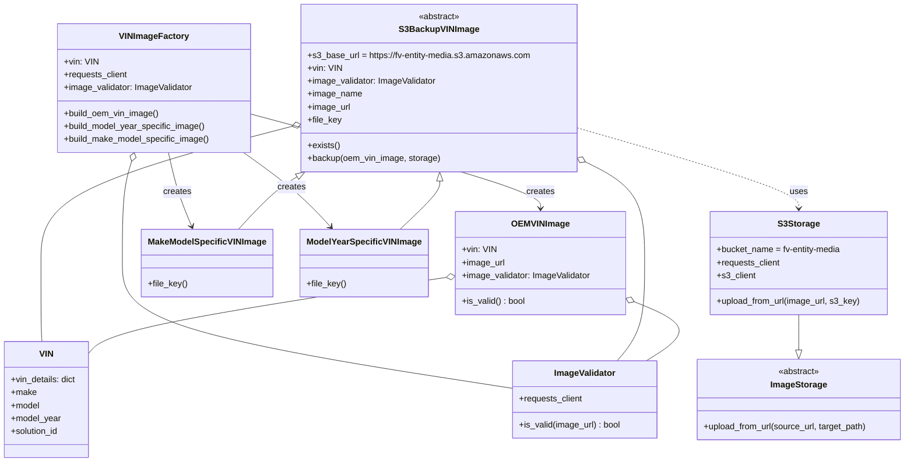

# Diagram: entity_core/entity_service/entity_service/entity/references/vin_image.py

> Auto-generated by Obscura crawlers

## Mermaid

### SVG

<svg id="container" width="1660.890625" xmlns="http://www.w3.org/2000/svg" class="classDiagram" height="860" viewBox="0 0 1660.890625 860" role="graphics-document document" aria-roledescription="class"><g><defs><marker id="container_class-aggregationStart" class="marker aggregation class" refX="18" refY="7" markerWidth="190" markerHeight="240" orient="auto"><path d="M 18,7 L9,13 L1,7 L9,1 Z"></path></marker></defs><defs><marker id="container_class-aggregationEnd" class="marker aggregation class" refX="1" refY="7" markerWidth="20" markerHeight="28" orient="auto"><path d="M 18,7 L9,13 L1,7 L9,1 Z"></path></marker></defs><defs><marker id="container_class-extensionStart" class="marker extension class" refX="18" refY="7" markerWidth="190" markerHeight="240" orient="auto"><path d="M 1,7 L18,13 V 1 Z"></path></marker></defs><defs><marker id="container_class-extensionEnd" class="marker extension class" refX="1" refY="7" markerWidth="20" markerHeight="28" orient="auto"><path d="M 1,1 V 13 L18,7 Z"></path></marker></defs><defs><marker id="container_class-compositionStart" class="marker composition class" refX="18" refY="7" markerWidth="190" markerHeight="240" orient="auto"><path d="M 18,7 L9,13 L1,7 L9,1 Z"></path></marker></defs><defs><marker id="container_class-compositionEnd" class="marker composition class" refX="1" refY="7" markerWidth="20" markerHeight="28" orient="auto"><path d="M 18,7 L9,13 L1,7 L9,1 Z"></path></marker></defs><defs><marker id="container_class-dependencyStart" class="marker dependency class" refX="6" refY="7" markerWidth="190" markerHeight="240" orient="auto"><path d="M 5,7 L9,13 L1,7 L9,1 Z"></path></marker></defs><defs><marker id="container_class-dependencyEnd" class="marker dependency class" refX="13" refY="7" markerWidth="20" markerHeight="28" orient="auto"><path d="M 18,7 L9,13 L14,7 L9,1 Z"></path></marker></defs><defs><marker id="container_class-lollipopStart" class="marker lollipop class" refX="13" refY="7" markerWidth="190" markerHeight="240" orient="auto"><circle stroke="black" fill="transparent" cx="7" cy="7" r="6"></circle></marker></defs><defs><marker id="container_class-lollipopEnd" class="marker lollipop class" refX="1" refY="7" markerWidth="190" markerHeight="240" orient="auto"><circle stroke="black" fill="transparent" cx="7" cy="7" r="6"></circle></marker></defs><g class="root"><g class="clusters"></g><g class="edgePaths"><path d="M807.465,517.347L707.754,532.956C608.042,548.564,408.619,579.782,301.826,603.12C195.034,626.459,180.872,641.917,173.792,649.647L166.711,657.376" id="id_OEMVINImage_VIN_1" class="edge-thickness-normal edge-pattern-solid relation" style=";;;" data-edge="true" data-et="edge" data-id="id_OEMVINImage_VIN_1" data-points="W3sieCI6ODI0LjUwNzgxMjUsInkiOjUxNC42Nzg5MTQ4OTI0MzQyfSx7IngiOjIwOS4xOTUzMTI1LCJ5Ijo2MTF9LHsieCI6MTY2LjcxMDkzNzUsInkiOjY1Ny4zNzU4MTM1MzU5NTU5fV0=" marker-start="url(#container_class-aggregationStart)"></path><path d="M1155.75,561.9L1175.507,570.083C1195.264,578.267,1234.778,594.633,1238.382,612.983C1241.986,631.333,1209.679,651.667,1193.525,661.833L1177.372,672" id="id_OEMVINImage_ImageValidator_2" class="edge-thickness-normal edge-pattern-solid relation" style=";;;" data-edge="true" data-et="edge" data-id="id_OEMVINImage_ImageValidator_2" data-points="W3sieCI6MTEzOS44MTI1LCJ5Ijo1NTUuMjk4ODM5MzU0OTU5NX0seyJ4IjoxMjc0LjI5Mjk2ODc1LCJ5Ijo2MTF9LHsieCI6MTE3Ny4zNzE2MjI0MTU0MTM2LCJ5Ijo2NzJ9XQ==" marker-start="url(#container_class-aggregationStart)"></path><path d="M531.652,236.575L455.936,256.646C380.22,276.717,228.788,316.858,153.072,359.096C77.355,401.333,77.355,445.667,77.355,488C77.355,530.333,77.355,570.667,77.669,595C77.982,619.333,78.609,627.667,78.922,631.833L79.235,636" id="id_S3BackupVINImage_VIN_3" class="edge-thickness-normal edge-pattern-solid relation" style=";;;" data-edge="true" data-et="edge" data-id="id_S3BackupVINImage_VIN_3" data-points="W3sieCI6NTQ4LjMyNjE3MTg3NSwieSI6MjMyLjE1NTQxMTExNDg5NjQ4fSx7IngiOjc3LjM1NTQ2ODc1LCJ5IjozNTd9LHsieCI6NzcuMzU1NDY4NzUsInkiOjQ5MH0seyJ4Ijo3Ny4zNTU0Njg3NSwieSI6NjExfSx7IngiOjc5LjIzNTE2Nzk5ODEyMDMsInkiOjYzNn1d" marker-start="url(#container_class-aggregationStart)"></path><path d="M1077.842,306.332L1094.003,314.777C1110.165,323.221,1142.489,340.111,1158.651,370.722C1174.813,401.333,1174.813,445.667,1174.813,488C1174.813,530.333,1174.813,570.667,1166.263,601C1157.714,631.333,1140.616,651.667,1132.067,661.833L1123.518,672" id="id_S3BackupVINImage_ImageValidator_4" class="edge-thickness-normal edge-pattern-solid relation" style=";;;" data-edge="true" data-et="edge" data-id="id_S3BackupVINImage_ImageValidator_4" data-points="W3sieCI6MTA2Mi41NTI3MzQzNzUsInkiOjI5OC4zNDM0ODc0MzM4Mzc5NH0seyJ4IjoxMTc0LjgxMjUsInkiOjM1N30seyJ4IjoxMTc0LjgxMjUsInkiOjQ5MH0seyJ4IjoxMTc0LjgxMjUsInkiOjYxMX0seyJ4IjoxMTIzLjUxNzUzNDA2OTU0OSwieSI6NjcyfV0=" marker-start="url(#container_class-aggregationStart)"></path><path d="M1461.934,586L1461.934,590.167C1461.934,594.333,1461.934,602.667,1461.934,613.625C1461.934,624.583,1461.934,638.167,1461.934,644.958L1461.934,651.75" id="id_S3Storage_ImageStorage_5" class="edge-thickness-normal edge-pattern-solid relation" style=";;;" data-edge="true" data-et="edge" data-id="id_S3Storage_ImageStorage_5" data-points="W3sieCI6MTQ2MS45MzM1OTM3NSwieSI6NTg2fSx7IngiOjE0NjEuOTMzNTkzNzUsInkiOjYxMX0seyJ4IjoxNDYxLjkzMzU5Mzc1LCJ5Ijo2Njl9XQ==" marker-end="url(#container_class-extensionEnd)"></path><path d="M542.24,329.169L534.848,333.808C527.457,338.446,512.674,347.723,495.02,364.028C477.366,380.333,456.841,403.667,446.578,415.333L436.316,427" id="id_S3BackupVINImage_MakeModelSpecificVINImage_6" class="edge-thickness-normal edge-pattern-solid relation" style=";;;" data-edge="true" data-et="edge" data-id="id_S3BackupVINImage_MakeModelSpecificVINImage_6" data-points="W3sieCI6NTU2Ljg1MDc2MzAzNDMyNjQsInkiOjMyMH0seyJ4Ijo0OTcuODkwNjI1LCJ5IjozNTd9LHsieCI6NDM2LjMxNTc4OTQ3MzY4NDIsInkiOjQyN31d" marker-start="url(#container_class-extensionStart)"></path><path d="M799.23,337.239L799.112,340.532C798.994,343.826,798.758,350.413,786.581,365.373C774.405,380.333,750.288,403.667,738.229,415.333L726.171,427" id="id_S3BackupVINImage_ModelYearSpecificVINImage_7" class="edge-thickness-normal edge-pattern-solid relation" style=";;;" data-edge="true" data-et="edge" data-id="id_S3BackupVINImage_ModelYearSpecificVINImage_7" data-points="W3sieCI6Nzk5Ljg0NzcyNzA4ODczMDYsInkiOjMyMH0seyJ4Ijo3OTguNTIxNDg0Mzc1LCJ5IjozNTd9LHsieCI6NzI2LjE3MDUzODY1MTMxNTgsInkiOjQyN31d" marker-start="url(#container_class-extensionStart)"></path><path d="M463.629,213.442L550.051,237.368C636.473,261.294,809.316,309.147,895.738,338.24C982.16,367.333,982.16,377.667,982.16,382.833L982.16,388" id="id_VINImageFactory_OEMVINImage_8" class="edge-thickness-normal edge-pattern-solid relation" style=";;;" data-edge="true" data-et="edge" data-id="id_VINImageFactory_OEMVINImage_8" data-points="W3sieCI6NDYzLjYyODkwNjI1LCJ5IjoyMTMuNDQxNTA4MjI4Njg4NjN9LHsieCI6OTgyLjE2MDE1NjI1LCJ5IjozNTd9LHsieCI6OTgyLjE2MDE1NjI1LCJ5IjozOTR9XQ==" marker-end="url(#container_class-dependencyEnd)"></path><path d="M446.093,284L462.421,296.167C478.749,308.333,511.406,332.667,537.336,355.749C563.266,378.832,582.47,400.663,592.072,411.579L601.674,422.495" id="id_VINImageFactory_ModelYearSpecificVINImage_9" class="edge-thickness-normal edge-pattern-solid relation" style=";;;" data-edge="true" data-et="edge" data-id="id_VINImageFactory_ModelYearSpecificVINImage_9" data-points="W3sieCI6NDQ2LjA5Mjg1OTQ1NTk1ODU1LCJ5IjoyODR9LHsieCI6NTQ0LjA2MjUsInkiOjM1N30seyJ4Ijo2MDUuNjM3MzM1NTI2MzE1OCwieSI6NDI3fV0=" marker-end="url(#container_class-dependencyEnd)"></path><path d="M311.836,284L314.552,296.167C317.268,308.333,322.701,332.667,329.676,355.57C336.652,378.474,345.172,399.949,349.432,410.686L353.692,421.423" id="id_VINImageFactory_MakeModelSpecificVINImage_10" class="edge-thickness-normal edge-pattern-solid relation" style=";;;" data-edge="true" data-et="edge" data-id="id_VINImageFactory_MakeModelSpecificVINImage_10" data-points="W3sieCI6MzExLjgzNjA1ODkzNzgyMzg1LCJ5IjoyODR9LHsieCI6MzI4LjEzMjgxMjUsInkiOjM1N30seyJ4IjozNTUuOTA0MTk0MDc4OTQ3NCwieSI6NDI3fV0=" marker-end="url(#container_class-dependencyEnd)"></path><path d="M245.525,300.57L242.804,309.975C240.082,319.38,234.639,338.19,231.917,369.762C229.195,401.333,229.195,445.667,229.195,488C229.195,530.333,229.195,570.667,345.771,609.429C462.346,648.191,695.497,685.382,812.073,703.978L928.648,722.573" id="id_VINImageFactory_ImageValidator_11" class="edge-thickness-normal edge-pattern-solid relation" style=";;;" data-edge="true" data-et="edge" data-id="id_VINImageFactory_ImageValidator_11" data-points="W3sieCI6MjUwLjMyMDUxNDg5NjM3MzA2LCJ5IjoyODR9LHsieCI6MjI5LjE5NTMxMjUsInkiOjM1N30seyJ4IjoyMjkuMTk1MzEyNSwieSI6NDkwfSx7IngiOjIyOS4xOTUzMTI1LCJ5Ijo2MTF9LHsieCI6OTI4LjY0ODQzNzUsInkiOjcyMi41NzMyNzExMTY0ODMzfV0=" marker-start="url(#container_class-aggregationStart)"></path><path d="M1062.553,239.588L1129.116,259.156C1195.68,278.725,1328.807,317.863,1395.37,342.598C1461.934,367.333,1461.934,377.667,1461.934,382.833L1461.934,388" id="id_S3BackupVINImage_S3Storage_12" class="edge-thickness-normal edge-pattern-dashed relation" style=";;;" data-edge="true" data-et="edge" data-id="id_S3BackupVINImage_S3Storage_12" data-points="W3sieCI6MTA2Mi41NTI3MzQzNzUsInkiOjIzOS41ODc2NzEyNTMyNTR9LHsieCI6MTQ2MS45MzM1OTM3NSwieSI6MzU3fSx7IngiOjE0NjEuOTMzNTkzNzUsInkiOjM5NH1d" marker-end="url(#container_class-dependencyEnd)"></path></g><g class="edgeLabels"><g class="edgeLabel"><g class="label" data-id="id_OEMVINImage_VIN_1" transform="translate(0, 0)"><foreignObject width="0" height="0">

</foreignObject></g></g><g class="edgeLabel"><g class="label" data-id="id_OEMVINImage_ImageValidator_2" transform="translate(0, 0)"><foreignObject width="0" height="0">

</foreignObject></g></g><g class="edgeLabel"><g class="label" data-id="id_S3BackupVINImage_VIN_3" transform="translate(0, 0)"><foreignObject width="0" height="0">

</foreignObject></g></g><g class="edgeLabel"><g class="label" data-id="id_S3BackupVINImage_ImageValidator_4" transform="translate(0, 0)"><foreignObject width="0" height="0">

</foreignObject></g></g><g class="edgeLabel"><g class="label" data-id="id_S3Storage_ImageStorage_5" transform="translate(0, 0)"><foreignObject width="0" height="0">

</foreignObject></g></g><g class="edgeLabel"><g class="label" data-id="id_S3BackupVINImage_MakeModelSpecificVINImage_6" transform="translate(0, 0)"><foreignObject width="0" height="0">

</foreignObject></g></g><g class="edgeLabel"><g class="label" data-id="id_S3BackupVINImage_ModelYearSpecificVINImage_7" transform="translate(0, 0)"><foreignObject width="0" height="0">

</foreignObject></g></g><g class="edgeLabel" transform="translate(982.16015625, 357)"><g class="label" data-id="id_VINImageFactory_OEMVINImage_8" transform="translate(-26.171875, -12)"><foreignObject width="52.34375" height="24">

creates

</foreignObject></g></g><g class="edgeLabel" transform="translate(532.4561, 348.35173)"><g class="label" data-id="id_VINImageFactory_ModelYearSpecificVINImage_9" transform="translate(-26.171875, -12)"><foreignObject width="52.34375" height="24">

creates

</foreignObject></g></g><g class="edgeLabel" transform="translate(328.22699, 357.23737)"><g class="label" data-id="id_VINImageFactory_MakeModelSpecificVINImage_10" transform="translate(-26.171875, -12)"><foreignObject width="52.34375" height="24">

creates

</foreignObject></g></g><g class="edgeLabel"><g class="label" data-id="id_VINImageFactory_ImageValidator_11" transform="translate(0, 0)"><foreignObject width="0" height="0">

</foreignObject></g></g><g class="edgeLabel" transform="translate(1461.93359375, 357)"><g class="label" data-id="id_S3BackupVINImage_S3Storage_12" transform="translate(-16.4921875, -12)"><foreignObject width="32.984375" height="24">

uses

</foreignObject></g></g></g><g class="nodes"><g class="node default" id="classId-VIN-0" transform="translate(87.35546875, 744)"><g class="basic label-container"><path d="M-79.35546875 -108 L79.35546875 -108 L79.35546875 108 L-79.35546875 108" stroke="none" stroke-width="0" fill="#ECECFF" style=""></path><path d="M-79.35546875 -108 C-46.23058906152187 -108, -13.105709373043737 -108, 79.35546875 -108 M-79.35546875 -108 C-46.34490657879138 -108, -13.334344407582762 -108, 79.35546875 -108 M79.35546875 -108 C79.35546875 -50.165516960458, 79.35546875 7.668966079084001, 79.35546875 108 M79.35546875 -108 C79.35546875 -31.345761201709294, 79.35546875 45.30847759658141, 79.35546875 108 M79.35546875 108 C44.58220643818607 108, 9.80894412637214 108, -79.35546875 108 M79.35546875 108 C45.995195551340245 108, 12.63492235268049 108, -79.35546875 108 M-79.35546875 108 C-79.35546875 53.08769337203674, -79.35546875 -1.824613255926522, -79.35546875 -108 M-79.35546875 108 C-79.35546875 27.762339549618943, -79.35546875 -52.475320900762114, -79.35546875 -108" stroke="#9370DB" stroke-width="1.3" fill="none" stroke-dasharray="0 0" style=""></path></g><g class="annotation-group text" transform="translate(0, -84)"></g><g class="label-group text" transform="translate(-12.2109375, -84)"><g class="label" style="font-weight: bolder" transform="translate(0,-12)"><foreignObject width="24.421875" height="24">

VIN

</foreignObject></g></g><g class="members-group text" transform="translate(-67.35546875, -36)"><g class="label" style="" transform="translate(0,-12)"><foreignObject width="122.5" height="24">

+vin_details: dict

</foreignObject></g><g class="label" style="" transform="translate(0,12)"><foreignObject width="47.171875" height="24">

+make

</foreignObject></g><g class="label" style="" transform="translate(0,36)"><foreignObject width="54.03125" height="24">

+model

</foreignObject></g><g class="label" style="" transform="translate(0,60)"><foreignObject width="93.4375" height="24">

+model_year

</foreignObject></g><g class="label" style="" transform="translate(0,84)"><foreignObject width="90.21875" height="24">

+solution_id

</foreignObject></g></g><g class="methods-group text" transform="translate(-67.35546875, 108)"></g><g class="divider" style=""><path d="M-79.35546875 -60 C-20.113657485334627 -60, 39.128153779330745 -60, 79.35546875 -60 M-79.35546875 -60 C-39.743101319549645 -60, -0.1307338890992895 -60, 79.35546875 -60" stroke="#9370DB" stroke-width="1.3" fill="none" stroke-dasharray="0 0" style=""></path></g><g class="divider" style=""><path d="M-79.35546875 84 C-23.271469083787245 84, 32.81253058242551 84, 79.35546875 84 M-79.35546875 84 C-18.08617618098424 84, 43.18311638803152 84, 79.35546875 84" stroke="#9370DB" stroke-width="1.3" fill="none" stroke-dasharray="0 0" style=""></path></g></g><g class="node default" id="classId-ImageValidator-1" transform="translate(1062.97265625, 744)"><g class="basic label-container"><path d="M-134.32421875 -72 L134.32421875 -72 L134.32421875 72 L-134.32421875 72" stroke="none" stroke-width="0" fill="#ECECFF" style=""></path><path d="M-134.32421875 -72 C-38.92389468914719 -72, 56.47642937170562 -72, 134.32421875 -72 M-134.32421875 -72 C-54.442726818159585 -72, 25.43876511368083 -72, 134.32421875 -72 M134.32421875 -72 C134.32421875 -43.15595585481941, 134.32421875 -14.311911709638814, 134.32421875 72 M134.32421875 -72 C134.32421875 -32.06620090995955, 134.32421875 7.867598180080904, 134.32421875 72 M134.32421875 72 C70.00509913428775 72, 5.685979518575493 72, -134.32421875 72 M134.32421875 72 C29.910833094927824 72, -74.50255256014435 72, -134.32421875 72 M-134.32421875 72 C-134.32421875 41.094152035785775, -134.32421875 10.188304071571551, -134.32421875 -72 M-134.32421875 72 C-134.32421875 24.78034282188294, -134.32421875 -22.43931435623412, -134.32421875 -72" stroke="#9370DB" stroke-width="1.3" fill="none" stroke-dasharray="0 0" style=""></path></g><g class="annotation-group text" transform="translate(0, -48)"></g><g class="label-group text" transform="translate(-55.2421875, -48)"><g class="label" style="font-weight: bolder" transform="translate(0,-12)"><foreignObject width="110.484375" height="24">

ImageValidator

</foreignObject></g></g><g class="members-group text" transform="translate(-122.32421875, 0)"><g class="label" style="" transform="translate(0,-12)"><foreignObject width="119.125" height="24">

+requests_client

</foreignObject></g></g><g class="methods-group text" transform="translate(-122.32421875, 48)"><g class="label" style="" transform="translate(0,-12)"><foreignObject width="189.40625" height="24">

+is_valid(image_url) : bool

</foreignObject></g></g><g class="divider" style=""><path d="M-134.32421875 -24 C-41.23036794799094 -24, 51.863482854018116 -24, 134.32421875 -24 M-134.32421875 -24 C-65.60039935630442 -24, 3.1234200373911563 -24, 134.32421875 -24" stroke="#9370DB" stroke-width="1.3" fill="none" stroke-dasharray="0 0" style=""></path></g><g class="divider" style=""><path d="M-134.32421875 24 C-60.68920560897722 24, 12.945807532045563 24, 134.32421875 24 M-134.32421875 24 C-51.46011730370492 24, 31.40398414259016 24, 134.32421875 24" stroke="#9370DB" stroke-width="1.3" fill="none" stroke-dasharray="0 0" style=""></path></g></g><g class="node default" id="classId-OEMVINImage-2" transform="translate(982.16015625, 490)"><g class="basic label-container"><path d="M-157.65234375 -96 L157.65234375 -96 L157.65234375 96 L-157.65234375 96" stroke="none" stroke-width="0" fill="#ECECFF" style=""></path><path d="M-157.65234375 -96 C-37.98220540234328 -96, 81.68793294531343 -96, 157.65234375 -96 M-157.65234375 -96 C-40.75801583038076 -96, 76.13631208923849 -96, 157.65234375 -96 M157.65234375 -96 C157.65234375 -54.1432794697849, 157.65234375 -12.286558939569801, 157.65234375 96 M157.65234375 -96 C157.65234375 -38.31882730548327, 157.65234375 19.362345389033464, 157.65234375 96 M157.65234375 96 C51.24416528388623 96, -55.164013182227535 96, -157.65234375 96 M157.65234375 96 C74.93839887039938 96, -7.775546009201236 96, -157.65234375 96 M-157.65234375 96 C-157.65234375 20.68563106592289, -157.65234375 -54.62873786815422, -157.65234375 -96 M-157.65234375 96 C-157.65234375 31.340530431028213, -157.65234375 -33.31893913794357, -157.65234375 -96" stroke="#9370DB" stroke-width="1.3" fill="none" stroke-dasharray="0 0" style=""></path></g><g class="annotation-group text" transform="translate(0, -72)"></g><g class="label-group text" transform="translate(-50.2265625, -72)"><g class="label" style="font-weight: bolder" transform="translate(0,-12)"><foreignObject width="100.453125" height="24">

OEMVINImage

</foreignObject></g></g><g class="members-group text" transform="translate(-145.65234375, -24)"><g class="label" style="" transform="translate(0,-12)"><foreignObject width="62.21875" height="24">

+vin: VIN

</foreignObject></g><g class="label" style="" transform="translate(0,12)"><foreignObject width="79.40625" height="24">

+image_url

</foreignObject></g><g class="label" style="" transform="translate(0,36)"><foreignObject width="241.078125" height="24">

+image_validator: ImageValidator

</foreignObject></g></g><g class="methods-group text" transform="translate(-145.65234375, 72)"><g class="label" style="" transform="translate(0,-12)"><foreignObject width="117.984375" height="24">

+is_valid() : bool

</foreignObject></g></g><g class="divider" style=""><path d="M-157.65234375 -48 C-54.59780801418255 -48, 48.456727721634905 -48, 157.65234375 -48 M-157.65234375 -48 C-77.28496679197664 -48, 3.0824101660467136 -48, 157.65234375 -48" stroke="#9370DB" stroke-width="1.3" fill="none" stroke-dasharray="0 0" style=""></path></g><g class="divider" style=""><path d="M-157.65234375 48 C-49.66942894773297 48, 58.313485854534065 48, 157.65234375 48 M-157.65234375 48 C-66.98343867982022 48, 23.68546639035955 48, 157.65234375 48" stroke="#9370DB" stroke-width="1.3" fill="none" stroke-dasharray="0 0" style=""></path></g></g><g class="node default" id="classId-ImageStorage-3" transform="translate(1461.93359375, 744)"><g class="basic label-container"><path d="M-190.95703125 -75 L190.95703125 -75 L190.95703125 75 L-190.95703125 75" stroke="none" stroke-width="0" fill="#ECECFF" style=""></path><path d="M-190.95703125 -75 C-45.5315233638004 -75, 99.8939845223992 -75, 190.95703125 -75 M-190.95703125 -75 C-98.84201824192233 -75, -6.727005233844665 -75, 190.95703125 -75 M190.95703125 -75 C190.95703125 -17.01030334082536, 190.95703125 40.97939331834928, 190.95703125 75 M190.95703125 -75 C190.95703125 -18.68193513965381, 190.95703125 37.63612972069238, 190.95703125 75 M190.95703125 75 C82.913174361225 75, -25.130682527549993 75, -190.95703125 75 M190.95703125 75 C91.81104795280041 75, -7.3349353443991845 75, -190.95703125 75 M-190.95703125 75 C-190.95703125 36.19258538546365, -190.95703125 -2.614829229072697, -190.95703125 -75 M-190.95703125 75 C-190.95703125 17.02971431123406, -190.95703125 -40.94057137753188, -190.95703125 -75" stroke="#9370DB" stroke-width="1.3" fill="none" stroke-dasharray="0 0" style=""></path></g><g class="annotation-group text" transform="translate(-38.609375, -51)"><g class="label" style="" transform="translate(0,-12)"><foreignObject width="77.21875" height="24">

«abstract»

</foreignObject></g></g><g class="label-group text" transform="translate(-50.1328125, -27)"><g class="label" style="font-weight: bolder" transform="translate(0,-12)"><foreignObject width="100.265625" height="24">

ImageStorage

</foreignObject></g></g><g class="members-group text" transform="translate(-178.95703125, 21)"></g><g class="methods-group text" transform="translate(-178.95703125, 51)"><g class="label" style="" transform="translate(0,-12)"><foreignObject width="307.78125" height="24">

+upload_from_url(source_url, target_path)

</foreignObject></g></g><g class="divider" style=""><path d="M-190.95703125 -3 C-71.21859119266 -3, 48.51984886468 -3, 190.95703125 -3 M-190.95703125 -3 C-110.43709128305214 -3, -29.91715131610428 -3, 190.95703125 -3" stroke="#9370DB" stroke-width="1.3" fill="none" stroke-dasharray="0 0" style=""></path></g><g class="divider" style=""><path d="M-190.95703125 21 C-80.27952474513499 21, 30.397981759730015 21, 190.95703125 21 M-190.95703125 21 C-38.462694190196714 21, 114.03164286960657 21, 190.95703125 21" stroke="#9370DB" stroke-width="1.3" fill="none" stroke-dasharray="0 0" style=""></path></g></g><g class="node default" id="classId-S3Storage-4" transform="translate(1461.93359375, 490)"><g class="basic label-container"><path d="M-163.9609375 -96 L163.9609375 -96 L163.9609375 96 L-163.9609375 96" stroke="none" stroke-width="0" fill="#ECECFF" style=""></path><path d="M-163.9609375 -96 C-64.68274589812133 -96, 34.59544570375735 -96, 163.9609375 -96 M-163.9609375 -96 C-71.26123297898262 -96, 21.438471542034762 -96, 163.9609375 -96 M163.9609375 -96 C163.9609375 -21.66430160862791, 163.9609375 52.67139678274418, 163.9609375 96 M163.9609375 -96 C163.9609375 -48.73679592188694, 163.9609375 -1.4735918437738746, 163.9609375 96 M163.9609375 96 C68.6258512074837 96, -26.70923508503259 96, -163.9609375 96 M163.9609375 96 C34.00695452568624 96, -95.94702844862752 96, -163.9609375 96 M-163.9609375 96 C-163.9609375 31.357724532580875, -163.9609375 -33.28455093483825, -163.9609375 -96 M-163.9609375 96 C-163.9609375 31.931373195010934, -163.9609375 -32.13725360997813, -163.9609375 -96" stroke="#9370DB" stroke-width="1.3" fill="none" stroke-dasharray="0 0" style=""></path></g><g class="annotation-group text" transform="translate(0, -72)"></g><g class="label-group text" transform="translate(-36.8125, -72)"><g class="label" style="font-weight: bolder" transform="translate(0,-12)"><foreignObject width="73.625" height="24">

S3Storage

</foreignObject></g></g><g class="members-group text" transform="translate(-151.9609375, -24)"><g class="label" style="" transform="translate(0,-12)"><foreignObject width="235.28125" height="24">

+bucket_name = fv-entity-media

</foreignObject></g><g class="label" style="" transform="translate(0,12)"><foreignObject width="119.125" height="24">

+requests_client

</foreignObject></g><g class="label" style="" transform="translate(0,36)"><foreignObject width="71.84375" height="24">

+s3_client

</foreignObject></g></g><g class="methods-group text" transform="translate(-151.9609375, 72)"><g class="label" style="" transform="translate(0,-12)"><foreignObject width="267.109375" height="24">

+upload_from_url(image_url, s3_key)

</foreignObject></g></g><g class="divider" style=""><path d="M-163.9609375 -48 C-91.13168665202062 -48, -18.302435804041238 -48, 163.9609375 -48 M-163.9609375 -48 C-56.350624219384045 -48, 51.25968906123191 -48, 163.9609375 -48" stroke="#9370DB" stroke-width="1.3" fill="none" stroke-dasharray="0 0" style=""></path></g><g class="divider" style=""><path d="M-163.9609375 48 C-91.63354101894446 48, -19.306144537888912 48, 163.9609375 48 M-163.9609375 48 C-64.95597012747287 48, 34.04899724505427 48, 163.9609375 48" stroke="#9370DB" stroke-width="1.3" fill="none" stroke-dasharray="0 0" style=""></path></g></g><g class="node default" id="classId-S3BackupVINImage-5" transform="translate(805.439453125, 164)"><g class="basic label-container"><path d="M-257.11328125 -156 L257.11328125 -156 L257.11328125 156 L-257.11328125 156" stroke="none" stroke-width="0" fill="#ECECFF" style=""></path><path d="M-257.11328125 -156 C-136.56505254489673 -156, -16.01682383979349 -156, 257.11328125 -156 M-257.11328125 -156 C-125.86066602077372 -156, 5.391949208452559 -156, 257.11328125 -156 M257.11328125 -156 C257.11328125 -47.403504336524605, 257.11328125 61.19299132695079, 257.11328125 156 M257.11328125 -156 C257.11328125 -52.37689906535067, 257.11328125 51.24620186929866, 257.11328125 156 M257.11328125 156 C141.4888527958228 156, 25.864424341645588 156, -257.11328125 156 M257.11328125 156 C64.96003339948828 156, -127.19321445102344 156, -257.11328125 156 M-257.11328125 156 C-257.11328125 86.43943492044187, -257.11328125 16.878869840883738, -257.11328125 -156 M-257.11328125 156 C-257.11328125 46.13409895748438, -257.11328125 -63.731802085031234, -257.11328125 -156" stroke="#9370DB" stroke-width="1.3" fill="none" stroke-dasharray="0 0" style=""></path></g><g class="annotation-group text" transform="translate(-38.609375, -132)"><g class="label" style="" transform="translate(0,-12)"><foreignObject width="77.21875" height="24">

«abstract»

</foreignObject></g></g><g class="label-group text" transform="translate(-69.8515625, -108)"><g class="label" style="font-weight: bolder" transform="translate(0,-12)"><foreignObject width="139.703125" height="24">

S3BackupVINImage

</foreignObject></g></g><g class="members-group text" transform="translate(-245.11328125, -60)"><g class="label" style="" transform="translate(0,-12)"><foreignObject width="420.375" height="24">

+s3_base_url = https://fv-entity-media.s3.amazonaws.com

</foreignObject></g><g class="label" style="" transform="translate(0,12)"><foreignObject width="62.21875" height="24">

+vin: VIN

</foreignObject></g><g class="label" style="" transform="translate(0,36)"><foreignObject width="241.078125" height="24">

+image_validator: ImageValidator

</foreignObject></g><g class="label" style="" transform="translate(0,60)"><foreignObject width="100.0625" height="24">

+image_name

</foreignObject></g><g class="label" style="" transform="translate(0,84)"><foreignObject width="79.40625" height="24">

+image_url

</foreignObject></g><g class="label" style="" transform="translate(0,108)"><foreignObject width="62.859375" height="24">

+file_key

</foreignObject></g></g><g class="methods-group text" transform="translate(-245.11328125, 108)"><g class="label" style="" transform="translate(0,-12)"><foreignObject width="59.921875" height="24">

+exists()

</foreignObject></g><g class="label" style="" transform="translate(0,12)"><foreignObject width="245.421875" height="24">

+backup(oem_vin_image, storage)

</foreignObject></g></g><g class="divider" style=""><path d="M-257.11328125 -84 C-104.66892663292691 -84, 47.77542798414618 -84, 257.11328125 -84 M-257.11328125 -84 C-146.3839251607647 -84, -35.65456907152944 -84, 257.11328125 -84" stroke="#9370DB" stroke-width="1.3" fill="none" stroke-dasharray="0 0" style=""></path></g><g class="divider" style=""><path d="M-257.11328125 84 C-106.66353980140431 84, 43.786201647191376 84, 257.11328125 84 M-257.11328125 84 C-67.77521743216991 84, 121.56284638566018 84, 257.11328125 84" stroke="#9370DB" stroke-width="1.3" fill="none" stroke-dasharray="0 0" style=""></path></g></g><g class="node default" id="classId-MakeModelSpecificVINImage-6" transform="translate(380.8984375, 490)"><g class="basic label-container"><path d="M-116.703125 -63 L116.703125 -63 L116.703125 63 L-116.703125 63" stroke="none" stroke-width="0" fill="#ECECFF" style=""></path><path d="M-116.703125 -63 C-51.736612240135216 -63, 13.229900519729568 -63, 116.703125 -63 M-116.703125 -63 C-38.916565176303536 -63, 38.86999464739293 -63, 116.703125 -63 M116.703125 -63 C116.703125 -36.3065713850046, 116.703125 -9.613142770009205, 116.703125 63 M116.703125 -63 C116.703125 -34.00190666186036, 116.703125 -5.003813323720728, 116.703125 63 M116.703125 63 C45.42439439523744 63, -25.854336209525115 63, -116.703125 63 M116.703125 63 C30.94479724846572 63, -54.81353050306856 63, -116.703125 63 M-116.703125 63 C-116.703125 34.12979335907207, -116.703125 5.259586718144142, -116.703125 -63 M-116.703125 63 C-116.703125 28.855566618194246, -116.703125 -5.288866763611509, -116.703125 -63" stroke="#9370DB" stroke-width="1.3" fill="none" stroke-dasharray="0 0" style=""></path></g><g class="annotation-group text" transform="translate(0, -39)"></g><g class="label-group text" transform="translate(-104.703125, -39)"><g class="label" style="font-weight: bolder" transform="translate(0,-12)"><foreignObject width="209.40625" height="24">

MakeModelSpecificVINImage

</foreignObject></g></g><g class="members-group text" transform="translate(-104.703125, 9)"></g><g class="methods-group text" transform="translate(-104.703125, 39)"><g class="label" style="" transform="translate(0,-12)"><foreignObject width="73.21875" height="24">

+file_key()

</foreignObject></g></g><g class="divider" style=""><path d="M-116.703125 -15 C-54.36207504648264 -15, 7.978974907034726 -15, 116.703125 -15 M-116.703125 -15 C-48.7538129817397 -15, 19.1954990365206 -15, 116.703125 -15" stroke="#9370DB" stroke-width="1.3" fill="none" stroke-dasharray="0 0" style=""></path></g><g class="divider" style=""><path d="M-116.703125 9 C-40.84244536276995 9, 35.0182342744601 9, 116.703125 9 M-116.703125 9 C-60.955193212051206 9, -5.207261424102413 9, 116.703125 9" stroke="#9370DB" stroke-width="1.3" fill="none" stroke-dasharray="0 0" style=""></path></g></g><g class="node default" id="classId-ModelYearSpecificVINImage-7" transform="translate(661.0546875, 490)"><g class="basic label-container"><path d="M-113.453125 -63 L113.453125 -63 L113.453125 63 L-113.453125 63" stroke="none" stroke-width="0" fill="#ECECFF" style=""></path><path d="M-113.453125 -63 C-56.936643552635296 -63, -0.4201621052705917 -63, 113.453125 -63 M-113.453125 -63 C-43.30822261959945 -63, 26.836679760801104 -63, 113.453125 -63 M113.453125 -63 C113.453125 -19.93071693389325, 113.453125 23.138566132213498, 113.453125 63 M113.453125 -63 C113.453125 -27.974356053235297, 113.453125 7.051287893529405, 113.453125 63 M113.453125 63 C42.454818885780554 63, -28.54348722843889 63, -113.453125 63 M113.453125 63 C48.17082015960618 63, -17.11148468078764 63, -113.453125 63 M-113.453125 63 C-113.453125 28.506142452765125, -113.453125 -5.987715094469749, -113.453125 -63 M-113.453125 63 C-113.453125 29.083060884671802, -113.453125 -4.833878230656396, -113.453125 -63" stroke="#9370DB" stroke-width="1.3" fill="none" stroke-dasharray="0 0" style=""></path></g><g class="annotation-group text" transform="translate(0, -39)"></g><g class="label-group text" transform="translate(-101.453125, -39)"><g class="label" style="font-weight: bolder" transform="translate(0,-12)"><foreignObject width="202.90625" height="24">

ModelYearSpecificVINImage

</foreignObject></g></g><g class="members-group text" transform="translate(-101.453125, 9)"></g><g class="methods-group text" transform="translate(-101.453125, 39)"><g class="label" style="" transform="translate(0,-12)"><foreignObject width="73.21875" height="24">

+file_key()

</foreignObject></g></g><g class="divider" style=""><path d="M-113.453125 -15 C-66.78246366782986 -15, -20.111802335659704 -15, 113.453125 -15 M-113.453125 -15 C-23.64651358507939 -15, 66.16009782984122 -15, 113.453125 -15" stroke="#9370DB" stroke-width="1.3" fill="none" stroke-dasharray="0 0" style=""></path></g><g class="divider" style=""><path d="M-113.453125 9 C-43.494674770596376 9, 26.46377545880725 9, 113.453125 9 M-113.453125 9 C-55.689201730663854 9, 2.074721538672293 9, 113.453125 9" stroke="#9370DB" stroke-width="1.3" fill="none" stroke-dasharray="0 0" style=""></path></g></g><g class="node default" id="classId-VINImageFactory-8" transform="translate(285.046875, 164)"><g class="basic label-container"><path d="M-178.58203125 -120 L178.58203125 -120 L178.58203125 120 L-178.58203125 120" stroke="none" stroke-width="0" fill="#ECECFF" style=""></path><path d="M-178.58203125 -120 C-43.08834075041648 -120, 92.40534974916704 -120, 178.58203125 -120 M-178.58203125 -120 C-98.41889245207379 -120, -18.255753654147583 -120, 178.58203125 -120 M178.58203125 -120 C178.58203125 -41.87616436703837, 178.58203125 36.24767126592326, 178.58203125 120 M178.58203125 -120 C178.58203125 -58.39855640831047, 178.58203125 3.2028871833790618, 178.58203125 120 M178.58203125 120 C42.150820903200184 120, -94.28038944359963 120, -178.58203125 120 M178.58203125 120 C39.80463211508433 120, -98.97276701983134 120, -178.58203125 120 M-178.58203125 120 C-178.58203125 49.1559668449695, -178.58203125 -21.688066310061004, -178.58203125 -120 M-178.58203125 120 C-178.58203125 63.273068898173975, -178.58203125 6.546137796347949, -178.58203125 -120" stroke="#9370DB" stroke-width="1.3" fill="none" stroke-dasharray="0 0" style=""></path></g><g class="annotation-group text" transform="translate(0, -96)"></g><g class="label-group text" transform="translate(-60.8671875, -96)"><g class="label" style="font-weight: bolder" transform="translate(0,-12)"><foreignObject width="121.734375" height="24">

VINImageFactory

</foreignObject></g></g><g class="members-group text" transform="translate(-166.58203125, -48)"><g class="label" style="" transform="translate(0,-12)"><foreignObject width="62.21875" height="24">

+vin: VIN

</foreignObject></g><g class="label" style="" transform="translate(0,12)"><foreignObject width="119.125" height="24">

+requests_client

</foreignObject></g><g class="label" style="" transform="translate(0,36)"><foreignObject width="241.078125" height="24">

+image_validator: ImageValidator

</foreignObject></g></g><g class="methods-group text" transform="translate(-166.58203125, 48)"><g class="label" style="" transform="translate(0,-12)"><foreignObject width="177.109375" height="24">

+build_oem_vin_image()

</foreignObject></g><g class="label" style="" transform="translate(0,12)"><foreignObject width="263.234375" height="24">

+build_model_year_specific_image()

</foreignObject></g><g class="label" style="" transform="translate(0,36)"><foreignObject width="272.296875" height="24">

+build_make_model_specific_image()

</foreignObject></g></g><g class="divider" style=""><path d="M-178.58203125 -72 C-70.46123708690872 -72, 37.65955707618255 -72, 178.58203125 -72 M-178.58203125 -72 C-66.56867576519039 -72, 45.44467971961922 -72, 178.58203125 -72" stroke="#9370DB" stroke-width="1.3" fill="none" stroke-dasharray="0 0" style=""></path></g><g class="divider" style=""><path d="M-178.58203125 24 C-81.83361462361464 24, 14.914802002770728 24, 178.58203125 24 M-178.58203125 24 C-38.40921218981518 24, 101.76360687036964 24, 178.58203125 24" stroke="#9370DB" stroke-width="1.3" fill="none" stroke-dasharray="0 0" style=""></path></g></g></g></g></g></svg>
