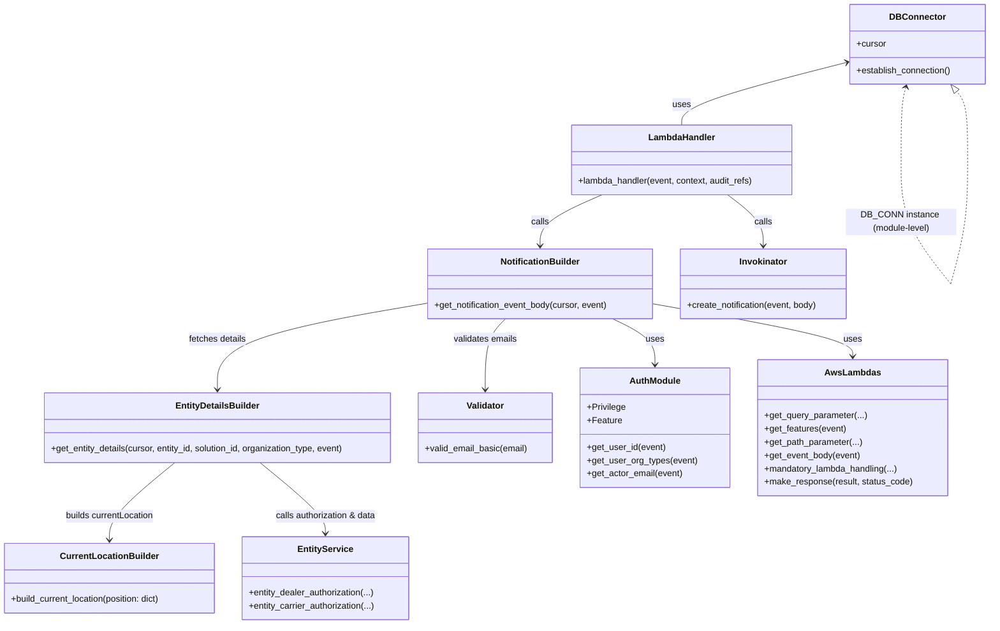

# Diagram: entity_core/entity_service/entity_service/entity/share/share_entity.py


> Auto-generated by Obscura crawlers

## Diagram 1

```mermaid
flowchart TD
    LH[lambda_handler(event, context, audit_refs)]
    LH --> DB_EST[DB_CONN.establish_connection()]
    DB_EST --> CURS[cursor = DB_CONN.cursor]
    CURS --> GNE[get_notification_event_body(cursor, event)]
    subgraph GetNotificationEventBody
        direction LR
        GNE --> AUTH_ORG[auth.get_user_org_types(event)]
        GNE --> QP[fv.aws.lambdas.get_query_parameter(event, "dealerOrgId")]
        GNE --> FEATURES[fv.aws.lambdas.get_features(event)]
        GNE --> PATH_DEALER_CHECK{dealerOrgId and missing VIN_VIEW feature?}
        PATH_DEALER_CHECK -->|yes| FORBID[fv.error.ForbiddenError]
        GNE --> AUTHZ_BRANCH{organization type}
        AUTHZ_BRANCH -->|DEALER| DEALER_AUTH[entity_service.common.entity_dealer_authorization(event, cursor, dealer_org_id)]
        AUTHZ_BRANCH -->|CARRIER/PARTNER| CARRIER_AUTH[entity_service.common.entity_carrier_authorization(event, cursor, internal_id)]
        AUTHZ_BRANCH -->|OTHER| PATH_PARAMS[solution_id/entity_id from path]
        GNE --> EVENT_BODY[fv.aws.lambdas.get_event_body(event)]
        EVENT_BODY --> PARSE_USERS[parse event_body["shareTo"] -> emails]
        PARSE_USERS --> VALIDATE[valid_email_basic(email)]
        PARSE_USERS --> BUILD_BODY[build notification_event_body dict]
        BUILD_BODY --> GET_ENTITY_DETAILS[get_entity_details(cursor, entity_id, solution_id, organization_type, event)]
        GET_ENTITY_DETAILS --> BUILD_BODY
    end
    GNE --> INV[invokinator_notification.create_notification(event, GNE)]
    INV --> RESP[fv.aws.lambdas.make_response(result, status_code=200)]
    RESP --> RET[return response]
```

> SVG rendering failed for this diagram.

## Diagram 2



### SVG

<svg id="container" width="1811.091064453125" xmlns="http://www.w3.org/2000/svg" class="classDiagram" height="1128" viewBox="0 0 1811.091064453125 1128" role="graphics-document document" aria-roledescription="class"><style>#container{font-family:"trebuchet ms",verdana,arial,sans-serif;font-size:16px;fill:#333;}@keyframes edge-animation-frame{from{stroke-dashoffset:0;}}@keyframes dash{to{stroke-dashoffset:0;}}#container .edge-animation-slow{stroke-dasharray:9,5!important;stroke-dashoffset:900;animation:dash 50s linear infinite;stroke-linecap:round;}#container .edge-animation-fast{stroke-dasharray:9,5!important;stroke-dashoffset:900;animation:dash 20s linear infinite;stroke-linecap:round;}#container .error-icon{fill:#552222;}#container .error-text{fill:#552222;stroke:#552222;}#container .edge-thickness-normal{stroke-width:1px;}#container .edge-thickness-thick{stroke-width:3.5px;}#container .edge-pattern-solid{stroke-dasharray:0;}#container .edge-thickness-invisible{stroke-width:0;fill:none;}#container .edge-pattern-dashed{stroke-dasharray:3;}#container .edge-pattern-dotted{stroke-dasharray:2;}#container .marker{fill:#333333;stroke:#333333;}#container .marker.cross{stroke:#333333;}#container svg{font-family:"trebuchet ms",verdana,arial,sans-serif;font-size:16px;}#container p{margin:0;}#container g.classGroup text{fill:#9370DB;stroke:none;font-family:"trebuchet ms",verdana,arial,sans-serif;font-size:10px;}#container g.classGroup text .title{font-weight:bolder;}#container .nodeLabel,#container .edgeLabel{color:#131300;}#container .edgeLabel .label rect{fill:#ECECFF;}#container .label text{fill:#131300;}#container .labelBkg{background:#ECECFF;}#container .edgeLabel .label span{background:#ECECFF;}#container .classTitle{font-weight:bolder;}#container .node rect,#container .node circle,#container .node ellipse,#container .node polygon,#container .node path{fill:#ECECFF;stroke:#9370DB;stroke-width:1px;}#container .divider{stroke:#9370DB;stroke-width:1;}#container g.clickable{cursor:pointer;}#container g.classGroup rect{fill:#ECECFF;stroke:#9370DB;}#container g.classGroup line{stroke:#9370DB;stroke-width:1;}#container .classLabel .box{stroke:none;stroke-width:0;fill:#ECECFF;opacity:0.5;}#container .classLabel .label{fill:#9370DB;font-size:10px;}#container .relation{stroke:#333333;stroke-width:1;fill:none;}#container .dashed-line{stroke-dasharray:3;}#container .dotted-line{stroke-dasharray:1 2;}#container #compositionStart,#container .composition{fill:#333333!important;stroke:#333333!important;stroke-width:1;}#container #compositionEnd,#container .composition{fill:#333333!important;stroke:#333333!important;stroke-width:1;}#container #dependencyStart,#container .dependency{fill:#333333!important;stroke:#333333!important;stroke-width:1;}#container #dependencyStart,#container .dependency{fill:#333333!important;stroke:#333333!important;stroke-width:1;}#container #extensionStart,#container .extension{fill:transparent!important;stroke:#333333!important;stroke-width:1;}#container #extensionEnd,#container .extension{fill:transparent!important;stroke:#333333!important;stroke-width:1;}#container #aggregationStart,#container .aggregation{fill:transparent!important;stroke:#333333!important;stroke-width:1;}#container #aggregationEnd,#container .aggregation{fill:transparent!important;stroke:#333333!important;stroke-width:1;}#container #lollipopStart,#container .lollipop{fill:#ECECFF!important;stroke:#333333!important;stroke-width:1;}#container #lollipopEnd,#container .lollipop{fill:#ECECFF!important;stroke:#333333!important;stroke-width:1;}#container .edgeTerminals{font-size:11px;line-height:initial;}#container .classTitleText{text-anchor:middle;font-size:18px;fill:#333;}#container .label-icon{display:inline-block;height:1em;overflow:visible;vertical-align:-0.125em;}#container .node .label-icon path{fill:currentColor;stroke:revert;stroke-width:revert;}#container :root{--mermaid-font-family:"trebuchet ms",verdana,arial,sans-serif;}</style><g><defs><marker id="container_class-aggregationStart" class="marker aggregation class" refX="18" refY="7" markerWidth="190" markerHeight="240" orient="auto"><path d="M 18,7 L9,13 L1,7 L9,1 Z"></path></marker></defs><defs><marker id="container_class-aggregationEnd" class="marker aggregation class" refX="1" refY="7" markerWidth="20" markerHeight="28" orient="auto"><path d="M 18,7 L9,13 L1,7 L9,1 Z"></path></marker></defs><defs><marker id="container_class-extensionStart" class="marker extension class" refX="18" refY="7" markerWidth="190" markerHeight="240" orient="auto"><path d="M 1,7 L18,13 V 1 Z"></path></marker></defs><defs><marker id="container_class-extensionEnd" class="marker extension class" refX="1" refY="7" markerWidth="20" markerHeight="28" orient="auto"><path d="M 1,1 V 13 L18,7 Z"></path></marker></defs><defs><marker id="container_class-compositionStart" class="marker composition class" refX="18" refY="7" markerWidth="190" markerHeight="240" orient="auto"><path d="M 18,7 L9,13 L1,7 L9,1 Z"></path></marker></defs><defs><marker id="container_class-compositionEnd" class="marker composition class" refX="1" refY="7" markerWidth="20" markerHeight="28" orient="auto"><path d="M 18,7 L9,13 L1,7 L9,1 Z"></path></marker></defs><defs><marker id="container_class-dependencyStart" class="marker dependency class" refX="6" refY="7" markerWidth="190" markerHeight="240" orient="auto"><path d="M 5,7 L9,13 L1,7 L9,1 Z"></path></marker></defs><defs><marker id="container_class-dependencyEnd" class="marker dependency class" refX="13" refY="7" markerWidth="20" markerHeight="28" orient="auto"><path d="M 18,7 L9,13 L14,7 L9,1 Z"></path></marker></defs><defs><marker id="container_class-lollipopStart" class="marker lollipop class" refX="13" refY="7" markerWidth="190" markerHeight="240" orient="auto"><circle stroke="black" fill="transparent" cx="7" cy="7" r="6"></circle></marker></defs><defs><marker id="container_class-lollipopEnd" class="marker lollipop class" refX="1" refY="7" markerWidth="190" markerHeight="240" orient="auto"><circle stroke="black" fill="transparent" cx="7" cy="7" r="6"></circle></marker></defs><g class="root"><g class="clusters"></g><g class="edgePaths"><path d="M1552.445,112.373L1501.858,125.144C1451.27,137.915,1350.094,163.458,1299.506,182.395C1248.918,201.333,1248.918,213.667,1248.918,219.833L1248.918,226" id="id_DBConnector_LambdaHandler_1" class="edge-thickness-normal edge-pattern-solid relation" style=";;;" data-edge="true" data-et="edge" data-id="id_DBConnector_LambdaHandler_1" data-points="W3sieCI6MTU1OC4yNjI4OTA2MjU3NDUsInkiOjExMC45MDQxMjMxMjI3NDY0OH0seyJ4IjoxMjQ4LjkxNzk2ODc1LCJ5IjoxODl9LHsieCI6MTI0OC45MTc5Njg3NSwieSI6MjI2fV0=" marker-start="url(#container_class-dependencyStart)"></path><path d="M1099.794,352L1080.463,360.167C1061.132,368.333,1022.471,384.667,1003.14,400C983.809,415.333,983.809,429.667,983.809,436.833L983.809,444" id="id_LambdaHandler_NotificationBuilder_2" class="edge-thickness-normal edge-pattern-solid relation" style=";;;" data-edge="true" data-et="edge" data-id="id_LambdaHandler_NotificationBuilder_2" data-points="W3sieCI6MTA5OS43OTQxNjUwMzg4NTMsInkiOjM1Mn0seyJ4Ijo5ODMuODA4OTg0Mzc0NjI3NSwieSI6NDAxfSx7IngiOjk4My44MDg5ODQzNzQ2Mjc1LCJ5Ijo0NTB9XQ==" marker-end="url(#container_class-dependencyEnd)"></path><path d="M1118.399,576L1131.573,582.167C1144.747,588.333,1171.095,600.667,1184.269,614.5C1197.443,628.333,1197.443,643.667,1197.443,651.333L1197.443,659" id="id_NotificationBuilder_AuthModule_3" class="edge-thickness-normal edge-pattern-solid relation" style=";;;" data-edge="true" data-et="edge" data-id="id_NotificationBuilder_AuthModule_3" data-points="W3sieCI6MTExOC4zOTg2NDA2MjQ4NjIsInkiOjU3Nn0seyJ4IjoxMTk3LjQ0MzM1OTM3NSwieSI6NjEzfSx7IngiOjExOTcuNDQzMzU5Mzc1LCJ5Ijo2NjV9XQ==" marker-end="url(#container_class-dependencyEnd)"></path><path d="M1189.743,549.316L1249.932,559.93C1310.121,570.544,1430.499,591.772,1490.688,607.553C1550.877,623.333,1550.877,633.667,1550.877,638.833L1550.877,644" id="id_NotificationBuilder_AwsLambdas_4" class="edge-thickness-normal edge-pattern-solid relation" style=";;;" data-edge="true" data-et="edge" data-id="id_NotificationBuilder_AwsLambdas_4" data-points="W3sieCI6MTE4OS43NDI1NzgxMjQ2Mjc1LCJ5Ijo1NDkuMzE1NTA0NTA3MTI0NH0seyJ4IjoxNTUwLjg3Njk1MzEyNSwieSI6NjEzfSx7IngiOjE1NTAuODc2OTUzMTI1LCJ5Ijo2NTB9XQ==" marker-end="url(#container_class-dependencyEnd)"></path><path d="M925.776,576L920.096,582.167C914.415,588.333,903.054,600.667,897.374,622C891.693,643.333,891.693,673.667,891.693,688.833L891.693,704" id="id_NotificationBuilder_Validator_5" class="edge-thickness-normal edge-pattern-solid relation" style=";;;" data-edge="true" data-et="edge" data-id="id_NotificationBuilder_Validator_5" data-points="W3sieCI6OTI1Ljc3NjE0MDYyNDg2MjEsInkiOjU3Nn0seyJ4Ijo4OTEuNjkzMzU5Mzc1LCJ5Ijo2MTN9LHsieCI6ODkxLjY5MzM1OTM3NSwieSI6NzEwfV0=" marker-end="url(#container_class-dependencyEnd)"></path><path d="M777.875,548.285L714.925,559.071C651.975,569.856,526.074,591.428,463.124,617.381C400.174,643.333,400.174,673.667,400.174,688.833L400.174,704" id="id_NotificationBuilder_EntityDetailsBuilder_6" class="edge-thickness-normal edge-pattern-solid relation" style=";;;" data-edge="true" data-et="edge" data-id="id_NotificationBuilder_EntityDetailsBuilder_6" data-points="W3sieCI6Nzc3Ljg3NTM5MDYyNDYyNzUsInkiOjU0OC4yODQ2NDUxMzIyOTU2fSx7IngiOjQwMC4xNzM4MjgxMjUsInkiOjYxM30seyJ4Ijo0MDAuMTczODI4MTI1LCJ5Ijo3MTB9XQ==" marker-end="url(#container_class-dependencyEnd)"></path><path d="M322.214,836L302.208,852.167C282.202,868.333,242.191,900.667,222.185,924C202.18,947.333,202.18,961.667,202.18,968.833L202.18,976" id="id_EntityDetailsBuilder_CurrentLocationBuilder_7" class="edge-thickness-normal edge-pattern-solid relation" style=";;;" data-edge="true" data-et="edge" data-id="id_EntityDetailsBuilder_CurrentLocationBuilder_7" data-points="W3sieCI6MzIyLjIxMzYzNTI1MzkwNjI2LCJ5Ijo4MzZ9LHsieCI6MjAyLjE3OTY4NzUsInkiOjkzM30seyJ4IjoyMDIuMTc5Njg3NSwieSI6OTgyfV0=" marker-end="url(#container_class-dependencyEnd)"></path><path d="M1329.687,352L1340.158,360.167C1350.628,368.333,1371.568,384.667,1382.038,400C1392.508,415.333,1392.508,429.667,1392.508,436.833L1392.508,444" id="id_LambdaHandler_Invokinator_8" class="edge-thickness-normal edge-pattern-solid relation" style=";;;" data-edge="true" data-et="edge" data-id="id_LambdaHandler_Invokinator_8" data-points="W3sieCI6MTMyOS42ODc0NzU1ODU3MjgsInkiOjM1Mn0seyJ4IjoxMzkyLjUwODIwMzEyNDYyNzUsInkiOjQwMX0seyJ4IjoxMzkyLjUwODIwMzEyNDYyNzUsInkiOjQ1MH1d" marker-end="url(#container_class-dependencyEnd)"></path><path d="M478.134,836L498.14,852.167C518.145,868.333,558.157,900.667,578.162,922C598.168,943.333,598.168,953.667,598.168,958.833L598.168,964" id="id_EntityDetailsBuilder_EntityService_9" class="edge-thickness-normal edge-pattern-solid relation" style=";;;" data-edge="true" data-et="edge" data-id="id_EntityDetailsBuilder_EntityService_9" data-points="W3sieCI6NDc4LjEzNDAyMDk5NjA5Mzc0LCJ5Ijo4MzZ9LHsieCI6NTk4LjE2Nzk2ODc1LCJ5Ijo5MzN9LHsieCI6NTk4LjE2Nzk2ODc1LCJ5Ijo5NzB9XQ==" marker-end="url(#container_class-dependencyEnd)"></path><path d="M1654.898,157.695L1653.167,162.912C1651.436,168.13,1647.974,178.565,1646.242,200.441C1644.511,222.317,1644.511,255.633,1644.511,272.292L1644.511,288.95" id="DBConnector-cyclic-special-1" class="edge-thickness-normal edge-pattern-dashed relation" style=";;;" data-edge="true" data-et="edge" data-id="DBConnector-cyclic-special-1" data-points="W3sieCI6MTY1Ni43ODc3MzI5NDIwMTI4LCJ5IjoxNTJ9LHsieCI6MTY0NC41MTEzMjgxMjUzNzI1LCJ5IjoxODl9LHsieCI6MTY0NC41MTEzMjgxMjUzNzI1LCJ5IjoyODguOTQ5OTk5OTk5MjU0OTR9XQ==" marker-start="url(#container_class-dependencyStart)"></path><path d="M1644.511,289.05L1644.511,307.708C1644.511,326.367,1644.511,363.683,1660.532,401C1676.552,438.317,1708.593,475.633,1724.614,494.292L1740.634,512.95" id="DBConnector-cyclic-special-mid" class="edge-thickness-normal edge-pattern-dashed relation" style=";;;" data-edge="true" data-et="edge" data-id="DBConnector-cyclic-special-mid" data-points="W3sieCI6MTY0NC41MTEzMjgxMjUzNzI1LCJ5IjoyODkuMDUwMDAwMDAwNzQ1MDZ9LHsieCI6MTY0NC41MTEzMjgxMjUzNzI1LCJ5Ijo0MDF9LHsieCI6MTc0MC42MzQwMjIwNDI1MTU5LCJ5Ijo1MTIuOTQ5OTk5OTk5MjU0OX1d"></path><path d="M1740.688,512.95L1744.658,494.292C1748.629,475.633,1756.57,438.317,1760.541,400.992C1764.511,363.667,1764.511,326.333,1764.511,291C1764.511,255.667,1764.511,222.333,1761.521,201.779C1758.531,181.224,1752.551,173.449,1749.561,169.561L1746.57,165.673" id="DBConnector-cyclic-special-2" class="edge-thickness-normal edge-pattern-dashed relation" style=";;;" data-edge="true" data-et="edge" data-id="DBConnector-cyclic-special-2" data-points="W3sieCI6MTc0MC42ODc1OTM0NzE4ODU1LCJ5Ijo1MTIuOTQ5OTk5OTk5MjU0OX0seyJ4IjoxNzY0LjUxMTMyODEyNTM3MjUsInkiOjQwMX0seyJ4IjoxNzY0LjUxMTMyODEyNTM3MjUsInkiOjI4OX0seyJ4IjoxNzY0LjUxMTMyODEyNTM3MjUsInkiOjE4OX0seyJ4IjoxNzM2LjA1Mzc4Nzk4Nzg4NDMsInkiOjE1Mn1d" marker-end="url(#container_class-extensionEnd)"></path></g><g class="edgeLabels"><g class="edgeLabel" transform="translate(1248.91796875, 189)"><g class="label" data-id="id_DBConnector_LambdaHandler_1" transform="translate(-16.4921875, -12)"><foreignObject width="32.984375" height="24"><div xmlns="http://www.w3.org/1999/xhtml" class="labelBkg" style="display: table-cell; white-space: nowrap; line-height: 1.5; max-width: 200px; text-align: center;"><span class="edgeLabel"><p>uses</p></span></div></foreignObject></g></g><g class="edgeLabel" transform="translate(983.8089843746275, 401)"><g class="label" data-id="id_LambdaHandler_NotificationBuilder_2" transform="translate(-16.4453125, -12)"><foreignObject width="32.890625" height="24"><div xmlns="http://www.w3.org/1999/xhtml" class="labelBkg" style="display: table-cell; white-space: nowrap; line-height: 1.5; max-width: 200px; text-align: center;"><span class="edgeLabel"><p>calls</p></span></div></foreignObject></g></g><g class="edgeLabel" transform="translate(1197.443359375, 613)"><g class="label" data-id="id_NotificationBuilder_AuthModule_3" transform="translate(-16.4921875, -12)"><foreignObject width="32.984375" height="24"><div xmlns="http://www.w3.org/1999/xhtml" class="labelBkg" style="display: table-cell; white-space: nowrap; line-height: 1.5; max-width: 200px; text-align: center;"><span class="edgeLabel"><p>uses</p></span></div></foreignObject></g></g><g class="edgeLabel" transform="translate(1550.876953125, 613)"><g class="label" data-id="id_NotificationBuilder_AwsLambdas_4" transform="translate(-16.4921875, -12)"><foreignObject width="32.984375" height="24"><div xmlns="http://www.w3.org/1999/xhtml" class="labelBkg" style="display: table-cell; white-space: nowrap; line-height: 1.5; max-width: 200px; text-align: center;"><span class="edgeLabel"><p>uses</p></span></div></foreignObject></g></g><g class="edgeLabel" transform="translate(891.693359375, 613)"><g class="label" data-id="id_NotificationBuilder_Validator_5" transform="translate(-58.7109375, -12)"><foreignObject width="117.421875" height="24"><div xmlns="http://www.w3.org/1999/xhtml" class="labelBkg" style="display: table-cell; white-space: nowrap; line-height: 1.5; max-width: 200px; text-align: center;"><span class="edgeLabel"><p>validates emails</p></span></div></foreignObject></g></g><g class="edgeLabel" transform="translate(400.173828125, 613)"><g class="label" data-id="id_NotificationBuilder_EntityDetailsBuilder_6" transform="translate(-53.125, -12)"><foreignObject width="106.25" height="24"><div xmlns="http://www.w3.org/1999/xhtml" class="labelBkg" style="display: table-cell; white-space: nowrap; line-height: 1.5; max-width: 200px; text-align: center;"><span class="edgeLabel"><p>fetches details</p></span></div></foreignObject></g></g><g class="edgeLabel" transform="translate(202.1796875, 933)"><g class="label" data-id="id_EntityDetailsBuilder_CurrentLocationBuilder_7" transform="translate(-81.9375, -12)"><foreignObject width="163.875" height="24"><div xmlns="http://www.w3.org/1999/xhtml" class="labelBkg" style="display: table-cell; white-space: nowrap; line-height: 1.5; max-width: 200px; text-align: center;"><span class="edgeLabel"><p>builds currentLocation</p></span></div></foreignObject></g></g><g class="edgeLabel" transform="translate(1392.5082031246275, 401)"><g class="label" data-id="id_LambdaHandler_Invokinator_8" transform="translate(-16.4453125, -12)"><foreignObject width="32.890625" height="24"><div xmlns="http://www.w3.org/1999/xhtml" class="labelBkg" style="display: table-cell; white-space: nowrap; line-height: 1.5; max-width: 200px; text-align: center;"><span class="edgeLabel"><p>calls</p></span></div></foreignObject></g></g><g class="edgeLabel" transform="translate(598.16796875, 933)"><g class="label" data-id="id_EntityDetailsBuilder_EntityService_9" transform="translate(-93.7890625, -12)"><foreignObject width="187.578125" height="24"><div xmlns="http://www.w3.org/1999/xhtml" class="labelBkg" style="display: table-cell; white-space: nowrap; line-height: 1.5; max-width: 200px; text-align: center;"><span class="edgeLabel"><p>calls authorization &amp; data</p></span></div></foreignObject></g></g><g class="edgeLabel"><g class="label" data-id="DBConnector-cyclic-special-1" transform="translate(0, 0)"><foreignObject width="0" height="0"><div xmlns="http://www.w3.org/1999/xhtml" class="labelBkg" style="display: table-cell; white-space: nowrap; line-height: 1.5; max-width: 200px; text-align: center;"><span class="edgeLabel"></span></div></foreignObject></g></g><g class="edgeLabel" transform="translate(1644.5113281253725, 401)"><g class="label" data-id="DBConnector-cyclic-special-mid" transform="translate(-100, -24)"><foreignObject width="200" height="48"><div xmlns="http://www.w3.org/1999/xhtml" class="labelBkg" style="display: table; white-space: break-spaces; line-height: 1.5; max-width: 200px; text-align: center; width: 200px;"><span class="edgeLabel"><p>DB_CONN instance (module-level)</p></span></div></foreignObject></g></g><g class="edgeLabel"><g class="label" data-id="DBConnector-cyclic-special-2" transform="translate(0, 0)"><foreignObject width="0" height="0"><div xmlns="http://www.w3.org/1999/xhtml" class="labelBkg" style="display: table-cell; white-space: nowrap; line-height: 1.5; max-width: 200px; text-align: center;"><span class="edgeLabel"></span></div></foreignObject></g></g></g><g class="nodes"><g class="node default" id="classId-LambdaHandler-0" transform="translate(1248.91796875, 289)"><g class="basic label-container"><path d="M-201.953125 -63 L201.953125 -63 L201.953125 63 L-201.953125 63" stroke="none" stroke-width="0" fill="#ECECFF" style=""></path><path d="M-201.953125 -63 C-42.392348511646674 -63, 117.16842797670665 -63, 201.953125 -63 M-201.953125 -63 C-69.75098832215625 -63, 62.45114835568751 -63, 201.953125 -63 M201.953125 -63 C201.953125 -25.140825092810488, 201.953125 12.718349814379025, 201.953125 63 M201.953125 -63 C201.953125 -13.914624329647808, 201.953125 35.170751340704385, 201.953125 63 M201.953125 63 C111.09193920064102 63, 20.230753401282044 63, -201.953125 63 M201.953125 63 C114.07881368136124 63, 26.20450236272248 63, -201.953125 63 M-201.953125 63 C-201.953125 26.830636550162566, -201.953125 -9.338726899674867, -201.953125 -63 M-201.953125 63 C-201.953125 20.411548815930338, -201.953125 -22.176902368139324, -201.953125 -63" stroke="#9370DB" stroke-width="1.3" fill="none" stroke-dasharray="0 0" style=""></path></g><g class="annotation-group text" transform="translate(0, -39)"></g><g class="label-group text" transform="translate(-58.21875, -39)"><g class="label" style="font-weight: bolder" transform="translate(0,-12)"><foreignObject width="116.4375" height="24"><div xmlns="http://www.w3.org/1999/xhtml" style="display: table-cell; white-space: nowrap; line-height: 1.5; max-width: 167px; text-align: center;"><span class="nodeLabel markdown-node-label" style=""><p>LambdaHandler</p></span></div></foreignObject></g></g><g class="members-group text" transform="translate(-189.953125, 9)"></g><g class="methods-group text" transform="translate(-189.953125, 39)"><g class="label" style="" transform="translate(0,-12)"><foreignObject width="321.6875" height="24"><div xmlns="http://www.w3.org/1999/xhtml" style="display: table-cell; white-space: nowrap; line-height: 1.5; max-width: 379px; text-align: center;"><span class="nodeLabel markdown-node-label" style=""><p>+lambda_handler(event, context, audit_refs)</p></span></div></foreignObject></g></g><g class="divider" style=""><path d="M-201.953125 -15 C-83.49782369828203 -15, 34.95747760343593 -15, 201.953125 -15 M-201.953125 -15 C-94.18459460546302 -15, 13.583935789073962 -15, 201.953125 -15" stroke="#9370DB" stroke-width="1.3" fill="none" stroke-dasharray="0 0" style=""></path></g><g class="divider" style=""><path d="M-201.953125 9 C-55.314359666238545 9, 91.32440566752291 9, 201.953125 9 M-201.953125 9 C-91.0053514773305 9, 19.942422045338986 9, 201.953125 9" stroke="#9370DB" stroke-width="1.3" fill="none" stroke-dasharray="0 0" style=""></path></g></g><g class="node default" id="classId-DBConnector-1" transform="translate(1680.676953125745, 80)"><g class="basic label-container"><path d="M-122.4140625 -72 L122.4140625 -72 L122.4140625 72 L-122.4140625 72" stroke="none" stroke-width="0" fill="#ECECFF" style=""></path><path d="M-122.4140625 -72 C-59.571379326433295 -72, 3.27130384713341 -72, 122.4140625 -72 M-122.4140625 -72 C-30.440928599850764 -72, 61.53220530029847 -72, 122.4140625 -72 M122.4140625 -72 C122.4140625 -15.866961048166054, 122.4140625 40.26607790366789, 122.4140625 72 M122.4140625 -72 C122.4140625 -30.721930619284457, 122.4140625 10.556138761431086, 122.4140625 72 M122.4140625 72 C40.37889354568341 72, -41.65627540863318 72, -122.4140625 72 M122.4140625 72 C34.93273261985523 72, -52.54859726028954 72, -122.4140625 72 M-122.4140625 72 C-122.4140625 15.73480293379702, -122.4140625 -40.53039413240596, -122.4140625 -72 M-122.4140625 72 C-122.4140625 37.36127999370657, -122.4140625 2.7225599874131348, -122.4140625 -72" stroke="#9370DB" stroke-width="1.3" fill="none" stroke-dasharray="0 0" style=""></path></g><g class="annotation-group text" transform="translate(0, -48)"></g><g class="label-group text" transform="translate(-47.5625, -48)"><g class="label" style="font-weight: bolder" transform="translate(0,-12)"><foreignObject width="95.125" height="24"><div xmlns="http://www.w3.org/1999/xhtml" style="display: table-cell; white-space: nowrap; line-height: 1.5; max-width: 145px; text-align: center;"><span class="nodeLabel markdown-node-label" style=""><p>DBConnector</p></span></div></foreignObject></g></g><g class="members-group text" transform="translate(-110.4140625, 0)"><g class="label" style="" transform="translate(0,-12)"><foreignObject width="53.71875" height="24"><div xmlns="http://www.w3.org/1999/xhtml" style="display: table-cell; white-space: nowrap; line-height: 1.5; max-width: 112px; text-align: center;"><span class="nodeLabel markdown-node-label" style=""><p>+cursor</p></span></div></foreignObject></g></g><g class="methods-group text" transform="translate(-110.4140625, 48)"><g class="label" style="" transform="translate(0,-12)"><foreignObject width="173.265625" height="24"><div xmlns="http://www.w3.org/1999/xhtml" style="display: table-cell; white-space: nowrap; line-height: 1.5; max-width: 231px; text-align: center;"><span class="nodeLabel markdown-node-label" style=""><p>+establish_connection()</p></span></div></foreignObject></g></g><g class="divider" style=""><path d="M-122.4140625 -24 C-49.67828306428311 -24, 23.057496371433785 -24, 122.4140625 -24 M-122.4140625 -24 C-46.936320211841746 -24, 28.541422076316508 -24, 122.4140625 -24" stroke="#9370DB" stroke-width="1.3" fill="none" stroke-dasharray="0 0" style=""></path></g><g class="divider" style=""><path d="M-122.4140625 24 C-27.205337275409903 24, 68.0033879491802 24, 122.4140625 24 M-122.4140625 24 C-65.80093600784666 24, -9.187809515693317 24, 122.4140625 24" stroke="#9370DB" stroke-width="1.3" fill="none" stroke-dasharray="0 0" style=""></path></g></g><g class="node default" id="classId-NotificationBuilder-2" transform="translate(983.8089843746275, 513)"><g class="basic label-container"><path d="M-205.93359375 -63 L205.93359375 -63 L205.93359375 63 L-205.93359375 63" stroke="none" stroke-width="0" fill="#ECECFF" style=""></path><path d="M-205.93359375 -63 C-49.29462193983892 -63, 107.34434987032216 -63, 205.93359375 -63 M-205.93359375 -63 C-85.13491142116953 -63, 35.66377090766093 -63, 205.93359375 -63 M205.93359375 -63 C205.93359375 -18.334582905205075, 205.93359375 26.33083418958985, 205.93359375 63 M205.93359375 -63 C205.93359375 -30.827077778258683, 205.93359375 1.3458444434826333, 205.93359375 63 M205.93359375 63 C116.89638461340354 63, 27.85917547680708 63, -205.93359375 63 M205.93359375 63 C82.38846972362217 63, -41.15665430275567 63, -205.93359375 63 M-205.93359375 63 C-205.93359375 33.16668320374312, -205.93359375 3.3333664074862313, -205.93359375 -63 M-205.93359375 63 C-205.93359375 13.37373020195421, -205.93359375 -36.25253959609158, -205.93359375 -63" stroke="#9370DB" stroke-width="1.3" fill="none" stroke-dasharray="0 0" style=""></path></g><g class="annotation-group text" transform="translate(0, -39)"></g><g class="label-group text" transform="translate(-69.4140625, -39)"><g class="label" style="font-weight: bolder" transform="translate(0,-12)"><foreignObject width="138.828125" height="24"><div xmlns="http://www.w3.org/1999/xhtml" style="display: table-cell; white-space: nowrap; line-height: 1.5; max-width: 188px; text-align: center;"><span class="nodeLabel markdown-node-label" style=""><p>NotificationBuilder</p></span></div></foreignObject></g></g><g class="members-group text" transform="translate(-193.93359375, 9)"></g><g class="methods-group text" transform="translate(-193.93359375, 39)"><g class="label" style="" transform="translate(0,-12)"><foreignObject width="318.453125" height="24"><div xmlns="http://www.w3.org/1999/xhtml" style="display: table-cell; white-space: nowrap; line-height: 1.5; max-width: 376px; text-align: center;"><span class="nodeLabel markdown-node-label" style=""><p>+get_notification_event_body(cursor, event)</p></span></div></foreignObject></g></g><g class="divider" style=""><path d="M-205.93359375 -15 C-54.99455084230556 -15, 95.94449206538889 -15, 205.93359375 -15 M-205.93359375 -15 C-96.91026529883398 -15, 12.113063152332046 -15, 205.93359375 -15" stroke="#9370DB" stroke-width="1.3" fill="none" stroke-dasharray="0 0" style=""></path></g><g class="divider" style=""><path d="M-205.93359375 9 C-109.19527311289636 9, -12.456952475792718 9, 205.93359375 9 M-205.93359375 9 C-104.64441787998184 9, -3.355242009963689 9, 205.93359375 9" stroke="#9370DB" stroke-width="1.3" fill="none" stroke-dasharray="0 0" style=""></path></g></g><g class="node default" id="classId-EntityDetailsBuilder-3" transform="translate(400.173828125, 773)"><g class="basic label-container"><path d="M-319.10546875 -63 L319.10546875 -63 L319.10546875 63 L-319.10546875 63" stroke="none" stroke-width="0" fill="#ECECFF" style=""></path><path d="M-319.10546875 -63 C-163.88783997919833 -63, -8.670211208396665 -63, 319.10546875 -63 M-319.10546875 -63 C-144.17711492828167 -63, 30.751238893436664 -63, 319.10546875 -63 M319.10546875 -63 C319.10546875 -37.56385102674173, 319.10546875 -12.127702053483468, 319.10546875 63 M319.10546875 -63 C319.10546875 -24.08442193318912, 319.10546875 14.83115613362176, 319.10546875 63 M319.10546875 63 C87.81160009384945 63, -143.4822685623011 63, -319.10546875 63 M319.10546875 63 C160.8040150988549 63, 2.502561447709809 63, -319.10546875 63 M-319.10546875 63 C-319.10546875 23.77743803897804, -319.10546875 -15.44512392204392, -319.10546875 -63 M-319.10546875 63 C-319.10546875 13.84794151992648, -319.10546875 -35.30411696014704, -319.10546875 -63" stroke="#9370DB" stroke-width="1.3" fill="none" stroke-dasharray="0 0" style=""></path></g><g class="annotation-group text" transform="translate(0, -39)"></g><g class="label-group text" transform="translate(-73.3046875, -39)"><g class="label" style="font-weight: bolder" transform="translate(0,-12)"><foreignObject width="146.609375" height="24"><div xmlns="http://www.w3.org/1999/xhtml" style="display: table-cell; white-space: nowrap; line-height: 1.5; max-width: 195px; text-align: center;"><span class="nodeLabel markdown-node-label" style=""><p>EntityDetailsBuilder</p></span></div></foreignObject></g></g><g class="members-group text" transform="translate(-307.10546875, 9)"></g><g class="methods-group text" transform="translate(-307.10546875, 39)"><g class="label" style="" transform="translate(0,-12)"><foreignObject width="540.90625" height="24"><div xmlns="http://www.w3.org/1999/xhtml" style="display: table-cell; white-space: nowrap; line-height: 1.5; max-width: 598px; text-align: center;"><span class="nodeLabel markdown-node-label" style=""><p>+get_entity_details(cursor, entity_id, solution_id, organization_type, event)</p></span></div></foreignObject></g></g><g class="divider" style=""><path d="M-319.10546875 -15 C-182.9253855703735 -15, -46.745302390746986 -15, 319.10546875 -15 M-319.10546875 -15 C-71.4858757760459 -15, 176.1337171979082 -15, 319.10546875 -15" stroke="#9370DB" stroke-width="1.3" fill="none" stroke-dasharray="0 0" style=""></path></g><g class="divider" style=""><path d="M-319.10546875 9 C-133.65827347053687 9, 51.78892180892626 9, 319.10546875 9 M-319.10546875 9 C-144.68338754081742 9, 29.73869366836516 9, 319.10546875 9" stroke="#9370DB" stroke-width="1.3" fill="none" stroke-dasharray="0 0" style=""></path></g></g><g class="node default" id="classId-CurrentLocationBuilder-4" transform="translate(202.1796875, 1045)"><g class="basic label-container"><path d="M-194.1796875 -63 L194.1796875 -63 L194.1796875 63 L-194.1796875 63" stroke="none" stroke-width="0" fill="#ECECFF" style=""></path><path d="M-194.1796875 -63 C-113.30213928145137 -63, -32.42459106290275 -63, 194.1796875 -63 M-194.1796875 -63 C-64.87572912254402 -63, 64.42822925491197 -63, 194.1796875 -63 M194.1796875 -63 C194.1796875 -31.486337786569166, 194.1796875 0.027324426861667916, 194.1796875 63 M194.1796875 -63 C194.1796875 -18.507128834404078, 194.1796875 25.985742331191844, 194.1796875 63 M194.1796875 63 C49.53495224438021 63, -95.10978301123959 63, -194.1796875 63 M194.1796875 63 C85.9853331841906 63, -22.20902113161881 63, -194.1796875 63 M-194.1796875 63 C-194.1796875 15.54778563511335, -194.1796875 -31.9044287297733, -194.1796875 -63 M-194.1796875 63 C-194.1796875 21.972001475665074, -194.1796875 -19.055997048669852, -194.1796875 -63" stroke="#9370DB" stroke-width="1.3" fill="none" stroke-dasharray="0 0" style=""></path></g><g class="annotation-group text" transform="translate(0, -39)"></g><g class="label-group text" transform="translate(-85.21875, -39)"><g class="label" style="font-weight: bolder" transform="translate(0,-12)"><foreignObject width="170.4375" height="24"><div xmlns="http://www.w3.org/1999/xhtml" style="display: table-cell; white-space: nowrap; line-height: 1.5; max-width: 219px; text-align: center;"><span class="nodeLabel markdown-node-label" style=""><p>CurrentLocationBuilder</p></span></div></foreignObject></g></g><g class="members-group text" transform="translate(-182.1796875, 9)"></g><g class="methods-group text" transform="translate(-182.1796875, 39)"><g class="label" style="" transform="translate(0,-12)"><foreignObject width="279.140625" height="24"><div xmlns="http://www.w3.org/1999/xhtml" style="display: table-cell; white-space: nowrap; line-height: 1.5; max-width: 337px; text-align: center;"><span class="nodeLabel markdown-node-label" style=""><p>+build_current_location(position: dict)</p></span></div></foreignObject></g></g><g class="divider" style=""><path d="M-194.1796875 -15 C-54.540354600902646 -15, 85.09897829819471 -15, 194.1796875 -15 M-194.1796875 -15 C-99.47693791217671 -15, -4.774188324353418 -15, 194.1796875 -15" stroke="#9370DB" stroke-width="1.3" fill="none" stroke-dasharray="0 0" style=""></path></g><g class="divider" style=""><path d="M-194.1796875 9 C-88.95664756782932 9, 16.266392364341357 9, 194.1796875 9 M-194.1796875 9 C-109.7717592334103 9, -25.363830966820586 9, 194.1796875 9" stroke="#9370DB" stroke-width="1.3" fill="none" stroke-dasharray="0 0" style=""></path></g></g><g class="node default" id="classId-Validator-5" transform="translate(891.693359375, 773)"><g class="basic label-container"><path d="M-122.4140625 -63 L122.4140625 -63 L122.4140625 63 L-122.4140625 63" stroke="none" stroke-width="0" fill="#ECECFF" style=""></path><path d="M-122.4140625 -63 C-39.40236133813592 -63, 43.60933982372816 -63, 122.4140625 -63 M-122.4140625 -63 C-56.26409234630944 -63, 9.88587780738112 -63, 122.4140625 -63 M122.4140625 -63 C122.4140625 -13.029981676280421, 122.4140625 36.94003664743916, 122.4140625 63 M122.4140625 -63 C122.4140625 -37.17427659848006, 122.4140625 -11.348553196960125, 122.4140625 63 M122.4140625 63 C38.63616242260245 63, -45.141737654795094 63, -122.4140625 63 M122.4140625 63 C43.72638507817224 63, -34.961292343655515 63, -122.4140625 63 M-122.4140625 63 C-122.4140625 23.2345312216908, -122.4140625 -16.530937556618397, -122.4140625 -63 M-122.4140625 63 C-122.4140625 30.095187764150076, -122.4140625 -2.8096244716998484, -122.4140625 -63" stroke="#9370DB" stroke-width="1.3" fill="none" stroke-dasharray="0 0" style=""></path></g><g class="annotation-group text" transform="translate(0, -39)"></g><g class="label-group text" transform="translate(-33.1875, -39)"><g class="label" style="font-weight: bolder" transform="translate(0,-12)"><foreignObject width="66.375" height="24"><div xmlns="http://www.w3.org/1999/xhtml" style="display: table-cell; white-space: nowrap; line-height: 1.5; max-width: 116px; text-align: center;"><span class="nodeLabel markdown-node-label" style=""><p>Validator</p></span></div></foreignObject></g></g><g class="members-group text" transform="translate(-110.4140625, 9)"></g><g class="methods-group text" transform="translate(-110.4140625, 39)"><g class="label" style="" transform="translate(0,-12)"><foreignObject width="187.640625" height="24"><div xmlns="http://www.w3.org/1999/xhtml" style="display: table-cell; white-space: nowrap; line-height: 1.5; max-width: 245px; text-align: center;"><span class="nodeLabel markdown-node-label" style=""><p>+valid_email_basic(email)</p></span></div></foreignObject></g></g><g class="divider" style=""><path d="M-122.4140625 -15 C-31.055374859221274 -15, 60.30331278155745 -15, 122.4140625 -15 M-122.4140625 -15 C-54.97907394090137 -15, 12.455914618197255 -15, 122.4140625 -15" stroke="#9370DB" stroke-width="1.3" fill="none" stroke-dasharray="0 0" style=""></path></g><g class="divider" style=""><path d="M-122.4140625 9 C-51.020917154999225 9, 20.37222819000155 9, 122.4140625 9 M-122.4140625 9 C-30.156068865967413 9, 62.101924768065174 9, 122.4140625 9" stroke="#9370DB" stroke-width="1.3" fill="none" stroke-dasharray="0 0" style=""></path></g></g><g class="node default" id="classId-Invokinator-6" transform="translate(1392.5082031246275, 513)"><g class="basic label-container"><path d="M-152.765625 -63 L152.765625 -63 L152.765625 63 L-152.765625 63" stroke="none" stroke-width="0" fill="#ECECFF" style=""></path><path d="M-152.765625 -63 C-60.907581087673464 -63, 30.950462824653073 -63, 152.765625 -63 M-152.765625 -63 C-61.86977290106978 -63, 29.02607919786044 -63, 152.765625 -63 M152.765625 -63 C152.765625 -30.9511225152338, 152.765625 1.097754969532403, 152.765625 63 M152.765625 -63 C152.765625 -30.809261986667742, 152.765625 1.3814760266645152, 152.765625 63 M152.765625 63 C41.33802107152094 63, -70.08958285695812 63, -152.765625 63 M152.765625 63 C37.40292315931393 63, -77.95977868137214 63, -152.765625 63 M-152.765625 63 C-152.765625 19.268550575870357, -152.765625 -24.462898848259286, -152.765625 -63 M-152.765625 63 C-152.765625 17.327823258581283, -152.765625 -28.344353482837434, -152.765625 -63" stroke="#9370DB" stroke-width="1.3" fill="none" stroke-dasharray="0 0" style=""></path></g><g class="annotation-group text" transform="translate(0, -39)"></g><g class="label-group text" transform="translate(-42.125, -39)"><g class="label" style="font-weight: bolder" transform="translate(0,-12)"><foreignObject width="84.25" height="24"><div xmlns="http://www.w3.org/1999/xhtml" style="display: table-cell; white-space: nowrap; line-height: 1.5; max-width: 134px; text-align: center;"><span class="nodeLabel markdown-node-label" style=""><p>Invokinator</p></span></div></foreignObject></g></g><g class="members-group text" transform="translate(-140.765625, 9)"></g><g class="methods-group text" transform="translate(-140.765625, 39)"><g class="label" style="" transform="translate(0,-12)"><foreignObject width="239.40625" height="24"><div xmlns="http://www.w3.org/1999/xhtml" style="display: table-cell; white-space: nowrap; line-height: 1.5; max-width: 297px; text-align: center;"><span class="nodeLabel markdown-node-label" style=""><p>+create_notification(event, body)</p></span></div></foreignObject></g></g><g class="divider" style=""><path d="M-152.765625 -15 C-44.288188096805285 -15, 64.18924880638943 -15, 152.765625 -15 M-152.765625 -15 C-86.70128360145131 -15, -20.636942202902617 -15, 152.765625 -15" stroke="#9370DB" stroke-width="1.3" fill="none" stroke-dasharray="0 0" style=""></path></g><g class="divider" style=""><path d="M-152.765625 9 C-73.99741987278743 9, 4.770785254425135 9, 152.765625 9 M-152.765625 9 C-77.36156313007297 9, -1.957501260145932 9, 152.765625 9" stroke="#9370DB" stroke-width="1.3" fill="none" stroke-dasharray="0 0" style=""></path></g></g><g class="node default" id="classId-AuthModule-7" transform="translate(1197.443359375, 773)"><g class="basic label-container"><path d="M-133.3359375 -108 L133.3359375 -108 L133.3359375 108 L-133.3359375 108" stroke="none" stroke-width="0" fill="#ECECFF" style=""></path><path d="M-133.3359375 -108 C-39.44980170029582 -108, 54.436334099408356 -108, 133.3359375 -108 M-133.3359375 -108 C-64.36470589312474 -108, 4.606525713750528 -108, 133.3359375 -108 M133.3359375 -108 C133.3359375 -23.671587761154683, 133.3359375 60.656824477690634, 133.3359375 108 M133.3359375 -108 C133.3359375 -29.08634432292638, 133.3359375 49.82731135414724, 133.3359375 108 M133.3359375 108 C73.9057167280186 108, 14.475495956037207 108, -133.3359375 108 M133.3359375 108 C62.512446804025274 108, -8.311043891949453 108, -133.3359375 108 M-133.3359375 108 C-133.3359375 61.784654159507554, -133.3359375 15.569308319015107, -133.3359375 -108 M-133.3359375 108 C-133.3359375 36.10554603379981, -133.3359375 -35.78890793240038, -133.3359375 -108" stroke="#9370DB" stroke-width="1.3" fill="none" stroke-dasharray="0 0" style=""></path></g><g class="annotation-group text" transform="translate(0, -84)"></g><g class="label-group text" transform="translate(-44.09375, -84)"><g class="label" style="font-weight: bolder" transform="translate(0,-12)"><foreignObject width="88.1875" height="24"><div xmlns="http://www.w3.org/1999/xhtml" style="display: table-cell; white-space: nowrap; line-height: 1.5; max-width: 138px; text-align: center;"><span class="nodeLabel markdown-node-label" style=""><p>AuthModule</p></span></div></foreignObject></g></g><g class="members-group text" transform="translate(-121.3359375, -36)"><g class="label" style="" transform="translate(0,-12)"><foreignObject width="70.15625" height="24"><div xmlns="http://www.w3.org/1999/xhtml" style="display: table-cell; white-space: nowrap; line-height: 1.5; max-width: 128px; text-align: center;"><span class="nodeLabel markdown-node-label" style=""><p>+Privilege</p></span></div></foreignObject></g><g class="label" style="" transform="translate(0,12)"><foreignObject width="62.0625" height="24"><div xmlns="http://www.w3.org/1999/xhtml" style="display: table-cell; white-space: nowrap; line-height: 1.5; max-width: 119px; text-align: center;"><span class="nodeLabel markdown-node-label" style=""><p>+Feature</p></span></div></foreignObject></g></g><g class="methods-group text" transform="translate(-121.3359375, 36)"><g class="label" style="" transform="translate(0,-12)"><foreignObject width="142.0625" height="24"><div xmlns="http://www.w3.org/1999/xhtml" style="display: table-cell; white-space: nowrap; line-height: 1.5; max-width: 199px; text-align: center;"><span class="nodeLabel markdown-node-label" style=""><p>+get_user_id(event)</p></span></div></foreignObject></g><g class="label" style="" transform="translate(0,12)"><foreignObject width="198.578125" height="24"><div xmlns="http://www.w3.org/1999/xhtml" style="display: table-cell; white-space: nowrap; line-height: 1.5; max-width: 256px; text-align: center;"><span class="nodeLabel markdown-node-label" style=""><p>+get_user_org_types(event)</p></span></div></foreignObject></g><g class="label" style="" transform="translate(0,36)"><foreignObject width="173.71875" height="24"><div xmlns="http://www.w3.org/1999/xhtml" style="display: table-cell; white-space: nowrap; line-height: 1.5; max-width: 231px; text-align: center;"><span class="nodeLabel markdown-node-label" style=""><p>+get_actor_email(event)</p></span></div></foreignObject></g></g><g class="divider" style=""><path d="M-133.3359375 -60 C-38.15833159013816 -60, 57.01927431972368 -60, 133.3359375 -60 M-133.3359375 -60 C-61.062136617248655 -60, 11.21166426550269 -60, 133.3359375 -60" stroke="#9370DB" stroke-width="1.3" fill="none" stroke-dasharray="0 0" style=""></path></g><g class="divider" style=""><path d="M-133.3359375 12 C-49.90704170128947 12, 33.521854097421055 12, 133.3359375 12 M-133.3359375 12 C-29.530274216217748 12, 74.2753890675645 12, 133.3359375 12" stroke="#9370DB" stroke-width="1.3" fill="none" stroke-dasharray="0 0" style=""></path></g></g><g class="node default" id="classId-AwsLambdas-8" transform="translate(1550.876953125, 773)"><g class="basic label-container"><path d="M-170.09765625 -123 L170.09765625 -123 L170.09765625 123 L-170.09765625 123" stroke="none" stroke-width="0" fill="#ECECFF" style=""></path><path d="M-170.09765625 -123 C-51.01682580493873 -123, 68.06400464012253 -123, 170.09765625 -123 M-170.09765625 -123 C-56.27219487664651 -123, 57.55326649670698 -123, 170.09765625 -123 M170.09765625 -123 C170.09765625 -65.02327232463065, 170.09765625 -7.046544649261307, 170.09765625 123 M170.09765625 -123 C170.09765625 -72.03038349045704, 170.09765625 -21.060766980914067, 170.09765625 123 M170.09765625 123 C52.81019958630179 123, -64.47725707739642 123, -170.09765625 123 M170.09765625 123 C40.04633043187914 123, -90.00499538624172 123, -170.09765625 123 M-170.09765625 123 C-170.09765625 43.03808914983186, -170.09765625 -36.923821700336276, -170.09765625 -123 M-170.09765625 123 C-170.09765625 39.976753502528396, -170.09765625 -43.04649299494321, -170.09765625 -123" stroke="#9370DB" stroke-width="1.3" fill="none" stroke-dasharray="0 0" style=""></path></g><g class="annotation-group text" transform="translate(0, -99)"></g><g class="label-group text" transform="translate(-47.4921875, -99)"><g class="label" style="font-weight: bolder" transform="translate(0,-12)"><foreignObject width="94.984375" height="24"><div xmlns="http://www.w3.org/1999/xhtml" style="display: table-cell; white-space: nowrap; line-height: 1.5; max-width: 143px; text-align: center;"><span class="nodeLabel markdown-node-label" style=""><p>AwsLambdas</p></span></div></foreignObject></g></g><g class="members-group text" transform="translate(-158.09765625, -51)"></g><g class="methods-group text" transform="translate(-158.09765625, -21)"><g class="label" style="" transform="translate(0,-12)"><foreignObject width="185.15625" height="24"><div xmlns="http://www.w3.org/1999/xhtml" style="display: table-cell; white-space: nowrap; line-height: 1.5; max-width: 243px; text-align: center;"><span class="nodeLabel markdown-node-label" style=""><p>+get_query_parameter(...)</p></span></div></foreignObject></g><g class="label" style="" transform="translate(0,12)"><foreignObject width="148.703125" height="24"><div xmlns="http://www.w3.org/1999/xhtml" style="display: table-cell; white-space: nowrap; line-height: 1.5; max-width: 206px; text-align: center;"><span class="nodeLabel markdown-node-label" style=""><p>+get_features(event)</p></span></div></foreignObject></g><g class="label" style="" transform="translate(0,36)"><foreignObject width="177.515625" height="24"><div xmlns="http://www.w3.org/1999/xhtml" style="display: table-cell; white-space: nowrap; line-height: 1.5; max-width: 235px; text-align: center;"><span class="nodeLabel markdown-node-label" style=""><p>+get_path_parameter(...)</p></span></div></foreignObject></g><g class="label" style="" transform="translate(0,60)"><foreignObject width="174.203125" height="24"><div xmlns="http://www.w3.org/1999/xhtml" style="display: table-cell; white-space: nowrap; line-height: 1.5; max-width: 232px; text-align: center;"><span class="nodeLabel markdown-node-label" style=""><p>+get_event_body(event)</p></span></div></foreignObject></g><g class="label" style="" transform="translate(0,84)"><foreignObject width="243.59375" height="24"><div xmlns="http://www.w3.org/1999/xhtml" style="display: table-cell; white-space: nowrap; line-height: 1.5; max-width: 301px; text-align: center;"><span class="nodeLabel markdown-node-label" style=""><p>+mandatory_lambda_handling(...)</p></span></div></foreignObject></g><g class="label" style="" transform="translate(0,108)"><foreignObject width="268.703125" height="24"><div xmlns="http://www.w3.org/1999/xhtml" style="display: table-cell; white-space: nowrap; line-height: 1.5; max-width: 326px; text-align: center;"><span class="nodeLabel markdown-node-label" style=""><p>+make_response(result, status_code)</p></span></div></foreignObject></g></g><g class="divider" style=""><path d="M-170.09765625 -75 C-65.36223298744571 -75, 39.373190275108584 -75, 170.09765625 -75 M-170.09765625 -75 C-67.22020815173093 -75, 35.65723994653814 -75, 170.09765625 -75" stroke="#9370DB" stroke-width="1.3" fill="none" stroke-dasharray="0 0" style=""></path></g><g class="divider" style=""><path d="M-170.09765625 -51 C-100.32713466916114 -51, -30.55661308832228 -51, 170.09765625 -51 M-170.09765625 -51 C-96.4193513621745 -51, -22.74104647434899 -51, 170.09765625 -51" stroke="#9370DB" stroke-width="1.3" fill="none" stroke-dasharray="0 0" style=""></path></g></g><g class="node default" id="classId-EntityService-9" transform="translate(598.16796875, 1045)"><g class="basic label-container"><path d="M-151.80859375 -75 L151.80859375 -75 L151.80859375 75 L-151.80859375 75" stroke="none" stroke-width="0" fill="#ECECFF" style=""></path><path d="M-151.80859375 -75 C-67.14424651645547 -75, 17.520100717089065 -75, 151.80859375 -75 M-151.80859375 -75 C-54.10063537154012 -75, 43.607323006919756 -75, 151.80859375 -75 M151.80859375 -75 C151.80859375 -34.617658410817604, 151.80859375 5.764683178364791, 151.80859375 75 M151.80859375 -75 C151.80859375 -33.32420949016091, 151.80859375 8.351581019678179, 151.80859375 75 M151.80859375 75 C49.751905144870165 75, -52.30478346025967 75, -151.80859375 75 M151.80859375 75 C47.252545877937564 75, -57.30350199412487 75, -151.80859375 75 M-151.80859375 75 C-151.80859375 41.8871779090205, -151.80859375 8.774355818041002, -151.80859375 -75 M-151.80859375 75 C-151.80859375 32.12830267860717, -151.80859375 -10.74339464278566, -151.80859375 -75" stroke="#9370DB" stroke-width="1.3" fill="none" stroke-dasharray="0 0" style=""></path></g><g class="annotation-group text" transform="translate(0, -51)"></g><g class="label-group text" transform="translate(-47.9296875, -51)"><g class="label" style="font-weight: bolder" transform="translate(0,-12)"><foreignObject width="95.859375" height="24"><div xmlns="http://www.w3.org/1999/xhtml" style="display: table-cell; white-space: nowrap; line-height: 1.5; max-width: 144px; text-align: center;"><span class="nodeLabel markdown-node-label" style=""><p>EntityService</p></span></div></foreignObject></g></g><g class="members-group text" transform="translate(-139.80859375, -3)"></g><g class="methods-group text" transform="translate(-139.80859375, 27)"><g class="label" style="" transform="translate(0,-12)"><foreignObject width="229.90625" height="24"><div xmlns="http://www.w3.org/1999/xhtml" style="display: table-cell; white-space: nowrap; line-height: 1.5; max-width: 287px; text-align: center;"><span class="nodeLabel markdown-node-label" style=""><p>+entity_dealer_authorization(...)</p></span></div></foreignObject></g><g class="label" style="" transform="translate(0,12)"><foreignObject width="231.6875" height="24"><div xmlns="http://www.w3.org/1999/xhtml" style="display: table-cell; white-space: nowrap; line-height: 1.5; max-width: 289px; text-align: center;"><span class="nodeLabel markdown-node-label" style=""><p>+entity_carrier_authorization(...)</p></span></div></foreignObject></g></g><g class="divider" style=""><path d="M-151.80859375 -27 C-62.14358925254088 -27, 27.521415244918245 -27, 151.80859375 -27 M-151.80859375 -27 C-81.9552611513133 -27, -12.101928552626589 -27, 151.80859375 -27" stroke="#9370DB" stroke-width="1.3" fill="none" stroke-dasharray="0 0" style=""></path></g><g class="divider" style=""><path d="M-151.80859375 -3 C-55.84703719262802 -3, 40.114519364743956 -3, 151.80859375 -3 M-151.80859375 -3 C-62.37746419574421 -3, 27.05366535851158 -3, 151.80859375 -3" stroke="#9370DB" stroke-width="1.3" fill="none" stroke-dasharray="0 0" style=""></path></g></g><g class="label edgeLabel" id="DBConnector---DBConnector---1" transform="translate(1644.5113281253725, 289)"><rect width="0.1" height="0.1"></rect><g class="label" style="" transform="translate(0, 0)"><rect></rect><foreignObject width="0" height="0"><div xmlns="http://www.w3.org/1999/xhtml" style="display: table-cell; white-space: nowrap; line-height: 1.5; max-width: 10px; text-align: center;"><span class="nodeLabel"></span></div></foreignObject></g></g><g class="label edgeLabel" id="DBConnector---DBConnector---2" transform="translate(1740.676953125745, 513)"><rect width="0.1" height="0.1"></rect><g class="label" style="" transform="translate(0, 0)"><rect></rect><foreignObject width="0" height="0"><div xmlns="http://www.w3.org/1999/xhtml" style="display: table-cell; white-space: nowrap; line-height: 1.5; max-width: 10px; text-align: center;"><span class="nodeLabel"></span></div></foreignObject></g></g></g></g></g></svg>
