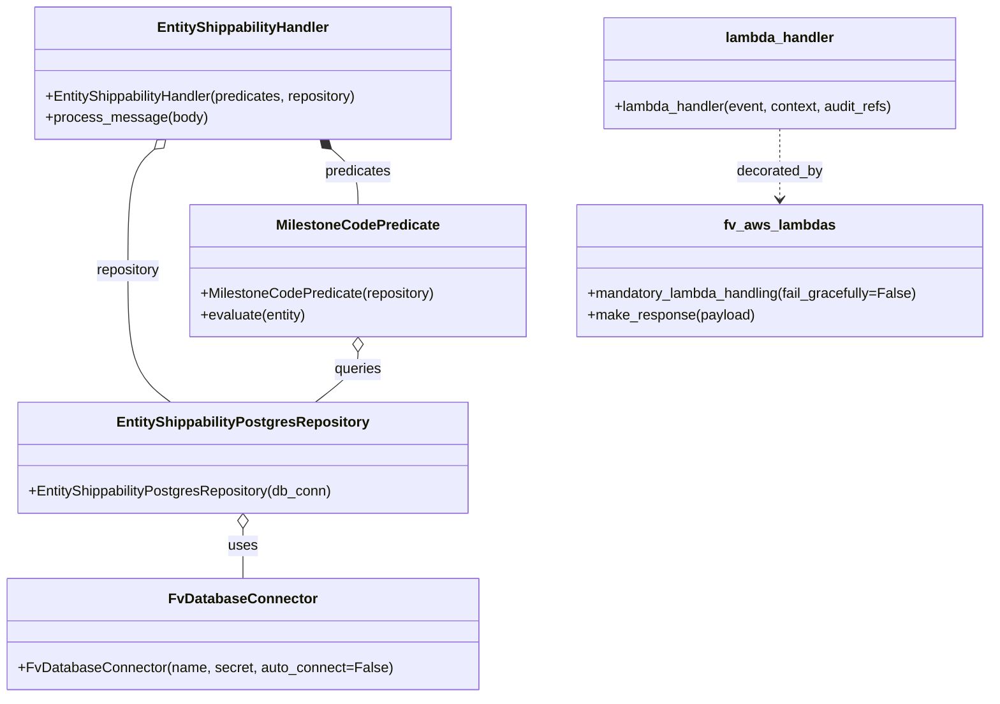

# Diagram: entity_core/entity_service/entity_service/entity/shippability/handler/ford_shippability_handler.py

> Auto-generated by Obscura crawlers

## Diagram 1

### SVG

<svg id="container" width="1121.369140625" xmlns="http://www.w3.org/2000/svg" class="classDiagram" height="790" viewBox="0 0 1121.369140625 790" role="graphics-document document" aria-roledescription="class"><g><defs><marker id="container_class-aggregationStart" class="marker aggregation class" refX="18" refY="7" markerWidth="190" markerHeight="240" orient="auto"><path d="M 18,7 L9,13 L1,7 L9,1 Z"></path></marker></defs><defs><marker id="container_class-aggregationEnd" class="marker aggregation class" refX="1" refY="7" markerWidth="20" markerHeight="28" orient="auto"><path d="M 18,7 L9,13 L1,7 L9,1 Z"></path></marker></defs><defs><marker id="container_class-extensionStart" class="marker extension class" refX="18" refY="7" markerWidth="190" markerHeight="240" orient="auto"><path d="M 1,7 L18,13 V 1 Z"></path></marker></defs><defs><marker id="container_class-extensionEnd" class="marker extension class" refX="1" refY="7" markerWidth="20" markerHeight="28" orient="auto"><path d="M 1,1 V 13 L18,7 Z"></path></marker></defs><defs><marker id="container_class-compositionStart" class="marker composition class" refX="18" refY="7" markerWidth="190" markerHeight="240" orient="auto"><path d="M 18,7 L9,13 L1,7 L9,1 Z"></path></marker></defs><defs><marker id="container_class-compositionEnd" class="marker composition class" refX="1" refY="7" markerWidth="20" markerHeight="28" orient="auto"><path d="M 18,7 L9,13 L1,7 L9,1 Z"></path></marker></defs><defs><marker id="container_class-dependencyStart" class="marker dependency class" refX="6" refY="7" markerWidth="190" markerHeight="240" orient="auto"><path d="M 5,7 L9,13 L1,7 L9,1 Z"></path></marker></defs><defs><marker id="container_class-dependencyEnd" class="marker dependency class" refX="13" refY="7" markerWidth="20" markerHeight="28" orient="auto"><path d="M 18,7 L9,13 L14,7 L9,1 Z"></path></marker></defs><defs><marker id="container_class-lollipopStart" class="marker lollipop class" refX="13" refY="7" markerWidth="190" markerHeight="240" orient="auto"><circle stroke="black" fill="transparent" cx="7" cy="7" r="6"></circle></marker></defs><defs><marker id="container_class-lollipopEnd" class="marker lollipop class" refX="1" refY="7" markerWidth="190" markerHeight="240" orient="auto"><circle stroke="black" fill="transparent" cx="7" cy="7" r="6"></circle></marker></defs><g class="root"><g class="clusters"></g><g class="edgePaths"><path d="M268.684,599.25L268.684,602.542C268.684,605.833,268.684,612.417,268.684,621.875C268.684,631.333,268.684,643.667,268.684,649.833L268.684,656" id="id_EntityShippabilityPostgresRepository_FvDatabaseConnector_1" class="edge-thickness-normal edge-pattern-solid relation" style=";;;" data-edge="true" data-et="edge" data-id="id_EntityShippabilityPostgresRepository_FvDatabaseConnector_1" data-points="W3sieCI6MjY4LjY4MzU5Mzc1LCJ5Ijo1ODJ9LHsieCI6MjY4LjY4MzU5Mzc1LCJ5Ijo2MTl9LHsieCI6MjY4LjY4MzU5Mzc1LCJ5Ijo2NTZ9XQ==" marker-start="url(#container_class-aggregationStart)"></path><path d="M167.782,169.205L162.75,173.504C157.718,177.803,147.654,186.402,142.622,209.368C137.59,232.333,137.59,269.667,137.59,307C137.59,344.333,137.59,381.667,145.674,406.5C153.758,431.333,169.926,443.667,178.01,449.833L186.095,456" id="id_EntityShippabilityHandler_EntityShippabilityPostgresRepository_2" class="edge-thickness-normal edge-pattern-solid relation" style=";;;" data-edge="true" data-et="edge" data-id="id_EntityShippabilityHandler_EntityShippabilityPostgresRepository_2" data-points="W3sieCI6MTgwLjg5NzYwMDQ0NjQyODU2LCJ5IjoxNTh9LHsieCI6MTM3LjU4OTg0Mzc1LCJ5IjoxOTV9LHsieCI6MTM3LjU4OTg0Mzc1LCJ5IjozMDd9LHsieCI6MTM3LjU4OTg0Mzc1LCJ5Ijo0MTl9LHsieCI6MTg2LjA5NDUzMTI1LCJ5Ijo0NTZ9XQ==" marker-start="url(#container_class-aggregationStart)"></path><path d="M369.585,169.205L374.617,173.504C379.649,177.803,389.713,186.402,394.745,196.868C399.777,207.333,399.777,219.667,399.777,225.833L399.777,232" id="id_EntityShippabilityHandler_MilestoneCodePredicate_3" class="edge-thickness-normal edge-pattern-solid relation" style=";;;" data-edge="true" data-et="edge" data-id="id_EntityShippabilityHandler_MilestoneCodePredicate_3" data-points="W3sieCI6MzU2LjQ2OTU4NzA1MzU3MTQ0LCJ5IjoxNTh9LHsieCI6Mzk5Ljc3NzM0Mzc1LCJ5IjoxOTV9LHsieCI6Mzk5Ljc3NzM0Mzc1LCJ5IjoyMzJ9XQ==" marker-start="url(#container_class-compositionStart)"></path><path d="M399.777,399.25L399.777,402.542C399.777,405.833,399.777,412.417,391.693,421.875C383.609,431.333,367.441,443.667,359.357,449.833L351.273,456" id="id_MilestoneCodePredicate_EntityShippabilityPostgresRepository_4" class="edge-thickness-normal edge-pattern-solid relation" style=";;;" data-edge="true" data-et="edge" data-id="id_MilestoneCodePredicate_EntityShippabilityPostgresRepository_4" data-points="W3sieCI6Mzk5Ljc3NzM0Mzc1LCJ5IjozODJ9LHsieCI6Mzk5Ljc3NzM0Mzc1LCJ5Ijo0MTl9LHsieCI6MzUxLjI3MjY1NjI1LCJ5Ijo0NTZ9XQ==" marker-start="url(#container_class-aggregationStart)"></path><path d="M882.229,146L882.229,154.167C882.229,162.333,882.229,178.667,882.229,192C882.229,205.333,882.229,215.667,882.229,220.833L882.229,226" id="id_lambda_handler_fv_aws_lambdas_5" class="edge-thickness-normal edge-pattern-dashed relation" style=";;;" data-edge="true" data-et="edge" data-id="id_lambda_handler_fv_aws_lambdas_5" data-points="W3sieCI6ODgyLjIyODUxNTYyNSwieSI6MTQ2fSx7IngiOjg4Mi4yMjg1MTU2MjUsInkiOjE5NX0seyJ4Ijo4ODIuMjI4NTE1NjI1LCJ5IjoyMzJ9XQ==" marker-end="url(#container_class-dependencyEnd)"></path></g><g class="edgeLabels"><g class="edgeLabel" transform="translate(268.68359375, 619)"><g class="label" data-id="id_EntityShippabilityPostgresRepository_FvDatabaseConnector_1" transform="translate(-16.4921875, -12)"><foreignObject width="32.984375" height="24">

uses

</foreignObject></g></g><g class="edgeLabel" transform="translate(137.58984375, 307)"><g class="label" data-id="id_EntityShippabilityHandler_EntityShippabilityPostgresRepository_2" transform="translate(-37.09375, -12)"><foreignObject width="74.1875" height="24">

repository

</foreignObject></g></g><g class="edgeLabel" transform="translate(399.77734375, 195)"><g class="label" data-id="id_EntityShippabilityHandler_MilestoneCodePredicate_3" transform="translate(-37.9609375, -12)"><foreignObject width="75.921875" height="24">

predicates

</foreignObject></g></g><g class="edgeLabel" transform="translate(399.77734375, 419)"><g class="label" data-id="id_MilestoneCodePredicate_EntityShippabilityPostgresRepository_4" transform="translate(-27.2421875, -12)"><foreignObject width="54.484375" height="24">

queries

</foreignObject></g></g><g class="edgeLabel" transform="translate(882.228515625, 195)"><g class="label" data-id="id_lambda_handler_fv_aws_lambdas_5" transform="translate(-49.375, -12)"><foreignObject width="98.75" height="24">

decorated_by

</foreignObject></g></g></g><g class="nodes"><g class="node default" id="classId-FvDatabaseConnector-0" transform="translate(268.68359375, 719)"><g class="basic label-container"><path d="M-260.68359375 -63 L260.68359375 -63 L260.68359375 63 L-260.68359375 63" stroke="none" stroke-width="0" fill="#ECECFF" style=""></path><path d="M-260.68359375 -63 C-127.63035184459653 -63, 5.422890060806935 -63, 260.68359375 -63 M-260.68359375 -63 C-101.16860925546953 -63, 58.34637523906093 -63, 260.68359375 -63 M260.68359375 -63 C260.68359375 -30.542236022157837, 260.68359375 1.9155279556843254, 260.68359375 63 M260.68359375 -63 C260.68359375 -31.712568697291392, 260.68359375 -0.42513739458278366, 260.68359375 63 M260.68359375 63 C126.56626422161537 63, -7.55106530676926 63, -260.68359375 63 M260.68359375 63 C122.26198229127436 63, -16.15962916745127 63, -260.68359375 63 M-260.68359375 63 C-260.68359375 31.953059150716037, -260.68359375 0.9061183014320733, -260.68359375 -63 M-260.68359375 63 C-260.68359375 19.249457678440564, -260.68359375 -24.501084643118872, -260.68359375 -63" stroke="#9370DB" stroke-width="1.3" fill="none" stroke-dasharray="0 0" style=""></path></g><g class="annotation-group text" transform="translate(0, -39)"></g><g class="label-group text" transform="translate(-79.3046875, -39)"><g class="label" style="font-weight: bolder" transform="translate(0,-12)"><foreignObject width="158.609375" height="24">

FvDatabaseConnector

</foreignObject></g></g><g class="members-group text" transform="translate(-248.68359375, 9)"></g><g class="methods-group text" transform="translate(-248.68359375, 39)"><g class="label" style="" transform="translate(0,-12)"><foreignObject width="418.0625" height="24">

+FvDatabaseConnector(name, secret, auto_connect=False)

</foreignObject></g></g><g class="divider" style=""><path d="M-260.68359375 -15 C-96.23519212774599 -15, 68.21320949450802 -15, 260.68359375 -15 M-260.68359375 -15 C-92.81752909852744 -15, 75.04853555294511 -15, 260.68359375 -15" stroke="#9370DB" stroke-width="1.3" fill="none" stroke-dasharray="0 0" style=""></path></g><g class="divider" style=""><path d="M-260.68359375 9 C-94.53167750954648 9, 71.62023873090703 9, 260.68359375 9 M-260.68359375 9 C-97.41141283142278 9, 65.86076808715444 9, 260.68359375 9" stroke="#9370DB" stroke-width="1.3" fill="none" stroke-dasharray="0 0" style=""></path></g></g><g class="node default" id="classId-EntityShippabilityPostgresRepository-1" transform="translate(268.68359375, 519)"><g class="basic label-container"><path d="M-254.66796875 -63 L254.66796875 -63 L254.66796875 63 L-254.66796875 63" stroke="none" stroke-width="0" fill="#ECECFF" style=""></path><path d="M-254.66796875 -63 C-80.1563253531329 -63, 94.3553180437342 -63, 254.66796875 -63 M-254.66796875 -63 C-131.42813378256878 -63, -8.188298815137557 -63, 254.66796875 -63 M254.66796875 -63 C254.66796875 -17.682820956443017, 254.66796875 27.634358087113966, 254.66796875 63 M254.66796875 -63 C254.66796875 -25.346985378798742, 254.66796875 12.306029242402516, 254.66796875 63 M254.66796875 63 C103.52370362594837 63, -47.62056149810326 63, -254.66796875 63 M254.66796875 63 C62.405148552354234 63, -129.85767164529153 63, -254.66796875 63 M-254.66796875 63 C-254.66796875 15.467735354796417, -254.66796875 -32.064529290407165, -254.66796875 -63 M-254.66796875 63 C-254.66796875 18.511963167894855, -254.66796875 -25.97607366421029, -254.66796875 -63" stroke="#9370DB" stroke-width="1.3" fill="none" stroke-dasharray="0 0" style=""></path></g><g class="annotation-group text" transform="translate(0, -39)"></g><g class="label-group text" transform="translate(-136.9296875, -39)"><g class="label" style="font-weight: bolder" transform="translate(0,-12)"><foreignObject width="273.859375" height="24">

EntityShippabilityPostgresRepository

</foreignObject></g></g><g class="members-group text" transform="translate(-242.66796875, 9)"></g><g class="methods-group text" transform="translate(-242.66796875, 39)"><g class="label" style="" transform="translate(0,-12)"><foreignObject width="348.40625" height="24">

+EntityShippabilityPostgresRepository(db_conn)

</foreignObject></g></g><g class="divider" style=""><path d="M-254.66796875 -15 C-73.44643165784558 -15, 107.77510543430884 -15, 254.66796875 -15 M-254.66796875 -15 C-109.89139740608212 -15, 34.88517393783576 -15, 254.66796875 -15" stroke="#9370DB" stroke-width="1.3" fill="none" stroke-dasharray="0 0" style=""></path></g><g class="divider" style=""><path d="M-254.66796875 9 C-107.05120466148065 9, 40.56555942703869 9, 254.66796875 9 M-254.66796875 9 C-92.62526365871582 9, 69.41744143256835 9, 254.66796875 9" stroke="#9370DB" stroke-width="1.3" fill="none" stroke-dasharray="0 0" style=""></path></g></g><g class="node default" id="classId-EntityShippabilityHandler-2" transform="translate(268.68359375, 83)"><g class="basic label-container"><path d="M-240.8359375 -75 L240.8359375 -75 L240.8359375 75 L-240.8359375 75" stroke="none" stroke-width="0" fill="#ECECFF" style=""></path><path d="M-240.8359375 -75 C-95.56715694402126 -75, 49.70162361195747 -75, 240.8359375 -75 M-240.8359375 -75 C-115.96228088215483 -75, 8.911375735690342 -75, 240.8359375 -75 M240.8359375 -75 C240.8359375 -19.371791024314156, 240.8359375 36.25641795137169, 240.8359375 75 M240.8359375 -75 C240.8359375 -41.961269392328276, 240.8359375 -8.922538784656552, 240.8359375 75 M240.8359375 75 C67.6712886239026 75, -105.4933602521948 75, -240.8359375 75 M240.8359375 75 C128.9762693789773 75, 17.116601257954585 75, -240.8359375 75 M-240.8359375 75 C-240.8359375 26.36408041382547, -240.8359375 -22.27183917234906, -240.8359375 -75 M-240.8359375 75 C-240.8359375 22.974866666046424, -240.8359375 -29.050266667907152, -240.8359375 -75" stroke="#9370DB" stroke-width="1.3" fill="none" stroke-dasharray="0 0" style=""></path></g><g class="annotation-group text" transform="translate(0, -51)"></g><g class="label-group text" transform="translate(-94.53125, -51)"><g class="label" style="font-weight: bolder" transform="translate(0,-12)"><foreignObject width="189.0625" height="24">

EntityShippabilityHandler

</foreignObject></g></g><g class="members-group text" transform="translate(-228.8359375, -3)"></g><g class="methods-group text" transform="translate(-228.8359375, 27)"><g class="label" style="" transform="translate(0,-12)"><foreignObject width="363.140625" height="24">

+EntityShippabilityHandler(predicates, repository)

</foreignObject></g><g class="label" style="" transform="translate(0,12)"><foreignObject width="180.40625" height="24">

+process_message(body)

</foreignObject></g></g><g class="divider" style=""><path d="M-240.8359375 -27 C-115.37816486822278 -27, 10.079607763554435 -27, 240.8359375 -27 M-240.8359375 -27 C-59.36901728478563 -27, 122.09790293042875 -27, 240.8359375 -27" stroke="#9370DB" stroke-width="1.3" fill="none" stroke-dasharray="0 0" style=""></path></g><g class="divider" style=""><path d="M-240.8359375 -3 C-133.27180614527927 -3, -25.707674790558542 -3, 240.8359375 -3 M-240.8359375 -3 C-82.49527864977418 -3, 75.84538020045164 -3, 240.8359375 -3" stroke="#9370DB" stroke-width="1.3" fill="none" stroke-dasharray="0 0" style=""></path></g></g><g class="node default" id="classId-MilestoneCodePredicate-3" transform="translate(399.77734375, 307)"><g class="basic label-container"><path d="M-190.09375 -75 L190.09375 -75 L190.09375 75 L-190.09375 75" stroke="none" stroke-width="0" fill="#ECECFF" style=""></path><path d="M-190.09375 -75 C-98.66633181955743 -75, -7.238913639114855 -75, 190.09375 -75 M-190.09375 -75 C-87.60327592518378 -75, 14.88719814963244 -75, 190.09375 -75 M190.09375 -75 C190.09375 -22.508189336330005, 190.09375 29.98362132733999, 190.09375 75 M190.09375 -75 C190.09375 -23.212889085822987, 190.09375 28.574221828354027, 190.09375 75 M190.09375 75 C97.91310274207798 75, 5.732455484155963 75, -190.09375 75 M190.09375 75 C102.74931117809166 75, 15.404872356183319 75, -190.09375 75 M-190.09375 75 C-190.09375 21.77236835700559, -190.09375 -31.45526328598882, -190.09375 -75 M-190.09375 75 C-190.09375 16.789657342227798, -190.09375 -41.420685315544404, -190.09375 -75" stroke="#9370DB" stroke-width="1.3" fill="none" stroke-dasharray="0 0" style=""></path></g><g class="annotation-group text" transform="translate(0, -51)"></g><g class="label-group text" transform="translate(-88.71875, -51)"><g class="label" style="font-weight: bolder" transform="translate(0,-12)"><foreignObject width="177.4375" height="24">

MilestoneCodePredicate

</foreignObject></g></g><g class="members-group text" transform="translate(-178.09375, -3)"></g><g class="methods-group text" transform="translate(-178.09375, 27)"><g class="label" style="" transform="translate(0,-12)"><foreignObject width="267.46875" height="24">

+MilestoneCodePredicate(repository)

</foreignObject></g><g class="label" style="" transform="translate(0,12)"><foreignObject width="122.09375" height="24">

+evaluate(entity)

</foreignObject></g></g><g class="divider" style=""><path d="M-190.09375 -27 C-72.82082600959528 -27, 44.45209798080944 -27, 190.09375 -27 M-190.09375 -27 C-85.71997171035073 -27, 18.653806579298532 -27, 190.09375 -27" stroke="#9370DB" stroke-width="1.3" fill="none" stroke-dasharray="0 0" style=""></path></g><g class="divider" style=""><path d="M-190.09375 -3 C-78.69086765129417 -3, 32.71201469741166 -3, 190.09375 -3 M-190.09375 -3 C-60.05910510604346 -3, 69.97553978791308 -3, 190.09375 -3" stroke="#9370DB" stroke-width="1.3" fill="none" stroke-dasharray="0 0" style=""></path></g></g><g class="node default" id="classId-fv_aws_lambdas-4" transform="translate(882.228515625, 307)"><g class="basic label-container"><path d="M-231.140625 -75 L231.140625 -75 L231.140625 75 L-231.140625 75" stroke="none" stroke-width="0" fill="#ECECFF" style=""></path><path d="M-231.140625 -75 C-49.10091939961404 -75, 132.93878620077191 -75, 231.140625 -75 M-231.140625 -75 C-77.1355367231316 -75, 76.86955155373681 -75, 231.140625 -75 M231.140625 -75 C231.140625 -32.0988721247752, 231.140625 10.802255750449604, 231.140625 75 M231.140625 -75 C231.140625 -19.505342567367506, 231.140625 35.98931486526499, 231.140625 75 M231.140625 75 C49.22563569549911 75, -132.68935360900178 75, -231.140625 75 M231.140625 75 C100.8367898909334 75, -29.467045218133194 75, -231.140625 75 M-231.140625 75 C-231.140625 30.027893442236348, -231.140625 -14.944213115527305, -231.140625 -75 M-231.140625 75 C-231.140625 32.47849257462139, -231.140625 -10.043014850757217, -231.140625 -75" stroke="#9370DB" stroke-width="1.3" fill="none" stroke-dasharray="0 0" style=""></path></g><g class="annotation-group text" transform="translate(0, -51)"></g><g class="label-group text" transform="translate(-60.0625, -51)"><g class="label" style="font-weight: bolder" transform="translate(0,-12)"><foreignObject width="120.125" height="24">

fv_aws_lambdas

</foreignObject></g></g><g class="members-group text" transform="translate(-219.140625, -3)"></g><g class="methods-group text" transform="translate(-219.140625, 27)"><g class="label" style="" transform="translate(0,-12)"><foreignObject width="378.21875" height="24">

+mandatory_lambda_handling(fail_gracefully=False)

</foreignObject></g><g class="label" style="" transform="translate(0,12)"><foreignObject width="189.59375" height="24">

+make_response(payload)

</foreignObject></g></g><g class="divider" style=""><path d="M-231.140625 -27 C-69.49070198382049 -27, 92.15922103235903 -27, 231.140625 -27 M-231.140625 -27 C-138.14371483519542 -27, -45.14680467039085 -27, 231.140625 -27" stroke="#9370DB" stroke-width="1.3" fill="none" stroke-dasharray="0 0" style=""></path></g><g class="divider" style=""><path d="M-231.140625 -3 C-69.31039179693369 -3, 92.51984140613263 -3, 231.140625 -3 M-231.140625 -3 C-124.76342889173661 -3, -18.38623278347322 -3, 231.140625 -3" stroke="#9370DB" stroke-width="1.3" fill="none" stroke-dasharray="0 0" style=""></path></g></g><g class="node default" id="classId-lambda_handler-5" transform="translate(882.228515625, 83)"><g class="basic label-container"><path d="M-202.83203125 -63 L202.83203125 -63 L202.83203125 63 L-202.83203125 63" stroke="none" stroke-width="0" fill="#ECECFF" style=""></path><path d="M-202.83203125 -63 C-55.58814220710849 -63, 91.65574683578302 -63, 202.83203125 -63 M-202.83203125 -63 C-81.3224966188838 -63, 40.18703801223239 -63, 202.83203125 -63 M202.83203125 -63 C202.83203125 -21.277548694923162, 202.83203125 20.444902610153676, 202.83203125 63 M202.83203125 -63 C202.83203125 -37.38971971037208, 202.83203125 -11.779439420744154, 202.83203125 63 M202.83203125 63 C64.39457803730974 63, -74.04287517538052 63, -202.83203125 63 M202.83203125 63 C45.29616080663803 63, -112.23970963672394 63, -202.83203125 63 M-202.83203125 63 C-202.83203125 18.64640411293214, -202.83203125 -25.707191774135723, -202.83203125 -63 M-202.83203125 63 C-202.83203125 22.47179068750954, -202.83203125 -18.05641862498092, -202.83203125 -63" stroke="#9370DB" stroke-width="1.3" fill="none" stroke-dasharray="0 0" style=""></path></g><g class="annotation-group text" transform="translate(0, -39)"></g><g class="label-group text" transform="translate(-59.9765625, -39)"><g class="label" style="font-weight: bolder" transform="translate(0,-12)"><foreignObject width="119.953125" height="24">

lambda_handler

</foreignObject></g></g><g class="members-group text" transform="translate(-190.83203125, 9)"></g><g class="methods-group text" transform="translate(-190.83203125, 39)"><g class="label" style="" transform="translate(0,-12)"><foreignObject width="321.6875" height="24">

+lambda_handler(event, context, audit_refs)

</foreignObject></g></g><g class="divider" style=""><path d="M-202.83203125 -15 C-73.36577898406031 -15, 56.100473281879374 -15, 202.83203125 -15 M-202.83203125 -15 C-100.72127658623411 -15, 1.389478077531777 -15, 202.83203125 -15" stroke="#9370DB" stroke-width="1.3" fill="none" stroke-dasharray="0 0" style=""></path></g><g class="divider" style=""><path d="M-202.83203125 9 C-101.08339182311309 9, 0.6652476037738211 9, 202.83203125 9 M-202.83203125 9 C-71.96017301735012 9, 58.91168521529977 9, 202.83203125 9" stroke="#9370DB" stroke-width="1.3" fill="none" stroke-dasharray="0 0" style=""></path></g></g></g></g></g></svg>

## Diagram 2

```mermaid
flowchart LR
    Invoke(("AWS Lambda Invoke"))
    Invoke --> LambdaCall[/"lambda_handler(event, context, audit_refs)"/]
    subgraph Setup
        DB_CONN[/"DB_CONN: FvDatabaseConnector(name='ford_shippability_handler', secret=SecretNames.ENTITY_DATABASE)"/]
        CreateRepo[/"repository = EntityShippabilityPostgresRepository(DB_CONN)"/]
        CreatePredicate[/"predicate = MilestoneCodePredicate(repository)"/]
        CreateHandler[/"ford_handler = EntityShippabilityHandler([predicate], repository)"/]
    end
    LambdaCall --> DB_CONN
    DB_CONN --> CreateRepo
    CreateRepo --> CreatePredicate
    CreatePredicate --> CreateHandler
    CreateHandler --> Loop[/"for message in event.get('Records')"/]
    Loop --> Process[/"ford_handler.process_message(message.get('body'))"/]
    Process --> MakeResponse[/"fv.aws.lambdas.make_response({})"/]
    MakeResponse --> Return(("Return Response"))
    Loop -->|iterates| Process
    LambdaCall -. decorated by .-> Decorator["mandatory_lambda_handling(fail_gracefully=False)"]
```

### SVG

<svg id="container" width="3908.71875" xmlns="http://www.w3.org/2000/svg" class="flowchart" height="262" viewBox="0 0 3908.71875 262" role="graphics-document document" aria-roledescription="flowchart-v2"><g><marker id="container_flowchart-v2-pointEnd" class="marker flowchart-v2" viewBox="0 0 10 10" refX="5" refY="5" markerUnits="userSpaceOnUse" markerWidth="8" markerHeight="8" orient="auto"><path d="M 0 0 L 10 5 L 0 10 z" class="arrowMarkerPath" style="stroke-width: 1; stroke-dasharray: 1, 0;"></path></marker><marker id="container_flowchart-v2-pointStart" class="marker flowchart-v2" viewBox="0 0 10 10" refX="4.5" refY="5" markerUnits="userSpaceOnUse" markerWidth="8" markerHeight="8" orient="auto"><path d="M 0 5 L 10 10 L 10 0 z" class="arrowMarkerPath" style="stroke-width: 1; stroke-dasharray: 1, 0;"></path></marker><marker id="container_flowchart-v2-circleEnd" class="marker flowchart-v2" viewBox="0 0 10 10" refX="11" refY="5" markerUnits="userSpaceOnUse" markerWidth="11" markerHeight="11" orient="auto"><circle cx="5" cy="5" r="5" class="arrowMarkerPath" style="stroke-width: 1; stroke-dasharray: 1, 0;"></circle></marker><marker id="container_flowchart-v2-circleStart" class="marker flowchart-v2" viewBox="0 0 10 10" refX="-1" refY="5" markerUnits="userSpaceOnUse" markerWidth="11" markerHeight="11" orient="auto"><circle cx="5" cy="5" r="5" class="arrowMarkerPath" style="stroke-width: 1; stroke-dasharray: 1, 0;"></circle></marker><marker id="container_flowchart-v2-crossEnd" class="marker cross flowchart-v2" viewBox="0 0 11 11" refX="12" refY="5.2" markerUnits="userSpaceOnUse" markerWidth="11" markerHeight="11" orient="auto"><path d="M 1,1 l 9,9 M 10,1 l -9,9" class="arrowMarkerPath" style="stroke-width: 2; stroke-dasharray: 1, 0;"></path></marker><marker id="container_flowchart-v2-crossStart" class="marker cross flowchart-v2" viewBox="0 0 11 11" refX="-1" refY="5.2" markerUnits="userSpaceOnUse" markerWidth="11" markerHeight="11" orient="auto"><path d="M 1,1 l 9,9 M 10,1 l -9,9" class="arrowMarkerPath" style="stroke-width: 2; stroke-dasharray: 1, 0;"></path></marker><g class="root"><g class="clusters"><g class="cluster" id="Setup" data-look="classic"><rect style="" x="641" y="8" width="1857.359375" height="157"></rect><g class="cluster-label" transform="translate(1548.65625, 8)"><foreignObject width="42.046875" height="24">

Setup

</foreignObject></g></g></g><g class="edgePaths"><path d="M168.344,156.75L172.51,156.75C176.677,156.75,185.01,156.75,195.385,156.825C205.761,156.901,218.177,157.051,224.386,157.126L230.594,157.202" id="L_Invoke_LambdaCall_0" class="edge-thickness-normal edge-pattern-solid edge-thickness-normal edge-pattern-solid flowchart-link" style=";" data-edge="true" data-et="edge" data-id="L_Invoke_LambdaCall_0" data-points="W3sieCI6MTY4LjM0Mzc1LCJ5IjoxNTYuNzV9LHsieCI6MTkzLjM0Mzc1LCJ5IjoxNTYuNzV9LHsieCI6MjM0LjU5Mzc1LCJ5IjoxNTcuMjV9XQ==" marker-end="url(#container_flowchart-v2-pointEnd)"></path><path d="M452.603,125.75L471.948,119.208C491.293,112.667,529.982,99.583,561.382,93.042C592.781,86.5,616.891,86.5,636.154,86.576C655.417,86.653,669.833,86.805,677.042,86.881L684.25,86.958" id="L_LambdaCall_DB_CONN_0" class="edge-thickness-normal edge-pattern-solid edge-thickness-normal edge-pattern-solid flowchart-link" style=";" data-edge="true" data-et="edge" data-id="L_LambdaCall_DB_CONN_0" data-points="W3sieCI6NDUyLjYwMjk4MDQyNzA0NjI1LCJ5IjoxMjUuNzV9LHsieCI6NTY4LjY3MTg3NSwieSI6ODYuNX0seyJ4Ijo2NDEsInkiOjg2LjV9LHsieCI6Njg4LjI1LCJ5Ijo4N31d" marker-end="url(#container_flowchart-v2-pointEnd)"></path><path d="M1158.813,87L1166.521,86.917C1174.229,86.833,1189.646,86.667,1203.563,86.659C1217.479,86.651,1229.896,86.801,1236.104,86.876L1242.313,86.952" id="L_DB_CONN_CreateRepo_0" class="edge-thickness-normal edge-pattern-solid edge-thickness-normal edge-pattern-solid flowchart-link" style=";" data-edge="true" data-et="edge" data-id="L_DB_CONN_CreateRepo_0" data-points="W3sieCI6MTE1OC44MTI1LCJ5Ijo4N30seyJ4IjoxMjA1LjA2MjUsInkiOjg2LjV9LHsieCI6MTI0Ni4zMTI1LCJ5Ijo4N31d" marker-end="url(#container_flowchart-v2-pointEnd)"></path><path d="M1640.016,87L1646.724,86.917C1653.432,86.833,1666.849,86.667,1679.766,86.659C1692.682,86.651,1705.099,86.801,1711.308,86.876L1717.516,86.952" id="L_CreateRepo_CreatePredicate_0" class="edge-thickness-normal edge-pattern-solid edge-thickness-normal edge-pattern-solid flowchart-link" style=";" data-edge="true" data-et="edge" data-id="L_CreateRepo_CreatePredicate_0" data-points="W3sieCI6MTY0MC4wMTU2MjUsInkiOjg3fSx7IngiOjE2ODAuMjY1NjI1LCJ5Ijo4Ni41fSx7IngiOjE3MjEuNTE1NjI1LCJ5Ijo4N31d" marker-end="url(#container_flowchart-v2-pointEnd)"></path><path d="M2027.484,87L2034.193,86.917C2040.901,86.833,2054.318,86.667,2068.234,86.66C2082.151,86.653,2096.568,86.805,2103.776,86.881L2110.985,86.958" id="L_CreatePredicate_CreateHandler_0" class="edge-thickness-normal edge-pattern-solid edge-thickness-normal edge-pattern-solid flowchart-link" style=";" data-edge="true" data-et="edge" data-id="L_CreatePredicate_CreateHandler_0" data-points="W3sieCI6MjAyNy40ODQzNzUsInkiOjg3fSx7IngiOjIwNjcuNzM0Mzc1LCJ5Ijo4Ni41fSx7IngiOjIxMTQuOTg0Mzc1LCJ5Ijo4N31d" marker-end="url(#container_flowchart-v2-pointEnd)"></path><path d="M2452.109,87L2459.818,86.917C2467.526,86.833,2482.943,86.667,2494.818,86.583C2506.693,86.5,2515.026,86.5,2525.401,86.575C2535.776,86.651,2548.193,86.801,2554.401,86.876L2560.61,86.952" id="L_CreateHandler_Loop_0" class="edge-thickness-normal edge-pattern-solid edge-thickness-normal edge-pattern-solid flowchart-link" style=";" data-edge="true" data-et="edge" data-id="L_CreateHandler_Loop_0" data-points="W3sieCI6MjQ1Mi4xMDkzNzUsInkiOjg3fSx7IngiOjI0OTguMzU5Mzc1LCJ5Ijo4Ni41fSx7IngiOjI1MjMuMzU5Mzc1LCJ5Ijo4Ni41fSx7IngiOjI1NjQuNjA5Mzc1LCJ5Ijo4N31d" marker-end="url(#container_flowchart-v2-pointEnd)"></path><path d="M2816.485,76.248L2826.867,75.29C2837.248,74.332,2858.011,72.416,2879.164,72.177C2900.318,71.938,2921.862,73.376,2932.634,74.095L2943.406,74.814" id="L_Loop_Process_0" class="edge-thickness-normal edge-pattern-solid edge-thickness-normal edge-pattern-solid flowchart-link" style=";" data-edge="true" data-et="edge" data-id="L_Loop_Process_0" data-points="W3sieCI6MjgxNi40ODUxODk2MjcwODIsInkiOjc2LjI0ODM3MDc0NTgzNjM1fSx7IngiOjI4NzguNzczNDM3NSwieSI6NzAuNX0seyJ4IjoyOTQ3LjM5NzUyMjcxNDM2NywieSI6NzUuMDc5OTU0NTcxMjY2MzN9XQ==" marker-end="url(#container_flowchart-v2-pointEnd)"></path><path d="M3351.422,87L3357.13,86.917C3362.839,86.833,3374.255,86.667,3385.172,86.657C3396.089,86.648,3406.505,86.796,3411.714,86.869L3416.922,86.943" id="L_Process_MakeResponse_0" class="edge-thickness-normal edge-pattern-solid edge-thickness-normal edge-pattern-solid flowchart-link" style=";" data-edge="true" data-et="edge" data-id="L_Process_MakeResponse_0" data-points="W3sieCI6MzM1MS40MjE4NzUsInkiOjg3fSx7IngiOjMzODUuNjcxODc1LCJ5Ijo4Ni41fSx7IngiOjM0MjAuOTIxODc1LCJ5Ijo4N31d" marker-end="url(#container_flowchart-v2-pointEnd)"></path><path d="M3703.375,87L3709.083,86.917C3714.792,86.833,3726.208,86.667,3735.417,86.583C3744.625,86.5,3751.625,86.5,3755.125,86.5L3758.625,86.5" id="L_MakeResponse_Return_0" class="edge-thickness-normal edge-pattern-solid edge-thickness-normal edge-pattern-solid flowchart-link" style=";" data-edge="true" data-et="edge" data-id="L_MakeResponse_Return_0" data-points="W3sieCI6MzcwMy4zNzUsInkiOjg3fSx7IngiOjM3MzcuNjI1LCJ5Ijo4Ni41fSx7IngiOjM3NjIuNjI1LCJ5Ijo4Ni41fV0=" marker-end="url(#container_flowchart-v2-pointEnd)"></path><path d="M2806.165,96.889L2818.266,97.824C2830.368,98.759,2854.571,100.63,2875.396,101.124C2896.22,101.619,2913.668,100.738,2922.391,100.298L2931.115,99.858" id="L_Loop_Process_2" class="edge-thickness-normal edge-pattern-solid edge-thickness-normal edge-pattern-solid flowchart-link" style=";" data-edge="true" data-et="edge" data-id="L_Loop_Process_2" data-points="W3sieCI6MjgwNi4xNjQ4ODkyMDE3NjMsInkiOjk2Ljg4ODk3MTU5NjQ3NDA1fSx7IngiOjI4NzguNzczNDM3NSwieSI6MTAyLjV9LHsieCI6MjkzNS4xMDk1MTI1NDA2OTcsInkiOjk5LjY1NTk3NDkxODYwNjA1fV0=" marker-end="url(#container_flowchart-v2-pointEnd)"></path><path d="M452.603,188.75L471.948,195.125C491.293,201.5,529.982,214.25,561.382,220.625C592.781,227,616.891,227,639.431,227C661.971,227,682.943,227,693.428,227L703.914,227" id="L_LambdaCall_Decorator_0" class="edge-thickness-normal edge-pattern-dotted edge-thickness-normal edge-pattern-solid flowchart-link" style=";" data-edge="true" data-et="edge" data-id="L_LambdaCall_Decorator_0" data-points="W3sieCI6NDUyLjYwMjk4MDQyNzA0NjI1LCJ5IjoxODguNzV9LHsieCI6NTY4LjY3MTg3NSwieSI6MjI3fSx7IngiOjY0MSwieSI6MjI3fSx7IngiOjcwNy45MTQwNjI1LCJ5IjoyMjd9XQ==" marker-end="url(#container_flowchart-v2-pointEnd)"></path></g><g class="edgeLabels"><g class="edgeLabel"><g class="label" data-id="L_Invoke_LambdaCall_0" transform="translate(0, 0)"><foreignObject width="0" height="0">

</foreignObject></g></g><g class="edgeLabel"><g class="label" data-id="L_LambdaCall_DB_CONN_0" transform="translate(0, 0)"><foreignObject width="0" height="0">

</foreignObject></g></g><g class="edgeLabel"><g class="label" data-id="L_DB_CONN_CreateRepo_0" transform="translate(0, 0)"><foreignObject width="0" height="0">

</foreignObject></g></g><g class="edgeLabel"><g class="label" data-id="L_CreateRepo_CreatePredicate_0" transform="translate(0, 0)"><foreignObject width="0" height="0">

</foreignObject></g></g><g class="edgeLabel"><g class="label" data-id="L_CreatePredicate_CreateHandler_0" transform="translate(0, 0)"><foreignObject width="0" height="0">

</foreignObject></g></g><g class="edgeLabel"><g class="label" data-id="L_CreateHandler_Loop_0" transform="translate(0, 0)"><foreignObject width="0" height="0">

</foreignObject></g></g><g class="edgeLabel"><g class="label" data-id="L_Loop_Process_0" transform="translate(0, 0)"><foreignObject width="0" height="0">

</foreignObject></g></g><g class="edgeLabel"><g class="label" data-id="L_Process_MakeResponse_0" transform="translate(0, 0)"><foreignObject width="0" height="0">

</foreignObject></g></g><g class="edgeLabel"><g class="label" data-id="L_MakeResponse_Return_0" transform="translate(0, 0)"><foreignObject width="0" height="0">

</foreignObject></g></g><g class="edgeLabel" transform="translate(2870.58923, 101.86754)"><g class="label" data-id="L_Loop_Process_2" transform="translate(-27.4140625, -12)"><foreignObject width="54.828125" height="24">

iterates

</foreignObject></g></g><g class="edgeLabel" transform="translate(568.671875, 227)"><g class="label" data-id="L_LambdaCall_Decorator_0" transform="translate(-47.328125, -12)"><foreignObject width="94.65625" height="24">

decorated by

</foreignObject></g></g></g><g class="nodes"><g class="node default" id="flowchart-Invoke-0" transform="translate(88.171875, 156.75)"><circle class="basic label-container" style="" r="80.171875" cx="0" cy="0"></circle><g class="label" style="" transform="translate(-72.671875, -12)"><rect></rect><foreignObject width="145.34375" height="24">

AWS Lambda Invoke

</foreignObject></g></g><g class="node default" id="flowchart-LambdaCall-2" transform="translate(357.34375, 156.75)"><polygon points="-31.5,0 215,0 246.5,-63 0,-63" class="label-container" transform="translate(-107.5,31.5)"></polygon><g class="label" style="" transform="translate(-100, -24)"><rect></rect><foreignObject width="200" height="48">

lambda_handler(event, context, audit_refs)

</foreignObject></g></g><g class="node default" id="flowchart-DB_CONN-3" transform="translate(923.03125, 86.5)"><polygon points="-43.5,0 427.0625,0 470.5625,-87 0,-87" class="label-container" transform="translate(-213.53125,43.5)"></polygon><g class="label" style="" transform="translate(-206.03125, -36)"><rect></rect><foreignObject width="412.0625" height="72">

DB_CONN: FvDatabaseConnector(name='ford_shippability_handler', secret=SecretNames.ENTITY_DATABASE)

</foreignObject></g></g><g class="node default" id="flowchart-CreateRepo-4" transform="translate(1442.6640625, 86.5)"><polygon points="-31.5,0 362.203125,0 393.703125,-63 0,-63" class="label-container" transform="translate(-181.1015625,31.5)"></polygon><g class="label" style="" transform="translate(-173.6015625, -24)"><rect></rect><foreignObject width="347.203125" height="48">

repository = EntityShippabilityPostgresRepository(DB_CONN)

</foreignObject></g></g><g class="node default" id="flowchart-CreatePredicate-5" transform="translate(1874, 86.5)"><polygon points="-31.5,0 274.46875,0 305.96875,-63 0,-63" class="label-container" transform="translate(-137.234375,31.5)"></polygon><g class="label" style="" transform="translate(-129.734375, -24)"><rect></rect><foreignObject width="259.46875" height="48">

predicate = MilestoneCodePredicate(repository)

</foreignObject></g></g><g class="node default" id="flowchart-CreateHandler-6" transform="translate(2283.046875, 86.5)"><polygon points="-43.5,0 293.625,0 337.125,-87 0,-87" class="label-container" transform="translate(-146.8125,43.5)"></polygon><g class="label" style="" transform="translate(-139.3125, -36)"><rect></rect><foreignObject width="278.625" height="72">

ford_handler = EntityShippabilityHandler([predicate], repository)

</foreignObject></g></g><g class="node default" id="flowchart-Loop-16" transform="translate(2687.359375, 86.5)"><polygon points="-31.5,0 215,0 246.5,-63 0,-63" class="label-container" transform="translate(-107.5,31.5)"></polygon><g class="label" style="" transform="translate(-100, -24)"><rect></rect><foreignObject width="200" height="48">

for message in event.get('Records')

</foreignObject></g></g><g class="node default" id="flowchart-Process-18" transform="translate(3145.9296875, 86.5)"><polygon points="-19.5,0 390.484375,0 409.984375,-39 0,-39" class="label-container" transform="translate(-195.2421875,19.5)"></polygon><g class="label" style="" transform="translate(-187.7421875, -12)"><rect></rect><foreignObject width="375.484375" height="24">

ford_handler.process_message(message.get('body'))

</foreignObject></g></g><g class="node default" id="flowchart-MakeResponse-20" transform="translate(3561.6484375, 86.5)"><polygon points="-19.5,0 262.953125,0 282.453125,-39 0,-39" class="label-container" transform="translate(-131.4765625,19.5)"></polygon><g class="label" style="" transform="translate(-123.9765625, -12)"><rect></rect><foreignObject width="247.953125" height="24">

fv.aws.lambdas.make_response({})

</foreignObject></g></g><g class="node default" id="flowchart-Return-22" transform="translate(3831.671875, 86.5)"><circle class="basic label-container" style="" r="69.046875" cx="0" cy="0"></circle><g class="label" style="" transform="translate(-61.546875, -12)"><rect></rect><foreignObject width="123.09375" height="24">

Return Response

</foreignObject></g></g><g class="node default" id="flowchart-Decorator-26" transform="translate(923.03125, 227)"><rect class="basic label-container" style="" x="-215.1171875" y="-27" width="430.234375" height="54"></rect><g class="label" style="" transform="translate(-185.1171875, -12)"><rect></rect><foreignObject width="370.234375" height="24">

mandatory_lambda_handling(fail_gracefully=False)

</foreignObject></g></g></g></g></g></svg>
