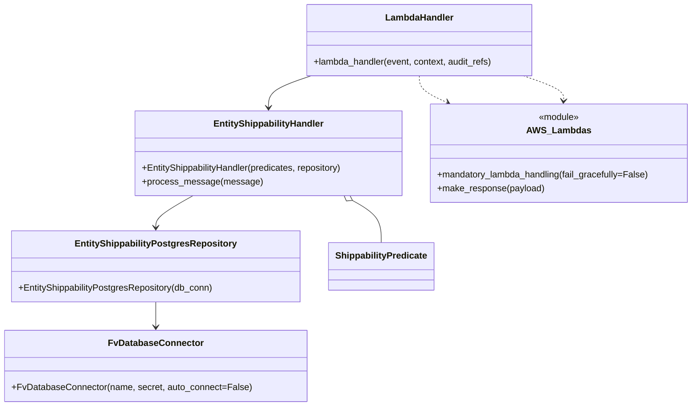

# Diagram: entity_core/entity_service/entity_service/entity/shippability/handler/gm_shippability_handler.py


> Auto-generated by Obscura crawlers

## Diagram 1



### SVG

<svg id="container" width="1220.271484375" xmlns="http://www.w3.org/2000/svg" class="classDiagram" height="718" viewBox="0 0 1220.271484375 718" role="graphics-document document" aria-roledescription="class"><style>#container{font-family:"trebuchet ms",verdana,arial,sans-serif;font-size:16px;fill:#333;}@keyframes edge-animation-frame{from{stroke-dashoffset:0;}}@keyframes dash{to{stroke-dashoffset:0;}}#container .edge-animation-slow{stroke-dasharray:9,5!important;stroke-dashoffset:900;animation:dash 50s linear infinite;stroke-linecap:round;}#container .edge-animation-fast{stroke-dasharray:9,5!important;stroke-dashoffset:900;animation:dash 20s linear infinite;stroke-linecap:round;}#container .error-icon{fill:#552222;}#container .error-text{fill:#552222;stroke:#552222;}#container .edge-thickness-normal{stroke-width:1px;}#container .edge-thickness-thick{stroke-width:3.5px;}#container .edge-pattern-solid{stroke-dasharray:0;}#container .edge-thickness-invisible{stroke-width:0;fill:none;}#container .edge-pattern-dashed{stroke-dasharray:3;}#container .edge-pattern-dotted{stroke-dasharray:2;}#container .marker{fill:#333333;stroke:#333333;}#container .marker.cross{stroke:#333333;}#container svg{font-family:"trebuchet ms",verdana,arial,sans-serif;font-size:16px;}#container p{margin:0;}#container g.classGroup text{fill:#9370DB;stroke:none;font-family:"trebuchet ms",verdana,arial,sans-serif;font-size:10px;}#container g.classGroup text .title{font-weight:bolder;}#container .nodeLabel,#container .edgeLabel{color:#131300;}#container .edgeLabel .label rect{fill:#ECECFF;}#container .label text{fill:#131300;}#container .labelBkg{background:#ECECFF;}#container .edgeLabel .label span{background:#ECECFF;}#container .classTitle{font-weight:bolder;}#container .node rect,#container .node circle,#container .node ellipse,#container .node polygon,#container .node path{fill:#ECECFF;stroke:#9370DB;stroke-width:1px;}#container .divider{stroke:#9370DB;stroke-width:1;}#container g.clickable{cursor:pointer;}#container g.classGroup rect{fill:#ECECFF;stroke:#9370DB;}#container g.classGroup line{stroke:#9370DB;stroke-width:1;}#container .classLabel .box{stroke:none;stroke-width:0;fill:#ECECFF;opacity:0.5;}#container .classLabel .label{fill:#9370DB;font-size:10px;}#container .relation{stroke:#333333;stroke-width:1;fill:none;}#container .dashed-line{stroke-dasharray:3;}#container .dotted-line{stroke-dasharray:1 2;}#container #compositionStart,#container .composition{fill:#333333!important;stroke:#333333!important;stroke-width:1;}#container #compositionEnd,#container .composition{fill:#333333!important;stroke:#333333!important;stroke-width:1;}#container #dependencyStart,#container .dependency{fill:#333333!important;stroke:#333333!important;stroke-width:1;}#container #dependencyStart,#container .dependency{fill:#333333!important;stroke:#333333!important;stroke-width:1;}#container #extensionStart,#container .extension{fill:transparent!important;stroke:#333333!important;stroke-width:1;}#container #extensionEnd,#container .extension{fill:transparent!important;stroke:#333333!important;stroke-width:1;}#container #aggregationStart,#container .aggregation{fill:transparent!important;stroke:#333333!important;stroke-width:1;}#container #aggregationEnd,#container .aggregation{fill:transparent!important;stroke:#333333!important;stroke-width:1;}#container #lollipopStart,#container .lollipop{fill:#ECECFF!important;stroke:#333333!important;stroke-width:1;}#container #lollipopEnd,#container .lollipop{fill:#ECECFF!important;stroke:#333333!important;stroke-width:1;}#container .edgeTerminals{font-size:11px;line-height:initial;}#container .classTitleText{text-anchor:middle;font-size:18px;fill:#333;}#container .label-icon{display:inline-block;height:1em;overflow:visible;vertical-align:-0.125em;}#container .node .label-icon path{fill:currentColor;stroke:revert;stroke-width:revert;}#container :root{--mermaid-font-family:"trebuchet ms",verdana,arial,sans-serif;}</style><g><defs><marker id="container_class-aggregationStart" class="marker aggregation class" refX="18" refY="7" markerWidth="190" markerHeight="240" orient="auto"><path d="M 18,7 L9,13 L1,7 L9,1 Z"></path></marker></defs><defs><marker id="container_class-aggregationEnd" class="marker aggregation class" refX="1" refY="7" markerWidth="20" markerHeight="28" orient="auto"><path d="M 18,7 L9,13 L1,7 L9,1 Z"></path></marker></defs><defs><marker id="container_class-extensionStart" class="marker extension class" refX="18" refY="7" markerWidth="190" markerHeight="240" orient="auto"><path d="M 1,7 L18,13 V 1 Z"></path></marker></defs><defs><marker id="container_class-extensionEnd" class="marker extension class" refX="1" refY="7" markerWidth="20" markerHeight="28" orient="auto"><path d="M 1,1 V 13 L18,7 Z"></path></marker></defs><defs><marker id="container_class-compositionStart" class="marker composition class" refX="18" refY="7" markerWidth="190" markerHeight="240" orient="auto"><path d="M 18,7 L9,13 L1,7 L9,1 Z"></path></marker></defs><defs><marker id="container_class-compositionEnd" class="marker composition class" refX="1" refY="7" markerWidth="20" markerHeight="28" orient="auto"><path d="M 18,7 L9,13 L1,7 L9,1 Z"></path></marker></defs><defs><marker id="container_class-dependencyStart" class="marker dependency class" refX="6" refY="7" markerWidth="190" markerHeight="240" orient="auto"><path d="M 5,7 L9,13 L1,7 L9,1 Z"></path></marker></defs><defs><marker id="container_class-dependencyEnd" class="marker dependency class" refX="13" refY="7" markerWidth="20" markerHeight="28" orient="auto"><path d="M 18,7 L9,13 L14,7 L9,1 Z"></path></marker></defs><defs><marker id="container_class-lollipopStart" class="marker lollipop class" refX="13" refY="7" markerWidth="190" markerHeight="240" orient="auto"><circle stroke="black" fill="transparent" cx="7" cy="7" r="6"></circle></marker></defs><defs><marker id="container_class-lollipopEnd" class="marker lollipop class" refX="1" refY="7" markerWidth="190" markerHeight="240" orient="auto"><circle stroke="black" fill="transparent" cx="7" cy="7" r="6"></circle></marker></defs><g class="root"><g class="clusters"></g><g class="edgePaths"><path d="M542.86,134L530.115,138.167C517.37,142.333,491.879,150.667,479.134,160C466.389,169.333,466.389,179.667,466.389,184.833L466.389,190" id="id_LambdaHandler_EntityShippabilityHandler_1" class="edge-thickness-normal edge-pattern-solid relation" style=";;;" data-edge="true" data-et="edge" data-id="id_LambdaHandler_EntityShippabilityHandler_1" data-points="W3sieCI6NTQyLjg2MDE3NDAwNTY4MTgsInkiOjEzNH0seyJ4Ijo0NjYuMzg4NjcxODc1LCJ5IjoxNTl9LHsieCI6NDY2LjM4ODY3MTg3NSwieSI6MTk2fV0=" marker-end="url(#container_class-dependencyEnd)"></path><path d="M613.789,354.503L622.173,359.252C630.558,364.002,647.326,373.501,655.71,385.917C664.094,398.333,664.094,413.667,664.094,421.333L664.094,429" id="id_EntityShippabilityHandler_ShippabilityPredicate_2" class="edge-thickness-normal edge-pattern-solid relation" style=";;;" data-edge="true" data-et="edge" data-id="id_EntityShippabilityHandler_ShippabilityPredicate_2" data-points="W3sieCI6NTk4Ljc4MDQ2NTI2MjI3NjcsInkiOjM0Nn0seyJ4Ijo2NjQuMDkzNzUsInkiOjM4M30seyJ4Ijo2NjQuMDkzNzUsInkiOjQyOX1d" marker-start="url(#container_class-aggregationStart)"></path><path d="M333.997,346L323.111,352.167C312.226,358.333,290.455,370.667,279.569,380C268.684,389.333,268.684,395.667,268.684,398.833L268.684,402" id="id_EntityShippabilityHandler_EntityShippabilityPostgresRepository_3" class="edge-thickness-normal edge-pattern-solid relation" style=";;;" data-edge="true" data-et="edge" data-id="id_EntityShippabilityHandler_EntityShippabilityPostgresRepository_3" data-points="W3sieCI6MzMzLjk5Njg3ODQ4NzcyMzIsInkiOjM0Nn0seyJ4IjoyNjguNjgzNTkzNzUsInkiOjM4M30seyJ4IjoyNjguNjgzNTkzNzUsInkiOjQwOH1d" marker-end="url(#container_class-dependencyEnd)"></path><path d="M268.684,534L268.684,538.167C268.684,542.333,268.684,550.667,268.684,558C268.684,565.333,268.684,571.667,268.684,574.833L268.684,578" id="id_EntityShippabilityPostgresRepository_FvDatabaseConnector_4" class="edge-thickness-normal edge-pattern-solid relation" style=";;;" data-edge="true" data-et="edge" data-id="id_EntityShippabilityPostgresRepository_FvDatabaseConnector_4" data-points="W3sieCI6MjY4LjY4MzU5Mzc1LCJ5Ijo1MzR9LHsieCI6MjY4LjY4MzU5Mzc1LCJ5Ijo1NTl9LHsieCI6MjY4LjY4MzU5Mzc1LCJ5Ijo1ODR9XQ==" marker-end="url(#container_class-dependencyEnd)"></path><path d="M735.568,134L735.568,138.167C735.568,142.333,735.568,150.667,743.926,158.59C752.284,166.513,769,174.027,777.358,177.784L785.716,181.54" id="id_LambdaHandler_AWS_Lambdas_5" class="edge-thickness-normal edge-pattern-dashed relation" style=";;;" data-edge="true" data-et="edge" data-id="id_LambdaHandler_AWS_Lambdas_5" data-points="W3sieCI6NzM1LjU2ODM1OTM3NSwieSI6MTM0fSx7IngiOjczNS41NjgzNTkzNzUsInkiOjE1OX0seyJ4Ijo3OTEuMTg4ODI1MzM0ODIxNCwieSI6MTg0fV0=" marker-end="url(#container_class-dependencyEnd)"></path><path d="M921.117,134L933.389,138.167C945.661,142.333,970.205,150.667,982.193,158.004C994.182,165.341,993.616,171.683,993.333,174.853L993.049,178.024" id="id_LambdaHandler_AWS_Lambdas_6" class="edge-thickness-normal edge-pattern-dashed relation" style=";;;" data-edge="true" data-et="edge" data-id="id_LambdaHandler_AWS_Lambdas_6" data-points="W3sieCI6OTIxLjExNzQ1MzgzNTIyNzMsInkiOjEzNH0seyJ4Ijo5OTQuNzQ4MDQ2ODc1LCJ5IjoxNTl9LHsieCI6OTkyLjUxNTkwNDAxNzg1NzEsInkiOjE4NH1d" marker-end="url(#container_class-dependencyEnd)"></path></g><g class="edgeLabels"><g class="edgeLabel"><g class="label" data-id="id_LambdaHandler_EntityShippabilityHandler_1" transform="translate(0, 0)"><foreignObject width="0" height="0"><div xmlns="http://www.w3.org/1999/xhtml" class="labelBkg" style="display: table-cell; white-space: nowrap; line-height: 1.5; max-width: 200px; text-align: center;"><span class="edgeLabel"></span></div></foreignObject></g></g><g class="edgeLabel"><g class="label" data-id="id_EntityShippabilityHandler_ShippabilityPredicate_2" transform="translate(0, 0)"><foreignObject width="0" height="0"><div xmlns="http://www.w3.org/1999/xhtml" class="labelBkg" style="display: table-cell; white-space: nowrap; line-height: 1.5; max-width: 200px; text-align: center;"><span class="edgeLabel"></span></div></foreignObject></g></g><g class="edgeLabel"><g class="label" data-id="id_EntityShippabilityHandler_EntityShippabilityPostgresRepository_3" transform="translate(0, 0)"><foreignObject width="0" height="0"><div xmlns="http://www.w3.org/1999/xhtml" class="labelBkg" style="display: table-cell; white-space: nowrap; line-height: 1.5; max-width: 200px; text-align: center;"><span class="edgeLabel"></span></div></foreignObject></g></g><g class="edgeLabel"><g class="label" data-id="id_EntityShippabilityPostgresRepository_FvDatabaseConnector_4" transform="translate(0, 0)"><foreignObject width="0" height="0"><div xmlns="http://www.w3.org/1999/xhtml" class="labelBkg" style="display: table-cell; white-space: nowrap; line-height: 1.5; max-width: 200px; text-align: center;"><span class="edgeLabel"></span></div></foreignObject></g></g><g class="edgeLabel"><g class="label" data-id="id_LambdaHandler_AWS_Lambdas_5" transform="translate(0, 0)"><foreignObject width="0" height="0"><div xmlns="http://www.w3.org/1999/xhtml" class="labelBkg" style="display: table-cell; white-space: nowrap; line-height: 1.5; max-width: 200px; text-align: center;"><span class="edgeLabel"></span></div></foreignObject></g></g><g class="edgeLabel"><g class="label" data-id="id_LambdaHandler_AWS_Lambdas_6" transform="translate(0, 0)"><foreignObject width="0" height="0"><div xmlns="http://www.w3.org/1999/xhtml" class="labelBkg" style="display: table-cell; white-space: nowrap; line-height: 1.5; max-width: 200px; text-align: center;"><span class="edgeLabel"></span></div></foreignObject></g></g></g><g class="nodes"><g class="node default" id="classId-LambdaHandler-0" transform="translate(735.568359375, 71)"><g class="basic label-container"><path d="M-201.953125 -63 L201.953125 -63 L201.953125 63 L-201.953125 63" stroke="none" stroke-width="0" fill="#ECECFF" style=""></path><path d="M-201.953125 -63 C-109.95477116937668 -63, -17.95641733875337 -63, 201.953125 -63 M-201.953125 -63 C-100.4463021899041 -63, 1.0605206201917952 -63, 201.953125 -63 M201.953125 -63 C201.953125 -31.437817006079914, 201.953125 0.1243659878401715, 201.953125 63 M201.953125 -63 C201.953125 -26.797043183720767, 201.953125 9.405913632558466, 201.953125 63 M201.953125 63 C110.6348879847906 63, 19.31665096958119 63, -201.953125 63 M201.953125 63 C82.19856838268173 63, -37.555988234636544 63, -201.953125 63 M-201.953125 63 C-201.953125 19.31570269966609, -201.953125 -24.36859460066782, -201.953125 -63 M-201.953125 63 C-201.953125 19.067318559050605, -201.953125 -24.86536288189879, -201.953125 -63" stroke="#9370DB" stroke-width="1.3" fill="none" stroke-dasharray="0 0" style=""></path></g><g class="annotation-group text" transform="translate(0, -39)"></g><g class="label-group text" transform="translate(-58.21875, -39)"><g class="label" style="font-weight: bolder" transform="translate(0,-12)"><foreignObject width="116.4375" height="24"><div xmlns="http://www.w3.org/1999/xhtml" style="display: table-cell; white-space: nowrap; line-height: 1.5; max-width: 167px; text-align: center;"><span class="nodeLabel markdown-node-label" style=""><p>LambdaHandler</p></span></div></foreignObject></g></g><g class="members-group text" transform="translate(-189.953125, 9)"></g><g class="methods-group text" transform="translate(-189.953125, 39)"><g class="label" style="" transform="translate(0,-12)"><foreignObject width="321.6875" height="24"><div xmlns="http://www.w3.org/1999/xhtml" style="display: table-cell; white-space: nowrap; line-height: 1.5; max-width: 379px; text-align: center;"><span class="nodeLabel markdown-node-label" style=""><p>+lambda_handler(event, context, audit_refs)</p></span></div></foreignObject></g></g><g class="divider" style=""><path d="M-201.953125 -15 C-88.02474441700984 -15, 25.903636165980316 -15, 201.953125 -15 M-201.953125 -15 C-91.32169101338171 -15, 19.30974297323658 -15, 201.953125 -15" stroke="#9370DB" stroke-width="1.3" fill="none" stroke-dasharray="0 0" style=""></path></g><g class="divider" style=""><path d="M-201.953125 9 C-49.977249670903944 9, 101.99862565819211 9, 201.953125 9 M-201.953125 9 C-88.86356583673688 9, 24.225993326526236 9, 201.953125 9" stroke="#9370DB" stroke-width="1.3" fill="none" stroke-dasharray="0 0" style=""></path></g></g><g class="node default" id="classId-EntityShippabilityHandler-1" transform="translate(466.388671875, 271)"><g class="basic label-container"><path d="M-240.8359375 -75 L240.8359375 -75 L240.8359375 75 L-240.8359375 75" stroke="none" stroke-width="0" fill="#ECECFF" style=""></path><path d="M-240.8359375 -75 C-93.7171699712047 -75, 53.401597557590605 -75, 240.8359375 -75 M-240.8359375 -75 C-124.13149138114707 -75, -7.427045262294143 -75, 240.8359375 -75 M240.8359375 -75 C240.8359375 -29.161206021359234, 240.8359375 16.67758795728153, 240.8359375 75 M240.8359375 -75 C240.8359375 -20.742016090736954, 240.8359375 33.51596781852609, 240.8359375 75 M240.8359375 75 C105.91955265612964 75, -28.996832187740722 75, -240.8359375 75 M240.8359375 75 C100.01836539907836 75, -40.799206701843275 75, -240.8359375 75 M-240.8359375 75 C-240.8359375 19.117257387872336, -240.8359375 -36.76548522425533, -240.8359375 -75 M-240.8359375 75 C-240.8359375 15.445119351238255, -240.8359375 -44.10976129752349, -240.8359375 -75" stroke="#9370DB" stroke-width="1.3" fill="none" stroke-dasharray="0 0" style=""></path></g><g class="annotation-group text" transform="translate(0, -51)"></g><g class="label-group text" transform="translate(-94.53125, -51)"><g class="label" style="font-weight: bolder" transform="translate(0,-12)"><foreignObject width="189.0625" height="24"><div xmlns="http://www.w3.org/1999/xhtml" style="display: table-cell; white-space: nowrap; line-height: 1.5; max-width: 237px; text-align: center;"><span class="nodeLabel markdown-node-label" style=""><p>EntityShippabilityHandler</p></span></div></foreignObject></g></g><g class="members-group text" transform="translate(-228.8359375, -3)"></g><g class="methods-group text" transform="translate(-228.8359375, 27)"><g class="label" style="" transform="translate(0,-12)"><foreignObject width="363.140625" height="24"><div xmlns="http://www.w3.org/1999/xhtml" style="display: table-cell; white-space: nowrap; line-height: 1.5; max-width: 421px; text-align: center;"><span class="nodeLabel markdown-node-label" style=""><p>+EntityShippabilityHandler(predicates, repository)</p></span></div></foreignObject></g><g class="label" style="" transform="translate(0,12)"><foreignObject width="206.5" height="24"><div xmlns="http://www.w3.org/1999/xhtml" style="display: table-cell; white-space: nowrap; line-height: 1.5; max-width: 264px; text-align: center;"><span class="nodeLabel markdown-node-label" style=""><p>+process_message(message)</p></span></div></foreignObject></g></g><g class="divider" style=""><path d="M-240.8359375 -27 C-143.89244863377962 -27, -46.94895976755927 -27, 240.8359375 -27 M-240.8359375 -27 C-140.85465371310363 -27, -40.87336992620726 -27, 240.8359375 -27" stroke="#9370DB" stroke-width="1.3" fill="none" stroke-dasharray="0 0" style=""></path></g><g class="divider" style=""><path d="M-240.8359375 -3 C-140.74482941084113 -3, -40.65372132168224 -3, 240.8359375 -3 M-240.8359375 -3 C-86.1195239401398 -3, 68.5968896197204 -3, 240.8359375 -3" stroke="#9370DB" stroke-width="1.3" fill="none" stroke-dasharray="0 0" style=""></path></g></g><g class="node default" id="classId-EntityShippabilityPostgresRepository-2" transform="translate(268.68359375, 471)"><g class="basic label-container"><path d="M-254.66796875 -63 L254.66796875 -63 L254.66796875 63 L-254.66796875 63" stroke="none" stroke-width="0" fill="#ECECFF" style=""></path><path d="M-254.66796875 -63 C-64.28489423055137 -63, 126.09818028889725 -63, 254.66796875 -63 M-254.66796875 -63 C-59.878713704852004 -63, 134.910541340296 -63, 254.66796875 -63 M254.66796875 -63 C254.66796875 -28.38062595539536, 254.66796875 6.238748089209281, 254.66796875 63 M254.66796875 -63 C254.66796875 -27.213169102717572, 254.66796875 8.573661794564856, 254.66796875 63 M254.66796875 63 C99.89490448701184 63, -54.878159775976314 63, -254.66796875 63 M254.66796875 63 C84.03008248056454 63, -86.60780378887091 63, -254.66796875 63 M-254.66796875 63 C-254.66796875 29.847430268527432, -254.66796875 -3.305139462945135, -254.66796875 -63 M-254.66796875 63 C-254.66796875 19.956298707330483, -254.66796875 -23.087402585339035, -254.66796875 -63" stroke="#9370DB" stroke-width="1.3" fill="none" stroke-dasharray="0 0" style=""></path></g><g class="annotation-group text" transform="translate(0, -39)"></g><g class="label-group text" transform="translate(-136.9296875, -39)"><g class="label" style="font-weight: bolder" transform="translate(0,-12)"><foreignObject width="273.859375" height="24"><div xmlns="http://www.w3.org/1999/xhtml" style="display: table-cell; white-space: nowrap; line-height: 1.5; max-width: 318px; text-align: center;"><span class="nodeLabel markdown-node-label" style=""><p>EntityShippabilityPostgresRepository</p></span></div></foreignObject></g></g><g class="members-group text" transform="translate(-242.66796875, 9)"></g><g class="methods-group text" transform="translate(-242.66796875, 39)"><g class="label" style="" transform="translate(0,-12)"><foreignObject width="348.40625" height="24"><div xmlns="http://www.w3.org/1999/xhtml" style="display: table-cell; white-space: nowrap; line-height: 1.5; max-width: 406px; text-align: center;"><span class="nodeLabel markdown-node-label" style=""><p>+EntityShippabilityPostgresRepository(db_conn)</p></span></div></foreignObject></g></g><g class="divider" style=""><path d="M-254.66796875 -15 C-133.50617997720184 -15, -12.344391204403706 -15, 254.66796875 -15 M-254.66796875 -15 C-98.0176528658184 -15, 58.63266301836319 -15, 254.66796875 -15" stroke="#9370DB" stroke-width="1.3" fill="none" stroke-dasharray="0 0" style=""></path></g><g class="divider" style=""><path d="M-254.66796875 9 C-61.23476168436329 9, 132.19844538127342 9, 254.66796875 9 M-254.66796875 9 C-149.06999029595602 9, -43.472011841912035 9, 254.66796875 9" stroke="#9370DB" stroke-width="1.3" fill="none" stroke-dasharray="0 0" style=""></path></g></g><g class="node default" id="classId-ShippabilityPredicate-3" transform="translate(664.09375, 471)"><g class="basic label-container"><path d="M-90.7421875 -42 L90.7421875 -42 L90.7421875 42 L-90.7421875 42" stroke="none" stroke-width="0" fill="#ECECFF" style=""></path><path d="M-90.7421875 -42 C-33.293860329398235 -42, 24.15446684120353 -42, 90.7421875 -42 M-90.7421875 -42 C-37.013976362081124 -42, 16.714234775837753 -42, 90.7421875 -42 M90.7421875 -42 C90.7421875 -8.819846210295282, 90.7421875 24.360307579409437, 90.7421875 42 M90.7421875 -42 C90.7421875 -9.873038036228934, 90.7421875 22.253923927542132, 90.7421875 42 M90.7421875 42 C32.496063128846394 42, -25.75006124230721 42, -90.7421875 42 M90.7421875 42 C32.6111142648644 42, -25.519958970271205 42, -90.7421875 42 M-90.7421875 42 C-90.7421875 21.157522618241796, -90.7421875 0.3150452364835914, -90.7421875 -42 M-90.7421875 42 C-90.7421875 9.197259888260128, -90.7421875 -23.605480223479745, -90.7421875 -42" stroke="#9370DB" stroke-width="1.3" fill="none" stroke-dasharray="0 0" style=""></path></g><g class="annotation-group text" transform="translate(0, -18)"></g><g class="label-group text" transform="translate(-78.7421875, -18)"><g class="label" style="font-weight: bolder" transform="translate(0,-12)"><foreignObject width="157.484375" height="24"><div xmlns="http://www.w3.org/1999/xhtml" style="display: table-cell; white-space: nowrap; line-height: 1.5; max-width: 205px; text-align: center;"><span class="nodeLabel markdown-node-label" style=""><p>ShippabilityPredicate</p></span></div></foreignObject></g></g><g class="members-group text" transform="translate(-78.7421875, 30)"></g><g class="methods-group text" transform="translate(-78.7421875, 60)"></g><g class="divider" style=""><path d="M-90.7421875 6 C-27.366534377702664 6, 36.00911874459467 6, 90.7421875 6 M-90.7421875 6 C-45.97926293628989 6, -1.2163383725797843 6, 90.7421875 6" stroke="#9370DB" stroke-width="1.3" fill="none" stroke-dasharray="0 0" style=""></path></g><g class="divider" style=""><path d="M-90.7421875 24 C-19.97625108937052 24, 50.78968532125896 24, 90.7421875 24 M-90.7421875 24 C-35.03201367643025 24, 20.678160147139494 24, 90.7421875 24" stroke="#9370DB" stroke-width="1.3" fill="none" stroke-dasharray="0 0" style=""></path></g></g><g class="node default" id="classId-FvDatabaseConnector-4" transform="translate(268.68359375, 647)"><g class="basic label-container"><path d="M-260.68359375 -63 L260.68359375 -63 L260.68359375 63 L-260.68359375 63" stroke="none" stroke-width="0" fill="#ECECFF" style=""></path><path d="M-260.68359375 -63 C-122.77768737711648 -63, 15.128218995767043 -63, 260.68359375 -63 M-260.68359375 -63 C-101.41167745566963 -63, 57.860238838660734 -63, 260.68359375 -63 M260.68359375 -63 C260.68359375 -22.696603641800678, 260.68359375 17.606792716398644, 260.68359375 63 M260.68359375 -63 C260.68359375 -27.42236760728767, 260.68359375 8.155264785424663, 260.68359375 63 M260.68359375 63 C62.64081637467305 63, -135.4019610006539 63, -260.68359375 63 M260.68359375 63 C116.82210896468649 63, -27.039375820627015 63, -260.68359375 63 M-260.68359375 63 C-260.68359375 35.633430482849086, -260.68359375 8.266860965698172, -260.68359375 -63 M-260.68359375 63 C-260.68359375 32.604460974762574, -260.68359375 2.2089219495251484, -260.68359375 -63" stroke="#9370DB" stroke-width="1.3" fill="none" stroke-dasharray="0 0" style=""></path></g><g class="annotation-group text" transform="translate(0, -39)"></g><g class="label-group text" transform="translate(-79.3046875, -39)"><g class="label" style="font-weight: bolder" transform="translate(0,-12)"><foreignObject width="158.609375" height="24"><div xmlns="http://www.w3.org/1999/xhtml" style="display: table-cell; white-space: nowrap; line-height: 1.5; max-width: 207px; text-align: center;"><span class="nodeLabel markdown-node-label" style=""><p>FvDatabaseConnector</p></span></div></foreignObject></g></g><g class="members-group text" transform="translate(-248.68359375, 9)"></g><g class="methods-group text" transform="translate(-248.68359375, 39)"><g class="label" style="" transform="translate(0,-12)"><foreignObject width="418.0625" height="24"><div xmlns="http://www.w3.org/1999/xhtml" style="display: table-cell; white-space: nowrap; line-height: 1.5; max-width: 475px; text-align: center;"><span class="nodeLabel markdown-node-label" style=""><p>+FvDatabaseConnector(name, secret, auto_connect=False)</p></span></div></foreignObject></g></g><g class="divider" style=""><path d="M-260.68359375 -15 C-153.04030269595148 -15, -45.397011641902964 -15, 260.68359375 -15 M-260.68359375 -15 C-155.23404782500907 -15, -49.78450190001814 -15, 260.68359375 -15" stroke="#9370DB" stroke-width="1.3" fill="none" stroke-dasharray="0 0" style=""></path></g><g class="divider" style=""><path d="M-260.68359375 9 C-91.57578510738045 9, 77.53202353523909 9, 260.68359375 9 M-260.68359375 9 C-110.82212587555529 9, 39.03934199888943 9, 260.68359375 9" stroke="#9370DB" stroke-width="1.3" fill="none" stroke-dasharray="0 0" style=""></path></g></g><g class="node default" id="classId-AWS_Lambdas-5" transform="translate(984.748046875, 271)"><g class="basic label-container"><path d="M-227.5234375 -87 L227.5234375 -87 L227.5234375 87 L-227.5234375 87" stroke="none" stroke-width="0" fill="#ECECFF" style=""></path><path d="M-227.5234375 -87 C-73.74683929871856 -87, 80.02975890256289 -87, 227.5234375 -87 M-227.5234375 -87 C-89.63279975222432 -87, 48.25783799555137 -87, 227.5234375 -87 M227.5234375 -87 C227.5234375 -51.17986121010273, 227.5234375 -15.359722420205458, 227.5234375 87 M227.5234375 -87 C227.5234375 -48.009520990566955, 227.5234375 -9.01904198113391, 227.5234375 87 M227.5234375 87 C46.62597367599989 87, -134.27149014800023 87, -227.5234375 87 M227.5234375 87 C97.9036788312184 87, -31.7160798375632 87, -227.5234375 87 M-227.5234375 87 C-227.5234375 21.554250728215607, -227.5234375 -43.89149854356879, -227.5234375 -87 M-227.5234375 87 C-227.5234375 32.39676632266481, -227.5234375 -22.20646735467038, -227.5234375 -87" stroke="#9370DB" stroke-width="1.3" fill="none" stroke-dasharray="0 0" style=""></path></g><g class="annotation-group text" transform="translate(-36.6015625, -63)"><g class="label" style="" transform="translate(0,-12)"><foreignObject width="73.203125" height="24"><div xmlns="http://www.w3.org/1999/xhtml" style="display: table-cell; white-space: nowrap; line-height: 1.5; max-width: 123px; text-align: center;"><span class="nodeLabel markdown-node-label" style=""><p>«module»</p></span></div></foreignObject></g></g><g class="label-group text" transform="translate(-52.828125, -39)"><g class="label" style="font-weight: bolder" transform="translate(0,-12)"><foreignObject width="105.65625" height="24"><div xmlns="http://www.w3.org/1999/xhtml" style="display: table-cell; white-space: nowrap; line-height: 1.5; max-width: 154px; text-align: center;"><span class="nodeLabel markdown-node-label" style=""><p>AWS_Lambdas</p></span></div></foreignObject></g></g><g class="members-group text" transform="translate(-215.5234375, 9)"></g><g class="methods-group text" transform="translate(-215.5234375, 39)"><g class="label" style="" transform="translate(0,-12)"><foreignObject width="378.21875" height="24"><div xmlns="http://www.w3.org/1999/xhtml" style="display: table-cell; white-space: nowrap; line-height: 1.5; max-width: 436px; text-align: center;"><span class="nodeLabel markdown-node-label" style=""><p>+mandatory_lambda_handling(fail_gracefully=False)</p></span></div></foreignObject></g><g class="label" style="" transform="translate(0,12)"><foreignObject width="189.59375" height="24"><div xmlns="http://www.w3.org/1999/xhtml" style="display: table-cell; white-space: nowrap; line-height: 1.5; max-width: 247px; text-align: center;"><span class="nodeLabel markdown-node-label" style=""><p>+make_response(payload)</p></span></div></foreignObject></g></g><g class="divider" style=""><path d="M-227.5234375 -15 C-46.14474845262714 -15, 135.23394059474572 -15, 227.5234375 -15 M-227.5234375 -15 C-95.60764606059988 -15, 36.30814537880025 -15, 227.5234375 -15" stroke="#9370DB" stroke-width="1.3" fill="none" stroke-dasharray="0 0" style=""></path></g><g class="divider" style=""><path d="M-227.5234375 9 C-86.2574325188832 9, 55.00857246223359 9, 227.5234375 9 M-227.5234375 9 C-55.16999716845612 9, 117.18344316308776 9, 227.5234375 9" stroke="#9370DB" stroke-width="1.3" fill="none" stroke-dasharray="0 0" style=""></path></g></g></g></g></g></svg>

## Diagram 2

```mermaid
flowchart LR
Event[Event (Records)] --> Lambda[lambda_handler(event, context, audit_refs)]
Lambda --> CreateHandler[Instantiate EntityShippabilityHandler]
CreateHandler --> Predicates[ShippabilityPredicate list]
CreateHandler --> Repo[EntityShippabilityPostgresRepository(DB_CONN)]
Repo --> DB[FvDatabaseConnector(DB_CONN)]
Lambda --> Loop{for each message in event.Records}
Loop --> Process[gm_handler.process_message(message.body)]
Process --> Repo
Loop -->|next| Process
Lambda --> Response[AWS_Lambdas.make_response({})]
Response --> Return[return response]
```

> SVG rendering failed for this diagram.
