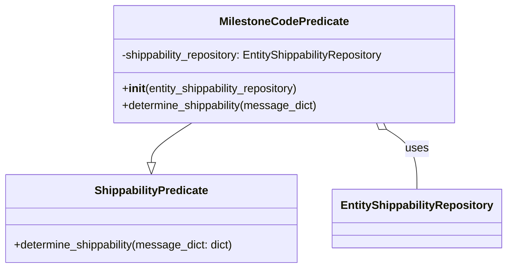
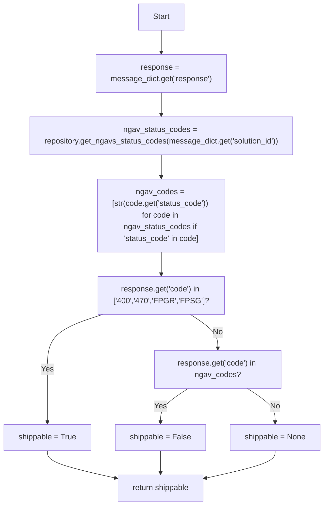
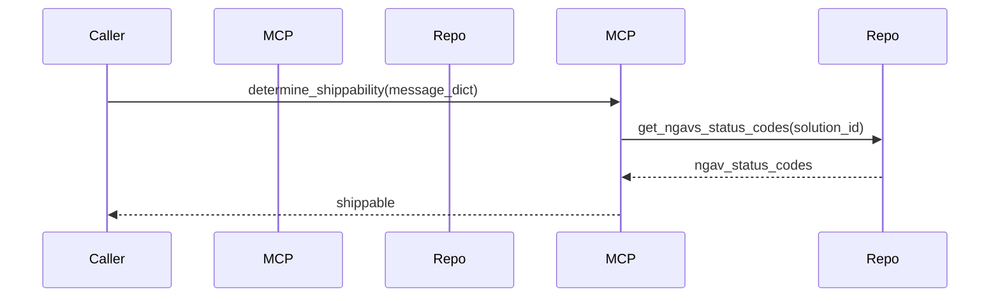

# Diagram: entity_core/entity_service/entity_service/entity/shippability/predicate.py

> Auto-generated by Obscura crawlers

## Diagram 1

### SVG

<svg id="container" width="723.4765625" xmlns="http://www.w3.org/2000/svg" class="classDiagram" height="384" viewBox="0 0 723.4765625 384" role="graphics-document document" aria-roledescription="class"><g><defs><marker id="container_class-aggregationStart" class="marker aggregation class" refX="18" refY="7" markerWidth="190" markerHeight="240" orient="auto"><path d="M 18,7 L9,13 L1,7 L9,1 Z"></path></marker></defs><defs><marker id="container_class-aggregationEnd" class="marker aggregation class" refX="1" refY="7" markerWidth="20" markerHeight="28" orient="auto"><path d="M 18,7 L9,13 L1,7 L9,1 Z"></path></marker></defs><defs><marker id="container_class-extensionStart" class="marker extension class" refX="18" refY="7" markerWidth="190" markerHeight="240" orient="auto"><path d="M 1,7 L18,13 V 1 Z"></path></marker></defs><defs><marker id="container_class-extensionEnd" class="marker extension class" refX="1" refY="7" markerWidth="20" markerHeight="28" orient="auto"><path d="M 1,1 V 13 L18,7 Z"></path></marker></defs><defs><marker id="container_class-compositionStart" class="marker composition class" refX="18" refY="7" markerWidth="190" markerHeight="240" orient="auto"><path d="M 18,7 L9,13 L1,7 L9,1 Z"></path></marker></defs><defs><marker id="container_class-compositionEnd" class="marker composition class" refX="1" refY="7" markerWidth="20" markerHeight="28" orient="auto"><path d="M 18,7 L9,13 L1,7 L9,1 Z"></path></marker></defs><defs><marker id="container_class-dependencyStart" class="marker dependency class" refX="6" refY="7" markerWidth="190" markerHeight="240" orient="auto"><path d="M 5,7 L9,13 L1,7 L9,1 Z"></path></marker></defs><defs><marker id="container_class-dependencyEnd" class="marker dependency class" refX="13" refY="7" markerWidth="20" markerHeight="28" orient="auto"><path d="M 18,7 L9,13 L14,7 L9,1 Z"></path></marker></defs><defs><marker id="container_class-lollipopStart" class="marker lollipop class" refX="13" refY="7" markerWidth="190" markerHeight="240" orient="auto"><circle stroke="black" fill="transparent" cx="7" cy="7" r="6"></circle></marker></defs><defs><marker id="container_class-lollipopEnd" class="marker lollipop class" refX="1" refY="7" markerWidth="190" markerHeight="240" orient="auto"><circle stroke="black" fill="transparent" cx="7" cy="7" r="6"></circle></marker></defs><g class="root"><g class="clusters"></g><g class="edgePaths"><path d="M277.434,176L267.783,182.167C258.132,188.333,238.829,200.667,229.178,210.125C219.527,219.583,219.527,226.167,219.527,229.458L219.527,232.75" id="id_MilestoneCodePredicate_ShippabilityPredicate_1" class="edge-thickness-normal edge-pattern-solid relation" style=";;;" data-edge="true" data-et="edge" data-id="id_MilestoneCodePredicate_ShippabilityPredicate_1" data-points="W3sieCI6Mjc3LjQzMzYwOTg5MTUyODkzLCJ5IjoxNzZ9LHsieCI6MjE5LjUyNzM0Mzc1LCJ5IjoyMTN9LHsieCI6MjE5LjUyNzM0Mzc1LCJ5IjoyNTB9XQ==" marker-end="url(#container_class-extensionEnd)"></path><path d="M554.895,185.288L562.124,189.907C569.352,194.525,583.809,203.763,591.037,218.048C598.266,232.333,598.266,251.667,598.266,261.333L598.266,271" id="id_MilestoneCodePredicate_EntityShippabilityRepository_2" class="edge-thickness-normal edge-pattern-solid relation" style=";;;" data-edge="true" data-et="edge" data-id="id_MilestoneCodePredicate_EntityShippabilityRepository_2" data-points="W3sieCI6NTQwLjM1OTM1ODg1ODQ3MTEsInkiOjE3Nn0seyJ4Ijo1OTguMjY1NjI1LCJ5IjoyMTN9LHsieCI6NTk4LjI2NTYyNSwieSI6MjcxfV0=" marker-start="url(#container_class-aggregationStart)"></path></g><g class="edgeLabels"><g class="edgeLabel"><g class="label" data-id="id_MilestoneCodePredicate_ShippabilityPredicate_1" transform="translate(0, 0)"><foreignObject width="0" height="0">

</foreignObject></g></g><g class="edgeLabel" transform="translate(598.265625, 213)"><g class="label" data-id="id_MilestoneCodePredicate_EntityShippabilityRepository_2" transform="translate(-16.4921875, -12)"><foreignObject width="32.984375" height="24">

uses

</foreignObject></g></g></g><g class="nodes"><g class="node default" id="classId-ShippabilityPredicate-0" transform="translate(219.52734375, 313)"><g class="basic label-container"><path d="M-211.52734375 -63 L211.52734375 -63 L211.52734375 63 L-211.52734375 63" stroke="none" stroke-width="0" fill="#ECECFF" style=""></path><path d="M-211.52734375 -63 C-112.27306116984033 -63, -13.018778589680664 -63, 211.52734375 -63 M-211.52734375 -63 C-47.97224065531654 -63, 115.58286243936692 -63, 211.52734375 -63 M211.52734375 -63 C211.52734375 -29.40569235983849, 211.52734375 4.18861528032302, 211.52734375 63 M211.52734375 -63 C211.52734375 -37.10553422820212, 211.52734375 -11.211068456404227, 211.52734375 63 M211.52734375 63 C43.668329222396125 63, -124.19068530520775 63, -211.52734375 63 M211.52734375 63 C71.92632736717775 63, -67.6746890156445 63, -211.52734375 63 M-211.52734375 63 C-211.52734375 33.522415142250026, -211.52734375 4.044830284500051, -211.52734375 -63 M-211.52734375 63 C-211.52734375 23.05704290143725, -211.52734375 -16.8859141971255, -211.52734375 -63" stroke="#9370DB" stroke-width="1.3" fill="none" stroke-dasharray="0 0" style=""></path></g><g class="annotation-group text" transform="translate(0, -39)"></g><g class="label-group text" transform="translate(-78.7421875, -39)"><g class="label" style="font-weight: bolder" transform="translate(0,-12)"><foreignObject width="157.484375" height="24">

ShippabilityPredicate

</foreignObject></g></g><g class="members-group text" transform="translate(-199.52734375, 9)"></g><g class="methods-group text" transform="translate(-199.52734375, 39)"><g class="label" style="" transform="translate(0,-12)"><foreignObject width="320.3125" height="24">

+determine_shippability(message_dict: dict)

</foreignObject></g></g><g class="divider" style=""><path d="M-211.52734375 -15 C-55.5688637837099 -15, 100.3896161825802 -15, 211.52734375 -15 M-211.52734375 -15 C-78.004292548937 -15, 55.518758652125996 -15, 211.52734375 -15" stroke="#9370DB" stroke-width="1.3" fill="none" stroke-dasharray="0 0" style=""></path></g><g class="divider" style=""><path d="M-211.52734375 9 C-43.363066636642856 9, 124.80121047671429 9, 211.52734375 9 M-211.52734375 9 C-82.53626512413453 9, 46.45481350173094 9, 211.52734375 9" stroke="#9370DB" stroke-width="1.3" fill="none" stroke-dasharray="0 0" style=""></path></g></g><g class="node default" id="classId-MilestoneCodePredicate-1" transform="translate(408.896484375, 92)"><g class="basic label-container"><path d="M-250.765625 -84 L250.765625 -84 L250.765625 84 L-250.765625 84" stroke="none" stroke-width="0" fill="#ECECFF" style=""></path><path d="M-250.765625 -84 C-68.00429575866642 -84, 114.75703348266717 -84, 250.765625 -84 M-250.765625 -84 C-133.7696584469622 -84, -16.773691893924422 -84, 250.765625 -84 M250.765625 -84 C250.765625 -38.71305715633177, 250.765625 6.573885687336457, 250.765625 84 M250.765625 -84 C250.765625 -43.35668789878947, 250.765625 -2.7133757975789337, 250.765625 84 M250.765625 84 C64.05376109106544 84, -122.65810281786912 84, -250.765625 84 M250.765625 84 C52.02878542856325 84, -146.7080541428735 84, -250.765625 84 M-250.765625 84 C-250.765625 28.922568048498725, -250.765625 -26.15486390300255, -250.765625 -84 M-250.765625 84 C-250.765625 20.181361740827604, -250.765625 -43.63727651834479, -250.765625 -84" stroke="#9370DB" stroke-width="1.3" fill="none" stroke-dasharray="0 0" style=""></path></g><g class="annotation-group text" transform="translate(0, -60)"></g><g class="label-group text" transform="translate(-88.71875, -60)"><g class="label" style="font-weight: bolder" transform="translate(0,-12)"><foreignObject width="177.4375" height="24">

MilestoneCodePredicate

</foreignObject></g></g><g class="members-group text" transform="translate(-238.765625, -12)"><g class="label" style="" transform="translate(0,-12)"><foreignObject width="388.8125" height="24">

-shippability_repository: EntityShippabilityRepository

</foreignObject></g></g><g class="methods-group text" transform="translate(-238.765625, 36)"><g class="label" style="" transform="translate(0,-12)"><foreignObject width="260.296875" height="24">

+<strong>init</strong>(entity_shippability_repository)

</foreignObject></g><g class="label" style="" transform="translate(0,12)"><foreignObject width="284.671875" height="24">

+determine_shippability(message_dict)

</foreignObject></g></g><g class="divider" style=""><path d="M-250.765625 -36 C-124.98476234843076 -36, 0.7961003031384735 -36, 250.765625 -36 M-250.765625 -36 C-67.69698487832906 -36, 115.37165524334188 -36, 250.765625 -36" stroke="#9370DB" stroke-width="1.3" fill="none" stroke-dasharray="0 0" style=""></path></g><g class="divider" style=""><path d="M-250.765625 12 C-76.8122531895742 12, 97.14111862085161 12, 250.765625 12 M-250.765625 12 C-73.29466867606129 12, 104.17628764787742 12, 250.765625 12" stroke="#9370DB" stroke-width="1.3" fill="none" stroke-dasharray="0 0" style=""></path></g></g><g class="node default" id="classId-EntityShippabilityRepository-2" transform="translate(598.265625, 313)"><g class="basic label-container"><path d="M-117.2109375 -42 L117.2109375 -42 L117.2109375 42 L-117.2109375 42" stroke="none" stroke-width="0" fill="#ECECFF" style=""></path><path d="M-117.2109375 -42 C-48.058851722738936 -42, 21.093234054522128 -42, 117.2109375 -42 M-117.2109375 -42 C-60.35243685780193 -42, -3.493936215603867 -42, 117.2109375 -42 M117.2109375 -42 C117.2109375 -21.14452378759821, 117.2109375 -0.2890475751964203, 117.2109375 42 M117.2109375 -42 C117.2109375 -14.428700982053076, 117.2109375 13.142598035893847, 117.2109375 42 M117.2109375 42 C31.543312156995412 42, -54.124313186009175 42, -117.2109375 42 M117.2109375 42 C32.56368232428913 42, -52.083572851421735 42, -117.2109375 42 M-117.2109375 42 C-117.2109375 20.905556465184922, -117.2109375 -0.18888706963015522, -117.2109375 -42 M-117.2109375 42 C-117.2109375 12.62333482930481, -117.2109375 -16.75333034139038, -117.2109375 -42" stroke="#9370DB" stroke-width="1.3" fill="none" stroke-dasharray="0 0" style=""></path></g><g class="annotation-group text" transform="translate(0, -18)"></g><g class="label-group text" transform="translate(-105.2109375, -18)"><g class="label" style="font-weight: bolder" transform="translate(0,-12)"><foreignObject width="210.421875" height="24">

EntityShippabilityRepository

</foreignObject></g></g><g class="members-group text" transform="translate(-105.2109375, 30)"></g><g class="methods-group text" transform="translate(-105.2109375, 60)"></g><g class="divider" style=""><path d="M-117.2109375 6 C-45.98144847209609 6, 25.24804055580782 6, 117.2109375 6 M-117.2109375 6 C-48.730255341827444 6, 19.75042681634511 6, 117.2109375 6" stroke="#9370DB" stroke-width="1.3" fill="none" stroke-dasharray="0 0" style=""></path></g><g class="divider" style=""><path d="M-117.2109375 24 C-47.92658477463486 24, 21.357767950730278 24, 117.2109375 24 M-117.2109375 24 C-56.76875329746652 24, 3.673430905066965 24, 117.2109375 24" stroke="#9370DB" stroke-width="1.3" fill="none" stroke-dasharray="0 0" style=""></path></g></g></g></g></g></svg>

## Diagram 2

### SVG

<svg id="container" width="667.375" xmlns="http://www.w3.org/2000/svg" class="flowchart" height="1038" viewBox="0 0 667.375 1038" role="graphics-document document" aria-roledescription="flowchart-v2"><g><marker id="container_flowchart-v2-pointEnd" class="marker flowchart-v2" viewBox="0 0 10 10" refX="5" refY="5" markerUnits="userSpaceOnUse" markerWidth="8" markerHeight="8" orient="auto"><path d="M 0 0 L 10 5 L 0 10 z" class="arrowMarkerPath" style="stroke-width: 1; stroke-dasharray: 1, 0;"></path></marker><marker id="container_flowchart-v2-pointStart" class="marker flowchart-v2" viewBox="0 0 10 10" refX="4.5" refY="5" markerUnits="userSpaceOnUse" markerWidth="8" markerHeight="8" orient="auto"><path d="M 0 5 L 10 10 L 10 0 z" class="arrowMarkerPath" style="stroke-width: 1; stroke-dasharray: 1, 0;"></path></marker><marker id="container_flowchart-v2-circleEnd" class="marker flowchart-v2" viewBox="0 0 10 10" refX="11" refY="5" markerUnits="userSpaceOnUse" markerWidth="11" markerHeight="11" orient="auto"><circle cx="5" cy="5" r="5" class="arrowMarkerPath" style="stroke-width: 1; stroke-dasharray: 1, 0;"></circle></marker><marker id="container_flowchart-v2-circleStart" class="marker flowchart-v2" viewBox="0 0 10 10" refX="-1" refY="5" markerUnits="userSpaceOnUse" markerWidth="11" markerHeight="11" orient="auto"><circle cx="5" cy="5" r="5" class="arrowMarkerPath" style="stroke-width: 1; stroke-dasharray: 1, 0;"></circle></marker><marker id="container_flowchart-v2-crossEnd" class="marker cross flowchart-v2" viewBox="0 0 11 11" refX="12" refY="5.2" markerUnits="userSpaceOnUse" markerWidth="11" markerHeight="11" orient="auto"><path d="M 1,1 l 9,9 M 10,1 l -9,9" class="arrowMarkerPath" style="stroke-width: 2; stroke-dasharray: 1, 0;"></path></marker><marker id="container_flowchart-v2-crossStart" class="marker cross flowchart-v2" viewBox="0 0 11 11" refX="-1" refY="5.2" markerUnits="userSpaceOnUse" markerWidth="11" markerHeight="11" orient="auto"><path d="M 1,1 l 9,9 M 10,1 l -9,9" class="arrowMarkerPath" style="stroke-width: 2; stroke-dasharray: 1, 0;"></path></marker><g class="root"><g class="clusters"></g><g class="edgePaths"><path d="M332.098,62L332.098,66.167C332.098,70.333,332.098,78.667,332.098,86.333C332.098,94,332.098,101,332.098,104.5L332.098,108" id="L_Start_GetResponse_0" class="edge-thickness-normal edge-pattern-solid edge-thickness-normal edge-pattern-solid flowchart-link" style=";" data-edge="true" data-et="edge" data-id="L_Start_GetResponse_0" data-points="W3sieCI6MzMyLjA5NzY1NjI1LCJ5Ijo2Mn0seyJ4IjozMzIuMDk3NjU2MjUsInkiOjg3fSx7IngiOjMzMi4wOTc2NTYyNSwieSI6MTEyfV0=" marker-end="url(#container_flowchart-v2-pointEnd)"></path><path d="M332.098,190L332.098,194.167C332.098,198.333,332.098,206.667,332.098,214.333C332.098,222,332.098,229,332.098,232.5L332.098,236" id="L_GetResponse_GetNGAV_0" class="edge-thickness-normal edge-pattern-solid edge-thickness-normal edge-pattern-solid flowchart-link" style=";" data-edge="true" data-et="edge" data-id="L_GetResponse_GetNGAV_0" data-points="W3sieCI6MzMyLjA5NzY1NjI1LCJ5IjoxOTB9LHsieCI6MzMyLjA5NzY1NjI1LCJ5IjoyMTV9LHsieCI6MzMyLjA5NzY1NjI1LCJ5IjoyNDB9XQ==" marker-end="url(#container_flowchart-v2-pointEnd)"></path><path d="M332.098,318L332.098,322.167C332.098,326.333,332.098,334.667,332.098,342.333C332.098,350,332.098,357,332.098,360.5L332.098,364" id="L_GetNGAV_BuildNGAV_0" class="edge-thickness-normal edge-pattern-solid edge-thickness-normal edge-pattern-solid flowchart-link" style=";" data-edge="true" data-et="edge" data-id="L_GetNGAV_BuildNGAV_0" data-points="W3sieCI6MzMyLjA5NzY1NjI1LCJ5IjozMTh9LHsieCI6MzMyLjA5NzY1NjI1LCJ5IjozNDN9LHsieCI6MzMyLjA5NzY1NjI1LCJ5IjozNjh9XQ==" marker-end="url(#container_flowchart-v2-pointEnd)"></path><path d="M332.098,518L332.098,522.167C332.098,526.333,332.098,534.667,332.098,542.333C332.098,550,332.098,557,332.098,560.5L332.098,564" id="L_BuildNGAV_CheckKnown_0" class="edge-thickness-normal edge-pattern-solid edge-thickness-normal edge-pattern-solid flowchart-link" style=";" data-edge="true" data-et="edge" data-id="L_BuildNGAV_CheckKnown_0" data-points="W3sieCI6MzMyLjA5NzY1NjI1LCJ5Ijo1MTh9LHsieCI6MzMyLjA5NzY1NjI1LCJ5Ijo1NDN9LHsieCI6MzMyLjA5NzY1NjI1LCJ5Ijo1Njh9XQ==" marker-end="url(#container_flowchart-v2-pointEnd)"></path><path d="M212.029,646L193.043,652.167C174.058,658.333,136.088,670.667,117.102,689.5C98.117,708.333,98.117,733.667,98.117,759C98.117,784.333,98.117,809.667,98.117,827.833C98.117,846,98.117,857,98.117,862.5L98.117,868" id="L_CheckKnown_TrueAssign_0" class="edge-thickness-normal edge-pattern-solid edge-thickness-normal edge-pattern-solid flowchart-link" style=";" data-edge="true" data-et="edge" data-id="L_CheckKnown_TrueAssign_0" data-points="W3sieCI6MjEyLjAyODczMTQ5NjcxMDUyLCJ5Ijo2NDZ9LHsieCI6OTguMTE3MTg3NSwieSI6NjgzfSx7IngiOjk4LjExNzE4NzUsInkiOjc1OX0seyJ4Ijo5OC4xMTcxODc1LCJ5Ijo4MzV9LHsieCI6OTguMTE3MTg3NSwieSI6ODcyfV0=" marker-end="url(#container_flowchart-v2-pointEnd)"></path><path d="M391.724,646L401.152,652.167C410.58,658.333,429.437,670.667,438.865,682.333C448.293,694,448.293,705,448.293,710.5L448.293,716" id="L_CheckKnown_CheckNGAV_0" class="edge-thickness-normal edge-pattern-solid edge-thickness-normal edge-pattern-solid flowchart-link" style=";" data-edge="true" data-et="edge" data-id="L_CheckKnown_CheckNGAV_0" data-points="W3sieCI6MzkxLjcyNDE5ODE5MDc4OTUsInkiOjY0Nn0seyJ4Ijo0NDguMjkyOTY4NzUsInkiOjY4M30seyJ4Ijo0NDguMjkyOTY4NzUsInkiOjcyMH1d" marker-end="url(#container_flowchart-v2-pointEnd)"></path><path d="M387.851,798L378.293,804.167C368.736,810.333,349.622,822.667,340.065,834.333C330.508,846,330.508,857,330.508,862.5L330.508,868" id="L_CheckNGAV_FalseAssign_0" class="edge-thickness-normal edge-pattern-solid edge-thickness-normal edge-pattern-solid flowchart-link" style=";" data-edge="true" data-et="edge" data-id="L_CheckNGAV_FalseAssign_0" data-points="W3sieCI6Mzg3Ljg1MDU4NTkzNzUsInkiOjc5OH0seyJ4IjozMzAuNTA3ODEyNSwieSI6ODM1fSx7IngiOjMzMC41MDc4MTI1LCJ5Ijo4NzJ9XQ==" marker-end="url(#container_flowchart-v2-pointEnd)"></path><path d="M508.735,798L518.292,804.167C527.85,810.333,546.964,822.667,556.521,834.333C566.078,846,566.078,857,566.078,862.5L566.078,868" id="L_CheckNGAV_NoneAssign_0" class="edge-thickness-normal edge-pattern-solid edge-thickness-normal edge-pattern-solid flowchart-link" style=";" data-edge="true" data-et="edge" data-id="L_CheckNGAV_NoneAssign_0" data-points="W3sieCI6NTA4LjczNTM1MTU2MjUsInkiOjc5OH0seyJ4Ijo1NjYuMDc4MTI1LCJ5Ijo4MzV9LHsieCI6NTY2LjA3ODEyNSwieSI6ODcyfV0=" marker-end="url(#container_flowchart-v2-pointEnd)"></path><path d="M98.117,926L98.117,930.167C98.117,934.333,98.117,942.667,121.111,951.978C144.105,961.29,190.093,971.581,213.087,976.726L236.081,981.871" id="L_TrueAssign_Return_0" class="edge-thickness-normal edge-pattern-solid edge-thickness-normal edge-pattern-solid flowchart-link" style=";" data-edge="true" data-et="edge" data-id="L_TrueAssign_Return_0" data-points="W3sieCI6OTguMTE3MTg3NSwieSI6OTI2fSx7IngiOjk4LjExNzE4NzUsInkiOjk1MX0seyJ4IjoyMzkuOTg0Mzc1LCJ5Ijo5ODIuNzQ0MzY4OTkwNzg4Nn1d" marker-end="url(#container_flowchart-v2-pointEnd)"></path><path d="M330.508,926L330.508,930.167C330.508,934.333,330.508,942.667,330.508,950.333C330.508,958,330.508,965,330.508,968.5L330.508,972" id="L_FalseAssign_Return_0" class="edge-thickness-normal edge-pattern-solid edge-thickness-normal edge-pattern-solid flowchart-link" style=";" data-edge="true" data-et="edge" data-id="L_FalseAssign_Return_0" data-points="W3sieCI6MzMwLjUwNzgxMjUsInkiOjkyNn0seyJ4IjozMzAuNTA3ODEyNSwieSI6OTUxfSx7IngiOjMzMC41MDc4MTI1LCJ5Ijo5NzZ9XQ==" marker-end="url(#container_flowchart-v2-pointEnd)"></path><path d="M566.078,926L566.078,930.167C566.078,934.333,566.078,942.667,542.555,952.026C519.031,961.385,471.984,971.77,448.461,976.963L424.937,982.156" id="L_NoneAssign_Return_0" class="edge-thickness-normal edge-pattern-solid edge-thickness-normal edge-pattern-solid flowchart-link" style=";" data-edge="true" data-et="edge" data-id="L_NoneAssign_Return_0" data-points="W3sieCI6NTY2LjA3ODEyNSwieSI6OTI2fSx7IngiOjU2Ni4wNzgxMjUsInkiOjk1MX0seyJ4Ijo0MjEuMDMxMjUsInkiOjk4My4wMTc3NzYwMDkwMjA2fV0=" marker-end="url(#container_flowchart-v2-pointEnd)"></path></g><g class="edgeLabels"><g class="edgeLabel"><g class="label" data-id="L_Start_GetResponse_0" transform="translate(0, 0)"><foreignObject width="0" height="0">

</foreignObject></g></g><g class="edgeLabel"><g class="label" data-id="L_GetResponse_GetNGAV_0" transform="translate(0, 0)"><foreignObject width="0" height="0">

</foreignObject></g></g><g class="edgeLabel"><g class="label" data-id="L_GetNGAV_BuildNGAV_0" transform="translate(0, 0)"><foreignObject width="0" height="0">

</foreignObject></g></g><g class="edgeLabel"><g class="label" data-id="L_BuildNGAV_CheckKnown_0" transform="translate(0, 0)"><foreignObject width="0" height="0">

</foreignObject></g></g><g class="edgeLabel" transform="translate(98.1171875, 759)"><g class="label" data-id="L_CheckKnown_TrueAssign_0" transform="translate(-12.03125, -12)"><foreignObject width="24.0625" height="24">

Yes

</foreignObject></g></g><g class="edgeLabel" transform="translate(448.29296875, 683)"><g class="label" data-id="L_CheckKnown_CheckNGAV_0" transform="translate(-10.140625, -12)"><foreignObject width="20.28125" height="24">

No

</foreignObject></g></g><g class="edgeLabel" transform="translate(330.5078125, 835)"><g class="label" data-id="L_CheckNGAV_FalseAssign_0" transform="translate(-12.03125, -12)"><foreignObject width="24.0625" height="24">

Yes

</foreignObject></g></g><g class="edgeLabel" transform="translate(566.078125, 835)"><g class="label" data-id="L_CheckNGAV_NoneAssign_0" transform="translate(-10.140625, -12)"><foreignObject width="20.28125" height="24">

No

</foreignObject></g></g><g class="edgeLabel"><g class="label" data-id="L_TrueAssign_Return_0" transform="translate(0, 0)"><foreignObject width="0" height="0">

</foreignObject></g></g><g class="edgeLabel"><g class="label" data-id="L_FalseAssign_Return_0" transform="translate(0, 0)"><foreignObject width="0" height="0">

</foreignObject></g></g><g class="edgeLabel"><g class="label" data-id="L_NoneAssign_Return_0" transform="translate(0, 0)"><foreignObject width="0" height="0">

</foreignObject></g></g></g><g class="nodes"><g class="node default" id="flowchart-Start-0" transform="translate(332.09765625, 35)"><rect class="basic label-container" style="" x="-47.5234375" y="-27" width="95.046875" height="54"></rect><g class="label" style="" transform="translate(-17.5234375, -12)"><rect></rect><foreignObject width="35.046875" height="24">

Start

</foreignObject></g></g><g class="node default" id="flowchart-GetResponse-1" transform="translate(332.09765625, 151)"><rect class="basic label-container" style="" x="-133.6953125" y="-39" width="267.390625" height="78"></rect><g class="label" style="" transform="translate(-103.6953125, -24)"><rect></rect><foreignObject width="207.390625" height="48">

response = message_dict.get('response')

</foreignObject></g></g><g class="node default" id="flowchart-GetNGAV-3" transform="translate(332.09765625, 279)"><rect class="basic label-container" style="" x="-272.6875" y="-39" width="545.375" height="78"></rect><g class="label" style="" transform="translate(-242.6875, -24)"><rect></rect><foreignObject width="485.375" height="48">

ngav_status_codes = repository.get_ngavs_status_codes(message_dict.get('solution_id'))

</foreignObject></g></g><g class="node default" id="flowchart-BuildNGAV-5" transform="translate(332.09765625, 443)"><rect class="basic label-container" style="" x="-132.15625" y="-75" width="264.3125" height="150"></rect><g class="label" style="" transform="translate(-102.15625, -60)"><rect></rect><foreignObject width="204.3125" height="120">

ngav_codes = [str(code.get('status_code')) for code in ngav_status_codes if 'status_code' in code]

</foreignObject></g></g><g class="node default" id="flowchart-CheckKnown-7" transform="translate(332.09765625, 607)"><rect class="basic label-container" style="" x="-130" y="-39" width="260" height="78"></rect><g class="label" style="" transform="translate(-100, -24)"><rect></rect><foreignObject width="200" height="48">

response.get('code') in ['400','470','FPGR','FPSG']?

</foreignObject></g></g><g class="node default" id="flowchart-TrueAssign-9" transform="translate(98.1171875, 899)"><rect class="basic label-container" style="" x="-90.1171875" y="-27" width="180.234375" height="54"></rect><g class="label" style="" transform="translate(-60.1171875, -12)"><rect></rect><foreignObject width="120.234375" height="24">

shippable = True

</foreignObject></g></g><g class="node default" id="flowchart-CheckNGAV-11" transform="translate(448.29296875, 759)"><rect class="basic label-container" style="" x="-130" y="-39" width="260" height="78"></rect><g class="label" style="" transform="translate(-100, -24)"><rect></rect><foreignObject width="200" height="48">

response.get('code') in ngav_codes?

</foreignObject></g></g><g class="node default" id="flowchart-FalseAssign-13" transform="translate(330.5078125, 899)"><rect class="basic label-container" style="" x="-92.2734375" y="-27" width="184.546875" height="54"></rect><g class="label" style="" transform="translate(-62.2734375, -12)"><rect></rect><foreignObject width="124.546875" height="24">

shippable = False

</foreignObject></g></g><g class="node default" id="flowchart-NoneAssign-15" transform="translate(566.078125, 899)"><rect class="basic label-container" style="" x="-93.296875" y="-27" width="186.59375" height="54"></rect><g class="label" style="" transform="translate(-63.296875, -12)"><rect></rect><foreignObject width="126.59375" height="24">

shippable = None

</foreignObject></g></g><g class="node default" id="flowchart-Return-17" transform="translate(330.5078125, 1003)"><rect class="basic label-container" style="" x="-90.5234375" y="-27" width="181.046875" height="54"></rect><g class="label" style="" transform="translate(-60.5234375, -12)"><rect></rect><foreignObject width="121.046875" height="24">

return shippable

</foreignObject></g></g></g></g></g></svg>

## Diagram 3

### SVG

<svg id="container" width="1187" xmlns="http://www.w3.org/2000/svg" height="363" viewBox="-50 -10 1187 363" role="graphics-document document" aria-roledescription="sequence"><g><rect x="937" y="277" fill="#eaeaea" stroke="#666" width="150" height="65" name="Repo" rx="3" ry="3" class="actor actor-bottom"></rect><text x="1012" y="309.5" dominant-baseline="central" alignment-baseline="central" class="actor actor-box" style="text-anchor: middle; font-size: 16px; font-weight: 400;"><tspan x="1012" dy="0">Repo</tspan></text></g><g><rect x="600" y="277" fill="#eaeaea" stroke="#666" width="150" height="65" name="MCP" rx="3" ry="3" class="actor actor-bottom"></rect><text x="675" y="309.5" dominant-baseline="central" alignment-baseline="central" class="actor actor-box" style="text-anchor: middle; font-size: 16px; font-weight: 400;"><tspan x="675" dy="0">MCP</tspan></text></g><g><rect x="400" y="277" fill="#eaeaea" stroke="#666" width="150" height="65" name="EntityShippabilityRepository" rx="3" ry="3" class="actor actor-bottom"></rect><text x="475" y="309.5" dominant-baseline="central" alignment-baseline="central" class="actor actor-box" style="text-anchor: middle; font-size: 16px; font-weight: 400;"><tspan x="475" dy="0">Repo</tspan></text></g><g><rect x="200" y="277" fill="#eaeaea" stroke="#666" width="150" height="65" name="MilestoneCodePredicate" rx="3" ry="3" class="actor actor-bottom"></rect><text x="275" y="309.5" dominant-baseline="central" alignment-baseline="central" class="actor actor-box" style="text-anchor: middle; font-size: 16px; font-weight: 400;"><tspan x="275" dy="0">MCP</tspan></text></g><g><rect x="0" y="277" fill="#eaeaea" stroke="#666" width="150" height="65" name="Caller" rx="3" ry="3" class="actor actor-bottom"></rect><text x="75" y="309.5" dominant-baseline="central" alignment-baseline="central" class="actor actor-box" style="text-anchor: middle; font-size: 16px; font-weight: 400;"><tspan x="75" dy="0">Caller</tspan></text></g><g><line id="actor4" x1="1012" y1="65" x2="1012" y2="277" class="actor-line 200" stroke-width="0.5px" stroke="#999" name="Repo"></line><g id="root-4"><rect x="937" y="0" fill="#eaeaea" stroke="#666" width="150" height="65" name="Repo" rx="3" ry="3" class="actor actor-top"></rect><text x="1012" y="32.5" dominant-baseline="central" alignment-baseline="central" class="actor actor-box" style="text-anchor: middle; font-size: 16px; font-weight: 400;"><tspan x="1012" dy="0">Repo</tspan></text></g></g><g><line id="actor3" x1="675" y1="65" x2="675" y2="277" class="actor-line 200" stroke-width="0.5px" stroke="#999" name="MCP"></line><g id="root-3"><rect x="600" y="0" fill="#eaeaea" stroke="#666" width="150" height="65" name="MCP" rx="3" ry="3" class="actor actor-top"></rect><text x="675" y="32.5" dominant-baseline="central" alignment-baseline="central" class="actor actor-box" style="text-anchor: middle; font-size: 16px; font-weight: 400;"><tspan x="675" dy="0">MCP</tspan></text></g></g><g><line id="actor2" x1="475" y1="65" x2="475" y2="277" class="actor-line 200" stroke-width="0.5px" stroke="#999" name="EntityShippabilityRepository"></line><g id="root-2"><rect x="400" y="0" fill="#eaeaea" stroke="#666" width="150" height="65" name="EntityShippabilityRepository" rx="3" ry="3" class="actor actor-top"></rect><text x="475" y="32.5" dominant-baseline="central" alignment-baseline="central" class="actor actor-box" style="text-anchor: middle; font-size: 16px; font-weight: 400;"><tspan x="475" dy="0">Repo</tspan></text></g></g><g><line id="actor1" x1="275" y1="65" x2="275" y2="277" class="actor-line 200" stroke-width="0.5px" stroke="#999" name="MilestoneCodePredicate"></line><g id="root-1"><rect x="200" y="0" fill="#eaeaea" stroke="#666" width="150" height="65" name="MilestoneCodePredicate" rx="3" ry="3" class="actor actor-top"></rect><text x="275" y="32.5" dominant-baseline="central" alignment-baseline="central" class="actor actor-box" style="text-anchor: middle; font-size: 16px; font-weight: 400;"><tspan x="275" dy="0">MCP</tspan></text></g></g><g><line id="actor0" x1="75" y1="65" x2="75" y2="277" class="actor-line 200" stroke-width="0.5px" stroke="#999" name="Caller"></line><g id="root-0"><rect x="0" y="0" fill="#eaeaea" stroke="#666" width="150" height="65" name="Caller" rx="3" ry="3" class="actor actor-top"></rect><text x="75" y="32.5" dominant-baseline="central" alignment-baseline="central" class="actor actor-box" style="text-anchor: middle; font-size: 16px; font-weight: 400;"><tspan x="75" dy="0">Caller</tspan></text></g></g><g></g><defs><symbol id="computer" width="24" height="24"><path transform="scale(.5)" d="M2 2v13h20v-13h-20zm18 11h-16v-9h16v9zm-10.228 6l.466-1h3.524l.467 1h-4.457zm14.228 3h-24l2-6h2.104l-1.33 4h18.45l-1.297-4h2.073l2 6zm-5-10h-14v-7h14v7z"></path></symbol></defs><defs><symbol id="database" fill-rule="evenodd" clip-rule="evenodd"><path transform="scale(.5)" d="M12.258.001l.256.004.255.005.253.008.251.01.249.012.247.015.246.016.242.019.241.02.239.023.236.024.233.027.231.028.229.031.225.032.223.034.22.036.217.038.214.04.211.041.208.043.205.045.201.046.198.048.194.05.191.051.187.053.183.054.18.056.175.057.172.059.168.06.163.061.16.063.155.064.15.066.074.033.073.033.071.034.07.034.069.035.068.035.067.035.066.035.064.036.064.036.062.036.06.036.06.037.058.037.058.037.055.038.055.038.053.038.052.038.051.039.05.039.048.039.047.039.045.04.044.04.043.04.041.04.04.041.039.041.037.041.036.041.034.041.033.042.032.042.03.042.029.042.027.042.026.043.024.043.023.043.021.043.02.043.018.044.017.043.015.044.013.044.012.044.011.045.009.044.007.045.006.045.004.045.002.045.001.045v17l-.001.045-.002.045-.004.045-.006.045-.007.045-.009.044-.011.045-.012.044-.013.044-.015.044-.017.043-.018.044-.02.043-.021.043-.023.043-.024.043-.026.043-.027.042-.029.042-.03.042-.032.042-.033.042-.034.041-.036.041-.037.041-.039.041-.04.041-.041.04-.043.04-.044.04-.045.04-.047.039-.048.039-.05.039-.051.039-.052.038-.053.038-.055.038-.055.038-.058.037-.058.037-.06.037-.06.036-.062.036-.064.036-.064.036-.066.035-.067.035-.068.035-.069.035-.07.034-.071.034-.073.033-.074.033-.15.066-.155.064-.16.063-.163.061-.168.06-.172.059-.175.057-.18.056-.183.054-.187.053-.191.051-.194.05-.198.048-.201.046-.205.045-.208.043-.211.041-.214.04-.217.038-.22.036-.223.034-.225.032-.229.031-.231.028-.233.027-.236.024-.239.023-.241.02-.242.019-.246.016-.247.015-.249.012-.251.01-.253.008-.255.005-.256.004-.258.001-.258-.001-.256-.004-.255-.005-.253-.008-.251-.01-.249-.012-.247-.015-.245-.016-.243-.019-.241-.02-.238-.023-.236-.024-.234-.027-.231-.028-.228-.031-.226-.032-.223-.034-.22-.036-.217-.038-.214-.04-.211-.041-.208-.043-.204-.045-.201-.046-.198-.048-.195-.05-.19-.051-.187-.053-.184-.054-.179-.056-.176-.057-.172-.059-.167-.06-.164-.061-.159-.063-.155-.064-.151-.066-.074-.033-.072-.033-.072-.034-.07-.034-.069-.035-.068-.035-.067-.035-.066-.035-.064-.036-.063-.036-.062-.036-.061-.036-.06-.037-.058-.037-.057-.037-.056-.038-.055-.038-.053-.038-.052-.038-.051-.039-.049-.039-.049-.039-.046-.039-.046-.04-.044-.04-.043-.04-.041-.04-.04-.041-.039-.041-.037-.041-.036-.041-.034-.041-.033-.042-.032-.042-.03-.042-.029-.042-.027-.042-.026-.043-.024-.043-.023-.043-.021-.043-.02-.043-.018-.044-.017-.043-.015-.044-.013-.044-.012-.044-.011-.045-.009-.044-.007-.045-.006-.045-.004-.045-.002-.045-.001-.045v-17l.001-.045.002-.045.004-.045.006-.045.007-.045.009-.044.011-.045.012-.044.013-.044.015-.044.017-.043.018-.044.02-.043.021-.043.023-.043.024-.043.026-.043.027-.042.029-.042.03-.042.032-.042.033-.042.034-.041.036-.041.037-.041.039-.041.04-.041.041-.04.043-.04.044-.04.046-.04.046-.039.049-.039.049-.039.051-.039.052-.038.053-.038.055-.038.056-.038.057-.037.058-.037.06-.037.061-.036.062-.036.063-.036.064-.036.066-.035.067-.035.068-.035.069-.035.07-.034.072-.034.072-.033.074-.033.151-.066.155-.064.159-.063.164-.061.167-.06.172-.059.176-.057.179-.056.184-.054.187-.053.19-.051.195-.05.198-.048.201-.046.204-.045.208-.043.211-.041.214-.04.217-.038.22-.036.223-.034.226-.032.228-.031.231-.028.234-.027.236-.024.238-.023.241-.02.243-.019.245-.016.247-.015.249-.012.251-.01.253-.008.255-.005.256-.004.258-.001.258.001zm-9.258 20.499v.01l.001.021.003.021.004.022.005.021.006.022.007.022.009.023.01.022.011.023.012.023.013.023.015.023.016.024.017.023.018.024.019.024.021.024.022.025.023.024.024.025.052.049.056.05.061.051.066.051.07.051.075.051.079.052.084.052.088.052.092.052.097.052.102.051.105.052.11.052.114.051.119.051.123.051.127.05.131.05.135.05.139.048.144.049.147.047.152.047.155.047.16.045.163.045.167.043.171.043.176.041.178.041.183.039.187.039.19.037.194.035.197.035.202.033.204.031.209.03.212.029.216.027.219.025.222.024.226.021.23.02.233.018.236.016.24.015.243.012.246.01.249.008.253.005.256.004.259.001.26-.001.257-.004.254-.005.25-.008.247-.011.244-.012.241-.014.237-.016.233-.018.231-.021.226-.021.224-.024.22-.026.216-.027.212-.028.21-.031.205-.031.202-.034.198-.034.194-.036.191-.037.187-.039.183-.04.179-.04.175-.042.172-.043.168-.044.163-.045.16-.046.155-.046.152-.047.148-.048.143-.049.139-.049.136-.05.131-.05.126-.05.123-.051.118-.052.114-.051.11-.052.106-.052.101-.052.096-.052.092-.052.088-.053.083-.051.079-.052.074-.052.07-.051.065-.051.06-.051.056-.05.051-.05.023-.024.023-.025.021-.024.02-.024.019-.024.018-.024.017-.024.015-.023.014-.024.013-.023.012-.023.01-.023.01-.022.008-.022.006-.022.006-.022.004-.022.004-.021.001-.021.001-.021v-4.127l-.077.055-.08.053-.083.054-.085.053-.087.052-.09.052-.093.051-.095.05-.097.05-.1.049-.102.049-.105.048-.106.047-.109.047-.111.046-.114.045-.115.045-.118.044-.12.043-.122.042-.124.042-.126.041-.128.04-.13.04-.132.038-.134.038-.135.037-.138.037-.139.035-.142.035-.143.034-.144.033-.147.032-.148.031-.15.03-.151.03-.153.029-.154.027-.156.027-.158.026-.159.025-.161.024-.162.023-.163.022-.165.021-.166.02-.167.019-.169.018-.169.017-.171.016-.173.015-.173.014-.175.013-.175.012-.177.011-.178.01-.179.008-.179.008-.181.006-.182.005-.182.004-.184.003-.184.002h-.37l-.184-.002-.184-.003-.182-.004-.182-.005-.181-.006-.179-.008-.179-.008-.178-.01-.176-.011-.176-.012-.175-.013-.173-.014-.172-.015-.171-.016-.17-.017-.169-.018-.167-.019-.166-.02-.165-.021-.163-.022-.162-.023-.161-.024-.159-.025-.157-.026-.156-.027-.155-.027-.153-.029-.151-.03-.15-.03-.148-.031-.146-.032-.145-.033-.143-.034-.141-.035-.14-.035-.137-.037-.136-.037-.134-.038-.132-.038-.13-.04-.128-.04-.126-.041-.124-.042-.122-.042-.12-.044-.117-.043-.116-.045-.113-.045-.112-.046-.109-.047-.106-.047-.105-.048-.102-.049-.1-.049-.097-.05-.095-.05-.093-.052-.09-.051-.087-.052-.085-.053-.083-.054-.08-.054-.077-.054v4.127zm0-5.654v.011l.001.021.003.021.004.021.005.022.006.022.007.022.009.022.01.022.011.023.012.023.013.023.015.024.016.023.017.024.018.024.019.024.021.024.022.024.023.025.024.024.052.05.056.05.061.05.066.051.07.051.075.052.079.051.084.052.088.052.092.052.097.052.102.052.105.052.11.051.114.051.119.052.123.05.127.051.131.05.135.049.139.049.144.048.147.048.152.047.155.046.16.045.163.045.167.044.171.042.176.042.178.04.183.04.187.038.19.037.194.036.197.034.202.033.204.032.209.03.212.028.216.027.219.025.222.024.226.022.23.02.233.018.236.016.24.014.243.012.246.01.249.008.253.006.256.003.259.001.26-.001.257-.003.254-.006.25-.008.247-.01.244-.012.241-.015.237-.016.233-.018.231-.02.226-.022.224-.024.22-.025.216-.027.212-.029.21-.03.205-.032.202-.033.198-.035.194-.036.191-.037.187-.039.183-.039.179-.041.175-.042.172-.043.168-.044.163-.045.16-.045.155-.047.152-.047.148-.048.143-.048.139-.05.136-.049.131-.05.126-.051.123-.051.118-.051.114-.052.11-.052.106-.052.101-.052.096-.052.092-.052.088-.052.083-.052.079-.052.074-.051.07-.052.065-.051.06-.05.056-.051.051-.049.023-.025.023-.024.021-.025.02-.024.019-.024.018-.024.017-.024.015-.023.014-.023.013-.024.012-.022.01-.023.01-.023.008-.022.006-.022.006-.022.004-.021.004-.022.001-.021.001-.021v-4.139l-.077.054-.08.054-.083.054-.085.052-.087.053-.09.051-.093.051-.095.051-.097.05-.1.049-.102.049-.105.048-.106.047-.109.047-.111.046-.114.045-.115.044-.118.044-.12.044-.122.042-.124.042-.126.041-.128.04-.13.039-.132.039-.134.038-.135.037-.138.036-.139.036-.142.035-.143.033-.144.033-.147.033-.148.031-.15.03-.151.03-.153.028-.154.028-.156.027-.158.026-.159.025-.161.024-.162.023-.163.022-.165.021-.166.02-.167.019-.169.018-.169.017-.171.016-.173.015-.173.014-.175.013-.175.012-.177.011-.178.009-.179.009-.179.007-.181.007-.182.005-.182.004-.184.003-.184.002h-.37l-.184-.002-.184-.003-.182-.004-.182-.005-.181-.007-.179-.007-.179-.009-.178-.009-.176-.011-.176-.012-.175-.013-.173-.014-.172-.015-.171-.016-.17-.017-.169-.018-.167-.019-.166-.02-.165-.021-.163-.022-.162-.023-.161-.024-.159-.025-.157-.026-.156-.027-.155-.028-.153-.028-.151-.03-.15-.03-.148-.031-.146-.033-.145-.033-.143-.033-.141-.035-.14-.036-.137-.036-.136-.037-.134-.038-.132-.039-.13-.039-.128-.04-.126-.041-.124-.042-.122-.043-.12-.043-.117-.044-.116-.044-.113-.046-.112-.046-.109-.046-.106-.047-.105-.048-.102-.049-.1-.049-.097-.05-.095-.051-.093-.051-.09-.051-.087-.053-.085-.052-.083-.054-.08-.054-.077-.054v4.139zm0-5.666v.011l.001.02.003.022.004.021.005.022.006.021.007.022.009.023.01.022.011.023.012.023.013.023.015.023.016.024.017.024.018.023.019.024.021.025.022.024.023.024.024.025.052.05.056.05.061.05.066.051.07.051.075.052.079.051.084.052.088.052.092.052.097.052.102.052.105.051.11.052.114.051.119.051.123.051.127.05.131.05.135.05.139.049.144.048.147.048.152.047.155.046.16.045.163.045.167.043.171.043.176.042.178.04.183.04.187.038.19.037.194.036.197.034.202.033.204.032.209.03.212.028.216.027.219.025.222.024.226.021.23.02.233.018.236.017.24.014.243.012.246.01.249.008.253.006.256.003.259.001.26-.001.257-.003.254-.006.25-.008.247-.01.244-.013.241-.014.237-.016.233-.018.231-.02.226-.022.224-.024.22-.025.216-.027.212-.029.21-.03.205-.032.202-.033.198-.035.194-.036.191-.037.187-.039.183-.039.179-.041.175-.042.172-.043.168-.044.163-.045.16-.045.155-.047.152-.047.148-.048.143-.049.139-.049.136-.049.131-.051.126-.05.123-.051.118-.052.114-.051.11-.052.106-.052.101-.052.096-.052.092-.052.088-.052.083-.052.079-.052.074-.052.07-.051.065-.051.06-.051.056-.05.051-.049.023-.025.023-.025.021-.024.02-.024.019-.024.018-.024.017-.024.015-.023.014-.024.013-.023.012-.023.01-.022.01-.023.008-.022.006-.022.006-.022.004-.022.004-.021.001-.021.001-.021v-4.153l-.077.054-.08.054-.083.053-.085.053-.087.053-.09.051-.093.051-.095.051-.097.05-.1.049-.102.048-.105.048-.106.048-.109.046-.111.046-.114.046-.115.044-.118.044-.12.043-.122.043-.124.042-.126.041-.128.04-.13.039-.132.039-.134.038-.135.037-.138.036-.139.036-.142.034-.143.034-.144.033-.147.032-.148.032-.15.03-.151.03-.153.028-.154.028-.156.027-.158.026-.159.024-.161.024-.162.023-.163.023-.165.021-.166.02-.167.019-.169.018-.169.017-.171.016-.173.015-.173.014-.175.013-.175.012-.177.01-.178.01-.179.009-.179.007-.181.006-.182.006-.182.004-.184.003-.184.001-.185.001-.185-.001-.184-.001-.184-.003-.182-.004-.182-.006-.181-.006-.179-.007-.179-.009-.178-.01-.176-.01-.176-.012-.175-.013-.173-.014-.172-.015-.171-.016-.17-.017-.169-.018-.167-.019-.166-.02-.165-.021-.163-.023-.162-.023-.161-.024-.159-.024-.157-.026-.156-.027-.155-.028-.153-.028-.151-.03-.15-.03-.148-.032-.146-.032-.145-.033-.143-.034-.141-.034-.14-.036-.137-.036-.136-.037-.134-.038-.132-.039-.13-.039-.128-.041-.126-.041-.124-.041-.122-.043-.12-.043-.117-.044-.116-.044-.113-.046-.112-.046-.109-.046-.106-.048-.105-.048-.102-.048-.1-.05-.097-.049-.095-.051-.093-.051-.09-.052-.087-.052-.085-.053-.083-.053-.08-.054-.077-.054v4.153zm8.74-8.179l-.257.004-.254.005-.25.008-.247.011-.244.012-.241.014-.237.016-.233.018-.231.021-.226.022-.224.023-.22.026-.216.027-.212.028-.21.031-.205.032-.202.033-.198.034-.194.036-.191.038-.187.038-.183.04-.179.041-.175.042-.172.043-.168.043-.163.045-.16.046-.155.046-.152.048-.148.048-.143.048-.139.049-.136.05-.131.05-.126.051-.123.051-.118.051-.114.052-.11.052-.106.052-.101.052-.096.052-.092.052-.088.052-.083.052-.079.052-.074.051-.07.052-.065.051-.06.05-.056.05-.051.05-.023.025-.023.024-.021.024-.02.025-.019.024-.018.024-.017.023-.015.024-.014.023-.013.023-.012.023-.01.023-.01.022-.008.022-.006.023-.006.021-.004.022-.004.021-.001.021-.001.021.001.021.001.021.004.021.004.022.006.021.006.023.008.022.01.022.01.023.012.023.013.023.014.023.015.024.017.023.018.024.019.024.02.025.021.024.023.024.023.025.051.05.056.05.06.05.065.051.07.052.074.051.079.052.083.052.088.052.092.052.096.052.101.052.106.052.11.052.114.052.118.051.123.051.126.051.131.05.136.05.139.049.143.048.148.048.152.048.155.046.16.046.163.045.168.043.172.043.175.042.179.041.183.04.187.038.191.038.194.036.198.034.202.033.205.032.21.031.212.028.216.027.22.026.224.023.226.022.231.021.233.018.237.016.241.014.244.012.247.011.25.008.254.005.257.004.26.001.26-.001.257-.004.254-.005.25-.008.247-.011.244-.012.241-.014.237-.016.233-.018.231-.021.226-.022.224-.023.22-.026.216-.027.212-.028.21-.031.205-.032.202-.033.198-.034.194-.036.191-.038.187-.038.183-.04.179-.041.175-.042.172-.043.168-.043.163-.045.16-.046.155-.046.152-.048.148-.048.143-.048.139-.049.136-.05.131-.05.126-.051.123-.051.118-.051.114-.052.11-.052.106-.052.101-.052.096-.052.092-.052.088-.052.083-.052.079-.052.074-.051.07-.052.065-.051.06-.05.056-.05.051-.05.023-.025.023-.024.021-.024.02-.025.019-.024.018-.024.017-.023.015-.024.014-.023.013-.023.012-.023.01-.023.01-.022.008-.022.006-.023.006-.021.004-.022.004-.021.001-.021.001-.021-.001-.021-.001-.021-.004-.021-.004-.022-.006-.021-.006-.023-.008-.022-.01-.022-.01-.023-.012-.023-.013-.023-.014-.023-.015-.024-.017-.023-.018-.024-.019-.024-.02-.025-.021-.024-.023-.024-.023-.025-.051-.05-.056-.05-.06-.05-.065-.051-.07-.052-.074-.051-.079-.052-.083-.052-.088-.052-.092-.052-.096-.052-.101-.052-.106-.052-.11-.052-.114-.052-.118-.051-.123-.051-.126-.051-.131-.05-.136-.05-.139-.049-.143-.048-.148-.048-.152-.048-.155-.046-.16-.046-.163-.045-.168-.043-.172-.043-.175-.042-.179-.041-.183-.04-.187-.038-.191-.038-.194-.036-.198-.034-.202-.033-.205-.032-.21-.031-.212-.028-.216-.027-.22-.026-.224-.023-.226-.022-.231-.021-.233-.018-.237-.016-.241-.014-.244-.012-.247-.011-.25-.008-.254-.005-.257-.004-.26-.001-.26.001z"></path></symbol></defs><defs><symbol id="clock" width="24" height="24"><path transform="scale(.5)" d="M12 2c5.514 0 10 4.486 10 10s-4.486 10-10 10-10-4.486-10-10 4.486-10 10-10zm0-2c-6.627 0-12 5.373-12 12s5.373 12 12 12 12-5.373 12-12-5.373-12-12-12zm5.848 12.459c.202.038.202.333.001.372-1.907.361-6.045 1.111-6.547 1.111-.719 0-1.301-.582-1.301-1.301 0-.512.77-5.447 1.125-7.445.034-.192.312-.181.343.014l.985 6.238 5.394 1.011z"></path></symbol></defs><defs><marker id="arrowhead" refX="7.9" refY="5" markerUnits="userSpaceOnUse" markerWidth="12" markerHeight="12" orient="auto-start-reverse"><path d="M -1 0 L 10 5 L 0 10 z"></path></marker></defs><defs><marker id="crosshead" markerWidth="15" markerHeight="8" orient="auto" refX="4" refY="4.5"><path fill="none" stroke="#000000" stroke-width="1pt" d="M 1,2 L 6,7 M 6,2 L 1,7" style="stroke-dasharray: 0, 0;"></path></marker></defs><defs><marker id="filled-head" refX="15.5" refY="7" markerWidth="20" markerHeight="28" orient="auto"><path d="M 18,7 L9,13 L14,7 L9,1 Z"></path></marker></defs><defs><marker id="sequencenumber" refX="15" refY="15" markerWidth="60" markerHeight="40" orient="auto"><circle cx="15" cy="15" r="6"></circle></marker></defs><text x="374" y="80" text-anchor="middle" dominant-baseline="middle" alignment-baseline="middle" class="messageText" dy="1em" style="font-size: 16px; font-weight: 400;">determine_shippability(message_dict)</text><line x1="76" y1="113" x2="671" y2="113" class="messageLine0" stroke-width="2" stroke="none" marker-end="url(#arrowhead)" style="fill: none;"></line><text x="842" y="128" text-anchor="middle" dominant-baseline="middle" alignment-baseline="middle" class="messageText" dy="1em" style="font-size: 16px; font-weight: 400;">get_ngavs_status_codes(solution_id)</text><line x1="676" y1="161" x2="1008" y2="161" class="messageLine0" stroke-width="2" stroke="none" marker-end="url(#arrowhead)" style="fill: none;"></line><text x="845" y="176" text-anchor="middle" dominant-baseline="middle" alignment-baseline="middle" class="messageText" dy="1em" style="font-size: 16px; font-weight: 400;">ngav_status_codes</text><line x1="1011" y1="209" x2="679" y2="209" class="messageLine1" stroke-width="2" stroke="none" marker-end="url(#arrowhead)" style="stroke-dasharray: 3, 3; fill: none;"></line><text x="377" y="224" text-anchor="middle" dominant-baseline="middle" alignment-baseline="middle" class="messageText" dy="1em" style="font-size: 16px; font-weight: 400;">shippable</text><line x1="674" y1="257" x2="79" y2="257" class="messageLine1" stroke-width="2" stroke="none" marker-end="url(#arrowhead)" style="stroke-dasharray: 3, 3; fill: none;"></line></svg>
