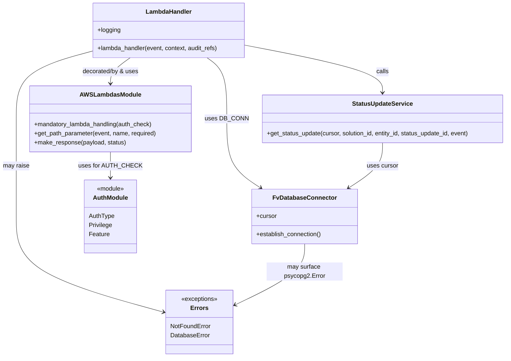

# Diagram: entity_core/entity_service/entity_service/entity/status_update/get_status_update.py


> Auto-generated by Obscura crawlers

## Diagram 1

```mermaid
flowchart TD
    A[HTTP GET /solutions/{solution_id}/entities/{entity_id}/statuses/{status_update_id}] --> B[AUTH_CHECK evaluation]
    B -->|authorized| C[Extract path params: entity_id, solution_id, status_update_id]
    B -->|unauthorized| L[Return 403 Forbidden]
    C --> D[Update audit_refs with ENTITY_ID & SOLUTION_ID]
    D --> E[DB_CONN.establish_connection()]
    E --> F[Call entity_service.db.status_update.get_status_update(cursor, solution_id, entity_id, status_update_id, event)]
    F -->|found| G[Return fv.aws.lambdas.make_response(retval, 200)]
    F -->|not found (retval falsy)| H[Raise fv.error.NotFoundError]
    H --> I[NotFoundError handler: re-raise with client-friendly message]
    E --> J{psycopg2.Error thrown?}
    J -->|yes| K[Catch psycopg2.Error -> Raise fv.error.DatabaseError with client message]
    J -->|no| F
```

> SVG rendering failed for this diagram.

## Diagram 2



### SVG

<svg id="container" width="1328.5703125" xmlns="http://www.w3.org/2000/svg" class="classDiagram" height="916" viewBox="0 0 1328.5703125 916" role="graphics-document document" aria-roledescription="class"><style>#container{font-family:"trebuchet ms",verdana,arial,sans-serif;font-size:16px;fill:#333;}@keyframes edge-animation-frame{from{stroke-dashoffset:0;}}@keyframes dash{to{stroke-dashoffset:0;}}#container .edge-animation-slow{stroke-dasharray:9,5!important;stroke-dashoffset:900;animation:dash 50s linear infinite;stroke-linecap:round;}#container .edge-animation-fast{stroke-dasharray:9,5!important;stroke-dashoffset:900;animation:dash 20s linear infinite;stroke-linecap:round;}#container .error-icon{fill:#552222;}#container .error-text{fill:#552222;stroke:#552222;}#container .edge-thickness-normal{stroke-width:1px;}#container .edge-thickness-thick{stroke-width:3.5px;}#container .edge-pattern-solid{stroke-dasharray:0;}#container .edge-thickness-invisible{stroke-width:0;fill:none;}#container .edge-pattern-dashed{stroke-dasharray:3;}#container .edge-pattern-dotted{stroke-dasharray:2;}#container .marker{fill:#333333;stroke:#333333;}#container .marker.cross{stroke:#333333;}#container svg{font-family:"trebuchet ms",verdana,arial,sans-serif;font-size:16px;}#container p{margin:0;}#container g.classGroup text{fill:#9370DB;stroke:none;font-family:"trebuchet ms",verdana,arial,sans-serif;font-size:10px;}#container g.classGroup text .title{font-weight:bolder;}#container .nodeLabel,#container .edgeLabel{color:#131300;}#container .edgeLabel .label rect{fill:#ECECFF;}#container .label text{fill:#131300;}#container .labelBkg{background:#ECECFF;}#container .edgeLabel .label span{background:#ECECFF;}#container .classTitle{font-weight:bolder;}#container .node rect,#container .node circle,#container .node ellipse,#container .node polygon,#container .node path{fill:#ECECFF;stroke:#9370DB;stroke-width:1px;}#container .divider{stroke:#9370DB;stroke-width:1;}#container g.clickable{cursor:pointer;}#container g.classGroup rect{fill:#ECECFF;stroke:#9370DB;}#container g.classGroup line{stroke:#9370DB;stroke-width:1;}#container .classLabel .box{stroke:none;stroke-width:0;fill:#ECECFF;opacity:0.5;}#container .classLabel .label{fill:#9370DB;font-size:10px;}#container .relation{stroke:#333333;stroke-width:1;fill:none;}#container .dashed-line{stroke-dasharray:3;}#container .dotted-line{stroke-dasharray:1 2;}#container #compositionStart,#container .composition{fill:#333333!important;stroke:#333333!important;stroke-width:1;}#container #compositionEnd,#container .composition{fill:#333333!important;stroke:#333333!important;stroke-width:1;}#container #dependencyStart,#container .dependency{fill:#333333!important;stroke:#333333!important;stroke-width:1;}#container #dependencyStart,#container .dependency{fill:#333333!important;stroke:#333333!important;stroke-width:1;}#container #extensionStart,#container .extension{fill:transparent!important;stroke:#333333!important;stroke-width:1;}#container #extensionEnd,#container .extension{fill:transparent!important;stroke:#333333!important;stroke-width:1;}#container #aggregationStart,#container .aggregation{fill:transparent!important;stroke:#333333!important;stroke-width:1;}#container #aggregationEnd,#container .aggregation{fill:transparent!important;stroke:#333333!important;stroke-width:1;}#container #lollipopStart,#container .lollipop{fill:#ECECFF!important;stroke:#333333!important;stroke-width:1;}#container #lollipopEnd,#container .lollipop{fill:#ECECFF!important;stroke:#333333!important;stroke-width:1;}#container .edgeTerminals{font-size:11px;line-height:initial;}#container .classTitleText{text-anchor:middle;font-size:18px;fill:#333;}#container .label-icon{display:inline-block;height:1em;overflow:visible;vertical-align:-0.125em;}#container .node .label-icon path{fill:currentColor;stroke:revert;stroke-width:revert;}#container :root{--mermaid-font-family:"trebuchet ms",verdana,arial,sans-serif;}</style><g><defs><marker id="container_class-aggregationStart" class="marker aggregation class" refX="18" refY="7" markerWidth="190" markerHeight="240" orient="auto"><path d="M 18,7 L9,13 L1,7 L9,1 Z"></path></marker></defs><defs><marker id="container_class-aggregationEnd" class="marker aggregation class" refX="1" refY="7" markerWidth="20" markerHeight="28" orient="auto"><path d="M 18,7 L9,13 L1,7 L9,1 Z"></path></marker></defs><defs><marker id="container_class-extensionStart" class="marker extension class" refX="18" refY="7" markerWidth="190" markerHeight="240" orient="auto"><path d="M 1,7 L18,13 V 1 Z"></path></marker></defs><defs><marker id="container_class-extensionEnd" class="marker extension class" refX="1" refY="7" markerWidth="20" markerHeight="28" orient="auto"><path d="M 1,1 V 13 L18,7 Z"></path></marker></defs><defs><marker id="container_class-compositionStart" class="marker composition class" refX="18" refY="7" markerWidth="190" markerHeight="240" orient="auto"><path d="M 18,7 L9,13 L1,7 L9,1 Z"></path></marker></defs><defs><marker id="container_class-compositionEnd" class="marker composition class" refX="1" refY="7" markerWidth="20" markerHeight="28" orient="auto"><path d="M 18,7 L9,13 L1,7 L9,1 Z"></path></marker></defs><defs><marker id="container_class-dependencyStart" class="marker dependency class" refX="6" refY="7" markerWidth="190" markerHeight="240" orient="auto"><path d="M 5,7 L9,13 L1,7 L9,1 Z"></path></marker></defs><defs><marker id="container_class-dependencyEnd" class="marker dependency class" refX="13" refY="7" markerWidth="20" markerHeight="28" orient="auto"><path d="M 18,7 L9,13 L14,7 L9,1 Z"></path></marker></defs><defs><marker id="container_class-lollipopStart" class="marker lollipop class" refX="13" refY="7" markerWidth="190" markerHeight="240" orient="auto"><circle stroke="black" fill="transparent" cx="7" cy="7" r="6"></circle></marker></defs><defs><marker id="container_class-lollipopEnd" class="marker lollipop class" refX="1" refY="7" markerWidth="190" markerHeight="240" orient="auto"><circle stroke="black" fill="transparent" cx="7" cy="7" r="6"></circle></marker></defs><g class="root"><g class="clusters"></g><g class="edgePaths"><path d="M340.996,152L332.498,158.167C323.999,164.333,307.001,176.667,298.503,188C290.004,199.333,290.004,209.667,290.004,214.833L290.004,220" id="id_LambdaHandler_AWSLambdasModule_1" class="edge-thickness-normal edge-pattern-solid relation" style=";;;" data-edge="true" data-et="edge" data-id="id_LambdaHandler_AWSLambdasModule_1" data-points="W3sieCI6MzQwLjk5NjI1NTAxNzIwMTg2LCJ5IjoxNTJ9LHsieCI6MjkwLjAwMzkwNjI1LCJ5IjoxODl9LHsieCI6MjkwLjAwMzkwNjI1LCJ5IjoyMjZ9XQ==" marker-end="url(#container_class-dependencyEnd)"></path><path d="M539.453,152L547.952,158.167C556.45,164.333,573.448,176.667,581.947,203.5C590.445,230.333,590.445,271.667,590.445,313C590.445,354.333,590.445,395.667,605.243,425.955C620.041,456.243,649.637,475.486,664.435,485.108L679.233,494.729" id="id_LambdaHandler_FvDatabaseConnector_2" class="edge-thickness-normal edge-pattern-solid relation" style=";;;" data-edge="true" data-et="edge" data-id="id_LambdaHandler_FvDatabaseConnector_2" data-points="W3sieCI6NTM5LjQ1Mjk2MzczMjc5ODEsInkiOjE1Mn0seyJ4Ijo1OTAuNDQ1MzEyNSwieSI6MTg5fSx7IngiOjU5MC40NDUzMTI1LCJ5IjozMTN9LHsieCI6NTkwLjQ0NTMxMjUsInkiOjQzN30seyJ4Ijo2ODQuMjYzNjI3ODE5NTQ4OSwieSI6NDk4fV0=" marker-end="url(#container_class-dependencyEnd)"></path><path d="M642.178,119.356L701.741,130.963C761.303,142.571,880.429,165.785,939.992,186.559C999.555,207.333,999.555,225.667,999.555,234.833L999.555,244" id="id_LambdaHandler_StatusUpdateService_3" class="edge-thickness-normal edge-pattern-solid relation" style=";;;" data-edge="true" data-et="edge" data-id="id_LambdaHandler_StatusUpdateService_3" data-points="W3sieCI6NjQyLjE3NzczNDM3NSwieSI6MTE5LjM1NTgxNDE4ODk4ODYzfSx7IngiOjk5OS41NTQ2ODc1LCJ5IjoxODl9LHsieCI6OTk5LjU1NDY4NzUsInkiOjI1MH1d" marker-end="url(#container_class-dependencyEnd)"></path><path d="M238.271,135.369L205.669,144.307C173.066,153.246,107.861,171.123,75.259,200.728C42.656,230.333,42.656,271.667,42.656,313C42.656,354.333,42.656,395.667,42.656,438.5C42.656,481.333,42.656,525.667,42.656,570C42.656,614.333,42.656,658.667,106.525,696.986C170.394,735.305,298.133,767.61,362.002,783.763L425.871,799.915" id="id_LambdaHandler_Errors_4" class="edge-thickness-normal edge-pattern-solid relation" style=";;;" data-edge="true" data-et="edge" data-id="id_LambdaHandler_Errors_4" data-points="W3sieCI6MjM4LjI3MTQ4NDM3NSwieSI6MTM1LjM2ODgxOTIzODA0Mzc4fSx7IngiOjQyLjY1NjI1LCJ5IjoxODl9LHsieCI6NDIuNjU2MjUsInkiOjMxM30seyJ4Ijo0Mi42NTYyNSwieSI6NDM3fSx7IngiOjQyLjY1NjI1LCJ5Ijo1NzB9LHsieCI6NDIuNjU2MjUsInkiOjcwM30seyJ4Ijo0MzEuNjg3NSwieSI6ODAxLjM4NjE1OTcxMTk2fV0=" marker-end="url(#container_class-dependencyEnd)"></path><path d="M290.004,400L290.004,406.167C290.004,412.333,290.004,424.667,290.004,436C290.004,447.333,290.004,457.667,290.004,462.833L290.004,468" id="id_AWSLambdasModule_AuthModule_5" class="edge-thickness-normal edge-pattern-solid relation" style=";;;" data-edge="true" data-et="edge" data-id="id_AWSLambdasModule_AuthModule_5" data-points="W3sieCI6MjkwLjAwMzkwNjI1LCJ5Ijo0MDB9LHsieCI6MjkwLjAwMzkwNjI1LCJ5Ijo0Mzd9LHsieCI6MjkwLjAwMzkwNjI1LCJ5Ijo0NzR9XQ==" marker-end="url(#container_class-dependencyEnd)"></path><path d="M999.555,376L999.555,386.167C999.555,396.333,999.555,416.667,984.757,436.455C969.959,456.243,940.363,475.486,925.565,485.108L910.767,494.729" id="id_StatusUpdateService_FvDatabaseConnector_6" class="edge-thickness-normal edge-pattern-solid relation" style=";;;" data-edge="true" data-et="edge" data-id="id_StatusUpdateService_FvDatabaseConnector_6" data-points="W3sieCI6OTk5LjU1NDY4NzUsInkiOjM3Nn0seyJ4Ijo5OTkuNTU0Njg3NSwieSI6NDM3fSx7IngiOjkwNS43MzYzNzIxODA0NTExLCJ5Ijo0OTh9XQ==" marker-end="url(#container_class-dependencyEnd)"></path><path d="M795,642L795,652.167C795,662.333,795,682.667,765.169,706.012C735.337,729.358,675.674,755.715,645.843,768.894L616.012,782.073" id="id_FvDatabaseConnector_Errors_7" class="edge-thickness-normal edge-pattern-solid relation" style=";;;" data-edge="true" data-et="edge" data-id="id_FvDatabaseConnector_Errors_7" data-points="W3sieCI6Nzk1LCJ5Ijo2NDJ9LHsieCI6Nzk1LCJ5Ijo3MDN9LHsieCI6NjEwLjUyMzQzNzUsInkiOjc4NC40OTcyOTczNzQzODg1fV0=" marker-end="url(#container_class-dependencyEnd)"></path></g><g class="edgeLabels"><g class="edgeLabel" transform="translate(290.00390625, 189)"><g class="label" data-id="id_LambdaHandler_AWSLambdasModule_1" transform="translate(-75.9296875, -12)"><foreignObject width="151.859375" height="24"><div xmlns="http://www.w3.org/1999/xhtml" class="labelBkg" style="display: table-cell; white-space: nowrap; line-height: 1.5; max-width: 200px; text-align: center;"><span class="edgeLabel"><p>decorated/by &amp; uses</p></span></div></foreignObject></g></g><g class="edgeLabel" transform="translate(590.4453125, 313)"><g class="label" data-id="id_LambdaHandler_FvDatabaseConnector_2" transform="translate(-53.09375, -12)"><foreignObject width="106.1875" height="24"><div xmlns="http://www.w3.org/1999/xhtml" class="labelBkg" style="display: table-cell; white-space: nowrap; line-height: 1.5; max-width: 200px; text-align: center;"><span class="edgeLabel"><p>uses DB_CONN</p></span></div></foreignObject></g></g><g class="edgeLabel" transform="translate(999.5546875, 189)"><g class="label" data-id="id_LambdaHandler_StatusUpdateService_3" transform="translate(-16.4453125, -12)"><foreignObject width="32.890625" height="24"><div xmlns="http://www.w3.org/1999/xhtml" class="labelBkg" style="display: table-cell; white-space: nowrap; line-height: 1.5; max-width: 200px; text-align: center;"><span class="edgeLabel"><p>calls</p></span></div></foreignObject></g></g><g class="edgeLabel" transform="translate(42.65625, 437)"><g class="label" data-id="id_LambdaHandler_Errors_4" transform="translate(-34.65625, -12)"><foreignObject width="69.3125" height="24"><div xmlns="http://www.w3.org/1999/xhtml" class="labelBkg" style="display: table-cell; white-space: nowrap; line-height: 1.5; max-width: 200px; text-align: center;"><span class="edgeLabel"><p>may raise</p></span></div></foreignObject></g></g><g class="edgeLabel" transform="translate(290.00390625, 437)"><g class="label" data-id="id_AWSLambdasModule_AuthModule_5" transform="translate(-77.6015625, -12)"><foreignObject width="155.203125" height="24"><div xmlns="http://www.w3.org/1999/xhtml" class="labelBkg" style="display: table-cell; white-space: nowrap; line-height: 1.5; max-width: 200px; text-align: center;"><span class="edgeLabel"><p>uses for AUTH_CHECK</p></span></div></foreignObject></g></g><g class="edgeLabel" transform="translate(999.5546875, 437)"><g class="label" data-id="id_StatusUpdateService_FvDatabaseConnector_6" transform="translate(-41.4765625, -12)"><foreignObject width="82.953125" height="24"><div xmlns="http://www.w3.org/1999/xhtml" class="labelBkg" style="display: table-cell; white-space: nowrap; line-height: 1.5; max-width: 200px; text-align: center;"><span class="edgeLabel"><p>uses cursor</p></span></div></foreignObject></g></g><g class="edgeLabel" transform="translate(795, 703)"><g class="label" data-id="id_FvDatabaseConnector_Errors_7" transform="translate(-98.90625, -12)"><foreignObject width="197.8125" height="24"><div xmlns="http://www.w3.org/1999/xhtml" class="labelBkg" style="display: table-cell; white-space: nowrap; line-height: 1.5; max-width: 200px; text-align: center;"><span class="edgeLabel"><p>may surface psycopg2.Error</p></span></div></foreignObject></g></g></g><g class="nodes"><g class="node default" id="classId-LambdaHandler-0" transform="translate(440.224609375, 80)"><g class="basic label-container"><path d="M-201.953125 -72 L201.953125 -72 L201.953125 72 L-201.953125 72" stroke="none" stroke-width="0" fill="#ECECFF" style=""></path><path d="M-201.953125 -72 C-61.15581983404141 -72, 79.64148533191718 -72, 201.953125 -72 M-201.953125 -72 C-107.21235579695055 -72, -12.471586593901094 -72, 201.953125 -72 M201.953125 -72 C201.953125 -39.84167697053226, 201.953125 -7.683353941064524, 201.953125 72 M201.953125 -72 C201.953125 -34.604614487988194, 201.953125 2.7907710240236128, 201.953125 72 M201.953125 72 C84.14029087728055 72, -33.6725432454389 72, -201.953125 72 M201.953125 72 C42.28784104873134 72, -117.37744290253733 72, -201.953125 72 M-201.953125 72 C-201.953125 36.72360416071986, -201.953125 1.4472083214397173, -201.953125 -72 M-201.953125 72 C-201.953125 18.156319940743124, -201.953125 -35.68736011851375, -201.953125 -72" stroke="#9370DB" stroke-width="1.3" fill="none" stroke-dasharray="0 0" style=""></path></g><g class="annotation-group text" transform="translate(0, -48)"></g><g class="label-group text" transform="translate(-58.21875, -48)"><g class="label" style="font-weight: bolder" transform="translate(0,-12)"><foreignObject width="116.4375" height="24"><div xmlns="http://www.w3.org/1999/xhtml" style="display: table-cell; white-space: nowrap; line-height: 1.5; max-width: 167px; text-align: center;"><span class="nodeLabel markdown-node-label" style=""><p>LambdaHandler</p></span></div></foreignObject></g></g><g class="members-group text" transform="translate(-189.953125, 0)"><g class="label" style="" transform="translate(0,-12)"><foreignObject width="60.796875" height="24"><div xmlns="http://www.w3.org/1999/xhtml" style="display: table-cell; white-space: nowrap; line-height: 1.5; max-width: 119px; text-align: center;"><span class="nodeLabel markdown-node-label" style=""><p>+logging</p></span></div></foreignObject></g></g><g class="methods-group text" transform="translate(-189.953125, 48)"><g class="label" style="" transform="translate(0,-12)"><foreignObject width="321.6875" height="24"><div xmlns="http://www.w3.org/1999/xhtml" style="display: table-cell; white-space: nowrap; line-height: 1.5; max-width: 379px; text-align: center;"><span class="nodeLabel markdown-node-label" style=""><p>+lambda_handler(event, context, audit_refs)</p></span></div></foreignObject></g></g><g class="divider" style=""><path d="M-201.953125 -24 C-88.21367695730697 -24, 25.525771085386054 -24, 201.953125 -24 M-201.953125 -24 C-73.08987376518095 -24, 55.77337746963809 -24, 201.953125 -24" stroke="#9370DB" stroke-width="1.3" fill="none" stroke-dasharray="0 0" style=""></path></g><g class="divider" style=""><path d="M-201.953125 24 C-59.68214584475061 24, 82.58883331049879 24, 201.953125 24 M-201.953125 24 C-111.66964060398686 24, -21.386156207973727 24, 201.953125 24" stroke="#9370DB" stroke-width="1.3" fill="none" stroke-dasharray="0 0" style=""></path></g></g><g class="node default" id="classId-FvDatabaseConnector-1" transform="translate(795, 570)"><g class="basic label-container"><path d="M-138.28515625 -72 L138.28515625 -72 L138.28515625 72 L-138.28515625 72" stroke="none" stroke-width="0" fill="#ECECFF" style=""></path><path d="M-138.28515625 -72 C-55.16863730974278 -72, 27.947881630514445 -72, 138.28515625 -72 M-138.28515625 -72 C-72.2028937104217 -72, -6.12063117084341 -72, 138.28515625 -72 M138.28515625 -72 C138.28515625 -34.134788442287146, 138.28515625 3.730423115425708, 138.28515625 72 M138.28515625 -72 C138.28515625 -32.4233390860547, 138.28515625 7.1533218278905935, 138.28515625 72 M138.28515625 72 C48.79871812964713 72, -40.687719990705745 72, -138.28515625 72 M138.28515625 72 C49.441923655923674 72, -39.40130893815265 72, -138.28515625 72 M-138.28515625 72 C-138.28515625 29.448889669685755, -138.28515625 -13.10222066062849, -138.28515625 -72 M-138.28515625 72 C-138.28515625 15.08159959186041, -138.28515625 -41.83680081627918, -138.28515625 -72" stroke="#9370DB" stroke-width="1.3" fill="none" stroke-dasharray="0 0" style=""></path></g><g class="annotation-group text" transform="translate(0, -48)"></g><g class="label-group text" transform="translate(-79.3046875, -48)"><g class="label" style="font-weight: bolder" transform="translate(0,-12)"><foreignObject width="158.609375" height="24"><div xmlns="http://www.w3.org/1999/xhtml" style="display: table-cell; white-space: nowrap; line-height: 1.5; max-width: 207px; text-align: center;"><span class="nodeLabel markdown-node-label" style=""><p>FvDatabaseConnector</p></span></div></foreignObject></g></g><g class="members-group text" transform="translate(-126.28515625, 0)"><g class="label" style="" transform="translate(0,-12)"><foreignObject width="53.71875" height="24"><div xmlns="http://www.w3.org/1999/xhtml" style="display: table-cell; white-space: nowrap; line-height: 1.5; max-width: 112px; text-align: center;"><span class="nodeLabel markdown-node-label" style=""><p>+cursor</p></span></div></foreignObject></g></g><g class="methods-group text" transform="translate(-126.28515625, 48)"><g class="label" style="" transform="translate(0,-12)"><foreignObject width="173.265625" height="24"><div xmlns="http://www.w3.org/1999/xhtml" style="display: table-cell; white-space: nowrap; line-height: 1.5; max-width: 231px; text-align: center;"><span class="nodeLabel markdown-node-label" style=""><p>+establish_connection()</p></span></div></foreignObject></g></g><g class="divider" style=""><path d="M-138.28515625 -24 C-82.88291089197946 -24, -27.480665533958913 -24, 138.28515625 -24 M-138.28515625 -24 C-68.17284144487085 -24, 1.9394733602582903 -24, 138.28515625 -24" stroke="#9370DB" stroke-width="1.3" fill="none" stroke-dasharray="0 0" style=""></path></g><g class="divider" style=""><path d="M-138.28515625 24 C-79.69559315400659 24, -21.10603005801316 24, 138.28515625 24 M-138.28515625 24 C-74.54635416724683 24, -10.807552084493665 24, 138.28515625 24" stroke="#9370DB" stroke-width="1.3" fill="none" stroke-dasharray="0 0" style=""></path></g></g><g class="node default" id="classId-StatusUpdateService-2" transform="translate(999.5546875, 313)"><g class="basic label-container"><path d="M-321.015625 -63 L321.015625 -63 L321.015625 63 L-321.015625 63" stroke="none" stroke-width="0" fill="#ECECFF" style=""></path><path d="M-321.015625 -63 C-156.57611877949856 -63, 7.863387441002885 -63, 321.015625 -63 M-321.015625 -63 C-107.58186727251737 -63, 105.85189045496526 -63, 321.015625 -63 M321.015625 -63 C321.015625 -26.505991146484682, 321.015625 9.988017707030636, 321.015625 63 M321.015625 -63 C321.015625 -32.07734837252017, 321.015625 -1.15469674504034, 321.015625 63 M321.015625 63 C81.57812290367298 63, -157.85937919265405 63, -321.015625 63 M321.015625 63 C69.18884915386417 63, -182.63792669227166 63, -321.015625 63 M-321.015625 63 C-321.015625 26.131490259625863, -321.015625 -10.737019480748273, -321.015625 -63 M-321.015625 63 C-321.015625 22.331143389337882, -321.015625 -18.337713221324236, -321.015625 -63" stroke="#9370DB" stroke-width="1.3" fill="none" stroke-dasharray="0 0" style=""></path></g><g class="annotation-group text" transform="translate(0, -39)"></g><g class="label-group text" transform="translate(-76.65625, -39)"><g class="label" style="font-weight: bolder" transform="translate(0,-12)"><foreignObject width="153.3125" height="24"><div xmlns="http://www.w3.org/1999/xhtml" style="display: table-cell; white-space: nowrap; line-height: 1.5; max-width: 200px; text-align: center;"><span class="nodeLabel markdown-node-label" style=""><p>StatusUpdateService</p></span></div></foreignObject></g></g><g class="members-group text" transform="translate(-309.015625, 9)"></g><g class="methods-group text" transform="translate(-309.015625, 39)"><g class="label" style="" transform="translate(0,-12)"><foreignObject width="541.375" height="24"><div xmlns="http://www.w3.org/1999/xhtml" style="display: table-cell; white-space: nowrap; line-height: 1.5; max-width: 599px; text-align: center;"><span class="nodeLabel markdown-node-label" style=""><p>+get_status_update(cursor, solution_id, entity_id, status_update_id, event)</p></span></div></foreignObject></g></g><g class="divider" style=""><path d="M-321.015625 -15 C-89.66127208395636 -15, 141.69308083208728 -15, 321.015625 -15 M-321.015625 -15 C-114.03278355532106 -15, 92.95005788935788 -15, 321.015625 -15" stroke="#9370DB" stroke-width="1.3" fill="none" stroke-dasharray="0 0" style=""></path></g><g class="divider" style=""><path d="M-321.015625 9 C-106.15630533207425 9, 108.70301433585149 9, 321.015625 9 M-321.015625 9 C-80.25177511972748 9, 160.51207476054503 9, 321.015625 9" stroke="#9370DB" stroke-width="1.3" fill="none" stroke-dasharray="0 0" style=""></path></g></g><g class="node default" id="classId-AWSLambdasModule-3" transform="translate(290.00390625, 313)"><g class="basic label-container"><path d="M-212.34765625 -87 L212.34765625 -87 L212.34765625 87 L-212.34765625 87" stroke="none" stroke-width="0" fill="#ECECFF" style=""></path><path d="M-212.34765625 -87 C-123.61620790384794 -87, -34.88475955769587 -87, 212.34765625 -87 M-212.34765625 -87 C-125.87849877380877 -87, -39.409341297617544 -87, 212.34765625 -87 M212.34765625 -87 C212.34765625 -28.737098246524297, 212.34765625 29.525803506951405, 212.34765625 87 M212.34765625 -87 C212.34765625 -18.54832501981666, 212.34765625 49.90334996036668, 212.34765625 87 M212.34765625 87 C82.51838907922809 87, -47.31087809154383 87, -212.34765625 87 M212.34765625 87 C107.15716993980973 87, 1.9666836296194674 87, -212.34765625 87 M-212.34765625 87 C-212.34765625 48.18377755836132, -212.34765625 9.367555116722642, -212.34765625 -87 M-212.34765625 87 C-212.34765625 19.098707858657235, -212.34765625 -48.80258428268553, -212.34765625 -87" stroke="#9370DB" stroke-width="1.3" fill="none" stroke-dasharray="0 0" style=""></path></g><g class="annotation-group text" transform="translate(0, -63)"></g><g class="label-group text" transform="translate(-75.9921875, -63)"><g class="label" style="font-weight: bolder" transform="translate(0,-12)"><foreignObject width="151.984375" height="24"><div xmlns="http://www.w3.org/1999/xhtml" style="display: table-cell; white-space: nowrap; line-height: 1.5; max-width: 200px; text-align: center;"><span class="nodeLabel markdown-node-label" style=""><p>AWSLambdasModule</p></span></div></foreignObject></g></g><g class="members-group text" transform="translate(-200.34765625, -15)"></g><g class="methods-group text" transform="translate(-200.34765625, 15)"><g class="label" style="" transform="translate(0,-12)"><foreignObject width="314.828125" height="24"><div xmlns="http://www.w3.org/1999/xhtml" style="display: table-cell; white-space: nowrap; line-height: 1.5; max-width: 372px; text-align: center;"><span class="nodeLabel markdown-node-label" style=""><p>+mandatory_lambda_handling(auth_check)</p></span></div></foreignObject></g><g class="label" style="" transform="translate(0,12)"><foreignObject width="324.703125" height="24"><div xmlns="http://www.w3.org/1999/xhtml" style="display: table-cell; white-space: nowrap; line-height: 1.5; max-width: 382px; text-align: center;"><span class="nodeLabel markdown-node-label" style=""><p>+get_path_parameter(event, name, required)</p></span></div></foreignObject></g><g class="label" style="" transform="translate(0,36)"><foreignObject width="242.078125" height="24"><div xmlns="http://www.w3.org/1999/xhtml" style="display: table-cell; white-space: nowrap; line-height: 1.5; max-width: 299px; text-align: center;"><span class="nodeLabel markdown-node-label" style=""><p>+make_response(payload, status)</p></span></div></foreignObject></g></g><g class="divider" style=""><path d="M-212.34765625 -39 C-83.69220406108465 -39, 44.963248127830695 -39, 212.34765625 -39 M-212.34765625 -39 C-53.10444824346362 -39, 106.13875976307276 -39, 212.34765625 -39" stroke="#9370DB" stroke-width="1.3" fill="none" stroke-dasharray="0 0" style=""></path></g><g class="divider" style=""><path d="M-212.34765625 -15 C-115.93038196847877 -15, -19.51310768695754 -15, 212.34765625 -15 M-212.34765625 -15 C-67.20119028975975 -15, 77.9452756704805 -15, 212.34765625 -15" stroke="#9370DB" stroke-width="1.3" fill="none" stroke-dasharray="0 0" style=""></path></g></g><g class="node default" id="classId-AuthModule-4" transform="translate(290.00390625, 570)"><g class="basic label-container"><path d="M-67.734375 -96 L67.734375 -96 L67.734375 96 L-67.734375 96" stroke="none" stroke-width="0" fill="#ECECFF" style=""></path><path d="M-67.734375 -96 C-19.638781423952757 -96, 28.456812152094486 -96, 67.734375 -96 M-67.734375 -96 C-33.46881908221343 -96, 0.7967368355731423 -96, 67.734375 -96 M67.734375 -96 C67.734375 -20.880294666188576, 67.734375 54.23941066762285, 67.734375 96 M67.734375 -96 C67.734375 -27.263136405159486, 67.734375 41.47372718968103, 67.734375 96 M67.734375 96 C29.594288877788586 96, -8.545797244422829 96, -67.734375 96 M67.734375 96 C36.04556540557316 96, 4.356755811146321 96, -67.734375 96 M-67.734375 96 C-67.734375 41.342852631728064, -67.734375 -13.314294736543872, -67.734375 -96 M-67.734375 96 C-67.734375 20.2959572995307, -67.734375 -55.4080854009386, -67.734375 -96" stroke="#9370DB" stroke-width="1.3" fill="none" stroke-dasharray="0 0" style=""></path></g><g class="annotation-group text" transform="translate(-36.6015625, -72)"><g class="label" style="" transform="translate(0,-12)"><foreignObject width="73.203125" height="24"><div xmlns="http://www.w3.org/1999/xhtml" style="display: table-cell; white-space: nowrap; line-height: 1.5; max-width: 123px; text-align: center;"><span class="nodeLabel markdown-node-label" style=""><p>«module»</p></span></div></foreignObject></g></g><g class="label-group text" transform="translate(-44.09375, -48)"><g class="label" style="font-weight: bolder" transform="translate(0,-12)"><foreignObject width="88.1875" height="24"><div xmlns="http://www.w3.org/1999/xhtml" style="display: table-cell; white-space: nowrap; line-height: 1.5; max-width: 138px; text-align: center;"><span class="nodeLabel markdown-node-label" style=""><p>AuthModule</p></span></div></foreignObject></g></g><g class="members-group text" transform="translate(-55.734375, 0)"><g class="label" style="" transform="translate(0,-12)"><foreignObject width="67.375" height="24"><div xmlns="http://www.w3.org/1999/xhtml" style="display: table-cell; white-space: nowrap; line-height: 1.5; max-width: 117px; text-align: center;"><span class="nodeLabel markdown-node-label" style=""><p>AuthType</p></span></div></foreignObject></g><g class="label" style="" transform="translate(0,12)"><foreignObject width="62.171875" height="24"><div xmlns="http://www.w3.org/1999/xhtml" style="display: table-cell; white-space: nowrap; line-height: 1.5; max-width: 112px; text-align: center;"><span class="nodeLabel markdown-node-label" style=""><p>Privilege</p></span></div></foreignObject></g><g class="label" style="" transform="translate(0,36)"><foreignObject width="54.078125" height="24"><div xmlns="http://www.w3.org/1999/xhtml" style="display: table-cell; white-space: nowrap; line-height: 1.5; max-width: 104px; text-align: center;"><span class="nodeLabel markdown-node-label" style=""><p>Feature</p></span></div></foreignObject></g></g><g class="methods-group text" transform="translate(-55.734375, 96)"></g><g class="divider" style=""><path d="M-67.734375 -24 C-30.90640598656966 -24, 5.921563026860682 -24, 67.734375 -24 M-67.734375 -24 C-38.233847453050515 -24, -8.73331990610103 -24, 67.734375 -24" stroke="#9370DB" stroke-width="1.3" fill="none" stroke-dasharray="0 0" style=""></path></g><g class="divider" style=""><path d="M-67.734375 72 C-39.4930594495291 72, -11.251743899058198 72, 67.734375 72 M-67.734375 72 C-39.75064376574486 72, -11.766912531489723 72, 67.734375 72" stroke="#9370DB" stroke-width="1.3" fill="none" stroke-dasharray="0 0" style=""></path></g></g><g class="node default" id="classId-Errors-5" transform="translate(521.10546875, 824)"><g class="basic label-container"><path d="M-89.41796875 -84 L89.41796875 -84 L89.41796875 84 L-89.41796875 84" stroke="none" stroke-width="0" fill="#ECECFF" style=""></path><path d="M-89.41796875 -84 C-31.789960374615184 -84, 25.838048000769632 -84, 89.41796875 -84 M-89.41796875 -84 C-37.014279943719444 -84, 15.389408862561112 -84, 89.41796875 -84 M89.41796875 -84 C89.41796875 -35.2926096259377, 89.41796875 13.414780748124599, 89.41796875 84 M89.41796875 -84 C89.41796875 -18.665632880454353, 89.41796875 46.66873423909129, 89.41796875 84 M89.41796875 84 C39.92612903981278 84, -9.565710670374443 84, -89.41796875 84 M89.41796875 84 C42.516719472646834 84, -4.384529804706332 84, -89.41796875 84 M-89.41796875 84 C-89.41796875 40.65609834551919, -89.41796875 -2.6878033089616196, -89.41796875 -84 M-89.41796875 84 C-89.41796875 29.322328780359122, -89.41796875 -25.355342439281756, -89.41796875 -84" stroke="#9370DB" stroke-width="1.3" fill="none" stroke-dasharray="0 0" style=""></path></g><g class="annotation-group text" transform="translate(-48.0859375, -60)"><g class="label" style="" transform="translate(0,-12)"><foreignObject width="96.171875" height="24"><div xmlns="http://www.w3.org/1999/xhtml" style="display: table-cell; white-space: nowrap; line-height: 1.5; max-width: 146px; text-align: center;"><span class="nodeLabel markdown-node-label" style=""><p>«exceptions»</p></span></div></foreignObject></g></g><g class="label-group text" transform="translate(-21.953125, -36)"><g class="label" style="font-weight: bolder" transform="translate(0,-12)"><foreignObject width="43.90625" height="24"><div xmlns="http://www.w3.org/1999/xhtml" style="display: table-cell; white-space: nowrap; line-height: 1.5; max-width: 93px; text-align: center;"><span class="nodeLabel markdown-node-label" style=""><p>Errors</p></span></div></foreignObject></g></g><g class="members-group text" transform="translate(-77.41796875, 12)"><g class="label" style="" transform="translate(0,-12)"><foreignObject width="106.75" height="24"><div xmlns="http://www.w3.org/1999/xhtml" style="display: table-cell; white-space: nowrap; line-height: 1.5; max-width: 158px; text-align: center;"><span class="nodeLabel markdown-node-label" style=""><p>NotFoundError</p></span></div></foreignObject></g><g class="label" style="" transform="translate(0,12)"><foreignObject width="103.09375" height="24"><div xmlns="http://www.w3.org/1999/xhtml" style="display: table-cell; white-space: nowrap; line-height: 1.5; max-width: 154px; text-align: center;"><span class="nodeLabel markdown-node-label" style=""><p>DatabaseError</p></span></div></foreignObject></g></g><g class="methods-group text" transform="translate(-77.41796875, 84)"></g><g class="divider" style=""><path d="M-89.41796875 -12 C-37.103775578577896 -12, 15.210417592844209 -12, 89.41796875 -12 M-89.41796875 -12 C-49.49412558092803 -12, -9.570282411856056 -12, 89.41796875 -12" stroke="#9370DB" stroke-width="1.3" fill="none" stroke-dasharray="0 0" style=""></path></g><g class="divider" style=""><path d="M-89.41796875 60 C-48.60990810565646 60, -7.801847461312917 60, 89.41796875 60 M-89.41796875 60 C-32.481868239075055 60, 24.45423227184989 60, 89.41796875 60" stroke="#9370DB" stroke-width="1.3" fill="none" stroke-dasharray="0 0" style=""></path></g></g></g></g></g></svg>
