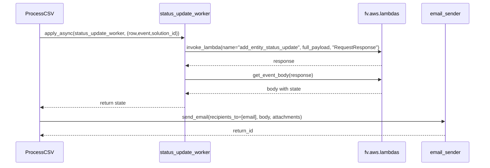
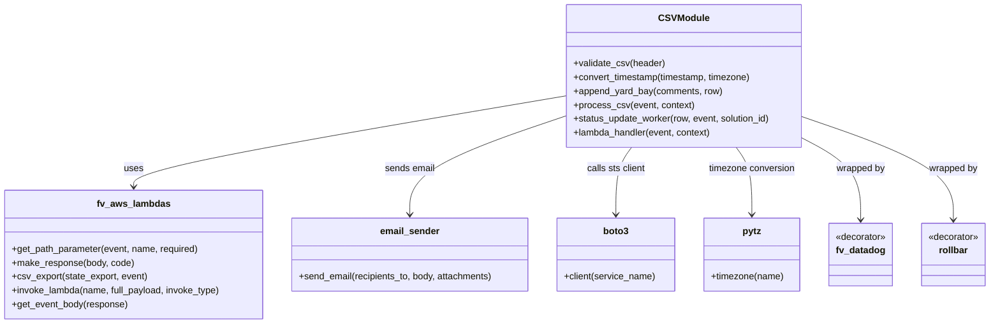

# Diagram: entity_core/entity_service/entity_service/entity/status_update/manual_update.py


> Auto-generated by Obscura crawlers

## Diagram 1

```mermaid
flowchart LR
Start([Start]) --> ReadCSV[/"Open vin_generate.csv and create DictReader"/]
ReadCSV --> Validate{Validate CSV headers}
Validate -- missing --> BadHeaders[/"Return 400: Missing column headers"/]
Validate -- ok --> Count[/"Count rows (limit 10,000)"/]
Count --> TooMany{Row count > 10000?}
TooMany -- yes --> BadCount[/"Return 400: Row count exceeds 10,000"/]
TooMany -- no --> Seek[/"csvfile.seek(0) and skip header"/]
Seek --> SpawnPool[/"Create Pool(processes=10) and boto3.client('sts')"/]
SpawnPool --> ForEach[/For each CSV row: apply_async(status_update_worker)/]
ForEach --> Collect[/"Collect results into state_export (res.get())"/]
Collect --> ClosePool[/"set_pool.close() & set_pool.join()"/]
ClosePool --> CsvExport[/"fv.aws.lambdas.csv_export(state_export, event)"/]
CsvExport --> PrepareEmail[/"Build email body and attachments"/]
PrepareEmail --> SendEmail[/"email_sender.send_email(...)"/]
SendEmail --> Log[/"logger.info Sent email, id: return_id"/]
Log --> End([End])
```

> SVG rendering failed for this diagram.

## Diagram 2



### SVG

<svg id="container" width="1640" xmlns="http://www.w3.org/2000/svg" height="555" viewBox="-50 -10 1640 555" role="graphics-document document" aria-roledescription="sequence"><g><rect x="1390" y="469" fill="#eaeaea" stroke="#666" width="150" height="65" name="Email" rx="3" ry="3" class="actor actor-bottom"></rect><text x="1465" y="501.5" dominant-baseline="central" alignment-baseline="central" class="actor actor-box" style="text-anchor: middle; font-size: 16px; font-weight: 400;"><tspan x="1465" dy="0">email_sender</tspan></text></g><g><rect x="1190" y="469" fill="#eaeaea" stroke="#666" width="150" height="65" name="AWS" rx="3" ry="3" class="actor actor-bottom"></rect><text x="1265" y="501.5" dominant-baseline="central" alignment-baseline="central" class="actor actor-box" style="text-anchor: middle; font-size: 16px; font-weight: 400;"><tspan x="1265" dy="0">fv.aws.lambdas</tspan></text></g><g><rect x="487" y="469" fill="#eaeaea" stroke="#666" width="182" height="65" name="PoolWorker" rx="3" ry="3" class="actor actor-bottom"></rect><text x="578" y="501.5" dominant-baseline="central" alignment-baseline="central" class="actor actor-box" style="text-anchor: middle; font-size: 16px; font-weight: 400;"><tspan x="578" dy="0">status_update_worker</tspan></text></g><g><rect x="0" y="469" fill="#eaeaea" stroke="#666" width="150" height="65" name="Process" rx="3" ry="3" class="actor actor-bottom"></rect><text x="75" y="501.5" dominant-baseline="central" alignment-baseline="central" class="actor actor-box" style="text-anchor: middle; font-size: 16px; font-weight: 400;"><tspan x="75" dy="0">ProcessCSV</tspan></text></g><g><line id="actor3" x1="1465" y1="65" x2="1465" y2="469" class="actor-line 200" stroke-width="0.5px" stroke="#999" name="Email"></line><g id="root-3"><rect x="1390" y="0" fill="#eaeaea" stroke="#666" width="150" height="65" name="Email" rx="3" ry="3" class="actor actor-top"></rect><text x="1465" y="32.5" dominant-baseline="central" alignment-baseline="central" class="actor actor-box" style="text-anchor: middle; font-size: 16px; font-weight: 400;"><tspan x="1465" dy="0">email_sender</tspan></text></g></g><g><line id="actor2" x1="1265" y1="65" x2="1265" y2="469" class="actor-line 200" stroke-width="0.5px" stroke="#999" name="AWS"></line><g id="root-2"><rect x="1190" y="0" fill="#eaeaea" stroke="#666" width="150" height="65" name="AWS" rx="3" ry="3" class="actor actor-top"></rect><text x="1265" y="32.5" dominant-baseline="central" alignment-baseline="central" class="actor actor-box" style="text-anchor: middle; font-size: 16px; font-weight: 400;"><tspan x="1265" dy="0">fv.aws.lambdas</tspan></text></g></g><g><line id="actor1" x1="578" y1="65" x2="578" y2="469" class="actor-line 200" stroke-width="0.5px" stroke="#999" name="PoolWorker"></line><g id="root-1"><rect x="487" y="0" fill="#eaeaea" stroke="#666" width="182" height="65" name="PoolWorker" rx="3" ry="3" class="actor actor-top"></rect><text x="578" y="32.5" dominant-baseline="central" alignment-baseline="central" class="actor actor-box" style="text-anchor: middle; font-size: 16px; font-weight: 400;"><tspan x="578" dy="0">status_update_worker</tspan></text></g></g><g><line id="actor0" x1="75" y1="65" x2="75" y2="469" class="actor-line 200" stroke-width="0.5px" stroke="#999" name="Process"></line><g id="root-0"><rect x="0" y="0" fill="#eaeaea" stroke="#666" width="150" height="65" name="Process" rx="3" ry="3" class="actor actor-top"></rect><text x="75" y="32.5" dominant-baseline="central" alignment-baseline="central" class="actor actor-box" style="text-anchor: middle; font-size: 16px; font-weight: 400;"><tspan x="75" dy="0">ProcessCSV</tspan></text></g></g><style>#container{font-family:"trebuchet ms",verdana,arial,sans-serif;font-size:16px;fill:#333;}@keyframes edge-animation-frame{from{stroke-dashoffset:0;}}@keyframes dash{to{stroke-dashoffset:0;}}#container .edge-animation-slow{stroke-dasharray:9,5!important;stroke-dashoffset:900;animation:dash 50s linear infinite;stroke-linecap:round;}#container .edge-animation-fast{stroke-dasharray:9,5!important;stroke-dashoffset:900;animation:dash 20s linear infinite;stroke-linecap:round;}#container .error-icon{fill:#552222;}#container .error-text{fill:#552222;stroke:#552222;}#container .edge-thickness-normal{stroke-width:1px;}#container .edge-thickness-thick{stroke-width:3.5px;}#container .edge-pattern-solid{stroke-dasharray:0;}#container .edge-thickness-invisible{stroke-width:0;fill:none;}#container .edge-pattern-dashed{stroke-dasharray:3;}#container .edge-pattern-dotted{stroke-dasharray:2;}#container .marker{fill:#333333;stroke:#333333;}#container .marker.cross{stroke:#333333;}#container svg{font-family:"trebuchet ms",verdana,arial,sans-serif;font-size:16px;}#container p{margin:0;}#container .actor{stroke:hsl(259.6261682243, 59.7765363128%, 87.9019607843%);fill:#ECECFF;}#container text.actor&gt;tspan{fill:black;stroke:none;}#container .actor-line{stroke:hsl(259.6261682243, 59.7765363128%, 87.9019607843%);}#container .innerArc{stroke-width:1.5;stroke-dasharray:none;}#container .messageLine0{stroke-width:1.5;stroke-dasharray:none;stroke:#333;}#container .messageLine1{stroke-width:1.5;stroke-dasharray:2,2;stroke:#333;}#container #arrowhead path{fill:#333;stroke:#333;}#container .sequenceNumber{fill:white;}#container #sequencenumber{fill:#333;}#container #crosshead path{fill:#333;stroke:#333;}#container .messageText{fill:#333;stroke:none;}#container .labelBox{stroke:hsl(259.6261682243, 59.7765363128%, 87.9019607843%);fill:#ECECFF;}#container .labelText,#container .labelText&gt;tspan{fill:black;stroke:none;}#container .loopText,#container .loopText&gt;tspan{fill:black;stroke:none;}#container .loopLine{stroke-width:2px;stroke-dasharray:2,2;stroke:hsl(259.6261682243, 59.7765363128%, 87.9019607843%);fill:hsl(259.6261682243, 59.7765363128%, 87.9019607843%);}#container .note{stroke:#aaaa33;fill:#fff5ad;}#container .noteText,#container .noteText&gt;tspan{fill:black;stroke:none;}#container .activation0{fill:#f4f4f4;stroke:#666;}#container .activation1{fill:#f4f4f4;stroke:#666;}#container .activation2{fill:#f4f4f4;stroke:#666;}#container .actorPopupMenu{position:absolute;}#container .actorPopupMenuPanel{position:absolute;fill:#ECECFF;box-shadow:0px 8px 16px 0px rgba(0,0,0,0.2);filter:drop-shadow(3px 5px 2px rgb(0 0 0 / 0.4));}#container .actor-man line{stroke:hsl(259.6261682243, 59.7765363128%, 87.9019607843%);fill:#ECECFF;}#container .actor-man circle,#container line{stroke:hsl(259.6261682243, 59.7765363128%, 87.9019607843%);fill:#ECECFF;stroke-width:2px;}#container :root{--mermaid-font-family:"trebuchet ms",verdana,arial,sans-serif;}</style><g></g><defs><symbol id="computer" width="24" height="24"><path transform="scale(.5)" d="M2 2v13h20v-13h-20zm18 11h-16v-9h16v9zm-10.228 6l.466-1h3.524l.467 1h-4.457zm14.228 3h-24l2-6h2.104l-1.33 4h18.45l-1.297-4h2.073l2 6zm-5-10h-14v-7h14v7z"></path></symbol></defs><defs><symbol id="database" fill-rule="evenodd" clip-rule="evenodd"><path transform="scale(.5)" d="M12.258.001l.256.004.255.005.253.008.251.01.249.012.247.015.246.016.242.019.241.02.239.023.236.024.233.027.231.028.229.031.225.032.223.034.22.036.217.038.214.04.211.041.208.043.205.045.201.046.198.048.194.05.191.051.187.053.183.054.18.056.175.057.172.059.168.06.163.061.16.063.155.064.15.066.074.033.073.033.071.034.07.034.069.035.068.035.067.035.066.035.064.036.064.036.062.036.06.036.06.037.058.037.058.037.055.038.055.038.053.038.052.038.051.039.05.039.048.039.047.039.045.04.044.04.043.04.041.04.04.041.039.041.037.041.036.041.034.041.033.042.032.042.03.042.029.042.027.042.026.043.024.043.023.043.021.043.02.043.018.044.017.043.015.044.013.044.012.044.011.045.009.044.007.045.006.045.004.045.002.045.001.045v17l-.001.045-.002.045-.004.045-.006.045-.007.045-.009.044-.011.045-.012.044-.013.044-.015.044-.017.043-.018.044-.02.043-.021.043-.023.043-.024.043-.026.043-.027.042-.029.042-.03.042-.032.042-.033.042-.034.041-.036.041-.037.041-.039.041-.04.041-.041.04-.043.04-.044.04-.045.04-.047.039-.048.039-.05.039-.051.039-.052.038-.053.038-.055.038-.055.038-.058.037-.058.037-.06.037-.06.036-.062.036-.064.036-.064.036-.066.035-.067.035-.068.035-.069.035-.07.034-.071.034-.073.033-.074.033-.15.066-.155.064-.16.063-.163.061-.168.06-.172.059-.175.057-.18.056-.183.054-.187.053-.191.051-.194.05-.198.048-.201.046-.205.045-.208.043-.211.041-.214.04-.217.038-.22.036-.223.034-.225.032-.229.031-.231.028-.233.027-.236.024-.239.023-.241.02-.242.019-.246.016-.247.015-.249.012-.251.01-.253.008-.255.005-.256.004-.258.001-.258-.001-.256-.004-.255-.005-.253-.008-.251-.01-.249-.012-.247-.015-.245-.016-.243-.019-.241-.02-.238-.023-.236-.024-.234-.027-.231-.028-.228-.031-.226-.032-.223-.034-.22-.036-.217-.038-.214-.04-.211-.041-.208-.043-.204-.045-.201-.046-.198-.048-.195-.05-.19-.051-.187-.053-.184-.054-.179-.056-.176-.057-.172-.059-.167-.06-.164-.061-.159-.063-.155-.064-.151-.066-.074-.033-.072-.033-.072-.034-.07-.034-.069-.035-.068-.035-.067-.035-.066-.035-.064-.036-.063-.036-.062-.036-.061-.036-.06-.037-.058-.037-.057-.037-.056-.038-.055-.038-.053-.038-.052-.038-.051-.039-.049-.039-.049-.039-.046-.039-.046-.04-.044-.04-.043-.04-.041-.04-.04-.041-.039-.041-.037-.041-.036-.041-.034-.041-.033-.042-.032-.042-.03-.042-.029-.042-.027-.042-.026-.043-.024-.043-.023-.043-.021-.043-.02-.043-.018-.044-.017-.043-.015-.044-.013-.044-.012-.044-.011-.045-.009-.044-.007-.045-.006-.045-.004-.045-.002-.045-.001-.045v-17l.001-.045.002-.045.004-.045.006-.045.007-.045.009-.044.011-.045.012-.044.013-.044.015-.044.017-.043.018-.044.02-.043.021-.043.023-.043.024-.043.026-.043.027-.042.029-.042.03-.042.032-.042.033-.042.034-.041.036-.041.037-.041.039-.041.04-.041.041-.04.043-.04.044-.04.046-.04.046-.039.049-.039.049-.039.051-.039.052-.038.053-.038.055-.038.056-.038.057-.037.058-.037.06-.037.061-.036.062-.036.063-.036.064-.036.066-.035.067-.035.068-.035.069-.035.07-.034.072-.034.072-.033.074-.033.151-.066.155-.064.159-.063.164-.061.167-.06.172-.059.176-.057.179-.056.184-.054.187-.053.19-.051.195-.05.198-.048.201-.046.204-.045.208-.043.211-.041.214-.04.217-.038.22-.036.223-.034.226-.032.228-.031.231-.028.234-.027.236-.024.238-.023.241-.02.243-.019.245-.016.247-.015.249-.012.251-.01.253-.008.255-.005.256-.004.258-.001.258.001zm-9.258 20.499v.01l.001.021.003.021.004.022.005.021.006.022.007.022.009.023.01.022.011.023.012.023.013.023.015.023.016.024.017.023.018.024.019.024.021.024.022.025.023.024.024.025.052.049.056.05.061.051.066.051.07.051.075.051.079.052.084.052.088.052.092.052.097.052.102.051.105.052.11.052.114.051.119.051.123.051.127.05.131.05.135.05.139.048.144.049.147.047.152.047.155.047.16.045.163.045.167.043.171.043.176.041.178.041.183.039.187.039.19.037.194.035.197.035.202.033.204.031.209.03.212.029.216.027.219.025.222.024.226.021.23.02.233.018.236.016.24.015.243.012.246.01.249.008.253.005.256.004.259.001.26-.001.257-.004.254-.005.25-.008.247-.011.244-.012.241-.014.237-.016.233-.018.231-.021.226-.021.224-.024.22-.026.216-.027.212-.028.21-.031.205-.031.202-.034.198-.034.194-.036.191-.037.187-.039.183-.04.179-.04.175-.042.172-.043.168-.044.163-.045.16-.046.155-.046.152-.047.148-.048.143-.049.139-.049.136-.05.131-.05.126-.05.123-.051.118-.052.114-.051.11-.052.106-.052.101-.052.096-.052.092-.052.088-.053.083-.051.079-.052.074-.052.07-.051.065-.051.06-.051.056-.05.051-.05.023-.024.023-.025.021-.024.02-.024.019-.024.018-.024.017-.024.015-.023.014-.024.013-.023.012-.023.01-.023.01-.022.008-.022.006-.022.006-.022.004-.022.004-.021.001-.021.001-.021v-4.127l-.077.055-.08.053-.083.054-.085.053-.087.052-.09.052-.093.051-.095.05-.097.05-.1.049-.102.049-.105.048-.106.047-.109.047-.111.046-.114.045-.115.045-.118.044-.12.043-.122.042-.124.042-.126.041-.128.04-.13.04-.132.038-.134.038-.135.037-.138.037-.139.035-.142.035-.143.034-.144.033-.147.032-.148.031-.15.03-.151.03-.153.029-.154.027-.156.027-.158.026-.159.025-.161.024-.162.023-.163.022-.165.021-.166.02-.167.019-.169.018-.169.017-.171.016-.173.015-.173.014-.175.013-.175.012-.177.011-.178.01-.179.008-.179.008-.181.006-.182.005-.182.004-.184.003-.184.002h-.37l-.184-.002-.184-.003-.182-.004-.182-.005-.181-.006-.179-.008-.179-.008-.178-.01-.176-.011-.176-.012-.175-.013-.173-.014-.172-.015-.171-.016-.17-.017-.169-.018-.167-.019-.166-.02-.165-.021-.163-.022-.162-.023-.161-.024-.159-.025-.157-.026-.156-.027-.155-.027-.153-.029-.151-.03-.15-.03-.148-.031-.146-.032-.145-.033-.143-.034-.141-.035-.14-.035-.137-.037-.136-.037-.134-.038-.132-.038-.13-.04-.128-.04-.126-.041-.124-.042-.122-.042-.12-.044-.117-.043-.116-.045-.113-.045-.112-.046-.109-.047-.106-.047-.105-.048-.102-.049-.1-.049-.097-.05-.095-.05-.093-.052-.09-.051-.087-.052-.085-.053-.083-.054-.08-.054-.077-.054v4.127zm0-5.654v.011l.001.021.003.021.004.021.005.022.006.022.007.022.009.022.01.022.011.023.012.023.013.023.015.024.016.023.017.024.018.024.019.024.021.024.022.024.023.025.024.024.052.05.056.05.061.05.066.051.07.051.075.052.079.051.084.052.088.052.092.052.097.052.102.052.105.052.11.051.114.051.119.052.123.05.127.051.131.05.135.049.139.049.144.048.147.048.152.047.155.046.16.045.163.045.167.044.171.042.176.042.178.04.183.04.187.038.19.037.194.036.197.034.202.033.204.032.209.03.212.028.216.027.219.025.222.024.226.022.23.02.233.018.236.016.24.014.243.012.246.01.249.008.253.006.256.003.259.001.26-.001.257-.003.254-.006.25-.008.247-.01.244-.012.241-.015.237-.016.233-.018.231-.02.226-.022.224-.024.22-.025.216-.027.212-.029.21-.03.205-.032.202-.033.198-.035.194-.036.191-.037.187-.039.183-.039.179-.041.175-.042.172-.043.168-.044.163-.045.16-.045.155-.047.152-.047.148-.048.143-.048.139-.05.136-.049.131-.05.126-.051.123-.051.118-.051.114-.052.11-.052.106-.052.101-.052.096-.052.092-.052.088-.052.083-.052.079-.052.074-.051.07-.052.065-.051.06-.05.056-.051.051-.049.023-.025.023-.024.021-.025.02-.024.019-.024.018-.024.017-.024.015-.023.014-.023.013-.024.012-.022.01-.023.01-.023.008-.022.006-.022.006-.022.004-.021.004-.022.001-.021.001-.021v-4.139l-.077.054-.08.054-.083.054-.085.052-.087.053-.09.051-.093.051-.095.051-.097.05-.1.049-.102.049-.105.048-.106.047-.109.047-.111.046-.114.045-.115.044-.118.044-.12.044-.122.042-.124.042-.126.041-.128.04-.13.039-.132.039-.134.038-.135.037-.138.036-.139.036-.142.035-.143.033-.144.033-.147.033-.148.031-.15.03-.151.03-.153.028-.154.028-.156.027-.158.026-.159.025-.161.024-.162.023-.163.022-.165.021-.166.02-.167.019-.169.018-.169.017-.171.016-.173.015-.173.014-.175.013-.175.012-.177.011-.178.009-.179.009-.179.007-.181.007-.182.005-.182.004-.184.003-.184.002h-.37l-.184-.002-.184-.003-.182-.004-.182-.005-.181-.007-.179-.007-.179-.009-.178-.009-.176-.011-.176-.012-.175-.013-.173-.014-.172-.015-.171-.016-.17-.017-.169-.018-.167-.019-.166-.02-.165-.021-.163-.022-.162-.023-.161-.024-.159-.025-.157-.026-.156-.027-.155-.028-.153-.028-.151-.03-.15-.03-.148-.031-.146-.033-.145-.033-.143-.033-.141-.035-.14-.036-.137-.036-.136-.037-.134-.038-.132-.039-.13-.039-.128-.04-.126-.041-.124-.042-.122-.043-.12-.043-.117-.044-.116-.044-.113-.046-.112-.046-.109-.046-.106-.047-.105-.048-.102-.049-.1-.049-.097-.05-.095-.051-.093-.051-.09-.051-.087-.053-.085-.052-.083-.054-.08-.054-.077-.054v4.139zm0-5.666v.011l.001.02.003.022.004.021.005.022.006.021.007.022.009.023.01.022.011.023.012.023.013.023.015.023.016.024.017.024.018.023.019.024.021.025.022.024.023.024.024.025.052.05.056.05.061.05.066.051.07.051.075.052.079.051.084.052.088.052.092.052.097.052.102.052.105.051.11.052.114.051.119.051.123.051.127.05.131.05.135.05.139.049.144.048.147.048.152.047.155.046.16.045.163.045.167.043.171.043.176.042.178.04.183.04.187.038.19.037.194.036.197.034.202.033.204.032.209.03.212.028.216.027.219.025.222.024.226.021.23.02.233.018.236.017.24.014.243.012.246.01.249.008.253.006.256.003.259.001.26-.001.257-.003.254-.006.25-.008.247-.01.244-.013.241-.014.237-.016.233-.018.231-.02.226-.022.224-.024.22-.025.216-.027.212-.029.21-.03.205-.032.202-.033.198-.035.194-.036.191-.037.187-.039.183-.039.179-.041.175-.042.172-.043.168-.044.163-.045.16-.045.155-.047.152-.047.148-.048.143-.049.139-.049.136-.049.131-.051.126-.05.123-.051.118-.052.114-.051.11-.052.106-.052.101-.052.096-.052.092-.052.088-.052.083-.052.079-.052.074-.052.07-.051.065-.051.06-.051.056-.05.051-.049.023-.025.023-.025.021-.024.02-.024.019-.024.018-.024.017-.024.015-.023.014-.024.013-.023.012-.023.01-.022.01-.023.008-.022.006-.022.006-.022.004-.022.004-.021.001-.021.001-.021v-4.153l-.077.054-.08.054-.083.053-.085.053-.087.053-.09.051-.093.051-.095.051-.097.05-.1.049-.102.048-.105.048-.106.048-.109.046-.111.046-.114.046-.115.044-.118.044-.12.043-.122.043-.124.042-.126.041-.128.04-.13.039-.132.039-.134.038-.135.037-.138.036-.139.036-.142.034-.143.034-.144.033-.147.032-.148.032-.15.03-.151.03-.153.028-.154.028-.156.027-.158.026-.159.024-.161.024-.162.023-.163.023-.165.021-.166.02-.167.019-.169.018-.169.017-.171.016-.173.015-.173.014-.175.013-.175.012-.177.01-.178.01-.179.009-.179.007-.181.006-.182.006-.182.004-.184.003-.184.001-.185.001-.185-.001-.184-.001-.184-.003-.182-.004-.182-.006-.181-.006-.179-.007-.179-.009-.178-.01-.176-.01-.176-.012-.175-.013-.173-.014-.172-.015-.171-.016-.17-.017-.169-.018-.167-.019-.166-.02-.165-.021-.163-.023-.162-.023-.161-.024-.159-.024-.157-.026-.156-.027-.155-.028-.153-.028-.151-.03-.15-.03-.148-.032-.146-.032-.145-.033-.143-.034-.141-.034-.14-.036-.137-.036-.136-.037-.134-.038-.132-.039-.13-.039-.128-.041-.126-.041-.124-.041-.122-.043-.12-.043-.117-.044-.116-.044-.113-.046-.112-.046-.109-.046-.106-.048-.105-.048-.102-.048-.1-.05-.097-.049-.095-.051-.093-.051-.09-.052-.087-.052-.085-.053-.083-.053-.08-.054-.077-.054v4.153zm8.74-8.179l-.257.004-.254.005-.25.008-.247.011-.244.012-.241.014-.237.016-.233.018-.231.021-.226.022-.224.023-.22.026-.216.027-.212.028-.21.031-.205.032-.202.033-.198.034-.194.036-.191.038-.187.038-.183.04-.179.041-.175.042-.172.043-.168.043-.163.045-.16.046-.155.046-.152.048-.148.048-.143.048-.139.049-.136.05-.131.05-.126.051-.123.051-.118.051-.114.052-.11.052-.106.052-.101.052-.096.052-.092.052-.088.052-.083.052-.079.052-.074.051-.07.052-.065.051-.06.05-.056.05-.051.05-.023.025-.023.024-.021.024-.02.025-.019.024-.018.024-.017.023-.015.024-.014.023-.013.023-.012.023-.01.023-.01.022-.008.022-.006.023-.006.021-.004.022-.004.021-.001.021-.001.021.001.021.001.021.004.021.004.022.006.021.006.023.008.022.01.022.01.023.012.023.013.023.014.023.015.024.017.023.018.024.019.024.02.025.021.024.023.024.023.025.051.05.056.05.06.05.065.051.07.052.074.051.079.052.083.052.088.052.092.052.096.052.101.052.106.052.11.052.114.052.118.051.123.051.126.051.131.05.136.05.139.049.143.048.148.048.152.048.155.046.16.046.163.045.168.043.172.043.175.042.179.041.183.04.187.038.191.038.194.036.198.034.202.033.205.032.21.031.212.028.216.027.22.026.224.023.226.022.231.021.233.018.237.016.241.014.244.012.247.011.25.008.254.005.257.004.26.001.26-.001.257-.004.254-.005.25-.008.247-.011.244-.012.241-.014.237-.016.233-.018.231-.021.226-.022.224-.023.22-.026.216-.027.212-.028.21-.031.205-.032.202-.033.198-.034.194-.036.191-.038.187-.038.183-.04.179-.041.175-.042.172-.043.168-.043.163-.045.16-.046.155-.046.152-.048.148-.048.143-.048.139-.049.136-.05.131-.05.126-.051.123-.051.118-.051.114-.052.11-.052.106-.052.101-.052.096-.052.092-.052.088-.052.083-.052.079-.052.074-.051.07-.052.065-.051.06-.05.056-.05.051-.05.023-.025.023-.024.021-.024.02-.025.019-.024.018-.024.017-.023.015-.024.014-.023.013-.023.012-.023.01-.023.01-.022.008-.022.006-.023.006-.021.004-.022.004-.021.001-.021.001-.021-.001-.021-.001-.021-.004-.021-.004-.022-.006-.021-.006-.023-.008-.022-.01-.022-.01-.023-.012-.023-.013-.023-.014-.023-.015-.024-.017-.023-.018-.024-.019-.024-.02-.025-.021-.024-.023-.024-.023-.025-.051-.05-.056-.05-.06-.05-.065-.051-.07-.052-.074-.051-.079-.052-.083-.052-.088-.052-.092-.052-.096-.052-.101-.052-.106-.052-.11-.052-.114-.052-.118-.051-.123-.051-.126-.051-.131-.05-.136-.05-.139-.049-.143-.048-.148-.048-.152-.048-.155-.046-.16-.046-.163-.045-.168-.043-.172-.043-.175-.042-.179-.041-.183-.04-.187-.038-.191-.038-.194-.036-.198-.034-.202-.033-.205-.032-.21-.031-.212-.028-.216-.027-.22-.026-.224-.023-.226-.022-.231-.021-.233-.018-.237-.016-.241-.014-.244-.012-.247-.011-.25-.008-.254-.005-.257-.004-.26-.001-.26.001z"></path></symbol></defs><defs><symbol id="clock" width="24" height="24"><path transform="scale(.5)" d="M12 2c5.514 0 10 4.486 10 10s-4.486 10-10 10-10-4.486-10-10 4.486-10 10-10zm0-2c-6.627 0-12 5.373-12 12s5.373 12 12 12 12-5.373 12-12-5.373-12-12-12zm5.848 12.459c.202.038.202.333.001.372-1.907.361-6.045 1.111-6.547 1.111-.719 0-1.301-.582-1.301-1.301 0-.512.77-5.447 1.125-7.445.034-.192.312-.181.343.014l.985 6.238 5.394 1.011z"></path></symbol></defs><defs><marker id="arrowhead" refX="7.9" refY="5" markerUnits="userSpaceOnUse" markerWidth="12" markerHeight="12" orient="auto-start-reverse"><path d="M -1 0 L 10 5 L 0 10 z"></path></marker></defs><defs><marker id="crosshead" markerWidth="15" markerHeight="8" orient="auto" refX="4" refY="4.5"><path fill="none" stroke="#000000" stroke-width="1pt" d="M 1,2 L 6,7 M 6,2 L 1,7" style="stroke-dasharray: 0, 0;"></path></marker></defs><defs><marker id="filled-head" refX="15.5" refY="7" markerWidth="20" markerHeight="28" orient="auto"><path d="M 18,7 L9,13 L14,7 L9,1 Z"></path></marker></defs><defs><marker id="sequencenumber" refX="15" refY="15" markerWidth="60" markerHeight="40" orient="auto"><circle cx="15" cy="15" r="6"></circle></marker></defs><text x="325" y="80" text-anchor="middle" dominant-baseline="middle" alignment-baseline="middle" class="messageText" dy="1em" style="font-size: 16px; font-weight: 400;">apply_async(status_update_worker, (row,event,solution_id))</text><line x1="76" y1="113" x2="574" y2="113" class="messageLine0" stroke-width="2" stroke="none" marker-end="url(#arrowhead)" style="fill: none;"></line><text x="920" y="128" text-anchor="middle" dominant-baseline="middle" alignment-baseline="middle" class="messageText" dy="1em" style="font-size: 16px; font-weight: 400;">invoke_lambda(name="add_entity_status_update", full_payload, "RequestResponse")</text><line x1="579" y1="161" x2="1261" y2="161" class="messageLine0" stroke-width="2" stroke="none" marker-end="url(#arrowhead)" style="fill: none;"></line><text x="923" y="176" text-anchor="middle" dominant-baseline="middle" alignment-baseline="middle" class="messageText" dy="1em" style="font-size: 16px; font-weight: 400;">response</text><line x1="1264" y1="209" x2="582" y2="209" class="messageLine1" stroke-width="2" stroke="none" marker-end="url(#arrowhead)" style="stroke-dasharray: 3, 3; fill: none;"></line><text x="920" y="224" text-anchor="middle" dominant-baseline="middle" alignment-baseline="middle" class="messageText" dy="1em" style="font-size: 16px; font-weight: 400;">get_event_body(response)</text><line x1="579" y1="257" x2="1261" y2="257" class="messageLine0" stroke-width="2" stroke="none" marker-end="url(#arrowhead)" style="fill: none;"></line><text x="923" y="272" text-anchor="middle" dominant-baseline="middle" alignment-baseline="middle" class="messageText" dy="1em" style="font-size: 16px; font-weight: 400;">body with state</text><line x1="1264" y1="305" x2="582" y2="305" class="messageLine1" stroke-width="2" stroke="none" marker-end="url(#arrowhead)" style="stroke-dasharray: 3, 3; fill: none;"></line><text x="328" y="320" text-anchor="middle" dominant-baseline="middle" alignment-baseline="middle" class="messageText" dy="1em" style="font-size: 16px; font-weight: 400;">return state</text><line x1="577" y1="353" x2="79" y2="353" class="messageLine1" stroke-width="2" stroke="none" marker-end="url(#arrowhead)" style="stroke-dasharray: 3, 3; fill: none;"></line><text x="769" y="368" text-anchor="middle" dominant-baseline="middle" alignment-baseline="middle" class="messageText" dy="1em" style="font-size: 16px; font-weight: 400;">send_email(recipients_to=[email], body, attachments)</text><line x1="76" y1="401" x2="1461" y2="401" class="messageLine0" stroke-width="2" stroke="none" marker-end="url(#arrowhead)" style="fill: none;"></line><text x="772" y="416" text-anchor="middle" dominant-baseline="middle" alignment-baseline="middle" class="messageText" dy="1em" style="font-size: 16px; font-weight: 400;">return_id</text><line x1="1464" y1="449" x2="79" y2="449" class="messageLine1" stroke-width="2" stroke="none" marker-end="url(#arrowhead)" style="stroke-dasharray: 3, 3; fill: none;"></line></svg>

## Diagram 3



### SVG

<svg id="container" width="1718.1796875" xmlns="http://www.w3.org/2000/svg" class="classDiagram" height="558" viewBox="0 0 1718.1796875 558" role="graphics-document document" aria-roledescription="class"><style>#container{font-family:"trebuchet ms",verdana,arial,sans-serif;font-size:16px;fill:#333;}@keyframes edge-animation-frame{from{stroke-dashoffset:0;}}@keyframes dash{to{stroke-dashoffset:0;}}#container .edge-animation-slow{stroke-dasharray:9,5!important;stroke-dashoffset:900;animation:dash 50s linear infinite;stroke-linecap:round;}#container .edge-animation-fast{stroke-dasharray:9,5!important;stroke-dashoffset:900;animation:dash 20s linear infinite;stroke-linecap:round;}#container .error-icon{fill:#552222;}#container .error-text{fill:#552222;stroke:#552222;}#container .edge-thickness-normal{stroke-width:1px;}#container .edge-thickness-thick{stroke-width:3.5px;}#container .edge-pattern-solid{stroke-dasharray:0;}#container .edge-thickness-invisible{stroke-width:0;fill:none;}#container .edge-pattern-dashed{stroke-dasharray:3;}#container .edge-pattern-dotted{stroke-dasharray:2;}#container .marker{fill:#333333;stroke:#333333;}#container .marker.cross{stroke:#333333;}#container svg{font-family:"trebuchet ms",verdana,arial,sans-serif;font-size:16px;}#container p{margin:0;}#container g.classGroup text{fill:#9370DB;stroke:none;font-family:"trebuchet ms",verdana,arial,sans-serif;font-size:10px;}#container g.classGroup text .title{font-weight:bolder;}#container .nodeLabel,#container .edgeLabel{color:#131300;}#container .edgeLabel .label rect{fill:#ECECFF;}#container .label text{fill:#131300;}#container .labelBkg{background:#ECECFF;}#container .edgeLabel .label span{background:#ECECFF;}#container .classTitle{font-weight:bolder;}#container .node rect,#container .node circle,#container .node ellipse,#container .node polygon,#container .node path{fill:#ECECFF;stroke:#9370DB;stroke-width:1px;}#container .divider{stroke:#9370DB;stroke-width:1;}#container g.clickable{cursor:pointer;}#container g.classGroup rect{fill:#ECECFF;stroke:#9370DB;}#container g.classGroup line{stroke:#9370DB;stroke-width:1;}#container .classLabel .box{stroke:none;stroke-width:0;fill:#ECECFF;opacity:0.5;}#container .classLabel .label{fill:#9370DB;font-size:10px;}#container .relation{stroke:#333333;stroke-width:1;fill:none;}#container .dashed-line{stroke-dasharray:3;}#container .dotted-line{stroke-dasharray:1 2;}#container #compositionStart,#container .composition{fill:#333333!important;stroke:#333333!important;stroke-width:1;}#container #compositionEnd,#container .composition{fill:#333333!important;stroke:#333333!important;stroke-width:1;}#container #dependencyStart,#container .dependency{fill:#333333!important;stroke:#333333!important;stroke-width:1;}#container #dependencyStart,#container .dependency{fill:#333333!important;stroke:#333333!important;stroke-width:1;}#container #extensionStart,#container .extension{fill:transparent!important;stroke:#333333!important;stroke-width:1;}#container #extensionEnd,#container .extension{fill:transparent!important;stroke:#333333!important;stroke-width:1;}#container #aggregationStart,#container .aggregation{fill:transparent!important;stroke:#333333!important;stroke-width:1;}#container #aggregationEnd,#container .aggregation{fill:transparent!important;stroke:#333333!important;stroke-width:1;}#container #lollipopStart,#container .lollipop{fill:#ECECFF!important;stroke:#333333!important;stroke-width:1;}#container #lollipopEnd,#container .lollipop{fill:#ECECFF!important;stroke:#333333!important;stroke-width:1;}#container .edgeTerminals{font-size:11px;line-height:initial;}#container .classTitleText{text-anchor:middle;font-size:18px;fill:#333;}#container .label-icon{display:inline-block;height:1em;overflow:visible;vertical-align:-0.125em;}#container .node .label-icon path{fill:currentColor;stroke:revert;stroke-width:revert;}#container :root{--mermaid-font-family:"trebuchet ms",verdana,arial,sans-serif;}</style><g><defs><marker id="container_class-aggregationStart" class="marker aggregation class" refX="18" refY="7" markerWidth="190" markerHeight="240" orient="auto"><path d="M 18,7 L9,13 L1,7 L9,1 Z"></path></marker></defs><defs><marker id="container_class-aggregationEnd" class="marker aggregation class" refX="1" refY="7" markerWidth="20" markerHeight="28" orient="auto"><path d="M 18,7 L9,13 L1,7 L9,1 Z"></path></marker></defs><defs><marker id="container_class-extensionStart" class="marker extension class" refX="18" refY="7" markerWidth="190" markerHeight="240" orient="auto"><path d="M 1,7 L18,13 V 1 Z"></path></marker></defs><defs><marker id="container_class-extensionEnd" class="marker extension class" refX="1" refY="7" markerWidth="20" markerHeight="28" orient="auto"><path d="M 1,1 V 13 L18,7 Z"></path></marker></defs><defs><marker id="container_class-compositionStart" class="marker composition class" refX="18" refY="7" markerWidth="190" markerHeight="240" orient="auto"><path d="M 18,7 L9,13 L1,7 L9,1 Z"></path></marker></defs><defs><marker id="container_class-compositionEnd" class="marker composition class" refX="1" refY="7" markerWidth="20" markerHeight="28" orient="auto"><path d="M 18,7 L9,13 L1,7 L9,1 Z"></path></marker></defs><defs><marker id="container_class-dependencyStart" class="marker dependency class" refX="6" refY="7" markerWidth="190" markerHeight="240" orient="auto"><path d="M 5,7 L9,13 L1,7 L9,1 Z"></path></marker></defs><defs><marker id="container_class-dependencyEnd" class="marker dependency class" refX="13" refY="7" markerWidth="20" markerHeight="28" orient="auto"><path d="M 18,7 L9,13 L14,7 L9,1 Z"></path></marker></defs><defs><marker id="container_class-lollipopStart" class="marker lollipop class" refX="13" refY="7" markerWidth="190" markerHeight="240" orient="auto"><circle stroke="black" fill="transparent" cx="7" cy="7" r="6"></circle></marker></defs><defs><marker id="container_class-lollipopEnd" class="marker lollipop class" refX="1" refY="7" markerWidth="190" markerHeight="240" orient="auto"><circle stroke="black" fill="transparent" cx="7" cy="7" r="6"></circle></marker></defs><g class="root"><g class="clusters"></g><g class="edgePaths"><path d="M981.617,165.26L856.56,186.217C731.503,207.173,481.388,249.087,356.331,275.21C231.273,301.333,231.273,311.667,231.273,316.833L231.273,322" id="id_CSVModule_fv_aws_lambdas_1" class="edge-thickness-normal edge-pattern-solid relation" style=";;;" data-edge="true" data-et="edge" data-id="id_CSVModule_fv_aws_lambdas_1" data-points="W3sieCI6OTgxLjYxNzE4NzUsInkiOjE2NS4yNjAxODUwODY2OTI5fSx7IngiOjIzMS4yNzM0Mzc1LCJ5IjoyOTF9LHsieCI6MjMxLjI3MzQzNzUsInkiOjMyOH1d" marker-end="url(#container_class-dependencyEnd)"></path><path d="M981.617,199.834L936.488,215.028C891.358,230.222,801.099,260.611,755.969,288.972C710.84,317.333,710.84,343.667,710.84,356.833L710.84,370" id="id_CSVModule_email_sender_2" class="edge-thickness-normal edge-pattern-solid relation" style=";;;" data-edge="true" data-et="edge" data-id="id_CSVModule_email_sender_2" data-points="W3sieCI6OTgxLjYxNzE4NzUsInkiOjE5OS44MzM1MjM3NTk0MjE5OH0seyJ4Ijo3MTAuODM5ODQzNzUsInkiOjI5MX0seyJ4Ijo3MTAuODM5ODQzNzUsInkiOjM3Nn1d" marker-end="url(#container_class-dependencyEnd)"></path><path d="M1095.966,254L1091.449,260.167C1086.931,266.333,1077.897,278.667,1073.38,298C1068.863,317.333,1068.863,343.667,1068.863,356.833L1068.863,370" id="id_CSVModule_boto3_3" class="edge-thickness-normal edge-pattern-solid relation" style=";;;" data-edge="true" data-et="edge" data-id="id_CSVModule_boto3_3" data-points="W3sieCI6MTA5NS45NjU2MDA1ODU5Mzc0LCJ5IjoyNTR9LHsieCI6MTA2OC44NjMyODEyNSwieSI6MjkxfSx7IngiOjEwNjguODYzMjgxMjUsInkiOjM3Nn1d" marker-end="url(#container_class-dependencyEnd)"></path><path d="M1276.159,254L1280.676,260.167C1285.194,266.333,1294.228,278.667,1298.745,298C1303.262,317.333,1303.262,343.667,1303.262,356.833L1303.262,370" id="id_CSVModule_pytz_4" class="edge-thickness-normal edge-pattern-solid relation" style=";;;" data-edge="true" data-et="edge" data-id="id_CSVModule_pytz_4" data-points="W3sieCI6MTI3Ni4xNTkzOTk0MTQwNjI2LCJ5IjoyNTR9LHsieCI6MTMwMy4yNjE3MTg3NSwieSI6MjkxfSx7IngiOjEzMDMuMjYxNzE4NzUsInkiOjM3Nn1d" marker-end="url(#container_class-dependencyEnd)"></path><path d="M1390.508,237.924L1407.422,246.77C1424.336,255.616,1458.164,273.308,1475.078,296.821C1491.992,320.333,1491.992,349.667,1491.992,364.333L1491.992,379" id="id_CSVModule_fv_datadog_5" class="edge-thickness-normal edge-pattern-solid relation" style=";;;" data-edge="true" data-et="edge" data-id="id_CSVModule_fv_datadog_5" data-points="W3sieCI6MTM5MC41MDc4MTI1LCJ5IjoyMzcuOTI0MDc4NzU1ODQxNTV9LHsieCI6MTQ5MS45OTIxODc1LCJ5IjoyOTF9LHsieCI6MTQ5MS45OTIxODc1LCJ5IjozODV9XQ==" marker-end="url(#container_class-dependencyEnd)"></path><path d="M1390.508,200.888L1434.443,215.906C1478.378,230.925,1566.247,260.963,1610.182,290.648C1654.117,320.333,1654.117,349.667,1654.117,364.333L1654.117,379" id="id_CSVModule_rollbar_6" class="edge-thickness-normal edge-pattern-solid relation" style=";;;" data-edge="true" data-et="edge" data-id="id_CSVModule_rollbar_6" data-points="W3sieCI6MTM5MC41MDc4MTI1LCJ5IjoyMDAuODg3NjY2NzA1NjEzMzN9LHsieCI6MTY1NC4xMTcxODc1LCJ5IjoyOTF9LHsieCI6MTY1NC4xMTcxODc1LCJ5IjozODV9XQ==" marker-end="url(#container_class-dependencyEnd)"></path></g><g class="edgeLabels"><g class="edgeLabel" transform="translate(231.2734375, 291)"><g class="label" data-id="id_CSVModule_fv_aws_lambdas_1" transform="translate(-16.4921875, -12)"><foreignObject width="32.984375" height="24"><div xmlns="http://www.w3.org/1999/xhtml" class="labelBkg" style="display: table-cell; white-space: nowrap; line-height: 1.5; max-width: 200px; text-align: center;"><span class="edgeLabel"><p>uses</p></span></div></foreignObject></g></g><g class="edgeLabel" transform="translate(710.83984375, 291)"><g class="label" data-id="id_CSVModule_email_sender_2" transform="translate(-43.59375, -12)"><foreignObject width="87.1875" height="24"><div xmlns="http://www.w3.org/1999/xhtml" class="labelBkg" style="display: table-cell; white-space: nowrap; line-height: 1.5; max-width: 200px; text-align: center;"><span class="edgeLabel"><p>sends email</p></span></div></foreignObject></g></g><g class="edgeLabel" transform="translate(1068.86328125, 291)"><g class="label" data-id="id_CSVModule_boto3_3" transform="translate(-51.40625, -12)"><foreignObject width="102.8125" height="24"><div xmlns="http://www.w3.org/1999/xhtml" class="labelBkg" style="display: table-cell; white-space: nowrap; line-height: 1.5; max-width: 200px; text-align: center;"><span class="edgeLabel"><p>calls sts client</p></span></div></foreignObject></g></g><g class="edgeLabel" transform="translate(1303.26171875, 291)"><g class="label" data-id="id_CSVModule_pytz_4" transform="translate(-75.140625, -12)"><foreignObject width="150.28125" height="24"><div xmlns="http://www.w3.org/1999/xhtml" class="labelBkg" style="display: table-cell; white-space: nowrap; line-height: 1.5; max-width: 200px; text-align: center;"><span class="edgeLabel"><p>timezone conversion</p></span></div></foreignObject></g></g><g class="edgeLabel" transform="translate(1491.9921875, 291)"><g class="label" data-id="id_CSVModule_fv_datadog_5" transform="translate(-42.3203125, -12)"><foreignObject width="84.640625" height="24"><div xmlns="http://www.w3.org/1999/xhtml" class="labelBkg" style="display: table-cell; white-space: nowrap; line-height: 1.5; max-width: 200px; text-align: center;"><span class="edgeLabel"><p>wrapped by</p></span></div></foreignObject></g></g><g class="edgeLabel" transform="translate(1654.1171875, 291)"><g class="label" data-id="id_CSVModule_rollbar_6" transform="translate(-42.3203125, -12)"><foreignObject width="84.640625" height="24"><div xmlns="http://www.w3.org/1999/xhtml" class="labelBkg" style="display: table-cell; white-space: nowrap; line-height: 1.5; max-width: 200px; text-align: center;"><span class="edgeLabel"><p>wrapped by</p></span></div></foreignObject></g></g></g><g class="nodes"><g class="node default" id="classId-CSVModule-0" transform="translate(1186.0625, 131)"><g class="basic label-container"><path d="M-204.4453125 -123 L204.4453125 -123 L204.4453125 123 L-204.4453125 123" stroke="none" stroke-width="0" fill="#ECECFF" style=""></path><path d="M-204.4453125 -123 C-50.9791549066764 -123, 102.4870026866472 -123, 204.4453125 -123 M-204.4453125 -123 C-119.42740477105984 -123, -34.40949704211968 -123, 204.4453125 -123 M204.4453125 -123 C204.4453125 -45.461638472179146, 204.4453125 32.07672305564171, 204.4453125 123 M204.4453125 -123 C204.4453125 -42.090727795260435, 204.4453125 38.81854440947913, 204.4453125 123 M204.4453125 123 C72.77691242375221 123, -58.891487652495584 123, -204.4453125 123 M204.4453125 123 C74.26533706735458 123, -55.91463836529084 123, -204.4453125 123 M-204.4453125 123 C-204.4453125 55.80792270869617, -204.4453125 -11.384154582607664, -204.4453125 -123 M-204.4453125 123 C-204.4453125 47.556083497596035, -204.4453125 -27.88783300480793, -204.4453125 -123" stroke="#9370DB" stroke-width="1.3" fill="none" stroke-dasharray="0 0" style=""></path></g><g class="annotation-group text" transform="translate(0, -99)"></g><g class="label-group text" transform="translate(-40.515625, -99)"><g class="label" style="font-weight: bolder" transform="translate(0,-12)"><foreignObject width="81.03125" height="24"><div xmlns="http://www.w3.org/1999/xhtml" style="display: table-cell; white-space: nowrap; line-height: 1.5; max-width: 130px; text-align: center;"><span class="nodeLabel markdown-node-label" style=""><p>CSVModule</p></span></div></foreignObject></g></g><g class="members-group text" transform="translate(-192.4453125, -51)"></g><g class="methods-group text" transform="translate(-192.4453125, -21)"><g class="label" style="" transform="translate(0,-12)"><foreignObject width="157.59375" height="24"><div xmlns="http://www.w3.org/1999/xhtml" style="display: table-cell; white-space: nowrap; line-height: 1.5; max-width: 215px; text-align: center;"><span class="nodeLabel markdown-node-label" style=""><p>+validate_csv(header)</p></span></div></foreignObject></g><g class="label" style="" transform="translate(0,12)"><foreignObject width="311.171875" height="24"><div xmlns="http://www.w3.org/1999/xhtml" style="display: table-cell; white-space: nowrap; line-height: 1.5; max-width: 369px; text-align: center;"><span class="nodeLabel markdown-node-label" style=""><p>+convert_timestamp(timestamp, timezone)</p></span></div></foreignObject></g><g class="label" style="" transform="translate(0,36)"><foreignObject width="257.265625" height="24"><div xmlns="http://www.w3.org/1999/xhtml" style="display: table-cell; white-space: nowrap; line-height: 1.5; max-width: 315px; text-align: center;"><span class="nodeLabel markdown-node-label" style=""><p>+append_yard_bay(comments, row)</p></span></div></foreignObject></g><g class="label" style="" transform="translate(0,60)"><foreignObject width="206.3125" height="24"><div xmlns="http://www.w3.org/1999/xhtml" style="display: table-cell; white-space: nowrap; line-height: 1.5; max-width: 264px; text-align: center;"><span class="nodeLabel markdown-node-label" style=""><p>+process_csv(event, context)</p></span></div></foreignObject></g><g class="label" style="" transform="translate(0,84)"><foreignObject width="344.375" height="24"><div xmlns="http://www.w3.org/1999/xhtml" style="display: table-cell; white-space: nowrap; line-height: 1.5; max-width: 402px; text-align: center;"><span class="nodeLabel markdown-node-label" style=""><p>+status_update_worker(row, event, solution_id)</p></span></div></foreignObject></g><g class="label" style="" transform="translate(0,108)"><foreignObject width="240.1875" height="24"><div xmlns="http://www.w3.org/1999/xhtml" style="display: table-cell; white-space: nowrap; line-height: 1.5; max-width: 298px; text-align: center;"><span class="nodeLabel markdown-node-label" style=""><p>+lambda_handler(event, context)</p></span></div></foreignObject></g></g><g class="divider" style=""><path d="M-204.4453125 -75 C-44.768381476614024 -75, 114.90854954677195 -75, 204.4453125 -75 M-204.4453125 -75 C-113.09664265503139 -75, -21.747972810062777 -75, 204.4453125 -75" stroke="#9370DB" stroke-width="1.3" fill="none" stroke-dasharray="0 0" style=""></path></g><g class="divider" style=""><path d="M-204.4453125 -51 C-73.64862818222039 -51, 57.148056135559216 -51, 204.4453125 -51 M-204.4453125 -51 C-43.841073164308824 -51, 116.76316617138235 -51, 204.4453125 -51" stroke="#9370DB" stroke-width="1.3" fill="none" stroke-dasharray="0 0" style=""></path></g></g><g class="node default" id="classId-fv_aws_lambdas-1" transform="translate(231.2734375, 439)"><g class="basic label-container"><path d="M-223.2734375 -111 L223.2734375 -111 L223.2734375 111 L-223.2734375 111" stroke="none" stroke-width="0" fill="#ECECFF" style=""></path><path d="M-223.2734375 -111 C-74.79455724087651 -111, 73.68432301824697 -111, 223.2734375 -111 M-223.2734375 -111 C-91.49610890894596 -111, 40.28121968210809 -111, 223.2734375 -111 M223.2734375 -111 C223.2734375 -47.783131875143326, 223.2734375 15.433736249713348, 223.2734375 111 M223.2734375 -111 C223.2734375 -54.962714661239914, 223.2734375 1.074570677520171, 223.2734375 111 M223.2734375 111 C126.62096181016268 111, 29.968486120325366 111, -223.2734375 111 M223.2734375 111 C113.10513697511821 111, 2.9368364502364273 111, -223.2734375 111 M-223.2734375 111 C-223.2734375 60.30237483636897, -223.2734375 9.604749672737938, -223.2734375 -111 M-223.2734375 111 C-223.2734375 59.482450778907115, -223.2734375 7.96490155781423, -223.2734375 -111" stroke="#9370DB" stroke-width="1.3" fill="none" stroke-dasharray="0 0" style=""></path></g><g class="annotation-group text" transform="translate(0, -87)"></g><g class="label-group text" transform="translate(-60.0625, -87)"><g class="label" style="font-weight: bolder" transform="translate(0,-12)"><foreignObject width="120.125" height="24"><div xmlns="http://www.w3.org/1999/xhtml" style="display: table-cell; white-space: nowrap; line-height: 1.5; max-width: 168px; text-align: center;"><span class="nodeLabel markdown-node-label" style=""><p>fv_aws_lambdas</p></span></div></foreignObject></g></g><g class="members-group text" transform="translate(-211.2734375, -39)"></g><g class="methods-group text" transform="translate(-211.2734375, -9)"><g class="label" style="" transform="translate(0,-12)"><foreignObject width="324.703125" height="24"><div xmlns="http://www.w3.org/1999/xhtml" style="display: table-cell; white-space: nowrap; line-height: 1.5; max-width: 382px; text-align: center;"><span class="nodeLabel markdown-node-label" style=""><p>+get_path_parameter(event, name, required)</p></span></div></foreignObject></g><g class="label" style="" transform="translate(0,12)"><foreignObject width="210.53125" height="24"><div xmlns="http://www.w3.org/1999/xhtml" style="display: table-cell; white-space: nowrap; line-height: 1.5; max-width: 268px; text-align: center;"><span class="nodeLabel markdown-node-label" style=""><p>+make_response(body, code)</p></span></div></foreignObject></g><g class="label" style="" transform="translate(0,36)"><foreignObject width="235.125" height="24"><div xmlns="http://www.w3.org/1999/xhtml" style="display: table-cell; white-space: nowrap; line-height: 1.5; max-width: 292px; text-align: center;"><span class="nodeLabel markdown-node-label" style=""><p>+csv_export(state_export, event)</p></span></div></foreignObject></g><g class="label" style="" transform="translate(0,60)"><foreignObject width="362.484375" height="24"><div xmlns="http://www.w3.org/1999/xhtml" style="display: table-cell; white-space: nowrap; line-height: 1.5; max-width: 420px; text-align: center;"><span class="nodeLabel markdown-node-label" style=""><p>+invoke_lambda(name, full_payload, invoke_type)</p></span></div></foreignObject></g><g class="label" style="" transform="translate(0,84)"><foreignObject width="200.171875" height="24"><div xmlns="http://www.w3.org/1999/xhtml" style="display: table-cell; white-space: nowrap; line-height: 1.5; max-width: 258px; text-align: center;"><span class="nodeLabel markdown-node-label" style=""><p>+get_event_body(response)</p></span></div></foreignObject></g></g><g class="divider" style=""><path d="M-223.2734375 -63 C-84.39280937317719 -63, 54.48781875364563 -63, 223.2734375 -63 M-223.2734375 -63 C-57.382577908420785 -63, 108.50828168315843 -63, 223.2734375 -63" stroke="#9370DB" stroke-width="1.3" fill="none" stroke-dasharray="0 0" style=""></path></g><g class="divider" style=""><path d="M-223.2734375 -39 C-86.35299759323797 -39, 50.567442313524054 -39, 223.2734375 -39 M-223.2734375 -39 C-103.50136089231785 -39, 16.270715715364304 -39, 223.2734375 -39" stroke="#9370DB" stroke-width="1.3" fill="none" stroke-dasharray="0 0" style=""></path></g></g><g class="node default" id="classId-email_sender-2" transform="translate(710.83984375, 439)"><g class="basic label-container"><path d="M-206.29296875 -63 L206.29296875 -63 L206.29296875 63 L-206.29296875 63" stroke="none" stroke-width="0" fill="#ECECFF" style=""></path><path d="M-206.29296875 -63 C-107.7050445002619 -63, -9.117120250523811 -63, 206.29296875 -63 M-206.29296875 -63 C-76.04142932534788 -63, 54.210110099304245 -63, 206.29296875 -63 M206.29296875 -63 C206.29296875 -28.591889862828467, 206.29296875 5.816220274343067, 206.29296875 63 M206.29296875 -63 C206.29296875 -32.83464488675614, 206.29296875 -2.6692897735122827, 206.29296875 63 M206.29296875 63 C84.00504303628703 63, -38.28288267742593 63, -206.29296875 63 M206.29296875 63 C95.92522468809413 63, -14.442519373811734 63, -206.29296875 63 M-206.29296875 63 C-206.29296875 21.325565247532374, -206.29296875 -20.34886950493525, -206.29296875 -63 M-206.29296875 63 C-206.29296875 16.167016142560612, -206.29296875 -30.665967714878775, -206.29296875 -63" stroke="#9370DB" stroke-width="1.3" fill="none" stroke-dasharray="0 0" style=""></path></g><g class="annotation-group text" transform="translate(0, -39)"></g><g class="label-group text" transform="translate(-49.6796875, -39)"><g class="label" style="font-weight: bolder" transform="translate(0,-12)"><foreignObject width="99.359375" height="24"><div xmlns="http://www.w3.org/1999/xhtml" style="display: table-cell; white-space: nowrap; line-height: 1.5; max-width: 150px; text-align: center;"><span class="nodeLabel markdown-node-label" style=""><p>email_sender</p></span></div></foreignObject></g></g><g class="members-group text" transform="translate(-194.29296875, 9)"></g><g class="methods-group text" transform="translate(-194.29296875, 39)"><g class="label" style="" transform="translate(0,-12)"><foreignObject width="338.90625" height="24"><div xmlns="http://www.w3.org/1999/xhtml" style="display: table-cell; white-space: nowrap; line-height: 1.5; max-width: 396px; text-align: center;"><span class="nodeLabel markdown-node-label" style=""><p>+send_email(recipients_to, body, attachments)</p></span></div></foreignObject></g></g><g class="divider" style=""><path d="M-206.29296875 -15 C-75.44121989938006 -15, 55.41052895123988 -15, 206.29296875 -15 M-206.29296875 -15 C-103.90641574296474 -15, -1.519862735929479 -15, 206.29296875 -15" stroke="#9370DB" stroke-width="1.3" fill="none" stroke-dasharray="0 0" style=""></path></g><g class="divider" style=""><path d="M-206.29296875 9 C-116.27540643660149 9, -26.257844123202972 9, 206.29296875 9 M-206.29296875 9 C-106.94346745027681 9, -7.5939661505536264 9, 206.29296875 9" stroke="#9370DB" stroke-width="1.3" fill="none" stroke-dasharray="0 0" style=""></path></g></g><g class="node default" id="classId-fv_datadog-3" transform="translate(1491.9921875, 439)"><g class="basic label-container"><path d="M-56.0625 -54 L56.0625 -54 L56.0625 54 L-56.0625 54" stroke="none" stroke-width="0" fill="#ECECFF" style=""></path><path d="M-56.0625 -54 C-27.55415094692089 -54, 0.9541981061582234 -54, 56.0625 -54 M-56.0625 -54 C-29.45047692958233 -54, -2.838453859164659 -54, 56.0625 -54 M56.0625 -54 C56.0625 -17.135436899646983, 56.0625 19.729126200706034, 56.0625 54 M56.0625 -54 C56.0625 -11.303061666991653, 56.0625 31.393876666016695, 56.0625 54 M56.0625 54 C20.837587237650318 54, -14.387325524699364 54, -56.0625 54 M56.0625 54 C19.125622891409748 54, -17.811254217180505 54, -56.0625 54 M-56.0625 54 C-56.0625 12.004656201882007, -56.0625 -29.990687596235986, -56.0625 -54 M-56.0625 54 C-56.0625 12.586416051198128, -56.0625 -28.827167897603744, -56.0625 -54" stroke="#9370DB" stroke-width="1.3" fill="none" stroke-dasharray="0 0" style=""></path></g><g class="annotation-group text" transform="translate(-44.0625, -30)"><g class="label" style="" transform="translate(0,-12)"><foreignObject width="88.125" height="24"><div xmlns="http://www.w3.org/1999/xhtml" style="display: table-cell; white-space: nowrap; line-height: 1.5; max-width: 138px; text-align: center;"><span class="nodeLabel markdown-node-label" style=""><p>«decorator»</p></span></div></foreignObject></g></g><g class="label-group text" transform="translate(-41.15625, -6)"><g class="label" style="font-weight: bolder" transform="translate(0,-12)"><foreignObject width="82.3125" height="24"><div xmlns="http://www.w3.org/1999/xhtml" style="display: table-cell; white-space: nowrap; line-height: 1.5; max-width: 131px; text-align: center;"><span class="nodeLabel markdown-node-label" style=""><p>fv_datadog</p></span></div></foreignObject></g></g><g class="members-group text" transform="translate(-44.0625, 42)"></g><g class="methods-group text" transform="translate(-44.0625, 72)"></g><g class="divider" style=""><path d="M-56.0625 18 C-17.1642950899831 18, 21.7339098200338 18, 56.0625 18 M-56.0625 18 C-31.26582250239136 18, -6.4691450047827175 18, 56.0625 18" stroke="#9370DB" stroke-width="1.3" fill="none" stroke-dasharray="0 0" style=""></path></g><g class="divider" style=""><path d="M-56.0625 36 C-19.286533890443394 36, 17.489432219113212 36, 56.0625 36 M-56.0625 36 C-19.62887542348833 36, 16.804749153023337 36, 56.0625 36" stroke="#9370DB" stroke-width="1.3" fill="none" stroke-dasharray="0 0" style=""></path></g></g><g class="node default" id="classId-rollbar-4" transform="translate(1654.1171875, 439)"><g class="basic label-container"><path d="M-56.0625 -54 L56.0625 -54 L56.0625 54 L-56.0625 54" stroke="none" stroke-width="0" fill="#ECECFF" style=""></path><path d="M-56.0625 -54 C-29.580477972813945 -54, -3.09845594562789 -54, 56.0625 -54 M-56.0625 -54 C-26.469192662534343 -54, 3.124114674931313 -54, 56.0625 -54 M56.0625 -54 C56.0625 -17.85981723736176, 56.0625 18.28036552527648, 56.0625 54 M56.0625 -54 C56.0625 -26.10598284850968, 56.0625 1.7880343029806411, 56.0625 54 M56.0625 54 C11.41225982930576 54, -33.23798034138848 54, -56.0625 54 M56.0625 54 C11.317721991595391 54, -33.42705601680922 54, -56.0625 54 M-56.0625 54 C-56.0625 26.768003151620437, -56.0625 -0.4639936967591254, -56.0625 -54 M-56.0625 54 C-56.0625 15.746663228246355, -56.0625 -22.50667354350729, -56.0625 -54" stroke="#9370DB" stroke-width="1.3" fill="none" stroke-dasharray="0 0" style=""></path></g><g class="annotation-group text" transform="translate(-44.0625, -30)"><g class="label" style="" transform="translate(0,-12)"><foreignObject width="88.125" height="24"><div xmlns="http://www.w3.org/1999/xhtml" style="display: table-cell; white-space: nowrap; line-height: 1.5; max-width: 138px; text-align: center;"><span class="nodeLabel markdown-node-label" style=""><p>«decorator»</p></span></div></foreignObject></g></g><g class="label-group text" transform="translate(-24.6875, -6)"><g class="label" style="font-weight: bolder" transform="translate(0,-12)"><foreignObject width="49.375" height="24"><div xmlns="http://www.w3.org/1999/xhtml" style="display: table-cell; white-space: nowrap; line-height: 1.5; max-width: 99px; text-align: center;"><span class="nodeLabel markdown-node-label" style=""><p>rollbar</p></span></div></foreignObject></g></g><g class="members-group text" transform="translate(-44.0625, 42)"></g><g class="methods-group text" transform="translate(-44.0625, 72)"></g><g class="divider" style=""><path d="M-56.0625 18 C-12.215186473272077 18, 31.632127053455847 18, 56.0625 18 M-56.0625 18 C-31.80810094868947 18, -7.553701897378943 18, 56.0625 18" stroke="#9370DB" stroke-width="1.3" fill="none" stroke-dasharray="0 0" style=""></path></g><g class="divider" style=""><path d="M-56.0625 36 C-22.14958328683437 36, 11.763333426331258 36, 56.0625 36 M-56.0625 36 C-24.76319966683766 36, 6.536100666324678 36, 56.0625 36" stroke="#9370DB" stroke-width="1.3" fill="none" stroke-dasharray="0 0" style=""></path></g></g><g class="node default" id="classId-boto3-5" transform="translate(1068.86328125, 439)"><g class="basic label-container"><path d="M-101.73046875 -63 L101.73046875 -63 L101.73046875 63 L-101.73046875 63" stroke="none" stroke-width="0" fill="#ECECFF" style=""></path><path d="M-101.73046875 -63 C-29.02757839815989 -63, 43.67531195368022 -63, 101.73046875 -63 M-101.73046875 -63 C-33.407208298940716 -63, 34.91605215211857 -63, 101.73046875 -63 M101.73046875 -63 C101.73046875 -33.73114205542558, 101.73046875 -4.462284110851165, 101.73046875 63 M101.73046875 -63 C101.73046875 -15.165948240590474, 101.73046875 32.66810351881905, 101.73046875 63 M101.73046875 63 C45.421854031946715 63, -10.88676068610657 63, -101.73046875 63 M101.73046875 63 C57.12486375938461 63, 12.51925876876922 63, -101.73046875 63 M-101.73046875 63 C-101.73046875 15.21665970295853, -101.73046875 -32.56668059408294, -101.73046875 -63 M-101.73046875 63 C-101.73046875 36.86998764776013, -101.73046875 10.739975295520246, -101.73046875 -63" stroke="#9370DB" stroke-width="1.3" fill="none" stroke-dasharray="0 0" style=""></path></g><g class="annotation-group text" transform="translate(0, -39)"></g><g class="label-group text" transform="translate(-21.0703125, -39)"><g class="label" style="font-weight: bolder" transform="translate(0,-12)"><foreignObject width="42.140625" height="24"><div xmlns="http://www.w3.org/1999/xhtml" style="display: table-cell; white-space: nowrap; line-height: 1.5; max-width: 91px; text-align: center;"><span class="nodeLabel markdown-node-label" style=""><p>boto3</p></span></div></foreignObject></g></g><g class="members-group text" transform="translate(-89.73046875, 9)"></g><g class="methods-group text" transform="translate(-89.73046875, 39)"><g class="label" style="" transform="translate(0,-12)"><foreignObject width="158.390625" height="24"><div xmlns="http://www.w3.org/1999/xhtml" style="display: table-cell; white-space: nowrap; line-height: 1.5; max-width: 216px; text-align: center;"><span class="nodeLabel markdown-node-label" style=""><p>+client(service_name)</p></span></div></foreignObject></g></g><g class="divider" style=""><path d="M-101.73046875 -15 C-47.39208680158221 -15, 6.946295146835581 -15, 101.73046875 -15 M-101.73046875 -15 C-23.60670599239525 -15, 54.5170567652095 -15, 101.73046875 -15" stroke="#9370DB" stroke-width="1.3" fill="none" stroke-dasharray="0 0" style=""></path></g><g class="divider" style=""><path d="M-101.73046875 9 C-52.44655084429492 9, -3.1626329385898373 9, 101.73046875 9 M-101.73046875 9 C-58.90618151264841 9, -16.08189427529682 9, 101.73046875 9" stroke="#9370DB" stroke-width="1.3" fill="none" stroke-dasharray="0 0" style=""></path></g></g><g class="node default" id="classId-pytz-6" transform="translate(1303.26171875, 439)"><g class="basic label-container"><path d="M-82.66796875 -63 L82.66796875 -63 L82.66796875 63 L-82.66796875 63" stroke="none" stroke-width="0" fill="#ECECFF" style=""></path><path d="M-82.66796875 -63 C-26.068838250700203 -63, 30.530292248599594 -63, 82.66796875 -63 M-82.66796875 -63 C-25.93284930059138 -63, 30.802270148817243 -63, 82.66796875 -63 M82.66796875 -63 C82.66796875 -16.77095314042215, 82.66796875 29.4580937191557, 82.66796875 63 M82.66796875 -63 C82.66796875 -29.60796138200049, 82.66796875 3.784077235999021, 82.66796875 63 M82.66796875 63 C27.287319649776485 63, -28.09332945044703 63, -82.66796875 63 M82.66796875 63 C44.425088479601754 63, 6.182208209203509 63, -82.66796875 63 M-82.66796875 63 C-82.66796875 37.38458186673709, -82.66796875 11.769163733474194, -82.66796875 -63 M-82.66796875 63 C-82.66796875 20.267772723400178, -82.66796875 -22.464454553199644, -82.66796875 -63" stroke="#9370DB" stroke-width="1.3" fill="none" stroke-dasharray="0 0" style=""></path></g><g class="annotation-group text" transform="translate(0, -39)"></g><g class="label-group text" transform="translate(-15.6171875, -39)"><g class="label" style="font-weight: bolder" transform="translate(0,-12)"><foreignObject width="31.234375" height="24"><div xmlns="http://www.w3.org/1999/xhtml" style="display: table-cell; white-space: nowrap; line-height: 1.5; max-width: 80px; text-align: center;"><span class="nodeLabel markdown-node-label" style=""><p>pytz</p></span></div></foreignObject></g></g><g class="members-group text" transform="translate(-70.66796875, 9)"></g><g class="methods-group text" transform="translate(-70.66796875, 39)"><g class="label" style="" transform="translate(0,-12)"><foreignObject width="125.71875" height="24"><div xmlns="http://www.w3.org/1999/xhtml" style="display: table-cell; white-space: nowrap; line-height: 1.5; max-width: 183px; text-align: center;"><span class="nodeLabel markdown-node-label" style=""><p>+timezone(name)</p></span></div></foreignObject></g></g><g class="divider" style=""><path d="M-82.66796875 -15 C-32.81423918475908 -15, 17.039490380481837 -15, 82.66796875 -15 M-82.66796875 -15 C-21.699729381927092 -15, 39.268509986145816 -15, 82.66796875 -15" stroke="#9370DB" stroke-width="1.3" fill="none" stroke-dasharray="0 0" style=""></path></g><g class="divider" style=""><path d="M-82.66796875 9 C-41.604116541983814 9, -0.5402643339676274 9, 82.66796875 9 M-82.66796875 9 C-49.06063491436778 9, -15.453301078735564 9, 82.66796875 9" stroke="#9370DB" stroke-width="1.3" fill="none" stroke-dasharray="0 0" style=""></path></g></g></g></g></g></svg>
