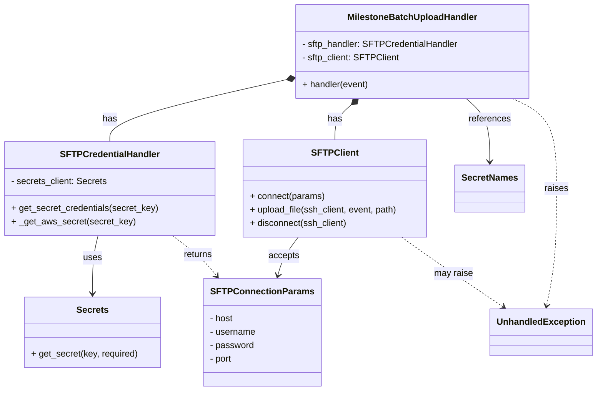
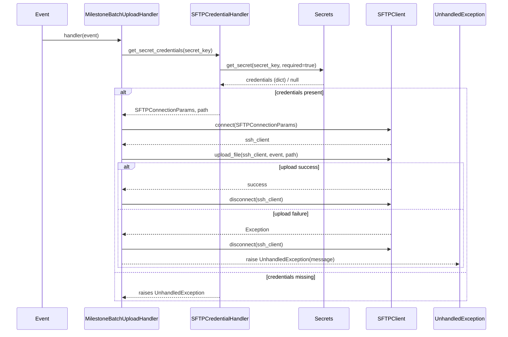

# Diagram: entity_core/entity_service/entity_service/entity/status_update/service/milestone_batch_upload_handler.py

> Auto-generated by Obscura crawlers

## Diagram 1

### SVG

<svg id="container" width="1053.6484375" xmlns="http://www.w3.org/2000/svg" class="classDiagram" height="698" viewBox="0 0 1053.6484375 698" role="graphics-document document" aria-roledescription="class"><g><defs><marker id="container_class-aggregationStart" class="marker aggregation class" refX="18" refY="7" markerWidth="190" markerHeight="240" orient="auto"><path d="M 18,7 L9,13 L1,7 L9,1 Z"></path></marker></defs><defs><marker id="container_class-aggregationEnd" class="marker aggregation class" refX="1" refY="7" markerWidth="20" markerHeight="28" orient="auto"><path d="M 18,7 L9,13 L1,7 L9,1 Z"></path></marker></defs><defs><marker id="container_class-extensionStart" class="marker extension class" refX="18" refY="7" markerWidth="190" markerHeight="240" orient="auto"><path d="M 1,7 L18,13 V 1 Z"></path></marker></defs><defs><marker id="container_class-extensionEnd" class="marker extension class" refX="1" refY="7" markerWidth="20" markerHeight="28" orient="auto"><path d="M 1,1 V 13 L18,7 Z"></path></marker></defs><defs><marker id="container_class-compositionStart" class="marker composition class" refX="18" refY="7" markerWidth="190" markerHeight="240" orient="auto"><path d="M 18,7 L9,13 L1,7 L9,1 Z"></path></marker></defs><defs><marker id="container_class-compositionEnd" class="marker composition class" refX="1" refY="7" markerWidth="20" markerHeight="28" orient="auto"><path d="M 18,7 L9,13 L1,7 L9,1 Z"></path></marker></defs><defs><marker id="container_class-dependencyStart" class="marker dependency class" refX="6" refY="7" markerWidth="190" markerHeight="240" orient="auto"><path d="M 5,7 L9,13 L1,7 L9,1 Z"></path></marker></defs><defs><marker id="container_class-dependencyEnd" class="marker dependency class" refX="13" refY="7" markerWidth="20" markerHeight="28" orient="auto"><path d="M 18,7 L9,13 L14,7 L9,1 Z"></path></marker></defs><defs><marker id="container_class-lollipopStart" class="marker lollipop class" refX="13" refY="7" markerWidth="190" markerHeight="240" orient="auto"><circle stroke="black" fill="transparent" cx="7" cy="7" r="6"></circle></marker></defs><defs><marker id="container_class-lollipopEnd" class="marker lollipop class" refX="1" refY="7" markerWidth="190" markerHeight="240" orient="auto"><circle stroke="black" fill="transparent" cx="7" cy="7" r="6"></circle></marker></defs><g class="root"><g class="clusters"></g><g class="edgePaths"><path d="M508.067,142.317L455.688,154.098C403.309,165.878,298.551,189.439,246.172,207.886C193.793,226.333,193.793,239.667,193.793,246.333L193.793,253" id="id_MilestoneBatchUploadHandler_SFTPCredentialHandler_1" class="edge-thickness-normal edge-pattern-solid relation" style=";;;" data-edge="true" data-et="edge" data-id="id_MilestoneBatchUploadHandler_SFTPCredentialHandler_1" data-points="W3sieCI6NTI0Ljg5NjQ4NDM3NSwieSI6MTM4LjUzMjIxMDM0Mjg4NzIzfSx7IngiOjE5My43OTI5Njg3NSwieSI6MjEzfSx7IngiOjE5My43OTI5Njg3NSwieSI6MjUzfV0=" marker-start="url(#container_class-compositionStart)"></path><path d="M623.451,187.4L618.606,191.667C613.76,195.933,604.07,204.467,599.224,214.9C594.379,225.333,594.379,237.667,594.379,243.833L594.379,250" id="id_MilestoneBatchUploadHandler_SFTPClient_2" class="edge-thickness-normal edge-pattern-solid relation" style=";;;" data-edge="true" data-et="edge" data-id="id_MilestoneBatchUploadHandler_SFTPClient_2" data-points="W3sieCI6NjM2LjM5NzQ4NTE0OTc5MzQsInkiOjE3Nn0seyJ4Ijo1OTQuMzc4OTA2MjUsInkiOjIxM30seyJ4Ijo1OTQuMzc4OTA2MjUsInkiOjI1MH1d" marker-start="url(#container_class-compositionStart)"></path><path d="M172.536,421L170.849,427.667C169.162,434.333,165.788,447.667,164.101,465C162.414,482.333,162.414,503.667,162.414,514.333L162.414,525" id="id_SFTPCredentialHandler_Secrets_3" class="edge-thickness-normal edge-pattern-solid relation" style=";;;" data-edge="true" data-et="edge" data-id="id_SFTPCredentialHandler_Secrets_3" data-points="W3sieCI6MTcyLjUzNjI5MDMyMjU4MDY0LCJ5Ijo0MjF9LHsieCI6MTYyLjQxNDA2MjUsInkiOjQ2MX0seyJ4IjoxNjIuNDE0MDYyNSwieSI6NTMxfV0=" marker-end="url(#container_class-dependencyEnd)"></path><path d="M304.517,421L313.304,427.667C322.092,434.333,339.667,447.667,352.618,459.709C365.569,471.752,373.896,482.504,378.06,487.88L382.223,493.256" id="id_SFTPCredentialHandler_SFTPConnectionParams_4" class="edge-thickness-normal edge-pattern-dashed relation" style=";;;" data-edge="true" data-et="edge" data-id="id_SFTPCredentialHandler_SFTPConnectionParams_4" data-points="W3sieCI6MzA0LjUxNjYzMzA2NDUxNjEsInkiOjQyMX0seyJ4IjozNTcuMjQyMTg3NSwieSI6NDYxfSx7IngiOjM4NS44OTY4NjYxODg5MDk3NywieSI6NDk4fV0=" marker-end="url(#container_class-dependencyEnd)"></path><path d="M827.185,176L834.188,182.167C841.191,188.333,855.197,200.667,862.2,219.5C869.203,238.333,869.203,263.667,869.203,276.333L869.203,289" id="id_MilestoneBatchUploadHandler_SecretNames_5" class="edge-thickness-normal edge-pattern-solid relation" style=";;;" data-edge="true" data-et="edge" data-id="id_MilestoneBatchUploadHandler_SecretNames_5" data-points="W3sieCI6ODI3LjE4NDU0NjEwMDIwNjYsInkiOjE3Nn0seyJ4Ijo4NjkuMjAzMTI1LCJ5IjoyMTN9LHsieCI6ODY5LjIwMzEyNSwieSI6Mjk1fV0=" marker-end="url(#container_class-dependencyEnd)"></path><path d="M907.909,176L920.838,182.167C933.767,188.333,959.626,200.667,972.555,227.5C985.484,254.333,985.484,295.667,985.484,337C985.484,378.333,985.484,419.667,982.569,454.52C979.654,489.374,973.824,517.749,970.909,531.936L967.994,546.123" id="id_MilestoneBatchUploadHandler_UnhandledException_6" class="edge-thickness-normal edge-pattern-dashed relation" style=";;;" data-edge="true" data-et="edge" data-id="id_MilestoneBatchUploadHandler_UnhandledException_6" data-points="W3sieCI6OTA3LjkwODcxOTY1MzkyNTYsInkiOjE3Nn0seyJ4Ijo5ODUuNDg0Mzc1LCJ5IjoyMTN9LHsieCI6OTg1LjQ4NDM3NSwieSI6MzM3fSx7IngiOjk4NS40ODQzNzUsInkiOjQ2MX0seyJ4Ijo5NjYuNzg2MTg0MjEwNTI2NCwieSI6NTUyfV0=" marker-end="url(#container_class-dependencyEnd)"></path><path d="M526.118,424L521.28,430.167C516.441,436.333,506.765,448.667,500.485,460.036C494.205,471.406,491.323,481.812,489.881,487.015L488.44,492.218" id="id_SFTPClient_SFTPConnectionParams_7" class="edge-thickness-normal edge-pattern-solid relation" style=";;;" data-edge="true" data-et="edge" data-id="id_SFTPClient_SFTPConnectionParams_7" data-points="W3sieCI6NTI2LjExODI3NDMxOTU1NjUsInkiOjQyNH0seyJ4Ijo0OTcuMDg3ODkwNjI1LCJ5Ijo0NjF9LHsieCI6NDg2LjgzODEyNTU4NzQwNiwieSI6NDk4fV0=" marker-end="url(#container_class-dependencyEnd)"></path><path d="M712.407,424L720.773,430.167C729.139,436.333,745.871,448.667,775.711,469.438C805.55,490.209,848.495,519.417,869.968,534.021L891.441,548.626" id="id_SFTPClient_UnhandledException_8" class="edge-thickness-normal edge-pattern-dashed relation" style=";;;" data-edge="true" data-et="edge" data-id="id_SFTPClient_UnhandledException_8" data-points="W3sieCI6NzEyLjQwNzQ2MjgyNzYyMSwieSI6NDI0fSx7IngiOjc2Mi42MDM1MTU2MjUsInkiOjQ2MX0seyJ4Ijo4OTYuNDAyNzU0OTM0MjEwNSwieSI6NTUyfV0=" marker-end="url(#container_class-dependencyEnd)"></path></g><g class="edgeLabels"><g class="edgeLabel" transform="translate(193.79296875, 213)"><g class="label" data-id="id_MilestoneBatchUploadHandler_SFTPCredentialHandler_1" transform="translate(-12.703125, -12)"><foreignObject width="25.40625" height="24">

has

</foreignObject></g></g><g class="edgeLabel" transform="translate(594.37890625, 213)"><g class="label" data-id="id_MilestoneBatchUploadHandler_SFTPClient_2" transform="translate(-12.703125, -12)"><foreignObject width="25.40625" height="24">

has

</foreignObject></g></g><g class="edgeLabel" transform="translate(162.4140625, 461)"><g class="label" data-id="id_SFTPCredentialHandler_Secrets_3" transform="translate(-16.4921875, -12)"><foreignObject width="32.984375" height="24">

uses

</foreignObject></g></g><g class="edgeLabel" transform="translate(349.52113, 455.14245)"><g class="label" data-id="id_SFTPCredentialHandler_SFTPConnectionParams_4" transform="translate(-26.265625, -12)"><foreignObject width="52.53125" height="24">

returns

</foreignObject></g></g><g class="edgeLabel" transform="translate(869.203125, 213)"><g class="label" data-id="id_MilestoneBatchUploadHandler_SecretNames_5" transform="translate(-37.828125, -12)"><foreignObject width="75.65625" height="24">

references

</foreignObject></g></g><g class="edgeLabel" transform="translate(985.484375, 337)"><g class="label" data-id="id_MilestoneBatchUploadHandler_UnhandledException_6" transform="translate(-21.25, -12)"><foreignObject width="42.5" height="24">

raises

</foreignObject></g></g><g class="edgeLabel" transform="translate(499.75329, 457.60288)"><g class="label" data-id="id_SFTPClient_SFTPConnectionParams_7" transform="translate(-27.421875, -12)"><foreignObject width="54.84375" height="24">

accepts

</foreignObject></g></g><g class="edgeLabel" transform="translate(803.72146, 488.96528)"><g class="label" data-id="id_SFTPClient_UnhandledException_8" transform="translate(-34.65625, -12)"><foreignObject width="69.3125" height="24">

may raise

</foreignObject></g></g></g><g class="nodes"><g class="node default" id="classId-SFTPCredentialHandler-0" transform="translate(193.79296875, 337)"><g class="basic label-container"><path d="M-185.79296875 -84 L185.79296875 -84 L185.79296875 84 L-185.79296875 84" stroke="none" stroke-width="0" fill="#ECECFF" style=""></path><path d="M-185.79296875 -84 C-94.68824515615628 -84, -3.583521562312569 -84, 185.79296875 -84 M-185.79296875 -84 C-43.14820133031287 -84, 99.49656608937426 -84, 185.79296875 -84 M185.79296875 -84 C185.79296875 -46.54828468116206, 185.79296875 -9.096569362324118, 185.79296875 84 M185.79296875 -84 C185.79296875 -29.138038043127118, 185.79296875 25.723923913745764, 185.79296875 84 M185.79296875 84 C55.48836812153226 84, -74.81623250693548 84, -185.79296875 84 M185.79296875 84 C64.73547991028914 84, -56.32200892942171 84, -185.79296875 84 M-185.79296875 84 C-185.79296875 35.05567421621679, -185.79296875 -13.888651567566427, -185.79296875 -84 M-185.79296875 84 C-185.79296875 20.724486039862256, -185.79296875 -42.55102792027549, -185.79296875 -84" stroke="#9370DB" stroke-width="1.3" fill="none" stroke-dasharray="0 0" style=""></path></g><g class="annotation-group text" transform="translate(0, -60)"></g><g class="label-group text" transform="translate(-84.4296875, -60)"><g class="label" style="font-weight: bolder" transform="translate(0,-12)"><foreignObject width="168.859375" height="24">

SFTPCredentialHandler

</foreignObject></g></g><g class="members-group text" transform="translate(-173.79296875, -12)"><g class="label" style="" transform="translate(0,-12)"><foreignObject width="171.5" height="24">

- secrets_client: Secrets

</foreignObject></g></g><g class="methods-group text" transform="translate(-173.79296875, 36)"><g class="label" style="" transform="translate(0,-12)"><foreignObject width="263.15625" height="24">

+ get_secret_credentials(secret_key)

</foreignObject></g><g class="label" style="" transform="translate(0,12)"><foreignObject width="218.15625" height="24">

+ _get_aws_secret(secret_key)

</foreignObject></g></g><g class="divider" style=""><path d="M-185.79296875 -36 C-102.92077843008326 -36, -20.04858811016652 -36, 185.79296875 -36 M-185.79296875 -36 C-48.47916333813359 -36, 88.83464207373282 -36, 185.79296875 -36" stroke="#9370DB" stroke-width="1.3" fill="none" stroke-dasharray="0 0" style=""></path></g><g class="divider" style=""><path d="M-185.79296875 12 C-97.90360348238397 12, -10.014238214767943 12, 185.79296875 12 M-185.79296875 12 C-101.16034186772865 12, -16.527714985457294 12, 185.79296875 12" stroke="#9370DB" stroke-width="1.3" fill="none" stroke-dasharray="0 0" style=""></path></g></g><g class="node default" id="classId-MilestoneBatchUploadHandler-1" transform="translate(731.791015625, 92)"><g class="basic label-container"><path d="M-206.89453125 -84 L206.89453125 -84 L206.89453125 84 L-206.89453125 84" stroke="none" stroke-width="0" fill="#ECECFF" style=""></path><path d="M-206.89453125 -84 C-78.71196365933295 -84, 49.4706039313341 -84, 206.89453125 -84 M-206.89453125 -84 C-118.9275626665238 -84, -30.960594083047596 -84, 206.89453125 -84 M206.89453125 -84 C206.89453125 -50.214588046662044, 206.89453125 -16.429176093324088, 206.89453125 84 M206.89453125 -84 C206.89453125 -34.78629090569565, 206.89453125 14.427418188608698, 206.89453125 84 M206.89453125 84 C67.92642827586326 84, -71.04167469827348 84, -206.89453125 84 M206.89453125 84 C75.82639167605248 84, -55.24174789789504 84, -206.89453125 84 M-206.89453125 84 C-206.89453125 20.933740412983674, -206.89453125 -42.13251917403265, -206.89453125 -84 M-206.89453125 84 C-206.89453125 35.89868811172363, -206.89453125 -12.202623776552741, -206.89453125 -84" stroke="#9370DB" stroke-width="1.3" fill="none" stroke-dasharray="0 0" style=""></path></g><g class="annotation-group text" transform="translate(0, -60)"></g><g class="label-group text" transform="translate(-111.7109375, -60)"><g class="label" style="font-weight: bolder" transform="translate(0,-12)"><foreignObject width="223.421875" height="24">

MilestoneBatchUploadHandler

</foreignObject></g></g><g class="members-group text" transform="translate(-194.89453125, -12)"><g class="label" style="" transform="translate(0,-12)"><foreignObject width="278.078125" height="24">

- sftp_handler: SFTPCredentialHandler

</foreignObject></g><g class="label" style="" transform="translate(0,12)"><foreignObject width="171.375" height="24">

- sftp_client: SFTPClient

</foreignObject></g></g><g class="methods-group text" transform="translate(-194.89453125, 60)"><g class="label" style="" transform="translate(0,-12)"><foreignObject width="119.46875" height="24">

+ handler(event)

</foreignObject></g></g><g class="divider" style=""><path d="M-206.89453125 -36 C-122.2125085031788 -36, -37.53048575635759 -36, 206.89453125 -36 M-206.89453125 -36 C-115.86616214277413 -36, -24.83779303554826 -36, 206.89453125 -36" stroke="#9370DB" stroke-width="1.3" fill="none" stroke-dasharray="0 0" style=""></path></g><g class="divider" style=""><path d="M-206.89453125 36 C-93.41277714251264 36, 20.068976964974723 36, 206.89453125 36 M-206.89453125 36 C-112.00814602505733 36, -17.121760800114657 36, 206.89453125 36" stroke="#9370DB" stroke-width="1.3" fill="none" stroke-dasharray="0 0" style=""></path></g></g><g class="node default" id="classId-SFTPClient-2" transform="translate(594.37890625, 337)"><g class="basic label-container"><path d="M-164.79296875 -87 L164.79296875 -87 L164.79296875 87 L-164.79296875 87" stroke="none" stroke-width="0" fill="#ECECFF" style=""></path><path d="M-164.79296875 -87 C-54.61841718152738 -87, 55.556134386945246 -87, 164.79296875 -87 M-164.79296875 -87 C-89.38093890489293 -87, -13.968909059785858 -87, 164.79296875 -87 M164.79296875 -87 C164.79296875 -28.010404861719756, 164.79296875 30.979190276560487, 164.79296875 87 M164.79296875 -87 C164.79296875 -31.484971259060877, 164.79296875 24.030057481878245, 164.79296875 87 M164.79296875 87 C84.40937803462602 87, 4.025787319252032 87, -164.79296875 87 M164.79296875 87 C75.91549399391889 87, -12.961980762162227 87, -164.79296875 87 M-164.79296875 87 C-164.79296875 20.545853449442973, -164.79296875 -45.908293101114054, -164.79296875 -87 M-164.79296875 87 C-164.79296875 33.305306641369235, -164.79296875 -20.38938671726153, -164.79296875 -87" stroke="#9370DB" stroke-width="1.3" fill="none" stroke-dasharray="0 0" style=""></path></g><g class="annotation-group text" transform="translate(0, -63)"></g><g class="label-group text" transform="translate(-38.8671875, -63)"><g class="label" style="font-weight: bolder" transform="translate(0,-12)"><foreignObject width="77.734375" height="24">

SFTPClient

</foreignObject></g></g><g class="members-group text" transform="translate(-152.79296875, -15)"></g><g class="methods-group text" transform="translate(-152.79296875, 15)"><g class="label" style="" transform="translate(0,-12)"><foreignObject width="133.71875" height="24">

+ connect(params)

</foreignObject></g><g class="label" style="" transform="translate(0,12)"><foreignObject width="266.71875" height="24">

+ upload_file(ssh_client, event, path)

</foreignObject></g><g class="label" style="" transform="translate(0,36)"><foreignObject width="174.59375" height="24">

+ disconnect(ssh_client)

</foreignObject></g></g><g class="divider" style=""><path d="M-164.79296875 -39 C-36.7644682996181 -39, 91.2640321507638 -39, 164.79296875 -39 M-164.79296875 -39 C-78.44687912150883 -39, 7.899210506982342 -39, 164.79296875 -39" stroke="#9370DB" stroke-width="1.3" fill="none" stroke-dasharray="0 0" style=""></path></g><g class="divider" style=""><path d="M-164.79296875 -15 C-86.68254882119993 -15, -8.57212889239986 -15, 164.79296875 -15 M-164.79296875 -15 C-54.31065312386308 -15, 56.17166250227385 -15, 164.79296875 -15" stroke="#9370DB" stroke-width="1.3" fill="none" stroke-dasharray="0 0" style=""></path></g></g><g class="node default" id="classId-SFTPConnectionParams-3" transform="translate(460.244140625, 594)"><g class="basic label-container"><path d="M-97.5234375 -96 L97.5234375 -96 L97.5234375 96 L-97.5234375 96" stroke="none" stroke-width="0" fill="#ECECFF" style=""></path><path d="M-97.5234375 -96 C-20.117352973662108 -96, 57.288731552675785 -96, 97.5234375 -96 M-97.5234375 -96 C-40.58984069200538 -96, 16.343756115989237 -96, 97.5234375 -96 M97.5234375 -96 C97.5234375 -48.10513890399962, 97.5234375 -0.21027780799923335, 97.5234375 96 M97.5234375 -96 C97.5234375 -48.11323117108222, 97.5234375 -0.22646234216443872, 97.5234375 96 M97.5234375 96 C51.85217755435138 96, 6.180917608702757 96, -97.5234375 96 M97.5234375 96 C20.39180891334469 96, -56.73981967331062 96, -97.5234375 96 M-97.5234375 96 C-97.5234375 50.02657639100431, -97.5234375 4.053152782008624, -97.5234375 -96 M-97.5234375 96 C-97.5234375 29.39959992747174, -97.5234375 -37.20080014505652, -97.5234375 -96" stroke="#9370DB" stroke-width="1.3" fill="none" stroke-dasharray="0 0" style=""></path></g><g class="annotation-group text" transform="translate(0, -72)"></g><g class="label-group text" transform="translate(-85.5234375, -72)"><g class="label" style="font-weight: bolder" transform="translate(0,-12)"><foreignObject width="171.046875" height="24">

SFTPConnectionParams

</foreignObject></g></g><g class="members-group text" transform="translate(-85.5234375, -24)"><g class="label" style="" transform="translate(0,-12)"><foreignObject width="42.65625" height="24">

- host

</foreignObject></g><g class="label" style="" transform="translate(0,12)"><foreignObject width="82.890625" height="24">

- username

</foreignObject></g><g class="label" style="" transform="translate(0,36)"><foreignObject width="79.34375" height="24">

- password

</foreignObject></g><g class="label" style="" transform="translate(0,60)"><foreignObject width="41.5" height="24">

- port

</foreignObject></g></g><g class="methods-group text" transform="translate(-85.5234375, 96)"></g><g class="divider" style=""><path d="M-97.5234375 -48 C-39.88572988939825 -48, 17.751977721203502 -48, 97.5234375 -48 M-97.5234375 -48 C-22.64307613893179 -48, 52.23728522213642 -48, 97.5234375 -48" stroke="#9370DB" stroke-width="1.3" fill="none" stroke-dasharray="0 0" style=""></path></g><g class="divider" style=""><path d="M-97.5234375 72 C-21.674976662200862 72, 54.173484175598276 72, 97.5234375 72 M-97.5234375 72 C-38.41450677143381 72, 20.694423957132386 72, 97.5234375 72" stroke="#9370DB" stroke-width="1.3" fill="none" stroke-dasharray="0 0" style=""></path></g></g><g class="node default" id="classId-Secrets-4" transform="translate(162.4140625, 594)"><g class="basic label-container"><path d="M-121.23828125 -63 L121.23828125 -63 L121.23828125 63 L-121.23828125 63" stroke="none" stroke-width="0" fill="#ECECFF" style=""></path><path d="M-121.23828125 -63 C-32.57321912774292 -63, 56.09184299451417 -63, 121.23828125 -63 M-121.23828125 -63 C-45.90426259348669 -63, 29.429756063026616 -63, 121.23828125 -63 M121.23828125 -63 C121.23828125 -16.22233493210286, 121.23828125 30.55533013579428, 121.23828125 63 M121.23828125 -63 C121.23828125 -26.341131256537295, 121.23828125 10.31773748692541, 121.23828125 63 M121.23828125 63 C52.70757587642338 63, -15.823129497153246 63, -121.23828125 63 M121.23828125 63 C52.39442488652129 63, -16.449431476957415 63, -121.23828125 63 M-121.23828125 63 C-121.23828125 24.42214414742557, -121.23828125 -14.15571170514886, -121.23828125 -63 M-121.23828125 63 C-121.23828125 12.87052876043444, -121.23828125 -37.25894247913112, -121.23828125 -63" stroke="#9370DB" stroke-width="1.3" fill="none" stroke-dasharray="0 0" style=""></path></g><g class="annotation-group text" transform="translate(0, -39)"></g><g class="label-group text" transform="translate(-27.1640625, -39)"><g class="label" style="font-weight: bolder" transform="translate(0,-12)"><foreignObject width="54.328125" height="24">

Secrets

</foreignObject></g></g><g class="members-group text" transform="translate(-109.23828125, 9)"></g><g class="methods-group text" transform="translate(-109.23828125, 39)"><g class="label" style="" transform="translate(0,-12)"><foreignObject width="191.3125" height="24">

+ get_secret(key, required)

</foreignObject></g></g><g class="divider" style=""><path d="M-121.23828125 -15 C-26.768565765592214 -15, 67.70114971881557 -15, 121.23828125 -15 M-121.23828125 -15 C-60.946855254181884 -15, -0.6554292583637675 -15, 121.23828125 -15" stroke="#9370DB" stroke-width="1.3" fill="none" stroke-dasharray="0 0" style=""></path></g><g class="divider" style=""><path d="M-121.23828125 9 C-37.874749563185915 9, 45.48878212362817 9, 121.23828125 9 M-121.23828125 9 C-53.19692985434561 9, 14.844421541308776 9, 121.23828125 9" stroke="#9370DB" stroke-width="1.3" fill="none" stroke-dasharray="0 0" style=""></path></g></g><g class="node default" id="classId-SecretNames-5" transform="translate(869.203125, 337)"><g class="basic label-container"><path d="M-60.03125 -42 L60.03125 -42 L60.03125 42 L-60.03125 42" stroke="none" stroke-width="0" fill="#ECECFF" style=""></path><path d="M-60.03125 -42 C-18.243889913767447 -42, 23.543470172465106 -42, 60.03125 -42 M-60.03125 -42 C-32.37747122511905 -42, -4.723692450238104 -42, 60.03125 -42 M60.03125 -42 C60.03125 -22.136712343522227, 60.03125 -2.2734246870444537, 60.03125 42 M60.03125 -42 C60.03125 -18.48731789309793, 60.03125 5.025364213804139, 60.03125 42 M60.03125 42 C30.711569809819096 42, 1.3918896196381922 42, -60.03125 42 M60.03125 42 C21.68927505361563 42, -16.652699892768737 42, -60.03125 42 M-60.03125 42 C-60.03125 9.846578716936179, -60.03125 -22.306842566127642, -60.03125 -42 M-60.03125 42 C-60.03125 13.534107781329762, -60.03125 -14.931784437340475, -60.03125 -42" stroke="#9370DB" stroke-width="1.3" fill="none" stroke-dasharray="0 0" style=""></path></g><g class="annotation-group text" transform="translate(0, -18)"></g><g class="label-group text" transform="translate(-48.03125, -18)"><g class="label" style="font-weight: bolder" transform="translate(0,-12)"><foreignObject width="96.0625" height="24">

SecretNames

</foreignObject></g></g><g class="members-group text" transform="translate(-48.03125, 30)"></g><g class="methods-group text" transform="translate(-48.03125, 60)"></g><g class="divider" style=""><path d="M-60.03125 6 C-27.040786020587056 6, 5.9496779588258875 6, 60.03125 6 M-60.03125 6 C-24.405597134463513 6, 11.220055731072975 6, 60.03125 6" stroke="#9370DB" stroke-width="1.3" fill="none" stroke-dasharray="0 0" style=""></path></g><g class="divider" style=""><path d="M-60.03125 24 C-16.90072835702395 24, 26.2297932859521 24, 60.03125 24 M-60.03125 24 C-19.059847787303205 24, 21.91155442539359 24, 60.03125 24" stroke="#9370DB" stroke-width="1.3" fill="none" stroke-dasharray="0 0" style=""></path></g></g><g class="node default" id="classId-UnhandledException-6" transform="translate(958.15625, 594)"><g class="basic label-container"><path d="M-87.4921875 -42 L87.4921875 -42 L87.4921875 42 L-87.4921875 42" stroke="none" stroke-width="0" fill="#ECECFF" style=""></path><path d="M-87.4921875 -42 C-24.174143894897007 -42, 39.143899710205986 -42, 87.4921875 -42 M-87.4921875 -42 C-20.49502673973545 -42, 46.5021340205291 -42, 87.4921875 -42 M87.4921875 -42 C87.4921875 -15.123622094390274, 87.4921875 11.752755811219451, 87.4921875 42 M87.4921875 -42 C87.4921875 -21.68346764475439, 87.4921875 -1.3669352895087812, 87.4921875 42 M87.4921875 42 C39.50971939612667 42, -8.47274870774666 42, -87.4921875 42 M87.4921875 42 C21.335670388766857 42, -44.820846722466285 42, -87.4921875 42 M-87.4921875 42 C-87.4921875 21.60248262175496, -87.4921875 1.2049652435099176, -87.4921875 -42 M-87.4921875 42 C-87.4921875 17.066819953868553, -87.4921875 -7.8663600922628945, -87.4921875 -42" stroke="#9370DB" stroke-width="1.3" fill="none" stroke-dasharray="0 0" style=""></path></g><g class="annotation-group text" transform="translate(0, -18)"></g><g class="label-group text" transform="translate(-75.4921875, -18)"><g class="label" style="font-weight: bolder" transform="translate(0,-12)"><foreignObject width="150.984375" height="24">

UnhandledException

</foreignObject></g></g><g class="members-group text" transform="translate(-75.4921875, 30)"></g><g class="methods-group text" transform="translate(-75.4921875, 60)"></g><g class="divider" style=""><path d="M-87.4921875 6 C-47.14669240247405 6, -6.801197304948104 6, 87.4921875 6 M-87.4921875 6 C-26.06656558309384 6, 35.35905633381232 6, 87.4921875 6" stroke="#9370DB" stroke-width="1.3" fill="none" stroke-dasharray="0 0" style=""></path></g><g class="divider" style=""><path d="M-87.4921875 24 C-31.384881605642697 24, 24.722424288714606 24, 87.4921875 24 M-87.4921875 24 C-25.854287582995944 24, 35.78361233400811 24, 87.4921875 24" stroke="#9370DB" stroke-width="1.3" fill="none" stroke-dasharray="0 0" style=""></path></g></g></g></g></g></svg>

## Diagram 2

### SVG

<svg id="container" width="1577.5" xmlns="http://www.w3.org/2000/svg" height="1043" viewBox="-50 -10 1577.5 1043" role="graphics-document document" aria-roledescription="sequence"><g><rect x="1306.5" y="957" fill="#eaeaea" stroke="#666" width="171" height="65" name="Exception" rx="3" ry="3" class="actor actor-bottom"></rect><text x="1392" y="989.5" dominant-baseline="central" alignment-baseline="central" class="actor actor-box" style="text-anchor: middle; font-size: 16px; font-weight: 400;"><tspan x="1392" dy="0">UnhandledException</tspan></text></g><g><rect x="1106.5" y="957" fill="#eaeaea" stroke="#666" width="150" height="65" name="SFTP" rx="3" ry="3" class="actor actor-bottom"></rect><text x="1181.5" y="989.5" dominant-baseline="central" alignment-baseline="central" class="actor actor-box" style="text-anchor: middle; font-size: 16px; font-weight: 400;"><tspan x="1181.5" dy="0">SFTPClient</tspan></text></g><g><rect x="906.5" y="957" fill="#eaeaea" stroke="#666" width="150" height="65" name="Secrets" rx="3" ry="3" class="actor actor-bottom"></rect><text x="981.5" y="989.5" dominant-baseline="central" alignment-baseline="central" class="actor actor-box" style="text-anchor: middle; font-size: 16px; font-weight: 400;"><tspan x="981.5" dy="0">Secrets</tspan></text></g><g><rect x="549" y="957" fill="#eaeaea" stroke="#666" width="187" height="65" name="CredHandler" rx="3" ry="3" class="actor actor-bottom"></rect><text x="642.5" y="989.5" dominant-baseline="central" alignment-baseline="central" class="actor actor-box" style="text-anchor: middle; font-size: 16px; font-weight: 400;"><tspan x="642.5" dy="0">SFTPCredentialHandler</tspan></text></g><g><rect x="200" y="957" fill="#eaeaea" stroke="#666" width="243" height="65" name="Handler" rx="3" ry="3" class="actor actor-bottom"></rect><text x="321.5" y="989.5" dominant-baseline="central" alignment-baseline="central" class="actor actor-box" style="text-anchor: middle; font-size: 16px; font-weight: 400;"><tspan x="321.5" dy="0">MilestoneBatchUploadHandler</tspan></text></g><g><rect x="0" y="957" fill="#eaeaea" stroke="#666" width="150" height="65" name="Event" rx="3" ry="3" class="actor actor-bottom"></rect><text x="75" y="989.5" dominant-baseline="central" alignment-baseline="central" class="actor actor-box" style="text-anchor: middle; font-size: 16px; font-weight: 400;"><tspan x="75" dy="0">Event</tspan></text></g><g><line id="actor5" x1="1392" y1="65" x2="1392" y2="957" class="actor-line 200" stroke-width="0.5px" stroke="#999" name="Exception"></line><g id="root-5"><rect x="1306.5" y="0" fill="#eaeaea" stroke="#666" width="171" height="65" name="Exception" rx="3" ry="3" class="actor actor-top"></rect><text x="1392" y="32.5" dominant-baseline="central" alignment-baseline="central" class="actor actor-box" style="text-anchor: middle; font-size: 16px; font-weight: 400;"><tspan x="1392" dy="0">UnhandledException</tspan></text></g></g><g><line id="actor4" x1="1181.5" y1="65" x2="1181.5" y2="957" class="actor-line 200" stroke-width="0.5px" stroke="#999" name="SFTP"></line><g id="root-4"><rect x="1106.5" y="0" fill="#eaeaea" stroke="#666" width="150" height="65" name="SFTP" rx="3" ry="3" class="actor actor-top"></rect><text x="1181.5" y="32.5" dominant-baseline="central" alignment-baseline="central" class="actor actor-box" style="text-anchor: middle; font-size: 16px; font-weight: 400;"><tspan x="1181.5" dy="0">SFTPClient</tspan></text></g></g><g><line id="actor3" x1="981.5" y1="65" x2="981.5" y2="957" class="actor-line 200" stroke-width="0.5px" stroke="#999" name="Secrets"></line><g id="root-3"><rect x="906.5" y="0" fill="#eaeaea" stroke="#666" width="150" height="65" name="Secrets" rx="3" ry="3" class="actor actor-top"></rect><text x="981.5" y="32.5" dominant-baseline="central" alignment-baseline="central" class="actor actor-box" style="text-anchor: middle; font-size: 16px; font-weight: 400;"><tspan x="981.5" dy="0">Secrets</tspan></text></g></g><g><line id="actor2" x1="642.5" y1="65" x2="642.5" y2="957" class="actor-line 200" stroke-width="0.5px" stroke="#999" name="CredHandler"></line><g id="root-2"><rect x="549" y="0" fill="#eaeaea" stroke="#666" width="187" height="65" name="CredHandler" rx="3" ry="3" class="actor actor-top"></rect><text x="642.5" y="32.5" dominant-baseline="central" alignment-baseline="central" class="actor actor-box" style="text-anchor: middle; font-size: 16px; font-weight: 400;"><tspan x="642.5" dy="0">SFTPCredentialHandler</tspan></text></g></g><g><line id="actor1" x1="321.5" y1="65" x2="321.5" y2="957" class="actor-line 200" stroke-width="0.5px" stroke="#999" name="Handler"></line><g id="root-1"><rect x="200" y="0" fill="#eaeaea" stroke="#666" width="243" height="65" name="Handler" rx="3" ry="3" class="actor actor-top"></rect><text x="321.5" y="32.5" dominant-baseline="central" alignment-baseline="central" class="actor actor-box" style="text-anchor: middle; font-size: 16px; font-weight: 400;"><tspan x="321.5" dy="0">MilestoneBatchUploadHandler</tspan></text></g></g><g><line id="actor0" x1="75" y1="65" x2="75" y2="957" class="actor-line 200" stroke-width="0.5px" stroke="#999" name="Event"></line><g id="root-0"><rect x="0" y="0" fill="#eaeaea" stroke="#666" width="150" height="65" name="Event" rx="3" ry="3" class="actor actor-top"></rect><text x="75" y="32.5" dominant-baseline="central" alignment-baseline="central" class="actor actor-box" style="text-anchor: middle; font-size: 16px; font-weight: 400;"><tspan x="75" dy="0">Event</tspan></text></g></g><g></g><defs><symbol id="computer" width="24" height="24"><path transform="scale(.5)" d="M2 2v13h20v-13h-20zm18 11h-16v-9h16v9zm-10.228 6l.466-1h3.524l.467 1h-4.457zm14.228 3h-24l2-6h2.104l-1.33 4h18.45l-1.297-4h2.073l2 6zm-5-10h-14v-7h14v7z"></path></symbol></defs><defs><symbol id="database" fill-rule="evenodd" clip-rule="evenodd"><path transform="scale(.5)" d="M12.258.001l.256.004.255.005.253.008.251.01.249.012.247.015.246.016.242.019.241.02.239.023.236.024.233.027.231.028.229.031.225.032.223.034.22.036.217.038.214.04.211.041.208.043.205.045.201.046.198.048.194.05.191.051.187.053.183.054.18.056.175.057.172.059.168.06.163.061.16.063.155.064.15.066.074.033.073.033.071.034.07.034.069.035.068.035.067.035.066.035.064.036.064.036.062.036.06.036.06.037.058.037.058.037.055.038.055.038.053.038.052.038.051.039.05.039.048.039.047.039.045.04.044.04.043.04.041.04.04.041.039.041.037.041.036.041.034.041.033.042.032.042.03.042.029.042.027.042.026.043.024.043.023.043.021.043.02.043.018.044.017.043.015.044.013.044.012.044.011.045.009.044.007.045.006.045.004.045.002.045.001.045v17l-.001.045-.002.045-.004.045-.006.045-.007.045-.009.044-.011.045-.012.044-.013.044-.015.044-.017.043-.018.044-.02.043-.021.043-.023.043-.024.043-.026.043-.027.042-.029.042-.03.042-.032.042-.033.042-.034.041-.036.041-.037.041-.039.041-.04.041-.041.04-.043.04-.044.04-.045.04-.047.039-.048.039-.05.039-.051.039-.052.038-.053.038-.055.038-.055.038-.058.037-.058.037-.06.037-.06.036-.062.036-.064.036-.064.036-.066.035-.067.035-.068.035-.069.035-.07.034-.071.034-.073.033-.074.033-.15.066-.155.064-.16.063-.163.061-.168.06-.172.059-.175.057-.18.056-.183.054-.187.053-.191.051-.194.05-.198.048-.201.046-.205.045-.208.043-.211.041-.214.04-.217.038-.22.036-.223.034-.225.032-.229.031-.231.028-.233.027-.236.024-.239.023-.241.02-.242.019-.246.016-.247.015-.249.012-.251.01-.253.008-.255.005-.256.004-.258.001-.258-.001-.256-.004-.255-.005-.253-.008-.251-.01-.249-.012-.247-.015-.245-.016-.243-.019-.241-.02-.238-.023-.236-.024-.234-.027-.231-.028-.228-.031-.226-.032-.223-.034-.22-.036-.217-.038-.214-.04-.211-.041-.208-.043-.204-.045-.201-.046-.198-.048-.195-.05-.19-.051-.187-.053-.184-.054-.179-.056-.176-.057-.172-.059-.167-.06-.164-.061-.159-.063-.155-.064-.151-.066-.074-.033-.072-.033-.072-.034-.07-.034-.069-.035-.068-.035-.067-.035-.066-.035-.064-.036-.063-.036-.062-.036-.061-.036-.06-.037-.058-.037-.057-.037-.056-.038-.055-.038-.053-.038-.052-.038-.051-.039-.049-.039-.049-.039-.046-.039-.046-.04-.044-.04-.043-.04-.041-.04-.04-.041-.039-.041-.037-.041-.036-.041-.034-.041-.033-.042-.032-.042-.03-.042-.029-.042-.027-.042-.026-.043-.024-.043-.023-.043-.021-.043-.02-.043-.018-.044-.017-.043-.015-.044-.013-.044-.012-.044-.011-.045-.009-.044-.007-.045-.006-.045-.004-.045-.002-.045-.001-.045v-17l.001-.045.002-.045.004-.045.006-.045.007-.045.009-.044.011-.045.012-.044.013-.044.015-.044.017-.043.018-.044.02-.043.021-.043.023-.043.024-.043.026-.043.027-.042.029-.042.03-.042.032-.042.033-.042.034-.041.036-.041.037-.041.039-.041.04-.041.041-.04.043-.04.044-.04.046-.04.046-.039.049-.039.049-.039.051-.039.052-.038.053-.038.055-.038.056-.038.057-.037.058-.037.06-.037.061-.036.062-.036.063-.036.064-.036.066-.035.067-.035.068-.035.069-.035.07-.034.072-.034.072-.033.074-.033.151-.066.155-.064.159-.063.164-.061.167-.06.172-.059.176-.057.179-.056.184-.054.187-.053.19-.051.195-.05.198-.048.201-.046.204-.045.208-.043.211-.041.214-.04.217-.038.22-.036.223-.034.226-.032.228-.031.231-.028.234-.027.236-.024.238-.023.241-.02.243-.019.245-.016.247-.015.249-.012.251-.01.253-.008.255-.005.256-.004.258-.001.258.001zm-9.258 20.499v.01l.001.021.003.021.004.022.005.021.006.022.007.022.009.023.01.022.011.023.012.023.013.023.015.023.016.024.017.023.018.024.019.024.021.024.022.025.023.024.024.025.052.049.056.05.061.051.066.051.07.051.075.051.079.052.084.052.088.052.092.052.097.052.102.051.105.052.11.052.114.051.119.051.123.051.127.05.131.05.135.05.139.048.144.049.147.047.152.047.155.047.16.045.163.045.167.043.171.043.176.041.178.041.183.039.187.039.19.037.194.035.197.035.202.033.204.031.209.03.212.029.216.027.219.025.222.024.226.021.23.02.233.018.236.016.24.015.243.012.246.01.249.008.253.005.256.004.259.001.26-.001.257-.004.254-.005.25-.008.247-.011.244-.012.241-.014.237-.016.233-.018.231-.021.226-.021.224-.024.22-.026.216-.027.212-.028.21-.031.205-.031.202-.034.198-.034.194-.036.191-.037.187-.039.183-.04.179-.04.175-.042.172-.043.168-.044.163-.045.16-.046.155-.046.152-.047.148-.048.143-.049.139-.049.136-.05.131-.05.126-.05.123-.051.118-.052.114-.051.11-.052.106-.052.101-.052.096-.052.092-.052.088-.053.083-.051.079-.052.074-.052.07-.051.065-.051.06-.051.056-.05.051-.05.023-.024.023-.025.021-.024.02-.024.019-.024.018-.024.017-.024.015-.023.014-.024.013-.023.012-.023.01-.023.01-.022.008-.022.006-.022.006-.022.004-.022.004-.021.001-.021.001-.021v-4.127l-.077.055-.08.053-.083.054-.085.053-.087.052-.09.052-.093.051-.095.05-.097.05-.1.049-.102.049-.105.048-.106.047-.109.047-.111.046-.114.045-.115.045-.118.044-.12.043-.122.042-.124.042-.126.041-.128.04-.13.04-.132.038-.134.038-.135.037-.138.037-.139.035-.142.035-.143.034-.144.033-.147.032-.148.031-.15.03-.151.03-.153.029-.154.027-.156.027-.158.026-.159.025-.161.024-.162.023-.163.022-.165.021-.166.02-.167.019-.169.018-.169.017-.171.016-.173.015-.173.014-.175.013-.175.012-.177.011-.178.01-.179.008-.179.008-.181.006-.182.005-.182.004-.184.003-.184.002h-.37l-.184-.002-.184-.003-.182-.004-.182-.005-.181-.006-.179-.008-.179-.008-.178-.01-.176-.011-.176-.012-.175-.013-.173-.014-.172-.015-.171-.016-.17-.017-.169-.018-.167-.019-.166-.02-.165-.021-.163-.022-.162-.023-.161-.024-.159-.025-.157-.026-.156-.027-.155-.027-.153-.029-.151-.03-.15-.03-.148-.031-.146-.032-.145-.033-.143-.034-.141-.035-.14-.035-.137-.037-.136-.037-.134-.038-.132-.038-.13-.04-.128-.04-.126-.041-.124-.042-.122-.042-.12-.044-.117-.043-.116-.045-.113-.045-.112-.046-.109-.047-.106-.047-.105-.048-.102-.049-.1-.049-.097-.05-.095-.05-.093-.052-.09-.051-.087-.052-.085-.053-.083-.054-.08-.054-.077-.054v4.127zm0-5.654v.011l.001.021.003.021.004.021.005.022.006.022.007.022.009.022.01.022.011.023.012.023.013.023.015.024.016.023.017.024.018.024.019.024.021.024.022.024.023.025.024.024.052.05.056.05.061.05.066.051.07.051.075.052.079.051.084.052.088.052.092.052.097.052.102.052.105.052.11.051.114.051.119.052.123.05.127.051.131.05.135.049.139.049.144.048.147.048.152.047.155.046.16.045.163.045.167.044.171.042.176.042.178.04.183.04.187.038.19.037.194.036.197.034.202.033.204.032.209.03.212.028.216.027.219.025.222.024.226.022.23.02.233.018.236.016.24.014.243.012.246.01.249.008.253.006.256.003.259.001.26-.001.257-.003.254-.006.25-.008.247-.01.244-.012.241-.015.237-.016.233-.018.231-.02.226-.022.224-.024.22-.025.216-.027.212-.029.21-.03.205-.032.202-.033.198-.035.194-.036.191-.037.187-.039.183-.039.179-.041.175-.042.172-.043.168-.044.163-.045.16-.045.155-.047.152-.047.148-.048.143-.048.139-.05.136-.049.131-.05.126-.051.123-.051.118-.051.114-.052.11-.052.106-.052.101-.052.096-.052.092-.052.088-.052.083-.052.079-.052.074-.051.07-.052.065-.051.06-.05.056-.051.051-.049.023-.025.023-.024.021-.025.02-.024.019-.024.018-.024.017-.024.015-.023.014-.023.013-.024.012-.022.01-.023.01-.023.008-.022.006-.022.006-.022.004-.021.004-.022.001-.021.001-.021v-4.139l-.077.054-.08.054-.083.054-.085.052-.087.053-.09.051-.093.051-.095.051-.097.05-.1.049-.102.049-.105.048-.106.047-.109.047-.111.046-.114.045-.115.044-.118.044-.12.044-.122.042-.124.042-.126.041-.128.04-.13.039-.132.039-.134.038-.135.037-.138.036-.139.036-.142.035-.143.033-.144.033-.147.033-.148.031-.15.03-.151.03-.153.028-.154.028-.156.027-.158.026-.159.025-.161.024-.162.023-.163.022-.165.021-.166.02-.167.019-.169.018-.169.017-.171.016-.173.015-.173.014-.175.013-.175.012-.177.011-.178.009-.179.009-.179.007-.181.007-.182.005-.182.004-.184.003-.184.002h-.37l-.184-.002-.184-.003-.182-.004-.182-.005-.181-.007-.179-.007-.179-.009-.178-.009-.176-.011-.176-.012-.175-.013-.173-.014-.172-.015-.171-.016-.17-.017-.169-.018-.167-.019-.166-.02-.165-.021-.163-.022-.162-.023-.161-.024-.159-.025-.157-.026-.156-.027-.155-.028-.153-.028-.151-.03-.15-.03-.148-.031-.146-.033-.145-.033-.143-.033-.141-.035-.14-.036-.137-.036-.136-.037-.134-.038-.132-.039-.13-.039-.128-.04-.126-.041-.124-.042-.122-.043-.12-.043-.117-.044-.116-.044-.113-.046-.112-.046-.109-.046-.106-.047-.105-.048-.102-.049-.1-.049-.097-.05-.095-.051-.093-.051-.09-.051-.087-.053-.085-.052-.083-.054-.08-.054-.077-.054v4.139zm0-5.666v.011l.001.02.003.022.004.021.005.022.006.021.007.022.009.023.01.022.011.023.012.023.013.023.015.023.016.024.017.024.018.023.019.024.021.025.022.024.023.024.024.025.052.05.056.05.061.05.066.051.07.051.075.052.079.051.084.052.088.052.092.052.097.052.102.052.105.051.11.052.114.051.119.051.123.051.127.05.131.05.135.05.139.049.144.048.147.048.152.047.155.046.16.045.163.045.167.043.171.043.176.042.178.04.183.04.187.038.19.037.194.036.197.034.202.033.204.032.209.03.212.028.216.027.219.025.222.024.226.021.23.02.233.018.236.017.24.014.243.012.246.01.249.008.253.006.256.003.259.001.26-.001.257-.003.254-.006.25-.008.247-.01.244-.013.241-.014.237-.016.233-.018.231-.02.226-.022.224-.024.22-.025.216-.027.212-.029.21-.03.205-.032.202-.033.198-.035.194-.036.191-.037.187-.039.183-.039.179-.041.175-.042.172-.043.168-.044.163-.045.16-.045.155-.047.152-.047.148-.048.143-.049.139-.049.136-.049.131-.051.126-.05.123-.051.118-.052.114-.051.11-.052.106-.052.101-.052.096-.052.092-.052.088-.052.083-.052.079-.052.074-.052.07-.051.065-.051.06-.051.056-.05.051-.049.023-.025.023-.025.021-.024.02-.024.019-.024.018-.024.017-.024.015-.023.014-.024.013-.023.012-.023.01-.022.01-.023.008-.022.006-.022.006-.022.004-.022.004-.021.001-.021.001-.021v-4.153l-.077.054-.08.054-.083.053-.085.053-.087.053-.09.051-.093.051-.095.051-.097.05-.1.049-.102.048-.105.048-.106.048-.109.046-.111.046-.114.046-.115.044-.118.044-.12.043-.122.043-.124.042-.126.041-.128.04-.13.039-.132.039-.134.038-.135.037-.138.036-.139.036-.142.034-.143.034-.144.033-.147.032-.148.032-.15.03-.151.03-.153.028-.154.028-.156.027-.158.026-.159.024-.161.024-.162.023-.163.023-.165.021-.166.02-.167.019-.169.018-.169.017-.171.016-.173.015-.173.014-.175.013-.175.012-.177.01-.178.01-.179.009-.179.007-.181.006-.182.006-.182.004-.184.003-.184.001-.185.001-.185-.001-.184-.001-.184-.003-.182-.004-.182-.006-.181-.006-.179-.007-.179-.009-.178-.01-.176-.01-.176-.012-.175-.013-.173-.014-.172-.015-.171-.016-.17-.017-.169-.018-.167-.019-.166-.02-.165-.021-.163-.023-.162-.023-.161-.024-.159-.024-.157-.026-.156-.027-.155-.028-.153-.028-.151-.03-.15-.03-.148-.032-.146-.032-.145-.033-.143-.034-.141-.034-.14-.036-.137-.036-.136-.037-.134-.038-.132-.039-.13-.039-.128-.041-.126-.041-.124-.041-.122-.043-.12-.043-.117-.044-.116-.044-.113-.046-.112-.046-.109-.046-.106-.048-.105-.048-.102-.048-.1-.05-.097-.049-.095-.051-.093-.051-.09-.052-.087-.052-.085-.053-.083-.053-.08-.054-.077-.054v4.153zm8.74-8.179l-.257.004-.254.005-.25.008-.247.011-.244.012-.241.014-.237.016-.233.018-.231.021-.226.022-.224.023-.22.026-.216.027-.212.028-.21.031-.205.032-.202.033-.198.034-.194.036-.191.038-.187.038-.183.04-.179.041-.175.042-.172.043-.168.043-.163.045-.16.046-.155.046-.152.048-.148.048-.143.048-.139.049-.136.05-.131.05-.126.051-.123.051-.118.051-.114.052-.11.052-.106.052-.101.052-.096.052-.092.052-.088.052-.083.052-.079.052-.074.051-.07.052-.065.051-.06.05-.056.05-.051.05-.023.025-.023.024-.021.024-.02.025-.019.024-.018.024-.017.023-.015.024-.014.023-.013.023-.012.023-.01.023-.01.022-.008.022-.006.023-.006.021-.004.022-.004.021-.001.021-.001.021.001.021.001.021.004.021.004.022.006.021.006.023.008.022.01.022.01.023.012.023.013.023.014.023.015.024.017.023.018.024.019.024.02.025.021.024.023.024.023.025.051.05.056.05.06.05.065.051.07.052.074.051.079.052.083.052.088.052.092.052.096.052.101.052.106.052.11.052.114.052.118.051.123.051.126.051.131.05.136.05.139.049.143.048.148.048.152.048.155.046.16.046.163.045.168.043.172.043.175.042.179.041.183.04.187.038.191.038.194.036.198.034.202.033.205.032.21.031.212.028.216.027.22.026.224.023.226.022.231.021.233.018.237.016.241.014.244.012.247.011.25.008.254.005.257.004.26.001.26-.001.257-.004.254-.005.25-.008.247-.011.244-.012.241-.014.237-.016.233-.018.231-.021.226-.022.224-.023.22-.026.216-.027.212-.028.21-.031.205-.032.202-.033.198-.034.194-.036.191-.038.187-.038.183-.04.179-.041.175-.042.172-.043.168-.043.163-.045.16-.046.155-.046.152-.048.148-.048.143-.048.139-.049.136-.05.131-.05.126-.051.123-.051.118-.051.114-.052.11-.052.106-.052.101-.052.096-.052.092-.052.088-.052.083-.052.079-.052.074-.051.07-.052.065-.051.06-.05.056-.05.051-.05.023-.025.023-.024.021-.024.02-.025.019-.024.018-.024.017-.023.015-.024.014-.023.013-.023.012-.023.01-.023.01-.022.008-.022.006-.023.006-.021.004-.022.004-.021.001-.021.001-.021-.001-.021-.001-.021-.004-.021-.004-.022-.006-.021-.006-.023-.008-.022-.01-.022-.01-.023-.012-.023-.013-.023-.014-.023-.015-.024-.017-.023-.018-.024-.019-.024-.02-.025-.021-.024-.023-.024-.023-.025-.051-.05-.056-.05-.06-.05-.065-.051-.07-.052-.074-.051-.079-.052-.083-.052-.088-.052-.092-.052-.096-.052-.101-.052-.106-.052-.11-.052-.114-.052-.118-.051-.123-.051-.126-.051-.131-.05-.136-.05-.139-.049-.143-.048-.148-.048-.152-.048-.155-.046-.16-.046-.163-.045-.168-.043-.172-.043-.175-.042-.179-.041-.183-.04-.187-.038-.191-.038-.194-.036-.198-.034-.202-.033-.205-.032-.21-.031-.212-.028-.216-.027-.22-.026-.224-.023-.226-.022-.231-.021-.233-.018-.237-.016-.241-.014-.244-.012-.247-.011-.25-.008-.254-.005-.257-.004-.26-.001-.26.001z"></path></symbol></defs><defs><symbol id="clock" width="24" height="24"><path transform="scale(.5)" d="M12 2c5.514 0 10 4.486 10 10s-4.486 10-10 10-10-4.486-10-10 4.486-10 10-10zm0-2c-6.627 0-12 5.373-12 12s5.373 12 12 12 12-5.373 12-12-5.373-12-12-12zm5.848 12.459c.202.038.202.333.001.372-1.907.361-6.045 1.111-6.547 1.111-.719 0-1.301-.582-1.301-1.301 0-.512.77-5.447 1.125-7.445.034-.192.312-.181.343.014l.985 6.238 5.394 1.011z"></path></symbol></defs><defs><marker id="arrowhead" refX="7.9" refY="5" markerUnits="userSpaceOnUse" markerWidth="12" markerHeight="12" orient="auto-start-reverse"><path d="M -1 0 L 10 5 L 0 10 z"></path></marker></defs><defs><marker id="crosshead" markerWidth="15" markerHeight="8" orient="auto" refX="4" refY="4.5"><path fill="none" stroke="#000000" stroke-width="1pt" d="M 1,2 L 6,7 M 6,2 L 1,7" style="stroke-dasharray: 0, 0;"></path></marker></defs><defs><marker id="filled-head" refX="15.5" refY="7" markerWidth="20" markerHeight="28" orient="auto"><path d="M 18,7 L9,13 L14,7 L9,1 Z"></path></marker></defs><defs><marker id="sequencenumber" refX="15" refY="15" markerWidth="60" markerHeight="40" orient="auto"><circle cx="15" cy="15" r="6"></circle></marker></defs><g><line x1="310.5" y1="504" x2="1403" y2="504" class="loopLine"></line><line x1="1403" y1="504" x2="1403" y2="834" class="loopLine"></line><line x1="310.5" y1="834" x2="1403" y2="834" class="loopLine"></line><line x1="310.5" y1="504" x2="310.5" y2="834" class="loopLine"></line><line x1="310.5" y1="650" x2="1403" y2="650" class="loopLine" style="stroke-dasharray: 3, 3;"></line><polygon points="310.5,504 360.5,504 360.5,517 352.1,524 310.5,524" class="labelBox"></polygon><text x="336" y="517" text-anchor="middle" dominant-baseline="middle" alignment-baseline="middle" class="labelText" style="font-size: 16px; font-weight: 400;">alt</text><text x="881.75" y="522" text-anchor="middle" class="loopText" style="font-size: 16px; font-weight: 400;"><tspan x="881.75">[upload success]</tspan></text><text x="856.75" y="668" text-anchor="middle" class="loopText" style="font-size: 16px; font-weight: 400;">[upload failure]</text></g><g><line x1="300.5" y1="267" x2="1413" y2="267" class="loopLine"></line><line x1="1413" y1="267" x2="1413" y2="937" class="loopLine"></line><line x1="300.5" y1="937" x2="1413" y2="937" class="loopLine"></line><line x1="300.5" y1="267" x2="300.5" y2="937" class="loopLine"></line><line x1="300.5" y1="849" x2="1413" y2="849" class="loopLine" style="stroke-dasharray: 3, 3;"></line><polygon points="300.5,267 350.5,267 350.5,280 342.1,287 300.5,287" class="labelBox"></polygon><text x="326" y="280" text-anchor="middle" dominant-baseline="middle" alignment-baseline="middle" class="labelText" style="font-size: 16px; font-weight: 400;">alt</text><text x="881.75" y="285" text-anchor="middle" class="loopText" style="font-size: 16px; font-weight: 400;"><tspan x="881.75">[credentials present]</tspan></text><text x="856.75" y="867" text-anchor="middle" class="loopText" style="font-size: 16px; font-weight: 400;">[credentials missing]</text></g><text x="197" y="80" text-anchor="middle" dominant-baseline="middle" alignment-baseline="middle" class="messageText" dy="1em" style="font-size: 16px; font-weight: 400;">handler(event)</text><line x1="76" y1="113" x2="317.5" y2="113" class="messageLine0" stroke-width="2" stroke="none" marker-end="url(#arrowhead)" style="fill: none;"></line><text x="481" y="128" text-anchor="middle" dominant-baseline="middle" alignment-baseline="middle" class="messageText" dy="1em" style="font-size: 16px; font-weight: 400;">get_secret_credentials(secret_key)</text><line x1="322.5" y1="161" x2="638.5" y2="161" class="messageLine0" stroke-width="2" stroke="none" marker-end="url(#arrowhead)" style="fill: none;"></line><text x="811" y="176" text-anchor="middle" dominant-baseline="middle" alignment-baseline="middle" class="messageText" dy="1em" style="font-size: 16px; font-weight: 400;">get_secret(secret_key, required=true)</text><line x1="643.5" y1="209" x2="977.5" y2="209" class="messageLine0" stroke-width="2" stroke="none" marker-end="url(#arrowhead)" style="fill: none;"></line><text x="814" y="224" text-anchor="middle" dominant-baseline="middle" alignment-baseline="middle" class="messageText" dy="1em" style="font-size: 16px; font-weight: 400;">credentials (dict) / null</text><line x1="980.5" y1="257" x2="646.5" y2="257" class="messageLine1" stroke-width="2" stroke="none" marker-end="url(#arrowhead)" style="stroke-dasharray: 3, 3; fill: none;"></line><text x="484" y="317" text-anchor="middle" dominant-baseline="middle" alignment-baseline="middle" class="messageText" dy="1em" style="font-size: 16px; font-weight: 400;">SFTPConnectionParams, path</text><line x1="641.5" y1="350" x2="325.5" y2="350" class="messageLine1" stroke-width="2" stroke="none" marker-end="url(#arrowhead)" style="stroke-dasharray: 3, 3; fill: none;"></line><text x="750" y="365" text-anchor="middle" dominant-baseline="middle" alignment-baseline="middle" class="messageText" dy="1em" style="font-size: 16px; font-weight: 400;">connect(SFTPConnectionParams)</text><line x1="322.5" y1="398" x2="1177.5" y2="398" class="messageLine0" stroke-width="2" stroke="none" marker-end="url(#arrowhead)" style="fill: none;"></line><text x="753" y="413" text-anchor="middle" dominant-baseline="middle" alignment-baseline="middle" class="messageText" dy="1em" style="font-size: 16px; font-weight: 400;">ssh_client</text><line x1="1180.5" y1="446" x2="325.5" y2="446" class="messageLine1" stroke-width="2" stroke="none" marker-end="url(#arrowhead)" style="stroke-dasharray: 3, 3; fill: none;"></line><text x="750" y="461" text-anchor="middle" dominant-baseline="middle" alignment-baseline="middle" class="messageText" dy="1em" style="font-size: 16px; font-weight: 400;">upload_file(ssh_client, event, path)</text><line x1="322.5" y1="494" x2="1177.5" y2="494" class="messageLine0" stroke-width="2" stroke="none" marker-end="url(#arrowhead)" style="fill: none;"></line><text x="753" y="554" text-anchor="middle" dominant-baseline="middle" alignment-baseline="middle" class="messageText" dy="1em" style="font-size: 16px; font-weight: 400;">success</text><line x1="1180.5" y1="587" x2="325.5" y2="587" class="messageLine1" stroke-width="2" stroke="none" marker-end="url(#arrowhead)" style="stroke-dasharray: 3, 3; fill: none;"></line><text x="750" y="602" text-anchor="middle" dominant-baseline="middle" alignment-baseline="middle" class="messageText" dy="1em" style="font-size: 16px; font-weight: 400;">disconnect(ssh_client)</text><line x1="322.5" y1="635" x2="1177.5" y2="635" class="messageLine0" stroke-width="2" stroke="none" marker-end="url(#arrowhead)" style="fill: none;"></line><text x="753" y="695" text-anchor="middle" dominant-baseline="middle" alignment-baseline="middle" class="messageText" dy="1em" style="font-size: 16px; font-weight: 400;">Exception</text><line x1="1180.5" y1="728" x2="325.5" y2="728" class="messageLine1" stroke-width="2" stroke="none" marker-end="url(#arrowhead)" style="stroke-dasharray: 3, 3; fill: none;"></line><text x="750" y="743" text-anchor="middle" dominant-baseline="middle" alignment-baseline="middle" class="messageText" dy="1em" style="font-size: 16px; font-weight: 400;">disconnect(ssh_client)</text><line x1="322.5" y1="776" x2="1177.5" y2="776" class="messageLine0" stroke-width="2" stroke="none" marker-end="url(#arrowhead)" style="fill: none;"></line><text x="855" y="791" text-anchor="middle" dominant-baseline="middle" alignment-baseline="middle" class="messageText" dy="1em" style="font-size: 16px; font-weight: 400;">raise UnhandledException(message)</text><line x1="322.5" y1="824" x2="1388" y2="824" class="messageLine1" stroke-width="2" stroke="none" marker-end="url(#arrowhead)" style="stroke-dasharray: 3, 3; fill: none;"></line><text x="484" y="894" text-anchor="middle" dominant-baseline="middle" alignment-baseline="middle" class="messageText" dy="1em" style="font-size: 16px; font-weight: 400;">raises UnhandledException</text><line x1="641.5" y1="927" x2="325.5" y2="927" class="messageLine1" stroke-width="2" stroke="none" marker-end="url(#arrowhead)" style="stroke-dasharray: 3, 3; fill: none;"></line></svg>
