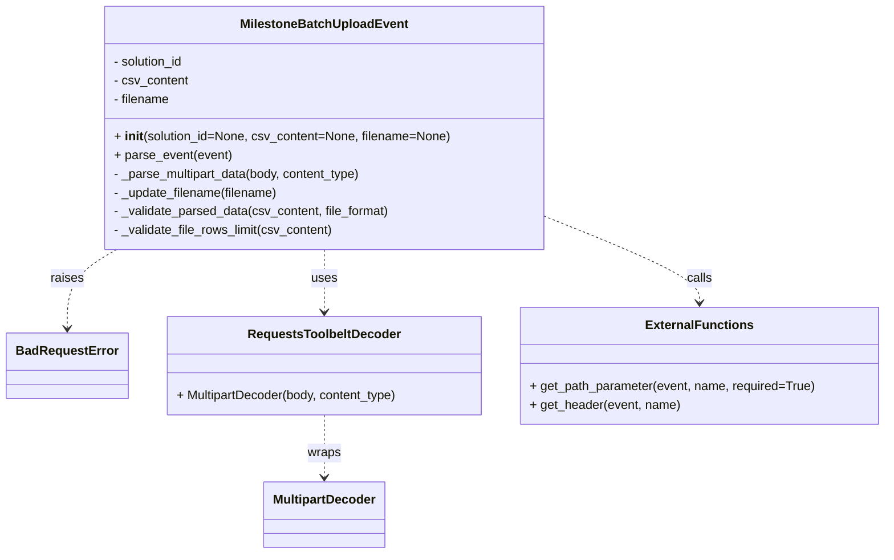

# Diagram: entity_core/entity_service/entity_service/entity/status_update/service/milestone_batch_upload_parser.py


> Auto-generated by Obscura crawlers

## Diagram 1



### SVG

<svg id="container" width="1129.7578125" xmlns="http://www.w3.org/2000/svg" class="classDiagram" height="710" viewBox="0 0 1129.7578125 710" role="graphics-document document" aria-roledescription="class"><style>#container{font-family:"trebuchet ms",verdana,arial,sans-serif;font-size:16px;fill:#333;}@keyframes edge-animation-frame{from{stroke-dashoffset:0;}}@keyframes dash{to{stroke-dashoffset:0;}}#container .edge-animation-slow{stroke-dasharray:9,5!important;stroke-dashoffset:900;animation:dash 50s linear infinite;stroke-linecap:round;}#container .edge-animation-fast{stroke-dasharray:9,5!important;stroke-dashoffset:900;animation:dash 20s linear infinite;stroke-linecap:round;}#container .error-icon{fill:#552222;}#container .error-text{fill:#552222;stroke:#552222;}#container .edge-thickness-normal{stroke-width:1px;}#container .edge-thickness-thick{stroke-width:3.5px;}#container .edge-pattern-solid{stroke-dasharray:0;}#container .edge-thickness-invisible{stroke-width:0;fill:none;}#container .edge-pattern-dashed{stroke-dasharray:3;}#container .edge-pattern-dotted{stroke-dasharray:2;}#container .marker{fill:#333333;stroke:#333333;}#container .marker.cross{stroke:#333333;}#container svg{font-family:"trebuchet ms",verdana,arial,sans-serif;font-size:16px;}#container p{margin:0;}#container g.classGroup text{fill:#9370DB;stroke:none;font-family:"trebuchet ms",verdana,arial,sans-serif;font-size:10px;}#container g.classGroup text .title{font-weight:bolder;}#container .nodeLabel,#container .edgeLabel{color:#131300;}#container .edgeLabel .label rect{fill:#ECECFF;}#container .label text{fill:#131300;}#container .labelBkg{background:#ECECFF;}#container .edgeLabel .label span{background:#ECECFF;}#container .classTitle{font-weight:bolder;}#container .node rect,#container .node circle,#container .node ellipse,#container .node polygon,#container .node path{fill:#ECECFF;stroke:#9370DB;stroke-width:1px;}#container .divider{stroke:#9370DB;stroke-width:1;}#container g.clickable{cursor:pointer;}#container g.classGroup rect{fill:#ECECFF;stroke:#9370DB;}#container g.classGroup line{stroke:#9370DB;stroke-width:1;}#container .classLabel .box{stroke:none;stroke-width:0;fill:#ECECFF;opacity:0.5;}#container .classLabel .label{fill:#9370DB;font-size:10px;}#container .relation{stroke:#333333;stroke-width:1;fill:none;}#container .dashed-line{stroke-dasharray:3;}#container .dotted-line{stroke-dasharray:1 2;}#container #compositionStart,#container .composition{fill:#333333!important;stroke:#333333!important;stroke-width:1;}#container #compositionEnd,#container .composition{fill:#333333!important;stroke:#333333!important;stroke-width:1;}#container #dependencyStart,#container .dependency{fill:#333333!important;stroke:#333333!important;stroke-width:1;}#container #dependencyStart,#container .dependency{fill:#333333!important;stroke:#333333!important;stroke-width:1;}#container #extensionStart,#container .extension{fill:transparent!important;stroke:#333333!important;stroke-width:1;}#container #extensionEnd,#container .extension{fill:transparent!important;stroke:#333333!important;stroke-width:1;}#container #aggregationStart,#container .aggregation{fill:transparent!important;stroke:#333333!important;stroke-width:1;}#container #aggregationEnd,#container .aggregation{fill:transparent!important;stroke:#333333!important;stroke-width:1;}#container #lollipopStart,#container .lollipop{fill:#ECECFF!important;stroke:#333333!important;stroke-width:1;}#container #lollipopEnd,#container .lollipop{fill:#ECECFF!important;stroke:#333333!important;stroke-width:1;}#container .edgeTerminals{font-size:11px;line-height:initial;}#container .classTitleText{text-anchor:middle;font-size:18px;fill:#333;}#container .label-icon{display:inline-block;height:1em;overflow:visible;vertical-align:-0.125em;}#container .node .label-icon path{fill:currentColor;stroke:revert;stroke-width:revert;}#container :root{--mermaid-font-family:"trebuchet ms",verdana,arial,sans-serif;}</style><g><defs><marker id="container_class-aggregationStart" class="marker aggregation class" refX="18" refY="7" markerWidth="190" markerHeight="240" orient="auto"><path d="M 18,7 L9,13 L1,7 L9,1 Z"></path></marker></defs><defs><marker id="container_class-aggregationEnd" class="marker aggregation class" refX="1" refY="7" markerWidth="20" markerHeight="28" orient="auto"><path d="M 18,7 L9,13 L1,7 L9,1 Z"></path></marker></defs><defs><marker id="container_class-extensionStart" class="marker extension class" refX="18" refY="7" markerWidth="190" markerHeight="240" orient="auto"><path d="M 1,7 L18,13 V 1 Z"></path></marker></defs><defs><marker id="container_class-extensionEnd" class="marker extension class" refX="1" refY="7" markerWidth="20" markerHeight="28" orient="auto"><path d="M 1,1 V 13 L18,7 Z"></path></marker></defs><defs><marker id="container_class-compositionStart" class="marker composition class" refX="18" refY="7" markerWidth="190" markerHeight="240" orient="auto"><path d="M 18,7 L9,13 L1,7 L9,1 Z"></path></marker></defs><defs><marker id="container_class-compositionEnd" class="marker composition class" refX="1" refY="7" markerWidth="20" markerHeight="28" orient="auto"><path d="M 18,7 L9,13 L1,7 L9,1 Z"></path></marker></defs><defs><marker id="container_class-dependencyStart" class="marker dependency class" refX="6" refY="7" markerWidth="190" markerHeight="240" orient="auto"><path d="M 5,7 L9,13 L1,7 L9,1 Z"></path></marker></defs><defs><marker id="container_class-dependencyEnd" class="marker dependency class" refX="13" refY="7" markerWidth="20" markerHeight="28" orient="auto"><path d="M 18,7 L9,13 L14,7 L9,1 Z"></path></marker></defs><defs><marker id="container_class-lollipopStart" class="marker lollipop class" refX="13" refY="7" markerWidth="190" markerHeight="240" orient="auto"><circle stroke="black" fill="transparent" cx="7" cy="7" r="6"></circle></marker></defs><defs><marker id="container_class-lollipopEnd" class="marker lollipop class" refX="1" refY="7" markerWidth="190" markerHeight="240" orient="auto"><circle stroke="black" fill="transparent" cx="7" cy="7" r="6"></circle></marker></defs><g class="root"><g class="clusters"></g><g class="edgePaths"><path d="M145.116,320L134.644,326.167C124.171,332.333,103.226,344.667,92.754,361.5C82.281,378.333,82.281,399.667,82.281,410.333L82.281,421" id="id_MilestoneBatchUploadEvent_BadRequestError_1" class="edge-thickness-normal edge-pattern-dashed relation" style=";;;" data-edge="true" data-et="edge" data-id="id_MilestoneBatchUploadEvent_BadRequestError_1" data-points="W3sieCI6MTQ1LjExNjM5ODE1NDE0NTEsInkiOjMyMH0seyJ4Ijo4Mi4yODEyNSwieSI6MzU3fSx7IngiOjgyLjI4MTI1LCJ5Ijo0Mjd9XQ==" marker-end="url(#container_class-dependencyEnd)"></path><path d="M410.043,320L410.043,326.167C410.043,332.333,410.043,344.667,410.043,358C410.043,371.333,410.043,385.667,410.043,392.833L410.043,400" id="id_MilestoneBatchUploadEvent_RequestsToolbeltDecoder_2" class="edge-thickness-normal edge-pattern-dashed relation" style=";;;" data-edge="true" data-et="edge" data-id="id_MilestoneBatchUploadEvent_RequestsToolbeltDecoder_2" data-points="W3sieCI6NDEwLjA0Mjk2ODc1LCJ5IjozMjB9LHsieCI6NDEwLjA0Mjk2ODc1LCJ5IjozNTd9LHsieCI6NDEwLjA0Mjk2ODc1LCJ5Ijo0MDZ9XQ==" marker-end="url(#container_class-dependencyEnd)"></path><path d="M689.934,275.934L723.718,289.445C757.503,302.956,825.072,329.978,858.856,348.656C892.641,367.333,892.641,377.667,892.641,382.833L892.641,388" id="id_MilestoneBatchUploadEvent_ExternalFunctions_3" class="edge-thickness-normal edge-pattern-dashed relation" style=";;;" data-edge="true" data-et="edge" data-id="id_MilestoneBatchUploadEvent_ExternalFunctions_3" data-points="W3sieCI6Njg5LjkzMzU5Mzc1LCJ5IjoyNzUuOTMzNTk1MDQ2MzM5NH0seyJ4Ijo4OTIuNjQwNjI1LCJ5IjozNTd9LHsieCI6ODkyLjY0MDYyNSwieSI6Mzk0fV0=" marker-end="url(#container_class-dependencyEnd)"></path><path d="M410.043,532L410.043,540.167C410.043,548.333,410.043,564.667,410.043,578C410.043,591.333,410.043,601.667,410.043,606.833L410.043,612" id="id_RequestsToolbeltDecoder_MultipartDecoder_4" class="edge-thickness-normal edge-pattern-dashed relation" style=";;;" data-edge="true" data-et="edge" data-id="id_RequestsToolbeltDecoder_MultipartDecoder_4" data-points="W3sieCI6NDEwLjA0Mjk2ODc1LCJ5Ijo1MzJ9LHsieCI6NDEwLjA0Mjk2ODc1LCJ5Ijo1ODF9LHsieCI6NDEwLjA0Mjk2ODc1LCJ5Ijo2MTh9XQ==" marker-end="url(#container_class-dependencyEnd)"></path></g><g class="edgeLabels"><g class="edgeLabel" transform="translate(82.28125, 357)"><g class="label" data-id="id_MilestoneBatchUploadEvent_BadRequestError_1" transform="translate(-21.25, -12)"><foreignObject width="42.5" height="24"><div xmlns="http://www.w3.org/1999/xhtml" class="labelBkg" style="display: table-cell; white-space: nowrap; line-height: 1.5; max-width: 200px; text-align: center;"><span class="edgeLabel"><p>raises</p></span></div></foreignObject></g></g><g class="edgeLabel" transform="translate(410.04296875, 357)"><g class="label" data-id="id_MilestoneBatchUploadEvent_RequestsToolbeltDecoder_2" transform="translate(-16.4921875, -12)"><foreignObject width="32.984375" height="24"><div xmlns="http://www.w3.org/1999/xhtml" class="labelBkg" style="display: table-cell; white-space: nowrap; line-height: 1.5; max-width: 200px; text-align: center;"><span class="edgeLabel"><p>uses</p></span></div></foreignObject></g></g><g class="edgeLabel" transform="translate(892.640625, 357)"><g class="label" data-id="id_MilestoneBatchUploadEvent_ExternalFunctions_3" transform="translate(-16.4453125, -12)"><foreignObject width="32.890625" height="24"><div xmlns="http://www.w3.org/1999/xhtml" class="labelBkg" style="display: table-cell; white-space: nowrap; line-height: 1.5; max-width: 200px; text-align: center;"><span class="edgeLabel"><p>calls</p></span></div></foreignObject></g></g><g class="edgeLabel" transform="translate(410.04296875, 581)"><g class="label" data-id="id_RequestsToolbeltDecoder_MultipartDecoder_4" transform="translate(-21.390625, -12)"><foreignObject width="42.78125" height="24"><div xmlns="http://www.w3.org/1999/xhtml" class="labelBkg" style="display: table-cell; white-space: nowrap; line-height: 1.5; max-width: 200px; text-align: center;"><span class="edgeLabel"><p>wraps</p></span></div></foreignObject></g></g></g><g class="nodes"><g class="node default" id="classId-MilestoneBatchUploadEvent-0" transform="translate(410.04296875, 164)"><g class="basic label-container"><path d="M-279.890625 -156 L279.890625 -156 L279.890625 156 L-279.890625 156" stroke="none" stroke-width="0" fill="#ECECFF" style=""></path><path d="M-279.890625 -156 C-85.04719745815677 -156, 109.79623008368645 -156, 279.890625 -156 M-279.890625 -156 C-149.48321464263745 -156, -19.0758042852749 -156, 279.890625 -156 M279.890625 -156 C279.890625 -42.71972121300546, 279.890625 70.56055757398909, 279.890625 156 M279.890625 -156 C279.890625 -61.589210368519915, 279.890625 32.82157926296017, 279.890625 156 M279.890625 156 C159.89271007914687 156, 39.89479515829376 156, -279.890625 156 M279.890625 156 C70.35216043740212 156, -139.18630412519576 156, -279.890625 156 M-279.890625 156 C-279.890625 83.43078626804697, -279.890625 10.861572536093945, -279.890625 -156 M-279.890625 156 C-279.890625 74.08200151061855, -279.890625 -7.835996978762893, -279.890625 -156" stroke="#9370DB" stroke-width="1.3" fill="none" stroke-dasharray="0 0" style=""></path></g><g class="annotation-group text" transform="translate(0, -132)"></g><g class="label-group text" transform="translate(-102.828125, -132)"><g class="label" style="font-weight: bolder" transform="translate(0,-12)"><foreignObject width="205.65625" height="24"><div xmlns="http://www.w3.org/1999/xhtml" style="display: table-cell; white-space: nowrap; line-height: 1.5; max-width: 254px; text-align: center;"><span class="nodeLabel markdown-node-label" style=""><p>MilestoneBatchUploadEvent</p></span></div></foreignObject></g></g><g class="members-group text" transform="translate(-267.890625, -84)"><g class="label" style="" transform="translate(0,-12)"><foreignObject width="92.921875" height="24"><div xmlns="http://www.w3.org/1999/xhtml" style="display: table-cell; white-space: nowrap; line-height: 1.5; max-width: 150px; text-align: center;"><span class="nodeLabel markdown-node-label" style=""><p>- solution_id</p></span></div></foreignObject></g><g class="label" style="" transform="translate(0,12)"><foreignObject width="96.390625" height="24"><div xmlns="http://www.w3.org/1999/xhtml" style="display: table-cell; white-space: nowrap; line-height: 1.5; max-width: 154px; text-align: center;"><span class="nodeLabel markdown-node-label" style=""><p>- csv_content</p></span></div></foreignObject></g><g class="label" style="" transform="translate(0,36)"><foreignObject width="73.734375" height="24"><div xmlns="http://www.w3.org/1999/xhtml" style="display: table-cell; white-space: nowrap; line-height: 1.5; max-width: 131px; text-align: center;"><span class="nodeLabel markdown-node-label" style=""><p>- filename</p></span></div></foreignObject></g></g><g class="methods-group text" transform="translate(-267.890625, 12)"><g class="label" style="" transform="translate(0,-12)"><foreignObject width="432.953125" height="24"><div xmlns="http://www.w3.org/1999/xhtml" style="display: table-cell; white-space: nowrap; line-height: 1.5; max-width: 523px; text-align: center;"><span class="nodeLabel markdown-node-label" style=""><p>+ <strong>init</strong>(solution_id=None, csv_content=None, filename=None)</p></span></div></foreignObject></g><g class="label" style="" transform="translate(0,12)"><foreignObject width="151.125" height="24"><div xmlns="http://www.w3.org/1999/xhtml" style="display: table-cell; white-space: nowrap; line-height: 1.5; max-width: 208px; text-align: center;"><span class="nodeLabel markdown-node-label" style=""><p>+ parse_event(event)</p></span></div></foreignObject></g><g class="label" style="" transform="translate(0,36)"><foreignObject width="325.171875" height="24"><div xmlns="http://www.w3.org/1999/xhtml" style="display: table-cell; white-space: nowrap; line-height: 1.5; max-width: 383px; text-align: center;"><span class="nodeLabel markdown-node-label" style=""><p>- _parse_multipart_data(body, content_type)</p></span></div></foreignObject></g><g class="label" style="" transform="translate(0,60)"><foreignObject width="214.171875" height="24"><div xmlns="http://www.w3.org/1999/xhtml" style="display: table-cell; white-space: nowrap; line-height: 1.5; max-width: 272px; text-align: center;"><span class="nodeLabel markdown-node-label" style=""><p>- _update_filename(filename)</p></span></div></foreignObject></g><g class="label" style="" transform="translate(0,84)"><foreignObject width="358.140625" height="24"><div xmlns="http://www.w3.org/1999/xhtml" style="display: table-cell; white-space: nowrap; line-height: 1.5; max-width: 416px; text-align: center;"><span class="nodeLabel markdown-node-label" style=""><p>- _validate_parsed_data(csv_content, file_format)</p></span></div></foreignObject></g><g class="label" style="" transform="translate(0,108)"><foreignObject width="285.71875" height="24"><div xmlns="http://www.w3.org/1999/xhtml" style="display: table-cell; white-space: nowrap; line-height: 1.5; max-width: 343px; text-align: center;"><span class="nodeLabel markdown-node-label" style=""><p>- _validate_file_rows_limit(csv_content)</p></span></div></foreignObject></g></g><g class="divider" style=""><path d="M-279.890625 -108 C-138.46890230876534 -108, 2.9528203824693264 -108, 279.890625 -108 M-279.890625 -108 C-90.27226345509848 -108, 99.34609808980304 -108, 279.890625 -108" stroke="#9370DB" stroke-width="1.3" fill="none" stroke-dasharray="0 0" style=""></path></g><g class="divider" style=""><path d="M-279.890625 -12 C-106.67224563772501 -12, 66.54613372454997 -12, 279.890625 -12 M-279.890625 -12 C-161.84782406681325 -12, -43.80502313362649 -12, 279.890625 -12" stroke="#9370DB" stroke-width="1.3" fill="none" stroke-dasharray="0 0" style=""></path></g></g><g class="node default" id="classId-BadRequestError-1" transform="translate(82.28125, 469)"><g class="basic label-container"><path d="M-74.28125 -42 L74.28125 -42 L74.28125 42 L-74.28125 42" stroke="none" stroke-width="0" fill="#ECECFF" style=""></path><path d="M-74.28125 -42 C-35.698300893042436 -42, 2.8846482139151277 -42, 74.28125 -42 M-74.28125 -42 C-44.01354388262162 -42, -13.745837765243245 -42, 74.28125 -42 M74.28125 -42 C74.28125 -22.242288438996567, 74.28125 -2.4845768779931348, 74.28125 42 M74.28125 -42 C74.28125 -9.262914218171545, 74.28125 23.47417156365691, 74.28125 42 M74.28125 42 C36.361644703180694 42, -1.5579605936386116 42, -74.28125 42 M74.28125 42 C24.916952451117737 42, -24.447345097764526 42, -74.28125 42 M-74.28125 42 C-74.28125 19.013869613810765, -74.28125 -3.972260772378469, -74.28125 -42 M-74.28125 42 C-74.28125 24.434137703219598, -74.28125 6.868275406439196, -74.28125 -42" stroke="#9370DB" stroke-width="1.3" fill="none" stroke-dasharray="0 0" style=""></path></g><g class="annotation-group text" transform="translate(0, -18)"></g><g class="label-group text" transform="translate(-62.28125, -18)"><g class="label" style="font-weight: bolder" transform="translate(0,-12)"><foreignObject width="124.5625" height="24"><div xmlns="http://www.w3.org/1999/xhtml" style="display: table-cell; white-space: nowrap; line-height: 1.5; max-width: 174px; text-align: center;"><span class="nodeLabel markdown-node-label" style=""><p>BadRequestError</p></span></div></foreignObject></g></g><g class="members-group text" transform="translate(-62.28125, 30)"></g><g class="methods-group text" transform="translate(-62.28125, 60)"></g><g class="divider" style=""><path d="M-74.28125 6 C-27.582263011603175 6, 19.11672397679365 6, 74.28125 6 M-74.28125 6 C-39.9289485018155 6, -5.576647003630995 6, 74.28125 6" stroke="#9370DB" stroke-width="1.3" fill="none" stroke-dasharray="0 0" style=""></path></g><g class="divider" style=""><path d="M-74.28125 24 C-36.51584534835425 24, 1.2495593032915053 24, 74.28125 24 M-74.28125 24 C-26.015763117223784 24, 22.24972376555243 24, 74.28125 24" stroke="#9370DB" stroke-width="1.3" fill="none" stroke-dasharray="0 0" style=""></path></g></g><g class="node default" id="classId-MultipartDecoder-2" transform="translate(410.04296875, 660)"><g class="basic label-container"><path d="M-76.359375 -42 L76.359375 -42 L76.359375 42 L-76.359375 42" stroke="none" stroke-width="0" fill="#ECECFF" style=""></path><path d="M-76.359375 -42 C-38.78603957415283 -42, -1.2127041483056615 -42, 76.359375 -42 M-76.359375 -42 C-31.344340015374947 -42, 13.670694969250107 -42, 76.359375 -42 M76.359375 -42 C76.359375 -14.865677357238404, 76.359375 12.268645285523192, 76.359375 42 M76.359375 -42 C76.359375 -22.6504685616967, 76.359375 -3.3009371233934033, 76.359375 42 M76.359375 42 C21.70025843425043 42, -32.95885813149914 42, -76.359375 42 M76.359375 42 C34.52026711136782 42, -7.318840777264356 42, -76.359375 42 M-76.359375 42 C-76.359375 15.299342390806672, -76.359375 -11.401315218386657, -76.359375 -42 M-76.359375 42 C-76.359375 12.820666550852312, -76.359375 -16.358666898295375, -76.359375 -42" stroke="#9370DB" stroke-width="1.3" fill="none" stroke-dasharray="0 0" style=""></path></g><g class="annotation-group text" transform="translate(0, -18)"></g><g class="label-group text" transform="translate(-64.359375, -18)"><g class="label" style="font-weight: bolder" transform="translate(0,-12)"><foreignObject width="128.71875" height="24"><div xmlns="http://www.w3.org/1999/xhtml" style="display: table-cell; white-space: nowrap; line-height: 1.5; max-width: 178px; text-align: center;"><span class="nodeLabel markdown-node-label" style=""><p>MultipartDecoder</p></span></div></foreignObject></g></g><g class="members-group text" transform="translate(-64.359375, 30)"></g><g class="methods-group text" transform="translate(-64.359375, 60)"></g><g class="divider" style=""><path d="M-76.359375 6 C-25.066728109124107 6, 26.225918781751787 6, 76.359375 6 M-76.359375 6 C-24.396986822997164 6, 27.565401354005672 6, 76.359375 6" stroke="#9370DB" stroke-width="1.3" fill="none" stroke-dasharray="0 0" style=""></path></g><g class="divider" style=""><path d="M-76.359375 24 C-18.06169854568129 24, 40.23597790863742 24, 76.359375 24 M-76.359375 24 C-44.80221578879791 24, -13.245056577595818 24, 76.359375 24" stroke="#9370DB" stroke-width="1.3" fill="none" stroke-dasharray="0 0" style=""></path></g></g><g class="node default" id="classId-RequestsToolbeltDecoder-3" transform="translate(410.04296875, 469)"><g class="basic label-container"><path d="M-203.48046875 -63 L203.48046875 -63 L203.48046875 63 L-203.48046875 63" stroke="none" stroke-width="0" fill="#ECECFF" style=""></path><path d="M-203.48046875 -63 C-48.6016647533215 -63, 106.277139243357 -63, 203.48046875 -63 M-203.48046875 -63 C-45.95626489137911 -63, 111.56793896724179 -63, 203.48046875 -63 M203.48046875 -63 C203.48046875 -31.54897504250839, 203.48046875 -0.09795008501677671, 203.48046875 63 M203.48046875 -63 C203.48046875 -36.71285626863954, 203.48046875 -10.425712537279075, 203.48046875 63 M203.48046875 63 C49.54740241082837 63, -104.38566392834326 63, -203.48046875 63 M203.48046875 63 C72.86383202523143 63, -57.75280469953714 63, -203.48046875 63 M-203.48046875 63 C-203.48046875 16.337563990798728, -203.48046875 -30.324872018402544, -203.48046875 -63 M-203.48046875 63 C-203.48046875 32.102045424624365, -203.48046875 1.204090849248729, -203.48046875 -63" stroke="#9370DB" stroke-width="1.3" fill="none" stroke-dasharray="0 0" style=""></path></g><g class="annotation-group text" transform="translate(0, -39)"></g><g class="label-group text" transform="translate(-94.4921875, -39)"><g class="label" style="font-weight: bolder" transform="translate(0,-12)"><foreignObject width="188.984375" height="24"><div xmlns="http://www.w3.org/1999/xhtml" style="display: table-cell; white-space: nowrap; line-height: 1.5; max-width: 237px; text-align: center;"><span class="nodeLabel markdown-node-label" style=""><p>RequestsToolbeltDecoder</p></span></div></foreignObject></g></g><g class="members-group text" transform="translate(-191.48046875, 9)"></g><g class="methods-group text" transform="translate(-191.48046875, 39)"><g class="label" style="" transform="translate(0,-12)"><foreignObject width="288.46875" height="24"><div xmlns="http://www.w3.org/1999/xhtml" style="display: table-cell; white-space: nowrap; line-height: 1.5; max-width: 346px; text-align: center;"><span class="nodeLabel markdown-node-label" style=""><p>+ MultipartDecoder(body, content_type)</p></span></div></foreignObject></g></g><g class="divider" style=""><path d="M-203.48046875 -15 C-116.47026432153808 -15, -29.460059893076163 -15, 203.48046875 -15 M-203.48046875 -15 C-91.90456541004312 -15, 19.67133792991376 -15, 203.48046875 -15" stroke="#9370DB" stroke-width="1.3" fill="none" stroke-dasharray="0 0" style=""></path></g><g class="divider" style=""><path d="M-203.48046875 9 C-105.49741711881569 9, -7.51436548763138 9, 203.48046875 9 M-203.48046875 9 C-112.48308966209322 9, -21.48571057418644 9, 203.48046875 9" stroke="#9370DB" stroke-width="1.3" fill="none" stroke-dasharray="0 0" style=""></path></g></g><g class="node default" id="classId-ExternalFunctions-4" transform="translate(892.640625, 469)"><g class="basic label-container"><path d="M-229.1171875 -75 L229.1171875 -75 L229.1171875 75 L-229.1171875 75" stroke="none" stroke-width="0" fill="#ECECFF" style=""></path><path d="M-229.1171875 -75 C-58.05776121684647 -75, 113.00166506630705 -75, 229.1171875 -75 M-229.1171875 -75 C-64.45896088714494 -75, 100.19926572571012 -75, 229.1171875 -75 M229.1171875 -75 C229.1171875 -32.47407168619643, 229.1171875 10.051856627607137, 229.1171875 75 M229.1171875 -75 C229.1171875 -44.65037873897916, 229.1171875 -14.300757477958314, 229.1171875 75 M229.1171875 75 C62.70484228148871 75, -103.70750293702258 75, -229.1171875 75 M229.1171875 75 C134.80045172531132 75, 40.48371595062264 75, -229.1171875 75 M-229.1171875 75 C-229.1171875 26.981177359259675, -229.1171875 -21.03764528148065, -229.1171875 -75 M-229.1171875 75 C-229.1171875 19.432471599354713, -229.1171875 -36.135056801290574, -229.1171875 -75" stroke="#9370DB" stroke-width="1.3" fill="none" stroke-dasharray="0 0" style=""></path></g><g class="annotation-group text" transform="translate(0, -51)"></g><g class="label-group text" transform="translate(-65.296875, -51)"><g class="label" style="font-weight: bolder" transform="translate(0,-12)"><foreignObject width="130.59375" height="24"><div xmlns="http://www.w3.org/1999/xhtml" style="display: table-cell; white-space: nowrap; line-height: 1.5; max-width: 179px; text-align: center;"><span class="nodeLabel markdown-node-label" style=""><p>ExternalFunctions</p></span></div></foreignObject></g></g><g class="members-group text" transform="translate(-217.1171875, -3)"></g><g class="methods-group text" transform="translate(-217.1171875, 27)"><g class="label" style="" transform="translate(0,-12)"><foreignObject width="368.9375" height="24"><div xmlns="http://www.w3.org/1999/xhtml" style="display: table-cell; white-space: nowrap; line-height: 1.5; max-width: 426px; text-align: center;"><span class="nodeLabel markdown-node-label" style=""><p>+ get_path_parameter(event, name, required=True)</p></span></div></foreignObject></g><g class="label" style="" transform="translate(0,12)"><foreignObject width="193.578125" height="24"><div xmlns="http://www.w3.org/1999/xhtml" style="display: table-cell; white-space: nowrap; line-height: 1.5; max-width: 251px; text-align: center;"><span class="nodeLabel markdown-node-label" style=""><p>+ get_header(event, name)</p></span></div></foreignObject></g></g><g class="divider" style=""><path d="M-229.1171875 -27 C-84.76117238116774 -27, 59.59484273766452 -27, 229.1171875 -27 M-229.1171875 -27 C-66.46029850717503 -27, 96.19659048564995 -27, 229.1171875 -27" stroke="#9370DB" stroke-width="1.3" fill="none" stroke-dasharray="0 0" style=""></path></g><g class="divider" style=""><path d="M-229.1171875 -3 C-135.1380651872327 -3, -41.158942874465396 -3, 229.1171875 -3 M-229.1171875 -3 C-112.31898089303014 -3, 4.479225713939712 -3, 229.1171875 -3" stroke="#9370DB" stroke-width="1.3" fill="none" stroke-dasharray="0 0" style=""></path></g></g></g></g></g></svg>

## Diagram 2

```mermaid
flowchart TD
Start([Start]) --> P1[get_path_parameter(event, "solution_id", required=True)]
P1 --> P2[get_header(event, "content-type")]
P2 --> P3{body present?}
P3 -- No --> ErrBody[/"Raise BadRequestError: Event body not found."/]
P3 -- Yes --> Parse[_parse_multipart_data(body, content_type)]
Parse -->|parsing error| ErrParse[/"Raise BadRequestError: Failed to parse the content due to invalid data"/]
Parse -->|file part found| ValidateFormat[_validate_parsed_data(csv_content, file_format)]
ValidateFormat -->|file_format != text/csv| ErrFormat[/"Raise BadRequestError: Unsupported file type."/]
ValidateFormat -->|file_format == text/csv| CheckEmpty{csv_content.strip() != ""}
CheckEmpty -- False --> ErrEmpty[/"Raise BadRequestError: No CSV file found in the request."/]
CheckEmpty -- True --> RowCount[_validate_file_rows_limit(csv_content)]
RowCount --> RowCheck{number_of_rows <= 5000}
RowCheck -- False --> ErrRows[/"Raise BadRequestError: CSV payload size greater than 5000 row threshold"/]
RowCheck -- True --> Update[_update_filename(filename)]
Update --> Return[Return MilestoneBatchUploadEvent(solution_id, csv_content, filename)]
Return --> End([End])
```

> SVG rendering failed for this diagram.
