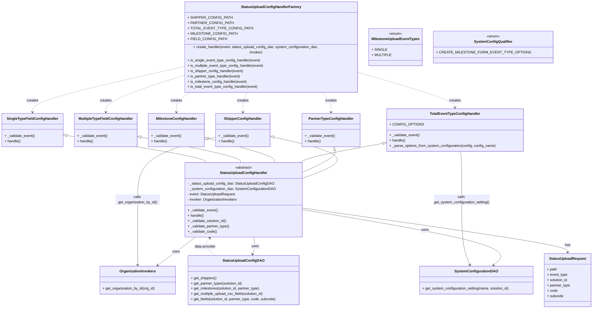

# Diagram: entity_core/entity_service/entity_service/entity/status_update/service/status_upload_config_handler.py


> Auto-generated by Obscura crawlers

## Diagram 1



### SVG

<svg id="container" width="2645.98046875" xmlns="http://www.w3.org/2000/svg" class="classDiagram" height="1366" viewBox="0 0 2645.98046875 1366" role="graphics-document document" aria-roledescription="class"><style>#container{font-family:"trebuchet ms",verdana,arial,sans-serif;font-size:16px;fill:#333;}@keyframes edge-animation-frame{from{stroke-dashoffset:0;}}@keyframes dash{to{stroke-dashoffset:0;}}#container .edge-animation-slow{stroke-dasharray:9,5!important;stroke-dashoffset:900;animation:dash 50s linear infinite;stroke-linecap:round;}#container .edge-animation-fast{stroke-dasharray:9,5!important;stroke-dashoffset:900;animation:dash 20s linear infinite;stroke-linecap:round;}#container .error-icon{fill:#552222;}#container .error-text{fill:#552222;stroke:#552222;}#container .edge-thickness-normal{stroke-width:1px;}#container .edge-thickness-thick{stroke-width:3.5px;}#container .edge-pattern-solid{stroke-dasharray:0;}#container .edge-thickness-invisible{stroke-width:0;fill:none;}#container .edge-pattern-dashed{stroke-dasharray:3;}#container .edge-pattern-dotted{stroke-dasharray:2;}#container .marker{fill:#333333;stroke:#333333;}#container .marker.cross{stroke:#333333;}#container svg{font-family:"trebuchet ms",verdana,arial,sans-serif;font-size:16px;}#container p{margin:0;}#container g.classGroup text{fill:#9370DB;stroke:none;font-family:"trebuchet ms",verdana,arial,sans-serif;font-size:10px;}#container g.classGroup text .title{font-weight:bolder;}#container .nodeLabel,#container .edgeLabel{color:#131300;}#container .edgeLabel .label rect{fill:#ECECFF;}#container .label text{fill:#131300;}#container .labelBkg{background:#ECECFF;}#container .edgeLabel .label span{background:#ECECFF;}#container .classTitle{font-weight:bolder;}#container .node rect,#container .node circle,#container .node ellipse,#container .node polygon,#container .node path{fill:#ECECFF;stroke:#9370DB;stroke-width:1px;}#container .divider{stroke:#9370DB;stroke-width:1;}#container g.clickable{cursor:pointer;}#container g.classGroup rect{fill:#ECECFF;stroke:#9370DB;}#container g.classGroup line{stroke:#9370DB;stroke-width:1;}#container .classLabel .box{stroke:none;stroke-width:0;fill:#ECECFF;opacity:0.5;}#container .classLabel .label{fill:#9370DB;font-size:10px;}#container .relation{stroke:#333333;stroke-width:1;fill:none;}#container .dashed-line{stroke-dasharray:3;}#container .dotted-line{stroke-dasharray:1 2;}#container #compositionStart,#container .composition{fill:#333333!important;stroke:#333333!important;stroke-width:1;}#container #compositionEnd,#container .composition{fill:#333333!important;stroke:#333333!important;stroke-width:1;}#container #dependencyStart,#container .dependency{fill:#333333!important;stroke:#333333!important;stroke-width:1;}#container #dependencyStart,#container .dependency{fill:#333333!important;stroke:#333333!important;stroke-width:1;}#container #extensionStart,#container .extension{fill:transparent!important;stroke:#333333!important;stroke-width:1;}#container #extensionEnd,#container .extension{fill:transparent!important;stroke:#333333!important;stroke-width:1;}#container #aggregationStart,#container .aggregation{fill:transparent!important;stroke:#333333!important;stroke-width:1;}#container #aggregationEnd,#container .aggregation{fill:transparent!important;stroke:#333333!important;stroke-width:1;}#container #lollipopStart,#container .lollipop{fill:#ECECFF!important;stroke:#333333!important;stroke-width:1;}#container #lollipopEnd,#container .lollipop{fill:#ECECFF!important;stroke:#333333!important;stroke-width:1;}#container .edgeTerminals{font-size:11px;line-height:initial;}#container .classTitleText{text-anchor:middle;font-size:18px;fill:#333;}#container .label-icon{display:inline-block;height:1em;overflow:visible;vertical-align:-0.125em;}#container .node .label-icon path{fill:currentColor;stroke:revert;stroke-width:revert;}#container :root{--mermaid-font-family:"trebuchet ms",verdana,arial,sans-serif;}</style><g><defs><marker id="container_class-aggregationStart" class="marker aggregation class" refX="18" refY="7" markerWidth="190" markerHeight="240" orient="auto"><path d="M 18,7 L9,13 L1,7 L9,1 Z"></path></marker></defs><defs><marker id="container_class-aggregationEnd" class="marker aggregation class" refX="1" refY="7" markerWidth="20" markerHeight="28" orient="auto"><path d="M 18,7 L9,13 L1,7 L9,1 Z"></path></marker></defs><defs><marker id="container_class-extensionStart" class="marker extension class" refX="18" refY="7" markerWidth="190" markerHeight="240" orient="auto"><path d="M 1,7 L18,13 V 1 Z"></path></marker></defs><defs><marker id="container_class-extensionEnd" class="marker extension class" refX="1" refY="7" markerWidth="20" markerHeight="28" orient="auto"><path d="M 1,1 V 13 L18,7 Z"></path></marker></defs><defs><marker id="container_class-compositionStart" class="marker composition class" refX="18" refY="7" markerWidth="190" markerHeight="240" orient="auto"><path d="M 18,7 L9,13 L1,7 L9,1 Z"></path></marker></defs><defs><marker id="container_class-compositionEnd" class="marker composition class" refX="1" refY="7" markerWidth="20" markerHeight="28" orient="auto"><path d="M 18,7 L9,13 L1,7 L9,1 Z"></path></marker></defs><defs><marker id="container_class-dependencyStart" class="marker dependency class" refX="6" refY="7" markerWidth="190" markerHeight="240" orient="auto"><path d="M 5,7 L9,13 L1,7 L9,1 Z"></path></marker></defs><defs><marker id="container_class-dependencyEnd" class="marker dependency class" refX="13" refY="7" markerWidth="20" markerHeight="28" orient="auto"><path d="M 18,7 L9,13 L14,7 L9,1 Z"></path></marker></defs><defs><marker id="container_class-lollipopStart" class="marker lollipop class" refX="13" refY="7" markerWidth="190" markerHeight="240" orient="auto"><circle stroke="black" fill="transparent" cx="7" cy="7" r="6"></circle></marker></defs><defs><marker id="container_class-lollipopEnd" class="marker lollipop class" refX="1" refY="7" markerWidth="190" markerHeight="240" orient="auto"><circle stroke="black" fill="transparent" cx="7" cy="7" r="6"></circle></marker></defs><g class="root"><g class="clusters"></g><g class="edgePaths"><path d="M1211.037,593.321L1276.561,608.268C1342.084,623.214,1473.132,653.107,1495.44,684.083C1517.747,715.058,1431.315,747.117,1388.099,763.146L1344.883,779.175" id="id_ShipperConfigHandler_StatusUploadConfigHandler_1" class="edge-thickness-normal edge-pattern-solid relation" style=";;;" data-edge="true" data-et="edge" data-id="id_ShipperConfigHandler_StatusUploadConfigHandler_1" data-points="W3sieCI6MTE5NC4yMTg3NSwieSI6NTg5LjQ4NTA5NTI4OTk5Mzl9LHsieCI6MTYwNC4xNzk2ODc1LCJ5Ijo2ODN9LHsieCI6MTM0NC44ODI4MTI1LCJ5Ijo3NzkuMTc1NDU0OTI3NjMyfV0=" marker-start="url(#container_class-extensionStart)"></path><path d="M1485.537,653.981L1486.402,658.817C1487.267,663.654,1488.997,673.327,1465.554,689.693C1442.112,706.059,1393.497,729.119,1369.19,740.648L1344.883,752.178" id="id_PartnerTypeConfigHandler_StatusUploadConfigHandler_2" class="edge-thickness-normal edge-pattern-solid relation" style=";;;" data-edge="true" data-et="edge" data-id="id_PartnerTypeConfigHandler_StatusUploadConfigHandler_2" data-points="W3sieCI6MTQ4Mi41MDEwMzMwNTc4NTExLCJ5Ijo2Mzd9LHsieCI6MTQ5MC43MjY1NjI1LCJ5Ijo2ODN9LHsieCI6MTM0NC44ODI4MTI1LCJ5Ijo3NTIuMTc3OTExNzU0NTQwOX1d" marker-start="url(#container_class-extensionStart)"></path><path d="M1702.702,621.834L1647.457,632.028C1592.212,642.222,1481.721,662.611,1420.271,676.972C1358.821,691.333,1346.412,699.667,1340.208,703.833L1334.003,708" id="id_TotalEventTypeConfigHandler_StatusUploadConfigHandler_3" class="edge-thickness-normal edge-pattern-solid relation" style=";;;" data-edge="true" data-et="edge" data-id="id_TotalEventTypeConfigHandler_StatusUploadConfigHandler_3" data-points="W3sieCI6MTcxOS42NjYwMTU2MjUsInkiOjYxOC43MDMyNjM2NDQxODkyfSx7IngiOjEzNzEuMjMwNDY4NzUsInkiOjY4M30seyJ4IjoxMzM0LjAwMzE5Nzg2MjY5NDQsInkiOjcwOH1d" marker-start="url(#container_class-extensionStart)"></path><path d="M919.904,599.449L972.244,613.374C1024.583,627.299,1129.262,655.15,1178.361,673.241C1227.46,691.333,1220.979,699.667,1217.738,703.833L1214.498,708" id="id_MilestoneConfigHandler_StatusUploadConfigHandler_4" class="edge-thickness-normal edge-pattern-solid relation" style=";;;" data-edge="true" data-et="edge" data-id="id_MilestoneConfigHandler_StatusUploadConfigHandler_4" data-points="W3sieCI6OTAzLjIzNDM3NSwieSI6NTk1LjAxMzY5OTU3MTQwNTN9LHsieCI6MTIzMy45NDE0MDYyNSwieSI6NjgzfSx7IngiOjEyMTQuNDk3NjkyNjgxMzQ3MiwieSI6NzA4fV0=" marker-start="url(#container_class-extensionStart)"></path><path d="M621.973,593.309L696.241,608.258C770.508,623.206,919.043,653.103,993.662,672.218C1068.28,691.333,1068.982,699.667,1069.333,703.833L1069.684,708" id="id_MultipleTypeFieldConfigHandler_StatusUploadConfigHandler_5" class="edge-thickness-normal edge-pattern-solid relation" style=";;;" data-edge="true" data-et="edge" data-id="id_MultipleTypeFieldConfigHandler_StatusUploadConfigHandler_5" data-points="W3sieCI6NjA1LjA2MjUsInkiOjU4OS45MDU0MTY2NDUwMDd9LHsieCI6MTA2Ny41NzgxMjUsInkiOjY4M30seyJ4IjoxMDY5LjY4NDA1OTI2MTY1OCwieSI6NzA4fV0=" marker-start="url(#container_class-extensionStart)"></path><path d="M294.813,586.415L394.979,602.512C495.146,618.61,695.479,650.805,799.705,671.069C903.931,691.333,912.049,699.667,916.109,703.833L920.168,708" id="id_SingleTypeFieldConfigHandler_StatusUploadConfigHandler_6" class="edge-thickness-normal edge-pattern-solid relation" style=";;;" data-edge="true" data-et="edge" data-id="id_SingleTypeFieldConfigHandler_StatusUploadConfigHandler_6" data-points="W3sieCI6Mjc3Ljc4MTI1LCJ5Ijo1ODMuNjc3OTAwNjc4NjA2M30seyJ4Ijo4OTUuODEyNSwieSI6NjgzfSx7IngiOjkyMC4xNjc4Njc1NTE4MTM1LCJ5Ijo3MDh9XQ==" marker-start="url(#container_class-extensionStart)"></path><path d="M1128.848,1044L1130.501,1050.167C1132.153,1056.333,1135.457,1068.667,1134.758,1081.556C1134.058,1094.446,1129.354,1107.891,1127.002,1114.614L1124.65,1121.337" id="id_StatusUploadConfigHandler_StatusUploadConfigDAO_7" class="edge-thickness-normal edge-pattern-solid relation" style=";;;" data-edge="true" data-et="edge" data-id="id_StatusUploadConfigHandler_StatusUploadConfigDAO_7" data-points="W3sieCI6MTEyOC44NDgyODUwNjA5NzU1LCJ5IjoxMDQ0fSx7IngiOjExMzguNzYxNzE4NzUsInkiOjEwODF9LHsieCI6MTEyMi42Njg4MTQ2ODk0OTA1LCJ5IjoxMTI3fV0=" marker-end="url(#container_class-dependencyEnd)"></path><path d="M1344.883,919.861L1504.725,946.717C1664.567,973.574,1984.251,1027.287,2126.83,1069.154C2269.409,1111.021,2234.882,1141.042,2217.618,1156.053L2200.355,1171.063" id="id_StatusUploadConfigHandler_SystemConfigurationDAO_8" class="edge-thickness-normal edge-pattern-solid relation" style=";;;" data-edge="true" data-et="edge" data-id="id_StatusUploadConfigHandler_SystemConfigurationDAO_8" data-points="W3sieCI6MTM0NC44ODI4MTI1LCJ5Ijo5MTkuODYwODUyODA1NjI3MX0seyJ4IjoyMzAzLjkzNTU0Njg3NSwieSI6MTA4MX0seyJ4IjoyMTk1LjgyNjg5MzQxMTYyNCwieSI6MTE3NX1d" marker-end="url(#container_class-dependencyEnd)"></path><path d="M866.355,1044L858.372,1050.167C850.389,1056.333,834.423,1068.667,806.271,1089.901C778.119,1111.136,737.781,1141.273,717.611,1156.341L697.442,1171.409" id="id_StatusUploadConfigHandler_OrganizationInvokers_9" class="edge-thickness-normal edge-pattern-solid relation" style=";;;" data-edge="true" data-et="edge" data-id="id_StatusUploadConfigHandler_OrganizationInvokers_9" data-points="W3sieCI6ODY2LjM1NDY4NzUsInkiOjEwNDR9LHsieCI6ODE4LjQ1NzAzMTI1LCJ5IjoxMDgxfSx7IngiOjY5Mi42MzU2NzM3NjU5MjM2LCJ5IjoxMTc1fV0=" marker-end="url(#container_class-dependencyEnd)"></path><path d="M1344.883,912.91L1543.018,940.925C1741.154,968.94,2137.424,1024.97,2335.56,1058.152C2533.695,1091.333,2533.695,1101.667,2533.695,1106.833L2533.695,1112" id="id_StatusUploadConfigHandler_StatusUploadRequest_10" class="edge-thickness-normal edge-pattern-solid relation" style=";;;" data-edge="true" data-et="edge" data-id="id_StatusUploadConfigHandler_StatusUploadRequest_10" data-points="W3sieCI6MTM0NC44ODI4MTI1LCJ5Ijo5MTIuOTEwMjA2ODA4ODV9LHsieCI6MjUzMy42OTUzMTI1LCJ5IjoxMDgxfSx7IngiOjI1MzMuNjk1MzEyNSwieSI6MTExOH1d" marker-end="url(#container_class-dependencyEnd)"></path><path d="M1094.766,392L1091.259,398.167C1087.753,404.333,1080.74,416.667,1077.233,431.5C1073.727,446.333,1073.727,463.667,1073.727,472.333L1073.727,481" id="id_StatusUploadConfigHandlerFactory_ShipperConfigHandler_11" class="edge-thickness-normal edge-pattern-dashed relation" style=";;;" data-edge="true" data-et="edge" data-id="id_StatusUploadConfigHandlerFactory_ShipperConfigHandler_11" data-points="W3sieCI6MTA5NC43NjU2NDIwNTc4NjAzLCJ5IjozOTJ9LHsieCI6MTA3My43MjY1NjI1LCJ5Ijo0Mjl9LHsieCI6MTA3My43MjY1NjI1LCJ5Ijo0ODd9XQ==" marker-end="url(#container_class-dependencyEnd)"></path><path d="M1426.249,392L1433.389,398.167C1440.529,404.333,1454.81,416.667,1461.95,431.5C1469.09,446.333,1469.09,463.667,1469.09,472.333L1469.09,481" id="id_StatusUploadConfigHandlerFactory_PartnerTypeConfigHandler_12" class="edge-thickness-normal edge-pattern-dashed relation" style=";;;" data-edge="true" data-et="edge" data-id="id_StatusUploadConfigHandlerFactory_PartnerTypeConfigHandler_12" data-points="W3sieCI6MTQyNi4yNDkyNjY1MTIwMDg3LCJ5IjozOTJ9LHsieCI6MTQ2OS4wODk4NDM3NSwieSI6NDI5fSx7IngiOjE0NjkuMDg5ODQzNzUsInkiOjQ4N31d" marker-end="url(#container_class-dependencyEnd)"></path><path d="M1595.266,308.885L1667.213,328.904C1739.161,348.923,1883.056,388.962,1955.004,414.147C2026.951,439.333,2026.951,449.667,2026.951,454.833L2026.951,460" id="id_StatusUploadConfigHandlerFactory_TotalEventTypeConfigHandler_13" class="edge-thickness-normal edge-pattern-dashed relation" style=";;;" data-edge="true" data-et="edge" data-id="id_StatusUploadConfigHandlerFactory_TotalEventTypeConfigHandler_13" data-points="W3sieCI6MTU5NS4yNjU2MjUsInkiOjMwOC44ODQ3OTA3MjM4MzQyN30seyJ4IjoyMDI2Ljk1MTE3MTg3NSwieSI6NDI5fSx7IngiOjIwMjYuOTUxMTcxODc1LCJ5Ijo0NjZ9XQ==" marker-end="url(#container_class-dependencyEnd)"></path><path d="M847.783,392L836.344,398.167C824.905,404.333,802.027,416.667,790.588,431.5C779.148,446.333,779.148,463.667,779.148,472.333L779.148,481" id="id_StatusUploadConfigHandlerFactory_MilestoneConfigHandler_14" class="edge-thickness-normal edge-pattern-dashed relation" style=";;;" data-edge="true" data-et="edge" data-id="id_StatusUploadConfigHandlerFactory_MilestoneConfigHandler_14" data-points="W3sieCI6ODQ3Ljc4MzEwOTMwNjc2ODYsInkiOjM5Mn0seyJ4Ijo3NzkuMTQ4NDM3NSwieSI6NDI5fSx7IngiOjc3OS4xNDg0Mzc1LCJ5Ijo0ODd9XQ==" marker-end="url(#container_class-dependencyEnd)"></path><path d="M812.617,284.457L700.996,308.548C589.375,332.638,366.133,380.819,254.512,413.576C142.891,446.333,142.891,463.667,142.891,472.333L142.891,481" id="id_StatusUploadConfigHandlerFactory_SingleTypeFieldConfigHandler_15" class="edge-thickness-normal edge-pattern-dashed relation" style=";;;" data-edge="true" data-et="edge" data-id="id_StatusUploadConfigHandlerFactory_SingleTypeFieldConfigHandler_15" data-points="W3sieCI6ODEyLjYxNzE4NzUsInkiOjI4NC40NTcwNzU2NDM2MTY4Nn0seyJ4IjoxNDIuODkwNjI1LCJ5Ijo0Mjl9LHsieCI6MTQyLjg5MDYyNSwieSI6NDg3fV0=" marker-end="url(#container_class-dependencyEnd)"></path><path d="M812.617,321.506L754.918,339.422C697.219,357.338,581.82,393.169,524.121,419.751C466.422,446.333,466.422,463.667,466.422,472.333L466.422,481" id="id_StatusUploadConfigHandlerFactory_MultipleTypeFieldConfigHandler_16" class="edge-thickness-normal edge-pattern-dashed relation" style=";;;" data-edge="true" data-et="edge" data-id="id_StatusUploadConfigHandlerFactory_MultipleTypeFieldConfigHandler_16" data-points="W3sieCI6ODEyLjYxNzE4NzUsInkiOjMyMS41MDYyNjgzNzIxMjk5N30seyJ4Ijo0NjYuNDIxODc1LCJ5Ijo0Mjl9LHsieCI6NDY2LjQyMTg3NSwieSI6NDg3fV0=" marker-end="url(#container_class-dependencyEnd)"></path><path d="M2050.753,658L2051.786,662.167C2052.819,666.333,2054.885,674.667,2055.918,711C2056.951,747.333,2056.951,811.667,2056.951,878C2056.951,944.333,2056.951,1012.667,2063.189,1061.579C2069.428,1110.491,2081.904,1139.983,2088.143,1154.728L2094.381,1169.474" id="id_TotalEventTypeConfigHandler_SystemConfigurationDAO_17" class="edge-thickness-normal edge-pattern-solid relation" style=";;;" data-edge="true" data-et="edge" data-id="id_TotalEventTypeConfigHandler_SystemConfigurationDAO_17" data-points="W3sieCI6MjA1MC43NTI4MjQ3Njc1NjIsInkiOjY1OH0seyJ4IjoyMDU2Ljk1MTE3MTg3NSwieSI6NjgzfSx7IngiOjIwNTYuOTUxMTcxODc1LCJ5Ijo4NzZ9LHsieCI6MjA1Ni45NTExNzE4NzUsInkiOjEwODF9LHsieCI6MjA5Ni43MTg1MTM2MzQ1NTQzLCJ5IjoxMTc1fV0=" marker-end="url(#container_class-dependencyEnd)"></path><path d="M953.234,593.326L895.747,608.271C838.259,623.217,723.284,653.109,665.796,700.221C608.309,747.333,608.309,811.667,608.309,878C608.309,944.333,608.309,1012.667,608.309,1061.5C608.309,1110.333,608.309,1139.667,608.309,1154.333L608.309,1169" id="id_ShipperConfigHandler_OrganizationInvokers_18" class="edge-thickness-normal edge-pattern-solid relation" style=";;;" data-edge="true" data-et="edge" data-id="id_ShipperConfigHandler_OrganizationInvokers_18" data-points="W3sieCI6OTUzLjIzNDM3NSwieSI6NTkzLjMyNTcyMzY4NTg2N30seyJ4Ijo2MDguMzA4NTkzNzUsInkiOjY4M30seyJ4Ijo2MDguMzA4NTkzNzUsInkiOjg3Nn0seyJ4Ijo2MDguMzA4NTkzNzUsInkiOjEwODF9LHsieCI6NjA4LjMwODU5Mzc1LCJ5IjoxMTc1fV0=" marker-end="url(#container_class-dependencyEnd)"></path><path d="M956.732,1127L947.953,1119.333C939.174,1111.667,921.616,1096.333,917.586,1083.252C913.556,1070.17,923.053,1059.341,927.802,1053.926L932.55,1048.511" id="id_StatusUploadConfigDAO_StatusUploadConfigHandler_19" class="edge-thickness-normal edge-pattern-dashed relation" style=";;;" data-edge="true" data-et="edge" data-id="id_StatusUploadConfigDAO_StatusUploadConfigHandler_19" data-points="W3sieCI6OTU2LjczMjIxMDM5MDEyNzQsInkiOjExMjd9LHsieCI6OTA0LjA1ODU5Mzc1LCJ5IjoxMDgxfSx7IngiOjkzNi41MDYyMTE4OTAyNDM5LCJ5IjoxMDQ0fV0=" marker-end="url(#container_class-dependencyEnd)"></path></g><g class="edgeLabels"><g class="edgeLabel"><g class="label" data-id="id_ShipperConfigHandler_StatusUploadConfigHandler_1" transform="translate(0, 0)"><foreignObject width="0" height="0"><div xmlns="http://www.w3.org/1999/xhtml" class="labelBkg" style="display: table-cell; white-space: nowrap; line-height: 1.5; max-width: 200px; text-align: center;"><span class="edgeLabel"></span></div></foreignObject></g></g><g class="edgeLabel"><g class="label" data-id="id_PartnerTypeConfigHandler_StatusUploadConfigHandler_2" transform="translate(0, 0)"><foreignObject width="0" height="0"><div xmlns="http://www.w3.org/1999/xhtml" class="labelBkg" style="display: table-cell; white-space: nowrap; line-height: 1.5; max-width: 200px; text-align: center;"><span class="edgeLabel"></span></div></foreignObject></g></g><g class="edgeLabel"><g class="label" data-id="id_TotalEventTypeConfigHandler_StatusUploadConfigHandler_3" transform="translate(0, 0)"><foreignObject width="0" height="0"><div xmlns="http://www.w3.org/1999/xhtml" class="labelBkg" style="display: table-cell; white-space: nowrap; line-height: 1.5; max-width: 200px; text-align: center;"><span class="edgeLabel"></span></div></foreignObject></g></g><g class="edgeLabel"><g class="label" data-id="id_MilestoneConfigHandler_StatusUploadConfigHandler_4" transform="translate(0, 0)"><foreignObject width="0" height="0"><div xmlns="http://www.w3.org/1999/xhtml" class="labelBkg" style="display: table-cell; white-space: nowrap; line-height: 1.5; max-width: 200px; text-align: center;"><span class="edgeLabel"></span></div></foreignObject></g></g><g class="edgeLabel"><g class="label" data-id="id_MultipleTypeFieldConfigHandler_StatusUploadConfigHandler_5" transform="translate(0, 0)"><foreignObject width="0" height="0"><div xmlns="http://www.w3.org/1999/xhtml" class="labelBkg" style="display: table-cell; white-space: nowrap; line-height: 1.5; max-width: 200px; text-align: center;"><span class="edgeLabel"></span></div></foreignObject></g></g><g class="edgeLabel"><g class="label" data-id="id_SingleTypeFieldConfigHandler_StatusUploadConfigHandler_6" transform="translate(0, 0)"><foreignObject width="0" height="0"><div xmlns="http://www.w3.org/1999/xhtml" class="labelBkg" style="display: table-cell; white-space: nowrap; line-height: 1.5; max-width: 200px; text-align: center;"><span class="edgeLabel"></span></div></foreignObject></g></g><g class="edgeLabel" transform="translate(1137.03983, 1085.92186)"><g class="label" data-id="id_StatusUploadConfigHandler_StatusUploadConfigDAO_7" transform="translate(-16.4921875, -12)"><foreignObject width="32.984375" height="24"><div xmlns="http://www.w3.org/1999/xhtml" class="labelBkg" style="display: table-cell; white-space: nowrap; line-height: 1.5; max-width: 200px; text-align: center;"><span class="edgeLabel"><p>uses</p></span></div></foreignObject></g></g><g class="edgeLabel" transform="translate(1895.04912, 1012.29928)"><g class="label" data-id="id_StatusUploadConfigHandler_SystemConfigurationDAO_8" transform="translate(-16.4921875, -12)"><foreignObject width="32.984375" height="24"><div xmlns="http://www.w3.org/1999/xhtml" class="labelBkg" style="display: table-cell; white-space: nowrap; line-height: 1.5; max-width: 200px; text-align: center;"><span class="edgeLabel"><p>uses</p></span></div></foreignObject></g></g><g class="edgeLabel" transform="translate(779.78986, 1109.88789)"><g class="label" data-id="id_StatusUploadConfigHandler_OrganizationInvokers_9" transform="translate(-16.4921875, -12)"><foreignObject width="32.984375" height="24"><div xmlns="http://www.w3.org/1999/xhtml" class="labelBkg" style="display: table-cell; white-space: nowrap; line-height: 1.5; max-width: 200px; text-align: center;"><span class="edgeLabel"><p>uses</p></span></div></foreignObject></g></g><g class="edgeLabel" transform="translate(2533.6953125, 1081)"><g class="label" data-id="id_StatusUploadConfigHandler_StatusUploadRequest_10" transform="translate(-12.703125, -12)"><foreignObject width="25.40625" height="24"><div xmlns="http://www.w3.org/1999/xhtml" class="labelBkg" style="display: table-cell; white-space: nowrap; line-height: 1.5; max-width: 200px; text-align: center;"><span class="edgeLabel"><p>has</p></span></div></foreignObject></g></g><g class="edgeLabel" transform="translate(1073.7265625, 429)"><g class="label" data-id="id_StatusUploadConfigHandlerFactory_ShipperConfigHandler_11" transform="translate(-26.171875, -12)"><foreignObject width="52.34375" height="24"><div xmlns="http://www.w3.org/1999/xhtml" class="labelBkg" style="display: table-cell; white-space: nowrap; line-height: 1.5; max-width: 200px; text-align: center;"><span class="edgeLabel"><p>creates</p></span></div></foreignObject></g></g><g class="edgeLabel" transform="translate(1469.08984375, 429)"><g class="label" data-id="id_StatusUploadConfigHandlerFactory_PartnerTypeConfigHandler_12" transform="translate(-26.171875, -12)"><foreignObject width="52.34375" height="24"><div xmlns="http://www.w3.org/1999/xhtml" class="labelBkg" style="display: table-cell; white-space: nowrap; line-height: 1.5; max-width: 200px; text-align: center;"><span class="edgeLabel"><p>creates</p></span></div></foreignObject></g></g><g class="edgeLabel" transform="translate(2026.951171875, 429)"><g class="label" data-id="id_StatusUploadConfigHandlerFactory_TotalEventTypeConfigHandler_13" transform="translate(-26.171875, -12)"><foreignObject width="52.34375" height="24"><div xmlns="http://www.w3.org/1999/xhtml" class="labelBkg" style="display: table-cell; white-space: nowrap; line-height: 1.5; max-width: 200px; text-align: center;"><span class="edgeLabel"><p>creates</p></span></div></foreignObject></g></g><g class="edgeLabel" transform="translate(779.1484375, 429)"><g class="label" data-id="id_StatusUploadConfigHandlerFactory_MilestoneConfigHandler_14" transform="translate(-26.171875, -12)"><foreignObject width="52.34375" height="24"><div xmlns="http://www.w3.org/1999/xhtml" class="labelBkg" style="display: table-cell; white-space: nowrap; line-height: 1.5; max-width: 200px; text-align: center;"><span class="edgeLabel"><p>creates</p></span></div></foreignObject></g></g><g class="edgeLabel" transform="translate(142.890625, 429)"><g class="label" data-id="id_StatusUploadConfigHandlerFactory_SingleTypeFieldConfigHandler_15" transform="translate(-26.171875, -12)"><foreignObject width="52.34375" height="24"><div xmlns="http://www.w3.org/1999/xhtml" class="labelBkg" style="display: table-cell; white-space: nowrap; line-height: 1.5; max-width: 200px; text-align: center;"><span class="edgeLabel"><p>creates</p></span></div></foreignObject></g></g><g class="edgeLabel" transform="translate(466.421875, 429)"><g class="label" data-id="id_StatusUploadConfigHandlerFactory_MultipleTypeFieldConfigHandler_16" transform="translate(-26.171875, -12)"><foreignObject width="52.34375" height="24"><div xmlns="http://www.w3.org/1999/xhtml" class="labelBkg" style="display: table-cell; white-space: nowrap; line-height: 1.5; max-width: 200px; text-align: center;"><span class="edgeLabel"><p>creates</p></span></div></foreignObject></g></g><g class="edgeLabel" transform="translate(2056.951171875, 876)"><g class="label" data-id="id_TotalEventTypeConfigHandler_SystemConfigurationDAO_17" transform="translate(-126.984375, -24)"><foreignObject width="253.96875" height="48"><div xmlns="http://www.w3.org/1999/xhtml" class="labelBkg" style="display: table; white-space: break-spaces; line-height: 1.5; max-width: 200px; text-align: center; width: 200px;"><span class="edgeLabel"><p>calls get_system_configuration_setting()</p></span></div></foreignObject></g></g><g class="edgeLabel" transform="translate(608.30859375, 876)"><g class="label" data-id="id_ShipperConfigHandler_OrganizationInvokers_18" transform="translate(-100, -24)"><foreignObject width="200" height="48"><div xmlns="http://www.w3.org/1999/xhtml" class="labelBkg" style="display: table; white-space: break-spaces; line-height: 1.5; max-width: 200px; text-align: center; width: 200px;"><span class="edgeLabel"><p>calls get_organization_by_id()</p></span></div></foreignObject></g></g><g class="edgeLabel" transform="translate(911.86181, 1087.81457)"><g class="label" data-id="id_StatusUploadConfigDAO_StatusUploadConfigHandler_19" transform="translate(-49.109375, -12)"><foreignObject width="98.21875" height="24"><div xmlns="http://www.w3.org/1999/xhtml" class="labelBkg" style="display: table-cell; white-space: nowrap; line-height: 1.5; max-width: 200px; text-align: center;"><span class="edgeLabel"><p>data provider</p></span></div></foreignObject></g></g></g><g class="nodes"><g class="node default" id="classId-StatusUploadConfigHandler-0" transform="translate(1083.8359375, 876)"><g class="basic label-container"><path d="M-261.046875 -168 L261.046875 -168 L261.046875 168 L-261.046875 168" stroke="none" stroke-width="0" fill="#ECECFF" style=""></path><path d="M-261.046875 -168 C-56.82295384486687 -168, 147.40096731026625 -168, 261.046875 -168 M-261.046875 -168 C-54.5047380901118 -168, 152.0373988197764 -168, 261.046875 -168 M261.046875 -168 C261.046875 -64.68411720656553, 261.046875 38.63176558686894, 261.046875 168 M261.046875 -168 C261.046875 -39.244834684444555, 261.046875 89.51033063111089, 261.046875 168 M261.046875 168 C110.96731478771184 168, -39.112245424576315 168, -261.046875 168 M261.046875 168 C73.97654558695743 168, -113.09378382608514 168, -261.046875 168 M-261.046875 168 C-261.046875 91.08211138113134, -261.046875 14.164222762262682, -261.046875 -168 M-261.046875 168 C-261.046875 81.17418988717151, -261.046875 -5.651620225656984, -261.046875 -168" stroke="#9370DB" stroke-width="1.3" fill="none" stroke-dasharray="0 0" style=""></path></g><g class="annotation-group text" transform="translate(-38.609375, -144)"><g class="label" style="" transform="translate(0,-12)"><foreignObject width="77.21875" height="24"><div xmlns="http://www.w3.org/1999/xhtml" style="display: table-cell; white-space: nowrap; line-height: 1.5; max-width: 127px; text-align: center;"><span class="nodeLabel markdown-node-label" style=""><p>«abstract»</p></span></div></foreignObject></g></g><g class="label-group text" transform="translate(-101.59375, -120)"><g class="label" style="font-weight: bolder" transform="translate(0,-12)"><foreignObject width="203.1875" height="24"><div xmlns="http://www.w3.org/1999/xhtml" style="display: table-cell; white-space: nowrap; line-height: 1.5; max-width: 252px; text-align: center;"><span class="nodeLabel markdown-node-label" style=""><p>StatusUploadConfigHandler</p></span></div></foreignObject></g></g><g class="members-group text" transform="translate(-249.046875, -72)"><g class="label" style="" transform="translate(0,-12)"><foreignObject width="390.21875" height="24"><div xmlns="http://www.w3.org/1999/xhtml" style="display: table-cell; white-space: nowrap; line-height: 1.5; max-width: 448px; text-align: center;"><span class="nodeLabel markdown-node-label" style=""><p>- _status_upload_config_dao: StatusUploadConfigDAO</p></span></div></foreignObject></g><g class="label" style="" transform="translate(0,12)"><foreignObject width="396.5" height="24"><div xmlns="http://www.w3.org/1999/xhtml" style="display: table-cell; white-space: nowrap; line-height: 1.5; max-width: 454px; text-align: center;"><span class="nodeLabel markdown-node-label" style=""><p>- _system_configuration_dao: SystemConfigurationDAO</p></span></div></foreignObject></g><g class="label" style="" transform="translate(0,36)"><foreignObject width="216" height="24"><div xmlns="http://www.w3.org/1999/xhtml" style="display: table-cell; white-space: nowrap; line-height: 1.5; max-width: 274px; text-align: center;"><span class="nodeLabel markdown-node-label" style=""><p>- event: StatusUploadRequest</p></span></div></foreignObject></g><g class="label" style="" transform="translate(0,60)"><foreignObject width="226.203125" height="24"><div xmlns="http://www.w3.org/1999/xhtml" style="display: table-cell; white-space: nowrap; line-height: 1.5; max-width: 284px; text-align: center;"><span class="nodeLabel markdown-node-label" style=""><p>- invoker: OrganizationInvokers</p></span></div></foreignObject></g></g><g class="methods-group text" transform="translate(-249.046875, 48)"><g class="label" style="" transform="translate(0,-12)"><foreignObject width="136.34375" height="24"><div xmlns="http://www.w3.org/1999/xhtml" style="display: table-cell; white-space: nowrap; line-height: 1.5; max-width: 194px; text-align: center;"><span class="nodeLabel markdown-node-label" style=""><p>+ _validate_event()</p></span></div></foreignObject></g><g class="label" style="" transform="translate(0,12)"><foreignObject width="72.953125" height="24"><div xmlns="http://www.w3.org/1999/xhtml" style="display: table-cell; white-space: nowrap; line-height: 1.5; max-width: 130px; text-align: center;"><span class="nodeLabel markdown-node-label" style=""><p>+ handle()</p></span></div></foreignObject></g><g class="label" style="" transform="translate(0,36)"><foreignObject width="178.546875" height="24"><div xmlns="http://www.w3.org/1999/xhtml" style="display: table-cell; white-space: nowrap; line-height: 1.5; max-width: 236px; text-align: center;"><span class="nodeLabel markdown-node-label" style=""><p>+ _validate_solution_id()</p></span></div></foreignObject></g><g class="label" style="" transform="translate(0,60)"><foreignObject width="189.109375" height="24"><div xmlns="http://www.w3.org/1999/xhtml" style="display: table-cell; white-space: nowrap; line-height: 1.5; max-width: 246px; text-align: center;"><span class="nodeLabel markdown-node-label" style=""><p>+ _validate_partner_type()</p></span></div></foreignObject></g><g class="label" style="" transform="translate(0,84)"><foreignObject width="130.96875" height="24"><div xmlns="http://www.w3.org/1999/xhtml" style="display: table-cell; white-space: nowrap; line-height: 1.5; max-width: 188px; text-align: center;"><span class="nodeLabel markdown-node-label" style=""><p>+ _validate_code()</p></span></div></foreignObject></g></g><g class="divider" style=""><path d="M-261.046875 -96 C-113.86573537778176 -96, 33.31540424443648 -96, 261.046875 -96 M-261.046875 -96 C-150.21358673641834 -96, -39.38029847283667 -96, 261.046875 -96" stroke="#9370DB" stroke-width="1.3" fill="none" stroke-dasharray="0 0" style=""></path></g><g class="divider" style=""><path d="M-261.046875 24 C-139.0500494067573 24, -17.053223813514563 24, 261.046875 24 M-261.046875 24 C-145.03431660047488 24, -29.021758200949733 24, 261.046875 24" stroke="#9370DB" stroke-width="1.3" fill="none" stroke-dasharray="0 0" style=""></path></g></g><g class="node default" id="classId-ShipperConfigHandler-1" transform="translate(1073.7265625, 562)"><g class="basic label-container"><path d="M-120.4921875 -75 L120.4921875 -75 L120.4921875 75 L-120.4921875 75" stroke="none" stroke-width="0" fill="#ECECFF" style=""></path><path d="M-120.4921875 -75 C-35.48652427156412 -75, 49.51913895687176 -75, 120.4921875 -75 M-120.4921875 -75 C-49.20730602348762 -75, 22.077575453024764 -75, 120.4921875 -75 M120.4921875 -75 C120.4921875 -33.18842532563303, 120.4921875 8.623149348733946, 120.4921875 75 M120.4921875 -75 C120.4921875 -37.795702293810585, 120.4921875 -0.5914045876211702, 120.4921875 75 M120.4921875 75 C25.194065109185402 75, -70.1040572816292 75, -120.4921875 75 M120.4921875 75 C47.194918683618624 75, -26.10235013276275 75, -120.4921875 75 M-120.4921875 75 C-120.4921875 38.062854760767934, -120.4921875 1.1257095215358675, -120.4921875 -75 M-120.4921875 75 C-120.4921875 21.08408882970216, -120.4921875 -32.83182234059568, -120.4921875 -75" stroke="#9370DB" stroke-width="1.3" fill="none" stroke-dasharray="0 0" style=""></path></g><g class="annotation-group text" transform="translate(0, -51)"></g><g class="label-group text" transform="translate(-80.640625, -51)"><g class="label" style="font-weight: bolder" transform="translate(0,-12)"><foreignObject width="161.28125" height="24"><div xmlns="http://www.w3.org/1999/xhtml" style="display: table-cell; white-space: nowrap; line-height: 1.5; max-width: 210px; text-align: center;"><span class="nodeLabel markdown-node-label" style=""><p>ShipperConfigHandler</p></span></div></foreignObject></g></g><g class="members-group text" transform="translate(-108.4921875, -3)"></g><g class="methods-group text" transform="translate(-108.4921875, 27)"><g class="label" style="" transform="translate(0,-12)"><foreignObject width="136.34375" height="24"><div xmlns="http://www.w3.org/1999/xhtml" style="display: table-cell; white-space: nowrap; line-height: 1.5; max-width: 194px; text-align: center;"><span class="nodeLabel markdown-node-label" style=""><p>+ _validate_event()</p></span></div></foreignObject></g><g class="label" style="" transform="translate(0,12)"><foreignObject width="72.953125" height="24"><div xmlns="http://www.w3.org/1999/xhtml" style="display: table-cell; white-space: nowrap; line-height: 1.5; max-width: 130px; text-align: center;"><span class="nodeLabel markdown-node-label" style=""><p>+ handle()</p></span></div></foreignObject></g></g><g class="divider" style=""><path d="M-120.4921875 -27 C-55.725361821260805 -27, 9.04146385747839 -27, 120.4921875 -27 M-120.4921875 -27 C-56.563337123282025 -27, 7.3655132534359495 -27, 120.4921875 -27" stroke="#9370DB" stroke-width="1.3" fill="none" stroke-dasharray="0 0" style=""></path></g><g class="divider" style=""><path d="M-120.4921875 -3 C-30.204722216648108 -3, 60.082743066703785 -3, 120.4921875 -3 M-120.4921875 -3 C-38.110311865747136 -3, 44.27156376850573 -3, 120.4921875 -3" stroke="#9370DB" stroke-width="1.3" fill="none" stroke-dasharray="0 0" style=""></path></g></g><g class="node default" id="classId-PartnerTypeConfigHandler-2" transform="translate(1469.08984375, 562)"><g class="basic label-container"><path d="M-128.5 -75 L128.5 -75 L128.5 75 L-128.5 75" stroke="none" stroke-width="0" fill="#ECECFF" style=""></path><path d="M-128.5 -75 C-40.183101399926485 -75, 48.13379720014703 -75, 128.5 -75 M-128.5 -75 C-76.42066323225745 -75, -24.341326464514893 -75, 128.5 -75 M128.5 -75 C128.5 -19.710902861733373, 128.5 35.57819427653325, 128.5 75 M128.5 -75 C128.5 -43.05913367755626, 128.5 -11.118267355112529, 128.5 75 M128.5 75 C70.34811926069574 75, 12.196238521391464 75, -128.5 75 M128.5 75 C28.492821336177798 75, -71.5143573276444 75, -128.5 75 M-128.5 75 C-128.5 29.598588087317815, -128.5 -15.80282382536437, -128.5 -75 M-128.5 75 C-128.5 40.93964034641553, -128.5 6.87928069283106, -128.5 -75" stroke="#9370DB" stroke-width="1.3" fill="none" stroke-dasharray="0 0" style=""></path></g><g class="annotation-group text" transform="translate(0, -51)"></g><g class="label-group text" transform="translate(-96.65625, -51)"><g class="label" style="font-weight: bolder" transform="translate(0,-12)"><foreignObject width="193.3125" height="24"><div xmlns="http://www.w3.org/1999/xhtml" style="display: table-cell; white-space: nowrap; line-height: 1.5; max-width: 241px; text-align: center;"><span class="nodeLabel markdown-node-label" style=""><p>PartnerTypeConfigHandler</p></span></div></foreignObject></g></g><g class="members-group text" transform="translate(-116.5, -3)"></g><g class="methods-group text" transform="translate(-116.5, 27)"><g class="label" style="" transform="translate(0,-12)"><foreignObject width="136.34375" height="24"><div xmlns="http://www.w3.org/1999/xhtml" style="display: table-cell; white-space: nowrap; line-height: 1.5; max-width: 194px; text-align: center;"><span class="nodeLabel markdown-node-label" style=""><p>+ _validate_event()</p></span></div></foreignObject></g><g class="label" style="" transform="translate(0,12)"><foreignObject width="72.953125" height="24"><div xmlns="http://www.w3.org/1999/xhtml" style="display: table-cell; white-space: nowrap; line-height: 1.5; max-width: 130px; text-align: center;"><span class="nodeLabel markdown-node-label" style=""><p>+ handle()</p></span></div></foreignObject></g></g><g class="divider" style=""><path d="M-128.5 -27 C-47.23051943764722 -27, 34.038961124705565 -27, 128.5 -27 M-128.5 -27 C-35.51364800021008 -27, 57.472703999579835 -27, 128.5 -27" stroke="#9370DB" stroke-width="1.3" fill="none" stroke-dasharray="0 0" style=""></path></g><g class="divider" style=""><path d="M-128.5 -3 C-31.352606310526426 -3, 65.79478737894715 -3, 128.5 -3 M-128.5 -3 C-58.68482114883261 -3, 11.130357702334777 -3, 128.5 -3" stroke="#9370DB" stroke-width="1.3" fill="none" stroke-dasharray="0 0" style=""></path></g></g><g class="node default" id="classId-TotalEventTypeConfigHandler-3" transform="translate(2026.951171875, 562)"><g class="basic label-container"><path d="M-307.28515625 -96 L307.28515625 -96 L307.28515625 96 L-307.28515625 96" stroke="none" stroke-width="0" fill="#ECECFF" style=""></path><path d="M-307.28515625 -96 C-101.75435119819187 -96, 103.77645385361626 -96, 307.28515625 -96 M-307.28515625 -96 C-133.4049737939283 -96, 40.475208662143416 -96, 307.28515625 -96 M307.28515625 -96 C307.28515625 -52.5445884565027, 307.28515625 -9.089176913005403, 307.28515625 96 M307.28515625 -96 C307.28515625 -44.181632206407045, 307.28515625 7.63673558718591, 307.28515625 96 M307.28515625 96 C137.81212495216684 96, -31.66090634566632 96, -307.28515625 96 M307.28515625 96 C100.98618084225131 96, -105.31279456549737 96, -307.28515625 96 M-307.28515625 96 C-307.28515625 55.824614500189014, -307.28515625 15.649229000378028, -307.28515625 -96 M-307.28515625 96 C-307.28515625 20.730575792108453, -307.28515625 -54.53884841578309, -307.28515625 -96" stroke="#9370DB" stroke-width="1.3" fill="none" stroke-dasharray="0 0" style=""></path></g><g class="annotation-group text" transform="translate(0, -72)"></g><g class="label-group text" transform="translate(-107.7890625, -72)"><g class="label" style="font-weight: bolder" transform="translate(0,-12)"><foreignObject width="215.578125" height="24"><div xmlns="http://www.w3.org/1999/xhtml" style="display: table-cell; white-space: nowrap; line-height: 1.5; max-width: 263px; text-align: center;"><span class="nodeLabel markdown-node-label" style=""><p>TotalEventTypeConfigHandler</p></span></div></foreignObject></g></g><g class="members-group text" transform="translate(-295.28515625, -24)"><g class="label" style="" transform="translate(0,-12)"><foreignObject width="136.90625" height="24"><div xmlns="http://www.w3.org/1999/xhtml" style="display: table-cell; white-space: nowrap; line-height: 1.5; max-width: 195px; text-align: center;"><span class="nodeLabel markdown-node-label" style=""><p>+ CONFIG_OPTIONS</p></span></div></foreignObject></g></g><g class="methods-group text" transform="translate(-295.28515625, 24)"><g class="label" style="" transform="translate(0,-12)"><foreignObject width="136.34375" height="24"><div xmlns="http://www.w3.org/1999/xhtml" style="display: table-cell; white-space: nowrap; line-height: 1.5; max-width: 194px; text-align: center;"><span class="nodeLabel markdown-node-label" style=""><p>+ _validate_event()</p></span></div></foreignObject></g><g class="label" style="" transform="translate(0,12)"><foreignObject width="72.953125" height="24"><div xmlns="http://www.w3.org/1999/xhtml" style="display: table-cell; white-space: nowrap; line-height: 1.5; max-width: 130px; text-align: center;"><span class="nodeLabel markdown-node-label" style=""><p>+ handle()</p></span></div></foreignObject></g><g class="label" style="" transform="translate(0,36)"><foreignObject width="482.78125" height="24"><div xmlns="http://www.w3.org/1999/xhtml" style="display: table-cell; white-space: nowrap; line-height: 1.5; max-width: 540px; text-align: center;"><span class="nodeLabel markdown-node-label" style=""><p>+ _parse_options_from_system_configuration(config, config_name)</p></span></div></foreignObject></g></g><g class="divider" style=""><path d="M-307.28515625 -48 C-118.60870633353883 -48, 70.06774358292233 -48, 307.28515625 -48 M-307.28515625 -48 C-102.87350383282279 -48, 101.53814858435442 -48, 307.28515625 -48" stroke="#9370DB" stroke-width="1.3" fill="none" stroke-dasharray="0 0" style=""></path></g><g class="divider" style=""><path d="M-307.28515625 0 C-74.58636935687002 0, 158.11241753625995 0, 307.28515625 0 M-307.28515625 0 C-81.2169347534547 0, 144.8512867430906 0, 307.28515625 0" stroke="#9370DB" stroke-width="1.3" fill="none" stroke-dasharray="0 0" style=""></path></g></g><g class="node default" id="classId-MilestoneConfigHandler-4" transform="translate(779.1484375, 562)"><g class="basic label-container"><path d="M-124.0859375 -75 L124.0859375 -75 L124.0859375 75 L-124.0859375 75" stroke="none" stroke-width="0" fill="#ECECFF" style=""></path><path d="M-124.0859375 -75 C-73.78692711722445 -75, -23.487916734448916 -75, 124.0859375 -75 M-124.0859375 -75 C-33.38891864098282 -75, 57.308100218034355 -75, 124.0859375 -75 M124.0859375 -75 C124.0859375 -36.942322043307776, 124.0859375 1.1153559133844482, 124.0859375 75 M124.0859375 -75 C124.0859375 -21.1611813988277, 124.0859375 32.6776372023446, 124.0859375 75 M124.0859375 75 C40.36348459280032 75, -43.35896831439936 75, -124.0859375 75 M124.0859375 75 C60.091618533224874 75, -3.902700433550251 75, -124.0859375 75 M-124.0859375 75 C-124.0859375 19.52290984521607, -124.0859375 -35.95418030956786, -124.0859375 -75 M-124.0859375 75 C-124.0859375 15.796181681250445, -124.0859375 -43.40763663749911, -124.0859375 -75" stroke="#9370DB" stroke-width="1.3" fill="none" stroke-dasharray="0 0" style=""></path></g><g class="annotation-group text" transform="translate(0, -51)"></g><g class="label-group text" transform="translate(-87.828125, -51)"><g class="label" style="font-weight: bolder" transform="translate(0,-12)"><foreignObject width="175.65625" height="24"><div xmlns="http://www.w3.org/1999/xhtml" style="display: table-cell; white-space: nowrap; line-height: 1.5; max-width: 224px; text-align: center;"><span class="nodeLabel markdown-node-label" style=""><p>MilestoneConfigHandler</p></span></div></foreignObject></g></g><g class="members-group text" transform="translate(-112.0859375, -3)"></g><g class="methods-group text" transform="translate(-112.0859375, 27)"><g class="label" style="" transform="translate(0,-12)"><foreignObject width="136.34375" height="24"><div xmlns="http://www.w3.org/1999/xhtml" style="display: table-cell; white-space: nowrap; line-height: 1.5; max-width: 194px; text-align: center;"><span class="nodeLabel markdown-node-label" style=""><p>+ _validate_event()</p></span></div></foreignObject></g><g class="label" style="" transform="translate(0,12)"><foreignObject width="72.953125" height="24"><div xmlns="http://www.w3.org/1999/xhtml" style="display: table-cell; white-space: nowrap; line-height: 1.5; max-width: 130px; text-align: center;"><span class="nodeLabel markdown-node-label" style=""><p>+ handle()</p></span></div></foreignObject></g></g><g class="divider" style=""><path d="M-124.0859375 -27 C-46.50508768921402 -27, 31.075762121571955 -27, 124.0859375 -27 M-124.0859375 -27 C-34.03647406169398 -27, 56.01298937661204 -27, 124.0859375 -27" stroke="#9370DB" stroke-width="1.3" fill="none" stroke-dasharray="0 0" style=""></path></g><g class="divider" style=""><path d="M-124.0859375 -3 C-35.3972570130052 -3, 53.291423473989596 -3, 124.0859375 -3 M-124.0859375 -3 C-53.60340586587412 -3, 16.879125768251754 -3, 124.0859375 -3" stroke="#9370DB" stroke-width="1.3" fill="none" stroke-dasharray="0 0" style=""></path></g></g><g class="node default" id="classId-MultipleTypeFieldConfigHandler-5" transform="translate(466.421875, 562)"><g class="basic label-container"><path d="M-138.640625 -75 L138.640625 -75 L138.640625 75 L-138.640625 75" stroke="none" stroke-width="0" fill="#ECECFF" style=""></path><path d="M-138.640625 -75 C-33.89931949982632 -75, 70.84198600034736 -75, 138.640625 -75 M-138.640625 -75 C-72.05562868526421 -75, -5.4706323705284206 -75, 138.640625 -75 M138.640625 -75 C138.640625 -27.70475996363036, 138.640625 19.590480072739282, 138.640625 75 M138.640625 -75 C138.640625 -43.87762201736466, 138.640625 -12.755244034729316, 138.640625 75 M138.640625 75 C51.21662435738372 75, -36.207376285232556 75, -138.640625 75 M138.640625 75 C74.37295217077858 75, 10.10527934155715 75, -138.640625 75 M-138.640625 75 C-138.640625 17.689154791058563, -138.640625 -39.621690417882874, -138.640625 -75 M-138.640625 75 C-138.640625 19.48757495452707, -138.640625 -36.02485009094586, -138.640625 -75" stroke="#9370DB" stroke-width="1.3" fill="none" stroke-dasharray="0 0" style=""></path></g><g class="annotation-group text" transform="translate(0, -51)"></g><g class="label-group text" transform="translate(-116.9375, -51)"><g class="label" style="font-weight: bolder" transform="translate(0,-12)"><foreignObject width="233.875" height="24"><div xmlns="http://www.w3.org/1999/xhtml" style="display: table-cell; white-space: nowrap; line-height: 1.5; max-width: 282px; text-align: center;"><span class="nodeLabel markdown-node-label" style=""><p>MultipleTypeFieldConfigHandler</p></span></div></foreignObject></g></g><g class="members-group text" transform="translate(-126.640625, -3)"></g><g class="methods-group text" transform="translate(-126.640625, 27)"><g class="label" style="" transform="translate(0,-12)"><foreignObject width="136.34375" height="24"><div xmlns="http://www.w3.org/1999/xhtml" style="display: table-cell; white-space: nowrap; line-height: 1.5; max-width: 194px; text-align: center;"><span class="nodeLabel markdown-node-label" style=""><p>+ _validate_event()</p></span></div></foreignObject></g><g class="label" style="" transform="translate(0,12)"><foreignObject width="72.953125" height="24"><div xmlns="http://www.w3.org/1999/xhtml" style="display: table-cell; white-space: nowrap; line-height: 1.5; max-width: 130px; text-align: center;"><span class="nodeLabel markdown-node-label" style=""><p>+ handle()</p></span></div></foreignObject></g></g><g class="divider" style=""><path d="M-138.640625 -27 C-50.0797345756323 -27, 38.4811558487354 -27, 138.640625 -27 M-138.640625 -27 C-33.6576101298744 -27, 71.3254047402512 -27, 138.640625 -27" stroke="#9370DB" stroke-width="1.3" fill="none" stroke-dasharray="0 0" style=""></path></g><g class="divider" style=""><path d="M-138.640625 -3 C-61.74499343935348 -3, 15.150638121293042 -3, 138.640625 -3 M-138.640625 -3 C-63.262421511480454 -3, 12.115781977039092 -3, 138.640625 -3" stroke="#9370DB" stroke-width="1.3" fill="none" stroke-dasharray="0 0" style=""></path></g></g><g class="node default" id="classId-SingleTypeFieldConfigHandler-6" transform="translate(142.890625, 562)"><g class="basic label-container"><path d="M-134.890625 -75 L134.890625 -75 L134.890625 75 L-134.890625 75" stroke="none" stroke-width="0" fill="#ECECFF" style=""></path><path d="M-134.890625 -75 C-72.50721051619595 -75, -10.123796032391922 -75, 134.890625 -75 M-134.890625 -75 C-46.51214786570573 -75, 41.866329268588544 -75, 134.890625 -75 M134.890625 -75 C134.890625 -42.339340929508936, 134.890625 -9.678681859017871, 134.890625 75 M134.890625 -75 C134.890625 -27.475519032396036, 134.890625 20.048961935207927, 134.890625 75 M134.890625 75 C69.7798538701325 75, 4.669082740264997 75, -134.890625 75 M134.890625 75 C43.99428174802176 75, -46.902061503956475 75, -134.890625 75 M-134.890625 75 C-134.890625 34.979442060130104, -134.890625 -5.041115879739792, -134.890625 -75 M-134.890625 75 C-134.890625 37.69748398883767, -134.890625 0.39496797767533565, -134.890625 -75" stroke="#9370DB" stroke-width="1.3" fill="none" stroke-dasharray="0 0" style=""></path></g><g class="annotation-group text" transform="translate(0, -51)"></g><g class="label-group text" transform="translate(-109.4375, -51)"><g class="label" style="font-weight: bolder" transform="translate(0,-12)"><foreignObject width="218.875" height="24"><div xmlns="http://www.w3.org/1999/xhtml" style="display: table-cell; white-space: nowrap; line-height: 1.5; max-width: 266px; text-align: center;"><span class="nodeLabel markdown-node-label" style=""><p>SingleTypeFieldConfigHandler</p></span></div></foreignObject></g></g><g class="members-group text" transform="translate(-122.890625, -3)"></g><g class="methods-group text" transform="translate(-122.890625, 27)"><g class="label" style="" transform="translate(0,-12)"><foreignObject width="136.34375" height="24"><div xmlns="http://www.w3.org/1999/xhtml" style="display: table-cell; white-space: nowrap; line-height: 1.5; max-width: 194px; text-align: center;"><span class="nodeLabel markdown-node-label" style=""><p>+ _validate_event()</p></span></div></foreignObject></g><g class="label" style="" transform="translate(0,12)"><foreignObject width="72.953125" height="24"><div xmlns="http://www.w3.org/1999/xhtml" style="display: table-cell; white-space: nowrap; line-height: 1.5; max-width: 130px; text-align: center;"><span class="nodeLabel markdown-node-label" style=""><p>+ handle()</p></span></div></foreignObject></g></g><g class="divider" style=""><path d="M-134.890625 -27 C-78.2139417093712 -27, -21.537258418742397 -27, 134.890625 -27 M-134.890625 -27 C-43.963711353315745 -27, 46.96320229336851 -27, 134.890625 -27" stroke="#9370DB" stroke-width="1.3" fill="none" stroke-dasharray="0 0" style=""></path></g><g class="divider" style=""><path d="M-134.890625 -3 C-51.269389151437395 -3, 32.35184669712521 -3, 134.890625 -3 M-134.890625 -3 C-48.12065331834991 -3, 38.64931836330018 -3, 134.890625 -3" stroke="#9370DB" stroke-width="1.3" fill="none" stroke-dasharray="0 0" style=""></path></g></g><g class="node default" id="classId-StatusUploadConfigHandlerFactory-7" transform="translate(1203.94140625, 200)"><g class="basic label-container"><path d="M-391.32421875 -192 L391.32421875 -192 L391.32421875 192 L-391.32421875 192" stroke="none" stroke-width="0" fill="#ECECFF" style=""></path><path d="M-391.32421875 -192 C-156.5485904149999 -192, 78.22703792000021 -192, 391.32421875 -192 M-391.32421875 -192 C-91.41133481325306 -192, 208.50154912349387 -192, 391.32421875 -192 M391.32421875 -192 C391.32421875 -86.97273503173895, 391.32421875 18.0545299365221, 391.32421875 192 M391.32421875 -192 C391.32421875 -50.9020096663088, 391.32421875 90.1959806673824, 391.32421875 192 M391.32421875 192 C189.7675329587318 192, -11.789152832536388 192, -391.32421875 192 M391.32421875 192 C175.96447039174296 192, -39.39527796651407 192, -391.32421875 192 M-391.32421875 192 C-391.32421875 81.1136192614536, -391.32421875 -29.772761477092814, -391.32421875 -192 M-391.32421875 192 C-391.32421875 98.98867764172468, -391.32421875 5.977355283449356, -391.32421875 -192" stroke="#9370DB" stroke-width="1.3" fill="none" stroke-dasharray="0 0" style=""></path></g><g class="annotation-group text" transform="translate(0, -168)"></g><g class="label-group text" transform="translate(-128.1953125, -168)"><g class="label" style="font-weight: bolder" transform="translate(0,-12)"><foreignObject width="256.390625" height="24"><div xmlns="http://www.w3.org/1999/xhtml" style="display: table-cell; white-space: nowrap; line-height: 1.5; max-width: 303px; text-align: center;"><span class="nodeLabel markdown-node-label" style=""><p>StatusUploadConfigHandlerFactory</p></span></div></foreignObject></g></g><g class="members-group text" transform="translate(-379.32421875, -120)"><g class="label" style="" transform="translate(0,-12)"><foreignObject width="178.546875" height="24"><div xmlns="http://www.w3.org/1999/xhtml" style="display: table-cell; white-space: nowrap; line-height: 1.5; max-width: 236px; text-align: center;"><span class="nodeLabel markdown-node-label" style=""><p>+ SHIPPER_CONFIG_PATH</p></span></div></foreignObject></g><g class="label" style="" transform="translate(0,12)"><foreignObject width="181.703125" height="24"><div xmlns="http://www.w3.org/1999/xhtml" style="display: table-cell; white-space: nowrap; line-height: 1.5; max-width: 239px; text-align: center;"><span class="nodeLabel markdown-node-label" style=""><p>+ PARTNER_CONFIG_PATH</p></span></div></foreignObject></g><g class="label" style="" transform="translate(0,36)"><foreignObject width="255.421875" height="24"><div xmlns="http://www.w3.org/1999/xhtml" style="display: table-cell; white-space: nowrap; line-height: 1.5; max-width: 313px; text-align: center;"><span class="nodeLabel markdown-node-label" style=""><p>+ TOTAL_EVENT_TYPE_CONFIG_PATH</p></span></div></foreignObject></g><g class="label" style="" transform="translate(0,60)"><foreignObject width="197.578125" height="24"><div xmlns="http://www.w3.org/1999/xhtml" style="display: table-cell; white-space: nowrap; line-height: 1.5; max-width: 255px; text-align: center;"><span class="nodeLabel markdown-node-label" style=""><p>+ MILESTONE_CONFIG_PATH</p></span></div></foreignObject></g><g class="label" style="" transform="translate(0,84)"><foreignObject width="156.171875" height="24"><div xmlns="http://www.w3.org/1999/xhtml" style="display: table-cell; white-space: nowrap; line-height: 1.5; max-width: 214px; text-align: center;"><span class="nodeLabel markdown-node-label" style=""><p>+ FIELD_CONFIG_PATH</p></span></div></foreignObject></g></g><g class="methods-group text" transform="translate(-379.32421875, 24)"><g class="label" style="" transform="translate(0,-12)"><foreignObject width="630.453125" height="24"><div xmlns="http://www.w3.org/1999/xhtml" style="display: table-cell; white-space: nowrap; line-height: 1.5; max-width: 688px; text-align: center;"><span class="nodeLabel markdown-node-label" style=""><p>+ create_handler(event, status_upload_config_dao, system_configuration_dao, invoker)</p></span></div></foreignObject></g><g class="label" style="" transform="translate(0,12)"><foreignObject width="329.890625" height="24"><div xmlns="http://www.w3.org/1999/xhtml" style="display: table-cell; white-space: nowrap; line-height: 1.5; max-width: 387px; text-align: center;"><span class="nodeLabel markdown-node-label" style=""><p>+ is_single_event_type_config_handler(event)</p></span></div></foreignObject></g><g class="label" style="" transform="translate(0,36)"><foreignObject width="347.71875" height="24"><div xmlns="http://www.w3.org/1999/xhtml" style="display: table-cell; white-space: nowrap; line-height: 1.5; max-width: 405px; text-align: center;"><span class="nodeLabel markdown-node-label" style=""><p>+ is_multiple_event_type_config_handler(event)</p></span></div></foreignObject></g><g class="label" style="" transform="translate(0,60)"><foreignObject width="253.390625" height="24"><div xmlns="http://www.w3.org/1999/xhtml" style="display: table-cell; white-space: nowrap; line-height: 1.5; max-width: 311px; text-align: center;"><span class="nodeLabel markdown-node-label" style=""><p>+ is_shipper_config_handler(event)</p></span></div></foreignObject></g><g class="label" style="" transform="translate(0,84)"><foreignObject width="240.234375" height="24"><div xmlns="http://www.w3.org/1999/xhtml" style="display: table-cell; white-space: nowrap; line-height: 1.5; max-width: 298px; text-align: center;"><span class="nodeLabel markdown-node-label" style=""><p>+ is_partner_type_handler(event)</p></span></div></foreignObject></g><g class="label" style="" transform="translate(0,108)"><foreignObject width="271.078125" height="24"><div xmlns="http://www.w3.org/1999/xhtml" style="display: table-cell; white-space: nowrap; line-height: 1.5; max-width: 328px; text-align: center;"><span class="nodeLabel markdown-node-label" style=""><p>+ is_milestone_config_handler(event)</p></span></div></foreignObject></g><g class="label" style="" transform="translate(0,132)"><foreignObject width="320.671875" height="24"><div xmlns="http://www.w3.org/1999/xhtml" style="display: table-cell; white-space: nowrap; line-height: 1.5; max-width: 378px; text-align: center;"><span class="nodeLabel markdown-node-label" style=""><p>+ is_total_event_type_config_handler(event)</p></span></div></foreignObject></g></g><g class="divider" style=""><path d="M-391.32421875 -144 C-144.33350623234767 -144, 102.65720628530465 -144, 391.32421875 -144 M-391.32421875 -144 C-170.7941949996547 -144, 49.73582875069059 -144, 391.32421875 -144" stroke="#9370DB" stroke-width="1.3" fill="none" stroke-dasharray="0 0" style=""></path></g><g class="divider" style=""><path d="M-391.32421875 0 C-173.3809033739297 0, 44.562412002140604 0, 391.32421875 0 M-391.32421875 0 C-137.07497049028558 0, 117.17427776942884 0, 391.32421875 0" stroke="#9370DB" stroke-width="1.3" fill="none" stroke-dasharray="0 0" style=""></path></g></g><g class="node default" id="classId-StatusUploadConfigDAO-8" transform="translate(1083.8359375, 1238)"><g class="basic label-container"><path d="M-249.83203125 -111 L249.83203125 -111 L249.83203125 111 L-249.83203125 111" stroke="none" stroke-width="0" fill="#ECECFF" style=""></path><path d="M-249.83203125 -111 C-112.28024809716277 -111, 25.271535055674462 -111, 249.83203125 -111 M-249.83203125 -111 C-131.42044593543017 -111, -13.008860620860332 -111, 249.83203125 -111 M249.83203125 -111 C249.83203125 -61.1332951683557, 249.83203125 -11.266590336711403, 249.83203125 111 M249.83203125 -111 C249.83203125 -44.44575678469957, 249.83203125 22.108486430600863, 249.83203125 111 M249.83203125 111 C96.31911633519744 111, -57.19379857960513 111, -249.83203125 111 M249.83203125 111 C137.78695411062995 111, 25.7418769712599 111, -249.83203125 111 M-249.83203125 111 C-249.83203125 35.54378352070232, -249.83203125 -39.91243295859536, -249.83203125 -111 M-249.83203125 111 C-249.83203125 33.046823723761946, -249.83203125 -44.90635255247611, -249.83203125 -111" stroke="#9370DB" stroke-width="1.3" fill="none" stroke-dasharray="0 0" style=""></path></g><g class="annotation-group text" transform="translate(0, -87)"></g><g class="label-group text" transform="translate(-87.8046875, -87)"><g class="label" style="font-weight: bolder" transform="translate(0,-12)"><foreignObject width="175.609375" height="24"><div xmlns="http://www.w3.org/1999/xhtml" style="display: table-cell; white-space: nowrap; line-height: 1.5; max-width: 223px; text-align: center;"><span class="nodeLabel markdown-node-label" style=""><p>StatusUploadConfigDAO</p></span></div></foreignObject></g></g><g class="members-group text" transform="translate(-237.83203125, -39)"></g><g class="methods-group text" transform="translate(-237.83203125, -9)"><g class="label" style="" transform="translate(0,-12)"><foreignObject width="115.96875" height="24"><div xmlns="http://www.w3.org/1999/xhtml" style="display: table-cell; white-space: nowrap; line-height: 1.5; max-width: 173px; text-align: center;"><span class="nodeLabel markdown-node-label" style=""><p>+ get_shippers()</p></span></div></foreignObject></g><g class="label" style="" transform="translate(0,12)"><foreignObject width="235.953125" height="24"><div xmlns="http://www.w3.org/1999/xhtml" style="display: table-cell; white-space: nowrap; line-height: 1.5; max-width: 293px; text-align: center;"><span class="nodeLabel markdown-node-label" style=""><p>+ get_partner_types(solution_id)</p></span></div></foreignObject></g><g class="label" style="" transform="translate(0,36)"><foreignObject width="316.046875" height="24"><div xmlns="http://www.w3.org/1999/xhtml" style="display: table-cell; white-space: nowrap; line-height: 1.5; max-width: 373px; text-align: center;"><span class="nodeLabel markdown-node-label" style=""><p>+ get_milestones(solution_id, partner_type)</p></span></div></foreignObject></g><g class="label" style="" transform="translate(0,60)"><foreignObject width="332.90625" height="24"><div xmlns="http://www.w3.org/1999/xhtml" style="display: table-cell; white-space: nowrap; line-height: 1.5; max-width: 390px; text-align: center;"><span class="nodeLabel markdown-node-label" style=""><p>+ get_multiple_upload_csv_fields(solution_id)</p></span></div></foreignObject></g><g class="label" style="" transform="translate(0,84)"><foreignObject width="387.859375" height="24"><div xmlns="http://www.w3.org/1999/xhtml" style="display: table-cell; white-space: nowrap; line-height: 1.5; max-width: 445px; text-align: center;"><span class="nodeLabel markdown-node-label" style=""><p>+ get_fields(solution_id, partner_type, code, subcode)</p></span></div></foreignObject></g></g><g class="divider" style=""><path d="M-249.83203125 -63 C-69.29109950889571 -63, 111.24983223220858 -63, 249.83203125 -63 M-249.83203125 -63 C-64.87712052962038 -63, 120.07779019075923 -63, 249.83203125 -63" stroke="#9370DB" stroke-width="1.3" fill="none" stroke-dasharray="0 0" style=""></path></g><g class="divider" style=""><path d="M-249.83203125 -39 C-101.44532479155629 -39, 46.94138166688742 -39, 249.83203125 -39 M-249.83203125 -39 C-137.1755114862977 -39, -24.518991722595416 -39, 249.83203125 -39" stroke="#9370DB" stroke-width="1.3" fill="none" stroke-dasharray="0 0" style=""></path></g></g><g class="node default" id="classId-SystemConfigurationDAO-9" transform="translate(2123.37109375, 1238)"><g class="basic label-container"><path d="M-256.0390625 -63 L256.0390625 -63 L256.0390625 63 L-256.0390625 63" stroke="none" stroke-width="0" fill="#ECECFF" style=""></path><path d="M-256.0390625 -63 C-86.26461112335758 -63, 83.50984025328484 -63, 256.0390625 -63 M-256.0390625 -63 C-62.608832872505445 -63, 130.8213967549891 -63, 256.0390625 -63 M256.0390625 -63 C256.0390625 -26.91366224428593, 256.0390625 9.172675511428139, 256.0390625 63 M256.0390625 -63 C256.0390625 -19.593510383869152, 256.0390625 23.812979232261696, 256.0390625 63 M256.0390625 63 C122.06368213004751 63, -11.911698239904979 63, -256.0390625 63 M256.0390625 63 C135.63001496061133 63, 15.220967421222639 63, -256.0390625 63 M-256.0390625 63 C-256.0390625 18.894213291057028, -256.0390625 -25.211573417885944, -256.0390625 -63 M-256.0390625 63 C-256.0390625 15.755505324494678, -256.0390625 -31.488989351010645, -256.0390625 -63" stroke="#9370DB" stroke-width="1.3" fill="none" stroke-dasharray="0 0" style=""></path></g><g class="annotation-group text" transform="translate(0, -39)"></g><g class="label-group text" transform="translate(-91.21875, -39)"><g class="label" style="font-weight: bolder" transform="translate(0,-12)"><foreignObject width="182.4375" height="24"><div xmlns="http://www.w3.org/1999/xhtml" style="display: table-cell; white-space: nowrap; line-height: 1.5; max-width: 229px; text-align: center;"><span class="nodeLabel markdown-node-label" style=""><p>SystemConfigurationDAO</p></span></div></foreignObject></g></g><g class="members-group text" transform="translate(-244.0390625, 9)"></g><g class="methods-group text" transform="translate(-244.0390625, 39)"><g class="label" style="" transform="translate(0,-12)"><foreignObject width="396.859375" height="24"><div xmlns="http://www.w3.org/1999/xhtml" style="display: table-cell; white-space: nowrap; line-height: 1.5; max-width: 454px; text-align: center;"><span class="nodeLabel markdown-node-label" style=""><p>+ get_system_configuration_setting(name, solution_id)</p></span></div></foreignObject></g></g><g class="divider" style=""><path d="M-256.0390625 -15 C-153.52865490309676 -15, -51.01824730619353 -15, 256.0390625 -15 M-256.0390625 -15 C-65.48026244066574 -15, 125.07853761866852 -15, 256.0390625 -15" stroke="#9370DB" stroke-width="1.3" fill="none" stroke-dasharray="0 0" style=""></path></g><g class="divider" style=""><path d="M-256.0390625 9 C-55.58519280146882 9, 144.86867689706236 9, 256.0390625 9 M-256.0390625 9 C-52.210948542086754 9, 151.6171654158265 9, 256.0390625 9" stroke="#9370DB" stroke-width="1.3" fill="none" stroke-dasharray="0 0" style=""></path></g></g><g class="node default" id="classId-OrganizationInvokers-10" transform="translate(608.30859375, 1238)"><g class="basic label-container"><path d="M-169.57421875 -63 L169.57421875 -63 L169.57421875 63 L-169.57421875 63" stroke="none" stroke-width="0" fill="#ECECFF" style=""></path><path d="M-169.57421875 -63 C-37.958531647822355 -63, 93.65715545435529 -63, 169.57421875 -63 M-169.57421875 -63 C-44.66639029958496 -63, 80.24143815083008 -63, 169.57421875 -63 M169.57421875 -63 C169.57421875 -22.399706367485337, 169.57421875 18.200587265029327, 169.57421875 63 M169.57421875 -63 C169.57421875 -22.45707986048651, 169.57421875 18.085840279026982, 169.57421875 63 M169.57421875 63 C69.38887936465724 63, -30.796460020685515 63, -169.57421875 63 M169.57421875 63 C55.73896107467222 63, -58.09629660065556 63, -169.57421875 63 M-169.57421875 63 C-169.57421875 32.48719277785748, -169.57421875 1.97438555571496, -169.57421875 -63 M-169.57421875 63 C-169.57421875 35.021694991961176, -169.57421875 7.043389983922353, -169.57421875 -63" stroke="#9370DB" stroke-width="1.3" fill="none" stroke-dasharray="0 0" style=""></path></g><g class="annotation-group text" transform="translate(0, -39)"></g><g class="label-group text" transform="translate(-78.0234375, -39)"><g class="label" style="font-weight: bolder" transform="translate(0,-12)"><foreignObject width="156.046875" height="24"><div xmlns="http://www.w3.org/1999/xhtml" style="display: table-cell; white-space: nowrap; line-height: 1.5; max-width: 203px; text-align: center;"><span class="nodeLabel markdown-node-label" style=""><p>OrganizationInvokers</p></span></div></foreignObject></g></g><g class="members-group text" transform="translate(-157.57421875, 9)"></g><g class="methods-group text" transform="translate(-157.57421875, 39)"><g class="label" style="" transform="translate(0,-12)"><foreignObject width="237.125" height="24"><div xmlns="http://www.w3.org/1999/xhtml" style="display: table-cell; white-space: nowrap; line-height: 1.5; max-width: 294px; text-align: center;"><span class="nodeLabel markdown-node-label" style=""><p>+ get_organization_by_id(org_id)</p></span></div></foreignObject></g></g><g class="divider" style=""><path d="M-169.57421875 -15 C-92.6106859805239 -15, -15.647153211047794 -15, 169.57421875 -15 M-169.57421875 -15 C-54.4897502220239 -15, 60.5947183059522 -15, 169.57421875 -15" stroke="#9370DB" stroke-width="1.3" fill="none" stroke-dasharray="0 0" style=""></path></g><g class="divider" style=""><path d="M-169.57421875 9 C-80.99513900537659 9, 7.583940739246827 9, 169.57421875 9 M-169.57421875 9 C-78.6061865365599 9, 12.361845676880193 9, 169.57421875 9" stroke="#9370DB" stroke-width="1.3" fill="none" stroke-dasharray="0 0" style=""></path></g></g><g class="node default" id="classId-StatusUploadRequest-11" transform="translate(2533.6953125, 1238)"><g class="basic label-container"><path d="M-104.28515625 -120 L104.28515625 -120 L104.28515625 120 L-104.28515625 120" stroke="none" stroke-width="0" fill="#ECECFF" style=""></path><path d="M-104.28515625 -120 C-47.109645288889205 -120, 10.065865672221591 -120, 104.28515625 -120 M-104.28515625 -120 C-59.56503962374502 -120, -14.844922997490045 -120, 104.28515625 -120 M104.28515625 -120 C104.28515625 -60.608671673772456, 104.28515625 -1.2173433475449116, 104.28515625 120 M104.28515625 -120 C104.28515625 -60.92922456441065, 104.28515625 -1.8584491288213059, 104.28515625 120 M104.28515625 120 C46.851421898185805 120, -10.58231245362839 120, -104.28515625 120 M104.28515625 120 C30.266672489186305 120, -43.75181127162739 120, -104.28515625 120 M-104.28515625 120 C-104.28515625 65.1104610111706, -104.28515625 10.220922022341199, -104.28515625 -120 M-104.28515625 120 C-104.28515625 25.10909062875352, -104.28515625 -69.78181874249296, -104.28515625 -120" stroke="#9370DB" stroke-width="1.3" fill="none" stroke-dasharray="0 0" style=""></path></g><g class="annotation-group text" transform="translate(0, -96)"></g><g class="label-group text" transform="translate(-79.5546875, -96)"><g class="label" style="font-weight: bolder" transform="translate(0,-12)"><foreignObject width="159.109375" height="24"><div xmlns="http://www.w3.org/1999/xhtml" style="display: table-cell; white-space: nowrap; line-height: 1.5; max-width: 207px; text-align: center;"><span class="nodeLabel markdown-node-label" style=""><p>StatusUploadRequest</p></span></div></foreignObject></g></g><g class="members-group text" transform="translate(-92.28515625, -48)"><g class="label" style="" transform="translate(0,-12)"><foreignObject width="45.4375" height="24"><div xmlns="http://www.w3.org/1999/xhtml" style="display: table-cell; white-space: nowrap; line-height: 1.5; max-width: 103px; text-align: center;"><span class="nodeLabel markdown-node-label" style=""><p>+ path</p></span></div></foreignObject></g><g class="label" style="" transform="translate(0,12)"><foreignObject width="92.359375" height="24"><div xmlns="http://www.w3.org/1999/xhtml" style="display: table-cell; white-space: nowrap; line-height: 1.5; max-width: 150px; text-align: center;"><span class="nodeLabel markdown-node-label" style=""><p>+ event_type</p></span></div></foreignObject></g><g class="label" style="" transform="translate(0,36)"><foreignObject width="94.453125" height="24"><div xmlns="http://www.w3.org/1999/xhtml" style="display: table-cell; white-space: nowrap; line-height: 1.5; max-width: 152px; text-align: center;"><span class="nodeLabel markdown-node-label" style=""><p>+ solution_id</p></span></div></foreignObject></g><g class="label" style="" transform="translate(0,60)"><foreignObject width="105.015625" height="24"><div xmlns="http://www.w3.org/1999/xhtml" style="display: table-cell; white-space: nowrap; line-height: 1.5; max-width: 162px; text-align: center;"><span class="nodeLabel markdown-node-label" style=""><p>+ partner_type</p></span></div></foreignObject></g><g class="label" style="" transform="translate(0,84)"><foreignObject width="47.1875" height="24"><div xmlns="http://www.w3.org/1999/xhtml" style="display: table-cell; white-space: nowrap; line-height: 1.5; max-width: 105px; text-align: center;"><span class="nodeLabel markdown-node-label" style=""><p>+ code</p></span></div></foreignObject></g><g class="label" style="" transform="translate(0,108)"><foreignObject width="73.484375" height="24"><div xmlns="http://www.w3.org/1999/xhtml" style="display: table-cell; white-space: nowrap; line-height: 1.5; max-width: 131px; text-align: center;"><span class="nodeLabel markdown-node-label" style=""><p>+ subcode</p></span></div></foreignObject></g></g><g class="methods-group text" transform="translate(-92.28515625, 120)"></g><g class="divider" style=""><path d="M-104.28515625 -72 C-61.21505003455321 -72, -18.144943819106416 -72, 104.28515625 -72 M-104.28515625 -72 C-53.31355814933295 -72, -2.3419600486658965 -72, 104.28515625 -72" stroke="#9370DB" stroke-width="1.3" fill="none" stroke-dasharray="0 0" style=""></path></g><g class="divider" style=""><path d="M-104.28515625 96 C-30.887338555956575 96, 42.51047913808685 96, 104.28515625 96 M-104.28515625 96 C-42.629140293359185 96, 19.02687566328163 96, 104.28515625 96" stroke="#9370DB" stroke-width="1.3" fill="none" stroke-dasharray="0 0" style=""></path></g></g><g class="node default" id="classId-MilestoneUploadEventTypes-12" transform="translate(1760.578125, 200)"><g class="basic label-container"><path d="M-115.3125 -84 L115.3125 -84 L115.3125 84 L-115.3125 84" stroke="none" stroke-width="0" fill="#ECECFF" style=""></path><path d="M-115.3125 -84 C-37.981849374786705 -84, 39.34880125042659 -84, 115.3125 -84 M-115.3125 -84 C-46.584111727027604 -84, 22.14427654594479 -84, 115.3125 -84 M115.3125 -84 C115.3125 -40.34998019469482, 115.3125 3.300039610610355, 115.3125 84 M115.3125 -84 C115.3125 -48.21934839192848, 115.3125 -12.438696783856955, 115.3125 84 M115.3125 84 C27.40605111591627 84, -60.50039776816746 84, -115.3125 84 M115.3125 84 C61.40872854782895 84, 7.5049570956579 84, -115.3125 84 M-115.3125 84 C-115.3125 36.63609884054087, -115.3125 -10.727802318918265, -115.3125 -84 M-115.3125 84 C-115.3125 17.86463191682448, -115.3125 -48.27073616635104, -115.3125 -84" stroke="#9370DB" stroke-width="1.3" fill="none" stroke-dasharray="0 0" style=""></path></g><g class="annotation-group text" transform="translate(-29.53125, -60)"><g class="label" style="" transform="translate(0,-12)"><foreignObject width="59.0625" height="24"><div xmlns="http://www.w3.org/1999/xhtml" style="display: table-cell; white-space: nowrap; line-height: 1.5; max-width: 109px; text-align: center;"><span class="nodeLabel markdown-node-label" style=""><p>«enum»</p></span></div></foreignObject></g></g><g class="label-group text" transform="translate(-103.3125, -36)"><g class="label" style="font-weight: bolder" transform="translate(0,-12)"><foreignObject width="206.625" height="24"><div xmlns="http://www.w3.org/1999/xhtml" style="display: table-cell; white-space: nowrap; line-height: 1.5; max-width: 254px; text-align: center;"><span class="nodeLabel markdown-node-label" style=""><p>MilestoneUploadEventTypes</p></span></div></foreignObject></g></g><g class="members-group text" transform="translate(-103.3125, 12)"><g class="label" style="" transform="translate(0,-12)"><foreignObject width="63.21875" height="24"><div xmlns="http://www.w3.org/1999/xhtml" style="display: table-cell; white-space: nowrap; line-height: 1.5; max-width: 121px; text-align: center;"><span class="nodeLabel markdown-node-label" style=""><p>+ SINGLE</p></span></div></foreignObject></g><g class="label" style="" transform="translate(0,12)"><foreignObject width="80.734375" height="24"><div xmlns="http://www.w3.org/1999/xhtml" style="display: table-cell; white-space: nowrap; line-height: 1.5; max-width: 138px; text-align: center;"><span class="nodeLabel markdown-node-label" style=""><p>+ MULTIPLE</p></span></div></foreignObject></g></g><g class="methods-group text" transform="translate(-103.3125, 84)"></g><g class="divider" style=""><path d="M-115.3125 -12 C-68.87110223535434 -12, -22.429704470708685 -12, 115.3125 -12 M-115.3125 -12 C-58.791147666288914 -12, -2.2697953325778286 -12, 115.3125 -12" stroke="#9370DB" stroke-width="1.3" fill="none" stroke-dasharray="0 0" style=""></path></g><g class="divider" style=""><path d="M-115.3125 60 C-29.916384356795916 60, 55.47973128640817 60, 115.3125 60 M-115.3125 60 C-67.56304221421343 60, -19.81358442842685 60, 115.3125 60" stroke="#9370DB" stroke-width="1.3" fill="none" stroke-dasharray="0 0" style=""></path></g></g><g class="node default" id="classId-SystemConfigQualifier-13" transform="translate(2162.74609375, 200)"><g class="basic label-container"><path d="M-236.85546875 -72 L236.85546875 -72 L236.85546875 72 L-236.85546875 72" stroke="none" stroke-width="0" fill="#ECECFF" style=""></path><path d="M-236.85546875 -72 C-129.64432070659066 -72, -22.433172663181324 -72, 236.85546875 -72 M-236.85546875 -72 C-83.77918885903873 -72, 69.29709103192255 -72, 236.85546875 -72 M236.85546875 -72 C236.85546875 -39.23823607036401, 236.85546875 -6.476472140728021, 236.85546875 72 M236.85546875 -72 C236.85546875 -38.65962048067033, 236.85546875 -5.319240961340654, 236.85546875 72 M236.85546875 72 C123.37078973042553 72, 9.886110710851057 72, -236.85546875 72 M236.85546875 72 C62.81192866088884 72, -111.23161142822232 72, -236.85546875 72 M-236.85546875 72 C-236.85546875 37.54929856165525, -236.85546875 3.0985971233104976, -236.85546875 -72 M-236.85546875 72 C-236.85546875 14.681902606569594, -236.85546875 -42.63619478686081, -236.85546875 -72" stroke="#9370DB" stroke-width="1.3" fill="none" stroke-dasharray="0 0" style=""></path></g><g class="annotation-group text" transform="translate(-29.53125, -48)"><g class="label" style="" transform="translate(0,-12)"><foreignObject width="59.0625" height="24"><div xmlns="http://www.w3.org/1999/xhtml" style="display: table-cell; white-space: nowrap; line-height: 1.5; max-width: 109px; text-align: center;"><span class="nodeLabel markdown-node-label" style=""><p>«enum»</p></span></div></foreignObject></g></g><g class="label-group text" transform="translate(-80.9296875, -24)"><g class="label" style="font-weight: bolder" transform="translate(0,-12)"><foreignObject width="161.859375" height="24"><div xmlns="http://www.w3.org/1999/xhtml" style="display: table-cell; white-space: nowrap; line-height: 1.5; max-width: 210px; text-align: center;"><span class="nodeLabel markdown-node-label" style=""><p>SystemConfigQualifier</p></span></div></foreignObject></g></g><g class="members-group text" transform="translate(-224.85546875, 24)"><g class="label" style="" transform="translate(0,-12)"><foreignObject width="368.78125" height="24"><div xmlns="http://www.w3.org/1999/xhtml" style="display: table-cell; white-space: nowrap; line-height: 1.5; max-width: 426px; text-align: center;"><span class="nodeLabel markdown-node-label" style=""><p>+ CREATE_MILESTONE_FORM_EVENT_TYPE_OPTIONS</p></span></div></foreignObject></g></g><g class="methods-group text" transform="translate(-224.85546875, 72)"></g><g class="divider" style=""><path d="M-236.85546875 0 C-138.6100149049209 0, -40.364561059841776 0, 236.85546875 0 M-236.85546875 0 C-57.58929871625395 0, 121.6768713174921 0, 236.85546875 0" stroke="#9370DB" stroke-width="1.3" fill="none" stroke-dasharray="0 0" style=""></path></g><g class="divider" style=""><path d="M-236.85546875 48 C-64.75327874560477 48, 107.34891125879045 48, 236.85546875 48 M-236.85546875 48 C-76.62686189781013 48, 83.60174495437974 48, 236.85546875 48" stroke="#9370DB" stroke-width="1.3" fill="none" stroke-dasharray="0 0" style=""></path></g></g></g></g></g></svg>

## Diagram 2

```mermaid
flowchart TD
    Start([Start: create_handler]) --> CheckPath{Check event.path and event.event_type}
    CheckPath --> |/entity/status-upload-config/shippers| IsShipper[/Shipper path/]
    CheckPath --> |/entity/status-upload-config/partner-types| IsPartner[/Partner types path/]
    CheckPath --> |/entity/status-upload-config/total-event-type| IsTotal[/Total event type path/]
    CheckPath --> |/entity/status-upload-config/milestones| IsMilestone[/Milestones path/]
    CheckPath --> |/entity/status-upload-config/fields| IsField[/Fields path -> check event_type/]
    IsField --> |event_type == SINGLE| IsFieldSingle[/Single event type/]
    IsField --> |event_type == MULTIPLE| IsFieldMultiple[/Multiple
```

> SVG rendering failed for this diagram.
