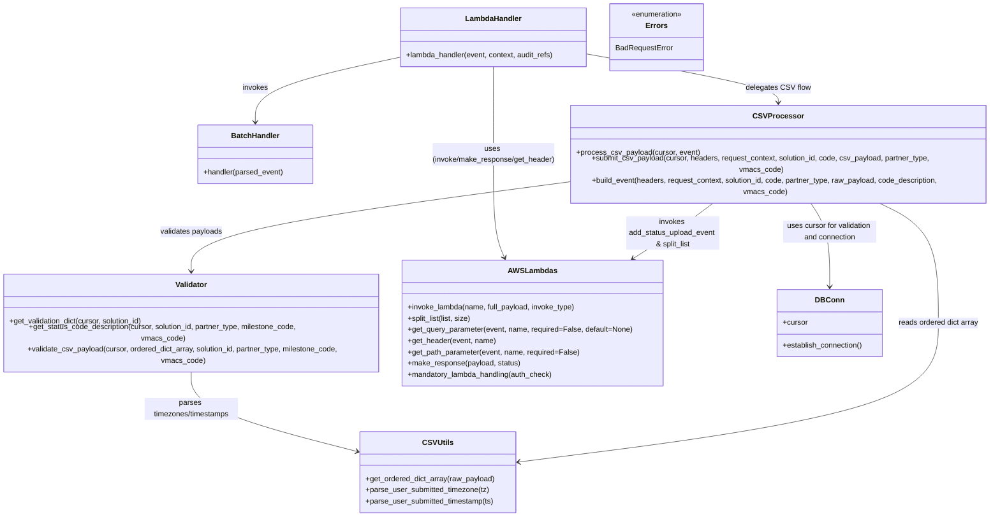

# Diagram: entity_core/entity_service/entity_service/entity/status_update/status_upload.py


> Auto-generated by Obscura crawlers

## Diagram 1

```mermaid
flowchart LR
  LH[lambda_handler(event, context, audit_refs)]
  LH --> ET{event_type == MULTIPLE?}
  ET -- Yes --> PARSE[MilestoneBatchUploadEvent.parse_event(event)]
  PARSE --> BATCH[MilestoneBatchUploadHandler().handler(parsed_event)]
  BATCH --> RESP_SUCCESS1[make_response({"payload_state":"Success"},200)]
  ET -- No --> CT[content_type = get_header(event, "content-type")]
  CT -- "application/json" --> JSON[process_json_payload(event)]
  JSON --> INVOKE_JSON[invoke_lambda(name="add_status_upload_event", full_payload=event, invoke_type="Event")]
  INVOKE_JSON --> RESP_SUCCESS2[make_response({"payload_state":"Success"},200)]
  CT -- "text/csv" --> DB_CONN[DB_CONN.establish_connection()]
  DB_CONN --> PROC_CSV[process_csv_payload(DB_CONN.cursor, event)]
  PROC_CSV --> EXTRACT[extract: solution_id, partnerType, milestone, vmacsCode]
  PROC_CSV --> ORDERED[ordered_dict_array = get_ordered_dict_array(raw_payload)]
  ORDERED --> VALIDATE[validate_csv_payload(cursor, ordered_dict_array, solution_id, partner_type, milestone_code, vmacs_code)]
  VALIDATE --> SUBMIT[submit_csv_payload(cursor, headers, request_context, solution_id, code, raw_payload, partner_type, vmacs_code)]
  SUBMIT --> SPLIT[split_list(payload_rows, 1000) -> arrays of packets]
  SPLIT --> BUILD[build_event(headers, request_context, solution_id, code, partner_type, packet, code_description, vmacs_code)]
  BUILD --> INVOKE_CSV[invoke_lambda(name="add_status_upload_event", full_payload=event, invoke_type="Event")]
  INVOKE_CSV --> RESP_SUCCESS3[make_response({"payload_state":"Success"},200)]
```

> SVG rendering failed for this diagram.

## Diagram 2



### SVG

<svg id="container" width="2170.427734375" xmlns="http://www.w3.org/2000/svg" class="classDiagram" height="1072" viewBox="0 0 2170.427734375 1072" role="graphics-document document" aria-roledescription="class"><style>#container{font-family:"trebuchet ms",verdana,arial,sans-serif;font-size:16px;fill:#333;}@keyframes edge-animation-frame{from{stroke-dashoffset:0;}}@keyframes dash{to{stroke-dashoffset:0;}}#container .edge-animation-slow{stroke-dasharray:9,5!important;stroke-dashoffset:900;animation:dash 50s linear infinite;stroke-linecap:round;}#container .edge-animation-fast{stroke-dasharray:9,5!important;stroke-dashoffset:900;animation:dash 20s linear infinite;stroke-linecap:round;}#container .error-icon{fill:#552222;}#container .error-text{fill:#552222;stroke:#552222;}#container .edge-thickness-normal{stroke-width:1px;}#container .edge-thickness-thick{stroke-width:3.5px;}#container .edge-pattern-solid{stroke-dasharray:0;}#container .edge-thickness-invisible{stroke-width:0;fill:none;}#container .edge-pattern-dashed{stroke-dasharray:3;}#container .edge-pattern-dotted{stroke-dasharray:2;}#container .marker{fill:#333333;stroke:#333333;}#container .marker.cross{stroke:#333333;}#container svg{font-family:"trebuchet ms",verdana,arial,sans-serif;font-size:16px;}#container p{margin:0;}#container g.classGroup text{fill:#9370DB;stroke:none;font-family:"trebuchet ms",verdana,arial,sans-serif;font-size:10px;}#container g.classGroup text .title{font-weight:bolder;}#container .nodeLabel,#container .edgeLabel{color:#131300;}#container .edgeLabel .label rect{fill:#ECECFF;}#container .label text{fill:#131300;}#container .labelBkg{background:#ECECFF;}#container .edgeLabel .label span{background:#ECECFF;}#container .classTitle{font-weight:bolder;}#container .node rect,#container .node circle,#container .node ellipse,#container .node polygon,#container .node path{fill:#ECECFF;stroke:#9370DB;stroke-width:1px;}#container .divider{stroke:#9370DB;stroke-width:1;}#container g.clickable{cursor:pointer;}#container g.classGroup rect{fill:#ECECFF;stroke:#9370DB;}#container g.classGroup line{stroke:#9370DB;stroke-width:1;}#container .classLabel .box{stroke:none;stroke-width:0;fill:#ECECFF;opacity:0.5;}#container .classLabel .label{fill:#9370DB;font-size:10px;}#container .relation{stroke:#333333;stroke-width:1;fill:none;}#container .dashed-line{stroke-dasharray:3;}#container .dotted-line{stroke-dasharray:1 2;}#container #compositionStart,#container .composition{fill:#333333!important;stroke:#333333!important;stroke-width:1;}#container #compositionEnd,#container .composition{fill:#333333!important;stroke:#333333!important;stroke-width:1;}#container #dependencyStart,#container .dependency{fill:#333333!important;stroke:#333333!important;stroke-width:1;}#container #dependencyStart,#container .dependency{fill:#333333!important;stroke:#333333!important;stroke-width:1;}#container #extensionStart,#container .extension{fill:transparent!important;stroke:#333333!important;stroke-width:1;}#container #extensionEnd,#container .extension{fill:transparent!important;stroke:#333333!important;stroke-width:1;}#container #aggregationStart,#container .aggregation{fill:transparent!important;stroke:#333333!important;stroke-width:1;}#container #aggregationEnd,#container .aggregation{fill:transparent!important;stroke:#333333!important;stroke-width:1;}#container #lollipopStart,#container .lollipop{fill:#ECECFF!important;stroke:#333333!important;stroke-width:1;}#container #lollipopEnd,#container .lollipop{fill:#ECECFF!important;stroke:#333333!important;stroke-width:1;}#container .edgeTerminals{font-size:11px;line-height:initial;}#container .classTitleText{text-anchor:middle;font-size:18px;fill:#333;}#container .label-icon{display:inline-block;height:1em;overflow:visible;vertical-align:-0.125em;}#container .node .label-icon path{fill:currentColor;stroke:revert;stroke-width:revert;}#container :root{--mermaid-font-family:"trebuchet ms",verdana,arial,sans-serif;}</style><g><defs><marker id="container_class-aggregationStart" class="marker aggregation class" refX="18" refY="7" markerWidth="190" markerHeight="240" orient="auto"><path d="M 18,7 L9,13 L1,7 L9,1 Z"></path></marker></defs><defs><marker id="container_class-aggregationEnd" class="marker aggregation class" refX="1" refY="7" markerWidth="20" markerHeight="28" orient="auto"><path d="M 18,7 L9,13 L1,7 L9,1 Z"></path></marker></defs><defs><marker id="container_class-extensionStart" class="marker extension class" refX="18" refY="7" markerWidth="190" markerHeight="240" orient="auto"><path d="M 1,7 L18,13 V 1 Z"></path></marker></defs><defs><marker id="container_class-extensionEnd" class="marker extension class" refX="1" refY="7" markerWidth="20" markerHeight="28" orient="auto"><path d="M 1,1 V 13 L18,7 Z"></path></marker></defs><defs><marker id="container_class-compositionStart" class="marker composition class" refX="18" refY="7" markerWidth="190" markerHeight="240" orient="auto"><path d="M 18,7 L9,13 L1,7 L9,1 Z"></path></marker></defs><defs><marker id="container_class-compositionEnd" class="marker composition class" refX="1" refY="7" markerWidth="20" markerHeight="28" orient="auto"><path d="M 18,7 L9,13 L1,7 L9,1 Z"></path></marker></defs><defs><marker id="container_class-dependencyStart" class="marker dependency class" refX="6" refY="7" markerWidth="190" markerHeight="240" orient="auto"><path d="M 5,7 L9,13 L1,7 L9,1 Z"></path></marker></defs><defs><marker id="container_class-dependencyEnd" class="marker dependency class" refX="13" refY="7" markerWidth="20" markerHeight="28" orient="auto"><path d="M 18,7 L9,13 L14,7 L9,1 Z"></path></marker></defs><defs><marker id="container_class-lollipopStart" class="marker lollipop class" refX="13" refY="7" markerWidth="190" markerHeight="240" orient="auto"><circle stroke="black" fill="transparent" cx="7" cy="7" r="6"></circle></marker></defs><defs><marker id="container_class-lollipopEnd" class="marker lollipop class" refX="1" refY="7" markerWidth="190" markerHeight="240" orient="auto"><circle stroke="black" fill="transparent" cx="7" cy="7" r="6"></circle></marker></defs><g class="root"><g class="clusters"></g><g class="edgePaths"><path d="M866.928,122.534L814.331,133.612C761.734,144.69,656.541,166.845,603.944,187.089C551.348,207.333,551.348,225.667,551.348,234.833L551.348,244" id="id_LambdaHandler_BatchHandler_1" class="edge-thickness-normal edge-pattern-solid relation" style=";;;" data-edge="true" data-et="edge" data-id="id_LambdaHandler_BatchHandler_1" data-points="W3sieCI6ODY2LjkyNzczNDM3NSwieSI6MTIyLjUzNDI1NzY5MDI5MDF9LHsieCI6NTUxLjM0NzY1NjI1LCJ5IjoxODl9LHsieCI6NTUxLjM0NzY1NjI1LCJ5IjoyNTB9XQ==" marker-end="url(#container_class-dependencyEnd)"></path><path d="M1270.834,114.854L1342.438,127.211C1414.042,139.569,1557.251,164.285,1628.855,181.809C1700.459,199.333,1700.459,209.667,1700.459,214.833L1700.459,220" id="id_LambdaHandler_CSVProcessor_2" class="edge-thickness-normal edge-pattern-solid relation" style=";;;" data-edge="true" data-et="edge" data-id="id_LambdaHandler_CSVProcessor_2" data-points="W3sieCI6MTI3MC44MzM5ODQzNzUsInkiOjExNC44NTM3ODg4NzIxMjA5M30seyJ4IjoxNzAwLjQ1ODk4NDM3NSwieSI6MTg5fSx7IngiOjE3MDAuNDU4OTg0Mzc1LCJ5IjoyMjZ9XQ==" marker-end="url(#container_class-dependencyEnd)"></path><path d="M1068.881,143L1068.881,150.667C1068.881,158.333,1068.881,173.667,1068.881,202C1068.881,230.333,1068.881,271.667,1068.881,317C1068.881,362.333,1068.881,411.667,1073.394,445.601C1077.906,479.535,1086.932,498.07,1091.444,507.338L1095.957,516.606" id="id_LambdaHandler_AWSLambdas_3" class="edge-thickness-normal edge-pattern-solid relation" style=";;;" data-edge="true" data-et="edge" data-id="id_LambdaHandler_AWSLambdas_3" data-points="W3sieCI6MTA2OC44ODA4NTkzNzUsInkiOjE0M30seyJ4IjoxMDY4Ljg4MDg1OTM3NSwieSI6MTg5fSx7IngiOjEwNjguODgwODU5Mzc1LCJ5IjozMTN9LHsieCI6MTA2OC44ODA4NTkzNzUsInkiOjQ2MX0seyJ4IjoxMDk4LjU4Mzk1NDQ4MDIyOTUsInkiOjUyMn1d" marker-end="url(#container_class-dependencyEnd)"></path><path d="M1238.49,366.49L1102.45,382.242C966.41,397.993,694.33,429.497,558.29,462.415C422.25,495.333,422.25,529.667,422.25,546.833L422.25,564" id="id_CSVProcessor_Validator_4" class="edge-thickness-normal edge-pattern-solid relation" style=";;;" data-edge="true" data-et="edge" data-id="id_CSVProcessor_Validator_4" data-points="W3sieCI6MTIzOC40OTAyMzQzNzUsInkiOjM2Ni40ODk5ODE1NTY4MzUzNX0seyJ4Ijo0MjIuMjUsInkiOjQ2MX0seyJ4Ijo0MjIuMjUsInkiOjU3MH1d" marker-end="url(#container_class-dependencyEnd)"></path><path d="M1570.929,400L1555.793,410.167C1540.656,420.333,1510.383,440.667,1479.715,460.473C1449.048,480.279,1417.987,499.557,1402.457,509.197L1386.926,518.836" id="id_CSVProcessor_AWSLambdas_5" class="edge-thickness-normal edge-pattern-solid relation" style=";;;" data-edge="true" data-et="edge" data-id="id_CSVProcessor_AWSLambdas_5" data-points="W3sieCI6MTU3MC45MjkxNDY0MzE1ODgsInkiOjQwMH0seyJ4IjoxNDgwLjEwOTM3NSwieSI6NDYxfSx7IngiOjEzODEuODI4MDg1MTQwMzA2LCJ5Ijo1MjJ9XQ==" marker-end="url(#container_class-dependencyEnd)"></path><path d="M1765.121,400L1772.677,410.167C1780.234,420.333,1795.346,440.667,1802.903,470.5C1810.459,500.333,1810.459,539.667,1810.459,559.333L1810.459,579" id="id_CSVProcessor_DBConn_6" class="edge-thickness-normal edge-pattern-solid relation" style=";;;" data-edge="true" data-et="edge" data-id="id_CSVProcessor_DBConn_6" data-points="W3sieCI6MTc2NS4xMjExNDY1MzcxNjIsInkiOjQwMH0seyJ4IjoxODEwLjQ1ODk4NDM3NSwieSI6NDYxfSx7IngiOjE4MTAuNDU4OTg0Mzc1LCJ5Ijo1ODV9XQ==" marker-end="url(#container_class-dependencyEnd)"></path><path d="M422.25,744L422.25,760.167C422.25,776.333,422.25,808.667,482.309,840.177C542.368,871.687,662.485,902.373,722.544,917.716L782.603,933.06" id="id_Validator_CSVUtils_7" class="edge-thickness-normal edge-pattern-solid relation" style=";;;" data-edge="true" data-et="edge" data-id="id_Validator_CSVUtils_7" data-points="W3sieCI6NDIyLjI1LCJ5Ijo3NDR9LHsieCI6NDIyLjI1LCJ5Ijo4NDF9LHsieCI6Nzg4LjQxNjAxNTYyNSwieSI6OTM0LjU0NDg3NTg2MzU2MTl9XQ==" marker-end="url(#container_class-dependencyEnd)"></path><path d="M1903.302,400L1927.006,410.167C1950.71,420.333,1998.118,440.667,2021.822,483.5C2045.525,526.333,2045.525,591.667,2045.525,655C2045.525,718.333,2045.525,779.667,1892.394,829.423C1739.263,879.18,1433,917.36,1279.868,936.45L1126.737,955.541" id="id_CSVProcessor_CSVUtils_8" class="edge-thickness-normal edge-pattern-solid relation" style=";;;" data-edge="true" data-et="edge" data-id="id_CSVProcessor_CSVUtils_8" data-points="W3sieCI6MTkwMy4zMDIwNzQ1MzU0NzMsInkiOjQwMH0seyJ4IjoyMDQ1LjUyNTM5MDYyNSwieSI6NDYxfSx7IngiOjIwNDUuNTI1MzkwNjI1LCJ5Ijo2NTd9LHsieCI6MjA0NS41MjUzOTA2MjUsInkiOjg0MX0seyJ4IjoxMTIwLjc4MzIwMzEyNSwieSI6OTU2LjI4Mjc2MjI3NTQ0N31d" marker-end="url(#container_class-dependencyEnd)"></path></g><g class="edgeLabels"><g class="edgeLabel" transform="translate(551.34765625, 189)"><g class="label" data-id="id_LambdaHandler_BatchHandler_1" transform="translate(-27.5859375, -12)"><foreignObject width="55.171875" height="24"><div xmlns="http://www.w3.org/1999/xhtml" class="labelBkg" style="display: table-cell; white-space: nowrap; line-height: 1.5; max-width: 200px; text-align: center;"><span class="edgeLabel"><p>invokes</p></span></div></foreignObject></g></g><g class="edgeLabel" transform="translate(1700.458984375, 189)"><g class="label" data-id="id_LambdaHandler_CSVProcessor_2" transform="translate(-67.4296875, -12)"><foreignObject width="134.859375" height="24"><div xmlns="http://www.w3.org/1999/xhtml" class="labelBkg" style="display: table-cell; white-space: nowrap; line-height: 1.5; max-width: 200px; text-align: center;"><span class="edgeLabel"><p>delegates CSV flow</p></span></div></foreignObject></g></g><g class="edgeLabel" transform="translate(1068.880859375, 313)"><g class="label" data-id="id_LambdaHandler_AWSLambdas_3" transform="translate(-134.609375, -24)"><foreignObject width="269.21875" height="48"><div xmlns="http://www.w3.org/1999/xhtml" class="labelBkg" style="display: table; white-space: break-spaces; line-height: 1.5; max-width: 200px; text-align: center; width: 200px;"><span class="edgeLabel"><p>uses (invoke/make_response/get_header)</p></span></div></foreignObject></g></g><g class="edgeLabel" transform="translate(422.25, 461)"><g class="label" data-id="id_CSVProcessor_Validator_4" transform="translate(-67.4140625, -12)"><foreignObject width="134.828125" height="24"><div xmlns="http://www.w3.org/1999/xhtml" class="labelBkg" style="display: table-cell; white-space: nowrap; line-height: 1.5; max-width: 200px; text-align: center;"><span class="edgeLabel"><p>validates payloads</p></span></div></foreignObject></g></g><g class="edgeLabel" transform="translate(1480.109375, 461)"><g class="label" data-id="id_CSVProcessor_AWSLambdas_5" transform="translate(-100, -36)"><foreignObject width="200" height="72"><div xmlns="http://www.w3.org/1999/xhtml" class="labelBkg" style="display: table; white-space: break-spaces; line-height: 1.5; max-width: 200px; text-align: center; width: 200px;"><span class="edgeLabel"><p>invokes add_status_upload_event &amp; split_list</p></span></div></foreignObject></g></g><g class="edgeLabel" transform="translate(1810.458984375, 461)"><g class="label" data-id="id_CSVProcessor_DBConn_6" transform="translate(-100, -24)"><foreignObject width="200" height="48"><div xmlns="http://www.w3.org/1999/xhtml" class="labelBkg" style="display: table; white-space: break-spaces; line-height: 1.5; max-width: 200px; text-align: center; width: 200px;"><span class="edgeLabel"><p>uses cursor for validation and connection</p></span></div></foreignObject></g></g><g class="edgeLabel" transform="translate(422.25, 841)"><g class="label" data-id="id_Validator_CSVUtils_7" transform="translate(-100, -24)"><foreignObject width="200" height="48"><div xmlns="http://www.w3.org/1999/xhtml" class="labelBkg" style="display: table; white-space: break-spaces; line-height: 1.5; max-width: 200px; text-align: center; width: 200px;"><span class="edgeLabel"><p>parses timezones/timestamps</p></span></div></foreignObject></g></g><g class="edgeLabel" transform="translate(2045.525390625, 657)"><g class="label" data-id="id_CSVProcessor_CSVUtils_8" transform="translate(-87.1875, -12)"><foreignObject width="174.375" height="24"><div xmlns="http://www.w3.org/1999/xhtml" class="labelBkg" style="display: table-cell; white-space: nowrap; line-height: 1.5; max-width: 200px; text-align: center;"><span class="edgeLabel"><p>reads ordered dict array</p></span></div></foreignObject></g></g></g><g class="nodes"><g class="node default" id="classId-LambdaHandler-0" transform="translate(1068.880859375, 80)"><g class="basic label-container"><path d="M-201.953125 -63 L201.953125 -63 L201.953125 63 L-201.953125 63" stroke="none" stroke-width="0" fill="#ECECFF" style=""></path><path d="M-201.953125 -63 C-50.27906758327208 -63, 101.39498983345584 -63, 201.953125 -63 M-201.953125 -63 C-103.7745408484296 -63, -5.59595669685919 -63, 201.953125 -63 M201.953125 -63 C201.953125 -31.66095598750352, 201.953125 -0.3219119750070405, 201.953125 63 M201.953125 -63 C201.953125 -29.38697603034438, 201.953125 4.226047939311243, 201.953125 63 M201.953125 63 C105.78446637935977 63, 9.61580775871954 63, -201.953125 63 M201.953125 63 C45.24429055106958 63, -111.46454389786084 63, -201.953125 63 M-201.953125 63 C-201.953125 20.40965935550301, -201.953125 -22.18068128899398, -201.953125 -63 M-201.953125 63 C-201.953125 21.847422897517575, -201.953125 -19.30515420496485, -201.953125 -63" stroke="#9370DB" stroke-width="1.3" fill="none" stroke-dasharray="0 0" style=""></path></g><g class="annotation-group text" transform="translate(0, -39)"></g><g class="label-group text" transform="translate(-58.21875, -39)"><g class="label" style="font-weight: bolder" transform="translate(0,-12)"><foreignObject width="116.4375" height="24"><div xmlns="http://www.w3.org/1999/xhtml" style="display: table-cell; white-space: nowrap; line-height: 1.5; max-width: 167px; text-align: center;"><span class="nodeLabel markdown-node-label" style=""><p>LambdaHandler</p></span></div></foreignObject></g></g><g class="members-group text" transform="translate(-189.953125, 9)"></g><g class="methods-group text" transform="translate(-189.953125, 39)"><g class="label" style="" transform="translate(0,-12)"><foreignObject width="321.6875" height="24"><div xmlns="http://www.w3.org/1999/xhtml" style="display: table-cell; white-space: nowrap; line-height: 1.5; max-width: 379px; text-align: center;"><span class="nodeLabel markdown-node-label" style=""><p>+lambda_handler(event, context, audit_refs)</p></span></div></foreignObject></g></g><g class="divider" style=""><path d="M-201.953125 -15 C-114.00265264354356 -15, -26.05218028708711 -15, 201.953125 -15 M-201.953125 -15 C-57.08999169918147 -15, 87.77314160163706 -15, 201.953125 -15" stroke="#9370DB" stroke-width="1.3" fill="none" stroke-dasharray="0 0" style=""></path></g><g class="divider" style=""><path d="M-201.953125 9 C-101.3817369047305 9, -0.8103488094610043 9, 201.953125 9 M-201.953125 9 C-90.9294194474259 9, 20.0942861051482 9, 201.953125 9" stroke="#9370DB" stroke-width="1.3" fill="none" stroke-dasharray="0 0" style=""></path></g></g><g class="node default" id="classId-BatchHandler-1" transform="translate(551.34765625, 313)"><g class="basic label-container"><path d="M-123.38671875 -63 L123.38671875 -63 L123.38671875 63 L-123.38671875 63" stroke="none" stroke-width="0" fill="#ECECFF" style=""></path><path d="M-123.38671875 -63 C-66.39995753472229 -63, -9.413196319444594 -63, 123.38671875 -63 M-123.38671875 -63 C-63.873759857901234 -63, -4.3608009658024685 -63, 123.38671875 -63 M123.38671875 -63 C123.38671875 -22.450700111936534, 123.38671875 18.09859977612693, 123.38671875 63 M123.38671875 -63 C123.38671875 -37.17821402283627, 123.38671875 -11.356428045672544, 123.38671875 63 M123.38671875 63 C44.95362640978722 63, -33.47946593042556 63, -123.38671875 63 M123.38671875 63 C57.98622066724094 63, -7.414277415518114 63, -123.38671875 63 M-123.38671875 63 C-123.38671875 25.303387353183737, -123.38671875 -12.393225293632526, -123.38671875 -63 M-123.38671875 63 C-123.38671875 25.938846170946213, -123.38671875 -11.122307658107573, -123.38671875 -63" stroke="#9370DB" stroke-width="1.3" fill="none" stroke-dasharray="0 0" style=""></path></g><g class="annotation-group text" transform="translate(0, -39)"></g><g class="label-group text" transform="translate(-49.8046875, -39)"><g class="label" style="font-weight: bolder" transform="translate(0,-12)"><foreignObject width="99.609375" height="24"><div xmlns="http://www.w3.org/1999/xhtml" style="display: table-cell; white-space: nowrap; line-height: 1.5; max-width: 150px; text-align: center;"><span class="nodeLabel markdown-node-label" style=""><p>BatchHandler</p></span></div></foreignObject></g></g><g class="members-group text" transform="translate(-111.38671875, 9)"></g><g class="methods-group text" transform="translate(-111.38671875, 39)"><g class="label" style="" transform="translate(0,-12)"><foreignObject width="172.96875" height="24"><div xmlns="http://www.w3.org/1999/xhtml" style="display: table-cell; white-space: nowrap; line-height: 1.5; max-width: 230px; text-align: center;"><span class="nodeLabel markdown-node-label" style=""><p>+handler(parsed_event)</p></span></div></foreignObject></g></g><g class="divider" style=""><path d="M-123.38671875 -15 C-38.70546468046355 -15, 45.9757893890729 -15, 123.38671875 -15 M-123.38671875 -15 C-53.09101717947554 -15, 17.204684391048914 -15, 123.38671875 -15" stroke="#9370DB" stroke-width="1.3" fill="none" stroke-dasharray="0 0" style=""></path></g><g class="divider" style=""><path d="M-123.38671875 9 C-32.66843661807626 9, 58.04984551384749 9, 123.38671875 9 M-123.38671875 9 C-67.43605188598666 9, -11.485385021973315 9, 123.38671875 9" stroke="#9370DB" stroke-width="1.3" fill="none" stroke-dasharray="0 0" style=""></path></g></g><g class="node default" id="classId-CSVProcessor-2" transform="translate(1700.458984375, 313)"><g class="basic label-container"><path d="M-461.96875 -87 L461.96875 -87 L461.96875 87 L-461.96875 87" stroke="none" stroke-width="0" fill="#ECECFF" style=""></path><path d="M-461.96875 -87 C-194.1344158570676 -87, 73.69991828586478 -87, 461.96875 -87 M-461.96875 -87 C-239.03118164578208 -87, -16.093613291564168 -87, 461.96875 -87 M461.96875 -87 C461.96875 -48.22311027456328, 461.96875 -9.446220549126565, 461.96875 87 M461.96875 -87 C461.96875 -24.884067298080247, 461.96875 37.23186540383951, 461.96875 87 M461.96875 87 C106.3137171948963 87, -249.3413156102074 87, -461.96875 87 M461.96875 87 C175.3408213284339 87, -111.28710734313222 87, -461.96875 87 M-461.96875 87 C-461.96875 42.85671764377867, -461.96875 -1.2865647124426545, -461.96875 -87 M-461.96875 87 C-461.96875 28.921160453067152, -461.96875 -29.157679093865696, -461.96875 -87" stroke="#9370DB" stroke-width="1.3" fill="none" stroke-dasharray="0 0" style=""></path></g><g class="annotation-group text" transform="translate(0, -63)"></g><g class="label-group text" transform="translate(-49.421875, -63)"><g class="label" style="font-weight: bolder" transform="translate(0,-12)"><foreignObject width="98.84375" height="24"><div xmlns="http://www.w3.org/1999/xhtml" style="display: table-cell; white-space: nowrap; line-height: 1.5; max-width: 147px; text-align: center;"><span class="nodeLabel markdown-node-label" style=""><p>CSVProcessor</p></span></div></foreignObject></g></g><g class="members-group text" transform="translate(-449.96875, -15)"></g><g class="methods-group text" transform="translate(-449.96875, 15)"><g class="label" style="" transform="translate(0,-12)"><foreignObject width="262.578125" height="24"><div xmlns="http://www.w3.org/1999/xhtml" style="display: table-cell; white-space: nowrap; line-height: 1.5; max-width: 320px; text-align: center;"><span class="nodeLabel markdown-node-label" style=""><p>+process_csv_payload(cursor, event)</p></span></div></foreignObject></g><g class="label" style="" transform="translate(0,12)"><foreignObject width="827.328125" height="24"><div xmlns="http://www.w3.org/1999/xhtml" style="display: table-cell; white-space: nowrap; line-height: 1.5; max-width: 885px; text-align: center;"><span class="nodeLabel markdown-node-label" style=""><p>+submit_csv_payload(cursor, headers, request_context, solution_id, code, csv_payload, partner_type, vmacs_code)</p></span></div></foreignObject></g><g class="label" style="" transform="translate(0,36)"><foreignObject width="850.515625" height="24"><div xmlns="http://www.w3.org/1999/xhtml" style="display: table-cell; white-space: nowrap; line-height: 1.5; max-width: 908px; text-align: center;"><span class="nodeLabel markdown-node-label" style=""><p>+build_event(headers, request_context, solution_id, code, partner_type, raw_payload, code_description, vmacs_code)</p></span></div></foreignObject></g></g><g class="divider" style=""><path d="M-461.96875 -39 C-162.02965823301895 -39, 137.9094335339621 -39, 461.96875 -39 M-461.96875 -39 C-263.45366104674383 -39, -64.93857209348761 -39, 461.96875 -39" stroke="#9370DB" stroke-width="1.3" fill="none" stroke-dasharray="0 0" style=""></path></g><g class="divider" style=""><path d="M-461.96875 -15 C-273.838779647431 -15, -85.70880929486202 -15, 461.96875 -15 M-461.96875 -15 C-151.70753934316735 -15, 158.5536713136653 -15, 461.96875 -15" stroke="#9370DB" stroke-width="1.3" fill="none" stroke-dasharray="0 0" style=""></path></g></g><g class="node default" id="classId-Validator-3" transform="translate(422.25, 657)"><g class="basic label-container"><path d="M-414.25 -87 L414.25 -87 L414.25 87 L-414.25 87" stroke="none" stroke-width="0" fill="#ECECFF" style=""></path><path d="M-414.25 -87 C-232.61439228628154 -87, -50.978784572563086 -87, 414.25 -87 M-414.25 -87 C-219.9959427178653 -87, -25.74188543573058 -87, 414.25 -87 M414.25 -87 C414.25 -34.52163937706621, 414.25 17.956721245867584, 414.25 87 M414.25 -87 C414.25 -43.053209901654576, 414.25 0.8935801966908485, 414.25 87 M414.25 87 C152.66372424156322 87, -108.92255151687357 87, -414.25 87 M414.25 87 C215.15073528105978 87, 16.05147056211956 87, -414.25 87 M-414.25 87 C-414.25 44.3169224844622, -414.25 1.633844968924393, -414.25 -87 M-414.25 87 C-414.25 36.71192528866908, -414.25 -13.576149422661842, -414.25 -87" stroke="#9370DB" stroke-width="1.3" fill="none" stroke-dasharray="0 0" style=""></path></g><g class="annotation-group text" transform="translate(0, -63)"></g><g class="label-group text" transform="translate(-33.1875, -63)"><g class="label" style="font-weight: bolder" transform="translate(0,-12)"><foreignObject width="66.375" height="24"><div xmlns="http://www.w3.org/1999/xhtml" style="display: table-cell; white-space: nowrap; line-height: 1.5; max-width: 116px; text-align: center;"><span class="nodeLabel markdown-node-label" style=""><p>Validator</p></span></div></foreignObject></g></g><g class="members-group text" transform="translate(-402.25, -15)"></g><g class="methods-group text" transform="translate(-402.25, 15)"><g class="label" style="" transform="translate(0,-12)"><foreignObject width="291.65625" height="24"><div xmlns="http://www.w3.org/1999/xhtml" style="display: table-cell; white-space: nowrap; line-height: 1.5; max-width: 349px; text-align: center;"><span class="nodeLabel markdown-node-label" style=""><p>+get_validation_dict(cursor, solution_id)</p></span></div></foreignObject></g><g class="label" style="" transform="translate(0,12)"><foreignObject width="680.71875" height="24"><div xmlns="http://www.w3.org/1999/xhtml" style="display: table-cell; white-space: nowrap; line-height: 1.5; max-width: 738px; text-align: center;"><span class="nodeLabel markdown-node-label" style=""><p>+get_status_code_description(cursor, solution_id, partner_type, milestone_code, vmacs_code)</p></span></div></foreignObject></g><g class="label" style="" transform="translate(0,36)"><foreignObject width="771.3125" height="24"><div xmlns="http://www.w3.org/1999/xhtml" style="display: table-cell; white-space: nowrap; line-height: 1.5; max-width: 829px; text-align: center;"><span class="nodeLabel markdown-node-label" style=""><p>+validate_csv_payload(cursor, ordered_dict_array, solution_id, partner_type, milestone_code, vmacs_code)</p></span></div></foreignObject></g></g><g class="divider" style=""><path d="M-414.25 -39 C-117.58781686472759 -39, 179.07436627054483 -39, 414.25 -39 M-414.25 -39 C-246.450114997519 -39, -78.65022999503799 -39, 414.25 -39" stroke="#9370DB" stroke-width="1.3" fill="none" stroke-dasharray="0 0" style=""></path></g><g class="divider" style=""><path d="M-414.25 -15 C-122.7707427834427 -15, 168.7085144331146 -15, 414.25 -15 M-414.25 -15 C-226.3171827143337 -15, -38.38436542866742 -15, 414.25 -15" stroke="#9370DB" stroke-width="1.3" fill="none" stroke-dasharray="0 0" style=""></path></g></g><g class="node default" id="classId-AWSLambdas-4" transform="translate(1164.3203125, 657)"><g class="basic label-container"><path d="M-277.8203125 -135 L277.8203125 -135 L277.8203125 135 L-277.8203125 135" stroke="none" stroke-width="0" fill="#ECECFF" style=""></path><path d="M-277.8203125 -135 C-89.61287017381449 -135, 98.59457215237103 -135, 277.8203125 -135 M-277.8203125 -135 C-107.74381562037459 -135, 62.33268125925082 -135, 277.8203125 -135 M277.8203125 -135 C277.8203125 -32.566573814364745, 277.8203125 69.86685237127051, 277.8203125 135 M277.8203125 -135 C277.8203125 -53.330836147101934, 277.8203125 28.338327705796132, 277.8203125 135 M277.8203125 135 C84.5560900275591 135, -108.70813244488181 135, -277.8203125 135 M277.8203125 135 C61.31167805574549 135, -155.19695638850902 135, -277.8203125 135 M-277.8203125 135 C-277.8203125 39.70838576153204, -277.8203125 -55.583228476935915, -277.8203125 -135 M-277.8203125 135 C-277.8203125 30.574771223767954, -277.8203125 -73.85045755246409, -277.8203125 -135" stroke="#9370DB" stroke-width="1.3" fill="none" stroke-dasharray="0 0" style=""></path></g><g class="annotation-group text" transform="translate(0, -111)"></g><g class="label-group text" transform="translate(-48.90625, -111)"><g class="label" style="font-weight: bolder" transform="translate(0,-12)"><foreignObject width="97.8125" height="24"><div xmlns="http://www.w3.org/1999/xhtml" style="display: table-cell; white-space: nowrap; line-height: 1.5; max-width: 146px; text-align: center;"><span class="nodeLabel markdown-node-label" style=""><p>AWSLambdas</p></span></div></foreignObject></g></g><g class="members-group text" transform="translate(-265.8203125, -63)"></g><g class="methods-group text" transform="translate(-265.8203125, -33)"><g class="label" style="" transform="translate(0,-12)"><foreignObject width="362.484375" height="24"><div xmlns="http://www.w3.org/1999/xhtml" style="display: table-cell; white-space: nowrap; line-height: 1.5; max-width: 420px; text-align: center;"><span class="nodeLabel markdown-node-label" style=""><p>+invoke_lambda(name, full_payload, invoke_type)</p></span></div></foreignObject></g><g class="label" style="" transform="translate(0,12)"><foreignObject width="139.09375" height="24"><div xmlns="http://www.w3.org/1999/xhtml" style="display: table-cell; white-space: nowrap; line-height: 1.5; max-width: 196px; text-align: center;"><span class="nodeLabel markdown-node-label" style=""><p>+split_list(list, size)</p></span></div></foreignObject></g><g class="label" style="" transform="translate(0,36)"><foreignObject width="482.734375" height="24"><div xmlns="http://www.w3.org/1999/xhtml" style="display: table-cell; white-space: nowrap; line-height: 1.5; max-width: 540px; text-align: center;"><span class="nodeLabel markdown-node-label" style=""><p>+get_query_parameter(event, name, required=False, default=None)</p></span></div></foreignObject></g><g class="label" style="" transform="translate(0,60)"><foreignObject width="189.34375" height="24"><div xmlns="http://www.w3.org/1999/xhtml" style="display: table-cell; white-space: nowrap; line-height: 1.5; max-width: 247px; text-align: center;"><span class="nodeLabel markdown-node-label" style=""><p>+get_header(event, name)</p></span></div></foreignObject></g><g class="label" style="" transform="translate(0,84)"><foreignObject width="369.015625" height="24"><div xmlns="http://www.w3.org/1999/xhtml" style="display: table-cell; white-space: nowrap; line-height: 1.5; max-width: 426px; text-align: center;"><span class="nodeLabel markdown-node-label" style=""><p>+get_path_parameter(event, name, required=False)</p></span></div></foreignObject></g><g class="label" style="" transform="translate(0,108)"><foreignObject width="242.078125" height="24"><div xmlns="http://www.w3.org/1999/xhtml" style="display: table-cell; white-space: nowrap; line-height: 1.5; max-width: 299px; text-align: center;"><span class="nodeLabel markdown-node-label" style=""><p>+make_response(payload, status)</p></span></div></foreignObject></g><g class="label" style="" transform="translate(0,132)"><foreignObject width="314.828125" height="24"><div xmlns="http://www.w3.org/1999/xhtml" style="display: table-cell; white-space: nowrap; line-height: 1.5; max-width: 372px; text-align: center;"><span class="nodeLabel markdown-node-label" style=""><p>+mandatory_lambda_handling(auth_check)</p></span></div></foreignObject></g></g><g class="divider" style=""><path d="M-277.8203125 -87 C-100.12815360646232 -87, 77.56400528707536 -87, 277.8203125 -87 M-277.8203125 -87 C-68.99608403737844 -87, 139.82814442524312 -87, 277.8203125 -87" stroke="#9370DB" stroke-width="1.3" fill="none" stroke-dasharray="0 0" style=""></path></g><g class="divider" style=""><path d="M-277.8203125 -63 C-83.76834221690555 -63, 110.2836280661889 -63, 277.8203125 -63 M-277.8203125 -63 C-71.75549817563197 -63, 134.30931614873606 -63, 277.8203125 -63" stroke="#9370DB" stroke-width="1.3" fill="none" stroke-dasharray="0 0" style=""></path></g></g><g class="node default" id="classId-DBConn-5" transform="translate(1810.458984375, 657)"><g class="basic label-container"><path d="M-112.87890625 -72 L112.87890625 -72 L112.87890625 72 L-112.87890625 72" stroke="none" stroke-width="0" fill="#ECECFF" style=""></path><path d="M-112.87890625 -72 C-47.80525639428744 -72, 17.26839346142512 -72, 112.87890625 -72 M-112.87890625 -72 C-66.60896794758159 -72, -20.339029645163194 -72, 112.87890625 -72 M112.87890625 -72 C112.87890625 -17.125242221872654, 112.87890625 37.74951555625469, 112.87890625 72 M112.87890625 -72 C112.87890625 -33.27768308269703, 112.87890625 5.444633834605938, 112.87890625 72 M112.87890625 72 C53.75219066790128 72, -5.374524914197437 72, -112.87890625 72 M112.87890625 72 C41.207543183842475 72, -30.46381988231505 72, -112.87890625 72 M-112.87890625 72 C-112.87890625 15.8351821807871, -112.87890625 -40.3296356384258, -112.87890625 -72 M-112.87890625 72 C-112.87890625 27.273151433704257, -112.87890625 -17.453697132591486, -112.87890625 -72" stroke="#9370DB" stroke-width="1.3" fill="none" stroke-dasharray="0 0" style=""></path></g><g class="annotation-group text" transform="translate(0, -48)"></g><g class="label-group text" transform="translate(-28.4921875, -48)"><g class="label" style="font-weight: bolder" transform="translate(0,-12)"><foreignObject width="56.984375" height="24"><div xmlns="http://www.w3.org/1999/xhtml" style="display: table-cell; white-space: nowrap; line-height: 1.5; max-width: 107px; text-align: center;"><span class="nodeLabel markdown-node-label" style=""><p>DBConn</p></span></div></foreignObject></g></g><g class="members-group text" transform="translate(-100.87890625, 0)"><g class="label" style="" transform="translate(0,-12)"><foreignObject width="53.71875" height="24"><div xmlns="http://www.w3.org/1999/xhtml" style="display: table-cell; white-space: nowrap; line-height: 1.5; max-width: 112px; text-align: center;"><span class="nodeLabel markdown-node-label" style=""><p>+cursor</p></span></div></foreignObject></g></g><g class="methods-group text" transform="translate(-100.87890625, 48)"><g class="label" style="" transform="translate(0,-12)"><foreignObject width="173.265625" height="24"><div xmlns="http://www.w3.org/1999/xhtml" style="display: table-cell; white-space: nowrap; line-height: 1.5; max-width: 231px; text-align: center;"><span class="nodeLabel markdown-node-label" style=""><p>+establish_connection()</p></span></div></foreignObject></g></g><g class="divider" style=""><path d="M-112.87890625 -24 C-31.361798626437434 -24, 50.15530899712513 -24, 112.87890625 -24 M-112.87890625 -24 C-27.75613268354165 -24, 57.3666408829167 -24, 112.87890625 -24" stroke="#9370DB" stroke-width="1.3" fill="none" stroke-dasharray="0 0" style=""></path></g><g class="divider" style=""><path d="M-112.87890625 24 C-39.53485855233865 24, 33.809189145322705 24, 112.87890625 24 M-112.87890625 24 C-38.740003230604756 24, 35.39889978879049 24, 112.87890625 24" stroke="#9370DB" stroke-width="1.3" fill="none" stroke-dasharray="0 0" style=""></path></g></g><g class="node default" id="classId-CSVUtils-6" transform="translate(954.599609375, 977)"><g class="basic label-container"><path d="M-166.18359375 -87 L166.18359375 -87 L166.18359375 87 L-166.18359375 87" stroke="none" stroke-width="0" fill="#ECECFF" style=""></path><path d="M-166.18359375 -87 C-36.37925700594323 -87, 93.42507973811354 -87, 166.18359375 -87 M-166.18359375 -87 C-69.02444750363506 -87, 28.13469874272988 -87, 166.18359375 -87 M166.18359375 -87 C166.18359375 -45.89458035934355, 166.18359375 -4.7891607186871, 166.18359375 87 M166.18359375 -87 C166.18359375 -49.77586170094461, 166.18359375 -12.55172340188922, 166.18359375 87 M166.18359375 87 C52.526243897092584 87, -61.13110595581483 87, -166.18359375 87 M166.18359375 87 C99.59188919549231 87, 33.00018464098463 87, -166.18359375 87 M-166.18359375 87 C-166.18359375 35.143775733248916, -166.18359375 -16.71244853350217, -166.18359375 -87 M-166.18359375 87 C-166.18359375 28.118648402533132, -166.18359375 -30.762703194933735, -166.18359375 -87" stroke="#9370DB" stroke-width="1.3" fill="none" stroke-dasharray="0 0" style=""></path></g><g class="annotation-group text" transform="translate(0, -63)"></g><g class="label-group text" transform="translate(-30.2890625, -63)"><g class="label" style="font-weight: bolder" transform="translate(0,-12)"><foreignObject width="60.578125" height="24"><div xmlns="http://www.w3.org/1999/xhtml" style="display: table-cell; white-space: nowrap; line-height: 1.5; max-width: 109px; text-align: center;"><span class="nodeLabel markdown-node-label" style=""><p>CSVUtils</p></span></div></foreignObject></g></g><g class="members-group text" transform="translate(-154.18359375, -15)"></g><g class="methods-group text" transform="translate(-154.18359375, 15)"><g class="label" style="" transform="translate(0,-12)"><foreignObject width="278.03125" height="24"><div xmlns="http://www.w3.org/1999/xhtml" style="display: table-cell; white-space: nowrap; line-height: 1.5; max-width: 335px; text-align: center;"><span class="nodeLabel markdown-node-label" style=""><p>+get_ordered_dict_array(raw_payload)</p></span></div></foreignObject></g><g class="label" style="" transform="translate(0,12)"><foreignObject width="266.75" height="24"><div xmlns="http://www.w3.org/1999/xhtml" style="display: table-cell; white-space: nowrap; line-height: 1.5; max-width: 324px; text-align: center;"><span class="nodeLabel markdown-node-label" style=""><p>+parse_user_submitted_timezone(tz)</p></span></div></foreignObject></g><g class="label" style="" transform="translate(0,36)"><foreignObject width="278.078125" height="24"><div xmlns="http://www.w3.org/1999/xhtml" style="display: table-cell; white-space: nowrap; line-height: 1.5; max-width: 335px; text-align: center;"><span class="nodeLabel markdown-node-label" style=""><p>+parse_user_submitted_timestamp(ts)</p></span></div></foreignObject></g></g><g class="divider" style=""><path d="M-166.18359375 -39 C-63.9279095207756 -39, 38.3277747084488 -39, 166.18359375 -39 M-166.18359375 -39 C-48.15368187410786 -39, 69.87623000178428 -39, 166.18359375 -39" stroke="#9370DB" stroke-width="1.3" fill="none" stroke-dasharray="0 0" style=""></path></g><g class="divider" style=""><path d="M-166.18359375 -15 C-73.78737930554077 -15, 18.608835138918465 -15, 166.18359375 -15 M-166.18359375 -15 C-44.009103645292896 -15, 78.16538645941421 -15, 166.18359375 -15" stroke="#9370DB" stroke-width="1.3" fill="none" stroke-dasharray="0 0" style=""></path></g></g><g class="node default" id="classId-Errors-7" transform="translate(1422.017578125, 80)"><g class="basic label-container"><path d="M-101.18359375 -72 L101.18359375 -72 L101.18359375 72 L-101.18359375 72" stroke="none" stroke-width="0" fill="#ECECFF" style=""></path><path d="M-101.18359375 -72 C-30.093295750426137 -72, 40.99700224914773 -72, 101.18359375 -72 M-101.18359375 -72 C-60.273335513582964 -72, -19.363077277165928 -72, 101.18359375 -72 M101.18359375 -72 C101.18359375 -17.42580828708752, 101.18359375 37.14838342582496, 101.18359375 72 M101.18359375 -72 C101.18359375 -22.37194732812396, 101.18359375 27.256105343752083, 101.18359375 72 M101.18359375 72 C25.919063554637134 72, -49.34546664072573 72, -101.18359375 72 M101.18359375 72 C60.67653004202698 72, 20.169466334053965 72, -101.18359375 72 M-101.18359375 72 C-101.18359375 25.00104904624591, -101.18359375 -21.99790190750818, -101.18359375 -72 M-101.18359375 72 C-101.18359375 17.44960345095184, -101.18359375 -37.10079309809632, -101.18359375 -72" stroke="#9370DB" stroke-width="1.3" fill="none" stroke-dasharray="0 0" style=""></path></g><g class="annotation-group text" transform="translate(-55.5546875, -48)"><g class="label" style="" transform="translate(0,-12)"><foreignObject width="111.109375" height="24"><div xmlns="http://www.w3.org/1999/xhtml" style="display: table-cell; white-space: nowrap; line-height: 1.5; max-width: 161px; text-align: center;"><span class="nodeLabel markdown-node-label" style=""><p>«enumeration»</p></span></div></foreignObject></g></g><g class="label-group text" transform="translate(-21.953125, -24)"><g class="label" style="font-weight: bolder" transform="translate(0,-12)"><foreignObject width="43.90625" height="24"><div xmlns="http://www.w3.org/1999/xhtml" style="display: table-cell; white-space: nowrap; line-height: 1.5; max-width: 93px; text-align: center;"><span class="nodeLabel markdown-node-label" style=""><p>Errors</p></span></div></foreignObject></g></g><g class="members-group text" transform="translate(-89.18359375, 24)"><g class="label" style="" transform="translate(0,-12)"><foreignObject width="122.8125" height="24"><div xmlns="http://www.w3.org/1999/xhtml" style="display: table-cell; white-space: nowrap; line-height: 1.5; max-width: 174px; text-align: center;"><span class="nodeLabel markdown-node-label" style=""><p>BadRequestError</p></span></div></foreignObject></g></g><g class="methods-group text" transform="translate(-89.18359375, 72)"></g><g class="divider" style=""><path d="M-101.18359375 0 C-44.13129365359365 0, 12.921006442812697 0, 101.18359375 0 M-101.18359375 0 C-45.81618474563464 0, 9.551224258730727 0, 101.18359375 0" stroke="#9370DB" stroke-width="1.3" fill="none" stroke-dasharray="0 0" style=""></path></g><g class="divider" style=""><path d="M-101.18359375 48 C-29.57326138954805 48, 42.0370709709039 48, 101.18359375 48 M-101.18359375 48 C-53.683776141885474 48, -6.183958533770948 48, 101.18359375 48" stroke="#9370DB" stroke-width="1.3" fill="none" stroke-dasharray="0 0" style=""></path></g></g></g></g></g></svg>
