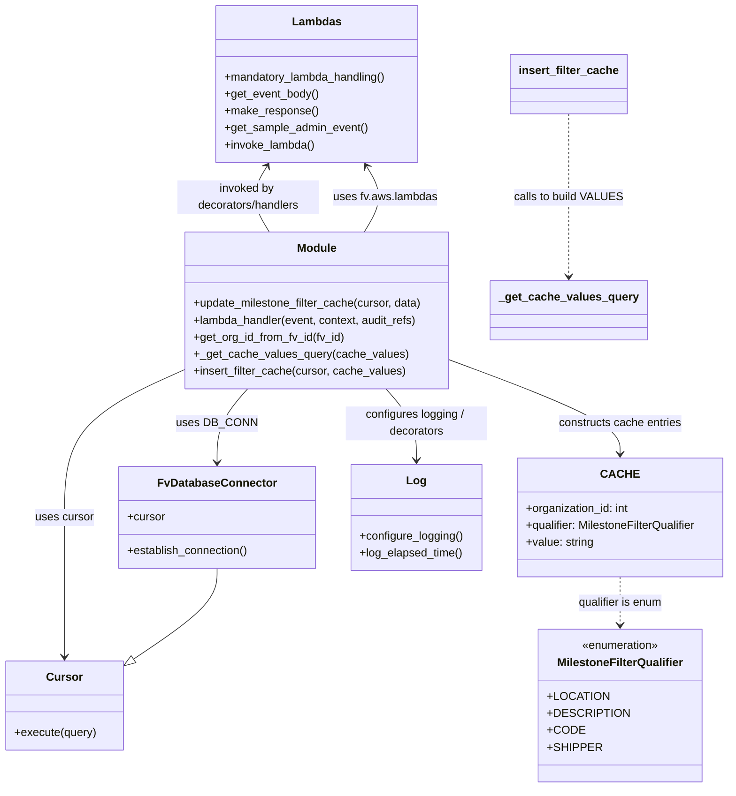
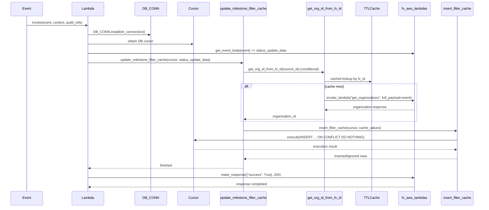

# Diagram: entity_core/entity_service/entity_service/entity/status_update/update_milestone_filter_cache.py

> Auto-generated by Obscura crawlers

## Diagram 1

### SVG

<svg id="container" width="1028.8984375" xmlns="http://www.w3.org/2000/svg" class="classDiagram" height="1114" viewBox="0 0 1028.8984375 1114" role="graphics-document document" aria-roledescription="class"><g><defs><marker id="container_class-aggregationStart" class="marker aggregation class" refX="18" refY="7" markerWidth="190" markerHeight="240" orient="auto"><path d="M 18,7 L9,13 L1,7 L9,1 Z"></path></marker></defs><defs><marker id="container_class-aggregationEnd" class="marker aggregation class" refX="1" refY="7" markerWidth="20" markerHeight="28" orient="auto"><path d="M 18,7 L9,13 L1,7 L9,1 Z"></path></marker></defs><defs><marker id="container_class-extensionStart" class="marker extension class" refX="18" refY="7" markerWidth="190" markerHeight="240" orient="auto"><path d="M 1,7 L18,13 V 1 Z"></path></marker></defs><defs><marker id="container_class-extensionEnd" class="marker extension class" refX="1" refY="7" markerWidth="20" markerHeight="28" orient="auto"><path d="M 1,1 V 13 L18,7 Z"></path></marker></defs><defs><marker id="container_class-compositionStart" class="marker composition class" refX="18" refY="7" markerWidth="190" markerHeight="240" orient="auto"><path d="M 18,7 L9,13 L1,7 L9,1 Z"></path></marker></defs><defs><marker id="container_class-compositionEnd" class="marker composition class" refX="1" refY="7" markerWidth="20" markerHeight="28" orient="auto"><path d="M 18,7 L9,13 L1,7 L9,1 Z"></path></marker></defs><defs><marker id="container_class-dependencyStart" class="marker dependency class" refX="6" refY="7" markerWidth="190" markerHeight="240" orient="auto"><path d="M 5,7 L9,13 L1,7 L9,1 Z"></path></marker></defs><defs><marker id="container_class-dependencyEnd" class="marker dependency class" refX="13" refY="7" markerWidth="20" markerHeight="28" orient="auto"><path d="M 18,7 L9,13 L14,7 L9,1 Z"></path></marker></defs><defs><marker id="container_class-lollipopStart" class="marker lollipop class" refX="13" refY="7" markerWidth="190" markerHeight="240" orient="auto"><circle stroke="black" fill="transparent" cx="7" cy="7" r="6"></circle></marker></defs><defs><marker id="container_class-lollipopEnd" class="marker lollipop class" refX="1" refY="7" markerWidth="190" markerHeight="240" orient="auto"><circle stroke="black" fill="transparent" cx="7" cy="7" r="6"></circle></marker></defs><g class="root"><g class="clusters"></g><g class="edgePaths"><path d="M347.595,550L340.446,558.167C333.297,566.333,318.998,582.667,311.849,600C304.699,617.333,304.699,635.667,304.699,644.833L304.699,654" id="id_Module_FvDatabaseConnector_1" class="edge-thickness-normal edge-pattern-solid relation" style=";;;" data-edge="true" data-et="edge" data-id="id_Module_FvDatabaseConnector_1" data-points="W3sieCI6MzQ3LjU5NTE1MzgwODU5Mzc1LCJ5Ijo1NTB9LHsieCI6MzA0LjY5OTIxODc1LCJ5Ijo1OTl9LHsieCI6MzA0LjY5OTIxODc1LCJ5Ijo2NjB9XQ==" marker-end="url(#container_class-dependencyEnd)"></path><path d="M511.918,328L516.858,319.833C521.799,311.667,531.68,295.333,532.197,279.856C532.715,264.378,523.869,249.756,519.446,242.445L515.023,235.134" id="id_Module_Lambdas_2" class="edge-thickness-normal edge-pattern-solid relation" style=";;;" data-edge="true" data-et="edge" data-id="id_Module_Lambdas_2" data-points="W3sieCI6NTExLjkxNzcwMDE5NTMxMjUsInkiOjMyOH0seyJ4Ijo1NDEuNTYwNTQ2ODc1LCJ5IjoyNzl9LHsieCI6NTExLjkxNzcwMDE5NTMxMjUsInkiOjIzMH1d" marker-end="url(#container_class-dependencyEnd)"></path><path d="M256.455,523.914L228.702,536.428C200.949,548.943,145.443,573.971,117.69,608.652C89.938,643.333,89.938,687.667,89.938,730C89.938,772.333,89.938,812.667,89.938,845.5C89.938,878.333,89.938,903.667,89.938,916.333L89.938,929" id="id_Module_Cursor_3" class="edge-thickness-normal edge-pattern-solid relation" style=";;;" data-edge="true" data-et="edge" data-id="id_Module_Cursor_3" data-points="W3sieCI6MjU2LjQ1NTA3ODEyNSwieSI6NTIzLjkxMzg4MzczNjE2MzR9LHsieCI6ODkuOTM3NSwieSI6NTk5fSx7IngiOjg5LjkzNzUsInkiOjczMn0seyJ4Ijo4OS45Mzc1LCJ5Ijo4NTN9LHsieCI6ODkuOTM3NSwieSI6OTM1fV0=" marker-end="url(#container_class-dependencyEnd)"></path><path d="M633.08,509.229L673.199,524.191C713.318,539.153,793.555,569.076,833.674,591.205C873.793,613.333,873.793,627.667,873.793,634.833L873.793,642" id="id_Module_CACHE_4" class="edge-thickness-normal edge-pattern-solid relation" style=";;;" data-edge="true" data-et="edge" data-id="id_Module_CACHE_4" data-points="W3sieCI6NjMzLjA4MDA3ODEyNSwieSI6NTA5LjIyODk0MzY5MDUwNDkzfSx7IngiOjg3My43OTI5Njg3NSwieSI6NTk5fSx7IngiOjg3My43OTI5Njg3NSwieSI6NjQ4fV0=" marker-end="url(#container_class-dependencyEnd)"></path><path d="M541.94,550L549.089,558.167C556.239,566.333,570.537,582.667,577.687,599.5C584.836,616.333,584.836,633.667,584.836,642.333L584.836,651" id="id_Module_Log_5" class="edge-thickness-normal edge-pattern-solid relation" style=";;;" data-edge="true" data-et="edge" data-id="id_Module_Log_5" data-points="W3sieCI6NTQxLjk0MDAwMjQ0MTQwNjIsInkiOjU1MH0seyJ4Ijo1ODQuODM1OTM3NSwieSI6NTk5fSx7IngiOjU4NC44MzU5Mzc1LCJ5Ijo2NTd9XQ==" marker-end="url(#container_class-dependencyEnd)"></path><path d="M873.793,816L873.793,822.167C873.793,828.333,873.793,840.667,873.793,852C873.793,863.333,873.793,873.667,873.793,878.833L873.793,884" id="id_CACHE_MilestoneFilterQualifier_6" class="edge-thickness-normal edge-pattern-dashed relation" style=";;;" data-edge="true" data-et="edge" data-id="id_CACHE_MilestoneFilterQualifier_6" data-points="W3sieCI6ODczLjc5Mjk2ODc1LCJ5Ijo4MTZ9LHsieCI6ODczLjc5Mjk2ODc1LCJ5Ijo4NTN9LHsieCI6ODczLjc5Mjk2ODc1LCJ5Ijo4OTB9XQ==" marker-end="url(#container_class-dependencyEnd)"></path><path d="M797.904,161L797.904,180.667C797.904,200.333,797.904,239.667,797.904,278C797.904,316.333,797.904,353.667,797.904,372.333L797.904,391" id="id_insert_filter_cache__get_cache_values_query_7" class="edge-thickness-normal edge-pattern-dashed relation" style=";;;" data-edge="true" data-et="edge" data-id="id_insert_filter_cache__get_cache_values_query_7" data-points="W3sieCI6Nzk3LjkwNDI5Njg3NSwieSI6MTYxfSx7IngiOjc5Ny45MDQyOTY4NzUsInkiOjI3OX0seyJ4Ijo3OTcuOTA0Mjk2ODc1LCJ5IjozOTd9XQ==" marker-end="url(#container_class-dependencyEnd)"></path><path d="M304.699,804L304.699,812.167C304.699,820.333,304.699,836.667,284.945,858.171C265.19,879.675,225.681,906.351,205.926,919.688L186.172,933.026" id="id_FvDatabaseConnector_Cursor_8" class="edge-thickness-normal edge-pattern-solid relation" style=";;;" data-edge="true" data-et="edge" data-id="id_FvDatabaseConnector_Cursor_8" data-points="W3sieCI6MzA0LjY5OTIxODc1LCJ5Ijo4MDR9LHsieCI6MzA0LjY5OTIxODc1LCJ5Ijo4NTN9LHsieCI6MTcxLjg3NSwieSI6OTQyLjY3ODUxMzYxNDI4OX1d" marker-end="url(#container_class-extensionEnd)"></path><path d="M374.512,235.134L370.089,242.445C365.666,249.756,356.82,264.378,357.338,279.856C357.856,295.333,367.737,311.667,372.677,319.833L377.617,328" id="id_Lambdas_Module_9" class="edge-thickness-normal edge-pattern-solid relation" style=";;;" data-edge="true" data-et="edge" data-id="id_Lambdas_Module_9" data-points="W3sieCI6Mzc3LjYxNzQ1NjA1NDY4NzUsInkiOjIzMH0seyJ4IjozNDcuOTc0NjA5Mzc1LCJ5IjoyNzl9LHsieCI6Mzc3LjYxNzQ1NjA1NDY4NzUsInkiOjMyOH1d" marker-start="url(#container_class-dependencyStart)"></path></g><g class="edgeLabels"><g class="edgeLabel" transform="translate(304.69921875, 599)"><g class="label" data-id="id_Module_FvDatabaseConnector_1" transform="translate(-53.09375, -12)"><foreignObject width="106.1875" height="24">

uses DB_CONN

</foreignObject></g></g><g class="edgeLabel" transform="translate(541.560546875, 279)"><g class="label" data-id="id_Module_Lambdas_2" transform="translate(-73.5859375, -12)"><foreignObject width="147.171875" height="24">

uses fv.aws.lambdas

</foreignObject></g></g><g class="edgeLabel" transform="translate(89.9375, 732)"><g class="label" data-id="id_Module_Cursor_3" transform="translate(-41.4765625, -12)"><foreignObject width="82.953125" height="24">

uses cursor

</foreignObject></g></g><g class="edgeLabel" transform="translate(873.79296875, 599)"><g class="label" data-id="id_Module_CACHE_4" transform="translate(-88.4296875, -12)"><foreignObject width="176.859375" height="24">

constructs cache entries

</foreignObject></g></g><g class="edgeLabel" transform="translate(584.8359375, 599)"><g class="label" data-id="id_Module_Log_5" transform="translate(-100, -24)"><foreignObject width="200" height="48">

configures logging / decorators

</foreignObject></g></g><g class="edgeLabel" transform="translate(873.79296875, 853)"><g class="label" data-id="id_CACHE_MilestoneFilterQualifier_6" transform="translate(-61.15625, -12)"><foreignObject width="122.3125" height="24">

qualifier is enum

</foreignObject></g></g><g class="edgeLabel" transform="translate(797.904296875, 279)"><g class="label" data-id="id_insert_filter_cache__get_cache_values_query_7" transform="translate(-75.5546875, -12)"><foreignObject width="151.109375" height="24">

calls to build VALUES

</foreignObject></g></g><g class="edgeLabel"><g class="label" data-id="id_FvDatabaseConnector_Cursor_8" transform="translate(0, 0)"><foreignObject width="0" height="0">

</foreignObject></g></g><g class="edgeLabel" transform="translate(347.974609375, 279)"><g class="label" data-id="id_Lambdas_Module_9" transform="translate(-100, -24)"><foreignObject width="200" height="48">

invoked by decorators/handlers

</foreignObject></g></g></g><g class="nodes"><g class="node default" id="classId-MilestoneFilterQualifier-0" transform="translate(873.79296875, 998)"><g class="basic label-container"><path d="M-106.390625 -108 L106.390625 -108 L106.390625 108 L-106.390625 108" stroke="none" stroke-width="0" fill="#ECECFF" style=""></path><path d="M-106.390625 -108 C-62.18936023581546 -108, -17.988095471630913 -108, 106.390625 -108 M-106.390625 -108 C-26.63180769666687 -108, 53.12700960666626 -108, 106.390625 -108 M106.390625 -108 C106.390625 -62.09951521263596, 106.390625 -16.199030425271914, 106.390625 108 M106.390625 -108 C106.390625 -38.04705914207901, 106.390625 31.905881715841986, 106.390625 108 M106.390625 108 C23.776863730784854 108, -58.83689753843029 108, -106.390625 108 M106.390625 108 C43.213282082340896 108, -19.964060835318207 108, -106.390625 108 M-106.390625 108 C-106.390625 46.723027624190394, -106.390625 -14.553944751619213, -106.390625 -108 M-106.390625 108 C-106.390625 25.15683406987364, -106.390625 -57.68633186025272, -106.390625 -108" stroke="#9370DB" stroke-width="1.3" fill="none" stroke-dasharray="0 0" style=""></path></g><g class="annotation-group text" transform="translate(-55.5546875, -84)"><g class="label" style="" transform="translate(0,-12)"><foreignObject width="111.109375" height="24">

«enumeration»

</foreignObject></g></g><g class="label-group text" transform="translate(-86.125, -60)"><g class="label" style="font-weight: bolder" transform="translate(0,-12)"><foreignObject width="172.25" height="24">

MilestoneFilterQualifier

</foreignObject></g></g><g class="members-group text" transform="translate(-94.390625, -12)"><g class="label" style="" transform="translate(0,-12)"><foreignObject width="78.625" height="24">

+LOCATION

</foreignObject></g><g class="label" style="" transform="translate(0,12)"><foreignObject width="102.65625" height="24">

+DESCRIPTION

</foreignObject></g><g class="label" style="" transform="translate(0,36)"><foreignObject width="46.5625" height="24">

+CODE

</foreignObject></g><g class="label" style="" transform="translate(0,60)"><foreignObject width="68.5" height="24">

+SHIPPER

</foreignObject></g></g><g class="methods-group text" transform="translate(-94.390625, 108)"></g><g class="divider" style=""><path d="M-106.390625 -36 C-33.88468627711568 -36, 38.62125244576865 -36, 106.390625 -36 M-106.390625 -36 C-50.45969749991909 -36, 5.471230000161825 -36, 106.390625 -36" stroke="#9370DB" stroke-width="1.3" fill="none" stroke-dasharray="0 0" style=""></path></g><g class="divider" style=""><path d="M-106.390625 84 C-27.792583881486507 84, 50.805457237026985 84, 106.390625 84 M-106.390625 84 C-52.5243902725719 84, 1.3418444548562007 84, 106.390625 84" stroke="#9370DB" stroke-width="1.3" fill="none" stroke-dasharray="0 0" style=""></path></g></g><g class="node default" id="classId-CACHE-1" transform="translate(873.79296875, 732)"><g class="basic label-container"><path d="M-147.10546875 -84 L147.10546875 -84 L147.10546875 84 L-147.10546875 84" stroke="none" stroke-width="0" fill="#ECECFF" style=""></path><path d="M-147.10546875 -84 C-33.523556670644766 -84, 80.05835540871047 -84, 147.10546875 -84 M-147.10546875 -84 C-34.042073070755904 -84, 79.02132260848819 -84, 147.10546875 -84 M147.10546875 -84 C147.10546875 -40.80176710799512, 147.10546875 2.396465784009763, 147.10546875 84 M147.10546875 -84 C147.10546875 -28.92221383697005, 147.10546875 26.155572326059897, 147.10546875 84 M147.10546875 84 C42.003786867450785 84, -63.09789501509843 84, -147.10546875 84 M147.10546875 84 C72.82521059859212 84, -1.4550475528157563 84, -147.10546875 84 M-147.10546875 84 C-147.10546875 49.72426996855463, -147.10546875 15.44853993710926, -147.10546875 -84 M-147.10546875 84 C-147.10546875 24.80100015266664, -147.10546875 -34.39799969466672, -147.10546875 -84" stroke="#9370DB" stroke-width="1.3" fill="none" stroke-dasharray="0 0" style=""></path></g><g class="annotation-group text" transform="translate(0, -60)"></g><g class="label-group text" transform="translate(-23.3828125, -60)"><g class="label" style="font-weight: bolder" transform="translate(0,-12)"><foreignObject width="46.765625" height="24">

CACHE

</foreignObject></g></g><g class="members-group text" transform="translate(-135.10546875, -12)"><g class="label" style="" transform="translate(0,-12)"><foreignObject width="148.484375" height="24">

+organization_id: int

</foreignObject></g><g class="label" style="" transform="translate(0,12)"><foreignObject width="246.828125" height="24">

+qualifier: MilestoneFilterQualifier

</foreignObject></g><g class="label" style="" transform="translate(0,36)"><foreignObject width="96.421875" height="24">

+value: string

</foreignObject></g></g><g class="methods-group text" transform="translate(-135.10546875, 84)"></g><g class="divider" style=""><path d="M-147.10546875 -36 C-36.90951628094619 -36, 73.28643618810761 -36, 147.10546875 -36 M-147.10546875 -36 C-73.60808771120294 -36, -0.1107066724058825 -36, 147.10546875 -36" stroke="#9370DB" stroke-width="1.3" fill="none" stroke-dasharray="0 0" style=""></path></g><g class="divider" style=""><path d="M-147.10546875 60 C-79.74072295172611 60, -12.375977153452226 60, 147.10546875 60 M-147.10546875 60 C-42.84689566365681 60, 61.41167742268638 60, 147.10546875 60" stroke="#9370DB" stroke-width="1.3" fill="none" stroke-dasharray="0 0" style=""></path></g></g><g class="node default" id="classId-FvDatabaseConnector-2" transform="translate(304.69921875, 732)"><g class="basic label-container"><path d="M-138.28515625 -72 L138.28515625 -72 L138.28515625 72 L-138.28515625 72" stroke="none" stroke-width="0" fill="#ECECFF" style=""></path><path d="M-138.28515625 -72 C-74.91569634264121 -72, -11.546236435282424 -72, 138.28515625 -72 M-138.28515625 -72 C-70.59506408841682 -72, -2.904971926833639 -72, 138.28515625 -72 M138.28515625 -72 C138.28515625 -38.21034670074826, 138.28515625 -4.420693401496521, 138.28515625 72 M138.28515625 -72 C138.28515625 -36.14183797741319, 138.28515625 -0.28367595482637853, 138.28515625 72 M138.28515625 72 C73.77801580281132 72, 9.27087535562265 72, -138.28515625 72 M138.28515625 72 C47.30249174632803 72, -43.68017275734394 72, -138.28515625 72 M-138.28515625 72 C-138.28515625 15.871930903654643, -138.28515625 -40.25613819269071, -138.28515625 -72 M-138.28515625 72 C-138.28515625 30.193854589501036, -138.28515625 -11.612290820997927, -138.28515625 -72" stroke="#9370DB" stroke-width="1.3" fill="none" stroke-dasharray="0 0" style=""></path></g><g class="annotation-group text" transform="translate(0, -48)"></g><g class="label-group text" transform="translate(-79.3046875, -48)"><g class="label" style="font-weight: bolder" transform="translate(0,-12)"><foreignObject width="158.609375" height="24">

FvDatabaseConnector

</foreignObject></g></g><g class="members-group text" transform="translate(-126.28515625, 0)"><g class="label" style="" transform="translate(0,-12)"><foreignObject width="53.71875" height="24">

+cursor

</foreignObject></g></g><g class="methods-group text" transform="translate(-126.28515625, 48)"><g class="label" style="" transform="translate(0,-12)"><foreignObject width="173.265625" height="24">

+establish_connection()

</foreignObject></g></g><g class="divider" style=""><path d="M-138.28515625 -24 C-56.475017776683245 -24, 25.33512069663351 -24, 138.28515625 -24 M-138.28515625 -24 C-81.08563455977318 -24, -23.88611286954638 -24, 138.28515625 -24" stroke="#9370DB" stroke-width="1.3" fill="none" stroke-dasharray="0 0" style=""></path></g><g class="divider" style=""><path d="M-138.28515625 24 C-67.41879435713554 24, 3.447567535728922 24, 138.28515625 24 M-138.28515625 24 C-28.4141664283065 24, 81.456823393387 24, 138.28515625 24" stroke="#9370DB" stroke-width="1.3" fill="none" stroke-dasharray="0 0" style=""></path></g></g><g class="node default" id="classId-Cursor-3" transform="translate(89.9375, 998)"><g class="basic label-container"><path d="M-81.9375 -63 L81.9375 -63 L81.9375 63 L-81.9375 63" stroke="none" stroke-width="0" fill="#ECECFF" style=""></path><path d="M-81.9375 -63 C-44.526224015334066 -63, -7.114948030668131 -63, 81.9375 -63 M-81.9375 -63 C-34.983424910535014 -63, 11.970650178929972 -63, 81.9375 -63 M81.9375 -63 C81.9375 -17.982976490725036, 81.9375 27.034047018549927, 81.9375 63 M81.9375 -63 C81.9375 -16.181501942824028, 81.9375 30.636996114351945, 81.9375 63 M81.9375 63 C47.986039413917524 63, 14.034578827835048 63, -81.9375 63 M81.9375 63 C44.4945749563203 63, 7.051649912640599 63, -81.9375 63 M-81.9375 63 C-81.9375 17.974678820414965, -81.9375 -27.05064235917007, -81.9375 -63 M-81.9375 63 C-81.9375 31.1902247201304, -81.9375 -0.6195505597392028, -81.9375 -63" stroke="#9370DB" stroke-width="1.3" fill="none" stroke-dasharray="0 0" style=""></path></g><g class="annotation-group text" transform="translate(0, -39)"></g><g class="label-group text" transform="translate(-23.90625, -39)"><g class="label" style="font-weight: bolder" transform="translate(0,-12)"><foreignObject width="47.8125" height="24">

Cursor

</foreignObject></g></g><g class="members-group text" transform="translate(-69.9375, 9)"></g><g class="methods-group text" transform="translate(-69.9375, 39)"><g class="label" style="" transform="translate(0,-12)"><foreignObject width="115.96875" height="24">

+execute(query)

</foreignObject></g></g><g class="divider" style=""><path d="M-81.9375 -15 C-22.26550055583636 -15, 37.40649888832728 -15, 81.9375 -15 M-81.9375 -15 C-36.965011213376954 -15, 8.007477573246092 -15, 81.9375 -15" stroke="#9370DB" stroke-width="1.3" fill="none" stroke-dasharray="0 0" style=""></path></g><g class="divider" style=""><path d="M-81.9375 9 C-48.98602392583797 9, -16.03454785167594 9, 81.9375 9 M-81.9375 9 C-43.67895152994985 9, -5.420403059899698 9, 81.9375 9" stroke="#9370DB" stroke-width="1.3" fill="none" stroke-dasharray="0 0" style=""></path></g></g><g class="node default" id="classId-Lambdas-4" transform="translate(444.767578125, 119)"><g class="basic label-container"><path d="M-144.49609375 -111 L144.49609375 -111 L144.49609375 111 L-144.49609375 111" stroke="none" stroke-width="0" fill="#ECECFF" style=""></path><path d="M-144.49609375 -111 C-47.99490074619537 -111, 48.50629225760926 -111, 144.49609375 -111 M-144.49609375 -111 C-58.760715656259265 -111, 26.97466243748147 -111, 144.49609375 -111 M144.49609375 -111 C144.49609375 -51.22495463341238, 144.49609375 8.550090733175239, 144.49609375 111 M144.49609375 -111 C144.49609375 -65.345926642461, 144.49609375 -19.69185328492199, 144.49609375 111 M144.49609375 111 C57.92319296155486 111, -28.64970782689028 111, -144.49609375 111 M144.49609375 111 C49.293470724441804 111, -45.90915230111639 111, -144.49609375 111 M-144.49609375 111 C-144.49609375 49.675124356241604, -144.49609375 -11.649751287516793, -144.49609375 -111 M-144.49609375 111 C-144.49609375 45.0598406862682, -144.49609375 -20.880318627463595, -144.49609375 -111" stroke="#9370DB" stroke-width="1.3" fill="none" stroke-dasharray="0 0" style=""></path></g><g class="annotation-group text" transform="translate(0, -87)"></g><g class="label-group text" transform="translate(-32.9140625, -87)"><g class="label" style="font-weight: bolder" transform="translate(0,-12)"><foreignObject width="65.828125" height="24">

Lambdas

</foreignObject></g></g><g class="members-group text" transform="translate(-132.49609375, -39)"></g><g class="methods-group text" transform="translate(-132.49609375, -9)"><g class="label" style="" transform="translate(0,-12)"><foreignObject width="232.078125" height="24">

+mandatory_lambda_handling()

</foreignObject></g><g class="label" style="" transform="translate(0,12)"><foreignObject width="133.859375" height="24">

+get_event_body()

</foreignObject></g><g class="label" style="" transform="translate(0,36)"><foreignObject width="131.84375" height="24">

+make_response()

</foreignObject></g><g class="label" style="" transform="translate(0,60)"><foreignObject width="203.6875" height="24">

+get_sample_admin_event()

</foreignObject></g><g class="label" style="" transform="translate(0,84)"><foreignObject width="128.703125" height="24">

+invoke_lambda()

</foreignObject></g></g><g class="divider" style=""><path d="M-144.49609375 -63 C-76.29960298635045 -63, -8.1031122227009 -63, 144.49609375 -63 M-144.49609375 -63 C-83.41928579394906 -63, -22.342477837898116 -63, 144.49609375 -63" stroke="#9370DB" stroke-width="1.3" fill="none" stroke-dasharray="0 0" style=""></path></g><g class="divider" style=""><path d="M-144.49609375 -39 C-57.46674993206754 -39, 29.562593885864914 -39, 144.49609375 -39 M-144.49609375 -39 C-71.71603366695238 -39, 1.0640264160952313 -39, 144.49609375 -39" stroke="#9370DB" stroke-width="1.3" fill="none" stroke-dasharray="0 0" style=""></path></g></g><g class="node default" id="classId-Log-5" transform="translate(584.8359375, 732)"><g class="basic label-container"><path d="M-91.8515625 -75 L91.8515625 -75 L91.8515625 75 L-91.8515625 75" stroke="none" stroke-width="0" fill="#ECECFF" style=""></path><path d="M-91.8515625 -75 C-53.57083925547431 -75, -15.290116010948623 -75, 91.8515625 -75 M-91.8515625 -75 C-21.73081479154922 -75, 48.38993291690156 -75, 91.8515625 -75 M91.8515625 -75 C91.8515625 -41.27009723203552, 91.8515625 -7.540194464071035, 91.8515625 75 M91.8515625 -75 C91.8515625 -37.12225187082279, 91.8515625 0.7554962583544267, 91.8515625 75 M91.8515625 75 C39.27102915987347 75, -13.309504180253057 75, -91.8515625 75 M91.8515625 75 C18.81055962760901 75, -54.23044324478198 75, -91.8515625 75 M-91.8515625 75 C-91.8515625 18.759430313101944, -91.8515625 -37.48113937379611, -91.8515625 -75 M-91.8515625 75 C-91.8515625 21.1502485075319, -91.8515625 -32.6995029849362, -91.8515625 -75" stroke="#9370DB" stroke-width="1.3" fill="none" stroke-dasharray="0 0" style=""></path></g><g class="annotation-group text" transform="translate(0, -51)"></g><g class="label-group text" transform="translate(-12.984375, -51)"><g class="label" style="font-weight: bolder" transform="translate(0,-12)"><foreignObject width="25.96875" height="24">

Log

</foreignObject></g></g><g class="members-group text" transform="translate(-79.8515625, -3)"></g><g class="methods-group text" transform="translate(-79.8515625, 27)"><g class="label" style="" transform="translate(0,-12)"><foreignObject width="146.140625" height="24">

+configure_logging()

</foreignObject></g><g class="label" style="" transform="translate(0,12)"><foreignObject width="146.71875" height="24">

+log_elapsed_time()

</foreignObject></g></g><g class="divider" style=""><path d="M-91.8515625 -27 C-40.69898458740936 -27, 10.453593325181274 -27, 91.8515625 -27 M-91.8515625 -27 C-44.36730194405991 -27, 3.116958611880179 -27, 91.8515625 -27" stroke="#9370DB" stroke-width="1.3" fill="none" stroke-dasharray="0 0" style=""></path></g><g class="divider" style=""><path d="M-91.8515625 -3 C-26.191096076553336 -3, 39.46937034689333 -3, 91.8515625 -3 M-91.8515625 -3 C-37.39675407423706 -3, 17.058054351525882 -3, 91.8515625 -3" stroke="#9370DB" stroke-width="1.3" fill="none" stroke-dasharray="0 0" style=""></path></g></g><g class="node default" id="classId-Module-6" transform="translate(444.767578125, 439)"><g class="basic label-container"><path d="M-188.3125 -111 L188.3125 -111 L188.3125 111 L-188.3125 111" stroke="none" stroke-width="0" fill="#ECECFF" style=""></path><path d="M-188.3125 -111 C-97.38917930352855 -111, -6.4658586070571005 -111, 188.3125 -111 M-188.3125 -111 C-106.63730833754013 -111, -24.962116675080267 -111, 188.3125 -111 M188.3125 -111 C188.3125 -61.277075565722186, 188.3125 -11.554151131444371, 188.3125 111 M188.3125 -111 C188.3125 -56.065404301525994, 188.3125 -1.1308086030519888, 188.3125 111 M188.3125 111 C73.2106346071179 111, -41.89123078576421 111, -188.3125 111 M188.3125 111 C58.37127853197637 111, -71.56994293604725 111, -188.3125 111 M-188.3125 111 C-188.3125 38.20457340031395, -188.3125 -34.590853199372106, -188.3125 -111 M-188.3125 111 C-188.3125 33.11012252256515, -188.3125 -44.7797549548697, -188.3125 -111" stroke="#9370DB" stroke-width="1.3" fill="none" stroke-dasharray="0 0" style=""></path></g><g class="annotation-group text" transform="translate(0, -87)"></g><g class="label-group text" transform="translate(-27.09375, -87)"><g class="label" style="font-weight: bolder" transform="translate(0,-12)"><foreignObject width="54.1875" height="24">

Module

</foreignObject></g></g><g class="members-group text" transform="translate(-176.3125, -39)"></g><g class="methods-group text" transform="translate(-176.3125, -9)"><g class="label" style="" transform="translate(0,-12)"><foreignObject width="325.53125" height="24">

+update_milestone_filter_cache(cursor, data)

</foreignObject></g><g class="label" style="" transform="translate(0,12)"><foreignObject width="321.6875" height="24">

+lambda_handler(event, context, audit_refs)

</foreignObject></g><g class="label" style="" transform="translate(0,36)"><foreignObject width="215.40625" height="24">

+get_org_id_from_fv_id(fv_id)

</foreignObject></g><g class="label" style="" transform="translate(0,60)"><foreignObject width="297.046875" height="24">

+_get_cache_values_query(cache_values)

</foreignObject></g><g class="label" style="" transform="translate(0,84)"><foreignObject width="299.703125" height="24">

+insert_filter_cache(cursor, cache_values)

</foreignObject></g></g><g class="divider" style=""><path d="M-188.3125 -63 C-42.09221019402017 -63, 104.12807961195966 -63, 188.3125 -63 M-188.3125 -63 C-112.16163161848816 -63, -36.01076323697632 -63, 188.3125 -63" stroke="#9370DB" stroke-width="1.3" fill="none" stroke-dasharray="0 0" style=""></path></g><g class="divider" style=""><path d="M-188.3125 -39 C-109.93243502089484 -39, -31.552370041789686 -39, 188.3125 -39 M-188.3125 -39 C-85.66160168789968 -39, 16.989296624200648 -39, 188.3125 -39" stroke="#9370DB" stroke-width="1.3" fill="none" stroke-dasharray="0 0" style=""></path></g></g><g class="node default" id="classId-insert_filter_cache-7" transform="translate(797.904296875, 119)"><g class="basic label-container"><path d="M-79.546875 -42 L79.546875 -42 L79.546875 42 L-79.546875 42" stroke="none" stroke-width="0" fill="#ECECFF" style=""></path><path d="M-79.546875 -42 C-37.173945914826206 -42, 5.198983170347589 -42, 79.546875 -42 M-79.546875 -42 C-32.73178348657126 -42, 14.08330802685748 -42, 79.546875 -42 M79.546875 -42 C79.546875 -19.44081022411299, 79.546875 3.1183795517740194, 79.546875 42 M79.546875 -42 C79.546875 -9.617277218065965, 79.546875 22.76544556386807, 79.546875 42 M79.546875 42 C35.451352748969704 42, -8.644169502060592 42, -79.546875 42 M79.546875 42 C32.99403985428001 42, -13.558795291439978 42, -79.546875 42 M-79.546875 42 C-79.546875 18.318609317193996, -79.546875 -5.362781365612008, -79.546875 -42 M-79.546875 42 C-79.546875 12.09832146271172, -79.546875 -17.80335707457656, -79.546875 -42" stroke="#9370DB" stroke-width="1.3" fill="none" stroke-dasharray="0 0" style=""></path></g><g class="annotation-group text" transform="translate(0, -18)"></g><g class="label-group text" transform="translate(-67.546875, -18)"><g class="label" style="font-weight: bolder" transform="translate(0,-12)"><foreignObject width="135.09375" height="24">

insert_filter_cache

</foreignObject></g></g><g class="members-group text" transform="translate(-67.546875, 30)"></g><g class="methods-group text" transform="translate(-67.546875, 60)"></g><g class="divider" style=""><path d="M-79.546875 6 C-26.21402197243775 6, 27.118831055124502 6, 79.546875 6 M-79.546875 6 C-19.824101387096746 6, 39.89867222580651 6, 79.546875 6" stroke="#9370DB" stroke-width="1.3" fill="none" stroke-dasharray="0 0" style=""></path></g><g class="divider" style=""><path d="M-79.546875 24 C-16.135997766415727 24, 47.274879467168546 24, 79.546875 24 M-79.546875 24 C-26.023632691525265 24, 27.49960961694947 24, 79.546875 24" stroke="#9370DB" stroke-width="1.3" fill="none" stroke-dasharray="0 0" style=""></path></g></g><g class="node default" id="classId-_get_cache_values_query-8" transform="translate(797.904296875, 439)"><g class="basic label-container"><path d="M-105.234375 -42 L105.234375 -42 L105.234375 42 L-105.234375 42" stroke="none" stroke-width="0" fill="#ECECFF" style=""></path><path d="M-105.234375 -42 C-62.30489679923166 -42, -19.375418598463327 -42, 105.234375 -42 M-105.234375 -42 C-52.8873064646433 -42, -0.5402379292866044 -42, 105.234375 -42 M105.234375 -42 C105.234375 -16.46900939371656, 105.234375 9.061981212566877, 105.234375 42 M105.234375 -42 C105.234375 -22.79752992453932, 105.234375 -3.5950598490786376, 105.234375 42 M105.234375 42 C40.578983119638934 42, -24.07640876072213 42, -105.234375 42 M105.234375 42 C21.54026204454297 42, -62.15385091091406 42, -105.234375 42 M-105.234375 42 C-105.234375 17.627400453526864, -105.234375 -6.745199092946272, -105.234375 -42 M-105.234375 42 C-105.234375 16.127036966333144, -105.234375 -9.745926067333713, -105.234375 -42" stroke="#9370DB" stroke-width="1.3" fill="none" stroke-dasharray="0 0" style=""></path></g><g class="annotation-group text" transform="translate(0, -18)"></g><g class="label-group text" transform="translate(-93.234375, -18)"><g class="label" style="font-weight: bolder" transform="translate(0,-12)"><foreignObject width="186.46875" height="24">

_get_cache_values_query

</foreignObject></g></g><g class="members-group text" transform="translate(-93.234375, 30)"></g><g class="methods-group text" transform="translate(-93.234375, 60)"></g><g class="divider" style=""><path d="M-105.234375 6 C-37.401223652072474 6, 30.43192769585505 6, 105.234375 6 M-105.234375 6 C-33.13320257757353 6, 38.967969844852945 6, 105.234375 6" stroke="#9370DB" stroke-width="1.3" fill="none" stroke-dasharray="0 0" style=""></path></g><g class="divider" style=""><path d="M-105.234375 24 C-54.90240779674636 24, -4.5704405934927195 24, 105.234375 24 M-105.234375 24 C-38.44403827725701 24, 28.346298445485985 24, 105.234375 24" stroke="#9370DB" stroke-width="1.3" fill="none" stroke-dasharray="0 0" style=""></path></g></g></g></g></g></svg>

## Diagram 2

### SVG

<svg id="container" width="2365" xmlns="http://www.w3.org/2000/svg" height="1042" viewBox="-50 -10 2365 1042" role="graphics-document document" aria-roledescription="sequence"><g><rect x="2112" y="956" fill="#eaeaea" stroke="#666" width="153" height="65" name="Insert" rx="3" ry="3" class="actor actor-bottom"></rect><text x="2188.5" y="988.5" dominant-baseline="central" alignment-baseline="central" class="actor actor-box" style="text-anchor: middle; font-size: 16px; font-weight: 400;"><tspan x="2188.5" dy="0">insert_filter_cache</tspan></text></g><g><rect x="1912" y="956" fill="#eaeaea" stroke="#666" width="150" height="65" name="AWS" rx="3" ry="3" class="actor actor-bottom"></rect><text x="1987" y="988.5" dominant-baseline="central" alignment-baseline="central" class="actor actor-box" style="text-anchor: middle; font-size: 16px; font-weight: 400;"><tspan x="1987" dy="0">fv_aws_lambdas</tspan></text></g><g><rect x="1712" y="956" fill="#eaeaea" stroke="#666" width="150" height="65" name="TTL" rx="3" ry="3" class="actor actor-bottom"></rect><text x="1787" y="988.5" dominant-baseline="central" alignment-baseline="central" class="actor actor-box" style="text-anchor: middle; font-size: 16px; font-weight: 400;"><tspan x="1787" dy="0">TTLCache</tspan></text></g><g><rect x="1459" y="956" fill="#eaeaea" stroke="#666" width="182" height="65" name="GetOrg" rx="3" ry="3" class="actor actor-bottom"></rect><text x="1550" y="988.5" dominant-baseline="central" alignment-baseline="central" class="actor actor-box" style="text-anchor: middle; font-size: 16px; font-weight: 400;"><tspan x="1550" dy="0">get_org_id_from_fv_id</tspan></text></g><g><rect x="1020" y="956" fill="#eaeaea" stroke="#666" width="242" height="65" name="Update" rx="3" ry="3" class="actor actor-bottom"></rect><text x="1141" y="988.5" dominant-baseline="central" alignment-baseline="central" class="actor actor-box" style="text-anchor: middle; font-size: 16px; font-weight: 400;"><tspan x="1141" dy="0">update_milestone_filter_cache</tspan></text></g><g><rect x="820" y="956" fill="#eaeaea" stroke="#666" width="150" height="65" name="Cursor" rx="3" ry="3" class="actor actor-bottom"></rect><text x="895" y="988.5" dominant-baseline="central" alignment-baseline="central" class="actor actor-box" style="text-anchor: middle; font-size: 16px; font-weight: 400;"><tspan x="895" dy="0">Cursor</tspan></text></g><g><rect x="620" y="956" fill="#eaeaea" stroke="#666" width="150" height="65" name="DB" rx="3" ry="3" class="actor actor-bottom"></rect><text x="695" y="988.5" dominant-baseline="central" alignment-baseline="central" class="actor actor-box" style="text-anchor: middle; font-size: 16px; font-weight: 400;"><tspan x="695" dy="0">DB_CONN</tspan></text></g><g><rect x="312" y="956" fill="#eaeaea" stroke="#666" width="150" height="65" name="Lambda" rx="3" ry="3" class="actor actor-bottom"></rect><text x="387" y="988.5" dominant-baseline="central" alignment-baseline="central" class="actor actor-box" style="text-anchor: middle; font-size: 16px; font-weight: 400;"><tspan x="387" dy="0">Lambda</tspan></text></g><g><rect x="0" y="956" fill="#eaeaea" stroke="#666" width="150" height="65" name="Event" rx="3" ry="3" class="actor actor-bottom"></rect><text x="75" y="988.5" dominant-baseline="central" alignment-baseline="central" class="actor actor-box" style="text-anchor: middle; font-size: 16px; font-weight: 400;"><tspan x="75" dy="0">Event</tspan></text></g><g><line id="actor8" x1="2188.5" y1="65" x2="2188.5" y2="956" class="actor-line 200" stroke-width="0.5px" stroke="#999" name="Insert"></line><g id="root-8"><rect x="2112" y="0" fill="#eaeaea" stroke="#666" width="153" height="65" name="Insert" rx="3" ry="3" class="actor actor-top"></rect><text x="2188.5" y="32.5" dominant-baseline="central" alignment-baseline="central" class="actor actor-box" style="text-anchor: middle; font-size: 16px; font-weight: 400;"><tspan x="2188.5" dy="0">insert_filter_cache</tspan></text></g></g><g><line id="actor7" x1="1987" y1="65" x2="1987" y2="956" class="actor-line 200" stroke-width="0.5px" stroke="#999" name="AWS"></line><g id="root-7"><rect x="1912" y="0" fill="#eaeaea" stroke="#666" width="150" height="65" name="AWS" rx="3" ry="3" class="actor actor-top"></rect><text x="1987" y="32.5" dominant-baseline="central" alignment-baseline="central" class="actor actor-box" style="text-anchor: middle; font-size: 16px; font-weight: 400;"><tspan x="1987" dy="0">fv_aws_lambdas</tspan></text></g></g><g><line id="actor6" x1="1787" y1="65" x2="1787" y2="956" class="actor-line 200" stroke-width="0.5px" stroke="#999" name="TTL"></line><g id="root-6"><rect x="1712" y="0" fill="#eaeaea" stroke="#666" width="150" height="65" name="TTL" rx="3" ry="3" class="actor actor-top"></rect><text x="1787" y="32.5" dominant-baseline="central" alignment-baseline="central" class="actor actor-box" style="text-anchor: middle; font-size: 16px; font-weight: 400;"><tspan x="1787" dy="0">TTLCache</tspan></text></g></g><g><line id="actor5" x1="1550" y1="65" x2="1550" y2="956" class="actor-line 200" stroke-width="0.5px" stroke="#999" name="GetOrg"></line><g id="root-5"><rect x="1459" y="0" fill="#eaeaea" stroke="#666" width="182" height="65" name="GetOrg" rx="3" ry="3" class="actor actor-top"></rect><text x="1550" y="32.5" dominant-baseline="central" alignment-baseline="central" class="actor actor-box" style="text-anchor: middle; font-size: 16px; font-weight: 400;"><tspan x="1550" dy="0">get_org_id_from_fv_id</tspan></text></g></g><g><line id="actor4" x1="1141" y1="65" x2="1141" y2="956" class="actor-line 200" stroke-width="0.5px" stroke="#999" name="Update"></line><g id="root-4"><rect x="1020" y="0" fill="#eaeaea" stroke="#666" width="242" height="65" name="Update" rx="3" ry="3" class="actor actor-top"></rect><text x="1141" y="32.5" dominant-baseline="central" alignment-baseline="central" class="actor actor-box" style="text-anchor: middle; font-size: 16px; font-weight: 400;"><tspan x="1141" dy="0">update_milestone_filter_cache</tspan></text></g></g><g><line id="actor3" x1="895" y1="65" x2="895" y2="956" class="actor-line 200" stroke-width="0.5px" stroke="#999" name="Cursor"></line><g id="root-3"><rect x="820" y="0" fill="#eaeaea" stroke="#666" width="150" height="65" name="Cursor" rx="3" ry="3" class="actor actor-top"></rect><text x="895" y="32.5" dominant-baseline="central" alignment-baseline="central" class="actor actor-box" style="text-anchor: middle; font-size: 16px; font-weight: 400;"><tspan x="895" dy="0">Cursor</tspan></text></g></g><g><line id="actor2" x1="695" y1="65" x2="695" y2="956" class="actor-line 200" stroke-width="0.5px" stroke="#999" name="DB"></line><g id="root-2"><rect x="620" y="0" fill="#eaeaea" stroke="#666" width="150" height="65" name="DB" rx="3" ry="3" class="actor actor-top"></rect><text x="695" y="32.5" dominant-baseline="central" alignment-baseline="central" class="actor actor-box" style="text-anchor: middle; font-size: 16px; font-weight: 400;"><tspan x="695" dy="0">DB_CONN</tspan></text></g></g><g><line id="actor1" x1="387" y1="65" x2="387" y2="956" class="actor-line 200" stroke-width="0.5px" stroke="#999" name="Lambda"></line><g id="root-1"><rect x="312" y="0" fill="#eaeaea" stroke="#666" width="150" height="65" name="Lambda" rx="3" ry="3" class="actor actor-top"></rect><text x="387" y="32.5" dominant-baseline="central" alignment-baseline="central" class="actor actor-box" style="text-anchor: middle; font-size: 16px; font-weight: 400;"><tspan x="387" dy="0">Lambda</tspan></text></g></g><g><line id="actor0" x1="75" y1="65" x2="75" y2="956" class="actor-line 200" stroke-width="0.5px" stroke="#999" name="Event"></line><g id="root-0"><rect x="0" y="0" fill="#eaeaea" stroke="#666" width="150" height="65" name="Event" rx="3" ry="3" class="actor actor-top"></rect><text x="75" y="32.5" dominant-baseline="central" alignment-baseline="central" class="actor actor-box" style="text-anchor: middle; font-size: 16px; font-weight: 400;"><tspan x="75" dy="0">Event</tspan></text></g></g><g></g><defs><symbol id="computer" width="24" height="24"><path transform="scale(.5)" d="M2 2v13h20v-13h-20zm18 11h-16v-9h16v9zm-10.228 6l.466-1h3.524l.467 1h-4.457zm14.228 3h-24l2-6h2.104l-1.33 4h18.45l-1.297-4h2.073l2 6zm-5-10h-14v-7h14v7z"></path></symbol></defs><defs><symbol id="database" fill-rule="evenodd" clip-rule="evenodd"><path transform="scale(.5)" d="M12.258.001l.256.004.255.005.253.008.251.01.249.012.247.015.246.016.242.019.241.02.239.023.236.024.233.027.231.028.229.031.225.032.223.034.22.036.217.038.214.04.211.041.208.043.205.045.201.046.198.048.194.05.191.051.187.053.183.054.18.056.175.057.172.059.168.06.163.061.16.063.155.064.15.066.074.033.073.033.071.034.07.034.069.035.068.035.067.035.066.035.064.036.064.036.062.036.06.036.06.037.058.037.058.037.055.038.055.038.053.038.052.038.051.039.05.039.048.039.047.039.045.04.044.04.043.04.041.04.04.041.039.041.037.041.036.041.034.041.033.042.032.042.03.042.029.042.027.042.026.043.024.043.023.043.021.043.02.043.018.044.017.043.015.044.013.044.012.044.011.045.009.044.007.045.006.045.004.045.002.045.001.045v17l-.001.045-.002.045-.004.045-.006.045-.007.045-.009.044-.011.045-.012.044-.013.044-.015.044-.017.043-.018.044-.02.043-.021.043-.023.043-.024.043-.026.043-.027.042-.029.042-.03.042-.032.042-.033.042-.034.041-.036.041-.037.041-.039.041-.04.041-.041.04-.043.04-.044.04-.045.04-.047.039-.048.039-.05.039-.051.039-.052.038-.053.038-.055.038-.055.038-.058.037-.058.037-.06.037-.06.036-.062.036-.064.036-.064.036-.066.035-.067.035-.068.035-.069.035-.07.034-.071.034-.073.033-.074.033-.15.066-.155.064-.16.063-.163.061-.168.06-.172.059-.175.057-.18.056-.183.054-.187.053-.191.051-.194.05-.198.048-.201.046-.205.045-.208.043-.211.041-.214.04-.217.038-.22.036-.223.034-.225.032-.229.031-.231.028-.233.027-.236.024-.239.023-.241.02-.242.019-.246.016-.247.015-.249.012-.251.01-.253.008-.255.005-.256.004-.258.001-.258-.001-.256-.004-.255-.005-.253-.008-.251-.01-.249-.012-.247-.015-.245-.016-.243-.019-.241-.02-.238-.023-.236-.024-.234-.027-.231-.028-.228-.031-.226-.032-.223-.034-.22-.036-.217-.038-.214-.04-.211-.041-.208-.043-.204-.045-.201-.046-.198-.048-.195-.05-.19-.051-.187-.053-.184-.054-.179-.056-.176-.057-.172-.059-.167-.06-.164-.061-.159-.063-.155-.064-.151-.066-.074-.033-.072-.033-.072-.034-.07-.034-.069-.035-.068-.035-.067-.035-.066-.035-.064-.036-.063-.036-.062-.036-.061-.036-.06-.037-.058-.037-.057-.037-.056-.038-.055-.038-.053-.038-.052-.038-.051-.039-.049-.039-.049-.039-.046-.039-.046-.04-.044-.04-.043-.04-.041-.04-.04-.041-.039-.041-.037-.041-.036-.041-.034-.041-.033-.042-.032-.042-.03-.042-.029-.042-.027-.042-.026-.043-.024-.043-.023-.043-.021-.043-.02-.043-.018-.044-.017-.043-.015-.044-.013-.044-.012-.044-.011-.045-.009-.044-.007-.045-.006-.045-.004-.045-.002-.045-.001-.045v-17l.001-.045.002-.045.004-.045.006-.045.007-.045.009-.044.011-.045.012-.044.013-.044.015-.044.017-.043.018-.044.02-.043.021-.043.023-.043.024-.043.026-.043.027-.042.029-.042.03-.042.032-.042.033-.042.034-.041.036-.041.037-.041.039-.041.04-.041.041-.04.043-.04.044-.04.046-.04.046-.039.049-.039.049-.039.051-.039.052-.038.053-.038.055-.038.056-.038.057-.037.058-.037.06-.037.061-.036.062-.036.063-.036.064-.036.066-.035.067-.035.068-.035.069-.035.07-.034.072-.034.072-.033.074-.033.151-.066.155-.064.159-.063.164-.061.167-.06.172-.059.176-.057.179-.056.184-.054.187-.053.19-.051.195-.05.198-.048.201-.046.204-.045.208-.043.211-.041.214-.04.217-.038.22-.036.223-.034.226-.032.228-.031.231-.028.234-.027.236-.024.238-.023.241-.02.243-.019.245-.016.247-.015.249-.012.251-.01.253-.008.255-.005.256-.004.258-.001.258.001zm-9.258 20.499v.01l.001.021.003.021.004.022.005.021.006.022.007.022.009.023.01.022.011.023.012.023.013.023.015.023.016.024.017.023.018.024.019.024.021.024.022.025.023.024.024.025.052.049.056.05.061.051.066.051.07.051.075.051.079.052.084.052.088.052.092.052.097.052.102.051.105.052.11.052.114.051.119.051.123.051.127.05.131.05.135.05.139.048.144.049.147.047.152.047.155.047.16.045.163.045.167.043.171.043.176.041.178.041.183.039.187.039.19.037.194.035.197.035.202.033.204.031.209.03.212.029.216.027.219.025.222.024.226.021.23.02.233.018.236.016.24.015.243.012.246.01.249.008.253.005.256.004.259.001.26-.001.257-.004.254-.005.25-.008.247-.011.244-.012.241-.014.237-.016.233-.018.231-.021.226-.021.224-.024.22-.026.216-.027.212-.028.21-.031.205-.031.202-.034.198-.034.194-.036.191-.037.187-.039.183-.04.179-.04.175-.042.172-.043.168-.044.163-.045.16-.046.155-.046.152-.047.148-.048.143-.049.139-.049.136-.05.131-.05.126-.05.123-.051.118-.052.114-.051.11-.052.106-.052.101-.052.096-.052.092-.052.088-.053.083-.051.079-.052.074-.052.07-.051.065-.051.06-.051.056-.05.051-.05.023-.024.023-.025.021-.024.02-.024.019-.024.018-.024.017-.024.015-.023.014-.024.013-.023.012-.023.01-.023.01-.022.008-.022.006-.022.006-.022.004-.022.004-.021.001-.021.001-.021v-4.127l-.077.055-.08.053-.083.054-.085.053-.087.052-.09.052-.093.051-.095.05-.097.05-.1.049-.102.049-.105.048-.106.047-.109.047-.111.046-.114.045-.115.045-.118.044-.12.043-.122.042-.124.042-.126.041-.128.04-.13.04-.132.038-.134.038-.135.037-.138.037-.139.035-.142.035-.143.034-.144.033-.147.032-.148.031-.15.03-.151.03-.153.029-.154.027-.156.027-.158.026-.159.025-.161.024-.162.023-.163.022-.165.021-.166.02-.167.019-.169.018-.169.017-.171.016-.173.015-.173.014-.175.013-.175.012-.177.011-.178.01-.179.008-.179.008-.181.006-.182.005-.182.004-.184.003-.184.002h-.37l-.184-.002-.184-.003-.182-.004-.182-.005-.181-.006-.179-.008-.179-.008-.178-.01-.176-.011-.176-.012-.175-.013-.173-.014-.172-.015-.171-.016-.17-.017-.169-.018-.167-.019-.166-.02-.165-.021-.163-.022-.162-.023-.161-.024-.159-.025-.157-.026-.156-.027-.155-.027-.153-.029-.151-.03-.15-.03-.148-.031-.146-.032-.145-.033-.143-.034-.141-.035-.14-.035-.137-.037-.136-.037-.134-.038-.132-.038-.13-.04-.128-.04-.126-.041-.124-.042-.122-.042-.12-.044-.117-.043-.116-.045-.113-.045-.112-.046-.109-.047-.106-.047-.105-.048-.102-.049-.1-.049-.097-.05-.095-.05-.093-.052-.09-.051-.087-.052-.085-.053-.083-.054-.08-.054-.077-.054v4.127zm0-5.654v.011l.001.021.003.021.004.021.005.022.006.022.007.022.009.022.01.022.011.023.012.023.013.023.015.024.016.023.017.024.018.024.019.024.021.024.022.024.023.025.024.024.052.05.056.05.061.05.066.051.07.051.075.052.079.051.084.052.088.052.092.052.097.052.102.052.105.052.11.051.114.051.119.052.123.05.127.051.131.05.135.049.139.049.144.048.147.048.152.047.155.046.16.045.163.045.167.044.171.042.176.042.178.04.183.04.187.038.19.037.194.036.197.034.202.033.204.032.209.03.212.028.216.027.219.025.222.024.226.022.23.02.233.018.236.016.24.014.243.012.246.01.249.008.253.006.256.003.259.001.26-.001.257-.003.254-.006.25-.008.247-.01.244-.012.241-.015.237-.016.233-.018.231-.02.226-.022.224-.024.22-.025.216-.027.212-.029.21-.03.205-.032.202-.033.198-.035.194-.036.191-.037.187-.039.183-.039.179-.041.175-.042.172-.043.168-.044.163-.045.16-.045.155-.047.152-.047.148-.048.143-.048.139-.05.136-.049.131-.05.126-.051.123-.051.118-.051.114-.052.11-.052.106-.052.101-.052.096-.052.092-.052.088-.052.083-.052.079-.052.074-.051.07-.052.065-.051.06-.05.056-.051.051-.049.023-.025.023-.024.021-.025.02-.024.019-.024.018-.024.017-.024.015-.023.014-.023.013-.024.012-.022.01-.023.01-.023.008-.022.006-.022.006-.022.004-.021.004-.022.001-.021.001-.021v-4.139l-.077.054-.08.054-.083.054-.085.052-.087.053-.09.051-.093.051-.095.051-.097.05-.1.049-.102.049-.105.048-.106.047-.109.047-.111.046-.114.045-.115.044-.118.044-.12.044-.122.042-.124.042-.126.041-.128.04-.13.039-.132.039-.134.038-.135.037-.138.036-.139.036-.142.035-.143.033-.144.033-.147.033-.148.031-.15.03-.151.03-.153.028-.154.028-.156.027-.158.026-.159.025-.161.024-.162.023-.163.022-.165.021-.166.02-.167.019-.169.018-.169.017-.171.016-.173.015-.173.014-.175.013-.175.012-.177.011-.178.009-.179.009-.179.007-.181.007-.182.005-.182.004-.184.003-.184.002h-.37l-.184-.002-.184-.003-.182-.004-.182-.005-.181-.007-.179-.007-.179-.009-.178-.009-.176-.011-.176-.012-.175-.013-.173-.014-.172-.015-.171-.016-.17-.017-.169-.018-.167-.019-.166-.02-.165-.021-.163-.022-.162-.023-.161-.024-.159-.025-.157-.026-.156-.027-.155-.028-.153-.028-.151-.03-.15-.03-.148-.031-.146-.033-.145-.033-.143-.033-.141-.035-.14-.036-.137-.036-.136-.037-.134-.038-.132-.039-.13-.039-.128-.04-.126-.041-.124-.042-.122-.043-.12-.043-.117-.044-.116-.044-.113-.046-.112-.046-.109-.046-.106-.047-.105-.048-.102-.049-.1-.049-.097-.05-.095-.051-.093-.051-.09-.051-.087-.053-.085-.052-.083-.054-.08-.054-.077-.054v4.139zm0-5.666v.011l.001.02.003.022.004.021.005.022.006.021.007.022.009.023.01.022.011.023.012.023.013.023.015.023.016.024.017.024.018.023.019.024.021.025.022.024.023.024.024.025.052.05.056.05.061.05.066.051.07.051.075.052.079.051.084.052.088.052.092.052.097.052.102.052.105.051.11.052.114.051.119.051.123.051.127.05.131.05.135.05.139.049.144.048.147.048.152.047.155.046.16.045.163.045.167.043.171.043.176.042.178.04.183.04.187.038.19.037.194.036.197.034.202.033.204.032.209.03.212.028.216.027.219.025.222.024.226.021.23.02.233.018.236.017.24.014.243.012.246.01.249.008.253.006.256.003.259.001.26-.001.257-.003.254-.006.25-.008.247-.01.244-.013.241-.014.237-.016.233-.018.231-.02.226-.022.224-.024.22-.025.216-.027.212-.029.21-.03.205-.032.202-.033.198-.035.194-.036.191-.037.187-.039.183-.039.179-.041.175-.042.172-.043.168-.044.163-.045.16-.045.155-.047.152-.047.148-.048.143-.049.139-.049.136-.049.131-.051.126-.05.123-.051.118-.052.114-.051.11-.052.106-.052.101-.052.096-.052.092-.052.088-.052.083-.052.079-.052.074-.052.07-.051.065-.051.06-.051.056-.05.051-.049.023-.025.023-.025.021-.024.02-.024.019-.024.018-.024.017-.024.015-.023.014-.024.013-.023.012-.023.01-.022.01-.023.008-.022.006-.022.006-.022.004-.022.004-.021.001-.021.001-.021v-4.153l-.077.054-.08.054-.083.053-.085.053-.087.053-.09.051-.093.051-.095.051-.097.05-.1.049-.102.048-.105.048-.106.048-.109.046-.111.046-.114.046-.115.044-.118.044-.12.043-.122.043-.124.042-.126.041-.128.04-.13.039-.132.039-.134.038-.135.037-.138.036-.139.036-.142.034-.143.034-.144.033-.147.032-.148.032-.15.03-.151.03-.153.028-.154.028-.156.027-.158.026-.159.024-.161.024-.162.023-.163.023-.165.021-.166.02-.167.019-.169.018-.169.017-.171.016-.173.015-.173.014-.175.013-.175.012-.177.01-.178.01-.179.009-.179.007-.181.006-.182.006-.182.004-.184.003-.184.001-.185.001-.185-.001-.184-.001-.184-.003-.182-.004-.182-.006-.181-.006-.179-.007-.179-.009-.178-.01-.176-.01-.176-.012-.175-.013-.173-.014-.172-.015-.171-.016-.17-.017-.169-.018-.167-.019-.166-.02-.165-.021-.163-.023-.162-.023-.161-.024-.159-.024-.157-.026-.156-.027-.155-.028-.153-.028-.151-.03-.15-.03-.148-.032-.146-.032-.145-.033-.143-.034-.141-.034-.14-.036-.137-.036-.136-.037-.134-.038-.132-.039-.13-.039-.128-.041-.126-.041-.124-.041-.122-.043-.12-.043-.117-.044-.116-.044-.113-.046-.112-.046-.109-.046-.106-.048-.105-.048-.102-.048-.1-.05-.097-.049-.095-.051-.093-.051-.09-.052-.087-.052-.085-.053-.083-.053-.08-.054-.077-.054v4.153zm8.74-8.179l-.257.004-.254.005-.25.008-.247.011-.244.012-.241.014-.237.016-.233.018-.231.021-.226.022-.224.023-.22.026-.216.027-.212.028-.21.031-.205.032-.202.033-.198.034-.194.036-.191.038-.187.038-.183.04-.179.041-.175.042-.172.043-.168.043-.163.045-.16.046-.155.046-.152.048-.148.048-.143.048-.139.049-.136.05-.131.05-.126.051-.123.051-.118.051-.114.052-.11.052-.106.052-.101.052-.096.052-.092.052-.088.052-.083.052-.079.052-.074.051-.07.052-.065.051-.06.05-.056.05-.051.05-.023.025-.023.024-.021.024-.02.025-.019.024-.018.024-.017.023-.015.024-.014.023-.013.023-.012.023-.01.023-.01.022-.008.022-.006.023-.006.021-.004.022-.004.021-.001.021-.001.021.001.021.001.021.004.021.004.022.006.021.006.023.008.022.01.022.01.023.012.023.013.023.014.023.015.024.017.023.018.024.019.024.02.025.021.024.023.024.023.025.051.05.056.05.06.05.065.051.07.052.074.051.079.052.083.052.088.052.092.052.096.052.101.052.106.052.11.052.114.052.118.051.123.051.126.051.131.05.136.05.139.049.143.048.148.048.152.048.155.046.16.046.163.045.168.043.172.043.175.042.179.041.183.04.187.038.191.038.194.036.198.034.202.033.205.032.21.031.212.028.216.027.22.026.224.023.226.022.231.021.233.018.237.016.241.014.244.012.247.011.25.008.254.005.257.004.26.001.26-.001.257-.004.254-.005.25-.008.247-.011.244-.012.241-.014.237-.016.233-.018.231-.021.226-.022.224-.023.22-.026.216-.027.212-.028.21-.031.205-.032.202-.033.198-.034.194-.036.191-.038.187-.038.183-.04.179-.041.175-.042.172-.043.168-.043.163-.045.16-.046.155-.046.152-.048.148-.048.143-.048.139-.049.136-.05.131-.05.126-.051.123-.051.118-.051.114-.052.11-.052.106-.052.101-.052.096-.052.092-.052.088-.052.083-.052.079-.052.074-.051.07-.052.065-.051.06-.05.056-.05.051-.05.023-.025.023-.024.021-.024.02-.025.019-.024.018-.024.017-.023.015-.024.014-.023.013-.023.012-.023.01-.023.01-.022.008-.022.006-.023.006-.021.004-.022.004-.021.001-.021.001-.021-.001-.021-.001-.021-.004-.021-.004-.022-.006-.021-.006-.023-.008-.022-.01-.022-.01-.023-.012-.023-.013-.023-.014-.023-.015-.024-.017-.023-.018-.024-.019-.024-.02-.025-.021-.024-.023-.024-.023-.025-.051-.05-.056-.05-.06-.05-.065-.051-.07-.052-.074-.051-.079-.052-.083-.052-.088-.052-.092-.052-.096-.052-.101-.052-.106-.052-.11-.052-.114-.052-.118-.051-.123-.051-.126-.051-.131-.05-.136-.05-.139-.049-.143-.048-.148-.048-.152-.048-.155-.046-.16-.046-.163-.045-.168-.043-.172-.043-.175-.042-.179-.041-.183-.04-.187-.038-.191-.038-.194-.036-.198-.034-.202-.033-.205-.032-.21-.031-.212-.028-.216-.027-.22-.026-.224-.023-.226-.022-.231-.021-.233-.018-.237-.016-.241-.014-.244-.012-.247-.011-.25-.008-.254-.005-.257-.004-.26-.001-.26.001z"></path></symbol></defs><defs><symbol id="clock" width="24" height="24"><path transform="scale(.5)" d="M12 2c5.514 0 10 4.486 10 10s-4.486 10-10 10-10-4.486-10-10 4.486-10 10-10zm0-2c-6.627 0-12 5.373-12 12s5.373 12 12 12 12-5.373 12-12-5.373-12-12-12zm5.848 12.459c.202.038.202.333.001.372-1.907.361-6.045 1.111-6.547 1.111-.719 0-1.301-.582-1.301-1.301 0-.512.77-5.447 1.125-7.445.034-.192.312-.181.343.014l.985 6.238 5.394 1.011z"></path></symbol></defs><defs><marker id="arrowhead" refX="7.9" refY="5" markerUnits="userSpaceOnUse" markerWidth="12" markerHeight="12" orient="auto-start-reverse"><path d="M -1 0 L 10 5 L 0 10 z"></path></marker></defs><defs><marker id="crosshead" markerWidth="15" markerHeight="8" orient="auto" refX="4" refY="4.5"><path fill="none" stroke="#000000" stroke-width="1pt" d="M 1,2 L 6,7 M 6,2 L 1,7" style="stroke-dasharray: 0, 0;"></path></marker></defs><defs><marker id="filled-head" refX="15.5" refY="7" markerWidth="20" markerHeight="28" orient="auto"><path d="M 18,7 L9,13 L14,7 L9,1 Z"></path></marker></defs><defs><marker id="sequencenumber" refX="15" refY="15" markerWidth="60" markerHeight="40" orient="auto"><circle cx="15" cy="15" r="6"></circle></marker></defs><g><line x1="1130" y1="411" x2="1998" y2="411" class="loopLine"></line><line x1="1998" y1="411" x2="1998" y2="600" class="loopLine"></line><line x1="1130" y1="600" x2="1998" y2="600" class="loopLine"></line><line x1="1130" y1="411" x2="1130" y2="600" class="loopLine"></line><polygon points="1130,411 1180,411 1180,424 1171.6,431 1130,431" class="labelBox"></polygon><text x="1155" y="424" text-anchor="middle" dominant-baseline="middle" alignment-baseline="middle" class="labelText" style="font-size: 16px; font-weight: 400;">alt</text><text x="1589" y="429" text-anchor="middle" class="loopText" style="font-size: 16px; font-weight: 400;"><tspan x="1589">[cache miss]</tspan></text></g><text x="230" y="80" text-anchor="middle" dominant-baseline="middle" alignment-baseline="middle" class="messageText" dy="1em" style="font-size: 16px; font-weight: 400;">invoke(event, context, audit_refs)</text><line x1="76" y1="113" x2="383" y2="113" class="messageLine0" stroke-width="2" stroke="none" marker-end="url(#arrowhead)" style="fill: none;"></line><text x="540" y="128" text-anchor="middle" dominant-baseline="middle" alignment-baseline="middle" class="messageText" dy="1em" style="font-size: 16px; font-weight: 400;">DB_CONN.establish_connection()</text><line x1="388" y1="161" x2="691" y2="161" class="messageLine0" stroke-width="2" stroke="none" marker-end="url(#arrowhead)" style="fill: none;"></line><text x="640" y="176" text-anchor="middle" dominant-baseline="middle" alignment-baseline="middle" class="messageText" dy="1em" style="font-size: 16px; font-weight: 400;">obtain DB cursor</text><line x1="388" y1="209" x2="891" y2="209" class="messageLine0" stroke-width="2" stroke="none" marker-end="url(#arrowhead)" style="fill: none;"></line><text x="1186" y="224" text-anchor="middle" dominant-baseline="middle" alignment-baseline="middle" class="messageText" dy="1em" style="font-size: 16px; font-weight: 400;">get_event_body(event) =&gt; status_update_data</text><line x1="388" y1="257" x2="1983" y2="257" class="messageLine0" stroke-width="2" stroke="none" marker-end="url(#arrowhead)" style="fill: none;"></line><text x="763" y="272" text-anchor="middle" dominant-baseline="middle" alignment-baseline="middle" class="messageText" dy="1em" style="font-size: 16px; font-weight: 400;">update_milestone_filter_cache(cursor, status_update_data)</text><line x1="388" y1="305" x2="1137" y2="305" class="messageLine0" stroke-width="2" stroke="none" marker-end="url(#arrowhead)" style="fill: none;"></line><text x="1344" y="320" text-anchor="middle" dominant-baseline="middle" alignment-baseline="middle" class="messageText" dy="1em" style="font-size: 16px; font-weight: 400;">get_org_id_from_fv_id(source_id) (conditional)</text><line x1="1142" y1="353" x2="1546" y2="353" class="messageLine0" stroke-width="2" stroke="none" marker-end="url(#arrowhead)" style="fill: none;"></line><text x="1667" y="368" text-anchor="middle" dominant-baseline="middle" alignment-baseline="middle" class="messageText" dy="1em" style="font-size: 16px; font-weight: 400;">cached lookup by fv_id</text><line x1="1551" y1="401" x2="1783" y2="401" class="messageLine0" stroke-width="2" stroke="none" marker-end="url(#arrowhead)" style="fill: none;"></line><text x="1767" y="461" text-anchor="middle" dominant-baseline="middle" alignment-baseline="middle" class="messageText" dy="1em" style="font-size: 16px; font-weight: 400;">invoke_lambda("get_organizations", full_payload=event)</text><line x1="1551" y1="494" x2="1983" y2="494" class="messageLine0" stroke-width="2" stroke="none" marker-end="url(#arrowhead)" style="fill: none;"></line><text x="1770" y="509" text-anchor="middle" dominant-baseline="middle" alignment-baseline="middle" class="messageText" dy="1em" style="font-size: 16px; font-weight: 400;">organization response</text><line x1="1986" y1="542" x2="1554" y2="542" class="messageLine1" stroke-width="2" stroke="none" marker-end="url(#arrowhead)" style="stroke-dasharray: 3, 3; fill: none;"></line><text x="1347" y="557" text-anchor="middle" dominant-baseline="middle" alignment-baseline="middle" class="messageText" dy="1em" style="font-size: 16px; font-weight: 400;">organization_id</text><line x1="1549" y1="590" x2="1145" y2="590" class="messageLine1" stroke-width="2" stroke="none" marker-end="url(#arrowhead)" style="stroke-dasharray: 3, 3; fill: none;"></line><text x="1663" y="615" text-anchor="middle" dominant-baseline="middle" alignment-baseline="middle" class="messageText" dy="1em" style="font-size: 16px; font-weight: 400;">insert_filter_cache(cursor, cache_values)</text><line x1="1142" y1="648" x2="2184.5" y2="648" class="messageLine0" stroke-width="2" stroke="none" marker-end="url(#arrowhead)" style="fill: none;"></line><text x="1543" y="663" text-anchor="middle" dominant-baseline="middle" alignment-baseline="middle" class="messageText" dy="1em" style="font-size: 16px; font-weight: 400;">execute(INSERT ... ON CONFLICT DO NOTHING)</text><line x1="2187.5" y1="696" x2="899" y2="696" class="messageLine0" stroke-width="2" stroke="none" marker-end="url(#arrowhead)" style="fill: none;"></line><text x="1540" y="711" text-anchor="middle" dominant-baseline="middle" alignment-baseline="middle" class="messageText" dy="1em" style="font-size: 16px; font-weight: 400;">execution result</text><line x1="896" y1="744" x2="2184.5" y2="744" class="messageLine1" stroke-width="2" stroke="none" marker-end="url(#arrowhead)" style="stroke-dasharray: 3, 3; fill: none;"></line><text x="1666" y="759" text-anchor="middle" dominant-baseline="middle" alignment-baseline="middle" class="messageText" dy="1em" style="font-size: 16px; font-weight: 400;">inserted/ignored rows</text><line x1="2187.5" y1="792" x2="1145" y2="792" class="messageLine1" stroke-width="2" stroke="none" marker-end="url(#arrowhead)" style="stroke-dasharray: 3, 3; fill: none;"></line><text x="766" y="807" text-anchor="middle" dominant-baseline="middle" alignment-baseline="middle" class="messageText" dy="1em" style="font-size: 16px; font-weight: 400;">finished</text><line x1="1140" y1="840" x2="391" y2="840" class="messageLine1" stroke-width="2" stroke="none" marker-end="url(#arrowhead)" style="stroke-dasharray: 3, 3; fill: none;"></line><text x="1186" y="855" text-anchor="middle" dominant-baseline="middle" alignment-baseline="middle" class="messageText" dy="1em" style="font-size: 16px; font-weight: 400;">make_response({"success": True}, 200)</text><line x1="388" y1="888" x2="1983" y2="888" class="messageLine0" stroke-width="2" stroke="none" marker-end="url(#arrowhead)" style="fill: none;"></line><text x="1189" y="903" text-anchor="middle" dominant-baseline="middle" alignment-baseline="middle" class="messageText" dy="1em" style="font-size: 16px; font-weight: 400;">response completed</text><line x1="1986" y1="936" x2="391" y2="936" class="messageLine1" stroke-width="2" stroke="none" marker-end="url(#arrowhead)" style="stroke-dasharray: 3, 3; fill: none;"></line></svg>
