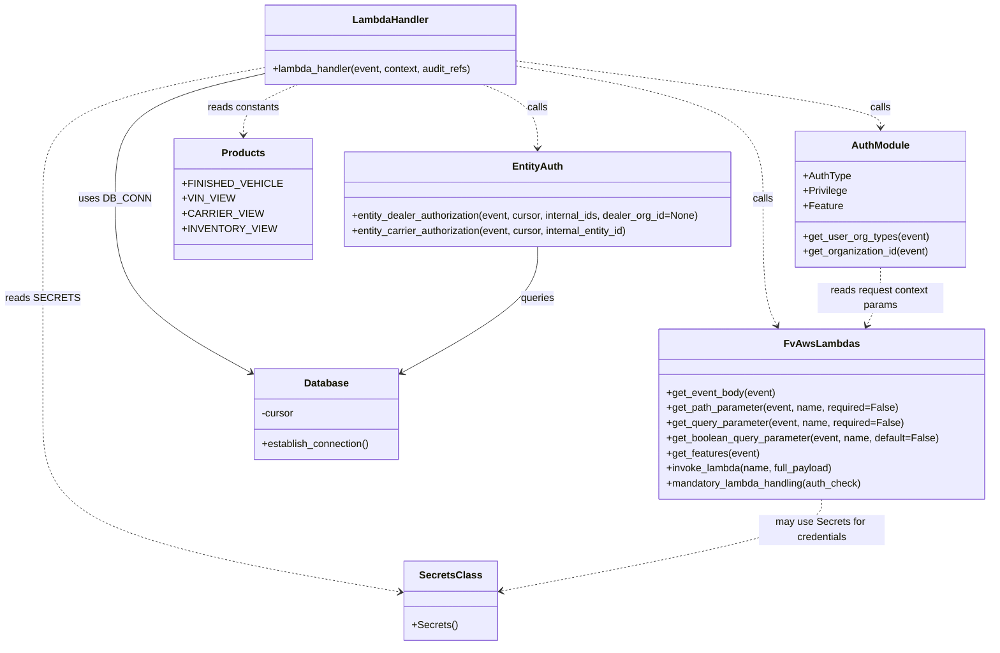

# Diagram: entity_core/entity_service/entity_service/entity/subscription/get_user_subscriptions.py


> Auto-generated by Obscura crawlers

## Diagram 1

```mermaid
flowchart TD
    A[Lambda Event] --> B[Log: "Received get user subscriptions to entity event"]
    B --> C[DB_CONN.establish_connection()]
    C --> D{Determine request path / org}
    D -->|solution_id present| E[External entity: entity_id = path param<br/>subscribing_product = FINISHED_VEHICLE]
    D -->|dealer or dealerOrgId| F[Dealer flow: entity_dealer_authorization(event, cursor, ...)<br/>subscribing_product = VIN_VIEW]
    D -->|carrier or partner| G[Carrier/Partner flow: entity_carrier_authorization(event, cursor, ...)<br/>subscribing_product = CARRIER_VIEW or INVENTORY_VIEW]
    E --> H[Collect query params: email, sourceService, type, full_search]
    F --> H
    G --> H
    H --> I[Build qp dict (email, sourceService, type, subscribing_product, org_id)]
    I --> J[invoke_get_user_entity_subscriptions(event, qp, entity_id, full_search, body)]
    subgraph INVOKE_FUNCTION ["invoke_get_user_entity_subscriptions"]
        direction TB
        JA[deepcopy(event) & set queryStringParameters, body, httpMethod]
        JB[Set pathParameters if not full_search]
        JC[invoke_lambda("get_user_subscriptions", full_payload=event_copy)]
        JD[except Exception -> raise NotFoundError("Notification is disabled")]
        JA --> JB --> JC
        JC --> JE[return lambda response]
        JB --> JC
        JC -.-> JD
    end
    J --> INVOKE_FUNCTION
    INVOKE_FUNCTION --> K{retval.body == "{}" ?}
    K -->|yes| L[set retval.body = "[]"]
    K -->|no| M[return retval]
    L --> M
```

> SVG rendering failed for this diagram.

## Diagram 2



### SVG

<svg id="container" width="1538.55078125" xmlns="http://www.w3.org/2000/svg" class="classDiagram" height="1024" viewBox="0 0 1538.55078125 1024" role="graphics-document document" aria-roledescription="class"><style>#container{font-family:"trebuchet ms",verdana,arial,sans-serif;font-size:16px;fill:#333;}@keyframes edge-animation-frame{from{stroke-dashoffset:0;}}@keyframes dash{to{stroke-dashoffset:0;}}#container .edge-animation-slow{stroke-dasharray:9,5!important;stroke-dashoffset:900;animation:dash 50s linear infinite;stroke-linecap:round;}#container .edge-animation-fast{stroke-dasharray:9,5!important;stroke-dashoffset:900;animation:dash 20s linear infinite;stroke-linecap:round;}#container .error-icon{fill:#552222;}#container .error-text{fill:#552222;stroke:#552222;}#container .edge-thickness-normal{stroke-width:1px;}#container .edge-thickness-thick{stroke-width:3.5px;}#container .edge-pattern-solid{stroke-dasharray:0;}#container .edge-thickness-invisible{stroke-width:0;fill:none;}#container .edge-pattern-dashed{stroke-dasharray:3;}#container .edge-pattern-dotted{stroke-dasharray:2;}#container .marker{fill:#333333;stroke:#333333;}#container .marker.cross{stroke:#333333;}#container svg{font-family:"trebuchet ms",verdana,arial,sans-serif;font-size:16px;}#container p{margin:0;}#container g.classGroup text{fill:#9370DB;stroke:none;font-family:"trebuchet ms",verdana,arial,sans-serif;font-size:10px;}#container g.classGroup text .title{font-weight:bolder;}#container .nodeLabel,#container .edgeLabel{color:#131300;}#container .edgeLabel .label rect{fill:#ECECFF;}#container .label text{fill:#131300;}#container .labelBkg{background:#ECECFF;}#container .edgeLabel .label span{background:#ECECFF;}#container .classTitle{font-weight:bolder;}#container .node rect,#container .node circle,#container .node ellipse,#container .node polygon,#container .node path{fill:#ECECFF;stroke:#9370DB;stroke-width:1px;}#container .divider{stroke:#9370DB;stroke-width:1;}#container g.clickable{cursor:pointer;}#container g.classGroup rect{fill:#ECECFF;stroke:#9370DB;}#container g.classGroup line{stroke:#9370DB;stroke-width:1;}#container .classLabel .box{stroke:none;stroke-width:0;fill:#ECECFF;opacity:0.5;}#container .classLabel .label{fill:#9370DB;font-size:10px;}#container .relation{stroke:#333333;stroke-width:1;fill:none;}#container .dashed-line{stroke-dasharray:3;}#container .dotted-line{stroke-dasharray:1 2;}#container #compositionStart,#container .composition{fill:#333333!important;stroke:#333333!important;stroke-width:1;}#container #compositionEnd,#container .composition{fill:#333333!important;stroke:#333333!important;stroke-width:1;}#container #dependencyStart,#container .dependency{fill:#333333!important;stroke:#333333!important;stroke-width:1;}#container #dependencyStart,#container .dependency{fill:#333333!important;stroke:#333333!important;stroke-width:1;}#container #extensionStart,#container .extension{fill:transparent!important;stroke:#333333!important;stroke-width:1;}#container #extensionEnd,#container .extension{fill:transparent!important;stroke:#333333!important;stroke-width:1;}#container #aggregationStart,#container .aggregation{fill:transparent!important;stroke:#333333!important;stroke-width:1;}#container #aggregationEnd,#container .aggregation{fill:transparent!important;stroke:#333333!important;stroke-width:1;}#container #lollipopStart,#container .lollipop{fill:#ECECFF!important;stroke:#333333!important;stroke-width:1;}#container #lollipopEnd,#container .lollipop{fill:#ECECFF!important;stroke:#333333!important;stroke-width:1;}#container .edgeTerminals{font-size:11px;line-height:initial;}#container .classTitleText{text-anchor:middle;font-size:18px;fill:#333;}#container .label-icon{display:inline-block;height:1em;overflow:visible;vertical-align:-0.125em;}#container .node .label-icon path{fill:currentColor;stroke:revert;stroke-width:revert;}#container :root{--mermaid-font-family:"trebuchet ms",verdana,arial,sans-serif;}</style><g><defs><marker id="container_class-aggregationStart" class="marker aggregation class" refX="18" refY="7" markerWidth="190" markerHeight="240" orient="auto"><path d="M 18,7 L9,13 L1,7 L9,1 Z"></path></marker></defs><defs><marker id="container_class-aggregationEnd" class="marker aggregation class" refX="1" refY="7" markerWidth="20" markerHeight="28" orient="auto"><path d="M 18,7 L9,13 L1,7 L9,1 Z"></path></marker></defs><defs><marker id="container_class-extensionStart" class="marker extension class" refX="18" refY="7" markerWidth="190" markerHeight="240" orient="auto"><path d="M 1,7 L18,13 V 1 Z"></path></marker></defs><defs><marker id="container_class-extensionEnd" class="marker extension class" refX="1" refY="7" markerWidth="20" markerHeight="28" orient="auto"><path d="M 1,1 V 13 L18,7 Z"></path></marker></defs><defs><marker id="container_class-compositionStart" class="marker composition class" refX="18" refY="7" markerWidth="190" markerHeight="240" orient="auto"><path d="M 18,7 L9,13 L1,7 L9,1 Z"></path></marker></defs><defs><marker id="container_class-compositionEnd" class="marker composition class" refX="1" refY="7" markerWidth="20" markerHeight="28" orient="auto"><path d="M 18,7 L9,13 L1,7 L9,1 Z"></path></marker></defs><defs><marker id="container_class-dependencyStart" class="marker dependency class" refX="6" refY="7" markerWidth="190" markerHeight="240" orient="auto"><path d="M 5,7 L9,13 L1,7 L9,1 Z"></path></marker></defs><defs><marker id="container_class-dependencyEnd" class="marker dependency class" refX="13" refY="7" markerWidth="20" markerHeight="28" orient="auto"><path d="M 18,7 L9,13 L14,7 L9,1 Z"></path></marker></defs><defs><marker id="container_class-lollipopStart" class="marker lollipop class" refX="13" refY="7" markerWidth="190" markerHeight="240" orient="auto"><circle stroke="black" fill="transparent" cx="7" cy="7" r="6"></circle></marker></defs><defs><marker id="container_class-lollipopEnd" class="marker lollipop class" refX="1" refY="7" markerWidth="190" markerHeight="240" orient="auto"><circle stroke="black" fill="transparent" cx="7" cy="7" r="6"></circle></marker></defs><g class="root"><g class="clusters"></g><g class="edgePaths"><path d="M790.443,105.114L855.451,116.095C920.46,127.076,1050.476,149.038,1115.484,184.186C1180.492,219.333,1180.492,267.667,1180.492,318C1180.492,368.333,1180.492,420.667,1184.179,454.108C1187.866,487.549,1195.239,502.099,1198.926,509.373L1202.613,516.648" id="id_LambdaHandler_FvAwsLambdas_1" class="edge-thickness-normal edge-pattern-dashed relation" style=";;;" data-edge="true" data-et="edge" data-id="id_LambdaHandler_FvAwsLambdas_1" data-points="W3sieCI6NzkwLjQ0MzM1OTM3NSwieSI6MTA1LjExMzU5MDk5OTgxODU0fSx7IngiOjExODAuNDkyMTg3NSwieSI6MTcxfSx7IngiOjExODAuNDkyMTg3NSwieSI6MzE2fSx7IngiOjExODAuNDkyMTg3NSwieSI6NDczfSx7IngiOjEyMDUuMzI1MDY3OTM0NzgyNSwieSI6NTIyfV0=" marker-end="url(#container_class-dependencyEnd)"></path><path d="M790.443,96.941L886.535,109.284C982.626,121.627,1174.809,146.314,1270.901,163.824C1366.992,181.333,1366.992,191.667,1366.992,196.833L1366.992,202" id="id_LambdaHandler_AuthModule_2" class="edge-thickness-normal edge-pattern-dashed relation" style=";;;" data-edge="true" data-et="edge" data-id="id_LambdaHandler_AuthModule_2" data-points="W3sieCI6NzkwLjQ0MzM1OTM3NSwieSI6OTYuOTQxMjQ4MzQxMDM5NjF9LHsieCI6MTM2Ni45OTIxODc1LCJ5IjoxNzF9LHsieCI6MTM2Ni45OTIxODc1LCJ5IjoyMDh9XQ==" marker-end="url(#container_class-dependencyEnd)"></path><path d="M386.537,119.548L350.866,128.124C315.194,136.699,243.851,153.849,208.179,186.591C172.508,219.333,172.508,267.667,172.508,318C172.508,368.333,172.508,420.667,206.152,466.011C239.796,511.356,307.085,549.711,340.729,568.889L374.373,588.067" id="id_LambdaHandler_Database_3" class="edge-thickness-normal edge-pattern-solid relation" style=";;;" data-edge="true" data-et="edge" data-id="id_LambdaHandler_Database_3" data-points="W3sieCI6Mzg2LjUzNzEwOTM3NSwieSI6MTE5LjU0ODQ3NTY5OTkzODQ5fSx7IngiOjE3Mi41MDc4MTI1LCJ5IjoxNzF9LHsieCI6MTcyLjUwNzgxMjUsInkiOjMxNn0seyJ4IjoxNzIuNTA3ODEyNSwieSI6NDczfSx7IngiOjM3OS41ODU5Mzc1LCJ5Ijo1OTEuMDM4MjM5OTkyMjU1Mn1d" marker-end="url(#container_class-dependencyEnd)"></path><path d="M386.537,109.257L332.215,119.547C277.892,129.838,169.247,150.419,114.924,184.876C60.602,219.333,60.602,267.667,60.602,318C60.602,368.333,60.602,420.667,60.602,477.5C60.602,534.333,60.602,595.667,60.602,657C60.602,718.333,60.602,779.667,153.543,826.758C246.485,873.848,432.368,906.697,525.31,923.121L618.252,939.545" id="id_LambdaHandler_SecretsClass_4" class="edge-thickness-normal edge-pattern-dashed relation" style=";;;" data-edge="true" data-et="edge" data-id="id_LambdaHandler_SecretsClass_4" data-points="W3sieCI6Mzg2LjUzNzEwOTM3NSwieSI6MTA5LjI1Njc2NDMwNjUxMjl9LHsieCI6NjAuNjAxNTYyNSwieSI6MTcxfSx7IngiOjYwLjYwMTU2MjUsInkiOjMxNn0seyJ4Ijo2MC42MDE1NjI1LCJ5Ijo0NzN9LHsieCI6NjAuNjAxNTYyNSwieSI6NjU3fSx7IngiOjYwLjYwMTU2MjUsInkiOjg0MX0seyJ4Ijo2MjQuMTYwMTU2MjUsInkiOjk0MC41ODkyMjY1MDIzMTEyfV0=" marker-end="url(#container_class-dependencyEnd)"></path><path d="M733.145,134L747.305,140.167C761.464,146.333,789.783,158.667,803.942,175.5C818.102,192.333,818.102,213.667,818.102,224.333L818.102,235" id="id_LambdaHandler_EntityAuth_5" class="edge-thickness-normal edge-pattern-dashed relation" style=";;;" data-edge="true" data-et="edge" data-id="id_LambdaHandler_EntityAuth_5" data-points="W3sieCI6NzMzLjE0NTM3MTA5Mzc1LCJ5IjoxMzR9LHsieCI6ODE4LjEwMTU2MjUsInkiOjE3MX0seyJ4Ijo4MTguMTAxNTYyNSwieSI6MjQxfV0=" marker-end="url(#container_class-dependencyEnd)"></path><path d="M443.835,134L429.676,140.167C415.516,146.333,387.198,158.667,373.038,172C358.879,185.333,358.879,199.667,358.879,206.833L358.879,214" id="id_LambdaHandler_Products_6" class="edge-thickness-normal edge-pattern-dashed relation" style=";;;" data-edge="true" data-et="edge" data-id="id_LambdaHandler_Products_6" data-points="W3sieCI6NDQzLjgzNTA5NzY1NjI1LCJ5IjoxMzR9LHsieCI6MzU4Ljg3ODkwNjI1LCJ5IjoxNzF9LHsieCI6MzU4Ljg3ODkwNjI1LCJ5IjoyMjB9XQ==" marker-end="url(#container_class-dependencyEnd)"></path><path d="M818.102,391L818.102,404.667C818.102,418.333,818.102,445.667,784.457,478.511C750.813,511.356,683.525,549.711,649.88,568.889L616.236,588.067" id="id_EntityAuth_Database_7" class="edge-thickness-normal edge-pattern-solid relation" style=";;;" data-edge="true" data-et="edge" data-id="id_EntityAuth_Database_7" data-points="W3sieCI6ODE4LjEwMTU2MjUsInkiOjM5MX0seyJ4Ijo4MTguMTAxNTYyNSwieSI6NDczfSx7IngiOjYxMS4wMjM0Mzc1LCJ5Ijo1OTEuMDM4MjM5OTkyMjU1Mn1d" marker-end="url(#container_class-dependencyEnd)"></path><path d="M1273.742,792L1273.742,800.167C1273.742,808.333,1273.742,824.667,1189.87,849.047C1105.999,873.428,938.255,905.856,854.384,922.07L770.512,938.284" id="id_FvAwsLambdas_SecretsClass_8" class="edge-thickness-normal edge-pattern-dashed relation" style=";;;" data-edge="true" data-et="edge" data-id="id_FvAwsLambdas_SecretsClass_8" data-points="W3sieCI6MTI3My43NDIxODc1LCJ5Ijo3OTJ9LHsieCI6MTI3My43NDIxODc1LCJ5Ijo4NDF9LHsieCI6NzY0LjYyMTA5Mzc1LCJ5Ijo5MzkuNDIzMDc1MzY3MTI2Nn1d" marker-end="url(#container_class-dependencyEnd)"></path><path d="M1366.992,424L1366.992,432.167C1366.992,440.333,1366.992,456.667,1363.305,472.108C1359.619,487.549,1352.245,502.099,1348.558,509.373L1344.872,516.648" id="id_AuthModule_FvAwsLambdas_9" class="edge-thickness-normal edge-pattern-dashed relation" style=";;;" data-edge="true" data-et="edge" data-id="id_AuthModule_FvAwsLambdas_9" data-points="W3sieCI6MTM2Ni45OTIxODc1LCJ5Ijo0MjR9LHsieCI6MTM2Ni45OTIxODc1LCJ5Ijo0NzN9LHsieCI6MTM0Mi4xNTkzMDcwNjUyMTc1LCJ5Ijo1MjJ9XQ==" marker-end="url(#container_class-dependencyEnd)"></path></g><g class="edgeLabels"><g class="edgeLabel" transform="translate(1180.4921875, 316)"><g class="label" data-id="id_LambdaHandler_FvAwsLambdas_1" transform="translate(-16.4453125, -12)"><foreignObject width="32.890625" height="24"><div xmlns="http://www.w3.org/1999/xhtml" class="labelBkg" style="display: table-cell; white-space: nowrap; line-height: 1.5; max-width: 200px; text-align: center;"><span class="edgeLabel"><p>calls</p></span></div></foreignObject></g></g><g class="edgeLabel" transform="translate(1366.9921875, 171)"><g class="label" data-id="id_LambdaHandler_AuthModule_2" transform="translate(-16.4453125, -12)"><foreignObject width="32.890625" height="24"><div xmlns="http://www.w3.org/1999/xhtml" class="labelBkg" style="display: table-cell; white-space: nowrap; line-height: 1.5; max-width: 200px; text-align: center;"><span class="edgeLabel"><p>calls</p></span></div></foreignObject></g></g><g class="edgeLabel" transform="translate(172.5078125, 316)"><g class="label" data-id="id_LambdaHandler_Database_3" transform="translate(-53.09375, -12)"><foreignObject width="106.1875" height="24"><div xmlns="http://www.w3.org/1999/xhtml" class="labelBkg" style="display: table-cell; white-space: nowrap; line-height: 1.5; max-width: 200px; text-align: center;"><span class="edgeLabel"><p>uses DB_CONN</p></span></div></foreignObject></g></g><g class="edgeLabel" transform="translate(60.6015625, 473)"><g class="label" data-id="id_LambdaHandler_SecretsClass_4" transform="translate(-52.6015625, -12)"><foreignObject width="105.203125" height="24"><div xmlns="http://www.w3.org/1999/xhtml" class="labelBkg" style="display: table-cell; white-space: nowrap; line-height: 1.5; max-width: 200px; text-align: center;"><span class="edgeLabel"><p>reads SECRETS</p></span></div></foreignObject></g></g><g class="edgeLabel" transform="translate(818.1015625, 171)"><g class="label" data-id="id_LambdaHandler_EntityAuth_5" transform="translate(-16.4453125, -12)"><foreignObject width="32.890625" height="24"><div xmlns="http://www.w3.org/1999/xhtml" class="labelBkg" style="display: table-cell; white-space: nowrap; line-height: 1.5; max-width: 200px; text-align: center;"><span class="edgeLabel"><p>calls</p></span></div></foreignObject></g></g><g class="edgeLabel" transform="translate(358.87890625, 171)"><g class="label" data-id="id_LambdaHandler_Products_6" transform="translate(-57.3828125, -12)"><foreignObject width="114.765625" height="24"><div xmlns="http://www.w3.org/1999/xhtml" class="labelBkg" style="display: table-cell; white-space: nowrap; line-height: 1.5; max-width: 200px; text-align: center;"><span class="edgeLabel"><p>reads constants</p></span></div></foreignObject></g></g><g class="edgeLabel" transform="translate(818.1015625, 473)"><g class="label" data-id="id_EntityAuth_Database_7" transform="translate(-27.2421875, -12)"><foreignObject width="54.484375" height="24"><div xmlns="http://www.w3.org/1999/xhtml" class="labelBkg" style="display: table-cell; white-space: nowrap; line-height: 1.5; max-width: 200px; text-align: center;"><span class="edgeLabel"><p>queries</p></span></div></foreignObject></g></g><g class="edgeLabel" transform="translate(1273.7421875, 841)"><g class="label" data-id="id_FvAwsLambdas_SecretsClass_8" transform="translate(-100, -24)"><foreignObject width="200" height="48"><div xmlns="http://www.w3.org/1999/xhtml" class="labelBkg" style="display: table; white-space: break-spaces; line-height: 1.5; max-width: 200px; text-align: center; width: 200px;"><span class="edgeLabel"><p>may use Secrets for credentials</p></span></div></foreignObject></g></g><g class="edgeLabel" transform="translate(1366.9921875, 473)"><g class="label" data-id="id_AuthModule_FvAwsLambdas_9" transform="translate(-100, -24)"><foreignObject width="200" height="48"><div xmlns="http://www.w3.org/1999/xhtml" class="labelBkg" style="display: table; white-space: break-spaces; line-height: 1.5; max-width: 200px; text-align: center; width: 200px;"><span class="edgeLabel"><p>reads request context params</p></span></div></foreignObject></g></g></g><g class="nodes"><g class="node default" id="classId-LambdaHandler-0" transform="translate(588.490234375, 71)"><g class="basic label-container"><path d="M-201.953125 -63 L201.953125 -63 L201.953125 63 L-201.953125 63" stroke="none" stroke-width="0" fill="#ECECFF" style=""></path><path d="M-201.953125 -63 C-61.55035144308363 -63, 78.85242211383274 -63, 201.953125 -63 M-201.953125 -63 C-90.17803324381659 -63, 21.59705851236683 -63, 201.953125 -63 M201.953125 -63 C201.953125 -14.782293455903883, 201.953125 33.435413088192234, 201.953125 63 M201.953125 -63 C201.953125 -20.596487576137207, 201.953125 21.807024847725586, 201.953125 63 M201.953125 63 C60.145266183295234 63, -81.66259263340953 63, -201.953125 63 M201.953125 63 C100.7982623540755 63, -0.35660029184899145 63, -201.953125 63 M-201.953125 63 C-201.953125 28.290466949584612, -201.953125 -6.419066100830776, -201.953125 -63 M-201.953125 63 C-201.953125 36.613361611688745, -201.953125 10.22672322337749, -201.953125 -63" stroke="#9370DB" stroke-width="1.3" fill="none" stroke-dasharray="0 0" style=""></path></g><g class="annotation-group text" transform="translate(0, -39)"></g><g class="label-group text" transform="translate(-58.21875, -39)"><g class="label" style="font-weight: bolder" transform="translate(0,-12)"><foreignObject width="116.4375" height="24"><div xmlns="http://www.w3.org/1999/xhtml" style="display: table-cell; white-space: nowrap; line-height: 1.5; max-width: 167px; text-align: center;"><span class="nodeLabel markdown-node-label" style=""><p>LambdaHandler</p></span></div></foreignObject></g></g><g class="members-group text" transform="translate(-189.953125, 9)"></g><g class="methods-group text" transform="translate(-189.953125, 39)"><g class="label" style="" transform="translate(0,-12)"><foreignObject width="321.6875" height="24"><div xmlns="http://www.w3.org/1999/xhtml" style="display: table-cell; white-space: nowrap; line-height: 1.5; max-width: 379px; text-align: center;"><span class="nodeLabel markdown-node-label" style=""><p>+lambda_handler(event, context, audit_refs)</p></span></div></foreignObject></g></g><g class="divider" style=""><path d="M-201.953125 -15 C-43.585997169242404 -15, 114.78113066151519 -15, 201.953125 -15 M-201.953125 -15 C-89.08649242938054 -15, 23.780140141238917 -15, 201.953125 -15" stroke="#9370DB" stroke-width="1.3" fill="none" stroke-dasharray="0 0" style=""></path></g><g class="divider" style=""><path d="M-201.953125 9 C-119.53446586811263 9, -37.11580673622527 9, 201.953125 9 M-201.953125 9 C-119.16063440087714 9, -36.368143801754286 9, 201.953125 9" stroke="#9370DB" stroke-width="1.3" fill="none" stroke-dasharray="0 0" style=""></path></g></g><g class="node default" id="classId-FvAwsLambdas-1" transform="translate(1273.7421875, 657)"><g class="basic label-container"><path d="M-256.80859375 -135 L256.80859375 -135 L256.80859375 135 L-256.80859375 135" stroke="none" stroke-width="0" fill="#ECECFF" style=""></path><path d="M-256.80859375 -135 C-92.73105947008847 -135, 71.34647480982306 -135, 256.80859375 -135 M-256.80859375 -135 C-60.65508528207957 -135, 135.49842318584086 -135, 256.80859375 -135 M256.80859375 -135 C256.80859375 -45.87560503501736, 256.80859375 43.248789929965284, 256.80859375 135 M256.80859375 -135 C256.80859375 -43.99400356397034, 256.80859375 47.011992872059324, 256.80859375 135 M256.80859375 135 C135.57814925953397 135, 14.347704769067946 135, -256.80859375 135 M256.80859375 135 C125.7711424774964 135, -5.266308795007205 135, -256.80859375 135 M-256.80859375 135 C-256.80859375 53.29122523247396, -256.80859375 -28.417549535052075, -256.80859375 -135 M-256.80859375 135 C-256.80859375 31.136057700935055, -256.80859375 -72.72788459812989, -256.80859375 -135" stroke="#9370DB" stroke-width="1.3" fill="none" stroke-dasharray="0 0" style=""></path></g><g class="annotation-group text" transform="translate(0, -111)"></g><g class="label-group text" transform="translate(-55.2109375, -111)"><g class="label" style="font-weight: bolder" transform="translate(0,-12)"><foreignObject width="110.421875" height="24"><div xmlns="http://www.w3.org/1999/xhtml" style="display: table-cell; white-space: nowrap; line-height: 1.5; max-width: 159px; text-align: center;"><span class="nodeLabel markdown-node-label" style=""><p>FvAwsLambdas</p></span></div></foreignObject></g></g><g class="members-group text" transform="translate(-244.80859375, -63)"></g><g class="methods-group text" transform="translate(-244.80859375, -33)"><g class="label" style="" transform="translate(0,-12)"><foreignObject width="174.203125" height="24"><div xmlns="http://www.w3.org/1999/xhtml" style="display: table-cell; white-space: nowrap; line-height: 1.5; max-width: 232px; text-align: center;"><span class="nodeLabel markdown-node-label" style=""><p>+get_event_body(event)</p></span></div></foreignObject></g><g class="label" style="" transform="translate(0,12)"><foreignObject width="369.015625" height="24"><div xmlns="http://www.w3.org/1999/xhtml" style="display: table-cell; white-space: nowrap; line-height: 1.5; max-width: 426px; text-align: center;"><span class="nodeLabel markdown-node-label" style=""><p>+get_path_parameter(event, name, required=False)</p></span></div></foreignObject></g><g class="label" style="" transform="translate(0,36)"><foreignObject width="376.671875" height="24"><div xmlns="http://www.w3.org/1999/xhtml" style="display: table-cell; white-space: nowrap; line-height: 1.5; max-width: 434px; text-align: center;"><span class="nodeLabel markdown-node-label" style=""><p>+get_query_parameter(event, name, required=False)</p></span></div></foreignObject></g><g class="label" style="" transform="translate(0,60)"><foreignObject width="434.40625" height="24"><div xmlns="http://www.w3.org/1999/xhtml" style="display: table-cell; white-space: nowrap; line-height: 1.5; max-width: 492px; text-align: center;"><span class="nodeLabel markdown-node-label" style=""><p>+get_boolean_query_parameter(event, name, default=False)</p></span></div></foreignObject></g><g class="label" style="" transform="translate(0,84)"><foreignObject width="148.703125" height="24"><div xmlns="http://www.w3.org/1999/xhtml" style="display: table-cell; white-space: nowrap; line-height: 1.5; max-width: 206px; text-align: center;"><span class="nodeLabel markdown-node-label" style=""><p>+get_features(event)</p></span></div></foreignObject></g><g class="label" style="" transform="translate(0,108)"><foreignObject width="267.234375" height="24"><div xmlns="http://www.w3.org/1999/xhtml" style="display: table-cell; white-space: nowrap; line-height: 1.5; max-width: 325px; text-align: center;"><span class="nodeLabel markdown-node-label" style=""><p>+invoke_lambda(name, full_payload)</p></span></div></foreignObject></g><g class="label" style="" transform="translate(0,132)"><foreignObject width="314.828125" height="24"><div xmlns="http://www.w3.org/1999/xhtml" style="display: table-cell; white-space: nowrap; line-height: 1.5; max-width: 372px; text-align: center;"><span class="nodeLabel markdown-node-label" style=""><p>+mandatory_lambda_handling(auth_check)</p></span></div></foreignObject></g></g><g class="divider" style=""><path d="M-256.80859375 -87 C-119.34047516007172 -87, 18.127643429856562 -87, 256.80859375 -87 M-256.80859375 -87 C-122.65163358646325 -87, 11.505326577073504 -87, 256.80859375 -87" stroke="#9370DB" stroke-width="1.3" fill="none" stroke-dasharray="0 0" style=""></path></g><g class="divider" style=""><path d="M-256.80859375 -63 C-119.28433505366527 -63, 18.239923642669453 -63, 256.80859375 -63 M-256.80859375 -63 C-53.304855560947885 -63, 150.19888262810423 -63, 256.80859375 -63" stroke="#9370DB" stroke-width="1.3" fill="none" stroke-dasharray="0 0" style=""></path></g></g><g class="node default" id="classId-AuthModule-2" transform="translate(1366.9921875, 316)"><g class="basic label-container"><path d="M-135.0546875 -108 L135.0546875 -108 L135.0546875 108 L-135.0546875 108" stroke="none" stroke-width="0" fill="#ECECFF" style=""></path><path d="M-135.0546875 -108 C-36.033268855043076 -108, 62.98814978991385 -108, 135.0546875 -108 M-135.0546875 -108 C-33.01603889537371 -108, 69.02260970925258 -108, 135.0546875 -108 M135.0546875 -108 C135.0546875 -48.853533377999824, 135.0546875 10.292933244000352, 135.0546875 108 M135.0546875 -108 C135.0546875 -38.167216456987504, 135.0546875 31.665567086024993, 135.0546875 108 M135.0546875 108 C55.851983503972036 108, -23.350720492055927 108, -135.0546875 108 M135.0546875 108 C71.32804019926704 108, 7.601392898534087 108, -135.0546875 108 M-135.0546875 108 C-135.0546875 51.405861258819165, -135.0546875 -5.18827748236167, -135.0546875 -108 M-135.0546875 108 C-135.0546875 35.29863877782768, -135.0546875 -37.40272244434465, -135.0546875 -108" stroke="#9370DB" stroke-width="1.3" fill="none" stroke-dasharray="0 0" style=""></path></g><g class="annotation-group text" transform="translate(0, -84)"></g><g class="label-group text" transform="translate(-44.09375, -84)"><g class="label" style="font-weight: bolder" transform="translate(0,-12)"><foreignObject width="88.1875" height="24"><div xmlns="http://www.w3.org/1999/xhtml" style="display: table-cell; white-space: nowrap; line-height: 1.5; max-width: 138px; text-align: center;"><span class="nodeLabel markdown-node-label" style=""><p>AuthModule</p></span></div></foreignObject></g></g><g class="members-group text" transform="translate(-123.0546875, -36)"><g class="label" style="" transform="translate(0,-12)"><foreignObject width="75.1875" height="24"><div xmlns="http://www.w3.org/1999/xhtml" style="display: table-cell; white-space: nowrap; line-height: 1.5; max-width: 133px; text-align: center;"><span class="nodeLabel markdown-node-label" style=""><p>+AuthType</p></span></div></foreignObject></g><g class="label" style="" transform="translate(0,12)"><foreignObject width="70.15625" height="24"><div xmlns="http://www.w3.org/1999/xhtml" style="display: table-cell; white-space: nowrap; line-height: 1.5; max-width: 128px; text-align: center;"><span class="nodeLabel markdown-node-label" style=""><p>+Privilege</p></span></div></foreignObject></g><g class="label" style="" transform="translate(0,36)"><foreignObject width="62.0625" height="24"><div xmlns="http://www.w3.org/1999/xhtml" style="display: table-cell; white-space: nowrap; line-height: 1.5; max-width: 119px; text-align: center;"><span class="nodeLabel markdown-node-label" style=""><p>+Feature</p></span></div></foreignObject></g></g><g class="methods-group text" transform="translate(-123.0546875, 60)"><g class="label" style="" transform="translate(0,-12)"><foreignObject width="198.578125" height="24"><div xmlns="http://www.w3.org/1999/xhtml" style="display: table-cell; white-space: nowrap; line-height: 1.5; max-width: 256px; text-align: center;"><span class="nodeLabel markdown-node-label" style=""><p>+get_user_org_types(event)</p></span></div></foreignObject></g><g class="label" style="" transform="translate(0,12)"><foreignObject width="202.015625" height="24"><div xmlns="http://www.w3.org/1999/xhtml" style="display: table-cell; white-space: nowrap; line-height: 1.5; max-width: 259px; text-align: center;"><span class="nodeLabel markdown-node-label" style=""><p>+get_organization_id(event)</p></span></div></foreignObject></g></g><g class="divider" style=""><path d="M-135.0546875 -60 C-31.995885314709938 -60, 71.06291687058012 -60, 135.0546875 -60 M-135.0546875 -60 C-74.65944968144845 -60, -14.264211862896886 -60, 135.0546875 -60" stroke="#9370DB" stroke-width="1.3" fill="none" stroke-dasharray="0 0" style=""></path></g><g class="divider" style=""><path d="M-135.0546875 36 C-40.30711964673776 36, 54.44044820652448 36, 135.0546875 36 M-135.0546875 36 C-37.72957894308203 36, 59.595529613835936 36, 135.0546875 36" stroke="#9370DB" stroke-width="1.3" fill="none" stroke-dasharray="0 0" style=""></path></g></g><g class="node default" id="classId-Database-3" transform="translate(495.3046875, 657)"><g class="basic label-container"><path d="M-115.71875 -72 L115.71875 -72 L115.71875 72 L-115.71875 72" stroke="none" stroke-width="0" fill="#ECECFF" style=""></path><path d="M-115.71875 -72 C-67.12015614649545 -72, -18.521562292990907 -72, 115.71875 -72 M-115.71875 -72 C-36.38587929925026 -72, 42.946991401499474 -72, 115.71875 -72 M115.71875 -72 C115.71875 -36.165867404721695, 115.71875 -0.3317348094433896, 115.71875 72 M115.71875 -72 C115.71875 -32.718612259356526, 115.71875 6.562775481286948, 115.71875 72 M115.71875 72 C62.82361389951325 72, 9.928477799026496 72, -115.71875 72 M115.71875 72 C66.6230928410601 72, 17.527435682120213 72, -115.71875 72 M-115.71875 72 C-115.71875 30.27645015116517, -115.71875 -11.447099697669657, -115.71875 -72 M-115.71875 72 C-115.71875 33.27719823730411, -115.71875 -5.445603525391775, -115.71875 -72" stroke="#9370DB" stroke-width="1.3" fill="none" stroke-dasharray="0 0" style=""></path></g><g class="annotation-group text" transform="translate(0, -48)"></g><g class="label-group text" transform="translate(-34.171875, -48)"><g class="label" style="font-weight: bolder" transform="translate(0,-12)"><foreignObject width="68.34375" height="24"><div xmlns="http://www.w3.org/1999/xhtml" style="display: table-cell; white-space: nowrap; line-height: 1.5; max-width: 117px; text-align: center;"><span class="nodeLabel markdown-node-label" style=""><p>Database</p></span></div></foreignObject></g></g><g class="members-group text" transform="translate(-103.71875, 0)"><g class="label" style="" transform="translate(0,-12)"><foreignObject width="52.1875" height="24"><div xmlns="http://www.w3.org/1999/xhtml" style="display: table-cell; white-space: nowrap; line-height: 1.5; max-width: 110px; text-align: center;"><span class="nodeLabel markdown-node-label" style=""><p>-cursor</p></span></div></foreignObject></g></g><g class="methods-group text" transform="translate(-103.71875, 48)"><g class="label" style="" transform="translate(0,-12)"><foreignObject width="173.265625" height="24"><div xmlns="http://www.w3.org/1999/xhtml" style="display: table-cell; white-space: nowrap; line-height: 1.5; max-width: 231px; text-align: center;"><span class="nodeLabel markdown-node-label" style=""><p>+establish_connection()</p></span></div></foreignObject></g></g><g class="divider" style=""><path d="M-115.71875 -24 C-64.27952854212882 -24, -12.840307084257645 -24, 115.71875 -24 M-115.71875 -24 C-59.36438933602898 -24, -3.010028672057956 -24, 115.71875 -24" stroke="#9370DB" stroke-width="1.3" fill="none" stroke-dasharray="0 0" style=""></path></g><g class="divider" style=""><path d="M-115.71875 24 C-57.65010713946181 24, 0.41853572107638115 24, 115.71875 24 M-115.71875 24 C-54.462103672365984 24, 6.794542655268032 24, 115.71875 24" stroke="#9370DB" stroke-width="1.3" fill="none" stroke-dasharray="0 0" style=""></path></g></g><g class="node default" id="classId-SecretsClass-4" transform="translate(694.390625, 953)"><g class="basic label-container"><path d="M-70.23046875 -63 L70.23046875 -63 L70.23046875 63 L-70.23046875 63" stroke="none" stroke-width="0" fill="#ECECFF" style=""></path><path d="M-70.23046875 -63 C-15.602136719875354 -63, 39.02619531024929 -63, 70.23046875 -63 M-70.23046875 -63 C-33.550941870381564 -63, 3.128585009236872 -63, 70.23046875 -63 M70.23046875 -63 C70.23046875 -25.6537637218702, 70.23046875 11.692472556259602, 70.23046875 63 M70.23046875 -63 C70.23046875 -33.770772194927915, 70.23046875 -4.541544389855822, 70.23046875 63 M70.23046875 63 C28.57498797645971 63, -13.08049279708058 63, -70.23046875 63 M70.23046875 63 C27.58056598775803 63, -15.069336774483943 63, -70.23046875 63 M-70.23046875 63 C-70.23046875 19.996968540381253, -70.23046875 -23.006062919237493, -70.23046875 -63 M-70.23046875 63 C-70.23046875 24.3509510802646, -70.23046875 -14.298097839470799, -70.23046875 -63" stroke="#9370DB" stroke-width="1.3" fill="none" stroke-dasharray="0 0" style=""></path></g><g class="annotation-group text" transform="translate(0, -39)"></g><g class="label-group text" transform="translate(-45.9921875, -39)"><g class="label" style="font-weight: bolder" transform="translate(0,-12)"><foreignObject width="91.984375" height="24"><div xmlns="http://www.w3.org/1999/xhtml" style="display: table-cell; white-space: nowrap; line-height: 1.5; max-width: 140px; text-align: center;"><span class="nodeLabel markdown-node-label" style=""><p>SecretsClass</p></span></div></foreignObject></g></g><g class="members-group text" transform="translate(-58.23046875, 9)"></g><g class="methods-group text" transform="translate(-58.23046875, 39)"><g class="label" style="" transform="translate(0,-12)"><foreignObject width="70.46875" height="24"><div xmlns="http://www.w3.org/1999/xhtml" style="display: table-cell; white-space: nowrap; line-height: 1.5; max-width: 128px; text-align: center;"><span class="nodeLabel markdown-node-label" style=""><p>+Secrets()</p></span></div></foreignObject></g></g><g class="divider" style=""><path d="M-70.23046875 -15 C-21.439237141624446 -15, 27.35199446675111 -15, 70.23046875 -15 M-70.23046875 -15 C-23.216235064705245 -15, 23.79799862058951 -15, 70.23046875 -15" stroke="#9370DB" stroke-width="1.3" fill="none" stroke-dasharray="0 0" style=""></path></g><g class="divider" style=""><path d="M-70.23046875 9 C-34.26093019607617 9, 1.708608357847666 9, 70.23046875 9 M-70.23046875 9 C-25.660644407001797 9, 18.909179935996406 9, 70.23046875 9" stroke="#9370DB" stroke-width="1.3" fill="none" stroke-dasharray="0 0" style=""></path></g></g><g class="node default" id="classId-EntityAuth-5" transform="translate(818.1015625, 316)"><g class="basic label-container"><path d="M-310.9453125 -75 L310.9453125 -75 L310.9453125 75 L-310.9453125 75" stroke="none" stroke-width="0" fill="#ECECFF" style=""></path><path d="M-310.9453125 -75 C-89.5289023250871 -75, 131.8875078498258 -75, 310.9453125 -75 M-310.9453125 -75 C-163.703772991112 -75, -16.462233482224008 -75, 310.9453125 -75 M310.9453125 -75 C310.9453125 -25.834188899553858, 310.9453125 23.331622200892284, 310.9453125 75 M310.9453125 -75 C310.9453125 -26.72279926389193, 310.9453125 21.554401472216142, 310.9453125 75 M310.9453125 75 C173.3977987701337 75, 35.85028504026741 75, -310.9453125 75 M310.9453125 75 C118.64936904702952 75, -73.64657440594095 75, -310.9453125 75 M-310.9453125 75 C-310.9453125 44.49519288389269, -310.9453125 13.990385767785384, -310.9453125 -75 M-310.9453125 75 C-310.9453125 36.33314775552307, -310.9453125 -2.333704488953856, -310.9453125 -75" stroke="#9370DB" stroke-width="1.3" fill="none" stroke-dasharray="0 0" style=""></path></g><g class="annotation-group text" transform="translate(0, -51)"></g><g class="label-group text" transform="translate(-38.28125, -51)"><g class="label" style="font-weight: bolder" transform="translate(0,-12)"><foreignObject width="76.5625" height="24"><div xmlns="http://www.w3.org/1999/xhtml" style="display: table-cell; white-space: nowrap; line-height: 1.5; max-width: 125px; text-align: center;"><span class="nodeLabel markdown-node-label" style=""><p>EntityAuth</p></span></div></foreignObject></g></g><g class="members-group text" transform="translate(-298.9453125, -3)"></g><g class="methods-group text" transform="translate(-298.9453125, 27)"><g class="label" style="" transform="translate(0,-12)"><foreignObject width="559.609375" height="24"><div xmlns="http://www.w3.org/1999/xhtml" style="display: table-cell; white-space: nowrap; line-height: 1.5; max-width: 617px; text-align: center;"><span class="nodeLabel markdown-node-label" style=""><p>+entity_dealer_authorization(event, cursor, internal_ids, dealer_org_id=None)</p></span></div></foreignObject></g><g class="label" style="" transform="translate(0,12)"><foreignObject width="449.984375" height="24"><div xmlns="http://www.w3.org/1999/xhtml" style="display: table-cell; white-space: nowrap; line-height: 1.5; max-width: 507px; text-align: center;"><span class="nodeLabel markdown-node-label" style=""><p>+entity_carrier_authorization(event, cursor, internal_entity_id)</p></span></div></foreignObject></g></g><g class="divider" style=""><path d="M-310.9453125 -27 C-145.5906808518721 -27, 19.763950796255813 -27, 310.9453125 -27 M-310.9453125 -27 C-72.7577033272417 -27, 165.4299058455166 -27, 310.9453125 -27" stroke="#9370DB" stroke-width="1.3" fill="none" stroke-dasharray="0 0" style=""></path></g><g class="divider" style=""><path d="M-310.9453125 -3 C-182.18656325532876 -3, -53.42781401065753 -3, 310.9453125 -3 M-310.9453125 -3 C-180.338042579854 -3, -49.73077265970801 -3, 310.9453125 -3" stroke="#9370DB" stroke-width="1.3" fill="none" stroke-dasharray="0 0" style=""></path></g></g><g class="node default" id="classId-Products-6" transform="translate(358.87890625, 316)"><g class="basic label-container"><path d="M-98.27734375 -96 L98.27734375 -96 L98.27734375 96 L-98.27734375 96" stroke="none" stroke-width="0" fill="#ECECFF" style=""></path><path d="M-98.27734375 -96 C-34.49808310788696 -96, 29.281177534226074 -96, 98.27734375 -96 M-98.27734375 -96 C-39.22418623035699 -96, 19.828971289286017 -96, 98.27734375 -96 M98.27734375 -96 C98.27734375 -41.67918319818874, 98.27734375 12.641633603622523, 98.27734375 96 M98.27734375 -96 C98.27734375 -43.32404824369433, 98.27734375 9.351903512611344, 98.27734375 96 M98.27734375 96 C53.44684292225314 96, 8.61634209450628 96, -98.27734375 96 M98.27734375 96 C36.409585908683404 96, -25.458171932633192 96, -98.27734375 96 M-98.27734375 96 C-98.27734375 50.36863699539481, -98.27734375 4.7372739907896175, -98.27734375 -96 M-98.27734375 96 C-98.27734375 28.47444136375715, -98.27734375 -39.0511172724857, -98.27734375 -96" stroke="#9370DB" stroke-width="1.3" fill="none" stroke-dasharray="0 0" style=""></path></g><g class="annotation-group text" transform="translate(0, -72)"></g><g class="label-group text" transform="translate(-32.4453125, -72)"><g class="label" style="font-weight: bolder" transform="translate(0,-12)"><foreignObject width="64.890625" height="24"><div xmlns="http://www.w3.org/1999/xhtml" style="display: table-cell; white-space: nowrap; line-height: 1.5; max-width: 114px; text-align: center;"><span class="nodeLabel markdown-node-label" style=""><p>Products</p></span></div></foreignObject></g></g><g class="members-group text" transform="translate(-86.27734375, -24)"><g class="label" style="" transform="translate(0,-12)"><foreignObject width="140.109375" height="24"><div xmlns="http://www.w3.org/1999/xhtml" style="display: table-cell; white-space: nowrap; line-height: 1.5; max-width: 197px; text-align: center;"><span class="nodeLabel markdown-node-label" style=""><p>+FINISHED_VEHICLE</p></span></div></foreignObject></g><g class="label" style="" transform="translate(0,12)"><foreignObject width="75.046875" height="24"><div xmlns="http://www.w3.org/1999/xhtml" style="display: table-cell; white-space: nowrap; line-height: 1.5; max-width: 132px; text-align: center;"><span class="nodeLabel markdown-node-label" style=""><p>+VIN_VIEW</p></span></div></foreignObject></g><g class="label" style="" transform="translate(0,36)"><foreignObject width="111.359375" height="24"><div xmlns="http://www.w3.org/1999/xhtml" style="display: table-cell; white-space: nowrap; line-height: 1.5; max-width: 169px; text-align: center;"><span class="nodeLabel markdown-node-label" style=""><p>+CARRIER_VIEW</p></span></div></foreignObject></g><g class="label" style="" transform="translate(0,60)"><foreignObject width="130.5" height="24"><div xmlns="http://www.w3.org/1999/xhtml" style="display: table-cell; white-space: nowrap; line-height: 1.5; max-width: 188px; text-align: center;"><span class="nodeLabel markdown-node-label" style=""><p>+INVENTORY_VIEW</p></span></div></foreignObject></g></g><g class="methods-group text" transform="translate(-86.27734375, 96)"></g><g class="divider" style=""><path d="M-98.27734375 -48 C-39.929599730441595 -48, 18.41814428911681 -48, 98.27734375 -48 M-98.27734375 -48 C-54.33268099919444 -48, -10.388018248388875 -48, 98.27734375 -48" stroke="#9370DB" stroke-width="1.3" fill="none" stroke-dasharray="0 0" style=""></path></g><g class="divider" style=""><path d="M-98.27734375 72 C-37.474147358543206 72, 23.329049032913588 72, 98.27734375 72 M-98.27734375 72 C-48.733835625226284 72, 0.8096724995474318 72, 98.27734375 72" stroke="#9370DB" stroke-width="1.3" fill="none" stroke-dasharray="0 0" style=""></path></g></g></g></g></g></svg>
