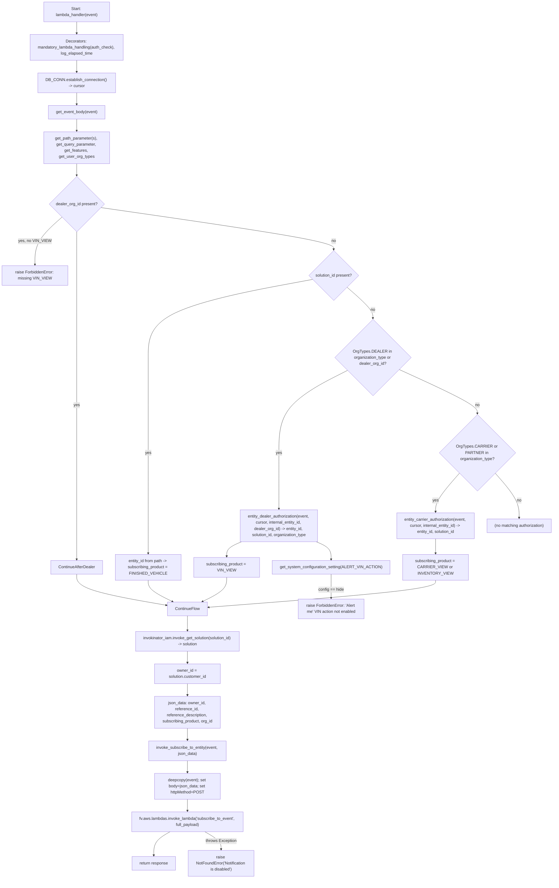
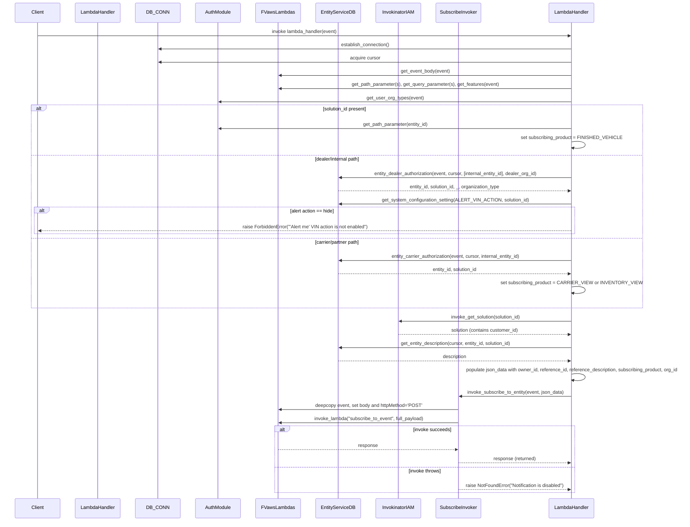

# Diagram: entity_core/entity_service/entity_service/entity/subscription/subscribe.py

> Auto-generated by Obscura crawlers

## Diagram 1

### SVG

<svg id="container" width="2181.8984375" xmlns="http://www.w3.org/2000/svg" class="flowchart" height="3495.9375" viewBox="0 0 2181.8984375 3495.9375" role="graphics-document document" aria-roledescription="flowchart-v2"><g><marker id="container_flowchart-v2-pointEnd" class="marker flowchart-v2" viewBox="0 0 10 10" refX="5" refY="5" markerUnits="userSpaceOnUse" markerWidth="8" markerHeight="8" orient="auto"><path d="M 0 0 L 10 5 L 0 10 z" class="arrowMarkerPath" style="stroke-width: 1; stroke-dasharray: 1, 0;"></path></marker><marker id="container_flowchart-v2-pointStart" class="marker flowchart-v2" viewBox="0 0 10 10" refX="4.5" refY="5" markerUnits="userSpaceOnUse" markerWidth="8" markerHeight="8" orient="auto"><path d="M 0 5 L 10 10 L 10 0 z" class="arrowMarkerPath" style="stroke-width: 1; stroke-dasharray: 1, 0;"></path></marker><marker id="container_flowchart-v2-circleEnd" class="marker flowchart-v2" viewBox="0 0 10 10" refX="11" refY="5" markerUnits="userSpaceOnUse" markerWidth="11" markerHeight="11" orient="auto"><circle cx="5" cy="5" r="5" class="arrowMarkerPath" style="stroke-width: 1; stroke-dasharray: 1, 0;"></circle></marker><marker id="container_flowchart-v2-circleStart" class="marker flowchart-v2" viewBox="0 0 10 10" refX="-1" refY="5" markerUnits="userSpaceOnUse" markerWidth="11" markerHeight="11" orient="auto"><circle cx="5" cy="5" r="5" class="arrowMarkerPath" style="stroke-width: 1; stroke-dasharray: 1, 0;"></circle></marker><marker id="container_flowchart-v2-crossEnd" class="marker cross flowchart-v2" viewBox="0 0 11 11" refX="12" refY="5.2" markerUnits="userSpaceOnUse" markerWidth="11" markerHeight="11" orient="auto"><path d="M 1,1 l 9,9 M 10,1 l -9,9" class="arrowMarkerPath" style="stroke-width: 2; stroke-dasharray: 1, 0;"></path></marker><marker id="container_flowchart-v2-crossStart" class="marker cross flowchart-v2" viewBox="0 0 11 11" refX="-1" refY="5.2" markerUnits="userSpaceOnUse" markerWidth="11" markerHeight="11" orient="auto"><path d="M 1,1 l 9,9 M 10,1 l -9,9" class="arrowMarkerPath" style="stroke-width: 2; stroke-dasharray: 1, 0;"></path></marker><g class="root"><g class="clusters"></g><g class="edgePaths"><path d="M303,86L303,90.167C303,94.333,303,102.667,303,110.333C303,118,303,125,303,128.5L303,132" id="L_Start_Decorators_0" class="edge-thickness-normal edge-pattern-solid edge-thickness-normal edge-pattern-solid flowchart-link" style=";" data-edge="true" data-et="edge" data-id="L_Start_Decorators_0" data-points="W3sieCI6MzAzLCJ5Ijo4Nn0seyJ4IjozMDMsInkiOjExMX0seyJ4IjozMDMsInkiOjEzNn1d" marker-end="url(#container_flowchart-v2-pointEnd)"></path><path d="M303,238L303,242.167C303,246.333,303,254.667,303,262.333C303,270,303,277,303,280.5L303,284" id="L_Decorators_DBEstablish_0" class="edge-thickness-normal edge-pattern-solid edge-thickness-normal edge-pattern-solid flowchart-link" style=";" data-edge="true" data-et="edge" data-id="L_Decorators_DBEstablish_0" data-points="W3sieCI6MzAzLCJ5IjoyMzh9LHsieCI6MzAzLCJ5IjoyNjN9LHsieCI6MzAzLCJ5IjoyODh9XQ==" marker-end="url(#container_flowchart-v2-pointEnd)"></path><path d="M303,366L303,370.167C303,374.333,303,382.667,303,390.333C303,398,303,405,303,408.5L303,412" id="L_DBEstablish_GetBody_0" class="edge-thickness-normal edge-pattern-solid edge-thickness-normal edge-pattern-solid flowchart-link" style=";" data-edge="true" data-et="edge" data-id="L_DBEstablish_GetBody_0" data-points="W3sieCI6MzAzLCJ5IjozNjZ9LHsieCI6MzAzLCJ5IjozOTF9LHsieCI6MzAzLCJ5Ijo0MTZ9XQ==" marker-end="url(#container_flowchart-v2-pointEnd)"></path><path d="M303,470L303,474.167C303,478.333,303,486.667,303,494.333C303,502,303,509,303,512.5L303,516" id="L_GetBody_GetParams_0" class="edge-thickness-normal edge-pattern-solid edge-thickness-normal edge-pattern-solid flowchart-link" style=";" data-edge="true" data-et="edge" data-id="L_GetBody_GetParams_0" data-points="W3sieCI6MzAzLCJ5Ijo0NzB9LHsieCI6MzAzLCJ5Ijo0OTV9LHsieCI6MzAzLCJ5Ijo1MjB9XQ==" marker-end="url(#container_flowchart-v2-pointEnd)"></path><path d="M303,646L303,650.167C303,654.333,303,662.667,303,670.333C303,678,303,685,303,688.5L303,692" id="L_GetParams_DealerQuery_0" class="edge-thickness-normal edge-pattern-solid edge-thickness-normal edge-pattern-solid flowchart-link" style=";" data-edge="true" data-et="edge" data-id="L_GetParams_DealerQuery_0" data-points="W3sieCI6MzAzLCJ5Ijo2NDZ9LHsieCI6MzAzLCJ5Ijo2NzF9LHsieCI6MzAzLCJ5Ijo2OTZ9XQ==" marker-end="url(#container_flowchart-v2-pointEnd)"></path><path d="M244.939,857.283L227.116,873.127C209.293,888.97,173.646,920.657,155.823,952.383C138,984.109,138,1015.875,138,1031.758L138,1047.641" id="L_DealerQuery_ForbiddenFeature_0" class="edge-thickness-normal edge-pattern-solid edge-thickness-normal edge-pattern-solid flowchart-link" style=";" data-edge="true" data-et="edge" data-id="L_DealerQuery_ForbiddenFeature_0" data-points="W3sieCI6MjQ0LjkzOTM4OTM4MTg2MTkzLCJ5Ijo4NTcuMjgzMTM5MzgxODYxOX0seyJ4IjoxMzgsInkiOjk1Mi4zNDM3NX0seyJ4IjoxMzgsInkiOjEwNTEuNjQwNjI1fV0=" marker-end="url(#container_flowchart-v2-pointEnd)"></path><path d="M303,915.344L303,921.51C303,927.677,303,940.01,303,969.227C303,998.443,303,1044.542,303,1090.641C303,1136.74,303,1182.839,303,1237.221C303,1291.604,303,1354.271,303,1416.938C303,1479.604,303,1542.271,303,1604.938C303,1667.604,303,1730.271,303,1792.938C303,1855.604,303,1918.271,303,1966.271C303,2014.271,303,2047.604,303,2078.938C303,2110.271,303,2139.604,303,2161.771C303,2183.938,303,2198.938,303,2206.438L303,2213.938" id="L_DealerQuery_ContinueAfterDealer_0" class="edge-thickness-normal edge-pattern-solid edge-thickness-normal edge-pattern-solid flowchart-link" style=";" data-edge="true" data-et="edge" data-id="L_DealerQuery_ContinueAfterDealer_0" data-points="W3sieCI6MzAzLCJ5Ijo5MTUuMzQzNzV9LHsieCI6MzAzLCJ5Ijo5NTIuMzQzNzV9LHsieCI6MzAzLCJ5IjoxMDkwLjY0MDYyNX0seyJ4IjozMDMsInkiOjEyMjguOTM3NX0seyJ4IjozMDMsInkiOjE0MTYuOTM3NX0seyJ4IjozMDMsInkiOjE2MDQuOTM3NX0seyJ4IjozMDMsInkiOjE3OTIuOTM3NX0seyJ4IjozMDMsInkiOjE5ODAuOTM3NX0seyJ4IjozMDMsInkiOjIwODAuOTM3NX0seyJ4IjozMDMsInkiOjIxNjguOTM3NX0seyJ4IjozMDMsInkiOjIyMTcuOTM3NX1d" marker-end="url(#container_flowchart-v2-pointEnd)"></path><path d="M398.791,819.553L551.523,841.684C704.255,863.816,1009.719,908.08,1162.452,935.712C1315.184,963.344,1315.184,974.344,1315.184,979.844L1315.184,985.344" id="L_DealerQuery_SolutionCheck_0" class="edge-thickness-normal edge-pattern-solid edge-thickness-normal edge-pattern-solid flowchart-link" style=";" data-edge="true" data-et="edge" data-id="L_DealerQuery_SolutionCheck_0" data-points="W3sieCI6Mzk4Ljc5MTEyODAyNjEyMDIsInkiOjgxOS41NTI2MjE5NzM4Nzk4fSx7IngiOjEzMTUuMTgzNTkzNzUsInkiOjk1Mi4zNDM3NX0seyJ4IjoxMzE1LjE4MzU5Mzc1LCJ5Ijo5ODkuMzQzNzV9XQ==" marker-end="url(#container_flowchart-v2-pointEnd)"></path><path d="M1230.045,1106.798L1122.782,1127.155C1015.519,1147.511,800.994,1188.224,693.731,1239.914C586.469,1291.604,586.469,1354.271,586.469,1416.938C586.469,1479.604,586.469,1542.271,586.469,1604.938C586.469,1667.604,586.469,1730.271,586.469,1792.938C586.469,1855.604,586.469,1918.271,586.469,1966.271C586.469,2014.271,586.469,2047.604,586.469,2078.938C586.469,2110.271,586.469,2139.604,586.469,2157.771C586.469,2175.938,586.469,2182.938,586.469,2186.438L586.469,2189.938" id="L_SolutionCheck_ExternalEntity_0" class="edge-thickness-normal edge-pattern-solid edge-thickness-normal edge-pattern-solid flowchart-link" style=";" data-edge="true" data-et="edge" data-id="L_SolutionCheck_ExternalEntity_0" data-points="W3sieCI6MTIzMC4wNDQ1NjQwOTAyNzE3LCJ5IjoxMTA2Ljc5ODQ3MDM0MDI3MTd9LHsieCI6NTg2LjQ2ODc1LCJ5IjoxMjI4LjkzNzV9LHsieCI6NTg2LjQ2ODc1LCJ5IjoxNDE2LjkzNzV9LHsieCI6NTg2LjQ2ODc1LCJ5IjoxNjA0LjkzNzV9LHsieCI6NTg2LjQ2ODc1LCJ5IjoxNzkyLjkzNzV9LHsieCI6NTg2LjQ2ODc1LCJ5IjoxOTgwLjkzNzV9LHsieCI6NTg2LjQ2ODc1LCJ5IjoyMDgwLjkzNzV9LHsieCI6NTg2LjQ2ODc1LCJ5IjoyMTY4LjkzNzV9LHsieCI6NTg2LjQ2ODc1LCJ5IjoyMTkzLjkzNzV9XQ==" marker-end="url(#container_flowchart-v2-pointEnd)"></path><path d="M1368.716,1138.405L1385.628,1153.493C1402.539,1168.582,1436.361,1198.76,1453.272,1219.349C1470.184,1239.938,1470.184,1250.938,1470.184,1256.438L1470.184,1261.938" id="L_SolutionCheck_DealerOrInternal_0" class="edge-thickness-normal edge-pattern-solid edge-thickness-normal edge-pattern-solid flowchart-link" style=";" data-edge="true" data-et="edge" data-id="L_SolutionCheck_DealerOrInternal_0" data-points="W3sieCI6MTM2OC43MTY0MzY5NjU1OTg2LCJ5IjoxMTM4LjQwNDY1Njc4NDQwMTR9LHsieCI6MTQ3MC4xODM1OTM3NSwieSI6MTIyOC45Mzc1fSx7IngiOjE0NzAuMTgzNTkzNzUsInkiOjEyNjUuOTM3NX1d" marker-end="url(#container_flowchart-v2-pointEnd)"></path><path d="M1369.941,1467.694L1324.766,1490.568C1279.591,1513.442,1189.241,1559.19,1144.066,1613.397C1098.891,1667.604,1098.891,1730.271,1098.891,1792.938C1098.891,1855.604,1098.891,1918.271,1098.891,1955.104C1098.891,1991.938,1098.891,2002.938,1098.891,2008.438L1098.891,2013.938" id="L_DealerOrInternal_DealerAuth_0" class="edge-thickness-normal edge-pattern-solid edge-thickness-normal edge-pattern-solid flowchart-link" style=";" data-edge="true" data-et="edge" data-id="L_DealerOrInternal_DealerAuth_0" data-points="W3sieCI6MTM2OS45NDA1MzQzNjI3OTkzLCJ5IjoxNDY3LjY5NDQ0MDYxMjc5OTN9LHsieCI6MTA5OC44OTA2MjUsInkiOjE2MDQuOTM3NX0seyJ4IjoxMDk4Ljg5MDYyNSwieSI6MTc5Mi45Mzc1fSx7IngiOjEwOTguODkwNjI1LCJ5IjoxOTgwLjkzNzV9LHsieCI6MTA5OC44OTA2MjUsInkiOjIwMTcuOTM3NX1d" marker-end="url(#container_flowchart-v2-pointEnd)"></path><path d="M953.975,2143.938L944.391,2148.104C934.806,2152.271,915.637,2160.604,906.053,2170.271C896.469,2179.938,896.469,2190.938,896.469,2196.438L896.469,2201.938" id="L_DealerAuth_SetVINProduct_0" class="edge-thickness-normal edge-pattern-solid edge-thickness-normal edge-pattern-solid flowchart-link" style=";" data-edge="true" data-et="edge" data-id="L_DealerAuth_SetVINProduct_0" data-points="W3sieCI6OTUzLjk3NDk2NDQ4ODYzNjQsInkiOjIxNDMuOTM3NX0seyJ4Ijo4OTYuNDY4NzUsInkiOjIxNjguOTM3NX0seyJ4Ijo4OTYuNDY4NzUsInkiOjIyMDUuOTM3NX1d" marker-end="url(#container_flowchart-v2-pointEnd)"></path><path d="M1243.806,2143.938L1253.391,2148.104C1262.975,2152.271,1282.144,2160.604,1291.728,2172.271C1301.313,2183.938,1301.313,2198.938,1301.313,2206.438L1301.313,2213.938" id="L_DealerAuth_CheckSysConfig_0" class="edge-thickness-normal edge-pattern-solid edge-thickness-normal edge-pattern-solid flowchart-link" style=";" data-edge="true" data-et="edge" data-id="L_DealerAuth_CheckSysConfig_0" data-points="W3sieCI6MTI0My44MDYyODU1MTEzNjM1LCJ5IjoyMTQzLjkzNzV9LHsieCI6MTMwMS4zMTI1LCJ5IjoyMTY4LjkzNzV9LHsieCI6MTMwMS4zMTI1LCJ5IjoyMjE3LjkzNzV9XQ==" marker-end="url(#container_flowchart-v2-pointEnd)"></path><path d="M1301.313,2271.938L1301.313,2282.104C1301.313,2292.271,1301.313,2312.604,1301.313,2328.271C1301.313,2343.938,1301.313,2354.938,1301.313,2360.438L1301.313,2365.938" id="L_CheckSysConfig_ForbiddenAlert_0" class="edge-thickness-normal edge-pattern-solid edge-thickness-normal edge-pattern-solid flowchart-link" style=";" data-edge="true" data-et="edge" data-id="L_CheckSysConfig_ForbiddenAlert_0" data-points="W3sieCI6MTMwMS4zMTI1LCJ5IjoyMjcxLjkzNzV9LHsieCI6MTMwMS4zMTI1LCJ5IjoyMzMyLjkzNzV9LHsieCI6MTMwMS4zMTI1LCJ5IjoyMzY5LjkzNzV9XQ==" marker-end="url(#container_flowchart-v2-pointEnd)"></path><path d="M1573.299,1464.822L1623.587,1488.175C1673.875,1511.527,1774.451,1558.232,1824.739,1587.085C1875.027,1615.938,1875.027,1626.938,1875.027,1632.438L1875.027,1637.938" id="L_DealerOrInternal_CarrierPartnerCheck_0" class="edge-thickness-normal edge-pattern-solid edge-thickness-normal edge-pattern-solid flowchart-link" style=";" data-edge="true" data-et="edge" data-id="L_DealerOrInternal_CarrierPartnerCheck_0" data-points="W3sieCI6MTU3My4yOTkxMzg1Mjg4NzMsInkiOjE0NjQuODIxOTU1MjIxMTI3fSx7IngiOjE4NzUuMDI3MzQzNzUsInkiOjE2MDQuOTM3NX0seyJ4IjoxODc1LjAyNzM0Mzc1LCJ5IjoxNjQxLjkzNzV9XQ==" marker-end="url(#container_flowchart-v2-pointEnd)"></path><path d="M1803.574,1872.484L1787.338,1890.56C1771.102,1908.635,1738.629,1944.786,1722.393,1970.362C1706.156,1995.938,1706.156,2010.938,1706.156,2018.438L1706.156,2025.938" id="L_CarrierPartnerCheck_CarrierAuth_0" class="edge-thickness-normal edge-pattern-solid edge-thickness-normal edge-pattern-solid flowchart-link" style=";" data-edge="true" data-et="edge" data-id="L_CarrierPartnerCheck_CarrierAuth_0" data-points="W3sieCI6MTgwMy41NzQyNzM5OTIyMzEyLCJ5IjoxODcyLjQ4NDQzMDI0MjIzMTJ9LHsieCI6MTcwNi4xNTYyNSwieSI6MTk4MC45Mzc1fSx7IngiOjE3MDYuMTU2MjUsInkiOjIwMjkuOTM3NX1d" marker-end="url(#container_flowchart-v2-pointEnd)"></path><path d="M1706.156,2131.938L1706.156,2138.104C1706.156,2144.271,1706.156,2156.604,1706.156,2166.271C1706.156,2175.938,1706.156,2182.938,1706.156,2186.438L1706.156,2189.938" id="L_CarrierAuth_SetCarrierProduct_0" class="edge-thickness-normal edge-pattern-solid edge-thickness-normal edge-pattern-solid flowchart-link" style=";" data-edge="true" data-et="edge" data-id="L_CarrierAuth_SetCarrierProduct_0" data-points="W3sieCI6MTcwNi4xNTYyNSwieSI6MjEzMS45Mzc1fSx7IngiOjE3MDYuMTU2MjUsInkiOjIxNjguOTM3NX0seyJ4IjoxNzA2LjE1NjI1LCJ5IjoyMTkzLjkzNzV9XQ==" marker-end="url(#container_flowchart-v2-pointEnd)"></path><path d="M1946.48,1872.484L1962.717,1890.56C1978.953,1908.635,2011.426,1944.786,2027.662,1972.362C2043.898,1999.938,2043.898,2018.938,2043.898,2028.438L2043.898,2037.938" id="L_CarrierPartnerCheck_NoMatch_0" class="edge-thickness-normal edge-pattern-solid edge-thickness-normal edge-pattern-solid flowchart-link" style=";" data-edge="true" data-et="edge" data-id="L_CarrierPartnerCheck_NoMatch_0" data-points="W3sieCI6MTk0Ni40ODA0MTM1MDc3Njg4LCJ5IjoxODcyLjQ4NDQzMDI0MjIzMTJ9LHsieCI6MjA0My44OTg0Mzc1LCJ5IjoxOTgwLjkzNzV9LHsieCI6MjA0My44OTg0Mzc1LCJ5IjoyMDQxLjkzNzV9XQ==" marker-end="url(#container_flowchart-v2-pointEnd)"></path><path d="M586.469,2295.938L586.469,2302.104C586.469,2308.271,586.469,2320.604,602.526,2334.644C618.583,2348.684,650.697,2364.43,666.754,2372.303L682.811,2380.177" id="L_ExternalEntity_ContinueFlow_0" class="edge-thickness-normal edge-pattern-solid edge-thickness-normal edge-pattern-solid flowchart-link" style=";" data-edge="true" data-et="edge" data-id="L_ExternalEntity_ContinueFlow_0" data-points="W3sieCI6NTg2LjQ2ODc1LCJ5IjoyMjk1LjkzNzV9LHsieCI6NTg2LjQ2ODc1LCJ5IjoyMzMyLjkzNzV9LHsieCI6Njg2LjQwMjk2MDUyNjMxNTgsInkiOjIzODEuOTM3NX1d" marker-end="url(#container_flowchart-v2-pointEnd)"></path><path d="M896.469,2283.938L896.469,2292.104C896.469,2300.271,896.469,2316.604,880.412,2332.644C864.355,2348.684,832.24,2364.43,816.183,2372.303L800.126,2380.177" id="L_SetVINProduct_ContinueFlow_0" class="edge-thickness-normal edge-pattern-solid edge-thickness-normal edge-pattern-solid flowchart-link" style=";" data-edge="true" data-et="edge" data-id="L_SetVINProduct_ContinueFlow_0" data-points="W3sieCI6ODk2LjQ2ODc1LCJ5IjoyMjgzLjkzNzV9LHsieCI6ODk2LjQ2ODc1LCJ5IjoyMzMyLjkzNzV9LHsieCI6Nzk2LjUzNDUzOTQ3MzY4NDIsInkiOjIzODEuOTM3NX1d" marker-end="url(#container_flowchart-v2-pointEnd)"></path><path d="M1706.156,2295.938L1706.156,2302.104C1706.156,2308.271,1706.156,2320.604,1559.222,2338.347C1412.288,2356.089,1118.419,2379.241,971.484,2390.816L824.55,2402.392" id="L_SetCarrierProduct_ContinueFlow_0" class="edge-thickness-normal edge-pattern-solid edge-thickness-normal edge-pattern-solid flowchart-link" style=";" data-edge="true" data-et="edge" data-id="L_SetCarrierProduct_ContinueFlow_0" data-points="W3sieCI6MTcwNi4xNTYyNSwieSI6MjI5NS45Mzc1fSx7IngiOjE3MDYuMTU2MjUsInkiOjIzMzIuOTM3NX0seyJ4Ijo4MjAuNTYyNSwieSI6MjQwMi43MDYzMzcwNTg2MzN9XQ==" marker-end="url(#container_flowchart-v2-pointEnd)"></path><path d="M303,2271.938L303,2282.104C303,2292.271,303,2312.604,362.239,2333.039C421.478,2353.473,539.956,2374.009,599.195,2384.277L658.434,2394.545" id="L_ContinueAfterDealer_ContinueFlow_0" class="edge-thickness-normal edge-pattern-solid edge-thickness-normal edge-pattern-solid flowchart-link" style=";" data-edge="true" data-et="edge" data-id="L_ContinueAfterDealer_ContinueFlow_0" data-points="W3sieCI6MzAzLCJ5IjoyMjcxLjkzNzV9LHsieCI6MzAzLCJ5IjoyMzMyLjkzNzV9LHsieCI6NjYyLjM3NSwieSI6MjM5NS4yMjgxNDIxNDk1MjZ9XQ==" marker-end="url(#container_flowchart-v2-pointEnd)"></path><path d="M741.469,2435.938L741.469,2442.104C741.469,2448.271,741.469,2460.604,741.469,2470.271C741.469,2479.938,741.469,2486.938,741.469,2490.438L741.469,2493.938" id="L_ContinueFlow_InvokeSolution_0" class="edge-thickness-normal edge-pattern-solid edge-thickness-normal edge-pattern-solid flowchart-link" style=";" data-edge="true" data-et="edge" data-id="L_ContinueFlow_InvokeSolution_0" data-points="W3sieCI6NzQxLjQ2ODc1LCJ5IjoyNDM1LjkzNzV9LHsieCI6NzQxLjQ2ODc1LCJ5IjoyNDcyLjkzNzV9LHsieCI6NzQxLjQ2ODc1LCJ5IjoyNDk3LjkzNzV9XQ==" marker-end="url(#container_flowchart-v2-pointEnd)"></path><path d="M741.469,2575.938L741.469,2580.104C741.469,2584.271,741.469,2592.604,741.469,2600.271C741.469,2607.938,741.469,2614.938,741.469,2618.438L741.469,2621.938" id="L_InvokeSolution_SetOwner_0" class="edge-thickness-normal edge-pattern-solid edge-thickness-normal edge-pattern-solid flowchart-link" style=";" data-edge="true" data-et="edge" data-id="L_InvokeSolution_SetOwner_0" data-points="W3sieCI6NzQxLjQ2ODc1LCJ5IjoyNTc1LjkzNzV9LHsieCI6NzQxLjQ2ODc1LCJ5IjoyNjAwLjkzNzV9LHsieCI6NzQxLjQ2ODc1LCJ5IjoyNjI1LjkzNzV9XQ==" marker-end="url(#container_flowchart-v2-pointEnd)"></path><path d="M741.469,2703.938L741.469,2708.104C741.469,2712.271,741.469,2720.604,741.469,2728.271C741.469,2735.938,741.469,2742.938,741.469,2746.438L741.469,2749.938" id="L_SetOwner_PopulateJSON_0" class="edge-thickness-normal edge-pattern-solid edge-thickness-normal edge-pattern-solid flowchart-link" style=";" data-edge="true" data-et="edge" data-id="L_SetOwner_PopulateJSON_0" data-points="W3sieCI6NzQxLjQ2ODc1LCJ5IjoyNzAzLjkzNzV9LHsieCI6NzQxLjQ2ODc1LCJ5IjoyNzI4LjkzNzV9LHsieCI6NzQxLjQ2ODc1LCJ5IjoyNzUzLjkzNzV9XQ==" marker-end="url(#container_flowchart-v2-pointEnd)"></path><path d="M741.469,2903.938L741.469,2908.104C741.469,2912.271,741.469,2920.604,741.469,2928.271C741.469,2935.938,741.469,2942.938,741.469,2946.438L741.469,2949.938" id="L_PopulateJSON_InvokeSubscribe_0" class="edge-thickness-normal edge-pattern-solid edge-thickness-normal edge-pattern-solid flowchart-link" style=";" data-edge="true" data-et="edge" data-id="L_PopulateJSON_InvokeSubscribe_0" data-points="W3sieCI6NzQxLjQ2ODc1LCJ5IjoyOTAzLjkzNzV9LHsieCI6NzQxLjQ2ODc1LCJ5IjoyOTI4LjkzNzV9LHsieCI6NzQxLjQ2ODc1LCJ5IjoyOTUzLjkzNzV9XQ==" marker-end="url(#container_flowchart-v2-pointEnd)"></path><path d="M741.469,3031.938L741.469,3036.104C741.469,3040.271,741.469,3048.604,741.469,3056.271C741.469,3063.938,741.469,3070.938,741.469,3074.438L741.469,3077.938" id="L_InvokeSubscribe_DeepCopy_0" class="edge-thickness-normal edge-pattern-solid edge-thickness-normal edge-pattern-solid flowchart-link" style=";" data-edge="true" data-et="edge" data-id="L_InvokeSubscribe_DeepCopy_0" data-points="W3sieCI6NzQxLjQ2ODc1LCJ5IjozMDMxLjkzNzV9LHsieCI6NzQxLjQ2ODc1LCJ5IjozMDU2LjkzNzV9LHsieCI6NzQxLjQ2ODc1LCJ5IjozMDgxLjkzNzV9XQ==" marker-end="url(#container_flowchart-v2-pointEnd)"></path><path d="M741.469,3183.938L741.469,3188.104C741.469,3192.271,741.469,3200.604,741.469,3208.271C741.469,3215.938,741.469,3222.938,741.469,3226.438L741.469,3229.938" id="L_DeepCopy_InvokeLambda_0" class="edge-thickness-normal edge-pattern-solid edge-thickness-normal edge-pattern-solid flowchart-link" style=";" data-edge="true" data-et="edge" data-id="L_DeepCopy_InvokeLambda_0" data-points="W3sieCI6NzQxLjQ2ODc1LCJ5IjozMTgzLjkzNzV9LHsieCI6NzQxLjQ2ODc1LCJ5IjozMjA4LjkzNzV9LHsieCI6NzQxLjQ2ODc1LCJ5IjozMjMzLjkzNzV9XQ==" marker-end="url(#container_flowchart-v2-pointEnd)"></path><path d="M672.162,3311.938L661.204,3318.104C650.245,3324.271,628.328,3336.604,617.369,3352.271C606.41,3367.938,606.41,3386.938,606.41,3396.438L606.41,3405.938" id="L_InvokeLambda_Success_0" class="edge-thickness-normal edge-pattern-solid edge-thickness-normal edge-pattern-solid flowchart-link" style=";" data-edge="true" data-et="edge" data-id="L_InvokeLambda_Success_0" data-points="W3sieCI6NjcyLjE2MjM2NjM2NTEzMTYsInkiOjMzMTEuOTM3NX0seyJ4Ijo2MDYuNDEwMTU2MjUsInkiOjMzNDguOTM3NX0seyJ4Ijo2MDYuNDEwMTU2MjUsInkiOjM0MDkuOTM3NX1d" marker-end="url(#container_flowchart-v2-pointEnd)"></path><path d="M810.775,3311.938L821.734,3318.104C832.693,3324.271,854.61,3336.604,865.569,3348.271C876.527,3359.938,876.527,3370.938,876.527,3376.438L876.527,3381.938" id="L_InvokeLambda_NotFound_0" class="edge-thickness-normal edge-pattern-solid edge-thickness-normal edge-pattern-solid flowchart-link" style=";" data-edge="true" data-et="edge" data-id="L_InvokeLambda_NotFound_0" data-points="W3sieCI6ODEwLjc3NTEzMzYzNDg2ODQsInkiOjMzMTEuOTM3NX0seyJ4Ijo4NzYuNTI3MzQzNzUsInkiOjMzNDguOTM3NX0seyJ4Ijo4NzYuNTI3MzQzNzUsInkiOjMzODUuOTM3NX1d" marker-end="url(#container_flowchart-v2-pointEnd)"></path></g><g class="edgeLabels"><g class="edgeLabel"><g class="label" data-id="L_Start_Decorators_0" transform="translate(0, 0)"><foreignObject width="0" height="0">

</foreignObject></g></g><g class="edgeLabel"><g class="label" data-id="L_Decorators_DBEstablish_0" transform="translate(0, 0)"><foreignObject width="0" height="0">

</foreignObject></g></g><g class="edgeLabel"><g class="label" data-id="L_DBEstablish_GetBody_0" transform="translate(0, 0)"><foreignObject width="0" height="0">

</foreignObject></g></g><g class="edgeLabel"><g class="label" data-id="L_GetBody_GetParams_0" transform="translate(0, 0)"><foreignObject width="0" height="0">

</foreignObject></g></g><g class="edgeLabel"><g class="label" data-id="L_GetParams_DealerQuery_0" transform="translate(0, 0)"><foreignObject width="0" height="0">

</foreignObject></g></g><g class="edgeLabel" transform="translate(138, 952.34375)"><g class="label" data-id="L_DealerQuery_ForbiddenFeature_0" transform="translate(-61.25, -12)"><foreignObject width="122.5" height="24">

yes, no VIN_VIEW

</foreignObject></g></g><g class="edgeLabel" transform="translate(303, 1604.9375)"><g class="label" data-id="L_DealerQuery_ContinueAfterDealer_0" transform="translate(-12.0078125, -12)"><foreignObject width="24.015625" height="24">

yes

</foreignObject></g></g><g class="edgeLabel" transform="translate(1315.18359375, 952.34375)"><g class="label" data-id="L_DealerQuery_SolutionCheck_0" transform="translate(-9.3671875, -12)"><foreignObject width="18.734375" height="24">

no

</foreignObject></g></g><g class="edgeLabel" transform="translate(586.46875, 1792.9375)"><g class="label" data-id="L_SolutionCheck_ExternalEntity_0" transform="translate(-12.0078125, -12)"><foreignObject width="24.015625" height="24">

yes

</foreignObject></g></g><g class="edgeLabel" transform="translate(1470.18359375, 1228.9375)"><g class="label" data-id="L_SolutionCheck_DealerOrInternal_0" transform="translate(-9.3671875, -12)"><foreignObject width="18.734375" height="24">

no

</foreignObject></g></g><g class="edgeLabel" transform="translate(1098.890625, 1792.9375)"><g class="label" data-id="L_DealerOrInternal_DealerAuth_0" transform="translate(-12.0078125, -12)"><foreignObject width="24.015625" height="24">

yes

</foreignObject></g></g><g class="edgeLabel"><g class="label" data-id="L_DealerAuth_SetVINProduct_0" transform="translate(0, 0)"><foreignObject width="0" height="0">

</foreignObject></g></g><g class="edgeLabel"><g class="label" data-id="L_DealerAuth_CheckSysConfig_0" transform="translate(0, 0)"><foreignObject width="0" height="0">

</foreignObject></g></g><g class="edgeLabel" transform="translate(1301.3125, 2332.9375)"><g class="label" data-id="L_CheckSysConfig_ForbiddenAlert_0" transform="translate(-50.1171875, -12)"><foreignObject width="100.234375" height="24">

config == hide

</foreignObject></g></g><g class="edgeLabel" transform="translate(1875.02734375, 1604.9375)"><g class="label" data-id="L_DealerOrInternal_CarrierPartnerCheck_0" transform="translate(-9.3671875, -12)"><foreignObject width="18.734375" height="24">

no

</foreignObject></g></g><g class="edgeLabel" transform="translate(1706.15625, 1980.9375)"><g class="label" data-id="L_CarrierPartnerCheck_CarrierAuth_0" transform="translate(-12.0078125, -12)"><foreignObject width="24.015625" height="24">

yes

</foreignObject></g></g><g class="edgeLabel"><g class="label" data-id="L_CarrierAuth_SetCarrierProduct_0" transform="translate(0, 0)"><foreignObject width="0" height="0">

</foreignObject></g></g><g class="edgeLabel" transform="translate(2043.8984375, 1980.9375)"><g class="label" data-id="L_CarrierPartnerCheck_NoMatch_0" transform="translate(-9.3671875, -12)"><foreignObject width="18.734375" height="24">

no

</foreignObject></g></g><g class="edgeLabel"><g class="label" data-id="L_ExternalEntity_ContinueFlow_0" transform="translate(0, 0)"><foreignObject width="0" height="0">

</foreignObject></g></g><g class="edgeLabel"><g class="label" data-id="L_SetVINProduct_ContinueFlow_0" transform="translate(0, 0)"><foreignObject width="0" height="0">

</foreignObject></g></g><g class="edgeLabel"><g class="label" data-id="L_SetCarrierProduct_ContinueFlow_0" transform="translate(0, 0)"><foreignObject width="0" height="0">

</foreignObject></g></g><g class="edgeLabel"><g class="label" data-id="L_ContinueAfterDealer_ContinueFlow_0" transform="translate(0, 0)"><foreignObject width="0" height="0">

</foreignObject></g></g><g class="edgeLabel"><g class="label" data-id="L_ContinueFlow_InvokeSolution_0" transform="translate(0, 0)"><foreignObject width="0" height="0">

</foreignObject></g></g><g class="edgeLabel"><g class="label" data-id="L_InvokeSolution_SetOwner_0" transform="translate(0, 0)"><foreignObject width="0" height="0">

</foreignObject></g></g><g class="edgeLabel"><g class="label" data-id="L_SetOwner_PopulateJSON_0" transform="translate(0, 0)"><foreignObject width="0" height="0">

</foreignObject></g></g><g class="edgeLabel"><g class="label" data-id="L_PopulateJSON_InvokeSubscribe_0" transform="translate(0, 0)"><foreignObject width="0" height="0">

</foreignObject></g></g><g class="edgeLabel"><g class="label" data-id="L_InvokeSubscribe_DeepCopy_0" transform="translate(0, 0)"><foreignObject width="0" height="0">

</foreignObject></g></g><g class="edgeLabel"><g class="label" data-id="L_DeepCopy_InvokeLambda_0" transform="translate(0, 0)"><foreignObject width="0" height="0">

</foreignObject></g></g><g class="edgeLabel"><g class="label" data-id="L_InvokeLambda_Success_0" transform="translate(0, 0)"><foreignObject width="0" height="0">

</foreignObject></g></g><g class="edgeLabel" transform="translate(876.52734375, 3348.9375)"><g class="label" data-id="L_InvokeLambda_NotFound_0" transform="translate(-62.0625, -12)"><foreignObject width="124.125" height="24">

throws Exception

</foreignObject></g></g></g><g class="nodes"><g class="node default" id="flowchart-Start-0" transform="translate(303, 47)"><rect class="basic label-container" style="" x="-130" y="-39" width="260" height="78"></rect><g class="label" style="" transform="translate(-100, -24)"><rect></rect><foreignObject width="200" height="48">

Start: lambda_handler(event)

</foreignObject></g></g><g class="node default" id="flowchart-Decorators-1" transform="translate(303, 187)"><rect class="basic label-container" style="" x="-187.453125" y="-51" width="374.90625" height="102"></rect><g class="label" style="" transform="translate(-157.453125, -36)"><rect></rect><foreignObject width="314.90625" height="72">

Decorators: mandatory_lambda_handling(auth_check), log_elapsed_time

</foreignObject></g></g><g class="node default" id="flowchart-DBEstablish-3" transform="translate(303, 327)"><rect class="basic label-container" style="" x="-151.0859375" y="-39" width="302.171875" height="78"></rect><g class="label" style="" transform="translate(-121.0859375, -24)"><rect></rect><foreignObject width="242.171875" height="48">

DB_CONN.establish_connection() -&gt; cursor

</foreignObject></g></g><g class="node default" id="flowchart-GetBody-5" transform="translate(303, 443)"><rect class="basic label-container" style="" x="-113.109375" y="-27" width="226.21875" height="54"></rect><g class="label" style="" transform="translate(-83.109375, -12)"><rect></rect><foreignObject width="166.21875" height="24">

get_event_body(event)

</foreignObject></g></g><g class="node default" id="flowchart-GetParams-7" transform="translate(303, 583)"><rect class="basic label-container" style="" x="-130" y="-63" width="260" height="126"></rect><g class="label" style="" transform="translate(-100, -48)"><rect></rect><foreignObject width="200" height="96">

get_path_parameter(s), get_query_parameter, get_features, get_user_org_types

</foreignObject></g></g><g class="node default" id="flowchart-DealerQuery-9" transform="translate(303, 805.671875)"><polygon points="109.671875,0 219.34375,-109.671875 109.671875,-219.34375 0,-109.671875" class="label-container" transform="translate(-109.171875, 109.671875)"></polygon><g class="label" style="" transform="translate(-82.671875, -12)"><rect></rect><foreignObject width="165.34375" height="24">

dealer_org_id present?

</foreignObject></g></g><g class="node default" id="flowchart-ForbiddenFeature-11" transform="translate(138, 1090.640625)"><rect class="basic label-container" style="" x="-130" y="-39" width="260" height="78"></rect><g class="label" style="" transform="translate(-100, -24)"><rect></rect><foreignObject width="200" height="48">

raise ForbiddenError: missing VIN_VIEW

</foreignObject></g></g><g class="node default" id="flowchart-ContinueAfterDealer-13" transform="translate(303, 2244.9375)"><rect class="basic label-container" style="" x="-103.46875" y="-27" width="206.9375" height="54"></rect><g class="label" style="" transform="translate(-73.46875, -12)"><rect></rect><foreignObject width="146.9375" height="24">

ContinueAfterDealer

</foreignObject></g></g><g class="node default" id="flowchart-SolutionCheck-15" transform="translate(1315.18359375, 1090.640625)"><polygon points="101.296875,0 202.59375,-101.296875 101.296875,-202.59375 0,-101.296875" class="label-container" transform="translate(-100.796875, 101.296875)"></polygon><g class="label" style="" transform="translate(-74.296875, -12)"><rect></rect><foreignObject width="148.59375" height="24">

solution_id present?

</foreignObject></g></g><g class="node default" id="flowchart-ExternalEntity-17" transform="translate(586.46875, 2244.9375)"><rect class="basic label-container" style="" x="-130" y="-51" width="260" height="102"></rect><g class="label" style="" transform="translate(-100, -36)"><rect></rect><foreignObject width="200" height="72">

entity_id from path -&gt; subscribing_product = FINISHED_VEHICLE

</foreignObject></g></g><g class="node default" id="flowchart-DealerOrInternal-19" transform="translate(1470.18359375, 1416.9375)"><polygon points="151,0 302,-151 151,-302 0,-151" class="label-container" transform="translate(-150.5, 151)"></polygon><g class="label" style="" transform="translate(-100, -36)"><rect></rect><foreignObject width="200" height="72">

OrgTypes.DEALER in organization_type or dealer_org_id?

</foreignObject></g></g><g class="node default" id="flowchart-DealerAuth-21" transform="translate(1098.890625, 2080.9375)"><rect class="basic label-container" style="" x="-156.8515625" y="-63" width="313.703125" height="126"></rect><g class="label" style="" transform="translate(-126.8515625, -48)"><rect></rect><foreignObject width="253.703125" height="96">

entity_dealer_authorization(event, cursor, internal_entity_id, dealer_org_id) -&gt; entity_id, solution_id, organization_type

</foreignObject></g></g><g class="node default" id="flowchart-SetVINProduct-23" transform="translate(896.46875, 2244.9375)"><rect class="basic label-container" style="" x="-130" y="-39" width="260" height="78"></rect><g class="label" style="" transform="translate(-100, -24)"><rect></rect><foreignObject width="200" height="48">

subscribing_product = VIN_VIEW

</foreignObject></g></g><g class="node default" id="flowchart-CheckSysConfig-25" transform="translate(1301.3125, 2244.9375)"><rect class="basic label-container" style="" x="-224.84375" y="-27" width="449.6875" height="54"></rect><g class="label" style="" transform="translate(-194.84375, -12)"><rect></rect><foreignObject width="389.6875" height="24">

get_system_configuration_setting(ALERT_VIN_ACTION)

</foreignObject></g></g><g class="node default" id="flowchart-ForbiddenAlert-27" transform="translate(1301.3125, 2408.9375)"><rect class="basic label-container" style="" x="-130" y="-39" width="260" height="78"></rect><g class="label" style="" transform="translate(-100, -24)"><rect></rect><foreignObject width="200" height="48">

raise ForbiddenError: 'Alert me' VIN action not enabled

</foreignObject></g></g><g class="node default" id="flowchart-CarrierPartnerCheck-29" transform="translate(1875.02734375, 1792.9375)"><polygon points="151,0 302,-151 151,-302 0,-151" class="label-container" transform="translate(-150.5, 151)"></polygon><g class="label" style="" transform="translate(-100, -36)"><rect></rect><foreignObject width="200" height="72">

OrgTypes.CARRIER or PARTNER in organization_type?

</foreignObject></g></g><g class="node default" id="flowchart-CarrierAuth-31" transform="translate(1706.15625, 2080.9375)"><rect class="basic label-container" style="" x="-157.7421875" y="-51" width="315.484375" height="102"></rect><g class="label" style="" transform="translate(-127.7421875, -36)"><rect></rect><foreignObject width="255.484375" height="72">

entity_carrier_authorization(event, cursor, internal_entity_id) -&gt; entity_id, solution_id

</foreignObject></g></g><g class="node default" id="flowchart-SetCarrierProduct-33" transform="translate(1706.15625, 2244.9375)"><rect class="basic label-container" style="" x="-130" y="-51" width="260" height="102"></rect><g class="label" style="" transform="translate(-100, -36)"><rect></rect><foreignObject width="200" height="72">

subscribing_product = CARRIER_VIEW or INVENTORY_VIEW

</foreignObject></g></g><g class="node default" id="flowchart-NoMatch-35" transform="translate(2043.8984375, 2080.9375)"><rect class="basic label-container" style="" x="-130" y="-39" width="260" height="78"></rect><g class="label" style="" transform="translate(-100, -24)"><rect></rect><foreignObject width="200" height="48">

(no matching authorization)

</foreignObject></g></g><g class="node default" id="flowchart-ContinueFlow-37" transform="translate(741.46875, 2408.9375)"><rect class="basic label-container" style="" x="-79.09375" y="-27" width="158.1875" height="54"></rect><g class="label" style="" transform="translate(-49.09375, -12)"><rect></rect><foreignObject width="98.1875" height="24">

ContinueFlow

</foreignObject></g></g><g class="node default" id="flowchart-InvokeSolution-45" transform="translate(741.46875, 2536.9375)"><rect class="basic label-container" style="" x="-211.9765625" y="-39" width="423.953125" height="78"></rect><g class="label" style="" transform="translate(-181.9765625, -24)"><rect></rect><foreignObject width="363.953125" height="48">

invokinator_iam.invoke_get_solution(solution_id) -&gt; solution

</foreignObject></g></g><g class="node default" id="flowchart-SetOwner-47" transform="translate(741.46875, 2664.9375)"><rect class="basic label-container" style="" x="-130" y="-39" width="260" height="78"></rect><g class="label" style="" transform="translate(-100, -24)"><rect></rect><foreignObject width="200" height="48">

owner_id = solution.customer_id

</foreignObject></g></g><g class="node default" id="flowchart-PopulateJSON-49" transform="translate(741.46875, 2828.9375)"><rect class="basic label-container" style="" x="-130" y="-75" width="260" height="150"></rect><g class="label" style="" transform="translate(-100, -60)"><rect></rect><foreignObject width="200" height="120">

json_data: owner_id, reference_id, reference_description, subscribing_product, org_id

</foreignObject></g></g><g class="node default" id="flowchart-InvokeSubscribe-51" transform="translate(741.46875, 2992.9375)"><rect class="basic label-container" style="" x="-155.9375" y="-39" width="311.875" height="78"></rect><g class="label" style="" transform="translate(-125.9375, -24)"><rect></rect><foreignObject width="251.875" height="48">

invoke_subscribe_to_entity(event, json_data)

</foreignObject></g></g><g class="node default" id="flowchart-DeepCopy-53" transform="translate(741.46875, 3132.9375)"><rect class="basic label-container" style="" x="-130" y="-51" width="260" height="102"></rect><g class="label" style="" transform="translate(-100, -36)"><rect></rect><foreignObject width="200" height="72">

deepcopy(event); set body=json_data; set httpMethod=POST

</foreignObject></g></g><g class="node default" id="flowchart-InvokeLambda-55" transform="translate(741.46875, 3272.9375)"><rect class="basic label-container" style="" x="-221.6484375" y="-39" width="443.296875" height="78"></rect><g class="label" style="" transform="translate(-191.6484375, -24)"><rect></rect><foreignObject width="383.296875" height="48">

fv.aws.lambdas.invoke_lambda('subscribe_to_event', full_payload)

</foreignObject></g></g><g class="node default" id="flowchart-Success-57" transform="translate(606.41015625, 3436.9375)"><rect class="basic label-container" style="" x="-87.8046875" y="-27" width="175.609375" height="54"></rect><g class="label" style="" transform="translate(-57.8046875, -12)"><rect></rect><foreignObject width="115.609375" height="24">

return response

</foreignObject></g></g><g class="node default" id="flowchart-NotFound-59" transform="translate(876.52734375, 3436.9375)"><rect class="basic label-container" style="" x="-132.3125" y="-51" width="264.625" height="102"></rect><g class="label" style="" transform="translate(-102.3125, -36)"><rect></rect><foreignObject width="204.625" height="72">

raise NotFoundError('Notification is disabled')

</foreignObject></g></g></g></g></g></svg>

## Diagram 2

### SVG

<svg id="container" width="2344.5" xmlns="http://www.w3.org/2000/svg" height="1839" viewBox="-50 -10 2344.5 1839" role="graphics-document document" aria-roledescription="sequence"><g><rect x="1807" y="1753" fill="#eaeaea" stroke="#666" width="150" height="65" name="LambdaHandler" rx="3" ry="3" class="actor actor-bottom"></rect><text x="1882" y="1785.5" dominant-baseline="central" alignment-baseline="central" class="actor actor-box" style="text-anchor: middle; font-size: 16px; font-weight: 400;"><tspan x="1882" dy="0">LambdaHandler</tspan></text></g><g><rect x="1400" y="1753" fill="#eaeaea" stroke="#666" width="150" height="65" name="Subscribe" rx="3" ry="3" class="actor actor-bottom"></rect><text x="1475" y="1785.5" dominant-baseline="central" alignment-baseline="central" class="actor actor-box" style="text-anchor: middle; font-size: 16px; font-weight: 400;"><tspan x="1475" dy="0">SubscribeInvoker</tspan></text></g><g><rect x="1200" y="1753" fill="#eaeaea" stroke="#666" width="150" height="65" name="Invokinator" rx="3" ry="3" class="actor actor-bottom"></rect><text x="1275" y="1785.5" dominant-baseline="central" alignment-baseline="central" class="actor actor-box" style="text-anchor: middle; font-size: 16px; font-weight: 400;"><tspan x="1275" dy="0">InvokinatorIAM</tspan></text></g><g><rect x="1000" y="1753" fill="#eaeaea" stroke="#666" width="150" height="65" name="EntitySvc" rx="3" ry="3" class="actor actor-bottom"></rect><text x="1075" y="1785.5" dominant-baseline="central" alignment-baseline="central" class="actor actor-box" style="text-anchor: middle; font-size: 16px; font-weight: 400;"><tspan x="1075" dy="0">EntityServiceDB</tspan></text></g><g><rect x="800" y="1753" fill="#eaeaea" stroke="#666" width="150" height="65" name="FVaws" rx="3" ry="3" class="actor actor-bottom"></rect><text x="875" y="1785.5" dominant-baseline="central" alignment-baseline="central" class="actor actor-box" style="text-anchor: middle; font-size: 16px; font-weight: 400;"><tspan x="875" dy="0">FVawsLambdas</tspan></text></g><g><rect x="600" y="1753" fill="#eaeaea" stroke="#666" width="150" height="65" name="Auth" rx="3" ry="3" class="actor actor-bottom"></rect><text x="675" y="1785.5" dominant-baseline="central" alignment-baseline="central" class="actor actor-box" style="text-anchor: middle; font-size: 16px; font-weight: 400;"><tspan x="675" dy="0">AuthModule</tspan></text></g><g><rect x="400" y="1753" fill="#eaeaea" stroke="#666" width="150" height="65" name="DB" rx="3" ry="3" class="actor actor-bottom"></rect><text x="475" y="1785.5" dominant-baseline="central" alignment-baseline="central" class="actor actor-box" style="text-anchor: middle; font-size: 16px; font-weight: 400;"><tspan x="475" dy="0">DB_CONN</tspan></text></g><g><rect x="200" y="1753" fill="#eaeaea" stroke="#666" width="150" height="65" name="Lambda" rx="3" ry="3" class="actor actor-bottom"></rect><text x="275" y="1785.5" dominant-baseline="central" alignment-baseline="central" class="actor actor-box" style="text-anchor: middle; font-size: 16px; font-weight: 400;"><tspan x="275" dy="0">LambdaHandler</tspan></text></g><g><rect x="0" y="1753" fill="#eaeaea" stroke="#666" width="150" height="65" name="Client" rx="3" ry="3" class="actor actor-bottom"></rect><text x="75" y="1785.5" dominant-baseline="central" alignment-baseline="central" class="actor actor-box" style="text-anchor: middle; font-size: 16px; font-weight: 400;"><tspan x="75" dy="0">Client</tspan></text></g><g><line id="actor8" x1="1882" y1="65" x2="1882" y2="1753" class="actor-line 200" stroke-width="0.5px" stroke="#999" name="LambdaHandler"></line><g id="root-8"><rect x="1807" y="0" fill="#eaeaea" stroke="#666" width="150" height="65" name="LambdaHandler" rx="3" ry="3" class="actor actor-top"></rect><text x="1882" y="32.5" dominant-baseline="central" alignment-baseline="central" class="actor actor-box" style="text-anchor: middle; font-size: 16px; font-weight: 400;"><tspan x="1882" dy="0">LambdaHandler</tspan></text></g></g><g><line id="actor7" x1="1475" y1="65" x2="1475" y2="1753" class="actor-line 200" stroke-width="0.5px" stroke="#999" name="Subscribe"></line><g id="root-7"><rect x="1400" y="0" fill="#eaeaea" stroke="#666" width="150" height="65" name="Subscribe" rx="3" ry="3" class="actor actor-top"></rect><text x="1475" y="32.5" dominant-baseline="central" alignment-baseline="central" class="actor actor-box" style="text-anchor: middle; font-size: 16px; font-weight: 400;"><tspan x="1475" dy="0">SubscribeInvoker</tspan></text></g></g><g><line id="actor6" x1="1275" y1="65" x2="1275" y2="1753" class="actor-line 200" stroke-width="0.5px" stroke="#999" name="Invokinator"></line><g id="root-6"><rect x="1200" y="0" fill="#eaeaea" stroke="#666" width="150" height="65" name="Invokinator" rx="3" ry="3" class="actor actor-top"></rect><text x="1275" y="32.5" dominant-baseline="central" alignment-baseline="central" class="actor actor-box" style="text-anchor: middle; font-size: 16px; font-weight: 400;"><tspan x="1275" dy="0">InvokinatorIAM</tspan></text></g></g><g><line id="actor5" x1="1075" y1="65" x2="1075" y2="1753" class="actor-line 200" stroke-width="0.5px" stroke="#999" name="EntitySvc"></line><g id="root-5"><rect x="1000" y="0" fill="#eaeaea" stroke="#666" width="150" height="65" name="EntitySvc" rx="3" ry="3" class="actor actor-top"></rect><text x="1075" y="32.5" dominant-baseline="central" alignment-baseline="central" class="actor actor-box" style="text-anchor: middle; font-size: 16px; font-weight: 400;"><tspan x="1075" dy="0">EntityServiceDB</tspan></text></g></g><g><line id="actor4" x1="875" y1="65" x2="875" y2="1753" class="actor-line 200" stroke-width="0.5px" stroke="#999" name="FVaws"></line><g id="root-4"><rect x="800" y="0" fill="#eaeaea" stroke="#666" width="150" height="65" name="FVaws" rx="3" ry="3" class="actor actor-top"></rect><text x="875" y="32.5" dominant-baseline="central" alignment-baseline="central" class="actor actor-box" style="text-anchor: middle; font-size: 16px; font-weight: 400;"><tspan x="875" dy="0">FVawsLambdas</tspan></text></g></g><g><line id="actor3" x1="675" y1="65" x2="675" y2="1753" class="actor-line 200" stroke-width="0.5px" stroke="#999" name="Auth"></line><g id="root-3"><rect x="600" y="0" fill="#eaeaea" stroke="#666" width="150" height="65" name="Auth" rx="3" ry="3" class="actor actor-top"></rect><text x="675" y="32.5" dominant-baseline="central" alignment-baseline="central" class="actor actor-box" style="text-anchor: middle; font-size: 16px; font-weight: 400;"><tspan x="675" dy="0">AuthModule</tspan></text></g></g><g><line id="actor2" x1="475" y1="65" x2="475" y2="1753" class="actor-line 200" stroke-width="0.5px" stroke="#999" name="DB"></line><g id="root-2"><rect x="400" y="0" fill="#eaeaea" stroke="#666" width="150" height="65" name="DB" rx="3" ry="3" class="actor actor-top"></rect><text x="475" y="32.5" dominant-baseline="central" alignment-baseline="central" class="actor actor-box" style="text-anchor: middle; font-size: 16px; font-weight: 400;"><tspan x="475" dy="0">DB_CONN</tspan></text></g></g><g><line id="actor1" x1="275" y1="65" x2="275" y2="1753" class="actor-line 200" stroke-width="0.5px" stroke="#999" name="Lambda"></line><g id="root-1"><rect x="200" y="0" fill="#eaeaea" stroke="#666" width="150" height="65" name="Lambda" rx="3" ry="3" class="actor actor-top"></rect><text x="275" y="32.5" dominant-baseline="central" alignment-baseline="central" class="actor actor-box" style="text-anchor: middle; font-size: 16px; font-weight: 400;"><tspan x="275" dy="0">LambdaHandler</tspan></text></g></g><g><line id="actor0" x1="75" y1="65" x2="75" y2="1753" class="actor-line 200" stroke-width="0.5px" stroke="#999" name="Client"></line><g id="root-0"><rect x="0" y="0" fill="#eaeaea" stroke="#666" width="150" height="65" name="Client" rx="3" ry="3" class="actor actor-top"></rect><text x="75" y="32.5" dominant-baseline="central" alignment-baseline="central" class="actor actor-box" style="text-anchor: middle; font-size: 16px; font-weight: 400;"><tspan x="75" dy="0">Client</tspan></text></g></g><g></g><defs><symbol id="computer" width="24" height="24"><path transform="scale(.5)" d="M2 2v13h20v-13h-20zm18 11h-16v-9h16v9zm-10.228 6l.466-1h3.524l.467 1h-4.457zm14.228 3h-24l2-6h2.104l-1.33 4h18.45l-1.297-4h2.073l2 6zm-5-10h-14v-7h14v7z"></path></symbol></defs><defs><symbol id="database" fill-rule="evenodd" clip-rule="evenodd"><path transform="scale(.5)" d="M12.258.001l.256.004.255.005.253.008.251.01.249.012.247.015.246.016.242.019.241.02.239.023.236.024.233.027.231.028.229.031.225.032.223.034.22.036.217.038.214.04.211.041.208.043.205.045.201.046.198.048.194.05.191.051.187.053.183.054.18.056.175.057.172.059.168.06.163.061.16.063.155.064.15.066.074.033.073.033.071.034.07.034.069.035.068.035.067.035.066.035.064.036.064.036.062.036.06.036.06.037.058.037.058.037.055.038.055.038.053.038.052.038.051.039.05.039.048.039.047.039.045.04.044.04.043.04.041.04.04.041.039.041.037.041.036.041.034.041.033.042.032.042.03.042.029.042.027.042.026.043.024.043.023.043.021.043.02.043.018.044.017.043.015.044.013.044.012.044.011.045.009.044.007.045.006.045.004.045.002.045.001.045v17l-.001.045-.002.045-.004.045-.006.045-.007.045-.009.044-.011.045-.012.044-.013.044-.015.044-.017.043-.018.044-.02.043-.021.043-.023.043-.024.043-.026.043-.027.042-.029.042-.03.042-.032.042-.033.042-.034.041-.036.041-.037.041-.039.041-.04.041-.041.04-.043.04-.044.04-.045.04-.047.039-.048.039-.05.039-.051.039-.052.038-.053.038-.055.038-.055.038-.058.037-.058.037-.06.037-.06.036-.062.036-.064.036-.064.036-.066.035-.067.035-.068.035-.069.035-.07.034-.071.034-.073.033-.074.033-.15.066-.155.064-.16.063-.163.061-.168.06-.172.059-.175.057-.18.056-.183.054-.187.053-.191.051-.194.05-.198.048-.201.046-.205.045-.208.043-.211.041-.214.04-.217.038-.22.036-.223.034-.225.032-.229.031-.231.028-.233.027-.236.024-.239.023-.241.02-.242.019-.246.016-.247.015-.249.012-.251.01-.253.008-.255.005-.256.004-.258.001-.258-.001-.256-.004-.255-.005-.253-.008-.251-.01-.249-.012-.247-.015-.245-.016-.243-.019-.241-.02-.238-.023-.236-.024-.234-.027-.231-.028-.228-.031-.226-.032-.223-.034-.22-.036-.217-.038-.214-.04-.211-.041-.208-.043-.204-.045-.201-.046-.198-.048-.195-.05-.19-.051-.187-.053-.184-.054-.179-.056-.176-.057-.172-.059-.167-.06-.164-.061-.159-.063-.155-.064-.151-.066-.074-.033-.072-.033-.072-.034-.07-.034-.069-.035-.068-.035-.067-.035-.066-.035-.064-.036-.063-.036-.062-.036-.061-.036-.06-.037-.058-.037-.057-.037-.056-.038-.055-.038-.053-.038-.052-.038-.051-.039-.049-.039-.049-.039-.046-.039-.046-.04-.044-.04-.043-.04-.041-.04-.04-.041-.039-.041-.037-.041-.036-.041-.034-.041-.033-.042-.032-.042-.03-.042-.029-.042-.027-.042-.026-.043-.024-.043-.023-.043-.021-.043-.02-.043-.018-.044-.017-.043-.015-.044-.013-.044-.012-.044-.011-.045-.009-.044-.007-.045-.006-.045-.004-.045-.002-.045-.001-.045v-17l.001-.045.002-.045.004-.045.006-.045.007-.045.009-.044.011-.045.012-.044.013-.044.015-.044.017-.043.018-.044.02-.043.021-.043.023-.043.024-.043.026-.043.027-.042.029-.042.03-.042.032-.042.033-.042.034-.041.036-.041.037-.041.039-.041.04-.041.041-.04.043-.04.044-.04.046-.04.046-.039.049-.039.049-.039.051-.039.052-.038.053-.038.055-.038.056-.038.057-.037.058-.037.06-.037.061-.036.062-.036.063-.036.064-.036.066-.035.067-.035.068-.035.069-.035.07-.034.072-.034.072-.033.074-.033.151-.066.155-.064.159-.063.164-.061.167-.06.172-.059.176-.057.179-.056.184-.054.187-.053.19-.051.195-.05.198-.048.201-.046.204-.045.208-.043.211-.041.214-.04.217-.038.22-.036.223-.034.226-.032.228-.031.231-.028.234-.027.236-.024.238-.023.241-.02.243-.019.245-.016.247-.015.249-.012.251-.01.253-.008.255-.005.256-.004.258-.001.258.001zm-9.258 20.499v.01l.001.021.003.021.004.022.005.021.006.022.007.022.009.023.01.022.011.023.012.023.013.023.015.023.016.024.017.023.018.024.019.024.021.024.022.025.023.024.024.025.052.049.056.05.061.051.066.051.07.051.075.051.079.052.084.052.088.052.092.052.097.052.102.051.105.052.11.052.114.051.119.051.123.051.127.05.131.05.135.05.139.048.144.049.147.047.152.047.155.047.16.045.163.045.167.043.171.043.176.041.178.041.183.039.187.039.19.037.194.035.197.035.202.033.204.031.209.03.212.029.216.027.219.025.222.024.226.021.23.02.233.018.236.016.24.015.243.012.246.01.249.008.253.005.256.004.259.001.26-.001.257-.004.254-.005.25-.008.247-.011.244-.012.241-.014.237-.016.233-.018.231-.021.226-.021.224-.024.22-.026.216-.027.212-.028.21-.031.205-.031.202-.034.198-.034.194-.036.191-.037.187-.039.183-.04.179-.04.175-.042.172-.043.168-.044.163-.045.16-.046.155-.046.152-.047.148-.048.143-.049.139-.049.136-.05.131-.05.126-.05.123-.051.118-.052.114-.051.11-.052.106-.052.101-.052.096-.052.092-.052.088-.053.083-.051.079-.052.074-.052.07-.051.065-.051.06-.051.056-.05.051-.05.023-.024.023-.025.021-.024.02-.024.019-.024.018-.024.017-.024.015-.023.014-.024.013-.023.012-.023.01-.023.01-.022.008-.022.006-.022.006-.022.004-.022.004-.021.001-.021.001-.021v-4.127l-.077.055-.08.053-.083.054-.085.053-.087.052-.09.052-.093.051-.095.05-.097.05-.1.049-.102.049-.105.048-.106.047-.109.047-.111.046-.114.045-.115.045-.118.044-.12.043-.122.042-.124.042-.126.041-.128.04-.13.04-.132.038-.134.038-.135.037-.138.037-.139.035-.142.035-.143.034-.144.033-.147.032-.148.031-.15.03-.151.03-.153.029-.154.027-.156.027-.158.026-.159.025-.161.024-.162.023-.163.022-.165.021-.166.02-.167.019-.169.018-.169.017-.171.016-.173.015-.173.014-.175.013-.175.012-.177.011-.178.01-.179.008-.179.008-.181.006-.182.005-.182.004-.184.003-.184.002h-.37l-.184-.002-.184-.003-.182-.004-.182-.005-.181-.006-.179-.008-.179-.008-.178-.01-.176-.011-.176-.012-.175-.013-.173-.014-.172-.015-.171-.016-.17-.017-.169-.018-.167-.019-.166-.02-.165-.021-.163-.022-.162-.023-.161-.024-.159-.025-.157-.026-.156-.027-.155-.027-.153-.029-.151-.03-.15-.03-.148-.031-.146-.032-.145-.033-.143-.034-.141-.035-.14-.035-.137-.037-.136-.037-.134-.038-.132-.038-.13-.04-.128-.04-.126-.041-.124-.042-.122-.042-.12-.044-.117-.043-.116-.045-.113-.045-.112-.046-.109-.047-.106-.047-.105-.048-.102-.049-.1-.049-.097-.05-.095-.05-.093-.052-.09-.051-.087-.052-.085-.053-.083-.054-.08-.054-.077-.054v4.127zm0-5.654v.011l.001.021.003.021.004.021.005.022.006.022.007.022.009.022.01.022.011.023.012.023.013.023.015.024.016.023.017.024.018.024.019.024.021.024.022.024.023.025.024.024.052.05.056.05.061.05.066.051.07.051.075.052.079.051.084.052.088.052.092.052.097.052.102.052.105.052.11.051.114.051.119.052.123.05.127.051.131.05.135.049.139.049.144.048.147.048.152.047.155.046.16.045.163.045.167.044.171.042.176.042.178.04.183.04.187.038.19.037.194.036.197.034.202.033.204.032.209.03.212.028.216.027.219.025.222.024.226.022.23.02.233.018.236.016.24.014.243.012.246.01.249.008.253.006.256.003.259.001.26-.001.257-.003.254-.006.25-.008.247-.01.244-.012.241-.015.237-.016.233-.018.231-.02.226-.022.224-.024.22-.025.216-.027.212-.029.21-.03.205-.032.202-.033.198-.035.194-.036.191-.037.187-.039.183-.039.179-.041.175-.042.172-.043.168-.044.163-.045.16-.045.155-.047.152-.047.148-.048.143-.048.139-.05.136-.049.131-.05.126-.051.123-.051.118-.051.114-.052.11-.052.106-.052.101-.052.096-.052.092-.052.088-.052.083-.052.079-.052.074-.051.07-.052.065-.051.06-.05.056-.051.051-.049.023-.025.023-.024.021-.025.02-.024.019-.024.018-.024.017-.024.015-.023.014-.023.013-.024.012-.022.01-.023.01-.023.008-.022.006-.022.006-.022.004-.021.004-.022.001-.021.001-.021v-4.139l-.077.054-.08.054-.083.054-.085.052-.087.053-.09.051-.093.051-.095.051-.097.05-.1.049-.102.049-.105.048-.106.047-.109.047-.111.046-.114.045-.115.044-.118.044-.12.044-.122.042-.124.042-.126.041-.128.04-.13.039-.132.039-.134.038-.135.037-.138.036-.139.036-.142.035-.143.033-.144.033-.147.033-.148.031-.15.03-.151.03-.153.028-.154.028-.156.027-.158.026-.159.025-.161.024-.162.023-.163.022-.165.021-.166.02-.167.019-.169.018-.169.017-.171.016-.173.015-.173.014-.175.013-.175.012-.177.011-.178.009-.179.009-.179.007-.181.007-.182.005-.182.004-.184.003-.184.002h-.37l-.184-.002-.184-.003-.182-.004-.182-.005-.181-.007-.179-.007-.179-.009-.178-.009-.176-.011-.176-.012-.175-.013-.173-.014-.172-.015-.171-.016-.17-.017-.169-.018-.167-.019-.166-.02-.165-.021-.163-.022-.162-.023-.161-.024-.159-.025-.157-.026-.156-.027-.155-.028-.153-.028-.151-.03-.15-.03-.148-.031-.146-.033-.145-.033-.143-.033-.141-.035-.14-.036-.137-.036-.136-.037-.134-.038-.132-.039-.13-.039-.128-.04-.126-.041-.124-.042-.122-.043-.12-.043-.117-.044-.116-.044-.113-.046-.112-.046-.109-.046-.106-.047-.105-.048-.102-.049-.1-.049-.097-.05-.095-.051-.093-.051-.09-.051-.087-.053-.085-.052-.083-.054-.08-.054-.077-.054v4.139zm0-5.666v.011l.001.02.003.022.004.021.005.022.006.021.007.022.009.023.01.022.011.023.012.023.013.023.015.023.016.024.017.024.018.023.019.024.021.025.022.024.023.024.024.025.052.05.056.05.061.05.066.051.07.051.075.052.079.051.084.052.088.052.092.052.097.052.102.052.105.051.11.052.114.051.119.051.123.051.127.05.131.05.135.05.139.049.144.048.147.048.152.047.155.046.16.045.163.045.167.043.171.043.176.042.178.04.183.04.187.038.19.037.194.036.197.034.202.033.204.032.209.03.212.028.216.027.219.025.222.024.226.021.23.02.233.018.236.017.24.014.243.012.246.01.249.008.253.006.256.003.259.001.26-.001.257-.003.254-.006.25-.008.247-.01.244-.013.241-.014.237-.016.233-.018.231-.02.226-.022.224-.024.22-.025.216-.027.212-.029.21-.03.205-.032.202-.033.198-.035.194-.036.191-.037.187-.039.183-.039.179-.041.175-.042.172-.043.168-.044.163-.045.16-.045.155-.047.152-.047.148-.048.143-.049.139-.049.136-.049.131-.051.126-.05.123-.051.118-.052.114-.051.11-.052.106-.052.101-.052.096-.052.092-.052.088-.052.083-.052.079-.052.074-.052.07-.051.065-.051.06-.051.056-.05.051-.049.023-.025.023-.025.021-.024.02-.024.019-.024.018-.024.017-.024.015-.023.014-.024.013-.023.012-.023.01-.022.01-.023.008-.022.006-.022.006-.022.004-.022.004-.021.001-.021.001-.021v-4.153l-.077.054-.08.054-.083.053-.085.053-.087.053-.09.051-.093.051-.095.051-.097.05-.1.049-.102.048-.105.048-.106.048-.109.046-.111.046-.114.046-.115.044-.118.044-.12.043-.122.043-.124.042-.126.041-.128.04-.13.039-.132.039-.134.038-.135.037-.138.036-.139.036-.142.034-.143.034-.144.033-.147.032-.148.032-.15.03-.151.03-.153.028-.154.028-.156.027-.158.026-.159.024-.161.024-.162.023-.163.023-.165.021-.166.02-.167.019-.169.018-.169.017-.171.016-.173.015-.173.014-.175.013-.175.012-.177.01-.178.01-.179.009-.179.007-.181.006-.182.006-.182.004-.184.003-.184.001-.185.001-.185-.001-.184-.001-.184-.003-.182-.004-.182-.006-.181-.006-.179-.007-.179-.009-.178-.01-.176-.01-.176-.012-.175-.013-.173-.014-.172-.015-.171-.016-.17-.017-.169-.018-.167-.019-.166-.02-.165-.021-.163-.023-.162-.023-.161-.024-.159-.024-.157-.026-.156-.027-.155-.028-.153-.028-.151-.03-.15-.03-.148-.032-.146-.032-.145-.033-.143-.034-.141-.034-.14-.036-.137-.036-.136-.037-.134-.038-.132-.039-.13-.039-.128-.041-.126-.041-.124-.041-.122-.043-.12-.043-.117-.044-.116-.044-.113-.046-.112-.046-.109-.046-.106-.048-.105-.048-.102-.048-.1-.05-.097-.049-.095-.051-.093-.051-.09-.052-.087-.052-.085-.053-.083-.053-.08-.054-.077-.054v4.153zm8.74-8.179l-.257.004-.254.005-.25.008-.247.011-.244.012-.241.014-.237.016-.233.018-.231.021-.226.022-.224.023-.22.026-.216.027-.212.028-.21.031-.205.032-.202.033-.198.034-.194.036-.191.038-.187.038-.183.04-.179.041-.175.042-.172.043-.168.043-.163.045-.16.046-.155.046-.152.048-.148.048-.143.048-.139.049-.136.05-.131.05-.126.051-.123.051-.118.051-.114.052-.11.052-.106.052-.101.052-.096.052-.092.052-.088.052-.083.052-.079.052-.074.051-.07.052-.065.051-.06.05-.056.05-.051.05-.023.025-.023.024-.021.024-.02.025-.019.024-.018.024-.017.023-.015.024-.014.023-.013.023-.012.023-.01.023-.01.022-.008.022-.006.023-.006.021-.004.022-.004.021-.001.021-.001.021.001.021.001.021.004.021.004.022.006.021.006.023.008.022.01.022.01.023.012.023.013.023.014.023.015.024.017.023.018.024.019.024.02.025.021.024.023.024.023.025.051.05.056.05.06.05.065.051.07.052.074.051.079.052.083.052.088.052.092.052.096.052.101.052.106.052.11.052.114.052.118.051.123.051.126.051.131.05.136.05.139.049.143.048.148.048.152.048.155.046.16.046.163.045.168.043.172.043.175.042.179.041.183.04.187.038.191.038.194.036.198.034.202.033.205.032.21.031.212.028.216.027.22.026.224.023.226.022.231.021.233.018.237.016.241.014.244.012.247.011.25.008.254.005.257.004.26.001.26-.001.257-.004.254-.005.25-.008.247-.011.244-.012.241-.014.237-.016.233-.018.231-.021.226-.022.224-.023.22-.026.216-.027.212-.028.21-.031.205-.032.202-.033.198-.034.194-.036.191-.038.187-.038.183-.04.179-.041.175-.042.172-.043.168-.043.163-.045.16-.046.155-.046.152-.048.148-.048.143-.048.139-.049.136-.05.131-.05.126-.051.123-.051.118-.051.114-.052.11-.052.106-.052.101-.052.096-.052.092-.052.088-.052.083-.052.079-.052.074-.051.07-.052.065-.051.06-.05.056-.05.051-.05.023-.025.023-.024.021-.024.02-.025.019-.024.018-.024.017-.023.015-.024.014-.023.013-.023.012-.023.01-.023.01-.022.008-.022.006-.023.006-.021.004-.022.004-.021.001-.021.001-.021-.001-.021-.001-.021-.004-.021-.004-.022-.006-.021-.006-.023-.008-.022-.01-.022-.01-.023-.012-.023-.013-.023-.014-.023-.015-.024-.017-.023-.018-.024-.019-.024-.02-.025-.021-.024-.023-.024-.023-.025-.051-.05-.056-.05-.06-.05-.065-.051-.07-.052-.074-.051-.079-.052-.083-.052-.088-.052-.092-.052-.096-.052-.101-.052-.106-.052-.11-.052-.114-.052-.118-.051-.123-.051-.126-.051-.131-.05-.136-.05-.139-.049-.143-.048-.148-.048-.152-.048-.155-.046-.16-.046-.163-.045-.168-.043-.172-.043-.175-.042-.179-.041-.183-.04-.187-.038-.191-.038-.194-.036-.198-.034-.202-.033-.205-.032-.21-.031-.212-.028-.216-.027-.22-.026-.224-.023-.226-.022-.231-.021-.233-.018-.237-.016-.241-.014-.244-.012-.247-.011-.25-.008-.254-.005-.257-.004-.26-.001-.26.001z"></path></symbol></defs><defs><symbol id="clock" width="24" height="24"><path transform="scale(.5)" d="M12 2c5.514 0 10 4.486 10 10s-4.486 10-10 10-10-4.486-10-10 4.486-10 10-10zm0-2c-6.627 0-12 5.373-12 12s5.373 12 12 12 12-5.373 12-12-5.373-12-12-12zm5.848 12.459c.202.038.202.333.001.372-1.907.361-6.045 1.111-6.547 1.111-.719 0-1.301-.582-1.301-1.301 0-.512.77-5.447 1.125-7.445.034-.192.312-.181.343.014l.985 6.238 5.394 1.011z"></path></symbol></defs><defs><marker id="arrowhead" refX="7.9" refY="5" markerUnits="userSpaceOnUse" markerWidth="12" markerHeight="12" orient="auto-start-reverse"><path d="M -1 0 L 10 5 L 0 10 z"></path></marker></defs><defs><marker id="crosshead" markerWidth="15" markerHeight="8" orient="auto" refX="4" refY="4.5"><path fill="none" stroke="#000000" stroke-width="1pt" d="M 1,2 L 6,7 M 6,2 L 1,7" style="stroke-dasharray: 0, 0;"></path></marker></defs><defs><marker id="filled-head" refX="15.5" refY="7" markerWidth="20" markerHeight="28" orient="auto"><path d="M 18,7 L9,13 L14,7 L9,1 Z"></path></marker></defs><defs><marker id="sequencenumber" refX="15" refY="15" markerWidth="60" markerHeight="40" orient="auto"><circle cx="15" cy="15" r="6"></circle></marker></defs><g><line x1="64" y1="723" x2="1893" y2="723" class="loopLine"></line><line x1="1893" y1="723" x2="1893" y2="816" class="loopLine"></line><line x1="64" y1="816" x2="1893" y2="816" class="loopLine"></line><line x1="64" y1="723" x2="64" y2="816" class="loopLine"></line><polygon points="64,723 114,723 114,736 105.6,743 64,743" class="labelBox"></polygon><text x="89" y="736" text-anchor="middle" dominant-baseline="middle" alignment-baseline="middle" class="labelText" style="font-size: 16px; font-weight: 400;">alt</text><text x="1003.5" y="741" text-anchor="middle" class="loopText" style="font-size: 16px; font-weight: 400;"><tspan x="1003.5">[alert action == hide]</tspan></text></g><g><line x1="54" y1="363" x2="2114" y2="363" class="loopLine"></line><line x1="2114" y1="363" x2="2114" y2="1075" class="loopLine"></line><line x1="54" y1="1075" x2="2114" y2="1075" class="loopLine"></line><line x1="54" y1="363" x2="54" y2="1075" class="loopLine"></line><line x1="54" y1="539" x2="2114" y2="539" class="loopLine" style="stroke-dasharray: 3, 3;"></line><line x1="54" y1="831" x2="2114" y2="831" class="loopLine" style="stroke-dasharray: 3, 3;"></line><polygon points="54,363 104,363 104,376 95.6,383 54,383" class="labelBox"></polygon><text x="79" y="376" text-anchor="middle" dominant-baseline="middle" alignment-baseline="middle" class="labelText" style="font-size: 16px; font-weight: 400;">alt</text><text x="1109" y="381" text-anchor="middle" class="loopText" style="font-size: 16px; font-weight: 400;"><tspan x="1109">[solution_id present]</tspan></text><text x="1084" y="557" text-anchor="middle" class="loopText" style="font-size: 16px; font-weight: 400;">[dealer/internal path]</text><text x="1084" y="849" text-anchor="middle" class="loopText" style="font-size: 16px; font-weight: 400;">[carrier/partner path]</text></g><g><line x1="864" y1="1499" x2="1893" y2="1499" class="loopLine"></line><line x1="1893" y1="1499" x2="1893" y2="1733" class="loopLine"></line><line x1="864" y1="1733" x2="1893" y2="1733" class="loopLine"></line><line x1="864" y1="1499" x2="864" y2="1733" class="loopLine"></line><line x1="864" y1="1645" x2="1893" y2="1645" class="loopLine" style="stroke-dasharray: 3, 3;"></line><polygon points="864,1499 914,1499 914,1512 905.6,1519 864,1519" class="labelBox"></polygon><text x="889" y="1512" text-anchor="middle" dominant-baseline="middle" alignment-baseline="middle" class="labelText" style="font-size: 16px; font-weight: 400;">alt</text><text x="1403.5" y="1517" text-anchor="middle" class="loopText" style="font-size: 16px; font-weight: 400;"><tspan x="1403.5">[invoke succeeds]</tspan></text><text x="1378.5" y="1663" text-anchor="middle" class="loopText" style="font-size: 16px; font-weight: 400;">[invoke throws]</text></g><text x="977" y="80" text-anchor="middle" dominant-baseline="middle" alignment-baseline="middle" class="messageText" dy="1em" style="font-size: 16px; font-weight: 400;">invoke lambda_handler(event)</text><line x1="76" y1="113" x2="1878" y2="113" class="messageLine0" stroke-width="2" stroke="none" marker-end="url(#arrowhead)" style="fill: none;"></line><text x="1180" y="128" text-anchor="middle" dominant-baseline="middle" alignment-baseline="middle" class="messageText" dy="1em" style="font-size: 16px; font-weight: 400;">establish_connection()</text><line x1="1881" y1="161" x2="479" y2="161" class="messageLine0" stroke-width="2" stroke="none" marker-end="url(#arrowhead)" style="fill: none;"></line><text x="1180" y="176" text-anchor="middle" dominant-baseline="middle" alignment-baseline="middle" class="messageText" dy="1em" style="font-size: 16px; font-weight: 400;">acquire cursor</text><line x1="1881" y1="209" x2="479" y2="209" class="messageLine0" stroke-width="2" stroke="none" marker-end="url(#arrowhead)" style="fill: none;"></line><text x="1380" y="224" text-anchor="middle" dominant-baseline="middle" alignment-baseline="middle" class="messageText" dy="1em" style="font-size: 16px; font-weight: 400;">get_event_body(event)</text><line x1="1881" y1="257" x2="879" y2="257" class="messageLine0" stroke-width="2" stroke="none" marker-end="url(#arrowhead)" style="fill: none;"></line><text x="1380" y="272" text-anchor="middle" dominant-baseline="middle" alignment-baseline="middle" class="messageText" dy="1em" style="font-size: 16px; font-weight: 400;">get_path_parameter(s), get_query_parameter(s), get_features(event)</text><line x1="1881" y1="305" x2="879" y2="305" class="messageLine0" stroke-width="2" stroke="none" marker-end="url(#arrowhead)" style="fill: none;"></line><text x="1280" y="320" text-anchor="middle" dominant-baseline="middle" alignment-baseline="middle" class="messageText" dy="1em" style="font-size: 16px; font-weight: 400;">get_user_org_types(event)</text><line x1="1881" y1="353" x2="679" y2="353" class="messageLine0" stroke-width="2" stroke="none" marker-end="url(#arrowhead)" style="fill: none;"></line><text x="1280" y="413" text-anchor="middle" dominant-baseline="middle" alignment-baseline="middle" class="messageText" dy="1em" style="font-size: 16px; font-weight: 400;">get_path_parameter(entity_id)</text><line x1="1881" y1="446" x2="679" y2="446" class="messageLine0" stroke-width="2" stroke="none" marker-end="url(#arrowhead)" style="fill: none;"></line><text x="1883" y="461" text-anchor="middle" dominant-baseline="middle" alignment-baseline="middle" class="messageText" dy="1em" style="font-size: 16px; font-weight: 400;">set subscribing_product = FINISHED_VEHICLE</text><path d="M 1883,494 C 1943,484 1943,524 1883,514" class="messageLine0" stroke-width="2" stroke="none" marker-end="url(#arrowhead)" style="fill: none;"></path><text x="1480" y="584" text-anchor="middle" dominant-baseline="middle" alignment-baseline="middle" class="messageText" dy="1em" style="font-size: 16px; font-weight: 400;">entity_dealer_authorization(event, cursor, [internal_entity_id], dealer_org_id)</text><line x1="1881" y1="617" x2="1079" y2="617" class="messageLine0" stroke-width="2" stroke="none" marker-end="url(#arrowhead)" style="fill: none;"></line><text x="1477" y="632" text-anchor="middle" dominant-baseline="middle" alignment-baseline="middle" class="messageText" dy="1em" style="font-size: 16px; font-weight: 400;">entity_id, solution_id, _, organization_type</text><line x1="1076" y1="665" x2="1878" y2="665" class="messageLine1" stroke-width="2" stroke="none" marker-end="url(#arrowhead)" style="stroke-dasharray: 3, 3; fill: none;"></line><text x="1480" y="680" text-anchor="middle" dominant-baseline="middle" alignment-baseline="middle" class="messageText" dy="1em" style="font-size: 16px; font-weight: 400;">get_system_configuration_setting(ALERT_VIN_ACTION, solution_id)</text><line x1="1881" y1="713" x2="1079" y2="713" class="messageLine0" stroke-width="2" stroke="none" marker-end="url(#arrowhead)" style="fill: none;"></line><text x="980" y="773" text-anchor="middle" dominant-baseline="middle" alignment-baseline="middle" class="messageText" dy="1em" style="font-size: 16px; font-weight: 400;">raise ForbiddenError("'Alert me' VIN action is not enabled")</text><line x1="1881" y1="806" x2="79" y2="806" class="messageLine1" stroke-width="2" stroke="none" marker-end="url(#arrowhead)" style="stroke-dasharray: 3, 3; fill: none;"></line><text x="1480" y="876" text-anchor="middle" dominant-baseline="middle" alignment-baseline="middle" class="messageText" dy="1em" style="font-size: 16px; font-weight: 400;">entity_carrier_authorization(event, cursor, internal_entity_id)</text><line x1="1881" y1="909" x2="1079" y2="909" class="messageLine0" stroke-width="2" stroke="none" marker-end="url(#arrowhead)" style="fill: none;"></line><text x="1477" y="924" text-anchor="middle" dominant-baseline="middle" alignment-baseline="middle" class="messageText" dy="1em" style="font-size: 16px; font-weight: 400;">entity_id, solution_id</text><line x1="1076" y1="957" x2="1878" y2="957" class="messageLine1" stroke-width="2" stroke="none" marker-end="url(#arrowhead)" style="stroke-dasharray: 3, 3; fill: none;"></line><text x="1883" y="972" text-anchor="middle" dominant-baseline="middle" alignment-baseline="middle" class="messageText" dy="1em" style="font-size: 16px; font-weight: 400;">set subscribing_product = CARRIER_VIEW or INVENTORY_VIEW</text><path d="M 1883,1005 C 1943,995 1943,1035 1883,1025" class="messageLine0" stroke-width="2" stroke="none" marker-end="url(#arrowhead)" style="fill: none;"></path><text x="1580" y="1090" text-anchor="middle" dominant-baseline="middle" alignment-baseline="middle" class="messageText" dy="1em" style="font-size: 16px; font-weight: 400;">invoke_get_solution(solution_id)</text><line x1="1881" y1="1123" x2="1279" y2="1123" class="messageLine0" stroke-width="2" stroke="none" marker-end="url(#arrowhead)" style="fill: none;"></line><text x="1577" y="1138" text-anchor="middle" dominant-baseline="middle" alignment-baseline="middle" class="messageText" dy="1em" style="font-size: 16px; font-weight: 400;">solution (contains customer_id)</text><line x1="1276" y1="1171" x2="1878" y2="1171" class="messageLine1" stroke-width="2" stroke="none" marker-end="url(#arrowhead)" style="stroke-dasharray: 3, 3; fill: none;"></line><text x="1480" y="1186" text-anchor="middle" dominant-baseline="middle" alignment-baseline="middle" class="messageText" dy="1em" style="font-size: 16px; font-weight: 400;">get_entity_description(cursor, entity_id, solution_id)</text><line x1="1881" y1="1219" x2="1079" y2="1219" class="messageLine0" stroke-width="2" stroke="none" marker-end="url(#arrowhead)" style="fill: none;"></line><text x="1477" y="1234" text-anchor="middle" dominant-baseline="middle" alignment-baseline="middle" class="messageText" dy="1em" style="font-size: 16px; font-weight: 400;">description</text><line x1="1076" y1="1267" x2="1878" y2="1267" class="messageLine1" stroke-width="2" stroke="none" marker-end="url(#arrowhead)" style="stroke-dasharray: 3, 3; fill: none;"></line><text x="1883" y="1282" text-anchor="middle" dominant-baseline="middle" alignment-baseline="middle" class="messageText" dy="1em" style="font-size: 16px; font-weight: 400;">populate json_data with owner_id, reference_id, reference_description, subscribing_product, org_id</text><path d="M 1883,1315 C 1943,1305 1943,1345 1883,1335" class="messageLine0" stroke-width="2" stroke="none" marker-end="url(#arrowhead)" style="fill: none;"></path><text x="1680" y="1360" text-anchor="middle" dominant-baseline="middle" alignment-baseline="middle" class="messageText" dy="1em" style="font-size: 16px; font-weight: 400;">invoke_subscribe_to_entity(event, json_data)</text><line x1="1881" y1="1393" x2="1479" y2="1393" class="messageLine0" stroke-width="2" stroke="none" marker-end="url(#arrowhead)" style="fill: none;"></line><text x="1177" y="1408" text-anchor="middle" dominant-baseline="middle" alignment-baseline="middle" class="messageText" dy="1em" style="font-size: 16px; font-weight: 400;">deepcopy event, set body and httpMethod='POST'</text><line x1="1474" y1="1441" x2="879" y2="1441" class="messageLine0" stroke-width="2" stroke="none" marker-end="url(#arrowhead)" style="fill: none;"></line><text x="1177" y="1456" text-anchor="middle" dominant-baseline="middle" alignment-baseline="middle" class="messageText" dy="1em" style="font-size: 16px; font-weight: 400;">invoke_lambda("subscribe_to_event", full_payload)</text><line x1="1474" y1="1489" x2="879" y2="1489" class="messageLine0" stroke-width="2" stroke="none" marker-end="url(#arrowhead)" style="fill: none;"></line><text x="1174" y="1549" text-anchor="middle" dominant-baseline="middle" alignment-baseline="middle" class="messageText" dy="1em" style="font-size: 16px; font-weight: 400;">response</text><line x1="876" y1="1582" x2="1471" y2="1582" class="messageLine1" stroke-width="2" stroke="none" marker-end="url(#arrowhead)" style="stroke-dasharray: 3, 3; fill: none;"></line><text x="1677" y="1597" text-anchor="middle" dominant-baseline="middle" alignment-baseline="middle" class="messageText" dy="1em" style="font-size: 16px; font-weight: 400;">response (returned)</text><line x1="1476" y1="1630" x2="1878" y2="1630" class="messageLine1" stroke-width="2" stroke="none" marker-end="url(#arrowhead)" style="stroke-dasharray: 3, 3; fill: none;"></line><text x="1677" y="1690" text-anchor="middle" dominant-baseline="middle" alignment-baseline="middle" class="messageText" dy="1em" style="font-size: 16px; font-weight: 400;">raise NotFoundError("Notification is disabled")</text><line x1="1476" y1="1723" x2="1878" y2="1723" class="messageLine1" stroke-width="2" stroke="none" marker-end="url(#arrowhead)" style="stroke-dasharray: 3, 3; fill: none;"></line></svg>
