# Diagram: entity_core/entity_service/entity_service/entity/subscription/unsubscribe.py


> Auto-generated by Obscura crawlers

## Diagram 1

```mermaid
flowchart TD
  Start --> LogReceived[Log: "Received unsubscribe from entity event"]
  LogReceived --> EstablishDB[DB_CONN.establish_connection()]
  EstablishDB --> GetCursor[cursor = DB_CONN.cursor]
  GetCursor --> ParseInput[get_event_body(event)\nsolution_id = get_path_parameter(event,"solution_id")]
  ParseInput --> GetContext[organization_type = auth.get_user_org_types(event)\nfeatures = get_features(event)\ndealer_org_id = get_query_parameter(event,"dealerOrgId")\ninternal_entity_id = get_path_parameter(event,"internal_entity_id")]
  GetContext --> DealerOrgId{dealer_org_id?}
  DealerOrgId -->|yes| CheckFeature{auth.Feature.VIN_VIEW in features?}
  CheckFeature -->|no| ForbiddenError[Raise fv.error.ForbiddenError]
  CheckFeature -->|yes| DealerPath[org_id = int(dealer_org_id)\nproceed to determine entity]
  DealerOrgId -->|no| SolutionIdCheck{solution_id?}
  SolutionIdCheck -->|yes| ExternalEntity[entity_id = get_path_parameter(event,"entity_id")\nsubscribing_product = Products.FINISHED_VEHICLE]
  SolutionIdCheck -->|no| IsDealer{OrgTypes.DEALER in organization_type or dealer_org_id?}
  IsDealer -->|yes| DealerAuth[entity_dealer_authorization(event,cursor,[internal_entity_id],dealer_org_id)\nsubscribing_product = Products.VIN_VIEW]
  IsDealer -->|no| CarrierPartner{OrgTypes.CARRIER or OrgTypes.PARTNER in organization_type?}
  CarrierPartner -->|yes| CarrierAuth[entity_carrier_authorization(event,cursor,internal_entity_id)\nsubscribing_product = CARRIER_VIEW or INVENTORY_VIEW]
  CarrierPartner -->|no| NoMatch[No authorization path found\n(implicit error/abort)]
  ExternalEntity --> InvokeSolution
  DealerAuth --> InvokeSolution
  CarrierAuth --> InvokeSolution
  InvokeSolution[solution = invokinator_iam.invoke_get_solution(solution_id)] --> Owner[owner_id = solution.customer_id]
  Owner --> SetBody[json_data.reference_id = entity_id\njson_data.owner_id = owner_id\njson_data.subscribing_product = subscribing_product\njson_data.org_id = org_id]
  SetBody --> InvokeUnsub[invoke_unsubscribe_from_entity(event,json_data)]
  InvokeUnsub --> End[return result]
  ForbiddenError --> EndError[abort]
  NoMatch --> EndError
```

> SVG rendering failed for this diagram.

## Diagram 2

```mermaid
classDiagram
  class lambda_handler {
    +lambda_handler(event, context, audit_refs)
  }
  class invoke_unsubscribe_from_entity {
    +invoke_unsubscribe_from_entity(event, body)
  }
  class FvDatabaseConnector {
    +establish_connection()
    +cursor
  }
  class Secrets {
    +Secrets()
  }
  class auth {
    <<module>>
    +get_user_org_types(event)
    +AuthType
    +Privilege
    +Feature
  }
  class invokinator_iam {
    <<module>>
    +invoke_get_solution(solution_id)
  }
  class fv_aws_lambdas {
    <<module>>
    +get_event_body(event)
    +get_path_parameter(event, key, required=False)
    +get_features(event)
    +get_query_parameter(event, key)
    +invoke_lambda(name, full_payload)
    +mandatory_lambda_handling(auth_check)
  }
  class entity_dealer_authorization {
    <<function>>
    +entity_dealer_authorization(event,cursor,ids,dealer_org_id)
  }
  class entity_carrier_authorization {
    <<function>>
    +entity_carrier_authorization(event,cursor,internal_entity_id)
  }
  class Products {
    <<enum>>
    FINISHED_VEHICLE
    VIN_VIEW
    CARRIER_VIEW
    INVENTORY_VIEW
  }
  class OrgTypes {
    <<enum>>
    DEALER
    CARRIER
    PARTNER
  }

  lambda_handler --> FvDatabaseConnector : uses DB_CONN
  lambda_handler --> Secrets : reads SECRETS
  lambda_handler --> auth : performs auth checks
  lambda_handler --> fv_aws_lambdas : uses helpers & decorator
  lambda_handler --> entity_dealer_authorization : calls
  lambda_handler --> entity_carrier_authorization : calls
  lambda_handler --> invokinator_iam : calls invoke_get_solution
  invoke_unsubscribe_from_entity --> fv_aws_lambdas : calls invoke_lambda
  lambda_handler --> Products
  lambda_handler --> OrgTypes
```



### SVG

<svg id="container" width="3280.494140625" xmlns="http://www.w3.org/2000/svg" class="classDiagram" height="486" viewBox="0 0 3280.494140625 486" role="graphics-document document" aria-roledescription="class"><style>#container{font-family:"trebuchet ms",verdana,arial,sans-serif;font-size:16px;fill:#333;}@keyframes edge-animation-frame{from{stroke-dashoffset:0;}}@keyframes dash{to{stroke-dashoffset:0;}}#container .edge-animation-slow{stroke-dasharray:9,5!important;stroke-dashoffset:900;animation:dash 50s linear infinite;stroke-linecap:round;}#container .edge-animation-fast{stroke-dasharray:9,5!important;stroke-dashoffset:900;animation:dash 20s linear infinite;stroke-linecap:round;}#container .error-icon{fill:#552222;}#container .error-text{fill:#552222;stroke:#552222;}#container .edge-thickness-normal{stroke-width:1px;}#container .edge-thickness-thick{stroke-width:3.5px;}#container .edge-pattern-solid{stroke-dasharray:0;}#container .edge-thickness-invisible{stroke-width:0;fill:none;}#container .edge-pattern-dashed{stroke-dasharray:3;}#container .edge-pattern-dotted{stroke-dasharray:2;}#container .marker{fill:#333333;stroke:#333333;}#container .marker.cross{stroke:#333333;}#container svg{font-family:"trebuchet ms",verdana,arial,sans-serif;font-size:16px;}#container p{margin:0;}#container g.classGroup text{fill:#9370DB;stroke:none;font-family:"trebuchet ms",verdana,arial,sans-serif;font-size:10px;}#container g.classGroup text .title{font-weight:bolder;}#container .nodeLabel,#container .edgeLabel{color:#131300;}#container .edgeLabel .label rect{fill:#ECECFF;}#container .label text{fill:#131300;}#container .labelBkg{background:#ECECFF;}#container .edgeLabel .label span{background:#ECECFF;}#container .classTitle{font-weight:bolder;}#container .node rect,#container .node circle,#container .node ellipse,#container .node polygon,#container .node path{fill:#ECECFF;stroke:#9370DB;stroke-width:1px;}#container .divider{stroke:#9370DB;stroke-width:1;}#container g.clickable{cursor:pointer;}#container g.classGroup rect{fill:#ECECFF;stroke:#9370DB;}#container g.classGroup line{stroke:#9370DB;stroke-width:1;}#container .classLabel .box{stroke:none;stroke-width:0;fill:#ECECFF;opacity:0.5;}#container .classLabel .label{fill:#9370DB;font-size:10px;}#container .relation{stroke:#333333;stroke-width:1;fill:none;}#container .dashed-line{stroke-dasharray:3;}#container .dotted-line{stroke-dasharray:1 2;}#container #compositionStart,#container .composition{fill:#333333!important;stroke:#333333!important;stroke-width:1;}#container #compositionEnd,#container .composition{fill:#333333!important;stroke:#333333!important;stroke-width:1;}#container #dependencyStart,#container .dependency{fill:#333333!important;stroke:#333333!important;stroke-width:1;}#container #dependencyStart,#container .dependency{fill:#333333!important;stroke:#333333!important;stroke-width:1;}#container #extensionStart,#container .extension{fill:transparent!important;stroke:#333333!important;stroke-width:1;}#container #extensionEnd,#container .extension{fill:transparent!important;stroke:#333333!important;stroke-width:1;}#container #aggregationStart,#container .aggregation{fill:transparent!important;stroke:#333333!important;stroke-width:1;}#container #aggregationEnd,#container .aggregation{fill:transparent!important;stroke:#333333!important;stroke-width:1;}#container #lollipopStart,#container .lollipop{fill:#ECECFF!important;stroke:#333333!important;stroke-width:1;}#container #lollipopEnd,#container .lollipop{fill:#ECECFF!important;stroke:#333333!important;stroke-width:1;}#container .edgeTerminals{font-size:11px;line-height:initial;}#container .classTitleText{text-anchor:middle;font-size:18px;fill:#333;}#container .label-icon{display:inline-block;height:1em;overflow:visible;vertical-align:-0.125em;}#container .node .label-icon path{fill:currentColor;stroke:revert;stroke-width:revert;}#container :root{--mermaid-font-family:"trebuchet ms",verdana,arial,sans-serif;}</style><g><defs><marker id="container_class-aggregationStart" class="marker aggregation class" refX="18" refY="7" markerWidth="190" markerHeight="240" orient="auto"><path d="M 18,7 L9,13 L1,7 L9,1 Z"></path></marker></defs><defs><marker id="container_class-aggregationEnd" class="marker aggregation class" refX="1" refY="7" markerWidth="20" markerHeight="28" orient="auto"><path d="M 18,7 L9,13 L1,7 L9,1 Z"></path></marker></defs><defs><marker id="container_class-extensionStart" class="marker extension class" refX="18" refY="7" markerWidth="190" markerHeight="240" orient="auto"><path d="M 1,7 L18,13 V 1 Z"></path></marker></defs><defs><marker id="container_class-extensionEnd" class="marker extension class" refX="1" refY="7" markerWidth="20" markerHeight="28" orient="auto"><path d="M 1,1 V 13 L18,7 Z"></path></marker></defs><defs><marker id="container_class-compositionStart" class="marker composition class" refX="18" refY="7" markerWidth="190" markerHeight="240" orient="auto"><path d="M 18,7 L9,13 L1,7 L9,1 Z"></path></marker></defs><defs><marker id="container_class-compositionEnd" class="marker composition class" refX="1" refY="7" markerWidth="20" markerHeight="28" orient="auto"><path d="M 18,7 L9,13 L1,7 L9,1 Z"></path></marker></defs><defs><marker id="container_class-dependencyStart" class="marker dependency class" refX="6" refY="7" markerWidth="190" markerHeight="240" orient="auto"><path d="M 5,7 L9,13 L1,7 L9,1 Z"></path></marker></defs><defs><marker id="container_class-dependencyEnd" class="marker dependency class" refX="13" refY="7" markerWidth="20" markerHeight="28" orient="auto"><path d="M 18,7 L9,13 L14,7 L9,1 Z"></path></marker></defs><defs><marker id="container_class-lollipopStart" class="marker lollipop class" refX="13" refY="7" markerWidth="190" markerHeight="240" orient="auto"><circle stroke="black" fill="transparent" cx="7" cy="7" r="6"></circle></marker></defs><defs><marker id="container_class-lollipopEnd" class="marker lollipop class" refX="1" refY="7" markerWidth="190" markerHeight="240" orient="auto"><circle stroke="black" fill="transparent" cx="7" cy="7" r="6"></circle></marker></defs><g class="root"><g class="clusters"></g><g class="edgePaths"><path d="M1380.408,85.115L1174.721,99.43C969.034,113.744,557.66,142.372,351.972,172.353C146.285,202.333,146.285,233.667,146.285,249.333L146.285,265" id="id_lambda_handler_FvDatabaseConnector_1" class="edge-thickness-normal edge-pattern-solid relation" style=";;;" data-edge="true" data-et="edge" data-id="id_lambda_handler_FvDatabaseConnector_1" data-points="W3sieCI6MTM4MC40MDgyMDMxMjUsInkiOjg1LjExNTQwNTE2MDM4MDA5fSx7IngiOjE0Ni4yODUxNTYyNSwieSI6MTcxfSx7IngiOjE0Ni4yODUxNTYyNSwieSI6MjcxfV0=" marker-end="url(#container_class-dependencyEnd)"></path><path d="M1380.408,88.076L1216.238,101.896C1052.068,115.717,723.727,143.359,559.557,174.346C395.387,205.333,395.387,239.667,395.387,256.833L395.387,274" id="id_lambda_handler_Secrets_2" class="edge-thickness-normal edge-pattern-solid relation" style=";;;" data-edge="true" data-et="edge" data-id="id_lambda_handler_Secrets_2" data-points="W3sieCI6MTM4MC40MDgyMDMxMjUsInkiOjg4LjA3NTUwODc3MTIzNzUxfSx7IngiOjM5NS4zODY3MTg3NSwieSI6MTcxfSx7IngiOjM5NS4zODY3MTg3NSwieSI6MjgwfV0=" marker-end="url(#container_class-dependencyEnd)"></path><path d="M1380.408,115.113L1337.581,124.428C1294.753,133.742,1209.098,152.371,1166.271,171.352C1123.443,190.333,1123.443,209.667,1123.443,219.333L1123.443,229" id="id_lambda_handler_auth_3" class="edge-thickness-normal edge-pattern-solid relation" style=";;;" data-edge="true" data-et="edge" data-id="id_lambda_handler_auth_3" data-points="W3sieCI6MTM4MC40MDgyMDMxMjUsInkiOjExNS4xMTMzOTkyNTkxODM3NX0seyJ4IjoxMTIzLjQ0MzM1OTM3NSwieSI6MTcxfSx7IngiOjExMjMuNDQzMzU5Mzc1LCJ5IjoyMzV9XQ==" marker-end="url(#container_class-dependencyEnd)"></path><path d="M1380.408,97.918L1288.627,110.098C1196.845,122.279,1013.282,146.639,918.283,164.131C823.284,181.623,816.849,192.245,813.631,197.557L810.414,202.868" id="id_lambda_handler_fv_aws_lambdas_4" class="edge-thickness-normal edge-pattern-solid relation" style=";;;" data-edge="true" data-et="edge" data-id="id_lambda_handler_fv_aws_lambdas_4" data-points="W3sieCI6MTM4MC40MDgyMDMxMjUsInkiOjk3LjkxNzg4Mjk2MDk5MzA0fSx7IngiOjgyOS43MTg3NSwieSI6MTcxfSx7IngiOjgwNy4zMDUwNjIyMjc0NzA5LCJ5IjoyMDh9XQ==" marker-end="url(#container_class-dependencyEnd)"></path><path d="M1583.24,134L1583.24,140.167C1583.24,146.333,1583.24,158.667,1583.24,180C1583.24,201.333,1583.24,231.667,1583.24,246.833L1583.24,262" id="id_lambda_handler_entity_dealer_authorization_5" class="edge-thickness-normal edge-pattern-solid relation" style=";;;" data-edge="true" data-et="edge" data-id="id_lambda_handler_entity_dealer_authorization_5" data-points="W3sieCI6MTU4My4yNDAyMzQzNzUsInkiOjEzNH0seyJ4IjoxNTgzLjI0MDIzNDM3NSwieSI6MTcxfSx7IngiOjE1ODMuMjQwMjM0Mzc1LCJ5IjoyNjh9XQ==" marker-end="url(#container_class-dependencyEnd)"></path><path d="M1786.072,104.028L1854.621,115.19C1923.17,126.352,2060.268,148.676,2128.816,175.005C2197.365,201.333,2197.365,231.667,2197.365,246.833L2197.365,262" id="id_lambda_handler_entity_carrier_authorization_6" class="edge-thickness-normal edge-pattern-solid relation" style=";;;" data-edge="true" data-et="edge" data-id="id_lambda_handler_entity_carrier_authorization_6" data-points="W3sieCI6MTc4Ni4wNzIyNjU2MjUsInkiOjEwNC4wMjc4MDg4NzQ0MTQ4Mn0seyJ4IjoyMTk3LjM2NTIzNDM3NSwieSI6MTcxfSx7IngiOjIxOTcuMzY1MjM0Mzc1LCJ5IjoyNjh9XQ==" marker-end="url(#container_class-dependencyEnd)"></path><path d="M1786.072,89.223L1937.781,102.852C2089.489,116.482,2392.906,143.741,2544.614,172.537C2696.322,201.333,2696.322,231.667,2696.322,246.833L2696.322,262" id="id_lambda_handler_invokinator_iam_7" class="edge-thickness-normal edge-pattern-solid relation" style=";;;" data-edge="true" data-et="edge" data-id="id_lambda_handler_invokinator_iam_7" data-points="W3sieCI6MTc4Ni4wNzIyNjU2MjUsInkiOjg5LjIyMjU1OTEyNDYxNTI5fSx7IngiOjI2OTYuMzIyMjY1NjI1LCJ5IjoxNzF9LHsieCI6MjY5Ni4zMjIyNjU2MjUsInkiOjI2OH1d" marker-end="url(#container_class-dependencyEnd)"></path><path d="M598.94,134L604.637,140.167C610.335,146.333,621.731,158.667,630.269,170.119C638.806,181.571,644.485,192.143,647.324,197.429L650.164,202.714" id="id_invoke_unsubscribe_from_entity_fv_aws_lambdas_8" class="edge-thickness-normal edge-pattern-solid relation" style=";;;" data-edge="true" data-et="edge" data-id="id_invoke_unsubscribe_from_entity_fv_aws_lambdas_8" data-points="W3sieCI6NTk4LjkzOTUzMTI1LCJ5IjoxMzR9LHsieCI6NjMzLjEyNjk1MzEyNSwieSI6MTcxfSx7IngiOjY1My4wMDMzNjExOTE4NjA0LCJ5IjoyMDh9XQ==" marker-end="url(#container_class-dependencyEnd)"></path><path d="M1786.072,85.26L1989.335,99.55C2192.597,113.84,2599.122,142.42,2802.384,166.377C3005.646,190.333,3005.646,209.667,3005.646,219.333L3005.646,229" id="id_lambda_handler_Products_9" class="edge-thickness-normal edge-pattern-solid relation" style=";;;" data-edge="true" data-et="edge" data-id="id_lambda_handler_Products_9" data-points="W3sieCI6MTc4Ni4wNzIyNjU2MjUsInkiOjg1LjI1OTc4MjA1OTQ1MDMyfSx7IngiOjMwMDUuNjQ2NDg0Mzc1LCJ5IjoxNzF9LHsieCI6MzAwNS42NDY0ODQzNzUsInkiOjIzNX1d" marker-end="url(#container_class-dependencyEnd)"></path><path d="M1786.072,83.459L2023.596,98.049C2261.119,112.639,2736.166,141.82,2973.689,168.077C3211.213,194.333,3211.213,217.667,3211.213,229.333L3211.213,241" id="id_lambda_handler_OrgTypes_10" class="edge-thickness-normal edge-pattern-solid relation" style=";;;" data-edge="true" data-et="edge" data-id="id_lambda_handler_OrgTypes_10" data-points="W3sieCI6MTc4Ni4wNzIyNjU2MjUsInkiOjgzLjQ1OTE3OTI0MTgxOTY1fSx7IngiOjMyMTEuMjEyODkwNjI1LCJ5IjoxNzF9LHsieCI6MzIxMS4yMTI4OTA2MjUsInkiOjI0N31d" marker-end="url(#container_class-dependencyEnd)"></path></g><g class="edgeLabels"><g class="edgeLabel" transform="translate(146.28515625, 171)"><g class="label" data-id="id_lambda_handler_FvDatabaseConnector_1" transform="translate(-53.09375, -12)"><foreignObject width="106.1875" height="24"><div xmlns="http://www.w3.org/1999/xhtml" class="labelBkg" style="display: table-cell; white-space: nowrap; line-height: 1.5; max-width: 200px; text-align: center;"><span class="edgeLabel"><p>uses DB_CONN</p></span></div></foreignObject></g></g><g class="edgeLabel" transform="translate(395.38671875, 171)"><g class="label" data-id="id_lambda_handler_Secrets_2" transform="translate(-52.6015625, -12)"><foreignObject width="105.203125" height="24"><div xmlns="http://www.w3.org/1999/xhtml" class="labelBkg" style="display: table-cell; white-space: nowrap; line-height: 1.5; max-width: 200px; text-align: center;"><span class="edgeLabel"><p>reads SECRETS</p></span></div></foreignObject></g></g><g class="edgeLabel" transform="translate(1123.443359375, 171)"><g class="label" data-id="id_lambda_handler_auth_3" transform="translate(-78.46875, -12)"><foreignObject width="156.9375" height="24"><div xmlns="http://www.w3.org/1999/xhtml" class="labelBkg" style="display: table-cell; white-space: nowrap; line-height: 1.5; max-width: 200px; text-align: center;"><span class="edgeLabel"><p>performs auth checks</p></span></div></foreignObject></g></g><g class="edgeLabel" transform="translate(1083.62178, 137.30447)"><g class="label" data-id="id_lambda_handler_fv_aws_lambdas_4" transform="translate(-91.0625, -12)"><foreignObject width="182.125" height="24"><div xmlns="http://www.w3.org/1999/xhtml" class="labelBkg" style="display: table-cell; white-space: nowrap; line-height: 1.5; max-width: 200px; text-align: center;"><span class="edgeLabel"><p>uses helpers &amp; decorator</p></span></div></foreignObject></g></g><g class="edgeLabel" transform="translate(1583.240234375, 171)"><g class="label" data-id="id_lambda_handler_entity_dealer_authorization_5" transform="translate(-16.4453125, -12)"><foreignObject width="32.890625" height="24"><div xmlns="http://www.w3.org/1999/xhtml" class="labelBkg" style="display: table-cell; white-space: nowrap; line-height: 1.5; max-width: 200px; text-align: center;"><span class="edgeLabel"><p>calls</p></span></div></foreignObject></g></g><g class="edgeLabel" transform="translate(2197.365234375, 171)"><g class="label" data-id="id_lambda_handler_entity_carrier_authorization_6" transform="translate(-16.4453125, -12)"><foreignObject width="32.890625" height="24"><div xmlns="http://www.w3.org/1999/xhtml" class="labelBkg" style="display: table-cell; white-space: nowrap; line-height: 1.5; max-width: 200px; text-align: center;"><span class="edgeLabel"><p>calls</p></span></div></foreignObject></g></g><g class="edgeLabel" transform="translate(2696.322265625, 171)"><g class="label" data-id="id_lambda_handler_invokinator_iam_7" transform="translate(-91.8359375, -12)"><foreignObject width="183.671875" height="24"><div xmlns="http://www.w3.org/1999/xhtml" class="labelBkg" style="display: table-cell; white-space: nowrap; line-height: 1.5; max-width: 200px; text-align: center;"><span class="edgeLabel"><p>calls invoke_get_solution</p></span></div></foreignObject></g></g><g class="edgeLabel" transform="translate(630.28497, 167.92421)"><g class="label" data-id="id_invoke_unsubscribe_from_entity_fv_aws_lambdas_8" transform="translate(-73.734375, -12)"><foreignObject width="147.46875" height="24"><div xmlns="http://www.w3.org/1999/xhtml" class="labelBkg" style="display: table-cell; white-space: nowrap; line-height: 1.5; max-width: 200px; text-align: center;"><span class="edgeLabel"><p>calls invoke_lambda</p></span></div></foreignObject></g></g><g class="edgeLabel"><g class="label" data-id="id_lambda_handler_Products_9" transform="translate(0, 0)"><foreignObject width="0" height="0"><div xmlns="http://www.w3.org/1999/xhtml" class="labelBkg" style="display: table-cell; white-space: nowrap; line-height: 1.5; max-width: 200px; text-align: center;"><span class="edgeLabel"></span></div></foreignObject></g></g><g class="edgeLabel"><g class="label" data-id="id_lambda_handler_OrgTypes_10" transform="translate(0, 0)"><foreignObject width="0" height="0"><div xmlns="http://www.w3.org/1999/xhtml" class="labelBkg" style="display: table-cell; white-space: nowrap; line-height: 1.5; max-width: 200px; text-align: center;"><span class="edgeLabel"></span></div></foreignObject></g></g></g><g class="nodes"><g class="node default" id="classId-lambda_handler-0" transform="translate(1583.240234375, 71)"><g class="basic label-container"><path d="M-202.83203125 -63 L202.83203125 -63 L202.83203125 63 L-202.83203125 63" stroke="none" stroke-width="0" fill="#ECECFF" style=""></path><path d="M-202.83203125 -63 C-85.33292822236075 -63, 32.1661748052785 -63, 202.83203125 -63 M-202.83203125 -63 C-75.46104596839204 -63, 51.909939313215915 -63, 202.83203125 -63 M202.83203125 -63 C202.83203125 -26.833348018885772, 202.83203125 9.333303962228456, 202.83203125 63 M202.83203125 -63 C202.83203125 -28.70269268186746, 202.83203125 5.594614636265078, 202.83203125 63 M202.83203125 63 C56.867813339766826 63, -89.09640457046635 63, -202.83203125 63 M202.83203125 63 C80.33073679852622 63, -42.170557652947565 63, -202.83203125 63 M-202.83203125 63 C-202.83203125 28.592169533339657, -202.83203125 -5.815660933320686, -202.83203125 -63 M-202.83203125 63 C-202.83203125 24.378007968853034, -202.83203125 -14.243984062293933, -202.83203125 -63" stroke="#9370DB" stroke-width="1.3" fill="none" stroke-dasharray="0 0" style=""></path></g><g class="annotation-group text" transform="translate(0, -39)"></g><g class="label-group text" transform="translate(-59.9765625, -39)"><g class="label" style="font-weight: bolder" transform="translate(0,-12)"><foreignObject width="119.953125" height="24"><div xmlns="http://www.w3.org/1999/xhtml" style="display: table-cell; white-space: nowrap; line-height: 1.5; max-width: 170px; text-align: center;"><span class="nodeLabel markdown-node-label" style=""><p>lambda_handler</p></span></div></foreignObject></g></g><g class="members-group text" transform="translate(-190.83203125, 9)"></g><g class="methods-group text" transform="translate(-190.83203125, 39)"><g class="label" style="" transform="translate(0,-12)"><foreignObject width="321.6875" height="24"><div xmlns="http://www.w3.org/1999/xhtml" style="display: table-cell; white-space: nowrap; line-height: 1.5; max-width: 379px; text-align: center;"><span class="nodeLabel markdown-node-label" style=""><p>+lambda_handler(event, context, audit_refs)</p></span></div></foreignObject></g></g><g class="divider" style=""><path d="M-202.83203125 -15 C-68.04240939861373 -15, 66.74721245277254 -15, 202.83203125 -15 M-202.83203125 -15 C-52.33276898957999 -15, 98.16649327084002 -15, 202.83203125 -15" stroke="#9370DB" stroke-width="1.3" fill="none" stroke-dasharray="0 0" style=""></path></g><g class="divider" style=""><path d="M-202.83203125 9 C-120.70748984235648 9, -38.58294843471296 9, 202.83203125 9 M-202.83203125 9 C-63.78329107140283 9, 75.26544910719434 9, 202.83203125 9" stroke="#9370DB" stroke-width="1.3" fill="none" stroke-dasharray="0 0" style=""></path></g></g><g class="node default" id="classId-invoke_unsubscribe_from_entity-1" transform="translate(540.728515625, 71)"><g class="basic label-container"><path d="M-241.38671875 -63 L241.38671875 -63 L241.38671875 63 L-241.38671875 63" stroke="none" stroke-width="0" fill="#ECECFF" style=""></path><path d="M-241.38671875 -63 C-94.53640401684697 -63, 52.313910716306054 -63, 241.38671875 -63 M-241.38671875 -63 C-124.29328274385303 -63, -7.1998467377060535 -63, 241.38671875 -63 M241.38671875 -63 C241.38671875 -25.027762445120302, 241.38671875 12.944475109759395, 241.38671875 63 M241.38671875 -63 C241.38671875 -20.78572942555879, 241.38671875 21.428541148882417, 241.38671875 63 M241.38671875 63 C79.0317555181089 63, -83.32320771378221 63, -241.38671875 63 M241.38671875 63 C73.57732208259173 63, -94.23207458481653 63, -241.38671875 63 M-241.38671875 63 C-241.38671875 30.365236262119154, -241.38671875 -2.2695274757616914, -241.38671875 -63 M-241.38671875 63 C-241.38671875 27.90902506755439, -241.38671875 -7.181949864891223, -241.38671875 -63" stroke="#9370DB" stroke-width="1.3" fill="none" stroke-dasharray="0 0" style=""></path></g><g class="annotation-group text" transform="translate(0, -39)"></g><g class="label-group text" transform="translate(-119.5234375, -39)"><g class="label" style="font-weight: bolder" transform="translate(0,-12)"><foreignObject width="239.046875" height="24"><div xmlns="http://www.w3.org/1999/xhtml" style="display: table-cell; white-space: nowrap; line-height: 1.5; max-width: 286px; text-align: center;"><span class="nodeLabel markdown-node-label" style=""><p>invoke_unsubscribe_from_entity</p></span></div></foreignObject></g></g><g class="members-group text" transform="translate(-229.38671875, 9)"></g><g class="methods-group text" transform="translate(-229.38671875, 39)"><g class="label" style="" transform="translate(0,-12)"><foreignObject width="339.25" height="24"><div xmlns="http://www.w3.org/1999/xhtml" style="display: table-cell; white-space: nowrap; line-height: 1.5; max-width: 397px; text-align: center;"><span class="nodeLabel markdown-node-label" style=""><p>+invoke_unsubscribe_from_entity(event, body)</p></span></div></foreignObject></g></g><g class="divider" style=""><path d="M-241.38671875 -15 C-82.47819249299837 -15, 76.43033376400325 -15, 241.38671875 -15 M-241.38671875 -15 C-70.51913980187368 -15, 100.34843914625264 -15, 241.38671875 -15" stroke="#9370DB" stroke-width="1.3" fill="none" stroke-dasharray="0 0" style=""></path></g><g class="divider" style=""><path d="M-241.38671875 9 C-93.14107163445942 9, 55.104575481081156 9, 241.38671875 9 M-241.38671875 9 C-113.27367610015045 9, 14.839366549699093 9, 241.38671875 9" stroke="#9370DB" stroke-width="1.3" fill="none" stroke-dasharray="0 0" style=""></path></g></g><g class="node default" id="classId-FvDatabaseConnector-2" transform="translate(146.28515625, 343)"><g class="basic label-container"><path d="M-138.28515625 -72 L138.28515625 -72 L138.28515625 72 L-138.28515625 72" stroke="none" stroke-width="0" fill="#ECECFF" style=""></path><path d="M-138.28515625 -72 C-55.46478292338742 -72, 27.355590403225165 -72, 138.28515625 -72 M-138.28515625 -72 C-50.54000943548348 -72, 37.20513737903303 -72, 138.28515625 -72 M138.28515625 -72 C138.28515625 -32.655571846570076, 138.28515625 6.688856306859847, 138.28515625 72 M138.28515625 -72 C138.28515625 -33.75793339694543, 138.28515625 4.484133206109135, 138.28515625 72 M138.28515625 72 C77.20880968337914 72, 16.132463116758288 72, -138.28515625 72 M138.28515625 72 C57.70005500725925 72, -22.885046235481497 72, -138.28515625 72 M-138.28515625 72 C-138.28515625 34.579940599303626, -138.28515625 -2.840118801392748, -138.28515625 -72 M-138.28515625 72 C-138.28515625 38.27495191182837, -138.28515625 4.549903823656734, -138.28515625 -72" stroke="#9370DB" stroke-width="1.3" fill="none" stroke-dasharray="0 0" style=""></path></g><g class="annotation-group text" transform="translate(0, -48)"></g><g class="label-group text" transform="translate(-79.3046875, -48)"><g class="label" style="font-weight: bolder" transform="translate(0,-12)"><foreignObject width="158.609375" height="24"><div xmlns="http://www.w3.org/1999/xhtml" style="display: table-cell; white-space: nowrap; line-height: 1.5; max-width: 207px; text-align: center;"><span class="nodeLabel markdown-node-label" style=""><p>FvDatabaseConnector</p></span></div></foreignObject></g></g><g class="members-group text" transform="translate(-126.28515625, 0)"><g class="label" style="" transform="translate(0,-12)"><foreignObject width="53.71875" height="24"><div xmlns="http://www.w3.org/1999/xhtml" style="display: table-cell; white-space: nowrap; line-height: 1.5; max-width: 112px; text-align: center;"><span class="nodeLabel markdown-node-label" style=""><p>+cursor</p></span></div></foreignObject></g></g><g class="methods-group text" transform="translate(-126.28515625, 48)"><g class="label" style="" transform="translate(0,-12)"><foreignObject width="173.265625" height="24"><div xmlns="http://www.w3.org/1999/xhtml" style="display: table-cell; white-space: nowrap; line-height: 1.5; max-width: 231px; text-align: center;"><span class="nodeLabel markdown-node-label" style=""><p>+establish_connection()</p></span></div></foreignObject></g></g><g class="divider" style=""><path d="M-138.28515625 -24 C-31.266617968337655 -24, 75.75192031332469 -24, 138.28515625 -24 M-138.28515625 -24 C-42.78994096595369 -24, 52.70527431809262 -24, 138.28515625 -24" stroke="#9370DB" stroke-width="1.3" fill="none" stroke-dasharray="0 0" style=""></path></g><g class="divider" style=""><path d="M-138.28515625 24 C-70.0429305009147 24, -1.800704751829386 24, 138.28515625 24 M-138.28515625 24 C-62.01857667233922 24, 14.248002905321556 24, 138.28515625 24" stroke="#9370DB" stroke-width="1.3" fill="none" stroke-dasharray="0 0" style=""></path></g></g><g class="node default" id="classId-Secrets-3" transform="translate(395.38671875, 343)"><g class="basic label-container"><path d="M-60.81640625 -63 L60.81640625 -63 L60.81640625 63 L-60.81640625 63" stroke="none" stroke-width="0" fill="#ECECFF" style=""></path><path d="M-60.81640625 -63 C-25.069900905018578 -63, 10.676604439962844 -63, 60.81640625 -63 M-60.81640625 -63 C-32.574421106632876 -63, -4.332435963265752 -63, 60.81640625 -63 M60.81640625 -63 C60.81640625 -28.86753112661821, 60.81640625 5.264937746763579, 60.81640625 63 M60.81640625 -63 C60.81640625 -37.396790204542704, 60.81640625 -11.793580409085408, 60.81640625 63 M60.81640625 63 C15.304475352539733 63, -30.207455544920535 63, -60.81640625 63 M60.81640625 63 C14.640346935088225 63, -31.53571237982355 63, -60.81640625 63 M-60.81640625 63 C-60.81640625 34.08519623957025, -60.81640625 5.17039247914051, -60.81640625 -63 M-60.81640625 63 C-60.81640625 25.309521145019275, -60.81640625 -12.38095770996145, -60.81640625 -63" stroke="#9370DB" stroke-width="1.3" fill="none" stroke-dasharray="0 0" style=""></path></g><g class="annotation-group text" transform="translate(0, -39)"></g><g class="label-group text" transform="translate(-27.1640625, -39)"><g class="label" style="font-weight: bolder" transform="translate(0,-12)"><foreignObject width="54.328125" height="24"><div xmlns="http://www.w3.org/1999/xhtml" style="display: table-cell; white-space: nowrap; line-height: 1.5; max-width: 103px; text-align: center;"><span class="nodeLabel markdown-node-label" style=""><p>Secrets</p></span></div></foreignObject></g></g><g class="members-group text" transform="translate(-48.81640625, 9)"></g><g class="methods-group text" transform="translate(-48.81640625, 39)"><g class="label" style="" transform="translate(0,-12)"><foreignObject width="70.46875" height="24"><div xmlns="http://www.w3.org/1999/xhtml" style="display: table-cell; white-space: nowrap; line-height: 1.5; max-width: 128px; text-align: center;"><span class="nodeLabel markdown-node-label" style=""><p>+Secrets()</p></span></div></foreignObject></g></g><g class="divider" style=""><path d="M-60.81640625 -15 C-24.88064910246031 -15, 11.055108045079379 -15, 60.81640625 -15 M-60.81640625 -15 C-22.005279406257124 -15, 16.805847437485752 -15, 60.81640625 -15" stroke="#9370DB" stroke-width="1.3" fill="none" stroke-dasharray="0 0" style=""></path></g><g class="divider" style=""><path d="M-60.81640625 9 C-33.25184310064205 9, -5.68727995128409 9, 60.81640625 9 M-60.81640625 9 C-17.520873875044686 9, 25.77465849991063 9, 60.81640625 9" stroke="#9370DB" stroke-width="1.3" fill="none" stroke-dasharray="0 0" style=""></path></g></g><g class="node default" id="classId-auth-4" transform="translate(1123.443359375, 343)"><g class="basic label-container"><path d="M-129.58984375 -108 L129.58984375 -108 L129.58984375 108 L-129.58984375 108" stroke="none" stroke-width="0" fill="#ECECFF" style=""></path><path d="M-129.58984375 -108 C-51.29492558452834 -108, 26.999992580943314 -108, 129.58984375 -108 M-129.58984375 -108 C-31.696899661915083 -108, 66.19604442616983 -108, 129.58984375 -108 M129.58984375 -108 C129.58984375 -55.769259781993924, 129.58984375 -3.5385195639878475, 129.58984375 108 M129.58984375 -108 C129.58984375 -55.057179151587654, 129.58984375 -2.114358303175308, 129.58984375 108 M129.58984375 108 C66.134730764795 108, 2.6796177795900036 108, -129.58984375 108 M129.58984375 108 C63.30516329119365 108, -2.9795171676126984 108, -129.58984375 108 M-129.58984375 108 C-129.58984375 47.75140196477258, -129.58984375 -12.497196070454834, -129.58984375 -108 M-129.58984375 108 C-129.58984375 34.98025019837958, -129.58984375 -38.03949960324084, -129.58984375 -108" stroke="#9370DB" stroke-width="1.3" fill="none" stroke-dasharray="0 0" style=""></path></g><g class="annotation-group text" transform="translate(-36.6015625, -84)"><g class="label" style="" transform="translate(0,-12)"><foreignObject width="73.203125" height="24"><div xmlns="http://www.w3.org/1999/xhtml" style="display: table-cell; white-space: nowrap; line-height: 1.5; max-width: 123px; text-align: center;"><span class="nodeLabel markdown-node-label" style=""><p>«module»</p></span></div></foreignObject></g></g><g class="label-group text" transform="translate(-16.6640625, -60)"><g class="label" style="font-weight: bolder" transform="translate(0,-12)"><foreignObject width="33.328125" height="24"><div xmlns="http://www.w3.org/1999/xhtml" style="display: table-cell; white-space: nowrap; line-height: 1.5; max-width: 83px; text-align: center;"><span class="nodeLabel markdown-node-label" style=""><p>auth</p></span></div></foreignObject></g></g><g class="members-group text" transform="translate(-117.58984375, -12)"><g class="label" style="" transform="translate(0,-12)"><foreignObject width="75.1875" height="24"><div xmlns="http://www.w3.org/1999/xhtml" style="display: table-cell; white-space: nowrap; line-height: 1.5; max-width: 133px; text-align: center;"><span class="nodeLabel markdown-node-label" style=""><p>+AuthType</p></span></div></foreignObject></g><g class="label" style="" transform="translate(0,12)"><foreignObject width="70.15625" height="24"><div xmlns="http://www.w3.org/1999/xhtml" style="display: table-cell; white-space: nowrap; line-height: 1.5; max-width: 128px; text-align: center;"><span class="nodeLabel markdown-node-label" style=""><p>+Privilege</p></span></div></foreignObject></g><g class="label" style="" transform="translate(0,36)"><foreignObject width="62.0625" height="24"><div xmlns="http://www.w3.org/1999/xhtml" style="display: table-cell; white-space: nowrap; line-height: 1.5; max-width: 119px; text-align: center;"><span class="nodeLabel markdown-node-label" style=""><p>+Feature</p></span></div></foreignObject></g></g><g class="methods-group text" transform="translate(-117.58984375, 84)"><g class="label" style="" transform="translate(0,-12)"><foreignObject width="198.578125" height="24"><div xmlns="http://www.w3.org/1999/xhtml" style="display: table-cell; white-space: nowrap; line-height: 1.5; max-width: 256px; text-align: center;"><span class="nodeLabel markdown-node-label" style=""><p>+get_user_org_types(event)</p></span></div></foreignObject></g></g><g class="divider" style=""><path d="M-129.58984375 -36 C-34.50192219427761 -36, 60.58599936144478 -36, 129.58984375 -36 M-129.58984375 -36 C-26.23252489938386 -36, 77.12479395123228 -36, 129.58984375 -36" stroke="#9370DB" stroke-width="1.3" fill="none" stroke-dasharray="0 0" style=""></path></g><g class="divider" style=""><path d="M-129.58984375 60 C-62.567961550304304 60, 4.453920649391392 60, 129.58984375 60 M-129.58984375 60 C-67.37451115679647 60, -5.1591785635929455 60, 129.58984375 60" stroke="#9370DB" stroke-width="1.3" fill="none" stroke-dasharray="0 0" style=""></path></g></g><g class="node default" id="classId-invokinator_iam-5" transform="translate(2696.322265625, 343)"><g class="basic label-container"><path d="M-165.0390625 -75 L165.0390625 -75 L165.0390625 75 L-165.0390625 75" stroke="none" stroke-width="0" fill="#ECECFF" style=""></path><path d="M-165.0390625 -75 C-91.9666686464103 -75, -18.894274792820596 -75, 165.0390625 -75 M-165.0390625 -75 C-60.78169874059404 -75, 43.475665018811924 -75, 165.0390625 -75 M165.0390625 -75 C165.0390625 -26.9651368929582, 165.0390625 21.0697262140836, 165.0390625 75 M165.0390625 -75 C165.0390625 -32.2439016887856, 165.0390625 10.512196622428803, 165.0390625 75 M165.0390625 75 C97.2454906785253 75, 29.4519188570506 75, -165.0390625 75 M165.0390625 75 C43.38738566231784 75, -78.26429117536432 75, -165.0390625 75 M-165.0390625 75 C-165.0390625 40.31769923174705, -165.0390625 5.635398463494099, -165.0390625 -75 M-165.0390625 75 C-165.0390625 32.40848742699363, -165.0390625 -10.183025146012739, -165.0390625 -75" stroke="#9370DB" stroke-width="1.3" fill="none" stroke-dasharray="0 0" style=""></path></g><g class="annotation-group text" transform="translate(-36.6015625, -51)"><g class="label" style="" transform="translate(0,-12)"><foreignObject width="73.203125" height="24"><div xmlns="http://www.w3.org/1999/xhtml" style="display: table-cell; white-space: nowrap; line-height: 1.5; max-width: 123px; text-align: center;"><span class="nodeLabel markdown-node-label" style=""><p>«module»</p></span></div></foreignObject></g></g><g class="label-group text" transform="translate(-58.953125, -27)"><g class="label" style="font-weight: bolder" transform="translate(0,-12)"><foreignObject width="117.90625" height="24"><div xmlns="http://www.w3.org/1999/xhtml" style="display: table-cell; white-space: nowrap; line-height: 1.5; max-width: 167px; text-align: center;"><span class="nodeLabel markdown-node-label" style=""><p>invokinator_iam</p></span></div></foreignObject></g></g><g class="members-group text" transform="translate(-153.0390625, 21)"></g><g class="methods-group text" transform="translate(-153.0390625, 51)"><g class="label" style="" transform="translate(0,-12)"><foreignObject width="247.125" height="24"><div xmlns="http://www.w3.org/1999/xhtml" style="display: table-cell; white-space: nowrap; line-height: 1.5; max-width: 304px; text-align: center;"><span class="nodeLabel markdown-node-label" style=""><p>+invoke_get_solution(solution_id)</p></span></div></foreignObject></g></g><g class="divider" style=""><path d="M-165.0390625 -3 C-74.53447755575554 -3, 15.970107388488913 -3, 165.0390625 -3 M-165.0390625 -3 C-56.62123813667371 -3, 51.79658622665258 -3, 165.0390625 -3" stroke="#9370DB" stroke-width="1.3" fill="none" stroke-dasharray="0 0" style=""></path></g><g class="divider" style=""><path d="M-165.0390625 21 C-92.77967859555795 21, -20.520294691115907 21, 165.0390625 21 M-165.0390625 21 C-96.54258423776058 21, -28.046105975521158 21, 165.0390625 21" stroke="#9370DB" stroke-width="1.3" fill="none" stroke-dasharray="0 0" style=""></path></g></g><g class="node default" id="classId-fv_aws_lambdas-6" transform="translate(725.525390625, 343)"><g class="basic label-container"><path d="M-218.328125 -135 L218.328125 -135 L218.328125 135 L-218.328125 135" stroke="none" stroke-width="0" fill="#ECECFF" style=""></path><path d="M-218.328125 -135 C-72.06569376926015 -135, 74.1967374614797 -135, 218.328125 -135 M-218.328125 -135 C-54.612622660953974 -135, 109.10287967809205 -135, 218.328125 -135 M218.328125 -135 C218.328125 -75.63212826316328, 218.328125 -16.264256526326577, 218.328125 135 M218.328125 -135 C218.328125 -57.10566636307095, 218.328125 20.788667273858096, 218.328125 135 M218.328125 135 C80.05414624944058 135, -58.219832501118844 135, -218.328125 135 M218.328125 135 C84.8348461553926 135, -48.658432689214806 135, -218.328125 135 M-218.328125 135 C-218.328125 72.75709934189638, -218.328125 10.51419868379277, -218.328125 -135 M-218.328125 135 C-218.328125 54.669177772816866, -218.328125 -25.661644454366268, -218.328125 -135" stroke="#9370DB" stroke-width="1.3" fill="none" stroke-dasharray="0 0" style=""></path></g><g class="annotation-group text" transform="translate(-36.6015625, -111)"><g class="label" style="" transform="translate(0,-12)"><foreignObject width="73.203125" height="24"><div xmlns="http://www.w3.org/1999/xhtml" style="display: table-cell; white-space: nowrap; line-height: 1.5; max-width: 123px; text-align: center;"><span class="nodeLabel markdown-node-label" style=""><p>«module»</p></span></div></foreignObject></g></g><g class="label-group text" transform="translate(-60.0625, -87)"><g class="label" style="font-weight: bolder" transform="translate(0,-12)"><foreignObject width="120.125" height="24"><div xmlns="http://www.w3.org/1999/xhtml" style="display: table-cell; white-space: nowrap; line-height: 1.5; max-width: 168px; text-align: center;"><span class="nodeLabel markdown-node-label" style=""><p>fv_aws_lambdas</p></span></div></foreignObject></g></g><g class="members-group text" transform="translate(-206.328125, -39)"></g><g class="methods-group text" transform="translate(-206.328125, -9)"><g class="label" style="" transform="translate(0,-12)"><foreignObject width="174.203125" height="24"><div xmlns="http://www.w3.org/1999/xhtml" style="display: table-cell; white-space: nowrap; line-height: 1.5; max-width: 232px; text-align: center;"><span class="nodeLabel markdown-node-label" style=""><p>+get_event_body(event)</p></span></div></foreignObject></g><g class="label" style="" transform="translate(0,12)"><foreignObject width="352.59375" height="24"><div xmlns="http://www.w3.org/1999/xhtml" style="display: table-cell; white-space: nowrap; line-height: 1.5; max-width: 410px; text-align: center;"><span class="nodeLabel markdown-node-label" style=""><p>+get_path_parameter(event, key, required=False)</p></span></div></foreignObject></g><g class="label" style="" transform="translate(0,36)"><foreignObject width="148.703125" height="24"><div xmlns="http://www.w3.org/1999/xhtml" style="display: table-cell; white-space: nowrap; line-height: 1.5; max-width: 206px; text-align: center;"><span class="nodeLabel markdown-node-label" style=""><p>+get_features(event)</p></span></div></foreignObject></g><g class="label" style="" transform="translate(0,60)"><foreignObject width="246.703125" height="24"><div xmlns="http://www.w3.org/1999/xhtml" style="display: table-cell; white-space: nowrap; line-height: 1.5; max-width: 304px; text-align: center;"><span class="nodeLabel markdown-node-label" style=""><p>+get_query_parameter(event, key)</p></span></div></foreignObject></g><g class="label" style="" transform="translate(0,84)"><foreignObject width="267.234375" height="24"><div xmlns="http://www.w3.org/1999/xhtml" style="display: table-cell; white-space: nowrap; line-height: 1.5; max-width: 325px; text-align: center;"><span class="nodeLabel markdown-node-label" style=""><p>+invoke_lambda(name, full_payload)</p></span></div></foreignObject></g><g class="label" style="" transform="translate(0,108)"><foreignObject width="314.828125" height="24"><div xmlns="http://www.w3.org/1999/xhtml" style="display: table-cell; white-space: nowrap; line-height: 1.5; max-width: 372px; text-align: center;"><span class="nodeLabel markdown-node-label" style=""><p>+mandatory_lambda_handling(auth_check)</p></span></div></foreignObject></g></g><g class="divider" style=""><path d="M-218.328125 -63 C-93.53721883414114 -63, 31.253687331717714 -63, 218.328125 -63 M-218.328125 -63 C-83.4515966168953 -63, 51.4249317662094 -63, 218.328125 -63" stroke="#9370DB" stroke-width="1.3" fill="none" stroke-dasharray="0 0" style=""></path></g><g class="divider" style=""><path d="M-218.328125 -39 C-70.77256626873927 -39, 76.78299246252146 -39, 218.328125 -39 M-218.328125 -39 C-86.23618216998253 -39, 45.855760660034946 -39, 218.328125 -39" stroke="#9370DB" stroke-width="1.3" fill="none" stroke-dasharray="0 0" style=""></path></g></g><g class="node default" id="classId-entity_dealer_authorization-7" transform="translate(1583.240234375, 343)"><g class="basic label-container"><path d="M-280.20703125 -75 L280.20703125 -75 L280.20703125 75 L-280.20703125 75" stroke="none" stroke-width="0" fill="#ECECFF" style=""></path><path d="M-280.20703125 -75 C-116.38916682375319 -75, 47.42869760249363 -75, 280.20703125 -75 M-280.20703125 -75 C-165.4352633099005 -75, -50.663495369800984 -75, 280.20703125 -75 M280.20703125 -75 C280.20703125 -20.07161916622274, 280.20703125 34.85676166755452, 280.20703125 75 M280.20703125 -75 C280.20703125 -29.612974215514008, 280.20703125 15.774051568971984, 280.20703125 75 M280.20703125 75 C84.2548782761844 75, -111.6972746976312 75, -280.20703125 75 M280.20703125 75 C91.01039750607842 75, -98.18623623784316 75, -280.20703125 75 M-280.20703125 75 C-280.20703125 30.94759411719282, -280.20703125 -13.104811765614357, -280.20703125 -75 M-280.20703125 75 C-280.20703125 15.237044989614084, -280.20703125 -44.52591002077183, -280.20703125 -75" stroke="#9370DB" stroke-width="1.3" fill="none" stroke-dasharray="0 0" style=""></path></g><g class="annotation-group text" transform="translate(-39.484375, -51)"><g class="label" style="" transform="translate(0,-12)"><foreignObject width="78.96875" height="24"><div xmlns="http://www.w3.org/1999/xhtml" style="display: table-cell; white-space: nowrap; line-height: 1.5; max-width: 129px; text-align: center;"><span class="nodeLabel markdown-node-label" style=""><p>«function»</p></span></div></foreignObject></g></g><g class="label-group text" transform="translate(-101.4609375, -27)"><g class="label" style="font-weight: bolder" transform="translate(0,-12)"><foreignObject width="202.921875" height="24"><div xmlns="http://www.w3.org/1999/xhtml" style="display: table-cell; white-space: nowrap; line-height: 1.5; max-width: 250px; text-align: center;"><span class="nodeLabel markdown-node-label" style=""><p>entity_dealer_authorization</p></span></div></foreignObject></g></g><g class="members-group text" transform="translate(-268.20703125, 21)"></g><g class="methods-group text" transform="translate(-268.20703125, 51)"><g class="label" style="" transform="translate(0,-12)"><foreignObject width="434.953125" height="24"><div xmlns="http://www.w3.org/1999/xhtml" style="display: table-cell; white-space: nowrap; line-height: 1.5; max-width: 492px; text-align: center;"><span class="nodeLabel markdown-node-label" style=""><p>+entity_dealer_authorization(event,cursor,ids,dealer_org_id)</p></span></div></foreignObject></g></g><g class="divider" style=""><path d="M-280.20703125 -3 C-146.33642103952602 -3, -12.465810829052032 -3, 280.20703125 -3 M-280.20703125 -3 C-160.57101233486748 -3, -40.93499341973495 -3, 280.20703125 -3" stroke="#9370DB" stroke-width="1.3" fill="none" stroke-dasharray="0 0" style=""></path></g><g class="divider" style=""><path d="M-280.20703125 21 C-105.94470125812211 21, 68.31762873375578 21, 280.20703125 21 M-280.20703125 21 C-151.8513528574617 21, -23.49567446492341 21, 280.20703125 21" stroke="#9370DB" stroke-width="1.3" fill="none" stroke-dasharray="0 0" style=""></path></g></g><g class="node default" id="classId-entity_carrier_authorization-8" transform="translate(2197.365234375, 343)"><g class="basic label-container"><path d="M-283.91796875 -75 L283.91796875 -75 L283.91796875 75 L-283.91796875 75" stroke="none" stroke-width="0" fill="#ECECFF" style=""></path><path d="M-283.91796875 -75 C-120.33904787456555 -75, 43.2398730008689 -75, 283.91796875 -75 M-283.91796875 -75 C-138.32076647362686 -75, 7.276435802746278 -75, 283.91796875 -75 M283.91796875 -75 C283.91796875 -35.291761585867796, 283.91796875 4.416476828264408, 283.91796875 75 M283.91796875 -75 C283.91796875 -15.923494679621989, 283.91796875 43.15301064075602, 283.91796875 75 M283.91796875 75 C88.52315502913706 75, -106.87165869172588 75, -283.91796875 75 M283.91796875 75 C63.08709384541902 75, -157.74378105916196 75, -283.91796875 75 M-283.91796875 75 C-283.91796875 39.571720634777996, -283.91796875 4.143441269555993, -283.91796875 -75 M-283.91796875 75 C-283.91796875 15.169388286725585, -283.91796875 -44.66122342654883, -283.91796875 -75" stroke="#9370DB" stroke-width="1.3" fill="none" stroke-dasharray="0 0" style=""></path></g><g class="annotation-group text" transform="translate(-39.484375, -51)"><g class="label" style="" transform="translate(0,-12)"><foreignObject width="78.96875" height="24"><div xmlns="http://www.w3.org/1999/xhtml" style="display: table-cell; white-space: nowrap; line-height: 1.5; max-width: 129px; text-align: center;"><span class="nodeLabel markdown-node-label" style=""><p>«function»</p></span></div></foreignObject></g></g><g class="label-group text" transform="translate(-102.4921875, -27)"><g class="label" style="font-weight: bolder" transform="translate(0,-12)"><foreignObject width="204.984375" height="24"><div xmlns="http://www.w3.org/1999/xhtml" style="display: table-cell; white-space: nowrap; line-height: 1.5; max-width: 252px; text-align: center;"><span class="nodeLabel markdown-node-label" style=""><p>entity_carrier_authorization</p></span></div></foreignObject></g></g><g class="members-group text" transform="translate(-271.91796875, 21)"></g><g class="methods-group text" transform="translate(-271.91796875, 51)"><g class="label" style="" transform="translate(0,-12)"><foreignObject width="441.34375" height="24"><div xmlns="http://www.w3.org/1999/xhtml" style="display: table-cell; white-space: nowrap; line-height: 1.5; max-width: 499px; text-align: center;"><span class="nodeLabel markdown-node-label" style=""><p>+entity_carrier_authorization(event,cursor,internal_entity_id)</p></span></div></foreignObject></g></g><g class="divider" style=""><path d="M-283.91796875 -3 C-111.3302250871568 -3, 61.25751857568639 -3, 283.91796875 -3 M-283.91796875 -3 C-143.30535908534068 -3, -2.6927494206813662 -3, 283.91796875 -3" stroke="#9370DB" stroke-width="1.3" fill="none" stroke-dasharray="0 0" style=""></path></g><g class="divider" style=""><path d="M-283.91796875 21 C-127.31684148225702 21, 29.284285785485963 21, 283.91796875 21 M-283.91796875 21 C-95.393846294035 21, 93.13027616193 21, 283.91796875 21" stroke="#9370DB" stroke-width="1.3" fill="none" stroke-dasharray="0 0" style=""></path></g></g><g class="node default" id="classId-Products-9" transform="translate(3005.646484375, 343)"><g class="basic label-container"><path d="M-94.28515625 -108 L94.28515625 -108 L94.28515625 108 L-94.28515625 108" stroke="none" stroke-width="0" fill="#ECECFF" style=""></path><path d="M-94.28515625 -108 C-48.70966368859596 -108, -3.1341711271919195 -108, 94.28515625 -108 M-94.28515625 -108 C-52.611977852431174 -108, -10.938799454862348 -108, 94.28515625 -108 M94.28515625 -108 C94.28515625 -51.61042305487895, 94.28515625 4.7791538902421, 94.28515625 108 M94.28515625 -108 C94.28515625 -62.39846519607732, 94.28515625 -16.796930392154636, 94.28515625 108 M94.28515625 108 C21.660664529019385 108, -50.96382719196123 108, -94.28515625 108 M94.28515625 108 C52.891527399807494 108, 11.497898549614987 108, -94.28515625 108 M-94.28515625 108 C-94.28515625 34.44643824562945, -94.28515625 -39.1071235087411, -94.28515625 -108 M-94.28515625 108 C-94.28515625 28.453874027428427, -94.28515625 -51.09225194514315, -94.28515625 -108" stroke="#9370DB" stroke-width="1.3" fill="none" stroke-dasharray="0 0" style=""></path></g><g class="annotation-group text" transform="translate(-29.53125, -84)"><g class="label" style="" transform="translate(0,-12)"><foreignObject width="59.0625" height="24"><div xmlns="http://www.w3.org/1999/xhtml" style="display: table-cell; white-space: nowrap; line-height: 1.5; max-width: 109px; text-align: center;"><span class="nodeLabel markdown-node-label" style=""><p>«enum»</p></span></div></foreignObject></g></g><g class="label-group text" transform="translate(-32.4453125, -60)"><g class="label" style="font-weight: bolder" transform="translate(0,-12)"><foreignObject width="64.890625" height="24"><div xmlns="http://www.w3.org/1999/xhtml" style="display: table-cell; white-space: nowrap; line-height: 1.5; max-width: 114px; text-align: center;"><span class="nodeLabel markdown-node-label" style=""><p>Products</p></span></div></foreignObject></g></g><g class="members-group text" transform="translate(-82.28515625, -12)"><g class="label" style="" transform="translate(0,-12)"><foreignObject width="132.125" height="24"><div xmlns="http://www.w3.org/1999/xhtml" style="display: table-cell; white-space: nowrap; line-height: 1.5; max-width: 182px; text-align: center;"><span class="nodeLabel markdown-node-label" style=""><p>FINISHED_VEHICLE</p></span></div></foreignObject></g><g class="label" style="" transform="translate(0,12)"><foreignObject width="67.46875" height="24"><div xmlns="http://www.w3.org/1999/xhtml" style="display: table-cell; white-space: nowrap; line-height: 1.5; max-width: 117px; text-align: center;"><span class="nodeLabel markdown-node-label" style=""><p>VIN_VIEW</p></span></div></foreignObject></g><g class="label" style="" transform="translate(0,36)"><foreignObject width="103.375" height="24"><div xmlns="http://www.w3.org/1999/xhtml" style="display: table-cell; white-space: nowrap; line-height: 1.5; max-width: 153px; text-align: center;"><span class="nodeLabel markdown-node-label" style=""><p>CARRIER_VIEW</p></span></div></foreignObject></g><g class="label" style="" transform="translate(0,60)"><foreignObject width="122.515625" height="24"><div xmlns="http://www.w3.org/1999/xhtml" style="display: table-cell; white-space: nowrap; line-height: 1.5; max-width: 173px; text-align: center;"><span class="nodeLabel markdown-node-label" style=""><p>INVENTORY_VIEW</p></span></div></foreignObject></g></g><g class="methods-group text" transform="translate(-82.28515625, 108)"></g><g class="divider" style=""><path d="M-94.28515625 -36 C-24.96669673239387 -36, 44.35176278521226 -36, 94.28515625 -36 M-94.28515625 -36 C-26.98921351504366 -36, 40.30672921991268 -36, 94.28515625 -36" stroke="#9370DB" stroke-width="1.3" fill="none" stroke-dasharray="0 0" style=""></path></g><g class="divider" style=""><path d="M-94.28515625 84 C-41.80689665742749 84, 10.671362935145027 84, 94.28515625 84 M-94.28515625 84 C-39.15390131885717 84, 15.977353612285654 84, 94.28515625 84" stroke="#9370DB" stroke-width="1.3" fill="none" stroke-dasharray="0 0" style=""></path></g></g><g class="node default" id="classId-OrgTypes-10" transform="translate(3211.212890625, 343)"><g class="basic label-container"><path d="M-61.28125 -96 L61.28125 -96 L61.28125 96 L-61.28125 96" stroke="none" stroke-width="0" fill="#ECECFF" style=""></path><path d="M-61.28125 -96 C-25.68420199680162 -96, 9.912846006396762 -96, 61.28125 -96 M-61.28125 -96 C-25.454099011352675 -96, 10.37305197729465 -96, 61.28125 -96 M61.28125 -96 C61.28125 -57.5726506959256, 61.28125 -19.145301391851206, 61.28125 96 M61.28125 -96 C61.28125 -50.148888399480576, 61.28125 -4.297776798961152, 61.28125 96 M61.28125 96 C20.13747326330119 96, -21.006303473397622 96, -61.28125 96 M61.28125 96 C34.775035412438505 96, 8.268820824877011 96, -61.28125 96 M-61.28125 96 C-61.28125 41.47539022924402, -61.28125 -13.04921954151196, -61.28125 -96 M-61.28125 96 C-61.28125 40.52187941648054, -61.28125 -14.956241167038925, -61.28125 -96" stroke="#9370DB" stroke-width="1.3" fill="none" stroke-dasharray="0 0" style=""></path></g><g class="annotation-group text" transform="translate(-29.53125, -72)"><g class="label" style="" transform="translate(0,-12)"><foreignObject width="59.0625" height="24"><div xmlns="http://www.w3.org/1999/xhtml" style="display: table-cell; white-space: nowrap; line-height: 1.5; max-width: 109px; text-align: center;"><span class="nodeLabel markdown-node-label" style=""><p>«enum»</p></span></div></foreignObject></g></g><g class="label-group text" transform="translate(-34.25, -48)"><g class="label" style="font-weight: bolder" transform="translate(0,-12)"><foreignObject width="68.5" height="24"><div xmlns="http://www.w3.org/1999/xhtml" style="display: table-cell; white-space: nowrap; line-height: 1.5; max-width: 117px; text-align: center;"><span class="nodeLabel markdown-node-label" style=""><p>OrgTypes</p></span></div></foreignObject></g></g><g class="members-group text" transform="translate(-49.28125, 0)"><g class="label" style="" transform="translate(0,-12)"><foreignObject width="54.25" height="24"><div xmlns="http://www.w3.org/1999/xhtml" style="display: table-cell; white-space: nowrap; line-height: 1.5; max-width: 105px; text-align: center;"><span class="nodeLabel markdown-node-label" style=""><p>DEALER</p></span></div></foreignObject></g><g class="label" style="" transform="translate(0,12)"><foreignObject width="60.453125" height="24"><div xmlns="http://www.w3.org/1999/xhtml" style="display: table-cell; white-space: nowrap; line-height: 1.5; max-width: 111px; text-align: center;"><span class="nodeLabel markdown-node-label" style=""><p>CARRIER</p></span></div></foreignObject></g><g class="label" style="" transform="translate(0,36)"><foreignObject width="64.3125" height="24"><div xmlns="http://www.w3.org/1999/xhtml" style="display: table-cell; white-space: nowrap; line-height: 1.5; max-width: 115px; text-align: center;"><span class="nodeLabel markdown-node-label" style=""><p>PARTNER</p></span></div></foreignObject></g></g><g class="methods-group text" transform="translate(-49.28125, 96)"></g><g class="divider" style=""><path d="M-61.28125 -24 C-19.146166904277827 -24, 22.988916191444346 -24, 61.28125 -24 M-61.28125 -24 C-18.063868827534854 -24, 25.15351234493029 -24, 61.28125 -24" stroke="#9370DB" stroke-width="1.3" fill="none" stroke-dasharray="0 0" style=""></path></g><g class="divider" style=""><path d="M-61.28125 72 C-23.974844027178577 72, 13.331561945642846 72, 61.28125 72 M-61.28125 72 C-27.064340400821656 72, 7.152569198356687 72, 61.28125 72" stroke="#9370DB" stroke-width="1.3" fill="none" stroke-dasharray="0 0" style=""></path></g></g></g></g></g></svg>
