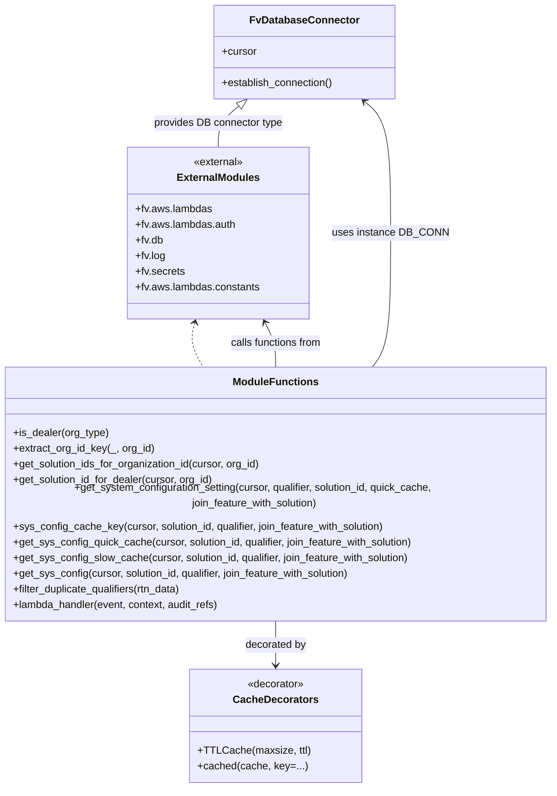

# Diagram: entity_core/entity_service/entity_service/entity/system_configuration/system_configuration.py


> Auto-generated by Obscura crawlers

## Diagram 1

```mermaid
flowchart TD
    LH[lambda_handler(event, context, audit_refs)]
    LH --> DB_SETUP[DB_CONN.establish_connection()]
    DB_SETUP --> CUR[(DB_CONN.cursor)]
    LH --> PATH_SOL[get_path_parameter(event, "solution_id", required=False)]
    LH --> TRY_GET[{try: get org_id & user_org_type}]
    TRY_GET --> ORG_ID[get_organization_id(event)]
    TRY_GET --> USER_ORG[get_user_org_types(event)[0]]
    USER_ORG --> IS_DEALER{is_dealer(user_org_type)?}
    IS_DEALER -->|yes| SOL_FROM_DEALER[get_solution_id_for_dealer(cursor, org_id)]
    SOL_FROM_DEALER --> SOL_ASSIGN[solution_id = SOL_FROM_DEALER or PATH_SOL]
    IS_DEALER -->|no| SOL_ASSIGN
    TRY_GET -->|exception| ERR_LOG[logger.error(...)]
    LH --> QUAL[get_query_parameter(event, "qualifier")]
    LH --> QC[get_query_parameter(event, "quick_cache")]
    LH --> JF[get_query_parameter(event, "join_feature_with_solution")]
    SOL_ASSIGN --> CALL_SYSCFG[get_system_configuration_setting(cursor, qualifier, solution_id, quick_cache, join_feature_with_solution)]
    CALL_SYSCFG --> QC_DECIDE{quick_cache?}
    QC_DECIDE -->|true| QUICK[get_sys_config_quick_cache(cursor, solution_id, qualifier, join_feature_with_solution)]
    QC_DECIDE -->|false| SLOW[get_sys_config_slow_cache(cursor, solution_id, qualifier, join_feature_with_solution)]
    QUICK --> GET_SYS[get_sys_config(cursor, solution_id, qualifier, join_feature_with_solution)]
    SLOW --> GET_SYS
    GET_SYS --> QUAL_CHECK{qualifier provided?}
    QUAL_CHECK -->|yes| SQL_RUN[build & execute SQL (LIMIT 1) -> fetch rows]
    QUAL_CHECK -->|no| SQL_RUN2[build & execute SQL -> fetch rows -> filter_duplicate_qualifiers(rtn_data)]
    SQL_RUN --> RETURN_ROWS[return rtn_data or []]
    SQL_RUN2 --> RETURN_ROWS
    CALL_SYSCFG --> RESP[fv.aws.lambdas.make_response(..., 200)]
    RESP --> LH_END[return response]
```

> SVG rendering failed for this diagram.

## Diagram 2



### SVG

<svg id="container" width="866.265625" xmlns="http://www.w3.org/2000/svg" class="classDiagram" height="1210" viewBox="0 0 866.265625 1210" role="graphics-document document" aria-roledescription="class"><style>#container{font-family:"trebuchet ms",verdana,arial,sans-serif;font-size:16px;fill:#333;}@keyframes edge-animation-frame{from{stroke-dashoffset:0;}}@keyframes dash{to{stroke-dashoffset:0;}}#container .edge-animation-slow{stroke-dasharray:9,5!important;stroke-dashoffset:900;animation:dash 50s linear infinite;stroke-linecap:round;}#container .edge-animation-fast{stroke-dasharray:9,5!important;stroke-dashoffset:900;animation:dash 20s linear infinite;stroke-linecap:round;}#container .error-icon{fill:#552222;}#container .error-text{fill:#552222;stroke:#552222;}#container .edge-thickness-normal{stroke-width:1px;}#container .edge-thickness-thick{stroke-width:3.5px;}#container .edge-pattern-solid{stroke-dasharray:0;}#container .edge-thickness-invisible{stroke-width:0;fill:none;}#container .edge-pattern-dashed{stroke-dasharray:3;}#container .edge-pattern-dotted{stroke-dasharray:2;}#container .marker{fill:#333333;stroke:#333333;}#container .marker.cross{stroke:#333333;}#container svg{font-family:"trebuchet ms",verdana,arial,sans-serif;font-size:16px;}#container p{margin:0;}#container g.classGroup text{fill:#9370DB;stroke:none;font-family:"trebuchet ms",verdana,arial,sans-serif;font-size:10px;}#container g.classGroup text .title{font-weight:bolder;}#container .nodeLabel,#container .edgeLabel{color:#131300;}#container .edgeLabel .label rect{fill:#ECECFF;}#container .label text{fill:#131300;}#container .labelBkg{background:#ECECFF;}#container .edgeLabel .label span{background:#ECECFF;}#container .classTitle{font-weight:bolder;}#container .node rect,#container .node circle,#container .node ellipse,#container .node polygon,#container .node path{fill:#ECECFF;stroke:#9370DB;stroke-width:1px;}#container .divider{stroke:#9370DB;stroke-width:1;}#container g.clickable{cursor:pointer;}#container g.classGroup rect{fill:#ECECFF;stroke:#9370DB;}#container g.classGroup line{stroke:#9370DB;stroke-width:1;}#container .classLabel .box{stroke:none;stroke-width:0;fill:#ECECFF;opacity:0.5;}#container .classLabel .label{fill:#9370DB;font-size:10px;}#container .relation{stroke:#333333;stroke-width:1;fill:none;}#container .dashed-line{stroke-dasharray:3;}#container .dotted-line{stroke-dasharray:1 2;}#container #compositionStart,#container .composition{fill:#333333!important;stroke:#333333!important;stroke-width:1;}#container #compositionEnd,#container .composition{fill:#333333!important;stroke:#333333!important;stroke-width:1;}#container #dependencyStart,#container .dependency{fill:#333333!important;stroke:#333333!important;stroke-width:1;}#container #dependencyStart,#container .dependency{fill:#333333!important;stroke:#333333!important;stroke-width:1;}#container #extensionStart,#container .extension{fill:transparent!important;stroke:#333333!important;stroke-width:1;}#container #extensionEnd,#container .extension{fill:transparent!important;stroke:#333333!important;stroke-width:1;}#container #aggregationStart,#container .aggregation{fill:transparent!important;stroke:#333333!important;stroke-width:1;}#container #aggregationEnd,#container .aggregation{fill:transparent!important;stroke:#333333!important;stroke-width:1;}#container #lollipopStart,#container .lollipop{fill:#ECECFF!important;stroke:#333333!important;stroke-width:1;}#container #lollipopEnd,#container .lollipop{fill:#ECECFF!important;stroke:#333333!important;stroke-width:1;}#container .edgeTerminals{font-size:11px;line-height:initial;}#container .classTitleText{text-anchor:middle;font-size:18px;fill:#333;}#container .label-icon{display:inline-block;height:1em;overflow:visible;vertical-align:-0.125em;}#container .node .label-icon path{fill:currentColor;stroke:revert;stroke-width:revert;}#container :root{--mermaid-font-family:"trebuchet ms",verdana,arial,sans-serif;}</style><g><defs><marker id="container_class-aggregationStart" class="marker aggregation class" refX="18" refY="7" markerWidth="190" markerHeight="240" orient="auto"><path d="M 18,7 L9,13 L1,7 L9,1 Z"></path></marker></defs><defs><marker id="container_class-aggregationEnd" class="marker aggregation class" refX="1" refY="7" markerWidth="20" markerHeight="28" orient="auto"><path d="M 18,7 L9,13 L1,7 L9,1 Z"></path></marker></defs><defs><marker id="container_class-extensionStart" class="marker extension class" refX="18" refY="7" markerWidth="190" markerHeight="240" orient="auto"><path d="M 1,7 L18,13 V 1 Z"></path></marker></defs><defs><marker id="container_class-extensionEnd" class="marker extension class" refX="1" refY="7" markerWidth="20" markerHeight="28" orient="auto"><path d="M 1,1 V 13 L18,7 Z"></path></marker></defs><defs><marker id="container_class-compositionStart" class="marker composition class" refX="18" refY="7" markerWidth="190" markerHeight="240" orient="auto"><path d="M 18,7 L9,13 L1,7 L9,1 Z"></path></marker></defs><defs><marker id="container_class-compositionEnd" class="marker composition class" refX="1" refY="7" markerWidth="20" markerHeight="28" orient="auto"><path d="M 18,7 L9,13 L1,7 L9,1 Z"></path></marker></defs><defs><marker id="container_class-dependencyStart" class="marker dependency class" refX="6" refY="7" markerWidth="190" markerHeight="240" orient="auto"><path d="M 5,7 L9,13 L1,7 L9,1 Z"></path></marker></defs><defs><marker id="container_class-dependencyEnd" class="marker dependency class" refX="13" refY="7" markerWidth="20" markerHeight="28" orient="auto"><path d="M 18,7 L9,13 L14,7 L9,1 Z"></path></marker></defs><defs><marker id="container_class-lollipopStart" class="marker lollipop class" refX="13" refY="7" markerWidth="190" markerHeight="240" orient="auto"><circle stroke="black" fill="transparent" cx="7" cy="7" r="6"></circle></marker></defs><defs><marker id="container_class-lollipopEnd" class="marker lollipop class" refX="1" refY="7" markerWidth="190" markerHeight="240" orient="auto"><circle stroke="black" fill="transparent" cx="7" cy="7" r="6"></circle></marker></defs><g class="root"><g class="clusters"></g><g class="edgePaths"><path d="M311.964,519.79L310.55,524.992C309.137,530.193,306.311,540.597,308.532,551.965C310.753,563.333,318.021,575.667,321.655,581.833L325.289,588" id="id_ExternalModules_ModuleFunctions_1" class="edge-thickness-normal edge-pattern-dashed relation" style=";;;" data-edge="true" data-et="edge" data-id="id_ExternalModules_ModuleFunctions_1" data-points="W3sieCI6MzEzLjUzNjU2NjE5ODIyNDksInkiOjUxNH0seyJ4IjozMDMuNDg0Mzc1LCJ5Ijo1NTF9LHsieCI6MzI1LjI4ODg4NDk0MzE4MTgsInkiOjU4OH1d" marker-start="url(#container_class-dependencyStart)"></path><path d="M579.169,588L584.09,581.833C589.011,575.667,598.853,563.333,603.774,529C608.695,494.667,608.695,438.333,608.695,380C608.695,321.667,608.695,261.333,600.676,223.682C592.657,186.031,576.618,171.063,568.599,163.578L560.579,156.094" id="id_ModuleFunctions_FvDatabaseConnector_2" class="edge-thickness-normal edge-pattern-solid relation" style=";;;" data-edge="true" data-et="edge" data-id="id_ModuleFunctions_FvDatabaseConnector_2" data-points="W3sieCI6NTc5LjE2ODg5MjA0NTQ1NDUsInkiOjU4OH0seyJ4Ijo2MDguNjk1MzEyNSwieSI6NTUxfSx7IngiOjYwOC42OTUzMTI1LCJ5IjozODJ9LHsieCI6NjA4LjY5NTMxMjUsInkiOjIwMX0seyJ4Ijo1NTYuMTkzMDUyNjg1OTUwNCwieSI6MTUyfV0=" marker-end="url(#container_class-dependencyEnd)"></path><path d="M433.133,954L433.133,960.167C433.133,966.333,433.133,978.667,433.133,990C433.133,1001.333,433.133,1011.667,433.133,1016.833L433.133,1022" id="id_ModuleFunctions_CacheDecorators_3" class="edge-thickness-normal edge-pattern-solid relation" style=";;;" data-edge="true" data-et="edge" data-id="id_ModuleFunctions_CacheDecorators_3" data-points="W3sieCI6NDMzLjEzMjgxMjUsInkiOjk1NH0seyJ4Ijo0MzMuMTMyODEyNSwieSI6OTkxfSx7IngiOjQzMy4xMzI4MTI1LCJ5IjoxMDI4fV0=" marker-end="url(#container_class-dependencyEnd)"></path><path d="M433.133,588L433.133,581.833C433.133,575.667,433.133,563.333,430.521,551.896C427.91,540.459,422.687,529.918,420.076,524.647L417.464,519.376" id="id_ModuleFunctions_ExternalModules_4" class="edge-thickness-normal edge-pattern-solid relation" style=";;;" data-edge="true" data-et="edge" data-id="id_ModuleFunctions_ExternalModules_4" data-points="W3sieCI6NDMzLjEzMjgxMjUsInkiOjU4OH0seyJ4Ijo0MzMuMTMyODEyNSwieSI6NTUxfSx7IngiOjQxNC44MDA0MzQ1NDE0MjAxNSwieSI6NTE0fV0=" marker-end="url(#container_class-dependencyEnd)"></path><path d="M389.29,163.77L382.641,169.975C375.993,176.18,362.696,188.59,356.047,202.962C349.398,217.333,349.398,233.667,349.398,241.833L349.398,250" id="id_FvDatabaseConnector_ExternalModules_5" class="edge-thickness-normal edge-pattern-solid relation" style=";;;" data-edge="true" data-et="edge" data-id="id_FvDatabaseConnector_ExternalModules_5" data-points="W3sieCI6NDAxLjkwMDY5NzMxNDA0OTYsInkiOjE1Mn0seyJ4IjozNDkuMzk4NDM3NSwieSI6MjAxfSx7IngiOjM0OS4zOTg0Mzc1LCJ5IjoyNTB9XQ==" marker-start="url(#container_class-extensionStart)"></path></g><g class="edgeLabels"><g class="edgeLabel"><g class="label" data-id="id_ExternalModules_ModuleFunctions_1" transform="translate(0, 0)"><foreignObject width="0" height="0"><div xmlns="http://www.w3.org/1999/xhtml" class="labelBkg" style="display: table-cell; white-space: nowrap; line-height: 1.5; max-width: 200px; text-align: center;"><span class="edgeLabel"></span></div></foreignObject></g></g><g class="edgeLabel" transform="translate(608.6953125, 382)"><g class="label" data-id="id_ModuleFunctions_FvDatabaseConnector_2" transform="translate(-85.7890625, -12)"><foreignObject width="171.578125" height="24"><div xmlns="http://www.w3.org/1999/xhtml" class="labelBkg" style="display: table-cell; white-space: nowrap; line-height: 1.5; max-width: 200px; text-align: center;"><span class="edgeLabel"><p>uses instance DB_CONN</p></span></div></foreignObject></g></g><g class="edgeLabel" transform="translate(433.1328125, 991)"><g class="label" data-id="id_ModuleFunctions_CacheDecorators_3" transform="translate(-47.328125, -12)"><foreignObject width="94.65625" height="24"><div xmlns="http://www.w3.org/1999/xhtml" class="labelBkg" style="display: table-cell; white-space: nowrap; line-height: 1.5; max-width: 200px; text-align: center;"><span class="edgeLabel"><p>decorated by</p></span></div></foreignObject></g></g><g class="edgeLabel" transform="translate(433.1328125, 551)"><g class="label" data-id="id_ModuleFunctions_ExternalModules_4" transform="translate(-71.828125, -12)"><foreignObject width="143.65625" height="24"><div xmlns="http://www.w3.org/1999/xhtml" class="labelBkg" style="display: table-cell; white-space: nowrap; line-height: 1.5; max-width: 200px; text-align: center;"><span class="edgeLabel"><p>calls functions from</p></span></div></foreignObject></g></g><g class="edgeLabel" transform="translate(349.3984375, 201)"><g class="label" data-id="id_FvDatabaseConnector_ExternalModules_5" transform="translate(-100, -24)"><foreignObject width="200" height="48"><div xmlns="http://www.w3.org/1999/xhtml" class="labelBkg" style="display: table; white-space: break-spaces; line-height: 1.5; max-width: 200px; text-align: center; width: 200px;"><span class="edgeLabel"><p>provides DB connector type</p></span></div></foreignObject></g></g></g><g class="nodes"><g class="node default" id="classId-FvDatabaseConnector-0" transform="translate(479.046875, 80)"><g class="basic label-container"><path d="M-138.28515625 -72 L138.28515625 -72 L138.28515625 72 L-138.28515625 72" stroke="none" stroke-width="0" fill="#ECECFF" style=""></path><path d="M-138.28515625 -72 C-47.9009740429224 -72, 42.4832081641552 -72, 138.28515625 -72 M-138.28515625 -72 C-61.93675942165143 -72, 14.411637406697139 -72, 138.28515625 -72 M138.28515625 -72 C138.28515625 -23.121917198071742, 138.28515625 25.756165603856516, 138.28515625 72 M138.28515625 -72 C138.28515625 -33.83709542024583, 138.28515625 4.3258091595083386, 138.28515625 72 M138.28515625 72 C39.03608867376107 72, -60.21297890247786 72, -138.28515625 72 M138.28515625 72 C57.66403731631428 72, -22.957081617371443 72, -138.28515625 72 M-138.28515625 72 C-138.28515625 22.060002064133485, -138.28515625 -27.87999587173303, -138.28515625 -72 M-138.28515625 72 C-138.28515625 35.81929862040935, -138.28515625 -0.3614027591813027, -138.28515625 -72" stroke="#9370DB" stroke-width="1.3" fill="none" stroke-dasharray="0 0" style=""></path></g><g class="annotation-group text" transform="translate(0, -48)"></g><g class="label-group text" transform="translate(-79.3046875, -48)"><g class="label" style="font-weight: bolder" transform="translate(0,-12)"><foreignObject width="158.609375" height="24"><div xmlns="http://www.w3.org/1999/xhtml" style="display: table-cell; white-space: nowrap; line-height: 1.5; max-width: 207px; text-align: center;"><span class="nodeLabel markdown-node-label" style=""><p>FvDatabaseConnector</p></span></div></foreignObject></g></g><g class="members-group text" transform="translate(-126.28515625, 0)"><g class="label" style="" transform="translate(0,-12)"><foreignObject width="53.71875" height="24"><div xmlns="http://www.w3.org/1999/xhtml" style="display: table-cell; white-space: nowrap; line-height: 1.5; max-width: 112px; text-align: center;"><span class="nodeLabel markdown-node-label" style=""><p>+cursor</p></span></div></foreignObject></g></g><g class="methods-group text" transform="translate(-126.28515625, 48)"><g class="label" style="" transform="translate(0,-12)"><foreignObject width="173.265625" height="24"><div xmlns="http://www.w3.org/1999/xhtml" style="display: table-cell; white-space: nowrap; line-height: 1.5; max-width: 231px; text-align: center;"><span class="nodeLabel markdown-node-label" style=""><p>+establish_connection()</p></span></div></foreignObject></g></g><g class="divider" style=""><path d="M-138.28515625 -24 C-41.44376312009091 -24, 55.39763000981819 -24, 138.28515625 -24 M-138.28515625 -24 C-27.686165464996122 -24, 82.91282532000776 -24, 138.28515625 -24" stroke="#9370DB" stroke-width="1.3" fill="none" stroke-dasharray="0 0" style=""></path></g><g class="divider" style=""><path d="M-138.28515625 24 C-61.52232318603707 24, 15.24050987792586 24, 138.28515625 24 M-138.28515625 24 C-48.77335874853267 24, 40.738438752934655 24, 138.28515625 24" stroke="#9370DB" stroke-width="1.3" fill="none" stroke-dasharray="0 0" style=""></path></g></g><g class="node default" id="classId-ModuleFunctions-1" transform="translate(433.1328125, 771)"><g class="basic label-container"><path d="M-425.1328125 -183 L425.1328125 -183 L425.1328125 183 L-425.1328125 183" stroke="none" stroke-width="0" fill="#ECECFF" style=""></path><path d="M-425.1328125 -183 C-211.60209545524455 -183, 1.9286215895108967 -183, 425.1328125 -183 M-425.1328125 -183 C-120.1732159402219 -183, 184.7863806195562 -183, 425.1328125 -183 M425.1328125 -183 C425.1328125 -65.82465562277633, 425.1328125 51.35068875444733, 425.1328125 183 M425.1328125 -183 C425.1328125 -105.42768163977382, 425.1328125 -27.855363279547646, 425.1328125 183 M425.1328125 183 C134.41938023954867 183, -156.29405202090265 183, -425.1328125 183 M425.1328125 183 C128.8990855091261 183, -167.33464148174778 183, -425.1328125 183 M-425.1328125 183 C-425.1328125 87.37891741811059, -425.1328125 -8.242165163778822, -425.1328125 -183 M-425.1328125 183 C-425.1328125 57.84925463301043, -425.1328125 -67.30149073397914, -425.1328125 -183" stroke="#9370DB" stroke-width="1.3" fill="none" stroke-dasharray="0 0" style=""></path></g><g class="annotation-group text" transform="translate(0, -159)"></g><g class="label-group text" transform="translate(-62.21875, -159)"><g class="label" style="font-weight: bolder" transform="translate(0,-12)"><foreignObject width="124.4375" height="24"><div xmlns="http://www.w3.org/1999/xhtml" style="display: table-cell; white-space: nowrap; line-height: 1.5; max-width: 174px; text-align: center;"><span class="nodeLabel markdown-node-label" style=""><p>ModuleFunctions</p></span></div></foreignObject></g></g><g class="members-group text" transform="translate(-413.1328125, -111)"></g><g class="methods-group text" transform="translate(-413.1328125, -81)"><g class="label" style="" transform="translate(0,-12)"><foreignObject width="147.65625" height="24"><div xmlns="http://www.w3.org/1999/xhtml" style="display: table-cell; white-space: nowrap; line-height: 1.5; max-width: 205px; text-align: center;"><span class="nodeLabel markdown-node-label" style=""><p>+is_dealer(org_type)</p></span></div></foreignObject></g><g class="label" style="" transform="translate(0,12)"><foreignObject width="217.78125" height="24"><div xmlns="http://www.w3.org/1999/xhtml" style="display: table-cell; white-space: nowrap; line-height: 1.5; max-width: 275px; text-align: center;"><span class="nodeLabel markdown-node-label" style=""><p>+extract_org_id_key(_, org_id)</p></span></div></foreignObject></g><g class="label" style="" transform="translate(0,36)"><foreignObject width="385.40625" height="24"><div xmlns="http://www.w3.org/1999/xhtml" style="display: table-cell; white-space: nowrap; line-height: 1.5; max-width: 443px; text-align: center;"><span class="nodeLabel markdown-node-label" style=""><p>+get_solution_ids_for_organization_id(cursor, org_id)</p></span></div></foreignObject></g><g class="label" style="" transform="translate(0,60)"><foreignObject width="311.671875" height="24"><div xmlns="http://www.w3.org/1999/xhtml" style="display: table-cell; white-space: nowrap; line-height: 1.5; max-width: 369px; text-align: center;"><span class="nodeLabel markdown-node-label" style=""><p>+get_solution_id_for_dealer(cursor, org_id)</p></span></div></foreignObject></g><g class="label" style="" transform="translate(0,84)"><foreignObject width="764.046875" height="24"><div xmlns="http://www.w3.org/1999/xhtml" style="display: table-cell; white-space: nowrap; line-height: 1.5; max-width: 821px; text-align: center;"><span class="nodeLabel markdown-node-label" style=""><p>+get_system_configuration_setting(cursor, qualifier, solution_id, quick_cache, join_feature_with_solution)</p></span></div></foreignObject></g><g class="label" style="" transform="translate(0,108)"><foreignObject width="579.609375" height="24"><div xmlns="http://www.w3.org/1999/xhtml" style="display: table-cell; white-space: nowrap; line-height: 1.5; max-width: 637px; text-align: center;"><span class="nodeLabel markdown-node-label" style=""><p>+sys_config_cache_key(cursor, solution_id, qualifier, join_feature_with_solution)</p></span></div></foreignObject></g><g class="label" style="" transform="translate(0,132)"><foreignObject width="625.140625" height="24"><div xmlns="http://www.w3.org/1999/xhtml" style="display: table-cell; white-space: nowrap; line-height: 1.5; max-width: 683px; text-align: center;"><span class="nodeLabel markdown-node-label" style=""><p>+get_sys_config_quick_cache(cursor, solution_id, qualifier, join_feature_with_solution)</p></span></div></foreignObject></g><g class="label" style="" transform="translate(0,156)"><foreignObject width="618.8125" height="24"><div xmlns="http://www.w3.org/1999/xhtml" style="display: table-cell; white-space: nowrap; line-height: 1.5; max-width: 676px; text-align: center;"><span class="nodeLabel markdown-node-label" style=""><p>+get_sys_config_slow_cache(cursor, solution_id, qualifier, join_feature_with_solution)</p></span></div></foreignObject></g><g class="label" style="" transform="translate(0,180)"><foreignObject width="527.90625" height="24"><div xmlns="http://www.w3.org/1999/xhtml" style="display: table-cell; white-space: nowrap; line-height: 1.5; max-width: 585px; text-align: center;"><span class="nodeLabel markdown-node-label" style=""><p>+get_sys_config(cursor, solution_id, qualifier, join_feature_with_solution)</p></span></div></foreignObject></g><g class="label" style="" transform="translate(0,204)"><foreignObject width="264.796875" height="24"><div xmlns="http://www.w3.org/1999/xhtml" style="display: table-cell; white-space: nowrap; line-height: 1.5; max-width: 322px; text-align: center;"><span class="nodeLabel markdown-node-label" style=""><p>+filter_duplicate_qualifiers(rtn_data)</p></span></div></foreignObject></g><g class="label" style="" transform="translate(0,228)"><foreignObject width="321.6875" height="24"><div xmlns="http://www.w3.org/1999/xhtml" style="display: table-cell; white-space: nowrap; line-height: 1.5; max-width: 379px; text-align: center;"><span class="nodeLabel markdown-node-label" style=""><p>+lambda_handler(event, context, audit_refs)</p></span></div></foreignObject></g></g><g class="divider" style=""><path d="M-425.1328125 -135 C-202.1988603445968 -135, 20.73509181080641 -135, 425.1328125 -135 M-425.1328125 -135 C-94.44355382885118 -135, 236.24570484229764 -135, 425.1328125 -135" stroke="#9370DB" stroke-width="1.3" fill="none" stroke-dasharray="0 0" style=""></path></g><g class="divider" style=""><path d="M-425.1328125 -111 C-85.03577681732094 -111, 255.06125886535813 -111, 425.1328125 -111 M-425.1328125 -111 C-200.4262614771816 -111, 24.280289545636776 -111, 425.1328125 -111" stroke="#9370DB" stroke-width="1.3" fill="none" stroke-dasharray="0 0" style=""></path></g></g><g class="node default" id="classId-CacheDecorators-2" transform="translate(433.1328125, 1115)"><g class="basic label-container"><path d="M-125.9609375 -87 L125.9609375 -87 L125.9609375 87 L-125.9609375 87" stroke="none" stroke-width="0" fill="#ECECFF" style=""></path><path d="M-125.9609375 -87 C-55.419339460120995 -87, 15.122258579758011 -87, 125.9609375 -87 M-125.9609375 -87 C-26.83504663486748 -87, 72.29084423026504 -87, 125.9609375 -87 M125.9609375 -87 C125.9609375 -40.94765329217251, 125.9609375 5.104693415654978, 125.9609375 87 M125.9609375 -87 C125.9609375 -48.39816382816335, 125.9609375 -9.796327656326696, 125.9609375 87 M125.9609375 87 C37.22120650527522 87, -51.51852448944956 87, -125.9609375 87 M125.9609375 87 C59.465510726306846 87, -7.029916047386308 87, -125.9609375 87 M-125.9609375 87 C-125.9609375 43.71440472240265, -125.9609375 0.4288094448052959, -125.9609375 -87 M-125.9609375 87 C-125.9609375 42.492685645157266, -125.9609375 -2.014628709685468, -125.9609375 -87" stroke="#9370DB" stroke-width="1.3" fill="none" stroke-dasharray="0 0" style=""></path></g><g class="annotation-group text" transform="translate(-44.0625, -63)"><g class="label" style="" transform="translate(0,-12)"><foreignObject width="88.125" height="24"><div xmlns="http://www.w3.org/1999/xhtml" style="display: table-cell; white-space: nowrap; line-height: 1.5; max-width: 138px; text-align: center;"><span class="nodeLabel markdown-node-label" style=""><p>«decorator»</p></span></div></foreignObject></g></g><g class="label-group text" transform="translate(-61.640625, -39)"><g class="label" style="font-weight: bolder" transform="translate(0,-12)"><foreignObject width="123.28125" height="24"><div xmlns="http://www.w3.org/1999/xhtml" style="display: table-cell; white-space: nowrap; line-height: 1.5; max-width: 172px; text-align: center;"><span class="nodeLabel markdown-node-label" style=""><p>CacheDecorators</p></span></div></foreignObject></g></g><g class="members-group text" transform="translate(-113.9609375, 9)"></g><g class="methods-group text" transform="translate(-113.9609375, 39)"><g class="label" style="" transform="translate(0,-12)"><foreignObject width="166.28125" height="24"><div xmlns="http://www.w3.org/1999/xhtml" style="display: table-cell; white-space: nowrap; line-height: 1.5; max-width: 224px; text-align: center;"><span class="nodeLabel markdown-node-label" style=""><p>+TTLCache(maxsize, ttl)</p></span></div></foreignObject></g><g class="label" style="" transform="translate(0,12)"><foreignObject width="163.8125" height="24"><div xmlns="http://www.w3.org/1999/xhtml" style="display: table-cell; white-space: nowrap; line-height: 1.5; max-width: 221px; text-align: center;"><span class="nodeLabel markdown-node-label" style=""><p>+cached(cache, key=...)</p></span></div></foreignObject></g></g><g class="divider" style=""><path d="M-125.9609375 -15 C-54.51246947879801 -15, 16.93599854240398 -15, 125.9609375 -15 M-125.9609375 -15 C-73.73271613978311 -15, -21.504494779566215 -15, 125.9609375 -15" stroke="#9370DB" stroke-width="1.3" fill="none" stroke-dasharray="0 0" style=""></path></g><g class="divider" style=""><path d="M-125.9609375 9 C-36.03508989478847 9, 53.89075771042306 9, 125.9609375 9 M-125.9609375 9 C-38.092390236907875 9, 49.77615702618425 9, 125.9609375 9" stroke="#9370DB" stroke-width="1.3" fill="none" stroke-dasharray="0 0" style=""></path></g></g><g class="node default" id="classId-ExternalModules-3" transform="translate(349.3984375, 382)"><g class="basic label-container"><path d="M-138.5078125 -132 L138.5078125 -132 L138.5078125 132 L-138.5078125 132" stroke="none" stroke-width="0" fill="#ECECFF" style=""></path><path d="M-138.5078125 -132 C-40.15789443141844 -132, 58.19202363716312 -132, 138.5078125 -132 M-138.5078125 -132 C-61.10677127794156 -132, 16.294269944116877 -132, 138.5078125 -132 M138.5078125 -132 C138.5078125 -71.23660127776826, 138.5078125 -10.473202555536517, 138.5078125 132 M138.5078125 -132 C138.5078125 -33.477172986833324, 138.5078125 65.04565402633335, 138.5078125 132 M138.5078125 132 C55.629558044134754 132, -27.248696411730492 132, -138.5078125 132 M138.5078125 132 C61.11727672242678 132, -16.27325905514644 132, -138.5078125 132 M-138.5078125 132 C-138.5078125 68.59832205559931, -138.5078125 5.196644111198623, -138.5078125 -132 M-138.5078125 132 C-138.5078125 48.49059469414891, -138.5078125 -35.01881061170218, -138.5078125 -132" stroke="#9370DB" stroke-width="1.3" fill="none" stroke-dasharray="0 0" style=""></path></g><g class="annotation-group text" transform="translate(-38.65625, -108)"><g class="label" style="" transform="translate(0,-12)"><foreignObject width="77.3125" height="24"><div xmlns="http://www.w3.org/1999/xhtml" style="display: table-cell; white-space: nowrap; line-height: 1.5; max-width: 127px; text-align: center;"><span class="nodeLabel markdown-node-label" style=""><p>«external»</p></span></div></foreignObject></g></g><g class="label-group text" transform="translate(-61.125, -84)"><g class="label" style="font-weight: bolder" transform="translate(0,-12)"><foreignObject width="122.25" height="24"><div xmlns="http://www.w3.org/1999/xhtml" style="display: table-cell; white-space: nowrap; line-height: 1.5; max-width: 171px; text-align: center;"><span class="nodeLabel markdown-node-label" style=""><p>ExternalModules</p></span></div></foreignObject></g></g><g class="members-group text" transform="translate(-126.5078125, -36)"><g class="label" style="" transform="translate(0,-12)"><foreignObject width="117.703125" height="24"><div xmlns="http://www.w3.org/1999/xhtml" style="display: table-cell; white-space: nowrap; line-height: 1.5; max-width: 175px; text-align: center;"><span class="nodeLabel markdown-node-label" style=""><p>+fv.aws.lambdas</p></span></div></foreignObject></g><g class="label" style="" transform="translate(0,12)"><foreignObject width="154.71875" height="24"><div xmlns="http://www.w3.org/1999/xhtml" style="display: table-cell; white-space: nowrap; line-height: 1.5; max-width: 212px; text-align: center;"><span class="nodeLabel markdown-node-label" style=""><p>+fv.aws.lambdas.auth</p></span></div></foreignObject></g><g class="label" style="" transform="translate(0,36)"><foreignObject width="43.09375" height="24"><div xmlns="http://www.w3.org/1999/xhtml" style="display: table-cell; white-space: nowrap; line-height: 1.5; max-width: 100px; text-align: center;"><span class="nodeLabel markdown-node-label" style=""><p>+fv.db</p></span></div></foreignObject></g><g class="label" style="" transform="translate(0,60)"><foreignObject width="46.453125" height="24"><div xmlns="http://www.w3.org/1999/xhtml" style="display: table-cell; white-space: nowrap; line-height: 1.5; max-width: 104px; text-align: center;"><span class="nodeLabel markdown-node-label" style=""><p>+fv.log</p></span></div></foreignObject></g><g class="label" style="" transform="translate(0,84)"><foreignObject width="75.75" height="24"><div xmlns="http://www.w3.org/1999/xhtml" style="display: table-cell; white-space: nowrap; line-height: 1.5; max-width: 133px; text-align: center;"><span class="nodeLabel markdown-node-label" style=""><p>+fv.secrets</p></span></div></foreignObject></g><g class="label" style="" transform="translate(0,108)"><foreignObject width="191.890625" height="24"><div xmlns="http://www.w3.org/1999/xhtml" style="display: table-cell; white-space: nowrap; line-height: 1.5; max-width: 249px; text-align: center;"><span class="nodeLabel markdown-node-label" style=""><p>+fv.aws.lambdas.constants</p></span></div></foreignObject></g></g><g class="methods-group text" transform="translate(-126.5078125, 132)"></g><g class="divider" style=""><path d="M-138.5078125 -60 C-50.27467611189297 -60, 37.958460276214055 -60, 138.5078125 -60 M-138.5078125 -60 C-50.61078974272618 -60, 37.28623301454763 -60, 138.5078125 -60" stroke="#9370DB" stroke-width="1.3" fill="none" stroke-dasharray="0 0" style=""></path></g><g class="divider" style=""><path d="M-138.5078125 108 C-67.95644422138913 108, 2.594924057221732 108, 138.5078125 108 M-138.5078125 108 C-46.8075999878249 108, 44.8926125243502 108, 138.5078125 108" stroke="#9370DB" stroke-width="1.3" fill="none" stroke-dasharray="0 0" style=""></path></g></g></g></g></g></svg>
