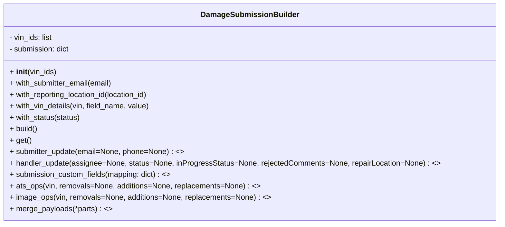

# Diagram: entity_core/entity_service/entity_service/entity_service_tests/damage_submission_builder.py


> Auto-generated by Obscura crawlers

## Diagram 1



### SVG

<svg id="container" width="1036.4921875" xmlns="http://www.w3.org/2000/svg" class="classDiagram" height="472" viewBox="0 0 1036.4921875 472" role="graphics-document document" aria-roledescription="class"><style>#container{font-family:"trebuchet ms",verdana,arial,sans-serif;font-size:16px;fill:#333;}@keyframes edge-animation-frame{from{stroke-dashoffset:0;}}@keyframes dash{to{stroke-dashoffset:0;}}#container .edge-animation-slow{stroke-dasharray:9,5!important;stroke-dashoffset:900;animation:dash 50s linear infinite;stroke-linecap:round;}#container .edge-animation-fast{stroke-dasharray:9,5!important;stroke-dashoffset:900;animation:dash 20s linear infinite;stroke-linecap:round;}#container .error-icon{fill:#552222;}#container .error-text{fill:#552222;stroke:#552222;}#container .edge-thickness-normal{stroke-width:1px;}#container .edge-thickness-thick{stroke-width:3.5px;}#container .edge-pattern-solid{stroke-dasharray:0;}#container .edge-thickness-invisible{stroke-width:0;fill:none;}#container .edge-pattern-dashed{stroke-dasharray:3;}#container .edge-pattern-dotted{stroke-dasharray:2;}#container .marker{fill:#333333;stroke:#333333;}#container .marker.cross{stroke:#333333;}#container svg{font-family:"trebuchet ms",verdana,arial,sans-serif;font-size:16px;}#container p{margin:0;}#container g.classGroup text{fill:#9370DB;stroke:none;font-family:"trebuchet ms",verdana,arial,sans-serif;font-size:10px;}#container g.classGroup text .title{font-weight:bolder;}#container .nodeLabel,#container .edgeLabel{color:#131300;}#container .edgeLabel .label rect{fill:#ECECFF;}#container .label text{fill:#131300;}#container .labelBkg{background:#ECECFF;}#container .edgeLabel .label span{background:#ECECFF;}#container .classTitle{font-weight:bolder;}#container .node rect,#container .node circle,#container .node ellipse,#container .node polygon,#container .node path{fill:#ECECFF;stroke:#9370DB;stroke-width:1px;}#container .divider{stroke:#9370DB;stroke-width:1;}#container g.clickable{cursor:pointer;}#container g.classGroup rect{fill:#ECECFF;stroke:#9370DB;}#container g.classGroup line{stroke:#9370DB;stroke-width:1;}#container .classLabel .box{stroke:none;stroke-width:0;fill:#ECECFF;opacity:0.5;}#container .classLabel .label{fill:#9370DB;font-size:10px;}#container .relation{stroke:#333333;stroke-width:1;fill:none;}#container .dashed-line{stroke-dasharray:3;}#container .dotted-line{stroke-dasharray:1 2;}#container #compositionStart,#container .composition{fill:#333333!important;stroke:#333333!important;stroke-width:1;}#container #compositionEnd,#container .composition{fill:#333333!important;stroke:#333333!important;stroke-width:1;}#container #dependencyStart,#container .dependency{fill:#333333!important;stroke:#333333!important;stroke-width:1;}#container #dependencyStart,#container .dependency{fill:#333333!important;stroke:#333333!important;stroke-width:1;}#container #extensionStart,#container .extension{fill:transparent!important;stroke:#333333!important;stroke-width:1;}#container #extensionEnd,#container .extension{fill:transparent!important;stroke:#333333!important;stroke-width:1;}#container #aggregationStart,#container .aggregation{fill:transparent!important;stroke:#333333!important;stroke-width:1;}#container #aggregationEnd,#container .aggregation{fill:transparent!important;stroke:#333333!important;stroke-width:1;}#container #lollipopStart,#container .lollipop{fill:#ECECFF!important;stroke:#333333!important;stroke-width:1;}#container #lollipopEnd,#container .lollipop{fill:#ECECFF!important;stroke:#333333!important;stroke-width:1;}#container .edgeTerminals{font-size:11px;line-height:initial;}#container .classTitleText{text-anchor:middle;font-size:18px;fill:#333;}#container .label-icon{display:inline-block;height:1em;overflow:visible;vertical-align:-0.125em;}#container .node .label-icon path{fill:currentColor;stroke:revert;stroke-width:revert;}#container :root{--mermaid-font-family:"trebuchet ms",verdana,arial,sans-serif;}</style><g><defs><marker id="container_class-aggregationStart" class="marker aggregation class" refX="18" refY="7" markerWidth="190" markerHeight="240" orient="auto"><path d="M 18,7 L9,13 L1,7 L9,1 Z"></path></marker></defs><defs><marker id="container_class-aggregationEnd" class="marker aggregation class" refX="1" refY="7" markerWidth="20" markerHeight="28" orient="auto"><path d="M 18,7 L9,13 L1,7 L9,1 Z"></path></marker></defs><defs><marker id="container_class-extensionStart" class="marker extension class" refX="18" refY="7" markerWidth="190" markerHeight="240" orient="auto"><path d="M 1,7 L18,13 V 1 Z"></path></marker></defs><defs><marker id="container_class-extensionEnd" class="marker extension class" refX="1" refY="7" markerWidth="20" markerHeight="28" orient="auto"><path d="M 1,1 V 13 L18,7 Z"></path></marker></defs><defs><marker id="container_class-compositionStart" class="marker composition class" refX="18" refY="7" markerWidth="190" markerHeight="240" orient="auto"><path d="M 18,7 L9,13 L1,7 L9,1 Z"></path></marker></defs><defs><marker id="container_class-compositionEnd" class="marker composition class" refX="1" refY="7" markerWidth="20" markerHeight="28" orient="auto"><path d="M 18,7 L9,13 L1,7 L9,1 Z"></path></marker></defs><defs><marker id="container_class-dependencyStart" class="marker dependency class" refX="6" refY="7" markerWidth="190" markerHeight="240" orient="auto"><path d="M 5,7 L9,13 L1,7 L9,1 Z"></path></marker></defs><defs><marker id="container_class-dependencyEnd" class="marker dependency class" refX="13" refY="7" markerWidth="20" markerHeight="28" orient="auto"><path d="M 18,7 L9,13 L14,7 L9,1 Z"></path></marker></defs><defs><marker id="container_class-lollipopStart" class="marker lollipop class" refX="13" refY="7" markerWidth="190" markerHeight="240" orient="auto"><circle stroke="black" fill="transparent" cx="7" cy="7" r="6"></circle></marker></defs><defs><marker id="container_class-lollipopEnd" class="marker lollipop class" refX="1" refY="7" markerWidth="190" markerHeight="240" orient="auto"><circle stroke="black" fill="transparent" cx="7" cy="7" r="6"></circle></marker></defs><g class="root"><g class="clusters"></g><g class="edgePaths"></g><g class="edgeLabels"></g><g class="nodes"><g class="node default" id="classId-DamageSubmissionBuilder-0" transform="translate(518.24609375, 236)"><g class="basic label-container"><path d="M-510.24609375 -228 L510.24609375 -228 L510.24609375 228 L-510.24609375 228" stroke="none" stroke-width="0" fill="#ECECFF" style=""></path><path d="M-510.24609375 -228 C-110.3701356148901 -228, 289.5058225202198 -228, 510.24609375 -228 M-510.24609375 -228 C-301.65966573697455 -228, -93.07323772394909 -228, 510.24609375 -228 M510.24609375 -228 C510.24609375 -64.44962209138555, 510.24609375 99.1007558172289, 510.24609375 228 M510.24609375 -228 C510.24609375 -116.57022743324825, 510.24609375 -5.140454866496498, 510.24609375 228 M510.24609375 228 C256.02757214404903 228, 1.8090505380981199 228, -510.24609375 228 M510.24609375 228 C125.50972329269769 228, -259.2266471646046 228, -510.24609375 228 M-510.24609375 228 C-510.24609375 129.0616903002719, -510.24609375 30.123380600543783, -510.24609375 -228 M-510.24609375 228 C-510.24609375 124.357850851221, -510.24609375 20.715701702442004, -510.24609375 -228" stroke="#9370DB" stroke-width="1.3" fill="none" stroke-dasharray="0 0" style=""></path></g><g class="annotation-group text" transform="translate(0, -204)"></g><g class="label-group text" transform="translate(-97.9140625, -204)"><g class="label" style="font-weight: bolder" transform="translate(0,-12)"><foreignObject width="195.828125" height="24"><div xmlns="http://www.w3.org/1999/xhtml" style="display: table-cell; white-space: nowrap; line-height: 1.5; max-width: 245px; text-align: center;"><span class="nodeLabel markdown-node-label" style=""><p>DamageSubmissionBuilder</p></span></div></foreignObject></g></g><g class="members-group text" transform="translate(-498.24609375, -156)"><g class="label" style="" transform="translate(0,-12)"><foreignObject width="92.859375" height="24"><div xmlns="http://www.w3.org/1999/xhtml" style="display: table-cell; white-space: nowrap; line-height: 1.5; max-width: 150px; text-align: center;"><span class="nodeLabel markdown-node-label" style=""><p>- vin_ids: list</p></span></div></foreignObject></g><g class="label" style="" transform="translate(0,12)"><foreignObject width="128.8125" height="24"><div xmlns="http://www.w3.org/1999/xhtml" style="display: table-cell; white-space: nowrap; line-height: 1.5; max-width: 186px; text-align: center;"><span class="nodeLabel markdown-node-label" style=""><p>- submission: dict</p></span></div></foreignObject></g></g><g class="methods-group text" transform="translate(-498.24609375, -84)"><g class="label" style="" transform="translate(0,-12)"><foreignObject width="98.6875" height="24"><div xmlns="http://www.w3.org/1999/xhtml" style="display: table-cell; white-space: nowrap; line-height: 1.5; max-width: 189px; text-align: center;"><span class="nodeLabel markdown-node-label" style=""><p>+ <strong>init</strong>(vin_ids)</p></span></div></foreignObject></g><g class="label" style="" transform="translate(0,12)"><foreignObject width="220.171875" height="24"><div xmlns="http://www.w3.org/1999/xhtml" style="display: table-cell; white-space: nowrap; line-height: 1.5; max-width: 278px; text-align: center;"><span class="nodeLabel markdown-node-label" style=""><p>+ with_submitter_email(email)</p></span></div></foreignObject></g><g class="label" style="" transform="translate(0,36)"><foreignObject width="300.8125" height="24"><div xmlns="http://www.w3.org/1999/xhtml" style="display: table-cell; white-space: nowrap; line-height: 1.5; max-width: 358px; text-align: center;"><span class="nodeLabel markdown-node-label" style=""><p>+ with_reporting_location_id(location_id)</p></span></div></foreignObject></g><g class="label" style="" transform="translate(0,60)"><foreignObject width="298.234375" height="24"><div xmlns="http://www.w3.org/1999/xhtml" style="display: table-cell; white-space: nowrap; line-height: 1.5; max-width: 356px; text-align: center;"><span class="nodeLabel markdown-node-label" style=""><p>+ with_vin_details(vin, field_name, value)</p></span></div></foreignObject></g><g class="label" style="" transform="translate(0,84)"><foreignObject width="150.859375" height="24"><div xmlns="http://www.w3.org/1999/xhtml" style="display: table-cell; white-space: nowrap; line-height: 1.5; max-width: 208px; text-align: center;"><span class="nodeLabel markdown-node-label" style=""><p>+ with_status(status)</p></span></div></foreignObject></g><g class="label" style="" transform="translate(0,108)"><foreignObject width="60.109375" height="24"><div xmlns="http://www.w3.org/1999/xhtml" style="display: table-cell; white-space: nowrap; line-height: 1.5; max-width: 117px; text-align: center;"><span class="nodeLabel markdown-node-label" style=""><p>+ build()</p></span></div></foreignObject></g><g class="label" style="" transform="translate(0,132)"><foreignObject width="45.15625" height="24"><div xmlns="http://www.w3.org/1999/xhtml" style="display: table-cell; white-space: nowrap; line-height: 1.5; max-width: 103px; text-align: center;"><span class="nodeLabel markdown-node-label" style=""><p>+ get()</p></span></div></foreignObject></g><g class="label" style="" transform="translate(0,156)"><foreignObject width="367.015625" height="24"><div xmlns="http://www.w3.org/1999/xhtml" style="display: table-cell; white-space: nowrap; line-height: 1.5; max-width: 464px; text-align: center;"><span class="nodeLabel markdown-node-label" style=""><p>+ submitter_update(email=None, phone=None) : &lt;&gt;</p></span></div></foreignObject></g><g class="label" style="" transform="translate(0,180)"><foreignObject width="898.578125" height="24"><div xmlns="http://www.w3.org/1999/xhtml" style="display: table-cell; white-space: nowrap; line-height: 1.5; max-width: 996px; text-align: center;"><span class="nodeLabel markdown-node-label" style=""><p>+ handler_update(assignee=None, status=None, inProgressStatus=None, rejectedComments=None, repairLocation=None) : &lt;&gt;</p></span></div></foreignObject></g><g class="label" style="" transform="translate(0,204)"><foreignObject width="341.09375" height="24"><div xmlns="http://www.w3.org/1999/xhtml" style="display: table-cell; white-space: nowrap; line-height: 1.5; max-width: 438px; text-align: center;"><span class="nodeLabel markdown-node-label" style=""><p>+ submission_custom_fields(mapping: dict) : &lt;&gt;</p></span></div></foreignObject></g><g class="label" style="" transform="translate(0,228)"><foreignObject width="524.546875" height="24"><div xmlns="http://www.w3.org/1999/xhtml" style="display: table-cell; white-space: nowrap; line-height: 1.5; max-width: 622px; text-align: center;"><span class="nodeLabel markdown-node-label" style=""><p>+ ats_ops(vin, removals=None, additions=None, replacements=None) : &lt;&gt;</p></span></div></foreignObject></g><g class="label" style="" transform="translate(0,252)"><foreignObject width="546.15625" height="24"><div xmlns="http://www.w3.org/1999/xhtml" style="display: table-cell; white-space: nowrap; line-height: 1.5; max-width: 643px; text-align: center;"><span class="nodeLabel markdown-node-label" style=""><p>+ image_ops(vin, removals=None, additions=None, replacements=None) : &lt;&gt;</p></span></div></foreignObject></g><g class="label" style="" transform="translate(0,276)"><foreignObject width="213.78125" height="24"><div xmlns="http://www.w3.org/1999/xhtml" style="display: table-cell; white-space: nowrap; line-height: 1.5; max-width: 311px; text-align: center;"><span class="nodeLabel markdown-node-label" style=""><p>+ merge_payloads(*parts) : &lt;&gt;</p></span></div></foreignObject></g></g><g class="divider" style=""><path d="M-510.24609375 -180 C-292.36441318776855 -180, -74.4827326255371 -180, 510.24609375 -180 M-510.24609375 -180 C-116.08020297057931 -180, 278.0856878088414 -180, 510.24609375 -180" stroke="#9370DB" stroke-width="1.3" fill="none" stroke-dasharray="0 0" style=""></path></g><g class="divider" style=""><path d="M-510.24609375 -108 C-227.80266012653487 -108, 54.64077349693025 -108, 510.24609375 -108 M-510.24609375 -108 C-302.85494997583396 -108, -95.46380620166792 -108, 510.24609375 -108" stroke="#9370DB" stroke-width="1.3" fill="none" stroke-dasharray="0 0" style=""></path></g></g></g></g></g></svg>

## Diagram 2

```mermaid
flowchart TD
  Start((start))
  PartsLoop[/for each part p in parts/]
  EmptyCheck{p is falsy?}
  KeyLoop[/for each k,v in p.items()/]
  IsCustom{ k == "customFields"? }
  MergeCustom[/"merge customFields by fieldName: last wins"/]
  IsVin{ k == "vinDetails"? }
  VinItemLoop[/for each vin_item in v/]
  VinHasId{vin_item has "vin"?}
  AccumulateVin[/"accumulate vin in vin_map; merge per-vin customFields; append imageDetails"/]
  ElseTopLevel[/"assign top-level key (last wins)"/]
  BuildResult[/if vin_map then set result.vinDetails = list(vin_map.values())/]
  End((end))

  Start --> PartsLoop
  PartsLoop --> EmptyCheck
  EmptyCheck -- yes --> PartsLoop
  EmptyCheck -- no --> KeyLoop
  KeyLoop --> IsCustom
  IsCustom -- yes --> MergeCustom --> KeyLoop
  IsCustom -- no --> IsVin
  IsVin -- yes --> VinItemLoop
  VinItemLoop --> VinHasId
  VinHasId -- no --> VinItemLoop
  VinHasId -- yes --> AccumulateVin --> VinItemLoop
  IsVin -- no --> ElseTopLevel --> KeyLoop
  KeyLoop --> PartsLoop
  PartsLoop --> BuildResult
  BuildResult --> End
```

> SVG rendering failed for this diagram.
