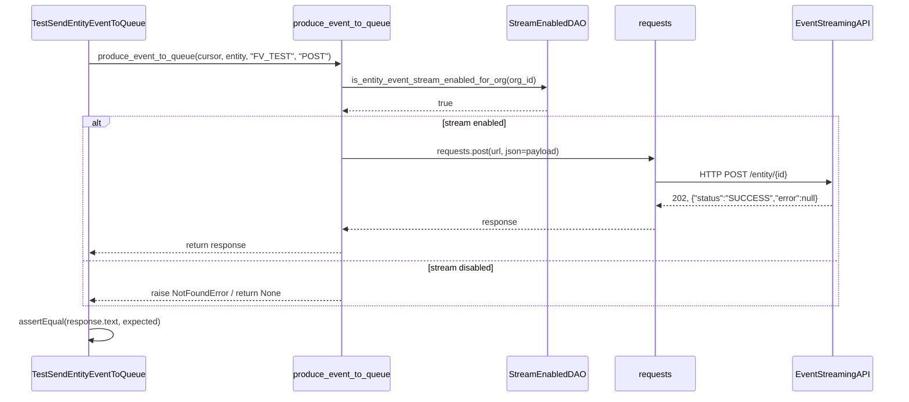
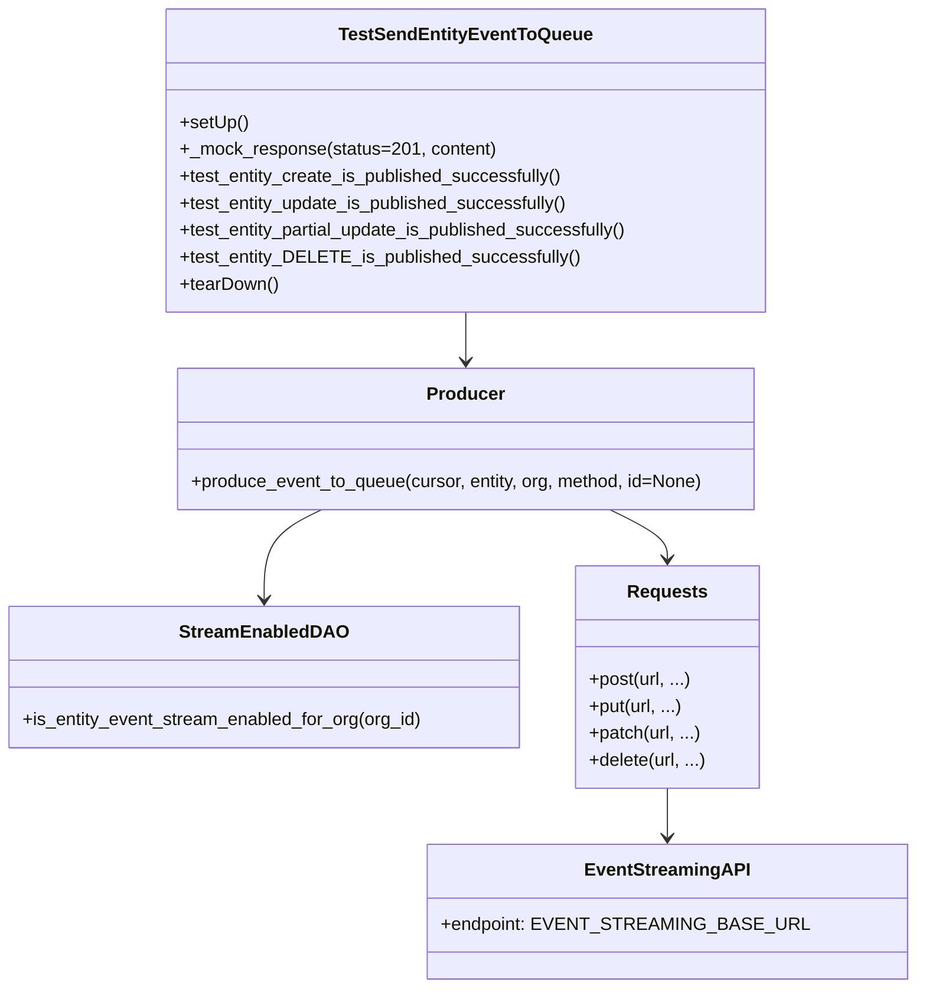

# Diagram: entity_core/entity_service/entity_service/tests/integration_tests/common/test_send_event_to_queue.py

> Auto-generated by Obscura crawlers

## Diagram 1

### SVG

<svg id="container" width="1757" xmlns="http://www.w3.org/2000/svg" height="781" viewBox="-66.5 -10 1757 781" role="graphics-document document" aria-roledescription="sequence"><g><rect x="1484.5" y="695" fill="#eaeaea" stroke="#666" width="156" height="65" name="API" rx="3" ry="3" class="actor actor-bottom"></rect><text x="1562.5" y="727.5" dominant-baseline="central" alignment-baseline="central" class="actor actor-box" style="text-anchor: middle; font-size: 16px; font-weight: 400;"><tspan x="1562.5" dy="0">EventStreamingAPI</tspan></text></g><g><rect x="1157.5" y="695" fill="#eaeaea" stroke="#666" width="150" height="65" name="Requests" rx="3" ry="3" class="actor actor-bottom"></rect><text x="1232.5" y="727.5" dominant-baseline="central" alignment-baseline="central" class="actor actor-box" style="text-anchor: middle; font-size: 16px; font-weight: 400;"><tspan x="1232.5" dy="0">requests</tspan></text></g><g><rect x="947.5" y="695" fill="#eaeaea" stroke="#666" width="160" height="65" name="DAO" rx="3" ry="3" class="actor actor-bottom"></rect><text x="1027.5" y="727.5" dominant-baseline="central" alignment-baseline="central" class="actor actor-box" style="text-anchor: middle; font-size: 16px; font-weight: 400;"><tspan x="1027.5" dy="0">StreamEnabledDAO</tspan></text></g><g><rect x="505.5" y="695" fill="#eaeaea" stroke="#666" width="204" height="65" name="Producer" rx="3" ry="3" class="actor actor-bottom"></rect><text x="607.5" y="727.5" dominant-baseline="central" alignment-baseline="central" class="actor actor-box" style="text-anchor: middle; font-size: 16px; font-weight: 400;"><tspan x="607.5" dy="0">produce_event_to_queue</tspan></text></g><g><rect x="0" y="695" fill="#eaeaea" stroke="#666" width="231" height="65" name="Test" rx="3" ry="3" class="actor actor-bottom"></rect><text x="115.5" y="727.5" dominant-baseline="central" alignment-baseline="central" class="actor actor-box" style="text-anchor: middle; font-size: 16px; font-weight: 400;"><tspan x="115.5" dy="0">TestSendEntityEventToQueue</tspan></text></g><g><line id="actor4" x1="1562.5" y1="65" x2="1562.5" y2="695" class="actor-line 200" stroke-width="0.5px" stroke="#999" name="API"></line><g id="root-4"><rect x="1484.5" y="0" fill="#eaeaea" stroke="#666" width="156" height="65" name="API" rx="3" ry="3" class="actor actor-top"></rect><text x="1562.5" y="32.5" dominant-baseline="central" alignment-baseline="central" class="actor actor-box" style="text-anchor: middle; font-size: 16px; font-weight: 400;"><tspan x="1562.5" dy="0">EventStreamingAPI</tspan></text></g></g><g><line id="actor3" x1="1232.5" y1="65" x2="1232.5" y2="695" class="actor-line 200" stroke-width="0.5px" stroke="#999" name="Requests"></line><g id="root-3"><rect x="1157.5" y="0" fill="#eaeaea" stroke="#666" width="150" height="65" name="Requests" rx="3" ry="3" class="actor actor-top"></rect><text x="1232.5" y="32.5" dominant-baseline="central" alignment-baseline="central" class="actor actor-box" style="text-anchor: middle; font-size: 16px; font-weight: 400;"><tspan x="1232.5" dy="0">requests</tspan></text></g></g><g><line id="actor2" x1="1027.5" y1="65" x2="1027.5" y2="695" class="actor-line 200" stroke-width="0.5px" stroke="#999" name="DAO"></line><g id="root-2"><rect x="947.5" y="0" fill="#eaeaea" stroke="#666" width="160" height="65" name="DAO" rx="3" ry="3" class="actor actor-top"></rect><text x="1027.5" y="32.5" dominant-baseline="central" alignment-baseline="central" class="actor actor-box" style="text-anchor: middle; font-size: 16px; font-weight: 400;"><tspan x="1027.5" dy="0">StreamEnabledDAO</tspan></text></g></g><g><line id="actor1" x1="607.5" y1="65" x2="607.5" y2="695" class="actor-line 200" stroke-width="0.5px" stroke="#999" name="Producer"></line><g id="root-1"><rect x="505.5" y="0" fill="#eaeaea" stroke="#666" width="204" height="65" name="Producer" rx="3" ry="3" class="actor actor-top"></rect><text x="607.5" y="32.5" dominant-baseline="central" alignment-baseline="central" class="actor actor-box" style="text-anchor: middle; font-size: 16px; font-weight: 400;"><tspan x="607.5" dy="0">produce_event_to_queue</tspan></text></g></g><g><line id="actor0" x1="115.5" y1="65" x2="115.5" y2="695" class="actor-line 200" stroke-width="0.5px" stroke="#999" name="Test"></line><g id="root-0"><rect x="0" y="0" fill="#eaeaea" stroke="#666" width="231" height="65" name="Test" rx="3" ry="3" class="actor actor-top"></rect><text x="115.5" y="32.5" dominant-baseline="central" alignment-baseline="central" class="actor actor-box" style="text-anchor: middle; font-size: 16px; font-weight: 400;"><tspan x="115.5" dy="0">TestSendEntityEventToQueue</tspan></text></g></g><g></g><defs><symbol id="computer" width="24" height="24"><path transform="scale(.5)" d="M2 2v13h20v-13h-20zm18 11h-16v-9h16v9zm-10.228 6l.466-1h3.524l.467 1h-4.457zm14.228 3h-24l2-6h2.104l-1.33 4h18.45l-1.297-4h2.073l2 6zm-5-10h-14v-7h14v7z"></path></symbol></defs><defs><symbol id="database" fill-rule="evenodd" clip-rule="evenodd"><path transform="scale(.5)" d="M12.258.001l.256.004.255.005.253.008.251.01.249.012.247.015.246.016.242.019.241.02.239.023.236.024.233.027.231.028.229.031.225.032.223.034.22.036.217.038.214.04.211.041.208.043.205.045.201.046.198.048.194.05.191.051.187.053.183.054.18.056.175.057.172.059.168.06.163.061.16.063.155.064.15.066.074.033.073.033.071.034.07.034.069.035.068.035.067.035.066.035.064.036.064.036.062.036.06.036.06.037.058.037.058.037.055.038.055.038.053.038.052.038.051.039.05.039.048.039.047.039.045.04.044.04.043.04.041.04.04.041.039.041.037.041.036.041.034.041.033.042.032.042.03.042.029.042.027.042.026.043.024.043.023.043.021.043.02.043.018.044.017.043.015.044.013.044.012.044.011.045.009.044.007.045.006.045.004.045.002.045.001.045v17l-.001.045-.002.045-.004.045-.006.045-.007.045-.009.044-.011.045-.012.044-.013.044-.015.044-.017.043-.018.044-.02.043-.021.043-.023.043-.024.043-.026.043-.027.042-.029.042-.03.042-.032.042-.033.042-.034.041-.036.041-.037.041-.039.041-.04.041-.041.04-.043.04-.044.04-.045.04-.047.039-.048.039-.05.039-.051.039-.052.038-.053.038-.055.038-.055.038-.058.037-.058.037-.06.037-.06.036-.062.036-.064.036-.064.036-.066.035-.067.035-.068.035-.069.035-.07.034-.071.034-.073.033-.074.033-.15.066-.155.064-.16.063-.163.061-.168.06-.172.059-.175.057-.18.056-.183.054-.187.053-.191.051-.194.05-.198.048-.201.046-.205.045-.208.043-.211.041-.214.04-.217.038-.22.036-.223.034-.225.032-.229.031-.231.028-.233.027-.236.024-.239.023-.241.02-.242.019-.246.016-.247.015-.249.012-.251.01-.253.008-.255.005-.256.004-.258.001-.258-.001-.256-.004-.255-.005-.253-.008-.251-.01-.249-.012-.247-.015-.245-.016-.243-.019-.241-.02-.238-.023-.236-.024-.234-.027-.231-.028-.228-.031-.226-.032-.223-.034-.22-.036-.217-.038-.214-.04-.211-.041-.208-.043-.204-.045-.201-.046-.198-.048-.195-.05-.19-.051-.187-.053-.184-.054-.179-.056-.176-.057-.172-.059-.167-.06-.164-.061-.159-.063-.155-.064-.151-.066-.074-.033-.072-.033-.072-.034-.07-.034-.069-.035-.068-.035-.067-.035-.066-.035-.064-.036-.063-.036-.062-.036-.061-.036-.06-.037-.058-.037-.057-.037-.056-.038-.055-.038-.053-.038-.052-.038-.051-.039-.049-.039-.049-.039-.046-.039-.046-.04-.044-.04-.043-.04-.041-.04-.04-.041-.039-.041-.037-.041-.036-.041-.034-.041-.033-.042-.032-.042-.03-.042-.029-.042-.027-.042-.026-.043-.024-.043-.023-.043-.021-.043-.02-.043-.018-.044-.017-.043-.015-.044-.013-.044-.012-.044-.011-.045-.009-.044-.007-.045-.006-.045-.004-.045-.002-.045-.001-.045v-17l.001-.045.002-.045.004-.045.006-.045.007-.045.009-.044.011-.045.012-.044.013-.044.015-.044.017-.043.018-.044.02-.043.021-.043.023-.043.024-.043.026-.043.027-.042.029-.042.03-.042.032-.042.033-.042.034-.041.036-.041.037-.041.039-.041.04-.041.041-.04.043-.04.044-.04.046-.04.046-.039.049-.039.049-.039.051-.039.052-.038.053-.038.055-.038.056-.038.057-.037.058-.037.06-.037.061-.036.062-.036.063-.036.064-.036.066-.035.067-.035.068-.035.069-.035.07-.034.072-.034.072-.033.074-.033.151-.066.155-.064.159-.063.164-.061.167-.06.172-.059.176-.057.179-.056.184-.054.187-.053.19-.051.195-.05.198-.048.201-.046.204-.045.208-.043.211-.041.214-.04.217-.038.22-.036.223-.034.226-.032.228-.031.231-.028.234-.027.236-.024.238-.023.241-.02.243-.019.245-.016.247-.015.249-.012.251-.01.253-.008.255-.005.256-.004.258-.001.258.001zm-9.258 20.499v.01l.001.021.003.021.004.022.005.021.006.022.007.022.009.023.01.022.011.023.012.023.013.023.015.023.016.024.017.023.018.024.019.024.021.024.022.025.023.024.024.025.052.049.056.05.061.051.066.051.07.051.075.051.079.052.084.052.088.052.092.052.097.052.102.051.105.052.11.052.114.051.119.051.123.051.127.05.131.05.135.05.139.048.144.049.147.047.152.047.155.047.16.045.163.045.167.043.171.043.176.041.178.041.183.039.187.039.19.037.194.035.197.035.202.033.204.031.209.03.212.029.216.027.219.025.222.024.226.021.23.02.233.018.236.016.24.015.243.012.246.01.249.008.253.005.256.004.259.001.26-.001.257-.004.254-.005.25-.008.247-.011.244-.012.241-.014.237-.016.233-.018.231-.021.226-.021.224-.024.22-.026.216-.027.212-.028.21-.031.205-.031.202-.034.198-.034.194-.036.191-.037.187-.039.183-.04.179-.04.175-.042.172-.043.168-.044.163-.045.16-.046.155-.046.152-.047.148-.048.143-.049.139-.049.136-.05.131-.05.126-.05.123-.051.118-.052.114-.051.11-.052.106-.052.101-.052.096-.052.092-.052.088-.053.083-.051.079-.052.074-.052.07-.051.065-.051.06-.051.056-.05.051-.05.023-.024.023-.025.021-.024.02-.024.019-.024.018-.024.017-.024.015-.023.014-.024.013-.023.012-.023.01-.023.01-.022.008-.022.006-.022.006-.022.004-.022.004-.021.001-.021.001-.021v-4.127l-.077.055-.08.053-.083.054-.085.053-.087.052-.09.052-.093.051-.095.05-.097.05-.1.049-.102.049-.105.048-.106.047-.109.047-.111.046-.114.045-.115.045-.118.044-.12.043-.122.042-.124.042-.126.041-.128.04-.13.04-.132.038-.134.038-.135.037-.138.037-.139.035-.142.035-.143.034-.144.033-.147.032-.148.031-.15.03-.151.03-.153.029-.154.027-.156.027-.158.026-.159.025-.161.024-.162.023-.163.022-.165.021-.166.02-.167.019-.169.018-.169.017-.171.016-.173.015-.173.014-.175.013-.175.012-.177.011-.178.01-.179.008-.179.008-.181.006-.182.005-.182.004-.184.003-.184.002h-.37l-.184-.002-.184-.003-.182-.004-.182-.005-.181-.006-.179-.008-.179-.008-.178-.01-.176-.011-.176-.012-.175-.013-.173-.014-.172-.015-.171-.016-.17-.017-.169-.018-.167-.019-.166-.02-.165-.021-.163-.022-.162-.023-.161-.024-.159-.025-.157-.026-.156-.027-.155-.027-.153-.029-.151-.03-.15-.03-.148-.031-.146-.032-.145-.033-.143-.034-.141-.035-.14-.035-.137-.037-.136-.037-.134-.038-.132-.038-.13-.04-.128-.04-.126-.041-.124-.042-.122-.042-.12-.044-.117-.043-.116-.045-.113-.045-.112-.046-.109-.047-.106-.047-.105-.048-.102-.049-.1-.049-.097-.05-.095-.05-.093-.052-.09-.051-.087-.052-.085-.053-.083-.054-.08-.054-.077-.054v4.127zm0-5.654v.011l.001.021.003.021.004.021.005.022.006.022.007.022.009.022.01.022.011.023.012.023.013.023.015.024.016.023.017.024.018.024.019.024.021.024.022.024.023.025.024.024.052.05.056.05.061.05.066.051.07.051.075.052.079.051.084.052.088.052.092.052.097.052.102.052.105.052.11.051.114.051.119.052.123.05.127.051.131.05.135.049.139.049.144.048.147.048.152.047.155.046.16.045.163.045.167.044.171.042.176.042.178.04.183.04.187.038.19.037.194.036.197.034.202.033.204.032.209.03.212.028.216.027.219.025.222.024.226.022.23.02.233.018.236.016.24.014.243.012.246.01.249.008.253.006.256.003.259.001.26-.001.257-.003.254-.006.25-.008.247-.01.244-.012.241-.015.237-.016.233-.018.231-.02.226-.022.224-.024.22-.025.216-.027.212-.029.21-.03.205-.032.202-.033.198-.035.194-.036.191-.037.187-.039.183-.039.179-.041.175-.042.172-.043.168-.044.163-.045.16-.045.155-.047.152-.047.148-.048.143-.048.139-.05.136-.049.131-.05.126-.051.123-.051.118-.051.114-.052.11-.052.106-.052.101-.052.096-.052.092-.052.088-.052.083-.052.079-.052.074-.051.07-.052.065-.051.06-.05.056-.051.051-.049.023-.025.023-.024.021-.025.02-.024.019-.024.018-.024.017-.024.015-.023.014-.023.013-.024.012-.022.01-.023.01-.023.008-.022.006-.022.006-.022.004-.021.004-.022.001-.021.001-.021v-4.139l-.077.054-.08.054-.083.054-.085.052-.087.053-.09.051-.093.051-.095.051-.097.05-.1.049-.102.049-.105.048-.106.047-.109.047-.111.046-.114.045-.115.044-.118.044-.12.044-.122.042-.124.042-.126.041-.128.04-.13.039-.132.039-.134.038-.135.037-.138.036-.139.036-.142.035-.143.033-.144.033-.147.033-.148.031-.15.03-.151.03-.153.028-.154.028-.156.027-.158.026-.159.025-.161.024-.162.023-.163.022-.165.021-.166.02-.167.019-.169.018-.169.017-.171.016-.173.015-.173.014-.175.013-.175.012-.177.011-.178.009-.179.009-.179.007-.181.007-.182.005-.182.004-.184.003-.184.002h-.37l-.184-.002-.184-.003-.182-.004-.182-.005-.181-.007-.179-.007-.179-.009-.178-.009-.176-.011-.176-.012-.175-.013-.173-.014-.172-.015-.171-.016-.17-.017-.169-.018-.167-.019-.166-.02-.165-.021-.163-.022-.162-.023-.161-.024-.159-.025-.157-.026-.156-.027-.155-.028-.153-.028-.151-.03-.15-.03-.148-.031-.146-.033-.145-.033-.143-.033-.141-.035-.14-.036-.137-.036-.136-.037-.134-.038-.132-.039-.13-.039-.128-.04-.126-.041-.124-.042-.122-.043-.12-.043-.117-.044-.116-.044-.113-.046-.112-.046-.109-.046-.106-.047-.105-.048-.102-.049-.1-.049-.097-.05-.095-.051-.093-.051-.09-.051-.087-.053-.085-.052-.083-.054-.08-.054-.077-.054v4.139zm0-5.666v.011l.001.02.003.022.004.021.005.022.006.021.007.022.009.023.01.022.011.023.012.023.013.023.015.023.016.024.017.024.018.023.019.024.021.025.022.024.023.024.024.025.052.05.056.05.061.05.066.051.07.051.075.052.079.051.084.052.088.052.092.052.097.052.102.052.105.051.11.052.114.051.119.051.123.051.127.05.131.05.135.05.139.049.144.048.147.048.152.047.155.046.16.045.163.045.167.043.171.043.176.042.178.04.183.04.187.038.19.037.194.036.197.034.202.033.204.032.209.03.212.028.216.027.219.025.222.024.226.021.23.02.233.018.236.017.24.014.243.012.246.01.249.008.253.006.256.003.259.001.26-.001.257-.003.254-.006.25-.008.247-.01.244-.013.241-.014.237-.016.233-.018.231-.02.226-.022.224-.024.22-.025.216-.027.212-.029.21-.03.205-.032.202-.033.198-.035.194-.036.191-.037.187-.039.183-.039.179-.041.175-.042.172-.043.168-.044.163-.045.16-.045.155-.047.152-.047.148-.048.143-.049.139-.049.136-.049.131-.051.126-.05.123-.051.118-.052.114-.051.11-.052.106-.052.101-.052.096-.052.092-.052.088-.052.083-.052.079-.052.074-.052.07-.051.065-.051.06-.051.056-.05.051-.049.023-.025.023-.025.021-.024.02-.024.019-.024.018-.024.017-.024.015-.023.014-.024.013-.023.012-.023.01-.022.01-.023.008-.022.006-.022.006-.022.004-.022.004-.021.001-.021.001-.021v-4.153l-.077.054-.08.054-.083.053-.085.053-.087.053-.09.051-.093.051-.095.051-.097.05-.1.049-.102.048-.105.048-.106.048-.109.046-.111.046-.114.046-.115.044-.118.044-.12.043-.122.043-.124.042-.126.041-.128.04-.13.039-.132.039-.134.038-.135.037-.138.036-.139.036-.142.034-.143.034-.144.033-.147.032-.148.032-.15.03-.151.03-.153.028-.154.028-.156.027-.158.026-.159.024-.161.024-.162.023-.163.023-.165.021-.166.02-.167.019-.169.018-.169.017-.171.016-.173.015-.173.014-.175.013-.175.012-.177.01-.178.01-.179.009-.179.007-.181.006-.182.006-.182.004-.184.003-.184.001-.185.001-.185-.001-.184-.001-.184-.003-.182-.004-.182-.006-.181-.006-.179-.007-.179-.009-.178-.01-.176-.01-.176-.012-.175-.013-.173-.014-.172-.015-.171-.016-.17-.017-.169-.018-.167-.019-.166-.02-.165-.021-.163-.023-.162-.023-.161-.024-.159-.024-.157-.026-.156-.027-.155-.028-.153-.028-.151-.03-.15-.03-.148-.032-.146-.032-.145-.033-.143-.034-.141-.034-.14-.036-.137-.036-.136-.037-.134-.038-.132-.039-.13-.039-.128-.041-.126-.041-.124-.041-.122-.043-.12-.043-.117-.044-.116-.044-.113-.046-.112-.046-.109-.046-.106-.048-.105-.048-.102-.048-.1-.05-.097-.049-.095-.051-.093-.051-.09-.052-.087-.052-.085-.053-.083-.053-.08-.054-.077-.054v4.153zm8.74-8.179l-.257.004-.254.005-.25.008-.247.011-.244.012-.241.014-.237.016-.233.018-.231.021-.226.022-.224.023-.22.026-.216.027-.212.028-.21.031-.205.032-.202.033-.198.034-.194.036-.191.038-.187.038-.183.04-.179.041-.175.042-.172.043-.168.043-.163.045-.16.046-.155.046-.152.048-.148.048-.143.048-.139.049-.136.05-.131.05-.126.051-.123.051-.118.051-.114.052-.11.052-.106.052-.101.052-.096.052-.092.052-.088.052-.083.052-.079.052-.074.051-.07.052-.065.051-.06.05-.056.05-.051.05-.023.025-.023.024-.021.024-.02.025-.019.024-.018.024-.017.023-.015.024-.014.023-.013.023-.012.023-.01.023-.01.022-.008.022-.006.023-.006.021-.004.022-.004.021-.001.021-.001.021.001.021.001.021.004.021.004.022.006.021.006.023.008.022.01.022.01.023.012.023.013.023.014.023.015.024.017.023.018.024.019.024.02.025.021.024.023.024.023.025.051.05.056.05.06.05.065.051.07.052.074.051.079.052.083.052.088.052.092.052.096.052.101.052.106.052.11.052.114.052.118.051.123.051.126.051.131.05.136.05.139.049.143.048.148.048.152.048.155.046.16.046.163.045.168.043.172.043.175.042.179.041.183.04.187.038.191.038.194.036.198.034.202.033.205.032.21.031.212.028.216.027.22.026.224.023.226.022.231.021.233.018.237.016.241.014.244.012.247.011.25.008.254.005.257.004.26.001.26-.001.257-.004.254-.005.25-.008.247-.011.244-.012.241-.014.237-.016.233-.018.231-.021.226-.022.224-.023.22-.026.216-.027.212-.028.21-.031.205-.032.202-.033.198-.034.194-.036.191-.038.187-.038.183-.04.179-.041.175-.042.172-.043.168-.043.163-.045.16-.046.155-.046.152-.048.148-.048.143-.048.139-.049.136-.05.131-.05.126-.051.123-.051.118-.051.114-.052.11-.052.106-.052.101-.052.096-.052.092-.052.088-.052.083-.052.079-.052.074-.051.07-.052.065-.051.06-.05.056-.05.051-.05.023-.025.023-.024.021-.024.02-.025.019-.024.018-.024.017-.023.015-.024.014-.023.013-.023.012-.023.01-.023.01-.022.008-.022.006-.023.006-.021.004-.022.004-.021.001-.021.001-.021-.001-.021-.001-.021-.004-.021-.004-.022-.006-.021-.006-.023-.008-.022-.01-.022-.01-.023-.012-.023-.013-.023-.014-.023-.015-.024-.017-.023-.018-.024-.019-.024-.02-.025-.021-.024-.023-.024-.023-.025-.051-.05-.056-.05-.06-.05-.065-.051-.07-.052-.074-.051-.079-.052-.083-.052-.088-.052-.092-.052-.096-.052-.101-.052-.106-.052-.11-.052-.114-.052-.118-.051-.123-.051-.126-.051-.131-.05-.136-.05-.139-.049-.143-.048-.148-.048-.152-.048-.155-.046-.16-.046-.163-.045-.168-.043-.172-.043-.175-.042-.179-.041-.183-.04-.187-.038-.191-.038-.194-.036-.198-.034-.202-.033-.205-.032-.21-.031-.212-.028-.216-.027-.22-.026-.224-.023-.226-.022-.231-.021-.233-.018-.237-.016-.241-.014-.244-.012-.247-.011-.25-.008-.254-.005-.257-.004-.26-.001-.26.001z"></path></symbol></defs><defs><symbol id="clock" width="24" height="24"><path transform="scale(.5)" d="M12 2c5.514 0 10 4.486 10 10s-4.486 10-10 10-10-4.486-10-10 4.486-10 10-10zm0-2c-6.627 0-12 5.373-12 12s5.373 12 12 12 12-5.373 12-12-5.373-12-12-12zm5.848 12.459c.202.038.202.333.001.372-1.907.361-6.045 1.111-6.547 1.111-.719 0-1.301-.582-1.301-1.301 0-.512.77-5.447 1.125-7.445.034-.192.312-.181.343.014l.985 6.238 5.394 1.011z"></path></symbol></defs><defs><marker id="arrowhead" refX="7.9" refY="5" markerUnits="userSpaceOnUse" markerWidth="12" markerHeight="12" orient="auto-start-reverse"><path d="M -1 0 L 10 5 L 0 10 z"></path></marker></defs><defs><marker id="crosshead" markerWidth="15" markerHeight="8" orient="auto" refX="4" refY="4.5"><path fill="none" stroke="#000000" stroke-width="1pt" d="M 1,2 L 6,7 M 6,2 L 1,7" style="stroke-dasharray: 0, 0;"></path></marker></defs><defs><marker id="filled-head" refX="15.5" refY="7" markerWidth="20" markerHeight="28" orient="auto"><path d="M 18,7 L9,13 L14,7 L9,1 Z"></path></marker></defs><defs><marker id="sequencenumber" refX="15" refY="15" markerWidth="60" markerHeight="40" orient="auto"><circle cx="15" cy="15" r="6"></circle></marker></defs><g><line x1="104.5" y1="219" x2="1573.5" y2="219" class="loopLine"></line><line x1="1573.5" y1="219" x2="1573.5" y2="597" class="loopLine"></line><line x1="104.5" y1="597" x2="1573.5" y2="597" class="loopLine"></line><line x1="104.5" y1="219" x2="104.5" y2="597" class="loopLine"></line><line x1="104.5" y1="509" x2="1573.5" y2="509" class="loopLine" style="stroke-dasharray: 3, 3;"></line><polygon points="104.5,219 154.5,219 154.5,232 146.1,239 104.5,239" class="labelBox"></polygon><text x="130" y="232" text-anchor="middle" dominant-baseline="middle" alignment-baseline="middle" class="labelText" style="font-size: 16px; font-weight: 400;">alt</text><text x="864" y="237" text-anchor="middle" class="loopText" style="font-size: 16px; font-weight: 400;"><tspan x="864">[stream enabled]</tspan></text><text x="839" y="527" text-anchor="middle" class="loopText" style="font-size: 16px; font-weight: 400;">[stream disabled]</text></g><text x="360" y="80" text-anchor="middle" dominant-baseline="middle" alignment-baseline="middle" class="messageText" dy="1em" style="font-size: 16px; font-weight: 400;">produce_event_to_queue(cursor, entity, "FV_TEST", "POST")</text><line x1="116.5" y1="113" x2="603.5" y2="113" class="messageLine0" stroke-width="2" stroke="none" marker-end="url(#arrowhead)" style="fill: none;"></line><text x="816" y="128" text-anchor="middle" dominant-baseline="middle" alignment-baseline="middle" class="messageText" dy="1em" style="font-size: 16px; font-weight: 400;">is_entity_event_stream_enabled_for_org(org_id)</text><line x1="608.5" y1="161" x2="1023.5" y2="161" class="messageLine0" stroke-width="2" stroke="none" marker-end="url(#arrowhead)" style="fill: none;"></line><text x="819" y="176" text-anchor="middle" dominant-baseline="middle" alignment-baseline="middle" class="messageText" dy="1em" style="font-size: 16px; font-weight: 400;">true</text><line x1="1026.5" y1="209" x2="611.5" y2="209" class="messageLine1" stroke-width="2" stroke="none" marker-end="url(#arrowhead)" style="stroke-dasharray: 3, 3; fill: none;"></line><text x="919" y="269" text-anchor="middle" dominant-baseline="middle" alignment-baseline="middle" class="messageText" dy="1em" style="font-size: 16px; font-weight: 400;">requests.post(url, json=payload)</text><line x1="608.5" y1="302" x2="1228.5" y2="302" class="messageLine0" stroke-width="2" stroke="none" marker-end="url(#arrowhead)" style="fill: none;"></line><text x="1396" y="317" text-anchor="middle" dominant-baseline="middle" alignment-baseline="middle" class="messageText" dy="1em" style="font-size: 16px; font-weight: 400;">HTTP POST /entity/{id}</text><line x1="1233.5" y1="350" x2="1558.5" y2="350" class="messageLine0" stroke-width="2" stroke="none" marker-end="url(#arrowhead)" style="fill: none;"></line><text x="1399" y="365" text-anchor="middle" dominant-baseline="middle" alignment-baseline="middle" class="messageText" dy="1em" style="font-size: 16px; font-weight: 400;">202, {"status":"SUCCESS","error":null}</text><line x1="1561.5" y1="398" x2="1236.5" y2="398" class="messageLine1" stroke-width="2" stroke="none" marker-end="url(#arrowhead)" style="stroke-dasharray: 3, 3; fill: none;"></line><text x="922" y="413" text-anchor="middle" dominant-baseline="middle" alignment-baseline="middle" class="messageText" dy="1em" style="font-size: 16px; font-weight: 400;">response</text><line x1="1231.5" y1="446" x2="611.5" y2="446" class="messageLine1" stroke-width="2" stroke="none" marker-end="url(#arrowhead)" style="stroke-dasharray: 3, 3; fill: none;"></line><text x="363" y="461" text-anchor="middle" dominant-baseline="middle" alignment-baseline="middle" class="messageText" dy="1em" style="font-size: 16px; font-weight: 400;">return response</text><line x1="606.5" y1="494" x2="119.5" y2="494" class="messageLine1" stroke-width="2" stroke="none" marker-end="url(#arrowhead)" style="stroke-dasharray: 3, 3; fill: none;"></line><text x="363" y="554" text-anchor="middle" dominant-baseline="middle" alignment-baseline="middle" class="messageText" dy="1em" style="font-size: 16px; font-weight: 400;">raise NotFoundError / return None</text><line x1="606.5" y1="587" x2="119.5" y2="587" class="messageLine1" stroke-width="2" stroke="none" marker-end="url(#arrowhead)" style="stroke-dasharray: 3, 3; fill: none;"></line><text x="117" y="612" text-anchor="middle" dominant-baseline="middle" alignment-baseline="middle" class="messageText" dy="1em" style="font-size: 16px; font-weight: 400;">assertEqual(response.text, expected)</text><path d="M 116.5,645 C 176.5,635 176.5,675 116.5,665" class="messageLine0" stroke-width="2" stroke="none" marker-end="url(#arrowhead)" style="fill: none;"></path></svg>

## Diagram 2

### SVG

<svg id="container" width="795.671875" xmlns="http://www.w3.org/2000/svg" class="classDiagram" height="880" viewBox="0 0 795.671875 880" role="graphics-document document" aria-roledescription="class"><g><defs><marker id="container_class-aggregationStart" class="marker aggregation class" refX="18" refY="7" markerWidth="190" markerHeight="240" orient="auto"><path d="M 18,7 L9,13 L1,7 L9,1 Z"></path></marker></defs><defs><marker id="container_class-aggregationEnd" class="marker aggregation class" refX="1" refY="7" markerWidth="20" markerHeight="28" orient="auto"><path d="M 18,7 L9,13 L1,7 L9,1 Z"></path></marker></defs><defs><marker id="container_class-extensionStart" class="marker extension class" refX="18" refY="7" markerWidth="190" markerHeight="240" orient="auto"><path d="M 1,7 L18,13 V 1 Z"></path></marker></defs><defs><marker id="container_class-extensionEnd" class="marker extension class" refX="1" refY="7" markerWidth="20" markerHeight="28" orient="auto"><path d="M 1,1 V 13 L18,7 Z"></path></marker></defs><defs><marker id="container_class-compositionStart" class="marker composition class" refX="18" refY="7" markerWidth="190" markerHeight="240" orient="auto"><path d="M 18,7 L9,13 L1,7 L9,1 Z"></path></marker></defs><defs><marker id="container_class-compositionEnd" class="marker composition class" refX="1" refY="7" markerWidth="20" markerHeight="28" orient="auto"><path d="M 18,7 L9,13 L1,7 L9,1 Z"></path></marker></defs><defs><marker id="container_class-dependencyStart" class="marker dependency class" refX="6" refY="7" markerWidth="190" markerHeight="240" orient="auto"><path d="M 5,7 L9,13 L1,7 L9,1 Z"></path></marker></defs><defs><marker id="container_class-dependencyEnd" class="marker dependency class" refX="13" refY="7" markerWidth="20" markerHeight="28" orient="auto"><path d="M 18,7 L9,13 L14,7 L9,1 Z"></path></marker></defs><defs><marker id="container_class-lollipopStart" class="marker lollipop class" refX="13" refY="7" markerWidth="190" markerHeight="240" orient="auto"><circle stroke="black" fill="transparent" cx="7" cy="7" r="6"></circle></marker></defs><defs><marker id="container_class-lollipopEnd" class="marker lollipop class" refX="1" refY="7" markerWidth="190" markerHeight="240" orient="auto"><circle stroke="black" fill="transparent" cx="7" cy="7" r="6"></circle></marker></defs><g class="root"><g class="clusters"></g><g class="edgePaths"><path d="M413.412,278L413.412,282.167C413.412,286.333,413.412,294.667,413.412,302C413.412,309.333,413.412,315.667,413.412,318.833L413.412,322" id="id_TestSendEntityEventToQueue_Producer_1" class="edge-thickness-normal edge-pattern-solid relation" style=";;;" data-edge="true" data-et="edge" data-id="id_TestSendEntityEventToQueue_Producer_1" data-points="W3sieCI6NDEzLjQxMjEwOTM3NSwieSI6Mjc4fSx7IngiOjQxMy40MTIxMDkzNzUsInkiOjMwM30seyJ4Ijo0MTMuNDEyMTA5Mzc1LCJ5IjozMjh9XQ==" marker-end="url(#container_class-dependencyEnd)"></path><path d="M285.414,454L276.949,458.167C268.483,462.333,251.552,470.667,243.087,484C234.621,497.333,234.621,515.667,234.621,524.833L234.621,534" id="id_Producer_StreamEnabledDAO_2" class="edge-thickness-normal edge-pattern-solid relation" style=";;;" data-edge="true" data-et="edge" data-id="id_Producer_StreamEnabledDAO_2" data-points="W3sieCI6Mjg1LjQxMzk5NTkxNjE5MzIsInkiOjQ1NH0seyJ4IjoyMzQuNjIxMDkzNzUsInkiOjQ3OX0seyJ4IjoyMzQuNjIxMDkzNzUsInkiOjU0MH1d" marker-end="url(#container_class-dependencyEnd)"></path><path d="M541.41,454L549.876,458.167C558.341,462.333,575.272,470.667,583.738,478C592.203,485.333,592.203,491.667,592.203,494.833L592.203,498" id="id_Producer_Requests_3" class="edge-thickness-normal edge-pattern-solid relation" style=";;;" data-edge="true" data-et="edge" data-id="id_Producer_Requests_3" data-points="W3sieCI6NTQxLjQxMDIyMjgzMzgwNjgsInkiOjQ1NH0seyJ4Ijo1OTIuMjAzMTI1LCJ5Ijo0Nzl9LHsieCI6NTkyLjIwMzEyNSwieSI6NTA0fV0=" marker-end="url(#container_class-dependencyEnd)"></path><path d="M592.203,702L592.203,706.167C592.203,710.333,592.203,718.667,592.203,726C592.203,733.333,592.203,739.667,592.203,742.833L592.203,746" id="id_Requests_EventStreamingAPI_4" class="edge-thickness-normal edge-pattern-solid relation" style=";;;" data-edge="true" data-et="edge" data-id="id_Requests_EventStreamingAPI_4" data-points="W3sieCI6NTkyLjIwMzEyNSwieSI6NzAyfSx7IngiOjU5Mi4yMDMxMjUsInkiOjcyN30seyJ4Ijo1OTIuMjAzMTI1LCJ5Ijo3NTJ9XQ==" marker-end="url(#container_class-dependencyEnd)"></path></g><g class="edgeLabels"><g class="edgeLabel"><g class="label" data-id="id_TestSendEntityEventToQueue_Producer_1" transform="translate(0, 0)"><foreignObject width="0" height="0">

</foreignObject></g></g><g class="edgeLabel"><g class="label" data-id="id_Producer_StreamEnabledDAO_2" transform="translate(0, 0)"><foreignObject width="0" height="0">

</foreignObject></g></g><g class="edgeLabel"><g class="label" data-id="id_Producer_Requests_3" transform="translate(0, 0)"><foreignObject width="0" height="0">

</foreignObject></g></g><g class="edgeLabel"><g class="label" data-id="id_Requests_EventStreamingAPI_4" transform="translate(0, 0)"><foreignObject width="0" height="0">

</foreignObject></g></g></g><g class="nodes"><g class="node default" id="classId-TestSendEntityEventToQueue-0" transform="translate(413.412109375, 143)"><g class="basic label-container"><path d="M-268.765625 -135 L268.765625 -135 L268.765625 135 L-268.765625 135" stroke="none" stroke-width="0" fill="#ECECFF" style=""></path><path d="M-268.765625 -135 C-80.9110780037212 -135, 106.9434689925576 -135, 268.765625 -135 M-268.765625 -135 C-157.60544496289313 -135, -46.44526492578626 -135, 268.765625 -135 M268.765625 -135 C268.765625 -32.261095573208465, 268.765625 70.47780885358307, 268.765625 135 M268.765625 -135 C268.765625 -57.7243930128036, 268.765625 19.551213974392795, 268.765625 135 M268.765625 135 C96.84374258704369 135, -75.07813982591261 135, -268.765625 135 M268.765625 135 C106.18508431273719 135, -56.39545637452562 135, -268.765625 135 M-268.765625 135 C-268.765625 37.49319731030599, -268.765625 -60.013605379388025, -268.765625 -135 M-268.765625 135 C-268.765625 27.220752021500545, -268.765625 -80.55849595699891, -268.765625 -135" stroke="#9370DB" stroke-width="1.3" fill="none" stroke-dasharray="0 0" style=""></path></g><g class="annotation-group text" transform="translate(0, -111)"></g><g class="label-group text" transform="translate(-107.203125, -111)"><g class="label" style="font-weight: bolder" transform="translate(0,-12)"><foreignObject width="214.40625" height="24">

TestSendEntityEventToQueue

</foreignObject></g></g><g class="members-group text" transform="translate(-256.765625, -63)"></g><g class="methods-group text" transform="translate(-256.765625, -33)"><g class="label" style="" transform="translate(0,-12)"><foreignObject width="60.421875" height="24">

+setUp()

</foreignObject></g><g class="label" style="" transform="translate(0,12)"><foreignObject width="278.234375" height="24">

+_mock_response(status=201, content)

</foreignObject></g><g class="label" style="" transform="translate(0,36)"><foreignObject width="343.78125" height="24">

+test_entity_create_is_published_successfully()

</foreignObject></g><g class="label" style="" transform="translate(0,60)"><foreignObject width="350.265625" height="24">

+test_entity_update_is_published_successfully()

</foreignObject></g><g class="label" style="" transform="translate(0,84)"><foreignObject width="406.328125" height="24">

+test_entity_partial_update_is_published_successfully()

</foreignObject></g><g class="label" style="" transform="translate(0,108)"><foreignObject width="351.78125" height="24">

+test_entity_DELETE_is_published_successfully()

</foreignObject></g><g class="label" style="" transform="translate(0,132)"><foreignObject width="87.75" height="24">

+tearDown()

</foreignObject></g></g><g class="divider" style=""><path d="M-268.765625 -87 C-156.93448019532536 -87, -45.103335390650756 -87, 268.765625 -87 M-268.765625 -87 C-151.95986452985383 -87, -35.15410405970766 -87, 268.765625 -87" stroke="#9370DB" stroke-width="1.3" fill="none" stroke-dasharray="0 0" style=""></path></g><g class="divider" style=""><path d="M-268.765625 -63 C-62.254994507655596 -63, 144.2556359846888 -63, 268.765625 -63 M-268.765625 -63 C-132.94169743462234 -63, 2.8822301307553175 -63, 268.765625 -63" stroke="#9370DB" stroke-width="1.3" fill="none" stroke-dasharray="0 0" style=""></path></g></g><g class="node default" id="classId-Producer-1" transform="translate(413.412109375, 391)"><g class="basic label-container"><path d="M-258.8125 -63 L258.8125 -63 L258.8125 63 L-258.8125 63" stroke="none" stroke-width="0" fill="#ECECFF" style=""></path><path d="M-258.8125 -63 C-99.33799942044067 -63, 60.136501159118666 -63, 258.8125 -63 M-258.8125 -63 C-63.74558077097106 -63, 131.32133845805788 -63, 258.8125 -63 M258.8125 -63 C258.8125 -27.61470306851482, 258.8125 7.770593862970358, 258.8125 63 M258.8125 -63 C258.8125 -12.876230318162833, 258.8125 37.247539363674335, 258.8125 63 M258.8125 63 C133.95256765506713 63, 9.092635310134227 63, -258.8125 63 M258.8125 63 C113.96578849983368 63, -30.880923000332643 63, -258.8125 63 M-258.8125 63 C-258.8125 15.103967802055323, -258.8125 -32.792064395889355, -258.8125 -63 M-258.8125 63 C-258.8125 17.321278107609196, -258.8125 -28.35744378478161, -258.8125 -63" stroke="#9370DB" stroke-width="1.3" fill="none" stroke-dasharray="0 0" style=""></path></g><g class="annotation-group text" transform="translate(0, -39)"></g><g class="label-group text" transform="translate(-32.953125, -39)"><g class="label" style="font-weight: bolder" transform="translate(0,-12)"><foreignObject width="65.90625" height="24">

Producer

</foreignObject></g></g><g class="members-group text" transform="translate(-246.8125, 9)"></g><g class="methods-group text" transform="translate(-246.8125, 39)"><g class="label" style="" transform="translate(0,-12)"><foreignObject width="460.671875" height="24">

+produce_event_to_queue(cursor, entity, org, method, id=None)

</foreignObject></g></g><g class="divider" style=""><path d="M-258.8125 -15 C-77.99156406756603 -15, 102.82937186486794 -15, 258.8125 -15 M-258.8125 -15 C-123.65600275544506 -15, 11.500494489109883 -15, 258.8125 -15" stroke="#9370DB" stroke-width="1.3" fill="none" stroke-dasharray="0 0" style=""></path></g><g class="divider" style=""><path d="M-258.8125 9 C-139.37209983265322 9, -19.93169966530644 9, 258.8125 9 M-258.8125 9 C-143.1198731579875 9, -27.427246315975026 9, 258.8125 9" stroke="#9370DB" stroke-width="1.3" fill="none" stroke-dasharray="0 0" style=""></path></g></g><g class="node default" id="classId-StreamEnabledDAO-2" transform="translate(234.62109375, 603)"><g class="basic label-container"><path d="M-226.62109375 -63 L226.62109375 -63 L226.62109375 63 L-226.62109375 63" stroke="none" stroke-width="0" fill="#ECECFF" style=""></path><path d="M-226.62109375 -63 C-110.82535978781414 -63, 4.970374174371727 -63, 226.62109375 -63 M-226.62109375 -63 C-113.10896552269301 -63, 0.4031627046139761 -63, 226.62109375 -63 M226.62109375 -63 C226.62109375 -36.916958312787415, 226.62109375 -10.833916625574822, 226.62109375 63 M226.62109375 -63 C226.62109375 -15.040313165534968, 226.62109375 32.919373668930064, 226.62109375 63 M226.62109375 63 C120.5523623951548 63, 14.483631040309604 63, -226.62109375 63 M226.62109375 63 C72.62717457741726 63, -81.36674459516547 63, -226.62109375 63 M-226.62109375 63 C-226.62109375 33.99563826818328, -226.62109375 4.991276536366556, -226.62109375 -63 M-226.62109375 63 C-226.62109375 26.031515677837803, -226.62109375 -10.936968644324395, -226.62109375 -63" stroke="#9370DB" stroke-width="1.3" fill="none" stroke-dasharray="0 0" style=""></path></g><g class="annotation-group text" transform="translate(0, -39)"></g><g class="label-group text" transform="translate(-70.8671875, -39)"><g class="label" style="font-weight: bolder" transform="translate(0,-12)"><foreignObject width="141.734375" height="24">

StreamEnabledDAO

</foreignObject></g></g><g class="members-group text" transform="translate(-214.62109375, 9)"></g><g class="methods-group text" transform="translate(-214.62109375, 39)"><g class="label" style="" transform="translate(0,-12)"><foreignObject width="358.375" height="24">

+is_entity_event_stream_enabled_for_org(org_id)

</foreignObject></g></g><g class="divider" style=""><path d="M-226.62109375 -15 C-71.31236277255837 -15, 83.99636820488325 -15, 226.62109375 -15 M-226.62109375 -15 C-98.35377113013374 -15, 29.913551489732527 -15, 226.62109375 -15" stroke="#9370DB" stroke-width="1.3" fill="none" stroke-dasharray="0 0" style=""></path></g><g class="divider" style=""><path d="M-226.62109375 9 C-134.8176880151834 9, -43.014282280366785 9, 226.62109375 9 M-226.62109375 9 C-129.34076068653505 9, -32.0604276230701 9, 226.62109375 9" stroke="#9370DB" stroke-width="1.3" fill="none" stroke-dasharray="0 0" style=""></path></g></g><g class="node default" id="classId-Requests-3" transform="translate(592.203125, 603)"><g class="basic label-container"><path d="M-80.9609375 -99 L80.9609375 -99 L80.9609375 99 L-80.9609375 99" stroke="none" stroke-width="0" fill="#ECECFF" style=""></path><path d="M-80.9609375 -99 C-31.209741001560026 -99, 18.541455496879948 -99, 80.9609375 -99 M-80.9609375 -99 C-32.04606846812416 -99, 16.868800563751677 -99, 80.9609375 -99 M80.9609375 -99 C80.9609375 -24.25565376142876, 80.9609375 50.48869247714248, 80.9609375 99 M80.9609375 -99 C80.9609375 -51.9559700081425, 80.9609375 -4.911940016285001, 80.9609375 99 M80.9609375 99 C18.95468841824301 99, -43.05156066351398 99, -80.9609375 99 M80.9609375 99 C27.738981774895507 99, -25.482973950208986 99, -80.9609375 99 M-80.9609375 99 C-80.9609375 42.531614749179035, -80.9609375 -13.93677050164193, -80.9609375 -99 M-80.9609375 99 C-80.9609375 44.498808728511044, -80.9609375 -10.002382542977912, -80.9609375 -99" stroke="#9370DB" stroke-width="1.3" fill="none" stroke-dasharray="0 0" style=""></path></g><g class="annotation-group text" transform="translate(0, -75)"></g><g class="label-group text" transform="translate(-33.84375, -75)"><g class="label" style="font-weight: bolder" transform="translate(0,-12)"><foreignObject width="67.6875" height="24">

Requests

</foreignObject></g></g><g class="members-group text" transform="translate(-68.9609375, -27)"></g><g class="methods-group text" transform="translate(-68.9609375, 3)"><g class="label" style="" transform="translate(0,-12)"><foreignObject width="90.296875" height="24">

+post(url, ...)

</foreignObject></g><g class="label" style="" transform="translate(0,12)"><foreignObject width="82.796875" height="24">

+put(url, ...)

</foreignObject></g><g class="label" style="" transform="translate(0,36)"><foreignObject width="98.8125" height="24">

+patch(url, ...)

</foreignObject></g><g class="label" style="" transform="translate(0,60)"><foreignObject width="104.078125" height="24">

+delete(url, ...)

</foreignObject></g></g><g class="divider" style=""><path d="M-80.9609375 -51 C-43.44627002885462 -51, -5.93160255770924 -51, 80.9609375 -51 M-80.9609375 -51 C-19.391648900597396 -51, 42.17763969880521 -51, 80.9609375 -51" stroke="#9370DB" stroke-width="1.3" fill="none" stroke-dasharray="0 0" style=""></path></g><g class="divider" style=""><path d="M-80.9609375 -27 C-30.796023597896777 -27, 19.368890304206445 -27, 80.9609375 -27 M-80.9609375 -27 C-29.68350303132039 -27, 21.593931437359217 -27, 80.9609375 -27" stroke="#9370DB" stroke-width="1.3" fill="none" stroke-dasharray="0 0" style=""></path></g></g><g class="node default" id="classId-EventStreamingAPI-4" transform="translate(592.203125, 812)"><g class="basic label-container"><path d="M-195.46875 -60 L195.46875 -60 L195.46875 60 L-195.46875 60" stroke="none" stroke-width="0" fill="#ECECFF" style=""></path><path d="M-195.46875 -60 C-75.23723995891659 -60, 44.99427008216682 -60, 195.46875 -60 M-195.46875 -60 C-98.11685096900705 -60, -0.764951938014093 -60, 195.46875 -60 M195.46875 -60 C195.46875 -26.330451412354343, 195.46875 7.339097175291315, 195.46875 60 M195.46875 -60 C195.46875 -25.2212207782475, 195.46875 9.557558443505002, 195.46875 60 M195.46875 60 C83.60812656085334 60, -28.25249687829333 60, -195.46875 60 M195.46875 60 C75.51935819130746 60, -44.43003361738508 60, -195.46875 60 M-195.46875 60 C-195.46875 30.409182626108752, -195.46875 0.8183652522175038, -195.46875 -60 M-195.46875 60 C-195.46875 25.8045458459152, -195.46875 -8.3909083081696, -195.46875 -60" stroke="#9370DB" stroke-width="1.3" fill="none" stroke-dasharray="0 0" style=""></path></g><g class="annotation-group text" transform="translate(0, -36)"></g><g class="label-group text" transform="translate(-69.46875, -36)"><g class="label" style="font-weight: bolder" transform="translate(0,-12)"><foreignObject width="138.9375" height="24">

EventStreamingAPI

</foreignObject></g></g><g class="members-group text" transform="translate(-183.46875, 12)"><g class="label" style="" transform="translate(0,-12)"><foreignObject width="297.46875" height="24">

+endpoint: EVENT_STREAMING_BASE_URL

</foreignObject></g></g><g class="methods-group text" transform="translate(-183.46875, 60)"></g><g class="divider" style=""><path d="M-195.46875 -12 C-55.75699047386283 -12, 83.95476905227434 -12, 195.46875 -12 M-195.46875 -12 C-77.98876193035838 -12, 39.49122613928324 -12, 195.46875 -12" stroke="#9370DB" stroke-width="1.3" fill="none" stroke-dasharray="0 0" style=""></path></g><g class="divider" style=""><path d="M-195.46875 36 C-65.10636516023513 36, 65.25601967952974 36, 195.46875 36 M-195.46875 36 C-41.26639408645525 36, 112.9359618270895 36, 195.46875 36" stroke="#9370DB" stroke-width="1.3" fill="none" stroke-dasharray="0 0" style=""></path></g></g></g></g></g></svg>
