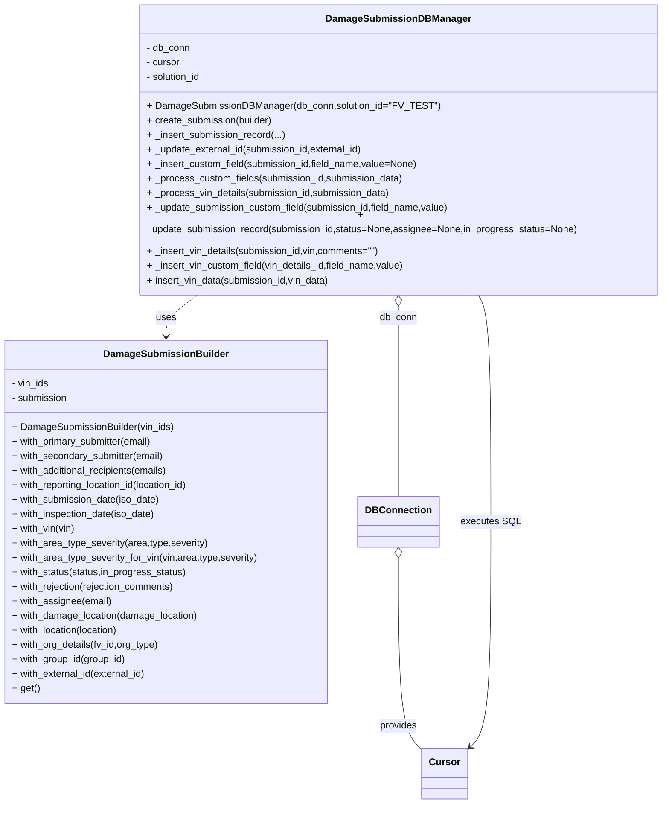
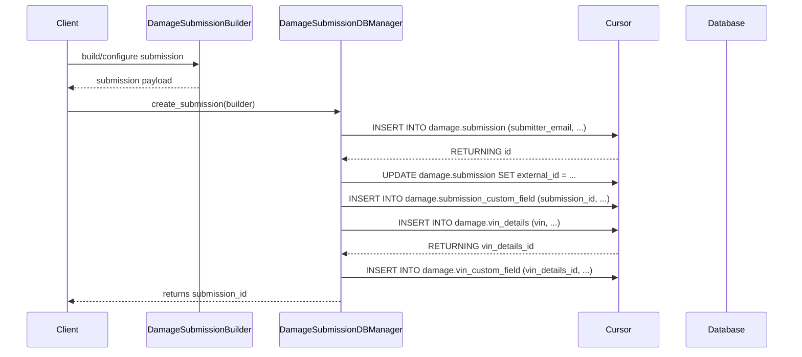

# Diagram: entity_core/entity_service/entity_service/tests/integration_tests/damage_notification_tests/helpers/data_submission_builder.py

> Auto-generated by Obscura crawlers

## Diagram 1

### SVG

<svg id="container" width="1090.75390625" xmlns="http://www.w3.org/2000/svg" class="classDiagram" height="1304" viewBox="0 0 1090.75390625 1304" role="graphics-document document" aria-roledescription="class"><g><defs><marker id="container_class-aggregationStart" class="marker aggregation class" refX="18" refY="7" markerWidth="190" markerHeight="240" orient="auto"><path d="M 18,7 L9,13 L1,7 L9,1 Z"></path></marker></defs><defs><marker id="container_class-aggregationEnd" class="marker aggregation class" refX="1" refY="7" markerWidth="20" markerHeight="28" orient="auto"><path d="M 18,7 L9,13 L1,7 L9,1 Z"></path></marker></defs><defs><marker id="container_class-extensionStart" class="marker extension class" refX="18" refY="7" markerWidth="190" markerHeight="240" orient="auto"><path d="M 1,7 L18,13 V 1 Z"></path></marker></defs><defs><marker id="container_class-extensionEnd" class="marker extension class" refX="1" refY="7" markerWidth="20" markerHeight="28" orient="auto"><path d="M 1,1 V 13 L18,7 Z"></path></marker></defs><defs><marker id="container_class-compositionStart" class="marker composition class" refX="18" refY="7" markerWidth="190" markerHeight="240" orient="auto"><path d="M 18,7 L9,13 L1,7 L9,1 Z"></path></marker></defs><defs><marker id="container_class-compositionEnd" class="marker composition class" refX="1" refY="7" markerWidth="20" markerHeight="28" orient="auto"><path d="M 18,7 L9,13 L1,7 L9,1 Z"></path></marker></defs><defs><marker id="container_class-dependencyStart" class="marker dependency class" refX="6" refY="7" markerWidth="190" markerHeight="240" orient="auto"><path d="M 5,7 L9,13 L1,7 L9,1 Z"></path></marker></defs><defs><marker id="container_class-dependencyEnd" class="marker dependency class" refX="13" refY="7" markerWidth="20" markerHeight="28" orient="auto"><path d="M 18,7 L9,13 L14,7 L9,1 Z"></path></marker></defs><defs><marker id="container_class-lollipopStart" class="marker lollipop class" refX="13" refY="7" markerWidth="190" markerHeight="240" orient="auto"><circle stroke="black" fill="transparent" cx="7" cy="7" r="6"></circle></marker></defs><defs><marker id="container_class-lollipopEnd" class="marker lollipop class" refX="1" refY="7" markerWidth="190" markerHeight="240" orient="auto"><circle stroke="black" fill="transparent" cx="7" cy="7" r="6"></circle></marker></defs><g class="root"><g class="clusters"></g><g class="edgePaths"><path d="M325.629,464L316.829,470.167C308.028,476.333,290.426,488.667,281.625,500C272.824,511.333,272.824,521.667,272.824,526.833L272.824,532" id="id_DamageSubmissionDBManager_DamageSubmissionBuilder_1" class="edge-thickness-normal edge-pattern-dashed relation" style=";;;" data-edge="true" data-et="edge" data-id="id_DamageSubmissionDBManager_DamageSubmissionBuilder_1" data-points="W3sieCI6MzI1LjYyOTM5MjY4ODY3OTIsInkiOjQ2NH0seyJ4IjoyNzIuODI0MjE4NzUsInkiOjUwMX0seyJ4IjoyNzIuODI0MjE4NzUsInkiOjUzOH1d" marker-end="url(#container_class-dependencyEnd)"></path><path d="M651.023,481.25L651.023,484.542C651.023,487.833,651.023,494.417,651.023,546.875C651.023,599.333,651.023,697.667,651.023,746.833L651.023,796" id="id_DamageSubmissionDBManager_DBConnection_2" class="edge-thickness-normal edge-pattern-solid relation" style=";;;" data-edge="true" data-et="edge" data-id="id_DamageSubmissionDBManager_DBConnection_2" data-points="W3sieCI6NjUxLjAyMzQzNzUsInkiOjQ2NH0seyJ4Ijo2NTEuMDIzNDM3NSwieSI6NTAxfSx7IngiOjY1MS4wMjM0Mzc1LCJ5Ijo3OTZ9XQ==" marker-start="url(#container_class-aggregationStart)"></path><path d="M651.023,897.25L651.023,943.542C651.023,989.833,651.023,1082.417,657.214,1135.403C663.404,1188.389,675.784,1201.778,681.974,1208.473L688.164,1215.167" id="id_DBConnection_Cursor_3" class="edge-thickness-normal edge-pattern-solid relation" style=";;;" data-edge="true" data-et="edge" data-id="id_DBConnection_Cursor_3" data-points="W3sieCI6NjUxLjAyMzQzNzUsInkiOjg4MH0seyJ4Ijo2NTEuMDIzNDM3NSwieSI6MTE3NX0seyJ4Ijo2ODguMTY0MDYyNSwieSI6MTIxNS4xNjc0ODY2MzEwMTYxfV0=" marker-start="url(#container_class-aggregationStart)"></path><path d="M776.719,464L780.119,470.167C783.519,476.333,790.318,488.667,793.718,551C797.117,613.333,797.117,725.667,797.117,838C797.117,950.333,797.117,1062.667,791.606,1124.794C786.095,1186.921,775.072,1198.841,769.561,1204.802L764.05,1210.762" id="id_DamageSubmissionDBManager_Cursor_4" class="edge-thickness-normal edge-pattern-solid relation" style=";;;" data-edge="true" data-et="edge" data-id="id_DamageSubmissionDBManager_Cursor_4" data-points="W3sieCI6Nzc2LjcxOTE5MjIxNjk4MTEsInkiOjQ2NH0seyJ4Ijo3OTcuMTE3MTg3NSwieSI6NTAxfSx7IngiOjc5Ny4xMTcxODc1LCJ5Ijo4Mzh9LHsieCI6Nzk3LjExNzE4NzUsInkiOjExNzV9LHsieCI6NzU5Ljk3NjU2MjUsInkiOjEyMTUuMTY3NDg2NjMxMDE2MX1d" marker-end="url(#container_class-dependencyEnd)"></path></g><g class="edgeLabels"><g class="edgeLabel" transform="translate(272.82421875, 501)"><g class="label" data-id="id_DamageSubmissionDBManager_DamageSubmissionBuilder_1" transform="translate(-16.4921875, -12)"><foreignObject width="32.984375" height="24">

uses

</foreignObject></g></g><g class="edgeLabel" transform="translate(651.0234375, 501)"><g class="label" data-id="id_DamageSubmissionDBManager_DBConnection_2" transform="translate(-31.09375, -12)"><foreignObject width="62.1875" height="24">

db_conn

</foreignObject></g></g><g class="edgeLabel" transform="translate(651.0234375, 1175)"><g class="label" data-id="id_DBConnection_Cursor_3" transform="translate(-31.3125, -12)"><foreignObject width="62.625" height="24">

provides

</foreignObject></g></g><g class="edgeLabel" transform="translate(797.1171875, 838)"><g class="label" data-id="id_DamageSubmissionDBManager_Cursor_4" transform="translate(-47.71875, -12)"><foreignObject width="95.4375" height="24">

executes SQL

</foreignObject></g></g></g><g class="nodes"><g class="node default" id="classId-DamageSubmissionBuilder-0" transform="translate(272.82421875, 838)"><g class="basic label-container"><path d="M-264.82421875 -300 L264.82421875 -300 L264.82421875 300 L-264.82421875 300" stroke="none" stroke-width="0" fill="#ECECFF" style=""></path><path d="M-264.82421875 -300 C-136.99615420671813 -300, -9.168089663436234 -300, 264.82421875 -300 M-264.82421875 -300 C-71.13480210512307 -300, 122.55461453975386 -300, 264.82421875 -300 M264.82421875 -300 C264.82421875 -149.82904077169246, 264.82421875 0.34191845661507614, 264.82421875 300 M264.82421875 -300 C264.82421875 -179.97995626573493, 264.82421875 -59.95991253146988, 264.82421875 300 M264.82421875 300 C148.40353358612575 300, 31.982848422251493 300, -264.82421875 300 M264.82421875 300 C157.81670255852606 300, 50.80918636705212 300, -264.82421875 300 M-264.82421875 300 C-264.82421875 77.99539138704517, -264.82421875 -144.00921722590965, -264.82421875 -300 M-264.82421875 300 C-264.82421875 117.29442493780923, -264.82421875 -65.41115012438155, -264.82421875 -300" stroke="#9370DB" stroke-width="1.3" fill="none" stroke-dasharray="0 0" style=""></path></g><g class="annotation-group text" transform="translate(0, -276)"></g><g class="label-group text" transform="translate(-97.9140625, -276)"><g class="label" style="font-weight: bolder" transform="translate(0,-12)"><foreignObject width="195.828125" height="24">

DamageSubmissionBuilder

</foreignObject></g></g><g class="members-group text" transform="translate(-252.82421875, -228)"><g class="label" style="" transform="translate(0,-12)"><foreignObject width="62.328125" height="24">

- vin_ids

</foreignObject></g><g class="label" style="" transform="translate(0,12)"><foreignObject width="93.21875" height="24">

- submission

</foreignObject></g></g><g class="methods-group text" transform="translate(-252.82421875, -156)"><g class="label" style="" transform="translate(0,-12)"><foreignObject width="268.515625" height="24">

+ DamageSubmissionBuilder(vin_ids)

</foreignObject></g><g class="label" style="" transform="translate(0,12)"><foreignObject width="237.609375" height="24">

+ with_primary_submitter(email)

</foreignObject></g><g class="label" style="" transform="translate(0,36)"><foreignObject width="255.515625" height="24">

+ with_secondary_submitter(email)

</foreignObject></g><g class="label" style="" transform="translate(0,60)"><foreignObject width="264.390625" height="24">

+ with_additional_recipients(emails)

</foreignObject></g><g class="label" style="" transform="translate(0,84)"><foreignObject width="300.8125" height="24">

+ with_reporting_location_id(location_id)

</foreignObject></g><g class="label" style="" transform="translate(0,108)"><foreignObject width="246.640625" height="24">

+ with_submission_date(iso_date)

</foreignObject></g><g class="label" style="" transform="translate(0,132)"><foreignObject width="240.359375" height="24">

+ with_inspection_date(iso_date)

</foreignObject></g><g class="label" style="" transform="translate(0,156)"><foreignObject width="105.09375" height="24">

+ with_vin(vin)

</foreignObject></g><g class="label" style="" transform="translate(0,180)"><foreignObject width="325.578125" height="24">

+ with_area_type_severity(area,type,severity)

</foreignObject></g><g class="label" style="" transform="translate(0,204)"><foreignObject width="407.734375" height="24">

+ with_area_type_severity_for_vin(vin,area,type,severity)

</foreignObject></g><g class="label" style="" transform="translate(0,228)"><foreignObject width="291.375" height="24">

+ with_status(status,in_progress_status)

</foreignObject></g><g class="label" style="" transform="translate(0,252)"><foreignObject width="274.046875" height="24">

+ with_rejection(rejection_comments)

</foreignObject></g><g class="label" style="" transform="translate(0,276)"><foreignObject width="165.046875" height="24">

+ with_assignee(email)

</foreignObject></g><g class="label" style="" transform="translate(0,300)"><foreignObject width="310.34375" height="24">

+ with_damage_location(damage_location)

</foreignObject></g><g class="label" style="" transform="translate(0,324)"><foreignObject width="180.203125" height="24">

+ with_location(location)

</foreignObject></g><g class="label" style="" transform="translate(0,348)"><foreignObject width="245.015625" height="24">

+ with_org_details(fv_id,org_type)

</foreignObject></g><g class="label" style="" transform="translate(0,372)"><foreignObject width="190.71875" height="24">

+ with_group_id(group_id)

</foreignObject></g><g class="label" style="" transform="translate(0,396)"><foreignObject width="225.28125" height="24">

+ with_external_id(external_id)

</foreignObject></g><g class="label" style="" transform="translate(0,420)"><foreignObject width="45.15625" height="24">

+ get()

</foreignObject></g></g><g class="divider" style=""><path d="M-264.82421875 -252 C-155.97706231483994 -252, -47.12990587967985 -252, 264.82421875 -252 M-264.82421875 -252 C-132.6624682419982 -252, -0.500717733996396 -252, 264.82421875 -252" stroke="#9370DB" stroke-width="1.3" fill="none" stroke-dasharray="0 0" style=""></path></g><g class="divider" style=""><path d="M-264.82421875 -180 C-84.64003065496269 -180, 95.54415744007463 -180, 264.82421875 -180 M-264.82421875 -180 C-76.61980947974305 -180, 111.58459979051389 -180, 264.82421875 -180" stroke="#9370DB" stroke-width="1.3" fill="none" stroke-dasharray="0 0" style=""></path></g></g><g class="node default" id="classId-DamageSubmissionDBManager-1" transform="translate(651.0234375, 236)"><g class="basic label-container"><path d="M-431.73046875 -228 L431.73046875 -228 L431.73046875 228 L-431.73046875 228" stroke="none" stroke-width="0" fill="#ECECFF" style=""></path><path d="M-431.73046875 -228 C-205.90983306197694 -228, 19.91080262604612 -228, 431.73046875 -228 M-431.73046875 -228 C-210.47333429531787 -228, 10.783800159364262 -228, 431.73046875 -228 M431.73046875 -228 C431.73046875 -54.24944504832794, 431.73046875 119.50110990334412, 431.73046875 228 M431.73046875 -228 C431.73046875 -55.85686122754299, 431.73046875 116.28627754491401, 431.73046875 228 M431.73046875 228 C114.22999459374319 228, -203.27047956251363 228, -431.73046875 228 M431.73046875 228 C188.69544939866202 228, -54.33956995267596 228, -431.73046875 228 M-431.73046875 228 C-431.73046875 69.54750893572555, -431.73046875 -88.90498212854891, -431.73046875 -228 M-431.73046875 228 C-431.73046875 62.412259470396265, -431.73046875 -103.17548105920747, -431.73046875 -228" stroke="#9370DB" stroke-width="1.3" fill="none" stroke-dasharray="0 0" style=""></path></g><g class="annotation-group text" transform="translate(0, -204)"></g><g class="label-group text" transform="translate(-112.9765625, -204)"><g class="label" style="font-weight: bolder" transform="translate(0,-12)"><foreignObject width="225.953125" height="24">

DamageSubmissionDBManager

</foreignObject></g></g><g class="members-group text" transform="translate(-419.73046875, -156)"><g class="label" style="" transform="translate(0,-12)"><foreignObject width="72.875" height="24">

- db_conn

</foreignObject></g><g class="label" style="" transform="translate(0,12)"><foreignObject width="56.421875" height="24">

- cursor

</foreignObject></g><g class="label" style="" transform="translate(0,36)"><foreignObject width="92.921875" height="24">

- solution_id

</foreignObject></g></g><g class="methods-group text" transform="translate(-419.73046875, -60)"><g class="label" style="" transform="translate(0,-12)"><foreignObject width="472.34375" height="24">

+ DamageSubmissionDBManager(db_conn,solution_id="FV_TEST")

</foreignObject></g><g class="label" style="" transform="translate(0,12)"><foreignObject width="210.390625" height="24">

+ create_submission(builder)

</foreignObject></g><g class="label" style="" transform="translate(0,36)"><foreignObject width="230" height="24">

+ _insert_submission_record(...)

</foreignObject></g><g class="label" style="" transform="translate(0,60)"><foreignObject width="361.78125" height="24">

+ _update_external_id(submission_id,external_id)

</foreignObject></g><g class="label" style="" transform="translate(0,84)"><foreignObject width="451.671875" height="24">

+ _insert_custom_field(submission_id,field_name,value=None)

</foreignObject></g><g class="label" style="" transform="translate(0,108)"><foreignObject width="426.40625" height="24">

+ _process_custom_fields(submission_id,submission_data)

</foreignObject></g><g class="label" style="" transform="translate(0,132)"><foreignObject width="404.90625" height="24">

+ _process_vin_details(submission_id,submission_data)

</foreignObject></g><g class="label" style="" transform="translate(0,156)"><foreignObject width="504.828125" height="24">

+ _update_submission_custom_field(submission_id,field_name,value)

</foreignObject></g><g class="label" style="" transform="translate(0,180)"><foreignObject width="726.484375" height="24">

+ _update_submission_record(submission_id,status=None,assignee=None,in_progress_status=None)

</foreignObject></g><g class="label" style="" transform="translate(0,204)"><foreignObject width="389.65625" height="24">

+ _insert_vin_details(submission_id,vin,comments="")

</foreignObject></g><g class="label" style="" transform="translate(0,228)"><foreignObject width="431.140625" height="24">

+ _insert_vin_custom_field(vin_details_id,field_name,value)

</foreignObject></g><g class="label" style="" transform="translate(0,252)"><foreignObject width="305.40625" height="24">

+ insert_vin_data(submission_id,vin_data)

</foreignObject></g></g><g class="divider" style=""><path d="M-431.73046875 -180 C-200.98428629935566 -180, 29.76189615128868 -180, 431.73046875 -180 M-431.73046875 -180 C-194.34196039901047 -180, 43.04654795197905 -180, 431.73046875 -180" stroke="#9370DB" stroke-width="1.3" fill="none" stroke-dasharray="0 0" style=""></path></g><g class="divider" style=""><path d="M-431.73046875 -84 C-105.20062214228471 -84, 221.32922446543057 -84, 431.73046875 -84 M-431.73046875 -84 C-161.63181786068236 -84, 108.46683302863528 -84, 431.73046875 -84" stroke="#9370DB" stroke-width="1.3" fill="none" stroke-dasharray="0 0" style=""></path></g></g><g class="node default" id="classId-DBConnection-2" transform="translate(651.0234375, 838)"><g class="basic label-container"><path d="M-63.375 -42 L63.375 -42 L63.375 42 L-63.375 42" stroke="none" stroke-width="0" fill="#ECECFF" style=""></path><path d="M-63.375 -42 C-35.20618976788064 -42, -7.037379535761275 -42, 63.375 -42 M-63.375 -42 C-28.0592699632382 -42, 7.2564600735235985 -42, 63.375 -42 M63.375 -42 C63.375 -11.362968145054158, 63.375 19.274063709891685, 63.375 42 M63.375 -42 C63.375 -13.55837137665246, 63.375 14.88325724669508, 63.375 42 M63.375 42 C14.684880216520973 42, -34.00523956695805 42, -63.375 42 M63.375 42 C37.04424664380896 42, 10.713493287617922 42, -63.375 42 M-63.375 42 C-63.375 22.51561297102478, -63.375 3.0312259420495593, -63.375 -42 M-63.375 42 C-63.375 13.19245221137519, -63.375 -15.615095577249619, -63.375 -42" stroke="#9370DB" stroke-width="1.3" fill="none" stroke-dasharray="0 0" style=""></path></g><g class="annotation-group text" transform="translate(0, -18)"></g><g class="label-group text" transform="translate(-51.375, -18)"><g class="label" style="font-weight: bolder" transform="translate(0,-12)"><foreignObject width="102.75" height="24">

DBConnection

</foreignObject></g></g><g class="members-group text" transform="translate(-51.375, 30)"></g><g class="methods-group text" transform="translate(-51.375, 60)"></g><g class="divider" style=""><path d="M-63.375 6 C-31.286961800866102 6, 0.8010763982677958 6, 63.375 6 M-63.375 6 C-26.180475845925358 6, 11.014048308149285 6, 63.375 6" stroke="#9370DB" stroke-width="1.3" fill="none" stroke-dasharray="0 0" style=""></path></g><g class="divider" style=""><path d="M-63.375 24 C-27.66669035212827 24, 8.041619295743459 24, 63.375 24 M-63.375 24 C-30.714824142818017 24, 1.9453517143639658 24, 63.375 24" stroke="#9370DB" stroke-width="1.3" fill="none" stroke-dasharray="0 0" style=""></path></g></g><g class="node default" id="classId-Cursor-3" transform="translate(724.0703125, 1254)"><g class="basic label-container"><path d="M-35.90625 -42 L35.90625 -42 L35.90625 42 L-35.90625 42" stroke="none" stroke-width="0" fill="#ECECFF" style=""></path><path d="M-35.90625 -42 C-12.287428526062964 -42, 11.331392947874072 -42, 35.90625 -42 M-35.90625 -42 C-7.509901299113263 -42, 20.886447401773474 -42, 35.90625 -42 M35.90625 -42 C35.90625 -15.150403453171897, 35.90625 11.699193093656206, 35.90625 42 M35.90625 -42 C35.90625 -23.40633547312337, 35.90625 -4.81267094624674, 35.90625 42 M35.90625 42 C9.347203319900593 42, -17.211843360198813 42, -35.90625 42 M35.90625 42 C15.126722526095136 42, -5.652804947809727 42, -35.90625 42 M-35.90625 42 C-35.90625 19.241030831493628, -35.90625 -3.517938337012744, -35.90625 -42 M-35.90625 42 C-35.90625 21.19417201718293, -35.90625 0.38834403436585774, -35.90625 -42" stroke="#9370DB" stroke-width="1.3" fill="none" stroke-dasharray="0 0" style=""></path></g><g class="annotation-group text" transform="translate(0, -18)"></g><g class="label-group text" transform="translate(-23.90625, -18)"><g class="label" style="font-weight: bolder" transform="translate(0,-12)"><foreignObject width="47.8125" height="24">

Cursor

</foreignObject></g></g><g class="members-group text" transform="translate(-23.90625, 30)"></g><g class="methods-group text" transform="translate(-23.90625, 60)"></g><g class="divider" style=""><path d="M-35.90625 6 C-8.742691345235258 6, 18.420867309529484 6, 35.90625 6 M-35.90625 6 C-15.799511861131716 6, 4.307226277736568 6, 35.90625 6" stroke="#9370DB" stroke-width="1.3" fill="none" stroke-dasharray="0 0" style=""></path></g><g class="divider" style=""><path d="M-35.90625 24 C-9.194055228737913 24, 17.518139542524175 24, 35.90625 24 M-35.90625 24 C-14.00727906403813 24, 7.89169187192374 24, 35.90625 24" stroke="#9370DB" stroke-width="1.3" fill="none" stroke-dasharray="0 0" style=""></path></g></g></g></g></g></svg>

## Diagram 2

### SVG

<svg id="container" width="1546" xmlns="http://www.w3.org/2000/svg" height="699" viewBox="-50 -10 1546 699" role="graphics-document document" aria-roledescription="sequence"><g><rect x="1296" y="613" fill="#eaeaea" stroke="#666" width="150" height="65" name="DB" rx="3" ry="3" class="actor actor-bottom"></rect><text x="1371" y="645.5" dominant-baseline="central" alignment-baseline="central" class="actor actor-box" style="text-anchor: middle; font-size: 16px; font-weight: 400;"><tspan x="1371" dy="0">Database</tspan></text></g><g><rect x="1096" y="613" fill="#eaeaea" stroke="#666" width="150" height="65" name="Cursor" rx="3" ry="3" class="actor actor-bottom"></rect><text x="1171" y="645.5" dominant-baseline="central" alignment-baseline="central" class="actor actor-box" style="text-anchor: middle; font-size: 16px; font-weight: 400;"><tspan x="1171" dy="0">Cursor</tspan></text></g><g><rect x="501.5" y="613" fill="#eaeaea" stroke="#666" width="245" height="65" name="DBMgr" rx="3" ry="3" class="actor actor-bottom"></rect><text x="624" y="645.5" dominant-baseline="central" alignment-baseline="central" class="actor actor-box" style="text-anchor: middle; font-size: 16px; font-weight: 400;"><tspan x="624" dy="0">DamageSubmissionDBManager</tspan></text></g><g><rect x="236.5" y="613" fill="#eaeaea" stroke="#666" width="215" height="65" name="Builder" rx="3" ry="3" class="actor actor-bottom"></rect><text x="344" y="645.5" dominant-baseline="central" alignment-baseline="central" class="actor actor-box" style="text-anchor: middle; font-size: 16px; font-weight: 400;"><tspan x="344" dy="0">DamageSubmissionBuilder</tspan></text></g><g><rect x="0" y="613" fill="#eaeaea" stroke="#666" width="150" height="65" name="Client" rx="3" ry="3" class="actor actor-bottom"></rect><text x="75" y="645.5" dominant-baseline="central" alignment-baseline="central" class="actor actor-box" style="text-anchor: middle; font-size: 16px; font-weight: 400;"><tspan x="75" dy="0">Client</tspan></text></g><g><line id="actor4" x1="1371" y1="65" x2="1371" y2="613" class="actor-line 200" stroke-width="0.5px" stroke="#999" name="DB"></line><g id="root-4"><rect x="1296" y="0" fill="#eaeaea" stroke="#666" width="150" height="65" name="DB" rx="3" ry="3" class="actor actor-top"></rect><text x="1371" y="32.5" dominant-baseline="central" alignment-baseline="central" class="actor actor-box" style="text-anchor: middle; font-size: 16px; font-weight: 400;"><tspan x="1371" dy="0">Database</tspan></text></g></g><g><line id="actor3" x1="1171" y1="65" x2="1171" y2="613" class="actor-line 200" stroke-width="0.5px" stroke="#999" name="Cursor"></line><g id="root-3"><rect x="1096" y="0" fill="#eaeaea" stroke="#666" width="150" height="65" name="Cursor" rx="3" ry="3" class="actor actor-top"></rect><text x="1171" y="32.5" dominant-baseline="central" alignment-baseline="central" class="actor actor-box" style="text-anchor: middle; font-size: 16px; font-weight: 400;"><tspan x="1171" dy="0">Cursor</tspan></text></g></g><g><line id="actor2" x1="624" y1="65" x2="624" y2="613" class="actor-line 200" stroke-width="0.5px" stroke="#999" name="DBMgr"></line><g id="root-2"><rect x="501.5" y="0" fill="#eaeaea" stroke="#666" width="245" height="65" name="DBMgr" rx="3" ry="3" class="actor actor-top"></rect><text x="624" y="32.5" dominant-baseline="central" alignment-baseline="central" class="actor actor-box" style="text-anchor: middle; font-size: 16px; font-weight: 400;"><tspan x="624" dy="0">DamageSubmissionDBManager</tspan></text></g></g><g><line id="actor1" x1="344" y1="65" x2="344" y2="613" class="actor-line 200" stroke-width="0.5px" stroke="#999" name="Builder"></line><g id="root-1"><rect x="236.5" y="0" fill="#eaeaea" stroke="#666" width="215" height="65" name="Builder" rx="3" ry="3" class="actor actor-top"></rect><text x="344" y="32.5" dominant-baseline="central" alignment-baseline="central" class="actor actor-box" style="text-anchor: middle; font-size: 16px; font-weight: 400;"><tspan x="344" dy="0">DamageSubmissionBuilder</tspan></text></g></g><g><line id="actor0" x1="75" y1="65" x2="75" y2="613" class="actor-line 200" stroke-width="0.5px" stroke="#999" name="Client"></line><g id="root-0"><rect x="0" y="0" fill="#eaeaea" stroke="#666" width="150" height="65" name="Client" rx="3" ry="3" class="actor actor-top"></rect><text x="75" y="32.5" dominant-baseline="central" alignment-baseline="central" class="actor actor-box" style="text-anchor: middle; font-size: 16px; font-weight: 400;"><tspan x="75" dy="0">Client</tspan></text></g></g><g></g><defs><symbol id="computer" width="24" height="24"><path transform="scale(.5)" d="M2 2v13h20v-13h-20zm18 11h-16v-9h16v9zm-10.228 6l.466-1h3.524l.467 1h-4.457zm14.228 3h-24l2-6h2.104l-1.33 4h18.45l-1.297-4h2.073l2 6zm-5-10h-14v-7h14v7z"></path></symbol></defs><defs><symbol id="database" fill-rule="evenodd" clip-rule="evenodd"><path transform="scale(.5)" d="M12.258.001l.256.004.255.005.253.008.251.01.249.012.247.015.246.016.242.019.241.02.239.023.236.024.233.027.231.028.229.031.225.032.223.034.22.036.217.038.214.04.211.041.208.043.205.045.201.046.198.048.194.05.191.051.187.053.183.054.18.056.175.057.172.059.168.06.163.061.16.063.155.064.15.066.074.033.073.033.071.034.07.034.069.035.068.035.067.035.066.035.064.036.064.036.062.036.06.036.06.037.058.037.058.037.055.038.055.038.053.038.052.038.051.039.05.039.048.039.047.039.045.04.044.04.043.04.041.04.04.041.039.041.037.041.036.041.034.041.033.042.032.042.03.042.029.042.027.042.026.043.024.043.023.043.021.043.02.043.018.044.017.043.015.044.013.044.012.044.011.045.009.044.007.045.006.045.004.045.002.045.001.045v17l-.001.045-.002.045-.004.045-.006.045-.007.045-.009.044-.011.045-.012.044-.013.044-.015.044-.017.043-.018.044-.02.043-.021.043-.023.043-.024.043-.026.043-.027.042-.029.042-.03.042-.032.042-.033.042-.034.041-.036.041-.037.041-.039.041-.04.041-.041.04-.043.04-.044.04-.045.04-.047.039-.048.039-.05.039-.051.039-.052.038-.053.038-.055.038-.055.038-.058.037-.058.037-.06.037-.06.036-.062.036-.064.036-.064.036-.066.035-.067.035-.068.035-.069.035-.07.034-.071.034-.073.033-.074.033-.15.066-.155.064-.16.063-.163.061-.168.06-.172.059-.175.057-.18.056-.183.054-.187.053-.191.051-.194.05-.198.048-.201.046-.205.045-.208.043-.211.041-.214.04-.217.038-.22.036-.223.034-.225.032-.229.031-.231.028-.233.027-.236.024-.239.023-.241.02-.242.019-.246.016-.247.015-.249.012-.251.01-.253.008-.255.005-.256.004-.258.001-.258-.001-.256-.004-.255-.005-.253-.008-.251-.01-.249-.012-.247-.015-.245-.016-.243-.019-.241-.02-.238-.023-.236-.024-.234-.027-.231-.028-.228-.031-.226-.032-.223-.034-.22-.036-.217-.038-.214-.04-.211-.041-.208-.043-.204-.045-.201-.046-.198-.048-.195-.05-.19-.051-.187-.053-.184-.054-.179-.056-.176-.057-.172-.059-.167-.06-.164-.061-.159-.063-.155-.064-.151-.066-.074-.033-.072-.033-.072-.034-.07-.034-.069-.035-.068-.035-.067-.035-.066-.035-.064-.036-.063-.036-.062-.036-.061-.036-.06-.037-.058-.037-.057-.037-.056-.038-.055-.038-.053-.038-.052-.038-.051-.039-.049-.039-.049-.039-.046-.039-.046-.04-.044-.04-.043-.04-.041-.04-.04-.041-.039-.041-.037-.041-.036-.041-.034-.041-.033-.042-.032-.042-.03-.042-.029-.042-.027-.042-.026-.043-.024-.043-.023-.043-.021-.043-.02-.043-.018-.044-.017-.043-.015-.044-.013-.044-.012-.044-.011-.045-.009-.044-.007-.045-.006-.045-.004-.045-.002-.045-.001-.045v-17l.001-.045.002-.045.004-.045.006-.045.007-.045.009-.044.011-.045.012-.044.013-.044.015-.044.017-.043.018-.044.02-.043.021-.043.023-.043.024-.043.026-.043.027-.042.029-.042.03-.042.032-.042.033-.042.034-.041.036-.041.037-.041.039-.041.04-.041.041-.04.043-.04.044-.04.046-.04.046-.039.049-.039.049-.039.051-.039.052-.038.053-.038.055-.038.056-.038.057-.037.058-.037.06-.037.061-.036.062-.036.063-.036.064-.036.066-.035.067-.035.068-.035.069-.035.07-.034.072-.034.072-.033.074-.033.151-.066.155-.064.159-.063.164-.061.167-.06.172-.059.176-.057.179-.056.184-.054.187-.053.19-.051.195-.05.198-.048.201-.046.204-.045.208-.043.211-.041.214-.04.217-.038.22-.036.223-.034.226-.032.228-.031.231-.028.234-.027.236-.024.238-.023.241-.02.243-.019.245-.016.247-.015.249-.012.251-.01.253-.008.255-.005.256-.004.258-.001.258.001zm-9.258 20.499v.01l.001.021.003.021.004.022.005.021.006.022.007.022.009.023.01.022.011.023.012.023.013.023.015.023.016.024.017.023.018.024.019.024.021.024.022.025.023.024.024.025.052.049.056.05.061.051.066.051.07.051.075.051.079.052.084.052.088.052.092.052.097.052.102.051.105.052.11.052.114.051.119.051.123.051.127.05.131.05.135.05.139.048.144.049.147.047.152.047.155.047.16.045.163.045.167.043.171.043.176.041.178.041.183.039.187.039.19.037.194.035.197.035.202.033.204.031.209.03.212.029.216.027.219.025.222.024.226.021.23.02.233.018.236.016.24.015.243.012.246.01.249.008.253.005.256.004.259.001.26-.001.257-.004.254-.005.25-.008.247-.011.244-.012.241-.014.237-.016.233-.018.231-.021.226-.021.224-.024.22-.026.216-.027.212-.028.21-.031.205-.031.202-.034.198-.034.194-.036.191-.037.187-.039.183-.04.179-.04.175-.042.172-.043.168-.044.163-.045.16-.046.155-.046.152-.047.148-.048.143-.049.139-.049.136-.05.131-.05.126-.05.123-.051.118-.052.114-.051.11-.052.106-.052.101-.052.096-.052.092-.052.088-.053.083-.051.079-.052.074-.052.07-.051.065-.051.06-.051.056-.05.051-.05.023-.024.023-.025.021-.024.02-.024.019-.024.018-.024.017-.024.015-.023.014-.024.013-.023.012-.023.01-.023.01-.022.008-.022.006-.022.006-.022.004-.022.004-.021.001-.021.001-.021v-4.127l-.077.055-.08.053-.083.054-.085.053-.087.052-.09.052-.093.051-.095.05-.097.05-.1.049-.102.049-.105.048-.106.047-.109.047-.111.046-.114.045-.115.045-.118.044-.12.043-.122.042-.124.042-.126.041-.128.04-.13.04-.132.038-.134.038-.135.037-.138.037-.139.035-.142.035-.143.034-.144.033-.147.032-.148.031-.15.03-.151.03-.153.029-.154.027-.156.027-.158.026-.159.025-.161.024-.162.023-.163.022-.165.021-.166.02-.167.019-.169.018-.169.017-.171.016-.173.015-.173.014-.175.013-.175.012-.177.011-.178.01-.179.008-.179.008-.181.006-.182.005-.182.004-.184.003-.184.002h-.37l-.184-.002-.184-.003-.182-.004-.182-.005-.181-.006-.179-.008-.179-.008-.178-.01-.176-.011-.176-.012-.175-.013-.173-.014-.172-.015-.171-.016-.17-.017-.169-.018-.167-.019-.166-.02-.165-.021-.163-.022-.162-.023-.161-.024-.159-.025-.157-.026-.156-.027-.155-.027-.153-.029-.151-.03-.15-.03-.148-.031-.146-.032-.145-.033-.143-.034-.141-.035-.14-.035-.137-.037-.136-.037-.134-.038-.132-.038-.13-.04-.128-.04-.126-.041-.124-.042-.122-.042-.12-.044-.117-.043-.116-.045-.113-.045-.112-.046-.109-.047-.106-.047-.105-.048-.102-.049-.1-.049-.097-.05-.095-.05-.093-.052-.09-.051-.087-.052-.085-.053-.083-.054-.08-.054-.077-.054v4.127zm0-5.654v.011l.001.021.003.021.004.021.005.022.006.022.007.022.009.022.01.022.011.023.012.023.013.023.015.024.016.023.017.024.018.024.019.024.021.024.022.024.023.025.024.024.052.05.056.05.061.05.066.051.07.051.075.052.079.051.084.052.088.052.092.052.097.052.102.052.105.052.11.051.114.051.119.052.123.05.127.051.131.05.135.049.139.049.144.048.147.048.152.047.155.046.16.045.163.045.167.044.171.042.176.042.178.04.183.04.187.038.19.037.194.036.197.034.202.033.204.032.209.03.212.028.216.027.219.025.222.024.226.022.23.02.233.018.236.016.24.014.243.012.246.01.249.008.253.006.256.003.259.001.26-.001.257-.003.254-.006.25-.008.247-.01.244-.012.241-.015.237-.016.233-.018.231-.02.226-.022.224-.024.22-.025.216-.027.212-.029.21-.03.205-.032.202-.033.198-.035.194-.036.191-.037.187-.039.183-.039.179-.041.175-.042.172-.043.168-.044.163-.045.16-.045.155-.047.152-.047.148-.048.143-.048.139-.05.136-.049.131-.05.126-.051.123-.051.118-.051.114-.052.11-.052.106-.052.101-.052.096-.052.092-.052.088-.052.083-.052.079-.052.074-.051.07-.052.065-.051.06-.05.056-.051.051-.049.023-.025.023-.024.021-.025.02-.024.019-.024.018-.024.017-.024.015-.023.014-.023.013-.024.012-.022.01-.023.01-.023.008-.022.006-.022.006-.022.004-.021.004-.022.001-.021.001-.021v-4.139l-.077.054-.08.054-.083.054-.085.052-.087.053-.09.051-.093.051-.095.051-.097.05-.1.049-.102.049-.105.048-.106.047-.109.047-.111.046-.114.045-.115.044-.118.044-.12.044-.122.042-.124.042-.126.041-.128.04-.13.039-.132.039-.134.038-.135.037-.138.036-.139.036-.142.035-.143.033-.144.033-.147.033-.148.031-.15.03-.151.03-.153.028-.154.028-.156.027-.158.026-.159.025-.161.024-.162.023-.163.022-.165.021-.166.02-.167.019-.169.018-.169.017-.171.016-.173.015-.173.014-.175.013-.175.012-.177.011-.178.009-.179.009-.179.007-.181.007-.182.005-.182.004-.184.003-.184.002h-.37l-.184-.002-.184-.003-.182-.004-.182-.005-.181-.007-.179-.007-.179-.009-.178-.009-.176-.011-.176-.012-.175-.013-.173-.014-.172-.015-.171-.016-.17-.017-.169-.018-.167-.019-.166-.02-.165-.021-.163-.022-.162-.023-.161-.024-.159-.025-.157-.026-.156-.027-.155-.028-.153-.028-.151-.03-.15-.03-.148-.031-.146-.033-.145-.033-.143-.033-.141-.035-.14-.036-.137-.036-.136-.037-.134-.038-.132-.039-.13-.039-.128-.04-.126-.041-.124-.042-.122-.043-.12-.043-.117-.044-.116-.044-.113-.046-.112-.046-.109-.046-.106-.047-.105-.048-.102-.049-.1-.049-.097-.05-.095-.051-.093-.051-.09-.051-.087-.053-.085-.052-.083-.054-.08-.054-.077-.054v4.139zm0-5.666v.011l.001.02.003.022.004.021.005.022.006.021.007.022.009.023.01.022.011.023.012.023.013.023.015.023.016.024.017.024.018.023.019.024.021.025.022.024.023.024.024.025.052.05.056.05.061.05.066.051.07.051.075.052.079.051.084.052.088.052.092.052.097.052.102.052.105.051.11.052.114.051.119.051.123.051.127.05.131.05.135.05.139.049.144.048.147.048.152.047.155.046.16.045.163.045.167.043.171.043.176.042.178.04.183.04.187.038.19.037.194.036.197.034.202.033.204.032.209.03.212.028.216.027.219.025.222.024.226.021.23.02.233.018.236.017.24.014.243.012.246.01.249.008.253.006.256.003.259.001.26-.001.257-.003.254-.006.25-.008.247-.01.244-.013.241-.014.237-.016.233-.018.231-.02.226-.022.224-.024.22-.025.216-.027.212-.029.21-.03.205-.032.202-.033.198-.035.194-.036.191-.037.187-.039.183-.039.179-.041.175-.042.172-.043.168-.044.163-.045.16-.045.155-.047.152-.047.148-.048.143-.049.139-.049.136-.049.131-.051.126-.05.123-.051.118-.052.114-.051.11-.052.106-.052.101-.052.096-.052.092-.052.088-.052.083-.052.079-.052.074-.052.07-.051.065-.051.06-.051.056-.05.051-.049.023-.025.023-.025.021-.024.02-.024.019-.024.018-.024.017-.024.015-.023.014-.024.013-.023.012-.023.01-.022.01-.023.008-.022.006-.022.006-.022.004-.022.004-.021.001-.021.001-.021v-4.153l-.077.054-.08.054-.083.053-.085.053-.087.053-.09.051-.093.051-.095.051-.097.05-.1.049-.102.048-.105.048-.106.048-.109.046-.111.046-.114.046-.115.044-.118.044-.12.043-.122.043-.124.042-.126.041-.128.04-.13.039-.132.039-.134.038-.135.037-.138.036-.139.036-.142.034-.143.034-.144.033-.147.032-.148.032-.15.03-.151.03-.153.028-.154.028-.156.027-.158.026-.159.024-.161.024-.162.023-.163.023-.165.021-.166.02-.167.019-.169.018-.169.017-.171.016-.173.015-.173.014-.175.013-.175.012-.177.01-.178.01-.179.009-.179.007-.181.006-.182.006-.182.004-.184.003-.184.001-.185.001-.185-.001-.184-.001-.184-.003-.182-.004-.182-.006-.181-.006-.179-.007-.179-.009-.178-.01-.176-.01-.176-.012-.175-.013-.173-.014-.172-.015-.171-.016-.17-.017-.169-.018-.167-.019-.166-.02-.165-.021-.163-.023-.162-.023-.161-.024-.159-.024-.157-.026-.156-.027-.155-.028-.153-.028-.151-.03-.15-.03-.148-.032-.146-.032-.145-.033-.143-.034-.141-.034-.14-.036-.137-.036-.136-.037-.134-.038-.132-.039-.13-.039-.128-.041-.126-.041-.124-.041-.122-.043-.12-.043-.117-.044-.116-.044-.113-.046-.112-.046-.109-.046-.106-.048-.105-.048-.102-.048-.1-.05-.097-.049-.095-.051-.093-.051-.09-.052-.087-.052-.085-.053-.083-.053-.08-.054-.077-.054v4.153zm8.74-8.179l-.257.004-.254.005-.25.008-.247.011-.244.012-.241.014-.237.016-.233.018-.231.021-.226.022-.224.023-.22.026-.216.027-.212.028-.21.031-.205.032-.202.033-.198.034-.194.036-.191.038-.187.038-.183.04-.179.041-.175.042-.172.043-.168.043-.163.045-.16.046-.155.046-.152.048-.148.048-.143.048-.139.049-.136.05-.131.05-.126.051-.123.051-.118.051-.114.052-.11.052-.106.052-.101.052-.096.052-.092.052-.088.052-.083.052-.079.052-.074.051-.07.052-.065.051-.06.05-.056.05-.051.05-.023.025-.023.024-.021.024-.02.025-.019.024-.018.024-.017.023-.015.024-.014.023-.013.023-.012.023-.01.023-.01.022-.008.022-.006.023-.006.021-.004.022-.004.021-.001.021-.001.021.001.021.001.021.004.021.004.022.006.021.006.023.008.022.01.022.01.023.012.023.013.023.014.023.015.024.017.023.018.024.019.024.02.025.021.024.023.024.023.025.051.05.056.05.06.05.065.051.07.052.074.051.079.052.083.052.088.052.092.052.096.052.101.052.106.052.11.052.114.052.118.051.123.051.126.051.131.05.136.05.139.049.143.048.148.048.152.048.155.046.16.046.163.045.168.043.172.043.175.042.179.041.183.04.187.038.191.038.194.036.198.034.202.033.205.032.21.031.212.028.216.027.22.026.224.023.226.022.231.021.233.018.237.016.241.014.244.012.247.011.25.008.254.005.257.004.26.001.26-.001.257-.004.254-.005.25-.008.247-.011.244-.012.241-.014.237-.016.233-.018.231-.021.226-.022.224-.023.22-.026.216-.027.212-.028.21-.031.205-.032.202-.033.198-.034.194-.036.191-.038.187-.038.183-.04.179-.041.175-.042.172-.043.168-.043.163-.045.16-.046.155-.046.152-.048.148-.048.143-.048.139-.049.136-.05.131-.05.126-.051.123-.051.118-.051.114-.052.11-.052.106-.052.101-.052.096-.052.092-.052.088-.052.083-.052.079-.052.074-.051.07-.052.065-.051.06-.05.056-.05.051-.05.023-.025.023-.024.021-.024.02-.025.019-.024.018-.024.017-.023.015-.024.014-.023.013-.023.012-.023.01-.023.01-.022.008-.022.006-.023.006-.021.004-.022.004-.021.001-.021.001-.021-.001-.021-.001-.021-.004-.021-.004-.022-.006-.021-.006-.023-.008-.022-.01-.022-.01-.023-.012-.023-.013-.023-.014-.023-.015-.024-.017-.023-.018-.024-.019-.024-.02-.025-.021-.024-.023-.024-.023-.025-.051-.05-.056-.05-.06-.05-.065-.051-.07-.052-.074-.051-.079-.052-.083-.052-.088-.052-.092-.052-.096-.052-.101-.052-.106-.052-.11-.052-.114-.052-.118-.051-.123-.051-.126-.051-.131-.05-.136-.05-.139-.049-.143-.048-.148-.048-.152-.048-.155-.046-.16-.046-.163-.045-.168-.043-.172-.043-.175-.042-.179-.041-.183-.04-.187-.038-.191-.038-.194-.036-.198-.034-.202-.033-.205-.032-.21-.031-.212-.028-.216-.027-.22-.026-.224-.023-.226-.022-.231-.021-.233-.018-.237-.016-.241-.014-.244-.012-.247-.011-.25-.008-.254-.005-.257-.004-.26-.001-.26.001z"></path></symbol></defs><defs><symbol id="clock" width="24" height="24"><path transform="scale(.5)" d="M12 2c5.514 0 10 4.486 10 10s-4.486 10-10 10-10-4.486-10-10 4.486-10 10-10zm0-2c-6.627 0-12 5.373-12 12s5.373 12 12 12 12-5.373 12-12-5.373-12-12-12zm5.848 12.459c.202.038.202.333.001.372-1.907.361-6.045 1.111-6.547 1.111-.719 0-1.301-.582-1.301-1.301 0-.512.77-5.447 1.125-7.445.034-.192.312-.181.343.014l.985 6.238 5.394 1.011z"></path></symbol></defs><defs><marker id="arrowhead" refX="7.9" refY="5" markerUnits="userSpaceOnUse" markerWidth="12" markerHeight="12" orient="auto-start-reverse"><path d="M -1 0 L 10 5 L 0 10 z"></path></marker></defs><defs><marker id="crosshead" markerWidth="15" markerHeight="8" orient="auto" refX="4" refY="4.5"><path fill="none" stroke="#000000" stroke-width="1pt" d="M 1,2 L 6,7 M 6,2 L 1,7" style="stroke-dasharray: 0, 0;"></path></marker></defs><defs><marker id="filled-head" refX="15.5" refY="7" markerWidth="20" markerHeight="28" orient="auto"><path d="M 18,7 L9,13 L14,7 L9,1 Z"></path></marker></defs><defs><marker id="sequencenumber" refX="15" refY="15" markerWidth="60" markerHeight="40" orient="auto"><circle cx="15" cy="15" r="6"></circle></marker></defs><text x="208" y="80" text-anchor="middle" dominant-baseline="middle" alignment-baseline="middle" class="messageText" dy="1em" style="font-size: 16px; font-weight: 400;">build/configure submission</text><line x1="76" y1="113" x2="340" y2="113" class="messageLine0" stroke-width="2" stroke="none" marker-end="url(#arrowhead)" style="fill: none;"></line><text x="211" y="128" text-anchor="middle" dominant-baseline="middle" alignment-baseline="middle" class="messageText" dy="1em" style="font-size: 16px; font-weight: 400;">submission payload</text><line x1="343" y1="161" x2="79" y2="161" class="messageLine1" stroke-width="2" stroke="none" marker-end="url(#arrowhead)" style="stroke-dasharray: 3, 3; fill: none;"></line><text x="348" y="176" text-anchor="middle" dominant-baseline="middle" alignment-baseline="middle" class="messageText" dy="1em" style="font-size: 16px; font-weight: 400;">create_submission(builder)</text><line x1="76" y1="209" x2="620" y2="209" class="messageLine0" stroke-width="2" stroke="none" marker-end="url(#arrowhead)" style="fill: none;"></line><text x="896" y="224" text-anchor="middle" dominant-baseline="middle" alignment-baseline="middle" class="messageText" dy="1em" style="font-size: 16px; font-weight: 400;">INSERT INTO damage.submission (submitter_email, ...)</text><line x1="625" y1="257" x2="1167" y2="257" class="messageLine0" stroke-width="2" stroke="none" marker-end="url(#arrowhead)" style="fill: none;"></line><text x="899" y="272" text-anchor="middle" dominant-baseline="middle" alignment-baseline="middle" class="messageText" dy="1em" style="font-size: 16px; font-weight: 400;">RETURNING id</text><line x1="1170" y1="305" x2="628" y2="305" class="messageLine1" stroke-width="2" stroke="none" marker-end="url(#arrowhead)" style="stroke-dasharray: 3, 3; fill: none;"></line><text x="896" y="320" text-anchor="middle" dominant-baseline="middle" alignment-baseline="middle" class="messageText" dy="1em" style="font-size: 16px; font-weight: 400;">UPDATE damage.submission SET external_id = ...</text><line x1="625" y1="353" x2="1167" y2="353" class="messageLine0" stroke-width="2" stroke="none" marker-end="url(#arrowhead)" style="fill: none;"></line><text x="896" y="368" text-anchor="middle" dominant-baseline="middle" alignment-baseline="middle" class="messageText" dy="1em" style="font-size: 16px; font-weight: 400;">INSERT INTO damage.submission_custom_field (submission_id, ...)</text><line x1="625" y1="401" x2="1167" y2="401" class="messageLine0" stroke-width="2" stroke="none" marker-end="url(#arrowhead)" style="fill: none;"></line><text x="896" y="416" text-anchor="middle" dominant-baseline="middle" alignment-baseline="middle" class="messageText" dy="1em" style="font-size: 16px; font-weight: 400;">INSERT INTO damage.vin_details (vin, ...)</text><line x1="625" y1="449" x2="1167" y2="449" class="messageLine0" stroke-width="2" stroke="none" marker-end="url(#arrowhead)" style="fill: none;"></line><text x="899" y="464" text-anchor="middle" dominant-baseline="middle" alignment-baseline="middle" class="messageText" dy="1em" style="font-size: 16px; font-weight: 400;">RETURNING vin_details_id</text><line x1="1170" y1="497" x2="628" y2="497" class="messageLine1" stroke-width="2" stroke="none" marker-end="url(#arrowhead)" style="stroke-dasharray: 3, 3; fill: none;"></line><text x="896" y="512" text-anchor="middle" dominant-baseline="middle" alignment-baseline="middle" class="messageText" dy="1em" style="font-size: 16px; font-weight: 400;">INSERT INTO damage.vin_custom_field (vin_details_id, ...)</text><line x1="625" y1="545" x2="1167" y2="545" class="messageLine0" stroke-width="2" stroke="none" marker-end="url(#arrowhead)" style="fill: none;"></line><text x="351" y="560" text-anchor="middle" dominant-baseline="middle" alignment-baseline="middle" class="messageText" dy="1em" style="font-size: 16px; font-weight: 400;">returns submission_id</text><line x1="623" y1="593" x2="79" y2="593" class="messageLine1" stroke-width="2" stroke="none" marker-end="url(#arrowhead)" style="stroke-dasharray: 3, 3; fill: none;"></line></svg>
