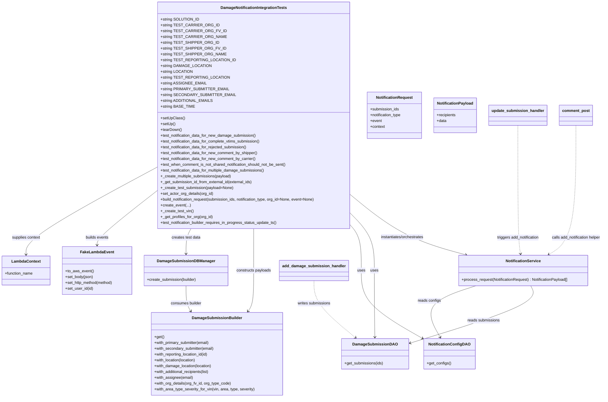
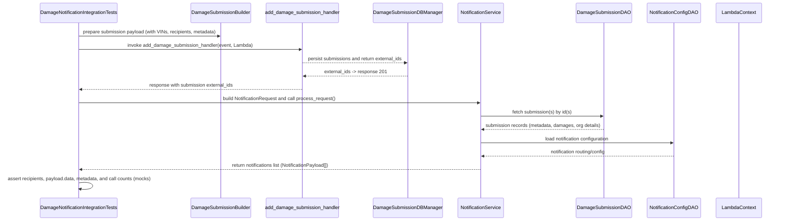

# Diagram: entity_core/entity_service/entity_service/tests/integration_tests/damage_notification_tests/test_damge_notification_service.py

> Auto-generated by Obscura crawlers

## Diagram 1

### SVG

<svg id="container" width="2477.7578125" xmlns="http://www.w3.org/2000/svg" class="classDiagram" height="1664" viewBox="0 0 2477.7578125 1664" role="graphics-document document" aria-roledescription="class"><g><defs><marker id="container_class-aggregationStart" class="marker aggregation class" refX="18" refY="7" markerWidth="190" markerHeight="240" orient="auto"><path d="M 18,7 L9,13 L1,7 L9,1 Z"></path></marker></defs><defs><marker id="container_class-aggregationEnd" class="marker aggregation class" refX="1" refY="7" markerWidth="20" markerHeight="28" orient="auto"><path d="M 18,7 L9,13 L1,7 L9,1 Z"></path></marker></defs><defs><marker id="container_class-extensionStart" class="marker extension class" refX="18" refY="7" markerWidth="190" markerHeight="240" orient="auto"><path d="M 1,7 L18,13 V 1 Z"></path></marker></defs><defs><marker id="container_class-extensionEnd" class="marker extension class" refX="1" refY="7" markerWidth="20" markerHeight="28" orient="auto"><path d="M 1,1 V 13 L18,7 Z"></path></marker></defs><defs><marker id="container_class-compositionStart" class="marker composition class" refX="18" refY="7" markerWidth="190" markerHeight="240" orient="auto"><path d="M 18,7 L9,13 L1,7 L9,1 Z"></path></marker></defs><defs><marker id="container_class-compositionEnd" class="marker composition class" refX="1" refY="7" markerWidth="20" markerHeight="28" orient="auto"><path d="M 18,7 L9,13 L1,7 L9,1 Z"></path></marker></defs><defs><marker id="container_class-dependencyStart" class="marker dependency class" refX="6" refY="7" markerWidth="190" markerHeight="240" orient="auto"><path d="M 5,7 L9,13 L1,7 L9,1 Z"></path></marker></defs><defs><marker id="container_class-dependencyEnd" class="marker dependency class" refX="13" refY="7" markerWidth="20" markerHeight="28" orient="auto"><path d="M 18,7 L9,13 L14,7 L9,1 Z"></path></marker></defs><defs><marker id="container_class-lollipopStart" class="marker lollipop class" refX="13" refY="7" markerWidth="190" markerHeight="240" orient="auto"><circle stroke="black" fill="transparent" cx="7" cy="7" r="6"></circle></marker></defs><defs><marker id="container_class-lollipopEnd" class="marker lollipop class" refX="1" refY="7" markerWidth="190" markerHeight="240" orient="auto"><circle stroke="black" fill="transparent" cx="7" cy="7" r="6"></circle></marker></defs><g class="root"><g class="clusters"></g><g class="edgePaths"><path d="M1450.086,822.233L1483.202,850.694C1516.318,879.156,1582.549,936.078,1662.969,978.424C1743.388,1020.77,1837.994,1048.54,1885.297,1062.425L1932.6,1076.31" id="id_DamageNotificationIntegrationTests_NotificationService_1" class="edge-thickness-normal edge-pattern-solid relation" style=";;;" data-edge="true" data-et="edge" data-id="id_DamageNotificationIntegrationTests_NotificationService_1" data-points="W3sieCI6MTQ1MC4wODU5Mzc1LCJ5Ijo4MjIuMjMzMzUzNjc5OTE3OX0seyJ4IjoxNjQ4Ljc4MTI1LCJ5Ijo5OTN9LHsieCI6MTkzOC4zNTczNjkwODc4MzgsInkiOjEwNzh9XQ==" marker-end="url(#container_class-dependencyEnd)"></path><path d="M1450.086,904.749L1463.906,919.458C1477.727,934.166,1505.367,963.583,1519.188,1002.958C1533.008,1042.333,1533.008,1091.667,1533.008,1139C1533.008,1186.333,1533.008,1231.667,1533.658,1277.5C1534.308,1323.334,1535.608,1369.668,1536.258,1392.835L1536.908,1416.002" id="id_DamageNotificationIntegrationTests_DamageSubmissionDAO_2" class="edge-thickness-normal edge-pattern-solid relation" style=";;;" data-edge="true" data-et="edge" data-id="id_DamageNotificationIntegrationTests_DamageSubmissionDAO_2" data-points="W3sieCI6MTQ1MC4wODU5Mzc1LCJ5Ijo5MDQuNzQ5MTQ3NjM1ODk1N30seyJ4IjoxNTMzLjAwNzgxMjUsInkiOjk5M30seyJ4IjoxNTMzLjAwNzgxMjUsInkiOjExNDF9LHsieCI6MTUzMy4wMDc4MTI1LCJ5IjoxMjc3fSx7IngiOjE1MzcuMDc2MTM0MzE0OTAzOCwieSI6MTQyMn1d" marker-end="url(#container_class-dependencyEnd)"></path><path d="M1439.004,944L1445.841,952.167C1452.677,960.333,1466.35,976.667,1473.187,1009.5C1480.023,1042.333,1480.023,1091.667,1480.023,1139C1480.023,1186.333,1480.023,1231.667,1522.643,1278.728C1565.263,1325.788,1650.502,1374.577,1693.122,1398.971L1735.742,1423.365" id="id_DamageNotificationIntegrationTests_NotificationConfigDAO_3" class="edge-thickness-normal edge-pattern-solid relation" style=";;;" data-edge="true" data-et="edge" data-id="id_DamageNotificationIntegrationTests_NotificationConfigDAO_3" data-points="W3sieCI6MTQzOS4wMDQwMDQ0NzI5MjA4LCJ5Ijo5NDR9LHsieCI6MTQ4MC4wMjM0Mzc1LCJ5Ijo5OTN9LHsieCI6MTQ4MC4wMjM0Mzc1LCJ5IjoxMTQxfSx7IngiOjE0ODAuMDIzNDM3NSwieSI6MTI3N30seyJ4IjoxNzQwLjk0OTIxODc1LCJ5IjoxNDI2LjM0NTY1ODk3Mzg5MDV9XQ==" marker-end="url(#container_class-dependencyEnd)"></path><path d="M1047.227,944L1047.227,952.167C1047.227,960.333,1047.227,976.667,1047.227,1009.5C1047.227,1042.333,1047.227,1091.667,1047.227,1139C1047.227,1186.333,1047.227,1231.667,1043.293,1259.694C1039.36,1287.721,1031.493,1298.442,1027.559,1303.802L1023.626,1309.163" id="id_DamageNotificationIntegrationTests_DamageSubmissionBuilder_4" class="edge-thickness-normal edge-pattern-solid relation" style=";;;" data-edge="true" data-et="edge" data-id="id_DamageNotificationIntegrationTests_DamageSubmissionBuilder_4" data-points="W3sieCI6MTA0Ny4yMjY1NjI1LCJ5Ijo5NDR9LHsieCI6MTA0Ny4yMjY1NjI1LCJ5Ijo5OTN9LHsieCI6MTA0Ny4yMjY1NjI1LCJ5IjoxMTQxfSx7IngiOjEwNDcuMjI2NTYyNSwieSI6MTI3N30seyJ4IjoxMDIwLjA3NjIyODIxNTE0NDMsInkiOjEzMTR9XQ==" marker-end="url(#container_class-dependencyEnd)"></path><path d="M794.546,944L790.136,952.167C785.727,960.333,776.908,976.667,772.499,998C768.09,1019.333,768.09,1045.667,768.09,1058.833L768.09,1072" id="id_DamageNotificationIntegrationTests_DamageSubmissionDBManager_5" class="edge-thickness-normal edge-pattern-solid relation" style=";;;" data-edge="true" data-et="edge" data-id="id_DamageNotificationIntegrationTests_DamageSubmissionDBManager_5" data-points="W3sieCI6Nzk0LjU0NTc0MTY1ODYwNzMsInkiOjk0NH0seyJ4Ijo3NjguMDg5ODQzNzUsInkiOjk5M30seyJ4Ijo3NjguMDg5ODQzNzUsInkiOjEwNzh9XQ==" marker-end="url(#container_class-dependencyEnd)"></path><path d="M644.367,798.574L603.898,830.978C563.428,863.383,482.49,928.191,442.02,967.762C401.551,1007.333,401.551,1021.667,401.551,1028.833L401.551,1036" id="id_DamageNotificationIntegrationTests_FakeLambdaEvent_6" class="edge-thickness-normal edge-pattern-solid relation" style=";;;" data-edge="true" data-et="edge" data-id="id_DamageNotificationIntegrationTests_FakeLambdaEvent_6" data-points="W3sieCI6NjQ0LjM2NzE4NzUsInkiOjc5OC41NzQxMTk4OTYxODQ0fSx7IngiOjQwMS41NTA3ODEyNSwieSI6OTkzfSx7IngiOjQwMS41NTA3ODEyNSwieSI6MTA0Mn1d" marker-end="url(#container_class-dependencyEnd)"></path><path d="M644.367,697.587L554.854,746.823C465.341,796.058,286.315,894.529,196.802,957.431C107.289,1020.333,107.289,1047.667,107.289,1061.333L107.289,1075" id="id_DamageNotificationIntegrationTests_LambdaContext_7" class="edge-thickness-normal edge-pattern-solid relation" style=";;;" data-edge="true" data-et="edge" data-id="id_DamageNotificationIntegrationTests_LambdaContext_7" data-points="W3sieCI6NjQ0LjM2NzE4NzUsInkiOjY5Ny41ODczODk0NTQwODYxfSx7IngiOjEwNy4yODkwNjI1LCJ5Ijo5OTN9LHsieCI6MTA3LjI4OTA2MjUsInkiOjEwODF9XQ==" marker-end="url(#container_class-dependencyEnd)"></path><path d="M2184.186,1204L2190.211,1216.167C2196.237,1228.333,2208.288,1252.667,2124.312,1292.303C2040.335,1331.94,1860.33,1386.879,1770.327,1414.349L1680.325,1441.819" id="id_NotificationService_DamageSubmissionDAO_8" class="edge-thickness-normal edge-pattern-solid relation" style=";;;" data-edge="true" data-et="edge" data-id="id_NotificationService_DamageSubmissionDAO_8" data-points="W3sieCI6MjE4NC4xODU4MDUzNzY4MzgzLCJ5IjoxMjA0fSx7IngiOjIyMjAuMzM5ODQzNzUsInkiOjEyNzd9LHsieCI6MTY3NC41ODU5Mzc1LCJ5IjoxNDQzLjU3MDAxMTk3OTYxNzR9XQ==" marker-end="url(#container_class-dependencyEnd)"></path><path d="M1955.78,1204L1917.696,1216.167C1879.611,1228.333,1803.442,1252.667,1778.366,1288.127C1753.289,1323.587,1779.304,1370.174,1792.312,1393.468L1805.32,1416.761" id="id_NotificationService_NotificationConfigDAO_9" class="edge-thickness-normal edge-pattern-solid relation" style=";;;" data-edge="true" data-et="edge" data-id="id_NotificationService_NotificationConfigDAO_9" data-points="W3sieCI6MTk1NS43ODAwNDM2NTgwODgzLCJ5IjoxMjA0fSx7IngiOjE3MjcuMjczNDM3NSwieSI6MTI3N30seyJ4IjoxODA4LjI0NTAyMzI4NzI1OTUsInkiOjE0MjJ9XQ==" marker-end="url(#container_class-dependencyEnd)"></path><path d="M768.09,1204L768.09,1216.167C768.09,1228.333,768.09,1252.667,771.321,1270.146C774.552,1287.625,781.014,1298.249,784.245,1303.561L787.476,1308.874" id="id_DamageSubmissionDBManager_DamageSubmissionBuilder_10" class="edge-thickness-normal edge-pattern-solid relation" style=";;;" data-edge="true" data-et="edge" data-id="id_DamageSubmissionDBManager_DamageSubmissionBuilder_10" data-points="W3sieCI6NzY4LjA4OTg0Mzc1LCJ5IjoxMjA0fSx7IngiOjc2OC4wODk4NDM3NSwieSI6MTI3N30seyJ4Ijo3OTAuNTkzNjM3MzE5NzExNSwieSI6MTMxNH1d" marker-end="url(#container_class-dependencyEnd)"></path><path d="M1291.664,1183L1291.664,1198.667C1291.664,1214.333,1291.664,1245.667,1319.618,1284.856C1347.571,1324.046,1403.479,1371.091,1431.432,1394.614L1459.386,1418.137" id="id_add_damage_submission_handler_DamageSubmissionDAO_11" class="edge-thickness-normal edge-pattern-dashed relation" style=";;;" data-edge="true" data-et="edge" data-id="id_add_damage_submission_handler_DamageSubmissionDAO_11" data-points="W3sieCI6MTI5MS42NjQwNjI1LCJ5IjoxMTgzfSx7IngiOjEyOTEuNjY0MDYyNSwieSI6MTI3N30seyJ4IjoxNDYzLjk3NjgyNTQyMDY3MywieSI6MTQyMn1d" marker-end="url(#container_class-dependencyEnd)"></path><path d="M2369.758,518L2369.758,597.167C2369.758,676.333,2369.758,834.667,2349.834,927.436C2329.91,1020.206,2290.062,1047.411,2270.139,1061.014L2250.215,1074.617" id="id_comment_post_NotificationService_12" class="edge-thickness-normal edge-pattern-dashed relation" style=";;;" data-edge="true" data-et="edge" data-id="id_comment_post_NotificationService_12" data-points="W3sieCI6MjM2OS43NTc4MTI1LCJ5Ijo1MTh9LHsieCI6MjM2OS43NTc4MTI1LCJ5Ijo5OTN9LHsieCI6MjI0NS4yNTk1NTQ0NzYzNTEyLCJ5IjoxMDc4fV0=" marker-end="url(#container_class-dependencyEnd)"></path><path d="M2137.328,518L2137.328,597.167C2137.328,676.333,2137.328,834.667,2138.722,927.006C2140.115,1019.344,2142.902,1045.689,2144.295,1058.861L2145.689,1072.033" id="id_update_submission_handler_NotificationService_13" class="edge-thickness-normal edge-pattern-dashed relation" style=";;;" data-edge="true" data-et="edge" data-id="id_update_submission_handler_NotificationService_13" data-points="W3sieCI6MjEzNy4zMjgxMjUsInkiOjUxOH0seyJ4IjoyMTM3LjMyODEyNSwieSI6OTkzfSx7IngiOjIxNDYuMzE5ODkwMjAyNzAyNSwieSI6MTA3OH1d" marker-end="url(#container_class-dependencyEnd)"></path></g><g class="edgeLabels"><g class="edgeLabel" transform="translate(1667.87521, 998.6047)"><g class="label" data-id="id_DamageNotificationIntegrationTests_NotificationService_1" transform="translate(-91.71875, -12)"><foreignObject width="183.4375" height="24">

instantiates/orchestrates

</foreignObject></g></g><g class="edgeLabel" transform="translate(1533.0078125, 1141)"><g class="label" data-id="id_DamageNotificationIntegrationTests_DamageSubmissionDAO_2" transform="translate(-16.4921875, -12)"><foreignObject width="32.984375" height="24">

uses

</foreignObject></g></g><g class="edgeLabel" transform="translate(1480.0234375, 1141)"><g class="label" data-id="id_DamageNotificationIntegrationTests_NotificationConfigDAO_3" transform="translate(-16.4921875, -12)"><foreignObject width="32.984375" height="24">

uses

</foreignObject></g></g><g class="edgeLabel" transform="translate(1047.2265625, 1141)"><g class="label" data-id="id_DamageNotificationIntegrationTests_DamageSubmissionBuilder_4" transform="translate(-72.5703125, -12)"><foreignObject width="145.140625" height="24">

constructs payloads

</foreignObject></g></g><g class="edgeLabel" transform="translate(768.08984375, 993)"><g class="label" data-id="id_DamageNotificationIntegrationTests_DamageSubmissionDBManager_5" transform="translate(-60.484375, -12)"><foreignObject width="120.96875" height="24">

creates test data

</foreignObject></g></g><g class="edgeLabel" transform="translate(401.55078125, 993)"><g class="label" data-id="id_DamageNotificationIntegrationTests_FakeLambdaEvent_6" transform="translate(-48.515625, -12)"><foreignObject width="97.03125" height="24">

builds events

</foreignObject></g></g><g class="edgeLabel" transform="translate(107.2890625, 993)"><g class="label" data-id="id_DamageNotificationIntegrationTests_LambdaContext_7" transform="translate(-59.5625, -12)"><foreignObject width="119.125" height="24">

supplies context

</foreignObject></g></g><g class="edgeLabel" transform="translate(1986.41996, 1348.39488)"><g class="label" data-id="id_NotificationService_DamageSubmissionDAO_8" transform="translate(-67.125, -12)"><foreignObject width="134.25" height="24">

reads submissions

</foreignObject></g></g><g class="edgeLabel" transform="translate(1762.42685, 1265.76969)"><g class="label" data-id="id_NotificationService_NotificationConfigDAO_9" transform="translate(-47.5859375, -12)"><foreignObject width="95.171875" height="24">

reads configs

</foreignObject></g></g><g class="edgeLabel" transform="translate(768.08984375, 1277)"><g class="label" data-id="id_DamageSubmissionDBManager_DamageSubmissionBuilder_10" transform="translate(-64.6953125, -12)"><foreignObject width="129.390625" height="24">

consumes builder

</foreignObject></g></g><g class="edgeLabel" transform="translate(1291.6640625, 1277)"><g class="label" data-id="id_add_damage_submission_handler_DamageSubmissionDAO_11" transform="translate(-69.0703125, -12)"><foreignObject width="138.140625" height="24">

writes submissions

</foreignObject></g></g><g class="edgeLabel" transform="translate(2369.7578125, 993)"><g class="label" data-id="id_comment_post_NotificationService_12" transform="translate(-100, -24)"><foreignObject width="200" height="48">

calls add_notification helper

</foreignObject></g></g><g class="edgeLabel" transform="translate(2137.328125, 993)"><g class="label" data-id="id_update_submission_handler_NotificationService_13" transform="translate(-89.3984375, -12)"><foreignObject width="178.796875" height="24">

triggers add_notification

</foreignObject></g></g></g><g class="nodes"><g class="node default" id="classId-DamageNotificationIntegrationTests-0" transform="translate(1047.2265625, 476)"><g class="basic label-container"><path d="M-402.859375 -468 L402.859375 -468 L402.859375 468 L-402.859375 468" stroke="none" stroke-width="0" fill="#ECECFF" style=""></path><path d="M-402.859375 -468 C-221.61052460592705 -468, -40.36167421185411 -468, 402.859375 -468 M-402.859375 -468 C-171.14676806406231 -468, 60.56583887187537 -468, 402.859375 -468 M402.859375 -468 C402.859375 -203.00719547071117, 402.859375 61.985609058577666, 402.859375 468 M402.859375 -468 C402.859375 -101.95753247941349, 402.859375 264.084935041173, 402.859375 468 M402.859375 468 C213.75300365639723 468, 24.646632312794452 468, -402.859375 468 M402.859375 468 C109.9446421487437 468, -182.9700907025126 468, -402.859375 468 M-402.859375 468 C-402.859375 154.1418893548527, -402.859375 -159.71622129029458, -402.859375 -468 M-402.859375 468 C-402.859375 231.8025886478334, -402.859375 -4.394822704333194, -402.859375 -468" stroke="#9370DB" stroke-width="1.3" fill="none" stroke-dasharray="0 0" style=""></path></g><g class="annotation-group text" transform="translate(0, -444)"></g><g class="label-group text" transform="translate(-131.890625, -444)"><g class="label" style="font-weight: bolder" transform="translate(0,-12)"><foreignObject width="263.78125" height="24">

DamageNotificationIntegrationTests

</foreignObject></g></g><g class="members-group text" transform="translate(-390.859375, -396)"><g class="label" style="" transform="translate(0,-12)"><foreignObject width="150.15625" height="24">

+string SOLUTION_ID

</foreignObject></g><g class="label" style="" transform="translate(0,12)"><foreignObject width="216.234375" height="24">

+string TEST_CARRIER_ORG_ID

</foreignObject></g><g class="label" style="" transform="translate(0,36)"><foreignObject width="240.5" height="24">

+string TEST_CARRIER_ORG_FV_ID

</foreignObject></g><g class="label" style="" transform="translate(0,60)"><foreignObject width="242.3125" height="24">

+string TEST_CARRIER_ORG_NAME

</foreignObject></g><g class="label" style="" transform="translate(0,84)"><foreignObject width="217.25" height="24">

+string TEST_SHIPPER_ORG_ID

</foreignObject></g><g class="label" style="" transform="translate(0,108)"><foreignObject width="241.53125" height="24">

+string TEST_SHIPPER_ORG_FV_ID

</foreignObject></g><g class="label" style="" transform="translate(0,132)"><foreignObject width="243.34375" height="24">

+string TEST_SHIPPER_ORG_NAME

</foreignObject></g><g class="label" style="" transform="translate(0,156)"><foreignObject width="278.984375" height="24">

+string TEST_REPORTING_LOCATION_ID

</foreignObject></g><g class="label" style="" transform="translate(0,180)"><foreignObject width="192.25" height="24">

+string DAMAGE_LOCATION

</foreignObject></g><g class="label" style="" transform="translate(0,204)"><foreignObject width="124.5" height="24">

+string LOCATION

</foreignObject></g><g class="label" style="" transform="translate(0,228)"><foreignObject width="255.640625" height="24">

+string TEST_REPORTING_LOCATION

</foreignObject></g><g class="label" style="" transform="translate(0,252)"><foreignObject width="174.328125" height="24">

+string ASSIGNEE_EMAIL

</foreignObject></g><g class="label" style="" transform="translate(0,276)"><foreignObject width="256.140625" height="24">

+string PRIMARY_SUBMITTER_EMAIL

</foreignObject></g><g class="label" style="" transform="translate(0,300)"><foreignObject width="277.859375" height="24">

+string SECONDARY_SUBMITTER_EMAIL

</foreignObject></g><g class="label" style="" transform="translate(0,324)"><foreignObject width="200.15625" height="24">

+string ADDITIONAL_EMAILS

</foreignObject></g><g class="label" style="" transform="translate(0,348)"><foreignObject width="131.484375" height="24">

+string BASE_TIME

</foreignObject></g></g><g class="methods-group text" transform="translate(-390.859375, 12)"><g class="label" style="" transform="translate(0,-12)"><foreignObject width="97.15625" height="24">

+setUpClass()

</foreignObject></g><g class="label" style="" transform="translate(0,12)"><foreignObject width="60.421875" height="24">

+setUp()

</foreignObject></g><g class="label" style="" transform="translate(0,36)"><foreignObject width="87.75" height="24">

+tearDown()

</foreignObject></g><g class="label" style="" transform="translate(0,60)"><foreignObject width="399" height="24">

+test_notification_data_for_new_damage_submission()

</foreignObject></g><g class="label" style="" transform="translate(0,84)"><foreignObject width="418.453125" height="24">

+test_notification_data_for_complete_vtims_submission()

</foreignObject></g><g class="label" style="" transform="translate(0,108)"><foreignObject width="363.84375" height="24">

+test_notification_data_for_rejected_submission()

</foreignObject></g><g class="label" style="" transform="translate(0,132)"><foreignObject width="407.859375" height="24">

+test_notification_data_for_new_comment_by_shipper()

</foreignObject></g><g class="label" style="" transform="translate(0,156)"><foreignObject width="400.234375" height="24">

+test_notification_data_for_new_comment_by_carrier()

</foreignObject></g><g class="label" style="" transform="translate(0,180)"><foreignObject width="527.78125" height="24">

+test_when_comment_is_not_shared_notification_should_not_be_sent()

</foreignObject></g><g class="label" style="" transform="translate(0,204)"><foreignObject width="437.734375" height="24">

+test_notification_data_for_multiple_damage_submissions()

</foreignObject></g><g class="label" style="" transform="translate(0,228)"><foreignObject width="294.515625" height="24">

+_create_multiple_submissions(payload)

</foreignObject></g><g class="label" style="" transform="translate(0,252)"><foreignObject width="382.484375" height="24">

+_get_submission_id_from_external_id(external_ids)

</foreignObject></g><g class="label" style="" transform="translate(0,276)"><foreignObject width="300.09375" height="24">

+_create_test_submission(payload=None)

</foreignObject></g><g class="label" style="" transform="translate(0,300)"><foreignObject width="219.515625" height="24">

+set_actor_org_details(org_id)

</foreignObject></g><g class="label" style="" transform="translate(0,324)"><foreignObject width="649.828125" height="24">

+build_notification_request(submission_ids, notification_type, org_id=None, event=None)

</foreignObject></g><g class="label" style="" transform="translate(0,348)"><foreignObject width="122.765625" height="24">

+create_event(...)

</foreignObject></g><g class="label" style="" transform="translate(0,372)"><foreignObject width="134.734375" height="24">

+_create_test_vin()

</foreignObject></g><g class="label" style="" transform="translate(0,396)"><foreignObject width="215.75" height="24">

+_get_profiles_for_org(org_id)

</foreignObject></g><g class="label" style="" transform="translate(0,420)"><foreignObject width="489.59375" height="24">

+test_notification_builder_requires_in_progress_status_update_ts()

</foreignObject></g></g><g class="divider" style=""><path d="M-402.859375 -420 C-222.10478906310024 -420, -41.35020312620048 -420, 402.859375 -420 M-402.859375 -420 C-122.43191012630228 -420, 157.99555474739543 -420, 402.859375 -420" stroke="#9370DB" stroke-width="1.3" fill="none" stroke-dasharray="0 0" style=""></path></g><g class="divider" style=""><path d="M-402.859375 -12 C-109.60582475984853 -12, 183.64772548030294 -12, 402.859375 -12 M-402.859375 -12 C-103.21997270228121 -12, 196.41942959543758 -12, 402.859375 -12" stroke="#9370DB" stroke-width="1.3" fill="none" stroke-dasharray="0 0" style=""></path></g></g><g class="node default" id="classId-NotificationService-1" transform="translate(2152.984375, 1141)"><g class="basic label-container"><path d="M-269.453125 -63 L269.453125 -63 L269.453125 63 L-269.453125 63" stroke="none" stroke-width="0" fill="#ECECFF" style=""></path><path d="M-269.453125 -63 C-111.50115220739394 -63, 46.450820585212114 -63, 269.453125 -63 M-269.453125 -63 C-63.16971206225489 -63, 143.11370087549022 -63, 269.453125 -63 M269.453125 -63 C269.453125 -24.598994702405655, 269.453125 13.80201059518869, 269.453125 63 M269.453125 -63 C269.453125 -22.540715977882464, 269.453125 17.918568044235073, 269.453125 63 M269.453125 63 C114.37904809100795 63, -40.69502881798411 63, -269.453125 63 M269.453125 63 C54.79176726786747 63, -159.86959046426506 63, -269.453125 63 M-269.453125 63 C-269.453125 13.231270833602792, -269.453125 -36.537458332794415, -269.453125 -63 M-269.453125 63 C-269.453125 35.65760099971114, -269.453125 8.315201999422285, -269.453125 -63" stroke="#9370DB" stroke-width="1.3" fill="none" stroke-dasharray="0 0" style=""></path></g><g class="annotation-group text" transform="translate(0, -39)"></g><g class="label-group text" transform="translate(-69.53125, -39)"><g class="label" style="font-weight: bolder" transform="translate(0,-12)"><foreignObject width="139.0625" height="24">

NotificationService

</foreignObject></g></g><g class="members-group text" transform="translate(-257.453125, 9)"></g><g class="methods-group text" transform="translate(-257.453125, 39)"><g class="label" style="" transform="translate(0,-12)"><foreignObject width="445.375" height="24">

+process_request(NotificationRequest) : NotificationPayload[]

</foreignObject></g></g><g class="divider" style=""><path d="M-269.453125 -15 C-61.435222352232756 -15, 146.5826802955345 -15, 269.453125 -15 M-269.453125 -15 C-99.1420508214114 -15, 71.1690233571772 -15, 269.453125 -15" stroke="#9370DB" stroke-width="1.3" fill="none" stroke-dasharray="0 0" style=""></path></g><g class="divider" style=""><path d="M-269.453125 9 C-137.55851025900037 9, -5.663895518000743 9, 269.453125 9 M-269.453125 9 C-108.0919900733887 9, 53.2691448532226 9, 269.453125 9" stroke="#9370DB" stroke-width="1.3" fill="none" stroke-dasharray="0 0" style=""></path></g></g><g class="node default" id="classId-NotificationRequest-2" transform="translate(1631.7109375, 476)"><g class="basic label-container"><path d="M-114.0234375 -96 L114.0234375 -96 L114.0234375 96 L-114.0234375 96" stroke="none" stroke-width="0" fill="#ECECFF" style=""></path><path d="M-114.0234375 -96 C-54.73065062076567 -96, 4.562136258468655 -96, 114.0234375 -96 M-114.0234375 -96 C-45.03940838917639 -96, 23.944620721647226 -96, 114.0234375 -96 M114.0234375 -96 C114.0234375 -53.254148398636715, 114.0234375 -10.508296797273431, 114.0234375 96 M114.0234375 -96 C114.0234375 -53.34954022853214, 114.0234375 -10.699080457064284, 114.0234375 96 M114.0234375 96 C46.46128633094595 96, -21.100864838108095 96, -114.0234375 96 M114.0234375 96 C64.32006319164516 96, 14.616688883290323 96, -114.0234375 96 M-114.0234375 96 C-114.0234375 23.883052715426132, -114.0234375 -48.233894569147736, -114.0234375 -96 M-114.0234375 96 C-114.0234375 23.995670223561646, -114.0234375 -48.00865955287671, -114.0234375 -96" stroke="#9370DB" stroke-width="1.3" fill="none" stroke-dasharray="0 0" style=""></path></g><g class="annotation-group text" transform="translate(0, -72)"></g><g class="label-group text" transform="translate(-72.859375, -72)"><g class="label" style="font-weight: bolder" transform="translate(0,-12)"><foreignObject width="145.71875" height="24">

NotificationRequest

</foreignObject></g></g><g class="members-group text" transform="translate(-102.0234375, -24)"><g class="label" style="" transform="translate(0,-12)"><foreignObject width="120.390625" height="24">

+submission_ids

</foreignObject></g><g class="label" style="" transform="translate(0,12)"><foreignObject width="131.1875" height="24">

+notification_type

</foreignObject></g><g class="label" style="" transform="translate(0,36)"><foreignObject width="48.328125" height="24">

+event

</foreignObject></g><g class="label" style="" transform="translate(0,60)"><foreignObject width="61.6875" height="24">

+context

</foreignObject></g></g><g class="methods-group text" transform="translate(-102.0234375, 96)"></g><g class="divider" style=""><path d="M-114.0234375 -48 C-25.211515984298657 -48, 63.600405531402686 -48, 114.0234375 -48 M-114.0234375 -48 C-45.424336390578944 -48, 23.174764718842113 -48, 114.0234375 -48" stroke="#9370DB" stroke-width="1.3" fill="none" stroke-dasharray="0 0" style=""></path></g><g class="divider" style=""><path d="M-114.0234375 72 C-38.74706030900218 72, 36.52931688199564 72, 114.0234375 72 M-114.0234375 72 C-27.983703706054 72, 58.056030087892 72, 114.0234375 72" stroke="#9370DB" stroke-width="1.3" fill="none" stroke-dasharray="0 0" style=""></path></g></g><g class="node default" id="classId-NotificationPayload-3" transform="translate(1883.58984375, 476)"><g class="basic label-container"><path d="M-87.85546875 -72 L87.85546875 -72 L87.85546875 72 L-87.85546875 72" stroke="none" stroke-width="0" fill="#ECECFF" style=""></path><path d="M-87.85546875 -72 C-47.18923843280028 -72, -6.523008115600561 -72, 87.85546875 -72 M-87.85546875 -72 C-51.984289859723766 -72, -16.113110969447533 -72, 87.85546875 -72 M87.85546875 -72 C87.85546875 -22.577402111380778, 87.85546875 26.845195777238445, 87.85546875 72 M87.85546875 -72 C87.85546875 -22.372193799324606, 87.85546875 27.25561240135079, 87.85546875 72 M87.85546875 72 C31.845992339896874 72, -24.163484070206252 72, -87.85546875 72 M87.85546875 72 C36.30536573836226 72, -15.244737273275476 72, -87.85546875 72 M-87.85546875 72 C-87.85546875 40.712798204258974, -87.85546875 9.425596408517947, -87.85546875 -72 M-87.85546875 72 C-87.85546875 23.446467900360325, -87.85546875 -25.10706419927935, -87.85546875 -72" stroke="#9370DB" stroke-width="1.3" fill="none" stroke-dasharray="0 0" style=""></path></g><g class="annotation-group text" transform="translate(0, -48)"></g><g class="label-group text" transform="translate(-71.7890625, -48)"><g class="label" style="font-weight: bolder" transform="translate(0,-12)"><foreignObject width="143.578125" height="24">

NotificationPayload

</foreignObject></g></g><g class="members-group text" transform="translate(-75.85546875, 0)"><g class="label" style="" transform="translate(0,-12)"><foreignObject width="79.921875" height="24">

+recipients

</foreignObject></g><g class="label" style="" transform="translate(0,12)"><foreignObject width="40.625" height="24">

+data

</foreignObject></g></g><g class="methods-group text" transform="translate(-75.85546875, 72)"></g><g class="divider" style=""><path d="M-87.85546875 -24 C-29.479830665160797 -24, 28.895807419678405 -24, 87.85546875 -24 M-87.85546875 -24 C-48.842434364092455 -24, -9.82939997818491 -24, 87.85546875 -24" stroke="#9370DB" stroke-width="1.3" fill="none" stroke-dasharray="0 0" style=""></path></g><g class="divider" style=""><path d="M-87.85546875 48 C-45.13092810259561 48, -2.406387455191222 48, 87.85546875 48 M-87.85546875 48 C-48.28019054493294 48, -8.704912339865885 48, 87.85546875 48" stroke="#9370DB" stroke-width="1.3" fill="none" stroke-dasharray="0 0" style=""></path></g></g><g class="node default" id="classId-NotificationConfigDAO-4" transform="translate(1843.42578125, 1485)"><g class="basic label-container"><path d="M-102.4765625 -63 L102.4765625 -63 L102.4765625 63 L-102.4765625 63" stroke="none" stroke-width="0" fill="#ECECFF" style=""></path><path d="M-102.4765625 -63 C-54.07350141002697 -63, -5.670440320053942 -63, 102.4765625 -63 M-102.4765625 -63 C-43.35418694053348 -63, 15.768188618933038 -63, 102.4765625 -63 M102.4765625 -63 C102.4765625 -29.1678134238228, 102.4765625 4.6643731523544005, 102.4765625 63 M102.4765625 -63 C102.4765625 -30.27834453038973, 102.4765625 2.443310939220538, 102.4765625 63 M102.4765625 63 C49.43896370738344 63, -3.598635085233127 63, -102.4765625 63 M102.4765625 63 C35.01870526056119 63, -32.43915197887762 63, -102.4765625 63 M-102.4765625 63 C-102.4765625 36.05559081918332, -102.4765625 9.111181638366645, -102.4765625 -63 M-102.4765625 63 C-102.4765625 22.879126314550717, -102.4765625 -17.241747370898565, -102.4765625 -63" stroke="#9370DB" stroke-width="1.3" fill="none" stroke-dasharray="0 0" style=""></path></g><g class="annotation-group text" transform="translate(0, -39)"></g><g class="label-group text" transform="translate(-81.109375, -39)"><g class="label" style="font-weight: bolder" transform="translate(0,-12)"><foreignObject width="162.21875" height="24">

NotificationConfigDAO

</foreignObject></g></g><g class="members-group text" transform="translate(-90.4765625, 9)"></g><g class="methods-group text" transform="translate(-90.4765625, 39)"><g class="label" style="" transform="translate(0,-12)"><foreignObject width="99.84375" height="24">

+get_configs()

</foreignObject></g></g><g class="divider" style=""><path d="M-102.4765625 -15 C-58.59176730960925 -15, -14.706972119218506 -15, 102.4765625 -15 M-102.4765625 -15 C-45.33690621124859 -15, 11.802750077502822 -15, 102.4765625 -15" stroke="#9370DB" stroke-width="1.3" fill="none" stroke-dasharray="0 0" style=""></path></g><g class="divider" style=""><path d="M-102.4765625 9 C-24.791228977484636 9, 52.89410454503073 9, 102.4765625 9 M-102.4765625 9 C-30.561164970400654 9, 41.35423255919869 9, 102.4765625 9" stroke="#9370DB" stroke-width="1.3" fill="none" stroke-dasharray="0 0" style=""></path></g></g><g class="node default" id="classId-DamageSubmissionDAO-5" transform="translate(1538.84375, 1485)"><g class="basic label-container"><path d="M-135.7421875 -63 L135.7421875 -63 L135.7421875 63 L-135.7421875 63" stroke="none" stroke-width="0" fill="#ECECFF" style=""></path><path d="M-135.7421875 -63 C-44.73848398546649 -63, 46.265219529067025 -63, 135.7421875 -63 M-135.7421875 -63 C-43.063170395518284 -63, 49.61584670896343 -63, 135.7421875 -63 M135.7421875 -63 C135.7421875 -24.903996337496153, 135.7421875 13.192007325007694, 135.7421875 63 M135.7421875 -63 C135.7421875 -28.849727993291296, 135.7421875 5.300544013417408, 135.7421875 63 M135.7421875 63 C48.97853211919889 63, -37.78512326160222 63, -135.7421875 63 M135.7421875 63 C80.44690797197343 63, 25.151628443946862 63, -135.7421875 63 M-135.7421875 63 C-135.7421875 30.625894833587957, -135.7421875 -1.7482103328240868, -135.7421875 -63 M-135.7421875 63 C-135.7421875 30.95855138411612, -135.7421875 -1.0828972317677596, -135.7421875 -63" stroke="#9370DB" stroke-width="1.3" fill="none" stroke-dasharray="0 0" style=""></path></g><g class="annotation-group text" transform="translate(0, -39)"></g><g class="label-group text" transform="translate(-86.6875, -39)"><g class="label" style="font-weight: bolder" transform="translate(0,-12)"><foreignObject width="173.375" height="24">

DamageSubmissionDAO

</foreignObject></g></g><g class="members-group text" transform="translate(-123.7421875, 9)"></g><g class="methods-group text" transform="translate(-123.7421875, 39)"><g class="label" style="" transform="translate(0,-12)"><foreignObject width="160.796875" height="24">

+get_submissions(ids)

</foreignObject></g></g><g class="divider" style=""><path d="M-135.7421875 -15 C-63.16142252146719 -15, 9.419342457065625 -15, 135.7421875 -15 M-135.7421875 -15 C-53.33784452078193 -15, 29.066498458436143 -15, 135.7421875 -15" stroke="#9370DB" stroke-width="1.3" fill="none" stroke-dasharray="0 0" style=""></path></g><g class="divider" style=""><path d="M-135.7421875 9 C-66.62969321942562 9, 2.4828010611487628 9, 135.7421875 9 M-135.7421875 9 C-64.28405228889704 9, 7.174082922205912 9, 135.7421875 9" stroke="#9370DB" stroke-width="1.3" fill="none" stroke-dasharray="0 0" style=""></path></g></g><g class="node default" id="classId-DamageSubmissionBuilder-6" transform="translate(894.59765625, 1485)"><g class="basic label-container"><path d="M-269.26953125 -171 L269.26953125 -171 L269.26953125 171 L-269.26953125 171" stroke="none" stroke-width="0" fill="#ECECFF" style=""></path><path d="M-269.26953125 -171 C-147.0984322232743 -171, -24.92733319654863 -171, 269.26953125 -171 M-269.26953125 -171 C-81.4280094770179 -171, 106.41351229596421 -171, 269.26953125 -171 M269.26953125 -171 C269.26953125 -84.24263995133778, 269.26953125 2.5147200973244423, 269.26953125 171 M269.26953125 -171 C269.26953125 -88.38073583589865, 269.26953125 -5.761471671797295, 269.26953125 171 M269.26953125 171 C123.31543133856056 171, -22.638668572878885 171, -269.26953125 171 M269.26953125 171 C117.00564391007936 171, -35.258243429841286 171, -269.26953125 171 M-269.26953125 171 C-269.26953125 94.1427031484414, -269.26953125 17.285406296882798, -269.26953125 -171 M-269.26953125 171 C-269.26953125 68.66455922034724, -269.26953125 -33.67088155930551, -269.26953125 -171" stroke="#9370DB" stroke-width="1.3" fill="none" stroke-dasharray="0 0" style=""></path></g><g class="annotation-group text" transform="translate(0, -147)"></g><g class="label-group text" transform="translate(-97.9140625, -147)"><g class="label" style="font-weight: bolder" transform="translate(0,-12)"><foreignObject width="195.828125" height="24">

DamageSubmissionBuilder

</foreignObject></g></g><g class="members-group text" transform="translate(-257.26953125, -99)"></g><g class="methods-group text" transform="translate(-257.26953125, -69)"><g class="label" style="" transform="translate(0,-12)"><foreignObject width="40.921875" height="24">

+get()

</foreignObject></g><g class="label" style="" transform="translate(0,12)"><foreignObject width="233.375" height="24">

+with_primary_submitter(email)

</foreignObject></g><g class="label" style="" transform="translate(0,36)"><foreignObject width="251.265625" height="24">

+with_secondary_submitter(email)

</foreignObject></g><g class="label" style="" transform="translate(0,60)"><foreignObject width="229.09375" height="24">

+with_reporting_location_id(id)

</foreignObject></g><g class="label" style="" transform="translate(0,84)"><foreignObject width="175.953125" height="24">

+with_location(location)

</foreignObject></g><g class="label" style="" transform="translate(0,108)"><foreignObject width="240.953125" height="24">

+with_damage_location(location)

</foreignObject></g><g class="label" style="" transform="translate(0,132)"><foreignObject width="234.796875" height="24">

+with_additional_recipients(list)

</foreignObject></g><g class="label" style="" transform="translate(0,156)"><foreignObject width="160.8125" height="24">

+with_assignee(email)

</foreignObject></g><g class="label" style="" transform="translate(0,180)"><foreignObject width="319.484375" height="24">

+with_org_details(org_fv_id, org_type_code)

</foreignObject></g><g class="label" style="" transform="translate(0,204)"><foreignObject width="416.625" height="24">

+with_area_type_severity_for_vin(vin, area, type, severity)

</foreignObject></g></g><g class="divider" style=""><path d="M-269.26953125 -123 C-94.2966643594551 -123, 80.67620253108981 -123, 269.26953125 -123 M-269.26953125 -123 C-93.85332351209098 -123, 81.56288422581804 -123, 269.26953125 -123" stroke="#9370DB" stroke-width="1.3" fill="none" stroke-dasharray="0 0" style=""></path></g><g class="divider" style=""><path d="M-269.26953125 -99 C-83.75725656027834 -99, 101.75501812944333 -99, 269.26953125 -99 M-269.26953125 -99 C-87.35366344287812 -99, 94.56220436424377 -99, 269.26953125 -99" stroke="#9370DB" stroke-width="1.3" fill="none" stroke-dasharray="0 0" style=""></path></g></g><g class="node default" id="classId-DamageSubmissionDBManager-7" transform="translate(768.08984375, 1141)"><g class="basic label-container"><path d="M-171.56640625 -63 L171.56640625 -63 L171.56640625 63 L-171.56640625 63" stroke="none" stroke-width="0" fill="#ECECFF" style=""></path><path d="M-171.56640625 -63 C-36.26966200346175 -63, 99.0270822430765 -63, 171.56640625 -63 M-171.56640625 -63 C-77.08118218033896 -63, 17.404041889322087 -63, 171.56640625 -63 M171.56640625 -63 C171.56640625 -22.477966157625858, 171.56640625 18.044067684748285, 171.56640625 63 M171.56640625 -63 C171.56640625 -28.32607873043969, 171.56640625 6.34784253912062, 171.56640625 63 M171.56640625 63 C86.81240584665619 63, 2.058405443312381 63, -171.56640625 63 M171.56640625 63 C72.95726391814125 63, -25.651878413717498 63, -171.56640625 63 M-171.56640625 63 C-171.56640625 30.94731220004021, -171.56640625 -1.105375599919583, -171.56640625 -63 M-171.56640625 63 C-171.56640625 20.698756014154007, -171.56640625 -21.602487971691986, -171.56640625 -63" stroke="#9370DB" stroke-width="1.3" fill="none" stroke-dasharray="0 0" style=""></path></g><g class="annotation-group text" transform="translate(0, -39)"></g><g class="label-group text" transform="translate(-112.9765625, -39)"><g class="label" style="font-weight: bolder" transform="translate(0,-12)"><foreignObject width="225.953125" height="24">

DamageSubmissionDBManager

</foreignObject></g></g><g class="members-group text" transform="translate(-159.56640625, 9)"></g><g class="methods-group text" transform="translate(-159.56640625, 39)"><g class="label" style="" transform="translate(0,-12)"><foreignObject width="206.15625" height="24">

+create_submission(builder)

</foreignObject></g></g><g class="divider" style=""><path d="M-171.56640625 -15 C-51.83037045383179 -15, 67.90566534233642 -15, 171.56640625 -15 M-171.56640625 -15 C-54.751239242483265 -15, 62.06392776503347 -15, 171.56640625 -15" stroke="#9370DB" stroke-width="1.3" fill="none" stroke-dasharray="0 0" style=""></path></g><g class="divider" style=""><path d="M-171.56640625 9 C-62.43737168574552 9, 46.691662878508964 9, 171.56640625 9 M-171.56640625 9 C-38.99343286813553 9, 93.57954051372894 9, 171.56640625 9" stroke="#9370DB" stroke-width="1.3" fill="none" stroke-dasharray="0 0" style=""></path></g></g><g class="node default" id="classId-LambdaContext-8" transform="translate(107.2890625, 1141)"><g class="basic label-container"><path d="M-99.2890625 -60 L99.2890625 -60 L99.2890625 60 L-99.2890625 60" stroke="none" stroke-width="0" fill="#ECECFF" style=""></path><path d="M-99.2890625 -60 C-37.35926368612986 -60, 24.570535127740285 -60, 99.2890625 -60 M-99.2890625 -60 C-33.54055557798557 -60, 32.20795134402886 -60, 99.2890625 -60 M99.2890625 -60 C99.2890625 -20.660259806673764, 99.2890625 18.67948038665247, 99.2890625 60 M99.2890625 -60 C99.2890625 -35.74416162548826, 99.2890625 -11.48832325097652, 99.2890625 60 M99.2890625 60 C43.227057134462186 60, -12.834948231075629 60, -99.2890625 60 M99.2890625 60 C49.799253947225644 60, 0.3094453944512878 60, -99.2890625 60 M-99.2890625 60 C-99.2890625 17.643719332637772, -99.2890625 -24.712561334724455, -99.2890625 -60 M-99.2890625 60 C-99.2890625 21.92747580458949, -99.2890625 -16.145048390821017, -99.2890625 -60" stroke="#9370DB" stroke-width="1.3" fill="none" stroke-dasharray="0 0" style=""></path></g><g class="annotation-group text" transform="translate(0, -36)"></g><g class="label-group text" transform="translate(-57.296875, -36)"><g class="label" style="font-weight: bolder" transform="translate(0,-12)"><foreignObject width="114.59375" height="24">

LambdaContext

</foreignObject></g></g><g class="members-group text" transform="translate(-87.2890625, 12)"><g class="label" style="" transform="translate(0,-12)"><foreignObject width="117.28125" height="24">

+function_name

</foreignObject></g></g><g class="methods-group text" transform="translate(-87.2890625, 60)"></g><g class="divider" style=""><path d="M-99.2890625 -12 C-35.47470460591383 -12, 28.339653288172343 -12, 99.2890625 -12 M-99.2890625 -12 C-36.89183439647412 -12, 25.505393707051766 -12, 99.2890625 -12" stroke="#9370DB" stroke-width="1.3" fill="none" stroke-dasharray="0 0" style=""></path></g><g class="divider" style=""><path d="M-99.2890625 36 C-37.28169546872094 36, 24.72567156255812 36, 99.2890625 36 M-99.2890625 36 C-44.33853617604241 36, 10.61199014791518 36, 99.2890625 36" stroke="#9370DB" stroke-width="1.3" fill="none" stroke-dasharray="0 0" style=""></path></g></g><g class="node default" id="classId-FakeLambdaEvent-9" transform="translate(401.55078125, 1141)"><g class="basic label-container"><path d="M-144.97265625 -99 L144.97265625 -99 L144.97265625 99 L-144.97265625 99" stroke="none" stroke-width="0" fill="#ECECFF" style=""></path><path d="M-144.97265625 -99 C-65.18034220518726 -99, 14.611971839625483 -99, 144.97265625 -99 M-144.97265625 -99 C-47.39999897437944 -99, 50.172658301241114 -99, 144.97265625 -99 M144.97265625 -99 C144.97265625 -20.102378952441597, 144.97265625 58.795242095116805, 144.97265625 99 M144.97265625 -99 C144.97265625 -48.85375531531216, 144.97265625 1.292489369375673, 144.97265625 99 M144.97265625 99 C80.55154946030173 99, 16.130442670603458 99, -144.97265625 99 M144.97265625 99 C80.19900678199443 99, 15.425357313988854 99, -144.97265625 99 M-144.97265625 99 C-144.97265625 41.804674817149376, -144.97265625 -15.390650365701248, -144.97265625 -99 M-144.97265625 99 C-144.97265625 46.48794684791208, -144.97265625 -6.024106304175845, -144.97265625 -99" stroke="#9370DB" stroke-width="1.3" fill="none" stroke-dasharray="0 0" style=""></path></g><g class="annotation-group text" transform="translate(0, -75)"></g><g class="label-group text" transform="translate(-65.8671875, -75)"><g class="label" style="font-weight: bolder" transform="translate(0,-12)"><foreignObject width="131.734375" height="24">

FakeLambdaEvent

</foreignObject></g></g><g class="members-group text" transform="translate(-132.97265625, -27)"></g><g class="methods-group text" transform="translate(-132.97265625, 3)"><g class="label" style="" transform="translate(0,-12)"><foreignObject width="116.421875" height="24">

+to_aws_event()

</foreignObject></g><g class="label" style="" transform="translate(0,12)"><foreignObject width="116.1875" height="24">

+set_body(json)

</foreignObject></g><g class="label" style="" transform="translate(0,36)"><foreignObject width="200.078125" height="24">

+set_http_method(method)

</foreignObject></g><g class="label" style="" transform="translate(0,60)"><foreignObject width="115.203125" height="24">

+set_user_id(id)

</foreignObject></g></g><g class="divider" style=""><path d="M-144.97265625 -51 C-74.60352308362677 -51, -4.234389917253537 -51, 144.97265625 -51 M-144.97265625 -51 C-78.99429578360038 -51, -13.015935317200757 -51, 144.97265625 -51" stroke="#9370DB" stroke-width="1.3" fill="none" stroke-dasharray="0 0" style=""></path></g><g class="divider" style=""><path d="M-144.97265625 -27 C-72.8086778827412 -27, -0.6446995154823867 -27, 144.97265625 -27 M-144.97265625 -27 C-81.8950046324279 -27, -18.817353014855797 -27, 144.97265625 -27" stroke="#9370DB" stroke-width="1.3" fill="none" stroke-dasharray="0 0" style=""></path></g></g><g class="node default" id="classId-add_damage_submission_handler-10" transform="translate(1291.6640625, 1141)"><g class="basic label-container"><path d="M-136.8671875 -42 L136.8671875 -42 L136.8671875 42 L-136.8671875 42" stroke="none" stroke-width="0" fill="#ECECFF" style=""></path><path d="M-136.8671875 -42 C-57.55187985345546 -42, 21.76342779308908 -42, 136.8671875 -42 M-136.8671875 -42 C-32.67645171726504 -42, 71.51428406546992 -42, 136.8671875 -42 M136.8671875 -42 C136.8671875 -15.121152308309302, 136.8671875 11.757695383381396, 136.8671875 42 M136.8671875 -42 C136.8671875 -20.915790109107412, 136.8671875 0.16841978178517536, 136.8671875 42 M136.8671875 42 C29.085052883210153 42, -78.6970817335797 42, -136.8671875 42 M136.8671875 42 C33.20074919148492 42, -70.46568911703017 42, -136.8671875 42 M-136.8671875 42 C-136.8671875 18.6170763641576, -136.8671875 -4.765847271684798, -136.8671875 -42 M-136.8671875 42 C-136.8671875 8.461526712682854, -136.8671875 -25.07694657463429, -136.8671875 -42" stroke="#9370DB" stroke-width="1.3" fill="none" stroke-dasharray="0 0" style=""></path></g><g class="annotation-group text" transform="translate(0, -18)"></g><g class="label-group text" transform="translate(-124.8671875, -18)"><g class="label" style="font-weight: bolder" transform="translate(0,-12)"><foreignObject width="249.734375" height="24">

add_damage_submission_handler

</foreignObject></g></g><g class="members-group text" transform="translate(-124.8671875, 30)"></g><g class="methods-group text" transform="translate(-124.8671875, 60)"></g><g class="divider" style=""><path d="M-136.8671875 6 C-46.535981266244534 6, 43.79522496751093 6, 136.8671875 6 M-136.8671875 6 C-61.80855050095275 6, 13.250086498094504 6, 136.8671875 6" stroke="#9370DB" stroke-width="1.3" fill="none" stroke-dasharray="0 0" style=""></path></g><g class="divider" style=""><path d="M-136.8671875 24 C-31.769859975593803 24, 73.3274675488124 24, 136.8671875 24 M-136.8671875 24 C-72.5919173533163 24, -8.31664720663261 24, 136.8671875 24" stroke="#9370DB" stroke-width="1.3" fill="none" stroke-dasharray="0 0" style=""></path></g></g><g class="node default" id="classId-comment_post-11" transform="translate(2369.7578125, 476)"><g class="basic label-container"><path d="M-66.546875 -42 L66.546875 -42 L66.546875 42 L-66.546875 42" stroke="none" stroke-width="0" fill="#ECECFF" style=""></path><path d="M-66.546875 -42 C-30.93486275103175 -42, 4.677149497936497 -42, 66.546875 -42 M-66.546875 -42 C-39.363731557128034 -42, -12.180588114256068 -42, 66.546875 -42 M66.546875 -42 C66.546875 -13.470879593508386, 66.546875 15.058240812983229, 66.546875 42 M66.546875 -42 C66.546875 -14.015045964423692, 66.546875 13.969908071152616, 66.546875 42 M66.546875 42 C37.08854580989035 42, 7.63021661978069 42, -66.546875 42 M66.546875 42 C34.72342709226554 42, 2.8999791845310767 42, -66.546875 42 M-66.546875 42 C-66.546875 20.077639979126353, -66.546875 -1.8447200417472942, -66.546875 -42 M-66.546875 42 C-66.546875 20.56035949201045, -66.546875 -0.8792810159791031, -66.546875 -42" stroke="#9370DB" stroke-width="1.3" fill="none" stroke-dasharray="0 0" style=""></path></g><g class="annotation-group text" transform="translate(0, -18)"></g><g class="label-group text" transform="translate(-54.546875, -18)"><g class="label" style="font-weight: bolder" transform="translate(0,-12)"><foreignObject width="109.09375" height="24">

comment_post

</foreignObject></g></g><g class="members-group text" transform="translate(-54.546875, 30)"></g><g class="methods-group text" transform="translate(-54.546875, 60)"></g><g class="divider" style=""><path d="M-66.546875 6 C-17.90869384279693 6, 30.729487314406143 6, 66.546875 6 M-66.546875 6 C-32.28498690593176 6, 1.9769011881364804 6, 66.546875 6" stroke="#9370DB" stroke-width="1.3" fill="none" stroke-dasharray="0 0" style=""></path></g><g class="divider" style=""><path d="M-66.546875 24 C-27.67755015848484 24, 11.191774683030317 24, 66.546875 24 M-66.546875 24 C-38.93453300456426 24, -11.322191009128517 24, 66.546875 24" stroke="#9370DB" stroke-width="1.3" fill="none" stroke-dasharray="0 0" style=""></path></g></g><g class="node default" id="classId-update_submission_handler-12" transform="translate(2137.328125, 476)"><g class="basic label-container"><path d="M-115.8828125 -42 L115.8828125 -42 L115.8828125 42 L-115.8828125 42" stroke="none" stroke-width="0" fill="#ECECFF" style=""></path><path d="M-115.8828125 -42 C-36.46926635350418 -42, 42.94427979299164 -42, 115.8828125 -42 M-115.8828125 -42 C-68.82106449330513 -42, -21.75931648661026 -42, 115.8828125 -42 M115.8828125 -42 C115.8828125 -21.024361868996856, 115.8828125 -0.048723737993711325, 115.8828125 42 M115.8828125 -42 C115.8828125 -12.580935308156338, 115.8828125 16.838129383687324, 115.8828125 42 M115.8828125 42 C48.30596622776146 42, -19.27088004447708 42, -115.8828125 42 M115.8828125 42 C63.85867485158863 42, 11.834537203177263 42, -115.8828125 42 M-115.8828125 42 C-115.8828125 11.102875655736689, -115.8828125 -19.794248688526622, -115.8828125 -42 M-115.8828125 42 C-115.8828125 14.12976949346228, -115.8828125 -13.74046101307544, -115.8828125 -42" stroke="#9370DB" stroke-width="1.3" fill="none" stroke-dasharray="0 0" style=""></path></g><g class="annotation-group text" transform="translate(0, -18)"></g><g class="label-group text" transform="translate(-103.8828125, -18)"><g class="label" style="font-weight: bolder" transform="translate(0,-12)"><foreignObject width="207.765625" height="24">

update_submission_handler

</foreignObject></g></g><g class="members-group text" transform="translate(-103.8828125, 30)"></g><g class="methods-group text" transform="translate(-103.8828125, 60)"></g><g class="divider" style=""><path d="M-115.8828125 6 C-35.28653127040914 6, 45.309749959181715 6, 115.8828125 6 M-115.8828125 6 C-68.92403724838599 6, -21.965261996771957 6, 115.8828125 6" stroke="#9370DB" stroke-width="1.3" fill="none" stroke-dasharray="0 0" style=""></path></g><g class="divider" style=""><path d="M-115.8828125 24 C-49.8891371436232 24, 16.104538212753596 24, 115.8828125 24 M-115.8828125 24 C-47.42300049653667 24, 21.036811506926654 24, 115.8828125 24" stroke="#9370DB" stroke-width="1.3" fill="none" stroke-dasharray="0 0" style=""></path></g></g></g></g></g></svg>

## Diagram 2

### SVG

<svg id="container" width="2763.5" xmlns="http://www.w3.org/2000/svg" height="777" viewBox="-148.5 -10 2763.5 777" role="graphics-document document" aria-roledescription="sequence"><g><rect x="2415" y="691" fill="#eaeaea" stroke="#666" width="150" height="65" name="Lambda" rx="3" ry="3" class="actor actor-bottom"></rect><text x="2490" y="723.5" dominant-baseline="central" alignment-baseline="central" class="actor actor-box" style="text-anchor: middle; font-size: 16px; font-weight: 400;"><tspan x="2490" dy="0">LambdaContext</tspan></text></g><g><rect x="2185" y="691" fill="#eaeaea" stroke="#666" width="180" height="65" name="ConfigDAO" rx="3" ry="3" class="actor actor-bottom"></rect><text x="2275" y="723.5" dominant-baseline="central" alignment-baseline="central" class="actor actor-box" style="text-anchor: middle; font-size: 16px; font-weight: 400;"><tspan x="2275" dy="0">NotificationConfigDAO</tspan></text></g><g><rect x="1943" y="691" fill="#eaeaea" stroke="#666" width="192" height="65" name="SubmissionDAO" rx="3" ry="3" class="actor actor-bottom"></rect><text x="2039" y="723.5" dominant-baseline="central" alignment-baseline="central" class="actor actor-box" style="text-anchor: middle; font-size: 16px; font-weight: 400;"><tspan x="2039" dy="0">DamageSubmissionDAO</tspan></text></g><g><rect x="1507.5" y="691" fill="#eaeaea" stroke="#666" width="157" height="65" name="Orchestrator" rx="3" ry="3" class="actor actor-bottom"></rect><text x="1586" y="723.5" dominant-baseline="central" alignment-baseline="central" class="actor actor-box" style="text-anchor: middle; font-size: 16px; font-weight: 400;"><tspan x="1586" dy="0">NotificationService</tspan></text></g><g><rect x="1212.5" y="691" fill="#eaeaea" stroke="#666" width="245" height="65" name="DBManager" rx="3" ry="3" class="actor actor-bottom"></rect><text x="1335" y="723.5" dominant-baseline="central" alignment-baseline="central" class="actor actor-box" style="text-anchor: middle; font-size: 16px; font-weight: 400;"><tspan x="1335" dy="0">DamageSubmissionDBManager</tspan></text></g><g><rect x="812.5" y="691" fill="#eaeaea" stroke="#666" width="269" height="65" name="Handler" rx="3" ry="3" class="actor actor-bottom"></rect><text x="947" y="723.5" dominant-baseline="central" alignment-baseline="central" class="actor actor-box" style="text-anchor: middle; font-size: 16px; font-weight: 400;"><tspan x="947" dy="0">add_damage_submission_handler</tspan></text></g><g><rect x="547.5" y="691" fill="#eaeaea" stroke="#666" width="215" height="65" name="Builder" rx="3" ry="3" class="actor actor-bottom"></rect><text x="655" y="723.5" dominant-baseline="central" alignment-baseline="central" class="actor actor-box" style="text-anchor: middle; font-size: 16px; font-weight: 400;"><tspan x="655" dy="0">DamageSubmissionBuilder</tspan></text></g><g><rect x="0" y="691" fill="#eaeaea" stroke="#666" width="280" height="65" name="Test" rx="3" ry="3" class="actor actor-bottom"></rect><text x="140" y="723.5" dominant-baseline="central" alignment-baseline="central" class="actor actor-box" style="text-anchor: middle; font-size: 16px; font-weight: 400;"><tspan x="140" dy="0">DamageNotificationIntegrationTests</tspan></text></g><g><line id="actor7" x1="2490" y1="65" x2="2490" y2="691" class="actor-line 200" stroke-width="0.5px" stroke="#999" name="Lambda"></line><g id="root-7"><rect x="2415" y="0" fill="#eaeaea" stroke="#666" width="150" height="65" name="Lambda" rx="3" ry="3" class="actor actor-top"></rect><text x="2490" y="32.5" dominant-baseline="central" alignment-baseline="central" class="actor actor-box" style="text-anchor: middle; font-size: 16px; font-weight: 400;"><tspan x="2490" dy="0">LambdaContext</tspan></text></g></g><g><line id="actor6" x1="2275" y1="65" x2="2275" y2="691" class="actor-line 200" stroke-width="0.5px" stroke="#999" name="ConfigDAO"></line><g id="root-6"><rect x="2185" y="0" fill="#eaeaea" stroke="#666" width="180" height="65" name="ConfigDAO" rx="3" ry="3" class="actor actor-top"></rect><text x="2275" y="32.5" dominant-baseline="central" alignment-baseline="central" class="actor actor-box" style="text-anchor: middle; font-size: 16px; font-weight: 400;"><tspan x="2275" dy="0">NotificationConfigDAO</tspan></text></g></g><g><line id="actor5" x1="2039" y1="65" x2="2039" y2="691" class="actor-line 200" stroke-width="0.5px" stroke="#999" name="SubmissionDAO"></line><g id="root-5"><rect x="1943" y="0" fill="#eaeaea" stroke="#666" width="192" height="65" name="SubmissionDAO" rx="3" ry="3" class="actor actor-top"></rect><text x="2039" y="32.5" dominant-baseline="central" alignment-baseline="central" class="actor actor-box" style="text-anchor: middle; font-size: 16px; font-weight: 400;"><tspan x="2039" dy="0">DamageSubmissionDAO</tspan></text></g></g><g><line id="actor4" x1="1586" y1="65" x2="1586" y2="691" class="actor-line 200" stroke-width="0.5px" stroke="#999" name="Orchestrator"></line><g id="root-4"><rect x="1507.5" y="0" fill="#eaeaea" stroke="#666" width="157" height="65" name="Orchestrator" rx="3" ry="3" class="actor actor-top"></rect><text x="1586" y="32.5" dominant-baseline="central" alignment-baseline="central" class="actor actor-box" style="text-anchor: middle; font-size: 16px; font-weight: 400;"><tspan x="1586" dy="0">NotificationService</tspan></text></g></g><g><line id="actor3" x1="1335" y1="65" x2="1335" y2="691" class="actor-line 200" stroke-width="0.5px" stroke="#999" name="DBManager"></line><g id="root-3"><rect x="1212.5" y="0" fill="#eaeaea" stroke="#666" width="245" height="65" name="DBManager" rx="3" ry="3" class="actor actor-top"></rect><text x="1335" y="32.5" dominant-baseline="central" alignment-baseline="central" class="actor actor-box" style="text-anchor: middle; font-size: 16px; font-weight: 400;"><tspan x="1335" dy="0">DamageSubmissionDBManager</tspan></text></g></g><g><line id="actor2" x1="947" y1="65" x2="947" y2="691" class="actor-line 200" stroke-width="0.5px" stroke="#999" name="Handler"></line><g id="root-2"><rect x="812.5" y="0" fill="#eaeaea" stroke="#666" width="269" height="65" name="Handler" rx="3" ry="3" class="actor actor-top"></rect><text x="947" y="32.5" dominant-baseline="central" alignment-baseline="central" class="actor actor-box" style="text-anchor: middle; font-size: 16px; font-weight: 400;"><tspan x="947" dy="0">add_damage_submission_handler</tspan></text></g></g><g><line id="actor1" x1="655" y1="65" x2="655" y2="691" class="actor-line 200" stroke-width="0.5px" stroke="#999" name="Builder"></line><g id="root-1"><rect x="547.5" y="0" fill="#eaeaea" stroke="#666" width="215" height="65" name="Builder" rx="3" ry="3" class="actor actor-top"></rect><text x="655" y="32.5" dominant-baseline="central" alignment-baseline="central" class="actor actor-box" style="text-anchor: middle; font-size: 16px; font-weight: 400;"><tspan x="655" dy="0">DamageSubmissionBuilder</tspan></text></g></g><g><line id="actor0" x1="140" y1="65" x2="140" y2="691" class="actor-line 200" stroke-width="0.5px" stroke="#999" name="Test"></line><g id="root-0"><rect x="0" y="0" fill="#eaeaea" stroke="#666" width="280" height="65" name="Test" rx="3" ry="3" class="actor actor-top"></rect><text x="140" y="32.5" dominant-baseline="central" alignment-baseline="central" class="actor actor-box" style="text-anchor: middle; font-size: 16px; font-weight: 400;"><tspan x="140" dy="0">DamageNotificationIntegrationTests</tspan></text></g></g><g></g><defs><symbol id="computer" width="24" height="24"><path transform="scale(.5)" d="M2 2v13h20v-13h-20zm18 11h-16v-9h16v9zm-10.228 6l.466-1h3.524l.467 1h-4.457zm14.228 3h-24l2-6h2.104l-1.33 4h18.45l-1.297-4h2.073l2 6zm-5-10h-14v-7h14v7z"></path></symbol></defs><defs><symbol id="database" fill-rule="evenodd" clip-rule="evenodd"><path transform="scale(.5)" d="M12.258.001l.256.004.255.005.253.008.251.01.249.012.247.015.246.016.242.019.241.02.239.023.236.024.233.027.231.028.229.031.225.032.223.034.22.036.217.038.214.04.211.041.208.043.205.045.201.046.198.048.194.05.191.051.187.053.183.054.18.056.175.057.172.059.168.06.163.061.16.063.155.064.15.066.074.033.073.033.071.034.07.034.069.035.068.035.067.035.066.035.064.036.064.036.062.036.06.036.06.037.058.037.058.037.055.038.055.038.053.038.052.038.051.039.05.039.048.039.047.039.045.04.044.04.043.04.041.04.04.041.039.041.037.041.036.041.034.041.033.042.032.042.03.042.029.042.027.042.026.043.024.043.023.043.021.043.02.043.018.044.017.043.015.044.013.044.012.044.011.045.009.044.007.045.006.045.004.045.002.045.001.045v17l-.001.045-.002.045-.004.045-.006.045-.007.045-.009.044-.011.045-.012.044-.013.044-.015.044-.017.043-.018.044-.02.043-.021.043-.023.043-.024.043-.026.043-.027.042-.029.042-.03.042-.032.042-.033.042-.034.041-.036.041-.037.041-.039.041-.04.041-.041.04-.043.04-.044.04-.045.04-.047.039-.048.039-.05.039-.051.039-.052.038-.053.038-.055.038-.055.038-.058.037-.058.037-.06.037-.06.036-.062.036-.064.036-.064.036-.066.035-.067.035-.068.035-.069.035-.07.034-.071.034-.073.033-.074.033-.15.066-.155.064-.16.063-.163.061-.168.06-.172.059-.175.057-.18.056-.183.054-.187.053-.191.051-.194.05-.198.048-.201.046-.205.045-.208.043-.211.041-.214.04-.217.038-.22.036-.223.034-.225.032-.229.031-.231.028-.233.027-.236.024-.239.023-.241.02-.242.019-.246.016-.247.015-.249.012-.251.01-.253.008-.255.005-.256.004-.258.001-.258-.001-.256-.004-.255-.005-.253-.008-.251-.01-.249-.012-.247-.015-.245-.016-.243-.019-.241-.02-.238-.023-.236-.024-.234-.027-.231-.028-.228-.031-.226-.032-.223-.034-.22-.036-.217-.038-.214-.04-.211-.041-.208-.043-.204-.045-.201-.046-.198-.048-.195-.05-.19-.051-.187-.053-.184-.054-.179-.056-.176-.057-.172-.059-.167-.06-.164-.061-.159-.063-.155-.064-.151-.066-.074-.033-.072-.033-.072-.034-.07-.034-.069-.035-.068-.035-.067-.035-.066-.035-.064-.036-.063-.036-.062-.036-.061-.036-.06-.037-.058-.037-.057-.037-.056-.038-.055-.038-.053-.038-.052-.038-.051-.039-.049-.039-.049-.039-.046-.039-.046-.04-.044-.04-.043-.04-.041-.04-.04-.041-.039-.041-.037-.041-.036-.041-.034-.041-.033-.042-.032-.042-.03-.042-.029-.042-.027-.042-.026-.043-.024-.043-.023-.043-.021-.043-.02-.043-.018-.044-.017-.043-.015-.044-.013-.044-.012-.044-.011-.045-.009-.044-.007-.045-.006-.045-.004-.045-.002-.045-.001-.045v-17l.001-.045.002-.045.004-.045.006-.045.007-.045.009-.044.011-.045.012-.044.013-.044.015-.044.017-.043.018-.044.02-.043.021-.043.023-.043.024-.043.026-.043.027-.042.029-.042.03-.042.032-.042.033-.042.034-.041.036-.041.037-.041.039-.041.04-.041.041-.04.043-.04.044-.04.046-.04.046-.039.049-.039.049-.039.051-.039.052-.038.053-.038.055-.038.056-.038.057-.037.058-.037.06-.037.061-.036.062-.036.063-.036.064-.036.066-.035.067-.035.068-.035.069-.035.07-.034.072-.034.072-.033.074-.033.151-.066.155-.064.159-.063.164-.061.167-.06.172-.059.176-.057.179-.056.184-.054.187-.053.19-.051.195-.05.198-.048.201-.046.204-.045.208-.043.211-.041.214-.04.217-.038.22-.036.223-.034.226-.032.228-.031.231-.028.234-.027.236-.024.238-.023.241-.02.243-.019.245-.016.247-.015.249-.012.251-.01.253-.008.255-.005.256-.004.258-.001.258.001zm-9.258 20.499v.01l.001.021.003.021.004.022.005.021.006.022.007.022.009.023.01.022.011.023.012.023.013.023.015.023.016.024.017.023.018.024.019.024.021.024.022.025.023.024.024.025.052.049.056.05.061.051.066.051.07.051.075.051.079.052.084.052.088.052.092.052.097.052.102.051.105.052.11.052.114.051.119.051.123.051.127.05.131.05.135.05.139.048.144.049.147.047.152.047.155.047.16.045.163.045.167.043.171.043.176.041.178.041.183.039.187.039.19.037.194.035.197.035.202.033.204.031.209.03.212.029.216.027.219.025.222.024.226.021.23.02.233.018.236.016.24.015.243.012.246.01.249.008.253.005.256.004.259.001.26-.001.257-.004.254-.005.25-.008.247-.011.244-.012.241-.014.237-.016.233-.018.231-.021.226-.021.224-.024.22-.026.216-.027.212-.028.21-.031.205-.031.202-.034.198-.034.194-.036.191-.037.187-.039.183-.04.179-.04.175-.042.172-.043.168-.044.163-.045.16-.046.155-.046.152-.047.148-.048.143-.049.139-.049.136-.05.131-.05.126-.05.123-.051.118-.052.114-.051.11-.052.106-.052.101-.052.096-.052.092-.052.088-.053.083-.051.079-.052.074-.052.07-.051.065-.051.06-.051.056-.05.051-.05.023-.024.023-.025.021-.024.02-.024.019-.024.018-.024.017-.024.015-.023.014-.024.013-.023.012-.023.01-.023.01-.022.008-.022.006-.022.006-.022.004-.022.004-.021.001-.021.001-.021v-4.127l-.077.055-.08.053-.083.054-.085.053-.087.052-.09.052-.093.051-.095.05-.097.05-.1.049-.102.049-.105.048-.106.047-.109.047-.111.046-.114.045-.115.045-.118.044-.12.043-.122.042-.124.042-.126.041-.128.04-.13.04-.132.038-.134.038-.135.037-.138.037-.139.035-.142.035-.143.034-.144.033-.147.032-.148.031-.15.03-.151.03-.153.029-.154.027-.156.027-.158.026-.159.025-.161.024-.162.023-.163.022-.165.021-.166.02-.167.019-.169.018-.169.017-.171.016-.173.015-.173.014-.175.013-.175.012-.177.011-.178.01-.179.008-.179.008-.181.006-.182.005-.182.004-.184.003-.184.002h-.37l-.184-.002-.184-.003-.182-.004-.182-.005-.181-.006-.179-.008-.179-.008-.178-.01-.176-.011-.176-.012-.175-.013-.173-.014-.172-.015-.171-.016-.17-.017-.169-.018-.167-.019-.166-.02-.165-.021-.163-.022-.162-.023-.161-.024-.159-.025-.157-.026-.156-.027-.155-.027-.153-.029-.151-.03-.15-.03-.148-.031-.146-.032-.145-.033-.143-.034-.141-.035-.14-.035-.137-.037-.136-.037-.134-.038-.132-.038-.13-.04-.128-.04-.126-.041-.124-.042-.122-.042-.12-.044-.117-.043-.116-.045-.113-.045-.112-.046-.109-.047-.106-.047-.105-.048-.102-.049-.1-.049-.097-.05-.095-.05-.093-.052-.09-.051-.087-.052-.085-.053-.083-.054-.08-.054-.077-.054v4.127zm0-5.654v.011l.001.021.003.021.004.021.005.022.006.022.007.022.009.022.01.022.011.023.012.023.013.023.015.024.016.023.017.024.018.024.019.024.021.024.022.024.023.025.024.024.052.05.056.05.061.05.066.051.07.051.075.052.079.051.084.052.088.052.092.052.097.052.102.052.105.052.11.051.114.051.119.052.123.05.127.051.131.05.135.049.139.049.144.048.147.048.152.047.155.046.16.045.163.045.167.044.171.042.176.042.178.04.183.04.187.038.19.037.194.036.197.034.202.033.204.032.209.03.212.028.216.027.219.025.222.024.226.022.23.02.233.018.236.016.24.014.243.012.246.01.249.008.253.006.256.003.259.001.26-.001.257-.003.254-.006.25-.008.247-.01.244-.012.241-.015.237-.016.233-.018.231-.02.226-.022.224-.024.22-.025.216-.027.212-.029.21-.03.205-.032.202-.033.198-.035.194-.036.191-.037.187-.039.183-.039.179-.041.175-.042.172-.043.168-.044.163-.045.16-.045.155-.047.152-.047.148-.048.143-.048.139-.05.136-.049.131-.05.126-.051.123-.051.118-.051.114-.052.11-.052.106-.052.101-.052.096-.052.092-.052.088-.052.083-.052.079-.052.074-.051.07-.052.065-.051.06-.05.056-.051.051-.049.023-.025.023-.024.021-.025.02-.024.019-.024.018-.024.017-.024.015-.023.014-.023.013-.024.012-.022.01-.023.01-.023.008-.022.006-.022.006-.022.004-.021.004-.022.001-.021.001-.021v-4.139l-.077.054-.08.054-.083.054-.085.052-.087.053-.09.051-.093.051-.095.051-.097.05-.1.049-.102.049-.105.048-.106.047-.109.047-.111.046-.114.045-.115.044-.118.044-.12.044-.122.042-.124.042-.126.041-.128.04-.13.039-.132.039-.134.038-.135.037-.138.036-.139.036-.142.035-.143.033-.144.033-.147.033-.148.031-.15.03-.151.03-.153.028-.154.028-.156.027-.158.026-.159.025-.161.024-.162.023-.163.022-.165.021-.166.02-.167.019-.169.018-.169.017-.171.016-.173.015-.173.014-.175.013-.175.012-.177.011-.178.009-.179.009-.179.007-.181.007-.182.005-.182.004-.184.003-.184.002h-.37l-.184-.002-.184-.003-.182-.004-.182-.005-.181-.007-.179-.007-.179-.009-.178-.009-.176-.011-.176-.012-.175-.013-.173-.014-.172-.015-.171-.016-.17-.017-.169-.018-.167-.019-.166-.02-.165-.021-.163-.022-.162-.023-.161-.024-.159-.025-.157-.026-.156-.027-.155-.028-.153-.028-.151-.03-.15-.03-.148-.031-.146-.033-.145-.033-.143-.033-.141-.035-.14-.036-.137-.036-.136-.037-.134-.038-.132-.039-.13-.039-.128-.04-.126-.041-.124-.042-.122-.043-.12-.043-.117-.044-.116-.044-.113-.046-.112-.046-.109-.046-.106-.047-.105-.048-.102-.049-.1-.049-.097-.05-.095-.051-.093-.051-.09-.051-.087-.053-.085-.052-.083-.054-.08-.054-.077-.054v4.139zm0-5.666v.011l.001.02.003.022.004.021.005.022.006.021.007.022.009.023.01.022.011.023.012.023.013.023.015.023.016.024.017.024.018.023.019.024.021.025.022.024.023.024.024.025.052.05.056.05.061.05.066.051.07.051.075.052.079.051.084.052.088.052.092.052.097.052.102.052.105.051.11.052.114.051.119.051.123.051.127.05.131.05.135.05.139.049.144.048.147.048.152.047.155.046.16.045.163.045.167.043.171.043.176.042.178.04.183.04.187.038.19.037.194.036.197.034.202.033.204.032.209.03.212.028.216.027.219.025.222.024.226.021.23.02.233.018.236.017.24.014.243.012.246.01.249.008.253.006.256.003.259.001.26-.001.257-.003.254-.006.25-.008.247-.01.244-.013.241-.014.237-.016.233-.018.231-.02.226-.022.224-.024.22-.025.216-.027.212-.029.21-.03.205-.032.202-.033.198-.035.194-.036.191-.037.187-.039.183-.039.179-.041.175-.042.172-.043.168-.044.163-.045.16-.045.155-.047.152-.047.148-.048.143-.049.139-.049.136-.049.131-.051.126-.05.123-.051.118-.052.114-.051.11-.052.106-.052.101-.052.096-.052.092-.052.088-.052.083-.052.079-.052.074-.052.07-.051.065-.051.06-.051.056-.05.051-.049.023-.025.023-.025.021-.024.02-.024.019-.024.018-.024.017-.024.015-.023.014-.024.013-.023.012-.023.01-.022.01-.023.008-.022.006-.022.006-.022.004-.022.004-.021.001-.021.001-.021v-4.153l-.077.054-.08.054-.083.053-.085.053-.087.053-.09.051-.093.051-.095.051-.097.05-.1.049-.102.048-.105.048-.106.048-.109.046-.111.046-.114.046-.115.044-.118.044-.12.043-.122.043-.124.042-.126.041-.128.04-.13.039-.132.039-.134.038-.135.037-.138.036-.139.036-.142.034-.143.034-.144.033-.147.032-.148.032-.15.03-.151.03-.153.028-.154.028-.156.027-.158.026-.159.024-.161.024-.162.023-.163.023-.165.021-.166.02-.167.019-.169.018-.169.017-.171.016-.173.015-.173.014-.175.013-.175.012-.177.01-.178.01-.179.009-.179.007-.181.006-.182.006-.182.004-.184.003-.184.001-.185.001-.185-.001-.184-.001-.184-.003-.182-.004-.182-.006-.181-.006-.179-.007-.179-.009-.178-.01-.176-.01-.176-.012-.175-.013-.173-.014-.172-.015-.171-.016-.17-.017-.169-.018-.167-.019-.166-.02-.165-.021-.163-.023-.162-.023-.161-.024-.159-.024-.157-.026-.156-.027-.155-.028-.153-.028-.151-.03-.15-.03-.148-.032-.146-.032-.145-.033-.143-.034-.141-.034-.14-.036-.137-.036-.136-.037-.134-.038-.132-.039-.13-.039-.128-.041-.126-.041-.124-.041-.122-.043-.12-.043-.117-.044-.116-.044-.113-.046-.112-.046-.109-.046-.106-.048-.105-.048-.102-.048-.1-.05-.097-.049-.095-.051-.093-.051-.09-.052-.087-.052-.085-.053-.083-.053-.08-.054-.077-.054v4.153zm8.74-8.179l-.257.004-.254.005-.25.008-.247.011-.244.012-.241.014-.237.016-.233.018-.231.021-.226.022-.224.023-.22.026-.216.027-.212.028-.21.031-.205.032-.202.033-.198.034-.194.036-.191.038-.187.038-.183.04-.179.041-.175.042-.172.043-.168.043-.163.045-.16.046-.155.046-.152.048-.148.048-.143.048-.139.049-.136.05-.131.05-.126.051-.123.051-.118.051-.114.052-.11.052-.106.052-.101.052-.096.052-.092.052-.088.052-.083.052-.079.052-.074.051-.07.052-.065.051-.06.05-.056.05-.051.05-.023.025-.023.024-.021.024-.02.025-.019.024-.018.024-.017.023-.015.024-.014.023-.013.023-.012.023-.01.023-.01.022-.008.022-.006.023-.006.021-.004.022-.004.021-.001.021-.001.021.001.021.001.021.004.021.004.022.006.021.006.023.008.022.01.022.01.023.012.023.013.023.014.023.015.024.017.023.018.024.019.024.02.025.021.024.023.024.023.025.051.05.056.05.06.05.065.051.07.052.074.051.079.052.083.052.088.052.092.052.096.052.101.052.106.052.11.052.114.052.118.051.123.051.126.051.131.05.136.05.139.049.143.048.148.048.152.048.155.046.16.046.163.045.168.043.172.043.175.042.179.041.183.04.187.038.191.038.194.036.198.034.202.033.205.032.21.031.212.028.216.027.22.026.224.023.226.022.231.021.233.018.237.016.241.014.244.012.247.011.25.008.254.005.257.004.26.001.26-.001.257-.004.254-.005.25-.008.247-.011.244-.012.241-.014.237-.016.233-.018.231-.021.226-.022.224-.023.22-.026.216-.027.212-.028.21-.031.205-.032.202-.033.198-.034.194-.036.191-.038.187-.038.183-.04.179-.041.175-.042.172-.043.168-.043.163-.045.16-.046.155-.046.152-.048.148-.048.143-.048.139-.049.136-.05.131-.05.126-.051.123-.051.118-.051.114-.052.11-.052.106-.052.101-.052.096-.052.092-.052.088-.052.083-.052.079-.052.074-.051.07-.052.065-.051.06-.05.056-.05.051-.05.023-.025.023-.024.021-.024.02-.025.019-.024.018-.024.017-.023.015-.024.014-.023.013-.023.012-.023.01-.023.01-.022.008-.022.006-.023.006-.021.004-.022.004-.021.001-.021.001-.021-.001-.021-.001-.021-.004-.021-.004-.022-.006-.021-.006-.023-.008-.022-.01-.022-.01-.023-.012-.023-.013-.023-.014-.023-.015-.024-.017-.023-.018-.024-.019-.024-.02-.025-.021-.024-.023-.024-.023-.025-.051-.05-.056-.05-.06-.05-.065-.051-.07-.052-.074-.051-.079-.052-.083-.052-.088-.052-.092-.052-.096-.052-.101-.052-.106-.052-.11-.052-.114-.052-.118-.051-.123-.051-.126-.051-.131-.05-.136-.05-.139-.049-.143-.048-.148-.048-.152-.048-.155-.046-.16-.046-.163-.045-.168-.043-.172-.043-.175-.042-.179-.041-.183-.04-.187-.038-.191-.038-.194-.036-.198-.034-.202-.033-.205-.032-.21-.031-.212-.028-.216-.027-.22-.026-.224-.023-.226-.022-.231-.021-.233-.018-.237-.016-.241-.014-.244-.012-.247-.011-.25-.008-.254-.005-.257-.004-.26-.001-.26.001z"></path></symbol></defs><defs><symbol id="clock" width="24" height="24"><path transform="scale(.5)" d="M12 2c5.514 0 10 4.486 10 10s-4.486 10-10 10-10-4.486-10-10 4.486-10 10-10zm0-2c-6.627 0-12 5.373-12 12s5.373 12 12 12 12-5.373 12-12-5.373-12-12-12zm5.848 12.459c.202.038.202.333.001.372-1.907.361-6.045 1.111-6.547 1.111-.719 0-1.301-.582-1.301-1.301 0-.512.77-5.447 1.125-7.445.034-.192.312-.181.343.014l.985 6.238 5.394 1.011z"></path></symbol></defs><defs><marker id="arrowhead" refX="7.9" refY="5" markerUnits="userSpaceOnUse" markerWidth="12" markerHeight="12" orient="auto-start-reverse"><path d="M -1 0 L 10 5 L 0 10 z"></path></marker></defs><defs><marker id="crosshead" markerWidth="15" markerHeight="8" orient="auto" refX="4" refY="4.5"><path fill="none" stroke="#000000" stroke-width="1pt" d="M 1,2 L 6,7 M 6,2 L 1,7" style="stroke-dasharray: 0, 0;"></path></marker></defs><defs><marker id="filled-head" refX="15.5" refY="7" markerWidth="20" markerHeight="28" orient="auto"><path d="M 18,7 L9,13 L14,7 L9,1 Z"></path></marker></defs><defs><marker id="sequencenumber" refX="15" refY="15" markerWidth="60" markerHeight="40" orient="auto"><circle cx="15" cy="15" r="6"></circle></marker></defs><text x="396" y="80" text-anchor="middle" dominant-baseline="middle" alignment-baseline="middle" class="messageText" dy="1em" style="font-size: 16px; font-weight: 400;">prepare submission payload (with VINs, recipients, metadata)</text><line x1="141" y1="113" x2="651" y2="113" class="messageLine0" stroke-width="2" stroke="none" marker-end="url(#arrowhead)" style="fill: none;"></line><text x="542" y="128" text-anchor="middle" dominant-baseline="middle" alignment-baseline="middle" class="messageText" dy="1em" style="font-size: 16px; font-weight: 400;">invoke add_damage_submission_handler(event, Lambda)</text><line x1="141" y1="161" x2="943" y2="161" class="messageLine0" stroke-width="2" stroke="none" marker-end="url(#arrowhead)" style="fill: none;"></line><text x="1140" y="176" text-anchor="middle" dominant-baseline="middle" alignment-baseline="middle" class="messageText" dy="1em" style="font-size: 16px; font-weight: 400;">persist submissions and return external_ids</text><line x1="948" y1="209" x2="1331" y2="209" class="messageLine1" stroke-width="2" stroke="none" marker-end="url(#arrowhead)" style="stroke-dasharray: 3, 3; fill: none;"></line><text x="1143" y="224" text-anchor="middle" dominant-baseline="middle" alignment-baseline="middle" class="messageText" dy="1em" style="font-size: 16px; font-weight: 400;">external_ids -&gt; response 201</text><line x1="1334" y1="257" x2="951" y2="257" class="messageLine1" stroke-width="2" stroke="none" marker-end="url(#arrowhead)" style="stroke-dasharray: 3, 3; fill: none;"></line><text x="545" y="272" text-anchor="middle" dominant-baseline="middle" alignment-baseline="middle" class="messageText" dy="1em" style="font-size: 16px; font-weight: 400;">response with submission external_ids</text><line x1="946" y1="305" x2="144" y2="305" class="messageLine1" stroke-width="2" stroke="none" marker-end="url(#arrowhead)" style="stroke-dasharray: 3, 3; fill: none;"></line><text x="862" y="320" text-anchor="middle" dominant-baseline="middle" alignment-baseline="middle" class="messageText" dy="1em" style="font-size: 16px; font-weight: 400;">build NotificationRequest and call process_request()</text><line x1="141" y1="353" x2="1582" y2="353" class="messageLine0" stroke-width="2" stroke="none" marker-end="url(#arrowhead)" style="fill: none;"></line><text x="1811" y="368" text-anchor="middle" dominant-baseline="middle" alignment-baseline="middle" class="messageText" dy="1em" style="font-size: 16px; font-weight: 400;">fetch submission(s) by id(s)</text><line x1="1587" y1="401" x2="2035" y2="401" class="messageLine0" stroke-width="2" stroke="none" marker-end="url(#arrowhead)" style="fill: none;"></line><text x="1814" y="416" text-anchor="middle" dominant-baseline="middle" alignment-baseline="middle" class="messageText" dy="1em" style="font-size: 16px; font-weight: 400;">submission records (metadata, damages, org details)</text><line x1="2038" y1="449" x2="1590" y2="449" class="messageLine1" stroke-width="2" stroke="none" marker-end="url(#arrowhead)" style="stroke-dasharray: 3, 3; fill: none;"></line><text x="1929" y="464" text-anchor="middle" dominant-baseline="middle" alignment-baseline="middle" class="messageText" dy="1em" style="font-size: 16px; font-weight: 400;">load notification configuration</text><line x1="1587" y1="497" x2="2271" y2="497" class="messageLine0" stroke-width="2" stroke="none" marker-end="url(#arrowhead)" style="fill: none;"></line><text x="1932" y="512" text-anchor="middle" dominant-baseline="middle" alignment-baseline="middle" class="messageText" dy="1em" style="font-size: 16px; font-weight: 400;">notification routing/config</text><line x1="2274" y1="545" x2="1590" y2="545" class="messageLine1" stroke-width="2" stroke="none" marker-end="url(#arrowhead)" style="stroke-dasharray: 3, 3; fill: none;"></line><text x="865" y="560" text-anchor="middle" dominant-baseline="middle" alignment-baseline="middle" class="messageText" dy="1em" style="font-size: 16px; font-weight: 400;">return notifications list (NotificationPayload[])</text><line x1="1585" y1="593" x2="144" y2="593" class="messageLine1" stroke-width="2" stroke="none" marker-end="url(#arrowhead)" style="stroke-dasharray: 3, 3; fill: none;"></line><text x="141" y="608" text-anchor="middle" dominant-baseline="middle" alignment-baseline="middle" class="messageText" dy="1em" style="font-size: 16px; font-weight: 400;">assert recipients, payload.data, metadata, and call counts (mocks)</text><path d="M 141,641 C 201,631 201,671 141,661" class="messageLine0" stroke-width="2" stroke="none" marker-end="url(#arrowhead)" style="fill: none;"></path></svg>
