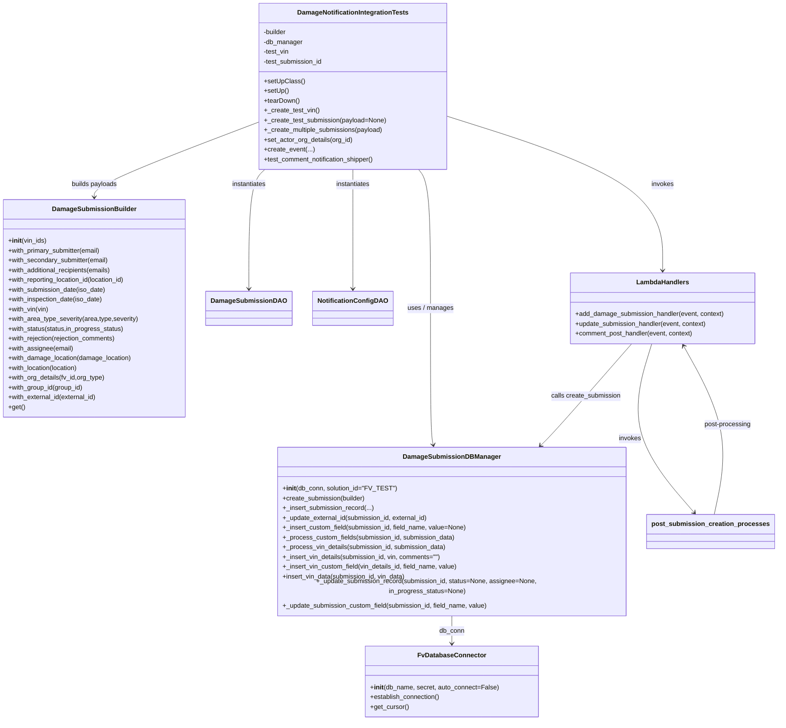
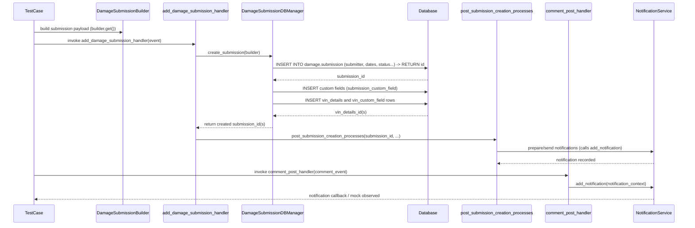

# Diagram: entity_core/entity_service/entity_service/tests/integration_tests/test_damage_notification.py

> Auto-generated by Obscura crawlers

## Diagram 1

### SVG

<svg id="container" width="1871.03125" xmlns="http://www.w3.org/2000/svg" class="classDiagram" height="1744" viewBox="0 0 1871.03125 1744" role="graphics-document document" aria-roledescription="class"><g><defs><marker id="container_class-aggregationStart" class="marker aggregation class" refX="18" refY="7" markerWidth="190" markerHeight="240" orient="auto"><path d="M 18,7 L9,13 L1,7 L9,1 Z"></path></marker></defs><defs><marker id="container_class-aggregationEnd" class="marker aggregation class" refX="1" refY="7" markerWidth="20" markerHeight="28" orient="auto"><path d="M 18,7 L9,13 L1,7 L9,1 Z"></path></marker></defs><defs><marker id="container_class-extensionStart" class="marker extension class" refX="18" refY="7" markerWidth="190" markerHeight="240" orient="auto"><path d="M 1,7 L18,13 V 1 Z"></path></marker></defs><defs><marker id="container_class-extensionEnd" class="marker extension class" refX="1" refY="7" markerWidth="20" markerHeight="28" orient="auto"><path d="M 1,1 V 13 L18,7 Z"></path></marker></defs><defs><marker id="container_class-compositionStart" class="marker composition class" refX="18" refY="7" markerWidth="190" markerHeight="240" orient="auto"><path d="M 18,7 L9,13 L1,7 L9,1 Z"></path></marker></defs><defs><marker id="container_class-compositionEnd" class="marker composition class" refX="1" refY="7" markerWidth="20" markerHeight="28" orient="auto"><path d="M 18,7 L9,13 L1,7 L9,1 Z"></path></marker></defs><defs><marker id="container_class-dependencyStart" class="marker dependency class" refX="6" refY="7" markerWidth="190" markerHeight="240" orient="auto"><path d="M 5,7 L9,13 L1,7 L9,1 Z"></path></marker></defs><defs><marker id="container_class-dependencyEnd" class="marker dependency class" refX="13" refY="7" markerWidth="20" markerHeight="28" orient="auto"><path d="M 18,7 L9,13 L14,7 L9,1 Z"></path></marker></defs><defs><marker id="container_class-lollipopStart" class="marker lollipop class" refX="13" refY="7" markerWidth="190" markerHeight="240" orient="auto"><circle stroke="black" fill="transparent" cx="7" cy="7" r="6"></circle></marker></defs><defs><marker id="container_class-lollipopEnd" class="marker lollipop class" refX="1" refY="7" markerWidth="190" markerHeight="240" orient="auto"><circle stroke="black" fill="transparent" cx="7" cy="7" r="6"></circle></marker></defs><g class="root"><g class="clusters"></g><g class="edgePaths"><path d="M1080.168,1488L1080.168,1494.167C1080.168,1500.333,1080.168,1512.667,1080.168,1524C1080.168,1535.333,1080.168,1545.667,1080.168,1550.833L1080.168,1556" id="id_DamageSubmissionDBManager_FvDatabaseConnector_1" class="edge-thickness-normal edge-pattern-solid relation" style=";;;" data-edge="true" data-et="edge" data-id="id_DamageSubmissionDBManager_FvDatabaseConnector_1" data-points="W3sieCI6MTA4MC4xNjc5Njg3NSwieSI6MTQ4OH0seyJ4IjoxMDgwLjE2Nzk2ODc1LCJ5IjoxNTI1fSx7IngiOjEwODAuMTY3OTY4NzUsInkiOjE1NjJ9XQ==" marker-end="url(#container_class-dependencyEnd)"></path><path d="M998.591,416L1003.332,422.167C1008.074,428.333,1017.556,440.667,1022.298,497.5C1027.039,554.333,1027.039,655.667,1027.039,757C1027.039,858.333,1027.039,959.667,1028.228,1015.525C1029.417,1071.384,1031.795,1081.768,1032.984,1086.959L1034.173,1092.151" id="id_DamageNotificationIntegrationTests_DamageSubmissionDBManager_2" class="edge-thickness-normal edge-pattern-solid relation" style=";;;" data-edge="true" data-et="edge" data-id="id_DamageNotificationIntegrationTests_DamageSubmissionDBManager_2" data-points="W3sieCI6OTk4LjU5MDk5NDU1Mzk0MTksInkiOjQxNn0seyJ4IjoxMDI3LjAzOTA2MjUsInkiOjQ1M30seyJ4IjoxMDI3LjAzOTA2MjUsInkiOjc1N30seyJ4IjoxMDI3LjAzOTA2MjUsInkiOjEwNjF9LHsieCI6MTAzNS41MTIyMDcwMzEyNSwieSI6MTA5OH1d" marker-end="url(#container_class-dependencyEnd)"></path><path d="M613.75,301.765L549.73,326.971C485.71,352.176,357.669,402.588,293.649,432.961C229.629,463.333,229.629,473.667,229.629,478.833L229.629,484" id="id_DamageNotificationIntegrationTests_DamageSubmissionBuilder_3" class="edge-thickness-normal edge-pattern-solid relation" style=";;;" data-edge="true" data-et="edge" data-id="id_DamageNotificationIntegrationTests_DamageSubmissionBuilder_3" data-points="W3sieCI6NjEzLjc1LCJ5IjozMDEuNzY0NjIxNzk1NjQ5fSx7IngiOjIyOS42Mjg5MDYyNSwieSI6NDUzfSx7IngiOjIyOS42Mjg5MDYyNSwieSI6NDkwfV0=" marker-end="url(#container_class-dependencyEnd)"></path><path d="M637.068,416L630.881,422.167C624.694,428.333,612.319,440.667,606.132,489.5C599.945,538.333,599.945,623.667,599.945,666.333L599.945,709" id="id_DamageNotificationIntegrationTests_DamageSubmissionDAO_4" class="edge-thickness-normal edge-pattern-solid relation" style=";;;" data-edge="true" data-et="edge" data-id="id_DamageNotificationIntegrationTests_DamageSubmissionDAO_4" data-points="W3sieCI6NjM3LjA2NzY1NDMwNDk3OTIsInkiOjQxNn0seyJ4Ijo1OTkuOTQ1MzEyNSwieSI6NDUzfSx7IngiOjU5OS45NDUzMTI1LCJ5Ijo3MTV9XQ==" marker-end="url(#container_class-dependencyEnd)"></path><path d="M841.742,416L841.742,422.167C841.742,428.333,841.742,440.667,841.742,489.5C841.742,538.333,841.742,623.667,841.742,666.333L841.742,709" id="id_DamageNotificationIntegrationTests_NotificationConfigDAO_5" class="edge-thickness-normal edge-pattern-solid relation" style=";;;" data-edge="true" data-et="edge" data-id="id_DamageNotificationIntegrationTests_NotificationConfigDAO_5" data-points="W3sieCI6ODQxLjc0MjE4NzUsInkiOjQxNn0seyJ4Ijo4NDEuNzQyMTg3NSwieSI6NDUzfSx7IngiOjg0MS43NDIxODc1LCJ5Ijo3MTV9XQ==" marker-end="url(#container_class-dependencyEnd)"></path><path d="M1069.734,284.978L1157.222,312.981C1244.71,340.985,1419.685,396.993,1507.173,460.163C1594.66,523.333,1594.66,593.667,1594.66,628.833L1594.66,664" id="id_DamageNotificationIntegrationTests_LambdaHandlers_6" class="edge-thickness-normal edge-pattern-solid relation" style=";;;" data-edge="true" data-et="edge" data-id="id_DamageNotificationIntegrationTests_LambdaHandlers_6" data-points="W3sieCI6MTA2OS43MzQzNzUsInkiOjI4NC45Nzc1NjEyNTkwNTk4fSx7IngiOjE1OTQuNjYwMTU2MjUsInkiOjQ1M30seyJ4IjoxNTk0LjY2MDE1NjI1LCJ5Ijo2NzB9XQ==" marker-end="url(#container_class-dependencyEnd)"></path><path d="M1519.001,844L1487.548,880.167C1456.096,916.333,1393.192,988.667,1355.824,1030.32C1318.457,1071.973,1306.627,1082.946,1300.712,1088.433L1294.796,1093.92" id="id_LambdaHandlers_DamageSubmissionDBManager_7" class="edge-thickness-normal edge-pattern-solid relation" style=";;;" data-edge="true" data-et="edge" data-id="id_LambdaHandlers_DamageSubmissionDBManager_7" data-points="W3sieCI6MTUxOS4wMDA3NjQ1NDU2NDE1LCJ5Ijo4NDR9LHsieCI6MTMzMC4yODcxMDkzNzUsInkiOjEwNjF9LHsieCI6MTI5MC4zOTc0MTg4NDQyODg3LCJ5IjoxMDk4fV0=" marker-end="url(#container_class-dependencyEnd)"></path><path d="M1568.679,844L1557.879,880.167C1547.079,916.333,1525.478,988.667,1542.72,1055.759C1559.963,1122.852,1616.049,1184.704,1644.092,1215.629L1672.135,1246.555" id="id_LambdaHandlers_post_submission_creation_processes_8" class="edge-thickness-normal edge-pattern-solid relation" style=";;;" data-edge="true" data-et="edge" data-id="id_LambdaHandlers_post_submission_creation_processes_8" data-points="W3sieCI6MTU2OC42Nzk0MzY5MzQ2MjE3LCJ5Ijo4NDR9LHsieCI6MTUwMy44NzY5NTMxMjUsInkiOjEwNjF9LHsieCI6MTY3Ni4xNjUyMjQyNzI2MjkzLCJ5IjoxMjUxfV0=" marker-end="url(#container_class-dependencyEnd)"></path><path d="M1723.785,1251L1730.974,1219.333C1738.162,1187.667,1752.54,1124.333,1739.729,1057.37C1726.917,990.407,1686.916,919.813,1666.916,884.517L1646.916,849.22" id="id_post_submission_creation_processes_LambdaHandlers_9" class="edge-thickness-normal edge-pattern-solid relation" style=";;;" data-edge="true" data-et="edge" data-id="id_post_submission_creation_processes_LambdaHandlers_9" data-points="W3sieCI6MTcyMy43ODQ3MTg0ODA2MDM1LCJ5IjoxMjUxfSx7IngiOjE3NjYuOTE3OTY4NzUsInkiOjEwNjF9LHsieCI6MTY0My45NTc2MjIzMjczMDI3LCJ5Ijo4NDR9XQ==" marker-end="url(#container_class-dependencyEnd)"></path></g><g class="edgeLabels"><g class="edgeLabel" transform="translate(1080.16796875, 1525)"><g class="label" data-id="id_DamageSubmissionDBManager_FvDatabaseConnector_1" transform="translate(-31.09375, -12)"><foreignObject width="62.1875" height="24">

db_conn

</foreignObject></g></g><g class="edgeLabel" transform="translate(1027.0390625, 757)"><g class="label" data-id="id_DamageNotificationIntegrationTests_DamageSubmissionDBManager_2" transform="translate(-57.1875, -12)"><foreignObject width="114.375" height="24">

uses / manages

</foreignObject></g></g><g class="edgeLabel" transform="translate(229.62890625, 453)"><g class="label" data-id="id_DamageNotificationIntegrationTests_DamageSubmissionBuilder_3" transform="translate(-57.21875, -12)"><foreignObject width="114.4375" height="24">

builds payloads

</foreignObject></g></g><g class="edgeLabel" transform="translate(599.9453125, 453)"><g class="label" data-id="id_DamageNotificationIntegrationTests_DamageSubmissionDAO_4" transform="translate(-42.9140625, -12)"><foreignObject width="85.828125" height="24">

instantiates

</foreignObject></g></g><g class="edgeLabel" transform="translate(841.7421875, 453)"><g class="label" data-id="id_DamageNotificationIntegrationTests_NotificationConfigDAO_5" transform="translate(-42.9140625, -12)"><foreignObject width="85.828125" height="24">

instantiates

</foreignObject></g></g><g class="edgeLabel" transform="translate(1594.66015625, 453)"><g class="label" data-id="id_DamageNotificationIntegrationTests_LambdaHandlers_6" transform="translate(-27.5859375, -12)"><foreignObject width="55.171875" height="24">

invokes

</foreignObject></g></g><g class="edgeLabel" transform="translate(1406.79241, 973.0273)"><g class="label" data-id="id_LambdaHandlers_DamageSubmissionDBManager_7" transform="translate(-86.2578125, -12)"><foreignObject width="172.515625" height="24">

calls create_submission

</foreignObject></g></g><g class="edgeLabel" transform="translate(1513.95738, 1072.11673)"><g class="label" data-id="id_LambdaHandlers_post_submission_creation_processes_8" transform="translate(-27.5859375, -12)"><foreignObject width="55.171875" height="24">

invokes

</foreignObject></g></g><g class="edgeLabel" transform="translate(1753.46385, 1037.25622)"><g class="label" data-id="id_post_submission_creation_processes_LambdaHandlers_9" transform="translate(-57.75, -12)"><foreignObject width="115.5" height="24">

post-processing

</foreignObject></g></g></g><g class="nodes"><g class="node default" id="classId-DamageSubmissionBuilder-0" transform="translate(229.62890625, 757)"><g class="basic label-container"><path d="M-221.62890625 -267 L221.62890625 -267 L221.62890625 267 L-221.62890625 267" stroke="none" stroke-width="0" fill="#ECECFF" style=""></path><path d="M-221.62890625 -267 C-89.78535848019806 -267, 42.05818928960389 -267, 221.62890625 -267 M-221.62890625 -267 C-104.72017494602301 -267, 12.188556357953985 -267, 221.62890625 -267 M221.62890625 -267 C221.62890625 -119.40078794084823, 221.62890625 28.198424118303535, 221.62890625 267 M221.62890625 -267 C221.62890625 -128.8791552952586, 221.62890625 9.241689409482774, 221.62890625 267 M221.62890625 267 C126.42918221680159 267, 31.229458183603185 267, -221.62890625 267 M221.62890625 267 C87.50809826989553 267, -46.61270971020895 267, -221.62890625 267 M-221.62890625 267 C-221.62890625 115.2462329657476, -221.62890625 -36.50753406850481, -221.62890625 -267 M-221.62890625 267 C-221.62890625 148.0784685337207, -221.62890625 29.15693706744139, -221.62890625 -267" stroke="#9370DB" stroke-width="1.3" fill="none" stroke-dasharray="0 0" style=""></path></g><g class="annotation-group text" transform="translate(0, -243)"></g><g class="label-group text" transform="translate(-97.9140625, -243)"><g class="label" style="font-weight: bolder" transform="translate(0,-12)"><foreignObject width="195.828125" height="24">

DamageSubmissionBuilder

</foreignObject></g></g><g class="members-group text" transform="translate(-209.62890625, -195)"></g><g class="methods-group text" transform="translate(-209.62890625, -165)"><g class="label" style="" transform="translate(0,-12)"><foreignObject width="94.4375" height="24">

+<strong>init</strong>(vin_ids)

</foreignObject></g><g class="label" style="" transform="translate(0,12)"><foreignObject width="233.375" height="24">

+with_primary_submitter(email)

</foreignObject></g><g class="label" style="" transform="translate(0,36)"><foreignObject width="251.265625" height="24">

+with_secondary_submitter(email)

</foreignObject></g><g class="label" style="" transform="translate(0,60)"><foreignObject width="260.15625" height="24">

+with_additional_recipients(emails)

</foreignObject></g><g class="label" style="" transform="translate(0,84)"><foreignObject width="296.5625" height="24">

+with_reporting_location_id(location_id)

</foreignObject></g><g class="label" style="" transform="translate(0,108)"><foreignObject width="242.40625" height="24">

+with_submission_date(iso_date)

</foreignObject></g><g class="label" style="" transform="translate(0,132)"><foreignObject width="236.125" height="24">

+with_inspection_date(iso_date)

</foreignObject></g><g class="label" style="" transform="translate(0,156)"><foreignObject width="100.859375" height="24">

+with_vin(vin)

</foreignObject></g><g class="label" style="" transform="translate(0,180)"><foreignObject width="321.34375" height="24">

+with_area_type_severity(area,type,severity)

</foreignObject></g><g class="label" style="" transform="translate(0,204)"><foreignObject width="287.125" height="24">

+with_status(status,in_progress_status)

</foreignObject></g><g class="label" style="" transform="translate(0,228)"><foreignObject width="269.796875" height="24">

+with_rejection(rejection_comments)

</foreignObject></g><g class="label" style="" transform="translate(0,252)"><foreignObject width="160.8125" height="24">

+with_assignee(email)

</foreignObject></g><g class="label" style="" transform="translate(0,276)"><foreignObject width="306.109375" height="24">

+with_damage_location(damage_location)

</foreignObject></g><g class="label" style="" transform="translate(0,300)"><foreignObject width="175.953125" height="24">

+with_location(location)

</foreignObject></g><g class="label" style="" transform="translate(0,324)"><foreignObject width="240.78125" height="24">

+with_org_details(fv_id,org_type)

</foreignObject></g><g class="label" style="" transform="translate(0,348)"><foreignObject width="186.46875" height="24">

+with_group_id(group_id)

</foreignObject></g><g class="label" style="" transform="translate(0,372)"><foreignObject width="221.046875" height="24">

+with_external_id(external_id)

</foreignObject></g><g class="label" style="" transform="translate(0,396)"><foreignObject width="40.921875" height="24">

+get()

</foreignObject></g></g><g class="divider" style=""><path d="M-221.62890625 -219 C-126.97078122526328 -219, -32.31265620052656 -219, 221.62890625 -219 M-221.62890625 -219 C-119.65157380551734 -219, -17.67424136103469 -219, 221.62890625 -219" stroke="#9370DB" stroke-width="1.3" fill="none" stroke-dasharray="0 0" style=""></path></g><g class="divider" style=""><path d="M-221.62890625 -195 C-128.92687685795403 -195, -36.22484746590803 -195, 221.62890625 -195 M-221.62890625 -195 C-105.93258415598886 -195, 9.763737938022274 -195, 221.62890625 -195" stroke="#9370DB" stroke-width="1.3" fill="none" stroke-dasharray="0 0" style=""></path></g></g><g class="node default" id="classId-DamageSubmissionDBManager-1" transform="translate(1080.16796875, 1293)"><g class="basic label-container"><path d="M-435.30078125 -195 L435.30078125 -195 L435.30078125 195 L-435.30078125 195" stroke="none" stroke-width="0" fill="#ECECFF" style=""></path><path d="M-435.30078125 -195 C-227.63595039009155 -195, -19.971119530183103 -195, 435.30078125 -195 M-435.30078125 -195 C-118.27279351364245 -195, 198.7551942227151 -195, 435.30078125 -195 M435.30078125 -195 C435.30078125 -72.44866092503533, 435.30078125 50.102678149929346, 435.30078125 195 M435.30078125 -195 C435.30078125 -90.19495318735694, 435.30078125 14.610093625286112, 435.30078125 195 M435.30078125 195 C165.1656831553425 195, -104.96941493931502 195, -435.30078125 195 M435.30078125 195 C145.43693614117876 195, -144.42690896764248 195, -435.30078125 195 M-435.30078125 195 C-435.30078125 77.57891585374021, -435.30078125 -39.842168292519574, -435.30078125 -195 M-435.30078125 195 C-435.30078125 77.16854143209007, -435.30078125 -40.66291713581987, -435.30078125 -195" stroke="#9370DB" stroke-width="1.3" fill="none" stroke-dasharray="0 0" style=""></path></g><g class="annotation-group text" transform="translate(0, -171)"></g><g class="label-group text" transform="translate(-112.9765625, -171)"><g class="label" style="font-weight: bolder" transform="translate(0,-12)"><foreignObject width="225.953125" height="24">

DamageSubmissionDBManager

</foreignObject></g></g><g class="members-group text" transform="translate(-423.30078125, -123)"></g><g class="methods-group text" transform="translate(-423.30078125, -93)"><g class="label" style="" transform="translate(0,-12)"><foreignObject width="272.984375" height="24">

+<strong>init</strong>(db_conn, solution_id="FV_TEST")

</foreignObject></g><g class="label" style="" transform="translate(0,12)"><foreignObject width="206.15625" height="24">

+create_submission(builder)

</foreignObject></g><g class="label" style="" transform="translate(0,36)"><foreignObject width="224.46875" height="24">

+_insert_submission_record(...)

</foreignObject></g><g class="label" style="" transform="translate(0,60)"><foreignObject width="360.671875" height="24">

+_update_external_id(submission_id, external_id)

</foreignObject></g><g class="label" style="" transform="translate(0,84)"><foreignObject width="455.5" height="24">

+_insert_custom_field(submission_id, field_name, value=None)

</foreignObject></g><g class="label" style="" transform="translate(0,108)"><foreignObject width="425.0625" height="24">

+_process_custom_fields(submission_id, submission_data)

</foreignObject></g><g class="label" style="" transform="translate(0,132)"><foreignObject width="403.5625" height="24">

+_process_vin_details(submission_id, submission_data)

</foreignObject></g><g class="label" style="" transform="translate(0,156)"><foreignObject width="393.421875" height="24">

+_insert_vin_details(submission_id, vin, comments="")

</foreignObject></g><g class="label" style="" transform="translate(0,180)"><foreignObject width="434.96875" height="24">

+_insert_vin_custom_field(vin_details_id, field_name, value)

</foreignObject></g><g class="label" style="" transform="translate(0,204)"><foreignObject width="306.046875" height="24">

+insert_vin_data(submission_id, vin_data)

</foreignObject></g><g class="label" style="" transform="translate(0,228)"><foreignObject width="733.625" height="24">

+_update_submission_record(submission_id, status=None, assignee=None, in_progress_status=None)

</foreignObject></g><g class="label" style="" transform="translate(0,252)"><foreignObject width="508.65625" height="24">

+_update_submission_custom_field(submission_id, field_name, value)

</foreignObject></g></g><g class="divider" style=""><path d="M-435.30078125 -147 C-233.0558145658465 -147, -30.810847881693007 -147, 435.30078125 -147 M-435.30078125 -147 C-188.07985626916843 -147, 59.14106871166314 -147, 435.30078125 -147" stroke="#9370DB" stroke-width="1.3" fill="none" stroke-dasharray="0 0" style=""></path></g><g class="divider" style=""><path d="M-435.30078125 -123 C-94.74625258022212 -123, 245.80827608955576 -123, 435.30078125 -123 M-435.30078125 -123 C-124.01727265116358 -123, 187.26623594767284 -123, 435.30078125 -123" stroke="#9370DB" stroke-width="1.3" fill="none" stroke-dasharray="0 0" style=""></path></g></g><g class="node default" id="classId-DamageNotificationIntegrationTests-2" transform="translate(841.7421875, 212)"><g class="basic label-container"><path d="M-227.9921875 -204 L227.9921875 -204 L227.9921875 204 L-227.9921875 204" stroke="none" stroke-width="0" fill="#ECECFF" style=""></path><path d="M-227.9921875 -204 C-48.86319117717309 -204, 130.26580514565381 -204, 227.9921875 -204 M-227.9921875 -204 C-105.97972485983016 -204, 16.032737780339687 -204, 227.9921875 -204 M227.9921875 -204 C227.9921875 -63.75107458164808, 227.9921875 76.49785083670383, 227.9921875 204 M227.9921875 -204 C227.9921875 -98.43079386558473, 227.9921875 7.138412268830535, 227.9921875 204 M227.9921875 204 C60.01157168135995 204, -107.9690441372801 204, -227.9921875 204 M227.9921875 204 C89.48900332104594 204, -49.014180857908116 204, -227.9921875 204 M-227.9921875 204 C-227.9921875 111.35369354398992, -227.9921875 18.70738708797984, -227.9921875 -204 M-227.9921875 204 C-227.9921875 80.73998875781291, -227.9921875 -42.52002248437418, -227.9921875 -204" stroke="#9370DB" stroke-width="1.3" fill="none" stroke-dasharray="0 0" style=""></path></g><g class="annotation-group text" transform="translate(0, -180)"></g><g class="label-group text" transform="translate(-131.890625, -180)"><g class="label" style="font-weight: bolder" transform="translate(0,-12)"><foreignObject width="263.78125" height="24">

DamageNotificationIntegrationTests

</foreignObject></g></g><g class="members-group text" transform="translate(-215.9921875, -132)"><g class="label" style="" transform="translate(0,-12)"><foreignObject width="58.859375" height="24">

-builder

</foreignObject></g><g class="label" style="" transform="translate(0,12)"><foreignObject width="96.828125" height="24">

-db_manager

</foreignObject></g><g class="label" style="" transform="translate(0,36)"><foreignObject width="63.484375" height="24">

-test_vin

</foreignObject></g><g class="label" style="" transform="translate(0,60)"><foreignObject width="147.125" height="24">

-test_submission_id

</foreignObject></g></g><g class="methods-group text" transform="translate(-215.9921875, -12)"><g class="label" style="" transform="translate(0,-12)"><foreignObject width="97.15625" height="24">

+setUpClass()

</foreignObject></g><g class="label" style="" transform="translate(0,12)"><foreignObject width="60.421875" height="24">

+setUp()

</foreignObject></g><g class="label" style="" transform="translate(0,36)"><foreignObject width="87.75" height="24">

+tearDown()

</foreignObject></g><g class="label" style="" transform="translate(0,60)"><foreignObject width="134.734375" height="24">

+_create_test_vin()

</foreignObject></g><g class="label" style="" transform="translate(0,84)"><foreignObject width="300.09375" height="24">

+_create_test_submission(payload=None)

</foreignObject></g><g class="label" style="" transform="translate(0,108)"><foreignObject width="294.515625" height="24">

+_create_multiple_submissions(payload)

</foreignObject></g><g class="label" style="" transform="translate(0,132)"><foreignObject width="219.515625" height="24">

+set_actor_org_details(org_id)

</foreignObject></g><g class="label" style="" transform="translate(0,156)"><foreignObject width="122.765625" height="24">

+create_event(...)

</foreignObject></g><g class="label" style="" transform="translate(0,180)"><foreignObject width="277.0625" height="24">

+test_comment_notification_shipper()

</foreignObject></g></g><g class="divider" style=""><path d="M-227.9921875 -156 C-101.12538613153237 -156, 25.741415236935268 -156, 227.9921875 -156 M-227.9921875 -156 C-126.92924620641392 -156, -25.866304912827843 -156, 227.9921875 -156" stroke="#9370DB" stroke-width="1.3" fill="none" stroke-dasharray="0 0" style=""></path></g><g class="divider" style=""><path d="M-227.9921875 -36 C-128.2088991050903 -36, -28.425610710180592 -36, 227.9921875 -36 M-227.9921875 -36 C-110.15372022900145 -36, 7.684747041997099 -36, 227.9921875 -36" stroke="#9370DB" stroke-width="1.3" fill="none" stroke-dasharray="0 0" style=""></path></g></g><g class="node default" id="classId-FvDatabaseConnector-3" transform="translate(1080.16796875, 1649)"><g class="basic label-container"><path d="M-208.12109375 -87 L208.12109375 -87 L208.12109375 87 L-208.12109375 87" stroke="none" stroke-width="0" fill="#ECECFF" style=""></path><path d="M-208.12109375 -87 C-58.37640935400864 -87, 91.36827504198271 -87, 208.12109375 -87 M-208.12109375 -87 C-122.57868162908647 -87, -37.03626950817295 -87, 208.12109375 -87 M208.12109375 -87 C208.12109375 -32.058214678151245, 208.12109375 22.88357064369751, 208.12109375 87 M208.12109375 -87 C208.12109375 -22.093774210124906, 208.12109375 42.81245157975019, 208.12109375 87 M208.12109375 87 C45.828172582865676 87, -116.46474858426865 87, -208.12109375 87 M208.12109375 87 C64.27316263869022 87, -79.57476847261955 87, -208.12109375 87 M-208.12109375 87 C-208.12109375 50.569636658490346, -208.12109375 14.139273316980692, -208.12109375 -87 M-208.12109375 87 C-208.12109375 49.30936192594626, -208.12109375 11.618723851892526, -208.12109375 -87" stroke="#9370DB" stroke-width="1.3" fill="none" stroke-dasharray="0 0" style=""></path></g><g class="annotation-group text" transform="translate(0, -63)"></g><g class="label-group text" transform="translate(-79.3046875, -63)"><g class="label" style="font-weight: bolder" transform="translate(0,-12)"><foreignObject width="158.609375" height="24">

FvDatabaseConnector

</foreignObject></g></g><g class="members-group text" transform="translate(-196.12109375, -15)"></g><g class="methods-group text" transform="translate(-196.12109375, 15)"><g class="label" style="" transform="translate(0,-12)"><foreignObject width="312.9375" height="24">

+<strong>init</strong>(db_name, secret, auto_connect=False)

</foreignObject></g><g class="label" style="" transform="translate(0,12)"><foreignObject width="173.265625" height="24">

+establish_connection()

</foreignObject></g><g class="label" style="" transform="translate(0,36)"><foreignObject width="94.640625" height="24">

+get_cursor()

</foreignObject></g></g><g class="divider" style=""><path d="M-208.12109375 -39 C-78.04714732454119 -39, 52.02679910091763 -39, 208.12109375 -39 M-208.12109375 -39 C-91.6593222211727 -39, 24.802449307654598 -39, 208.12109375 -39" stroke="#9370DB" stroke-width="1.3" fill="none" stroke-dasharray="0 0" style=""></path></g><g class="divider" style=""><path d="M-208.12109375 -15 C-110.9048772365345 -15, -13.688660723069006 -15, 208.12109375 -15 M-208.12109375 -15 C-111.27854216424156 -15, -14.435990578483114 -15, 208.12109375 -15" stroke="#9370DB" stroke-width="1.3" fill="none" stroke-dasharray="0 0" style=""></path></g></g><g class="node default" id="classId-DamageSubmissionDAO-4" transform="translate(599.9453125, 757)"><g class="basic label-container"><path d="M-98.6875 -42 L98.6875 -42 L98.6875 42 L-98.6875 42" stroke="none" stroke-width="0" fill="#ECECFF" style=""></path><path d="M-98.6875 -42 C-54.166835527775824 -42, -9.646171055551648 -42, 98.6875 -42 M-98.6875 -42 C-44.46220887026083 -42, 9.763082259478338 -42, 98.6875 -42 M98.6875 -42 C98.6875 -14.319781131185263, 98.6875 13.360437737629475, 98.6875 42 M98.6875 -42 C98.6875 -25.001519548652507, 98.6875 -8.003039097305013, 98.6875 42 M98.6875 42 C52.71937604538524 42, 6.751252090770478 42, -98.6875 42 M98.6875 42 C34.50829039929687 42, -29.670919201406264 42, -98.6875 42 M-98.6875 42 C-98.6875 19.78454264223173, -98.6875 -2.430914715536538, -98.6875 -42 M-98.6875 42 C-98.6875 11.122041140921915, -98.6875 -19.75591771815617, -98.6875 -42" stroke="#9370DB" stroke-width="1.3" fill="none" stroke-dasharray="0 0" style=""></path></g><g class="annotation-group text" transform="translate(0, -18)"></g><g class="label-group text" transform="translate(-86.6875, -18)"><g class="label" style="font-weight: bolder" transform="translate(0,-12)"><foreignObject width="173.375" height="24">

DamageSubmissionDAO

</foreignObject></g></g><g class="members-group text" transform="translate(-86.6875, 30)"></g><g class="methods-group text" transform="translate(-86.6875, 60)"></g><g class="divider" style=""><path d="M-98.6875 6 C-56.3231247881095 6, -13.958749576219006 6, 98.6875 6 M-98.6875 6 C-23.000469121429745 6, 52.68656175714051 6, 98.6875 6" stroke="#9370DB" stroke-width="1.3" fill="none" stroke-dasharray="0 0" style=""></path></g><g class="divider" style=""><path d="M-98.6875 24 C-25.229161274762617 24, 48.229177450474765 24, 98.6875 24 M-98.6875 24 C-23.553423906894707 24, 51.580652186210585 24, 98.6875 24" stroke="#9370DB" stroke-width="1.3" fill="none" stroke-dasharray="0 0" style=""></path></g></g><g class="node default" id="classId-NotificationConfigDAO-5" transform="translate(841.7421875, 757)"><g class="basic label-container"><path d="M-93.109375 -42 L93.109375 -42 L93.109375 42 L-93.109375 42" stroke="none" stroke-width="0" fill="#ECECFF" style=""></path><path d="M-93.109375 -42 C-36.82586163307058 -42, 19.45765173385884 -42, 93.109375 -42 M-93.109375 -42 C-32.05812366855111 -42, 28.993127662897777 -42, 93.109375 -42 M93.109375 -42 C93.109375 -12.49620310100893, 93.109375 17.00759379798214, 93.109375 42 M93.109375 -42 C93.109375 -24.4897204075476, 93.109375 -6.979440815095202, 93.109375 42 M93.109375 42 C43.40343685819177 42, -6.302501283616465 42, -93.109375 42 M93.109375 42 C30.711863362125 42, -31.685648275749998 42, -93.109375 42 M-93.109375 42 C-93.109375 9.756979072870735, -93.109375 -22.48604185425853, -93.109375 -42 M-93.109375 42 C-93.109375 11.643732938098388, -93.109375 -18.712534123803223, -93.109375 -42" stroke="#9370DB" stroke-width="1.3" fill="none" stroke-dasharray="0 0" style=""></path></g><g class="annotation-group text" transform="translate(0, -18)"></g><g class="label-group text" transform="translate(-81.109375, -18)"><g class="label" style="font-weight: bolder" transform="translate(0,-12)"><foreignObject width="162.21875" height="24">

NotificationConfigDAO

</foreignObject></g></g><g class="members-group text" transform="translate(-81.109375, 30)"></g><g class="methods-group text" transform="translate(-81.109375, 60)"></g><g class="divider" style=""><path d="M-93.109375 6 C-37.690061072657734 6, 17.729252854684532 6, 93.109375 6 M-93.109375 6 C-24.1843299174905 6, 44.740715165019 6, 93.109375 6" stroke="#9370DB" stroke-width="1.3" fill="none" stroke-dasharray="0 0" style=""></path></g><g class="divider" style=""><path d="M-93.109375 24 C-41.79244985231611 24, 9.524475295367779 24, 93.109375 24 M-93.109375 24 C-50.04477018879868 24, -6.980165377597359 24, 93.109375 24" stroke="#9370DB" stroke-width="1.3" fill="none" stroke-dasharray="0 0" style=""></path></g></g><g class="node default" id="classId-LambdaHandlers-6" transform="translate(1594.66015625, 757)"><g class="basic label-container"><path d="M-227.40625 -87 L227.40625 -87 L227.40625 87 L-227.40625 87" stroke="none" stroke-width="0" fill="#ECECFF" style=""></path><path d="M-227.40625 -87 C-62.79543689551758 -87, 101.81537620896484 -87, 227.40625 -87 M-227.40625 -87 C-61.11190042932864 -87, 105.18244914134272 -87, 227.40625 -87 M227.40625 -87 C227.40625 -24.65019635380132, 227.40625 37.69960729239736, 227.40625 87 M227.40625 -87 C227.40625 -39.30047047069176, 227.40625 8.399059058616487, 227.40625 87 M227.40625 87 C66.72744717938974 87, -93.95135564122052 87, -227.40625 87 M227.40625 87 C102.76015439302716 87, -21.88594121394567 87, -227.40625 87 M-227.40625 87 C-227.40625 44.82408807831623, -227.40625 2.6481761566324593, -227.40625 -87 M-227.40625 87 C-227.40625 27.18129675829018, -227.40625 -32.63740648341964, -227.40625 -87" stroke="#9370DB" stroke-width="1.3" fill="none" stroke-dasharray="0 0" style=""></path></g><g class="annotation-group text" transform="translate(0, -63)"></g><g class="label-group text" transform="translate(-61.984375, -63)"><g class="label" style="font-weight: bolder" transform="translate(0,-12)"><foreignObject width="123.96875" height="24">

LambdaHandlers

</foreignObject></g></g><g class="members-group text" transform="translate(-215.40625, -15)"></g><g class="methods-group text" transform="translate(-215.40625, 15)"><g class="label" style="" transform="translate(0,-12)"><foreignObject width="368.828125" height="24">

+add_damage_submission_handler(event, context)

</foreignObject></g><g class="label" style="" transform="translate(0,12)"><foreignObject width="327.25" height="24">

+update_submission_handler(event, context)

</foreignObject></g><g class="label" style="" transform="translate(0,36)"><foreignObject width="293.765625" height="24">

+comment_post_handler(event, context)

</foreignObject></g></g><g class="divider" style=""><path d="M-227.40625 -39 C-63.452888486646856 -39, 100.50047302670629 -39, 227.40625 -39 M-227.40625 -39 C-90.56093034969848 -39, 46.28438930060304 -39, 227.40625 -39" stroke="#9370DB" stroke-width="1.3" fill="none" stroke-dasharray="0 0" style=""></path></g><g class="divider" style=""><path d="M-227.40625 -15 C-77.91130528948167 -15, 71.58363942103665 -15, 227.40625 -15 M-227.40625 -15 C-87.73525436829661 -15, 51.93574126340678 -15, 227.40625 -15" stroke="#9370DB" stroke-width="1.3" fill="none" stroke-dasharray="0 0" style=""></path></g></g><g class="node default" id="classId-post_submission_creation_processes-7" transform="translate(1714.25, 1293)"><g class="basic label-container"><path d="M-148.78125 -42 L148.78125 -42 L148.78125 42 L-148.78125 42" stroke="none" stroke-width="0" fill="#ECECFF" style=""></path><path d="M-148.78125 -42 C-48.86463149854369 -42, 51.051987002912625 -42, 148.78125 -42 M-148.78125 -42 C-58.98862689180959 -42, 30.803996216380824 -42, 148.78125 -42 M148.78125 -42 C148.78125 -21.508984975162925, 148.78125 -1.017969950325849, 148.78125 42 M148.78125 -42 C148.78125 -22.013779546124606, 148.78125 -2.027559092249213, 148.78125 42 M148.78125 42 C57.55437629419539 42, -33.672497411609214 42, -148.78125 42 M148.78125 42 C60.5004126444186 42, -27.780424711162794 42, -148.78125 42 M-148.78125 42 C-148.78125 19.905183100791017, -148.78125 -2.1896337984179652, -148.78125 -42 M-148.78125 42 C-148.78125 24.676154366248532, -148.78125 7.352308732497065, -148.78125 -42" stroke="#9370DB" stroke-width="1.3" fill="none" stroke-dasharray="0 0" style=""></path></g><g class="annotation-group text" transform="translate(0, -18)"></g><g class="label-group text" transform="translate(-136.78125, -18)"><g class="label" style="font-weight: bolder" transform="translate(0,-12)"><foreignObject width="273.5625" height="24">

post_submission_creation_processes

</foreignObject></g></g><g class="members-group text" transform="translate(-136.78125, 30)"></g><g class="methods-group text" transform="translate(-136.78125, 60)"></g><g class="divider" style=""><path d="M-148.78125 6 C-78.91617404618107 6, -9.051098092362139 6, 148.78125 6 M-148.78125 6 C-47.90855989356645 6, 52.964130212867104 6, 148.78125 6" stroke="#9370DB" stroke-width="1.3" fill="none" stroke-dasharray="0 0" style=""></path></g><g class="divider" style=""><path d="M-148.78125 24 C-80.9358368073871 24, -13.09042361477421 24, 148.78125 24 M-148.78125 24 C-39.74767661992854 24, 69.28589676014292 24, 148.78125 24" stroke="#9370DB" stroke-width="1.3" fill="none" stroke-dasharray="0 0" style=""></path></g></g></g></g></g></svg>

## Diagram 2

### SVG

<svg id="container" width="2720.5" xmlns="http://www.w3.org/2000/svg" height="891" viewBox="-50 -10 2720.5 891" role="graphics-document document" aria-roledescription="sequence"><g><rect x="2463.5" y="805" fill="#eaeaea" stroke="#666" width="157" height="65" name="Notifier" rx="3" ry="3" class="actor actor-bottom"></rect><text x="2542" y="837.5" dominant-baseline="central" alignment-baseline="central" class="actor actor-box" style="text-anchor: middle; font-size: 16px; font-weight: 400;"><tspan x="2542" dy="0">NotificationService</tspan></text></g><g><rect x="2100" y="805" fill="#eaeaea" stroke="#666" width="194" height="65" name="CommentHandler" rx="3" ry="3" class="actor actor-bottom"></rect><text x="2197" y="837.5" dominant-baseline="central" alignment-baseline="central" class="actor actor-box" style="text-anchor: middle; font-size: 16px; font-weight: 400;"><tspan x="2197" dy="0">comment_post_handler</tspan></text></g><g><rect x="1760" y="805" fill="#eaeaea" stroke="#666" width="290" height="65" name="PostProc" rx="3" ry="3" class="actor actor-bottom"></rect><text x="1905" y="837.5" dominant-baseline="central" alignment-baseline="central" class="actor actor-box" style="text-anchor: middle; font-size: 16px; font-weight: 400;"><tspan x="1905" dy="0">post_submission_creation_processes</tspan></text></g><g><rect x="1560" y="805" fill="#eaeaea" stroke="#666" width="150" height="65" name="DB" rx="3" ry="3" class="actor actor-bottom"></rect><text x="1635" y="837.5" dominant-baseline="central" alignment-baseline="central" class="actor actor-box" style="text-anchor: middle; font-size: 16px; font-weight: 400;"><tspan x="1635" dy="0">Database</tspan></text></g><g><rect x="910.5" y="805" fill="#eaeaea" stroke="#666" width="245" height="65" name="DBManager" rx="3" ry="3" class="actor actor-bottom"></rect><text x="1033" y="837.5" dominant-baseline="central" alignment-baseline="central" class="actor actor-box" style="text-anchor: middle; font-size: 16px; font-weight: 400;"><tspan x="1033" dy="0">DamageSubmissionDBManager</tspan></text></g><g><rect x="591.5" y="805" fill="#eaeaea" stroke="#666" width="269" height="65" name="AddHandler" rx="3" ry="3" class="actor actor-bottom"></rect><text x="726" y="837.5" dominant-baseline="central" alignment-baseline="central" class="actor actor-box" style="text-anchor: middle; font-size: 16px; font-weight: 400;"><tspan x="726" dy="0">add_damage_submission_handler</tspan></text></g><g><rect x="326.5" y="805" fill="#eaeaea" stroke="#666" width="215" height="65" name="Builder" rx="3" ry="3" class="actor actor-bottom"></rect><text x="434" y="837.5" dominant-baseline="central" alignment-baseline="central" class="actor actor-box" style="text-anchor: middle; font-size: 16px; font-weight: 400;"><tspan x="434" dy="0">DamageSubmissionBuilder</tspan></text></g><g><rect x="0" y="805" fill="#eaeaea" stroke="#666" width="150" height="65" name="Test" rx="3" ry="3" class="actor actor-bottom"></rect><text x="75" y="837.5" dominant-baseline="central" alignment-baseline="central" class="actor actor-box" style="text-anchor: middle; font-size: 16px; font-weight: 400;"><tspan x="75" dy="0">TestCase</tspan></text></g><g><line id="actor7" x1="2542" y1="65" x2="2542" y2="805" class="actor-line 200" stroke-width="0.5px" stroke="#999" name="Notifier"></line><g id="root-7"><rect x="2463.5" y="0" fill="#eaeaea" stroke="#666" width="157" height="65" name="Notifier" rx="3" ry="3" class="actor actor-top"></rect><text x="2542" y="32.5" dominant-baseline="central" alignment-baseline="central" class="actor actor-box" style="text-anchor: middle; font-size: 16px; font-weight: 400;"><tspan x="2542" dy="0">NotificationService</tspan></text></g></g><g><line id="actor6" x1="2197" y1="65" x2="2197" y2="805" class="actor-line 200" stroke-width="0.5px" stroke="#999" name="CommentHandler"></line><g id="root-6"><rect x="2100" y="0" fill="#eaeaea" stroke="#666" width="194" height="65" name="CommentHandler" rx="3" ry="3" class="actor actor-top"></rect><text x="2197" y="32.5" dominant-baseline="central" alignment-baseline="central" class="actor actor-box" style="text-anchor: middle; font-size: 16px; font-weight: 400;"><tspan x="2197" dy="0">comment_post_handler</tspan></text></g></g><g><line id="actor5" x1="1905" y1="65" x2="1905" y2="805" class="actor-line 200" stroke-width="0.5px" stroke="#999" name="PostProc"></line><g id="root-5"><rect x="1760" y="0" fill="#eaeaea" stroke="#666" width="290" height="65" name="PostProc" rx="3" ry="3" class="actor actor-top"></rect><text x="1905" y="32.5" dominant-baseline="central" alignment-baseline="central" class="actor actor-box" style="text-anchor: middle; font-size: 16px; font-weight: 400;"><tspan x="1905" dy="0">post_submission_creation_processes</tspan></text></g></g><g><line id="actor4" x1="1635" y1="65" x2="1635" y2="805" class="actor-line 200" stroke-width="0.5px" stroke="#999" name="DB"></line><g id="root-4"><rect x="1560" y="0" fill="#eaeaea" stroke="#666" width="150" height="65" name="DB" rx="3" ry="3" class="actor actor-top"></rect><text x="1635" y="32.5" dominant-baseline="central" alignment-baseline="central" class="actor actor-box" style="text-anchor: middle; font-size: 16px; font-weight: 400;"><tspan x="1635" dy="0">Database</tspan></text></g></g><g><line id="actor3" x1="1033" y1="65" x2="1033" y2="805" class="actor-line 200" stroke-width="0.5px" stroke="#999" name="DBManager"></line><g id="root-3"><rect x="910.5" y="0" fill="#eaeaea" stroke="#666" width="245" height="65" name="DBManager" rx="3" ry="3" class="actor actor-top"></rect><text x="1033" y="32.5" dominant-baseline="central" alignment-baseline="central" class="actor actor-box" style="text-anchor: middle; font-size: 16px; font-weight: 400;"><tspan x="1033" dy="0">DamageSubmissionDBManager</tspan></text></g></g><g><line id="actor2" x1="726" y1="65" x2="726" y2="805" class="actor-line 200" stroke-width="0.5px" stroke="#999" name="AddHandler"></line><g id="root-2"><rect x="591.5" y="0" fill="#eaeaea" stroke="#666" width="269" height="65" name="AddHandler" rx="3" ry="3" class="actor actor-top"></rect><text x="726" y="32.5" dominant-baseline="central" alignment-baseline="central" class="actor actor-box" style="text-anchor: middle; font-size: 16px; font-weight: 400;"><tspan x="726" dy="0">add_damage_submission_handler</tspan></text></g></g><g><line id="actor1" x1="434" y1="65" x2="434" y2="805" class="actor-line 200" stroke-width="0.5px" stroke="#999" name="Builder"></line><g id="root-1"><rect x="326.5" y="0" fill="#eaeaea" stroke="#666" width="215" height="65" name="Builder" rx="3" ry="3" class="actor actor-top"></rect><text x="434" y="32.5" dominant-baseline="central" alignment-baseline="central" class="actor actor-box" style="text-anchor: middle; font-size: 16px; font-weight: 400;"><tspan x="434" dy="0">DamageSubmissionBuilder</tspan></text></g></g><g><line id="actor0" x1="75" y1="65" x2="75" y2="805" class="actor-line 200" stroke-width="0.5px" stroke="#999" name="Test"></line><g id="root-0"><rect x="0" y="0" fill="#eaeaea" stroke="#666" width="150" height="65" name="Test" rx="3" ry="3" class="actor actor-top"></rect><text x="75" y="32.5" dominant-baseline="central" alignment-baseline="central" class="actor actor-box" style="text-anchor: middle; font-size: 16px; font-weight: 400;"><tspan x="75" dy="0">TestCase</tspan></text></g></g><g></g><defs><symbol id="computer" width="24" height="24"><path transform="scale(.5)" d="M2 2v13h20v-13h-20zm18 11h-16v-9h16v9zm-10.228 6l.466-1h3.524l.467 1h-4.457zm14.228 3h-24l2-6h2.104l-1.33 4h18.45l-1.297-4h2.073l2 6zm-5-10h-14v-7h14v7z"></path></symbol></defs><defs><symbol id="database" fill-rule="evenodd" clip-rule="evenodd"><path transform="scale(.5)" d="M12.258.001l.256.004.255.005.253.008.251.01.249.012.247.015.246.016.242.019.241.02.239.023.236.024.233.027.231.028.229.031.225.032.223.034.22.036.217.038.214.04.211.041.208.043.205.045.201.046.198.048.194.05.191.051.187.053.183.054.18.056.175.057.172.059.168.06.163.061.16.063.155.064.15.066.074.033.073.033.071.034.07.034.069.035.068.035.067.035.066.035.064.036.064.036.062.036.06.036.06.037.058.037.058.037.055.038.055.038.053.038.052.038.051.039.05.039.048.039.047.039.045.04.044.04.043.04.041.04.04.041.039.041.037.041.036.041.034.041.033.042.032.042.03.042.029.042.027.042.026.043.024.043.023.043.021.043.02.043.018.044.017.043.015.044.013.044.012.044.011.045.009.044.007.045.006.045.004.045.002.045.001.045v17l-.001.045-.002.045-.004.045-.006.045-.007.045-.009.044-.011.045-.012.044-.013.044-.015.044-.017.043-.018.044-.02.043-.021.043-.023.043-.024.043-.026.043-.027.042-.029.042-.03.042-.032.042-.033.042-.034.041-.036.041-.037.041-.039.041-.04.041-.041.04-.043.04-.044.04-.045.04-.047.039-.048.039-.05.039-.051.039-.052.038-.053.038-.055.038-.055.038-.058.037-.058.037-.06.037-.06.036-.062.036-.064.036-.064.036-.066.035-.067.035-.068.035-.069.035-.07.034-.071.034-.073.033-.074.033-.15.066-.155.064-.16.063-.163.061-.168.06-.172.059-.175.057-.18.056-.183.054-.187.053-.191.051-.194.05-.198.048-.201.046-.205.045-.208.043-.211.041-.214.04-.217.038-.22.036-.223.034-.225.032-.229.031-.231.028-.233.027-.236.024-.239.023-.241.02-.242.019-.246.016-.247.015-.249.012-.251.01-.253.008-.255.005-.256.004-.258.001-.258-.001-.256-.004-.255-.005-.253-.008-.251-.01-.249-.012-.247-.015-.245-.016-.243-.019-.241-.02-.238-.023-.236-.024-.234-.027-.231-.028-.228-.031-.226-.032-.223-.034-.22-.036-.217-.038-.214-.04-.211-.041-.208-.043-.204-.045-.201-.046-.198-.048-.195-.05-.19-.051-.187-.053-.184-.054-.179-.056-.176-.057-.172-.059-.167-.06-.164-.061-.159-.063-.155-.064-.151-.066-.074-.033-.072-.033-.072-.034-.07-.034-.069-.035-.068-.035-.067-.035-.066-.035-.064-.036-.063-.036-.062-.036-.061-.036-.06-.037-.058-.037-.057-.037-.056-.038-.055-.038-.053-.038-.052-.038-.051-.039-.049-.039-.049-.039-.046-.039-.046-.04-.044-.04-.043-.04-.041-.04-.04-.041-.039-.041-.037-.041-.036-.041-.034-.041-.033-.042-.032-.042-.03-.042-.029-.042-.027-.042-.026-.043-.024-.043-.023-.043-.021-.043-.02-.043-.018-.044-.017-.043-.015-.044-.013-.044-.012-.044-.011-.045-.009-.044-.007-.045-.006-.045-.004-.045-.002-.045-.001-.045v-17l.001-.045.002-.045.004-.045.006-.045.007-.045.009-.044.011-.045.012-.044.013-.044.015-.044.017-.043.018-.044.02-.043.021-.043.023-.043.024-.043.026-.043.027-.042.029-.042.03-.042.032-.042.033-.042.034-.041.036-.041.037-.041.039-.041.04-.041.041-.04.043-.04.044-.04.046-.04.046-.039.049-.039.049-.039.051-.039.052-.038.053-.038.055-.038.056-.038.057-.037.058-.037.06-.037.061-.036.062-.036.063-.036.064-.036.066-.035.067-.035.068-.035.069-.035.07-.034.072-.034.072-.033.074-.033.151-.066.155-.064.159-.063.164-.061.167-.06.172-.059.176-.057.179-.056.184-.054.187-.053.19-.051.195-.05.198-.048.201-.046.204-.045.208-.043.211-.041.214-.04.217-.038.22-.036.223-.034.226-.032.228-.031.231-.028.234-.027.236-.024.238-.023.241-.02.243-.019.245-.016.247-.015.249-.012.251-.01.253-.008.255-.005.256-.004.258-.001.258.001zm-9.258 20.499v.01l.001.021.003.021.004.022.005.021.006.022.007.022.009.023.01.022.011.023.012.023.013.023.015.023.016.024.017.023.018.024.019.024.021.024.022.025.023.024.024.025.052.049.056.05.061.051.066.051.07.051.075.051.079.052.084.052.088.052.092.052.097.052.102.051.105.052.11.052.114.051.119.051.123.051.127.05.131.05.135.05.139.048.144.049.147.047.152.047.155.047.16.045.163.045.167.043.171.043.176.041.178.041.183.039.187.039.19.037.194.035.197.035.202.033.204.031.209.03.212.029.216.027.219.025.222.024.226.021.23.02.233.018.236.016.24.015.243.012.246.01.249.008.253.005.256.004.259.001.26-.001.257-.004.254-.005.25-.008.247-.011.244-.012.241-.014.237-.016.233-.018.231-.021.226-.021.224-.024.22-.026.216-.027.212-.028.21-.031.205-.031.202-.034.198-.034.194-.036.191-.037.187-.039.183-.04.179-.04.175-.042.172-.043.168-.044.163-.045.16-.046.155-.046.152-.047.148-.048.143-.049.139-.049.136-.05.131-.05.126-.05.123-.051.118-.052.114-.051.11-.052.106-.052.101-.052.096-.052.092-.052.088-.053.083-.051.079-.052.074-.052.07-.051.065-.051.06-.051.056-.05.051-.05.023-.024.023-.025.021-.024.02-.024.019-.024.018-.024.017-.024.015-.023.014-.024.013-.023.012-.023.01-.023.01-.022.008-.022.006-.022.006-.022.004-.022.004-.021.001-.021.001-.021v-4.127l-.077.055-.08.053-.083.054-.085.053-.087.052-.09.052-.093.051-.095.05-.097.05-.1.049-.102.049-.105.048-.106.047-.109.047-.111.046-.114.045-.115.045-.118.044-.12.043-.122.042-.124.042-.126.041-.128.04-.13.04-.132.038-.134.038-.135.037-.138.037-.139.035-.142.035-.143.034-.144.033-.147.032-.148.031-.15.03-.151.03-.153.029-.154.027-.156.027-.158.026-.159.025-.161.024-.162.023-.163.022-.165.021-.166.02-.167.019-.169.018-.169.017-.171.016-.173.015-.173.014-.175.013-.175.012-.177.011-.178.01-.179.008-.179.008-.181.006-.182.005-.182.004-.184.003-.184.002h-.37l-.184-.002-.184-.003-.182-.004-.182-.005-.181-.006-.179-.008-.179-.008-.178-.01-.176-.011-.176-.012-.175-.013-.173-.014-.172-.015-.171-.016-.17-.017-.169-.018-.167-.019-.166-.02-.165-.021-.163-.022-.162-.023-.161-.024-.159-.025-.157-.026-.156-.027-.155-.027-.153-.029-.151-.03-.15-.03-.148-.031-.146-.032-.145-.033-.143-.034-.141-.035-.14-.035-.137-.037-.136-.037-.134-.038-.132-.038-.13-.04-.128-.04-.126-.041-.124-.042-.122-.042-.12-.044-.117-.043-.116-.045-.113-.045-.112-.046-.109-.047-.106-.047-.105-.048-.102-.049-.1-.049-.097-.05-.095-.05-.093-.052-.09-.051-.087-.052-.085-.053-.083-.054-.08-.054-.077-.054v4.127zm0-5.654v.011l.001.021.003.021.004.021.005.022.006.022.007.022.009.022.01.022.011.023.012.023.013.023.015.024.016.023.017.024.018.024.019.024.021.024.022.024.023.025.024.024.052.05.056.05.061.05.066.051.07.051.075.052.079.051.084.052.088.052.092.052.097.052.102.052.105.052.11.051.114.051.119.052.123.05.127.051.131.05.135.049.139.049.144.048.147.048.152.047.155.046.16.045.163.045.167.044.171.042.176.042.178.04.183.04.187.038.19.037.194.036.197.034.202.033.204.032.209.03.212.028.216.027.219.025.222.024.226.022.23.02.233.018.236.016.24.014.243.012.246.01.249.008.253.006.256.003.259.001.26-.001.257-.003.254-.006.25-.008.247-.01.244-.012.241-.015.237-.016.233-.018.231-.02.226-.022.224-.024.22-.025.216-.027.212-.029.21-.03.205-.032.202-.033.198-.035.194-.036.191-.037.187-.039.183-.039.179-.041.175-.042.172-.043.168-.044.163-.045.16-.045.155-.047.152-.047.148-.048.143-.048.139-.05.136-.049.131-.05.126-.051.123-.051.118-.051.114-.052.11-.052.106-.052.101-.052.096-.052.092-.052.088-.052.083-.052.079-.052.074-.051.07-.052.065-.051.06-.05.056-.051.051-.049.023-.025.023-.024.021-.025.02-.024.019-.024.018-.024.017-.024.015-.023.014-.023.013-.024.012-.022.01-.023.01-.023.008-.022.006-.022.006-.022.004-.021.004-.022.001-.021.001-.021v-4.139l-.077.054-.08.054-.083.054-.085.052-.087.053-.09.051-.093.051-.095.051-.097.05-.1.049-.102.049-.105.048-.106.047-.109.047-.111.046-.114.045-.115.044-.118.044-.12.044-.122.042-.124.042-.126.041-.128.04-.13.039-.132.039-.134.038-.135.037-.138.036-.139.036-.142.035-.143.033-.144.033-.147.033-.148.031-.15.03-.151.03-.153.028-.154.028-.156.027-.158.026-.159.025-.161.024-.162.023-.163.022-.165.021-.166.02-.167.019-.169.018-.169.017-.171.016-.173.015-.173.014-.175.013-.175.012-.177.011-.178.009-.179.009-.179.007-.181.007-.182.005-.182.004-.184.003-.184.002h-.37l-.184-.002-.184-.003-.182-.004-.182-.005-.181-.007-.179-.007-.179-.009-.178-.009-.176-.011-.176-.012-.175-.013-.173-.014-.172-.015-.171-.016-.17-.017-.169-.018-.167-.019-.166-.02-.165-.021-.163-.022-.162-.023-.161-.024-.159-.025-.157-.026-.156-.027-.155-.028-.153-.028-.151-.03-.15-.03-.148-.031-.146-.033-.145-.033-.143-.033-.141-.035-.14-.036-.137-.036-.136-.037-.134-.038-.132-.039-.13-.039-.128-.04-.126-.041-.124-.042-.122-.043-.12-.043-.117-.044-.116-.044-.113-.046-.112-.046-.109-.046-.106-.047-.105-.048-.102-.049-.1-.049-.097-.05-.095-.051-.093-.051-.09-.051-.087-.053-.085-.052-.083-.054-.08-.054-.077-.054v4.139zm0-5.666v.011l.001.02.003.022.004.021.005.022.006.021.007.022.009.023.01.022.011.023.012.023.013.023.015.023.016.024.017.024.018.023.019.024.021.025.022.024.023.024.024.025.052.05.056.05.061.05.066.051.07.051.075.052.079.051.084.052.088.052.092.052.097.052.102.052.105.051.11.052.114.051.119.051.123.051.127.05.131.05.135.05.139.049.144.048.147.048.152.047.155.046.16.045.163.045.167.043.171.043.176.042.178.04.183.04.187.038.19.037.194.036.197.034.202.033.204.032.209.03.212.028.216.027.219.025.222.024.226.021.23.02.233.018.236.017.24.014.243.012.246.01.249.008.253.006.256.003.259.001.26-.001.257-.003.254-.006.25-.008.247-.01.244-.013.241-.014.237-.016.233-.018.231-.02.226-.022.224-.024.22-.025.216-.027.212-.029.21-.03.205-.032.202-.033.198-.035.194-.036.191-.037.187-.039.183-.039.179-.041.175-.042.172-.043.168-.044.163-.045.16-.045.155-.047.152-.047.148-.048.143-.049.139-.049.136-.049.131-.051.126-.05.123-.051.118-.052.114-.051.11-.052.106-.052.101-.052.096-.052.092-.052.088-.052.083-.052.079-.052.074-.052.07-.051.065-.051.06-.051.056-.05.051-.049.023-.025.023-.025.021-.024.02-.024.019-.024.018-.024.017-.024.015-.023.014-.024.013-.023.012-.023.01-.022.01-.023.008-.022.006-.022.006-.022.004-.022.004-.021.001-.021.001-.021v-4.153l-.077.054-.08.054-.083.053-.085.053-.087.053-.09.051-.093.051-.095.051-.097.05-.1.049-.102.048-.105.048-.106.048-.109.046-.111.046-.114.046-.115.044-.118.044-.12.043-.122.043-.124.042-.126.041-.128.04-.13.039-.132.039-.134.038-.135.037-.138.036-.139.036-.142.034-.143.034-.144.033-.147.032-.148.032-.15.03-.151.03-.153.028-.154.028-.156.027-.158.026-.159.024-.161.024-.162.023-.163.023-.165.021-.166.02-.167.019-.169.018-.169.017-.171.016-.173.015-.173.014-.175.013-.175.012-.177.01-.178.01-.179.009-.179.007-.181.006-.182.006-.182.004-.184.003-.184.001-.185.001-.185-.001-.184-.001-.184-.003-.182-.004-.182-.006-.181-.006-.179-.007-.179-.009-.178-.01-.176-.01-.176-.012-.175-.013-.173-.014-.172-.015-.171-.016-.17-.017-.169-.018-.167-.019-.166-.02-.165-.021-.163-.023-.162-.023-.161-.024-.159-.024-.157-.026-.156-.027-.155-.028-.153-.028-.151-.03-.15-.03-.148-.032-.146-.032-.145-.033-.143-.034-.141-.034-.14-.036-.137-.036-.136-.037-.134-.038-.132-.039-.13-.039-.128-.041-.126-.041-.124-.041-.122-.043-.12-.043-.117-.044-.116-.044-.113-.046-.112-.046-.109-.046-.106-.048-.105-.048-.102-.048-.1-.05-.097-.049-.095-.051-.093-.051-.09-.052-.087-.052-.085-.053-.083-.053-.08-.054-.077-.054v4.153zm8.74-8.179l-.257.004-.254.005-.25.008-.247.011-.244.012-.241.014-.237.016-.233.018-.231.021-.226.022-.224.023-.22.026-.216.027-.212.028-.21.031-.205.032-.202.033-.198.034-.194.036-.191.038-.187.038-.183.04-.179.041-.175.042-.172.043-.168.043-.163.045-.16.046-.155.046-.152.048-.148.048-.143.048-.139.049-.136.05-.131.05-.126.051-.123.051-.118.051-.114.052-.11.052-.106.052-.101.052-.096.052-.092.052-.088.052-.083.052-.079.052-.074.051-.07.052-.065.051-.06.05-.056.05-.051.05-.023.025-.023.024-.021.024-.02.025-.019.024-.018.024-.017.023-.015.024-.014.023-.013.023-.012.023-.01.023-.01.022-.008.022-.006.023-.006.021-.004.022-.004.021-.001.021-.001.021.001.021.001.021.004.021.004.022.006.021.006.023.008.022.01.022.01.023.012.023.013.023.014.023.015.024.017.023.018.024.019.024.02.025.021.024.023.024.023.025.051.05.056.05.06.05.065.051.07.052.074.051.079.052.083.052.088.052.092.052.096.052.101.052.106.052.11.052.114.052.118.051.123.051.126.051.131.05.136.05.139.049.143.048.148.048.152.048.155.046.16.046.163.045.168.043.172.043.175.042.179.041.183.04.187.038.191.038.194.036.198.034.202.033.205.032.21.031.212.028.216.027.22.026.224.023.226.022.231.021.233.018.237.016.241.014.244.012.247.011.25.008.254.005.257.004.26.001.26-.001.257-.004.254-.005.25-.008.247-.011.244-.012.241-.014.237-.016.233-.018.231-.021.226-.022.224-.023.22-.026.216-.027.212-.028.21-.031.205-.032.202-.033.198-.034.194-.036.191-.038.187-.038.183-.04.179-.041.175-.042.172-.043.168-.043.163-.045.16-.046.155-.046.152-.048.148-.048.143-.048.139-.049.136-.05.131-.05.126-.051.123-.051.118-.051.114-.052.11-.052.106-.052.101-.052.096-.052.092-.052.088-.052.083-.052.079-.052.074-.051.07-.052.065-.051.06-.05.056-.05.051-.05.023-.025.023-.024.021-.024.02-.025.019-.024.018-.024.017-.023.015-.024.014-.023.013-.023.012-.023.01-.023.01-.022.008-.022.006-.023.006-.021.004-.022.004-.021.001-.021.001-.021-.001-.021-.001-.021-.004-.021-.004-.022-.006-.021-.006-.023-.008-.022-.01-.022-.01-.023-.012-.023-.013-.023-.014-.023-.015-.024-.017-.023-.018-.024-.019-.024-.02-.025-.021-.024-.023-.024-.023-.025-.051-.05-.056-.05-.06-.05-.065-.051-.07-.052-.074-.051-.079-.052-.083-.052-.088-.052-.092-.052-.096-.052-.101-.052-.106-.052-.11-.052-.114-.052-.118-.051-.123-.051-.126-.051-.131-.05-.136-.05-.139-.049-.143-.048-.148-.048-.152-.048-.155-.046-.16-.046-.163-.045-.168-.043-.172-.043-.175-.042-.179-.041-.183-.04-.187-.038-.191-.038-.194-.036-.198-.034-.202-.033-.205-.032-.21-.031-.212-.028-.216-.027-.22-.026-.224-.023-.226-.022-.231-.021-.233-.018-.237-.016-.241-.014-.244-.012-.247-.011-.25-.008-.254-.005-.257-.004-.26-.001-.26.001z"></path></symbol></defs><defs><symbol id="clock" width="24" height="24"><path transform="scale(.5)" d="M12 2c5.514 0 10 4.486 10 10s-4.486 10-10 10-10-4.486-10-10 4.486-10 10-10zm0-2c-6.627 0-12 5.373-12 12s5.373 12 12 12 12-5.373 12-12-5.373-12-12-12zm5.848 12.459c.202.038.202.333.001.372-1.907.361-6.045 1.111-6.547 1.111-.719 0-1.301-.582-1.301-1.301 0-.512.77-5.447 1.125-7.445.034-.192.312-.181.343.014l.985 6.238 5.394 1.011z"></path></symbol></defs><defs><marker id="arrowhead" refX="7.9" refY="5" markerUnits="userSpaceOnUse" markerWidth="12" markerHeight="12" orient="auto-start-reverse"><path d="M -1 0 L 10 5 L 0 10 z"></path></marker></defs><defs><marker id="crosshead" markerWidth="15" markerHeight="8" orient="auto" refX="4" refY="4.5"><path fill="none" stroke="#000000" stroke-width="1pt" d="M 1,2 L 6,7 M 6,2 L 1,7" style="stroke-dasharray: 0, 0;"></path></marker></defs><defs><marker id="filled-head" refX="15.5" refY="7" markerWidth="20" markerHeight="28" orient="auto"><path d="M 18,7 L9,13 L14,7 L9,1 Z"></path></marker></defs><defs><marker id="sequencenumber" refX="15" refY="15" markerWidth="60" markerHeight="40" orient="auto"><circle cx="15" cy="15" r="6"></circle></marker></defs><text x="253" y="80" text-anchor="middle" dominant-baseline="middle" alignment-baseline="middle" class="messageText" dy="1em" style="font-size: 16px; font-weight: 400;">build submission payload (builder.get())</text><line x1="76" y1="113" x2="430" y2="113" class="messageLine0" stroke-width="2" stroke="none" marker-end="url(#arrowhead)" style="fill: none;"></line><text x="399" y="128" text-anchor="middle" dominant-baseline="middle" alignment-baseline="middle" class="messageText" dy="1em" style="font-size: 16px; font-weight: 400;">invoke add_damage_submission_handler(event)</text><line x1="76" y1="161" x2="722" y2="161" class="messageLine0" stroke-width="2" stroke="none" marker-end="url(#arrowhead)" style="fill: none;"></line><text x="878" y="176" text-anchor="middle" dominant-baseline="middle" alignment-baseline="middle" class="messageText" dy="1em" style="font-size: 16px; font-weight: 400;">create_submission(builder)</text><line x1="727" y1="209" x2="1029" y2="209" class="messageLine0" stroke-width="2" stroke="none" marker-end="url(#arrowhead)" style="fill: none;"></line><text x="1333" y="224" text-anchor="middle" dominant-baseline="middle" alignment-baseline="middle" class="messageText" dy="1em" style="font-size: 16px; font-weight: 400;">INSERT INTO damage.submission (submitter, dates, status...) -&gt; RETURN id</text><line x1="1034" y1="257" x2="1631" y2="257" class="messageLine0" stroke-width="2" stroke="none" marker-end="url(#arrowhead)" style="fill: none;"></line><text x="1336" y="272" text-anchor="middle" dominant-baseline="middle" alignment-baseline="middle" class="messageText" dy="1em" style="font-size: 16px; font-weight: 400;">submission_id</text><line x1="1634" y1="305" x2="1037" y2="305" class="messageLine1" stroke-width="2" stroke="none" marker-end="url(#arrowhead)" style="stroke-dasharray: 3, 3; fill: none;"></line><text x="1333" y="320" text-anchor="middle" dominant-baseline="middle" alignment-baseline="middle" class="messageText" dy="1em" style="font-size: 16px; font-weight: 400;">INSERT custom fields (submission_custom_field)</text><line x1="1034" y1="353" x2="1631" y2="353" class="messageLine0" stroke-width="2" stroke="none" marker-end="url(#arrowhead)" style="fill: none;"></line><text x="1333" y="368" text-anchor="middle" dominant-baseline="middle" alignment-baseline="middle" class="messageText" dy="1em" style="font-size: 16px; font-weight: 400;">INSERT vin_details and vin_custom_field rows</text><line x1="1034" y1="401" x2="1631" y2="401" class="messageLine0" stroke-width="2" stroke="none" marker-end="url(#arrowhead)" style="fill: none;"></line><text x="1336" y="416" text-anchor="middle" dominant-baseline="middle" alignment-baseline="middle" class="messageText" dy="1em" style="font-size: 16px; font-weight: 400;">vin_details_id(s)</text><line x1="1634" y1="449" x2="1037" y2="449" class="messageLine1" stroke-width="2" stroke="none" marker-end="url(#arrowhead)" style="stroke-dasharray: 3, 3; fill: none;"></line><text x="881" y="464" text-anchor="middle" dominant-baseline="middle" alignment-baseline="middle" class="messageText" dy="1em" style="font-size: 16px; font-weight: 400;">return created submission_id(s)</text><line x1="1032" y1="497" x2="730" y2="497" class="messageLine1" stroke-width="2" stroke="none" marker-end="url(#arrowhead)" style="stroke-dasharray: 3, 3; fill: none;"></line><text x="1314" y="512" text-anchor="middle" dominant-baseline="middle" alignment-baseline="middle" class="messageText" dy="1em" style="font-size: 16px; font-weight: 400;">post_submission_creation_processes(submission_id, ...)</text><line x1="727" y1="545" x2="1901" y2="545" class="messageLine0" stroke-width="2" stroke="none" marker-end="url(#arrowhead)" style="fill: none;"></line><text x="2222" y="560" text-anchor="middle" dominant-baseline="middle" alignment-baseline="middle" class="messageText" dy="1em" style="font-size: 16px; font-weight: 400;">prepare/send notifications (calls add_notification)</text><line x1="1906" y1="593" x2="2538" y2="593" class="messageLine0" stroke-width="2" stroke="none" marker-end="url(#arrowhead)" style="fill: none;"></line><text x="2225" y="608" text-anchor="middle" dominant-baseline="middle" alignment-baseline="middle" class="messageText" dy="1em" style="font-size: 16px; font-weight: 400;">notification recorded</text><line x1="2541" y1="641" x2="1909" y2="641" class="messageLine1" stroke-width="2" stroke="none" marker-end="url(#arrowhead)" style="stroke-dasharray: 3, 3; fill: none;"></line><text x="1135" y="656" text-anchor="middle" dominant-baseline="middle" alignment-baseline="middle" class="messageText" dy="1em" style="font-size: 16px; font-weight: 400;">invoke comment_post_handler(comment_event)</text><line x1="76" y1="689" x2="2193" y2="689" class="messageLine0" stroke-width="2" stroke="none" marker-end="url(#arrowhead)" style="fill: none;"></line><text x="2368" y="704" text-anchor="middle" dominant-baseline="middle" alignment-baseline="middle" class="messageText" dy="1em" style="font-size: 16px; font-weight: 400;">add_notification(notification_context)</text><line x1="2198" y1="737" x2="2538" y2="737" class="messageLine0" stroke-width="2" stroke="none" marker-end="url(#arrowhead)" style="fill: none;"></line><text x="1310" y="752" text-anchor="middle" dominant-baseline="middle" alignment-baseline="middle" class="messageText" dy="1em" style="font-size: 16px; font-weight: 400;">notification callback / mock observed</text><line x1="2541" y1="785" x2="79" y2="785" class="messageLine1" stroke-width="2" stroke="none" marker-end="url(#arrowhead)" style="stroke-dasharray: 3, 3; fill: none;"></line></svg>
