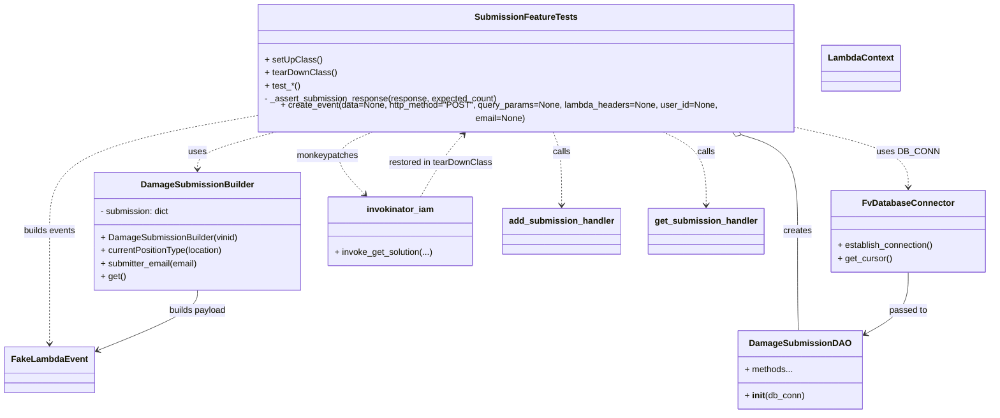
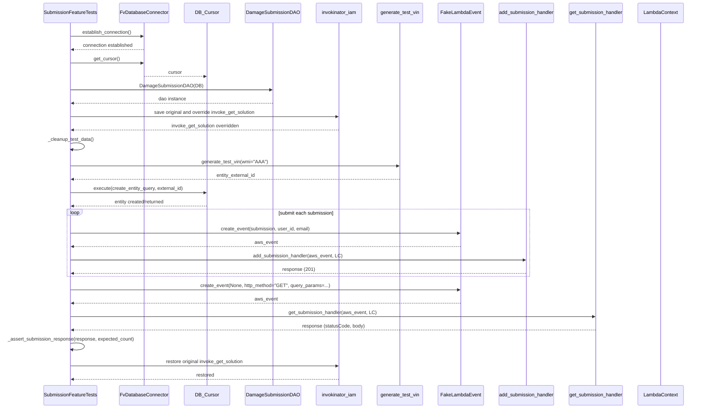

# Diagram: entity_core/entity_service/entity_service/tests/integration_tests/test_damage_submission.py

> Auto-generated by Obscura crawlers

## Diagram 1

### SVG

<svg id="container" width="1789.2265625" xmlns="http://www.w3.org/2000/svg" class="classDiagram" height="746" viewBox="0 0 1789.2265625 746" role="graphics-document document" aria-roledescription="class"><g><defs><marker id="container_class-aggregationStart" class="marker aggregation class" refX="18" refY="7" markerWidth="190" markerHeight="240" orient="auto"><path d="M 18,7 L9,13 L1,7 L9,1 Z"></path></marker></defs><defs><marker id="container_class-aggregationEnd" class="marker aggregation class" refX="1" refY="7" markerWidth="20" markerHeight="28" orient="auto"><path d="M 18,7 L9,13 L1,7 L9,1 Z"></path></marker></defs><defs><marker id="container_class-extensionStart" class="marker extension class" refX="18" refY="7" markerWidth="190" markerHeight="240" orient="auto"><path d="M 1,7 L18,13 V 1 Z"></path></marker></defs><defs><marker id="container_class-extensionEnd" class="marker extension class" refX="1" refY="7" markerWidth="20" markerHeight="28" orient="auto"><path d="M 1,1 V 13 L18,7 Z"></path></marker></defs><defs><marker id="container_class-compositionStart" class="marker composition class" refX="18" refY="7" markerWidth="190" markerHeight="240" orient="auto"><path d="M 18,7 L9,13 L1,7 L9,1 Z"></path></marker></defs><defs><marker id="container_class-compositionEnd" class="marker composition class" refX="1" refY="7" markerWidth="20" markerHeight="28" orient="auto"><path d="M 18,7 L9,13 L1,7 L9,1 Z"></path></marker></defs><defs><marker id="container_class-dependencyStart" class="marker dependency class" refX="6" refY="7" markerWidth="190" markerHeight="240" orient="auto"><path d="M 5,7 L9,13 L1,7 L9,1 Z"></path></marker></defs><defs><marker id="container_class-dependencyEnd" class="marker dependency class" refX="13" refY="7" markerWidth="20" markerHeight="28" orient="auto"><path d="M 18,7 L9,13 L14,7 L9,1 Z"></path></marker></defs><defs><marker id="container_class-lollipopStart" class="marker lollipop class" refX="13" refY="7" markerWidth="190" markerHeight="240" orient="auto"><circle stroke="black" fill="transparent" cx="7" cy="7" r="6"></circle></marker></defs><defs><marker id="container_class-lollipopEnd" class="marker lollipop class" refX="1" refY="7" markerWidth="190" markerHeight="240" orient="auto"><circle stroke="black" fill="transparent" cx="7" cy="7" r="6"></circle></marker></defs><g class="root"><g class="clusters"></g><g class="edgePaths"><path d="M506.182,230L481.269,236.167C456.357,242.333,406.532,254.667,381.619,266C356.707,277.333,356.707,287.667,356.707,292.833L356.707,298" id="id_SubmissionFeatureTests_DamageSubmissionBuilder_1" class="edge-thickness-normal edge-pattern-dashed relation" style=";;;" data-edge="true" data-et="edge" data-id="id_SubmissionFeatureTests_DamageSubmissionBuilder_1" data-points="W3sieCI6NTA2LjE4MTY0MDYyNSwieSI6MjMwfSx7IngiOjM1Ni43MDcwMzEyNSwieSI6MjY3fSx7IngiOjM1Ni43MDcwMzEyNSwieSI6MzA0fV0=" marker-end="url(#container_class-dependencyEnd)"></path><path d="M1455.246,226.977L1486.174,233.647C1517.103,240.318,1578.96,253.659,1609.888,270.996C1640.816,288.333,1640.816,309.667,1640.816,320.333L1640.816,331" id="id_SubmissionFeatureTests_FvDatabaseConnector_2" class="edge-thickness-normal edge-pattern-dashed relation" style=";;;" data-edge="true" data-et="edge" data-id="id_SubmissionFeatureTests_FvDatabaseConnector_2" data-points="W3sieCI6MTQ1NS4yNDYwOTM3NSwieSI6MjI2Ljk3NjcyOTA5NDMyNDU4fSx7IngiOjE2NDAuODE2NDA2MjUsInkiOjI2N30seyJ4IjoxNjQwLjgxNjQwNjI1LCJ5IjozMzd9XQ==" marker-end="url(#container_class-dependencyEnd)"></path><path d="M1334.575,235.038L1352.018,240.365C1369.461,245.692,1404.348,256.346,1421.791,285.84C1439.234,315.333,1439.234,363.667,1439.234,412C1439.234,460.333,1439.234,508.667,1439.708,539C1440.182,569.333,1441.13,581.667,1441.603,587.833L1442.077,594" id="id_SubmissionFeatureTests_DamageSubmissionDAO_3" class="edge-thickness-normal edge-pattern-solid relation" style=";;;" data-edge="true" data-et="edge" data-id="id_SubmissionFeatureTests_DamageSubmissionDAO_3" data-points="W3sieCI6MTMxOC4wNzcxNDg0Mzc1LCJ5IjoyMzB9LHsieCI6MTQzOS4yMzQzNzUsInkiOjI2N30seyJ4IjoxNDM5LjIzNDM3NSwieSI6NDEyfSx7IngiOjE0MzkuMjM0Mzc1LCJ5Ijo1NTd9LHsieCI6MTQ0Mi4wNzcyNjQ5MDgyNTcsInkiOjU5NH1d" marker-start="url(#container_class-aggregationStart)"></path><path d="M679.632,230L664.356,236.167C649.08,242.333,618.527,254.667,615.556,273.775C612.586,292.884,637.197,318.768,649.502,331.71L661.808,344.652" id="id_SubmissionFeatureTests_invokinator_iam_4" class="edge-thickness-normal edge-pattern-dashed relation" style=";;;" data-edge="true" data-et="edge" data-id="id_SubmissionFeatureTests_invokinator_iam_4" data-points="W3sieCI6Njc5LjYzMjMyNDIxODc1LCJ5IjoyMzB9LHsieCI6NTg3Ljk3NDYwOTM3NSwieSI6MjY3fSx7IngiOjY2NS45NDE5ODU0NTI1ODYyLCJ5IjozNDl9XQ==" marker-end="url(#container_class-dependencyEnd)"></path><path d="M1003.774,230L1006.506,236.167C1009.238,242.333,1014.701,254.667,1017.432,277C1020.164,299.333,1020.164,331.667,1020.164,347.833L1020.164,364" id="id_SubmissionFeatureTests_add_submission_handler_5" class="edge-thickness-normal edge-pattern-dashed relation" style=";;;" data-edge="true" data-et="edge" data-id="id_SubmissionFeatureTests_add_submission_handler_5" data-points="W3sieCI6MTAwMy43NzQ0MTQwNjI1LCJ5IjoyMzB9LHsieCI6MTAyMC4xNjQwNjI1LCJ5IjoyNjd9LHsieCI6MTAyMC4xNjQwNjI1LCJ5IjozNzB9XQ==" marker-end="url(#container_class-dependencyEnd)"></path><path d="M1195.786,230L1209.185,236.167C1222.584,242.333,1249.382,254.667,1262.781,277C1276.18,299.333,1276.18,331.667,1276.18,347.833L1276.18,364" id="id_SubmissionFeatureTests_get_submission_handler_6" class="edge-thickness-normal edge-pattern-dashed relation" style=";;;" data-edge="true" data-et="edge" data-id="id_SubmissionFeatureTests_get_submission_handler_6" data-points="W3sieCI6MTE5NS43ODYxMzI4MTI1LCJ5IjoyMzB9LHsieCI6MTI3Ni4xNzk2ODc1LCJ5IjoyNjd9LHsieCI6MTI3Ni4xNzk2ODc1LCJ5IjozNzB9XQ==" marker-end="url(#container_class-dependencyEnd)"></path><path d="M453.965,204.29L392.615,214.742C331.266,225.193,208.566,246.097,147.217,280.715C85.867,315.333,85.867,363.667,85.867,412C85.867,460.333,85.867,508.667,85.867,543C85.867,577.333,85.867,597.667,85.867,607.833L85.867,618" id="id_SubmissionFeatureTests_FakeLambdaEvent_7" class="edge-thickness-normal edge-pattern-dashed relation" style=";;;" data-edge="true" data-et="edge" data-id="id_SubmissionFeatureTests_FakeLambdaEvent_7" data-points="W3sieCI6NDUzLjk2NDg0Mzc1LCJ5IjoyMDQuMjkwMTQzMzAyMjkyNzN9LHsieCI6ODUuODY3MTg3NSwieSI6MjY3fSx7IngiOjg1Ljg2NzE4NzUsInkiOjQxMn0seyJ4Ijo4NS44NjcxODc1LCJ5Ijo1NTd9LHsieCI6ODUuODY3MTg3NSwieSI6NjI0fV0=" marker-end="url(#container_class-dependencyEnd)"></path><path d="M356.707,520L356.707,526.167C356.707,532.333,356.707,544.667,325.473,563.404C294.238,582.141,231.769,607.281,200.535,619.852L169.301,632.422" id="id_DamageSubmissionBuilder_FakeLambdaEvent_8" class="edge-thickness-normal edge-pattern-solid relation" style=";;;" data-edge="true" data-et="edge" data-id="id_DamageSubmissionBuilder_FakeLambdaEvent_8" data-points="W3sieCI6MzU2LjcwNzAzMTI1LCJ5Ijo1MjB9LHsieCI6MzU2LjcwNzAzMTI1LCJ5Ijo1NTd9LHsieCI6MTYzLjczNDM3NSwieSI6NjM0LjY2MjIwNTIzNTQ1MTF9XQ==" marker-end="url(#container_class-dependencyEnd)"></path><path d="M1640.816,487L1640.816,498.667C1640.816,510.333,1640.816,533.667,1627.812,552.67C1614.807,571.674,1588.798,586.347,1575.793,593.684L1562.788,601.021" id="id_FvDatabaseConnector_DamageSubmissionDAO_9" class="edge-thickness-normal edge-pattern-solid relation" style=";;;" data-edge="true" data-et="edge" data-id="id_FvDatabaseConnector_DamageSubmissionDAO_9" data-points="W3sieCI6MTY0MC44MTY0MDYyNSwieSI6NDg3fSx7IngiOjE2NDAuODE2NDA2MjUsInkiOjU1N30seyJ4IjoxNTU3LjU2MjUsInkiOjYwMy45Njg2NjIxNzgyODE5fV0=" marker-end="url(#container_class-dependencyEnd)"></path><path d="M763.118,349L771.203,335.333C779.289,321.667,795.461,294.333,808.809,275.219C822.158,256.105,832.682,245.21,837.945,239.763L843.207,234.315" id="id_invokinator_iam_SubmissionFeatureTests_10" class="edge-thickness-normal edge-pattern-dashed relation" style=";;;" data-edge="true" data-et="edge" data-id="id_invokinator_iam_SubmissionFeatureTests_10" data-points="W3sieCI6NzYzLjExNzYxODUzNDQ4MjcsInkiOjM0OX0seyJ4Ijo4MTEuNjMyODEyNSwieSI6MjY3fSx7IngiOjg0Ny4zNzU5NzY1NjI1LCJ5IjoyMzB9XQ==" marker-end="url(#container_class-dependencyEnd)"></path></g><g class="edgeLabels"><g class="edgeLabel" transform="translate(356.70703125, 267)"><g class="label" data-id="id_SubmissionFeatureTests_DamageSubmissionBuilder_1" transform="translate(-16.4921875, -12)"><foreignObject width="32.984375" height="24">

uses

</foreignObject></g></g><g class="edgeLabel" transform="translate(1640.81640625, 267)"><g class="label" data-id="id_SubmissionFeatureTests_FvDatabaseConnector_2" transform="translate(-53.09375, -12)"><foreignObject width="106.1875" height="24">

uses DB_CONN

</foreignObject></g></g><g class="edgeLabel" transform="translate(1439.234375, 412)"><g class="label" data-id="id_SubmissionFeatureTests_DamageSubmissionDAO_3" transform="translate(-26.171875, -12)"><foreignObject width="52.34375" height="24">

creates

</foreignObject></g></g><g class="edgeLabel" transform="translate(592.90346, 272.18378)"><g class="label" data-id="id_SubmissionFeatureTests_invokinator_iam_4" transform="translate(-56.90625, -12)"><foreignObject width="113.8125" height="24">

monkeypatches

</foreignObject></g></g><g class="edgeLabel" transform="translate(1020.1640625, 267)"><g class="label" data-id="id_SubmissionFeatureTests_add_submission_handler_5" transform="translate(-16.4453125, -12)"><foreignObject width="32.890625" height="24">

calls

</foreignObject></g></g><g class="edgeLabel" transform="translate(1276.1796875, 267)"><g class="label" data-id="id_SubmissionFeatureTests_get_submission_handler_6" transform="translate(-16.4453125, -12)"><foreignObject width="32.890625" height="24">

calls

</foreignObject></g></g><g class="edgeLabel" transform="translate(85.8671875, 412)"><g class="label" data-id="id_SubmissionFeatureTests_FakeLambdaEvent_7" transform="translate(-48.515625, -12)"><foreignObject width="97.03125" height="24">

builds events

</foreignObject></g></g><g class="edgeLabel" transform="translate(356.70703125, 557)"><g class="label" data-id="id_DamageSubmissionBuilder_FakeLambdaEvent_8" transform="translate(-53.484375, -12)"><foreignObject width="106.96875" height="24">

builds payload

</foreignObject></g></g><g class="edgeLabel" transform="translate(1640.81640625, 557)"><g class="label" data-id="id_FvDatabaseConnector_DamageSubmissionDAO_9" transform="translate(-35.046875, -12)"><foreignObject width="70.09375" height="24">

passed to

</foreignObject></g></g><g class="edgeLabel" transform="translate(800.4731, 285.86205)"><g class="label" data-id="id_invokinator_iam_SubmissionFeatureTests_10" transform="translate(-94.671875, -12)"><foreignObject width="189.34375" height="24">

restored in tearDownClass

</foreignObject></g></g></g><g class="nodes"><g class="node default" id="classId-DamageSubmissionBuilder-0" transform="translate(356.70703125, 412)"><g class="basic label-container"><path d="M-187.32421875 -108 L187.32421875 -108 L187.32421875 108 L-187.32421875 108" stroke="none" stroke-width="0" fill="#ECECFF" style=""></path><path d="M-187.32421875 -108 C-70.08240255214659 -108, 47.15941364570682 -108, 187.32421875 -108 M-187.32421875 -108 C-100.33009634179732 -108, -13.33597393359463 -108, 187.32421875 -108 M187.32421875 -108 C187.32421875 -59.086330144366606, 187.32421875 -10.172660288733212, 187.32421875 108 M187.32421875 -108 C187.32421875 -50.90330951050315, 187.32421875 6.1933809789937015, 187.32421875 108 M187.32421875 108 C42.2038462708783 108, -102.9165262082434 108, -187.32421875 108 M187.32421875 108 C54.6051144380331 108, -78.1139898739338 108, -187.32421875 108 M-187.32421875 108 C-187.32421875 48.73524944080319, -187.32421875 -10.529501118393625, -187.32421875 -108 M-187.32421875 108 C-187.32421875 43.32798606542673, -187.32421875 -21.344027869146544, -187.32421875 -108" stroke="#9370DB" stroke-width="1.3" fill="none" stroke-dasharray="0 0" style=""></path></g><g class="annotation-group text" transform="translate(0, -84)"></g><g class="label-group text" transform="translate(-97.9140625, -84)"><g class="label" style="font-weight: bolder" transform="translate(0,-12)"><foreignObject width="195.828125" height="24">

DamageSubmissionBuilder

</foreignObject></g></g><g class="members-group text" transform="translate(-175.32421875, -36)"><g class="label" style="" transform="translate(0,-12)"><foreignObject width="128.8125" height="24">

- submission: dict

</foreignObject></g></g><g class="methods-group text" transform="translate(-175.32421875, 12)"><g class="label" style="" transform="translate(0,-12)"><foreignObject width="252.734375" height="24">

+ DamageSubmissionBuilder(vinid)

</foreignObject></g><g class="label" style="" transform="translate(0,12)"><foreignObject width="227.171875" height="24">

+ currentPositionType(location)

</foreignObject></g><g class="label" style="" transform="translate(0,36)"><foreignObject width="180.71875" height="24">

+ submitter_email(email)

</foreignObject></g><g class="label" style="" transform="translate(0,60)"><foreignObject width="45.15625" height="24">

+ get()

</foreignObject></g></g><g class="divider" style=""><path d="M-187.32421875 -60 C-110.02442321752612 -60, -32.72462768505224 -60, 187.32421875 -60 M-187.32421875 -60 C-49.177733432032596 -60, 88.96875188593481 -60, 187.32421875 -60" stroke="#9370DB" stroke-width="1.3" fill="none" stroke-dasharray="0 0" style=""></path></g><g class="divider" style=""><path d="M-187.32421875 -12 C-74.82120230115301 -12, 37.681814147693984 -12, 187.32421875 -12 M-187.32421875 -12 C-37.99785996445149 -12, 111.32849882109701 -12, 187.32421875 -12" stroke="#9370DB" stroke-width="1.3" fill="none" stroke-dasharray="0 0" style=""></path></g></g><g class="node default" id="classId-SubmissionFeatureTests-1" transform="translate(954.60546875, 119)"><g class="basic label-container"><path d="M-500.640625 -111 L500.640625 -111 L500.640625 111 L-500.640625 111" stroke="none" stroke-width="0" fill="#ECECFF" style=""></path><path d="M-500.640625 -111 C-214.4518990387724 -111, 71.73682692245518 -111, 500.640625 -111 M-500.640625 -111 C-195.8251127867169 -111, 108.99039942656623 -111, 500.640625 -111 M500.640625 -111 C500.640625 -53.327203683161144, 500.640625 4.345592633677711, 500.640625 111 M500.640625 -111 C500.640625 -31.03896632771057, 500.640625 48.92206734457886, 500.640625 111 M500.640625 111 C286.6397208723747 111, 72.63881674474948 111, -500.640625 111 M500.640625 111 C189.02262106371438 111, -122.59538287257124 111, -500.640625 111 M-500.640625 111 C-500.640625 65.50276101625472, -500.640625 20.005522032509447, -500.640625 -111 M-500.640625 111 C-500.640625 29.645037781192016, -500.640625 -51.70992443761597, -500.640625 -111" stroke="#9370DB" stroke-width="1.3" fill="none" stroke-dasharray="0 0" style=""></path></g><g class="annotation-group text" transform="translate(0, -87)"></g><g class="label-group text" transform="translate(-88.65625, -87)"><g class="label" style="font-weight: bolder" transform="translate(0,-12)"><foreignObject width="177.3125" height="24">

SubmissionFeatureTests

</foreignObject></g></g><g class="members-group text" transform="translate(-488.640625, -39)"></g><g class="methods-group text" transform="translate(-488.640625, -9)"><g class="label" style="" transform="translate(0,-12)"><foreignObject width="101.40625" height="24">

+ setUpClass()

</foreignObject></g><g class="label" style="" transform="translate(0,12)"><foreignObject width="128.8125" height="24">

+ tearDownClass()

</foreignObject></g><g class="label" style="" transform="translate(0,36)"><foreignObject width="63.84375" height="24">

+ test_*()

</foreignObject></g><g class="label" style="" transform="translate(0,60)"><foreignObject width="427.921875" height="24">

- _assert_submission_response(response, expected_count)

</foreignObject></g><g class="label" style="" transform="translate(0,84)"><foreignObject width="888.625" height="24">

+ create_event(data=None, http_method="POST", query_params=None, lambda_headers=None, user_id=None, email=None)

</foreignObject></g></g><g class="divider" style=""><path d="M-500.640625 -63 C-291.8953042861183 -63, -83.14998357223658 -63, 500.640625 -63 M-500.640625 -63 C-131.18146523942784 -63, 238.27769452114433 -63, 500.640625 -63" stroke="#9370DB" stroke-width="1.3" fill="none" stroke-dasharray="0 0" style=""></path></g><g class="divider" style=""><path d="M-500.640625 -39 C-230.1430294743538 -39, 40.35456605129241 -39, 500.640625 -39 M-500.640625 -39 C-249.02249087030722 -39, 2.595643259385554 -39, 500.640625 -39" stroke="#9370DB" stroke-width="1.3" fill="none" stroke-dasharray="0 0" style=""></path></g></g><g class="node default" id="classId-FvDatabaseConnector-2" transform="translate(1640.81640625, 412)"><g class="basic label-container"><path d="M-140.41015625 -75 L140.41015625 -75 L140.41015625 75 L-140.41015625 75" stroke="none" stroke-width="0" fill="#ECECFF" style=""></path><path d="M-140.41015625 -75 C-31.85407889142627 -75, 76.70199846714746 -75, 140.41015625 -75 M-140.41015625 -75 C-56.058816746904256 -75, 28.292522756191488 -75, 140.41015625 -75 M140.41015625 -75 C140.41015625 -22.977186371933115, 140.41015625 29.04562725613377, 140.41015625 75 M140.41015625 -75 C140.41015625 -15.47277494043582, 140.41015625 44.05445011912836, 140.41015625 75 M140.41015625 75 C44.45632762967665 75, -51.4975009906467 75, -140.41015625 75 M140.41015625 75 C68.0478929728078 75, -4.314370304384397 75, -140.41015625 75 M-140.41015625 75 C-140.41015625 23.679199512877993, -140.41015625 -27.641600974244014, -140.41015625 -75 M-140.41015625 75 C-140.41015625 40.38120070569898, -140.41015625 5.76240141139796, -140.41015625 -75" stroke="#9370DB" stroke-width="1.3" fill="none" stroke-dasharray="0 0" style=""></path></g><g class="annotation-group text" transform="translate(0, -51)"></g><g class="label-group text" transform="translate(-79.3046875, -51)"><g class="label" style="font-weight: bolder" transform="translate(0,-12)"><foreignObject width="158.609375" height="24">

FvDatabaseConnector

</foreignObject></g></g><g class="members-group text" transform="translate(-128.41015625, -3)"></g><g class="methods-group text" transform="translate(-128.41015625, 27)"><g class="label" style="" transform="translate(0,-12)"><foreignObject width="177.515625" height="24">

+ establish_connection()

</foreignObject></g><g class="label" style="" transform="translate(0,12)"><foreignObject width="98.890625" height="24">

+ get_cursor()

</foreignObject></g></g><g class="divider" style=""><path d="M-140.41015625 -27 C-83.24564585876699 -27, -26.081135467533983 -27, 140.41015625 -27 M-140.41015625 -27 C-45.75974609289548 -27, 48.890664064209034 -27, 140.41015625 -27" stroke="#9370DB" stroke-width="1.3" fill="none" stroke-dasharray="0 0" style=""></path></g><g class="divider" style=""><path d="M-140.41015625 -3 C-61.76327689602071 -3, 16.883602457958574 -3, 140.41015625 -3 M-140.41015625 -3 C-49.268976816597075 -3, 41.87220261680585 -3, 140.41015625 -3" stroke="#9370DB" stroke-width="1.3" fill="none" stroke-dasharray="0 0" style=""></path></g></g><g class="node default" id="classId-DamageSubmissionDAO-3" transform="translate(1447.609375, 666)"><g class="basic label-container"><path d="M-109.953125 -72 L109.953125 -72 L109.953125 72 L-109.953125 72" stroke="none" stroke-width="0" fill="#ECECFF" style=""></path><path d="M-109.953125 -72 C-48.83280928340859 -72, 12.287506433182827 -72, 109.953125 -72 M-109.953125 -72 C-56.690998141881806 -72, -3.4288712837636126 -72, 109.953125 -72 M109.953125 -72 C109.953125 -30.710911814935557, 109.953125 10.578176370128887, 109.953125 72 M109.953125 -72 C109.953125 -42.68120235761377, 109.953125 -13.362404715227541, 109.953125 72 M109.953125 72 C58.85284614181558 72, 7.752567283631166 72, -109.953125 72 M109.953125 72 C61.86683326571701 72, 13.780541531434025 72, -109.953125 72 M-109.953125 72 C-109.953125 30.07664942013818, -109.953125 -11.846701159723636, -109.953125 -72 M-109.953125 72 C-109.953125 41.32868595603777, -109.953125 10.657371912075554, -109.953125 -72" stroke="#9370DB" stroke-width="1.3" fill="none" stroke-dasharray="0 0" style=""></path></g><g class="annotation-group text" transform="translate(0, -48)"></g><g class="label-group text" transform="translate(-86.6875, -48)"><g class="label" style="font-weight: bolder" transform="translate(0,-12)"><foreignObject width="173.375" height="24">

DamageSubmissionDAO

</foreignObject></g></g><g class="members-group text" transform="translate(-97.953125, 0)"><g class="label" style="" transform="translate(0,-12)"><foreignObject width="87.71875" height="24">

+ methods...

</foreignObject></g></g><g class="methods-group text" transform="translate(-97.953125, 48)"><g class="label" style="" transform="translate(0,-12)"><foreignObject width="109.21875" height="24">

+ <strong>init</strong>(db_conn)

</foreignObject></g></g><g class="divider" style=""><path d="M-109.953125 -24 C-51.25285249722243 -24, 7.447420005555145 -24, 109.953125 -24 M-109.953125 -24 C-24.878672084502213 -24, 60.195780830995574 -24, 109.953125 -24" stroke="#9370DB" stroke-width="1.3" fill="none" stroke-dasharray="0 0" style=""></path></g><g class="divider" style=""><path d="M-109.953125 24 C-64.74633995325486 24, -19.53955490650972 24, 109.953125 24 M-109.953125 24 C-45.837313797843066 24, 18.278497404313867 24, 109.953125 24" stroke="#9370DB" stroke-width="1.3" fill="none" stroke-dasharray="0 0" style=""></path></g></g><g class="node default" id="classId-invokinator_iam-4" transform="translate(725.84375, 412)"><g class="basic label-container"><path d="M-131.8125 -63 L131.8125 -63 L131.8125 63 L-131.8125 63" stroke="none" stroke-width="0" fill="#ECECFF" style=""></path><path d="M-131.8125 -63 C-78.45595433050613 -63, -25.099408661012248 -63, 131.8125 -63 M-131.8125 -63 C-45.55601478110917 -63, 40.70047043778166 -63, 131.8125 -63 M131.8125 -63 C131.8125 -22.222191441030517, 131.8125 18.555617117938965, 131.8125 63 M131.8125 -63 C131.8125 -15.100802156527394, 131.8125 32.79839568694521, 131.8125 63 M131.8125 63 C31.264591324368993 63, -69.28331735126201 63, -131.8125 63 M131.8125 63 C54.0616835130503 63, -23.689132973899405 63, -131.8125 63 M-131.8125 63 C-131.8125 32.258734372881165, -131.8125 1.5174687457623222, -131.8125 -63 M-131.8125 63 C-131.8125 26.24878828368064, -131.8125 -10.502423432638722, -131.8125 -63" stroke="#9370DB" stroke-width="1.3" fill="none" stroke-dasharray="0 0" style=""></path></g><g class="annotation-group text" transform="translate(0, -39)"></g><g class="label-group text" transform="translate(-58.953125, -39)"><g class="label" style="font-weight: bolder" transform="translate(0,-12)"><foreignObject width="117.90625" height="24">

invokinator_iam

</foreignObject></g></g><g class="members-group text" transform="translate(-119.8125, 9)"></g><g class="methods-group text" transform="translate(-119.8125, 39)"><g class="label" style="" transform="translate(0,-12)"><foreignObject width="180.671875" height="24">

+ invoke_get_solution(...)

</foreignObject></g></g><g class="divider" style=""><path d="M-131.8125 -15 C-64.38698156696155 -15, 3.038536866076896 -15, 131.8125 -15 M-131.8125 -15 C-60.18792854622832 -15, 11.436642907543359 -15, 131.8125 -15" stroke="#9370DB" stroke-width="1.3" fill="none" stroke-dasharray="0 0" style=""></path></g><g class="divider" style=""><path d="M-131.8125 9 C-55.80359257353615 9, 20.2053148529277 9, 131.8125 9 M-131.8125 9 C-77.18377707826485 9, -22.555054156529707 9, 131.8125 9" stroke="#9370DB" stroke-width="1.3" fill="none" stroke-dasharray="0 0" style=""></path></g></g><g class="node default" id="classId-add_submission_handler-5" transform="translate(1020.1640625, 412)"><g class="basic label-container"><path d="M-104.1328125 -42 L104.1328125 -42 L104.1328125 42 L-104.1328125 42" stroke="none" stroke-width="0" fill="#ECECFF" style=""></path><path d="M-104.1328125 -42 C-23.73041362429956 -42, 56.67198525140088 -42, 104.1328125 -42 M-104.1328125 -42 C-49.0038964485975 -42, 6.125019602804997 -42, 104.1328125 -42 M104.1328125 -42 C104.1328125 -10.193875019720451, 104.1328125 21.612249960559097, 104.1328125 42 M104.1328125 -42 C104.1328125 -13.000806527127644, 104.1328125 15.998386945744713, 104.1328125 42 M104.1328125 42 C25.00152317553139 42, -54.12976614893722 42, -104.1328125 42 M104.1328125 42 C55.74314656577303 42, 7.353480631546063 42, -104.1328125 42 M-104.1328125 42 C-104.1328125 20.636520554878757, -104.1328125 -0.7269588902424857, -104.1328125 -42 M-104.1328125 42 C-104.1328125 24.300577946124857, -104.1328125 6.601155892249714, -104.1328125 -42" stroke="#9370DB" stroke-width="1.3" fill="none" stroke-dasharray="0 0" style=""></path></g><g class="annotation-group text" transform="translate(0, -18)"></g><g class="label-group text" transform="translate(-92.1328125, -18)"><g class="label" style="font-weight: bolder" transform="translate(0,-12)"><foreignObject width="184.265625" height="24">

add_submission_handler

</foreignObject></g></g><g class="members-group text" transform="translate(-92.1328125, 30)"></g><g class="methods-group text" transform="translate(-92.1328125, 60)"></g><g class="divider" style=""><path d="M-104.1328125 6 C-59.40903564528155 6, -14.685258790563097 6, 104.1328125 6 M-104.1328125 6 C-42.826094277321225 6, 18.48062394535755 6, 104.1328125 6" stroke="#9370DB" stroke-width="1.3" fill="none" stroke-dasharray="0 0" style=""></path></g><g class="divider" style=""><path d="M-104.1328125 24 C-38.37998696098069 24, 27.372838578038625 24, 104.1328125 24 M-104.1328125 24 C-41.82788007162277 24, 20.477052356754456 24, 104.1328125 24" stroke="#9370DB" stroke-width="1.3" fill="none" stroke-dasharray="0 0" style=""></path></g></g><g class="node default" id="classId-get_submission_handler-6" transform="translate(1276.1796875, 412)"><g class="basic label-container"><path d="M-101.8828125 -42 L101.8828125 -42 L101.8828125 42 L-101.8828125 42" stroke="none" stroke-width="0" fill="#ECECFF" style=""></path><path d="M-101.8828125 -42 C-44.28708730904298 -42, 13.308637881914038 -42, 101.8828125 -42 M-101.8828125 -42 C-60.297785826784335 -42, -18.71275915356867 -42, 101.8828125 -42 M101.8828125 -42 C101.8828125 -16.703423846506126, 101.8828125 8.593152306987747, 101.8828125 42 M101.8828125 -42 C101.8828125 -14.070597886175918, 101.8828125 13.858804227648164, 101.8828125 42 M101.8828125 42 C27.343392635495505 42, -47.19602722900899 42, -101.8828125 42 M101.8828125 42 C42.02572626847364 42, -17.83135996305272 42, -101.8828125 42 M-101.8828125 42 C-101.8828125 17.675111293171277, -101.8828125 -6.649777413657446, -101.8828125 -42 M-101.8828125 42 C-101.8828125 13.74431864563499, -101.8828125 -14.511362708730019, -101.8828125 -42" stroke="#9370DB" stroke-width="1.3" fill="none" stroke-dasharray="0 0" style=""></path></g><g class="annotation-group text" transform="translate(0, -18)"></g><g class="label-group text" transform="translate(-89.8828125, -18)"><g class="label" style="font-weight: bolder" transform="translate(0,-12)"><foreignObject width="179.765625" height="24">

get_submission_handler

</foreignObject></g></g><g class="members-group text" transform="translate(-89.8828125, 30)"></g><g class="methods-group text" transform="translate(-89.8828125, 60)"></g><g class="divider" style=""><path d="M-101.8828125 6 C-53.80158311012553 6, -5.720353720251055 6, 101.8828125 6 M-101.8828125 6 C-31.390552790360985 6, 39.10170691927803 6, 101.8828125 6" stroke="#9370DB" stroke-width="1.3" fill="none" stroke-dasharray="0 0" style=""></path></g><g class="divider" style=""><path d="M-101.8828125 24 C-25.22016715681069 24, 51.44247818637862 24, 101.8828125 24 M-101.8828125 24 C-23.674876585519414 24, 54.53305932896117 24, 101.8828125 24" stroke="#9370DB" stroke-width="1.3" fill="none" stroke-dasharray="0 0" style=""></path></g></g><g class="node default" id="classId-FakeLambdaEvent-7" transform="translate(85.8671875, 666)"><g class="basic label-container"><path d="M-77.8671875 -42 L77.8671875 -42 L77.8671875 42 L-77.8671875 42" stroke="none" stroke-width="0" fill="#ECECFF" style=""></path><path d="M-77.8671875 -42 C-22.513193392698334 -42, 32.84080071460333 -42, 77.8671875 -42 M-77.8671875 -42 C-23.610479355753654 -42, 30.646228788492692 -42, 77.8671875 -42 M77.8671875 -42 C77.8671875 -12.68190842102237, 77.8671875 16.63618315795526, 77.8671875 42 M77.8671875 -42 C77.8671875 -17.10995764139762, 77.8671875 7.780084717204758, 77.8671875 42 M77.8671875 42 C29.117438570864145 42, -19.63231035827171 42, -77.8671875 42 M77.8671875 42 C36.84055303806657 42, -4.186081423866867 42, -77.8671875 42 M-77.8671875 42 C-77.8671875 20.70969604212411, -77.8671875 -0.5806079157517772, -77.8671875 -42 M-77.8671875 42 C-77.8671875 22.18556575040242, -77.8671875 2.371131500804843, -77.8671875 -42" stroke="#9370DB" stroke-width="1.3" fill="none" stroke-dasharray="0 0" style=""></path></g><g class="annotation-group text" transform="translate(0, -18)"></g><g class="label-group text" transform="translate(-65.8671875, -18)"><g class="label" style="font-weight: bolder" transform="translate(0,-12)"><foreignObject width="131.734375" height="24">

FakeLambdaEvent

</foreignObject></g></g><g class="members-group text" transform="translate(-65.8671875, 30)"></g><g class="methods-group text" transform="translate(-65.8671875, 60)"></g><g class="divider" style=""><path d="M-77.8671875 6 C-19.28799816772254 6, 39.29119116455492 6, 77.8671875 6 M-77.8671875 6 C-25.797529022477498 6, 26.272129455045004 6, 77.8671875 6" stroke="#9370DB" stroke-width="1.3" fill="none" stroke-dasharray="0 0" style=""></path></g><g class="divider" style=""><path d="M-77.8671875 24 C-34.12234215636713 24, 9.622503187265735 24, 77.8671875 24 M-77.8671875 24 C-31.112791702751423 24, 15.641604094497154 24, 77.8671875 24" stroke="#9370DB" stroke-width="1.3" fill="none" stroke-dasharray="0 0" style=""></path></g></g><g class="node default" id="classId-LambdaContext-8" transform="translate(1574.54296875, 119)"><g class="basic label-container"><path d="M-69.296875 -42 L69.296875 -42 L69.296875 42 L-69.296875 42" stroke="none" stroke-width="0" fill="#ECECFF" style=""></path><path d="M-69.296875 -42 C-25.338078821577234 -42, 18.62071735684553 -42, 69.296875 -42 M-69.296875 -42 C-21.363974097814626 -42, 26.568926804370747 -42, 69.296875 -42 M69.296875 -42 C69.296875 -13.325267729023789, 69.296875 15.349464541952422, 69.296875 42 M69.296875 -42 C69.296875 -10.567750652216048, 69.296875 20.864498695567903, 69.296875 42 M69.296875 42 C34.2341583514516 42, -0.8285582970968051 42, -69.296875 42 M69.296875 42 C40.583780456327005 42, 11.870685912654011 42, -69.296875 42 M-69.296875 42 C-69.296875 12.298069949434755, -69.296875 -17.40386010113049, -69.296875 -42 M-69.296875 42 C-69.296875 12.656591891843437, -69.296875 -16.686816216313126, -69.296875 -42" stroke="#9370DB" stroke-width="1.3" fill="none" stroke-dasharray="0 0" style=""></path></g><g class="annotation-group text" transform="translate(0, -18)"></g><g class="label-group text" transform="translate(-57.296875, -18)"><g class="label" style="font-weight: bolder" transform="translate(0,-12)"><foreignObject width="114.59375" height="24">

LambdaContext

</foreignObject></g></g><g class="members-group text" transform="translate(-57.296875, 30)"></g><g class="methods-group text" transform="translate(-57.296875, 60)"></g><g class="divider" style=""><path d="M-69.296875 6 C-22.86617448212018 6, 23.56452603575964 6, 69.296875 6 M-69.296875 6 C-21.809050373503055 6, 25.67877425299389 6, 69.296875 6" stroke="#9370DB" stroke-width="1.3" fill="none" stroke-dasharray="0 0" style=""></path></g><g class="divider" style=""><path d="M-69.296875 24 C-24.179758456273248 24, 20.937358087453504 24, 69.296875 24 M-69.296875 24 C-36.189229018672684 24, -3.081583037345368 24, 69.296875 24" stroke="#9370DB" stroke-width="1.3" fill="none" stroke-dasharray="0 0" style=""></path></g></g></g></g></g></svg>

## Diagram 2

### SVG

<svg id="container" width="2410.5" xmlns="http://www.w3.org/2000/svg" height="1438" viewBox="-160 -10 2410.5 1438" role="graphics-document document" aria-roledescription="sequence"><g><rect x="2050.5" y="1352" fill="#eaeaea" stroke="#666" width="150" height="65" name="LC" rx="3" ry="3" class="actor actor-bottom"></rect><text x="2125.5" y="1384.5" dominant-baseline="central" alignment-baseline="central" class="actor actor-box" style="text-anchor: middle; font-size: 16px; font-weight: 400;"><tspan x="2125.5" dy="0">LambdaContext</tspan></text></g><g><rect x="1801.5" y="1352" fill="#eaeaea" stroke="#666" width="199" height="65" name="Get" rx="3" ry="3" class="actor actor-bottom"></rect><text x="1901" y="1384.5" dominant-baseline="central" alignment-baseline="central" class="actor actor-box" style="text-anchor: middle; font-size: 16px; font-weight: 400;"><tspan x="1901" dy="0">get_submission_handler</tspan></text></g><g><rect x="1547.5" y="1352" fill="#eaeaea" stroke="#666" width="204" height="65" name="Add" rx="3" ry="3" class="actor actor-bottom"></rect><text x="1649.5" y="1384.5" dominant-baseline="central" alignment-baseline="central" class="actor actor-box" style="text-anchor: middle; font-size: 16px; font-weight: 400;"><tspan x="1649.5" dy="0">add_submission_handler</tspan></text></g><g><rect x="1346.5" y="1352" fill="#eaeaea" stroke="#666" width="151" height="65" name="Event" rx="3" ry="3" class="actor actor-bottom"></rect><text x="1422" y="1384.5" dominant-baseline="central" alignment-baseline="central" class="actor actor-box" style="text-anchor: middle; font-size: 16px; font-weight: 400;"><tspan x="1422" dy="0">FakeLambdaEvent</tspan></text></g><g><rect x="1146.5" y="1352" fill="#eaeaea" stroke="#666" width="150" height="65" name="VINGen" rx="3" ry="3" class="actor actor-bottom"></rect><text x="1221.5" y="1384.5" dominant-baseline="central" alignment-baseline="central" class="actor actor-box" style="text-anchor: middle; font-size: 16px; font-weight: 400;"><tspan x="1221.5" dy="0">generate_test_vin</tspan></text></g><g><rect x="946.5" y="1352" fill="#eaeaea" stroke="#666" width="150" height="65" name="Invok" rx="3" ry="3" class="actor actor-bottom"></rect><text x="1021.5" y="1384.5" dominant-baseline="central" alignment-baseline="central" class="actor actor-box" style="text-anchor: middle; font-size: 16px; font-weight: 400;"><tspan x="1021.5" dy="0">invokinator_iam</tspan></text></g><g><rect x="704.5" y="1352" fill="#eaeaea" stroke="#666" width="192" height="65" name="DAO" rx="3" ry="3" class="actor actor-bottom"></rect><text x="800.5" y="1384.5" dominant-baseline="central" alignment-baseline="central" class="actor actor-box" style="text-anchor: middle; font-size: 16px; font-weight: 400;"><tspan x="800.5" dy="0">DamageSubmissionDAO</tspan></text></g><g><rect x="504.5" y="1352" fill="#eaeaea" stroke="#666" width="150" height="65" name="Cursor" rx="3" ry="3" class="actor actor-bottom"></rect><text x="579.5" y="1384.5" dominant-baseline="central" alignment-baseline="central" class="actor actor-box" style="text-anchor: middle; font-size: 16px; font-weight: 400;"><tspan x="579.5" dy="0">DB_Cursor</tspan></text></g><g><rect x="277.5" y="1352" fill="#eaeaea" stroke="#666" width="177" height="65" name="DB" rx="3" ry="3" class="actor actor-bottom"></rect><text x="366" y="1384.5" dominant-baseline="central" alignment-baseline="central" class="actor actor-box" style="text-anchor: middle; font-size: 16px; font-weight: 400;"><tspan x="366" dy="0">FvDatabaseConnector</tspan></text></g><g><rect x="0" y="1352" fill="#eaeaea" stroke="#666" width="195" height="65" name="Test" rx="3" ry="3" class="actor actor-bottom"></rect><text x="97.5" y="1384.5" dominant-baseline="central" alignment-baseline="central" class="actor actor-box" style="text-anchor: middle; font-size: 16px; font-weight: 400;"><tspan x="97.5" dy="0">SubmissionFeatureTests</tspan></text></g><g><line id="actor9" x1="2125.5" y1="65" x2="2125.5" y2="1352" class="actor-line 200" stroke-width="0.5px" stroke="#999" name="LC"></line><g id="root-9"><rect x="2050.5" y="0" fill="#eaeaea" stroke="#666" width="150" height="65" name="LC" rx="3" ry="3" class="actor actor-top"></rect><text x="2125.5" y="32.5" dominant-baseline="central" alignment-baseline="central" class="actor actor-box" style="text-anchor: middle; font-size: 16px; font-weight: 400;"><tspan x="2125.5" dy="0">LambdaContext</tspan></text></g></g><g><line id="actor8" x1="1901" y1="65" x2="1901" y2="1352" class="actor-line 200" stroke-width="0.5px" stroke="#999" name="Get"></line><g id="root-8"><rect x="1801.5" y="0" fill="#eaeaea" stroke="#666" width="199" height="65" name="Get" rx="3" ry="3" class="actor actor-top"></rect><text x="1901" y="32.5" dominant-baseline="central" alignment-baseline="central" class="actor actor-box" style="text-anchor: middle; font-size: 16px; font-weight: 400;"><tspan x="1901" dy="0">get_submission_handler</tspan></text></g></g><g><line id="actor7" x1="1649.5" y1="65" x2="1649.5" y2="1352" class="actor-line 200" stroke-width="0.5px" stroke="#999" name="Add"></line><g id="root-7"><rect x="1547.5" y="0" fill="#eaeaea" stroke="#666" width="204" height="65" name="Add" rx="3" ry="3" class="actor actor-top"></rect><text x="1649.5" y="32.5" dominant-baseline="central" alignment-baseline="central" class="actor actor-box" style="text-anchor: middle; font-size: 16px; font-weight: 400;"><tspan x="1649.5" dy="0">add_submission_handler</tspan></text></g></g><g><line id="actor6" x1="1422" y1="65" x2="1422" y2="1352" class="actor-line 200" stroke-width="0.5px" stroke="#999" name="Event"></line><g id="root-6"><rect x="1346.5" y="0" fill="#eaeaea" stroke="#666" width="151" height="65" name="Event" rx="3" ry="3" class="actor actor-top"></rect><text x="1422" y="32.5" dominant-baseline="central" alignment-baseline="central" class="actor actor-box" style="text-anchor: middle; font-size: 16px; font-weight: 400;"><tspan x="1422" dy="0">FakeLambdaEvent</tspan></text></g></g><g><line id="actor5" x1="1221.5" y1="65" x2="1221.5" y2="1352" class="actor-line 200" stroke-width="0.5px" stroke="#999" name="VINGen"></line><g id="root-5"><rect x="1146.5" y="0" fill="#eaeaea" stroke="#666" width="150" height="65" name="VINGen" rx="3" ry="3" class="actor actor-top"></rect><text x="1221.5" y="32.5" dominant-baseline="central" alignment-baseline="central" class="actor actor-box" style="text-anchor: middle; font-size: 16px; font-weight: 400;"><tspan x="1221.5" dy="0">generate_test_vin</tspan></text></g></g><g><line id="actor4" x1="1021.5" y1="65" x2="1021.5" y2="1352" class="actor-line 200" stroke-width="0.5px" stroke="#999" name="Invok"></line><g id="root-4"><rect x="946.5" y="0" fill="#eaeaea" stroke="#666" width="150" height="65" name="Invok" rx="3" ry="3" class="actor actor-top"></rect><text x="1021.5" y="32.5" dominant-baseline="central" alignment-baseline="central" class="actor actor-box" style="text-anchor: middle; font-size: 16px; font-weight: 400;"><tspan x="1021.5" dy="0">invokinator_iam</tspan></text></g></g><g><line id="actor3" x1="800.5" y1="65" x2="800.5" y2="1352" class="actor-line 200" stroke-width="0.5px" stroke="#999" name="DAO"></line><g id="root-3"><rect x="704.5" y="0" fill="#eaeaea" stroke="#666" width="192" height="65" name="DAO" rx="3" ry="3" class="actor actor-top"></rect><text x="800.5" y="32.5" dominant-baseline="central" alignment-baseline="central" class="actor actor-box" style="text-anchor: middle; font-size: 16px; font-weight: 400;"><tspan x="800.5" dy="0">DamageSubmissionDAO</tspan></text></g></g><g><line id="actor2" x1="579.5" y1="65" x2="579.5" y2="1352" class="actor-line 200" stroke-width="0.5px" stroke="#999" name="Cursor"></line><g id="root-2"><rect x="504.5" y="0" fill="#eaeaea" stroke="#666" width="150" height="65" name="Cursor" rx="3" ry="3" class="actor actor-top"></rect><text x="579.5" y="32.5" dominant-baseline="central" alignment-baseline="central" class="actor actor-box" style="text-anchor: middle; font-size: 16px; font-weight: 400;"><tspan x="579.5" dy="0">DB_Cursor</tspan></text></g></g><g><line id="actor1" x1="366" y1="65" x2="366" y2="1352" class="actor-line 200" stroke-width="0.5px" stroke="#999" name="DB"></line><g id="root-1"><rect x="277.5" y="0" fill="#eaeaea" stroke="#666" width="177" height="65" name="DB" rx="3" ry="3" class="actor actor-top"></rect><text x="366" y="32.5" dominant-baseline="central" alignment-baseline="central" class="actor actor-box" style="text-anchor: middle; font-size: 16px; font-weight: 400;"><tspan x="366" dy="0">FvDatabaseConnector</tspan></text></g></g><g><line id="actor0" x1="97.5" y1="65" x2="97.5" y2="1352" class="actor-line 200" stroke-width="0.5px" stroke="#999" name="Test"></line><g id="root-0"><rect x="0" y="0" fill="#eaeaea" stroke="#666" width="195" height="65" name="Test" rx="3" ry="3" class="actor actor-top"></rect><text x="97.5" y="32.5" dominant-baseline="central" alignment-baseline="central" class="actor actor-box" style="text-anchor: middle; font-size: 16px; font-weight: 400;"><tspan x="97.5" dy="0">SubmissionFeatureTests</tspan></text></g></g><g></g><defs><symbol id="computer" width="24" height="24"><path transform="scale(.5)" d="M2 2v13h20v-13h-20zm18 11h-16v-9h16v9zm-10.228 6l.466-1h3.524l.467 1h-4.457zm14.228 3h-24l2-6h2.104l-1.33 4h18.45l-1.297-4h2.073l2 6zm-5-10h-14v-7h14v7z"></path></symbol></defs><defs><symbol id="database" fill-rule="evenodd" clip-rule="evenodd"><path transform="scale(.5)" d="M12.258.001l.256.004.255.005.253.008.251.01.249.012.247.015.246.016.242.019.241.02.239.023.236.024.233.027.231.028.229.031.225.032.223.034.22.036.217.038.214.04.211.041.208.043.205.045.201.046.198.048.194.05.191.051.187.053.183.054.18.056.175.057.172.059.168.06.163.061.16.063.155.064.15.066.074.033.073.033.071.034.07.034.069.035.068.035.067.035.066.035.064.036.064.036.062.036.06.036.06.037.058.037.058.037.055.038.055.038.053.038.052.038.051.039.05.039.048.039.047.039.045.04.044.04.043.04.041.04.04.041.039.041.037.041.036.041.034.041.033.042.032.042.03.042.029.042.027.042.026.043.024.043.023.043.021.043.02.043.018.044.017.043.015.044.013.044.012.044.011.045.009.044.007.045.006.045.004.045.002.045.001.045v17l-.001.045-.002.045-.004.045-.006.045-.007.045-.009.044-.011.045-.012.044-.013.044-.015.044-.017.043-.018.044-.02.043-.021.043-.023.043-.024.043-.026.043-.027.042-.029.042-.03.042-.032.042-.033.042-.034.041-.036.041-.037.041-.039.041-.04.041-.041.04-.043.04-.044.04-.045.04-.047.039-.048.039-.05.039-.051.039-.052.038-.053.038-.055.038-.055.038-.058.037-.058.037-.06.037-.06.036-.062.036-.064.036-.064.036-.066.035-.067.035-.068.035-.069.035-.07.034-.071.034-.073.033-.074.033-.15.066-.155.064-.16.063-.163.061-.168.06-.172.059-.175.057-.18.056-.183.054-.187.053-.191.051-.194.05-.198.048-.201.046-.205.045-.208.043-.211.041-.214.04-.217.038-.22.036-.223.034-.225.032-.229.031-.231.028-.233.027-.236.024-.239.023-.241.02-.242.019-.246.016-.247.015-.249.012-.251.01-.253.008-.255.005-.256.004-.258.001-.258-.001-.256-.004-.255-.005-.253-.008-.251-.01-.249-.012-.247-.015-.245-.016-.243-.019-.241-.02-.238-.023-.236-.024-.234-.027-.231-.028-.228-.031-.226-.032-.223-.034-.22-.036-.217-.038-.214-.04-.211-.041-.208-.043-.204-.045-.201-.046-.198-.048-.195-.05-.19-.051-.187-.053-.184-.054-.179-.056-.176-.057-.172-.059-.167-.06-.164-.061-.159-.063-.155-.064-.151-.066-.074-.033-.072-.033-.072-.034-.07-.034-.069-.035-.068-.035-.067-.035-.066-.035-.064-.036-.063-.036-.062-.036-.061-.036-.06-.037-.058-.037-.057-.037-.056-.038-.055-.038-.053-.038-.052-.038-.051-.039-.049-.039-.049-.039-.046-.039-.046-.04-.044-.04-.043-.04-.041-.04-.04-.041-.039-.041-.037-.041-.036-.041-.034-.041-.033-.042-.032-.042-.03-.042-.029-.042-.027-.042-.026-.043-.024-.043-.023-.043-.021-.043-.02-.043-.018-.044-.017-.043-.015-.044-.013-.044-.012-.044-.011-.045-.009-.044-.007-.045-.006-.045-.004-.045-.002-.045-.001-.045v-17l.001-.045.002-.045.004-.045.006-.045.007-.045.009-.044.011-.045.012-.044.013-.044.015-.044.017-.043.018-.044.02-.043.021-.043.023-.043.024-.043.026-.043.027-.042.029-.042.03-.042.032-.042.033-.042.034-.041.036-.041.037-.041.039-.041.04-.041.041-.04.043-.04.044-.04.046-.04.046-.039.049-.039.049-.039.051-.039.052-.038.053-.038.055-.038.056-.038.057-.037.058-.037.06-.037.061-.036.062-.036.063-.036.064-.036.066-.035.067-.035.068-.035.069-.035.07-.034.072-.034.072-.033.074-.033.151-.066.155-.064.159-.063.164-.061.167-.06.172-.059.176-.057.179-.056.184-.054.187-.053.19-.051.195-.05.198-.048.201-.046.204-.045.208-.043.211-.041.214-.04.217-.038.22-.036.223-.034.226-.032.228-.031.231-.028.234-.027.236-.024.238-.023.241-.02.243-.019.245-.016.247-.015.249-.012.251-.01.253-.008.255-.005.256-.004.258-.001.258.001zm-9.258 20.499v.01l.001.021.003.021.004.022.005.021.006.022.007.022.009.023.01.022.011.023.012.023.013.023.015.023.016.024.017.023.018.024.019.024.021.024.022.025.023.024.024.025.052.049.056.05.061.051.066.051.07.051.075.051.079.052.084.052.088.052.092.052.097.052.102.051.105.052.11.052.114.051.119.051.123.051.127.05.131.05.135.05.139.048.144.049.147.047.152.047.155.047.16.045.163.045.167.043.171.043.176.041.178.041.183.039.187.039.19.037.194.035.197.035.202.033.204.031.209.03.212.029.216.027.219.025.222.024.226.021.23.02.233.018.236.016.24.015.243.012.246.01.249.008.253.005.256.004.259.001.26-.001.257-.004.254-.005.25-.008.247-.011.244-.012.241-.014.237-.016.233-.018.231-.021.226-.021.224-.024.22-.026.216-.027.212-.028.21-.031.205-.031.202-.034.198-.034.194-.036.191-.037.187-.039.183-.04.179-.04.175-.042.172-.043.168-.044.163-.045.16-.046.155-.046.152-.047.148-.048.143-.049.139-.049.136-.05.131-.05.126-.05.123-.051.118-.052.114-.051.11-.052.106-.052.101-.052.096-.052.092-.052.088-.053.083-.051.079-.052.074-.052.07-.051.065-.051.06-.051.056-.05.051-.05.023-.024.023-.025.021-.024.02-.024.019-.024.018-.024.017-.024.015-.023.014-.024.013-.023.012-.023.01-.023.01-.022.008-.022.006-.022.006-.022.004-.022.004-.021.001-.021.001-.021v-4.127l-.077.055-.08.053-.083.054-.085.053-.087.052-.09.052-.093.051-.095.05-.097.05-.1.049-.102.049-.105.048-.106.047-.109.047-.111.046-.114.045-.115.045-.118.044-.12.043-.122.042-.124.042-.126.041-.128.04-.13.04-.132.038-.134.038-.135.037-.138.037-.139.035-.142.035-.143.034-.144.033-.147.032-.148.031-.15.03-.151.03-.153.029-.154.027-.156.027-.158.026-.159.025-.161.024-.162.023-.163.022-.165.021-.166.02-.167.019-.169.018-.169.017-.171.016-.173.015-.173.014-.175.013-.175.012-.177.011-.178.01-.179.008-.179.008-.181.006-.182.005-.182.004-.184.003-.184.002h-.37l-.184-.002-.184-.003-.182-.004-.182-.005-.181-.006-.179-.008-.179-.008-.178-.01-.176-.011-.176-.012-.175-.013-.173-.014-.172-.015-.171-.016-.17-.017-.169-.018-.167-.019-.166-.02-.165-.021-.163-.022-.162-.023-.161-.024-.159-.025-.157-.026-.156-.027-.155-.027-.153-.029-.151-.03-.15-.03-.148-.031-.146-.032-.145-.033-.143-.034-.141-.035-.14-.035-.137-.037-.136-.037-.134-.038-.132-.038-.13-.04-.128-.04-.126-.041-.124-.042-.122-.042-.12-.044-.117-.043-.116-.045-.113-.045-.112-.046-.109-.047-.106-.047-.105-.048-.102-.049-.1-.049-.097-.05-.095-.05-.093-.052-.09-.051-.087-.052-.085-.053-.083-.054-.08-.054-.077-.054v4.127zm0-5.654v.011l.001.021.003.021.004.021.005.022.006.022.007.022.009.022.01.022.011.023.012.023.013.023.015.024.016.023.017.024.018.024.019.024.021.024.022.024.023.025.024.024.052.05.056.05.061.05.066.051.07.051.075.052.079.051.084.052.088.052.092.052.097.052.102.052.105.052.11.051.114.051.119.052.123.05.127.051.131.05.135.049.139.049.144.048.147.048.152.047.155.046.16.045.163.045.167.044.171.042.176.042.178.04.183.04.187.038.19.037.194.036.197.034.202.033.204.032.209.03.212.028.216.027.219.025.222.024.226.022.23.02.233.018.236.016.24.014.243.012.246.01.249.008.253.006.256.003.259.001.26-.001.257-.003.254-.006.25-.008.247-.01.244-.012.241-.015.237-.016.233-.018.231-.02.226-.022.224-.024.22-.025.216-.027.212-.029.21-.03.205-.032.202-.033.198-.035.194-.036.191-.037.187-.039.183-.039.179-.041.175-.042.172-.043.168-.044.163-.045.16-.045.155-.047.152-.047.148-.048.143-.048.139-.05.136-.049.131-.05.126-.051.123-.051.118-.051.114-.052.11-.052.106-.052.101-.052.096-.052.092-.052.088-.052.083-.052.079-.052.074-.051.07-.052.065-.051.06-.05.056-.051.051-.049.023-.025.023-.024.021-.025.02-.024.019-.024.018-.024.017-.024.015-.023.014-.023.013-.024.012-.022.01-.023.01-.023.008-.022.006-.022.006-.022.004-.021.004-.022.001-.021.001-.021v-4.139l-.077.054-.08.054-.083.054-.085.052-.087.053-.09.051-.093.051-.095.051-.097.05-.1.049-.102.049-.105.048-.106.047-.109.047-.111.046-.114.045-.115.044-.118.044-.12.044-.122.042-.124.042-.126.041-.128.04-.13.039-.132.039-.134.038-.135.037-.138.036-.139.036-.142.035-.143.033-.144.033-.147.033-.148.031-.15.03-.151.03-.153.028-.154.028-.156.027-.158.026-.159.025-.161.024-.162.023-.163.022-.165.021-.166.02-.167.019-.169.018-.169.017-.171.016-.173.015-.173.014-.175.013-.175.012-.177.011-.178.009-.179.009-.179.007-.181.007-.182.005-.182.004-.184.003-.184.002h-.37l-.184-.002-.184-.003-.182-.004-.182-.005-.181-.007-.179-.007-.179-.009-.178-.009-.176-.011-.176-.012-.175-.013-.173-.014-.172-.015-.171-.016-.17-.017-.169-.018-.167-.019-.166-.02-.165-.021-.163-.022-.162-.023-.161-.024-.159-.025-.157-.026-.156-.027-.155-.028-.153-.028-.151-.03-.15-.03-.148-.031-.146-.033-.145-.033-.143-.033-.141-.035-.14-.036-.137-.036-.136-.037-.134-.038-.132-.039-.13-.039-.128-.04-.126-.041-.124-.042-.122-.043-.12-.043-.117-.044-.116-.044-.113-.046-.112-.046-.109-.046-.106-.047-.105-.048-.102-.049-.1-.049-.097-.05-.095-.051-.093-.051-.09-.051-.087-.053-.085-.052-.083-.054-.08-.054-.077-.054v4.139zm0-5.666v.011l.001.02.003.022.004.021.005.022.006.021.007.022.009.023.01.022.011.023.012.023.013.023.015.023.016.024.017.024.018.023.019.024.021.025.022.024.023.024.024.025.052.05.056.05.061.05.066.051.07.051.075.052.079.051.084.052.088.052.092.052.097.052.102.052.105.051.11.052.114.051.119.051.123.051.127.05.131.05.135.05.139.049.144.048.147.048.152.047.155.046.16.045.163.045.167.043.171.043.176.042.178.04.183.04.187.038.19.037.194.036.197.034.202.033.204.032.209.03.212.028.216.027.219.025.222.024.226.021.23.02.233.018.236.017.24.014.243.012.246.01.249.008.253.006.256.003.259.001.26-.001.257-.003.254-.006.25-.008.247-.01.244-.013.241-.014.237-.016.233-.018.231-.02.226-.022.224-.024.22-.025.216-.027.212-.029.21-.03.205-.032.202-.033.198-.035.194-.036.191-.037.187-.039.183-.039.179-.041.175-.042.172-.043.168-.044.163-.045.16-.045.155-.047.152-.047.148-.048.143-.049.139-.049.136-.049.131-.051.126-.05.123-.051.118-.052.114-.051.11-.052.106-.052.101-.052.096-.052.092-.052.088-.052.083-.052.079-.052.074-.052.07-.051.065-.051.06-.051.056-.05.051-.049.023-.025.023-.025.021-.024.02-.024.019-.024.018-.024.017-.024.015-.023.014-.024.013-.023.012-.023.01-.022.01-.023.008-.022.006-.022.006-.022.004-.022.004-.021.001-.021.001-.021v-4.153l-.077.054-.08.054-.083.053-.085.053-.087.053-.09.051-.093.051-.095.051-.097.05-.1.049-.102.048-.105.048-.106.048-.109.046-.111.046-.114.046-.115.044-.118.044-.12.043-.122.043-.124.042-.126.041-.128.04-.13.039-.132.039-.134.038-.135.037-.138.036-.139.036-.142.034-.143.034-.144.033-.147.032-.148.032-.15.03-.151.03-.153.028-.154.028-.156.027-.158.026-.159.024-.161.024-.162.023-.163.023-.165.021-.166.02-.167.019-.169.018-.169.017-.171.016-.173.015-.173.014-.175.013-.175.012-.177.01-.178.01-.179.009-.179.007-.181.006-.182.006-.182.004-.184.003-.184.001-.185.001-.185-.001-.184-.001-.184-.003-.182-.004-.182-.006-.181-.006-.179-.007-.179-.009-.178-.01-.176-.01-.176-.012-.175-.013-.173-.014-.172-.015-.171-.016-.17-.017-.169-.018-.167-.019-.166-.02-.165-.021-.163-.023-.162-.023-.161-.024-.159-.024-.157-.026-.156-.027-.155-.028-.153-.028-.151-.03-.15-.03-.148-.032-.146-.032-.145-.033-.143-.034-.141-.034-.14-.036-.137-.036-.136-.037-.134-.038-.132-.039-.13-.039-.128-.041-.126-.041-.124-.041-.122-.043-.12-.043-.117-.044-.116-.044-.113-.046-.112-.046-.109-.046-.106-.048-.105-.048-.102-.048-.1-.05-.097-.049-.095-.051-.093-.051-.09-.052-.087-.052-.085-.053-.083-.053-.08-.054-.077-.054v4.153zm8.74-8.179l-.257.004-.254.005-.25.008-.247.011-.244.012-.241.014-.237.016-.233.018-.231.021-.226.022-.224.023-.22.026-.216.027-.212.028-.21.031-.205.032-.202.033-.198.034-.194.036-.191.038-.187.038-.183.04-.179.041-.175.042-.172.043-.168.043-.163.045-.16.046-.155.046-.152.048-.148.048-.143.048-.139.049-.136.05-.131.05-.126.051-.123.051-.118.051-.114.052-.11.052-.106.052-.101.052-.096.052-.092.052-.088.052-.083.052-.079.052-.074.051-.07.052-.065.051-.06.05-.056.05-.051.05-.023.025-.023.024-.021.024-.02.025-.019.024-.018.024-.017.023-.015.024-.014.023-.013.023-.012.023-.01.023-.01.022-.008.022-.006.023-.006.021-.004.022-.004.021-.001.021-.001.021.001.021.001.021.004.021.004.022.006.021.006.023.008.022.01.022.01.023.012.023.013.023.014.023.015.024.017.023.018.024.019.024.02.025.021.024.023.024.023.025.051.05.056.05.06.05.065.051.07.052.074.051.079.052.083.052.088.052.092.052.096.052.101.052.106.052.11.052.114.052.118.051.123.051.126.051.131.05.136.05.139.049.143.048.148.048.152.048.155.046.16.046.163.045.168.043.172.043.175.042.179.041.183.04.187.038.191.038.194.036.198.034.202.033.205.032.21.031.212.028.216.027.22.026.224.023.226.022.231.021.233.018.237.016.241.014.244.012.247.011.25.008.254.005.257.004.26.001.26-.001.257-.004.254-.005.25-.008.247-.011.244-.012.241-.014.237-.016.233-.018.231-.021.226-.022.224-.023.22-.026.216-.027.212-.028.21-.031.205-.032.202-.033.198-.034.194-.036.191-.038.187-.038.183-.04.179-.041.175-.042.172-.043.168-.043.163-.045.16-.046.155-.046.152-.048.148-.048.143-.048.139-.049.136-.05.131-.05.126-.051.123-.051.118-.051.114-.052.11-.052.106-.052.101-.052.096-.052.092-.052.088-.052.083-.052.079-.052.074-.051.07-.052.065-.051.06-.05.056-.05.051-.05.023-.025.023-.024.021-.024.02-.025.019-.024.018-.024.017-.023.015-.024.014-.023.013-.023.012-.023.01-.023.01-.022.008-.022.006-.023.006-.021.004-.022.004-.021.001-.021.001-.021-.001-.021-.001-.021-.004-.021-.004-.022-.006-.021-.006-.023-.008-.022-.01-.022-.01-.023-.012-.023-.013-.023-.014-.023-.015-.024-.017-.023-.018-.024-.019-.024-.02-.025-.021-.024-.023-.024-.023-.025-.051-.05-.056-.05-.06-.05-.065-.051-.07-.052-.074-.051-.079-.052-.083-.052-.088-.052-.092-.052-.096-.052-.101-.052-.106-.052-.11-.052-.114-.052-.118-.051-.123-.051-.126-.051-.131-.05-.136-.05-.139-.049-.143-.048-.148-.048-.152-.048-.155-.046-.16-.046-.163-.045-.168-.043-.172-.043-.175-.042-.179-.041-.183-.04-.187-.038-.191-.038-.194-.036-.198-.034-.202-.033-.205-.032-.21-.031-.212-.028-.216-.027-.22-.026-.224-.023-.226-.022-.231-.021-.233-.018-.237-.016-.241-.014-.244-.012-.247-.011-.25-.008-.254-.005-.257-.004-.26-.001-.26.001z"></path></symbol></defs><defs><symbol id="clock" width="24" height="24"><path transform="scale(.5)" d="M12 2c5.514 0 10 4.486 10 10s-4.486 10-10 10-10-4.486-10-10 4.486-10 10-10zm0-2c-6.627 0-12 5.373-12 12s5.373 12 12 12 12-5.373 12-12-5.373-12-12-12zm5.848 12.459c.202.038.202.333.001.372-1.907.361-6.045 1.111-6.547 1.111-.719 0-1.301-.582-1.301-1.301 0-.512.77-5.447 1.125-7.445.034-.192.312-.181.343.014l.985 6.238 5.394 1.011z"></path></symbol></defs><defs><marker id="arrowhead" refX="7.9" refY="5" markerUnits="userSpaceOnUse" markerWidth="12" markerHeight="12" orient="auto-start-reverse"><path d="M -1 0 L 10 5 L 0 10 z"></path></marker></defs><defs><marker id="crosshead" markerWidth="15" markerHeight="8" orient="auto" refX="4" refY="4.5"><path fill="none" stroke="#000000" stroke-width="1pt" d="M 1,2 L 6,7 M 6,2 L 1,7" style="stroke-dasharray: 0, 0;"></path></marker></defs><defs><marker id="filled-head" refX="15.5" refY="7" markerWidth="20" markerHeight="28" orient="auto"><path d="M 18,7 L9,13 L14,7 L9,1 Z"></path></marker></defs><defs><marker id="sequencenumber" refX="15" refY="15" markerWidth="60" markerHeight="40" orient="auto"><circle cx="15" cy="15" r="6"></circle></marker></defs><g><line x1="86.5" y1="729" x2="1660.5" y2="729" class="loopLine"></line><line x1="1660.5" y1="729" x2="1660.5" y2="966" class="loopLine"></line><line x1="86.5" y1="966" x2="1660.5" y2="966" class="loopLine"></line><line x1="86.5" y1="729" x2="86.5" y2="966" class="loopLine"></line><polygon points="86.5,729 136.5,729 136.5,742 128.1,749 86.5,749" class="labelBox"></polygon><text x="112" y="742" text-anchor="middle" dominant-baseline="middle" alignment-baseline="middle" class="labelText" style="font-size: 16px; font-weight: 400;">loop</text><text x="898.5" y="747" text-anchor="middle" class="loopText" style="font-size: 16px; font-weight: 400;"><tspan x="898.5">[submit each submission]</tspan></text></g><text x="230" y="80" text-anchor="middle" dominant-baseline="middle" alignment-baseline="middle" class="messageText" dy="1em" style="font-size: 16px; font-weight: 400;">establish_connection()</text><line x1="98.5" y1="113" x2="362" y2="113" class="messageLine0" stroke-width="2" stroke="none" marker-end="url(#arrowhead)" style="fill: none;"></line><text x="233" y="128" text-anchor="middle" dominant-baseline="middle" alignment-baseline="middle" class="messageText" dy="1em" style="font-size: 16px; font-weight: 400;">connection established</text><line x1="365" y1="161" x2="101.5" y2="161" class="messageLine1" stroke-width="2" stroke="none" marker-end="url(#arrowhead)" style="stroke-dasharray: 3, 3; fill: none;"></line><text x="230" y="176" text-anchor="middle" dominant-baseline="middle" alignment-baseline="middle" class="messageText" dy="1em" style="font-size: 16px; font-weight: 400;">get_cursor()</text><line x1="98.5" y1="209" x2="362" y2="209" class="messageLine0" stroke-width="2" stroke="none" marker-end="url(#arrowhead)" style="fill: none;"></line><text x="471" y="224" text-anchor="middle" dominant-baseline="middle" alignment-baseline="middle" class="messageText" dy="1em" style="font-size: 16px; font-weight: 400;">cursor</text><line x1="367" y1="257" x2="575.5" y2="257" class="messageLine1" stroke-width="2" stroke="none" marker-end="url(#arrowhead)" style="stroke-dasharray: 3, 3; fill: none;"></line><text x="448" y="272" text-anchor="middle" dominant-baseline="middle" alignment-baseline="middle" class="messageText" dy="1em" style="font-size: 16px; font-weight: 400;">DamageSubmissionDAO(DB)</text><line x1="98.5" y1="305" x2="796.5" y2="305" class="messageLine0" stroke-width="2" stroke="none" marker-end="url(#arrowhead)" style="fill: none;"></line><text x="451" y="320" text-anchor="middle" dominant-baseline="middle" alignment-baseline="middle" class="messageText" dy="1em" style="font-size: 16px; font-weight: 400;">dao instance</text><line x1="799.5" y1="353" x2="101.5" y2="353" class="messageLine1" stroke-width="2" stroke="none" marker-end="url(#arrowhead)" style="stroke-dasharray: 3, 3; fill: none;"></line><text x="558" y="368" text-anchor="middle" dominant-baseline="middle" alignment-baseline="middle" class="messageText" dy="1em" style="font-size: 16px; font-weight: 400;">save original and override invoke_get_solution</text><line x1="98.5" y1="401" x2="1017.5" y2="401" class="messageLine0" stroke-width="2" stroke="none" marker-end="url(#arrowhead)" style="fill: none;"></line><text x="561" y="416" text-anchor="middle" dominant-baseline="middle" alignment-baseline="middle" class="messageText" dy="1em" style="font-size: 16px; font-weight: 400;">invoke_get_solution overridden</text><line x1="1020.5" y1="449" x2="101.5" y2="449" class="messageLine1" stroke-width="2" stroke="none" marker-end="url(#arrowhead)" style="stroke-dasharray: 3, 3; fill: none;"></line><text x="99" y="464" text-anchor="middle" dominant-baseline="middle" alignment-baseline="middle" class="messageText" dy="1em" style="font-size: 16px; font-weight: 400;">_cleanup_test_data()</text><path d="M 98.5,497 C 158.5,487 158.5,527 98.5,517" class="messageLine0" stroke-width="2" stroke="none" marker-end="url(#arrowhead)" style="fill: none;"></path><text x="658" y="542" text-anchor="middle" dominant-baseline="middle" alignment-baseline="middle" class="messageText" dy="1em" style="font-size: 16px; font-weight: 400;">generate_test_vin(wmi="AAA")</text><line x1="98.5" y1="575" x2="1217.5" y2="575" class="messageLine0" stroke-width="2" stroke="none" marker-end="url(#arrowhead)" style="fill: none;"></line><text x="661" y="590" text-anchor="middle" dominant-baseline="middle" alignment-baseline="middle" class="messageText" dy="1em" style="font-size: 16px; font-weight: 400;">entity_external_id</text><line x1="1220.5" y1="623" x2="101.5" y2="623" class="messageLine1" stroke-width="2" stroke="none" marker-end="url(#arrowhead)" style="stroke-dasharray: 3, 3; fill: none;"></line><text x="337" y="638" text-anchor="middle" dominant-baseline="middle" alignment-baseline="middle" class="messageText" dy="1em" style="font-size: 16px; font-weight: 400;">execute(create_entity_query, external_id)</text><line x1="98.5" y1="671" x2="575.5" y2="671" class="messageLine0" stroke-width="2" stroke="none" marker-end="url(#arrowhead)" style="fill: none;"></line><text x="340" y="686" text-anchor="middle" dominant-baseline="middle" alignment-baseline="middle" class="messageText" dy="1em" style="font-size: 16px; font-weight: 400;">entity created/returned</text><line x1="578.5" y1="719" x2="101.5" y2="719" class="messageLine1" stroke-width="2" stroke="none" marker-end="url(#arrowhead)" style="stroke-dasharray: 3, 3; fill: none;"></line><text x="758" y="779" text-anchor="middle" dominant-baseline="middle" alignment-baseline="middle" class="messageText" dy="1em" style="font-size: 16px; font-weight: 400;">create_event(submission, user_id, email)</text><line x1="98.5" y1="812" x2="1418" y2="812" class="messageLine0" stroke-width="2" stroke="none" marker-end="url(#arrowhead)" style="fill: none;"></line><text x="761" y="827" text-anchor="middle" dominant-baseline="middle" alignment-baseline="middle" class="messageText" dy="1em" style="font-size: 16px; font-weight: 400;">aws_event</text><line x1="1421" y1="860" x2="101.5" y2="860" class="messageLine1" stroke-width="2" stroke="none" marker-end="url(#arrowhead)" style="stroke-dasharray: 3, 3; fill: none;"></line><text x="872" y="875" text-anchor="middle" dominant-baseline="middle" alignment-baseline="middle" class="messageText" dy="1em" style="font-size: 16px; font-weight: 400;">add_submission_handler(aws_event, LC)</text><line x1="98.5" y1="908" x2="1645.5" y2="908" class="messageLine0" stroke-width="2" stroke="none" marker-end="url(#arrowhead)" style="fill: none;"></line><text x="875" y="923" text-anchor="middle" dominant-baseline="middle" alignment-baseline="middle" class="messageText" dy="1em" style="font-size: 16px; font-weight: 400;">response (201)</text><line x1="1648.5" y1="956" x2="101.5" y2="956" class="messageLine1" stroke-width="2" stroke="none" marker-end="url(#arrowhead)" style="stroke-dasharray: 3, 3; fill: none;"></line><text x="758" y="981" text-anchor="middle" dominant-baseline="middle" alignment-baseline="middle" class="messageText" dy="1em" style="font-size: 16px; font-weight: 400;">create_event(None, http_method="GET", query_params=...)</text><line x1="98.5" y1="1014" x2="1418" y2="1014" class="messageLine0" stroke-width="2" stroke="none" marker-end="url(#arrowhead)" style="fill: none;"></line><text x="761" y="1029" text-anchor="middle" dominant-baseline="middle" alignment-baseline="middle" class="messageText" dy="1em" style="font-size: 16px; font-weight: 400;">aws_event</text><line x1="1421" y1="1062" x2="101.5" y2="1062" class="messageLine1" stroke-width="2" stroke="none" marker-end="url(#arrowhead)" style="stroke-dasharray: 3, 3; fill: none;"></line><text x="998" y="1077" text-anchor="middle" dominant-baseline="middle" alignment-baseline="middle" class="messageText" dy="1em" style="font-size: 16px; font-weight: 400;">get_submission_handler(aws_event, LC)</text><line x1="98.5" y1="1110" x2="1897" y2="1110" class="messageLine0" stroke-width="2" stroke="none" marker-end="url(#arrowhead)" style="fill: none;"></line><text x="1001" y="1125" text-anchor="middle" dominant-baseline="middle" alignment-baseline="middle" class="messageText" dy="1em" style="font-size: 16px; font-weight: 400;">response (statusCode, body)</text><line x1="1900" y1="1158" x2="101.5" y2="1158" class="messageLine1" stroke-width="2" stroke="none" marker-end="url(#arrowhead)" style="stroke-dasharray: 3, 3; fill: none;"></line><text x="99" y="1173" text-anchor="middle" dominant-baseline="middle" alignment-baseline="middle" class="messageText" dy="1em" style="font-size: 16px; font-weight: 400;">_assert_submission_response(response, expected_count)</text><path d="M 98.5,1206 C 158.5,1196 158.5,1236 98.5,1226" class="messageLine0" stroke-width="2" stroke="none" marker-end="url(#arrowhead)" style="fill: none;"></path><text x="558" y="1251" text-anchor="middle" dominant-baseline="middle" alignment-baseline="middle" class="messageText" dy="1em" style="font-size: 16px; font-weight: 400;">restore original invoke_get_solution</text><line x1="98.5" y1="1284" x2="1017.5" y2="1284" class="messageLine0" stroke-width="2" stroke="none" marker-end="url(#arrowhead)" style="fill: none;"></line><text x="561" y="1299" text-anchor="middle" dominant-baseline="middle" alignment-baseline="middle" class="messageText" dy="1em" style="font-size: 16px; font-weight: 400;">restored</text><line x1="1020.5" y1="1332" x2="101.5" y2="1332" class="messageLine1" stroke-width="2" stroke="none" marker-end="url(#arrowhead)" style="stroke-dasharray: 3, 3; fill: none;"></line></svg>
