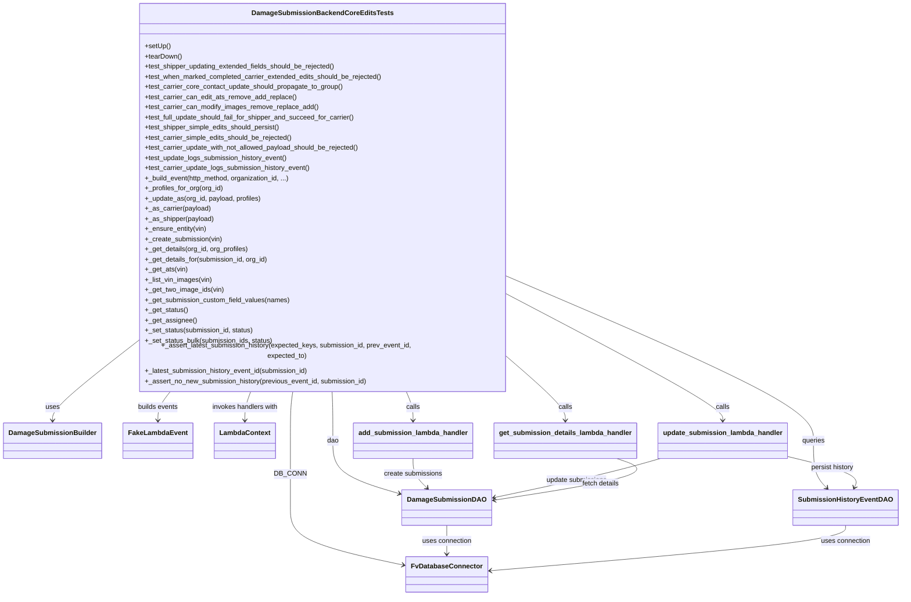
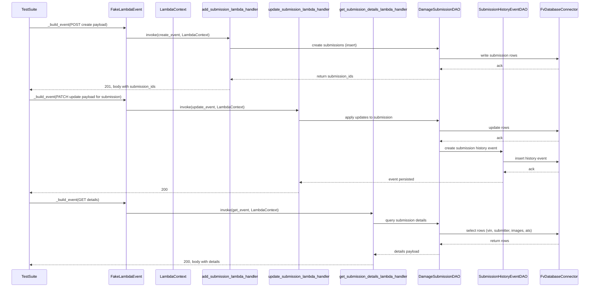

# Diagram: entity_core/entity_service/entity_service/tests/integration_tests/test_damage_submission_update.py

> Auto-generated by Obscura crawlers

## Diagram 1

### SVG

<svg id="container" width="2052.74609375" xmlns="http://www.w3.org/2000/svg" class="classDiagram" height="1384" viewBox="0 0 2052.74609375 1384" role="graphics-document document" aria-roledescription="class"><g><defs><marker id="container_class-aggregationStart" class="marker aggregation class" refX="18" refY="7" markerWidth="190" markerHeight="240" orient="auto"><path d="M 18,7 L9,13 L1,7 L9,1 Z"></path></marker></defs><defs><marker id="container_class-aggregationEnd" class="marker aggregation class" refX="1" refY="7" markerWidth="20" markerHeight="28" orient="auto"><path d="M 18,7 L9,13 L1,7 L9,1 Z"></path></marker></defs><defs><marker id="container_class-extensionStart" class="marker extension class" refX="18" refY="7" markerWidth="190" markerHeight="240" orient="auto"><path d="M 1,7 L18,13 V 1 Z"></path></marker></defs><defs><marker id="container_class-extensionEnd" class="marker extension class" refX="1" refY="7" markerWidth="20" markerHeight="28" orient="auto"><path d="M 1,1 V 13 L18,7 Z"></path></marker></defs><defs><marker id="container_class-compositionStart" class="marker composition class" refX="18" refY="7" markerWidth="190" markerHeight="240" orient="auto"><path d="M 18,7 L9,13 L1,7 L9,1 Z"></path></marker></defs><defs><marker id="container_class-compositionEnd" class="marker composition class" refX="1" refY="7" markerWidth="20" markerHeight="28" orient="auto"><path d="M 18,7 L9,13 L1,7 L9,1 Z"></path></marker></defs><defs><marker id="container_class-dependencyStart" class="marker dependency class" refX="6" refY="7" markerWidth="190" markerHeight="240" orient="auto"><path d="M 5,7 L9,13 L1,7 L9,1 Z"></path></marker></defs><defs><marker id="container_class-dependencyEnd" class="marker dependency class" refX="13" refY="7" markerWidth="20" markerHeight="28" orient="auto"><path d="M 18,7 L9,13 L14,7 L9,1 Z"></path></marker></defs><defs><marker id="container_class-lollipopStart" class="marker lollipop class" refX="13" refY="7" markerWidth="190" markerHeight="240" orient="auto"><circle stroke="black" fill="transparent" cx="7" cy="7" r="6"></circle></marker></defs><defs><marker id="container_class-lollipopEnd" class="marker lollipop class" refX="1" refY="7" markerWidth="190" markerHeight="240" orient="auto"><circle stroke="black" fill="transparent" cx="7" cy="7" r="6"></circle></marker></defs><g class="root"><g class="clusters"></g><g class="edgePaths"><path d="M662.751,902L661.819,908.167C660.886,914.333,659.021,926.667,658.089,946C657.156,965.333,657.156,991.667,657.156,1018C657.156,1044.333,657.156,1070.667,657.156,1097C657.156,1123.333,657.156,1149.667,657.156,1176C657.156,1202.333,657.156,1228.667,700.916,1251.444C744.675,1274.22,832.195,1293.441,875.954,1303.051L919.714,1312.661" id="id_DamageSubmissionBackendCoreEditsTests_FvDatabaseConnector_1" class="edge-thickness-normal edge-pattern-solid relation" style=";;;" data-edge="true" data-et="edge" data-id="id_DamageSubmissionBackendCoreEditsTests_FvDatabaseConnector_1" data-points="W3sieCI6NjYyLjc1MTQ2MDgwODM2NzcsInkiOjkwMn0seyJ4Ijo2NTcuMTU2MjUsInkiOjkzOX0seyJ4Ijo2NTcuMTU2MjUsInkiOjEwMTh9LHsieCI6NjU3LjE1NjI1LCJ5IjoxMDk3fSx7IngiOjY1Ny4xNTYyNSwieSI6MTE3Nn0seyJ4Ijo2NTcuMTU2MjUsInkiOjEyNTV9LHsieCI6OTI1LjU3NDIxODc1LCJ5IjoxMzEzLjk0ODI0NTcxODgxNTV9XQ==" marker-end="url(#container_class-dependencyEnd)"></path><path d="M293.242,800.44L264.021,823.533C234.799,846.627,176.357,892.813,147.135,921.073C117.914,949.333,117.914,959.667,117.914,964.833L117.914,970" id="id_DamageSubmissionBackendCoreEditsTests_DamageSubmissionBuilder_2" class="edge-thickness-normal edge-pattern-solid relation" style=";;;" data-edge="true" data-et="edge" data-id="id_DamageSubmissionBackendCoreEditsTests_DamageSubmissionBuilder_2" data-points="W3sieCI6MjkzLjI0MjE4NzUsInkiOjgwMC40Mzk5Nzc1NDg1ODYzfSx7IngiOjExNy45MTQwNjI1LCJ5Ijo5Mzl9LHsieCI6MTE3LjkxNDA2MjUsInkiOjk3Nn1d" marker-end="url(#container_class-dependencyEnd)"></path><path d="M749.645,902L749.911,908.167C750.177,914.333,750.71,926.667,750.976,946C751.242,965.333,751.242,991.667,751.242,1018C751.242,1044.333,751.242,1070.667,778.109,1091.823C804.975,1112.98,858.708,1128.96,885.574,1136.95L912.44,1144.94" id="id_DamageSubmissionBackendCoreEditsTests_DamageSubmissionDAO_3" class="edge-thickness-normal edge-pattern-solid relation" style=";;;" data-edge="true" data-et="edge" data-id="id_DamageSubmissionBackendCoreEditsTests_DamageSubmissionDAO_3" data-points="W3sieCI6NzQ5LjY0NDg3ODI5Mjg3MTksInkiOjkwMn0seyJ4Ijo3NTEuMjQyMTg3NSwieSI6OTM5fSx7IngiOjc1MS4yNDIxODc1LCJ5IjoxMDE4fSx7IngiOjc1MS4yNDIxODc1LCJ5IjoxMDk3fSx7IngiOjkxOC4xOTE0MDYyNSwieSI6MTE0Ni42NTA0NzEzMDI3MzY2fV0=" marker-end="url(#container_class-dependencyEnd)"></path><path d="M1167.453,643.433L1281.724,692.694C1395.995,741.955,1624.536,840.478,1738.807,902.905C1853.078,965.333,1853.078,991.667,1853.078,1018C1853.078,1044.333,1853.078,1070.667,1858.287,1089.277C1863.495,1107.888,1873.912,1118.776,1879.121,1124.221L1884.329,1129.665" id="id_DamageSubmissionBackendCoreEditsTests_SubmissionHistoryEventDAO_4" class="edge-thickness-normal edge-pattern-solid relation" style=";;;" data-edge="true" data-et="edge" data-id="id_DamageSubmissionBackendCoreEditsTests_SubmissionHistoryEventDAO_4" data-points="W3sieCI6MTE2Ny40NTMxMjUsInkiOjY0My40MzI2MjI3NTYzMjQzfSx7IngiOjE4NTMuMDc4MTI1LCJ5Ijo5Mzl9LHsieCI6MTg1My4wNzgxMjUsInkiOjEwMTh9LHsieCI6MTg1My4wNzgxMjUsInkiOjEwOTd9LHsieCI6MTg4OC40NzczMDQxOTMwMzgsInkiOjExMzR9XQ==" marker-end="url(#container_class-dependencyEnd)"></path><path d="M384.336,902L379.563,908.167C374.789,914.333,365.242,926.667,360.469,938C355.695,949.333,355.695,959.667,355.695,964.833L355.695,970" id="id_DamageSubmissionBackendCoreEditsTests_FakeLambdaEvent_5" class="edge-thickness-normal edge-pattern-solid relation" style=";;;" data-edge="true" data-et="edge" data-id="id_DamageSubmissionBackendCoreEditsTests_FakeLambdaEvent_5" data-points="W3sieCI6Mzg0LjMzNjA5MDg0NDUyNDgsInkiOjkwMn0seyJ4IjozNTUuNjk1MzEyNSwieSI6OTM5fSx7IngiOjM1NS42OTUzMTI1LCJ5Ijo5NzZ9XQ==" marker-end="url(#container_class-dependencyEnd)"></path><path d="M566.428,902L564.166,908.167C561.905,914.333,557.382,926.667,555.121,938C552.859,949.333,552.859,959.667,552.859,964.833L552.859,970" id="id_DamageSubmissionBackendCoreEditsTests_LambdaContext_6" class="edge-thickness-normal edge-pattern-solid relation" style=";;;" data-edge="true" data-et="edge" data-id="id_DamageSubmissionBackendCoreEditsTests_LambdaContext_6" data-points="W3sieCI6NTY2LjQyNzY5NDAyMTE3NzcsInkiOjkwMn0seyJ4Ijo1NTIuODU5Mzc1LCJ5Ijo5Mzl9LHsieCI6NTUyLjg1OTM3NSwieSI6OTc2fV0=" marker-end="url(#container_class-dependencyEnd)"></path><path d="M920.004,902L922.621,908.167C925.237,914.333,930.47,926.667,933.087,938C935.703,949.333,935.703,959.667,935.703,964.833L935.703,970" id="id_DamageSubmissionBackendCoreEditsTests_add_submission_lambda_handler_7" class="edge-thickness-normal edge-pattern-solid relation" style=";;;" data-edge="true" data-et="edge" data-id="id_DamageSubmissionBackendCoreEditsTests_add_submission_lambda_handler_7" data-points="W3sieCI6OTIwLjAwNDQ2MzEzMjc0NzksInkiOjkwMn0seyJ4Ijo5MzUuNzAzMTI1LCJ5Ijo5Mzl9LHsieCI6OTM1LjcwMzEyNSwieSI6OTc2fV0=" marker-end="url(#container_class-dependencyEnd)"></path><path d="M1167.453,686.698L1246.783,728.748C1326.112,770.798,1484.771,854.899,1564.1,902.116C1643.43,949.333,1643.43,959.667,1643.43,964.833L1643.43,970" id="id_DamageSubmissionBackendCoreEditsTests_update_submission_lambda_handler_8" class="edge-thickness-normal edge-pattern-solid relation" style=";;;" data-edge="true" data-et="edge" data-id="id_DamageSubmissionBackendCoreEditsTests_update_submission_lambda_handler_8" data-points="W3sieCI6MTE2Ny40NTMxMjUsInkiOjY4Ni42OTc3NDQxNjE0NzIzfSx7IngiOjE2NDMuNDI5Njg3NSwieSI6OTM5fSx7IngiOjE2NDMuNDI5Njg3NSwieSI6OTc2fV0=" marker-end="url(#container_class-dependencyEnd)"></path><path d="M1167.453,837.331L1186.826,854.276C1206.198,871.221,1244.943,905.11,1264.315,927.222C1283.688,949.333,1283.688,959.667,1283.688,964.833L1283.688,970" id="id_DamageSubmissionBackendCoreEditsTests_get_submission_details_lambda_handler_9" class="edge-thickness-normal edge-pattern-solid relation" style=";;;" data-edge="true" data-et="edge" data-id="id_DamageSubmissionBackendCoreEditsTests_get_submission_details_lambda_handler_9" data-points="W3sieCI6MTE2Ny40NTMxMjUsInkiOjgzNy4zMzExMjg0NDU4NzIxfSx7IngiOjEyODMuNjg3NSwieSI6OTM5fSx7IngiOjEyODMuNjg3NSwieSI6OTc2fV0=" marker-end="url(#container_class-dependencyEnd)"></path><path d="M1016.879,1218L1016.879,1224.167C1016.879,1230.333,1016.879,1242.667,1016.879,1254C1016.879,1265.333,1016.879,1275.667,1016.879,1280.833L1016.879,1286" id="id_DamageSubmissionDAO_FvDatabaseConnector_10" class="edge-thickness-normal edge-pattern-solid relation" style=";;;" data-edge="true" data-et="edge" data-id="id_DamageSubmissionDAO_FvDatabaseConnector_10" data-points="W3sieCI6MTAxNi44Nzg5MDYyNSwieSI6MTIxOH0seyJ4IjoxMDE2Ljg3ODkwNjI1LCJ5IjoxMjU1fSx7IngiOjEwMTYuODc4OTA2MjUsInkiOjEyOTJ9XQ==" marker-end="url(#container_class-dependencyEnd)"></path><path d="M1928.66,1218L1928.66,1224.167C1928.66,1230.333,1928.66,1242.667,1792.91,1260.595C1657.161,1278.524,1385.661,1302.047,1249.911,1313.809L1114.161,1325.571" id="id_SubmissionHistoryEventDAO_FvDatabaseConnector_11" class="edge-thickness-normal edge-pattern-solid relation" style=";;;" data-edge="true" data-et="edge" data-id="id_SubmissionHistoryEventDAO_FvDatabaseConnector_11" data-points="W3sieCI6MTkyOC42NjAxNTYyNSwieSI6MTIxOH0seyJ4IjoxOTI4LjY2MDE1NjI1LCJ5IjoxMjU1fSx7IngiOjExMDguMTgzNTkzNzUsInkiOjEzMjYuMDg5MDM0MTcwNzUxfV0=" marker-end="url(#container_class-dependencyEnd)"></path><path d="M935.703,1060L935.703,1066.167C935.703,1072.333,935.703,1084.667,941.323,1096.303C946.943,1107.938,958.183,1118.877,963.802,1124.346L969.422,1129.815" id="id_add_submission_lambda_handler_DamageSubmissionDAO_12" class="edge-thickness-normal edge-pattern-solid relation" style=";;;" data-edge="true" data-et="edge" data-id="id_add_submission_lambda_handler_DamageSubmissionDAO_12" data-points="W3sieCI6OTM1LjcwMzEyNSwieSI6MTA2MH0seyJ4Ijo5MzUuNzAzMTI1LCJ5IjoxMDk3fSx7IngiOjk3My43MjIxNjE3ODc5NzQ2LCJ5IjoxMTM0fV0=" marker-end="url(#container_class-dependencyEnd)"></path><path d="M1500.056,1060L1479.005,1066.167C1457.954,1072.333,1415.852,1084.667,1352.747,1100.143C1289.642,1115.619,1205.533,1134.238,1163.479,1143.547L1121.425,1152.857" id="id_update_submission_lambda_handler_DamageSubmissionDAO_13" class="edge-thickness-normal edge-pattern-solid relation" style=";;;" data-edge="true" data-et="edge" data-id="id_update_submission_lambda_handler_DamageSubmissionDAO_13" data-points="W3sieCI6MTUwMC4wNTU2NzY0MjQwNTA3LCJ5IjoxMDYwfSx7IngiOjEzNzMuNzUsInkiOjEwOTd9LHsieCI6MTExNS41NjY0MDYyNSwieSI6MTE1NC4xNTM3MDEzMzIxMDc0fV0=" marker-end="url(#container_class-dependencyEnd)"></path><path d="M1790.836,1054.254L1819.803,1061.378C1848.771,1068.502,1906.706,1082.751,1933.279,1095.132C1959.852,1107.513,1955.064,1118.026,1952.67,1123.283L1950.276,1128.54" id="id_update_submission_lambda_handler_SubmissionHistoryEventDAO_14" class="edge-thickness-normal edge-pattern-solid relation" style=";;;" data-edge="true" data-et="edge" data-id="id_update_submission_lambda_handler_SubmissionHistoryEventDAO_14" data-points="W3sieCI6MTc5MC44MzU5Mzc1LCJ5IjoxMDU0LjI1MzcyNzM1MDExNTV9LHsieCI6MTk2NC42NDA2MjUsInkiOjEwOTd9LHsieCI6MTk0Ny43ODkwMTMwNTM3OTc0LCJ5IjoxMTM0fV0=" marker-end="url(#container_class-dependencyEnd)"></path><path d="M1404.845,1060L1422.633,1066.167C1440.422,1072.333,1476,1084.667,1428.775,1101.216C1381.549,1117.765,1251.52,1138.529,1186.506,1148.912L1121.491,1159.294" id="id_get_submission_details_lambda_handler_DamageSubmissionDAO_15" class="edge-thickness-normal edge-pattern-solid relation" style=";;;" data-edge="true" data-et="edge" data-id="id_get_submission_details_lambda_handler_DamageSubmissionDAO_15" data-points="W3sieCI6MTQwNC44NDQ1NDExMzkyNDA0LCJ5IjoxMDYwfSx7IngiOjE1MTEuNTc4MTI1LCJ5IjoxMDk3fSx7IngiOjExMTUuNTY2NDA2MjUsInkiOjExNjAuMjQwMjk3NTI5Mjc1M31d" marker-end="url(#container_class-dependencyEnd)"></path></g><g class="edgeLabels"><g class="edgeLabel" transform="translate(657.15625, 1097)"><g class="label" data-id="id_DamageSubmissionBackendCoreEditsTests_FvDatabaseConnector_1" transform="translate(-34.484375, -12)"><foreignObject width="68.96875" height="24">

DB_CONN

</foreignObject></g></g><g class="edgeLabel" transform="translate(117.9140625, 939)"><g class="label" data-id="id_DamageSubmissionBackendCoreEditsTests_DamageSubmissionBuilder_2" transform="translate(-16.4921875, -12)"><foreignObject width="32.984375" height="24">

uses

</foreignObject></g></g><g class="edgeLabel" transform="translate(751.2421875, 1018)"><g class="label" data-id="id_DamageSubmissionBackendCoreEditsTests_DamageSubmissionDAO_3" transform="translate(-13.8125, -12)"><foreignObject width="27.625" height="24">

dao

</foreignObject></g></g><g class="edgeLabel" transform="translate(1853.078125, 1018)"><g class="label" data-id="id_DamageSubmissionBackendCoreEditsTests_SubmissionHistoryEventDAO_4" transform="translate(-27.2421875, -12)"><foreignObject width="54.484375" height="24">

queries

</foreignObject></g></g><g class="edgeLabel" transform="translate(355.6953125, 939)"><g class="label" data-id="id_DamageSubmissionBackendCoreEditsTests_FakeLambdaEvent_5" transform="translate(-48.515625, -12)"><foreignObject width="97.03125" height="24">

builds events

</foreignObject></g></g><g class="edgeLabel" transform="translate(552.859375, 939)"><g class="label" data-id="id_DamageSubmissionBackendCoreEditsTests_LambdaContext_6" transform="translate(-79.2734375, -12)"><foreignObject width="158.546875" height="24">

invokes handlers with

</foreignObject></g></g><g class="edgeLabel" transform="translate(935.703125, 939)"><g class="label" data-id="id_DamageSubmissionBackendCoreEditsTests_add_submission_lambda_handler_7" transform="translate(-16.4453125, -12)"><foreignObject width="32.890625" height="24">

calls

</foreignObject></g></g><g class="edgeLabel" transform="translate(1643.4296875, 939)"><g class="label" data-id="id_DamageSubmissionBackendCoreEditsTests_update_submission_lambda_handler_8" transform="translate(-16.4453125, -12)"><foreignObject width="32.890625" height="24">

calls

</foreignObject></g></g><g class="edgeLabel" transform="translate(1283.6875, 939)"><g class="label" data-id="id_DamageSubmissionBackendCoreEditsTests_get_submission_details_lambda_handler_9" transform="translate(-16.4453125, -12)"><foreignObject width="32.890625" height="24">

calls

</foreignObject></g></g><g class="edgeLabel" transform="translate(1016.87890625, 1255)"><g class="label" data-id="id_DamageSubmissionDAO_FvDatabaseConnector_10" transform="translate(-59.015625, -12)"><foreignObject width="118.03125" height="24">

uses connection

</foreignObject></g></g><g class="edgeLabel" transform="translate(1928.66015625, 1255)"><g class="label" data-id="id_SubmissionHistoryEventDAO_FvDatabaseConnector_11" transform="translate(-59.015625, -12)"><foreignObject width="118.03125" height="24">

uses connection

</foreignObject></g></g><g class="edgeLabel" transform="translate(935.703125, 1097)"><g class="label" data-id="id_add_submission_lambda_handler_DamageSubmissionDAO_12" transform="translate(-69.5546875, -12)"><foreignObject width="139.109375" height="24">

create submissions

</foreignObject></g></g><g class="edgeLabel" transform="translate(1308.90952, 1111.35364)"><g class="label" data-id="id_update_submission_lambda_handler_DamageSubmissionDAO_13" transform="translate(-72.796875, -12)"><foreignObject width="145.59375" height="24">

update submissions

</foreignObject></g></g><g class="edgeLabel" transform="translate(1897.47843, 1080.48184)"><g class="label" data-id="id_update_submission_lambda_handler_SubmissionHistoryEventDAO_14" transform="translate(-51.9609375, -12)"><foreignObject width="103.921875" height="24">

persist history

</foreignObject></g></g><g class="edgeLabel" transform="translate(1369.34798, 1119.71316)"><g class="label" data-id="id_get_submission_details_lambda_handler_DamageSubmissionDAO_15" transform="translate(-45.03125, -12)"><foreignObject width="90.0625" height="24">

fetch details

</foreignObject></g></g></g><g class="nodes"><g class="node default" id="classId-DamageSubmissionBackendCoreEditsTests-0" transform="translate(730.34765625, 455)"><g class="basic label-container"><path d="M-437.10546875 -447 L437.10546875 -447 L437.10546875 447 L-437.10546875 447" stroke="none" stroke-width="0" fill="#ECECFF" style=""></path><path d="M-437.10546875 -447 C-152.77752356306792 -447, 131.55042162386417 -447, 437.10546875 -447 M-437.10546875 -447 C-106.13598859489565 -447, 224.8334915602087 -447, 437.10546875 -447 M437.10546875 -447 C437.10546875 -162.92091377469006, 437.10546875 121.15817245061987, 437.10546875 447 M437.10546875 -447 C437.10546875 -253.30646199241556, 437.10546875 -59.61292398483113, 437.10546875 447 M437.10546875 447 C167.59709640627068 447, -101.91127593745864 447, -437.10546875 447 M437.10546875 447 C211.6456877060286 447, -13.81409333794278 447, -437.10546875 447 M-437.10546875 447 C-437.10546875 133.49942620580322, -437.10546875 -180.00114758839356, -437.10546875 -447 M-437.10546875 447 C-437.10546875 136.52584402094442, -437.10546875 -173.94831195811116, -437.10546875 -447" stroke="#9370DB" stroke-width="1.3" fill="none" stroke-dasharray="0 0" style=""></path></g><g class="annotation-group text" transform="translate(0, -423)"></g><g class="label-group text" transform="translate(-156.3515625, -423)"><g class="label" style="font-weight: bolder" transform="translate(0,-12)"><foreignObject width="312.703125" height="24">

DamageSubmissionBackendCoreEditsTests

</foreignObject></g></g><g class="members-group text" transform="translate(-425.10546875, -375)"></g><g class="methods-group text" transform="translate(-425.10546875, -345)"><g class="label" style="" transform="translate(0,-12)"><foreignObject width="60.421875" height="24">

+setUp()

</foreignObject></g><g class="label" style="" transform="translate(0,12)"><foreignObject width="87.75" height="24">

+tearDown()

</foreignObject></g><g class="label" style="" transform="translate(0,36)"><foreignObject width="455.921875" height="24">

+test_shipper_updating_extended_fields_should_be_rejected()

</foreignObject></g><g class="label" style="" transform="translate(0,60)"><foreignObject width="566.875" height="24">

+test_when_marked_completed_carrier_extended_edits_should_be_rejected()

</foreignObject></g><g class="label" style="" transform="translate(0,84)"><foreignObject width="472.703125" height="24">

+test_carrier_core_contact_update_should_propagate_to_group()

</foreignObject></g><g class="label" style="" transform="translate(0,108)"><foreignObject width="359.609375" height="24">

+test_carrier_can_edit_ats_remove_add_replace()

</foreignObject></g><g class="label" style="" transform="translate(0,132)"><foreignObject width="410.3125" height="24">

+test_carrier_can_modify_images_remove_replace_add()

</foreignObject></g><g class="label" style="" transform="translate(0,156)"><foreignObject width="501.328125" height="24">

+test_full_update_should_fail_for_shipper_and_succeed_for_carrier()

</foreignObject></g><g class="label" style="" transform="translate(0,180)"><foreignObject width="324.0625" height="24">

+test_shipper_simple_edits_should_persist()

</foreignObject></g><g class="label" style="" transform="translate(0,204)"><foreignObject width="352.34375" height="24">

+test_carrier_simple_edits_should_be_rejected()

</foreignObject></g><g class="label" style="" transform="translate(0,228)"><foreignObject width="514.078125" height="24">

+test_carrier_update_with_not_allowed_payload_should_be_rejected()

</foreignObject></g><g class="label" style="" transform="translate(0,252)"><foreignObject width="339.59375" height="24">

+test_update_logs_submission_history_event()

</foreignObject></g><g class="label" style="" transform="translate(0,276)"><foreignObject width="394.265625" height="24">

+test_carrier_update_logs_submission_history_event()

</foreignObject></g><g class="label" style="" transform="translate(0,300)"><foreignObject width="346.59375" height="24">

+_build_event(http_method, organization_id, ...)

</foreignObject></g><g class="label" style="" transform="translate(0,324)"><foreignObject width="184.734375" height="24">

+_profiles_for_org(org_id)

</foreignObject></g><g class="label" style="" transform="translate(0,348)"><foreignObject width="274.625" height="24">

+_update_as(org_id, payload, profiles)

</foreignObject></g><g class="label" style="" transform="translate(0,372)"><foreignObject width="154.46875" height="24">

+_as_carrier(payload)

</foreignObject></g><g class="label" style="" transform="translate(0,396)"><foreignObject width="162.109375" height="24">

+_as_shipper(payload)

</foreignObject></g><g class="label" style="" transform="translate(0,420)"><foreignObject width="145.765625" height="24">

+_ensure_entity(vin)

</foreignObject></g><g class="label" style="" transform="translate(0,444)"><foreignObject width="182.234375" height="24">

+_create_submission(vin)

</foreignObject></g><g class="label" style="" transform="translate(0,468)"><foreignObject width="246.109375" height="24">

+_get_details(org_id, org_profiles)

</foreignObject></g><g class="label" style="" transform="translate(0,492)"><foreignObject width="292.90625" height="24">

+_get_details_for(submission_id, org_id)

</foreignObject></g><g class="label" style="" transform="translate(0,516)"><foreignObject width="99.8125" height="24">

+_get_ats(vin)

</foreignObject></g><g class="label" style="" transform="translate(0,540)"><foreignObject width="158.390625" height="24">

+_list_vin_images(vin)

</foreignObject></g><g class="label" style="" transform="translate(0,564)"><foreignObject width="185.5625" height="24">

+_get_two_image_ids(vin)

</foreignObject></g><g class="label" style="" transform="translate(0,588)"><foreignObject width="342.09375" height="24">

+_get_submission_custom_field_values(names)

</foreignObject></g><g class="label" style="" transform="translate(0,612)"><foreignObject width="100.828125" height="24">

+_get_status()

</foreignObject></g><g class="label" style="" transform="translate(0,636)"><foreignObject width="119.078125" height="24">

+_get_assignee()

</foreignObject></g><g class="label" style="" transform="translate(0,660)"><foreignObject width="257.5" height="24">

+_set_status(submission_id, status)

</foreignObject></g><g class="label" style="" transform="translate(0,684)"><foreignObject width="304.671875" height="24">

+_set_status_bulk(submission_ids, status)

</foreignObject></g><g class="label" style="" transform="translate(0,708)"><foreignObject width="693.859375" height="24">

+_assert_latest_submission_history(expected_keys, submission_id, prev_event_id, expected_to)

</foreignObject></g><g class="label" style="" transform="translate(0,732)"><foreignObject width="390.703125" height="24">

+_latest_submission_history_event_id(submission_id)

</foreignObject></g><g class="label" style="" transform="translate(0,756)"><foreignObject width="528.609375" height="24">

+_assert_no_new_submission_history(previous_event_id, submission_id)

</foreignObject></g></g><g class="divider" style=""><path d="M-437.10546875 -399 C-166.43874707090885 -399, 104.22797460818231 -399, 437.10546875 -399 M-437.10546875 -399 C-196.60657571635403 -399, 43.89231731729194 -399, 437.10546875 -399" stroke="#9370DB" stroke-width="1.3" fill="none" stroke-dasharray="0 0" style=""></path></g><g class="divider" style=""><path d="M-437.10546875 -375 C-142.7490130543523 -375, 151.6074426412954 -375, 437.10546875 -375 M-437.10546875 -375 C-127.39942703389005 -375, 182.3066146822199 -375, 437.10546875 -375" stroke="#9370DB" stroke-width="1.3" fill="none" stroke-dasharray="0 0" style=""></path></g></g><g class="node default" id="classId-DamageSubmissionBuilder-1" transform="translate(117.9140625, 1018)"><g class="basic label-container"><path d="M-109.9140625 -42 L109.9140625 -42 L109.9140625 42 L-109.9140625 42" stroke="none" stroke-width="0" fill="#ECECFF" style=""></path><path d="M-109.9140625 -42 C-37.82205951278236 -42, 34.26994347443528 -42, 109.9140625 -42 M-109.9140625 -42 C-34.10870013122181 -42, 41.69666223755638 -42, 109.9140625 -42 M109.9140625 -42 C109.9140625 -16.253350342515287, 109.9140625 9.493299314969427, 109.9140625 42 M109.9140625 -42 C109.9140625 -10.854603632049493, 109.9140625 20.290792735901015, 109.9140625 42 M109.9140625 42 C37.08662935993763 42, -35.740803780124736 42, -109.9140625 42 M109.9140625 42 C56.9153056475457 42, 3.9165487950914013 42, -109.9140625 42 M-109.9140625 42 C-109.9140625 18.107077147379357, -109.9140625 -5.785845705241286, -109.9140625 -42 M-109.9140625 42 C-109.9140625 10.291727999056619, -109.9140625 -21.416544001886763, -109.9140625 -42" stroke="#9370DB" stroke-width="1.3" fill="none" stroke-dasharray="0 0" style=""></path></g><g class="annotation-group text" transform="translate(0, -18)"></g><g class="label-group text" transform="translate(-97.9140625, -18)"><g class="label" style="font-weight: bolder" transform="translate(0,-12)"><foreignObject width="195.828125" height="24">

DamageSubmissionBuilder

</foreignObject></g></g><g class="members-group text" transform="translate(-97.9140625, 30)"></g><g class="methods-group text" transform="translate(-97.9140625, 60)"></g><g class="divider" style=""><path d="M-109.9140625 6 C-56.85200097342336 6, -3.7899394468467165 6, 109.9140625 6 M-109.9140625 6 C-52.83802168997104 6, 4.238019120057913 6, 109.9140625 6" stroke="#9370DB" stroke-width="1.3" fill="none" stroke-dasharray="0 0" style=""></path></g><g class="divider" style=""><path d="M-109.9140625 24 C-43.49932801204727 24, 22.915406475905456 24, 109.9140625 24 M-109.9140625 24 C-34.44367914183164 24, 41.026704216336725 24, 109.9140625 24" stroke="#9370DB" stroke-width="1.3" fill="none" stroke-dasharray="0 0" style=""></path></g></g><g class="node default" id="classId-DamageSubmissionDAO-2" transform="translate(1016.87890625, 1176)"><g class="basic label-container"><path d="M-98.6875 -42 L98.6875 -42 L98.6875 42 L-98.6875 42" stroke="none" stroke-width="0" fill="#ECECFF" style=""></path><path d="M-98.6875 -42 C-53.657905468603154 -42, -8.628310937206308 -42, 98.6875 -42 M-98.6875 -42 C-45.588768421963714 -42, 7.509963156072573 -42, 98.6875 -42 M98.6875 -42 C98.6875 -18.565453035394235, 98.6875 4.86909392921153, 98.6875 42 M98.6875 -42 C98.6875 -10.83617251001941, 98.6875 20.32765497996118, 98.6875 42 M98.6875 42 C39.022519081939166 42, -20.64246183612167 42, -98.6875 42 M98.6875 42 C42.59862751849531 42, -13.490244963009374 42, -98.6875 42 M-98.6875 42 C-98.6875 10.615511829397843, -98.6875 -20.768976341204315, -98.6875 -42 M-98.6875 42 C-98.6875 20.569315460266107, -98.6875 -0.8613690794677851, -98.6875 -42" stroke="#9370DB" stroke-width="1.3" fill="none" stroke-dasharray="0 0" style=""></path></g><g class="annotation-group text" transform="translate(0, -18)"></g><g class="label-group text" transform="translate(-86.6875, -18)"><g class="label" style="font-weight: bolder" transform="translate(0,-12)"><foreignObject width="173.375" height="24">

DamageSubmissionDAO

</foreignObject></g></g><g class="members-group text" transform="translate(-86.6875, 30)"></g><g class="methods-group text" transform="translate(-86.6875, 60)"></g><g class="divider" style=""><path d="M-98.6875 6 C-29.997190678994755 6, 38.69311864201049 6, 98.6875 6 M-98.6875 6 C-53.34125821633623 6, -7.9950164326724575 6, 98.6875 6" stroke="#9370DB" stroke-width="1.3" fill="none" stroke-dasharray="0 0" style=""></path></g><g class="divider" style=""><path d="M-98.6875 24 C-31.56040542562377 24, 35.56668914875246 24, 98.6875 24 M-98.6875 24 C-43.57868916229704 24, 11.530121675405923 24, 98.6875 24" stroke="#9370DB" stroke-width="1.3" fill="none" stroke-dasharray="0 0" style=""></path></g></g><g class="node default" id="classId-SubmissionHistoryEventDAO-3" transform="translate(1928.66015625, 1176)"><g class="basic label-container"><path d="M-116.0859375 -42 L116.0859375 -42 L116.0859375 42 L-116.0859375 42" stroke="none" stroke-width="0" fill="#ECECFF" style=""></path><path d="M-116.0859375 -42 C-56.60856525922414 -42, 2.868806981551714 -42, 116.0859375 -42 M-116.0859375 -42 C-24.989169370696686 -42, 66.10759875860663 -42, 116.0859375 -42 M116.0859375 -42 C116.0859375 -19.167094002267902, 116.0859375 3.665811995464196, 116.0859375 42 M116.0859375 -42 C116.0859375 -14.252394463833117, 116.0859375 13.495211072333767, 116.0859375 42 M116.0859375 42 C46.921090288636364 42, -22.243756922727272 42, -116.0859375 42 M116.0859375 42 C27.294085747825378 42, -61.497766004349245 42, -116.0859375 42 M-116.0859375 42 C-116.0859375 10.15438953449475, -116.0859375 -21.6912209310105, -116.0859375 -42 M-116.0859375 42 C-116.0859375 24.570322583098864, -116.0859375 7.140645166197729, -116.0859375 -42" stroke="#9370DB" stroke-width="1.3" fill="none" stroke-dasharray="0 0" style=""></path></g><g class="annotation-group text" transform="translate(0, -18)"></g><g class="label-group text" transform="translate(-104.0859375, -18)"><g class="label" style="font-weight: bolder" transform="translate(0,-12)"><foreignObject width="208.171875" height="24">

SubmissionHistoryEventDAO

</foreignObject></g></g><g class="members-group text" transform="translate(-104.0859375, 30)"></g><g class="methods-group text" transform="translate(-104.0859375, 60)"></g><g class="divider" style=""><path d="M-116.0859375 6 C-33.04451852717949 6, 49.99690044564102 6, 116.0859375 6 M-116.0859375 6 C-52.24480074451254 6, 11.596336010974923 6, 116.0859375 6" stroke="#9370DB" stroke-width="1.3" fill="none" stroke-dasharray="0 0" style=""></path></g><g class="divider" style=""><path d="M-116.0859375 24 C-30.79528819384808 24, 54.49536111230384 24, 116.0859375 24 M-116.0859375 24 C-34.47443880947871 24, 47.137059881042575 24, 116.0859375 24" stroke="#9370DB" stroke-width="1.3" fill="none" stroke-dasharray="0 0" style=""></path></g></g><g class="node default" id="classId-FvDatabaseConnector-4" transform="translate(1016.87890625, 1334)"><g class="basic label-container"><path d="M-91.3046875 -42 L91.3046875 -42 L91.3046875 42 L-91.3046875 42" stroke="none" stroke-width="0" fill="#ECECFF" style=""></path><path d="M-91.3046875 -42 C-28.851559683239145 -42, 33.60156813352171 -42, 91.3046875 -42 M-91.3046875 -42 C-30.245282818116742 -42, 30.814121863766516 -42, 91.3046875 -42 M91.3046875 -42 C91.3046875 -24.28790022699599, 91.3046875 -6.575800453991981, 91.3046875 42 M91.3046875 -42 C91.3046875 -9.409522012180162, 91.3046875 23.180955975639677, 91.3046875 42 M91.3046875 42 C45.29976133545482 42, -0.7051648290903643 42, -91.3046875 42 M91.3046875 42 C54.68569395818688 42, 18.066700416373763 42, -91.3046875 42 M-91.3046875 42 C-91.3046875 25.156034760680306, -91.3046875 8.312069521360613, -91.3046875 -42 M-91.3046875 42 C-91.3046875 11.207328503628915, -91.3046875 -19.58534299274217, -91.3046875 -42" stroke="#9370DB" stroke-width="1.3" fill="none" stroke-dasharray="0 0" style=""></path></g><g class="annotation-group text" transform="translate(0, -18)"></g><g class="label-group text" transform="translate(-79.3046875, -18)"><g class="label" style="font-weight: bolder" transform="translate(0,-12)"><foreignObject width="158.609375" height="24">

FvDatabaseConnector

</foreignObject></g></g><g class="members-group text" transform="translate(-79.3046875, 30)"></g><g class="methods-group text" transform="translate(-79.3046875, 60)"></g><g class="divider" style=""><path d="M-91.3046875 6 C-29.878458017300666 6, 31.547771465398668 6, 91.3046875 6 M-91.3046875 6 C-18.786089584392755 6, 53.73250833121449 6, 91.3046875 6" stroke="#9370DB" stroke-width="1.3" fill="none" stroke-dasharray="0 0" style=""></path></g><g class="divider" style=""><path d="M-91.3046875 24 C-44.2010930591984 24, 2.9025013816032015 24, 91.3046875 24 M-91.3046875 24 C-31.16996626290456 24, 28.964754974190882 24, 91.3046875 24" stroke="#9370DB" stroke-width="1.3" fill="none" stroke-dasharray="0 0" style=""></path></g></g><g class="node default" id="classId-FakeLambdaEvent-5" transform="translate(355.6953125, 1018)"><g class="basic label-container"><path d="M-77.8671875 -42 L77.8671875 -42 L77.8671875 42 L-77.8671875 42" stroke="none" stroke-width="0" fill="#ECECFF" style=""></path><path d="M-77.8671875 -42 C-43.07806242837781 -42, -8.288937356755625 -42, 77.8671875 -42 M-77.8671875 -42 C-22.936734072473186 -42, 31.993719355053628 -42, 77.8671875 -42 M77.8671875 -42 C77.8671875 -20.875851947276953, 77.8671875 0.24829610544609437, 77.8671875 42 M77.8671875 -42 C77.8671875 -12.726206020356702, 77.8671875 16.547587959286595, 77.8671875 42 M77.8671875 42 C21.453033991723736 42, -34.96111951655253 42, -77.8671875 42 M77.8671875 42 C36.29562287344031 42, -5.275941753119383 42, -77.8671875 42 M-77.8671875 42 C-77.8671875 15.159096127385276, -77.8671875 -11.681807745229449, -77.8671875 -42 M-77.8671875 42 C-77.8671875 22.76716999776533, -77.8671875 3.534339995530658, -77.8671875 -42" stroke="#9370DB" stroke-width="1.3" fill="none" stroke-dasharray="0 0" style=""></path></g><g class="annotation-group text" transform="translate(0, -18)"></g><g class="label-group text" transform="translate(-65.8671875, -18)"><g class="label" style="font-weight: bolder" transform="translate(0,-12)"><foreignObject width="131.734375" height="24">

FakeLambdaEvent

</foreignObject></g></g><g class="members-group text" transform="translate(-65.8671875, 30)"></g><g class="methods-group text" transform="translate(-65.8671875, 60)"></g><g class="divider" style=""><path d="M-77.8671875 6 C-34.87728257861689 6, 8.112622342766215 6, 77.8671875 6 M-77.8671875 6 C-46.5286874227993 6, -15.190187345598602 6, 77.8671875 6" stroke="#9370DB" stroke-width="1.3" fill="none" stroke-dasharray="0 0" style=""></path></g><g class="divider" style=""><path d="M-77.8671875 24 C-32.143175645931585 24, 13.58083620813683 24, 77.8671875 24 M-77.8671875 24 C-18.81864743176248 24, 40.22989263647504 24, 77.8671875 24" stroke="#9370DB" stroke-width="1.3" fill="none" stroke-dasharray="0 0" style=""></path></g></g><g class="node default" id="classId-LambdaContext-6" transform="translate(552.859375, 1018)"><g class="basic label-container"><path d="M-69.296875 -42 L69.296875 -42 L69.296875 42 L-69.296875 42" stroke="none" stroke-width="0" fill="#ECECFF" style=""></path><path d="M-69.296875 -42 C-30.407162480465296 -42, 8.482550039069409 -42, 69.296875 -42 M-69.296875 -42 C-31.349742313603095 -42, 6.597390372793811 -42, 69.296875 -42 M69.296875 -42 C69.296875 -11.085098250140003, 69.296875 19.829803499719993, 69.296875 42 M69.296875 -42 C69.296875 -17.293888970340376, 69.296875 7.412222059319248, 69.296875 42 M69.296875 42 C36.699737338219066 42, 4.102599676438132 42, -69.296875 42 M69.296875 42 C29.936735064840775 42, -9.42340487031845 42, -69.296875 42 M-69.296875 42 C-69.296875 16.780696138027675, -69.296875 -8.43860772394465, -69.296875 -42 M-69.296875 42 C-69.296875 21.07094428765155, -69.296875 0.14188857530309917, -69.296875 -42" stroke="#9370DB" stroke-width="1.3" fill="none" stroke-dasharray="0 0" style=""></path></g><g class="annotation-group text" transform="translate(0, -18)"></g><g class="label-group text" transform="translate(-57.296875, -18)"><g class="label" style="font-weight: bolder" transform="translate(0,-12)"><foreignObject width="114.59375" height="24">

LambdaContext

</foreignObject></g></g><g class="members-group text" transform="translate(-57.296875, 30)"></g><g class="methods-group text" transform="translate(-57.296875, 60)"></g><g class="divider" style=""><path d="M-69.296875 6 C-17.905714206378356 6, 33.48544658724329 6, 69.296875 6 M-69.296875 6 C-33.478263147618016 6, 2.3403487047639686 6, 69.296875 6" stroke="#9370DB" stroke-width="1.3" fill="none" stroke-dasharray="0 0" style=""></path></g><g class="divider" style=""><path d="M-69.296875 24 C-24.923429150676277 24, 19.450016698647445 24, 69.296875 24 M-69.296875 24 C-16.369833853307647 24, 36.55720729338471 24, 69.296875 24" stroke="#9370DB" stroke-width="1.3" fill="none" stroke-dasharray="0 0" style=""></path></g></g><g class="node default" id="classId-add_submission_lambda_handler-7" transform="translate(935.703125, 1018)"><g class="basic label-container"><path d="M-135.6484375 -42 L135.6484375 -42 L135.6484375 42 L-135.6484375 42" stroke="none" stroke-width="0" fill="#ECECFF" style=""></path><path d="M-135.6484375 -42 C-48.377520305517336 -42, 38.89339688896533 -42, 135.6484375 -42 M-135.6484375 -42 C-30.071696270426173 -42, 75.50504495914765 -42, 135.6484375 -42 M135.6484375 -42 C135.6484375 -16.672595932267644, 135.6484375 8.654808135464712, 135.6484375 42 M135.6484375 -42 C135.6484375 -17.976685428154468, 135.6484375 6.046629143691064, 135.6484375 42 M135.6484375 42 C35.869158840925635 42, -63.91011981814873 42, -135.6484375 42 M135.6484375 42 C65.86739917536856 42, -3.9136391492628775 42, -135.6484375 42 M-135.6484375 42 C-135.6484375 16.745114397773417, -135.6484375 -8.509771204453166, -135.6484375 -42 M-135.6484375 42 C-135.6484375 16.914951025299082, -135.6484375 -8.170097949401836, -135.6484375 -42" stroke="#9370DB" stroke-width="1.3" fill="none" stroke-dasharray="0 0" style=""></path></g><g class="annotation-group text" transform="translate(0, -18)"></g><g class="label-group text" transform="translate(-123.6484375, -18)"><g class="label" style="font-weight: bolder" transform="translate(0,-12)"><foreignObject width="247.296875" height="24">

add_submission_lambda_handler

</foreignObject></g></g><g class="members-group text" transform="translate(-123.6484375, 30)"></g><g class="methods-group text" transform="translate(-123.6484375, 60)"></g><g class="divider" style=""><path d="M-135.6484375 6 C-40.83380795320495 6, 53.98082159359009 6, 135.6484375 6 M-135.6484375 6 C-65.44850701037417 6, 4.751423479251656 6, 135.6484375 6" stroke="#9370DB" stroke-width="1.3" fill="none" stroke-dasharray="0 0" style=""></path></g><g class="divider" style=""><path d="M-135.6484375 24 C-30.9392100208933 24, 73.7700174582134 24, 135.6484375 24 M-135.6484375 24 C-31.29690566717393 24, 73.05462616565214 24, 135.6484375 24" stroke="#9370DB" stroke-width="1.3" fill="none" stroke-dasharray="0 0" style=""></path></g></g><g class="node default" id="classId-update_submission_lambda_handler-8" transform="translate(1643.4296875, 1018)"><g class="basic label-container"><path d="M-147.40625 -42 L147.40625 -42 L147.40625 42 L-147.40625 42" stroke="none" stroke-width="0" fill="#ECECFF" style=""></path><path d="M-147.40625 -42 C-59.387637654872506 -42, 28.630974690254988 -42, 147.40625 -42 M-147.40625 -42 C-80.20495589676494 -42, -13.003661793529886 -42, 147.40625 -42 M147.40625 -42 C147.40625 -11.914103569612177, 147.40625 18.171792860775646, 147.40625 42 M147.40625 -42 C147.40625 -22.678260222192172, 147.40625 -3.356520444384344, 147.40625 42 M147.40625 42 C63.79820022714581 42, -19.809849545708374 42, -147.40625 42 M147.40625 42 C30.310930874741175 42, -86.78438825051765 42, -147.40625 42 M-147.40625 42 C-147.40625 10.308532238737225, -147.40625 -21.38293552252555, -147.40625 -42 M-147.40625 42 C-147.40625 10.882439411491408, -147.40625 -20.235121177017184, -147.40625 -42" stroke="#9370DB" stroke-width="1.3" fill="none" stroke-dasharray="0 0" style=""></path></g><g class="annotation-group text" transform="translate(0, -18)"></g><g class="label-group text" transform="translate(-135.40625, -18)"><g class="label" style="font-weight: bolder" transform="translate(0,-12)"><foreignObject width="270.8125" height="24">

update_submission_lambda_handler

</foreignObject></g></g><g class="members-group text" transform="translate(-135.40625, 30)"></g><g class="methods-group text" transform="translate(-135.40625, 60)"></g><g class="divider" style=""><path d="M-147.40625 6 C-79.43706072431635 6, -11.467871448632707 6, 147.40625 6 M-147.40625 6 C-86.98488809138377 6, -26.563526182767546 6, 147.40625 6" stroke="#9370DB" stroke-width="1.3" fill="none" stroke-dasharray="0 0" style=""></path></g><g class="divider" style=""><path d="M-147.40625 24 C-69.63774252229787 24, 8.13076495540426 24, 147.40625 24 M-147.40625 24 C-43.80637920630433 24, 59.793491587391344 24, 147.40625 24" stroke="#9370DB" stroke-width="1.3" fill="none" stroke-dasharray="0 0" style=""></path></g></g><g class="node default" id="classId-get_submission_details_lambda_handler-9" transform="translate(1283.6875, 1018)"><g class="basic label-container"><path d="M-162.3359375 -42 L162.3359375 -42 L162.3359375 42 L-162.3359375 42" stroke="none" stroke-width="0" fill="#ECECFF" style=""></path><path d="M-162.3359375 -42 C-65.09411013010154 -42, 32.14771723979692 -42, 162.3359375 -42 M-162.3359375 -42 C-71.44073195105315 -42, 19.454473597893696 -42, 162.3359375 -42 M162.3359375 -42 C162.3359375 -16.96046495798015, 162.3359375 8.0790700840397, 162.3359375 42 M162.3359375 -42 C162.3359375 -13.09687134509712, 162.3359375 15.806257309805758, 162.3359375 42 M162.3359375 42 C36.9646395208967 42, -88.4066584582066 42, -162.3359375 42 M162.3359375 42 C40.50934284763264 42, -81.31725180473472 42, -162.3359375 42 M-162.3359375 42 C-162.3359375 11.576534945075103, -162.3359375 -18.846930109849794, -162.3359375 -42 M-162.3359375 42 C-162.3359375 24.617754495317865, -162.3359375 7.235508990635729, -162.3359375 -42" stroke="#9370DB" stroke-width="1.3" fill="none" stroke-dasharray="0 0" style=""></path></g><g class="annotation-group text" transform="translate(0, -18)"></g><g class="label-group text" transform="translate(-150.3359375, -18)"><g class="label" style="font-weight: bolder" transform="translate(0,-12)"><foreignObject width="300.671875" height="24">

get_submission_details_lambda_handler

</foreignObject></g></g><g class="members-group text" transform="translate(-150.3359375, 30)"></g><g class="methods-group text" transform="translate(-150.3359375, 60)"></g><g class="divider" style=""><path d="M-162.3359375 6 C-86.83903865813393 6, -11.34213981626786 6, 162.3359375 6 M-162.3359375 6 C-45.97842838452681 6, 70.37908073094638 6, 162.3359375 6" stroke="#9370DB" stroke-width="1.3" fill="none" stroke-dasharray="0 0" style=""></path></g><g class="divider" style=""><path d="M-162.3359375 24 C-89.64804024241974 24, -16.96014298483948 24, 162.3359375 24 M-162.3359375 24 C-45.57799699541346 24, 71.17994350917309 24, 162.3359375 24" stroke="#9370DB" stroke-width="1.3" fill="none" stroke-dasharray="0 0" style=""></path></g></g></g></g></g></svg>

## Diagram 2

### SVG

<svg id="container" width="2712.5" xmlns="http://www.w3.org/2000/svg" height="1323" viewBox="-50 -10 2712.5 1323" role="graphics-document document" aria-roledescription="sequence"><g><rect x="2435.5" y="1237" fill="#eaeaea" stroke="#666" width="177" height="65" name="DB" rx="3" ry="3" class="actor actor-bottom"></rect><text x="2524" y="1269.5" dominant-baseline="central" alignment-baseline="central" class="actor actor-box" style="text-anchor: middle; font-size: 16px; font-weight: 400;"><tspan x="2524" dy="0">FvDatabaseConnector</tspan></text></g><g><rect x="2159.5" y="1237" fill="#eaeaea" stroke="#666" width="226" height="65" name="HistoryDAO" rx="3" ry="3" class="actor actor-bottom"></rect><text x="2272.5" y="1269.5" dominant-baseline="central" alignment-baseline="central" class="actor actor-box" style="text-anchor: middle; font-size: 16px; font-weight: 400;"><tspan x="2272.5" dy="0">SubmissionHistoryEventDAO</tspan></text></g><g><rect x="1875.5" y="1237" fill="#eaeaea" stroke="#666" width="192" height="65" name="DAO" rx="3" ry="3" class="actor actor-bottom"></rect><text x="1971.5" y="1269.5" dominant-baseline="central" alignment-baseline="central" class="actor actor-box" style="text-anchor: middle; font-size: 16px; font-weight: 400;"><tspan x="1971.5" dy="0">DamageSubmissionDAO</tspan></text></g><g><rect x="1506.5" y="1237" fill="#eaeaea" stroke="#666" width="319" height="65" name="GetLambda" rx="3" ry="3" class="actor actor-bottom"></rect><text x="1666" y="1269.5" dominant-baseline="central" alignment-baseline="central" class="actor actor-box" style="text-anchor: middle; font-size: 16px; font-weight: 400;"><tspan x="1666" dy="0">get_submission_details_lambda_handler</tspan></text></g><g><rect x="1165.5" y="1237" fill="#eaeaea" stroke="#666" width="291" height="65" name="UpdateLambda" rx="3" ry="3" class="actor actor-bottom"></rect><text x="1311" y="1269.5" dominant-baseline="central" alignment-baseline="central" class="actor actor-box" style="text-anchor: middle; font-size: 16px; font-weight: 400;"><tspan x="1311" dy="0">update_submission_lambda_handler</tspan></text></g><g><rect x="848.5" y="1237" fill="#eaeaea" stroke="#666" width="267" height="65" name="AddLambda" rx="3" ry="3" class="actor actor-bottom"></rect><text x="982" y="1269.5" dominant-baseline="central" alignment-baseline="central" class="actor actor-box" style="text-anchor: middle; font-size: 16px; font-weight: 400;"><tspan x="982" dy="0">add_submission_lambda_handler</tspan></text></g><g><rect x="648.5" y="1237" fill="#eaeaea" stroke="#666" width="150" height="65" name="LambdaCtx" rx="3" ry="3" class="actor actor-bottom"></rect><text x="723.5" y="1269.5" dominant-baseline="central" alignment-baseline="central" class="actor actor-box" style="text-anchor: middle; font-size: 16px; font-weight: 400;"><tspan x="723.5" dy="0">LambdaContext</tspan></text></g><g><rect x="447.5" y="1237" fill="#eaeaea" stroke="#666" width="151" height="65" name="EventBuilder" rx="3" ry="3" class="actor actor-bottom"></rect><text x="523" y="1269.5" dominant-baseline="central" alignment-baseline="central" class="actor actor-box" style="text-anchor: middle; font-size: 16px; font-weight: 400;"><tspan x="523" dy="0">FakeLambdaEvent</tspan></text></g><g><rect x="0" y="1237" fill="#eaeaea" stroke="#666" width="150" height="65" name="Test" rx="3" ry="3" class="actor actor-bottom"></rect><text x="75" y="1269.5" dominant-baseline="central" alignment-baseline="central" class="actor actor-box" style="text-anchor: middle; font-size: 16px; font-weight: 400;"><tspan x="75" dy="0">TestSuite</tspan></text></g><g><line id="actor8" x1="2524" y1="65" x2="2524" y2="1237" class="actor-line 200" stroke-width="0.5px" stroke="#999" name="DB"></line><g id="root-8"><rect x="2435.5" y="0" fill="#eaeaea" stroke="#666" width="177" height="65" name="DB" rx="3" ry="3" class="actor actor-top"></rect><text x="2524" y="32.5" dominant-baseline="central" alignment-baseline="central" class="actor actor-box" style="text-anchor: middle; font-size: 16px; font-weight: 400;"><tspan x="2524" dy="0">FvDatabaseConnector</tspan></text></g></g><g><line id="actor7" x1="2272.5" y1="65" x2="2272.5" y2="1237" class="actor-line 200" stroke-width="0.5px" stroke="#999" name="HistoryDAO"></line><g id="root-7"><rect x="2159.5" y="0" fill="#eaeaea" stroke="#666" width="226" height="65" name="HistoryDAO" rx="3" ry="3" class="actor actor-top"></rect><text x="2272.5" y="32.5" dominant-baseline="central" alignment-baseline="central" class="actor actor-box" style="text-anchor: middle; font-size: 16px; font-weight: 400;"><tspan x="2272.5" dy="0">SubmissionHistoryEventDAO</tspan></text></g></g><g><line id="actor6" x1="1971.5" y1="65" x2="1971.5" y2="1237" class="actor-line 200" stroke-width="0.5px" stroke="#999" name="DAO"></line><g id="root-6"><rect x="1875.5" y="0" fill="#eaeaea" stroke="#666" width="192" height="65" name="DAO" rx="3" ry="3" class="actor actor-top"></rect><text x="1971.5" y="32.5" dominant-baseline="central" alignment-baseline="central" class="actor actor-box" style="text-anchor: middle; font-size: 16px; font-weight: 400;"><tspan x="1971.5" dy="0">DamageSubmissionDAO</tspan></text></g></g><g><line id="actor5" x1="1666" y1="65" x2="1666" y2="1237" class="actor-line 200" stroke-width="0.5px" stroke="#999" name="GetLambda"></line><g id="root-5"><rect x="1506.5" y="0" fill="#eaeaea" stroke="#666" width="319" height="65" name="GetLambda" rx="3" ry="3" class="actor actor-top"></rect><text x="1666" y="32.5" dominant-baseline="central" alignment-baseline="central" class="actor actor-box" style="text-anchor: middle; font-size: 16px; font-weight: 400;"><tspan x="1666" dy="0">get_submission_details_lambda_handler</tspan></text></g></g><g><line id="actor4" x1="1311" y1="65" x2="1311" y2="1237" class="actor-line 200" stroke-width="0.5px" stroke="#999" name="UpdateLambda"></line><g id="root-4"><rect x="1165.5" y="0" fill="#eaeaea" stroke="#666" width="291" height="65" name="UpdateLambda" rx="3" ry="3" class="actor actor-top"></rect><text x="1311" y="32.5" dominant-baseline="central" alignment-baseline="central" class="actor actor-box" style="text-anchor: middle; font-size: 16px; font-weight: 400;"><tspan x="1311" dy="0">update_submission_lambda_handler</tspan></text></g></g><g><line id="actor3" x1="982" y1="65" x2="982" y2="1237" class="actor-line 200" stroke-width="0.5px" stroke="#999" name="AddLambda"></line><g id="root-3"><rect x="848.5" y="0" fill="#eaeaea" stroke="#666" width="267" height="65" name="AddLambda" rx="3" ry="3" class="actor actor-top"></rect><text x="982" y="32.5" dominant-baseline="central" alignment-baseline="central" class="actor actor-box" style="text-anchor: middle; font-size: 16px; font-weight: 400;"><tspan x="982" dy="0">add_submission_lambda_handler</tspan></text></g></g><g><line id="actor2" x1="723.5" y1="65" x2="723.5" y2="1237" class="actor-line 200" stroke-width="0.5px" stroke="#999" name="LambdaCtx"></line><g id="root-2"><rect x="648.5" y="0" fill="#eaeaea" stroke="#666" width="150" height="65" name="LambdaCtx" rx="3" ry="3" class="actor actor-top"></rect><text x="723.5" y="32.5" dominant-baseline="central" alignment-baseline="central" class="actor actor-box" style="text-anchor: middle; font-size: 16px; font-weight: 400;"><tspan x="723.5" dy="0">LambdaContext</tspan></text></g></g><g><line id="actor1" x1="523" y1="65" x2="523" y2="1237" class="actor-line 200" stroke-width="0.5px" stroke="#999" name="EventBuilder"></line><g id="root-1"><rect x="447.5" y="0" fill="#eaeaea" stroke="#666" width="151" height="65" name="EventBuilder" rx="3" ry="3" class="actor actor-top"></rect><text x="523" y="32.5" dominant-baseline="central" alignment-baseline="central" class="actor actor-box" style="text-anchor: middle; font-size: 16px; font-weight: 400;"><tspan x="523" dy="0">FakeLambdaEvent</tspan></text></g></g><g><line id="actor0" x1="75" y1="65" x2="75" y2="1237" class="actor-line 200" stroke-width="0.5px" stroke="#999" name="Test"></line><g id="root-0"><rect x="0" y="0" fill="#eaeaea" stroke="#666" width="150" height="65" name="Test" rx="3" ry="3" class="actor actor-top"></rect><text x="75" y="32.5" dominant-baseline="central" alignment-baseline="central" class="actor actor-box" style="text-anchor: middle; font-size: 16px; font-weight: 400;"><tspan x="75" dy="0">TestSuite</tspan></text></g></g><g></g><defs><symbol id="computer" width="24" height="24"><path transform="scale(.5)" d="M2 2v13h20v-13h-20zm18 11h-16v-9h16v9zm-10.228 6l.466-1h3.524l.467 1h-4.457zm14.228 3h-24l2-6h2.104l-1.33 4h18.45l-1.297-4h2.073l2 6zm-5-10h-14v-7h14v7z"></path></symbol></defs><defs><symbol id="database" fill-rule="evenodd" clip-rule="evenodd"><path transform="scale(.5)" d="M12.258.001l.256.004.255.005.253.008.251.01.249.012.247.015.246.016.242.019.241.02.239.023.236.024.233.027.231.028.229.031.225.032.223.034.22.036.217.038.214.04.211.041.208.043.205.045.201.046.198.048.194.05.191.051.187.053.183.054.18.056.175.057.172.059.168.06.163.061.16.063.155.064.15.066.074.033.073.033.071.034.07.034.069.035.068.035.067.035.066.035.064.036.064.036.062.036.06.036.06.037.058.037.058.037.055.038.055.038.053.038.052.038.051.039.05.039.048.039.047.039.045.04.044.04.043.04.041.04.04.041.039.041.037.041.036.041.034.041.033.042.032.042.03.042.029.042.027.042.026.043.024.043.023.043.021.043.02.043.018.044.017.043.015.044.013.044.012.044.011.045.009.044.007.045.006.045.004.045.002.045.001.045v17l-.001.045-.002.045-.004.045-.006.045-.007.045-.009.044-.011.045-.012.044-.013.044-.015.044-.017.043-.018.044-.02.043-.021.043-.023.043-.024.043-.026.043-.027.042-.029.042-.03.042-.032.042-.033.042-.034.041-.036.041-.037.041-.039.041-.04.041-.041.04-.043.04-.044.04-.045.04-.047.039-.048.039-.05.039-.051.039-.052.038-.053.038-.055.038-.055.038-.058.037-.058.037-.06.037-.06.036-.062.036-.064.036-.064.036-.066.035-.067.035-.068.035-.069.035-.07.034-.071.034-.073.033-.074.033-.15.066-.155.064-.16.063-.163.061-.168.06-.172.059-.175.057-.18.056-.183.054-.187.053-.191.051-.194.05-.198.048-.201.046-.205.045-.208.043-.211.041-.214.04-.217.038-.22.036-.223.034-.225.032-.229.031-.231.028-.233.027-.236.024-.239.023-.241.02-.242.019-.246.016-.247.015-.249.012-.251.01-.253.008-.255.005-.256.004-.258.001-.258-.001-.256-.004-.255-.005-.253-.008-.251-.01-.249-.012-.247-.015-.245-.016-.243-.019-.241-.02-.238-.023-.236-.024-.234-.027-.231-.028-.228-.031-.226-.032-.223-.034-.22-.036-.217-.038-.214-.04-.211-.041-.208-.043-.204-.045-.201-.046-.198-.048-.195-.05-.19-.051-.187-.053-.184-.054-.179-.056-.176-.057-.172-.059-.167-.06-.164-.061-.159-.063-.155-.064-.151-.066-.074-.033-.072-.033-.072-.034-.07-.034-.069-.035-.068-.035-.067-.035-.066-.035-.064-.036-.063-.036-.062-.036-.061-.036-.06-.037-.058-.037-.057-.037-.056-.038-.055-.038-.053-.038-.052-.038-.051-.039-.049-.039-.049-.039-.046-.039-.046-.04-.044-.04-.043-.04-.041-.04-.04-.041-.039-.041-.037-.041-.036-.041-.034-.041-.033-.042-.032-.042-.03-.042-.029-.042-.027-.042-.026-.043-.024-.043-.023-.043-.021-.043-.02-.043-.018-.044-.017-.043-.015-.044-.013-.044-.012-.044-.011-.045-.009-.044-.007-.045-.006-.045-.004-.045-.002-.045-.001-.045v-17l.001-.045.002-.045.004-.045.006-.045.007-.045.009-.044.011-.045.012-.044.013-.044.015-.044.017-.043.018-.044.02-.043.021-.043.023-.043.024-.043.026-.043.027-.042.029-.042.03-.042.032-.042.033-.042.034-.041.036-.041.037-.041.039-.041.04-.041.041-.04.043-.04.044-.04.046-.04.046-.039.049-.039.049-.039.051-.039.052-.038.053-.038.055-.038.056-.038.057-.037.058-.037.06-.037.061-.036.062-.036.063-.036.064-.036.066-.035.067-.035.068-.035.069-.035.07-.034.072-.034.072-.033.074-.033.151-.066.155-.064.159-.063.164-.061.167-.06.172-.059.176-.057.179-.056.184-.054.187-.053.19-.051.195-.05.198-.048.201-.046.204-.045.208-.043.211-.041.214-.04.217-.038.22-.036.223-.034.226-.032.228-.031.231-.028.234-.027.236-.024.238-.023.241-.02.243-.019.245-.016.247-.015.249-.012.251-.01.253-.008.255-.005.256-.004.258-.001.258.001zm-9.258 20.499v.01l.001.021.003.021.004.022.005.021.006.022.007.022.009.023.01.022.011.023.012.023.013.023.015.023.016.024.017.023.018.024.019.024.021.024.022.025.023.024.024.025.052.049.056.05.061.051.066.051.07.051.075.051.079.052.084.052.088.052.092.052.097.052.102.051.105.052.11.052.114.051.119.051.123.051.127.05.131.05.135.05.139.048.144.049.147.047.152.047.155.047.16.045.163.045.167.043.171.043.176.041.178.041.183.039.187.039.19.037.194.035.197.035.202.033.204.031.209.03.212.029.216.027.219.025.222.024.226.021.23.02.233.018.236.016.24.015.243.012.246.01.249.008.253.005.256.004.259.001.26-.001.257-.004.254-.005.25-.008.247-.011.244-.012.241-.014.237-.016.233-.018.231-.021.226-.021.224-.024.22-.026.216-.027.212-.028.21-.031.205-.031.202-.034.198-.034.194-.036.191-.037.187-.039.183-.04.179-.04.175-.042.172-.043.168-.044.163-.045.16-.046.155-.046.152-.047.148-.048.143-.049.139-.049.136-.05.131-.05.126-.05.123-.051.118-.052.114-.051.11-.052.106-.052.101-.052.096-.052.092-.052.088-.053.083-.051.079-.052.074-.052.07-.051.065-.051.06-.051.056-.05.051-.05.023-.024.023-.025.021-.024.02-.024.019-.024.018-.024.017-.024.015-.023.014-.024.013-.023.012-.023.01-.023.01-.022.008-.022.006-.022.006-.022.004-.022.004-.021.001-.021.001-.021v-4.127l-.077.055-.08.053-.083.054-.085.053-.087.052-.09.052-.093.051-.095.05-.097.05-.1.049-.102.049-.105.048-.106.047-.109.047-.111.046-.114.045-.115.045-.118.044-.12.043-.122.042-.124.042-.126.041-.128.04-.13.04-.132.038-.134.038-.135.037-.138.037-.139.035-.142.035-.143.034-.144.033-.147.032-.148.031-.15.03-.151.03-.153.029-.154.027-.156.027-.158.026-.159.025-.161.024-.162.023-.163.022-.165.021-.166.02-.167.019-.169.018-.169.017-.171.016-.173.015-.173.014-.175.013-.175.012-.177.011-.178.01-.179.008-.179.008-.181.006-.182.005-.182.004-.184.003-.184.002h-.37l-.184-.002-.184-.003-.182-.004-.182-.005-.181-.006-.179-.008-.179-.008-.178-.01-.176-.011-.176-.012-.175-.013-.173-.014-.172-.015-.171-.016-.17-.017-.169-.018-.167-.019-.166-.02-.165-.021-.163-.022-.162-.023-.161-.024-.159-.025-.157-.026-.156-.027-.155-.027-.153-.029-.151-.03-.15-.03-.148-.031-.146-.032-.145-.033-.143-.034-.141-.035-.14-.035-.137-.037-.136-.037-.134-.038-.132-.038-.13-.04-.128-.04-.126-.041-.124-.042-.122-.042-.12-.044-.117-.043-.116-.045-.113-.045-.112-.046-.109-.047-.106-.047-.105-.048-.102-.049-.1-.049-.097-.05-.095-.05-.093-.052-.09-.051-.087-.052-.085-.053-.083-.054-.08-.054-.077-.054v4.127zm0-5.654v.011l.001.021.003.021.004.021.005.022.006.022.007.022.009.022.01.022.011.023.012.023.013.023.015.024.016.023.017.024.018.024.019.024.021.024.022.024.023.025.024.024.052.05.056.05.061.05.066.051.07.051.075.052.079.051.084.052.088.052.092.052.097.052.102.052.105.052.11.051.114.051.119.052.123.05.127.051.131.05.135.049.139.049.144.048.147.048.152.047.155.046.16.045.163.045.167.044.171.042.176.042.178.04.183.04.187.038.19.037.194.036.197.034.202.033.204.032.209.03.212.028.216.027.219.025.222.024.226.022.23.02.233.018.236.016.24.014.243.012.246.01.249.008.253.006.256.003.259.001.26-.001.257-.003.254-.006.25-.008.247-.01.244-.012.241-.015.237-.016.233-.018.231-.02.226-.022.224-.024.22-.025.216-.027.212-.029.21-.03.205-.032.202-.033.198-.035.194-.036.191-.037.187-.039.183-.039.179-.041.175-.042.172-.043.168-.044.163-.045.16-.045.155-.047.152-.047.148-.048.143-.048.139-.05.136-.049.131-.05.126-.051.123-.051.118-.051.114-.052.11-.052.106-.052.101-.052.096-.052.092-.052.088-.052.083-.052.079-.052.074-.051.07-.052.065-.051.06-.05.056-.051.051-.049.023-.025.023-.024.021-.025.02-.024.019-.024.018-.024.017-.024.015-.023.014-.023.013-.024.012-.022.01-.023.01-.023.008-.022.006-.022.006-.022.004-.021.004-.022.001-.021.001-.021v-4.139l-.077.054-.08.054-.083.054-.085.052-.087.053-.09.051-.093.051-.095.051-.097.05-.1.049-.102.049-.105.048-.106.047-.109.047-.111.046-.114.045-.115.044-.118.044-.12.044-.122.042-.124.042-.126.041-.128.04-.13.039-.132.039-.134.038-.135.037-.138.036-.139.036-.142.035-.143.033-.144.033-.147.033-.148.031-.15.03-.151.03-.153.028-.154.028-.156.027-.158.026-.159.025-.161.024-.162.023-.163.022-.165.021-.166.02-.167.019-.169.018-.169.017-.171.016-.173.015-.173.014-.175.013-.175.012-.177.011-.178.009-.179.009-.179.007-.181.007-.182.005-.182.004-.184.003-.184.002h-.37l-.184-.002-.184-.003-.182-.004-.182-.005-.181-.007-.179-.007-.179-.009-.178-.009-.176-.011-.176-.012-.175-.013-.173-.014-.172-.015-.171-.016-.17-.017-.169-.018-.167-.019-.166-.02-.165-.021-.163-.022-.162-.023-.161-.024-.159-.025-.157-.026-.156-.027-.155-.028-.153-.028-.151-.03-.15-.03-.148-.031-.146-.033-.145-.033-.143-.033-.141-.035-.14-.036-.137-.036-.136-.037-.134-.038-.132-.039-.13-.039-.128-.04-.126-.041-.124-.042-.122-.043-.12-.043-.117-.044-.116-.044-.113-.046-.112-.046-.109-.046-.106-.047-.105-.048-.102-.049-.1-.049-.097-.05-.095-.051-.093-.051-.09-.051-.087-.053-.085-.052-.083-.054-.08-.054-.077-.054v4.139zm0-5.666v.011l.001.02.003.022.004.021.005.022.006.021.007.022.009.023.01.022.011.023.012.023.013.023.015.023.016.024.017.024.018.023.019.024.021.025.022.024.023.024.024.025.052.05.056.05.061.05.066.051.07.051.075.052.079.051.084.052.088.052.092.052.097.052.102.052.105.051.11.052.114.051.119.051.123.051.127.05.131.05.135.05.139.049.144.048.147.048.152.047.155.046.16.045.163.045.167.043.171.043.176.042.178.04.183.04.187.038.19.037.194.036.197.034.202.033.204.032.209.03.212.028.216.027.219.025.222.024.226.021.23.02.233.018.236.017.24.014.243.012.246.01.249.008.253.006.256.003.259.001.26-.001.257-.003.254-.006.25-.008.247-.01.244-.013.241-.014.237-.016.233-.018.231-.02.226-.022.224-.024.22-.025.216-.027.212-.029.21-.03.205-.032.202-.033.198-.035.194-.036.191-.037.187-.039.183-.039.179-.041.175-.042.172-.043.168-.044.163-.045.16-.045.155-.047.152-.047.148-.048.143-.049.139-.049.136-.049.131-.051.126-.05.123-.051.118-.052.114-.051.11-.052.106-.052.101-.052.096-.052.092-.052.088-.052.083-.052.079-.052.074-.052.07-.051.065-.051.06-.051.056-.05.051-.049.023-.025.023-.025.021-.024.02-.024.019-.024.018-.024.017-.024.015-.023.014-.024.013-.023.012-.023.01-.022.01-.023.008-.022.006-.022.006-.022.004-.022.004-.021.001-.021.001-.021v-4.153l-.077.054-.08.054-.083.053-.085.053-.087.053-.09.051-.093.051-.095.051-.097.05-.1.049-.102.048-.105.048-.106.048-.109.046-.111.046-.114.046-.115.044-.118.044-.12.043-.122.043-.124.042-.126.041-.128.04-.13.039-.132.039-.134.038-.135.037-.138.036-.139.036-.142.034-.143.034-.144.033-.147.032-.148.032-.15.03-.151.03-.153.028-.154.028-.156.027-.158.026-.159.024-.161.024-.162.023-.163.023-.165.021-.166.02-.167.019-.169.018-.169.017-.171.016-.173.015-.173.014-.175.013-.175.012-.177.01-.178.01-.179.009-.179.007-.181.006-.182.006-.182.004-.184.003-.184.001-.185.001-.185-.001-.184-.001-.184-.003-.182-.004-.182-.006-.181-.006-.179-.007-.179-.009-.178-.01-.176-.01-.176-.012-.175-.013-.173-.014-.172-.015-.171-.016-.17-.017-.169-.018-.167-.019-.166-.02-.165-.021-.163-.023-.162-.023-.161-.024-.159-.024-.157-.026-.156-.027-.155-.028-.153-.028-.151-.03-.15-.03-.148-.032-.146-.032-.145-.033-.143-.034-.141-.034-.14-.036-.137-.036-.136-.037-.134-.038-.132-.039-.13-.039-.128-.041-.126-.041-.124-.041-.122-.043-.12-.043-.117-.044-.116-.044-.113-.046-.112-.046-.109-.046-.106-.048-.105-.048-.102-.048-.1-.05-.097-.049-.095-.051-.093-.051-.09-.052-.087-.052-.085-.053-.083-.053-.08-.054-.077-.054v4.153zm8.74-8.179l-.257.004-.254.005-.25.008-.247.011-.244.012-.241.014-.237.016-.233.018-.231.021-.226.022-.224.023-.22.026-.216.027-.212.028-.21.031-.205.032-.202.033-.198.034-.194.036-.191.038-.187.038-.183.04-.179.041-.175.042-.172.043-.168.043-.163.045-.16.046-.155.046-.152.048-.148.048-.143.048-.139.049-.136.05-.131.05-.126.051-.123.051-.118.051-.114.052-.11.052-.106.052-.101.052-.096.052-.092.052-.088.052-.083.052-.079.052-.074.051-.07.052-.065.051-.06.05-.056.05-.051.05-.023.025-.023.024-.021.024-.02.025-.019.024-.018.024-.017.023-.015.024-.014.023-.013.023-.012.023-.01.023-.01.022-.008.022-.006.023-.006.021-.004.022-.004.021-.001.021-.001.021.001.021.001.021.004.021.004.022.006.021.006.023.008.022.01.022.01.023.012.023.013.023.014.023.015.024.017.023.018.024.019.024.02.025.021.024.023.024.023.025.051.05.056.05.06.05.065.051.07.052.074.051.079.052.083.052.088.052.092.052.096.052.101.052.106.052.11.052.114.052.118.051.123.051.126.051.131.05.136.05.139.049.143.048.148.048.152.048.155.046.16.046.163.045.168.043.172.043.175.042.179.041.183.04.187.038.191.038.194.036.198.034.202.033.205.032.21.031.212.028.216.027.22.026.224.023.226.022.231.021.233.018.237.016.241.014.244.012.247.011.25.008.254.005.257.004.26.001.26-.001.257-.004.254-.005.25-.008.247-.011.244-.012.241-.014.237-.016.233-.018.231-.021.226-.022.224-.023.22-.026.216-.027.212-.028.21-.031.205-.032.202-.033.198-.034.194-.036.191-.038.187-.038.183-.04.179-.041.175-.042.172-.043.168-.043.163-.045.16-.046.155-.046.152-.048.148-.048.143-.048.139-.049.136-.05.131-.05.126-.051.123-.051.118-.051.114-.052.11-.052.106-.052.101-.052.096-.052.092-.052.088-.052.083-.052.079-.052.074-.051.07-.052.065-.051.06-.05.056-.05.051-.05.023-.025.023-.024.021-.024.02-.025.019-.024.018-.024.017-.023.015-.024.014-.023.013-.023.012-.023.01-.023.01-.022.008-.022.006-.023.006-.021.004-.022.004-.021.001-.021.001-.021-.001-.021-.001-.021-.004-.021-.004-.022-.006-.021-.006-.023-.008-.022-.01-.022-.01-.023-.012-.023-.013-.023-.014-.023-.015-.024-.017-.023-.018-.024-.019-.024-.02-.025-.021-.024-.023-.024-.023-.025-.051-.05-.056-.05-.06-.05-.065-.051-.07-.052-.074-.051-.079-.052-.083-.052-.088-.052-.092-.052-.096-.052-.101-.052-.106-.052-.11-.052-.114-.052-.118-.051-.123-.051-.126-.051-.131-.05-.136-.05-.139-.049-.143-.048-.148-.048-.152-.048-.155-.046-.16-.046-.163-.045-.168-.043-.172-.043-.175-.042-.179-.041-.183-.04-.187-.038-.191-.038-.194-.036-.198-.034-.202-.033-.205-.032-.21-.031-.212-.028-.216-.027-.22-.026-.224-.023-.226-.022-.231-.021-.233-.018-.237-.016-.241-.014-.244-.012-.247-.011-.25-.008-.254-.005-.257-.004-.26-.001-.26.001z"></path></symbol></defs><defs><symbol id="clock" width="24" height="24"><path transform="scale(.5)" d="M12 2c5.514 0 10 4.486 10 10s-4.486 10-10 10-10-4.486-10-10 4.486-10 10-10zm0-2c-6.627 0-12 5.373-12 12s5.373 12 12 12 12-5.373 12-12-5.373-12-12-12zm5.848 12.459c.202.038.202.333.001.372-1.907.361-6.045 1.111-6.547 1.111-.719 0-1.301-.582-1.301-1.301 0-.512.77-5.447 1.125-7.445.034-.192.312-.181.343.014l.985 6.238 5.394 1.011z"></path></symbol></defs><defs><marker id="arrowhead" refX="7.9" refY="5" markerUnits="userSpaceOnUse" markerWidth="12" markerHeight="12" orient="auto-start-reverse"><path d="M -1 0 L 10 5 L 0 10 z"></path></marker></defs><defs><marker id="crosshead" markerWidth="15" markerHeight="8" orient="auto" refX="4" refY="4.5"><path fill="none" stroke="#000000" stroke-width="1pt" d="M 1,2 L 6,7 M 6,2 L 1,7" style="stroke-dasharray: 0, 0;"></path></marker></defs><defs><marker id="filled-head" refX="15.5" refY="7" markerWidth="20" markerHeight="28" orient="auto"><path d="M 18,7 L9,13 L14,7 L9,1 Z"></path></marker></defs><defs><marker id="sequencenumber" refX="15" refY="15" markerWidth="60" markerHeight="40" orient="auto"><circle cx="15" cy="15" r="6"></circle></marker></defs><text x="298" y="80" text-anchor="middle" dominant-baseline="middle" alignment-baseline="middle" class="messageText" dy="1em" style="font-size: 16px; font-weight: 400;">_build_event(POST create payload)</text><line x1="76" y1="113" x2="519" y2="113" class="messageLine0" stroke-width="2" stroke="none" marker-end="url(#arrowhead)" style="fill: none;"></line><text x="751" y="128" text-anchor="middle" dominant-baseline="middle" alignment-baseline="middle" class="messageText" dy="1em" style="font-size: 16px; font-weight: 400;">invoke(create_event, LambdaContext)</text><line x1="524" y1="161" x2="978" y2="161" class="messageLine0" stroke-width="2" stroke="none" marker-end="url(#arrowhead)" style="fill: none;"></line><text x="1475" y="176" text-anchor="middle" dominant-baseline="middle" alignment-baseline="middle" class="messageText" dy="1em" style="font-size: 16px; font-weight: 400;">create submissions (insert)</text><line x1="983" y1="209" x2="1967.5" y2="209" class="messageLine0" stroke-width="2" stroke="none" marker-end="url(#arrowhead)" style="fill: none;"></line><text x="2246" y="224" text-anchor="middle" dominant-baseline="middle" alignment-baseline="middle" class="messageText" dy="1em" style="font-size: 16px; font-weight: 400;">write submission rows</text><line x1="1972.5" y1="257" x2="2520" y2="257" class="messageLine0" stroke-width="2" stroke="none" marker-end="url(#arrowhead)" style="fill: none;"></line><text x="2249" y="272" text-anchor="middle" dominant-baseline="middle" alignment-baseline="middle" class="messageText" dy="1em" style="font-size: 16px; font-weight: 400;">ack</text><line x1="2523" y1="305" x2="1975.5" y2="305" class="messageLine1" stroke-width="2" stroke="none" marker-end="url(#arrowhead)" style="stroke-dasharray: 3, 3; fill: none;"></line><text x="1478" y="320" text-anchor="middle" dominant-baseline="middle" alignment-baseline="middle" class="messageText" dy="1em" style="font-size: 16px; font-weight: 400;">return submission_ids</text><line x1="1970.5" y1="353" x2="986" y2="353" class="messageLine1" stroke-width="2" stroke="none" marker-end="url(#arrowhead)" style="stroke-dasharray: 3, 3; fill: none;"></line><text x="530" y="368" text-anchor="middle" dominant-baseline="middle" alignment-baseline="middle" class="messageText" dy="1em" style="font-size: 16px; font-weight: 400;">201, body with submission_ids</text><line x1="981" y1="401" x2="79" y2="401" class="messageLine1" stroke-width="2" stroke="none" marker-end="url(#arrowhead)" style="stroke-dasharray: 3, 3; fill: none;"></line><text x="298" y="416" text-anchor="middle" dominant-baseline="middle" alignment-baseline="middle" class="messageText" dy="1em" style="font-size: 16px; font-weight: 400;">_build_event(PATCH update payload for submission)</text><line x1="76" y1="449" x2="519" y2="449" class="messageLine0" stroke-width="2" stroke="none" marker-end="url(#arrowhead)" style="fill: none;"></line><text x="916" y="464" text-anchor="middle" dominant-baseline="middle" alignment-baseline="middle" class="messageText" dy="1em" style="font-size: 16px; font-weight: 400;">invoke(update_event, LambdaContext)</text><line x1="524" y1="497" x2="1307" y2="497" class="messageLine0" stroke-width="2" stroke="none" marker-end="url(#arrowhead)" style="fill: none;"></line><text x="1640" y="512" text-anchor="middle" dominant-baseline="middle" alignment-baseline="middle" class="messageText" dy="1em" style="font-size: 16px; font-weight: 400;">apply updates to submission</text><line x1="1312" y1="545" x2="1967.5" y2="545" class="messageLine0" stroke-width="2" stroke="none" marker-end="url(#arrowhead)" style="fill: none;"></line><text x="2246" y="560" text-anchor="middle" dominant-baseline="middle" alignment-baseline="middle" class="messageText" dy="1em" style="font-size: 16px; font-weight: 400;">update rows</text><line x1="1972.5" y1="593" x2="2520" y2="593" class="messageLine0" stroke-width="2" stroke="none" marker-end="url(#arrowhead)" style="fill: none;"></line><text x="2249" y="608" text-anchor="middle" dominant-baseline="middle" alignment-baseline="middle" class="messageText" dy="1em" style="font-size: 16px; font-weight: 400;">ack</text><line x1="2523" y1="641" x2="1975.5" y2="641" class="messageLine1" stroke-width="2" stroke="none" marker-end="url(#arrowhead)" style="stroke-dasharray: 3, 3; fill: none;"></line><text x="2121" y="656" text-anchor="middle" dominant-baseline="middle" alignment-baseline="middle" class="messageText" dy="1em" style="font-size: 16px; font-weight: 400;">create submission history event</text><line x1="1972.5" y1="689" x2="2268.5" y2="689" class="messageLine0" stroke-width="2" stroke="none" marker-end="url(#arrowhead)" style="fill: none;"></line><text x="2397" y="704" text-anchor="middle" dominant-baseline="middle" alignment-baseline="middle" class="messageText" dy="1em" style="font-size: 16px; font-weight: 400;">insert history event</text><line x1="2273.5" y1="737" x2="2520" y2="737" class="messageLine0" stroke-width="2" stroke="none" marker-end="url(#arrowhead)" style="fill: none;"></line><text x="2400" y="752" text-anchor="middle" dominant-baseline="middle" alignment-baseline="middle" class="messageText" dy="1em" style="font-size: 16px; font-weight: 400;">ack</text><line x1="2523" y1="785" x2="2276.5" y2="785" class="messageLine1" stroke-width="2" stroke="none" marker-end="url(#arrowhead)" style="stroke-dasharray: 3, 3; fill: none;"></line><text x="1793" y="800" text-anchor="middle" dominant-baseline="middle" alignment-baseline="middle" class="messageText" dy="1em" style="font-size: 16px; font-weight: 400;">event persisted</text><line x1="2271.5" y1="833" x2="1315" y2="833" class="messageLine1" stroke-width="2" stroke="none" marker-end="url(#arrowhead)" style="stroke-dasharray: 3, 3; fill: none;"></line><text x="695" y="848" text-anchor="middle" dominant-baseline="middle" alignment-baseline="middle" class="messageText" dy="1em" style="font-size: 16px; font-weight: 400;">200</text><line x1="1310" y1="881" x2="79" y2="881" class="messageLine1" stroke-width="2" stroke="none" marker-end="url(#arrowhead)" style="stroke-dasharray: 3, 3; fill: none;"></line><text x="298" y="896" text-anchor="middle" dominant-baseline="middle" alignment-baseline="middle" class="messageText" dy="1em" style="font-size: 16px; font-weight: 400;">_build_event(GET details)</text><line x1="76" y1="929" x2="519" y2="929" class="messageLine0" stroke-width="2" stroke="none" marker-end="url(#arrowhead)" style="fill: none;"></line><text x="1093" y="944" text-anchor="middle" dominant-baseline="middle" alignment-baseline="middle" class="messageText" dy="1em" style="font-size: 16px; font-weight: 400;">invoke(get_event, LambdaContext)</text><line x1="524" y1="977" x2="1662" y2="977" class="messageLine0" stroke-width="2" stroke="none" marker-end="url(#arrowhead)" style="fill: none;"></line><text x="1817" y="992" text-anchor="middle" dominant-baseline="middle" alignment-baseline="middle" class="messageText" dy="1em" style="font-size: 16px; font-weight: 400;">query submission details</text><line x1="1667" y1="1025" x2="1967.5" y2="1025" class="messageLine0" stroke-width="2" stroke="none" marker-end="url(#arrowhead)" style="fill: none;"></line><text x="2246" y="1040" text-anchor="middle" dominant-baseline="middle" alignment-baseline="middle" class="messageText" dy="1em" style="font-size: 16px; font-weight: 400;">select rows (vin, submitter, images, ats)</text><line x1="1972.5" y1="1073" x2="2520" y2="1073" class="messageLine0" stroke-width="2" stroke="none" marker-end="url(#arrowhead)" style="fill: none;"></line><text x="2249" y="1088" text-anchor="middle" dominant-baseline="middle" alignment-baseline="middle" class="messageText" dy="1em" style="font-size: 16px; font-weight: 400;">return rows</text><line x1="2523" y1="1121" x2="1975.5" y2="1121" class="messageLine1" stroke-width="2" stroke="none" marker-end="url(#arrowhead)" style="stroke-dasharray: 3, 3; fill: none;"></line><text x="1820" y="1136" text-anchor="middle" dominant-baseline="middle" alignment-baseline="middle" class="messageText" dy="1em" style="font-size: 16px; font-weight: 400;">details payload</text><line x1="1970.5" y1="1169" x2="1670" y2="1169" class="messageLine1" stroke-width="2" stroke="none" marker-end="url(#arrowhead)" style="stroke-dasharray: 3, 3; fill: none;"></line><text x="872" y="1184" text-anchor="middle" dominant-baseline="middle" alignment-baseline="middle" class="messageText" dy="1em" style="font-size: 16px; font-weight: 400;">200, body with details</text><line x1="1665" y1="1217" x2="79" y2="1217" class="messageLine1" stroke-width="2" stroke="none" marker-end="url(#arrowhead)" style="stroke-dasharray: 3, 3; fill: none;"></line></svg>
