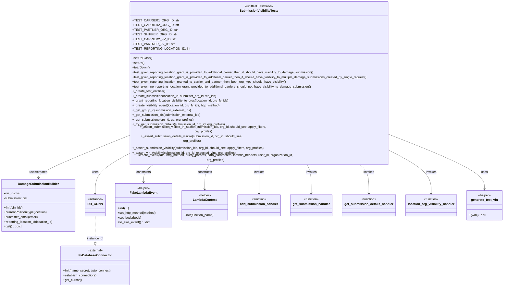

# Diagram: entity_core/entity_service/entity_service/tests/integration_tests/test_damage_submission_visibility.py

> Auto-generated by Obscura crawlers

## Mermaid

### SVG

<svg id="container" width="2523.796875" xmlns="http://www.w3.org/2000/svg" class="classDiagram" height="1394" viewBox="0 0 2523.796875 1394" role="graphics-document document" aria-roledescription="class"><g><defs><marker id="container_class-aggregationStart" class="marker aggregation class" refX="18" refY="7" markerWidth="190" markerHeight="240" orient="auto"><path d="M 18,7 L9,13 L1,7 L9,1 Z"></path></marker></defs><defs><marker id="container_class-aggregationEnd" class="marker aggregation class" refX="1" refY="7" markerWidth="20" markerHeight="28" orient="auto"><path d="M 18,7 L9,13 L1,7 L9,1 Z"></path></marker></defs><defs><marker id="container_class-extensionStart" class="marker extension class" refX="18" refY="7" markerWidth="190" markerHeight="240" orient="auto"><path d="M 1,7 L18,13 V 1 Z"></path></marker></defs><defs><marker id="container_class-extensionEnd" class="marker extension class" refX="1" refY="7" markerWidth="20" markerHeight="28" orient="auto"><path d="M 1,1 V 13 L18,7 Z"></path></marker></defs><defs><marker id="container_class-compositionStart" class="marker composition class" refX="18" refY="7" markerWidth="190" markerHeight="240" orient="auto"><path d="M 18,7 L9,13 L1,7 L9,1 Z"></path></marker></defs><defs><marker id="container_class-compositionEnd" class="marker composition class" refX="1" refY="7" markerWidth="20" markerHeight="28" orient="auto"><path d="M 18,7 L9,13 L1,7 L9,1 Z"></path></marker></defs><defs><marker id="container_class-dependencyStart" class="marker dependency class" refX="6" refY="7" markerWidth="190" markerHeight="240" orient="auto"><path d="M 5,7 L9,13 L1,7 L9,1 Z"></path></marker></defs><defs><marker id="container_class-dependencyEnd" class="marker dependency class" refX="13" refY="7" markerWidth="20" markerHeight="28" orient="auto"><path d="M 18,7 L9,13 L14,7 L9,1 Z"></path></marker></defs><defs><marker id="container_class-lollipopStart" class="marker lollipop class" refX="13" refY="7" markerWidth="190" markerHeight="240" orient="auto"><circle stroke="black" fill="transparent" cx="7" cy="7" r="6"></circle></marker></defs><defs><marker id="container_class-lollipopEnd" class="marker lollipop class" refX="1" refY="7" markerWidth="190" markerHeight="240" orient="auto"><circle stroke="black" fill="transparent" cx="7" cy="7" r="6"></circle></marker></defs><g class="root"><g class="clusters"></g><g class="edgePaths"><path d="M651.41,642.43L575.76,670.858C500.111,699.287,348.811,756.143,273.161,789.738C197.512,823.333,197.512,833.667,197.512,838.833L197.512,844" id="id_SubmissionVisibilityTests_DamageSubmissionBuilder_1" class="edge-thickness-normal edge-pattern-solid relation" style=";;;" data-edge="true" data-et="edge" data-id="id_SubmissionVisibilityTests_DamageSubmissionBuilder_1" data-points="W3sieCI6NjUxLjQxMDE1NjI1LCJ5Ijo2NDIuNDI5ODE2NzAwODk1MX0seyJ4IjoxOTcuNTExNzE4NzUsInkiOjgxM30seyJ4IjoxOTcuNTExNzE4NzUsInkiOjg1MH1d" marker-end="url(#container_class-dependencyEnd)"></path><path d="M786.304,776L777.768,782.167C769.232,788.333,752.161,800.667,743.625,815.5C735.09,830.333,735.09,847.667,735.09,856.333L735.09,865" id="id_SubmissionVisibilityTests_FakeLambdaEvent_2" class="edge-thickness-normal edge-pattern-solid relation" style=";;;" data-edge="true" data-et="edge" data-id="id_SubmissionVisibilityTests_FakeLambdaEvent_2" data-points="W3sieCI6Nzg2LjMwMzY4NTQyMTYxNTIsInkiOjc3Nn0seyJ4Ijo3MzUuMDg5ODQzNzUsInkiOjgxM30seyJ4Ijo3MzUuMDg5ODQzNzUsInkiOjg3MX1d" marker-end="url(#container_class-dependencyEnd)"></path><path d="M1070.687,776L1066.719,782.167C1062.75,788.333,1054.812,800.667,1050.844,821.5C1046.875,842.333,1046.875,871.667,1046.875,886.333L1046.875,901" id="id_SubmissionVisibilityTests_LambdaContext_3" class="edge-thickness-normal edge-pattern-solid relation" style=";;;" data-edge="true" data-et="edge" data-id="id_SubmissionVisibilityTests_LambdaContext_3" data-points="W3sieCI6MTA3MC42ODcyOTU4NzI5MjE2LCJ5Ijo3NzZ9LHsieCI6MTA0Ni44NzUsInkiOjgxM30seyJ4IjoxMDQ2Ljg3NSwieSI6OTA3fV0=" marker-end="url(#container_class-dependencyEnd)"></path><path d="M1317.82,776L1317.82,782.167C1317.82,788.333,1317.82,800.667,1317.82,825C1317.82,849.333,1317.82,885.667,1317.82,903.833L1317.82,922" id="id_SubmissionVisibilityTests_add_submission_handler_4" class="edge-thickness-normal edge-pattern-solid relation" style=";;;" data-edge="true" data-et="edge" data-id="id_SubmissionVisibilityTests_add_submission_handler_4" data-points="W3sieCI6MTMxNy44MjAzMTI1LCJ5Ijo3NzZ9LHsieCI6MTMxNy44MjAzMTI1LCJ5Ijo4MTN9LHsieCI6MTMxNy44MjAzMTI1LCJ5Ijo5Mjh9XQ==" marker-end="url(#container_class-dependencyEnd)"></path><path d="M1551.336,776L1555.086,782.167C1558.836,788.333,1566.336,800.667,1570.086,825C1573.836,849.333,1573.836,885.667,1573.836,903.833L1573.836,922" id="id_SubmissionVisibilityTests_get_submission_handler_5" class="edge-thickness-normal edge-pattern-solid relation" style=";;;" data-edge="true" data-et="edge" data-id="id_SubmissionVisibilityTests_get_submission_handler_5" data-points="W3sieCI6MTU1MS4zMzU3NTE5Mjk5Mjg4LCJ5Ijo3NzZ9LHsieCI6MTU3My44MzU5Mzc1LCJ5Ijo4MTN9LHsieCI6MTU3My44MzU5Mzc1LCJ5Ijo5Mjh9XQ==" marker-end="url(#container_class-dependencyEnd)"></path><path d="M1809.186,776L1817.077,782.167C1824.968,788.333,1840.75,800.667,1848.64,825C1856.531,849.333,1856.531,885.667,1856.531,903.833L1856.531,922" id="id_SubmissionVisibilityTests_get_submission_details_handler_6" class="edge-thickness-normal edge-pattern-solid relation" style=";;;" data-edge="true" data-et="edge" data-id="id_SubmissionVisibilityTests_get_submission_details_handler_6" data-points="W3sieCI6MTgwOS4xODYxMDgyMjQ0NjU0LCJ5Ijo3NzZ9LHsieCI6MTg1Ni41MzEyNSwieSI6ODEzfSx7IngiOjE4NTYuNTMxMjUsInkiOjkyOH1d" marker-end="url(#container_class-dependencyEnd)"></path><path d="M1984.23,723.979L2014.014,738.816C2043.797,753.653,2103.363,783.326,2133.146,816.33C2162.93,849.333,2162.93,885.667,2162.93,903.833L2162.93,922" id="id_SubmissionVisibilityTests_location_org_visibility_handler_7" class="edge-thickness-normal edge-pattern-solid relation" style=";;;" data-edge="true" data-et="edge" data-id="id_SubmissionVisibilityTests_location_org_visibility_handler_7" data-points="W3sieCI6MTk4NC4yMzA0Njg3NSwieSI6NzIzLjk3OTEzMDg0NDc1MDF9LHsieCI6MjE2Mi45Mjk2ODc1LCJ5Ijo4MTN9LHsieCI6MjE2Mi45Mjk2ODc1LCJ5Ijo5Mjh9XQ==" marker-end="url(#container_class-dependencyEnd)"></path><path d="M1984.23,644.907L2058.051,672.922C2131.872,700.938,2279.514,756.969,2353.335,799.651C2427.156,842.333,2427.156,871.667,2427.156,886.333L2427.156,901" id="id_SubmissionVisibilityTests_generate_test_vin_8" class="edge-thickness-normal edge-pattern-solid relation" style=";;;" data-edge="true" data-et="edge" data-id="id_SubmissionVisibilityTests_generate_test_vin_8" data-points="W3sieCI6MTk4NC4yMzA0Njg3NSwieSI6NjQ0LjkwNjg2NjQzODk1OTF9LHsieCI6MjQyNy4xNTYyNSwieSI6ODEzfSx7IngiOjI0MjcuMTU2MjUsInkiOjkwN31d" marker-end="url(#container_class-dependencyEnd)"></path><path d="M651.41,730.328L624.27,744.107C597.13,757.885,542.85,785.443,515.71,817.388C488.57,849.333,488.57,885.667,488.57,903.833L488.57,922" id="id_SubmissionVisibilityTests_DB_CONN_9" class="edge-thickness-normal edge-pattern-solid relation" style=";;;" data-edge="true" data-et="edge" data-id="id_SubmissionVisibilityTests_DB_CONN_9" data-points="W3sieCI6NjUxLjQxMDE1NjI1LCJ5Ijo3MzAuMzI4MjE5MjExNjM3fSx7IngiOjQ4OC41NzAzMTI1LCJ5Ijo4MTN9LHsieCI6NDg4LjU3MDMxMjUsInkiOjkyOH1d" marker-end="url(#container_class-dependencyEnd)"></path><path d="M488.57,1036L488.57,1055.167C488.57,1074.333,488.57,1112.667,488.57,1135.125C488.57,1157.583,488.57,1164.167,488.57,1167.458L488.57,1170.75" id="id_DB_CONN_FvDatabaseConnector_10" class="edge-thickness-normal edge-pattern-dashed relation" style=";;;" data-edge="true" data-et="edge" data-id="id_DB_CONN_FvDatabaseConnector_10" data-points="W3sieCI6NDg4LjU3MDMxMjUsInkiOjEwMzZ9LHsieCI6NDg4LjU3MDMxMjUsInkiOjExNTF9LHsieCI6NDg4LjU3MDMxMjUsInkiOjExODh9XQ==" marker-end="url(#container_class-extensionEnd)"></path></g><g class="edgeLabels"><g class="edgeLabel" transform="translate(197.51171875, 813)"><g class="label" data-id="id_SubmissionVisibilityTests_DamageSubmissionBuilder_1" transform="translate(-46.421875, -12)"><foreignObject width="92.84375" height="24">

uses/creates

</foreignObject></g></g><g class="edgeLabel" transform="translate(735.08984375, 813)"><g class="label" data-id="id_SubmissionVisibilityTests_FakeLambdaEvent_2" transform="translate(-37.84375, -12)"><foreignObject width="75.6875" height="24">

constructs

</foreignObject></g></g><g class="edgeLabel" transform="translate(1046.875, 813)"><g class="label" data-id="id_SubmissionVisibilityTests_LambdaContext_3" transform="translate(-37.84375, -12)"><foreignObject width="75.6875" height="24">

constructs

</foreignObject></g></g><g class="edgeLabel" transform="translate(1317.8203125, 813)"><g class="label" data-id="id_SubmissionVisibilityTests_add_submission_handler_4" transform="translate(-27.5859375, -12)"><foreignObject width="55.171875" height="24">

invokes

</foreignObject></g></g><g class="edgeLabel" transform="translate(1573.8359375, 813)"><g class="label" data-id="id_SubmissionVisibilityTests_get_submission_handler_5" transform="translate(-27.5859375, -12)"><foreignObject width="55.171875" height="24">

invokes

</foreignObject></g></g><g class="edgeLabel" transform="translate(1856.53125, 813)"><g class="label" data-id="id_SubmissionVisibilityTests_get_submission_details_handler_6" transform="translate(-27.5859375, -12)"><foreignObject width="55.171875" height="24">

invokes

</foreignObject></g></g><g class="edgeLabel" transform="translate(2162.9296875, 813)"><g class="label" data-id="id_SubmissionVisibilityTests_location_org_visibility_handler_7" transform="translate(-27.5859375, -12)"><foreignObject width="55.171875" height="24">

invokes

</foreignObject></g></g><g class="edgeLabel" transform="translate(2427.15625, 813)"><g class="label" data-id="id_SubmissionVisibilityTests_generate_test_vin_8" transform="translate(-16.4921875, -12)"><foreignObject width="32.984375" height="24">

uses

</foreignObject></g></g><g class="edgeLabel" transform="translate(488.5703125, 813)"><g class="label" data-id="id_SubmissionVisibilityTests_DB_CONN_9" transform="translate(-16.4921875, -12)"><foreignObject width="32.984375" height="24">

uses

</foreignObject></g></g><g class="edgeLabel" transform="translate(488.5703125, 1151)"><g class="label" data-id="id_DB_CONN_FvDatabaseConnector_10" transform="translate(-41.7734375, -12)"><foreignObject width="83.546875" height="24">

instance_of

</foreignObject></g></g></g><g class="nodes"><g class="node default" id="classId-SubmissionVisibilityTests-0" transform="translate(1317.8203125, 392)"><g class="basic label-container"><path d="M-666.41015625 -384 L666.41015625 -384 L666.41015625 384 L-666.41015625 384" stroke="none" stroke-width="0" fill="#ECECFF" style=""></path><path d="M-666.41015625 -384 C-358.0712664473222 -384, -49.73237664464443 -384, 666.41015625 -384 M-666.41015625 -384 C-289.66474875564757 -384, 87.08065873870487 -384, 666.41015625 -384 M666.41015625 -384 C666.41015625 -214.52501509508755, 666.41015625 -45.05003019017511, 666.41015625 384 M666.41015625 -384 C666.41015625 -204.51783760628618, 666.41015625 -25.035675212572357, 666.41015625 384 M666.41015625 384 C358.956568052524 384, 51.50297985504801 384, -666.41015625 384 M666.41015625 384 C235.1258199001815 384, -196.15851644963698 384, -666.41015625 384 M-666.41015625 384 C-666.41015625 215.32991333739142, -666.41015625 46.659826674782835, -666.41015625 -384 M-666.41015625 384 C-666.41015625 213.57945486639574, -666.41015625 43.15890973279147, -666.41015625 -384" stroke="#9370DB" stroke-width="1.3" fill="none" stroke-dasharray="0 0" style=""></path></g><g class="annotation-group text" transform="translate(-70.1328125, -360)"><g class="label" style="" transform="translate(0,-12)"><foreignObject width="140.265625" height="24">

«unittest.TestCase»

</foreignObject></g></g><g class="label-group text" transform="translate(-93.0703125, -336)"><g class="label" style="font-weight: bolder" transform="translate(0,-12)"><foreignObject width="186.140625" height="24">

SubmissionVisibilityTests

</foreignObject></g></g><g class="members-group text" transform="translate(-654.41015625, -288)"><g class="label" style="" transform="translate(0,-12)"><foreignObject width="203.765625" height="24">

+TEST_CARRIER1_ORG_ID: str

</foreignObject></g><g class="label" style="" transform="translate(0,12)"><foreignObject width="204.984375" height="24">

+TEST_CARRIER2_ORG_ID: str

</foreignObject></g><g class="label" style="" transform="translate(0,36)"><foreignObject width="201.5625" height="24">

+TEST_PARTNER_ORG_ID: str

</foreignObject></g><g class="label" style="" transform="translate(0,60)"><foreignObject width="198.09375" height="24">

+TEST_SHIPPER_ORG_ID: str

</foreignObject></g><g class="label" style="" transform="translate(0,84)"><foreignObject width="190.875" height="24">

+TEST_CARRIER2_FV_ID: str

</foreignObject></g><g class="label" style="" transform="translate(0,108)"><foreignObject width="187.453125" height="24">

+TEST_PARTNER_FV_ID: str

</foreignObject></g><g class="label" style="" transform="translate(0,132)"><foreignObject width="260.0625" height="24">

+TEST_REPORTING_LOCATION_ID: int

</foreignObject></g></g><g class="methods-group text" transform="translate(-654.41015625, -96)"><g class="label" style="" transform="translate(0,-12)"><foreignObject width="97.15625" height="24">

+setUpClass()

</foreignObject></g><g class="label" style="" transform="translate(0,12)"><foreignObject width="60.421875" height="24">

+setUp()

</foreignObject></g><g class="label" style="" transform="translate(0,36)"><foreignObject width="87.75" height="24">

+tearDown()

</foreignObject></g><g class="label" style="" transform="translate(0,60)"><foreignObject width="942.34375" height="24">

+test_given_reporting_location_grant_is_provided_to_additional_carrier_then_it_should_have_visibility_to_damage_submission()

</foreignObject></g><g class="label" style="" transform="translate(0,84)"><foreignObject width="1215.75" height="24">

+test_given_reporting_location_grant_is_provided_to_additonal_carrier_then_it_should_have_visibility_to_multiple_damage_submissions_created_by_single_request()

</foreignObject></g><g class="label" style="" transform="translate(0,108)"><foreignObject width="798.671875" height="24">

+test_given_reporting_location_granted_to_carrier_and_partner_then_both_org_type_should_have_visibility()

</foreignObject></g><g class="label" style="" transform="translate(0,132)"><foreignObject width="930.234375" height="24">

+test_given_no_reporting_location_grant_provided_to_additional_carriers_should_not_have_visibility_to_damage_submission()

</foreignObject></g><g class="label" style="" transform="translate(0,156)"><foreignObject width="167.984375" height="24">

+_create_test_entities()

</foreignObject></g><g class="label" style="" transform="translate(0,180)"><foreignObject width="433.328125" height="24">

+_create_submission(location_id, submitter_org_id, vin_ids)

</foreignObject></g><g class="label" style="" transform="translate(0,204)"><foreignObject width="500.40625" height="24">

+_grant_reporting_location_visibility_to_orgs(location_id, org_fv_ids)

</foreignObject></g><g class="label" style="" transform="translate(0,228)"><foreignObject width="453.40625" height="24">

+_create_visibility_event(location_id, org_fv_ids, http_method)

</foreignObject></g><g class="label" style="" transform="translate(0,252)"><foreignObject width="300.59375" height="24">

+_get_group_id(submission_external_ids)

</foreignObject></g><g class="label" style="" transform="translate(0,276)"><foreignObject width="348.59375" height="24">

+_get_submission_ids(submission_external_ids)

</foreignObject></g><g class="label" style="" transform="translate(0,300)"><foreignObject width="312.21875" height="24">

+_get_submissions(org_id, qs, org_profiles)

</foreignObject></g><g class="label" style="" transform="translate(0,324)"><foreignObject width="477.3125" height="24">

+_try_get_submission_details(submission_id, org_id, org_profiles)

</foreignObject></g><g class="label" style="" transform="translate(0,348)"><foreignObject width="741.875" height="24">

+_assert_submission_visible_in_search(submission_ids, org_id, should_see, apply_filters, org_profiles)

</foreignObject></g><g class="label" style="" transform="translate(0,372)"><foreignObject width="616.484375" height="24">

+_assert_submission_details_visible(submission_id, org_id, should_see, org_profiles)

</foreignObject></g><g class="label" style="" transform="translate(0,396)"><foreignObject width="678.171875" height="24">

+_assert_submission_visibility(submission_ids, org_id, should_see, apply_filters, org_profiles)

</foreignObject></g><g class="label" style="" transform="translate(0,420)"><foreignObject width="532.53125" height="24">

+_assert_vin_visibility(submission_id, org_id, expected_vins, org_profiles)

</foreignObject></g><g class="label" style="" transform="translate(0,444)"><foreignObject width="895.921875" height="24">

+create_event(data, http_method, query_params, path_parameters, lambda_headers, user_id, organization_id, org_profiles)

</foreignObject></g></g><g class="divider" style=""><path d="M-666.41015625 -312 C-204.92599481533313 -312, 256.55816661933375 -312, 666.41015625 -312 M-666.41015625 -312 C-165.06910116027865 -312, 336.2719539294427 -312, 666.41015625 -312" stroke="#9370DB" stroke-width="1.3" fill="none" stroke-dasharray="0 0" style=""></path></g><g class="divider" style=""><path d="M-666.41015625 -120 C-300.87465298199663 -120, 64.66085028600673 -120, 666.41015625 -120 M-666.41015625 -120 C-245.40885905586566 -120, 175.59243813826868 -120, 666.41015625 -120" stroke="#9370DB" stroke-width="1.3" fill="none" stroke-dasharray="0 0" style=""></path></g></g><g class="node default" id="classId-DamageSubmissionBuilder-1" transform="translate(197.51171875, 982)"><g class="basic label-container"><path d="M-189.51171875 -132 L189.51171875 -132 L189.51171875 132 L-189.51171875 132" stroke="none" stroke-width="0" fill="#ECECFF" style=""></path><path d="M-189.51171875 -132 C-75.35448890738019 -132, 38.802740935239626 -132, 189.51171875 -132 M-189.51171875 -132 C-62.9917779986674 -132, 63.528162752665196 -132, 189.51171875 -132 M189.51171875 -132 C189.51171875 -68.43536970193053, 189.51171875 -4.870739403861052, 189.51171875 132 M189.51171875 -132 C189.51171875 -31.238825755579327, 189.51171875 69.52234848884135, 189.51171875 132 M189.51171875 132 C55.3018661265898 132, -78.9079864968204 132, -189.51171875 132 M189.51171875 132 C94.94684015222566 132, 0.3819615544513226 132, -189.51171875 132 M-189.51171875 132 C-189.51171875 62.82962606761909, -189.51171875 -6.340747864761823, -189.51171875 -132 M-189.51171875 132 C-189.51171875 39.89402926978164, -189.51171875 -52.21194146043672, -189.51171875 -132" stroke="#9370DB" stroke-width="1.3" fill="none" stroke-dasharray="0 0" style=""></path></g><g class="annotation-group text" transform="translate(0, -108)"></g><g class="label-group text" transform="translate(-97.9140625, -108)"><g class="label" style="font-weight: bolder" transform="translate(0,-12)"><foreignObject width="195.828125" height="24">

DamageSubmissionBuilder

</foreignObject></g></g><g class="members-group text" transform="translate(-177.51171875, -60)"><g class="label" style="" transform="translate(0,-12)"><foreignObject width="88.453125" height="24">

-vin_ids: list

</foreignObject></g><g class="label" style="" transform="translate(0,12)"><foreignObject width="124.5625" height="24">

-submission: dict

</foreignObject></g></g><g class="methods-group text" transform="translate(-177.51171875, 12)"><g class="label" style="" transform="translate(0,-12)"><foreignObject width="94.4375" height="24">

+<strong>init</strong>(vin_ids)

</foreignObject></g><g class="label" style="" transform="translate(0,12)"><foreignObject width="222.9375" height="24">

+currentPositionType(location)

</foreignObject></g><g class="label" style="" transform="translate(0,36)"><foreignObject width="176.46875" height="24">

+submitter_email(email)

</foreignObject></g><g class="label" style="" transform="translate(0,60)"><foreignObject width="257.109375" height="24">

+reporting_location_id(location_id)

</foreignObject></g><g class="label" style="" transform="translate(0,84)"><foreignObject width="88.828125" height="24">

+get() : : dict

</foreignObject></g></g><g class="divider" style=""><path d="M-189.51171875 -84 C-44.43325006008149 -84, 100.64521862983702 -84, 189.51171875 -84 M-189.51171875 -84 C-47.36560919938904 -84, 94.78050035122192 -84, 189.51171875 -84" stroke="#9370DB" stroke-width="1.3" fill="none" stroke-dasharray="0 0" style=""></path></g><g class="divider" style=""><path d="M-189.51171875 -12 C-49.68331559187234 -12, 90.14508756625531 -12, 189.51171875 -12 M-189.51171875 -12 C-49.17946008907492 -12, 91.15279857185016 -12, 189.51171875 -12" stroke="#9370DB" stroke-width="1.3" fill="none" stroke-dasharray="0 0" style=""></path></g></g><g class="node default" id="classId-FvDatabaseConnector-2" transform="translate(488.5703125, 1287)"><g class="basic label-container"><path d="M-172.42578125 -99 L172.42578125 -99 L172.42578125 99 L-172.42578125 99" stroke="none" stroke-width="0" fill="#ECECFF" style=""></path><path d="M-172.42578125 -99 C-60.03413351096053 -99, 52.35751422807894 -99, 172.42578125 -99 M-172.42578125 -99 C-65.01180773468059 -99, 42.402165780638825 -99, 172.42578125 -99 M172.42578125 -99 C172.42578125 -52.98236616064915, 172.42578125 -6.9647323212983, 172.42578125 99 M172.42578125 -99 C172.42578125 -31.68933412777281, 172.42578125 35.62133174445438, 172.42578125 99 M172.42578125 99 C35.453690867240795 99, -101.51839951551841 99, -172.42578125 99 M172.42578125 99 C36.516698188423675 99, -99.39238487315265 99, -172.42578125 99 M-172.42578125 99 C-172.42578125 52.397977245198895, -172.42578125 5.79595449039779, -172.42578125 -99 M-172.42578125 99 C-172.42578125 22.082196460511838, -172.42578125 -54.835607078976324, -172.42578125 -99" stroke="#9370DB" stroke-width="1.3" fill="none" stroke-dasharray="0 0" style=""></path></g><g class="annotation-group text" transform="translate(-38.65625, -75)"><g class="label" style="" transform="translate(0,-12)"><foreignObject width="77.3125" height="24">

«external»

</foreignObject></g></g><g class="label-group text" transform="translate(-79.3046875, -51)"><g class="label" style="font-weight: bolder" transform="translate(0,-12)"><foreignObject width="158.609375" height="24">

FvDatabaseConnector

</foreignObject></g></g><g class="members-group text" transform="translate(-160.42578125, -3)"></g><g class="methods-group text" transform="translate(-160.42578125, 27)"><g class="label" style="" transform="translate(0,-12)"><foreignObject width="241.546875" height="24">

+<strong>init</strong>(name, secret, auto_connect)

</foreignObject></g><g class="label" style="" transform="translate(0,12)"><foreignObject width="173.265625" height="24">

+establish_connection()

</foreignObject></g><g class="label" style="" transform="translate(0,36)"><foreignObject width="94.640625" height="24">

+get_cursor()

</foreignObject></g></g><g class="divider" style=""><path d="M-172.42578125 -27 C-97.51767603722072 -27, -22.609570824441448 -27, 172.42578125 -27 M-172.42578125 -27 C-97.24649074692432 -27, -22.067200243848646 -27, 172.42578125 -27" stroke="#9370DB" stroke-width="1.3" fill="none" stroke-dasharray="0 0" style=""></path></g><g class="divider" style=""><path d="M-172.42578125 -3 C-44.99595389254041 -3, 82.43387346491917 -3, 172.42578125 -3 M-172.42578125 -3 C-93.6961296779479 -3, -14.966478105895789 -3, 172.42578125 -3" stroke="#9370DB" stroke-width="1.3" fill="none" stroke-dasharray="0 0" style=""></path></g></g><g class="node default" id="classId-DB_CONN-3" transform="translate(488.5703125, 982)"><g class="basic label-container"><path d="M-51.546875 -54 L51.546875 -54 L51.546875 54 L-51.546875 54" stroke="none" stroke-width="0" fill="#ECECFF" style=""></path><path d="M-51.546875 -54 C-21.325183665639578 -54, 8.896507668720844 -54, 51.546875 -54 M-51.546875 -54 C-27.93768885193373 -54, -4.328502703867457 -54, 51.546875 -54 M51.546875 -54 C51.546875 -25.99740515178564, 51.546875 2.0051896964287224, 51.546875 54 M51.546875 -54 C51.546875 -12.629203723900616, 51.546875 28.741592552198767, 51.546875 54 M51.546875 54 C11.43013075234962 54, -28.68661349530076 54, -51.546875 54 M51.546875 54 C24.22182257500321 54, -3.103229849993582 54, -51.546875 54 M-51.546875 54 C-51.546875 14.991225207510489, -51.546875 -24.017549584979022, -51.546875 -54 M-51.546875 54 C-51.546875 14.831565464334119, -51.546875 -24.336869071331762, -51.546875 -54" stroke="#9370DB" stroke-width="1.3" fill="none" stroke-dasharray="0 0" style=""></path></g><g class="annotation-group text" transform="translate(-39.546875, -30)"><g class="label" style="" transform="translate(0,-12)"><foreignObject width="79.09375" height="24">

«instance»

</foreignObject></g></g><g class="label-group text" transform="translate(-34.40625, -6)"><g class="label" style="font-weight: bolder" transform="translate(0,-12)"><foreignObject width="68.8125" height="24">

DB_CONN

</foreignObject></g></g><g class="members-group text" transform="translate(-39.546875, 42)"></g><g class="methods-group text" transform="translate(-39.546875, 72)"></g><g class="divider" style=""><path d="M-51.546875 18 C-24.969017154419497 18, 1.6088406911610065 18, 51.546875 18 M-51.546875 18 C-23.915372495499152 18, 3.716130009001695 18, 51.546875 18" stroke="#9370DB" stroke-width="1.3" fill="none" stroke-dasharray="0 0" style=""></path></g><g class="divider" style=""><path d="M-51.546875 36 C-29.84997309212611 36, -8.15307118425222 36, 51.546875 36 M-51.546875 36 C-13.93976355368492 36, 23.66734789263016 36, 51.546875 36" stroke="#9370DB" stroke-width="1.3" fill="none" stroke-dasharray="0 0" style=""></path></g></g><g class="node default" id="classId-FakeLambdaEvent-4" transform="translate(735.08984375, 982)"><g class="basic label-container"><path d="M-144.97265625 -111 L144.97265625 -111 L144.97265625 111 L-144.97265625 111" stroke="none" stroke-width="0" fill="#ECECFF" style=""></path><path d="M-144.97265625 -111 C-82.78653669647785 -111, -20.600417142955706 -111, 144.97265625 -111 M-144.97265625 -111 C-59.50344851659406 -111, 25.965759216811875 -111, 144.97265625 -111 M144.97265625 -111 C144.97265625 -53.95333754102638, 144.97265625 3.0933249179472426, 144.97265625 111 M144.97265625 -111 C144.97265625 -57.71514569753052, 144.97265625 -4.430291395061033, 144.97265625 111 M144.97265625 111 C44.65351178674928 111, -55.665632676501446 111, -144.97265625 111 M144.97265625 111 C72.13561040644011 111, -0.701435437119784 111, -144.97265625 111 M-144.97265625 111 C-144.97265625 24.213139224270492, -144.97265625 -62.573721551459016, -144.97265625 -111 M-144.97265625 111 C-144.97265625 61.4678052791648, -144.97265625 11.9356105583296, -144.97265625 -111" stroke="#9370DB" stroke-width="1.3" fill="none" stroke-dasharray="0 0" style=""></path></g><g class="annotation-group text" transform="translate(-32.640625, -87)"><g class="label" style="" transform="translate(0,-12)"><foreignObject width="65.28125" height="24">

«helper»

</foreignObject></g></g><g class="label-group text" transform="translate(-65.8671875, -63)"><g class="label" style="font-weight: bolder" transform="translate(0,-12)"><foreignObject width="131.734375" height="24">

FakeLambdaEvent

</foreignObject></g></g><g class="members-group text" transform="translate(-132.97265625, -15)"></g><g class="methods-group text" transform="translate(-132.97265625, 15)"><g class="label" style="" transform="translate(0,-12)"><foreignObject width="54.3125" height="24">

+<strong>init</strong>(...)

</foreignObject></g><g class="label" style="" transform="translate(0,12)"><foreignObject width="200.078125" height="24">

+set_http_method(method)

</foreignObject></g><g class="label" style="" transform="translate(0,36)"><foreignObject width="121.21875" height="24">

+set_body(body)

</foreignObject></g><g class="label" style="" transform="translate(0,60)"><foreignObject width="164.328125" height="24">

+to_aws_event() : : dict

</foreignObject></g></g><g class="divider" style=""><path d="M-144.97265625 -39 C-30.006501344731745 -39, 84.95965356053651 -39, 144.97265625 -39 M-144.97265625 -39 C-44.64151050369033 -39, 55.689635242619346 -39, 144.97265625 -39" stroke="#9370DB" stroke-width="1.3" fill="none" stroke-dasharray="0 0" style=""></path></g><g class="divider" style=""><path d="M-144.97265625 -15 C-41.46631015050478 -15, 62.040035948990436 -15, 144.97265625 -15 M-144.97265625 -15 C-53.35103369468533 -15, 38.270588860629346 -15, 144.97265625 -15" stroke="#9370DB" stroke-width="1.3" fill="none" stroke-dasharray="0 0" style=""></path></g></g><g class="node default" id="classId-LambdaContext-5" transform="translate(1046.875, 982)"><g class="basic label-container"><path d="M-116.8125 -75 L116.8125 -75 L116.8125 75 L-116.8125 75" stroke="none" stroke-width="0" fill="#ECECFF" style=""></path><path d="M-116.8125 -75 C-45.52025190750648 -75, 25.771996184987046 -75, 116.8125 -75 M-116.8125 -75 C-68.9778394383147 -75, -21.14317887662942 -75, 116.8125 -75 M116.8125 -75 C116.8125 -17.82588682614027, 116.8125 39.34822634771946, 116.8125 75 M116.8125 -75 C116.8125 -15.675592463268984, 116.8125 43.64881507346203, 116.8125 75 M116.8125 75 C54.71224374681684 75, -7.388012506366323 75, -116.8125 75 M116.8125 75 C49.68904775535083 75, -17.434404489298345 75, -116.8125 75 M-116.8125 75 C-116.8125 27.47433450070102, -116.8125 -20.05133099859796, -116.8125 -75 M-116.8125 75 C-116.8125 36.30904317638523, -116.8125 -2.3819136472295384, -116.8125 -75" stroke="#9370DB" stroke-width="1.3" fill="none" stroke-dasharray="0 0" style=""></path></g><g class="annotation-group text" transform="translate(-32.640625, -51)"><g class="label" style="" transform="translate(0,-12)"><foreignObject width="65.28125" height="24">

«helper»

</foreignObject></g></g><g class="label-group text" transform="translate(-57.296875, -27)"><g class="label" style="font-weight: bolder" transform="translate(0,-12)"><foreignObject width="114.59375" height="24">

LambdaContext

</foreignObject></g></g><g class="members-group text" transform="translate(-104.8125, 21)"></g><g class="methods-group text" transform="translate(-104.8125, 51)"><g class="label" style="" transform="translate(0,-12)"><foreignObject width="152.328125" height="24">

+<strong>init</strong>(function_name)

</foreignObject></g></g><g class="divider" style=""><path d="M-116.8125 -3 C-39.565151177548614 -3, 37.68219764490277 -3, 116.8125 -3 M-116.8125 -3 C-66.15899649894028 -3, -15.505492997880566 -3, 116.8125 -3" stroke="#9370DB" stroke-width="1.3" fill="none" stroke-dasharray="0 0" style=""></path></g><g class="divider" style=""><path d="M-116.8125 21 C-51.741930892406145 21, 13.32863821518771 21, 116.8125 21 M-116.8125 21 C-48.161422590353794 21, 20.48965481929241 21, 116.8125 21" stroke="#9370DB" stroke-width="1.3" fill="none" stroke-dasharray="0 0" style=""></path></g></g><g class="node default" id="classId-add_submission_handler-6" transform="translate(1317.8203125, 982)"><g class="basic label-container"><path d="M-104.1328125 -54 L104.1328125 -54 L104.1328125 54 L-104.1328125 54" stroke="none" stroke-width="0" fill="#ECECFF" style=""></path><path d="M-104.1328125 -54 C-60.08189238321838 -54, -16.030972266436763 -54, 104.1328125 -54 M-104.1328125 -54 C-22.901035071336295 -54, 58.33074235732741 -54, 104.1328125 -54 M104.1328125 -54 C104.1328125 -13.93902526585832, 104.1328125 26.12194946828336, 104.1328125 54 M104.1328125 -54 C104.1328125 -22.944447227846666, 104.1328125 8.111105544306668, 104.1328125 54 M104.1328125 54 C44.10573633218568 54, -15.921339835628643 54, -104.1328125 54 M104.1328125 54 C23.647087502013576 54, -56.83863749597285 54, -104.1328125 54 M-104.1328125 54 C-104.1328125 16.436639789867037, -104.1328125 -21.126720420265926, -104.1328125 -54 M-104.1328125 54 C-104.1328125 21.608672803218177, -104.1328125 -10.782654393563647, -104.1328125 -54" stroke="#9370DB" stroke-width="1.3" fill="none" stroke-dasharray="0 0" style=""></path></g><g class="annotation-group text" transform="translate(-39.484375, -30)"><g class="label" style="" transform="translate(0,-12)"><foreignObject width="78.96875" height="24">

«function»

</foreignObject></g></g><g class="label-group text" transform="translate(-92.1328125, -6)"><g class="label" style="font-weight: bolder" transform="translate(0,-12)"><foreignObject width="184.265625" height="24">

add_submission_handler

</foreignObject></g></g><g class="members-group text" transform="translate(-92.1328125, 42)"></g><g class="methods-group text" transform="translate(-92.1328125, 72)"></g><g class="divider" style=""><path d="M-104.1328125 18 C-29.816485207585856 18, 44.49984208482829 18, 104.1328125 18 M-104.1328125 18 C-56.703435475296956 18, -9.274058450593913 18, 104.1328125 18" stroke="#9370DB" stroke-width="1.3" fill="none" stroke-dasharray="0 0" style=""></path></g><g class="divider" style=""><path d="M-104.1328125 36 C-52.23215243635776 36, -0.3314923727155161 36, 104.1328125 36 M-104.1328125 36 C-52.20930046542995 36, -0.28578843085989547 36, 104.1328125 36" stroke="#9370DB" stroke-width="1.3" fill="none" stroke-dasharray="0 0" style=""></path></g></g><g class="node default" id="classId-get_submission_handler-7" transform="translate(1573.8359375, 982)"><g class="basic label-container"><path d="M-101.8828125 -54 L101.8828125 -54 L101.8828125 54 L-101.8828125 54" stroke="none" stroke-width="0" fill="#ECECFF" style=""></path><path d="M-101.8828125 -54 C-54.97758686289592 -54, -8.072361225791838 -54, 101.8828125 -54 M-101.8828125 -54 C-44.386383393665604 -54, 13.110045712668793 -54, 101.8828125 -54 M101.8828125 -54 C101.8828125 -29.606835755945955, 101.8828125 -5.21367151189191, 101.8828125 54 M101.8828125 -54 C101.8828125 -24.587086683715537, 101.8828125 4.825826632568926, 101.8828125 54 M101.8828125 54 C59.154164366840234 54, 16.42551623368047 54, -101.8828125 54 M101.8828125 54 C27.09149606717891 54, -47.69982036564218 54, -101.8828125 54 M-101.8828125 54 C-101.8828125 16.75592300726219, -101.8828125 -20.48815398547562, -101.8828125 -54 M-101.8828125 54 C-101.8828125 11.403281273708672, -101.8828125 -31.193437452582657, -101.8828125 -54" stroke="#9370DB" stroke-width="1.3" fill="none" stroke-dasharray="0 0" style=""></path></g><g class="annotation-group text" transform="translate(-39.484375, -30)"><g class="label" style="" transform="translate(0,-12)"><foreignObject width="78.96875" height="24">

«function»

</foreignObject></g></g><g class="label-group text" transform="translate(-89.8828125, -6)"><g class="label" style="font-weight: bolder" transform="translate(0,-12)"><foreignObject width="179.765625" height="24">

get_submission_handler

</foreignObject></g></g><g class="members-group text" transform="translate(-89.8828125, 42)"></g><g class="methods-group text" transform="translate(-89.8828125, 72)"></g><g class="divider" style=""><path d="M-101.8828125 18 C-32.32195227474185 18, 37.23890795051631 18, 101.8828125 18 M-101.8828125 18 C-55.794625057216464 18, -9.706437614432929 18, 101.8828125 18" stroke="#9370DB" stroke-width="1.3" fill="none" stroke-dasharray="0 0" style=""></path></g><g class="divider" style=""><path d="M-101.8828125 36 C-41.766302353405464 36, 18.35020779318907 36, 101.8828125 36 M-101.8828125 36 C-48.842033463961236 36, 4.198745572077527 36, 101.8828125 36" stroke="#9370DB" stroke-width="1.3" fill="none" stroke-dasharray="0 0" style=""></path></g></g><g class="node default" id="classId-get_submission_details_handler-8" transform="translate(1856.53125, 982)"><g class="basic label-container"><path d="M-130.8125 -54 L130.8125 -54 L130.8125 54 L-130.8125 54" stroke="none" stroke-width="0" fill="#ECECFF" style=""></path><path d="M-130.8125 -54 C-34.96545145196929 -54, 60.88159709606143 -54, 130.8125 -54 M-130.8125 -54 C-57.39158981638796 -54, 16.029320367224074 -54, 130.8125 -54 M130.8125 -54 C130.8125 -32.03691253970062, 130.8125 -10.073825079401246, 130.8125 54 M130.8125 -54 C130.8125 -11.717695368942863, 130.8125 30.564609262114274, 130.8125 54 M130.8125 54 C46.2497742857426 54, -38.31295142851479 54, -130.8125 54 M130.8125 54 C40.80627181230588 54, -49.19995637538824 54, -130.8125 54 M-130.8125 54 C-130.8125 19.980275777945053, -130.8125 -14.039448444109894, -130.8125 -54 M-130.8125 54 C-130.8125 18.820314669905983, -130.8125 -16.359370660188034, -130.8125 -54" stroke="#9370DB" stroke-width="1.3" fill="none" stroke-dasharray="0 0" style=""></path></g><g class="annotation-group text" transform="translate(-39.484375, -30)"><g class="label" style="" transform="translate(0,-12)"><foreignObject width="78.96875" height="24">

«function»

</foreignObject></g></g><g class="label-group text" transform="translate(-118.8125, -6)"><g class="label" style="font-weight: bolder" transform="translate(0,-12)"><foreignObject width="237.625" height="24">

get_submission_details_handler

</foreignObject></g></g><g class="members-group text" transform="translate(-118.8125, 42)"></g><g class="methods-group text" transform="translate(-118.8125, 72)"></g><g class="divider" style=""><path d="M-130.8125 18 C-70.21847342871736 18, -9.62444685743472 18, 130.8125 18 M-130.8125 18 C-70.80816495738603 18, -10.803829914772038 18, 130.8125 18" stroke="#9370DB" stroke-width="1.3" fill="none" stroke-dasharray="0 0" style=""></path></g><g class="divider" style=""><path d="M-130.8125 36 C-67.2894169575556 36, -3.7663339151112183 36, 130.8125 36 M-130.8125 36 C-69.90848206966785 36, -9.00446413933571 36, 130.8125 36" stroke="#9370DB" stroke-width="1.3" fill="none" stroke-dasharray="0 0" style=""></path></g></g><g class="node default" id="classId-location_org_visibility_handler-9" transform="translate(2162.9296875, 982)"><g class="basic label-container"><path d="M-125.5859375 -54 L125.5859375 -54 L125.5859375 54 L-125.5859375 54" stroke="none" stroke-width="0" fill="#ECECFF" style=""></path><path d="M-125.5859375 -54 C-57.68355707103741 -54, 10.218823357925174 -54, 125.5859375 -54 M-125.5859375 -54 C-66.52085394399948 -54, -7.455770387998967 -54, 125.5859375 -54 M125.5859375 -54 C125.5859375 -29.521464390562066, 125.5859375 -5.042928781124132, 125.5859375 54 M125.5859375 -54 C125.5859375 -17.70034813884301, 125.5859375 18.599303722313977, 125.5859375 54 M125.5859375 54 C56.806979628398636 54, -11.971978243202727 54, -125.5859375 54 M125.5859375 54 C57.79911346828413 54, -9.987710563431733 54, -125.5859375 54 M-125.5859375 54 C-125.5859375 26.6738993325422, -125.5859375 -0.6522013349156026, -125.5859375 -54 M-125.5859375 54 C-125.5859375 31.88434392799561, -125.5859375 9.768687855991217, -125.5859375 -54" stroke="#9370DB" stroke-width="1.3" fill="none" stroke-dasharray="0 0" style=""></path></g><g class="annotation-group text" transform="translate(-39.484375, -30)"><g class="label" style="" transform="translate(0,-12)"><foreignObject width="78.96875" height="24">

«function»

</foreignObject></g></g><g class="label-group text" transform="translate(-113.5859375, -6)"><g class="label" style="font-weight: bolder" transform="translate(0,-12)"><foreignObject width="227.171875" height="24">

location_org_visibility_handler

</foreignObject></g></g><g class="members-group text" transform="translate(-113.5859375, 42)"></g><g class="methods-group text" transform="translate(-113.5859375, 72)"></g><g class="divider" style=""><path d="M-125.5859375 18 C-56.15717764075279 18, 13.271582218494416 18, 125.5859375 18 M-125.5859375 18 C-65.84316432496831 18, -6.100391149936613 18, 125.5859375 18" stroke="#9370DB" stroke-width="1.3" fill="none" stroke-dasharray="0 0" style=""></path></g><g class="divider" style=""><path d="M-125.5859375 36 C-59.14904820629438 36, 7.287841087411238 36, 125.5859375 36 M-125.5859375 36 C-62.68086194952947 36, 0.2242136009410558 36, 125.5859375 36" stroke="#9370DB" stroke-width="1.3" fill="none" stroke-dasharray="0 0" style=""></path></g></g><g class="node default" id="classId-generate_test_vin-10" transform="translate(2427.15625, 982)"><g class="basic label-container"><path d="M-88.640625 -75 L88.640625 -75 L88.640625 75 L-88.640625 75" stroke="none" stroke-width="0" fill="#ECECFF" style=""></path><path d="M-88.640625 -75 C-37.14472876399015 -75, 14.351167472019696 -75, 88.640625 -75 M-88.640625 -75 C-22.07684686610648 -75, 44.48693126778704 -75, 88.640625 -75 M88.640625 -75 C88.640625 -27.87233570296027, 88.640625 19.255328594079458, 88.640625 75 M88.640625 -75 C88.640625 -41.33887250573241, 88.640625 -7.677745011464822, 88.640625 75 M88.640625 75 C52.93436357603746 75, 17.228102152074925 75, -88.640625 75 M88.640625 75 C39.833896809471725 75, -8.972831381056551 75, -88.640625 75 M-88.640625 75 C-88.640625 19.49259465936032, -88.640625 -36.01481068127936, -88.640625 -75 M-88.640625 75 C-88.640625 21.973513923698015, -88.640625 -31.05297215260397, -88.640625 -75" stroke="#9370DB" stroke-width="1.3" fill="none" stroke-dasharray="0 0" style=""></path></g><g class="annotation-group text" transform="translate(-32.640625, -51)"><g class="label" style="" transform="translate(0,-12)"><foreignObject width="65.28125" height="24">

«helper»

</foreignObject></g></g><g class="label-group text" transform="translate(-65.40625, -27)"><g class="label" style="font-weight: bolder" transform="translate(0,-12)"><foreignObject width="130.8125" height="24">

generate_test_vin

</foreignObject></g></g><g class="members-group text" transform="translate(-76.640625, 21)"></g><g class="methods-group text" transform="translate(-76.640625, 51)"><g class="label" style="" transform="translate(0,-12)"><foreignObject width="87.875" height="24">

+(wmi) : : str

</foreignObject></g></g><g class="divider" style=""><path d="M-88.640625 -3 C-26.945327193041678 -3, 34.749970613916645 -3, 88.640625 -3 M-88.640625 -3 C-19.51865141361455 -3, 49.6033221727709 -3, 88.640625 -3" stroke="#9370DB" stroke-width="1.3" fill="none" stroke-dasharray="0 0" style=""></path></g><g class="divider" style=""><path d="M-88.640625 21 C-32.38436543580991 21, 23.871894128380177 21, 88.640625 21 M-88.640625 21 C-49.00902213935278 21, -9.37741927870556 21, 88.640625 21" stroke="#9370DB" stroke-width="1.3" fill="none" stroke-dasharray="0 0" style=""></path></g></g></g></g></g></svg>
