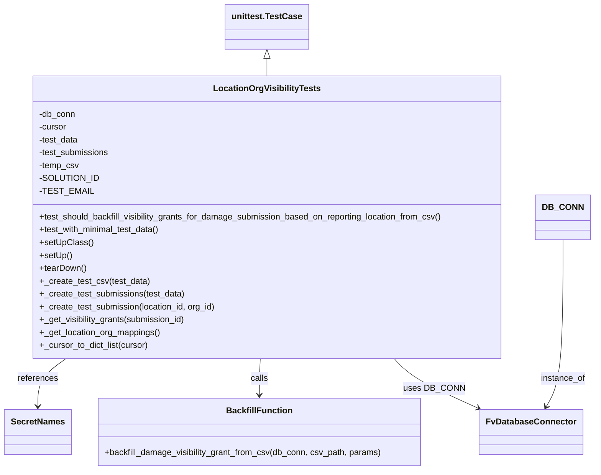

# Diagram: entity_core/entity_service/entity_service/tests/integration_tests/test_damage_visibility_backfill_script.py


> Auto-generated by Obscura crawlers

## Diagram 1



### SVG

<svg id="container" width="1090.0859375" xmlns="http://www.w3.org/2000/svg" class="classDiagram" height="878" viewBox="0 0 1090.0859375 878" role="graphics-document document" aria-roledescription="class"><style>#container{font-family:"trebuchet ms",verdana,arial,sans-serif;font-size:16px;fill:#333;}@keyframes edge-animation-frame{from{stroke-dashoffset:0;}}@keyframes dash{to{stroke-dashoffset:0;}}#container .edge-animation-slow{stroke-dasharray:9,5!important;stroke-dashoffset:900;animation:dash 50s linear infinite;stroke-linecap:round;}#container .edge-animation-fast{stroke-dasharray:9,5!important;stroke-dashoffset:900;animation:dash 20s linear infinite;stroke-linecap:round;}#container .error-icon{fill:#552222;}#container .error-text{fill:#552222;stroke:#552222;}#container .edge-thickness-normal{stroke-width:1px;}#container .edge-thickness-thick{stroke-width:3.5px;}#container .edge-pattern-solid{stroke-dasharray:0;}#container .edge-thickness-invisible{stroke-width:0;fill:none;}#container .edge-pattern-dashed{stroke-dasharray:3;}#container .edge-pattern-dotted{stroke-dasharray:2;}#container .marker{fill:#333333;stroke:#333333;}#container .marker.cross{stroke:#333333;}#container svg{font-family:"trebuchet ms",verdana,arial,sans-serif;font-size:16px;}#container p{margin:0;}#container g.classGroup text{fill:#9370DB;stroke:none;font-family:"trebuchet ms",verdana,arial,sans-serif;font-size:10px;}#container g.classGroup text .title{font-weight:bolder;}#container .nodeLabel,#container .edgeLabel{color:#131300;}#container .edgeLabel .label rect{fill:#ECECFF;}#container .label text{fill:#131300;}#container .labelBkg{background:#ECECFF;}#container .edgeLabel .label span{background:#ECECFF;}#container .classTitle{font-weight:bolder;}#container .node rect,#container .node circle,#container .node ellipse,#container .node polygon,#container .node path{fill:#ECECFF;stroke:#9370DB;stroke-width:1px;}#container .divider{stroke:#9370DB;stroke-width:1;}#container g.clickable{cursor:pointer;}#container g.classGroup rect{fill:#ECECFF;stroke:#9370DB;}#container g.classGroup line{stroke:#9370DB;stroke-width:1;}#container .classLabel .box{stroke:none;stroke-width:0;fill:#ECECFF;opacity:0.5;}#container .classLabel .label{fill:#9370DB;font-size:10px;}#container .relation{stroke:#333333;stroke-width:1;fill:none;}#container .dashed-line{stroke-dasharray:3;}#container .dotted-line{stroke-dasharray:1 2;}#container #compositionStart,#container .composition{fill:#333333!important;stroke:#333333!important;stroke-width:1;}#container #compositionEnd,#container .composition{fill:#333333!important;stroke:#333333!important;stroke-width:1;}#container #dependencyStart,#container .dependency{fill:#333333!important;stroke:#333333!important;stroke-width:1;}#container #dependencyStart,#container .dependency{fill:#333333!important;stroke:#333333!important;stroke-width:1;}#container #extensionStart,#container .extension{fill:transparent!important;stroke:#333333!important;stroke-width:1;}#container #extensionEnd,#container .extension{fill:transparent!important;stroke:#333333!important;stroke-width:1;}#container #aggregationStart,#container .aggregation{fill:transparent!important;stroke:#333333!important;stroke-width:1;}#container #aggregationEnd,#container .aggregation{fill:transparent!important;stroke:#333333!important;stroke-width:1;}#container #lollipopStart,#container .lollipop{fill:#ECECFF!important;stroke:#333333!important;stroke-width:1;}#container #lollipopEnd,#container .lollipop{fill:#ECECFF!important;stroke:#333333!important;stroke-width:1;}#container .edgeTerminals{font-size:11px;line-height:initial;}#container .classTitleText{text-anchor:middle;font-size:18px;fill:#333;}#container .label-icon{display:inline-block;height:1em;overflow:visible;vertical-align:-0.125em;}#container .node .label-icon path{fill:currentColor;stroke:revert;stroke-width:revert;}#container :root{--mermaid-font-family:"trebuchet ms",verdana,arial,sans-serif;}</style><g><defs><marker id="container_class-aggregationStart" class="marker aggregation class" refX="18" refY="7" markerWidth="190" markerHeight="240" orient="auto"><path d="M 18,7 L9,13 L1,7 L9,1 Z"></path></marker></defs><defs><marker id="container_class-aggregationEnd" class="marker aggregation class" refX="1" refY="7" markerWidth="20" markerHeight="28" orient="auto"><path d="M 18,7 L9,13 L1,7 L9,1 Z"></path></marker></defs><defs><marker id="container_class-extensionStart" class="marker extension class" refX="18" refY="7" markerWidth="190" markerHeight="240" orient="auto"><path d="M 1,7 L18,13 V 1 Z"></path></marker></defs><defs><marker id="container_class-extensionEnd" class="marker extension class" refX="1" refY="7" markerWidth="20" markerHeight="28" orient="auto"><path d="M 1,1 V 13 L18,7 Z"></path></marker></defs><defs><marker id="container_class-compositionStart" class="marker composition class" refX="18" refY="7" markerWidth="190" markerHeight="240" orient="auto"><path d="M 18,7 L9,13 L1,7 L9,1 Z"></path></marker></defs><defs><marker id="container_class-compositionEnd" class="marker composition class" refX="1" refY="7" markerWidth="20" markerHeight="28" orient="auto"><path d="M 18,7 L9,13 L1,7 L9,1 Z"></path></marker></defs><defs><marker id="container_class-dependencyStart" class="marker dependency class" refX="6" refY="7" markerWidth="190" markerHeight="240" orient="auto"><path d="M 5,7 L9,13 L1,7 L9,1 Z"></path></marker></defs><defs><marker id="container_class-dependencyEnd" class="marker dependency class" refX="13" refY="7" markerWidth="20" markerHeight="28" orient="auto"><path d="M 18,7 L9,13 L14,7 L9,1 Z"></path></marker></defs><defs><marker id="container_class-lollipopStart" class="marker lollipop class" refX="13" refY="7" markerWidth="190" markerHeight="240" orient="auto"><circle stroke="black" fill="transparent" cx="7" cy="7" r="6"></circle></marker></defs><defs><marker id="container_class-lollipopEnd" class="marker lollipop class" refX="1" refY="7" markerWidth="190" markerHeight="240" orient="auto"><circle stroke="black" fill="transparent" cx="7" cy="7" r="6"></circle></marker></defs><g class="root"><g class="clusters"></g><g class="edgePaths"><path d="M488.104,109.25L488.104,110.542C488.104,111.833,488.104,114.417,488.104,119.875C488.104,125.333,488.104,133.667,488.104,137.833L488.104,142" id="id_unittest.TestCase_LocationOrgVisibilityTests_1" class="edge-thickness-normal edge-pattern-solid relation" style=";;;" data-edge="true" data-et="edge" data-id="id_unittest.TestCase_LocationOrgVisibilityTests_1" data-points="W3sieCI6NDg4LjEwMzUxNTYyNSwieSI6OTJ9LHsieCI6NDg4LjEwMzUxNTYyNSwieSI6MTE3fSx7IngiOjQ4OC4xMDM1MTU2MjUsInkiOjE0Mn1d" marker-start="url(#container_class-extensionStart)"></path><path d="M721.216,670L726.661,676.167C732.106,682.333,742.996,694.667,769.704,710.31C796.412,725.954,838.936,744.908,860.199,754.385L881.461,763.862" id="id_LocationOrgVisibilityTests_FvDatabaseConnector_2" class="edge-thickness-normal edge-pattern-solid relation" style=";;;" data-edge="true" data-et="edge" data-id="id_LocationOrgVisibilityTests_FvDatabaseConnector_2" data-points="W3sieCI6NzIxLjIxNTY5Mzc4MTE0NjIsInkiOjY3MH0seyJ4Ijo3NTMuODg2NzE4NzUsInkiOjcwN30seyJ4Ijo4ODYuOTQxNDA2MjUsInkiOjc2Ni4zMDQyNjkwOTk1MTk1fV0=" marker-end="url(#container_class-dependencyEnd)"></path><path d="M479.931,670L479.74,676.167C479.549,682.333,479.167,694.667,478.976,706C478.785,717.333,478.785,727.667,478.785,732.833L478.785,738" id="id_LocationOrgVisibilityTests_BackfillFunction_3" class="edge-thickness-normal edge-pattern-solid relation" style=";;;" data-edge="true" data-et="edge" data-id="id_LocationOrgVisibilityTests_BackfillFunction_3" data-points="W3sieCI6NDc5LjkzMDYwMjQxOTAxOTksInkiOjY3MH0seyJ4Ijo0NzguNzg1MTU2MjUsInkiOjcwN30seyJ4Ijo0NzguNzg1MTU2MjUsInkiOjc0NH1d" marker-end="url(#container_class-dependencyEnd)"></path><path d="M119.668,670L111.062,676.167C102.456,682.333,85.244,694.667,76.637,709.5C68.031,724.333,68.031,741.667,68.031,750.333L68.031,759" id="id_LocationOrgVisibilityTests_SecretNames_4" class="edge-thickness-normal edge-pattern-solid relation" style=";;;" data-edge="true" data-et="edge" data-id="id_LocationOrgVisibilityTests_SecretNames_4" data-points="W3sieCI6MTE5LjY2ODA0MDEyNjY2MTE0LCJ5Ijo2NzB9LHsieCI6NjguMDMxMjUsInkiOjcwN30seyJ4Ijo2OC4wMzEyNSwieSI6NzY1fV0=" marker-end="url(#container_class-dependencyEnd)"></path><path d="M1035.68,448L1035.68,491.167C1035.68,534.333,1035.68,620.667,1030.626,672.633C1025.572,724.599,1015.464,742.198,1010.41,750.998L1005.356,759.797" id="id_DB_CONN_FvDatabaseConnector_5" class="edge-thickness-normal edge-pattern-solid relation" style=";;;" data-edge="true" data-et="edge" data-id="id_DB_CONN_FvDatabaseConnector_5" data-points="W3sieCI6MTAzNS42Nzk2ODc1LCJ5Ijo0NDh9LHsieCI6MTAzNS42Nzk2ODc1LCJ5Ijo3MDd9LHsieCI6MTAwMi4zNjgyMDMxMjUsInkiOjc2NX1d" marker-end="url(#container_class-dependencyEnd)"></path></g><g class="edgeLabels"><g class="edgeLabel"><g class="label" data-id="id_unittest.TestCase_LocationOrgVisibilityTests_1" transform="translate(0, 0)"><foreignObject width="0" height="0"><div xmlns="http://www.w3.org/1999/xhtml" class="labelBkg" style="display: table-cell; white-space: nowrap; line-height: 1.5; max-width: 200px; text-align: center;"><span class="edgeLabel"></span></div></foreignObject></g></g><g class="edgeLabel" transform="translate(753.88671875, 707)"><g class="label" data-id="id_LocationOrgVisibilityTests_FvDatabaseConnector_2" transform="translate(-53.09375, -12)"><foreignObject width="106.1875" height="24"><div xmlns="http://www.w3.org/1999/xhtml" class="labelBkg" style="display: table-cell; white-space: nowrap; line-height: 1.5; max-width: 200px; text-align: center;"><span class="edgeLabel"><p>uses DB_CONN</p></span></div></foreignObject></g></g><g class="edgeLabel" transform="translate(478.78515625, 707)"><g class="label" data-id="id_LocationOrgVisibilityTests_BackfillFunction_3" transform="translate(-16.4453125, -12)"><foreignObject width="32.890625" height="24"><div xmlns="http://www.w3.org/1999/xhtml" class="labelBkg" style="display: table-cell; white-space: nowrap; line-height: 1.5; max-width: 200px; text-align: center;"><span class="edgeLabel"><p>calls</p></span></div></foreignObject></g></g><g class="edgeLabel" transform="translate(68.03125, 707)"><g class="label" data-id="id_LocationOrgVisibilityTests_SecretNames_4" transform="translate(-37.828125, -12)"><foreignObject width="75.65625" height="24"><div xmlns="http://www.w3.org/1999/xhtml" class="labelBkg" style="display: table-cell; white-space: nowrap; line-height: 1.5; max-width: 200px; text-align: center;"><span class="edgeLabel"><p>references</p></span></div></foreignObject></g></g><g class="edgeLabel" transform="translate(1035.6796875, 707)"><g class="label" data-id="id_DB_CONN_FvDatabaseConnector_5" transform="translate(-41.7734375, -12)"><foreignObject width="83.546875" height="24"><div xmlns="http://www.w3.org/1999/xhtml" class="labelBkg" style="display: table-cell; white-space: nowrap; line-height: 1.5; max-width: 200px; text-align: center;"><span class="edgeLabel"><p>instance_of</p></span></div></foreignObject></g></g></g><g class="nodes"><g class="node default" id="classId-FvDatabaseConnector-0" transform="translate(978.24609375, 807)"><g class="basic label-container"><path d="M-91.3046875 -42 L91.3046875 -42 L91.3046875 42 L-91.3046875 42" stroke="none" stroke-width="0" fill="#ECECFF" style=""></path><path d="M-91.3046875 -42 C-43.85866497171003 -42, 3.5873575565799456 -42, 91.3046875 -42 M-91.3046875 -42 C-43.86242086856789 -42, 3.579845762864224 -42, 91.3046875 -42 M91.3046875 -42 C91.3046875 -17.514651811696098, 91.3046875 6.970696376607805, 91.3046875 42 M91.3046875 -42 C91.3046875 -21.584286829825857, 91.3046875 -1.1685736596517131, 91.3046875 42 M91.3046875 42 C26.05881226370549 42, -39.18706297258902 42, -91.3046875 42 M91.3046875 42 C25.01722449791086 42, -41.27023850417828 42, -91.3046875 42 M-91.3046875 42 C-91.3046875 22.63988349538201, -91.3046875 3.279766990764017, -91.3046875 -42 M-91.3046875 42 C-91.3046875 13.672484415355122, -91.3046875 -14.655031169289757, -91.3046875 -42" stroke="#9370DB" stroke-width="1.3" fill="none" stroke-dasharray="0 0" style=""></path></g><g class="annotation-group text" transform="translate(0, -18)"></g><g class="label-group text" transform="translate(-79.3046875, -18)"><g class="label" style="font-weight: bolder" transform="translate(0,-12)"><foreignObject width="158.609375" height="24"><div xmlns="http://www.w3.org/1999/xhtml" style="display: table-cell; white-space: nowrap; line-height: 1.5; max-width: 207px; text-align: center;"><span class="nodeLabel markdown-node-label" style=""><p>FvDatabaseConnector</p></span></div></foreignObject></g></g><g class="members-group text" transform="translate(-79.3046875, 30)"></g><g class="methods-group text" transform="translate(-79.3046875, 60)"></g><g class="divider" style=""><path d="M-91.3046875 6 C-22.29756806086364 6, 46.70955137827272 6, 91.3046875 6 M-91.3046875 6 C-53.066783186849136 6, -14.828878873698272 6, 91.3046875 6" stroke="#9370DB" stroke-width="1.3" fill="none" stroke-dasharray="0 0" style=""></path></g><g class="divider" style=""><path d="M-91.3046875 24 C-20.81692322111104 24, 49.67084105777792 24, 91.3046875 24 M-91.3046875 24 C-48.4003454473103 24, -5.496003394620601 24, 91.3046875 24" stroke="#9370DB" stroke-width="1.3" fill="none" stroke-dasharray="0 0" style=""></path></g></g><g class="node default" id="classId-SecretNames-1" transform="translate(68.03125, 807)"><g class="basic label-container"><path d="M-60.03125 -42 L60.03125 -42 L60.03125 42 L-60.03125 42" stroke="none" stroke-width="0" fill="#ECECFF" style=""></path><path d="M-60.03125 -42 C-18.587230910692767 -42, 22.856788178614465 -42, 60.03125 -42 M-60.03125 -42 C-30.638812867319942 -42, -1.2463757346398836 -42, 60.03125 -42 M60.03125 -42 C60.03125 -15.462145762607072, 60.03125 11.075708474785856, 60.03125 42 M60.03125 -42 C60.03125 -19.930161945270083, 60.03125 2.1396761094598347, 60.03125 42 M60.03125 42 C17.7516827523066 42, -24.5278844953868 42, -60.03125 42 M60.03125 42 C21.193988534588243 42, -17.643272930823514 42, -60.03125 42 M-60.03125 42 C-60.03125 16.982124402229225, -60.03125 -8.03575119554155, -60.03125 -42 M-60.03125 42 C-60.03125 11.90411583899002, -60.03125 -18.19176832201996, -60.03125 -42" stroke="#9370DB" stroke-width="1.3" fill="none" stroke-dasharray="0 0" style=""></path></g><g class="annotation-group text" transform="translate(0, -18)"></g><g class="label-group text" transform="translate(-48.03125, -18)"><g class="label" style="font-weight: bolder" transform="translate(0,-12)"><foreignObject width="96.0625" height="24"><div xmlns="http://www.w3.org/1999/xhtml" style="display: table-cell; white-space: nowrap; line-height: 1.5; max-width: 145px; text-align: center;"><span class="nodeLabel markdown-node-label" style=""><p>SecretNames</p></span></div></foreignObject></g></g><g class="members-group text" transform="translate(-48.03125, 30)"></g><g class="methods-group text" transform="translate(-48.03125, 60)"></g><g class="divider" style=""><path d="M-60.03125 6 C-28.94155344629937 6, 2.1481431074012605 6, 60.03125 6 M-60.03125 6 C-25.882971406763126 6, 8.265307186473748 6, 60.03125 6" stroke="#9370DB" stroke-width="1.3" fill="none" stroke-dasharray="0 0" style=""></path></g><g class="divider" style=""><path d="M-60.03125 24 C-29.539641289994947 24, 0.9519674200101065 24, 60.03125 24 M-60.03125 24 C-20.108917574990734 24, 19.813414850018532 24, 60.03125 24" stroke="#9370DB" stroke-width="1.3" fill="none" stroke-dasharray="0 0" style=""></path></g></g><g class="node default" id="classId-BackfillFunction-2" transform="translate(478.78515625, 807)"><g class="basic label-container"><path d="M-300.72265625 -63 L300.72265625 -63 L300.72265625 63 L-300.72265625 63" stroke="none" stroke-width="0" fill="#ECECFF" style=""></path><path d="M-300.72265625 -63 C-144.2408575068766 -63, 12.240941236246783 -63, 300.72265625 -63 M-300.72265625 -63 C-104.18569198520342 -63, 92.35127227959316 -63, 300.72265625 -63 M300.72265625 -63 C300.72265625 -37.24272066069908, 300.72265625 -11.485441321398149, 300.72265625 63 M300.72265625 -63 C300.72265625 -13.553503158452159, 300.72265625 35.89299368309568, 300.72265625 63 M300.72265625 63 C116.39563679440198 63, -67.93138266119604 63, -300.72265625 63 M300.72265625 63 C137.26858077773096 63, -26.18549469453808 63, -300.72265625 63 M-300.72265625 63 C-300.72265625 17.27297731470093, -300.72265625 -28.454045370598138, -300.72265625 -63 M-300.72265625 63 C-300.72265625 20.77865378733579, -300.72265625 -21.442692425328417, -300.72265625 -63" stroke="#9370DB" stroke-width="1.3" fill="none" stroke-dasharray="0 0" style=""></path></g><g class="annotation-group text" transform="translate(0, -39)"></g><g class="label-group text" transform="translate(-58.3828125, -39)"><g class="label" style="font-weight: bolder" transform="translate(0,-12)"><foreignObject width="116.765625" height="24"><div xmlns="http://www.w3.org/1999/xhtml" style="display: table-cell; white-space: nowrap; line-height: 1.5; max-width: 165px; text-align: center;"><span class="nodeLabel markdown-node-label" style=""><p>BackfillFunction</p></span></div></foreignObject></g></g><g class="members-group text" transform="translate(-288.72265625, 9)"></g><g class="methods-group text" transform="translate(-288.72265625, 39)"><g class="label" style="" transform="translate(0,-12)"><foreignObject width="519.0625" height="24"><div xmlns="http://www.w3.org/1999/xhtml" style="display: table-cell; white-space: nowrap; line-height: 1.5; max-width: 576px; text-align: center;"><span class="nodeLabel markdown-node-label" style=""><p>+backfill_damage_visibility_grant_from_csv(db_conn, csv_path, params)</p></span></div></foreignObject></g></g><g class="divider" style=""><path d="M-300.72265625 -15 C-152.29345652514016 -15, -3.864256800280316 -15, 300.72265625 -15 M-300.72265625 -15 C-133.0214349630312 -15, 34.679786323937606 -15, 300.72265625 -15" stroke="#9370DB" stroke-width="1.3" fill="none" stroke-dasharray="0 0" style=""></path></g><g class="divider" style=""><path d="M-300.72265625 9 C-69.69990227174932 9, 161.32285170650135 9, 300.72265625 9 M-300.72265625 9 C-153.75758048050915 9, -6.792504711018296 9, 300.72265625 9" stroke="#9370DB" stroke-width="1.3" fill="none" stroke-dasharray="0 0" style=""></path></g></g><g class="node default" id="classId-LocationOrgVisibilityTests-3" transform="translate(488.103515625, 406)"><g class="basic label-container"><path d="M-441.8515625 -264 L441.8515625 -264 L441.8515625 264 L-441.8515625 264" stroke="none" stroke-width="0" fill="#ECECFF" style=""></path><path d="M-441.8515625 -264 C-119.88416767529452 -264, 202.08322714941096 -264, 441.8515625 -264 M-441.8515625 -264 C-258.7928263626734 -264, -75.73409022534685 -264, 441.8515625 -264 M441.8515625 -264 C441.8515625 -99.34205626086512, 441.8515625 65.31588747826976, 441.8515625 264 M441.8515625 -264 C441.8515625 -91.4624151791756, 441.8515625 81.07516964164881, 441.8515625 264 M441.8515625 264 C199.68866846294682 264, -42.474225574106356 264, -441.8515625 264 M441.8515625 264 C203.63334540294565 264, -34.5848716941087 264, -441.8515625 264 M-441.8515625 264 C-441.8515625 78.00614448747689, -441.8515625 -107.98771102504622, -441.8515625 -264 M-441.8515625 264 C-441.8515625 66.48543873924558, -441.8515625 -131.02912252150884, -441.8515625 -264" stroke="#9370DB" stroke-width="1.3" fill="none" stroke-dasharray="0 0" style=""></path></g><g class="annotation-group text" transform="translate(0, -240)"></g><g class="label-group text" transform="translate(-95.296875, -240)"><g class="label" style="font-weight: bolder" transform="translate(0,-12)"><foreignObject width="190.59375" height="24"><div xmlns="http://www.w3.org/1999/xhtml" style="display: table-cell; white-space: nowrap; line-height: 1.5; max-width: 236px; text-align: center;"><span class="nodeLabel markdown-node-label" style=""><p>LocationOrgVisibilityTests</p></span></div></foreignObject></g></g><g class="members-group text" transform="translate(-429.8515625, -192)"><g class="label" style="" transform="translate(0,-12)"><foreignObject width="68.625" height="24"><div xmlns="http://www.w3.org/1999/xhtml" style="display: table-cell; white-space: nowrap; line-height: 1.5; max-width: 126px; text-align: center;"><span class="nodeLabel markdown-node-label" style=""><p>-db_conn</p></span></div></foreignObject></g><g class="label" style="" transform="translate(0,12)"><foreignObject width="52.1875" height="24"><div xmlns="http://www.w3.org/1999/xhtml" style="display: table-cell; white-space: nowrap; line-height: 1.5; max-width: 110px; text-align: center;"><span class="nodeLabel markdown-node-label" style=""><p>-cursor</p></span></div></foreignObject></g><g class="label" style="" transform="translate(0,36)"><foreignObject width="74.515625" height="24"><div xmlns="http://www.w3.org/1999/xhtml" style="display: table-cell; white-space: nowrap; line-height: 1.5; max-width: 132px; text-align: center;"><span class="nodeLabel markdown-node-label" style=""><p>-test_data</p></span></div></foreignObject></g><g class="label" style="" transform="translate(0,60)"><foreignObject width="132.203125" height="24"><div xmlns="http://www.w3.org/1999/xhtml" style="display: table-cell; white-space: nowrap; line-height: 1.5; max-width: 190px; text-align: center;"><span class="nodeLabel markdown-node-label" style=""><p>-test_submissions</p></span></div></foreignObject></g><g class="label" style="" transform="translate(0,84)"><foreignObject width="74.25" height="24"><div xmlns="http://www.w3.org/1999/xhtml" style="display: table-cell; white-space: nowrap; line-height: 1.5; max-width: 132px; text-align: center;"><span class="nodeLabel markdown-node-label" style=""><p>-temp_csv</p></span></div></foreignObject></g><g class="label" style="" transform="translate(0,108)"><foreignObject width="102.109375" height="24"><div xmlns="http://www.w3.org/1999/xhtml" style="display: table-cell; white-space: nowrap; line-height: 1.5; max-width: 159px; text-align: center;"><span class="nodeLabel markdown-node-label" style=""><p>-SOLUTION_ID</p></span></div></foreignObject></g><g class="label" style="" transform="translate(0,132)"><foreignObject width="89.359375" height="24"><div xmlns="http://www.w3.org/1999/xhtml" style="display: table-cell; white-space: nowrap; line-height: 1.5; max-width: 147px; text-align: center;"><span class="nodeLabel markdown-node-label" style=""><p>-TEST_EMAIL</p></span></div></foreignObject></g></g><g class="methods-group text" transform="translate(-429.8515625, 0)"><g class="label" style="" transform="translate(0,-12)"><foreignObject width="764.40625" height="24"><div xmlns="http://www.w3.org/1999/xhtml" style="display: table-cell; white-space: nowrap; line-height: 1.5; max-width: 822px; text-align: center;"><span class="nodeLabel markdown-node-label" style=""><p>+test_should_backfill_visibility_grants_for_damage_submission_based_on_reporting_location_from_csv()</p></span></div></foreignObject></g><g class="label" style="" transform="translate(0,12)"><foreignObject width="228.4375" height="24"><div xmlns="http://www.w3.org/1999/xhtml" style="display: table-cell; white-space: nowrap; line-height: 1.5; max-width: 286px; text-align: center;"><span class="nodeLabel markdown-node-label" style=""><p>+test_with_minimal_test_data()</p></span></div></foreignObject></g><g class="label" style="" transform="translate(0,36)"><foreignObject width="97.15625" height="24"><div xmlns="http://www.w3.org/1999/xhtml" style="display: table-cell; white-space: nowrap; line-height: 1.5; max-width: 155px; text-align: center;"><span class="nodeLabel markdown-node-label" style=""><p>+setUpClass()</p></span></div></foreignObject></g><g class="label" style="" transform="translate(0,60)"><foreignObject width="60.421875" height="24"><div xmlns="http://www.w3.org/1999/xhtml" style="display: table-cell; white-space: nowrap; line-height: 1.5; max-width: 118px; text-align: center;"><span class="nodeLabel markdown-node-label" style=""><p>+setUp()</p></span></div></foreignObject></g><g class="label" style="" transform="translate(0,84)"><foreignObject width="87.75" height="24"><div xmlns="http://www.w3.org/1999/xhtml" style="display: table-cell; white-space: nowrap; line-height: 1.5; max-width: 145px; text-align: center;"><span class="nodeLabel markdown-node-label" style=""><p>+tearDown()</p></span></div></foreignObject></g><g class="label" style="" transform="translate(0,108)"><foreignObject width="204" height="24"><div xmlns="http://www.w3.org/1999/xhtml" style="display: table-cell; white-space: nowrap; line-height: 1.5; max-width: 261px; text-align: center;"><span class="nodeLabel markdown-node-label" style=""><p>+_create_test_csv(test_data)</p></span></div></foreignObject></g><g class="label" style="" transform="translate(0,132)"><foreignObject width="271.59375" height="24"><div xmlns="http://www.w3.org/1999/xhtml" style="display: table-cell; white-space: nowrap; line-height: 1.5; max-width: 329px; text-align: center;"><span class="nodeLabel markdown-node-label" style=""><p>+_create_test_submissions(test_data)</p></span></div></foreignObject></g><g class="label" style="" transform="translate(0,156)"><foreignObject width="331.671875" height="24"><div xmlns="http://www.w3.org/1999/xhtml" style="display: table-cell; white-space: nowrap; line-height: 1.5; max-width: 389px; text-align: center;"><span class="nodeLabel markdown-node-label" style=""><p>+_create_test_submission(location_id, org_id)</p></span></div></foreignObject></g><g class="label" style="" transform="translate(0,180)"><foreignObject width="275.265625" height="24"><div xmlns="http://www.w3.org/1999/xhtml" style="display: table-cell; white-space: nowrap; line-height: 1.5; max-width: 333px; text-align: center;"><span class="nodeLabel markdown-node-label" style=""><p>+_get_visibility_grants(submission_id)</p></span></div></foreignObject></g><g class="label" style="" transform="translate(0,204)"><foreignObject width="226.390625" height="24"><div xmlns="http://www.w3.org/1999/xhtml" style="display: table-cell; white-space: nowrap; line-height: 1.5; max-width: 284px; text-align: center;"><span class="nodeLabel markdown-node-label" style=""><p>+_get_location_org_mappings()</p></span></div></foreignObject></g><g class="label" style="" transform="translate(0,228)"><foreignObject width="203.921875" height="24"><div xmlns="http://www.w3.org/1999/xhtml" style="display: table-cell; white-space: nowrap; line-height: 1.5; max-width: 261px; text-align: center;"><span class="nodeLabel markdown-node-label" style=""><p>+_cursor_to_dict_list(cursor)</p></span></div></foreignObject></g></g><g class="divider" style=""><path d="M-441.8515625 -216 C-161.6591193454836 -216, 118.53332380903282 -216, 441.8515625 -216 M-441.8515625 -216 C-221.36252681876667 -216, -0.8734911375333354 -216, 441.8515625 -216" stroke="#9370DB" stroke-width="1.3" fill="none" stroke-dasharray="0 0" style=""></path></g><g class="divider" style=""><path d="M-441.8515625 -24 C-106.80135514119269 -24, 228.24885221761463 -24, 441.8515625 -24 M-441.8515625 -24 C-127.04487120099571 -24, 187.76182009800857 -24, 441.8515625 -24" stroke="#9370DB" stroke-width="1.3" fill="none" stroke-dasharray="0 0" style=""></path></g></g><g class="node default" id="classId-DB_CONN-4" transform="translate(1035.6796875, 406)"><g class="basic label-container"><path d="M-46.40625 -42 L46.40625 -42 L46.40625 42 L-46.40625 42" stroke="none" stroke-width="0" fill="#ECECFF" style=""></path><path d="M-46.40625 -42 C-14.205204843135391 -42, 17.995840313729218 -42, 46.40625 -42 M-46.40625 -42 C-25.45080091577115 -42, -4.495351831542301 -42, 46.40625 -42 M46.40625 -42 C46.40625 -19.31316798299298, 46.40625 3.373664034014041, 46.40625 42 M46.40625 -42 C46.40625 -9.898834352387311, 46.40625 22.202331295225378, 46.40625 42 M46.40625 42 C22.95336584013572 42, -0.4995183197285584 42, -46.40625 42 M46.40625 42 C16.021181433322266 42, -14.363887133355469 42, -46.40625 42 M-46.40625 42 C-46.40625 9.743666989993237, -46.40625 -22.512666020013526, -46.40625 -42 M-46.40625 42 C-46.40625 14.84135123998718, -46.40625 -12.31729752002564, -46.40625 -42" stroke="#9370DB" stroke-width="1.3" fill="none" stroke-dasharray="0 0" style=""></path></g><g class="annotation-group text" transform="translate(0, -18)"></g><g class="label-group text" transform="translate(-34.40625, -18)"><g class="label" style="font-weight: bolder" transform="translate(0,-12)"><foreignObject width="68.8125" height="24"><div xmlns="http://www.w3.org/1999/xhtml" style="display: table-cell; white-space: nowrap; line-height: 1.5; max-width: 119px; text-align: center;"><span class="nodeLabel markdown-node-label" style=""><p>DB_CONN</p></span></div></foreignObject></g></g><g class="members-group text" transform="translate(-34.40625, 30)"></g><g class="methods-group text" transform="translate(-34.40625, 60)"></g><g class="divider" style=""><path d="M-46.40625 6 C-11.162674696513584 6, 24.080900606972833 6, 46.40625 6 M-46.40625 6 C-22.91599415011204 6, 0.5742616997759171 6, 46.40625 6" stroke="#9370DB" stroke-width="1.3" fill="none" stroke-dasharray="0 0" style=""></path></g><g class="divider" style=""><path d="M-46.40625 24 C-12.128717815686137 24, 22.148814368627725 24, 46.40625 24 M-46.40625 24 C-23.175853306697594 24, 0.05454338660481284 24, 46.40625 24" stroke="#9370DB" stroke-width="1.3" fill="none" stroke-dasharray="0 0" style=""></path></g></g><g class="node default" id="classId-unittest.TestCase-5" transform="translate(488.103515625, 50)"><g class="basic label-container"><path d="M-74.7109375 -42 L74.7109375 -42 L74.7109375 42 L-74.7109375 42" stroke="none" stroke-width="0" fill="#ECECFF" style=""></path><path d="M-74.7109375 -42 C-18.854519413823873 -42, 37.001898672352254 -42, 74.7109375 -42 M-74.7109375 -42 C-29.31189776292723 -42, 16.08714197414554 -42, 74.7109375 -42 M74.7109375 -42 C74.7109375 -9.163145574322236, 74.7109375 23.673708851355528, 74.7109375 42 M74.7109375 -42 C74.7109375 -15.03586174545488, 74.7109375 11.928276509090239, 74.7109375 42 M74.7109375 42 C15.722246141612743 42, -43.266445216774514 42, -74.7109375 42 M74.7109375 42 C31.50504654177405 42, -11.7008444164519 42, -74.7109375 42 M-74.7109375 42 C-74.7109375 10.954462817788535, -74.7109375 -20.09107436442293, -74.7109375 -42 M-74.7109375 42 C-74.7109375 11.748569908477425, -74.7109375 -18.50286018304515, -74.7109375 -42" stroke="#9370DB" stroke-width="1.3" fill="none" stroke-dasharray="0 0" style=""></path></g><g class="annotation-group text" transform="translate(0, -18)"></g><g class="label-group text" transform="translate(-62.7109375, -18)"><g class="label" style="font-weight: bolder" transform="translate(0,-12)"><foreignObject width="125.421875" height="24"><div xmlns="http://www.w3.org/1999/xhtml" style="display: table-cell; white-space: nowrap; line-height: 1.5; max-width: 172px; text-align: center;"><span class="nodeLabel markdown-node-label" style=""><p>unittest.TestCase</p></span></div></foreignObject></g></g><g class="members-group text" transform="translate(-62.7109375, 30)"></g><g class="methods-group text" transform="translate(-62.7109375, 60)"></g><g class="divider" style=""><path d="M-74.7109375 6 C-28.011265369235943 6, 18.688406761528114 6, 74.7109375 6 M-74.7109375 6 C-18.31220026259394 6, 38.08653697481212 6, 74.7109375 6" stroke="#9370DB" stroke-width="1.3" fill="none" stroke-dasharray="0 0" style=""></path></g><g class="divider" style=""><path d="M-74.7109375 24 C-25.56071489710336 24, 23.58950770579328 24, 74.7109375 24 M-74.7109375 24 C-33.05517259395936 24, 8.600592312081275 24, 74.7109375 24" stroke="#9370DB" stroke-width="1.3" fill="none" stroke-dasharray="0 0" style=""></path></g></g></g></g></g></svg>

## Diagram 2

```mermaid
flowchart TD
Start([Start Tests]) --> InitClass[setUpClass: establish DB_CONN connection]
InitClass --> BeginCase[setUp: BEGIN transaction]
BeginCase --> CreateCSV[Create temp CSV from test_data (_create_test_csv)]
CreateCSV --> CreateSubs[_create_test_submissions -> _create_test_submission inserts submissions and custom field]
CreateSubs --> CallBackfill[Call backfill_damage_visibility_grant_from_csv(db_conn, csv_path, params)]
CallBackfill --> QueryMappings[Query damage.location_organization_visibility (_get_location_org_mappings)]
QueryMappings --> Verify[Verify mappings count and visibility grants per submission (_get_visibility_grants)]
Verify --> Teardown[tearDown: ROLLBACK and delete temp CSV]
Teardown --> End([End Tests])
```

> SVG rendering failed for this diagram.
