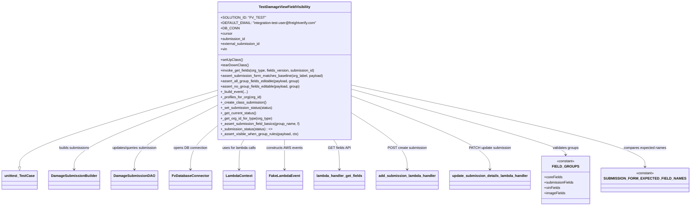

# Diagram: entity_core/entity_service/entity_service/tests/integration_tests/test_get_fields.py


> Auto-generated by Obscura crawlers

## Diagram 1



### SVG

<svg id="container" width="2970.875" xmlns="http://www.w3.org/2000/svg" class="classDiagram" height="954" viewBox="0 0 2970.875 954" role="graphics-document document" aria-roledescription="class"><style>#container{font-family:"trebuchet ms",verdana,arial,sans-serif;font-size:16px;fill:#333;}@keyframes edge-animation-frame{from{stroke-dashoffset:0;}}@keyframes dash{to{stroke-dashoffset:0;}}#container .edge-animation-slow{stroke-dasharray:9,5!important;stroke-dashoffset:900;animation:dash 50s linear infinite;stroke-linecap:round;}#container .edge-animation-fast{stroke-dasharray:9,5!important;stroke-dashoffset:900;animation:dash 20s linear infinite;stroke-linecap:round;}#container .error-icon{fill:#552222;}#container .error-text{fill:#552222;stroke:#552222;}#container .edge-thickness-normal{stroke-width:1px;}#container .edge-thickness-thick{stroke-width:3.5px;}#container .edge-pattern-solid{stroke-dasharray:0;}#container .edge-thickness-invisible{stroke-width:0;fill:none;}#container .edge-pattern-dashed{stroke-dasharray:3;}#container .edge-pattern-dotted{stroke-dasharray:2;}#container .marker{fill:#333333;stroke:#333333;}#container .marker.cross{stroke:#333333;}#container svg{font-family:"trebuchet ms",verdana,arial,sans-serif;font-size:16px;}#container p{margin:0;}#container g.classGroup text{fill:#9370DB;stroke:none;font-family:"trebuchet ms",verdana,arial,sans-serif;font-size:10px;}#container g.classGroup text .title{font-weight:bolder;}#container .nodeLabel,#container .edgeLabel{color:#131300;}#container .edgeLabel .label rect{fill:#ECECFF;}#container .label text{fill:#131300;}#container .labelBkg{background:#ECECFF;}#container .edgeLabel .label span{background:#ECECFF;}#container .classTitle{font-weight:bolder;}#container .node rect,#container .node circle,#container .node ellipse,#container .node polygon,#container .node path{fill:#ECECFF;stroke:#9370DB;stroke-width:1px;}#container .divider{stroke:#9370DB;stroke-width:1;}#container g.clickable{cursor:pointer;}#container g.classGroup rect{fill:#ECECFF;stroke:#9370DB;}#container g.classGroup line{stroke:#9370DB;stroke-width:1;}#container .classLabel .box{stroke:none;stroke-width:0;fill:#ECECFF;opacity:0.5;}#container .classLabel .label{fill:#9370DB;font-size:10px;}#container .relation{stroke:#333333;stroke-width:1;fill:none;}#container .dashed-line{stroke-dasharray:3;}#container .dotted-line{stroke-dasharray:1 2;}#container #compositionStart,#container .composition{fill:#333333!important;stroke:#333333!important;stroke-width:1;}#container #compositionEnd,#container .composition{fill:#333333!important;stroke:#333333!important;stroke-width:1;}#container #dependencyStart,#container .dependency{fill:#333333!important;stroke:#333333!important;stroke-width:1;}#container #dependencyStart,#container .dependency{fill:#333333!important;stroke:#333333!important;stroke-width:1;}#container #extensionStart,#container .extension{fill:transparent!important;stroke:#333333!important;stroke-width:1;}#container #extensionEnd,#container .extension{fill:transparent!important;stroke:#333333!important;stroke-width:1;}#container #aggregationStart,#container .aggregation{fill:transparent!important;stroke:#333333!important;stroke-width:1;}#container #aggregationEnd,#container .aggregation{fill:transparent!important;stroke:#333333!important;stroke-width:1;}#container #lollipopStart,#container .lollipop{fill:#ECECFF!important;stroke:#333333!important;stroke-width:1;}#container #lollipopEnd,#container .lollipop{fill:#ECECFF!important;stroke:#333333!important;stroke-width:1;}#container .edgeTerminals{font-size:11px;line-height:initial;}#container .classTitleText{text-anchor:middle;font-size:18px;fill:#333;}#container .label-icon{display:inline-block;height:1em;overflow:visible;vertical-align:-0.125em;}#container .node .label-icon path{fill:currentColor;stroke:revert;stroke-width:revert;}#container :root{--mermaid-font-family:"trebuchet ms",verdana,arial,sans-serif;}</style><g><defs><marker id="container_class-aggregationStart" class="marker aggregation class" refX="18" refY="7" markerWidth="190" markerHeight="240" orient="auto"><path d="M 18,7 L9,13 L1,7 L9,1 Z"></path></marker></defs><defs><marker id="container_class-aggregationEnd" class="marker aggregation class" refX="1" refY="7" markerWidth="20" markerHeight="28" orient="auto"><path d="M 18,7 L9,13 L1,7 L9,1 Z"></path></marker></defs><defs><marker id="container_class-extensionStart" class="marker extension class" refX="18" refY="7" markerWidth="190" markerHeight="240" orient="auto"><path d="M 1,7 L18,13 V 1 Z"></path></marker></defs><defs><marker id="container_class-extensionEnd" class="marker extension class" refX="1" refY="7" markerWidth="20" markerHeight="28" orient="auto"><path d="M 1,1 V 13 L18,7 Z"></path></marker></defs><defs><marker id="container_class-compositionStart" class="marker composition class" refX="18" refY="7" markerWidth="190" markerHeight="240" orient="auto"><path d="M 18,7 L9,13 L1,7 L9,1 Z"></path></marker></defs><defs><marker id="container_class-compositionEnd" class="marker composition class" refX="1" refY="7" markerWidth="20" markerHeight="28" orient="auto"><path d="M 18,7 L9,13 L1,7 L9,1 Z"></path></marker></defs><defs><marker id="container_class-dependencyStart" class="marker dependency class" refX="6" refY="7" markerWidth="190" markerHeight="240" orient="auto"><path d="M 5,7 L9,13 L1,7 L9,1 Z"></path></marker></defs><defs><marker id="container_class-dependencyEnd" class="marker dependency class" refX="13" refY="7" markerWidth="20" markerHeight="28" orient="auto"><path d="M 18,7 L9,13 L14,7 L9,1 Z"></path></marker></defs><defs><marker id="container_class-lollipopStart" class="marker lollipop class" refX="13" refY="7" markerWidth="190" markerHeight="240" orient="auto"><circle stroke="black" fill="transparent" cx="7" cy="7" r="6"></circle></marker></defs><defs><marker id="container_class-lollipopEnd" class="marker lollipop class" refX="1" refY="7" markerWidth="190" markerHeight="240" orient="auto"><circle stroke="black" fill="transparent" cx="7" cy="7" r="6"></circle></marker></defs><g class="root"><g class="clusters"></g><g class="edgePaths"><path d="M926.613,415.231L786.338,459.526C646.063,503.821,365.512,592.41,225.236,652.997C84.961,713.583,84.961,746.167,84.961,762.458L84.961,778.75" id="id_TestDamageViewFieldVisibility_unittest_TestCase_1" class="edge-thickness-normal edge-pattern-solid relation" style=";;;" data-edge="true" data-et="edge" data-id="id_TestDamageViewFieldVisibility_unittest_TestCase_1" data-points="W3sieCI6OTI2LjYxMzI4MTI1LCJ5Ijo0MTUuMjMwNzkwNTIwMzE2NTN9LHsieCI6ODQuOTYwOTM3NSwieSI6NjgxfSx7IngiOjg0Ljk2MDkzNzUsInkiOjc5Nn1d" marker-end="url(#container_class-extensionEnd)"></path><path d="M926.613,440.119L825.817,480.266C725.021,520.413,523.428,600.706,422.632,659.02C321.836,717.333,321.836,753.667,321.836,771.833L321.836,790" id="id_TestDamageViewFieldVisibility_DamageSubmissionBuilder_2" class="edge-thickness-normal edge-pattern-solid relation" style=";;;" data-edge="true" data-et="edge" data-id="id_TestDamageViewFieldVisibility_DamageSubmissionBuilder_2" data-points="W3sieCI6OTI2LjYxMzI4MTI1LCJ5Ijo0NDAuMTE5MTQ1MTAzMTc3Mn0seyJ4IjozMjEuODM1OTM3NSwieSI6NjgxfSx7IngiOjMyMS44MzU5Mzc1LCJ5Ijo3OTZ9XQ==" marker-end="url(#container_class-dependencyEnd)"></path><path d="M926.613,488.074L868.917,520.228C811.221,552.383,695.829,616.691,638.133,667.012C580.438,717.333,580.438,753.667,580.438,771.833L580.438,790" id="id_TestDamageViewFieldVisibility_DamageSubmissionDAO_3" class="edge-thickness-normal edge-pattern-solid relation" style=";;;" data-edge="true" data-et="edge" data-id="id_TestDamageViewFieldVisibility_DamageSubmissionDAO_3" data-points="W3sieCI6OTI2LjYxMzI4MTI1LCJ5Ijo0ODguMDczNzk0MjE4MDM1OH0seyJ4Ijo1ODAuNDM3NSwieSI6NjgxfSx7IngiOjU4MC40Mzc1LCJ5Ijo3OTZ9XQ==" marker-end="url(#container_class-dependencyEnd)"></path><path d="M926.613,586.994L908.916,602.662C891.219,618.33,855.824,649.665,838.127,683.499C820.43,717.333,820.43,753.667,820.43,771.833L820.43,790" id="id_TestDamageViewFieldVisibility_FvDatabaseConnector_4" class="edge-thickness-normal edge-pattern-solid relation" style=";;;" data-edge="true" data-et="edge" data-id="id_TestDamageViewFieldVisibility_FvDatabaseConnector_4" data-points="W3sieCI6OTI2LjYxMzI4MTI1LCJ5Ijo1ODYuOTk0MzM4NDI5NzA0Nn0seyJ4Ijo4MjAuNDI5Njg3NSwieSI6NjgxfSx7IngiOjgyMC40Mjk2ODc1LCJ5Ijo3OTZ9XQ==" marker-end="url(#container_class-dependencyEnd)"></path><path d="M1057.793,632L1053.333,640.167C1048.873,648.333,1039.952,664.667,1035.492,691C1031.031,717.333,1031.031,753.667,1031.031,771.833L1031.031,790" id="id_TestDamageViewFieldVisibility_LambdaContext_5" class="edge-thickness-normal edge-pattern-solid relation" style=";;;" data-edge="true" data-et="edge" data-id="id_TestDamageViewFieldVisibility_LambdaContext_5" data-points="W3sieCI6MTA1Ny43OTMxMzEwNTk1NTY4LCJ5Ijo2MzJ9LHsieCI6MTAzMS4wMzEyNSwieSI6NjgxfSx7IngiOjEwMzEuMDMxMjUsInkiOjc5Nn1d" marker-end="url(#container_class-dependencyEnd)"></path><path d="M1228.195,632L1228.195,640.167C1228.195,648.333,1228.195,664.667,1228.195,691C1228.195,717.333,1228.195,753.667,1228.195,771.833L1228.195,790" id="id_TestDamageViewFieldVisibility_FakeLambdaEvent_6" class="edge-thickness-normal edge-pattern-solid relation" style=";;;" data-edge="true" data-et="edge" data-id="id_TestDamageViewFieldVisibility_FakeLambdaEvent_6" data-points="W3sieCI6MTIyOC4xOTUzMTI1LCJ5Ijo2MzJ9LHsieCI6MTIyOC4xOTUzMTI1LCJ5Ijo2ODF9LHsieCI6MTIyOC4xOTUzMTI1LCJ5Ijo3OTZ9XQ==" marker-end="url(#container_class-dependencyEnd)"></path><path d="M1435.133,632L1440.55,640.167C1445.966,648.333,1456.8,664.667,1462.216,691C1467.633,717.333,1467.633,753.667,1467.633,771.833L1467.633,790" id="id_TestDamageViewFieldVisibility_lambda_handler_get_fields_7" class="edge-thickness-normal edge-pattern-solid relation" style=";;;" data-edge="true" data-et="edge" data-id="id_TestDamageViewFieldVisibility_lambda_handler_get_fields_7" data-points="W3sieCI6MTQzNS4xMzI5ODU2MzAxOTM4LCJ5Ijo2MzJ9LHsieCI6MTQ2Ny42MzI4MTI1LCJ5Ijo2ODF9LHsieCI6MTQ2Ny42MzI4MTI1LCJ5Ijo3OTZ9XQ==" marker-end="url(#container_class-dependencyEnd)"></path><path d="M1529.777,522.869L1568.956,549.224C1608.135,575.58,1686.493,628.29,1725.673,672.812C1764.852,717.333,1764.852,753.667,1764.852,771.833L1764.852,790" id="id_TestDamageViewFieldVisibility_add_submission_lambda_handler_8" class="edge-thickness-normal edge-pattern-solid relation" style=";;;" data-edge="true" data-et="edge" data-id="id_TestDamageViewFieldVisibility_add_submission_lambda_handler_8" data-points="W3sieCI6MTUyOS43NzczNDM3NSwieSI6NTIyLjg2OTM2NjE1NjE3NTR9LHsieCI6MTc2NC44NTE1NjI1LCJ5Ijo2ODF9LHsieCI6MTc2NC44NTE1NjI1LCJ5Ijo3OTZ9XQ==" marker-end="url(#container_class-dependencyEnd)"></path><path d="M1529.777,441.151L1629.287,481.126C1728.797,521.101,1927.816,601.05,2027.326,659.192C2126.836,717.333,2126.836,753.667,2126.836,771.833L2126.836,790" id="id_TestDamageViewFieldVisibility_update_submission_details_lambda_handler_9" class="edge-thickness-normal edge-pattern-solid relation" style=";;;" data-edge="true" data-et="edge" data-id="id_TestDamageViewFieldVisibility_update_submission_details_lambda_handler_9" data-points="W3sieCI6MTUyOS43NzczNDM3NSwieSI6NDQxLjE1MDg5MTk3MjI0OTd9LHsieCI6MjEyNi44MzU5Mzc1LCJ5Ijo2ODF9LHsieCI6MjEyNi44MzU5Mzc1LCJ5Ijo3OTZ9XQ==" marker-end="url(#container_class-dependencyEnd)"></path><path d="M1529.777,408.516L1684.506,453.93C1839.234,499.344,2148.691,590.172,2303.42,642.753C2458.148,695.333,2458.148,709.667,2458.148,716.833L2458.148,724" id="id_TestDamageViewFieldVisibility_FIELD_GROUPS_10" class="edge-thickness-normal edge-pattern-solid relation" style=";;;" data-edge="true" data-et="edge" data-id="id_TestDamageViewFieldVisibility_FIELD_GROUPS_10" data-points="W3sieCI6MTUyOS43NzczNDM3NSwieSI6NDA4LjUxNjQ3MzU2OTg3Njl9LHsieCI6MjQ1OC4xNDg0Mzc1LCJ5Ijo2ODF9LHsieCI6MjQ1OC4xNDg0Mzc1LCJ5Ijo3MzB9XQ==" marker-end="url(#container_class-dependencyEnd)"></path><path d="M1529.777,389.798L1739.481,438.332C1949.185,486.865,2368.592,583.933,2578.296,648.633C2788,713.333,2788,745.667,2788,761.833L2788,778" id="id_TestDamageViewFieldVisibility_SUBMISSION_FORM_EXPECTED_FIELD_NAMES_11" class="edge-thickness-normal edge-pattern-solid relation" style=";;;" data-edge="true" data-et="edge" data-id="id_TestDamageViewFieldVisibility_SUBMISSION_FORM_EXPECTED_FIELD_NAMES_11" data-points="W3sieCI6MTUyOS43NzczNDM3NSwieSI6Mzg5Ljc5NzkxMzkwMTQ4MDA2fSx7IngiOjI3ODgsInkiOjY4MX0seyJ4IjoyNzg4LCJ5Ijo3ODR9XQ==" marker-end="url(#container_class-dependencyEnd)"></path></g><g class="edgeLabels"><g class="edgeLabel"><g class="label" data-id="id_TestDamageViewFieldVisibility_unittest_TestCase_1" transform="translate(0, 0)"><foreignObject width="0" height="0"><div xmlns="http://www.w3.org/1999/xhtml" class="labelBkg" style="display: table-cell; white-space: nowrap; line-height: 1.5; max-width: 200px; text-align: center;"><span class="edgeLabel"></span></div></foreignObject></g></g><g class="edgeLabel" transform="translate(321.8359375, 681)"><g class="label" data-id="id_TestDamageViewFieldVisibility_DamageSubmissionBuilder_2" transform="translate(-69.609375, -12)"><foreignObject width="139.21875" height="24"><div xmlns="http://www.w3.org/1999/xhtml" class="labelBkg" style="display: table-cell; white-space: nowrap; line-height: 1.5; max-width: 200px; text-align: center;"><span class="edgeLabel"><p>builds submissions</p></span></div></foreignObject></g></g><g class="edgeLabel" transform="translate(580.4375, 681)"><g class="label" data-id="id_TestDamageViewFieldVisibility_DamageSubmissionDAO_3" transform="translate(-100, -24)"><foreignObject width="200" height="48"><div xmlns="http://www.w3.org/1999/xhtml" class="labelBkg" style="display: table; white-space: break-spaces; line-height: 1.5; max-width: 200px; text-align: center; width: 200px;"><span class="edgeLabel"><p>updates/queries submission</p></span></div></foreignObject></g></g><g class="edgeLabel" transform="translate(820.4296875, 681)"><g class="label" data-id="id_TestDamageViewFieldVisibility_FvDatabaseConnector_4" transform="translate(-76.8671875, -12)"><foreignObject width="153.734375" height="24"><div xmlns="http://www.w3.org/1999/xhtml" class="labelBkg" style="display: table-cell; white-space: nowrap; line-height: 1.5; max-width: 200px; text-align: center;"><span class="edgeLabel"><p>opens DB connection</p></span></div></foreignObject></g></g><g class="edgeLabel" transform="translate(1031.03125, 681)"><g class="label" data-id="id_TestDamageViewFieldVisibility_LambdaContext_5" transform="translate(-77.0546875, -12)"><foreignObject width="154.109375" height="24"><div xmlns="http://www.w3.org/1999/xhtml" class="labelBkg" style="display: table-cell; white-space: nowrap; line-height: 1.5; max-width: 200px; text-align: center;"><span class="edgeLabel"><p>uses for lambda calls</p></span></div></foreignObject></g></g><g class="edgeLabel" transform="translate(1228.1953125, 681)"><g class="label" data-id="id_TestDamageViewFieldVisibility_FakeLambdaEvent_6" transform="translate(-81.4609375, -12)"><foreignObject width="162.921875" height="24"><div xmlns="http://www.w3.org/1999/xhtml" class="labelBkg" style="display: table-cell; white-space: nowrap; line-height: 1.5; max-width: 200px; text-align: center;"><span class="edgeLabel"><p>constructs AWS events</p></span></div></foreignObject></g></g><g class="edgeLabel" transform="translate(1467.6328125, 681)"><g class="label" data-id="id_TestDamageViewFieldVisibility_lambda_handler_get_fields_7" transform="translate(-49.0859375, -12)"><foreignObject width="98.171875" height="24"><div xmlns="http://www.w3.org/1999/xhtml" class="labelBkg" style="display: table-cell; white-space: nowrap; line-height: 1.5; max-width: 200px; text-align: center;"><span class="edgeLabel"><p>GET fields API</p></span></div></foreignObject></g></g><g class="edgeLabel" transform="translate(1764.8515625, 681)"><g class="label" data-id="id_TestDamageViewFieldVisibility_add_submission_lambda_handler_8" transform="translate(-86.4453125, -12)"><foreignObject width="172.890625" height="24"><div xmlns="http://www.w3.org/1999/xhtml" class="labelBkg" style="display: table-cell; white-space: nowrap; line-height: 1.5; max-width: 200px; text-align: center;"><span class="edgeLabel"><p>POST create submission</p></span></div></foreignObject></g></g><g class="edgeLabel" transform="translate(2126.8359375, 681)"><g class="label" data-id="id_TestDamageViewFieldVisibility_update_submission_details_lambda_handler_9" transform="translate(-93.3046875, -12)"><foreignObject width="186.609375" height="24"><div xmlns="http://www.w3.org/1999/xhtml" class="labelBkg" style="display: table-cell; white-space: nowrap; line-height: 1.5; max-width: 200px; text-align: center;"><span class="edgeLabel"><p>PATCH update submission</p></span></div></foreignObject></g></g><g class="edgeLabel" transform="translate(2458.1484375, 681)"><g class="label" data-id="id_TestDamageViewFieldVisibility_FIELD_GROUPS_10" transform="translate(-59.625, -12)"><foreignObject width="119.25" height="24"><div xmlns="http://www.w3.org/1999/xhtml" class="labelBkg" style="display: table-cell; white-space: nowrap; line-height: 1.5; max-width: 200px; text-align: center;"><span class="edgeLabel"><p>validates groups</p></span></div></foreignObject></g></g><g class="edgeLabel" transform="translate(2788, 681)"><g class="label" data-id="id_TestDamageViewFieldVisibility_SUBMISSION_FORM_EXPECTED_FIELD_NAMES_11" transform="translate(-96.4140625, -12)"><foreignObject width="192.828125" height="24"><div xmlns="http://www.w3.org/1999/xhtml" class="labelBkg" style="display: table-cell; white-space: nowrap; line-height: 1.5; max-width: 200px; text-align: center;"><span class="edgeLabel"><p>compares expected names</p></span></div></foreignObject></g></g></g><g class="nodes"><g class="node default" id="classId-TestDamageViewFieldVisibility-0" transform="translate(1228.1953125, 320)"><g class="basic label-container"><path d="M-301.58203125 -312 L301.58203125 -312 L301.58203125 312 L-301.58203125 312" stroke="none" stroke-width="0" fill="#ECECFF" style=""></path><path d="M-301.58203125 -312 C-87.92127603172602 -312, 125.73947918654795 -312, 301.58203125 -312 M-301.58203125 -312 C-160.23615097424656 -312, -18.89027069849311 -312, 301.58203125 -312 M301.58203125 -312 C301.58203125 -144.84559006471312, 301.58203125 22.308819870573757, 301.58203125 312 M301.58203125 -312 C301.58203125 -115.90666232112264, 301.58203125 80.18667535775472, 301.58203125 312 M301.58203125 312 C179.96916367053478 312, 58.35629609106954 312, -301.58203125 312 M301.58203125 312 C95.74625219034962 312, -110.08952686930076 312, -301.58203125 312 M-301.58203125 312 C-301.58203125 128.01492838423835, -301.58203125 -55.97014323152331, -301.58203125 -312 M-301.58203125 312 C-301.58203125 97.35906393410795, -301.58203125 -117.2818721317841, -301.58203125 -312" stroke="#9370DB" stroke-width="1.3" fill="none" stroke-dasharray="0 0" style=""></path></g><g class="annotation-group text" transform="translate(0, -288)"></g><g class="label-group text" transform="translate(-110.9609375, -288)"><g class="label" style="font-weight: bolder" transform="translate(0,-12)"><foreignObject width="221.921875" height="24"><div xmlns="http://www.w3.org/1999/xhtml" style="display: table-cell; white-space: nowrap; line-height: 1.5; max-width: 268px; text-align: center;"><span class="nodeLabel markdown-node-label" style=""><p>TestDamageViewFieldVisibility</p></span></div></foreignObject></g></g><g class="members-group text" transform="translate(-289.58203125, -240)"><g class="label" style="" transform="translate(0,-12)"><foreignObject width="181.4375" height="24"><div xmlns="http://www.w3.org/1999/xhtml" style="display: table-cell; white-space: nowrap; line-height: 1.5; max-width: 239px; text-align: center;"><span class="nodeLabel markdown-node-label" style=""><p>+SOLUTION_ID: "FV_TEST"</p></span></div></foreignObject></g><g class="label" style="" transform="translate(0,12)"><foreignObject width="428.28125" height="24"><div xmlns="http://www.w3.org/1999/xhtml" style="display: table-cell; white-space: nowrap; line-height: 1.5; max-width: 486px; text-align: center;"><span class="nodeLabel markdown-node-label" style=""><p>+DEFAULT_EMAIL: "integration-test-user@freightverify.com"</p></span></div></foreignObject></g><g class="label" style="" transform="translate(0,36)"><foreignObject width="76.953125" height="24"><div xmlns="http://www.w3.org/1999/xhtml" style="display: table-cell; white-space: nowrap; line-height: 1.5; max-width: 134px; text-align: center;"><span class="nodeLabel markdown-node-label" style=""><p>+DB_CONN</p></span></div></foreignObject></g><g class="label" style="" transform="translate(0,60)"><foreignObject width="53.71875" height="24"><div xmlns="http://www.w3.org/1999/xhtml" style="display: table-cell; white-space: nowrap; line-height: 1.5; max-width: 112px; text-align: center;"><span class="nodeLabel markdown-node-label" style=""><p>+cursor</p></span></div></foreignObject></g><g class="label" style="" transform="translate(0,84)"><foreignObject width="112.921875" height="24"><div xmlns="http://www.w3.org/1999/xhtml" style="display: table-cell; white-space: nowrap; line-height: 1.5; max-width: 170px; text-align: center;"><span class="nodeLabel markdown-node-label" style=""><p>+submission_id</p></span></div></foreignObject></g><g class="label" style="" transform="translate(0,108)"><foreignObject width="180.609375" height="24"><div xmlns="http://www.w3.org/1999/xhtml" style="display: table-cell; white-space: nowrap; line-height: 1.5; max-width: 238px; text-align: center;"><span class="nodeLabel markdown-node-label" style=""><p>+external_submission_id</p></span></div></foreignObject></g><g class="label" style="" transform="translate(0,132)"><foreignObject width="29.59375" height="24"><div xmlns="http://www.w3.org/1999/xhtml" style="display: table-cell; white-space: nowrap; line-height: 1.5; max-width: 87px; text-align: center;"><span class="nodeLabel markdown-node-label" style=""><p>+vin</p></span></div></foreignObject></g></g><g class="methods-group text" transform="translate(-289.58203125, -48)"><g class="label" style="" transform="translate(0,-12)"><foreignObject width="97.15625" height="24"><div xmlns="http://www.w3.org/1999/xhtml" style="display: table-cell; white-space: nowrap; line-height: 1.5; max-width: 155px; text-align: center;"><span class="nodeLabel markdown-node-label" style=""><p>+setUpClass()</p></span></div></foreignObject></g><g class="label" style="" transform="translate(0,12)"><foreignObject width="124.484375" height="24"><div xmlns="http://www.w3.org/1999/xhtml" style="display: table-cell; white-space: nowrap; line-height: 1.5; max-width: 182px; text-align: center;"><span class="nodeLabel markdown-node-label" style=""><p>+tearDownClass()</p></span></div></foreignObject></g><g class="label" style="" transform="translate(0,36)"><foreignObject width="428.96875" height="24"><div xmlns="http://www.w3.org/1999/xhtml" style="display: table-cell; white-space: nowrap; line-height: 1.5; max-width: 486px; text-align: center;"><span class="nodeLabel markdown-node-label" style=""><p>+invoke_get_fields(org_type, fields_version, submission_id)</p></span></div></foreignObject></g><g class="label" style="" transform="translate(0,60)"><foreignObject width="468.203125" height="24"><div xmlns="http://www.w3.org/1999/xhtml" style="display: table-cell; white-space: nowrap; line-height: 1.5; max-width: 526px; text-align: center;"><span class="nodeLabel markdown-node-label" style=""><p>+assert_submission_form_matches_baseline(org_label, payload)</p></span></div></foreignObject></g><g class="label" style="" transform="translate(0,84)"><foreignObject width="361.609375" height="24"><div xmlns="http://www.w3.org/1999/xhtml" style="display: table-cell; white-space: nowrap; line-height: 1.5; max-width: 419px; text-align: center;"><span class="nodeLabel markdown-node-label" style=""><p>+assert_all_group_fields_editable(payload, group)</p></span></div></foreignObject></g><g class="label" style="" transform="translate(0,108)"><foreignObject width="362.40625" height="24"><div xmlns="http://www.w3.org/1999/xhtml" style="display: table-cell; white-space: nowrap; line-height: 1.5; max-width: 420px; text-align: center;"><span class="nodeLabel markdown-node-label" style=""><p>+assert_no_group_fields_editable(payload, group)</p></span></div></foreignObject></g><g class="label" style="" transform="translate(0,132)"><foreignObject width="122.765625" height="24"><div xmlns="http://www.w3.org/1999/xhtml" style="display: table-cell; white-space: nowrap; line-height: 1.5; max-width: 180px; text-align: center;"><span class="nodeLabel markdown-node-label" style=""><p>+_build_event(...)</p></span></div></foreignObject></g><g class="label" style="" transform="translate(0,156)"><foreignObject width="184.734375" height="24"><div xmlns="http://www.w3.org/1999/xhtml" style="display: table-cell; white-space: nowrap; line-height: 1.5; max-width: 242px; text-align: center;"><span class="nodeLabel markdown-node-label" style=""><p>+_profiles_for_org(org_id)</p></span></div></foreignObject></g><g class="label" style="" transform="translate(0,180)"><foreignObject width="203.734375" height="24"><div xmlns="http://www.w3.org/1999/xhtml" style="display: table-cell; white-space: nowrap; line-height: 1.5; max-width: 261px; text-align: center;"><span class="nodeLabel markdown-node-label" style=""><p>+_create_class_submission()</p></span></div></foreignObject></g><g class="label" style="" transform="translate(0,204)"><foreignObject width="235.34375" height="24"><div xmlns="http://www.w3.org/1999/xhtml" style="display: table-cell; white-space: nowrap; line-height: 1.5; max-width: 293px; text-align: center;"><span class="nodeLabel markdown-node-label" style=""><p>+_set_submission_status(status)</p></span></div></foreignObject></g><g class="label" style="" transform="translate(0,228)"><foreignObject width="161.375" height="24"><div xmlns="http://www.w3.org/1999/xhtml" style="display: table-cell; white-space: nowrap; line-height: 1.5; max-width: 219px; text-align: center;"><span class="nodeLabel markdown-node-label" style=""><p>+_get_current_status()</p></span></div></foreignObject></g><g class="label" style="" transform="translate(0,252)"><foreignObject width="232.859375" height="24"><div xmlns="http://www.w3.org/1999/xhtml" style="display: table-cell; white-space: nowrap; line-height: 1.5; max-width: 290px; text-align: center;"><span class="nodeLabel markdown-node-label" style=""><p>+_get_org_id_for_type(org_type)</p></span></div></foreignObject></g><g class="label" style="" transform="translate(0,276)"><foreignObject width="358.578125" height="24"><div xmlns="http://www.w3.org/1999/xhtml" style="display: table-cell; white-space: nowrap; line-height: 1.5; max-width: 416px; text-align: center;"><span class="nodeLabel markdown-node-label" style=""><p>+_assert_submission_field_basics(group_name, f)</p></span></div></foreignObject></g><g class="label" style="" transform="translate(0,300)"><foreignObject width="233.375" height="24"><div xmlns="http://www.w3.org/1999/xhtml" style="display: table-cell; white-space: nowrap; line-height: 1.5; max-width: 331px; text-align: center;"><span class="nodeLabel markdown-node-label" style=""><p>+_submission_status(status) : &lt;&gt;</p></span></div></foreignObject></g><g class="label" style="" transform="translate(0,324)"><foreignObject width="352.6875" height="24"><div xmlns="http://www.w3.org/1999/xhtml" style="display: table-cell; white-space: nowrap; line-height: 1.5; max-width: 410px; text-align: center;"><span class="nodeLabel markdown-node-label" style=""><p>+_assert_visible_when_group_rules(payload, ctx)</p></span></div></foreignObject></g></g><g class="divider" style=""><path d="M-301.58203125 -264 C-71.08942912650983 -264, 159.40317299698035 -264, 301.58203125 -264 M-301.58203125 -264 C-66.05016191642915 -264, 169.4817074171417 -264, 301.58203125 -264" stroke="#9370DB" stroke-width="1.3" fill="none" stroke-dasharray="0 0" style=""></path></g><g class="divider" style=""><path d="M-301.58203125 -72 C-103.01939636295799 -72, 95.54323852408402 -72, 301.58203125 -72 M-301.58203125 -72 C-154.9512285813874 -72, -8.320425912774795 -72, 301.58203125 -72" stroke="#9370DB" stroke-width="1.3" fill="none" stroke-dasharray="0 0" style=""></path></g></g><g class="node default" id="classId-unittest_TestCase-1" transform="translate(84.9609375, 838)"><g class="basic label-container"><path d="M-76.9609375 -42 L76.9609375 -42 L76.9609375 42 L-76.9609375 42" stroke="none" stroke-width="0" fill="#ECECFF" style=""></path><path d="M-76.9609375 -42 C-41.41722990068832 -42, -5.873522301376639 -42, 76.9609375 -42 M-76.9609375 -42 C-32.025130768797666 -42, 12.910675962404667 -42, 76.9609375 -42 M76.9609375 -42 C76.9609375 -14.123343014243705, 76.9609375 13.75331397151259, 76.9609375 42 M76.9609375 -42 C76.9609375 -23.061596272398436, 76.9609375 -4.123192544796872, 76.9609375 42 M76.9609375 42 C19.28747953308627 42, -38.38597843382746 42, -76.9609375 42 M76.9609375 42 C42.64339522230888 42, 8.325852944617765 42, -76.9609375 42 M-76.9609375 42 C-76.9609375 13.136409316586793, -76.9609375 -15.727181366826414, -76.9609375 -42 M-76.9609375 42 C-76.9609375 12.482104922187641, -76.9609375 -17.035790155624717, -76.9609375 -42" stroke="#9370DB" stroke-width="1.3" fill="none" stroke-dasharray="0 0" style=""></path></g><g class="annotation-group text" transform="translate(0, -18)"></g><g class="label-group text" transform="translate(-64.9609375, -18)"><g class="label" style="font-weight: bolder" transform="translate(0,-12)"><foreignObject width="129.921875" height="24"><div xmlns="http://www.w3.org/1999/xhtml" style="display: table-cell; white-space: nowrap; line-height: 1.5; max-width: 177px; text-align: center;"><span class="nodeLabel markdown-node-label" style=""><p>unittest_TestCase</p></span></div></foreignObject></g></g><g class="members-group text" transform="translate(-64.9609375, 30)"></g><g class="methods-group text" transform="translate(-64.9609375, 60)"></g><g class="divider" style=""><path d="M-76.9609375 6 C-32.53084767621565 6, 11.8992421475687 6, 76.9609375 6 M-76.9609375 6 C-17.828849020495824 6, 41.30323945900835 6, 76.9609375 6" stroke="#9370DB" stroke-width="1.3" fill="none" stroke-dasharray="0 0" style=""></path></g><g class="divider" style=""><path d="M-76.9609375 24 C-16.24908925776358 24, 44.46275898447284 24, 76.9609375 24 M-76.9609375 24 C-31.689523833748943 24, 13.581889832502114 24, 76.9609375 24" stroke="#9370DB" stroke-width="1.3" fill="none" stroke-dasharray="0 0" style=""></path></g></g><g class="node default" id="classId-DamageSubmissionBuilder-2" transform="translate(321.8359375, 838)"><g class="basic label-container"><path d="M-109.9140625 -42 L109.9140625 -42 L109.9140625 42 L-109.9140625 42" stroke="none" stroke-width="0" fill="#ECECFF" style=""></path><path d="M-109.9140625 -42 C-34.303859996867686 -42, 41.30634250626463 -42, 109.9140625 -42 M-109.9140625 -42 C-23.297396511309643 -42, 63.319269477380715 -42, 109.9140625 -42 M109.9140625 -42 C109.9140625 -14.059238452850863, 109.9140625 13.881523094298274, 109.9140625 42 M109.9140625 -42 C109.9140625 -17.173170529377508, 109.9140625 7.653658941244984, 109.9140625 42 M109.9140625 42 C37.928701809131866 42, -34.05665888173627 42, -109.9140625 42 M109.9140625 42 C51.42385189604135 42, -7.066358707917303 42, -109.9140625 42 M-109.9140625 42 C-109.9140625 14.648037728793586, -109.9140625 -12.703924542412828, -109.9140625 -42 M-109.9140625 42 C-109.9140625 9.888814284167218, -109.9140625 -22.222371431665565, -109.9140625 -42" stroke="#9370DB" stroke-width="1.3" fill="none" stroke-dasharray="0 0" style=""></path></g><g class="annotation-group text" transform="translate(0, -18)"></g><g class="label-group text" transform="translate(-97.9140625, -18)"><g class="label" style="font-weight: bolder" transform="translate(0,-12)"><foreignObject width="195.828125" height="24"><div xmlns="http://www.w3.org/1999/xhtml" style="display: table-cell; white-space: nowrap; line-height: 1.5; max-width: 245px; text-align: center;"><span class="nodeLabel markdown-node-label" style=""><p>DamageSubmissionBuilder</p></span></div></foreignObject></g></g><g class="members-group text" transform="translate(-97.9140625, 30)"></g><g class="methods-group text" transform="translate(-97.9140625, 60)"></g><g class="divider" style=""><path d="M-109.9140625 6 C-63.47366149524704 6, -17.033260490494087 6, 109.9140625 6 M-109.9140625 6 C-61.89729641213003 6, -13.880530324260064 6, 109.9140625 6" stroke="#9370DB" stroke-width="1.3" fill="none" stroke-dasharray="0 0" style=""></path></g><g class="divider" style=""><path d="M-109.9140625 24 C-63.88753764998633 24, -17.861012799972656 24, 109.9140625 24 M-109.9140625 24 C-52.08579876478886 24, 5.742464970422276 24, 109.9140625 24" stroke="#9370DB" stroke-width="1.3" fill="none" stroke-dasharray="0 0" style=""></path></g></g><g class="node default" id="classId-DamageSubmissionDAO-3" transform="translate(580.4375, 838)"><g class="basic label-container"><path d="M-98.6875 -42 L98.6875 -42 L98.6875 42 L-98.6875 42" stroke="none" stroke-width="0" fill="#ECECFF" style=""></path><path d="M-98.6875 -42 C-53.69274991741429 -42, -8.697999834828579 -42, 98.6875 -42 M-98.6875 -42 C-55.03257156444786 -42, -11.377643128895727 -42, 98.6875 -42 M98.6875 -42 C98.6875 -19.90881987461337, 98.6875 2.1823602507732573, 98.6875 42 M98.6875 -42 C98.6875 -17.264295196171194, 98.6875 7.471409607657613, 98.6875 42 M98.6875 42 C38.4261122618464 42, -21.835275476307203 42, -98.6875 42 M98.6875 42 C54.467802661707424 42, 10.248105323414848 42, -98.6875 42 M-98.6875 42 C-98.6875 15.87420949570349, -98.6875 -10.251581008593021, -98.6875 -42 M-98.6875 42 C-98.6875 12.55128358770321, -98.6875 -16.89743282459358, -98.6875 -42" stroke="#9370DB" stroke-width="1.3" fill="none" stroke-dasharray="0 0" style=""></path></g><g class="annotation-group text" transform="translate(0, -18)"></g><g class="label-group text" transform="translate(-86.6875, -18)"><g class="label" style="font-weight: bolder" transform="translate(0,-12)"><foreignObject width="173.375" height="24"><div xmlns="http://www.w3.org/1999/xhtml" style="display: table-cell; white-space: nowrap; line-height: 1.5; max-width: 222px; text-align: center;"><span class="nodeLabel markdown-node-label" style=""><p>DamageSubmissionDAO</p></span></div></foreignObject></g></g><g class="members-group text" transform="translate(-86.6875, 30)"></g><g class="methods-group text" transform="translate(-86.6875, 60)"></g><g class="divider" style=""><path d="M-98.6875 6 C-37.88327429034553 6, 22.920951419308935 6, 98.6875 6 M-98.6875 6 C-33.53174907826896 6, 31.624001843462082 6, 98.6875 6" stroke="#9370DB" stroke-width="1.3" fill="none" stroke-dasharray="0 0" style=""></path></g><g class="divider" style=""><path d="M-98.6875 24 C-59.139586404495994 24, -19.591672808991987 24, 98.6875 24 M-98.6875 24 C-58.4215448664568 24, -18.155589732913597 24, 98.6875 24" stroke="#9370DB" stroke-width="1.3" fill="none" stroke-dasharray="0 0" style=""></path></g></g><g class="node default" id="classId-FvDatabaseConnector-4" transform="translate(820.4296875, 838)"><g class="basic label-container"><path d="M-91.3046875 -42 L91.3046875 -42 L91.3046875 42 L-91.3046875 42" stroke="none" stroke-width="0" fill="#ECECFF" style=""></path><path d="M-91.3046875 -42 C-26.357725292800126 -42, 38.58923691439975 -42, 91.3046875 -42 M-91.3046875 -42 C-19.014395998435987 -42, 53.27589550312803 -42, 91.3046875 -42 M91.3046875 -42 C91.3046875 -11.434821969490567, 91.3046875 19.130356061018865, 91.3046875 42 M91.3046875 -42 C91.3046875 -11.830739590059313, 91.3046875 18.338520819881374, 91.3046875 42 M91.3046875 42 C21.98903586370284 42, -47.32661577259432 42, -91.3046875 42 M91.3046875 42 C43.21013925159976 42, -4.884408996800474 42, -91.3046875 42 M-91.3046875 42 C-91.3046875 20.514555401325925, -91.3046875 -0.9708891973481499, -91.3046875 -42 M-91.3046875 42 C-91.3046875 20.942320596381457, -91.3046875 -0.11535880723708658, -91.3046875 -42" stroke="#9370DB" stroke-width="1.3" fill="none" stroke-dasharray="0 0" style=""></path></g><g class="annotation-group text" transform="translate(0, -18)"></g><g class="label-group text" transform="translate(-79.3046875, -18)"><g class="label" style="font-weight: bolder" transform="translate(0,-12)"><foreignObject width="158.609375" height="24"><div xmlns="http://www.w3.org/1999/xhtml" style="display: table-cell; white-space: nowrap; line-height: 1.5; max-width: 207px; text-align: center;"><span class="nodeLabel markdown-node-label" style=""><p>FvDatabaseConnector</p></span></div></foreignObject></g></g><g class="members-group text" transform="translate(-79.3046875, 30)"></g><g class="methods-group text" transform="translate(-79.3046875, 60)"></g><g class="divider" style=""><path d="M-91.3046875 6 C-18.37789224224761 6, 54.54890301550478 6, 91.3046875 6 M-91.3046875 6 C-38.105058297061085 6, 15.09457090587783 6, 91.3046875 6" stroke="#9370DB" stroke-width="1.3" fill="none" stroke-dasharray="0 0" style=""></path></g><g class="divider" style=""><path d="M-91.3046875 24 C-33.38457327696229 24, 24.535540946075415 24, 91.3046875 24 M-91.3046875 24 C-24.662410158225853 24, 41.97986718354829 24, 91.3046875 24" stroke="#9370DB" stroke-width="1.3" fill="none" stroke-dasharray="0 0" style=""></path></g></g><g class="node default" id="classId-LambdaContext-5" transform="translate(1031.03125, 838)"><g class="basic label-container"><path d="M-69.296875 -42 L69.296875 -42 L69.296875 42 L-69.296875 42" stroke="none" stroke-width="0" fill="#ECECFF" style=""></path><path d="M-69.296875 -42 C-19.904182977898202 -42, 29.488509044203596 -42, 69.296875 -42 M-69.296875 -42 C-34.62884462791892 -42, 0.039185744162153924 -42, 69.296875 -42 M69.296875 -42 C69.296875 -17.072981385804024, 69.296875 7.854037228391952, 69.296875 42 M69.296875 -42 C69.296875 -13.561210443020634, 69.296875 14.877579113958731, 69.296875 42 M69.296875 42 C25.495936100802687 42, -18.305002798394625 42, -69.296875 42 M69.296875 42 C19.102682790697948 42, -31.091509418604105 42, -69.296875 42 M-69.296875 42 C-69.296875 11.494292931164075, -69.296875 -19.01141413767185, -69.296875 -42 M-69.296875 42 C-69.296875 11.058501676462075, -69.296875 -19.88299664707585, -69.296875 -42" stroke="#9370DB" stroke-width="1.3" fill="none" stroke-dasharray="0 0" style=""></path></g><g class="annotation-group text" transform="translate(0, -18)"></g><g class="label-group text" transform="translate(-57.296875, -18)"><g class="label" style="font-weight: bolder" transform="translate(0,-12)"><foreignObject width="114.59375" height="24"><div xmlns="http://www.w3.org/1999/xhtml" style="display: table-cell; white-space: nowrap; line-height: 1.5; max-width: 163px; text-align: center;"><span class="nodeLabel markdown-node-label" style=""><p>LambdaContext</p></span></div></foreignObject></g></g><g class="members-group text" transform="translate(-57.296875, 30)"></g><g class="methods-group text" transform="translate(-57.296875, 60)"></g><g class="divider" style=""><path d="M-69.296875 6 C-18.86445908533274 6, 31.56795682933452 6, 69.296875 6 M-69.296875 6 C-18.042122532535707 6, 33.212629934928586 6, 69.296875 6" stroke="#9370DB" stroke-width="1.3" fill="none" stroke-dasharray="0 0" style=""></path></g><g class="divider" style=""><path d="M-69.296875 24 C-16.893244099111165 24, 35.51038680177767 24, 69.296875 24 M-69.296875 24 C-27.41112627974713 24, 14.47462244050574 24, 69.296875 24" stroke="#9370DB" stroke-width="1.3" fill="none" stroke-dasharray="0 0" style=""></path></g></g><g class="node default" id="classId-FakeLambdaEvent-6" transform="translate(1228.1953125, 838)"><g class="basic label-container"><path d="M-77.8671875 -42 L77.8671875 -42 L77.8671875 42 L-77.8671875 42" stroke="none" stroke-width="0" fill="#ECECFF" style=""></path><path d="M-77.8671875 -42 C-35.19471773118348 -42, 7.477752037633039 -42, 77.8671875 -42 M-77.8671875 -42 C-22.44293606008207 -42, 32.98131537983586 -42, 77.8671875 -42 M77.8671875 -42 C77.8671875 -9.07024606042365, 77.8671875 23.8595078791527, 77.8671875 42 M77.8671875 -42 C77.8671875 -13.490398259649268, 77.8671875 15.019203480701464, 77.8671875 42 M77.8671875 42 C39.449464197233695 42, 1.03174089446739 42, -77.8671875 42 M77.8671875 42 C39.44124042499772 42, 1.0152933499954457 42, -77.8671875 42 M-77.8671875 42 C-77.8671875 8.58095920293453, -77.8671875 -24.83808159413094, -77.8671875 -42 M-77.8671875 42 C-77.8671875 22.168558258070274, -77.8671875 2.337116516140547, -77.8671875 -42" stroke="#9370DB" stroke-width="1.3" fill="none" stroke-dasharray="0 0" style=""></path></g><g class="annotation-group text" transform="translate(0, -18)"></g><g class="label-group text" transform="translate(-65.8671875, -18)"><g class="label" style="font-weight: bolder" transform="translate(0,-12)"><foreignObject width="131.734375" height="24"><div xmlns="http://www.w3.org/1999/xhtml" style="display: table-cell; white-space: nowrap; line-height: 1.5; max-width: 181px; text-align: center;"><span class="nodeLabel markdown-node-label" style=""><p>FakeLambdaEvent</p></span></div></foreignObject></g></g><g class="members-group text" transform="translate(-65.8671875, 30)"></g><g class="methods-group text" transform="translate(-65.8671875, 60)"></g><g class="divider" style=""><path d="M-77.8671875 6 C-44.56821495320124 6, -11.269242406402483 6, 77.8671875 6 M-77.8671875 6 C-44.4300370884053 6, -10.992886676810599 6, 77.8671875 6" stroke="#9370DB" stroke-width="1.3" fill="none" stroke-dasharray="0 0" style=""></path></g><g class="divider" style=""><path d="M-77.8671875 24 C-26.616545429576128 24, 24.634096640847744 24, 77.8671875 24 M-77.8671875 24 C-31.167319112204886 24, 15.532549275590227 24, 77.8671875 24" stroke="#9370DB" stroke-width="1.3" fill="none" stroke-dasharray="0 0" style=""></path></g></g><g class="node default" id="classId-lambda_handler_get_fields-7" transform="translate(1467.6328125, 838)"><g class="basic label-container"><path d="M-111.5703125 -42 L111.5703125 -42 L111.5703125 42 L-111.5703125 42" stroke="none" stroke-width="0" fill="#ECECFF" style=""></path><path d="M-111.5703125 -42 C-40.71169269156455 -42, 30.1469271168709 -42, 111.5703125 -42 M-111.5703125 -42 C-22.681893974151635 -42, 66.20652455169673 -42, 111.5703125 -42 M111.5703125 -42 C111.5703125 -16.24454664571541, 111.5703125 9.51090670856918, 111.5703125 42 M111.5703125 -42 C111.5703125 -12.907877476813685, 111.5703125 16.18424504637263, 111.5703125 42 M111.5703125 42 C30.083324740922947 42, -51.403663018154106 42, -111.5703125 42 M111.5703125 42 C52.422715648492215 42, -6.7248812030155705 42, -111.5703125 42 M-111.5703125 42 C-111.5703125 16.06600205413085, -111.5703125 -9.867995891738303, -111.5703125 -42 M-111.5703125 42 C-111.5703125 10.131372885270476, -111.5703125 -21.737254229459047, -111.5703125 -42" stroke="#9370DB" stroke-width="1.3" fill="none" stroke-dasharray="0 0" style=""></path></g><g class="annotation-group text" transform="translate(0, -18)"></g><g class="label-group text" transform="translate(-99.5703125, -18)"><g class="label" style="font-weight: bolder" transform="translate(0,-12)"><foreignObject width="199.140625" height="24"><div xmlns="http://www.w3.org/1999/xhtml" style="display: table-cell; white-space: nowrap; line-height: 1.5; max-width: 247px; text-align: center;"><span class="nodeLabel markdown-node-label" style=""><p>lambda_handler_get_fields</p></span></div></foreignObject></g></g><g class="members-group text" transform="translate(-99.5703125, 30)"></g><g class="methods-group text" transform="translate(-99.5703125, 60)"></g><g class="divider" style=""><path d="M-111.5703125 6 C-34.17709381361293 6, 43.216124872774145 6, 111.5703125 6 M-111.5703125 6 C-51.058796438110264 6, 9.452719623779473 6, 111.5703125 6" stroke="#9370DB" stroke-width="1.3" fill="none" stroke-dasharray="0 0" style=""></path></g><g class="divider" style=""><path d="M-111.5703125 24 C-61.34114181347365 24, -11.111971126947296 24, 111.5703125 24 M-111.5703125 24 C-44.81700048368755 24, 21.9363115326249 24, 111.5703125 24" stroke="#9370DB" stroke-width="1.3" fill="none" stroke-dasharray="0 0" style=""></path></g></g><g class="node default" id="classId-add_submission_lambda_handler-8" transform="translate(1764.8515625, 838)"><g class="basic label-container"><path d="M-135.6484375 -42 L135.6484375 -42 L135.6484375 42 L-135.6484375 42" stroke="none" stroke-width="0" fill="#ECECFF" style=""></path><path d="M-135.6484375 -42 C-50.67104531947426 -42, 34.30634686105148 -42, 135.6484375 -42 M-135.6484375 -42 C-80.85610644531995 -42, -26.063775390639904 -42, 135.6484375 -42 M135.6484375 -42 C135.6484375 -20.83155511247328, 135.6484375 0.336889775053443, 135.6484375 42 M135.6484375 -42 C135.6484375 -9.77985667987133, 135.6484375 22.44028664025734, 135.6484375 42 M135.6484375 42 C35.83568706638164 42, -63.977063367236724 42, -135.6484375 42 M135.6484375 42 C28.733371016483403 42, -78.1816954670332 42, -135.6484375 42 M-135.6484375 42 C-135.6484375 15.243276405632681, -135.6484375 -11.513447188734638, -135.6484375 -42 M-135.6484375 42 C-135.6484375 20.379976891241757, -135.6484375 -1.2400462175164861, -135.6484375 -42" stroke="#9370DB" stroke-width="1.3" fill="none" stroke-dasharray="0 0" style=""></path></g><g class="annotation-group text" transform="translate(0, -18)"></g><g class="label-group text" transform="translate(-123.6484375, -18)"><g class="label" style="font-weight: bolder" transform="translate(0,-12)"><foreignObject width="247.296875" height="24"><div xmlns="http://www.w3.org/1999/xhtml" style="display: table-cell; white-space: nowrap; line-height: 1.5; max-width: 297px; text-align: center;"><span class="nodeLabel markdown-node-label" style=""><p>add_submission_lambda_handler</p></span></div></foreignObject></g></g><g class="members-group text" transform="translate(-123.6484375, 30)"></g><g class="methods-group text" transform="translate(-123.6484375, 60)"></g><g class="divider" style=""><path d="M-135.6484375 6 C-33.99546819751751 6, 67.65750110496498 6, 135.6484375 6 M-135.6484375 6 C-30.96422176541209 6, 73.71999396917582 6, 135.6484375 6" stroke="#9370DB" stroke-width="1.3" fill="none" stroke-dasharray="0 0" style=""></path></g><g class="divider" style=""><path d="M-135.6484375 24 C-28.89610752019439 24, 77.85622245961122 24, 135.6484375 24 M-135.6484375 24 C-71.90716836850488 24, -8.165899237009768 24, 135.6484375 24" stroke="#9370DB" stroke-width="1.3" fill="none" stroke-dasharray="0 0" style=""></path></g></g><g class="node default" id="classId-update_submission_details_lambda_handler-9" transform="translate(2126.8359375, 838)"><g class="basic label-container"><path d="M-176.3359375 -42 L176.3359375 -42 L176.3359375 42 L-176.3359375 42" stroke="none" stroke-width="0" fill="#ECECFF" style=""></path><path d="M-176.3359375 -42 C-77.21634154582884 -42, 21.90325440834232 -42, 176.3359375 -42 M-176.3359375 -42 C-84.10822752634203 -42, 8.119482447315931 -42, 176.3359375 -42 M176.3359375 -42 C176.3359375 -12.374454201164333, 176.3359375 17.251091597671333, 176.3359375 42 M176.3359375 -42 C176.3359375 -24.753866493271758, 176.3359375 -7.507732986543516, 176.3359375 42 M176.3359375 42 C100.40127548512972 42, 24.466613470259432 42, -176.3359375 42 M176.3359375 42 C99.00709093276069 42, 21.67824436552138 42, -176.3359375 42 M-176.3359375 42 C-176.3359375 15.671152303804668, -176.3359375 -10.657695392390664, -176.3359375 -42 M-176.3359375 42 C-176.3359375 22.81749524053665, -176.3359375 3.6349904810733022, -176.3359375 -42" stroke="#9370DB" stroke-width="1.3" fill="none" stroke-dasharray="0 0" style=""></path></g><g class="annotation-group text" transform="translate(0, -18)"></g><g class="label-group text" transform="translate(-164.3359375, -18)"><g class="label" style="font-weight: bolder" transform="translate(0,-12)"><foreignObject width="328.671875" height="24"><div xmlns="http://www.w3.org/1999/xhtml" style="display: table-cell; white-space: nowrap; line-height: 1.5; max-width: 378px; text-align: center;"><span class="nodeLabel markdown-node-label" style=""><p>update_submission_details_lambda_handler</p></span></div></foreignObject></g></g><g class="members-group text" transform="translate(-164.3359375, 30)"></g><g class="methods-group text" transform="translate(-164.3359375, 60)"></g><g class="divider" style=""><path d="M-176.3359375 6 C-92.47170144557282 6, -8.607465391145638 6, 176.3359375 6 M-176.3359375 6 C-57.63896527777314 6, 61.05800694445372 6, 176.3359375 6" stroke="#9370DB" stroke-width="1.3" fill="none" stroke-dasharray="0 0" style=""></path></g><g class="divider" style=""><path d="M-176.3359375 24 C-100.84686725939098 24, -25.35779701878195 24, 176.3359375 24 M-176.3359375 24 C-77.93293830685887 24, 20.470060886282255 24, 176.3359375 24" stroke="#9370DB" stroke-width="1.3" fill="none" stroke-dasharray="0 0" style=""></path></g></g><g class="node default" id="classId-FIELD_GROUPS-10" transform="translate(2458.1484375, 838)"><g class="basic label-container"><path d="M-104.9765625 -108 L104.9765625 -108 L104.9765625 108 L-104.9765625 108" stroke="none" stroke-width="0" fill="#ECECFF" style=""></path><path d="M-104.9765625 -108 C-37.17575966320989 -108, 30.625043173580224 -108, 104.9765625 -108 M-104.9765625 -108 C-21.445389605450032 -108, 62.085783289099936 -108, 104.9765625 -108 M104.9765625 -108 C104.9765625 -37.09176547954016, 104.9765625 33.816469040919685, 104.9765625 108 M104.9765625 -108 C104.9765625 -49.98676976582004, 104.9765625 8.026460468359915, 104.9765625 108 M104.9765625 108 C42.17474951186141 108, -20.627063476277186 108, -104.9765625 108 M104.9765625 108 C34.40279831271141 108, -36.17096587457718 108, -104.9765625 108 M-104.9765625 108 C-104.9765625 25.89845846032722, -104.9765625 -56.20308307934556, -104.9765625 -108 M-104.9765625 108 C-104.9765625 53.99562245770005, -104.9765625 -0.0087550845998976, -104.9765625 -108" stroke="#9370DB" stroke-width="1.3" fill="none" stroke-dasharray="0 0" style=""></path></g><g class="annotation-group text" transform="translate(-40.4921875, -84)"><g class="label" style="" transform="translate(0,-12)"><foreignObject width="80.984375" height="24"><div xmlns="http://www.w3.org/1999/xhtml" style="display: table-cell; white-space: nowrap; line-height: 1.5; max-width: 131px; text-align: center;"><span class="nodeLabel markdown-node-label" style=""><p>«constant»</p></span></div></foreignObject></g></g><g class="label-group text" transform="translate(-53.25, -60)"><g class="label" style="font-weight: bolder" transform="translate(0,-12)"><foreignObject width="106.5" height="24"><div xmlns="http://www.w3.org/1999/xhtml" style="display: table-cell; white-space: nowrap; line-height: 1.5; max-width: 156px; text-align: center;"><span class="nodeLabel markdown-node-label" style=""><p>FIELD_GROUPS</p></span></div></foreignObject></g></g><g class="members-group text" transform="translate(-92.9765625, -12)"><g class="label" style="" transform="translate(0,-12)"><foreignObject width="81.25" height="24"><div xmlns="http://www.w3.org/1999/xhtml" style="display: table-cell; white-space: nowrap; line-height: 1.5; max-width: 139px; text-align: center;"><span class="nodeLabel markdown-node-label" style=""><p>+coreFields</p></span></div></foreignObject></g><g class="label" style="" transform="translate(0,12)"><foreignObject width="132.703125" height="24"><div xmlns="http://www.w3.org/1999/xhtml" style="display: table-cell; white-space: nowrap; line-height: 1.5; max-width: 190px; text-align: center;"><span class="nodeLabel markdown-node-label" style=""><p>+submissionFields</p></span></div></foreignObject></g><g class="label" style="" transform="translate(0,36)"><foreignObject width="71.765625" height="24"><div xmlns="http://www.w3.org/1999/xhtml" style="display: table-cell; white-space: nowrap; line-height: 1.5; max-width: 129px; text-align: center;"><span class="nodeLabel markdown-node-label" style=""><p>+vinFields</p></span></div></foreignObject></g><g class="label" style="" transform="translate(0,60)"><foreignObject width="93.71875" height="24"><div xmlns="http://www.w3.org/1999/xhtml" style="display: table-cell; white-space: nowrap; line-height: 1.5; max-width: 151px; text-align: center;"><span class="nodeLabel markdown-node-label" style=""><p>+imageFields</p></span></div></foreignObject></g></g><g class="methods-group text" transform="translate(-92.9765625, 108)"></g><g class="divider" style=""><path d="M-104.9765625 -36 C-57.12598085493995 -36, -9.275399209879893 -36, 104.9765625 -36 M-104.9765625 -36 C-41.85529754771938 -36, 21.265967404561238 -36, 104.9765625 -36" stroke="#9370DB" stroke-width="1.3" fill="none" stroke-dasharray="0 0" style=""></path></g><g class="divider" style=""><path d="M-104.9765625 84 C-60.6666939598998 84, -16.356825419799605 84, 104.9765625 84 M-104.9765625 84 C-22.84589902673966 84, 59.28476444652068 84, 104.9765625 84" stroke="#9370DB" stroke-width="1.3" fill="none" stroke-dasharray="0 0" style=""></path></g></g><g class="node default" id="classId-SUBMISSION_FORM_EXPECTED_FIELD_NAMES-11" transform="translate(2788, 838)"><g class="basic label-container"><path d="M-174.875 -54 L174.875 -54 L174.875 54 L-174.875 54" stroke="none" stroke-width="0" fill="#ECECFF" style=""></path><path d="M-174.875 -54 C-75.91928549294703 -54, 23.03642901410595 -54, 174.875 -54 M-174.875 -54 C-104.18301294443495 -54, -33.4910258888699 -54, 174.875 -54 M174.875 -54 C174.875 -19.386233150006937, 174.875 15.227533699986125, 174.875 54 M174.875 -54 C174.875 -31.580594636305474, 174.875 -9.161189272610947, 174.875 54 M174.875 54 C49.30990572875747 54, -76.25518854248506 54, -174.875 54 M174.875 54 C56.05546318248916 54, -62.764073635021674 54, -174.875 54 M-174.875 54 C-174.875 23.016733523540935, -174.875 -7.966532952918129, -174.875 -54 M-174.875 54 C-174.875 25.368982806972372, -174.875 -3.262034386055255, -174.875 -54" stroke="#9370DB" stroke-width="1.3" fill="none" stroke-dasharray="0 0" style=""></path></g><g class="annotation-group text" transform="translate(-40.4921875, -30)"><g class="label" style="" transform="translate(0,-12)"><foreignObject width="80.984375" height="24"><div xmlns="http://www.w3.org/1999/xhtml" style="display: table-cell; white-space: nowrap; line-height: 1.5; max-width: 131px; text-align: center;"><span class="nodeLabel markdown-node-label" style=""><p>«constant»</p></span></div></foreignObject></g></g><g class="label-group text" transform="translate(-162.875, -6)"><g class="label" style="font-weight: bolder" transform="translate(0,-12)"><foreignObject width="325.75" height="24"><div xmlns="http://www.w3.org/1999/xhtml" style="display: table-cell; white-space: nowrap; line-height: 1.5; max-width: 373px; text-align: center;"><span class="nodeLabel markdown-node-label" style=""><p>SUBMISSION_FORM_EXPECTED_FIELD_NAMES</p></span></div></foreignObject></g></g><g class="members-group text" transform="translate(-162.875, 42)"></g><g class="methods-group text" transform="translate(-162.875, 72)"></g><g class="divider" style=""><path d="M-174.875 18 C-88.371161983218 18, -1.867323966436004 18, 174.875 18 M-174.875 18 C-80.37608803413333 18, 14.122823931733336 18, 174.875 18" stroke="#9370DB" stroke-width="1.3" fill="none" stroke-dasharray="0 0" style=""></path></g><g class="divider" style=""><path d="M-174.875 36 C-63.175130631274826 36, 48.52473873745035 36, 174.875 36 M-174.875 36 C-66.29239216179103 36, 42.290215676417944 36, 174.875 36" stroke="#9370DB" stroke-width="1.3" fill="none" stroke-dasharray="0 0" style=""></path></g></g></g></g></g></svg>

## Diagram 2

```mermaid
flowchart TD
    A[setUpClass()] --> B[Connect DB via FvDatabaseConnector]
    B --> C[Insert entity / active_entity rows]
    C --> D[DamageSubmissionBuilder.build() -> payload]
    D --> E[Build FakeLambdaEvent (POST) -> add_submission_lambda_handler]
    E --> F[201 Created -> extract external_submission_id / submission_id]
    F --> G[Run test methods]
    G --> H[invoke_get_fields(org_type, fieldsVersion, submission_id)]
    H --> I[FakeLambdaEvent GET -> lambda_handler_get_fields]
    I --> J[Response 200 -> payload JSON]
    J --> K[Assertions: field group presence, names, editability, visibleWhen rules]

    subgraph SubmissionStatusContext["_submission_status context manager"]
      S1[save current status] --> S2[set status to "Submitted" or "Completed"]
      S2 --> S3[execute test block under temporary status]
      S3 --> S4[restore original status]
    end

    G --> SubmissionStatusContext

    %% Specific update flow that yields contextual 400 when status is Completed
    L[with status "Completed"] --> M[Invoke PATCH update_submission_details with vinDetails.imageDetails add]
    M --> N[update_submission_details_lambda_handler -> statusCode "400" with contextual message]
    F --> L
```

> SVG rendering failed for this diagram.
