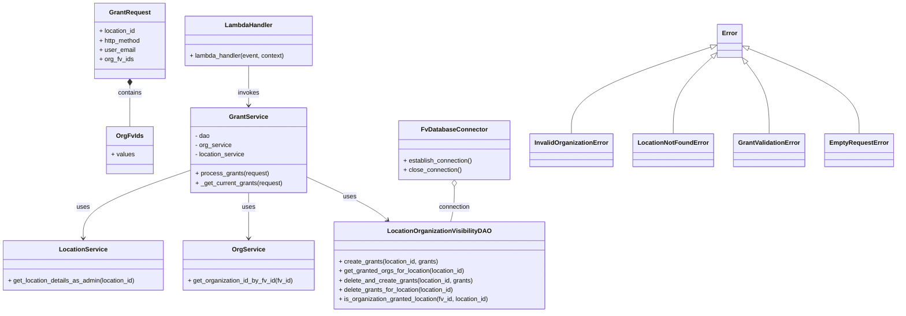
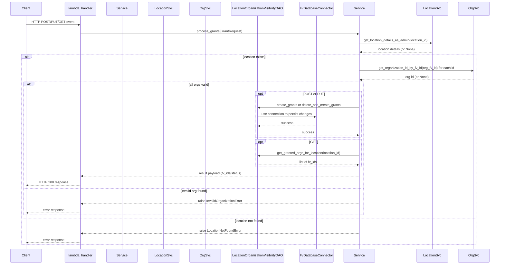

# Diagram: entity_core/entity_service/entity_service/tests/integration_tests/test_location_organization_visibility.py

> Auto-generated by Obscura crawlers

## Diagram 1

### SVG

<svg id="container" width="2245.015625" xmlns="http://www.w3.org/2000/svg" class="classDiagram" height="794" viewBox="0 0 2245.015625 794" role="graphics-document document" aria-roledescription="class"><g><defs><marker id="container_class-aggregationStart" class="marker aggregation class" refX="18" refY="7" markerWidth="190" markerHeight="240" orient="auto"><path d="M 18,7 L9,13 L1,7 L9,1 Z"></path></marker></defs><defs><marker id="container_class-aggregationEnd" class="marker aggregation class" refX="1" refY="7" markerWidth="20" markerHeight="28" orient="auto"><path d="M 18,7 L9,13 L1,7 L9,1 Z"></path></marker></defs><defs><marker id="container_class-extensionStart" class="marker extension class" refX="18" refY="7" markerWidth="190" markerHeight="240" orient="auto"><path d="M 1,7 L18,13 V 1 Z"></path></marker></defs><defs><marker id="container_class-extensionEnd" class="marker extension class" refX="1" refY="7" markerWidth="20" markerHeight="28" orient="auto"><path d="M 1,1 V 13 L18,7 Z"></path></marker></defs><defs><marker id="container_class-compositionStart" class="marker composition class" refX="18" refY="7" markerWidth="190" markerHeight="240" orient="auto"><path d="M 18,7 L9,13 L1,7 L9,1 Z"></path></marker></defs><defs><marker id="container_class-compositionEnd" class="marker composition class" refX="1" refY="7" markerWidth="20" markerHeight="28" orient="auto"><path d="M 18,7 L9,13 L1,7 L9,1 Z"></path></marker></defs><defs><marker id="container_class-dependencyStart" class="marker dependency class" refX="6" refY="7" markerWidth="190" markerHeight="240" orient="auto"><path d="M 5,7 L9,13 L1,7 L9,1 Z"></path></marker></defs><defs><marker id="container_class-dependencyEnd" class="marker dependency class" refX="13" refY="7" markerWidth="20" markerHeight="28" orient="auto"><path d="M 18,7 L9,13 L14,7 L9,1 Z"></path></marker></defs><defs><marker id="container_class-lollipopStart" class="marker lollipop class" refX="13" refY="7" markerWidth="190" markerHeight="240" orient="auto"><circle stroke="black" fill="transparent" cx="7" cy="7" r="6"></circle></marker></defs><defs><marker id="container_class-lollipopEnd" class="marker lollipop class" refX="1" refY="7" markerWidth="190" markerHeight="240" orient="auto"><circle stroke="black" fill="transparent" cx="7" cy="7" r="6"></circle></marker></defs><g class="root"><g class="clusters"></g><g class="edgePaths"><path d="M782.117,449.256L810.437,462.213C838.756,475.17,895.395,501.085,929.991,519.55C964.588,538.014,977.143,549.029,983.421,554.536L989.698,560.043" id="id_GrantService_LocationOrganizationVisibilityDAO_1" class="edge-thickness-normal edge-pattern-solid relation" style=";;;" data-edge="true" data-et="edge" data-id="id_GrantService_LocationOrganizationVisibilityDAO_1" data-points="W3sieCI6NzgyLjExNzE4NzUsInkiOjQ0OS4yNTU2NDk5ODczNjU3fSx7IngiOjk1Mi4wMzMyMDMxMjUsInkiOjUyN30seyJ4Ijo5OTQuMjA4NDk2MDkzNzUsInkiOjU2NH1d" marker-end="url(#container_class-dependencyEnd)"></path><path d="M635.125,490L635.125,496.167C635.125,502.333,635.125,514.667,635.125,534C635.125,553.333,635.125,579.667,635.125,592.833L635.125,606" id="id_GrantService_OrgService_2" class="edge-thickness-normal edge-pattern-solid relation" style=";;;" data-edge="true" data-et="edge" data-id="id_GrantService_OrgService_2" data-points="W3sieCI6NjM1LjEyNSwieSI6NDkwfSx7IngiOjYzNS4xMjUsInkiOjUyN30seyJ4Ijo2MzUuMTI1LCJ5Ijo2MTJ9XQ==" marker-end="url(#container_class-dependencyEnd)"></path><path d="M488.133,432.527L442.326,448.272C396.52,464.018,304.906,495.509,259.1,524.421C213.293,553.333,213.293,579.667,213.293,592.833L213.293,606" id="id_GrantService_LocationService_3" class="edge-thickness-normal edge-pattern-solid relation" style=";;;" data-edge="true" data-et="edge" data-id="id_GrantService_LocationService_3" data-points="W3sieCI6NDg4LjEzMjgxMjUsInkiOjQzMi41MjY5MDU1MTgxNTQ2NX0seyJ4IjoyMTMuMjkyOTY4NzUsInkiOjUyN30seyJ4IjoyMTMuMjkyOTY4NzUsInkiOjYxMn1d" marker-end="url(#container_class-dependencyEnd)"></path><path d="M635.125,167L635.125,178.667C635.125,190.333,635.125,213.667,635.125,230.5C635.125,247.333,635.125,257.667,635.125,262.833L635.125,268" id="id_LambdaHandler_GrantService_4" class="edge-thickness-normal edge-pattern-solid relation" style=";;;" data-edge="true" data-et="edge" data-id="id_LambdaHandler_GrantService_4" data-points="W3sieCI6NjM1LjEyNSwieSI6MTY3fSx7IngiOjYzNS4xMjUsInkiOjIzN30seyJ4Ijo2MzUuMTI1LCJ5IjoyNzR9XQ==" marker-end="url(#container_class-dependencyEnd)"></path><path d="M331.148,217.25L331.148,220.542C331.148,223.833,331.148,230.417,331.148,247.875C331.148,265.333,331.148,293.667,331.148,307.833L331.148,322" id="id_GrantRequest_OrgFvIds_5" class="edge-thickness-normal edge-pattern-solid relation" style=";;;" data-edge="true" data-et="edge" data-id="id_GrantRequest_OrgFvIds_5" data-points="W3sieCI6MzMxLjE0ODQzNzUsInkiOjIwMH0seyJ4IjozMzEuMTQ4NDM3NSwieSI6MjM3fSx7IngiOjMzMS4xNDg0Mzc1LCJ5IjozMjJ9XQ==" marker-start="url(#container_class-compositionStart)"></path><path d="M1159.184,474.25L1159.184,483.042C1159.184,491.833,1159.184,509.417,1157.582,524.375C1155.979,539.333,1152.775,551.667,1151.173,557.833L1149.571,564" id="id_FvDatabaseConnector_LocationOrganizationVisibilityDAO_6" class="edge-thickness-normal edge-pattern-solid relation" style=";;;" data-edge="true" data-et="edge" data-id="id_FvDatabaseConnector_LocationOrganizationVisibilityDAO_6" data-points="W3sieCI6MTE1OS4xODM1OTM3NSwieSI6NDU3fSx7IngiOjExNTkuMTgzNTkzNzUsInkiOjUyN30seyJ4IjoxMTQ5LjU3MTI4OTA2MjUsInkiOjU2NH1d" marker-start="url(#container_class-aggregationStart)"></path><path d="M1890.354,123.772L1934.294,142.644C1978.233,161.515,2066.113,199.257,2110.052,235.295C2153.992,271.333,2153.992,305.667,2153.992,322.833L2153.992,340" id="id_Error_EmptyRequestError_7" class="edge-thickness-normal edge-pattern-solid relation" style=";;;" data-edge="true" data-et="edge" data-id="id_Error_EmptyRequestError_7" data-points="W3sieCI6MTg3NC41MDM5MDYyNSwieSI6MTE2Ljk2NDk3MDkyNDczMjI3fSx7IngiOjIxNTMuOTkyMTg3NSwieSI6MjM3fSx7IngiOjIxNTMuOTkyMTg3NSwieSI6MzQwfV0=" marker-start="url(#container_class-extensionStart)"></path><path d="M1882.129,160.322L1890.709,173.101C1899.289,185.881,1916.449,211.441,1925.029,241.387C1933.609,271.333,1933.609,305.667,1933.609,322.833L1933.609,340" id="id_Error_GrantValidationError_8" class="edge-thickness-normal edge-pattern-solid relation" style=";;;" data-edge="true" data-et="edge" data-id="id_Error_GrantValidationError_8" data-points="W3sieCI6MTg3Mi41MTQxODU4NTUyNjMxLCJ5IjoxNDZ9LHsieCI6MTkzMy42MDkzNzUsInkiOjIzN30seyJ4IjoxOTMzLjYwOTM3NSwieSI6MzQwfV0=" marker-start="url(#container_class-extensionStart)"></path><path d="M1801.419,143.363L1784.412,158.969C1767.404,174.575,1733.39,205.788,1716.382,238.561C1699.375,271.333,1699.375,305.667,1699.375,322.833L1699.375,340" id="id_Error_LocationNotFoundError_9" class="edge-thickness-normal edge-pattern-solid relation" style=";;;" data-edge="true" data-et="edge" data-id="id_Error_LocationNotFoundError_9" data-points="W3sieCI6MTgxNC4xMjg5MDYyNSwieSI6MTMxLjcwMDQxNzczMzQ1OTF9LHsieCI6MTY5OS4zNzUsInkiOjIzN30seyJ4IjoxNjk5LjM3NSwieSI6MzQwfV0=" marker-start="url(#container_class-extensionStart)"></path><path d="M1797.788,119.735L1739.998,139.28C1682.208,158.824,1566.627,197.912,1508.837,234.623C1451.047,271.333,1451.047,305.667,1451.047,322.833L1451.047,340" id="id_Error_InvalidOrganizationError_10" class="edge-thickness-normal edge-pattern-solid relation" style=";;;" data-edge="true" data-et="edge" data-id="id_Error_InvalidOrganizationError_10" data-points="W3sieCI6MTgxNC4xMjg5MDYyNSwieSI6MTE0LjIwOTEyNDIyODk2OTg3fSx7IngiOjE0NTEuMDQ2ODc1LCJ5IjoyMzd9LHsieCI6MTQ1MS4wNDY4NzUsInkiOjM0MH1d" marker-start="url(#container_class-extensionStart)"></path></g><g class="edgeLabels"><g class="edgeLabel" transform="translate(892.58428, 499.7994)"><g class="label" data-id="id_GrantService_LocationOrganizationVisibilityDAO_1" transform="translate(-16.4921875, -12)"><foreignObject width="32.984375" height="24">

uses

</foreignObject></g></g><g class="edgeLabel" transform="translate(635.125, 527)"><g class="label" data-id="id_GrantService_OrgService_2" transform="translate(-16.4921875, -12)"><foreignObject width="32.984375" height="24">

uses

</foreignObject></g></g><g class="edgeLabel" transform="translate(213.29296875, 527)"><g class="label" data-id="id_GrantService_LocationService_3" transform="translate(-16.4921875, -12)"><foreignObject width="32.984375" height="24">

uses

</foreignObject></g></g><g class="edgeLabel" transform="translate(635.125, 237)"><g class="label" data-id="id_LambdaHandler_GrantService_4" transform="translate(-27.5859375, -12)"><foreignObject width="55.171875" height="24">

invokes

</foreignObject></g></g><g class="edgeLabel" transform="translate(331.1484375, 237)"><g class="label" data-id="id_GrantRequest_OrgFvIds_5" transform="translate(-30.890625, -12)"><foreignObject width="61.78125" height="24">

contains

</foreignObject></g></g><g class="edgeLabel" transform="translate(1159.18359375, 527)"><g class="label" data-id="id_FvDatabaseConnector_LocationOrganizationVisibilityDAO_6" transform="translate(-40.40625, -12)"><foreignObject width="80.8125" height="24">

connection

</foreignObject></g></g><g class="edgeLabel"><g class="label" data-id="id_Error_EmptyRequestError_7" transform="translate(0, 0)"><foreignObject width="0" height="0">

</foreignObject></g></g><g class="edgeLabel"><g class="label" data-id="id_Error_GrantValidationError_8" transform="translate(0, 0)"><foreignObject width="0" height="0">

</foreignObject></g></g><g class="edgeLabel"><g class="label" data-id="id_Error_LocationNotFoundError_9" transform="translate(0, 0)"><foreignObject width="0" height="0">

</foreignObject></g></g><g class="edgeLabel"><g class="label" data-id="id_Error_InvalidOrganizationError_10" transform="translate(0, 0)"><foreignObject width="0" height="0">

</foreignObject></g></g></g><g class="nodes"><g class="node default" id="classId-GrantService-0" transform="translate(635.125, 382)"><g class="basic label-container"><path d="M-146.9921875 -108 L146.9921875 -108 L146.9921875 108 L-146.9921875 108" stroke="none" stroke-width="0" fill="#ECECFF" style=""></path><path d="M-146.9921875 -108 C-86.69420039761044 -108, -26.39621329522089 -108, 146.9921875 -108 M-146.9921875 -108 C-85.97316737607007 -108, -24.95414725214013 -108, 146.9921875 -108 M146.9921875 -108 C146.9921875 -61.451482672886904, 146.9921875 -14.902965345773808, 146.9921875 108 M146.9921875 -108 C146.9921875 -59.41981883150511, 146.9921875 -10.839637663010222, 146.9921875 108 M146.9921875 108 C36.92207392424751 108, -73.14803965150497 108, -146.9921875 108 M146.9921875 108 C86.0342997149038 108, 25.076411929807577 108, -146.9921875 108 M-146.9921875 108 C-146.9921875 33.23851412392355, -146.9921875 -41.5229717521529, -146.9921875 -108 M-146.9921875 108 C-146.9921875 44.678141933560674, -146.9921875 -18.64371613287865, -146.9921875 -108" stroke="#9370DB" stroke-width="1.3" fill="none" stroke-dasharray="0 0" style=""></path></g><g class="annotation-group text" transform="translate(0, -84)"></g><g class="label-group text" transform="translate(-46.828125, -84)"><g class="label" style="font-weight: bolder" transform="translate(0,-12)"><foreignObject width="93.65625" height="24">

GrantService

</foreignObject></g></g><g class="members-group text" transform="translate(-134.9921875, -36)"><g class="label" style="" transform="translate(0,-12)"><foreignObject width="38.3125" height="24">

- dao

</foreignObject></g><g class="label" style="" transform="translate(0,12)"><foreignObject width="93.484375" height="24">

- org_service

</foreignObject></g><g class="label" style="" transform="translate(0,36)"><foreignObject width="128.96875" height="24">

- location_service

</foreignObject></g></g><g class="methods-group text" transform="translate(-134.9921875, 60)"><g class="label" style="" transform="translate(0,-12)"><foreignObject width="186.640625" height="24">

+ process_grants(request)

</foreignObject></g><g class="label" style="" transform="translate(0,12)"><foreignObject width="223.15625" height="24">

+ _get_current_grants(request)

</foreignObject></g></g><g class="divider" style=""><path d="M-146.9921875 -60 C-72.38656980747591 -60, 2.219047885048184 -60, 146.9921875 -60 M-146.9921875 -60 C-75.47160866059036 -60, -3.9510298211807253 -60, 146.9921875 -60" stroke="#9370DB" stroke-width="1.3" fill="none" stroke-dasharray="0 0" style=""></path></g><g class="divider" style=""><path d="M-146.9921875 36 C-55.12471977656428 36, 36.74274794687145 36, 146.9921875 36 M-146.9921875 36 C-74.73240487782478 36, -2.4726222556495543 36, 146.9921875 36" stroke="#9370DB" stroke-width="1.3" fill="none" stroke-dasharray="0 0" style=""></path></g></g><g class="node default" id="classId-GrantRequest-1" transform="translate(331.1484375, 104)"><g class="basic label-container"><path d="M-90.65625 -96 L90.65625 -96 L90.65625 96 L-90.65625 96" stroke="none" stroke-width="0" fill="#ECECFF" style=""></path><path d="M-90.65625 -96 C-24.881785608968357 -96, 40.892678782063285 -96, 90.65625 -96 M-90.65625 -96 C-54.01556502179094 -96, -17.374880043581882 -96, 90.65625 -96 M90.65625 -96 C90.65625 -21.848161556853142, 90.65625 52.303676886293715, 90.65625 96 M90.65625 -96 C90.65625 -42.46796257311219, 90.65625 11.064074853775622, 90.65625 96 M90.65625 96 C28.324242554067396 96, -34.00776489186521 96, -90.65625 96 M90.65625 96 C35.98292836072312 96, -18.690393278553756 96, -90.65625 96 M-90.65625 96 C-90.65625 47.862281356232906, -90.65625 -0.2754372875341886, -90.65625 -96 M-90.65625 96 C-90.65625 52.59383117645796, -90.65625 9.187662352915922, -90.65625 -96" stroke="#9370DB" stroke-width="1.3" fill="none" stroke-dasharray="0 0" style=""></path></g><g class="annotation-group text" transform="translate(0, -72)"></g><g class="label-group text" transform="translate(-50.15625, -72)"><g class="label" style="font-weight: bolder" transform="translate(0,-12)"><foreignObject width="100.3125" height="24">

GrantRequest

</foreignObject></g></g><g class="members-group text" transform="translate(-78.65625, -24)"><g class="label" style="" transform="translate(0,-12)"><foreignObject width="93.78125" height="24">

+ location_id

</foreignObject></g><g class="label" style="" transform="translate(0,12)"><foreignObject width="107.15625" height="24">

+ http_method

</foreignObject></g><g class="label" style="" transform="translate(0,36)"><foreignObject width="90.96875" height="24">

+ user_email

</foreignObject></g><g class="label" style="" transform="translate(0,60)"><foreignObject width="86.515625" height="24">

+ org_fv_ids

</foreignObject></g></g><g class="methods-group text" transform="translate(-78.65625, 96)"></g><g class="divider" style=""><path d="M-90.65625 -48 C-22.007631795416827 -48, 46.640986409166345 -48, 90.65625 -48 M-90.65625 -48 C-29.8786250170145 -48, 30.898999965971 -48, 90.65625 -48" stroke="#9370DB" stroke-width="1.3" fill="none" stroke-dasharray="0 0" style=""></path></g><g class="divider" style=""><path d="M-90.65625 72 C-35.5567487932153 72, 19.542752413569403 72, 90.65625 72 M-90.65625 72 C-50.42948456942344 72, -10.202719138846874 72, 90.65625 72" stroke="#9370DB" stroke-width="1.3" fill="none" stroke-dasharray="0 0" style=""></path></g></g><g class="node default" id="classId-OrgFvIds-2" transform="translate(331.1484375, 382)"><g class="basic label-container"><path d="M-57.1796875 -60 L57.1796875 -60 L57.1796875 60 L-57.1796875 60" stroke="none" stroke-width="0" fill="#ECECFF" style=""></path><path d="M-57.1796875 -60 C-26.982989205269607 -60, 3.213709089460785 -60, 57.1796875 -60 M-57.1796875 -60 C-16.306259542518937 -60, 24.567168414962126 -60, 57.1796875 -60 M57.1796875 -60 C57.1796875 -12.49370247639176, 57.1796875 35.01259504721648, 57.1796875 60 M57.1796875 -60 C57.1796875 -22.471550862619054, 57.1796875 15.056898274761892, 57.1796875 60 M57.1796875 60 C19.189418662377264 60, -18.800850175245472 60, -57.1796875 60 M57.1796875 60 C24.619721089638695 60, -7.94024532072261 60, -57.1796875 60 M-57.1796875 60 C-57.1796875 28.94999278461256, -57.1796875 -2.100014430774877, -57.1796875 -60 M-57.1796875 60 C-57.1796875 19.030882286482203, -57.1796875 -21.938235427035593, -57.1796875 -60" stroke="#9370DB" stroke-width="1.3" fill="none" stroke-dasharray="0 0" style=""></path></g><g class="annotation-group text" transform="translate(0, -36)"></g><g class="label-group text" transform="translate(-31.78125, -36)"><g class="label" style="font-weight: bolder" transform="translate(0,-12)"><foreignObject width="63.5625" height="24">

OrgFvIds

</foreignObject></g></g><g class="members-group text" transform="translate(-45.1796875, 12)"><g class="label" style="" transform="translate(0,-12)"><foreignObject width="58.578125" height="24">

+ values

</foreignObject></g></g><g class="methods-group text" transform="translate(-45.1796875, 60)"></g><g class="divider" style=""><path d="M-57.1796875 -12 C-26.503160920969112 -12, 4.173365658061776 -12, 57.1796875 -12 M-57.1796875 -12 C-14.68606983886498 -12, 27.80754782227004 -12, 57.1796875 -12" stroke="#9370DB" stroke-width="1.3" fill="none" stroke-dasharray="0 0" style=""></path></g><g class="divider" style=""><path d="M-57.1796875 36 C-21.978203717098467 36, 13.223280065803067 36, 57.1796875 36 M-57.1796875 36 C-16.444256638009634 36, 24.291174223980732 36, 57.1796875 36" stroke="#9370DB" stroke-width="1.3" fill="none" stroke-dasharray="0 0" style=""></path></g></g><g class="node default" id="classId-LocationOrganizationVisibilityDAO-3" transform="translate(1120.734375, 675)"><g class="basic label-container"><path d="M-269.0703125 -111 L269.0703125 -111 L269.0703125 111 L-269.0703125 111" stroke="none" stroke-width="0" fill="#ECECFF" style=""></path><path d="M-269.0703125 -111 C-128.00987950196506 -111, 13.050553496069881 -111, 269.0703125 -111 M-269.0703125 -111 C-65.73196215060602 -111, 137.60638819878795 -111, 269.0703125 -111 M269.0703125 -111 C269.0703125 -45.926016368741344, 269.0703125 19.147967262517312, 269.0703125 111 M269.0703125 -111 C269.0703125 -49.339663212420255, 269.0703125 12.32067357515949, 269.0703125 111 M269.0703125 111 C69.73134616185527 111, -129.60762017628946 111, -269.0703125 111 M269.0703125 111 C94.4784700622138 111, -80.1133723755724 111, -269.0703125 111 M-269.0703125 111 C-269.0703125 23.717573081459022, -269.0703125 -63.564853837081955, -269.0703125 -111 M-269.0703125 111 C-269.0703125 55.84083791598205, -269.0703125 0.6816758319640996, -269.0703125 -111" stroke="#9370DB" stroke-width="1.3" fill="none" stroke-dasharray="0 0" style=""></path></g><g class="annotation-group text" transform="translate(0, -87)"></g><g class="label-group text" transform="translate(-125.125, -87)"><g class="label" style="font-weight: bolder" transform="translate(0,-12)"><foreignObject width="250.25" height="24">

LocationOrganizationVisibilityDAO

</foreignObject></g></g><g class="members-group text" transform="translate(-257.0703125, -39)"></g><g class="methods-group text" transform="translate(-257.0703125, -9)"><g class="label" style="" transform="translate(0,-12)"><foreignObject width="255.765625" height="24">

+ create_grants(location_id, grants)

</foreignObject></g><g class="label" style="" transform="translate(0,12)"><foreignObject width="324.40625" height="24">

+ get_granted_orgs_for_location(location_id)

</foreignObject></g><g class="label" style="" transform="translate(0,36)"><foreignObject width="344.96875" height="24">

+ delete_and_create_grants(location_id, grants)

</foreignObject></g><g class="label" style="" transform="translate(0,60)"><foreignObject width="297.859375" height="24">

+ delete_grants_for_location(location_id)

</foreignObject></g><g class="label" style="" transform="translate(0,84)"><foreignObject width="389.015625" height="24">

+ is_organization_granted_location(fv_id, location_id)

</foreignObject></g></g><g class="divider" style=""><path d="M-269.0703125 -63 C-60.22280998956077 -63, 148.62469252087845 -63, 269.0703125 -63 M-269.0703125 -63 C-160.2124963441045 -63, -51.35468018820899 -63, 269.0703125 -63" stroke="#9370DB" stroke-width="1.3" fill="none" stroke-dasharray="0 0" style=""></path></g><g class="divider" style=""><path d="M-269.0703125 -39 C-64.38715412608818 -39, 140.29600424782365 -39, 269.0703125 -39 M-269.0703125 -39 C-103.12130218900191 -39, 62.82770812199618 -39, 269.0703125 -39" stroke="#9370DB" stroke-width="1.3" fill="none" stroke-dasharray="0 0" style=""></path></g></g><g class="node default" id="classId-LambdaHandler-4" transform="translate(635.125, 104)"><g class="basic label-container"><path d="M-163.3203125 -63 L163.3203125 -63 L163.3203125 63 L-163.3203125 63" stroke="none" stroke-width="0" fill="#ECECFF" style=""></path><path d="M-163.3203125 -63 C-37.96316508310332 -63, 87.39398233379336 -63, 163.3203125 -63 M-163.3203125 -63 C-34.198656116800265 -63, 94.92300026639947 -63, 163.3203125 -63 M163.3203125 -63 C163.3203125 -13.67586613705872, 163.3203125 35.64826772588256, 163.3203125 63 M163.3203125 -63 C163.3203125 -13.702895174775769, 163.3203125 35.59420965044846, 163.3203125 63 M163.3203125 63 C46.93411719042413 63, -69.45207811915174 63, -163.3203125 63 M163.3203125 63 C72.32921817991517 63, -18.661876140169653 63, -163.3203125 63 M-163.3203125 63 C-163.3203125 24.81741431269009, -163.3203125 -13.36517137461982, -163.3203125 -63 M-163.3203125 63 C-163.3203125 25.629354070131633, -163.3203125 -11.741291859736734, -163.3203125 -63" stroke="#9370DB" stroke-width="1.3" fill="none" stroke-dasharray="0 0" style=""></path></g><g class="annotation-group text" transform="translate(0, -39)"></g><g class="label-group text" transform="translate(-58.21875, -39)"><g class="label" style="font-weight: bolder" transform="translate(0,-12)"><foreignObject width="116.4375" height="24">

LambdaHandler

</foreignObject></g></g><g class="members-group text" transform="translate(-151.3203125, 9)"></g><g class="methods-group text" transform="translate(-151.3203125, 39)"><g class="label" style="" transform="translate(0,-12)"><foreignObject width="244.421875" height="24">

+ lambda_handler(event, context)

</foreignObject></g></g><g class="divider" style=""><path d="M-163.3203125 -15 C-72.70017675011022 -15, 17.919958999779567 -15, 163.3203125 -15 M-163.3203125 -15 C-90.7713255394496 -15, -18.222338578899212 -15, 163.3203125 -15" stroke="#9370DB" stroke-width="1.3" fill="none" stroke-dasharray="0 0" style=""></path></g><g class="divider" style=""><path d="M-163.3203125 9 C-79.77870406910999 9, 3.7629043617800164 9, 163.3203125 9 M-163.3203125 9 C-33.6714219656279 9, 95.9774685687442 9, 163.3203125 9" stroke="#9370DB" stroke-width="1.3" fill="none" stroke-dasharray="0 0" style=""></path></g></g><g class="node default" id="classId-LocationService-5" transform="translate(213.29296875, 675)"><g class="basic label-container"><path d="M-205.29296875 -63 L205.29296875 -63 L205.29296875 63 L-205.29296875 63" stroke="none" stroke-width="0" fill="#ECECFF" style=""></path><path d="M-205.29296875 -63 C-98.65143984151949 -63, 7.990089066961019 -63, 205.29296875 -63 M-205.29296875 -63 C-92.57214767512981 -63, 20.148673399740375 -63, 205.29296875 -63 M205.29296875 -63 C205.29296875 -21.600565962092134, 205.29296875 19.798868075815733, 205.29296875 63 M205.29296875 -63 C205.29296875 -19.29413263710355, 205.29296875 24.411734725792897, 205.29296875 63 M205.29296875 63 C42.70188862462811 63, -119.88919150074378 63, -205.29296875 63 M205.29296875 63 C55.9240617347688 63, -93.4448452804624 63, -205.29296875 63 M-205.29296875 63 C-205.29296875 15.451371112404573, -205.29296875 -32.097257775190855, -205.29296875 -63 M-205.29296875 63 C-205.29296875 14.177512120276667, -205.29296875 -34.644975759446666, -205.29296875 -63" stroke="#9370DB" stroke-width="1.3" fill="none" stroke-dasharray="0 0" style=""></path></g><g class="annotation-group text" transform="translate(0, -39)"></g><g class="label-group text" transform="translate(-57.9921875, -39)"><g class="label" style="font-weight: bolder" transform="translate(0,-12)"><foreignObject width="115.984375" height="24">

LocationService

</foreignObject></g></g><g class="members-group text" transform="translate(-193.29296875, 9)"></g><g class="methods-group text" transform="translate(-193.29296875, 39)"><g class="label" style="" transform="translate(0,-12)"><foreignObject width="328.59375" height="24">

+ get_location_details_as_admin(location_id)

</foreignObject></g></g><g class="divider" style=""><path d="M-205.29296875 -15 C-72.97815258855076 -15, 59.33666357289849 -15, 205.29296875 -15 M-205.29296875 -15 C-60.263960025368505 -15, 84.76504869926299 -15, 205.29296875 -15" stroke="#9370DB" stroke-width="1.3" fill="none" stroke-dasharray="0 0" style=""></path></g><g class="divider" style=""><path d="M-205.29296875 9 C-42.75076845256828 9, 119.79143184486344 9, 205.29296875 9 M-205.29296875 9 C-60.30429661712847 9, 84.68437551574306 9, 205.29296875 9" stroke="#9370DB" stroke-width="1.3" fill="none" stroke-dasharray="0 0" style=""></path></g></g><g class="node default" id="classId-OrgService-6" transform="translate(635.125, 675)"><g class="basic label-container"><path d="M-166.5390625 -63 L166.5390625 -63 L166.5390625 63 L-166.5390625 63" stroke="none" stroke-width="0" fill="#ECECFF" style=""></path><path d="M-166.5390625 -63 C-74.60767212177704 -63, 17.323718256445915 -63, 166.5390625 -63 M-166.5390625 -63 C-42.04734204531013 -63, 82.44437840937974 -63, 166.5390625 -63 M166.5390625 -63 C166.5390625 -33.92327994484132, 166.5390625 -4.846559889682638, 166.5390625 63 M166.5390625 -63 C166.5390625 -26.960114471634796, 166.5390625 9.079771056730408, 166.5390625 63 M166.5390625 63 C67.1468139850347 63, -32.245434529930606 63, -166.5390625 63 M166.5390625 63 C66.96209094882958 63, -32.61488060234083 63, -166.5390625 63 M-166.5390625 63 C-166.5390625 19.463939515756998, -166.5390625 -24.072120968486004, -166.5390625 -63 M-166.5390625 63 C-166.5390625 36.19115695512164, -166.5390625 9.382313910243276, -166.5390625 -63" stroke="#9370DB" stroke-width="1.3" fill="none" stroke-dasharray="0 0" style=""></path></g><g class="annotation-group text" transform="translate(0, -39)"></g><g class="label-group text" transform="translate(-39.703125, -39)"><g class="label" style="font-weight: bolder" transform="translate(0,-12)"><foreignObject width="79.40625" height="24">

OrgService

</foreignObject></g></g><g class="members-group text" transform="translate(-154.5390625, 9)"></g><g class="methods-group text" transform="translate(-154.5390625, 39)"><g class="label" style="" transform="translate(0,-12)"><foreignObject width="269.375" height="24">

+ get_organization_id_by_fv_id(fv_id)

</foreignObject></g></g><g class="divider" style=""><path d="M-166.5390625 -15 C-64.55582509750157 -15, 37.427412304996864 -15, 166.5390625 -15 M-166.5390625 -15 C-48.86200478759889 -15, 68.81505292480222 -15, 166.5390625 -15" stroke="#9370DB" stroke-width="1.3" fill="none" stroke-dasharray="0 0" style=""></path></g><g class="divider" style=""><path d="M-166.5390625 9 C-73.81965237797989 9, 18.899757744040215 9, 166.5390625 9 M-166.5390625 9 C-43.27306414589208 9, 79.99293420821584 9, 166.5390625 9" stroke="#9370DB" stroke-width="1.3" fill="none" stroke-dasharray="0 0" style=""></path></g></g><g class="node default" id="classId-FvDatabaseConnector-7" transform="translate(1159.18359375, 382)"><g class="basic label-container"><path d="M-140.41015625 -75 L140.41015625 -75 L140.41015625 75 L-140.41015625 75" stroke="none" stroke-width="0" fill="#ECECFF" style=""></path><path d="M-140.41015625 -75 C-47.963402937050844 -75, 44.48335037589831 -75, 140.41015625 -75 M-140.41015625 -75 C-35.390144075114634 -75, 69.62986809977073 -75, 140.41015625 -75 M140.41015625 -75 C140.41015625 -19.900635621515114, 140.41015625 35.19872875696977, 140.41015625 75 M140.41015625 -75 C140.41015625 -15.5492530475046, 140.41015625 43.9014939049908, 140.41015625 75 M140.41015625 75 C41.317666104691085 75, -57.77482404061783 75, -140.41015625 75 M140.41015625 75 C74.8159718251331 75, 9.221787400266209 75, -140.41015625 75 M-140.41015625 75 C-140.41015625 28.11539397179412, -140.41015625 -18.76921205641176, -140.41015625 -75 M-140.41015625 75 C-140.41015625 41.10014914655351, -140.41015625 7.200298293107025, -140.41015625 -75" stroke="#9370DB" stroke-width="1.3" fill="none" stroke-dasharray="0 0" style=""></path></g><g class="annotation-group text" transform="translate(0, -51)"></g><g class="label-group text" transform="translate(-79.3046875, -51)"><g class="label" style="font-weight: bolder" transform="translate(0,-12)"><foreignObject width="158.609375" height="24">

FvDatabaseConnector

</foreignObject></g></g><g class="members-group text" transform="translate(-128.41015625, -3)"></g><g class="methods-group text" transform="translate(-128.41015625, 27)"><g class="label" style="" transform="translate(0,-12)"><foreignObject width="177.515625" height="24">

+ establish_connection()

</foreignObject></g><g class="label" style="" transform="translate(0,12)"><foreignObject width="148.875" height="24">

+ close_connection()

</foreignObject></g></g><g class="divider" style=""><path d="M-140.41015625 -27 C-63.50461345012475 -27, 13.400929349750498 -27, 140.41015625 -27 M-140.41015625 -27 C-66.27604756042045 -27, 7.858061129159097 -27, 140.41015625 -27" stroke="#9370DB" stroke-width="1.3" fill="none" stroke-dasharray="0 0" style=""></path></g><g class="divider" style=""><path d="M-140.41015625 -3 C-82.66649330514778 -3, -24.922830360295563 -3, 140.41015625 -3 M-140.41015625 -3 C-52.99424514869315 -3, 34.421665952613694 -3, 140.41015625 -3" stroke="#9370DB" stroke-width="1.3" fill="none" stroke-dasharray="0 0" style=""></path></g></g><g class="node default" id="classId-Error-8" transform="translate(1844.31640625, 104)"><g class="basic label-container"><path d="M-30.1875 -42 L30.1875 -42 L30.1875 42 L-30.1875 42" stroke="none" stroke-width="0" fill="#ECECFF" style=""></path><path d="M-30.1875 -42 C-11.32034197450307 -42, 7.546816050993861 -42, 30.1875 -42 M-30.1875 -42 C-8.089112223256357 -42, 14.009275553487285 -42, 30.1875 -42 M30.1875 -42 C30.1875 -21.227165435946684, 30.1875 -0.45433087189336874, 30.1875 42 M30.1875 -42 C30.1875 -14.444362077196061, 30.1875 13.111275845607878, 30.1875 42 M30.1875 42 C11.807239996218328 42, -6.573020007563343 42, -30.1875 42 M30.1875 42 C12.311448699085545 42, -5.564602601828909 42, -30.1875 42 M-30.1875 42 C-30.1875 20.97327146200891, -30.1875 -0.05345707598218041, -30.1875 -42 M-30.1875 42 C-30.1875 11.00362669179994, -30.1875 -19.99274661640012, -30.1875 -42" stroke="#9370DB" stroke-width="1.3" fill="none" stroke-dasharray="0 0" style=""></path></g><g class="annotation-group text" transform="translate(0, -18)"></g><g class="label-group text" transform="translate(-18.1875, -18)"><g class="label" style="font-weight: bolder" transform="translate(0,-12)"><foreignObject width="36.375" height="24">

Error

</foreignObject></g></g><g class="members-group text" transform="translate(-18.1875, 30)"></g><g class="methods-group text" transform="translate(-18.1875, 60)"></g><g class="divider" style=""><path d="M-30.1875 6 C-6.492070872335095 6, 17.20335825532981 6, 30.1875 6 M-30.1875 6 C-11.012259673101422 6, 8.162980653797156 6, 30.1875 6" stroke="#9370DB" stroke-width="1.3" fill="none" stroke-dasharray="0 0" style=""></path></g><g class="divider" style=""><path d="M-30.1875 24 C-17.001373791560475 24, -3.8152475831209465 24, 30.1875 24 M-30.1875 24 C-17.08603392321202 24, -3.9845678464240386 24, 30.1875 24" stroke="#9370DB" stroke-width="1.3" fill="none" stroke-dasharray="0 0" style=""></path></g></g><g class="node default" id="classId-EmptyRequestError-9" transform="translate(2153.9921875, 382)"><g class="basic label-container"><path d="M-83.0234375 -42 L83.0234375 -42 L83.0234375 42 L-83.0234375 42" stroke="none" stroke-width="0" fill="#ECECFF" style=""></path><path d="M-83.0234375 -42 C-40.518496116067126 -42, 1.9864452678657472 -42, 83.0234375 -42 M-83.0234375 -42 C-26.24874177887078 -42, 30.52595394225844 -42, 83.0234375 -42 M83.0234375 -42 C83.0234375 -8.5202633980767, 83.0234375 24.9594732038466, 83.0234375 42 M83.0234375 -42 C83.0234375 -17.907086382076724, 83.0234375 6.185827235846553, 83.0234375 42 M83.0234375 42 C32.407843506623166 42, -18.207750486753667 42, -83.0234375 42 M83.0234375 42 C23.650006537062403 42, -35.723424425875194 42, -83.0234375 42 M-83.0234375 42 C-83.0234375 12.003912023492049, -83.0234375 -17.992175953015902, -83.0234375 -42 M-83.0234375 42 C-83.0234375 15.15185535500256, -83.0234375 -11.69628928999488, -83.0234375 -42" stroke="#9370DB" stroke-width="1.3" fill="none" stroke-dasharray="0 0" style=""></path></g><g class="annotation-group text" transform="translate(0, -18)"></g><g class="label-group text" transform="translate(-71.0234375, -18)"><g class="label" style="font-weight: bolder" transform="translate(0,-12)"><foreignObject width="142.046875" height="24">

EmptyRequestError

</foreignObject></g></g><g class="members-group text" transform="translate(-71.0234375, 30)"></g><g class="methods-group text" transform="translate(-71.0234375, 60)"></g><g class="divider" style=""><path d="M-83.0234375 6 C-25.980075949243428 6, 31.063285601513144 6, 83.0234375 6 M-83.0234375 6 C-48.66283359647536 6, -14.302229692950718 6, 83.0234375 6" stroke="#9370DB" stroke-width="1.3" fill="none" stroke-dasharray="0 0" style=""></path></g><g class="divider" style=""><path d="M-83.0234375 24 C-35.32288065828344 24, 12.377676183433124 24, 83.0234375 24 M-83.0234375 24 C-36.11002228096216 24, 10.803392938075675 24, 83.0234375 24" stroke="#9370DB" stroke-width="1.3" fill="none" stroke-dasharray="0 0" style=""></path></g></g><g class="node default" id="classId-GrantValidationError-10" transform="translate(1933.609375, 382)"><g class="basic label-container"><path d="M-87.359375 -42 L87.359375 -42 L87.359375 42 L-87.359375 42" stroke="none" stroke-width="0" fill="#ECECFF" style=""></path><path d="M-87.359375 -42 C-46.49022134146323 -42, -5.621067682926466 -42, 87.359375 -42 M-87.359375 -42 C-28.30269887185151 -42, 30.753977256296977 -42, 87.359375 -42 M87.359375 -42 C87.359375 -9.79464490051069, 87.359375 22.41071019897862, 87.359375 42 M87.359375 -42 C87.359375 -13.042264284181154, 87.359375 15.915471431637691, 87.359375 42 M87.359375 42 C46.923450133197605 42, 6.48752526639521 42, -87.359375 42 M87.359375 42 C51.61460755712647 42, 15.869840114252938 42, -87.359375 42 M-87.359375 42 C-87.359375 10.405760774251977, -87.359375 -21.188478451496046, -87.359375 -42 M-87.359375 42 C-87.359375 23.974725206492636, -87.359375 5.949450412985271, -87.359375 -42" stroke="#9370DB" stroke-width="1.3" fill="none" stroke-dasharray="0 0" style=""></path></g><g class="annotation-group text" transform="translate(0, -18)"></g><g class="label-group text" transform="translate(-75.359375, -18)"><g class="label" style="font-weight: bolder" transform="translate(0,-12)"><foreignObject width="150.71875" height="24">

GrantValidationError

</foreignObject></g></g><g class="members-group text" transform="translate(-75.359375, 30)"></g><g class="methods-group text" transform="translate(-75.359375, 60)"></g><g class="divider" style=""><path d="M-87.359375 6 C-52.02980084022919 6, -16.700226680458385 6, 87.359375 6 M-87.359375 6 C-19.41976722923968 6, 48.51984054152064 6, 87.359375 6" stroke="#9370DB" stroke-width="1.3" fill="none" stroke-dasharray="0 0" style=""></path></g><g class="divider" style=""><path d="M-87.359375 24 C-35.08535229829638 24, 17.188670403407244 24, 87.359375 24 M-87.359375 24 C-45.01378526310749 24, -2.668195526214987 24, 87.359375 24" stroke="#9370DB" stroke-width="1.3" fill="none" stroke-dasharray="0 0" style=""></path></g></g><g class="node default" id="classId-LocationNotFoundError-11" transform="translate(1699.375, 382)"><g class="basic label-container"><path d="M-96.875 -42 L96.875 -42 L96.875 42 L-96.875 42" stroke="none" stroke-width="0" fill="#ECECFF" style=""></path><path d="M-96.875 -42 C-28.675471331363852 -42, 39.524057337272296 -42, 96.875 -42 M-96.875 -42 C-43.833731297133916 -42, 9.207537405732168 -42, 96.875 -42 M96.875 -42 C96.875 -25.02108296332481, 96.875 -8.042165926649623, 96.875 42 M96.875 -42 C96.875 -9.024915683295056, 96.875 23.950168633409888, 96.875 42 M96.875 42 C26.172551474132263 42, -44.529897051735475 42, -96.875 42 M96.875 42 C49.1870702220793 42, 1.4991404441585985 42, -96.875 42 M-96.875 42 C-96.875 14.849634830108798, -96.875 -12.300730339782405, -96.875 -42 M-96.875 42 C-96.875 8.697713136135988, -96.875 -24.604573727728024, -96.875 -42" stroke="#9370DB" stroke-width="1.3" fill="none" stroke-dasharray="0 0" style=""></path></g><g class="annotation-group text" transform="translate(0, -18)"></g><g class="label-group text" transform="translate(-84.875, -18)"><g class="label" style="font-weight: bolder" transform="translate(0,-12)"><foreignObject width="169.75" height="24">

LocationNotFoundError

</foreignObject></g></g><g class="members-group text" transform="translate(-84.875, 30)"></g><g class="methods-group text" transform="translate(-84.875, 60)"></g><g class="divider" style=""><path d="M-96.875 6 C-57.95193487549101 6, -19.028869750982025 6, 96.875 6 M-96.875 6 C-54.05659514739856 6, -11.238190294797121 6, 96.875 6" stroke="#9370DB" stroke-width="1.3" fill="none" stroke-dasharray="0 0" style=""></path></g><g class="divider" style=""><path d="M-96.875 24 C-24.712498655307172 24, 47.450002689385656 24, 96.875 24 M-96.875 24 C-45.340880544260564 24, 6.193238911478872 24, 96.875 24" stroke="#9370DB" stroke-width="1.3" fill="none" stroke-dasharray="0 0" style=""></path></g></g><g class="node default" id="classId-InvalidOrganizationError-12" transform="translate(1451.046875, 382)"><g class="basic label-container"><path d="M-101.453125 -42 L101.453125 -42 L101.453125 42 L-101.453125 42" stroke="none" stroke-width="0" fill="#ECECFF" style=""></path><path d="M-101.453125 -42 C-41.95200282447381 -42, 17.549119351052383 -42, 101.453125 -42 M-101.453125 -42 C-50.37190874756152 -42, 0.7093075048769606 -42, 101.453125 -42 M101.453125 -42 C101.453125 -19.346003860720092, 101.453125 3.3079922785598157, 101.453125 42 M101.453125 -42 C101.453125 -15.16967101448649, 101.453125 11.660657971027021, 101.453125 42 M101.453125 42 C27.91171417383157 42, -45.62969665233686 42, -101.453125 42 M101.453125 42 C31.34972962835768 42, -38.75366574328464 42, -101.453125 42 M-101.453125 42 C-101.453125 15.89969476477171, -101.453125 -10.200610470456581, -101.453125 -42 M-101.453125 42 C-101.453125 10.472988118752813, -101.453125 -21.054023762494374, -101.453125 -42" stroke="#9370DB" stroke-width="1.3" fill="none" stroke-dasharray="0 0" style=""></path></g><g class="annotation-group text" transform="translate(0, -18)"></g><g class="label-group text" transform="translate(-89.453125, -18)"><g class="label" style="font-weight: bolder" transform="translate(0,-12)"><foreignObject width="178.90625" height="24">

InvalidOrganizationError

</foreignObject></g></g><g class="members-group text" transform="translate(-89.453125, 30)"></g><g class="methods-group text" transform="translate(-89.453125, 60)"></g><g class="divider" style=""><path d="M-101.453125 6 C-51.55236102165418 6, -1.6515970433083567 6, 101.453125 6 M-101.453125 6 C-33.39747649298337 6, 34.658172014033255 6, 101.453125 6" stroke="#9370DB" stroke-width="1.3" fill="none" stroke-dasharray="0 0" style=""></path></g><g class="divider" style=""><path d="M-101.453125 24 C-54.8168313570718 24, -8.180537714143597 24, 101.453125 24 M-101.453125 24 C-24.657186785532602 24, 52.138751428934796 24, 101.453125 24" stroke="#9370DB" stroke-width="1.3" fill="none" stroke-dasharray="0 0" style=""></path></g></g></g></g></g></svg>

## Diagram 2

### SVG

<svg id="container" width="2488" xmlns="http://www.w3.org/2000/svg" height="1345" viewBox="-50 -10 2488 1345" role="graphics-document document" aria-roledescription="sequence"><g><rect x="2238" y="1259" fill="#eaeaea" stroke="#666" width="150" height="65" name="OrgSvc" rx="3" ry="3" class="actor actor-bottom"></rect><text x="2313" y="1291.5" dominant-baseline="central" alignment-baseline="central" class="actor actor-box" style="text-anchor: middle; font-size: 16px; font-weight: 400;"><tspan x="2313" dy="0">OrgSvc</tspan></text></g><g><rect x="2038" y="1259" fill="#eaeaea" stroke="#666" width="150" height="65" name="LocationSvc" rx="3" ry="3" class="actor actor-bottom"></rect><text x="2113" y="1291.5" dominant-baseline="central" alignment-baseline="central" class="actor actor-box" style="text-anchor: middle; font-size: 16px; font-weight: 400;"><tspan x="2113" dy="0">LocationSvc</tspan></text></g><g><rect x="1652" y="1259" fill="#eaeaea" stroke="#666" width="150" height="65" name="Service" rx="3" ry="3" class="actor actor-bottom"></rect><text x="1727" y="1291.5" dominant-baseline="central" alignment-baseline="central" class="actor actor-box" style="text-anchor: middle; font-size: 16px; font-weight: 400;"><tspan x="1727" dy="0">Service</tspan></text></g><g><rect x="1425" y="1259" fill="#eaeaea" stroke="#666" width="177" height="65" name="DB" rx="3" ry="3" class="actor actor-bottom"></rect><text x="1513.5" y="1291.5" dominant-baseline="central" alignment-baseline="central" class="actor actor-box" style="text-anchor: middle; font-size: 16px; font-weight: 400;"><tspan x="1513.5" dy="0">FvDatabaseConnector</tspan></text></g><g><rect x="1063" y="1259" fill="#eaeaea" stroke="#666" width="267" height="65" name="DAO" rx="3" ry="3" class="actor actor-bottom"></rect><text x="1196.5" y="1291.5" dominant-baseline="central" alignment-baseline="central" class="actor actor-box" style="text-anchor: middle; font-size: 16px; font-weight: 400;"><tspan x="1196.5" dy="0">LocationOrganizationVisibilityDAO</tspan></text></g><g><rect x="863" y="1259" fill="#eaeaea" stroke="#666" width="150" height="65" name="OrgService" rx="3" ry="3" class="actor actor-bottom"></rect><text x="938" y="1291.5" dominant-baseline="central" alignment-baseline="central" class="actor actor-box" style="text-anchor: middle; font-size: 16px; font-weight: 400;"><tspan x="938" dy="0">OrgSvc</tspan></text></g><g><rect x="663" y="1259" fill="#eaeaea" stroke="#666" width="150" height="65" name="LocationService" rx="3" ry="3" class="actor actor-bottom"></rect><text x="738" y="1291.5" dominant-baseline="central" alignment-baseline="central" class="actor actor-box" style="text-anchor: middle; font-size: 16px; font-weight: 400;"><tspan x="738" dy="0">LocationSvc</tspan></text></g><g><rect x="463" y="1259" fill="#eaeaea" stroke="#666" width="150" height="65" name="GrantService" rx="3" ry="3" class="actor actor-bottom"></rect><text x="538" y="1291.5" dominant-baseline="central" alignment-baseline="central" class="actor actor-box" style="text-anchor: middle; font-size: 16px; font-weight: 400;"><tspan x="538" dy="0">Service</tspan></text></g><g><rect x="263" y="1259" fill="#eaeaea" stroke="#666" width="150" height="65" name="Lambda" rx="3" ry="3" class="actor actor-bottom"></rect><text x="338" y="1291.5" dominant-baseline="central" alignment-baseline="central" class="actor actor-box" style="text-anchor: middle; font-size: 16px; font-weight: 400;"><tspan x="338" dy="0">lambda_handler</tspan></text></g><g><rect x="0" y="1259" fill="#eaeaea" stroke="#666" width="150" height="65" name="Client" rx="3" ry="3" class="actor actor-bottom"></rect><text x="75" y="1291.5" dominant-baseline="central" alignment-baseline="central" class="actor actor-box" style="text-anchor: middle; font-size: 16px; font-weight: 400;"><tspan x="75" dy="0">Client</tspan></text></g><g><line id="actor9" x1="2313" y1="65" x2="2313" y2="1259" class="actor-line 200" stroke-width="0.5px" stroke="#999" name="OrgSvc"></line><g id="root-9"><rect x="2238" y="0" fill="#eaeaea" stroke="#666" width="150" height="65" name="OrgSvc" rx="3" ry="3" class="actor actor-top"></rect><text x="2313" y="32.5" dominant-baseline="central" alignment-baseline="central" class="actor actor-box" style="text-anchor: middle; font-size: 16px; font-weight: 400;"><tspan x="2313" dy="0">OrgSvc</tspan></text></g></g><g><line id="actor8" x1="2113" y1="65" x2="2113" y2="1259" class="actor-line 200" stroke-width="0.5px" stroke="#999" name="LocationSvc"></line><g id="root-8"><rect x="2038" y="0" fill="#eaeaea" stroke="#666" width="150" height="65" name="LocationSvc" rx="3" ry="3" class="actor actor-top"></rect><text x="2113" y="32.5" dominant-baseline="central" alignment-baseline="central" class="actor actor-box" style="text-anchor: middle; font-size: 16px; font-weight: 400;"><tspan x="2113" dy="0">LocationSvc</tspan></text></g></g><g><line id="actor7" x1="1727" y1="65" x2="1727" y2="1259" class="actor-line 200" stroke-width="0.5px" stroke="#999" name="Service"></line><g id="root-7"><rect x="1652" y="0" fill="#eaeaea" stroke="#666" width="150" height="65" name="Service" rx="3" ry="3" class="actor actor-top"></rect><text x="1727" y="32.5" dominant-baseline="central" alignment-baseline="central" class="actor actor-box" style="text-anchor: middle; font-size: 16px; font-weight: 400;"><tspan x="1727" dy="0">Service</tspan></text></g></g><g><line id="actor6" x1="1513.5" y1="65" x2="1513.5" y2="1259" class="actor-line 200" stroke-width="0.5px" stroke="#999" name="DB"></line><g id="root-6"><rect x="1425" y="0" fill="#eaeaea" stroke="#666" width="177" height="65" name="DB" rx="3" ry="3" class="actor actor-top"></rect><text x="1513.5" y="32.5" dominant-baseline="central" alignment-baseline="central" class="actor actor-box" style="text-anchor: middle; font-size: 16px; font-weight: 400;"><tspan x="1513.5" dy="0">FvDatabaseConnector</tspan></text></g></g><g><line id="actor5" x1="1196.5" y1="65" x2="1196.5" y2="1259" class="actor-line 200" stroke-width="0.5px" stroke="#999" name="DAO"></line><g id="root-5"><rect x="1063" y="0" fill="#eaeaea" stroke="#666" width="267" height="65" name="DAO" rx="3" ry="3" class="actor actor-top"></rect><text x="1196.5" y="32.5" dominant-baseline="central" alignment-baseline="central" class="actor actor-box" style="text-anchor: middle; font-size: 16px; font-weight: 400;"><tspan x="1196.5" dy="0">LocationOrganizationVisibilityDAO</tspan></text></g></g><g><line id="actor4" x1="938" y1="65" x2="938" y2="1259" class="actor-line 200" stroke-width="0.5px" stroke="#999" name="OrgService"></line><g id="root-4"><rect x="863" y="0" fill="#eaeaea" stroke="#666" width="150" height="65" name="OrgService" rx="3" ry="3" class="actor actor-top"></rect><text x="938" y="32.5" dominant-baseline="central" alignment-baseline="central" class="actor actor-box" style="text-anchor: middle; font-size: 16px; font-weight: 400;"><tspan x="938" dy="0">OrgSvc</tspan></text></g></g><g><line id="actor3" x1="738" y1="65" x2="738" y2="1259" class="actor-line 200" stroke-width="0.5px" stroke="#999" name="LocationService"></line><g id="root-3"><rect x="663" y="0" fill="#eaeaea" stroke="#666" width="150" height="65" name="LocationService" rx="3" ry="3" class="actor actor-top"></rect><text x="738" y="32.5" dominant-baseline="central" alignment-baseline="central" class="actor actor-box" style="text-anchor: middle; font-size: 16px; font-weight: 400;"><tspan x="738" dy="0">LocationSvc</tspan></text></g></g><g><line id="actor2" x1="538" y1="65" x2="538" y2="1259" class="actor-line 200" stroke-width="0.5px" stroke="#999" name="GrantService"></line><g id="root-2"><rect x="463" y="0" fill="#eaeaea" stroke="#666" width="150" height="65" name="GrantService" rx="3" ry="3" class="actor actor-top"></rect><text x="538" y="32.5" dominant-baseline="central" alignment-baseline="central" class="actor actor-box" style="text-anchor: middle; font-size: 16px; font-weight: 400;"><tspan x="538" dy="0">Service</tspan></text></g></g><g><line id="actor1" x1="338" y1="65" x2="338" y2="1259" class="actor-line 200" stroke-width="0.5px" stroke="#999" name="Lambda"></line><g id="root-1"><rect x="263" y="0" fill="#eaeaea" stroke="#666" width="150" height="65" name="Lambda" rx="3" ry="3" class="actor actor-top"></rect><text x="338" y="32.5" dominant-baseline="central" alignment-baseline="central" class="actor actor-box" style="text-anchor: middle; font-size: 16px; font-weight: 400;"><tspan x="338" dy="0">lambda_handler</tspan></text></g></g><g><line id="actor0" x1="75" y1="65" x2="75" y2="1259" class="actor-line 200" stroke-width="0.5px" stroke="#999" name="Client"></line><g id="root-0"><rect x="0" y="0" fill="#eaeaea" stroke="#666" width="150" height="65" name="Client" rx="3" ry="3" class="actor actor-top"></rect><text x="75" y="32.5" dominant-baseline="central" alignment-baseline="central" class="actor actor-box" style="text-anchor: middle; font-size: 16px; font-weight: 400;"><tspan x="75" dy="0">Client</tspan></text></g></g><g></g><defs><symbol id="computer" width="24" height="24"><path transform="scale(.5)" d="M2 2v13h20v-13h-20zm18 11h-16v-9h16v9zm-10.228 6l.466-1h3.524l.467 1h-4.457zm14.228 3h-24l2-6h2.104l-1.33 4h18.45l-1.297-4h2.073l2 6zm-5-10h-14v-7h14v7z"></path></symbol></defs><defs><symbol id="database" fill-rule="evenodd" clip-rule="evenodd"><path transform="scale(.5)" d="M12.258.001l.256.004.255.005.253.008.251.01.249.012.247.015.246.016.242.019.241.02.239.023.236.024.233.027.231.028.229.031.225.032.223.034.22.036.217.038.214.04.211.041.208.043.205.045.201.046.198.048.194.05.191.051.187.053.183.054.18.056.175.057.172.059.168.06.163.061.16.063.155.064.15.066.074.033.073.033.071.034.07.034.069.035.068.035.067.035.066.035.064.036.064.036.062.036.06.036.06.037.058.037.058.037.055.038.055.038.053.038.052.038.051.039.05.039.048.039.047.039.045.04.044.04.043.04.041.04.04.041.039.041.037.041.036.041.034.041.033.042.032.042.03.042.029.042.027.042.026.043.024.043.023.043.021.043.02.043.018.044.017.043.015.044.013.044.012.044.011.045.009.044.007.045.006.045.004.045.002.045.001.045v17l-.001.045-.002.045-.004.045-.006.045-.007.045-.009.044-.011.045-.012.044-.013.044-.015.044-.017.043-.018.044-.02.043-.021.043-.023.043-.024.043-.026.043-.027.042-.029.042-.03.042-.032.042-.033.042-.034.041-.036.041-.037.041-.039.041-.04.041-.041.04-.043.04-.044.04-.045.04-.047.039-.048.039-.05.039-.051.039-.052.038-.053.038-.055.038-.055.038-.058.037-.058.037-.06.037-.06.036-.062.036-.064.036-.064.036-.066.035-.067.035-.068.035-.069.035-.07.034-.071.034-.073.033-.074.033-.15.066-.155.064-.16.063-.163.061-.168.06-.172.059-.175.057-.18.056-.183.054-.187.053-.191.051-.194.05-.198.048-.201.046-.205.045-.208.043-.211.041-.214.04-.217.038-.22.036-.223.034-.225.032-.229.031-.231.028-.233.027-.236.024-.239.023-.241.02-.242.019-.246.016-.247.015-.249.012-.251.01-.253.008-.255.005-.256.004-.258.001-.258-.001-.256-.004-.255-.005-.253-.008-.251-.01-.249-.012-.247-.015-.245-.016-.243-.019-.241-.02-.238-.023-.236-.024-.234-.027-.231-.028-.228-.031-.226-.032-.223-.034-.22-.036-.217-.038-.214-.04-.211-.041-.208-.043-.204-.045-.201-.046-.198-.048-.195-.05-.19-.051-.187-.053-.184-.054-.179-.056-.176-.057-.172-.059-.167-.06-.164-.061-.159-.063-.155-.064-.151-.066-.074-.033-.072-.033-.072-.034-.07-.034-.069-.035-.068-.035-.067-.035-.066-.035-.064-.036-.063-.036-.062-.036-.061-.036-.06-.037-.058-.037-.057-.037-.056-.038-.055-.038-.053-.038-.052-.038-.051-.039-.049-.039-.049-.039-.046-.039-.046-.04-.044-.04-.043-.04-.041-.04-.04-.041-.039-.041-.037-.041-.036-.041-.034-.041-.033-.042-.032-.042-.03-.042-.029-.042-.027-.042-.026-.043-.024-.043-.023-.043-.021-.043-.02-.043-.018-.044-.017-.043-.015-.044-.013-.044-.012-.044-.011-.045-.009-.044-.007-.045-.006-.045-.004-.045-.002-.045-.001-.045v-17l.001-.045.002-.045.004-.045.006-.045.007-.045.009-.044.011-.045.012-.044.013-.044.015-.044.017-.043.018-.044.02-.043.021-.043.023-.043.024-.043.026-.043.027-.042.029-.042.03-.042.032-.042.033-.042.034-.041.036-.041.037-.041.039-.041.04-.041.041-.04.043-.04.044-.04.046-.04.046-.039.049-.039.049-.039.051-.039.052-.038.053-.038.055-.038.056-.038.057-.037.058-.037.06-.037.061-.036.062-.036.063-.036.064-.036.066-.035.067-.035.068-.035.069-.035.07-.034.072-.034.072-.033.074-.033.151-.066.155-.064.159-.063.164-.061.167-.06.172-.059.176-.057.179-.056.184-.054.187-.053.19-.051.195-.05.198-.048.201-.046.204-.045.208-.043.211-.041.214-.04.217-.038.22-.036.223-.034.226-.032.228-.031.231-.028.234-.027.236-.024.238-.023.241-.02.243-.019.245-.016.247-.015.249-.012.251-.01.253-.008.255-.005.256-.004.258-.001.258.001zm-9.258 20.499v.01l.001.021.003.021.004.022.005.021.006.022.007.022.009.023.01.022.011.023.012.023.013.023.015.023.016.024.017.023.018.024.019.024.021.024.022.025.023.024.024.025.052.049.056.05.061.051.066.051.07.051.075.051.079.052.084.052.088.052.092.052.097.052.102.051.105.052.11.052.114.051.119.051.123.051.127.05.131.05.135.05.139.048.144.049.147.047.152.047.155.047.16.045.163.045.167.043.171.043.176.041.178.041.183.039.187.039.19.037.194.035.197.035.202.033.204.031.209.03.212.029.216.027.219.025.222.024.226.021.23.02.233.018.236.016.24.015.243.012.246.01.249.008.253.005.256.004.259.001.26-.001.257-.004.254-.005.25-.008.247-.011.244-.012.241-.014.237-.016.233-.018.231-.021.226-.021.224-.024.22-.026.216-.027.212-.028.21-.031.205-.031.202-.034.198-.034.194-.036.191-.037.187-.039.183-.04.179-.04.175-.042.172-.043.168-.044.163-.045.16-.046.155-.046.152-.047.148-.048.143-.049.139-.049.136-.05.131-.05.126-.05.123-.051.118-.052.114-.051.11-.052.106-.052.101-.052.096-.052.092-.052.088-.053.083-.051.079-.052.074-.052.07-.051.065-.051.06-.051.056-.05.051-.05.023-.024.023-.025.021-.024.02-.024.019-.024.018-.024.017-.024.015-.023.014-.024.013-.023.012-.023.01-.023.01-.022.008-.022.006-.022.006-.022.004-.022.004-.021.001-.021.001-.021v-4.127l-.077.055-.08.053-.083.054-.085.053-.087.052-.09.052-.093.051-.095.05-.097.05-.1.049-.102.049-.105.048-.106.047-.109.047-.111.046-.114.045-.115.045-.118.044-.12.043-.122.042-.124.042-.126.041-.128.04-.13.04-.132.038-.134.038-.135.037-.138.037-.139.035-.142.035-.143.034-.144.033-.147.032-.148.031-.15.03-.151.03-.153.029-.154.027-.156.027-.158.026-.159.025-.161.024-.162.023-.163.022-.165.021-.166.02-.167.019-.169.018-.169.017-.171.016-.173.015-.173.014-.175.013-.175.012-.177.011-.178.01-.179.008-.179.008-.181.006-.182.005-.182.004-.184.003-.184.002h-.37l-.184-.002-.184-.003-.182-.004-.182-.005-.181-.006-.179-.008-.179-.008-.178-.01-.176-.011-.176-.012-.175-.013-.173-.014-.172-.015-.171-.016-.17-.017-.169-.018-.167-.019-.166-.02-.165-.021-.163-.022-.162-.023-.161-.024-.159-.025-.157-.026-.156-.027-.155-.027-.153-.029-.151-.03-.15-.03-.148-.031-.146-.032-.145-.033-.143-.034-.141-.035-.14-.035-.137-.037-.136-.037-.134-.038-.132-.038-.13-.04-.128-.04-.126-.041-.124-.042-.122-.042-.12-.044-.117-.043-.116-.045-.113-.045-.112-.046-.109-.047-.106-.047-.105-.048-.102-.049-.1-.049-.097-.05-.095-.05-.093-.052-.09-.051-.087-.052-.085-.053-.083-.054-.08-.054-.077-.054v4.127zm0-5.654v.011l.001.021.003.021.004.021.005.022.006.022.007.022.009.022.01.022.011.023.012.023.013.023.015.024.016.023.017.024.018.024.019.024.021.024.022.024.023.025.024.024.052.05.056.05.061.05.066.051.07.051.075.052.079.051.084.052.088.052.092.052.097.052.102.052.105.052.11.051.114.051.119.052.123.05.127.051.131.05.135.049.139.049.144.048.147.048.152.047.155.046.16.045.163.045.167.044.171.042.176.042.178.04.183.04.187.038.19.037.194.036.197.034.202.033.204.032.209.03.212.028.216.027.219.025.222.024.226.022.23.02.233.018.236.016.24.014.243.012.246.01.249.008.253.006.256.003.259.001.26-.001.257-.003.254-.006.25-.008.247-.01.244-.012.241-.015.237-.016.233-.018.231-.02.226-.022.224-.024.22-.025.216-.027.212-.029.21-.03.205-.032.202-.033.198-.035.194-.036.191-.037.187-.039.183-.039.179-.041.175-.042.172-.043.168-.044.163-.045.16-.045.155-.047.152-.047.148-.048.143-.048.139-.05.136-.049.131-.05.126-.051.123-.051.118-.051.114-.052.11-.052.106-.052.101-.052.096-.052.092-.052.088-.052.083-.052.079-.052.074-.051.07-.052.065-.051.06-.05.056-.051.051-.049.023-.025.023-.024.021-.025.02-.024.019-.024.018-.024.017-.024.015-.023.014-.023.013-.024.012-.022.01-.023.01-.023.008-.022.006-.022.006-.022.004-.021.004-.022.001-.021.001-.021v-4.139l-.077.054-.08.054-.083.054-.085.052-.087.053-.09.051-.093.051-.095.051-.097.05-.1.049-.102.049-.105.048-.106.047-.109.047-.111.046-.114.045-.115.044-.118.044-.12.044-.122.042-.124.042-.126.041-.128.04-.13.039-.132.039-.134.038-.135.037-.138.036-.139.036-.142.035-.143.033-.144.033-.147.033-.148.031-.15.03-.151.03-.153.028-.154.028-.156.027-.158.026-.159.025-.161.024-.162.023-.163.022-.165.021-.166.02-.167.019-.169.018-.169.017-.171.016-.173.015-.173.014-.175.013-.175.012-.177.011-.178.009-.179.009-.179.007-.181.007-.182.005-.182.004-.184.003-.184.002h-.37l-.184-.002-.184-.003-.182-.004-.182-.005-.181-.007-.179-.007-.179-.009-.178-.009-.176-.011-.176-.012-.175-.013-.173-.014-.172-.015-.171-.016-.17-.017-.169-.018-.167-.019-.166-.02-.165-.021-.163-.022-.162-.023-.161-.024-.159-.025-.157-.026-.156-.027-.155-.028-.153-.028-.151-.03-.15-.03-.148-.031-.146-.033-.145-.033-.143-.033-.141-.035-.14-.036-.137-.036-.136-.037-.134-.038-.132-.039-.13-.039-.128-.04-.126-.041-.124-.042-.122-.043-.12-.043-.117-.044-.116-.044-.113-.046-.112-.046-.109-.046-.106-.047-.105-.048-.102-.049-.1-.049-.097-.05-.095-.051-.093-.051-.09-.051-.087-.053-.085-.052-.083-.054-.08-.054-.077-.054v4.139zm0-5.666v.011l.001.02.003.022.004.021.005.022.006.021.007.022.009.023.01.022.011.023.012.023.013.023.015.023.016.024.017.024.018.023.019.024.021.025.022.024.023.024.024.025.052.05.056.05.061.05.066.051.07.051.075.052.079.051.084.052.088.052.092.052.097.052.102.052.105.051.11.052.114.051.119.051.123.051.127.05.131.05.135.05.139.049.144.048.147.048.152.047.155.046.16.045.163.045.167.043.171.043.176.042.178.04.183.04.187.038.19.037.194.036.197.034.202.033.204.032.209.03.212.028.216.027.219.025.222.024.226.021.23.02.233.018.236.017.24.014.243.012.246.01.249.008.253.006.256.003.259.001.26-.001.257-.003.254-.006.25-.008.247-.01.244-.013.241-.014.237-.016.233-.018.231-.02.226-.022.224-.024.22-.025.216-.027.212-.029.21-.03.205-.032.202-.033.198-.035.194-.036.191-.037.187-.039.183-.039.179-.041.175-.042.172-.043.168-.044.163-.045.16-.045.155-.047.152-.047.148-.048.143-.049.139-.049.136-.049.131-.051.126-.05.123-.051.118-.052.114-.051.11-.052.106-.052.101-.052.096-.052.092-.052.088-.052.083-.052.079-.052.074-.052.07-.051.065-.051.06-.051.056-.05.051-.049.023-.025.023-.025.021-.024.02-.024.019-.024.018-.024.017-.024.015-.023.014-.024.013-.023.012-.023.01-.022.01-.023.008-.022.006-.022.006-.022.004-.022.004-.021.001-.021.001-.021v-4.153l-.077.054-.08.054-.083.053-.085.053-.087.053-.09.051-.093.051-.095.051-.097.05-.1.049-.102.048-.105.048-.106.048-.109.046-.111.046-.114.046-.115.044-.118.044-.12.043-.122.043-.124.042-.126.041-.128.04-.13.039-.132.039-.134.038-.135.037-.138.036-.139.036-.142.034-.143.034-.144.033-.147.032-.148.032-.15.03-.151.03-.153.028-.154.028-.156.027-.158.026-.159.024-.161.024-.162.023-.163.023-.165.021-.166.02-.167.019-.169.018-.169.017-.171.016-.173.015-.173.014-.175.013-.175.012-.177.01-.178.01-.179.009-.179.007-.181.006-.182.006-.182.004-.184.003-.184.001-.185.001-.185-.001-.184-.001-.184-.003-.182-.004-.182-.006-.181-.006-.179-.007-.179-.009-.178-.01-.176-.01-.176-.012-.175-.013-.173-.014-.172-.015-.171-.016-.17-.017-.169-.018-.167-.019-.166-.02-.165-.021-.163-.023-.162-.023-.161-.024-.159-.024-.157-.026-.156-.027-.155-.028-.153-.028-.151-.03-.15-.03-.148-.032-.146-.032-.145-.033-.143-.034-.141-.034-.14-.036-.137-.036-.136-.037-.134-.038-.132-.039-.13-.039-.128-.041-.126-.041-.124-.041-.122-.043-.12-.043-.117-.044-.116-.044-.113-.046-.112-.046-.109-.046-.106-.048-.105-.048-.102-.048-.1-.05-.097-.049-.095-.051-.093-.051-.09-.052-.087-.052-.085-.053-.083-.053-.08-.054-.077-.054v4.153zm8.74-8.179l-.257.004-.254.005-.25.008-.247.011-.244.012-.241.014-.237.016-.233.018-.231.021-.226.022-.224.023-.22.026-.216.027-.212.028-.21.031-.205.032-.202.033-.198.034-.194.036-.191.038-.187.038-.183.04-.179.041-.175.042-.172.043-.168.043-.163.045-.16.046-.155.046-.152.048-.148.048-.143.048-.139.049-.136.05-.131.05-.126.051-.123.051-.118.051-.114.052-.11.052-.106.052-.101.052-.096.052-.092.052-.088.052-.083.052-.079.052-.074.051-.07.052-.065.051-.06.05-.056.05-.051.05-.023.025-.023.024-.021.024-.02.025-.019.024-.018.024-.017.023-.015.024-.014.023-.013.023-.012.023-.01.023-.01.022-.008.022-.006.023-.006.021-.004.022-.004.021-.001.021-.001.021.001.021.001.021.004.021.004.022.006.021.006.023.008.022.01.022.01.023.012.023.013.023.014.023.015.024.017.023.018.024.019.024.02.025.021.024.023.024.023.025.051.05.056.05.06.05.065.051.07.052.074.051.079.052.083.052.088.052.092.052.096.052.101.052.106.052.11.052.114.052.118.051.123.051.126.051.131.05.136.05.139.049.143.048.148.048.152.048.155.046.16.046.163.045.168.043.172.043.175.042.179.041.183.04.187.038.191.038.194.036.198.034.202.033.205.032.21.031.212.028.216.027.22.026.224.023.226.022.231.021.233.018.237.016.241.014.244.012.247.011.25.008.254.005.257.004.26.001.26-.001.257-.004.254-.005.25-.008.247-.011.244-.012.241-.014.237-.016.233-.018.231-.021.226-.022.224-.023.22-.026.216-.027.212-.028.21-.031.205-.032.202-.033.198-.034.194-.036.191-.038.187-.038.183-.04.179-.041.175-.042.172-.043.168-.043.163-.045.16-.046.155-.046.152-.048.148-.048.143-.048.139-.049.136-.05.131-.05.126-.051.123-.051.118-.051.114-.052.11-.052.106-.052.101-.052.096-.052.092-.052.088-.052.083-.052.079-.052.074-.051.07-.052.065-.051.06-.05.056-.05.051-.05.023-.025.023-.024.021-.024.02-.025.019-.024.018-.024.017-.023.015-.024.014-.023.013-.023.012-.023.01-.023.01-.022.008-.022.006-.023.006-.021.004-.022.004-.021.001-.021.001-.021-.001-.021-.001-.021-.004-.021-.004-.022-.006-.021-.006-.023-.008-.022-.01-.022-.01-.023-.012-.023-.013-.023-.014-.023-.015-.024-.017-.023-.018-.024-.019-.024-.02-.025-.021-.024-.023-.024-.023-.025-.051-.05-.056-.05-.06-.05-.065-.051-.07-.052-.074-.051-.079-.052-.083-.052-.088-.052-.092-.052-.096-.052-.101-.052-.106-.052-.11-.052-.114-.052-.118-.051-.123-.051-.126-.051-.131-.05-.136-.05-.139-.049-.143-.048-.148-.048-.152-.048-.155-.046-.16-.046-.163-.045-.168-.043-.172-.043-.175-.042-.179-.041-.183-.04-.187-.038-.191-.038-.194-.036-.198-.034-.202-.033-.205-.032-.21-.031-.212-.028-.216-.027-.22-.026-.224-.023-.226-.022-.231-.021-.233-.018-.237-.016-.241-.014-.244-.012-.247-.011-.25-.008-.254-.005-.257-.004-.26-.001-.26.001z"></path></symbol></defs><defs><symbol id="clock" width="24" height="24"><path transform="scale(.5)" d="M12 2c5.514 0 10 4.486 10 10s-4.486 10-10 10-10-4.486-10-10 4.486-10 10-10zm0-2c-6.627 0-12 5.373-12 12s5.373 12 12 12 12-5.373 12-12-5.373-12-12-12zm5.848 12.459c.202.038.202.333.001.372-1.907.361-6.045 1.111-6.547 1.111-.719 0-1.301-.582-1.301-1.301 0-.512.77-5.447 1.125-7.445.034-.192.312-.181.343.014l.985 6.238 5.394 1.011z"></path></symbol></defs><defs><marker id="arrowhead" refX="7.9" refY="5" markerUnits="userSpaceOnUse" markerWidth="12" markerHeight="12" orient="auto-start-reverse"><path d="M -1 0 L 10 5 L 0 10 z"></path></marker></defs><defs><marker id="crosshead" markerWidth="15" markerHeight="8" orient="auto" refX="4" refY="4.5"><path fill="none" stroke="#000000" stroke-width="1pt" d="M 1,2 L 6,7 M 6,2 L 1,7" style="stroke-dasharray: 0, 0;"></path></marker></defs><defs><marker id="filled-head" refX="15.5" refY="7" markerWidth="20" markerHeight="28" orient="auto"><path d="M 18,7 L9,13 L14,7 L9,1 Z"></path></marker></defs><defs><marker id="sequencenumber" refX="15" refY="15" markerWidth="60" markerHeight="40" orient="auto"><circle cx="15" cy="15" r="6"></circle></marker></defs><g><line x1="1185.5" y1="453" x2="1738" y2="453" class="loopLine"></line><line x1="1738" y1="453" x2="1738" y2="690" class="loopLine"></line><line x1="1185.5" y1="690" x2="1738" y2="690" class="loopLine"></line><line x1="1185.5" y1="453" x2="1185.5" y2="690" class="loopLine"></line><polygon points="1185.5,453 1235.5,453 1235.5,466 1227.1,473 1185.5,473" class="labelBox"></polygon><text x="1211" y="466" text-anchor="middle" dominant-baseline="middle" alignment-baseline="middle" class="labelText" style="font-size: 16px; font-weight: 400;">opt</text><text x="1486.75" y="471" text-anchor="middle" class="loopText" style="font-size: 16px; font-weight: 400;"><tspan x="1486.75">[POST or PUT]</tspan></text></g><g><line x1="1185.5" y1="700" x2="1738" y2="700" class="loopLine"></line><line x1="1738" y1="700" x2="1738" y2="841" class="loopLine"></line><line x1="1185.5" y1="841" x2="1738" y2="841" class="loopLine"></line><line x1="1185.5" y1="700" x2="1185.5" y2="841" class="loopLine"></line><polygon points="1185.5,700 1235.5,700 1235.5,713 1227.1,720 1185.5,720" class="labelBox"></polygon><text x="1211" y="713" text-anchor="middle" dominant-baseline="middle" alignment-baseline="middle" class="labelText" style="font-size: 16px; font-weight: 400;">opt</text><text x="1486.75" y="718" text-anchor="middle" class="loopText" style="font-size: 16px; font-weight: 400;"><tspan x="1486.75">[GET]</tspan></text></g><g><line x1="64" y1="408" x2="1748" y2="408" class="loopLine"></line><line x1="1748" y1="408" x2="1748" y2="1088" class="loopLine"></line><line x1="64" y1="1088" x2="1748" y2="1088" class="loopLine"></line><line x1="64" y1="408" x2="64" y2="1088" class="loopLine"></line><line x1="64" y1="952" x2="1748" y2="952" class="loopLine" style="stroke-dasharray: 3, 3;"></line><polygon points="64,408 114,408 114,421 105.6,428 64,428" class="labelBox"></polygon><text x="89" y="421" text-anchor="middle" dominant-baseline="middle" alignment-baseline="middle" class="labelText" style="font-size: 16px; font-weight: 400;">alt</text><text x="931" y="426" text-anchor="middle" class="loopText" style="font-size: 16px; font-weight: 400;"><tspan x="931">[all orgs valid]</tspan></text><text x="906" y="970" text-anchor="middle" class="loopText" style="font-size: 16px; font-weight: 400;">[invalid org found]</text></g><g><line x1="54" y1="267" x2="2324" y2="267" class="loopLine"></line><line x1="2324" y1="267" x2="2324" y2="1239" class="loopLine"></line><line x1="54" y1="1239" x2="2324" y2="1239" class="loopLine"></line><line x1="54" y1="267" x2="54" y2="1239" class="loopLine"></line><line x1="54" y1="1103" x2="2324" y2="1103" class="loopLine" style="stroke-dasharray: 3, 3;"></line><polygon points="54,267 104,267 104,280 95.6,287 54,287" class="labelBox"></polygon><text x="79" y="280" text-anchor="middle" dominant-baseline="middle" alignment-baseline="middle" class="labelText" style="font-size: 16px; font-weight: 400;">alt</text><text x="1214" y="285" text-anchor="middle" class="loopText" style="font-size: 16px; font-weight: 400;"><tspan x="1214">[location exists]</tspan></text><text x="1189" y="1121" text-anchor="middle" class="loopText" style="font-size: 16px; font-weight: 400;">[location not found]</text></g><text x="205" y="80" text-anchor="middle" dominant-baseline="middle" alignment-baseline="middle" class="messageText" dy="1em" style="font-size: 16px; font-weight: 400;">HTTP POST/PUT/GET event</text><line x1="76" y1="113" x2="334" y2="113" class="messageLine0" stroke-width="2" stroke="none" marker-end="url(#arrowhead)" style="fill: none;"></line><text x="1031" y="128" text-anchor="middle" dominant-baseline="middle" alignment-baseline="middle" class="messageText" dy="1em" style="font-size: 16px; font-weight: 400;">process_grants(GrantRequest)</text><line x1="339" y1="161" x2="1723" y2="161" class="messageLine0" stroke-width="2" stroke="none" marker-end="url(#arrowhead)" style="fill: none;"></line><text x="1919" y="176" text-anchor="middle" dominant-baseline="middle" alignment-baseline="middle" class="messageText" dy="1em" style="font-size: 16px; font-weight: 400;">get_location_details_as_admin(location_id)</text><line x1="1728" y1="209" x2="2109" y2="209" class="messageLine0" stroke-width="2" stroke="none" marker-end="url(#arrowhead)" style="fill: none;"></line><text x="1922" y="224" text-anchor="middle" dominant-baseline="middle" alignment-baseline="middle" class="messageText" dy="1em" style="font-size: 16px; font-weight: 400;">location details (or None)</text><line x1="2112" y1="257" x2="1731" y2="257" class="messageLine1" stroke-width="2" stroke="none" marker-end="url(#arrowhead)" style="stroke-dasharray: 3, 3; fill: none;"></line><text x="2019" y="317" text-anchor="middle" dominant-baseline="middle" alignment-baseline="middle" class="messageText" dy="1em" style="font-size: 16px; font-weight: 400;">get_organization_id_by_fv_id(org_fv_id) for each id</text><line x1="1728" y1="350" x2="2309" y2="350" class="messageLine0" stroke-width="2" stroke="none" marker-end="url(#arrowhead)" style="fill: none;"></line><text x="2022" y="365" text-anchor="middle" dominant-baseline="middle" alignment-baseline="middle" class="messageText" dy="1em" style="font-size: 16px; font-weight: 400;">org id (or None)</text><line x1="2312" y1="398" x2="1731" y2="398" class="messageLine1" stroke-width="2" stroke="none" marker-end="url(#arrowhead)" style="stroke-dasharray: 3, 3; fill: none;"></line><text x="1463" y="503" text-anchor="middle" dominant-baseline="middle" alignment-baseline="middle" class="messageText" dy="1em" style="font-size: 16px; font-weight: 400;">create_grants or delete_and_create_grants</text><line x1="1726" y1="536" x2="1200.5" y2="536" class="messageLine0" stroke-width="2" stroke="none" marker-end="url(#arrowhead)" style="fill: none;"></line><text x="1354" y="551" text-anchor="middle" dominant-baseline="middle" alignment-baseline="middle" class="messageText" dy="1em" style="font-size: 16px; font-weight: 400;">use connection to persist changes</text><line x1="1197.5" y1="584" x2="1509.5" y2="584" class="messageLine0" stroke-width="2" stroke="none" marker-end="url(#arrowhead)" style="fill: none;"></line><text x="1357" y="599" text-anchor="middle" dominant-baseline="middle" alignment-baseline="middle" class="messageText" dy="1em" style="font-size: 16px; font-weight: 400;">success</text><line x1="1512.5" y1="632" x2="1200.5" y2="632" class="messageLine1" stroke-width="2" stroke="none" marker-end="url(#arrowhead)" style="stroke-dasharray: 3, 3; fill: none;"></line><text x="1460" y="647" text-anchor="middle" dominant-baseline="middle" alignment-baseline="middle" class="messageText" dy="1em" style="font-size: 16px; font-weight: 400;">success</text><line x1="1197.5" y1="680" x2="1723" y2="680" class="messageLine1" stroke-width="2" stroke="none" marker-end="url(#arrowhead)" style="stroke-dasharray: 3, 3; fill: none;"></line><text x="1463" y="750" text-anchor="middle" dominant-baseline="middle" alignment-baseline="middle" class="messageText" dy="1em" style="font-size: 16px; font-weight: 400;">get_granted_orgs_for_location(location_id)</text><line x1="1726" y1="783" x2="1200.5" y2="783" class="messageLine0" stroke-width="2" stroke="none" marker-end="url(#arrowhead)" style="fill: none;"></line><text x="1460" y="798" text-anchor="middle" dominant-baseline="middle" alignment-baseline="middle" class="messageText" dy="1em" style="font-size: 16px; font-weight: 400;">list of fv_ids</text><line x1="1197.5" y1="831" x2="1723" y2="831" class="messageLine1" stroke-width="2" stroke="none" marker-end="url(#arrowhead)" style="stroke-dasharray: 3, 3; fill: none;"></line><text x="1034" y="856" text-anchor="middle" dominant-baseline="middle" alignment-baseline="middle" class="messageText" dy="1em" style="font-size: 16px; font-weight: 400;">result payload (fv_ids/status)</text><line x1="1726" y1="889" x2="342" y2="889" class="messageLine1" stroke-width="2" stroke="none" marker-end="url(#arrowhead)" style="stroke-dasharray: 3, 3; fill: none;"></line><text x="208" y="904" text-anchor="middle" dominant-baseline="middle" alignment-baseline="middle" class="messageText" dy="1em" style="font-size: 16px; font-weight: 400;">HTTP 200 response</text><line x1="337" y1="937" x2="79" y2="937" class="messageLine1" stroke-width="2" stroke="none" marker-end="url(#arrowhead)" style="stroke-dasharray: 3, 3; fill: none;"></line><text x="1034" y="997" text-anchor="middle" dominant-baseline="middle" alignment-baseline="middle" class="messageText" dy="1em" style="font-size: 16px; font-weight: 400;">raise InvalidOrganizationError</text><line x1="1726" y1="1030" x2="342" y2="1030" class="messageLine1" stroke-width="2" stroke="none" marker-end="url(#arrowhead)" style="stroke-dasharray: 3, 3; fill: none;"></line><text x="208" y="1045" text-anchor="middle" dominant-baseline="middle" alignment-baseline="middle" class="messageText" dy="1em" style="font-size: 16px; font-weight: 400;">error response</text><line x1="337" y1="1078" x2="79" y2="1078" class="messageLine1" stroke-width="2" stroke="none" marker-end="url(#arrowhead)" style="stroke-dasharray: 3, 3; fill: none;"></line><text x="1034" y="1148" text-anchor="middle" dominant-baseline="middle" alignment-baseline="middle" class="messageText" dy="1em" style="font-size: 16px; font-weight: 400;">raise LocationNotFoundError</text><line x1="1726" y1="1181" x2="342" y2="1181" class="messageLine1" stroke-width="2" stroke="none" marker-end="url(#arrowhead)" style="stroke-dasharray: 3, 3; fill: none;"></line><text x="208" y="1196" text-anchor="middle" dominant-baseline="middle" alignment-baseline="middle" class="messageText" dy="1em" style="font-size: 16px; font-weight: 400;">error response</text><line x1="337" y1="1229" x2="79" y2="1229" class="messageLine1" stroke-width="2" stroke="none" marker-end="url(#arrowhead)" style="stroke-dasharray: 3, 3; fill: none;"></line></svg>
