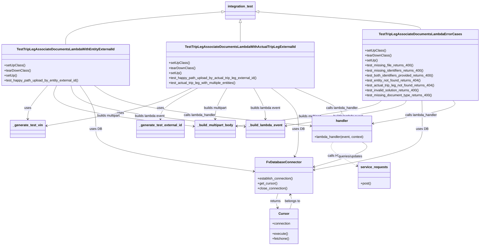
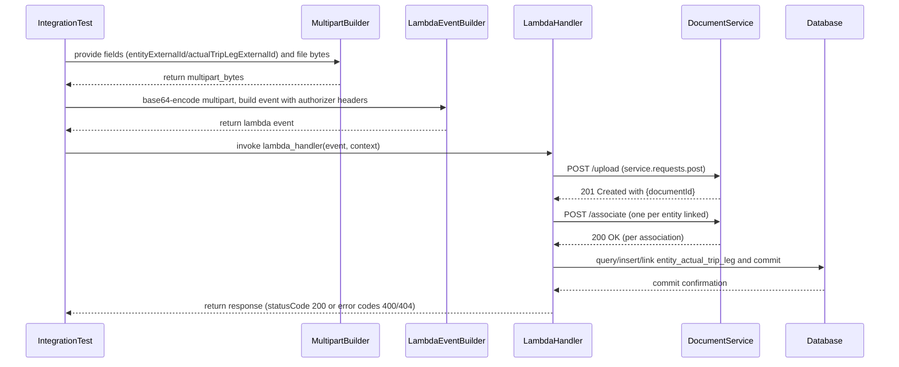

# Diagram: entity_core/entity_service/entity_service/tests/integration_tests/test_trip_leg_associate_documents_lambda.py

> Auto-generated by Obscura crawlers

## Diagram 1

### SVG

<svg id="container" width="2271.609375" xmlns="http://www.w3.org/2000/svg" class="classDiagram" height="1182" viewBox="0 0 2271.609375 1182" role="graphics-document document" aria-roledescription="class"><g><defs><marker id="container_class-aggregationStart" class="marker aggregation class" refX="18" refY="7" markerWidth="190" markerHeight="240" orient="auto"><path d="M 18,7 L9,13 L1,7 L9,1 Z"></path></marker></defs><defs><marker id="container_class-aggregationEnd" class="marker aggregation class" refX="1" refY="7" markerWidth="20" markerHeight="28" orient="auto"><path d="M 18,7 L9,13 L1,7 L9,1 Z"></path></marker></defs><defs><marker id="container_class-extensionStart" class="marker extension class" refX="18" refY="7" markerWidth="190" markerHeight="240" orient="auto"><path d="M 1,7 L18,13 V 1 Z"></path></marker></defs><defs><marker id="container_class-extensionEnd" class="marker extension class" refX="1" refY="7" markerWidth="20" markerHeight="28" orient="auto"><path d="M 1,1 V 13 L18,7 Z"></path></marker></defs><defs><marker id="container_class-compositionStart" class="marker composition class" refX="18" refY="7" markerWidth="190" markerHeight="240" orient="auto"><path d="M 18,7 L9,13 L1,7 L9,1 Z"></path></marker></defs><defs><marker id="container_class-compositionEnd" class="marker composition class" refX="1" refY="7" markerWidth="20" markerHeight="28" orient="auto"><path d="M 18,7 L9,13 L1,7 L9,1 Z"></path></marker></defs><defs><marker id="container_class-dependencyStart" class="marker dependency class" refX="6" refY="7" markerWidth="190" markerHeight="240" orient="auto"><path d="M 5,7 L9,13 L1,7 L9,1 Z"></path></marker></defs><defs><marker id="container_class-dependencyEnd" class="marker dependency class" refX="13" refY="7" markerWidth="20" markerHeight="28" orient="auto"><path d="M 18,7 L9,13 L14,7 L9,1 Z"></path></marker></defs><defs><marker id="container_class-lollipopStart" class="marker lollipop class" refX="13" refY="7" markerWidth="190" markerHeight="240" orient="auto"><circle stroke="black" fill="transparent" cx="7" cy="7" r="6"></circle></marker></defs><defs><marker id="container_class-lollipopEnd" class="marker lollipop class" refX="1" refY="7" markerWidth="190" markerHeight="240" orient="auto"><circle stroke="black" fill="transparent" cx="7" cy="7" r="6"></circle></marker></defs><g class="root"><g class="clusters"></g><g class="edgePaths"><path d="M1044.926,57.197L922.933,67.164C800.939,77.131,556.952,97.066,434.958,123.2C312.965,149.333,312.965,181.667,312.965,197.833L312.965,214" id="id_integration_test_TestTripLegAssociateDocumentsLambdaWithEntityExternalId_1" class="edge-thickness-normal edge-pattern-solid relation" style=";;;" data-edge="true" data-et="edge" data-id="id_integration_test_TestTripLegAssociateDocumentsLambdaWithEntityExternalId_1" data-points="W3sieCI6MTA2Mi4xMTkxNDA2MjUsInkiOjU1Ljc5MjU0ODU5Mjc2ODY2fSx7IngiOjMxMi45NjQ4NDM3NSwieSI6MTE3fSx7IngiOjMxMi45NjQ4NDM3NSwieSI6MjE0fV0=" marker-start="url(#container_class-extensionStart)"></path><path d="M1133.018,109.25L1133.018,110.542C1133.018,111.833,1133.018,114.417,1133.018,129.875C1133.018,145.333,1133.018,173.667,1133.018,187.833L1133.018,202" id="id_integration_test_TestTripLegAssociateDocumentsLambdaWithActualTripLegExternalId_2" class="edge-thickness-normal edge-pattern-solid relation" style=";;;" data-edge="true" data-et="edge" data-id="id_integration_test_TestTripLegAssociateDocumentsLambdaWithActualTripLegExternalId_2" data-points="W3sieCI6MTEzMy4wMTc1NzgxMjUsInkiOjkyfSx7IngiOjExMzMuMDE3NTc4MTI1LCJ5IjoxMTd9LHsieCI6MTEzMy4wMTc1NzgxMjUsInkiOjIwMn1d" marker-start="url(#container_class-extensionStart)"></path><path d="M1221.113,56.894L1349.121,66.912C1477.129,76.929,1733.145,96.965,1861.152,111.149C1989.16,125.333,1989.16,133.667,1989.16,137.833L1989.16,142" id="id_integration_test_TestTripLegAssociateDocumentsLambdaErrorCases_3" class="edge-thickness-normal edge-pattern-solid relation" style=";;;" data-edge="true" data-et="edge" data-id="id_integration_test_TestTripLegAssociateDocumentsLambdaErrorCases_3" data-points="W3sieCI6MTIwMy45MTYwMTU2MjUsInkiOjU1LjU0ODM2OTQzNTAzNDA1fSx7IngiOjE5ODkuMTYwMTU2MjUsInkiOjExN30seyJ4IjoxOTg5LjE2MDE1NjI1LCJ5IjoxNDJ9XQ==" marker-start="url(#container_class-extensionStart)"></path><path d="M213.152,412L194.837,430.167C176.521,448.333,139.889,484.667,121.574,511.5C103.258,538.333,103.258,555.667,103.258,564.333L103.258,573" id="id_TestTripLegAssociateDocumentsLambdaWithEntityExternalId__generate_test_vin_4" class="edge-thickness-normal edge-pattern-solid relation" style=";;;" data-edge="true" data-et="edge" data-id="id_TestTripLegAssociateDocumentsLambdaWithEntityExternalId__generate_test_vin_4" data-points="W3sieCI6MjEzLjE1MjM2MjUzMDA0ODEsInkiOjQxMn0seyJ4IjoxMDMuMjU3ODEyNSwieSI6NTIxfSx7IngiOjEwMy4yNTc4MTI1LCJ5Ijo1Nzl9XQ==" marker-end="url(#container_class-dependencyEnd)"></path><path d="M903.644,424L870.237,440.167C836.83,456.333,770.016,488.667,651.22,519.066C532.425,549.465,361.648,577.931,276.26,592.164L190.871,606.396" id="id_TestTripLegAssociateDocumentsLambdaWithActualTripLegExternalId__generate_test_vin_5" class="edge-thickness-normal edge-pattern-solid relation" style=";;;" data-edge="true" data-et="edge" data-id="id_TestTripLegAssociateDocumentsLambdaWithActualTripLegExternalId__generate_test_vin_5" data-points="W3sieCI6OTAzLjY0NDM5OTc4OTY2MzUsInkiOjQyNH0seyJ4Ijo3MDMuMjAxMTcxODc1LCJ5Ijo1MjF9LHsieCI6MTg0Ljk1MzEyNSwieSI6NjA3LjM4MjgyOTEwODIxNjZ9XQ==" marker-end="url(#container_class-dependencyEnd)"></path><path d="M931.92,424L902.631,440.167C873.342,456.333,814.764,488.667,785.475,513.5C756.186,538.333,756.186,555.667,756.186,564.333L756.186,573" id="id_TestTripLegAssociateDocumentsLambdaWithActualTripLegExternalId__generate_test_external_id_6" class="edge-thickness-normal edge-pattern-solid relation" style=";;;" data-edge="true" data-et="edge" data-id="id_TestTripLegAssociateDocumentsLambdaWithActualTripLegExternalId__generate_test_external_id_6" data-points="W3sieCI6OTMxLjkxOTcxNTI5NDQ3MTIsInkiOjQyNH0seyJ4Ijo3NTYuMTg1NTQ2ODc1LCJ5Ijo1MjF9LHsieCI6NzU2LjE4NTU0Njg3NSwieSI6NTc5fV0=" marker-end="url(#container_class-dependencyEnd)"></path><path d="M258.417,412L248.407,430.167C238.398,448.333,218.379,484.667,327.394,517.417C436.41,550.167,674.461,579.334,793.486,593.918L912.511,608.501" id="id_TestTripLegAssociateDocumentsLambdaWithEntityExternalId__build_multipart_body_7" class="edge-thickness-normal edge-pattern-solid relation" style=";;;" data-edge="true" data-et="edge" data-id="id_TestTripLegAssociateDocumentsLambdaWithEntityExternalId__build_multipart_body_7" data-points="W3sieCI6MjU4LjQxNzA0ODUyNzY0NDIsInkiOjQxMn0seyJ4IjoxOTguMzU5Mzc1LCJ5Ijo1MjF9LHsieCI6OTE4LjQ2Njc5Njg3NSwieSI6NjA5LjIzMDkzMDMwMjEyMzl9XQ==" marker-end="url(#container_class-dependencyEnd)"></path><path d="M1069.782,424L1060.572,440.167C1051.362,456.333,1032.942,488.667,1023.732,513.5C1014.521,538.333,1014.521,555.667,1014.521,564.333L1014.521,573" id="id_TestTripLegAssociateDocumentsLambdaWithActualTripLegExternalId__build_multipart_body_8" class="edge-thickness-normal edge-pattern-solid relation" style=";;;" data-edge="true" data-et="edge" data-id="id_TestTripLegAssociateDocumentsLambdaWithActualTripLegExternalId__build_multipart_body_8" data-points="W3sieCI6MTA2OS43ODE2ODE5NDExMDU3LCJ5Ijo0MjR9LHsieCI6MTAxNC41MjE0ODQzNzUsInkiOjUyMX0seyJ4IjoxMDE0LjUyMTQ4NDM3NSwieSI6NTc5fV0=" marker-end="url(#container_class-dependencyEnd)"></path><path d="M1811.44,484L1805.031,490.167C1798.622,496.333,1785.804,508.667,1669.985,529.259C1554.166,549.85,1335.345,578.701,1225.935,593.126L1116.525,607.551" id="id_TestTripLegAssociateDocumentsLambdaErrorCases__build_multipart_body_9" class="edge-thickness-normal edge-pattern-solid relation" style=";;;" data-edge="true" data-et="edge" data-id="id_TestTripLegAssociateDocumentsLambdaErrorCases__build_multipart_body_9" data-points="W3sieCI6MTgxMS40NDAzMjYzOTcyMzU2LCJ5Ijo0ODR9LHsieCI6MTc3Mi45ODYzMjgxMjUsInkiOjUyMX0seyJ4IjoxMTEwLjU3NjE3MTg3NSwieSI6NjA4LjMzNTY0NDA1ODk4MDJ9XQ==" marker-end="url(#container_class-dependencyEnd)"></path><path d="M331.195,412L334.54,430.167C337.885,448.333,344.575,484.667,481.812,517.706C619.048,550.745,886.83,580.491,1020.722,595.364L1154.613,610.236" id="id_TestTripLegAssociateDocumentsLambdaWithEntityExternalId__build_lambda_event_10" class="edge-thickness-normal edge-pattern-solid relation" style=";;;" data-edge="true" data-et="edge" data-id="id_TestTripLegAssociateDocumentsLambdaWithEntityExternalId__build_lambda_event_10" data-points="W3sieCI6MzMxLjE5NDU0MjUxODAyODg3LCJ5Ijo0MTJ9LHsieCI6MzUxLjI2NTYyNSwieSI6NTIxfSx7IngiOjExNjAuNTc2MTcxODc1LCJ5Ijo2MTAuODk4NjE3MzUxNTU0NX1d" marker-end="url(#container_class-dependencyEnd)"></path><path d="M1196.253,424L1205.464,440.167C1214.674,456.333,1233.094,488.667,1242.304,513.5C1251.514,538.333,1251.514,555.667,1251.514,564.333L1251.514,573" id="id_TestTripLegAssociateDocumentsLambdaWithActualTripLegExternalId__build_lambda_event_11" class="edge-thickness-normal edge-pattern-solid relation" style=";;;" data-edge="true" data-et="edge" data-id="id_TestTripLegAssociateDocumentsLambdaWithActualTripLegExternalId__build_lambda_event_11" data-points="W3sieCI6MTE5Ni4yNTM0NzQzMDg4OTQzLCJ5Ijo0MjR9LHsieCI6MTI1MS41MTM2NzE4NzUsInkiOjUyMX0seyJ4IjoxMjUxLjUxMzY3MTg3NSwieSI6NTc5fV0=" marker-end="url(#container_class-dependencyEnd)"></path><path d="M1937.147,484L1935.271,490.167C1933.395,496.333,1929.644,508.667,1831.517,529.106C1733.39,549.545,1540.888,578.09,1444.637,592.363L1348.386,606.635" id="id_TestTripLegAssociateDocumentsLambdaErrorCases__build_lambda_event_12" class="edge-thickness-normal edge-pattern-solid relation" style=";;;" data-edge="true" data-et="edge" data-id="id_TestTripLegAssociateDocumentsLambdaErrorCases__build_lambda_event_12" data-points="W3sieCI6MTkzNy4xNDY5MDY5MjYwODE4LCJ5Ijo0ODR9LHsieCI6MTkyNS44OTI1NzgxMjUsInkiOjUyMX0seyJ4IjoxMzQyLjQ1MTE3MTg3NSwieSI6NjA3LjUxNTM3MDA0NTM1NDJ9XQ==" marker-end="url(#container_class-dependencyEnd)"></path><path d="M376.076,412L387.657,430.167C399.238,448.333,422.4,484.667,433.981,519.5C445.563,554.333,445.563,587.667,445.563,621C445.563,654.333,445.563,687.667,570.703,721.67C695.844,755.673,946.125,790.346,1071.266,807.683L1196.406,825.019" id="id_TestTripLegAssociateDocumentsLambdaWithEntityExternalId_FvDatabaseConnector_13" class="edge-thickness-normal edge-pattern-solid relation" style=";;;" data-edge="true" data-et="edge" data-id="id_TestTripLegAssociateDocumentsLambdaWithEntityExternalId_FvDatabaseConnector_13" data-points="W3sieCI6Mzc2LjA3NjIyODIxNTE0NDIsInkiOjQxMn0seyJ4Ijo0NDUuNTYyNSwieSI6NTIxfSx7IngiOjQ0NS41NjI1LCJ5Ijo2MjF9LHsieCI6NDQ1LjU2MjUsInkiOjcyMX0seyJ4IjoxMjAyLjM0OTYwOTM3NSwieSI6ODI1Ljg0MjQ4NjA5NDY1NDV9XQ==" marker-end="url(#container_class-dependencyEnd)"></path><path d="M1278.736,424L1299.96,440.167C1321.183,456.333,1363.63,488.667,1384.853,521.5C1406.076,554.333,1406.076,587.667,1406.076,621C1406.076,654.333,1406.076,687.667,1403.288,709.616C1400.501,731.565,1394.925,742.129,1392.137,747.411L1389.35,752.694" id="id_TestTripLegAssociateDocumentsLambdaWithActualTripLegExternalId_FvDatabaseConnector_14" class="edge-thickness-normal edge-pattern-solid relation" style=";;;" data-edge="true" data-et="edge" data-id="id_TestTripLegAssociateDocumentsLambdaWithActualTripLegExternalId_FvDatabaseConnector_14" data-points="W3sieCI6MTI3OC43MzYzNDY5MDUwNDgsInkiOjQyNH0seyJ4IjoxNDA2LjA3NjE3MTg3NSwieSI6NTIxfSx7IngiOjE0MDYuMDc2MTcxODc1LCJ5Ijo2MjF9LHsieCI6MTQwNi4wNzYxNzE4NzUsInkiOjcyMX0seyJ4IjoxMzg2LjU0OTMwMDY1NTI0MiwieSI6NzU4fV0=" marker-end="url(#container_class-dependencyEnd)"></path><path d="M2014.67,484L2015.59,490.167C2016.51,496.333,2018.35,508.667,2019.27,531.5C2020.189,554.333,2020.189,587.667,2020.189,621C2020.189,654.333,2020.189,687.667,1930.962,720.615C1841.734,753.563,1663.278,786.126,1574.05,802.408L1484.822,818.69" id="id_TestTripLegAssociateDocumentsLambdaErrorCases_FvDatabaseConnector_15" class="edge-thickness-normal edge-pattern-solid relation" style=";;;" data-edge="true" data-et="edge" data-id="id_TestTripLegAssociateDocumentsLambdaErrorCases_FvDatabaseConnector_15" data-points="W3sieCI6MjAxNC42Njk4MTg1ODQ3MzU2LCJ5Ijo0ODR9LHsieCI6MjAyMC4xODk0NTMxMjUsInkiOjUyMX0seyJ4IjoyMDIwLjE4OTQ1MzEyNSwieSI6NjIxfSx7IngiOjIwMjAuMTg5NDUzMTI1LCJ5Ijo3MjF9LHsieCI6MTQ3OC45MTk5MjE4NzUsInkiOjgxOS43NjY3NzA1MTgzNzcxfV0=" marker-end="url(#container_class-dependencyEnd)"></path><path d="M1311.011,932L1308.911,938.167C1306.811,944.333,1302.612,956.667,1302.334,968.056C1302.057,979.445,1305.702,989.89,1307.524,995.112L1309.346,1000.335" id="id_FvDatabaseConnector_Cursor_16" class="edge-thickness-normal edge-pattern-solid relation" style=";;;" data-edge="true" data-et="edge" data-id="id_FvDatabaseConnector_Cursor_16" data-points="W3sieCI6MTMxMS4wMTA4MDUxOTE1MzIyLCJ5Ijo5MzJ9LHsieCI6MTI5OC40MTIxMDkzNzUsInkiOjk2OX0seyJ4IjoxMzExLjMyMzE2OTU1MDYyLCJ5IjoxMDA2fV0=" marker-end="url(#container_class-dependencyEnd)"></path><path d="M444.023,412L468.072,430.167C492.121,448.333,540.22,484.667,710.171,517.031C880.122,549.395,1171.926,577.789,1317.828,591.987L1463.729,606.184" id="id_TestTripLegAssociateDocumentsLambdaWithEntityExternalId_handler_17" class="edge-thickness-normal edge-pattern-solid relation" style=";;;" data-edge="true" data-et="edge" data-id="id_TestTripLegAssociateDocumentsLambdaWithEntityExternalId_handler_17" data-points="W3sieCI6NDQ0LjAyMjUyNjY2NzY2ODMsInkiOjQxMn0seyJ4Ijo1ODguMzE4MzU5Mzc1LCJ5Ijo1MjF9LHsieCI6MTQ2OS43MDExNzE4NzUsInkiOjYwNi43NjUzMjg4MTI1OH1d" marker-end="url(#container_class-dependencyEnd)"></path><path d="M1390.756,424L1428.294,440.167C1465.833,456.333,1540.909,488.667,1578.448,510C1615.986,531.333,1615.986,541.667,1615.986,546.833L1615.986,552" id="id_TestTripLegAssociateDocumentsLambdaWithActualTripLegExternalId_handler_18" class="edge-thickness-normal edge-pattern-solid relation" style=";;;" data-edge="true" data-et="edge" data-id="id_TestTripLegAssociateDocumentsLambdaWithActualTripLegExternalId_handler_18" data-points="W3sieCI6MTM5MC43NTU3MDkxMzQ2MTUyLCJ5Ijo0MjR9LHsieCI6MTYxNS45ODYzMjgxMjUsInkiOjUyMX0seyJ4IjoxNjE1Ljk4NjMyODEyNSwieSI6NTU4fV0=" marker-end="url(#container_class-dependencyEnd)"></path><path d="M2162.899,484L2169.165,490.167C2175.43,496.333,2187.961,508.667,2122.176,527.16C2056.39,545.654,1912.288,570.307,1840.237,582.634L1768.186,594.961" id="id_TestTripLegAssociateDocumentsLambdaErrorCases_handler_19" class="edge-thickness-normal edge-pattern-solid relation" style=";;;" data-edge="true" data-et="edge" data-id="id_TestTripLegAssociateDocumentsLambdaErrorCases_handler_19" data-points="W3sieCI6MjE2Mi44OTk0NzA0MDI2NDQsInkiOjQ4NH0seyJ4IjoyMjAwLjQ5MjE4NzUsInkiOjUyMX0seyJ4IjoxNzYyLjI3MTQ4NDM3NSwieSI6NTk1Ljk3Mjg1MDMzMDk3NTN9XQ==" marker-end="url(#container_class-dependencyEnd)"></path><path d="M1572.114,684L1567.82,690.167C1563.525,696.333,1554.936,708.667,1572.353,727.693C1589.77,746.718,1633.192,772.437,1654.904,785.296L1676.615,798.155" id="id_handler_service_requests_20" class="edge-thickness-normal edge-pattern-dashed relation" style=";;;" data-edge="true" data-et="edge" data-id="id_handler_service_requests_20" data-points="W3sieCI6MTU3Mi4xMTM5NjQ4NDM3NSwieSI6Njg0fSx7IngiOjE1NDYuMzQ3NjU2MjUsInkiOjcyMX0seyJ4IjoxNjgxLjc3NzM0Mzc1LCJ5Ijo4MDEuMjEyNzAyNDQwNDgwNn1d" marker-end="url(#container_class-dependencyEnd)"></path><path d="M1717.931,684L1727.909,690.167C1737.888,696.333,1757.845,708.667,1718.972,728.69C1680.099,748.713,1582.396,776.426,1533.544,790.282L1484.692,804.139" id="id_handler_FvDatabaseConnector_21" class="edge-thickness-normal edge-pattern-solid relation" style=";;;" data-edge="true" data-et="edge" data-id="id_handler_FvDatabaseConnector_21" data-points="W3sieCI6MTcxNy45MzA2NjQwNjI1LCJ5Ijo2ODR9LHsieCI6MTc3Ny44MDI3MzQzNzUsInkiOjcyMX0seyJ4IjoxNDc4LjkxOTkyMTg3NSwieSI6ODA1Ljc3NjI2NzcwMzE2NzZ9XQ==" marker-end="url(#container_class-dependencyEnd)"></path><path d="M1369.946,1006L1372.098,999.833C1374.25,993.667,1378.554,981.333,1378.928,969.947C1379.303,958.56,1375.748,948.12,1373.97,942.9L1372.193,937.68" id="id_Cursor_FvDatabaseConnector_22" class="edge-thickness-normal edge-pattern-solid relation" style=";;;" data-edge="true" data-et="edge" data-id="id_Cursor_FvDatabaseConnector_22" data-points="W3sieCI6MTM2OS45NDYzNjE2OTkzOCwieSI6MTAwNn0seyJ4IjoxMzgyLjg1NzQyMTg3NSwieSI6OTY5fSx7IngiOjEzNzAuMjU4NzI2MDU4NDY3OCwieSI6OTMyfV0=" marker-end="url(#container_class-dependencyEnd)"></path></g><g class="edgeLabels"><g class="edgeLabel"><g class="label" data-id="id_integration_test_TestTripLegAssociateDocumentsLambdaWithEntityExternalId_1" transform="translate(0, 0)"><foreignObject width="0" height="0">

</foreignObject></g></g><g class="edgeLabel"><g class="label" data-id="id_integration_test_TestTripLegAssociateDocumentsLambdaWithActualTripLegExternalId_2" transform="translate(0, 0)"><foreignObject width="0" height="0">

</foreignObject></g></g><g class="edgeLabel"><g class="label" data-id="id_integration_test_TestTripLegAssociateDocumentsLambdaErrorCases_3" transform="translate(0, 0)"><foreignObject width="0" height="0">

</foreignObject></g></g><g class="edgeLabel" transform="translate(103.2578125, 521)"><g class="label" data-id="id_TestTripLegAssociateDocumentsLambdaWithEntityExternalId__generate_test_vin_4" transform="translate(-16.4921875, -12)"><foreignObject width="32.984375" height="24">

uses

</foreignObject></g></g><g class="edgeLabel" transform="translate(553.90208, 545.88553)"><g class="label" data-id="id_TestTripLegAssociateDocumentsLambdaWithActualTripLegExternalId__generate_test_vin_5" transform="translate(-16.4921875, -12)"><foreignObject width="32.984375" height="24">

uses

</foreignObject></g></g><g class="edgeLabel" transform="translate(756.185546875, 521)"><g class="label" data-id="id_TestTripLegAssociateDocumentsLambdaWithActualTripLegExternalId__generate_test_external_id_6" transform="translate(-16.4921875, -12)"><foreignObject width="32.984375" height="24">

uses

</foreignObject></g></g><g class="edgeLabel" transform="translate(496.64972, 557.54793)"><g class="label" data-id="id_TestTripLegAssociateDocumentsLambdaWithEntityExternalId__build_multipart_body_7" transform="translate(-58.609375, -12)"><foreignObject width="117.21875" height="24">

builds multipart

</foreignObject></g></g><g class="edgeLabel" transform="translate(1014.521484375, 521)"><g class="label" data-id="id_TestTripLegAssociateDocumentsLambdaWithActualTripLegExternalId__build_multipart_body_8" transform="translate(-58.609375, -12)"><foreignObject width="117.21875" height="24">

builds multipart

</foreignObject></g></g><g class="edgeLabel" transform="translate(1468.23429, 561.18011)"><g class="label" data-id="id_TestTripLegAssociateDocumentsLambdaErrorCases__build_multipart_body_9" transform="translate(-58.609375, -12)"><foreignObject width="117.21875" height="24">

builds multipart

</foreignObject></g></g><g class="edgeLabel" transform="translate(700.84339, 559.83127)"><g class="label" data-id="id_TestTripLegAssociateDocumentsLambdaWithEntityExternalId__build_lambda_event_10" transform="translate(-74.296875, -12)"><foreignObject width="148.59375" height="24">

builds lambda event

</foreignObject></g></g><g class="edgeLabel" transform="translate(1251.513671875, 521)"><g class="label" data-id="id_TestTripLegAssociateDocumentsLambdaWithActualTripLegExternalId__build_lambda_event_11" transform="translate(-74.296875, -12)"><foreignObject width="148.59375" height="24">

builds lambda event

</foreignObject></g></g><g class="edgeLabel" transform="translate(1653.29961, 561.42134)"><g class="label" data-id="id_TestTripLegAssociateDocumentsLambdaErrorCases__build_lambda_event_12" transform="translate(-74.296875, -12)"><foreignObject width="148.59375" height="24">

builds lambda event

</foreignObject></g></g><g class="edgeLabel" transform="translate(445.5625, 621)"><g class="label" data-id="id_TestTripLegAssociateDocumentsLambdaWithEntityExternalId_FvDatabaseConnector_13" transform="translate(-28.625, -12)"><foreignObject width="57.25" height="24">

uses DB

</foreignObject></g></g><g class="edgeLabel" transform="translate(1406.076171875, 621)"><g class="label" data-id="id_TestTripLegAssociateDocumentsLambdaWithActualTripLegExternalId_FvDatabaseConnector_14" transform="translate(-28.625, -12)"><foreignObject width="57.25" height="24">

uses DB

</foreignObject></g></g><g class="edgeLabel" transform="translate(2020.189453125, 621)"><g class="label" data-id="id_TestTripLegAssociateDocumentsLambdaErrorCases_FvDatabaseConnector_15" transform="translate(-28.625, -12)"><foreignObject width="57.25" height="24">

uses DB

</foreignObject></g></g><g class="edgeLabel" transform="translate(1298.42888, 969.04806)"><g class="label" data-id="id_FvDatabaseConnector_Cursor_16" transform="translate(-26.265625, -12)"><foreignObject width="52.53125" height="24">

returns

</foreignObject></g></g><g class="edgeLabel" transform="translate(939.01596, 555.12557)"><g class="label" data-id="id_TestTripLegAssociateDocumentsLambdaWithEntityExternalId_handler_17" transform="translate(-78.390625, -12)"><foreignObject width="156.78125" height="24">

calls lambda_handler

</foreignObject></g></g><g class="edgeLabel" transform="translate(1615.986328125, 521)"><g class="label" data-id="id_TestTripLegAssociateDocumentsLambdaWithActualTripLegExternalId_handler_18" transform="translate(-78.390625, -12)"><foreignObject width="156.78125" height="24">

calls lambda_handler

</foreignObject></g></g><g class="edgeLabel" transform="translate(2007.37747, 554.03897)"><g class="label" data-id="id_TestTripLegAssociateDocumentsLambdaErrorCases_handler_19" transform="translate(-78.390625, -12)"><foreignObject width="156.78125" height="24">

calls lambda_handler

</foreignObject></g></g><g class="edgeLabel" transform="translate(1594.66557, 749.61788)"><g class="label" data-id="id_handler_service_requests_20" transform="translate(-50.6328125, -12)"><foreignObject width="101.265625" height="24">

calls HTTP API

</foreignObject></g></g><g class="edgeLabel" transform="translate(1662.2169, 753.78521)"><g class="label" data-id="id_handler_FvDatabaseConnector_21" transform="translate(-60.5703125, -12)"><foreignObject width="121.140625" height="24">

queries/updates

</foreignObject></g></g><g class="edgeLabel" transform="translate(1382.84065, 969.04806)"><g class="label" data-id="id_Cursor_FvDatabaseConnector_22" transform="translate(-38.1796875, -12)"><foreignObject width="76.359375" height="24">

belongs to

</foreignObject></g></g></g><g class="nodes"><g class="node default" id="classId-integration_test-0" transform="translate(1133.017578125, 50)"><g class="basic label-container"><path d="M-70.8984375 -42 L70.8984375 -42 L70.8984375 42 L-70.8984375 42" stroke="none" stroke-width="0" fill="#ECECFF" style=""></path><path d="M-70.8984375 -42 C-26.64638999679233 -42, 17.60565750641534 -42, 70.8984375 -42 M-70.8984375 -42 C-27.214938340726434 -42, 16.468560818547132 -42, 70.8984375 -42 M70.8984375 -42 C70.8984375 -11.297346220958836, 70.8984375 19.405307558082328, 70.8984375 42 M70.8984375 -42 C70.8984375 -21.33071967790441, 70.8984375 -0.6614393558088167, 70.8984375 42 M70.8984375 42 C39.460129036293665 42, 8.021820572587337 42, -70.8984375 42 M70.8984375 42 C19.348982957778503 42, -32.200471584442994 42, -70.8984375 42 M-70.8984375 42 C-70.8984375 8.788282683811467, -70.8984375 -24.423434632377067, -70.8984375 -42 M-70.8984375 42 C-70.8984375 17.638743092974735, -70.8984375 -6.722513814050529, -70.8984375 -42" stroke="#9370DB" stroke-width="1.3" fill="none" stroke-dasharray="0 0" style=""></path></g><g class="annotation-group text" transform="translate(0, -18)"></g><g class="label-group text" transform="translate(-58.8984375, -18)"><g class="label" style="font-weight: bolder" transform="translate(0,-12)"><foreignObject width="117.796875" height="24">

integration_test

</foreignObject></g></g><g class="members-group text" transform="translate(-58.8984375, 30)"></g><g class="methods-group text" transform="translate(-58.8984375, 60)"></g><g class="divider" style=""><path d="M-70.8984375 6 C-34.73240163795055 6, 1.4336342240988955 6, 70.8984375 6 M-70.8984375 6 C-27.773974504211033 6, 15.350488491577934 6, 70.8984375 6" stroke="#9370DB" stroke-width="1.3" fill="none" stroke-dasharray="0 0" style=""></path></g><g class="divider" style=""><path d="M-70.8984375 24 C-33.11460053085039 24, 4.669236438299222 24, 70.8984375 24 M-70.8984375 24 C-22.86207600377793 24, 25.17428549244414 24, 70.8984375 24" stroke="#9370DB" stroke-width="1.3" fill="none" stroke-dasharray="0 0" style=""></path></g></g><g class="node default" id="classId-_generate_test_vin-1" transform="translate(103.2578125, 621)"><g class="basic label-container"><path d="M-81.6953125 -42 L81.6953125 -42 L81.6953125 42 L-81.6953125 42" stroke="none" stroke-width="0" fill="#ECECFF" style=""></path><path d="M-81.6953125 -42 C-38.43220453958195 -42, 4.830903420836094 -42, 81.6953125 -42 M-81.6953125 -42 C-27.775413047465726 -42, 26.144486405068548 -42, 81.6953125 -42 M81.6953125 -42 C81.6953125 -15.844252735142685, 81.6953125 10.31149452971463, 81.6953125 42 M81.6953125 -42 C81.6953125 -19.36567984688736, 81.6953125 3.2686403062252793, 81.6953125 42 M81.6953125 42 C34.480342016198875 42, -12.73462846760225 42, -81.6953125 42 M81.6953125 42 C37.18442859899488 42, -7.326455302010245 42, -81.6953125 42 M-81.6953125 42 C-81.6953125 13.201152958593639, -81.6953125 -15.597694082812723, -81.6953125 -42 M-81.6953125 42 C-81.6953125 22.330655861513726, -81.6953125 2.6613117230274526, -81.6953125 -42" stroke="#9370DB" stroke-width="1.3" fill="none" stroke-dasharray="0 0" style=""></path></g><g class="annotation-group text" transform="translate(0, -18)"></g><g class="label-group text" transform="translate(-69.6953125, -18)"><g class="label" style="font-weight: bolder" transform="translate(0,-12)"><foreignObject width="139.390625" height="24">

_generate_test_vin

</foreignObject></g></g><g class="members-group text" transform="translate(-69.6953125, 30)"></g><g class="methods-group text" transform="translate(-69.6953125, 60)"></g><g class="divider" style=""><path d="M-81.6953125 6 C-41.121387603616434 6, -0.5474627072328673 6, 81.6953125 6 M-81.6953125 6 C-28.438776018511582 6, 24.817760462976835 6, 81.6953125 6" stroke="#9370DB" stroke-width="1.3" fill="none" stroke-dasharray="0 0" style=""></path></g><g class="divider" style=""><path d="M-81.6953125 24 C-44.1466956462153 24, -6.598078792430599 24, 81.6953125 24 M-81.6953125 24 C-40.87124227700442 24, -0.04717205400883984 24, 81.6953125 24" stroke="#9370DB" stroke-width="1.3" fill="none" stroke-dasharray="0 0" style=""></path></g></g><g class="node default" id="classId-_generate_test_external_id-2" transform="translate(756.185546875, 621)"><g class="basic label-container"><path d="M-112.28125 -42 L112.28125 -42 L112.28125 42 L-112.28125 42" stroke="none" stroke-width="0" fill="#ECECFF" style=""></path><path d="M-112.28125 -42 C-65.76148847534986 -42, -19.24172695069973 -42, 112.28125 -42 M-112.28125 -42 C-66.77913249495576 -42, -21.27701498991152 -42, 112.28125 -42 M112.28125 -42 C112.28125 -19.69575504504388, 112.28125 2.6084899099122367, 112.28125 42 M112.28125 -42 C112.28125 -24.641515121493136, 112.28125 -7.283030242986271, 112.28125 42 M112.28125 42 C52.73675627984015 42, -6.807737440319698 42, -112.28125 42 M112.28125 42 C60.63151681483455 42, 8.981783629669096 42, -112.28125 42 M-112.28125 42 C-112.28125 19.76507947023785, -112.28125 -2.469841059524299, -112.28125 -42 M-112.28125 42 C-112.28125 14.613343717504122, -112.28125 -12.773312564991755, -112.28125 -42" stroke="#9370DB" stroke-width="1.3" fill="none" stroke-dasharray="0 0" style=""></path></g><g class="annotation-group text" transform="translate(0, -18)"></g><g class="label-group text" transform="translate(-100.28125, -18)"><g class="label" style="font-weight: bolder" transform="translate(0,-12)"><foreignObject width="200.5625" height="24">

_generate_test_external_id

</foreignObject></g></g><g class="members-group text" transform="translate(-100.28125, 30)"></g><g class="methods-group text" transform="translate(-100.28125, 60)"></g><g class="divider" style=""><path d="M-112.28125 6 C-60.45763102274407 6, -8.634012045488134 6, 112.28125 6 M-112.28125 6 C-43.18400942931284 6, 25.913231141374325 6, 112.28125 6" stroke="#9370DB" stroke-width="1.3" fill="none" stroke-dasharray="0 0" style=""></path></g><g class="divider" style=""><path d="M-112.28125 24 C-30.773941803335575 24, 50.73336639332885 24, 112.28125 24 M-112.28125 24 C-60.63663642744691 24, -8.992022854893818 24, 112.28125 24" stroke="#9370DB" stroke-width="1.3" fill="none" stroke-dasharray="0 0" style=""></path></g></g><g class="node default" id="classId-_build_multipart_body-3" transform="translate(1014.521484375, 621)"><g class="basic label-container"><path d="M-96.0546875 -42 L96.0546875 -42 L96.0546875 42 L-96.0546875 42" stroke="none" stroke-width="0" fill="#ECECFF" style=""></path><path d="M-96.0546875 -42 C-19.80143924268316 -42, 56.45180901463368 -42, 96.0546875 -42 M-96.0546875 -42 C-41.220900676669885 -42, 13.61288614666023 -42, 96.0546875 -42 M96.0546875 -42 C96.0546875 -21.354148390938736, 96.0546875 -0.7082967818774719, 96.0546875 42 M96.0546875 -42 C96.0546875 -18.093102569506808, 96.0546875 5.813794860986384, 96.0546875 42 M96.0546875 42 C30.06634855675597 42, -35.92199038648806 42, -96.0546875 42 M96.0546875 42 C41.868838960571196 42, -12.317009578857608 42, -96.0546875 42 M-96.0546875 42 C-96.0546875 11.15342015369633, -96.0546875 -19.69315969260734, -96.0546875 -42 M-96.0546875 42 C-96.0546875 13.536020598622358, -96.0546875 -14.927958802755285, -96.0546875 -42" stroke="#9370DB" stroke-width="1.3" fill="none" stroke-dasharray="0 0" style=""></path></g><g class="annotation-group text" transform="translate(0, -18)"></g><g class="label-group text" transform="translate(-84.0546875, -18)"><g class="label" style="font-weight: bolder" transform="translate(0,-12)"><foreignObject width="168.109375" height="24">

_build_multipart_body

</foreignObject></g></g><g class="members-group text" transform="translate(-84.0546875, 30)"></g><g class="methods-group text" transform="translate(-84.0546875, 60)"></g><g class="divider" style=""><path d="M-96.0546875 6 C-38.60163942844852 6, 18.851408643102957 6, 96.0546875 6 M-96.0546875 6 C-49.23145820220558 6, -2.4082289044111604 6, 96.0546875 6" stroke="#9370DB" stroke-width="1.3" fill="none" stroke-dasharray="0 0" style=""></path></g><g class="divider" style=""><path d="M-96.0546875 24 C-28.734712385467517 24, 38.585262729064965 24, 96.0546875 24 M-96.0546875 24 C-21.29557681428085 24, 53.4635338714383 24, 96.0546875 24" stroke="#9370DB" stroke-width="1.3" fill="none" stroke-dasharray="0 0" style=""></path></g></g><g class="node default" id="classId-_build_lambda_event-4" transform="translate(1251.513671875, 621)"><g class="basic label-container"><path d="M-90.9375 -42 L90.9375 -42 L90.9375 42 L-90.9375 42" stroke="none" stroke-width="0" fill="#ECECFF" style=""></path><path d="M-90.9375 -42 C-32.14497137677805 -42, 26.647557246443895 -42, 90.9375 -42 M-90.9375 -42 C-46.4457570295684 -42, -1.9540140591367958 -42, 90.9375 -42 M90.9375 -42 C90.9375 -15.740405436830752, 90.9375 10.519189126338496, 90.9375 42 M90.9375 -42 C90.9375 -15.791049504614442, 90.9375 10.417900990771116, 90.9375 42 M90.9375 42 C32.45644747267518 42, -26.02460505464964 42, -90.9375 42 M90.9375 42 C48.80570331956337 42, 6.673906639126741 42, -90.9375 42 M-90.9375 42 C-90.9375 12.699762054030813, -90.9375 -16.600475891938373, -90.9375 -42 M-90.9375 42 C-90.9375 9.182232090569286, -90.9375 -23.635535818861428, -90.9375 -42" stroke="#9370DB" stroke-width="1.3" fill="none" stroke-dasharray="0 0" style=""></path></g><g class="annotation-group text" transform="translate(0, -18)"></g><g class="label-group text" transform="translate(-78.9375, -18)"><g class="label" style="font-weight: bolder" transform="translate(0,-12)"><foreignObject width="157.875" height="24">

_build_lambda_event

</foreignObject></g></g><g class="members-group text" transform="translate(-78.9375, 30)"></g><g class="methods-group text" transform="translate(-78.9375, 60)"></g><g class="divider" style=""><path d="M-90.9375 6 C-19.002109230306672 6, 52.933281539386655 6, 90.9375 6 M-90.9375 6 C-34.30779330071174 6, 22.321913398576527 6, 90.9375 6" stroke="#9370DB" stroke-width="1.3" fill="none" stroke-dasharray="0 0" style=""></path></g><g class="divider" style=""><path d="M-90.9375 24 C-29.772315956673246 24, 31.392868086653507 24, 90.9375 24 M-90.9375 24 C-21.625028291998248 24, 47.687443416003504 24, 90.9375 24" stroke="#9370DB" stroke-width="1.3" fill="none" stroke-dasharray="0 0" style=""></path></g></g><g class="node default" id="classId-TestTripLegAssociateDocumentsLambdaWithEntityExternalId-5" transform="translate(312.96484375, 313)"><g class="basic label-container"><path d="M-304.96484375 -99 L304.96484375 -99 L304.96484375 99 L-304.96484375 99" stroke="none" stroke-width="0" fill="#ECECFF" style=""></path><path d="M-304.96484375 -99 C-155.74051700557285 -99, -6.516190261145709 -99, 304.96484375 -99 M-304.96484375 -99 C-117.80184188997058 -99, 69.36115997005885 -99, 304.96484375 -99 M304.96484375 -99 C304.96484375 -39.607889660598055, 304.96484375 19.78422067880389, 304.96484375 99 M304.96484375 -99 C304.96484375 -30.67834066824473, 304.96484375 37.64331866351054, 304.96484375 99 M304.96484375 99 C80.46587686099735 99, -144.0330900280053 99, -304.96484375 99 M304.96484375 99 C163.97071624526106 99, 22.976588740522118 99, -304.96484375 99 M-304.96484375 99 C-304.96484375 26.080229667208982, -304.96484375 -46.839540665582035, -304.96484375 -99 M-304.96484375 99 C-304.96484375 39.89152274241555, -304.96484375 -19.216954515168894, -304.96484375 -99" stroke="#9370DB" stroke-width="1.3" fill="none" stroke-dasharray="0 0" style=""></path></g><g class="annotation-group text" transform="translate(0, -75)"></g><g class="label-group text" transform="translate(-222.6015625, -75)"><g class="label" style="font-weight: bolder" transform="translate(0,-12)"><foreignObject width="445.203125" height="24">

TestTripLegAssociateDocumentsLambdaWithEntityExternalId

</foreignObject></g></g><g class="members-group text" transform="translate(-292.96484375, -27)"></g><g class="methods-group text" transform="translate(-292.96484375, 3)"><g class="label" style="" transform="translate(0,-12)"><foreignObject width="97.15625" height="24">

+setUpClass()

</foreignObject></g><g class="label" style="" transform="translate(0,12)"><foreignObject width="124.484375" height="24">

+tearDownClass()

</foreignObject></g><g class="label" style="" transform="translate(0,36)"><foreignObject width="60.421875" height="24">

+setUp()

</foreignObject></g><g class="label" style="" transform="translate(0,60)"><foreignObject width="363.328125" height="24">

+test_happy_path_upload_by_entity_external_id()

</foreignObject></g></g><g class="divider" style=""><path d="M-304.96484375 -51 C-137.31820010760774 -51, 30.328443534784526 -51, 304.96484375 -51 M-304.96484375 -51 C-171.5048804715653 -51, -38.04491719313057 -51, 304.96484375 -51" stroke="#9370DB" stroke-width="1.3" fill="none" stroke-dasharray="0 0" style=""></path></g><g class="divider" style=""><path d="M-304.96484375 -27 C-76.58467985545587 -27, 151.79548403908825 -27, 304.96484375 -27 M-304.96484375 -27 C-179.24465040448325 -27, -53.52445705896653 -27, 304.96484375 -27" stroke="#9370DB" stroke-width="1.3" fill="none" stroke-dasharray="0 0" style=""></path></g></g><g class="node default" id="classId-TestTripLegAssociateDocumentsLambdaWithActualTripLegExternalId-6" transform="translate(1133.017578125, 313)"><g class="basic label-container"><path d="M-352.65625 -111 L352.65625 -111 L352.65625 111 L-352.65625 111" stroke="none" stroke-width="0" fill="#ECECFF" style=""></path><path d="M-352.65625 -111 C-137.06254541937324 -111, 78.53115916125353 -111, 352.65625 -111 M-352.65625 -111 C-80.76677606165794 -111, 191.12269787668413 -111, 352.65625 -111 M352.65625 -111 C352.65625 -42.88083770529417, 352.65625 25.23832458941166, 352.65625 111 M352.65625 -111 C352.65625 -26.20684743454747, 352.65625 58.58630513090506, 352.65625 111 M352.65625 111 C153.6492811551932 111, -45.35768768961361 111, -352.65625 111 M352.65625 111 C153.95347806190802 111, -44.74929387618397 111, -352.65625 111 M-352.65625 111 C-352.65625 57.587444210192025, -352.65625 4.17488842038405, -352.65625 -111 M-352.65625 111 C-352.65625 63.2123433166988, -352.65625 15.424686633397599, -352.65625 -111" stroke="#9370DB" stroke-width="1.3" fill="none" stroke-dasharray="0 0" style=""></path></g><g class="annotation-group text" transform="translate(0, -87)"></g><g class="label-group text" transform="translate(-251.265625, -87)"><g class="label" style="font-weight: bolder" transform="translate(0,-12)"><foreignObject width="502.53125" height="24">

TestTripLegAssociateDocumentsLambdaWithActualTripLegExternalId

</foreignObject></g></g><g class="members-group text" transform="translate(-340.65625, -39)"></g><g class="methods-group text" transform="translate(-340.65625, -9)"><g class="label" style="" transform="translate(0,-12)"><foreignObject width="97.15625" height="24">

+setUpClass()

</foreignObject></g><g class="label" style="" transform="translate(0,12)"><foreignObject width="124.484375" height="24">

+tearDownClass()

</foreignObject></g><g class="label" style="" transform="translate(0,36)"><foreignObject width="60.421875" height="24">

+setUp()

</foreignObject></g><g class="label" style="" transform="translate(0,60)"><foreignObject width="430.046875" height="24">

+test_happy_path_upload_by_actual_trip_leg_external_id()

</foreignObject></g><g class="label" style="" transform="translate(0,84)"><foreignObject width="332.8125" height="24">

+test_actual_trip_leg_with_multiple_entities()

</foreignObject></g></g><g class="divider" style=""><path d="M-352.65625 -63 C-188.4662340760276 -63, -24.276218152055208 -63, 352.65625 -63 M-352.65625 -63 C-86.05514760965167 -63, 180.54595478069666 -63, 352.65625 -63" stroke="#9370DB" stroke-width="1.3" fill="none" stroke-dasharray="0 0" style=""></path></g><g class="divider" style=""><path d="M-352.65625 -39 C-179.20374515457527 -39, -5.751240309150546 -39, 352.65625 -39 M-352.65625 -39 C-101.27552307560902 -39, 150.10520384878197 -39, 352.65625 -39" stroke="#9370DB" stroke-width="1.3" fill="none" stroke-dasharray="0 0" style=""></path></g></g><g class="node default" id="classId-TestTripLegAssociateDocumentsLambdaErrorCases-7" transform="translate(1989.16015625, 313)"><g class="basic label-container"><path d="M-274.44921875 -171 L274.44921875 -171 L274.44921875 171 L-274.44921875 171" stroke="none" stroke-width="0" fill="#ECECFF" style=""></path><path d="M-274.44921875 -171 C-124.00251418438052 -171, 26.44419038123897 -171, 274.44921875 -171 M-274.44921875 -171 C-127.51927210074277 -171, 19.410674548514464 -171, 274.44921875 -171 M274.44921875 -171 C274.44921875 -79.03237341905547, 274.44921875 12.935253161889051, 274.44921875 171 M274.44921875 -171 C274.44921875 -78.49046622815663, 274.44921875 14.019067543686731, 274.44921875 171 M274.44921875 171 C163.22232728610862 171, 51.99543582221722 171, -274.44921875 171 M274.44921875 171 C161.1024779439607 171, 47.755737137921386 171, -274.44921875 171 M-274.44921875 171 C-274.44921875 83.81628349287192, -274.44921875 -3.3674330142561644, -274.44921875 -171 M-274.44921875 171 C-274.44921875 92.49312075993582, -274.44921875 13.98624151987164, -274.44921875 -171" stroke="#9370DB" stroke-width="1.3" fill="none" stroke-dasharray="0 0" style=""></path></g><g class="annotation-group text" transform="translate(0, -147)"></g><g class="label-group text" transform="translate(-186.4296875, -147)"><g class="label" style="font-weight: bolder" transform="translate(0,-12)"><foreignObject width="372.859375" height="24">

TestTripLegAssociateDocumentsLambdaErrorCases

</foreignObject></g></g><g class="members-group text" transform="translate(-262.44921875, -99)"></g><g class="methods-group text" transform="translate(-262.44921875, -69)"><g class="label" style="" transform="translate(0,-12)"><foreignObject width="97.15625" height="24">

+setUpClass()

</foreignObject></g><g class="label" style="" transform="translate(0,12)"><foreignObject width="124.484375" height="24">

+tearDownClass()

</foreignObject></g><g class="label" style="" transform="translate(0,36)"><foreignObject width="60.421875" height="24">

+setUp()

</foreignObject></g><g class="label" style="" transform="translate(0,60)"><foreignObject width="232.890625" height="24">

+test_missing_file_returns_400()

</foreignObject></g><g class="label" style="" transform="translate(0,84)"><foreignObject width="284.46875" height="24">

+test_missing_identifiers_returns_400()

</foreignObject></g><g class="label" style="" transform="translate(0,108)"><foreignObject width="336.234375" height="24">

+test_both_identifiers_provided_returns_400()

</foreignObject></g><g class="label" style="" transform="translate(0,132)"><foreignObject width="271.75" height="24">

+test_entity_not_found_returns_404()

</foreignObject></g><g class="label" style="" transform="translate(0,156)"><foreignObject width="338.46875" height="24">

+test_actual_trip_leg_not_found_returns_404()

</foreignObject></g><g class="label" style="" transform="translate(0,180)"><foreignObject width="264.25" height="24">

+test_invalid_solution_returns_400()

</foreignObject></g><g class="label" style="" transform="translate(0,204)"><foreignObject width="323.453125" height="24">

+test_missing_document_type_returns_400()

</foreignObject></g></g><g class="divider" style=""><path d="M-274.44921875 -123 C-81.65811207774047 -123, 111.13299459451906 -123, 274.44921875 -123 M-274.44921875 -123 C-143.49622660776063 -123, -12.543234465521266 -123, 274.44921875 -123" stroke="#9370DB" stroke-width="1.3" fill="none" stroke-dasharray="0 0" style=""></path></g><g class="divider" style=""><path d="M-274.44921875 -99 C-84.43859048851337 -99, 105.57203777297326 -99, 274.44921875 -99 M-274.44921875 -99 C-58.630009623162806 -99, 157.1891995036744 -99, 274.44921875 -99" stroke="#9370DB" stroke-width="1.3" fill="none" stroke-dasharray="0 0" style=""></path></g></g><g class="node default" id="classId-FvDatabaseConnector-8" transform="translate(1340.634765625, 845)"><g class="basic label-container"><path d="M-138.28515625 -87 L138.28515625 -87 L138.28515625 87 L-138.28515625 87" stroke="none" stroke-width="0" fill="#ECECFF" style=""></path><path d="M-138.28515625 -87 C-67.72357912423746 -87, 2.8379980015250794 -87, 138.28515625 -87 M-138.28515625 -87 C-36.58362166049598 -87, 65.11791292900804 -87, 138.28515625 -87 M138.28515625 -87 C138.28515625 -19.299404708093647, 138.28515625 48.401190583812706, 138.28515625 87 M138.28515625 -87 C138.28515625 -49.53924257955679, 138.28515625 -12.078485159113583, 138.28515625 87 M138.28515625 87 C67.48692132853397 87, -3.3113135929320663 87, -138.28515625 87 M138.28515625 87 C31.682325864523506 87, -74.92050452095299 87, -138.28515625 87 M-138.28515625 87 C-138.28515625 18.44312252481042, -138.28515625 -50.11375495037916, -138.28515625 -87 M-138.28515625 87 C-138.28515625 20.087800801805216, -138.28515625 -46.82439839638957, -138.28515625 -87" stroke="#9370DB" stroke-width="1.3" fill="none" stroke-dasharray="0 0" style=""></path></g><g class="annotation-group text" transform="translate(0, -63)"></g><g class="label-group text" transform="translate(-79.3046875, -63)"><g class="label" style="font-weight: bolder" transform="translate(0,-12)"><foreignObject width="158.609375" height="24">

FvDatabaseConnector

</foreignObject></g></g><g class="members-group text" transform="translate(-126.28515625, -15)"></g><g class="methods-group text" transform="translate(-126.28515625, 15)"><g class="label" style="" transform="translate(0,-12)"><foreignObject width="173.265625" height="24">

+establish_connection()

</foreignObject></g><g class="label" style="" transform="translate(0,12)"><foreignObject width="94.640625" height="24">

+get_cursor()

</foreignObject></g><g class="label" style="" transform="translate(0,36)"><foreignObject width="144.625" height="24">

+close_connection()

</foreignObject></g></g><g class="divider" style=""><path d="M-138.28515625 -39 C-40.06291911386356 -39, 58.159318022272885 -39, 138.28515625 -39 M-138.28515625 -39 C-64.5403774163541 -39, 9.204401417291791 -39, 138.28515625 -39" stroke="#9370DB" stroke-width="1.3" fill="none" stroke-dasharray="0 0" style=""></path></g><g class="divider" style=""><path d="M-138.28515625 -15 C-63.20004692323006 -15, 11.885062403539877 -15, 138.28515625 -15 M-138.28515625 -15 C-64.59799183211616 -15, 9.08917258576767 -15, 138.28515625 -15" stroke="#9370DB" stroke-width="1.3" fill="none" stroke-dasharray="0 0" style=""></path></g></g><g class="node default" id="classId-Cursor-9" transform="translate(1340.634765625, 1090)"><g class="basic label-container"><path d="M-68.3515625 -84 L68.3515625 -84 L68.3515625 84 L-68.3515625 84" stroke="none" stroke-width="0" fill="#ECECFF" style=""></path><path d="M-68.3515625 -84 C-31.609969159416437 -84, 5.131624181167126 -84, 68.3515625 -84 M-68.3515625 -84 C-30.975980521771987 -84, 6.3996014564560255 -84, 68.3515625 -84 M68.3515625 -84 C68.3515625 -47.81214838675874, 68.3515625 -11.624296773517486, 68.3515625 84 M68.3515625 -84 C68.3515625 -25.091729484540195, 68.3515625 33.81654103091961, 68.3515625 84 M68.3515625 84 C33.843335631067276 84, -0.6648912378654472 84, -68.3515625 84 M68.3515625 84 C21.564756467049584 84, -25.222049565900832 84, -68.3515625 84 M-68.3515625 84 C-68.3515625 24.430232177132858, -68.3515625 -35.139535645734284, -68.3515625 -84 M-68.3515625 84 C-68.3515625 18.889410326376805, -68.3515625 -46.22117934724639, -68.3515625 -84" stroke="#9370DB" stroke-width="1.3" fill="none" stroke-dasharray="0 0" style=""></path></g><g class="annotation-group text" transform="translate(0, -60)"></g><g class="label-group text" transform="translate(-23.90625, -60)"><g class="label" style="font-weight: bolder" transform="translate(0,-12)"><foreignObject width="47.8125" height="24">

Cursor

</foreignObject></g></g><g class="members-group text" transform="translate(-56.3515625, -12)"><g class="label" style="" transform="translate(0,-12)"><foreignObject width="88.796875" height="24">

+connection

</foreignObject></g></g><g class="methods-group text" transform="translate(-56.3515625, 36)"><g class="label" style="" transform="translate(0,-12)"><foreignObject width="74.328125" height="24">

+execute()

</foreignObject></g><g class="label" style="" transform="translate(0,12)"><foreignObject width="82.046875" height="24">

+fetchone()

</foreignObject></g></g><g class="divider" style=""><path d="M-68.3515625 -36 C-30.918495946596266 -36, 6.514570606807467 -36, 68.3515625 -36 M-68.3515625 -36 C-25.645868950220297 -36, 17.059824599559406 -36, 68.3515625 -36" stroke="#9370DB" stroke-width="1.3" fill="none" stroke-dasharray="0 0" style=""></path></g><g class="divider" style=""><path d="M-68.3515625 12 C-17.618483687865506 12, 33.11459512426899 12, 68.3515625 12 M-68.3515625 12 C-19.25774354842833 12, 29.83607540314334 12, 68.3515625 12" stroke="#9370DB" stroke-width="1.3" fill="none" stroke-dasharray="0 0" style=""></path></g></g><g class="node default" id="classId-handler-10" transform="translate(1615.986328125, 621)"><g class="basic label-container"><path d="M-146.28515625 -63 L146.28515625 -63 L146.28515625 63 L-146.28515625 63" stroke="none" stroke-width="0" fill="#ECECFF" style=""></path><path d="M-146.28515625 -63 C-63.15765482880542 -63, 19.96984659238916 -63, 146.28515625 -63 M-146.28515625 -63 C-46.39079811942405 -63, 53.503560011151905 -63, 146.28515625 -63 M146.28515625 -63 C146.28515625 -35.987074011054034, 146.28515625 -8.974148022108068, 146.28515625 63 M146.28515625 -63 C146.28515625 -34.82725496573955, 146.28515625 -6.654509931479097, 146.28515625 63 M146.28515625 63 C70.38645488148197 63, -5.512246487036066 63, -146.28515625 63 M146.28515625 63 C51.28100163195401 63, -43.723152986091975 63, -146.28515625 63 M-146.28515625 63 C-146.28515625 16.781287921264074, -146.28515625 -29.437424157471852, -146.28515625 -63 M-146.28515625 63 C-146.28515625 16.161634524916494, -146.28515625 -30.676730950167013, -146.28515625 -63" stroke="#9370DB" stroke-width="1.3" fill="none" stroke-dasharray="0 0" style=""></path></g><g class="annotation-group text" transform="translate(0, -39)"></g><g class="label-group text" transform="translate(-28.3828125, -39)"><g class="label" style="font-weight: bolder" transform="translate(0,-12)"><foreignObject width="56.765625" height="24">

handler

</foreignObject></g></g><g class="members-group text" transform="translate(-134.28515625, 9)"></g><g class="methods-group text" transform="translate(-134.28515625, 39)"><g class="label" style="" transform="translate(0,-12)"><foreignObject width="240.1875" height="24">

+lambda_handler(event, context)

</foreignObject></g></g><g class="divider" style=""><path d="M-146.28515625 -15 C-34.0339136381168 -15, 78.2173289737664 -15, 146.28515625 -15 M-146.28515625 -15 C-35.01308476265382 -15, 76.25898672469236 -15, 146.28515625 -15" stroke="#9370DB" stroke-width="1.3" fill="none" stroke-dasharray="0 0" style=""></path></g><g class="divider" style=""><path d="M-146.28515625 9 C-68.89826029875009 9, 8.488635652499823 9, 146.28515625 9 M-146.28515625 9 C-67.77345216542211 9, 10.738251919155772 9, 146.28515625 9" stroke="#9370DB" stroke-width="1.3" fill="none" stroke-dasharray="0 0" style=""></path></g></g><g class="node default" id="classId-service_requests-11" transform="translate(1755.70703125, 845)"><g class="basic label-container"><path d="M-73.9296875 -63 L73.9296875 -63 L73.9296875 63 L-73.9296875 63" stroke="none" stroke-width="0" fill="#ECECFF" style=""></path><path d="M-73.9296875 -63 C-32.39415952553752 -63, 9.141368448924965 -63, 73.9296875 -63 M-73.9296875 -63 C-37.139704687067 -63, -0.3497218741340049 -63, 73.9296875 -63 M73.9296875 -63 C73.9296875 -21.748811084010462, 73.9296875 19.502377831979075, 73.9296875 63 M73.9296875 -63 C73.9296875 -20.394975320724257, 73.9296875 22.210049358551487, 73.9296875 63 M73.9296875 63 C25.057579357371573 63, -23.814528785256854 63, -73.9296875 63 M73.9296875 63 C27.508596152339514 63, -18.91249519532097 63, -73.9296875 63 M-73.9296875 63 C-73.9296875 21.051755321097758, -73.9296875 -20.896489357804484, -73.9296875 -63 M-73.9296875 63 C-73.9296875 23.278805629454055, -73.9296875 -16.44238874109189, -73.9296875 -63" stroke="#9370DB" stroke-width="1.3" fill="none" stroke-dasharray="0 0" style=""></path></g><g class="annotation-group text" transform="translate(0, -39)"></g><g class="label-group text" transform="translate(-61.9296875, -39)"><g class="label" style="font-weight: bolder" transform="translate(0,-12)"><foreignObject width="123.859375" height="24">

service_requests

</foreignObject></g></g><g class="members-group text" transform="translate(-61.9296875, 9)"></g><g class="methods-group text" transform="translate(-61.9296875, 39)"><g class="label" style="" transform="translate(0,-12)"><foreignObject width="50.453125" height="24">

+post()

</foreignObject></g></g><g class="divider" style=""><path d="M-73.9296875 -15 C-17.43481146591413 -15, 39.06006456817174 -15, 73.9296875 -15 M-73.9296875 -15 C-20.29081050804958 -15, 33.34806648390084 -15, 73.9296875 -15" stroke="#9370DB" stroke-width="1.3" fill="none" stroke-dasharray="0 0" style=""></path></g><g class="divider" style=""><path d="M-73.9296875 9 C-35.53365736466311 9, 2.8623727706737867 9, 73.9296875 9 M-73.9296875 9 C-17.537517338441575 9, 38.85465282311685 9, 73.9296875 9" stroke="#9370DB" stroke-width="1.3" fill="none" stroke-dasharray="0 0" style=""></path></g></g></g></g></g></svg>

## Diagram 2

### SVG

<svg id="container" width="1804" xmlns="http://www.w3.org/2000/svg" height="747" viewBox="-50 -10 1804 747" role="graphics-document document" aria-roledescription="sequence"><g><rect x="1554" y="661" fill="#eaeaea" stroke="#666" width="150" height="65" name="DB" rx="3" ry="3" class="actor actor-bottom"></rect><text x="1629" y="693.5" dominant-baseline="central" alignment-baseline="central" class="actor actor-box" style="text-anchor: middle; font-size: 16px; font-weight: 400;"><tspan x="1629" dy="0">Database</tspan></text></g><g><rect x="1354" y="661" fill="#eaeaea" stroke="#666" width="150" height="65" name="DocService" rx="3" ry="3" class="actor actor-bottom"></rect><text x="1429" y="693.5" dominant-baseline="central" alignment-baseline="central" class="actor actor-box" style="text-anchor: middle; font-size: 16px; font-weight: 400;"><tspan x="1429" dy="0">DocumentService</tspan></text></g><g><rect x="1001" y="661" fill="#eaeaea" stroke="#666" width="150" height="65" name="Handler" rx="3" ry="3" class="actor actor-bottom"></rect><text x="1076" y="693.5" dominant-baseline="central" alignment-baseline="central" class="actor actor-box" style="text-anchor: middle; font-size: 16px; font-weight: 400;"><tspan x="1076" dy="0">LambdaHandler</tspan></text></g><g><rect x="780" y="661" fill="#eaeaea" stroke="#666" width="171" height="65" name="Event" rx="3" ry="3" class="actor actor-bottom"></rect><text x="865.5" y="693.5" dominant-baseline="central" alignment-baseline="central" class="actor actor-box" style="text-anchor: middle; font-size: 16px; font-weight: 400;"><tspan x="865.5" dy="0">LambdaEventBuilder</tspan></text></g><g><rect x="580" y="661" fill="#eaeaea" stroke="#666" width="150" height="65" name="Multipart" rx="3" ry="3" class="actor actor-bottom"></rect><text x="655" y="693.5" dominant-baseline="central" alignment-baseline="central" class="actor actor-box" style="text-anchor: middle; font-size: 16px; font-weight: 400;"><tspan x="655" dy="0">MultipartBuilder</tspan></text></g><g><rect x="0" y="661" fill="#eaeaea" stroke="#666" width="150" height="65" name="Test" rx="3" ry="3" class="actor actor-bottom"></rect><text x="75" y="693.5" dominant-baseline="central" alignment-baseline="central" class="actor actor-box" style="text-anchor: middle; font-size: 16px; font-weight: 400;"><tspan x="75" dy="0">IntegrationTest</tspan></text></g><g><line id="actor5" x1="1629" y1="65" x2="1629" y2="661" class="actor-line 200" stroke-width="0.5px" stroke="#999" name="DB"></line><g id="root-5"><rect x="1554" y="0" fill="#eaeaea" stroke="#666" width="150" height="65" name="DB" rx="3" ry="3" class="actor actor-top"></rect><text x="1629" y="32.5" dominant-baseline="central" alignment-baseline="central" class="actor actor-box" style="text-anchor: middle; font-size: 16px; font-weight: 400;"><tspan x="1629" dy="0">Database</tspan></text></g></g><g><line id="actor4" x1="1429" y1="65" x2="1429" y2="661" class="actor-line 200" stroke-width="0.5px" stroke="#999" name="DocService"></line><g id="root-4"><rect x="1354" y="0" fill="#eaeaea" stroke="#666" width="150" height="65" name="DocService" rx="3" ry="3" class="actor actor-top"></rect><text x="1429" y="32.5" dominant-baseline="central" alignment-baseline="central" class="actor actor-box" style="text-anchor: middle; font-size: 16px; font-weight: 400;"><tspan x="1429" dy="0">DocumentService</tspan></text></g></g><g><line id="actor3" x1="1076" y1="65" x2="1076" y2="661" class="actor-line 200" stroke-width="0.5px" stroke="#999" name="Handler"></line><g id="root-3"><rect x="1001" y="0" fill="#eaeaea" stroke="#666" width="150" height="65" name="Handler" rx="3" ry="3" class="actor actor-top"></rect><text x="1076" y="32.5" dominant-baseline="central" alignment-baseline="central" class="actor actor-box" style="text-anchor: middle; font-size: 16px; font-weight: 400;"><tspan x="1076" dy="0">LambdaHandler</tspan></text></g></g><g><line id="actor2" x1="865.5" y1="65" x2="865.5" y2="661" class="actor-line 200" stroke-width="0.5px" stroke="#999" name="Event"></line><g id="root-2"><rect x="780" y="0" fill="#eaeaea" stroke="#666" width="171" height="65" name="Event" rx="3" ry="3" class="actor actor-top"></rect><text x="865.5" y="32.5" dominant-baseline="central" alignment-baseline="central" class="actor actor-box" style="text-anchor: middle; font-size: 16px; font-weight: 400;"><tspan x="865.5" dy="0">LambdaEventBuilder</tspan></text></g></g><g><line id="actor1" x1="655" y1="65" x2="655" y2="661" class="actor-line 200" stroke-width="0.5px" stroke="#999" name="Multipart"></line><g id="root-1"><rect x="580" y="0" fill="#eaeaea" stroke="#666" width="150" height="65" name="Multipart" rx="3" ry="3" class="actor actor-top"></rect><text x="655" y="32.5" dominant-baseline="central" alignment-baseline="central" class="actor actor-box" style="text-anchor: middle; font-size: 16px; font-weight: 400;"><tspan x="655" dy="0">MultipartBuilder</tspan></text></g></g><g><line id="actor0" x1="75" y1="65" x2="75" y2="661" class="actor-line 200" stroke-width="0.5px" stroke="#999" name="Test"></line><g id="root-0"><rect x="0" y="0" fill="#eaeaea" stroke="#666" width="150" height="65" name="Test" rx="3" ry="3" class="actor actor-top"></rect><text x="75" y="32.5" dominant-baseline="central" alignment-baseline="central" class="actor actor-box" style="text-anchor: middle; font-size: 16px; font-weight: 400;"><tspan x="75" dy="0">IntegrationTest</tspan></text></g></g><g></g><defs><symbol id="computer" width="24" height="24"><path transform="scale(.5)" d="M2 2v13h20v-13h-20zm18 11h-16v-9h16v9zm-10.228 6l.466-1h3.524l.467 1h-4.457zm14.228 3h-24l2-6h2.104l-1.33 4h18.45l-1.297-4h2.073l2 6zm-5-10h-14v-7h14v7z"></path></symbol></defs><defs><symbol id="database" fill-rule="evenodd" clip-rule="evenodd"><path transform="scale(.5)" d="M12.258.001l.256.004.255.005.253.008.251.01.249.012.247.015.246.016.242.019.241.02.239.023.236.024.233.027.231.028.229.031.225.032.223.034.22.036.217.038.214.04.211.041.208.043.205.045.201.046.198.048.194.05.191.051.187.053.183.054.18.056.175.057.172.059.168.06.163.061.16.063.155.064.15.066.074.033.073.033.071.034.07.034.069.035.068.035.067.035.066.035.064.036.064.036.062.036.06.036.06.037.058.037.058.037.055.038.055.038.053.038.052.038.051.039.05.039.048.039.047.039.045.04.044.04.043.04.041.04.04.041.039.041.037.041.036.041.034.041.033.042.032.042.03.042.029.042.027.042.026.043.024.043.023.043.021.043.02.043.018.044.017.043.015.044.013.044.012.044.011.045.009.044.007.045.006.045.004.045.002.045.001.045v17l-.001.045-.002.045-.004.045-.006.045-.007.045-.009.044-.011.045-.012.044-.013.044-.015.044-.017.043-.018.044-.02.043-.021.043-.023.043-.024.043-.026.043-.027.042-.029.042-.03.042-.032.042-.033.042-.034.041-.036.041-.037.041-.039.041-.04.041-.041.04-.043.04-.044.04-.045.04-.047.039-.048.039-.05.039-.051.039-.052.038-.053.038-.055.038-.055.038-.058.037-.058.037-.06.037-.06.036-.062.036-.064.036-.064.036-.066.035-.067.035-.068.035-.069.035-.07.034-.071.034-.073.033-.074.033-.15.066-.155.064-.16.063-.163.061-.168.06-.172.059-.175.057-.18.056-.183.054-.187.053-.191.051-.194.05-.198.048-.201.046-.205.045-.208.043-.211.041-.214.04-.217.038-.22.036-.223.034-.225.032-.229.031-.231.028-.233.027-.236.024-.239.023-.241.02-.242.019-.246.016-.247.015-.249.012-.251.01-.253.008-.255.005-.256.004-.258.001-.258-.001-.256-.004-.255-.005-.253-.008-.251-.01-.249-.012-.247-.015-.245-.016-.243-.019-.241-.02-.238-.023-.236-.024-.234-.027-.231-.028-.228-.031-.226-.032-.223-.034-.22-.036-.217-.038-.214-.04-.211-.041-.208-.043-.204-.045-.201-.046-.198-.048-.195-.05-.19-.051-.187-.053-.184-.054-.179-.056-.176-.057-.172-.059-.167-.06-.164-.061-.159-.063-.155-.064-.151-.066-.074-.033-.072-.033-.072-.034-.07-.034-.069-.035-.068-.035-.067-.035-.066-.035-.064-.036-.063-.036-.062-.036-.061-.036-.06-.037-.058-.037-.057-.037-.056-.038-.055-.038-.053-.038-.052-.038-.051-.039-.049-.039-.049-.039-.046-.039-.046-.04-.044-.04-.043-.04-.041-.04-.04-.041-.039-.041-.037-.041-.036-.041-.034-.041-.033-.042-.032-.042-.03-.042-.029-.042-.027-.042-.026-.043-.024-.043-.023-.043-.021-.043-.02-.043-.018-.044-.017-.043-.015-.044-.013-.044-.012-.044-.011-.045-.009-.044-.007-.045-.006-.045-.004-.045-.002-.045-.001-.045v-17l.001-.045.002-.045.004-.045.006-.045.007-.045.009-.044.011-.045.012-.044.013-.044.015-.044.017-.043.018-.044.02-.043.021-.043.023-.043.024-.043.026-.043.027-.042.029-.042.03-.042.032-.042.033-.042.034-.041.036-.041.037-.041.039-.041.04-.041.041-.04.043-.04.044-.04.046-.04.046-.039.049-.039.049-.039.051-.039.052-.038.053-.038.055-.038.056-.038.057-.037.058-.037.06-.037.061-.036.062-.036.063-.036.064-.036.066-.035.067-.035.068-.035.069-.035.07-.034.072-.034.072-.033.074-.033.151-.066.155-.064.159-.063.164-.061.167-.06.172-.059.176-.057.179-.056.184-.054.187-.053.19-.051.195-.05.198-.048.201-.046.204-.045.208-.043.211-.041.214-.04.217-.038.22-.036.223-.034.226-.032.228-.031.231-.028.234-.027.236-.024.238-.023.241-.02.243-.019.245-.016.247-.015.249-.012.251-.01.253-.008.255-.005.256-.004.258-.001.258.001zm-9.258 20.499v.01l.001.021.003.021.004.022.005.021.006.022.007.022.009.023.01.022.011.023.012.023.013.023.015.023.016.024.017.023.018.024.019.024.021.024.022.025.023.024.024.025.052.049.056.05.061.051.066.051.07.051.075.051.079.052.084.052.088.052.092.052.097.052.102.051.105.052.11.052.114.051.119.051.123.051.127.05.131.05.135.05.139.048.144.049.147.047.152.047.155.047.16.045.163.045.167.043.171.043.176.041.178.041.183.039.187.039.19.037.194.035.197.035.202.033.204.031.209.03.212.029.216.027.219.025.222.024.226.021.23.02.233.018.236.016.24.015.243.012.246.01.249.008.253.005.256.004.259.001.26-.001.257-.004.254-.005.25-.008.247-.011.244-.012.241-.014.237-.016.233-.018.231-.021.226-.021.224-.024.22-.026.216-.027.212-.028.21-.031.205-.031.202-.034.198-.034.194-.036.191-.037.187-.039.183-.04.179-.04.175-.042.172-.043.168-.044.163-.045.16-.046.155-.046.152-.047.148-.048.143-.049.139-.049.136-.05.131-.05.126-.05.123-.051.118-.052.114-.051.11-.052.106-.052.101-.052.096-.052.092-.052.088-.053.083-.051.079-.052.074-.052.07-.051.065-.051.06-.051.056-.05.051-.05.023-.024.023-.025.021-.024.02-.024.019-.024.018-.024.017-.024.015-.023.014-.024.013-.023.012-.023.01-.023.01-.022.008-.022.006-.022.006-.022.004-.022.004-.021.001-.021.001-.021v-4.127l-.077.055-.08.053-.083.054-.085.053-.087.052-.09.052-.093.051-.095.05-.097.05-.1.049-.102.049-.105.048-.106.047-.109.047-.111.046-.114.045-.115.045-.118.044-.12.043-.122.042-.124.042-.126.041-.128.04-.13.04-.132.038-.134.038-.135.037-.138.037-.139.035-.142.035-.143.034-.144.033-.147.032-.148.031-.15.03-.151.03-.153.029-.154.027-.156.027-.158.026-.159.025-.161.024-.162.023-.163.022-.165.021-.166.02-.167.019-.169.018-.169.017-.171.016-.173.015-.173.014-.175.013-.175.012-.177.011-.178.01-.179.008-.179.008-.181.006-.182.005-.182.004-.184.003-.184.002h-.37l-.184-.002-.184-.003-.182-.004-.182-.005-.181-.006-.179-.008-.179-.008-.178-.01-.176-.011-.176-.012-.175-.013-.173-.014-.172-.015-.171-.016-.17-.017-.169-.018-.167-.019-.166-.02-.165-.021-.163-.022-.162-.023-.161-.024-.159-.025-.157-.026-.156-.027-.155-.027-.153-.029-.151-.03-.15-.03-.148-.031-.146-.032-.145-.033-.143-.034-.141-.035-.14-.035-.137-.037-.136-.037-.134-.038-.132-.038-.13-.04-.128-.04-.126-.041-.124-.042-.122-.042-.12-.044-.117-.043-.116-.045-.113-.045-.112-.046-.109-.047-.106-.047-.105-.048-.102-.049-.1-.049-.097-.05-.095-.05-.093-.052-.09-.051-.087-.052-.085-.053-.083-.054-.08-.054-.077-.054v4.127zm0-5.654v.011l.001.021.003.021.004.021.005.022.006.022.007.022.009.022.01.022.011.023.012.023.013.023.015.024.016.023.017.024.018.024.019.024.021.024.022.024.023.025.024.024.052.05.056.05.061.05.066.051.07.051.075.052.079.051.084.052.088.052.092.052.097.052.102.052.105.052.11.051.114.051.119.052.123.05.127.051.131.05.135.049.139.049.144.048.147.048.152.047.155.046.16.045.163.045.167.044.171.042.176.042.178.04.183.04.187.038.19.037.194.036.197.034.202.033.204.032.209.03.212.028.216.027.219.025.222.024.226.022.23.02.233.018.236.016.24.014.243.012.246.01.249.008.253.006.256.003.259.001.26-.001.257-.003.254-.006.25-.008.247-.01.244-.012.241-.015.237-.016.233-.018.231-.02.226-.022.224-.024.22-.025.216-.027.212-.029.21-.03.205-.032.202-.033.198-.035.194-.036.191-.037.187-.039.183-.039.179-.041.175-.042.172-.043.168-.044.163-.045.16-.045.155-.047.152-.047.148-.048.143-.048.139-.05.136-.049.131-.05.126-.051.123-.051.118-.051.114-.052.11-.052.106-.052.101-.052.096-.052.092-.052.088-.052.083-.052.079-.052.074-.051.07-.052.065-.051.06-.05.056-.051.051-.049.023-.025.023-.024.021-.025.02-.024.019-.024.018-.024.017-.024.015-.023.014-.023.013-.024.012-.022.01-.023.01-.023.008-.022.006-.022.006-.022.004-.021.004-.022.001-.021.001-.021v-4.139l-.077.054-.08.054-.083.054-.085.052-.087.053-.09.051-.093.051-.095.051-.097.05-.1.049-.102.049-.105.048-.106.047-.109.047-.111.046-.114.045-.115.044-.118.044-.12.044-.122.042-.124.042-.126.041-.128.04-.13.039-.132.039-.134.038-.135.037-.138.036-.139.036-.142.035-.143.033-.144.033-.147.033-.148.031-.15.03-.151.03-.153.028-.154.028-.156.027-.158.026-.159.025-.161.024-.162.023-.163.022-.165.021-.166.02-.167.019-.169.018-.169.017-.171.016-.173.015-.173.014-.175.013-.175.012-.177.011-.178.009-.179.009-.179.007-.181.007-.182.005-.182.004-.184.003-.184.002h-.37l-.184-.002-.184-.003-.182-.004-.182-.005-.181-.007-.179-.007-.179-.009-.178-.009-.176-.011-.176-.012-.175-.013-.173-.014-.172-.015-.171-.016-.17-.017-.169-.018-.167-.019-.166-.02-.165-.021-.163-.022-.162-.023-.161-.024-.159-.025-.157-.026-.156-.027-.155-.028-.153-.028-.151-.03-.15-.03-.148-.031-.146-.033-.145-.033-.143-.033-.141-.035-.14-.036-.137-.036-.136-.037-.134-.038-.132-.039-.13-.039-.128-.04-.126-.041-.124-.042-.122-.043-.12-.043-.117-.044-.116-.044-.113-.046-.112-.046-.109-.046-.106-.047-.105-.048-.102-.049-.1-.049-.097-.05-.095-.051-.093-.051-.09-.051-.087-.053-.085-.052-.083-.054-.08-.054-.077-.054v4.139zm0-5.666v.011l.001.02.003.022.004.021.005.022.006.021.007.022.009.023.01.022.011.023.012.023.013.023.015.023.016.024.017.024.018.023.019.024.021.025.022.024.023.024.024.025.052.05.056.05.061.05.066.051.07.051.075.052.079.051.084.052.088.052.092.052.097.052.102.052.105.051.11.052.114.051.119.051.123.051.127.05.131.05.135.05.139.049.144.048.147.048.152.047.155.046.16.045.163.045.167.043.171.043.176.042.178.04.183.04.187.038.19.037.194.036.197.034.202.033.204.032.209.03.212.028.216.027.219.025.222.024.226.021.23.02.233.018.236.017.24.014.243.012.246.01.249.008.253.006.256.003.259.001.26-.001.257-.003.254-.006.25-.008.247-.01.244-.013.241-.014.237-.016.233-.018.231-.02.226-.022.224-.024.22-.025.216-.027.212-.029.21-.03.205-.032.202-.033.198-.035.194-.036.191-.037.187-.039.183-.039.179-.041.175-.042.172-.043.168-.044.163-.045.16-.045.155-.047.152-.047.148-.048.143-.049.139-.049.136-.049.131-.051.126-.05.123-.051.118-.052.114-.051.11-.052.106-.052.101-.052.096-.052.092-.052.088-.052.083-.052.079-.052.074-.052.07-.051.065-.051.06-.051.056-.05.051-.049.023-.025.023-.025.021-.024.02-.024.019-.024.018-.024.017-.024.015-.023.014-.024.013-.023.012-.023.01-.022.01-.023.008-.022.006-.022.006-.022.004-.022.004-.021.001-.021.001-.021v-4.153l-.077.054-.08.054-.083.053-.085.053-.087.053-.09.051-.093.051-.095.051-.097.05-.1.049-.102.048-.105.048-.106.048-.109.046-.111.046-.114.046-.115.044-.118.044-.12.043-.122.043-.124.042-.126.041-.128.04-.13.039-.132.039-.134.038-.135.037-.138.036-.139.036-.142.034-.143.034-.144.033-.147.032-.148.032-.15.03-.151.03-.153.028-.154.028-.156.027-.158.026-.159.024-.161.024-.162.023-.163.023-.165.021-.166.02-.167.019-.169.018-.169.017-.171.016-.173.015-.173.014-.175.013-.175.012-.177.01-.178.01-.179.009-.179.007-.181.006-.182.006-.182.004-.184.003-.184.001-.185.001-.185-.001-.184-.001-.184-.003-.182-.004-.182-.006-.181-.006-.179-.007-.179-.009-.178-.01-.176-.01-.176-.012-.175-.013-.173-.014-.172-.015-.171-.016-.17-.017-.169-.018-.167-.019-.166-.02-.165-.021-.163-.023-.162-.023-.161-.024-.159-.024-.157-.026-.156-.027-.155-.028-.153-.028-.151-.03-.15-.03-.148-.032-.146-.032-.145-.033-.143-.034-.141-.034-.14-.036-.137-.036-.136-.037-.134-.038-.132-.039-.13-.039-.128-.041-.126-.041-.124-.041-.122-.043-.12-.043-.117-.044-.116-.044-.113-.046-.112-.046-.109-.046-.106-.048-.105-.048-.102-.048-.1-.05-.097-.049-.095-.051-.093-.051-.09-.052-.087-.052-.085-.053-.083-.053-.08-.054-.077-.054v4.153zm8.74-8.179l-.257.004-.254.005-.25.008-.247.011-.244.012-.241.014-.237.016-.233.018-.231.021-.226.022-.224.023-.22.026-.216.027-.212.028-.21.031-.205.032-.202.033-.198.034-.194.036-.191.038-.187.038-.183.04-.179.041-.175.042-.172.043-.168.043-.163.045-.16.046-.155.046-.152.048-.148.048-.143.048-.139.049-.136.05-.131.05-.126.051-.123.051-.118.051-.114.052-.11.052-.106.052-.101.052-.096.052-.092.052-.088.052-.083.052-.079.052-.074.051-.07.052-.065.051-.06.05-.056.05-.051.05-.023.025-.023.024-.021.024-.02.025-.019.024-.018.024-.017.023-.015.024-.014.023-.013.023-.012.023-.01.023-.01.022-.008.022-.006.023-.006.021-.004.022-.004.021-.001.021-.001.021.001.021.001.021.004.021.004.022.006.021.006.023.008.022.01.022.01.023.012.023.013.023.014.023.015.024.017.023.018.024.019.024.02.025.021.024.023.024.023.025.051.05.056.05.06.05.065.051.07.052.074.051.079.052.083.052.088.052.092.052.096.052.101.052.106.052.11.052.114.052.118.051.123.051.126.051.131.05.136.05.139.049.143.048.148.048.152.048.155.046.16.046.163.045.168.043.172.043.175.042.179.041.183.04.187.038.191.038.194.036.198.034.202.033.205.032.21.031.212.028.216.027.22.026.224.023.226.022.231.021.233.018.237.016.241.014.244.012.247.011.25.008.254.005.257.004.26.001.26-.001.257-.004.254-.005.25-.008.247-.011.244-.012.241-.014.237-.016.233-.018.231-.021.226-.022.224-.023.22-.026.216-.027.212-.028.21-.031.205-.032.202-.033.198-.034.194-.036.191-.038.187-.038.183-.04.179-.041.175-.042.172-.043.168-.043.163-.045.16-.046.155-.046.152-.048.148-.048.143-.048.139-.049.136-.05.131-.05.126-.051.123-.051.118-.051.114-.052.11-.052.106-.052.101-.052.096-.052.092-.052.088-.052.083-.052.079-.052.074-.051.07-.052.065-.051.06-.05.056-.05.051-.05.023-.025.023-.024.021-.024.02-.025.019-.024.018-.024.017-.023.015-.024.014-.023.013-.023.012-.023.01-.023.01-.022.008-.022.006-.023.006-.021.004-.022.004-.021.001-.021.001-.021-.001-.021-.001-.021-.004-.021-.004-.022-.006-.021-.006-.023-.008-.022-.01-.022-.01-.023-.012-.023-.013-.023-.014-.023-.015-.024-.017-.023-.018-.024-.019-.024-.02-.025-.021-.024-.023-.024-.023-.025-.051-.05-.056-.05-.06-.05-.065-.051-.07-.052-.074-.051-.079-.052-.083-.052-.088-.052-.092-.052-.096-.052-.101-.052-.106-.052-.11-.052-.114-.052-.118-.051-.123-.051-.126-.051-.131-.05-.136-.05-.139-.049-.143-.048-.148-.048-.152-.048-.155-.046-.16-.046-.163-.045-.168-.043-.172-.043-.175-.042-.179-.041-.183-.04-.187-.038-.191-.038-.194-.036-.198-.034-.202-.033-.205-.032-.21-.031-.212-.028-.216-.027-.22-.026-.224-.023-.226-.022-.231-.021-.233-.018-.237-.016-.241-.014-.244-.012-.247-.011-.25-.008-.254-.005-.257-.004-.26-.001-.26.001z"></path></symbol></defs><defs><symbol id="clock" width="24" height="24"><path transform="scale(.5)" d="M12 2c5.514 0 10 4.486 10 10s-4.486 10-10 10-10-4.486-10-10 4.486-10 10-10zm0-2c-6.627 0-12 5.373-12 12s5.373 12 12 12 12-5.373 12-12-5.373-12-12-12zm5.848 12.459c.202.038.202.333.001.372-1.907.361-6.045 1.111-6.547 1.111-.719 0-1.301-.582-1.301-1.301 0-.512.77-5.447 1.125-7.445.034-.192.312-.181.343.014l.985 6.238 5.394 1.011z"></path></symbol></defs><defs><marker id="arrowhead" refX="7.9" refY="5" markerUnits="userSpaceOnUse" markerWidth="12" markerHeight="12" orient="auto-start-reverse"><path d="M -1 0 L 10 5 L 0 10 z"></path></marker></defs><defs><marker id="crosshead" markerWidth="15" markerHeight="8" orient="auto" refX="4" refY="4.5"><path fill="none" stroke="#000000" stroke-width="1pt" d="M 1,2 L 6,7 M 6,2 L 1,7" style="stroke-dasharray: 0, 0;"></path></marker></defs><defs><marker id="filled-head" refX="15.5" refY="7" markerWidth="20" markerHeight="28" orient="auto"><path d="M 18,7 L9,13 L14,7 L9,1 Z"></path></marker></defs><defs><marker id="sequencenumber" refX="15" refY="15" markerWidth="60" markerHeight="40" orient="auto"><circle cx="15" cy="15" r="6"></circle></marker></defs><text x="364" y="80" text-anchor="middle" dominant-baseline="middle" alignment-baseline="middle" class="messageText" dy="1em" style="font-size: 16px; font-weight: 400;">provide fields (entityExternalId/actualTripLegExternalId) and file bytes</text><line x1="76" y1="113" x2="651" y2="113" class="messageLine0" stroke-width="2" stroke="none" marker-end="url(#arrowhead)" style="fill: none;"></line><text x="367" y="128" text-anchor="middle" dominant-baseline="middle" alignment-baseline="middle" class="messageText" dy="1em" style="font-size: 16px; font-weight: 400;">return multipart_bytes</text><line x1="654" y1="161" x2="79" y2="161" class="messageLine1" stroke-width="2" stroke="none" marker-end="url(#arrowhead)" style="stroke-dasharray: 3, 3; fill: none;"></line><text x="469" y="176" text-anchor="middle" dominant-baseline="middle" alignment-baseline="middle" class="messageText" dy="1em" style="font-size: 16px; font-weight: 400;">base64-encode multipart, build event with authorizer headers</text><line x1="76" y1="209" x2="861.5" y2="209" class="messageLine0" stroke-width="2" stroke="none" marker-end="url(#arrowhead)" style="fill: none;"></line><text x="472" y="224" text-anchor="middle" dominant-baseline="middle" alignment-baseline="middle" class="messageText" dy="1em" style="font-size: 16px; font-weight: 400;">return lambda event</text><line x1="864.5" y1="257" x2="79" y2="257" class="messageLine1" stroke-width="2" stroke="none" marker-end="url(#arrowhead)" style="stroke-dasharray: 3, 3; fill: none;"></line><text x="574" y="272" text-anchor="middle" dominant-baseline="middle" alignment-baseline="middle" class="messageText" dy="1em" style="font-size: 16px; font-weight: 400;">invoke lambda_handler(event, context)</text><line x1="76" y1="305" x2="1072" y2="305" class="messageLine0" stroke-width="2" stroke="none" marker-end="url(#arrowhead)" style="fill: none;"></line><text x="1251" y="320" text-anchor="middle" dominant-baseline="middle" alignment-baseline="middle" class="messageText" dy="1em" style="font-size: 16px; font-weight: 400;">POST /upload (service.requests.post)</text><line x1="1077" y1="353" x2="1425" y2="353" class="messageLine0" stroke-width="2" stroke="none" marker-end="url(#arrowhead)" style="fill: none;"></line><text x="1254" y="368" text-anchor="middle" dominant-baseline="middle" alignment-baseline="middle" class="messageText" dy="1em" style="font-size: 16px; font-weight: 400;">201 Created with {documentId}</text><line x1="1428" y1="401" x2="1080" y2="401" class="messageLine1" stroke-width="2" stroke="none" marker-end="url(#arrowhead)" style="stroke-dasharray: 3, 3; fill: none;"></line><text x="1251" y="416" text-anchor="middle" dominant-baseline="middle" alignment-baseline="middle" class="messageText" dy="1em" style="font-size: 16px; font-weight: 400;">POST /associate (one per entity linked)</text><line x1="1077" y1="449" x2="1425" y2="449" class="messageLine0" stroke-width="2" stroke="none" marker-end="url(#arrowhead)" style="fill: none;"></line><text x="1254" y="464" text-anchor="middle" dominant-baseline="middle" alignment-baseline="middle" class="messageText" dy="1em" style="font-size: 16px; font-weight: 400;">200 OK (per association)</text><line x1="1428" y1="497" x2="1080" y2="497" class="messageLine1" stroke-width="2" stroke="none" marker-end="url(#arrowhead)" style="stroke-dasharray: 3, 3; fill: none;"></line><text x="1351" y="512" text-anchor="middle" dominant-baseline="middle" alignment-baseline="middle" class="messageText" dy="1em" style="font-size: 16px; font-weight: 400;">query/insert/link entity_actual_trip_leg and commit</text><line x1="1077" y1="545" x2="1625" y2="545" class="messageLine0" stroke-width="2" stroke="none" marker-end="url(#arrowhead)" style="fill: none;"></line><text x="1354" y="560" text-anchor="middle" dominant-baseline="middle" alignment-baseline="middle" class="messageText" dy="1em" style="font-size: 16px; font-weight: 400;">commit confirmation</text><line x1="1628" y1="593" x2="1080" y2="593" class="messageLine1" stroke-width="2" stroke="none" marker-end="url(#arrowhead)" style="stroke-dasharray: 3, 3; fill: none;"></line><text x="577" y="608" text-anchor="middle" dominant-baseline="middle" alignment-baseline="middle" class="messageText" dy="1em" style="font-size: 16px; font-weight: 400;">return response (statusCode 200 or error codes 400/404)</text><line x1="1075" y1="641" x2="79" y2="641" class="messageLine1" stroke-width="2" stroke="none" marker-end="url(#arrowhead)" style="stroke-dasharray: 3, 3; fill: none;"></line></svg>
