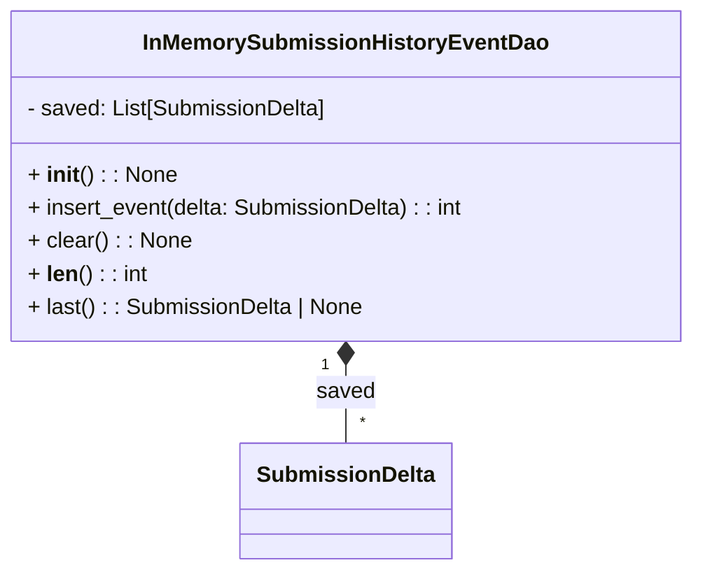

# Diagram: entity_core/entity_service/entity_service/tests/unit_tests/in_memory_submission_history_event_dao.py

> Auto-generated by Obscura crawlers

## Mermaid

### SVG

<svg id="container" width="499.734375" xmlns="http://www.w3.org/2000/svg" class="classDiagram" height="414" viewBox="0 0 499.734375 414" role="graphics-document document" aria-roledescription="class"><g><defs><marker id="container_class-aggregationStart" class="marker aggregation class" refX="18" refY="7" markerWidth="190" markerHeight="240" orient="auto"><path d="M 18,7 L9,13 L1,7 L9,1 Z"></path></marker></defs><defs><marker id="container_class-aggregationEnd" class="marker aggregation class" refX="1" refY="7" markerWidth="20" markerHeight="28" orient="auto"><path d="M 18,7 L9,13 L1,7 L9,1 Z"></path></marker></defs><defs><marker id="container_class-extensionStart" class="marker extension class" refX="18" refY="7" markerWidth="190" markerHeight="240" orient="auto"><path d="M 1,7 L18,13 V 1 Z"></path></marker></defs><defs><marker id="container_class-extensionEnd" class="marker extension class" refX="1" refY="7" markerWidth="20" markerHeight="28" orient="auto"><path d="M 1,1 V 13 L18,7 Z"></path></marker></defs><defs><marker id="container_class-compositionStart" class="marker composition class" refX="18" refY="7" markerWidth="190" markerHeight="240" orient="auto"><path d="M 18,7 L9,13 L1,7 L9,1 Z"></path></marker></defs><defs><marker id="container_class-compositionEnd" class="marker composition class" refX="1" refY="7" markerWidth="20" markerHeight="28" orient="auto"><path d="M 18,7 L9,13 L1,7 L9,1 Z"></path></marker></defs><defs><marker id="container_class-dependencyStart" class="marker dependency class" refX="6" refY="7" markerWidth="190" markerHeight="240" orient="auto"><path d="M 5,7 L9,13 L1,7 L9,1 Z"></path></marker></defs><defs><marker id="container_class-dependencyEnd" class="marker dependency class" refX="13" refY="7" markerWidth="20" markerHeight="28" orient="auto"><path d="M 18,7 L9,13 L14,7 L9,1 Z"></path></marker></defs><defs><marker id="container_class-lollipopStart" class="marker lollipop class" refX="13" refY="7" markerWidth="190" markerHeight="240" orient="auto"><circle stroke="black" fill="transparent" cx="7" cy="7" r="6"></circle></marker></defs><defs><marker id="container_class-lollipopEnd" class="marker lollipop class" refX="1" refY="7" markerWidth="190" markerHeight="240" orient="auto"><circle stroke="black" fill="transparent" cx="7" cy="7" r="6"></circle></marker></defs><g class="root"><g class="clusters"></g><g class="edgePaths"><path d="M249.867,265.25L249.867,268.542C249.867,271.833,249.867,278.417,249.867,287.875C249.867,297.333,249.867,309.667,249.867,315.833L249.867,322" id="id_InMemorySubmissionHistoryEventDao_SubmissionDelta_1" class="edge-thickness-normal edge-pattern-solid relation" style=";;;" data-edge="true" data-et="edge" data-id="id_InMemorySubmissionHistoryEventDao_SubmissionDelta_1" data-points="W3sieCI6MjQ5Ljg2NzE4NzUsInkiOjI0OH0seyJ4IjoyNDkuODY3MTg3NSwieSI6Mjg1fSx7IngiOjI0OS44NjcxODc1LCJ5IjozMjJ9XQ==" marker-start="url(#container_class-compositionStart)"></path></g><g class="edgeLabels"><g class="edgeLabel" transform="translate(249.8671875, 285)"><g class="label" data-id="id_InMemorySubmissionHistoryEventDao_SubmissionDelta_1" transform="translate(-20.9375, -12)"><foreignObject width="41.875" height="24">

saved

</foreignObject></g></g><g class="edgeTerminals" transform="translate(234.86718875000003, 265.5000010714286)"><g class="inner" transform="translate(0, 0)"><foreignObject style="width: 9px; height: 12px;">
1
</foreignObject></g></g><g class="edgeTerminals" transform="translate(259.86718874999997, 299.5000010714286)"><g class="inner" transform="translate(0, 0)"></g><foreignObject style="width: 9px; height: 12px;">
*
</foreignObject></g></g><g class="nodes"><g class="node default" id="classId-SubmissionDelta-0" transform="translate(249.8671875, 364)"><g class="basic label-container"><path d="M-73.5390625 -42 L73.5390625 -42 L73.5390625 42 L-73.5390625 42" stroke="none" stroke-width="0" fill="#ECECFF" style=""></path><path d="M-73.5390625 -42 C-23.928399319217938 -42, 25.682263861564124 -42, 73.5390625 -42 M-73.5390625 -42 C-22.294626499284078 -42, 28.949809501431844 -42, 73.5390625 -42 M73.5390625 -42 C73.5390625 -8.5586117006049, 73.5390625 24.8827765987902, 73.5390625 42 M73.5390625 -42 C73.5390625 -21.99630534554352, 73.5390625 -1.9926106910870374, 73.5390625 42 M73.5390625 42 C34.97700430291704 42, -3.585053894165924 42, -73.5390625 42 M73.5390625 42 C23.670540340131495 42, -26.19798181973701 42, -73.5390625 42 M-73.5390625 42 C-73.5390625 23.803909632248303, -73.5390625 5.607819264496605, -73.5390625 -42 M-73.5390625 42 C-73.5390625 24.66035151339189, -73.5390625 7.320703026783782, -73.5390625 -42" stroke="#9370DB" stroke-width="1.3" fill="none" stroke-dasharray="0 0" style=""></path></g><g class="annotation-group text" transform="translate(0, -18)"></g><g class="label-group text" transform="translate(-61.5390625, -18)"><g class="label" style="font-weight: bolder" transform="translate(0,-12)"><foreignObject width="123.078125" height="24">

SubmissionDelta

</foreignObject></g></g><g class="members-group text" transform="translate(-61.5390625, 30)"></g><g class="methods-group text" transform="translate(-61.5390625, 60)"></g><g class="divider" style=""><path d="M-73.5390625 6 C-35.1563521927109 6, 3.226358114578204 6, 73.5390625 6 M-73.5390625 6 C-19.891068015104175 6, 33.75692646979165 6, 73.5390625 6" stroke="#9370DB" stroke-width="1.3" fill="none" stroke-dasharray="0 0" style=""></path></g><g class="divider" style=""><path d="M-73.5390625 24 C-36.62930759103881 24, 0.28044731792238053 24, 73.5390625 24 M-73.5390625 24 C-23.846588583389895 24, 25.84588533322021 24, 73.5390625 24" stroke="#9370DB" stroke-width="1.3" fill="none" stroke-dasharray="0 0" style=""></path></g></g><g class="node default" id="classId-InMemorySubmissionHistoryEventDao-1" transform="translate(249.8671875, 128)"><g class="basic label-container"><path d="M-241.8671875 -120 L241.8671875 -120 L241.8671875 120 L-241.8671875 120" stroke="none" stroke-width="0" fill="#ECECFF" style=""></path><path d="M-241.8671875 -120 C-133.93316390462456 -120, -25.9991403092491 -120, 241.8671875 -120 M-241.8671875 -120 C-76.49800125859915 -120, 88.87118498280171 -120, 241.8671875 -120 M241.8671875 -120 C241.8671875 -43.6111801151784, 241.8671875 32.7776397696432, 241.8671875 120 M241.8671875 -120 C241.8671875 -41.36834736659098, 241.8671875 37.26330526681804, 241.8671875 120 M241.8671875 120 C83.28687936266945 120, -75.2934287746611 120, -241.8671875 120 M241.8671875 120 C140.77052696340922 120, 39.67386642681848 120, -241.8671875 120 M-241.8671875 120 C-241.8671875 43.22935196495881, -241.8671875 -33.54129607008238, -241.8671875 -120 M-241.8671875 120 C-241.8671875 38.29693958604736, -241.8671875 -43.40612082790528, -241.8671875 -120" stroke="#9370DB" stroke-width="1.3" fill="none" stroke-dasharray="0 0" style=""></path></g><g class="annotation-group text" transform="translate(0, -96)"></g><g class="label-group text" transform="translate(-139.421875, -96)"><g class="label" style="font-weight: bolder" transform="translate(0,-12)"><foreignObject width="278.84375" height="24">

InMemorySubmissionHistoryEventDao

</foreignObject></g></g><g class="members-group text" transform="translate(-229.8671875, -48)"><g class="label" style="" transform="translate(0,-12)"><foreignObject width="218.53125" height="24">

- saved: List[SubmissionDelta]

</foreignObject></g></g><g class="methods-group text" transform="translate(-229.8671875, 0)"><g class="label" style="" transform="translate(0,-12)"><foreignObject width="105.8125" height="24">

+ <strong>init</strong>() : : None

</foreignObject></g><g class="label" style="" transform="translate(0,12)"><foreignObject width="320.3125" height="24">

+ insert_event(delta: SubmissionDelta) : : int

</foreignObject></g><g class="label" style="" transform="translate(0,36)"><foreignObject width="117.0625" height="24">

+ clear() : : None

</foreignObject></g><g class="label" style="" transform="translate(0,60)"><foreignObject width="85.421875" height="24">

+ <strong>len</strong>() : : int

</foreignObject></g><g class="label" style="" transform="translate(0,84)"><foreignObject width="244.546875" height="24">

+ last() : : SubmissionDelta | None

</foreignObject></g></g><g class="divider" style=""><path d="M-241.8671875 -72 C-136.2807757310439 -72, -30.69436396208775 -72, 241.8671875 -72 M-241.8671875 -72 C-141.0290666530898 -72, -40.19094580617963 -72, 241.8671875 -72" stroke="#9370DB" stroke-width="1.3" fill="none" stroke-dasharray="0 0" style=""></path></g><g class="divider" style=""><path d="M-241.8671875 -24 C-65.2104242357349 -24, 111.44633902853019 -24, 241.8671875 -24 M-241.8671875 -24 C-128.88439120801695 -24, -15.9015949160339 -24, 241.8671875 -24" stroke="#9370DB" stroke-width="1.3" fill="none" stroke-dasharray="0 0" style=""></path></g></g></g></g></g></svg>
