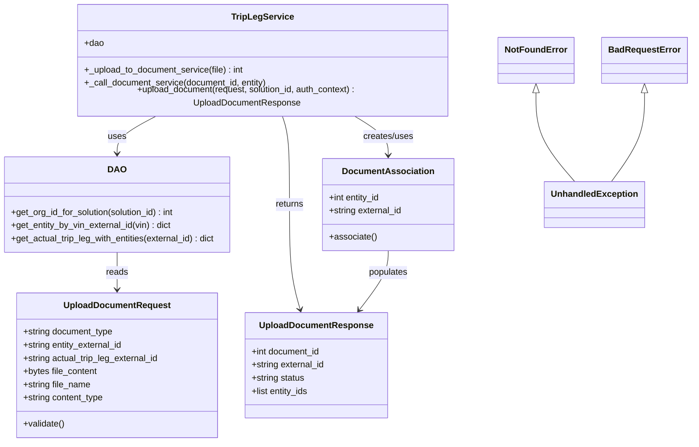
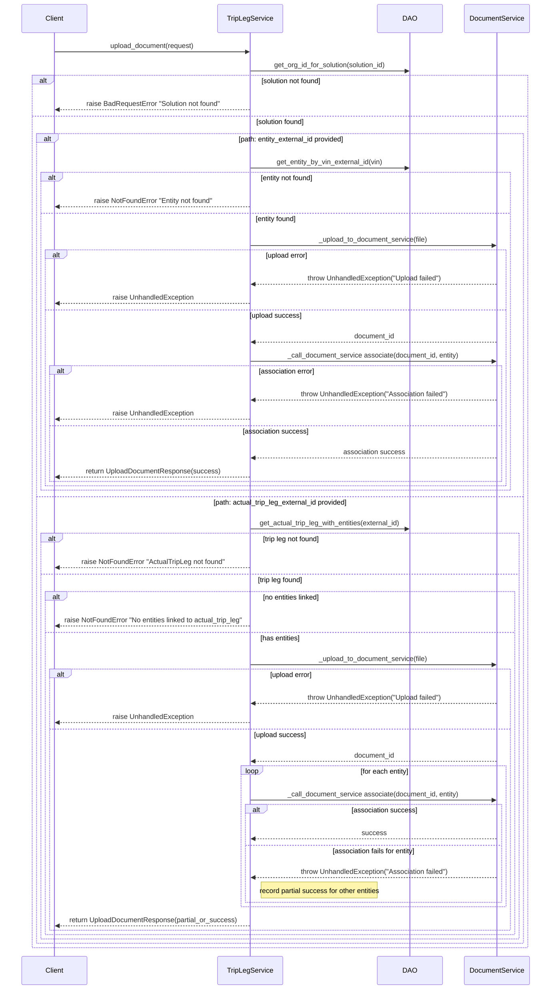

# Diagram: entity_core/entity_service/entity_service/tests/unit_tests/test_associate_documents.py

> Auto-generated by Obscura crawlers

## Diagram 1

### SVG

<svg id="container" width="1255.490234375" xmlns="http://www.w3.org/2000/svg" class="classDiagram" height="794" viewBox="0 0 1255.490234375 794" role="graphics-document document" aria-roledescription="class"><g><defs><marker id="container_class-aggregationStart" class="marker aggregation class" refX="18" refY="7" markerWidth="190" markerHeight="240" orient="auto"><path d="M 18,7 L9,13 L1,7 L9,1 Z"></path></marker></defs><defs><marker id="container_class-aggregationEnd" class="marker aggregation class" refX="1" refY="7" markerWidth="20" markerHeight="28" orient="auto"><path d="M 18,7 L9,13 L1,7 L9,1 Z"></path></marker></defs><defs><marker id="container_class-extensionStart" class="marker extension class" refX="18" refY="7" markerWidth="190" markerHeight="240" orient="auto"><path d="M 1,7 L18,13 V 1 Z"></path></marker></defs><defs><marker id="container_class-extensionEnd" class="marker extension class" refX="1" refY="7" markerWidth="20" markerHeight="28" orient="auto"><path d="M 1,1 V 13 L18,7 Z"></path></marker></defs><defs><marker id="container_class-compositionStart" class="marker composition class" refX="18" refY="7" markerWidth="190" markerHeight="240" orient="auto"><path d="M 18,7 L9,13 L1,7 L9,1 Z"></path></marker></defs><defs><marker id="container_class-compositionEnd" class="marker composition class" refX="1" refY="7" markerWidth="20" markerHeight="28" orient="auto"><path d="M 18,7 L9,13 L1,7 L9,1 Z"></path></marker></defs><defs><marker id="container_class-dependencyStart" class="marker dependency class" refX="6" refY="7" markerWidth="190" markerHeight="240" orient="auto"><path d="M 5,7 L9,13 L1,7 L9,1 Z"></path></marker></defs><defs><marker id="container_class-dependencyEnd" class="marker dependency class" refX="13" refY="7" markerWidth="20" markerHeight="28" orient="auto"><path d="M 18,7 L9,13 L14,7 L9,1 Z"></path></marker></defs><defs><marker id="container_class-lollipopStart" class="marker lollipop class" refX="13" refY="7" markerWidth="190" markerHeight="240" orient="auto"><circle stroke="black" fill="transparent" cx="7" cy="7" r="6"></circle></marker></defs><defs><marker id="container_class-lollipopEnd" class="marker lollipop class" refX="1" refY="7" markerWidth="190" markerHeight="240" orient="auto"><circle stroke="black" fill="transparent" cx="7" cy="7" r="6"></circle></marker></defs><g class="root"><g class="clusters"></g><g class="edgePaths"><path d="M293.475,200L280.897,206.167C268.319,212.333,243.163,224.667,230.586,236C218.008,247.333,218.008,257.667,218.008,262.833L218.008,268" id="id_TripLegService_DAO_1" class="edge-thickness-normal edge-pattern-solid relation" style=";;;" data-edge="true" data-et="edge" data-id="id_TripLegService_DAO_1" data-points="W3sieCI6MjkzLjQ3NDg1OTAyMjU1NjQsInkiOjIwMH0seyJ4IjoyMTguMDA3ODEyNSwieSI6MjM3fSx7IngiOjIxOC4wMDc4MTI1LCJ5IjoyNzR9XQ==" marker-end="url(#container_class-dependencyEnd)"></path><path d="M522.613,200L524.754,206.167C526.895,212.333,531.177,224.667,533.318,251.5C535.459,278.333,535.459,319.667,535.459,361C535.459,402.333,535.459,443.667,538.52,475.535C541.581,507.404,547.702,529.808,550.763,541.01L553.824,552.212" id="id_TripLegService_UploadDocumentResponse_2" class="edge-thickness-normal edge-pattern-solid relation" style=";;;" data-edge="true" data-et="edge" data-id="id_TripLegService_UploadDocumentResponse_2" data-points="W3sieCI6NTIyLjYxMjU0Njk5MjQ4MTIsInkiOjIwMH0seyJ4Ijo1MzUuNDU4OTg0Mzc1LCJ5IjoyMzd9LHsieCI6NTM1LjQ1ODk4NDM3NSwieSI6MzYxfSx7IngiOjUzNS40NTg5ODQzNzUsInkiOjQ4NX0seyJ4Ijo1NTUuNDA1NTc5Njk2NzQ1NiwieSI6NTU4fV0=" marker-end="url(#container_class-dependencyEnd)"></path><path d="M653.053,200L663.573,206.167C674.094,212.333,695.134,224.667,705.654,236.5C716.174,248.333,716.174,259.667,716.174,265.333L716.174,271" id="id_TripLegService_DocumentAssociation_3" class="edge-thickness-normal edge-pattern-solid relation" style=";;;" data-edge="true" data-et="edge" data-id="id_TripLegService_DocumentAssociation_3" data-points="W3sieCI6NjUzLjA1MzMzNjQ2NjE2NTQsInkiOjIwMH0seyJ4Ijo3MTYuMTczODI4MTI1LCJ5IjoyMzd9LHsieCI6NzE2LjE3MzgyODEyNSwieSI6Mjc3fV0=" marker-end="url(#container_class-dependencyEnd)"></path><path d="M218.008,448L218.008,454.167C218.008,460.333,218.008,472.667,218.008,484C218.008,495.333,218.008,505.667,218.008,510.833L218.008,516" id="id_DAO_UploadDocumentRequest_4" class="edge-thickness-normal edge-pattern-solid relation" style=";;;" data-edge="true" data-et="edge" data-id="id_DAO_UploadDocumentRequest_4" data-points="W3sieCI6MjE4LjAwNzgxMjUsInkiOjQ0OH0seyJ4IjoyMTguMDA3ODEyNSwieSI6NDg1fSx7IngiOjIxOC4wMDc4MTI1LCJ5Ijo1MjJ9XQ==" marker-end="url(#container_class-dependencyEnd)"></path><path d="M716.174,445L716.174,451.667C716.174,458.333,716.174,471.667,707.111,489.718C698.048,507.769,679.923,530.537,670.86,541.922L661.797,553.306" id="id_DocumentAssociation_UploadDocumentResponse_5" class="edge-thickness-normal edge-pattern-solid relation" style=";;;" data-edge="true" data-et="edge" data-id="id_DocumentAssociation_UploadDocumentResponse_5" data-points="W3sieCI6NzE2LjE3MzgyODEyNSwieSI6NDQ1fSx7IngiOjcxNi4xNzM4MjgxMjUsInkiOjQ4NX0seyJ4Ijo2NTguMDYwMTY1NDk1NTYyMiwieSI6NTU4fV0=" marker-end="url(#container_class-dependencyEnd)"></path><path d="M983.396,163.25L983.396,175.542C983.396,187.833,983.396,212.417,994.99,238.375C1006.583,264.333,1029.769,291.667,1041.363,305.333L1052.956,319" id="id_NotFoundError_UnhandledException_6" class="edge-thickness-normal edge-pattern-solid relation" style=";;;" data-edge="true" data-et="edge" data-id="id_NotFoundError_UnhandledException_6" data-points="W3sieCI6OTgzLjM5NjQ4NDM3NSwieSI6MTQ2fSx7IngiOjk4My4zOTY0ODQzNzUsInkiOjIzN30seyJ4IjoxMDUyLjk1NTk2MDE4MTQ1MTcsInkiOjMxOX1d" marker-start="url(#container_class-extensionStart)"></path><path d="M1173.209,163.25L1173.209,175.542C1173.209,187.833,1173.209,212.417,1163.882,238.375C1154.555,264.333,1135.901,291.667,1126.574,305.333L1117.247,319" id="id_BadRequestError_UnhandledException_7" class="edge-thickness-normal edge-pattern-solid relation" style=";;;" data-edge="true" data-et="edge" data-id="id_BadRequestError_UnhandledException_7" data-points="W3sieCI6MTE3My4yMDg5ODQzNzUsInkiOjE0Nn0seyJ4IjoxMTczLjIwODk4NDM3NSwieSI6MjM3fSx7IngiOjExMTcuMjQ3MjkwODI2NjEzLCJ5IjozMTl9XQ==" marker-start="url(#container_class-extensionStart)"></path></g><g class="edgeLabels"><g class="edgeLabel" transform="translate(218.0078125, 237)"><g class="label" data-id="id_TripLegService_DAO_1" transform="translate(-16.4921875, -12)"><foreignObject width="32.984375" height="24">

uses

</foreignObject></g></g><g class="edgeLabel" transform="translate(535.458984375, 361)"><g class="label" data-id="id_TripLegService_UploadDocumentResponse_2" transform="translate(-26.265625, -12)"><foreignObject width="52.53125" height="24">

returns

</foreignObject></g></g><g class="edgeLabel" transform="translate(716.173828125, 237)"><g class="label" data-id="id_TripLegService_DocumentAssociation_3" transform="translate(-46.578125, -12)"><foreignObject width="93.15625" height="24">

creates/uses

</foreignObject></g></g><g class="edgeLabel" transform="translate(218.0078125, 485)"><g class="label" data-id="id_DAO_UploadDocumentRequest_4" transform="translate(-20.0078125, -12)"><foreignObject width="40.015625" height="24">

reads

</foreignObject></g></g><g class="edgeLabel" transform="translate(716.173828125, 485)"><g class="label" data-id="id_DocumentAssociation_UploadDocumentResponse_5" transform="translate(-36.359375, -12)"><foreignObject width="72.71875" height="24">

populates

</foreignObject></g></g><g class="edgeLabel"><g class="label" data-id="id_NotFoundError_UnhandledException_6" transform="translate(0, 0)"><foreignObject width="0" height="0">

</foreignObject></g></g><g class="edgeLabel"><g class="label" data-id="id_BadRequestError_UnhandledException_7" transform="translate(0, 0)"><foreignObject width="0" height="0">

</foreignObject></g></g></g><g class="nodes"><g class="node default" id="classId-UploadDocumentRequest-0" transform="translate(218.0078125, 654)"><g class="basic label-container"><path d="M-184.49609375 -132 L184.49609375 -132 L184.49609375 132 L-184.49609375 132" stroke="none" stroke-width="0" fill="#ECECFF" style=""></path><path d="M-184.49609375 -132 C-64.31095212232468 -132, 55.87418950535064 -132, 184.49609375 -132 M-184.49609375 -132 C-45.54152430424159 -132, 93.41304514151682 -132, 184.49609375 -132 M184.49609375 -132 C184.49609375 -48.049847141658006, 184.49609375 35.90030571668399, 184.49609375 132 M184.49609375 -132 C184.49609375 -59.19140974809602, 184.49609375 13.617180503807958, 184.49609375 132 M184.49609375 132 C52.84076668106604 132, -78.81456038786791 132, -184.49609375 132 M184.49609375 132 C91.18778409654172 132, -2.1205255569165615 132, -184.49609375 132 M-184.49609375 132 C-184.49609375 76.89591981142755, -184.49609375 21.791839622855093, -184.49609375 -132 M-184.49609375 132 C-184.49609375 63.85525328207183, -184.49609375 -4.289493435856343, -184.49609375 -132" stroke="#9370DB" stroke-width="1.3" fill="none" stroke-dasharray="0 0" style=""></path></g><g class="annotation-group text" transform="translate(0, -108)"></g><g class="label-group text" transform="translate(-93.1640625, -108)"><g class="label" style="font-weight: bolder" transform="translate(0,-12)"><foreignObject width="186.328125" height="24">

UploadDocumentRequest

</foreignObject></g></g><g class="members-group text" transform="translate(-172.49609375, -60)"><g class="label" style="" transform="translate(0,-12)"><foreignObject width="166.953125" height="24">

+string document_type

</foreignObject></g><g class="label" style="" transform="translate(0,12)"><foreignObject width="185.109375" height="24">

+string entity_external_id

</foreignObject></g><g class="label" style="" transform="translate(0,36)"><foreignObject width="251.828125" height="24">

+string actual_trip_leg_external_id

</foreignObject></g><g class="label" style="" transform="translate(0,60)"><foreignObject width="136.9375" height="24">

+bytes file_content

</foreignObject></g><g class="label" style="" transform="translate(0,84)"><foreignObject width="124.90625" height="24">

+string file_name

</foreignObject></g><g class="label" style="" transform="translate(0,108)"><foreignObject width="149.109375" height="24">

+string content_type

</foreignObject></g></g><g class="methods-group text" transform="translate(-172.49609375, 108)"><g class="label" style="" transform="translate(0,-12)"><foreignObject width="76.09375" height="24">

+validate()

</foreignObject></g></g><g class="divider" style=""><path d="M-184.49609375 -84 C-90.4744033498887 -84, 3.547287050222593 -84, 184.49609375 -84 M-184.49609375 -84 C-45.986695370535756 -84, 92.52270300892849 -84, 184.49609375 -84" stroke="#9370DB" stroke-width="1.3" fill="none" stroke-dasharray="0 0" style=""></path></g><g class="divider" style=""><path d="M-184.49609375 84 C-109.93546408823636 84, -35.37483442647272 84, 184.49609375 84 M-184.49609375 84 C-39.4223440467336 84, 105.6514056565328 84, 184.49609375 84" stroke="#9370DB" stroke-width="1.3" fill="none" stroke-dasharray="0 0" style=""></path></g></g><g class="node default" id="classId-UploadDocumentResponse-1" transform="translate(581.63671875, 654)"><g class="basic label-container"><path d="M-129.1328125 -96 L129.1328125 -96 L129.1328125 96 L-129.1328125 96" stroke="none" stroke-width="0" fill="#ECECFF" style=""></path><path d="M-129.1328125 -96 C-65.68727239708333 -96, -2.241732294166667 -96, 129.1328125 -96 M-129.1328125 -96 C-47.42704043575253 -96, 34.27873162849494 -96, 129.1328125 -96 M129.1328125 -96 C129.1328125 -32.137324895065454, 129.1328125 31.72535020986909, 129.1328125 96 M129.1328125 -96 C129.1328125 -22.1516274158825, 129.1328125 51.696745168235, 129.1328125 96 M129.1328125 96 C62.39416056984702 96, -4.344491360305966 96, -129.1328125 96 M129.1328125 96 C47.60657071616609 96, -33.91967106766782 96, -129.1328125 96 M-129.1328125 96 C-129.1328125 50.89996003309562, -129.1328125 5.799920066191234, -129.1328125 -96 M-129.1328125 96 C-129.1328125 36.604232196510225, -129.1328125 -22.79153560697955, -129.1328125 -96" stroke="#9370DB" stroke-width="1.3" fill="none" stroke-dasharray="0 0" style=""></path></g><g class="annotation-group text" transform="translate(0, -72)"></g><g class="label-group text" transform="translate(-98.625, -72)"><g class="label" style="font-weight: bolder" transform="translate(0,-12)"><foreignObject width="197.25" height="24">

UploadDocumentResponse

</foreignObject></g></g><g class="members-group text" transform="translate(-117.1328125, -24)"><g class="label" style="" transform="translate(0,-12)"><foreignObject width="127.59375" height="24">

+int document_id

</foreignObject></g><g class="label" style="" transform="translate(0,12)"><foreignObject width="135.640625" height="24">

+string external_id

</foreignObject></g><g class="label" style="" transform="translate(0,36)"><foreignObject width="98.265625" height="24">

+string status

</foreignObject></g><g class="label" style="" transform="translate(0,60)"><foreignObject width="106.03125" height="24">

+list entity_ids

</foreignObject></g></g><g class="methods-group text" transform="translate(-117.1328125, 96)"></g><g class="divider" style=""><path d="M-129.1328125 -48 C-46.13353006920211 -48, 36.86575236159578 -48, 129.1328125 -48 M-129.1328125 -48 C-26.687791175116942 -48, 75.75723014976612 -48, 129.1328125 -48" stroke="#9370DB" stroke-width="1.3" fill="none" stroke-dasharray="0 0" style=""></path></g><g class="divider" style=""><path d="M-129.1328125 72 C-59.67979844354957 72, 9.773215612900856 72, 129.1328125 72 M-129.1328125 72 C-29.93178576082238 72, 69.26924097835524 72, 129.1328125 72" stroke="#9370DB" stroke-width="1.3" fill="none" stroke-dasharray="0 0" style=""></path></g></g><g class="node default" id="classId-DocumentAssociation-2" transform="translate(716.173828125, 361)"><g class="basic label-container"><path d="M-119.44921875 -84 L119.44921875 -84 L119.44921875 84 L-119.44921875 84" stroke="none" stroke-width="0" fill="#ECECFF" style=""></path><path d="M-119.44921875 -84 C-44.168471094968154 -84, 31.11227656006369 -84, 119.44921875 -84 M-119.44921875 -84 C-39.61743386809488 -84, 40.214351013810244 -84, 119.44921875 -84 M119.44921875 -84 C119.44921875 -48.98375901440109, 119.44921875 -13.967518028802175, 119.44921875 84 M119.44921875 -84 C119.44921875 -41.36096784078187, 119.44921875 1.2780643184362646, 119.44921875 84 M119.44921875 84 C62.29377493219254 84, 5.138331114385082 84, -119.44921875 84 M119.44921875 84 C24.64939985125922 84, -70.15041904748156 84, -119.44921875 84 M-119.44921875 84 C-119.44921875 22.65241102618537, -119.44921875 -38.69517794762926, -119.44921875 -84 M-119.44921875 84 C-119.44921875 37.02749633925888, -119.44921875 -9.945007321482237, -119.44921875 -84" stroke="#9370DB" stroke-width="1.3" fill="none" stroke-dasharray="0 0" style=""></path></g><g class="annotation-group text" transform="translate(0, -60)"></g><g class="label-group text" transform="translate(-79.2578125, -60)"><g class="label" style="font-weight: bolder" transform="translate(0,-12)"><foreignObject width="158.515625" height="24">

DocumentAssociation

</foreignObject></g></g><g class="members-group text" transform="translate(-107.44921875, -12)"><g class="label" style="" transform="translate(0,-12)"><foreignObject width="95.765625" height="24">

+int entity_id

</foreignObject></g><g class="label" style="" transform="translate(0,12)"><foreignObject width="135.640625" height="24">

+string external_id

</foreignObject></g></g><g class="methods-group text" transform="translate(-107.44921875, 60)"><g class="label" style="" transform="translate(0,-12)"><foreignObject width="85.90625" height="24">

+associate()

</foreignObject></g></g><g class="divider" style=""><path d="M-119.44921875 -36 C-48.54267356612908 -36, 22.363871617741836 -36, 119.44921875 -36 M-119.44921875 -36 C-42.79848541329004 -36, 33.852247923419924 -36, 119.44921875 -36" stroke="#9370DB" stroke-width="1.3" fill="none" stroke-dasharray="0 0" style=""></path></g><g class="divider" style=""><path d="M-119.44921875 36 C-27.661059834845588 36, 64.12709908030882 36, 119.44921875 36 M-119.44921875 36 C-44.50025584054934 36, 30.448707068901314 36, 119.44921875 36" stroke="#9370DB" stroke-width="1.3" fill="none" stroke-dasharray="0 0" style=""></path></g></g><g class="node default" id="classId-TripLegService-3" transform="translate(489.28125, 104)"><g class="basic label-container"><path d="M-342.6875 -96 L342.6875 -96 L342.6875 96 L-342.6875 96" stroke="none" stroke-width="0" fill="#ECECFF" style=""></path><path d="M-342.6875 -96 C-85.00555414370479 -96, 172.67639171259043 -96, 342.6875 -96 M-342.6875 -96 C-178.94568885094216 -96, -15.203877701884323 -96, 342.6875 -96 M342.6875 -96 C342.6875 -43.23260485798785, 342.6875 9.534790284024297, 342.6875 96 M342.6875 -96 C342.6875 -36.30145842713586, 342.6875 23.397083145728274, 342.6875 96 M342.6875 96 C190.4895327455896 96, 38.2915654911792 96, -342.6875 96 M342.6875 96 C168.1047080143551 96, -6.478083971289777 96, -342.6875 96 M-342.6875 96 C-342.6875 53.287330328843176, -342.6875 10.574660657686351, -342.6875 -96 M-342.6875 96 C-342.6875 53.48554175086116, -342.6875 10.971083501722319, -342.6875 -96" stroke="#9370DB" stroke-width="1.3" fill="none" stroke-dasharray="0 0" style=""></path></g><g class="annotation-group text" transform="translate(0, -72)"></g><g class="label-group text" transform="translate(-53.703125, -72)"><g class="label" style="font-weight: bolder" transform="translate(0,-12)"><foreignObject width="107.40625" height="24">

TripLegService

</foreignObject></g></g><g class="members-group text" transform="translate(-330.6875, -24)"><g class="label" style="" transform="translate(0,-12)"><foreignObject width="35.609375" height="24">

+dao

</foreignObject></g></g><g class="methods-group text" transform="translate(-330.6875, 24)"><g class="label" style="" transform="translate(0,-12)"><foreignObject width="293.453125" height="24">

+_upload_to_document_service(file) : int

</foreignObject></g><g class="label" style="" transform="translate(0,12)"><foreignObject width="336.625" height="24">

+_call_document_service(document_id, entity)

</foreignObject></g><g class="label" style="" transform="translate(0,36)"><foreignObject width="607.671875" height="24">

+upload_document(request, solution_id, auth_context) : UploadDocumentResponse

</foreignObject></g></g><g class="divider" style=""><path d="M-342.6875 -48 C-127.28601005179098 -48, 88.11547989641804 -48, 342.6875 -48 M-342.6875 -48 C-161.85076619186722 -48, 18.985967616265555 -48, 342.6875 -48" stroke="#9370DB" stroke-width="1.3" fill="none" stroke-dasharray="0 0" style=""></path></g><g class="divider" style=""><path d="M-342.6875 0 C-153.100880157716 0, 36.48573968456799 0, 342.6875 0 M-342.6875 0 C-200.99472943574264 0, -59.30195887148528 0, 342.6875 0" stroke="#9370DB" stroke-width="1.3" fill="none" stroke-dasharray="0 0" style=""></path></g></g><g class="node default" id="classId-DAO-4" transform="translate(218.0078125, 361)"><g class="basic label-container"><path d="M-210.0078125 -87 L210.0078125 -87 L210.0078125 87 L-210.0078125 87" stroke="none" stroke-width="0" fill="#ECECFF" style=""></path><path d="M-210.0078125 -87 C-73.57254720731899 -87, 62.86271808536202 -87, 210.0078125 -87 M-210.0078125 -87 C-51.0019878381309 -87, 108.0038368237382 -87, 210.0078125 -87 M210.0078125 -87 C210.0078125 -32.02090641000455, 210.0078125 22.9581871799909, 210.0078125 87 M210.0078125 -87 C210.0078125 -32.30227453793818, 210.0078125 22.395450924123637, 210.0078125 87 M210.0078125 87 C95.04690101237821 87, -19.914010475243572 87, -210.0078125 87 M210.0078125 87 C114.04553503310323 87, 18.08325756620647 87, -210.0078125 87 M-210.0078125 87 C-210.0078125 34.11036956053827, -210.0078125 -18.779260878923466, -210.0078125 -87 M-210.0078125 87 C-210.0078125 19.090818571718074, -210.0078125 -48.81836285656385, -210.0078125 -87" stroke="#9370DB" stroke-width="1.3" fill="none" stroke-dasharray="0 0" style=""></path></g><g class="annotation-group text" transform="translate(0, -63)"></g><g class="label-group text" transform="translate(-15.296875, -63)"><g class="label" style="font-weight: bolder" transform="translate(0,-12)"><foreignObject width="30.59375" height="24">

DAO

</foreignObject></g></g><g class="members-group text" transform="translate(-198.0078125, -15)"></g><g class="methods-group text" transform="translate(-198.0078125, 15)"><g class="label" style="" transform="translate(0,-12)"><foreignObject width="304.78125" height="24">

+get_org_id_for_solution(solution_id) : int

</foreignObject></g><g class="label" style="" transform="translate(0,12)"><foreignObject width="296.5" height="24">

+get_entity_by_vin_external_id(vin) : dict

</foreignObject></g><g class="label" style="" transform="translate(0,36)"><foreignObject width="380.71875" height="24">

+get_actual_trip_leg_with_entities(external_id) : dict

</foreignObject></g></g><g class="divider" style=""><path d="M-210.0078125 -39 C-91.88305085210814 -39, 26.241710795783717 -39, 210.0078125 -39 M-210.0078125 -39 C-85.24041139544545 -39, 39.5269897091091 -39, 210.0078125 -39" stroke="#9370DB" stroke-width="1.3" fill="none" stroke-dasharray="0 0" style=""></path></g><g class="divider" style=""><path d="M-210.0078125 -15 C-81.19179825248173 -15, 47.624215995036536 -15, 210.0078125 -15 M-210.0078125 -15 C-74.07042055613388 -15, 61.866971387732235 -15, 210.0078125 -15" stroke="#9370DB" stroke-width="1.3" fill="none" stroke-dasharray="0 0" style=""></path></g></g><g class="node default" id="classId-NotFoundError-5" transform="translate(983.396484375, 104)"><g class="basic label-container"><path d="M-65.53125 -42 L65.53125 -42 L65.53125 42 L-65.53125 42" stroke="none" stroke-width="0" fill="#ECECFF" style=""></path><path d="M-65.53125 -42 C-38.759863422881295 -42, -11.988476845762591 -42, 65.53125 -42 M-65.53125 -42 C-24.18814730455528 -42, 17.15495539088944 -42, 65.53125 -42 M65.53125 -42 C65.53125 -18.90554099527017, 65.53125 4.1889180094596625, 65.53125 42 M65.53125 -42 C65.53125 -24.923813847251914, 65.53125 -7.847627694503828, 65.53125 42 M65.53125 42 C19.087436327053616 42, -27.356377345892767 42, -65.53125 42 M65.53125 42 C36.69394307860799 42, 7.856636157215966 42, -65.53125 42 M-65.53125 42 C-65.53125 11.706441135696238, -65.53125 -18.587117728607524, -65.53125 -42 M-65.53125 42 C-65.53125 8.498410558168608, -65.53125 -25.003178883662784, -65.53125 -42" stroke="#9370DB" stroke-width="1.3" fill="none" stroke-dasharray="0 0" style=""></path></g><g class="annotation-group text" transform="translate(0, -18)"></g><g class="label-group text" transform="translate(-53.53125, -18)"><g class="label" style="font-weight: bolder" transform="translate(0,-12)"><foreignObject width="107.0625" height="24">

NotFoundError

</foreignObject></g></g><g class="members-group text" transform="translate(-53.53125, 30)"></g><g class="methods-group text" transform="translate(-53.53125, 60)"></g><g class="divider" style=""><path d="M-65.53125 6 C-14.711717695093732 6, 36.107814609812536 6, 65.53125 6 M-65.53125 6 C-17.698707563785966 6, 30.133834872428068 6, 65.53125 6" stroke="#9370DB" stroke-width="1.3" fill="none" stroke-dasharray="0 0" style=""></path></g><g class="divider" style=""><path d="M-65.53125 24 C-31.01542597896899 24, 3.5003980420620167 24, 65.53125 24 M-65.53125 24 C-15.649935965613444 24, 34.23137806877311 24, 65.53125 24" stroke="#9370DB" stroke-width="1.3" fill="none" stroke-dasharray="0 0" style=""></path></g></g><g class="node default" id="classId-BadRequestError-6" transform="translate(1173.208984375, 104)"><g class="basic label-container"><path d="M-74.28125 -42 L74.28125 -42 L74.28125 42 L-74.28125 42" stroke="none" stroke-width="0" fill="#ECECFF" style=""></path><path d="M-74.28125 -42 C-18.765943084636064 -42, 36.74936383072787 -42, 74.28125 -42 M-74.28125 -42 C-16.540561136660244 -42, 41.20012772667951 -42, 74.28125 -42 M74.28125 -42 C74.28125 -15.834126252478981, 74.28125 10.331747495042038, 74.28125 42 M74.28125 -42 C74.28125 -8.876488585871833, 74.28125 24.247022828256334, 74.28125 42 M74.28125 42 C38.898439626085526 42, 3.5156292521710526 42, -74.28125 42 M74.28125 42 C16.174220429028495 42, -41.93280914194301 42, -74.28125 42 M-74.28125 42 C-74.28125 12.359922895767415, -74.28125 -17.28015420846517, -74.28125 -42 M-74.28125 42 C-74.28125 17.20809290451198, -74.28125 -7.583814190976042, -74.28125 -42" stroke="#9370DB" stroke-width="1.3" fill="none" stroke-dasharray="0 0" style=""></path></g><g class="annotation-group text" transform="translate(0, -18)"></g><g class="label-group text" transform="translate(-62.28125, -18)"><g class="label" style="font-weight: bolder" transform="translate(0,-12)"><foreignObject width="124.5625" height="24">

BadRequestError

</foreignObject></g></g><g class="members-group text" transform="translate(-62.28125, 30)"></g><g class="methods-group text" transform="translate(-62.28125, 60)"></g><g class="divider" style=""><path d="M-74.28125 6 C-28.928934295122907 6, 16.423381409754185 6, 74.28125 6 M-74.28125 6 C-36.69927037412253 6, 0.882709251754946 6, 74.28125 6" stroke="#9370DB" stroke-width="1.3" fill="none" stroke-dasharray="0 0" style=""></path></g><g class="divider" style=""><path d="M-74.28125 24 C-39.65834604378523 24, -5.035442087570459 24, 74.28125 24 M-74.28125 24 C-29.12068079073864 24, 16.03988841852272 24, 74.28125 24" stroke="#9370DB" stroke-width="1.3" fill="none" stroke-dasharray="0 0" style=""></path></g></g><g class="node default" id="classId-UnhandledException-7" transform="translate(1088.583984375, 361)"><g class="basic label-container"><path d="M-87.4921875 -42 L87.4921875 -42 L87.4921875 42 L-87.4921875 42" stroke="none" stroke-width="0" fill="#ECECFF" style=""></path><path d="M-87.4921875 -42 C-38.618959004715954 -42, 10.254269490568092 -42, 87.4921875 -42 M-87.4921875 -42 C-49.87868038930539 -42, -12.265173278610774 -42, 87.4921875 -42 M87.4921875 -42 C87.4921875 -14.836037033818336, 87.4921875 12.327925932363328, 87.4921875 42 M87.4921875 -42 C87.4921875 -8.751945645507554, 87.4921875 24.49610870898489, 87.4921875 42 M87.4921875 42 C50.705282465755474 42, 13.918377431510947 42, -87.4921875 42 M87.4921875 42 C47.25504272322942 42, 7.017897946458845 42, -87.4921875 42 M-87.4921875 42 C-87.4921875 23.65313940875098, -87.4921875 5.306278817501962, -87.4921875 -42 M-87.4921875 42 C-87.4921875 19.049800699166692, -87.4921875 -3.900398601666616, -87.4921875 -42" stroke="#9370DB" stroke-width="1.3" fill="none" stroke-dasharray="0 0" style=""></path></g><g class="annotation-group text" transform="translate(0, -18)"></g><g class="label-group text" transform="translate(-75.4921875, -18)"><g class="label" style="font-weight: bolder" transform="translate(0,-12)"><foreignObject width="150.984375" height="24">

UnhandledException

</foreignObject></g></g><g class="members-group text" transform="translate(-75.4921875, 30)"></g><g class="methods-group text" transform="translate(-75.4921875, 60)"></g><g class="divider" style=""><path d="M-87.4921875 6 C-26.52993865217833 6, 34.43231019564334 6, 87.4921875 6 M-87.4921875 6 C-35.80544021291417 6, 15.881307074171659 6, 87.4921875 6" stroke="#9370DB" stroke-width="1.3" fill="none" stroke-dasharray="0 0" style=""></path></g><g class="divider" style=""><path d="M-87.4921875 24 C-26.35866152192832 24, 34.77486445614336 24, 87.4921875 24 M-87.4921875 24 C-32.0882772625285 24, 23.315632974943 24, 87.4921875 24" stroke="#9370DB" stroke-width="1.3" fill="none" stroke-dasharray="0 0" style=""></path></g></g></g></g></g></svg>

## Diagram 2

### SVG

<svg id="container" width="1346" xmlns="http://www.w3.org/2000/svg" height="2375" viewBox="-50 -10 1346 2375" role="graphics-document document" aria-roledescription="sequence"><g><rect x="1096" y="2289" fill="#eaeaea" stroke="#666" width="150" height="65" name="DocSvc" rx="3" ry="3" class="actor actor-bottom"></rect><text x="1171" y="2321.5" dominant-baseline="central" alignment-baseline="central" class="actor actor-box" style="text-anchor: middle; font-size: 16px; font-weight: 400;"><tspan x="1171" dy="0">DocumentService</tspan></text></g><g><rect x="896" y="2289" fill="#eaeaea" stroke="#666" width="150" height="65" name="DAO" rx="3" ry="3" class="actor actor-bottom"></rect><text x="971" y="2321.5" dominant-baseline="central" alignment-baseline="central" class="actor actor-box" style="text-anchor: middle; font-size: 16px; font-weight: 400;"><tspan x="971" dy="0">DAO</tspan></text></g><g><rect x="493" y="2289" fill="#eaeaea" stroke="#666" width="150" height="65" name="Service" rx="3" ry="3" class="actor actor-bottom"></rect><text x="568" y="2321.5" dominant-baseline="central" alignment-baseline="central" class="actor actor-box" style="text-anchor: middle; font-size: 16px; font-weight: 400;"><tspan x="568" dy="0">TripLegService</tspan></text></g><g><rect x="0" y="2289" fill="#eaeaea" stroke="#666" width="150" height="65" name="Client" rx="3" ry="3" class="actor actor-bottom"></rect><text x="75" y="2321.5" dominant-baseline="central" alignment-baseline="central" class="actor actor-box" style="text-anchor: middle; font-size: 16px; font-weight: 400;"><tspan x="75" dy="0">Client</tspan></text></g><g><line id="actor3" x1="1171" y1="65" x2="1171" y2="2289" class="actor-line 200" stroke-width="0.5px" stroke="#999" name="DocSvc"></line><g id="root-3"><rect x="1096" y="0" fill="#eaeaea" stroke="#666" width="150" height="65" name="DocSvc" rx="3" ry="3" class="actor actor-top"></rect><text x="1171" y="32.5" dominant-baseline="central" alignment-baseline="central" class="actor actor-box" style="text-anchor: middle; font-size: 16px; font-weight: 400;"><tspan x="1171" dy="0">DocumentService</tspan></text></g></g><g><line id="actor2" x1="971" y1="65" x2="971" y2="2289" class="actor-line 200" stroke-width="0.5px" stroke="#999" name="DAO"></line><g id="root-2"><rect x="896" y="0" fill="#eaeaea" stroke="#666" width="150" height="65" name="DAO" rx="3" ry="3" class="actor actor-top"></rect><text x="971" y="32.5" dominant-baseline="central" alignment-baseline="central" class="actor actor-box" style="text-anchor: middle; font-size: 16px; font-weight: 400;"><tspan x="971" dy="0">DAO</tspan></text></g></g><g><line id="actor1" x1="568" y1="65" x2="568" y2="2289" class="actor-line 200" stroke-width="0.5px" stroke="#999" name="Service"></line><g id="root-1"><rect x="493" y="0" fill="#eaeaea" stroke="#666" width="150" height="65" name="Service" rx="3" ry="3" class="actor actor-top"></rect><text x="568" y="32.5" dominant-baseline="central" alignment-baseline="central" class="actor actor-box" style="text-anchor: middle; font-size: 16px; font-weight: 400;"><tspan x="568" dy="0">TripLegService</tspan></text></g></g><g><line id="actor0" x1="75" y1="65" x2="75" y2="2289" class="actor-line 200" stroke-width="0.5px" stroke="#999" name="Client"></line><g id="root-0"><rect x="0" y="0" fill="#eaeaea" stroke="#666" width="150" height="65" name="Client" rx="3" ry="3" class="actor actor-top"></rect><text x="75" y="32.5" dominant-baseline="central" alignment-baseline="central" class="actor actor-box" style="text-anchor: middle; font-size: 16px; font-weight: 400;"><tspan x="75" dy="0">Client</tspan></text></g></g><g></g><defs><symbol id="computer" width="24" height="24"><path transform="scale(.5)" d="M2 2v13h20v-13h-20zm18 11h-16v-9h16v9zm-10.228 6l.466-1h3.524l.467 1h-4.457zm14.228 3h-24l2-6h2.104l-1.33 4h18.45l-1.297-4h2.073l2 6zm-5-10h-14v-7h14v7z"></path></symbol></defs><defs><symbol id="database" fill-rule="evenodd" clip-rule="evenodd"><path transform="scale(.5)" d="M12.258.001l.256.004.255.005.253.008.251.01.249.012.247.015.246.016.242.019.241.02.239.023.236.024.233.027.231.028.229.031.225.032.223.034.22.036.217.038.214.04.211.041.208.043.205.045.201.046.198.048.194.05.191.051.187.053.183.054.18.056.175.057.172.059.168.06.163.061.16.063.155.064.15.066.074.033.073.033.071.034.07.034.069.035.068.035.067.035.066.035.064.036.064.036.062.036.06.036.06.037.058.037.058.037.055.038.055.038.053.038.052.038.051.039.05.039.048.039.047.039.045.04.044.04.043.04.041.04.04.041.039.041.037.041.036.041.034.041.033.042.032.042.03.042.029.042.027.042.026.043.024.043.023.043.021.043.02.043.018.044.017.043.015.044.013.044.012.044.011.045.009.044.007.045.006.045.004.045.002.045.001.045v17l-.001.045-.002.045-.004.045-.006.045-.007.045-.009.044-.011.045-.012.044-.013.044-.015.044-.017.043-.018.044-.02.043-.021.043-.023.043-.024.043-.026.043-.027.042-.029.042-.03.042-.032.042-.033.042-.034.041-.036.041-.037.041-.039.041-.04.041-.041.04-.043.04-.044.04-.045.04-.047.039-.048.039-.05.039-.051.039-.052.038-.053.038-.055.038-.055.038-.058.037-.058.037-.06.037-.06.036-.062.036-.064.036-.064.036-.066.035-.067.035-.068.035-.069.035-.07.034-.071.034-.073.033-.074.033-.15.066-.155.064-.16.063-.163.061-.168.06-.172.059-.175.057-.18.056-.183.054-.187.053-.191.051-.194.05-.198.048-.201.046-.205.045-.208.043-.211.041-.214.04-.217.038-.22.036-.223.034-.225.032-.229.031-.231.028-.233.027-.236.024-.239.023-.241.02-.242.019-.246.016-.247.015-.249.012-.251.01-.253.008-.255.005-.256.004-.258.001-.258-.001-.256-.004-.255-.005-.253-.008-.251-.01-.249-.012-.247-.015-.245-.016-.243-.019-.241-.02-.238-.023-.236-.024-.234-.027-.231-.028-.228-.031-.226-.032-.223-.034-.22-.036-.217-.038-.214-.04-.211-.041-.208-.043-.204-.045-.201-.046-.198-.048-.195-.05-.19-.051-.187-.053-.184-.054-.179-.056-.176-.057-.172-.059-.167-.06-.164-.061-.159-.063-.155-.064-.151-.066-.074-.033-.072-.033-.072-.034-.07-.034-.069-.035-.068-.035-.067-.035-.066-.035-.064-.036-.063-.036-.062-.036-.061-.036-.06-.037-.058-.037-.057-.037-.056-.038-.055-.038-.053-.038-.052-.038-.051-.039-.049-.039-.049-.039-.046-.039-.046-.04-.044-.04-.043-.04-.041-.04-.04-.041-.039-.041-.037-.041-.036-.041-.034-.041-.033-.042-.032-.042-.03-.042-.029-.042-.027-.042-.026-.043-.024-.043-.023-.043-.021-.043-.02-.043-.018-.044-.017-.043-.015-.044-.013-.044-.012-.044-.011-.045-.009-.044-.007-.045-.006-.045-.004-.045-.002-.045-.001-.045v-17l.001-.045.002-.045.004-.045.006-.045.007-.045.009-.044.011-.045.012-.044.013-.044.015-.044.017-.043.018-.044.02-.043.021-.043.023-.043.024-.043.026-.043.027-.042.029-.042.03-.042.032-.042.033-.042.034-.041.036-.041.037-.041.039-.041.04-.041.041-.04.043-.04.044-.04.046-.04.046-.039.049-.039.049-.039.051-.039.052-.038.053-.038.055-.038.056-.038.057-.037.058-.037.06-.037.061-.036.062-.036.063-.036.064-.036.066-.035.067-.035.068-.035.069-.035.07-.034.072-.034.072-.033.074-.033.151-.066.155-.064.159-.063.164-.061.167-.06.172-.059.176-.057.179-.056.184-.054.187-.053.19-.051.195-.05.198-.048.201-.046.204-.045.208-.043.211-.041.214-.04.217-.038.22-.036.223-.034.226-.032.228-.031.231-.028.234-.027.236-.024.238-.023.241-.02.243-.019.245-.016.247-.015.249-.012.251-.01.253-.008.255-.005.256-.004.258-.001.258.001zm-9.258 20.499v.01l.001.021.003.021.004.022.005.021.006.022.007.022.009.023.01.022.011.023.012.023.013.023.015.023.016.024.017.023.018.024.019.024.021.024.022.025.023.024.024.025.052.049.056.05.061.051.066.051.07.051.075.051.079.052.084.052.088.052.092.052.097.052.102.051.105.052.11.052.114.051.119.051.123.051.127.05.131.05.135.05.139.048.144.049.147.047.152.047.155.047.16.045.163.045.167.043.171.043.176.041.178.041.183.039.187.039.19.037.194.035.197.035.202.033.204.031.209.03.212.029.216.027.219.025.222.024.226.021.23.02.233.018.236.016.24.015.243.012.246.01.249.008.253.005.256.004.259.001.26-.001.257-.004.254-.005.25-.008.247-.011.244-.012.241-.014.237-.016.233-.018.231-.021.226-.021.224-.024.22-.026.216-.027.212-.028.21-.031.205-.031.202-.034.198-.034.194-.036.191-.037.187-.039.183-.04.179-.04.175-.042.172-.043.168-.044.163-.045.16-.046.155-.046.152-.047.148-.048.143-.049.139-.049.136-.05.131-.05.126-.05.123-.051.118-.052.114-.051.11-.052.106-.052.101-.052.096-.052.092-.052.088-.053.083-.051.079-.052.074-.052.07-.051.065-.051.06-.051.056-.05.051-.05.023-.024.023-.025.021-.024.02-.024.019-.024.018-.024.017-.024.015-.023.014-.024.013-.023.012-.023.01-.023.01-.022.008-.022.006-.022.006-.022.004-.022.004-.021.001-.021.001-.021v-4.127l-.077.055-.08.053-.083.054-.085.053-.087.052-.09.052-.093.051-.095.05-.097.05-.1.049-.102.049-.105.048-.106.047-.109.047-.111.046-.114.045-.115.045-.118.044-.12.043-.122.042-.124.042-.126.041-.128.04-.13.04-.132.038-.134.038-.135.037-.138.037-.139.035-.142.035-.143.034-.144.033-.147.032-.148.031-.15.03-.151.03-.153.029-.154.027-.156.027-.158.026-.159.025-.161.024-.162.023-.163.022-.165.021-.166.02-.167.019-.169.018-.169.017-.171.016-.173.015-.173.014-.175.013-.175.012-.177.011-.178.01-.179.008-.179.008-.181.006-.182.005-.182.004-.184.003-.184.002h-.37l-.184-.002-.184-.003-.182-.004-.182-.005-.181-.006-.179-.008-.179-.008-.178-.01-.176-.011-.176-.012-.175-.013-.173-.014-.172-.015-.171-.016-.17-.017-.169-.018-.167-.019-.166-.02-.165-.021-.163-.022-.162-.023-.161-.024-.159-.025-.157-.026-.156-.027-.155-.027-.153-.029-.151-.03-.15-.03-.148-.031-.146-.032-.145-.033-.143-.034-.141-.035-.14-.035-.137-.037-.136-.037-.134-.038-.132-.038-.13-.04-.128-.04-.126-.041-.124-.042-.122-.042-.12-.044-.117-.043-.116-.045-.113-.045-.112-.046-.109-.047-.106-.047-.105-.048-.102-.049-.1-.049-.097-.05-.095-.05-.093-.052-.09-.051-.087-.052-.085-.053-.083-.054-.08-.054-.077-.054v4.127zm0-5.654v.011l.001.021.003.021.004.021.005.022.006.022.007.022.009.022.01.022.011.023.012.023.013.023.015.024.016.023.017.024.018.024.019.024.021.024.022.024.023.025.024.024.052.05.056.05.061.05.066.051.07.051.075.052.079.051.084.052.088.052.092.052.097.052.102.052.105.052.11.051.114.051.119.052.123.05.127.051.131.05.135.049.139.049.144.048.147.048.152.047.155.046.16.045.163.045.167.044.171.042.176.042.178.04.183.04.187.038.19.037.194.036.197.034.202.033.204.032.209.03.212.028.216.027.219.025.222.024.226.022.23.02.233.018.236.016.24.014.243.012.246.01.249.008.253.006.256.003.259.001.26-.001.257-.003.254-.006.25-.008.247-.01.244-.012.241-.015.237-.016.233-.018.231-.02.226-.022.224-.024.22-.025.216-.027.212-.029.21-.03.205-.032.202-.033.198-.035.194-.036.191-.037.187-.039.183-.039.179-.041.175-.042.172-.043.168-.044.163-.045.16-.045.155-.047.152-.047.148-.048.143-.048.139-.05.136-.049.131-.05.126-.051.123-.051.118-.051.114-.052.11-.052.106-.052.101-.052.096-.052.092-.052.088-.052.083-.052.079-.052.074-.051.07-.052.065-.051.06-.05.056-.051.051-.049.023-.025.023-.024.021-.025.02-.024.019-.024.018-.024.017-.024.015-.023.014-.023.013-.024.012-.022.01-.023.01-.023.008-.022.006-.022.006-.022.004-.021.004-.022.001-.021.001-.021v-4.139l-.077.054-.08.054-.083.054-.085.052-.087.053-.09.051-.093.051-.095.051-.097.05-.1.049-.102.049-.105.048-.106.047-.109.047-.111.046-.114.045-.115.044-.118.044-.12.044-.122.042-.124.042-.126.041-.128.04-.13.039-.132.039-.134.038-.135.037-.138.036-.139.036-.142.035-.143.033-.144.033-.147.033-.148.031-.15.03-.151.03-.153.028-.154.028-.156.027-.158.026-.159.025-.161.024-.162.023-.163.022-.165.021-.166.02-.167.019-.169.018-.169.017-.171.016-.173.015-.173.014-.175.013-.175.012-.177.011-.178.009-.179.009-.179.007-.181.007-.182.005-.182.004-.184.003-.184.002h-.37l-.184-.002-.184-.003-.182-.004-.182-.005-.181-.007-.179-.007-.179-.009-.178-.009-.176-.011-.176-.012-.175-.013-.173-.014-.172-.015-.171-.016-.17-.017-.169-.018-.167-.019-.166-.02-.165-.021-.163-.022-.162-.023-.161-.024-.159-.025-.157-.026-.156-.027-.155-.028-.153-.028-.151-.03-.15-.03-.148-.031-.146-.033-.145-.033-.143-.033-.141-.035-.14-.036-.137-.036-.136-.037-.134-.038-.132-.039-.13-.039-.128-.04-.126-.041-.124-.042-.122-.043-.12-.043-.117-.044-.116-.044-.113-.046-.112-.046-.109-.046-.106-.047-.105-.048-.102-.049-.1-.049-.097-.05-.095-.051-.093-.051-.09-.051-.087-.053-.085-.052-.083-.054-.08-.054-.077-.054v4.139zm0-5.666v.011l.001.02.003.022.004.021.005.022.006.021.007.022.009.023.01.022.011.023.012.023.013.023.015.023.016.024.017.024.018.023.019.024.021.025.022.024.023.024.024.025.052.05.056.05.061.05.066.051.07.051.075.052.079.051.084.052.088.052.092.052.097.052.102.052.105.051.11.052.114.051.119.051.123.051.127.05.131.05.135.05.139.049.144.048.147.048.152.047.155.046.16.045.163.045.167.043.171.043.176.042.178.04.183.04.187.038.19.037.194.036.197.034.202.033.204.032.209.03.212.028.216.027.219.025.222.024.226.021.23.02.233.018.236.017.24.014.243.012.246.01.249.008.253.006.256.003.259.001.26-.001.257-.003.254-.006.25-.008.247-.01.244-.013.241-.014.237-.016.233-.018.231-.02.226-.022.224-.024.22-.025.216-.027.212-.029.21-.03.205-.032.202-.033.198-.035.194-.036.191-.037.187-.039.183-.039.179-.041.175-.042.172-.043.168-.044.163-.045.16-.045.155-.047.152-.047.148-.048.143-.049.139-.049.136-.049.131-.051.126-.05.123-.051.118-.052.114-.051.11-.052.106-.052.101-.052.096-.052.092-.052.088-.052.083-.052.079-.052.074-.052.07-.051.065-.051.06-.051.056-.05.051-.049.023-.025.023-.025.021-.024.02-.024.019-.024.018-.024.017-.024.015-.023.014-.024.013-.023.012-.023.01-.022.01-.023.008-.022.006-.022.006-.022.004-.022.004-.021.001-.021.001-.021v-4.153l-.077.054-.08.054-.083.053-.085.053-.087.053-.09.051-.093.051-.095.051-.097.05-.1.049-.102.048-.105.048-.106.048-.109.046-.111.046-.114.046-.115.044-.118.044-.12.043-.122.043-.124.042-.126.041-.128.04-.13.039-.132.039-.134.038-.135.037-.138.036-.139.036-.142.034-.143.034-.144.033-.147.032-.148.032-.15.03-.151.03-.153.028-.154.028-.156.027-.158.026-.159.024-.161.024-.162.023-.163.023-.165.021-.166.02-.167.019-.169.018-.169.017-.171.016-.173.015-.173.014-.175.013-.175.012-.177.01-.178.01-.179.009-.179.007-.181.006-.182.006-.182.004-.184.003-.184.001-.185.001-.185-.001-.184-.001-.184-.003-.182-.004-.182-.006-.181-.006-.179-.007-.179-.009-.178-.01-.176-.01-.176-.012-.175-.013-.173-.014-.172-.015-.171-.016-.17-.017-.169-.018-.167-.019-.166-.02-.165-.021-.163-.023-.162-.023-.161-.024-.159-.024-.157-.026-.156-.027-.155-.028-.153-.028-.151-.03-.15-.03-.148-.032-.146-.032-.145-.033-.143-.034-.141-.034-.14-.036-.137-.036-.136-.037-.134-.038-.132-.039-.13-.039-.128-.041-.126-.041-.124-.041-.122-.043-.12-.043-.117-.044-.116-.044-.113-.046-.112-.046-.109-.046-.106-.048-.105-.048-.102-.048-.1-.05-.097-.049-.095-.051-.093-.051-.09-.052-.087-.052-.085-.053-.083-.053-.08-.054-.077-.054v4.153zm8.74-8.179l-.257.004-.254.005-.25.008-.247.011-.244.012-.241.014-.237.016-.233.018-.231.021-.226.022-.224.023-.22.026-.216.027-.212.028-.21.031-.205.032-.202.033-.198.034-.194.036-.191.038-.187.038-.183.04-.179.041-.175.042-.172.043-.168.043-.163.045-.16.046-.155.046-.152.048-.148.048-.143.048-.139.049-.136.05-.131.05-.126.051-.123.051-.118.051-.114.052-.11.052-.106.052-.101.052-.096.052-.092.052-.088.052-.083.052-.079.052-.074.051-.07.052-.065.051-.06.05-.056.05-.051.05-.023.025-.023.024-.021.024-.02.025-.019.024-.018.024-.017.023-.015.024-.014.023-.013.023-.012.023-.01.023-.01.022-.008.022-.006.023-.006.021-.004.022-.004.021-.001.021-.001.021.001.021.001.021.004.021.004.022.006.021.006.023.008.022.01.022.01.023.012.023.013.023.014.023.015.024.017.023.018.024.019.024.02.025.021.024.023.024.023.025.051.05.056.05.06.05.065.051.07.052.074.051.079.052.083.052.088.052.092.052.096.052.101.052.106.052.11.052.114.052.118.051.123.051.126.051.131.05.136.05.139.049.143.048.148.048.152.048.155.046.16.046.163.045.168.043.172.043.175.042.179.041.183.04.187.038.191.038.194.036.198.034.202.033.205.032.21.031.212.028.216.027.22.026.224.023.226.022.231.021.233.018.237.016.241.014.244.012.247.011.25.008.254.005.257.004.26.001.26-.001.257-.004.254-.005.25-.008.247-.011.244-.012.241-.014.237-.016.233-.018.231-.021.226-.022.224-.023.22-.026.216-.027.212-.028.21-.031.205-.032.202-.033.198-.034.194-.036.191-.038.187-.038.183-.04.179-.041.175-.042.172-.043.168-.043.163-.045.16-.046.155-.046.152-.048.148-.048.143-.048.139-.049.136-.05.131-.05.126-.051.123-.051.118-.051.114-.052.11-.052.106-.052.101-.052.096-.052.092-.052.088-.052.083-.052.079-.052.074-.051.07-.052.065-.051.06-.05.056-.05.051-.05.023-.025.023-.024.021-.024.02-.025.019-.024.018-.024.017-.023.015-.024.014-.023.013-.023.012-.023.01-.023.01-.022.008-.022.006-.023.006-.021.004-.022.004-.021.001-.021.001-.021-.001-.021-.001-.021-.004-.021-.004-.022-.006-.021-.006-.023-.008-.022-.01-.022-.01-.023-.012-.023-.013-.023-.014-.023-.015-.024-.017-.023-.018-.024-.019-.024-.02-.025-.021-.024-.023-.024-.023-.025-.051-.05-.056-.05-.06-.05-.065-.051-.07-.052-.074-.051-.079-.052-.083-.052-.088-.052-.092-.052-.096-.052-.101-.052-.106-.052-.11-.052-.114-.052-.118-.051-.123-.051-.126-.051-.131-.05-.136-.05-.139-.049-.143-.048-.148-.048-.152-.048-.155-.046-.16-.046-.163-.045-.168-.043-.172-.043-.175-.042-.179-.041-.183-.04-.187-.038-.191-.038-.194-.036-.198-.034-.202-.033-.205-.032-.21-.031-.212-.028-.216-.027-.22-.026-.224-.023-.226-.022-.231-.021-.233-.018-.237-.016-.241-.014-.244-.012-.247-.011-.25-.008-.254-.005-.257-.004-.26-.001-.26.001z"></path></symbol></defs><defs><symbol id="clock" width="24" height="24"><path transform="scale(.5)" d="M12 2c5.514 0 10 4.486 10 10s-4.486 10-10 10-10-4.486-10-10 4.486-10 10-10zm0-2c-6.627 0-12 5.373-12 12s5.373 12 12 12 12-5.373 12-12-5.373-12-12-12zm5.848 12.459c.202.038.202.333.001.372-1.907.361-6.045 1.111-6.547 1.111-.719 0-1.301-.582-1.301-1.301 0-.512.77-5.447 1.125-7.445.034-.192.312-.181.343.014l.985 6.238 5.394 1.011z"></path></symbol></defs><defs><marker id="arrowhead" refX="7.9" refY="5" markerUnits="userSpaceOnUse" markerWidth="12" markerHeight="12" orient="auto-start-reverse"><path d="M -1 0 L 10 5 L 0 10 z"></path></marker></defs><defs><marker id="crosshead" markerWidth="15" markerHeight="8" orient="auto" refX="4" refY="4.5"><path fill="none" stroke="#000000" stroke-width="1pt" d="M 1,2 L 6,7 M 6,2 L 1,7" style="stroke-dasharray: 0, 0;"></path></marker></defs><defs><marker id="filled-head" refX="15.5" refY="7" markerWidth="20" markerHeight="28" orient="auto"><path d="M 18,7 L9,13 L14,7 L9,1 Z"></path></marker></defs><defs><marker id="sequencenumber" refX="15" refY="15" markerWidth="60" markerHeight="40" orient="auto"><circle cx="15" cy="15" r="6"></circle></marker></defs><g><line x1="64" y1="870" x2="1182" y2="870" class="loopLine"></line><line x1="1182" y1="870" x2="1182" y2="1152" class="loopLine"></line><line x1="64" y1="1152" x2="1182" y2="1152" class="loopLine"></line><line x1="64" y1="870" x2="64" y2="1152" class="loopLine"></line><line x1="64" y1="1016" x2="1182" y2="1016" class="loopLine" style="stroke-dasharray: 3, 3;"></line><polygon points="64,870 114,870 114,883 105.6,890 64,890" class="labelBox"></polygon><text x="89" y="883" text-anchor="middle" dominant-baseline="middle" alignment-baseline="middle" class="labelText" style="font-size: 16px; font-weight: 400;">alt</text><text x="648" y="888" text-anchor="middle" class="loopText" style="font-size: 16px; font-weight: 400;"><tspan x="648">[association error]</tspan></text><text x="623" y="1034" text-anchor="middle" class="loopText" style="font-size: 16px; font-weight: 400;">[association success]</text></g><g><line x1="54" y1="588" x2="1192" y2="588" class="loopLine"></line><line x1="1192" y1="588" x2="1192" y2="1162" class="loopLine"></line><line x1="54" y1="1162" x2="1192" y2="1162" class="loopLine"></line><line x1="54" y1="588" x2="54" y2="1162" class="loopLine"></line><line x1="54" y1="734" x2="1192" y2="734" class="loopLine" style="stroke-dasharray: 3, 3;"></line><polygon points="54,588 104,588 104,601 95.6,608 54,608" class="labelBox"></polygon><text x="79" y="601" text-anchor="middle" dominant-baseline="middle" alignment-baseline="middle" class="labelText" style="font-size: 16px; font-weight: 400;">alt</text><text x="648" y="606" text-anchor="middle" class="loopText" style="font-size: 16px; font-weight: 400;"><tspan x="648">[upload error]</tspan></text><text x="623" y="752" text-anchor="middle" class="loopText" style="font-size: 16px; font-weight: 400;">[upload success]</text></g><g><line x1="44" y1="402" x2="1202" y2="402" class="loopLine"></line><line x1="1202" y1="402" x2="1202" y2="1172" class="loopLine"></line><line x1="44" y1="1172" x2="1202" y2="1172" class="loopLine"></line><line x1="44" y1="402" x2="44" y2="1172" class="loopLine"></line><line x1="44" y1="500" x2="1202" y2="500" class="loopLine" style="stroke-dasharray: 3, 3;"></line><polygon points="44,402 94,402 94,415 85.6,422 44,422" class="labelBox"></polygon><text x="69" y="415" text-anchor="middle" dominant-baseline="middle" alignment-baseline="middle" class="labelText" style="font-size: 16px; font-weight: 400;">alt</text><text x="648" y="420" text-anchor="middle" class="loopText" style="font-size: 16px; font-weight: 400;"><tspan x="648">[entity not found]</tspan></text><text x="623" y="518" text-anchor="middle" class="loopText" style="font-size: 16px; font-weight: 400;">[entity found]</text></g><g><rect x="593" y="2112" fill="#EDF2AE" stroke="#666" width="305" height="39" class="note"></rect><text x="746" y="2117" text-anchor="middle" dominant-baseline="middle" alignment-baseline="middle" class="noteText" dy="1em" style="font-size: 16px; font-weight: 400;"><tspan x="746">record partial success for other entities</tspan></text></g><g><line x1="557" y1="1926" x2="1182" y2="1926" class="loopLine"></line><line x1="1182" y1="1926" x2="1182" y2="2161" class="loopLine"></line><line x1="557" y1="2161" x2="1182" y2="2161" class="loopLine"></line><line x1="557" y1="1926" x2="557" y2="2161" class="loopLine"></line><line x1="557" y1="2024" x2="1182" y2="2024" class="loopLine" style="stroke-dasharray: 3, 3;"></line><polygon points="557,1926 607,1926 607,1939 598.6,1946 557,1946" class="labelBox"></polygon><text x="582" y="1939" text-anchor="middle" dominant-baseline="middle" alignment-baseline="middle" class="labelText" style="font-size: 16px; font-weight: 400;">alt</text><text x="894.5" y="1944" text-anchor="middle" class="loopText" style="font-size: 16px; font-weight: 400;"><tspan x="894.5">[association success]</tspan></text><text x="869.5" y="2042" text-anchor="middle" class="loopText" style="font-size: 16px; font-weight: 400;">[association fails for entity]</text></g><g><line x1="547" y1="1833" x2="1192" y2="1833" class="loopLine"></line><line x1="1192" y1="1833" x2="1192" y2="2171" class="loopLine"></line><line x1="547" y1="2171" x2="1192" y2="2171" class="loopLine"></line><line x1="547" y1="1833" x2="547" y2="2171" class="loopLine"></line><polygon points="547,1833 597,1833 597,1846 588.6,1853 547,1853" class="labelBox"></polygon><text x="572" y="1846" text-anchor="middle" dominant-baseline="middle" alignment-baseline="middle" class="labelText" style="font-size: 16px; font-weight: 400;">loop</text><text x="894.5" y="1851" text-anchor="middle" class="loopText" style="font-size: 16px; font-weight: 400;"><tspan x="894.5">[for each entity]</tspan></text></g><g><line x1="64" y1="1599" x2="1202" y2="1599" class="loopLine"></line><line x1="1202" y1="1599" x2="1202" y2="2229" class="loopLine"></line><line x1="64" y1="2229" x2="1202" y2="2229" class="loopLine"></line><line x1="64" y1="1599" x2="64" y2="2229" class="loopLine"></line><line x1="64" y1="1745" x2="1202" y2="1745" class="loopLine" style="stroke-dasharray: 3, 3;"></line><polygon points="64,1599 114,1599 114,1612 105.6,1619 64,1619" class="labelBox"></polygon><text x="89" y="1612" text-anchor="middle" dominant-baseline="middle" alignment-baseline="middle" class="labelText" style="font-size: 16px; font-weight: 400;">alt</text><text x="658" y="1617" text-anchor="middle" class="loopText" style="font-size: 16px; font-weight: 400;"><tspan x="658">[upload error]</tspan></text><text x="633" y="1763" text-anchor="middle" class="loopText" style="font-size: 16px; font-weight: 400;">[upload success]</text></g><g><line x1="54" y1="1413" x2="1212" y2="1413" class="loopLine"></line><line x1="1212" y1="1413" x2="1212" y2="2239" class="loopLine"></line><line x1="54" y1="2239" x2="1212" y2="2239" class="loopLine"></line><line x1="54" y1="1413" x2="54" y2="2239" class="loopLine"></line><line x1="54" y1="1511" x2="1212" y2="1511" class="loopLine" style="stroke-dasharray: 3, 3;"></line><polygon points="54,1413 104,1413 104,1426 95.6,1433 54,1433" class="labelBox"></polygon><text x="79" y="1426" text-anchor="middle" dominant-baseline="middle" alignment-baseline="middle" class="labelText" style="font-size: 16px; font-weight: 400;">alt</text><text x="658" y="1431" text-anchor="middle" class="loopText" style="font-size: 16px; font-weight: 400;"><tspan x="658">[no entities linked]</tspan></text><text x="633" y="1529" text-anchor="middle" class="loopText" style="font-size: 16px; font-weight: 400;">[has entities]</text></g><g><line x1="44" y1="1275" x2="1222" y2="1275" class="loopLine"></line><line x1="1222" y1="1275" x2="1222" y2="2249" class="loopLine"></line><line x1="44" y1="2249" x2="1222" y2="2249" class="loopLine"></line><line x1="44" y1="1275" x2="44" y2="2249" class="loopLine"></line><line x1="44" y1="1373" x2="1222" y2="1373" class="loopLine" style="stroke-dasharray: 3, 3;"></line><polygon points="44,1275 94,1275 94,1288 85.6,1295 44,1295" class="labelBox"></polygon><text x="69" y="1288" text-anchor="middle" dominant-baseline="middle" alignment-baseline="middle" class="labelText" style="font-size: 16px; font-weight: 400;">alt</text><text x="658" y="1293" text-anchor="middle" class="loopText" style="font-size: 16px; font-weight: 400;"><tspan x="658">[trip leg not found]</tspan></text><text x="633" y="1391" text-anchor="middle" class="loopText" style="font-size: 16px; font-weight: 400;">[trip leg found]</text></g><g><line x1="34" y1="309" x2="1232" y2="309" class="loopLine"></line><line x1="1232" y1="309" x2="1232" y2="2259" class="loopLine"></line><line x1="34" y1="2259" x2="1232" y2="2259" class="loopLine"></line><line x1="34" y1="309" x2="34" y2="2259" class="loopLine"></line><line x1="34" y1="1187" x2="1232" y2="1187" class="loopLine" style="stroke-dasharray: 3, 3;"></line><polygon points="34,309 84,309 84,322 75.6,329 34,329" class="labelBox"></polygon><text x="59" y="322" text-anchor="middle" dominant-baseline="middle" alignment-baseline="middle" class="labelText" style="font-size: 16px; font-weight: 400;">alt</text><text x="658" y="327" text-anchor="middle" class="loopText" style="font-size: 16px; font-weight: 400;"><tspan x="658">[path: entity_external_id provided]</tspan></text><text x="633" y="1205" text-anchor="middle" class="loopText" style="font-size: 16px; font-weight: 400;">[path: actual_trip_leg_external_id provided]</text></g><g><line x1="24" y1="171" x2="1242" y2="171" class="loopLine"></line><line x1="1242" y1="171" x2="1242" y2="2269" class="loopLine"></line><line x1="24" y1="2269" x2="1242" y2="2269" class="loopLine"></line><line x1="24" y1="171" x2="24" y2="2269" class="loopLine"></line><line x1="24" y1="269" x2="1242" y2="269" class="loopLine" style="stroke-dasharray: 3, 3;"></line><polygon points="24,171 74,171 74,184 65.6,191 24,191" class="labelBox"></polygon><text x="49" y="184" text-anchor="middle" dominant-baseline="middle" alignment-baseline="middle" class="labelText" style="font-size: 16px; font-weight: 400;">alt</text><text x="658" y="189" text-anchor="middle" class="loopText" style="font-size: 16px; font-weight: 400;"><tspan x="658">[solution not found]</tspan></text><text x="633" y="287" text-anchor="middle" class="loopText" style="font-size: 16px; font-weight: 400;">[solution found]</text></g><text x="320" y="80" text-anchor="middle" dominant-baseline="middle" alignment-baseline="middle" class="messageText" dy="1em" style="font-size: 16px; font-weight: 400;">upload_document(request)</text><line x1="76" y1="113" x2="564" y2="113" class="messageLine0" stroke-width="2" stroke="none" marker-end="url(#arrowhead)" style="fill: none;"></line><text x="768" y="128" text-anchor="middle" dominant-baseline="middle" alignment-baseline="middle" class="messageText" dy="1em" style="font-size: 16px; font-weight: 400;">get_org_id_for_solution(solution_id)</text><line x1="569" y1="161" x2="967" y2="161" class="messageLine0" stroke-width="2" stroke="none" marker-end="url(#arrowhead)" style="fill: none;"></line><text x="323" y="221" text-anchor="middle" dominant-baseline="middle" alignment-baseline="middle" class="messageText" dy="1em" style="font-size: 16px; font-weight: 400;">raise BadRequestError "Solution not found"</text><line x1="567" y1="254" x2="79" y2="254" class="messageLine1" stroke-width="2" stroke="none" marker-end="url(#arrowhead)" style="stroke-dasharray: 3, 3; fill: none;"></line><text x="768" y="359" text-anchor="middle" dominant-baseline="middle" alignment-baseline="middle" class="messageText" dy="1em" style="font-size: 16px; font-weight: 400;">get_entity_by_vin_external_id(vin)</text><line x1="569" y1="392" x2="967" y2="392" class="messageLine0" stroke-width="2" stroke="none" marker-end="url(#arrowhead)" style="fill: none;"></line><text x="323" y="452" text-anchor="middle" dominant-baseline="middle" alignment-baseline="middle" class="messageText" dy="1em" style="font-size: 16px; font-weight: 400;">raise NotFoundError "Entity not found"</text><line x1="567" y1="485" x2="79" y2="485" class="messageLine1" stroke-width="2" stroke="none" marker-end="url(#arrowhead)" style="stroke-dasharray: 3, 3; fill: none;"></line><text x="868" y="545" text-anchor="middle" dominant-baseline="middle" alignment-baseline="middle" class="messageText" dy="1em" style="font-size: 16px; font-weight: 400;">_upload_to_document_service(file)</text><line x1="569" y1="578" x2="1167" y2="578" class="messageLine0" stroke-width="2" stroke="none" marker-end="url(#arrowhead)" style="fill: none;"></line><text x="871" y="638" text-anchor="middle" dominant-baseline="middle" alignment-baseline="middle" class="messageText" dy="1em" style="font-size: 16px; font-weight: 400;">throw UnhandledException("Upload failed")</text><line x1="1170" y1="671" x2="572" y2="671" class="messageLine1" stroke-width="2" stroke="none" marker-end="url(#arrowhead)" style="stroke-dasharray: 3, 3; fill: none;"></line><text x="323" y="686" text-anchor="middle" dominant-baseline="middle" alignment-baseline="middle" class="messageText" dy="1em" style="font-size: 16px; font-weight: 400;">raise UnhandledException</text><line x1="567" y1="719" x2="79" y2="719" class="messageLine1" stroke-width="2" stroke="none" marker-end="url(#arrowhead)" style="stroke-dasharray: 3, 3; fill: none;"></line><text x="871" y="779" text-anchor="middle" dominant-baseline="middle" alignment-baseline="middle" class="messageText" dy="1em" style="font-size: 16px; font-weight: 400;">document_id</text><line x1="1170" y1="812" x2="572" y2="812" class="messageLine1" stroke-width="2" stroke="none" marker-end="url(#arrowhead)" style="stroke-dasharray: 3, 3; fill: none;"></line><text x="868" y="827" text-anchor="middle" dominant-baseline="middle" alignment-baseline="middle" class="messageText" dy="1em" style="font-size: 16px; font-weight: 400;">_call_document_service associate(document_id, entity)</text><line x1="569" y1="860" x2="1167" y2="860" class="messageLine0" stroke-width="2" stroke="none" marker-end="url(#arrowhead)" style="fill: none;"></line><text x="871" y="920" text-anchor="middle" dominant-baseline="middle" alignment-baseline="middle" class="messageText" dy="1em" style="font-size: 16px; font-weight: 400;">throw UnhandledException("Association failed")</text><line x1="1170" y1="953" x2="572" y2="953" class="messageLine1" stroke-width="2" stroke="none" marker-end="url(#arrowhead)" style="stroke-dasharray: 3, 3; fill: none;"></line><text x="323" y="968" text-anchor="middle" dominant-baseline="middle" alignment-baseline="middle" class="messageText" dy="1em" style="font-size: 16px; font-weight: 400;">raise UnhandledException</text><line x1="567" y1="1001" x2="79" y2="1001" class="messageLine1" stroke-width="2" stroke="none" marker-end="url(#arrowhead)" style="stroke-dasharray: 3, 3; fill: none;"></line><text x="871" y="1061" text-anchor="middle" dominant-baseline="middle" alignment-baseline="middle" class="messageText" dy="1em" style="font-size: 16px; font-weight: 400;">association success</text><line x1="1170" y1="1094" x2="572" y2="1094" class="messageLine1" stroke-width="2" stroke="none" marker-end="url(#arrowhead)" style="stroke-dasharray: 3, 3; fill: none;"></line><text x="323" y="1109" text-anchor="middle" dominant-baseline="middle" alignment-baseline="middle" class="messageText" dy="1em" style="font-size: 16px; font-weight: 400;">return UploadDocumentResponse(success)</text><line x1="567" y1="1142" x2="79" y2="1142" class="messageLine1" stroke-width="2" stroke="none" marker-end="url(#arrowhead)" style="stroke-dasharray: 3, 3; fill: none;"></line><text x="768" y="1232" text-anchor="middle" dominant-baseline="middle" alignment-baseline="middle" class="messageText" dy="1em" style="font-size: 16px; font-weight: 400;">get_actual_trip_leg_with_entities(external_id)</text><line x1="569" y1="1265" x2="967" y2="1265" class="messageLine0" stroke-width="2" stroke="none" marker-end="url(#arrowhead)" style="fill: none;"></line><text x="323" y="1325" text-anchor="middle" dominant-baseline="middle" alignment-baseline="middle" class="messageText" dy="1em" style="font-size: 16px; font-weight: 400;">raise NotFoundError "ActualTripLeg not found"</text><line x1="567" y1="1358" x2="79" y2="1358" class="messageLine1" stroke-width="2" stroke="none" marker-end="url(#arrowhead)" style="stroke-dasharray: 3, 3; fill: none;"></line><text x="323" y="1463" text-anchor="middle" dominant-baseline="middle" alignment-baseline="middle" class="messageText" dy="1em" style="font-size: 16px; font-weight: 400;">raise NotFoundError "No entities linked to actual_trip_leg"</text><line x1="567" y1="1496" x2="79" y2="1496" class="messageLine1" stroke-width="2" stroke="none" marker-end="url(#arrowhead)" style="stroke-dasharray: 3, 3; fill: none;"></line><text x="868" y="1556" text-anchor="middle" dominant-baseline="middle" alignment-baseline="middle" class="messageText" dy="1em" style="font-size: 16px; font-weight: 400;">_upload_to_document_service(file)</text><line x1="569" y1="1589" x2="1167" y2="1589" class="messageLine0" stroke-width="2" stroke="none" marker-end="url(#arrowhead)" style="fill: none;"></line><text x="871" y="1649" text-anchor="middle" dominant-baseline="middle" alignment-baseline="middle" class="messageText" dy="1em" style="font-size: 16px; font-weight: 400;">throw UnhandledException("Upload failed")</text><line x1="1170" y1="1682" x2="572" y2="1682" class="messageLine1" stroke-width="2" stroke="none" marker-end="url(#arrowhead)" style="stroke-dasharray: 3, 3; fill: none;"></line><text x="323" y="1697" text-anchor="middle" dominant-baseline="middle" alignment-baseline="middle" class="messageText" dy="1em" style="font-size: 16px; font-weight: 400;">raise UnhandledException</text><line x1="567" y1="1730" x2="79" y2="1730" class="messageLine1" stroke-width="2" stroke="none" marker-end="url(#arrowhead)" style="stroke-dasharray: 3, 3; fill: none;"></line><text x="871" y="1790" text-anchor="middle" dominant-baseline="middle" alignment-baseline="middle" class="messageText" dy="1em" style="font-size: 16px; font-weight: 400;">document_id</text><line x1="1170" y1="1823" x2="572" y2="1823" class="messageLine1" stroke-width="2" stroke="none" marker-end="url(#arrowhead)" style="stroke-dasharray: 3, 3; fill: none;"></line><text x="868" y="1883" text-anchor="middle" dominant-baseline="middle" alignment-baseline="middle" class="messageText" dy="1em" style="font-size: 16px; font-weight: 400;">_call_document_service associate(document_id, entity)</text><line x1="569" y1="1916" x2="1167" y2="1916" class="messageLine0" stroke-width="2" stroke="none" marker-end="url(#arrowhead)" style="fill: none;"></line><text x="871" y="1976" text-anchor="middle" dominant-baseline="middle" alignment-baseline="middle" class="messageText" dy="1em" style="font-size: 16px; font-weight: 400;">success</text><line x1="1170" y1="2009" x2="572" y2="2009" class="messageLine1" stroke-width="2" stroke="none" marker-end="url(#arrowhead)" style="stroke-dasharray: 3, 3; fill: none;"></line><text x="871" y="2069" text-anchor="middle" dominant-baseline="middle" alignment-baseline="middle" class="messageText" dy="1em" style="font-size: 16px; font-weight: 400;">throw UnhandledException("Association failed")</text><line x1="1170" y1="2102" x2="572" y2="2102" class="messageLine1" stroke-width="2" stroke="none" marker-end="url(#arrowhead)" style="stroke-dasharray: 3, 3; fill: none;"></line><text x="323" y="2186" text-anchor="middle" dominant-baseline="middle" alignment-baseline="middle" class="messageText" dy="1em" style="font-size: 16px; font-weight: 400;">return UploadDocumentResponse(partial_or_success)</text><line x1="567" y1="2219" x2="79" y2="2219" class="messageLine1" stroke-width="2" stroke="none" marker-end="url(#arrowhead)" style="stroke-dasharray: 3, 3; fill: none;"></line></svg>
