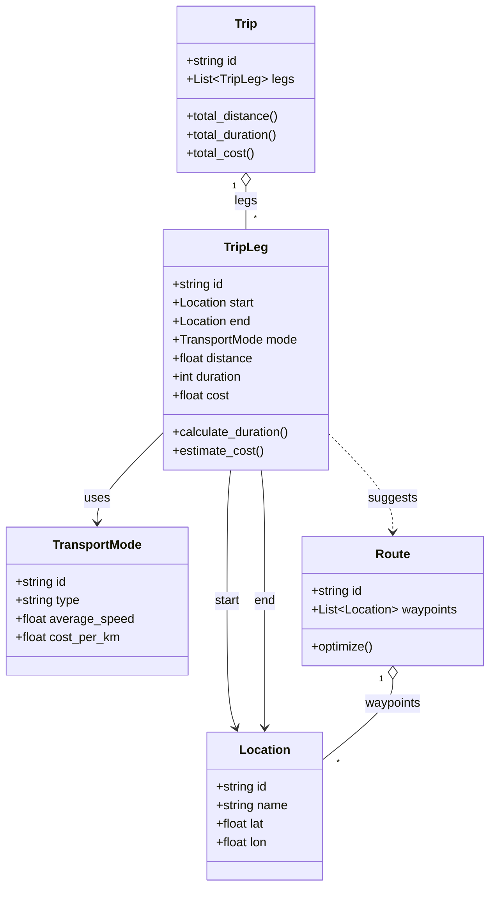

# Diagram: entity_core/entity_service/entity_service/trip_leg/__init__.py

> Auto-generated by Obscura crawlers

## Mermaid

### SVG

<svg id="container" width="635.3359375" xmlns="http://www.w3.org/2000/svg" class="classDiagram" height="1150" viewBox="0 0 635.3359375 1150" role="graphics-document document" aria-roledescription="class"><g><defs><marker id="container_class-aggregationStart" class="marker aggregation class" refX="18" refY="7" markerWidth="190" markerHeight="240" orient="auto"><path d="M 18,7 L9,13 L1,7 L9,1 Z"></path></marker></defs><defs><marker id="container_class-aggregationEnd" class="marker aggregation class" refX="1" refY="7" markerWidth="20" markerHeight="28" orient="auto"><path d="M 18,7 L9,13 L1,7 L9,1 Z"></path></marker></defs><defs><marker id="container_class-extensionStart" class="marker extension class" refX="18" refY="7" markerWidth="190" markerHeight="240" orient="auto"><path d="M 1,7 L18,13 V 1 Z"></path></marker></defs><defs><marker id="container_class-extensionEnd" class="marker extension class" refX="1" refY="7" markerWidth="20" markerHeight="28" orient="auto"><path d="M 1,1 V 13 L18,7 Z"></path></marker></defs><defs><marker id="container_class-compositionStart" class="marker composition class" refX="18" refY="7" markerWidth="190" markerHeight="240" orient="auto"><path d="M 18,7 L9,13 L1,7 L9,1 Z"></path></marker></defs><defs><marker id="container_class-compositionEnd" class="marker composition class" refX="1" refY="7" markerWidth="20" markerHeight="28" orient="auto"><path d="M 18,7 L9,13 L1,7 L9,1 Z"></path></marker></defs><defs><marker id="container_class-dependencyStart" class="marker dependency class" refX="6" refY="7" markerWidth="190" markerHeight="240" orient="auto"><path d="M 5,7 L9,13 L1,7 L9,1 Z"></path></marker></defs><defs><marker id="container_class-dependencyEnd" class="marker dependency class" refX="13" refY="7" markerWidth="20" markerHeight="28" orient="auto"><path d="M 18,7 L9,13 L14,7 L9,1 Z"></path></marker></defs><defs><marker id="container_class-lollipopStart" class="marker lollipop class" refX="13" refY="7" markerWidth="190" markerHeight="240" orient="auto"><circle stroke="black" fill="transparent" cx="7" cy="7" r="6"></circle></marker></defs><defs><marker id="container_class-lollipopEnd" class="marker lollipop class" refX="1" refY="7" markerWidth="190" markerHeight="240" orient="auto"><circle stroke="black" fill="transparent" cx="7" cy="7" r="6"></circle></marker></defs><g class="root"><g class="clusters"></g><g class="edgePaths"><path d="M318.031,241.25L318.031,244.542C318.031,247.833,318.031,254.417,318.031,263.875C318.031,273.333,318.031,285.667,318.031,291.833L318.031,298" id="id_Trip_TripLeg_1" class="edge-thickness-normal edge-pattern-solid relation" style=";;;" data-edge="true" data-et="edge" data-id="id_Trip_TripLeg_1" data-points="W3sieCI6MzE4LjAzMTI1LCJ5IjoyMjR9LHsieCI6MzE4LjAzMTI1LCJ5IjoyNjF9LHsieCI6MzE4LjAzMTI1LCJ5IjoyOTh9XQ==" marker-start="url(#container_class-aggregationStart)"></path><path d="M297.527,610L296.717,616.167C295.906,622.333,294.285,634.667,293.475,663C292.664,691.333,292.664,735.667,292.664,780C292.664,824.333,292.664,868.667,294.66,896.066C296.656,923.465,300.648,933.929,302.644,939.162L304.64,944.394" id="id_TripLeg_Location_2" class="edge-thickness-normal edge-pattern-solid relation" style=";;;" data-edge="true" data-et="edge" data-id="id_TripLeg_Location_2" data-points="W3sieCI6Mjk3LjUyNzIwMjA3MjUzODg0LCJ5Ijo2MTB9LHsieCI6MjkyLjY2NDA2MjUsInkiOjY0N30seyJ4IjoyOTIuNjY0MDYyNSwieSI6NzgwfSx7IngiOjI5Mi42NjQwNjI1LCJ5Ijo5MTN9LHsieCI6MzA2Ljc3ODEzNjc0ODEyMDMsInkiOjk1MH1d" marker-end="url(#container_class-dependencyEnd)"></path><path d="M338.535,610L339.346,616.167C340.156,622.333,341.777,634.667,342.588,663C343.398,691.333,343.398,735.667,343.398,780C343.398,824.333,343.398,868.667,343.398,896C343.398,923.333,343.398,933.667,343.398,938.833L343.398,944" id="id_TripLeg_Location_3" class="edge-thickness-normal edge-pattern-solid relation" style=";;;" data-edge="true" data-et="edge" data-id="id_TripLeg_Location_3" data-points="W3sieCI6MzM4LjUzNTI5NzkyNzQ2MTE2LCJ5Ijo2MTB9LHsieCI6MzQzLjM5ODQzNzUsInkiOjY0N30seyJ4IjozNDMuMzk4NDM3NSwieSI6NzgwfSx7IngiOjM0My4zOTg0Mzc1LCJ5Ijo5MTN9LHsieCI6MzQzLjM5ODQzNzUsInkiOjk1MH1d" marker-end="url(#container_class-dependencyEnd)"></path><path d="M211.199,560.474L196.73,574.895C182.26,589.316,153.322,618.158,138.852,637.746C124.383,657.333,124.383,667.667,124.383,672.833L124.383,678" id="id_TripLeg_TransportMode_4" class="edge-thickness-normal edge-pattern-solid relation" style=";;;" data-edge="true" data-et="edge" data-id="id_TripLeg_TransportMode_4" data-points="W3sieCI6MjExLjE5OTIxODc1LCJ5Ijo1NjAuNDc0MzAxMDQ0OTAyNn0seyJ4IjoxMjQuMzgyODEyNSwieSI6NjQ3fSx7IngiOjEyNC4zODI4MTI1LCJ5Ijo2ODR9XQ==" marker-end="url(#container_class-dependencyEnd)"></path><path d="M509.785,881.25L509.785,886.542C509.785,891.833,509.785,902.417,494.531,919.901C479.277,937.386,448.77,961.772,433.516,973.965L418.262,986.159" id="id_Route_Location_5" class="edge-thickness-normal edge-pattern-solid relation" style=";;;" data-edge="true" data-et="edge" data-id="id_Route_Location_5" data-points="W3sieCI6NTA5Ljc4NTE1NjI1LCJ5Ijo4NjR9LHsieCI6NTA5Ljc4NTE1NjI1LCJ5Ijo5MTN9LHsieCI6NDE4LjI2MTcxODc1LCJ5Ijo5ODYuMTU4NTg2Njg4NTc4NX1d" marker-start="url(#container_class-aggregationStart)"></path><path d="M424.863,561.526L439.017,575.772C453.171,590.018,481.478,618.509,495.632,639.921C509.785,661.333,509.785,675.667,509.785,682.833L509.785,690" id="id_TripLeg_Route_6" class="edge-thickness-normal edge-pattern-dashed relation" style=";;;" data-edge="true" data-et="edge" data-id="id_TripLeg_Route_6" data-points="W3sieCI6NDI0Ljg2MzI4MTI1LCJ5Ijo1NjEuNTI2MjY4NjE0MTQ5OH0seyJ4Ijo1MDkuNzg1MTU2MjUsInkiOjY0N30seyJ4Ijo1MDkuNzg1MTU2MjUsInkiOjY5Nn1d" marker-end="url(#container_class-dependencyEnd)"></path></g><g class="edgeLabels"><g class="edgeLabel" transform="translate(318.03125, 261)"><g class="label" data-id="id_Trip_TripLeg_1" transform="translate(-14.5078125, -12)"><foreignObject width="29.015625" height="24">

legs

</foreignObject></g></g><g class="edgeLabel" transform="translate(292.6640625, 780)"><g class="label" data-id="id_TripLeg_Location_2" transform="translate(-16.8984375, -12)"><foreignObject width="33.796875" height="24">

start

</foreignObject></g></g><g class="edgeLabel" transform="translate(343.3984375, 780)"><g class="label" data-id="id_TripLeg_Location_3" transform="translate(-13.8359375, -12)"><foreignObject width="27.671875" height="24">

end

</foreignObject></g></g><g class="edgeLabel" transform="translate(124.3828125, 647)"><g class="label" data-id="id_TripLeg_TransportMode_4" transform="translate(-16.4921875, -12)"><foreignObject width="32.984375" height="24">

uses

</foreignObject></g></g><g class="edgeLabel" transform="translate(509.78515625, 913)"><g class="label" data-id="id_Route_Location_5" transform="translate(-36.8046875, -12)"><foreignObject width="73.609375" height="24">

waypoints

</foreignObject></g></g><g class="edgeLabel" transform="translate(509.78515625, 647)"><g class="label" data-id="id_TripLeg_Route_6" transform="translate(-31.3046875, -12)"><foreignObject width="62.609375" height="24">

suggests

</foreignObject></g></g><g class="edgeTerminals" transform="translate(303.03125, 241.5)"><g class="inner" transform="translate(0, 0)"><foreignObject style="width: 9px; height: 12px;">
1
</foreignObject></g></g><g class="edgeTerminals" transform="translate(494.7851581250001, 881.5000016071428)"><g class="inner" transform="translate(0, 0)"><foreignObject style="width: 9px; height: 12px;">
1
</foreignObject></g></g><g class="edgeTerminals" transform="translate(328.03125, 275.5)"><g class="inner" transform="translate(0, 0)"></g><foreignObject style="width: 9px; height: 12px;">
*
</foreignObject></g><g class="edgeTerminals" transform="translate(436.29703326063634, 981.9486914041952)"><g class="inner" transform="translate(0, 0)"></g><foreignObject style="width: 9px; height: 12px;">
*
</foreignObject></g></g><g class="nodes"><g class="node default" id="classId-TripLeg-0" transform="translate(318.03125, 454)"><g class="basic label-container"><path d="M-106.83203125 -156 L106.83203125 -156 L106.83203125 156 L-106.83203125 156" stroke="none" stroke-width="0" fill="#ECECFF" style=""></path><path d="M-106.83203125 -156 C-49.55896807773927 -156, 7.714095094521454 -156, 106.83203125 -156 M-106.83203125 -156 C-33.06161648689816 -156, 40.70879827620368 -156, 106.83203125 -156 M106.83203125 -156 C106.83203125 -46.24178461609387, 106.83203125 63.51643076781227, 106.83203125 156 M106.83203125 -156 C106.83203125 -44.920729458208314, 106.83203125 66.15854108358337, 106.83203125 156 M106.83203125 156 C22.419346310595884 156, -61.99333862880823 156, -106.83203125 156 M106.83203125 156 C33.63212318539436 156, -39.567784879211274 156, -106.83203125 156 M-106.83203125 156 C-106.83203125 79.34383933618041, -106.83203125 2.6876786723608177, -106.83203125 -156 M-106.83203125 156 C-106.83203125 35.94479254546759, -106.83203125 -84.11041490906481, -106.83203125 -156" stroke="#9370DB" stroke-width="1.3" fill="none" stroke-dasharray="0 0" style=""></path></g><g class="annotation-group text" transform="translate(0, -132)"></g><g class="label-group text" transform="translate(-27.0546875, -132)"><g class="label" style="font-weight: bolder" transform="translate(0,-12)"><foreignObject width="54.109375" height="24">

TripLeg

</foreignObject></g></g><g class="members-group text" transform="translate(-94.83203125, -84)"><g class="label" style="" transform="translate(0,-12)"><foreignObject width="67.9375" height="24">

+string id

</foreignObject></g><g class="label" style="" transform="translate(0,12)"><foreignObject width="108.140625" height="24">

+Location start

</foreignObject></g><g class="label" style="" transform="translate(0,36)"><foreignObject width="102.015625" height="24">

+Location end

</foreignObject></g><g class="label" style="" transform="translate(0,60)"><foreignObject width="162.609375" height="24">

+TransportMode mode

</foreignObject></g><g class="label" style="" transform="translate(0,84)"><foreignObject width="106.390625" height="24">

+float distance

</foreignObject></g><g class="label" style="" transform="translate(0,108)"><foreignObject width="94.109375" height="24">

+int duration

</foreignObject></g><g class="label" style="" transform="translate(0,132)"><foreignObject width="74.96875" height="24">

+float cost

</foreignObject></g></g><g class="methods-group text" transform="translate(-94.83203125, 108)"><g class="label" style="" transform="translate(0,-12)"><foreignObject width="153.25" height="24">

+calculate_duration()

</foreignObject></g><g class="label" style="" transform="translate(0,12)"><foreignObject width="119.109375" height="24">

+estimate_cost()

</foreignObject></g></g><g class="divider" style=""><path d="M-106.83203125 -108 C-31.51446803834331 -108, 43.80309517331338 -108, 106.83203125 -108 M-106.83203125 -108 C-31.842675426401442 -108, 43.146680397197116 -108, 106.83203125 -108" stroke="#9370DB" stroke-width="1.3" fill="none" stroke-dasharray="0 0" style=""></path></g><g class="divider" style=""><path d="M-106.83203125 84 C-46.31506620018899 84, 14.201898849622026 84, 106.83203125 84 M-106.83203125 84 C-21.773929809414668 84, 63.284171631170665 84, 106.83203125 84" stroke="#9370DB" stroke-width="1.3" fill="none" stroke-dasharray="0 0" style=""></path></g></g><g class="node default" id="classId-Location-1" transform="translate(343.3984375, 1046)"><g class="basic label-container"><path d="M-74.86328125 -96 L74.86328125 -96 L74.86328125 96 L-74.86328125 96" stroke="none" stroke-width="0" fill="#ECECFF" style=""></path><path d="M-74.86328125 -96 C-17.052330640815413 -96, 40.758619968369175 -96, 74.86328125 -96 M-74.86328125 -96 C-28.282095009395633 -96, 18.299091231208735 -96, 74.86328125 -96 M74.86328125 -96 C74.86328125 -24.19097485923018, 74.86328125 47.61805028153964, 74.86328125 96 M74.86328125 -96 C74.86328125 -55.626353449162956, 74.86328125 -15.252706898325911, 74.86328125 96 M74.86328125 96 C19.27171554158999 96, -36.31985016682002 96, -74.86328125 96 M74.86328125 96 C28.62004954850461 96, -17.62318215299078 96, -74.86328125 96 M-74.86328125 96 C-74.86328125 56.517482525147834, -74.86328125 17.034965050295668, -74.86328125 -96 M-74.86328125 96 C-74.86328125 40.568184380010244, -74.86328125 -14.863631239979512, -74.86328125 -96" stroke="#9370DB" stroke-width="1.3" fill="none" stroke-dasharray="0 0" style=""></path></g><g class="annotation-group text" transform="translate(0, -72)"></g><g class="label-group text" transform="translate(-31.3515625, -72)"><g class="label" style="font-weight: bolder" transform="translate(0,-12)"><foreignObject width="62.703125" height="24">

Location

</foreignObject></g></g><g class="members-group text" transform="translate(-62.86328125, -24)"><g class="label" style="" transform="translate(0,-12)"><foreignObject width="67.9375" height="24">

+string id

</foreignObject></g><g class="label" style="" transform="translate(0,12)"><foreignObject width="94.375" height="24">

+string name

</foreignObject></g><g class="label" style="" transform="translate(0,36)"><foreignObject width="64.140625" height="24">

+float lat

</foreignObject></g><g class="label" style="" transform="translate(0,60)"><foreignObject width="68.375" height="24">

+float lon

</foreignObject></g></g><g class="methods-group text" transform="translate(-62.86328125, 96)"></g><g class="divider" style=""><path d="M-74.86328125 -48 C-43.526155333763185 -48, -12.18902941752637 -48, 74.86328125 -48 M-74.86328125 -48 C-18.51352963544889 -48, 37.83622197910222 -48, 74.86328125 -48" stroke="#9370DB" stroke-width="1.3" fill="none" stroke-dasharray="0 0" style=""></path></g><g class="divider" style=""><path d="M-74.86328125 72 C-42.73214092731591 72, -10.601000604631821 72, 74.86328125 72 M-74.86328125 72 C-20.309625804075765 72, 34.24402964184847 72, 74.86328125 72" stroke="#9370DB" stroke-width="1.3" fill="none" stroke-dasharray="0 0" style=""></path></g></g><g class="node default" id="classId-TransportMode-2" transform="translate(124.3828125, 780)"><g class="basic label-container"><path d="M-116.3828125 -96 L116.3828125 -96 L116.3828125 96 L-116.3828125 96" stroke="none" stroke-width="0" fill="#ECECFF" style=""></path><path d="M-116.3828125 -96 C-68.83103783424238 -96, -21.279263168484746 -96, 116.3828125 -96 M-116.3828125 -96 C-29.48311247295389 -96, 57.41658755409222 -96, 116.3828125 -96 M116.3828125 -96 C116.3828125 -20.259719595665032, 116.3828125 55.480560808669935, 116.3828125 96 M116.3828125 -96 C116.3828125 -33.6584952250152, 116.3828125 28.683009549969597, 116.3828125 96 M116.3828125 96 C32.96434733190837 96, -50.45411783618326 96, -116.3828125 96 M116.3828125 96 C52.1804206722022 96, -12.021971155595594 96, -116.3828125 96 M-116.3828125 96 C-116.3828125 35.11319115857504, -116.3828125 -25.773617682849917, -116.3828125 -96 M-116.3828125 96 C-116.3828125 55.348003892767025, -116.3828125 14.69600778553405, -116.3828125 -96" stroke="#9370DB" stroke-width="1.3" fill="none" stroke-dasharray="0 0" style=""></path></g><g class="annotation-group text" transform="translate(0, -72)"></g><g class="label-group text" transform="translate(-55.796875, -72)"><g class="label" style="font-weight: bolder" transform="translate(0,-12)"><foreignObject width="111.59375" height="24">

TransportMode

</foreignObject></g></g><g class="members-group text" transform="translate(-104.3828125, -24)"><g class="label" style="" transform="translate(0,-12)"><foreignObject width="67.9375" height="24">

+string id

</foreignObject></g><g class="label" style="" transform="translate(0,12)"><foreignObject width="85.65625" height="24">

+string type

</foreignObject></g><g class="label" style="" transform="translate(0,36)"><foreignObject width="152.96875" height="24">

+float average_speed

</foreignObject></g><g class="label" style="" transform="translate(0,60)"><foreignObject width="136.625" height="24">

+float cost_per_km

</foreignObject></g></g><g class="methods-group text" transform="translate(-104.3828125, 96)"></g><g class="divider" style=""><path d="M-116.3828125 -48 C-58.899070796545026 -48, -1.415329093090051 -48, 116.3828125 -48 M-116.3828125 -48 C-33.38945026824429 -48, 49.60391196351142 -48, 116.3828125 -48" stroke="#9370DB" stroke-width="1.3" fill="none" stroke-dasharray="0 0" style=""></path></g><g class="divider" style=""><path d="M-116.3828125 72 C-69.47134766964334 72, -22.559882839286672 72, 116.3828125 72 M-116.3828125 72 C-46.81232800678232 72, 22.758156486435354 72, 116.3828125 72" stroke="#9370DB" stroke-width="1.3" fill="none" stroke-dasharray="0 0" style=""></path></g></g><g class="node default" id="classId-Trip-3" transform="translate(318.03125, 116)"><g class="basic label-container"><path d="M-86.94140625 -108 L86.94140625 -108 L86.94140625 108 L-86.94140625 108" stroke="none" stroke-width="0" fill="#ECECFF" style=""></path><path d="M-86.94140625 -108 C-51.7728309892724 -108, -16.6042557285448 -108, 86.94140625 -108 M-86.94140625 -108 C-29.24470533676304 -108, 28.45199557647392 -108, 86.94140625 -108 M86.94140625 -108 C86.94140625 -50.24537795600559, 86.94140625 7.509244087988819, 86.94140625 108 M86.94140625 -108 C86.94140625 -31.4806402214585, 86.94140625 45.038719557083, 86.94140625 108 M86.94140625 108 C37.90878150361657 108, -11.123843242766867 108, -86.94140625 108 M86.94140625 108 C51.77651099331981 108, 16.61161573663962 108, -86.94140625 108 M-86.94140625 108 C-86.94140625 45.22453149221768, -86.94140625 -17.550937015564642, -86.94140625 -108 M-86.94140625 108 C-86.94140625 57.01774107049337, -86.94140625 6.035482140986744, -86.94140625 -108" stroke="#9370DB" stroke-width="1.3" fill="none" stroke-dasharray="0 0" style=""></path></g><g class="annotation-group text" transform="translate(0, -84)"></g><g class="label-group text" transform="translate(-14.3203125, -84)"><g class="label" style="font-weight: bolder" transform="translate(0,-12)"><foreignObject width="28.640625" height="24">

Trip

</foreignObject></g></g><g class="members-group text" transform="translate(-74.94140625, -36)"><g class="label" style="" transform="translate(0,-12)"><foreignObject width="67.9375" height="24">

+string id

</foreignObject></g><g class="label" style="" transform="translate(0,12)"><foreignObject width="135.5625" height="24">

+List&lt;TripLeg&gt; legs

</foreignObject></g></g><g class="methods-group text" transform="translate(-74.94140625, 36)"><g class="label" style="" transform="translate(0,-12)"><foreignObject width="121.40625" height="24">

+total_distance()

</foreignObject></g><g class="label" style="" transform="translate(0,12)"><foreignObject width="122.265625" height="24">

+total_duration()

</foreignObject></g><g class="label" style="" transform="translate(0,36)"><foreignObject width="89.96875" height="24">

+total_cost()

</foreignObject></g></g><g class="divider" style=""><path d="M-86.94140625 -60 C-48.51732269176265 -60, -10.093239133525302 -60, 86.94140625 -60 M-86.94140625 -60 C-27.666937824854124 -60, 31.607530600291753 -60, 86.94140625 -60" stroke="#9370DB" stroke-width="1.3" fill="none" stroke-dasharray="0 0" style=""></path></g><g class="divider" style=""><path d="M-86.94140625 12 C-21.833137343556004 12, 43.27513156288799 12, 86.94140625 12 M-86.94140625 12 C-29.090925327218045 12, 28.75955559556391 12, 86.94140625 12" stroke="#9370DB" stroke-width="1.3" fill="none" stroke-dasharray="0 0" style=""></path></g></g><g class="node default" id="classId-Route-4" transform="translate(509.78515625, 780)"><g class="basic label-container"><path d="M-117.55078125 -84 L117.55078125 -84 L117.55078125 84 L-117.55078125 84" stroke="none" stroke-width="0" fill="#ECECFF" style=""></path><path d="M-117.55078125 -84 C-29.703510252616468 -84, 58.143760744767064 -84, 117.55078125 -84 M-117.55078125 -84 C-25.315480666647943 -84, 66.91981991670411 -84, 117.55078125 -84 M117.55078125 -84 C117.55078125 -26.8757208662461, 117.55078125 30.248558267507804, 117.55078125 84 M117.55078125 -84 C117.55078125 -42.66075106930574, 117.55078125 -1.3215021386114785, 117.55078125 84 M117.55078125 84 C60.46374433198672 84, 3.3767074139734348 84, -117.55078125 84 M117.55078125 84 C53.204350579783636 84, -11.142080090432728 84, -117.55078125 84 M-117.55078125 84 C-117.55078125 41.31883960797365, -117.55078125 -1.3623207840526987, -117.55078125 -84 M-117.55078125 84 C-117.55078125 23.801232120009672, -117.55078125 -36.397535759980656, -117.55078125 -84" stroke="#9370DB" stroke-width="1.3" fill="none" stroke-dasharray="0 0" style=""></path></g><g class="annotation-group text" transform="translate(0, -60)"></g><g class="label-group text" transform="translate(-21.4296875, -60)"><g class="label" style="font-weight: bolder" transform="translate(0,-12)"><foreignObject width="42.859375" height="24">

Route

</foreignObject></g></g><g class="members-group text" transform="translate(-105.55078125, -12)"><g class="label" style="" transform="translate(0,-12)"><foreignObject width="67.9375" height="24">

+string id

</foreignObject></g><g class="label" style="" transform="translate(0,12)"><foreignObject width="189.671875" height="24">

+List&lt;Location&gt; waypoints

</foreignObject></g></g><g class="methods-group text" transform="translate(-105.55078125, 60)"><g class="label" style="" transform="translate(0,-12)"><foreignObject width="81.3125" height="24">

+optimize()

</foreignObject></g></g><g class="divider" style=""><path d="M-117.55078125 -36 C-65.68697578210407 -36, -13.823170314208141 -36, 117.55078125 -36 M-117.55078125 -36 C-49.93708236140459 -36, 17.676616527190816 -36, 117.55078125 -36" stroke="#9370DB" stroke-width="1.3" fill="none" stroke-dasharray="0 0" style=""></path></g><g class="divider" style=""><path d="M-117.55078125 36 C-68.70903589745723 36, -19.867290544914454 36, 117.55078125 36 M-117.55078125 36 C-30.406663824138278 36, 56.737453601723445 36, 117.55078125 36" stroke="#9370DB" stroke-width="1.3" fill="none" stroke-dasharray="0 0" style=""></path></g></g></g></g></g></svg>
