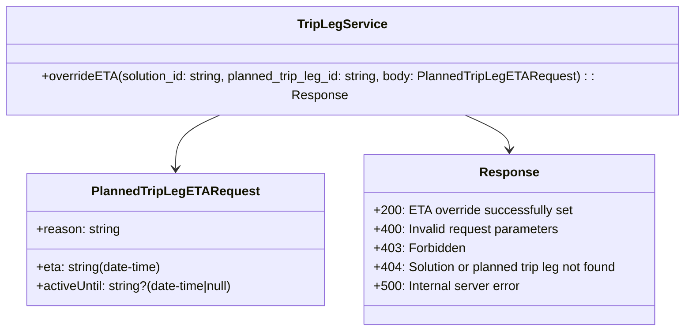

# Diagram: entity_core/entity_service/entity_service/trip_leg/api_documentation/TriplegService.yaml


> Auto-generated by Obscura crawlers

## Diagram 1

```mermaid
flowchart LR
  Client[Client] --> Endpoint[/PUT /solution/{solution_id}/planned-trip-leg/{planned_trip_leg_id}/eta/]
  Endpoint --> Validate{Validate parameters}
  Validate -->|valid| ParseRequest[Parse request body]
  Validate -->|invalid| Resp400[400 Invalid request parameters]
  ParseRequest --> RequestBody[RequestBody:\neta (date-time)\nactiveUntil (date-time|null)\nreason (string)]
  ParseRequest --> CheckExistence{Solution & planned trip leg exist?}
  CheckExistence -->|yes| SetETA[Set ETA override]
  CheckExistence -->|no| Resp404[404 Solution or planned trip leg not found]
  SetETA -->|success| Resp200[200 ETA override successfully set]
  SetETA -->|forbidden| Resp403[403 Forbidden]
  SetETA -->|error| Resp500[500 Internal server error]
```

> SVG rendering failed for this diagram.

## Diagram 2



### SVG

<svg id="container" width="872.96875" xmlns="http://www.w3.org/2000/svg" class="classDiagram" height="408" viewBox="0 0 872.96875 408" role="graphics-document document" aria-roledescription="class"><style>#container{font-family:"trebuchet ms",verdana,arial,sans-serif;font-size:16px;fill:#333;}@keyframes edge-animation-frame{from{stroke-dashoffset:0;}}@keyframes dash{to{stroke-dashoffset:0;}}#container .edge-animation-slow{stroke-dasharray:9,5!important;stroke-dashoffset:900;animation:dash 50s linear infinite;stroke-linecap:round;}#container .edge-animation-fast{stroke-dasharray:9,5!important;stroke-dashoffset:900;animation:dash 20s linear infinite;stroke-linecap:round;}#container .error-icon{fill:#552222;}#container .error-text{fill:#552222;stroke:#552222;}#container .edge-thickness-normal{stroke-width:1px;}#container .edge-thickness-thick{stroke-width:3.5px;}#container .edge-pattern-solid{stroke-dasharray:0;}#container .edge-thickness-invisible{stroke-width:0;fill:none;}#container .edge-pattern-dashed{stroke-dasharray:3;}#container .edge-pattern-dotted{stroke-dasharray:2;}#container .marker{fill:#333333;stroke:#333333;}#container .marker.cross{stroke:#333333;}#container svg{font-family:"trebuchet ms",verdana,arial,sans-serif;font-size:16px;}#container p{margin:0;}#container g.classGroup text{fill:#9370DB;stroke:none;font-family:"trebuchet ms",verdana,arial,sans-serif;font-size:10px;}#container g.classGroup text .title{font-weight:bolder;}#container .nodeLabel,#container .edgeLabel{color:#131300;}#container .edgeLabel .label rect{fill:#ECECFF;}#container .label text{fill:#131300;}#container .labelBkg{background:#ECECFF;}#container .edgeLabel .label span{background:#ECECFF;}#container .classTitle{font-weight:bolder;}#container .node rect,#container .node circle,#container .node ellipse,#container .node polygon,#container .node path{fill:#ECECFF;stroke:#9370DB;stroke-width:1px;}#container .divider{stroke:#9370DB;stroke-width:1;}#container g.clickable{cursor:pointer;}#container g.classGroup rect{fill:#ECECFF;stroke:#9370DB;}#container g.classGroup line{stroke:#9370DB;stroke-width:1;}#container .classLabel .box{stroke:none;stroke-width:0;fill:#ECECFF;opacity:0.5;}#container .classLabel .label{fill:#9370DB;font-size:10px;}#container .relation{stroke:#333333;stroke-width:1;fill:none;}#container .dashed-line{stroke-dasharray:3;}#container .dotted-line{stroke-dasharray:1 2;}#container #compositionStart,#container .composition{fill:#333333!important;stroke:#333333!important;stroke-width:1;}#container #compositionEnd,#container .composition{fill:#333333!important;stroke:#333333!important;stroke-width:1;}#container #dependencyStart,#container .dependency{fill:#333333!important;stroke:#333333!important;stroke-width:1;}#container #dependencyStart,#container .dependency{fill:#333333!important;stroke:#333333!important;stroke-width:1;}#container #extensionStart,#container .extension{fill:transparent!important;stroke:#333333!important;stroke-width:1;}#container #extensionEnd,#container .extension{fill:transparent!important;stroke:#333333!important;stroke-width:1;}#container #aggregationStart,#container .aggregation{fill:transparent!important;stroke:#333333!important;stroke-width:1;}#container #aggregationEnd,#container .aggregation{fill:transparent!important;stroke:#333333!important;stroke-width:1;}#container #lollipopStart,#container .lollipop{fill:#ECECFF!important;stroke:#333333!important;stroke-width:1;}#container #lollipopEnd,#container .lollipop{fill:#ECECFF!important;stroke:#333333!important;stroke-width:1;}#container .edgeTerminals{font-size:11px;line-height:initial;}#container .classTitleText{text-anchor:middle;font-size:18px;fill:#333;}#container .label-icon{display:inline-block;height:1em;overflow:visible;vertical-align:-0.125em;}#container .node .label-icon path{fill:currentColor;stroke:revert;stroke-width:revert;}#container :root{--mermaid-font-family:"trebuchet ms",verdana,arial,sans-serif;}</style><g><defs><marker id="container_class-aggregationStart" class="marker aggregation class" refX="18" refY="7" markerWidth="190" markerHeight="240" orient="auto"><path d="M 18,7 L9,13 L1,7 L9,1 Z"></path></marker></defs><defs><marker id="container_class-aggregationEnd" class="marker aggregation class" refX="1" refY="7" markerWidth="20" markerHeight="28" orient="auto"><path d="M 18,7 L9,13 L1,7 L9,1 Z"></path></marker></defs><defs><marker id="container_class-extensionStart" class="marker extension class" refX="18" refY="7" markerWidth="190" markerHeight="240" orient="auto"><path d="M 1,7 L18,13 V 1 Z"></path></marker></defs><defs><marker id="container_class-extensionEnd" class="marker extension class" refX="1" refY="7" markerWidth="20" markerHeight="28" orient="auto"><path d="M 1,1 V 13 L18,7 Z"></path></marker></defs><defs><marker id="container_class-compositionStart" class="marker composition class" refX="18" refY="7" markerWidth="190" markerHeight="240" orient="auto"><path d="M 18,7 L9,13 L1,7 L9,1 Z"></path></marker></defs><defs><marker id="container_class-compositionEnd" class="marker composition class" refX="1" refY="7" markerWidth="20" markerHeight="28" orient="auto"><path d="M 18,7 L9,13 L1,7 L9,1 Z"></path></marker></defs><defs><marker id="container_class-dependencyStart" class="marker dependency class" refX="6" refY="7" markerWidth="190" markerHeight="240" orient="auto"><path d="M 5,7 L9,13 L1,7 L9,1 Z"></path></marker></defs><defs><marker id="container_class-dependencyEnd" class="marker dependency class" refX="13" refY="7" markerWidth="20" markerHeight="28" orient="auto"><path d="M 18,7 L9,13 L14,7 L9,1 Z"></path></marker></defs><defs><marker id="container_class-lollipopStart" class="marker lollipop class" refX="13" refY="7" markerWidth="190" markerHeight="240" orient="auto"><circle stroke="black" fill="transparent" cx="7" cy="7" r="6"></circle></marker></defs><defs><marker id="container_class-lollipopEnd" class="marker lollipop class" refX="1" refY="7" markerWidth="190" markerHeight="240" orient="auto"><circle stroke="black" fill="transparent" cx="7" cy="7" r="6"></circle></marker></defs><g class="root"><g class="clusters"></g><g class="edgePaths"><path d="M282.361,134L272.168,138.167C261.975,142.333,241.588,150.667,231.395,162C221.201,173.333,221.201,187.667,221.201,194.833L221.201,202" id="id_TripLegService_PlannedTripLegETARequest_1" class="edge-thickness-normal edge-pattern-solid relation" style=";;;" data-edge="true" data-et="edge" data-id="id_TripLegService_PlannedTripLegETARequest_1" data-points="W3sieCI6MjgyLjM2MTE3Mjc2Mjc4NDEsInkiOjEzNH0seyJ4IjoyMjEuMjAxMTcxODc1LCJ5IjoxNTl9LHsieCI6MjIxLjIwMTE3MTg3NSwieSI6MjA4fV0=" marker-end="url(#container_class-dependencyEnd)"></path><path d="M590.608,134L600.801,138.167C610.994,142.333,631.381,150.667,641.574,158C651.768,165.333,651.768,171.667,651.768,174.833L651.768,178" id="id_TripLegService_Response_2" class="edge-thickness-normal edge-pattern-solid relation" style=";;;" data-edge="true" data-et="edge" data-id="id_TripLegService_Response_2" data-points="W3sieCI6NTkwLjYwNzU3NzIzNzIxNTksInkiOjEzNH0seyJ4Ijo2NTEuNzY3NTc4MTI1LCJ5IjoxNTl9LHsieCI6NjUxLjc2NzU3ODEyNSwieSI6MTg0fV0=" marker-end="url(#container_class-dependencyEnd)"></path></g><g class="edgeLabels"><g class="edgeLabel"><g class="label" data-id="id_TripLegService_PlannedTripLegETARequest_1" transform="translate(0, 0)"><foreignObject width="0" height="0"><div xmlns="http://www.w3.org/1999/xhtml" class="labelBkg" style="display: table-cell; white-space: nowrap; line-height: 1.5; max-width: 200px; text-align: center;"><span class="edgeLabel"></span></div></foreignObject></g></g><g class="edgeLabel"><g class="label" data-id="id_TripLegService_Response_2" transform="translate(0, 0)"><foreignObject width="0" height="0"><div xmlns="http://www.w3.org/1999/xhtml" class="labelBkg" style="display: table-cell; white-space: nowrap; line-height: 1.5; max-width: 200px; text-align: center;"><span class="edgeLabel"></span></div></foreignObject></g></g></g><g class="nodes"><g class="node default" id="classId-PlannedTripLegETARequest-0" transform="translate(221.201171875, 292)"><g class="basic label-container"><path d="M-191.5078125 -84 L191.5078125 -84 L191.5078125 84 L-191.5078125 84" stroke="none" stroke-width="0" fill="#ECECFF" style=""></path><path d="M-191.5078125 -84 C-65.94755537688141 -84, 59.61270174623718 -84, 191.5078125 -84 M-191.5078125 -84 C-98.79877186151738 -84, -6.089731223034761 -84, 191.5078125 -84 M191.5078125 -84 C191.5078125 -49.92203471522908, 191.5078125 -15.844069430458163, 191.5078125 84 M191.5078125 -84 C191.5078125 -30.02443714452307, 191.5078125 23.95112571095386, 191.5078125 84 M191.5078125 84 C112.48530839106974 84, 33.46280428213947 84, -191.5078125 84 M191.5078125 84 C80.46427960889046 84, -30.57925328221907 84, -191.5078125 84 M-191.5078125 84 C-191.5078125 43.45142404029994, -191.5078125 2.902848080599881, -191.5078125 -84 M-191.5078125 84 C-191.5078125 34.76684688774154, -191.5078125 -14.466306224516913, -191.5078125 -84" stroke="#9370DB" stroke-width="1.3" fill="none" stroke-dasharray="0 0" style=""></path></g><g class="annotation-group text" transform="translate(0, -60)"></g><g class="label-group text" transform="translate(-99.765625, -60)"><g class="label" style="font-weight: bolder" transform="translate(0,-12)"><foreignObject width="199.53125" height="24"><div xmlns="http://www.w3.org/1999/xhtml" style="display: table-cell; white-space: nowrap; line-height: 1.5; max-width: 247px; text-align: center;"><span class="nodeLabel markdown-node-label" style=""><p>PlannedTripLegETARequest</p></span></div></foreignObject></g></g><g class="members-group text" transform="translate(-179.5078125, -12)"><g class="label" style="" transform="translate(0,-12)"><foreignObject width="106.703125" height="24"><div xmlns="http://www.w3.org/1999/xhtml" style="display: table-cell; white-space: nowrap; line-height: 1.5; max-width: 165px; text-align: center;"><span class="nodeLabel markdown-node-label" style=""><p>+reason: string</p></span></div></foreignObject></g></g><g class="methods-group text" transform="translate(-179.5078125, 36)"><g class="label" style="" transform="translate(0,-12)"><foreignObject width="162.78125" height="24"><div xmlns="http://www.w3.org/1999/xhtml" style="display: table-cell; white-space: nowrap; line-height: 1.5; max-width: 220px; text-align: center;"><span class="nodeLabel markdown-node-label" style=""><p>+eta: string(date-time)</p></span></div></foreignObject></g><g class="label" style="" transform="translate(0,12)"><foreignObject width="259.25" height="24"><div xmlns="http://www.w3.org/1999/xhtml" style="display: table-cell; white-space: nowrap; line-height: 1.5; max-width: 317px; text-align: center;"><span class="nodeLabel markdown-node-label" style=""><p>+activeUntil: string?(date-time|null)</p></span></div></foreignObject></g></g><g class="divider" style=""><path d="M-191.5078125 -36 C-39.819985039866765 -36, 111.86784242026647 -36, 191.5078125 -36 M-191.5078125 -36 C-46.73572980480242 -36, 98.03635289039516 -36, 191.5078125 -36" stroke="#9370DB" stroke-width="1.3" fill="none" stroke-dasharray="0 0" style=""></path></g><g class="divider" style=""><path d="M-191.5078125 12 C-70.73432537532094 12, 50.03916174935813 12, 191.5078125 12 M-191.5078125 12 C-80.10725499363737 12, 31.293302512725262 12, 191.5078125 12" stroke="#9370DB" stroke-width="1.3" fill="none" stroke-dasharray="0 0" style=""></path></g></g><g class="node default" id="classId-TripLegService-1" transform="translate(436.484375, 71)"><g class="basic label-container"><path d="M-428.484375 -63 L428.484375 -63 L428.484375 63 L-428.484375 63" stroke="none" stroke-width="0" fill="#ECECFF" style=""></path><path d="M-428.484375 -63 C-242.8500543112186 -63, -57.2157336224372 -63, 428.484375 -63 M-428.484375 -63 C-183.62619530061178 -63, 61.23198439877643 -63, 428.484375 -63 M428.484375 -63 C428.484375 -31.436924281278056, 428.484375 0.12615143744388746, 428.484375 63 M428.484375 -63 C428.484375 -19.619100660246012, 428.484375 23.761798679507976, 428.484375 63 M428.484375 63 C231.7493771294509 63, 35.01437925890178 63, -428.484375 63 M428.484375 63 C163.17860058911356 63, -102.12717382177289 63, -428.484375 63 M-428.484375 63 C-428.484375 31.576072502532284, -428.484375 0.1521450050645683, -428.484375 -63 M-428.484375 63 C-428.484375 33.26828986091709, -428.484375 3.5365797218341797, -428.484375 -63" stroke="#9370DB" stroke-width="1.3" fill="none" stroke-dasharray="0 0" style=""></path></g><g class="annotation-group text" transform="translate(0, -39)"></g><g class="label-group text" transform="translate(-53.703125, -39)"><g class="label" style="font-weight: bolder" transform="translate(0,-12)"><foreignObject width="107.40625" height="24"><div xmlns="http://www.w3.org/1999/xhtml" style="display: table-cell; white-space: nowrap; line-height: 1.5; max-width: 155px; text-align: center;"><span class="nodeLabel markdown-node-label" style=""><p>TripLegService</p></span></div></foreignObject></g></g><g class="members-group text" transform="translate(-416.484375, 9)"></g><g class="methods-group text" transform="translate(-416.484375, 39)"><g class="label" style="" transform="translate(0,-12)"><foreignObject width="779.265625" height="24"><div xmlns="http://www.w3.org/1999/xhtml" style="display: table-cell; white-space: nowrap; line-height: 1.5; max-width: 837px; text-align: center;"><span class="nodeLabel markdown-node-label" style=""><p>+overrideETA(solution_id: string, planned_trip_leg_id: string, body: PlannedTripLegETARequest) : : Response</p></span></div></foreignObject></g></g><g class="divider" style=""><path d="M-428.484375 -15 C-235.63572034323195 -15, -42.787065686463905 -15, 428.484375 -15 M-428.484375 -15 C-199.99653588921817 -15, 28.49130322156367 -15, 428.484375 -15" stroke="#9370DB" stroke-width="1.3" fill="none" stroke-dasharray="0 0" style=""></path></g><g class="divider" style=""><path d="M-428.484375 9 C-216.7243857695858 9, -4.9643965391716165 9, 428.484375 9 M-428.484375 9 C-133.89907753450422 9, 160.68621993099157 9, 428.484375 9" stroke="#9370DB" stroke-width="1.3" fill="none" stroke-dasharray="0 0" style=""></path></g></g><g class="node default" id="classId-Response-2" transform="translate(651.767578125, 292)"><g class="basic label-container"><path d="M-189.05859375 -108 L189.05859375 -108 L189.05859375 108 L-189.05859375 108" stroke="none" stroke-width="0" fill="#ECECFF" style=""></path><path d="M-189.05859375 -108 C-107.93246479800138 -108, -26.806335846002753 -108, 189.05859375 -108 M-189.05859375 -108 C-107.96642594686455 -108, -26.874258143729094 -108, 189.05859375 -108 M189.05859375 -108 C189.05859375 -29.072330033455216, 189.05859375 49.85533993308957, 189.05859375 108 M189.05859375 -108 C189.05859375 -51.782603372871385, 189.05859375 4.4347932542572295, 189.05859375 108 M189.05859375 108 C67.26538043200047 108, -54.52783288599906 108, -189.05859375 108 M189.05859375 108 C54.687663698147304 108, -79.68326635370539 108, -189.05859375 108 M-189.05859375 108 C-189.05859375 63.04398315076336, -189.05859375 18.08796630152672, -189.05859375 -108 M-189.05859375 108 C-189.05859375 37.11953331473154, -189.05859375 -33.76093337053692, -189.05859375 -108" stroke="#9370DB" stroke-width="1.3" fill="none" stroke-dasharray="0 0" style=""></path></g><g class="annotation-group text" transform="translate(0, -84)"></g><g class="label-group text" transform="translate(-35.4453125, -84)"><g class="label" style="font-weight: bolder" transform="translate(0,-12)"><foreignObject width="70.890625" height="24"><div xmlns="http://www.w3.org/1999/xhtml" style="display: table-cell; white-space: nowrap; line-height: 1.5; max-width: 120px; text-align: center;"><span class="nodeLabel markdown-node-label" style=""><p>Response</p></span></div></foreignObject></g></g><g class="members-group text" transform="translate(-177.05859375, -36)"><g class="label" style="" transform="translate(0,-12)"><foreignObject width="248.421875" height="24"><div xmlns="http://www.w3.org/1999/xhtml" style="display: table-cell; white-space: nowrap; line-height: 1.5; max-width: 306px; text-align: center;"><span class="nodeLabel markdown-node-label" style=""><p>+200: ETA override successfully set</p></span></div></foreignObject></g><g class="label" style="" transform="translate(0,12)"><foreignObject width="237.40625" height="24"><div xmlns="http://www.w3.org/1999/xhtml" style="display: table-cell; white-space: nowrap; line-height: 1.5; max-width: 295px; text-align: center;"><span class="nodeLabel markdown-node-label" style=""><p>+400: Invalid request parameters</p></span></div></foreignObject></g><g class="label" style="" transform="translate(0,36)"><foreignObject width="115.234375" height="24"><div xmlns="http://www.w3.org/1999/xhtml" style="display: table-cell; white-space: nowrap; line-height: 1.5; max-width: 173px; text-align: center;"><span class="nodeLabel markdown-node-label" style=""><p>+403: Forbidden</p></span></div></foreignObject></g><g class="label" style="" transform="translate(0,60)"><foreignObject width="318.671875" height="24"><div xmlns="http://www.w3.org/1999/xhtml" style="display: table-cell; white-space: nowrap; line-height: 1.5; max-width: 376px; text-align: center;"><span class="nodeLabel markdown-node-label" style=""><p>+404: Solution or planned trip leg not found</p></span></div></foreignObject></g><g class="label" style="" transform="translate(0,84)"><foreignObject width="188.578125" height="24"><div xmlns="http://www.w3.org/1999/xhtml" style="display: table-cell; white-space: nowrap; line-height: 1.5; max-width: 247px; text-align: center;"><span class="nodeLabel markdown-node-label" style=""><p>+500: Internal server error</p></span></div></foreignObject></g></g><g class="methods-group text" transform="translate(-177.05859375, 108)"></g><g class="divider" style=""><path d="M-189.05859375 -60 C-40.72605496750651 -60, 107.60648381498697 -60, 189.05859375 -60 M-189.05859375 -60 C-60.989372819825746 -60, 67.07984811034851 -60, 189.05859375 -60" stroke="#9370DB" stroke-width="1.3" fill="none" stroke-dasharray="0 0" style=""></path></g><g class="divider" style=""><path d="M-189.05859375 84 C-40.58452117178291 84, 107.88955140643418 84, 189.05859375 84 M-189.05859375 84 C-106.10060554459785 84, -23.14261733919571 84, 189.05859375 84" stroke="#9370DB" stroke-width="1.3" fill="none" stroke-dasharray="0 0" style=""></path></g></g></g></g></g></svg>
