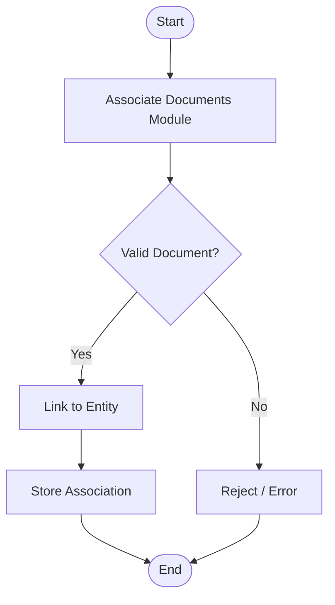

# Diagram: entity_core/entity_service/entity_service/trip_leg/associate_documents/__init__.py

> Auto-generated by Obscura crawlers

## Mermaid

### SVG

<svg id="container" width="408.828125" xmlns="http://www.w3.org/2000/svg" class="flowchart" height="728.71875" viewBox="0 0 408.828125 728.71875" role="graphics-document document" aria-roledescription="flowchart-v2"><g><marker id="container_flowchart-v2-pointEnd" class="marker flowchart-v2" viewBox="0 0 10 10" refX="5" refY="5" markerUnits="userSpaceOnUse" markerWidth="8" markerHeight="8" orient="auto"><path d="M 0 0 L 10 5 L 0 10 z" class="arrowMarkerPath" style="stroke-width: 1; stroke-dasharray: 1, 0;"></path></marker><marker id="container_flowchart-v2-pointStart" class="marker flowchart-v2" viewBox="0 0 10 10" refX="4.5" refY="5" markerUnits="userSpaceOnUse" markerWidth="8" markerHeight="8" orient="auto"><path d="M 0 5 L 10 10 L 10 0 z" class="arrowMarkerPath" style="stroke-width: 1; stroke-dasharray: 1, 0;"></path></marker><marker id="container_flowchart-v2-circleEnd" class="marker flowchart-v2" viewBox="0 0 10 10" refX="11" refY="5" markerUnits="userSpaceOnUse" markerWidth="11" markerHeight="11" orient="auto"><circle cx="5" cy="5" r="5" class="arrowMarkerPath" style="stroke-width: 1; stroke-dasharray: 1, 0;"></circle></marker><marker id="container_flowchart-v2-circleStart" class="marker flowchart-v2" viewBox="0 0 10 10" refX="-1" refY="5" markerUnits="userSpaceOnUse" markerWidth="11" markerHeight="11" orient="auto"><circle cx="5" cy="5" r="5" class="arrowMarkerPath" style="stroke-width: 1; stroke-dasharray: 1, 0;"></circle></marker><marker id="container_flowchart-v2-crossEnd" class="marker cross flowchart-v2" viewBox="0 0 11 11" refX="12" refY="5.2" markerUnits="userSpaceOnUse" markerWidth="11" markerHeight="11" orient="auto"><path d="M 1,1 l 9,9 M 10,1 l -9,9" class="arrowMarkerPath" style="stroke-width: 2; stroke-dasharray: 1, 0;"></path></marker><marker id="container_flowchart-v2-crossStart" class="marker cross flowchart-v2" viewBox="0 0 11 11" refX="-1" refY="5.2" markerUnits="userSpaceOnUse" markerWidth="11" markerHeight="11" orient="auto"><path d="M 1,1 l 9,9 M 10,1 l -9,9" class="arrowMarkerPath" style="stroke-width: 2; stroke-dasharray: 1, 0;"></path></marker><g class="root"><g class="clusters"></g><g class="edgePaths"><path d="M211.926,47.5L211.842,51.583C211.759,55.667,211.592,63.833,211.509,71.417C211.426,79,211.426,86,211.426,89.5L211.426,93" id="L_Start_AD_0" class="edge-thickness-normal edge-pattern-solid edge-thickness-normal edge-pattern-solid flowchart-link" style=";" data-edge="true" data-et="edge" data-id="L_Start_AD_0" data-points="W3sieCI6MjExLjkyNTc4MTI1LCJ5Ijo0Ny41fSx7IngiOjIxMS40MjU3ODEyNSwieSI6NzJ9LHsieCI6MjExLjQyNTc4MTI1LCJ5Ijo5N31d" marker-end="url(#container_flowchart-v2-pointEnd)"></path><path d="M211.426,175L211.426,179.167C211.426,183.333,211.426,191.667,211.426,199.333C211.426,207,211.426,214,211.426,217.5L211.426,221" id="L_AD_V_0" class="edge-thickness-normal edge-pattern-solid edge-thickness-normal edge-pattern-solid flowchart-link" style=";" data-edge="true" data-et="edge" data-id="L_AD_V_0" data-points="W3sieCI6MjExLjQyNTc4MTI1LCJ5IjoxNzV9LHsieCI6MjExLjQyNTc4MTI1LCJ5IjoyMDB9LHsieCI6MjExLjQyNTc4MTI1LCJ5IjoyMjV9XQ==" marker-end="url(#container_flowchart-v2-pointEnd)"></path><path d="M170.283,358.576L158.689,371.6C147.095,384.624,123.907,410.671,112.313,429.195C100.719,447.719,100.719,458.719,100.719,464.219L100.719,469.719" id="L_V_L_0" class="edge-thickness-normal edge-pattern-solid edge-thickness-normal edge-pattern-solid flowchart-link" style=";" data-edge="true" data-et="edge" data-id="L_V_L_0" data-points="W3sieCI6MTcwLjI4Mjk1MTgxNTU4MTUzLCJ5IjozNTguNTc1OTIwNTY1NTgxNTV9LHsieCI6MTAwLjcxODc1LCJ5Ijo0MzYuNzE4NzV9LHsieCI6MTAwLjcxODc1LCJ5Ijo0NzMuNzE4NzV9XQ==" marker-end="url(#container_flowchart-v2-pointEnd)"></path><path d="M252.569,358.576L264.163,371.6C275.757,384.624,298.945,410.671,310.539,434.362C322.133,458.052,322.133,479.385,322.133,498.719C322.133,518.052,322.133,535.385,322.133,547.552C322.133,559.719,322.133,566.719,322.133,570.219L322.133,573.719" id="L_V_R_0" class="edge-thickness-normal edge-pattern-solid edge-thickness-normal edge-pattern-solid flowchart-link" style=";" data-edge="true" data-et="edge" data-id="L_V_R_0" data-points="W3sieCI6MjUyLjU2ODYxMDY4NDQxODQ3LCJ5IjozNTguNTc1OTIwNTY1NTgxNTV9LHsieCI6MzIyLjEzMjgxMjUsInkiOjQzNi43MTg3NX0seyJ4IjozMjIuMTMyODEyNSwieSI6NTAwLjcxODc1fSx7IngiOjMyMi4xMzI4MTI1LCJ5Ijo1NTIuNzE4NzV9LHsieCI6MzIyLjEzMjgxMjUsInkiOjU3Ny43MTg3NX1d" marker-end="url(#container_flowchart-v2-pointEnd)"></path><path d="M100.719,527.719L100.719,531.885C100.719,536.052,100.719,544.385,100.719,552.052C100.719,559.719,100.719,566.719,100.719,570.219L100.719,573.719" id="L_L_S_0" class="edge-thickness-normal edge-pattern-solid edge-thickness-normal edge-pattern-solid flowchart-link" style=";" data-edge="true" data-et="edge" data-id="L_L_S_0" data-points="W3sieCI6MTAwLjcxODc1LCJ5Ijo1MjcuNzE4NzV9LHsieCI6MTAwLjcxODc1LCJ5Ijo1NTIuNzE4NzV9LHsieCI6MTAwLjcxODc1LCJ5Ijo1NzcuNzE4NzV9XQ==" marker-end="url(#container_flowchart-v2-pointEnd)"></path><path d="M100.719,631.719L100.719,635.885C100.719,640.052,100.719,648.385,114.705,658.222C128.691,668.058,156.663,679.397,170.649,685.067L184.635,690.736" id="L_S_End_0" class="edge-thickness-normal edge-pattern-solid edge-thickness-normal edge-pattern-solid flowchart-link" style=";" data-edge="true" data-et="edge" data-id="L_S_End_0" data-points="W3sieCI6MTAwLjcxODc1LCJ5Ijo2MzEuNzE4NzV9LHsieCI6MTAwLjcxODc1LCJ5Ijo2NTYuNzE4NzV9LHsieCI6MTg4LjM0MTcwMTg1NzE1NDEsInkiOjY5Mi4yMzg4NTA0NzQ4MTM4fV0=" marker-end="url(#container_flowchart-v2-pointEnd)"></path><path d="M322.133,631.719L322.133,635.885C322.133,640.052,322.133,648.385,308.312,658.219C294.492,668.053,266.851,679.387,253.031,685.054L239.211,690.721" id="L_R_End_0" class="edge-thickness-normal edge-pattern-solid edge-thickness-normal edge-pattern-solid flowchart-link" style=";" data-edge="true" data-et="edge" data-id="L_R_End_0" data-points="W3sieCI6MzIyLjEzMjgxMjUsInkiOjYzMS43MTg3NX0seyJ4IjozMjIuMTMyODEyNSwieSI6NjU2LjcxODc1fSx7IngiOjIzNS41MDk4NjE0ODgwNDk1MiwieSI6NjkyLjIzODg1MDEzNTA3NDF9XQ==" marker-end="url(#container_flowchart-v2-pointEnd)"></path></g><g class="edgeLabels"><g class="edgeLabel"><g class="label" data-id="L_Start_AD_0" transform="translate(0, 0)"><foreignObject width="0" height="0">

</foreignObject></g></g><g class="edgeLabel"><g class="label" data-id="L_AD_V_0" transform="translate(0, 0)"><foreignObject width="0" height="0">

</foreignObject></g></g><g class="edgeLabel" transform="translate(100.71875, 436.71875)"><g class="label" data-id="L_V_L_0" transform="translate(-12.03125, -12)"><foreignObject width="24.0625" height="24">

Yes

</foreignObject></g></g><g class="edgeLabel" transform="translate(322.1328125, 500.71875)"><g class="label" data-id="L_V_R_0" transform="translate(-10.140625, -12)"><foreignObject width="20.28125" height="24">

No

</foreignObject></g></g><g class="edgeLabel"><g class="label" data-id="L_L_S_0" transform="translate(0, 0)"><foreignObject width="0" height="0">

</foreignObject></g></g><g class="edgeLabel"><g class="label" data-id="L_S_End_0" transform="translate(0, 0)"><foreignObject width="0" height="0">

</foreignObject></g></g><g class="edgeLabel"><g class="label" data-id="L_R_End_0" transform="translate(0, 0)"><foreignObject width="0" height="0">

</foreignObject></g></g></g><g class="nodes"><g class="node default" id="flowchart-Start-0" transform="translate(211.42578125, 27.5)"><g class="basic label-container outer-path"><path d="M-10.3984375 -19.5 C-2.9458956996123558 -19.5, 4.5066461007752885 -19.5, 10.3984375 -19.5 C10.3984375 -19.5, 10.398437499999998 -19.5, 10.398437499999998 -19.5 C10.815966104832288 -19.486610670313155, 11.233494709664578 -19.473221340626313, 11.6478067896239 -19.45993515863156 C12.109737745502207 -19.415373234871232, 12.571668701380514 -19.370811311110906, 12.892042152847864 -19.3399052695533 C13.304195323508708 -19.27327154121643, 13.716348494169553 -19.20663781287956, 14.126030759676757 -19.140403561325776 C14.57748994717743 -19.037360947825267, 15.0289491346781 -18.93431833432476, 15.34470188623539 -18.862249829261074 C15.634131130002773 -18.776348748956018, 15.923560373770158 -18.69044766865096, 16.543047751460602 -18.50658706670804 C16.94667232617741 -18.358049492147586, 17.350296900894218 -18.209511917587133, 17.716144095147794 -18.074876768247425 C18.0062584993341 -17.946451727452178, 18.296372903520403 -17.818026686656932, 18.85917041279238 -17.568892924097174 C19.183588775852787 -17.39964407188844, 19.50800713891319 -17.230395219679707, 19.967429764076783 -16.990714730406097 C20.35593192038989 -16.755202440157, 20.744434076702994 -16.519690149907905, 21.036368073605697 -16.342718045390892 C21.26618295258215 -16.182409134342688, 21.495997831558604 -16.022100223294483, 22.061592844578712 -15.627565626425154 C22.38458618100438 -15.36998703583934, 22.70757951743005 -15.112408445253529, 23.03889120850187 -14.848196188198123 C23.301970436530635 -14.609274593997338, 23.565049664559403 -14.370352999796552, 23.964247236767985 -14.007812326905688 C24.177907320504506 -13.787190748628623, 24.391567404241023 -13.566569170351558, 24.833858442968648 -13.10986736009568 C25.02171213130824 -12.88920372859432, 25.209565819647832 -12.668540097092956, 25.644151408126582 -12.158051136245305 C25.833401421363522 -11.904473359538693, 26.02265143460046 -11.650895582832081, 26.391796464640635 -11.156274872382312 C26.6491318609763 -10.760938599381307, 26.90646725731197 -10.365602326380301, 27.073721378604247 -10.108655082055241 C27.26850690426126 -9.762793657077928, 27.46329242991827 -9.416932232100617, 27.6871239742735 -9.019496659696287 C27.809421883232364 -8.765542434987148, 27.93171979219123 -8.51158821027801, 28.22948364880834 -7.893275190886684 C28.34551431189308 -7.606677209767118, 28.46154497497782 -7.320079228647551, 28.698571729970325 -6.734618561215508 C28.80860499441652 -6.4032159001234445, 28.918638258862714 -6.071813239031381, 29.09246063421488 -5.548287939305138 C29.18343037354914 -5.201380896689178, 29.274400112883402 -4.854473854073219, 29.40953178754556 -4.339158212148133 C29.48436807705593 -3.954889682167784, 29.559204366566295 -3.570621152187435, 29.648482276581777 -3.1121979531509023 C29.682579452036414 -2.847746993573627, 29.716676627491047 -2.5832960339963513, 29.808330202509367 -1.872449005199798 C29.828355800136276 -1.5605341577892369, 29.848381397763184 -1.2486193103786758, 29.888418715913414 -0.6250057626472757 C29.888418715913414 -0.3089445738012758, 29.888418715913414 0.007116615044724051, 29.888418715913414 0.625005762647271 C29.869176674815336 0.9247160846458632, 29.849934633717258 1.2244264066444552, 29.808330202509367 1.8724490051997846 C29.768406049406778 2.1820928527477177, 29.728481896304185 2.4917367002956503, 29.648482276581777 3.1121979531508885 C29.55623576148663 3.5858643118566143, 29.463989246391478 4.05953067056234, 29.40953178754556 4.339158212148129 C29.29512374667996 4.775445656727244, 29.180715705814354 5.211733101306358, 29.092460634214884 5.548287939305125 C28.974566548377357 5.903366141976081, 28.85667246253983 6.258444344647035, 28.69857172997033 6.734618561215495 C28.594366772676196 6.9920068203977985, 28.490161815382063 7.249395079580101, 28.229483648808344 7.893275190886679 C28.041399535483745 8.283835876560548, 27.85331542215914 8.674396562234417, 27.687123974273504 9.019496659696284 C27.54958617225816 9.263708954387196, 27.412048370242815 9.50792124907811, 27.07372137860425 10.108655082055236 C26.900572388897046 10.374658427259435, 26.72742339918984 10.640661772463634, 26.39179646464064 11.156274872382301 C26.11363170281703 11.52899031189482, 25.835466940993417 11.901705751407338, 25.644151408126582 12.158051136245302 C25.405202871679727 12.438733683712677, 25.166254335232868 12.719416231180052, 24.83385844296866 13.10986736009567 C24.59168885666195 13.359927340450145, 24.349519270355245 13.60998732080462, 23.96424723676799 14.007812326905684 C23.620192336845466 14.320273883821507, 23.276137436922944 14.632735440737331, 23.038891208501887 14.848196188198111 C22.788544821788726 15.04784076960472, 22.538198435075564 15.247485351011331, 22.061592844578715 15.627565626425152 C21.751176384479695 15.84409871127825, 21.44075992438068 16.060631796131347, 21.036368073605708 16.34271804539089 C20.74745060552583 16.517861512408412, 20.458533137445954 16.693004979425936, 19.967429764076787 16.990714730406093 C19.55095395599762 17.207989892715506, 19.134478147918454 17.425265055024923, 18.859170412792388 17.56889292409717 C18.48517165918454 17.734451078040518, 18.111172905576694 17.900009231983866, 17.716144095147804 18.07487676824742 C17.337842593170883 18.214095217955677, 16.959541091193966 18.353313667663933, 16.543047751460616 18.506587066708033 C16.185082823908566 18.612829178209235, 15.827117896356517 18.719071289710435, 15.344701886235413 18.86224982926107 C15.081901154242018 18.922232381403518, 14.819100422248624 18.982214933545965, 14.126030759676766 19.140403561325773 C13.657545656238657 19.216144599693408, 13.189060552800546 19.291885638061043, 12.892042152847878 19.3399052695533 C12.492011254344934 19.378495769224333, 12.091980355841988 19.417086268895368, 11.6478067896239 19.45993515863156 C11.306869492780756 19.47086835414713, 10.96593219593761 19.4818015496627, 10.398437500000004 19.5 C10.398437500000002 19.5, 10.398437500000002 19.5, 10.3984375 19.5 C5.127814856426476 19.5, -0.14280778714704745 19.5, -10.398437499999996 19.5 C-10.873533401117713 19.484764599169228, -11.34862930223543 19.469529198338456, -11.647806789623893 19.45993515863156 C-11.929183763423802 19.432791060374402, -12.210560737223712 19.40564696211725, -12.892042152847871 19.3399052695533 C-13.343375292309435 19.266937227705924, -13.794708431771 19.19396918585855, -14.126030759676759 19.140403561325773 C-14.465461429288972 19.062930725978905, -14.804892098901183 18.98545789063204, -15.344701886235388 18.862249829261074 C-15.75032903873877 18.741861819578443, -16.15595619124215 18.621473809895814, -16.54304775146059 18.506587066708043 C-16.941080007020364 18.36010751729221, -17.339112262580137 18.213627967876377, -17.716144095147797 18.074876768247425 C-18.074202133991754 17.916375095865547, -18.43226017283571 17.75787342348367, -18.85917041279238 17.568892924097174 C-19.105835750842356 17.44020777523319, -19.352501088892332 17.31152262636921, -19.96742976407678 16.990714730406097 C-20.188384391780563 16.856770736618543, -20.409339019484346 16.72282674283099, -21.036368073605686 16.3427180453909 C-21.38583171064068 16.098947340232318, -21.73529534767567 15.855176635073732, -22.061592844578712 15.627565626425156 C-22.280826017915302 15.45273300472898, -22.500059191251893 15.277900383032806, -23.03889120850187 14.848196188198125 C-23.371220213060223 14.54638377920185, -23.703549217618576 14.244571370205575, -23.964247236767974 14.007812326905697 C-24.310782962993272 13.649985738465835, -24.657318689218574 13.292159150025974, -24.833858442968655 13.109867360095677 C-25.057108520400327 12.847625115855159, -25.280358597832002 12.585382871614641, -25.64415140812658 12.158051136245307 C-25.92793551391212 11.77780628775657, -26.21171961969766 11.397561439267836, -26.391796464640635 11.156274872382316 C-26.6210732706611 10.80404412889193, -26.850350076681565 10.451813385401543, -27.073721378604244 10.108655082055249 C-27.29276040547424 9.719729109740971, -27.511799432344237 9.330803137426692, -27.6871239742735 9.019496659696289 C-27.819480077048986 8.744656380316064, -27.951836179824472 8.469816100935839, -28.22948364880834 7.893275190886686 C-28.354282895192437 7.585018639488683, -28.479082141576534 7.27676208809068, -28.698571729970325 6.73461856121551 C-28.849418356963817 6.280292554857216, -29.00026498395731 5.825966548498923, -29.09246063421488 5.5482879393051325 C-29.184751840398473 5.196341570865307, -29.27704304658207 4.844395202425482, -29.409531787545557 4.339158212148136 C-29.462673538844196 4.066286550742743, -29.515815290142836 3.7934148893373503, -29.648482276581777 3.112197953150904 C-29.69886354953789 2.721450749010941, -29.749244822494 2.3307035448709783, -29.808330202509364 1.872449005199809 C-29.832311395664927 1.498922564531178, -29.856292588820494 1.1253961238625467, -29.888418715913414 0.6250057626472781 C-29.888418715913414 0.15824151690755728, -29.888418715913414 -0.3085227288321636, -29.888418715913414 -0.6250057626472687 C-29.86393142243305 -1.0064151243914856, -29.839444128952685 -1.3878244861357025, -29.808330202509367 -1.8724490051997822 C-29.749625393530465 -2.327751911064408, -29.690920584551563 -2.783054816929034, -29.648482276581777 -3.112197953150895 C-29.565591724926442 -3.537823416976744, -29.482701173271106 -3.9634488808025927, -29.40953178754556 -4.339158212148126 C-29.29089545000785 -4.791569984493357, -29.17225911247014 -5.243981756838588, -29.092460634214884 -5.548287939305123 C-28.961339104398345 -5.943205095733872, -28.830217574581802 -6.338122252162622, -28.698571729970332 -6.734618561215485 C-28.543091196163587 -7.1186584857297674, -28.387610662356845 -7.502698410244051, -28.229483648808344 -7.893275190886676 C-28.024554214511344 -8.318815545991859, -27.819624780214347 -8.744355901097041, -27.687123974273504 -9.019496659696282 C-27.540044234326693 -9.280651631410501, -27.392964494379886 -9.541806603124721, -27.073721378604247 -10.108655082055243 C-26.87768691387889 -10.409816662497834, -26.681652449153535 -10.710978242940422, -26.39179646464064 -11.156274872382308 C-26.137303397843265 -11.49727239709545, -25.88281033104589 -11.838269921808594, -25.644151408126586 -12.158051136245302 C-25.3921756062058 -12.454036251010757, -25.140199804285018 -12.750021365776213, -24.833858442968662 -13.10986736009567 C-24.624940750535654 -13.32559202999429, -24.416023058102645 -13.541316699892912, -23.964247236767996 -14.007812326905677 C-23.637999177182365 -14.304102182570713, -23.31175111759673 -14.60039203823575, -23.038891208501887 -14.848196188198107 C-22.659602469387803 -15.15066886434435, -22.280313730273722 -15.453141540490593, -22.06159284457872 -15.627565626425149 C-21.77666619533923 -15.826318122658765, -21.49173954609974 -16.025070618892382, -21.03636807360571 -16.342718045390885 C-20.68039766774856 -16.558509397335794, -20.324427261891415 -16.774300749280698, -19.96742976407679 -16.99071473040609 C-19.64964932629724 -17.156500581247595, -19.33186888851769 -17.322286432089104, -18.859170412792388 -17.56889292409717 C-18.61433425773687 -17.677274627133755, -18.36949810268136 -17.78565633017034, -17.716144095147804 -18.07487676824742 C-17.343480409691335 -18.212020449360747, -16.970816724234865 -18.349164130474072, -16.54304775146062 -18.506587066708033 C-16.16844835019937 -18.61776620268999, -15.793848948938116 -18.728945338671945, -15.344701886235413 -18.862249829261067 C-14.991994643915321 -18.942752955690775, -14.63928740159523 -19.023256082120483, -14.126030759676768 -19.140403561325773 C-13.78785330298 -19.195077469919163, -13.449675846283235 -19.24975137851255, -12.89204215284788 -19.3399052695533 C-12.568391545447575 -19.3711274544024, -12.244740938047268 -19.402349639251504, -11.647806789623903 -19.45993515863156 C-11.213373559831183 -19.473866586738026, -10.778940330038463 -19.487798014844497, -10.398437500000005 -19.5 C-10.398437500000004 -19.5, -10.398437500000002 -19.5, -10.3984375 -19.5" stroke="none" stroke-width="0" fill="#ECECFF" style=""></path><path d="M-10.3984375 -19.5 C-3.881193797566862 -19.5, 2.636049904866276 -19.5, 10.3984375 -19.5 M-10.3984375 -19.5 C-5.785106601031044 -19.5, -1.1717757020620887 -19.5, 10.3984375 -19.5 M10.3984375 -19.5 C10.3984375 -19.5, 10.398437499999998 -19.5, 10.398437499999998 -19.5 M10.3984375 -19.5 C10.3984375 -19.5, 10.398437499999998 -19.5, 10.398437499999998 -19.5 M10.398437499999998 -19.5 C10.869552090847383 -19.484892272040447, 11.340666681694769 -19.469784544080895, 11.6478067896239 -19.45993515863156 M10.398437499999998 -19.5 C10.677692141703496 -19.491044847176756, 10.956946783406995 -19.48208969435351, 11.6478067896239 -19.45993515863156 M11.6478067896239 -19.45993515863156 C12.009710223680463 -19.42502276960068, 12.371613657737026 -19.3901103805698, 12.892042152847864 -19.3399052695533 M11.6478067896239 -19.45993515863156 C11.942378470770016 -19.431518182825673, 12.236950151916133 -19.403101207019784, 12.892042152847864 -19.3399052695533 M12.892042152847864 -19.3399052695533 C13.270770084528275 -19.278675474638185, 13.649498016208687 -19.217445679723074, 14.126030759676757 -19.140403561325776 M12.892042152847864 -19.3399052695533 C13.22364230065723 -19.286294729253033, 13.555242448466595 -19.23268418895277, 14.126030759676757 -19.140403561325776 M14.126030759676757 -19.140403561325776 C14.597883057129929 -19.03270635355609, 15.0697353545831 -18.9250091457864, 15.34470188623539 -18.862249829261074 M14.126030759676757 -19.140403561325776 C14.431516262893467 -19.07067848869577, 14.737001766110176 -19.000953416065766, 15.34470188623539 -18.862249829261074 M15.34470188623539 -18.862249829261074 C15.67426731974288 -18.764436538520314, 16.003832753250368 -18.666623247779555, 16.543047751460602 -18.50658706670804 M15.34470188623539 -18.862249829261074 C15.704606303730559 -18.755432087325346, 16.064510721225727 -18.64861434538962, 16.543047751460602 -18.50658706670804 M16.543047751460602 -18.50658706670804 C16.876004001664555 -18.384056088819147, 17.20896025186851 -18.261525110930254, 17.716144095147794 -18.074876768247425 M16.543047751460602 -18.50658706670804 C16.87298647790552 -18.385166565456156, 17.20292520435044 -18.263746064204273, 17.716144095147794 -18.074876768247425 M17.716144095147794 -18.074876768247425 C18.076052485569065 -17.915556000111, 18.435960875990336 -17.75623523197458, 18.85917041279238 -17.568892924097174 M17.716144095147794 -18.074876768247425 C18.006463003777757 -17.94636119940138, 18.296781912407717 -17.817845630555336, 18.85917041279238 -17.568892924097174 M18.85917041279238 -17.568892924097174 C19.171866828647303 -17.405759404237273, 19.484563244502226 -17.242625884377375, 19.967429764076783 -16.990714730406097 M18.85917041279238 -17.568892924097174 C19.238429643788002 -17.37103362621389, 19.617688874783628 -17.173174328330603, 19.967429764076783 -16.990714730406097 M19.967429764076783 -16.990714730406097 C20.224127326553965 -16.83510315951011, 20.480824889031144 -16.67949158861412, 21.036368073605697 -16.342718045390892 M19.967429764076783 -16.990714730406097 C20.331767566170882 -16.769851013690072, 20.696105368264977 -16.548987296974047, 21.036368073605697 -16.342718045390892 M21.036368073605697 -16.342718045390892 C21.328249743497842 -16.139114027827976, 21.620131413389988 -15.93551001026506, 22.061592844578712 -15.627565626425154 M21.036368073605697 -16.342718045390892 C21.32506078153046 -16.14133850964848, 21.613753489455227 -15.939958973906071, 22.061592844578712 -15.627565626425154 M22.061592844578712 -15.627565626425154 C22.3390144641315 -15.406329267331149, 22.616436083684285 -15.185092908237142, 23.03889120850187 -14.848196188198123 M22.061592844578712 -15.627565626425154 C22.417352567244727 -15.343856714762822, 22.773112289910742 -15.06014780310049, 23.03889120850187 -14.848196188198123 M23.03889120850187 -14.848196188198123 C23.407251769635977 -14.513660872862495, 23.775612330770084 -14.179125557526868, 23.964247236767985 -14.007812326905688 M23.03889120850187 -14.848196188198123 C23.34768311106333 -14.567759552477836, 23.65647501362479 -14.28732291675755, 23.964247236767985 -14.007812326905688 M23.964247236767985 -14.007812326905688 C24.151074050762038 -13.814898302690137, 24.337900864756087 -13.621984278474589, 24.833858442968648 -13.10986736009568 M23.964247236767985 -14.007812326905688 C24.17571267607416 -13.789456899186614, 24.38717811538033 -13.571101471467541, 24.833858442968648 -13.10986736009568 M24.833858442968648 -13.10986736009568 C25.08168137257567 -12.8187604454551, 25.329504302182695 -12.527653530814518, 25.644151408126582 -12.158051136245305 M24.833858442968648 -13.10986736009568 C25.000177832371477 -12.91449914146176, 25.166497221774307 -12.719130922827842, 25.644151408126582 -12.158051136245305 M25.644151408126582 -12.158051136245305 C25.84449138980507 -11.889613812143926, 26.04483137148356 -11.621176488042547, 26.391796464640635 -11.156274872382312 M25.644151408126582 -12.158051136245305 C25.822197870747544 -11.919485096699642, 26.00024433336851 -11.680919057153979, 26.391796464640635 -11.156274872382312 M26.391796464640635 -11.156274872382312 C26.5396455761632 -10.929138934038262, 26.68749468768576 -10.702002995694212, 27.073721378604247 -10.108655082055241 M26.391796464640635 -11.156274872382312 C26.664337647868667 -10.737578427389135, 26.9368788310967 -10.318881982395956, 27.073721378604247 -10.108655082055241 M27.073721378604247 -10.108655082055241 C27.29326837278364 -9.71882716234586, 27.512815366963036 -9.328999242636481, 27.6871239742735 -9.019496659696287 M27.073721378604247 -10.108655082055241 C27.29261879655087 -9.719980550723871, 27.511516214497494 -9.331306019392503, 27.6871239742735 -9.019496659696287 M27.6871239742735 -9.019496659696287 C27.829591166111804 -8.723660487534476, 27.972058357950107 -8.427824315372664, 28.22948364880834 -7.893275190886684 M27.6871239742735 -9.019496659696287 C27.887271300084404 -8.603886455183213, 28.087418625895307 -8.188276250670137, 28.22948364880834 -7.893275190886684 M28.22948364880834 -7.893275190886684 C28.409183500701488 -7.449413082450329, 28.588883352594635 -7.005550974013974, 28.698571729970325 -6.734618561215508 M28.22948364880834 -7.893275190886684 C28.354306545748585 -7.584960222157742, 28.47912944268883 -7.2766452534288, 28.698571729970325 -6.734618561215508 M28.698571729970325 -6.734618561215508 C28.840373657561432 -6.307533748380057, 28.98217558515254 -5.880448935544606, 29.09246063421488 -5.548287939305138 M28.698571729970325 -6.734618561215508 C28.855952521628385 -6.260612691965296, 29.01333331328645 -5.7866068227150835, 29.09246063421488 -5.548287939305138 M29.09246063421488 -5.548287939305138 C29.19191736597968 -5.169016316265746, 29.29137409774448 -4.789744693226354, 29.40953178754556 -4.339158212148133 M29.09246063421488 -5.548287939305138 C29.198424078139055 -5.144203402775164, 29.304387522063227 -4.740118866245191, 29.40953178754556 -4.339158212148133 M29.40953178754556 -4.339158212148133 C29.46825848136385 -4.037609051282352, 29.52698517518214 -3.7360598904165716, 29.648482276581777 -3.1121979531509023 M29.40953178754556 -4.339158212148133 C29.48742357983922 -3.9392003211563273, 29.56531537213288 -3.5392424301645216, 29.648482276581777 -3.1121979531509023 M29.648482276581777 -3.1121979531509023 C29.68560608801353 -2.824273002611998, 29.722729899445277 -2.5363480520730937, 29.808330202509367 -1.872449005199798 M29.648482276581777 -3.1121979531509023 C29.69561322386058 -2.746659633114751, 29.742744171139382 -2.3811213130785998, 29.808330202509367 -1.872449005199798 M29.808330202509367 -1.872449005199798 C29.838950117570338 -1.395519112174584, 29.86957003263131 -0.9185892191493699, 29.888418715913414 -0.6250057626472757 M29.808330202509367 -1.872449005199798 C29.83569603225683 -1.4462041175828617, 29.863061862004294 -1.0199592299659255, 29.888418715913414 -0.6250057626472757 M29.888418715913414 -0.6250057626472757 C29.888418715913414 -0.2879363992231168, 29.888418715913414 0.04913296420104207, 29.888418715913414 0.625005762647271 M29.888418715913414 -0.6250057626472757 C29.888418715913414 -0.19658717713360535, 29.888418715913414 0.231831408380065, 29.888418715913414 0.625005762647271 M29.888418715913414 0.625005762647271 C29.862116667934615 1.034681390548075, 29.835814619955816 1.444357018448879, 29.808330202509367 1.8724490051997846 M29.888418715913414 0.625005762647271 C29.863524196917023 1.0127579905101052, 29.838629677920633 1.4005102183729394, 29.808330202509367 1.8724490051997846 M29.808330202509367 1.8724490051997846 C29.766888348462974 2.193863841563906, 29.72544649441658 2.515278677928027, 29.648482276581777 3.1121979531508885 M29.808330202509367 1.8724490051997846 C29.753889462379597 2.2946806351061775, 29.699448722249826 2.7169122650125703, 29.648482276581777 3.1121979531508885 M29.648482276581777 3.1121979531508885 C29.56917011235507 3.5194491538231802, 29.489857948128368 3.926700354495472, 29.40953178754556 4.339158212148129 M29.648482276581777 3.1121979531508885 C29.598961268369834 3.3664778640504305, 29.54944026015789 3.6207577749499724, 29.40953178754556 4.339158212148129 M29.40953178754556 4.339158212148129 C29.33812665637153 4.611456924494322, 29.2667215251975 4.883755636840516, 29.092460634214884 5.548287939305125 M29.40953178754556 4.339158212148129 C29.292095006673538 4.786995555035944, 29.174658225801515 5.234832897923761, 29.092460634214884 5.548287939305125 M29.092460634214884 5.548287939305125 C28.989200194492785 5.859291931431283, 28.88593975477069 6.170295923557441, 28.69857172997033 6.734618561215495 M29.092460634214884 5.548287939305125 C28.949769953940265 5.978049533619802, 28.807079273665646 6.40781112793448, 28.69857172997033 6.734618561215495 M28.69857172997033 6.734618561215495 C28.542496271948842 7.120127960042269, 28.386420813927355 7.505637358869042, 28.229483648808344 7.893275190886679 M28.69857172997033 6.734618561215495 C28.600163249565288 6.977689410414483, 28.501754769160247 7.220760259613471, 28.229483648808344 7.893275190886679 M28.229483648808344 7.893275190886679 C28.060956112628958 8.24322622567479, 27.892428576449575 8.593177260462902, 27.687123974273504 9.019496659696284 M28.229483648808344 7.893275190886679 C28.07528870690614 8.213464286989833, 27.92109376500394 8.533653383092986, 27.687123974273504 9.019496659696284 M27.687123974273504 9.019496659696284 C27.518388702920767 9.319103220282068, 27.34965343156803 9.618709780867853, 27.07372137860425 10.108655082055236 M27.687123974273504 9.019496659696284 C27.46178792358807 9.419603635437676, 27.236451872902634 9.819710611179069, 27.07372137860425 10.108655082055236 M27.07372137860425 10.108655082055236 C26.894933612000752 10.383321102795751, 26.716145845397254 10.657987123536264, 26.39179646464064 11.156274872382301 M27.07372137860425 10.108655082055236 C26.828553293890476 10.485299097024368, 26.5833852091767 10.8619431119935, 26.39179646464064 11.156274872382301 M26.39179646464064 11.156274872382301 C26.190673738814663 11.42576100233186, 25.98955101298868 11.69524713228142, 25.644151408126582 12.158051136245302 M26.39179646464064 11.156274872382301 C26.110089265461447 11.533736855228616, 25.828382066282256 11.911198838074931, 25.644151408126582 12.158051136245302 M25.644151408126582 12.158051136245302 C25.437682340887243 12.400581451047374, 25.231213273647903 12.643111765849447, 24.83385844296866 13.10986736009567 M25.644151408126582 12.158051136245302 C25.433460608493235 12.405540538140754, 25.22276980885989 12.653029940036205, 24.83385844296866 13.10986736009567 M24.83385844296866 13.10986736009567 C24.544196352422578 13.408967250284414, 24.254534261876493 13.708067140473156, 23.96424723676799 14.007812326905684 M24.83385844296866 13.10986736009567 C24.597147583379325 13.354290756944659, 24.36043672378999 13.598714153793647, 23.96424723676799 14.007812326905684 M23.96424723676799 14.007812326905684 C23.659846003908516 14.284261472573382, 23.355444771049044 14.560710618241082, 23.038891208501887 14.848196188198111 M23.96424723676799 14.007812326905684 C23.68225540672759 14.263909845853407, 23.400263576687195 14.520007364801128, 23.038891208501887 14.848196188198111 M23.038891208501887 14.848196188198111 C22.750591796445672 15.078107297343387, 22.462292384389457 15.308018406488662, 22.061592844578715 15.627565626425152 M23.038891208501887 14.848196188198111 C22.811817366029306 15.029281534881271, 22.58474352355672 15.21036688156443, 22.061592844578715 15.627565626425152 M22.061592844578715 15.627565626425152 C21.742676238264124 15.850028045312833, 21.423759631949533 16.072490464200513, 21.036368073605708 16.34271804539089 M22.061592844578715 15.627565626425152 C21.67896090609761 15.894473102839918, 21.296328967616507 16.161380579254683, 21.036368073605708 16.34271804539089 M21.036368073605708 16.34271804539089 C20.673069651136974 16.562951684069947, 20.309771228668236 16.783185322749002, 19.967429764076787 16.990714730406093 M21.036368073605708 16.34271804539089 C20.770741572223763 16.503742391523215, 20.50511507084182 16.664766737655537, 19.967429764076787 16.990714730406093 M19.967429764076787 16.990714730406093 C19.64894360823748 17.15686875390734, 19.330457452398175 17.32302277740859, 18.859170412792388 17.56889292409717 M19.967429764076787 16.990714730406093 C19.593419089985403 17.1858358595143, 19.219408415894023 17.3809569886225, 18.859170412792388 17.56889292409717 M18.859170412792388 17.56889292409717 C18.458531176058706 17.746244029658474, 18.057891939325025 17.923595135219774, 17.716144095147804 18.07487676824742 M18.859170412792388 17.56889292409717 C18.518244540927874 17.719810694364924, 18.17731866906336 17.870728464632677, 17.716144095147804 18.07487676824742 M17.716144095147804 18.07487676824742 C17.443910250525146 18.175061339570632, 17.171676405902492 18.275245910893844, 16.543047751460616 18.506587066708033 M17.716144095147804 18.07487676824742 C17.403971218495276 18.18975927254999, 17.091798341842743 18.30464177685256, 16.543047751460616 18.506587066708033 M16.543047751460616 18.506587066708033 C16.16929977426063 18.617513504497825, 15.79555179706064 18.728439942287615, 15.344701886235413 18.86224982926107 M16.543047751460616 18.506587066708033 C16.117210305006704 18.632973385549185, 15.691372858552791 18.759359704390338, 15.344701886235413 18.86224982926107 M15.344701886235413 18.86224982926107 C14.935659273521443 18.95561113636053, 14.526616660807475 19.04897244345999, 14.126030759676766 19.140403561325773 M15.344701886235413 18.86224982926107 C14.994909483669115 18.94208766253808, 14.645117081102816 19.02192549581509, 14.126030759676766 19.140403561325773 M14.126030759676766 19.140403561325773 C13.752729542751576 19.200756007084063, 13.379428325826387 19.261108452842354, 12.892042152847878 19.3399052695533 M14.126030759676766 19.140403561325773 C13.706661452310536 19.208203938683194, 13.287292144944308 19.276004316040616, 12.892042152847878 19.3399052695533 M12.892042152847878 19.3399052695533 C12.426025298869963 19.384861354989283, 11.960008444892047 19.429817440425264, 11.6478067896239 19.45993515863156 M12.892042152847878 19.3399052695533 C12.589975253056954 19.36904530008753, 12.28790835326603 19.398185330621764, 11.6478067896239 19.45993515863156 M11.6478067896239 19.45993515863156 C11.333604093882304 19.470011027525544, 11.019401398140706 19.480086896419532, 10.398437500000004 19.5 M11.6478067896239 19.45993515863156 C11.279992452594426 19.47173024851292, 10.91217811556495 19.48352533839428, 10.398437500000004 19.5 M10.398437500000004 19.5 C10.398437500000002 19.5, 10.398437500000002 19.5, 10.3984375 19.5 M10.398437500000004 19.5 C10.398437500000002 19.5, 10.398437500000002 19.5, 10.3984375 19.5 M10.3984375 19.5 C2.672951114173121 19.5, -5.052535271653758 19.5, -10.398437499999996 19.5 M10.3984375 19.5 C6.11393901592444 19.5, 1.8294405318488796 19.5, -10.398437499999996 19.5 M-10.398437499999996 19.5 C-10.658796706677657 19.4916507870003, -10.919155913355318 19.4833015740006, -11.647806789623893 19.45993515863156 M-10.398437499999996 19.5 C-10.65579227777753 19.49174713318736, -10.913147055555063 19.483494266374723, -11.647806789623893 19.45993515863156 M-11.647806789623893 19.45993515863156 C-12.141023552073648 19.412355130737975, -12.634240314523405 19.364775102844387, -12.892042152847871 19.3399052695533 M-11.647806789623893 19.45993515863156 C-11.921614028337252 19.433521303614263, -12.195421267050612 19.40710744859697, -12.892042152847871 19.3399052695533 M-12.892042152847871 19.3399052695533 C-13.228550849605876 19.285501153125384, -13.565059546363878 19.231097036697467, -14.126030759676759 19.140403561325773 M-12.892042152847871 19.3399052695533 C-13.372547165825408 19.26222094542712, -13.853052178802944 19.18453662130094, -14.126030759676759 19.140403561325773 M-14.126030759676759 19.140403561325773 C-14.536964100537402 19.04661070786499, -14.947897441398043 18.952817854404206, -15.344701886235388 18.862249829261074 M-14.126030759676759 19.140403561325773 C-14.583531156837216 19.035982081142997, -15.041031553997671 18.93156060096022, -15.344701886235388 18.862249829261074 M-15.344701886235388 18.862249829261074 C-15.70850547695339 18.754274833179988, -16.07230906767139 18.646299837098905, -16.54304775146059 18.506587066708043 M-15.344701886235388 18.862249829261074 C-15.69976033643059 18.756870344982975, -16.05481878662579 18.65149086070488, -16.54304775146059 18.506587066708043 M-16.54304775146059 18.506587066708043 C-17.007310463554948 18.335734097059856, -17.471573175649304 18.164881127411668, -17.716144095147797 18.074876768247425 M-16.54304775146059 18.506587066708043 C-16.921046934733994 18.367479873077286, -17.299046118007393 18.228372679446526, -17.716144095147797 18.074876768247425 M-17.716144095147797 18.074876768247425 C-18.148377887803726 17.883539689998546, -18.580611680459654 17.692202611749668, -18.85917041279238 17.568892924097174 M-17.716144095147797 18.074876768247425 C-18.042278064951617 17.930506934235755, -18.368412034755437 17.786137100224085, -18.85917041279238 17.568892924097174 M-18.85917041279238 17.568892924097174 C-19.191291485532304 17.395625573182457, -19.523412558272227 17.222358222267736, -19.96742976407678 16.990714730406097 M-18.85917041279238 17.568892924097174 C-19.28475276892551 17.34686688150103, -19.71033512505864 17.124840838904884, -19.96742976407678 16.990714730406097 M-19.96742976407678 16.990714730406097 C-20.359851221863632 16.752826536571245, -20.752272679650485 16.514938342736393, -21.036368073605686 16.3427180453909 M-19.96742976407678 16.990714730406097 C-20.286411340713443 16.797346224105137, -20.605392917350102 16.603977717804177, -21.036368073605686 16.3427180453909 M-21.036368073605686 16.3427180453909 C-21.285982799657095 16.168597618144773, -21.535597525708503 15.994477190898644, -22.061592844578712 15.627565626425156 M-21.036368073605686 16.3427180453909 C-21.33570216054896 16.13391554430305, -21.63503624749223 15.925113043215205, -22.061592844578712 15.627565626425156 M-22.061592844578712 15.627565626425156 C-22.397546623504777 15.359651427837136, -22.733500402430842 15.091737229249118, -23.03889120850187 14.848196188198125 M-22.061592844578712 15.627565626425156 C-22.42050689778373 15.34134122009823, -22.77942095098875 15.055116813771303, -23.03889120850187 14.848196188198125 M-23.03889120850187 14.848196188198125 C-23.32781311611588 14.585804956157851, -23.616735023729895 14.323413724117579, -23.964247236767974 14.007812326905697 M-23.03889120850187 14.848196188198125 C-23.290362354899507 14.619816746601721, -23.54183350129714 14.391437305005317, -23.964247236767974 14.007812326905697 M-23.964247236767974 14.007812326905697 C-24.163544509939463 13.802021529745707, -24.362841783110948 13.596230732585717, -24.833858442968655 13.109867360095677 M-23.964247236767974 14.007812326905697 C-24.235822912514283 13.72738814491999, -24.507398588260596 13.446963962934284, -24.833858442968655 13.109867360095677 M-24.833858442968655 13.109867360095677 C-25.030033452146263 12.879429031641413, -25.226208461323868 12.648990703187149, -25.64415140812658 12.158051136245307 M-24.833858442968655 13.109867360095677 C-25.054250597815738 12.850982194343418, -25.274642752662825 12.592097028591159, -25.64415140812658 12.158051136245307 M-25.64415140812658 12.158051136245307 C-25.94005974790555 11.761560918745817, -26.23596808768452 11.365070701246324, -26.391796464640635 11.156274872382316 M-25.64415140812658 12.158051136245307 C-25.936635796032085 11.766148702327826, -26.22912018393759 11.374246268410346, -26.391796464640635 11.156274872382316 M-26.391796464640635 11.156274872382316 C-26.658520215846295 10.746515565174727, -26.925243967051955 10.336756257967139, -27.073721378604244 10.108655082055249 M-26.391796464640635 11.156274872382316 C-26.578847617962847 10.868914070611831, -26.76589877128506 10.581553268841347, -27.073721378604244 10.108655082055249 M-27.073721378604244 10.108655082055249 C-27.291602763205777 9.72178462081262, -27.50948414780731 9.33491415956999, -27.6871239742735 9.019496659696289 M-27.073721378604244 10.108655082055249 C-27.301451689581388 9.704296854720779, -27.529182000558535 9.29993862738631, -27.6871239742735 9.019496659696289 M-27.6871239742735 9.019496659696289 C-27.80902773299995 8.766360896378224, -27.9309314917264 8.513225133060157, -28.22948364880834 7.893275190886686 M-27.6871239742735 9.019496659696289 C-27.803597690585715 8.777636495635683, -27.920071406897925 8.535776331575075, -28.22948364880834 7.893275190886686 M-28.22948364880834 7.893275190886686 C-28.37659256730982 7.529913318030579, -28.5237014858113 7.1665514451744725, -28.698571729970325 6.73461856121551 M-28.22948364880834 7.893275190886686 C-28.404338518349043 7.461380282532229, -28.579193387889745 7.029485374177772, -28.698571729970325 6.73461856121551 M-28.698571729970325 6.73461856121551 C-28.780940365763406 6.486537353866636, -28.863309001556487 6.238456146517762, -29.09246063421488 5.5482879393051325 M-28.698571729970325 6.73461856121551 C-28.81776069776425 6.375640380403303, -28.936949665558178 6.016662199591098, -29.09246063421488 5.5482879393051325 M-29.09246063421488 5.5482879393051325 C-29.190248437655587 5.175380663283612, -29.288036241096297 4.80247338726209, -29.409531787545557 4.339158212148136 M-29.09246063421488 5.5482879393051325 C-29.19347222976783 5.1630869467592895, -29.294483825320782 4.777885954213446, -29.409531787545557 4.339158212148136 M-29.409531787545557 4.339158212148136 C-29.49158817036909 3.9178160289719486, -29.573644553192626 3.496473845795761, -29.648482276581777 3.112197953150904 M-29.409531787545557 4.339158212148136 C-29.467876198524632 4.03957199286621, -29.52622060950371 3.7399857735842845, -29.648482276581777 3.112197953150904 M-29.648482276581777 3.112197953150904 C-29.687131149081633 2.8124449301251544, -29.725780021581485 2.5126919070994047, -29.808330202509364 1.872449005199809 M-29.648482276581777 3.112197953150904 C-29.696895589415366 2.73671385910356, -29.74530890224895 2.361229765056216, -29.808330202509364 1.872449005199809 M-29.808330202509364 1.872449005199809 C-29.829715406721714 1.5393571877662882, -29.85110061093407 1.2062653703327673, -29.888418715913414 0.6250057626472781 M-29.808330202509364 1.872449005199809 C-29.824355154471807 1.62284744327637, -29.840380106434246 1.373245881352931, -29.888418715913414 0.6250057626472781 M-29.888418715913414 0.6250057626472781 C-29.888418715913414 0.2832251533945935, -29.888418715913414 -0.05855545585809119, -29.888418715913414 -0.6250057626472687 M-29.888418715913414 0.6250057626472781 C-29.888418715913414 0.16228156379277808, -29.888418715913414 -0.300442635061722, -29.888418715913414 -0.6250057626472687 M-29.888418715913414 -0.6250057626472687 C-29.870879307210835 -0.89819621074583, -29.853339898508256 -1.1713866588443913, -29.808330202509367 -1.8724490051997822 M-29.888418715913414 -0.6250057626472687 C-29.857876577313917 -1.100724224504975, -29.827334438714423 -1.5764426863626815, -29.808330202509367 -1.8724490051997822 M-29.808330202509367 -1.8724490051997822 C-29.77090387085203 -2.1627202428689514, -29.733477539194695 -2.4529914805381208, -29.648482276581777 -3.112197953150895 M-29.808330202509367 -1.8724490051997822 C-29.750559631490614 -2.3205061459316476, -29.69278906047186 -2.7685632866635133, -29.648482276581777 -3.112197953150895 M-29.648482276581777 -3.112197953150895 C-29.595060394974997 -3.386508024483039, -29.541638513368216 -3.6608180958151824, -29.40953178754556 -4.339158212148126 M-29.648482276581777 -3.112197953150895 C-29.593145239360645 -3.396341943794445, -29.537808202139516 -3.6804859344379945, -29.40953178754556 -4.339158212148126 M-29.40953178754556 -4.339158212148126 C-29.312696108812325 -4.708434624006593, -29.215860430079093 -5.077711035865059, -29.092460634214884 -5.548287939305123 M-29.40953178754556 -4.339158212148126 C-29.327512776751504 -4.651932247570001, -29.24549376595745 -4.9647062829918776, -29.092460634214884 -5.548287939305123 M-29.092460634214884 -5.548287939305123 C-28.984905992648407 -5.872225383198406, -28.877351351081927 -6.196162827091688, -28.698571729970332 -6.734618561215485 M-29.092460634214884 -5.548287939305123 C-28.94113358195934 -6.004060910007343, -28.789806529703796 -6.459833880709564, -28.698571729970332 -6.734618561215485 M-28.698571729970332 -6.734618561215485 C-28.539279166857707 -7.12807427181587, -28.37998660374508 -7.521529982416255, -28.229483648808344 -7.893275190886676 M-28.698571729970332 -6.734618561215485 C-28.544874642929432 -7.114253337737539, -28.39117755588853 -7.493888114259593, -28.229483648808344 -7.893275190886676 M-28.229483648808344 -7.893275190886676 C-28.050278533811017 -8.265398446553835, -27.871073418813687 -8.637521702220994, -27.687123974273504 -9.019496659696282 M-28.229483648808344 -7.893275190886676 C-28.01490928746655 -8.338843443368757, -27.800334926124755 -8.784411695850837, -27.687123974273504 -9.019496659696282 M-27.687123974273504 -9.019496659696282 C-27.524176878763846 -9.308825727956318, -27.36122978325419 -9.598154796216356, -27.073721378604247 -10.108655082055243 M-27.687123974273504 -9.019496659696282 C-27.558015346193212 -9.248742102519094, -27.42890671811292 -9.477987545341904, -27.073721378604247 -10.108655082055243 M-27.073721378604247 -10.108655082055243 C-26.82474824164888 -10.491144679067055, -26.575775104693513 -10.873634276078866, -26.39179646464064 -11.156274872382308 M-27.073721378604247 -10.108655082055243 C-26.852340949622604 -10.448754869939867, -26.630960520640965 -10.788854657824492, -26.39179646464064 -11.156274872382308 M-26.39179646464064 -11.156274872382308 C-26.100513231574208 -11.54656786824289, -25.809229998507774 -11.936860864103474, -25.644151408126586 -12.158051136245302 M-26.39179646464064 -11.156274872382308 C-26.147898347642222 -11.483076129584632, -25.904000230643803 -11.809877386786956, -25.644151408126586 -12.158051136245302 M-25.644151408126586 -12.158051136245302 C-25.331597454136748 -12.525194795425568, -25.01904350014691 -12.892338454605836, -24.833858442968662 -13.10986736009567 M-25.644151408126586 -12.158051136245302 C-25.40172534638487 -12.442818582800816, -25.15929928464315 -12.727586029356331, -24.833858442968662 -13.10986736009567 M-24.833858442968662 -13.10986736009567 C-24.526220984762002 -13.427528293199089, -24.218583526555342 -13.745189226302509, -23.964247236767996 -14.007812326905677 M-24.833858442968662 -13.10986736009567 C-24.540560407759806 -13.412721661665337, -24.247262372550946 -13.715575963235002, -23.964247236767996 -14.007812326905677 M-23.964247236767996 -14.007812326905677 C-23.71341273153794 -14.235613587838287, -23.462578226307883 -14.463414848770897, -23.038891208501887 -14.848196188198107 M-23.964247236767996 -14.007812326905677 C-23.629350421498188 -14.311956753649545, -23.294453606228384 -14.616101180393413, -23.038891208501887 -14.848196188198107 M-23.038891208501887 -14.848196188198107 C-22.719397975014633 -15.102983539832186, -22.39990474152738 -15.357770891466265, -22.06159284457872 -15.627565626425149 M-23.038891208501887 -14.848196188198107 C-22.791523590964417 -15.04546528045548, -22.54415597342695 -15.242734372712853, -22.06159284457872 -15.627565626425149 M-22.06159284457872 -15.627565626425149 C-21.707978671203406 -15.874231566060919, -21.354364497828094 -16.12089750569669, -21.03636807360571 -16.342718045390885 M-22.06159284457872 -15.627565626425149 C-21.66762391216507 -15.9023812990367, -21.27365497975142 -16.17719697164825, -21.03636807360571 -16.342718045390885 M-21.03636807360571 -16.342718045390885 C-20.731881303163195 -16.527299714996015, -20.427394532720683 -16.71188138460115, -19.96742976407679 -16.99071473040609 M-21.03636807360571 -16.342718045390885 C-20.78719591631794 -16.49376767143686, -20.538023759030175 -16.644817297482838, -19.96742976407679 -16.99071473040609 M-19.96742976407679 -16.99071473040609 C-19.620320332684383 -17.171801498429307, -19.27321090129197 -17.352888266452528, -18.859170412792388 -17.56889292409717 M-19.96742976407679 -16.99071473040609 C-19.730534439711683 -17.11430286938867, -19.493639115346575 -17.23789100837125, -18.859170412792388 -17.56889292409717 M-18.859170412792388 -17.56889292409717 C-18.51157698386107 -17.722762224092346, -18.163983554929754 -17.87663152408752, -17.716144095147804 -18.07487676824742 M-18.859170412792388 -17.56889292409717 C-18.521743784434335 -17.718261683065986, -18.184317156076283 -17.867630442034798, -17.716144095147804 -18.07487676824742 M-17.716144095147804 -18.07487676824742 C-17.27408819357902 -18.237557426344694, -16.832032292010233 -18.400238084441966, -16.54304775146062 -18.506587066708033 M-17.716144095147804 -18.07487676824742 C-17.44605289295553 -18.17427282734988, -17.17596169076326 -18.27366888645234, -16.54304775146062 -18.506587066708033 M-16.54304775146062 -18.506587066708033 C-16.24671215977089 -18.594537914824283, -15.950376568081158 -18.682488762940533, -15.344701886235413 -18.862249829261067 M-16.54304775146062 -18.506587066708033 C-16.194923362361376 -18.60990855805048, -15.846798973262135 -18.713230049392926, -15.344701886235413 -18.862249829261067 M-15.344701886235413 -18.862249829261067 C-14.890199467540091 -18.965987040422814, -14.435697048844768 -19.069724251584564, -14.126030759676768 -19.140403561325773 M-15.344701886235413 -18.862249829261067 C-15.04083379938838 -18.931605737159323, -14.736965712541348 -19.000961645057576, -14.126030759676768 -19.140403561325773 M-14.126030759676768 -19.140403561325773 C-13.678554615438586 -19.212748034096876, -13.231078471200401 -19.28509250686798, -12.89204215284788 -19.3399052695533 M-14.126030759676768 -19.140403561325773 C-13.77965029918067 -19.196403667958194, -13.433269838684573 -19.25240377459061, -12.89204215284788 -19.3399052695533 M-12.89204215284788 -19.3399052695533 C-12.5159106529387 -19.376190222985226, -12.139779153029519 -19.412475176417153, -11.647806789623903 -19.45993515863156 M-12.89204215284788 -19.3399052695533 C-12.52161709984726 -19.375639728914962, -12.15119204684664 -19.41137418827663, -11.647806789623903 -19.45993515863156 M-11.647806789623903 -19.45993515863156 C-11.243964485819987 -19.47288559528319, -10.84012218201607 -19.485836031934824, -10.398437500000005 -19.5 M-11.647806789623903 -19.45993515863156 C-11.347621993446822 -19.4695615007707, -11.047437197269742 -19.479187842909838, -10.398437500000005 -19.5 M-10.398437500000005 -19.5 C-10.398437500000004 -19.5, -10.398437500000002 -19.5, -10.3984375 -19.5 M-10.398437500000005 -19.5 C-10.398437500000004 -19.5, -10.398437500000002 -19.5, -10.3984375 -19.5" stroke="#9370DB" stroke-width="1.3" fill="none" stroke-dasharray="0 0" style=""></path></g><g class="label" style="" transform="translate(-17.5234375, -12)"><rect></rect><foreignObject width="35.046875" height="24">

Start

</foreignObject></g></g><g class="node default" id="flowchart-AD-1" transform="translate(211.42578125, 136)"><rect class="basic label-container" style="" x="-130" y="-39" width="260" height="78"></rect><g class="label" style="" transform="translate(-100, -24)"><rect></rect><foreignObject width="200" height="48">

Associate Documents Module

</foreignObject></g></g><g class="node default" id="flowchart-V-3" transform="translate(211.42578125, 312.359375)"><polygon points="87.359375,0 174.71875,-87.359375 87.359375,-174.71875 0,-87.359375" class="label-container" transform="translate(-86.859375, 87.359375)"></polygon><g class="label" style="" transform="translate(-60.359375, -12)"><rect></rect><foreignObject width="120.71875" height="24">

Valid Document?

</foreignObject></g></g><g class="node default" id="flowchart-L-5" transform="translate(100.71875, 500.71875)"><rect class="basic label-container" style="" x="-77.5234375" y="-27" width="155.046875" height="54"></rect><g class="label" style="" transform="translate(-47.5234375, -12)"><rect></rect><foreignObject width="95.046875" height="24">

Link to Entity

</foreignObject></g></g><g class="node default" id="flowchart-R-7" transform="translate(322.1328125, 604.71875)"><rect class="basic label-container" style="" x="-78.6953125" y="-27" width="157.390625" height="54"></rect><g class="label" style="" transform="translate(-48.6953125, -12)"><rect></rect><foreignObject width="97.390625" height="24">

Reject / Error

</foreignObject></g></g><g class="node default" id="flowchart-S-9" transform="translate(100.71875, 604.71875)"><rect class="basic label-container" style="" x="-92.71875" y="-27" width="185.4375" height="54"></rect><g class="label" style="" transform="translate(-62.71875, -12)"><rect></rect><foreignObject width="125.4375" height="24">

Store Association

</foreignObject></g></g><g class="node default" id="flowchart-End-11" transform="translate(211.42578125, 701.21875)"><g class="basic label-container outer-path"><path d="M-6.5546875 -19.5 C-3.803381131566307 -19.5, -1.0520747631326142 -19.5, 6.5546875 -19.5 C6.5546875 -19.5, 6.5546875 -19.5, 6.554687499999999 -19.5 C7.036562687600631 -19.4845472006468, 7.518437875201262 -19.469094401293603, 7.8040567896239 -19.45993515863156 C8.155072055938813 -19.42607313804778, 8.506087322253727 -19.392211117464, 9.048292152847864 -19.3399052695533 C9.358197756510299 -19.289802134907006, 9.668103360172733 -19.239699000260718, 10.282280759676757 -19.140403561325776 C10.70575946526544 -19.04374731023197, 11.129238170854126 -18.947091059138167, 11.50095188623539 -18.862249829261074 C11.89925442474245 -18.744035726564867, 12.297556963249512 -18.62582162386866, 12.699297751460602 -18.50658706670804 C12.955186044474553 -18.412417809473453, 13.211074337488505 -18.31824855223887, 13.872394095147794 -18.074876768247425 C14.250968139137209 -17.907293268973323, 14.629542183126624 -17.73970976969922, 15.015420412792382 -17.568892924097174 C15.298524441682316 -17.42119773356208, 15.581628470572248 -17.27350254302699, 16.123679764076783 -16.990714730406097 C16.447578854747082 -16.794365198199426, 16.77147794541738 -16.598015665992754, 17.192618073605697 -16.342718045390892 C17.456801654694868 -16.15843501554599, 17.72098523578404 -15.97415198570109, 18.217842844578712 -15.627565626425154 C18.56613164111551 -15.349814579541178, 18.91442043765231 -15.072063532657204, 19.19514120850187 -14.848196188198123 C19.53393998623732 -14.540508102383228, 19.872738763972773 -14.232820016568331, 20.120497236767985 -14.007812326905688 C20.386373818967815 -13.733272926911003, 20.652250401167645 -13.458733526916317, 20.990108442968648 -13.10986736009568 C21.15593721832751 -12.915075444634539, 21.321765993686366 -12.720283529173399, 21.800401408126582 -12.158051136245305 C21.98998862991145 -11.9040215308048, 22.179575851696317 -11.649991925364292, 22.548046464640635 -11.156274872382312 C22.75195838072417 -10.843011411261688, 22.955870296807706 -10.529747950141065, 23.229971378604247 -10.108655082055241 C23.40005258529895 -9.806658676979067, 23.57013379199365 -9.504662271902891, 23.8433739742735 -9.019496659696287 C23.99759853823672 -8.699246052749626, 24.151823102199938 -8.378995445802964, 24.38573364880834 -7.893275190886684 C24.521157075320055 -7.558776709168919, 24.656580501831765 -7.224278227451154, 24.854821729970325 -6.734618561215508 C24.993539314596877 -6.316823297965987, 25.132256899223425 -5.899028034716467, 25.24871063421488 -5.548287939305138 C25.332425975928018 -5.229045058894337, 25.416141317641156 -4.909802178483536, 25.56578178754556 -4.339158212148133 C25.636878651063597 -3.974090844310438, 25.707975514581634 -3.6090234764727422, 25.804732276581777 -3.1121979531509023 C25.845334818244808 -2.797292657891161, 25.885937359907842 -2.48238736263142, 25.964580202509367 -1.872449005199798 C25.9859562195406 -1.5395002855279658, 26.00733223657183 -1.2065515658561337, 26.044668715913414 -0.6250057626472757 C26.044668715913414 -0.24348313259268484, 26.044668715913414 0.13803949746190602, 26.044668715913414 0.625005762647271 C26.025354801873036 0.9258355637369812, 26.006040887832658 1.2266653648266912, 25.964580202509367 1.8724490051997846 C25.909900776916654 2.2965318324229926, 25.855221351323937 2.7206146596462, 25.804732276581777 3.1121979531508885 C25.746378954796192 3.411829927540945, 25.688025633010607 3.7114619019310013, 25.56578178754556 4.339158212148129 C25.4458496591074 4.7965113967961015, 25.32591753066924 5.253864581444074, 25.248710634214884 5.548287939305125 C25.108756748783346 5.969806743601485, 24.968802863351808 6.3913255478978455, 24.85482172997033 6.734618561215495 C24.709081427451483 7.094599926134111, 24.563341124932634 7.454581291052728, 24.385733648808344 7.893275190886679 C24.234193932293213 8.207950654660854, 24.08265421577808 8.52262611843503, 23.843373974273504 9.019496659696284 C23.63274194774253 9.393495151607528, 23.422109921211558 9.767493643518774, 23.22997137860425 10.108655082055236 C23.071482273373533 10.352136907973371, 22.91299316814282 10.595618733891508, 22.54804646464064 11.156274872382301 C22.35970644171032 11.40863334497987, 22.171366418779993 11.66099181757744, 21.800401408126582 12.158051136245302 C21.495061832564364 12.516720376014725, 21.18972225700215 12.875389615784146, 20.99010844296866 13.10986736009567 C20.797531306701334 13.308719064168612, 20.604954170434013 13.507570768241553, 20.12049723676799 14.007812326905684 C19.876037657160023 14.229824049059603, 19.631578077552053 14.45183577121352, 19.195141208501887 14.848196188198111 C18.85067676540162 15.122897414986772, 18.50621232230135 15.397598641775433, 18.217842844578715 15.627565626425152 C17.933271814718914 15.826070057974013, 17.648700784859113 16.024574489522873, 17.192618073605708 16.34271804539089 C16.925124896518412 16.504873981305604, 16.657631719431112 16.667029917220315, 16.123679764076787 16.990714730406093 C15.818444291152062 17.14995588111827, 15.513208818227337 17.309197031830447, 15.015420412792386 17.56889292409717 C14.670555795387317 17.721554260176994, 14.325691177982248 17.874215596256818, 13.872394095147804 18.07487676824742 C13.610355276468965 18.17130947578152, 13.348316457790128 18.26774218331562, 12.699297751460616 18.506587066708033 C12.335347910765817 18.614605469014553, 11.971398070071018 18.722623871321073, 11.500951886235413 18.86224982926107 C11.07531728600423 18.9593981492385, 10.649682685773048 19.056546469215924, 10.282280759676766 19.140403561325773 C9.948970379333643 19.194290598759046, 9.61565999899052 19.248177636192317, 9.048292152847878 19.3399052695533 C8.551516803027035 19.387828590090745, 8.054741453206193 19.435751910628195, 7.804056789623901 19.45993515863156 C7.5120237816574775 19.469300088789275, 7.219990773691054 19.47866501894699, 6.5546875000000036 19.5 C6.554687500000003 19.5, 6.554687500000001 19.5, 6.5546875 19.5 C2.948516836251255 19.5, -0.6576538274974899 19.5, -6.5546874999999964 19.5 C-6.870665900946301 19.489867187696298, -7.186644301892606 19.4797343753926, -7.8040567896238935 19.45993515863156 C-8.131948043788242 19.428303883689253, -8.459839297952591 19.396672608746947, -9.048292152847871 19.3399052695533 C-9.372601412173724 19.287473463561362, -9.696910671499577 19.235041657569425, -10.282280759676759 19.140403561325773 C-10.55977771903295 19.077066691189614, -10.837274678389141 19.013729821053456, -11.500951886235388 18.862249829261074 C-11.95791199138386 18.72662646868555, -12.414872096532331 18.591003108110023, -12.699297751460593 18.506587066708043 C-12.959826943402142 18.410709915768102, -13.22035613534369 18.314832764828164, -13.872394095147797 18.074876768247425 C-14.286973879029505 17.89135459599533, -14.701553662911213 17.707832423743234, -15.01542041279238 17.568892924097174 C-15.40428379771851 17.366023145260097, -15.793147182644638 17.16315336642302, -16.12367976407678 16.990714730406097 C-16.472111085539836 16.779493615725464, -16.820542407002893 16.568272501044834, -17.192618073605686 16.3427180453909 C-17.43367007097808 16.174570606996703, -17.67472206835048 16.006423168602502, -18.217842844578712 15.627565626425156 C-18.426476148465888 15.461186118540516, -18.635109452353067 15.294806610655876, -19.19514120850187 14.848196188198125 C-19.564127846544487 14.513092286379274, -19.933114484587104 14.177988384560422, -20.120497236767974 14.007812326905697 C-20.465723054862895 13.651338326155908, -20.810948872957816 13.294864325406122, -20.990108442968655 13.109867360095677 C-21.254615735569708 12.799162043315158, -21.51912302817076 12.488456726534638, -21.80040140812658 12.158051136245307 C-22.05238200361051 11.820420094201335, -22.304362599094443 11.482789052157361, -22.548046464640635 11.156274872382316 C-22.777773881638073 10.803351869425308, -23.00750129863551 10.450428866468302, -23.229971378604244 10.108655082055249 C-23.399518280562287 9.807607389143232, -23.569065182520333 9.506559696231216, -23.8433739742735 9.019496659696289 C-23.96175830566484 8.77366906254326, -24.08014263705618 8.527841465390232, -24.38573364880834 7.893275190886686 C-24.498686903489503 7.6142784680215945, -24.61164015817067 7.335281745156504, -24.854821729970325 6.73461856121551 C-24.964100995871718 6.405486823607038, -25.07338026177311 6.076355085998567, -25.24871063421488 5.5482879393051325 C-25.366786006289335 5.098015371395273, -25.48486137836379 4.647742803485413, -25.565781787545557 4.339158212148136 C-25.64721697977949 3.921005711360879, -25.72865217201342 3.5028532105736225, -25.804732276581777 3.112197953150904 C-25.86637702213358 2.6340934797830124, -25.92802176768538 2.155989006415121, -25.964580202509364 1.872449005199809 C-25.983630535256246 1.5757246955152922, -26.00268086800313 1.2790003858307752, -26.044668715913414 0.6250057626472781 C-26.044668715913414 0.14548606315125795, -26.044668715913414 -0.33403363634476224, -26.044668715913414 -0.6250057626472687 C-26.013825624346275 -1.1054118099008974, -25.982982532779133 -1.585817857154526, -25.964580202509367 -1.8724490051997822 C-25.918054984449643 -2.233289409027534, -25.871529766389916 -2.594129812855286, -25.804732276581777 -3.112197953150895 C-25.742171061962733 -3.4334365679023056, -25.679609847343684 -3.754675182653716, -25.56578178754556 -4.339158212148126 C-25.464202444089683 -4.726524273511325, -25.362623100633808 -5.113890334874524, -25.248710634214884 -5.548287939305123 C-25.12172829835367 -5.930738503031422, -24.99474596249246 -6.313189066757721, -24.854821729970332 -6.734618561215485 C-24.734660824503845 -7.0314183208707774, -24.614499919037353 -7.32821808052607, -24.385733648808344 -7.893275190886676 C-24.198233893100756 -8.282622445465568, -24.010734137393168 -8.671969700044462, -23.843373974273504 -9.019496659696282 C-23.71202842726763 -9.252713978584065, -23.580682880261758 -9.48593129747185, -23.229971378604247 -10.108655082055243 C-23.011244500755186 -10.444678302821972, -22.79251762290613 -10.7807015235887, -22.54804646464064 -11.156274872382308 C-22.312192048043144 -11.472298303843578, -22.076337631445647 -11.788321735304848, -21.800401408126586 -12.158051136245302 C-21.495355690475396 -12.516375193791442, -21.190309972824206 -12.874699251337583, -20.990108442968662 -13.10986736009567 C-20.718777832754046 -13.390038491799649, -20.447447222539427 -13.670209623503629, -20.120497236767996 -14.007812326905677 C-19.927867988290945 -14.18275311368191, -19.735238739813894 -14.357693900458145, -19.195141208501887 -14.848196188198107 C-18.844924540767067 -15.127484661059698, -18.494707873032247 -15.406773133921288, -18.21784284457872 -15.627565626425149 C-17.951523473189685 -15.813338491126363, -17.68520410180065 -15.999111355827578, -17.19261807360571 -16.342718045390885 C-16.89540219372549 -16.522892058408658, -16.598186313845268 -16.70306607142643, -16.12367976407679 -16.99071473040609 C-15.736787973937096 -17.19255592950595, -15.349896183797402 -17.39439712860581, -15.01542041279239 -17.56889292409717 C-14.776789662184717 -17.674527678661477, -14.538158911577042 -17.780162433225787, -13.872394095147806 -18.07487676824742 C-13.409317576757651 -18.245293207647407, -12.946241058367498 -18.415709647047397, -12.699297751460618 -18.506587066708033 C-12.421386715854453 -18.589069603291147, -12.143475680248288 -18.671552139874265, -11.500951886235413 -18.862249829261067 C-11.198434607222046 -18.931297424086132, -10.895917328208677 -19.0003450189112, -10.282280759676768 -19.140403561325773 C-9.906774562292169 -19.201112491224862, -9.531268364907572 -19.26182142112395, -9.04829215284788 -19.3399052695533 C-8.680401534195019 -19.375395235081537, -8.312510915542159 -19.410885200609776, -7.804056789623903 -19.45993515863156 C-7.418101991897936 -19.472311977779192, -7.032147194171969 -19.48468879692682, -6.554687500000006 -19.5 C-6.5546875000000036 -19.5, -6.554687500000001 -19.5, -6.5546875 -19.5" stroke="none" stroke-width="0" fill="#ECECFF" style=""></path><path d="M-6.5546875 -19.5 C-2.5405658441066876 -19.5, 1.4735558117866248 -19.5, 6.5546875 -19.5 M-6.5546875 -19.5 C-1.4949145304018172 -19.5, 3.5648584391963656 -19.5, 6.5546875 -19.5 M6.5546875 -19.5 C6.5546875 -19.5, 6.554687499999999 -19.5, 6.554687499999999 -19.5 M6.5546875 -19.5 C6.5546875 -19.5, 6.554687499999999 -19.5, 6.554687499999999 -19.5 M6.554687499999999 -19.5 C6.899046067713453 -19.48895709098672, 7.243404635426907 -19.47791418197344, 7.8040567896239 -19.45993515863156 M6.554687499999999 -19.5 C6.898576497615885 -19.488972149185788, 7.2424654952317695 -19.477944298371572, 7.8040567896239 -19.45993515863156 M7.8040567896239 -19.45993515863156 C8.075751484207297 -19.433725098205777, 8.347446178790694 -19.40751503777999, 9.048292152847864 -19.3399052695533 M7.8040567896239 -19.45993515863156 C8.164716178404223 -19.425142781152296, 8.525375567184547 -19.390350403673033, 9.048292152847864 -19.3399052695533 M9.048292152847864 -19.3399052695533 C9.482389528408435 -19.269723772348094, 9.916486903969007 -19.199542275142885, 10.282280759676757 -19.140403561325776 M9.048292152847864 -19.3399052695533 C9.36120242830449 -19.2893163628729, 9.674112703761114 -19.238727456192503, 10.282280759676757 -19.140403561325776 M10.282280759676757 -19.140403561325776 C10.598377595127003 -19.06825652135888, 10.914474430577249 -18.996109481391983, 11.50095188623539 -18.862249829261074 M10.282280759676757 -19.140403561325776 C10.729651243915313 -19.038294167663565, 11.17702172815387 -18.93618477400135, 11.50095188623539 -18.862249829261074 M11.50095188623539 -18.862249829261074 C11.752860142596784 -18.787484781066432, 12.004768398958179 -18.712719732871793, 12.699297751460602 -18.50658706670804 M11.50095188623539 -18.862249829261074 C11.914141280859297 -18.73961738581209, 12.327330675483203 -18.616984942363107, 12.699297751460602 -18.50658706670804 M12.699297751460602 -18.50658706670804 C13.125366895618663 -18.34978968311788, 13.551436039776727 -18.192992299527717, 13.872394095147794 -18.074876768247425 M12.699297751460602 -18.50658706670804 C13.115982917486573 -18.35324307381503, 13.532668083512545 -18.199899080922023, 13.872394095147794 -18.074876768247425 M13.872394095147794 -18.074876768247425 C14.227183121302822 -17.91782219081112, 14.581972147457853 -17.760767613374817, 15.015420412792382 -17.568892924097174 M13.872394095147794 -18.074876768247425 C14.156782050461096 -17.948986656499187, 14.4411700057744 -17.823096544750946, 15.015420412792382 -17.568892924097174 M15.015420412792382 -17.568892924097174 C15.279276243183961 -17.431239506389613, 15.543132073575538 -17.29358608868205, 16.123679764076783 -16.990714730406097 M15.015420412792382 -17.568892924097174 C15.441216527169502 -17.346755363962057, 15.867012641546623 -17.124617803826943, 16.123679764076783 -16.990714730406097 M16.123679764076783 -16.990714730406097 C16.486810219903173 -16.77058291409271, 16.849940675729563 -16.550451097779323, 17.192618073605697 -16.342718045390892 M16.123679764076783 -16.990714730406097 C16.507126068289352 -16.75826732741183, 16.890572372501925 -16.525819924417565, 17.192618073605697 -16.342718045390892 M17.192618073605697 -16.342718045390892 C17.408186462155932 -16.192346869343385, 17.623754850706167 -16.041975693295882, 18.217842844578712 -15.627565626425154 M17.192618073605697 -16.342718045390892 C17.48404451587633 -16.139431574910258, 17.77547095814696 -15.936145104429622, 18.217842844578712 -15.627565626425154 M18.217842844578712 -15.627565626425154 C18.591421084938293 -15.329646921072872, 18.964999325297878 -15.031728215720591, 19.19514120850187 -14.848196188198123 M18.217842844578712 -15.627565626425154 C18.5779293925839 -15.34040618669649, 18.93801594058909 -15.053246746967824, 19.19514120850187 -14.848196188198123 M19.19514120850187 -14.848196188198123 C19.42061954280246 -14.643422730816136, 19.64609787710305 -14.438649273434148, 20.120497236767985 -14.007812326905688 M19.19514120850187 -14.848196188198123 C19.424865565342984 -14.639566605488431, 19.6545899221841 -14.430937022778739, 20.120497236767985 -14.007812326905688 M20.120497236767985 -14.007812326905688 C20.315080093360194 -13.8068895519246, 20.509662949952403 -13.605966776943514, 20.990108442968648 -13.10986736009568 M20.120497236767985 -14.007812326905688 C20.416581368429576 -13.7020811520058, 20.712665500091166 -13.396349977105912, 20.990108442968648 -13.10986736009568 M20.990108442968648 -13.10986736009568 C21.175639408187177 -12.89193213133901, 21.361170373405706 -12.673996902582337, 21.800401408126582 -12.158051136245305 M20.990108442968648 -13.10986736009568 C21.181700288864036 -12.884812676022092, 21.373292134759424 -12.659757991948501, 21.800401408126582 -12.158051136245305 M21.800401408126582 -12.158051136245305 C22.089278407642812 -11.770982274129608, 22.378155407159042 -11.38391341201391, 22.548046464640635 -11.156274872382312 M21.800401408126582 -12.158051136245305 C22.013376249653007 -11.872684251007104, 22.22635109117943 -11.587317365768904, 22.548046464640635 -11.156274872382312 M22.548046464640635 -11.156274872382312 C22.69706326718433 -10.92734504706086, 22.84608006972802 -10.698415221739412, 23.229971378604247 -10.108655082055241 M22.548046464640635 -11.156274872382312 C22.77148034827954 -10.81302042671435, 22.994914231918443 -10.46976598104639, 23.229971378604247 -10.108655082055241 M23.229971378604247 -10.108655082055241 C23.421714945724446 -9.768194962491746, 23.61345851284464 -9.427734842928253, 23.8433739742735 -9.019496659696287 M23.229971378604247 -10.108655082055241 C23.408204042159944 -9.792184939897854, 23.586436705715645 -9.475714797740466, 23.8433739742735 -9.019496659696287 M23.8433739742735 -9.019496659696287 C24.027288768795454 -8.637593653725249, 24.211203563317405 -8.25569064775421, 24.38573364880834 -7.893275190886684 M23.8433739742735 -9.019496659696287 C24.004828969854888 -8.684231906788048, 24.16628396543627 -8.348967153879808, 24.38573364880834 -7.893275190886684 M24.38573364880834 -7.893275190886684 C24.55522344946863 -7.4746321063934, 24.724713250128918 -7.055989021900114, 24.854821729970325 -6.734618561215508 M24.38573364880834 -7.893275190886684 C24.528480636380333 -7.540687371758604, 24.67122762395233 -7.188099552630523, 24.854821729970325 -6.734618561215508 M24.854821729970325 -6.734618561215508 C24.93873579241259 -6.481882775029586, 25.02264985485486 -6.229146988843665, 25.24871063421488 -5.548287939305138 M24.854821729970325 -6.734618561215508 C24.984485681606824 -6.3440913980315, 25.114149633243322 -5.953564234847491, 25.24871063421488 -5.548287939305138 M25.24871063421488 -5.548287939305138 C25.33174431503514 -5.231644527312567, 25.414777995855406 -4.915001115319997, 25.56578178754556 -4.339158212148133 M25.24871063421488 -5.548287939305138 C25.323675621819348 -5.262413951538151, 25.39864060942382 -4.976539963771164, 25.56578178754556 -4.339158212148133 M25.56578178754556 -4.339158212148133 C25.64742097991395 -3.9199582137858786, 25.729060172282338 -3.5007582154236245, 25.804732276581777 -3.1121979531509023 M25.56578178754556 -4.339158212148133 C25.63884826921775 -3.9639772713678165, 25.71191475088994 -3.5887963305875, 25.804732276581777 -3.1121979531509023 M25.804732276581777 -3.1121979531509023 C25.857553119949543 -2.7025299226458346, 25.910373963317305 -2.292861892140767, 25.964580202509367 -1.872449005199798 M25.804732276581777 -3.1121979531509023 C25.840258482290174 -2.8366637171194062, 25.875784687998568 -2.56112948108791, 25.964580202509367 -1.872449005199798 M25.964580202509367 -1.872449005199798 C25.99644299927939 -1.3761602263200219, 26.028305796049416 -0.8798714474402459, 26.044668715913414 -0.6250057626472757 M25.964580202509367 -1.872449005199798 C25.99523546114859 -1.394968607414524, 26.025890719787807 -0.9174882096292499, 26.044668715913414 -0.6250057626472757 M26.044668715913414 -0.6250057626472757 C26.044668715913414 -0.14733705510261114, 26.044668715913414 0.3303316524420534, 26.044668715913414 0.625005762647271 M26.044668715913414 -0.6250057626472757 C26.044668715913414 -0.3199032844848884, 26.044668715913414 -0.014800806322501137, 26.044668715913414 0.625005762647271 M26.044668715913414 0.625005762647271 C26.020835953555984 0.9962202738237791, 25.99700319119855 1.3674347850002873, 25.964580202509367 1.8724490051997846 M26.044668715913414 0.625005762647271 C26.024224286721346 0.9434442497599771, 26.003779857529274 1.261882736872683, 25.964580202509367 1.8724490051997846 M25.964580202509367 1.8724490051997846 C25.91328780947699 2.2702626767302503, 25.861995416444614 2.6680763482607164, 25.804732276581777 3.1121979531508885 M25.964580202509367 1.8724490051997846 C25.90455656424794 2.3379804905473645, 25.844532925986513 2.803511975894944, 25.804732276581777 3.1121979531508885 M25.804732276581777 3.1121979531508885 C25.754675668419264 3.3692280565975197, 25.70461906025675 3.626258160044151, 25.56578178754556 4.339158212148129 M25.804732276581777 3.1121979531508885 C25.745729469991492 3.4151648947444118, 25.68672666340121 3.7181318363379345, 25.56578178754556 4.339158212148129 M25.56578178754556 4.339158212148129 C25.480649608470245 4.66380410748211, 25.395517429394932 4.988450002816092, 25.248710634214884 5.548287939305125 M25.56578178754556 4.339158212148129 C25.464511844527824 4.725344395545708, 25.363241901510083 5.111530578943286, 25.248710634214884 5.548287939305125 M25.248710634214884 5.548287939305125 C25.11950874482956 5.937423444608222, 24.99030685544423 6.326558949911318, 24.85482172997033 6.734618561215495 M25.248710634214884 5.548287939305125 C25.115492199846507 5.949520638147636, 24.98227376547813 6.350753336990145, 24.85482172997033 6.734618561215495 M24.85482172997033 6.734618561215495 C24.748441703372162 6.9973792836308615, 24.642061676774 7.260140006046227, 24.385733648808344 7.893275190886679 M24.85482172997033 6.734618561215495 C24.727227945775688 7.049777675034258, 24.599634161581047 7.364936788853021, 24.385733648808344 7.893275190886679 M24.385733648808344 7.893275190886679 C24.25450628403777 8.165771621648576, 24.1232789192672 8.438268052410473, 23.843373974273504 9.019496659696284 M24.385733648808344 7.893275190886679 C24.190682740702496 8.29830257498934, 23.995631832596647 8.703329959092, 23.843373974273504 9.019496659696284 M23.843373974273504 9.019496659696284 C23.61666545968539 9.422040584073923, 23.38995694509728 9.824584508451562, 23.22997137860425 10.108655082055236 M23.843373974273504 9.019496659696284 C23.635812219656508 9.388043572925518, 23.42825046503951 9.756590486154755, 23.22997137860425 10.108655082055236 M23.22997137860425 10.108655082055236 C22.981809358952 10.489898585073965, 22.73364733929975 10.871142088092695, 22.54804646464064 11.156274872382301 M23.22997137860425 10.108655082055236 C23.033968270235953 10.409768490713022, 22.837965161867654 10.710881899370808, 22.54804646464064 11.156274872382301 M22.54804646464064 11.156274872382301 C22.271986441925417 11.526170153235258, 21.995926419210193 11.896065434088216, 21.800401408126582 12.158051136245302 M22.54804646464064 11.156274872382301 C22.325323897705182 11.454702821632555, 22.102601330769723 11.753130770882809, 21.800401408126582 12.158051136245302 M21.800401408126582 12.158051136245302 C21.6120120733447 12.379343968536924, 21.42362273856282 12.600636800828546, 20.99010844296866 13.10986736009567 M21.800401408126582 12.158051136245302 C21.539523265804633 12.464493446603484, 21.278645123482683 12.770935756961668, 20.99010844296866 13.10986736009567 M20.99010844296866 13.10986736009567 C20.702597538244888 13.406745974307237, 20.415086633521117 13.703624588518803, 20.12049723676799 14.007812326905684 M20.99010844296866 13.10986736009567 C20.765040384123573 13.342268609284504, 20.539972325278487 13.574669858473339, 20.12049723676799 14.007812326905684 M20.12049723676799 14.007812326905684 C19.77047478439291 14.325693457066132, 19.420452332017835 14.643574587226581, 19.195141208501887 14.848196188198111 M20.12049723676799 14.007812326905684 C19.761296970436767 14.334028504869451, 19.40209670410555 14.660244682833218, 19.195141208501887 14.848196188198111 M19.195141208501887 14.848196188198111 C18.889895805653772 15.09162127404817, 18.584650402805657 15.335046359898232, 18.217842844578715 15.627565626425152 M19.195141208501887 14.848196188198111 C18.816171885979486 15.150414138112518, 18.437202563457085 15.452632088026927, 18.217842844578715 15.627565626425152 M18.217842844578715 15.627565626425152 C17.833513020609253 15.895657474256318, 17.44918319663979 16.163749322087483, 17.192618073605708 16.34271804539089 M18.217842844578715 15.627565626425152 C17.873209393066254 15.867967003258581, 17.528575941553793 16.10836838009201, 17.192618073605708 16.34271804539089 M17.192618073605708 16.34271804539089 C16.800290036099202 16.580549607302796, 16.407961998592693 16.818381169214703, 16.123679764076787 16.990714730406093 M17.192618073605708 16.34271804539089 C16.886284309238214 16.528419373567484, 16.57995054487072 16.71412070174408, 16.123679764076787 16.990714730406093 M16.123679764076787 16.990714730406093 C15.75294255197955 17.184128096488703, 15.382205339882312 17.377541462571315, 15.015420412792386 17.56889292409717 M16.123679764076787 16.990714730406093 C15.714359836143874 17.204256674626766, 15.305039908210961 17.417798618847442, 15.015420412792386 17.56889292409717 M15.015420412792386 17.56889292409717 C14.753496288322903 17.684838964296716, 14.491572163853423 17.800785004496262, 13.872394095147804 18.07487676824742 M15.015420412792386 17.56889292409717 C14.596846223311639 17.754183301218127, 14.178272033830892 17.939473678339084, 13.872394095147804 18.07487676824742 M13.872394095147804 18.07487676824742 C13.516221884899242 18.20595143403871, 13.16004967465068 18.337026099830002, 12.699297751460616 18.506587066708033 M13.872394095147804 18.07487676824742 C13.603280933926863 18.173912899231517, 13.334167772705923 18.272949030215617, 12.699297751460616 18.506587066708033 M12.699297751460616 18.506587066708033 C12.353427671979937 18.609239490788806, 12.007557592499257 18.711891914869575, 11.500951886235413 18.86224982926107 M12.699297751460616 18.506587066708033 C12.431464553602762 18.5860785539471, 12.163631355744908 18.665570041186168, 11.500951886235413 18.86224982926107 M11.500951886235413 18.86224982926107 C11.221103537482207 18.926123388682846, 10.941255188729004 18.989996948104626, 10.282280759676766 19.140403561325773 M11.500951886235413 18.86224982926107 C11.212991597594598 18.92797488602684, 10.925031308953786 18.99369994279261, 10.282280759676766 19.140403561325773 M10.282280759676766 19.140403561325773 C9.871323173539665 19.20684399682874, 9.460365587402562 19.27328443233171, 9.048292152847878 19.3399052695533 M10.282280759676766 19.140403561325773 C9.872649607308015 19.20662954930372, 9.463018454939261 19.27285553728167, 9.048292152847878 19.3399052695533 M9.048292152847878 19.3399052695533 C8.587759301891849 19.38433231981324, 8.127226450935819 19.42875937007318, 7.804056789623901 19.45993515863156 M9.048292152847878 19.3399052695533 C8.735379884729642 19.3700915397266, 8.422467616611407 19.400277809899908, 7.804056789623901 19.45993515863156 M7.804056789623901 19.45993515863156 C7.381034642003783 19.473500655543077, 6.9580124943836665 19.48706615245459, 6.5546875000000036 19.5 M7.804056789623901 19.45993515863156 C7.519279876076804 19.469067399964377, 7.2345029625297075 19.4781996412972, 6.5546875000000036 19.5 M6.5546875000000036 19.5 C6.554687500000003 19.5, 6.554687500000002 19.5, 6.5546875 19.5 M6.5546875000000036 19.5 C6.554687500000003 19.5, 6.554687500000001 19.5, 6.5546875 19.5 M6.5546875 19.5 C2.8353139222635906 19.5, -0.8840596554728188 19.5, -6.5546874999999964 19.5 M6.5546875 19.5 C2.657793997251321 19.5, -1.2390995054973581 19.5, -6.5546874999999964 19.5 M-6.5546874999999964 19.5 C-7.017267594246963 19.48516595673503, -7.47984768849393 19.470331913470066, -7.8040567896238935 19.45993515863156 M-6.5546874999999964 19.5 C-7.033561208294308 19.48464345224613, -7.512434916588619 19.469286904492257, -7.8040567896238935 19.45993515863156 M-7.8040567896238935 19.45993515863156 C-8.25687209916253 19.41625261031045, -8.709687408701168 19.372570061989347, -9.048292152847871 19.3399052695533 M-7.8040567896238935 19.45993515863156 C-8.26213227918032 19.41574516707043, -8.720207768736744 19.371555175509297, -9.048292152847871 19.3399052695533 M-9.048292152847871 19.3399052695533 C-9.516467412936334 19.264214324255562, -9.9846426730248 19.188523378957825, -10.282280759676759 19.140403561325773 M-9.048292152847871 19.3399052695533 C-9.308368961449844 19.297858068064304, -9.568445770051815 19.255810866575313, -10.282280759676759 19.140403561325773 M-10.282280759676759 19.140403561325773 C-10.64911839868204 19.05667526406213, -11.01595603768732 18.972946966798485, -11.500951886235388 18.862249829261074 M-10.282280759676759 19.140403561325773 C-10.738648325708818 19.03624064245564, -11.195015891740876 18.932077723585508, -11.500951886235388 18.862249829261074 M-11.500951886235388 18.862249829261074 C-11.901505979538232 18.74336747692013, -12.302060072841076 18.62448512457919, -12.699297751460593 18.506587066708043 M-11.500951886235388 18.862249829261074 C-11.965788294877422 18.724288823152218, -12.430624703519456 18.586327817043365, -12.699297751460593 18.506587066708043 M-12.699297751460593 18.506587066708043 C-12.938578352868792 18.418529593504193, -13.177858954276992 18.330472120300342, -13.872394095147797 18.074876768247425 M-12.699297751460593 18.506587066708043 C-13.018379408811542 18.38916206724439, -13.337461066162492 18.27173706778073, -13.872394095147797 18.074876768247425 M-13.872394095147797 18.074876768247425 C-14.17932854685526 17.939005991363544, -14.48626299856272 17.803135214479664, -15.01542041279238 17.568892924097174 M-13.872394095147797 18.074876768247425 C-14.162000588943647 17.946676564315407, -14.451607082739496 17.81847636038339, -15.01542041279238 17.568892924097174 M-15.01542041279238 17.568892924097174 C-15.248847445983179 17.447114190398686, -15.482274479173977 17.325335456700195, -16.12367976407678 16.990714730406097 M-15.01542041279238 17.568892924097174 C-15.270150845761684 17.436000220379718, -15.524881278730987 17.303107516662262, -16.12367976407678 16.990714730406097 M-16.12367976407678 16.990714730406097 C-16.394289065264655 16.826669781749235, -16.66489836645253 16.662624833092373, -17.192618073605686 16.3427180453909 M-16.12367976407678 16.990714730406097 C-16.43932675597584 16.799367668969264, -16.754973747874903 16.608020607532435, -17.192618073605686 16.3427180453909 M-17.192618073605686 16.3427180453909 C-17.541118959518133 16.09961891373858, -17.88961984543058 15.85651978208626, -18.217842844578712 15.627565626425156 M-17.192618073605686 16.3427180453909 C-17.57972206062467 16.072691061507975, -17.966826047643647 15.802664077625051, -18.217842844578712 15.627565626425156 M-18.217842844578712 15.627565626425156 C-18.425573972326948 15.461905580003407, -18.633305100075184 15.296245533581656, -19.19514120850187 14.848196188198125 M-18.217842844578712 15.627565626425156 C-18.512150315426624 15.392863250274662, -18.806457786274535 15.15816087412417, -19.19514120850187 14.848196188198125 M-19.19514120850187 14.848196188198125 C-19.411779645972754 14.651450891226023, -19.628418083443638 14.454705594253921, -20.120497236767974 14.007812326905697 M-19.19514120850187 14.848196188198125 C-19.397967109196887 14.66399507166617, -19.600793009891902 14.479793955134213, -20.120497236767974 14.007812326905697 M-20.120497236767974 14.007812326905697 C-20.403209095078246 13.71588912212511, -20.685920953388514 13.423965917344523, -20.990108442968655 13.109867360095677 M-20.120497236767974 14.007812326905697 C-20.454696029317372 13.662724635367296, -20.78889482186677 13.317636943828894, -20.990108442968655 13.109867360095677 M-20.990108442968655 13.109867360095677 C-21.200343480501598 12.862913322296958, -21.41057851803454 12.615959284498238, -21.80040140812658 12.158051136245307 M-20.990108442968655 13.109867360095677 C-21.164954398847115 12.904483351304105, -21.339800354725572 12.699099342512534, -21.80040140812658 12.158051136245307 M-21.80040140812658 12.158051136245307 C-21.999714693192267 11.890989492071098, -22.199027978257952 11.623927847896889, -22.548046464640635 11.156274872382316 M-21.80040140812658 12.158051136245307 C-21.996165785340946 11.89574470527971, -22.191930162555312 11.633438274314113, -22.548046464640635 11.156274872382316 M-22.548046464640635 11.156274872382316 C-22.752822707285524 10.841683573559271, -22.957598949930418 10.527092274736225, -23.229971378604244 10.108655082055249 M-22.548046464640635 11.156274872382316 C-22.69652829538336 10.928166907407197, -22.845010126126084 10.70005894243208, -23.229971378604244 10.108655082055249 M-23.229971378604244 10.108655082055249 C-23.38273900033668 9.837400700270162, -23.535506622069118 9.566146318485078, -23.8433739742735 9.019496659696289 M-23.229971378604244 10.108655082055249 C-23.418283469801995 9.774287895466674, -23.606595560999743 9.4399207088781, -23.8433739742735 9.019496659696289 M-23.8433739742735 9.019496659696289 C-24.006047353614676 8.681701906841612, -24.16872073295585 8.343907153986935, -24.38573364880834 7.893275190886686 M-23.8433739742735 9.019496659696289 C-24.013175241688185 8.666900694744601, -24.182976509102865 8.314304729792912, -24.38573364880834 7.893275190886686 M-24.38573364880834 7.893275190886686 C-24.57062581460819 7.43658796671422, -24.755517980408037 6.979900742541753, -24.854821729970325 6.73461856121551 M-24.38573364880834 7.893275190886686 C-24.496033769215202 7.620831760973985, -24.606333889622064 7.348388331061283, -24.854821729970325 6.73461856121551 M-24.854821729970325 6.73461856121551 C-25.007728748054348 6.2740869851712775, -25.160635766138373 5.813555409127044, -25.24871063421488 5.5482879393051325 M-24.854821729970325 6.73461856121551 C-24.986837491467508 6.337008121441133, -25.11885325296469 5.939397681666755, -25.24871063421488 5.5482879393051325 M-25.24871063421488 5.5482879393051325 C-25.31534087850837 5.29419794008351, -25.381971122801858 5.040107940861889, -25.565781787545557 4.339158212148136 M-25.24871063421488 5.5482879393051325 C-25.31563166316089 5.293089052176585, -25.3825526921069 5.0378901650480366, -25.565781787545557 4.339158212148136 M-25.565781787545557 4.339158212148136 C-25.65822645673318 3.864474374057462, -25.7506711259208 3.389790535966788, -25.804732276581777 3.112197953150904 M-25.565781787545557 4.339158212148136 C-25.643699157428788 3.9390689856397043, -25.72161652731202 3.5389797591312733, -25.804732276581777 3.112197953150904 M-25.804732276581777 3.112197953150904 C-25.865903391007283 2.6377668692695124, -25.92707450543279 2.1633357853881203, -25.964580202509364 1.872449005199809 M-25.804732276581777 3.112197953150904 C-25.861164060886814 2.674524177797283, -25.91759584519185 2.236850402443662, -25.964580202509364 1.872449005199809 M-25.964580202509364 1.872449005199809 C-25.995990912530715 1.3832018423484602, -26.02740162255207 0.8939546794971114, -26.044668715913414 0.6250057626472781 M-25.964580202509364 1.872449005199809 C-25.983137077731826 1.5834106947698716, -26.00169395295429 1.2943723843399342, -26.044668715913414 0.6250057626472781 M-26.044668715913414 0.6250057626472781 C-26.044668715913414 0.2930255482381596, -26.044668715913414 -0.038954666170958885, -26.044668715913414 -0.6250057626472687 M-26.044668715913414 0.6250057626472781 C-26.044668715913414 0.28631604781889286, -26.044668715913414 -0.05237366700949242, -26.044668715913414 -0.6250057626472687 M-26.044668715913414 -0.6250057626472687 C-26.0209556246172 -0.9943563004485494, -25.997242533320993 -1.36370683824983, -25.964580202509367 -1.8724490051997822 M-26.044668715913414 -0.6250057626472687 C-26.019635620551085 -1.0149164292664221, -25.994602525188757 -1.4048270958855755, -25.964580202509367 -1.8724490051997822 M-25.964580202509367 -1.8724490051997822 C-25.91597732168717 -2.2494033511323694, -25.867374440864968 -2.6263576970649565, -25.804732276581777 -3.112197953150895 M-25.964580202509367 -1.8724490051997822 C-25.930777486627147 -2.1346161944810365, -25.896974770744926 -2.396783383762291, -25.804732276581777 -3.112197953150895 M-25.804732276581777 -3.112197953150895 C-25.72065089613228 -3.5439380711530184, -25.63656951568278 -3.975678189155141, -25.56578178754556 -4.339158212148126 M-25.804732276581777 -3.112197953150895 C-25.727414268668916 -3.509209582616688, -25.65009626075605 -3.9062212120824813, -25.56578178754556 -4.339158212148126 M-25.56578178754556 -4.339158212148126 C-25.46535036668526 -4.722146747141595, -25.364918945824957 -5.105135282135064, -25.248710634214884 -5.548287939305123 M-25.56578178754556 -4.339158212148126 C-25.481151996470633 -4.6618882843003, -25.396522205395705 -4.984618356452473, -25.248710634214884 -5.548287939305123 M-25.248710634214884 -5.548287939305123 C-25.160558049905763 -5.813789478037268, -25.07240546559664 -6.079291016769415, -24.854821729970332 -6.734618561215485 M-25.248710634214884 -5.548287939305123 C-25.10192345377826 -5.990387539419104, -24.955136273341633 -6.432487139533086, -24.854821729970332 -6.734618561215485 M-24.854821729970332 -6.734618561215485 C-24.68673143145144 -7.149804848361987, -24.51864113293255 -7.56499113550849, -24.385733648808344 -7.893275190886676 M-24.854821729970332 -6.734618561215485 C-24.723970300208958 -7.0578241225663705, -24.593118870447586 -7.381029683917255, -24.385733648808344 -7.893275190886676 M-24.385733648808344 -7.893275190886676 C-24.25272807189183 -8.169464117217263, -24.119722494975317 -8.44565304354785, -23.843373974273504 -9.019496659696282 M-24.385733648808344 -7.893275190886676 C-24.23457535252425 -8.207158627390022, -24.08341705624015 -8.521042063893368, -23.843373974273504 -9.019496659696282 M-23.843373974273504 -9.019496659696282 C-23.657424787094605 -9.349668270929406, -23.47147559991571 -9.67983988216253, -23.229971378604247 -10.108655082055243 M-23.843373974273504 -9.019496659696282 C-23.62810554682828 -9.401727550917283, -23.412837119383056 -9.783958442138283, -23.229971378604247 -10.108655082055243 M-23.229971378604247 -10.108655082055243 C-22.964677064090857 -10.51621839064601, -22.699382749577467 -10.923781699236777, -22.54804646464064 -11.156274872382308 M-23.229971378604247 -10.108655082055243 C-22.98953947206517 -10.478023055506126, -22.749107565526092 -10.84739102895701, -22.54804646464064 -11.156274872382308 M-22.54804646464064 -11.156274872382308 C-22.27091984367111 -11.527599297726937, -21.993793222701576 -11.898923723071567, -21.800401408126586 -12.158051136245302 M-22.54804646464064 -11.156274872382308 C-22.261755455013336 -11.539878743635372, -21.975464445386027 -11.923482614888437, -21.800401408126586 -12.158051136245302 M-21.800401408126586 -12.158051136245302 C-21.572869436520246 -12.42532313703006, -21.34533746491391 -12.69259513781482, -20.990108442968662 -13.10986736009567 M-21.800401408126586 -12.158051136245302 C-21.524971653947674 -12.481586597900844, -21.24954189976876 -12.805122059556387, -20.990108442968662 -13.10986736009567 M-20.990108442968662 -13.10986736009567 C-20.649449667207094 -13.461625514675124, -20.308790891445526 -13.813383669254577, -20.120497236767996 -14.007812326905677 M-20.990108442968662 -13.10986736009567 C-20.807241860379857 -13.298692120244256, -20.624375277791053 -13.487516880392842, -20.120497236767996 -14.007812326905677 M-20.120497236767996 -14.007812326905677 C-19.909720553173255 -14.199234134100976, -19.69894386957851 -14.390655941296275, -19.195141208501887 -14.848196188198107 M-20.120497236767996 -14.007812326905677 C-19.86849071117787 -14.236677985719343, -19.616484185587744 -14.465543644533009, -19.195141208501887 -14.848196188198107 M-19.195141208501887 -14.848196188198107 C-18.81668120438387 -15.150007970238553, -18.43822120026585 -15.451819752278999, -18.21784284457872 -15.627565626425149 M-19.195141208501887 -14.848196188198107 C-18.98373549432918 -15.01678661950852, -18.772329780156475 -15.185377050818934, -18.21784284457872 -15.627565626425149 M-18.21784284457872 -15.627565626425149 C-17.955972055541235 -15.810235352653947, -17.69410126650375 -15.992905078882748, -17.19261807360571 -16.342718045390885 M-18.21784284457872 -15.627565626425149 C-17.90920119577507 -15.842860679748938, -17.60055954697142 -16.058155733072727, -17.19261807360571 -16.342718045390885 M-17.19261807360571 -16.342718045390885 C-16.9343342788474 -16.49929119961743, -16.67605048408909 -16.655864353843974, -16.12367976407679 -16.99071473040609 M-17.19261807360571 -16.342718045390885 C-16.95875621617177 -16.484486477692162, -16.724894358737828 -16.62625490999344, -16.12367976407679 -16.99071473040609 M-16.12367976407679 -16.99071473040609 C-15.780034504510736 -17.169994242206407, -15.436389244944682 -17.349273754006724, -15.01542041279239 -17.56889292409717 M-16.12367976407679 -16.99071473040609 C-15.882918850920648 -17.116319544584925, -15.642157937764503 -17.24192435876376, -15.01542041279239 -17.56889292409717 M-15.01542041279239 -17.56889292409717 C-14.782177409158393 -17.672142682898066, -14.548934405524397 -17.775392441698962, -13.872394095147806 -18.07487676824742 M-15.01542041279239 -17.56889292409717 C-14.768121996591436 -17.67836459710246, -14.520823580390484 -17.787836270107746, -13.872394095147806 -18.07487676824742 M-13.872394095147806 -18.07487676824742 C-13.426334424363061 -18.2390308504266, -12.980274753578318 -18.403184932605782, -12.699297751460618 -18.506587066708033 M-13.872394095147806 -18.07487676824742 C-13.606776191572697 -18.172626612108047, -13.341158287997589 -18.27037645596867, -12.699297751460618 -18.506587066708033 M-12.699297751460618 -18.506587066708033 C-12.280461167119576 -18.63089556642236, -11.861624582778534 -18.755204066136685, -11.500951886235413 -18.862249829261067 M-12.699297751460618 -18.506587066708033 C-12.445557817358404 -18.581895747241475, -12.191817883256189 -18.65720442777492, -11.500951886235413 -18.862249829261067 M-11.500951886235413 -18.862249829261067 C-11.102112530122907 -18.953282309623717, -10.703273174010404 -19.044314789986366, -10.282280759676768 -19.140403561325773 M-11.500951886235413 -18.862249829261067 C-11.219835357702047 -18.92641284244202, -10.938718829168684 -18.990575855622975, -10.282280759676768 -19.140403561325773 M-10.282280759676768 -19.140403561325773 C-9.996744313091108 -19.18656687964153, -9.711207866505449 -19.23273019795728, -9.04829215284788 -19.3399052695533 M-10.282280759676768 -19.140403561325773 C-9.810533246244303 -19.21667204084093, -9.338785732811838 -19.292940520356083, -9.04829215284788 -19.3399052695533 M-9.04829215284788 -19.3399052695533 C-8.717762597342418 -19.37179105825296, -8.387233041836954 -19.403676846952624, -7.804056789623903 -19.45993515863156 M-9.04829215284788 -19.3399052695533 C-8.764930121529666 -19.367240863921865, -8.481568090211454 -19.39457645829043, -7.804056789623903 -19.45993515863156 M-7.804056789623903 -19.45993515863156 C-7.368702672550992 -19.473896117800706, -6.93334855547808 -19.48785707696985, -6.554687500000006 -19.5 M-7.804056789623903 -19.45993515863156 C-7.340350193742142 -19.474805326611353, -6.876643597860381 -19.489675494591147, -6.554687500000006 -19.5 M-6.554687500000006 -19.5 C-6.554687500000005 -19.5, -6.5546875000000036 -19.5, -6.5546875 -19.5 M-6.554687500000006 -19.5 C-6.554687500000004 -19.5, -6.5546875000000036 -19.5, -6.5546875 -19.5" stroke="#9370DB" stroke-width="1.3" fill="none" stroke-dasharray="0 0" style=""></path></g><g class="label" style="" transform="translate(-13.6796875, -12)"><rect></rect><foreignObject width="27.359375" height="24">

End

</foreignObject></g></g></g></g></g></svg>
